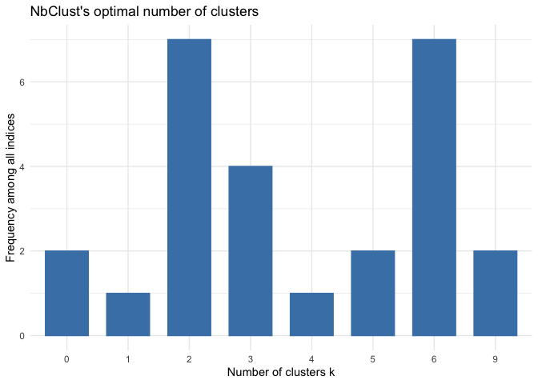

# Libraries


```r
library(readxl)
library(summarytools)
#devtools::install_github("boxuancui/DataExplorer")
library(DataExplorer)
library(kableExtra)
library(dplyr)
library(reshape2)
library(lubridate)
library(tidyverse)
#library(textshape)
library(magrittr)
library(ggplot2)
library(factoextra)
library(FactoMineR)
library(cluster)
library(clValid)
library(ape)
library(dendextend)
library(clustertend)
library(NbClust)
library(ggiraphExtra)
library(plotly)
```

# Load Data

```r
setwd("/Users/danielesilva/Documents/Data Science Projects/Data_Science/Clustering Spotify")

#load data
#font: http://organizeyourmusic.playlistmachinery.com/
#Variables:
#Genre - the genre of the track
#Year - the release year of the recording. Note that due to vagaries of releases, re-releases, re-issues and general madness, sometimes the release years are not what you'd expect.
#Added - the earliest date you added the track to your collection.
#Beats Per Minute (BPM) - The tempo of the song.
#Energy - The energy of a song - the higher the value, the more energtic. song
#Danceability - The higher the value, the easier it is to dance to this song.
#Loudness (dB) - The higher the value, the louder the song.
#Liveness - The higher the value, the more likely the song is a live recording.
#Valence - The higher the value, the more positive mood for the song.
#Length - The duration of the song.
#Acousticness - The higher the value the more acoustic the song is.
#Speechiness - The higher the value the more spoken word the song contains.
#Popularity - The higher the value the more popular the song is.
#Duration - The length of the song.

data = read_xlsx("my_top20.xlsx")
```

# Exploratory Data


```r
head(data)
```

```
## # A tibble: 6 x 13
##       N TITLE      ARTIST   RELEASE               BPM ENERGY DANCE  LOUD VALENCE
##   <dbl> <chr>      <chr>    <dttm>              <dbl>  <dbl> <dbl> <dbl>   <dbl>
## 1     1 Somebody … Gotye    2011-01-01 00:00:00   129     52    87    -7      75
## 2     2 Blinding … The Wee… 2020-03-20 00:00:00   171     73    51    -6      33
## 3     3 Café       Vitão    2019-03-08 00:00:00    92     50    78    -5      49
## 4     4 Graveto -… Marília… 2020-01-10 00:00:00    93     63    71    -5      40
## 5     5 Sei Lá     Projota  2019-04-25 00:00:00   152     43    66    -9      96
## 6     6 Don't Sta… Dua Lipa 2020-03-27 00:00:00   124     79    79    -5      68
## # … with 4 more variables: LENGTH <dttm>, ACOUSTIC <dbl>, POP. <dbl>, RND <dbl>
```

```r
summary(data) %>% kable() %>% kable_styling()
```

<table class="table" style="margin-left: auto; margin-right: auto;">
 <thead>
  <tr>
   <th style="text-align:left;">   </th>
   <th style="text-align:left;">       N </th>
   <th style="text-align:left;">    TITLE </th>
   <th style="text-align:left;">    ARTIST </th>
   <th style="text-align:left;">    RELEASE </th>
   <th style="text-align:left;">      BPM </th>
   <th style="text-align:left;">     ENERGY </th>
   <th style="text-align:left;">     DANCE </th>
   <th style="text-align:left;">      LOUD </th>
   <th style="text-align:left;">    VALENCE </th>
   <th style="text-align:left;">     LENGTH </th>
   <th style="text-align:left;">    ACOUSTIC </th>
   <th style="text-align:left;">      POP. </th>
   <th style="text-align:left;">      RND </th>
  </tr>
 </thead>
<tbody>
  <tr>
   <td style="text-align:left;">  </td>
   <td style="text-align:left;"> Min.   :  1.00 </td>
   <td style="text-align:left;"> Length:100 </td>
   <td style="text-align:left;"> Length:100 </td>
   <td style="text-align:left;"> Min.   :1966-08-05 00:00:00 </td>
   <td style="text-align:left;"> Min.   : 80.0 </td>
   <td style="text-align:left;"> Min.   :17.00 </td>
   <td style="text-align:left;"> Min.   :33.00 </td>
   <td style="text-align:left;"> Min.   :-15.00 </td>
   <td style="text-align:left;"> Min.   :10.00 </td>
   <td style="text-align:left;"> Min.   :1899-12-31 02:00:00 </td>
   <td style="text-align:left;"> Min.   : 0.00 </td>
   <td style="text-align:left;"> Min.   :30.00 </td>
   <td style="text-align:left;"> Min.   :  45 </td>
  </tr>
  <tr>
   <td style="text-align:left;">  </td>
   <td style="text-align:left;"> 1st Qu.: 25.75 </td>
   <td style="text-align:left;"> Class :character </td>
   <td style="text-align:left;"> Class :character </td>
   <td style="text-align:left;"> 1st Qu.:2018-02-16 00:00:00 </td>
   <td style="text-align:left;"> 1st Qu.:102.8 </td>
   <td style="text-align:left;"> 1st Qu.:59.75 </td>
   <td style="text-align:left;"> 1st Qu.:59.50 </td>
   <td style="text-align:left;"> 1st Qu.: -6.25 </td>
   <td style="text-align:left;"> 1st Qu.:49.00 </td>
   <td style="text-align:left;"> 1st Qu.:1899-12-31 02:50:45 </td>
   <td style="text-align:left;"> 1st Qu.: 7.75 </td>
   <td style="text-align:left;"> 1st Qu.:65.75 </td>
   <td style="text-align:left;"> 1st Qu.:2526 </td>
  </tr>
  <tr>
   <td style="text-align:left;">  </td>
   <td style="text-align:left;"> Median : 50.50 </td>
   <td style="text-align:left;"> Mode  :character </td>
   <td style="text-align:left;"> Mode  :character </td>
   <td style="text-align:left;"> Median :2019-08-16 00:00:00 </td>
   <td style="text-align:left;"> Median :123.5 </td>
   <td style="text-align:left;"> Median :72.00 </td>
   <td style="text-align:left;"> Median :69.00 </td>
   <td style="text-align:left;"> Median : -5.00 </td>
   <td style="text-align:left;"> Median :64.00 </td>
   <td style="text-align:left;"> Median :1899-12-31 03:09:30 </td>
   <td style="text-align:left;"> Median :19.00 </td>
   <td style="text-align:left;"> Median :72.50 </td>
   <td style="text-align:left;"> Median :5306 </td>
  </tr>
  <tr>
   <td style="text-align:left;">  </td>
   <td style="text-align:left;"> Mean   : 50.50 </td>
   <td style="text-align:left;"> NA </td>
   <td style="text-align:left;"> NA </td>
   <td style="text-align:left;"> Mean   :2015-09-24 07:12:00 </td>
   <td style="text-align:left;"> Mean   :126.0 </td>
   <td style="text-align:left;"> Mean   :69.58 </td>
   <td style="text-align:left;"> Mean   :67.69 </td>
   <td style="text-align:left;"> Mean   : -5.54 </td>
   <td style="text-align:left;"> Mean   :62.79 </td>
   <td style="text-align:left;"> Mean   :1899-12-31 03:14:28 </td>
   <td style="text-align:left;"> Mean   :28.22 </td>
   <td style="text-align:left;"> Mean   :72.65 </td>
   <td style="text-align:left;"> Mean   :4908 </td>
  </tr>
  <tr>
   <td style="text-align:left;">  </td>
   <td style="text-align:left;"> 3rd Qu.: 75.25 </td>
   <td style="text-align:left;"> NA </td>
   <td style="text-align:left;"> NA </td>
   <td style="text-align:left;"> 3rd Qu.:2019-12-13 00:00:00 </td>
   <td style="text-align:left;"> 3rd Qu.:146.2 </td>
   <td style="text-align:left;"> 3rd Qu.:82.25 </td>
   <td style="text-align:left;"> 3rd Qu.:78.00 </td>
   <td style="text-align:left;"> 3rd Qu.: -4.00 </td>
   <td style="text-align:left;"> 3rd Qu.:80.00 </td>
   <td style="text-align:left;"> 3rd Qu.:1899-12-31 03:35:00 </td>
   <td style="text-align:left;"> 3rd Qu.:46.25 </td>
   <td style="text-align:left;"> 3rd Qu.:83.00 </td>
   <td style="text-align:left;"> 3rd Qu.:6728 </td>
  </tr>
  <tr>
   <td style="text-align:left;">  </td>
   <td style="text-align:left;"> Max.   :100.00 </td>
   <td style="text-align:left;"> NA </td>
   <td style="text-align:left;"> NA </td>
   <td style="text-align:left;"> Max.   :2020-06-30 00:00:00 </td>
   <td style="text-align:left;"> Max.   :196.0 </td>
   <td style="text-align:left;"> Max.   :95.00 </td>
   <td style="text-align:left;"> Max.   :96.00 </td>
   <td style="text-align:left;"> Max.   :  2.00 </td>
   <td style="text-align:left;"> Max.   :97.00 </td>
   <td style="text-align:left;"> Max.   :1899-12-31 05:04:00 </td>
   <td style="text-align:left;"> Max.   :94.00 </td>
   <td style="text-align:left;"> Max.   :97.00 </td>
   <td style="text-align:left;"> Max.   :9945 </td>
  </tr>
</tbody>
</table>

```r
#glimpse(data) %>% kable() %>% kable_styling()

#st_options(plain.ascii = FALSE)

print(dfSummary(data, graph.magnif = 0.75), method = 'render')
```

```{=html}
<div class="container st-container">
<h3>Data Frame Summary</h3>
<h4>data</h4>
<strong>Dimensions</strong>: 100 x 13
  <br/><strong>Duplicates</strong>: 0
<br/>
<table class="table table-striped table-bordered st-table st-table-striped st-table-bordered st-multiline ">
  <thead>
    <tr>
      <th align="center" class="st-protect-top-border"><strong>No</strong></th>
      <th align="center" class="st-protect-top-border"><strong>Variable</strong></th>
      <th align="center" class="st-protect-top-border"><strong>Stats / Values</strong></th>
      <th align="center" class="st-protect-top-border"><strong>Freqs (% of Valid)</strong></th>
      <th align="center" class="st-protect-top-border"><strong>Graph</strong></th>
      <th align="center" class="st-protect-top-border"><strong>Valid</strong></th>
      <th align="center" class="st-protect-top-border"><strong>Missing</strong></th>
    </tr>
  </thead>
  <tbody>
    <tr>
      <td align="center">1</td>
      <td align="left">N
[numeric]</td>
      <td align="left">Mean (sd) : 50.5 (29)
min < med < max:
1 < 50.5 < 100
IQR (CV) : 49.5 (0.6)</td>
      <td align="left" style="vertical-align:middle">100 distinct values</td>
      <td align="left" style="vertical-align:middle;padding:0;background-color:transparent"></td>
      <td align="center">100
(100.0%)</td>
      <td align="center">0
(0.0%)</td>
    </tr>
    <tr>
      <td align="center">2</td>
      <td align="left">TITLE
[character]</td>
      <td align="left">1. 3 Batidas - Ao Vivo
2. A Gente Fez Amor - Ao Viv
3. Adore You
4. A&#0237; Eu Bebo - Ao Vivo
5. Amor de Que
6. Barzinho Aleat&#0243;rio - Ao V
7. Beba&#0231;a - Ao Vivo
8. Bebi Minha Bicicleta (Cor
9. Blinding Lights
10. BRABA
[ 90 others ]</td>
      <td align="left" style="padding:0;vertical-align:middle"><table style="border-collapse:collapse;border:none;margin:0"><tr style="background-color:transparent"><td style="padding:0 5px 0 7px;margin:0;border:0" align="right">1</td><td style="padding:0 2px 0 0;border:0;" align="left">(</td><td style="padding:0;border:0" align="right">1.0%</td><td style="padding:0 4px 0 2px;border:0" align="left">)</td></tr><tr style="background-color:transparent"><td style="padding:0 5px 0 7px;margin:0;border:0" align="right">1</td><td style="padding:0 2px 0 0;border:0;" align="left">(</td><td style="padding:0;border:0" align="right">1.0%</td><td style="padding:0 4px 0 2px;border:0" align="left">)</td></tr><tr style="background-color:transparent"><td style="padding:0 5px 0 7px;margin:0;border:0" align="right">1</td><td style="padding:0 2px 0 0;border:0;" align="left">(</td><td style="padding:0;border:0" align="right">1.0%</td><td style="padding:0 4px 0 2px;border:0" align="left">)</td></tr><tr style="background-color:transparent"><td style="padding:0 5px 0 7px;margin:0;border:0" align="right">1</td><td style="padding:0 2px 0 0;border:0;" align="left">(</td><td style="padding:0;border:0" align="right">1.0%</td><td style="padding:0 4px 0 2px;border:0" align="left">)</td></tr><tr style="background-color:transparent"><td style="padding:0 5px 0 7px;margin:0;border:0" align="right">1</td><td style="padding:0 2px 0 0;border:0;" align="left">(</td><td style="padding:0;border:0" align="right">1.0%</td><td style="padding:0 4px 0 2px;border:0" align="left">)</td></tr><tr style="background-color:transparent"><td style="padding:0 5px 0 7px;margin:0;border:0" align="right">1</td><td style="padding:0 2px 0 0;border:0;" align="left">(</td><td style="padding:0;border:0" align="right">1.0%</td><td style="padding:0 4px 0 2px;border:0" align="left">)</td></tr><tr style="background-color:transparent"><td style="padding:0 5px 0 7px;margin:0;border:0" align="right">1</td><td style="padding:0 2px 0 0;border:0;" align="left">(</td><td style="padding:0;border:0" align="right">1.0%</td><td style="padding:0 4px 0 2px;border:0" align="left">)</td></tr><tr style="background-color:transparent"><td style="padding:0 5px 0 7px;margin:0;border:0" align="right">1</td><td style="padding:0 2px 0 0;border:0;" align="left">(</td><td style="padding:0;border:0" align="right">1.0%</td><td style="padding:0 4px 0 2px;border:0" align="left">)</td></tr><tr style="background-color:transparent"><td style="padding:0 5px 0 7px;margin:0;border:0" align="right">1</td><td style="padding:0 2px 0 0;border:0;" align="left">(</td><td style="padding:0;border:0" align="right">1.0%</td><td style="padding:0 4px 0 2px;border:0" align="left">)</td></tr><tr style="background-color:transparent"><td style="padding:0 5px 0 7px;margin:0;border:0" align="right">1</td><td style="padding:0 2px 0 0;border:0;" align="left">(</td><td style="padding:0;border:0" align="right">1.0%</td><td style="padding:0 4px 0 2px;border:0" align="left">)</td></tr><tr style="background-color:transparent"><td style="padding:0 5px 0 7px;margin:0;border:0" align="right">90</td><td style="padding:0 2px 0 0;border:0;" align="left">(</td><td style="padding:0;border:0" align="right">90.0%</td><td style="padding:0 4px 0 2px;border:0" align="left">)</td></tr></table></td>
      <td align="left" style="vertical-align:middle;padding:0;background-color:transparent"></td>
      <td align="center">100
(100.0%)</td>
      <td align="center">0
(0.0%)</td>
    </tr>
    <tr>
      <td align="center">3</td>
      <td align="left">ARTIST
[character]</td>
      <td align="left">1. Mar&#0237;lia Mendon&#0231;a
2. Vit&#0227;o
3. Dua Lipa
4. Eminem
5. Z&#0233; Neto & Cristiano
6. Anitta
7. Bastille
8. Ed Sheeran
9. Harry Styles
10. Henrique & Juliano
[ 61 others ]</td>
      <td align="left" style="padding:0;vertical-align:middle"><table style="border-collapse:collapse;border:none;margin:0"><tr style="background-color:transparent"><td style="padding:0 5px 0 7px;margin:0;border:0" align="right">5</td><td style="padding:0 2px 0 0;border:0;" align="left">(</td><td style="padding:0;border:0" align="right">5.0%</td><td style="padding:0 4px 0 2px;border:0" align="left">)</td></tr><tr style="background-color:transparent"><td style="padding:0 5px 0 7px;margin:0;border:0" align="right">4</td><td style="padding:0 2px 0 0;border:0;" align="left">(</td><td style="padding:0;border:0" align="right">4.0%</td><td style="padding:0 4px 0 2px;border:0" align="left">)</td></tr><tr style="background-color:transparent"><td style="padding:0 5px 0 7px;margin:0;border:0" align="right">3</td><td style="padding:0 2px 0 0;border:0;" align="left">(</td><td style="padding:0;border:0" align="right">3.0%</td><td style="padding:0 4px 0 2px;border:0" align="left">)</td></tr><tr style="background-color:transparent"><td style="padding:0 5px 0 7px;margin:0;border:0" align="right">3</td><td style="padding:0 2px 0 0;border:0;" align="left">(</td><td style="padding:0;border:0" align="right">3.0%</td><td style="padding:0 4px 0 2px;border:0" align="left">)</td></tr><tr style="background-color:transparent"><td style="padding:0 5px 0 7px;margin:0;border:0" align="right">3</td><td style="padding:0 2px 0 0;border:0;" align="left">(</td><td style="padding:0;border:0" align="right">3.0%</td><td style="padding:0 4px 0 2px;border:0" align="left">)</td></tr><tr style="background-color:transparent"><td style="padding:0 5px 0 7px;margin:0;border:0" align="right">2</td><td style="padding:0 2px 0 0;border:0;" align="left">(</td><td style="padding:0;border:0" align="right">2.0%</td><td style="padding:0 4px 0 2px;border:0" align="left">)</td></tr><tr style="background-color:transparent"><td style="padding:0 5px 0 7px;margin:0;border:0" align="right">2</td><td style="padding:0 2px 0 0;border:0;" align="left">(</td><td style="padding:0;border:0" align="right">2.0%</td><td style="padding:0 4px 0 2px;border:0" align="left">)</td></tr><tr style="background-color:transparent"><td style="padding:0 5px 0 7px;margin:0;border:0" align="right">2</td><td style="padding:0 2px 0 0;border:0;" align="left">(</td><td style="padding:0;border:0" align="right">2.0%</td><td style="padding:0 4px 0 2px;border:0" align="left">)</td></tr><tr style="background-color:transparent"><td style="padding:0 5px 0 7px;margin:0;border:0" align="right">2</td><td style="padding:0 2px 0 0;border:0;" align="left">(</td><td style="padding:0;border:0" align="right">2.0%</td><td style="padding:0 4px 0 2px;border:0" align="left">)</td></tr><tr style="background-color:transparent"><td style="padding:0 5px 0 7px;margin:0;border:0" align="right">2</td><td style="padding:0 2px 0 0;border:0;" align="left">(</td><td style="padding:0;border:0" align="right">2.0%</td><td style="padding:0 4px 0 2px;border:0" align="left">)</td></tr><tr style="background-color:transparent"><td style="padding:0 5px 0 7px;margin:0;border:0" align="right">72</td><td style="padding:0 2px 0 0;border:0;" align="left">(</td><td style="padding:0;border:0" align="right">72.0%</td><td style="padding:0 4px 0 2px;border:0" align="left">)</td></tr></table></td>
      <td align="left" style="vertical-align:middle;padding:0;background-color:transparent"></td>
      <td align="center">100
(100.0%)</td>
      <td align="center">0
(0.0%)</td>
    </tr>
    <tr>
      <td align="center">4</td>
      <td align="left">RELEASE
[POSIXct, POSIXt]</td>
      <td align="left">min : 1966-08-05
med : 2019-08-16
max : 2020-06-30
range : 53y 10m 25d</td>
      <td align="left" style="vertical-align:middle">83 distinct values</td>
      <td align="left" style="vertical-align:middle;padding:0;background-color:transparent"></td>
      <td align="center">100
(100.0%)</td>
      <td align="center">0
(0.0%)</td>
    </tr>
    <tr>
      <td align="center">5</td>
      <td align="left">BPM
[numeric]</td>
      <td align="left">Mean (sd) : 126 (27.3)
min < med < max:
80 < 123.5 < 196
IQR (CV) : 43.5 (0.2)</td>
      <td align="left" style="vertical-align:middle">56 distinct values</td>
      <td align="left" style="vertical-align:middle;padding:0;background-color:transparent"></td>
      <td align="center">100
(100.0%)</td>
      <td align="center">0
(0.0%)</td>
    </tr>
    <tr>
      <td align="center">6</td>
      <td align="left">ENERGY
[numeric]</td>
      <td align="left">Mean (sd) : 69.6 (17.3)
min < med < max:
17 < 72 < 95
IQR (CV) : 22.5 (0.2)</td>
      <td align="left" style="vertical-align:middle">54 distinct values</td>
      <td align="left" style="vertical-align:middle;padding:0;background-color:transparent"></td>
      <td align="center">100
(100.0%)</td>
      <td align="center">0
(0.0%)</td>
    </tr>
    <tr>
      <td align="center">7</td>
      <td align="left">DANCE
[numeric]</td>
      <td align="left">Mean (sd) : 67.7 (13.9)
min < med < max:
33 < 69 < 96
IQR (CV) : 18.5 (0.2)</td>
      <td align="left" style="vertical-align:middle">47 distinct values</td>
      <td align="left" style="vertical-align:middle;padding:0;background-color:transparent"></td>
      <td align="center">100
(100.0%)</td>
      <td align="center">0
(0.0%)</td>
    </tr>
    <tr>
      <td align="center">8</td>
      <td align="left">LOUD
[numeric]</td>
      <td align="left">Mean (sd) : -5.5 (2.3)
min < med < max:
-15 < -5 < 2
IQR (CV) : 2.2 (-0.4)</td>
      <td align="left" style="vertical-align:middle">13 distinct values</td>
      <td align="left" style="vertical-align:middle;padding:0;background-color:transparent"></td>
      <td align="center">100
(100.0%)</td>
      <td align="center">0
(0.0%)</td>
    </tr>
    <tr>
      <td align="center">9</td>
      <td align="left">VALENCE
[numeric]</td>
      <td align="left">Mean (sd) : 62.8 (20.9)
min < med < max:
10 < 64 < 97
IQR (CV) : 31 (0.3)</td>
      <td align="left" style="vertical-align:middle">56 distinct values</td>
      <td align="left" style="vertical-align:middle;padding:0;background-color:transparent"></td>
      <td align="center">100
(100.0%)</td>
      <td align="center">0
(0.0%)</td>
    </tr>
    <tr>
      <td align="center">10</td>
      <td align="left">LENGTH
[POSIXct, POSIXt]</td>
      <td align="left">min : 1899-12-31 02:00:00
med : 1899-12-31 03:09:30
max : 1899-12-31 05:04:00
range : 3H 4M 0S</td>
      <td align="left" style="vertical-align:middle">72 distinct values</td>
      <td align="left" style="vertical-align:middle;padding:0;background-color:transparent"></td>
      <td align="center">100
(100.0%)</td>
      <td align="center">0
(0.0%)</td>
    </tr>
    <tr>
      <td align="center">11</td>
      <td align="left">ACOUSTIC
[numeric]</td>
      <td align="left">Mean (sd) : 28.2 (25.1)
min < med < max:
0 < 19 < 94
IQR (CV) : 38.5 (0.9)</td>
      <td align="left" style="vertical-align:middle">60 distinct values</td>
      <td align="left" style="vertical-align:middle;padding:0;background-color:transparent"></td>
      <td align="center">100
(100.0%)</td>
      <td align="center">0
(0.0%)</td>
    </tr>
    <tr>
      <td align="center">12</td>
      <td align="left">POP.
[numeric]</td>
      <td align="left">Mean (sd) : 72.7 (11.4)
min < med < max:
30 < 72.5 < 97
IQR (CV) : 17.2 (0.2)</td>
      <td align="left" style="vertical-align:middle">37 distinct values</td>
      <td align="left" style="vertical-align:middle;padding:0;background-color:transparent"></td>
      <td align="center">100
(100.0%)</td>
      <td align="center">0
(0.0%)</td>
    </tr>
    <tr>
      <td align="center">13</td>
      <td align="left">RND
[numeric]</td>
      <td align="left">Mean (sd) : 4907.8 (2795.6)
min < med < max:
45 < 5306.5 < 9945
IQR (CV) : 4202 (0.6)</td>
      <td align="left" style="vertical-align:middle">100 distinct values</td>
      <td align="left" style="vertical-align:middle;padding:0;background-color:transparent"></td>
      <td align="center">100
(100.0%)</td>
      <td align="center">0
(0.0%)</td>
    </tr>
  </tbody>
</table>
<p>Generated by <a href='https://github.com/dcomtois/summarytools'>summarytools</a> 0.9.9 (<a href='https://www.r-project.org/'>R</a> version 4.0.4)<br/>2021-04-04</p>
</div>
```

```r
#DataExplorer

plot_str(data)

plot_missing(data)
```

<!-- -->

```r
plot_histogram(data)
```

<!-- -->

```r
plot_correlation(data, type = 'continuous')
```

<!-- -->

```r
#plot_bar(data) 

#plot_boxplot(data) 
```

# Tratamento de Dados


```r
names(data) = make.names(names(data))
names(data)
```

```
##  [1] "N"        "TITLE"    "ARTIST"   "RELEASE"  "BPM"      "ENERGY"  
##  [7] "DANCE"    "LOUD"     "VALENCE"  "LENGTH"   "ACOUSTIC" "POP."    
## [13] "RND"
```

```r
#remove duplicates
data_numeric = data %>%
        unique() %>%
#transform lenght
        mutate(DURATION = ms(format(as.POSIXct(strptime(LENGTH, "%Y-%m-%d %H:%M:%S",tz="")), format= "%H:%M")))%>%
#keep just numeric variables
        select(-N,-TITLE,-ARTIST,-RELEASE,-RND,-POP.,-LENGTH) 
#create y for vtreat
#        mutate(y = rowSums(across(where(is.numeric))))

str(data_numeric)
```

```
## tibble [100 × 7] (S3: tbl_df/tbl/data.frame)
##  $ BPM     : num [1:100] 129 171 92 93 152 124 98 138 130 95 ...
##  $ ENERGY  : num [1:100] 52 73 50 63 43 79 59 28 48 82 ...
##  $ DANCE   : num [1:100] 87 51 78 71 66 79 82 58 73 55 ...
##  $ LOUD    : num [1:100] -7 -6 -5 -5 -9 -5 -6 -9 -7 -4 ...
##  $ VALENCE : num [1:100] 75 33 49 40 96 68 51 81 50 56 ...
##  $ ACOUSTIC: num [1:100] 55 0 5 29 52 1 69 94 57 12 ...
##  $ DURATION:Formal class 'Period' [package "lubridate"] with 6 slots
##   .. ..@ .Data : num [1:100] 5 20 10 51 10 3 29 7 59 54 ...
##   .. ..@ year  : num [1:100] 0 0 0 0 0 0 0 0 0 0 ...
##   .. ..@ month : num [1:100] 0 0 0 0 0 0 0 0 0 0 ...
##   .. ..@ day   : num [1:100] 0 0 0 0 0 0 0 0 0 0 ...
##   .. ..@ hour  : num [1:100] 0 0 0 0 0 0 0 0 0 0 ...
##   .. ..@ minute: num [1:100] 4 3 3 2 3 3 3 2 2 2 ...
```

```r
#scale data
data_scale = as.data.frame(scale(data_numeric))

ggplot(stack(data_scale), aes(x=ind, y=values)) + geom_boxplot(aes(fill=ind))
```

<!-- -->

```r
#outliers in energy and loud

#Title to rownames

rownames(data_scale) = data$TITLE
```

# Choose the optimal number of cluster


```r
set.seed(1990)

#os dados são clusterizaveis?
hopkins(data_scale, n = nrow(data_scale)-1)
```

```
## $H
## [1] 0.3868532
```

```r
res.pca <- PCA(data_scale,  graph = FALSE)
# Visualize
fviz_screeplot(res.pca, addlabels = TRUE, ylim = c(0, 50))
```

<!-- -->

```r
# results for variables
var <- get_pca_var(res.pca)
# Contributions of variables to PC1
fviz_contrib(res.pca, choice = "var", axes = 1, top = 10)
```

<!-- -->

```r
# Contributions of variables to PC2
fviz_contrib(res.pca, choice = "var", axes = 2, top = 10)
```

<!-- -->

```r
# Control variable colors using their contributions to the principle axis
fviz_pca_var(res.pca, col.var="contrib",
             gradient.cols = c("#00AFBB", "#E7B800", "#FC4E07"),
             repel = TRUE # Avoid text overlapping
             ) + theme_minimal() + ggtitle("Variables - PCA")
```

<!-- -->

```r
# 1 - Elbow

fviz_nbclust(data_scale, kmeans, method = "wss", k.max = 24) + theme_minimal() + ggtitle("the Elbow Method")
```

<!-- -->

```r
# 2 - Gap

gap_stat <- clusGap(data_scale, FUN = kmeans, nstart = 30, K.max = 24, B = 50)
fviz_gap_stat(gap_stat) + theme_minimal() + ggtitle("fviz_gap_stat: Gap Statistic")
```

<!-- -->

```r
# 3 - Silhouette

fviz_nbclust(data_scale, kmeans, method = "silhouette", k.max = 24) + theme_minimal() + ggtitle("The Silhouette Plot")
```

<!-- -->

```r
# 4 - Sum of Squares 

#The above example would group the data into two clusters, centers = 2, and attempt #multiple initial configurations, reporting on the best one. For example, as this #algorithm is sensitive to the initial positions of the cluster centroids adding nstart #= 30 will generate 30 initial configurations and then average all the centroid #results.

km2 <- kmeans(data_scale, 2, nstart = 30)
km3 <- kmeans(data_scale, 3, nstart = 30)
km4 <- kmeans(data_scale, 4)
km5 <- kmeans(data_scale, 5)
km6 <- kmeans(data_scale, 6)
km7 <- kmeans(data_scale, 7)
km8 <- kmeans(data_scale, 8)
km9 <- kmeans(data_scale, 9)
km10 <- kmeans(data_scale, 10)

ssc <- data.frame(
  kmeans = c(2,3,4,5,6,7,8,9,10),
  within_ss = c(mean(km2$withinss), mean(km3$withinss), mean(km4$withinss), mean(km5$withinss), mean(km6$withinss), mean(km7$withinss), mean(km8$withinss), mean(km9$withinss), mean(km10$withinss)),
  between_ss = c(km2$betweenss, km3$betweenss, km4$betweenss, km5$betweenss, km6$betweenss, km7$betweenss, km8$betweenss, km9$betweenss, km10$betweenss)
)

ssc %<>% gather(., key = "measurement", value = value, -kmeans)


ssc %>% ggplot(., aes(x=kmeans, y=log10(value), fill = measurement)) + geom_bar(stat = "identity", position = "dodge") + ggtitle("Cluster Model Comparison") + xlab("Number of Clusters") + ylab("Log10 Total Sum of Squares") + scale_x_discrete(name = "Number of Clusters", limits = c("0", "2", "3", "4", "5", "6", "7", "8", "9", "10"))
```

<!-- -->

```r
# 5 - NbClust 

res.nbclust <- NbClust(data_scale, distance = "euclidean",
                  min.nc = 2, max.nc = 9, 
                  method = "complete", index ="all")
```

<!-- -->

```
## *** : The Hubert index is a graphical method of determining the number of clusters.
##                 In the plot of Hubert index, we seek a significant knee that corresponds to a 
##                 significant increase of the value of the measure i.e the significant peak in Hubert
##                 index second differences plot. 
## 
```

<!-- -->

```
## *** : The D index is a graphical method of determining the number of clusters. 
##                 In the plot of D index, we seek a significant knee (the significant peak in Dindex
##                 second differences plot) that corresponds to a significant increase of the value of
##                 the measure. 
##  
## ******************************************************************* 
## * Among all indices:                                                
## * 7 proposed 2 as the best number of clusters 
## * 4 proposed 3 as the best number of clusters 
## * 1 proposed 4 as the best number of clusters 
## * 2 proposed 5 as the best number of clusters 
## * 7 proposed 6 as the best number of clusters 
## * 2 proposed 9 as the best number of clusters 
## 
##                    ***** Conclusion *****                            
##  
## * According to the majority rule, the best number of clusters is  2 
##  
##  
## *******************************************************************
```

```r
factoextra::fviz_nbclust(res.nbclust) + theme_minimal() + ggtitle("NbClust's optimal number of clusters")
```

```
## Warning in if (class(best_nc) == "numeric") print(best_nc) else if
## (class(best_nc) == : the condition has length > 1 and only the first element
## will be used
```

```
## Warning in if (class(best_nc) == "matrix") .viz_NbClust(x, print.summary, : the
## condition has length > 1 and only the first element will be used
```

```
## Warning in if (class(best_nc) == "numeric") print(best_nc) else if
## (class(best_nc) == : the condition has length > 1 and only the first element
## will be used
```

```
## Warning in if (class(best_nc) == "matrix") {: the condition has length > 1 and
## only the first element will be used
```

```
## Among all indices: 
## ===================
## * 2 proposed  0 as the best number of clusters
## * 1 proposed  1 as the best number of clusters
## * 7 proposed  2 as the best number of clusters
## * 4 proposed  3 as the best number of clusters
## * 1 proposed  4 as the best number of clusters
## * 2 proposed  5 as the best number of clusters
## * 7 proposed  6 as the best number of clusters
## * 2 proposed  9 as the best number of clusters
## 
## Conclusion
## =========================
## * According to the majority rule, the best number of clusters is  2 .
```

<!-- -->

# Clustering


```r
intern <- clValid(data_scale, nClust = 2:24, 
              clMethods = c("hierarchical","kmeans","pam","clara"), validation = "internal")
# Summary
summary(intern) %>% kable() %>% kable_styling()
```

```
## 
## Clustering Methods:
##  hierarchical kmeans pam clara 
## 
## Cluster sizes:
##  2 3 4 5 6 7 8 9 10 11 12 13 14 15 16 17 18 19 20 21 22 23 24 
## 
## Validation Measures:
##                                   2        3        4        5        6        7        8        9       10       11       12       13       14       15       16       17       18       19       20       21       22       23       24
##                                                                                                                                                                                                                                          
## hierarchical Connectivity    2.9290  14.9460  19.0956  22.2385  36.2270  38.7056  54.7960  69.6940  72.1202  73.4536  87.0024  91.6425  94.1131  98.5024 100.9813 102.8948 104.6071 113.9536 116.3798 118.4131 119.2004 121.4599 122.9460
##              Dunn            0.3282   0.2925   0.2962   0.2962   0.2687   0.2687   0.2315   0.2022   0.2022   0.2022   0.2481   0.2481   0.2611   0.2611   0.2646   0.2646   0.2646   0.3362   0.3362   0.3362   0.3362   0.3362   0.3362
##              Silhouette      0.3055   0.2607   0.2219   0.2054   0.1563   0.1354   0.1495   0.1360   0.1228   0.1177   0.1485   0.1523   0.1273   0.1233   0.1298   0.1327   0.1271   0.1551   0.1476   0.1444   0.1462   0.1448   0.1442
## kmeans       Connectivity   28.0599  56.5659  70.6885  78.1079  83.8242  81.9790  91.8079  98.8040 101.2929 103.1262 113.5730 114.8782 112.1492 113.7115 117.8000 122.4063 128.5587 133.7075 137.0837 141.1226 146.1909 149.8587 147.7857
##              Dunn            0.2239   0.1438   0.1480   0.1711   0.2130   0.2163   0.2175   0.2246   0.2246   0.2246   0.2162   0.2162   0.2725   0.2709   0.2709   0.2723   0.2378   0.2828   0.2828   0.2828   0.2838   0.2838   0.2850
##              Silhouette      0.2401   0.1449   0.1716   0.1598   0.1604   0.1718   0.1740   0.1857   0.1807   0.1740   0.1673   0.1661   0.1699   0.1746   0.1730   0.1690   0.1598   0.1631   0.1617   0.1580   0.1619   0.1576   0.1727
## pam          Connectivity   52.8937  67.2933 101.6187  93.7992 108.5433 105.4698 106.6952 110.8313 112.4298 114.7060 115.1587 119.2746 124.5937 126.9611 130.3425 131.8520 135.5048 140.7603 143.1270 147.2710 154.3119 158.4560 152.8210
##              Dunn            0.1290   0.1342   0.1562   0.1480   0.1279   0.1279   0.1533   0.1406   0.1502   0.1673   0.1673   0.1673   0.1673   0.1949   0.1949   0.2081   0.2081   0.2081   0.2081   0.2081   0.2111   0.2424   0.2111
##              Silhouette      0.1946   0.1346   0.0980   0.1273   0.1247   0.1116   0.1424   0.1232   0.1221   0.1206   0.1300   0.1278   0.1247   0.1261   0.1327   0.1368   0.1383   0.1409   0.1397   0.1391   0.1337   0.1330   0.1427
## clara        Connectivity   63.3198  66.9361  92.1540 109.1377  88.2468 100.7560 111.7020 112.4694 121.3897 124.5119 125.5841 119.7817 137.0821 127.9401 144.2286 134.6952 147.3790 144.5032 144.0798 151.0274 155.8020 151.0313 154.0948
##              Dunn            0.0877   0.1436   0.1201   0.1323   0.1466   0.1325   0.1343   0.1423   0.1543   0.1817   0.1963   0.2184   0.2268   0.1997   0.1947   0.1982   0.1947   0.2081   0.2111   0.2666   0.2080   0.2666   0.1920
##              Silhouette      0.1510   0.1360   0.0970   0.1064   0.1222   0.1211   0.1260   0.1326   0.1191   0.1215   0.0948   0.1177   0.1209   0.1232   0.1208   0.1187   0.1171   0.1225   0.1281   0.1306   0.1158   0.1139   0.1394
## 
## Optimal Scores:
## 
##              Score  Method       Clusters
## Connectivity 2.9290 hierarchical 2       
## Dunn         0.3362 hierarchical 19      
## Silhouette   0.3055 hierarchical 2
```

<table class="table" style="margin-left: auto; margin-right: auto;">
<tbody>
  <tr>

  </tr>
</tbody>
</table>

```r
# Dendogram
d <- dist(data_scale, method = "euclidean")
res.hc <- hclust(d, method = "ward.D2" )
# Cut tree into 6 groups
grp <- cutree(res.hc, k = 6)
# Visualize
#plot(res.hc, cex = 0.5) # plot tree

# Color labels by specifying the number of cluster (k)
colors = RColorBrewer::brewer.pal(6,"Set2")

dend = as.dendrogram(res.hc)
labels_cex(dend) = 0.5
dend %>% set("labels_col", value = colors, k=6) %>% 
          plot(main = "Color labels \nper cluster", cex = 1)
```

<!-- -->

```r
plot(as.phylo(res.hc), type = "fan", tip.color = colors[grp],
     label.offset = 1, cex = 0.5)
```

<!-- -->

```r
#clara

# Execution of k-means with k=5
clara_clust <- clara(data_scale, 6, samples = 100)
fviz_cluster(clara_clust, data = data_scale, ellipse.type = "norm", geom = "text", 
             labelsize = 8, palette = colors, show.clust.cent = T) + theme_minimal() +
        ggtitle("k = 6")
```

<!-- -->

# Resultados


```r
data_clusters = as.data.frame(data) %>% 
        mutate(Cluster = as.factor(grp)) %>% 
        mutate(DURATION = ms(format(as.POSIXct(strptime(LENGTH, "%Y-%m-%d %H:%M:%S",tz="")), format= "%H:%M")))
        
aggregate(data = data_clusters[,c(5:11,14:15)], . ~ Cluster, mean) %>% kable() %>% kable_styling()
```

<table class="table" style="margin-left: auto; margin-right: auto;">
 <thead>
  <tr>
   <th style="text-align:left;"> Cluster </th>
   <th style="text-align:right;"> BPM </th>
   <th style="text-align:right;"> ENERGY </th>
   <th style="text-align:right;"> DANCE </th>
   <th style="text-align:right;"> LOUD </th>
   <th style="text-align:right;"> VALENCE </th>
   <th style="text-align:right;"> LENGTH </th>
   <th style="text-align:right;"> ACOUSTIC </th>
   <th style="text-align:right;"> DURATION </th>
  </tr>
 </thead>
<tbody>
  <tr>
   <td style="text-align:left;"> 1 </td>
   <td style="text-align:right;"> 118.8571 </td>
   <td style="text-align:right;"> 49.00000 </td>
   <td style="text-align:right;"> 74.00000 </td>
   <td style="text-align:right;"> -7.571429 </td>
   <td style="text-align:right;"> 76.85714 </td>
   <td style="text-align:right;"> -2209063449 </td>
   <td style="text-align:right;"> 63.285714 </td>
   <td style="text-align:right;"> 15.857143 </td>
  </tr>
  <tr>
   <td style="text-align:left;"> 2 </td>
   <td style="text-align:right;"> 134.5625 </td>
   <td style="text-align:right;"> 76.75000 </td>
   <td style="text-align:right;"> 47.00000 </td>
   <td style="text-align:right;"> -5.125000 </td>
   <td style="text-align:right;"> 39.25000 </td>
   <td style="text-align:right;"> -2209063365 </td>
   <td style="text-align:right;"> 33.750000 </td>
   <td style="text-align:right;"> 28.500000 </td>
  </tr>
  <tr>
   <td style="text-align:left;"> 3 </td>
   <td style="text-align:right;"> 113.3077 </td>
   <td style="text-align:right;"> 72.69231 </td>
   <td style="text-align:right;"> 75.53846 </td>
   <td style="text-align:right;"> -5.230769 </td>
   <td style="text-align:right;"> 65.61538 </td>
   <td style="text-align:right;"> -2209063329 </td>
   <td style="text-align:right;"> 9.307692 </td>
   <td style="text-align:right;"> 8.615385 </td>
  </tr>
  <tr>
   <td style="text-align:left;"> 4 </td>
   <td style="text-align:right;"> 102.9545 </td>
   <td style="text-align:right;"> 69.09091 </td>
   <td style="text-align:right;"> 70.95455 </td>
   <td style="text-align:right;"> -5.590909 </td>
   <td style="text-align:right;"> 55.50000 </td>
   <td style="text-align:right;"> -2209063091 </td>
   <td style="text-align:right;"> 24.181818 </td>
   <td style="text-align:right;"> 40.909091 </td>
  </tr>
  <tr>
   <td style="text-align:left;"> 5 </td>
   <td style="text-align:right;"> 144.1944 </td>
   <td style="text-align:right;"> 76.36111 </td>
   <td style="text-align:right;"> 73.63889 </td>
   <td style="text-align:right;"> -4.500000 </td>
   <td style="text-align:right;"> 79.38889 </td>
   <td style="text-align:right;"> -2209064387 </td>
   <td style="text-align:right;"> 23.416667 </td>
   <td style="text-align:right;"> 35.222222 </td>
  </tr>
  <tr>
   <td style="text-align:left;"> 6 </td>
   <td style="text-align:right;"> 113.6667 </td>
   <td style="text-align:right;"> 28.83333 </td>
   <td style="text-align:right;"> 50.83333 </td>
   <td style="text-align:right;"> -11.000000 </td>
   <td style="text-align:right;"> 30.16667 </td>
   <td style="text-align:right;"> -2209061010 </td>
   <td style="text-align:right;"> 57.166667 </td>
   <td style="text-align:right;"> 16.500000 </td>
  </tr>
</tbody>
</table>

```r
data_df <- as.data.frame(data_scale) %>% rownames_to_column()
cluster_pos <- as.data.frame(grp) %>% rownames_to_column()

colnames(cluster_pos) <- c("rowname", "cluster")

data_scale_cl <- inner_join(cluster_pos, data_df)
```

```
## Joining, by = "rowname"
```

```r
ggRadar(data_scale_cl[-1], aes(group = cluster), rescale = FALSE, 
        legend.position = "none", size = 1, interactive = FALSE, use.label = TRUE) +
        facet_wrap(~cluster) + scale_y_discrete(breaks = NULL) + # don't show ticks
        theme(axis.text.x = element_text(size = 10)) + 
        scale_fill_manual(values = rep(colors, nrow(data_scale_cl))) +
        scale_color_manual(values = rep(colors, nrow(data_scale_cl))) +
        ggtitle("Music Attributes per Cluster")
```

<!-- -->

```r
#arrange data for plots

data_plot = melt(data_clusters, id.vars = c("N","Cluster"), 
                 measure.vars = c("BPM", "ENERGY", "DANCE",  "LOUD", "VALENCE",
                                  "ACOUSTIC"),
                 variable.name = "VAR",
                 value.name = "Value") 

p_ALL=  ggplot(data = data_plot, aes(x=Value, fill=Cluster)) +
        geom_density(alpha=0.5) + 
        scale_fill_brewer(palette = "Set2") +
        facet_wrap(. ~ VAR, scales = "free")
        

subplot(ggplotly(p_ALL))
```

```{=html}
<div id="htmlwidget-c63473440018f3132524" style="width:672px;height:480px;" class="plotly html-widget"></div>
<script type="application/json" data-for="htmlwidget-c63473440018f3132524">{"x":{"data":[{"x":[80,80.2270058708415,80.454011741683,80.6810176125245,80.908023483366,81.1350293542074,81.3620352250489,81.5890410958904,81.8160469667319,82.0430528375734,82.2700587084149,82.4970645792564,82.7240704500978,82.9510763209393,83.1780821917808,83.4050880626223,83.6320939334638,83.8590998043053,84.0861056751468,84.3131115459883,84.5401174168297,84.7671232876712,84.9941291585127,85.2211350293542,85.4481409001957,85.6751467710372,85.9021526418787,86.1291585127202,86.3561643835616,86.5831702544031,86.8101761252446,87.0371819960861,87.2641878669276,87.4911937377691,87.7181996086106,87.9452054794521,88.1722113502935,88.399217221135,88.6262230919765,88.853228962818,89.0802348336595,89.307240704501,89.5342465753425,89.761252446184,89.9882583170254,90.2152641878669,90.4422700587084,90.6692759295499,90.8962818003914,91.1232876712329,91.3502935420744,91.5772994129158,91.8043052837573,92.0313111545988,92.2583170254403,92.4853228962818,92.7123287671233,92.9393346379648,93.1663405088063,93.3933463796478,93.6203522504892,93.8473581213307,94.0743639921722,94.3013698630137,94.5283757338552,94.7553816046967,94.9823874755382,95.2093933463796,95.4363992172211,95.6634050880626,95.8904109589041,96.1174168297456,96.3444227005871,96.5714285714286,96.7984344422701,97.0254403131115,97.252446183953,97.4794520547945,97.706457925636,97.9334637964775,98.160469667319,98.3874755381605,98.614481409002,98.8414872798434,99.0684931506849,99.2954990215264,99.5225048923679,99.7495107632094,99.9765166340509,100.203522504892,100.430528375734,100.657534246575,100.884540117417,101.111545988258,101.3385518591,101.565557729941,101.792563600783,102.019569471624,102.246575342466,102.473581213307,102.700587084149,102.92759295499,103.154598825832,103.381604696673,103.608610567515,103.835616438356,104.062622309198,104.289628180039,104.516634050881,104.743639921722,104.970645792564,105.197651663405,105.424657534247,105.651663405088,105.87866927593,106.105675146771,106.332681017613,106.559686888454,106.786692759296,107.013698630137,107.240704500978,107.46771037182,107.694716242661,107.921722113503,108.148727984344,108.375733855186,108.602739726027,108.829745596869,109.05675146771,109.283757338552,109.510763209393,109.737769080235,109.964774951076,110.191780821918,110.418786692759,110.645792563601,110.872798434442,111.099804305284,111.326810176125,111.553816046967,111.780821917808,112.00782778865,112.234833659491,112.461839530333,112.688845401174,112.915851272016,113.142857142857,113.369863013699,113.59686888454,113.823874755382,114.050880626223,114.277886497065,114.504892367906,114.731898238748,114.958904109589,115.185909980431,115.412915851272,115.639921722113,115.866927592955,116.093933463796,116.320939334638,116.547945205479,116.774951076321,117.001956947162,117.228962818004,117.455968688845,117.682974559687,117.909980430528,118.13698630137,118.363992172211,118.590998043053,118.818003913894,119.045009784736,119.272015655577,119.499021526419,119.72602739726,119.953033268102,120.180039138943,120.407045009785,120.634050880626,120.861056751468,121.088062622309,121.315068493151,121.542074363992,121.769080234834,121.996086105675,122.223091976517,122.450097847358,122.6771037182,122.904109589041,123.131115459883,123.358121330724,123.585127201566,123.812133072407,124.039138943249,124.26614481409,124.493150684932,124.720156555773,124.947162426614,125.174168297456,125.401174168297,125.628180039139,125.85518590998,126.082191780822,126.309197651663,126.536203522505,126.763209393346,126.990215264188,127.217221135029,127.444227005871,127.671232876712,127.898238747554,128.125244618395,128.352250489237,128.579256360078,128.80626223092,129.033268101761,129.260273972603,129.487279843444,129.714285714286,129.941291585127,130.168297455969,130.39530332681,130.622309197652,130.849315068493,131.076320939335,131.303326810176,131.530332681018,131.757338551859,131.984344422701,132.211350293542,132.438356164384,132.665362035225,132.892367906067,133.119373776908,133.34637964775,133.573385518591,133.800391389432,134.027397260274,134.254403131115,134.481409001957,134.708414872798,134.93542074364,135.162426614481,135.389432485323,135.616438356164,135.843444227006,136.070450097847,136.297455968689,136.52446183953,136.751467710372,136.978473581213,137.205479452055,137.432485322896,137.659491193738,137.886497064579,138.113502935421,138.340508806262,138.567514677104,138.794520547945,139.021526418787,139.248532289628,139.47553816047,139.702544031311,139.929549902153,140.156555772994,140.383561643836,140.610567514677,140.837573385519,141.06457925636,141.291585127202,141.518590998043,141.745596868885,141.972602739726,142.199608610568,142.426614481409,142.65362035225,142.880626223092,143.107632093933,143.334637964775,143.561643835616,143.788649706458,144.015655577299,144.242661448141,144.469667318982,144.696673189824,144.923679060665,145.150684931507,145.377690802348,145.60469667319,145.831702544031,146.058708414873,146.285714285714,146.512720156556,146.739726027397,146.966731898239,147.19373776908,147.420743639922,147.647749510763,147.874755381605,148.101761252446,148.328767123288,148.555772994129,148.782778864971,149.009784735812,149.236790606654,149.463796477495,149.690802348337,149.917808219178,150.14481409002,150.371819960861,150.598825831703,150.825831702544,151.052837573386,151.279843444227,151.506849315069,151.73385518591,151.960861056751,152.187866927593,152.414872798434,152.641878669276,152.868884540117,153.095890410959,153.3228962818,153.549902152642,153.776908023483,154.003913894325,154.230919765166,154.457925636008,154.684931506849,154.911937377691,155.138943248532,155.365949119374,155.592954990215,155.819960861057,156.046966731898,156.27397260274,156.500978473581,156.727984344423,156.954990215264,157.181996086106,157.409001956947,157.636007827789,157.86301369863,158.090019569472,158.317025440313,158.544031311155,158.771037181996,158.998043052838,159.225048923679,159.452054794521,159.679060665362,159.906066536204,160.133072407045,160.360078277886,160.587084148728,160.814090019569,161.041095890411,161.268101761252,161.495107632094,161.722113502935,161.949119373777,162.176125244618,162.40313111546,162.630136986301,162.857142857143,163.084148727984,163.311154598826,163.538160469667,163.765166340509,163.99217221135,164.219178082192,164.446183953033,164.673189823875,164.900195694716,165.127201565558,165.354207436399,165.581213307241,165.808219178082,166.035225048924,166.262230919765,166.489236790607,166.716242661448,166.94324853229,167.170254403131,167.397260273973,167.624266144814,167.851272015656,168.078277886497,168.305283757339,168.53228962818,168.759295499022,168.986301369863,169.213307240704,169.440313111546,169.667318982387,169.894324853229,170.12133072407,170.348336594912,170.575342465753,170.802348336595,171.029354207436,171.256360078278,171.483365949119,171.710371819961,171.937377690802,172.164383561644,172.391389432485,172.618395303327,172.845401174168,173.07240704501,173.299412915851,173.526418786693,173.753424657534,173.980430528376,174.207436399217,174.434442270059,174.6614481409,174.888454011742,175.115459882583,175.342465753425,175.569471624266,175.796477495108,176.023483365949,176.250489236791,176.477495107632,176.704500978474,176.931506849315,177.158512720157,177.385518590998,177.61252446184,177.839530332681,178.066536203523,178.293542074364,178.520547945205,178.747553816047,178.974559686888,179.20156555773,179.428571428571,179.655577299413,179.882583170254,180.109589041096,180.336594911937,180.563600782779,180.79060665362,181.017612524462,181.244618395303,181.471624266145,181.698630136986,181.925636007828,182.152641878669,182.379647749511,182.606653620352,182.833659491194,183.060665362035,183.287671232877,183.514677103718,183.74168297456,183.968688845401,184.195694716243,184.422700587084,184.649706457926,184.876712328767,185.103718199609,185.33072407045,185.557729941292,185.784735812133,186.011741682975,186.238747553816,186.465753424658,186.692759295499,186.91976516634,187.146771037182,187.373776908023,187.600782778865,187.827788649706,188.054794520548,188.281800391389,188.508806262231,188.735812133072,188.962818003914,189.189823874755,189.416829745597,189.643835616438,189.87084148728,190.097847358121,190.324853228963,190.551859099804,190.778864970646,191.005870841487,191.232876712329,191.45988258317,191.686888454012,191.913894324853,192.140900195695,192.367906066536,192.594911937378,192.821917808219,193.048923679061,193.275929549902,193.502935420744,193.729941291585,193.956947162427,194.183953033268,194.41095890411,194.637964774951,194.864970645793,195.091976516634,195.318982387476,195.545988258317,195.772994129159,196,196,195.772994129159,195.545988258317,195.318982387476,195.091976516634,194.864970645793,194.637964774951,194.41095890411,194.183953033268,193.956947162427,193.729941291585,193.502935420744,193.275929549902,193.048923679061,192.821917808219,192.594911937378,192.367906066536,192.140900195695,191.913894324853,191.686888454012,191.45988258317,191.232876712329,191.005870841487,190.778864970646,190.551859099804,190.324853228963,190.097847358121,189.87084148728,189.643835616438,189.416829745597,189.189823874755,188.962818003914,188.735812133072,188.508806262231,188.281800391389,188.054794520548,187.827788649706,187.600782778865,187.373776908023,187.146771037182,186.91976516634,186.692759295499,186.465753424658,186.238747553816,186.011741682975,185.784735812133,185.557729941292,185.33072407045,185.103718199609,184.876712328767,184.649706457926,184.422700587084,184.195694716243,183.968688845401,183.74168297456,183.514677103718,183.287671232877,183.060665362035,182.833659491194,182.606653620352,182.379647749511,182.152641878669,181.925636007828,181.698630136986,181.471624266145,181.244618395303,181.017612524462,180.79060665362,180.563600782779,180.336594911937,180.109589041096,179.882583170254,179.655577299413,179.428571428571,179.20156555773,178.974559686888,178.747553816047,178.520547945205,178.293542074364,178.066536203523,177.839530332681,177.61252446184,177.385518590998,177.158512720157,176.931506849315,176.704500978474,176.477495107632,176.250489236791,176.023483365949,175.796477495108,175.569471624266,175.342465753425,175.115459882583,174.888454011742,174.6614481409,174.434442270059,174.207436399217,173.980430528376,173.753424657534,173.526418786693,173.299412915851,173.07240704501,172.845401174168,172.618395303327,172.391389432485,172.164383561644,171.937377690802,171.710371819961,171.483365949119,171.256360078278,171.029354207436,170.802348336595,170.575342465753,170.348336594912,170.12133072407,169.894324853229,169.667318982387,169.440313111546,169.213307240704,168.986301369863,168.759295499022,168.53228962818,168.305283757339,168.078277886497,167.851272015656,167.624266144814,167.397260273973,167.170254403131,166.94324853229,166.716242661448,166.489236790607,166.262230919765,166.035225048924,165.808219178082,165.581213307241,165.354207436399,165.127201565558,164.900195694716,164.673189823875,164.446183953033,164.219178082192,163.99217221135,163.765166340509,163.538160469667,163.311154598826,163.084148727984,162.857142857143,162.630136986301,162.40313111546,162.176125244618,161.949119373777,161.722113502935,161.495107632094,161.268101761252,161.041095890411,160.814090019569,160.587084148728,160.360078277886,160.133072407045,159.906066536204,159.679060665362,159.452054794521,159.225048923679,158.998043052838,158.771037181996,158.544031311155,158.317025440313,158.090019569472,157.86301369863,157.636007827789,157.409001956947,157.181996086106,156.954990215264,156.727984344423,156.500978473581,156.27397260274,156.046966731898,155.819960861057,155.592954990215,155.365949119374,155.138943248532,154.911937377691,154.684931506849,154.457925636008,154.230919765166,154.003913894325,153.776908023483,153.549902152642,153.3228962818,153.095890410959,152.868884540117,152.641878669276,152.414872798434,152.187866927593,151.960861056751,151.73385518591,151.506849315069,151.279843444227,151.052837573386,150.825831702544,150.598825831703,150.371819960861,150.14481409002,149.917808219178,149.690802348337,149.463796477495,149.236790606654,149.009784735812,148.782778864971,148.555772994129,148.328767123288,148.101761252446,147.874755381605,147.647749510763,147.420743639922,147.19373776908,146.966731898239,146.739726027397,146.512720156556,146.285714285714,146.058708414873,145.831702544031,145.60469667319,145.377690802348,145.150684931507,144.923679060665,144.696673189824,144.469667318982,144.242661448141,144.015655577299,143.788649706458,143.561643835616,143.334637964775,143.107632093933,142.880626223092,142.65362035225,142.426614481409,142.199608610568,141.972602739726,141.745596868885,141.518590998043,141.291585127202,141.06457925636,140.837573385519,140.610567514677,140.383561643836,140.156555772994,139.929549902153,139.702544031311,139.47553816047,139.248532289628,139.021526418787,138.794520547945,138.567514677104,138.340508806262,138.113502935421,137.886497064579,137.659491193738,137.432485322896,137.205479452055,136.978473581213,136.751467710372,136.52446183953,136.297455968689,136.070450097847,135.843444227006,135.616438356164,135.389432485323,135.162426614481,134.93542074364,134.708414872798,134.481409001957,134.254403131115,134.027397260274,133.800391389432,133.573385518591,133.34637964775,133.119373776908,132.892367906067,132.665362035225,132.438356164384,132.211350293542,131.984344422701,131.757338551859,131.530332681018,131.303326810176,131.076320939335,130.849315068493,130.622309197652,130.39530332681,130.168297455969,129.941291585127,129.714285714286,129.487279843444,129.260273972603,129.033268101761,128.80626223092,128.579256360078,128.352250489237,128.125244618395,127.898238747554,127.671232876712,127.444227005871,127.217221135029,126.990215264188,126.763209393346,126.536203522505,126.309197651663,126.082191780822,125.85518590998,125.628180039139,125.401174168297,125.174168297456,124.947162426614,124.720156555773,124.493150684932,124.26614481409,124.039138943249,123.812133072407,123.585127201566,123.358121330724,123.131115459883,122.904109589041,122.6771037182,122.450097847358,122.223091976517,121.996086105675,121.769080234834,121.542074363992,121.315068493151,121.088062622309,120.861056751468,120.634050880626,120.407045009785,120.180039138943,119.953033268102,119.72602739726,119.499021526419,119.272015655577,119.045009784736,118.818003913894,118.590998043053,118.363992172211,118.13698630137,117.909980430528,117.682974559687,117.455968688845,117.228962818004,117.001956947162,116.774951076321,116.547945205479,116.320939334638,116.093933463796,115.866927592955,115.639921722113,115.412915851272,115.185909980431,114.958904109589,114.731898238748,114.504892367906,114.277886497065,114.050880626223,113.823874755382,113.59686888454,113.369863013699,113.142857142857,112.915851272016,112.688845401174,112.461839530333,112.234833659491,112.00782778865,111.780821917808,111.553816046967,111.326810176125,111.099804305284,110.872798434442,110.645792563601,110.418786692759,110.191780821918,109.964774951076,109.737769080235,109.510763209393,109.283757338552,109.05675146771,108.829745596869,108.602739726027,108.375733855186,108.148727984344,107.921722113503,107.694716242661,107.46771037182,107.240704500978,107.013698630137,106.786692759296,106.559686888454,106.332681017613,106.105675146771,105.87866927593,105.651663405088,105.424657534247,105.197651663405,104.970645792564,104.743639921722,104.516634050881,104.289628180039,104.062622309198,103.835616438356,103.608610567515,103.381604696673,103.154598825832,102.92759295499,102.700587084149,102.473581213307,102.246575342466,102.019569471624,101.792563600783,101.565557729941,101.3385518591,101.111545988258,100.884540117417,100.657534246575,100.430528375734,100.203522504892,99.9765166340509,99.7495107632094,99.5225048923679,99.2954990215264,99.0684931506849,98.8414872798434,98.614481409002,98.3874755381605,98.160469667319,97.9334637964775,97.706457925636,97.4794520547945,97.252446183953,97.0254403131115,96.7984344422701,96.5714285714286,96.3444227005871,96.1174168297456,95.8904109589041,95.6634050880626,95.4363992172211,95.2093933463796,94.9823874755382,94.7553816046967,94.5283757338552,94.3013698630137,94.0743639921722,93.8473581213307,93.6203522504892,93.3933463796478,93.1663405088063,92.9393346379648,92.7123287671233,92.4853228962818,92.2583170254403,92.0313111545988,91.8043052837573,91.5772994129158,91.3502935420744,91.1232876712329,90.8962818003914,90.6692759295499,90.4422700587084,90.2152641878669,89.9882583170254,89.761252446184,89.5342465753425,89.307240704501,89.0802348336595,88.853228962818,88.6262230919765,88.399217221135,88.1722113502935,87.9452054794521,87.7181996086106,87.4911937377691,87.2641878669276,87.0371819960861,86.8101761252446,86.5831702544031,86.3561643835616,86.1291585127202,85.9021526418787,85.6751467710372,85.4481409001957,85.2211350293542,84.9941291585127,84.7671232876712,84.5401174168297,84.3131115459883,84.0861056751468,83.8590998043053,83.6320939334638,83.4050880626223,83.1780821917808,82.9510763209393,82.7240704500978,82.4970645792564,82.2700587084149,82.0430528375734,81.8160469667319,81.5890410958904,81.3620352250489,81.1350293542074,80.908023483366,80.6810176125245,80.454011741683,80.2270058708415,80,80],"y":[0,0,0,0,0,0,0,0,0,0,0,0,0,0,0,0,0,0,0,0,0,0,0,0,0,0,0,0,0,0,0,0,0,0,0,0,0,0,0,0,0,0,0,0,0,0,0,0,0,0,0,0,0,0,0,0,0,0,0,0,0,0,0,0,0,0,0,0,0,0,0,0,0,0,0,0,0,0,0,0,0,0,0,0,0,0,0,0,0,0,0,0,0,0,0,0,0,0,0,0,0,0,0,0,0,0,0,0,0,0,0,0,0,0,0,0,0,0,0,0,0,0,0,0,0,0,0,0,0,0,0,0,0,0,0,0,0,0,0,0,0,0,0,0,0,0,0,0,0,0,0,0,0,0,0,0,0,0,0,0,0,0,0,0,0,0,0,0,0,0,0,0,0,0,0,0,0,0,0,0,0,0,0,0,0,0,0,0,0,0,0,0,0,0,0,0,0,0,0,0,0,0,0,0,0,0,0,0,0,0,0,0,0,0,0,0,0,0,0,0,0,0,0,0,0,0,0,0,0,0,0,0,0,0,0,0,0,0,0,0,0,0,0,0,0,0,0,0,0,0,0,0,0,0,0,0,0,0,0,0,0,0,0,0,0,0,0,0,0,0,0,0,0,0,0,0,0,0,0,0,0,0,0,0,0,0,0,0,0,0,0,0,0,0,0,0,0,0,0,0,0,0,0,0,0,0,0,0,0,0,0,0,0,0,0,0,0,0,0,0,0,0,0,0,0,0,0,0,0,0,0,0,0,0,0,0,0,0,0,0,0,0,0,0,0,0,0,0,0,0,0,0,0,0,0,0,0,0,0,0,0,0,0,0,0,0,0,0,0,0,0,0,0,0,0,0,0,0,0,0,0,0,0,0,0,0,0,0,0,0,0,0,0,0,0,0,0,0,0,0,0,0,0,0,0,0,0,0,0,0,0,0,0,0,0,0,0,0,0,0,0,0,0,0,0,0,0,0,0,0,0,0,0,0,0,0,0,0,0,0,0,0,0,0,0,0,0,0,0,0,0,0,0,0,0,0,0,0,0,0,0,0,0,0,0,0,0,0,0,0,0,0,0,0,0,0,0,0,0,0,0,0,0,0,0,0,0,0,0,0,0,0,0,0,0,0,0,0,0,0,0,0,0,0,0,0,0,0,0,0,0,0,2.21466592469566e-05,2.33736269915988e-05,2.46962242060116e-05,2.6046124932143e-05,2.75088163932726e-05,2.89923195012484e-05,3.06078675860228e-05,3.22363866617311e-05,3.40184784176486e-05,3.58115591359629e-05,3.77674931043272e-05,3.97435876917285e-05,4.18835729838459e-05,4.40585148021906e-05,4.63972682920481e-05,4.87879453480633e-05,5.13410875591797e-05,5.3965480171589e-05,5.67495639664755e-05,5.96267804199459e-05,6.26593179631526e-05,6.58096277249628e-05,6.91091154061884e-05,7.25539794603988e-05,7.61399204504955e-05,7.99020182853002e-05,8.37949423858998e-05,8.78981951532986e-05,9.21196755905116e-05,9.65892649437742e-05,0.000101161931748119,0.000106024313852225,0.000110971863461032,0.00011625477766472,0.000121601978379852,0.000127334450035481,0.000133107142968653,0.000139319479888284,0.000145562890026533,0.000152268357071955,0.000159027031818563,0.000166241885418431,0.000173548863303861,0.000181303142379152,0.000189192683634082,0.000197517424452446,0.000206024974954003,0.000214952177661458,0.000224114324064436,0.000233676912399337,0.000243531328081841,0.000253763102026138,0.000264348483523959,0.00027528406468021,0.000286640058335626,0.000298314827855847,0.000310481946464257,0.000322931975398499,0.000335951504700285,0.000349213476678568,0.000363127371613578,0.00037723849782446,0.000392089268542182,0.000407087195024504,0.000422917782723984,0.0004388404900449,0.000455694132804227,0.000472612914589603,0.000490499917101305,0.000508490227148674,0.000527416845168955,0.000546522050673174,0.000566526453353438,0.000586789723141017,0.000607909805208233,0.000629373937014483,0.000651647177794847,0.000674354417944104,0.000697817735064609,0.000721809591319403,0.000746499189681429,0.000771816238123362,0.000797767454807145,0.00082444914170611,0.000851696287528003,0.000879780727246455,0.000908356925750481,0.000937880695814281,0.000967817720535485,0.000998815655081272,0.00103014376596969,0.00106264874884956,0.00109539652878977,0.00112943928767611,0.00116363348007734,0.00119924238296297,0.00123494949585012,0.00127210858695774,0.00130941043091232,0.00134808354116411,0.0013870026877015,0.0014272076356965,0.00146776367722712,0.00150951568212509,0.00155172505501982,0.00159503660234678,0.00163891242015159,0.00168379313598229,0.00172934503421643,0.00177580156874008,0.00182303556266593,0.00187107148410309,0.00191998984079389,0.00196960554058446,0.00202020666653968,0.00207139927666393,0.0021236776221306,0.00217644094535773,0.00223038692641071,0.0022847113801931,0.002340311319508,0.00239618389415423,0.0024534199812753,0.00251082421294201,0.00256967448470424,0.00262862449084295,0.00268902878525827,0.00274956345111909,0.00281142924680255,0.00287351764860645,0.00293681470452764,0.00300042184518992,0.00306511656497359,0.00313020344378789,0.0031962589429644,0.00326278264619463,0.00333015883496231,0.00339807264693126,0.00346672632805147,0.00353597986213757,0.00360586484346342,0.00367640419224376,0.00374747141326717,0.00381923931687699,0.00389143698856688,0.0039643730201862,0.00403764677728418,0.00411168754451197,0.00418598060935353,0.0042610599700918,0.00433631332692982,0.00441236261827578,0.00448851519700223,0.00456546347553728,0.00464246607395274,0.00472022663540004,0.00479804655531702,0.00487651275526955,0.00495507499126335,0.00503417952505409,0.00511340761916551,0.00519308214439054,0.00527289845495375,0.00535307380525446,0.0054333997775242,0.00551400617673116,0.00559476261344194,0.00567572988875774,0.00575683721878084,0.00583809501171119,0.00591947355503012,0.00600095152881761,0.00608252175611597,0.0061641497984883,0.00624583258373613,0.00632754100384995,0.00640925786838369,0.00649097758692433,0.00657265093364016,0.00665431366512763,0.0067358670015464,0.0068174054279955,0.00689876357710796,0.00698010826655073,0.00706120081025632,0.00714226815217216,0.00722304183386577,0.00730376016513043,0.00738415307671288,0.00746445263325159,0.00754440455055849,0.00762421761791787,0.00770367011082559,0.00778293115955069,0.00786182769063705,0.00794047349643489,0.0080187595082612,0.00809672925709584,0.00817435224828579,0.00825158762670565,0.00832849721709888,0.00840494248824253,0.00848109047349514,0.00855669253935399,0.00863203293544424,0.0087067413860791,0.00878123046425249,0.00885499761476333,0.00892859392751619,0.00900137484364952,0.00907403924240384,0.00914579175574936,0.00921747975055319,0.00928817211468925,0.00935878790043889,0.00942844476528255,0.00949795217253806,0.00956654362060605,0.00963490923582684,0.00970240763735321,0.0097696007852873,0.00983598078120029,0.00990197350223316,0.00996721198385563,0.0100319790072556,0.0100960550933689,0.010159573807299,0.0102224688191582,0.0102847192382438,0.0103464166730715,0.0104073814042185,0.0104678669076352,0.0105275311146919,0.0105867924524689,0.0106451438202087,0.0107031708496472,0.0107601995474349,0.0108169841885965,0.0108726828339762,0.0109282190409022,0.0109825826632225,0.0110368632064347,0.0110898923992669,0.0111428351845396,0.0111946097217464,0.011246214876537,0.011296736560254,0.0113470065064407,0.0113962790277954,0.0114452184439616,0.0114932473525921,0.0115408631350458,0.0115876558073867,0.011633957029369,0.0116795226352797,0.0117245205037477,0.011768869971018,0.0118125777803406,0.0118557237565827,0.0118981568384477,0.0119401136498628,0.0119812893186795,0.0120220729251824,0.0120620104182573,0.0121016383644455,0.0121403587762266,0.0121788501376945,0.0122163763474082,0.0122537516719345,0.0122901082639871,0.0123263895071569,0.0123616026837347,0.0123967464035147,0.0124309106239797,0.0124649420629947,0.0124980857805901,0.012531034297466,0.0125631843313842,0.0125950805633704,0.0126262647235705,0.0126571404616516,0.0126873874450062,0.0127172754997538,0.0127466147792639,0.0127755488375118,0.0128040105447053,0.0128320250172553,0.0128596398179728,0.0128867696786637,0.0129135686425174,0.0129398492591165,0.0129658637229954,0.0129913306804895,0.0130165921065621,0.0130412810235411,0.0130658208522856,0.0130897671912215,0.0131136166900834,0.0131368555624031,0.0131600456707475,0.0131826116376898,0.0132051376383682,0.0132270996790931,0.0132489904361811,0.0132703823454827,0.013291670519138,0.0133125203258092,0.0133332373713064,0.0133535719721701,0.0133737479355322,0.0133935929348356,0.0134132562504467,0.013432635801378,0.0134518130928282,0.0134707497420467,0.0134894656274515,0.0135079801635126,0.0135262570665262,0.0135443683730622,0.0135622263407698,0.0135799512552594,0.0135974077840878,0.0136147609630123,0.0136318308337421,0.0136488246248858,0.0136655197477836,0.0136821640703875,0.0136984933414042,0.0137147955748337,0.0137307647437357,0.0137467116442198,0.0137623411764833,0.0137779303870493,0.0137932237556399,0.0138084538157252,0.0138234073173778,0.0138382732873507,0.0138528802690704,0.0138673736567989,0.0138816244662464,0.0138957331687542,0.0139096151161403,0.013923323376677,0.0139368207083619,0.0139501090891369,0.0139632029730816,0.0139760483438366,0.0139887168670039,0.0140010924095324,0.01401331058729,0.0140251858159508,0.014036925613492,0.0140482664117079,0.0140594967774672,0.0140702654501519,0.0140809523611635,0.0140911077029799,0.0141012142220998,0.0141107116014151,0.0141201657809341,0.0141289894046801,0.0141377317122118,0.0141458473954577,0.0141538261475741,0.0141611861019967,0.0141683465635065,0.0141749005464897,0.0141811850789943,0.0141868805193248,0.0141922287443853,0.014197010878792,0.0142013598554533,0.0142051718758054,0.0142084562922109,0.0142112395031754,0.0142133918819919,0.0142150858689452,0.0142160367862998,0.0142165795932724,0.0142162579108807,0.0142155862282988,0.0142139193384407,0.014211968700408,0.0142088827833711,0.0142055877742117,0.0142010080677862,0.0141963025375403,0.014190153618102,0.0141839038119665,0.0141761769812953,0.0141682732854301,0.0141589353598828,0.0141493019508639,0.0141382861645456,0.0141268475321177,0.0141140875831937,0.0141007688539339,0.0140861991651273,0.0140709264341423,0.0140544824187953,0.0140371830885106,0.0140188014214904,0.0139994045464881,0.0139790234391457,0.0139574600759022,0.0139350195542178,0.013911223114483,0.0138866652994578,0.0138605719059067,0.0138338412951839,0.0138053901378601,0.0137764338874826,0.0137455675794459,0.0137143357845846,0.0136810007150671,0.0136474466884836,0.0136115933717627,0.0135755816486501,0.013537257336805,0.0134986775391134,0.0134579129622296,0.0134167257191687,0.0133734897528449,0.0133296608859964,0.0132839269341658,0.0132374277660682,0.0131891739966402,0.0131399816443682,0.0130891912124894,0.013037288864072,0.012983950121462,0.0129293272929887,0.0128734339818196,0.012816086753105,0.0127576381829164,0.0126975694096423,0.0126365706158233,0.0125737901161411,0.0125102519985645,0.0124447767122348,0.0123787161526971,0.0123105702709516,0.0122420102281565,0.0121712252926069,0.0121001948735261,0.0120268098425977,0.0119532646805447,0.0118774056307045,0.01180131290738,0.0117231080298277,0.0116445228306342,0.0115640260324389,0.0114830108366536,0.0114002821434116,0.0113169067401437,0.0112320122083016,0.0111463535753524,0.0110593651765763,0.0109715073220982,0.0108825027997414,0.0107925365668599,0.0107015992647676,0.0106096220996108,0.0105168407636945,0.0104229564475537,0.0103284250007571,0.0102327433473823,0.0101365606388545,0.0100391971581669,0.00994146668764434,0.0098425422174213,0.00974337183600495,0.00964301214335203,0.00954251373204426,0.00944084908672452,0.00933910737454107,0.00923630293618039,0.00913340664204168,0.00902963048122167,0.00892571802268663,0.00882109453742209,0.0087163073025537,0.00861096303873706,0.00850544486828732,0.00839950810205566,0.0082934047579171,0.00818700506936836,0.00808046369250562,0.0079737315331102,0.00786690009427566,0.00775996635037842,0.00765299309697731,0.00754598865181576,0.00743902155431835,0.0073320768509933,0.00722526305229418,0.00711850766012062,0.00701199293121775,0.00690555511785565,0.00679948332316519,0.00669348963488301,0.00658800221042048,0.00648257706277845,0.00637781251032384,0.0062730965029586,0.00616917119170574,0.00606532862731491,0.00596232842782394,0.00585948979527595,0.00575752679041786,0.00565581816420878,0.00555500048915566,0],"text":["density: 5.555000e-03<br />Value:  80.000000000<br />Cluster: 1","density: 5.655818e-03<br />Value:  80.227005871<br />Cluster: 1","density: 5.757527e-03<br />Value:  80.454011742<br />Cluster: 1","density: 5.859490e-03<br />Value:  80.681017613<br />Cluster: 1","density: 5.962328e-03<br />Value:  80.908023483<br />Cluster: 1","density: 6.065329e-03<br />Value:  81.135029354<br />Cluster: 1","density: 6.169171e-03<br />Value:  81.362035225<br />Cluster: 1","density: 6.273097e-03<br />Value:  81.589041096<br />Cluster: 1","density: 6.377813e-03<br />Value:  81.816046967<br />Cluster: 1","density: 6.482577e-03<br />Value:  82.043052838<br />Cluster: 1","density: 6.588002e-03<br />Value:  82.270058708<br />Cluster: 1","density: 6.693490e-03<br />Value:  82.497064579<br />Cluster: 1","density: 6.799483e-03<br />Value:  82.724070450<br />Cluster: 1","density: 6.905555e-03<br />Value:  82.951076321<br />Cluster: 1","density: 7.011993e-03<br />Value:  83.178082192<br />Cluster: 1","density: 7.118508e-03<br />Value:  83.405088063<br />Cluster: 1","density: 7.225263e-03<br />Value:  83.632093933<br />Cluster: 1","density: 7.332077e-03<br />Value:  83.859099804<br />Cluster: 1","density: 7.439022e-03<br />Value:  84.086105675<br />Cluster: 1","density: 7.545989e-03<br />Value:  84.313111546<br />Cluster: 1","density: 7.652993e-03<br />Value:  84.540117417<br />Cluster: 1","density: 7.759966e-03<br />Value:  84.767123288<br />Cluster: 1","density: 7.866900e-03<br />Value:  84.994129159<br />Cluster: 1","density: 7.973732e-03<br />Value:  85.221135029<br />Cluster: 1","density: 8.080464e-03<br />Value:  85.448140900<br />Cluster: 1","density: 8.187005e-03<br />Value:  85.675146771<br />Cluster: 1","density: 8.293405e-03<br />Value:  85.902152642<br />Cluster: 1","density: 8.399508e-03<br />Value:  86.129158513<br />Cluster: 1","density: 8.505445e-03<br />Value:  86.356164384<br />Cluster: 1","density: 8.610963e-03<br />Value:  86.583170254<br />Cluster: 1","density: 8.716307e-03<br />Value:  86.810176125<br />Cluster: 1","density: 8.821095e-03<br />Value:  87.037181996<br />Cluster: 1","density: 8.925718e-03<br />Value:  87.264187867<br />Cluster: 1","density: 9.029630e-03<br />Value:  87.491193738<br />Cluster: 1","density: 9.133407e-03<br />Value:  87.718199609<br />Cluster: 1","density: 9.236303e-03<br />Value:  87.945205479<br />Cluster: 1","density: 9.339107e-03<br />Value:  88.172211350<br />Cluster: 1","density: 9.440849e-03<br />Value:  88.399217221<br />Cluster: 1","density: 9.542514e-03<br />Value:  88.626223092<br />Cluster: 1","density: 9.643012e-03<br />Value:  88.853228963<br />Cluster: 1","density: 9.743372e-03<br />Value:  89.080234834<br />Cluster: 1","density: 9.842542e-03<br />Value:  89.307240705<br />Cluster: 1","density: 9.941467e-03<br />Value:  89.534246575<br />Cluster: 1","density: 1.003920e-02<br />Value:  89.761252446<br />Cluster: 1","density: 1.013656e-02<br />Value:  89.988258317<br />Cluster: 1","density: 1.023274e-02<br />Value:  90.215264188<br />Cluster: 1","density: 1.032843e-02<br />Value:  90.442270059<br />Cluster: 1","density: 1.042296e-02<br />Value:  90.669275930<br />Cluster: 1","density: 1.051684e-02<br />Value:  90.896281800<br />Cluster: 1","density: 1.060962e-02<br />Value:  91.123287671<br />Cluster: 1","density: 1.070160e-02<br />Value:  91.350293542<br />Cluster: 1","density: 1.079254e-02<br />Value:  91.577299413<br />Cluster: 1","density: 1.088250e-02<br />Value:  91.804305284<br />Cluster: 1","density: 1.097151e-02<br />Value:  92.031311155<br />Cluster: 1","density: 1.105937e-02<br />Value:  92.258317025<br />Cluster: 1","density: 1.114635e-02<br />Value:  92.485322896<br />Cluster: 1","density: 1.123201e-02<br />Value:  92.712328767<br />Cluster: 1","density: 1.131691e-02<br />Value:  92.939334638<br />Cluster: 1","density: 1.140028e-02<br />Value:  93.166340509<br />Cluster: 1","density: 1.148301e-02<br />Value:  93.393346380<br />Cluster: 1","density: 1.156403e-02<br />Value:  93.620352250<br />Cluster: 1","density: 1.164452e-02<br />Value:  93.847358121<br />Cluster: 1","density: 1.172311e-02<br />Value:  94.074363992<br />Cluster: 1","density: 1.180131e-02<br />Value:  94.301369863<br />Cluster: 1","density: 1.187741e-02<br />Value:  94.528375734<br />Cluster: 1","density: 1.195326e-02<br />Value:  94.755381605<br />Cluster: 1","density: 1.202681e-02<br />Value:  94.982387476<br />Cluster: 1","density: 1.210019e-02<br />Value:  95.209393346<br />Cluster: 1","density: 1.217123e-02<br />Value:  95.436399217<br />Cluster: 1","density: 1.224201e-02<br />Value:  95.663405088<br />Cluster: 1","density: 1.231057e-02<br />Value:  95.890410959<br />Cluster: 1","density: 1.237872e-02<br />Value:  96.117416830<br />Cluster: 1","density: 1.244478e-02<br />Value:  96.344422701<br />Cluster: 1","density: 1.251025e-02<br />Value:  96.571428571<br />Cluster: 1","density: 1.257379e-02<br />Value:  96.798434442<br />Cluster: 1","density: 1.263657e-02<br />Value:  97.025440313<br />Cluster: 1","density: 1.269757e-02<br />Value:  97.252446184<br />Cluster: 1","density: 1.275764e-02<br />Value:  97.479452055<br />Cluster: 1","density: 1.281609e-02<br />Value:  97.706457926<br />Cluster: 1","density: 1.287343e-02<br />Value:  97.933463796<br />Cluster: 1","density: 1.292933e-02<br />Value:  98.160469667<br />Cluster: 1","density: 1.298395e-02<br />Value:  98.387475538<br />Cluster: 1","density: 1.303729e-02<br />Value:  98.614481409<br />Cluster: 1","density: 1.308919e-02<br />Value:  98.841487280<br />Cluster: 1","density: 1.313998e-02<br />Value:  99.068493151<br />Cluster: 1","density: 1.318917e-02<br />Value:  99.295499022<br />Cluster: 1","density: 1.323743e-02<br />Value:  99.522504892<br />Cluster: 1","density: 1.328393e-02<br />Value:  99.749510763<br />Cluster: 1","density: 1.332966e-02<br />Value:  99.976516634<br />Cluster: 1","density: 1.337349e-02<br />Value: 100.203522505<br />Cluster: 1","density: 1.341673e-02<br />Value: 100.430528376<br />Cluster: 1","density: 1.345791e-02<br />Value: 100.657534247<br />Cluster: 1","density: 1.349868e-02<br />Value: 100.884540117<br />Cluster: 1","density: 1.353726e-02<br />Value: 101.111545988<br />Cluster: 1","density: 1.357558e-02<br />Value: 101.338551859<br />Cluster: 1","density: 1.361159e-02<br />Value: 101.565557730<br />Cluster: 1","density: 1.364745e-02<br />Value: 101.792563601<br />Cluster: 1","density: 1.368100e-02<br />Value: 102.019569472<br />Cluster: 1","density: 1.371434e-02<br />Value: 102.246575342<br />Cluster: 1","density: 1.374557e-02<br />Value: 102.473581213<br />Cluster: 1","density: 1.377643e-02<br />Value: 102.700587084<br />Cluster: 1","density: 1.380539e-02<br />Value: 102.927592955<br />Cluster: 1","density: 1.383384e-02<br />Value: 103.154598826<br />Cluster: 1","density: 1.386057e-02<br />Value: 103.381604697<br />Cluster: 1","density: 1.388667e-02<br />Value: 103.608610568<br />Cluster: 1","density: 1.391122e-02<br />Value: 103.835616438<br />Cluster: 1","density: 1.393502e-02<br />Value: 104.062622309<br />Cluster: 1","density: 1.395746e-02<br />Value: 104.289628180<br />Cluster: 1","density: 1.397902e-02<br />Value: 104.516634051<br />Cluster: 1","density: 1.399940e-02<br />Value: 104.743639922<br />Cluster: 1","density: 1.401880e-02<br />Value: 104.970645793<br />Cluster: 1","density: 1.403718e-02<br />Value: 105.197651663<br />Cluster: 1","density: 1.405448e-02<br />Value: 105.424657534<br />Cluster: 1","density: 1.407093e-02<br />Value: 105.651663405<br />Cluster: 1","density: 1.408620e-02<br />Value: 105.878669276<br />Cluster: 1","density: 1.410077e-02<br />Value: 106.105675147<br />Cluster: 1","density: 1.411409e-02<br />Value: 106.332681018<br />Cluster: 1","density: 1.412685e-02<br />Value: 106.559686888<br />Cluster: 1","density: 1.413829e-02<br />Value: 106.786692759<br />Cluster: 1","density: 1.414930e-02<br />Value: 107.013698630<br />Cluster: 1","density: 1.415894e-02<br />Value: 107.240704501<br />Cluster: 1","density: 1.416827e-02<br />Value: 107.467710372<br />Cluster: 1","density: 1.417618e-02<br />Value: 107.694716243<br />Cluster: 1","density: 1.418390e-02<br />Value: 107.921722114<br />Cluster: 1","density: 1.419015e-02<br />Value: 108.148727984<br />Cluster: 1","density: 1.419630e-02<br />Value: 108.375733855<br />Cluster: 1","density: 1.420101e-02<br />Value: 108.602739726<br />Cluster: 1","density: 1.420559e-02<br />Value: 108.829745597<br />Cluster: 1","density: 1.420888e-02<br />Value: 109.056751468<br />Cluster: 1","density: 1.421197e-02<br />Value: 109.283757339<br />Cluster: 1","density: 1.421392e-02<br />Value: 109.510763209<br />Cluster: 1","density: 1.421559e-02<br />Value: 109.737769080<br />Cluster: 1","density: 1.421626e-02<br />Value: 109.964774951<br />Cluster: 1","density: 1.421658e-02<br />Value: 110.191780822<br />Cluster: 1","density: 1.421604e-02<br />Value: 110.418786693<br />Cluster: 1","density: 1.421509e-02<br />Value: 110.645792564<br />Cluster: 1","density: 1.421339e-02<br />Value: 110.872798434<br />Cluster: 1","density: 1.421124e-02<br />Value: 111.099804305<br />Cluster: 1","density: 1.420846e-02<br />Value: 111.326810176<br />Cluster: 1","density: 1.420517e-02<br />Value: 111.553816047<br />Cluster: 1","density: 1.420136e-02<br />Value: 111.780821918<br />Cluster: 1","density: 1.419701e-02<br />Value: 112.007827789<br />Cluster: 1","density: 1.419223e-02<br />Value: 112.234833659<br />Cluster: 1","density: 1.418688e-02<br />Value: 112.461839530<br />Cluster: 1","density: 1.418119e-02<br />Value: 112.688845401<br />Cluster: 1","density: 1.417490e-02<br />Value: 112.915851272<br />Cluster: 1","density: 1.416835e-02<br />Value: 113.142857143<br />Cluster: 1","density: 1.416119e-02<br />Value: 113.369863014<br />Cluster: 1","density: 1.415383e-02<br />Value: 113.596868885<br />Cluster: 1","density: 1.414585e-02<br />Value: 113.823874755<br />Cluster: 1","density: 1.413773e-02<br />Value: 114.050880626<br />Cluster: 1","density: 1.412899e-02<br />Value: 114.277886497<br />Cluster: 1","density: 1.412017e-02<br />Value: 114.504892368<br />Cluster: 1","density: 1.411071e-02<br />Value: 114.731898239<br />Cluster: 1","density: 1.410121e-02<br />Value: 114.958904110<br />Cluster: 1","density: 1.409111e-02<br />Value: 115.185909980<br />Cluster: 1","density: 1.408095e-02<br />Value: 115.412915851<br />Cluster: 1","density: 1.407027e-02<br />Value: 115.639921722<br />Cluster: 1","density: 1.405950e-02<br />Value: 115.866927593<br />Cluster: 1","density: 1.404827e-02<br />Value: 116.093933464<br />Cluster: 1","density: 1.403693e-02<br />Value: 116.320939335<br />Cluster: 1","density: 1.402519e-02<br />Value: 116.547945205<br />Cluster: 1","density: 1.401331e-02<br />Value: 116.774951076<br />Cluster: 1","density: 1.400109e-02<br />Value: 117.001956947<br />Cluster: 1","density: 1.398872e-02<br />Value: 117.228962818<br />Cluster: 1","density: 1.397605e-02<br />Value: 117.455968689<br />Cluster: 1","density: 1.396320e-02<br />Value: 117.682974560<br />Cluster: 1","density: 1.395011e-02<br />Value: 117.909980431<br />Cluster: 1","density: 1.393682e-02<br />Value: 118.136986301<br />Cluster: 1","density: 1.392332e-02<br />Value: 118.363992172<br />Cluster: 1","density: 1.390962e-02<br />Value: 118.590998043<br />Cluster: 1","density: 1.389573e-02<br />Value: 118.818003914<br />Cluster: 1","density: 1.388162e-02<br />Value: 119.045009785<br />Cluster: 1","density: 1.386737e-02<br />Value: 119.272015656<br />Cluster: 1","density: 1.385288e-02<br />Value: 119.499021526<br />Cluster: 1","density: 1.383827e-02<br />Value: 119.726027397<br />Cluster: 1","density: 1.382341e-02<br />Value: 119.953033268<br />Cluster: 1","density: 1.380845e-02<br />Value: 120.180039139<br />Cluster: 1","density: 1.379322e-02<br />Value: 120.407045010<br />Cluster: 1","density: 1.377793e-02<br />Value: 120.634050881<br />Cluster: 1","density: 1.376234e-02<br />Value: 120.861056751<br />Cluster: 1","density: 1.374671e-02<br />Value: 121.088062622<br />Cluster: 1","density: 1.373076e-02<br />Value: 121.315068493<br />Cluster: 1","density: 1.371480e-02<br />Value: 121.542074364<br />Cluster: 1","density: 1.369849e-02<br />Value: 121.769080235<br />Cluster: 1","density: 1.368216e-02<br />Value: 121.996086106<br />Cluster: 1","density: 1.366552e-02<br />Value: 122.223091977<br />Cluster: 1","density: 1.364882e-02<br />Value: 122.450097847<br />Cluster: 1","density: 1.363183e-02<br />Value: 122.677103718<br />Cluster: 1","density: 1.361476e-02<br />Value: 122.904109589<br />Cluster: 1","density: 1.359741e-02<br />Value: 123.131115460<br />Cluster: 1","density: 1.357995e-02<br />Value: 123.358121331<br />Cluster: 1","density: 1.356223e-02<br />Value: 123.585127202<br />Cluster: 1","density: 1.354437e-02<br />Value: 123.812133072<br />Cluster: 1","density: 1.352626e-02<br />Value: 124.039138943<br />Cluster: 1","density: 1.350798e-02<br />Value: 124.266144814<br />Cluster: 1","density: 1.348947e-02<br />Value: 124.493150685<br />Cluster: 1","density: 1.347075e-02<br />Value: 124.720156556<br />Cluster: 1","density: 1.345181e-02<br />Value: 124.947162427<br />Cluster: 1","density: 1.343264e-02<br />Value: 125.174168297<br />Cluster: 1","density: 1.341326e-02<br />Value: 125.401174168<br />Cluster: 1","density: 1.339359e-02<br />Value: 125.628180039<br />Cluster: 1","density: 1.337375e-02<br />Value: 125.855185910<br />Cluster: 1","density: 1.335357e-02<br />Value: 126.082191781<br />Cluster: 1","density: 1.333324e-02<br />Value: 126.309197652<br />Cluster: 1","density: 1.331252e-02<br />Value: 126.536203523<br />Cluster: 1","density: 1.329167e-02<br />Value: 126.763209393<br />Cluster: 1","density: 1.327038e-02<br />Value: 126.990215264<br />Cluster: 1","density: 1.324899e-02<br />Value: 127.217221135<br />Cluster: 1","density: 1.322710e-02<br />Value: 127.444227006<br />Cluster: 1","density: 1.320514e-02<br />Value: 127.671232877<br />Cluster: 1","density: 1.318261e-02<br />Value: 127.898238748<br />Cluster: 1","density: 1.316005e-02<br />Value: 128.125244618<br />Cluster: 1","density: 1.313686e-02<br />Value: 128.352250489<br />Cluster: 1","density: 1.311362e-02<br />Value: 128.579256360<br />Cluster: 1","density: 1.308977e-02<br />Value: 128.806262231<br />Cluster: 1","density: 1.306582e-02<br />Value: 129.033268102<br />Cluster: 1","density: 1.304128e-02<br />Value: 129.260273973<br />Cluster: 1","density: 1.301659e-02<br />Value: 129.487279843<br />Cluster: 1","density: 1.299133e-02<br />Value: 129.714285714<br />Cluster: 1","density: 1.296586e-02<br />Value: 129.941291585<br />Cluster: 1","density: 1.293985e-02<br />Value: 130.168297456<br />Cluster: 1","density: 1.291357e-02<br />Value: 130.395303327<br />Cluster: 1","density: 1.288677e-02<br />Value: 130.622309198<br />Cluster: 1","density: 1.285964e-02<br />Value: 130.849315068<br />Cluster: 1","density: 1.283203e-02<br />Value: 131.076320939<br />Cluster: 1","density: 1.280401e-02<br />Value: 131.303326810<br />Cluster: 1","density: 1.277555e-02<br />Value: 131.530332681<br />Cluster: 1","density: 1.274661e-02<br />Value: 131.757338552<br />Cluster: 1","density: 1.271728e-02<br />Value: 131.984344423<br />Cluster: 1","density: 1.268739e-02<br />Value: 132.211350294<br />Cluster: 1","density: 1.265714e-02<br />Value: 132.438356164<br />Cluster: 1","density: 1.262626e-02<br />Value: 132.665362035<br />Cluster: 1","density: 1.259508e-02<br />Value: 132.892367906<br />Cluster: 1","density: 1.256318e-02<br />Value: 133.119373777<br />Cluster: 1","density: 1.253103e-02<br />Value: 133.346379648<br />Cluster: 1","density: 1.249809e-02<br />Value: 133.573385519<br />Cluster: 1","density: 1.246494e-02<br />Value: 133.800391389<br />Cluster: 1","density: 1.243091e-02<br />Value: 134.027397260<br />Cluster: 1","density: 1.239675e-02<br />Value: 134.254403131<br />Cluster: 1","density: 1.236160e-02<br />Value: 134.481409002<br />Cluster: 1","density: 1.232639e-02<br />Value: 134.708414873<br />Cluster: 1","density: 1.229011e-02<br />Value: 134.935420744<br />Cluster: 1","density: 1.225375e-02<br />Value: 135.162426614<br />Cluster: 1","density: 1.221638e-02<br />Value: 135.389432485<br />Cluster: 1","density: 1.217885e-02<br />Value: 135.616438356<br />Cluster: 1","density: 1.214036e-02<br />Value: 135.843444227<br />Cluster: 1","density: 1.210164e-02<br />Value: 136.070450098<br />Cluster: 1","density: 1.206201e-02<br />Value: 136.297455969<br />Cluster: 1","density: 1.202207e-02<br />Value: 136.524461840<br />Cluster: 1","density: 1.198129e-02<br />Value: 136.751467710<br />Cluster: 1","density: 1.194011e-02<br />Value: 136.978473581<br />Cluster: 1","density: 1.189816e-02<br />Value: 137.205479452<br />Cluster: 1","density: 1.185572e-02<br />Value: 137.432485323<br />Cluster: 1","density: 1.181258e-02<br />Value: 137.659491194<br />Cluster: 1","density: 1.176887e-02<br />Value: 137.886497065<br />Cluster: 1","density: 1.172452e-02<br />Value: 138.113502935<br />Cluster: 1","density: 1.167952e-02<br />Value: 138.340508806<br />Cluster: 1","density: 1.163396e-02<br />Value: 138.567514677<br />Cluster: 1","density: 1.158766e-02<br />Value: 138.794520548<br />Cluster: 1","density: 1.154086e-02<br />Value: 139.021526419<br />Cluster: 1","density: 1.149325e-02<br />Value: 139.248532290<br />Cluster: 1","density: 1.144522e-02<br />Value: 139.475538160<br />Cluster: 1","density: 1.139628e-02<br />Value: 139.702544031<br />Cluster: 1","density: 1.134701e-02<br />Value: 139.929549902<br />Cluster: 1","density: 1.129674e-02<br />Value: 140.156555773<br />Cluster: 1","density: 1.124621e-02<br />Value: 140.383561644<br />Cluster: 1","density: 1.119461e-02<br />Value: 140.610567515<br />Cluster: 1","density: 1.114284e-02<br />Value: 140.837573386<br />Cluster: 1","density: 1.108989e-02<br />Value: 141.064579256<br />Cluster: 1","density: 1.103686e-02<br />Value: 141.291585127<br />Cluster: 1","density: 1.098258e-02<br />Value: 141.518590998<br />Cluster: 1","density: 1.092822e-02<br />Value: 141.745596869<br />Cluster: 1","density: 1.087268e-02<br />Value: 141.972602740<br />Cluster: 1","density: 1.081698e-02<br />Value: 142.199608611<br />Cluster: 1","density: 1.076020e-02<br />Value: 142.426614481<br />Cluster: 1","density: 1.070317e-02<br />Value: 142.653620352<br />Cluster: 1","density: 1.064514e-02<br />Value: 142.880626223<br />Cluster: 1","density: 1.058679e-02<br />Value: 143.107632094<br />Cluster: 1","density: 1.052753e-02<br />Value: 143.334637965<br />Cluster: 1","density: 1.046787e-02<br />Value: 143.561643836<br />Cluster: 1","density: 1.040738e-02<br />Value: 143.788649706<br />Cluster: 1","density: 1.034642e-02<br />Value: 144.015655577<br />Cluster: 1","density: 1.028472e-02<br />Value: 144.242661448<br />Cluster: 1","density: 1.022247e-02<br />Value: 144.469667319<br />Cluster: 1","density: 1.015957e-02<br />Value: 144.696673190<br />Cluster: 1","density: 1.009606e-02<br />Value: 144.923679061<br />Cluster: 1","density: 1.003198e-02<br />Value: 145.150684932<br />Cluster: 1","density: 9.967212e-03<br />Value: 145.377690802<br />Cluster: 1","density: 9.901974e-03<br />Value: 145.604696673<br />Cluster: 1","density: 9.835981e-03<br />Value: 145.831702544<br />Cluster: 1","density: 9.769601e-03<br />Value: 146.058708415<br />Cluster: 1","density: 9.702408e-03<br />Value: 146.285714286<br />Cluster: 1","density: 9.634909e-03<br />Value: 146.512720157<br />Cluster: 1","density: 9.566544e-03<br />Value: 146.739726027<br />Cluster: 1","density: 9.497952e-03<br />Value: 146.966731898<br />Cluster: 1","density: 9.428445e-03<br />Value: 147.193737769<br />Cluster: 1","density: 9.358788e-03<br />Value: 147.420743640<br />Cluster: 1","density: 9.288172e-03<br />Value: 147.647749511<br />Cluster: 1","density: 9.217480e-03<br />Value: 147.874755382<br />Cluster: 1","density: 9.145792e-03<br />Value: 148.101761252<br />Cluster: 1","density: 9.074039e-03<br />Value: 148.328767123<br />Cluster: 1","density: 9.001375e-03<br />Value: 148.555772994<br />Cluster: 1","density: 8.928594e-03<br />Value: 148.782778865<br />Cluster: 1","density: 8.854998e-03<br />Value: 149.009784736<br />Cluster: 1","density: 8.781230e-03<br />Value: 149.236790607<br />Cluster: 1","density: 8.706741e-03<br />Value: 149.463796477<br />Cluster: 1","density: 8.632033e-03<br />Value: 149.690802348<br />Cluster: 1","density: 8.556693e-03<br />Value: 149.917808219<br />Cluster: 1","density: 8.481090e-03<br />Value: 150.144814090<br />Cluster: 1","density: 8.404942e-03<br />Value: 150.371819961<br />Cluster: 1","density: 8.328497e-03<br />Value: 150.598825832<br />Cluster: 1","density: 8.251588e-03<br />Value: 150.825831703<br />Cluster: 1","density: 8.174352e-03<br />Value: 151.052837573<br />Cluster: 1","density: 8.096729e-03<br />Value: 151.279843444<br />Cluster: 1","density: 8.018760e-03<br />Value: 151.506849315<br />Cluster: 1","density: 7.940473e-03<br />Value: 151.733855186<br />Cluster: 1","density: 7.861828e-03<br />Value: 151.960861057<br />Cluster: 1","density: 7.782931e-03<br />Value: 152.187866928<br />Cluster: 1","density: 7.703670e-03<br />Value: 152.414872798<br />Cluster: 1","density: 7.624218e-03<br />Value: 152.641878669<br />Cluster: 1","density: 7.544405e-03<br />Value: 152.868884540<br />Cluster: 1","density: 7.464453e-03<br />Value: 153.095890411<br />Cluster: 1","density: 7.384153e-03<br />Value: 153.322896282<br />Cluster: 1","density: 7.303760e-03<br />Value: 153.549902153<br />Cluster: 1","density: 7.223042e-03<br />Value: 153.776908023<br />Cluster: 1","density: 7.142268e-03<br />Value: 154.003913894<br />Cluster: 1","density: 7.061201e-03<br />Value: 154.230919765<br />Cluster: 1","density: 6.980108e-03<br />Value: 154.457925636<br />Cluster: 1","density: 6.898764e-03<br />Value: 154.684931507<br />Cluster: 1","density: 6.817405e-03<br />Value: 154.911937378<br />Cluster: 1","density: 6.735867e-03<br />Value: 155.138943249<br />Cluster: 1","density: 6.654314e-03<br />Value: 155.365949119<br />Cluster: 1","density: 6.572651e-03<br />Value: 155.592954990<br />Cluster: 1","density: 6.490978e-03<br />Value: 155.819960861<br />Cluster: 1","density: 6.409258e-03<br />Value: 156.046966732<br />Cluster: 1","density: 6.327541e-03<br />Value: 156.273972603<br />Cluster: 1","density: 6.245833e-03<br />Value: 156.500978474<br />Cluster: 1","density: 6.164150e-03<br />Value: 156.727984344<br />Cluster: 1","density: 6.082522e-03<br />Value: 156.954990215<br />Cluster: 1","density: 6.000952e-03<br />Value: 157.181996086<br />Cluster: 1","density: 5.919474e-03<br />Value: 157.409001957<br />Cluster: 1","density: 5.838095e-03<br />Value: 157.636007828<br />Cluster: 1","density: 5.756837e-03<br />Value: 157.863013699<br />Cluster: 1","density: 5.675730e-03<br />Value: 158.090019569<br />Cluster: 1","density: 5.594763e-03<br />Value: 158.317025440<br />Cluster: 1","density: 5.514006e-03<br />Value: 158.544031311<br />Cluster: 1","density: 5.433400e-03<br />Value: 158.771037182<br />Cluster: 1","density: 5.353074e-03<br />Value: 158.998043053<br />Cluster: 1","density: 5.272898e-03<br />Value: 159.225048924<br />Cluster: 1","density: 5.193082e-03<br />Value: 159.452054795<br />Cluster: 1","density: 5.113408e-03<br />Value: 159.679060665<br />Cluster: 1","density: 5.034180e-03<br />Value: 159.906066536<br />Cluster: 1","density: 4.955075e-03<br />Value: 160.133072407<br />Cluster: 1","density: 4.876513e-03<br />Value: 160.360078278<br />Cluster: 1","density: 4.798047e-03<br />Value: 160.587084149<br />Cluster: 1","density: 4.720227e-03<br />Value: 160.814090020<br />Cluster: 1","density: 4.642466e-03<br />Value: 161.041095890<br />Cluster: 1","density: 4.565463e-03<br />Value: 161.268101761<br />Cluster: 1","density: 4.488515e-03<br />Value: 161.495107632<br />Cluster: 1","density: 4.412363e-03<br />Value: 161.722113503<br />Cluster: 1","density: 4.336313e-03<br />Value: 161.949119374<br />Cluster: 1","density: 4.261060e-03<br />Value: 162.176125245<br />Cluster: 1","density: 4.185981e-03<br />Value: 162.403131115<br />Cluster: 1","density: 4.111688e-03<br />Value: 162.630136986<br />Cluster: 1","density: 4.037647e-03<br />Value: 162.857142857<br />Cluster: 1","density: 3.964373e-03<br />Value: 163.084148728<br />Cluster: 1","density: 3.891437e-03<br />Value: 163.311154599<br />Cluster: 1","density: 3.819239e-03<br />Value: 163.538160470<br />Cluster: 1","density: 3.747471e-03<br />Value: 163.765166341<br />Cluster: 1","density: 3.676404e-03<br />Value: 163.992172211<br />Cluster: 1","density: 3.605865e-03<br />Value: 164.219178082<br />Cluster: 1","density: 3.535980e-03<br />Value: 164.446183953<br />Cluster: 1","density: 3.466726e-03<br />Value: 164.673189824<br />Cluster: 1","density: 3.398073e-03<br />Value: 164.900195695<br />Cluster: 1","density: 3.330159e-03<br />Value: 165.127201566<br />Cluster: 1","density: 3.262783e-03<br />Value: 165.354207436<br />Cluster: 1","density: 3.196259e-03<br />Value: 165.581213307<br />Cluster: 1","density: 3.130203e-03<br />Value: 165.808219178<br />Cluster: 1","density: 3.065117e-03<br />Value: 166.035225049<br />Cluster: 1","density: 3.000422e-03<br />Value: 166.262230920<br />Cluster: 1","density: 2.936815e-03<br />Value: 166.489236791<br />Cluster: 1","density: 2.873518e-03<br />Value: 166.716242661<br />Cluster: 1","density: 2.811429e-03<br />Value: 166.943248532<br />Cluster: 1","density: 2.749563e-03<br />Value: 167.170254403<br />Cluster: 1","density: 2.689029e-03<br />Value: 167.397260274<br />Cluster: 1","density: 2.628624e-03<br />Value: 167.624266145<br />Cluster: 1","density: 2.569674e-03<br />Value: 167.851272016<br />Cluster: 1","density: 2.510824e-03<br />Value: 168.078277886<br />Cluster: 1","density: 2.453420e-03<br />Value: 168.305283757<br />Cluster: 1","density: 2.396184e-03<br />Value: 168.532289628<br />Cluster: 1","density: 2.340311e-03<br />Value: 168.759295499<br />Cluster: 1","density: 2.284711e-03<br />Value: 168.986301370<br />Cluster: 1","density: 2.230387e-03<br />Value: 169.213307241<br />Cluster: 1","density: 2.176441e-03<br />Value: 169.440313112<br />Cluster: 1","density: 2.123678e-03<br />Value: 169.667318982<br />Cluster: 1","density: 2.071399e-03<br />Value: 169.894324853<br />Cluster: 1","density: 2.020207e-03<br />Value: 170.121330724<br />Cluster: 1","density: 1.969606e-03<br />Value: 170.348336595<br />Cluster: 1","density: 1.919990e-03<br />Value: 170.575342466<br />Cluster: 1","density: 1.871071e-03<br />Value: 170.802348337<br />Cluster: 1","density: 1.823036e-03<br />Value: 171.029354207<br />Cluster: 1","density: 1.775802e-03<br />Value: 171.256360078<br />Cluster: 1","density: 1.729345e-03<br />Value: 171.483365949<br />Cluster: 1","density: 1.683793e-03<br />Value: 171.710371820<br />Cluster: 1","density: 1.638912e-03<br />Value: 171.937377691<br />Cluster: 1","density: 1.595037e-03<br />Value: 172.164383562<br />Cluster: 1","density: 1.551725e-03<br />Value: 172.391389432<br />Cluster: 1","density: 1.509516e-03<br />Value: 172.618395303<br />Cluster: 1","density: 1.467764e-03<br />Value: 172.845401174<br />Cluster: 1","density: 1.427208e-03<br />Value: 173.072407045<br />Cluster: 1","density: 1.387003e-03<br />Value: 173.299412916<br />Cluster: 1","density: 1.348084e-03<br />Value: 173.526418787<br />Cluster: 1","density: 1.309410e-03<br />Value: 173.753424658<br />Cluster: 1","density: 1.272109e-03<br />Value: 173.980430528<br />Cluster: 1","density: 1.234949e-03<br />Value: 174.207436399<br />Cluster: 1","density: 1.199242e-03<br />Value: 174.434442270<br />Cluster: 1","density: 1.163633e-03<br />Value: 174.661448141<br />Cluster: 1","density: 1.129439e-03<br />Value: 174.888454012<br />Cluster: 1","density: 1.095397e-03<br />Value: 175.115459883<br />Cluster: 1","density: 1.062649e-03<br />Value: 175.342465753<br />Cluster: 1","density: 1.030144e-03<br />Value: 175.569471624<br />Cluster: 1","density: 9.988157e-04<br />Value: 175.796477495<br />Cluster: 1","density: 9.678177e-04<br />Value: 176.023483366<br />Cluster: 1","density: 9.378807e-04<br />Value: 176.250489237<br />Cluster: 1","density: 9.083569e-04<br />Value: 176.477495108<br />Cluster: 1","density: 8.797807e-04<br />Value: 176.704500978<br />Cluster: 1","density: 8.516963e-04<br />Value: 176.931506849<br />Cluster: 1","density: 8.244491e-04<br />Value: 177.158512720<br />Cluster: 1","density: 7.977675e-04<br />Value: 177.385518591<br />Cluster: 1","density: 7.718162e-04<br />Value: 177.612524462<br />Cluster: 1","density: 7.464992e-04<br />Value: 177.839530333<br />Cluster: 1","density: 7.218096e-04<br />Value: 178.066536204<br />Cluster: 1","density: 6.978177e-04<br />Value: 178.293542074<br />Cluster: 1","density: 6.743544e-04<br />Value: 178.520547945<br />Cluster: 1","density: 6.516472e-04<br />Value: 178.747553816<br />Cluster: 1","density: 6.293739e-04<br />Value: 178.974559687<br />Cluster: 1","density: 6.079098e-04<br />Value: 179.201565558<br />Cluster: 1","density: 5.867897e-04<br />Value: 179.428571429<br />Cluster: 1","density: 5.665265e-04<br />Value: 179.655577299<br />Cluster: 1","density: 5.465221e-04<br />Value: 179.882583170<br />Cluster: 1","density: 5.274168e-04<br />Value: 180.109589041<br />Cluster: 1","density: 5.084902e-04<br />Value: 180.336594912<br />Cluster: 1","density: 4.904999e-04<br />Value: 180.563600783<br />Cluster: 1","density: 4.726129e-04<br />Value: 180.790606654<br />Cluster: 1","density: 4.556941e-04<br />Value: 181.017612524<br />Cluster: 1","density: 4.388405e-04<br />Value: 181.244618395<br />Cluster: 1","density: 4.229178e-04<br />Value: 181.471624266<br />Cluster: 1","density: 4.070872e-04<br />Value: 181.698630137<br />Cluster: 1","density: 3.920893e-04<br />Value: 181.925636008<br />Cluster: 1","density: 3.772385e-04<br />Value: 182.152641879<br />Cluster: 1","density: 3.631274e-04<br />Value: 182.379647750<br />Cluster: 1","density: 3.492135e-04<br />Value: 182.606653620<br />Cluster: 1","density: 3.359515e-04<br />Value: 182.833659491<br />Cluster: 1","density: 3.229320e-04<br />Value: 183.060665362<br />Cluster: 1","density: 3.104819e-04<br />Value: 183.287671233<br />Cluster: 1","density: 2.983148e-04<br />Value: 183.514677104<br />Cluster: 1","density: 2.866401e-04<br />Value: 183.741682975<br />Cluster: 1","density: 2.752841e-04<br />Value: 183.968688845<br />Cluster: 1","density: 2.643485e-04<br />Value: 184.195694716<br />Cluster: 1","density: 2.537631e-04<br />Value: 184.422700587<br />Cluster: 1","density: 2.435313e-04<br />Value: 184.649706458<br />Cluster: 1","density: 2.336769e-04<br />Value: 184.876712329<br />Cluster: 1","density: 2.241143e-04<br />Value: 185.103718200<br />Cluster: 1","density: 2.149522e-04<br />Value: 185.330724070<br />Cluster: 1","density: 2.060250e-04<br />Value: 185.557729941<br />Cluster: 1","density: 1.975174e-04<br />Value: 185.784735812<br />Cluster: 1","density: 1.891927e-04<br />Value: 186.011741683<br />Cluster: 1","density: 1.813031e-04<br />Value: 186.238747554<br />Cluster: 1","density: 1.735489e-04<br />Value: 186.465753425<br />Cluster: 1","density: 1.662419e-04<br />Value: 186.692759295<br />Cluster: 1","density: 1.590270e-04<br />Value: 186.919765166<br />Cluster: 1","density: 1.522684e-04<br />Value: 187.146771037<br />Cluster: 1","density: 1.455629e-04<br />Value: 187.373776908<br />Cluster: 1","density: 1.393195e-04<br />Value: 187.600782779<br />Cluster: 1","density: 1.331071e-04<br />Value: 187.827788650<br />Cluster: 1","density: 1.273345e-04<br />Value: 188.054794521<br />Cluster: 1","density: 1.216020e-04<br />Value: 188.281800391<br />Cluster: 1","density: 1.162548e-04<br />Value: 188.508806262<br />Cluster: 1","density: 1.109719e-04<br />Value: 188.735812133<br />Cluster: 1","density: 1.060243e-04<br />Value: 188.962818004<br />Cluster: 1","density: 1.011619e-04<br />Value: 189.189823875<br />Cluster: 1","density: 9.658926e-05<br />Value: 189.416829746<br />Cluster: 1","density: 9.211968e-05<br />Value: 189.643835616<br />Cluster: 1","density: 8.789820e-05<br />Value: 189.870841487<br />Cluster: 1","density: 8.379494e-05<br />Value: 190.097847358<br />Cluster: 1","density: 7.990202e-05<br />Value: 190.324853229<br />Cluster: 1","density: 7.613992e-05<br />Value: 190.551859100<br />Cluster: 1","density: 7.255398e-05<br />Value: 190.778864971<br />Cluster: 1","density: 6.910912e-05<br />Value: 191.005870841<br />Cluster: 1","density: 6.580963e-05<br />Value: 191.232876712<br />Cluster: 1","density: 6.265932e-05<br />Value: 191.459882583<br />Cluster: 1","density: 5.962678e-05<br />Value: 191.686888454<br />Cluster: 1","density: 5.674956e-05<br />Value: 191.913894325<br />Cluster: 1","density: 5.396548e-05<br />Value: 192.140900196<br />Cluster: 1","density: 5.134109e-05<br />Value: 192.367906067<br />Cluster: 1","density: 4.878795e-05<br />Value: 192.594911937<br />Cluster: 1","density: 4.639727e-05<br />Value: 192.821917808<br />Cluster: 1","density: 4.405851e-05<br />Value: 193.048923679<br />Cluster: 1","density: 4.188357e-05<br />Value: 193.275929550<br />Cluster: 1","density: 3.974359e-05<br />Value: 193.502935421<br />Cluster: 1","density: 3.776749e-05<br />Value: 193.729941292<br />Cluster: 1","density: 3.581156e-05<br />Value: 193.956947162<br />Cluster: 1","density: 3.401848e-05<br />Value: 194.183953033<br />Cluster: 1","density: 3.223639e-05<br />Value: 194.410958904<br />Cluster: 1","density: 3.060787e-05<br />Value: 194.637964775<br />Cluster: 1","density: 2.899232e-05<br />Value: 194.864970646<br />Cluster: 1","density: 2.750882e-05<br />Value: 195.091976517<br />Cluster: 1","density: 2.604612e-05<br />Value: 195.318982387<br />Cluster: 1","density: 2.469622e-05<br />Value: 195.545988258<br />Cluster: 1","density: 2.337363e-05<br />Value: 195.772994129<br />Cluster: 1","density: 2.214666e-05<br />Value: 196.000000000<br />Cluster: 1","density: 2.214666e-05<br />Value: 196.000000000<br />Cluster: 1","density: 2.337363e-05<br />Value: 195.772994129<br />Cluster: 1","density: 2.469622e-05<br />Value: 195.545988258<br />Cluster: 1","density: 2.604612e-05<br />Value: 195.318982387<br />Cluster: 1","density: 2.750882e-05<br />Value: 195.091976517<br />Cluster: 1","density: 2.899232e-05<br />Value: 194.864970646<br />Cluster: 1","density: 3.060787e-05<br />Value: 194.637964775<br />Cluster: 1","density: 3.223639e-05<br />Value: 194.410958904<br />Cluster: 1","density: 3.401848e-05<br />Value: 194.183953033<br />Cluster: 1","density: 3.581156e-05<br />Value: 193.956947162<br />Cluster: 1","density: 3.776749e-05<br />Value: 193.729941292<br />Cluster: 1","density: 3.974359e-05<br />Value: 193.502935421<br />Cluster: 1","density: 4.188357e-05<br />Value: 193.275929550<br />Cluster: 1","density: 4.405851e-05<br />Value: 193.048923679<br />Cluster: 1","density: 4.639727e-05<br />Value: 192.821917808<br />Cluster: 1","density: 4.878795e-05<br />Value: 192.594911937<br />Cluster: 1","density: 5.134109e-05<br />Value: 192.367906067<br />Cluster: 1","density: 5.396548e-05<br />Value: 192.140900196<br />Cluster: 1","density: 5.674956e-05<br />Value: 191.913894325<br />Cluster: 1","density: 5.962678e-05<br />Value: 191.686888454<br />Cluster: 1","density: 6.265932e-05<br />Value: 191.459882583<br />Cluster: 1","density: 6.580963e-05<br />Value: 191.232876712<br />Cluster: 1","density: 6.910912e-05<br />Value: 191.005870841<br />Cluster: 1","density: 7.255398e-05<br />Value: 190.778864971<br />Cluster: 1","density: 7.613992e-05<br />Value: 190.551859100<br />Cluster: 1","density: 7.990202e-05<br />Value: 190.324853229<br />Cluster: 1","density: 8.379494e-05<br />Value: 190.097847358<br />Cluster: 1","density: 8.789820e-05<br />Value: 189.870841487<br />Cluster: 1","density: 9.211968e-05<br />Value: 189.643835616<br />Cluster: 1","density: 9.658926e-05<br />Value: 189.416829746<br />Cluster: 1","density: 1.011619e-04<br />Value: 189.189823875<br />Cluster: 1","density: 1.060243e-04<br />Value: 188.962818004<br />Cluster: 1","density: 1.109719e-04<br />Value: 188.735812133<br />Cluster: 1","density: 1.162548e-04<br />Value: 188.508806262<br />Cluster: 1","density: 1.216020e-04<br />Value: 188.281800391<br />Cluster: 1","density: 1.273345e-04<br />Value: 188.054794521<br />Cluster: 1","density: 1.331071e-04<br />Value: 187.827788650<br />Cluster: 1","density: 1.393195e-04<br />Value: 187.600782779<br />Cluster: 1","density: 1.455629e-04<br />Value: 187.373776908<br />Cluster: 1","density: 1.522684e-04<br />Value: 187.146771037<br />Cluster: 1","density: 1.590270e-04<br />Value: 186.919765166<br />Cluster: 1","density: 1.662419e-04<br />Value: 186.692759295<br />Cluster: 1","density: 1.735489e-04<br />Value: 186.465753425<br />Cluster: 1","density: 1.813031e-04<br />Value: 186.238747554<br />Cluster: 1","density: 1.891927e-04<br />Value: 186.011741683<br />Cluster: 1","density: 1.975174e-04<br />Value: 185.784735812<br />Cluster: 1","density: 2.060250e-04<br />Value: 185.557729941<br />Cluster: 1","density: 2.149522e-04<br />Value: 185.330724070<br />Cluster: 1","density: 2.241143e-04<br />Value: 185.103718200<br />Cluster: 1","density: 2.336769e-04<br />Value: 184.876712329<br />Cluster: 1","density: 2.435313e-04<br />Value: 184.649706458<br />Cluster: 1","density: 2.537631e-04<br />Value: 184.422700587<br />Cluster: 1","density: 2.643485e-04<br />Value: 184.195694716<br />Cluster: 1","density: 2.752841e-04<br />Value: 183.968688845<br />Cluster: 1","density: 2.866401e-04<br />Value: 183.741682975<br />Cluster: 1","density: 2.983148e-04<br />Value: 183.514677104<br />Cluster: 1","density: 3.104819e-04<br />Value: 183.287671233<br />Cluster: 1","density: 3.229320e-04<br />Value: 183.060665362<br />Cluster: 1","density: 3.359515e-04<br />Value: 182.833659491<br />Cluster: 1","density: 3.492135e-04<br />Value: 182.606653620<br />Cluster: 1","density: 3.631274e-04<br />Value: 182.379647750<br />Cluster: 1","density: 3.772385e-04<br />Value: 182.152641879<br />Cluster: 1","density: 3.920893e-04<br />Value: 181.925636008<br />Cluster: 1","density: 4.070872e-04<br />Value: 181.698630137<br />Cluster: 1","density: 4.229178e-04<br />Value: 181.471624266<br />Cluster: 1","density: 4.388405e-04<br />Value: 181.244618395<br />Cluster: 1","density: 4.556941e-04<br />Value: 181.017612524<br />Cluster: 1","density: 4.726129e-04<br />Value: 180.790606654<br />Cluster: 1","density: 4.904999e-04<br />Value: 180.563600783<br />Cluster: 1","density: 5.084902e-04<br />Value: 180.336594912<br />Cluster: 1","density: 5.274168e-04<br />Value: 180.109589041<br />Cluster: 1","density: 5.465221e-04<br />Value: 179.882583170<br />Cluster: 1","density: 5.665265e-04<br />Value: 179.655577299<br />Cluster: 1","density: 5.867897e-04<br />Value: 179.428571429<br />Cluster: 1","density: 6.079098e-04<br />Value: 179.201565558<br />Cluster: 1","density: 6.293739e-04<br />Value: 178.974559687<br />Cluster: 1","density: 6.516472e-04<br />Value: 178.747553816<br />Cluster: 1","density: 6.743544e-04<br />Value: 178.520547945<br />Cluster: 1","density: 6.978177e-04<br />Value: 178.293542074<br />Cluster: 1","density: 7.218096e-04<br />Value: 178.066536204<br />Cluster: 1","density: 7.464992e-04<br />Value: 177.839530333<br />Cluster: 1","density: 7.718162e-04<br />Value: 177.612524462<br />Cluster: 1","density: 7.977675e-04<br />Value: 177.385518591<br />Cluster: 1","density: 8.244491e-04<br />Value: 177.158512720<br />Cluster: 1","density: 8.516963e-04<br />Value: 176.931506849<br />Cluster: 1","density: 8.797807e-04<br />Value: 176.704500978<br />Cluster: 1","density: 9.083569e-04<br />Value: 176.477495108<br />Cluster: 1","density: 9.378807e-04<br />Value: 176.250489237<br />Cluster: 1","density: 9.678177e-04<br />Value: 176.023483366<br />Cluster: 1","density: 9.988157e-04<br />Value: 175.796477495<br />Cluster: 1","density: 1.030144e-03<br />Value: 175.569471624<br />Cluster: 1","density: 1.062649e-03<br />Value: 175.342465753<br />Cluster: 1","density: 1.095397e-03<br />Value: 175.115459883<br />Cluster: 1","density: 1.129439e-03<br />Value: 174.888454012<br />Cluster: 1","density: 1.163633e-03<br />Value: 174.661448141<br />Cluster: 1","density: 1.199242e-03<br />Value: 174.434442270<br />Cluster: 1","density: 1.234949e-03<br />Value: 174.207436399<br />Cluster: 1","density: 1.272109e-03<br />Value: 173.980430528<br />Cluster: 1","density: 1.309410e-03<br />Value: 173.753424658<br />Cluster: 1","density: 1.348084e-03<br />Value: 173.526418787<br />Cluster: 1","density: 1.387003e-03<br />Value: 173.299412916<br />Cluster: 1","density: 1.427208e-03<br />Value: 173.072407045<br />Cluster: 1","density: 1.467764e-03<br />Value: 172.845401174<br />Cluster: 1","density: 1.509516e-03<br />Value: 172.618395303<br />Cluster: 1","density: 1.551725e-03<br />Value: 172.391389432<br />Cluster: 1","density: 1.595037e-03<br />Value: 172.164383562<br />Cluster: 1","density: 1.638912e-03<br />Value: 171.937377691<br />Cluster: 1","density: 1.683793e-03<br />Value: 171.710371820<br />Cluster: 1","density: 1.729345e-03<br />Value: 171.483365949<br />Cluster: 1","density: 1.775802e-03<br />Value: 171.256360078<br />Cluster: 1","density: 1.823036e-03<br />Value: 171.029354207<br />Cluster: 1","density: 1.871071e-03<br />Value: 170.802348337<br />Cluster: 1","density: 1.919990e-03<br />Value: 170.575342466<br />Cluster: 1","density: 1.969606e-03<br />Value: 170.348336595<br />Cluster: 1","density: 2.020207e-03<br />Value: 170.121330724<br />Cluster: 1","density: 2.071399e-03<br />Value: 169.894324853<br />Cluster: 1","density: 2.123678e-03<br />Value: 169.667318982<br />Cluster: 1","density: 2.176441e-03<br />Value: 169.440313112<br />Cluster: 1","density: 2.230387e-03<br />Value: 169.213307241<br />Cluster: 1","density: 2.284711e-03<br />Value: 168.986301370<br />Cluster: 1","density: 2.340311e-03<br />Value: 168.759295499<br />Cluster: 1","density: 2.396184e-03<br />Value: 168.532289628<br />Cluster: 1","density: 2.453420e-03<br />Value: 168.305283757<br />Cluster: 1","density: 2.510824e-03<br />Value: 168.078277886<br />Cluster: 1","density: 2.569674e-03<br />Value: 167.851272016<br />Cluster: 1","density: 2.628624e-03<br />Value: 167.624266145<br />Cluster: 1","density: 2.689029e-03<br />Value: 167.397260274<br />Cluster: 1","density: 2.749563e-03<br />Value: 167.170254403<br />Cluster: 1","density: 2.811429e-03<br />Value: 166.943248532<br />Cluster: 1","density: 2.873518e-03<br />Value: 166.716242661<br />Cluster: 1","density: 2.936815e-03<br />Value: 166.489236791<br />Cluster: 1","density: 3.000422e-03<br />Value: 166.262230920<br />Cluster: 1","density: 3.065117e-03<br />Value: 166.035225049<br />Cluster: 1","density: 3.130203e-03<br />Value: 165.808219178<br />Cluster: 1","density: 3.196259e-03<br />Value: 165.581213307<br />Cluster: 1","density: 3.262783e-03<br />Value: 165.354207436<br />Cluster: 1","density: 3.330159e-03<br />Value: 165.127201566<br />Cluster: 1","density: 3.398073e-03<br />Value: 164.900195695<br />Cluster: 1","density: 3.466726e-03<br />Value: 164.673189824<br />Cluster: 1","density: 3.535980e-03<br />Value: 164.446183953<br />Cluster: 1","density: 3.605865e-03<br />Value: 164.219178082<br />Cluster: 1","density: 3.676404e-03<br />Value: 163.992172211<br />Cluster: 1","density: 3.747471e-03<br />Value: 163.765166341<br />Cluster: 1","density: 3.819239e-03<br />Value: 163.538160470<br />Cluster: 1","density: 3.891437e-03<br />Value: 163.311154599<br />Cluster: 1","density: 3.964373e-03<br />Value: 163.084148728<br />Cluster: 1","density: 4.037647e-03<br />Value: 162.857142857<br />Cluster: 1","density: 4.111688e-03<br />Value: 162.630136986<br />Cluster: 1","density: 4.185981e-03<br />Value: 162.403131115<br />Cluster: 1","density: 4.261060e-03<br />Value: 162.176125245<br />Cluster: 1","density: 4.336313e-03<br />Value: 161.949119374<br />Cluster: 1","density: 4.412363e-03<br />Value: 161.722113503<br />Cluster: 1","density: 4.488515e-03<br />Value: 161.495107632<br />Cluster: 1","density: 4.565463e-03<br />Value: 161.268101761<br />Cluster: 1","density: 4.642466e-03<br />Value: 161.041095890<br />Cluster: 1","density: 4.720227e-03<br />Value: 160.814090020<br />Cluster: 1","density: 4.798047e-03<br />Value: 160.587084149<br />Cluster: 1","density: 4.876513e-03<br />Value: 160.360078278<br />Cluster: 1","density: 4.955075e-03<br />Value: 160.133072407<br />Cluster: 1","density: 5.034180e-03<br />Value: 159.906066536<br />Cluster: 1","density: 5.113408e-03<br />Value: 159.679060665<br />Cluster: 1","density: 5.193082e-03<br />Value: 159.452054795<br />Cluster: 1","density: 5.272898e-03<br />Value: 159.225048924<br />Cluster: 1","density: 5.353074e-03<br />Value: 158.998043053<br />Cluster: 1","density: 5.433400e-03<br />Value: 158.771037182<br />Cluster: 1","density: 5.514006e-03<br />Value: 158.544031311<br />Cluster: 1","density: 5.594763e-03<br />Value: 158.317025440<br />Cluster: 1","density: 5.675730e-03<br />Value: 158.090019569<br />Cluster: 1","density: 5.756837e-03<br />Value: 157.863013699<br />Cluster: 1","density: 5.838095e-03<br />Value: 157.636007828<br />Cluster: 1","density: 5.919474e-03<br />Value: 157.409001957<br />Cluster: 1","density: 6.000952e-03<br />Value: 157.181996086<br />Cluster: 1","density: 6.082522e-03<br />Value: 156.954990215<br />Cluster: 1","density: 6.164150e-03<br />Value: 156.727984344<br />Cluster: 1","density: 6.245833e-03<br />Value: 156.500978474<br />Cluster: 1","density: 6.327541e-03<br />Value: 156.273972603<br />Cluster: 1","density: 6.409258e-03<br />Value: 156.046966732<br />Cluster: 1","density: 6.490978e-03<br />Value: 155.819960861<br />Cluster: 1","density: 6.572651e-03<br />Value: 155.592954990<br />Cluster: 1","density: 6.654314e-03<br />Value: 155.365949119<br />Cluster: 1","density: 6.735867e-03<br />Value: 155.138943249<br />Cluster: 1","density: 6.817405e-03<br />Value: 154.911937378<br />Cluster: 1","density: 6.898764e-03<br />Value: 154.684931507<br />Cluster: 1","density: 6.980108e-03<br />Value: 154.457925636<br />Cluster: 1","density: 7.061201e-03<br />Value: 154.230919765<br />Cluster: 1","density: 7.142268e-03<br />Value: 154.003913894<br />Cluster: 1","density: 7.223042e-03<br />Value: 153.776908023<br />Cluster: 1","density: 7.303760e-03<br />Value: 153.549902153<br />Cluster: 1","density: 7.384153e-03<br />Value: 153.322896282<br />Cluster: 1","density: 7.464453e-03<br />Value: 153.095890411<br />Cluster: 1","density: 7.544405e-03<br />Value: 152.868884540<br />Cluster: 1","density: 7.624218e-03<br />Value: 152.641878669<br />Cluster: 1","density: 7.703670e-03<br />Value: 152.414872798<br />Cluster: 1","density: 7.782931e-03<br />Value: 152.187866928<br />Cluster: 1","density: 7.861828e-03<br />Value: 151.960861057<br />Cluster: 1","density: 7.940473e-03<br />Value: 151.733855186<br />Cluster: 1","density: 8.018760e-03<br />Value: 151.506849315<br />Cluster: 1","density: 8.096729e-03<br />Value: 151.279843444<br />Cluster: 1","density: 8.174352e-03<br />Value: 151.052837573<br />Cluster: 1","density: 8.251588e-03<br />Value: 150.825831703<br />Cluster: 1","density: 8.328497e-03<br />Value: 150.598825832<br />Cluster: 1","density: 8.404942e-03<br />Value: 150.371819961<br />Cluster: 1","density: 8.481090e-03<br />Value: 150.144814090<br />Cluster: 1","density: 8.556693e-03<br />Value: 149.917808219<br />Cluster: 1","density: 8.632033e-03<br />Value: 149.690802348<br />Cluster: 1","density: 8.706741e-03<br />Value: 149.463796477<br />Cluster: 1","density: 8.781230e-03<br />Value: 149.236790607<br />Cluster: 1","density: 8.854998e-03<br />Value: 149.009784736<br />Cluster: 1","density: 8.928594e-03<br />Value: 148.782778865<br />Cluster: 1","density: 9.001375e-03<br />Value: 148.555772994<br />Cluster: 1","density: 9.074039e-03<br />Value: 148.328767123<br />Cluster: 1","density: 9.145792e-03<br />Value: 148.101761252<br />Cluster: 1","density: 9.217480e-03<br />Value: 147.874755382<br />Cluster: 1","density: 9.288172e-03<br />Value: 147.647749511<br />Cluster: 1","density: 9.358788e-03<br />Value: 147.420743640<br />Cluster: 1","density: 9.428445e-03<br />Value: 147.193737769<br />Cluster: 1","density: 9.497952e-03<br />Value: 146.966731898<br />Cluster: 1","density: 9.566544e-03<br />Value: 146.739726027<br />Cluster: 1","density: 9.634909e-03<br />Value: 146.512720157<br />Cluster: 1","density: 9.702408e-03<br />Value: 146.285714286<br />Cluster: 1","density: 9.769601e-03<br />Value: 146.058708415<br />Cluster: 1","density: 9.835981e-03<br />Value: 145.831702544<br />Cluster: 1","density: 9.901974e-03<br />Value: 145.604696673<br />Cluster: 1","density: 9.967212e-03<br />Value: 145.377690802<br />Cluster: 1","density: 1.003198e-02<br />Value: 145.150684932<br />Cluster: 1","density: 1.009606e-02<br />Value: 144.923679061<br />Cluster: 1","density: 1.015957e-02<br />Value: 144.696673190<br />Cluster: 1","density: 1.022247e-02<br />Value: 144.469667319<br />Cluster: 1","density: 1.028472e-02<br />Value: 144.242661448<br />Cluster: 1","density: 1.034642e-02<br />Value: 144.015655577<br />Cluster: 1","density: 1.040738e-02<br />Value: 143.788649706<br />Cluster: 1","density: 1.046787e-02<br />Value: 143.561643836<br />Cluster: 1","density: 1.052753e-02<br />Value: 143.334637965<br />Cluster: 1","density: 1.058679e-02<br />Value: 143.107632094<br />Cluster: 1","density: 1.064514e-02<br />Value: 142.880626223<br />Cluster: 1","density: 1.070317e-02<br />Value: 142.653620352<br />Cluster: 1","density: 1.076020e-02<br />Value: 142.426614481<br />Cluster: 1","density: 1.081698e-02<br />Value: 142.199608611<br />Cluster: 1","density: 1.087268e-02<br />Value: 141.972602740<br />Cluster: 1","density: 1.092822e-02<br />Value: 141.745596869<br />Cluster: 1","density: 1.098258e-02<br />Value: 141.518590998<br />Cluster: 1","density: 1.103686e-02<br />Value: 141.291585127<br />Cluster: 1","density: 1.108989e-02<br />Value: 141.064579256<br />Cluster: 1","density: 1.114284e-02<br />Value: 140.837573386<br />Cluster: 1","density: 1.119461e-02<br />Value: 140.610567515<br />Cluster: 1","density: 1.124621e-02<br />Value: 140.383561644<br />Cluster: 1","density: 1.129674e-02<br />Value: 140.156555773<br />Cluster: 1","density: 1.134701e-02<br />Value: 139.929549902<br />Cluster: 1","density: 1.139628e-02<br />Value: 139.702544031<br />Cluster: 1","density: 1.144522e-02<br />Value: 139.475538160<br />Cluster: 1","density: 1.149325e-02<br />Value: 139.248532290<br />Cluster: 1","density: 1.154086e-02<br />Value: 139.021526419<br />Cluster: 1","density: 1.158766e-02<br />Value: 138.794520548<br />Cluster: 1","density: 1.163396e-02<br />Value: 138.567514677<br />Cluster: 1","density: 1.167952e-02<br />Value: 138.340508806<br />Cluster: 1","density: 1.172452e-02<br />Value: 138.113502935<br />Cluster: 1","density: 1.176887e-02<br />Value: 137.886497065<br />Cluster: 1","density: 1.181258e-02<br />Value: 137.659491194<br />Cluster: 1","density: 1.185572e-02<br />Value: 137.432485323<br />Cluster: 1","density: 1.189816e-02<br />Value: 137.205479452<br />Cluster: 1","density: 1.194011e-02<br />Value: 136.978473581<br />Cluster: 1","density: 1.198129e-02<br />Value: 136.751467710<br />Cluster: 1","density: 1.202207e-02<br />Value: 136.524461840<br />Cluster: 1","density: 1.206201e-02<br />Value: 136.297455969<br />Cluster: 1","density: 1.210164e-02<br />Value: 136.070450098<br />Cluster: 1","density: 1.214036e-02<br />Value: 135.843444227<br />Cluster: 1","density: 1.217885e-02<br />Value: 135.616438356<br />Cluster: 1","density: 1.221638e-02<br />Value: 135.389432485<br />Cluster: 1","density: 1.225375e-02<br />Value: 135.162426614<br />Cluster: 1","density: 1.229011e-02<br />Value: 134.935420744<br />Cluster: 1","density: 1.232639e-02<br />Value: 134.708414873<br />Cluster: 1","density: 1.236160e-02<br />Value: 134.481409002<br />Cluster: 1","density: 1.239675e-02<br />Value: 134.254403131<br />Cluster: 1","density: 1.243091e-02<br />Value: 134.027397260<br />Cluster: 1","density: 1.246494e-02<br />Value: 133.800391389<br />Cluster: 1","density: 1.249809e-02<br />Value: 133.573385519<br />Cluster: 1","density: 1.253103e-02<br />Value: 133.346379648<br />Cluster: 1","density: 1.256318e-02<br />Value: 133.119373777<br />Cluster: 1","density: 1.259508e-02<br />Value: 132.892367906<br />Cluster: 1","density: 1.262626e-02<br />Value: 132.665362035<br />Cluster: 1","density: 1.265714e-02<br />Value: 132.438356164<br />Cluster: 1","density: 1.268739e-02<br />Value: 132.211350294<br />Cluster: 1","density: 1.271728e-02<br />Value: 131.984344423<br />Cluster: 1","density: 1.274661e-02<br />Value: 131.757338552<br />Cluster: 1","density: 1.277555e-02<br />Value: 131.530332681<br />Cluster: 1","density: 1.280401e-02<br />Value: 131.303326810<br />Cluster: 1","density: 1.283203e-02<br />Value: 131.076320939<br />Cluster: 1","density: 1.285964e-02<br />Value: 130.849315068<br />Cluster: 1","density: 1.288677e-02<br />Value: 130.622309198<br />Cluster: 1","density: 1.291357e-02<br />Value: 130.395303327<br />Cluster: 1","density: 1.293985e-02<br />Value: 130.168297456<br />Cluster: 1","density: 1.296586e-02<br />Value: 129.941291585<br />Cluster: 1","density: 1.299133e-02<br />Value: 129.714285714<br />Cluster: 1","density: 1.301659e-02<br />Value: 129.487279843<br />Cluster: 1","density: 1.304128e-02<br />Value: 129.260273973<br />Cluster: 1","density: 1.306582e-02<br />Value: 129.033268102<br />Cluster: 1","density: 1.308977e-02<br />Value: 128.806262231<br />Cluster: 1","density: 1.311362e-02<br />Value: 128.579256360<br />Cluster: 1","density: 1.313686e-02<br />Value: 128.352250489<br />Cluster: 1","density: 1.316005e-02<br />Value: 128.125244618<br />Cluster: 1","density: 1.318261e-02<br />Value: 127.898238748<br />Cluster: 1","density: 1.320514e-02<br />Value: 127.671232877<br />Cluster: 1","density: 1.322710e-02<br />Value: 127.444227006<br />Cluster: 1","density: 1.324899e-02<br />Value: 127.217221135<br />Cluster: 1","density: 1.327038e-02<br />Value: 126.990215264<br />Cluster: 1","density: 1.329167e-02<br />Value: 126.763209393<br />Cluster: 1","density: 1.331252e-02<br />Value: 126.536203523<br />Cluster: 1","density: 1.333324e-02<br />Value: 126.309197652<br />Cluster: 1","density: 1.335357e-02<br />Value: 126.082191781<br />Cluster: 1","density: 1.337375e-02<br />Value: 125.855185910<br />Cluster: 1","density: 1.339359e-02<br />Value: 125.628180039<br />Cluster: 1","density: 1.341326e-02<br />Value: 125.401174168<br />Cluster: 1","density: 1.343264e-02<br />Value: 125.174168297<br />Cluster: 1","density: 1.345181e-02<br />Value: 124.947162427<br />Cluster: 1","density: 1.347075e-02<br />Value: 124.720156556<br />Cluster: 1","density: 1.348947e-02<br />Value: 124.493150685<br />Cluster: 1","density: 1.350798e-02<br />Value: 124.266144814<br />Cluster: 1","density: 1.352626e-02<br />Value: 124.039138943<br />Cluster: 1","density: 1.354437e-02<br />Value: 123.812133072<br />Cluster: 1","density: 1.356223e-02<br />Value: 123.585127202<br />Cluster: 1","density: 1.357995e-02<br />Value: 123.358121331<br />Cluster: 1","density: 1.359741e-02<br />Value: 123.131115460<br />Cluster: 1","density: 1.361476e-02<br />Value: 122.904109589<br />Cluster: 1","density: 1.363183e-02<br />Value: 122.677103718<br />Cluster: 1","density: 1.364882e-02<br />Value: 122.450097847<br />Cluster: 1","density: 1.366552e-02<br />Value: 122.223091977<br />Cluster: 1","density: 1.368216e-02<br />Value: 121.996086106<br />Cluster: 1","density: 1.369849e-02<br />Value: 121.769080235<br />Cluster: 1","density: 1.371480e-02<br />Value: 121.542074364<br />Cluster: 1","density: 1.373076e-02<br />Value: 121.315068493<br />Cluster: 1","density: 1.374671e-02<br />Value: 121.088062622<br />Cluster: 1","density: 1.376234e-02<br />Value: 120.861056751<br />Cluster: 1","density: 1.377793e-02<br />Value: 120.634050881<br />Cluster: 1","density: 1.379322e-02<br />Value: 120.407045010<br />Cluster: 1","density: 1.380845e-02<br />Value: 120.180039139<br />Cluster: 1","density: 1.382341e-02<br />Value: 119.953033268<br />Cluster: 1","density: 1.383827e-02<br />Value: 119.726027397<br />Cluster: 1","density: 1.385288e-02<br />Value: 119.499021526<br />Cluster: 1","density: 1.386737e-02<br />Value: 119.272015656<br />Cluster: 1","density: 1.388162e-02<br />Value: 119.045009785<br />Cluster: 1","density: 1.389573e-02<br />Value: 118.818003914<br />Cluster: 1","density: 1.390962e-02<br />Value: 118.590998043<br />Cluster: 1","density: 1.392332e-02<br />Value: 118.363992172<br />Cluster: 1","density: 1.393682e-02<br />Value: 118.136986301<br />Cluster: 1","density: 1.395011e-02<br />Value: 117.909980431<br />Cluster: 1","density: 1.396320e-02<br />Value: 117.682974560<br />Cluster: 1","density: 1.397605e-02<br />Value: 117.455968689<br />Cluster: 1","density: 1.398872e-02<br />Value: 117.228962818<br />Cluster: 1","density: 1.400109e-02<br />Value: 117.001956947<br />Cluster: 1","density: 1.401331e-02<br />Value: 116.774951076<br />Cluster: 1","density: 1.402519e-02<br />Value: 116.547945205<br />Cluster: 1","density: 1.403693e-02<br />Value: 116.320939335<br />Cluster: 1","density: 1.404827e-02<br />Value: 116.093933464<br />Cluster: 1","density: 1.405950e-02<br />Value: 115.866927593<br />Cluster: 1","density: 1.407027e-02<br />Value: 115.639921722<br />Cluster: 1","density: 1.408095e-02<br />Value: 115.412915851<br />Cluster: 1","density: 1.409111e-02<br />Value: 115.185909980<br />Cluster: 1","density: 1.410121e-02<br />Value: 114.958904110<br />Cluster: 1","density: 1.411071e-02<br />Value: 114.731898239<br />Cluster: 1","density: 1.412017e-02<br />Value: 114.504892368<br />Cluster: 1","density: 1.412899e-02<br />Value: 114.277886497<br />Cluster: 1","density: 1.413773e-02<br />Value: 114.050880626<br />Cluster: 1","density: 1.414585e-02<br />Value: 113.823874755<br />Cluster: 1","density: 1.415383e-02<br />Value: 113.596868885<br />Cluster: 1","density: 1.416119e-02<br />Value: 113.369863014<br />Cluster: 1","density: 1.416835e-02<br />Value: 113.142857143<br />Cluster: 1","density: 1.417490e-02<br />Value: 112.915851272<br />Cluster: 1","density: 1.418119e-02<br />Value: 112.688845401<br />Cluster: 1","density: 1.418688e-02<br />Value: 112.461839530<br />Cluster: 1","density: 1.419223e-02<br />Value: 112.234833659<br />Cluster: 1","density: 1.419701e-02<br />Value: 112.007827789<br />Cluster: 1","density: 1.420136e-02<br />Value: 111.780821918<br />Cluster: 1","density: 1.420517e-02<br />Value: 111.553816047<br />Cluster: 1","density: 1.420846e-02<br />Value: 111.326810176<br />Cluster: 1","density: 1.421124e-02<br />Value: 111.099804305<br />Cluster: 1","density: 1.421339e-02<br />Value: 110.872798434<br />Cluster: 1","density: 1.421509e-02<br />Value: 110.645792564<br />Cluster: 1","density: 1.421604e-02<br />Value: 110.418786693<br />Cluster: 1","density: 1.421658e-02<br />Value: 110.191780822<br />Cluster: 1","density: 1.421626e-02<br />Value: 109.964774951<br />Cluster: 1","density: 1.421559e-02<br />Value: 109.737769080<br />Cluster: 1","density: 1.421392e-02<br />Value: 109.510763209<br />Cluster: 1","density: 1.421197e-02<br />Value: 109.283757339<br />Cluster: 1","density: 1.420888e-02<br />Value: 109.056751468<br />Cluster: 1","density: 1.420559e-02<br />Value: 108.829745597<br />Cluster: 1","density: 1.420101e-02<br />Value: 108.602739726<br />Cluster: 1","density: 1.419630e-02<br />Value: 108.375733855<br />Cluster: 1","density: 1.419015e-02<br />Value: 108.148727984<br />Cluster: 1","density: 1.418390e-02<br />Value: 107.921722114<br />Cluster: 1","density: 1.417618e-02<br />Value: 107.694716243<br />Cluster: 1","density: 1.416827e-02<br />Value: 107.467710372<br />Cluster: 1","density: 1.415894e-02<br />Value: 107.240704501<br />Cluster: 1","density: 1.414930e-02<br />Value: 107.013698630<br />Cluster: 1","density: 1.413829e-02<br />Value: 106.786692759<br />Cluster: 1","density: 1.412685e-02<br />Value: 106.559686888<br />Cluster: 1","density: 1.411409e-02<br />Value: 106.332681018<br />Cluster: 1","density: 1.410077e-02<br />Value: 106.105675147<br />Cluster: 1","density: 1.408620e-02<br />Value: 105.878669276<br />Cluster: 1","density: 1.407093e-02<br />Value: 105.651663405<br />Cluster: 1","density: 1.405448e-02<br />Value: 105.424657534<br />Cluster: 1","density: 1.403718e-02<br />Value: 105.197651663<br />Cluster: 1","density: 1.401880e-02<br />Value: 104.970645793<br />Cluster: 1","density: 1.399940e-02<br />Value: 104.743639922<br />Cluster: 1","density: 1.397902e-02<br />Value: 104.516634051<br />Cluster: 1","density: 1.395746e-02<br />Value: 104.289628180<br />Cluster: 1","density: 1.393502e-02<br />Value: 104.062622309<br />Cluster: 1","density: 1.391122e-02<br />Value: 103.835616438<br />Cluster: 1","density: 1.388667e-02<br />Value: 103.608610568<br />Cluster: 1","density: 1.386057e-02<br />Value: 103.381604697<br />Cluster: 1","density: 1.383384e-02<br />Value: 103.154598826<br />Cluster: 1","density: 1.380539e-02<br />Value: 102.927592955<br />Cluster: 1","density: 1.377643e-02<br />Value: 102.700587084<br />Cluster: 1","density: 1.374557e-02<br />Value: 102.473581213<br />Cluster: 1","density: 1.371434e-02<br />Value: 102.246575342<br />Cluster: 1","density: 1.368100e-02<br />Value: 102.019569472<br />Cluster: 1","density: 1.364745e-02<br />Value: 101.792563601<br />Cluster: 1","density: 1.361159e-02<br />Value: 101.565557730<br />Cluster: 1","density: 1.357558e-02<br />Value: 101.338551859<br />Cluster: 1","density: 1.353726e-02<br />Value: 101.111545988<br />Cluster: 1","density: 1.349868e-02<br />Value: 100.884540117<br />Cluster: 1","density: 1.345791e-02<br />Value: 100.657534247<br />Cluster: 1","density: 1.341673e-02<br />Value: 100.430528376<br />Cluster: 1","density: 1.337349e-02<br />Value: 100.203522505<br />Cluster: 1","density: 1.332966e-02<br />Value:  99.976516634<br />Cluster: 1","density: 1.328393e-02<br />Value:  99.749510763<br />Cluster: 1","density: 1.323743e-02<br />Value:  99.522504892<br />Cluster: 1","density: 1.318917e-02<br />Value:  99.295499022<br />Cluster: 1","density: 1.313998e-02<br />Value:  99.068493151<br />Cluster: 1","density: 1.308919e-02<br />Value:  98.841487280<br />Cluster: 1","density: 1.303729e-02<br />Value:  98.614481409<br />Cluster: 1","density: 1.298395e-02<br />Value:  98.387475538<br />Cluster: 1","density: 1.292933e-02<br />Value:  98.160469667<br />Cluster: 1","density: 1.287343e-02<br />Value:  97.933463796<br />Cluster: 1","density: 1.281609e-02<br />Value:  97.706457926<br />Cluster: 1","density: 1.275764e-02<br />Value:  97.479452055<br />Cluster: 1","density: 1.269757e-02<br />Value:  97.252446184<br />Cluster: 1","density: 1.263657e-02<br />Value:  97.025440313<br />Cluster: 1","density: 1.257379e-02<br />Value:  96.798434442<br />Cluster: 1","density: 1.251025e-02<br />Value:  96.571428571<br />Cluster: 1","density: 1.244478e-02<br />Value:  96.344422701<br />Cluster: 1","density: 1.237872e-02<br />Value:  96.117416830<br />Cluster: 1","density: 1.231057e-02<br />Value:  95.890410959<br />Cluster: 1","density: 1.224201e-02<br />Value:  95.663405088<br />Cluster: 1","density: 1.217123e-02<br />Value:  95.436399217<br />Cluster: 1","density: 1.210019e-02<br />Value:  95.209393346<br />Cluster: 1","density: 1.202681e-02<br />Value:  94.982387476<br />Cluster: 1","density: 1.195326e-02<br />Value:  94.755381605<br />Cluster: 1","density: 1.187741e-02<br />Value:  94.528375734<br />Cluster: 1","density: 1.180131e-02<br />Value:  94.301369863<br />Cluster: 1","density: 1.172311e-02<br />Value:  94.074363992<br />Cluster: 1","density: 1.164452e-02<br />Value:  93.847358121<br />Cluster: 1","density: 1.156403e-02<br />Value:  93.620352250<br />Cluster: 1","density: 1.148301e-02<br />Value:  93.393346380<br />Cluster: 1","density: 1.140028e-02<br />Value:  93.166340509<br />Cluster: 1","density: 1.131691e-02<br />Value:  92.939334638<br />Cluster: 1","density: 1.123201e-02<br />Value:  92.712328767<br />Cluster: 1","density: 1.114635e-02<br />Value:  92.485322896<br />Cluster: 1","density: 1.105937e-02<br />Value:  92.258317025<br />Cluster: 1","density: 1.097151e-02<br />Value:  92.031311155<br />Cluster: 1","density: 1.088250e-02<br />Value:  91.804305284<br />Cluster: 1","density: 1.079254e-02<br />Value:  91.577299413<br />Cluster: 1","density: 1.070160e-02<br />Value:  91.350293542<br />Cluster: 1","density: 1.060962e-02<br />Value:  91.123287671<br />Cluster: 1","density: 1.051684e-02<br />Value:  90.896281800<br />Cluster: 1","density: 1.042296e-02<br />Value:  90.669275930<br />Cluster: 1","density: 1.032843e-02<br />Value:  90.442270059<br />Cluster: 1","density: 1.023274e-02<br />Value:  90.215264188<br />Cluster: 1","density: 1.013656e-02<br />Value:  89.988258317<br />Cluster: 1","density: 1.003920e-02<br />Value:  89.761252446<br />Cluster: 1","density: 9.941467e-03<br />Value:  89.534246575<br />Cluster: 1","density: 9.842542e-03<br />Value:  89.307240705<br />Cluster: 1","density: 9.743372e-03<br />Value:  89.080234834<br />Cluster: 1","density: 9.643012e-03<br />Value:  88.853228963<br />Cluster: 1","density: 9.542514e-03<br />Value:  88.626223092<br />Cluster: 1","density: 9.440849e-03<br />Value:  88.399217221<br />Cluster: 1","density: 9.339107e-03<br />Value:  88.172211350<br />Cluster: 1","density: 9.236303e-03<br />Value:  87.945205479<br />Cluster: 1","density: 9.133407e-03<br />Value:  87.718199609<br />Cluster: 1","density: 9.029630e-03<br />Value:  87.491193738<br />Cluster: 1","density: 8.925718e-03<br />Value:  87.264187867<br />Cluster: 1","density: 8.821095e-03<br />Value:  87.037181996<br />Cluster: 1","density: 8.716307e-03<br />Value:  86.810176125<br />Cluster: 1","density: 8.610963e-03<br />Value:  86.583170254<br />Cluster: 1","density: 8.505445e-03<br />Value:  86.356164384<br />Cluster: 1","density: 8.399508e-03<br />Value:  86.129158513<br />Cluster: 1","density: 8.293405e-03<br />Value:  85.902152642<br />Cluster: 1","density: 8.187005e-03<br />Value:  85.675146771<br />Cluster: 1","density: 8.080464e-03<br />Value:  85.448140900<br />Cluster: 1","density: 7.973732e-03<br />Value:  85.221135029<br />Cluster: 1","density: 7.866900e-03<br />Value:  84.994129159<br />Cluster: 1","density: 7.759966e-03<br />Value:  84.767123288<br />Cluster: 1","density: 7.652993e-03<br />Value:  84.540117417<br />Cluster: 1","density: 7.545989e-03<br />Value:  84.313111546<br />Cluster: 1","density: 7.439022e-03<br />Value:  84.086105675<br />Cluster: 1","density: 7.332077e-03<br />Value:  83.859099804<br />Cluster: 1","density: 7.225263e-03<br />Value:  83.632093933<br />Cluster: 1","density: 7.118508e-03<br />Value:  83.405088063<br />Cluster: 1","density: 7.011993e-03<br />Value:  83.178082192<br />Cluster: 1","density: 6.905555e-03<br />Value:  82.951076321<br />Cluster: 1","density: 6.799483e-03<br />Value:  82.724070450<br />Cluster: 1","density: 6.693490e-03<br />Value:  82.497064579<br />Cluster: 1","density: 6.588002e-03<br />Value:  82.270058708<br />Cluster: 1","density: 6.482577e-03<br />Value:  82.043052838<br />Cluster: 1","density: 6.377813e-03<br />Value:  81.816046967<br />Cluster: 1","density: 6.273097e-03<br />Value:  81.589041096<br />Cluster: 1","density: 6.169171e-03<br />Value:  81.362035225<br />Cluster: 1","density: 6.065329e-03<br />Value:  81.135029354<br />Cluster: 1","density: 5.962328e-03<br />Value:  80.908023483<br />Cluster: 1","density: 5.859490e-03<br />Value:  80.681017613<br />Cluster: 1","density: 5.757527e-03<br />Value:  80.454011742<br />Cluster: 1","density: 5.655818e-03<br />Value:  80.227005871<br />Cluster: 1","density: 5.555000e-03<br />Value:  80.000000000<br />Cluster: 1","density: 5.555000e-03<br />Value:  80.000000000<br />Cluster: 1"],"type":"scatter","mode":"lines","line":{"width":1.88976377952756,"color":"rgba(0,0,0,0.5)","dash":"solid"},"fill":"toself","fillcolor":"rgba(102,194,165,0.5)","hoveron":"points","name":"1","legendgroup":"1","showlegend":true,"xaxis":"x","yaxis":"y","hoverinfo":"text","frame":null},{"x":[17,17.1526418786693,17.3052837573386,17.4579256360078,17.6105675146771,17.7632093933464,17.9158512720157,18.0684931506849,18.2211350293542,18.3737769080235,18.5264187866928,18.679060665362,18.8317025440313,18.9843444227006,19.1369863013699,19.2896281800391,19.4422700587084,19.5949119373777,19.747553816047,19.9001956947162,20.0528375733855,20.2054794520548,20.3581213307241,20.5107632093933,20.6634050880626,20.8160469667319,20.9686888454012,21.1213307240705,21.2739726027397,21.426614481409,21.5792563600783,21.7318982387476,21.8845401174168,22.0371819960861,22.1898238747554,22.3424657534247,22.4951076320939,22.6477495107632,22.8003913894325,22.9530332681018,23.105675146771,23.2583170254403,23.4109589041096,23.5636007827789,23.7162426614481,23.8688845401174,24.0215264187867,24.174168297456,24.3268101761252,24.4794520547945,24.6320939334638,24.7847358121331,24.9373776908024,25.0900195694716,25.2426614481409,25.3953033268102,25.5479452054795,25.7005870841487,25.853228962818,26.0058708414873,26.1585127201566,26.3111545988258,26.4637964774951,26.6164383561644,26.7690802348337,26.9217221135029,27.0743639921722,27.2270058708415,27.3796477495108,27.53228962818,27.6849315068493,27.8375733855186,27.9902152641879,28.1428571428571,28.2954990215264,28.4481409001957,28.600782778865,28.7534246575342,28.9060665362035,29.0587084148728,29.2113502935421,29.3639921722113,29.5166340508806,29.6692759295499,29.8219178082192,29.9745596868885,30.1272015655577,30.279843444227,30.4324853228963,30.5851272015656,30.7377690802348,30.8904109589041,31.0430528375734,31.1956947162427,31.3483365949119,31.5009784735812,31.6536203522505,31.8062622309198,31.958904109589,32.1115459882583,32.2641878669276,32.4168297455969,32.5694716242661,32.7221135029354,32.8747553816047,33.027397260274,33.1800391389432,33.3326810176125,33.4853228962818,33.6379647749511,33.7906066536204,33.9432485322896,34.0958904109589,34.2485322896282,34.4011741682975,34.5538160469667,34.706457925636,34.8590998043053,35.0117416829746,35.1643835616438,35.3170254403131,35.4696673189824,35.6223091976517,35.7749510763209,35.9275929549902,36.0802348336595,36.2328767123288,36.385518590998,36.5381604696673,36.6908023483366,36.8434442270059,36.9960861056751,37.1487279843444,37.3013698630137,37.454011741683,37.6066536203522,37.7592954990215,37.9119373776908,38.0645792563601,38.2172211350293,38.3698630136986,38.5225048923679,38.6751467710372,38.8277886497065,38.9804305283757,39.133072407045,39.2857142857143,39.4383561643836,39.5909980430528,39.7436399217221,39.8962818003914,40.0489236790607,40.2015655577299,40.3542074363992,40.5068493150685,40.6594911937378,40.812133072407,40.9647749510763,41.1174168297456,41.2700587084149,41.4227005870842,41.5753424657534,41.7279843444227,41.880626223092,42.0332681017613,42.1859099804305,42.3385518590998,42.4911937377691,42.6438356164384,42.7964774951076,42.9491193737769,43.1017612524462,43.2544031311155,43.4070450097847,43.559686888454,43.7123287671233,43.8649706457926,44.0176125244618,44.1702544031311,44.3228962818004,44.4755381604697,44.6281800391389,44.7808219178082,44.9334637964775,45.0861056751468,45.238747553816,45.3913894324853,45.5440313111546,45.6966731898239,45.8493150684931,46.0019569471624,46.1545988258317,46.307240704501,46.4598825831703,46.6125244618395,46.7651663405088,46.9178082191781,47.0704500978474,47.2230919765166,47.3757338551859,47.5283757338552,47.6810176125245,47.8336594911937,47.986301369863,48.1389432485323,48.2915851272016,48.4442270058708,48.5968688845401,48.7495107632094,48.9021526418787,49.0547945205479,49.2074363992172,49.3600782778865,49.5127201565558,49.665362035225,49.8180039138943,49.9706457925636,50.1232876712329,50.2759295499022,50.4285714285714,50.5812133072407,50.73385518591,50.8864970645793,51.0391389432485,51.1917808219178,51.3444227005871,51.4970645792564,51.6497064579256,51.8023483365949,51.9549902152642,52.1076320939335,52.2602739726027,52.412915851272,52.5655577299413,52.7181996086106,52.8708414872798,53.0234833659491,53.1761252446184,53.3287671232877,53.4814090019569,53.6340508806262,53.7866927592955,53.9393346379648,54.091976516634,54.2446183953033,54.3972602739726,54.5499021526419,54.7025440313112,54.8551859099804,55.0078277886497,55.160469667319,55.3131115459883,55.4657534246575,55.6183953033268,55.7710371819961,55.9236790606654,56.0763209393346,56.2289628180039,56.3816046966732,56.5342465753425,56.6868884540117,56.839530332681,56.9921722113503,57.1448140900196,57.2974559686888,57.4500978473581,57.6027397260274,57.7553816046967,57.9080234833659,58.0606653620352,58.2133072407045,58.3659491193738,58.5185909980431,58.6712328767123,58.8238747553816,58.9765166340509,59.1291585127202,59.2818003913894,59.4344422700587,59.587084148728,59.7397260273973,59.8923679060665,60.0450097847358,60.1976516634051,60.3502935420744,60.5029354207436,60.6555772994129,60.8082191780822,60.9608610567515,61.1135029354207,61.26614481409,61.4187866927593,61.5714285714286,61.7240704500978,61.8767123287671,62.0293542074364,62.1819960861057,62.3346379647749,62.4872798434442,62.6399217221135,62.7925636007828,62.945205479452,63.0978473581213,63.2504892367906,63.4031311154599,63.5557729941292,63.7084148727984,63.8610567514677,64.013698630137,64.1663405088063,64.3189823874755,64.4716242661448,64.6242661448141,64.7769080234834,64.9295499021526,65.0821917808219,65.2348336594912,65.3874755381605,65.5401174168297,65.692759295499,65.8454011741683,65.9980430528376,66.1506849315068,66.3033268101761,66.4559686888454,66.6086105675147,66.761252446184,66.9138943248532,67.0665362035225,67.2191780821918,67.371819960861,67.5244618395303,67.6771037181996,67.8297455968689,67.9823874755382,68.1350293542074,68.2876712328767,68.440313111546,68.5929549902153,68.7455968688845,68.8982387475538,69.0508806262231,69.2035225048924,69.3561643835616,69.5088062622309,69.6614481409002,69.8140900195695,69.9667318982387,70.119373776908,70.2720156555773,70.4246575342466,70.5772994129158,70.7299412915851,70.8825831702544,71.0352250489237,71.1878669275929,71.3405088062622,71.4931506849315,71.6457925636008,71.7984344422701,71.9510763209393,72.1037181996086,72.2563600782779,72.4090019569472,72.5616438356164,72.7142857142857,72.866927592955,73.0195694716243,73.1722113502935,73.3248532289628,73.4774951076321,73.6301369863014,73.7827788649707,73.9354207436399,74.0880626223092,74.2407045009785,74.3933463796477,74.545988258317,74.6986301369863,74.8512720156556,75.0039138943249,75.1565557729941,75.3091976516634,75.4618395303327,75.614481409002,75.7671232876712,75.9197651663405,76.0724070450098,76.2250489236791,76.3776908023483,76.5303326810176,76.6829745596869,76.8356164383562,76.9882583170254,77.1409001956947,77.293542074364,77.4461839530333,77.5988258317025,77.7514677103718,77.9041095890411,78.0567514677104,78.2093933463796,78.3620352250489,78.5146771037182,78.6673189823875,78.8199608610568,78.972602739726,79.1252446183953,79.2778864970646,79.4305283757338,79.5831702544031,79.7358121330724,79.8884540117417,80.041095890411,80.1937377690802,80.3463796477495,80.4990215264188,80.6516634050881,80.8043052837573,80.9569471624266,81.1095890410959,81.2622309197652,81.4148727984344,81.5675146771037,81.720156555773,81.8727984344423,82.0254403131115,82.1780821917808,82.3307240704501,82.4833659491194,82.6360078277886,82.7886497064579,82.9412915851272,83.0939334637965,83.2465753424657,83.399217221135,83.5518590998043,83.7045009784736,83.8571428571428,84.0097847358121,84.1624266144814,84.3150684931507,84.46771037182,84.6203522504892,84.7729941291585,84.9256360078278,85.0782778864971,85.2309197651663,85.3835616438356,85.5362035225049,85.6888454011742,85.8414872798434,85.9941291585127,86.146771037182,86.2994129158513,86.4520547945205,86.6046966731898,86.7573385518591,86.9099804305284,87.0626223091976,87.2152641878669,87.3679060665362,87.5205479452055,87.6731898238748,87.825831702544,87.9784735812133,88.1311154598826,88.2837573385519,88.4363992172211,88.5890410958904,88.7416829745597,88.894324853229,89.0469667318982,89.1996086105675,89.3522504892368,89.5048923679061,89.6575342465753,89.8101761252446,89.9628180039139,90.1154598825832,90.2681017612524,90.4207436399217,90.573385518591,90.7260273972603,90.8786692759295,91.0313111545988,91.1839530332681,91.3365949119374,91.4892367906067,91.6418786692759,91.7945205479452,91.9471624266145,92.0998043052838,92.252446183953,92.4050880626223,92.5577299412916,92.7103718199609,92.8630136986301,93.0156555772994,93.1682974559687,93.320939334638,93.4735812133072,93.6262230919765,93.7788649706458,93.9315068493151,94.0841487279843,94.2367906066536,94.3894324853229,94.5420743639922,94.6947162426614,94.8473581213307,95,95,94.8473581213307,94.6947162426614,94.5420743639922,94.3894324853229,94.2367906066536,94.0841487279843,93.9315068493151,93.7788649706458,93.6262230919765,93.4735812133072,93.320939334638,93.1682974559687,93.0156555772994,92.8630136986301,92.7103718199609,92.5577299412916,92.4050880626223,92.252446183953,92.0998043052838,91.9471624266145,91.7945205479452,91.6418786692759,91.4892367906067,91.3365949119374,91.1839530332681,91.0313111545988,90.8786692759295,90.7260273972603,90.573385518591,90.4207436399217,90.2681017612524,90.1154598825832,89.9628180039139,89.8101761252446,89.6575342465753,89.5048923679061,89.3522504892368,89.1996086105675,89.0469667318982,88.894324853229,88.7416829745597,88.5890410958904,88.4363992172211,88.2837573385519,88.1311154598826,87.9784735812133,87.825831702544,87.6731898238748,87.5205479452055,87.3679060665362,87.2152641878669,87.0626223091976,86.9099804305284,86.7573385518591,86.6046966731898,86.4520547945205,86.2994129158513,86.146771037182,85.9941291585127,85.8414872798434,85.6888454011742,85.5362035225049,85.3835616438356,85.2309197651663,85.0782778864971,84.9256360078278,84.7729941291585,84.6203522504892,84.46771037182,84.3150684931507,84.1624266144814,84.0097847358121,83.8571428571428,83.7045009784736,83.5518590998043,83.399217221135,83.2465753424657,83.0939334637965,82.9412915851272,82.7886497064579,82.6360078277886,82.4833659491194,82.3307240704501,82.1780821917808,82.0254403131115,81.8727984344423,81.720156555773,81.5675146771037,81.4148727984344,81.2622309197652,81.1095890410959,80.9569471624266,80.8043052837573,80.6516634050881,80.4990215264188,80.3463796477495,80.1937377690802,80.041095890411,79.8884540117417,79.7358121330724,79.5831702544031,79.4305283757338,79.2778864970646,79.1252446183953,78.972602739726,78.8199608610568,78.6673189823875,78.5146771037182,78.3620352250489,78.2093933463796,78.0567514677104,77.9041095890411,77.7514677103718,77.5988258317025,77.4461839530333,77.293542074364,77.1409001956947,76.9882583170254,76.8356164383562,76.6829745596869,76.5303326810176,76.3776908023483,76.2250489236791,76.0724070450098,75.9197651663405,75.7671232876712,75.614481409002,75.4618395303327,75.3091976516634,75.1565557729941,75.0039138943249,74.8512720156556,74.6986301369863,74.545988258317,74.3933463796477,74.2407045009785,74.0880626223092,73.9354207436399,73.7827788649707,73.6301369863014,73.4774951076321,73.3248532289628,73.1722113502935,73.0195694716243,72.866927592955,72.7142857142857,72.5616438356164,72.4090019569472,72.2563600782779,72.1037181996086,71.9510763209393,71.7984344422701,71.6457925636008,71.4931506849315,71.3405088062622,71.1878669275929,71.0352250489237,70.8825831702544,70.7299412915851,70.5772994129158,70.4246575342466,70.2720156555773,70.119373776908,69.9667318982387,69.8140900195695,69.6614481409002,69.5088062622309,69.3561643835616,69.2035225048924,69.0508806262231,68.8982387475538,68.7455968688845,68.5929549902153,68.440313111546,68.2876712328767,68.1350293542074,67.9823874755382,67.8297455968689,67.6771037181996,67.5244618395303,67.371819960861,67.2191780821918,67.0665362035225,66.9138943248532,66.761252446184,66.6086105675147,66.4559686888454,66.3033268101761,66.1506849315068,65.9980430528376,65.8454011741683,65.692759295499,65.5401174168297,65.3874755381605,65.2348336594912,65.0821917808219,64.9295499021526,64.7769080234834,64.6242661448141,64.4716242661448,64.3189823874755,64.1663405088063,64.013698630137,63.8610567514677,63.7084148727984,63.5557729941292,63.4031311154599,63.2504892367906,63.0978473581213,62.945205479452,62.7925636007828,62.6399217221135,62.4872798434442,62.3346379647749,62.1819960861057,62.0293542074364,61.8767123287671,61.7240704500978,61.5714285714286,61.4187866927593,61.26614481409,61.1135029354207,60.9608610567515,60.8082191780822,60.6555772994129,60.5029354207436,60.3502935420744,60.1976516634051,60.0450097847358,59.8923679060665,59.7397260273973,59.587084148728,59.4344422700587,59.2818003913894,59.1291585127202,58.9765166340509,58.8238747553816,58.6712328767123,58.5185909980431,58.3659491193738,58.2133072407045,58.0606653620352,57.9080234833659,57.7553816046967,57.6027397260274,57.4500978473581,57.2974559686888,57.1448140900196,56.9921722113503,56.839530332681,56.6868884540117,56.5342465753425,56.3816046966732,56.2289628180039,56.0763209393346,55.9236790606654,55.7710371819961,55.6183953033268,55.4657534246575,55.3131115459883,55.160469667319,55.0078277886497,54.8551859099804,54.7025440313112,54.5499021526419,54.3972602739726,54.2446183953033,54.091976516634,53.9393346379648,53.7866927592955,53.6340508806262,53.4814090019569,53.3287671232877,53.1761252446184,53.0234833659491,52.8708414872798,52.7181996086106,52.5655577299413,52.412915851272,52.2602739726027,52.1076320939335,51.9549902152642,51.8023483365949,51.6497064579256,51.4970645792564,51.3444227005871,51.1917808219178,51.0391389432485,50.8864970645793,50.73385518591,50.5812133072407,50.4285714285714,50.2759295499022,50.1232876712329,49.9706457925636,49.8180039138943,49.665362035225,49.5127201565558,49.3600782778865,49.2074363992172,49.0547945205479,48.9021526418787,48.7495107632094,48.5968688845401,48.4442270058708,48.2915851272016,48.1389432485323,47.986301369863,47.8336594911937,47.6810176125245,47.5283757338552,47.3757338551859,47.2230919765166,47.0704500978474,46.9178082191781,46.7651663405088,46.6125244618395,46.4598825831703,46.307240704501,46.1545988258317,46.0019569471624,45.8493150684931,45.6966731898239,45.5440313111546,45.3913894324853,45.238747553816,45.0861056751468,44.9334637964775,44.7808219178082,44.6281800391389,44.4755381604697,44.3228962818004,44.1702544031311,44.0176125244618,43.8649706457926,43.7123287671233,43.559686888454,43.4070450097847,43.2544031311155,43.1017612524462,42.9491193737769,42.7964774951076,42.6438356164384,42.4911937377691,42.3385518590998,42.1859099804305,42.0332681017613,41.880626223092,41.7279843444227,41.5753424657534,41.4227005870842,41.2700587084149,41.1174168297456,40.9647749510763,40.812133072407,40.6594911937378,40.5068493150685,40.3542074363992,40.2015655577299,40.0489236790607,39.8962818003914,39.7436399217221,39.5909980430528,39.4383561643836,39.2857142857143,39.133072407045,38.9804305283757,38.8277886497065,38.6751467710372,38.5225048923679,38.3698630136986,38.2172211350293,38.0645792563601,37.9119373776908,37.7592954990215,37.6066536203522,37.454011741683,37.3013698630137,37.1487279843444,36.9960861056751,36.8434442270059,36.6908023483366,36.5381604696673,36.385518590998,36.2328767123288,36.0802348336595,35.9275929549902,35.7749510763209,35.6223091976517,35.4696673189824,35.3170254403131,35.1643835616438,35.0117416829746,34.8590998043053,34.706457925636,34.5538160469667,34.4011741682975,34.2485322896282,34.0958904109589,33.9432485322896,33.7906066536204,33.6379647749511,33.4853228962818,33.3326810176125,33.1800391389432,33.027397260274,32.8747553816047,32.7221135029354,32.5694716242661,32.4168297455969,32.2641878669276,32.1115459882583,31.958904109589,31.8062622309198,31.6536203522505,31.5009784735812,31.3483365949119,31.1956947162427,31.0430528375734,30.8904109589041,30.7377690802348,30.5851272015656,30.4324853228963,30.279843444227,30.1272015655577,29.9745596868885,29.8219178082192,29.6692759295499,29.5166340508806,29.3639921722113,29.2113502935421,29.0587084148728,28.9060665362035,28.7534246575342,28.600782778865,28.4481409001957,28.2954990215264,28.1428571428571,27.9902152641879,27.8375733855186,27.6849315068493,27.53228962818,27.3796477495108,27.2270058708415,27.0743639921722,26.9217221135029,26.7690802348337,26.6164383561644,26.4637964774951,26.3111545988258,26.1585127201566,26.0058708414873,25.853228962818,25.7005870841487,25.5479452054795,25.3953033268102,25.2426614481409,25.0900195694716,24.9373776908024,24.7847358121331,24.6320939334638,24.4794520547945,24.3268101761252,24.174168297456,24.0215264187867,23.8688845401174,23.7162426614481,23.5636007827789,23.4109589041096,23.2583170254403,23.105675146771,22.9530332681018,22.8003913894325,22.6477495107632,22.4951076320939,22.3424657534247,22.1898238747554,22.0371819960861,21.8845401174168,21.7318982387476,21.5792563600783,21.426614481409,21.2739726027397,21.1213307240705,20.9686888454012,20.8160469667319,20.6634050880626,20.5107632093933,20.3581213307241,20.2054794520548,20.0528375733855,19.9001956947162,19.747553816047,19.5949119373777,19.4422700587084,19.2896281800391,19.1369863013699,18.9843444227006,18.8317025440313,18.679060665362,18.5264187866928,18.3737769080235,18.2211350293542,18.0684931506849,17.9158512720157,17.7632093933464,17.6105675146771,17.4579256360078,17.3052837573386,17.1526418786693,17,17],"y":[0,0,0,0,0,0,0,0,0,0,0,0,0,0,0,0,0,0,0,0,0,0,0,0,0,0,0,0,0,0,0,0,0,0,0,0,0,0,0,0,0,0,0,0,0,0,0,0,0,0,0,0,0,0,0,0,0,0,0,0,0,0,0,0,0,0,0,0,0,0,0,0,0,0,0,0,0,0,0,0,0,0,0,0,0,0,0,0,0,0,0,0,0,0,0,0,0,0,0,0,0,0,0,0,0,0,0,0,0,0,0,0,0,0,0,0,0,0,0,0,0,0,0,0,0,0,0,0,0,0,0,0,0,0,0,0,0,0,0,0,0,0,0,0,0,0,0,0,0,0,0,0,0,0,0,0,0,0,0,0,0,0,0,0,0,0,0,0,0,0,0,0,0,0,0,0,0,0,0,0,0,0,0,0,0,0,0,0,0,0,0,0,0,0,0,0,0,0,0,0,0,0,0,0,0,0,0,0,0,0,0,0,0,0,0,0,0,0,0,0,0,0,0,0,0,0,0,0,0,0,0,0,0,0,0,0,0,0,0,0,0,0,0,0,0,0,0,0,0,0,0,0,0,0,0,0,0,0,0,0,0,0,0,0,0,0,0,0,0,0,0,0,0,0,0,0,0,0,0,0,0,0,0,0,0,0,0,0,0,0,0,0,0,0,0,0,0,0,0,0,0,0,0,0,0,0,0,0,0,0,0,0,0,0,0,0,0,0,0,0,0,0,0,0,0,0,0,0,0,0,0,0,0,0,0,0,0,0,0,0,0,0,0,0,0,0,0,0,0,0,0,0,0,0,0,0,0,0,0,0,0,0,0,0,0,0,0,0,0,0,0,0,0,0,0,0,0,0,0,0,0,0,0,0,0,0,0,0,0,0,0,0,0,0,0,0,0,0,0,0,0,0,0,0,0,0,0,0,0,0,0,0,0,0,0,0,0,0,0,0,0,0,0,0,0,0,0,0,0,0,0,0,0,0,0,0,0,0,0,0,0,0,0,0,0,0,0,0,0,0,0,0,0,0,0,0,0,0,0,0,0,0,0,0,0,0,0,0,0,0,0,0,0,0,0,0,0,0,0,0,0,0,0,0,0,0,0,0,0,0,0,0,0,0,0,0,0,0,0,0,0,0,0,0,0,0,0,0,0,0,0,0,1.87898951908021e-08,2.17652637296297e-08,2.53569333396758e-08,2.93403339052063e-08,3.39540509388102e-08,3.94213992808435e-08,4.5462917509425e-08,5.25577865396364e-08,6.08139336690418e-08,6.99046053068203e-08,8.07243293187423e-08,9.30924179923988e-08,1.06663336737174e-07,1.23026272669778e-07,1.41406732748668e-07,1.61506519735949e-07,1.86046495046096e-07,2.13144844817359e-07,2.43103115497237e-07,2.79176919110293e-07,3.18810738959891e-07,3.63178817041079e-07,4.15696263167718e-07,4.7320441660231e-07,5.38363878784775e-07,6.142080922945e-07,6.96990279784745e-07,7.91882548782061e-07,9.00537834162401e-07,1.01875803132115e-06,1.15579057779456e-06,1.31020609906008e-06,1.47769914263003e-06,1.67392167173794e-06,1.89161474406641e-06,2.12704095771994e-06,2.40565211663304e-06,2.71010029445928e-06,3.04103511436791e-06,3.43064945267435e-06,3.85302468041004e-06,4.31696625659249e-06,4.85478297902463e-06,5.43608325238051e-06,6.08097546967673e-06,6.81737826070004e-06,7.61101155670606e-06,8.49981238895114e-06,9.49999109049337e-06,1.05748616294367e-05,1.17893828359488e-05,1.31368544040098e-05,1.45809913507274e-05,1.62264171151691e-05,1.8027109970237e-05,1.99518621548807e-05,2.21619652484048e-05,2.45488707389603e-05,2.71020055563263e-05,3.00367025799716e-05,3.31750653334809e-05,3.65602030198599e-05,4.03979126462827e-05,4.44908900560486e-05,4.89403550766406e-05,5.39178644897644e-05,5.92125342215293e-05,6.50102070754899e-05,7.14131185988797e-05,7.82066522777509e-05,8.56952180816262e-05,9.38640821596594e-05,0.000102509834742614,0.000112097793154138,0.000122433896753769,0.000133347087072446,0.000145515068143766,0.000158485490776051,0.000172148073196877,0.000187453903256627,0.00020359538012344,0.000220704376254059,0.000239641505960697,0.000259562574345681,0.00028079713947423,0.000304029907585014,0.000328410766011496,0.000354529653569307,0.000382792388307677,0.000412381876441651,0.000444219029446624,0.000478309911491678,0.000513919030794736,0.000552374312090391,0.000593145719923926,0.000635637168743662,0.000681661977837867,0.000730006490164255,0.000780279789096841,0.000834857099737978,0.000891688857685551,0.000950914014654509,0.00101477939254855,0.00108101072606214,0.00115026411834431,0.00122421407975507,0.00130072755644284,0.00138094601931032,0.0014658184275281,0.00155343478119379,0.00164547277390058,0.00174201583407442,0.00184145856196788,0.00194604552770486,0.0020548804976843,0.00216673826253798,0.00228443395128027,0.00240601684461934,0.00253070515730754,0.00266185497824664,0.00279643899423693,0.00293436677397312,0.00307885580747707,0.00322645647701473,0.00337786370159943,0.00353520789772379,0.0036955730997943,0.00386009694434398,0.00402981911874049,0.00420240617312926,0.00437935074798673,0.00456067123743327,0.00474463319243384,0.00493295770977921,0.00512478944065774,0.00531897243498504,0.00551729370186163,0.00571824958792854,0.0059212027686372,0.00612781364449687,0.00633622734613525,0.00654625079084854,0.00675913091226868,0.00697309132775192,0.00718831792525157,0.00740514082961706,0.00762253992479536,0.00784064286869013,0.00805918607920522,0.00827777883952303,0.0084963003386633,0.00871425907365845,0.00893173353558927,0.00914817025526959,0.00936323362608871,0.00957728817448556,0.00978918413673265,0.00999911581303109,0.0102075402790942,0.0104125825044264,0.0106153019704942,0.0108160585913944,0.0110121702505232,0.0112058304956084,0.0113967954965373,0.0115825562327537,0.011765613699207,0.011945158754737,0.012119363591658,0.0122906364674616,0.0124576183547695,0.012619398484644,0.0127781099706741,0.0129318533058551,0.0130807670682018,0.0132265710517258,0.0133668903382724,0.0135029335230049,0.0136359211013245,0.0137631189309787,0.0138867155171512,0.0140074019729096,0.0141222435333315,0.0142342174859044,0.0143432999968478,0.0144471762224789,0.0145487061714278,0.0146473387031427,0.0147418769714354,0.0148344366914041,0.0149242942249767,0.0150111521693113,0.0150964406766038,0.015179424115189,0.0152604247431458,0.0153402904561334,0.0154184364696377,0.0154954909451241,0.0155718546602251,0.015647246309754,0.0157222794341927,0.0157970608240106,0.0158717448496567,0.0159466276381074,0.0160216942312008,0.0160975955017264,0.0161740885757684,0.0162512987000718,0.0163300679253655,0.0164097784973109,0.0164908132061267,0.016573918018347,0.0166582720978447,0.0167446021733519,0.0168333177782593,0.0169235479859963,0.0170164257316866,0.0171118347619866,0.0172089828877004,0.0173094512529575,0.0174124568008659,0.0175173890952888,0.0176263050276942,0.0177376540300154,0.0178510862641695,0.0179691540415332,0.018089467457702,0.0182123380052433,0.0183398056558886,0.0184696114566082,0.0186024879397047,0.0187398119365088,0.0188795768332114,0.019022947649173,0.0191705654619727,0.019320721551744,0.0194750447147812,0.0196333746357243,0.019794337681313,0.0199600578504356,0.0201295086786516,0.0203016855335895,0.020479236830115,0.0206602053754451,0.0208439890270515,0.0210337822585238,0.0212266380143715,0.021422691637703,0.0216247841064944,0.0218298414987871,0.0220386436725528,0.0222531214179721,0.0224706010259973,0.0226923501548682,0.0229193287671345,0.0231493097627284,0.0233840260323542,0.0236234376766964,0.0238658043880045,0.0241132655082885,0.0243648031417714,0.0246191890839287,0.0248788645930938,0.0251419265523627,0.0254076594685417,0.0256786481656384,0.025952286660986,0.0262284628073698,0.0265093130038138,0.0267921898565229,0.0270775149214795,0.0273662973974293,0.027656649990389,0.0279490812928164,0.0282436865801439,0.0285393064998775,0.0288362955561402,0.0291341614666949,0.0294323877434343,0.0297308786114159,0.0300289962123233,0.0303267244555426,0.0306231719660651,0.0309181080608473,0.0312118161754303,0.0315022246196841,0.0317901609243978,0.0320759262290043,0.0323559335692015,0.0326327222134825,0.0329057443753863,0.0331712361816795,0.0334324706468539,0.0336879273172649,0.0339343509933973,0.0341754511224084,0.0344083566114488,0.0346310619373944,0.03484737120864,0.0350526948171952,0.0352470395560962,0.0354339323991218,0.0356067279667926,0.0357681914018225,0.0359211879436244,0.0360567310759734,0.0361810325605624,0.0362959178289951,0.0363898467978855,0.0364730660705829,0.0365447040838516,0.0365944662575054,0.0366331619909504,0.0366576284822624,0.0366606002304876,0.0366519230749355,0.036626362858313,0.0365802282351876,0.0365220245074175,0.0364444008950175,0.0363476128839992,0.0362385150696881,0.0361077093583976,0.0359595670834262,0.0357990674896461,0.035614956134,0.0354156624582686,0.035204166690041,0.0349676721451138,0.0347183687502566,0.0344563620871683,0.0341703382133543,0.0338731159098122,0.0335621089278344,0.0332303902875602,0.032888273116723,0.0325318266914848,0.032158139318528,0.0317750419360173,0.0313776968103173,0.0309666052653661,0.0305472640975376,0.0301144497066616,0.029671268114915,0.0292211478034699,0.0287590618275761,0.028289742183343,0.0278149198175098,0.0273303821549292,0.0268413831442111,0.0263483263892432,0.0258486996390063,0.0253468399950136,0.02484235889839,0.0243352653820803,0.0238275663670384,0.0233192753394515,0.0228117851071919,0.0223053070768337,0.021800806739593,0.0212998984000728,0.0208015765409959,0.0203082620122513,0.0198206613805176,0.0193371456179131,0.0188620220690498,0.0183940488744654,0.0179315526472181,0.0174810639407045,0.0170384909040925,0.0166026530279138,0.016182528521846,0.0157704565175378,0.015367402882671,0.0149813434654679,0.0146040957974898,0.0142383814462534,0.0138899103949315,0.0135509484843056,0.0132260007572413,0.0129178631377189,0.0126197251834742,0.0123379156002982,0.0120719012597392,0.0118161647357385,0.0115787754304502,0.0113557009051128,0.0111429691138598,0.0109501886647991,0.0107699028977911,0.0105998152349503,0.0104507631627354,0.0103121762699708,0.010184337584977,0.0100762199507605,0.00997735384089182,0.00989003870947391,0.00981957586265656,0.00975763514023793,0.00970757219877172,0.00967138955286217,0.0096428507958897,0.00962598709663428,0.00962006423823764,0.00962078142408766,0.00963241214336229,0.00965219947400841,0.00967752301813223,0.00971243655571398,0.00975298323505585,0.00979788979808089,0.00985052445358449,0.00990661454371763,0.00996595945898586,0.0100304524653316,0.0100967458835171,0.0101651726449856,0.0102357590936359,0.0103069337223973,0.010378727768271,0.0104501936186379,0.0105210847254978,0.0105907569162049,0.0106581517560976,0.0107238847714399,0.0107863234347954,0.0108450850859045,0.0109011978078125,0.0109518060827167,0.0109978715248376,0.0110404219910768,0.0110752357924059,0.0111051349198099,0.011130789241217,0.0111465740168789,0.0111575032310558,0.0111628028019027,0.0111579234561831,0.0111477967596536,0.0111307134595414,0.0111036643340284,0.0110711403991479,0.011030487620045,0.0109805122437924,0.010924996853333,0.0108604228827279,0.0107874967658342,0.0107091210114891,0.0106210731584717,0.0105258633980034,0.0104254390231241,0.0103151007503746,0.0101989046369596,0.0100778588610463,0.00994706341496277,0.00981172909071871,0.00967156719149726,0.00952314716879434,0.00937098009524444,0.00921409491873378,0.00905085777670473,0.00888451728127484,0.00871387738304459,0.00853868531552919,0.0083610757671191,0.00817988375602091,0.00799575686454958,0.00780991806859355,0.00762148296059571,0.00743149220392012,0.00724049340835659,0.00704810938272047,0.00685527643813978,0.0066621179232589,0.006468954278831,0.00627616179265439,0.00608373136153663,0.00589269361587389,0.00570260859429116,0.00551371547585417,0.00532726054000513,0.00514227281085676,0.00495939835127085,0.00477966786532855,0.0046018446809219,0.00442709470411736,0.00425588309785267,0.00408694010318573,0.00392201744731805,0.0037607557461368,0.00360204375478989,0.00344823970861692,0.00329799418033881,0.00315050052275009,0.00300870327041396,0.00287018721389674,0.00273460638805661,0.00260526742087027,0.00247886398512681,0.00235591978174798,0.00223879098558797,0.00212458465491725,0.00201428211800281,0.00190923963173578,0.00180705391485648,0.00170911873199741,0.00161581037770994,0.00152524928352251,0.00143917735001545,0.0013570655444909,0.00127755659284484,0.00120266452745365,0],"text":["density: 1.202665e-03<br />Value:  17.000000000<br />Cluster: 1","density: 1.277557e-03<br />Value:  17.152641879<br />Cluster: 1","density: 1.357066e-03<br />Value:  17.305283757<br />Cluster: 1","density: 1.439177e-03<br />Value:  17.457925636<br />Cluster: 1","density: 1.525249e-03<br />Value:  17.610567515<br />Cluster: 1","density: 1.615810e-03<br />Value:  17.763209393<br />Cluster: 1","density: 1.709119e-03<br />Value:  17.915851272<br />Cluster: 1","density: 1.807054e-03<br />Value:  18.068493151<br />Cluster: 1","density: 1.909240e-03<br />Value:  18.221135029<br />Cluster: 1","density: 2.014282e-03<br />Value:  18.373776908<br />Cluster: 1","density: 2.124585e-03<br />Value:  18.526418787<br />Cluster: 1","density: 2.238791e-03<br />Value:  18.679060665<br />Cluster: 1","density: 2.355920e-03<br />Value:  18.831702544<br />Cluster: 1","density: 2.478864e-03<br />Value:  18.984344423<br />Cluster: 1","density: 2.605267e-03<br />Value:  19.136986301<br />Cluster: 1","density: 2.734606e-03<br />Value:  19.289628180<br />Cluster: 1","density: 2.870187e-03<br />Value:  19.442270059<br />Cluster: 1","density: 3.008703e-03<br />Value:  19.594911937<br />Cluster: 1","density: 3.150501e-03<br />Value:  19.747553816<br />Cluster: 1","density: 3.297994e-03<br />Value:  19.900195695<br />Cluster: 1","density: 3.448240e-03<br />Value:  20.052837573<br />Cluster: 1","density: 3.602044e-03<br />Value:  20.205479452<br />Cluster: 1","density: 3.760756e-03<br />Value:  20.358121331<br />Cluster: 1","density: 3.922017e-03<br />Value:  20.510763209<br />Cluster: 1","density: 4.086940e-03<br />Value:  20.663405088<br />Cluster: 1","density: 4.255883e-03<br />Value:  20.816046967<br />Cluster: 1","density: 4.427095e-03<br />Value:  20.968688845<br />Cluster: 1","density: 4.601845e-03<br />Value:  21.121330724<br />Cluster: 1","density: 4.779668e-03<br />Value:  21.273972603<br />Cluster: 1","density: 4.959398e-03<br />Value:  21.426614481<br />Cluster: 1","density: 5.142273e-03<br />Value:  21.579256360<br />Cluster: 1","density: 5.327261e-03<br />Value:  21.731898239<br />Cluster: 1","density: 5.513715e-03<br />Value:  21.884540117<br />Cluster: 1","density: 5.702609e-03<br />Value:  22.037181996<br />Cluster: 1","density: 5.892694e-03<br />Value:  22.189823875<br />Cluster: 1","density: 6.083731e-03<br />Value:  22.342465753<br />Cluster: 1","density: 6.276162e-03<br />Value:  22.495107632<br />Cluster: 1","density: 6.468954e-03<br />Value:  22.647749511<br />Cluster: 1","density: 6.662118e-03<br />Value:  22.800391389<br />Cluster: 1","density: 6.855276e-03<br />Value:  22.953033268<br />Cluster: 1","density: 7.048109e-03<br />Value:  23.105675147<br />Cluster: 1","density: 7.240493e-03<br />Value:  23.258317025<br />Cluster: 1","density: 7.431492e-03<br />Value:  23.410958904<br />Cluster: 1","density: 7.621483e-03<br />Value:  23.563600783<br />Cluster: 1","density: 7.809918e-03<br />Value:  23.716242661<br />Cluster: 1","density: 7.995757e-03<br />Value:  23.868884540<br />Cluster: 1","density: 8.179884e-03<br />Value:  24.021526419<br />Cluster: 1","density: 8.361076e-03<br />Value:  24.174168297<br />Cluster: 1","density: 8.538685e-03<br />Value:  24.326810176<br />Cluster: 1","density: 8.713877e-03<br />Value:  24.479452055<br />Cluster: 1","density: 8.884517e-03<br />Value:  24.632093933<br />Cluster: 1","density: 9.050858e-03<br />Value:  24.784735812<br />Cluster: 1","density: 9.214095e-03<br />Value:  24.937377691<br />Cluster: 1","density: 9.370980e-03<br />Value:  25.090019569<br />Cluster: 1","density: 9.523147e-03<br />Value:  25.242661448<br />Cluster: 1","density: 9.671567e-03<br />Value:  25.395303327<br />Cluster: 1","density: 9.811729e-03<br />Value:  25.547945205<br />Cluster: 1","density: 9.947063e-03<br />Value:  25.700587084<br />Cluster: 1","density: 1.007786e-02<br />Value:  25.853228963<br />Cluster: 1","density: 1.019890e-02<br />Value:  26.005870841<br />Cluster: 1","density: 1.031510e-02<br />Value:  26.158512720<br />Cluster: 1","density: 1.042544e-02<br />Value:  26.311154599<br />Cluster: 1","density: 1.052586e-02<br />Value:  26.463796477<br />Cluster: 1","density: 1.062107e-02<br />Value:  26.616438356<br />Cluster: 1","density: 1.070912e-02<br />Value:  26.769080235<br />Cluster: 1","density: 1.078750e-02<br />Value:  26.921722114<br />Cluster: 1","density: 1.086042e-02<br />Value:  27.074363992<br />Cluster: 1","density: 1.092500e-02<br />Value:  27.227005871<br />Cluster: 1","density: 1.098051e-02<br />Value:  27.379647750<br />Cluster: 1","density: 1.103049e-02<br />Value:  27.532289628<br />Cluster: 1","density: 1.107114e-02<br />Value:  27.684931507<br />Cluster: 1","density: 1.110366e-02<br />Value:  27.837573386<br />Cluster: 1","density: 1.113071e-02<br />Value:  27.990215264<br />Cluster: 1","density: 1.114780e-02<br />Value:  28.142857143<br />Cluster: 1","density: 1.115792e-02<br />Value:  28.295499022<br />Cluster: 1","density: 1.116280e-02<br />Value:  28.448140900<br />Cluster: 1","density: 1.115750e-02<br />Value:  28.600782779<br />Cluster: 1","density: 1.114657e-02<br />Value:  28.753424658<br />Cluster: 1","density: 1.113079e-02<br />Value:  28.906066536<br />Cluster: 1","density: 1.110513e-02<br />Value:  29.058708415<br />Cluster: 1","density: 1.107524e-02<br />Value:  29.211350294<br />Cluster: 1","density: 1.104042e-02<br />Value:  29.363992172<br />Cluster: 1","density: 1.099787e-02<br />Value:  29.516634051<br />Cluster: 1","density: 1.095181e-02<br />Value:  29.669275930<br />Cluster: 1","density: 1.090120e-02<br />Value:  29.821917808<br />Cluster: 1","density: 1.084509e-02<br />Value:  29.974559687<br />Cluster: 1","density: 1.078632e-02<br />Value:  30.127201566<br />Cluster: 1","density: 1.072388e-02<br />Value:  30.279843444<br />Cluster: 1","density: 1.065815e-02<br />Value:  30.432485323<br />Cluster: 1","density: 1.059076e-02<br />Value:  30.585127202<br />Cluster: 1","density: 1.052108e-02<br />Value:  30.737769080<br />Cluster: 1","density: 1.045019e-02<br />Value:  30.890410959<br />Cluster: 1","density: 1.037873e-02<br />Value:  31.043052838<br />Cluster: 1","density: 1.030693e-02<br />Value:  31.195694716<br />Cluster: 1","density: 1.023576e-02<br />Value:  31.348336595<br />Cluster: 1","density: 1.016517e-02<br />Value:  31.500978474<br />Cluster: 1","density: 1.009675e-02<br />Value:  31.653620352<br />Cluster: 1","density: 1.003045e-02<br />Value:  31.806262231<br />Cluster: 1","density: 9.965959e-03<br />Value:  31.958904110<br />Cluster: 1","density: 9.906615e-03<br />Value:  32.111545988<br />Cluster: 1","density: 9.850524e-03<br />Value:  32.264187867<br />Cluster: 1","density: 9.797890e-03<br />Value:  32.416829746<br />Cluster: 1","density: 9.752983e-03<br />Value:  32.569471624<br />Cluster: 1","density: 9.712437e-03<br />Value:  32.722113503<br />Cluster: 1","density: 9.677523e-03<br />Value:  32.874755382<br />Cluster: 1","density: 9.652199e-03<br />Value:  33.027397260<br />Cluster: 1","density: 9.632412e-03<br />Value:  33.180039139<br />Cluster: 1","density: 9.620781e-03<br />Value:  33.332681018<br />Cluster: 1","density: 9.620064e-03<br />Value:  33.485322896<br />Cluster: 1","density: 9.625987e-03<br />Value:  33.637964775<br />Cluster: 1","density: 9.642851e-03<br />Value:  33.790606654<br />Cluster: 1","density: 9.671390e-03<br />Value:  33.943248532<br />Cluster: 1","density: 9.707572e-03<br />Value:  34.095890411<br />Cluster: 1","density: 9.757635e-03<br />Value:  34.248532290<br />Cluster: 1","density: 9.819576e-03<br />Value:  34.401174168<br />Cluster: 1","density: 9.890039e-03<br />Value:  34.553816047<br />Cluster: 1","density: 9.977354e-03<br />Value:  34.706457926<br />Cluster: 1","density: 1.007622e-02<br />Value:  34.859099804<br />Cluster: 1","density: 1.018434e-02<br />Value:  35.011741683<br />Cluster: 1","density: 1.031218e-02<br />Value:  35.164383562<br />Cluster: 1","density: 1.045076e-02<br />Value:  35.317025440<br />Cluster: 1","density: 1.059982e-02<br />Value:  35.469667319<br />Cluster: 1","density: 1.076990e-02<br />Value:  35.622309198<br />Cluster: 1","density: 1.095019e-02<br />Value:  35.774951076<br />Cluster: 1","density: 1.114297e-02<br />Value:  35.927592955<br />Cluster: 1","density: 1.135570e-02<br />Value:  36.080234834<br />Cluster: 1","density: 1.157878e-02<br />Value:  36.232876712<br />Cluster: 1","density: 1.181616e-02<br />Value:  36.385518591<br />Cluster: 1","density: 1.207190e-02<br />Value:  36.538160470<br />Cluster: 1","density: 1.233792e-02<br />Value:  36.690802348<br />Cluster: 1","density: 1.261973e-02<br />Value:  36.843444227<br />Cluster: 1","density: 1.291786e-02<br />Value:  36.996086106<br />Cluster: 1","density: 1.322600e-02<br />Value:  37.148727984<br />Cluster: 1","density: 1.355095e-02<br />Value:  37.301369863<br />Cluster: 1","density: 1.388991e-02<br />Value:  37.454011742<br />Cluster: 1","density: 1.423838e-02<br />Value:  37.606653620<br />Cluster: 1","density: 1.460410e-02<br />Value:  37.759295499<br />Cluster: 1","density: 1.498134e-02<br />Value:  37.911937378<br />Cluster: 1","density: 1.536740e-02<br />Value:  38.064579256<br />Cluster: 1","density: 1.577046e-02<br />Value:  38.217221135<br />Cluster: 1","density: 1.618253e-02<br />Value:  38.369863014<br />Cluster: 1","density: 1.660265e-02<br />Value:  38.522504892<br />Cluster: 1","density: 1.703849e-02<br />Value:  38.675146771<br />Cluster: 1","density: 1.748106e-02<br />Value:  38.827788650<br />Cluster: 1","density: 1.793155e-02<br />Value:  38.980430528<br />Cluster: 1","density: 1.839405e-02<br />Value:  39.133072407<br />Cluster: 1","density: 1.886202e-02<br />Value:  39.285714286<br />Cluster: 1","density: 1.933715e-02<br />Value:  39.438356164<br />Cluster: 1","density: 1.982066e-02<br />Value:  39.590998043<br />Cluster: 1","density: 2.030826e-02<br />Value:  39.743639922<br />Cluster: 1","density: 2.080158e-02<br />Value:  39.896281800<br />Cluster: 1","density: 2.129990e-02<br />Value:  40.048923679<br />Cluster: 1","density: 2.180081e-02<br />Value:  40.201565558<br />Cluster: 1","density: 2.230531e-02<br />Value:  40.354207436<br />Cluster: 1","density: 2.281179e-02<br />Value:  40.506849315<br />Cluster: 1","density: 2.331928e-02<br />Value:  40.659491194<br />Cluster: 1","density: 2.382757e-02<br />Value:  40.812133072<br />Cluster: 1","density: 2.433527e-02<br />Value:  40.964774951<br />Cluster: 1","density: 2.484236e-02<br />Value:  41.117416830<br />Cluster: 1","density: 2.534684e-02<br />Value:  41.270058708<br />Cluster: 1","density: 2.584870e-02<br />Value:  41.422700587<br />Cluster: 1","density: 2.634833e-02<br />Value:  41.575342466<br />Cluster: 1","density: 2.684138e-02<br />Value:  41.727984344<br />Cluster: 1","density: 2.733038e-02<br />Value:  41.880626223<br />Cluster: 1","density: 2.781492e-02<br />Value:  42.033268102<br />Cluster: 1","density: 2.828974e-02<br />Value:  42.185909980<br />Cluster: 1","density: 2.875906e-02<br />Value:  42.338551859<br />Cluster: 1","density: 2.922115e-02<br />Value:  42.491193738<br />Cluster: 1","density: 2.967127e-02<br />Value:  42.643835616<br />Cluster: 1","density: 3.011445e-02<br />Value:  42.796477495<br />Cluster: 1","density: 3.054726e-02<br />Value:  42.949119374<br />Cluster: 1","density: 3.096661e-02<br />Value:  43.101761252<br />Cluster: 1","density: 3.137770e-02<br />Value:  43.254403131<br />Cluster: 1","density: 3.177504e-02<br />Value:  43.407045010<br />Cluster: 1","density: 3.215814e-02<br />Value:  43.559686888<br />Cluster: 1","density: 3.253183e-02<br />Value:  43.712328767<br />Cluster: 1","density: 3.288827e-02<br />Value:  43.864970646<br />Cluster: 1","density: 3.323039e-02<br />Value:  44.017612524<br />Cluster: 1","density: 3.356211e-02<br />Value:  44.170254403<br />Cluster: 1","density: 3.387312e-02<br />Value:  44.322896282<br />Cluster: 1","density: 3.417034e-02<br />Value:  44.475538160<br />Cluster: 1","density: 3.445636e-02<br />Value:  44.628180039<br />Cluster: 1","density: 3.471837e-02<br />Value:  44.780821918<br />Cluster: 1","density: 3.496767e-02<br />Value:  44.933463796<br />Cluster: 1","density: 3.520417e-02<br />Value:  45.086105675<br />Cluster: 1","density: 3.541566e-02<br />Value:  45.238747554<br />Cluster: 1","density: 3.561496e-02<br />Value:  45.391389432<br />Cluster: 1","density: 3.579907e-02<br />Value:  45.544031311<br />Cluster: 1","density: 3.595957e-02<br />Value:  45.696673190<br />Cluster: 1","density: 3.610771e-02<br />Value:  45.849315068<br />Cluster: 1","density: 3.623852e-02<br />Value:  46.001956947<br />Cluster: 1","density: 3.634761e-02<br />Value:  46.154598826<br />Cluster: 1","density: 3.644440e-02<br />Value:  46.307240705<br />Cluster: 1","density: 3.652202e-02<br />Value:  46.459882583<br />Cluster: 1","density: 3.658023e-02<br />Value:  46.612524462<br />Cluster: 1","density: 3.662636e-02<br />Value:  46.765166341<br />Cluster: 1","density: 3.665192e-02<br />Value:  46.917808219<br />Cluster: 1","density: 3.666060e-02<br />Value:  47.070450098<br />Cluster: 1","density: 3.665763e-02<br />Value:  47.223091977<br />Cluster: 1","density: 3.663316e-02<br />Value:  47.375733855<br />Cluster: 1","density: 3.659447e-02<br />Value:  47.528375734<br />Cluster: 1","density: 3.654470e-02<br />Value:  47.681017613<br />Cluster: 1","density: 3.647307e-02<br />Value:  47.833659491<br />Cluster: 1","density: 3.638985e-02<br />Value:  47.986301370<br />Cluster: 1","density: 3.629592e-02<br />Value:  48.138943249<br />Cluster: 1","density: 3.618103e-02<br />Value:  48.291585127<br />Cluster: 1","density: 3.605673e-02<br />Value:  48.444227006<br />Cluster: 1","density: 3.592119e-02<br />Value:  48.596868885<br />Cluster: 1","density: 3.576819e-02<br />Value:  48.749510763<br />Cluster: 1","density: 3.560673e-02<br />Value:  48.902152642<br />Cluster: 1","density: 3.543393e-02<br />Value:  49.054794521<br />Cluster: 1","density: 3.524704e-02<br />Value:  49.207436399<br />Cluster: 1","density: 3.505269e-02<br />Value:  49.360078278<br />Cluster: 1","density: 3.484737e-02<br />Value:  49.512720157<br />Cluster: 1","density: 3.463106e-02<br />Value:  49.665362035<br />Cluster: 1","density: 3.440836e-02<br />Value:  49.818003914<br />Cluster: 1","density: 3.417545e-02<br />Value:  49.970645793<br />Cluster: 1","density: 3.393435e-02<br />Value:  50.123287671<br />Cluster: 1","density: 3.368793e-02<br />Value:  50.275929550<br />Cluster: 1","density: 3.343247e-02<br />Value:  50.428571429<br />Cluster: 1","density: 3.317124e-02<br />Value:  50.581213307<br />Cluster: 1","density: 3.290574e-02<br />Value:  50.733855186<br />Cluster: 1","density: 3.263272e-02<br />Value:  50.886497065<br />Cluster: 1","density: 3.235593e-02<br />Value:  51.039138943<br />Cluster: 1","density: 3.207593e-02<br />Value:  51.191780822<br />Cluster: 1","density: 3.179016e-02<br />Value:  51.344422701<br />Cluster: 1","density: 3.150222e-02<br />Value:  51.497064579<br />Cluster: 1","density: 3.121182e-02<br />Value:  51.649706458<br />Cluster: 1","density: 3.091811e-02<br />Value:  51.802348337<br />Cluster: 1","density: 3.062317e-02<br />Value:  51.954990215<br />Cluster: 1","density: 3.032672e-02<br />Value:  52.107632094<br />Cluster: 1","density: 3.002900e-02<br />Value:  52.260273973<br />Cluster: 1","density: 2.973088e-02<br />Value:  52.412915851<br />Cluster: 1","density: 2.943239e-02<br />Value:  52.565557730<br />Cluster: 1","density: 2.913416e-02<br />Value:  52.718199609<br />Cluster: 1","density: 2.883630e-02<br />Value:  52.870841487<br />Cluster: 1","density: 2.853931e-02<br />Value:  53.023483366<br />Cluster: 1","density: 2.824369e-02<br />Value:  53.176125245<br />Cluster: 1","density: 2.794908e-02<br />Value:  53.328767123<br />Cluster: 1","density: 2.765665e-02<br />Value:  53.481409002<br />Cluster: 1","density: 2.736630e-02<br />Value:  53.634050881<br />Cluster: 1","density: 2.707751e-02<br />Value:  53.786692759<br />Cluster: 1","density: 2.679219e-02<br />Value:  53.939334638<br />Cluster: 1","density: 2.650931e-02<br />Value:  54.091976517<br />Cluster: 1","density: 2.622846e-02<br />Value:  54.244618395<br />Cluster: 1","density: 2.595229e-02<br />Value:  54.397260274<br />Cluster: 1","density: 2.567865e-02<br />Value:  54.549902153<br />Cluster: 1","density: 2.540766e-02<br />Value:  54.702544031<br />Cluster: 1","density: 2.514193e-02<br />Value:  54.855185910<br />Cluster: 1","density: 2.487886e-02<br />Value:  55.007827789<br />Cluster: 1","density: 2.461919e-02<br />Value:  55.160469667<br />Cluster: 1","density: 2.436480e-02<br />Value:  55.313111546<br />Cluster: 1","density: 2.411327e-02<br />Value:  55.465753425<br />Cluster: 1","density: 2.386580e-02<br />Value:  55.618395303<br />Cluster: 1","density: 2.362344e-02<br />Value:  55.771037182<br />Cluster: 1","density: 2.338403e-02<br />Value:  55.923679061<br />Cluster: 1","density: 2.314931e-02<br />Value:  56.076320939<br />Cluster: 1","density: 2.291933e-02<br />Value:  56.228962818<br />Cluster: 1","density: 2.269235e-02<br />Value:  56.381604697<br />Cluster: 1","density: 2.247060e-02<br />Value:  56.534246575<br />Cluster: 1","density: 2.225312e-02<br />Value:  56.686888454<br />Cluster: 1","density: 2.203864e-02<br />Value:  56.839530333<br />Cluster: 1","density: 2.182984e-02<br />Value:  56.992172211<br />Cluster: 1","density: 2.162478e-02<br />Value:  57.144814090<br />Cluster: 1","density: 2.142269e-02<br />Value:  57.297455969<br />Cluster: 1","density: 2.122664e-02<br />Value:  57.450097847<br />Cluster: 1","density: 2.103378e-02<br />Value:  57.602739726<br />Cluster: 1","density: 2.084399e-02<br />Value:  57.755381605<br />Cluster: 1","density: 2.066021e-02<br />Value:  57.908023483<br />Cluster: 1","density: 2.047924e-02<br />Value:  58.060665362<br />Cluster: 1","density: 2.030169e-02<br />Value:  58.213307241<br />Cluster: 1","density: 2.012951e-02<br />Value:  58.365949119<br />Cluster: 1","density: 1.996006e-02<br />Value:  58.518590998<br />Cluster: 1","density: 1.979434e-02<br />Value:  58.671232877<br />Cluster: 1","density: 1.963337e-02<br />Value:  58.823874755<br />Cluster: 1","density: 1.947504e-02<br />Value:  58.976516634<br />Cluster: 1","density: 1.932072e-02<br />Value:  59.129158513<br />Cluster: 1","density: 1.917057e-02<br />Value:  59.281800391<br />Cluster: 1","density: 1.902295e-02<br />Value:  59.434442270<br />Cluster: 1","density: 1.887958e-02<br />Value:  59.587084149<br />Cluster: 1","density: 1.873981e-02<br />Value:  59.739726027<br />Cluster: 1","density: 1.860249e-02<br />Value:  59.892367906<br />Cluster: 1","density: 1.846961e-02<br />Value:  60.045009785<br />Cluster: 1","density: 1.833981e-02<br />Value:  60.197651663<br />Cluster: 1","density: 1.821234e-02<br />Value:  60.350293542<br />Cluster: 1","density: 1.808947e-02<br />Value:  60.502935421<br />Cluster: 1","density: 1.796915e-02<br />Value:  60.655577299<br />Cluster: 1","density: 1.785109e-02<br />Value:  60.808219178<br />Cluster: 1","density: 1.773765e-02<br />Value:  60.960861057<br />Cluster: 1","density: 1.762631e-02<br />Value:  61.113502935<br />Cluster: 1","density: 1.751739e-02<br />Value:  61.266144814<br />Cluster: 1","density: 1.741246e-02<br />Value:  61.418786693<br />Cluster: 1","density: 1.730945e-02<br />Value:  61.571428571<br />Cluster: 1","density: 1.720898e-02<br />Value:  61.724070450<br />Cluster: 1","density: 1.711183e-02<br />Value:  61.876712329<br />Cluster: 1","density: 1.701643e-02<br />Value:  62.029354207<br />Cluster: 1","density: 1.692355e-02<br />Value:  62.181996086<br />Cluster: 1","density: 1.683332e-02<br />Value:  62.334637965<br />Cluster: 1","density: 1.674460e-02<br />Value:  62.487279843<br />Cluster: 1","density: 1.665827e-02<br />Value:  62.639921722<br />Cluster: 1","density: 1.657392e-02<br />Value:  62.792563601<br />Cluster: 1","density: 1.649081e-02<br />Value:  62.945205479<br />Cluster: 1","density: 1.640978e-02<br />Value:  63.097847358<br />Cluster: 1","density: 1.633007e-02<br />Value:  63.250489237<br />Cluster: 1","density: 1.625130e-02<br />Value:  63.403131115<br />Cluster: 1","density: 1.617409e-02<br />Value:  63.555772994<br />Cluster: 1","density: 1.609760e-02<br />Value:  63.708414873<br />Cluster: 1","density: 1.602169e-02<br />Value:  63.861056751<br />Cluster: 1","density: 1.594663e-02<br />Value:  64.013698630<br />Cluster: 1","density: 1.587174e-02<br />Value:  64.166340509<br />Cluster: 1","density: 1.579706e-02<br />Value:  64.318982387<br />Cluster: 1","density: 1.572228e-02<br />Value:  64.471624266<br />Cluster: 1","density: 1.564725e-02<br />Value:  64.624266145<br />Cluster: 1","density: 1.557185e-02<br />Value:  64.776908023<br />Cluster: 1","density: 1.549549e-02<br />Value:  64.929549902<br />Cluster: 1","density: 1.541844e-02<br />Value:  65.082191781<br />Cluster: 1","density: 1.534029e-02<br />Value:  65.234833659<br />Cluster: 1","density: 1.526042e-02<br />Value:  65.387475538<br />Cluster: 1","density: 1.517942e-02<br />Value:  65.540117417<br />Cluster: 1","density: 1.509644e-02<br />Value:  65.692759295<br />Cluster: 1","density: 1.501115e-02<br />Value:  65.845401174<br />Cluster: 1","density: 1.492429e-02<br />Value:  65.998043053<br />Cluster: 1","density: 1.483444e-02<br />Value:  66.150684932<br />Cluster: 1","density: 1.474188e-02<br />Value:  66.303326810<br />Cluster: 1","density: 1.464734e-02<br />Value:  66.455968689<br />Cluster: 1","density: 1.454871e-02<br />Value:  66.608610568<br />Cluster: 1","density: 1.444718e-02<br />Value:  66.761252446<br />Cluster: 1","density: 1.434330e-02<br />Value:  66.913894325<br />Cluster: 1","density: 1.423422e-02<br />Value:  67.066536204<br />Cluster: 1","density: 1.412224e-02<br />Value:  67.219178082<br />Cluster: 1","density: 1.400740e-02<br />Value:  67.371819961<br />Cluster: 1","density: 1.388672e-02<br />Value:  67.524461840<br />Cluster: 1","density: 1.376312e-02<br />Value:  67.677103718<br />Cluster: 1","density: 1.363592e-02<br />Value:  67.829745597<br />Cluster: 1","density: 1.350293e-02<br />Value:  67.982387476<br />Cluster: 1","density: 1.336689e-02<br />Value:  68.135029354<br />Cluster: 1","density: 1.322657e-02<br />Value:  68.287671233<br />Cluster: 1","density: 1.308077e-02<br />Value:  68.440313112<br />Cluster: 1","density: 1.293185e-02<br />Value:  68.592954990<br />Cluster: 1","density: 1.277811e-02<br />Value:  68.745596869<br />Cluster: 1","density: 1.261940e-02<br />Value:  68.898238748<br />Cluster: 1","density: 1.245762e-02<br />Value:  69.050880626<br />Cluster: 1","density: 1.229064e-02<br />Value:  69.203522505<br />Cluster: 1","density: 1.211936e-02<br />Value:  69.356164384<br />Cluster: 1","density: 1.194516e-02<br />Value:  69.508806262<br />Cluster: 1","density: 1.176561e-02<br />Value:  69.661448141<br />Cluster: 1","density: 1.158256e-02<br />Value:  69.814090020<br />Cluster: 1","density: 1.139680e-02<br />Value:  69.966731898<br />Cluster: 1","density: 1.120583e-02<br />Value:  70.119373777<br />Cluster: 1","density: 1.101217e-02<br />Value:  70.272015656<br />Cluster: 1","density: 1.081606e-02<br />Value:  70.424657534<br />Cluster: 1","density: 1.061530e-02<br />Value:  70.577299413<br />Cluster: 1","density: 1.041258e-02<br />Value:  70.729941292<br />Cluster: 1","density: 1.020754e-02<br />Value:  70.882583170<br />Cluster: 1","density: 9.999116e-03<br />Value:  71.035225049<br />Cluster: 1","density: 9.789184e-03<br />Value:  71.187866928<br />Cluster: 1","density: 9.577288e-03<br />Value:  71.340508806<br />Cluster: 1","density: 9.363234e-03<br />Value:  71.493150685<br />Cluster: 1","density: 9.148170e-03<br />Value:  71.645792564<br />Cluster: 1","density: 8.931734e-03<br />Value:  71.798434442<br />Cluster: 1","density: 8.714259e-03<br />Value:  71.951076321<br />Cluster: 1","density: 8.496300e-03<br />Value:  72.103718200<br />Cluster: 1","density: 8.277779e-03<br />Value:  72.256360078<br />Cluster: 1","density: 8.059186e-03<br />Value:  72.409001957<br />Cluster: 1","density: 7.840643e-03<br />Value:  72.561643836<br />Cluster: 1","density: 7.622540e-03<br />Value:  72.714285714<br />Cluster: 1","density: 7.405141e-03<br />Value:  72.866927593<br />Cluster: 1","density: 7.188318e-03<br />Value:  73.019569472<br />Cluster: 1","density: 6.973091e-03<br />Value:  73.172211350<br />Cluster: 1","density: 6.759131e-03<br />Value:  73.324853229<br />Cluster: 1","density: 6.546251e-03<br />Value:  73.477495108<br />Cluster: 1","density: 6.336227e-03<br />Value:  73.630136986<br />Cluster: 1","density: 6.127814e-03<br />Value:  73.782778865<br />Cluster: 1","density: 5.921203e-03<br />Value:  73.935420744<br />Cluster: 1","density: 5.718250e-03<br />Value:  74.088062622<br />Cluster: 1","density: 5.517294e-03<br />Value:  74.240704501<br />Cluster: 1","density: 5.318972e-03<br />Value:  74.393346380<br />Cluster: 1","density: 5.124789e-03<br />Value:  74.545988258<br />Cluster: 1","density: 4.932958e-03<br />Value:  74.698630137<br />Cluster: 1","density: 4.744633e-03<br />Value:  74.851272016<br />Cluster: 1","density: 4.560671e-03<br />Value:  75.003913894<br />Cluster: 1","density: 4.379351e-03<br />Value:  75.156555773<br />Cluster: 1","density: 4.202406e-03<br />Value:  75.309197652<br />Cluster: 1","density: 4.029819e-03<br />Value:  75.461839530<br />Cluster: 1","density: 3.860097e-03<br />Value:  75.614481409<br />Cluster: 1","density: 3.695573e-03<br />Value:  75.767123288<br />Cluster: 1","density: 3.535208e-03<br />Value:  75.919765166<br />Cluster: 1","density: 3.377864e-03<br />Value:  76.072407045<br />Cluster: 1","density: 3.226456e-03<br />Value:  76.225048924<br />Cluster: 1","density: 3.078856e-03<br />Value:  76.377690802<br />Cluster: 1","density: 2.934367e-03<br />Value:  76.530332681<br />Cluster: 1","density: 2.796439e-03<br />Value:  76.682974560<br />Cluster: 1","density: 2.661855e-03<br />Value:  76.835616438<br />Cluster: 1","density: 2.530705e-03<br />Value:  76.988258317<br />Cluster: 1","density: 2.406017e-03<br />Value:  77.140900196<br />Cluster: 1","density: 2.284434e-03<br />Value:  77.293542074<br />Cluster: 1","density: 2.166738e-03<br />Value:  77.446183953<br />Cluster: 1","density: 2.054880e-03<br />Value:  77.598825832<br />Cluster: 1","density: 1.946046e-03<br />Value:  77.751467710<br />Cluster: 1","density: 1.841459e-03<br />Value:  77.904109589<br />Cluster: 1","density: 1.742016e-03<br />Value:  78.056751468<br />Cluster: 1","density: 1.645473e-03<br />Value:  78.209393346<br />Cluster: 1","density: 1.553435e-03<br />Value:  78.362035225<br />Cluster: 1","density: 1.465818e-03<br />Value:  78.514677104<br />Cluster: 1","density: 1.380946e-03<br />Value:  78.667318982<br />Cluster: 1","density: 1.300728e-03<br />Value:  78.819960861<br />Cluster: 1","density: 1.224214e-03<br />Value:  78.972602740<br />Cluster: 1","density: 1.150264e-03<br />Value:  79.125244618<br />Cluster: 1","density: 1.081011e-03<br />Value:  79.277886497<br />Cluster: 1","density: 1.014779e-03<br />Value:  79.430528376<br />Cluster: 1","density: 9.509140e-04<br />Value:  79.583170254<br />Cluster: 1","density: 8.916889e-04<br />Value:  79.735812133<br />Cluster: 1","density: 8.348571e-04<br />Value:  79.888454012<br />Cluster: 1","density: 7.802798e-04<br />Value:  80.041095890<br />Cluster: 1","density: 7.300065e-04<br />Value:  80.193737769<br />Cluster: 1","density: 6.816620e-04<br />Value:  80.346379648<br />Cluster: 1","density: 6.356372e-04<br />Value:  80.499021526<br />Cluster: 1","density: 5.931457e-04<br />Value:  80.651663405<br />Cluster: 1","density: 5.523743e-04<br />Value:  80.804305284<br />Cluster: 1","density: 5.139190e-04<br />Value:  80.956947162<br />Cluster: 1","density: 4.783099e-04<br />Value:  81.109589041<br />Cluster: 1","density: 4.442190e-04<br />Value:  81.262230920<br />Cluster: 1","density: 4.123819e-04<br />Value:  81.414872798<br />Cluster: 1","density: 3.827924e-04<br />Value:  81.567514677<br />Cluster: 1","density: 3.545297e-04<br />Value:  81.720156556<br />Cluster: 1","density: 3.284108e-04<br />Value:  81.872798434<br />Cluster: 1","density: 3.040299e-04<br />Value:  82.025440313<br />Cluster: 1","density: 2.807971e-04<br />Value:  82.178082192<br />Cluster: 1","density: 2.595626e-04<br />Value:  82.330724070<br />Cluster: 1","density: 2.396415e-04<br />Value:  82.483365949<br />Cluster: 1","density: 2.207044e-04<br />Value:  82.636007828<br />Cluster: 1","density: 2.035954e-04<br />Value:  82.788649706<br />Cluster: 1","density: 1.874539e-04<br />Value:  82.941291585<br />Cluster: 1","density: 1.721481e-04<br />Value:  83.093933464<br />Cluster: 1","density: 1.584855e-04<br />Value:  83.246575342<br />Cluster: 1","density: 1.455151e-04<br />Value:  83.399217221<br />Cluster: 1","density: 1.333471e-04<br />Value:  83.551859100<br />Cluster: 1","density: 1.224339e-04<br />Value:  83.704500978<br />Cluster: 1","density: 1.120978e-04<br />Value:  83.857142857<br />Cluster: 1","density: 1.025098e-04<br />Value:  84.009784736<br />Cluster: 1","density: 9.386408e-05<br />Value:  84.162426614<br />Cluster: 1","density: 8.569522e-05<br />Value:  84.315068493<br />Cluster: 1","density: 7.820665e-05<br />Value:  84.467710372<br />Cluster: 1","density: 7.141312e-05<br />Value:  84.620352250<br />Cluster: 1","density: 6.501021e-05<br />Value:  84.772994129<br />Cluster: 1","density: 5.921253e-05<br />Value:  84.925636008<br />Cluster: 1","density: 5.391786e-05<br />Value:  85.078277886<br />Cluster: 1","density: 4.894036e-05<br />Value:  85.230919765<br />Cluster: 1","density: 4.449089e-05<br />Value:  85.383561644<br />Cluster: 1","density: 4.039791e-05<br />Value:  85.536203523<br />Cluster: 1","density: 3.656020e-05<br />Value:  85.688845401<br />Cluster: 1","density: 3.317507e-05<br />Value:  85.841487280<br />Cluster: 1","density: 3.003670e-05<br />Value:  85.994129159<br />Cluster: 1","density: 2.710201e-05<br />Value:  86.146771037<br />Cluster: 1","density: 2.454887e-05<br />Value:  86.299412916<br />Cluster: 1","density: 2.216197e-05<br />Value:  86.452054795<br />Cluster: 1","density: 1.995186e-05<br />Value:  86.604696673<br />Cluster: 1","density: 1.802711e-05<br />Value:  86.757338552<br />Cluster: 1","density: 1.622642e-05<br />Value:  86.909980431<br />Cluster: 1","density: 1.458099e-05<br />Value:  87.062622309<br />Cluster: 1","density: 1.313685e-05<br />Value:  87.215264188<br />Cluster: 1","density: 1.178938e-05<br />Value:  87.367906067<br />Cluster: 1","density: 1.057486e-05<br />Value:  87.520547945<br />Cluster: 1","density: 9.499991e-06<br />Value:  87.673189824<br />Cluster: 1","density: 8.499812e-06<br />Value:  87.825831703<br />Cluster: 1","density: 7.611012e-06<br />Value:  87.978473581<br />Cluster: 1","density: 6.817378e-06<br />Value:  88.131115460<br />Cluster: 1","density: 6.080975e-06<br />Value:  88.283757339<br />Cluster: 1","density: 5.436083e-06<br />Value:  88.436399217<br />Cluster: 1","density: 4.854783e-06<br />Value:  88.589041096<br />Cluster: 1","density: 4.316966e-06<br />Value:  88.741682975<br />Cluster: 1","density: 3.853025e-06<br />Value:  88.894324853<br />Cluster: 1","density: 3.430649e-06<br />Value:  89.046966732<br />Cluster: 1","density: 3.041035e-06<br />Value:  89.199608611<br />Cluster: 1","density: 2.710100e-06<br />Value:  89.352250489<br />Cluster: 1","density: 2.405652e-06<br />Value:  89.504892368<br />Cluster: 1","density: 2.127041e-06<br />Value:  89.657534247<br />Cluster: 1","density: 1.891615e-06<br />Value:  89.810176125<br />Cluster: 1","density: 1.673922e-06<br />Value:  89.962818004<br />Cluster: 1","density: 1.477699e-06<br />Value:  90.115459883<br />Cluster: 1","density: 1.310206e-06<br />Value:  90.268101761<br />Cluster: 1","density: 1.155791e-06<br />Value:  90.420743640<br />Cluster: 1","density: 1.018758e-06<br />Value:  90.573385519<br />Cluster: 1","density: 9.005378e-07<br />Value:  90.726027397<br />Cluster: 1","density: 7.918825e-07<br />Value:  90.878669276<br />Cluster: 1","density: 6.969903e-07<br />Value:  91.031311155<br />Cluster: 1","density: 6.142081e-07<br />Value:  91.183953033<br />Cluster: 1","density: 5.383639e-07<br />Value:  91.336594912<br />Cluster: 1","density: 4.732044e-07<br />Value:  91.489236791<br />Cluster: 1","density: 4.156963e-07<br />Value:  91.641878669<br />Cluster: 1","density: 3.631788e-07<br />Value:  91.794520548<br />Cluster: 1","density: 3.188107e-07<br />Value:  91.947162427<br />Cluster: 1","density: 2.791769e-07<br />Value:  92.099804305<br />Cluster: 1","density: 2.431031e-07<br />Value:  92.252446184<br />Cluster: 1","density: 2.131448e-07<br />Value:  92.405088063<br />Cluster: 1","density: 1.860465e-07<br />Value:  92.557729941<br />Cluster: 1","density: 1.615065e-07<br />Value:  92.710371820<br />Cluster: 1","density: 1.414067e-07<br />Value:  92.863013699<br />Cluster: 1","density: 1.230263e-07<br />Value:  93.015655577<br />Cluster: 1","density: 1.066633e-07<br />Value:  93.168297456<br />Cluster: 1","density: 9.309242e-08<br />Value:  93.320939335<br />Cluster: 1","density: 8.072433e-08<br />Value:  93.473581213<br />Cluster: 1","density: 6.990461e-08<br />Value:  93.626223092<br />Cluster: 1","density: 6.081393e-08<br />Value:  93.778864971<br />Cluster: 1","density: 5.255779e-08<br />Value:  93.931506849<br />Cluster: 1","density: 4.546292e-08<br />Value:  94.084148728<br />Cluster: 1","density: 3.942140e-08<br />Value:  94.236790607<br />Cluster: 1","density: 3.395405e-08<br />Value:  94.389432485<br />Cluster: 1","density: 2.934033e-08<br />Value:  94.542074364<br />Cluster: 1","density: 2.535693e-08<br />Value:  94.694716243<br />Cluster: 1","density: 2.176526e-08<br />Value:  94.847358121<br />Cluster: 1","density: 1.878990e-08<br />Value:  95.000000000<br />Cluster: 1","density: 1.878990e-08<br />Value:  95.000000000<br />Cluster: 1","density: 2.176526e-08<br />Value:  94.847358121<br />Cluster: 1","density: 2.535693e-08<br />Value:  94.694716243<br />Cluster: 1","density: 2.934033e-08<br />Value:  94.542074364<br />Cluster: 1","density: 3.395405e-08<br />Value:  94.389432485<br />Cluster: 1","density: 3.942140e-08<br />Value:  94.236790607<br />Cluster: 1","density: 4.546292e-08<br />Value:  94.084148728<br />Cluster: 1","density: 5.255779e-08<br />Value:  93.931506849<br />Cluster: 1","density: 6.081393e-08<br />Value:  93.778864971<br />Cluster: 1","density: 6.990461e-08<br />Value:  93.626223092<br />Cluster: 1","density: 8.072433e-08<br />Value:  93.473581213<br />Cluster: 1","density: 9.309242e-08<br />Value:  93.320939335<br />Cluster: 1","density: 1.066633e-07<br />Value:  93.168297456<br />Cluster: 1","density: 1.230263e-07<br />Value:  93.015655577<br />Cluster: 1","density: 1.414067e-07<br />Value:  92.863013699<br />Cluster: 1","density: 1.615065e-07<br />Value:  92.710371820<br />Cluster: 1","density: 1.860465e-07<br />Value:  92.557729941<br />Cluster: 1","density: 2.131448e-07<br />Value:  92.405088063<br />Cluster: 1","density: 2.431031e-07<br />Value:  92.252446184<br />Cluster: 1","density: 2.791769e-07<br />Value:  92.099804305<br />Cluster: 1","density: 3.188107e-07<br />Value:  91.947162427<br />Cluster: 1","density: 3.631788e-07<br />Value:  91.794520548<br />Cluster: 1","density: 4.156963e-07<br />Value:  91.641878669<br />Cluster: 1","density: 4.732044e-07<br />Value:  91.489236791<br />Cluster: 1","density: 5.383639e-07<br />Value:  91.336594912<br />Cluster: 1","density: 6.142081e-07<br />Value:  91.183953033<br />Cluster: 1","density: 6.969903e-07<br />Value:  91.031311155<br />Cluster: 1","density: 7.918825e-07<br />Value:  90.878669276<br />Cluster: 1","density: 9.005378e-07<br />Value:  90.726027397<br />Cluster: 1","density: 1.018758e-06<br />Value:  90.573385519<br />Cluster: 1","density: 1.155791e-06<br />Value:  90.420743640<br />Cluster: 1","density: 1.310206e-06<br />Value:  90.268101761<br />Cluster: 1","density: 1.477699e-06<br />Value:  90.115459883<br />Cluster: 1","density: 1.673922e-06<br />Value:  89.962818004<br />Cluster: 1","density: 1.891615e-06<br />Value:  89.810176125<br />Cluster: 1","density: 2.127041e-06<br />Value:  89.657534247<br />Cluster: 1","density: 2.405652e-06<br />Value:  89.504892368<br />Cluster: 1","density: 2.710100e-06<br />Value:  89.352250489<br />Cluster: 1","density: 3.041035e-06<br />Value:  89.199608611<br />Cluster: 1","density: 3.430649e-06<br />Value:  89.046966732<br />Cluster: 1","density: 3.853025e-06<br />Value:  88.894324853<br />Cluster: 1","density: 4.316966e-06<br />Value:  88.741682975<br />Cluster: 1","density: 4.854783e-06<br />Value:  88.589041096<br />Cluster: 1","density: 5.436083e-06<br />Value:  88.436399217<br />Cluster: 1","density: 6.080975e-06<br />Value:  88.283757339<br />Cluster: 1","density: 6.817378e-06<br />Value:  88.131115460<br />Cluster: 1","density: 7.611012e-06<br />Value:  87.978473581<br />Cluster: 1","density: 8.499812e-06<br />Value:  87.825831703<br />Cluster: 1","density: 9.499991e-06<br />Value:  87.673189824<br />Cluster: 1","density: 1.057486e-05<br />Value:  87.520547945<br />Cluster: 1","density: 1.178938e-05<br />Value:  87.367906067<br />Cluster: 1","density: 1.313685e-05<br />Value:  87.215264188<br />Cluster: 1","density: 1.458099e-05<br />Value:  87.062622309<br />Cluster: 1","density: 1.622642e-05<br />Value:  86.909980431<br />Cluster: 1","density: 1.802711e-05<br />Value:  86.757338552<br />Cluster: 1","density: 1.995186e-05<br />Value:  86.604696673<br />Cluster: 1","density: 2.216197e-05<br />Value:  86.452054795<br />Cluster: 1","density: 2.454887e-05<br />Value:  86.299412916<br />Cluster: 1","density: 2.710201e-05<br />Value:  86.146771037<br />Cluster: 1","density: 3.003670e-05<br />Value:  85.994129159<br />Cluster: 1","density: 3.317507e-05<br />Value:  85.841487280<br />Cluster: 1","density: 3.656020e-05<br />Value:  85.688845401<br />Cluster: 1","density: 4.039791e-05<br />Value:  85.536203523<br />Cluster: 1","density: 4.449089e-05<br />Value:  85.383561644<br />Cluster: 1","density: 4.894036e-05<br />Value:  85.230919765<br />Cluster: 1","density: 5.391786e-05<br />Value:  85.078277886<br />Cluster: 1","density: 5.921253e-05<br />Value:  84.925636008<br />Cluster: 1","density: 6.501021e-05<br />Value:  84.772994129<br />Cluster: 1","density: 7.141312e-05<br />Value:  84.620352250<br />Cluster: 1","density: 7.820665e-05<br />Value:  84.467710372<br />Cluster: 1","density: 8.569522e-05<br />Value:  84.315068493<br />Cluster: 1","density: 9.386408e-05<br />Value:  84.162426614<br />Cluster: 1","density: 1.025098e-04<br />Value:  84.009784736<br />Cluster: 1","density: 1.120978e-04<br />Value:  83.857142857<br />Cluster: 1","density: 1.224339e-04<br />Value:  83.704500978<br />Cluster: 1","density: 1.333471e-04<br />Value:  83.551859100<br />Cluster: 1","density: 1.455151e-04<br />Value:  83.399217221<br />Cluster: 1","density: 1.584855e-04<br />Value:  83.246575342<br />Cluster: 1","density: 1.721481e-04<br />Value:  83.093933464<br />Cluster: 1","density: 1.874539e-04<br />Value:  82.941291585<br />Cluster: 1","density: 2.035954e-04<br />Value:  82.788649706<br />Cluster: 1","density: 2.207044e-04<br />Value:  82.636007828<br />Cluster: 1","density: 2.396415e-04<br />Value:  82.483365949<br />Cluster: 1","density: 2.595626e-04<br />Value:  82.330724070<br />Cluster: 1","density: 2.807971e-04<br />Value:  82.178082192<br />Cluster: 1","density: 3.040299e-04<br />Value:  82.025440313<br />Cluster: 1","density: 3.284108e-04<br />Value:  81.872798434<br />Cluster: 1","density: 3.545297e-04<br />Value:  81.720156556<br />Cluster: 1","density: 3.827924e-04<br />Value:  81.567514677<br />Cluster: 1","density: 4.123819e-04<br />Value:  81.414872798<br />Cluster: 1","density: 4.442190e-04<br />Value:  81.262230920<br />Cluster: 1","density: 4.783099e-04<br />Value:  81.109589041<br />Cluster: 1","density: 5.139190e-04<br />Value:  80.956947162<br />Cluster: 1","density: 5.523743e-04<br />Value:  80.804305284<br />Cluster: 1","density: 5.931457e-04<br />Value:  80.651663405<br />Cluster: 1","density: 6.356372e-04<br />Value:  80.499021526<br />Cluster: 1","density: 6.816620e-04<br />Value:  80.346379648<br />Cluster: 1","density: 7.300065e-04<br />Value:  80.193737769<br />Cluster: 1","density: 7.802798e-04<br />Value:  80.041095890<br />Cluster: 1","density: 8.348571e-04<br />Value:  79.888454012<br />Cluster: 1","density: 8.916889e-04<br />Value:  79.735812133<br />Cluster: 1","density: 9.509140e-04<br />Value:  79.583170254<br />Cluster: 1","density: 1.014779e-03<br />Value:  79.430528376<br />Cluster: 1","density: 1.081011e-03<br />Value:  79.277886497<br />Cluster: 1","density: 1.150264e-03<br />Value:  79.125244618<br />Cluster: 1","density: 1.224214e-03<br />Value:  78.972602740<br />Cluster: 1","density: 1.300728e-03<br />Value:  78.819960861<br />Cluster: 1","density: 1.380946e-03<br />Value:  78.667318982<br />Cluster: 1","density: 1.465818e-03<br />Value:  78.514677104<br />Cluster: 1","density: 1.553435e-03<br />Value:  78.362035225<br />Cluster: 1","density: 1.645473e-03<br />Value:  78.209393346<br />Cluster: 1","density: 1.742016e-03<br />Value:  78.056751468<br />Cluster: 1","density: 1.841459e-03<br />Value:  77.904109589<br />Cluster: 1","density: 1.946046e-03<br />Value:  77.751467710<br />Cluster: 1","density: 2.054880e-03<br />Value:  77.598825832<br />Cluster: 1","density: 2.166738e-03<br />Value:  77.446183953<br />Cluster: 1","density: 2.284434e-03<br />Value:  77.293542074<br />Cluster: 1","density: 2.406017e-03<br />Value:  77.140900196<br />Cluster: 1","density: 2.530705e-03<br />Value:  76.988258317<br />Cluster: 1","density: 2.661855e-03<br />Value:  76.835616438<br />Cluster: 1","density: 2.796439e-03<br />Value:  76.682974560<br />Cluster: 1","density: 2.934367e-03<br />Value:  76.530332681<br />Cluster: 1","density: 3.078856e-03<br />Value:  76.377690802<br />Cluster: 1","density: 3.226456e-03<br />Value:  76.225048924<br />Cluster: 1","density: 3.377864e-03<br />Value:  76.072407045<br />Cluster: 1","density: 3.535208e-03<br />Value:  75.919765166<br />Cluster: 1","density: 3.695573e-03<br />Value:  75.767123288<br />Cluster: 1","density: 3.860097e-03<br />Value:  75.614481409<br />Cluster: 1","density: 4.029819e-03<br />Value:  75.461839530<br />Cluster: 1","density: 4.202406e-03<br />Value:  75.309197652<br />Cluster: 1","density: 4.379351e-03<br />Value:  75.156555773<br />Cluster: 1","density: 4.560671e-03<br />Value:  75.003913894<br />Cluster: 1","density: 4.744633e-03<br />Value:  74.851272016<br />Cluster: 1","density: 4.932958e-03<br />Value:  74.698630137<br />Cluster: 1","density: 5.124789e-03<br />Value:  74.545988258<br />Cluster: 1","density: 5.318972e-03<br />Value:  74.393346380<br />Cluster: 1","density: 5.517294e-03<br />Value:  74.240704501<br />Cluster: 1","density: 5.718250e-03<br />Value:  74.088062622<br />Cluster: 1","density: 5.921203e-03<br />Value:  73.935420744<br />Cluster: 1","density: 6.127814e-03<br />Value:  73.782778865<br />Cluster: 1","density: 6.336227e-03<br />Value:  73.630136986<br />Cluster: 1","density: 6.546251e-03<br />Value:  73.477495108<br />Cluster: 1","density: 6.759131e-03<br />Value:  73.324853229<br />Cluster: 1","density: 6.973091e-03<br />Value:  73.172211350<br />Cluster: 1","density: 7.188318e-03<br />Value:  73.019569472<br />Cluster: 1","density: 7.405141e-03<br />Value:  72.866927593<br />Cluster: 1","density: 7.622540e-03<br />Value:  72.714285714<br />Cluster: 1","density: 7.840643e-03<br />Value:  72.561643836<br />Cluster: 1","density: 8.059186e-03<br />Value:  72.409001957<br />Cluster: 1","density: 8.277779e-03<br />Value:  72.256360078<br />Cluster: 1","density: 8.496300e-03<br />Value:  72.103718200<br />Cluster: 1","density: 8.714259e-03<br />Value:  71.951076321<br />Cluster: 1","density: 8.931734e-03<br />Value:  71.798434442<br />Cluster: 1","density: 9.148170e-03<br />Value:  71.645792564<br />Cluster: 1","density: 9.363234e-03<br />Value:  71.493150685<br />Cluster: 1","density: 9.577288e-03<br />Value:  71.340508806<br />Cluster: 1","density: 9.789184e-03<br />Value:  71.187866928<br />Cluster: 1","density: 9.999116e-03<br />Value:  71.035225049<br />Cluster: 1","density: 1.020754e-02<br />Value:  70.882583170<br />Cluster: 1","density: 1.041258e-02<br />Value:  70.729941292<br />Cluster: 1","density: 1.061530e-02<br />Value:  70.577299413<br />Cluster: 1","density: 1.081606e-02<br />Value:  70.424657534<br />Cluster: 1","density: 1.101217e-02<br />Value:  70.272015656<br />Cluster: 1","density: 1.120583e-02<br />Value:  70.119373777<br />Cluster: 1","density: 1.139680e-02<br />Value:  69.966731898<br />Cluster: 1","density: 1.158256e-02<br />Value:  69.814090020<br />Cluster: 1","density: 1.176561e-02<br />Value:  69.661448141<br />Cluster: 1","density: 1.194516e-02<br />Value:  69.508806262<br />Cluster: 1","density: 1.211936e-02<br />Value:  69.356164384<br />Cluster: 1","density: 1.229064e-02<br />Value:  69.203522505<br />Cluster: 1","density: 1.245762e-02<br />Value:  69.050880626<br />Cluster: 1","density: 1.261940e-02<br />Value:  68.898238748<br />Cluster: 1","density: 1.277811e-02<br />Value:  68.745596869<br />Cluster: 1","density: 1.293185e-02<br />Value:  68.592954990<br />Cluster: 1","density: 1.308077e-02<br />Value:  68.440313112<br />Cluster: 1","density: 1.322657e-02<br />Value:  68.287671233<br />Cluster: 1","density: 1.336689e-02<br />Value:  68.135029354<br />Cluster: 1","density: 1.350293e-02<br />Value:  67.982387476<br />Cluster: 1","density: 1.363592e-02<br />Value:  67.829745597<br />Cluster: 1","density: 1.376312e-02<br />Value:  67.677103718<br />Cluster: 1","density: 1.388672e-02<br />Value:  67.524461840<br />Cluster: 1","density: 1.400740e-02<br />Value:  67.371819961<br />Cluster: 1","density: 1.412224e-02<br />Value:  67.219178082<br />Cluster: 1","density: 1.423422e-02<br />Value:  67.066536204<br />Cluster: 1","density: 1.434330e-02<br />Value:  66.913894325<br />Cluster: 1","density: 1.444718e-02<br />Value:  66.761252446<br />Cluster: 1","density: 1.454871e-02<br />Value:  66.608610568<br />Cluster: 1","density: 1.464734e-02<br />Value:  66.455968689<br />Cluster: 1","density: 1.474188e-02<br />Value:  66.303326810<br />Cluster: 1","density: 1.483444e-02<br />Value:  66.150684932<br />Cluster: 1","density: 1.492429e-02<br />Value:  65.998043053<br />Cluster: 1","density: 1.501115e-02<br />Value:  65.845401174<br />Cluster: 1","density: 1.509644e-02<br />Value:  65.692759295<br />Cluster: 1","density: 1.517942e-02<br />Value:  65.540117417<br />Cluster: 1","density: 1.526042e-02<br />Value:  65.387475538<br />Cluster: 1","density: 1.534029e-02<br />Value:  65.234833659<br />Cluster: 1","density: 1.541844e-02<br />Value:  65.082191781<br />Cluster: 1","density: 1.549549e-02<br />Value:  64.929549902<br />Cluster: 1","density: 1.557185e-02<br />Value:  64.776908023<br />Cluster: 1","density: 1.564725e-02<br />Value:  64.624266145<br />Cluster: 1","density: 1.572228e-02<br />Value:  64.471624266<br />Cluster: 1","density: 1.579706e-02<br />Value:  64.318982387<br />Cluster: 1","density: 1.587174e-02<br />Value:  64.166340509<br />Cluster: 1","density: 1.594663e-02<br />Value:  64.013698630<br />Cluster: 1","density: 1.602169e-02<br />Value:  63.861056751<br />Cluster: 1","density: 1.609760e-02<br />Value:  63.708414873<br />Cluster: 1","density: 1.617409e-02<br />Value:  63.555772994<br />Cluster: 1","density: 1.625130e-02<br />Value:  63.403131115<br />Cluster: 1","density: 1.633007e-02<br />Value:  63.250489237<br />Cluster: 1","density: 1.640978e-02<br />Value:  63.097847358<br />Cluster: 1","density: 1.649081e-02<br />Value:  62.945205479<br />Cluster: 1","density: 1.657392e-02<br />Value:  62.792563601<br />Cluster: 1","density: 1.665827e-02<br />Value:  62.639921722<br />Cluster: 1","density: 1.674460e-02<br />Value:  62.487279843<br />Cluster: 1","density: 1.683332e-02<br />Value:  62.334637965<br />Cluster: 1","density: 1.692355e-02<br />Value:  62.181996086<br />Cluster: 1","density: 1.701643e-02<br />Value:  62.029354207<br />Cluster: 1","density: 1.711183e-02<br />Value:  61.876712329<br />Cluster: 1","density: 1.720898e-02<br />Value:  61.724070450<br />Cluster: 1","density: 1.730945e-02<br />Value:  61.571428571<br />Cluster: 1","density: 1.741246e-02<br />Value:  61.418786693<br />Cluster: 1","density: 1.751739e-02<br />Value:  61.266144814<br />Cluster: 1","density: 1.762631e-02<br />Value:  61.113502935<br />Cluster: 1","density: 1.773765e-02<br />Value:  60.960861057<br />Cluster: 1","density: 1.785109e-02<br />Value:  60.808219178<br />Cluster: 1","density: 1.796915e-02<br />Value:  60.655577299<br />Cluster: 1","density: 1.808947e-02<br />Value:  60.502935421<br />Cluster: 1","density: 1.821234e-02<br />Value:  60.350293542<br />Cluster: 1","density: 1.833981e-02<br />Value:  60.197651663<br />Cluster: 1","density: 1.846961e-02<br />Value:  60.045009785<br />Cluster: 1","density: 1.860249e-02<br />Value:  59.892367906<br />Cluster: 1","density: 1.873981e-02<br />Value:  59.739726027<br />Cluster: 1","density: 1.887958e-02<br />Value:  59.587084149<br />Cluster: 1","density: 1.902295e-02<br />Value:  59.434442270<br />Cluster: 1","density: 1.917057e-02<br />Value:  59.281800391<br />Cluster: 1","density: 1.932072e-02<br />Value:  59.129158513<br />Cluster: 1","density: 1.947504e-02<br />Value:  58.976516634<br />Cluster: 1","density: 1.963337e-02<br />Value:  58.823874755<br />Cluster: 1","density: 1.979434e-02<br />Value:  58.671232877<br />Cluster: 1","density: 1.996006e-02<br />Value:  58.518590998<br />Cluster: 1","density: 2.012951e-02<br />Value:  58.365949119<br />Cluster: 1","density: 2.030169e-02<br />Value:  58.213307241<br />Cluster: 1","density: 2.047924e-02<br />Value:  58.060665362<br />Cluster: 1","density: 2.066021e-02<br />Value:  57.908023483<br />Cluster: 1","density: 2.084399e-02<br />Value:  57.755381605<br />Cluster: 1","density: 2.103378e-02<br />Value:  57.602739726<br />Cluster: 1","density: 2.122664e-02<br />Value:  57.450097847<br />Cluster: 1","density: 2.142269e-02<br />Value:  57.297455969<br />Cluster: 1","density: 2.162478e-02<br />Value:  57.144814090<br />Cluster: 1","density: 2.182984e-02<br />Value:  56.992172211<br />Cluster: 1","density: 2.203864e-02<br />Value:  56.839530333<br />Cluster: 1","density: 2.225312e-02<br />Value:  56.686888454<br />Cluster: 1","density: 2.247060e-02<br />Value:  56.534246575<br />Cluster: 1","density: 2.269235e-02<br />Value:  56.381604697<br />Cluster: 1","density: 2.291933e-02<br />Value:  56.228962818<br />Cluster: 1","density: 2.314931e-02<br />Value:  56.076320939<br />Cluster: 1","density: 2.338403e-02<br />Value:  55.923679061<br />Cluster: 1","density: 2.362344e-02<br />Value:  55.771037182<br />Cluster: 1","density: 2.386580e-02<br />Value:  55.618395303<br />Cluster: 1","density: 2.411327e-02<br />Value:  55.465753425<br />Cluster: 1","density: 2.436480e-02<br />Value:  55.313111546<br />Cluster: 1","density: 2.461919e-02<br />Value:  55.160469667<br />Cluster: 1","density: 2.487886e-02<br />Value:  55.007827789<br />Cluster: 1","density: 2.514193e-02<br />Value:  54.855185910<br />Cluster: 1","density: 2.540766e-02<br />Value:  54.702544031<br />Cluster: 1","density: 2.567865e-02<br />Value:  54.549902153<br />Cluster: 1","density: 2.595229e-02<br />Value:  54.397260274<br />Cluster: 1","density: 2.622846e-02<br />Value:  54.244618395<br />Cluster: 1","density: 2.650931e-02<br />Value:  54.091976517<br />Cluster: 1","density: 2.679219e-02<br />Value:  53.939334638<br />Cluster: 1","density: 2.707751e-02<br />Value:  53.786692759<br />Cluster: 1","density: 2.736630e-02<br />Value:  53.634050881<br />Cluster: 1","density: 2.765665e-02<br />Value:  53.481409002<br />Cluster: 1","density: 2.794908e-02<br />Value:  53.328767123<br />Cluster: 1","density: 2.824369e-02<br />Value:  53.176125245<br />Cluster: 1","density: 2.853931e-02<br />Value:  53.023483366<br />Cluster: 1","density: 2.883630e-02<br />Value:  52.870841487<br />Cluster: 1","density: 2.913416e-02<br />Value:  52.718199609<br />Cluster: 1","density: 2.943239e-02<br />Value:  52.565557730<br />Cluster: 1","density: 2.973088e-02<br />Value:  52.412915851<br />Cluster: 1","density: 3.002900e-02<br />Value:  52.260273973<br />Cluster: 1","density: 3.032672e-02<br />Value:  52.107632094<br />Cluster: 1","density: 3.062317e-02<br />Value:  51.954990215<br />Cluster: 1","density: 3.091811e-02<br />Value:  51.802348337<br />Cluster: 1","density: 3.121182e-02<br />Value:  51.649706458<br />Cluster: 1","density: 3.150222e-02<br />Value:  51.497064579<br />Cluster: 1","density: 3.179016e-02<br />Value:  51.344422701<br />Cluster: 1","density: 3.207593e-02<br />Value:  51.191780822<br />Cluster: 1","density: 3.235593e-02<br />Value:  51.039138943<br />Cluster: 1","density: 3.263272e-02<br />Value:  50.886497065<br />Cluster: 1","density: 3.290574e-02<br />Value:  50.733855186<br />Cluster: 1","density: 3.317124e-02<br />Value:  50.581213307<br />Cluster: 1","density: 3.343247e-02<br />Value:  50.428571429<br />Cluster: 1","density: 3.368793e-02<br />Value:  50.275929550<br />Cluster: 1","density: 3.393435e-02<br />Value:  50.123287671<br />Cluster: 1","density: 3.417545e-02<br />Value:  49.970645793<br />Cluster: 1","density: 3.440836e-02<br />Value:  49.818003914<br />Cluster: 1","density: 3.463106e-02<br />Value:  49.665362035<br />Cluster: 1","density: 3.484737e-02<br />Value:  49.512720157<br />Cluster: 1","density: 3.505269e-02<br />Value:  49.360078278<br />Cluster: 1","density: 3.524704e-02<br />Value:  49.207436399<br />Cluster: 1","density: 3.543393e-02<br />Value:  49.054794521<br />Cluster: 1","density: 3.560673e-02<br />Value:  48.902152642<br />Cluster: 1","density: 3.576819e-02<br />Value:  48.749510763<br />Cluster: 1","density: 3.592119e-02<br />Value:  48.596868885<br />Cluster: 1","density: 3.605673e-02<br />Value:  48.444227006<br />Cluster: 1","density: 3.618103e-02<br />Value:  48.291585127<br />Cluster: 1","density: 3.629592e-02<br />Value:  48.138943249<br />Cluster: 1","density: 3.638985e-02<br />Value:  47.986301370<br />Cluster: 1","density: 3.647307e-02<br />Value:  47.833659491<br />Cluster: 1","density: 3.654470e-02<br />Value:  47.681017613<br />Cluster: 1","density: 3.659447e-02<br />Value:  47.528375734<br />Cluster: 1","density: 3.663316e-02<br />Value:  47.375733855<br />Cluster: 1","density: 3.665763e-02<br />Value:  47.223091977<br />Cluster: 1","density: 3.666060e-02<br />Value:  47.070450098<br />Cluster: 1","density: 3.665192e-02<br />Value:  46.917808219<br />Cluster: 1","density: 3.662636e-02<br />Value:  46.765166341<br />Cluster: 1","density: 3.658023e-02<br />Value:  46.612524462<br />Cluster: 1","density: 3.652202e-02<br />Value:  46.459882583<br />Cluster: 1","density: 3.644440e-02<br />Value:  46.307240705<br />Cluster: 1","density: 3.634761e-02<br />Value:  46.154598826<br />Cluster: 1","density: 3.623852e-02<br />Value:  46.001956947<br />Cluster: 1","density: 3.610771e-02<br />Value:  45.849315068<br />Cluster: 1","density: 3.595957e-02<br />Value:  45.696673190<br />Cluster: 1","density: 3.579907e-02<br />Value:  45.544031311<br />Cluster: 1","density: 3.561496e-02<br />Value:  45.391389432<br />Cluster: 1","density: 3.541566e-02<br />Value:  45.238747554<br />Cluster: 1","density: 3.520417e-02<br />Value:  45.086105675<br />Cluster: 1","density: 3.496767e-02<br />Value:  44.933463796<br />Cluster: 1","density: 3.471837e-02<br />Value:  44.780821918<br />Cluster: 1","density: 3.445636e-02<br />Value:  44.628180039<br />Cluster: 1","density: 3.417034e-02<br />Value:  44.475538160<br />Cluster: 1","density: 3.387312e-02<br />Value:  44.322896282<br />Cluster: 1","density: 3.356211e-02<br />Value:  44.170254403<br />Cluster: 1","density: 3.323039e-02<br />Value:  44.017612524<br />Cluster: 1","density: 3.288827e-02<br />Value:  43.864970646<br />Cluster: 1","density: 3.253183e-02<br />Value:  43.712328767<br />Cluster: 1","density: 3.215814e-02<br />Value:  43.559686888<br />Cluster: 1","density: 3.177504e-02<br />Value:  43.407045010<br />Cluster: 1","density: 3.137770e-02<br />Value:  43.254403131<br />Cluster: 1","density: 3.096661e-02<br />Value:  43.101761252<br />Cluster: 1","density: 3.054726e-02<br />Value:  42.949119374<br />Cluster: 1","density: 3.011445e-02<br />Value:  42.796477495<br />Cluster: 1","density: 2.967127e-02<br />Value:  42.643835616<br />Cluster: 1","density: 2.922115e-02<br />Value:  42.491193738<br />Cluster: 1","density: 2.875906e-02<br />Value:  42.338551859<br />Cluster: 1","density: 2.828974e-02<br />Value:  42.185909980<br />Cluster: 1","density: 2.781492e-02<br />Value:  42.033268102<br />Cluster: 1","density: 2.733038e-02<br />Value:  41.880626223<br />Cluster: 1","density: 2.684138e-02<br />Value:  41.727984344<br />Cluster: 1","density: 2.634833e-02<br />Value:  41.575342466<br />Cluster: 1","density: 2.584870e-02<br />Value:  41.422700587<br />Cluster: 1","density: 2.534684e-02<br />Value:  41.270058708<br />Cluster: 1","density: 2.484236e-02<br />Value:  41.117416830<br />Cluster: 1","density: 2.433527e-02<br />Value:  40.964774951<br />Cluster: 1","density: 2.382757e-02<br />Value:  40.812133072<br />Cluster: 1","density: 2.331928e-02<br />Value:  40.659491194<br />Cluster: 1","density: 2.281179e-02<br />Value:  40.506849315<br />Cluster: 1","density: 2.230531e-02<br />Value:  40.354207436<br />Cluster: 1","density: 2.180081e-02<br />Value:  40.201565558<br />Cluster: 1","density: 2.129990e-02<br />Value:  40.048923679<br />Cluster: 1","density: 2.080158e-02<br />Value:  39.896281800<br />Cluster: 1","density: 2.030826e-02<br />Value:  39.743639922<br />Cluster: 1","density: 1.982066e-02<br />Value:  39.590998043<br />Cluster: 1","density: 1.933715e-02<br />Value:  39.438356164<br />Cluster: 1","density: 1.886202e-02<br />Value:  39.285714286<br />Cluster: 1","density: 1.839405e-02<br />Value:  39.133072407<br />Cluster: 1","density: 1.793155e-02<br />Value:  38.980430528<br />Cluster: 1","density: 1.748106e-02<br />Value:  38.827788650<br />Cluster: 1","density: 1.703849e-02<br />Value:  38.675146771<br />Cluster: 1","density: 1.660265e-02<br />Value:  38.522504892<br />Cluster: 1","density: 1.618253e-02<br />Value:  38.369863014<br />Cluster: 1","density: 1.577046e-02<br />Value:  38.217221135<br />Cluster: 1","density: 1.536740e-02<br />Value:  38.064579256<br />Cluster: 1","density: 1.498134e-02<br />Value:  37.911937378<br />Cluster: 1","density: 1.460410e-02<br />Value:  37.759295499<br />Cluster: 1","density: 1.423838e-02<br />Value:  37.606653620<br />Cluster: 1","density: 1.388991e-02<br />Value:  37.454011742<br />Cluster: 1","density: 1.355095e-02<br />Value:  37.301369863<br />Cluster: 1","density: 1.322600e-02<br />Value:  37.148727984<br />Cluster: 1","density: 1.291786e-02<br />Value:  36.996086106<br />Cluster: 1","density: 1.261973e-02<br />Value:  36.843444227<br />Cluster: 1","density: 1.233792e-02<br />Value:  36.690802348<br />Cluster: 1","density: 1.207190e-02<br />Value:  36.538160470<br />Cluster: 1","density: 1.181616e-02<br />Value:  36.385518591<br />Cluster: 1","density: 1.157878e-02<br />Value:  36.232876712<br />Cluster: 1","density: 1.135570e-02<br />Value:  36.080234834<br />Cluster: 1","density: 1.114297e-02<br />Value:  35.927592955<br />Cluster: 1","density: 1.095019e-02<br />Value:  35.774951076<br />Cluster: 1","density: 1.076990e-02<br />Value:  35.622309198<br />Cluster: 1","density: 1.059982e-02<br />Value:  35.469667319<br />Cluster: 1","density: 1.045076e-02<br />Value:  35.317025440<br />Cluster: 1","density: 1.031218e-02<br />Value:  35.164383562<br />Cluster: 1","density: 1.018434e-02<br />Value:  35.011741683<br />Cluster: 1","density: 1.007622e-02<br />Value:  34.859099804<br />Cluster: 1","density: 9.977354e-03<br />Value:  34.706457926<br />Cluster: 1","density: 9.890039e-03<br />Value:  34.553816047<br />Cluster: 1","density: 9.819576e-03<br />Value:  34.401174168<br />Cluster: 1","density: 9.757635e-03<br />Value:  34.248532290<br />Cluster: 1","density: 9.707572e-03<br />Value:  34.095890411<br />Cluster: 1","density: 9.671390e-03<br />Value:  33.943248532<br />Cluster: 1","density: 9.642851e-03<br />Value:  33.790606654<br />Cluster: 1","density: 9.625987e-03<br />Value:  33.637964775<br />Cluster: 1","density: 9.620064e-03<br />Value:  33.485322896<br />Cluster: 1","density: 9.620781e-03<br />Value:  33.332681018<br />Cluster: 1","density: 9.632412e-03<br />Value:  33.180039139<br />Cluster: 1","density: 9.652199e-03<br />Value:  33.027397260<br />Cluster: 1","density: 9.677523e-03<br />Value:  32.874755382<br />Cluster: 1","density: 9.712437e-03<br />Value:  32.722113503<br />Cluster: 1","density: 9.752983e-03<br />Value:  32.569471624<br />Cluster: 1","density: 9.797890e-03<br />Value:  32.416829746<br />Cluster: 1","density: 9.850524e-03<br />Value:  32.264187867<br />Cluster: 1","density: 9.906615e-03<br />Value:  32.111545988<br />Cluster: 1","density: 9.965959e-03<br />Value:  31.958904110<br />Cluster: 1","density: 1.003045e-02<br />Value:  31.806262231<br />Cluster: 1","density: 1.009675e-02<br />Value:  31.653620352<br />Cluster: 1","density: 1.016517e-02<br />Value:  31.500978474<br />Cluster: 1","density: 1.023576e-02<br />Value:  31.348336595<br />Cluster: 1","density: 1.030693e-02<br />Value:  31.195694716<br />Cluster: 1","density: 1.037873e-02<br />Value:  31.043052838<br />Cluster: 1","density: 1.045019e-02<br />Value:  30.890410959<br />Cluster: 1","density: 1.052108e-02<br />Value:  30.737769080<br />Cluster: 1","density: 1.059076e-02<br />Value:  30.585127202<br />Cluster: 1","density: 1.065815e-02<br />Value:  30.432485323<br />Cluster: 1","density: 1.072388e-02<br />Value:  30.279843444<br />Cluster: 1","density: 1.078632e-02<br />Value:  30.127201566<br />Cluster: 1","density: 1.084509e-02<br />Value:  29.974559687<br />Cluster: 1","density: 1.090120e-02<br />Value:  29.821917808<br />Cluster: 1","density: 1.095181e-02<br />Value:  29.669275930<br />Cluster: 1","density: 1.099787e-02<br />Value:  29.516634051<br />Cluster: 1","density: 1.104042e-02<br />Value:  29.363992172<br />Cluster: 1","density: 1.107524e-02<br />Value:  29.211350294<br />Cluster: 1","density: 1.110513e-02<br />Value:  29.058708415<br />Cluster: 1","density: 1.113079e-02<br />Value:  28.906066536<br />Cluster: 1","density: 1.114657e-02<br />Value:  28.753424658<br />Cluster: 1","density: 1.115750e-02<br />Value:  28.600782779<br />Cluster: 1","density: 1.116280e-02<br />Value:  28.448140900<br />Cluster: 1","density: 1.115792e-02<br />Value:  28.295499022<br />Cluster: 1","density: 1.114780e-02<br />Value:  28.142857143<br />Cluster: 1","density: 1.113071e-02<br />Value:  27.990215264<br />Cluster: 1","density: 1.110366e-02<br />Value:  27.837573386<br />Cluster: 1","density: 1.107114e-02<br />Value:  27.684931507<br />Cluster: 1","density: 1.103049e-02<br />Value:  27.532289628<br />Cluster: 1","density: 1.098051e-02<br />Value:  27.379647750<br />Cluster: 1","density: 1.092500e-02<br />Value:  27.227005871<br />Cluster: 1","density: 1.086042e-02<br />Value:  27.074363992<br />Cluster: 1","density: 1.078750e-02<br />Value:  26.921722114<br />Cluster: 1","density: 1.070912e-02<br />Value:  26.769080235<br />Cluster: 1","density: 1.062107e-02<br />Value:  26.616438356<br />Cluster: 1","density: 1.052586e-02<br />Value:  26.463796477<br />Cluster: 1","density: 1.042544e-02<br />Value:  26.311154599<br />Cluster: 1","density: 1.031510e-02<br />Value:  26.158512720<br />Cluster: 1","density: 1.019890e-02<br />Value:  26.005870841<br />Cluster: 1","density: 1.007786e-02<br />Value:  25.853228963<br />Cluster: 1","density: 9.947063e-03<br />Value:  25.700587084<br />Cluster: 1","density: 9.811729e-03<br />Value:  25.547945205<br />Cluster: 1","density: 9.671567e-03<br />Value:  25.395303327<br />Cluster: 1","density: 9.523147e-03<br />Value:  25.242661448<br />Cluster: 1","density: 9.370980e-03<br />Value:  25.090019569<br />Cluster: 1","density: 9.214095e-03<br />Value:  24.937377691<br />Cluster: 1","density: 9.050858e-03<br />Value:  24.784735812<br />Cluster: 1","density: 8.884517e-03<br />Value:  24.632093933<br />Cluster: 1","density: 8.713877e-03<br />Value:  24.479452055<br />Cluster: 1","density: 8.538685e-03<br />Value:  24.326810176<br />Cluster: 1","density: 8.361076e-03<br />Value:  24.174168297<br />Cluster: 1","density: 8.179884e-03<br />Value:  24.021526419<br />Cluster: 1","density: 7.995757e-03<br />Value:  23.868884540<br />Cluster: 1","density: 7.809918e-03<br />Value:  23.716242661<br />Cluster: 1","density: 7.621483e-03<br />Value:  23.563600783<br />Cluster: 1","density: 7.431492e-03<br />Value:  23.410958904<br />Cluster: 1","density: 7.240493e-03<br />Value:  23.258317025<br />Cluster: 1","density: 7.048109e-03<br />Value:  23.105675147<br />Cluster: 1","density: 6.855276e-03<br />Value:  22.953033268<br />Cluster: 1","density: 6.662118e-03<br />Value:  22.800391389<br />Cluster: 1","density: 6.468954e-03<br />Value:  22.647749511<br />Cluster: 1","density: 6.276162e-03<br />Value:  22.495107632<br />Cluster: 1","density: 6.083731e-03<br />Value:  22.342465753<br />Cluster: 1","density: 5.892694e-03<br />Value:  22.189823875<br />Cluster: 1","density: 5.702609e-03<br />Value:  22.037181996<br />Cluster: 1","density: 5.513715e-03<br />Value:  21.884540117<br />Cluster: 1","density: 5.327261e-03<br />Value:  21.731898239<br />Cluster: 1","density: 5.142273e-03<br />Value:  21.579256360<br />Cluster: 1","density: 4.959398e-03<br />Value:  21.426614481<br />Cluster: 1","density: 4.779668e-03<br />Value:  21.273972603<br />Cluster: 1","density: 4.601845e-03<br />Value:  21.121330724<br />Cluster: 1","density: 4.427095e-03<br />Value:  20.968688845<br />Cluster: 1","density: 4.255883e-03<br />Value:  20.816046967<br />Cluster: 1","density: 4.086940e-03<br />Value:  20.663405088<br />Cluster: 1","density: 3.922017e-03<br />Value:  20.510763209<br />Cluster: 1","density: 3.760756e-03<br />Value:  20.358121331<br />Cluster: 1","density: 3.602044e-03<br />Value:  20.205479452<br />Cluster: 1","density: 3.448240e-03<br />Value:  20.052837573<br />Cluster: 1","density: 3.297994e-03<br />Value:  19.900195695<br />Cluster: 1","density: 3.150501e-03<br />Value:  19.747553816<br />Cluster: 1","density: 3.008703e-03<br />Value:  19.594911937<br />Cluster: 1","density: 2.870187e-03<br />Value:  19.442270059<br />Cluster: 1","density: 2.734606e-03<br />Value:  19.289628180<br />Cluster: 1","density: 2.605267e-03<br />Value:  19.136986301<br />Cluster: 1","density: 2.478864e-03<br />Value:  18.984344423<br />Cluster: 1","density: 2.355920e-03<br />Value:  18.831702544<br />Cluster: 1","density: 2.238791e-03<br />Value:  18.679060665<br />Cluster: 1","density: 2.124585e-03<br />Value:  18.526418787<br />Cluster: 1","density: 2.014282e-03<br />Value:  18.373776908<br />Cluster: 1","density: 1.909240e-03<br />Value:  18.221135029<br />Cluster: 1","density: 1.807054e-03<br />Value:  18.068493151<br />Cluster: 1","density: 1.709119e-03<br />Value:  17.915851272<br />Cluster: 1","density: 1.615810e-03<br />Value:  17.763209393<br />Cluster: 1","density: 1.525249e-03<br />Value:  17.610567515<br />Cluster: 1","density: 1.439177e-03<br />Value:  17.457925636<br />Cluster: 1","density: 1.357066e-03<br />Value:  17.305283757<br />Cluster: 1","density: 1.277557e-03<br />Value:  17.152641879<br />Cluster: 1","density: 1.202665e-03<br />Value:  17.000000000<br />Cluster: 1","density: 1.202665e-03<br />Value:  17.000000000<br />Cluster: 1"],"type":"scatter","mode":"lines","line":{"width":1.88976377952756,"color":"rgba(0,0,0,0.5)","dash":"solid"},"fill":"toself","fillcolor":"rgba(102,194,165,0.5)","hoveron":"points","name":"1","legendgroup":"1","showlegend":false,"xaxis":"x2","yaxis":"y2","hoverinfo":"text","frame":null},{"x":[33,33.1232876712329,33.2465753424658,33.3698630136986,33.4931506849315,33.6164383561644,33.7397260273973,33.8630136986301,33.986301369863,34.1095890410959,34.2328767123288,34.3561643835616,34.4794520547945,34.6027397260274,34.7260273972603,34.8493150684931,34.972602739726,35.0958904109589,35.2191780821918,35.3424657534247,35.4657534246575,35.5890410958904,35.7123287671233,35.8356164383562,35.958904109589,36.0821917808219,36.2054794520548,36.3287671232877,36.4520547945205,36.5753424657534,36.6986301369863,36.8219178082192,36.9452054794521,37.0684931506849,37.1917808219178,37.3150684931507,37.4383561643836,37.5616438356164,37.6849315068493,37.8082191780822,37.9315068493151,38.0547945205479,38.1780821917808,38.3013698630137,38.4246575342466,38.5479452054795,38.6712328767123,38.7945205479452,38.9178082191781,39.041095890411,39.1643835616438,39.2876712328767,39.4109589041096,39.5342465753425,39.6575342465753,39.7808219178082,39.9041095890411,40.027397260274,40.1506849315068,40.2739726027397,40.3972602739726,40.5205479452055,40.6438356164384,40.7671232876712,40.8904109589041,41.013698630137,41.1369863013699,41.2602739726027,41.3835616438356,41.5068493150685,41.6301369863014,41.7534246575342,41.8767123287671,42,42.1232876712329,42.2465753424658,42.3698630136986,42.4931506849315,42.6164383561644,42.7397260273973,42.8630136986301,42.986301369863,43.1095890410959,43.2328767123288,43.3561643835616,43.4794520547945,43.6027397260274,43.7260273972603,43.8493150684931,43.972602739726,44.0958904109589,44.2191780821918,44.3424657534247,44.4657534246575,44.5890410958904,44.7123287671233,44.8356164383562,44.958904109589,45.0821917808219,45.2054794520548,45.3287671232877,45.4520547945205,45.5753424657534,45.6986301369863,45.8219178082192,45.9452054794521,46.0684931506849,46.1917808219178,46.3150684931507,46.4383561643836,46.5616438356164,46.6849315068493,46.8082191780822,46.9315068493151,47.0547945205479,47.1780821917808,47.3013698630137,47.4246575342466,47.5479452054795,47.6712328767123,47.7945205479452,47.9178082191781,48.041095890411,48.1643835616438,48.2876712328767,48.4109589041096,48.5342465753425,48.6575342465753,48.7808219178082,48.9041095890411,49.027397260274,49.1506849315068,49.2739726027397,49.3972602739726,49.5205479452055,49.6438356164384,49.7671232876712,49.8904109589041,50.013698630137,50.1369863013699,50.2602739726027,50.3835616438356,50.5068493150685,50.6301369863014,50.7534246575342,50.8767123287671,51,51.1232876712329,51.2465753424658,51.3698630136986,51.4931506849315,51.6164383561644,51.7397260273973,51.8630136986301,51.986301369863,52.1095890410959,52.2328767123288,52.3561643835616,52.4794520547945,52.6027397260274,52.7260273972603,52.8493150684931,52.972602739726,53.0958904109589,53.2191780821918,53.3424657534247,53.4657534246575,53.5890410958904,53.7123287671233,53.8356164383562,53.958904109589,54.0821917808219,54.2054794520548,54.3287671232877,54.4520547945205,54.5753424657534,54.6986301369863,54.8219178082192,54.9452054794521,55.0684931506849,55.1917808219178,55.3150684931507,55.4383561643836,55.5616438356164,55.6849315068493,55.8082191780822,55.9315068493151,56.0547945205479,56.1780821917808,56.3013698630137,56.4246575342466,56.5479452054795,56.6712328767123,56.7945205479452,56.9178082191781,57.041095890411,57.1643835616438,57.2876712328767,57.4109589041096,57.5342465753425,57.6575342465753,57.7808219178082,57.9041095890411,58.027397260274,58.1506849315068,58.2739726027397,58.3972602739726,58.5205479452055,58.6438356164384,58.7671232876712,58.8904109589041,59.013698630137,59.1369863013699,59.2602739726027,59.3835616438356,59.5068493150685,59.6301369863014,59.7534246575342,59.8767123287671,60,60.1232876712329,60.2465753424658,60.3698630136986,60.4931506849315,60.6164383561644,60.7397260273973,60.8630136986301,60.986301369863,61.1095890410959,61.2328767123288,61.3561643835616,61.4794520547945,61.6027397260274,61.7260273972603,61.8493150684931,61.972602739726,62.0958904109589,62.2191780821918,62.3424657534247,62.4657534246575,62.5890410958904,62.7123287671233,62.8356164383562,62.958904109589,63.0821917808219,63.2054794520548,63.3287671232877,63.4520547945205,63.5753424657534,63.6986301369863,63.8219178082192,63.9452054794521,64.0684931506849,64.1917808219178,64.3150684931507,64.4383561643836,64.5616438356164,64.6849315068493,64.8082191780822,64.9315068493151,65.0547945205479,65.1780821917808,65.3013698630137,65.4246575342466,65.5479452054795,65.6712328767123,65.7945205479452,65.9178082191781,66.041095890411,66.1643835616438,66.2876712328767,66.4109589041096,66.5342465753425,66.6575342465753,66.7808219178082,66.9041095890411,67.027397260274,67.1506849315068,67.2739726027397,67.3972602739726,67.5205479452055,67.6438356164384,67.7671232876712,67.8904109589041,68.013698630137,68.1369863013699,68.2602739726027,68.3835616438356,68.5068493150685,68.6301369863014,68.7534246575343,68.8767123287671,69,69.1232876712329,69.2465753424657,69.3698630136986,69.4931506849315,69.6164383561644,69.7397260273973,69.8630136986301,69.986301369863,70.1095890410959,70.2328767123288,70.3561643835616,70.4794520547945,70.6027397260274,70.7260273972603,70.8493150684932,70.972602739726,71.0958904109589,71.2191780821918,71.3424657534246,71.4657534246575,71.5890410958904,71.7123287671233,71.8356164383562,71.958904109589,72.0821917808219,72.2054794520548,72.3287671232877,72.4520547945205,72.5753424657534,72.6986301369863,72.8219178082192,72.9452054794521,73.0684931506849,73.1917808219178,73.3150684931507,73.4383561643835,73.5616438356164,73.6849315068493,73.8082191780822,73.9315068493151,74.0547945205479,74.1780821917808,74.3013698630137,74.4246575342466,74.5479452054795,74.6712328767123,74.7945205479452,74.9178082191781,75.041095890411,75.1643835616438,75.2876712328767,75.4109589041096,75.5342465753425,75.6575342465753,75.7808219178082,75.9041095890411,76.027397260274,76.1506849315068,76.2739726027397,76.3972602739726,76.5205479452055,76.6438356164384,76.7671232876712,76.8904109589041,77.013698630137,77.1369863013699,77.2602739726027,77.3835616438356,77.5068493150685,77.6301369863014,77.7534246575343,77.8767123287671,78,78.1232876712329,78.2465753424657,78.3698630136986,78.4931506849315,78.6164383561644,78.7397260273973,78.8630136986301,78.986301369863,79.1095890410959,79.2328767123288,79.3561643835616,79.4794520547945,79.6027397260274,79.7260273972603,79.8493150684932,79.972602739726,80.0958904109589,80.2191780821918,80.3424657534246,80.4657534246575,80.5890410958904,80.7123287671233,80.8356164383562,80.958904109589,81.0821917808219,81.2054794520548,81.3287671232877,81.4520547945205,81.5753424657534,81.6986301369863,81.8219178082192,81.9452054794521,82.0684931506849,82.1917808219178,82.3150684931507,82.4383561643835,82.5616438356164,82.6849315068493,82.8082191780822,82.9315068493151,83.0547945205479,83.1780821917808,83.3013698630137,83.4246575342466,83.5479452054795,83.6712328767123,83.7945205479452,83.9178082191781,84.041095890411,84.1643835616438,84.2876712328767,84.4109589041096,84.5342465753425,84.6575342465753,84.7808219178082,84.9041095890411,85.027397260274,85.1506849315068,85.2739726027397,85.3972602739726,85.5205479452055,85.6438356164384,85.7671232876712,85.8904109589041,86.013698630137,86.1369863013699,86.2602739726027,86.3835616438356,86.5068493150685,86.6301369863014,86.7534246575343,86.8767123287671,87,87.1232876712329,87.2465753424657,87.3698630136986,87.4931506849315,87.6164383561644,87.7397260273973,87.8630136986301,87.986301369863,88.1095890410959,88.2328767123288,88.3561643835616,88.4794520547945,88.6027397260274,88.7260273972603,88.8493150684932,88.972602739726,89.0958904109589,89.2191780821918,89.3424657534246,89.4657534246575,89.5890410958904,89.7123287671233,89.8356164383562,89.958904109589,90.0821917808219,90.2054794520548,90.3287671232877,90.4520547945205,90.5753424657534,90.6986301369863,90.8219178082192,90.9452054794521,91.0684931506849,91.1917808219178,91.3150684931507,91.4383561643835,91.5616438356164,91.6849315068493,91.8082191780822,91.9315068493151,92.0547945205479,92.1780821917808,92.3013698630137,92.4246575342466,92.5479452054795,92.6712328767123,92.7945205479452,92.9178082191781,93.041095890411,93.1643835616438,93.2876712328767,93.4109589041096,93.5342465753425,93.6575342465753,93.7808219178082,93.9041095890411,94.027397260274,94.1506849315068,94.2739726027397,94.3972602739726,94.5205479452055,94.6438356164384,94.7671232876712,94.8904109589041,95.013698630137,95.1369863013699,95.2602739726027,95.3835616438356,95.5068493150685,95.6301369863014,95.7534246575343,95.8767123287671,96,96,95.8767123287671,95.7534246575343,95.6301369863014,95.5068493150685,95.3835616438356,95.2602739726027,95.1369863013699,95.013698630137,94.8904109589041,94.7671232876712,94.6438356164384,94.5205479452055,94.3972602739726,94.2739726027397,94.1506849315068,94.027397260274,93.9041095890411,93.7808219178082,93.6575342465753,93.5342465753425,93.4109589041096,93.2876712328767,93.1643835616438,93.041095890411,92.9178082191781,92.7945205479452,92.6712328767123,92.5479452054795,92.4246575342466,92.3013698630137,92.1780821917808,92.0547945205479,91.9315068493151,91.8082191780822,91.6849315068493,91.5616438356164,91.4383561643835,91.3150684931507,91.1917808219178,91.0684931506849,90.9452054794521,90.8219178082192,90.6986301369863,90.5753424657534,90.4520547945205,90.3287671232877,90.2054794520548,90.0821917808219,89.958904109589,89.8356164383562,89.7123287671233,89.5890410958904,89.4657534246575,89.3424657534246,89.2191780821918,89.0958904109589,88.972602739726,88.8493150684932,88.7260273972603,88.6027397260274,88.4794520547945,88.3561643835616,88.2328767123288,88.1095890410959,87.986301369863,87.8630136986301,87.7397260273973,87.6164383561644,87.4931506849315,87.3698630136986,87.2465753424657,87.1232876712329,87,86.8767123287671,86.7534246575343,86.6301369863014,86.5068493150685,86.3835616438356,86.2602739726027,86.1369863013699,86.013698630137,85.8904109589041,85.7671232876712,85.6438356164384,85.5205479452055,85.3972602739726,85.2739726027397,85.1506849315068,85.027397260274,84.9041095890411,84.7808219178082,84.6575342465753,84.5342465753425,84.4109589041096,84.2876712328767,84.1643835616438,84.041095890411,83.9178082191781,83.7945205479452,83.6712328767123,83.5479452054795,83.4246575342466,83.3013698630137,83.1780821917808,83.0547945205479,82.9315068493151,82.8082191780822,82.6849315068493,82.5616438356164,82.4383561643835,82.3150684931507,82.1917808219178,82.0684931506849,81.9452054794521,81.8219178082192,81.6986301369863,81.5753424657534,81.4520547945205,81.3287671232877,81.2054794520548,81.0821917808219,80.958904109589,80.8356164383562,80.7123287671233,80.5890410958904,80.4657534246575,80.3424657534246,80.2191780821918,80.0958904109589,79.972602739726,79.8493150684932,79.7260273972603,79.6027397260274,79.4794520547945,79.3561643835616,79.2328767123288,79.1095890410959,78.986301369863,78.8630136986301,78.7397260273973,78.6164383561644,78.4931506849315,78.3698630136986,78.2465753424657,78.1232876712329,78,77.8767123287671,77.7534246575343,77.6301369863014,77.5068493150685,77.3835616438356,77.2602739726027,77.1369863013699,77.013698630137,76.8904109589041,76.7671232876712,76.6438356164384,76.5205479452055,76.3972602739726,76.2739726027397,76.1506849315068,76.027397260274,75.9041095890411,75.7808219178082,75.6575342465753,75.5342465753425,75.4109589041096,75.2876712328767,75.1643835616438,75.041095890411,74.9178082191781,74.7945205479452,74.6712328767123,74.5479452054795,74.4246575342466,74.3013698630137,74.1780821917808,74.0547945205479,73.9315068493151,73.8082191780822,73.6849315068493,73.5616438356164,73.4383561643835,73.3150684931507,73.1917808219178,73.0684931506849,72.9452054794521,72.8219178082192,72.6986301369863,72.5753424657534,72.4520547945205,72.3287671232877,72.2054794520548,72.0821917808219,71.958904109589,71.8356164383562,71.7123287671233,71.5890410958904,71.4657534246575,71.3424657534246,71.2191780821918,71.0958904109589,70.972602739726,70.8493150684932,70.7260273972603,70.6027397260274,70.4794520547945,70.3561643835616,70.2328767123288,70.1095890410959,69.986301369863,69.8630136986301,69.7397260273973,69.6164383561644,69.4931506849315,69.3698630136986,69.2465753424657,69.1232876712329,69,68.8767123287671,68.7534246575343,68.6301369863014,68.5068493150685,68.3835616438356,68.2602739726027,68.1369863013699,68.013698630137,67.8904109589041,67.7671232876712,67.6438356164384,67.5205479452055,67.3972602739726,67.2739726027397,67.1506849315068,67.027397260274,66.9041095890411,66.7808219178082,66.6575342465753,66.5342465753425,66.4109589041096,66.2876712328767,66.1643835616438,66.041095890411,65.9178082191781,65.7945205479452,65.6712328767123,65.5479452054795,65.4246575342466,65.3013698630137,65.1780821917808,65.0547945205479,64.9315068493151,64.8082191780822,64.6849315068493,64.5616438356164,64.4383561643836,64.3150684931507,64.1917808219178,64.0684931506849,63.9452054794521,63.8219178082192,63.6986301369863,63.5753424657534,63.4520547945205,63.3287671232877,63.2054794520548,63.0821917808219,62.958904109589,62.8356164383562,62.7123287671233,62.5890410958904,62.4657534246575,62.3424657534247,62.2191780821918,62.0958904109589,61.972602739726,61.8493150684931,61.7260273972603,61.6027397260274,61.4794520547945,61.3561643835616,61.2328767123288,61.1095890410959,60.986301369863,60.8630136986301,60.7397260273973,60.6164383561644,60.4931506849315,60.3698630136986,60.2465753424658,60.1232876712329,60,59.8767123287671,59.7534246575342,59.6301369863014,59.5068493150685,59.3835616438356,59.2602739726027,59.1369863013699,59.013698630137,58.8904109589041,58.7671232876712,58.6438356164384,58.5205479452055,58.3972602739726,58.2739726027397,58.1506849315068,58.027397260274,57.9041095890411,57.7808219178082,57.6575342465753,57.5342465753425,57.4109589041096,57.2876712328767,57.1643835616438,57.041095890411,56.9178082191781,56.7945205479452,56.6712328767123,56.5479452054795,56.4246575342466,56.3013698630137,56.1780821917808,56.0547945205479,55.9315068493151,55.8082191780822,55.6849315068493,55.5616438356164,55.4383561643836,55.3150684931507,55.1917808219178,55.0684931506849,54.9452054794521,54.8219178082192,54.6986301369863,54.5753424657534,54.4520547945205,54.3287671232877,54.2054794520548,54.0821917808219,53.958904109589,53.8356164383562,53.7123287671233,53.5890410958904,53.4657534246575,53.3424657534247,53.2191780821918,53.0958904109589,52.972602739726,52.8493150684931,52.7260273972603,52.6027397260274,52.4794520547945,52.3561643835616,52.2328767123288,52.1095890410959,51.986301369863,51.8630136986301,51.7397260273973,51.6164383561644,51.4931506849315,51.3698630136986,51.2465753424658,51.1232876712329,51,50.8767123287671,50.7534246575342,50.6301369863014,50.5068493150685,50.3835616438356,50.2602739726027,50.1369863013699,50.013698630137,49.8904109589041,49.7671232876712,49.6438356164384,49.5205479452055,49.3972602739726,49.2739726027397,49.1506849315068,49.027397260274,48.9041095890411,48.7808219178082,48.6575342465753,48.5342465753425,48.4109589041096,48.2876712328767,48.1643835616438,48.041095890411,47.9178082191781,47.7945205479452,47.6712328767123,47.5479452054795,47.4246575342466,47.3013698630137,47.1780821917808,47.0547945205479,46.9315068493151,46.8082191780822,46.6849315068493,46.5616438356164,46.4383561643836,46.3150684931507,46.1917808219178,46.0684931506849,45.9452054794521,45.8219178082192,45.6986301369863,45.5753424657534,45.4520547945205,45.3287671232877,45.2054794520548,45.0821917808219,44.958904109589,44.8356164383562,44.7123287671233,44.5890410958904,44.4657534246575,44.3424657534247,44.2191780821918,44.0958904109589,43.972602739726,43.8493150684931,43.7260273972603,43.6027397260274,43.4794520547945,43.3561643835616,43.2328767123288,43.1095890410959,42.986301369863,42.8630136986301,42.7397260273973,42.6164383561644,42.4931506849315,42.3698630136986,42.2465753424658,42.1232876712329,42,41.8767123287671,41.7534246575342,41.6301369863014,41.5068493150685,41.3835616438356,41.2602739726027,41.1369863013699,41.013698630137,40.8904109589041,40.7671232876712,40.6438356164384,40.5205479452055,40.3972602739726,40.2739726027397,40.1506849315068,40.027397260274,39.9041095890411,39.7808219178082,39.6575342465753,39.5342465753425,39.4109589041096,39.2876712328767,39.1643835616438,39.041095890411,38.9178082191781,38.7945205479452,38.6712328767123,38.5479452054795,38.4246575342466,38.3013698630137,38.1780821917808,38.0547945205479,37.9315068493151,37.8082191780822,37.6849315068493,37.5616438356164,37.4383561643836,37.3150684931507,37.1917808219178,37.0684931506849,36.9452054794521,36.8219178082192,36.6986301369863,36.5753424657534,36.4520547945205,36.3287671232877,36.2054794520548,36.0821917808219,35.958904109589,35.8356164383562,35.7123287671233,35.5890410958904,35.4657534246575,35.3424657534247,35.2191780821918,35.0958904109589,34.972602739726,34.8493150684931,34.7260273972603,34.6027397260274,34.4794520547945,34.3561643835616,34.2328767123288,34.1095890410959,33.986301369863,33.8630136986301,33.7397260273973,33.6164383561644,33.4931506849315,33.3698630136986,33.2465753424658,33.1232876712329,33,33],"y":[0,0,0,0,0,0,0,0,0,0,0,0,0,0,0,0,0,0,0,0,0,0,0,0,0,0,0,0,0,0,0,0,0,0,0,0,0,0,0,0,0,0,0,0,0,0,0,0,0,0,0,0,0,0,0,0,0,0,0,0,0,0,0,0,0,0,0,0,0,0,0,0,0,0,0,0,0,0,0,0,0,0,0,0,0,0,0,0,0,0,0,0,0,0,0,0,0,0,0,0,0,0,0,0,0,0,0,0,0,0,0,0,0,0,0,0,0,0,0,0,0,0,0,0,0,0,0,0,0,0,0,0,0,0,0,0,0,0,0,0,0,0,0,0,0,0,0,0,0,0,0,0,0,0,0,0,0,0,0,0,0,0,0,0,0,0,0,0,0,0,0,0,0,0,0,0,0,0,0,0,0,0,0,0,0,0,0,0,0,0,0,0,0,0,0,0,0,0,0,0,0,0,0,0,0,0,0,0,0,0,0,0,0,0,0,0,0,0,0,0,0,0,0,0,0,0,0,0,0,0,0,0,0,0,0,0,0,0,0,0,0,0,0,0,0,0,0,0,0,0,0,0,0,0,0,0,0,0,0,0,0,0,0,0,0,0,0,0,0,0,0,0,0,0,0,0,0,0,0,0,0,0,0,0,0,0,0,0,0,0,0,0,0,0,0,0,0,0,0,0,0,0,0,0,0,0,0,0,0,0,0,0,0,0,0,0,0,0,0,0,0,0,0,0,0,0,0,0,0,0,0,0,0,0,0,0,0,0,0,0,0,0,0,0,0,0,0,0,0,0,0,0,0,0,0,0,0,0,0,0,0,0,0,0,0,0,0,0,0,0,0,0,0,0,0,0,0,0,0,0,0,0,0,0,0,0,0,0,0,0,0,0,0,0,0,0,0,0,0,0,0,0,0,0,0,0,0,0,0,0,0,0,0,0,0,0,0,0,0,0,0,0,0,0,0,0,0,0,0,0,0,0,0,0,0,0,0,0,0,0,0,0,0,0,0,0,0,0,0,0,0,0,0,0,0,0,0,0,0,0,0,0,0,0,0,0,0,0,0,0,0,0,0,0,0,0,0,0,0,0,0,0,0,0,0,0,0,0,0,0,0,0,0,0,0,0,0,0,0,0,0,0,0,0,0,0,0,0,0,0,0,0,0.00509387158079517,0.00526020053453394,0.0054277476966392,0.00560094401472069,0.0057764382395024,0.00595638957973141,0.00613987887027199,0.00632661001157271,0.00651811560324267,0.00671163349046987,0.0069111482756274,0.00711189170179966,0.00731892816647174,0.00752762739755717,0.00774135576554156,0.00795793123613187,0.00817827871440626,0.00840261788484807,0.00862948994173009,0.00886144622766299,0.00909472601438454,0.00933411786952284,0.0095746228436603,0.00982027589131322,0.0100679320381575,0.0103195038749511,0.0105740447255928,0.0108313252170293,0.0110924475676699,0.0113552027480907,0.0116225665876553,0.0118908598119886,0.0121637673294117,0.0124378173228949,0.0127153553596902,0.0129947365476431,0.0132765771242088,0.0135608285979049,0.0138466211658707,0.0141352476434927,0.0144246197111573,0.0147170927423992,0.0150100803289492,0.0153054100435242,0.0156015271063328,0.0158991953612655,0.0161978417751921,0.0164973971184351,0.0167979455768109,0.0170989196511821,0.0174007179448602,0.0177026545338191,0.0180050003880858,0.0183073282586365,0.0186096007041261,0.0189116195271884,0.0192132975077213,0.0195142915002403,0.0198148450538177,0.0201140861744616,0.0204129783333885,0.020709729643613,0.0210059971586488,0.0212999375894968,0.0215927746897845,0.0218834209738203,0.0221720842399035,0.0224588918999263,0.0227426415096583,0.0230250696113294,0.0233031731933607,0.0235803515185487,0.0238524231258936,0.0241230454138361,0.0243891584696366,0.0246525255633171,0.0249121759028276,0.025167609468192,0.0254203077698889,0.0256671541520271,0.0259124281536268,0.0261500621594017,0.0263861997600516,0.026615287408652,0.0268414705343552,0.0270618408584313,0.0272775259091365,0.027488795948293,0.0276934797754417,0.0278952937742993,0.0280885168002158,0.0282799449609492,0.0284618970797506,0.0286413514657686,0.028812960430053,0.0289800951287225,0.0291411302806667,0.0292956517960858,0.0294459171406422,0.0295875863545863,0.0297269216077791,0.0298555554264114,0.0299821682803731,0.0300993095652494,0.0302127424142619,0.0303186949322089,0.0304189011164044,0.030513654433714,0.0306006463322245,0.0306842283068927,0.0307580774125167,0.0308299151916098,0.0308913907615807,0.030950262872109,0.0310008789121182,0.031046993988638,0.0310869290261807,0.0311205522040808,0.0311500208253687,0.0311714721398447,0.0311907239574337,0.0312003763786282,0.0312082710599017,0.0312079719244774,0.0312046162024867,0.0311950461378425,0.0311809274548077,0.0311624621671566,0.0311381115501963,0.0311111539021782,0.0310771425301372,0.0310416915811945,0.0309990559713332,0.0309547205816543,0.0309049428193847,0.0308523732649732,0.0307959428667452,0.0307358158718131,0.0306732379155053,0.0306062521810454,0.0305380446682088,0.0304649162471534,0.0303909394808638,0.0303130649433064,0.0302338702843942,0.0301519703590397,0.0300682953197346,0.0299829121030218,0.0298954950144693,0.0298071695625938,0.0297167446762093,0.0296259118479529,0.0295333067972673,0.0294403819918827,0.0293464234575429,0.029252111975986,0.0291573088785134,0.0290622956878289,0.0289671421806294,0.0288720874562955,0.0287770603954032,0.0286825952583271,0.0285882990290156,0.0284948742628961,0.0284019158571231,0.0283099207587291,0.0282188471522415,0.0281286665097657,0.0280399829820189,0.0279519735794206,0.0278661407008677,0.0277807773135864,0.0276980606324263,0.0276160610382145,0.0275364023133946,0.0274581119559159,0.0273817413258661,0.0273074534466223,0.0272345667407533,0.027164521082584,0.0270952791901224,0.0270296611206082,0.0269647408233169,0.026903129641663,0.0268427886576412,0.0267850923417876,0.0267293871499405,0.0266756249728589,0.0266245579455695,0.0265747144263284,0.0265282348474363,0.0264824539054659,0.0264402659344225,0.026398932556382,0.026360416277659,0.026323361298901,0.0262883712281367,0.0262553788605871,0.0262237402442027,0.0261945507605015,0.0261660612228198,0.0261403739488847,0.0261151817260353,0.0260922818804485,0.0260701548959996,0.0260496499743491,0.0260302049309937,0.0260118014107047,0.0259946262252912,0.025978013210813,0.0259626709867057,0.0259475781088506,0.025933555663849,0.0259197127550166,0.0259064675065495,0.0258933958320427,0.0258805712014836,0.025867781456956,0.025855015525113,0.0258420120315214,0.0258289399566798,0.0258152247981694,0.0258013369994648,0.0257865582632326,0.0257713318798598,0.0257551584350537,0.0257381063637306,0.0257201848273826,0.0257008309409799,0.0256808161818517,0.0256586987850048,0.0256361249196356,0.0256109309182959,0.0255850353145306,0.0255567809936642,0.0255271483181427,0.0254955396610995,0.0254617789096111,0.0254265384953959,0.0253882852453968,0.0253491534650208,0.0253060718191882,0.0252622091380183,0.0252145921426547,0.0251655215651482,0.0251133509422711,0.0250588096219891,0.0250019058728433,0.0249416637124419,0.0248798687536107,0.024813728942446,0.0247466705526805,0.0246747055920693,0.0246015495187628,0.0245243491498941,0.0244449773104521,0.024362469932525,0.0242767971879334,0.0241889323157064,0.0240969057982802,0.0240036536067276,0.0239052518301868,0.0238058709474281,0.0237018343654714,0.0235960964933872,0.0234867009629731,0.023374653729394,0.0232599455116442,0.0231416635487154,0.0230217058902549,0.0228972892693317,0.0227719376070048,0.0226417340561815,0.0225104090737405,0.0223752382489748,0.0222380931677688,0.0220980766306277,0.0219552842878628,0.0218105556696006,0.0216623067732894,0.0215130107672523,0.0213595121702701,0.0212052339458559,0.0210472765497501,0.0208880320424861,0.020725997900142,0.0205620252331853,0.0203960936155179,0.0202276415301763,0.0200579980964091,0.0198853244986132,0.0197120196562484,0.0195355310725744,0.019358342556582,0.0191787295128144,0.0189979315074482,0.0188153975110212,0.0186312690980018,0.0184460204421879,0.0182588445693509,0.0180710897637593,0.0178811523078835,0.0176908257466771,0.0174986904771549,0.017305967354161,0.0171119597803433,0.0169171296090844,0.0167214623433802,0.0165248150106621,0.0163277007073014,0.0161295258861896,0.0159311353775572,0.0157317635357839,0.0155322112255752,0.0153320274507522,0.0151316004689336,0.0149308145914707,0.0147297982122001,0.0145286187107542,0.014327295940838,0.0141259297091128,0.0139245808902732,0.01372326191543,0.0135221354257941,0.0133211407470924,0.0131204364221917,0.012920038521925,0.0127199546333972,0.01252042196656,0.0123211540438954,0.0121227506147063,0.0119245377459152,0.0117274761147455,0.0115307195880624,0.0113350415054973,0.0111399930400202,0.0109458804583681,0.0107527857174839,0.0105604164858802,0.0103695145596295,0.01017906211831,0.0099905849866166,0.00980250779061111,0.00961639003174015,0.00943101974268111,0.00924730945409418,0.00906485906926784,0.0088837088388742,0.00870438231583099,0.00852593869352159,0.00834993037993824,0.00817444416749328,0.00800182762100454,0.00782989076294653,0.0076603809915864,0.00749216301008503,0.00732587920062479,0.007161538168156,0.00699859191911584,0.00683827398200671,0.00667876903856127,0.0065226079806856,0.00636710054197379,0.00621475684533231,0.0060635564242269,0.00591491585539504,0.00576812568459175,0.00562325842140887,0.00548096827355603,0.00533993571162069,0.00520222171501311,0.00506521541150302,0.00493200090147171,0.00479964701843362,0.00467039799707098,0.00454274023622003,0.00441748245132179,0.00429455077785297,0.00417330112518545,0.00405511190524487,0.00393787852978123,0.00382443474133145,0.00371171934702817,0.00360250869236012,0.00349452284439737,0.00338930197722723,0.00328601843575217,0.00318476225955705,0.00308614165276315,0.00298881737713023,0.00289480871099287,0.00280150542589662,0.00271191738595437,0.00262314539725466,0.0025373479675208,0.00245303129605027,0.0023709642842174,0.00229101746214875,0.00221261478838644,0.00213694357315591,0.00206213369280498,0.00199063580948527,0.00191976665124159,0.00185190805453201,0.00178507193897166,0.0017205631200843,0.00165764198702371,0.0015963939871689,0.00153726440773571,0.0014791850527107,0.00142371901729859,0.00136880825040973,0.0013167790715846,0.00126536430935191,0.00121621248375009,0.00116815803659828,0.00112178301552795,0.00107695121690848,0.0010332514347255,0.000991503353633415,0.000950376632101543,0.000911572755552773,0.000873205238663384,0.000836917573250645,0.000801317811974183,0.000767296780162719,0.000734326435216447,0.000702471094191778,0.000671993300946894,0.000642203836553586,0.000614083714838807,0.000586318089007299,0.000560366845246304,0.000534791722079634,0.00051061640475406,0.00048710335046265,0.00046461126306139,0.000443035232690478,0.000422135991203093,0.000402375638450599,0.00038298133771953,0.000364919280725241,0.000347105206160453,0.000330467682148994,0.000314209578701026,0.000298829477589215,0.000284020107078997,0.000269820655372854,0.00025635733406156,0.000243264739943985,0.000231049425101972,0.000219020403207756,0.000207932260968306,0.000197033931380452,0.000186849480602506,0.000176994866309183,0.000167652477844693,0.000158759290528423,0.000150200355764836,0.000142190946999393,0.000134359842403676,0.000127161131621627,0.000120079173400269,0.000113548553540488,0.000107191437213139,0.000101239167004112,9.55441494287813e-05,9.01259784385735e-05,8.50344957585095e-05,8.01088322957814e-05,7.55663549002248e-05,7.11052845462063e-05,6.70500567063875e-05,6.30745625697793e-05,5.94021278874422e-05,5.58665377924086e-05,5.25450281915486e-05,4.94071457238124e-05,4.64068798007766e-05,4.36278106655534e-05,4.09211924754658e-05,3.84651693438991e-05,3.60550707155051e-05,3.38607940528124e-05,3.17328358421604e-05,2.97609172618929e-05,2.78859851022977e-05,2.61161594320663e-05,2.44676742151311e-05,2.28812615746825e-05,2.14350132175656e-05,2.00185678459825e-05,1.87488097337313e-05,1.75071311566982e-05,1.63733201305654e-05,1.5287136032231e-05,1.42760093986269e-05,1.33278871386212e-05,1.24273204329193e-05,1.16015259856808e-05,1.08004532357271e-05,1.00828168542716e-05,9.38036913418007e-06,8.74894321003949e-06,8.1388370013001e-06,7.57931477497016e-06,7.05056079275178e-06,6.55538532074155e-06,6.09815241717301e-06,5.66048115235445e-06,5.26599322595877e-06,4.88069851749492e-06,0],"text":["density: 4.880699e-06<br />Value:  33.000000000<br />Cluster: 1","density: 5.265993e-06<br />Value:  33.123287671<br />Cluster: 1","density: 5.660481e-06<br />Value:  33.246575342<br />Cluster: 1","density: 6.098152e-06<br />Value:  33.369863014<br />Cluster: 1","density: 6.555385e-06<br />Value:  33.493150685<br />Cluster: 1","density: 7.050561e-06<br />Value:  33.616438356<br />Cluster: 1","density: 7.579315e-06<br />Value:  33.739726027<br />Cluster: 1","density: 8.138837e-06<br />Value:  33.863013699<br />Cluster: 1","density: 8.748943e-06<br />Value:  33.986301370<br />Cluster: 1","density: 9.380369e-06<br />Value:  34.109589041<br />Cluster: 1","density: 1.008282e-05<br />Value:  34.232876712<br />Cluster: 1","density: 1.080045e-05<br />Value:  34.356164384<br />Cluster: 1","density: 1.160153e-05<br />Value:  34.479452055<br />Cluster: 1","density: 1.242732e-05<br />Value:  34.602739726<br />Cluster: 1","density: 1.332789e-05<br />Value:  34.726027397<br />Cluster: 1","density: 1.427601e-05<br />Value:  34.849315068<br />Cluster: 1","density: 1.528714e-05<br />Value:  34.972602740<br />Cluster: 1","density: 1.637332e-05<br />Value:  35.095890411<br />Cluster: 1","density: 1.750713e-05<br />Value:  35.219178082<br />Cluster: 1","density: 1.874881e-05<br />Value:  35.342465753<br />Cluster: 1","density: 2.001857e-05<br />Value:  35.465753425<br />Cluster: 1","density: 2.143501e-05<br />Value:  35.589041096<br />Cluster: 1","density: 2.288126e-05<br />Value:  35.712328767<br />Cluster: 1","density: 2.446767e-05<br />Value:  35.835616438<br />Cluster: 1","density: 2.611616e-05<br />Value:  35.958904110<br />Cluster: 1","density: 2.788599e-05<br />Value:  36.082191781<br />Cluster: 1","density: 2.976092e-05<br />Value:  36.205479452<br />Cluster: 1","density: 3.173284e-05<br />Value:  36.328767123<br />Cluster: 1","density: 3.386079e-05<br />Value:  36.452054795<br />Cluster: 1","density: 3.605507e-05<br />Value:  36.575342466<br />Cluster: 1","density: 3.846517e-05<br />Value:  36.698630137<br />Cluster: 1","density: 4.092119e-05<br />Value:  36.821917808<br />Cluster: 1","density: 4.362781e-05<br />Value:  36.945205479<br />Cluster: 1","density: 4.640688e-05<br />Value:  37.068493151<br />Cluster: 1","density: 4.940715e-05<br />Value:  37.191780822<br />Cluster: 1","density: 5.254503e-05<br />Value:  37.315068493<br />Cluster: 1","density: 5.586654e-05<br />Value:  37.438356164<br />Cluster: 1","density: 5.940213e-05<br />Value:  37.561643836<br />Cluster: 1","density: 6.307456e-05<br />Value:  37.684931507<br />Cluster: 1","density: 6.705006e-05<br />Value:  37.808219178<br />Cluster: 1","density: 7.110528e-05<br />Value:  37.931506849<br />Cluster: 1","density: 7.556635e-05<br />Value:  38.054794521<br />Cluster: 1","density: 8.010883e-05<br />Value:  38.178082192<br />Cluster: 1","density: 8.503450e-05<br />Value:  38.301369863<br />Cluster: 1","density: 9.012598e-05<br />Value:  38.424657534<br />Cluster: 1","density: 9.554415e-05<br />Value:  38.547945205<br />Cluster: 1","density: 1.012392e-04<br />Value:  38.671232877<br />Cluster: 1","density: 1.071914e-04<br />Value:  38.794520548<br />Cluster: 1","density: 1.135486e-04<br />Value:  38.917808219<br />Cluster: 1","density: 1.200792e-04<br />Value:  39.041095890<br />Cluster: 1","density: 1.271611e-04<br />Value:  39.164383562<br />Cluster: 1","density: 1.343598e-04<br />Value:  39.287671233<br />Cluster: 1","density: 1.421909e-04<br />Value:  39.410958904<br />Cluster: 1","density: 1.502004e-04<br />Value:  39.534246575<br />Cluster: 1","density: 1.587593e-04<br />Value:  39.657534247<br />Cluster: 1","density: 1.676525e-04<br />Value:  39.780821918<br />Cluster: 1","density: 1.769949e-04<br />Value:  39.904109589<br />Cluster: 1","density: 1.868495e-04<br />Value:  40.027397260<br />Cluster: 1","density: 1.970339e-04<br />Value:  40.150684932<br />Cluster: 1","density: 2.079323e-04<br />Value:  40.273972603<br />Cluster: 1","density: 2.190204e-04<br />Value:  40.397260274<br />Cluster: 1","density: 2.310494e-04<br />Value:  40.520547945<br />Cluster: 1","density: 2.432647e-04<br />Value:  40.643835616<br />Cluster: 1","density: 2.563573e-04<br />Value:  40.767123288<br />Cluster: 1","density: 2.698207e-04<br />Value:  40.890410959<br />Cluster: 1","density: 2.840201e-04<br />Value:  41.013698630<br />Cluster: 1","density: 2.988295e-04<br />Value:  41.136986301<br />Cluster: 1","density: 3.142096e-04<br />Value:  41.260273973<br />Cluster: 1","density: 3.304677e-04<br />Value:  41.383561644<br />Cluster: 1","density: 3.471052e-04<br />Value:  41.506849315<br />Cluster: 1","density: 3.649193e-04<br />Value:  41.630136986<br />Cluster: 1","density: 3.829813e-04<br />Value:  41.753424658<br />Cluster: 1","density: 4.023756e-04<br />Value:  41.876712329<br />Cluster: 1","density: 4.221360e-04<br />Value:  42.000000000<br />Cluster: 1","density: 4.430352e-04<br />Value:  42.123287671<br />Cluster: 1","density: 4.646113e-04<br />Value:  42.246575342<br />Cluster: 1","density: 4.871034e-04<br />Value:  42.369863014<br />Cluster: 1","density: 5.106164e-04<br />Value:  42.493150685<br />Cluster: 1","density: 5.347917e-04<br />Value:  42.616438356<br />Cluster: 1","density: 5.603668e-04<br />Value:  42.739726027<br />Cluster: 1","density: 5.863181e-04<br />Value:  42.863013699<br />Cluster: 1","density: 6.140837e-04<br />Value:  42.986301370<br />Cluster: 1","density: 6.422038e-04<br />Value:  43.109589041<br />Cluster: 1","density: 6.719933e-04<br />Value:  43.232876712<br />Cluster: 1","density: 7.024711e-04<br />Value:  43.356164384<br />Cluster: 1","density: 7.343264e-04<br />Value:  43.479452055<br />Cluster: 1","density: 7.672968e-04<br />Value:  43.602739726<br />Cluster: 1","density: 8.013178e-04<br />Value:  43.726027397<br />Cluster: 1","density: 8.369176e-04<br />Value:  43.849315068<br />Cluster: 1","density: 8.732052e-04<br />Value:  43.972602740<br />Cluster: 1","density: 9.115728e-04<br />Value:  44.095890411<br />Cluster: 1","density: 9.503766e-04<br />Value:  44.219178082<br />Cluster: 1","density: 9.915034e-04<br />Value:  44.342465753<br />Cluster: 1","density: 1.033251e-03<br />Value:  44.465753425<br />Cluster: 1","density: 1.076951e-03<br />Value:  44.589041096<br />Cluster: 1","density: 1.121783e-03<br />Value:  44.712328767<br />Cluster: 1","density: 1.168158e-03<br />Value:  44.835616438<br />Cluster: 1","density: 1.216212e-03<br />Value:  44.958904110<br />Cluster: 1","density: 1.265364e-03<br />Value:  45.082191781<br />Cluster: 1","density: 1.316779e-03<br />Value:  45.205479452<br />Cluster: 1","density: 1.368808e-03<br />Value:  45.328767123<br />Cluster: 1","density: 1.423719e-03<br />Value:  45.452054795<br />Cluster: 1","density: 1.479185e-03<br />Value:  45.575342466<br />Cluster: 1","density: 1.537264e-03<br />Value:  45.698630137<br />Cluster: 1","density: 1.596394e-03<br />Value:  45.821917808<br />Cluster: 1","density: 1.657642e-03<br />Value:  45.945205479<br />Cluster: 1","density: 1.720563e-03<br />Value:  46.068493151<br />Cluster: 1","density: 1.785072e-03<br />Value:  46.191780822<br />Cluster: 1","density: 1.851908e-03<br />Value:  46.315068493<br />Cluster: 1","density: 1.919767e-03<br />Value:  46.438356164<br />Cluster: 1","density: 1.990636e-03<br />Value:  46.561643836<br />Cluster: 1","density: 2.062134e-03<br />Value:  46.684931507<br />Cluster: 1","density: 2.136944e-03<br />Value:  46.808219178<br />Cluster: 1","density: 2.212615e-03<br />Value:  46.931506849<br />Cluster: 1","density: 2.291017e-03<br />Value:  47.054794521<br />Cluster: 1","density: 2.370964e-03<br />Value:  47.178082192<br />Cluster: 1","density: 2.453031e-03<br />Value:  47.301369863<br />Cluster: 1","density: 2.537348e-03<br />Value:  47.424657534<br />Cluster: 1","density: 2.623145e-03<br />Value:  47.547945205<br />Cluster: 1","density: 2.711917e-03<br />Value:  47.671232877<br />Cluster: 1","density: 2.801505e-03<br />Value:  47.794520548<br />Cluster: 1","density: 2.894809e-03<br />Value:  47.917808219<br />Cluster: 1","density: 2.988817e-03<br />Value:  48.041095890<br />Cluster: 1","density: 3.086142e-03<br />Value:  48.164383562<br />Cluster: 1","density: 3.184762e-03<br />Value:  48.287671233<br />Cluster: 1","density: 3.286018e-03<br />Value:  48.410958904<br />Cluster: 1","density: 3.389302e-03<br />Value:  48.534246575<br />Cluster: 1","density: 3.494523e-03<br />Value:  48.657534247<br />Cluster: 1","density: 3.602509e-03<br />Value:  48.780821918<br />Cluster: 1","density: 3.711719e-03<br />Value:  48.904109589<br />Cluster: 1","density: 3.824435e-03<br />Value:  49.027397260<br />Cluster: 1","density: 3.937879e-03<br />Value:  49.150684932<br />Cluster: 1","density: 4.055112e-03<br />Value:  49.273972603<br />Cluster: 1","density: 4.173301e-03<br />Value:  49.397260274<br />Cluster: 1","density: 4.294551e-03<br />Value:  49.520547945<br />Cluster: 1","density: 4.417482e-03<br />Value:  49.643835616<br />Cluster: 1","density: 4.542740e-03<br />Value:  49.767123288<br />Cluster: 1","density: 4.670398e-03<br />Value:  49.890410959<br />Cluster: 1","density: 4.799647e-03<br />Value:  50.013698630<br />Cluster: 1","density: 4.932001e-03<br />Value:  50.136986301<br />Cluster: 1","density: 5.065215e-03<br />Value:  50.260273973<br />Cluster: 1","density: 5.202222e-03<br />Value:  50.383561644<br />Cluster: 1","density: 5.339936e-03<br />Value:  50.506849315<br />Cluster: 1","density: 5.480968e-03<br />Value:  50.630136986<br />Cluster: 1","density: 5.623258e-03<br />Value:  50.753424658<br />Cluster: 1","density: 5.768126e-03<br />Value:  50.876712329<br />Cluster: 1","density: 5.914916e-03<br />Value:  51.000000000<br />Cluster: 1","density: 6.063556e-03<br />Value:  51.123287671<br />Cluster: 1","density: 6.214757e-03<br />Value:  51.246575342<br />Cluster: 1","density: 6.367101e-03<br />Value:  51.369863014<br />Cluster: 1","density: 6.522608e-03<br />Value:  51.493150685<br />Cluster: 1","density: 6.678769e-03<br />Value:  51.616438356<br />Cluster: 1","density: 6.838274e-03<br />Value:  51.739726027<br />Cluster: 1","density: 6.998592e-03<br />Value:  51.863013699<br />Cluster: 1","density: 7.161538e-03<br />Value:  51.986301370<br />Cluster: 1","density: 7.325879e-03<br />Value:  52.109589041<br />Cluster: 1","density: 7.492163e-03<br />Value:  52.232876712<br />Cluster: 1","density: 7.660381e-03<br />Value:  52.356164384<br />Cluster: 1","density: 7.829891e-03<br />Value:  52.479452055<br />Cluster: 1","density: 8.001828e-03<br />Value:  52.602739726<br />Cluster: 1","density: 8.174444e-03<br />Value:  52.726027397<br />Cluster: 1","density: 8.349930e-03<br />Value:  52.849315068<br />Cluster: 1","density: 8.525939e-03<br />Value:  52.972602740<br />Cluster: 1","density: 8.704382e-03<br />Value:  53.095890411<br />Cluster: 1","density: 8.883709e-03<br />Value:  53.219178082<br />Cluster: 1","density: 9.064859e-03<br />Value:  53.342465753<br />Cluster: 1","density: 9.247309e-03<br />Value:  53.465753425<br />Cluster: 1","density: 9.431020e-03<br />Value:  53.589041096<br />Cluster: 1","density: 9.616390e-03<br />Value:  53.712328767<br />Cluster: 1","density: 9.802508e-03<br />Value:  53.835616438<br />Cluster: 1","density: 9.990585e-03<br />Value:  53.958904110<br />Cluster: 1","density: 1.017906e-02<br />Value:  54.082191781<br />Cluster: 1","density: 1.036951e-02<br />Value:  54.205479452<br />Cluster: 1","density: 1.056042e-02<br />Value:  54.328767123<br />Cluster: 1","density: 1.075279e-02<br />Value:  54.452054795<br />Cluster: 1","density: 1.094588e-02<br />Value:  54.575342466<br />Cluster: 1","density: 1.113999e-02<br />Value:  54.698630137<br />Cluster: 1","density: 1.133504e-02<br />Value:  54.821917808<br />Cluster: 1","density: 1.153072e-02<br />Value:  54.945205479<br />Cluster: 1","density: 1.172748e-02<br />Value:  55.068493151<br />Cluster: 1","density: 1.192454e-02<br />Value:  55.191780822<br />Cluster: 1","density: 1.212275e-02<br />Value:  55.315068493<br />Cluster: 1","density: 1.232115e-02<br />Value:  55.438356164<br />Cluster: 1","density: 1.252042e-02<br />Value:  55.561643836<br />Cluster: 1","density: 1.271995e-02<br />Value:  55.684931507<br />Cluster: 1","density: 1.292004e-02<br />Value:  55.808219178<br />Cluster: 1","density: 1.312044e-02<br />Value:  55.931506849<br />Cluster: 1","density: 1.332114e-02<br />Value:  56.054794521<br />Cluster: 1","density: 1.352214e-02<br />Value:  56.178082192<br />Cluster: 1","density: 1.372326e-02<br />Value:  56.301369863<br />Cluster: 1","density: 1.392458e-02<br />Value:  56.424657534<br />Cluster: 1","density: 1.412593e-02<br />Value:  56.547945205<br />Cluster: 1","density: 1.432730e-02<br />Value:  56.671232877<br />Cluster: 1","density: 1.452862e-02<br />Value:  56.794520548<br />Cluster: 1","density: 1.472980e-02<br />Value:  56.917808219<br />Cluster: 1","density: 1.493081e-02<br />Value:  57.041095890<br />Cluster: 1","density: 1.513160e-02<br />Value:  57.164383562<br />Cluster: 1","density: 1.533203e-02<br />Value:  57.287671233<br />Cluster: 1","density: 1.553221e-02<br />Value:  57.410958904<br />Cluster: 1","density: 1.573176e-02<br />Value:  57.534246575<br />Cluster: 1","density: 1.593114e-02<br />Value:  57.657534247<br />Cluster: 1","density: 1.612953e-02<br />Value:  57.780821918<br />Cluster: 1","density: 1.632770e-02<br />Value:  57.904109589<br />Cluster: 1","density: 1.652482e-02<br />Value:  58.027397260<br />Cluster: 1","density: 1.672146e-02<br />Value:  58.150684932<br />Cluster: 1","density: 1.691713e-02<br />Value:  58.273972603<br />Cluster: 1","density: 1.711196e-02<br />Value:  58.397260274<br />Cluster: 1","density: 1.730597e-02<br />Value:  58.520547945<br />Cluster: 1","density: 1.749869e-02<br />Value:  58.643835616<br />Cluster: 1","density: 1.769083e-02<br />Value:  58.767123288<br />Cluster: 1","density: 1.788115e-02<br />Value:  58.890410959<br />Cluster: 1","density: 1.807109e-02<br />Value:  59.013698630<br />Cluster: 1","density: 1.825884e-02<br />Value:  59.136986301<br />Cluster: 1","density: 1.844602e-02<br />Value:  59.260273973<br />Cluster: 1","density: 1.863127e-02<br />Value:  59.383561644<br />Cluster: 1","density: 1.881540e-02<br />Value:  59.506849315<br />Cluster: 1","density: 1.899793e-02<br />Value:  59.630136986<br />Cluster: 1","density: 1.917873e-02<br />Value:  59.753424658<br />Cluster: 1","density: 1.935834e-02<br />Value:  59.876712329<br />Cluster: 1","density: 1.953553e-02<br />Value:  60.000000000<br />Cluster: 1","density: 1.971202e-02<br />Value:  60.123287671<br />Cluster: 1","density: 1.988532e-02<br />Value:  60.246575342<br />Cluster: 1","density: 2.005800e-02<br />Value:  60.369863014<br />Cluster: 1","density: 2.022764e-02<br />Value:  60.493150685<br />Cluster: 1","density: 2.039609e-02<br />Value:  60.616438356<br />Cluster: 1","density: 2.056203e-02<br />Value:  60.739726027<br />Cluster: 1","density: 2.072600e-02<br />Value:  60.863013699<br />Cluster: 1","density: 2.088803e-02<br />Value:  60.986301370<br />Cluster: 1","density: 2.104728e-02<br />Value:  61.109589041<br />Cluster: 1","density: 2.120523e-02<br />Value:  61.232876712<br />Cluster: 1","density: 2.135951e-02<br />Value:  61.356164384<br />Cluster: 1","density: 2.151301e-02<br />Value:  61.479452055<br />Cluster: 1","density: 2.166231e-02<br />Value:  61.602739726<br />Cluster: 1","density: 2.181056e-02<br />Value:  61.726027397<br />Cluster: 1","density: 2.195528e-02<br />Value:  61.849315068<br />Cluster: 1","density: 2.209808e-02<br />Value:  61.972602740<br />Cluster: 1","density: 2.223809e-02<br />Value:  62.095890411<br />Cluster: 1","density: 2.237524e-02<br />Value:  62.219178082<br />Cluster: 1","density: 2.251041e-02<br />Value:  62.342465753<br />Cluster: 1","density: 2.264173e-02<br />Value:  62.465753425<br />Cluster: 1","density: 2.277194e-02<br />Value:  62.589041096<br />Cluster: 1","density: 2.289729e-02<br />Value:  62.712328767<br />Cluster: 1","density: 2.302171e-02<br />Value:  62.835616438<br />Cluster: 1","density: 2.314166e-02<br />Value:  62.958904110<br />Cluster: 1","density: 2.325995e-02<br />Value:  63.082191781<br />Cluster: 1","density: 2.337465e-02<br />Value:  63.205479452<br />Cluster: 1","density: 2.348670e-02<br />Value:  63.328767123<br />Cluster: 1","density: 2.359610e-02<br />Value:  63.452054795<br />Cluster: 1","density: 2.370183e-02<br />Value:  63.575342466<br />Cluster: 1","density: 2.380587e-02<br />Value:  63.698630137<br />Cluster: 1","density: 2.390525e-02<br />Value:  63.821917808<br />Cluster: 1","density: 2.400365e-02<br />Value:  63.945205479<br />Cluster: 1","density: 2.409691e-02<br />Value:  64.068493151<br />Cluster: 1","density: 2.418893e-02<br />Value:  64.191780822<br />Cluster: 1","density: 2.427680e-02<br />Value:  64.315068493<br />Cluster: 1","density: 2.436247e-02<br />Value:  64.438356164<br />Cluster: 1","density: 2.444498e-02<br />Value:  64.561643836<br />Cluster: 1","density: 2.452435e-02<br />Value:  64.684931507<br />Cluster: 1","density: 2.460155e-02<br />Value:  64.808219178<br />Cluster: 1","density: 2.467471e-02<br />Value:  64.931506849<br />Cluster: 1","density: 2.474667e-02<br />Value:  65.054794521<br />Cluster: 1","density: 2.481373e-02<br />Value:  65.178082192<br />Cluster: 1","density: 2.487987e-02<br />Value:  65.301369863<br />Cluster: 1","density: 2.494166e-02<br />Value:  65.424657534<br />Cluster: 1","density: 2.500191e-02<br />Value:  65.547945205<br />Cluster: 1","density: 2.505881e-02<br />Value:  65.671232877<br />Cluster: 1","density: 2.511335e-02<br />Value:  65.794520548<br />Cluster: 1","density: 2.516552e-02<br />Value:  65.917808219<br />Cluster: 1","density: 2.521459e-02<br />Value:  66.041095890<br />Cluster: 1","density: 2.526221e-02<br />Value:  66.164383562<br />Cluster: 1","density: 2.530607e-02<br />Value:  66.287671233<br />Cluster: 1","density: 2.534915e-02<br />Value:  66.410958904<br />Cluster: 1","density: 2.538829e-02<br />Value:  66.534246575<br />Cluster: 1","density: 2.542654e-02<br />Value:  66.657534247<br />Cluster: 1","density: 2.546178e-02<br />Value:  66.780821918<br />Cluster: 1","density: 2.549554e-02<br />Value:  66.904109589<br />Cluster: 1","density: 2.552715e-02<br />Value:  67.027397260<br />Cluster: 1","density: 2.555678e-02<br />Value:  67.150684932<br />Cluster: 1","density: 2.558504e-02<br />Value:  67.273972603<br />Cluster: 1","density: 2.561093e-02<br />Value:  67.397260274<br />Cluster: 1","density: 2.563612e-02<br />Value:  67.520547945<br />Cluster: 1","density: 2.565870e-02<br />Value:  67.643835616<br />Cluster: 1","density: 2.568082e-02<br />Value:  67.767123288<br />Cluster: 1","density: 2.570083e-02<br />Value:  67.890410959<br />Cluster: 1","density: 2.572018e-02<br />Value:  68.013698630<br />Cluster: 1","density: 2.573811e-02<br />Value:  68.136986301<br />Cluster: 1","density: 2.575516e-02<br />Value:  68.260273973<br />Cluster: 1","density: 2.577133e-02<br />Value:  68.383561644<br />Cluster: 1","density: 2.578656e-02<br />Value:  68.506849315<br />Cluster: 1","density: 2.580134e-02<br />Value:  68.630136986<br />Cluster: 1","density: 2.581522e-02<br />Value:  68.753424658<br />Cluster: 1","density: 2.582894e-02<br />Value:  68.876712329<br />Cluster: 1","density: 2.584201e-02<br />Value:  69.000000000<br />Cluster: 1","density: 2.585502e-02<br />Value:  69.123287671<br />Cluster: 1","density: 2.586778e-02<br />Value:  69.246575342<br />Cluster: 1","density: 2.588057e-02<br />Value:  69.369863014<br />Cluster: 1","density: 2.589340e-02<br />Value:  69.493150685<br />Cluster: 1","density: 2.590647e-02<br />Value:  69.616438356<br />Cluster: 1","density: 2.591971e-02<br />Value:  69.739726027<br />Cluster: 1","density: 2.593356e-02<br />Value:  69.863013699<br />Cluster: 1","density: 2.594758e-02<br />Value:  69.986301370<br />Cluster: 1","density: 2.596267e-02<br />Value:  70.109589041<br />Cluster: 1","density: 2.597801e-02<br />Value:  70.232876712<br />Cluster: 1","density: 2.599463e-02<br />Value:  70.356164384<br />Cluster: 1","density: 2.601180e-02<br />Value:  70.479452055<br />Cluster: 1","density: 2.603020e-02<br />Value:  70.602739726<br />Cluster: 1","density: 2.604965e-02<br />Value:  70.726027397<br />Cluster: 1","density: 2.607015e-02<br />Value:  70.849315068<br />Cluster: 1","density: 2.609228e-02<br />Value:  70.972602740<br />Cluster: 1","density: 2.611518e-02<br />Value:  71.095890411<br />Cluster: 1","density: 2.614037e-02<br />Value:  71.219178082<br />Cluster: 1","density: 2.616606e-02<br />Value:  71.342465753<br />Cluster: 1","density: 2.619455e-02<br />Value:  71.465753425<br />Cluster: 1","density: 2.622374e-02<br />Value:  71.589041096<br />Cluster: 1","density: 2.625538e-02<br />Value:  71.712328767<br />Cluster: 1","density: 2.628837e-02<br />Value:  71.835616438<br />Cluster: 1","density: 2.632336e-02<br />Value:  71.958904110<br />Cluster: 1","density: 2.636042e-02<br />Value:  72.082191781<br />Cluster: 1","density: 2.639893e-02<br />Value:  72.205479452<br />Cluster: 1","density: 2.644027e-02<br />Value:  72.328767123<br />Cluster: 1","density: 2.648245e-02<br />Value:  72.452054795<br />Cluster: 1","density: 2.652823e-02<br />Value:  72.575342466<br />Cluster: 1","density: 2.657471e-02<br />Value:  72.698630137<br />Cluster: 1","density: 2.662456e-02<br />Value:  72.821917808<br />Cluster: 1","density: 2.667562e-02<br />Value:  72.945205479<br />Cluster: 1","density: 2.672939e-02<br />Value:  73.068493151<br />Cluster: 1","density: 2.678509e-02<br />Value:  73.191780822<br />Cluster: 1","density: 2.684279e-02<br />Value:  73.315068493<br />Cluster: 1","density: 2.690313e-02<br />Value:  73.438356164<br />Cluster: 1","density: 2.696474e-02<br />Value:  73.561643836<br />Cluster: 1","density: 2.702966e-02<br />Value:  73.684931507<br />Cluster: 1","density: 2.709528e-02<br />Value:  73.808219178<br />Cluster: 1","density: 2.716452e-02<br />Value:  73.931506849<br />Cluster: 1","density: 2.723457e-02<br />Value:  74.054794521<br />Cluster: 1","density: 2.730745e-02<br />Value:  74.178082192<br />Cluster: 1","density: 2.738174e-02<br />Value:  74.301369863<br />Cluster: 1","density: 2.745811e-02<br />Value:  74.424657534<br />Cluster: 1","density: 2.753640e-02<br />Value:  74.547945205<br />Cluster: 1","density: 2.761606e-02<br />Value:  74.671232877<br />Cluster: 1","density: 2.769806e-02<br />Value:  74.794520548<br />Cluster: 1","density: 2.778078e-02<br />Value:  74.917808219<br />Cluster: 1","density: 2.786614e-02<br />Value:  75.041095890<br />Cluster: 1","density: 2.795197e-02<br />Value:  75.164383562<br />Cluster: 1","density: 2.803998e-02<br />Value:  75.287671233<br />Cluster: 1","density: 2.812867e-02<br />Value:  75.410958904<br />Cluster: 1","density: 2.821885e-02<br />Value:  75.534246575<br />Cluster: 1","density: 2.830992e-02<br />Value:  75.657534247<br />Cluster: 1","density: 2.840192e-02<br />Value:  75.780821918<br />Cluster: 1","density: 2.849487e-02<br />Value:  75.904109589<br />Cluster: 1","density: 2.858830e-02<br />Value:  76.027397260<br />Cluster: 1","density: 2.868260e-02<br />Value:  76.150684932<br />Cluster: 1","density: 2.877706e-02<br />Value:  76.273972603<br />Cluster: 1","density: 2.887209e-02<br />Value:  76.397260274<br />Cluster: 1","density: 2.896714e-02<br />Value:  76.520547945<br />Cluster: 1","density: 2.906230e-02<br />Value:  76.643835616<br />Cluster: 1","density: 2.915731e-02<br />Value:  76.767123288<br />Cluster: 1","density: 2.925211e-02<br />Value:  76.890410959<br />Cluster: 1","density: 2.934642e-02<br />Value:  77.013698630<br />Cluster: 1","density: 2.944038e-02<br />Value:  77.136986301<br />Cluster: 1","density: 2.953331e-02<br />Value:  77.260273973<br />Cluster: 1","density: 2.962591e-02<br />Value:  77.383561644<br />Cluster: 1","density: 2.971674e-02<br />Value:  77.506849315<br />Cluster: 1","density: 2.980717e-02<br />Value:  77.630136986<br />Cluster: 1","density: 2.989550e-02<br />Value:  77.753424658<br />Cluster: 1","density: 2.998291e-02<br />Value:  77.876712329<br />Cluster: 1","density: 3.006830e-02<br />Value:  78.000000000<br />Cluster: 1","density: 3.015197e-02<br />Value:  78.123287671<br />Cluster: 1","density: 3.023387e-02<br />Value:  78.246575342<br />Cluster: 1","density: 3.031306e-02<br />Value:  78.369863014<br />Cluster: 1","density: 3.039094e-02<br />Value:  78.493150685<br />Cluster: 1","density: 3.046492e-02<br />Value:  78.616438356<br />Cluster: 1","density: 3.053804e-02<br />Value:  78.739726027<br />Cluster: 1","density: 3.060625e-02<br />Value:  78.863013699<br />Cluster: 1","density: 3.067324e-02<br />Value:  78.986301370<br />Cluster: 1","density: 3.073582e-02<br />Value:  79.109589041<br />Cluster: 1","density: 3.079594e-02<br />Value:  79.232876712<br />Cluster: 1","density: 3.085237e-02<br />Value:  79.356164384<br />Cluster: 1","density: 3.090494e-02<br />Value:  79.479452055<br />Cluster: 1","density: 3.095472e-02<br />Value:  79.602739726<br />Cluster: 1","density: 3.099906e-02<br />Value:  79.726027397<br />Cluster: 1","density: 3.104169e-02<br />Value:  79.849315068<br />Cluster: 1","density: 3.107714e-02<br />Value:  79.972602740<br />Cluster: 1","density: 3.111115e-02<br />Value:  80.095890411<br />Cluster: 1","density: 3.113811e-02<br />Value:  80.219178082<br />Cluster: 1","density: 3.116246e-02<br />Value:  80.342465753<br />Cluster: 1","density: 3.118093e-02<br />Value:  80.465753425<br />Cluster: 1","density: 3.119505e-02<br />Value:  80.589041096<br />Cluster: 1","density: 3.120462e-02<br />Value:  80.712328767<br />Cluster: 1","density: 3.120797e-02<br />Value:  80.835616438<br />Cluster: 1","density: 3.120827e-02<br />Value:  80.958904110<br />Cluster: 1","density: 3.120038e-02<br />Value:  81.082191781<br />Cluster: 1","density: 3.119072e-02<br />Value:  81.205479452<br />Cluster: 1","density: 3.117147e-02<br />Value:  81.328767123<br />Cluster: 1","density: 3.115002e-02<br />Value:  81.452054795<br />Cluster: 1","density: 3.112055e-02<br />Value:  81.575342466<br />Cluster: 1","density: 3.108693e-02<br />Value:  81.698630137<br />Cluster: 1","density: 3.104699e-02<br />Value:  81.821917808<br />Cluster: 1","density: 3.100088e-02<br />Value:  81.945205479<br />Cluster: 1","density: 3.095026e-02<br />Value:  82.068493151<br />Cluster: 1","density: 3.089139e-02<br />Value:  82.191780822<br />Cluster: 1","density: 3.082992e-02<br />Value:  82.315068493<br />Cluster: 1","density: 3.075808e-02<br />Value:  82.438356164<br />Cluster: 1","density: 3.068423e-02<br />Value:  82.561643836<br />Cluster: 1","density: 3.060065e-02<br />Value:  82.684931507<br />Cluster: 1","density: 3.051365e-02<br />Value:  82.808219178<br />Cluster: 1","density: 3.041890e-02<br />Value:  82.931506849<br />Cluster: 1","density: 3.031869e-02<br />Value:  83.054794521<br />Cluster: 1","density: 3.021274e-02<br />Value:  83.178082192<br />Cluster: 1","density: 3.009931e-02<br />Value:  83.301369863<br />Cluster: 1","density: 2.998217e-02<br />Value:  83.424657534<br />Cluster: 1","density: 2.985556e-02<br />Value:  83.547945205<br />Cluster: 1","density: 2.972692e-02<br />Value:  83.671232877<br />Cluster: 1","density: 2.958759e-02<br />Value:  83.794520548<br />Cluster: 1","density: 2.944592e-02<br />Value:  83.917808219<br />Cluster: 1","density: 2.929565e-02<br />Value:  84.041095890<br />Cluster: 1","density: 2.914113e-02<br />Value:  84.164383562<br />Cluster: 1","density: 2.898010e-02<br />Value:  84.287671233<br />Cluster: 1","density: 2.881296e-02<br />Value:  84.410958904<br />Cluster: 1","density: 2.864135e-02<br />Value:  84.534246575<br />Cluster: 1","density: 2.846190e-02<br />Value:  84.657534247<br />Cluster: 1","density: 2.827994e-02<br />Value:  84.780821918<br />Cluster: 1","density: 2.808852e-02<br />Value:  84.904109589<br />Cluster: 1","density: 2.789529e-02<br />Value:  85.027397260<br />Cluster: 1","density: 2.769348e-02<br />Value:  85.150684932<br />Cluster: 1","density: 2.748880e-02<br />Value:  85.273972603<br />Cluster: 1","density: 2.727753e-02<br />Value:  85.397260274<br />Cluster: 1","density: 2.706184e-02<br />Value:  85.520547945<br />Cluster: 1","density: 2.684147e-02<br />Value:  85.643835616<br />Cluster: 1","density: 2.661529e-02<br />Value:  85.767123288<br />Cluster: 1","density: 2.638620e-02<br />Value:  85.890410959<br />Cluster: 1","density: 2.615006e-02<br />Value:  86.013698630<br />Cluster: 1","density: 2.591243e-02<br />Value:  86.136986301<br />Cluster: 1","density: 2.566715e-02<br />Value:  86.260273973<br />Cluster: 1","density: 2.542031e-02<br />Value:  86.383561644<br />Cluster: 1","density: 2.516761e-02<br />Value:  86.506849315<br />Cluster: 1","density: 2.491218e-02<br />Value:  86.630136986<br />Cluster: 1","density: 2.465253e-02<br />Value:  86.753424658<br />Cluster: 1","density: 2.438916e-02<br />Value:  86.876712329<br />Cluster: 1","density: 2.412305e-02<br />Value:  87.000000000<br />Cluster: 1","density: 2.385242e-02<br />Value:  87.123287671<br />Cluster: 1","density: 2.358035e-02<br />Value:  87.246575342<br />Cluster: 1","density: 2.330317e-02<br />Value:  87.369863014<br />Cluster: 1","density: 2.302507e-02<br />Value:  87.493150685<br />Cluster: 1","density: 2.274264e-02<br />Value:  87.616438356<br />Cluster: 1","density: 2.245889e-02<br />Value:  87.739726027<br />Cluster: 1","density: 2.217208e-02<br />Value:  87.863013699<br />Cluster: 1","density: 2.188342e-02<br />Value:  87.986301370<br />Cluster: 1","density: 2.159277e-02<br />Value:  88.109589041<br />Cluster: 1","density: 2.129994e-02<br />Value:  88.232876712<br />Cluster: 1","density: 2.100600e-02<br />Value:  88.356164384<br />Cluster: 1","density: 2.070973e-02<br />Value:  88.479452055<br />Cluster: 1","density: 2.041298e-02<br />Value:  88.602739726<br />Cluster: 1","density: 2.011409e-02<br />Value:  88.726027397<br />Cluster: 1","density: 1.981485e-02<br />Value:  88.849315068<br />Cluster: 1","density: 1.951429e-02<br />Value:  88.972602740<br />Cluster: 1","density: 1.921330e-02<br />Value:  89.095890411<br />Cluster: 1","density: 1.891162e-02<br />Value:  89.219178082<br />Cluster: 1","density: 1.860960e-02<br />Value:  89.342465753<br />Cluster: 1","density: 1.830733e-02<br />Value:  89.465753425<br />Cluster: 1","density: 1.800500e-02<br />Value:  89.589041096<br />Cluster: 1","density: 1.770265e-02<br />Value:  89.712328767<br />Cluster: 1","density: 1.740072e-02<br />Value:  89.835616438<br />Cluster: 1","density: 1.709892e-02<br />Value:  89.958904110<br />Cluster: 1","density: 1.679795e-02<br />Value:  90.082191781<br />Cluster: 1","density: 1.649740e-02<br />Value:  90.205479452<br />Cluster: 1","density: 1.619784e-02<br />Value:  90.328767123<br />Cluster: 1","density: 1.589920e-02<br />Value:  90.452054795<br />Cluster: 1","density: 1.560153e-02<br />Value:  90.575342466<br />Cluster: 1","density: 1.530541e-02<br />Value:  90.698630137<br />Cluster: 1","density: 1.501008e-02<br />Value:  90.821917808<br />Cluster: 1","density: 1.471709e-02<br />Value:  90.945205479<br />Cluster: 1","density: 1.442462e-02<br />Value:  91.068493151<br />Cluster: 1","density: 1.413525e-02<br />Value:  91.191780822<br />Cluster: 1","density: 1.384662e-02<br />Value:  91.315068493<br />Cluster: 1","density: 1.356083e-02<br />Value:  91.438356164<br />Cluster: 1","density: 1.327658e-02<br />Value:  91.561643836<br />Cluster: 1","density: 1.299474e-02<br />Value:  91.684931507<br />Cluster: 1","density: 1.271536e-02<br />Value:  91.808219178<br />Cluster: 1","density: 1.243782e-02<br />Value:  91.931506849<br />Cluster: 1","density: 1.216377e-02<br />Value:  92.054794521<br />Cluster: 1","density: 1.189086e-02<br />Value:  92.178082192<br />Cluster: 1","density: 1.162257e-02<br />Value:  92.301369863<br />Cluster: 1","density: 1.135520e-02<br />Value:  92.424657534<br />Cluster: 1","density: 1.109245e-02<br />Value:  92.547945205<br />Cluster: 1","density: 1.083133e-02<br />Value:  92.671232877<br />Cluster: 1","density: 1.057404e-02<br />Value:  92.794520548<br />Cluster: 1","density: 1.031950e-02<br />Value:  92.917808219<br />Cluster: 1","density: 1.006793e-02<br />Value:  93.041095890<br />Cluster: 1","density: 9.820276e-03<br />Value:  93.164383562<br />Cluster: 1","density: 9.574623e-03<br />Value:  93.287671233<br />Cluster: 1","density: 9.334118e-03<br />Value:  93.410958904<br />Cluster: 1","density: 9.094726e-03<br />Value:  93.534246575<br />Cluster: 1","density: 8.861446e-03<br />Value:  93.657534247<br />Cluster: 1","density: 8.629490e-03<br />Value:  93.780821918<br />Cluster: 1","density: 8.402618e-03<br />Value:  93.904109589<br />Cluster: 1","density: 8.178279e-03<br />Value:  94.027397260<br />Cluster: 1","density: 7.957931e-03<br />Value:  94.150684932<br />Cluster: 1","density: 7.741356e-03<br />Value:  94.273972603<br />Cluster: 1","density: 7.527627e-03<br />Value:  94.397260274<br />Cluster: 1","density: 7.318928e-03<br />Value:  94.520547945<br />Cluster: 1","density: 7.111892e-03<br />Value:  94.643835616<br />Cluster: 1","density: 6.911148e-03<br />Value:  94.767123288<br />Cluster: 1","density: 6.711633e-03<br />Value:  94.890410959<br />Cluster: 1","density: 6.518116e-03<br />Value:  95.013698630<br />Cluster: 1","density: 6.326610e-03<br />Value:  95.136986301<br />Cluster: 1","density: 6.139879e-03<br />Value:  95.260273973<br />Cluster: 1","density: 5.956390e-03<br />Value:  95.383561644<br />Cluster: 1","density: 5.776438e-03<br />Value:  95.506849315<br />Cluster: 1","density: 5.600944e-03<br />Value:  95.630136986<br />Cluster: 1","density: 5.427748e-03<br />Value:  95.753424658<br />Cluster: 1","density: 5.260201e-03<br />Value:  95.876712329<br />Cluster: 1","density: 5.093872e-03<br />Value:  96.000000000<br />Cluster: 1","density: 5.093872e-03<br />Value:  96.000000000<br />Cluster: 1","density: 5.260201e-03<br />Value:  95.876712329<br />Cluster: 1","density: 5.427748e-03<br />Value:  95.753424658<br />Cluster: 1","density: 5.600944e-03<br />Value:  95.630136986<br />Cluster: 1","density: 5.776438e-03<br />Value:  95.506849315<br />Cluster: 1","density: 5.956390e-03<br />Value:  95.383561644<br />Cluster: 1","density: 6.139879e-03<br />Value:  95.260273973<br />Cluster: 1","density: 6.326610e-03<br />Value:  95.136986301<br />Cluster: 1","density: 6.518116e-03<br />Value:  95.013698630<br />Cluster: 1","density: 6.711633e-03<br />Value:  94.890410959<br />Cluster: 1","density: 6.911148e-03<br />Value:  94.767123288<br />Cluster: 1","density: 7.111892e-03<br />Value:  94.643835616<br />Cluster: 1","density: 7.318928e-03<br />Value:  94.520547945<br />Cluster: 1","density: 7.527627e-03<br />Value:  94.397260274<br />Cluster: 1","density: 7.741356e-03<br />Value:  94.273972603<br />Cluster: 1","density: 7.957931e-03<br />Value:  94.150684932<br />Cluster: 1","density: 8.178279e-03<br />Value:  94.027397260<br />Cluster: 1","density: 8.402618e-03<br />Value:  93.904109589<br />Cluster: 1","density: 8.629490e-03<br />Value:  93.780821918<br />Cluster: 1","density: 8.861446e-03<br />Value:  93.657534247<br />Cluster: 1","density: 9.094726e-03<br />Value:  93.534246575<br />Cluster: 1","density: 9.334118e-03<br />Value:  93.410958904<br />Cluster: 1","density: 9.574623e-03<br />Value:  93.287671233<br />Cluster: 1","density: 9.820276e-03<br />Value:  93.164383562<br />Cluster: 1","density: 1.006793e-02<br />Value:  93.041095890<br />Cluster: 1","density: 1.031950e-02<br />Value:  92.917808219<br />Cluster: 1","density: 1.057404e-02<br />Value:  92.794520548<br />Cluster: 1","density: 1.083133e-02<br />Value:  92.671232877<br />Cluster: 1","density: 1.109245e-02<br />Value:  92.547945205<br />Cluster: 1","density: 1.135520e-02<br />Value:  92.424657534<br />Cluster: 1","density: 1.162257e-02<br />Value:  92.301369863<br />Cluster: 1","density: 1.189086e-02<br />Value:  92.178082192<br />Cluster: 1","density: 1.216377e-02<br />Value:  92.054794521<br />Cluster: 1","density: 1.243782e-02<br />Value:  91.931506849<br />Cluster: 1","density: 1.271536e-02<br />Value:  91.808219178<br />Cluster: 1","density: 1.299474e-02<br />Value:  91.684931507<br />Cluster: 1","density: 1.327658e-02<br />Value:  91.561643836<br />Cluster: 1","density: 1.356083e-02<br />Value:  91.438356164<br />Cluster: 1","density: 1.384662e-02<br />Value:  91.315068493<br />Cluster: 1","density: 1.413525e-02<br />Value:  91.191780822<br />Cluster: 1","density: 1.442462e-02<br />Value:  91.068493151<br />Cluster: 1","density: 1.471709e-02<br />Value:  90.945205479<br />Cluster: 1","density: 1.501008e-02<br />Value:  90.821917808<br />Cluster: 1","density: 1.530541e-02<br />Value:  90.698630137<br />Cluster: 1","density: 1.560153e-02<br />Value:  90.575342466<br />Cluster: 1","density: 1.589920e-02<br />Value:  90.452054795<br />Cluster: 1","density: 1.619784e-02<br />Value:  90.328767123<br />Cluster: 1","density: 1.649740e-02<br />Value:  90.205479452<br />Cluster: 1","density: 1.679795e-02<br />Value:  90.082191781<br />Cluster: 1","density: 1.709892e-02<br />Value:  89.958904110<br />Cluster: 1","density: 1.740072e-02<br />Value:  89.835616438<br />Cluster: 1","density: 1.770265e-02<br />Value:  89.712328767<br />Cluster: 1","density: 1.800500e-02<br />Value:  89.589041096<br />Cluster: 1","density: 1.830733e-02<br />Value:  89.465753425<br />Cluster: 1","density: 1.860960e-02<br />Value:  89.342465753<br />Cluster: 1","density: 1.891162e-02<br />Value:  89.219178082<br />Cluster: 1","density: 1.921330e-02<br />Value:  89.095890411<br />Cluster: 1","density: 1.951429e-02<br />Value:  88.972602740<br />Cluster: 1","density: 1.981485e-02<br />Value:  88.849315068<br />Cluster: 1","density: 2.011409e-02<br />Value:  88.726027397<br />Cluster: 1","density: 2.041298e-02<br />Value:  88.602739726<br />Cluster: 1","density: 2.070973e-02<br />Value:  88.479452055<br />Cluster: 1","density: 2.100600e-02<br />Value:  88.356164384<br />Cluster: 1","density: 2.129994e-02<br />Value:  88.232876712<br />Cluster: 1","density: 2.159277e-02<br />Value:  88.109589041<br />Cluster: 1","density: 2.188342e-02<br />Value:  87.986301370<br />Cluster: 1","density: 2.217208e-02<br />Value:  87.863013699<br />Cluster: 1","density: 2.245889e-02<br />Value:  87.739726027<br />Cluster: 1","density: 2.274264e-02<br />Value:  87.616438356<br />Cluster: 1","density: 2.302507e-02<br />Value:  87.493150685<br />Cluster: 1","density: 2.330317e-02<br />Value:  87.369863014<br />Cluster: 1","density: 2.358035e-02<br />Value:  87.246575342<br />Cluster: 1","density: 2.385242e-02<br />Value:  87.123287671<br />Cluster: 1","density: 2.412305e-02<br />Value:  87.000000000<br />Cluster: 1","density: 2.438916e-02<br />Value:  86.876712329<br />Cluster: 1","density: 2.465253e-02<br />Value:  86.753424658<br />Cluster: 1","density: 2.491218e-02<br />Value:  86.630136986<br />Cluster: 1","density: 2.516761e-02<br />Value:  86.506849315<br />Cluster: 1","density: 2.542031e-02<br />Value:  86.383561644<br />Cluster: 1","density: 2.566715e-02<br />Value:  86.260273973<br />Cluster: 1","density: 2.591243e-02<br />Value:  86.136986301<br />Cluster: 1","density: 2.615006e-02<br />Value:  86.013698630<br />Cluster: 1","density: 2.638620e-02<br />Value:  85.890410959<br />Cluster: 1","density: 2.661529e-02<br />Value:  85.767123288<br />Cluster: 1","density: 2.684147e-02<br />Value:  85.643835616<br />Cluster: 1","density: 2.706184e-02<br />Value:  85.520547945<br />Cluster: 1","density: 2.727753e-02<br />Value:  85.397260274<br />Cluster: 1","density: 2.748880e-02<br />Value:  85.273972603<br />Cluster: 1","density: 2.769348e-02<br />Value:  85.150684932<br />Cluster: 1","density: 2.789529e-02<br />Value:  85.027397260<br />Cluster: 1","density: 2.808852e-02<br />Value:  84.904109589<br />Cluster: 1","density: 2.827994e-02<br />Value:  84.780821918<br />Cluster: 1","density: 2.846190e-02<br />Value:  84.657534247<br />Cluster: 1","density: 2.864135e-02<br />Value:  84.534246575<br />Cluster: 1","density: 2.881296e-02<br />Value:  84.410958904<br />Cluster: 1","density: 2.898010e-02<br />Value:  84.287671233<br />Cluster: 1","density: 2.914113e-02<br />Value:  84.164383562<br />Cluster: 1","density: 2.929565e-02<br />Value:  84.041095890<br />Cluster: 1","density: 2.944592e-02<br />Value:  83.917808219<br />Cluster: 1","density: 2.958759e-02<br />Value:  83.794520548<br />Cluster: 1","density: 2.972692e-02<br />Value:  83.671232877<br />Cluster: 1","density: 2.985556e-02<br />Value:  83.547945205<br />Cluster: 1","density: 2.998217e-02<br />Value:  83.424657534<br />Cluster: 1","density: 3.009931e-02<br />Value:  83.301369863<br />Cluster: 1","density: 3.021274e-02<br />Value:  83.178082192<br />Cluster: 1","density: 3.031869e-02<br />Value:  83.054794521<br />Cluster: 1","density: 3.041890e-02<br />Value:  82.931506849<br />Cluster: 1","density: 3.051365e-02<br />Value:  82.808219178<br />Cluster: 1","density: 3.060065e-02<br />Value:  82.684931507<br />Cluster: 1","density: 3.068423e-02<br />Value:  82.561643836<br />Cluster: 1","density: 3.075808e-02<br />Value:  82.438356164<br />Cluster: 1","density: 3.082992e-02<br />Value:  82.315068493<br />Cluster: 1","density: 3.089139e-02<br />Value:  82.191780822<br />Cluster: 1","density: 3.095026e-02<br />Value:  82.068493151<br />Cluster: 1","density: 3.100088e-02<br />Value:  81.945205479<br />Cluster: 1","density: 3.104699e-02<br />Value:  81.821917808<br />Cluster: 1","density: 3.108693e-02<br />Value:  81.698630137<br />Cluster: 1","density: 3.112055e-02<br />Value:  81.575342466<br />Cluster: 1","density: 3.115002e-02<br />Value:  81.452054795<br />Cluster: 1","density: 3.117147e-02<br />Value:  81.328767123<br />Cluster: 1","density: 3.119072e-02<br />Value:  81.205479452<br />Cluster: 1","density: 3.120038e-02<br />Value:  81.082191781<br />Cluster: 1","density: 3.120827e-02<br />Value:  80.958904110<br />Cluster: 1","density: 3.120797e-02<br />Value:  80.835616438<br />Cluster: 1","density: 3.120462e-02<br />Value:  80.712328767<br />Cluster: 1","density: 3.119505e-02<br />Value:  80.589041096<br />Cluster: 1","density: 3.118093e-02<br />Value:  80.465753425<br />Cluster: 1","density: 3.116246e-02<br />Value:  80.342465753<br />Cluster: 1","density: 3.113811e-02<br />Value:  80.219178082<br />Cluster: 1","density: 3.111115e-02<br />Value:  80.095890411<br />Cluster: 1","density: 3.107714e-02<br />Value:  79.972602740<br />Cluster: 1","density: 3.104169e-02<br />Value:  79.849315068<br />Cluster: 1","density: 3.099906e-02<br />Value:  79.726027397<br />Cluster: 1","density: 3.095472e-02<br />Value:  79.602739726<br />Cluster: 1","density: 3.090494e-02<br />Value:  79.479452055<br />Cluster: 1","density: 3.085237e-02<br />Value:  79.356164384<br />Cluster: 1","density: 3.079594e-02<br />Value:  79.232876712<br />Cluster: 1","density: 3.073582e-02<br />Value:  79.109589041<br />Cluster: 1","density: 3.067324e-02<br />Value:  78.986301370<br />Cluster: 1","density: 3.060625e-02<br />Value:  78.863013699<br />Cluster: 1","density: 3.053804e-02<br />Value:  78.739726027<br />Cluster: 1","density: 3.046492e-02<br />Value:  78.616438356<br />Cluster: 1","density: 3.039094e-02<br />Value:  78.493150685<br />Cluster: 1","density: 3.031306e-02<br />Value:  78.369863014<br />Cluster: 1","density: 3.023387e-02<br />Value:  78.246575342<br />Cluster: 1","density: 3.015197e-02<br />Value:  78.123287671<br />Cluster: 1","density: 3.006830e-02<br />Value:  78.000000000<br />Cluster: 1","density: 2.998291e-02<br />Value:  77.876712329<br />Cluster: 1","density: 2.989550e-02<br />Value:  77.753424658<br />Cluster: 1","density: 2.980717e-02<br />Value:  77.630136986<br />Cluster: 1","density: 2.971674e-02<br />Value:  77.506849315<br />Cluster: 1","density: 2.962591e-02<br />Value:  77.383561644<br />Cluster: 1","density: 2.953331e-02<br />Value:  77.260273973<br />Cluster: 1","density: 2.944038e-02<br />Value:  77.136986301<br />Cluster: 1","density: 2.934642e-02<br />Value:  77.013698630<br />Cluster: 1","density: 2.925211e-02<br />Value:  76.890410959<br />Cluster: 1","density: 2.915731e-02<br />Value:  76.767123288<br />Cluster: 1","density: 2.906230e-02<br />Value:  76.643835616<br />Cluster: 1","density: 2.896714e-02<br />Value:  76.520547945<br />Cluster: 1","density: 2.887209e-02<br />Value:  76.397260274<br />Cluster: 1","density: 2.877706e-02<br />Value:  76.273972603<br />Cluster: 1","density: 2.868260e-02<br />Value:  76.150684932<br />Cluster: 1","density: 2.858830e-02<br />Value:  76.027397260<br />Cluster: 1","density: 2.849487e-02<br />Value:  75.904109589<br />Cluster: 1","density: 2.840192e-02<br />Value:  75.780821918<br />Cluster: 1","density: 2.830992e-02<br />Value:  75.657534247<br />Cluster: 1","density: 2.821885e-02<br />Value:  75.534246575<br />Cluster: 1","density: 2.812867e-02<br />Value:  75.410958904<br />Cluster: 1","density: 2.803998e-02<br />Value:  75.287671233<br />Cluster: 1","density: 2.795197e-02<br />Value:  75.164383562<br />Cluster: 1","density: 2.786614e-02<br />Value:  75.041095890<br />Cluster: 1","density: 2.778078e-02<br />Value:  74.917808219<br />Cluster: 1","density: 2.769806e-02<br />Value:  74.794520548<br />Cluster: 1","density: 2.761606e-02<br />Value:  74.671232877<br />Cluster: 1","density: 2.753640e-02<br />Value:  74.547945205<br />Cluster: 1","density: 2.745811e-02<br />Value:  74.424657534<br />Cluster: 1","density: 2.738174e-02<br />Value:  74.301369863<br />Cluster: 1","density: 2.730745e-02<br />Value:  74.178082192<br />Cluster: 1","density: 2.723457e-02<br />Value:  74.054794521<br />Cluster: 1","density: 2.716452e-02<br />Value:  73.931506849<br />Cluster: 1","density: 2.709528e-02<br />Value:  73.808219178<br />Cluster: 1","density: 2.702966e-02<br />Value:  73.684931507<br />Cluster: 1","density: 2.696474e-02<br />Value:  73.561643836<br />Cluster: 1","density: 2.690313e-02<br />Value:  73.438356164<br />Cluster: 1","density: 2.684279e-02<br />Value:  73.315068493<br />Cluster: 1","density: 2.678509e-02<br />Value:  73.191780822<br />Cluster: 1","density: 2.672939e-02<br />Value:  73.068493151<br />Cluster: 1","density: 2.667562e-02<br />Value:  72.945205479<br />Cluster: 1","density: 2.662456e-02<br />Value:  72.821917808<br />Cluster: 1","density: 2.657471e-02<br />Value:  72.698630137<br />Cluster: 1","density: 2.652823e-02<br />Value:  72.575342466<br />Cluster: 1","density: 2.648245e-02<br />Value:  72.452054795<br />Cluster: 1","density: 2.644027e-02<br />Value:  72.328767123<br />Cluster: 1","density: 2.639893e-02<br />Value:  72.205479452<br />Cluster: 1","density: 2.636042e-02<br />Value:  72.082191781<br />Cluster: 1","density: 2.632336e-02<br />Value:  71.958904110<br />Cluster: 1","density: 2.628837e-02<br />Value:  71.835616438<br />Cluster: 1","density: 2.625538e-02<br />Value:  71.712328767<br />Cluster: 1","density: 2.622374e-02<br />Value:  71.589041096<br />Cluster: 1","density: 2.619455e-02<br />Value:  71.465753425<br />Cluster: 1","density: 2.616606e-02<br />Value:  71.342465753<br />Cluster: 1","density: 2.614037e-02<br />Value:  71.219178082<br />Cluster: 1","density: 2.611518e-02<br />Value:  71.095890411<br />Cluster: 1","density: 2.609228e-02<br />Value:  70.972602740<br />Cluster: 1","density: 2.607015e-02<br />Value:  70.849315068<br />Cluster: 1","density: 2.604965e-02<br />Value:  70.726027397<br />Cluster: 1","density: 2.603020e-02<br />Value:  70.602739726<br />Cluster: 1","density: 2.601180e-02<br />Value:  70.479452055<br />Cluster: 1","density: 2.599463e-02<br />Value:  70.356164384<br />Cluster: 1","density: 2.597801e-02<br />Value:  70.232876712<br />Cluster: 1","density: 2.596267e-02<br />Value:  70.109589041<br />Cluster: 1","density: 2.594758e-02<br />Value:  69.986301370<br />Cluster: 1","density: 2.593356e-02<br />Value:  69.863013699<br />Cluster: 1","density: 2.591971e-02<br />Value:  69.739726027<br />Cluster: 1","density: 2.590647e-02<br />Value:  69.616438356<br />Cluster: 1","density: 2.589340e-02<br />Value:  69.493150685<br />Cluster: 1","density: 2.588057e-02<br />Value:  69.369863014<br />Cluster: 1","density: 2.586778e-02<br />Value:  69.246575342<br />Cluster: 1","density: 2.585502e-02<br />Value:  69.123287671<br />Cluster: 1","density: 2.584201e-02<br />Value:  69.000000000<br />Cluster: 1","density: 2.582894e-02<br />Value:  68.876712329<br />Cluster: 1","density: 2.581522e-02<br />Value:  68.753424658<br />Cluster: 1","density: 2.580134e-02<br />Value:  68.630136986<br />Cluster: 1","density: 2.578656e-02<br />Value:  68.506849315<br />Cluster: 1","density: 2.577133e-02<br />Value:  68.383561644<br />Cluster: 1","density: 2.575516e-02<br />Value:  68.260273973<br />Cluster: 1","density: 2.573811e-02<br />Value:  68.136986301<br />Cluster: 1","density: 2.572018e-02<br />Value:  68.013698630<br />Cluster: 1","density: 2.570083e-02<br />Value:  67.890410959<br />Cluster: 1","density: 2.568082e-02<br />Value:  67.767123288<br />Cluster: 1","density: 2.565870e-02<br />Value:  67.643835616<br />Cluster: 1","density: 2.563612e-02<br />Value:  67.520547945<br />Cluster: 1","density: 2.561093e-02<br />Value:  67.397260274<br />Cluster: 1","density: 2.558504e-02<br />Value:  67.273972603<br />Cluster: 1","density: 2.555678e-02<br />Value:  67.150684932<br />Cluster: 1","density: 2.552715e-02<br />Value:  67.027397260<br />Cluster: 1","density: 2.549554e-02<br />Value:  66.904109589<br />Cluster: 1","density: 2.546178e-02<br />Value:  66.780821918<br />Cluster: 1","density: 2.542654e-02<br />Value:  66.657534247<br />Cluster: 1","density: 2.538829e-02<br />Value:  66.534246575<br />Cluster: 1","density: 2.534915e-02<br />Value:  66.410958904<br />Cluster: 1","density: 2.530607e-02<br />Value:  66.287671233<br />Cluster: 1","density: 2.526221e-02<br />Value:  66.164383562<br />Cluster: 1","density: 2.521459e-02<br />Value:  66.041095890<br />Cluster: 1","density: 2.516552e-02<br />Value:  65.917808219<br />Cluster: 1","density: 2.511335e-02<br />Value:  65.794520548<br />Cluster: 1","density: 2.505881e-02<br />Value:  65.671232877<br />Cluster: 1","density: 2.500191e-02<br />Value:  65.547945205<br />Cluster: 1","density: 2.494166e-02<br />Value:  65.424657534<br />Cluster: 1","density: 2.487987e-02<br />Value:  65.301369863<br />Cluster: 1","density: 2.481373e-02<br />Value:  65.178082192<br />Cluster: 1","density: 2.474667e-02<br />Value:  65.054794521<br />Cluster: 1","density: 2.467471e-02<br />Value:  64.931506849<br />Cluster: 1","density: 2.460155e-02<br />Value:  64.808219178<br />Cluster: 1","density: 2.452435e-02<br />Value:  64.684931507<br />Cluster: 1","density: 2.444498e-02<br />Value:  64.561643836<br />Cluster: 1","density: 2.436247e-02<br />Value:  64.438356164<br />Cluster: 1","density: 2.427680e-02<br />Value:  64.315068493<br />Cluster: 1","density: 2.418893e-02<br />Value:  64.191780822<br />Cluster: 1","density: 2.409691e-02<br />Value:  64.068493151<br />Cluster: 1","density: 2.400365e-02<br />Value:  63.945205479<br />Cluster: 1","density: 2.390525e-02<br />Value:  63.821917808<br />Cluster: 1","density: 2.380587e-02<br />Value:  63.698630137<br />Cluster: 1","density: 2.370183e-02<br />Value:  63.575342466<br />Cluster: 1","density: 2.359610e-02<br />Value:  63.452054795<br />Cluster: 1","density: 2.348670e-02<br />Value:  63.328767123<br />Cluster: 1","density: 2.337465e-02<br />Value:  63.205479452<br />Cluster: 1","density: 2.325995e-02<br />Value:  63.082191781<br />Cluster: 1","density: 2.314166e-02<br />Value:  62.958904110<br />Cluster: 1","density: 2.302171e-02<br />Value:  62.835616438<br />Cluster: 1","density: 2.289729e-02<br />Value:  62.712328767<br />Cluster: 1","density: 2.277194e-02<br />Value:  62.589041096<br />Cluster: 1","density: 2.264173e-02<br />Value:  62.465753425<br />Cluster: 1","density: 2.251041e-02<br />Value:  62.342465753<br />Cluster: 1","density: 2.237524e-02<br />Value:  62.219178082<br />Cluster: 1","density: 2.223809e-02<br />Value:  62.095890411<br />Cluster: 1","density: 2.209808e-02<br />Value:  61.972602740<br />Cluster: 1","density: 2.195528e-02<br />Value:  61.849315068<br />Cluster: 1","density: 2.181056e-02<br />Value:  61.726027397<br />Cluster: 1","density: 2.166231e-02<br />Value:  61.602739726<br />Cluster: 1","density: 2.151301e-02<br />Value:  61.479452055<br />Cluster: 1","density: 2.135951e-02<br />Value:  61.356164384<br />Cluster: 1","density: 2.120523e-02<br />Value:  61.232876712<br />Cluster: 1","density: 2.104728e-02<br />Value:  61.109589041<br />Cluster: 1","density: 2.088803e-02<br />Value:  60.986301370<br />Cluster: 1","density: 2.072600e-02<br />Value:  60.863013699<br />Cluster: 1","density: 2.056203e-02<br />Value:  60.739726027<br />Cluster: 1","density: 2.039609e-02<br />Value:  60.616438356<br />Cluster: 1","density: 2.022764e-02<br />Value:  60.493150685<br />Cluster: 1","density: 2.005800e-02<br />Value:  60.369863014<br />Cluster: 1","density: 1.988532e-02<br />Value:  60.246575342<br />Cluster: 1","density: 1.971202e-02<br />Value:  60.123287671<br />Cluster: 1","density: 1.953553e-02<br />Value:  60.000000000<br />Cluster: 1","density: 1.935834e-02<br />Value:  59.876712329<br />Cluster: 1","density: 1.917873e-02<br />Value:  59.753424658<br />Cluster: 1","density: 1.899793e-02<br />Value:  59.630136986<br />Cluster: 1","density: 1.881540e-02<br />Value:  59.506849315<br />Cluster: 1","density: 1.863127e-02<br />Value:  59.383561644<br />Cluster: 1","density: 1.844602e-02<br />Value:  59.260273973<br />Cluster: 1","density: 1.825884e-02<br />Value:  59.136986301<br />Cluster: 1","density: 1.807109e-02<br />Value:  59.013698630<br />Cluster: 1","density: 1.788115e-02<br />Value:  58.890410959<br />Cluster: 1","density: 1.769083e-02<br />Value:  58.767123288<br />Cluster: 1","density: 1.749869e-02<br />Value:  58.643835616<br />Cluster: 1","density: 1.730597e-02<br />Value:  58.520547945<br />Cluster: 1","density: 1.711196e-02<br />Value:  58.397260274<br />Cluster: 1","density: 1.691713e-02<br />Value:  58.273972603<br />Cluster: 1","density: 1.672146e-02<br />Value:  58.150684932<br />Cluster: 1","density: 1.652482e-02<br />Value:  58.027397260<br />Cluster: 1","density: 1.632770e-02<br />Value:  57.904109589<br />Cluster: 1","density: 1.612953e-02<br />Value:  57.780821918<br />Cluster: 1","density: 1.593114e-02<br />Value:  57.657534247<br />Cluster: 1","density: 1.573176e-02<br />Value:  57.534246575<br />Cluster: 1","density: 1.553221e-02<br />Value:  57.410958904<br />Cluster: 1","density: 1.533203e-02<br />Value:  57.287671233<br />Cluster: 1","density: 1.513160e-02<br />Value:  57.164383562<br />Cluster: 1","density: 1.493081e-02<br />Value:  57.041095890<br />Cluster: 1","density: 1.472980e-02<br />Value:  56.917808219<br />Cluster: 1","density: 1.452862e-02<br />Value:  56.794520548<br />Cluster: 1","density: 1.432730e-02<br />Value:  56.671232877<br />Cluster: 1","density: 1.412593e-02<br />Value:  56.547945205<br />Cluster: 1","density: 1.392458e-02<br />Value:  56.424657534<br />Cluster: 1","density: 1.372326e-02<br />Value:  56.301369863<br />Cluster: 1","density: 1.352214e-02<br />Value:  56.178082192<br />Cluster: 1","density: 1.332114e-02<br />Value:  56.054794521<br />Cluster: 1","density: 1.312044e-02<br />Value:  55.931506849<br />Cluster: 1","density: 1.292004e-02<br />Value:  55.808219178<br />Cluster: 1","density: 1.271995e-02<br />Value:  55.684931507<br />Cluster: 1","density: 1.252042e-02<br />Value:  55.561643836<br />Cluster: 1","density: 1.232115e-02<br />Value:  55.438356164<br />Cluster: 1","density: 1.212275e-02<br />Value:  55.315068493<br />Cluster: 1","density: 1.192454e-02<br />Value:  55.191780822<br />Cluster: 1","density: 1.172748e-02<br />Value:  55.068493151<br />Cluster: 1","density: 1.153072e-02<br />Value:  54.945205479<br />Cluster: 1","density: 1.133504e-02<br />Value:  54.821917808<br />Cluster: 1","density: 1.113999e-02<br />Value:  54.698630137<br />Cluster: 1","density: 1.094588e-02<br />Value:  54.575342466<br />Cluster: 1","density: 1.075279e-02<br />Value:  54.452054795<br />Cluster: 1","density: 1.056042e-02<br />Value:  54.328767123<br />Cluster: 1","density: 1.036951e-02<br />Value:  54.205479452<br />Cluster: 1","density: 1.017906e-02<br />Value:  54.082191781<br />Cluster: 1","density: 9.990585e-03<br />Value:  53.958904110<br />Cluster: 1","density: 9.802508e-03<br />Value:  53.835616438<br />Cluster: 1","density: 9.616390e-03<br />Value:  53.712328767<br />Cluster: 1","density: 9.431020e-03<br />Value:  53.589041096<br />Cluster: 1","density: 9.247309e-03<br />Value:  53.465753425<br />Cluster: 1","density: 9.064859e-03<br />Value:  53.342465753<br />Cluster: 1","density: 8.883709e-03<br />Value:  53.219178082<br />Cluster: 1","density: 8.704382e-03<br />Value:  53.095890411<br />Cluster: 1","density: 8.525939e-03<br />Value:  52.972602740<br />Cluster: 1","density: 8.349930e-03<br />Value:  52.849315068<br />Cluster: 1","density: 8.174444e-03<br />Value:  52.726027397<br />Cluster: 1","density: 8.001828e-03<br />Value:  52.602739726<br />Cluster: 1","density: 7.829891e-03<br />Value:  52.479452055<br />Cluster: 1","density: 7.660381e-03<br />Value:  52.356164384<br />Cluster: 1","density: 7.492163e-03<br />Value:  52.232876712<br />Cluster: 1","density: 7.325879e-03<br />Value:  52.109589041<br />Cluster: 1","density: 7.161538e-03<br />Value:  51.986301370<br />Cluster: 1","density: 6.998592e-03<br />Value:  51.863013699<br />Cluster: 1","density: 6.838274e-03<br />Value:  51.739726027<br />Cluster: 1","density: 6.678769e-03<br />Value:  51.616438356<br />Cluster: 1","density: 6.522608e-03<br />Value:  51.493150685<br />Cluster: 1","density: 6.367101e-03<br />Value:  51.369863014<br />Cluster: 1","density: 6.214757e-03<br />Value:  51.246575342<br />Cluster: 1","density: 6.063556e-03<br />Value:  51.123287671<br />Cluster: 1","density: 5.914916e-03<br />Value:  51.000000000<br />Cluster: 1","density: 5.768126e-03<br />Value:  50.876712329<br />Cluster: 1","density: 5.623258e-03<br />Value:  50.753424658<br />Cluster: 1","density: 5.480968e-03<br />Value:  50.630136986<br />Cluster: 1","density: 5.339936e-03<br />Value:  50.506849315<br />Cluster: 1","density: 5.202222e-03<br />Value:  50.383561644<br />Cluster: 1","density: 5.065215e-03<br />Value:  50.260273973<br />Cluster: 1","density: 4.932001e-03<br />Value:  50.136986301<br />Cluster: 1","density: 4.799647e-03<br />Value:  50.013698630<br />Cluster: 1","density: 4.670398e-03<br />Value:  49.890410959<br />Cluster: 1","density: 4.542740e-03<br />Value:  49.767123288<br />Cluster: 1","density: 4.417482e-03<br />Value:  49.643835616<br />Cluster: 1","density: 4.294551e-03<br />Value:  49.520547945<br />Cluster: 1","density: 4.173301e-03<br />Value:  49.397260274<br />Cluster: 1","density: 4.055112e-03<br />Value:  49.273972603<br />Cluster: 1","density: 3.937879e-03<br />Value:  49.150684932<br />Cluster: 1","density: 3.824435e-03<br />Value:  49.027397260<br />Cluster: 1","density: 3.711719e-03<br />Value:  48.904109589<br />Cluster: 1","density: 3.602509e-03<br />Value:  48.780821918<br />Cluster: 1","density: 3.494523e-03<br />Value:  48.657534247<br />Cluster: 1","density: 3.389302e-03<br />Value:  48.534246575<br />Cluster: 1","density: 3.286018e-03<br />Value:  48.410958904<br />Cluster: 1","density: 3.184762e-03<br />Value:  48.287671233<br />Cluster: 1","density: 3.086142e-03<br />Value:  48.164383562<br />Cluster: 1","density: 2.988817e-03<br />Value:  48.041095890<br />Cluster: 1","density: 2.894809e-03<br />Value:  47.917808219<br />Cluster: 1","density: 2.801505e-03<br />Value:  47.794520548<br />Cluster: 1","density: 2.711917e-03<br />Value:  47.671232877<br />Cluster: 1","density: 2.623145e-03<br />Value:  47.547945205<br />Cluster: 1","density: 2.537348e-03<br />Value:  47.424657534<br />Cluster: 1","density: 2.453031e-03<br />Value:  47.301369863<br />Cluster: 1","density: 2.370964e-03<br />Value:  47.178082192<br />Cluster: 1","density: 2.291017e-03<br />Value:  47.054794521<br />Cluster: 1","density: 2.212615e-03<br />Value:  46.931506849<br />Cluster: 1","density: 2.136944e-03<br />Value:  46.808219178<br />Cluster: 1","density: 2.062134e-03<br />Value:  46.684931507<br />Cluster: 1","density: 1.990636e-03<br />Value:  46.561643836<br />Cluster: 1","density: 1.919767e-03<br />Value:  46.438356164<br />Cluster: 1","density: 1.851908e-03<br />Value:  46.315068493<br />Cluster: 1","density: 1.785072e-03<br />Value:  46.191780822<br />Cluster: 1","density: 1.720563e-03<br />Value:  46.068493151<br />Cluster: 1","density: 1.657642e-03<br />Value:  45.945205479<br />Cluster: 1","density: 1.596394e-03<br />Value:  45.821917808<br />Cluster: 1","density: 1.537264e-03<br />Value:  45.698630137<br />Cluster: 1","density: 1.479185e-03<br />Value:  45.575342466<br />Cluster: 1","density: 1.423719e-03<br />Value:  45.452054795<br />Cluster: 1","density: 1.368808e-03<br />Value:  45.328767123<br />Cluster: 1","density: 1.316779e-03<br />Value:  45.205479452<br />Cluster: 1","density: 1.265364e-03<br />Value:  45.082191781<br />Cluster: 1","density: 1.216212e-03<br />Value:  44.958904110<br />Cluster: 1","density: 1.168158e-03<br />Value:  44.835616438<br />Cluster: 1","density: 1.121783e-03<br />Value:  44.712328767<br />Cluster: 1","density: 1.076951e-03<br />Value:  44.589041096<br />Cluster: 1","density: 1.033251e-03<br />Value:  44.465753425<br />Cluster: 1","density: 9.915034e-04<br />Value:  44.342465753<br />Cluster: 1","density: 9.503766e-04<br />Value:  44.219178082<br />Cluster: 1","density: 9.115728e-04<br />Value:  44.095890411<br />Cluster: 1","density: 8.732052e-04<br />Value:  43.972602740<br />Cluster: 1","density: 8.369176e-04<br />Value:  43.849315068<br />Cluster: 1","density: 8.013178e-04<br />Value:  43.726027397<br />Cluster: 1","density: 7.672968e-04<br />Value:  43.602739726<br />Cluster: 1","density: 7.343264e-04<br />Value:  43.479452055<br />Cluster: 1","density: 7.024711e-04<br />Value:  43.356164384<br />Cluster: 1","density: 6.719933e-04<br />Value:  43.232876712<br />Cluster: 1","density: 6.422038e-04<br />Value:  43.109589041<br />Cluster: 1","density: 6.140837e-04<br />Value:  42.986301370<br />Cluster: 1","density: 5.863181e-04<br />Value:  42.863013699<br />Cluster: 1","density: 5.603668e-04<br />Value:  42.739726027<br />Cluster: 1","density: 5.347917e-04<br />Value:  42.616438356<br />Cluster: 1","density: 5.106164e-04<br />Value:  42.493150685<br />Cluster: 1","density: 4.871034e-04<br />Value:  42.369863014<br />Cluster: 1","density: 4.646113e-04<br />Value:  42.246575342<br />Cluster: 1","density: 4.430352e-04<br />Value:  42.123287671<br />Cluster: 1","density: 4.221360e-04<br />Value:  42.000000000<br />Cluster: 1","density: 4.023756e-04<br />Value:  41.876712329<br />Cluster: 1","density: 3.829813e-04<br />Value:  41.753424658<br />Cluster: 1","density: 3.649193e-04<br />Value:  41.630136986<br />Cluster: 1","density: 3.471052e-04<br />Value:  41.506849315<br />Cluster: 1","density: 3.304677e-04<br />Value:  41.383561644<br />Cluster: 1","density: 3.142096e-04<br />Value:  41.260273973<br />Cluster: 1","density: 2.988295e-04<br />Value:  41.136986301<br />Cluster: 1","density: 2.840201e-04<br />Value:  41.013698630<br />Cluster: 1","density: 2.698207e-04<br />Value:  40.890410959<br />Cluster: 1","density: 2.563573e-04<br />Value:  40.767123288<br />Cluster: 1","density: 2.432647e-04<br />Value:  40.643835616<br />Cluster: 1","density: 2.310494e-04<br />Value:  40.520547945<br />Cluster: 1","density: 2.190204e-04<br />Value:  40.397260274<br />Cluster: 1","density: 2.079323e-04<br />Value:  40.273972603<br />Cluster: 1","density: 1.970339e-04<br />Value:  40.150684932<br />Cluster: 1","density: 1.868495e-04<br />Value:  40.027397260<br />Cluster: 1","density: 1.769949e-04<br />Value:  39.904109589<br />Cluster: 1","density: 1.676525e-04<br />Value:  39.780821918<br />Cluster: 1","density: 1.587593e-04<br />Value:  39.657534247<br />Cluster: 1","density: 1.502004e-04<br />Value:  39.534246575<br />Cluster: 1","density: 1.421909e-04<br />Value:  39.410958904<br />Cluster: 1","density: 1.343598e-04<br />Value:  39.287671233<br />Cluster: 1","density: 1.271611e-04<br />Value:  39.164383562<br />Cluster: 1","density: 1.200792e-04<br />Value:  39.041095890<br />Cluster: 1","density: 1.135486e-04<br />Value:  38.917808219<br />Cluster: 1","density: 1.071914e-04<br />Value:  38.794520548<br />Cluster: 1","density: 1.012392e-04<br />Value:  38.671232877<br />Cluster: 1","density: 9.554415e-05<br />Value:  38.547945205<br />Cluster: 1","density: 9.012598e-05<br />Value:  38.424657534<br />Cluster: 1","density: 8.503450e-05<br />Value:  38.301369863<br />Cluster: 1","density: 8.010883e-05<br />Value:  38.178082192<br />Cluster: 1","density: 7.556635e-05<br />Value:  38.054794521<br />Cluster: 1","density: 7.110528e-05<br />Value:  37.931506849<br />Cluster: 1","density: 6.705006e-05<br />Value:  37.808219178<br />Cluster: 1","density: 6.307456e-05<br />Value:  37.684931507<br />Cluster: 1","density: 5.940213e-05<br />Value:  37.561643836<br />Cluster: 1","density: 5.586654e-05<br />Value:  37.438356164<br />Cluster: 1","density: 5.254503e-05<br />Value:  37.315068493<br />Cluster: 1","density: 4.940715e-05<br />Value:  37.191780822<br />Cluster: 1","density: 4.640688e-05<br />Value:  37.068493151<br />Cluster: 1","density: 4.362781e-05<br />Value:  36.945205479<br />Cluster: 1","density: 4.092119e-05<br />Value:  36.821917808<br />Cluster: 1","density: 3.846517e-05<br />Value:  36.698630137<br />Cluster: 1","density: 3.605507e-05<br />Value:  36.575342466<br />Cluster: 1","density: 3.386079e-05<br />Value:  36.452054795<br />Cluster: 1","density: 3.173284e-05<br />Value:  36.328767123<br />Cluster: 1","density: 2.976092e-05<br />Value:  36.205479452<br />Cluster: 1","density: 2.788599e-05<br />Value:  36.082191781<br />Cluster: 1","density: 2.611616e-05<br />Value:  35.958904110<br />Cluster: 1","density: 2.446767e-05<br />Value:  35.835616438<br />Cluster: 1","density: 2.288126e-05<br />Value:  35.712328767<br />Cluster: 1","density: 2.143501e-05<br />Value:  35.589041096<br />Cluster: 1","density: 2.001857e-05<br />Value:  35.465753425<br />Cluster: 1","density: 1.874881e-05<br />Value:  35.342465753<br />Cluster: 1","density: 1.750713e-05<br />Value:  35.219178082<br />Cluster: 1","density: 1.637332e-05<br />Value:  35.095890411<br />Cluster: 1","density: 1.528714e-05<br />Value:  34.972602740<br />Cluster: 1","density: 1.427601e-05<br />Value:  34.849315068<br />Cluster: 1","density: 1.332789e-05<br />Value:  34.726027397<br />Cluster: 1","density: 1.242732e-05<br />Value:  34.602739726<br />Cluster: 1","density: 1.160153e-05<br />Value:  34.479452055<br />Cluster: 1","density: 1.080045e-05<br />Value:  34.356164384<br />Cluster: 1","density: 1.008282e-05<br />Value:  34.232876712<br />Cluster: 1","density: 9.380369e-06<br />Value:  34.109589041<br />Cluster: 1","density: 8.748943e-06<br />Value:  33.986301370<br />Cluster: 1","density: 8.138837e-06<br />Value:  33.863013699<br />Cluster: 1","density: 7.579315e-06<br />Value:  33.739726027<br />Cluster: 1","density: 7.050561e-06<br />Value:  33.616438356<br />Cluster: 1","density: 6.555385e-06<br />Value:  33.493150685<br />Cluster: 1","density: 6.098152e-06<br />Value:  33.369863014<br />Cluster: 1","density: 5.660481e-06<br />Value:  33.246575342<br />Cluster: 1","density: 5.265993e-06<br />Value:  33.123287671<br />Cluster: 1","density: 4.880699e-06<br />Value:  33.000000000<br />Cluster: 1","density: 4.880699e-06<br />Value:  33.000000000<br />Cluster: 1"],"type":"scatter","mode":"lines","line":{"width":1.88976377952756,"color":"rgba(0,0,0,0.5)","dash":"solid"},"fill":"toself","fillcolor":"rgba(102,194,165,0.5)","hoveron":"points","name":"1","legendgroup":"1","showlegend":false,"xaxis":"x3","yaxis":"y3","hoverinfo":"text","frame":null},{"x":[-15,-14.9667318982387,-14.9334637964775,-14.9001956947162,-14.866927592955,-14.8336594911937,-14.8003913894325,-14.7671232876712,-14.73385518591,-14.7005870841487,-14.6673189823875,-14.6340508806262,-14.600782778865,-14.5675146771037,-14.5342465753425,-14.5009784735812,-14.46771037182,-14.4344422700587,-14.4011741682975,-14.3679060665362,-14.334637964775,-14.3013698630137,-14.2681017612524,-14.2348336594912,-14.2015655577299,-14.1682974559687,-14.1350293542074,-14.1017612524462,-14.0684931506849,-14.0352250489237,-14.0019569471624,-13.9686888454012,-13.9354207436399,-13.9021526418787,-13.8688845401174,-13.8356164383562,-13.8023483365949,-13.7690802348337,-13.7358121330724,-13.7025440313112,-13.6692759295499,-13.6360078277886,-13.6027397260274,-13.5694716242661,-13.5362035225049,-13.5029354207436,-13.4696673189824,-13.4363992172211,-13.4031311154599,-13.3698630136986,-13.3365949119374,-13.3033268101761,-13.2700587084149,-13.2367906066536,-13.2035225048924,-13.1702544031311,-13.1369863013699,-13.1037181996086,-13.0704500978474,-13.0371819960861,-13.0039138943249,-12.9706457925636,-12.9373776908023,-12.9041095890411,-12.8708414872798,-12.8375733855186,-12.8043052837573,-12.7710371819961,-12.7377690802348,-12.7045009784736,-12.6712328767123,-12.6379647749511,-12.6046966731898,-12.5714285714286,-12.5381604696673,-12.5048923679061,-12.4716242661448,-12.4383561643836,-12.4050880626223,-12.3718199608611,-12.3385518590998,-12.3052837573386,-12.2720156555773,-12.238747553816,-12.2054794520548,-12.1722113502935,-12.1389432485323,-12.105675146771,-12.0724070450098,-12.0391389432485,-12.0058708414873,-11.972602739726,-11.9393346379648,-11.9060665362035,-11.8727984344423,-11.839530332681,-11.8062622309198,-11.7729941291585,-11.7397260273973,-11.706457925636,-11.6731898238748,-11.6399217221135,-11.6066536203523,-11.573385518591,-11.5401174168297,-11.5068493150685,-11.4735812133072,-11.440313111546,-11.4070450097847,-11.3737769080235,-11.3405088062622,-11.307240704501,-11.2739726027397,-11.2407045009785,-11.2074363992172,-11.174168297456,-11.1409001956947,-11.1076320939335,-11.0743639921722,-11.041095890411,-11.0078277886497,-10.9745596868885,-10.9412915851272,-10.9080234833659,-10.8747553816047,-10.8414872798434,-10.8082191780822,-10.7749510763209,-10.7416829745597,-10.7084148727984,-10.6751467710372,-10.6418786692759,-10.6086105675147,-10.5753424657534,-10.5420743639922,-10.5088062622309,-10.4755381604697,-10.4422700587084,-10.4090019569472,-10.3757338551859,-10.3424657534247,-10.3091976516634,-10.2759295499022,-10.2426614481409,-10.2093933463796,-10.1761252446184,-10.1428571428571,-10.1095890410959,-10.0763209393346,-10.0430528375734,-10.0097847358121,-9.97651663405088,-9.94324853228963,-9.90998043052837,-9.87671232876712,-9.84344422700587,-9.81017612524462,-9.77690802348337,-9.74363992172211,-9.71037181996086,-9.67710371819961,-9.64383561643836,-9.6105675146771,-9.57729941291585,-9.5440313111546,-9.51076320939335,-9.47749510763209,-9.44422700587084,-9.41095890410959,-9.37769080234834,-9.34442270058709,-9.31115459882583,-9.27788649706458,-9.24461839530333,-9.21135029354208,-9.17808219178082,-9.14481409001957,-9.11154598825832,-9.07827788649707,-9.04500978473581,-9.01174168297456,-8.97847358121331,-8.94520547945206,-8.9119373776908,-8.87866927592955,-8.8454011741683,-8.81213307240705,-8.77886497064579,-8.74559686888454,-8.71232876712329,-8.67906066536204,-8.64579256360078,-8.61252446183953,-8.57925636007828,-8.54598825831703,-8.51272015655577,-8.47945205479452,-8.44618395303327,-8.41291585127202,-8.37964774951076,-8.34637964774951,-8.31311154598826,-8.27984344422701,-8.24657534246575,-8.2133072407045,-8.18003913894325,-8.146771037182,-8.11350293542074,-8.08023483365949,-8.04696673189824,-8.01369863013699,-7.98043052837573,-7.94716242661448,-7.91389432485323,-7.88062622309198,-7.84735812133072,-7.81409001956947,-7.78082191780822,-7.74755381604697,-7.71428571428571,-7.68101761252446,-7.64774951076321,-7.61448140900196,-7.5812133072407,-7.54794520547945,-7.5146771037182,-7.48140900195695,-7.4481409001957,-7.41487279843444,-7.38160469667319,-7.34833659491194,-7.31506849315069,-7.28180039138943,-7.24853228962818,-7.21526418786693,-7.18199608610568,-7.14872798434442,-7.11545988258317,-7.08219178082192,-7.04892367906067,-7.01565557729941,-6.98238747553816,-6.94911937377691,-6.91585127201566,-6.8825831702544,-6.84931506849315,-6.8160469667319,-6.78277886497065,-6.74951076320939,-6.71624266144814,-6.68297455968689,-6.64970645792564,-6.61643835616438,-6.58317025440313,-6.54990215264188,-6.51663405088063,-6.48336594911937,-6.45009784735812,-6.41682974559687,-6.38356164383562,-6.35029354207436,-6.31702544031311,-6.28375733855186,-6.25048923679061,-6.21722113502936,-6.1839530332681,-6.15068493150685,-6.1174168297456,-6.08414872798435,-6.05088062622309,-6.01761252446184,-5.98434442270059,-5.95107632093934,-5.91780821917808,-5.88454011741683,-5.85127201565558,-5.81800391389432,-5.78473581213307,-5.75146771037182,-5.71819960861057,-5.68493150684932,-5.65166340508806,-5.61839530332681,-5.58512720156556,-5.55185909980431,-5.51859099804305,-5.4853228962818,-5.45205479452055,-5.4187866927593,-5.38551859099804,-5.35225048923679,-5.31898238747554,-5.28571428571429,-5.25244618395303,-5.21917808219178,-5.18590998043053,-5.15264187866928,-5.11937377690802,-5.08610567514677,-5.05283757338552,-5.01956947162427,-4.98630136986301,-4.95303326810176,-4.91976516634051,-4.88649706457926,-4.853228962818,-4.81996086105675,-4.7866927592955,-4.75342465753425,-4.72015655577299,-4.68688845401174,-4.65362035225049,-4.62035225048924,-4.58708414872799,-4.55381604696673,-4.52054794520548,-4.48727984344423,-4.45401174168298,-4.42074363992172,-4.38747553816047,-4.35420743639922,-4.32093933463796,-4.28767123287671,-4.25440313111546,-4.22113502935421,-4.18786692759295,-4.1545988258317,-4.12133072407045,-4.0880626223092,-4.05479452054795,-4.02152641878669,-3.98825831702544,-3.95499021526419,-3.92172211350294,-3.88845401174168,-3.85518590998043,-3.82191780821918,-3.78864970645793,-3.75538160469667,-3.72211350293542,-3.68884540117417,-3.65557729941292,-3.62230919765166,-3.58904109589041,-3.55577299412916,-3.52250489236791,-3.48923679060665,-3.4559686888454,-3.42270058708415,-3.3894324853229,-3.35616438356164,-3.32289628180039,-3.28962818003914,-3.25636007827789,-3.22309197651663,-3.18982387475538,-3.15655577299413,-3.12328767123288,-3.09001956947163,-3.05675146771037,-3.02348336594912,-2.99021526418787,-2.95694716242662,-2.92367906066536,-2.89041095890411,-2.85714285714286,-2.82387475538161,-2.79060665362035,-2.7573385518591,-2.72407045009785,-2.69080234833659,-2.65753424657534,-2.62426614481409,-2.59099804305284,-2.55772994129159,-2.52446183953033,-2.49119373776908,-2.45792563600783,-2.42465753424658,-2.39138943248532,-2.35812133072407,-2.32485322896282,-2.29158512720157,-2.25831702544031,-2.22504892367906,-2.19178082191781,-2.15851272015656,-2.1252446183953,-2.09197651663405,-2.0587084148728,-2.02544031311155,-1.99217221135029,-1.95890410958904,-1.92563600782779,-1.89236790606654,-1.85909980430528,-1.82583170254403,-1.79256360078278,-1.75929549902153,-1.72602739726027,-1.69275929549902,-1.65949119373777,-1.62622309197652,-1.59295499021527,-1.55968688845401,-1.52641878669276,-1.49315068493151,-1.45988258317026,-1.426614481409,-1.39334637964775,-1.3600782778865,-1.32681017612525,-1.29354207436399,-1.26027397260274,-1.22700587084149,-1.19373776908024,-1.16046966731898,-1.12720156555773,-1.09393346379648,-1.06066536203523,-1.02739726027397,-0.99412915851272,-0.960861056751469,-0.927592954990216,-0.894324853228964,-0.861056751467711,-0.827788649706459,-0.794520547945206,-0.761252446183954,-0.727984344422701,-0.69471624266145,-0.661448140900196,-0.628180039138943,-0.594911937377692,-0.561643835616438,-0.528375733855187,-0.495107632093934,-0.461839530332682,-0.428571428571429,-0.395303326810177,-0.362035225048924,-0.328767123287673,-0.295499021526419,-0.262230919765168,-0.228962818003914,-0.195694716242663,-0.16242661448141,-0.129158512720158,-0.0958904109589049,-0.0626223091976517,-0.0293542074364002,0.00391389432485312,0.0371819960861046,0.0704500978473579,0.103718199608609,0.136986301369863,0.170254403131114,0.203522504892367,0.236790606653619,0.270058708414872,0.303326810176124,0.336594911937377,0.369863013698629,0.403131115459882,0.436399217221133,0.469667318982387,0.50293542074364,0.536203522504891,0.569471624266145,0.602739726027396,0.636007827788649,0.669275929549901,0.702544031311154,0.735812133072406,0.769080234833659,0.80234833659491,0.835616438356164,0.868884540117415,0.902152641878669,0.93542074363992,0.968688845401173,1.00195694716243,1.03522504892368,1.06849315068493,1.10176125244618,1.13502935420744,1.16829745596869,1.20156555772994,1.23483365949119,1.26810176125245,1.3013698630137,1.33463796477495,1.3679060665362,1.40117416829746,1.43444227005871,1.46771037181996,1.50097847358121,1.53424657534246,1.56751467710372,1.60078277886497,1.63405088062622,1.66731898238747,1.70058708414873,1.73385518590998,1.76712328767123,1.80039138943248,1.83365949119374,1.86692759295499,1.90019569471624,1.93346379647749,1.96673189823874,2,2,1.96673189823874,1.93346379647749,1.90019569471624,1.86692759295499,1.83365949119374,1.80039138943248,1.76712328767123,1.73385518590998,1.70058708414873,1.66731898238747,1.63405088062622,1.60078277886497,1.56751467710372,1.53424657534246,1.50097847358121,1.46771037181996,1.43444227005871,1.40117416829746,1.3679060665362,1.33463796477495,1.3013698630137,1.26810176125245,1.23483365949119,1.20156555772994,1.16829745596869,1.13502935420744,1.10176125244618,1.06849315068493,1.03522504892368,1.00195694716243,0.968688845401173,0.93542074363992,0.902152641878669,0.868884540117415,0.835616438356164,0.80234833659491,0.769080234833659,0.735812133072406,0.702544031311154,0.669275929549901,0.636007827788649,0.602739726027396,0.569471624266145,0.536203522504891,0.50293542074364,0.469667318982387,0.436399217221133,0.403131115459882,0.369863013698629,0.336594911937377,0.303326810176124,0.270058708414872,0.236790606653619,0.203522504892367,0.170254403131114,0.136986301369863,0.103718199608609,0.0704500978473579,0.0371819960861046,0.00391389432485312,-0.0293542074364002,-0.0626223091976517,-0.0958904109589049,-0.129158512720158,-0.16242661448141,-0.195694716242663,-0.228962818003914,-0.262230919765168,-0.295499021526419,-0.328767123287673,-0.362035225048924,-0.395303326810177,-0.428571428571429,-0.461839530332682,-0.495107632093934,-0.528375733855187,-0.561643835616438,-0.594911937377692,-0.628180039138943,-0.661448140900196,-0.69471624266145,-0.727984344422701,-0.761252446183954,-0.794520547945206,-0.827788649706459,-0.861056751467711,-0.894324853228964,-0.927592954990216,-0.960861056751469,-0.99412915851272,-1.02739726027397,-1.06066536203523,-1.09393346379648,-1.12720156555773,-1.16046966731898,-1.19373776908024,-1.22700587084149,-1.26027397260274,-1.29354207436399,-1.32681017612525,-1.3600782778865,-1.39334637964775,-1.426614481409,-1.45988258317026,-1.49315068493151,-1.52641878669276,-1.55968688845401,-1.59295499021527,-1.62622309197652,-1.65949119373777,-1.69275929549902,-1.72602739726027,-1.75929549902153,-1.79256360078278,-1.82583170254403,-1.85909980430528,-1.89236790606654,-1.92563600782779,-1.95890410958904,-1.99217221135029,-2.02544031311155,-2.0587084148728,-2.09197651663405,-2.1252446183953,-2.15851272015656,-2.19178082191781,-2.22504892367906,-2.25831702544031,-2.29158512720157,-2.32485322896282,-2.35812133072407,-2.39138943248532,-2.42465753424658,-2.45792563600783,-2.49119373776908,-2.52446183953033,-2.55772994129159,-2.59099804305284,-2.62426614481409,-2.65753424657534,-2.69080234833659,-2.72407045009785,-2.7573385518591,-2.79060665362035,-2.82387475538161,-2.85714285714286,-2.89041095890411,-2.92367906066536,-2.95694716242662,-2.99021526418787,-3.02348336594912,-3.05675146771037,-3.09001956947163,-3.12328767123288,-3.15655577299413,-3.18982387475538,-3.22309197651663,-3.25636007827789,-3.28962818003914,-3.32289628180039,-3.35616438356164,-3.3894324853229,-3.42270058708415,-3.4559686888454,-3.48923679060665,-3.52250489236791,-3.55577299412916,-3.58904109589041,-3.62230919765166,-3.65557729941292,-3.68884540117417,-3.72211350293542,-3.75538160469667,-3.78864970645793,-3.82191780821918,-3.85518590998043,-3.88845401174168,-3.92172211350294,-3.95499021526419,-3.98825831702544,-4.02152641878669,-4.05479452054795,-4.0880626223092,-4.12133072407045,-4.1545988258317,-4.18786692759295,-4.22113502935421,-4.25440313111546,-4.28767123287671,-4.32093933463796,-4.35420743639922,-4.38747553816047,-4.42074363992172,-4.45401174168298,-4.48727984344423,-4.52054794520548,-4.55381604696673,-4.58708414872799,-4.62035225048924,-4.65362035225049,-4.68688845401174,-4.72015655577299,-4.75342465753425,-4.7866927592955,-4.81996086105675,-4.853228962818,-4.88649706457926,-4.91976516634051,-4.95303326810176,-4.98630136986301,-5.01956947162427,-5.05283757338552,-5.08610567514677,-5.11937377690802,-5.15264187866928,-5.18590998043053,-5.21917808219178,-5.25244618395303,-5.28571428571429,-5.31898238747554,-5.35225048923679,-5.38551859099804,-5.4187866927593,-5.45205479452055,-5.4853228962818,-5.51859099804305,-5.55185909980431,-5.58512720156556,-5.61839530332681,-5.65166340508806,-5.68493150684932,-5.71819960861057,-5.75146771037182,-5.78473581213307,-5.81800391389432,-5.85127201565558,-5.88454011741683,-5.91780821917808,-5.95107632093934,-5.98434442270059,-6.01761252446184,-6.05088062622309,-6.08414872798435,-6.1174168297456,-6.15068493150685,-6.1839530332681,-6.21722113502936,-6.25048923679061,-6.28375733855186,-6.31702544031311,-6.35029354207436,-6.38356164383562,-6.41682974559687,-6.45009784735812,-6.48336594911937,-6.51663405088063,-6.54990215264188,-6.58317025440313,-6.61643835616438,-6.64970645792564,-6.68297455968689,-6.71624266144814,-6.74951076320939,-6.78277886497065,-6.8160469667319,-6.84931506849315,-6.8825831702544,-6.91585127201566,-6.94911937377691,-6.98238747553816,-7.01565557729941,-7.04892367906067,-7.08219178082192,-7.11545988258317,-7.14872798434442,-7.18199608610568,-7.21526418786693,-7.24853228962818,-7.28180039138943,-7.31506849315069,-7.34833659491194,-7.38160469667319,-7.41487279843444,-7.4481409001957,-7.48140900195695,-7.5146771037182,-7.54794520547945,-7.5812133072407,-7.61448140900196,-7.64774951076321,-7.68101761252446,-7.71428571428571,-7.74755381604697,-7.78082191780822,-7.81409001956947,-7.84735812133072,-7.88062622309198,-7.91389432485323,-7.94716242661448,-7.98043052837573,-8.01369863013699,-8.04696673189824,-8.08023483365949,-8.11350293542074,-8.146771037182,-8.18003913894325,-8.2133072407045,-8.24657534246575,-8.27984344422701,-8.31311154598826,-8.34637964774951,-8.37964774951076,-8.41291585127202,-8.44618395303327,-8.47945205479452,-8.51272015655577,-8.54598825831703,-8.57925636007828,-8.61252446183953,-8.64579256360078,-8.67906066536204,-8.71232876712329,-8.74559686888454,-8.77886497064579,-8.81213307240705,-8.8454011741683,-8.87866927592955,-8.9119373776908,-8.94520547945206,-8.97847358121331,-9.01174168297456,-9.04500978473581,-9.07827788649707,-9.11154598825832,-9.14481409001957,-9.17808219178082,-9.21135029354208,-9.24461839530333,-9.27788649706458,-9.31115459882583,-9.34442270058709,-9.37769080234834,-9.41095890410959,-9.44422700587084,-9.47749510763209,-9.51076320939335,-9.5440313111546,-9.57729941291585,-9.6105675146771,-9.64383561643836,-9.67710371819961,-9.71037181996086,-9.74363992172211,-9.77690802348337,-9.81017612524462,-9.84344422700587,-9.87671232876712,-9.90998043052837,-9.94324853228963,-9.97651663405088,-10.0097847358121,-10.0430528375734,-10.0763209393346,-10.1095890410959,-10.1428571428571,-10.1761252446184,-10.2093933463796,-10.2426614481409,-10.2759295499022,-10.3091976516634,-10.3424657534247,-10.3757338551859,-10.4090019569472,-10.4422700587084,-10.4755381604697,-10.5088062622309,-10.5420743639922,-10.5753424657534,-10.6086105675147,-10.6418786692759,-10.6751467710372,-10.7084148727984,-10.7416829745597,-10.7749510763209,-10.8082191780822,-10.8414872798434,-10.8747553816047,-10.9080234833659,-10.9412915851272,-10.9745596868885,-11.0078277886497,-11.041095890411,-11.0743639921722,-11.1076320939335,-11.1409001956947,-11.174168297456,-11.2074363992172,-11.2407045009785,-11.2739726027397,-11.307240704501,-11.3405088062622,-11.3737769080235,-11.4070450097847,-11.440313111546,-11.4735812133072,-11.5068493150685,-11.5401174168297,-11.573385518591,-11.6066536203523,-11.6399217221135,-11.6731898238748,-11.706457925636,-11.7397260273973,-11.7729941291585,-11.8062622309198,-11.839530332681,-11.8727984344423,-11.9060665362035,-11.9393346379648,-11.972602739726,-12.0058708414873,-12.0391389432485,-12.0724070450098,-12.105675146771,-12.1389432485323,-12.1722113502935,-12.2054794520548,-12.238747553816,-12.2720156555773,-12.3052837573386,-12.3385518590998,-12.3718199608611,-12.4050880626223,-12.4383561643836,-12.4716242661448,-12.5048923679061,-12.5381604696673,-12.5714285714286,-12.6046966731898,-12.6379647749511,-12.6712328767123,-12.7045009784736,-12.7377690802348,-12.7710371819961,-12.8043052837573,-12.8375733855186,-12.8708414872798,-12.9041095890411,-12.9373776908023,-12.9706457925636,-13.0039138943249,-13.0371819960861,-13.0704500978474,-13.1037181996086,-13.1369863013699,-13.1702544031311,-13.2035225048924,-13.2367906066536,-13.2700587084149,-13.3033268101761,-13.3365949119374,-13.3698630136986,-13.4031311154599,-13.4363992172211,-13.4696673189824,-13.5029354207436,-13.5362035225049,-13.5694716242661,-13.6027397260274,-13.6360078277886,-13.6692759295499,-13.7025440313112,-13.7358121330724,-13.7690802348337,-13.8023483365949,-13.8356164383562,-13.8688845401174,-13.9021526418787,-13.9354207436399,-13.9686888454012,-14.0019569471624,-14.0352250489237,-14.0684931506849,-14.1017612524462,-14.1350293542074,-14.1682974559687,-14.2015655577299,-14.2348336594912,-14.2681017612524,-14.3013698630137,-14.334637964775,-14.3679060665362,-14.4011741682975,-14.4344422700587,-14.46771037182,-14.5009784735812,-14.5342465753425,-14.5675146771037,-14.600782778865,-14.6340508806262,-14.6673189823875,-14.7005870841487,-14.73385518591,-14.7671232876712,-14.8003913894325,-14.8336594911937,-14.866927592955,-14.9001956947162,-14.9334637964775,-14.9667318982387,-15,-15],"y":[0,0,0,0,0,0,0,0,0,0,0,0,0,0,0,0,0,0,0,0,0,0,0,0,0,0,0,0,0,0,0,0,0,0,0,0,0,0,0,0,0,0,0,0,0,0,0,0,0,0,0,0,0,0,0,0,0,0,0,0,0,0,0,0,0,0,0,0,0,0,0,0,0,0,0,0,0,0,0,0,0,0,0,0,0,0,0,0,0,0,0,0,0,0,0,0,0,0,0,0,0,0,0,0,0,0,0,0,0,0,0,0,0,0,0,0,0,0,0,0,0,0,0,0,0,0,0,0,0,0,0,0,0,0,0,0,0,0,0,0,0,0,0,0,0,0,0,0,0,0,0,0,0,0,0,0,0,0,0,0,0,0,0,0,0,0,0,0,0,0,0,0,0,0,0,0,0,0,0,0,0,0,0,0,0,0,0,0,0,0,0,0,0,0,0,0,0,0,0,0,0,0,0,0,0,0,0,0,0,0,0,0,0,0,0,0,0,0,0,0,0,0,0,0,0,0,0,0,0,0,0,0,0,0,0,0,0,0,0,0,0,0,0,0,0,0,0,0,0,0,0,0,0,0,0,0,0,0,0,0,0,0,0,0,0,0,0,0,0,0,0,0,0,0,0,0,0,0,0,0,0,0,0,0,0,0,0,0,0,0,0,0,0,0,0,0,0,0,0,0,0,0,0,0,0,0,0,0,0,0,0,0,0,0,0,0,0,0,0,0,0,0,0,0,0,0,0,0,0,0,0,0,0,0,0,0,0,0,0,0,0,0,0,0,0,0,0,0,0,0,0,0,0,0,0,0,0,0,0,0,0,0,0,0,0,0,0,0,0,0,0,0,0,0,0,0,0,0,0,0,0,0,0,0,0,0,0,0,0,0,0,0,0,0,0,0,0,0,0,0,0,0,0,0,0,0,0,0,0,0,0,0,0,0,0,0,0,0,0,0,0,0,0,0,0,0,0,0,0,0,0,0,0,0,0,0,0,0,0,0,0,0,0,0,0,0,0,0,0,0,0,0,0,0,0,0,0,0,0,0,0,0,0,0,0,0,0,0,0,0,0,0,0,0,0,0,0,0,0,0,0,0,0,0,0,0,0,0,0,0,0,0,0,0,0,0,0,0,0,0,0,0,0,0,0,0,0,0,0,0,0,0,3.92871493630103e-14,4.94129462230977e-14,6.33756187595421e-14,8.07643917893324e-14,1.01345965850262e-13,1.29446744735186e-13,1.64501404019349e-13,2.05946675006931e-13,2.62027404191003e-13,3.32074608269611e-13,4.14776305535876e-13,5.256324666337e-13,6.64276630316943e-13,8.27752718045935e-13,1.04493629190184e-12,1.31687376194926e-12,1.63706215617012e-12,2.05865981362996e-12,2.58707274640247e-12,3.20832948717988e-12,4.01926124607227e-12,5.03658143953899e-12,6.23084594033291e-12,7.77647678636291e-12,9.71698845539535e-12,1.19914666127796e-11,1.49106381915559e-11,1.85779775264524e-11,2.28695393638643e-11,2.8332551465534e-11,3.51993239429909e-11,4.32215940386416e-11,5.33520517547619e-11,6.6090727648726e-11,8.09476435870403e-11,9.95618486712808e-11,1.22975123634069e-10,1.50233977563852e-10,1.84124432843648e-10,2.26759271163055e-10,2.7630801010534e-10,3.37447933689063e-10,4.14366174133363e-10,5.03594365734424e-10,6.12885348840102e-10,7.50369929741636e-10,9.0955940401435e-10,1.10313612269681e-09,1.34660086630288e-09,1.62796414167372e-09,1.96768979463862e-09,2.39483251236858e-09,2.8875060418538e-09,3.47826045335362e-09,4.22070150603803e-09,5.07535004006973e-09,6.09320508384244e-09,7.3717031377874e-09,8.84046014318045e-09,1.05781086947728e-08,1.27592519912024e-08,1.52598497162992e-08,1.81990664751524e-08,2.18855397738315e-08,2.61031495360866e-08,3.10291153176597e-08,3.72018457536763e-08,4.42490141450833e-08,5.24287175240021e-08,6.26682286087306e-08,7.43332461164739e-08,8.77908026176412e-08,1.04618046452341e-07,1.2374629549144e-07,1.45683095908311e-07,1.73078301566761e-07,2.04151107284891e-07,2.39579748488062e-07,2.837632044087e-07,3.33766343197799e-07,3.9045620035222e-07,4.61049556430255e-07,5.40761145798447e-07,6.30632476967682e-07,7.42365678569427e-07,8.68243340556209e-07,1.00939857349728e-06,1.18458880710576e-06,1.3815017089018e-06,1.60114987630883e-06,1.8732579670127e-06,2.17839364295008e-06,2.51700966208957e-06,2.93567914525173e-06,3.40406071590786e-06,3.92243725102484e-06,4.55933487100696e-06,5.27151351638688e-06,6.05824326101836e-06,7.01741611416868e-06,8.09005715342764e-06,9.27273075123687e-06,1.07037708737387e-05,1.23040279900479e-05,1.40650202238224e-05,1.61801033187872e-05,1.85448693766717e-05,2.11420182743616e-05,2.42388410478447e-05,2.7700165936124e-05,3.14939823057021e-05,3.5985682089258e-05,4.10038424001756e-05,4.64927822753701e-05,5.29463848230707e-05,6.01522539499694e-05,6.80177380066214e-05,7.72027977017652e-05,8.74512668044133e-05,9.8614210924316e-05,0.000111563341206365,0.000125999541477578,0.000141690129038207,0.00015977302637693,0.000179912953030758,0.000201755182123359,0.000226767474487679,0.000254594258514842,0.000284706380573613,0.000318974127474884,0.000357050585400164,0.000398161858627167,0.000444661741678101,0.000496258902042002,0.000551842061102848,0.000614336186089261,0.0006835762002471,0.000757993653241739,0.000841176406959911,0.000933186576941808,0.00103184656445881,0.00114149912731928,0.00126257173144525,0.00139208853706351,0.00153523447679563,0.00169298469292955,0.00186133454116775,0.00204638748089694,0.00224989909836819,0.00246656073082096,0.00270345252754106,0.00296339846257733,0.00323946472321466,0.00353974010021251,0.0038684622099438,0.00421670653646453,0.00459356793331529,0.0050050985430653,0.00543997834990224,0.00590826318335463,0.00641826943108918,0.00695584732039767,0.00753191921820769,0.00815755113373747,0.00881531504011344,0.00951685125297721,0.0102764757759795,0.0110730408783883,0.0119187002988026,0.0128315064995875,0.01378618530014,0.0147951455567729,0.0158806113635863,0.0170128439105317,0.01820420198248,0.0194814198035944,0.0208100636440808,0.0222021023126639,0.0236889699495641,0.0252314588596637,0.0268407908538894,0.0285530846945184,0.0303244761494559,0.0321650885980062,0.0341154476850919,0.0361273907694189,0.0382096238845641,0.0404064852800241,0.042666152448958,0.0449956573826004,0.0474421943173809,0.0499512310916464,0.0525279616272028,0.0552210851427055,0.0579746403416113,0.0607919404618315,0.0637214314980149,0.0667073358877393,0.0697511892685488,0.0728990304100703,0.076097192688679,0.0793456999419792,0.0826856734864199,0.0860677586126454,0.0894918255608045,0.0929885142088849,0.0965179598357083,0.100079071336496,0.103690483234102,0.107322895504869,0.110974747899949,0.114651856067063,0.118335806840557,0.122025321755631,0.125713016928732,0.12939124168268,0.133059865031858,0.136698392760512,0.140309363477972,0.143894729199418,0.147421456846258,0.150901278936423,0.154339180057423,0.157690628041627,0.160975186770287,0.164201773554017,0.167315824944205,0.170343086909948,0.173297193122178,0.176115380122169,0.17882774075169,0.18145322615543,0.183922982523004,0.18626954270818,0.188517533952282,0.190594299854391,0.1925329545025,0.1943638682418,0.196012938807706,0.197512167375959,0.1988974087224,0.200095429321185,0.201135692855236,0.20205893844074,0.202794967607352,0.203369637298501,0.203827634085575,0.204103717684088,0.204219484919286,0.204222321740043,0.204053547671746,0.203730293082166,0.203301129776988,0.202715159434927,0.201985286548883,0.201159553511405,0.200195652394205,0.199102918252586,0.19792702530555,0.196634639069917,0.19523253791559,0.19376215418488,0.192199096611443,0.190548872262624,0.188846856948614,0.187077191915893,0.1852455688903,0.183379645898082,0.181471356052786,0.179528088615241,0.177568365709715,0.17559090606162,0.173606248241415,0.171622683957662,0.169644519436756,0.167686718154934,0.165746637639362,0.16383286029863,0.161965768724148,0.16013152370742,0.158341638429262,0.156622538299784,0.154949397264808,0.153335355242894,0.15181306587329,0.150347408893169,0.14895195645766,0.14766529515372,0.146443174439036,0.145298571500098,0.144275215602931,0.14332132798661,0.142448475894546,0.141704261086136,0.141031362845227,0.140439366115242,0.139978039221097,0.139586817081264,0.139272987474538,0.139086415092066,0.138965810277394,0.138916105456467,0.138984922655771,0.139112887796534,0.139302760550856,0.13959742708268,0.139942079156199,0.140337697510283,0.140819912993165,0.141341029862733,0.141900892708993,0.142525229000393,0.14317602326713,0.143853018290417,0.144568580395514,0.145297672984222,0.146039522012481,0.146793531552564,0.147547039492208,0.148299503837177,0.149038259885563,0.149761908776906,0.150470895784919,0.151141795709503,0.151782967839604,0.152396550442535,0.152949988172824,0.153459622284804,0.153929889516041,0.1543209566472,0.154655224804991,0.154939891765459,0.155129818655104,0.155251518904854,0.155315238820282,0.155272527648815,0.155152147403106,0.154967485263154,0.154668703923173,0.154285127072949,0.153833172728547,0.153263396234798,0.1526042456854,0.151874862943433,0.151027766618826,0.150089391996992,0.149081117953273,0.147958742824799,0.146745879367899,0.145465503861027,0.144077728540587,0.14260286672481,0.141064734511326,0.139428498640112,0.137711014284062,0.135936101766337,0.134074433463625,0.132139534534461,0.130154358380619,0.12809526196099,0.125972811109449,0.123808227967715,0.121583488658152,0.119306759897819,0.116996714973212,0.114640674884677,0.112245099310329,0.109825377385812,0.107373732141476,0.104895681791197,0.102402708001681,0.0998913668439353,0.0973670184465042,0.094836748450914,0.0923007929952274,0.0897651050856641,0.0872320358919074,0.0847048045660313,0.0821906328988002,0.0796869570518202,0.0771992741549368,0.074736641982365,0.0722915595790839,0.0698711202000008,0.0674866521701507,0.0651258475400542,0.062796762548869,0.0605132839453439,0.0582585670345466,0.056041066164132,0.0538773630881255,0.0517464697127441,0.049656755447466,0.0476274863801622,0.0456340266065298,0.0436842672120207,0.0418000121945587,0.0399535521521489,0.0381519986965757,0.0364194291021818,0.0347256885139015,0.0330768981206091,0.0314990476387713,0.0299601932319778,0.0284653390369923,0.0270419550131749,0.0256569687242567,0.0243142160629854,0.0230421697105379,0.0218072701866225,0.0206121983733195,0.0194859325628506,0.0183950288590269,0.017341078511874,0.0163530727991246,0.0153982303147371,0.0144771574623592,0.0136183916673957,0.0127902921821161,0.0119928243644165,0.0112530121818215,0.0105413922339438,0.00985771523582975,0.00922565104552397,0.00861970570550141,0.00803892620221449,0.00750377740980553,0.00699251958296567,0.00650364766615494,0.00605463237152339,0.00562720094411551,0.00521944442628089,0.00484609247637883,0.00449200572768878,0.00415500919754241,0.00384736949374094,0.00355672307662276,0.00328075171482232,0.00302954691754219,0.00279315822872484,0.00256922880196631,0.00236596067200869,0.0021754634951967,0.00199542687796711,0.00183243711318887,0.00168033196563411,0.00153691294734455,0.00140740548963862,0.00128707212081461,0.00117387313643866,0.00107190454856728,0.000977583549864385,0.000889059355816152,0.000809504043047047,0.00073625458335117,0.000667664847545282,0.000606161691604242,0.000549802071210025,0.000497148437620519,0.000450034901586129,0.000407072005287521,0.000367025520049782,0.000331264560105141,0.000298817482555506,0.000268641423496351,0.000241745692827164,0.000217467894267096,0.000194940115424126,0.000174897044808222,0.000156900451510922,0.000140238413687425,0.000125438867648699,0.000112222422907551,0.000100013190319392,8.91855772235773e-05,7.95699228714824e-05,7.07066074714749e-05,6.28576010001431e-05,5.59268571772269e-05,4.95523129263989e-05,4.39147405029007e-05,3.89657683312926e-05,3.4423789502633e-05,3.04117671028475e-05,2.69108479362923e-05,2.37047084105582e-05,2.08757471475059e-05,1.84222861218889e-05,1.61801614467161e-05,1.42037283418809e-05,1.25003752528606e-05,1.0947000870974e-05,9.57886865101354e-06,8.40732797999778e-06,7.34114713434784e-06,6.40279785290685e-06,5.60455281888689e-06,4.87957693027031e-06,4.2419136111169e-06,3.70309760536669e-06,3.21472191348928e-06,2.78537434909978e-06,2.42506991194254e-06,2.09914139050888e-06,1.81271194537843e-06,1.57402798756445e-06,1.35853715440824e-06,1.16920776036395e-06,1.01256831140063e-06,8.71420623540797e-07,7.47423683065914e-07,6.45587223285356e-07,0],"text":["density: 6.455872e-07<br />Value: -15.000000000<br />Cluster: 1","density: 7.474237e-07<br />Value: -14.966731898<br />Cluster: 1","density: 8.714206e-07<br />Value: -14.933463796<br />Cluster: 1","density: 1.012568e-06<br />Value: -14.900195695<br />Cluster: 1","density: 1.169208e-06<br />Value: -14.866927593<br />Cluster: 1","density: 1.358537e-06<br />Value: -14.833659491<br />Cluster: 1","density: 1.574028e-06<br />Value: -14.800391389<br />Cluster: 1","density: 1.812712e-06<br />Value: -14.767123288<br />Cluster: 1","density: 2.099141e-06<br />Value: -14.733855186<br />Cluster: 1","density: 2.425070e-06<br />Value: -14.700587084<br />Cluster: 1","density: 2.785374e-06<br />Value: -14.667318982<br />Cluster: 1","density: 3.214722e-06<br />Value: -14.634050881<br />Cluster: 1","density: 3.703098e-06<br />Value: -14.600782779<br />Cluster: 1","density: 4.241914e-06<br />Value: -14.567514677<br />Cluster: 1","density: 4.879577e-06<br />Value: -14.534246575<br />Cluster: 1","density: 5.604553e-06<br />Value: -14.500978474<br />Cluster: 1","density: 6.402798e-06<br />Value: -14.467710372<br />Cluster: 1","density: 7.341147e-06<br />Value: -14.434442270<br />Cluster: 1","density: 8.407328e-06<br />Value: -14.401174168<br />Cluster: 1","density: 9.578869e-06<br />Value: -14.367906067<br />Cluster: 1","density: 1.094700e-05<br />Value: -14.334637965<br />Cluster: 1","density: 1.250038e-05<br />Value: -14.301369863<br />Cluster: 1","density: 1.420373e-05<br />Value: -14.268101761<br />Cluster: 1","density: 1.618016e-05<br />Value: -14.234833659<br />Cluster: 1","density: 1.842229e-05<br />Value: -14.201565558<br />Cluster: 1","density: 2.087575e-05<br />Value: -14.168297456<br />Cluster: 1","density: 2.370471e-05<br />Value: -14.135029354<br />Cluster: 1","density: 2.691085e-05<br />Value: -14.101761252<br />Cluster: 1","density: 3.041177e-05<br />Value: -14.068493151<br />Cluster: 1","density: 3.442379e-05<br />Value: -14.035225049<br />Cluster: 1","density: 3.896577e-05<br />Value: -14.001956947<br />Cluster: 1","density: 4.391474e-05<br />Value: -13.968688845<br />Cluster: 1","density: 4.955231e-05<br />Value: -13.935420744<br />Cluster: 1","density: 5.592686e-05<br />Value: -13.902152642<br />Cluster: 1","density: 6.285760e-05<br />Value: -13.868884540<br />Cluster: 1","density: 7.070661e-05<br />Value: -13.835616438<br />Cluster: 1","density: 7.956992e-05<br />Value: -13.802348337<br />Cluster: 1","density: 8.918558e-05<br />Value: -13.769080235<br />Cluster: 1","density: 1.000132e-04<br />Value: -13.735812133<br />Cluster: 1","density: 1.122224e-04<br />Value: -13.702544031<br />Cluster: 1","density: 1.254389e-04<br />Value: -13.669275930<br />Cluster: 1","density: 1.402384e-04<br />Value: -13.636007828<br />Cluster: 1","density: 1.569005e-04<br />Value: -13.602739726<br />Cluster: 1","density: 1.748970e-04<br />Value: -13.569471624<br />Cluster: 1","density: 1.949401e-04<br />Value: -13.536203523<br />Cluster: 1","density: 2.174679e-04<br />Value: -13.502935421<br />Cluster: 1","density: 2.417457e-04<br />Value: -13.469667319<br />Cluster: 1","density: 2.686414e-04<br />Value: -13.436399217<br />Cluster: 1","density: 2.988175e-04<br />Value: -13.403131115<br />Cluster: 1","density: 3.312646e-04<br />Value: -13.369863014<br />Cluster: 1","density: 3.670255e-04<br />Value: -13.336594912<br />Cluster: 1","density: 4.070720e-04<br />Value: -13.303326810<br />Cluster: 1","density: 4.500349e-04<br />Value: -13.270058708<br />Cluster: 1","density: 4.971484e-04<br />Value: -13.236790607<br />Cluster: 1","density: 5.498021e-04<br />Value: -13.203522505<br />Cluster: 1","density: 6.061617e-04<br />Value: -13.170254403<br />Cluster: 1","density: 6.676648e-04<br />Value: -13.136986301<br />Cluster: 1","density: 7.362546e-04<br />Value: -13.103718200<br />Cluster: 1","density: 8.095040e-04<br />Value: -13.070450098<br />Cluster: 1","density: 8.890594e-04<br />Value: -13.037181996<br />Cluster: 1","density: 9.775835e-04<br />Value: -13.003913894<br />Cluster: 1","density: 1.071905e-03<br />Value: -12.970645793<br />Cluster: 1","density: 1.173873e-03<br />Value: -12.937377691<br />Cluster: 1","density: 1.287072e-03<br />Value: -12.904109589<br />Cluster: 1","density: 1.407405e-03<br />Value: -12.870841487<br />Cluster: 1","density: 1.536913e-03<br />Value: -12.837573386<br />Cluster: 1","density: 1.680332e-03<br />Value: -12.804305284<br />Cluster: 1","density: 1.832437e-03<br />Value: -12.771037182<br />Cluster: 1","density: 1.995427e-03<br />Value: -12.737769080<br />Cluster: 1","density: 2.175463e-03<br />Value: -12.704500978<br />Cluster: 1","density: 2.365961e-03<br />Value: -12.671232877<br />Cluster: 1","density: 2.569229e-03<br />Value: -12.637964775<br />Cluster: 1","density: 2.793158e-03<br />Value: -12.604696673<br />Cluster: 1","density: 3.029547e-03<br />Value: -12.571428571<br />Cluster: 1","density: 3.280752e-03<br />Value: -12.538160470<br />Cluster: 1","density: 3.556723e-03<br />Value: -12.504892368<br />Cluster: 1","density: 3.847369e-03<br />Value: -12.471624266<br />Cluster: 1","density: 4.155009e-03<br />Value: -12.438356164<br />Cluster: 1","density: 4.492006e-03<br />Value: -12.405088063<br />Cluster: 1","density: 4.846092e-03<br />Value: -12.371819961<br />Cluster: 1","density: 5.219444e-03<br />Value: -12.338551859<br />Cluster: 1","density: 5.627201e-03<br />Value: -12.305283757<br />Cluster: 1","density: 6.054632e-03<br />Value: -12.272015656<br />Cluster: 1","density: 6.503648e-03<br />Value: -12.238747554<br />Cluster: 1","density: 6.992520e-03<br />Value: -12.205479452<br />Cluster: 1","density: 7.503777e-03<br />Value: -12.172211350<br />Cluster: 1","density: 8.038926e-03<br />Value: -12.138943249<br />Cluster: 1","density: 8.619706e-03<br />Value: -12.105675147<br />Cluster: 1","density: 9.225651e-03<br />Value: -12.072407045<br />Cluster: 1","density: 9.857715e-03<br />Value: -12.039138943<br />Cluster: 1","density: 1.054139e-02<br />Value: -12.005870841<br />Cluster: 1","density: 1.125301e-02<br />Value: -11.972602740<br />Cluster: 1","density: 1.199282e-02<br />Value: -11.939334638<br />Cluster: 1","density: 1.279029e-02<br />Value: -11.906066536<br />Cluster: 1","density: 1.361839e-02<br />Value: -11.872798434<br />Cluster: 1","density: 1.447716e-02<br />Value: -11.839530333<br />Cluster: 1","density: 1.539823e-02<br />Value: -11.806262231<br />Cluster: 1","density: 1.635307e-02<br />Value: -11.772994129<br />Cluster: 1","density: 1.734108e-02<br />Value: -11.739726027<br />Cluster: 1","density: 1.839503e-02<br />Value: -11.706457926<br />Cluster: 1","density: 1.948593e-02<br />Value: -11.673189824<br />Cluster: 1","density: 2.061220e-02<br />Value: -11.639921722<br />Cluster: 1","density: 2.180727e-02<br />Value: -11.606653620<br />Cluster: 1","density: 2.304217e-02<br />Value: -11.573385519<br />Cluster: 1","density: 2.431422e-02<br />Value: -11.540117417<br />Cluster: 1","density: 2.565697e-02<br />Value: -11.506849315<br />Cluster: 1","density: 2.704196e-02<br />Value: -11.473581213<br />Cluster: 1","density: 2.846534e-02<br />Value: -11.440313112<br />Cluster: 1","density: 2.996019e-02<br />Value: -11.407045010<br />Cluster: 1","density: 3.149905e-02<br />Value: -11.373776908<br />Cluster: 1","density: 3.307690e-02<br />Value: -11.340508806<br />Cluster: 1","density: 3.472569e-02<br />Value: -11.307240705<br />Cluster: 1","density: 3.641943e-02<br />Value: -11.273972603<br />Cluster: 1","density: 3.815200e-02<br />Value: -11.240704501<br />Cluster: 1","density: 3.995355e-02<br />Value: -11.207436399<br />Cluster: 1","density: 4.180001e-02<br />Value: -11.174168297<br />Cluster: 1","density: 4.368427e-02<br />Value: -11.140900196<br />Cluster: 1","density: 4.563403e-02<br />Value: -11.107632094<br />Cluster: 1","density: 4.762749e-02<br />Value: -11.074363992<br />Cluster: 1","density: 4.965676e-02<br />Value: -11.041095890<br />Cluster: 1","density: 5.174647e-02<br />Value: -11.007827789<br />Cluster: 1","density: 5.387736e-02<br />Value: -10.974559687<br />Cluster: 1","density: 5.604107e-02<br />Value: -10.941291585<br />Cluster: 1","density: 5.825857e-02<br />Value: -10.908023483<br />Cluster: 1","density: 6.051328e-02<br />Value: -10.874755382<br />Cluster: 1","density: 6.279676e-02<br />Value: -10.841487280<br />Cluster: 1","density: 6.512585e-02<br />Value: -10.808219178<br />Cluster: 1","density: 6.748665e-02<br />Value: -10.774951076<br />Cluster: 1","density: 6.987112e-02<br />Value: -10.741682975<br />Cluster: 1","density: 7.229156e-02<br />Value: -10.708414873<br />Cluster: 1","density: 7.473664e-02<br />Value: -10.675146771<br />Cluster: 1","density: 7.719927e-02<br />Value: -10.641878669<br />Cluster: 1","density: 7.968696e-02<br />Value: -10.608610568<br />Cluster: 1","density: 8.219063e-02<br />Value: -10.575342466<br />Cluster: 1","density: 8.470480e-02<br />Value: -10.542074364<br />Cluster: 1","density: 8.723204e-02<br />Value: -10.508806262<br />Cluster: 1","density: 8.976511e-02<br />Value: -10.475538160<br />Cluster: 1","density: 9.230079e-02<br />Value: -10.442270059<br />Cluster: 1","density: 9.483675e-02<br />Value: -10.409001957<br />Cluster: 1","density: 9.736702e-02<br />Value: -10.375733855<br />Cluster: 1","density: 9.989137e-02<br />Value: -10.342465753<br />Cluster: 1","density: 1.024027e-01<br />Value: -10.309197652<br />Cluster: 1","density: 1.048957e-01<br />Value: -10.275929550<br />Cluster: 1","density: 1.073737e-01<br />Value: -10.242661448<br />Cluster: 1","density: 1.098254e-01<br />Value: -10.209393346<br />Cluster: 1","density: 1.122451e-01<br />Value: -10.176125245<br />Cluster: 1","density: 1.146407e-01<br />Value: -10.142857143<br />Cluster: 1","density: 1.169967e-01<br />Value: -10.109589041<br />Cluster: 1","density: 1.193068e-01<br />Value: -10.076320939<br />Cluster: 1","density: 1.215835e-01<br />Value: -10.043052838<br />Cluster: 1","density: 1.238082e-01<br />Value: -10.009784736<br />Cluster: 1","density: 1.259728e-01<br />Value:  -9.976516634<br />Cluster: 1","density: 1.280953e-01<br />Value:  -9.943248532<br />Cluster: 1","density: 1.301544e-01<br />Value:  -9.909980431<br />Cluster: 1","density: 1.321395e-01<br />Value:  -9.876712329<br />Cluster: 1","density: 1.340744e-01<br />Value:  -9.843444227<br />Cluster: 1","density: 1.359361e-01<br />Value:  -9.810176125<br />Cluster: 1","density: 1.377110e-01<br />Value:  -9.776908023<br />Cluster: 1","density: 1.394285e-01<br />Value:  -9.743639922<br />Cluster: 1","density: 1.410647e-01<br />Value:  -9.710371820<br />Cluster: 1","density: 1.426029e-01<br />Value:  -9.677103718<br />Cluster: 1","density: 1.440777e-01<br />Value:  -9.643835616<br />Cluster: 1","density: 1.454655e-01<br />Value:  -9.610567515<br />Cluster: 1","density: 1.467459e-01<br />Value:  -9.577299413<br />Cluster: 1","density: 1.479587e-01<br />Value:  -9.544031311<br />Cluster: 1","density: 1.490811e-01<br />Value:  -9.510763209<br />Cluster: 1","density: 1.500894e-01<br />Value:  -9.477495108<br />Cluster: 1","density: 1.510278e-01<br />Value:  -9.444227006<br />Cluster: 1","density: 1.518749e-01<br />Value:  -9.410958904<br />Cluster: 1","density: 1.526042e-01<br />Value:  -9.377690802<br />Cluster: 1","density: 1.532634e-01<br />Value:  -9.344422701<br />Cluster: 1","density: 1.538332e-01<br />Value:  -9.311154599<br />Cluster: 1","density: 1.542851e-01<br />Value:  -9.277886497<br />Cluster: 1","density: 1.546687e-01<br />Value:  -9.244618395<br />Cluster: 1","density: 1.549675e-01<br />Value:  -9.211350294<br />Cluster: 1","density: 1.551521e-01<br />Value:  -9.178082192<br />Cluster: 1","density: 1.552725e-01<br />Value:  -9.144814090<br />Cluster: 1","density: 1.553152e-01<br />Value:  -9.111545988<br />Cluster: 1","density: 1.552515e-01<br />Value:  -9.078277886<br />Cluster: 1","density: 1.551298e-01<br />Value:  -9.045009785<br />Cluster: 1","density: 1.549399e-01<br />Value:  -9.011741683<br />Cluster: 1","density: 1.546552e-01<br />Value:  -8.978473581<br />Cluster: 1","density: 1.543210e-01<br />Value:  -8.945205479<br />Cluster: 1","density: 1.539299e-01<br />Value:  -8.911937378<br />Cluster: 1","density: 1.534596e-01<br />Value:  -8.878669276<br />Cluster: 1","density: 1.529500e-01<br />Value:  -8.845401174<br />Cluster: 1","density: 1.523966e-01<br />Value:  -8.812133072<br />Cluster: 1","density: 1.517830e-01<br />Value:  -8.778864971<br />Cluster: 1","density: 1.511418e-01<br />Value:  -8.745596869<br />Cluster: 1","density: 1.504709e-01<br />Value:  -8.712328767<br />Cluster: 1","density: 1.497619e-01<br />Value:  -8.679060665<br />Cluster: 1","density: 1.490383e-01<br />Value:  -8.645792564<br />Cluster: 1","density: 1.482995e-01<br />Value:  -8.612524462<br />Cluster: 1","density: 1.475470e-01<br />Value:  -8.579256360<br />Cluster: 1","density: 1.467935e-01<br />Value:  -8.545988258<br />Cluster: 1","density: 1.460395e-01<br />Value:  -8.512720157<br />Cluster: 1","density: 1.452977e-01<br />Value:  -8.479452055<br />Cluster: 1","density: 1.445686e-01<br />Value:  -8.446183953<br />Cluster: 1","density: 1.438530e-01<br />Value:  -8.412915851<br />Cluster: 1","density: 1.431760e-01<br />Value:  -8.379647750<br />Cluster: 1","density: 1.425252e-01<br />Value:  -8.346379648<br />Cluster: 1","density: 1.419009e-01<br />Value:  -8.313111546<br />Cluster: 1","density: 1.413410e-01<br />Value:  -8.279843444<br />Cluster: 1","density: 1.408199e-01<br />Value:  -8.246575342<br />Cluster: 1","density: 1.403377e-01<br />Value:  -8.213307241<br />Cluster: 1","density: 1.399421e-01<br />Value:  -8.180039139<br />Cluster: 1","density: 1.395974e-01<br />Value:  -8.146771037<br />Cluster: 1","density: 1.393028e-01<br />Value:  -8.113502935<br />Cluster: 1","density: 1.391129e-01<br />Value:  -8.080234834<br />Cluster: 1","density: 1.389849e-01<br />Value:  -8.046966732<br />Cluster: 1","density: 1.389161e-01<br />Value:  -8.013698630<br />Cluster: 1","density: 1.389658e-01<br />Value:  -7.980430528<br />Cluster: 1","density: 1.390864e-01<br />Value:  -7.947162427<br />Cluster: 1","density: 1.392730e-01<br />Value:  -7.913894325<br />Cluster: 1","density: 1.395868e-01<br />Value:  -7.880626223<br />Cluster: 1","density: 1.399780e-01<br />Value:  -7.847358121<br />Cluster: 1","density: 1.404394e-01<br />Value:  -7.814090020<br />Cluster: 1","density: 1.410314e-01<br />Value:  -7.780821918<br />Cluster: 1","density: 1.417043e-01<br />Value:  -7.747553816<br />Cluster: 1","density: 1.424485e-01<br />Value:  -7.714285714<br />Cluster: 1","density: 1.433213e-01<br />Value:  -7.681017613<br />Cluster: 1","density: 1.442752e-01<br />Value:  -7.647749511<br />Cluster: 1","density: 1.452986e-01<br />Value:  -7.614481409<br />Cluster: 1","density: 1.464432e-01<br />Value:  -7.581213307<br />Cluster: 1","density: 1.476653e-01<br />Value:  -7.547945205<br />Cluster: 1","density: 1.489520e-01<br />Value:  -7.514677104<br />Cluster: 1","density: 1.503474e-01<br />Value:  -7.481409002<br />Cluster: 1","density: 1.518131e-01<br />Value:  -7.448140900<br />Cluster: 1","density: 1.533354e-01<br />Value:  -7.414872798<br />Cluster: 1","density: 1.549494e-01<br />Value:  -7.381604697<br />Cluster: 1","density: 1.566225e-01<br />Value:  -7.348336595<br />Cluster: 1","density: 1.583416e-01<br />Value:  -7.315068493<br />Cluster: 1","density: 1.601315e-01<br />Value:  -7.281800391<br />Cluster: 1","density: 1.619658e-01<br />Value:  -7.248532290<br />Cluster: 1","density: 1.638329e-01<br />Value:  -7.215264188<br />Cluster: 1","density: 1.657466e-01<br />Value:  -7.181996086<br />Cluster: 1","density: 1.676867e-01<br />Value:  -7.148727984<br />Cluster: 1","density: 1.696445e-01<br />Value:  -7.115459883<br />Cluster: 1","density: 1.716227e-01<br />Value:  -7.082191781<br />Cluster: 1","density: 1.736062e-01<br />Value:  -7.048923679<br />Cluster: 1","density: 1.755909e-01<br />Value:  -7.015655577<br />Cluster: 1","density: 1.775684e-01<br />Value:  -6.982387476<br />Cluster: 1","density: 1.795281e-01<br />Value:  -6.949119374<br />Cluster: 1","density: 1.814714e-01<br />Value:  -6.915851272<br />Cluster: 1","density: 1.833796e-01<br />Value:  -6.882583170<br />Cluster: 1","density: 1.852456e-01<br />Value:  -6.849315068<br />Cluster: 1","density: 1.870772e-01<br />Value:  -6.816046967<br />Cluster: 1","density: 1.888469e-01<br />Value:  -6.782778865<br />Cluster: 1","density: 1.905489e-01<br />Value:  -6.749510763<br />Cluster: 1","density: 1.921991e-01<br />Value:  -6.716242661<br />Cluster: 1","density: 1.937622e-01<br />Value:  -6.682974560<br />Cluster: 1","density: 1.952325e-01<br />Value:  -6.649706458<br />Cluster: 1","density: 1.966346e-01<br />Value:  -6.616438356<br />Cluster: 1","density: 1.979270e-01<br />Value:  -6.583170254<br />Cluster: 1","density: 1.991029e-01<br />Value:  -6.549902153<br />Cluster: 1","density: 2.001957e-01<br />Value:  -6.516634051<br />Cluster: 1","density: 2.011596e-01<br />Value:  -6.483365949<br />Cluster: 1","density: 2.019853e-01<br />Value:  -6.450097847<br />Cluster: 1","density: 2.027152e-01<br />Value:  -6.416829746<br />Cluster: 1","density: 2.033011e-01<br />Value:  -6.383561644<br />Cluster: 1","density: 2.037303e-01<br />Value:  -6.350293542<br />Cluster: 1","density: 2.040535e-01<br />Value:  -6.317025440<br />Cluster: 1","density: 2.042223e-01<br />Value:  -6.283757339<br />Cluster: 1","density: 2.042195e-01<br />Value:  -6.250489237<br />Cluster: 1","density: 2.041037e-01<br />Value:  -6.217221135<br />Cluster: 1","density: 2.038276e-01<br />Value:  -6.183953033<br />Cluster: 1","density: 2.033696e-01<br />Value:  -6.150684932<br />Cluster: 1","density: 2.027950e-01<br />Value:  -6.117416830<br />Cluster: 1","density: 2.020589e-01<br />Value:  -6.084148728<br />Cluster: 1","density: 2.011357e-01<br />Value:  -6.050880626<br />Cluster: 1","density: 2.000954e-01<br />Value:  -6.017612524<br />Cluster: 1","density: 1.988974e-01<br />Value:  -5.984344423<br />Cluster: 1","density: 1.975122e-01<br />Value:  -5.951076321<br />Cluster: 1","density: 1.960129e-01<br />Value:  -5.917808219<br />Cluster: 1","density: 1.943639e-01<br />Value:  -5.884540117<br />Cluster: 1","density: 1.925330e-01<br />Value:  -5.851272016<br />Cluster: 1","density: 1.905943e-01<br />Value:  -5.818003914<br />Cluster: 1","density: 1.885175e-01<br />Value:  -5.784735812<br />Cluster: 1","density: 1.862695e-01<br />Value:  -5.751467710<br />Cluster: 1","density: 1.839230e-01<br />Value:  -5.718199609<br />Cluster: 1","density: 1.814532e-01<br />Value:  -5.684931507<br />Cluster: 1","density: 1.788277e-01<br />Value:  -5.651663405<br />Cluster: 1","density: 1.761154e-01<br />Value:  -5.618395303<br />Cluster: 1","density: 1.732972e-01<br />Value:  -5.585127202<br />Cluster: 1","density: 1.703431e-01<br />Value:  -5.551859100<br />Cluster: 1","density: 1.673158e-01<br />Value:  -5.518590998<br />Cluster: 1","density: 1.642018e-01<br />Value:  -5.485322896<br />Cluster: 1","density: 1.609752e-01<br />Value:  -5.452054795<br />Cluster: 1","density: 1.576906e-01<br />Value:  -5.418786693<br />Cluster: 1","density: 1.543392e-01<br />Value:  -5.385518591<br />Cluster: 1","density: 1.509013e-01<br />Value:  -5.352250489<br />Cluster: 1","density: 1.474215e-01<br />Value:  -5.318982387<br />Cluster: 1","density: 1.438947e-01<br />Value:  -5.285714286<br />Cluster: 1","density: 1.403094e-01<br />Value:  -5.252446184<br />Cluster: 1","density: 1.366984e-01<br />Value:  -5.219178082<br />Cluster: 1","density: 1.330599e-01<br />Value:  -5.185909980<br />Cluster: 1","density: 1.293912e-01<br />Value:  -5.152641879<br />Cluster: 1","density: 1.257130e-01<br />Value:  -5.119373777<br />Cluster: 1","density: 1.220253e-01<br />Value:  -5.086105675<br />Cluster: 1","density: 1.183358e-01<br />Value:  -5.052837573<br />Cluster: 1","density: 1.146519e-01<br />Value:  -5.019569472<br />Cluster: 1","density: 1.109747e-01<br />Value:  -4.986301370<br />Cluster: 1","density: 1.073229e-01<br />Value:  -4.953033268<br />Cluster: 1","density: 1.036905e-01<br />Value:  -4.919765166<br />Cluster: 1","density: 1.000791e-01<br />Value:  -4.886497065<br />Cluster: 1","density: 9.651796e-02<br />Value:  -4.853228963<br />Cluster: 1","density: 9.298851e-02<br />Value:  -4.819960861<br />Cluster: 1","density: 8.949183e-02<br />Value:  -4.786692759<br />Cluster: 1","density: 8.606776e-02<br />Value:  -4.753424658<br />Cluster: 1","density: 8.268567e-02<br />Value:  -4.720156556<br />Cluster: 1","density: 7.934570e-02<br />Value:  -4.686888454<br />Cluster: 1","density: 7.609719e-02<br />Value:  -4.653620352<br />Cluster: 1","density: 7.289903e-02<br />Value:  -4.620352250<br />Cluster: 1","density: 6.975119e-02<br />Value:  -4.587084149<br />Cluster: 1","density: 6.670734e-02<br />Value:  -4.553816047<br />Cluster: 1","density: 6.372143e-02<br />Value:  -4.520547945<br />Cluster: 1","density: 6.079194e-02<br />Value:  -4.487279843<br />Cluster: 1","density: 5.797464e-02<br />Value:  -4.454011742<br />Cluster: 1","density: 5.522109e-02<br />Value:  -4.420743640<br />Cluster: 1","density: 5.252796e-02<br />Value:  -4.387475538<br />Cluster: 1","density: 4.995123e-02<br />Value:  -4.354207436<br />Cluster: 1","density: 4.744219e-02<br />Value:  -4.320939335<br />Cluster: 1","density: 4.499566e-02<br />Value:  -4.287671233<br />Cluster: 1","density: 4.266615e-02<br />Value:  -4.254403131<br />Cluster: 1","density: 4.040649e-02<br />Value:  -4.221135029<br />Cluster: 1","density: 3.820962e-02<br />Value:  -4.187866928<br />Cluster: 1","density: 3.612739e-02<br />Value:  -4.154598826<br />Cluster: 1","density: 3.411545e-02<br />Value:  -4.121330724<br />Cluster: 1","density: 3.216509e-02<br />Value:  -4.088062622<br />Cluster: 1","density: 3.032448e-02<br />Value:  -4.054794521<br />Cluster: 1","density: 2.855308e-02<br />Value:  -4.021526419<br />Cluster: 1","density: 2.684079e-02<br />Value:  -3.988258317<br />Cluster: 1","density: 2.523146e-02<br />Value:  -3.954990215<br />Cluster: 1","density: 2.368897e-02<br />Value:  -3.921722114<br />Cluster: 1","density: 2.220210e-02<br />Value:  -3.888454012<br />Cluster: 1","density: 2.081006e-02<br />Value:  -3.855185910<br />Cluster: 1","density: 1.948142e-02<br />Value:  -3.821917808<br />Cluster: 1","density: 1.820420e-02<br />Value:  -3.788649706<br />Cluster: 1","density: 1.701284e-02<br />Value:  -3.755381605<br />Cluster: 1","density: 1.588061e-02<br />Value:  -3.722113503<br />Cluster: 1","density: 1.479515e-02<br />Value:  -3.688845401<br />Cluster: 1","density: 1.378619e-02<br />Value:  -3.655577299<br />Cluster: 1","density: 1.283151e-02<br />Value:  -3.622309198<br />Cluster: 1","density: 1.191870e-02<br />Value:  -3.589041096<br />Cluster: 1","density: 1.107304e-02<br />Value:  -3.555772994<br />Cluster: 1","density: 1.027648e-02<br />Value:  -3.522504892<br />Cluster: 1","density: 9.516851e-03<br />Value:  -3.489236791<br />Cluster: 1","density: 8.815315e-03<br />Value:  -3.455968689<br />Cluster: 1","density: 8.157551e-03<br />Value:  -3.422700587<br />Cluster: 1","density: 7.531919e-03<br />Value:  -3.389432485<br />Cluster: 1","density: 6.955847e-03<br />Value:  -3.356164384<br />Cluster: 1","density: 6.418269e-03<br />Value:  -3.322896282<br />Cluster: 1","density: 5.908263e-03<br />Value:  -3.289628180<br />Cluster: 1","density: 5.439978e-03<br />Value:  -3.256360078<br />Cluster: 1","density: 5.005099e-03<br />Value:  -3.223091977<br />Cluster: 1","density: 4.593568e-03<br />Value:  -3.189823875<br />Cluster: 1","density: 4.216707e-03<br />Value:  -3.156555773<br />Cluster: 1","density: 3.868462e-03<br />Value:  -3.123287671<br />Cluster: 1","density: 3.539740e-03<br />Value:  -3.090019569<br />Cluster: 1","density: 3.239465e-03<br />Value:  -3.056751468<br />Cluster: 1","density: 2.963398e-03<br />Value:  -3.023483366<br />Cluster: 1","density: 2.703453e-03<br />Value:  -2.990215264<br />Cluster: 1","density: 2.466561e-03<br />Value:  -2.956947162<br />Cluster: 1","density: 2.249899e-03<br />Value:  -2.923679061<br />Cluster: 1","density: 2.046387e-03<br />Value:  -2.890410959<br />Cluster: 1","density: 1.861335e-03<br />Value:  -2.857142857<br />Cluster: 1","density: 1.692985e-03<br />Value:  -2.823874755<br />Cluster: 1","density: 1.535234e-03<br />Value:  -2.790606654<br />Cluster: 1","density: 1.392089e-03<br />Value:  -2.757338552<br />Cluster: 1","density: 1.262572e-03<br />Value:  -2.724070450<br />Cluster: 1","density: 1.141499e-03<br />Value:  -2.690802348<br />Cluster: 1","density: 1.031847e-03<br />Value:  -2.657534247<br />Cluster: 1","density: 9.331866e-04<br />Value:  -2.624266145<br />Cluster: 1","density: 8.411764e-04<br />Value:  -2.590998043<br />Cluster: 1","density: 7.579937e-04<br />Value:  -2.557729941<br />Cluster: 1","density: 6.835762e-04<br />Value:  -2.524461840<br />Cluster: 1","density: 6.143362e-04<br />Value:  -2.491193738<br />Cluster: 1","density: 5.518421e-04<br />Value:  -2.457925636<br />Cluster: 1","density: 4.962589e-04<br />Value:  -2.424657534<br />Cluster: 1","density: 4.446617e-04<br />Value:  -2.391389432<br />Cluster: 1","density: 3.981619e-04<br />Value:  -2.358121331<br />Cluster: 1","density: 3.570506e-04<br />Value:  -2.324853229<br />Cluster: 1","density: 3.189741e-04<br />Value:  -2.291585127<br />Cluster: 1","density: 2.847064e-04<br />Value:  -2.258317025<br />Cluster: 1","density: 2.545943e-04<br />Value:  -2.225048924<br />Cluster: 1","density: 2.267675e-04<br />Value:  -2.191780822<br />Cluster: 1","density: 2.017552e-04<br />Value:  -2.158512720<br />Cluster: 1","density: 1.799130e-04<br />Value:  -2.125244618<br />Cluster: 1","density: 1.597730e-04<br />Value:  -2.091976517<br />Cluster: 1","density: 1.416901e-04<br />Value:  -2.058708415<br />Cluster: 1","density: 1.259995e-04<br />Value:  -2.025440313<br />Cluster: 1","density: 1.115633e-04<br />Value:  -1.992172211<br />Cluster: 1","density: 9.861421e-05<br />Value:  -1.958904110<br />Cluster: 1","density: 8.745127e-05<br />Value:  -1.925636008<br />Cluster: 1","density: 7.720280e-05<br />Value:  -1.892367906<br />Cluster: 1","density: 6.801774e-05<br />Value:  -1.859099804<br />Cluster: 1","density: 6.015225e-05<br />Value:  -1.825831703<br />Cluster: 1","density: 5.294638e-05<br />Value:  -1.792563601<br />Cluster: 1","density: 4.649278e-05<br />Value:  -1.759295499<br />Cluster: 1","density: 4.100384e-05<br />Value:  -1.726027397<br />Cluster: 1","density: 3.598568e-05<br />Value:  -1.692759295<br />Cluster: 1","density: 3.149398e-05<br />Value:  -1.659491194<br />Cluster: 1","density: 2.770017e-05<br />Value:  -1.626223092<br />Cluster: 1","density: 2.423884e-05<br />Value:  -1.592954990<br />Cluster: 1","density: 2.114202e-05<br />Value:  -1.559686888<br />Cluster: 1","density: 1.854487e-05<br />Value:  -1.526418787<br />Cluster: 1","density: 1.618010e-05<br />Value:  -1.493150685<br />Cluster: 1","density: 1.406502e-05<br />Value:  -1.459882583<br />Cluster: 1","density: 1.230403e-05<br />Value:  -1.426614481<br />Cluster: 1","density: 1.070377e-05<br />Value:  -1.393346380<br />Cluster: 1","density: 9.272731e-06<br />Value:  -1.360078278<br />Cluster: 1","density: 8.090057e-06<br />Value:  -1.326810176<br />Cluster: 1","density: 7.017416e-06<br />Value:  -1.293542074<br />Cluster: 1","density: 6.058243e-06<br />Value:  -1.260273973<br />Cluster: 1","density: 5.271514e-06<br />Value:  -1.227005871<br />Cluster: 1","density: 4.559335e-06<br />Value:  -1.193737769<br />Cluster: 1","density: 3.922437e-06<br />Value:  -1.160469667<br />Cluster: 1","density: 3.404061e-06<br />Value:  -1.127201566<br />Cluster: 1","density: 2.935679e-06<br />Value:  -1.093933464<br />Cluster: 1","density: 2.517010e-06<br />Value:  -1.060665362<br />Cluster: 1","density: 2.178394e-06<br />Value:  -1.027397260<br />Cluster: 1","density: 1.873258e-06<br />Value:  -0.994129159<br />Cluster: 1","density: 1.601150e-06<br />Value:  -0.960861057<br />Cluster: 1","density: 1.381502e-06<br />Value:  -0.927592955<br />Cluster: 1","density: 1.184589e-06<br />Value:  -0.894324853<br />Cluster: 1","density: 1.009399e-06<br />Value:  -0.861056751<br />Cluster: 1","density: 8.682433e-07<br />Value:  -0.827788650<br />Cluster: 1","density: 7.423657e-07<br />Value:  -0.794520548<br />Cluster: 1","density: 6.306325e-07<br />Value:  -0.761252446<br />Cluster: 1","density: 5.407611e-07<br />Value:  -0.727984344<br />Cluster: 1","density: 4.610496e-07<br />Value:  -0.694716243<br />Cluster: 1","density: 3.904562e-07<br />Value:  -0.661448141<br />Cluster: 1","density: 3.337663e-07<br />Value:  -0.628180039<br />Cluster: 1","density: 2.837632e-07<br />Value:  -0.594911937<br />Cluster: 1","density: 2.395797e-07<br />Value:  -0.561643836<br />Cluster: 1","density: 2.041511e-07<br />Value:  -0.528375734<br />Cluster: 1","density: 1.730783e-07<br />Value:  -0.495107632<br />Cluster: 1","density: 1.456831e-07<br />Value:  -0.461839530<br />Cluster: 1","density: 1.237463e-07<br />Value:  -0.428571429<br />Cluster: 1","density: 1.046180e-07<br />Value:  -0.395303327<br />Cluster: 1","density: 8.779080e-08<br />Value:  -0.362035225<br />Cluster: 1","density: 7.433325e-08<br />Value:  -0.328767123<br />Cluster: 1","density: 6.266823e-08<br />Value:  -0.295499022<br />Cluster: 1","density: 5.242872e-08<br />Value:  -0.262230920<br />Cluster: 1","density: 4.424901e-08<br />Value:  -0.228962818<br />Cluster: 1","density: 3.720185e-08<br />Value:  -0.195694716<br />Cluster: 1","density: 3.102912e-08<br />Value:  -0.162426614<br />Cluster: 1","density: 2.610315e-08<br />Value:  -0.129158513<br />Cluster: 1","density: 2.188554e-08<br />Value:  -0.095890411<br />Cluster: 1","density: 1.819907e-08<br />Value:  -0.062622309<br />Cluster: 1","density: 1.525985e-08<br />Value:  -0.029354207<br />Cluster: 1","density: 1.275925e-08<br />Value:   0.003913894<br />Cluster: 1","density: 1.057811e-08<br />Value:   0.037181996<br />Cluster: 1","density: 8.840460e-09<br />Value:   0.070450098<br />Cluster: 1","density: 7.371703e-09<br />Value:   0.103718200<br />Cluster: 1","density: 6.093205e-09<br />Value:   0.136986301<br />Cluster: 1","density: 5.075350e-09<br />Value:   0.170254403<br />Cluster: 1","density: 4.220702e-09<br />Value:   0.203522505<br />Cluster: 1","density: 3.478260e-09<br />Value:   0.236790607<br />Cluster: 1","density: 2.887506e-09<br />Value:   0.270058708<br />Cluster: 1","density: 2.394833e-09<br />Value:   0.303326810<br />Cluster: 1","density: 1.967690e-09<br />Value:   0.336594912<br />Cluster: 1","density: 1.627964e-09<br />Value:   0.369863014<br />Cluster: 1","density: 1.346601e-09<br />Value:   0.403131115<br />Cluster: 1","density: 1.103136e-09<br />Value:   0.436399217<br />Cluster: 1","density: 9.095594e-10<br />Value:   0.469667319<br />Cluster: 1","density: 7.503699e-10<br />Value:   0.502935421<br />Cluster: 1","density: 6.128853e-10<br />Value:   0.536203523<br />Cluster: 1","density: 5.035944e-10<br />Value:   0.569471624<br />Cluster: 1","density: 4.143662e-10<br />Value:   0.602739726<br />Cluster: 1","density: 3.374479e-10<br />Value:   0.636007828<br />Cluster: 1","density: 2.763080e-10<br />Value:   0.669275930<br />Cluster: 1","density: 2.267593e-10<br />Value:   0.702544031<br />Cluster: 1","density: 1.841244e-10<br />Value:   0.735812133<br />Cluster: 1","density: 1.502340e-10<br />Value:   0.769080235<br />Cluster: 1","density: 1.229751e-10<br />Value:   0.802348337<br />Cluster: 1","density: 9.956185e-11<br />Value:   0.835616438<br />Cluster: 1","density: 8.094764e-11<br />Value:   0.868884540<br />Cluster: 1","density: 6.609073e-11<br />Value:   0.902152642<br />Cluster: 1","density: 5.335205e-11<br />Value:   0.935420744<br />Cluster: 1","density: 4.322159e-11<br />Value:   0.968688845<br />Cluster: 1","density: 3.519932e-11<br />Value:   1.001956947<br />Cluster: 1","density: 2.833255e-11<br />Value:   1.035225049<br />Cluster: 1","density: 2.286954e-11<br />Value:   1.068493151<br />Cluster: 1","density: 1.857798e-11<br />Value:   1.101761252<br />Cluster: 1","density: 1.491064e-11<br />Value:   1.135029354<br />Cluster: 1","density: 1.199147e-11<br />Value:   1.168297456<br />Cluster: 1","density: 9.716988e-12<br />Value:   1.201565558<br />Cluster: 1","density: 7.776477e-12<br />Value:   1.234833659<br />Cluster: 1","density: 6.230846e-12<br />Value:   1.268101761<br />Cluster: 1","density: 5.036581e-12<br />Value:   1.301369863<br />Cluster: 1","density: 4.019261e-12<br />Value:   1.334637965<br />Cluster: 1","density: 3.208329e-12<br />Value:   1.367906067<br />Cluster: 1","density: 2.587073e-12<br />Value:   1.401174168<br />Cluster: 1","density: 2.058660e-12<br />Value:   1.434442270<br />Cluster: 1","density: 1.637062e-12<br />Value:   1.467710372<br />Cluster: 1","density: 1.316874e-12<br />Value:   1.500978474<br />Cluster: 1","density: 1.044936e-12<br />Value:   1.534246575<br />Cluster: 1","density: 8.277527e-13<br />Value:   1.567514677<br />Cluster: 1","density: 6.642766e-13<br />Value:   1.600782779<br />Cluster: 1","density: 5.256325e-13<br />Value:   1.634050881<br />Cluster: 1","density: 4.147763e-13<br />Value:   1.667318982<br />Cluster: 1","density: 3.320746e-13<br />Value:   1.700587084<br />Cluster: 1","density: 2.620274e-13<br />Value:   1.733855186<br />Cluster: 1","density: 2.059467e-13<br />Value:   1.767123288<br />Cluster: 1","density: 1.645014e-13<br />Value:   1.800391389<br />Cluster: 1","density: 1.294467e-13<br />Value:   1.833659491<br />Cluster: 1","density: 1.013460e-13<br />Value:   1.866927593<br />Cluster: 1","density: 8.076439e-14<br />Value:   1.900195695<br />Cluster: 1","density: 6.337562e-14<br />Value:   1.933463796<br />Cluster: 1","density: 4.941295e-14<br />Value:   1.966731898<br />Cluster: 1","density: 3.928715e-14<br />Value:   2.000000000<br />Cluster: 1","density: 3.928715e-14<br />Value:   2.000000000<br />Cluster: 1","density: 4.941295e-14<br />Value:   1.966731898<br />Cluster: 1","density: 6.337562e-14<br />Value:   1.933463796<br />Cluster: 1","density: 8.076439e-14<br />Value:   1.900195695<br />Cluster: 1","density: 1.013460e-13<br />Value:   1.866927593<br />Cluster: 1","density: 1.294467e-13<br />Value:   1.833659491<br />Cluster: 1","density: 1.645014e-13<br />Value:   1.800391389<br />Cluster: 1","density: 2.059467e-13<br />Value:   1.767123288<br />Cluster: 1","density: 2.620274e-13<br />Value:   1.733855186<br />Cluster: 1","density: 3.320746e-13<br />Value:   1.700587084<br />Cluster: 1","density: 4.147763e-13<br />Value:   1.667318982<br />Cluster: 1","density: 5.256325e-13<br />Value:   1.634050881<br />Cluster: 1","density: 6.642766e-13<br />Value:   1.600782779<br />Cluster: 1","density: 8.277527e-13<br />Value:   1.567514677<br />Cluster: 1","density: 1.044936e-12<br />Value:   1.534246575<br />Cluster: 1","density: 1.316874e-12<br />Value:   1.500978474<br />Cluster: 1","density: 1.637062e-12<br />Value:   1.467710372<br />Cluster: 1","density: 2.058660e-12<br />Value:   1.434442270<br />Cluster: 1","density: 2.587073e-12<br />Value:   1.401174168<br />Cluster: 1","density: 3.208329e-12<br />Value:   1.367906067<br />Cluster: 1","density: 4.019261e-12<br />Value:   1.334637965<br />Cluster: 1","density: 5.036581e-12<br />Value:   1.301369863<br />Cluster: 1","density: 6.230846e-12<br />Value:   1.268101761<br />Cluster: 1","density: 7.776477e-12<br />Value:   1.234833659<br />Cluster: 1","density: 9.716988e-12<br />Value:   1.201565558<br />Cluster: 1","density: 1.199147e-11<br />Value:   1.168297456<br />Cluster: 1","density: 1.491064e-11<br />Value:   1.135029354<br />Cluster: 1","density: 1.857798e-11<br />Value:   1.101761252<br />Cluster: 1","density: 2.286954e-11<br />Value:   1.068493151<br />Cluster: 1","density: 2.833255e-11<br />Value:   1.035225049<br />Cluster: 1","density: 3.519932e-11<br />Value:   1.001956947<br />Cluster: 1","density: 4.322159e-11<br />Value:   0.968688845<br />Cluster: 1","density: 5.335205e-11<br />Value:   0.935420744<br />Cluster: 1","density: 6.609073e-11<br />Value:   0.902152642<br />Cluster: 1","density: 8.094764e-11<br />Value:   0.868884540<br />Cluster: 1","density: 9.956185e-11<br />Value:   0.835616438<br />Cluster: 1","density: 1.229751e-10<br />Value:   0.802348337<br />Cluster: 1","density: 1.502340e-10<br />Value:   0.769080235<br />Cluster: 1","density: 1.841244e-10<br />Value:   0.735812133<br />Cluster: 1","density: 2.267593e-10<br />Value:   0.702544031<br />Cluster: 1","density: 2.763080e-10<br />Value:   0.669275930<br />Cluster: 1","density: 3.374479e-10<br />Value:   0.636007828<br />Cluster: 1","density: 4.143662e-10<br />Value:   0.602739726<br />Cluster: 1","density: 5.035944e-10<br />Value:   0.569471624<br />Cluster: 1","density: 6.128853e-10<br />Value:   0.536203523<br />Cluster: 1","density: 7.503699e-10<br />Value:   0.502935421<br />Cluster: 1","density: 9.095594e-10<br />Value:   0.469667319<br />Cluster: 1","density: 1.103136e-09<br />Value:   0.436399217<br />Cluster: 1","density: 1.346601e-09<br />Value:   0.403131115<br />Cluster: 1","density: 1.627964e-09<br />Value:   0.369863014<br />Cluster: 1","density: 1.967690e-09<br />Value:   0.336594912<br />Cluster: 1","density: 2.394833e-09<br />Value:   0.303326810<br />Cluster: 1","density: 2.887506e-09<br />Value:   0.270058708<br />Cluster: 1","density: 3.478260e-09<br />Value:   0.236790607<br />Cluster: 1","density: 4.220702e-09<br />Value:   0.203522505<br />Cluster: 1","density: 5.075350e-09<br />Value:   0.170254403<br />Cluster: 1","density: 6.093205e-09<br />Value:   0.136986301<br />Cluster: 1","density: 7.371703e-09<br />Value:   0.103718200<br />Cluster: 1","density: 8.840460e-09<br />Value:   0.070450098<br />Cluster: 1","density: 1.057811e-08<br />Value:   0.037181996<br />Cluster: 1","density: 1.275925e-08<br />Value:   0.003913894<br />Cluster: 1","density: 1.525985e-08<br />Value:  -0.029354207<br />Cluster: 1","density: 1.819907e-08<br />Value:  -0.062622309<br />Cluster: 1","density: 2.188554e-08<br />Value:  -0.095890411<br />Cluster: 1","density: 2.610315e-08<br />Value:  -0.129158513<br />Cluster: 1","density: 3.102912e-08<br />Value:  -0.162426614<br />Cluster: 1","density: 3.720185e-08<br />Value:  -0.195694716<br />Cluster: 1","density: 4.424901e-08<br />Value:  -0.228962818<br />Cluster: 1","density: 5.242872e-08<br />Value:  -0.262230920<br />Cluster: 1","density: 6.266823e-08<br />Value:  -0.295499022<br />Cluster: 1","density: 7.433325e-08<br />Value:  -0.328767123<br />Cluster: 1","density: 8.779080e-08<br />Value:  -0.362035225<br />Cluster: 1","density: 1.046180e-07<br />Value:  -0.395303327<br />Cluster: 1","density: 1.237463e-07<br />Value:  -0.428571429<br />Cluster: 1","density: 1.456831e-07<br />Value:  -0.461839530<br />Cluster: 1","density: 1.730783e-07<br />Value:  -0.495107632<br />Cluster: 1","density: 2.041511e-07<br />Value:  -0.528375734<br />Cluster: 1","density: 2.395797e-07<br />Value:  -0.561643836<br />Cluster: 1","density: 2.837632e-07<br />Value:  -0.594911937<br />Cluster: 1","density: 3.337663e-07<br />Value:  -0.628180039<br />Cluster: 1","density: 3.904562e-07<br />Value:  -0.661448141<br />Cluster: 1","density: 4.610496e-07<br />Value:  -0.694716243<br />Cluster: 1","density: 5.407611e-07<br />Value:  -0.727984344<br />Cluster: 1","density: 6.306325e-07<br />Value:  -0.761252446<br />Cluster: 1","density: 7.423657e-07<br />Value:  -0.794520548<br />Cluster: 1","density: 8.682433e-07<br />Value:  -0.827788650<br />Cluster: 1","density: 1.009399e-06<br />Value:  -0.861056751<br />Cluster: 1","density: 1.184589e-06<br />Value:  -0.894324853<br />Cluster: 1","density: 1.381502e-06<br />Value:  -0.927592955<br />Cluster: 1","density: 1.601150e-06<br />Value:  -0.960861057<br />Cluster: 1","density: 1.873258e-06<br />Value:  -0.994129159<br />Cluster: 1","density: 2.178394e-06<br />Value:  -1.027397260<br />Cluster: 1","density: 2.517010e-06<br />Value:  -1.060665362<br />Cluster: 1","density: 2.935679e-06<br />Value:  -1.093933464<br />Cluster: 1","density: 3.404061e-06<br />Value:  -1.127201566<br />Cluster: 1","density: 3.922437e-06<br />Value:  -1.160469667<br />Cluster: 1","density: 4.559335e-06<br />Value:  -1.193737769<br />Cluster: 1","density: 5.271514e-06<br />Value:  -1.227005871<br />Cluster: 1","density: 6.058243e-06<br />Value:  -1.260273973<br />Cluster: 1","density: 7.017416e-06<br />Value:  -1.293542074<br />Cluster: 1","density: 8.090057e-06<br />Value:  -1.326810176<br />Cluster: 1","density: 9.272731e-06<br />Value:  -1.360078278<br />Cluster: 1","density: 1.070377e-05<br />Value:  -1.393346380<br />Cluster: 1","density: 1.230403e-05<br />Value:  -1.426614481<br />Cluster: 1","density: 1.406502e-05<br />Value:  -1.459882583<br />Cluster: 1","density: 1.618010e-05<br />Value:  -1.493150685<br />Cluster: 1","density: 1.854487e-05<br />Value:  -1.526418787<br />Cluster: 1","density: 2.114202e-05<br />Value:  -1.559686888<br />Cluster: 1","density: 2.423884e-05<br />Value:  -1.592954990<br />Cluster: 1","density: 2.770017e-05<br />Value:  -1.626223092<br />Cluster: 1","density: 3.149398e-05<br />Value:  -1.659491194<br />Cluster: 1","density: 3.598568e-05<br />Value:  -1.692759295<br />Cluster: 1","density: 4.100384e-05<br />Value:  -1.726027397<br />Cluster: 1","density: 4.649278e-05<br />Value:  -1.759295499<br />Cluster: 1","density: 5.294638e-05<br />Value:  -1.792563601<br />Cluster: 1","density: 6.015225e-05<br />Value:  -1.825831703<br />Cluster: 1","density: 6.801774e-05<br />Value:  -1.859099804<br />Cluster: 1","density: 7.720280e-05<br />Value:  -1.892367906<br />Cluster: 1","density: 8.745127e-05<br />Value:  -1.925636008<br />Cluster: 1","density: 9.861421e-05<br />Value:  -1.958904110<br />Cluster: 1","density: 1.115633e-04<br />Value:  -1.992172211<br />Cluster: 1","density: 1.259995e-04<br />Value:  -2.025440313<br />Cluster: 1","density: 1.416901e-04<br />Value:  -2.058708415<br />Cluster: 1","density: 1.597730e-04<br />Value:  -2.091976517<br />Cluster: 1","density: 1.799130e-04<br />Value:  -2.125244618<br />Cluster: 1","density: 2.017552e-04<br />Value:  -2.158512720<br />Cluster: 1","density: 2.267675e-04<br />Value:  -2.191780822<br />Cluster: 1","density: 2.545943e-04<br />Value:  -2.225048924<br />Cluster: 1","density: 2.847064e-04<br />Value:  -2.258317025<br />Cluster: 1","density: 3.189741e-04<br />Value:  -2.291585127<br />Cluster: 1","density: 3.570506e-04<br />Value:  -2.324853229<br />Cluster: 1","density: 3.981619e-04<br />Value:  -2.358121331<br />Cluster: 1","density: 4.446617e-04<br />Value:  -2.391389432<br />Cluster: 1","density: 4.962589e-04<br />Value:  -2.424657534<br />Cluster: 1","density: 5.518421e-04<br />Value:  -2.457925636<br />Cluster: 1","density: 6.143362e-04<br />Value:  -2.491193738<br />Cluster: 1","density: 6.835762e-04<br />Value:  -2.524461840<br />Cluster: 1","density: 7.579937e-04<br />Value:  -2.557729941<br />Cluster: 1","density: 8.411764e-04<br />Value:  -2.590998043<br />Cluster: 1","density: 9.331866e-04<br />Value:  -2.624266145<br />Cluster: 1","density: 1.031847e-03<br />Value:  -2.657534247<br />Cluster: 1","density: 1.141499e-03<br />Value:  -2.690802348<br />Cluster: 1","density: 1.262572e-03<br />Value:  -2.724070450<br />Cluster: 1","density: 1.392089e-03<br />Value:  -2.757338552<br />Cluster: 1","density: 1.535234e-03<br />Value:  -2.790606654<br />Cluster: 1","density: 1.692985e-03<br />Value:  -2.823874755<br />Cluster: 1","density: 1.861335e-03<br />Value:  -2.857142857<br />Cluster: 1","density: 2.046387e-03<br />Value:  -2.890410959<br />Cluster: 1","density: 2.249899e-03<br />Value:  -2.923679061<br />Cluster: 1","density: 2.466561e-03<br />Value:  -2.956947162<br />Cluster: 1","density: 2.703453e-03<br />Value:  -2.990215264<br />Cluster: 1","density: 2.963398e-03<br />Value:  -3.023483366<br />Cluster: 1","density: 3.239465e-03<br />Value:  -3.056751468<br />Cluster: 1","density: 3.539740e-03<br />Value:  -3.090019569<br />Cluster: 1","density: 3.868462e-03<br />Value:  -3.123287671<br />Cluster: 1","density: 4.216707e-03<br />Value:  -3.156555773<br />Cluster: 1","density: 4.593568e-03<br />Value:  -3.189823875<br />Cluster: 1","density: 5.005099e-03<br />Value:  -3.223091977<br />Cluster: 1","density: 5.439978e-03<br />Value:  -3.256360078<br />Cluster: 1","density: 5.908263e-03<br />Value:  -3.289628180<br />Cluster: 1","density: 6.418269e-03<br />Value:  -3.322896282<br />Cluster: 1","density: 6.955847e-03<br />Value:  -3.356164384<br />Cluster: 1","density: 7.531919e-03<br />Value:  -3.389432485<br />Cluster: 1","density: 8.157551e-03<br />Value:  -3.422700587<br />Cluster: 1","density: 8.815315e-03<br />Value:  -3.455968689<br />Cluster: 1","density: 9.516851e-03<br />Value:  -3.489236791<br />Cluster: 1","density: 1.027648e-02<br />Value:  -3.522504892<br />Cluster: 1","density: 1.107304e-02<br />Value:  -3.555772994<br />Cluster: 1","density: 1.191870e-02<br />Value:  -3.589041096<br />Cluster: 1","density: 1.283151e-02<br />Value:  -3.622309198<br />Cluster: 1","density: 1.378619e-02<br />Value:  -3.655577299<br />Cluster: 1","density: 1.479515e-02<br />Value:  -3.688845401<br />Cluster: 1","density: 1.588061e-02<br />Value:  -3.722113503<br />Cluster: 1","density: 1.701284e-02<br />Value:  -3.755381605<br />Cluster: 1","density: 1.820420e-02<br />Value:  -3.788649706<br />Cluster: 1","density: 1.948142e-02<br />Value:  -3.821917808<br />Cluster: 1","density: 2.081006e-02<br />Value:  -3.855185910<br />Cluster: 1","density: 2.220210e-02<br />Value:  -3.888454012<br />Cluster: 1","density: 2.368897e-02<br />Value:  -3.921722114<br />Cluster: 1","density: 2.523146e-02<br />Value:  -3.954990215<br />Cluster: 1","density: 2.684079e-02<br />Value:  -3.988258317<br />Cluster: 1","density: 2.855308e-02<br />Value:  -4.021526419<br />Cluster: 1","density: 3.032448e-02<br />Value:  -4.054794521<br />Cluster: 1","density: 3.216509e-02<br />Value:  -4.088062622<br />Cluster: 1","density: 3.411545e-02<br />Value:  -4.121330724<br />Cluster: 1","density: 3.612739e-02<br />Value:  -4.154598826<br />Cluster: 1","density: 3.820962e-02<br />Value:  -4.187866928<br />Cluster: 1","density: 4.040649e-02<br />Value:  -4.221135029<br />Cluster: 1","density: 4.266615e-02<br />Value:  -4.254403131<br />Cluster: 1","density: 4.499566e-02<br />Value:  -4.287671233<br />Cluster: 1","density: 4.744219e-02<br />Value:  -4.320939335<br />Cluster: 1","density: 4.995123e-02<br />Value:  -4.354207436<br />Cluster: 1","density: 5.252796e-02<br />Value:  -4.387475538<br />Cluster: 1","density: 5.522109e-02<br />Value:  -4.420743640<br />Cluster: 1","density: 5.797464e-02<br />Value:  -4.454011742<br />Cluster: 1","density: 6.079194e-02<br />Value:  -4.487279843<br />Cluster: 1","density: 6.372143e-02<br />Value:  -4.520547945<br />Cluster: 1","density: 6.670734e-02<br />Value:  -4.553816047<br />Cluster: 1","density: 6.975119e-02<br />Value:  -4.587084149<br />Cluster: 1","density: 7.289903e-02<br />Value:  -4.620352250<br />Cluster: 1","density: 7.609719e-02<br />Value:  -4.653620352<br />Cluster: 1","density: 7.934570e-02<br />Value:  -4.686888454<br />Cluster: 1","density: 8.268567e-02<br />Value:  -4.720156556<br />Cluster: 1","density: 8.606776e-02<br />Value:  -4.753424658<br />Cluster: 1","density: 8.949183e-02<br />Value:  -4.786692759<br />Cluster: 1","density: 9.298851e-02<br />Value:  -4.819960861<br />Cluster: 1","density: 9.651796e-02<br />Value:  -4.853228963<br />Cluster: 1","density: 1.000791e-01<br />Value:  -4.886497065<br />Cluster: 1","density: 1.036905e-01<br />Value:  -4.919765166<br />Cluster: 1","density: 1.073229e-01<br />Value:  -4.953033268<br />Cluster: 1","density: 1.109747e-01<br />Value:  -4.986301370<br />Cluster: 1","density: 1.146519e-01<br />Value:  -5.019569472<br />Cluster: 1","density: 1.183358e-01<br />Value:  -5.052837573<br />Cluster: 1","density: 1.220253e-01<br />Value:  -5.086105675<br />Cluster: 1","density: 1.257130e-01<br />Value:  -5.119373777<br />Cluster: 1","density: 1.293912e-01<br />Value:  -5.152641879<br />Cluster: 1","density: 1.330599e-01<br />Value:  -5.185909980<br />Cluster: 1","density: 1.366984e-01<br />Value:  -5.219178082<br />Cluster: 1","density: 1.403094e-01<br />Value:  -5.252446184<br />Cluster: 1","density: 1.438947e-01<br />Value:  -5.285714286<br />Cluster: 1","density: 1.474215e-01<br />Value:  -5.318982387<br />Cluster: 1","density: 1.509013e-01<br />Value:  -5.352250489<br />Cluster: 1","density: 1.543392e-01<br />Value:  -5.385518591<br />Cluster: 1","density: 1.576906e-01<br />Value:  -5.418786693<br />Cluster: 1","density: 1.609752e-01<br />Value:  -5.452054795<br />Cluster: 1","density: 1.642018e-01<br />Value:  -5.485322896<br />Cluster: 1","density: 1.673158e-01<br />Value:  -5.518590998<br />Cluster: 1","density: 1.703431e-01<br />Value:  -5.551859100<br />Cluster: 1","density: 1.732972e-01<br />Value:  -5.585127202<br />Cluster: 1","density: 1.761154e-01<br />Value:  -5.618395303<br />Cluster: 1","density: 1.788277e-01<br />Value:  -5.651663405<br />Cluster: 1","density: 1.814532e-01<br />Value:  -5.684931507<br />Cluster: 1","density: 1.839230e-01<br />Value:  -5.718199609<br />Cluster: 1","density: 1.862695e-01<br />Value:  -5.751467710<br />Cluster: 1","density: 1.885175e-01<br />Value:  -5.784735812<br />Cluster: 1","density: 1.905943e-01<br />Value:  -5.818003914<br />Cluster: 1","density: 1.925330e-01<br />Value:  -5.851272016<br />Cluster: 1","density: 1.943639e-01<br />Value:  -5.884540117<br />Cluster: 1","density: 1.960129e-01<br />Value:  -5.917808219<br />Cluster: 1","density: 1.975122e-01<br />Value:  -5.951076321<br />Cluster: 1","density: 1.988974e-01<br />Value:  -5.984344423<br />Cluster: 1","density: 2.000954e-01<br />Value:  -6.017612524<br />Cluster: 1","density: 2.011357e-01<br />Value:  -6.050880626<br />Cluster: 1","density: 2.020589e-01<br />Value:  -6.084148728<br />Cluster: 1","density: 2.027950e-01<br />Value:  -6.117416830<br />Cluster: 1","density: 2.033696e-01<br />Value:  -6.150684932<br />Cluster: 1","density: 2.038276e-01<br />Value:  -6.183953033<br />Cluster: 1","density: 2.041037e-01<br />Value:  -6.217221135<br />Cluster: 1","density: 2.042195e-01<br />Value:  -6.250489237<br />Cluster: 1","density: 2.042223e-01<br />Value:  -6.283757339<br />Cluster: 1","density: 2.040535e-01<br />Value:  -6.317025440<br />Cluster: 1","density: 2.037303e-01<br />Value:  -6.350293542<br />Cluster: 1","density: 2.033011e-01<br />Value:  -6.383561644<br />Cluster: 1","density: 2.027152e-01<br />Value:  -6.416829746<br />Cluster: 1","density: 2.019853e-01<br />Value:  -6.450097847<br />Cluster: 1","density: 2.011596e-01<br />Value:  -6.483365949<br />Cluster: 1","density: 2.001957e-01<br />Value:  -6.516634051<br />Cluster: 1","density: 1.991029e-01<br />Value:  -6.549902153<br />Cluster: 1","density: 1.979270e-01<br />Value:  -6.583170254<br />Cluster: 1","density: 1.966346e-01<br />Value:  -6.616438356<br />Cluster: 1","density: 1.952325e-01<br />Value:  -6.649706458<br />Cluster: 1","density: 1.937622e-01<br />Value:  -6.682974560<br />Cluster: 1","density: 1.921991e-01<br />Value:  -6.716242661<br />Cluster: 1","density: 1.905489e-01<br />Value:  -6.749510763<br />Cluster: 1","density: 1.888469e-01<br />Value:  -6.782778865<br />Cluster: 1","density: 1.870772e-01<br />Value:  -6.816046967<br />Cluster: 1","density: 1.852456e-01<br />Value:  -6.849315068<br />Cluster: 1","density: 1.833796e-01<br />Value:  -6.882583170<br />Cluster: 1","density: 1.814714e-01<br />Value:  -6.915851272<br />Cluster: 1","density: 1.795281e-01<br />Value:  -6.949119374<br />Cluster: 1","density: 1.775684e-01<br />Value:  -6.982387476<br />Cluster: 1","density: 1.755909e-01<br />Value:  -7.015655577<br />Cluster: 1","density: 1.736062e-01<br />Value:  -7.048923679<br />Cluster: 1","density: 1.716227e-01<br />Value:  -7.082191781<br />Cluster: 1","density: 1.696445e-01<br />Value:  -7.115459883<br />Cluster: 1","density: 1.676867e-01<br />Value:  -7.148727984<br />Cluster: 1","density: 1.657466e-01<br />Value:  -7.181996086<br />Cluster: 1","density: 1.638329e-01<br />Value:  -7.215264188<br />Cluster: 1","density: 1.619658e-01<br />Value:  -7.248532290<br />Cluster: 1","density: 1.601315e-01<br />Value:  -7.281800391<br />Cluster: 1","density: 1.583416e-01<br />Value:  -7.315068493<br />Cluster: 1","density: 1.566225e-01<br />Value:  -7.348336595<br />Cluster: 1","density: 1.549494e-01<br />Value:  -7.381604697<br />Cluster: 1","density: 1.533354e-01<br />Value:  -7.414872798<br />Cluster: 1","density: 1.518131e-01<br />Value:  -7.448140900<br />Cluster: 1","density: 1.503474e-01<br />Value:  -7.481409002<br />Cluster: 1","density: 1.489520e-01<br />Value:  -7.514677104<br />Cluster: 1","density: 1.476653e-01<br />Value:  -7.547945205<br />Cluster: 1","density: 1.464432e-01<br />Value:  -7.581213307<br />Cluster: 1","density: 1.452986e-01<br />Value:  -7.614481409<br />Cluster: 1","density: 1.442752e-01<br />Value:  -7.647749511<br />Cluster: 1","density: 1.433213e-01<br />Value:  -7.681017613<br />Cluster: 1","density: 1.424485e-01<br />Value:  -7.714285714<br />Cluster: 1","density: 1.417043e-01<br />Value:  -7.747553816<br />Cluster: 1","density: 1.410314e-01<br />Value:  -7.780821918<br />Cluster: 1","density: 1.404394e-01<br />Value:  -7.814090020<br />Cluster: 1","density: 1.399780e-01<br />Value:  -7.847358121<br />Cluster: 1","density: 1.395868e-01<br />Value:  -7.880626223<br />Cluster: 1","density: 1.392730e-01<br />Value:  -7.913894325<br />Cluster: 1","density: 1.390864e-01<br />Value:  -7.947162427<br />Cluster: 1","density: 1.389658e-01<br />Value:  -7.980430528<br />Cluster: 1","density: 1.389161e-01<br />Value:  -8.013698630<br />Cluster: 1","density: 1.389849e-01<br />Value:  -8.046966732<br />Cluster: 1","density: 1.391129e-01<br />Value:  -8.080234834<br />Cluster: 1","density: 1.393028e-01<br />Value:  -8.113502935<br />Cluster: 1","density: 1.395974e-01<br />Value:  -8.146771037<br />Cluster: 1","density: 1.399421e-01<br />Value:  -8.180039139<br />Cluster: 1","density: 1.403377e-01<br />Value:  -8.213307241<br />Cluster: 1","density: 1.408199e-01<br />Value:  -8.246575342<br />Cluster: 1","density: 1.413410e-01<br />Value:  -8.279843444<br />Cluster: 1","density: 1.419009e-01<br />Value:  -8.313111546<br />Cluster: 1","density: 1.425252e-01<br />Value:  -8.346379648<br />Cluster: 1","density: 1.431760e-01<br />Value:  -8.379647750<br />Cluster: 1","density: 1.438530e-01<br />Value:  -8.412915851<br />Cluster: 1","density: 1.445686e-01<br />Value:  -8.446183953<br />Cluster: 1","density: 1.452977e-01<br />Value:  -8.479452055<br />Cluster: 1","density: 1.460395e-01<br />Value:  -8.512720157<br />Cluster: 1","density: 1.467935e-01<br />Value:  -8.545988258<br />Cluster: 1","density: 1.475470e-01<br />Value:  -8.579256360<br />Cluster: 1","density: 1.482995e-01<br />Value:  -8.612524462<br />Cluster: 1","density: 1.490383e-01<br />Value:  -8.645792564<br />Cluster: 1","density: 1.497619e-01<br />Value:  -8.679060665<br />Cluster: 1","density: 1.504709e-01<br />Value:  -8.712328767<br />Cluster: 1","density: 1.511418e-01<br />Value:  -8.745596869<br />Cluster: 1","density: 1.517830e-01<br />Value:  -8.778864971<br />Cluster: 1","density: 1.523966e-01<br />Value:  -8.812133072<br />Cluster: 1","density: 1.529500e-01<br />Value:  -8.845401174<br />Cluster: 1","density: 1.534596e-01<br />Value:  -8.878669276<br />Cluster: 1","density: 1.539299e-01<br />Value:  -8.911937378<br />Cluster: 1","density: 1.543210e-01<br />Value:  -8.945205479<br />Cluster: 1","density: 1.546552e-01<br />Value:  -8.978473581<br />Cluster: 1","density: 1.549399e-01<br />Value:  -9.011741683<br />Cluster: 1","density: 1.551298e-01<br />Value:  -9.045009785<br />Cluster: 1","density: 1.552515e-01<br />Value:  -9.078277886<br />Cluster: 1","density: 1.553152e-01<br />Value:  -9.111545988<br />Cluster: 1","density: 1.552725e-01<br />Value:  -9.144814090<br />Cluster: 1","density: 1.551521e-01<br />Value:  -9.178082192<br />Cluster: 1","density: 1.549675e-01<br />Value:  -9.211350294<br />Cluster: 1","density: 1.546687e-01<br />Value:  -9.244618395<br />Cluster: 1","density: 1.542851e-01<br />Value:  -9.277886497<br />Cluster: 1","density: 1.538332e-01<br />Value:  -9.311154599<br />Cluster: 1","density: 1.532634e-01<br />Value:  -9.344422701<br />Cluster: 1","density: 1.526042e-01<br />Value:  -9.377690802<br />Cluster: 1","density: 1.518749e-01<br />Value:  -9.410958904<br />Cluster: 1","density: 1.510278e-01<br />Value:  -9.444227006<br />Cluster: 1","density: 1.500894e-01<br />Value:  -9.477495108<br />Cluster: 1","density: 1.490811e-01<br />Value:  -9.510763209<br />Cluster: 1","density: 1.479587e-01<br />Value:  -9.544031311<br />Cluster: 1","density: 1.467459e-01<br />Value:  -9.577299413<br />Cluster: 1","density: 1.454655e-01<br />Value:  -9.610567515<br />Cluster: 1","density: 1.440777e-01<br />Value:  -9.643835616<br />Cluster: 1","density: 1.426029e-01<br />Value:  -9.677103718<br />Cluster: 1","density: 1.410647e-01<br />Value:  -9.710371820<br />Cluster: 1","density: 1.394285e-01<br />Value:  -9.743639922<br />Cluster: 1","density: 1.377110e-01<br />Value:  -9.776908023<br />Cluster: 1","density: 1.359361e-01<br />Value:  -9.810176125<br />Cluster: 1","density: 1.340744e-01<br />Value:  -9.843444227<br />Cluster: 1","density: 1.321395e-01<br />Value:  -9.876712329<br />Cluster: 1","density: 1.301544e-01<br />Value:  -9.909980431<br />Cluster: 1","density: 1.280953e-01<br />Value:  -9.943248532<br />Cluster: 1","density: 1.259728e-01<br />Value:  -9.976516634<br />Cluster: 1","density: 1.238082e-01<br />Value: -10.009784736<br />Cluster: 1","density: 1.215835e-01<br />Value: -10.043052838<br />Cluster: 1","density: 1.193068e-01<br />Value: -10.076320939<br />Cluster: 1","density: 1.169967e-01<br />Value: -10.109589041<br />Cluster: 1","density: 1.146407e-01<br />Value: -10.142857143<br />Cluster: 1","density: 1.122451e-01<br />Value: -10.176125245<br />Cluster: 1","density: 1.098254e-01<br />Value: -10.209393346<br />Cluster: 1","density: 1.073737e-01<br />Value: -10.242661448<br />Cluster: 1","density: 1.048957e-01<br />Value: -10.275929550<br />Cluster: 1","density: 1.024027e-01<br />Value: -10.309197652<br />Cluster: 1","density: 9.989137e-02<br />Value: -10.342465753<br />Cluster: 1","density: 9.736702e-02<br />Value: -10.375733855<br />Cluster: 1","density: 9.483675e-02<br />Value: -10.409001957<br />Cluster: 1","density: 9.230079e-02<br />Value: -10.442270059<br />Cluster: 1","density: 8.976511e-02<br />Value: -10.475538160<br />Cluster: 1","density: 8.723204e-02<br />Value: -10.508806262<br />Cluster: 1","density: 8.470480e-02<br />Value: -10.542074364<br />Cluster: 1","density: 8.219063e-02<br />Value: -10.575342466<br />Cluster: 1","density: 7.968696e-02<br />Value: -10.608610568<br />Cluster: 1","density: 7.719927e-02<br />Value: -10.641878669<br />Cluster: 1","density: 7.473664e-02<br />Value: -10.675146771<br />Cluster: 1","density: 7.229156e-02<br />Value: -10.708414873<br />Cluster: 1","density: 6.987112e-02<br />Value: -10.741682975<br />Cluster: 1","density: 6.748665e-02<br />Value: -10.774951076<br />Cluster: 1","density: 6.512585e-02<br />Value: -10.808219178<br />Cluster: 1","density: 6.279676e-02<br />Value: -10.841487280<br />Cluster: 1","density: 6.051328e-02<br />Value: -10.874755382<br />Cluster: 1","density: 5.825857e-02<br />Value: -10.908023483<br />Cluster: 1","density: 5.604107e-02<br />Value: -10.941291585<br />Cluster: 1","density: 5.387736e-02<br />Value: -10.974559687<br />Cluster: 1","density: 5.174647e-02<br />Value: -11.007827789<br />Cluster: 1","density: 4.965676e-02<br />Value: -11.041095890<br />Cluster: 1","density: 4.762749e-02<br />Value: -11.074363992<br />Cluster: 1","density: 4.563403e-02<br />Value: -11.107632094<br />Cluster: 1","density: 4.368427e-02<br />Value: -11.140900196<br />Cluster: 1","density: 4.180001e-02<br />Value: -11.174168297<br />Cluster: 1","density: 3.995355e-02<br />Value: -11.207436399<br />Cluster: 1","density: 3.815200e-02<br />Value: -11.240704501<br />Cluster: 1","density: 3.641943e-02<br />Value: -11.273972603<br />Cluster: 1","density: 3.472569e-02<br />Value: -11.307240705<br />Cluster: 1","density: 3.307690e-02<br />Value: -11.340508806<br />Cluster: 1","density: 3.149905e-02<br />Value: -11.373776908<br />Cluster: 1","density: 2.996019e-02<br />Value: -11.407045010<br />Cluster: 1","density: 2.846534e-02<br />Value: -11.440313112<br />Cluster: 1","density: 2.704196e-02<br />Value: -11.473581213<br />Cluster: 1","density: 2.565697e-02<br />Value: -11.506849315<br />Cluster: 1","density: 2.431422e-02<br />Value: -11.540117417<br />Cluster: 1","density: 2.304217e-02<br />Value: -11.573385519<br />Cluster: 1","density: 2.180727e-02<br />Value: -11.606653620<br />Cluster: 1","density: 2.061220e-02<br />Value: -11.639921722<br />Cluster: 1","density: 1.948593e-02<br />Value: -11.673189824<br />Cluster: 1","density: 1.839503e-02<br />Value: -11.706457926<br />Cluster: 1","density: 1.734108e-02<br />Value: -11.739726027<br />Cluster: 1","density: 1.635307e-02<br />Value: -11.772994129<br />Cluster: 1","density: 1.539823e-02<br />Value: -11.806262231<br />Cluster: 1","density: 1.447716e-02<br />Value: -11.839530333<br />Cluster: 1","density: 1.361839e-02<br />Value: -11.872798434<br />Cluster: 1","density: 1.279029e-02<br />Value: -11.906066536<br />Cluster: 1","density: 1.199282e-02<br />Value: -11.939334638<br />Cluster: 1","density: 1.125301e-02<br />Value: -11.972602740<br />Cluster: 1","density: 1.054139e-02<br />Value: -12.005870841<br />Cluster: 1","density: 9.857715e-03<br />Value: -12.039138943<br />Cluster: 1","density: 9.225651e-03<br />Value: -12.072407045<br />Cluster: 1","density: 8.619706e-03<br />Value: -12.105675147<br />Cluster: 1","density: 8.038926e-03<br />Value: -12.138943249<br />Cluster: 1","density: 7.503777e-03<br />Value: -12.172211350<br />Cluster: 1","density: 6.992520e-03<br />Value: -12.205479452<br />Cluster: 1","density: 6.503648e-03<br />Value: -12.238747554<br />Cluster: 1","density: 6.054632e-03<br />Value: -12.272015656<br />Cluster: 1","density: 5.627201e-03<br />Value: -12.305283757<br />Cluster: 1","density: 5.219444e-03<br />Value: -12.338551859<br />Cluster: 1","density: 4.846092e-03<br />Value: -12.371819961<br />Cluster: 1","density: 4.492006e-03<br />Value: -12.405088063<br />Cluster: 1","density: 4.155009e-03<br />Value: -12.438356164<br />Cluster: 1","density: 3.847369e-03<br />Value: -12.471624266<br />Cluster: 1","density: 3.556723e-03<br />Value: -12.504892368<br />Cluster: 1","density: 3.280752e-03<br />Value: -12.538160470<br />Cluster: 1","density: 3.029547e-03<br />Value: -12.571428571<br />Cluster: 1","density: 2.793158e-03<br />Value: -12.604696673<br />Cluster: 1","density: 2.569229e-03<br />Value: -12.637964775<br />Cluster: 1","density: 2.365961e-03<br />Value: -12.671232877<br />Cluster: 1","density: 2.175463e-03<br />Value: -12.704500978<br />Cluster: 1","density: 1.995427e-03<br />Value: -12.737769080<br />Cluster: 1","density: 1.832437e-03<br />Value: -12.771037182<br />Cluster: 1","density: 1.680332e-03<br />Value: -12.804305284<br />Cluster: 1","density: 1.536913e-03<br />Value: -12.837573386<br />Cluster: 1","density: 1.407405e-03<br />Value: -12.870841487<br />Cluster: 1","density: 1.287072e-03<br />Value: -12.904109589<br />Cluster: 1","density: 1.173873e-03<br />Value: -12.937377691<br />Cluster: 1","density: 1.071905e-03<br />Value: -12.970645793<br />Cluster: 1","density: 9.775835e-04<br />Value: -13.003913894<br />Cluster: 1","density: 8.890594e-04<br />Value: -13.037181996<br />Cluster: 1","density: 8.095040e-04<br />Value: -13.070450098<br />Cluster: 1","density: 7.362546e-04<br />Value: -13.103718200<br />Cluster: 1","density: 6.676648e-04<br />Value: -13.136986301<br />Cluster: 1","density: 6.061617e-04<br />Value: -13.170254403<br />Cluster: 1","density: 5.498021e-04<br />Value: -13.203522505<br />Cluster: 1","density: 4.971484e-04<br />Value: -13.236790607<br />Cluster: 1","density: 4.500349e-04<br />Value: -13.270058708<br />Cluster: 1","density: 4.070720e-04<br />Value: -13.303326810<br />Cluster: 1","density: 3.670255e-04<br />Value: -13.336594912<br />Cluster: 1","density: 3.312646e-04<br />Value: -13.369863014<br />Cluster: 1","density: 2.988175e-04<br />Value: -13.403131115<br />Cluster: 1","density: 2.686414e-04<br />Value: -13.436399217<br />Cluster: 1","density: 2.417457e-04<br />Value: -13.469667319<br />Cluster: 1","density: 2.174679e-04<br />Value: -13.502935421<br />Cluster: 1","density: 1.949401e-04<br />Value: -13.536203523<br />Cluster: 1","density: 1.748970e-04<br />Value: -13.569471624<br />Cluster: 1","density: 1.569005e-04<br />Value: -13.602739726<br />Cluster: 1","density: 1.402384e-04<br />Value: -13.636007828<br />Cluster: 1","density: 1.254389e-04<br />Value: -13.669275930<br />Cluster: 1","density: 1.122224e-04<br />Value: -13.702544031<br />Cluster: 1","density: 1.000132e-04<br />Value: -13.735812133<br />Cluster: 1","density: 8.918558e-05<br />Value: -13.769080235<br />Cluster: 1","density: 7.956992e-05<br />Value: -13.802348337<br />Cluster: 1","density: 7.070661e-05<br />Value: -13.835616438<br />Cluster: 1","density: 6.285760e-05<br />Value: -13.868884540<br />Cluster: 1","density: 5.592686e-05<br />Value: -13.902152642<br />Cluster: 1","density: 4.955231e-05<br />Value: -13.935420744<br />Cluster: 1","density: 4.391474e-05<br />Value: -13.968688845<br />Cluster: 1","density: 3.896577e-05<br />Value: -14.001956947<br />Cluster: 1","density: 3.442379e-05<br />Value: -14.035225049<br />Cluster: 1","density: 3.041177e-05<br />Value: -14.068493151<br />Cluster: 1","density: 2.691085e-05<br />Value: -14.101761252<br />Cluster: 1","density: 2.370471e-05<br />Value: -14.135029354<br />Cluster: 1","density: 2.087575e-05<br />Value: -14.168297456<br />Cluster: 1","density: 1.842229e-05<br />Value: -14.201565558<br />Cluster: 1","density: 1.618016e-05<br />Value: -14.234833659<br />Cluster: 1","density: 1.420373e-05<br />Value: -14.268101761<br />Cluster: 1","density: 1.250038e-05<br />Value: -14.301369863<br />Cluster: 1","density: 1.094700e-05<br />Value: -14.334637965<br />Cluster: 1","density: 9.578869e-06<br />Value: -14.367906067<br />Cluster: 1","density: 8.407328e-06<br />Value: -14.401174168<br />Cluster: 1","density: 7.341147e-06<br />Value: -14.434442270<br />Cluster: 1","density: 6.402798e-06<br />Value: -14.467710372<br />Cluster: 1","density: 5.604553e-06<br />Value: -14.500978474<br />Cluster: 1","density: 4.879577e-06<br />Value: -14.534246575<br />Cluster: 1","density: 4.241914e-06<br />Value: -14.567514677<br />Cluster: 1","density: 3.703098e-06<br />Value: -14.600782779<br />Cluster: 1","density: 3.214722e-06<br />Value: -14.634050881<br />Cluster: 1","density: 2.785374e-06<br />Value: -14.667318982<br />Cluster: 1","density: 2.425070e-06<br />Value: -14.700587084<br />Cluster: 1","density: 2.099141e-06<br />Value: -14.733855186<br />Cluster: 1","density: 1.812712e-06<br />Value: -14.767123288<br />Cluster: 1","density: 1.574028e-06<br />Value: -14.800391389<br />Cluster: 1","density: 1.358537e-06<br />Value: -14.833659491<br />Cluster: 1","density: 1.169208e-06<br />Value: -14.866927593<br />Cluster: 1","density: 1.012568e-06<br />Value: -14.900195695<br />Cluster: 1","density: 8.714206e-07<br />Value: -14.933463796<br />Cluster: 1","density: 7.474237e-07<br />Value: -14.966731898<br />Cluster: 1","density: 6.455872e-07<br />Value: -15.000000000<br />Cluster: 1","density: 6.455872e-07<br />Value: -15.000000000<br />Cluster: 1"],"type":"scatter","mode":"lines","line":{"width":1.88976377952756,"color":"rgba(0,0,0,0.5)","dash":"solid"},"fill":"toself","fillcolor":"rgba(102,194,165,0.5)","hoveron":"points","name":"1","legendgroup":"1","showlegend":false,"xaxis":"x4","yaxis":"y4","hoverinfo":"text","frame":null},{"x":[10,10.1702544031311,10.3405088062622,10.5107632093933,10.6810176125245,10.8512720156556,11.0215264187867,11.1917808219178,11.3620352250489,11.53228962818,11.7025440313112,11.8727984344423,12.0430528375734,12.2133072407045,12.3835616438356,12.5538160469667,12.7240704500978,12.894324853229,13.0645792563601,13.2348336594912,13.4050880626223,13.5753424657534,13.7455968688845,13.9158512720157,14.0861056751468,14.2563600782779,14.426614481409,14.5968688845401,14.7671232876712,14.9373776908023,15.1076320939335,15.2778864970646,15.4481409001957,15.6183953033268,15.7886497064579,15.958904109589,16.1291585127202,16.2994129158513,16.4696673189824,16.6399217221135,16.8101761252446,16.9804305283757,17.1506849315068,17.320939334638,17.4911937377691,17.6614481409002,17.8317025440313,18.0019569471624,18.1722113502935,18.3424657534247,18.5127201565558,18.6829745596869,18.853228962818,19.0234833659491,19.1937377690802,19.3639921722114,19.5342465753425,19.7045009784736,19.8747553816047,20.0450097847358,20.2152641878669,20.385518590998,20.5557729941292,20.7260273972603,20.8962818003914,21.0665362035225,21.2367906066536,21.4070450097847,21.5772994129158,21.747553816047,21.9178082191781,22.0880626223092,22.2583170254403,22.4285714285714,22.5988258317025,22.7690802348337,22.9393346379648,23.1095890410959,23.279843444227,23.4500978473581,23.6203522504892,23.7906066536204,23.9608610567515,24.1311154598826,24.3013698630137,24.4716242661448,24.6418786692759,24.812133072407,24.9823874755382,25.1526418786693,25.3228962818004,25.4931506849315,25.6634050880626,25.8336594911937,26.0039138943249,26.174168297456,26.3444227005871,26.5146771037182,26.6849315068493,26.8551859099804,27.0254403131115,27.1956947162427,27.3659491193738,27.5362035225049,27.706457925636,27.8767123287671,28.0469667318982,28.2172211350294,28.3874755381605,28.5577299412916,28.7279843444227,28.8982387475538,29.0684931506849,29.238747553816,29.4090019569472,29.5792563600783,29.7495107632094,29.9197651663405,30.0900195694716,30.2602739726027,30.4305283757339,30.600782778865,30.7710371819961,30.9412915851272,31.1115459882583,31.2818003913894,31.4520547945205,31.6223091976517,31.7925636007828,31.9628180039139,32.133072407045,32.3033268101761,32.4735812133072,32.6438356164384,32.8140900195695,32.9843444227006,33.1545988258317,33.3248532289628,33.4951076320939,33.665362035225,33.8356164383562,34.0058708414873,34.1761252446184,34.3463796477495,34.5166340508806,34.6868884540117,34.8571428571429,35.027397260274,35.1976516634051,35.3679060665362,35.5381604696673,35.7084148727984,35.8786692759296,36.0489236790607,36.2191780821918,36.3894324853229,36.559686888454,36.7299412915851,36.9001956947162,37.0704500978474,37.2407045009785,37.4109589041096,37.5812133072407,37.7514677103718,37.9217221135029,38.091976516634,38.2622309197652,38.4324853228963,38.6027397260274,38.7729941291585,38.9432485322896,39.1135029354207,39.2837573385519,39.454011741683,39.6242661448141,39.7945205479452,39.9647749510763,40.1350293542074,40.3052837573386,40.4755381604697,40.6457925636008,40.8160469667319,40.986301369863,41.1565557729941,41.3268101761252,41.4970645792564,41.6673189823875,41.8375733855186,42.0078277886497,42.1780821917808,42.3483365949119,42.5185909980431,42.6888454011742,42.8590998043053,43.0293542074364,43.1996086105675,43.3698630136986,43.5401174168297,43.7103718199609,43.880626223092,44.0508806262231,44.2211350293542,44.3913894324853,44.5616438356164,44.7318982387476,44.9021526418787,45.0724070450098,45.2426614481409,45.412915851272,45.5831702544031,45.7534246575342,45.9236790606654,46.0939334637965,46.2641878669276,46.4344422700587,46.6046966731898,46.7749510763209,46.945205479452,47.1154598825832,47.2857142857143,47.4559686888454,47.6262230919765,47.7964774951076,47.9667318982387,48.1369863013699,48.307240704501,48.4774951076321,48.6477495107632,48.8180039138943,48.9882583170254,49.1585127201566,49.3287671232877,49.4990215264188,49.6692759295499,49.839530332681,50.0097847358121,50.1800391389432,50.3502935420744,50.5205479452055,50.6908023483366,50.8610567514677,51.0313111545988,51.2015655577299,51.3718199608611,51.5420743639922,51.7123287671233,51.8825831702544,52.0528375733855,52.2230919765166,52.3933463796477,52.5636007827789,52.73385518591,52.9041095890411,53.0743639921722,53.2446183953033,53.4148727984344,53.5851272015656,53.7553816046967,53.9256360078278,54.0958904109589,54.26614481409,54.4363992172211,54.6066536203522,54.7769080234834,54.9471624266145,55.1174168297456,55.2876712328767,55.4579256360078,55.6281800391389,55.7984344422701,55.9686888454012,56.1389432485323,56.3091976516634,56.4794520547945,56.6497064579256,56.8199608610567,56.9902152641879,57.160469667319,57.3307240704501,57.5009784735812,57.6712328767123,57.8414872798434,58.0117416829746,58.1819960861057,58.3522504892368,58.5225048923679,58.692759295499,58.8630136986301,59.0332681017613,59.2035225048924,59.3737769080235,59.5440313111546,59.7142857142857,59.8845401174168,60.0547945205479,60.2250489236791,60.3953033268102,60.5655577299413,60.7358121330724,60.9060665362035,61.0763209393346,61.2465753424658,61.4168297455969,61.587084148728,61.7573385518591,61.9275929549902,62.0978473581213,62.2681017612524,62.4383561643836,62.6086105675147,62.7788649706458,62.9491193737769,63.119373776908,63.2896281800391,63.4598825831702,63.6301369863014,63.8003913894325,63.9706457925636,64.1409001956947,64.3111545988258,64.4814090019569,64.6516634050881,64.8219178082192,64.9921722113503,65.1624266144814,65.3326810176125,65.5029354207436,65.6731898238748,65.8434442270059,66.013698630137,66.1839530332681,66.3542074363992,66.5244618395303,66.6947162426614,66.8649706457926,67.0352250489237,67.2054794520548,67.3757338551859,67.545988258317,67.7162426614481,67.8864970645793,68.0567514677104,68.2270058708415,68.3972602739726,68.5675146771037,68.7377690802348,68.908023483366,69.0782778864971,69.2485322896282,69.4187866927593,69.5890410958904,69.7592954990215,69.9295499021526,70.0998043052838,70.2700587084149,70.440313111546,70.6105675146771,70.7808219178082,70.9510763209393,71.1213307240704,71.2915851272016,71.4618395303327,71.6320939334638,71.8023483365949,71.972602739726,72.1428571428571,72.3131115459882,72.4833659491194,72.6536203522505,72.8238747553816,72.9941291585127,73.1643835616438,73.3346379647749,73.5048923679061,73.6751467710372,73.8454011741683,74.0156555772994,74.1859099804305,74.3561643835616,74.5264187866928,74.6966731898239,74.866927592955,75.0371819960861,75.2074363992172,75.3776908023483,75.5479452054795,75.7181996086106,75.8884540117417,76.0587084148728,76.2289628180039,76.399217221135,76.5694716242661,76.7397260273973,76.9099804305284,77.0802348336595,77.2504892367906,77.4207436399217,77.5909980430528,77.7612524461839,77.9315068493151,78.1017612524462,78.2720156555773,78.4422700587084,78.6125244618395,78.7827788649706,78.9530332681018,79.1232876712329,79.293542074364,79.4637964774951,79.6340508806262,79.8043052837573,79.9745596868885,80.1448140900196,80.3150684931507,80.4853228962818,80.6555772994129,80.825831702544,80.9960861056751,81.1663405088063,81.3365949119374,81.5068493150685,81.6771037181996,81.8473581213307,82.0176125244618,82.1878669275929,82.3581213307241,82.5283757338552,82.6986301369863,82.8688845401174,83.0391389432485,83.2093933463796,83.3796477495108,83.5499021526419,83.720156555773,83.8904109589041,84.0606653620352,84.2309197651663,84.4011741682975,84.5714285714286,84.7416829745597,84.9119373776908,85.0821917808219,85.252446183953,85.4227005870842,85.5929549902153,85.7632093933464,85.9334637964775,86.1037181996086,86.2739726027397,86.4442270058708,86.614481409002,86.7847358121331,86.9549902152642,87.1252446183953,87.2954990215264,87.4657534246575,87.6360078277886,87.8062622309198,87.9765166340509,88.146771037182,88.3170254403131,88.4872798434442,88.6575342465753,88.8277886497064,88.9980430528376,89.1682974559687,89.3385518590998,89.5088062622309,89.679060665362,89.8493150684931,90.0195694716243,90.1898238747554,90.3600782778865,90.5303326810176,90.7005870841487,90.8708414872798,91.041095890411,91.2113502935421,91.3816046966732,91.5518590998043,91.7221135029354,91.8923679060665,92.0626223091976,92.2328767123288,92.4031311154599,92.573385518591,92.7436399217221,92.9138943248532,93.0841487279843,93.2544031311155,93.4246575342466,93.5949119373777,93.7651663405088,93.9354207436399,94.105675146771,94.2759295499021,94.4461839530333,94.6164383561644,94.7866927592955,94.9569471624266,95.1272015655577,95.2974559686888,95.46771037182,95.6379647749511,95.8082191780822,95.9784735812133,96.1487279843444,96.3189823874755,96.4892367906067,96.6594911937378,96.8297455968689,97,97,96.8297455968689,96.6594911937378,96.4892367906067,96.3189823874755,96.1487279843444,95.9784735812133,95.8082191780822,95.6379647749511,95.46771037182,95.2974559686888,95.1272015655577,94.9569471624266,94.7866927592955,94.6164383561644,94.4461839530333,94.2759295499021,94.105675146771,93.9354207436399,93.7651663405088,93.5949119373777,93.4246575342466,93.2544031311155,93.0841487279843,92.9138943248532,92.7436399217221,92.573385518591,92.4031311154599,92.2328767123288,92.0626223091976,91.8923679060665,91.7221135029354,91.5518590998043,91.3816046966732,91.2113502935421,91.041095890411,90.8708414872798,90.7005870841487,90.5303326810176,90.3600782778865,90.1898238747554,90.0195694716243,89.8493150684931,89.679060665362,89.5088062622309,89.3385518590998,89.1682974559687,88.9980430528376,88.8277886497064,88.6575342465753,88.4872798434442,88.3170254403131,88.146771037182,87.9765166340509,87.8062622309198,87.6360078277886,87.4657534246575,87.2954990215264,87.1252446183953,86.9549902152642,86.7847358121331,86.614481409002,86.4442270058708,86.2739726027397,86.1037181996086,85.9334637964775,85.7632093933464,85.5929549902153,85.4227005870842,85.252446183953,85.0821917808219,84.9119373776908,84.7416829745597,84.5714285714286,84.4011741682975,84.2309197651663,84.0606653620352,83.8904109589041,83.720156555773,83.5499021526419,83.3796477495108,83.2093933463796,83.0391389432485,82.8688845401174,82.6986301369863,82.5283757338552,82.3581213307241,82.1878669275929,82.0176125244618,81.8473581213307,81.6771037181996,81.5068493150685,81.3365949119374,81.1663405088063,80.9960861056751,80.825831702544,80.6555772994129,80.4853228962818,80.3150684931507,80.1448140900196,79.9745596868885,79.8043052837573,79.6340508806262,79.4637964774951,79.293542074364,79.1232876712329,78.9530332681018,78.7827788649706,78.6125244618395,78.4422700587084,78.2720156555773,78.1017612524462,77.9315068493151,77.7612524461839,77.5909980430528,77.4207436399217,77.2504892367906,77.0802348336595,76.9099804305284,76.7397260273973,76.5694716242661,76.399217221135,76.2289628180039,76.0587084148728,75.8884540117417,75.7181996086106,75.5479452054795,75.3776908023483,75.2074363992172,75.0371819960861,74.866927592955,74.6966731898239,74.5264187866928,74.3561643835616,74.1859099804305,74.0156555772994,73.8454011741683,73.6751467710372,73.5048923679061,73.3346379647749,73.1643835616438,72.9941291585127,72.8238747553816,72.6536203522505,72.4833659491194,72.3131115459882,72.1428571428571,71.972602739726,71.8023483365949,71.6320939334638,71.4618395303327,71.2915851272016,71.1213307240704,70.9510763209393,70.7808219178082,70.6105675146771,70.440313111546,70.2700587084149,70.0998043052838,69.9295499021526,69.7592954990215,69.5890410958904,69.4187866927593,69.2485322896282,69.0782778864971,68.908023483366,68.7377690802348,68.5675146771037,68.3972602739726,68.2270058708415,68.0567514677104,67.8864970645793,67.7162426614481,67.545988258317,67.3757338551859,67.2054794520548,67.0352250489237,66.8649706457926,66.6947162426614,66.5244618395303,66.3542074363992,66.1839530332681,66.013698630137,65.8434442270059,65.6731898238748,65.5029354207436,65.3326810176125,65.1624266144814,64.9921722113503,64.8219178082192,64.6516634050881,64.4814090019569,64.3111545988258,64.1409001956947,63.9706457925636,63.8003913894325,63.6301369863014,63.4598825831702,63.2896281800391,63.119373776908,62.9491193737769,62.7788649706458,62.6086105675147,62.4383561643836,62.2681017612524,62.0978473581213,61.9275929549902,61.7573385518591,61.587084148728,61.4168297455969,61.2465753424658,61.0763209393346,60.9060665362035,60.7358121330724,60.5655577299413,60.3953033268102,60.2250489236791,60.0547945205479,59.8845401174168,59.7142857142857,59.5440313111546,59.3737769080235,59.2035225048924,59.0332681017613,58.8630136986301,58.692759295499,58.5225048923679,58.3522504892368,58.1819960861057,58.0117416829746,57.8414872798434,57.6712328767123,57.5009784735812,57.3307240704501,57.160469667319,56.9902152641879,56.8199608610567,56.6497064579256,56.4794520547945,56.3091976516634,56.1389432485323,55.9686888454012,55.7984344422701,55.6281800391389,55.4579256360078,55.2876712328767,55.1174168297456,54.9471624266145,54.7769080234834,54.6066536203522,54.4363992172211,54.26614481409,54.0958904109589,53.9256360078278,53.7553816046967,53.5851272015656,53.4148727984344,53.2446183953033,53.0743639921722,52.9041095890411,52.73385518591,52.5636007827789,52.3933463796477,52.2230919765166,52.0528375733855,51.8825831702544,51.7123287671233,51.5420743639922,51.3718199608611,51.2015655577299,51.0313111545988,50.8610567514677,50.6908023483366,50.5205479452055,50.3502935420744,50.1800391389432,50.0097847358121,49.839530332681,49.6692759295499,49.4990215264188,49.3287671232877,49.1585127201566,48.9882583170254,48.8180039138943,48.6477495107632,48.4774951076321,48.307240704501,48.1369863013699,47.9667318982387,47.7964774951076,47.6262230919765,47.4559686888454,47.2857142857143,47.1154598825832,46.945205479452,46.7749510763209,46.6046966731898,46.4344422700587,46.2641878669276,46.0939334637965,45.9236790606654,45.7534246575342,45.5831702544031,45.412915851272,45.2426614481409,45.0724070450098,44.9021526418787,44.7318982387476,44.5616438356164,44.3913894324853,44.2211350293542,44.0508806262231,43.880626223092,43.7103718199609,43.5401174168297,43.3698630136986,43.1996086105675,43.0293542074364,42.8590998043053,42.6888454011742,42.5185909980431,42.3483365949119,42.1780821917808,42.0078277886497,41.8375733855186,41.6673189823875,41.4970645792564,41.3268101761252,41.1565557729941,40.986301369863,40.8160469667319,40.6457925636008,40.4755381604697,40.3052837573386,40.1350293542074,39.9647749510763,39.7945205479452,39.6242661448141,39.454011741683,39.2837573385519,39.1135029354207,38.9432485322896,38.7729941291585,38.6027397260274,38.4324853228963,38.2622309197652,38.091976516634,37.9217221135029,37.7514677103718,37.5812133072407,37.4109589041096,37.2407045009785,37.0704500978474,36.9001956947162,36.7299412915851,36.559686888454,36.3894324853229,36.2191780821918,36.0489236790607,35.8786692759296,35.7084148727984,35.5381604696673,35.3679060665362,35.1976516634051,35.027397260274,34.8571428571429,34.6868884540117,34.5166340508806,34.3463796477495,34.1761252446184,34.0058708414873,33.8356164383562,33.665362035225,33.4951076320939,33.3248532289628,33.1545988258317,32.9843444227006,32.8140900195695,32.6438356164384,32.4735812133072,32.3033268101761,32.133072407045,31.9628180039139,31.7925636007828,31.6223091976517,31.4520547945205,31.2818003913894,31.1115459882583,30.9412915851272,30.7710371819961,30.600782778865,30.4305283757339,30.2602739726027,30.0900195694716,29.9197651663405,29.7495107632094,29.5792563600783,29.4090019569472,29.238747553816,29.0684931506849,28.8982387475538,28.7279843444227,28.5577299412916,28.3874755381605,28.2172211350294,28.0469667318982,27.8767123287671,27.706457925636,27.5362035225049,27.3659491193738,27.1956947162427,27.0254403131115,26.8551859099804,26.6849315068493,26.5146771037182,26.3444227005871,26.174168297456,26.0039138943249,25.8336594911937,25.6634050880626,25.4931506849315,25.3228962818004,25.1526418786693,24.9823874755382,24.812133072407,24.6418786692759,24.4716242661448,24.3013698630137,24.1311154598826,23.9608610567515,23.7906066536204,23.6203522504892,23.4500978473581,23.279843444227,23.1095890410959,22.9393346379648,22.7690802348337,22.5988258317025,22.4285714285714,22.2583170254403,22.0880626223092,21.9178082191781,21.747553816047,21.5772994129158,21.4070450097847,21.2367906066536,21.0665362035225,20.8962818003914,20.7260273972603,20.5557729941292,20.385518590998,20.2152641878669,20.0450097847358,19.8747553816047,19.7045009784736,19.5342465753425,19.3639921722114,19.1937377690802,19.0234833659491,18.853228962818,18.6829745596869,18.5127201565558,18.3424657534247,18.1722113502935,18.0019569471624,17.8317025440313,17.6614481409002,17.4911937377691,17.320939334638,17.1506849315068,16.9804305283757,16.8101761252446,16.6399217221135,16.4696673189824,16.2994129158513,16.1291585127202,15.958904109589,15.7886497064579,15.6183953033268,15.4481409001957,15.2778864970646,15.1076320939335,14.9373776908023,14.7671232876712,14.5968688845401,14.426614481409,14.2563600782779,14.0861056751468,13.9158512720157,13.7455968688845,13.5753424657534,13.4050880626223,13.2348336594912,13.0645792563601,12.894324853229,12.7240704500978,12.5538160469667,12.3835616438356,12.2133072407045,12.0430528375734,11.8727984344423,11.7025440313112,11.53228962818,11.3620352250489,11.1917808219178,11.0215264187867,10.8512720156556,10.6810176125245,10.5107632093933,10.3405088062622,10.1702544031311,10,10],"y":[0,0,0,0,0,0,0,0,0,0,0,0,0,0,0,0,0,0,0,0,0,0,0,0,0,0,0,0,0,0,0,0,0,0,0,0,0,0,0,0,0,0,0,0,0,0,0,0,0,0,0,0,0,0,0,0,0,0,0,0,0,0,0,0,0,0,0,0,0,0,0,0,0,0,0,0,0,0,0,0,0,0,0,0,0,0,0,0,0,0,0,0,0,0,0,0,0,0,0,0,0,0,0,0,0,0,0,0,0,0,0,0,0,0,0,0,0,0,0,0,0,0,0,0,0,0,0,0,0,0,0,0,0,0,0,0,0,0,0,0,0,0,0,0,0,0,0,0,0,0,0,0,0,0,0,0,0,0,0,0,0,0,0,0,0,0,0,0,0,0,0,0,0,0,0,0,0,0,0,0,0,0,0,0,0,0,0,0,0,0,0,0,0,0,0,0,0,0,0,0,0,0,0,0,0,0,0,0,0,0,0,0,0,0,0,0,0,0,0,0,0,0,0,0,0,0,0,0,0,0,0,0,0,0,0,0,0,0,0,0,0,0,0,0,0,0,0,0,0,0,0,0,0,0,0,0,0,0,0,0,0,0,0,0,0,0,0,0,0,0,0,0,0,0,0,0,0,0,0,0,0,0,0,0,0,0,0,0,0,0,0,0,0,0,0,0,0,0,0,0,0,0,0,0,0,0,0,0,0,0,0,0,0,0,0,0,0,0,0,0,0,0,0,0,0,0,0,0,0,0,0,0,0,0,0,0,0,0,0,0,0,0,0,0,0,0,0,0,0,0,0,0,0,0,0,0,0,0,0,0,0,0,0,0,0,0,0,0,0,0,0,0,0,0,0,0,0,0,0,0,0,0,0,0,0,0,0,0,0,0,0,0,0,0,0,0,0,0,0,0,0,0,0,0,0,0,0,0,0,0,0,0,0,0,0,0,0,0,0,0,0,0,0,0,0,0,0,0,0,0,0,0,0,0,0,0,0,0,0,0,0,0,0,0,0,0,0,0,0,0,0,0,0,0,0,0,0,0,0,0,0,0,0,0,0,0,0,0,0,0,0,0,0,0,0,0,0,0,0,0,0,0,0,0,0,0,0,0,0,0,0,0,0,0,0,0,0,0,0,0,0,0,0,0,0,0,0,0,0,0,0,0,0.0150022790688696,0.0152116959972118,0.0154133928919064,0.0156112754238474,0.0158044888774345,0.015990005059512,0.0161717272074795,0.0163467443538959,0.0165151196256154,0.0166794932700262,0.0168350612007706,0.0169854083015072,0.0171309394396334,0.0172669827127287,0.0173988036253049,0.0175239754899893,0.017641384035501,0.0177545930552839,0.0178594966043953,0.0179585403116495,0.0180534772382179,0.0181387798414972,0.0182201566193881,0.0182960881840015,0.0183645294183819,0.0184293576097238,0.0184877529204755,0.0185408362086998,0.0185906360510703,0.0186335378116082,0.0186730964570176,0.01870916823546,0.0187396861729804,0.0187678913217581,0.01879240207185,0.0188135175128113,0.0188328301622041,0.0188488739412893,0.0188632468249655,0.018876306974663,0.0188873069460967,0.0188977755721499,0.0189074931513958,0.0189169469456235,0.0189264602091556,0.0189364239664814,0.0189473187323288,0.0189588647798206,0.0189726737879417,0.0189879715157766,0.019005025451386,0.0190256565038847,0.0190482208548449,0.0190742940633608,0.0191043693353029,0.0191368941668952,0.0191751279819786,0.019217145443327,0.0192625272720677,0.0193152577828223,0.0193714218546597,0.0194329638347169,0.0195013642906435,0.0195735286056216,0.0196532947807346,0.0197388866097012,0.0198285042282761,0.0199279922966136,0.0200318597601529,0.0201415778873186,0.0202600279436853,0.0203827854196747,0.0205132939277169,0.020650769337339,0.0207925383019026,0.0209437144429463,0.021099913733357,0.0212611636625249,0.0214313460223181,0.0216054593940922,0.0217859099763641,0.0219729989331024,0.0221637147654543,0.0223615472119462,0.0225638236026371,0.0227694636705674,0.0229821015396555,0.0231973831994998,0.0234164934833121,0.0236400847397819,0.0238657605034039,0.0240950185293073,0.0243266247890351,0.0245596967663614,0.0247952866081855,0.0250316264243356,0.025268818971126,0.0255064536276928,0.0257439586849249,0.0259810152444404,0.026216788863136,0.0264516660949474,0.0266839170325211,0.0269139011258535,0.0271419424130751,0.0273648108960509,0.0275849819268745,0.027800939044891,0.0280107482799618,0.0282170613924601,0.0284160626684099,0.0286088078757872,0.0287972723525989,0.0289745650605157,0.0291463624795571,0.0293110873483578,0.0294641831840312,0.0296113451910049,0.0297477065150557,0.0298734014966005,0.0299925095276457,0.0300965481284205,0.0301917039475238,0.0302782496910613,0.0303479366741709,0.0304098099618353,0.0304590648892087,0.0304935881997369,0.0305198887359254,0.030529317096996,0.0305268051631953,0.0305155877003979,0.0304835186584085,0.0304426402302114,0.0303891345317917,0.0303180281318022,0.0302380243634814,0.0301415566626257,0.0300311496616429,0.0299118552988479,0.0297725587451357,0.0296231904176002,0.0294627835497325,0.0292838633885767,0.0290964739921351,0.028894956774449,0.028679191613502,0.0284553088637709,0.0282148089457273,0.0279641985588466,0.0277052369784892,0.0274292916888842,0.0271463658936784,0.026852970197933,0.0265470812663377,0.0262348537020638,0.0259108594456897,0.0255784032267942,0.0252403158449952,0.0248900988225426,0.0245348242961624,0.0241732779754324,0.0238030579617007,0.0234290173213633,0.0230485987225671,0.0226630312785991,0.0222745057896394,0.0218804749665702,0.0214839720257821,0.021085159117928,0.0206831617946859,0.0202802182782824,0.0198759270282086,0.0194711018430749,0.0190662179223163,0.0186618609893311,0.0182586539095767,0.0178562594014424,0.0174571088651285,0.0170598320443656,0.0166651887032233,0.0162752962923985,0.0158880607373468,0.0155060402445261,0.0151292967317598,0.0147559509459851,0.014391034724754,0.0140310252843098,0.013676199896114,0.0133313078253608,0.0129912592517909,0.0126593728054229,0.0123367464552989,0.0120194874110991,0.011713749970027,0.0114158597900665,0.0111242157000212,0.010846814742074,0.0105756802394225,0.0103138732823364,0.0100645207541319,0.00982169396982822,0.00959139397910389,0.00937124354170282,0.00915780003249441,0.00896003280245861,0.00876975977402523,0.00858844276409114,0.00842144674779087,0.00826125253571161,0.00811280847678604,0.0079757181282838,0.00784534097423873,0.00772922198516954,0.0076214009967464,0.00752105428124855,0.0074352039485041,0.00735558902326334,0.00728565691641036,0.00722687549903362,0.00717400331786956,0.00713254601813144,0.00709905980561126,0.00707109881861035,0.00705570229005522,0.00704540123263759,0.00704199755494112,0.00704802290023908,0.00705850084557994,0.00707677860076231,0.00710146816871482,0.00713006697312148,0.00716669954786775,0.00720722224419416,0.00725170698152123,0.00730250112418923,0.00735586613260008,0.00741329232300161,0.00747445131877706,0.00753756109015175,0.00760415515345753,0.00767253483828501,0.00774228390450574,0.00781419471212583,0.0078866483315709,0.00795986864740156,0.00803336370995222,0.00810679805341561,0.00817979226261246,0.00825186537638077,0.00832329614127641,0.00839254486884734,0.00846034594262768,0.00852647961179652,0.00858919233442422,0.00865007805766594,0.00870769247761998,0.00876155010740345,0.00881313045116015,0.00885948275268621,0.00890233975602258,0.00894216211399535,0.00897528775998484,0.00900532370230183,0.00903057448370599,0.00904966663108535,0.00906541404010746,0.0090744857974841,0.00907838785307906,0.00907875196189133,0.00907054736689424,0.00905848536597442,0.00904139345368911,0.0090166961770389,0.00898828135560602,0.00895323928502581,0.00891215271717952,0.00886737500685907,0.00881456613437521,0.00875738501770929,0.00869591102233681,0.00862667885571856,0.00855404031217306,0.00847594920060983,0.00839199415493077,0.00830484693303265,0.00821142018151215,0.00811392298146288,0.00801341871875599,0.00790635210309979,0.0077967302920425,0.00768343427681134,0.00756551578773294,0.00744537740726399,0.00732129785321125,0.00719425796324328,0.00706535272051932,0.00693266041311479,0.00679832737536403,0.00666217278498744,0.00652344936346599,0.00638369984749555,0.00624232843994374,0.00609969652371424,0.00595640813401451,0.00581207190570532,0.00566737500526645,0.00552237630222944,0.00537724691412791,0.00523224987587209,0.00508748516281822,0.00494339282801096,0.00479974666731408,0.00465715054407903,0.00451562827396931,0.00437484083518274,0.00423614023562584,0.00409855737830362,0.00396237879394101,0.00382865466956041,0.00369619987121443,0.00356605579335916,0.00343827474155761,0.00331194529879847,0.00318893776283458,0.00306793327962127,0.00294882471494448,0.0028334979932246,0.00271990878066128,0.00260909721219486,0.00250156342357644,0.00239583930689326,0.00229378286700588,0.0021943416320016,0.00209676111010847,0.00200367845613216,0.00191246302296629,0.0018238966352996,0.00173904122849705,0.00165603496675197,0.00157640602020577,0.00149964970426892,0.00142470456509952,0.00135377017301059,0.00128487063528284,0.00121814879073305,0.00115510821795996,0.00109372902543053,0.00103509221657372,0.000979247983006615,0.000924978401985442,0.000873900740744742,0.000824794865437749,0.000777279015974733,0.00073306204907402,0.000690196973242409,0.000649342479043331,0.000610950015538397,0.000573804892146115,0.00053897690897211,0.000505879743175197,0.000473924885262565,0.000444484320946978,0.000416155435819741,0.000389172417941552,0.000364185567536711,0.000340110663399195,0.000317585280364221,0.000296454958961996,0.000276140947595369,0.000257491279711077,0.000239747355559529,0.00022282984918999,0.000207413910892353,0.000192618161212208,0.000178782001938805,0.000165987537773981,0.000153736840512206,0.000142511984801956,0.000131966638964661,0.000121894715175886,0.000112861229804082,0.000104229956019512,9.61503460056432e-05,8.87957892409504e-05,8.17803987986581e-05,7.53554665190614e-05,6.94036663257081e-05,6.37415553728073e-05,5.86727421592952e-05,5.38893625374534e-05,4.94004570183264e-05,4.53840756577605e-05,4.15663962234877e-05,3.80665446126449e-05,3.48741613366979e-05,3.18484652308998e-05,2.91410227780462e-05,2.6621031296e-05,2.42466870274036e-05,2.21616518119998e-05,2.01861962621424e-05,1.83707628942377e-05,1.67425890061149e-05,1.52047886309783e-05,1.3827417232334e-05,1.256473855038e-05,1.13760230342187e-05,1.03390492739959e-05,9.36659946824877e-06,8.469435484289e-06,7.6794912390315e-06,6.93578390969499e-06,6.26808922303583e-06,5.66608878858717e-06,5.10131247234163e-06,4.60818843077894e-06,4.15260232442794e-06,3.73003073206788e-06,3.3653157727072e-06,3.0229470325307e-06,2.71441229918261e-06,2.44122798414635e-06,2.18575468205538e-06,1.9621905326685e-06,1.75899434825746e-06,1.56971476626681e-06,1.40894568968139e-06,1.25887062072539e-06,1.12292400993804e-06,1.00489597956319e-06,8.94840449498594e-07,7.98182863816629e-07,7.11882235089405e-07,6.31750577427528e-07,5.63544424529239e-07,5.00889800144324e-07,4.43756488662142e-07,3.95196812884437e-07,3.50034148785778e-07,3.10171239642104e-07,2.75260855003418e-07,2.4294081472122e-07,2.15336053805493e-07,1.90417960909512e-07,1.67510918688388e-07,1.48482742967174e-07,1.30825070129566e-07,1.15139603172659e-07,1.01686976805034e-07,8.92650250386288e-08,7.86045972129937e-08,6.91626252656277e-08,6.04877135106042e-08,5.32964465458635e-08,4.67177157553113e-08,4.08278574740662e-08,3.58890316436887e-08,3.1338882764507e-08,2.74099502683176e-08,2.40007668440681e-08,2.0876878053933e-08,1.82754671650784e-08,1.593953796752e-08,1.3828654936597e-08,1.21010617579325e-08,1.05123919165354e-08,9.13024860008651e-09,7.95719656681283e-09,6.8847973350395e-09,5.98650766699071e-09,5.19596098869977e-09,4.47748145507835e-09,3.89797573333793e-09,3.36921804898748e-09,2.90505430679149e-09,2.52038283257934e-09,2.16939547065197e-09,1.87326310144753e-09,1.61824247558687e-09,1.38702505570138e-09,1.19948813265962e-09,1.03171330961489e-09,8.82885861419677e-10,7.62664185101862e-10,6.53133856746515e-10,5.59922474006825e-10,4.8150339760218e-10,4.10547259960944e-10,3.52597926323439e-10,3.01844414913067e-10,2.5627886220136e-10,2.20469379648287e-10,1.87877446270809e-10,1.59861094601783e-10,1.36874486630037e-10,1.16108639678052e-10,9.9009011728727e-11,8.43708222095671e-11,7.12433213972461e-11,6.0883211983606e-11,5.16354841512069e-11,4.35936533759923e-11,3.71707352008009e-11,3.13748621561835e-11,2.65560394788249e-11,2.25307784835942e-11,1.89271430770698e-11,1.60607534320473e-11,1.35585809812568e-11,1.13539525840423e-11,9.64322312825836e-12,0],"text":["density: 9.643223e-12<br />Value:  10.000000000<br />Cluster: 1","density: 1.135395e-11<br />Value:  10.170254403<br />Cluster: 1","density: 1.355858e-11<br />Value:  10.340508806<br />Cluster: 1","density: 1.606075e-11<br />Value:  10.510763209<br />Cluster: 1","density: 1.892714e-11<br />Value:  10.681017613<br />Cluster: 1","density: 2.253078e-11<br />Value:  10.851272016<br />Cluster: 1","density: 2.655604e-11<br />Value:  11.021526419<br />Cluster: 1","density: 3.137486e-11<br />Value:  11.191780822<br />Cluster: 1","density: 3.717074e-11<br />Value:  11.362035225<br />Cluster: 1","density: 4.359365e-11<br />Value:  11.532289628<br />Cluster: 1","density: 5.163548e-11<br />Value:  11.702544031<br />Cluster: 1","density: 6.088321e-11<br />Value:  11.872798434<br />Cluster: 1","density: 7.124332e-11<br />Value:  12.043052838<br />Cluster: 1","density: 8.437082e-11<br />Value:  12.213307241<br />Cluster: 1","density: 9.900901e-11<br />Value:  12.383561644<br />Cluster: 1","density: 1.161086e-10<br />Value:  12.553816047<br />Cluster: 1","density: 1.368745e-10<br />Value:  12.724070450<br />Cluster: 1","density: 1.598611e-10<br />Value:  12.894324853<br />Cluster: 1","density: 1.878774e-10<br />Value:  13.064579256<br />Cluster: 1","density: 2.204694e-10<br />Value:  13.234833659<br />Cluster: 1","density: 2.562789e-10<br />Value:  13.405088063<br />Cluster: 1","density: 3.018444e-10<br />Value:  13.575342466<br />Cluster: 1","density: 3.525979e-10<br />Value:  13.745596869<br />Cluster: 1","density: 4.105473e-10<br />Value:  13.915851272<br />Cluster: 1","density: 4.815034e-10<br />Value:  14.086105675<br />Cluster: 1","density: 5.599225e-10<br />Value:  14.256360078<br />Cluster: 1","density: 6.531339e-10<br />Value:  14.426614481<br />Cluster: 1","density: 7.626642e-10<br />Value:  14.596868885<br />Cluster: 1","density: 8.828859e-10<br />Value:  14.767123288<br />Cluster: 1","density: 1.031713e-09<br />Value:  14.937377691<br />Cluster: 1","density: 1.199488e-09<br />Value:  15.107632094<br />Cluster: 1","density: 1.387025e-09<br />Value:  15.277886497<br />Cluster: 1","density: 1.618242e-09<br />Value:  15.448140900<br />Cluster: 1","density: 1.873263e-09<br />Value:  15.618395303<br />Cluster: 1","density: 2.169395e-09<br />Value:  15.788649706<br />Cluster: 1","density: 2.520383e-09<br />Value:  15.958904110<br />Cluster: 1","density: 2.905054e-09<br />Value:  16.129158513<br />Cluster: 1","density: 3.369218e-09<br />Value:  16.299412916<br />Cluster: 1","density: 3.897976e-09<br />Value:  16.469667319<br />Cluster: 1","density: 4.477481e-09<br />Value:  16.639921722<br />Cluster: 1","density: 5.195961e-09<br />Value:  16.810176125<br />Cluster: 1","density: 5.986508e-09<br />Value:  16.980430528<br />Cluster: 1","density: 6.884797e-09<br />Value:  17.150684932<br />Cluster: 1","density: 7.957197e-09<br />Value:  17.320939335<br />Cluster: 1","density: 9.130249e-09<br />Value:  17.491193738<br />Cluster: 1","density: 1.051239e-08<br />Value:  17.661448141<br />Cluster: 1","density: 1.210106e-08<br />Value:  17.831702544<br />Cluster: 1","density: 1.382865e-08<br />Value:  18.001956947<br />Cluster: 1","density: 1.593954e-08<br />Value:  18.172211350<br />Cluster: 1","density: 1.827547e-08<br />Value:  18.342465753<br />Cluster: 1","density: 2.087688e-08<br />Value:  18.512720157<br />Cluster: 1","density: 2.400077e-08<br />Value:  18.682974560<br />Cluster: 1","density: 2.740995e-08<br />Value:  18.853228963<br />Cluster: 1","density: 3.133888e-08<br />Value:  19.023483366<br />Cluster: 1","density: 3.588903e-08<br />Value:  19.193737769<br />Cluster: 1","density: 4.082786e-08<br />Value:  19.363992172<br />Cluster: 1","density: 4.671772e-08<br />Value:  19.534246575<br />Cluster: 1","density: 5.329645e-08<br />Value:  19.704500978<br />Cluster: 1","density: 6.048771e-08<br />Value:  19.874755382<br />Cluster: 1","density: 6.916263e-08<br />Value:  20.045009785<br />Cluster: 1","density: 7.860460e-08<br />Value:  20.215264188<br />Cluster: 1","density: 8.926503e-08<br />Value:  20.385518591<br />Cluster: 1","density: 1.016870e-07<br />Value:  20.555772994<br />Cluster: 1","density: 1.151396e-07<br />Value:  20.726027397<br />Cluster: 1","density: 1.308251e-07<br />Value:  20.896281800<br />Cluster: 1","density: 1.484827e-07<br />Value:  21.066536204<br />Cluster: 1","density: 1.675109e-07<br />Value:  21.236790607<br />Cluster: 1","density: 1.904180e-07<br />Value:  21.407045010<br />Cluster: 1","density: 2.153361e-07<br />Value:  21.577299413<br />Cluster: 1","density: 2.429408e-07<br />Value:  21.747553816<br />Cluster: 1","density: 2.752609e-07<br />Value:  21.917808219<br />Cluster: 1","density: 3.101712e-07<br />Value:  22.088062622<br />Cluster: 1","density: 3.500341e-07<br />Value:  22.258317025<br />Cluster: 1","density: 3.951968e-07<br />Value:  22.428571429<br />Cluster: 1","density: 4.437565e-07<br />Value:  22.598825832<br />Cluster: 1","density: 5.008898e-07<br />Value:  22.769080235<br />Cluster: 1","density: 5.635444e-07<br />Value:  22.939334638<br />Cluster: 1","density: 6.317506e-07<br />Value:  23.109589041<br />Cluster: 1","density: 7.118822e-07<br />Value:  23.279843444<br />Cluster: 1","density: 7.981829e-07<br />Value:  23.450097847<br />Cluster: 1","density: 8.948404e-07<br />Value:  23.620352250<br />Cluster: 1","density: 1.004896e-06<br />Value:  23.790606654<br />Cluster: 1","density: 1.122924e-06<br />Value:  23.960861057<br />Cluster: 1","density: 1.258871e-06<br />Value:  24.131115460<br />Cluster: 1","density: 1.408946e-06<br />Value:  24.301369863<br />Cluster: 1","density: 1.569715e-06<br />Value:  24.471624266<br />Cluster: 1","density: 1.758994e-06<br />Value:  24.641878669<br />Cluster: 1","density: 1.962191e-06<br />Value:  24.812133072<br />Cluster: 1","density: 2.185755e-06<br />Value:  24.982387476<br />Cluster: 1","density: 2.441228e-06<br />Value:  25.152641879<br />Cluster: 1","density: 2.714412e-06<br />Value:  25.322896282<br />Cluster: 1","density: 3.022947e-06<br />Value:  25.493150685<br />Cluster: 1","density: 3.365316e-06<br />Value:  25.663405088<br />Cluster: 1","density: 3.730031e-06<br />Value:  25.833659491<br />Cluster: 1","density: 4.152602e-06<br />Value:  26.003913894<br />Cluster: 1","density: 4.608188e-06<br />Value:  26.174168297<br />Cluster: 1","density: 5.101312e-06<br />Value:  26.344422701<br />Cluster: 1","density: 5.666089e-06<br />Value:  26.514677104<br />Cluster: 1","density: 6.268089e-06<br />Value:  26.684931507<br />Cluster: 1","density: 6.935784e-06<br />Value:  26.855185910<br />Cluster: 1","density: 7.679491e-06<br />Value:  27.025440313<br />Cluster: 1","density: 8.469435e-06<br />Value:  27.195694716<br />Cluster: 1","density: 9.366599e-06<br />Value:  27.365949119<br />Cluster: 1","density: 1.033905e-05<br />Value:  27.536203523<br />Cluster: 1","density: 1.137602e-05<br />Value:  27.706457926<br />Cluster: 1","density: 1.256474e-05<br />Value:  27.876712329<br />Cluster: 1","density: 1.382742e-05<br />Value:  28.046966732<br />Cluster: 1","density: 1.520479e-05<br />Value:  28.217221135<br />Cluster: 1","density: 1.674259e-05<br />Value:  28.387475538<br />Cluster: 1","density: 1.837076e-05<br />Value:  28.557729941<br />Cluster: 1","density: 2.018620e-05<br />Value:  28.727984344<br />Cluster: 1","density: 2.216165e-05<br />Value:  28.898238748<br />Cluster: 1","density: 2.424669e-05<br />Value:  29.068493151<br />Cluster: 1","density: 2.662103e-05<br />Value:  29.238747554<br />Cluster: 1","density: 2.914102e-05<br />Value:  29.409001957<br />Cluster: 1","density: 3.184847e-05<br />Value:  29.579256360<br />Cluster: 1","density: 3.487416e-05<br />Value:  29.749510763<br />Cluster: 1","density: 3.806654e-05<br />Value:  29.919765166<br />Cluster: 1","density: 4.156640e-05<br />Value:  30.090019569<br />Cluster: 1","density: 4.538408e-05<br />Value:  30.260273973<br />Cluster: 1","density: 4.940046e-05<br />Value:  30.430528376<br />Cluster: 1","density: 5.388936e-05<br />Value:  30.600782779<br />Cluster: 1","density: 5.867274e-05<br />Value:  30.771037182<br />Cluster: 1","density: 6.374156e-05<br />Value:  30.941291585<br />Cluster: 1","density: 6.940367e-05<br />Value:  31.111545988<br />Cluster: 1","density: 7.535547e-05<br />Value:  31.281800391<br />Cluster: 1","density: 8.178040e-05<br />Value:  31.452054795<br />Cluster: 1","density: 8.879579e-05<br />Value:  31.622309198<br />Cluster: 1","density: 9.615035e-05<br />Value:  31.792563601<br />Cluster: 1","density: 1.042300e-04<br />Value:  31.962818004<br />Cluster: 1","density: 1.128612e-04<br />Value:  32.133072407<br />Cluster: 1","density: 1.218947e-04<br />Value:  32.303326810<br />Cluster: 1","density: 1.319666e-04<br />Value:  32.473581213<br />Cluster: 1","density: 1.425120e-04<br />Value:  32.643835616<br />Cluster: 1","density: 1.537368e-04<br />Value:  32.814090020<br />Cluster: 1","density: 1.659875e-04<br />Value:  32.984344423<br />Cluster: 1","density: 1.787820e-04<br />Value:  33.154598826<br />Cluster: 1","density: 1.926182e-04<br />Value:  33.324853229<br />Cluster: 1","density: 2.074139e-04<br />Value:  33.495107632<br />Cluster: 1","density: 2.228298e-04<br />Value:  33.665362035<br />Cluster: 1","density: 2.397474e-04<br />Value:  33.835616438<br />Cluster: 1","density: 2.574913e-04<br />Value:  34.005870841<br />Cluster: 1","density: 2.761409e-04<br />Value:  34.176125245<br />Cluster: 1","density: 2.964550e-04<br />Value:  34.346379648<br />Cluster: 1","density: 3.175853e-04<br />Value:  34.516634051<br />Cluster: 1","density: 3.401107e-04<br />Value:  34.686888454<br />Cluster: 1","density: 3.641856e-04<br />Value:  34.857142857<br />Cluster: 1","density: 3.891724e-04<br />Value:  35.027397260<br />Cluster: 1","density: 4.161554e-04<br />Value:  35.197651663<br />Cluster: 1","density: 4.444843e-04<br />Value:  35.367906067<br />Cluster: 1","density: 4.739249e-04<br />Value:  35.538160470<br />Cluster: 1","density: 5.058797e-04<br />Value:  35.708414873<br />Cluster: 1","density: 5.389769e-04<br />Value:  35.878669276<br />Cluster: 1","density: 5.738049e-04<br />Value:  36.048923679<br />Cluster: 1","density: 6.109500e-04<br />Value:  36.219178082<br />Cluster: 1","density: 6.493425e-04<br />Value:  36.389432485<br />Cluster: 1","density: 6.901970e-04<br />Value:  36.559686888<br />Cluster: 1","density: 7.330620e-04<br />Value:  36.729941292<br />Cluster: 1","density: 7.772790e-04<br />Value:  36.900195695<br />Cluster: 1","density: 8.247949e-04<br />Value:  37.070450098<br />Cluster: 1","density: 8.739007e-04<br />Value:  37.240704501<br />Cluster: 1","density: 9.249784e-04<br />Value:  37.410958904<br />Cluster: 1","density: 9.792480e-04<br />Value:  37.581213307<br />Cluster: 1","density: 1.035092e-03<br />Value:  37.751467710<br />Cluster: 1","density: 1.093729e-03<br />Value:  37.921722114<br />Cluster: 1","density: 1.155108e-03<br />Value:  38.091976517<br />Cluster: 1","density: 1.218149e-03<br />Value:  38.262230920<br />Cluster: 1","density: 1.284871e-03<br />Value:  38.432485323<br />Cluster: 1","density: 1.353770e-03<br />Value:  38.602739726<br />Cluster: 1","density: 1.424705e-03<br />Value:  38.772994129<br />Cluster: 1","density: 1.499650e-03<br />Value:  38.943248532<br />Cluster: 1","density: 1.576406e-03<br />Value:  39.113502935<br />Cluster: 1","density: 1.656035e-03<br />Value:  39.283757339<br />Cluster: 1","density: 1.739041e-03<br />Value:  39.454011742<br />Cluster: 1","density: 1.823897e-03<br />Value:  39.624266145<br />Cluster: 1","density: 1.912463e-03<br />Value:  39.794520548<br />Cluster: 1","density: 2.003678e-03<br />Value:  39.964774951<br />Cluster: 1","density: 2.096761e-03<br />Value:  40.135029354<br />Cluster: 1","density: 2.194342e-03<br />Value:  40.305283757<br />Cluster: 1","density: 2.293783e-03<br />Value:  40.475538160<br />Cluster: 1","density: 2.395839e-03<br />Value:  40.645792564<br />Cluster: 1","density: 2.501563e-03<br />Value:  40.816046967<br />Cluster: 1","density: 2.609097e-03<br />Value:  40.986301370<br />Cluster: 1","density: 2.719909e-03<br />Value:  41.156555773<br />Cluster: 1","density: 2.833498e-03<br />Value:  41.326810176<br />Cluster: 1","density: 2.948825e-03<br />Value:  41.497064579<br />Cluster: 1","density: 3.067933e-03<br />Value:  41.667318982<br />Cluster: 1","density: 3.188938e-03<br />Value:  41.837573386<br />Cluster: 1","density: 3.311945e-03<br />Value:  42.007827789<br />Cluster: 1","density: 3.438275e-03<br />Value:  42.178082192<br />Cluster: 1","density: 3.566056e-03<br />Value:  42.348336595<br />Cluster: 1","density: 3.696200e-03<br />Value:  42.518590998<br />Cluster: 1","density: 3.828655e-03<br />Value:  42.688845401<br />Cluster: 1","density: 3.962379e-03<br />Value:  42.859099804<br />Cluster: 1","density: 4.098557e-03<br />Value:  43.029354207<br />Cluster: 1","density: 4.236140e-03<br />Value:  43.199608611<br />Cluster: 1","density: 4.374841e-03<br />Value:  43.369863014<br />Cluster: 1","density: 4.515628e-03<br />Value:  43.540117417<br />Cluster: 1","density: 4.657151e-03<br />Value:  43.710371820<br />Cluster: 1","density: 4.799747e-03<br />Value:  43.880626223<br />Cluster: 1","density: 4.943393e-03<br />Value:  44.050880626<br />Cluster: 1","density: 5.087485e-03<br />Value:  44.221135029<br />Cluster: 1","density: 5.232250e-03<br />Value:  44.391389432<br />Cluster: 1","density: 5.377247e-03<br />Value:  44.561643836<br />Cluster: 1","density: 5.522376e-03<br />Value:  44.731898239<br />Cluster: 1","density: 5.667375e-03<br />Value:  44.902152642<br />Cluster: 1","density: 5.812072e-03<br />Value:  45.072407045<br />Cluster: 1","density: 5.956408e-03<br />Value:  45.242661448<br />Cluster: 1","density: 6.099697e-03<br />Value:  45.412915851<br />Cluster: 1","density: 6.242328e-03<br />Value:  45.583170254<br />Cluster: 1","density: 6.383700e-03<br />Value:  45.753424658<br />Cluster: 1","density: 6.523449e-03<br />Value:  45.923679061<br />Cluster: 1","density: 6.662173e-03<br />Value:  46.093933464<br />Cluster: 1","density: 6.798327e-03<br />Value:  46.264187867<br />Cluster: 1","density: 6.932660e-03<br />Value:  46.434442270<br />Cluster: 1","density: 7.065353e-03<br />Value:  46.604696673<br />Cluster: 1","density: 7.194258e-03<br />Value:  46.774951076<br />Cluster: 1","density: 7.321298e-03<br />Value:  46.945205479<br />Cluster: 1","density: 7.445377e-03<br />Value:  47.115459883<br />Cluster: 1","density: 7.565516e-03<br />Value:  47.285714286<br />Cluster: 1","density: 7.683434e-03<br />Value:  47.455968689<br />Cluster: 1","density: 7.796730e-03<br />Value:  47.626223092<br />Cluster: 1","density: 7.906352e-03<br />Value:  47.796477495<br />Cluster: 1","density: 8.013419e-03<br />Value:  47.966731898<br />Cluster: 1","density: 8.113923e-03<br />Value:  48.136986301<br />Cluster: 1","density: 8.211420e-03<br />Value:  48.307240705<br />Cluster: 1","density: 8.304847e-03<br />Value:  48.477495108<br />Cluster: 1","density: 8.391994e-03<br />Value:  48.647749511<br />Cluster: 1","density: 8.475949e-03<br />Value:  48.818003914<br />Cluster: 1","density: 8.554040e-03<br />Value:  48.988258317<br />Cluster: 1","density: 8.626679e-03<br />Value:  49.158512720<br />Cluster: 1","density: 8.695911e-03<br />Value:  49.328767123<br />Cluster: 1","density: 8.757385e-03<br />Value:  49.499021526<br />Cluster: 1","density: 8.814566e-03<br />Value:  49.669275930<br />Cluster: 1","density: 8.867375e-03<br />Value:  49.839530333<br />Cluster: 1","density: 8.912153e-03<br />Value:  50.009784736<br />Cluster: 1","density: 8.953239e-03<br />Value:  50.180039139<br />Cluster: 1","density: 8.988281e-03<br />Value:  50.350293542<br />Cluster: 1","density: 9.016696e-03<br />Value:  50.520547945<br />Cluster: 1","density: 9.041393e-03<br />Value:  50.690802348<br />Cluster: 1","density: 9.058485e-03<br />Value:  50.861056751<br />Cluster: 1","density: 9.070547e-03<br />Value:  51.031311155<br />Cluster: 1","density: 9.078752e-03<br />Value:  51.201565558<br />Cluster: 1","density: 9.078388e-03<br />Value:  51.371819961<br />Cluster: 1","density: 9.074486e-03<br />Value:  51.542074364<br />Cluster: 1","density: 9.065414e-03<br />Value:  51.712328767<br />Cluster: 1","density: 9.049667e-03<br />Value:  51.882583170<br />Cluster: 1","density: 9.030574e-03<br />Value:  52.052837573<br />Cluster: 1","density: 9.005324e-03<br />Value:  52.223091977<br />Cluster: 1","density: 8.975288e-03<br />Value:  52.393346380<br />Cluster: 1","density: 8.942162e-03<br />Value:  52.563600783<br />Cluster: 1","density: 8.902340e-03<br />Value:  52.733855186<br />Cluster: 1","density: 8.859483e-03<br />Value:  52.904109589<br />Cluster: 1","density: 8.813130e-03<br />Value:  53.074363992<br />Cluster: 1","density: 8.761550e-03<br />Value:  53.244618395<br />Cluster: 1","density: 8.707692e-03<br />Value:  53.414872798<br />Cluster: 1","density: 8.650078e-03<br />Value:  53.585127202<br />Cluster: 1","density: 8.589192e-03<br />Value:  53.755381605<br />Cluster: 1","density: 8.526480e-03<br />Value:  53.925636008<br />Cluster: 1","density: 8.460346e-03<br />Value:  54.095890411<br />Cluster: 1","density: 8.392545e-03<br />Value:  54.266144814<br />Cluster: 1","density: 8.323296e-03<br />Value:  54.436399217<br />Cluster: 1","density: 8.251865e-03<br />Value:  54.606653620<br />Cluster: 1","density: 8.179792e-03<br />Value:  54.776908023<br />Cluster: 1","density: 8.106798e-03<br />Value:  54.947162427<br />Cluster: 1","density: 8.033364e-03<br />Value:  55.117416830<br />Cluster: 1","density: 7.959869e-03<br />Value:  55.287671233<br />Cluster: 1","density: 7.886648e-03<br />Value:  55.457925636<br />Cluster: 1","density: 7.814195e-03<br />Value:  55.628180039<br />Cluster: 1","density: 7.742284e-03<br />Value:  55.798434442<br />Cluster: 1","density: 7.672535e-03<br />Value:  55.968688845<br />Cluster: 1","density: 7.604155e-03<br />Value:  56.138943249<br />Cluster: 1","density: 7.537561e-03<br />Value:  56.309197652<br />Cluster: 1","density: 7.474451e-03<br />Value:  56.479452055<br />Cluster: 1","density: 7.413292e-03<br />Value:  56.649706458<br />Cluster: 1","density: 7.355866e-03<br />Value:  56.819960861<br />Cluster: 1","density: 7.302501e-03<br />Value:  56.990215264<br />Cluster: 1","density: 7.251707e-03<br />Value:  57.160469667<br />Cluster: 1","density: 7.207222e-03<br />Value:  57.330724070<br />Cluster: 1","density: 7.166700e-03<br />Value:  57.500978474<br />Cluster: 1","density: 7.130067e-03<br />Value:  57.671232877<br />Cluster: 1","density: 7.101468e-03<br />Value:  57.841487280<br />Cluster: 1","density: 7.076779e-03<br />Value:  58.011741683<br />Cluster: 1","density: 7.058501e-03<br />Value:  58.181996086<br />Cluster: 1","density: 7.048023e-03<br />Value:  58.352250489<br />Cluster: 1","density: 7.041998e-03<br />Value:  58.522504892<br />Cluster: 1","density: 7.045401e-03<br />Value:  58.692759295<br />Cluster: 1","density: 7.055702e-03<br />Value:  58.863013699<br />Cluster: 1","density: 7.071099e-03<br />Value:  59.033268102<br />Cluster: 1","density: 7.099060e-03<br />Value:  59.203522505<br />Cluster: 1","density: 7.132546e-03<br />Value:  59.373776908<br />Cluster: 1","density: 7.174003e-03<br />Value:  59.544031311<br />Cluster: 1","density: 7.226875e-03<br />Value:  59.714285714<br />Cluster: 1","density: 7.285657e-03<br />Value:  59.884540117<br />Cluster: 1","density: 7.355589e-03<br />Value:  60.054794521<br />Cluster: 1","density: 7.435204e-03<br />Value:  60.225048924<br />Cluster: 1","density: 7.521054e-03<br />Value:  60.395303327<br />Cluster: 1","density: 7.621401e-03<br />Value:  60.565557730<br />Cluster: 1","density: 7.729222e-03<br />Value:  60.735812133<br />Cluster: 1","density: 7.845341e-03<br />Value:  60.906066536<br />Cluster: 1","density: 7.975718e-03<br />Value:  61.076320939<br />Cluster: 1","density: 8.112808e-03<br />Value:  61.246575342<br />Cluster: 1","density: 8.261253e-03<br />Value:  61.416829746<br />Cluster: 1","density: 8.421447e-03<br />Value:  61.587084149<br />Cluster: 1","density: 8.588443e-03<br />Value:  61.757338552<br />Cluster: 1","density: 8.769760e-03<br />Value:  61.927592955<br />Cluster: 1","density: 8.960033e-03<br />Value:  62.097847358<br />Cluster: 1","density: 9.157800e-03<br />Value:  62.268101761<br />Cluster: 1","density: 9.371244e-03<br />Value:  62.438356164<br />Cluster: 1","density: 9.591394e-03<br />Value:  62.608610568<br />Cluster: 1","density: 9.821694e-03<br />Value:  62.778864971<br />Cluster: 1","density: 1.006452e-02<br />Value:  62.949119374<br />Cluster: 1","density: 1.031387e-02<br />Value:  63.119373777<br />Cluster: 1","density: 1.057568e-02<br />Value:  63.289628180<br />Cluster: 1","density: 1.084681e-02<br />Value:  63.459882583<br />Cluster: 1","density: 1.112422e-02<br />Value:  63.630136986<br />Cluster: 1","density: 1.141586e-02<br />Value:  63.800391389<br />Cluster: 1","density: 1.171375e-02<br />Value:  63.970645793<br />Cluster: 1","density: 1.201949e-02<br />Value:  64.140900196<br />Cluster: 1","density: 1.233675e-02<br />Value:  64.311154599<br />Cluster: 1","density: 1.265937e-02<br />Value:  64.481409002<br />Cluster: 1","density: 1.299126e-02<br />Value:  64.651663405<br />Cluster: 1","density: 1.333131e-02<br />Value:  64.821917808<br />Cluster: 1","density: 1.367620e-02<br />Value:  64.992172211<br />Cluster: 1","density: 1.403103e-02<br />Value:  65.162426614<br />Cluster: 1","density: 1.439103e-02<br />Value:  65.332681018<br />Cluster: 1","density: 1.475595e-02<br />Value:  65.502935421<br />Cluster: 1","density: 1.512930e-02<br />Value:  65.673189824<br />Cluster: 1","density: 1.550604e-02<br />Value:  65.843444227<br />Cluster: 1","density: 1.588806e-02<br />Value:  66.013698630<br />Cluster: 1","density: 1.627530e-02<br />Value:  66.183953033<br />Cluster: 1","density: 1.666519e-02<br />Value:  66.354207436<br />Cluster: 1","density: 1.705983e-02<br />Value:  66.524461840<br />Cluster: 1","density: 1.745711e-02<br />Value:  66.694716243<br />Cluster: 1","density: 1.785626e-02<br />Value:  66.864970646<br />Cluster: 1","density: 1.825865e-02<br />Value:  67.035225049<br />Cluster: 1","density: 1.866186e-02<br />Value:  67.205479452<br />Cluster: 1","density: 1.906622e-02<br />Value:  67.375733855<br />Cluster: 1","density: 1.947110e-02<br />Value:  67.545988258<br />Cluster: 1","density: 1.987593e-02<br />Value:  67.716242661<br />Cluster: 1","density: 2.028022e-02<br />Value:  67.886497065<br />Cluster: 1","density: 2.068316e-02<br />Value:  68.056751468<br />Cluster: 1","density: 2.108516e-02<br />Value:  68.227005871<br />Cluster: 1","density: 2.148397e-02<br />Value:  68.397260274<br />Cluster: 1","density: 2.188047e-02<br />Value:  68.567514677<br />Cluster: 1","density: 2.227451e-02<br />Value:  68.737769080<br />Cluster: 1","density: 2.266303e-02<br />Value:  68.908023483<br />Cluster: 1","density: 2.304860e-02<br />Value:  69.078277886<br />Cluster: 1","density: 2.342902e-02<br />Value:  69.248532290<br />Cluster: 1","density: 2.380306e-02<br />Value:  69.418786693<br />Cluster: 1","density: 2.417328e-02<br />Value:  69.589041096<br />Cluster: 1","density: 2.453482e-02<br />Value:  69.759295499<br />Cluster: 1","density: 2.489010e-02<br />Value:  69.929549902<br />Cluster: 1","density: 2.524032e-02<br />Value:  70.099804305<br />Cluster: 1","density: 2.557840e-02<br />Value:  70.270058708<br />Cluster: 1","density: 2.591086e-02<br />Value:  70.440313112<br />Cluster: 1","density: 2.623485e-02<br />Value:  70.610567515<br />Cluster: 1","density: 2.654708e-02<br />Value:  70.780821918<br />Cluster: 1","density: 2.685297e-02<br />Value:  70.951076321<br />Cluster: 1","density: 2.714637e-02<br />Value:  71.121330724<br />Cluster: 1","density: 2.742929e-02<br />Value:  71.291585127<br />Cluster: 1","density: 2.770524e-02<br />Value:  71.461839530<br />Cluster: 1","density: 2.796420e-02<br />Value:  71.632093933<br />Cluster: 1","density: 2.821481e-02<br />Value:  71.802348337<br />Cluster: 1","density: 2.845531e-02<br />Value:  71.972602740<br />Cluster: 1","density: 2.867919e-02<br />Value:  72.142857143<br />Cluster: 1","density: 2.889496e-02<br />Value:  72.313111546<br />Cluster: 1","density: 2.909647e-02<br />Value:  72.483365949<br />Cluster: 1","density: 2.928386e-02<br />Value:  72.653620352<br />Cluster: 1","density: 2.946278e-02<br />Value:  72.823874755<br />Cluster: 1","density: 2.962319e-02<br />Value:  72.994129159<br />Cluster: 1","density: 2.977256e-02<br />Value:  73.164383562<br />Cluster: 1","density: 2.991186e-02<br />Value:  73.334637965<br />Cluster: 1","density: 3.003115e-02<br />Value:  73.504892368<br />Cluster: 1","density: 3.014156e-02<br />Value:  73.675146771<br />Cluster: 1","density: 3.023802e-02<br />Value:  73.845401174<br />Cluster: 1","density: 3.031803e-02<br />Value:  74.015655577<br />Cluster: 1","density: 3.038913e-02<br />Value:  74.185909980<br />Cluster: 1","density: 3.044264e-02<br />Value:  74.356164384<br />Cluster: 1","density: 3.048352e-02<br />Value:  74.526418787<br />Cluster: 1","density: 3.051559e-02<br />Value:  74.696673190<br />Cluster: 1","density: 3.052681e-02<br />Value:  74.866927593<br />Cluster: 1","density: 3.052932e-02<br />Value:  75.037181996<br />Cluster: 1","density: 3.051989e-02<br />Value:  75.207436399<br />Cluster: 1","density: 3.049359e-02<br />Value:  75.377690802<br />Cluster: 1","density: 3.045906e-02<br />Value:  75.547945205<br />Cluster: 1","density: 3.040981e-02<br />Value:  75.718199609<br />Cluster: 1","density: 3.034794e-02<br />Value:  75.888454012<br />Cluster: 1","density: 3.027825e-02<br />Value:  76.058708415<br />Cluster: 1","density: 3.019170e-02<br />Value:  76.228962818<br />Cluster: 1","density: 3.009655e-02<br />Value:  76.399217221<br />Cluster: 1","density: 2.999251e-02<br />Value:  76.569471624<br />Cluster: 1","density: 2.987340e-02<br />Value:  76.739726027<br />Cluster: 1","density: 2.974771e-02<br />Value:  76.909980431<br />Cluster: 1","density: 2.961135e-02<br />Value:  77.080234834<br />Cluster: 1","density: 2.946418e-02<br />Value:  77.250489237<br />Cluster: 1","density: 2.931109e-02<br />Value:  77.420743640<br />Cluster: 1","density: 2.914636e-02<br />Value:  77.590998043<br />Cluster: 1","density: 2.897457e-02<br />Value:  77.761252446<br />Cluster: 1","density: 2.879727e-02<br />Value:  77.931506849<br />Cluster: 1","density: 2.860881e-02<br />Value:  78.101761252<br />Cluster: 1","density: 2.841606e-02<br />Value:  78.272015656<br />Cluster: 1","density: 2.821706e-02<br />Value:  78.442270059<br />Cluster: 1","density: 2.801075e-02<br />Value:  78.612524462<br />Cluster: 1","density: 2.780094e-02<br />Value:  78.782778865<br />Cluster: 1","density: 2.758498e-02<br />Value:  78.953033268<br />Cluster: 1","density: 2.736481e-02<br />Value:  79.123287671<br />Cluster: 1","density: 2.714194e-02<br />Value:  79.293542074<br />Cluster: 1","density: 2.691390e-02<br />Value:  79.463796477<br />Cluster: 1","density: 2.668392e-02<br />Value:  79.634050881<br />Cluster: 1","density: 2.645167e-02<br />Value:  79.804305284<br />Cluster: 1","density: 2.621679e-02<br />Value:  79.974559687<br />Cluster: 1","density: 2.598102e-02<br />Value:  80.144814090<br />Cluster: 1","density: 2.574396e-02<br />Value:  80.315068493<br />Cluster: 1","density: 2.550645e-02<br />Value:  80.485322896<br />Cluster: 1","density: 2.526882e-02<br />Value:  80.655577299<br />Cluster: 1","density: 2.503163e-02<br />Value:  80.825831703<br />Cluster: 1","density: 2.479529e-02<br />Value:  80.996086106<br />Cluster: 1","density: 2.455970e-02<br />Value:  81.166340509<br />Cluster: 1","density: 2.432662e-02<br />Value:  81.336594912<br />Cluster: 1","density: 2.409502e-02<br />Value:  81.506849315<br />Cluster: 1","density: 2.386576e-02<br />Value:  81.677103718<br />Cluster: 1","density: 2.364008e-02<br />Value:  81.847358121<br />Cluster: 1","density: 2.341649e-02<br />Value:  82.017612524<br />Cluster: 1","density: 2.319738e-02<br />Value:  82.187866928<br />Cluster: 1","density: 2.298210e-02<br />Value:  82.358121331<br />Cluster: 1","density: 2.276946e-02<br />Value:  82.528375734<br />Cluster: 1","density: 2.256382e-02<br />Value:  82.698630137<br />Cluster: 1","density: 2.236155e-02<br />Value:  82.868884540<br />Cluster: 1","density: 2.216371e-02<br />Value:  83.039138943<br />Cluster: 1","density: 2.197300e-02<br />Value:  83.209393346<br />Cluster: 1","density: 2.178591e-02<br />Value:  83.379647750<br />Cluster: 1","density: 2.160546e-02<br />Value:  83.549902153<br />Cluster: 1","density: 2.143135e-02<br />Value:  83.720156556<br />Cluster: 1","density: 2.126116e-02<br />Value:  83.890410959<br />Cluster: 1","density: 2.109991e-02<br />Value:  84.060665362<br />Cluster: 1","density: 2.094371e-02<br />Value:  84.230919765<br />Cluster: 1","density: 2.079254e-02<br />Value:  84.401174168<br />Cluster: 1","density: 2.065077e-02<br />Value:  84.571428571<br />Cluster: 1","density: 2.051329e-02<br />Value:  84.741682975<br />Cluster: 1","density: 2.038279e-02<br />Value:  84.911937378<br />Cluster: 1","density: 2.026003e-02<br />Value:  85.082191781<br />Cluster: 1","density: 2.014158e-02<br />Value:  85.252446184<br />Cluster: 1","density: 2.003186e-02<br />Value:  85.422700587<br />Cluster: 1","density: 1.992799e-02<br />Value:  85.592954990<br />Cluster: 1","density: 1.982850e-02<br />Value:  85.763209393<br />Cluster: 1","density: 1.973889e-02<br />Value:  85.933463796<br />Cluster: 1","density: 1.965329e-02<br />Value:  86.103718200<br />Cluster: 1","density: 1.957353e-02<br />Value:  86.273972603<br />Cluster: 1","density: 1.950136e-02<br />Value:  86.444227006<br />Cluster: 1","density: 1.943296e-02<br />Value:  86.614481409<br />Cluster: 1","density: 1.937142e-02<br />Value:  86.784735812<br />Cluster: 1","density: 1.931526e-02<br />Value:  86.954990215<br />Cluster: 1","density: 1.926253e-02<br />Value:  87.125244618<br />Cluster: 1","density: 1.921715e-02<br />Value:  87.295499022<br />Cluster: 1","density: 1.917513e-02<br />Value:  87.465753425<br />Cluster: 1","density: 1.913689e-02<br />Value:  87.636007828<br />Cluster: 1","density: 1.910437e-02<br />Value:  87.806262231<br />Cluster: 1","density: 1.907429e-02<br />Value:  87.976516634<br />Cluster: 1","density: 1.904822e-02<br />Value:  88.146771037<br />Cluster: 1","density: 1.902566e-02<br />Value:  88.317025440<br />Cluster: 1","density: 1.900503e-02<br />Value:  88.487279843<br />Cluster: 1","density: 1.898797e-02<br />Value:  88.657534247<br />Cluster: 1","density: 1.897267e-02<br />Value:  88.827788650<br />Cluster: 1","density: 1.895886e-02<br />Value:  88.998043053<br />Cluster: 1","density: 1.894732e-02<br />Value:  89.168297456<br />Cluster: 1","density: 1.893642e-02<br />Value:  89.338551859<br />Cluster: 1","density: 1.892646e-02<br />Value:  89.508806262<br />Cluster: 1","density: 1.891695e-02<br />Value:  89.679060665<br />Cluster: 1","density: 1.890749e-02<br />Value:  89.849315068<br />Cluster: 1","density: 1.889778e-02<br />Value:  90.019569472<br />Cluster: 1","density: 1.888731e-02<br />Value:  90.189823875<br />Cluster: 1","density: 1.887631e-02<br />Value:  90.360078278<br />Cluster: 1","density: 1.886325e-02<br />Value:  90.530332681<br />Cluster: 1","density: 1.884887e-02<br />Value:  90.700587084<br />Cluster: 1","density: 1.883283e-02<br />Value:  90.870841487<br />Cluster: 1","density: 1.881352e-02<br />Value:  91.041095890<br />Cluster: 1","density: 1.879240e-02<br />Value:  91.211350294<br />Cluster: 1","density: 1.876789e-02<br />Value:  91.381604697<br />Cluster: 1","density: 1.873969e-02<br />Value:  91.551859100<br />Cluster: 1","density: 1.870917e-02<br />Value:  91.722113503<br />Cluster: 1","density: 1.867310e-02<br />Value:  91.892367906<br />Cluster: 1","density: 1.863354e-02<br />Value:  92.062622309<br />Cluster: 1","density: 1.859064e-02<br />Value:  92.232876712<br />Cluster: 1","density: 1.854084e-02<br />Value:  92.403131115<br />Cluster: 1","density: 1.848775e-02<br />Value:  92.573385519<br />Cluster: 1","density: 1.842936e-02<br />Value:  92.743639922<br />Cluster: 1","density: 1.836453e-02<br />Value:  92.913894325<br />Cluster: 1","density: 1.829609e-02<br />Value:  93.084148728<br />Cluster: 1","density: 1.822016e-02<br />Value:  93.254403131<br />Cluster: 1","density: 1.813878e-02<br />Value:  93.424657534<br />Cluster: 1","density: 1.805348e-02<br />Value:  93.594911937<br />Cluster: 1","density: 1.795854e-02<br />Value:  93.765166341<br />Cluster: 1","density: 1.785950e-02<br />Value:  93.935420744<br />Cluster: 1","density: 1.775459e-02<br />Value:  94.105675147<br />Cluster: 1","density: 1.764138e-02<br />Value:  94.275929550<br />Cluster: 1","density: 1.752398e-02<br />Value:  94.446183953<br />Cluster: 1","density: 1.739880e-02<br />Value:  94.616438356<br />Cluster: 1","density: 1.726698e-02<br />Value:  94.786692759<br />Cluster: 1","density: 1.713094e-02<br />Value:  94.956947162<br />Cluster: 1","density: 1.698541e-02<br />Value:  95.127201566<br />Cluster: 1","density: 1.683506e-02<br />Value:  95.297455969<br />Cluster: 1","density: 1.667949e-02<br />Value:  95.467710372<br />Cluster: 1","density: 1.651512e-02<br />Value:  95.637964775<br />Cluster: 1","density: 1.634674e-02<br />Value:  95.808219178<br />Cluster: 1","density: 1.617173e-02<br />Value:  95.978473581<br />Cluster: 1","density: 1.599001e-02<br />Value:  96.148727984<br />Cluster: 1","density: 1.580449e-02<br />Value:  96.318982387<br />Cluster: 1","density: 1.561128e-02<br />Value:  96.489236791<br />Cluster: 1","density: 1.541339e-02<br />Value:  96.659491194<br />Cluster: 1","density: 1.521170e-02<br />Value:  96.829745597<br />Cluster: 1","density: 1.500228e-02<br />Value:  97.000000000<br />Cluster: 1","density: 1.500228e-02<br />Value:  97.000000000<br />Cluster: 1","density: 1.521170e-02<br />Value:  96.829745597<br />Cluster: 1","density: 1.541339e-02<br />Value:  96.659491194<br />Cluster: 1","density: 1.561128e-02<br />Value:  96.489236791<br />Cluster: 1","density: 1.580449e-02<br />Value:  96.318982387<br />Cluster: 1","density: 1.599001e-02<br />Value:  96.148727984<br />Cluster: 1","density: 1.617173e-02<br />Value:  95.978473581<br />Cluster: 1","density: 1.634674e-02<br />Value:  95.808219178<br />Cluster: 1","density: 1.651512e-02<br />Value:  95.637964775<br />Cluster: 1","density: 1.667949e-02<br />Value:  95.467710372<br />Cluster: 1","density: 1.683506e-02<br />Value:  95.297455969<br />Cluster: 1","density: 1.698541e-02<br />Value:  95.127201566<br />Cluster: 1","density: 1.713094e-02<br />Value:  94.956947162<br />Cluster: 1","density: 1.726698e-02<br />Value:  94.786692759<br />Cluster: 1","density: 1.739880e-02<br />Value:  94.616438356<br />Cluster: 1","density: 1.752398e-02<br />Value:  94.446183953<br />Cluster: 1","density: 1.764138e-02<br />Value:  94.275929550<br />Cluster: 1","density: 1.775459e-02<br />Value:  94.105675147<br />Cluster: 1","density: 1.785950e-02<br />Value:  93.935420744<br />Cluster: 1","density: 1.795854e-02<br />Value:  93.765166341<br />Cluster: 1","density: 1.805348e-02<br />Value:  93.594911937<br />Cluster: 1","density: 1.813878e-02<br />Value:  93.424657534<br />Cluster: 1","density: 1.822016e-02<br />Value:  93.254403131<br />Cluster: 1","density: 1.829609e-02<br />Value:  93.084148728<br />Cluster: 1","density: 1.836453e-02<br />Value:  92.913894325<br />Cluster: 1","density: 1.842936e-02<br />Value:  92.743639922<br />Cluster: 1","density: 1.848775e-02<br />Value:  92.573385519<br />Cluster: 1","density: 1.854084e-02<br />Value:  92.403131115<br />Cluster: 1","density: 1.859064e-02<br />Value:  92.232876712<br />Cluster: 1","density: 1.863354e-02<br />Value:  92.062622309<br />Cluster: 1","density: 1.867310e-02<br />Value:  91.892367906<br />Cluster: 1","density: 1.870917e-02<br />Value:  91.722113503<br />Cluster: 1","density: 1.873969e-02<br />Value:  91.551859100<br />Cluster: 1","density: 1.876789e-02<br />Value:  91.381604697<br />Cluster: 1","density: 1.879240e-02<br />Value:  91.211350294<br />Cluster: 1","density: 1.881352e-02<br />Value:  91.041095890<br />Cluster: 1","density: 1.883283e-02<br />Value:  90.870841487<br />Cluster: 1","density: 1.884887e-02<br />Value:  90.700587084<br />Cluster: 1","density: 1.886325e-02<br />Value:  90.530332681<br />Cluster: 1","density: 1.887631e-02<br />Value:  90.360078278<br />Cluster: 1","density: 1.888731e-02<br />Value:  90.189823875<br />Cluster: 1","density: 1.889778e-02<br />Value:  90.019569472<br />Cluster: 1","density: 1.890749e-02<br />Value:  89.849315068<br />Cluster: 1","density: 1.891695e-02<br />Value:  89.679060665<br />Cluster: 1","density: 1.892646e-02<br />Value:  89.508806262<br />Cluster: 1","density: 1.893642e-02<br />Value:  89.338551859<br />Cluster: 1","density: 1.894732e-02<br />Value:  89.168297456<br />Cluster: 1","density: 1.895886e-02<br />Value:  88.998043053<br />Cluster: 1","density: 1.897267e-02<br />Value:  88.827788650<br />Cluster: 1","density: 1.898797e-02<br />Value:  88.657534247<br />Cluster: 1","density: 1.900503e-02<br />Value:  88.487279843<br />Cluster: 1","density: 1.902566e-02<br />Value:  88.317025440<br />Cluster: 1","density: 1.904822e-02<br />Value:  88.146771037<br />Cluster: 1","density: 1.907429e-02<br />Value:  87.976516634<br />Cluster: 1","density: 1.910437e-02<br />Value:  87.806262231<br />Cluster: 1","density: 1.913689e-02<br />Value:  87.636007828<br />Cluster: 1","density: 1.917513e-02<br />Value:  87.465753425<br />Cluster: 1","density: 1.921715e-02<br />Value:  87.295499022<br />Cluster: 1","density: 1.926253e-02<br />Value:  87.125244618<br />Cluster: 1","density: 1.931526e-02<br />Value:  86.954990215<br />Cluster: 1","density: 1.937142e-02<br />Value:  86.784735812<br />Cluster: 1","density: 1.943296e-02<br />Value:  86.614481409<br />Cluster: 1","density: 1.950136e-02<br />Value:  86.444227006<br />Cluster: 1","density: 1.957353e-02<br />Value:  86.273972603<br />Cluster: 1","density: 1.965329e-02<br />Value:  86.103718200<br />Cluster: 1","density: 1.973889e-02<br />Value:  85.933463796<br />Cluster: 1","density: 1.982850e-02<br />Value:  85.763209393<br />Cluster: 1","density: 1.992799e-02<br />Value:  85.592954990<br />Cluster: 1","density: 2.003186e-02<br />Value:  85.422700587<br />Cluster: 1","density: 2.014158e-02<br />Value:  85.252446184<br />Cluster: 1","density: 2.026003e-02<br />Value:  85.082191781<br />Cluster: 1","density: 2.038279e-02<br />Value:  84.911937378<br />Cluster: 1","density: 2.051329e-02<br />Value:  84.741682975<br />Cluster: 1","density: 2.065077e-02<br />Value:  84.571428571<br />Cluster: 1","density: 2.079254e-02<br />Value:  84.401174168<br />Cluster: 1","density: 2.094371e-02<br />Value:  84.230919765<br />Cluster: 1","density: 2.109991e-02<br />Value:  84.060665362<br />Cluster: 1","density: 2.126116e-02<br />Value:  83.890410959<br />Cluster: 1","density: 2.143135e-02<br />Value:  83.720156556<br />Cluster: 1","density: 2.160546e-02<br />Value:  83.549902153<br />Cluster: 1","density: 2.178591e-02<br />Value:  83.379647750<br />Cluster: 1","density: 2.197300e-02<br />Value:  83.209393346<br />Cluster: 1","density: 2.216371e-02<br />Value:  83.039138943<br />Cluster: 1","density: 2.236155e-02<br />Value:  82.868884540<br />Cluster: 1","density: 2.256382e-02<br />Value:  82.698630137<br />Cluster: 1","density: 2.276946e-02<br />Value:  82.528375734<br />Cluster: 1","density: 2.298210e-02<br />Value:  82.358121331<br />Cluster: 1","density: 2.319738e-02<br />Value:  82.187866928<br />Cluster: 1","density: 2.341649e-02<br />Value:  82.017612524<br />Cluster: 1","density: 2.364008e-02<br />Value:  81.847358121<br />Cluster: 1","density: 2.386576e-02<br />Value:  81.677103718<br />Cluster: 1","density: 2.409502e-02<br />Value:  81.506849315<br />Cluster: 1","density: 2.432662e-02<br />Value:  81.336594912<br />Cluster: 1","density: 2.455970e-02<br />Value:  81.166340509<br />Cluster: 1","density: 2.479529e-02<br />Value:  80.996086106<br />Cluster: 1","density: 2.503163e-02<br />Value:  80.825831703<br />Cluster: 1","density: 2.526882e-02<br />Value:  80.655577299<br />Cluster: 1","density: 2.550645e-02<br />Value:  80.485322896<br />Cluster: 1","density: 2.574396e-02<br />Value:  80.315068493<br />Cluster: 1","density: 2.598102e-02<br />Value:  80.144814090<br />Cluster: 1","density: 2.621679e-02<br />Value:  79.974559687<br />Cluster: 1","density: 2.645167e-02<br />Value:  79.804305284<br />Cluster: 1","density: 2.668392e-02<br />Value:  79.634050881<br />Cluster: 1","density: 2.691390e-02<br />Value:  79.463796477<br />Cluster: 1","density: 2.714194e-02<br />Value:  79.293542074<br />Cluster: 1","density: 2.736481e-02<br />Value:  79.123287671<br />Cluster: 1","density: 2.758498e-02<br />Value:  78.953033268<br />Cluster: 1","density: 2.780094e-02<br />Value:  78.782778865<br />Cluster: 1","density: 2.801075e-02<br />Value:  78.612524462<br />Cluster: 1","density: 2.821706e-02<br />Value:  78.442270059<br />Cluster: 1","density: 2.841606e-02<br />Value:  78.272015656<br />Cluster: 1","density: 2.860881e-02<br />Value:  78.101761252<br />Cluster: 1","density: 2.879727e-02<br />Value:  77.931506849<br />Cluster: 1","density: 2.897457e-02<br />Value:  77.761252446<br />Cluster: 1","density: 2.914636e-02<br />Value:  77.590998043<br />Cluster: 1","density: 2.931109e-02<br />Value:  77.420743640<br />Cluster: 1","density: 2.946418e-02<br />Value:  77.250489237<br />Cluster: 1","density: 2.961135e-02<br />Value:  77.080234834<br />Cluster: 1","density: 2.974771e-02<br />Value:  76.909980431<br />Cluster: 1","density: 2.987340e-02<br />Value:  76.739726027<br />Cluster: 1","density: 2.999251e-02<br />Value:  76.569471624<br />Cluster: 1","density: 3.009655e-02<br />Value:  76.399217221<br />Cluster: 1","density: 3.019170e-02<br />Value:  76.228962818<br />Cluster: 1","density: 3.027825e-02<br />Value:  76.058708415<br />Cluster: 1","density: 3.034794e-02<br />Value:  75.888454012<br />Cluster: 1","density: 3.040981e-02<br />Value:  75.718199609<br />Cluster: 1","density: 3.045906e-02<br />Value:  75.547945205<br />Cluster: 1","density: 3.049359e-02<br />Value:  75.377690802<br />Cluster: 1","density: 3.051989e-02<br />Value:  75.207436399<br />Cluster: 1","density: 3.052932e-02<br />Value:  75.037181996<br />Cluster: 1","density: 3.052681e-02<br />Value:  74.866927593<br />Cluster: 1","density: 3.051559e-02<br />Value:  74.696673190<br />Cluster: 1","density: 3.048352e-02<br />Value:  74.526418787<br />Cluster: 1","density: 3.044264e-02<br />Value:  74.356164384<br />Cluster: 1","density: 3.038913e-02<br />Value:  74.185909980<br />Cluster: 1","density: 3.031803e-02<br />Value:  74.015655577<br />Cluster: 1","density: 3.023802e-02<br />Value:  73.845401174<br />Cluster: 1","density: 3.014156e-02<br />Value:  73.675146771<br />Cluster: 1","density: 3.003115e-02<br />Value:  73.504892368<br />Cluster: 1","density: 2.991186e-02<br />Value:  73.334637965<br />Cluster: 1","density: 2.977256e-02<br />Value:  73.164383562<br />Cluster: 1","density: 2.962319e-02<br />Value:  72.994129159<br />Cluster: 1","density: 2.946278e-02<br />Value:  72.823874755<br />Cluster: 1","density: 2.928386e-02<br />Value:  72.653620352<br />Cluster: 1","density: 2.909647e-02<br />Value:  72.483365949<br />Cluster: 1","density: 2.889496e-02<br />Value:  72.313111546<br />Cluster: 1","density: 2.867919e-02<br />Value:  72.142857143<br />Cluster: 1","density: 2.845531e-02<br />Value:  71.972602740<br />Cluster: 1","density: 2.821481e-02<br />Value:  71.802348337<br />Cluster: 1","density: 2.796420e-02<br />Value:  71.632093933<br />Cluster: 1","density: 2.770524e-02<br />Value:  71.461839530<br />Cluster: 1","density: 2.742929e-02<br />Value:  71.291585127<br />Cluster: 1","density: 2.714637e-02<br />Value:  71.121330724<br />Cluster: 1","density: 2.685297e-02<br />Value:  70.951076321<br />Cluster: 1","density: 2.654708e-02<br />Value:  70.780821918<br />Cluster: 1","density: 2.623485e-02<br />Value:  70.610567515<br />Cluster: 1","density: 2.591086e-02<br />Value:  70.440313112<br />Cluster: 1","density: 2.557840e-02<br />Value:  70.270058708<br />Cluster: 1","density: 2.524032e-02<br />Value:  70.099804305<br />Cluster: 1","density: 2.489010e-02<br />Value:  69.929549902<br />Cluster: 1","density: 2.453482e-02<br />Value:  69.759295499<br />Cluster: 1","density: 2.417328e-02<br />Value:  69.589041096<br />Cluster: 1","density: 2.380306e-02<br />Value:  69.418786693<br />Cluster: 1","density: 2.342902e-02<br />Value:  69.248532290<br />Cluster: 1","density: 2.304860e-02<br />Value:  69.078277886<br />Cluster: 1","density: 2.266303e-02<br />Value:  68.908023483<br />Cluster: 1","density: 2.227451e-02<br />Value:  68.737769080<br />Cluster: 1","density: 2.188047e-02<br />Value:  68.567514677<br />Cluster: 1","density: 2.148397e-02<br />Value:  68.397260274<br />Cluster: 1","density: 2.108516e-02<br />Value:  68.227005871<br />Cluster: 1","density: 2.068316e-02<br />Value:  68.056751468<br />Cluster: 1","density: 2.028022e-02<br />Value:  67.886497065<br />Cluster: 1","density: 1.987593e-02<br />Value:  67.716242661<br />Cluster: 1","density: 1.947110e-02<br />Value:  67.545988258<br />Cluster: 1","density: 1.906622e-02<br />Value:  67.375733855<br />Cluster: 1","density: 1.866186e-02<br />Value:  67.205479452<br />Cluster: 1","density: 1.825865e-02<br />Value:  67.035225049<br />Cluster: 1","density: 1.785626e-02<br />Value:  66.864970646<br />Cluster: 1","density: 1.745711e-02<br />Value:  66.694716243<br />Cluster: 1","density: 1.705983e-02<br />Value:  66.524461840<br />Cluster: 1","density: 1.666519e-02<br />Value:  66.354207436<br />Cluster: 1","density: 1.627530e-02<br />Value:  66.183953033<br />Cluster: 1","density: 1.588806e-02<br />Value:  66.013698630<br />Cluster: 1","density: 1.550604e-02<br />Value:  65.843444227<br />Cluster: 1","density: 1.512930e-02<br />Value:  65.673189824<br />Cluster: 1","density: 1.475595e-02<br />Value:  65.502935421<br />Cluster: 1","density: 1.439103e-02<br />Value:  65.332681018<br />Cluster: 1","density: 1.403103e-02<br />Value:  65.162426614<br />Cluster: 1","density: 1.367620e-02<br />Value:  64.992172211<br />Cluster: 1","density: 1.333131e-02<br />Value:  64.821917808<br />Cluster: 1","density: 1.299126e-02<br />Value:  64.651663405<br />Cluster: 1","density: 1.265937e-02<br />Value:  64.481409002<br />Cluster: 1","density: 1.233675e-02<br />Value:  64.311154599<br />Cluster: 1","density: 1.201949e-02<br />Value:  64.140900196<br />Cluster: 1","density: 1.171375e-02<br />Value:  63.970645793<br />Cluster: 1","density: 1.141586e-02<br />Value:  63.800391389<br />Cluster: 1","density: 1.112422e-02<br />Value:  63.630136986<br />Cluster: 1","density: 1.084681e-02<br />Value:  63.459882583<br />Cluster: 1","density: 1.057568e-02<br />Value:  63.289628180<br />Cluster: 1","density: 1.031387e-02<br />Value:  63.119373777<br />Cluster: 1","density: 1.006452e-02<br />Value:  62.949119374<br />Cluster: 1","density: 9.821694e-03<br />Value:  62.778864971<br />Cluster: 1","density: 9.591394e-03<br />Value:  62.608610568<br />Cluster: 1","density: 9.371244e-03<br />Value:  62.438356164<br />Cluster: 1","density: 9.157800e-03<br />Value:  62.268101761<br />Cluster: 1","density: 8.960033e-03<br />Value:  62.097847358<br />Cluster: 1","density: 8.769760e-03<br />Value:  61.927592955<br />Cluster: 1","density: 8.588443e-03<br />Value:  61.757338552<br />Cluster: 1","density: 8.421447e-03<br />Value:  61.587084149<br />Cluster: 1","density: 8.261253e-03<br />Value:  61.416829746<br />Cluster: 1","density: 8.112808e-03<br />Value:  61.246575342<br />Cluster: 1","density: 7.975718e-03<br />Value:  61.076320939<br />Cluster: 1","density: 7.845341e-03<br />Value:  60.906066536<br />Cluster: 1","density: 7.729222e-03<br />Value:  60.735812133<br />Cluster: 1","density: 7.621401e-03<br />Value:  60.565557730<br />Cluster: 1","density: 7.521054e-03<br />Value:  60.395303327<br />Cluster: 1","density: 7.435204e-03<br />Value:  60.225048924<br />Cluster: 1","density: 7.355589e-03<br />Value:  60.054794521<br />Cluster: 1","density: 7.285657e-03<br />Value:  59.884540117<br />Cluster: 1","density: 7.226875e-03<br />Value:  59.714285714<br />Cluster: 1","density: 7.174003e-03<br />Value:  59.544031311<br />Cluster: 1","density: 7.132546e-03<br />Value:  59.373776908<br />Cluster: 1","density: 7.099060e-03<br />Value:  59.203522505<br />Cluster: 1","density: 7.071099e-03<br />Value:  59.033268102<br />Cluster: 1","density: 7.055702e-03<br />Value:  58.863013699<br />Cluster: 1","density: 7.045401e-03<br />Value:  58.692759295<br />Cluster: 1","density: 7.041998e-03<br />Value:  58.522504892<br />Cluster: 1","density: 7.048023e-03<br />Value:  58.352250489<br />Cluster: 1","density: 7.058501e-03<br />Value:  58.181996086<br />Cluster: 1","density: 7.076779e-03<br />Value:  58.011741683<br />Cluster: 1","density: 7.101468e-03<br />Value:  57.841487280<br />Cluster: 1","density: 7.130067e-03<br />Value:  57.671232877<br />Cluster: 1","density: 7.166700e-03<br />Value:  57.500978474<br />Cluster: 1","density: 7.207222e-03<br />Value:  57.330724070<br />Cluster: 1","density: 7.251707e-03<br />Value:  57.160469667<br />Cluster: 1","density: 7.302501e-03<br />Value:  56.990215264<br />Cluster: 1","density: 7.355866e-03<br />Value:  56.819960861<br />Cluster: 1","density: 7.413292e-03<br />Value:  56.649706458<br />Cluster: 1","density: 7.474451e-03<br />Value:  56.479452055<br />Cluster: 1","density: 7.537561e-03<br />Value:  56.309197652<br />Cluster: 1","density: 7.604155e-03<br />Value:  56.138943249<br />Cluster: 1","density: 7.672535e-03<br />Value:  55.968688845<br />Cluster: 1","density: 7.742284e-03<br />Value:  55.798434442<br />Cluster: 1","density: 7.814195e-03<br />Value:  55.628180039<br />Cluster: 1","density: 7.886648e-03<br />Value:  55.457925636<br />Cluster: 1","density: 7.959869e-03<br />Value:  55.287671233<br />Cluster: 1","density: 8.033364e-03<br />Value:  55.117416830<br />Cluster: 1","density: 8.106798e-03<br />Value:  54.947162427<br />Cluster: 1","density: 8.179792e-03<br />Value:  54.776908023<br />Cluster: 1","density: 8.251865e-03<br />Value:  54.606653620<br />Cluster: 1","density: 8.323296e-03<br />Value:  54.436399217<br />Cluster: 1","density: 8.392545e-03<br />Value:  54.266144814<br />Cluster: 1","density: 8.460346e-03<br />Value:  54.095890411<br />Cluster: 1","density: 8.526480e-03<br />Value:  53.925636008<br />Cluster: 1","density: 8.589192e-03<br />Value:  53.755381605<br />Cluster: 1","density: 8.650078e-03<br />Value:  53.585127202<br />Cluster: 1","density: 8.707692e-03<br />Value:  53.414872798<br />Cluster: 1","density: 8.761550e-03<br />Value:  53.244618395<br />Cluster: 1","density: 8.813130e-03<br />Value:  53.074363992<br />Cluster: 1","density: 8.859483e-03<br />Value:  52.904109589<br />Cluster: 1","density: 8.902340e-03<br />Value:  52.733855186<br />Cluster: 1","density: 8.942162e-03<br />Value:  52.563600783<br />Cluster: 1","density: 8.975288e-03<br />Value:  52.393346380<br />Cluster: 1","density: 9.005324e-03<br />Value:  52.223091977<br />Cluster: 1","density: 9.030574e-03<br />Value:  52.052837573<br />Cluster: 1","density: 9.049667e-03<br />Value:  51.882583170<br />Cluster: 1","density: 9.065414e-03<br />Value:  51.712328767<br />Cluster: 1","density: 9.074486e-03<br />Value:  51.542074364<br />Cluster: 1","density: 9.078388e-03<br />Value:  51.371819961<br />Cluster: 1","density: 9.078752e-03<br />Value:  51.201565558<br />Cluster: 1","density: 9.070547e-03<br />Value:  51.031311155<br />Cluster: 1","density: 9.058485e-03<br />Value:  50.861056751<br />Cluster: 1","density: 9.041393e-03<br />Value:  50.690802348<br />Cluster: 1","density: 9.016696e-03<br />Value:  50.520547945<br />Cluster: 1","density: 8.988281e-03<br />Value:  50.350293542<br />Cluster: 1","density: 8.953239e-03<br />Value:  50.180039139<br />Cluster: 1","density: 8.912153e-03<br />Value:  50.009784736<br />Cluster: 1","density: 8.867375e-03<br />Value:  49.839530333<br />Cluster: 1","density: 8.814566e-03<br />Value:  49.669275930<br />Cluster: 1","density: 8.757385e-03<br />Value:  49.499021526<br />Cluster: 1","density: 8.695911e-03<br />Value:  49.328767123<br />Cluster: 1","density: 8.626679e-03<br />Value:  49.158512720<br />Cluster: 1","density: 8.554040e-03<br />Value:  48.988258317<br />Cluster: 1","density: 8.475949e-03<br />Value:  48.818003914<br />Cluster: 1","density: 8.391994e-03<br />Value:  48.647749511<br />Cluster: 1","density: 8.304847e-03<br />Value:  48.477495108<br />Cluster: 1","density: 8.211420e-03<br />Value:  48.307240705<br />Cluster: 1","density: 8.113923e-03<br />Value:  48.136986301<br />Cluster: 1","density: 8.013419e-03<br />Value:  47.966731898<br />Cluster: 1","density: 7.906352e-03<br />Value:  47.796477495<br />Cluster: 1","density: 7.796730e-03<br />Value:  47.626223092<br />Cluster: 1","density: 7.683434e-03<br />Value:  47.455968689<br />Cluster: 1","density: 7.565516e-03<br />Value:  47.285714286<br />Cluster: 1","density: 7.445377e-03<br />Value:  47.115459883<br />Cluster: 1","density: 7.321298e-03<br />Value:  46.945205479<br />Cluster: 1","density: 7.194258e-03<br />Value:  46.774951076<br />Cluster: 1","density: 7.065353e-03<br />Value:  46.604696673<br />Cluster: 1","density: 6.932660e-03<br />Value:  46.434442270<br />Cluster: 1","density: 6.798327e-03<br />Value:  46.264187867<br />Cluster: 1","density: 6.662173e-03<br />Value:  46.093933464<br />Cluster: 1","density: 6.523449e-03<br />Value:  45.923679061<br />Cluster: 1","density: 6.383700e-03<br />Value:  45.753424658<br />Cluster: 1","density: 6.242328e-03<br />Value:  45.583170254<br />Cluster: 1","density: 6.099697e-03<br />Value:  45.412915851<br />Cluster: 1","density: 5.956408e-03<br />Value:  45.242661448<br />Cluster: 1","density: 5.812072e-03<br />Value:  45.072407045<br />Cluster: 1","density: 5.667375e-03<br />Value:  44.902152642<br />Cluster: 1","density: 5.522376e-03<br />Value:  44.731898239<br />Cluster: 1","density: 5.377247e-03<br />Value:  44.561643836<br />Cluster: 1","density: 5.232250e-03<br />Value:  44.391389432<br />Cluster: 1","density: 5.087485e-03<br />Value:  44.221135029<br />Cluster: 1","density: 4.943393e-03<br />Value:  44.050880626<br />Cluster: 1","density: 4.799747e-03<br />Value:  43.880626223<br />Cluster: 1","density: 4.657151e-03<br />Value:  43.710371820<br />Cluster: 1","density: 4.515628e-03<br />Value:  43.540117417<br />Cluster: 1","density: 4.374841e-03<br />Value:  43.369863014<br />Cluster: 1","density: 4.236140e-03<br />Value:  43.199608611<br />Cluster: 1","density: 4.098557e-03<br />Value:  43.029354207<br />Cluster: 1","density: 3.962379e-03<br />Value:  42.859099804<br />Cluster: 1","density: 3.828655e-03<br />Value:  42.688845401<br />Cluster: 1","density: 3.696200e-03<br />Value:  42.518590998<br />Cluster: 1","density: 3.566056e-03<br />Value:  42.348336595<br />Cluster: 1","density: 3.438275e-03<br />Value:  42.178082192<br />Cluster: 1","density: 3.311945e-03<br />Value:  42.007827789<br />Cluster: 1","density: 3.188938e-03<br />Value:  41.837573386<br />Cluster: 1","density: 3.067933e-03<br />Value:  41.667318982<br />Cluster: 1","density: 2.948825e-03<br />Value:  41.497064579<br />Cluster: 1","density: 2.833498e-03<br />Value:  41.326810176<br />Cluster: 1","density: 2.719909e-03<br />Value:  41.156555773<br />Cluster: 1","density: 2.609097e-03<br />Value:  40.986301370<br />Cluster: 1","density: 2.501563e-03<br />Value:  40.816046967<br />Cluster: 1","density: 2.395839e-03<br />Value:  40.645792564<br />Cluster: 1","density: 2.293783e-03<br />Value:  40.475538160<br />Cluster: 1","density: 2.194342e-03<br />Value:  40.305283757<br />Cluster: 1","density: 2.096761e-03<br />Value:  40.135029354<br />Cluster: 1","density: 2.003678e-03<br />Value:  39.964774951<br />Cluster: 1","density: 1.912463e-03<br />Value:  39.794520548<br />Cluster: 1","density: 1.823897e-03<br />Value:  39.624266145<br />Cluster: 1","density: 1.739041e-03<br />Value:  39.454011742<br />Cluster: 1","density: 1.656035e-03<br />Value:  39.283757339<br />Cluster: 1","density: 1.576406e-03<br />Value:  39.113502935<br />Cluster: 1","density: 1.499650e-03<br />Value:  38.943248532<br />Cluster: 1","density: 1.424705e-03<br />Value:  38.772994129<br />Cluster: 1","density: 1.353770e-03<br />Value:  38.602739726<br />Cluster: 1","density: 1.284871e-03<br />Value:  38.432485323<br />Cluster: 1","density: 1.218149e-03<br />Value:  38.262230920<br />Cluster: 1","density: 1.155108e-03<br />Value:  38.091976517<br />Cluster: 1","density: 1.093729e-03<br />Value:  37.921722114<br />Cluster: 1","density: 1.035092e-03<br />Value:  37.751467710<br />Cluster: 1","density: 9.792480e-04<br />Value:  37.581213307<br />Cluster: 1","density: 9.249784e-04<br />Value:  37.410958904<br />Cluster: 1","density: 8.739007e-04<br />Value:  37.240704501<br />Cluster: 1","density: 8.247949e-04<br />Value:  37.070450098<br />Cluster: 1","density: 7.772790e-04<br />Value:  36.900195695<br />Cluster: 1","density: 7.330620e-04<br />Value:  36.729941292<br />Cluster: 1","density: 6.901970e-04<br />Value:  36.559686888<br />Cluster: 1","density: 6.493425e-04<br />Value:  36.389432485<br />Cluster: 1","density: 6.109500e-04<br />Value:  36.219178082<br />Cluster: 1","density: 5.738049e-04<br />Value:  36.048923679<br />Cluster: 1","density: 5.389769e-04<br />Value:  35.878669276<br />Cluster: 1","density: 5.058797e-04<br />Value:  35.708414873<br />Cluster: 1","density: 4.739249e-04<br />Value:  35.538160470<br />Cluster: 1","density: 4.444843e-04<br />Value:  35.367906067<br />Cluster: 1","density: 4.161554e-04<br />Value:  35.197651663<br />Cluster: 1","density: 3.891724e-04<br />Value:  35.027397260<br />Cluster: 1","density: 3.641856e-04<br />Value:  34.857142857<br />Cluster: 1","density: 3.401107e-04<br />Value:  34.686888454<br />Cluster: 1","density: 3.175853e-04<br />Value:  34.516634051<br />Cluster: 1","density: 2.964550e-04<br />Value:  34.346379648<br />Cluster: 1","density: 2.761409e-04<br />Value:  34.176125245<br />Cluster: 1","density: 2.574913e-04<br />Value:  34.005870841<br />Cluster: 1","density: 2.397474e-04<br />Value:  33.835616438<br />Cluster: 1","density: 2.228298e-04<br />Value:  33.665362035<br />Cluster: 1","density: 2.074139e-04<br />Value:  33.495107632<br />Cluster: 1","density: 1.926182e-04<br />Value:  33.324853229<br />Cluster: 1","density: 1.787820e-04<br />Value:  33.154598826<br />Cluster: 1","density: 1.659875e-04<br />Value:  32.984344423<br />Cluster: 1","density: 1.537368e-04<br />Value:  32.814090020<br />Cluster: 1","density: 1.425120e-04<br />Value:  32.643835616<br />Cluster: 1","density: 1.319666e-04<br />Value:  32.473581213<br />Cluster: 1","density: 1.218947e-04<br />Value:  32.303326810<br />Cluster: 1","density: 1.128612e-04<br />Value:  32.133072407<br />Cluster: 1","density: 1.042300e-04<br />Value:  31.962818004<br />Cluster: 1","density: 9.615035e-05<br />Value:  31.792563601<br />Cluster: 1","density: 8.879579e-05<br />Value:  31.622309198<br />Cluster: 1","density: 8.178040e-05<br />Value:  31.452054795<br />Cluster: 1","density: 7.535547e-05<br />Value:  31.281800391<br />Cluster: 1","density: 6.940367e-05<br />Value:  31.111545988<br />Cluster: 1","density: 6.374156e-05<br />Value:  30.941291585<br />Cluster: 1","density: 5.867274e-05<br />Value:  30.771037182<br />Cluster: 1","density: 5.388936e-05<br />Value:  30.600782779<br />Cluster: 1","density: 4.940046e-05<br />Value:  30.430528376<br />Cluster: 1","density: 4.538408e-05<br />Value:  30.260273973<br />Cluster: 1","density: 4.156640e-05<br />Value:  30.090019569<br />Cluster: 1","density: 3.806654e-05<br />Value:  29.919765166<br />Cluster: 1","density: 3.487416e-05<br />Value:  29.749510763<br />Cluster: 1","density: 3.184847e-05<br />Value:  29.579256360<br />Cluster: 1","density: 2.914102e-05<br />Value:  29.409001957<br />Cluster: 1","density: 2.662103e-05<br />Value:  29.238747554<br />Cluster: 1","density: 2.424669e-05<br />Value:  29.068493151<br />Cluster: 1","density: 2.216165e-05<br />Value:  28.898238748<br />Cluster: 1","density: 2.018620e-05<br />Value:  28.727984344<br />Cluster: 1","density: 1.837076e-05<br />Value:  28.557729941<br />Cluster: 1","density: 1.674259e-05<br />Value:  28.387475538<br />Cluster: 1","density: 1.520479e-05<br />Value:  28.217221135<br />Cluster: 1","density: 1.382742e-05<br />Value:  28.046966732<br />Cluster: 1","density: 1.256474e-05<br />Value:  27.876712329<br />Cluster: 1","density: 1.137602e-05<br />Value:  27.706457926<br />Cluster: 1","density: 1.033905e-05<br />Value:  27.536203523<br />Cluster: 1","density: 9.366599e-06<br />Value:  27.365949119<br />Cluster: 1","density: 8.469435e-06<br />Value:  27.195694716<br />Cluster: 1","density: 7.679491e-06<br />Value:  27.025440313<br />Cluster: 1","density: 6.935784e-06<br />Value:  26.855185910<br />Cluster: 1","density: 6.268089e-06<br />Value:  26.684931507<br />Cluster: 1","density: 5.666089e-06<br />Value:  26.514677104<br />Cluster: 1","density: 5.101312e-06<br />Value:  26.344422701<br />Cluster: 1","density: 4.608188e-06<br />Value:  26.174168297<br />Cluster: 1","density: 4.152602e-06<br />Value:  26.003913894<br />Cluster: 1","density: 3.730031e-06<br />Value:  25.833659491<br />Cluster: 1","density: 3.365316e-06<br />Value:  25.663405088<br />Cluster: 1","density: 3.022947e-06<br />Value:  25.493150685<br />Cluster: 1","density: 2.714412e-06<br />Value:  25.322896282<br />Cluster: 1","density: 2.441228e-06<br />Value:  25.152641879<br />Cluster: 1","density: 2.185755e-06<br />Value:  24.982387476<br />Cluster: 1","density: 1.962191e-06<br />Value:  24.812133072<br />Cluster: 1","density: 1.758994e-06<br />Value:  24.641878669<br />Cluster: 1","density: 1.569715e-06<br />Value:  24.471624266<br />Cluster: 1","density: 1.408946e-06<br />Value:  24.301369863<br />Cluster: 1","density: 1.258871e-06<br />Value:  24.131115460<br />Cluster: 1","density: 1.122924e-06<br />Value:  23.960861057<br />Cluster: 1","density: 1.004896e-06<br />Value:  23.790606654<br />Cluster: 1","density: 8.948404e-07<br />Value:  23.620352250<br />Cluster: 1","density: 7.981829e-07<br />Value:  23.450097847<br />Cluster: 1","density: 7.118822e-07<br />Value:  23.279843444<br />Cluster: 1","density: 6.317506e-07<br />Value:  23.109589041<br />Cluster: 1","density: 5.635444e-07<br />Value:  22.939334638<br />Cluster: 1","density: 5.008898e-07<br />Value:  22.769080235<br />Cluster: 1","density: 4.437565e-07<br />Value:  22.598825832<br />Cluster: 1","density: 3.951968e-07<br />Value:  22.428571429<br />Cluster: 1","density: 3.500341e-07<br />Value:  22.258317025<br />Cluster: 1","density: 3.101712e-07<br />Value:  22.088062622<br />Cluster: 1","density: 2.752609e-07<br />Value:  21.917808219<br />Cluster: 1","density: 2.429408e-07<br />Value:  21.747553816<br />Cluster: 1","density: 2.153361e-07<br />Value:  21.577299413<br />Cluster: 1","density: 1.904180e-07<br />Value:  21.407045010<br />Cluster: 1","density: 1.675109e-07<br />Value:  21.236790607<br />Cluster: 1","density: 1.484827e-07<br />Value:  21.066536204<br />Cluster: 1","density: 1.308251e-07<br />Value:  20.896281800<br />Cluster: 1","density: 1.151396e-07<br />Value:  20.726027397<br />Cluster: 1","density: 1.016870e-07<br />Value:  20.555772994<br />Cluster: 1","density: 8.926503e-08<br />Value:  20.385518591<br />Cluster: 1","density: 7.860460e-08<br />Value:  20.215264188<br />Cluster: 1","density: 6.916263e-08<br />Value:  20.045009785<br />Cluster: 1","density: 6.048771e-08<br />Value:  19.874755382<br />Cluster: 1","density: 5.329645e-08<br />Value:  19.704500978<br />Cluster: 1","density: 4.671772e-08<br />Value:  19.534246575<br />Cluster: 1","density: 4.082786e-08<br />Value:  19.363992172<br />Cluster: 1","density: 3.588903e-08<br />Value:  19.193737769<br />Cluster: 1","density: 3.133888e-08<br />Value:  19.023483366<br />Cluster: 1","density: 2.740995e-08<br />Value:  18.853228963<br />Cluster: 1","density: 2.400077e-08<br />Value:  18.682974560<br />Cluster: 1","density: 2.087688e-08<br />Value:  18.512720157<br />Cluster: 1","density: 1.827547e-08<br />Value:  18.342465753<br />Cluster: 1","density: 1.593954e-08<br />Value:  18.172211350<br />Cluster: 1","density: 1.382865e-08<br />Value:  18.001956947<br />Cluster: 1","density: 1.210106e-08<br />Value:  17.831702544<br />Cluster: 1","density: 1.051239e-08<br />Value:  17.661448141<br />Cluster: 1","density: 9.130249e-09<br />Value:  17.491193738<br />Cluster: 1","density: 7.957197e-09<br />Value:  17.320939335<br />Cluster: 1","density: 6.884797e-09<br />Value:  17.150684932<br />Cluster: 1","density: 5.986508e-09<br />Value:  16.980430528<br />Cluster: 1","density: 5.195961e-09<br />Value:  16.810176125<br />Cluster: 1","density: 4.477481e-09<br />Value:  16.639921722<br />Cluster: 1","density: 3.897976e-09<br />Value:  16.469667319<br />Cluster: 1","density: 3.369218e-09<br />Value:  16.299412916<br />Cluster: 1","density: 2.905054e-09<br />Value:  16.129158513<br />Cluster: 1","density: 2.520383e-09<br />Value:  15.958904110<br />Cluster: 1","density: 2.169395e-09<br />Value:  15.788649706<br />Cluster: 1","density: 1.873263e-09<br />Value:  15.618395303<br />Cluster: 1","density: 1.618242e-09<br />Value:  15.448140900<br />Cluster: 1","density: 1.387025e-09<br />Value:  15.277886497<br />Cluster: 1","density: 1.199488e-09<br />Value:  15.107632094<br />Cluster: 1","density: 1.031713e-09<br />Value:  14.937377691<br />Cluster: 1","density: 8.828859e-10<br />Value:  14.767123288<br />Cluster: 1","density: 7.626642e-10<br />Value:  14.596868885<br />Cluster: 1","density: 6.531339e-10<br />Value:  14.426614481<br />Cluster: 1","density: 5.599225e-10<br />Value:  14.256360078<br />Cluster: 1","density: 4.815034e-10<br />Value:  14.086105675<br />Cluster: 1","density: 4.105473e-10<br />Value:  13.915851272<br />Cluster: 1","density: 3.525979e-10<br />Value:  13.745596869<br />Cluster: 1","density: 3.018444e-10<br />Value:  13.575342466<br />Cluster: 1","density: 2.562789e-10<br />Value:  13.405088063<br />Cluster: 1","density: 2.204694e-10<br />Value:  13.234833659<br />Cluster: 1","density: 1.878774e-10<br />Value:  13.064579256<br />Cluster: 1","density: 1.598611e-10<br />Value:  12.894324853<br />Cluster: 1","density: 1.368745e-10<br />Value:  12.724070450<br />Cluster: 1","density: 1.161086e-10<br />Value:  12.553816047<br />Cluster: 1","density: 9.900901e-11<br />Value:  12.383561644<br />Cluster: 1","density: 8.437082e-11<br />Value:  12.213307241<br />Cluster: 1","density: 7.124332e-11<br />Value:  12.043052838<br />Cluster: 1","density: 6.088321e-11<br />Value:  11.872798434<br />Cluster: 1","density: 5.163548e-11<br />Value:  11.702544031<br />Cluster: 1","density: 4.359365e-11<br />Value:  11.532289628<br />Cluster: 1","density: 3.717074e-11<br />Value:  11.362035225<br />Cluster: 1","density: 3.137486e-11<br />Value:  11.191780822<br />Cluster: 1","density: 2.655604e-11<br />Value:  11.021526419<br />Cluster: 1","density: 2.253078e-11<br />Value:  10.851272016<br />Cluster: 1","density: 1.892714e-11<br />Value:  10.681017613<br />Cluster: 1","density: 1.606075e-11<br />Value:  10.510763209<br />Cluster: 1","density: 1.355858e-11<br />Value:  10.340508806<br />Cluster: 1","density: 1.135395e-11<br />Value:  10.170254403<br />Cluster: 1","density: 9.643223e-12<br />Value:  10.000000000<br />Cluster: 1","density: 9.643223e-12<br />Value:  10.000000000<br />Cluster: 1"],"type":"scatter","mode":"lines","line":{"width":1.88976377952756,"color":"rgba(0,0,0,0.5)","dash":"solid"},"fill":"toself","fillcolor":"rgba(102,194,165,0.5)","hoveron":"points","name":"1","legendgroup":"1","showlegend":false,"xaxis":"x5","yaxis":"y5","hoverinfo":"text","frame":null},{"x":[0,0.183953033268102,0.367906066536204,0.551859099804305,0.735812133072407,0.919765166340509,1.10371819960861,1.28767123287671,1.47162426614481,1.65557729941292,1.83953033268102,2.02348336594912,2.20743639921722,2.39138943248532,2.57534246575342,2.75929549902153,2.94324853228963,3.12720156555773,3.31115459882583,3.49510763209393,3.67906066536204,3.86301369863014,4.04696673189824,4.23091976516634,4.41487279843444,4.59882583170254,4.78277886497065,4.96673189823875,5.15068493150685,5.33463796477495,5.51859099804305,5.70254403131115,5.88649706457926,6.07045009784736,6.25440313111546,6.43835616438356,6.62230919765166,6.80626223091976,6.99021526418787,7.17416829745597,7.35812133072407,7.54207436399217,7.72602739726027,7.90998043052838,8.09393346379648,8.27788649706458,8.46183953033268,8.64579256360078,8.82974559686888,9.01369863013699,9.19765166340509,9.38160469667319,9.56555772994129,9.74951076320939,9.9334637964775,10.1174168297456,10.3013698630137,10.4853228962818,10.6692759295499,10.853228962818,11.0371819960861,11.2211350293542,11.4050880626223,11.5890410958904,11.7729941291585,11.9569471624266,12.1409001956947,12.3248532289628,12.5088062622309,12.692759295499,12.8767123287671,13.0606653620352,13.2446183953033,13.4285714285714,13.6125244618395,13.7964774951076,13.9804305283757,14.1643835616438,14.3483365949119,14.53228962818,14.7162426614481,14.9001956947162,15.0841487279843,15.2681017612524,15.4520547945205,15.6360078277886,15.8199608610568,16.0039138943249,16.187866927593,16.3718199608611,16.5557729941292,16.7397260273973,16.9236790606654,17.1076320939335,17.2915851272016,17.4755381604697,17.6594911937378,17.8434442270059,18.027397260274,18.2113502935421,18.3953033268102,18.5792563600783,18.7632093933464,18.9471624266145,19.1311154598826,19.3150684931507,19.4990215264188,19.6829745596869,19.866927592955,20.0508806262231,20.2348336594912,20.4187866927593,20.6027397260274,20.7866927592955,20.9706457925636,21.1545988258317,21.3385518590998,21.5225048923679,21.706457925636,21.8904109589041,22.0743639921722,22.2583170254403,22.4422700587084,22.6262230919765,22.8101761252446,22.9941291585127,23.1780821917808,23.3620352250489,23.545988258317,23.7299412915851,23.9138943248532,24.0978473581213,24.2818003913894,24.4657534246575,24.6497064579256,24.8336594911937,25.0176125244618,25.2015655577299,25.385518590998,25.5694716242661,25.7534246575342,25.9373776908023,26.1213307240705,26.3052837573386,26.4892367906067,26.6731898238748,26.8571428571429,27.041095890411,27.2250489236791,27.4090019569472,27.5929549902153,27.7769080234834,27.9608610567515,28.1448140900196,28.3287671232877,28.5127201565558,28.6966731898239,28.880626223092,29.0645792563601,29.2485322896282,29.4324853228963,29.6164383561644,29.8003913894325,29.9843444227006,30.1682974559687,30.3522504892368,30.5362035225049,30.720156555773,30.9041095890411,31.0880626223092,31.2720156555773,31.4559686888454,31.6399217221135,31.8238747553816,32.0078277886497,32.1917808219178,32.3757338551859,32.559686888454,32.7436399217221,32.9275929549902,33.1115459882583,33.2954990215264,33.4794520547945,33.6634050880626,33.8473581213307,34.0313111545988,34.2152641878669,34.399217221135,34.5831702544031,34.7671232876712,34.9510763209393,35.1350293542074,35.3189823874755,35.5029354207436,35.6868884540117,35.8708414872798,36.0547945205479,36.238747553816,36.4227005870841,36.6066536203522,36.7906066536204,36.9745596868885,37.1585127201566,37.3424657534247,37.5264187866928,37.7103718199609,37.894324853229,38.0782778864971,38.2622309197652,38.4461839530333,38.6301369863014,38.8140900195695,38.9980430528376,39.1819960861057,39.3659491193738,39.5499021526419,39.73385518591,39.9178082191781,40.1017612524462,40.2857142857143,40.4696673189824,40.6536203522505,40.8375733855186,41.0215264187867,41.2054794520548,41.3894324853229,41.573385518591,41.7573385518591,41.9412915851272,42.1252446183953,42.3091976516634,42.4931506849315,42.6771037181996,42.8610567514677,43.0450097847358,43.2289628180039,43.412915851272,43.5968688845401,43.7808219178082,43.9647749510763,44.1487279843444,44.3326810176125,44.5166340508806,44.7005870841487,44.8845401174168,45.0684931506849,45.252446183953,45.4363992172211,45.6203522504892,45.8043052837573,45.9882583170254,46.1722113502935,46.3561643835616,46.5401174168297,46.7240704500978,46.9080234833659,47.091976516634,47.2759295499022,47.4598825831702,47.6438356164384,47.8277886497065,48.0117416829746,48.1956947162427,48.3796477495108,48.5636007827789,48.747553816047,48.9315068493151,49.1154598825832,49.2994129158513,49.4833659491194,49.6673189823875,49.8512720156556,50.0352250489237,50.2191780821918,50.4031311154599,50.587084148728,50.7710371819961,50.9549902152642,51.1389432485323,51.3228962818004,51.5068493150685,51.6908023483366,51.8747553816047,52.0587084148728,52.2426614481409,52.426614481409,52.6105675146771,52.7945205479452,52.9784735812133,53.1624266144814,53.3463796477495,53.5303326810176,53.7142857142857,53.8982387475538,54.0821917808219,54.26614481409,54.4500978473581,54.6340508806262,54.8180039138943,55.0019569471624,55.1859099804305,55.3698630136986,55.5538160469667,55.7377690802348,55.9217221135029,56.105675146771,56.2896281800391,56.4735812133072,56.6575342465753,56.8414872798434,57.0254403131115,57.2093933463796,57.3933463796477,57.5772994129158,57.761252446184,57.945205479452,58.1291585127202,58.3131115459883,58.4970645792564,58.6810176125245,58.8649706457926,59.0489236790607,59.2328767123288,59.4168297455969,59.600782778865,59.7847358121331,59.9686888454012,60.1526418786693,60.3365949119374,60.5205479452055,60.7045009784736,60.8884540117417,61.0724070450098,61.2563600782779,61.440313111546,61.6242661448141,61.8082191780822,61.9921722113503,62.1761252446184,62.3600782778865,62.5440313111546,62.7279843444227,62.9119373776908,63.0958904109589,63.279843444227,63.4637964774951,63.6477495107632,63.8317025440313,64.0156555772994,64.1996086105675,64.3835616438356,64.5675146771037,64.7514677103718,64.9354207436399,65.119373776908,65.3033268101761,65.4872798434442,65.6712328767123,65.8551859099804,66.0391389432485,66.2230919765166,66.4070450097847,66.5909980430528,66.7749510763209,66.958904109589,67.1428571428571,67.3268101761252,67.5107632093933,67.6947162426614,67.8786692759295,68.0626223091976,68.2465753424657,68.4305283757339,68.614481409002,68.7984344422701,68.9823874755382,69.1663405088063,69.3502935420744,69.5342465753425,69.7181996086106,69.9021526418787,70.0861056751468,70.2700587084149,70.454011741683,70.6379647749511,70.8219178082192,71.0058708414873,71.1898238747554,71.3737769080235,71.5577299412916,71.7416829745597,71.9256360078278,72.1095890410959,72.293542074364,72.4774951076321,72.6614481409002,72.8454011741683,73.0293542074364,73.2133072407045,73.3972602739726,73.5812133072407,73.7651663405088,73.9491193737769,74.133072407045,74.3170254403131,74.5009784735812,74.6849315068493,74.8688845401174,75.0528375733855,75.2367906066536,75.4207436399217,75.6046966731898,75.7886497064579,75.972602739726,76.1565557729941,76.3405088062622,76.5244618395303,76.7084148727984,76.8923679060665,77.0763209393346,77.2602739726027,77.4442270058708,77.6281800391389,77.812133072407,77.9960861056751,78.1800391389432,78.3639921722113,78.5479452054795,78.7318982387475,78.9158512720157,79.0998043052838,79.2837573385519,79.46771037182,79.6516634050881,79.8356164383562,80.0195694716243,80.2035225048924,80.3874755381605,80.5714285714286,80.7553816046967,80.9393346379648,81.1232876712329,81.307240704501,81.4911937377691,81.6751467710372,81.8590998043053,82.0430528375734,82.2270058708415,82.4109589041096,82.5949119373777,82.7788649706458,82.9628180039139,83.146771037182,83.3307240704501,83.5146771037182,83.6986301369863,83.8825831702544,84.0665362035225,84.2504892367906,84.4344422700587,84.6183953033268,84.8023483365949,84.986301369863,85.1702544031311,85.3542074363992,85.5381604696673,85.7221135029354,85.9060665362035,86.0900195694716,86.2739726027397,86.4579256360078,86.6418786692759,86.825831702544,87.0097847358121,87.1937377690802,87.3776908023483,87.5616438356164,87.7455968688845,87.9295499021526,88.1135029354207,88.2974559686888,88.4814090019569,88.665362035225,88.8493150684931,89.0332681017613,89.2172211350293,89.4011741682974,89.5851272015656,89.7690802348337,89.9530332681018,90.1369863013699,90.320939334638,90.5048923679061,90.6888454011742,90.8727984344423,91.0567514677104,91.2407045009785,91.4246575342466,91.6086105675147,91.7925636007828,91.9765166340509,92.160469667319,92.3444227005871,92.5283757338552,92.7123287671233,92.8962818003914,93.0802348336595,93.2641878669276,93.4481409001957,93.6320939334638,93.8160469667319,94,94,93.8160469667319,93.6320939334638,93.4481409001957,93.2641878669276,93.0802348336595,92.8962818003914,92.7123287671233,92.5283757338552,92.3444227005871,92.160469667319,91.9765166340509,91.7925636007828,91.6086105675147,91.4246575342466,91.2407045009785,91.0567514677104,90.8727984344423,90.6888454011742,90.5048923679061,90.320939334638,90.1369863013699,89.9530332681018,89.7690802348337,89.5851272015656,89.4011741682974,89.2172211350293,89.0332681017613,88.8493150684931,88.665362035225,88.4814090019569,88.2974559686888,88.1135029354207,87.9295499021526,87.7455968688845,87.5616438356164,87.3776908023483,87.1937377690802,87.0097847358121,86.825831702544,86.6418786692759,86.4579256360078,86.2739726027397,86.0900195694716,85.9060665362035,85.7221135029354,85.5381604696673,85.3542074363992,85.1702544031311,84.986301369863,84.8023483365949,84.6183953033268,84.4344422700587,84.2504892367906,84.0665362035225,83.8825831702544,83.6986301369863,83.5146771037182,83.3307240704501,83.146771037182,82.9628180039139,82.7788649706458,82.5949119373777,82.4109589041096,82.2270058708415,82.0430528375734,81.8590998043053,81.6751467710372,81.4911937377691,81.307240704501,81.1232876712329,80.9393346379648,80.7553816046967,80.5714285714286,80.3874755381605,80.2035225048924,80.0195694716243,79.8356164383562,79.6516634050881,79.46771037182,79.2837573385519,79.0998043052838,78.9158512720157,78.7318982387475,78.5479452054795,78.3639921722113,78.1800391389432,77.9960861056751,77.812133072407,77.6281800391389,77.4442270058708,77.2602739726027,77.0763209393346,76.8923679060665,76.7084148727984,76.5244618395303,76.3405088062622,76.1565557729941,75.972602739726,75.7886497064579,75.6046966731898,75.4207436399217,75.2367906066536,75.0528375733855,74.8688845401174,74.6849315068493,74.5009784735812,74.3170254403131,74.133072407045,73.9491193737769,73.7651663405088,73.5812133072407,73.3972602739726,73.2133072407045,73.0293542074364,72.8454011741683,72.6614481409002,72.4774951076321,72.293542074364,72.1095890410959,71.9256360078278,71.7416829745597,71.5577299412916,71.3737769080235,71.1898238747554,71.0058708414873,70.8219178082192,70.6379647749511,70.454011741683,70.2700587084149,70.0861056751468,69.9021526418787,69.7181996086106,69.5342465753425,69.3502935420744,69.1663405088063,68.9823874755382,68.7984344422701,68.614481409002,68.4305283757339,68.2465753424657,68.0626223091976,67.8786692759295,67.6947162426614,67.5107632093933,67.3268101761252,67.1428571428571,66.958904109589,66.7749510763209,66.5909980430528,66.4070450097847,66.2230919765166,66.0391389432485,65.8551859099804,65.6712328767123,65.4872798434442,65.3033268101761,65.119373776908,64.9354207436399,64.7514677103718,64.5675146771037,64.3835616438356,64.1996086105675,64.0156555772994,63.8317025440313,63.6477495107632,63.4637964774951,63.279843444227,63.0958904109589,62.9119373776908,62.7279843444227,62.5440313111546,62.3600782778865,62.1761252446184,61.9921722113503,61.8082191780822,61.6242661448141,61.440313111546,61.2563600782779,61.0724070450098,60.8884540117417,60.7045009784736,60.5205479452055,60.3365949119374,60.1526418786693,59.9686888454012,59.7847358121331,59.600782778865,59.4168297455969,59.2328767123288,59.0489236790607,58.8649706457926,58.6810176125245,58.4970645792564,58.3131115459883,58.1291585127202,57.945205479452,57.761252446184,57.5772994129158,57.3933463796477,57.2093933463796,57.0254403131115,56.8414872798434,56.6575342465753,56.4735812133072,56.2896281800391,56.105675146771,55.9217221135029,55.7377690802348,55.5538160469667,55.3698630136986,55.1859099804305,55.0019569471624,54.8180039138943,54.6340508806262,54.4500978473581,54.26614481409,54.0821917808219,53.8982387475538,53.7142857142857,53.5303326810176,53.3463796477495,53.1624266144814,52.9784735812133,52.7945205479452,52.6105675146771,52.426614481409,52.2426614481409,52.0587084148728,51.8747553816047,51.6908023483366,51.5068493150685,51.3228962818004,51.1389432485323,50.9549902152642,50.7710371819961,50.587084148728,50.4031311154599,50.2191780821918,50.0352250489237,49.8512720156556,49.6673189823875,49.4833659491194,49.2994129158513,49.1154598825832,48.9315068493151,48.747553816047,48.5636007827789,48.3796477495108,48.1956947162427,48.0117416829746,47.8277886497065,47.6438356164384,47.4598825831702,47.2759295499022,47.091976516634,46.9080234833659,46.7240704500978,46.5401174168297,46.3561643835616,46.1722113502935,45.9882583170254,45.8043052837573,45.6203522504892,45.4363992172211,45.252446183953,45.0684931506849,44.8845401174168,44.7005870841487,44.5166340508806,44.3326810176125,44.1487279843444,43.9647749510763,43.7808219178082,43.5968688845401,43.412915851272,43.2289628180039,43.0450097847358,42.8610567514677,42.6771037181996,42.4931506849315,42.3091976516634,42.1252446183953,41.9412915851272,41.7573385518591,41.573385518591,41.3894324853229,41.2054794520548,41.0215264187867,40.8375733855186,40.6536203522505,40.4696673189824,40.2857142857143,40.1017612524462,39.9178082191781,39.73385518591,39.5499021526419,39.3659491193738,39.1819960861057,38.9980430528376,38.8140900195695,38.6301369863014,38.4461839530333,38.2622309197652,38.0782778864971,37.894324853229,37.7103718199609,37.5264187866928,37.3424657534247,37.1585127201566,36.9745596868885,36.7906066536204,36.6066536203522,36.4227005870841,36.238747553816,36.0547945205479,35.8708414872798,35.6868884540117,35.5029354207436,35.3189823874755,35.1350293542074,34.9510763209393,34.7671232876712,34.5831702544031,34.399217221135,34.2152641878669,34.0313111545988,33.8473581213307,33.6634050880626,33.4794520547945,33.2954990215264,33.1115459882583,32.9275929549902,32.7436399217221,32.559686888454,32.3757338551859,32.1917808219178,32.0078277886497,31.8238747553816,31.6399217221135,31.4559686888454,31.2720156555773,31.0880626223092,30.9041095890411,30.720156555773,30.5362035225049,30.3522504892368,30.1682974559687,29.9843444227006,29.8003913894325,29.6164383561644,29.4324853228963,29.2485322896282,29.0645792563601,28.880626223092,28.6966731898239,28.5127201565558,28.3287671232877,28.1448140900196,27.9608610567515,27.7769080234834,27.5929549902153,27.4090019569472,27.2250489236791,27.041095890411,26.8571428571429,26.6731898238748,26.4892367906067,26.3052837573386,26.1213307240705,25.9373776908023,25.7534246575342,25.5694716242661,25.385518590998,25.2015655577299,25.0176125244618,24.8336594911937,24.6497064579256,24.4657534246575,24.2818003913894,24.0978473581213,23.9138943248532,23.7299412915851,23.545988258317,23.3620352250489,23.1780821917808,22.9941291585127,22.8101761252446,22.6262230919765,22.4422700587084,22.2583170254403,22.0743639921722,21.8904109589041,21.706457925636,21.5225048923679,21.3385518590998,21.1545988258317,20.9706457925636,20.7866927592955,20.6027397260274,20.4187866927593,20.2348336594912,20.0508806262231,19.866927592955,19.6829745596869,19.4990215264188,19.3150684931507,19.1311154598826,18.9471624266145,18.7632093933464,18.5792563600783,18.3953033268102,18.2113502935421,18.027397260274,17.8434442270059,17.6594911937378,17.4755381604697,17.2915851272016,17.1076320939335,16.9236790606654,16.7397260273973,16.5557729941292,16.3718199608611,16.187866927593,16.0039138943249,15.8199608610568,15.6360078277886,15.4520547945205,15.2681017612524,15.0841487279843,14.9001956947162,14.7162426614481,14.53228962818,14.3483365949119,14.1643835616438,13.9804305283757,13.7964774951076,13.6125244618395,13.4285714285714,13.2446183953033,13.0606653620352,12.8767123287671,12.692759295499,12.5088062622309,12.3248532289628,12.1409001956947,11.9569471624266,11.7729941291585,11.5890410958904,11.4050880626223,11.2211350293542,11.0371819960861,10.853228962818,10.6692759295499,10.4853228962818,10.3013698630137,10.1174168297456,9.9334637964775,9.74951076320939,9.56555772994129,9.38160469667319,9.19765166340509,9.01369863013699,8.82974559686888,8.64579256360078,8.46183953033268,8.27788649706458,8.09393346379648,7.90998043052838,7.72602739726027,7.54207436399217,7.35812133072407,7.17416829745597,6.99021526418787,6.80626223091976,6.62230919765166,6.43835616438356,6.25440313111546,6.07045009784736,5.88649706457926,5.70254403131115,5.51859099804305,5.33463796477495,5.15068493150685,4.96673189823875,4.78277886497065,4.59882583170254,4.41487279843444,4.23091976516634,4.04696673189824,3.86301369863014,3.67906066536204,3.49510763209393,3.31115459882583,3.12720156555773,2.94324853228963,2.75929549902153,2.57534246575342,2.39138943248532,2.20743639921722,2.02348336594912,1.83953033268102,1.65557729941292,1.47162426614481,1.28767123287671,1.10371819960861,0.919765166340509,0.735812133072407,0.551859099804305,0.367906066536204,0.183953033268102,0,0],"y":[0,0,0,0,0,0,0,0,0,0,0,0,0,0,0,0,0,0,0,0,0,0,0,0,0,0,0,0,0,0,0,0,0,0,0,0,0,0,0,0,0,0,0,0,0,0,0,0,0,0,0,0,0,0,0,0,0,0,0,0,0,0,0,0,0,0,0,0,0,0,0,0,0,0,0,0,0,0,0,0,0,0,0,0,0,0,0,0,0,0,0,0,0,0,0,0,0,0,0,0,0,0,0,0,0,0,0,0,0,0,0,0,0,0,0,0,0,0,0,0,0,0,0,0,0,0,0,0,0,0,0,0,0,0,0,0,0,0,0,0,0,0,0,0,0,0,0,0,0,0,0,0,0,0,0,0,0,0,0,0,0,0,0,0,0,0,0,0,0,0,0,0,0,0,0,0,0,0,0,0,0,0,0,0,0,0,0,0,0,0,0,0,0,0,0,0,0,0,0,0,0,0,0,0,0,0,0,0,0,0,0,0,0,0,0,0,0,0,0,0,0,0,0,0,0,0,0,0,0,0,0,0,0,0,0,0,0,0,0,0,0,0,0,0,0,0,0,0,0,0,0,0,0,0,0,0,0,0,0,0,0,0,0,0,0,0,0,0,0,0,0,0,0,0,0,0,0,0,0,0,0,0,0,0,0,0,0,0,0,0,0,0,0,0,0,0,0,0,0,0,0,0,0,0,0,0,0,0,0,0,0,0,0,0,0,0,0,0,0,0,0,0,0,0,0,0,0,0,0,0,0,0,0,0,0,0,0,0,0,0,0,0,0,0,0,0,0,0,0,0,0,0,0,0,0,0,0,0,0,0,0,0,0,0,0,0,0,0,0,0,0,0,0,0,0,0,0,0,0,0,0,0,0,0,0,0,0,0,0,0,0,0,0,0,0,0,0,0,0,0,0,0,0,0,0,0,0,0,0,0,0,0,0,0,0,0,0,0,0,0,0,0,0,0,0,0,0,0,0,0,0,0,0,0,0,0,0,0,0,0,0,0,0,0,0,0,0,0,0,0,0,0,0,0,0,0,0,0,0,0,0,0,0,0,0,0,0,0,0,0,0,0,0,0,0,0,0,0,0,0,0,0,0,0,0,0,0,0,0,0,0,0,0,0,0,0,0,0,0,0,0,0,0,0,0,0,0,0,0,0,0,0,0.0108838789445461,0.0108764996904764,0.0108583993530555,0.0108243714930434,0.0107765330215261,0.0107182787942664,0.0106466809371052,0.0105600001286532,0.0104635853259725,0.0103566035557294,0.0102339766102642,0.0101026341362576,0.00996268223003014,0.0098089274501058,0.00964695522605533,0.00947769896679746,0.00929816309219129,0.00911069797533922,0.00891746901218456,0.00871716667014761,0.00850992399277827,0.00829855199621112,0.00808284163647347,0.00786183946126665,0.00763837561198428,0.00741259835983344,0.00718402040372085,0.00695447073954378,0.00672422126210715,0.00649368194377982,0.00626376772725685,0.00603464954271375,0.00580703619533689,0.00558199524089649,0.00535907902068081,0.00513877373453971,0.00492321248213416,0.00471090474585552,0.00450194207627207,0.00429949328926849,0.00410146163362676,0.00390766165849832,0.0037207678865575,0.00353992183952529,0.00336398135498918,0.00319481598367318,0.00303333851046527,0.00287724532771963,0.00272739448589544,0.00258681589614153,0.00245193360684395,0.00232276953175412,0.00220377861937303,0.00209095959209273,0.00198402665115291,0.0018863084448064,0.00179602299564314,0.00171170560341334,0.00163551513248327,0.00156798480035195,0.00150645700202904,0.0014519086776687,0.00140723234454631,0.00136857976364363,0.00133595306093428,0.00131400609722603,0.00129832826898221,0.00128871497869667,0.00128866458859415,0.00129615052595405,0.00130977416563502,0.00133186985705563,0.00136284202669412,0.00140006630962214,0.00144468226357632,0.00149960661178207,0.00156093508807261,0.00162868244928958,0.00170802242456576,0.00179406483863039,0.00188670373621411,0.00198991769674957,0.00210132633940706,0.00221950706131241,0.00234716742022274,0.00248454894054006,0.00262884662819423,0.00278142769564943,0.00294523774658758,0.00311604351599667,0.00329384929661185,0.00348425907049099,0.00368166588034857,0.00388603980487715,0.00410152067356034,0.00432521408476586,0.0045557086579386,0.00479567507599937,0.00504483926498163,0.00530048210004878,0.00556387420442629,0.00583712309523096,0.00611635741985662,0.00640160165175488,0.00669694378072731,0.00699760498161076,0.0073035147948839,0.00761744854827581,0.00793678260930479,0.0082605187128395,0.00859014632987875,0.00892487322001474,0.00926302314505537,0.00960512630412406,0.00995154816345358,0.0103003216105558,0.0106513990194963,0.0110055496128144,0.0113609391797007,0.0117174684759297,0.0120751762611476,0.0124331498593659,0.0127911776279155,0.0131488482220455,0.0135055626320225,0.0138613389864705,0.0142157200629601,0.0145677429733928,0.0149179939265006,0.0152663058221803,0.0156108323886893,0.0159529718385179,0.0162926846057102,0.0166281264889266,0.0169604438543882,0.0172900266092061,0.0176155723944737,0.0179373821462323,0.0182564615552346,0.0185721486404359,0.0188838893273565,0.0191932341338927,0.0195000949889746,0.0198033673173722,0.0201049062038633,0.0204047886563289,0.020702501287259,0.0209992698966968,0.021295381618794,0.0215910417375417,0.0218870547299397,0.0221836567483548,0.0224813762583395,0.0227814236563926,0.0230834783707103,0.0233878920563212,0.023697262908517,0.0240101369554157,0.0243266477850617,0.0246502815180489,0.0249793863513141,0.0253135737912724,0.025655948456158,0.0260063319125166,0.026363063757191,0.0267283082017018,0.0271042151430329,0.0274874241280372,0.0278787286500121,0.028283153466559,0.0286953925278461,0.0291154644160522,0.0295489055907509,0.0299909309766896,0.0304406648556133,0.0309017423004979,0.0313721550747143,0.0318494859281096,0.0323355078083455,0.0328304848900254,0.0333308654428413,0.0338369564557844,0.0343501005180307,0.0348663923880927,0.035385594818529,0.0359077752533822,0.0364302899210501,0.0369526675499178,0.0374731415701954,0.0379898454296389,0.0385027537552557,0.0390094200252499,0.0395063069809029,0.0399952691466996,0.0404746101141796,0.040936232690845,0.0413855148539507,0.0418220549088598,0.0422332440686377,0.0426265575323675,0.0430026570872112,0.043350099414249,0.0436713911990223,0.0439712079742741,0.0442409724007529,0.044475256260576,0.0446842594730856,0.0448637974594378,0.0449979712084117,0.0451037436563169,0.045180870809919,0.04520612361388,0.045199077171405,0.0451612685389865,0.0450749708551585,0.0449489244800481,0.0447910478989817,0.0445899176517241,0.0443424961242642,0.0440633050681203,0.043747465813605,0.0433802903177301,0.0429825479652646,0.0425543915017592,0.0420742263485586,0.0415646073451574,0.0410269910395164,0.0404471628430964,0.0398359412282478,0.0392000868496108,0.0385318387314654,0.0378323861795317,0.037112435250918,0.0363693156550094,0.0355974474489249,0.0348097699412997,0.0340067186221395,0.0331802498096134,0.032342663708977,0.0314947323492647,0.0306332897276372,0.0297642447847441,0.0288899247412327,0.0280101361142627,0.0271279144787111,0.0262453039114089,0.0253632214620155,0.0244852030897219,0.0236113001955742,0.0227418995576656,0.0218838813691174,0.021033992207471,0.0201924923944743,0.0193664175740245,0.0185537036199149,0.017752596688612,0.0169688383768758,0.0162040167810083,0.0154532905093657,0.0147200187718346,0.0140112164158688,0.0133182535931187,0.0126413946045524,0.0119941464170604,0.0113637635593084,0.0107502936721387,0.0101644373449422,0.00959904249187668,0.00905085371058801,0.00852704326971606,0.00802688729794659,0.00754367000621633,0.00708101472969312,0.00664450807472598,0.00622421380917102,0.00582042983951537,0.00544449647178577,0.00508369780425644,0.00473792064194658,0.00441584986387835,0.00411010404850302,0.00381803601039926,0.00354498577116411,0.00328918115377684,0.00304557727967372,0.00281669287978136,0.00260536195716211,0.00240470560566649,0.00221497868934312,0.00204256687458364,0.00187932364853004,0.00172511803195727,0.00158487195074287,0.00145369246116321,0.00133013126432888,0.00121703322554676,0.00111290437483847,0.00101509053736305,0.000924869676011153,0.000843217457368115,0.000766714867405353,0.00069551523160217,0.000632264421007798,0.000573145856407143,0.00051807700093907,0.000469153645503382,0.000424014738834152,0.000382074631835468,0.000344482448638724,0.000310429195252513,0.000278864420689884,0.000250283230018182,0.000224900331176685,0.000201424221479222,0.00017992206807037,0.000161228720999494,0.00014397451120832,0.000128123129000435,0.000114366007031992,0.00010183461325335,9.0347459477903e-05,8.02656406785005e-05,7.12722506546325e-05,6.3044940477247e-05,5.57333073199532e-05,4.93558735869576e-05,4.35322908936089e-05,3.82846576641041e-05,3.38163845920567e-05,2.97426598396472e-05,2.60515099396782e-05,2.29224244102967e-05,2.01063806713194e-05,1.75595429119848e-05,1.53713610474136e-05,1.34478025788569e-05,1.17109868257496e-05,1.01965658466881e-05,8.89832274321891e-06,7.72775691240985e-06,6.6904394153607e-06,5.82477126544254e-06,5.04512111063299e-06,4.34843680582449e-06,3.77169191456608e-06,3.25855554321964e-06,2.80070720936458e-06,2.41574394662557e-06,2.08204353073931e-06,1.78466493614232e-06,1.53035242895214e-06,1.31595116744649e-06,1.12506739276207e-06,9.58790843281731e-07,8.22711133436671e-07,7.01633590365878e-07,5.94947094912193e-07,5.08724810707205e-07,4.32840469469671e-07,3.66048703608304e-07,3.11110323437901e-07,2.64122275793903e-07,2.22797153899257e-07,1.88151329990245e-07,1.59409456527648e-07,1.34142958556499e-07,1.12518506830963e-07,9.51535793171938e-08,7.98894380239939e-08,6.66290790435723e-08,5.61701958052589e-08,4.7059597785558e-08,3.91502738203857e-08,3.27885025332249e-08,2.74167937670418e-08,2.27548432198969e-08,1.89249205766633e-08,1.57966452195745e-08,1.30814827323861e-08,1.07994553310367e-08,9.00037360920956e-09,7.43804055373556e-09,6.10017980822261e-09,5.07070873429742e-09,4.18264526980281e-09,3.42234023059478e-09,2.82456175503847e-09,2.32597360023282e-09,1.89903039266846e-09,1.55548548215322e-09,1.27905045742142e-09,1.04218203773404e-09,8.46773624367066e-10,6.9544824700237e-10,5.65628172493751e-10,4.56070107784659e-10,3.73850616236913e-10,3.03574270621642e-10,2.44250723364177e-10,1.98676135294018e-10,1.6110669017053e-10,1.29369178754386e-10,1.04366602650392e-10,8.45361184602278e-11,6.77625660396298e-11,5.41869303366326e-11,4.38544115633637e-11,3.50981384094275e-11,2.78170948336242e-11,2.24897695091892e-11,1.79755516788776e-11,1.42189764338612e-11,1.14001749641166e-11,9.10228180246146e-12,7.18754508595749e-12,5.71139119535694e-12,4.55670147295966e-12,3.59269102585599e-12,2.82761241829045e-12,2.25498053286784e-12,1.77564438139075e-12,1.38318531892659e-12,1.103012536234e-12,8.67670513183123e-13,6.74644151377015e-13,5.33228117370736e-13,4.19160080154284e-13,3.25422550320418e-13,2.54731063435577e-13,2.00164664721558e-13,1.55207132612646e-13,1.20236228120455e-13,9.4480568780173e-14,7.3187134958208e-14,5.60639201427791e-14,4.4072928460459e-14,3.41168575991346e-14,2.60709812194616e-14,2.03144683161273e-14,1.57197382037502e-14,1.19981846934173e-14,9.25449446851731e-15,7.1627157231164e-15,5.46109372894716e-15,4.16242462798025e-15,3.22206328790266e-15,2.45405526249085e-15,1.84704456566036e-15,1.431498356142e-15,1.09049399461383e-15,8.18934022265495e-16,6.2839229565151e-16,4.77535992655372e-16,3.57361076829596e-16,2.72544599172373e-16,2.06762783921105e-16,1.5348090052047e-16,1.14288674497124e-16,8.68415513351343e-17,6.494123323367e-17,4.81767116715304e-17,3.56402747529628e-17,2.61877907171479e-17,1.97154068080745e-17,1.68275585747753e-17,1.32007704802575e-17,9.46405412766115e-18,7.06376468699686e-18,4.94277644632574e-18,3.13079837458822e-18,1.81814008672494e-18,2.01058490211109e-18,2.30746033055557e-18,2.38246937557633e-18,1.01280559801746e-18,6.35840402955168e-19,1.16556590636706e-18,7.9052068126327e-19,3.68466286693107e-19,1.35979972385752e-20,8.86070422593341e-20,5.32243472170079e-20,0,0,0,2.09799788582484e-19,7.34863103727796e-19,1.83248058816826e-18,2.69050957094093e-18,3.1101987162672e-18,8.59927365644438e-19,1.8537919799711e-19,6.92353414423923e-19,2.1925343148391e-18,2.16583321344958e-18,1.73472347597681e-18,1.73472347597681e-18,1.1075414696805e-18,8.26363473902334e-19,1.27641774402689e-18,8.7561319981377e-19,8.0049621935936e-19,1.04337660509328e-18,2.93286154885689e-19,9.13608590643799e-19,2.14386583036221e-18,1.99384774032069e-18,1.19742408911079e-18,3.51857037515906e-19,5.18208574328709e-20,2.23393790385151e-18,4.18955440529532e-18,0],"text":["density: 4.189554e-18<br />Value:   0.000000000<br />Cluster: 1","density: 2.233938e-18<br />Value:   0.183953033<br />Cluster: 1","density: 5.182086e-20<br />Value:   0.367906067<br />Cluster: 1","density: 3.518570e-19<br />Value:   0.551859100<br />Cluster: 1","density: 1.197424e-18<br />Value:   0.735812133<br />Cluster: 1","density: 1.993848e-18<br />Value:   0.919765166<br />Cluster: 1","density: 2.143866e-18<br />Value:   1.103718200<br />Cluster: 1","density: 9.136086e-19<br />Value:   1.287671233<br />Cluster: 1","density: 2.932862e-19<br />Value:   1.471624266<br />Cluster: 1","density: 1.043377e-18<br />Value:   1.655577299<br />Cluster: 1","density: 8.004962e-19<br />Value:   1.839530333<br />Cluster: 1","density: 8.756132e-19<br />Value:   2.023483366<br />Cluster: 1","density: 1.276418e-18<br />Value:   2.207436399<br />Cluster: 1","density: 8.263635e-19<br />Value:   2.391389432<br />Cluster: 1","density: 1.107541e-18<br />Value:   2.575342466<br />Cluster: 1","density: 1.734723e-18<br />Value:   2.759295499<br />Cluster: 1","density: 1.734723e-18<br />Value:   2.943248532<br />Cluster: 1","density: 2.165833e-18<br />Value:   3.127201566<br />Cluster: 1","density: 2.192534e-18<br />Value:   3.311154599<br />Cluster: 1","density: 6.923534e-19<br />Value:   3.495107632<br />Cluster: 1","density: 1.853792e-19<br />Value:   3.679060665<br />Cluster: 1","density: 8.599274e-19<br />Value:   3.863013699<br />Cluster: 1","density: 3.110199e-18<br />Value:   4.046966732<br />Cluster: 1","density: 2.690510e-18<br />Value:   4.230919765<br />Cluster: 1","density: 1.832481e-18<br />Value:   4.414872798<br />Cluster: 1","density: 7.348631e-19<br />Value:   4.598825832<br />Cluster: 1","density: 2.097998e-19<br />Value:   4.782778865<br />Cluster: 1","density: 0.000000e+00<br />Value:   4.966731898<br />Cluster: 1","density: 0.000000e+00<br />Value:   5.150684932<br />Cluster: 1","density: 0.000000e+00<br />Value:   5.334637965<br />Cluster: 1","density: 5.322435e-20<br />Value:   5.518590998<br />Cluster: 1","density: 8.860704e-20<br />Value:   5.702544031<br />Cluster: 1","density: 1.359800e-20<br />Value:   5.886497065<br />Cluster: 1","density: 3.684663e-19<br />Value:   6.070450098<br />Cluster: 1","density: 7.905207e-19<br />Value:   6.254403131<br />Cluster: 1","density: 1.165566e-18<br />Value:   6.438356164<br />Cluster: 1","density: 6.358404e-19<br />Value:   6.622309198<br />Cluster: 1","density: 1.012806e-18<br />Value:   6.806262231<br />Cluster: 1","density: 2.382469e-18<br />Value:   6.990215264<br />Cluster: 1","density: 2.307460e-18<br />Value:   7.174168297<br />Cluster: 1","density: 2.010585e-18<br />Value:   7.358121331<br />Cluster: 1","density: 1.818140e-18<br />Value:   7.542074364<br />Cluster: 1","density: 3.130798e-18<br />Value:   7.726027397<br />Cluster: 1","density: 4.942776e-18<br />Value:   7.909980431<br />Cluster: 1","density: 7.063765e-18<br />Value:   8.093933464<br />Cluster: 1","density: 9.464054e-18<br />Value:   8.277886497<br />Cluster: 1","density: 1.320077e-17<br />Value:   8.461839530<br />Cluster: 1","density: 1.682756e-17<br />Value:   8.645792564<br />Cluster: 1","density: 1.971541e-17<br />Value:   8.829745597<br />Cluster: 1","density: 2.618779e-17<br />Value:   9.013698630<br />Cluster: 1","density: 3.564027e-17<br />Value:   9.197651663<br />Cluster: 1","density: 4.817671e-17<br />Value:   9.381604697<br />Cluster: 1","density: 6.494123e-17<br />Value:   9.565557730<br />Cluster: 1","density: 8.684155e-17<br />Value:   9.749510763<br />Cluster: 1","density: 1.142887e-16<br />Value:   9.933463796<br />Cluster: 1","density: 1.534809e-16<br />Value:  10.117416830<br />Cluster: 1","density: 2.067628e-16<br />Value:  10.301369863<br />Cluster: 1","density: 2.725446e-16<br />Value:  10.485322896<br />Cluster: 1","density: 3.573611e-16<br />Value:  10.669275930<br />Cluster: 1","density: 4.775360e-16<br />Value:  10.853228963<br />Cluster: 1","density: 6.283923e-16<br />Value:  11.037181996<br />Cluster: 1","density: 8.189340e-16<br />Value:  11.221135029<br />Cluster: 1","density: 1.090494e-15<br />Value:  11.405088063<br />Cluster: 1","density: 1.431498e-15<br />Value:  11.589041096<br />Cluster: 1","density: 1.847045e-15<br />Value:  11.772994129<br />Cluster: 1","density: 2.454055e-15<br />Value:  11.956947162<br />Cluster: 1","density: 3.222063e-15<br />Value:  12.140900196<br />Cluster: 1","density: 4.162425e-15<br />Value:  12.324853229<br />Cluster: 1","density: 5.461094e-15<br />Value:  12.508806262<br />Cluster: 1","density: 7.162716e-15<br />Value:  12.692759295<br />Cluster: 1","density: 9.254494e-15<br />Value:  12.876712329<br />Cluster: 1","density: 1.199818e-14<br />Value:  13.060665362<br />Cluster: 1","density: 1.571974e-14<br />Value:  13.244618395<br />Cluster: 1","density: 2.031447e-14<br />Value:  13.428571429<br />Cluster: 1","density: 2.607098e-14<br />Value:  13.612524462<br />Cluster: 1","density: 3.411686e-14<br />Value:  13.796477495<br />Cluster: 1","density: 4.407293e-14<br />Value:  13.980430528<br />Cluster: 1","density: 5.606392e-14<br />Value:  14.164383562<br />Cluster: 1","density: 7.318713e-14<br />Value:  14.348336595<br />Cluster: 1","density: 9.448057e-14<br />Value:  14.532289628<br />Cluster: 1","density: 1.202362e-13<br />Value:  14.716242661<br />Cluster: 1","density: 1.552071e-13<br />Value:  14.900195695<br />Cluster: 1","density: 2.001647e-13<br />Value:  15.084148728<br />Cluster: 1","density: 2.547311e-13<br />Value:  15.268101761<br />Cluster: 1","density: 3.254226e-13<br />Value:  15.452054795<br />Cluster: 1","density: 4.191601e-13<br />Value:  15.636007828<br />Cluster: 1","density: 5.332281e-13<br />Value:  15.819960861<br />Cluster: 1","density: 6.746442e-13<br />Value:  16.003913894<br />Cluster: 1","density: 8.676705e-13<br />Value:  16.187866928<br />Cluster: 1","density: 1.103013e-12<br />Value:  16.371819961<br />Cluster: 1","density: 1.383185e-12<br />Value:  16.555772994<br />Cluster: 1","density: 1.775644e-12<br />Value:  16.739726027<br />Cluster: 1","density: 2.254981e-12<br />Value:  16.923679061<br />Cluster: 1","density: 2.827612e-12<br />Value:  17.107632094<br />Cluster: 1","density: 3.592691e-12<br />Value:  17.291585127<br />Cluster: 1","density: 4.556701e-12<br />Value:  17.475538160<br />Cluster: 1","density: 5.711391e-12<br />Value:  17.659491194<br />Cluster: 1","density: 7.187545e-12<br />Value:  17.843444227<br />Cluster: 1","density: 9.102282e-12<br />Value:  18.027397260<br />Cluster: 1","density: 1.140017e-11<br />Value:  18.211350294<br />Cluster: 1","density: 1.421898e-11<br />Value:  18.395303327<br />Cluster: 1","density: 1.797555e-11<br />Value:  18.579256360<br />Cluster: 1","density: 2.248977e-11<br />Value:  18.763209393<br />Cluster: 1","density: 2.781709e-11<br />Value:  18.947162427<br />Cluster: 1","density: 3.509814e-11<br />Value:  19.131115460<br />Cluster: 1","density: 4.385441e-11<br />Value:  19.315068493<br />Cluster: 1","density: 5.418693e-11<br />Value:  19.499021526<br />Cluster: 1","density: 6.776257e-11<br />Value:  19.682974560<br />Cluster: 1","density: 8.453612e-11<br />Value:  19.866927593<br />Cluster: 1","density: 1.043666e-10<br />Value:  20.050880626<br />Cluster: 1","density: 1.293692e-10<br />Value:  20.234833659<br />Cluster: 1","density: 1.611067e-10<br />Value:  20.418786693<br />Cluster: 1","density: 1.986761e-10<br />Value:  20.602739726<br />Cluster: 1","density: 2.442507e-10<br />Value:  20.786692759<br />Cluster: 1","density: 3.035743e-10<br />Value:  20.970645793<br />Cluster: 1","density: 3.738506e-10<br />Value:  21.154598826<br />Cluster: 1","density: 4.560701e-10<br />Value:  21.338551859<br />Cluster: 1","density: 5.656282e-10<br />Value:  21.522504892<br />Cluster: 1","density: 6.954482e-10<br />Value:  21.706457926<br />Cluster: 1","density: 8.467736e-10<br />Value:  21.890410959<br />Cluster: 1","density: 1.042182e-09<br />Value:  22.074363992<br />Cluster: 1","density: 1.279050e-09<br />Value:  22.258317025<br />Cluster: 1","density: 1.555485e-09<br />Value:  22.442270059<br />Cluster: 1","density: 1.899030e-09<br />Value:  22.626223092<br />Cluster: 1","density: 2.325974e-09<br />Value:  22.810176125<br />Cluster: 1","density: 2.824562e-09<br />Value:  22.994129159<br />Cluster: 1","density: 3.422340e-09<br />Value:  23.178082192<br />Cluster: 1","density: 4.182645e-09<br />Value:  23.362035225<br />Cluster: 1","density: 5.070709e-09<br />Value:  23.545988258<br />Cluster: 1","density: 6.100180e-09<br />Value:  23.729941292<br />Cluster: 1","density: 7.438041e-09<br />Value:  23.913894325<br />Cluster: 1","density: 9.000374e-09<br />Value:  24.097847358<br />Cluster: 1","density: 1.079946e-08<br />Value:  24.281800391<br />Cluster: 1","density: 1.308148e-08<br />Value:  24.465753425<br />Cluster: 1","density: 1.579665e-08<br />Value:  24.649706458<br />Cluster: 1","density: 1.892492e-08<br />Value:  24.833659491<br />Cluster: 1","density: 2.275484e-08<br />Value:  25.017612524<br />Cluster: 1","density: 2.741679e-08<br />Value:  25.201565558<br />Cluster: 1","density: 3.278850e-08<br />Value:  25.385518591<br />Cluster: 1","density: 3.915027e-08<br />Value:  25.569471624<br />Cluster: 1","density: 4.705960e-08<br />Value:  25.753424658<br />Cluster: 1","density: 5.617020e-08<br />Value:  25.937377691<br />Cluster: 1","density: 6.662908e-08<br />Value:  26.121330724<br />Cluster: 1","density: 7.988944e-08<br />Value:  26.305283757<br />Cluster: 1","density: 9.515358e-08<br />Value:  26.489236791<br />Cluster: 1","density: 1.125185e-07<br />Value:  26.673189824<br />Cluster: 1","density: 1.341430e-07<br />Value:  26.857142857<br />Cluster: 1","density: 1.594095e-07<br />Value:  27.041095890<br />Cluster: 1","density: 1.881513e-07<br />Value:  27.225048924<br />Cluster: 1","density: 2.227972e-07<br />Value:  27.409001957<br />Cluster: 1","density: 2.641223e-07<br />Value:  27.592954990<br />Cluster: 1","density: 3.111103e-07<br />Value:  27.776908023<br />Cluster: 1","density: 3.660487e-07<br />Value:  27.960861057<br />Cluster: 1","density: 4.328405e-07<br />Value:  28.144814090<br />Cluster: 1","density: 5.087248e-07<br />Value:  28.328767123<br />Cluster: 1","density: 5.949471e-07<br />Value:  28.512720157<br />Cluster: 1","density: 7.016336e-07<br />Value:  28.696673190<br />Cluster: 1","density: 8.227111e-07<br />Value:  28.880626223<br />Cluster: 1","density: 9.587908e-07<br />Value:  29.064579256<br />Cluster: 1","density: 1.125067e-06<br />Value:  29.248532290<br />Cluster: 1","density: 1.315951e-06<br />Value:  29.432485323<br />Cluster: 1","density: 1.530352e-06<br />Value:  29.616438356<br />Cluster: 1","density: 1.784665e-06<br />Value:  29.800391389<br />Cluster: 1","density: 2.082044e-06<br />Value:  29.984344423<br />Cluster: 1","density: 2.415744e-06<br />Value:  30.168297456<br />Cluster: 1","density: 2.800707e-06<br />Value:  30.352250489<br />Cluster: 1","density: 3.258556e-06<br />Value:  30.536203523<br />Cluster: 1","density: 3.771692e-06<br />Value:  30.720156556<br />Cluster: 1","density: 4.348437e-06<br />Value:  30.904109589<br />Cluster: 1","density: 5.045121e-06<br />Value:  31.088062622<br />Cluster: 1","density: 5.824771e-06<br />Value:  31.272015656<br />Cluster: 1","density: 6.690439e-06<br />Value:  31.455968689<br />Cluster: 1","density: 7.727757e-06<br />Value:  31.639921722<br />Cluster: 1","density: 8.898323e-06<br />Value:  31.823874755<br />Cluster: 1","density: 1.019657e-05<br />Value:  32.007827789<br />Cluster: 1","density: 1.171099e-05<br />Value:  32.191780822<br />Cluster: 1","density: 1.344780e-05<br />Value:  32.375733855<br />Cluster: 1","density: 1.537136e-05<br />Value:  32.559686888<br />Cluster: 1","density: 1.755954e-05<br />Value:  32.743639922<br />Cluster: 1","density: 2.010638e-05<br />Value:  32.927592955<br />Cluster: 1","density: 2.292242e-05<br />Value:  33.111545988<br />Cluster: 1","density: 2.605151e-05<br />Value:  33.295499022<br />Cluster: 1","density: 2.974266e-05<br />Value:  33.479452055<br />Cluster: 1","density: 3.381638e-05<br />Value:  33.663405088<br />Cluster: 1","density: 3.828466e-05<br />Value:  33.847358121<br />Cluster: 1","density: 4.353229e-05<br />Value:  34.031311155<br />Cluster: 1","density: 4.935587e-05<br />Value:  34.215264188<br />Cluster: 1","density: 5.573331e-05<br />Value:  34.399217221<br />Cluster: 1","density: 6.304494e-05<br />Value:  34.583170254<br />Cluster: 1","density: 7.127225e-05<br />Value:  34.767123288<br />Cluster: 1","density: 8.026564e-05<br />Value:  34.951076321<br />Cluster: 1","density: 9.034746e-05<br />Value:  35.135029354<br />Cluster: 1","density: 1.018346e-04<br />Value:  35.318982387<br />Cluster: 1","density: 1.143660e-04<br />Value:  35.502935421<br />Cluster: 1","density: 1.281231e-04<br />Value:  35.686888454<br />Cluster: 1","density: 1.439745e-04<br />Value:  35.870841487<br />Cluster: 1","density: 1.612287e-04<br />Value:  36.054794521<br />Cluster: 1","density: 1.799221e-04<br />Value:  36.238747554<br />Cluster: 1","density: 2.014242e-04<br />Value:  36.422700587<br />Cluster: 1","density: 2.249003e-04<br />Value:  36.606653620<br />Cluster: 1","density: 2.502832e-04<br />Value:  36.790606654<br />Cluster: 1","density: 2.788644e-04<br />Value:  36.974559687<br />Cluster: 1","density: 3.104292e-04<br />Value:  37.158512720<br />Cluster: 1","density: 3.444824e-04<br />Value:  37.342465753<br />Cluster: 1","density: 3.820746e-04<br />Value:  37.526418787<br />Cluster: 1","density: 4.240147e-04<br />Value:  37.710371820<br />Cluster: 1","density: 4.691536e-04<br />Value:  37.894324853<br />Cluster: 1","density: 5.180770e-04<br />Value:  38.078277886<br />Cluster: 1","density: 5.731459e-04<br />Value:  38.262230920<br />Cluster: 1","density: 6.322644e-04<br />Value:  38.446183953<br />Cluster: 1","density: 6.955152e-04<br />Value:  38.630136986<br />Cluster: 1","density: 7.667149e-04<br />Value:  38.814090020<br />Cluster: 1","density: 8.432175e-04<br />Value:  38.998043053<br />Cluster: 1","density: 9.248697e-04<br />Value:  39.181996086<br />Cluster: 1","density: 1.015091e-03<br />Value:  39.365949119<br />Cluster: 1","density: 1.112904e-03<br />Value:  39.549902153<br />Cluster: 1","density: 1.217033e-03<br />Value:  39.733855186<br />Cluster: 1","density: 1.330131e-03<br />Value:  39.917808219<br />Cluster: 1","density: 1.453692e-03<br />Value:  40.101761252<br />Cluster: 1","density: 1.584872e-03<br />Value:  40.285714286<br />Cluster: 1","density: 1.725118e-03<br />Value:  40.469667319<br />Cluster: 1","density: 1.879324e-03<br />Value:  40.653620352<br />Cluster: 1","density: 2.042567e-03<br />Value:  40.837573386<br />Cluster: 1","density: 2.214979e-03<br />Value:  41.021526419<br />Cluster: 1","density: 2.404706e-03<br />Value:  41.205479452<br />Cluster: 1","density: 2.605362e-03<br />Value:  41.389432485<br />Cluster: 1","density: 2.816693e-03<br />Value:  41.573385519<br />Cluster: 1","density: 3.045577e-03<br />Value:  41.757338552<br />Cluster: 1","density: 3.289181e-03<br />Value:  41.941291585<br />Cluster: 1","density: 3.544986e-03<br />Value:  42.125244618<br />Cluster: 1","density: 3.818036e-03<br />Value:  42.309197652<br />Cluster: 1","density: 4.110104e-03<br />Value:  42.493150685<br />Cluster: 1","density: 4.415850e-03<br />Value:  42.677103718<br />Cluster: 1","density: 4.737921e-03<br />Value:  42.861056751<br />Cluster: 1","density: 5.083698e-03<br />Value:  43.045009785<br />Cluster: 1","density: 5.444496e-03<br />Value:  43.228962818<br />Cluster: 1","density: 5.820430e-03<br />Value:  43.412915851<br />Cluster: 1","density: 6.224214e-03<br />Value:  43.596868885<br />Cluster: 1","density: 6.644508e-03<br />Value:  43.780821918<br />Cluster: 1","density: 7.081015e-03<br />Value:  43.964774951<br />Cluster: 1","density: 7.543670e-03<br />Value:  44.148727984<br />Cluster: 1","density: 8.026887e-03<br />Value:  44.332681018<br />Cluster: 1","density: 8.527043e-03<br />Value:  44.516634051<br />Cluster: 1","density: 9.050854e-03<br />Value:  44.700587084<br />Cluster: 1","density: 9.599042e-03<br />Value:  44.884540117<br />Cluster: 1","density: 1.016444e-02<br />Value:  45.068493151<br />Cluster: 1","density: 1.075029e-02<br />Value:  45.252446184<br />Cluster: 1","density: 1.136376e-02<br />Value:  45.436399217<br />Cluster: 1","density: 1.199415e-02<br />Value:  45.620352250<br />Cluster: 1","density: 1.264139e-02<br />Value:  45.804305284<br />Cluster: 1","density: 1.331825e-02<br />Value:  45.988258317<br />Cluster: 1","density: 1.401122e-02<br />Value:  46.172211350<br />Cluster: 1","density: 1.472002e-02<br />Value:  46.356164384<br />Cluster: 1","density: 1.545329e-02<br />Value:  46.540117417<br />Cluster: 1","density: 1.620402e-02<br />Value:  46.724070450<br />Cluster: 1","density: 1.696884e-02<br />Value:  46.908023483<br />Cluster: 1","density: 1.775260e-02<br />Value:  47.091976517<br />Cluster: 1","density: 1.855370e-02<br />Value:  47.275929550<br />Cluster: 1","density: 1.936642e-02<br />Value:  47.459882583<br />Cluster: 1","density: 2.019249e-02<br />Value:  47.643835616<br />Cluster: 1","density: 2.103399e-02<br />Value:  47.827788650<br />Cluster: 1","density: 2.188388e-02<br />Value:  48.011741683<br />Cluster: 1","density: 2.274190e-02<br />Value:  48.195694716<br />Cluster: 1","density: 2.361130e-02<br />Value:  48.379647750<br />Cluster: 1","density: 2.448520e-02<br />Value:  48.563600783<br />Cluster: 1","density: 2.536322e-02<br />Value:  48.747553816<br />Cluster: 1","density: 2.624530e-02<br />Value:  48.931506849<br />Cluster: 1","density: 2.712791e-02<br />Value:  49.115459883<br />Cluster: 1","density: 2.801014e-02<br />Value:  49.299412916<br />Cluster: 1","density: 2.888992e-02<br />Value:  49.483365949<br />Cluster: 1","density: 2.976424e-02<br />Value:  49.667318982<br />Cluster: 1","density: 3.063329e-02<br />Value:  49.851272016<br />Cluster: 1","density: 3.149473e-02<br />Value:  50.035225049<br />Cluster: 1","density: 3.234266e-02<br />Value:  50.219178082<br />Cluster: 1","density: 3.318025e-02<br />Value:  50.403131115<br />Cluster: 1","density: 3.400672e-02<br />Value:  50.587084149<br />Cluster: 1","density: 3.480977e-02<br />Value:  50.771037182<br />Cluster: 1","density: 3.559745e-02<br />Value:  50.954990215<br />Cluster: 1","density: 3.636932e-02<br />Value:  51.138943249<br />Cluster: 1","density: 3.711244e-02<br />Value:  51.322896282<br />Cluster: 1","density: 3.783239e-02<br />Value:  51.506849315<br />Cluster: 1","density: 3.853184e-02<br />Value:  51.690802348<br />Cluster: 1","density: 3.920009e-02<br />Value:  51.874755382<br />Cluster: 1","density: 3.983594e-02<br />Value:  52.058708415<br />Cluster: 1","density: 4.044716e-02<br />Value:  52.242661448<br />Cluster: 1","density: 4.102699e-02<br />Value:  52.426614481<br />Cluster: 1","density: 4.156461e-02<br />Value:  52.610567515<br />Cluster: 1","density: 4.207423e-02<br />Value:  52.794520548<br />Cluster: 1","density: 4.255439e-02<br />Value:  52.978473581<br />Cluster: 1","density: 4.298255e-02<br />Value:  53.162426614<br />Cluster: 1","density: 4.338029e-02<br />Value:  53.346379648<br />Cluster: 1","density: 4.374747e-02<br />Value:  53.530332681<br />Cluster: 1","density: 4.406331e-02<br />Value:  53.714285714<br />Cluster: 1","density: 4.434250e-02<br />Value:  53.898238748<br />Cluster: 1","density: 4.458992e-02<br />Value:  54.082191781<br />Cluster: 1","density: 4.479105e-02<br />Value:  54.266144814<br />Cluster: 1","density: 4.494892e-02<br />Value:  54.450097847<br />Cluster: 1","density: 4.507497e-02<br />Value:  54.634050881<br />Cluster: 1","density: 4.516127e-02<br />Value:  54.818003914<br />Cluster: 1","density: 4.519908e-02<br />Value:  55.001956947<br />Cluster: 1","density: 4.520612e-02<br />Value:  55.185909980<br />Cluster: 1","density: 4.518087e-02<br />Value:  55.369863014<br />Cluster: 1","density: 4.510374e-02<br />Value:  55.553816047<br />Cluster: 1","density: 4.499797e-02<br />Value:  55.737769080<br />Cluster: 1","density: 4.486380e-02<br />Value:  55.921722114<br />Cluster: 1","density: 4.468426e-02<br />Value:  56.105675147<br />Cluster: 1","density: 4.447526e-02<br />Value:  56.289628180<br />Cluster: 1","density: 4.424097e-02<br />Value:  56.473581213<br />Cluster: 1","density: 4.397121e-02<br />Value:  56.657534247<br />Cluster: 1","density: 4.367139e-02<br />Value:  56.841487280<br />Cluster: 1","density: 4.335010e-02<br />Value:  57.025440313<br />Cluster: 1","density: 4.300266e-02<br />Value:  57.209393346<br />Cluster: 1","density: 4.262656e-02<br />Value:  57.393346380<br />Cluster: 1","density: 4.223324e-02<br />Value:  57.577299413<br />Cluster: 1","density: 4.182205e-02<br />Value:  57.761252446<br />Cluster: 1","density: 4.138551e-02<br />Value:  57.945205479<br />Cluster: 1","density: 4.093623e-02<br />Value:  58.129158513<br />Cluster: 1","density: 4.047461e-02<br />Value:  58.313111546<br />Cluster: 1","density: 3.999527e-02<br />Value:  58.497064579<br />Cluster: 1","density: 3.950631e-02<br />Value:  58.681017613<br />Cluster: 1","density: 3.900942e-02<br />Value:  58.864970646<br />Cluster: 1","density: 3.850275e-02<br />Value:  59.048923679<br />Cluster: 1","density: 3.798985e-02<br />Value:  59.232876712<br />Cluster: 1","density: 3.747314e-02<br />Value:  59.416829746<br />Cluster: 1","density: 3.695267e-02<br />Value:  59.600782779<br />Cluster: 1","density: 3.643029e-02<br />Value:  59.784735812<br />Cluster: 1","density: 3.590778e-02<br />Value:  59.968688845<br />Cluster: 1","density: 3.538559e-02<br />Value:  60.152641879<br />Cluster: 1","density: 3.486639e-02<br />Value:  60.336594912<br />Cluster: 1","density: 3.435010e-02<br />Value:  60.520547945<br />Cluster: 1","density: 3.383696e-02<br />Value:  60.704500978<br />Cluster: 1","density: 3.333087e-02<br />Value:  60.888454012<br />Cluster: 1","density: 3.283048e-02<br />Value:  61.072407045<br />Cluster: 1","density: 3.233551e-02<br />Value:  61.256360078<br />Cluster: 1","density: 3.184949e-02<br />Value:  61.440313112<br />Cluster: 1","density: 3.137216e-02<br />Value:  61.624266145<br />Cluster: 1","density: 3.090174e-02<br />Value:  61.808219178<br />Cluster: 1","density: 3.044066e-02<br />Value:  61.992172211<br />Cluster: 1","density: 2.999093e-02<br />Value:  62.176125245<br />Cluster: 1","density: 2.954891e-02<br />Value:  62.360078278<br />Cluster: 1","density: 2.911546e-02<br />Value:  62.544031311<br />Cluster: 1","density: 2.869539e-02<br />Value:  62.727984344<br />Cluster: 1","density: 2.828315e-02<br />Value:  62.911937378<br />Cluster: 1","density: 2.787873e-02<br />Value:  63.095890411<br />Cluster: 1","density: 2.748742e-02<br />Value:  63.279843444<br />Cluster: 1","density: 2.710422e-02<br />Value:  63.463796477<br />Cluster: 1","density: 2.672831e-02<br />Value:  63.647749511<br />Cluster: 1","density: 2.636306e-02<br />Value:  63.831702544<br />Cluster: 1","density: 2.600633e-02<br />Value:  64.015655577<br />Cluster: 1","density: 2.565595e-02<br />Value:  64.199608611<br />Cluster: 1","density: 2.531357e-02<br />Value:  64.383561644<br />Cluster: 1","density: 2.497939e-02<br />Value:  64.567514677<br />Cluster: 1","density: 2.465028e-02<br />Value:  64.751467710<br />Cluster: 1","density: 2.432665e-02<br />Value:  64.935420744<br />Cluster: 1","density: 2.401014e-02<br />Value:  65.119373777<br />Cluster: 1","density: 2.369726e-02<br />Value:  65.303326810<br />Cluster: 1","density: 2.338789e-02<br />Value:  65.487279843<br />Cluster: 1","density: 2.308348e-02<br />Value:  65.671232877<br />Cluster: 1","density: 2.278142e-02<br />Value:  65.855185910<br />Cluster: 1","density: 2.248138e-02<br />Value:  66.039138943<br />Cluster: 1","density: 2.218366e-02<br />Value:  66.223091977<br />Cluster: 1","density: 2.188705e-02<br />Value:  66.407045010<br />Cluster: 1","density: 2.159104e-02<br />Value:  66.590998043<br />Cluster: 1","density: 2.129538e-02<br />Value:  66.774951076<br />Cluster: 1","density: 2.099927e-02<br />Value:  66.958904110<br />Cluster: 1","density: 2.070250e-02<br />Value:  67.142857143<br />Cluster: 1","density: 2.040479e-02<br />Value:  67.326810176<br />Cluster: 1","density: 2.010491e-02<br />Value:  67.510763209<br />Cluster: 1","density: 1.980337e-02<br />Value:  67.694716243<br />Cluster: 1","density: 1.950009e-02<br />Value:  67.878669276<br />Cluster: 1","density: 1.919323e-02<br />Value:  68.062622309<br />Cluster: 1","density: 1.888389e-02<br />Value:  68.246575342<br />Cluster: 1","density: 1.857215e-02<br />Value:  68.430528376<br />Cluster: 1","density: 1.825646e-02<br />Value:  68.614481409<br />Cluster: 1","density: 1.793738e-02<br />Value:  68.798434442<br />Cluster: 1","density: 1.761557e-02<br />Value:  68.982387476<br />Cluster: 1","density: 1.729003e-02<br />Value:  69.166340509<br />Cluster: 1","density: 1.696044e-02<br />Value:  69.350293542<br />Cluster: 1","density: 1.662813e-02<br />Value:  69.534246575<br />Cluster: 1","density: 1.629268e-02<br />Value:  69.718199609<br />Cluster: 1","density: 1.595297e-02<br />Value:  69.902152642<br />Cluster: 1","density: 1.561083e-02<br />Value:  70.086105675<br />Cluster: 1","density: 1.526631e-02<br />Value:  70.270058708<br />Cluster: 1","density: 1.491799e-02<br />Value:  70.454011742<br />Cluster: 1","density: 1.456774e-02<br />Value:  70.637964775<br />Cluster: 1","density: 1.421572e-02<br />Value:  70.821917808<br />Cluster: 1","density: 1.386134e-02<br />Value:  71.005870841<br />Cluster: 1","density: 1.350556e-02<br />Value:  71.189823875<br />Cluster: 1","density: 1.314885e-02<br />Value:  71.373776908<br />Cluster: 1","density: 1.279118e-02<br />Value:  71.557729941<br />Cluster: 1","density: 1.243315e-02<br />Value:  71.741682975<br />Cluster: 1","density: 1.207518e-02<br />Value:  71.925636008<br />Cluster: 1","density: 1.171747e-02<br />Value:  72.109589041<br />Cluster: 1","density: 1.136094e-02<br />Value:  72.293542074<br />Cluster: 1","density: 1.100555e-02<br />Value:  72.477495108<br />Cluster: 1","density: 1.065140e-02<br />Value:  72.661448141<br />Cluster: 1","density: 1.030032e-02<br />Value:  72.845401174<br />Cluster: 1","density: 9.951548e-03<br />Value:  73.029354207<br />Cluster: 1","density: 9.605126e-03<br />Value:  73.213307241<br />Cluster: 1","density: 9.263023e-03<br />Value:  73.397260274<br />Cluster: 1","density: 8.924873e-03<br />Value:  73.581213307<br />Cluster: 1","density: 8.590146e-03<br />Value:  73.765166341<br />Cluster: 1","density: 8.260519e-03<br />Value:  73.949119374<br />Cluster: 1","density: 7.936783e-03<br />Value:  74.133072407<br />Cluster: 1","density: 7.617449e-03<br />Value:  74.317025440<br />Cluster: 1","density: 7.303515e-03<br />Value:  74.500978474<br />Cluster: 1","density: 6.997605e-03<br />Value:  74.684931507<br />Cluster: 1","density: 6.696944e-03<br />Value:  74.868884540<br />Cluster: 1","density: 6.401602e-03<br />Value:  75.052837573<br />Cluster: 1","density: 6.116357e-03<br />Value:  75.236790607<br />Cluster: 1","density: 5.837123e-03<br />Value:  75.420743640<br />Cluster: 1","density: 5.563874e-03<br />Value:  75.604696673<br />Cluster: 1","density: 5.300482e-03<br />Value:  75.788649706<br />Cluster: 1","density: 5.044839e-03<br />Value:  75.972602740<br />Cluster: 1","density: 4.795675e-03<br />Value:  76.156555773<br />Cluster: 1","density: 4.555709e-03<br />Value:  76.340508806<br />Cluster: 1","density: 4.325214e-03<br />Value:  76.524461840<br />Cluster: 1","density: 4.101521e-03<br />Value:  76.708414873<br />Cluster: 1","density: 3.886040e-03<br />Value:  76.892367906<br />Cluster: 1","density: 3.681666e-03<br />Value:  77.076320939<br />Cluster: 1","density: 3.484259e-03<br />Value:  77.260273973<br />Cluster: 1","density: 3.293849e-03<br />Value:  77.444227006<br />Cluster: 1","density: 3.116044e-03<br />Value:  77.628180039<br />Cluster: 1","density: 2.945238e-03<br />Value:  77.812133072<br />Cluster: 1","density: 2.781428e-03<br />Value:  77.996086106<br />Cluster: 1","density: 2.628847e-03<br />Value:  78.180039139<br />Cluster: 1","density: 2.484549e-03<br />Value:  78.363992172<br />Cluster: 1","density: 2.347167e-03<br />Value:  78.547945205<br />Cluster: 1","density: 2.219507e-03<br />Value:  78.731898239<br />Cluster: 1","density: 2.101326e-03<br />Value:  78.915851272<br />Cluster: 1","density: 1.989918e-03<br />Value:  79.099804305<br />Cluster: 1","density: 1.886704e-03<br />Value:  79.283757339<br />Cluster: 1","density: 1.794065e-03<br />Value:  79.467710372<br />Cluster: 1","density: 1.708022e-03<br />Value:  79.651663405<br />Cluster: 1","density: 1.628682e-03<br />Value:  79.835616438<br />Cluster: 1","density: 1.560935e-03<br />Value:  80.019569472<br />Cluster: 1","density: 1.499607e-03<br />Value:  80.203522505<br />Cluster: 1","density: 1.444682e-03<br />Value:  80.387475538<br />Cluster: 1","density: 1.400066e-03<br />Value:  80.571428571<br />Cluster: 1","density: 1.362842e-03<br />Value:  80.755381605<br />Cluster: 1","density: 1.331870e-03<br />Value:  80.939334638<br />Cluster: 1","density: 1.309774e-03<br />Value:  81.123287671<br />Cluster: 1","density: 1.296151e-03<br />Value:  81.307240705<br />Cluster: 1","density: 1.288665e-03<br />Value:  81.491193738<br />Cluster: 1","density: 1.288715e-03<br />Value:  81.675146771<br />Cluster: 1","density: 1.298328e-03<br />Value:  81.859099804<br />Cluster: 1","density: 1.314006e-03<br />Value:  82.043052838<br />Cluster: 1","density: 1.335953e-03<br />Value:  82.227005871<br />Cluster: 1","density: 1.368580e-03<br />Value:  82.410958904<br />Cluster: 1","density: 1.407232e-03<br />Value:  82.594911937<br />Cluster: 1","density: 1.451909e-03<br />Value:  82.778864971<br />Cluster: 1","density: 1.506457e-03<br />Value:  82.962818004<br />Cluster: 1","density: 1.567985e-03<br />Value:  83.146771037<br />Cluster: 1","density: 1.635515e-03<br />Value:  83.330724070<br />Cluster: 1","density: 1.711706e-03<br />Value:  83.514677104<br />Cluster: 1","density: 1.796023e-03<br />Value:  83.698630137<br />Cluster: 1","density: 1.886308e-03<br />Value:  83.882583170<br />Cluster: 1","density: 1.984027e-03<br />Value:  84.066536204<br />Cluster: 1","density: 2.090960e-03<br />Value:  84.250489237<br />Cluster: 1","density: 2.203779e-03<br />Value:  84.434442270<br />Cluster: 1","density: 2.322770e-03<br />Value:  84.618395303<br />Cluster: 1","density: 2.451934e-03<br />Value:  84.802348337<br />Cluster: 1","density: 2.586816e-03<br />Value:  84.986301370<br />Cluster: 1","density: 2.727394e-03<br />Value:  85.170254403<br />Cluster: 1","density: 2.877245e-03<br />Value:  85.354207436<br />Cluster: 1","density: 3.033339e-03<br />Value:  85.538160470<br />Cluster: 1","density: 3.194816e-03<br />Value:  85.722113503<br />Cluster: 1","density: 3.363981e-03<br />Value:  85.906066536<br />Cluster: 1","density: 3.539922e-03<br />Value:  86.090019569<br />Cluster: 1","density: 3.720768e-03<br />Value:  86.273972603<br />Cluster: 1","density: 3.907662e-03<br />Value:  86.457925636<br />Cluster: 1","density: 4.101462e-03<br />Value:  86.641878669<br />Cluster: 1","density: 4.299493e-03<br />Value:  86.825831703<br />Cluster: 1","density: 4.501942e-03<br />Value:  87.009784736<br />Cluster: 1","density: 4.710905e-03<br />Value:  87.193737769<br />Cluster: 1","density: 4.923212e-03<br />Value:  87.377690802<br />Cluster: 1","density: 5.138774e-03<br />Value:  87.561643836<br />Cluster: 1","density: 5.359079e-03<br />Value:  87.745596869<br />Cluster: 1","density: 5.581995e-03<br />Value:  87.929549902<br />Cluster: 1","density: 5.807036e-03<br />Value:  88.113502935<br />Cluster: 1","density: 6.034650e-03<br />Value:  88.297455969<br />Cluster: 1","density: 6.263768e-03<br />Value:  88.481409002<br />Cluster: 1","density: 6.493682e-03<br />Value:  88.665362035<br />Cluster: 1","density: 6.724221e-03<br />Value:  88.849315068<br />Cluster: 1","density: 6.954471e-03<br />Value:  89.033268102<br />Cluster: 1","density: 7.184020e-03<br />Value:  89.217221135<br />Cluster: 1","density: 7.412598e-03<br />Value:  89.401174168<br />Cluster: 1","density: 7.638376e-03<br />Value:  89.585127202<br />Cluster: 1","density: 7.861839e-03<br />Value:  89.769080235<br />Cluster: 1","density: 8.082842e-03<br />Value:  89.953033268<br />Cluster: 1","density: 8.298552e-03<br />Value:  90.136986301<br />Cluster: 1","density: 8.509924e-03<br />Value:  90.320939335<br />Cluster: 1","density: 8.717167e-03<br />Value:  90.504892368<br />Cluster: 1","density: 8.917469e-03<br />Value:  90.688845401<br />Cluster: 1","density: 9.110698e-03<br />Value:  90.872798434<br />Cluster: 1","density: 9.298163e-03<br />Value:  91.056751468<br />Cluster: 1","density: 9.477699e-03<br />Value:  91.240704501<br />Cluster: 1","density: 9.646955e-03<br />Value:  91.424657534<br />Cluster: 1","density: 9.808927e-03<br />Value:  91.608610568<br />Cluster: 1","density: 9.962682e-03<br />Value:  91.792563601<br />Cluster: 1","density: 1.010263e-02<br />Value:  91.976516634<br />Cluster: 1","density: 1.023398e-02<br />Value:  92.160469667<br />Cluster: 1","density: 1.035660e-02<br />Value:  92.344422701<br />Cluster: 1","density: 1.046359e-02<br />Value:  92.528375734<br />Cluster: 1","density: 1.056000e-02<br />Value:  92.712328767<br />Cluster: 1","density: 1.064668e-02<br />Value:  92.896281800<br />Cluster: 1","density: 1.071828e-02<br />Value:  93.080234834<br />Cluster: 1","density: 1.077653e-02<br />Value:  93.264187867<br />Cluster: 1","density: 1.082437e-02<br />Value:  93.448140900<br />Cluster: 1","density: 1.085840e-02<br />Value:  93.632093933<br />Cluster: 1","density: 1.087650e-02<br />Value:  93.816046967<br />Cluster: 1","density: 1.088388e-02<br />Value:  94.000000000<br />Cluster: 1","density: 1.088388e-02<br />Value:  94.000000000<br />Cluster: 1","density: 1.087650e-02<br />Value:  93.816046967<br />Cluster: 1","density: 1.085840e-02<br />Value:  93.632093933<br />Cluster: 1","density: 1.082437e-02<br />Value:  93.448140900<br />Cluster: 1","density: 1.077653e-02<br />Value:  93.264187867<br />Cluster: 1","density: 1.071828e-02<br />Value:  93.080234834<br />Cluster: 1","density: 1.064668e-02<br />Value:  92.896281800<br />Cluster: 1","density: 1.056000e-02<br />Value:  92.712328767<br />Cluster: 1","density: 1.046359e-02<br />Value:  92.528375734<br />Cluster: 1","density: 1.035660e-02<br />Value:  92.344422701<br />Cluster: 1","density: 1.023398e-02<br />Value:  92.160469667<br />Cluster: 1","density: 1.010263e-02<br />Value:  91.976516634<br />Cluster: 1","density: 9.962682e-03<br />Value:  91.792563601<br />Cluster: 1","density: 9.808927e-03<br />Value:  91.608610568<br />Cluster: 1","density: 9.646955e-03<br />Value:  91.424657534<br />Cluster: 1","density: 9.477699e-03<br />Value:  91.240704501<br />Cluster: 1","density: 9.298163e-03<br />Value:  91.056751468<br />Cluster: 1","density: 9.110698e-03<br />Value:  90.872798434<br />Cluster: 1","density: 8.917469e-03<br />Value:  90.688845401<br />Cluster: 1","density: 8.717167e-03<br />Value:  90.504892368<br />Cluster: 1","density: 8.509924e-03<br />Value:  90.320939335<br />Cluster: 1","density: 8.298552e-03<br />Value:  90.136986301<br />Cluster: 1","density: 8.082842e-03<br />Value:  89.953033268<br />Cluster: 1","density: 7.861839e-03<br />Value:  89.769080235<br />Cluster: 1","density: 7.638376e-03<br />Value:  89.585127202<br />Cluster: 1","density: 7.412598e-03<br />Value:  89.401174168<br />Cluster: 1","density: 7.184020e-03<br />Value:  89.217221135<br />Cluster: 1","density: 6.954471e-03<br />Value:  89.033268102<br />Cluster: 1","density: 6.724221e-03<br />Value:  88.849315068<br />Cluster: 1","density: 6.493682e-03<br />Value:  88.665362035<br />Cluster: 1","density: 6.263768e-03<br />Value:  88.481409002<br />Cluster: 1","density: 6.034650e-03<br />Value:  88.297455969<br />Cluster: 1","density: 5.807036e-03<br />Value:  88.113502935<br />Cluster: 1","density: 5.581995e-03<br />Value:  87.929549902<br />Cluster: 1","density: 5.359079e-03<br />Value:  87.745596869<br />Cluster: 1","density: 5.138774e-03<br />Value:  87.561643836<br />Cluster: 1","density: 4.923212e-03<br />Value:  87.377690802<br />Cluster: 1","density: 4.710905e-03<br />Value:  87.193737769<br />Cluster: 1","density: 4.501942e-03<br />Value:  87.009784736<br />Cluster: 1","density: 4.299493e-03<br />Value:  86.825831703<br />Cluster: 1","density: 4.101462e-03<br />Value:  86.641878669<br />Cluster: 1","density: 3.907662e-03<br />Value:  86.457925636<br />Cluster: 1","density: 3.720768e-03<br />Value:  86.273972603<br />Cluster: 1","density: 3.539922e-03<br />Value:  86.090019569<br />Cluster: 1","density: 3.363981e-03<br />Value:  85.906066536<br />Cluster: 1","density: 3.194816e-03<br />Value:  85.722113503<br />Cluster: 1","density: 3.033339e-03<br />Value:  85.538160470<br />Cluster: 1","density: 2.877245e-03<br />Value:  85.354207436<br />Cluster: 1","density: 2.727394e-03<br />Value:  85.170254403<br />Cluster: 1","density: 2.586816e-03<br />Value:  84.986301370<br />Cluster: 1","density: 2.451934e-03<br />Value:  84.802348337<br />Cluster: 1","density: 2.322770e-03<br />Value:  84.618395303<br />Cluster: 1","density: 2.203779e-03<br />Value:  84.434442270<br />Cluster: 1","density: 2.090960e-03<br />Value:  84.250489237<br />Cluster: 1","density: 1.984027e-03<br />Value:  84.066536204<br />Cluster: 1","density: 1.886308e-03<br />Value:  83.882583170<br />Cluster: 1","density: 1.796023e-03<br />Value:  83.698630137<br />Cluster: 1","density: 1.711706e-03<br />Value:  83.514677104<br />Cluster: 1","density: 1.635515e-03<br />Value:  83.330724070<br />Cluster: 1","density: 1.567985e-03<br />Value:  83.146771037<br />Cluster: 1","density: 1.506457e-03<br />Value:  82.962818004<br />Cluster: 1","density: 1.451909e-03<br />Value:  82.778864971<br />Cluster: 1","density: 1.407232e-03<br />Value:  82.594911937<br />Cluster: 1","density: 1.368580e-03<br />Value:  82.410958904<br />Cluster: 1","density: 1.335953e-03<br />Value:  82.227005871<br />Cluster: 1","density: 1.314006e-03<br />Value:  82.043052838<br />Cluster: 1","density: 1.298328e-03<br />Value:  81.859099804<br />Cluster: 1","density: 1.288715e-03<br />Value:  81.675146771<br />Cluster: 1","density: 1.288665e-03<br />Value:  81.491193738<br />Cluster: 1","density: 1.296151e-03<br />Value:  81.307240705<br />Cluster: 1","density: 1.309774e-03<br />Value:  81.123287671<br />Cluster: 1","density: 1.331870e-03<br />Value:  80.939334638<br />Cluster: 1","density: 1.362842e-03<br />Value:  80.755381605<br />Cluster: 1","density: 1.400066e-03<br />Value:  80.571428571<br />Cluster: 1","density: 1.444682e-03<br />Value:  80.387475538<br />Cluster: 1","density: 1.499607e-03<br />Value:  80.203522505<br />Cluster: 1","density: 1.560935e-03<br />Value:  80.019569472<br />Cluster: 1","density: 1.628682e-03<br />Value:  79.835616438<br />Cluster: 1","density: 1.708022e-03<br />Value:  79.651663405<br />Cluster: 1","density: 1.794065e-03<br />Value:  79.467710372<br />Cluster: 1","density: 1.886704e-03<br />Value:  79.283757339<br />Cluster: 1","density: 1.989918e-03<br />Value:  79.099804305<br />Cluster: 1","density: 2.101326e-03<br />Value:  78.915851272<br />Cluster: 1","density: 2.219507e-03<br />Value:  78.731898239<br />Cluster: 1","density: 2.347167e-03<br />Value:  78.547945205<br />Cluster: 1","density: 2.484549e-03<br />Value:  78.363992172<br />Cluster: 1","density: 2.628847e-03<br />Value:  78.180039139<br />Cluster: 1","density: 2.781428e-03<br />Value:  77.996086106<br />Cluster: 1","density: 2.945238e-03<br />Value:  77.812133072<br />Cluster: 1","density: 3.116044e-03<br />Value:  77.628180039<br />Cluster: 1","density: 3.293849e-03<br />Value:  77.444227006<br />Cluster: 1","density: 3.484259e-03<br />Value:  77.260273973<br />Cluster: 1","density: 3.681666e-03<br />Value:  77.076320939<br />Cluster: 1","density: 3.886040e-03<br />Value:  76.892367906<br />Cluster: 1","density: 4.101521e-03<br />Value:  76.708414873<br />Cluster: 1","density: 4.325214e-03<br />Value:  76.524461840<br />Cluster: 1","density: 4.555709e-03<br />Value:  76.340508806<br />Cluster: 1","density: 4.795675e-03<br />Value:  76.156555773<br />Cluster: 1","density: 5.044839e-03<br />Value:  75.972602740<br />Cluster: 1","density: 5.300482e-03<br />Value:  75.788649706<br />Cluster: 1","density: 5.563874e-03<br />Value:  75.604696673<br />Cluster: 1","density: 5.837123e-03<br />Value:  75.420743640<br />Cluster: 1","density: 6.116357e-03<br />Value:  75.236790607<br />Cluster: 1","density: 6.401602e-03<br />Value:  75.052837573<br />Cluster: 1","density: 6.696944e-03<br />Value:  74.868884540<br />Cluster: 1","density: 6.997605e-03<br />Value:  74.684931507<br />Cluster: 1","density: 7.303515e-03<br />Value:  74.500978474<br />Cluster: 1","density: 7.617449e-03<br />Value:  74.317025440<br />Cluster: 1","density: 7.936783e-03<br />Value:  74.133072407<br />Cluster: 1","density: 8.260519e-03<br />Value:  73.949119374<br />Cluster: 1","density: 8.590146e-03<br />Value:  73.765166341<br />Cluster: 1","density: 8.924873e-03<br />Value:  73.581213307<br />Cluster: 1","density: 9.263023e-03<br />Value:  73.397260274<br />Cluster: 1","density: 9.605126e-03<br />Value:  73.213307241<br />Cluster: 1","density: 9.951548e-03<br />Value:  73.029354207<br />Cluster: 1","density: 1.030032e-02<br />Value:  72.845401174<br />Cluster: 1","density: 1.065140e-02<br />Value:  72.661448141<br />Cluster: 1","density: 1.100555e-02<br />Value:  72.477495108<br />Cluster: 1","density: 1.136094e-02<br />Value:  72.293542074<br />Cluster: 1","density: 1.171747e-02<br />Value:  72.109589041<br />Cluster: 1","density: 1.207518e-02<br />Value:  71.925636008<br />Cluster: 1","density: 1.243315e-02<br />Value:  71.741682975<br />Cluster: 1","density: 1.279118e-02<br />Value:  71.557729941<br />Cluster: 1","density: 1.314885e-02<br />Value:  71.373776908<br />Cluster: 1","density: 1.350556e-02<br />Value:  71.189823875<br />Cluster: 1","density: 1.386134e-02<br />Value:  71.005870841<br />Cluster: 1","density: 1.421572e-02<br />Value:  70.821917808<br />Cluster: 1","density: 1.456774e-02<br />Value:  70.637964775<br />Cluster: 1","density: 1.491799e-02<br />Value:  70.454011742<br />Cluster: 1","density: 1.526631e-02<br />Value:  70.270058708<br />Cluster: 1","density: 1.561083e-02<br />Value:  70.086105675<br />Cluster: 1","density: 1.595297e-02<br />Value:  69.902152642<br />Cluster: 1","density: 1.629268e-02<br />Value:  69.718199609<br />Cluster: 1","density: 1.662813e-02<br />Value:  69.534246575<br />Cluster: 1","density: 1.696044e-02<br />Value:  69.350293542<br />Cluster: 1","density: 1.729003e-02<br />Value:  69.166340509<br />Cluster: 1","density: 1.761557e-02<br />Value:  68.982387476<br />Cluster: 1","density: 1.793738e-02<br />Value:  68.798434442<br />Cluster: 1","density: 1.825646e-02<br />Value:  68.614481409<br />Cluster: 1","density: 1.857215e-02<br />Value:  68.430528376<br />Cluster: 1","density: 1.888389e-02<br />Value:  68.246575342<br />Cluster: 1","density: 1.919323e-02<br />Value:  68.062622309<br />Cluster: 1","density: 1.950009e-02<br />Value:  67.878669276<br />Cluster: 1","density: 1.980337e-02<br />Value:  67.694716243<br />Cluster: 1","density: 2.010491e-02<br />Value:  67.510763209<br />Cluster: 1","density: 2.040479e-02<br />Value:  67.326810176<br />Cluster: 1","density: 2.070250e-02<br />Value:  67.142857143<br />Cluster: 1","density: 2.099927e-02<br />Value:  66.958904110<br />Cluster: 1","density: 2.129538e-02<br />Value:  66.774951076<br />Cluster: 1","density: 2.159104e-02<br />Value:  66.590998043<br />Cluster: 1","density: 2.188705e-02<br />Value:  66.407045010<br />Cluster: 1","density: 2.218366e-02<br />Value:  66.223091977<br />Cluster: 1","density: 2.248138e-02<br />Value:  66.039138943<br />Cluster: 1","density: 2.278142e-02<br />Value:  65.855185910<br />Cluster: 1","density: 2.308348e-02<br />Value:  65.671232877<br />Cluster: 1","density: 2.338789e-02<br />Value:  65.487279843<br />Cluster: 1","density: 2.369726e-02<br />Value:  65.303326810<br />Cluster: 1","density: 2.401014e-02<br />Value:  65.119373777<br />Cluster: 1","density: 2.432665e-02<br />Value:  64.935420744<br />Cluster: 1","density: 2.465028e-02<br />Value:  64.751467710<br />Cluster: 1","density: 2.497939e-02<br />Value:  64.567514677<br />Cluster: 1","density: 2.531357e-02<br />Value:  64.383561644<br />Cluster: 1","density: 2.565595e-02<br />Value:  64.199608611<br />Cluster: 1","density: 2.600633e-02<br />Value:  64.015655577<br />Cluster: 1","density: 2.636306e-02<br />Value:  63.831702544<br />Cluster: 1","density: 2.672831e-02<br />Value:  63.647749511<br />Cluster: 1","density: 2.710422e-02<br />Value:  63.463796477<br />Cluster: 1","density: 2.748742e-02<br />Value:  63.279843444<br />Cluster: 1","density: 2.787873e-02<br />Value:  63.095890411<br />Cluster: 1","density: 2.828315e-02<br />Value:  62.911937378<br />Cluster: 1","density: 2.869539e-02<br />Value:  62.727984344<br />Cluster: 1","density: 2.911546e-02<br />Value:  62.544031311<br />Cluster: 1","density: 2.954891e-02<br />Value:  62.360078278<br />Cluster: 1","density: 2.999093e-02<br />Value:  62.176125245<br />Cluster: 1","density: 3.044066e-02<br />Value:  61.992172211<br />Cluster: 1","density: 3.090174e-02<br />Value:  61.808219178<br />Cluster: 1","density: 3.137216e-02<br />Value:  61.624266145<br />Cluster: 1","density: 3.184949e-02<br />Value:  61.440313112<br />Cluster: 1","density: 3.233551e-02<br />Value:  61.256360078<br />Cluster: 1","density: 3.283048e-02<br />Value:  61.072407045<br />Cluster: 1","density: 3.333087e-02<br />Value:  60.888454012<br />Cluster: 1","density: 3.383696e-02<br />Value:  60.704500978<br />Cluster: 1","density: 3.435010e-02<br />Value:  60.520547945<br />Cluster: 1","density: 3.486639e-02<br />Value:  60.336594912<br />Cluster: 1","density: 3.538559e-02<br />Value:  60.152641879<br />Cluster: 1","density: 3.590778e-02<br />Value:  59.968688845<br />Cluster: 1","density: 3.643029e-02<br />Value:  59.784735812<br />Cluster: 1","density: 3.695267e-02<br />Value:  59.600782779<br />Cluster: 1","density: 3.747314e-02<br />Value:  59.416829746<br />Cluster: 1","density: 3.798985e-02<br />Value:  59.232876712<br />Cluster: 1","density: 3.850275e-02<br />Value:  59.048923679<br />Cluster: 1","density: 3.900942e-02<br />Value:  58.864970646<br />Cluster: 1","density: 3.950631e-02<br />Value:  58.681017613<br />Cluster: 1","density: 3.999527e-02<br />Value:  58.497064579<br />Cluster: 1","density: 4.047461e-02<br />Value:  58.313111546<br />Cluster: 1","density: 4.093623e-02<br />Value:  58.129158513<br />Cluster: 1","density: 4.138551e-02<br />Value:  57.945205479<br />Cluster: 1","density: 4.182205e-02<br />Value:  57.761252446<br />Cluster: 1","density: 4.223324e-02<br />Value:  57.577299413<br />Cluster: 1","density: 4.262656e-02<br />Value:  57.393346380<br />Cluster: 1","density: 4.300266e-02<br />Value:  57.209393346<br />Cluster: 1","density: 4.335010e-02<br />Value:  57.025440313<br />Cluster: 1","density: 4.367139e-02<br />Value:  56.841487280<br />Cluster: 1","density: 4.397121e-02<br />Value:  56.657534247<br />Cluster: 1","density: 4.424097e-02<br />Value:  56.473581213<br />Cluster: 1","density: 4.447526e-02<br />Value:  56.289628180<br />Cluster: 1","density: 4.468426e-02<br />Value:  56.105675147<br />Cluster: 1","density: 4.486380e-02<br />Value:  55.921722114<br />Cluster: 1","density: 4.499797e-02<br />Value:  55.737769080<br />Cluster: 1","density: 4.510374e-02<br />Value:  55.553816047<br />Cluster: 1","density: 4.518087e-02<br />Value:  55.369863014<br />Cluster: 1","density: 4.520612e-02<br />Value:  55.185909980<br />Cluster: 1","density: 4.519908e-02<br />Value:  55.001956947<br />Cluster: 1","density: 4.516127e-02<br />Value:  54.818003914<br />Cluster: 1","density: 4.507497e-02<br />Value:  54.634050881<br />Cluster: 1","density: 4.494892e-02<br />Value:  54.450097847<br />Cluster: 1","density: 4.479105e-02<br />Value:  54.266144814<br />Cluster: 1","density: 4.458992e-02<br />Value:  54.082191781<br />Cluster: 1","density: 4.434250e-02<br />Value:  53.898238748<br />Cluster: 1","density: 4.406331e-02<br />Value:  53.714285714<br />Cluster: 1","density: 4.374747e-02<br />Value:  53.530332681<br />Cluster: 1","density: 4.338029e-02<br />Value:  53.346379648<br />Cluster: 1","density: 4.298255e-02<br />Value:  53.162426614<br />Cluster: 1","density: 4.255439e-02<br />Value:  52.978473581<br />Cluster: 1","density: 4.207423e-02<br />Value:  52.794520548<br />Cluster: 1","density: 4.156461e-02<br />Value:  52.610567515<br />Cluster: 1","density: 4.102699e-02<br />Value:  52.426614481<br />Cluster: 1","density: 4.044716e-02<br />Value:  52.242661448<br />Cluster: 1","density: 3.983594e-02<br />Value:  52.058708415<br />Cluster: 1","density: 3.920009e-02<br />Value:  51.874755382<br />Cluster: 1","density: 3.853184e-02<br />Value:  51.690802348<br />Cluster: 1","density: 3.783239e-02<br />Value:  51.506849315<br />Cluster: 1","density: 3.711244e-02<br />Value:  51.322896282<br />Cluster: 1","density: 3.636932e-02<br />Value:  51.138943249<br />Cluster: 1","density: 3.559745e-02<br />Value:  50.954990215<br />Cluster: 1","density: 3.480977e-02<br />Value:  50.771037182<br />Cluster: 1","density: 3.400672e-02<br />Value:  50.587084149<br />Cluster: 1","density: 3.318025e-02<br />Value:  50.403131115<br />Cluster: 1","density: 3.234266e-02<br />Value:  50.219178082<br />Cluster: 1","density: 3.149473e-02<br />Value:  50.035225049<br />Cluster: 1","density: 3.063329e-02<br />Value:  49.851272016<br />Cluster: 1","density: 2.976424e-02<br />Value:  49.667318982<br />Cluster: 1","density: 2.888992e-02<br />Value:  49.483365949<br />Cluster: 1","density: 2.801014e-02<br />Value:  49.299412916<br />Cluster: 1","density: 2.712791e-02<br />Value:  49.115459883<br />Cluster: 1","density: 2.624530e-02<br />Value:  48.931506849<br />Cluster: 1","density: 2.536322e-02<br />Value:  48.747553816<br />Cluster: 1","density: 2.448520e-02<br />Value:  48.563600783<br />Cluster: 1","density: 2.361130e-02<br />Value:  48.379647750<br />Cluster: 1","density: 2.274190e-02<br />Value:  48.195694716<br />Cluster: 1","density: 2.188388e-02<br />Value:  48.011741683<br />Cluster: 1","density: 2.103399e-02<br />Value:  47.827788650<br />Cluster: 1","density: 2.019249e-02<br />Value:  47.643835616<br />Cluster: 1","density: 1.936642e-02<br />Value:  47.459882583<br />Cluster: 1","density: 1.855370e-02<br />Value:  47.275929550<br />Cluster: 1","density: 1.775260e-02<br />Value:  47.091976517<br />Cluster: 1","density: 1.696884e-02<br />Value:  46.908023483<br />Cluster: 1","density: 1.620402e-02<br />Value:  46.724070450<br />Cluster: 1","density: 1.545329e-02<br />Value:  46.540117417<br />Cluster: 1","density: 1.472002e-02<br />Value:  46.356164384<br />Cluster: 1","density: 1.401122e-02<br />Value:  46.172211350<br />Cluster: 1","density: 1.331825e-02<br />Value:  45.988258317<br />Cluster: 1","density: 1.264139e-02<br />Value:  45.804305284<br />Cluster: 1","density: 1.199415e-02<br />Value:  45.620352250<br />Cluster: 1","density: 1.136376e-02<br />Value:  45.436399217<br />Cluster: 1","density: 1.075029e-02<br />Value:  45.252446184<br />Cluster: 1","density: 1.016444e-02<br />Value:  45.068493151<br />Cluster: 1","density: 9.599042e-03<br />Value:  44.884540117<br />Cluster: 1","density: 9.050854e-03<br />Value:  44.700587084<br />Cluster: 1","density: 8.527043e-03<br />Value:  44.516634051<br />Cluster: 1","density: 8.026887e-03<br />Value:  44.332681018<br />Cluster: 1","density: 7.543670e-03<br />Value:  44.148727984<br />Cluster: 1","density: 7.081015e-03<br />Value:  43.964774951<br />Cluster: 1","density: 6.644508e-03<br />Value:  43.780821918<br />Cluster: 1","density: 6.224214e-03<br />Value:  43.596868885<br />Cluster: 1","density: 5.820430e-03<br />Value:  43.412915851<br />Cluster: 1","density: 5.444496e-03<br />Value:  43.228962818<br />Cluster: 1","density: 5.083698e-03<br />Value:  43.045009785<br />Cluster: 1","density: 4.737921e-03<br />Value:  42.861056751<br />Cluster: 1","density: 4.415850e-03<br />Value:  42.677103718<br />Cluster: 1","density: 4.110104e-03<br />Value:  42.493150685<br />Cluster: 1","density: 3.818036e-03<br />Value:  42.309197652<br />Cluster: 1","density: 3.544986e-03<br />Value:  42.125244618<br />Cluster: 1","density: 3.289181e-03<br />Value:  41.941291585<br />Cluster: 1","density: 3.045577e-03<br />Value:  41.757338552<br />Cluster: 1","density: 2.816693e-03<br />Value:  41.573385519<br />Cluster: 1","density: 2.605362e-03<br />Value:  41.389432485<br />Cluster: 1","density: 2.404706e-03<br />Value:  41.205479452<br />Cluster: 1","density: 2.214979e-03<br />Value:  41.021526419<br />Cluster: 1","density: 2.042567e-03<br />Value:  40.837573386<br />Cluster: 1","density: 1.879324e-03<br />Value:  40.653620352<br />Cluster: 1","density: 1.725118e-03<br />Value:  40.469667319<br />Cluster: 1","density: 1.584872e-03<br />Value:  40.285714286<br />Cluster: 1","density: 1.453692e-03<br />Value:  40.101761252<br />Cluster: 1","density: 1.330131e-03<br />Value:  39.917808219<br />Cluster: 1","density: 1.217033e-03<br />Value:  39.733855186<br />Cluster: 1","density: 1.112904e-03<br />Value:  39.549902153<br />Cluster: 1","density: 1.015091e-03<br />Value:  39.365949119<br />Cluster: 1","density: 9.248697e-04<br />Value:  39.181996086<br />Cluster: 1","density: 8.432175e-04<br />Value:  38.998043053<br />Cluster: 1","density: 7.667149e-04<br />Value:  38.814090020<br />Cluster: 1","density: 6.955152e-04<br />Value:  38.630136986<br />Cluster: 1","density: 6.322644e-04<br />Value:  38.446183953<br />Cluster: 1","density: 5.731459e-04<br />Value:  38.262230920<br />Cluster: 1","density: 5.180770e-04<br />Value:  38.078277886<br />Cluster: 1","density: 4.691536e-04<br />Value:  37.894324853<br />Cluster: 1","density: 4.240147e-04<br />Value:  37.710371820<br />Cluster: 1","density: 3.820746e-04<br />Value:  37.526418787<br />Cluster: 1","density: 3.444824e-04<br />Value:  37.342465753<br />Cluster: 1","density: 3.104292e-04<br />Value:  37.158512720<br />Cluster: 1","density: 2.788644e-04<br />Value:  36.974559687<br />Cluster: 1","density: 2.502832e-04<br />Value:  36.790606654<br />Cluster: 1","density: 2.249003e-04<br />Value:  36.606653620<br />Cluster: 1","density: 2.014242e-04<br />Value:  36.422700587<br />Cluster: 1","density: 1.799221e-04<br />Value:  36.238747554<br />Cluster: 1","density: 1.612287e-04<br />Value:  36.054794521<br />Cluster: 1","density: 1.439745e-04<br />Value:  35.870841487<br />Cluster: 1","density: 1.281231e-04<br />Value:  35.686888454<br />Cluster: 1","density: 1.143660e-04<br />Value:  35.502935421<br />Cluster: 1","density: 1.018346e-04<br />Value:  35.318982387<br />Cluster: 1","density: 9.034746e-05<br />Value:  35.135029354<br />Cluster: 1","density: 8.026564e-05<br />Value:  34.951076321<br />Cluster: 1","density: 7.127225e-05<br />Value:  34.767123288<br />Cluster: 1","density: 6.304494e-05<br />Value:  34.583170254<br />Cluster: 1","density: 5.573331e-05<br />Value:  34.399217221<br />Cluster: 1","density: 4.935587e-05<br />Value:  34.215264188<br />Cluster: 1","density: 4.353229e-05<br />Value:  34.031311155<br />Cluster: 1","density: 3.828466e-05<br />Value:  33.847358121<br />Cluster: 1","density: 3.381638e-05<br />Value:  33.663405088<br />Cluster: 1","density: 2.974266e-05<br />Value:  33.479452055<br />Cluster: 1","density: 2.605151e-05<br />Value:  33.295499022<br />Cluster: 1","density: 2.292242e-05<br />Value:  33.111545988<br />Cluster: 1","density: 2.010638e-05<br />Value:  32.927592955<br />Cluster: 1","density: 1.755954e-05<br />Value:  32.743639922<br />Cluster: 1","density: 1.537136e-05<br />Value:  32.559686888<br />Cluster: 1","density: 1.344780e-05<br />Value:  32.375733855<br />Cluster: 1","density: 1.171099e-05<br />Value:  32.191780822<br />Cluster: 1","density: 1.019657e-05<br />Value:  32.007827789<br />Cluster: 1","density: 8.898323e-06<br />Value:  31.823874755<br />Cluster: 1","density: 7.727757e-06<br />Value:  31.639921722<br />Cluster: 1","density: 6.690439e-06<br />Value:  31.455968689<br />Cluster: 1","density: 5.824771e-06<br />Value:  31.272015656<br />Cluster: 1","density: 5.045121e-06<br />Value:  31.088062622<br />Cluster: 1","density: 4.348437e-06<br />Value:  30.904109589<br />Cluster: 1","density: 3.771692e-06<br />Value:  30.720156556<br />Cluster: 1","density: 3.258556e-06<br />Value:  30.536203523<br />Cluster: 1","density: 2.800707e-06<br />Value:  30.352250489<br />Cluster: 1","density: 2.415744e-06<br />Value:  30.168297456<br />Cluster: 1","density: 2.082044e-06<br />Value:  29.984344423<br />Cluster: 1","density: 1.784665e-06<br />Value:  29.800391389<br />Cluster: 1","density: 1.530352e-06<br />Value:  29.616438356<br />Cluster: 1","density: 1.315951e-06<br />Value:  29.432485323<br />Cluster: 1","density: 1.125067e-06<br />Value:  29.248532290<br />Cluster: 1","density: 9.587908e-07<br />Value:  29.064579256<br />Cluster: 1","density: 8.227111e-07<br />Value:  28.880626223<br />Cluster: 1","density: 7.016336e-07<br />Value:  28.696673190<br />Cluster: 1","density: 5.949471e-07<br />Value:  28.512720157<br />Cluster: 1","density: 5.087248e-07<br />Value:  28.328767123<br />Cluster: 1","density: 4.328405e-07<br />Value:  28.144814090<br />Cluster: 1","density: 3.660487e-07<br />Value:  27.960861057<br />Cluster: 1","density: 3.111103e-07<br />Value:  27.776908023<br />Cluster: 1","density: 2.641223e-07<br />Value:  27.592954990<br />Cluster: 1","density: 2.227972e-07<br />Value:  27.409001957<br />Cluster: 1","density: 1.881513e-07<br />Value:  27.225048924<br />Cluster: 1","density: 1.594095e-07<br />Value:  27.041095890<br />Cluster: 1","density: 1.341430e-07<br />Value:  26.857142857<br />Cluster: 1","density: 1.125185e-07<br />Value:  26.673189824<br />Cluster: 1","density: 9.515358e-08<br />Value:  26.489236791<br />Cluster: 1","density: 7.988944e-08<br />Value:  26.305283757<br />Cluster: 1","density: 6.662908e-08<br />Value:  26.121330724<br />Cluster: 1","density: 5.617020e-08<br />Value:  25.937377691<br />Cluster: 1","density: 4.705960e-08<br />Value:  25.753424658<br />Cluster: 1","density: 3.915027e-08<br />Value:  25.569471624<br />Cluster: 1","density: 3.278850e-08<br />Value:  25.385518591<br />Cluster: 1","density: 2.741679e-08<br />Value:  25.201565558<br />Cluster: 1","density: 2.275484e-08<br />Value:  25.017612524<br />Cluster: 1","density: 1.892492e-08<br />Value:  24.833659491<br />Cluster: 1","density: 1.579665e-08<br />Value:  24.649706458<br />Cluster: 1","density: 1.308148e-08<br />Value:  24.465753425<br />Cluster: 1","density: 1.079946e-08<br />Value:  24.281800391<br />Cluster: 1","density: 9.000374e-09<br />Value:  24.097847358<br />Cluster: 1","density: 7.438041e-09<br />Value:  23.913894325<br />Cluster: 1","density: 6.100180e-09<br />Value:  23.729941292<br />Cluster: 1","density: 5.070709e-09<br />Value:  23.545988258<br />Cluster: 1","density: 4.182645e-09<br />Value:  23.362035225<br />Cluster: 1","density: 3.422340e-09<br />Value:  23.178082192<br />Cluster: 1","density: 2.824562e-09<br />Value:  22.994129159<br />Cluster: 1","density: 2.325974e-09<br />Value:  22.810176125<br />Cluster: 1","density: 1.899030e-09<br />Value:  22.626223092<br />Cluster: 1","density: 1.555485e-09<br />Value:  22.442270059<br />Cluster: 1","density: 1.279050e-09<br />Value:  22.258317025<br />Cluster: 1","density: 1.042182e-09<br />Value:  22.074363992<br />Cluster: 1","density: 8.467736e-10<br />Value:  21.890410959<br />Cluster: 1","density: 6.954482e-10<br />Value:  21.706457926<br />Cluster: 1","density: 5.656282e-10<br />Value:  21.522504892<br />Cluster: 1","density: 4.560701e-10<br />Value:  21.338551859<br />Cluster: 1","density: 3.738506e-10<br />Value:  21.154598826<br />Cluster: 1","density: 3.035743e-10<br />Value:  20.970645793<br />Cluster: 1","density: 2.442507e-10<br />Value:  20.786692759<br />Cluster: 1","density: 1.986761e-10<br />Value:  20.602739726<br />Cluster: 1","density: 1.611067e-10<br />Value:  20.418786693<br />Cluster: 1","density: 1.293692e-10<br />Value:  20.234833659<br />Cluster: 1","density: 1.043666e-10<br />Value:  20.050880626<br />Cluster: 1","density: 8.453612e-11<br />Value:  19.866927593<br />Cluster: 1","density: 6.776257e-11<br />Value:  19.682974560<br />Cluster: 1","density: 5.418693e-11<br />Value:  19.499021526<br />Cluster: 1","density: 4.385441e-11<br />Value:  19.315068493<br />Cluster: 1","density: 3.509814e-11<br />Value:  19.131115460<br />Cluster: 1","density: 2.781709e-11<br />Value:  18.947162427<br />Cluster: 1","density: 2.248977e-11<br />Value:  18.763209393<br />Cluster: 1","density: 1.797555e-11<br />Value:  18.579256360<br />Cluster: 1","density: 1.421898e-11<br />Value:  18.395303327<br />Cluster: 1","density: 1.140017e-11<br />Value:  18.211350294<br />Cluster: 1","density: 9.102282e-12<br />Value:  18.027397260<br />Cluster: 1","density: 7.187545e-12<br />Value:  17.843444227<br />Cluster: 1","density: 5.711391e-12<br />Value:  17.659491194<br />Cluster: 1","density: 4.556701e-12<br />Value:  17.475538160<br />Cluster: 1","density: 3.592691e-12<br />Value:  17.291585127<br />Cluster: 1","density: 2.827612e-12<br />Value:  17.107632094<br />Cluster: 1","density: 2.254981e-12<br />Value:  16.923679061<br />Cluster: 1","density: 1.775644e-12<br />Value:  16.739726027<br />Cluster: 1","density: 1.383185e-12<br />Value:  16.555772994<br />Cluster: 1","density: 1.103013e-12<br />Value:  16.371819961<br />Cluster: 1","density: 8.676705e-13<br />Value:  16.187866928<br />Cluster: 1","density: 6.746442e-13<br />Value:  16.003913894<br />Cluster: 1","density: 5.332281e-13<br />Value:  15.819960861<br />Cluster: 1","density: 4.191601e-13<br />Value:  15.636007828<br />Cluster: 1","density: 3.254226e-13<br />Value:  15.452054795<br />Cluster: 1","density: 2.547311e-13<br />Value:  15.268101761<br />Cluster: 1","density: 2.001647e-13<br />Value:  15.084148728<br />Cluster: 1","density: 1.552071e-13<br />Value:  14.900195695<br />Cluster: 1","density: 1.202362e-13<br />Value:  14.716242661<br />Cluster: 1","density: 9.448057e-14<br />Value:  14.532289628<br />Cluster: 1","density: 7.318713e-14<br />Value:  14.348336595<br />Cluster: 1","density: 5.606392e-14<br />Value:  14.164383562<br />Cluster: 1","density: 4.407293e-14<br />Value:  13.980430528<br />Cluster: 1","density: 3.411686e-14<br />Value:  13.796477495<br />Cluster: 1","density: 2.607098e-14<br />Value:  13.612524462<br />Cluster: 1","density: 2.031447e-14<br />Value:  13.428571429<br />Cluster: 1","density: 1.571974e-14<br />Value:  13.244618395<br />Cluster: 1","density: 1.199818e-14<br />Value:  13.060665362<br />Cluster: 1","density: 9.254494e-15<br />Value:  12.876712329<br />Cluster: 1","density: 7.162716e-15<br />Value:  12.692759295<br />Cluster: 1","density: 5.461094e-15<br />Value:  12.508806262<br />Cluster: 1","density: 4.162425e-15<br />Value:  12.324853229<br />Cluster: 1","density: 3.222063e-15<br />Value:  12.140900196<br />Cluster: 1","density: 2.454055e-15<br />Value:  11.956947162<br />Cluster: 1","density: 1.847045e-15<br />Value:  11.772994129<br />Cluster: 1","density: 1.431498e-15<br />Value:  11.589041096<br />Cluster: 1","density: 1.090494e-15<br />Value:  11.405088063<br />Cluster: 1","density: 8.189340e-16<br />Value:  11.221135029<br />Cluster: 1","density: 6.283923e-16<br />Value:  11.037181996<br />Cluster: 1","density: 4.775360e-16<br />Value:  10.853228963<br />Cluster: 1","density: 3.573611e-16<br />Value:  10.669275930<br />Cluster: 1","density: 2.725446e-16<br />Value:  10.485322896<br />Cluster: 1","density: 2.067628e-16<br />Value:  10.301369863<br />Cluster: 1","density: 1.534809e-16<br />Value:  10.117416830<br />Cluster: 1","density: 1.142887e-16<br />Value:   9.933463796<br />Cluster: 1","density: 8.684155e-17<br />Value:   9.749510763<br />Cluster: 1","density: 6.494123e-17<br />Value:   9.565557730<br />Cluster: 1","density: 4.817671e-17<br />Value:   9.381604697<br />Cluster: 1","density: 3.564027e-17<br />Value:   9.197651663<br />Cluster: 1","density: 2.618779e-17<br />Value:   9.013698630<br />Cluster: 1","density: 1.971541e-17<br />Value:   8.829745597<br />Cluster: 1","density: 1.682756e-17<br />Value:   8.645792564<br />Cluster: 1","density: 1.320077e-17<br />Value:   8.461839530<br />Cluster: 1","density: 9.464054e-18<br />Value:   8.277886497<br />Cluster: 1","density: 7.063765e-18<br />Value:   8.093933464<br />Cluster: 1","density: 4.942776e-18<br />Value:   7.909980431<br />Cluster: 1","density: 3.130798e-18<br />Value:   7.726027397<br />Cluster: 1","density: 1.818140e-18<br />Value:   7.542074364<br />Cluster: 1","density: 2.010585e-18<br />Value:   7.358121331<br />Cluster: 1","density: 2.307460e-18<br />Value:   7.174168297<br />Cluster: 1","density: 2.382469e-18<br />Value:   6.990215264<br />Cluster: 1","density: 1.012806e-18<br />Value:   6.806262231<br />Cluster: 1","density: 6.358404e-19<br />Value:   6.622309198<br />Cluster: 1","density: 1.165566e-18<br />Value:   6.438356164<br />Cluster: 1","density: 7.905207e-19<br />Value:   6.254403131<br />Cluster: 1","density: 3.684663e-19<br />Value:   6.070450098<br />Cluster: 1","density: 1.359800e-20<br />Value:   5.886497065<br />Cluster: 1","density: 8.860704e-20<br />Value:   5.702544031<br />Cluster: 1","density: 5.322435e-20<br />Value:   5.518590998<br />Cluster: 1","density: 0.000000e+00<br />Value:   5.334637965<br />Cluster: 1","density: 0.000000e+00<br />Value:   5.150684932<br />Cluster: 1","density: 0.000000e+00<br />Value:   4.966731898<br />Cluster: 1","density: 2.097998e-19<br />Value:   4.782778865<br />Cluster: 1","density: 7.348631e-19<br />Value:   4.598825832<br />Cluster: 1","density: 1.832481e-18<br />Value:   4.414872798<br />Cluster: 1","density: 2.690510e-18<br />Value:   4.230919765<br />Cluster: 1","density: 3.110199e-18<br />Value:   4.046966732<br />Cluster: 1","density: 8.599274e-19<br />Value:   3.863013699<br />Cluster: 1","density: 1.853792e-19<br />Value:   3.679060665<br />Cluster: 1","density: 6.923534e-19<br />Value:   3.495107632<br />Cluster: 1","density: 2.192534e-18<br />Value:   3.311154599<br />Cluster: 1","density: 2.165833e-18<br />Value:   3.127201566<br />Cluster: 1","density: 1.734723e-18<br />Value:   2.943248532<br />Cluster: 1","density: 1.734723e-18<br />Value:   2.759295499<br />Cluster: 1","density: 1.107541e-18<br />Value:   2.575342466<br />Cluster: 1","density: 8.263635e-19<br />Value:   2.391389432<br />Cluster: 1","density: 1.276418e-18<br />Value:   2.207436399<br />Cluster: 1","density: 8.756132e-19<br />Value:   2.023483366<br />Cluster: 1","density: 8.004962e-19<br />Value:   1.839530333<br />Cluster: 1","density: 1.043377e-18<br />Value:   1.655577299<br />Cluster: 1","density: 2.932862e-19<br />Value:   1.471624266<br />Cluster: 1","density: 9.136086e-19<br />Value:   1.287671233<br />Cluster: 1","density: 2.143866e-18<br />Value:   1.103718200<br />Cluster: 1","density: 1.993848e-18<br />Value:   0.919765166<br />Cluster: 1","density: 1.197424e-18<br />Value:   0.735812133<br />Cluster: 1","density: 3.518570e-19<br />Value:   0.551859100<br />Cluster: 1","density: 5.182086e-20<br />Value:   0.367906067<br />Cluster: 1","density: 2.233938e-18<br />Value:   0.183953033<br />Cluster: 1","density: 4.189554e-18<br />Value:   0.000000000<br />Cluster: 1","density: 4.189554e-18<br />Value:   0.000000000<br />Cluster: 1"],"type":"scatter","mode":"lines","line":{"width":1.88976377952756,"color":"rgba(0,0,0,0.5)","dash":"solid"},"fill":"toself","fillcolor":"rgba(102,194,165,0.5)","hoveron":"points","name":"1","legendgroup":"1","showlegend":false,"xaxis":"x6","yaxis":"y6","hoverinfo":"text","frame":null},{"x":[80,80.2270058708415,80.454011741683,80.6810176125245,80.908023483366,81.1350293542074,81.3620352250489,81.5890410958904,81.8160469667319,82.0430528375734,82.2700587084149,82.4970645792564,82.7240704500978,82.9510763209393,83.1780821917808,83.4050880626223,83.6320939334638,83.8590998043053,84.0861056751468,84.3131115459883,84.5401174168297,84.7671232876712,84.9941291585127,85.2211350293542,85.4481409001957,85.6751467710372,85.9021526418787,86.1291585127202,86.3561643835616,86.5831702544031,86.8101761252446,87.0371819960861,87.2641878669276,87.4911937377691,87.7181996086106,87.9452054794521,88.1722113502935,88.399217221135,88.6262230919765,88.853228962818,89.0802348336595,89.307240704501,89.5342465753425,89.761252446184,89.9882583170254,90.2152641878669,90.4422700587084,90.6692759295499,90.8962818003914,91.1232876712329,91.3502935420744,91.5772994129158,91.8043052837573,92.0313111545988,92.2583170254403,92.4853228962818,92.7123287671233,92.9393346379648,93.1663405088063,93.3933463796478,93.6203522504892,93.8473581213307,94.0743639921722,94.3013698630137,94.5283757338552,94.7553816046967,94.9823874755382,95.2093933463796,95.4363992172211,95.6634050880626,95.8904109589041,96.1174168297456,96.3444227005871,96.5714285714286,96.7984344422701,97.0254403131115,97.252446183953,97.4794520547945,97.706457925636,97.9334637964775,98.160469667319,98.3874755381605,98.614481409002,98.8414872798434,99.0684931506849,99.2954990215264,99.5225048923679,99.7495107632094,99.9765166340509,100.203522504892,100.430528375734,100.657534246575,100.884540117417,101.111545988258,101.3385518591,101.565557729941,101.792563600783,102.019569471624,102.246575342466,102.473581213307,102.700587084149,102.92759295499,103.154598825832,103.381604696673,103.608610567515,103.835616438356,104.062622309198,104.289628180039,104.516634050881,104.743639921722,104.970645792564,105.197651663405,105.424657534247,105.651663405088,105.87866927593,106.105675146771,106.332681017613,106.559686888454,106.786692759296,107.013698630137,107.240704500978,107.46771037182,107.694716242661,107.921722113503,108.148727984344,108.375733855186,108.602739726027,108.829745596869,109.05675146771,109.283757338552,109.510763209393,109.737769080235,109.964774951076,110.191780821918,110.418786692759,110.645792563601,110.872798434442,111.099804305284,111.326810176125,111.553816046967,111.780821917808,112.00782778865,112.234833659491,112.461839530333,112.688845401174,112.915851272016,113.142857142857,113.369863013699,113.59686888454,113.823874755382,114.050880626223,114.277886497065,114.504892367906,114.731898238748,114.958904109589,115.185909980431,115.412915851272,115.639921722113,115.866927592955,116.093933463796,116.320939334638,116.547945205479,116.774951076321,117.001956947162,117.228962818004,117.455968688845,117.682974559687,117.909980430528,118.13698630137,118.363992172211,118.590998043053,118.818003913894,119.045009784736,119.272015655577,119.499021526419,119.72602739726,119.953033268102,120.180039138943,120.407045009785,120.634050880626,120.861056751468,121.088062622309,121.315068493151,121.542074363992,121.769080234834,121.996086105675,122.223091976517,122.450097847358,122.6771037182,122.904109589041,123.131115459883,123.358121330724,123.585127201566,123.812133072407,124.039138943249,124.26614481409,124.493150684932,124.720156555773,124.947162426614,125.174168297456,125.401174168297,125.628180039139,125.85518590998,126.082191780822,126.309197651663,126.536203522505,126.763209393346,126.990215264188,127.217221135029,127.444227005871,127.671232876712,127.898238747554,128.125244618395,128.352250489237,128.579256360078,128.80626223092,129.033268101761,129.260273972603,129.487279843444,129.714285714286,129.941291585127,130.168297455969,130.39530332681,130.622309197652,130.849315068493,131.076320939335,131.303326810176,131.530332681018,131.757338551859,131.984344422701,132.211350293542,132.438356164384,132.665362035225,132.892367906067,133.119373776908,133.34637964775,133.573385518591,133.800391389432,134.027397260274,134.254403131115,134.481409001957,134.708414872798,134.93542074364,135.162426614481,135.389432485323,135.616438356164,135.843444227006,136.070450097847,136.297455968689,136.52446183953,136.751467710372,136.978473581213,137.205479452055,137.432485322896,137.659491193738,137.886497064579,138.113502935421,138.340508806262,138.567514677104,138.794520547945,139.021526418787,139.248532289628,139.47553816047,139.702544031311,139.929549902153,140.156555772994,140.383561643836,140.610567514677,140.837573385519,141.06457925636,141.291585127202,141.518590998043,141.745596868885,141.972602739726,142.199608610568,142.426614481409,142.65362035225,142.880626223092,143.107632093933,143.334637964775,143.561643835616,143.788649706458,144.015655577299,144.242661448141,144.469667318982,144.696673189824,144.923679060665,145.150684931507,145.377690802348,145.60469667319,145.831702544031,146.058708414873,146.285714285714,146.512720156556,146.739726027397,146.966731898239,147.19373776908,147.420743639922,147.647749510763,147.874755381605,148.101761252446,148.328767123288,148.555772994129,148.782778864971,149.009784735812,149.236790606654,149.463796477495,149.690802348337,149.917808219178,150.14481409002,150.371819960861,150.598825831703,150.825831702544,151.052837573386,151.279843444227,151.506849315069,151.73385518591,151.960861056751,152.187866927593,152.414872798434,152.641878669276,152.868884540117,153.095890410959,153.3228962818,153.549902152642,153.776908023483,154.003913894325,154.230919765166,154.457925636008,154.684931506849,154.911937377691,155.138943248532,155.365949119374,155.592954990215,155.819960861057,156.046966731898,156.27397260274,156.500978473581,156.727984344423,156.954990215264,157.181996086106,157.409001956947,157.636007827789,157.86301369863,158.090019569472,158.317025440313,158.544031311155,158.771037181996,158.998043052838,159.225048923679,159.452054794521,159.679060665362,159.906066536204,160.133072407045,160.360078277886,160.587084148728,160.814090019569,161.041095890411,161.268101761252,161.495107632094,161.722113502935,161.949119373777,162.176125244618,162.40313111546,162.630136986301,162.857142857143,163.084148727984,163.311154598826,163.538160469667,163.765166340509,163.99217221135,164.219178082192,164.446183953033,164.673189823875,164.900195694716,165.127201565558,165.354207436399,165.581213307241,165.808219178082,166.035225048924,166.262230919765,166.489236790607,166.716242661448,166.94324853229,167.170254403131,167.397260273973,167.624266144814,167.851272015656,168.078277886497,168.305283757339,168.53228962818,168.759295499022,168.986301369863,169.213307240704,169.440313111546,169.667318982387,169.894324853229,170.12133072407,170.348336594912,170.575342465753,170.802348336595,171.029354207436,171.256360078278,171.483365949119,171.710371819961,171.937377690802,172.164383561644,172.391389432485,172.618395303327,172.845401174168,173.07240704501,173.299412915851,173.526418786693,173.753424657534,173.980430528376,174.207436399217,174.434442270059,174.6614481409,174.888454011742,175.115459882583,175.342465753425,175.569471624266,175.796477495108,176.023483365949,176.250489236791,176.477495107632,176.704500978474,176.931506849315,177.158512720157,177.385518590998,177.61252446184,177.839530332681,178.066536203523,178.293542074364,178.520547945205,178.747553816047,178.974559686888,179.20156555773,179.428571428571,179.655577299413,179.882583170254,180.109589041096,180.336594911937,180.563600782779,180.79060665362,181.017612524462,181.244618395303,181.471624266145,181.698630136986,181.925636007828,182.152641878669,182.379647749511,182.606653620352,182.833659491194,183.060665362035,183.287671232877,183.514677103718,183.74168297456,183.968688845401,184.195694716243,184.422700587084,184.649706457926,184.876712328767,185.103718199609,185.33072407045,185.557729941292,185.784735812133,186.011741682975,186.238747553816,186.465753424658,186.692759295499,186.91976516634,187.146771037182,187.373776908023,187.600782778865,187.827788649706,188.054794520548,188.281800391389,188.508806262231,188.735812133072,188.962818003914,189.189823874755,189.416829745597,189.643835616438,189.87084148728,190.097847358121,190.324853228963,190.551859099804,190.778864970646,191.005870841487,191.232876712329,191.45988258317,191.686888454012,191.913894324853,192.140900195695,192.367906066536,192.594911937378,192.821917808219,193.048923679061,193.275929549902,193.502935420744,193.729941291585,193.956947162427,194.183953033268,194.41095890411,194.637964774951,194.864970645793,195.091976516634,195.318982387476,195.545988258317,195.772994129159,196,196,195.772994129159,195.545988258317,195.318982387476,195.091976516634,194.864970645793,194.637964774951,194.41095890411,194.183953033268,193.956947162427,193.729941291585,193.502935420744,193.275929549902,193.048923679061,192.821917808219,192.594911937378,192.367906066536,192.140900195695,191.913894324853,191.686888454012,191.45988258317,191.232876712329,191.005870841487,190.778864970646,190.551859099804,190.324853228963,190.097847358121,189.87084148728,189.643835616438,189.416829745597,189.189823874755,188.962818003914,188.735812133072,188.508806262231,188.281800391389,188.054794520548,187.827788649706,187.600782778865,187.373776908023,187.146771037182,186.91976516634,186.692759295499,186.465753424658,186.238747553816,186.011741682975,185.784735812133,185.557729941292,185.33072407045,185.103718199609,184.876712328767,184.649706457926,184.422700587084,184.195694716243,183.968688845401,183.74168297456,183.514677103718,183.287671232877,183.060665362035,182.833659491194,182.606653620352,182.379647749511,182.152641878669,181.925636007828,181.698630136986,181.471624266145,181.244618395303,181.017612524462,180.79060665362,180.563600782779,180.336594911937,180.109589041096,179.882583170254,179.655577299413,179.428571428571,179.20156555773,178.974559686888,178.747553816047,178.520547945205,178.293542074364,178.066536203523,177.839530332681,177.61252446184,177.385518590998,177.158512720157,176.931506849315,176.704500978474,176.477495107632,176.250489236791,176.023483365949,175.796477495108,175.569471624266,175.342465753425,175.115459882583,174.888454011742,174.6614481409,174.434442270059,174.207436399217,173.980430528376,173.753424657534,173.526418786693,173.299412915851,173.07240704501,172.845401174168,172.618395303327,172.391389432485,172.164383561644,171.937377690802,171.710371819961,171.483365949119,171.256360078278,171.029354207436,170.802348336595,170.575342465753,170.348336594912,170.12133072407,169.894324853229,169.667318982387,169.440313111546,169.213307240704,168.986301369863,168.759295499022,168.53228962818,168.305283757339,168.078277886497,167.851272015656,167.624266144814,167.397260273973,167.170254403131,166.94324853229,166.716242661448,166.489236790607,166.262230919765,166.035225048924,165.808219178082,165.581213307241,165.354207436399,165.127201565558,164.900195694716,164.673189823875,164.446183953033,164.219178082192,163.99217221135,163.765166340509,163.538160469667,163.311154598826,163.084148727984,162.857142857143,162.630136986301,162.40313111546,162.176125244618,161.949119373777,161.722113502935,161.495107632094,161.268101761252,161.041095890411,160.814090019569,160.587084148728,160.360078277886,160.133072407045,159.906066536204,159.679060665362,159.452054794521,159.225048923679,158.998043052838,158.771037181996,158.544031311155,158.317025440313,158.090019569472,157.86301369863,157.636007827789,157.409001956947,157.181996086106,156.954990215264,156.727984344423,156.500978473581,156.27397260274,156.046966731898,155.819960861057,155.592954990215,155.365949119374,155.138943248532,154.911937377691,154.684931506849,154.457925636008,154.230919765166,154.003913894325,153.776908023483,153.549902152642,153.3228962818,153.095890410959,152.868884540117,152.641878669276,152.414872798434,152.187866927593,151.960861056751,151.73385518591,151.506849315069,151.279843444227,151.052837573386,150.825831702544,150.598825831703,150.371819960861,150.14481409002,149.917808219178,149.690802348337,149.463796477495,149.236790606654,149.009784735812,148.782778864971,148.555772994129,148.328767123288,148.101761252446,147.874755381605,147.647749510763,147.420743639922,147.19373776908,146.966731898239,146.739726027397,146.512720156556,146.285714285714,146.058708414873,145.831702544031,145.60469667319,145.377690802348,145.150684931507,144.923679060665,144.696673189824,144.469667318982,144.242661448141,144.015655577299,143.788649706458,143.561643835616,143.334637964775,143.107632093933,142.880626223092,142.65362035225,142.426614481409,142.199608610568,141.972602739726,141.745596868885,141.518590998043,141.291585127202,141.06457925636,140.837573385519,140.610567514677,140.383561643836,140.156555772994,139.929549902153,139.702544031311,139.47553816047,139.248532289628,139.021526418787,138.794520547945,138.567514677104,138.340508806262,138.113502935421,137.886497064579,137.659491193738,137.432485322896,137.205479452055,136.978473581213,136.751467710372,136.52446183953,136.297455968689,136.070450097847,135.843444227006,135.616438356164,135.389432485323,135.162426614481,134.93542074364,134.708414872798,134.481409001957,134.254403131115,134.027397260274,133.800391389432,133.573385518591,133.34637964775,133.119373776908,132.892367906067,132.665362035225,132.438356164384,132.211350293542,131.984344422701,131.757338551859,131.530332681018,131.303326810176,131.076320939335,130.849315068493,130.622309197652,130.39530332681,130.168297455969,129.941291585127,129.714285714286,129.487279843444,129.260273972603,129.033268101761,128.80626223092,128.579256360078,128.352250489237,128.125244618395,127.898238747554,127.671232876712,127.444227005871,127.217221135029,126.990215264188,126.763209393346,126.536203522505,126.309197651663,126.082191780822,125.85518590998,125.628180039139,125.401174168297,125.174168297456,124.947162426614,124.720156555773,124.493150684932,124.26614481409,124.039138943249,123.812133072407,123.585127201566,123.358121330724,123.131115459883,122.904109589041,122.6771037182,122.450097847358,122.223091976517,121.996086105675,121.769080234834,121.542074363992,121.315068493151,121.088062622309,120.861056751468,120.634050880626,120.407045009785,120.180039138943,119.953033268102,119.72602739726,119.499021526419,119.272015655577,119.045009784736,118.818003913894,118.590998043053,118.363992172211,118.13698630137,117.909980430528,117.682974559687,117.455968688845,117.228962818004,117.001956947162,116.774951076321,116.547945205479,116.320939334638,116.093933463796,115.866927592955,115.639921722113,115.412915851272,115.185909980431,114.958904109589,114.731898238748,114.504892367906,114.277886497065,114.050880626223,113.823874755382,113.59686888454,113.369863013699,113.142857142857,112.915851272016,112.688845401174,112.461839530333,112.234833659491,112.00782778865,111.780821917808,111.553816046967,111.326810176125,111.099804305284,110.872798434442,110.645792563601,110.418786692759,110.191780821918,109.964774951076,109.737769080235,109.510763209393,109.283757338552,109.05675146771,108.829745596869,108.602739726027,108.375733855186,108.148727984344,107.921722113503,107.694716242661,107.46771037182,107.240704500978,107.013698630137,106.786692759296,106.559686888454,106.332681017613,106.105675146771,105.87866927593,105.651663405088,105.424657534247,105.197651663405,104.970645792564,104.743639921722,104.516634050881,104.289628180039,104.062622309198,103.835616438356,103.608610567515,103.381604696673,103.154598825832,102.92759295499,102.700587084149,102.473581213307,102.246575342466,102.019569471624,101.792563600783,101.565557729941,101.3385518591,101.111545988258,100.884540117417,100.657534246575,100.430528375734,100.203522504892,99.9765166340509,99.7495107632094,99.5225048923679,99.2954990215264,99.0684931506849,98.8414872798434,98.614481409002,98.3874755381605,98.160469667319,97.9334637964775,97.706457925636,97.4794520547945,97.252446183953,97.0254403131115,96.7984344422701,96.5714285714286,96.3444227005871,96.1174168297456,95.8904109589041,95.6634050880626,95.4363992172211,95.2093933463796,94.9823874755382,94.7553816046967,94.5283757338552,94.3013698630137,94.0743639921722,93.8473581213307,93.6203522504892,93.3933463796478,93.1663405088063,92.9393346379648,92.7123287671233,92.4853228962818,92.2583170254403,92.0313111545988,91.8043052837573,91.5772994129158,91.3502935420744,91.1232876712329,90.8962818003914,90.6692759295499,90.4422700587084,90.2152641878669,89.9882583170254,89.761252446184,89.5342465753425,89.307240704501,89.0802348336595,88.853228962818,88.6262230919765,88.399217221135,88.1722113502935,87.9452054794521,87.7181996086106,87.4911937377691,87.2641878669276,87.0371819960861,86.8101761252446,86.5831702544031,86.3561643835616,86.1291585127202,85.9021526418787,85.6751467710372,85.4481409001957,85.2211350293542,84.9941291585127,84.7671232876712,84.5401174168297,84.3131115459883,84.0861056751468,83.8590998043053,83.6320939334638,83.4050880626223,83.1780821917808,82.9510763209393,82.7240704500978,82.4970645792564,82.2700587084149,82.0430528375734,81.8160469667319,81.5890410958904,81.3620352250489,81.1350293542074,80.908023483366,80.6810176125245,80.454011741683,80.2270058708415,80,80],"y":[0,0,0,0,0,0,0,0,0,0,0,0,0,0,0,0,0,0,0,0,0,0,0,0,0,0,0,0,0,0,0,0,0,0,0,0,0,0,0,0,0,0,0,0,0,0,0,0,0,0,0,0,0,0,0,0,0,0,0,0,0,0,0,0,0,0,0,0,0,0,0,0,0,0,0,0,0,0,0,0,0,0,0,0,0,0,0,0,0,0,0,0,0,0,0,0,0,0,0,0,0,0,0,0,0,0,0,0,0,0,0,0,0,0,0,0,0,0,0,0,0,0,0,0,0,0,0,0,0,0,0,0,0,0,0,0,0,0,0,0,0,0,0,0,0,0,0,0,0,0,0,0,0,0,0,0,0,0,0,0,0,0,0,0,0,0,0,0,0,0,0,0,0,0,0,0,0,0,0,0,0,0,0,0,0,0,0,0,0,0,0,0,0,0,0,0,0,0,0,0,0,0,0,0,0,0,0,0,0,0,0,0,0,0,0,0,0,0,0,0,0,0,0,0,0,0,0,0,0,0,0,0,0,0,0,0,0,0,0,0,0,0,0,0,0,0,0,0,0,0,0,0,0,0,0,0,0,0,0,0,0,0,0,0,0,0,0,0,0,0,0,0,0,0,0,0,0,0,0,0,0,0,0,0,0,0,0,0,0,0,0,0,0,0,0,0,0,0,0,0,0,0,0,0,0,0,0,0,0,0,0,0,0,0,0,0,0,0,0,0,0,0,0,0,0,0,0,0,0,0,0,0,0,0,0,0,0,0,0,0,0,0,0,0,0,0,0,0,0,0,0,0,0,0,0,0,0,0,0,0,0,0,0,0,0,0,0,0,0,0,0,0,0,0,0,0,0,0,0,0,0,0,0,0,0,0,0,0,0,0,0,0,0,0,0,0,0,0,0,0,0,0,0,0,0,0,0,0,0,0,0,0,0,0,0,0,0,0,0,0,0,0,0,0,0,0,0,0,0,0,0,0,0,0,0,0,0,0,0,0,0,0,0,0,0,0,0,0,0,0,0,0,0,0,0,0,0,0,0,0,0,0,0,0,0,0,0,0,0,0,0,0,0,0,0,0,0,0,0,0,0,0,0,0,0,0,0,0,0,0,0,0,0,0,0,0,0,0,0,0,0,0,0,0,0,0,0,0,0,0,0,0,0.00279395746886696,0.00282402580539744,0.00285412483404766,0.00288458863697921,0.00291514712589323,0.0029460151076627,0.0029770450842681,0.00300832597496537,0.00303983948642163,0.00307154199225779,0.00310355101245727,0.00313568377289279,0.0031682001052685,0.00320077164888093,0.00323380682548962,0.00326684200209831,0.00330039070204342,0.00333395587942502,0.00336797057889906,0.00340207643124328,0.00343656445868225,0.00347122106885941,0.00350618934380496,0.00354140609284111,0.00357686107580441,0.00361264653140022,0.00364859417360011,0.00368495597830855,0.00372140167139319,0.00375834643108287,0.00379529495694478,0.00383282813018373,0.00387036130342269,0.00390840939997759,0.00394653518897648,0.00398509649221299,0.00402381773596673,0.00406289343275959,0.00410221150302294,0.00414180187235342,0.00418171657307854,0.00422182094208269,0.0042623304129358,0.00430294711433668,0.00434404773889628,0.00438517406992484,0.00442686038914608,0.00446854670836733,0.00451075720356376,0.0045530218350726,0.00459572391159439,0.00463855747535091,0.00468174302880701,0.0047251340796506,0.00476879376272304,0.00481272873028273,0.00485685192847236,0.004901315064894,0.00494588987480045,0.00499086321070851,0.00503587642091456,0.00508133972999117,0.00512680303906778,0.00517270757714686,0.00521863834967323,0.0052649260678303,0.00531129949349754,0.00535795086040085,0.00540473982065766,0.00545173395001501,0.00549890902017936,0.00554622367560748,0.00559375313692856,0.00564136473996906,0.00568921460178424,0.00573709824308635,0.00578523227517669,0.00583336630726703,0.0058817415040716,0.00593012127927728,0.00597867419243756,0.00602725913955372,0.00607595888519136,0.00612470635212309,0.00617352086557327,0.00622238619268788,0.00627128226586205,0.00632021886943636,0.00636916219129779,0.00641812165691823,0.00646707685703943,0.00651600904277385,0.00656493973794343,0.0066137928870647,0.00666264603618597,0.00671138259391387,0.00676010345691813,0.00680868529512651,0.00685721926075139,0.00690560604542254,0.00695389728033528,0.00700204802887686,0.00705003962566616,0.00709791277612563,0.00714554690919727,0.00719310039186202,0.00724031848080415,0.0072875097921095,0.00733425267206072,0.00738099555201194,0.00742724704924843,0.00747345514777001,0.00751919867448762,0.00756481219440966,0.00761000437434905,0.00765496348203042,0.00769956101527225,0.00774380603368429,0.00778776578508704,0.00783123739110301,0.00787451647990551,0.00791715590514963,0.007959711795623,0.00800146103020692,0.00804321026479084,0.00808405362168808,0.00812485562013691,0.00816483623583002,0.00820463512447606,0.00824371343090562,0.00828245471600485,0.00832059206896791,0.00835822284477332,0.00839538161721827,0.00843185077322386,0.00846799444807,0.0085032528746217,0.00853834613696085,0.00857234692841444,0.00860634771986803,0.00863905441154336,0.0086717530661356,0.00870330078471711,0.00873465540030493,0.00876501577264831,0.00879498723746185,0.00882413363724583,0.00885268581479539,0.00888059344275098,0.00890769335002443,0.00893433931180328,0.0089599572898913,0.00898532067142264,0.00900943054771246,0.00903349248789865,0.00905607172898485,0.00907865097007104,0.00909984534405726,0.00912087519852923,0.00914072200689149,0.00916018763717328,0.00917867861895671,0.00919656922139429,0.00921369853732327,0.00923000744973919,0.00924577172604913,0.00926049652201334,0.00927489488998349,0.00928803745908285,0.00930107159014694,0.00931263820357461,0.00932420481700229,0.00933431370071732,0.00934431506154678,0.00935308595861486,0.00936153723617134,0.00936898408729758,0.0093759049350932,0.00938204431595393,0.00938745887271046,0.00939230998780716,0.00939624686115313,0.00939983153216777,0.00940232376466339,0.00940466641326211,0.00940575143047711,0.00940683644769211,0.00940659859595645,0.0094063181364011,0.00940494077180446,0.00940334079859299,0.00940086010127713,0.00939799069548546,0.0093944451953957,0.0093903604311606,0.00938579094425122,0.00938054874574617,0.00937499830458589,0.00936866028509899,0.009362174063929,0.00935480534735998,0.00934743058166071,0.00933909960684696,0.0093307686320332,0.00932166381584787,0.00931244212422281,0.00930262348497408,0.00929258549215441,0.0092821085428297,0.0092713312948207,0.00926025297584835,0.00924881589064793,0.00923719444924328,0.00922517904471473,0.00921307391010871,0.00920056351907923,0.00918803517380071,0.00917511464742651,0.00916219412105231,0.00914897989533166,0.0091357352958504,0.00912230840751362,0.00910882669158055,0.00909525054352994,0.00908161923740482,0.00906795740343351,0.00905426427135017,0.0090405803449771,0.00902691305208668,0.00901327049401155,0.00899971626534258,0.00898617824977709,0.00897282352670065,0.00895946880362422,0.00894638288256042,0.00893331297828655,0.00892054031108279,0.00890783906674346,0.00889543922495951,0.00888318866785548,0.00887121997786712,0.00885949998346829,0.00884801937647498,0.00883690733576826,0.0088259701998791,0.00881554069365249,0.0088052007283267,0.00879552520996475,0.0087858496916028,0.00877698077142486,0.00876812725976698,0.0087600215630478,0.00875205434682902,0.00874475564880848,0.00873773500416073,0.00873128457026055,0.00872526649270241,0.00871970296476159,0.00871473891704553,0.00871009820489353,0.00870623488201232,0.00870255006059595,0.0086998291731746,0.00869713038545168,0.00869558846266797,0.00869404653988427,0.00869357104156509,0.00869323925465164,0.0086938265799726,0.00869473058725593,0.00869639591591215,0.00869855573024125,0.00870131087393576,0.00870474075324343,0.00870859411431129,0.00871330247593752,0.00871825901349448,0.00872424837278322,0.0087303095764815,0.00873757651003994,0.00874484344359837,0.00875327551539434,0.0087618106492793,0.00877132458041223,0.00878111260338145,0.00879169349589397,0.00880271319773187,0.00881434272007979,0.0088265670548786,0.00883922347951754,0.00885261965366623,0.00886627790227259,0.0088808074867789,0.00889543918302777,0.00891105824967266,0.00892667731631754,0.00894329106019187,0.00895995034089316,0.00897741670803937,0.00899506177668178,0.00901333793314869,0.00903190940902192,0.00905094973189013,0.00907038350376608,0.0090901396899293,0.00911036715970485,0.00913078834045013,0.00915173668518257,0.00917276954635225,0.00919436199742273,0.00921595444849322,0.00923810704299289,0.00926026318104857,0.00928283023775762,0.0093054663020061,0.00932838492459468,0.00935141413495602,0.00937461984708302,0.0093979527376449,0.00942137963731382,0.00944492439948445,0.00946850531592565,0.0094921681496379,0.00951583480242354,0.00953952027371203,0.00956320343380953,0.00958681483706017,0.00961042624031082,0.00963388421268744,0.00965732393584706,0.00968055961174411,0.00970372950277519,0.00972667161459709,0.00974947334747043,0.00977205070048149,0.00979438613901673,0.00981652777375597,0.00983829933164656,0.00985993468481468,0.00988104568021041,0.00990210474374736,0.00992245974681234,0.00994281474987732,0.009962378396803,0.00998188356872108,0.0100006412823839,0.0100192047043455,0.0100370913121462,0.0100546233029207,0.0100715751049446,0.0100879885257191,0.0101039434265869,0.0101191539718374,0.0101340516079132,0.0101479780811626,0.010161759942927,0.010174324516342,0.0101868890897569,0.0101980625226225,0.0102091909794996,0.0102190672645323,0.0102286892238315,0.0102372201384877,0.0102452692606753,0.0102524090605224,0.0102588232341002,0.0102645287284533,0.0102692502366617,0.0102734808579115,0.0102764565252074,0.0102791743917887,0.0102803557098153,0.0102815256827648,0.0102808689156434,0.0102802121485221,0.0102779249175903,0.0102753911864772,0.010271460247781,0.0102670155947438,0.0102614192760073,0.0102550347073842,0.0102477542633622,0.0102394057728733,0.0102304253894162,0.010220093961397,0.0102094007533901,0.0101970723466159,0.0101846563498771,0.0101703218625378,0.0101559873751986,0.0101398312362395,0.0101234864527141,0.0101055968972575,0.0100872424174142,0.0100676228645537,0.010047264016381,0.0100259206120306,0.0100035673484686,0.00998050891364232,0.00995617569454615,0.00993141366920632,0.00990511932942628,0.00987866771207773,0.00985043531668678,0.00982220292129583,0.00979216728763085,0.00976202397536786,0.00973036520566683,0.00969834202169456,0.00966508511741328,0.00963121683651236,0.00959638889185483,0.00956071383318985,0.00952434394888646,0.00948690378348744,0.00944902297858954,0.00940986253069139,0.00937050365258114,0.00932967069595633,0.00928883773933152,0.00924641337917559,0.00920395842958028,0.00916017985567746,0.00911615596050995,0.00907106327001894,0.00902552579626154,0.00897916032811633,0.00893216674959771,0.00888457098891423,0.00883618067389039,0.00878739815675257,0.0087376721567597,0.00868774737554434,0.00863674821642822,0.00858572652582578,0.00853351800179912,0.00848130947777246,0.00842809249720907,0.0083747394687318,0.00832058423274541,0.00826615242896329,0.00821110700095448,0.00815566282736955,0.00809977558070242,0.00804338593268511,0.00798670546888345,0.00792943755157104,0.00787201262060294,0.00781393377566338,0.00775581319839443,0.0076969907380686,0.00763816827774277,0.00757872437973109,0.00751922542850091,0.00745925022603044,0.00739914157019573,0.00733868317390007,0.00727803111928334,0.00721713728969357,0.00715600752763069,0.00709472561796245,0.00703318309967746,0.00697156000124766,0.00690966882065341,0.00684775091092876,0.00678557419584108,0.0067233974807534,0.00666100710082123,0.00659860691252389,0.00653607364258865,0.00647351088363916,0.00641087803137975,0.00634821236150301,0.0062855224630107,0.00622281222288781,0.00616010701148544,0.00609740915421001,0.00603472953159767,0.00597209956154072,0.0059094855712191,0.00584697749001666,0.00578446940881423,0.00572213455229332,0.00565980081164843,0.00559765986566188,0.00553555132663397,0.0054736399974357,0.0054118058958761,0.00535015891819924,0.00528864683598137,0.00522729796250362,0.00516615380418975,0.00510513579658725,0.00504440377117117,0.0049837483926979,0.00492347100006355,0.00486320900959334,0.00480342703133353,0.00474364505307373,0.00468434067304808,0.00462509316729448,0.0045662779961545,0.00450760229607985,0.00444930233437823,0.00439123405004418,0.00433347428836152,0.00427604731159985,0.0042188517336817,0.00416209824571302,0.00410548983240515,0.00404944031391723,0.00399344104785174,0],"text":["density: 3.993441e-03<br />Value:  80.000000000<br />Cluster: 2","density: 4.049440e-03<br />Value:  80.227005871<br />Cluster: 2","density: 4.105490e-03<br />Value:  80.454011742<br />Cluster: 2","density: 4.162098e-03<br />Value:  80.681017613<br />Cluster: 2","density: 4.218852e-03<br />Value:  80.908023483<br />Cluster: 2","density: 4.276047e-03<br />Value:  81.135029354<br />Cluster: 2","density: 4.333474e-03<br />Value:  81.362035225<br />Cluster: 2","density: 4.391234e-03<br />Value:  81.589041096<br />Cluster: 2","density: 4.449302e-03<br />Value:  81.816046967<br />Cluster: 2","density: 4.507602e-03<br />Value:  82.043052838<br />Cluster: 2","density: 4.566278e-03<br />Value:  82.270058708<br />Cluster: 2","density: 4.625093e-03<br />Value:  82.497064579<br />Cluster: 2","density: 4.684341e-03<br />Value:  82.724070450<br />Cluster: 2","density: 4.743645e-03<br />Value:  82.951076321<br />Cluster: 2","density: 4.803427e-03<br />Value:  83.178082192<br />Cluster: 2","density: 4.863209e-03<br />Value:  83.405088063<br />Cluster: 2","density: 4.923471e-03<br />Value:  83.632093933<br />Cluster: 2","density: 4.983748e-03<br />Value:  83.859099804<br />Cluster: 2","density: 5.044404e-03<br />Value:  84.086105675<br />Cluster: 2","density: 5.105136e-03<br />Value:  84.313111546<br />Cluster: 2","density: 5.166154e-03<br />Value:  84.540117417<br />Cluster: 2","density: 5.227298e-03<br />Value:  84.767123288<br />Cluster: 2","density: 5.288647e-03<br />Value:  84.994129159<br />Cluster: 2","density: 5.350159e-03<br />Value:  85.221135029<br />Cluster: 2","density: 5.411806e-03<br />Value:  85.448140900<br />Cluster: 2","density: 5.473640e-03<br />Value:  85.675146771<br />Cluster: 2","density: 5.535551e-03<br />Value:  85.902152642<br />Cluster: 2","density: 5.597660e-03<br />Value:  86.129158513<br />Cluster: 2","density: 5.659801e-03<br />Value:  86.356164384<br />Cluster: 2","density: 5.722135e-03<br />Value:  86.583170254<br />Cluster: 2","density: 5.784469e-03<br />Value:  86.810176125<br />Cluster: 2","density: 5.846977e-03<br />Value:  87.037181996<br />Cluster: 2","density: 5.909486e-03<br />Value:  87.264187867<br />Cluster: 2","density: 5.972100e-03<br />Value:  87.491193738<br />Cluster: 2","density: 6.034730e-03<br />Value:  87.718199609<br />Cluster: 2","density: 6.097409e-03<br />Value:  87.945205479<br />Cluster: 2","density: 6.160107e-03<br />Value:  88.172211350<br />Cluster: 2","density: 6.222812e-03<br />Value:  88.399217221<br />Cluster: 2","density: 6.285522e-03<br />Value:  88.626223092<br />Cluster: 2","density: 6.348212e-03<br />Value:  88.853228963<br />Cluster: 2","density: 6.410878e-03<br />Value:  89.080234834<br />Cluster: 2","density: 6.473511e-03<br />Value:  89.307240705<br />Cluster: 2","density: 6.536074e-03<br />Value:  89.534246575<br />Cluster: 2","density: 6.598607e-03<br />Value:  89.761252446<br />Cluster: 2","density: 6.661007e-03<br />Value:  89.988258317<br />Cluster: 2","density: 6.723397e-03<br />Value:  90.215264188<br />Cluster: 2","density: 6.785574e-03<br />Value:  90.442270059<br />Cluster: 2","density: 6.847751e-03<br />Value:  90.669275930<br />Cluster: 2","density: 6.909669e-03<br />Value:  90.896281800<br />Cluster: 2","density: 6.971560e-03<br />Value:  91.123287671<br />Cluster: 2","density: 7.033183e-03<br />Value:  91.350293542<br />Cluster: 2","density: 7.094726e-03<br />Value:  91.577299413<br />Cluster: 2","density: 7.156008e-03<br />Value:  91.804305284<br />Cluster: 2","density: 7.217137e-03<br />Value:  92.031311155<br />Cluster: 2","density: 7.278031e-03<br />Value:  92.258317025<br />Cluster: 2","density: 7.338683e-03<br />Value:  92.485322896<br />Cluster: 2","density: 7.399142e-03<br />Value:  92.712328767<br />Cluster: 2","density: 7.459250e-03<br />Value:  92.939334638<br />Cluster: 2","density: 7.519225e-03<br />Value:  93.166340509<br />Cluster: 2","density: 7.578724e-03<br />Value:  93.393346380<br />Cluster: 2","density: 7.638168e-03<br />Value:  93.620352250<br />Cluster: 2","density: 7.696991e-03<br />Value:  93.847358121<br />Cluster: 2","density: 7.755813e-03<br />Value:  94.074363992<br />Cluster: 2","density: 7.813934e-03<br />Value:  94.301369863<br />Cluster: 2","density: 7.872013e-03<br />Value:  94.528375734<br />Cluster: 2","density: 7.929438e-03<br />Value:  94.755381605<br />Cluster: 2","density: 7.986705e-03<br />Value:  94.982387476<br />Cluster: 2","density: 8.043386e-03<br />Value:  95.209393346<br />Cluster: 2","density: 8.099776e-03<br />Value:  95.436399217<br />Cluster: 2","density: 8.155663e-03<br />Value:  95.663405088<br />Cluster: 2","density: 8.211107e-03<br />Value:  95.890410959<br />Cluster: 2","density: 8.266152e-03<br />Value:  96.117416830<br />Cluster: 2","density: 8.320584e-03<br />Value:  96.344422701<br />Cluster: 2","density: 8.374739e-03<br />Value:  96.571428571<br />Cluster: 2","density: 8.428092e-03<br />Value:  96.798434442<br />Cluster: 2","density: 8.481309e-03<br />Value:  97.025440313<br />Cluster: 2","density: 8.533518e-03<br />Value:  97.252446184<br />Cluster: 2","density: 8.585727e-03<br />Value:  97.479452055<br />Cluster: 2","density: 8.636748e-03<br />Value:  97.706457926<br />Cluster: 2","density: 8.687747e-03<br />Value:  97.933463796<br />Cluster: 2","density: 8.737672e-03<br />Value:  98.160469667<br />Cluster: 2","density: 8.787398e-03<br />Value:  98.387475538<br />Cluster: 2","density: 8.836181e-03<br />Value:  98.614481409<br />Cluster: 2","density: 8.884571e-03<br />Value:  98.841487280<br />Cluster: 2","density: 8.932167e-03<br />Value:  99.068493151<br />Cluster: 2","density: 8.979160e-03<br />Value:  99.295499022<br />Cluster: 2","density: 9.025526e-03<br />Value:  99.522504892<br />Cluster: 2","density: 9.071063e-03<br />Value:  99.749510763<br />Cluster: 2","density: 9.116156e-03<br />Value:  99.976516634<br />Cluster: 2","density: 9.160180e-03<br />Value: 100.203522505<br />Cluster: 2","density: 9.203958e-03<br />Value: 100.430528376<br />Cluster: 2","density: 9.246413e-03<br />Value: 100.657534247<br />Cluster: 2","density: 9.288838e-03<br />Value: 100.884540117<br />Cluster: 2","density: 9.329671e-03<br />Value: 101.111545988<br />Cluster: 2","density: 9.370504e-03<br />Value: 101.338551859<br />Cluster: 2","density: 9.409863e-03<br />Value: 101.565557730<br />Cluster: 2","density: 9.449023e-03<br />Value: 101.792563601<br />Cluster: 2","density: 9.486904e-03<br />Value: 102.019569472<br />Cluster: 2","density: 9.524344e-03<br />Value: 102.246575342<br />Cluster: 2","density: 9.560714e-03<br />Value: 102.473581213<br />Cluster: 2","density: 9.596389e-03<br />Value: 102.700587084<br />Cluster: 2","density: 9.631217e-03<br />Value: 102.927592955<br />Cluster: 2","density: 9.665085e-03<br />Value: 103.154598826<br />Cluster: 2","density: 9.698342e-03<br />Value: 103.381604697<br />Cluster: 2","density: 9.730365e-03<br />Value: 103.608610568<br />Cluster: 2","density: 9.762024e-03<br />Value: 103.835616438<br />Cluster: 2","density: 9.792167e-03<br />Value: 104.062622309<br />Cluster: 2","density: 9.822203e-03<br />Value: 104.289628180<br />Cluster: 2","density: 9.850435e-03<br />Value: 104.516634051<br />Cluster: 2","density: 9.878668e-03<br />Value: 104.743639922<br />Cluster: 2","density: 9.905119e-03<br />Value: 104.970645793<br />Cluster: 2","density: 9.931414e-03<br />Value: 105.197651663<br />Cluster: 2","density: 9.956176e-03<br />Value: 105.424657534<br />Cluster: 2","density: 9.980509e-03<br />Value: 105.651663405<br />Cluster: 2","density: 1.000357e-02<br />Value: 105.878669276<br />Cluster: 2","density: 1.002592e-02<br />Value: 106.105675147<br />Cluster: 2","density: 1.004726e-02<br />Value: 106.332681018<br />Cluster: 2","density: 1.006762e-02<br />Value: 106.559686888<br />Cluster: 2","density: 1.008724e-02<br />Value: 106.786692759<br />Cluster: 2","density: 1.010560e-02<br />Value: 107.013698630<br />Cluster: 2","density: 1.012349e-02<br />Value: 107.240704501<br />Cluster: 2","density: 1.013983e-02<br />Value: 107.467710372<br />Cluster: 2","density: 1.015599e-02<br />Value: 107.694716243<br />Cluster: 2","density: 1.017032e-02<br />Value: 107.921722114<br />Cluster: 2","density: 1.018466e-02<br />Value: 108.148727984<br />Cluster: 2","density: 1.019707e-02<br />Value: 108.375733855<br />Cluster: 2","density: 1.020940e-02<br />Value: 108.602739726<br />Cluster: 2","density: 1.022009e-02<br />Value: 108.829745597<br />Cluster: 2","density: 1.023043e-02<br />Value: 109.056751468<br />Cluster: 2","density: 1.023941e-02<br />Value: 109.283757339<br />Cluster: 2","density: 1.024775e-02<br />Value: 109.510763209<br />Cluster: 2","density: 1.025503e-02<br />Value: 109.737769080<br />Cluster: 2","density: 1.026142e-02<br />Value: 109.964774951<br />Cluster: 2","density: 1.026702e-02<br />Value: 110.191780822<br />Cluster: 2","density: 1.027146e-02<br />Value: 110.418786693<br />Cluster: 2","density: 1.027539e-02<br />Value: 110.645792564<br />Cluster: 2","density: 1.027792e-02<br />Value: 110.872798434<br />Cluster: 2","density: 1.028021e-02<br />Value: 111.099804305<br />Cluster: 2","density: 1.028087e-02<br />Value: 111.326810176<br />Cluster: 2","density: 1.028153e-02<br />Value: 111.553816047<br />Cluster: 2","density: 1.028036e-02<br />Value: 111.780821918<br />Cluster: 2","density: 1.027917e-02<br />Value: 112.007827789<br />Cluster: 2","density: 1.027646e-02<br />Value: 112.234833659<br />Cluster: 2","density: 1.027348e-02<br />Value: 112.461839530<br />Cluster: 2","density: 1.026925e-02<br />Value: 112.688845401<br />Cluster: 2","density: 1.026453e-02<br />Value: 112.915851272<br />Cluster: 2","density: 1.025882e-02<br />Value: 113.142857143<br />Cluster: 2","density: 1.025241e-02<br />Value: 113.369863014<br />Cluster: 2","density: 1.024527e-02<br />Value: 113.596868885<br />Cluster: 2","density: 1.023722e-02<br />Value: 113.823874755<br />Cluster: 2","density: 1.022869e-02<br />Value: 114.050880626<br />Cluster: 2","density: 1.021907e-02<br />Value: 114.277886497<br />Cluster: 2","density: 1.020919e-02<br />Value: 114.504892368<br />Cluster: 2","density: 1.019806e-02<br />Value: 114.731898239<br />Cluster: 2","density: 1.018689e-02<br />Value: 114.958904110<br />Cluster: 2","density: 1.017432e-02<br />Value: 115.185909980<br />Cluster: 2","density: 1.016176e-02<br />Value: 115.412915851<br />Cluster: 2","density: 1.014798e-02<br />Value: 115.639921722<br />Cluster: 2","density: 1.013405e-02<br />Value: 115.866927593<br />Cluster: 2","density: 1.011915e-02<br />Value: 116.093933464<br />Cluster: 2","density: 1.010394e-02<br />Value: 116.320939335<br />Cluster: 2","density: 1.008799e-02<br />Value: 116.547945205<br />Cluster: 2","density: 1.007158e-02<br />Value: 116.774951076<br />Cluster: 2","density: 1.005462e-02<br />Value: 117.001956947<br />Cluster: 2","density: 1.003709e-02<br />Value: 117.228962818<br />Cluster: 2","density: 1.001920e-02<br />Value: 117.455968689<br />Cluster: 2","density: 1.000064e-02<br />Value: 117.682974560<br />Cluster: 2","density: 9.981884e-03<br />Value: 117.909980431<br />Cluster: 2","density: 9.962378e-03<br />Value: 118.136986301<br />Cluster: 2","density: 9.942815e-03<br />Value: 118.363992172<br />Cluster: 2","density: 9.922460e-03<br />Value: 118.590998043<br />Cluster: 2","density: 9.902105e-03<br />Value: 118.818003914<br />Cluster: 2","density: 9.881046e-03<br />Value: 119.045009785<br />Cluster: 2","density: 9.859935e-03<br />Value: 119.272015656<br />Cluster: 2","density: 9.838299e-03<br />Value: 119.499021526<br />Cluster: 2","density: 9.816528e-03<br />Value: 119.726027397<br />Cluster: 2","density: 9.794386e-03<br />Value: 119.953033268<br />Cluster: 2","density: 9.772051e-03<br />Value: 120.180039139<br />Cluster: 2","density: 9.749473e-03<br />Value: 120.407045010<br />Cluster: 2","density: 9.726672e-03<br />Value: 120.634050881<br />Cluster: 2","density: 9.703730e-03<br />Value: 120.861056751<br />Cluster: 2","density: 9.680560e-03<br />Value: 121.088062622<br />Cluster: 2","density: 9.657324e-03<br />Value: 121.315068493<br />Cluster: 2","density: 9.633884e-03<br />Value: 121.542074364<br />Cluster: 2","density: 9.610426e-03<br />Value: 121.769080235<br />Cluster: 2","density: 9.586815e-03<br />Value: 121.996086106<br />Cluster: 2","density: 9.563203e-03<br />Value: 122.223091977<br />Cluster: 2","density: 9.539520e-03<br />Value: 122.450097847<br />Cluster: 2","density: 9.515835e-03<br />Value: 122.677103718<br />Cluster: 2","density: 9.492168e-03<br />Value: 122.904109589<br />Cluster: 2","density: 9.468505e-03<br />Value: 123.131115460<br />Cluster: 2","density: 9.444924e-03<br />Value: 123.358121331<br />Cluster: 2","density: 9.421380e-03<br />Value: 123.585127202<br />Cluster: 2","density: 9.397953e-03<br />Value: 123.812133072<br />Cluster: 2","density: 9.374620e-03<br />Value: 124.039138943<br />Cluster: 2","density: 9.351414e-03<br />Value: 124.266144814<br />Cluster: 2","density: 9.328385e-03<br />Value: 124.493150685<br />Cluster: 2","density: 9.305466e-03<br />Value: 124.720156556<br />Cluster: 2","density: 9.282830e-03<br />Value: 124.947162427<br />Cluster: 2","density: 9.260263e-03<br />Value: 125.174168297<br />Cluster: 2","density: 9.238107e-03<br />Value: 125.401174168<br />Cluster: 2","density: 9.215954e-03<br />Value: 125.628180039<br />Cluster: 2","density: 9.194362e-03<br />Value: 125.855185910<br />Cluster: 2","density: 9.172770e-03<br />Value: 126.082191781<br />Cluster: 2","density: 9.151737e-03<br />Value: 126.309197652<br />Cluster: 2","density: 9.130788e-03<br />Value: 126.536203523<br />Cluster: 2","density: 9.110367e-03<br />Value: 126.763209393<br />Cluster: 2","density: 9.090140e-03<br />Value: 126.990215264<br />Cluster: 2","density: 9.070384e-03<br />Value: 127.217221135<br />Cluster: 2","density: 9.050950e-03<br />Value: 127.444227006<br />Cluster: 2","density: 9.031909e-03<br />Value: 127.671232877<br />Cluster: 2","density: 9.013338e-03<br />Value: 127.898238748<br />Cluster: 2","density: 8.995062e-03<br />Value: 128.125244618<br />Cluster: 2","density: 8.977417e-03<br />Value: 128.352250489<br />Cluster: 2","density: 8.959950e-03<br />Value: 128.579256360<br />Cluster: 2","density: 8.943291e-03<br />Value: 128.806262231<br />Cluster: 2","density: 8.926677e-03<br />Value: 129.033268102<br />Cluster: 2","density: 8.911058e-03<br />Value: 129.260273973<br />Cluster: 2","density: 8.895439e-03<br />Value: 129.487279843<br />Cluster: 2","density: 8.880807e-03<br />Value: 129.714285714<br />Cluster: 2","density: 8.866278e-03<br />Value: 129.941291585<br />Cluster: 2","density: 8.852620e-03<br />Value: 130.168297456<br />Cluster: 2","density: 8.839223e-03<br />Value: 130.395303327<br />Cluster: 2","density: 8.826567e-03<br />Value: 130.622309198<br />Cluster: 2","density: 8.814343e-03<br />Value: 130.849315068<br />Cluster: 2","density: 8.802713e-03<br />Value: 131.076320939<br />Cluster: 2","density: 8.791693e-03<br />Value: 131.303326810<br />Cluster: 2","density: 8.781113e-03<br />Value: 131.530332681<br />Cluster: 2","density: 8.771325e-03<br />Value: 131.757338552<br />Cluster: 2","density: 8.761811e-03<br />Value: 131.984344423<br />Cluster: 2","density: 8.753276e-03<br />Value: 132.211350294<br />Cluster: 2","density: 8.744843e-03<br />Value: 132.438356164<br />Cluster: 2","density: 8.737577e-03<br />Value: 132.665362035<br />Cluster: 2","density: 8.730310e-03<br />Value: 132.892367906<br />Cluster: 2","density: 8.724248e-03<br />Value: 133.119373777<br />Cluster: 2","density: 8.718259e-03<br />Value: 133.346379648<br />Cluster: 2","density: 8.713302e-03<br />Value: 133.573385519<br />Cluster: 2","density: 8.708594e-03<br />Value: 133.800391389<br />Cluster: 2","density: 8.704741e-03<br />Value: 134.027397260<br />Cluster: 2","density: 8.701311e-03<br />Value: 134.254403131<br />Cluster: 2","density: 8.698556e-03<br />Value: 134.481409002<br />Cluster: 2","density: 8.696396e-03<br />Value: 134.708414873<br />Cluster: 2","density: 8.694731e-03<br />Value: 134.935420744<br />Cluster: 2","density: 8.693827e-03<br />Value: 135.162426614<br />Cluster: 2","density: 8.693239e-03<br />Value: 135.389432485<br />Cluster: 2","density: 8.693571e-03<br />Value: 135.616438356<br />Cluster: 2","density: 8.694047e-03<br />Value: 135.843444227<br />Cluster: 2","density: 8.695588e-03<br />Value: 136.070450098<br />Cluster: 2","density: 8.697130e-03<br />Value: 136.297455969<br />Cluster: 2","density: 8.699829e-03<br />Value: 136.524461840<br />Cluster: 2","density: 8.702550e-03<br />Value: 136.751467710<br />Cluster: 2","density: 8.706235e-03<br />Value: 136.978473581<br />Cluster: 2","density: 8.710098e-03<br />Value: 137.205479452<br />Cluster: 2","density: 8.714739e-03<br />Value: 137.432485323<br />Cluster: 2","density: 8.719703e-03<br />Value: 137.659491194<br />Cluster: 2","density: 8.725266e-03<br />Value: 137.886497065<br />Cluster: 2","density: 8.731285e-03<br />Value: 138.113502935<br />Cluster: 2","density: 8.737735e-03<br />Value: 138.340508806<br />Cluster: 2","density: 8.744756e-03<br />Value: 138.567514677<br />Cluster: 2","density: 8.752054e-03<br />Value: 138.794520548<br />Cluster: 2","density: 8.760022e-03<br />Value: 139.021526419<br />Cluster: 2","density: 8.768127e-03<br />Value: 139.248532290<br />Cluster: 2","density: 8.776981e-03<br />Value: 139.475538160<br />Cluster: 2","density: 8.785850e-03<br />Value: 139.702544031<br />Cluster: 2","density: 8.795525e-03<br />Value: 139.929549902<br />Cluster: 2","density: 8.805201e-03<br />Value: 140.156555773<br />Cluster: 2","density: 8.815541e-03<br />Value: 140.383561644<br />Cluster: 2","density: 8.825970e-03<br />Value: 140.610567515<br />Cluster: 2","density: 8.836907e-03<br />Value: 140.837573386<br />Cluster: 2","density: 8.848019e-03<br />Value: 141.064579256<br />Cluster: 2","density: 8.859500e-03<br />Value: 141.291585127<br />Cluster: 2","density: 8.871220e-03<br />Value: 141.518590998<br />Cluster: 2","density: 8.883189e-03<br />Value: 141.745596869<br />Cluster: 2","density: 8.895439e-03<br />Value: 141.972602740<br />Cluster: 2","density: 8.907839e-03<br />Value: 142.199608611<br />Cluster: 2","density: 8.920540e-03<br />Value: 142.426614481<br />Cluster: 2","density: 8.933313e-03<br />Value: 142.653620352<br />Cluster: 2","density: 8.946383e-03<br />Value: 142.880626223<br />Cluster: 2","density: 8.959469e-03<br />Value: 143.107632094<br />Cluster: 2","density: 8.972824e-03<br />Value: 143.334637965<br />Cluster: 2","density: 8.986178e-03<br />Value: 143.561643836<br />Cluster: 2","density: 8.999716e-03<br />Value: 143.788649706<br />Cluster: 2","density: 9.013270e-03<br />Value: 144.015655577<br />Cluster: 2","density: 9.026913e-03<br />Value: 144.242661448<br />Cluster: 2","density: 9.040580e-03<br />Value: 144.469667319<br />Cluster: 2","density: 9.054264e-03<br />Value: 144.696673190<br />Cluster: 2","density: 9.067957e-03<br />Value: 144.923679061<br />Cluster: 2","density: 9.081619e-03<br />Value: 145.150684932<br />Cluster: 2","density: 9.095251e-03<br />Value: 145.377690802<br />Cluster: 2","density: 9.108827e-03<br />Value: 145.604696673<br />Cluster: 2","density: 9.122308e-03<br />Value: 145.831702544<br />Cluster: 2","density: 9.135735e-03<br />Value: 146.058708415<br />Cluster: 2","density: 9.148980e-03<br />Value: 146.285714286<br />Cluster: 2","density: 9.162194e-03<br />Value: 146.512720157<br />Cluster: 2","density: 9.175115e-03<br />Value: 146.739726027<br />Cluster: 2","density: 9.188035e-03<br />Value: 146.966731898<br />Cluster: 2","density: 9.200564e-03<br />Value: 147.193737769<br />Cluster: 2","density: 9.213074e-03<br />Value: 147.420743640<br />Cluster: 2","density: 9.225179e-03<br />Value: 147.647749511<br />Cluster: 2","density: 9.237194e-03<br />Value: 147.874755382<br />Cluster: 2","density: 9.248816e-03<br />Value: 148.101761252<br />Cluster: 2","density: 9.260253e-03<br />Value: 148.328767123<br />Cluster: 2","density: 9.271331e-03<br />Value: 148.555772994<br />Cluster: 2","density: 9.282109e-03<br />Value: 148.782778865<br />Cluster: 2","density: 9.292585e-03<br />Value: 149.009784736<br />Cluster: 2","density: 9.302623e-03<br />Value: 149.236790607<br />Cluster: 2","density: 9.312442e-03<br />Value: 149.463796477<br />Cluster: 2","density: 9.321664e-03<br />Value: 149.690802348<br />Cluster: 2","density: 9.330769e-03<br />Value: 149.917808219<br />Cluster: 2","density: 9.339100e-03<br />Value: 150.144814090<br />Cluster: 2","density: 9.347431e-03<br />Value: 150.371819961<br />Cluster: 2","density: 9.354805e-03<br />Value: 150.598825832<br />Cluster: 2","density: 9.362174e-03<br />Value: 150.825831703<br />Cluster: 2","density: 9.368660e-03<br />Value: 151.052837573<br />Cluster: 2","density: 9.374998e-03<br />Value: 151.279843444<br />Cluster: 2","density: 9.380549e-03<br />Value: 151.506849315<br />Cluster: 2","density: 9.385791e-03<br />Value: 151.733855186<br />Cluster: 2","density: 9.390360e-03<br />Value: 151.960861057<br />Cluster: 2","density: 9.394445e-03<br />Value: 152.187866928<br />Cluster: 2","density: 9.397991e-03<br />Value: 152.414872798<br />Cluster: 2","density: 9.400860e-03<br />Value: 152.641878669<br />Cluster: 2","density: 9.403341e-03<br />Value: 152.868884540<br />Cluster: 2","density: 9.404941e-03<br />Value: 153.095890411<br />Cluster: 2","density: 9.406318e-03<br />Value: 153.322896282<br />Cluster: 2","density: 9.406599e-03<br />Value: 153.549902153<br />Cluster: 2","density: 9.406836e-03<br />Value: 153.776908023<br />Cluster: 2","density: 9.405751e-03<br />Value: 154.003913894<br />Cluster: 2","density: 9.404666e-03<br />Value: 154.230919765<br />Cluster: 2","density: 9.402324e-03<br />Value: 154.457925636<br />Cluster: 2","density: 9.399832e-03<br />Value: 154.684931507<br />Cluster: 2","density: 9.396247e-03<br />Value: 154.911937378<br />Cluster: 2","density: 9.392310e-03<br />Value: 155.138943249<br />Cluster: 2","density: 9.387459e-03<br />Value: 155.365949119<br />Cluster: 2","density: 9.382044e-03<br />Value: 155.592954990<br />Cluster: 2","density: 9.375905e-03<br />Value: 155.819960861<br />Cluster: 2","density: 9.368984e-03<br />Value: 156.046966732<br />Cluster: 2","density: 9.361537e-03<br />Value: 156.273972603<br />Cluster: 2","density: 9.353086e-03<br />Value: 156.500978474<br />Cluster: 2","density: 9.344315e-03<br />Value: 156.727984344<br />Cluster: 2","density: 9.334314e-03<br />Value: 156.954990215<br />Cluster: 2","density: 9.324205e-03<br />Value: 157.181996086<br />Cluster: 2","density: 9.312638e-03<br />Value: 157.409001957<br />Cluster: 2","density: 9.301072e-03<br />Value: 157.636007828<br />Cluster: 2","density: 9.288037e-03<br />Value: 157.863013699<br />Cluster: 2","density: 9.274895e-03<br />Value: 158.090019569<br />Cluster: 2","density: 9.260497e-03<br />Value: 158.317025440<br />Cluster: 2","density: 9.245772e-03<br />Value: 158.544031311<br />Cluster: 2","density: 9.230007e-03<br />Value: 158.771037182<br />Cluster: 2","density: 9.213699e-03<br />Value: 158.998043053<br />Cluster: 2","density: 9.196569e-03<br />Value: 159.225048924<br />Cluster: 2","density: 9.178679e-03<br />Value: 159.452054795<br />Cluster: 2","density: 9.160188e-03<br />Value: 159.679060665<br />Cluster: 2","density: 9.140722e-03<br />Value: 159.906066536<br />Cluster: 2","density: 9.120875e-03<br />Value: 160.133072407<br />Cluster: 2","density: 9.099845e-03<br />Value: 160.360078278<br />Cluster: 2","density: 9.078651e-03<br />Value: 160.587084149<br />Cluster: 2","density: 9.056072e-03<br />Value: 160.814090020<br />Cluster: 2","density: 9.033492e-03<br />Value: 161.041095890<br />Cluster: 2","density: 9.009431e-03<br />Value: 161.268101761<br />Cluster: 2","density: 8.985321e-03<br />Value: 161.495107632<br />Cluster: 2","density: 8.959957e-03<br />Value: 161.722113503<br />Cluster: 2","density: 8.934339e-03<br />Value: 161.949119374<br />Cluster: 2","density: 8.907693e-03<br />Value: 162.176125245<br />Cluster: 2","density: 8.880593e-03<br />Value: 162.403131115<br />Cluster: 2","density: 8.852686e-03<br />Value: 162.630136986<br />Cluster: 2","density: 8.824134e-03<br />Value: 162.857142857<br />Cluster: 2","density: 8.794987e-03<br />Value: 163.084148728<br />Cluster: 2","density: 8.765016e-03<br />Value: 163.311154599<br />Cluster: 2","density: 8.734655e-03<br />Value: 163.538160470<br />Cluster: 2","density: 8.703301e-03<br />Value: 163.765166341<br />Cluster: 2","density: 8.671753e-03<br />Value: 163.992172211<br />Cluster: 2","density: 8.639054e-03<br />Value: 164.219178082<br />Cluster: 2","density: 8.606348e-03<br />Value: 164.446183953<br />Cluster: 2","density: 8.572347e-03<br />Value: 164.673189824<br />Cluster: 2","density: 8.538346e-03<br />Value: 164.900195695<br />Cluster: 2","density: 8.503253e-03<br />Value: 165.127201566<br />Cluster: 2","density: 8.467994e-03<br />Value: 165.354207436<br />Cluster: 2","density: 8.431851e-03<br />Value: 165.581213307<br />Cluster: 2","density: 8.395382e-03<br />Value: 165.808219178<br />Cluster: 2","density: 8.358223e-03<br />Value: 166.035225049<br />Cluster: 2","density: 8.320592e-03<br />Value: 166.262230920<br />Cluster: 2","density: 8.282455e-03<br />Value: 166.489236791<br />Cluster: 2","density: 8.243713e-03<br />Value: 166.716242661<br />Cluster: 2","density: 8.204635e-03<br />Value: 166.943248532<br />Cluster: 2","density: 8.164836e-03<br />Value: 167.170254403<br />Cluster: 2","density: 8.124856e-03<br />Value: 167.397260274<br />Cluster: 2","density: 8.084054e-03<br />Value: 167.624266145<br />Cluster: 2","density: 8.043210e-03<br />Value: 167.851272016<br />Cluster: 2","density: 8.001461e-03<br />Value: 168.078277886<br />Cluster: 2","density: 7.959712e-03<br />Value: 168.305283757<br />Cluster: 2","density: 7.917156e-03<br />Value: 168.532289628<br />Cluster: 2","density: 7.874516e-03<br />Value: 168.759295499<br />Cluster: 2","density: 7.831237e-03<br />Value: 168.986301370<br />Cluster: 2","density: 7.787766e-03<br />Value: 169.213307241<br />Cluster: 2","density: 7.743806e-03<br />Value: 169.440313112<br />Cluster: 2","density: 7.699561e-03<br />Value: 169.667318982<br />Cluster: 2","density: 7.654963e-03<br />Value: 169.894324853<br />Cluster: 2","density: 7.610004e-03<br />Value: 170.121330724<br />Cluster: 2","density: 7.564812e-03<br />Value: 170.348336595<br />Cluster: 2","density: 7.519199e-03<br />Value: 170.575342466<br />Cluster: 2","density: 7.473455e-03<br />Value: 170.802348337<br />Cluster: 2","density: 7.427247e-03<br />Value: 171.029354207<br />Cluster: 2","density: 7.380996e-03<br />Value: 171.256360078<br />Cluster: 2","density: 7.334253e-03<br />Value: 171.483365949<br />Cluster: 2","density: 7.287510e-03<br />Value: 171.710371820<br />Cluster: 2","density: 7.240318e-03<br />Value: 171.937377691<br />Cluster: 2","density: 7.193100e-03<br />Value: 172.164383562<br />Cluster: 2","density: 7.145547e-03<br />Value: 172.391389432<br />Cluster: 2","density: 7.097913e-03<br />Value: 172.618395303<br />Cluster: 2","density: 7.050040e-03<br />Value: 172.845401174<br />Cluster: 2","density: 7.002048e-03<br />Value: 173.072407045<br />Cluster: 2","density: 6.953897e-03<br />Value: 173.299412916<br />Cluster: 2","density: 6.905606e-03<br />Value: 173.526418787<br />Cluster: 2","density: 6.857219e-03<br />Value: 173.753424658<br />Cluster: 2","density: 6.808685e-03<br />Value: 173.980430528<br />Cluster: 2","density: 6.760103e-03<br />Value: 174.207436399<br />Cluster: 2","density: 6.711383e-03<br />Value: 174.434442270<br />Cluster: 2","density: 6.662646e-03<br />Value: 174.661448141<br />Cluster: 2","density: 6.613793e-03<br />Value: 174.888454012<br />Cluster: 2","density: 6.564940e-03<br />Value: 175.115459883<br />Cluster: 2","density: 6.516009e-03<br />Value: 175.342465753<br />Cluster: 2","density: 6.467077e-03<br />Value: 175.569471624<br />Cluster: 2","density: 6.418122e-03<br />Value: 175.796477495<br />Cluster: 2","density: 6.369162e-03<br />Value: 176.023483366<br />Cluster: 2","density: 6.320219e-03<br />Value: 176.250489237<br />Cluster: 2","density: 6.271282e-03<br />Value: 176.477495108<br />Cluster: 2","density: 6.222386e-03<br />Value: 176.704500978<br />Cluster: 2","density: 6.173521e-03<br />Value: 176.931506849<br />Cluster: 2","density: 6.124706e-03<br />Value: 177.158512720<br />Cluster: 2","density: 6.075959e-03<br />Value: 177.385518591<br />Cluster: 2","density: 6.027259e-03<br />Value: 177.612524462<br />Cluster: 2","density: 5.978674e-03<br />Value: 177.839530333<br />Cluster: 2","density: 5.930121e-03<br />Value: 178.066536204<br />Cluster: 2","density: 5.881742e-03<br />Value: 178.293542074<br />Cluster: 2","density: 5.833366e-03<br />Value: 178.520547945<br />Cluster: 2","density: 5.785232e-03<br />Value: 178.747553816<br />Cluster: 2","density: 5.737098e-03<br />Value: 178.974559687<br />Cluster: 2","density: 5.689215e-03<br />Value: 179.201565558<br />Cluster: 2","density: 5.641365e-03<br />Value: 179.428571429<br />Cluster: 2","density: 5.593753e-03<br />Value: 179.655577299<br />Cluster: 2","density: 5.546224e-03<br />Value: 179.882583170<br />Cluster: 2","density: 5.498909e-03<br />Value: 180.109589041<br />Cluster: 2","density: 5.451734e-03<br />Value: 180.336594912<br />Cluster: 2","density: 5.404740e-03<br />Value: 180.563600783<br />Cluster: 2","density: 5.357951e-03<br />Value: 180.790606654<br />Cluster: 2","density: 5.311299e-03<br />Value: 181.017612524<br />Cluster: 2","density: 5.264926e-03<br />Value: 181.244618395<br />Cluster: 2","density: 5.218638e-03<br />Value: 181.471624266<br />Cluster: 2","density: 5.172708e-03<br />Value: 181.698630137<br />Cluster: 2","density: 5.126803e-03<br />Value: 181.925636008<br />Cluster: 2","density: 5.081340e-03<br />Value: 182.152641879<br />Cluster: 2","density: 5.035876e-03<br />Value: 182.379647750<br />Cluster: 2","density: 4.990863e-03<br />Value: 182.606653620<br />Cluster: 2","density: 4.945890e-03<br />Value: 182.833659491<br />Cluster: 2","density: 4.901315e-03<br />Value: 183.060665362<br />Cluster: 2","density: 4.856852e-03<br />Value: 183.287671233<br />Cluster: 2","density: 4.812729e-03<br />Value: 183.514677104<br />Cluster: 2","density: 4.768794e-03<br />Value: 183.741682975<br />Cluster: 2","density: 4.725134e-03<br />Value: 183.968688845<br />Cluster: 2","density: 4.681743e-03<br />Value: 184.195694716<br />Cluster: 2","density: 4.638557e-03<br />Value: 184.422700587<br />Cluster: 2","density: 4.595724e-03<br />Value: 184.649706458<br />Cluster: 2","density: 4.553022e-03<br />Value: 184.876712329<br />Cluster: 2","density: 4.510757e-03<br />Value: 185.103718200<br />Cluster: 2","density: 4.468547e-03<br />Value: 185.330724070<br />Cluster: 2","density: 4.426860e-03<br />Value: 185.557729941<br />Cluster: 2","density: 4.385174e-03<br />Value: 185.784735812<br />Cluster: 2","density: 4.344048e-03<br />Value: 186.011741683<br />Cluster: 2","density: 4.302947e-03<br />Value: 186.238747554<br />Cluster: 2","density: 4.262330e-03<br />Value: 186.465753425<br />Cluster: 2","density: 4.221821e-03<br />Value: 186.692759295<br />Cluster: 2","density: 4.181717e-03<br />Value: 186.919765166<br />Cluster: 2","density: 4.141802e-03<br />Value: 187.146771037<br />Cluster: 2","density: 4.102212e-03<br />Value: 187.373776908<br />Cluster: 2","density: 4.062893e-03<br />Value: 187.600782779<br />Cluster: 2","density: 4.023818e-03<br />Value: 187.827788650<br />Cluster: 2","density: 3.985096e-03<br />Value: 188.054794521<br />Cluster: 2","density: 3.946535e-03<br />Value: 188.281800391<br />Cluster: 2","density: 3.908409e-03<br />Value: 188.508806262<br />Cluster: 2","density: 3.870361e-03<br />Value: 188.735812133<br />Cluster: 2","density: 3.832828e-03<br />Value: 188.962818004<br />Cluster: 2","density: 3.795295e-03<br />Value: 189.189823875<br />Cluster: 2","density: 3.758346e-03<br />Value: 189.416829746<br />Cluster: 2","density: 3.721402e-03<br />Value: 189.643835616<br />Cluster: 2","density: 3.684956e-03<br />Value: 189.870841487<br />Cluster: 2","density: 3.648594e-03<br />Value: 190.097847358<br />Cluster: 2","density: 3.612647e-03<br />Value: 190.324853229<br />Cluster: 2","density: 3.576861e-03<br />Value: 190.551859100<br />Cluster: 2","density: 3.541406e-03<br />Value: 190.778864971<br />Cluster: 2","density: 3.506189e-03<br />Value: 191.005870841<br />Cluster: 2","density: 3.471221e-03<br />Value: 191.232876712<br />Cluster: 2","density: 3.436564e-03<br />Value: 191.459882583<br />Cluster: 2","density: 3.402076e-03<br />Value: 191.686888454<br />Cluster: 2","density: 3.367971e-03<br />Value: 191.913894325<br />Cluster: 2","density: 3.333956e-03<br />Value: 192.140900196<br />Cluster: 2","density: 3.300391e-03<br />Value: 192.367906067<br />Cluster: 2","density: 3.266842e-03<br />Value: 192.594911937<br />Cluster: 2","density: 3.233807e-03<br />Value: 192.821917808<br />Cluster: 2","density: 3.200772e-03<br />Value: 193.048923679<br />Cluster: 2","density: 3.168200e-03<br />Value: 193.275929550<br />Cluster: 2","density: 3.135684e-03<br />Value: 193.502935421<br />Cluster: 2","density: 3.103551e-03<br />Value: 193.729941292<br />Cluster: 2","density: 3.071542e-03<br />Value: 193.956947162<br />Cluster: 2","density: 3.039839e-03<br />Value: 194.183953033<br />Cluster: 2","density: 3.008326e-03<br />Value: 194.410958904<br />Cluster: 2","density: 2.977045e-03<br />Value: 194.637964775<br />Cluster: 2","density: 2.946015e-03<br />Value: 194.864970646<br />Cluster: 2","density: 2.915147e-03<br />Value: 195.091976517<br />Cluster: 2","density: 2.884589e-03<br />Value: 195.318982387<br />Cluster: 2","density: 2.854125e-03<br />Value: 195.545988258<br />Cluster: 2","density: 2.824026e-03<br />Value: 195.772994129<br />Cluster: 2","density: 2.793957e-03<br />Value: 196.000000000<br />Cluster: 2","density: 2.793957e-03<br />Value: 196.000000000<br />Cluster: 2","density: 2.824026e-03<br />Value: 195.772994129<br />Cluster: 2","density: 2.854125e-03<br />Value: 195.545988258<br />Cluster: 2","density: 2.884589e-03<br />Value: 195.318982387<br />Cluster: 2","density: 2.915147e-03<br />Value: 195.091976517<br />Cluster: 2","density: 2.946015e-03<br />Value: 194.864970646<br />Cluster: 2","density: 2.977045e-03<br />Value: 194.637964775<br />Cluster: 2","density: 3.008326e-03<br />Value: 194.410958904<br />Cluster: 2","density: 3.039839e-03<br />Value: 194.183953033<br />Cluster: 2","density: 3.071542e-03<br />Value: 193.956947162<br />Cluster: 2","density: 3.103551e-03<br />Value: 193.729941292<br />Cluster: 2","density: 3.135684e-03<br />Value: 193.502935421<br />Cluster: 2","density: 3.168200e-03<br />Value: 193.275929550<br />Cluster: 2","density: 3.200772e-03<br />Value: 193.048923679<br />Cluster: 2","density: 3.233807e-03<br />Value: 192.821917808<br />Cluster: 2","density: 3.266842e-03<br />Value: 192.594911937<br />Cluster: 2","density: 3.300391e-03<br />Value: 192.367906067<br />Cluster: 2","density: 3.333956e-03<br />Value: 192.140900196<br />Cluster: 2","density: 3.367971e-03<br />Value: 191.913894325<br />Cluster: 2","density: 3.402076e-03<br />Value: 191.686888454<br />Cluster: 2","density: 3.436564e-03<br />Value: 191.459882583<br />Cluster: 2","density: 3.471221e-03<br />Value: 191.232876712<br />Cluster: 2","density: 3.506189e-03<br />Value: 191.005870841<br />Cluster: 2","density: 3.541406e-03<br />Value: 190.778864971<br />Cluster: 2","density: 3.576861e-03<br />Value: 190.551859100<br />Cluster: 2","density: 3.612647e-03<br />Value: 190.324853229<br />Cluster: 2","density: 3.648594e-03<br />Value: 190.097847358<br />Cluster: 2","density: 3.684956e-03<br />Value: 189.870841487<br />Cluster: 2","density: 3.721402e-03<br />Value: 189.643835616<br />Cluster: 2","density: 3.758346e-03<br />Value: 189.416829746<br />Cluster: 2","density: 3.795295e-03<br />Value: 189.189823875<br />Cluster: 2","density: 3.832828e-03<br />Value: 188.962818004<br />Cluster: 2","density: 3.870361e-03<br />Value: 188.735812133<br />Cluster: 2","density: 3.908409e-03<br />Value: 188.508806262<br />Cluster: 2","density: 3.946535e-03<br />Value: 188.281800391<br />Cluster: 2","density: 3.985096e-03<br />Value: 188.054794521<br />Cluster: 2","density: 4.023818e-03<br />Value: 187.827788650<br />Cluster: 2","density: 4.062893e-03<br />Value: 187.600782779<br />Cluster: 2","density: 4.102212e-03<br />Value: 187.373776908<br />Cluster: 2","density: 4.141802e-03<br />Value: 187.146771037<br />Cluster: 2","density: 4.181717e-03<br />Value: 186.919765166<br />Cluster: 2","density: 4.221821e-03<br />Value: 186.692759295<br />Cluster: 2","density: 4.262330e-03<br />Value: 186.465753425<br />Cluster: 2","density: 4.302947e-03<br />Value: 186.238747554<br />Cluster: 2","density: 4.344048e-03<br />Value: 186.011741683<br />Cluster: 2","density: 4.385174e-03<br />Value: 185.784735812<br />Cluster: 2","density: 4.426860e-03<br />Value: 185.557729941<br />Cluster: 2","density: 4.468547e-03<br />Value: 185.330724070<br />Cluster: 2","density: 4.510757e-03<br />Value: 185.103718200<br />Cluster: 2","density: 4.553022e-03<br />Value: 184.876712329<br />Cluster: 2","density: 4.595724e-03<br />Value: 184.649706458<br />Cluster: 2","density: 4.638557e-03<br />Value: 184.422700587<br />Cluster: 2","density: 4.681743e-03<br />Value: 184.195694716<br />Cluster: 2","density: 4.725134e-03<br />Value: 183.968688845<br />Cluster: 2","density: 4.768794e-03<br />Value: 183.741682975<br />Cluster: 2","density: 4.812729e-03<br />Value: 183.514677104<br />Cluster: 2","density: 4.856852e-03<br />Value: 183.287671233<br />Cluster: 2","density: 4.901315e-03<br />Value: 183.060665362<br />Cluster: 2","density: 4.945890e-03<br />Value: 182.833659491<br />Cluster: 2","density: 4.990863e-03<br />Value: 182.606653620<br />Cluster: 2","density: 5.035876e-03<br />Value: 182.379647750<br />Cluster: 2","density: 5.081340e-03<br />Value: 182.152641879<br />Cluster: 2","density: 5.126803e-03<br />Value: 181.925636008<br />Cluster: 2","density: 5.172708e-03<br />Value: 181.698630137<br />Cluster: 2","density: 5.218638e-03<br />Value: 181.471624266<br />Cluster: 2","density: 5.264926e-03<br />Value: 181.244618395<br />Cluster: 2","density: 5.311299e-03<br />Value: 181.017612524<br />Cluster: 2","density: 5.357951e-03<br />Value: 180.790606654<br />Cluster: 2","density: 5.404740e-03<br />Value: 180.563600783<br />Cluster: 2","density: 5.451734e-03<br />Value: 180.336594912<br />Cluster: 2","density: 5.498909e-03<br />Value: 180.109589041<br />Cluster: 2","density: 5.546224e-03<br />Value: 179.882583170<br />Cluster: 2","density: 5.593753e-03<br />Value: 179.655577299<br />Cluster: 2","density: 5.641365e-03<br />Value: 179.428571429<br />Cluster: 2","density: 5.689215e-03<br />Value: 179.201565558<br />Cluster: 2","density: 5.737098e-03<br />Value: 178.974559687<br />Cluster: 2","density: 5.785232e-03<br />Value: 178.747553816<br />Cluster: 2","density: 5.833366e-03<br />Value: 178.520547945<br />Cluster: 2","density: 5.881742e-03<br />Value: 178.293542074<br />Cluster: 2","density: 5.930121e-03<br />Value: 178.066536204<br />Cluster: 2","density: 5.978674e-03<br />Value: 177.839530333<br />Cluster: 2","density: 6.027259e-03<br />Value: 177.612524462<br />Cluster: 2","density: 6.075959e-03<br />Value: 177.385518591<br />Cluster: 2","density: 6.124706e-03<br />Value: 177.158512720<br />Cluster: 2","density: 6.173521e-03<br />Value: 176.931506849<br />Cluster: 2","density: 6.222386e-03<br />Value: 176.704500978<br />Cluster: 2","density: 6.271282e-03<br />Value: 176.477495108<br />Cluster: 2","density: 6.320219e-03<br />Value: 176.250489237<br />Cluster: 2","density: 6.369162e-03<br />Value: 176.023483366<br />Cluster: 2","density: 6.418122e-03<br />Value: 175.796477495<br />Cluster: 2","density: 6.467077e-03<br />Value: 175.569471624<br />Cluster: 2","density: 6.516009e-03<br />Value: 175.342465753<br />Cluster: 2","density: 6.564940e-03<br />Value: 175.115459883<br />Cluster: 2","density: 6.613793e-03<br />Value: 174.888454012<br />Cluster: 2","density: 6.662646e-03<br />Value: 174.661448141<br />Cluster: 2","density: 6.711383e-03<br />Value: 174.434442270<br />Cluster: 2","density: 6.760103e-03<br />Value: 174.207436399<br />Cluster: 2","density: 6.808685e-03<br />Value: 173.980430528<br />Cluster: 2","density: 6.857219e-03<br />Value: 173.753424658<br />Cluster: 2","density: 6.905606e-03<br />Value: 173.526418787<br />Cluster: 2","density: 6.953897e-03<br />Value: 173.299412916<br />Cluster: 2","density: 7.002048e-03<br />Value: 173.072407045<br />Cluster: 2","density: 7.050040e-03<br />Value: 172.845401174<br />Cluster: 2","density: 7.097913e-03<br />Value: 172.618395303<br />Cluster: 2","density: 7.145547e-03<br />Value: 172.391389432<br />Cluster: 2","density: 7.193100e-03<br />Value: 172.164383562<br />Cluster: 2","density: 7.240318e-03<br />Value: 171.937377691<br />Cluster: 2","density: 7.287510e-03<br />Value: 171.710371820<br />Cluster: 2","density: 7.334253e-03<br />Value: 171.483365949<br />Cluster: 2","density: 7.380996e-03<br />Value: 171.256360078<br />Cluster: 2","density: 7.427247e-03<br />Value: 171.029354207<br />Cluster: 2","density: 7.473455e-03<br />Value: 170.802348337<br />Cluster: 2","density: 7.519199e-03<br />Value: 170.575342466<br />Cluster: 2","density: 7.564812e-03<br />Value: 170.348336595<br />Cluster: 2","density: 7.610004e-03<br />Value: 170.121330724<br />Cluster: 2","density: 7.654963e-03<br />Value: 169.894324853<br />Cluster: 2","density: 7.699561e-03<br />Value: 169.667318982<br />Cluster: 2","density: 7.743806e-03<br />Value: 169.440313112<br />Cluster: 2","density: 7.787766e-03<br />Value: 169.213307241<br />Cluster: 2","density: 7.831237e-03<br />Value: 168.986301370<br />Cluster: 2","density: 7.874516e-03<br />Value: 168.759295499<br />Cluster: 2","density: 7.917156e-03<br />Value: 168.532289628<br />Cluster: 2","density: 7.959712e-03<br />Value: 168.305283757<br />Cluster: 2","density: 8.001461e-03<br />Value: 168.078277886<br />Cluster: 2","density: 8.043210e-03<br />Value: 167.851272016<br />Cluster: 2","density: 8.084054e-03<br />Value: 167.624266145<br />Cluster: 2","density: 8.124856e-03<br />Value: 167.397260274<br />Cluster: 2","density: 8.164836e-03<br />Value: 167.170254403<br />Cluster: 2","density: 8.204635e-03<br />Value: 166.943248532<br />Cluster: 2","density: 8.243713e-03<br />Value: 166.716242661<br />Cluster: 2","density: 8.282455e-03<br />Value: 166.489236791<br />Cluster: 2","density: 8.320592e-03<br />Value: 166.262230920<br />Cluster: 2","density: 8.358223e-03<br />Value: 166.035225049<br />Cluster: 2","density: 8.395382e-03<br />Value: 165.808219178<br />Cluster: 2","density: 8.431851e-03<br />Value: 165.581213307<br />Cluster: 2","density: 8.467994e-03<br />Value: 165.354207436<br />Cluster: 2","density: 8.503253e-03<br />Value: 165.127201566<br />Cluster: 2","density: 8.538346e-03<br />Value: 164.900195695<br />Cluster: 2","density: 8.572347e-03<br />Value: 164.673189824<br />Cluster: 2","density: 8.606348e-03<br />Value: 164.446183953<br />Cluster: 2","density: 8.639054e-03<br />Value: 164.219178082<br />Cluster: 2","density: 8.671753e-03<br />Value: 163.992172211<br />Cluster: 2","density: 8.703301e-03<br />Value: 163.765166341<br />Cluster: 2","density: 8.734655e-03<br />Value: 163.538160470<br />Cluster: 2","density: 8.765016e-03<br />Value: 163.311154599<br />Cluster: 2","density: 8.794987e-03<br />Value: 163.084148728<br />Cluster: 2","density: 8.824134e-03<br />Value: 162.857142857<br />Cluster: 2","density: 8.852686e-03<br />Value: 162.630136986<br />Cluster: 2","density: 8.880593e-03<br />Value: 162.403131115<br />Cluster: 2","density: 8.907693e-03<br />Value: 162.176125245<br />Cluster: 2","density: 8.934339e-03<br />Value: 161.949119374<br />Cluster: 2","density: 8.959957e-03<br />Value: 161.722113503<br />Cluster: 2","density: 8.985321e-03<br />Value: 161.495107632<br />Cluster: 2","density: 9.009431e-03<br />Value: 161.268101761<br />Cluster: 2","density: 9.033492e-03<br />Value: 161.041095890<br />Cluster: 2","density: 9.056072e-03<br />Value: 160.814090020<br />Cluster: 2","density: 9.078651e-03<br />Value: 160.587084149<br />Cluster: 2","density: 9.099845e-03<br />Value: 160.360078278<br />Cluster: 2","density: 9.120875e-03<br />Value: 160.133072407<br />Cluster: 2","density: 9.140722e-03<br />Value: 159.906066536<br />Cluster: 2","density: 9.160188e-03<br />Value: 159.679060665<br />Cluster: 2","density: 9.178679e-03<br />Value: 159.452054795<br />Cluster: 2","density: 9.196569e-03<br />Value: 159.225048924<br />Cluster: 2","density: 9.213699e-03<br />Value: 158.998043053<br />Cluster: 2","density: 9.230007e-03<br />Value: 158.771037182<br />Cluster: 2","density: 9.245772e-03<br />Value: 158.544031311<br />Cluster: 2","density: 9.260497e-03<br />Value: 158.317025440<br />Cluster: 2","density: 9.274895e-03<br />Value: 158.090019569<br />Cluster: 2","density: 9.288037e-03<br />Value: 157.863013699<br />Cluster: 2","density: 9.301072e-03<br />Value: 157.636007828<br />Cluster: 2","density: 9.312638e-03<br />Value: 157.409001957<br />Cluster: 2","density: 9.324205e-03<br />Value: 157.181996086<br />Cluster: 2","density: 9.334314e-03<br />Value: 156.954990215<br />Cluster: 2","density: 9.344315e-03<br />Value: 156.727984344<br />Cluster: 2","density: 9.353086e-03<br />Value: 156.500978474<br />Cluster: 2","density: 9.361537e-03<br />Value: 156.273972603<br />Cluster: 2","density: 9.368984e-03<br />Value: 156.046966732<br />Cluster: 2","density: 9.375905e-03<br />Value: 155.819960861<br />Cluster: 2","density: 9.382044e-03<br />Value: 155.592954990<br />Cluster: 2","density: 9.387459e-03<br />Value: 155.365949119<br />Cluster: 2","density: 9.392310e-03<br />Value: 155.138943249<br />Cluster: 2","density: 9.396247e-03<br />Value: 154.911937378<br />Cluster: 2","density: 9.399832e-03<br />Value: 154.684931507<br />Cluster: 2","density: 9.402324e-03<br />Value: 154.457925636<br />Cluster: 2","density: 9.404666e-03<br />Value: 154.230919765<br />Cluster: 2","density: 9.405751e-03<br />Value: 154.003913894<br />Cluster: 2","density: 9.406836e-03<br />Value: 153.776908023<br />Cluster: 2","density: 9.406599e-03<br />Value: 153.549902153<br />Cluster: 2","density: 9.406318e-03<br />Value: 153.322896282<br />Cluster: 2","density: 9.404941e-03<br />Value: 153.095890411<br />Cluster: 2","density: 9.403341e-03<br />Value: 152.868884540<br />Cluster: 2","density: 9.400860e-03<br />Value: 152.641878669<br />Cluster: 2","density: 9.397991e-03<br />Value: 152.414872798<br />Cluster: 2","density: 9.394445e-03<br />Value: 152.187866928<br />Cluster: 2","density: 9.390360e-03<br />Value: 151.960861057<br />Cluster: 2","density: 9.385791e-03<br />Value: 151.733855186<br />Cluster: 2","density: 9.380549e-03<br />Value: 151.506849315<br />Cluster: 2","density: 9.374998e-03<br />Value: 151.279843444<br />Cluster: 2","density: 9.368660e-03<br />Value: 151.052837573<br />Cluster: 2","density: 9.362174e-03<br />Value: 150.825831703<br />Cluster: 2","density: 9.354805e-03<br />Value: 150.598825832<br />Cluster: 2","density: 9.347431e-03<br />Value: 150.371819961<br />Cluster: 2","density: 9.339100e-03<br />Value: 150.144814090<br />Cluster: 2","density: 9.330769e-03<br />Value: 149.917808219<br />Cluster: 2","density: 9.321664e-03<br />Value: 149.690802348<br />Cluster: 2","density: 9.312442e-03<br />Value: 149.463796477<br />Cluster: 2","density: 9.302623e-03<br />Value: 149.236790607<br />Cluster: 2","density: 9.292585e-03<br />Value: 149.009784736<br />Cluster: 2","density: 9.282109e-03<br />Value: 148.782778865<br />Cluster: 2","density: 9.271331e-03<br />Value: 148.555772994<br />Cluster: 2","density: 9.260253e-03<br />Value: 148.328767123<br />Cluster: 2","density: 9.248816e-03<br />Value: 148.101761252<br />Cluster: 2","density: 9.237194e-03<br />Value: 147.874755382<br />Cluster: 2","density: 9.225179e-03<br />Value: 147.647749511<br />Cluster: 2","density: 9.213074e-03<br />Value: 147.420743640<br />Cluster: 2","density: 9.200564e-03<br />Value: 147.193737769<br />Cluster: 2","density: 9.188035e-03<br />Value: 146.966731898<br />Cluster: 2","density: 9.175115e-03<br />Value: 146.739726027<br />Cluster: 2","density: 9.162194e-03<br />Value: 146.512720157<br />Cluster: 2","density: 9.148980e-03<br />Value: 146.285714286<br />Cluster: 2","density: 9.135735e-03<br />Value: 146.058708415<br />Cluster: 2","density: 9.122308e-03<br />Value: 145.831702544<br />Cluster: 2","density: 9.108827e-03<br />Value: 145.604696673<br />Cluster: 2","density: 9.095251e-03<br />Value: 145.377690802<br />Cluster: 2","density: 9.081619e-03<br />Value: 145.150684932<br />Cluster: 2","density: 9.067957e-03<br />Value: 144.923679061<br />Cluster: 2","density: 9.054264e-03<br />Value: 144.696673190<br />Cluster: 2","density: 9.040580e-03<br />Value: 144.469667319<br />Cluster: 2","density: 9.026913e-03<br />Value: 144.242661448<br />Cluster: 2","density: 9.013270e-03<br />Value: 144.015655577<br />Cluster: 2","density: 8.999716e-03<br />Value: 143.788649706<br />Cluster: 2","density: 8.986178e-03<br />Value: 143.561643836<br />Cluster: 2","density: 8.972824e-03<br />Value: 143.334637965<br />Cluster: 2","density: 8.959469e-03<br />Value: 143.107632094<br />Cluster: 2","density: 8.946383e-03<br />Value: 142.880626223<br />Cluster: 2","density: 8.933313e-03<br />Value: 142.653620352<br />Cluster: 2","density: 8.920540e-03<br />Value: 142.426614481<br />Cluster: 2","density: 8.907839e-03<br />Value: 142.199608611<br />Cluster: 2","density: 8.895439e-03<br />Value: 141.972602740<br />Cluster: 2","density: 8.883189e-03<br />Value: 141.745596869<br />Cluster: 2","density: 8.871220e-03<br />Value: 141.518590998<br />Cluster: 2","density: 8.859500e-03<br />Value: 141.291585127<br />Cluster: 2","density: 8.848019e-03<br />Value: 141.064579256<br />Cluster: 2","density: 8.836907e-03<br />Value: 140.837573386<br />Cluster: 2","density: 8.825970e-03<br />Value: 140.610567515<br />Cluster: 2","density: 8.815541e-03<br />Value: 140.383561644<br />Cluster: 2","density: 8.805201e-03<br />Value: 140.156555773<br />Cluster: 2","density: 8.795525e-03<br />Value: 139.929549902<br />Cluster: 2","density: 8.785850e-03<br />Value: 139.702544031<br />Cluster: 2","density: 8.776981e-03<br />Value: 139.475538160<br />Cluster: 2","density: 8.768127e-03<br />Value: 139.248532290<br />Cluster: 2","density: 8.760022e-03<br />Value: 139.021526419<br />Cluster: 2","density: 8.752054e-03<br />Value: 138.794520548<br />Cluster: 2","density: 8.744756e-03<br />Value: 138.567514677<br />Cluster: 2","density: 8.737735e-03<br />Value: 138.340508806<br />Cluster: 2","density: 8.731285e-03<br />Value: 138.113502935<br />Cluster: 2","density: 8.725266e-03<br />Value: 137.886497065<br />Cluster: 2","density: 8.719703e-03<br />Value: 137.659491194<br />Cluster: 2","density: 8.714739e-03<br />Value: 137.432485323<br />Cluster: 2","density: 8.710098e-03<br />Value: 137.205479452<br />Cluster: 2","density: 8.706235e-03<br />Value: 136.978473581<br />Cluster: 2","density: 8.702550e-03<br />Value: 136.751467710<br />Cluster: 2","density: 8.699829e-03<br />Value: 136.524461840<br />Cluster: 2","density: 8.697130e-03<br />Value: 136.297455969<br />Cluster: 2","density: 8.695588e-03<br />Value: 136.070450098<br />Cluster: 2","density: 8.694047e-03<br />Value: 135.843444227<br />Cluster: 2","density: 8.693571e-03<br />Value: 135.616438356<br />Cluster: 2","density: 8.693239e-03<br />Value: 135.389432485<br />Cluster: 2","density: 8.693827e-03<br />Value: 135.162426614<br />Cluster: 2","density: 8.694731e-03<br />Value: 134.935420744<br />Cluster: 2","density: 8.696396e-03<br />Value: 134.708414873<br />Cluster: 2","density: 8.698556e-03<br />Value: 134.481409002<br />Cluster: 2","density: 8.701311e-03<br />Value: 134.254403131<br />Cluster: 2","density: 8.704741e-03<br />Value: 134.027397260<br />Cluster: 2","density: 8.708594e-03<br />Value: 133.800391389<br />Cluster: 2","density: 8.713302e-03<br />Value: 133.573385519<br />Cluster: 2","density: 8.718259e-03<br />Value: 133.346379648<br />Cluster: 2","density: 8.724248e-03<br />Value: 133.119373777<br />Cluster: 2","density: 8.730310e-03<br />Value: 132.892367906<br />Cluster: 2","density: 8.737577e-03<br />Value: 132.665362035<br />Cluster: 2","density: 8.744843e-03<br />Value: 132.438356164<br />Cluster: 2","density: 8.753276e-03<br />Value: 132.211350294<br />Cluster: 2","density: 8.761811e-03<br />Value: 131.984344423<br />Cluster: 2","density: 8.771325e-03<br />Value: 131.757338552<br />Cluster: 2","density: 8.781113e-03<br />Value: 131.530332681<br />Cluster: 2","density: 8.791693e-03<br />Value: 131.303326810<br />Cluster: 2","density: 8.802713e-03<br />Value: 131.076320939<br />Cluster: 2","density: 8.814343e-03<br />Value: 130.849315068<br />Cluster: 2","density: 8.826567e-03<br />Value: 130.622309198<br />Cluster: 2","density: 8.839223e-03<br />Value: 130.395303327<br />Cluster: 2","density: 8.852620e-03<br />Value: 130.168297456<br />Cluster: 2","density: 8.866278e-03<br />Value: 129.941291585<br />Cluster: 2","density: 8.880807e-03<br />Value: 129.714285714<br />Cluster: 2","density: 8.895439e-03<br />Value: 129.487279843<br />Cluster: 2","density: 8.911058e-03<br />Value: 129.260273973<br />Cluster: 2","density: 8.926677e-03<br />Value: 129.033268102<br />Cluster: 2","density: 8.943291e-03<br />Value: 128.806262231<br />Cluster: 2","density: 8.959950e-03<br />Value: 128.579256360<br />Cluster: 2","density: 8.977417e-03<br />Value: 128.352250489<br />Cluster: 2","density: 8.995062e-03<br />Value: 128.125244618<br />Cluster: 2","density: 9.013338e-03<br />Value: 127.898238748<br />Cluster: 2","density: 9.031909e-03<br />Value: 127.671232877<br />Cluster: 2","density: 9.050950e-03<br />Value: 127.444227006<br />Cluster: 2","density: 9.070384e-03<br />Value: 127.217221135<br />Cluster: 2","density: 9.090140e-03<br />Value: 126.990215264<br />Cluster: 2","density: 9.110367e-03<br />Value: 126.763209393<br />Cluster: 2","density: 9.130788e-03<br />Value: 126.536203523<br />Cluster: 2","density: 9.151737e-03<br />Value: 126.309197652<br />Cluster: 2","density: 9.172770e-03<br />Value: 126.082191781<br />Cluster: 2","density: 9.194362e-03<br />Value: 125.855185910<br />Cluster: 2","density: 9.215954e-03<br />Value: 125.628180039<br />Cluster: 2","density: 9.238107e-03<br />Value: 125.401174168<br />Cluster: 2","density: 9.260263e-03<br />Value: 125.174168297<br />Cluster: 2","density: 9.282830e-03<br />Value: 124.947162427<br />Cluster: 2","density: 9.305466e-03<br />Value: 124.720156556<br />Cluster: 2","density: 9.328385e-03<br />Value: 124.493150685<br />Cluster: 2","density: 9.351414e-03<br />Value: 124.266144814<br />Cluster: 2","density: 9.374620e-03<br />Value: 124.039138943<br />Cluster: 2","density: 9.397953e-03<br />Value: 123.812133072<br />Cluster: 2","density: 9.421380e-03<br />Value: 123.585127202<br />Cluster: 2","density: 9.444924e-03<br />Value: 123.358121331<br />Cluster: 2","density: 9.468505e-03<br />Value: 123.131115460<br />Cluster: 2","density: 9.492168e-03<br />Value: 122.904109589<br />Cluster: 2","density: 9.515835e-03<br />Value: 122.677103718<br />Cluster: 2","density: 9.539520e-03<br />Value: 122.450097847<br />Cluster: 2","density: 9.563203e-03<br />Value: 122.223091977<br />Cluster: 2","density: 9.586815e-03<br />Value: 121.996086106<br />Cluster: 2","density: 9.610426e-03<br />Value: 121.769080235<br />Cluster: 2","density: 9.633884e-03<br />Value: 121.542074364<br />Cluster: 2","density: 9.657324e-03<br />Value: 121.315068493<br />Cluster: 2","density: 9.680560e-03<br />Value: 121.088062622<br />Cluster: 2","density: 9.703730e-03<br />Value: 120.861056751<br />Cluster: 2","density: 9.726672e-03<br />Value: 120.634050881<br />Cluster: 2","density: 9.749473e-03<br />Value: 120.407045010<br />Cluster: 2","density: 9.772051e-03<br />Value: 120.180039139<br />Cluster: 2","density: 9.794386e-03<br />Value: 119.953033268<br />Cluster: 2","density: 9.816528e-03<br />Value: 119.726027397<br />Cluster: 2","density: 9.838299e-03<br />Value: 119.499021526<br />Cluster: 2","density: 9.859935e-03<br />Value: 119.272015656<br />Cluster: 2","density: 9.881046e-03<br />Value: 119.045009785<br />Cluster: 2","density: 9.902105e-03<br />Value: 118.818003914<br />Cluster: 2","density: 9.922460e-03<br />Value: 118.590998043<br />Cluster: 2","density: 9.942815e-03<br />Value: 118.363992172<br />Cluster: 2","density: 9.962378e-03<br />Value: 118.136986301<br />Cluster: 2","density: 9.981884e-03<br />Value: 117.909980431<br />Cluster: 2","density: 1.000064e-02<br />Value: 117.682974560<br />Cluster: 2","density: 1.001920e-02<br />Value: 117.455968689<br />Cluster: 2","density: 1.003709e-02<br />Value: 117.228962818<br />Cluster: 2","density: 1.005462e-02<br />Value: 117.001956947<br />Cluster: 2","density: 1.007158e-02<br />Value: 116.774951076<br />Cluster: 2","density: 1.008799e-02<br />Value: 116.547945205<br />Cluster: 2","density: 1.010394e-02<br />Value: 116.320939335<br />Cluster: 2","density: 1.011915e-02<br />Value: 116.093933464<br />Cluster: 2","density: 1.013405e-02<br />Value: 115.866927593<br />Cluster: 2","density: 1.014798e-02<br />Value: 115.639921722<br />Cluster: 2","density: 1.016176e-02<br />Value: 115.412915851<br />Cluster: 2","density: 1.017432e-02<br />Value: 115.185909980<br />Cluster: 2","density: 1.018689e-02<br />Value: 114.958904110<br />Cluster: 2","density: 1.019806e-02<br />Value: 114.731898239<br />Cluster: 2","density: 1.020919e-02<br />Value: 114.504892368<br />Cluster: 2","density: 1.021907e-02<br />Value: 114.277886497<br />Cluster: 2","density: 1.022869e-02<br />Value: 114.050880626<br />Cluster: 2","density: 1.023722e-02<br />Value: 113.823874755<br />Cluster: 2","density: 1.024527e-02<br />Value: 113.596868885<br />Cluster: 2","density: 1.025241e-02<br />Value: 113.369863014<br />Cluster: 2","density: 1.025882e-02<br />Value: 113.142857143<br />Cluster: 2","density: 1.026453e-02<br />Value: 112.915851272<br />Cluster: 2","density: 1.026925e-02<br />Value: 112.688845401<br />Cluster: 2","density: 1.027348e-02<br />Value: 112.461839530<br />Cluster: 2","density: 1.027646e-02<br />Value: 112.234833659<br />Cluster: 2","density: 1.027917e-02<br />Value: 112.007827789<br />Cluster: 2","density: 1.028036e-02<br />Value: 111.780821918<br />Cluster: 2","density: 1.028153e-02<br />Value: 111.553816047<br />Cluster: 2","density: 1.028087e-02<br />Value: 111.326810176<br />Cluster: 2","density: 1.028021e-02<br />Value: 111.099804305<br />Cluster: 2","density: 1.027792e-02<br />Value: 110.872798434<br />Cluster: 2","density: 1.027539e-02<br />Value: 110.645792564<br />Cluster: 2","density: 1.027146e-02<br />Value: 110.418786693<br />Cluster: 2","density: 1.026702e-02<br />Value: 110.191780822<br />Cluster: 2","density: 1.026142e-02<br />Value: 109.964774951<br />Cluster: 2","density: 1.025503e-02<br />Value: 109.737769080<br />Cluster: 2","density: 1.024775e-02<br />Value: 109.510763209<br />Cluster: 2","density: 1.023941e-02<br />Value: 109.283757339<br />Cluster: 2","density: 1.023043e-02<br />Value: 109.056751468<br />Cluster: 2","density: 1.022009e-02<br />Value: 108.829745597<br />Cluster: 2","density: 1.020940e-02<br />Value: 108.602739726<br />Cluster: 2","density: 1.019707e-02<br />Value: 108.375733855<br />Cluster: 2","density: 1.018466e-02<br />Value: 108.148727984<br />Cluster: 2","density: 1.017032e-02<br />Value: 107.921722114<br />Cluster: 2","density: 1.015599e-02<br />Value: 107.694716243<br />Cluster: 2","density: 1.013983e-02<br />Value: 107.467710372<br />Cluster: 2","density: 1.012349e-02<br />Value: 107.240704501<br />Cluster: 2","density: 1.010560e-02<br />Value: 107.013698630<br />Cluster: 2","density: 1.008724e-02<br />Value: 106.786692759<br />Cluster: 2","density: 1.006762e-02<br />Value: 106.559686888<br />Cluster: 2","density: 1.004726e-02<br />Value: 106.332681018<br />Cluster: 2","density: 1.002592e-02<br />Value: 106.105675147<br />Cluster: 2","density: 1.000357e-02<br />Value: 105.878669276<br />Cluster: 2","density: 9.980509e-03<br />Value: 105.651663405<br />Cluster: 2","density: 9.956176e-03<br />Value: 105.424657534<br />Cluster: 2","density: 9.931414e-03<br />Value: 105.197651663<br />Cluster: 2","density: 9.905119e-03<br />Value: 104.970645793<br />Cluster: 2","density: 9.878668e-03<br />Value: 104.743639922<br />Cluster: 2","density: 9.850435e-03<br />Value: 104.516634051<br />Cluster: 2","density: 9.822203e-03<br />Value: 104.289628180<br />Cluster: 2","density: 9.792167e-03<br />Value: 104.062622309<br />Cluster: 2","density: 9.762024e-03<br />Value: 103.835616438<br />Cluster: 2","density: 9.730365e-03<br />Value: 103.608610568<br />Cluster: 2","density: 9.698342e-03<br />Value: 103.381604697<br />Cluster: 2","density: 9.665085e-03<br />Value: 103.154598826<br />Cluster: 2","density: 9.631217e-03<br />Value: 102.927592955<br />Cluster: 2","density: 9.596389e-03<br />Value: 102.700587084<br />Cluster: 2","density: 9.560714e-03<br />Value: 102.473581213<br />Cluster: 2","density: 9.524344e-03<br />Value: 102.246575342<br />Cluster: 2","density: 9.486904e-03<br />Value: 102.019569472<br />Cluster: 2","density: 9.449023e-03<br />Value: 101.792563601<br />Cluster: 2","density: 9.409863e-03<br />Value: 101.565557730<br />Cluster: 2","density: 9.370504e-03<br />Value: 101.338551859<br />Cluster: 2","density: 9.329671e-03<br />Value: 101.111545988<br />Cluster: 2","density: 9.288838e-03<br />Value: 100.884540117<br />Cluster: 2","density: 9.246413e-03<br />Value: 100.657534247<br />Cluster: 2","density: 9.203958e-03<br />Value: 100.430528376<br />Cluster: 2","density: 9.160180e-03<br />Value: 100.203522505<br />Cluster: 2","density: 9.116156e-03<br />Value:  99.976516634<br />Cluster: 2","density: 9.071063e-03<br />Value:  99.749510763<br />Cluster: 2","density: 9.025526e-03<br />Value:  99.522504892<br />Cluster: 2","density: 8.979160e-03<br />Value:  99.295499022<br />Cluster: 2","density: 8.932167e-03<br />Value:  99.068493151<br />Cluster: 2","density: 8.884571e-03<br />Value:  98.841487280<br />Cluster: 2","density: 8.836181e-03<br />Value:  98.614481409<br />Cluster: 2","density: 8.787398e-03<br />Value:  98.387475538<br />Cluster: 2","density: 8.737672e-03<br />Value:  98.160469667<br />Cluster: 2","density: 8.687747e-03<br />Value:  97.933463796<br />Cluster: 2","density: 8.636748e-03<br />Value:  97.706457926<br />Cluster: 2","density: 8.585727e-03<br />Value:  97.479452055<br />Cluster: 2","density: 8.533518e-03<br />Value:  97.252446184<br />Cluster: 2","density: 8.481309e-03<br />Value:  97.025440313<br />Cluster: 2","density: 8.428092e-03<br />Value:  96.798434442<br />Cluster: 2","density: 8.374739e-03<br />Value:  96.571428571<br />Cluster: 2","density: 8.320584e-03<br />Value:  96.344422701<br />Cluster: 2","density: 8.266152e-03<br />Value:  96.117416830<br />Cluster: 2","density: 8.211107e-03<br />Value:  95.890410959<br />Cluster: 2","density: 8.155663e-03<br />Value:  95.663405088<br />Cluster: 2","density: 8.099776e-03<br />Value:  95.436399217<br />Cluster: 2","density: 8.043386e-03<br />Value:  95.209393346<br />Cluster: 2","density: 7.986705e-03<br />Value:  94.982387476<br />Cluster: 2","density: 7.929438e-03<br />Value:  94.755381605<br />Cluster: 2","density: 7.872013e-03<br />Value:  94.528375734<br />Cluster: 2","density: 7.813934e-03<br />Value:  94.301369863<br />Cluster: 2","density: 7.755813e-03<br />Value:  94.074363992<br />Cluster: 2","density: 7.696991e-03<br />Value:  93.847358121<br />Cluster: 2","density: 7.638168e-03<br />Value:  93.620352250<br />Cluster: 2","density: 7.578724e-03<br />Value:  93.393346380<br />Cluster: 2","density: 7.519225e-03<br />Value:  93.166340509<br />Cluster: 2","density: 7.459250e-03<br />Value:  92.939334638<br />Cluster: 2","density: 7.399142e-03<br />Value:  92.712328767<br />Cluster: 2","density: 7.338683e-03<br />Value:  92.485322896<br />Cluster: 2","density: 7.278031e-03<br />Value:  92.258317025<br />Cluster: 2","density: 7.217137e-03<br />Value:  92.031311155<br />Cluster: 2","density: 7.156008e-03<br />Value:  91.804305284<br />Cluster: 2","density: 7.094726e-03<br />Value:  91.577299413<br />Cluster: 2","density: 7.033183e-03<br />Value:  91.350293542<br />Cluster: 2","density: 6.971560e-03<br />Value:  91.123287671<br />Cluster: 2","density: 6.909669e-03<br />Value:  90.896281800<br />Cluster: 2","density: 6.847751e-03<br />Value:  90.669275930<br />Cluster: 2","density: 6.785574e-03<br />Value:  90.442270059<br />Cluster: 2","density: 6.723397e-03<br />Value:  90.215264188<br />Cluster: 2","density: 6.661007e-03<br />Value:  89.988258317<br />Cluster: 2","density: 6.598607e-03<br />Value:  89.761252446<br />Cluster: 2","density: 6.536074e-03<br />Value:  89.534246575<br />Cluster: 2","density: 6.473511e-03<br />Value:  89.307240705<br />Cluster: 2","density: 6.410878e-03<br />Value:  89.080234834<br />Cluster: 2","density: 6.348212e-03<br />Value:  88.853228963<br />Cluster: 2","density: 6.285522e-03<br />Value:  88.626223092<br />Cluster: 2","density: 6.222812e-03<br />Value:  88.399217221<br />Cluster: 2","density: 6.160107e-03<br />Value:  88.172211350<br />Cluster: 2","density: 6.097409e-03<br />Value:  87.945205479<br />Cluster: 2","density: 6.034730e-03<br />Value:  87.718199609<br />Cluster: 2","density: 5.972100e-03<br />Value:  87.491193738<br />Cluster: 2","density: 5.909486e-03<br />Value:  87.264187867<br />Cluster: 2","density: 5.846977e-03<br />Value:  87.037181996<br />Cluster: 2","density: 5.784469e-03<br />Value:  86.810176125<br />Cluster: 2","density: 5.722135e-03<br />Value:  86.583170254<br />Cluster: 2","density: 5.659801e-03<br />Value:  86.356164384<br />Cluster: 2","density: 5.597660e-03<br />Value:  86.129158513<br />Cluster: 2","density: 5.535551e-03<br />Value:  85.902152642<br />Cluster: 2","density: 5.473640e-03<br />Value:  85.675146771<br />Cluster: 2","density: 5.411806e-03<br />Value:  85.448140900<br />Cluster: 2","density: 5.350159e-03<br />Value:  85.221135029<br />Cluster: 2","density: 5.288647e-03<br />Value:  84.994129159<br />Cluster: 2","density: 5.227298e-03<br />Value:  84.767123288<br />Cluster: 2","density: 5.166154e-03<br />Value:  84.540117417<br />Cluster: 2","density: 5.105136e-03<br />Value:  84.313111546<br />Cluster: 2","density: 5.044404e-03<br />Value:  84.086105675<br />Cluster: 2","density: 4.983748e-03<br />Value:  83.859099804<br />Cluster: 2","density: 4.923471e-03<br />Value:  83.632093933<br />Cluster: 2","density: 4.863209e-03<br />Value:  83.405088063<br />Cluster: 2","density: 4.803427e-03<br />Value:  83.178082192<br />Cluster: 2","density: 4.743645e-03<br />Value:  82.951076321<br />Cluster: 2","density: 4.684341e-03<br />Value:  82.724070450<br />Cluster: 2","density: 4.625093e-03<br />Value:  82.497064579<br />Cluster: 2","density: 4.566278e-03<br />Value:  82.270058708<br />Cluster: 2","density: 4.507602e-03<br />Value:  82.043052838<br />Cluster: 2","density: 4.449302e-03<br />Value:  81.816046967<br />Cluster: 2","density: 4.391234e-03<br />Value:  81.589041096<br />Cluster: 2","density: 4.333474e-03<br />Value:  81.362035225<br />Cluster: 2","density: 4.276047e-03<br />Value:  81.135029354<br />Cluster: 2","density: 4.218852e-03<br />Value:  80.908023483<br />Cluster: 2","density: 4.162098e-03<br />Value:  80.681017613<br />Cluster: 2","density: 4.105490e-03<br />Value:  80.454011742<br />Cluster: 2","density: 4.049440e-03<br />Value:  80.227005871<br />Cluster: 2","density: 3.993441e-03<br />Value:  80.000000000<br />Cluster: 2","density: 3.993441e-03<br />Value:  80.000000000<br />Cluster: 2"],"type":"scatter","mode":"lines","line":{"width":1.88976377952756,"color":"rgba(0,0,0,0.5)","dash":"solid"},"fill":"toself","fillcolor":"rgba(252,141,98,0.5)","hoveron":"points","name":"2","legendgroup":"2","showlegend":true,"xaxis":"x","yaxis":"y","hoverinfo":"text","frame":null},{"x":[17,17.1526418786693,17.3052837573386,17.4579256360078,17.6105675146771,17.7632093933464,17.9158512720157,18.0684931506849,18.2211350293542,18.3737769080235,18.5264187866928,18.679060665362,18.8317025440313,18.9843444227006,19.1369863013699,19.2896281800391,19.4422700587084,19.5949119373777,19.747553816047,19.9001956947162,20.0528375733855,20.2054794520548,20.3581213307241,20.5107632093933,20.6634050880626,20.8160469667319,20.9686888454012,21.1213307240705,21.2739726027397,21.426614481409,21.5792563600783,21.7318982387476,21.8845401174168,22.0371819960861,22.1898238747554,22.3424657534247,22.4951076320939,22.6477495107632,22.8003913894325,22.9530332681018,23.105675146771,23.2583170254403,23.4109589041096,23.5636007827789,23.7162426614481,23.8688845401174,24.0215264187867,24.174168297456,24.3268101761252,24.4794520547945,24.6320939334638,24.7847358121331,24.9373776908024,25.0900195694716,25.2426614481409,25.3953033268102,25.5479452054795,25.7005870841487,25.853228962818,26.0058708414873,26.1585127201566,26.3111545988258,26.4637964774951,26.6164383561644,26.7690802348337,26.9217221135029,27.0743639921722,27.2270058708415,27.3796477495108,27.53228962818,27.6849315068493,27.8375733855186,27.9902152641879,28.1428571428571,28.2954990215264,28.4481409001957,28.600782778865,28.7534246575342,28.9060665362035,29.0587084148728,29.2113502935421,29.3639921722113,29.5166340508806,29.6692759295499,29.8219178082192,29.9745596868885,30.1272015655577,30.279843444227,30.4324853228963,30.5851272015656,30.7377690802348,30.8904109589041,31.0430528375734,31.1956947162427,31.3483365949119,31.5009784735812,31.6536203522505,31.8062622309198,31.958904109589,32.1115459882583,32.2641878669276,32.4168297455969,32.5694716242661,32.7221135029354,32.8747553816047,33.027397260274,33.1800391389432,33.3326810176125,33.4853228962818,33.6379647749511,33.7906066536204,33.9432485322896,34.0958904109589,34.2485322896282,34.4011741682975,34.5538160469667,34.706457925636,34.8590998043053,35.0117416829746,35.1643835616438,35.3170254403131,35.4696673189824,35.6223091976517,35.7749510763209,35.9275929549902,36.0802348336595,36.2328767123288,36.385518590998,36.5381604696673,36.6908023483366,36.8434442270059,36.9960861056751,37.1487279843444,37.3013698630137,37.454011741683,37.6066536203522,37.7592954990215,37.9119373776908,38.0645792563601,38.2172211350293,38.3698630136986,38.5225048923679,38.6751467710372,38.8277886497065,38.9804305283757,39.133072407045,39.2857142857143,39.4383561643836,39.5909980430528,39.7436399217221,39.8962818003914,40.0489236790607,40.2015655577299,40.3542074363992,40.5068493150685,40.6594911937378,40.812133072407,40.9647749510763,41.1174168297456,41.2700587084149,41.4227005870842,41.5753424657534,41.7279843444227,41.880626223092,42.0332681017613,42.1859099804305,42.3385518590998,42.4911937377691,42.6438356164384,42.7964774951076,42.9491193737769,43.1017612524462,43.2544031311155,43.4070450097847,43.559686888454,43.7123287671233,43.8649706457926,44.0176125244618,44.1702544031311,44.3228962818004,44.4755381604697,44.6281800391389,44.7808219178082,44.9334637964775,45.0861056751468,45.238747553816,45.3913894324853,45.5440313111546,45.6966731898239,45.8493150684931,46.0019569471624,46.1545988258317,46.307240704501,46.4598825831703,46.6125244618395,46.7651663405088,46.9178082191781,47.0704500978474,47.2230919765166,47.3757338551859,47.5283757338552,47.6810176125245,47.8336594911937,47.986301369863,48.1389432485323,48.2915851272016,48.4442270058708,48.5968688845401,48.7495107632094,48.9021526418787,49.0547945205479,49.2074363992172,49.3600782778865,49.5127201565558,49.665362035225,49.8180039138943,49.9706457925636,50.1232876712329,50.2759295499022,50.4285714285714,50.5812133072407,50.73385518591,50.8864970645793,51.0391389432485,51.1917808219178,51.3444227005871,51.4970645792564,51.6497064579256,51.8023483365949,51.9549902152642,52.1076320939335,52.2602739726027,52.412915851272,52.5655577299413,52.7181996086106,52.8708414872798,53.0234833659491,53.1761252446184,53.3287671232877,53.4814090019569,53.6340508806262,53.7866927592955,53.9393346379648,54.091976516634,54.2446183953033,54.3972602739726,54.5499021526419,54.7025440313112,54.8551859099804,55.0078277886497,55.160469667319,55.3131115459883,55.4657534246575,55.6183953033268,55.7710371819961,55.9236790606654,56.0763209393346,56.2289628180039,56.3816046966732,56.5342465753425,56.6868884540117,56.839530332681,56.9921722113503,57.1448140900196,57.2974559686888,57.4500978473581,57.6027397260274,57.7553816046967,57.9080234833659,58.0606653620352,58.2133072407045,58.3659491193738,58.5185909980431,58.6712328767123,58.8238747553816,58.9765166340509,59.1291585127202,59.2818003913894,59.4344422700587,59.587084148728,59.7397260273973,59.8923679060665,60.0450097847358,60.1976516634051,60.3502935420744,60.5029354207436,60.6555772994129,60.8082191780822,60.9608610567515,61.1135029354207,61.26614481409,61.4187866927593,61.5714285714286,61.7240704500978,61.8767123287671,62.0293542074364,62.1819960861057,62.3346379647749,62.4872798434442,62.6399217221135,62.7925636007828,62.945205479452,63.0978473581213,63.2504892367906,63.4031311154599,63.5557729941292,63.7084148727984,63.8610567514677,64.013698630137,64.1663405088063,64.3189823874755,64.4716242661448,64.6242661448141,64.7769080234834,64.9295499021526,65.0821917808219,65.2348336594912,65.3874755381605,65.5401174168297,65.692759295499,65.8454011741683,65.9980430528376,66.1506849315068,66.3033268101761,66.4559686888454,66.6086105675147,66.761252446184,66.9138943248532,67.0665362035225,67.2191780821918,67.371819960861,67.5244618395303,67.6771037181996,67.8297455968689,67.9823874755382,68.1350293542074,68.2876712328767,68.440313111546,68.5929549902153,68.7455968688845,68.8982387475538,69.0508806262231,69.2035225048924,69.3561643835616,69.5088062622309,69.6614481409002,69.8140900195695,69.9667318982387,70.119373776908,70.2720156555773,70.4246575342466,70.5772994129158,70.7299412915851,70.8825831702544,71.0352250489237,71.1878669275929,71.3405088062622,71.4931506849315,71.6457925636008,71.7984344422701,71.9510763209393,72.1037181996086,72.2563600782779,72.4090019569472,72.5616438356164,72.7142857142857,72.866927592955,73.0195694716243,73.1722113502935,73.3248532289628,73.4774951076321,73.6301369863014,73.7827788649707,73.9354207436399,74.0880626223092,74.2407045009785,74.3933463796477,74.545988258317,74.6986301369863,74.8512720156556,75.0039138943249,75.1565557729941,75.3091976516634,75.4618395303327,75.614481409002,75.7671232876712,75.9197651663405,76.0724070450098,76.2250489236791,76.3776908023483,76.5303326810176,76.6829745596869,76.8356164383562,76.9882583170254,77.1409001956947,77.293542074364,77.4461839530333,77.5988258317025,77.7514677103718,77.9041095890411,78.0567514677104,78.2093933463796,78.3620352250489,78.5146771037182,78.6673189823875,78.8199608610568,78.972602739726,79.1252446183953,79.2778864970646,79.4305283757338,79.5831702544031,79.7358121330724,79.8884540117417,80.041095890411,80.1937377690802,80.3463796477495,80.4990215264188,80.6516634050881,80.8043052837573,80.9569471624266,81.1095890410959,81.2622309197652,81.4148727984344,81.5675146771037,81.720156555773,81.8727984344423,82.0254403131115,82.1780821917808,82.3307240704501,82.4833659491194,82.6360078277886,82.7886497064579,82.9412915851272,83.0939334637965,83.2465753424657,83.399217221135,83.5518590998043,83.7045009784736,83.8571428571428,84.0097847358121,84.1624266144814,84.3150684931507,84.46771037182,84.6203522504892,84.7729941291585,84.9256360078278,85.0782778864971,85.2309197651663,85.3835616438356,85.5362035225049,85.6888454011742,85.8414872798434,85.9941291585127,86.146771037182,86.2994129158513,86.4520547945205,86.6046966731898,86.7573385518591,86.9099804305284,87.0626223091976,87.2152641878669,87.3679060665362,87.5205479452055,87.6731898238748,87.825831702544,87.9784735812133,88.1311154598826,88.2837573385519,88.4363992172211,88.5890410958904,88.7416829745597,88.894324853229,89.0469667318982,89.1996086105675,89.3522504892368,89.5048923679061,89.6575342465753,89.8101761252446,89.9628180039139,90.1154598825832,90.2681017612524,90.4207436399217,90.573385518591,90.7260273972603,90.8786692759295,91.0313111545988,91.1839530332681,91.3365949119374,91.4892367906067,91.6418786692759,91.7945205479452,91.9471624266145,92.0998043052838,92.252446183953,92.4050880626223,92.5577299412916,92.7103718199609,92.8630136986301,93.0156555772994,93.1682974559687,93.320939334638,93.4735812133072,93.6262230919765,93.7788649706458,93.9315068493151,94.0841487279843,94.2367906066536,94.3894324853229,94.5420743639922,94.6947162426614,94.8473581213307,95,95,94.8473581213307,94.6947162426614,94.5420743639922,94.3894324853229,94.2367906066536,94.0841487279843,93.9315068493151,93.7788649706458,93.6262230919765,93.4735812133072,93.320939334638,93.1682974559687,93.0156555772994,92.8630136986301,92.7103718199609,92.5577299412916,92.4050880626223,92.252446183953,92.0998043052838,91.9471624266145,91.7945205479452,91.6418786692759,91.4892367906067,91.3365949119374,91.1839530332681,91.0313111545988,90.8786692759295,90.7260273972603,90.573385518591,90.4207436399217,90.2681017612524,90.1154598825832,89.9628180039139,89.8101761252446,89.6575342465753,89.5048923679061,89.3522504892368,89.1996086105675,89.0469667318982,88.894324853229,88.7416829745597,88.5890410958904,88.4363992172211,88.2837573385519,88.1311154598826,87.9784735812133,87.825831702544,87.6731898238748,87.5205479452055,87.3679060665362,87.2152641878669,87.0626223091976,86.9099804305284,86.7573385518591,86.6046966731898,86.4520547945205,86.2994129158513,86.146771037182,85.9941291585127,85.8414872798434,85.6888454011742,85.5362035225049,85.3835616438356,85.2309197651663,85.0782778864971,84.9256360078278,84.7729941291585,84.6203522504892,84.46771037182,84.3150684931507,84.1624266144814,84.0097847358121,83.8571428571428,83.7045009784736,83.5518590998043,83.399217221135,83.2465753424657,83.0939334637965,82.9412915851272,82.7886497064579,82.6360078277886,82.4833659491194,82.3307240704501,82.1780821917808,82.0254403131115,81.8727984344423,81.720156555773,81.5675146771037,81.4148727984344,81.2622309197652,81.1095890410959,80.9569471624266,80.8043052837573,80.6516634050881,80.4990215264188,80.3463796477495,80.1937377690802,80.041095890411,79.8884540117417,79.7358121330724,79.5831702544031,79.4305283757338,79.2778864970646,79.1252446183953,78.972602739726,78.8199608610568,78.6673189823875,78.5146771037182,78.3620352250489,78.2093933463796,78.0567514677104,77.9041095890411,77.7514677103718,77.5988258317025,77.4461839530333,77.293542074364,77.1409001956947,76.9882583170254,76.8356164383562,76.6829745596869,76.5303326810176,76.3776908023483,76.2250489236791,76.0724070450098,75.9197651663405,75.7671232876712,75.614481409002,75.4618395303327,75.3091976516634,75.1565557729941,75.0039138943249,74.8512720156556,74.6986301369863,74.545988258317,74.3933463796477,74.2407045009785,74.0880626223092,73.9354207436399,73.7827788649707,73.6301369863014,73.4774951076321,73.3248532289628,73.1722113502935,73.0195694716243,72.866927592955,72.7142857142857,72.5616438356164,72.4090019569472,72.2563600782779,72.1037181996086,71.9510763209393,71.7984344422701,71.6457925636008,71.4931506849315,71.3405088062622,71.1878669275929,71.0352250489237,70.8825831702544,70.7299412915851,70.5772994129158,70.4246575342466,70.2720156555773,70.119373776908,69.9667318982387,69.8140900195695,69.6614481409002,69.5088062622309,69.3561643835616,69.2035225048924,69.0508806262231,68.8982387475538,68.7455968688845,68.5929549902153,68.440313111546,68.2876712328767,68.1350293542074,67.9823874755382,67.8297455968689,67.6771037181996,67.5244618395303,67.371819960861,67.2191780821918,67.0665362035225,66.9138943248532,66.761252446184,66.6086105675147,66.4559686888454,66.3033268101761,66.1506849315068,65.9980430528376,65.8454011741683,65.692759295499,65.5401174168297,65.3874755381605,65.2348336594912,65.0821917808219,64.9295499021526,64.7769080234834,64.6242661448141,64.4716242661448,64.3189823874755,64.1663405088063,64.013698630137,63.8610567514677,63.7084148727984,63.5557729941292,63.4031311154599,63.2504892367906,63.0978473581213,62.945205479452,62.7925636007828,62.6399217221135,62.4872798434442,62.3346379647749,62.1819960861057,62.0293542074364,61.8767123287671,61.7240704500978,61.5714285714286,61.4187866927593,61.26614481409,61.1135029354207,60.9608610567515,60.8082191780822,60.6555772994129,60.5029354207436,60.3502935420744,60.1976516634051,60.0450097847358,59.8923679060665,59.7397260273973,59.587084148728,59.4344422700587,59.2818003913894,59.1291585127202,58.9765166340509,58.8238747553816,58.6712328767123,58.5185909980431,58.3659491193738,58.2133072407045,58.0606653620352,57.9080234833659,57.7553816046967,57.6027397260274,57.4500978473581,57.2974559686888,57.1448140900196,56.9921722113503,56.839530332681,56.6868884540117,56.5342465753425,56.3816046966732,56.2289628180039,56.0763209393346,55.9236790606654,55.7710371819961,55.6183953033268,55.4657534246575,55.3131115459883,55.160469667319,55.0078277886497,54.8551859099804,54.7025440313112,54.5499021526419,54.3972602739726,54.2446183953033,54.091976516634,53.9393346379648,53.7866927592955,53.6340508806262,53.4814090019569,53.3287671232877,53.1761252446184,53.0234833659491,52.8708414872798,52.7181996086106,52.5655577299413,52.412915851272,52.2602739726027,52.1076320939335,51.9549902152642,51.8023483365949,51.6497064579256,51.4970645792564,51.3444227005871,51.1917808219178,51.0391389432485,50.8864970645793,50.73385518591,50.5812133072407,50.4285714285714,50.2759295499022,50.1232876712329,49.9706457925636,49.8180039138943,49.665362035225,49.5127201565558,49.3600782778865,49.2074363992172,49.0547945205479,48.9021526418787,48.7495107632094,48.5968688845401,48.4442270058708,48.2915851272016,48.1389432485323,47.986301369863,47.8336594911937,47.6810176125245,47.5283757338552,47.3757338551859,47.2230919765166,47.0704500978474,46.9178082191781,46.7651663405088,46.6125244618395,46.4598825831703,46.307240704501,46.1545988258317,46.0019569471624,45.8493150684931,45.6966731898239,45.5440313111546,45.3913894324853,45.238747553816,45.0861056751468,44.9334637964775,44.7808219178082,44.6281800391389,44.4755381604697,44.3228962818004,44.1702544031311,44.0176125244618,43.8649706457926,43.7123287671233,43.559686888454,43.4070450097847,43.2544031311155,43.1017612524462,42.9491193737769,42.7964774951076,42.6438356164384,42.4911937377691,42.3385518590998,42.1859099804305,42.0332681017613,41.880626223092,41.7279843444227,41.5753424657534,41.4227005870842,41.2700587084149,41.1174168297456,40.9647749510763,40.812133072407,40.6594911937378,40.5068493150685,40.3542074363992,40.2015655577299,40.0489236790607,39.8962818003914,39.7436399217221,39.5909980430528,39.4383561643836,39.2857142857143,39.133072407045,38.9804305283757,38.8277886497065,38.6751467710372,38.5225048923679,38.3698630136986,38.2172211350293,38.0645792563601,37.9119373776908,37.7592954990215,37.6066536203522,37.454011741683,37.3013698630137,37.1487279843444,36.9960861056751,36.8434442270059,36.6908023483366,36.5381604696673,36.385518590998,36.2328767123288,36.0802348336595,35.9275929549902,35.7749510763209,35.6223091976517,35.4696673189824,35.3170254403131,35.1643835616438,35.0117416829746,34.8590998043053,34.706457925636,34.5538160469667,34.4011741682975,34.2485322896282,34.0958904109589,33.9432485322896,33.7906066536204,33.6379647749511,33.4853228962818,33.3326810176125,33.1800391389432,33.027397260274,32.8747553816047,32.7221135029354,32.5694716242661,32.4168297455969,32.2641878669276,32.1115459882583,31.958904109589,31.8062622309198,31.6536203522505,31.5009784735812,31.3483365949119,31.1956947162427,31.0430528375734,30.8904109589041,30.7377690802348,30.5851272015656,30.4324853228963,30.279843444227,30.1272015655577,29.9745596868885,29.8219178082192,29.6692759295499,29.5166340508806,29.3639921722113,29.2113502935421,29.0587084148728,28.9060665362035,28.7534246575342,28.600782778865,28.4481409001957,28.2954990215264,28.1428571428571,27.9902152641879,27.8375733855186,27.6849315068493,27.53228962818,27.3796477495108,27.2270058708415,27.0743639921722,26.9217221135029,26.7690802348337,26.6164383561644,26.4637964774951,26.3111545988258,26.1585127201566,26.0058708414873,25.853228962818,25.7005870841487,25.5479452054795,25.3953033268102,25.2426614481409,25.0900195694716,24.9373776908024,24.7847358121331,24.6320939334638,24.4794520547945,24.3268101761252,24.174168297456,24.0215264187867,23.8688845401174,23.7162426614481,23.5636007827789,23.4109589041096,23.2583170254403,23.105675146771,22.9530332681018,22.8003913894325,22.6477495107632,22.4951076320939,22.3424657534247,22.1898238747554,22.0371819960861,21.8845401174168,21.7318982387476,21.5792563600783,21.426614481409,21.2739726027397,21.1213307240705,20.9686888454012,20.8160469667319,20.6634050880626,20.5107632093933,20.3581213307241,20.2054794520548,20.0528375733855,19.9001956947162,19.747553816047,19.5949119373777,19.4422700587084,19.2896281800391,19.1369863013699,18.9843444227006,18.8317025440313,18.679060665362,18.5264187866928,18.3737769080235,18.2211350293542,18.0684931506849,17.9158512720157,17.7632093933464,17.6105675146771,17.4579256360078,17.3052837573386,17.1526418786693,17,17],"y":[0,0,0,0,0,0,0,0,0,0,0,0,0,0,0,0,0,0,0,0,0,0,0,0,0,0,0,0,0,0,0,0,0,0,0,0,0,0,0,0,0,0,0,0,0,0,0,0,0,0,0,0,0,0,0,0,0,0,0,0,0,0,0,0,0,0,0,0,0,0,0,0,0,0,0,0,0,0,0,0,0,0,0,0,0,0,0,0,0,0,0,0,0,0,0,0,0,0,0,0,0,0,0,0,0,0,0,0,0,0,0,0,0,0,0,0,0,0,0,0,0,0,0,0,0,0,0,0,0,0,0,0,0,0,0,0,0,0,0,0,0,0,0,0,0,0,0,0,0,0,0,0,0,0,0,0,0,0,0,0,0,0,0,0,0,0,0,0,0,0,0,0,0,0,0,0,0,0,0,0,0,0,0,0,0,0,0,0,0,0,0,0,0,0,0,0,0,0,0,0,0,0,0,0,0,0,0,0,0,0,0,0,0,0,0,0,0,0,0,0,0,0,0,0,0,0,0,0,0,0,0,0,0,0,0,0,0,0,0,0,0,0,0,0,0,0,0,0,0,0,0,0,0,0,0,0,0,0,0,0,0,0,0,0,0,0,0,0,0,0,0,0,0,0,0,0,0,0,0,0,0,0,0,0,0,0,0,0,0,0,0,0,0,0,0,0,0,0,0,0,0,0,0,0,0,0,0,0,0,0,0,0,0,0,0,0,0,0,0,0,0,0,0,0,0,0,0,0,0,0,0,0,0,0,0,0,0,0,0,0,0,0,0,0,0,0,0,0,0,0,0,0,0,0,0,0,0,0,0,0,0,0,0,0,0,0,0,0,0,0,0,0,0,0,0,0,0,0,0,0,0,0,0,0,0,0,0,0,0,0,0,0,0,0,0,0,0,0,0,0,0,0,0,0,0,0,0,0,0,0,0,0,0,0,0,0,0,0,0,0,0,0,0,0,0,0,0,0,0,0,0,0,0,0,0,0,0,0,0,0,0,0,0,0,0,0,0,0,0,0,0,0,0,0,0,0,0,0,0,0,0,0,0,0,0,0,0,0,0,0,0,0,0,0,0,0,0,0,0,0,0,0,0,0,0,0,0,0,0,0,0,0,0,0,0,0,0,0,0,0,0,0,0,0,0,0,0,0,0,0,0,0,0.017319022970367,0.017599771211771,0.0178766076925823,0.0181509767828004,0.0184188072615858,0.0186835422103242,0.0189441124548196,0.0191983133959063,0.0194493495604449,0.0196940083275365,0.0199333933624572,0.0201693799022095,0.0203965894860608,0.0206200419770753,0.020838077871929,0.021048534239611,0.0212552264287621,0.0214542857693203,0.0216475346883946,0.0218369012827608,0.0220165505760039,0.0221923274402803,0.0223621754198144,0.0225243528282364,0.0226826942734932,0.022833205899359,0.0229781997745594,0.0231192412073742,0.023251201724184,0.0233795755041221,0.023502313696363,0.0236182962506427,0.0237308654161545,0.0238364397054097,0.0239374545296329,0.0240349707652015,0.0241251103480189,0.0242123616119721,0.0242949714392016,0.0243724458965517,0.0244472963622229,0.0245167832709351,0.0245830618695755,0.0246467049707659,0.02470529126114,0.024761929315848,0.0248153822312817,0.0248656330139975,0.0249142340701577,0.0249595297506182,0.0250030601878265,0.0250450389474423,0.025084401490123,0.0251228064407533,0.0251596422328548,0.0251951429760095,0.0252299652203411,0.0252635649959607,0.0252966782772451,0.0253293340937659,0.0253615142535916,0.0253936108440072,0.0254256230338115,0.0254578133371096,0.0254901392886681,0.0255230046792576,0.025556329167191,0.0255901154051786,0.0256249865222214,0.0256604144548353,0.0256968853602648,0.0257345285173414,0.0257728639004933,0.0258129384838057,0.0258540089104058,0.0258961506618033,0.025940225628214,0.0259852013326168,0.0260318458914185,0.0260800823612138,0.0261292613318948,0.0261806815567013,0.0262332213836658,0.026287049738735,0.0263429269574647,0.0263997312667272,0.0264582532593832,0.0265182295200685,0.0265790801164076,0.0266419170612585,0.026705621493426,0.0267703943226731,0.0268366424604799,0.0269035301660872,0.0269715757549816,0.0270404354394516,0.0271097915213111,0.0271801091424208,0.0272507231686267,0.027321728038671,0.0273930229608543,0.0274643750701832,0.0275357164911284,0.0276068068978254,0.027677729623855,0.0277478475871637,0.0278174439906762,0.0278863035924736,0.0279537684635093,0.0280204512387655,0.0280853901060981,0.0281486962155175,0.0282109302755228,0.0282699492264519,0.0283274771319268,0.0283827465198649,0.0284346063766714,0.0284846582556958,0.028530790536851,0.028573748285991,0.0286144777369202,0.0286493372282351,0.0286816174129757,0.0287098574086926,0.0287325907198311,0.0287524189585961,0.028765943275762,0.0287748033663701,0.0287801556039225,0.0287770950833144,0.0287704012519306,0.0287578552630015,0.0287379425505532,0.0287141168190218,0.0286817454921844,0.0286435211899118,0.028600583678515,0.0285472305490731,0.0284894088642618,0.0284242040392328,0.0283503548136101,0.0282718587975927,0.0281831454058651,0.0280879300982931,0.0279871115103698,0.0278748338505539,0.0277576512176978,0.0276321752516414,0.0274976529362299,0.0273581952893596,0.0272078333773453,0.027051027918253,0.0268882817356612,0.0267142886337618,0.0265354865480418,0.0263483876546895,0.0261528742179777,0.0259526933728074,0.0257421973501683,0.0255260665294345,0.0253043788945155,0.025072990919377,0.0248374680730068,0.0245946973232487,0.0243451430405004,0.0240917600580557,0.0238299966166966,0.0235640530805384,0.0232937004121996,0.0230163470109645,0.0227360467578326,0.0224505456376028,0.0221606567712887,0.0218682518439356,0.0215705480762266,0.0212705305748012,0.0209679024010176,0.0206617118892154,0.020354108580533,0.0200440859451374,0.0197324497211838,0.0194198908947738,0.0191058183494075,0.0187913996474149,0.0184765630158012,0.0181617851597453,0.0178472369802534,0.0175333597854476,0.0172205717248933,0.0169084864848214,0.0165987785904216,0.0162904794500784,0.0159840010387072,0.0156808140214833,0.0153793520480018,0.0150814640838641,0.0147868853491083,0.0144944166703885,0.0142077026128065,0.0139236918587942,0.0136434234506159,0.0133688293436542,0.0130970903167637,0.0128311853230179,0.0125700409464053,0.0123119976176619,0.0120620675223653,0.0118155412374352,0.0115740660732967,0.0113395378924197,0.0111084928948997,0.0108845835824152,0.0106660065423449,0.0104510969559851,0.0102451601603994,0.0100428286052535,0.00984608046212395,0.00965641886614345,0.00947033514228742,0.00929162011239709,0.00911799831609109,0.00894813068411778,0.00878669822835005,0.00862862830698649,0.008475898829654,0.00832945712536872,0.00818622705313397,0.0080496403461499,0.00791731034973524,0.00778834043058525,0.00766632472897401,0.00754706893635833,0.00743229500002034,0.00732241812273913,0.00721507846075539,0.00711299386625548,0.00701402557237914,0.00691769016286537,0.0068263712950143,0.00673703608693251,0.00665098340031479,0.00656825065201316,0.00648726603223565,0.0064098889043819,0.0063344836417882,0.00626086083666923,0.0061903562939763,0.00612108036598164,0.00605386779666279,0.0059885806789216,0.00592432648776221,0.0058621857315509,0.00580110791728723,0.00574105788554569,0.00568266256700617,0.00562492164472211,0.00556829362771858,0.00551263488063402,0.00545750996105671,0.0054034820148692,0.00534997826106386,0.00529701663174461,0.0052448995750077,0.00519313532027828,0.00514198994771891,0.00509139616889121,0.00504112126833378,0.00499156712100524,0.00494238403943119,0.004893611453861,0.00484554209741949,0.00479780605814717,0.00475069683478748,0.00470420417608283,0.00465808501137773,0.00461292186247581,0.00456827460716017,0.0045242379671558,0.00448126881615538,0.00443882888813081,0.0043974249299961,0.00435701028103984,0.00431720796268126,0.00427900763640437,0.00424161433553992,0.00420524341402342,0.00417053338857193,0.0041366449815664,0.00410438959058376,0.00407357184568811,0.00404366150461888,0.0040160995368303,0.0039896160534983,0.00396459573820254,0.00394175505352693,0.00391998875273302,0.00390037638295964,0.00388250450345299,0.00386575719927448,0.00385187345508651,0.00383918602997735,0.00382823798584649,0.00381966560808634,0.00381226408982203,0.00380722004270304,0.00380392118985168,0.00380179837506887,0.00380252683704666,0.00380436269717347,0.00380789902419504,0.00381355226935297,0.00382024874156711,0.00382903629686932,0.00383922465985892,0.00385042490378894,0.00386381440236536,0.0038780199657985,0.00389350679264007,0.00391040545895106,0.00392799204943013,0.00394691113048766,0.00396659180887397,0.00398686175855926,0.0040081759133922,0.00402982274538454,0.00405199113292609,0.00407455526417293,0.00409728349345578,0.00412020823911653,0.00414309598362004,0.00416595308134687,0.00418846184067801,0.00421072160046411,0.00423253889518674,0.00425364177963018,0.00427432091099939,0.00429390550895072,0.00431266882613168,0.00433070427525858,0.00434704837007281,0.00436258344504881,0.00437670561755655,0.00438914502644919,0.00440063043676568,0.00440984670527093,0.00441763473937804,0.00442406873034587,0.0044277952435194,0.00443028909730946,0.00443060107192803,0.00442859588479729,0.00442527138213261,0.00441886916409135,0.00441071988043633,0.00440079901298108,0.0043876693241713,0.00437310062967485,0.00435594602487112,0.00433627659290852,0.00431515426717498,0.00429067531255715,0.00426445381169217,0.00423634227524819,0.00420509349886758,0.00417244560863885,0.00413725046246153,0.00409977546508117,0.00406095798748023,0.00401907362608641,0.0039757338673925,0.00393070529961312,0.00388311061677232,0.00383437670127371,0.00378355250784255,0.00373101818168349,0.00367745483551835,0.00362159466596426,0.00356475241954984,0.00350669060668137,0.00344696204783871,0.00338650427507961,0.00332471770310015,0.00326197032579878,0.00319863153185866,0.00313406279326374,0.00306905159624637,0.00300345208315881,0.00293719952039517,0.00287068621360801,0.00280374291884774,0.00273660183169678,0.0026693376378735,0.00260198337681002,0.00253468244244891,0.00246745747966248,0.00240050892569045,0.0023337375673128,0.00226739854684345,0.00220150299055703,0.00213590020386097,0.00207121299480332,0.00200695571913606,0.00194335382684582,0.00188073370557804,0.00181863180014359,0.00175764967949572,0.00169755057282809,0.00163807652522601,0.00158019513741958,0.00152299460554754,0.00146686319146517,0.00141213262283476,0.00135813092757308,0.00130568427303151,0.00125433889351564,0.00120382869034822,0.00115523140974653,0.00110743188802661,0.00106091743460568,0.00101594653536948,0.000971784091226544,0.000929348178563251,0.000888039396640899,0.000847645790958319,0.000809178459614928,0.000771509476203892,0.000735156783766955,0.000700273605313775,0.000666171087040389,0.000633743713533851,0.00060233342012399,0.000571806867679352,0.000543005234174743,0.000514919962010707,0.000488041432982951,0.000462422627615205,0.000437485380287286,0.000414019266103118,0.000391387084327733,0.00036953007922486,0.000349083032887056,0.000329225560156862,0.000310381165789408,0.000292528798239818,0.000275224598990731,0.000259110745689443,0.000243628006562759,0.000228772755919525,0.000214984416876516,0.000201646739578008,0.000189097782625022,0.000177274658881577,0.000165862075743806,0.000155346053478836,0.000145274970495025,0.000135677061528046,0.000126832877704797,0.0001183111093844,0.000110363235440236,0.000102912281115773,9.5749574470212e-05,8.92195843797448e-05,8.2983550720973e-05,7.70819322847692e-05,7.16801898475841e-05,6.64954420230794e-05,6.17029862719682e-05,5.72303647036092e-05,5.29483422912732e-05,4.9086549935512e-05,4.54074852315384e-05,4.19508631505339e-05,3.8806660401476e-05,3.5800336623723e-05,3.30468406260584e-05,3.04875215926182e-05,2.80472778850902e-05,2.58705374189615e-05,2.38009749880618e-05,2.18710901677876e-05,2.01257240178049e-05,1.84632838816026e-05,1.69548804078211e-05,1.55579476794545e-05,1.42314677253171e-05,1.30613463849486e-05,1.19506673322499e-05,1.09229718351171e-05,9.99847328060295e-06,9.1212762971637e-06,8.33297348237139e-06,7.60528988484019e-06,6.91715485320527e-06,6.31697675987902e-06,5.74802005938891e-06,5.22579037565561e-06,4.75830092198488e-06,4.31643904073576e-06,3.92324522531238e-06,3.56132372271308e-06,3.22109351461279e-06,2.92663739425812e-06,2.64832871680045e-06,2.3949918352186e-06,2.1692290223285e-06,1.95667014232522e-06,1.76941994301041e-06,1.59749094043423e-06,1.43694983531599e-06,1.29887220597664e-06,1.1688314545359e-06,1.05147060538892e-06,0],"text":["density: 1.051471e-06<br />Value:  17.000000000<br />Cluster: 2","density: 1.168831e-06<br />Value:  17.152641879<br />Cluster: 2","density: 1.298872e-06<br />Value:  17.305283757<br />Cluster: 2","density: 1.436950e-06<br />Value:  17.457925636<br />Cluster: 2","density: 1.597491e-06<br />Value:  17.610567515<br />Cluster: 2","density: 1.769420e-06<br />Value:  17.763209393<br />Cluster: 2","density: 1.956670e-06<br />Value:  17.915851272<br />Cluster: 2","density: 2.169229e-06<br />Value:  18.068493151<br />Cluster: 2","density: 2.394992e-06<br />Value:  18.221135029<br />Cluster: 2","density: 2.648329e-06<br />Value:  18.373776908<br />Cluster: 2","density: 2.926637e-06<br />Value:  18.526418787<br />Cluster: 2","density: 3.221094e-06<br />Value:  18.679060665<br />Cluster: 2","density: 3.561324e-06<br />Value:  18.831702544<br />Cluster: 2","density: 3.923245e-06<br />Value:  18.984344423<br />Cluster: 2","density: 4.316439e-06<br />Value:  19.136986301<br />Cluster: 2","density: 4.758301e-06<br />Value:  19.289628180<br />Cluster: 2","density: 5.225790e-06<br />Value:  19.442270059<br />Cluster: 2","density: 5.748020e-06<br />Value:  19.594911937<br />Cluster: 2","density: 6.316977e-06<br />Value:  19.747553816<br />Cluster: 2","density: 6.917155e-06<br />Value:  19.900195695<br />Cluster: 2","density: 7.605290e-06<br />Value:  20.052837573<br />Cluster: 2","density: 8.332973e-06<br />Value:  20.205479452<br />Cluster: 2","density: 9.121276e-06<br />Value:  20.358121331<br />Cluster: 2","density: 9.998473e-06<br />Value:  20.510763209<br />Cluster: 2","density: 1.092297e-05<br />Value:  20.663405088<br />Cluster: 2","density: 1.195067e-05<br />Value:  20.816046967<br />Cluster: 2","density: 1.306135e-05<br />Value:  20.968688845<br />Cluster: 2","density: 1.423147e-05<br />Value:  21.121330724<br />Cluster: 2","density: 1.555795e-05<br />Value:  21.273972603<br />Cluster: 2","density: 1.695488e-05<br />Value:  21.426614481<br />Cluster: 2","density: 1.846328e-05<br />Value:  21.579256360<br />Cluster: 2","density: 2.012572e-05<br />Value:  21.731898239<br />Cluster: 2","density: 2.187109e-05<br />Value:  21.884540117<br />Cluster: 2","density: 2.380097e-05<br />Value:  22.037181996<br />Cluster: 2","density: 2.587054e-05<br />Value:  22.189823875<br />Cluster: 2","density: 2.804728e-05<br />Value:  22.342465753<br />Cluster: 2","density: 3.048752e-05<br />Value:  22.495107632<br />Cluster: 2","density: 3.304684e-05<br />Value:  22.647749511<br />Cluster: 2","density: 3.580034e-05<br />Value:  22.800391389<br />Cluster: 2","density: 3.880666e-05<br />Value:  22.953033268<br />Cluster: 2","density: 4.195086e-05<br />Value:  23.105675147<br />Cluster: 2","density: 4.540749e-05<br />Value:  23.258317025<br />Cluster: 2","density: 4.908655e-05<br />Value:  23.410958904<br />Cluster: 2","density: 5.294834e-05<br />Value:  23.563600783<br />Cluster: 2","density: 5.723036e-05<br />Value:  23.716242661<br />Cluster: 2","density: 6.170299e-05<br />Value:  23.868884540<br />Cluster: 2","density: 6.649544e-05<br />Value:  24.021526419<br />Cluster: 2","density: 7.168019e-05<br />Value:  24.174168297<br />Cluster: 2","density: 7.708193e-05<br />Value:  24.326810176<br />Cluster: 2","density: 8.298355e-05<br />Value:  24.479452055<br />Cluster: 2","density: 8.921958e-05<br />Value:  24.632093933<br />Cluster: 2","density: 9.574957e-05<br />Value:  24.784735812<br />Cluster: 2","density: 1.029123e-04<br />Value:  24.937377691<br />Cluster: 2","density: 1.103632e-04<br />Value:  25.090019569<br />Cluster: 2","density: 1.183111e-04<br />Value:  25.242661448<br />Cluster: 2","density: 1.268329e-04<br />Value:  25.395303327<br />Cluster: 2","density: 1.356771e-04<br />Value:  25.547945205<br />Cluster: 2","density: 1.452750e-04<br />Value:  25.700587084<br />Cluster: 2","density: 1.553461e-04<br />Value:  25.853228963<br />Cluster: 2","density: 1.658621e-04<br />Value:  26.005870841<br />Cluster: 2","density: 1.772747e-04<br />Value:  26.158512720<br />Cluster: 2","density: 1.890978e-04<br />Value:  26.311154599<br />Cluster: 2","density: 2.016467e-04<br />Value:  26.463796477<br />Cluster: 2","density: 2.149844e-04<br />Value:  26.616438356<br />Cluster: 2","density: 2.287728e-04<br />Value:  26.769080235<br />Cluster: 2","density: 2.436280e-04<br />Value:  26.921722114<br />Cluster: 2","density: 2.591107e-04<br />Value:  27.074363992<br />Cluster: 2","density: 2.752246e-04<br />Value:  27.227005871<br />Cluster: 2","density: 2.925288e-04<br />Value:  27.379647750<br />Cluster: 2","density: 3.103812e-04<br />Value:  27.532289628<br />Cluster: 2","density: 3.292256e-04<br />Value:  27.684931507<br />Cluster: 2","density: 3.490830e-04<br />Value:  27.837573386<br />Cluster: 2","density: 3.695301e-04<br />Value:  27.990215264<br />Cluster: 2","density: 3.913871e-04<br />Value:  28.142857143<br />Cluster: 2","density: 4.140193e-04<br />Value:  28.295499022<br />Cluster: 2","density: 4.374854e-04<br />Value:  28.448140900<br />Cluster: 2","density: 4.624226e-04<br />Value:  28.600782779<br />Cluster: 2","density: 4.880414e-04<br />Value:  28.753424658<br />Cluster: 2","density: 5.149200e-04<br />Value:  28.906066536<br />Cluster: 2","density: 5.430052e-04<br />Value:  29.058708415<br />Cluster: 2","density: 5.718069e-04<br />Value:  29.211350294<br />Cluster: 2","density: 6.023334e-04<br />Value:  29.363992172<br />Cluster: 2","density: 6.337437e-04<br />Value:  29.516634051<br />Cluster: 2","density: 6.661711e-04<br />Value:  29.669275930<br />Cluster: 2","density: 7.002736e-04<br />Value:  29.821917808<br />Cluster: 2","density: 7.351568e-04<br />Value:  29.974559687<br />Cluster: 2","density: 7.715095e-04<br />Value:  30.127201566<br />Cluster: 2","density: 8.091785e-04<br />Value:  30.279843444<br />Cluster: 2","density: 8.476458e-04<br />Value:  30.432485323<br />Cluster: 2","density: 8.880394e-04<br />Value:  30.585127202<br />Cluster: 2","density: 9.293482e-04<br />Value:  30.737769080<br />Cluster: 2","density: 9.717841e-04<br />Value:  30.890410959<br />Cluster: 2","density: 1.015947e-03<br />Value:  31.043052838<br />Cluster: 2","density: 1.060917e-03<br />Value:  31.195694716<br />Cluster: 2","density: 1.107432e-03<br />Value:  31.348336595<br />Cluster: 2","density: 1.155231e-03<br />Value:  31.500978474<br />Cluster: 2","density: 1.203829e-03<br />Value:  31.653620352<br />Cluster: 2","density: 1.254339e-03<br />Value:  31.806262231<br />Cluster: 2","density: 1.305684e-03<br />Value:  31.958904110<br />Cluster: 2","density: 1.358131e-03<br />Value:  32.111545988<br />Cluster: 2","density: 1.412133e-03<br />Value:  32.264187867<br />Cluster: 2","density: 1.466863e-03<br />Value:  32.416829746<br />Cluster: 2","density: 1.522995e-03<br />Value:  32.569471624<br />Cluster: 2","density: 1.580195e-03<br />Value:  32.722113503<br />Cluster: 2","density: 1.638077e-03<br />Value:  32.874755382<br />Cluster: 2","density: 1.697551e-03<br />Value:  33.027397260<br />Cluster: 2","density: 1.757650e-03<br />Value:  33.180039139<br />Cluster: 2","density: 1.818632e-03<br />Value:  33.332681018<br />Cluster: 2","density: 1.880734e-03<br />Value:  33.485322896<br />Cluster: 2","density: 1.943354e-03<br />Value:  33.637964775<br />Cluster: 2","density: 2.006956e-03<br />Value:  33.790606654<br />Cluster: 2","density: 2.071213e-03<br />Value:  33.943248532<br />Cluster: 2","density: 2.135900e-03<br />Value:  34.095890411<br />Cluster: 2","density: 2.201503e-03<br />Value:  34.248532290<br />Cluster: 2","density: 2.267399e-03<br />Value:  34.401174168<br />Cluster: 2","density: 2.333738e-03<br />Value:  34.553816047<br />Cluster: 2","density: 2.400509e-03<br />Value:  34.706457926<br />Cluster: 2","density: 2.467457e-03<br />Value:  34.859099804<br />Cluster: 2","density: 2.534682e-03<br />Value:  35.011741683<br />Cluster: 2","density: 2.601983e-03<br />Value:  35.164383562<br />Cluster: 2","density: 2.669338e-03<br />Value:  35.317025440<br />Cluster: 2","density: 2.736602e-03<br />Value:  35.469667319<br />Cluster: 2","density: 2.803743e-03<br />Value:  35.622309198<br />Cluster: 2","density: 2.870686e-03<br />Value:  35.774951076<br />Cluster: 2","density: 2.937200e-03<br />Value:  35.927592955<br />Cluster: 2","density: 3.003452e-03<br />Value:  36.080234834<br />Cluster: 2","density: 3.069052e-03<br />Value:  36.232876712<br />Cluster: 2","density: 3.134063e-03<br />Value:  36.385518591<br />Cluster: 2","density: 3.198632e-03<br />Value:  36.538160470<br />Cluster: 2","density: 3.261970e-03<br />Value:  36.690802348<br />Cluster: 2","density: 3.324718e-03<br />Value:  36.843444227<br />Cluster: 2","density: 3.386504e-03<br />Value:  36.996086106<br />Cluster: 2","density: 3.446962e-03<br />Value:  37.148727984<br />Cluster: 2","density: 3.506691e-03<br />Value:  37.301369863<br />Cluster: 2","density: 3.564752e-03<br />Value:  37.454011742<br />Cluster: 2","density: 3.621595e-03<br />Value:  37.606653620<br />Cluster: 2","density: 3.677455e-03<br />Value:  37.759295499<br />Cluster: 2","density: 3.731018e-03<br />Value:  37.911937378<br />Cluster: 2","density: 3.783553e-03<br />Value:  38.064579256<br />Cluster: 2","density: 3.834377e-03<br />Value:  38.217221135<br />Cluster: 2","density: 3.883111e-03<br />Value:  38.369863014<br />Cluster: 2","density: 3.930705e-03<br />Value:  38.522504892<br />Cluster: 2","density: 3.975734e-03<br />Value:  38.675146771<br />Cluster: 2","density: 4.019074e-03<br />Value:  38.827788650<br />Cluster: 2","density: 4.060958e-03<br />Value:  38.980430528<br />Cluster: 2","density: 4.099775e-03<br />Value:  39.133072407<br />Cluster: 2","density: 4.137250e-03<br />Value:  39.285714286<br />Cluster: 2","density: 4.172446e-03<br />Value:  39.438356164<br />Cluster: 2","density: 4.205093e-03<br />Value:  39.590998043<br />Cluster: 2","density: 4.236342e-03<br />Value:  39.743639922<br />Cluster: 2","density: 4.264454e-03<br />Value:  39.896281800<br />Cluster: 2","density: 4.290675e-03<br />Value:  40.048923679<br />Cluster: 2","density: 4.315154e-03<br />Value:  40.201565558<br />Cluster: 2","density: 4.336277e-03<br />Value:  40.354207436<br />Cluster: 2","density: 4.355946e-03<br />Value:  40.506849315<br />Cluster: 2","density: 4.373101e-03<br />Value:  40.659491194<br />Cluster: 2","density: 4.387669e-03<br />Value:  40.812133072<br />Cluster: 2","density: 4.400799e-03<br />Value:  40.964774951<br />Cluster: 2","density: 4.410720e-03<br />Value:  41.117416830<br />Cluster: 2","density: 4.418869e-03<br />Value:  41.270058708<br />Cluster: 2","density: 4.425271e-03<br />Value:  41.422700587<br />Cluster: 2","density: 4.428596e-03<br />Value:  41.575342466<br />Cluster: 2","density: 4.430601e-03<br />Value:  41.727984344<br />Cluster: 2","density: 4.430289e-03<br />Value:  41.880626223<br />Cluster: 2","density: 4.427795e-03<br />Value:  42.033268102<br />Cluster: 2","density: 4.424069e-03<br />Value:  42.185909980<br />Cluster: 2","density: 4.417635e-03<br />Value:  42.338551859<br />Cluster: 2","density: 4.409847e-03<br />Value:  42.491193738<br />Cluster: 2","density: 4.400630e-03<br />Value:  42.643835616<br />Cluster: 2","density: 4.389145e-03<br />Value:  42.796477495<br />Cluster: 2","density: 4.376706e-03<br />Value:  42.949119374<br />Cluster: 2","density: 4.362583e-03<br />Value:  43.101761252<br />Cluster: 2","density: 4.347048e-03<br />Value:  43.254403131<br />Cluster: 2","density: 4.330704e-03<br />Value:  43.407045010<br />Cluster: 2","density: 4.312669e-03<br />Value:  43.559686888<br />Cluster: 2","density: 4.293906e-03<br />Value:  43.712328767<br />Cluster: 2","density: 4.274321e-03<br />Value:  43.864970646<br />Cluster: 2","density: 4.253642e-03<br />Value:  44.017612524<br />Cluster: 2","density: 4.232539e-03<br />Value:  44.170254403<br />Cluster: 2","density: 4.210722e-03<br />Value:  44.322896282<br />Cluster: 2","density: 4.188462e-03<br />Value:  44.475538160<br />Cluster: 2","density: 4.165953e-03<br />Value:  44.628180039<br />Cluster: 2","density: 4.143096e-03<br />Value:  44.780821918<br />Cluster: 2","density: 4.120208e-03<br />Value:  44.933463796<br />Cluster: 2","density: 4.097283e-03<br />Value:  45.086105675<br />Cluster: 2","density: 4.074555e-03<br />Value:  45.238747554<br />Cluster: 2","density: 4.051991e-03<br />Value:  45.391389432<br />Cluster: 2","density: 4.029823e-03<br />Value:  45.544031311<br />Cluster: 2","density: 4.008176e-03<br />Value:  45.696673190<br />Cluster: 2","density: 3.986862e-03<br />Value:  45.849315068<br />Cluster: 2","density: 3.966592e-03<br />Value:  46.001956947<br />Cluster: 2","density: 3.946911e-03<br />Value:  46.154598826<br />Cluster: 2","density: 3.927992e-03<br />Value:  46.307240705<br />Cluster: 2","density: 3.910405e-03<br />Value:  46.459882583<br />Cluster: 2","density: 3.893507e-03<br />Value:  46.612524462<br />Cluster: 2","density: 3.878020e-03<br />Value:  46.765166341<br />Cluster: 2","density: 3.863814e-03<br />Value:  46.917808219<br />Cluster: 2","density: 3.850425e-03<br />Value:  47.070450098<br />Cluster: 2","density: 3.839225e-03<br />Value:  47.223091977<br />Cluster: 2","density: 3.829036e-03<br />Value:  47.375733855<br />Cluster: 2","density: 3.820249e-03<br />Value:  47.528375734<br />Cluster: 2","density: 3.813552e-03<br />Value:  47.681017613<br />Cluster: 2","density: 3.807899e-03<br />Value:  47.833659491<br />Cluster: 2","density: 3.804363e-03<br />Value:  47.986301370<br />Cluster: 2","density: 3.802527e-03<br />Value:  48.138943249<br />Cluster: 2","density: 3.801798e-03<br />Value:  48.291585127<br />Cluster: 2","density: 3.803921e-03<br />Value:  48.444227006<br />Cluster: 2","density: 3.807220e-03<br />Value:  48.596868885<br />Cluster: 2","density: 3.812264e-03<br />Value:  48.749510763<br />Cluster: 2","density: 3.819666e-03<br />Value:  48.902152642<br />Cluster: 2","density: 3.828238e-03<br />Value:  49.054794521<br />Cluster: 2","density: 3.839186e-03<br />Value:  49.207436399<br />Cluster: 2","density: 3.851873e-03<br />Value:  49.360078278<br />Cluster: 2","density: 3.865757e-03<br />Value:  49.512720157<br />Cluster: 2","density: 3.882505e-03<br />Value:  49.665362035<br />Cluster: 2","density: 3.900376e-03<br />Value:  49.818003914<br />Cluster: 2","density: 3.919989e-03<br />Value:  49.970645793<br />Cluster: 2","density: 3.941755e-03<br />Value:  50.123287671<br />Cluster: 2","density: 3.964596e-03<br />Value:  50.275929550<br />Cluster: 2","density: 3.989616e-03<br />Value:  50.428571429<br />Cluster: 2","density: 4.016100e-03<br />Value:  50.581213307<br />Cluster: 2","density: 4.043662e-03<br />Value:  50.733855186<br />Cluster: 2","density: 4.073572e-03<br />Value:  50.886497065<br />Cluster: 2","density: 4.104390e-03<br />Value:  51.039138943<br />Cluster: 2","density: 4.136645e-03<br />Value:  51.191780822<br />Cluster: 2","density: 4.170533e-03<br />Value:  51.344422701<br />Cluster: 2","density: 4.205243e-03<br />Value:  51.497064579<br />Cluster: 2","density: 4.241614e-03<br />Value:  51.649706458<br />Cluster: 2","density: 4.279008e-03<br />Value:  51.802348337<br />Cluster: 2","density: 4.317208e-03<br />Value:  51.954990215<br />Cluster: 2","density: 4.357010e-03<br />Value:  52.107632094<br />Cluster: 2","density: 4.397425e-03<br />Value:  52.260273973<br />Cluster: 2","density: 4.438829e-03<br />Value:  52.412915851<br />Cluster: 2","density: 4.481269e-03<br />Value:  52.565557730<br />Cluster: 2","density: 4.524238e-03<br />Value:  52.718199609<br />Cluster: 2","density: 4.568275e-03<br />Value:  52.870841487<br />Cluster: 2","density: 4.612922e-03<br />Value:  53.023483366<br />Cluster: 2","density: 4.658085e-03<br />Value:  53.176125245<br />Cluster: 2","density: 4.704204e-03<br />Value:  53.328767123<br />Cluster: 2","density: 4.750697e-03<br />Value:  53.481409002<br />Cluster: 2","density: 4.797806e-03<br />Value:  53.634050881<br />Cluster: 2","density: 4.845542e-03<br />Value:  53.786692759<br />Cluster: 2","density: 4.893611e-03<br />Value:  53.939334638<br />Cluster: 2","density: 4.942384e-03<br />Value:  54.091976517<br />Cluster: 2","density: 4.991567e-03<br />Value:  54.244618395<br />Cluster: 2","density: 5.041121e-03<br />Value:  54.397260274<br />Cluster: 2","density: 5.091396e-03<br />Value:  54.549902153<br />Cluster: 2","density: 5.141990e-03<br />Value:  54.702544031<br />Cluster: 2","density: 5.193135e-03<br />Value:  54.855185910<br />Cluster: 2","density: 5.244900e-03<br />Value:  55.007827789<br />Cluster: 2","density: 5.297017e-03<br />Value:  55.160469667<br />Cluster: 2","density: 5.349978e-03<br />Value:  55.313111546<br />Cluster: 2","density: 5.403482e-03<br />Value:  55.465753425<br />Cluster: 2","density: 5.457510e-03<br />Value:  55.618395303<br />Cluster: 2","density: 5.512635e-03<br />Value:  55.771037182<br />Cluster: 2","density: 5.568294e-03<br />Value:  55.923679061<br />Cluster: 2","density: 5.624922e-03<br />Value:  56.076320939<br />Cluster: 2","density: 5.682663e-03<br />Value:  56.228962818<br />Cluster: 2","density: 5.741058e-03<br />Value:  56.381604697<br />Cluster: 2","density: 5.801108e-03<br />Value:  56.534246575<br />Cluster: 2","density: 5.862186e-03<br />Value:  56.686888454<br />Cluster: 2","density: 5.924326e-03<br />Value:  56.839530333<br />Cluster: 2","density: 5.988581e-03<br />Value:  56.992172211<br />Cluster: 2","density: 6.053868e-03<br />Value:  57.144814090<br />Cluster: 2","density: 6.121080e-03<br />Value:  57.297455969<br />Cluster: 2","density: 6.190356e-03<br />Value:  57.450097847<br />Cluster: 2","density: 6.260861e-03<br />Value:  57.602739726<br />Cluster: 2","density: 6.334484e-03<br />Value:  57.755381605<br />Cluster: 2","density: 6.409889e-03<br />Value:  57.908023483<br />Cluster: 2","density: 6.487266e-03<br />Value:  58.060665362<br />Cluster: 2","density: 6.568251e-03<br />Value:  58.213307241<br />Cluster: 2","density: 6.650983e-03<br />Value:  58.365949119<br />Cluster: 2","density: 6.737036e-03<br />Value:  58.518590998<br />Cluster: 2","density: 6.826371e-03<br />Value:  58.671232877<br />Cluster: 2","density: 6.917690e-03<br />Value:  58.823874755<br />Cluster: 2","density: 7.014026e-03<br />Value:  58.976516634<br />Cluster: 2","density: 7.112994e-03<br />Value:  59.129158513<br />Cluster: 2","density: 7.215078e-03<br />Value:  59.281800391<br />Cluster: 2","density: 7.322418e-03<br />Value:  59.434442270<br />Cluster: 2","density: 7.432295e-03<br />Value:  59.587084149<br />Cluster: 2","density: 7.547069e-03<br />Value:  59.739726027<br />Cluster: 2","density: 7.666325e-03<br />Value:  59.892367906<br />Cluster: 2","density: 7.788340e-03<br />Value:  60.045009785<br />Cluster: 2","density: 7.917310e-03<br />Value:  60.197651663<br />Cluster: 2","density: 8.049640e-03<br />Value:  60.350293542<br />Cluster: 2","density: 8.186227e-03<br />Value:  60.502935421<br />Cluster: 2","density: 8.329457e-03<br />Value:  60.655577299<br />Cluster: 2","density: 8.475899e-03<br />Value:  60.808219178<br />Cluster: 2","density: 8.628628e-03<br />Value:  60.960861057<br />Cluster: 2","density: 8.786698e-03<br />Value:  61.113502935<br />Cluster: 2","density: 8.948131e-03<br />Value:  61.266144814<br />Cluster: 2","density: 9.117998e-03<br />Value:  61.418786693<br />Cluster: 2","density: 9.291620e-03<br />Value:  61.571428571<br />Cluster: 2","density: 9.470335e-03<br />Value:  61.724070450<br />Cluster: 2","density: 9.656419e-03<br />Value:  61.876712329<br />Cluster: 2","density: 9.846080e-03<br />Value:  62.029354207<br />Cluster: 2","density: 1.004283e-02<br />Value:  62.181996086<br />Cluster: 2","density: 1.024516e-02<br />Value:  62.334637965<br />Cluster: 2","density: 1.045110e-02<br />Value:  62.487279843<br />Cluster: 2","density: 1.066601e-02<br />Value:  62.639921722<br />Cluster: 2","density: 1.088458e-02<br />Value:  62.792563601<br />Cluster: 2","density: 1.110849e-02<br />Value:  62.945205479<br />Cluster: 2","density: 1.133954e-02<br />Value:  63.097847358<br />Cluster: 2","density: 1.157407e-02<br />Value:  63.250489237<br />Cluster: 2","density: 1.181554e-02<br />Value:  63.403131115<br />Cluster: 2","density: 1.206207e-02<br />Value:  63.555772994<br />Cluster: 2","density: 1.231200e-02<br />Value:  63.708414873<br />Cluster: 2","density: 1.257004e-02<br />Value:  63.861056751<br />Cluster: 2","density: 1.283119e-02<br />Value:  64.013698630<br />Cluster: 2","density: 1.309709e-02<br />Value:  64.166340509<br />Cluster: 2","density: 1.336883e-02<br />Value:  64.318982387<br />Cluster: 2","density: 1.364342e-02<br />Value:  64.471624266<br />Cluster: 2","density: 1.392369e-02<br />Value:  64.624266145<br />Cluster: 2","density: 1.420770e-02<br />Value:  64.776908023<br />Cluster: 2","density: 1.449442e-02<br />Value:  64.929549902<br />Cluster: 2","density: 1.478689e-02<br />Value:  65.082191781<br />Cluster: 2","density: 1.508146e-02<br />Value:  65.234833659<br />Cluster: 2","density: 1.537935e-02<br />Value:  65.387475538<br />Cluster: 2","density: 1.568081e-02<br />Value:  65.540117417<br />Cluster: 2","density: 1.598400e-02<br />Value:  65.692759295<br />Cluster: 2","density: 1.629048e-02<br />Value:  65.845401174<br />Cluster: 2","density: 1.659878e-02<br />Value:  65.998043053<br />Cluster: 2","density: 1.690849e-02<br />Value:  66.150684932<br />Cluster: 2","density: 1.722057e-02<br />Value:  66.303326810<br />Cluster: 2","density: 1.753336e-02<br />Value:  66.455968689<br />Cluster: 2","density: 1.784724e-02<br />Value:  66.608610568<br />Cluster: 2","density: 1.816179e-02<br />Value:  66.761252446<br />Cluster: 2","density: 1.847656e-02<br />Value:  66.913894325<br />Cluster: 2","density: 1.879140e-02<br />Value:  67.066536204<br />Cluster: 2","density: 1.910582e-02<br />Value:  67.219178082<br />Cluster: 2","density: 1.941989e-02<br />Value:  67.371819961<br />Cluster: 2","density: 1.973245e-02<br />Value:  67.524461840<br />Cluster: 2","density: 2.004409e-02<br />Value:  67.677103718<br />Cluster: 2","density: 2.035411e-02<br />Value:  67.829745597<br />Cluster: 2","density: 2.066171e-02<br />Value:  67.982387476<br />Cluster: 2","density: 2.096790e-02<br />Value:  68.135029354<br />Cluster: 2","density: 2.127053e-02<br />Value:  68.287671233<br />Cluster: 2","density: 2.157055e-02<br />Value:  68.440313112<br />Cluster: 2","density: 2.186825e-02<br />Value:  68.592954990<br />Cluster: 2","density: 2.216066e-02<br />Value:  68.745596869<br />Cluster: 2","density: 2.245055e-02<br />Value:  68.898238748<br />Cluster: 2","density: 2.273605e-02<br />Value:  69.050880626<br />Cluster: 2","density: 2.301635e-02<br />Value:  69.203522505<br />Cluster: 2","density: 2.329370e-02<br />Value:  69.356164384<br />Cluster: 2","density: 2.356405e-02<br />Value:  69.508806262<br />Cluster: 2","density: 2.383000e-02<br />Value:  69.661448141<br />Cluster: 2","density: 2.409176e-02<br />Value:  69.814090020<br />Cluster: 2","density: 2.434514e-02<br />Value:  69.966731898<br />Cluster: 2","density: 2.459470e-02<br />Value:  70.119373777<br />Cluster: 2","density: 2.483747e-02<br />Value:  70.272015656<br />Cluster: 2","density: 2.507299e-02<br />Value:  70.424657534<br />Cluster: 2","density: 2.530438e-02<br />Value:  70.577299413<br />Cluster: 2","density: 2.552607e-02<br />Value:  70.729941292<br />Cluster: 2","density: 2.574220e-02<br />Value:  70.882583170<br />Cluster: 2","density: 2.595269e-02<br />Value:  71.035225049<br />Cluster: 2","density: 2.615287e-02<br />Value:  71.187866928<br />Cluster: 2","density: 2.634839e-02<br />Value:  71.340508806<br />Cluster: 2","density: 2.653549e-02<br />Value:  71.493150685<br />Cluster: 2","density: 2.671429e-02<br />Value:  71.645792564<br />Cluster: 2","density: 2.688828e-02<br />Value:  71.798434442<br />Cluster: 2","density: 2.705103e-02<br />Value:  71.951076321<br />Cluster: 2","density: 2.720783e-02<br />Value:  72.103718200<br />Cluster: 2","density: 2.735820e-02<br />Value:  72.256360078<br />Cluster: 2","density: 2.749765e-02<br />Value:  72.409001957<br />Cluster: 2","density: 2.763218e-02<br />Value:  72.561643836<br />Cluster: 2","density: 2.775765e-02<br />Value:  72.714285714<br />Cluster: 2","density: 2.787483e-02<br />Value:  72.866927593<br />Cluster: 2","density: 2.798711e-02<br />Value:  73.019569472<br />Cluster: 2","density: 2.808793e-02<br />Value:  73.172211350<br />Cluster: 2","density: 2.818315e-02<br />Value:  73.324853229<br />Cluster: 2","density: 2.827186e-02<br />Value:  73.477495108<br />Cluster: 2","density: 2.835035e-02<br />Value:  73.630136986<br />Cluster: 2","density: 2.842420e-02<br />Value:  73.782778865<br />Cluster: 2","density: 2.848941e-02<br />Value:  73.935420744<br />Cluster: 2","density: 2.854723e-02<br />Value:  74.088062622<br />Cluster: 2","density: 2.860058e-02<br />Value:  74.240704501<br />Cluster: 2","density: 2.864352e-02<br />Value:  74.393346380<br />Cluster: 2","density: 2.868175e-02<br />Value:  74.545988258<br />Cluster: 2","density: 2.871412e-02<br />Value:  74.698630137<br />Cluster: 2","density: 2.873794e-02<br />Value:  74.851272016<br />Cluster: 2","density: 2.875786e-02<br />Value:  75.003913894<br />Cluster: 2","density: 2.877040e-02<br />Value:  75.156555773<br />Cluster: 2","density: 2.877710e-02<br />Value:  75.309197652<br />Cluster: 2","density: 2.878016e-02<br />Value:  75.461839530<br />Cluster: 2","density: 2.877480e-02<br />Value:  75.614481409<br />Cluster: 2","density: 2.876594e-02<br />Value:  75.767123288<br />Cluster: 2","density: 2.875242e-02<br />Value:  75.919765166<br />Cluster: 2","density: 2.873259e-02<br />Value:  76.072407045<br />Cluster: 2","density: 2.870986e-02<br />Value:  76.225048924<br />Cluster: 2","density: 2.868162e-02<br />Value:  76.377690802<br />Cluster: 2","density: 2.864934e-02<br />Value:  76.530332681<br />Cluster: 2","density: 2.861448e-02<br />Value:  76.682974560<br />Cluster: 2","density: 2.857375e-02<br />Value:  76.835616438<br />Cluster: 2","density: 2.853079e-02<br />Value:  76.988258317<br />Cluster: 2","density: 2.848466e-02<br />Value:  77.140900196<br />Cluster: 2","density: 2.843461e-02<br />Value:  77.293542074<br />Cluster: 2","density: 2.838275e-02<br />Value:  77.446183953<br />Cluster: 2","density: 2.832748e-02<br />Value:  77.598825832<br />Cluster: 2","density: 2.826995e-02<br />Value:  77.751467710<br />Cluster: 2","density: 2.821093e-02<br />Value:  77.904109589<br />Cluster: 2","density: 2.814870e-02<br />Value:  78.056751468<br />Cluster: 2","density: 2.808539e-02<br />Value:  78.209393346<br />Cluster: 2","density: 2.802045e-02<br />Value:  78.362035225<br />Cluster: 2","density: 2.795377e-02<br />Value:  78.514677104<br />Cluster: 2","density: 2.788630e-02<br />Value:  78.667318982<br />Cluster: 2","density: 2.781744e-02<br />Value:  78.819960861<br />Cluster: 2","density: 2.774785e-02<br />Value:  78.972602740<br />Cluster: 2","density: 2.767773e-02<br />Value:  79.125244618<br />Cluster: 2","density: 2.760681e-02<br />Value:  79.277886497<br />Cluster: 2","density: 2.753572e-02<br />Value:  79.430528376<br />Cluster: 2","density: 2.746438e-02<br />Value:  79.583170254<br />Cluster: 2","density: 2.739302e-02<br />Value:  79.735812133<br />Cluster: 2","density: 2.732173e-02<br />Value:  79.888454012<br />Cluster: 2","density: 2.725072e-02<br />Value:  80.041095890<br />Cluster: 2","density: 2.718011e-02<br />Value:  80.193737769<br />Cluster: 2","density: 2.710979e-02<br />Value:  80.346379648<br />Cluster: 2","density: 2.704044e-02<br />Value:  80.499021526<br />Cluster: 2","density: 2.697158e-02<br />Value:  80.651663405<br />Cluster: 2","density: 2.690353e-02<br />Value:  80.804305284<br />Cluster: 2","density: 2.683664e-02<br />Value:  80.956947162<br />Cluster: 2","density: 2.677039e-02<br />Value:  81.109589041<br />Cluster: 2","density: 2.670562e-02<br />Value:  81.262230920<br />Cluster: 2","density: 2.664192e-02<br />Value:  81.414872798<br />Cluster: 2","density: 2.657908e-02<br />Value:  81.567514677<br />Cluster: 2","density: 2.651823e-02<br />Value:  81.720156556<br />Cluster: 2","density: 2.645825e-02<br />Value:  81.872798434<br />Cluster: 2","density: 2.639973e-02<br />Value:  82.025440313<br />Cluster: 2","density: 2.634293e-02<br />Value:  82.178082192<br />Cluster: 2","density: 2.628705e-02<br />Value:  82.330724070<br />Cluster: 2","density: 2.623322e-02<br />Value:  82.483365949<br />Cluster: 2","density: 2.618068e-02<br />Value:  82.636007828<br />Cluster: 2","density: 2.612926e-02<br />Value:  82.788649706<br />Cluster: 2","density: 2.608008e-02<br />Value:  82.941291585<br />Cluster: 2","density: 2.603185e-02<br />Value:  83.093933464<br />Cluster: 2","density: 2.598520e-02<br />Value:  83.246575342<br />Cluster: 2","density: 2.594023e-02<br />Value:  83.399217221<br />Cluster: 2","density: 2.589615e-02<br />Value:  83.551859100<br />Cluster: 2","density: 2.585401e-02<br />Value:  83.704500978<br />Cluster: 2","density: 2.581294e-02<br />Value:  83.857142857<br />Cluster: 2","density: 2.577286e-02<br />Value:  84.009784736<br />Cluster: 2","density: 2.573453e-02<br />Value:  84.162426614<br />Cluster: 2","density: 2.569689e-02<br />Value:  84.315068493<br />Cluster: 2","density: 2.566041e-02<br />Value:  84.467710372<br />Cluster: 2","density: 2.562499e-02<br />Value:  84.620352250<br />Cluster: 2","density: 2.559012e-02<br />Value:  84.772994129<br />Cluster: 2","density: 2.555633e-02<br />Value:  84.925636008<br />Cluster: 2","density: 2.552300e-02<br />Value:  85.078277886<br />Cluster: 2","density: 2.549014e-02<br />Value:  85.230919765<br />Cluster: 2","density: 2.545781e-02<br />Value:  85.383561644<br />Cluster: 2","density: 2.542562e-02<br />Value:  85.536203523<br />Cluster: 2","density: 2.539361e-02<br />Value:  85.688845401<br />Cluster: 2","density: 2.536151e-02<br />Value:  85.841487280<br />Cluster: 2","density: 2.532933e-02<br />Value:  85.994129159<br />Cluster: 2","density: 2.529668e-02<br />Value:  86.146771037<br />Cluster: 2","density: 2.526356e-02<br />Value:  86.299412916<br />Cluster: 2","density: 2.522997e-02<br />Value:  86.452054795<br />Cluster: 2","density: 2.519514e-02<br />Value:  86.604696673<br />Cluster: 2","density: 2.515964e-02<br />Value:  86.757338552<br />Cluster: 2","density: 2.512281e-02<br />Value:  86.909980431<br />Cluster: 2","density: 2.508440e-02<br />Value:  87.062622309<br />Cluster: 2","density: 2.504504e-02<br />Value:  87.215264188<br />Cluster: 2","density: 2.500306e-02<br />Value:  87.367906067<br />Cluster: 2","density: 2.495953e-02<br />Value:  87.520547945<br />Cluster: 2","density: 2.491423e-02<br />Value:  87.673189824<br />Cluster: 2","density: 2.486563e-02<br />Value:  87.825831703<br />Cluster: 2","density: 2.481538e-02<br />Value:  87.978473581<br />Cluster: 2","density: 2.476193e-02<br />Value:  88.131115460<br />Cluster: 2","density: 2.470529e-02<br />Value:  88.283757339<br />Cluster: 2","density: 2.464670e-02<br />Value:  88.436399217<br />Cluster: 2","density: 2.458306e-02<br />Value:  88.589041096<br />Cluster: 2","density: 2.451678e-02<br />Value:  88.741682975<br />Cluster: 2","density: 2.444730e-02<br />Value:  88.894324853<br />Cluster: 2","density: 2.437245e-02<br />Value:  89.046966732<br />Cluster: 2","density: 2.429497e-02<br />Value:  89.199608611<br />Cluster: 2","density: 2.421236e-02<br />Value:  89.352250489<br />Cluster: 2","density: 2.412511e-02<br />Value:  89.504892368<br />Cluster: 2","density: 2.403497e-02<br />Value:  89.657534247<br />Cluster: 2","density: 2.393745e-02<br />Value:  89.810176125<br />Cluster: 2","density: 2.383644e-02<br />Value:  89.962818004<br />Cluster: 2","density: 2.373087e-02<br />Value:  90.115459883<br />Cluster: 2","density: 2.361830e-02<br />Value:  90.268101761<br />Cluster: 2","density: 2.350231e-02<br />Value:  90.420743640<br />Cluster: 2","density: 2.337958e-02<br />Value:  90.573385519<br />Cluster: 2","density: 2.325120e-02<br />Value:  90.726027397<br />Cluster: 2","density: 2.311924e-02<br />Value:  90.878669276<br />Cluster: 2","density: 2.297820e-02<br />Value:  91.031311155<br />Cluster: 2","density: 2.283321e-02<br />Value:  91.183953033<br />Cluster: 2","density: 2.268269e-02<br />Value:  91.336594912<br />Cluster: 2","density: 2.252435e-02<br />Value:  91.489236791<br />Cluster: 2","density: 2.236218e-02<br />Value:  91.641878669<br />Cluster: 2","density: 2.219233e-02<br />Value:  91.794520548<br />Cluster: 2","density: 2.201655e-02<br />Value:  91.947162427<br />Cluster: 2","density: 2.183690e-02<br />Value:  92.099804305<br />Cluster: 2","density: 2.164753e-02<br />Value:  92.252446184<br />Cluster: 2","density: 2.145429e-02<br />Value:  92.405088063<br />Cluster: 2","density: 2.125523e-02<br />Value:  92.557729941<br />Cluster: 2","density: 2.104853e-02<br />Value:  92.710371820<br />Cluster: 2","density: 2.083808e-02<br />Value:  92.863013699<br />Cluster: 2","density: 2.062004e-02<br />Value:  93.015655577<br />Cluster: 2","density: 2.039659e-02<br />Value:  93.168297456<br />Cluster: 2","density: 2.016938e-02<br />Value:  93.320939335<br />Cluster: 2","density: 1.993339e-02<br />Value:  93.473581213<br />Cluster: 2","density: 1.969401e-02<br />Value:  93.626223092<br />Cluster: 2","density: 1.944935e-02<br />Value:  93.778864971<br />Cluster: 2","density: 1.919831e-02<br />Value:  93.931506849<br />Cluster: 2","density: 1.894411e-02<br />Value:  94.084148728<br />Cluster: 2","density: 1.868354e-02<br />Value:  94.236790607<br />Cluster: 2","density: 1.841881e-02<br />Value:  94.389432485<br />Cluster: 2","density: 1.815098e-02<br />Value:  94.542074364<br />Cluster: 2","density: 1.787661e-02<br />Value:  94.694716243<br />Cluster: 2","density: 1.759977e-02<br />Value:  94.847358121<br />Cluster: 2","density: 1.731902e-02<br />Value:  95.000000000<br />Cluster: 2","density: 1.731902e-02<br />Value:  95.000000000<br />Cluster: 2","density: 1.759977e-02<br />Value:  94.847358121<br />Cluster: 2","density: 1.787661e-02<br />Value:  94.694716243<br />Cluster: 2","density: 1.815098e-02<br />Value:  94.542074364<br />Cluster: 2","density: 1.841881e-02<br />Value:  94.389432485<br />Cluster: 2","density: 1.868354e-02<br />Value:  94.236790607<br />Cluster: 2","density: 1.894411e-02<br />Value:  94.084148728<br />Cluster: 2","density: 1.919831e-02<br />Value:  93.931506849<br />Cluster: 2","density: 1.944935e-02<br />Value:  93.778864971<br />Cluster: 2","density: 1.969401e-02<br />Value:  93.626223092<br />Cluster: 2","density: 1.993339e-02<br />Value:  93.473581213<br />Cluster: 2","density: 2.016938e-02<br />Value:  93.320939335<br />Cluster: 2","density: 2.039659e-02<br />Value:  93.168297456<br />Cluster: 2","density: 2.062004e-02<br />Value:  93.015655577<br />Cluster: 2","density: 2.083808e-02<br />Value:  92.863013699<br />Cluster: 2","density: 2.104853e-02<br />Value:  92.710371820<br />Cluster: 2","density: 2.125523e-02<br />Value:  92.557729941<br />Cluster: 2","density: 2.145429e-02<br />Value:  92.405088063<br />Cluster: 2","density: 2.164753e-02<br />Value:  92.252446184<br />Cluster: 2","density: 2.183690e-02<br />Value:  92.099804305<br />Cluster: 2","density: 2.201655e-02<br />Value:  91.947162427<br />Cluster: 2","density: 2.219233e-02<br />Value:  91.794520548<br />Cluster: 2","density: 2.236218e-02<br />Value:  91.641878669<br />Cluster: 2","density: 2.252435e-02<br />Value:  91.489236791<br />Cluster: 2","density: 2.268269e-02<br />Value:  91.336594912<br />Cluster: 2","density: 2.283321e-02<br />Value:  91.183953033<br />Cluster: 2","density: 2.297820e-02<br />Value:  91.031311155<br />Cluster: 2","density: 2.311924e-02<br />Value:  90.878669276<br />Cluster: 2","density: 2.325120e-02<br />Value:  90.726027397<br />Cluster: 2","density: 2.337958e-02<br />Value:  90.573385519<br />Cluster: 2","density: 2.350231e-02<br />Value:  90.420743640<br />Cluster: 2","density: 2.361830e-02<br />Value:  90.268101761<br />Cluster: 2","density: 2.373087e-02<br />Value:  90.115459883<br />Cluster: 2","density: 2.383644e-02<br />Value:  89.962818004<br />Cluster: 2","density: 2.393745e-02<br />Value:  89.810176125<br />Cluster: 2","density: 2.403497e-02<br />Value:  89.657534247<br />Cluster: 2","density: 2.412511e-02<br />Value:  89.504892368<br />Cluster: 2","density: 2.421236e-02<br />Value:  89.352250489<br />Cluster: 2","density: 2.429497e-02<br />Value:  89.199608611<br />Cluster: 2","density: 2.437245e-02<br />Value:  89.046966732<br />Cluster: 2","density: 2.444730e-02<br />Value:  88.894324853<br />Cluster: 2","density: 2.451678e-02<br />Value:  88.741682975<br />Cluster: 2","density: 2.458306e-02<br />Value:  88.589041096<br />Cluster: 2","density: 2.464670e-02<br />Value:  88.436399217<br />Cluster: 2","density: 2.470529e-02<br />Value:  88.283757339<br />Cluster: 2","density: 2.476193e-02<br />Value:  88.131115460<br />Cluster: 2","density: 2.481538e-02<br />Value:  87.978473581<br />Cluster: 2","density: 2.486563e-02<br />Value:  87.825831703<br />Cluster: 2","density: 2.491423e-02<br />Value:  87.673189824<br />Cluster: 2","density: 2.495953e-02<br />Value:  87.520547945<br />Cluster: 2","density: 2.500306e-02<br />Value:  87.367906067<br />Cluster: 2","density: 2.504504e-02<br />Value:  87.215264188<br />Cluster: 2","density: 2.508440e-02<br />Value:  87.062622309<br />Cluster: 2","density: 2.512281e-02<br />Value:  86.909980431<br />Cluster: 2","density: 2.515964e-02<br />Value:  86.757338552<br />Cluster: 2","density: 2.519514e-02<br />Value:  86.604696673<br />Cluster: 2","density: 2.522997e-02<br />Value:  86.452054795<br />Cluster: 2","density: 2.526356e-02<br />Value:  86.299412916<br />Cluster: 2","density: 2.529668e-02<br />Value:  86.146771037<br />Cluster: 2","density: 2.532933e-02<br />Value:  85.994129159<br />Cluster: 2","density: 2.536151e-02<br />Value:  85.841487280<br />Cluster: 2","density: 2.539361e-02<br />Value:  85.688845401<br />Cluster: 2","density: 2.542562e-02<br />Value:  85.536203523<br />Cluster: 2","density: 2.545781e-02<br />Value:  85.383561644<br />Cluster: 2","density: 2.549014e-02<br />Value:  85.230919765<br />Cluster: 2","density: 2.552300e-02<br />Value:  85.078277886<br />Cluster: 2","density: 2.555633e-02<br />Value:  84.925636008<br />Cluster: 2","density: 2.559012e-02<br />Value:  84.772994129<br />Cluster: 2","density: 2.562499e-02<br />Value:  84.620352250<br />Cluster: 2","density: 2.566041e-02<br />Value:  84.467710372<br />Cluster: 2","density: 2.569689e-02<br />Value:  84.315068493<br />Cluster: 2","density: 2.573453e-02<br />Value:  84.162426614<br />Cluster: 2","density: 2.577286e-02<br />Value:  84.009784736<br />Cluster: 2","density: 2.581294e-02<br />Value:  83.857142857<br />Cluster: 2","density: 2.585401e-02<br />Value:  83.704500978<br />Cluster: 2","density: 2.589615e-02<br />Value:  83.551859100<br />Cluster: 2","density: 2.594023e-02<br />Value:  83.399217221<br />Cluster: 2","density: 2.598520e-02<br />Value:  83.246575342<br />Cluster: 2","density: 2.603185e-02<br />Value:  83.093933464<br />Cluster: 2","density: 2.608008e-02<br />Value:  82.941291585<br />Cluster: 2","density: 2.612926e-02<br />Value:  82.788649706<br />Cluster: 2","density: 2.618068e-02<br />Value:  82.636007828<br />Cluster: 2","density: 2.623322e-02<br />Value:  82.483365949<br />Cluster: 2","density: 2.628705e-02<br />Value:  82.330724070<br />Cluster: 2","density: 2.634293e-02<br />Value:  82.178082192<br />Cluster: 2","density: 2.639973e-02<br />Value:  82.025440313<br />Cluster: 2","density: 2.645825e-02<br />Value:  81.872798434<br />Cluster: 2","density: 2.651823e-02<br />Value:  81.720156556<br />Cluster: 2","density: 2.657908e-02<br />Value:  81.567514677<br />Cluster: 2","density: 2.664192e-02<br />Value:  81.414872798<br />Cluster: 2","density: 2.670562e-02<br />Value:  81.262230920<br />Cluster: 2","density: 2.677039e-02<br />Value:  81.109589041<br />Cluster: 2","density: 2.683664e-02<br />Value:  80.956947162<br />Cluster: 2","density: 2.690353e-02<br />Value:  80.804305284<br />Cluster: 2","density: 2.697158e-02<br />Value:  80.651663405<br />Cluster: 2","density: 2.704044e-02<br />Value:  80.499021526<br />Cluster: 2","density: 2.710979e-02<br />Value:  80.346379648<br />Cluster: 2","density: 2.718011e-02<br />Value:  80.193737769<br />Cluster: 2","density: 2.725072e-02<br />Value:  80.041095890<br />Cluster: 2","density: 2.732173e-02<br />Value:  79.888454012<br />Cluster: 2","density: 2.739302e-02<br />Value:  79.735812133<br />Cluster: 2","density: 2.746438e-02<br />Value:  79.583170254<br />Cluster: 2","density: 2.753572e-02<br />Value:  79.430528376<br />Cluster: 2","density: 2.760681e-02<br />Value:  79.277886497<br />Cluster: 2","density: 2.767773e-02<br />Value:  79.125244618<br />Cluster: 2","density: 2.774785e-02<br />Value:  78.972602740<br />Cluster: 2","density: 2.781744e-02<br />Value:  78.819960861<br />Cluster: 2","density: 2.788630e-02<br />Value:  78.667318982<br />Cluster: 2","density: 2.795377e-02<br />Value:  78.514677104<br />Cluster: 2","density: 2.802045e-02<br />Value:  78.362035225<br />Cluster: 2","density: 2.808539e-02<br />Value:  78.209393346<br />Cluster: 2","density: 2.814870e-02<br />Value:  78.056751468<br />Cluster: 2","density: 2.821093e-02<br />Value:  77.904109589<br />Cluster: 2","density: 2.826995e-02<br />Value:  77.751467710<br />Cluster: 2","density: 2.832748e-02<br />Value:  77.598825832<br />Cluster: 2","density: 2.838275e-02<br />Value:  77.446183953<br />Cluster: 2","density: 2.843461e-02<br />Value:  77.293542074<br />Cluster: 2","density: 2.848466e-02<br />Value:  77.140900196<br />Cluster: 2","density: 2.853079e-02<br />Value:  76.988258317<br />Cluster: 2","density: 2.857375e-02<br />Value:  76.835616438<br />Cluster: 2","density: 2.861448e-02<br />Value:  76.682974560<br />Cluster: 2","density: 2.864934e-02<br />Value:  76.530332681<br />Cluster: 2","density: 2.868162e-02<br />Value:  76.377690802<br />Cluster: 2","density: 2.870986e-02<br />Value:  76.225048924<br />Cluster: 2","density: 2.873259e-02<br />Value:  76.072407045<br />Cluster: 2","density: 2.875242e-02<br />Value:  75.919765166<br />Cluster: 2","density: 2.876594e-02<br />Value:  75.767123288<br />Cluster: 2","density: 2.877480e-02<br />Value:  75.614481409<br />Cluster: 2","density: 2.878016e-02<br />Value:  75.461839530<br />Cluster: 2","density: 2.877710e-02<br />Value:  75.309197652<br />Cluster: 2","density: 2.877040e-02<br />Value:  75.156555773<br />Cluster: 2","density: 2.875786e-02<br />Value:  75.003913894<br />Cluster: 2","density: 2.873794e-02<br />Value:  74.851272016<br />Cluster: 2","density: 2.871412e-02<br />Value:  74.698630137<br />Cluster: 2","density: 2.868175e-02<br />Value:  74.545988258<br />Cluster: 2","density: 2.864352e-02<br />Value:  74.393346380<br />Cluster: 2","density: 2.860058e-02<br />Value:  74.240704501<br />Cluster: 2","density: 2.854723e-02<br />Value:  74.088062622<br />Cluster: 2","density: 2.848941e-02<br />Value:  73.935420744<br />Cluster: 2","density: 2.842420e-02<br />Value:  73.782778865<br />Cluster: 2","density: 2.835035e-02<br />Value:  73.630136986<br />Cluster: 2","density: 2.827186e-02<br />Value:  73.477495108<br />Cluster: 2","density: 2.818315e-02<br />Value:  73.324853229<br />Cluster: 2","density: 2.808793e-02<br />Value:  73.172211350<br />Cluster: 2","density: 2.798711e-02<br />Value:  73.019569472<br />Cluster: 2","density: 2.787483e-02<br />Value:  72.866927593<br />Cluster: 2","density: 2.775765e-02<br />Value:  72.714285714<br />Cluster: 2","density: 2.763218e-02<br />Value:  72.561643836<br />Cluster: 2","density: 2.749765e-02<br />Value:  72.409001957<br />Cluster: 2","density: 2.735820e-02<br />Value:  72.256360078<br />Cluster: 2","density: 2.720783e-02<br />Value:  72.103718200<br />Cluster: 2","density: 2.705103e-02<br />Value:  71.951076321<br />Cluster: 2","density: 2.688828e-02<br />Value:  71.798434442<br />Cluster: 2","density: 2.671429e-02<br />Value:  71.645792564<br />Cluster: 2","density: 2.653549e-02<br />Value:  71.493150685<br />Cluster: 2","density: 2.634839e-02<br />Value:  71.340508806<br />Cluster: 2","density: 2.615287e-02<br />Value:  71.187866928<br />Cluster: 2","density: 2.595269e-02<br />Value:  71.035225049<br />Cluster: 2","density: 2.574220e-02<br />Value:  70.882583170<br />Cluster: 2","density: 2.552607e-02<br />Value:  70.729941292<br />Cluster: 2","density: 2.530438e-02<br />Value:  70.577299413<br />Cluster: 2","density: 2.507299e-02<br />Value:  70.424657534<br />Cluster: 2","density: 2.483747e-02<br />Value:  70.272015656<br />Cluster: 2","density: 2.459470e-02<br />Value:  70.119373777<br />Cluster: 2","density: 2.434514e-02<br />Value:  69.966731898<br />Cluster: 2","density: 2.409176e-02<br />Value:  69.814090020<br />Cluster: 2","density: 2.383000e-02<br />Value:  69.661448141<br />Cluster: 2","density: 2.356405e-02<br />Value:  69.508806262<br />Cluster: 2","density: 2.329370e-02<br />Value:  69.356164384<br />Cluster: 2","density: 2.301635e-02<br />Value:  69.203522505<br />Cluster: 2","density: 2.273605e-02<br />Value:  69.050880626<br />Cluster: 2","density: 2.245055e-02<br />Value:  68.898238748<br />Cluster: 2","density: 2.216066e-02<br />Value:  68.745596869<br />Cluster: 2","density: 2.186825e-02<br />Value:  68.592954990<br />Cluster: 2","density: 2.157055e-02<br />Value:  68.440313112<br />Cluster: 2","density: 2.127053e-02<br />Value:  68.287671233<br />Cluster: 2","density: 2.096790e-02<br />Value:  68.135029354<br />Cluster: 2","density: 2.066171e-02<br />Value:  67.982387476<br />Cluster: 2","density: 2.035411e-02<br />Value:  67.829745597<br />Cluster: 2","density: 2.004409e-02<br />Value:  67.677103718<br />Cluster: 2","density: 1.973245e-02<br />Value:  67.524461840<br />Cluster: 2","density: 1.941989e-02<br />Value:  67.371819961<br />Cluster: 2","density: 1.910582e-02<br />Value:  67.219178082<br />Cluster: 2","density: 1.879140e-02<br />Value:  67.066536204<br />Cluster: 2","density: 1.847656e-02<br />Value:  66.913894325<br />Cluster: 2","density: 1.816179e-02<br />Value:  66.761252446<br />Cluster: 2","density: 1.784724e-02<br />Value:  66.608610568<br />Cluster: 2","density: 1.753336e-02<br />Value:  66.455968689<br />Cluster: 2","density: 1.722057e-02<br />Value:  66.303326810<br />Cluster: 2","density: 1.690849e-02<br />Value:  66.150684932<br />Cluster: 2","density: 1.659878e-02<br />Value:  65.998043053<br />Cluster: 2","density: 1.629048e-02<br />Value:  65.845401174<br />Cluster: 2","density: 1.598400e-02<br />Value:  65.692759295<br />Cluster: 2","density: 1.568081e-02<br />Value:  65.540117417<br />Cluster: 2","density: 1.537935e-02<br />Value:  65.387475538<br />Cluster: 2","density: 1.508146e-02<br />Value:  65.234833659<br />Cluster: 2","density: 1.478689e-02<br />Value:  65.082191781<br />Cluster: 2","density: 1.449442e-02<br />Value:  64.929549902<br />Cluster: 2","density: 1.420770e-02<br />Value:  64.776908023<br />Cluster: 2","density: 1.392369e-02<br />Value:  64.624266145<br />Cluster: 2","density: 1.364342e-02<br />Value:  64.471624266<br />Cluster: 2","density: 1.336883e-02<br />Value:  64.318982387<br />Cluster: 2","density: 1.309709e-02<br />Value:  64.166340509<br />Cluster: 2","density: 1.283119e-02<br />Value:  64.013698630<br />Cluster: 2","density: 1.257004e-02<br />Value:  63.861056751<br />Cluster: 2","density: 1.231200e-02<br />Value:  63.708414873<br />Cluster: 2","density: 1.206207e-02<br />Value:  63.555772994<br />Cluster: 2","density: 1.181554e-02<br />Value:  63.403131115<br />Cluster: 2","density: 1.157407e-02<br />Value:  63.250489237<br />Cluster: 2","density: 1.133954e-02<br />Value:  63.097847358<br />Cluster: 2","density: 1.110849e-02<br />Value:  62.945205479<br />Cluster: 2","density: 1.088458e-02<br />Value:  62.792563601<br />Cluster: 2","density: 1.066601e-02<br />Value:  62.639921722<br />Cluster: 2","density: 1.045110e-02<br />Value:  62.487279843<br />Cluster: 2","density: 1.024516e-02<br />Value:  62.334637965<br />Cluster: 2","density: 1.004283e-02<br />Value:  62.181996086<br />Cluster: 2","density: 9.846080e-03<br />Value:  62.029354207<br />Cluster: 2","density: 9.656419e-03<br />Value:  61.876712329<br />Cluster: 2","density: 9.470335e-03<br />Value:  61.724070450<br />Cluster: 2","density: 9.291620e-03<br />Value:  61.571428571<br />Cluster: 2","density: 9.117998e-03<br />Value:  61.418786693<br />Cluster: 2","density: 8.948131e-03<br />Value:  61.266144814<br />Cluster: 2","density: 8.786698e-03<br />Value:  61.113502935<br />Cluster: 2","density: 8.628628e-03<br />Value:  60.960861057<br />Cluster: 2","density: 8.475899e-03<br />Value:  60.808219178<br />Cluster: 2","density: 8.329457e-03<br />Value:  60.655577299<br />Cluster: 2","density: 8.186227e-03<br />Value:  60.502935421<br />Cluster: 2","density: 8.049640e-03<br />Value:  60.350293542<br />Cluster: 2","density: 7.917310e-03<br />Value:  60.197651663<br />Cluster: 2","density: 7.788340e-03<br />Value:  60.045009785<br />Cluster: 2","density: 7.666325e-03<br />Value:  59.892367906<br />Cluster: 2","density: 7.547069e-03<br />Value:  59.739726027<br />Cluster: 2","density: 7.432295e-03<br />Value:  59.587084149<br />Cluster: 2","density: 7.322418e-03<br />Value:  59.434442270<br />Cluster: 2","density: 7.215078e-03<br />Value:  59.281800391<br />Cluster: 2","density: 7.112994e-03<br />Value:  59.129158513<br />Cluster: 2","density: 7.014026e-03<br />Value:  58.976516634<br />Cluster: 2","density: 6.917690e-03<br />Value:  58.823874755<br />Cluster: 2","density: 6.826371e-03<br />Value:  58.671232877<br />Cluster: 2","density: 6.737036e-03<br />Value:  58.518590998<br />Cluster: 2","density: 6.650983e-03<br />Value:  58.365949119<br />Cluster: 2","density: 6.568251e-03<br />Value:  58.213307241<br />Cluster: 2","density: 6.487266e-03<br />Value:  58.060665362<br />Cluster: 2","density: 6.409889e-03<br />Value:  57.908023483<br />Cluster: 2","density: 6.334484e-03<br />Value:  57.755381605<br />Cluster: 2","density: 6.260861e-03<br />Value:  57.602739726<br />Cluster: 2","density: 6.190356e-03<br />Value:  57.450097847<br />Cluster: 2","density: 6.121080e-03<br />Value:  57.297455969<br />Cluster: 2","density: 6.053868e-03<br />Value:  57.144814090<br />Cluster: 2","density: 5.988581e-03<br />Value:  56.992172211<br />Cluster: 2","density: 5.924326e-03<br />Value:  56.839530333<br />Cluster: 2","density: 5.862186e-03<br />Value:  56.686888454<br />Cluster: 2","density: 5.801108e-03<br />Value:  56.534246575<br />Cluster: 2","density: 5.741058e-03<br />Value:  56.381604697<br />Cluster: 2","density: 5.682663e-03<br />Value:  56.228962818<br />Cluster: 2","density: 5.624922e-03<br />Value:  56.076320939<br />Cluster: 2","density: 5.568294e-03<br />Value:  55.923679061<br />Cluster: 2","density: 5.512635e-03<br />Value:  55.771037182<br />Cluster: 2","density: 5.457510e-03<br />Value:  55.618395303<br />Cluster: 2","density: 5.403482e-03<br />Value:  55.465753425<br />Cluster: 2","density: 5.349978e-03<br />Value:  55.313111546<br />Cluster: 2","density: 5.297017e-03<br />Value:  55.160469667<br />Cluster: 2","density: 5.244900e-03<br />Value:  55.007827789<br />Cluster: 2","density: 5.193135e-03<br />Value:  54.855185910<br />Cluster: 2","density: 5.141990e-03<br />Value:  54.702544031<br />Cluster: 2","density: 5.091396e-03<br />Value:  54.549902153<br />Cluster: 2","density: 5.041121e-03<br />Value:  54.397260274<br />Cluster: 2","density: 4.991567e-03<br />Value:  54.244618395<br />Cluster: 2","density: 4.942384e-03<br />Value:  54.091976517<br />Cluster: 2","density: 4.893611e-03<br />Value:  53.939334638<br />Cluster: 2","density: 4.845542e-03<br />Value:  53.786692759<br />Cluster: 2","density: 4.797806e-03<br />Value:  53.634050881<br />Cluster: 2","density: 4.750697e-03<br />Value:  53.481409002<br />Cluster: 2","density: 4.704204e-03<br />Value:  53.328767123<br />Cluster: 2","density: 4.658085e-03<br />Value:  53.176125245<br />Cluster: 2","density: 4.612922e-03<br />Value:  53.023483366<br />Cluster: 2","density: 4.568275e-03<br />Value:  52.870841487<br />Cluster: 2","density: 4.524238e-03<br />Value:  52.718199609<br />Cluster: 2","density: 4.481269e-03<br />Value:  52.565557730<br />Cluster: 2","density: 4.438829e-03<br />Value:  52.412915851<br />Cluster: 2","density: 4.397425e-03<br />Value:  52.260273973<br />Cluster: 2","density: 4.357010e-03<br />Value:  52.107632094<br />Cluster: 2","density: 4.317208e-03<br />Value:  51.954990215<br />Cluster: 2","density: 4.279008e-03<br />Value:  51.802348337<br />Cluster: 2","density: 4.241614e-03<br />Value:  51.649706458<br />Cluster: 2","density: 4.205243e-03<br />Value:  51.497064579<br />Cluster: 2","density: 4.170533e-03<br />Value:  51.344422701<br />Cluster: 2","density: 4.136645e-03<br />Value:  51.191780822<br />Cluster: 2","density: 4.104390e-03<br />Value:  51.039138943<br />Cluster: 2","density: 4.073572e-03<br />Value:  50.886497065<br />Cluster: 2","density: 4.043662e-03<br />Value:  50.733855186<br />Cluster: 2","density: 4.016100e-03<br />Value:  50.581213307<br />Cluster: 2","density: 3.989616e-03<br />Value:  50.428571429<br />Cluster: 2","density: 3.964596e-03<br />Value:  50.275929550<br />Cluster: 2","density: 3.941755e-03<br />Value:  50.123287671<br />Cluster: 2","density: 3.919989e-03<br />Value:  49.970645793<br />Cluster: 2","density: 3.900376e-03<br />Value:  49.818003914<br />Cluster: 2","density: 3.882505e-03<br />Value:  49.665362035<br />Cluster: 2","density: 3.865757e-03<br />Value:  49.512720157<br />Cluster: 2","density: 3.851873e-03<br />Value:  49.360078278<br />Cluster: 2","density: 3.839186e-03<br />Value:  49.207436399<br />Cluster: 2","density: 3.828238e-03<br />Value:  49.054794521<br />Cluster: 2","density: 3.819666e-03<br />Value:  48.902152642<br />Cluster: 2","density: 3.812264e-03<br />Value:  48.749510763<br />Cluster: 2","density: 3.807220e-03<br />Value:  48.596868885<br />Cluster: 2","density: 3.803921e-03<br />Value:  48.444227006<br />Cluster: 2","density: 3.801798e-03<br />Value:  48.291585127<br />Cluster: 2","density: 3.802527e-03<br />Value:  48.138943249<br />Cluster: 2","density: 3.804363e-03<br />Value:  47.986301370<br />Cluster: 2","density: 3.807899e-03<br />Value:  47.833659491<br />Cluster: 2","density: 3.813552e-03<br />Value:  47.681017613<br />Cluster: 2","density: 3.820249e-03<br />Value:  47.528375734<br />Cluster: 2","density: 3.829036e-03<br />Value:  47.375733855<br />Cluster: 2","density: 3.839225e-03<br />Value:  47.223091977<br />Cluster: 2","density: 3.850425e-03<br />Value:  47.070450098<br />Cluster: 2","density: 3.863814e-03<br />Value:  46.917808219<br />Cluster: 2","density: 3.878020e-03<br />Value:  46.765166341<br />Cluster: 2","density: 3.893507e-03<br />Value:  46.612524462<br />Cluster: 2","density: 3.910405e-03<br />Value:  46.459882583<br />Cluster: 2","density: 3.927992e-03<br />Value:  46.307240705<br />Cluster: 2","density: 3.946911e-03<br />Value:  46.154598826<br />Cluster: 2","density: 3.966592e-03<br />Value:  46.001956947<br />Cluster: 2","density: 3.986862e-03<br />Value:  45.849315068<br />Cluster: 2","density: 4.008176e-03<br />Value:  45.696673190<br />Cluster: 2","density: 4.029823e-03<br />Value:  45.544031311<br />Cluster: 2","density: 4.051991e-03<br />Value:  45.391389432<br />Cluster: 2","density: 4.074555e-03<br />Value:  45.238747554<br />Cluster: 2","density: 4.097283e-03<br />Value:  45.086105675<br />Cluster: 2","density: 4.120208e-03<br />Value:  44.933463796<br />Cluster: 2","density: 4.143096e-03<br />Value:  44.780821918<br />Cluster: 2","density: 4.165953e-03<br />Value:  44.628180039<br />Cluster: 2","density: 4.188462e-03<br />Value:  44.475538160<br />Cluster: 2","density: 4.210722e-03<br />Value:  44.322896282<br />Cluster: 2","density: 4.232539e-03<br />Value:  44.170254403<br />Cluster: 2","density: 4.253642e-03<br />Value:  44.017612524<br />Cluster: 2","density: 4.274321e-03<br />Value:  43.864970646<br />Cluster: 2","density: 4.293906e-03<br />Value:  43.712328767<br />Cluster: 2","density: 4.312669e-03<br />Value:  43.559686888<br />Cluster: 2","density: 4.330704e-03<br />Value:  43.407045010<br />Cluster: 2","density: 4.347048e-03<br />Value:  43.254403131<br />Cluster: 2","density: 4.362583e-03<br />Value:  43.101761252<br />Cluster: 2","density: 4.376706e-03<br />Value:  42.949119374<br />Cluster: 2","density: 4.389145e-03<br />Value:  42.796477495<br />Cluster: 2","density: 4.400630e-03<br />Value:  42.643835616<br />Cluster: 2","density: 4.409847e-03<br />Value:  42.491193738<br />Cluster: 2","density: 4.417635e-03<br />Value:  42.338551859<br />Cluster: 2","density: 4.424069e-03<br />Value:  42.185909980<br />Cluster: 2","density: 4.427795e-03<br />Value:  42.033268102<br />Cluster: 2","density: 4.430289e-03<br />Value:  41.880626223<br />Cluster: 2","density: 4.430601e-03<br />Value:  41.727984344<br />Cluster: 2","density: 4.428596e-03<br />Value:  41.575342466<br />Cluster: 2","density: 4.425271e-03<br />Value:  41.422700587<br />Cluster: 2","density: 4.418869e-03<br />Value:  41.270058708<br />Cluster: 2","density: 4.410720e-03<br />Value:  41.117416830<br />Cluster: 2","density: 4.400799e-03<br />Value:  40.964774951<br />Cluster: 2","density: 4.387669e-03<br />Value:  40.812133072<br />Cluster: 2","density: 4.373101e-03<br />Value:  40.659491194<br />Cluster: 2","density: 4.355946e-03<br />Value:  40.506849315<br />Cluster: 2","density: 4.336277e-03<br />Value:  40.354207436<br />Cluster: 2","density: 4.315154e-03<br />Value:  40.201565558<br />Cluster: 2","density: 4.290675e-03<br />Value:  40.048923679<br />Cluster: 2","density: 4.264454e-03<br />Value:  39.896281800<br />Cluster: 2","density: 4.236342e-03<br />Value:  39.743639922<br />Cluster: 2","density: 4.205093e-03<br />Value:  39.590998043<br />Cluster: 2","density: 4.172446e-03<br />Value:  39.438356164<br />Cluster: 2","density: 4.137250e-03<br />Value:  39.285714286<br />Cluster: 2","density: 4.099775e-03<br />Value:  39.133072407<br />Cluster: 2","density: 4.060958e-03<br />Value:  38.980430528<br />Cluster: 2","density: 4.019074e-03<br />Value:  38.827788650<br />Cluster: 2","density: 3.975734e-03<br />Value:  38.675146771<br />Cluster: 2","density: 3.930705e-03<br />Value:  38.522504892<br />Cluster: 2","density: 3.883111e-03<br />Value:  38.369863014<br />Cluster: 2","density: 3.834377e-03<br />Value:  38.217221135<br />Cluster: 2","density: 3.783553e-03<br />Value:  38.064579256<br />Cluster: 2","density: 3.731018e-03<br />Value:  37.911937378<br />Cluster: 2","density: 3.677455e-03<br />Value:  37.759295499<br />Cluster: 2","density: 3.621595e-03<br />Value:  37.606653620<br />Cluster: 2","density: 3.564752e-03<br />Value:  37.454011742<br />Cluster: 2","density: 3.506691e-03<br />Value:  37.301369863<br />Cluster: 2","density: 3.446962e-03<br />Value:  37.148727984<br />Cluster: 2","density: 3.386504e-03<br />Value:  36.996086106<br />Cluster: 2","density: 3.324718e-03<br />Value:  36.843444227<br />Cluster: 2","density: 3.261970e-03<br />Value:  36.690802348<br />Cluster: 2","density: 3.198632e-03<br />Value:  36.538160470<br />Cluster: 2","density: 3.134063e-03<br />Value:  36.385518591<br />Cluster: 2","density: 3.069052e-03<br />Value:  36.232876712<br />Cluster: 2","density: 3.003452e-03<br />Value:  36.080234834<br />Cluster: 2","density: 2.937200e-03<br />Value:  35.927592955<br />Cluster: 2","density: 2.870686e-03<br />Value:  35.774951076<br />Cluster: 2","density: 2.803743e-03<br />Value:  35.622309198<br />Cluster: 2","density: 2.736602e-03<br />Value:  35.469667319<br />Cluster: 2","density: 2.669338e-03<br />Value:  35.317025440<br />Cluster: 2","density: 2.601983e-03<br />Value:  35.164383562<br />Cluster: 2","density: 2.534682e-03<br />Value:  35.011741683<br />Cluster: 2","density: 2.467457e-03<br />Value:  34.859099804<br />Cluster: 2","density: 2.400509e-03<br />Value:  34.706457926<br />Cluster: 2","density: 2.333738e-03<br />Value:  34.553816047<br />Cluster: 2","density: 2.267399e-03<br />Value:  34.401174168<br />Cluster: 2","density: 2.201503e-03<br />Value:  34.248532290<br />Cluster: 2","density: 2.135900e-03<br />Value:  34.095890411<br />Cluster: 2","density: 2.071213e-03<br />Value:  33.943248532<br />Cluster: 2","density: 2.006956e-03<br />Value:  33.790606654<br />Cluster: 2","density: 1.943354e-03<br />Value:  33.637964775<br />Cluster: 2","density: 1.880734e-03<br />Value:  33.485322896<br />Cluster: 2","density: 1.818632e-03<br />Value:  33.332681018<br />Cluster: 2","density: 1.757650e-03<br />Value:  33.180039139<br />Cluster: 2","density: 1.697551e-03<br />Value:  33.027397260<br />Cluster: 2","density: 1.638077e-03<br />Value:  32.874755382<br />Cluster: 2","density: 1.580195e-03<br />Value:  32.722113503<br />Cluster: 2","density: 1.522995e-03<br />Value:  32.569471624<br />Cluster: 2","density: 1.466863e-03<br />Value:  32.416829746<br />Cluster: 2","density: 1.412133e-03<br />Value:  32.264187867<br />Cluster: 2","density: 1.358131e-03<br />Value:  32.111545988<br />Cluster: 2","density: 1.305684e-03<br />Value:  31.958904110<br />Cluster: 2","density: 1.254339e-03<br />Value:  31.806262231<br />Cluster: 2","density: 1.203829e-03<br />Value:  31.653620352<br />Cluster: 2","density: 1.155231e-03<br />Value:  31.500978474<br />Cluster: 2","density: 1.107432e-03<br />Value:  31.348336595<br />Cluster: 2","density: 1.060917e-03<br />Value:  31.195694716<br />Cluster: 2","density: 1.015947e-03<br />Value:  31.043052838<br />Cluster: 2","density: 9.717841e-04<br />Value:  30.890410959<br />Cluster: 2","density: 9.293482e-04<br />Value:  30.737769080<br />Cluster: 2","density: 8.880394e-04<br />Value:  30.585127202<br />Cluster: 2","density: 8.476458e-04<br />Value:  30.432485323<br />Cluster: 2","density: 8.091785e-04<br />Value:  30.279843444<br />Cluster: 2","density: 7.715095e-04<br />Value:  30.127201566<br />Cluster: 2","density: 7.351568e-04<br />Value:  29.974559687<br />Cluster: 2","density: 7.002736e-04<br />Value:  29.821917808<br />Cluster: 2","density: 6.661711e-04<br />Value:  29.669275930<br />Cluster: 2","density: 6.337437e-04<br />Value:  29.516634051<br />Cluster: 2","density: 6.023334e-04<br />Value:  29.363992172<br />Cluster: 2","density: 5.718069e-04<br />Value:  29.211350294<br />Cluster: 2","density: 5.430052e-04<br />Value:  29.058708415<br />Cluster: 2","density: 5.149200e-04<br />Value:  28.906066536<br />Cluster: 2","density: 4.880414e-04<br />Value:  28.753424658<br />Cluster: 2","density: 4.624226e-04<br />Value:  28.600782779<br />Cluster: 2","density: 4.374854e-04<br />Value:  28.448140900<br />Cluster: 2","density: 4.140193e-04<br />Value:  28.295499022<br />Cluster: 2","density: 3.913871e-04<br />Value:  28.142857143<br />Cluster: 2","density: 3.695301e-04<br />Value:  27.990215264<br />Cluster: 2","density: 3.490830e-04<br />Value:  27.837573386<br />Cluster: 2","density: 3.292256e-04<br />Value:  27.684931507<br />Cluster: 2","density: 3.103812e-04<br />Value:  27.532289628<br />Cluster: 2","density: 2.925288e-04<br />Value:  27.379647750<br />Cluster: 2","density: 2.752246e-04<br />Value:  27.227005871<br />Cluster: 2","density: 2.591107e-04<br />Value:  27.074363992<br />Cluster: 2","density: 2.436280e-04<br />Value:  26.921722114<br />Cluster: 2","density: 2.287728e-04<br />Value:  26.769080235<br />Cluster: 2","density: 2.149844e-04<br />Value:  26.616438356<br />Cluster: 2","density: 2.016467e-04<br />Value:  26.463796477<br />Cluster: 2","density: 1.890978e-04<br />Value:  26.311154599<br />Cluster: 2","density: 1.772747e-04<br />Value:  26.158512720<br />Cluster: 2","density: 1.658621e-04<br />Value:  26.005870841<br />Cluster: 2","density: 1.553461e-04<br />Value:  25.853228963<br />Cluster: 2","density: 1.452750e-04<br />Value:  25.700587084<br />Cluster: 2","density: 1.356771e-04<br />Value:  25.547945205<br />Cluster: 2","density: 1.268329e-04<br />Value:  25.395303327<br />Cluster: 2","density: 1.183111e-04<br />Value:  25.242661448<br />Cluster: 2","density: 1.103632e-04<br />Value:  25.090019569<br />Cluster: 2","density: 1.029123e-04<br />Value:  24.937377691<br />Cluster: 2","density: 9.574957e-05<br />Value:  24.784735812<br />Cluster: 2","density: 8.921958e-05<br />Value:  24.632093933<br />Cluster: 2","density: 8.298355e-05<br />Value:  24.479452055<br />Cluster: 2","density: 7.708193e-05<br />Value:  24.326810176<br />Cluster: 2","density: 7.168019e-05<br />Value:  24.174168297<br />Cluster: 2","density: 6.649544e-05<br />Value:  24.021526419<br />Cluster: 2","density: 6.170299e-05<br />Value:  23.868884540<br />Cluster: 2","density: 5.723036e-05<br />Value:  23.716242661<br />Cluster: 2","density: 5.294834e-05<br />Value:  23.563600783<br />Cluster: 2","density: 4.908655e-05<br />Value:  23.410958904<br />Cluster: 2","density: 4.540749e-05<br />Value:  23.258317025<br />Cluster: 2","density: 4.195086e-05<br />Value:  23.105675147<br />Cluster: 2","density: 3.880666e-05<br />Value:  22.953033268<br />Cluster: 2","density: 3.580034e-05<br />Value:  22.800391389<br />Cluster: 2","density: 3.304684e-05<br />Value:  22.647749511<br />Cluster: 2","density: 3.048752e-05<br />Value:  22.495107632<br />Cluster: 2","density: 2.804728e-05<br />Value:  22.342465753<br />Cluster: 2","density: 2.587054e-05<br />Value:  22.189823875<br />Cluster: 2","density: 2.380097e-05<br />Value:  22.037181996<br />Cluster: 2","density: 2.187109e-05<br />Value:  21.884540117<br />Cluster: 2","density: 2.012572e-05<br />Value:  21.731898239<br />Cluster: 2","density: 1.846328e-05<br />Value:  21.579256360<br />Cluster: 2","density: 1.695488e-05<br />Value:  21.426614481<br />Cluster: 2","density: 1.555795e-05<br />Value:  21.273972603<br />Cluster: 2","density: 1.423147e-05<br />Value:  21.121330724<br />Cluster: 2","density: 1.306135e-05<br />Value:  20.968688845<br />Cluster: 2","density: 1.195067e-05<br />Value:  20.816046967<br />Cluster: 2","density: 1.092297e-05<br />Value:  20.663405088<br />Cluster: 2","density: 9.998473e-06<br />Value:  20.510763209<br />Cluster: 2","density: 9.121276e-06<br />Value:  20.358121331<br />Cluster: 2","density: 8.332973e-06<br />Value:  20.205479452<br />Cluster: 2","density: 7.605290e-06<br />Value:  20.052837573<br />Cluster: 2","density: 6.917155e-06<br />Value:  19.900195695<br />Cluster: 2","density: 6.316977e-06<br />Value:  19.747553816<br />Cluster: 2","density: 5.748020e-06<br />Value:  19.594911937<br />Cluster: 2","density: 5.225790e-06<br />Value:  19.442270059<br />Cluster: 2","density: 4.758301e-06<br />Value:  19.289628180<br />Cluster: 2","density: 4.316439e-06<br />Value:  19.136986301<br />Cluster: 2","density: 3.923245e-06<br />Value:  18.984344423<br />Cluster: 2","density: 3.561324e-06<br />Value:  18.831702544<br />Cluster: 2","density: 3.221094e-06<br />Value:  18.679060665<br />Cluster: 2","density: 2.926637e-06<br />Value:  18.526418787<br />Cluster: 2","density: 2.648329e-06<br />Value:  18.373776908<br />Cluster: 2","density: 2.394992e-06<br />Value:  18.221135029<br />Cluster: 2","density: 2.169229e-06<br />Value:  18.068493151<br />Cluster: 2","density: 1.956670e-06<br />Value:  17.915851272<br />Cluster: 2","density: 1.769420e-06<br />Value:  17.763209393<br />Cluster: 2","density: 1.597491e-06<br />Value:  17.610567515<br />Cluster: 2","density: 1.436950e-06<br />Value:  17.457925636<br />Cluster: 2","density: 1.298872e-06<br />Value:  17.305283757<br />Cluster: 2","density: 1.168831e-06<br />Value:  17.152641879<br />Cluster: 2","density: 1.051471e-06<br />Value:  17.000000000<br />Cluster: 2","density: 1.051471e-06<br />Value:  17.000000000<br />Cluster: 2"],"type":"scatter","mode":"lines","line":{"width":1.88976377952756,"color":"rgba(0,0,0,0.5)","dash":"solid"},"fill":"toself","fillcolor":"rgba(252,141,98,0.5)","hoveron":"points","name":"2","legendgroup":"2","showlegend":false,"xaxis":"x2","yaxis":"y2","hoverinfo":"text","frame":null},{"x":[33,33.1232876712329,33.2465753424658,33.3698630136986,33.4931506849315,33.6164383561644,33.7397260273973,33.8630136986301,33.986301369863,34.1095890410959,34.2328767123288,34.3561643835616,34.4794520547945,34.6027397260274,34.7260273972603,34.8493150684931,34.972602739726,35.0958904109589,35.2191780821918,35.3424657534247,35.4657534246575,35.5890410958904,35.7123287671233,35.8356164383562,35.958904109589,36.0821917808219,36.2054794520548,36.3287671232877,36.4520547945205,36.5753424657534,36.6986301369863,36.8219178082192,36.9452054794521,37.0684931506849,37.1917808219178,37.3150684931507,37.4383561643836,37.5616438356164,37.6849315068493,37.8082191780822,37.9315068493151,38.0547945205479,38.1780821917808,38.3013698630137,38.4246575342466,38.5479452054795,38.6712328767123,38.7945205479452,38.9178082191781,39.041095890411,39.1643835616438,39.2876712328767,39.4109589041096,39.5342465753425,39.6575342465753,39.7808219178082,39.9041095890411,40.027397260274,40.1506849315068,40.2739726027397,40.3972602739726,40.5205479452055,40.6438356164384,40.7671232876712,40.8904109589041,41.013698630137,41.1369863013699,41.2602739726027,41.3835616438356,41.5068493150685,41.6301369863014,41.7534246575342,41.8767123287671,42,42.1232876712329,42.2465753424658,42.3698630136986,42.4931506849315,42.6164383561644,42.7397260273973,42.8630136986301,42.986301369863,43.1095890410959,43.2328767123288,43.3561643835616,43.4794520547945,43.6027397260274,43.7260273972603,43.8493150684931,43.972602739726,44.0958904109589,44.2191780821918,44.3424657534247,44.4657534246575,44.5890410958904,44.7123287671233,44.8356164383562,44.958904109589,45.0821917808219,45.2054794520548,45.3287671232877,45.4520547945205,45.5753424657534,45.6986301369863,45.8219178082192,45.9452054794521,46.0684931506849,46.1917808219178,46.3150684931507,46.4383561643836,46.5616438356164,46.6849315068493,46.8082191780822,46.9315068493151,47.0547945205479,47.1780821917808,47.3013698630137,47.4246575342466,47.5479452054795,47.6712328767123,47.7945205479452,47.9178082191781,48.041095890411,48.1643835616438,48.2876712328767,48.4109589041096,48.5342465753425,48.6575342465753,48.7808219178082,48.9041095890411,49.027397260274,49.1506849315068,49.2739726027397,49.3972602739726,49.5205479452055,49.6438356164384,49.7671232876712,49.8904109589041,50.013698630137,50.1369863013699,50.2602739726027,50.3835616438356,50.5068493150685,50.6301369863014,50.7534246575342,50.8767123287671,51,51.1232876712329,51.2465753424658,51.3698630136986,51.4931506849315,51.6164383561644,51.7397260273973,51.8630136986301,51.986301369863,52.1095890410959,52.2328767123288,52.3561643835616,52.4794520547945,52.6027397260274,52.7260273972603,52.8493150684931,52.972602739726,53.0958904109589,53.2191780821918,53.3424657534247,53.4657534246575,53.5890410958904,53.7123287671233,53.8356164383562,53.958904109589,54.0821917808219,54.2054794520548,54.3287671232877,54.4520547945205,54.5753424657534,54.6986301369863,54.8219178082192,54.9452054794521,55.0684931506849,55.1917808219178,55.3150684931507,55.4383561643836,55.5616438356164,55.6849315068493,55.8082191780822,55.9315068493151,56.0547945205479,56.1780821917808,56.3013698630137,56.4246575342466,56.5479452054795,56.6712328767123,56.7945205479452,56.9178082191781,57.041095890411,57.1643835616438,57.2876712328767,57.4109589041096,57.5342465753425,57.6575342465753,57.7808219178082,57.9041095890411,58.027397260274,58.1506849315068,58.2739726027397,58.3972602739726,58.5205479452055,58.6438356164384,58.7671232876712,58.8904109589041,59.013698630137,59.1369863013699,59.2602739726027,59.3835616438356,59.5068493150685,59.6301369863014,59.7534246575342,59.8767123287671,60,60.1232876712329,60.2465753424658,60.3698630136986,60.4931506849315,60.6164383561644,60.7397260273973,60.8630136986301,60.986301369863,61.1095890410959,61.2328767123288,61.3561643835616,61.4794520547945,61.6027397260274,61.7260273972603,61.8493150684931,61.972602739726,62.0958904109589,62.2191780821918,62.3424657534247,62.4657534246575,62.5890410958904,62.7123287671233,62.8356164383562,62.958904109589,63.0821917808219,63.2054794520548,63.3287671232877,63.4520547945205,63.5753424657534,63.6986301369863,63.8219178082192,63.9452054794521,64.0684931506849,64.1917808219178,64.3150684931507,64.4383561643836,64.5616438356164,64.6849315068493,64.8082191780822,64.9315068493151,65.0547945205479,65.1780821917808,65.3013698630137,65.4246575342466,65.5479452054795,65.6712328767123,65.7945205479452,65.9178082191781,66.041095890411,66.1643835616438,66.2876712328767,66.4109589041096,66.5342465753425,66.6575342465753,66.7808219178082,66.9041095890411,67.027397260274,67.1506849315068,67.2739726027397,67.3972602739726,67.5205479452055,67.6438356164384,67.7671232876712,67.8904109589041,68.013698630137,68.1369863013699,68.2602739726027,68.3835616438356,68.5068493150685,68.6301369863014,68.7534246575343,68.8767123287671,69,69.1232876712329,69.2465753424657,69.3698630136986,69.4931506849315,69.6164383561644,69.7397260273973,69.8630136986301,69.986301369863,70.1095890410959,70.2328767123288,70.3561643835616,70.4794520547945,70.6027397260274,70.7260273972603,70.8493150684932,70.972602739726,71.0958904109589,71.2191780821918,71.3424657534246,71.4657534246575,71.5890410958904,71.7123287671233,71.8356164383562,71.958904109589,72.0821917808219,72.2054794520548,72.3287671232877,72.4520547945205,72.5753424657534,72.6986301369863,72.8219178082192,72.9452054794521,73.0684931506849,73.1917808219178,73.3150684931507,73.4383561643835,73.5616438356164,73.6849315068493,73.8082191780822,73.9315068493151,74.0547945205479,74.1780821917808,74.3013698630137,74.4246575342466,74.5479452054795,74.6712328767123,74.7945205479452,74.9178082191781,75.041095890411,75.1643835616438,75.2876712328767,75.4109589041096,75.5342465753425,75.6575342465753,75.7808219178082,75.9041095890411,76.027397260274,76.1506849315068,76.2739726027397,76.3972602739726,76.5205479452055,76.6438356164384,76.7671232876712,76.8904109589041,77.013698630137,77.1369863013699,77.2602739726027,77.3835616438356,77.5068493150685,77.6301369863014,77.7534246575343,77.8767123287671,78,78.1232876712329,78.2465753424657,78.3698630136986,78.4931506849315,78.6164383561644,78.7397260273973,78.8630136986301,78.986301369863,79.1095890410959,79.2328767123288,79.3561643835616,79.4794520547945,79.6027397260274,79.7260273972603,79.8493150684932,79.972602739726,80.0958904109589,80.2191780821918,80.3424657534246,80.4657534246575,80.5890410958904,80.7123287671233,80.8356164383562,80.958904109589,81.0821917808219,81.2054794520548,81.3287671232877,81.4520547945205,81.5753424657534,81.6986301369863,81.8219178082192,81.9452054794521,82.0684931506849,82.1917808219178,82.3150684931507,82.4383561643835,82.5616438356164,82.6849315068493,82.8082191780822,82.9315068493151,83.0547945205479,83.1780821917808,83.3013698630137,83.4246575342466,83.5479452054795,83.6712328767123,83.7945205479452,83.9178082191781,84.041095890411,84.1643835616438,84.2876712328767,84.4109589041096,84.5342465753425,84.6575342465753,84.7808219178082,84.9041095890411,85.027397260274,85.1506849315068,85.2739726027397,85.3972602739726,85.5205479452055,85.6438356164384,85.7671232876712,85.8904109589041,86.013698630137,86.1369863013699,86.2602739726027,86.3835616438356,86.5068493150685,86.6301369863014,86.7534246575343,86.8767123287671,87,87.1232876712329,87.2465753424657,87.3698630136986,87.4931506849315,87.6164383561644,87.7397260273973,87.8630136986301,87.986301369863,88.1095890410959,88.2328767123288,88.3561643835616,88.4794520547945,88.6027397260274,88.7260273972603,88.8493150684932,88.972602739726,89.0958904109589,89.2191780821918,89.3424657534246,89.4657534246575,89.5890410958904,89.7123287671233,89.8356164383562,89.958904109589,90.0821917808219,90.2054794520548,90.3287671232877,90.4520547945205,90.5753424657534,90.6986301369863,90.8219178082192,90.9452054794521,91.0684931506849,91.1917808219178,91.3150684931507,91.4383561643835,91.5616438356164,91.6849315068493,91.8082191780822,91.9315068493151,92.0547945205479,92.1780821917808,92.3013698630137,92.4246575342466,92.5479452054795,92.6712328767123,92.7945205479452,92.9178082191781,93.041095890411,93.1643835616438,93.2876712328767,93.4109589041096,93.5342465753425,93.6575342465753,93.7808219178082,93.9041095890411,94.027397260274,94.1506849315068,94.2739726027397,94.3972602739726,94.5205479452055,94.6438356164384,94.7671232876712,94.8904109589041,95.013698630137,95.1369863013699,95.2602739726027,95.3835616438356,95.5068493150685,95.6301369863014,95.7534246575343,95.8767123287671,96,96,95.8767123287671,95.7534246575343,95.6301369863014,95.5068493150685,95.3835616438356,95.2602739726027,95.1369863013699,95.013698630137,94.8904109589041,94.7671232876712,94.6438356164384,94.5205479452055,94.3972602739726,94.2739726027397,94.1506849315068,94.027397260274,93.9041095890411,93.7808219178082,93.6575342465753,93.5342465753425,93.4109589041096,93.2876712328767,93.1643835616438,93.041095890411,92.9178082191781,92.7945205479452,92.6712328767123,92.5479452054795,92.4246575342466,92.3013698630137,92.1780821917808,92.0547945205479,91.9315068493151,91.8082191780822,91.6849315068493,91.5616438356164,91.4383561643835,91.3150684931507,91.1917808219178,91.0684931506849,90.9452054794521,90.8219178082192,90.6986301369863,90.5753424657534,90.4520547945205,90.3287671232877,90.2054794520548,90.0821917808219,89.958904109589,89.8356164383562,89.7123287671233,89.5890410958904,89.4657534246575,89.3424657534246,89.2191780821918,89.0958904109589,88.972602739726,88.8493150684932,88.7260273972603,88.6027397260274,88.4794520547945,88.3561643835616,88.2328767123288,88.1095890410959,87.986301369863,87.8630136986301,87.7397260273973,87.6164383561644,87.4931506849315,87.3698630136986,87.2465753424657,87.1232876712329,87,86.8767123287671,86.7534246575343,86.6301369863014,86.5068493150685,86.3835616438356,86.2602739726027,86.1369863013699,86.013698630137,85.8904109589041,85.7671232876712,85.6438356164384,85.5205479452055,85.3972602739726,85.2739726027397,85.1506849315068,85.027397260274,84.9041095890411,84.7808219178082,84.6575342465753,84.5342465753425,84.4109589041096,84.2876712328767,84.1643835616438,84.041095890411,83.9178082191781,83.7945205479452,83.6712328767123,83.5479452054795,83.4246575342466,83.3013698630137,83.1780821917808,83.0547945205479,82.9315068493151,82.8082191780822,82.6849315068493,82.5616438356164,82.4383561643835,82.3150684931507,82.1917808219178,82.0684931506849,81.9452054794521,81.8219178082192,81.6986301369863,81.5753424657534,81.4520547945205,81.3287671232877,81.2054794520548,81.0821917808219,80.958904109589,80.8356164383562,80.7123287671233,80.5890410958904,80.4657534246575,80.3424657534246,80.2191780821918,80.0958904109589,79.972602739726,79.8493150684932,79.7260273972603,79.6027397260274,79.4794520547945,79.3561643835616,79.2328767123288,79.1095890410959,78.986301369863,78.8630136986301,78.7397260273973,78.6164383561644,78.4931506849315,78.3698630136986,78.2465753424657,78.1232876712329,78,77.8767123287671,77.7534246575343,77.6301369863014,77.5068493150685,77.3835616438356,77.2602739726027,77.1369863013699,77.013698630137,76.8904109589041,76.7671232876712,76.6438356164384,76.5205479452055,76.3972602739726,76.2739726027397,76.1506849315068,76.027397260274,75.9041095890411,75.7808219178082,75.6575342465753,75.5342465753425,75.4109589041096,75.2876712328767,75.1643835616438,75.041095890411,74.9178082191781,74.7945205479452,74.6712328767123,74.5479452054795,74.4246575342466,74.3013698630137,74.1780821917808,74.0547945205479,73.9315068493151,73.8082191780822,73.6849315068493,73.5616438356164,73.4383561643835,73.3150684931507,73.1917808219178,73.0684931506849,72.9452054794521,72.8219178082192,72.6986301369863,72.5753424657534,72.4520547945205,72.3287671232877,72.2054794520548,72.0821917808219,71.958904109589,71.8356164383562,71.7123287671233,71.5890410958904,71.4657534246575,71.3424657534246,71.2191780821918,71.0958904109589,70.972602739726,70.8493150684932,70.7260273972603,70.6027397260274,70.4794520547945,70.3561643835616,70.2328767123288,70.1095890410959,69.986301369863,69.8630136986301,69.7397260273973,69.6164383561644,69.4931506849315,69.3698630136986,69.2465753424657,69.1232876712329,69,68.8767123287671,68.7534246575343,68.6301369863014,68.5068493150685,68.3835616438356,68.2602739726027,68.1369863013699,68.013698630137,67.8904109589041,67.7671232876712,67.6438356164384,67.5205479452055,67.3972602739726,67.2739726027397,67.1506849315068,67.027397260274,66.9041095890411,66.7808219178082,66.6575342465753,66.5342465753425,66.4109589041096,66.2876712328767,66.1643835616438,66.041095890411,65.9178082191781,65.7945205479452,65.6712328767123,65.5479452054795,65.4246575342466,65.3013698630137,65.1780821917808,65.0547945205479,64.9315068493151,64.8082191780822,64.6849315068493,64.5616438356164,64.4383561643836,64.3150684931507,64.1917808219178,64.0684931506849,63.9452054794521,63.8219178082192,63.6986301369863,63.5753424657534,63.4520547945205,63.3287671232877,63.2054794520548,63.0821917808219,62.958904109589,62.8356164383562,62.7123287671233,62.5890410958904,62.4657534246575,62.3424657534247,62.2191780821918,62.0958904109589,61.972602739726,61.8493150684931,61.7260273972603,61.6027397260274,61.4794520547945,61.3561643835616,61.2328767123288,61.1095890410959,60.986301369863,60.8630136986301,60.7397260273973,60.6164383561644,60.4931506849315,60.3698630136986,60.2465753424658,60.1232876712329,60,59.8767123287671,59.7534246575342,59.6301369863014,59.5068493150685,59.3835616438356,59.2602739726027,59.1369863013699,59.013698630137,58.8904109589041,58.7671232876712,58.6438356164384,58.5205479452055,58.3972602739726,58.2739726027397,58.1506849315068,58.027397260274,57.9041095890411,57.7808219178082,57.6575342465753,57.5342465753425,57.4109589041096,57.2876712328767,57.1643835616438,57.041095890411,56.9178082191781,56.7945205479452,56.6712328767123,56.5479452054795,56.4246575342466,56.3013698630137,56.1780821917808,56.0547945205479,55.9315068493151,55.8082191780822,55.6849315068493,55.5616438356164,55.4383561643836,55.3150684931507,55.1917808219178,55.0684931506849,54.9452054794521,54.8219178082192,54.6986301369863,54.5753424657534,54.4520547945205,54.3287671232877,54.2054794520548,54.0821917808219,53.958904109589,53.8356164383562,53.7123287671233,53.5890410958904,53.4657534246575,53.3424657534247,53.2191780821918,53.0958904109589,52.972602739726,52.8493150684931,52.7260273972603,52.6027397260274,52.4794520547945,52.3561643835616,52.2328767123288,52.1095890410959,51.986301369863,51.8630136986301,51.7397260273973,51.6164383561644,51.4931506849315,51.3698630136986,51.2465753424658,51.1232876712329,51,50.8767123287671,50.7534246575342,50.6301369863014,50.5068493150685,50.3835616438356,50.2602739726027,50.1369863013699,50.013698630137,49.8904109589041,49.7671232876712,49.6438356164384,49.5205479452055,49.3972602739726,49.2739726027397,49.1506849315068,49.027397260274,48.9041095890411,48.7808219178082,48.6575342465753,48.5342465753425,48.4109589041096,48.2876712328767,48.1643835616438,48.041095890411,47.9178082191781,47.7945205479452,47.6712328767123,47.5479452054795,47.4246575342466,47.3013698630137,47.1780821917808,47.0547945205479,46.9315068493151,46.8082191780822,46.6849315068493,46.5616438356164,46.4383561643836,46.3150684931507,46.1917808219178,46.0684931506849,45.9452054794521,45.8219178082192,45.6986301369863,45.5753424657534,45.4520547945205,45.3287671232877,45.2054794520548,45.0821917808219,44.958904109589,44.8356164383562,44.7123287671233,44.5890410958904,44.4657534246575,44.3424657534247,44.2191780821918,44.0958904109589,43.972602739726,43.8493150684931,43.7260273972603,43.6027397260274,43.4794520547945,43.3561643835616,43.2328767123288,43.1095890410959,42.986301369863,42.8630136986301,42.7397260273973,42.6164383561644,42.4931506849315,42.3698630136986,42.2465753424658,42.1232876712329,42,41.8767123287671,41.7534246575342,41.6301369863014,41.5068493150685,41.3835616438356,41.2602739726027,41.1369863013699,41.013698630137,40.8904109589041,40.7671232876712,40.6438356164384,40.5205479452055,40.3972602739726,40.2739726027397,40.1506849315068,40.027397260274,39.9041095890411,39.7808219178082,39.6575342465753,39.5342465753425,39.4109589041096,39.2876712328767,39.1643835616438,39.041095890411,38.9178082191781,38.7945205479452,38.6712328767123,38.5479452054795,38.4246575342466,38.3013698630137,38.1780821917808,38.0547945205479,37.9315068493151,37.8082191780822,37.6849315068493,37.5616438356164,37.4383561643836,37.3150684931507,37.1917808219178,37.0684931506849,36.9452054794521,36.8219178082192,36.6986301369863,36.5753424657534,36.4520547945205,36.3287671232877,36.2054794520548,36.0821917808219,35.958904109589,35.8356164383562,35.7123287671233,35.5890410958904,35.4657534246575,35.3424657534247,35.2191780821918,35.0958904109589,34.972602739726,34.8493150684931,34.7260273972603,34.6027397260274,34.4794520547945,34.3561643835616,34.2328767123288,34.1095890410959,33.986301369863,33.8630136986301,33.7397260273973,33.6164383561644,33.4931506849315,33.3698630136986,33.2465753424658,33.1232876712329,33,33],"y":[0,0,0,0,0,0,0,0,0,0,0,0,0,0,0,0,0,0,0,0,0,0,0,0,0,0,0,0,0,0,0,0,0,0,0,0,0,0,0,0,0,0,0,0,0,0,0,0,0,0,0,0,0,0,0,0,0,0,0,0,0,0,0,0,0,0,0,0,0,0,0,0,0,0,0,0,0,0,0,0,0,0,0,0,0,0,0,0,0,0,0,0,0,0,0,0,0,0,0,0,0,0,0,0,0,0,0,0,0,0,0,0,0,0,0,0,0,0,0,0,0,0,0,0,0,0,0,0,0,0,0,0,0,0,0,0,0,0,0,0,0,0,0,0,0,0,0,0,0,0,0,0,0,0,0,0,0,0,0,0,0,0,0,0,0,0,0,0,0,0,0,0,0,0,0,0,0,0,0,0,0,0,0,0,0,0,0,0,0,0,0,0,0,0,0,0,0,0,0,0,0,0,0,0,0,0,0,0,0,0,0,0,0,0,0,0,0,0,0,0,0,0,0,0,0,0,0,0,0,0,0,0,0,0,0,0,0,0,0,0,0,0,0,0,0,0,0,0,0,0,0,0,0,0,0,0,0,0,0,0,0,0,0,0,0,0,0,0,0,0,0,0,0,0,0,0,0,0,0,0,0,0,0,0,0,0,0,0,0,0,0,0,0,0,0,0,0,0,0,0,0,0,0,0,0,0,0,0,0,0,0,0,0,0,0,0,0,0,0,0,0,0,0,0,0,0,0,0,0,0,0,0,0,0,0,0,0,0,0,0,0,0,0,0,0,0,0,0,0,0,0,0,0,0,0,0,0,0,0,0,0,0,0,0,0,0,0,0,0,0,0,0,0,0,0,0,0,0,0,0,0,0,0,0,0,0,0,0,0,0,0,0,0,0,0,0,0,0,0,0,0,0,0,0,0,0,0,0,0,0,0,0,0,0,0,0,0,0,0,0,0,0,0,0,0,0,0,0,0,0,0,0,0,0,0,0,0,0,0,0,0,0,0,0,0,0,0,0,0,0,0,0,0,0,0,0,0,0,0,0,0,0,0,0,0,0,0,0,0,0,0,0,0,0,0,0,0,0,0,0,0,0,0,0,0,0,0,0,0,0,0,0,0,0,0,0,0,0,0,0,0,0,0,0,0,0,0,0,0,0,0,0,4.97149551560919e-15,6.02822898994658e-15,7.3907735147991e-15,8.93530339524891e-15,1.08836642386671e-14,1.32599207618146e-14,1.59229204975536e-14,1.95005821160761e-14,2.36135215686102e-14,2.84407671204933e-14,3.46746648284374e-14,4.17283036618464e-14,5.04949754450894e-14,6.12050396493754e-14,7.31880081855422e-14,8.89862416277532e-14,1.07228670016163e-13,1.28382379745691e-13,1.55670897437965e-13,1.8646887760348e-13,2.24183790503795e-13,2.70322170114881e-13,3.21852976445872e-13,3.88618947774278e-13,4.65963553922945e-13,5.54567323703648e-13,6.68767952662901e-13,7.97312619990707e-13,9.52497670744841e-13,1.14249531542314e-12,1.35427451924682e-12,1.6241495604053e-12,1.93761744547851e-12,2.29256075533681e-12,2.74944914638484e-12,3.26227060046317e-12,3.87295891530876e-12,4.62089743407459e-12,5.45274311317722e-12,6.49597297533096e-12,7.71033991539762e-12,9.07021336705264e-12,1.08175837096487e-11,1.27730227087507e-11,1.50713157421304e-11,1.78857401973138e-11,2.10084064413685e-11,2.48650266568738e-11,2.93616823834256e-11,3.43441363783611e-11,4.07322066140922e-11,4.78586202404332e-11,5.61301420780513e-11,6.62529946096707e-11,7.74556503699733e-11,9.10895097823988e-11,1.07003967193108e-10,1.24471307490748e-10,1.46783503928063e-10,1.71605120214243e-10,2.00071827063306e-10,2.34872133049527e-10,2.73279238241544e-10,3.19367716440627e-10,3.73199123642293e-10,4.32155609959935e-10,5.06241102955069e-10,5.88864062327986e-10,6.82541524499011e-10,7.96883630202134e-10,9.22711979844506e-10,1.0716827213124e-09,1.24570200492822e-09,1.43584084709383e-09,1.67104655303395e-09,1.93386746318433e-09,2.22861558949792e-09,2.58765762192484e-09,2.98156989741675e-09,3.44194912179324e-09,3.97953776092049e-09,4.56543819371961e-09,5.27936934343963e-09,6.07824885184169e-09,6.96490341543457e-09,8.04228751409019e-09,9.22056936975242e-09,1.05807761975621e-08,1.21677293058687e-08,1.38926387952228e-08,1.59643341677353e-08,1.82845875660894e-08,2.08344224659668e-08,2.39236438794514e-08,2.72910749269887e-08,3.11328707497406e-08,3.56090395129542e-08,4.04604779029873e-08,4.62072102357292e-08,5.2645782191841e-08,5.96552928903128e-08,6.81186858769031e-08,7.73129244810824e-08,8.76850157733042e-08,9.97476134338418e-08,1.12782430991148e-07,1.28019553371405e-07,1.45088528925934e-07,1.63506516141035e-07,1.85658741923074e-07,2.09639585684819e-07,2.36404178655438e-07,2.67458888872307e-07,3.00911834405703e-07,3.39524531453476e-07,3.82750958502493e-07,4.29089486699233e-07,4.84392362687977e-07,5.44137865412688e-07,6.10142373699434e-07,6.86512421125781e-07,7.68513526071203e-07,8.62023434607728e-07,9.66584944533139e-07,1.07835353877676e-06,1.209870592007e-06,1.35203630375758e-06,1.507582158375e-06,1.68696495340185e-06,1.87892827073124e-06,2.09531840437416e-06,2.3368801388193e-06,2.59431676689291e-06,2.89316364995661e-06,3.21622628630577e-06,3.56646602059225e-06,3.9688591570753e-06,4.397984129408e-06,4.87641450028863e-06,5.40934204261519e-06,5.97551418174008e-06,6.62429170258499e-06,7.32531273668674e-06,8.07874137866494e-06,8.94068607215349e-06,9.85662626976582e-06,1.08671539179368e-05,1.19897904492248e-05,1.3178582721444e-05,1.45240377978761e-05,1.59764020806041e-05,1.75246274879286e-05,1.92874643933347e-05,2.11539163321993e-05,2.31926989677345e-05,2.54505047970001e-05,2.78333320985944e-05,3.04984334721936e-05,3.3370976994317e-05,3.64096664616376e-05,3.98515221204392e-05,4.3482139774134e-05,4.74106845881284e-05,5.17453492228337e-05,5.63042242219758e-05,6.13458962382565e-05,6.6769037244573e-05,7.24646973359842e-05,7.88792417754547e-05,8.56199725967617e-05,9.28489542097898e-05,0.000100792106533639,0.000109116502449827,0.000118224016504511,0.000127995894780897,0.00013821040855281,0.000149600035549923,0.00016154401855691,0.000174245624744433,0.000188137187251708,0.000202642754076284,0.000218351597010783,0.000235155289165357,0.000252660340366304,0.00027194496891126,0.000292141133867746,0.000313448876724368,0.000336633124449942,0.000360752808751035,0.00038662150128031,0.000414195549747263,0.000442820245907894,0.000473994126078747,0.000506581081438891,0.000540707554686026,0.000577630790269946,0.000615900084769254,0.000656570436122545,0.000699747886097947,0.000744410916444903,0.000792522177399162,0.000842696022771125,0.000894878591524401,0.000950993983264826,0.00100893536899681,0.00106998375183724,0.00113450464835727,0.00120100429096596,0.00127189935639544,0.00134562424508736,0.00142181224592899,0.00150320700042017,0.00158693143204009,0.00167443638254162,0.00176646240665197,0.00186096499447069,0.0019607337293593,0.00206414327785873,0.00217038263292387,0.00228309440399169,0.00239859328041217,0.00251840446216739,0.00264373245814561,0.00277196368698926,0.00290610578481241,0.00304462694459548,0.00318618244519696,0.0033352659892472,0.00348746401457202,0.00364425523916449,0.00380733152325377,0.00397358222273642,0.00414602200236476,0.0043233650396012,0.00450392329942701,0.00469224869728525,0.00488400173220525,0.00508029962375927,0.00528324779382259,0.00548941499490798,0.00570159289646797,0.00591885208826129,0.00613929329487443,0.00636709492964802,0.00659840094657316,0.00683385474375918,0.00707579597591535,0.00732074013129998,0.0075710547122978,0.00782620140540359,0.00808423581591559,0.0083486629196994,0.00861635627116747,0.00888750423487772,0.00916442143636714,0.00944388352461721,0.00972770484757349,0.0100156856423806,0.0103060346125581,0.0106013942277364,0.0108994827718211,0.0112001514485214,0.0115054071661462,0.0118125789555942,0.012122894344153,0.0124363694073981,0.0127515517731648,0.013070174657987,0.013390772081267,0.0137130377552483,0.0140384320327471,0.0143650454449423,0.0146935744543247,0.0150240960526533,0.0153556282193377,0.0156890776356719,0.0160236499370751,0.0163590690952195,0.0166961002658034,0.017033683637549,0.0173720978734781,0.0177113323030133,0.0180509334145397,0.0183911409026051,0.0187316287149575,0.0190723056220976,0.019413177253416,0.0197540205160461,0.0200948228379079,0.0204353592382956,0.020775708095047,0.0211156075155917,0.0214549926880365,0.0217940370915766,0.0221320531967188,0.0224695006775844,0.0228062165695734,0.0231416362129686,0.0234763727701307,0.0238097742933733,0.0241418553150687,0.0244731027766421,0.0248022196136833,0.0251301633985354,0.0254567594857711,0.0257809300670814,0.0261038949217177,0.0264246458734962,0.0267431123122148,0.0270601937984102,0.0273739436020461,0.0276857336882666,0.02799551151006,0.0283014153975937,0.028605463105706,0.0289062668249138,0.0292034913357702,0.0294986260587151,0.0297889561266228,0.0300762372141495,0.0303607197382002,0.0306393805210965,0.0309153441808722,0.0311868159201768,0.0314529737459049,0.0317161425149421,0.0319727351557164,0.0322248351678134,0.032473251052489,0.0327133739896712,0.0329497894064598,0.0331803242562051,0.0334034135695207,0.0336224723073576,0.0338330534252003,0.0340374242752047,0.0342372510465858,0.0344260036697902,0.0346099931706979,0.0347867910146924,0.0349538609111929,0.0351158706489914,0.0352677106968961,0.0354115898351484,0.0355501316263431,0.0356752687291297,0.0357946022360724,0.0359058119382389,0.0360052956087471,0.036098929738636,0.036181331602607,0.036254365528666,0.0363213944335841,0.0363740359452827,0.0364199610137158,0.0364575002414965,0.0364821392449046,0.0365006237197826,0.0365078167974176,0.0365050115810732,0.036496085018226,0.0364731817744443,0.0364432904714904,0.036405605729196,0.0363551773591662,0.0362989624320239,0.0362326064540205,0.0361567724219201,0.0360754100535198,0.0359820544040454,0.0358823417114092,0.0357762918802895,0.0356593068365111,0.0355376455048488,0.0354081625806911,0.0352710666446388,0.0351297685897929,0.0349798870029714,0.0348252911859499,0.0346664948234649,0.0345002333548983,0.034331061730191,0.0341572585091513,0.0339789764909837,0.033798416086105,0.0336136440071254,0.0334267055915678,0.0332380430854164,0.033046687061457,0.0328546024985028,0.0326614474831745,0.0324678409597656,0.0322741963877748,0.0320809824164869,0.0318887178086094,0.0316971270565431,0.0315082149479348,0.0313208180874375,0.0311356923370459,0.0309544019601605,0.0307752559530935,0.0306006821339018,0.0304302172699174,0.03026248799302,0.0301022050202827,0.0299454881059803,0.029793613622366,0.0296493422936408,0.0295089484670564,0.0293760841057924,0.0292499184656106,0.0291280164529436,0.0290165787639237,0.0289103007415717,0.0288102749868965,0.0287203356918704,0.0286352332923245,0.0285589816056247,0.0284908747045044,0.0284277111438157,0.0283758758532167,0.0283299031715674,0.0282902776846928,0.0282613544683875,0.0282372671346013,0.0282215841366355,0.0282139465426781,0.0282109491228333,0.0282179446039002,0.028230346147096,0.028247979656296,0.0282748018957593,0.0283054908315642,0.0283425721016077,0.0283859261780535,0.0284326836839349,0.0284862581728525,0.0285435671336447,0.0286041061976474,0.0286703233940951,0.0287386426319012,0.0288102513401168,0.028884877345833,0.0289609584856472,0.0290395087831237,0.0291190925018661,0.0291994743387576,0.029280539959574,0.0293614627400715,0.0294421125363454,0.0295215227017755,0.0296000744183339,0.0296763997196249,0.0297504269359402,0.0298228720626056,0.0298903197945993,0.0299552901094613,0.0300166134079213,0.0300721192577735,0.03012448534984,0.030170387772894,0.0302105656993241,0.0302469758070584,0.030273471084548,0.0302951878937132,0.0303106091073295,0.0303160599089964,0.0303164921802408,0.0303073195706378,0.0302894673230055,0.0302661507126418,0.0302295691235049,0.0301862879137259,0.0301351269638083,0.0300709367677158,0.0300005292343492,0.0299188457777733,0.0298264875562375,0.0297277080427696,0.029614219271652,0.0294928421579046,0.0293631739828651,0.0292189878623197,0.0290682106221339,0.0289060393926479,0.0287324839865428,0.0285523912326944,0.0283580604249675,0.0281556060647769,0.0279455191576435,0.0277212083581507,0.0274907609333145,0.027250178719745,0.0269989033033659,0.0267417774864114,0.0264725131818896,0.0261959085255842,0.0259131412045856,0.0256181593727245,0.025318201872958,0.0250103852473296,0.0246938637687612,0.0243728280642641,0.0240428929942146,0.0237073231066609,0.0233675306695426,0.0230189320779693,0.0226670128631216,0.0223100713575155,0.0219474196987625,0.0215820076439575,0.0212114942547548,0],"text":["density: 2.121149e-02<br />Value:  33.000000000<br />Cluster: 2","density: 2.158201e-02<br />Value:  33.123287671<br />Cluster: 2","density: 2.194742e-02<br />Value:  33.246575342<br />Cluster: 2","density: 2.231007e-02<br />Value:  33.369863014<br />Cluster: 2","density: 2.266701e-02<br />Value:  33.493150685<br />Cluster: 2","density: 2.301893e-02<br />Value:  33.616438356<br />Cluster: 2","density: 2.336753e-02<br />Value:  33.739726027<br />Cluster: 2","density: 2.370732e-02<br />Value:  33.863013699<br />Cluster: 2","density: 2.404289e-02<br />Value:  33.986301370<br />Cluster: 2","density: 2.437283e-02<br />Value:  34.109589041<br />Cluster: 2","density: 2.469386e-02<br />Value:  34.232876712<br />Cluster: 2","density: 2.501039e-02<br />Value:  34.356164384<br />Cluster: 2","density: 2.531820e-02<br />Value:  34.479452055<br />Cluster: 2","density: 2.561816e-02<br />Value:  34.602739726<br />Cluster: 2","density: 2.591314e-02<br />Value:  34.726027397<br />Cluster: 2","density: 2.619591e-02<br />Value:  34.849315068<br />Cluster: 2","density: 2.647251e-02<br />Value:  34.972602740<br />Cluster: 2","density: 2.674178e-02<br />Value:  35.095890411<br />Cluster: 2","density: 2.699890e-02<br />Value:  35.219178082<br />Cluster: 2","density: 2.725018e-02<br />Value:  35.342465753<br />Cluster: 2","density: 2.749076e-02<br />Value:  35.465753425<br />Cluster: 2","density: 2.772121e-02<br />Value:  35.589041096<br />Cluster: 2","density: 2.794552e-02<br />Value:  35.712328767<br />Cluster: 2","density: 2.815561e-02<br />Value:  35.835616438<br />Cluster: 2","density: 2.835806e-02<br />Value:  35.958904110<br />Cluster: 2","density: 2.855239e-02<br />Value:  36.082191781<br />Cluster: 2","density: 2.873248e-02<br />Value:  36.205479452<br />Cluster: 2","density: 2.890604e-02<br />Value:  36.328767123<br />Cluster: 2","density: 2.906821e-02<br />Value:  36.452054795<br />Cluster: 2","density: 2.921899e-02<br />Value:  36.575342466<br />Cluster: 2","density: 2.936317e-02<br />Value:  36.698630137<br />Cluster: 2","density: 2.949284e-02<br />Value:  36.821917808<br />Cluster: 2","density: 2.961422e-02<br />Value:  36.945205479<br />Cluster: 2","density: 2.972771e-02<br />Value:  37.068493151<br />Cluster: 2","density: 2.982649e-02<br />Value:  37.191780822<br />Cluster: 2","density: 2.991885e-02<br />Value:  37.315068493<br />Cluster: 2","density: 3.000053e-02<br />Value:  37.438356164<br />Cluster: 2","density: 3.007094e-02<br />Value:  37.561643836<br />Cluster: 2","density: 3.013513e-02<br />Value:  37.684931507<br />Cluster: 2","density: 3.018629e-02<br />Value:  37.808219178<br />Cluster: 2","density: 3.022957e-02<br />Value:  37.931506849<br />Cluster: 2","density: 3.026615e-02<br />Value:  38.054794521<br />Cluster: 2","density: 3.028947e-02<br />Value:  38.178082192<br />Cluster: 2","density: 3.030732e-02<br />Value:  38.301369863<br />Cluster: 2","density: 3.031649e-02<br />Value:  38.424657534<br />Cluster: 2","density: 3.031606e-02<br />Value:  38.547945205<br />Cluster: 2","density: 3.031061e-02<br />Value:  38.671232877<br />Cluster: 2","density: 3.029519e-02<br />Value:  38.794520548<br />Cluster: 2","density: 3.027347e-02<br />Value:  38.917808219<br />Cluster: 2","density: 3.024698e-02<br />Value:  39.041095890<br />Cluster: 2","density: 3.021057e-02<br />Value:  39.164383562<br />Cluster: 2","density: 3.017039e-02<br />Value:  39.287671233<br />Cluster: 2","density: 3.012449e-02<br />Value:  39.410958904<br />Cluster: 2","density: 3.007212e-02<br />Value:  39.534246575<br />Cluster: 2","density: 3.001661e-02<br />Value:  39.657534247<br />Cluster: 2","density: 2.995529e-02<br />Value:  39.780821918<br />Cluster: 2","density: 2.989032e-02<br />Value:  39.904109589<br />Cluster: 2","density: 2.982287e-02<br />Value:  40.027397260<br />Cluster: 2","density: 2.975043e-02<br />Value:  40.150684932<br />Cluster: 2","density: 2.967640e-02<br />Value:  40.273972603<br />Cluster: 2","density: 2.960007e-02<br />Value:  40.397260274<br />Cluster: 2","density: 2.952152e-02<br />Value:  40.520547945<br />Cluster: 2","density: 2.944211e-02<br />Value:  40.643835616<br />Cluster: 2","density: 2.936146e-02<br />Value:  40.767123288<br />Cluster: 2","density: 2.928054e-02<br />Value:  40.890410959<br />Cluster: 2","density: 2.919947e-02<br />Value:  41.013698630<br />Cluster: 2","density: 2.911909e-02<br />Value:  41.136986301<br />Cluster: 2","density: 2.903951e-02<br />Value:  41.260273973<br />Cluster: 2","density: 2.896096e-02<br />Value:  41.383561644<br />Cluster: 2","density: 2.888488e-02<br />Value:  41.506849315<br />Cluster: 2","density: 2.881025e-02<br />Value:  41.630136986<br />Cluster: 2","density: 2.873864e-02<br />Value:  41.753424658<br />Cluster: 2","density: 2.867032e-02<br />Value:  41.876712329<br />Cluster: 2","density: 2.860411e-02<br />Value:  42.000000000<br />Cluster: 2","density: 2.854357e-02<br />Value:  42.123287671<br />Cluster: 2","density: 2.848626e-02<br />Value:  42.246575342<br />Cluster: 2","density: 2.843268e-02<br />Value:  42.369863014<br />Cluster: 2","density: 2.838593e-02<br />Value:  42.493150685<br />Cluster: 2","density: 2.834257e-02<br />Value:  42.616438356<br />Cluster: 2","density: 2.830549e-02<br />Value:  42.739726027<br />Cluster: 2","density: 2.827480e-02<br />Value:  42.863013699<br />Cluster: 2","density: 2.824798e-02<br />Value:  42.986301370<br />Cluster: 2","density: 2.823035e-02<br />Value:  43.109589041<br />Cluster: 2","density: 2.821794e-02<br />Value:  43.232876712<br />Cluster: 2","density: 2.821095e-02<br />Value:  43.356164384<br />Cluster: 2","density: 2.821395e-02<br />Value:  43.479452055<br />Cluster: 2","density: 2.822158e-02<br />Value:  43.602739726<br />Cluster: 2","density: 2.823727e-02<br />Value:  43.726027397<br />Cluster: 2","density: 2.826135e-02<br />Value:  43.849315068<br />Cluster: 2","density: 2.829028e-02<br />Value:  43.972602740<br />Cluster: 2","density: 2.832990e-02<br />Value:  44.095890411<br />Cluster: 2","density: 2.837588e-02<br />Value:  44.219178082<br />Cluster: 2","density: 2.842771e-02<br />Value:  44.342465753<br />Cluster: 2","density: 2.849087e-02<br />Value:  44.465753425<br />Cluster: 2","density: 2.855898e-02<br />Value:  44.589041096<br />Cluster: 2","density: 2.863523e-02<br />Value:  44.712328767<br />Cluster: 2","density: 2.872034e-02<br />Value:  44.835616438<br />Cluster: 2","density: 2.881027e-02<br />Value:  44.958904110<br />Cluster: 2","density: 2.891030e-02<br />Value:  45.082191781<br />Cluster: 2","density: 2.901658e-02<br />Value:  45.205479452<br />Cluster: 2","density: 2.912802e-02<br />Value:  45.328767123<br />Cluster: 2","density: 2.924992e-02<br />Value:  45.452054795<br />Cluster: 2","density: 2.937608e-02<br />Value:  45.575342466<br />Cluster: 2","density: 2.950895e-02<br />Value:  45.698630137<br />Cluster: 2","density: 2.964934e-02<br />Value:  45.821917808<br />Cluster: 2","density: 2.979361e-02<br />Value:  45.945205479<br />Cluster: 2","density: 2.994549e-02<br />Value:  46.068493151<br />Cluster: 2","density: 3.010221e-02<br />Value:  46.191780822<br />Cluster: 2","density: 3.026249e-02<br />Value:  46.315068493<br />Cluster: 2","density: 3.043022e-02<br />Value:  46.438356164<br />Cluster: 2","density: 3.060068e-02<br />Value:  46.561643836<br />Cluster: 2","density: 3.077526e-02<br />Value:  46.684931507<br />Cluster: 2","density: 3.095440e-02<br />Value:  46.808219178<br />Cluster: 2","density: 3.113569e-02<br />Value:  46.931506849<br />Cluster: 2","density: 3.132082e-02<br />Value:  47.054794521<br />Cluster: 2","density: 3.150821e-02<br />Value:  47.178082192<br />Cluster: 2","density: 3.169713e-02<br />Value:  47.301369863<br />Cluster: 2","density: 3.188872e-02<br />Value:  47.424657534<br />Cluster: 2","density: 3.208098e-02<br />Value:  47.547945205<br />Cluster: 2","density: 3.227420e-02<br />Value:  47.671232877<br />Cluster: 2","density: 3.246784e-02<br />Value:  47.794520548<br />Cluster: 2","density: 3.266145e-02<br />Value:  47.917808219<br />Cluster: 2","density: 3.285460e-02<br />Value:  48.041095890<br />Cluster: 2","density: 3.304669e-02<br />Value:  48.164383562<br />Cluster: 2","density: 3.323804e-02<br />Value:  48.287671233<br />Cluster: 2","density: 3.342671e-02<br />Value:  48.410958904<br />Cluster: 2","density: 3.361364e-02<br />Value:  48.534246575<br />Cluster: 2","density: 3.379842e-02<br />Value:  48.657534247<br />Cluster: 2","density: 3.397898e-02<br />Value:  48.780821918<br />Cluster: 2","density: 3.415726e-02<br />Value:  48.904109589<br />Cluster: 2","density: 3.433106e-02<br />Value:  49.027397260<br />Cluster: 2","density: 3.450023e-02<br />Value:  49.150684932<br />Cluster: 2","density: 3.466649e-02<br />Value:  49.273972603<br />Cluster: 2","density: 3.482529e-02<br />Value:  49.397260274<br />Cluster: 2","density: 3.497989e-02<br />Value:  49.520547945<br />Cluster: 2","density: 3.512977e-02<br />Value:  49.643835616<br />Cluster: 2","density: 3.527107e-02<br />Value:  49.767123288<br />Cluster: 2","density: 3.540816e-02<br />Value:  49.890410959<br />Cluster: 2","density: 3.553765e-02<br />Value:  50.013698630<br />Cluster: 2","density: 3.565931e-02<br />Value:  50.136986301<br />Cluster: 2","density: 3.577629e-02<br />Value:  50.260273973<br />Cluster: 2","density: 3.588234e-02<br />Value:  50.383561644<br />Cluster: 2","density: 3.598205e-02<br />Value:  50.506849315<br />Cluster: 2","density: 3.607541e-02<br />Value:  50.630136986<br />Cluster: 2","density: 3.615677e-02<br />Value:  50.753424658<br />Cluster: 2","density: 3.623261e-02<br />Value:  50.876712329<br />Cluster: 2","density: 3.629896e-02<br />Value:  51.000000000<br />Cluster: 2","density: 3.635518e-02<br />Value:  51.123287671<br />Cluster: 2","density: 3.640561e-02<br />Value:  51.246575342<br />Cluster: 2","density: 3.644329e-02<br />Value:  51.369863014<br />Cluster: 2","density: 3.647318e-02<br />Value:  51.493150685<br />Cluster: 2","density: 3.649609e-02<br />Value:  51.616438356<br />Cluster: 2","density: 3.650501e-02<br />Value:  51.739726027<br />Cluster: 2","density: 3.650782e-02<br />Value:  51.863013699<br />Cluster: 2","density: 3.650062e-02<br />Value:  51.986301370<br />Cluster: 2","density: 3.648214e-02<br />Value:  52.109589041<br />Cluster: 2","density: 3.645750e-02<br />Value:  52.232876712<br />Cluster: 2","density: 3.641996e-02<br />Value:  52.356164384<br />Cluster: 2","density: 3.637404e-02<br />Value:  52.479452055<br />Cluster: 2","density: 3.632139e-02<br />Value:  52.602739726<br />Cluster: 2","density: 3.625437e-02<br />Value:  52.726027397<br />Cluster: 2","density: 3.618133e-02<br />Value:  52.849315068<br />Cluster: 2","density: 3.609893e-02<br />Value:  52.972602740<br />Cluster: 2","density: 3.600530e-02<br />Value:  53.095890411<br />Cluster: 2","density: 3.590581e-02<br />Value:  53.219178082<br />Cluster: 2","density: 3.579460e-02<br />Value:  53.342465753<br />Cluster: 2","density: 3.567527e-02<br />Value:  53.465753425<br />Cluster: 2","density: 3.555013e-02<br />Value:  53.589041096<br />Cluster: 2","density: 3.541159e-02<br />Value:  53.712328767<br />Cluster: 2","density: 3.526771e-02<br />Value:  53.835616438<br />Cluster: 2","density: 3.511587e-02<br />Value:  53.958904110<br />Cluster: 2","density: 3.495386e-02<br />Value:  54.082191781<br />Cluster: 2","density: 3.478679e-02<br />Value:  54.205479452<br />Cluster: 2","density: 3.460999e-02<br />Value:  54.328767123<br />Cluster: 2","density: 3.442600e-02<br />Value:  54.452054795<br />Cluster: 2","density: 3.423725e-02<br />Value:  54.575342466<br />Cluster: 2","density: 3.403742e-02<br />Value:  54.698630137<br />Cluster: 2","density: 3.383305e-02<br />Value:  54.821917808<br />Cluster: 2","density: 3.362247e-02<br />Value:  54.945205479<br />Cluster: 2","density: 3.340341e-02<br />Value:  55.068493151<br />Cluster: 2","density: 3.318032e-02<br />Value:  55.191780822<br />Cluster: 2","density: 3.294979e-02<br />Value:  55.315068493<br />Cluster: 2","density: 3.271337e-02<br />Value:  55.438356164<br />Cluster: 2","density: 3.247325e-02<br />Value:  55.561643836<br />Cluster: 2","density: 3.222484e-02<br />Value:  55.684931507<br />Cluster: 2","density: 3.197274e-02<br />Value:  55.808219178<br />Cluster: 2","density: 3.171614e-02<br />Value:  55.931506849<br />Cluster: 2","density: 3.145297e-02<br />Value:  56.054794521<br />Cluster: 2","density: 3.118682e-02<br />Value:  56.178082192<br />Cluster: 2","density: 3.091534e-02<br />Value:  56.301369863<br />Cluster: 2","density: 3.063938e-02<br />Value:  56.424657534<br />Cluster: 2","density: 3.036072e-02<br />Value:  56.547945205<br />Cluster: 2","density: 3.007624e-02<br />Value:  56.671232877<br />Cluster: 2","density: 2.978896e-02<br />Value:  56.794520548<br />Cluster: 2","density: 2.949863e-02<br />Value:  56.917808219<br />Cluster: 2","density: 2.920349e-02<br />Value:  57.041095890<br />Cluster: 2","density: 2.890627e-02<br />Value:  57.164383562<br />Cluster: 2","density: 2.860546e-02<br />Value:  57.287671233<br />Cluster: 2","density: 2.830142e-02<br />Value:  57.410958904<br />Cluster: 2","density: 2.799551e-02<br />Value:  57.534246575<br />Cluster: 2","density: 2.768573e-02<br />Value:  57.657534247<br />Cluster: 2","density: 2.737394e-02<br />Value:  57.780821918<br />Cluster: 2","density: 2.706019e-02<br />Value:  57.904109589<br />Cluster: 2","density: 2.674311e-02<br />Value:  58.027397260<br />Cluster: 2","density: 2.642465e-02<br />Value:  58.150684932<br />Cluster: 2","density: 2.610389e-02<br />Value:  58.273972603<br />Cluster: 2","density: 2.578093e-02<br />Value:  58.397260274<br />Cluster: 2","density: 2.545676e-02<br />Value:  58.520547945<br />Cluster: 2","density: 2.513016e-02<br />Value:  58.643835616<br />Cluster: 2","density: 2.480222e-02<br />Value:  58.767123288<br />Cluster: 2","density: 2.447310e-02<br />Value:  58.890410959<br />Cluster: 2","density: 2.414186e-02<br />Value:  59.013698630<br />Cluster: 2","density: 2.380977e-02<br />Value:  59.136986301<br />Cluster: 2","density: 2.347637e-02<br />Value:  59.260273973<br />Cluster: 2","density: 2.314164e-02<br />Value:  59.383561644<br />Cluster: 2","density: 2.280622e-02<br />Value:  59.506849315<br />Cluster: 2","density: 2.246950e-02<br />Value:  59.630136986<br />Cluster: 2","density: 2.213205e-02<br />Value:  59.753424658<br />Cluster: 2","density: 2.179404e-02<br />Value:  59.876712329<br />Cluster: 2","density: 2.145499e-02<br />Value:  60.000000000<br />Cluster: 2","density: 2.111561e-02<br />Value:  60.123287671<br />Cluster: 2","density: 2.077571e-02<br />Value:  60.246575342<br />Cluster: 2","density: 2.043536e-02<br />Value:  60.369863014<br />Cluster: 2","density: 2.009482e-02<br />Value:  60.493150685<br />Cluster: 2","density: 1.975402e-02<br />Value:  60.616438356<br />Cluster: 2","density: 1.941318e-02<br />Value:  60.739726027<br />Cluster: 2","density: 1.907231e-02<br />Value:  60.863013699<br />Cluster: 2","density: 1.873163e-02<br />Value:  60.986301370<br />Cluster: 2","density: 1.839114e-02<br />Value:  61.109589041<br />Cluster: 2","density: 1.805093e-02<br />Value:  61.232876712<br />Cluster: 2","density: 1.771133e-02<br />Value:  61.356164384<br />Cluster: 2","density: 1.737210e-02<br />Value:  61.479452055<br />Cluster: 2","density: 1.703368e-02<br />Value:  61.602739726<br />Cluster: 2","density: 1.669610e-02<br />Value:  61.726027397<br />Cluster: 2","density: 1.635907e-02<br />Value:  61.849315068<br />Cluster: 2","density: 1.602365e-02<br />Value:  61.972602740<br />Cluster: 2","density: 1.568908e-02<br />Value:  62.095890411<br />Cluster: 2","density: 1.535563e-02<br />Value:  62.219178082<br />Cluster: 2","density: 1.502410e-02<br />Value:  62.342465753<br />Cluster: 2","density: 1.469357e-02<br />Value:  62.465753425<br />Cluster: 2","density: 1.436505e-02<br />Value:  62.589041096<br />Cluster: 2","density: 1.403843e-02<br />Value:  62.712328767<br />Cluster: 2","density: 1.371304e-02<br />Value:  62.835616438<br />Cluster: 2","density: 1.339077e-02<br />Value:  62.958904110<br />Cluster: 2","density: 1.307017e-02<br />Value:  63.082191781<br />Cluster: 2","density: 1.275155e-02<br />Value:  63.205479452<br />Cluster: 2","density: 1.243637e-02<br />Value:  63.328767123<br />Cluster: 2","density: 1.212289e-02<br />Value:  63.452054795<br />Cluster: 2","density: 1.181258e-02<br />Value:  63.575342466<br />Cluster: 2","density: 1.150541e-02<br />Value:  63.698630137<br />Cluster: 2","density: 1.120015e-02<br />Value:  63.821917808<br />Cluster: 2","density: 1.089948e-02<br />Value:  63.945205479<br />Cluster: 2","density: 1.060139e-02<br />Value:  64.068493151<br />Cluster: 2","density: 1.030603e-02<br />Value:  64.191780822<br />Cluster: 2","density: 1.001569e-02<br />Value:  64.315068493<br />Cluster: 2","density: 9.727705e-03<br />Value:  64.438356164<br />Cluster: 2","density: 9.443884e-03<br />Value:  64.561643836<br />Cluster: 2","density: 9.164421e-03<br />Value:  64.684931507<br />Cluster: 2","density: 8.887504e-03<br />Value:  64.808219178<br />Cluster: 2","density: 8.616356e-03<br />Value:  64.931506849<br />Cluster: 2","density: 8.348663e-03<br />Value:  65.054794521<br />Cluster: 2","density: 8.084236e-03<br />Value:  65.178082192<br />Cluster: 2","density: 7.826201e-03<br />Value:  65.301369863<br />Cluster: 2","density: 7.571055e-03<br />Value:  65.424657534<br />Cluster: 2","density: 7.320740e-03<br />Value:  65.547945205<br />Cluster: 2","density: 7.075796e-03<br />Value:  65.671232877<br />Cluster: 2","density: 6.833855e-03<br />Value:  65.794520548<br />Cluster: 2","density: 6.598401e-03<br />Value:  65.917808219<br />Cluster: 2","density: 6.367095e-03<br />Value:  66.041095890<br />Cluster: 2","density: 6.139293e-03<br />Value:  66.164383562<br />Cluster: 2","density: 5.918852e-03<br />Value:  66.287671233<br />Cluster: 2","density: 5.701593e-03<br />Value:  66.410958904<br />Cluster: 2","density: 5.489415e-03<br />Value:  66.534246575<br />Cluster: 2","density: 5.283248e-03<br />Value:  66.657534247<br />Cluster: 2","density: 5.080300e-03<br />Value:  66.780821918<br />Cluster: 2","density: 4.884002e-03<br />Value:  66.904109589<br />Cluster: 2","density: 4.692249e-03<br />Value:  67.027397260<br />Cluster: 2","density: 4.503923e-03<br />Value:  67.150684932<br />Cluster: 2","density: 4.323365e-03<br />Value:  67.273972603<br />Cluster: 2","density: 4.146022e-03<br />Value:  67.397260274<br />Cluster: 2","density: 3.973582e-03<br />Value:  67.520547945<br />Cluster: 2","density: 3.807332e-03<br />Value:  67.643835616<br />Cluster: 2","density: 3.644255e-03<br />Value:  67.767123288<br />Cluster: 2","density: 3.487464e-03<br />Value:  67.890410959<br />Cluster: 2","density: 3.335266e-03<br />Value:  68.013698630<br />Cluster: 2","density: 3.186182e-03<br />Value:  68.136986301<br />Cluster: 2","density: 3.044627e-03<br />Value:  68.260273973<br />Cluster: 2","density: 2.906106e-03<br />Value:  68.383561644<br />Cluster: 2","density: 2.771964e-03<br />Value:  68.506849315<br />Cluster: 2","density: 2.643732e-03<br />Value:  68.630136986<br />Cluster: 2","density: 2.518404e-03<br />Value:  68.753424658<br />Cluster: 2","density: 2.398593e-03<br />Value:  68.876712329<br />Cluster: 2","density: 2.283094e-03<br />Value:  69.000000000<br />Cluster: 2","density: 2.170383e-03<br />Value:  69.123287671<br />Cluster: 2","density: 2.064143e-03<br />Value:  69.246575342<br />Cluster: 2","density: 1.960734e-03<br />Value:  69.369863014<br />Cluster: 2","density: 1.860965e-03<br />Value:  69.493150685<br />Cluster: 2","density: 1.766462e-03<br />Value:  69.616438356<br />Cluster: 2","density: 1.674436e-03<br />Value:  69.739726027<br />Cluster: 2","density: 1.586931e-03<br />Value:  69.863013699<br />Cluster: 2","density: 1.503207e-03<br />Value:  69.986301370<br />Cluster: 2","density: 1.421812e-03<br />Value:  70.109589041<br />Cluster: 2","density: 1.345624e-03<br />Value:  70.232876712<br />Cluster: 2","density: 1.271899e-03<br />Value:  70.356164384<br />Cluster: 2","density: 1.201004e-03<br />Value:  70.479452055<br />Cluster: 2","density: 1.134505e-03<br />Value:  70.602739726<br />Cluster: 2","density: 1.069984e-03<br />Value:  70.726027397<br />Cluster: 2","density: 1.008935e-03<br />Value:  70.849315068<br />Cluster: 2","density: 9.509940e-04<br />Value:  70.972602740<br />Cluster: 2","density: 8.948786e-04<br />Value:  71.095890411<br />Cluster: 2","density: 8.426960e-04<br />Value:  71.219178082<br />Cluster: 2","density: 7.925222e-04<br />Value:  71.342465753<br />Cluster: 2","density: 7.444109e-04<br />Value:  71.465753425<br />Cluster: 2","density: 6.997479e-04<br />Value:  71.589041096<br />Cluster: 2","density: 6.565704e-04<br />Value:  71.712328767<br />Cluster: 2","density: 6.159001e-04<br />Value:  71.835616438<br />Cluster: 2","density: 5.776308e-04<br />Value:  71.958904110<br />Cluster: 2","density: 5.407076e-04<br />Value:  72.082191781<br />Cluster: 2","density: 5.065811e-04<br />Value:  72.205479452<br />Cluster: 2","density: 4.739941e-04<br />Value:  72.328767123<br />Cluster: 2","density: 4.428202e-04<br />Value:  72.452054795<br />Cluster: 2","density: 4.141955e-04<br />Value:  72.575342466<br />Cluster: 2","density: 3.866215e-04<br />Value:  72.698630137<br />Cluster: 2","density: 3.607528e-04<br />Value:  72.821917808<br />Cluster: 2","density: 3.366331e-04<br />Value:  72.945205479<br />Cluster: 2","density: 3.134489e-04<br />Value:  73.068493151<br />Cluster: 2","density: 2.921411e-04<br />Value:  73.191780822<br />Cluster: 2","density: 2.719450e-04<br />Value:  73.315068493<br />Cluster: 2","density: 2.526603e-04<br />Value:  73.438356164<br />Cluster: 2","density: 2.351553e-04<br />Value:  73.561643836<br />Cluster: 2","density: 2.183516e-04<br />Value:  73.684931507<br />Cluster: 2","density: 2.026428e-04<br />Value:  73.808219178<br />Cluster: 2","density: 1.881372e-04<br />Value:  73.931506849<br />Cluster: 2","density: 1.742456e-04<br />Value:  74.054794521<br />Cluster: 2","density: 1.615440e-04<br />Value:  74.178082192<br />Cluster: 2","density: 1.496000e-04<br />Value:  74.301369863<br />Cluster: 2","density: 1.382104e-04<br />Value:  74.424657534<br />Cluster: 2","density: 1.279959e-04<br />Value:  74.547945205<br />Cluster: 2","density: 1.182240e-04<br />Value:  74.671232877<br />Cluster: 2","density: 1.091165e-04<br />Value:  74.794520548<br />Cluster: 2","density: 1.007921e-04<br />Value:  74.917808219<br />Cluster: 2","density: 9.284895e-05<br />Value:  75.041095890<br />Cluster: 2","density: 8.561997e-05<br />Value:  75.164383562<br />Cluster: 2","density: 7.887924e-05<br />Value:  75.287671233<br />Cluster: 2","density: 7.246470e-05<br />Value:  75.410958904<br />Cluster: 2","density: 6.676904e-05<br />Value:  75.534246575<br />Cluster: 2","density: 6.134590e-05<br />Value:  75.657534247<br />Cluster: 2","density: 5.630422e-05<br />Value:  75.780821918<br />Cluster: 2","density: 5.174535e-05<br />Value:  75.904109589<br />Cluster: 2","density: 4.741068e-05<br />Value:  76.027397260<br />Cluster: 2","density: 4.348214e-05<br />Value:  76.150684932<br />Cluster: 2","density: 3.985152e-05<br />Value:  76.273972603<br />Cluster: 2","density: 3.640967e-05<br />Value:  76.397260274<br />Cluster: 2","density: 3.337098e-05<br />Value:  76.520547945<br />Cluster: 2","density: 3.049843e-05<br />Value:  76.643835616<br />Cluster: 2","density: 2.783333e-05<br />Value:  76.767123288<br />Cluster: 2","density: 2.545050e-05<br />Value:  76.890410959<br />Cluster: 2","density: 2.319270e-05<br />Value:  77.013698630<br />Cluster: 2","density: 2.115392e-05<br />Value:  77.136986301<br />Cluster: 2","density: 1.928746e-05<br />Value:  77.260273973<br />Cluster: 2","density: 1.752463e-05<br />Value:  77.383561644<br />Cluster: 2","density: 1.597640e-05<br />Value:  77.506849315<br />Cluster: 2","density: 1.452404e-05<br />Value:  77.630136986<br />Cluster: 2","density: 1.317858e-05<br />Value:  77.753424658<br />Cluster: 2","density: 1.198979e-05<br />Value:  77.876712329<br />Cluster: 2","density: 1.086715e-05<br />Value:  78.000000000<br />Cluster: 2","density: 9.856626e-06<br />Value:  78.123287671<br />Cluster: 2","density: 8.940686e-06<br />Value:  78.246575342<br />Cluster: 2","density: 8.078741e-06<br />Value:  78.369863014<br />Cluster: 2","density: 7.325313e-06<br />Value:  78.493150685<br />Cluster: 2","density: 6.624292e-06<br />Value:  78.616438356<br />Cluster: 2","density: 5.975514e-06<br />Value:  78.739726027<br />Cluster: 2","density: 5.409342e-06<br />Value:  78.863013699<br />Cluster: 2","density: 4.876415e-06<br />Value:  78.986301370<br />Cluster: 2","density: 4.397984e-06<br />Value:  79.109589041<br />Cluster: 2","density: 3.968859e-06<br />Value:  79.232876712<br />Cluster: 2","density: 3.566466e-06<br />Value:  79.356164384<br />Cluster: 2","density: 3.216226e-06<br />Value:  79.479452055<br />Cluster: 2","density: 2.893164e-06<br />Value:  79.602739726<br />Cluster: 2","density: 2.594317e-06<br />Value:  79.726027397<br />Cluster: 2","density: 2.336880e-06<br />Value:  79.849315068<br />Cluster: 2","density: 2.095318e-06<br />Value:  79.972602740<br />Cluster: 2","density: 1.878928e-06<br />Value:  80.095890411<br />Cluster: 2","density: 1.686965e-06<br />Value:  80.219178082<br />Cluster: 2","density: 1.507582e-06<br />Value:  80.342465753<br />Cluster: 2","density: 1.352036e-06<br />Value:  80.465753425<br />Cluster: 2","density: 1.209871e-06<br />Value:  80.589041096<br />Cluster: 2","density: 1.078354e-06<br />Value:  80.712328767<br />Cluster: 2","density: 9.665849e-07<br />Value:  80.835616438<br />Cluster: 2","density: 8.620234e-07<br />Value:  80.958904110<br />Cluster: 2","density: 7.685135e-07<br />Value:  81.082191781<br />Cluster: 2","density: 6.865124e-07<br />Value:  81.205479452<br />Cluster: 2","density: 6.101424e-07<br />Value:  81.328767123<br />Cluster: 2","density: 5.441379e-07<br />Value:  81.452054795<br />Cluster: 2","density: 4.843924e-07<br />Value:  81.575342466<br />Cluster: 2","density: 4.290895e-07<br />Value:  81.698630137<br />Cluster: 2","density: 3.827510e-07<br />Value:  81.821917808<br />Cluster: 2","density: 3.395245e-07<br />Value:  81.945205479<br />Cluster: 2","density: 3.009118e-07<br />Value:  82.068493151<br />Cluster: 2","density: 2.674589e-07<br />Value:  82.191780822<br />Cluster: 2","density: 2.364042e-07<br />Value:  82.315068493<br />Cluster: 2","density: 2.096396e-07<br />Value:  82.438356164<br />Cluster: 2","density: 1.856587e-07<br />Value:  82.561643836<br />Cluster: 2","density: 1.635065e-07<br />Value:  82.684931507<br />Cluster: 2","density: 1.450885e-07<br />Value:  82.808219178<br />Cluster: 2","density: 1.280196e-07<br />Value:  82.931506849<br />Cluster: 2","density: 1.127824e-07<br />Value:  83.054794521<br />Cluster: 2","density: 9.974761e-08<br />Value:  83.178082192<br />Cluster: 2","density: 8.768502e-08<br />Value:  83.301369863<br />Cluster: 2","density: 7.731292e-08<br />Value:  83.424657534<br />Cluster: 2","density: 6.811869e-08<br />Value:  83.547945205<br />Cluster: 2","density: 5.965529e-08<br />Value:  83.671232877<br />Cluster: 2","density: 5.264578e-08<br />Value:  83.794520548<br />Cluster: 2","density: 4.620721e-08<br />Value:  83.917808219<br />Cluster: 2","density: 4.046048e-08<br />Value:  84.041095890<br />Cluster: 2","density: 3.560904e-08<br />Value:  84.164383562<br />Cluster: 2","density: 3.113287e-08<br />Value:  84.287671233<br />Cluster: 2","density: 2.729107e-08<br />Value:  84.410958904<br />Cluster: 2","density: 2.392364e-08<br />Value:  84.534246575<br />Cluster: 2","density: 2.083442e-08<br />Value:  84.657534247<br />Cluster: 2","density: 1.828459e-08<br />Value:  84.780821918<br />Cluster: 2","density: 1.596433e-08<br />Value:  84.904109589<br />Cluster: 2","density: 1.389264e-08<br />Value:  85.027397260<br />Cluster: 2","density: 1.216773e-08<br />Value:  85.150684932<br />Cluster: 2","density: 1.058078e-08<br />Value:  85.273972603<br />Cluster: 2","density: 9.220569e-09<br />Value:  85.397260274<br />Cluster: 2","density: 8.042288e-09<br />Value:  85.520547945<br />Cluster: 2","density: 6.964903e-09<br />Value:  85.643835616<br />Cluster: 2","density: 6.078249e-09<br />Value:  85.767123288<br />Cluster: 2","density: 5.279369e-09<br />Value:  85.890410959<br />Cluster: 2","density: 4.565438e-09<br />Value:  86.013698630<br />Cluster: 2","density: 3.979538e-09<br />Value:  86.136986301<br />Cluster: 2","density: 3.441949e-09<br />Value:  86.260273973<br />Cluster: 2","density: 2.981570e-09<br />Value:  86.383561644<br />Cluster: 2","density: 2.587658e-09<br />Value:  86.506849315<br />Cluster: 2","density: 2.228616e-09<br />Value:  86.630136986<br />Cluster: 2","density: 1.933867e-09<br />Value:  86.753424658<br />Cluster: 2","density: 1.671047e-09<br />Value:  86.876712329<br />Cluster: 2","density: 1.435841e-09<br />Value:  87.000000000<br />Cluster: 2","density: 1.245702e-09<br />Value:  87.123287671<br />Cluster: 2","density: 1.071683e-09<br />Value:  87.246575342<br />Cluster: 2","density: 9.227120e-10<br />Value:  87.369863014<br />Cluster: 2","density: 7.968836e-10<br />Value:  87.493150685<br />Cluster: 2","density: 6.825415e-10<br />Value:  87.616438356<br />Cluster: 2","density: 5.888641e-10<br />Value:  87.739726027<br />Cluster: 2","density: 5.062411e-10<br />Value:  87.863013699<br />Cluster: 2","density: 4.321556e-10<br />Value:  87.986301370<br />Cluster: 2","density: 3.731991e-10<br />Value:  88.109589041<br />Cluster: 2","density: 3.193677e-10<br />Value:  88.232876712<br />Cluster: 2","density: 2.732792e-10<br />Value:  88.356164384<br />Cluster: 2","density: 2.348721e-10<br />Value:  88.479452055<br />Cluster: 2","density: 2.000718e-10<br />Value:  88.602739726<br />Cluster: 2","density: 1.716051e-10<br />Value:  88.726027397<br />Cluster: 2","density: 1.467835e-10<br />Value:  88.849315068<br />Cluster: 2","density: 1.244713e-10<br />Value:  88.972602740<br />Cluster: 2","density: 1.070040e-10<br />Value:  89.095890411<br />Cluster: 2","density: 9.108951e-11<br />Value:  89.219178082<br />Cluster: 2","density: 7.745565e-11<br />Value:  89.342465753<br />Cluster: 2","density: 6.625299e-11<br />Value:  89.465753425<br />Cluster: 2","density: 5.613014e-11<br />Value:  89.589041096<br />Cluster: 2","density: 4.785862e-11<br />Value:  89.712328767<br />Cluster: 2","density: 4.073221e-11<br />Value:  89.835616438<br />Cluster: 2","density: 3.434414e-11<br />Value:  89.958904110<br />Cluster: 2","density: 2.936168e-11<br />Value:  90.082191781<br />Cluster: 2","density: 2.486503e-11<br />Value:  90.205479452<br />Cluster: 2","density: 2.100841e-11<br />Value:  90.328767123<br />Cluster: 2","density: 1.788574e-11<br />Value:  90.452054795<br />Cluster: 2","density: 1.507132e-11<br />Value:  90.575342466<br />Cluster: 2","density: 1.277302e-11<br />Value:  90.698630137<br />Cluster: 2","density: 1.081758e-11<br />Value:  90.821917808<br />Cluster: 2","density: 9.070213e-12<br />Value:  90.945205479<br />Cluster: 2","density: 7.710340e-12<br />Value:  91.068493151<br />Cluster: 2","density: 6.495973e-12<br />Value:  91.191780822<br />Cluster: 2","density: 5.452743e-12<br />Value:  91.315068493<br />Cluster: 2","density: 4.620897e-12<br />Value:  91.438356164<br />Cluster: 2","density: 3.872959e-12<br />Value:  91.561643836<br />Cluster: 2","density: 3.262271e-12<br />Value:  91.684931507<br />Cluster: 2","density: 2.749449e-12<br />Value:  91.808219178<br />Cluster: 2","density: 2.292561e-12<br />Value:  91.931506849<br />Cluster: 2","density: 1.937617e-12<br />Value:  92.054794521<br />Cluster: 2","density: 1.624150e-12<br />Value:  92.178082192<br />Cluster: 2","density: 1.354275e-12<br />Value:  92.301369863<br />Cluster: 2","density: 1.142495e-12<br />Value:  92.424657534<br />Cluster: 2","density: 9.524977e-13<br />Value:  92.547945205<br />Cluster: 2","density: 7.973126e-13<br />Value:  92.671232877<br />Cluster: 2","density: 6.687680e-13<br />Value:  92.794520548<br />Cluster: 2","density: 5.545673e-13<br />Value:  92.917808219<br />Cluster: 2","density: 4.659636e-13<br />Value:  93.041095890<br />Cluster: 2","density: 3.886189e-13<br />Value:  93.164383562<br />Cluster: 2","density: 3.218530e-13<br />Value:  93.287671233<br />Cluster: 2","density: 2.703222e-13<br />Value:  93.410958904<br />Cluster: 2","density: 2.241838e-13<br />Value:  93.534246575<br />Cluster: 2","density: 1.864689e-13<br />Value:  93.657534247<br />Cluster: 2","density: 1.556709e-13<br />Value:  93.780821918<br />Cluster: 2","density: 1.283824e-13<br />Value:  93.904109589<br />Cluster: 2","density: 1.072287e-13<br />Value:  94.027397260<br />Cluster: 2","density: 8.898624e-14<br />Value:  94.150684932<br />Cluster: 2","density: 7.318801e-14<br />Value:  94.273972603<br />Cluster: 2","density: 6.120504e-14<br />Value:  94.397260274<br />Cluster: 2","density: 5.049498e-14<br />Value:  94.520547945<br />Cluster: 2","density: 4.172830e-14<br />Value:  94.643835616<br />Cluster: 2","density: 3.467466e-14<br />Value:  94.767123288<br />Cluster: 2","density: 2.844077e-14<br />Value:  94.890410959<br />Cluster: 2","density: 2.361352e-14<br />Value:  95.013698630<br />Cluster: 2","density: 1.950058e-14<br />Value:  95.136986301<br />Cluster: 2","density: 1.592292e-14<br />Value:  95.260273973<br />Cluster: 2","density: 1.325992e-14<br />Value:  95.383561644<br />Cluster: 2","density: 1.088366e-14<br />Value:  95.506849315<br />Cluster: 2","density: 8.935303e-15<br />Value:  95.630136986<br />Cluster: 2","density: 7.390774e-15<br />Value:  95.753424658<br />Cluster: 2","density: 6.028229e-15<br />Value:  95.876712329<br />Cluster: 2","density: 4.971496e-15<br />Value:  96.000000000<br />Cluster: 2","density: 4.971496e-15<br />Value:  96.000000000<br />Cluster: 2","density: 6.028229e-15<br />Value:  95.876712329<br />Cluster: 2","density: 7.390774e-15<br />Value:  95.753424658<br />Cluster: 2","density: 8.935303e-15<br />Value:  95.630136986<br />Cluster: 2","density: 1.088366e-14<br />Value:  95.506849315<br />Cluster: 2","density: 1.325992e-14<br />Value:  95.383561644<br />Cluster: 2","density: 1.592292e-14<br />Value:  95.260273973<br />Cluster: 2","density: 1.950058e-14<br />Value:  95.136986301<br />Cluster: 2","density: 2.361352e-14<br />Value:  95.013698630<br />Cluster: 2","density: 2.844077e-14<br />Value:  94.890410959<br />Cluster: 2","density: 3.467466e-14<br />Value:  94.767123288<br />Cluster: 2","density: 4.172830e-14<br />Value:  94.643835616<br />Cluster: 2","density: 5.049498e-14<br />Value:  94.520547945<br />Cluster: 2","density: 6.120504e-14<br />Value:  94.397260274<br />Cluster: 2","density: 7.318801e-14<br />Value:  94.273972603<br />Cluster: 2","density: 8.898624e-14<br />Value:  94.150684932<br />Cluster: 2","density: 1.072287e-13<br />Value:  94.027397260<br />Cluster: 2","density: 1.283824e-13<br />Value:  93.904109589<br />Cluster: 2","density: 1.556709e-13<br />Value:  93.780821918<br />Cluster: 2","density: 1.864689e-13<br />Value:  93.657534247<br />Cluster: 2","density: 2.241838e-13<br />Value:  93.534246575<br />Cluster: 2","density: 2.703222e-13<br />Value:  93.410958904<br />Cluster: 2","density: 3.218530e-13<br />Value:  93.287671233<br />Cluster: 2","density: 3.886189e-13<br />Value:  93.164383562<br />Cluster: 2","density: 4.659636e-13<br />Value:  93.041095890<br />Cluster: 2","density: 5.545673e-13<br />Value:  92.917808219<br />Cluster: 2","density: 6.687680e-13<br />Value:  92.794520548<br />Cluster: 2","density: 7.973126e-13<br />Value:  92.671232877<br />Cluster: 2","density: 9.524977e-13<br />Value:  92.547945205<br />Cluster: 2","density: 1.142495e-12<br />Value:  92.424657534<br />Cluster: 2","density: 1.354275e-12<br />Value:  92.301369863<br />Cluster: 2","density: 1.624150e-12<br />Value:  92.178082192<br />Cluster: 2","density: 1.937617e-12<br />Value:  92.054794521<br />Cluster: 2","density: 2.292561e-12<br />Value:  91.931506849<br />Cluster: 2","density: 2.749449e-12<br />Value:  91.808219178<br />Cluster: 2","density: 3.262271e-12<br />Value:  91.684931507<br />Cluster: 2","density: 3.872959e-12<br />Value:  91.561643836<br />Cluster: 2","density: 4.620897e-12<br />Value:  91.438356164<br />Cluster: 2","density: 5.452743e-12<br />Value:  91.315068493<br />Cluster: 2","density: 6.495973e-12<br />Value:  91.191780822<br />Cluster: 2","density: 7.710340e-12<br />Value:  91.068493151<br />Cluster: 2","density: 9.070213e-12<br />Value:  90.945205479<br />Cluster: 2","density: 1.081758e-11<br />Value:  90.821917808<br />Cluster: 2","density: 1.277302e-11<br />Value:  90.698630137<br />Cluster: 2","density: 1.507132e-11<br />Value:  90.575342466<br />Cluster: 2","density: 1.788574e-11<br />Value:  90.452054795<br />Cluster: 2","density: 2.100841e-11<br />Value:  90.328767123<br />Cluster: 2","density: 2.486503e-11<br />Value:  90.205479452<br />Cluster: 2","density: 2.936168e-11<br />Value:  90.082191781<br />Cluster: 2","density: 3.434414e-11<br />Value:  89.958904110<br />Cluster: 2","density: 4.073221e-11<br />Value:  89.835616438<br />Cluster: 2","density: 4.785862e-11<br />Value:  89.712328767<br />Cluster: 2","density: 5.613014e-11<br />Value:  89.589041096<br />Cluster: 2","density: 6.625299e-11<br />Value:  89.465753425<br />Cluster: 2","density: 7.745565e-11<br />Value:  89.342465753<br />Cluster: 2","density: 9.108951e-11<br />Value:  89.219178082<br />Cluster: 2","density: 1.070040e-10<br />Value:  89.095890411<br />Cluster: 2","density: 1.244713e-10<br />Value:  88.972602740<br />Cluster: 2","density: 1.467835e-10<br />Value:  88.849315068<br />Cluster: 2","density: 1.716051e-10<br />Value:  88.726027397<br />Cluster: 2","density: 2.000718e-10<br />Value:  88.602739726<br />Cluster: 2","density: 2.348721e-10<br />Value:  88.479452055<br />Cluster: 2","density: 2.732792e-10<br />Value:  88.356164384<br />Cluster: 2","density: 3.193677e-10<br />Value:  88.232876712<br />Cluster: 2","density: 3.731991e-10<br />Value:  88.109589041<br />Cluster: 2","density: 4.321556e-10<br />Value:  87.986301370<br />Cluster: 2","density: 5.062411e-10<br />Value:  87.863013699<br />Cluster: 2","density: 5.888641e-10<br />Value:  87.739726027<br />Cluster: 2","density: 6.825415e-10<br />Value:  87.616438356<br />Cluster: 2","density: 7.968836e-10<br />Value:  87.493150685<br />Cluster: 2","density: 9.227120e-10<br />Value:  87.369863014<br />Cluster: 2","density: 1.071683e-09<br />Value:  87.246575342<br />Cluster: 2","density: 1.245702e-09<br />Value:  87.123287671<br />Cluster: 2","density: 1.435841e-09<br />Value:  87.000000000<br />Cluster: 2","density: 1.671047e-09<br />Value:  86.876712329<br />Cluster: 2","density: 1.933867e-09<br />Value:  86.753424658<br />Cluster: 2","density: 2.228616e-09<br />Value:  86.630136986<br />Cluster: 2","density: 2.587658e-09<br />Value:  86.506849315<br />Cluster: 2","density: 2.981570e-09<br />Value:  86.383561644<br />Cluster: 2","density: 3.441949e-09<br />Value:  86.260273973<br />Cluster: 2","density: 3.979538e-09<br />Value:  86.136986301<br />Cluster: 2","density: 4.565438e-09<br />Value:  86.013698630<br />Cluster: 2","density: 5.279369e-09<br />Value:  85.890410959<br />Cluster: 2","density: 6.078249e-09<br />Value:  85.767123288<br />Cluster: 2","density: 6.964903e-09<br />Value:  85.643835616<br />Cluster: 2","density: 8.042288e-09<br />Value:  85.520547945<br />Cluster: 2","density: 9.220569e-09<br />Value:  85.397260274<br />Cluster: 2","density: 1.058078e-08<br />Value:  85.273972603<br />Cluster: 2","density: 1.216773e-08<br />Value:  85.150684932<br />Cluster: 2","density: 1.389264e-08<br />Value:  85.027397260<br />Cluster: 2","density: 1.596433e-08<br />Value:  84.904109589<br />Cluster: 2","density: 1.828459e-08<br />Value:  84.780821918<br />Cluster: 2","density: 2.083442e-08<br />Value:  84.657534247<br />Cluster: 2","density: 2.392364e-08<br />Value:  84.534246575<br />Cluster: 2","density: 2.729107e-08<br />Value:  84.410958904<br />Cluster: 2","density: 3.113287e-08<br />Value:  84.287671233<br />Cluster: 2","density: 3.560904e-08<br />Value:  84.164383562<br />Cluster: 2","density: 4.046048e-08<br />Value:  84.041095890<br />Cluster: 2","density: 4.620721e-08<br />Value:  83.917808219<br />Cluster: 2","density: 5.264578e-08<br />Value:  83.794520548<br />Cluster: 2","density: 5.965529e-08<br />Value:  83.671232877<br />Cluster: 2","density: 6.811869e-08<br />Value:  83.547945205<br />Cluster: 2","density: 7.731292e-08<br />Value:  83.424657534<br />Cluster: 2","density: 8.768502e-08<br />Value:  83.301369863<br />Cluster: 2","density: 9.974761e-08<br />Value:  83.178082192<br />Cluster: 2","density: 1.127824e-07<br />Value:  83.054794521<br />Cluster: 2","density: 1.280196e-07<br />Value:  82.931506849<br />Cluster: 2","density: 1.450885e-07<br />Value:  82.808219178<br />Cluster: 2","density: 1.635065e-07<br />Value:  82.684931507<br />Cluster: 2","density: 1.856587e-07<br />Value:  82.561643836<br />Cluster: 2","density: 2.096396e-07<br />Value:  82.438356164<br />Cluster: 2","density: 2.364042e-07<br />Value:  82.315068493<br />Cluster: 2","density: 2.674589e-07<br />Value:  82.191780822<br />Cluster: 2","density: 3.009118e-07<br />Value:  82.068493151<br />Cluster: 2","density: 3.395245e-07<br />Value:  81.945205479<br />Cluster: 2","density: 3.827510e-07<br />Value:  81.821917808<br />Cluster: 2","density: 4.290895e-07<br />Value:  81.698630137<br />Cluster: 2","density: 4.843924e-07<br />Value:  81.575342466<br />Cluster: 2","density: 5.441379e-07<br />Value:  81.452054795<br />Cluster: 2","density: 6.101424e-07<br />Value:  81.328767123<br />Cluster: 2","density: 6.865124e-07<br />Value:  81.205479452<br />Cluster: 2","density: 7.685135e-07<br />Value:  81.082191781<br />Cluster: 2","density: 8.620234e-07<br />Value:  80.958904110<br />Cluster: 2","density: 9.665849e-07<br />Value:  80.835616438<br />Cluster: 2","density: 1.078354e-06<br />Value:  80.712328767<br />Cluster: 2","density: 1.209871e-06<br />Value:  80.589041096<br />Cluster: 2","density: 1.352036e-06<br />Value:  80.465753425<br />Cluster: 2","density: 1.507582e-06<br />Value:  80.342465753<br />Cluster: 2","density: 1.686965e-06<br />Value:  80.219178082<br />Cluster: 2","density: 1.878928e-06<br />Value:  80.095890411<br />Cluster: 2","density: 2.095318e-06<br />Value:  79.972602740<br />Cluster: 2","density: 2.336880e-06<br />Value:  79.849315068<br />Cluster: 2","density: 2.594317e-06<br />Value:  79.726027397<br />Cluster: 2","density: 2.893164e-06<br />Value:  79.602739726<br />Cluster: 2","density: 3.216226e-06<br />Value:  79.479452055<br />Cluster: 2","density: 3.566466e-06<br />Value:  79.356164384<br />Cluster: 2","density: 3.968859e-06<br />Value:  79.232876712<br />Cluster: 2","density: 4.397984e-06<br />Value:  79.109589041<br />Cluster: 2","density: 4.876415e-06<br />Value:  78.986301370<br />Cluster: 2","density: 5.409342e-06<br />Value:  78.863013699<br />Cluster: 2","density: 5.975514e-06<br />Value:  78.739726027<br />Cluster: 2","density: 6.624292e-06<br />Value:  78.616438356<br />Cluster: 2","density: 7.325313e-06<br />Value:  78.493150685<br />Cluster: 2","density: 8.078741e-06<br />Value:  78.369863014<br />Cluster: 2","density: 8.940686e-06<br />Value:  78.246575342<br />Cluster: 2","density: 9.856626e-06<br />Value:  78.123287671<br />Cluster: 2","density: 1.086715e-05<br />Value:  78.000000000<br />Cluster: 2","density: 1.198979e-05<br />Value:  77.876712329<br />Cluster: 2","density: 1.317858e-05<br />Value:  77.753424658<br />Cluster: 2","density: 1.452404e-05<br />Value:  77.630136986<br />Cluster: 2","density: 1.597640e-05<br />Value:  77.506849315<br />Cluster: 2","density: 1.752463e-05<br />Value:  77.383561644<br />Cluster: 2","density: 1.928746e-05<br />Value:  77.260273973<br />Cluster: 2","density: 2.115392e-05<br />Value:  77.136986301<br />Cluster: 2","density: 2.319270e-05<br />Value:  77.013698630<br />Cluster: 2","density: 2.545050e-05<br />Value:  76.890410959<br />Cluster: 2","density: 2.783333e-05<br />Value:  76.767123288<br />Cluster: 2","density: 3.049843e-05<br />Value:  76.643835616<br />Cluster: 2","density: 3.337098e-05<br />Value:  76.520547945<br />Cluster: 2","density: 3.640967e-05<br />Value:  76.397260274<br />Cluster: 2","density: 3.985152e-05<br />Value:  76.273972603<br />Cluster: 2","density: 4.348214e-05<br />Value:  76.150684932<br />Cluster: 2","density: 4.741068e-05<br />Value:  76.027397260<br />Cluster: 2","density: 5.174535e-05<br />Value:  75.904109589<br />Cluster: 2","density: 5.630422e-05<br />Value:  75.780821918<br />Cluster: 2","density: 6.134590e-05<br />Value:  75.657534247<br />Cluster: 2","density: 6.676904e-05<br />Value:  75.534246575<br />Cluster: 2","density: 7.246470e-05<br />Value:  75.410958904<br />Cluster: 2","density: 7.887924e-05<br />Value:  75.287671233<br />Cluster: 2","density: 8.561997e-05<br />Value:  75.164383562<br />Cluster: 2","density: 9.284895e-05<br />Value:  75.041095890<br />Cluster: 2","density: 1.007921e-04<br />Value:  74.917808219<br />Cluster: 2","density: 1.091165e-04<br />Value:  74.794520548<br />Cluster: 2","density: 1.182240e-04<br />Value:  74.671232877<br />Cluster: 2","density: 1.279959e-04<br />Value:  74.547945205<br />Cluster: 2","density: 1.382104e-04<br />Value:  74.424657534<br />Cluster: 2","density: 1.496000e-04<br />Value:  74.301369863<br />Cluster: 2","density: 1.615440e-04<br />Value:  74.178082192<br />Cluster: 2","density: 1.742456e-04<br />Value:  74.054794521<br />Cluster: 2","density: 1.881372e-04<br />Value:  73.931506849<br />Cluster: 2","density: 2.026428e-04<br />Value:  73.808219178<br />Cluster: 2","density: 2.183516e-04<br />Value:  73.684931507<br />Cluster: 2","density: 2.351553e-04<br />Value:  73.561643836<br />Cluster: 2","density: 2.526603e-04<br />Value:  73.438356164<br />Cluster: 2","density: 2.719450e-04<br />Value:  73.315068493<br />Cluster: 2","density: 2.921411e-04<br />Value:  73.191780822<br />Cluster: 2","density: 3.134489e-04<br />Value:  73.068493151<br />Cluster: 2","density: 3.366331e-04<br />Value:  72.945205479<br />Cluster: 2","density: 3.607528e-04<br />Value:  72.821917808<br />Cluster: 2","density: 3.866215e-04<br />Value:  72.698630137<br />Cluster: 2","density: 4.141955e-04<br />Value:  72.575342466<br />Cluster: 2","density: 4.428202e-04<br />Value:  72.452054795<br />Cluster: 2","density: 4.739941e-04<br />Value:  72.328767123<br />Cluster: 2","density: 5.065811e-04<br />Value:  72.205479452<br />Cluster: 2","density: 5.407076e-04<br />Value:  72.082191781<br />Cluster: 2","density: 5.776308e-04<br />Value:  71.958904110<br />Cluster: 2","density: 6.159001e-04<br />Value:  71.835616438<br />Cluster: 2","density: 6.565704e-04<br />Value:  71.712328767<br />Cluster: 2","density: 6.997479e-04<br />Value:  71.589041096<br />Cluster: 2","density: 7.444109e-04<br />Value:  71.465753425<br />Cluster: 2","density: 7.925222e-04<br />Value:  71.342465753<br />Cluster: 2","density: 8.426960e-04<br />Value:  71.219178082<br />Cluster: 2","density: 8.948786e-04<br />Value:  71.095890411<br />Cluster: 2","density: 9.509940e-04<br />Value:  70.972602740<br />Cluster: 2","density: 1.008935e-03<br />Value:  70.849315068<br />Cluster: 2","density: 1.069984e-03<br />Value:  70.726027397<br />Cluster: 2","density: 1.134505e-03<br />Value:  70.602739726<br />Cluster: 2","density: 1.201004e-03<br />Value:  70.479452055<br />Cluster: 2","density: 1.271899e-03<br />Value:  70.356164384<br />Cluster: 2","density: 1.345624e-03<br />Value:  70.232876712<br />Cluster: 2","density: 1.421812e-03<br />Value:  70.109589041<br />Cluster: 2","density: 1.503207e-03<br />Value:  69.986301370<br />Cluster: 2","density: 1.586931e-03<br />Value:  69.863013699<br />Cluster: 2","density: 1.674436e-03<br />Value:  69.739726027<br />Cluster: 2","density: 1.766462e-03<br />Value:  69.616438356<br />Cluster: 2","density: 1.860965e-03<br />Value:  69.493150685<br />Cluster: 2","density: 1.960734e-03<br />Value:  69.369863014<br />Cluster: 2","density: 2.064143e-03<br />Value:  69.246575342<br />Cluster: 2","density: 2.170383e-03<br />Value:  69.123287671<br />Cluster: 2","density: 2.283094e-03<br />Value:  69.000000000<br />Cluster: 2","density: 2.398593e-03<br />Value:  68.876712329<br />Cluster: 2","density: 2.518404e-03<br />Value:  68.753424658<br />Cluster: 2","density: 2.643732e-03<br />Value:  68.630136986<br />Cluster: 2","density: 2.771964e-03<br />Value:  68.506849315<br />Cluster: 2","density: 2.906106e-03<br />Value:  68.383561644<br />Cluster: 2","density: 3.044627e-03<br />Value:  68.260273973<br />Cluster: 2","density: 3.186182e-03<br />Value:  68.136986301<br />Cluster: 2","density: 3.335266e-03<br />Value:  68.013698630<br />Cluster: 2","density: 3.487464e-03<br />Value:  67.890410959<br />Cluster: 2","density: 3.644255e-03<br />Value:  67.767123288<br />Cluster: 2","density: 3.807332e-03<br />Value:  67.643835616<br />Cluster: 2","density: 3.973582e-03<br />Value:  67.520547945<br />Cluster: 2","density: 4.146022e-03<br />Value:  67.397260274<br />Cluster: 2","density: 4.323365e-03<br />Value:  67.273972603<br />Cluster: 2","density: 4.503923e-03<br />Value:  67.150684932<br />Cluster: 2","density: 4.692249e-03<br />Value:  67.027397260<br />Cluster: 2","density: 4.884002e-03<br />Value:  66.904109589<br />Cluster: 2","density: 5.080300e-03<br />Value:  66.780821918<br />Cluster: 2","density: 5.283248e-03<br />Value:  66.657534247<br />Cluster: 2","density: 5.489415e-03<br />Value:  66.534246575<br />Cluster: 2","density: 5.701593e-03<br />Value:  66.410958904<br />Cluster: 2","density: 5.918852e-03<br />Value:  66.287671233<br />Cluster: 2","density: 6.139293e-03<br />Value:  66.164383562<br />Cluster: 2","density: 6.367095e-03<br />Value:  66.041095890<br />Cluster: 2","density: 6.598401e-03<br />Value:  65.917808219<br />Cluster: 2","density: 6.833855e-03<br />Value:  65.794520548<br />Cluster: 2","density: 7.075796e-03<br />Value:  65.671232877<br />Cluster: 2","density: 7.320740e-03<br />Value:  65.547945205<br />Cluster: 2","density: 7.571055e-03<br />Value:  65.424657534<br />Cluster: 2","density: 7.826201e-03<br />Value:  65.301369863<br />Cluster: 2","density: 8.084236e-03<br />Value:  65.178082192<br />Cluster: 2","density: 8.348663e-03<br />Value:  65.054794521<br />Cluster: 2","density: 8.616356e-03<br />Value:  64.931506849<br />Cluster: 2","density: 8.887504e-03<br />Value:  64.808219178<br />Cluster: 2","density: 9.164421e-03<br />Value:  64.684931507<br />Cluster: 2","density: 9.443884e-03<br />Value:  64.561643836<br />Cluster: 2","density: 9.727705e-03<br />Value:  64.438356164<br />Cluster: 2","density: 1.001569e-02<br />Value:  64.315068493<br />Cluster: 2","density: 1.030603e-02<br />Value:  64.191780822<br />Cluster: 2","density: 1.060139e-02<br />Value:  64.068493151<br />Cluster: 2","density: 1.089948e-02<br />Value:  63.945205479<br />Cluster: 2","density: 1.120015e-02<br />Value:  63.821917808<br />Cluster: 2","density: 1.150541e-02<br />Value:  63.698630137<br />Cluster: 2","density: 1.181258e-02<br />Value:  63.575342466<br />Cluster: 2","density: 1.212289e-02<br />Value:  63.452054795<br />Cluster: 2","density: 1.243637e-02<br />Value:  63.328767123<br />Cluster: 2","density: 1.275155e-02<br />Value:  63.205479452<br />Cluster: 2","density: 1.307017e-02<br />Value:  63.082191781<br />Cluster: 2","density: 1.339077e-02<br />Value:  62.958904110<br />Cluster: 2","density: 1.371304e-02<br />Value:  62.835616438<br />Cluster: 2","density: 1.403843e-02<br />Value:  62.712328767<br />Cluster: 2","density: 1.436505e-02<br />Value:  62.589041096<br />Cluster: 2","density: 1.469357e-02<br />Value:  62.465753425<br />Cluster: 2","density: 1.502410e-02<br />Value:  62.342465753<br />Cluster: 2","density: 1.535563e-02<br />Value:  62.219178082<br />Cluster: 2","density: 1.568908e-02<br />Value:  62.095890411<br />Cluster: 2","density: 1.602365e-02<br />Value:  61.972602740<br />Cluster: 2","density: 1.635907e-02<br />Value:  61.849315068<br />Cluster: 2","density: 1.669610e-02<br />Value:  61.726027397<br />Cluster: 2","density: 1.703368e-02<br />Value:  61.602739726<br />Cluster: 2","density: 1.737210e-02<br />Value:  61.479452055<br />Cluster: 2","density: 1.771133e-02<br />Value:  61.356164384<br />Cluster: 2","density: 1.805093e-02<br />Value:  61.232876712<br />Cluster: 2","density: 1.839114e-02<br />Value:  61.109589041<br />Cluster: 2","density: 1.873163e-02<br />Value:  60.986301370<br />Cluster: 2","density: 1.907231e-02<br />Value:  60.863013699<br />Cluster: 2","density: 1.941318e-02<br />Value:  60.739726027<br />Cluster: 2","density: 1.975402e-02<br />Value:  60.616438356<br />Cluster: 2","density: 2.009482e-02<br />Value:  60.493150685<br />Cluster: 2","density: 2.043536e-02<br />Value:  60.369863014<br />Cluster: 2","density: 2.077571e-02<br />Value:  60.246575342<br />Cluster: 2","density: 2.111561e-02<br />Value:  60.123287671<br />Cluster: 2","density: 2.145499e-02<br />Value:  60.000000000<br />Cluster: 2","density: 2.179404e-02<br />Value:  59.876712329<br />Cluster: 2","density: 2.213205e-02<br />Value:  59.753424658<br />Cluster: 2","density: 2.246950e-02<br />Value:  59.630136986<br />Cluster: 2","density: 2.280622e-02<br />Value:  59.506849315<br />Cluster: 2","density: 2.314164e-02<br />Value:  59.383561644<br />Cluster: 2","density: 2.347637e-02<br />Value:  59.260273973<br />Cluster: 2","density: 2.380977e-02<br />Value:  59.136986301<br />Cluster: 2","density: 2.414186e-02<br />Value:  59.013698630<br />Cluster: 2","density: 2.447310e-02<br />Value:  58.890410959<br />Cluster: 2","density: 2.480222e-02<br />Value:  58.767123288<br />Cluster: 2","density: 2.513016e-02<br />Value:  58.643835616<br />Cluster: 2","density: 2.545676e-02<br />Value:  58.520547945<br />Cluster: 2","density: 2.578093e-02<br />Value:  58.397260274<br />Cluster: 2","density: 2.610389e-02<br />Value:  58.273972603<br />Cluster: 2","density: 2.642465e-02<br />Value:  58.150684932<br />Cluster: 2","density: 2.674311e-02<br />Value:  58.027397260<br />Cluster: 2","density: 2.706019e-02<br />Value:  57.904109589<br />Cluster: 2","density: 2.737394e-02<br />Value:  57.780821918<br />Cluster: 2","density: 2.768573e-02<br />Value:  57.657534247<br />Cluster: 2","density: 2.799551e-02<br />Value:  57.534246575<br />Cluster: 2","density: 2.830142e-02<br />Value:  57.410958904<br />Cluster: 2","density: 2.860546e-02<br />Value:  57.287671233<br />Cluster: 2","density: 2.890627e-02<br />Value:  57.164383562<br />Cluster: 2","density: 2.920349e-02<br />Value:  57.041095890<br />Cluster: 2","density: 2.949863e-02<br />Value:  56.917808219<br />Cluster: 2","density: 2.978896e-02<br />Value:  56.794520548<br />Cluster: 2","density: 3.007624e-02<br />Value:  56.671232877<br />Cluster: 2","density: 3.036072e-02<br />Value:  56.547945205<br />Cluster: 2","density: 3.063938e-02<br />Value:  56.424657534<br />Cluster: 2","density: 3.091534e-02<br />Value:  56.301369863<br />Cluster: 2","density: 3.118682e-02<br />Value:  56.178082192<br />Cluster: 2","density: 3.145297e-02<br />Value:  56.054794521<br />Cluster: 2","density: 3.171614e-02<br />Value:  55.931506849<br />Cluster: 2","density: 3.197274e-02<br />Value:  55.808219178<br />Cluster: 2","density: 3.222484e-02<br />Value:  55.684931507<br />Cluster: 2","density: 3.247325e-02<br />Value:  55.561643836<br />Cluster: 2","density: 3.271337e-02<br />Value:  55.438356164<br />Cluster: 2","density: 3.294979e-02<br />Value:  55.315068493<br />Cluster: 2","density: 3.318032e-02<br />Value:  55.191780822<br />Cluster: 2","density: 3.340341e-02<br />Value:  55.068493151<br />Cluster: 2","density: 3.362247e-02<br />Value:  54.945205479<br />Cluster: 2","density: 3.383305e-02<br />Value:  54.821917808<br />Cluster: 2","density: 3.403742e-02<br />Value:  54.698630137<br />Cluster: 2","density: 3.423725e-02<br />Value:  54.575342466<br />Cluster: 2","density: 3.442600e-02<br />Value:  54.452054795<br />Cluster: 2","density: 3.460999e-02<br />Value:  54.328767123<br />Cluster: 2","density: 3.478679e-02<br />Value:  54.205479452<br />Cluster: 2","density: 3.495386e-02<br />Value:  54.082191781<br />Cluster: 2","density: 3.511587e-02<br />Value:  53.958904110<br />Cluster: 2","density: 3.526771e-02<br />Value:  53.835616438<br />Cluster: 2","density: 3.541159e-02<br />Value:  53.712328767<br />Cluster: 2","density: 3.555013e-02<br />Value:  53.589041096<br />Cluster: 2","density: 3.567527e-02<br />Value:  53.465753425<br />Cluster: 2","density: 3.579460e-02<br />Value:  53.342465753<br />Cluster: 2","density: 3.590581e-02<br />Value:  53.219178082<br />Cluster: 2","density: 3.600530e-02<br />Value:  53.095890411<br />Cluster: 2","density: 3.609893e-02<br />Value:  52.972602740<br />Cluster: 2","density: 3.618133e-02<br />Value:  52.849315068<br />Cluster: 2","density: 3.625437e-02<br />Value:  52.726027397<br />Cluster: 2","density: 3.632139e-02<br />Value:  52.602739726<br />Cluster: 2","density: 3.637404e-02<br />Value:  52.479452055<br />Cluster: 2","density: 3.641996e-02<br />Value:  52.356164384<br />Cluster: 2","density: 3.645750e-02<br />Value:  52.232876712<br />Cluster: 2","density: 3.648214e-02<br />Value:  52.109589041<br />Cluster: 2","density: 3.650062e-02<br />Value:  51.986301370<br />Cluster: 2","density: 3.650782e-02<br />Value:  51.863013699<br />Cluster: 2","density: 3.650501e-02<br />Value:  51.739726027<br />Cluster: 2","density: 3.649609e-02<br />Value:  51.616438356<br />Cluster: 2","density: 3.647318e-02<br />Value:  51.493150685<br />Cluster: 2","density: 3.644329e-02<br />Value:  51.369863014<br />Cluster: 2","density: 3.640561e-02<br />Value:  51.246575342<br />Cluster: 2","density: 3.635518e-02<br />Value:  51.123287671<br />Cluster: 2","density: 3.629896e-02<br />Value:  51.000000000<br />Cluster: 2","density: 3.623261e-02<br />Value:  50.876712329<br />Cluster: 2","density: 3.615677e-02<br />Value:  50.753424658<br />Cluster: 2","density: 3.607541e-02<br />Value:  50.630136986<br />Cluster: 2","density: 3.598205e-02<br />Value:  50.506849315<br />Cluster: 2","density: 3.588234e-02<br />Value:  50.383561644<br />Cluster: 2","density: 3.577629e-02<br />Value:  50.260273973<br />Cluster: 2","density: 3.565931e-02<br />Value:  50.136986301<br />Cluster: 2","density: 3.553765e-02<br />Value:  50.013698630<br />Cluster: 2","density: 3.540816e-02<br />Value:  49.890410959<br />Cluster: 2","density: 3.527107e-02<br />Value:  49.767123288<br />Cluster: 2","density: 3.512977e-02<br />Value:  49.643835616<br />Cluster: 2","density: 3.497989e-02<br />Value:  49.520547945<br />Cluster: 2","density: 3.482529e-02<br />Value:  49.397260274<br />Cluster: 2","density: 3.466649e-02<br />Value:  49.273972603<br />Cluster: 2","density: 3.450023e-02<br />Value:  49.150684932<br />Cluster: 2","density: 3.433106e-02<br />Value:  49.027397260<br />Cluster: 2","density: 3.415726e-02<br />Value:  48.904109589<br />Cluster: 2","density: 3.397898e-02<br />Value:  48.780821918<br />Cluster: 2","density: 3.379842e-02<br />Value:  48.657534247<br />Cluster: 2","density: 3.361364e-02<br />Value:  48.534246575<br />Cluster: 2","density: 3.342671e-02<br />Value:  48.410958904<br />Cluster: 2","density: 3.323804e-02<br />Value:  48.287671233<br />Cluster: 2","density: 3.304669e-02<br />Value:  48.164383562<br />Cluster: 2","density: 3.285460e-02<br />Value:  48.041095890<br />Cluster: 2","density: 3.266145e-02<br />Value:  47.917808219<br />Cluster: 2","density: 3.246784e-02<br />Value:  47.794520548<br />Cluster: 2","density: 3.227420e-02<br />Value:  47.671232877<br />Cluster: 2","density: 3.208098e-02<br />Value:  47.547945205<br />Cluster: 2","density: 3.188872e-02<br />Value:  47.424657534<br />Cluster: 2","density: 3.169713e-02<br />Value:  47.301369863<br />Cluster: 2","density: 3.150821e-02<br />Value:  47.178082192<br />Cluster: 2","density: 3.132082e-02<br />Value:  47.054794521<br />Cluster: 2","density: 3.113569e-02<br />Value:  46.931506849<br />Cluster: 2","density: 3.095440e-02<br />Value:  46.808219178<br />Cluster: 2","density: 3.077526e-02<br />Value:  46.684931507<br />Cluster: 2","density: 3.060068e-02<br />Value:  46.561643836<br />Cluster: 2","density: 3.043022e-02<br />Value:  46.438356164<br />Cluster: 2","density: 3.026249e-02<br />Value:  46.315068493<br />Cluster: 2","density: 3.010221e-02<br />Value:  46.191780822<br />Cluster: 2","density: 2.994549e-02<br />Value:  46.068493151<br />Cluster: 2","density: 2.979361e-02<br />Value:  45.945205479<br />Cluster: 2","density: 2.964934e-02<br />Value:  45.821917808<br />Cluster: 2","density: 2.950895e-02<br />Value:  45.698630137<br />Cluster: 2","density: 2.937608e-02<br />Value:  45.575342466<br />Cluster: 2","density: 2.924992e-02<br />Value:  45.452054795<br />Cluster: 2","density: 2.912802e-02<br />Value:  45.328767123<br />Cluster: 2","density: 2.901658e-02<br />Value:  45.205479452<br />Cluster: 2","density: 2.891030e-02<br />Value:  45.082191781<br />Cluster: 2","density: 2.881027e-02<br />Value:  44.958904110<br />Cluster: 2","density: 2.872034e-02<br />Value:  44.835616438<br />Cluster: 2","density: 2.863523e-02<br />Value:  44.712328767<br />Cluster: 2","density: 2.855898e-02<br />Value:  44.589041096<br />Cluster: 2","density: 2.849087e-02<br />Value:  44.465753425<br />Cluster: 2","density: 2.842771e-02<br />Value:  44.342465753<br />Cluster: 2","density: 2.837588e-02<br />Value:  44.219178082<br />Cluster: 2","density: 2.832990e-02<br />Value:  44.095890411<br />Cluster: 2","density: 2.829028e-02<br />Value:  43.972602740<br />Cluster: 2","density: 2.826135e-02<br />Value:  43.849315068<br />Cluster: 2","density: 2.823727e-02<br />Value:  43.726027397<br />Cluster: 2","density: 2.822158e-02<br />Value:  43.602739726<br />Cluster: 2","density: 2.821395e-02<br />Value:  43.479452055<br />Cluster: 2","density: 2.821095e-02<br />Value:  43.356164384<br />Cluster: 2","density: 2.821794e-02<br />Value:  43.232876712<br />Cluster: 2","density: 2.823035e-02<br />Value:  43.109589041<br />Cluster: 2","density: 2.824798e-02<br />Value:  42.986301370<br />Cluster: 2","density: 2.827480e-02<br />Value:  42.863013699<br />Cluster: 2","density: 2.830549e-02<br />Value:  42.739726027<br />Cluster: 2","density: 2.834257e-02<br />Value:  42.616438356<br />Cluster: 2","density: 2.838593e-02<br />Value:  42.493150685<br />Cluster: 2","density: 2.843268e-02<br />Value:  42.369863014<br />Cluster: 2","density: 2.848626e-02<br />Value:  42.246575342<br />Cluster: 2","density: 2.854357e-02<br />Value:  42.123287671<br />Cluster: 2","density: 2.860411e-02<br />Value:  42.000000000<br />Cluster: 2","density: 2.867032e-02<br />Value:  41.876712329<br />Cluster: 2","density: 2.873864e-02<br />Value:  41.753424658<br />Cluster: 2","density: 2.881025e-02<br />Value:  41.630136986<br />Cluster: 2","density: 2.888488e-02<br />Value:  41.506849315<br />Cluster: 2","density: 2.896096e-02<br />Value:  41.383561644<br />Cluster: 2","density: 2.903951e-02<br />Value:  41.260273973<br />Cluster: 2","density: 2.911909e-02<br />Value:  41.136986301<br />Cluster: 2","density: 2.919947e-02<br />Value:  41.013698630<br />Cluster: 2","density: 2.928054e-02<br />Value:  40.890410959<br />Cluster: 2","density: 2.936146e-02<br />Value:  40.767123288<br />Cluster: 2","density: 2.944211e-02<br />Value:  40.643835616<br />Cluster: 2","density: 2.952152e-02<br />Value:  40.520547945<br />Cluster: 2","density: 2.960007e-02<br />Value:  40.397260274<br />Cluster: 2","density: 2.967640e-02<br />Value:  40.273972603<br />Cluster: 2","density: 2.975043e-02<br />Value:  40.150684932<br />Cluster: 2","density: 2.982287e-02<br />Value:  40.027397260<br />Cluster: 2","density: 2.989032e-02<br />Value:  39.904109589<br />Cluster: 2","density: 2.995529e-02<br />Value:  39.780821918<br />Cluster: 2","density: 3.001661e-02<br />Value:  39.657534247<br />Cluster: 2","density: 3.007212e-02<br />Value:  39.534246575<br />Cluster: 2","density: 3.012449e-02<br />Value:  39.410958904<br />Cluster: 2","density: 3.017039e-02<br />Value:  39.287671233<br />Cluster: 2","density: 3.021057e-02<br />Value:  39.164383562<br />Cluster: 2","density: 3.024698e-02<br />Value:  39.041095890<br />Cluster: 2","density: 3.027347e-02<br />Value:  38.917808219<br />Cluster: 2","density: 3.029519e-02<br />Value:  38.794520548<br />Cluster: 2","density: 3.031061e-02<br />Value:  38.671232877<br />Cluster: 2","density: 3.031606e-02<br />Value:  38.547945205<br />Cluster: 2","density: 3.031649e-02<br />Value:  38.424657534<br />Cluster: 2","density: 3.030732e-02<br />Value:  38.301369863<br />Cluster: 2","density: 3.028947e-02<br />Value:  38.178082192<br />Cluster: 2","density: 3.026615e-02<br />Value:  38.054794521<br />Cluster: 2","density: 3.022957e-02<br />Value:  37.931506849<br />Cluster: 2","density: 3.018629e-02<br />Value:  37.808219178<br />Cluster: 2","density: 3.013513e-02<br />Value:  37.684931507<br />Cluster: 2","density: 3.007094e-02<br />Value:  37.561643836<br />Cluster: 2","density: 3.000053e-02<br />Value:  37.438356164<br />Cluster: 2","density: 2.991885e-02<br />Value:  37.315068493<br />Cluster: 2","density: 2.982649e-02<br />Value:  37.191780822<br />Cluster: 2","density: 2.972771e-02<br />Value:  37.068493151<br />Cluster: 2","density: 2.961422e-02<br />Value:  36.945205479<br />Cluster: 2","density: 2.949284e-02<br />Value:  36.821917808<br />Cluster: 2","density: 2.936317e-02<br />Value:  36.698630137<br />Cluster: 2","density: 2.921899e-02<br />Value:  36.575342466<br />Cluster: 2","density: 2.906821e-02<br />Value:  36.452054795<br />Cluster: 2","density: 2.890604e-02<br />Value:  36.328767123<br />Cluster: 2","density: 2.873248e-02<br />Value:  36.205479452<br />Cluster: 2","density: 2.855239e-02<br />Value:  36.082191781<br />Cluster: 2","density: 2.835806e-02<br />Value:  35.958904110<br />Cluster: 2","density: 2.815561e-02<br />Value:  35.835616438<br />Cluster: 2","density: 2.794552e-02<br />Value:  35.712328767<br />Cluster: 2","density: 2.772121e-02<br />Value:  35.589041096<br />Cluster: 2","density: 2.749076e-02<br />Value:  35.465753425<br />Cluster: 2","density: 2.725018e-02<br />Value:  35.342465753<br />Cluster: 2","density: 2.699890e-02<br />Value:  35.219178082<br />Cluster: 2","density: 2.674178e-02<br />Value:  35.095890411<br />Cluster: 2","density: 2.647251e-02<br />Value:  34.972602740<br />Cluster: 2","density: 2.619591e-02<br />Value:  34.849315068<br />Cluster: 2","density: 2.591314e-02<br />Value:  34.726027397<br />Cluster: 2","density: 2.561816e-02<br />Value:  34.602739726<br />Cluster: 2","density: 2.531820e-02<br />Value:  34.479452055<br />Cluster: 2","density: 2.501039e-02<br />Value:  34.356164384<br />Cluster: 2","density: 2.469386e-02<br />Value:  34.232876712<br />Cluster: 2","density: 2.437283e-02<br />Value:  34.109589041<br />Cluster: 2","density: 2.404289e-02<br />Value:  33.986301370<br />Cluster: 2","density: 2.370732e-02<br />Value:  33.863013699<br />Cluster: 2","density: 2.336753e-02<br />Value:  33.739726027<br />Cluster: 2","density: 2.301893e-02<br />Value:  33.616438356<br />Cluster: 2","density: 2.266701e-02<br />Value:  33.493150685<br />Cluster: 2","density: 2.231007e-02<br />Value:  33.369863014<br />Cluster: 2","density: 2.194742e-02<br />Value:  33.246575342<br />Cluster: 2","density: 2.158201e-02<br />Value:  33.123287671<br />Cluster: 2","density: 2.121149e-02<br />Value:  33.000000000<br />Cluster: 2","density: 2.121149e-02<br />Value:  33.000000000<br />Cluster: 2"],"type":"scatter","mode":"lines","line":{"width":1.88976377952756,"color":"rgba(0,0,0,0.5)","dash":"solid"},"fill":"toself","fillcolor":"rgba(252,141,98,0.5)","hoveron":"points","name":"2","legendgroup":"2","showlegend":false,"xaxis":"x3","yaxis":"y3","hoverinfo":"text","frame":null},{"x":[-15,-14.9667318982387,-14.9334637964775,-14.9001956947162,-14.866927592955,-14.8336594911937,-14.8003913894325,-14.7671232876712,-14.73385518591,-14.7005870841487,-14.6673189823875,-14.6340508806262,-14.600782778865,-14.5675146771037,-14.5342465753425,-14.5009784735812,-14.46771037182,-14.4344422700587,-14.4011741682975,-14.3679060665362,-14.334637964775,-14.3013698630137,-14.2681017612524,-14.2348336594912,-14.2015655577299,-14.1682974559687,-14.1350293542074,-14.1017612524462,-14.0684931506849,-14.0352250489237,-14.0019569471624,-13.9686888454012,-13.9354207436399,-13.9021526418787,-13.8688845401174,-13.8356164383562,-13.8023483365949,-13.7690802348337,-13.7358121330724,-13.7025440313112,-13.6692759295499,-13.6360078277886,-13.6027397260274,-13.5694716242661,-13.5362035225049,-13.5029354207436,-13.4696673189824,-13.4363992172211,-13.4031311154599,-13.3698630136986,-13.3365949119374,-13.3033268101761,-13.2700587084149,-13.2367906066536,-13.2035225048924,-13.1702544031311,-13.1369863013699,-13.1037181996086,-13.0704500978474,-13.0371819960861,-13.0039138943249,-12.9706457925636,-12.9373776908023,-12.9041095890411,-12.8708414872798,-12.8375733855186,-12.8043052837573,-12.7710371819961,-12.7377690802348,-12.7045009784736,-12.6712328767123,-12.6379647749511,-12.6046966731898,-12.5714285714286,-12.5381604696673,-12.5048923679061,-12.4716242661448,-12.4383561643836,-12.4050880626223,-12.3718199608611,-12.3385518590998,-12.3052837573386,-12.2720156555773,-12.238747553816,-12.2054794520548,-12.1722113502935,-12.1389432485323,-12.105675146771,-12.0724070450098,-12.0391389432485,-12.0058708414873,-11.972602739726,-11.9393346379648,-11.9060665362035,-11.8727984344423,-11.839530332681,-11.8062622309198,-11.7729941291585,-11.7397260273973,-11.706457925636,-11.6731898238748,-11.6399217221135,-11.6066536203523,-11.573385518591,-11.5401174168297,-11.5068493150685,-11.4735812133072,-11.440313111546,-11.4070450097847,-11.3737769080235,-11.3405088062622,-11.307240704501,-11.2739726027397,-11.2407045009785,-11.2074363992172,-11.174168297456,-11.1409001956947,-11.1076320939335,-11.0743639921722,-11.041095890411,-11.0078277886497,-10.9745596868885,-10.9412915851272,-10.9080234833659,-10.8747553816047,-10.8414872798434,-10.8082191780822,-10.7749510763209,-10.7416829745597,-10.7084148727984,-10.6751467710372,-10.6418786692759,-10.6086105675147,-10.5753424657534,-10.5420743639922,-10.5088062622309,-10.4755381604697,-10.4422700587084,-10.4090019569472,-10.3757338551859,-10.3424657534247,-10.3091976516634,-10.2759295499022,-10.2426614481409,-10.2093933463796,-10.1761252446184,-10.1428571428571,-10.1095890410959,-10.0763209393346,-10.0430528375734,-10.0097847358121,-9.97651663405088,-9.94324853228963,-9.90998043052837,-9.87671232876712,-9.84344422700587,-9.81017612524462,-9.77690802348337,-9.74363992172211,-9.71037181996086,-9.67710371819961,-9.64383561643836,-9.6105675146771,-9.57729941291585,-9.5440313111546,-9.51076320939335,-9.47749510763209,-9.44422700587084,-9.41095890410959,-9.37769080234834,-9.34442270058709,-9.31115459882583,-9.27788649706458,-9.24461839530333,-9.21135029354208,-9.17808219178082,-9.14481409001957,-9.11154598825832,-9.07827788649707,-9.04500978473581,-9.01174168297456,-8.97847358121331,-8.94520547945206,-8.9119373776908,-8.87866927592955,-8.8454011741683,-8.81213307240705,-8.77886497064579,-8.74559686888454,-8.71232876712329,-8.67906066536204,-8.64579256360078,-8.61252446183953,-8.57925636007828,-8.54598825831703,-8.51272015655577,-8.47945205479452,-8.44618395303327,-8.41291585127202,-8.37964774951076,-8.34637964774951,-8.31311154598826,-8.27984344422701,-8.24657534246575,-8.2133072407045,-8.18003913894325,-8.146771037182,-8.11350293542074,-8.08023483365949,-8.04696673189824,-8.01369863013699,-7.98043052837573,-7.94716242661448,-7.91389432485323,-7.88062622309198,-7.84735812133072,-7.81409001956947,-7.78082191780822,-7.74755381604697,-7.71428571428571,-7.68101761252446,-7.64774951076321,-7.61448140900196,-7.5812133072407,-7.54794520547945,-7.5146771037182,-7.48140900195695,-7.4481409001957,-7.41487279843444,-7.38160469667319,-7.34833659491194,-7.31506849315069,-7.28180039138943,-7.24853228962818,-7.21526418786693,-7.18199608610568,-7.14872798434442,-7.11545988258317,-7.08219178082192,-7.04892367906067,-7.01565557729941,-6.98238747553816,-6.94911937377691,-6.91585127201566,-6.8825831702544,-6.84931506849315,-6.8160469667319,-6.78277886497065,-6.74951076320939,-6.71624266144814,-6.68297455968689,-6.64970645792564,-6.61643835616438,-6.58317025440313,-6.54990215264188,-6.51663405088063,-6.48336594911937,-6.45009784735812,-6.41682974559687,-6.38356164383562,-6.35029354207436,-6.31702544031311,-6.28375733855186,-6.25048923679061,-6.21722113502936,-6.1839530332681,-6.15068493150685,-6.1174168297456,-6.08414872798435,-6.05088062622309,-6.01761252446184,-5.98434442270059,-5.95107632093934,-5.91780821917808,-5.88454011741683,-5.85127201565558,-5.81800391389432,-5.78473581213307,-5.75146771037182,-5.71819960861057,-5.68493150684932,-5.65166340508806,-5.61839530332681,-5.58512720156556,-5.55185909980431,-5.51859099804305,-5.4853228962818,-5.45205479452055,-5.4187866927593,-5.38551859099804,-5.35225048923679,-5.31898238747554,-5.28571428571429,-5.25244618395303,-5.21917808219178,-5.18590998043053,-5.15264187866928,-5.11937377690802,-5.08610567514677,-5.05283757338552,-5.01956947162427,-4.98630136986301,-4.95303326810176,-4.91976516634051,-4.88649706457926,-4.853228962818,-4.81996086105675,-4.7866927592955,-4.75342465753425,-4.72015655577299,-4.68688845401174,-4.65362035225049,-4.62035225048924,-4.58708414872799,-4.55381604696673,-4.52054794520548,-4.48727984344423,-4.45401174168298,-4.42074363992172,-4.38747553816047,-4.35420743639922,-4.32093933463796,-4.28767123287671,-4.25440313111546,-4.22113502935421,-4.18786692759295,-4.1545988258317,-4.12133072407045,-4.0880626223092,-4.05479452054795,-4.02152641878669,-3.98825831702544,-3.95499021526419,-3.92172211350294,-3.88845401174168,-3.85518590998043,-3.82191780821918,-3.78864970645793,-3.75538160469667,-3.72211350293542,-3.68884540117417,-3.65557729941292,-3.62230919765166,-3.58904109589041,-3.55577299412916,-3.52250489236791,-3.48923679060665,-3.4559686888454,-3.42270058708415,-3.3894324853229,-3.35616438356164,-3.32289628180039,-3.28962818003914,-3.25636007827789,-3.22309197651663,-3.18982387475538,-3.15655577299413,-3.12328767123288,-3.09001956947163,-3.05675146771037,-3.02348336594912,-2.99021526418787,-2.95694716242662,-2.92367906066536,-2.89041095890411,-2.85714285714286,-2.82387475538161,-2.79060665362035,-2.7573385518591,-2.72407045009785,-2.69080234833659,-2.65753424657534,-2.62426614481409,-2.59099804305284,-2.55772994129159,-2.52446183953033,-2.49119373776908,-2.45792563600783,-2.42465753424658,-2.39138943248532,-2.35812133072407,-2.32485322896282,-2.29158512720157,-2.25831702544031,-2.22504892367906,-2.19178082191781,-2.15851272015656,-2.1252446183953,-2.09197651663405,-2.0587084148728,-2.02544031311155,-1.99217221135029,-1.95890410958904,-1.92563600782779,-1.89236790606654,-1.85909980430528,-1.82583170254403,-1.79256360078278,-1.75929549902153,-1.72602739726027,-1.69275929549902,-1.65949119373777,-1.62622309197652,-1.59295499021527,-1.55968688845401,-1.52641878669276,-1.49315068493151,-1.45988258317026,-1.426614481409,-1.39334637964775,-1.3600782778865,-1.32681017612525,-1.29354207436399,-1.26027397260274,-1.22700587084149,-1.19373776908024,-1.16046966731898,-1.12720156555773,-1.09393346379648,-1.06066536203523,-1.02739726027397,-0.99412915851272,-0.960861056751469,-0.927592954990216,-0.894324853228964,-0.861056751467711,-0.827788649706459,-0.794520547945206,-0.761252446183954,-0.727984344422701,-0.69471624266145,-0.661448140900196,-0.628180039138943,-0.594911937377692,-0.561643835616438,-0.528375733855187,-0.495107632093934,-0.461839530332682,-0.428571428571429,-0.395303326810177,-0.362035225048924,-0.328767123287673,-0.295499021526419,-0.262230919765168,-0.228962818003914,-0.195694716242663,-0.16242661448141,-0.129158512720158,-0.0958904109589049,-0.0626223091976517,-0.0293542074364002,0.00391389432485312,0.0371819960861046,0.0704500978473579,0.103718199608609,0.136986301369863,0.170254403131114,0.203522504892367,0.236790606653619,0.270058708414872,0.303326810176124,0.336594911937377,0.369863013698629,0.403131115459882,0.436399217221133,0.469667318982387,0.50293542074364,0.536203522504891,0.569471624266145,0.602739726027396,0.636007827788649,0.669275929549901,0.702544031311154,0.735812133072406,0.769080234833659,0.80234833659491,0.835616438356164,0.868884540117415,0.902152641878669,0.93542074363992,0.968688845401173,1.00195694716243,1.03522504892368,1.06849315068493,1.10176125244618,1.13502935420744,1.16829745596869,1.20156555772994,1.23483365949119,1.26810176125245,1.3013698630137,1.33463796477495,1.3679060665362,1.40117416829746,1.43444227005871,1.46771037181996,1.50097847358121,1.53424657534246,1.56751467710372,1.60078277886497,1.63405088062622,1.66731898238747,1.70058708414873,1.73385518590998,1.76712328767123,1.80039138943248,1.83365949119374,1.86692759295499,1.90019569471624,1.93346379647749,1.96673189823874,2,2,1.96673189823874,1.93346379647749,1.90019569471624,1.86692759295499,1.83365949119374,1.80039138943248,1.76712328767123,1.73385518590998,1.70058708414873,1.66731898238747,1.63405088062622,1.60078277886497,1.56751467710372,1.53424657534246,1.50097847358121,1.46771037181996,1.43444227005871,1.40117416829746,1.3679060665362,1.33463796477495,1.3013698630137,1.26810176125245,1.23483365949119,1.20156555772994,1.16829745596869,1.13502935420744,1.10176125244618,1.06849315068493,1.03522504892368,1.00195694716243,0.968688845401173,0.93542074363992,0.902152641878669,0.868884540117415,0.835616438356164,0.80234833659491,0.769080234833659,0.735812133072406,0.702544031311154,0.669275929549901,0.636007827788649,0.602739726027396,0.569471624266145,0.536203522504891,0.50293542074364,0.469667318982387,0.436399217221133,0.403131115459882,0.369863013698629,0.336594911937377,0.303326810176124,0.270058708414872,0.236790606653619,0.203522504892367,0.170254403131114,0.136986301369863,0.103718199608609,0.0704500978473579,0.0371819960861046,0.00391389432485312,-0.0293542074364002,-0.0626223091976517,-0.0958904109589049,-0.129158512720158,-0.16242661448141,-0.195694716242663,-0.228962818003914,-0.262230919765168,-0.295499021526419,-0.328767123287673,-0.362035225048924,-0.395303326810177,-0.428571428571429,-0.461839530332682,-0.495107632093934,-0.528375733855187,-0.561643835616438,-0.594911937377692,-0.628180039138943,-0.661448140900196,-0.69471624266145,-0.727984344422701,-0.761252446183954,-0.794520547945206,-0.827788649706459,-0.861056751467711,-0.894324853228964,-0.927592954990216,-0.960861056751469,-0.99412915851272,-1.02739726027397,-1.06066536203523,-1.09393346379648,-1.12720156555773,-1.16046966731898,-1.19373776908024,-1.22700587084149,-1.26027397260274,-1.29354207436399,-1.32681017612525,-1.3600782778865,-1.39334637964775,-1.426614481409,-1.45988258317026,-1.49315068493151,-1.52641878669276,-1.55968688845401,-1.59295499021527,-1.62622309197652,-1.65949119373777,-1.69275929549902,-1.72602739726027,-1.75929549902153,-1.79256360078278,-1.82583170254403,-1.85909980430528,-1.89236790606654,-1.92563600782779,-1.95890410958904,-1.99217221135029,-2.02544031311155,-2.0587084148728,-2.09197651663405,-2.1252446183953,-2.15851272015656,-2.19178082191781,-2.22504892367906,-2.25831702544031,-2.29158512720157,-2.32485322896282,-2.35812133072407,-2.39138943248532,-2.42465753424658,-2.45792563600783,-2.49119373776908,-2.52446183953033,-2.55772994129159,-2.59099804305284,-2.62426614481409,-2.65753424657534,-2.69080234833659,-2.72407045009785,-2.7573385518591,-2.79060665362035,-2.82387475538161,-2.85714285714286,-2.89041095890411,-2.92367906066536,-2.95694716242662,-2.99021526418787,-3.02348336594912,-3.05675146771037,-3.09001956947163,-3.12328767123288,-3.15655577299413,-3.18982387475538,-3.22309197651663,-3.25636007827789,-3.28962818003914,-3.32289628180039,-3.35616438356164,-3.3894324853229,-3.42270058708415,-3.4559686888454,-3.48923679060665,-3.52250489236791,-3.55577299412916,-3.58904109589041,-3.62230919765166,-3.65557729941292,-3.68884540117417,-3.72211350293542,-3.75538160469667,-3.78864970645793,-3.82191780821918,-3.85518590998043,-3.88845401174168,-3.92172211350294,-3.95499021526419,-3.98825831702544,-4.02152641878669,-4.05479452054795,-4.0880626223092,-4.12133072407045,-4.1545988258317,-4.18786692759295,-4.22113502935421,-4.25440313111546,-4.28767123287671,-4.32093933463796,-4.35420743639922,-4.38747553816047,-4.42074363992172,-4.45401174168298,-4.48727984344423,-4.52054794520548,-4.55381604696673,-4.58708414872799,-4.62035225048924,-4.65362035225049,-4.68688845401174,-4.72015655577299,-4.75342465753425,-4.7866927592955,-4.81996086105675,-4.853228962818,-4.88649706457926,-4.91976516634051,-4.95303326810176,-4.98630136986301,-5.01956947162427,-5.05283757338552,-5.08610567514677,-5.11937377690802,-5.15264187866928,-5.18590998043053,-5.21917808219178,-5.25244618395303,-5.28571428571429,-5.31898238747554,-5.35225048923679,-5.38551859099804,-5.4187866927593,-5.45205479452055,-5.4853228962818,-5.51859099804305,-5.55185909980431,-5.58512720156556,-5.61839530332681,-5.65166340508806,-5.68493150684932,-5.71819960861057,-5.75146771037182,-5.78473581213307,-5.81800391389432,-5.85127201565558,-5.88454011741683,-5.91780821917808,-5.95107632093934,-5.98434442270059,-6.01761252446184,-6.05088062622309,-6.08414872798435,-6.1174168297456,-6.15068493150685,-6.1839530332681,-6.21722113502936,-6.25048923679061,-6.28375733855186,-6.31702544031311,-6.35029354207436,-6.38356164383562,-6.41682974559687,-6.45009784735812,-6.48336594911937,-6.51663405088063,-6.54990215264188,-6.58317025440313,-6.61643835616438,-6.64970645792564,-6.68297455968689,-6.71624266144814,-6.74951076320939,-6.78277886497065,-6.8160469667319,-6.84931506849315,-6.8825831702544,-6.91585127201566,-6.94911937377691,-6.98238747553816,-7.01565557729941,-7.04892367906067,-7.08219178082192,-7.11545988258317,-7.14872798434442,-7.18199608610568,-7.21526418786693,-7.24853228962818,-7.28180039138943,-7.31506849315069,-7.34833659491194,-7.38160469667319,-7.41487279843444,-7.4481409001957,-7.48140900195695,-7.5146771037182,-7.54794520547945,-7.5812133072407,-7.61448140900196,-7.64774951076321,-7.68101761252446,-7.71428571428571,-7.74755381604697,-7.78082191780822,-7.81409001956947,-7.84735812133072,-7.88062622309198,-7.91389432485323,-7.94716242661448,-7.98043052837573,-8.01369863013699,-8.04696673189824,-8.08023483365949,-8.11350293542074,-8.146771037182,-8.18003913894325,-8.2133072407045,-8.24657534246575,-8.27984344422701,-8.31311154598826,-8.34637964774951,-8.37964774951076,-8.41291585127202,-8.44618395303327,-8.47945205479452,-8.51272015655577,-8.54598825831703,-8.57925636007828,-8.61252446183953,-8.64579256360078,-8.67906066536204,-8.71232876712329,-8.74559686888454,-8.77886497064579,-8.81213307240705,-8.8454011741683,-8.87866927592955,-8.9119373776908,-8.94520547945206,-8.97847358121331,-9.01174168297456,-9.04500978473581,-9.07827788649707,-9.11154598825832,-9.14481409001957,-9.17808219178082,-9.21135029354208,-9.24461839530333,-9.27788649706458,-9.31115459882583,-9.34442270058709,-9.37769080234834,-9.41095890410959,-9.44422700587084,-9.47749510763209,-9.51076320939335,-9.5440313111546,-9.57729941291585,-9.6105675146771,-9.64383561643836,-9.67710371819961,-9.71037181996086,-9.74363992172211,-9.77690802348337,-9.81017612524462,-9.84344422700587,-9.87671232876712,-9.90998043052837,-9.94324853228963,-9.97651663405088,-10.0097847358121,-10.0430528375734,-10.0763209393346,-10.1095890410959,-10.1428571428571,-10.1761252446184,-10.2093933463796,-10.2426614481409,-10.2759295499022,-10.3091976516634,-10.3424657534247,-10.3757338551859,-10.4090019569472,-10.4422700587084,-10.4755381604697,-10.5088062622309,-10.5420743639922,-10.5753424657534,-10.6086105675147,-10.6418786692759,-10.6751467710372,-10.7084148727984,-10.7416829745597,-10.7749510763209,-10.8082191780822,-10.8414872798434,-10.8747553816047,-10.9080234833659,-10.9412915851272,-10.9745596868885,-11.0078277886497,-11.041095890411,-11.0743639921722,-11.1076320939335,-11.1409001956947,-11.174168297456,-11.2074363992172,-11.2407045009785,-11.2739726027397,-11.307240704501,-11.3405088062622,-11.3737769080235,-11.4070450097847,-11.440313111546,-11.4735812133072,-11.5068493150685,-11.5401174168297,-11.573385518591,-11.6066536203523,-11.6399217221135,-11.6731898238748,-11.706457925636,-11.7397260273973,-11.7729941291585,-11.8062622309198,-11.839530332681,-11.8727984344423,-11.9060665362035,-11.9393346379648,-11.972602739726,-12.0058708414873,-12.0391389432485,-12.0724070450098,-12.105675146771,-12.1389432485323,-12.1722113502935,-12.2054794520548,-12.238747553816,-12.2720156555773,-12.3052837573386,-12.3385518590998,-12.3718199608611,-12.4050880626223,-12.4383561643836,-12.4716242661448,-12.5048923679061,-12.5381604696673,-12.5714285714286,-12.6046966731898,-12.6379647749511,-12.6712328767123,-12.7045009784736,-12.7377690802348,-12.7710371819961,-12.8043052837573,-12.8375733855186,-12.8708414872798,-12.9041095890411,-12.9373776908023,-12.9706457925636,-13.0039138943249,-13.0371819960861,-13.0704500978474,-13.1037181996086,-13.1369863013699,-13.1702544031311,-13.2035225048924,-13.2367906066536,-13.2700587084149,-13.3033268101761,-13.3365949119374,-13.3698630136986,-13.4031311154599,-13.4363992172211,-13.4696673189824,-13.5029354207436,-13.5362035225049,-13.5694716242661,-13.6027397260274,-13.6360078277886,-13.6692759295499,-13.7025440313112,-13.7358121330724,-13.7690802348337,-13.8023483365949,-13.8356164383562,-13.8688845401174,-13.9021526418787,-13.9354207436399,-13.9686888454012,-14.0019569471624,-14.0352250489237,-14.0684931506849,-14.1017612524462,-14.1350293542074,-14.1682974559687,-14.2015655577299,-14.2348336594912,-14.2681017612524,-14.3013698630137,-14.334637964775,-14.3679060665362,-14.4011741682975,-14.4344422700587,-14.46771037182,-14.5009784735812,-14.5342465753425,-14.5675146771037,-14.600782778865,-14.6340508806262,-14.6673189823875,-14.7005870841487,-14.73385518591,-14.7671232876712,-14.8003913894325,-14.8336594911937,-14.866927592955,-14.9001956947162,-14.9334637964775,-14.9667318982387,-15,-15],"y":[0,0,0,0,0,0,0,0,0,0,0,0,0,0,0,0,0,0,0,0,0,0,0,0,0,0,0,0,0,0,0,0,0,0,0,0,0,0,0,0,0,0,0,0,0,0,0,0,0,0,0,0,0,0,0,0,0,0,0,0,0,0,0,0,0,0,0,0,0,0,0,0,0,0,0,0,0,0,0,0,0,0,0,0,0,0,0,0,0,0,0,0,0,0,0,0,0,0,0,0,0,0,0,0,0,0,0,0,0,0,0,0,0,0,0,0,0,0,0,0,0,0,0,0,0,0,0,0,0,0,0,0,0,0,0,0,0,0,0,0,0,0,0,0,0,0,0,0,0,0,0,0,0,0,0,0,0,0,0,0,0,0,0,0,0,0,0,0,0,0,0,0,0,0,0,0,0,0,0,0,0,0,0,0,0,0,0,0,0,0,0,0,0,0,0,0,0,0,0,0,0,0,0,0,0,0,0,0,0,0,0,0,0,0,0,0,0,0,0,0,0,0,0,0,0,0,0,0,0,0,0,0,0,0,0,0,0,0,0,0,0,0,0,0,0,0,0,0,0,0,0,0,0,0,0,0,0,0,0,0,0,0,0,0,0,0,0,0,0,0,0,0,0,0,0,0,0,0,0,0,0,0,0,0,0,0,0,0,0,0,0,0,0,0,0,0,0,0,0,0,0,0,0,0,0,0,0,0,0,0,0,0,0,0,0,0,0,0,0,0,0,0,0,0,0,0,0,0,0,0,0,0,0,0,0,0,0,0,0,0,0,0,0,0,0,0,0,0,0,0,0,0,0,0,0,0,0,0,0,0,0,0,0,0,0,0,0,0,0,0,0,0,0,0,0,0,0,0,0,0,0,0,0,0,0,0,0,0,0,0,0,0,0,0,0,0,0,0,0,0,0,0,0,0,0,0,0,0,0,0,0,0,0,0,0,0,0,0,0,0,0,0,0,0,0,0,0,0,0,0,0,0,0,0,0,0,0,0,0,0,0,0,0,0,0,0,0,0,0,0,0,0,0,0,0,0,0,0,0,0,0,0,0,0,0,0,0,0,0,0,0,0,0,0,0,0,0,0,0,0,0,0,0,0,0,0,0,0,0,0,0,0,0,0,0,0,0,0,0,0,0,0,0,0,0,0,0,0,0,0,0,0,1.18531297417211e-13,1.71316342048112e-13,2.43954988734604e-13,3.4138454903075e-13,4.92492310618888e-13,7.05698135093265e-13,9.97217018682742e-13,1.38658658353206e-12,1.96906413396412e-12,2.796822792376e-12,3.92097404196332e-12,5.41520145815523e-12,7.57617453670941e-12,1.06651942544245e-11,1.48305217515942e-11,2.03374735906922e-11,2.80518261455867e-11,3.91324260498873e-11,5.39631880252777e-11,7.34562494460997e-11,9.9955496277854e-11,1.38160418673023e-10,1.88902632261968e-10,2.5517796144587e-10,3.42762110858464e-10,4.69375624401004e-10,6.36203482006663e-10,8.5264811931018e-10,1.13116481847909e-09,1.53446839651813e-09,2.06152431520172e-09,2.74053590937617e-09,3.60093301138661e-09,4.82731378524524e-09,6.42733139758862e-09,8.47353249788377e-09,1.10510520692494e-08,1.4614106757979e-08,1.92813321852793e-08,2.5204564154942e-08,3.26185731668398e-08,4.25761812888782e-08,5.56571430233842e-08,7.21274019996612e-08,9.26042795753959e-08,1.19370514094761e-07,1.54594883939212e-07,1.98585377720329e-07,2.52889909220981e-07,3.22085780442055e-07,4.13211268033401e-07,5.26064219199715e-07,6.64345568887341e-07,8.36370344543117e-07,1.06283185628773e-06,1.34088963796321e-06,1.67897889672338e-06,2.09019770535773e-06,2.6307849932113e-06,3.28873199482168e-06,4.08235836559063e-06,5.03050141143781e-06,6.26683956861424e-06,7.76183317687827e-06,9.55032229553024e-06,1.16713863798922e-05,1.43671290598826e-05,1.76287404002716e-05,2.14977736561699e-05,2.60512428997669e-05,3.1700637809166e-05,3.85321116040803e-05,4.65658390092587e-05,5.59458741809619e-05,6.73232081425886e-05,8.10580574479958e-05,9.70674582274792e-05,0.000115606858395937,0.000137622030655096,0.00016412485160618,0.000194738441098238,0.000229891541262019,0.000270814815699195,0.000319888048677829,0.000376053137137608,0.000439989685971861,0.000513054108150472,0.000600231313699289,0.000699077345448141,0.000810606567504262,0.000935876914789317,0.0010844316240034,0.0012512787998395,0.00143783824236622,0.00164554653233773,0.00188683478729051,0.00215690379131006,0.00245611238462252,0.00278632883416263,0.00316245741305457,0.00358160456642809,0.00404166004873718,0.00454486622176035,0.00510762749810866,0.00573129705370075,0.00640940721413137,0.00714440632347548,0.00795253922699941,0.00884222233429802,0.0098004291046748,0.0108295282733287,0.0119434269639043,0.0131603520580829,0.0144586274441608,0.0158401695498041,0.0173142585613564,0.018910815281062,0.0205981474840521,0.0223773325866697,0.0242512077124571,0.0262615592323936,0.0283666943133794,0.0305665541304954,0.0328610320588918,0.0352889034088528,0.0378130822757508,0.0404280192912617,0.043132368064622,0.0459544037980079,0.0488684083789872,0.0518624734947312,0.0549341662068807,0.0581010107286709,0.0613478457996052,0.0646587174478537,0.068030467932241,0.0714713533064128,0.0749740678147038,0.078521749690344,0.0821109589396232,0.0857432805833754,0.0894153798180169,0.0931126598931484,0.0968317446552396,0.100570430718898,0.104324980920469,0.108085648508645,0.111849221774988,0.115612259953051,0.119365999115545,0.123107465499664,0.126833428990463,0.130540652270094,0.134212180633724,0.137851586606306,0.141455968710847,0.145021705203754,0.148525435287274,0.15197173889042,0.155360547694654,0.158687600575503,0.161924531195588,0.165071936880363,0.168135800954366,0.171111331474688,0.173967900309012,0.176696764308851,0.179314264237578,0.181815698401686,0.184172581733602,0.186361834659147,0.188414693939983,0.190327617779082,0.192079532096141,0.193630237156529,0.195028800673848,0.196274076808083,0.197356771868935,0.198221429382406,0.198934043212107,0.19949686043571,0.199912270623986,0.200122594829373,0.200199733839357,0.200151239246196,0.199983272768702,0.199666247748762,0.199250779821347,0.198754283534683,0.198186206698462,0.197544702127602,0.196863302613136,0.196161201293524,0.19544986917338,0.194748975384392,0.194084852581427,0.193467622194163,0.192908981300394,0.192439705542163,0.192091435996087,0.191854314641465,0.191738272940199,0.191773347385915,0.192007302109682,0.192402429218676,0.192965048666651,0.193714248521028,0.194718579065851,0.195910428250702,0.197291094852615,0.198862866325292,0.200710117266295,0.20274100042144,0.204951056280335,0.207335599767762,0.209950301562429,0.212721499595874,0.215629627637665,0.218664405340019,0.221843985934915,0.225116896716283,0.228455327345119,0.231844552243253,0.235268612435338,0.238688547891259,0.242082120621768,0.245432225624108,0.248699846082291,0.251841871390587,0.254858334515789,0.257732449050895,0.260417977613333,0.262849311835544,0.265064112478895,0.267048725250088,0.26876609174643,0.270114258021516,0.271177948391737,0.27194892519201,0.272411827296249,0.272424183746789,0.272117782316483,0.271490983705107,0.270542407992238,0.269136170569461,0.267401326811476,0.265355707835366,0.263004265968824,0.260250732547537,0.257187677669143,0.253855781985834,0.250264786179716,0.246358726810166,0.242193954583656,0.237823893514859,0.233260794067397,0.228481661688543,0.223515796955906,0.218416704883405,0.213196819150322,0.207854659969199,0.202405771904518,0.196892332934452,0.1913251905858,0.185712765065297,0.180069757410498,0.174419514990524,0.1687704100438,0.163131685079481,0.157526961638067,0.151957899234815,0.146430359905423,0.140950116088545,0.135551692152725,0.130219842121556,0.124957105712106,0.119767302196132,0.114686200088907,0.10969691464777,0.104795092913372,0.0999832831697449,0.095294775717537,0.0907187831465878,0.0862428314346166,0.0818687073728132,0.0776250636147239,0.0735117290451029,0.0695073595987867,0.0656131874206128,0.0618516357497185,0.0582355680467135,0.054734239399525,0.0513482787058611,0.0480925695592407,0.0449938098812078,0.0420118253734855,0.0391464877120283,0.0364043426913119,0.0338251299173398,0.0313601797538251,0.0290085049564709,0.0267690846798006,0.024690198246058,0.0227189196486847,0.0208527499488716,0.0190898616507107,0.0174663343551794,0.0159451464088783,0.0145168302891169,0.0131789610950964,0.0119561564180404,0.0108257373152982,0.00977331567845364,0.00879617121882862,0.00790926748494997,0.00710150101931096,0.00635595849647193,0.00566993477489233,0.00505110669713246,0.00449662673357676,0.00398930589160802,0.00352670286659913,0.00311161066159879,0.00274622386543278,0.00241480998868221,0.00211534183066635,0.00184778146550801,0.00161673016627904,0.00140895812966907,0.00122290259932899,0.00105720918037688,0.000917040896743706,0.000792057433738056,0.000681133474214532,0.000583159077633884,0.000500992104962344,0.000428859032118708,0.000365401552416995,0.000309870477436026,0.000263535795375966,0.00022359378166712,0.000188757966374451,0.000158551726085375,0.00013344927262757,0.00011222884603615,9.38769022925569e-05,7.8106918232739e-05,6.50400996577396e-05,5.42224942655309e-05,4.49438004260551e-05,3.70409421421656e-05,3.05048677026484e-05,2.52132485863396e-05,2.07104832777131e-05,1.69085661906792e-05,1.37665351664639e-05,1.12825262955612e-05,9.18504483676458e-06,7.42900899893313e-06,5.97721900530825e-06,4.85817337805508e-06,3.92022444762201e-06,3.14143379435966e-06,2.50048233375081e-06,2.0127710952618e-06,1.61009673312828e-06,1.27842743852827e-06,1.00785667891542e-06,8.02304284807913e-07,6.36327079343986e-07,5.00676103535941e-07,3.90965068291627e-07,3.07664541286315e-07,2.41977115579951e-07,1.88692174336444e-07,1.45958405559194e-07,1.13495901499737e-07,8.85345503338873e-08,6.8430882351523e-08,5.24398509615109e-08,4.02733443645152e-08,3.11655904650438e-08,2.38801635271568e-08,1.81311367059747e-08,1.37454568139562e-08,1.05545863030759e-08,8.01853862278265e-09,6.03268065578055e-09,4.51202882257691e-09,3.4386560134695e-09,2.59066680157098e-09,1.93155866847615e-09,1.42642092260228e-09,1.07769286747411e-09,8.05325311952058e-10,5.95124813064328e-10,4.35352408048268e-10,3.24889307928536e-10,2.40856716458122e-10,1.76441470019248e-10,1.27871051284515e-10,9.42069944466975e-11,6.93037566882722e-11,5.03355771144537e-11,3.61439171332911e-11,2.62729714995047e-11,1.91843717211668e-11,1.38172008460225e-11,9.83155497427753e-12,7.04660515667619e-12,5.10869919609869e-12,3.64941609428646e-12,2.57351822343013e-12,1.81744655582045e-12,1.30865857259812e-12,9.2741742114953e-13,6.48253812916495e-13,4.50725819943901e-13,3.2245602295652e-13,2.2674983560968e-13,1.57123345598686e-13,1.07500524834737e-13,7.64185792793429e-14,5.33335679214772e-14,3.66452085260168e-14,2.48452340623966e-14,1.74288479827308e-14,1.20798966168986e-14,8.22875432074603e-15,5.52095865955762e-15,3.82251864556738e-15,2.64326399646627e-15,1.79161429238831e-15,1.18494114949611e-15,8.07752117375138e-16,5.41321185512954e-16,3.58667971818896e-16,2.42271795437235e-16,1.5701322068721e-16,9.68665407220603e-17,5.87663858429118e-17,3.70663906620092e-17,1.93076132791689e-17,8.96329853426201e-18,2.78204532336785e-18,3.56491979077816e-18,1.70484359518243e-17,8.37313871060982e-18,6.67238546143901e-18,6.81233904004426e-18,7.05809595211898e-20,1.38304891532958e-17,1.7549002320128e-17,1.29913044365148e-17,2.74755947888791e-18,6.09928867990463e-19,0,6.51082081032484e-19,2.04139536975757e-18,3.97064130605684e-19,0,0,0,0,0,0,4.33972509764179e-19,3.06490249240733e-18,9.5920071404696e-18,1.12755903775932e-17,7.3002384186949e-18,7.22913462087028e-19,3.5126468967123e-18,1.49752800131657e-17,2.64261142972547e-17,2.11642543319684e-17,1.65166802848123e-17,1.23172094909891e-17,1.01260614182963e-17,1.20992589052786e-17,3.13923471652863e-18,9.53703177856299e-18,1.63954918099146e-17,8.75907513883324e-18,1.27054701127978e-17,6.48024839728695e-18,4.04347153328565e-18,1.47395423778685e-17,2.78941922910842e-17,2.92602586402392e-17,3.1697439968744e-17,3.80283950207717e-17,2.09273501335913e-17,2.67078782690148e-17,3.23389330271872e-17,3.0418804440715e-17,2.5156944475429e-17,1.76995624333764e-17,1.52347929152702e-17,1.86434551051312e-17,2.52207800617387e-17,2.13990498366967e-17,1.68733819624943e-17,1.70471238720973e-17,3.02017737853123e-17,2.39461818890152e-17,1.92289184548432e-17,1.50994958970639e-17,7.20670594913492e-18,3.23554869129131e-17,3.4395008514186e-17,2.68882138776405e-17,0],"text":["density: 2.688821e-17<br />Value: -15.000000000<br />Cluster: 2","density: 3.439501e-17<br />Value: -14.966731898<br />Cluster: 2","density: 3.235549e-17<br />Value: -14.933463796<br />Cluster: 2","density: 7.206706e-18<br />Value: -14.900195695<br />Cluster: 2","density: 1.509950e-17<br />Value: -14.866927593<br />Cluster: 2","density: 1.922892e-17<br />Value: -14.833659491<br />Cluster: 2","density: 2.394618e-17<br />Value: -14.800391389<br />Cluster: 2","density: 3.020177e-17<br />Value: -14.767123288<br />Cluster: 2","density: 1.704712e-17<br />Value: -14.733855186<br />Cluster: 2","density: 1.687338e-17<br />Value: -14.700587084<br />Cluster: 2","density: 2.139905e-17<br />Value: -14.667318982<br />Cluster: 2","density: 2.522078e-17<br />Value: -14.634050881<br />Cluster: 2","density: 1.864346e-17<br />Value: -14.600782779<br />Cluster: 2","density: 1.523479e-17<br />Value: -14.567514677<br />Cluster: 2","density: 1.769956e-17<br />Value: -14.534246575<br />Cluster: 2","density: 2.515694e-17<br />Value: -14.500978474<br />Cluster: 2","density: 3.041880e-17<br />Value: -14.467710372<br />Cluster: 2","density: 3.233893e-17<br />Value: -14.434442270<br />Cluster: 2","density: 2.670788e-17<br />Value: -14.401174168<br />Cluster: 2","density: 2.092735e-17<br />Value: -14.367906067<br />Cluster: 2","density: 3.802840e-17<br />Value: -14.334637965<br />Cluster: 2","density: 3.169744e-17<br />Value: -14.301369863<br />Cluster: 2","density: 2.926026e-17<br />Value: -14.268101761<br />Cluster: 2","density: 2.789419e-17<br />Value: -14.234833659<br />Cluster: 2","density: 1.473954e-17<br />Value: -14.201565558<br />Cluster: 2","density: 4.043472e-18<br />Value: -14.168297456<br />Cluster: 2","density: 6.480248e-18<br />Value: -14.135029354<br />Cluster: 2","density: 1.270547e-17<br />Value: -14.101761252<br />Cluster: 2","density: 8.759075e-18<br />Value: -14.068493151<br />Cluster: 2","density: 1.639549e-17<br />Value: -14.035225049<br />Cluster: 2","density: 9.537032e-18<br />Value: -14.001956947<br />Cluster: 2","density: 3.139235e-18<br />Value: -13.968688845<br />Cluster: 2","density: 1.209926e-17<br />Value: -13.935420744<br />Cluster: 2","density: 1.012606e-17<br />Value: -13.902152642<br />Cluster: 2","density: 1.231721e-17<br />Value: -13.868884540<br />Cluster: 2","density: 1.651668e-17<br />Value: -13.835616438<br />Cluster: 2","density: 2.116425e-17<br />Value: -13.802348337<br />Cluster: 2","density: 2.642611e-17<br />Value: -13.769080235<br />Cluster: 2","density: 1.497528e-17<br />Value: -13.735812133<br />Cluster: 2","density: 3.512647e-18<br />Value: -13.702544031<br />Cluster: 2","density: 7.229135e-19<br />Value: -13.669275930<br />Cluster: 2","density: 7.300238e-18<br />Value: -13.636007828<br />Cluster: 2","density: 1.127559e-17<br />Value: -13.602739726<br />Cluster: 2","density: 9.592007e-18<br />Value: -13.569471624<br />Cluster: 2","density: 3.064902e-18<br />Value: -13.536203523<br />Cluster: 2","density: 4.339725e-19<br />Value: -13.502935421<br />Cluster: 2","density: 0.000000e+00<br />Value: -13.469667319<br />Cluster: 2","density: 0.000000e+00<br />Value: -13.436399217<br />Cluster: 2","density: 0.000000e+00<br />Value: -13.403131115<br />Cluster: 2","density: 0.000000e+00<br />Value: -13.369863014<br />Cluster: 2","density: 0.000000e+00<br />Value: -13.336594912<br />Cluster: 2","density: 0.000000e+00<br />Value: -13.303326810<br />Cluster: 2","density: 3.970641e-19<br />Value: -13.270058708<br />Cluster: 2","density: 2.041395e-18<br />Value: -13.236790607<br />Cluster: 2","density: 6.510821e-19<br />Value: -13.203522505<br />Cluster: 2","density: 0.000000e+00<br />Value: -13.170254403<br />Cluster: 2","density: 6.099289e-19<br />Value: -13.136986301<br />Cluster: 2","density: 2.747559e-18<br />Value: -13.103718200<br />Cluster: 2","density: 1.299130e-17<br />Value: -13.070450098<br />Cluster: 2","density: 1.754900e-17<br />Value: -13.037181996<br />Cluster: 2","density: 1.383049e-17<br />Value: -13.003913894<br />Cluster: 2","density: 7.058096e-20<br />Value: -12.970645793<br />Cluster: 2","density: 6.812339e-18<br />Value: -12.937377691<br />Cluster: 2","density: 6.672385e-18<br />Value: -12.904109589<br />Cluster: 2","density: 8.373139e-18<br />Value: -12.870841487<br />Cluster: 2","density: 1.704844e-17<br />Value: -12.837573386<br />Cluster: 2","density: 3.564920e-18<br />Value: -12.804305284<br />Cluster: 2","density: 2.782045e-18<br />Value: -12.771037182<br />Cluster: 2","density: 8.963299e-18<br />Value: -12.737769080<br />Cluster: 2","density: 1.930761e-17<br />Value: -12.704500978<br />Cluster: 2","density: 3.706639e-17<br />Value: -12.671232877<br />Cluster: 2","density: 5.876639e-17<br />Value: -12.637964775<br />Cluster: 2","density: 9.686654e-17<br />Value: -12.604696673<br />Cluster: 2","density: 1.570132e-16<br />Value: -12.571428571<br />Cluster: 2","density: 2.422718e-16<br />Value: -12.538160470<br />Cluster: 2","density: 3.586680e-16<br />Value: -12.504892368<br />Cluster: 2","density: 5.413212e-16<br />Value: -12.471624266<br />Cluster: 2","density: 8.077521e-16<br />Value: -12.438356164<br />Cluster: 2","density: 1.184941e-15<br />Value: -12.405088063<br />Cluster: 2","density: 1.791614e-15<br />Value: -12.371819961<br />Cluster: 2","density: 2.643264e-15<br />Value: -12.338551859<br />Cluster: 2","density: 3.822519e-15<br />Value: -12.305283757<br />Cluster: 2","density: 5.520959e-15<br />Value: -12.272015656<br />Cluster: 2","density: 8.228754e-15<br />Value: -12.238747554<br />Cluster: 2","density: 1.207990e-14<br />Value: -12.205479452<br />Cluster: 2","density: 1.742885e-14<br />Value: -12.172211350<br />Cluster: 2","density: 2.484523e-14<br />Value: -12.138943249<br />Cluster: 2","density: 3.664521e-14<br />Value: -12.105675147<br />Cluster: 2","density: 5.333357e-14<br />Value: -12.072407045<br />Cluster: 2","density: 7.641858e-14<br />Value: -12.039138943<br />Cluster: 2","density: 1.075005e-13<br />Value: -12.005870841<br />Cluster: 2","density: 1.571233e-13<br />Value: -11.972602740<br />Cluster: 2","density: 2.267498e-13<br />Value: -11.939334638<br />Cluster: 2","density: 3.224560e-13<br />Value: -11.906066536<br />Cluster: 2","density: 4.507258e-13<br />Value: -11.872798434<br />Cluster: 2","density: 6.482538e-13<br />Value: -11.839530333<br />Cluster: 2","density: 9.274174e-13<br />Value: -11.806262231<br />Cluster: 2","density: 1.308659e-12<br />Value: -11.772994129<br />Cluster: 2","density: 1.817447e-12<br />Value: -11.739726027<br />Cluster: 2","density: 2.573518e-12<br />Value: -11.706457926<br />Cluster: 2","density: 3.649416e-12<br />Value: -11.673189824<br />Cluster: 2","density: 5.108699e-12<br />Value: -11.639921722<br />Cluster: 2","density: 7.046605e-12<br />Value: -11.606653620<br />Cluster: 2","density: 9.831555e-12<br />Value: -11.573385519<br />Cluster: 2","density: 1.381720e-11<br />Value: -11.540117417<br />Cluster: 2","density: 1.918437e-11<br />Value: -11.506849315<br />Cluster: 2","density: 2.627297e-11<br />Value: -11.473581213<br />Cluster: 2","density: 3.614392e-11<br />Value: -11.440313112<br />Cluster: 2","density: 5.033558e-11<br />Value: -11.407045010<br />Cluster: 2","density: 6.930376e-11<br />Value: -11.373776908<br />Cluster: 2","density: 9.420699e-11<br />Value: -11.340508806<br />Cluster: 2","density: 1.278711e-10<br />Value: -11.307240705<br />Cluster: 2","density: 1.764415e-10<br />Value: -11.273972603<br />Cluster: 2","density: 2.408567e-10<br />Value: -11.240704501<br />Cluster: 2","density: 3.248893e-10<br />Value: -11.207436399<br />Cluster: 2","density: 4.353524e-10<br />Value: -11.174168297<br />Cluster: 2","density: 5.951248e-10<br />Value: -11.140900196<br />Cluster: 2","density: 8.053253e-10<br />Value: -11.107632094<br />Cluster: 2","density: 1.077693e-09<br />Value: -11.074363992<br />Cluster: 2","density: 1.426421e-09<br />Value: -11.041095890<br />Cluster: 2","density: 1.931559e-09<br />Value: -11.007827789<br />Cluster: 2","density: 2.590667e-09<br />Value: -10.974559687<br />Cluster: 2","density: 3.438656e-09<br />Value: -10.941291585<br />Cluster: 2","density: 4.512029e-09<br />Value: -10.908023483<br />Cluster: 2","density: 6.032681e-09<br />Value: -10.874755382<br />Cluster: 2","density: 8.018539e-09<br />Value: -10.841487280<br />Cluster: 2","density: 1.055459e-08<br />Value: -10.808219178<br />Cluster: 2","density: 1.374546e-08<br />Value: -10.774951076<br />Cluster: 2","density: 1.813114e-08<br />Value: -10.741682975<br />Cluster: 2","density: 2.388016e-08<br />Value: -10.708414873<br />Cluster: 2","density: 3.116559e-08<br />Value: -10.675146771<br />Cluster: 2","density: 4.027334e-08<br />Value: -10.641878669<br />Cluster: 2","density: 5.243985e-08<br />Value: -10.608610568<br />Cluster: 2","density: 6.843088e-08<br />Value: -10.575342466<br />Cluster: 2","density: 8.853455e-08<br />Value: -10.542074364<br />Cluster: 2","density: 1.134959e-07<br />Value: -10.508806262<br />Cluster: 2","density: 1.459584e-07<br />Value: -10.475538160<br />Cluster: 2","density: 1.886922e-07<br />Value: -10.442270059<br />Cluster: 2","density: 2.419771e-07<br />Value: -10.409001957<br />Cluster: 2","density: 3.076645e-07<br />Value: -10.375733855<br />Cluster: 2","density: 3.909651e-07<br />Value: -10.342465753<br />Cluster: 2","density: 5.006761e-07<br />Value: -10.309197652<br />Cluster: 2","density: 6.363271e-07<br />Value: -10.275929550<br />Cluster: 2","density: 8.023043e-07<br />Value: -10.242661448<br />Cluster: 2","density: 1.007857e-06<br />Value: -10.209393346<br />Cluster: 2","density: 1.278427e-06<br />Value: -10.176125245<br />Cluster: 2","density: 1.610097e-06<br />Value: -10.142857143<br />Cluster: 2","density: 2.012771e-06<br />Value: -10.109589041<br />Cluster: 2","density: 2.500482e-06<br />Value: -10.076320939<br />Cluster: 2","density: 3.141434e-06<br />Value: -10.043052838<br />Cluster: 2","density: 3.920224e-06<br />Value: -10.009784736<br />Cluster: 2","density: 4.858173e-06<br />Value:  -9.976516634<br />Cluster: 2","density: 5.977219e-06<br />Value:  -9.943248532<br />Cluster: 2","density: 7.429009e-06<br />Value:  -9.909980431<br />Cluster: 2","density: 9.185045e-06<br />Value:  -9.876712329<br />Cluster: 2","density: 1.128253e-05<br />Value:  -9.843444227<br />Cluster: 2","density: 1.376654e-05<br />Value:  -9.810176125<br />Cluster: 2","density: 1.690857e-05<br />Value:  -9.776908023<br />Cluster: 2","density: 2.071048e-05<br />Value:  -9.743639922<br />Cluster: 2","density: 2.521325e-05<br />Value:  -9.710371820<br />Cluster: 2","density: 3.050487e-05<br />Value:  -9.677103718<br />Cluster: 2","density: 3.704094e-05<br />Value:  -9.643835616<br />Cluster: 2","density: 4.494380e-05<br />Value:  -9.610567515<br />Cluster: 2","density: 5.422249e-05<br />Value:  -9.577299413<br />Cluster: 2","density: 6.504010e-05<br />Value:  -9.544031311<br />Cluster: 2","density: 7.810692e-05<br />Value:  -9.510763209<br />Cluster: 2","density: 9.387690e-05<br />Value:  -9.477495108<br />Cluster: 2","density: 1.122288e-04<br />Value:  -9.444227006<br />Cluster: 2","density: 1.334493e-04<br />Value:  -9.410958904<br />Cluster: 2","density: 1.585517e-04<br />Value:  -9.377690802<br />Cluster: 2","density: 1.887580e-04<br />Value:  -9.344422701<br />Cluster: 2","density: 2.235938e-04<br />Value:  -9.311154599<br />Cluster: 2","density: 2.635358e-04<br />Value:  -9.277886497<br />Cluster: 2","density: 3.098705e-04<br />Value:  -9.244618395<br />Cluster: 2","density: 3.654016e-04<br />Value:  -9.211350294<br />Cluster: 2","density: 4.288590e-04<br />Value:  -9.178082192<br />Cluster: 2","density: 5.009921e-04<br />Value:  -9.144814090<br />Cluster: 2","density: 5.831591e-04<br />Value:  -9.111545988<br />Cluster: 2","density: 6.811335e-04<br />Value:  -9.078277886<br />Cluster: 2","density: 7.920574e-04<br />Value:  -9.045009785<br />Cluster: 2","density: 9.170409e-04<br />Value:  -9.011741683<br />Cluster: 2","density: 1.057209e-03<br />Value:  -8.978473581<br />Cluster: 2","density: 1.222903e-03<br />Value:  -8.945205479<br />Cluster: 2","density: 1.408958e-03<br />Value:  -8.911937378<br />Cluster: 2","density: 1.616730e-03<br />Value:  -8.878669276<br />Cluster: 2","density: 1.847781e-03<br />Value:  -8.845401174<br />Cluster: 2","density: 2.115342e-03<br />Value:  -8.812133072<br />Cluster: 2","density: 2.414810e-03<br />Value:  -8.778864971<br />Cluster: 2","density: 2.746224e-03<br />Value:  -8.745596869<br />Cluster: 2","density: 3.111611e-03<br />Value:  -8.712328767<br />Cluster: 2","density: 3.526703e-03<br />Value:  -8.679060665<br />Cluster: 2","density: 3.989306e-03<br />Value:  -8.645792564<br />Cluster: 2","density: 4.496627e-03<br />Value:  -8.612524462<br />Cluster: 2","density: 5.051107e-03<br />Value:  -8.579256360<br />Cluster: 2","density: 5.669935e-03<br />Value:  -8.545988258<br />Cluster: 2","density: 6.355958e-03<br />Value:  -8.512720157<br />Cluster: 2","density: 7.101501e-03<br />Value:  -8.479452055<br />Cluster: 2","density: 7.909267e-03<br />Value:  -8.446183953<br />Cluster: 2","density: 8.796171e-03<br />Value:  -8.412915851<br />Cluster: 2","density: 9.773316e-03<br />Value:  -8.379647750<br />Cluster: 2","density: 1.082574e-02<br />Value:  -8.346379648<br />Cluster: 2","density: 1.195616e-02<br />Value:  -8.313111546<br />Cluster: 2","density: 1.317896e-02<br />Value:  -8.279843444<br />Cluster: 2","density: 1.451683e-02<br />Value:  -8.246575342<br />Cluster: 2","density: 1.594515e-02<br />Value:  -8.213307241<br />Cluster: 2","density: 1.746633e-02<br />Value:  -8.180039139<br />Cluster: 2","density: 1.908986e-02<br />Value:  -8.146771037<br />Cluster: 2","density: 2.085275e-02<br />Value:  -8.113502935<br />Cluster: 2","density: 2.271892e-02<br />Value:  -8.080234834<br />Cluster: 2","density: 2.469020e-02<br />Value:  -8.046966732<br />Cluster: 2","density: 2.676908e-02<br />Value:  -8.013698630<br />Cluster: 2","density: 2.900850e-02<br />Value:  -7.980430528<br />Cluster: 2","density: 3.136018e-02<br />Value:  -7.947162427<br />Cluster: 2","density: 3.382513e-02<br />Value:  -7.913894325<br />Cluster: 2","density: 3.640434e-02<br />Value:  -7.880626223<br />Cluster: 2","density: 3.914649e-02<br />Value:  -7.847358121<br />Cluster: 2","density: 4.201183e-02<br />Value:  -7.814090020<br />Cluster: 2","density: 4.499381e-02<br />Value:  -7.780821918<br />Cluster: 2","density: 4.809257e-02<br />Value:  -7.747553816<br />Cluster: 2","density: 5.134828e-02<br />Value:  -7.714285714<br />Cluster: 2","density: 5.473424e-02<br />Value:  -7.681017613<br />Cluster: 2","density: 5.823557e-02<br />Value:  -7.647749511<br />Cluster: 2","density: 6.185164e-02<br />Value:  -7.614481409<br />Cluster: 2","density: 6.561319e-02<br />Value:  -7.581213307<br />Cluster: 2","density: 6.950736e-02<br />Value:  -7.547945205<br />Cluster: 2","density: 7.351173e-02<br />Value:  -7.514677104<br />Cluster: 2","density: 7.762506e-02<br />Value:  -7.481409002<br />Cluster: 2","density: 8.186871e-02<br />Value:  -7.448140900<br />Cluster: 2","density: 8.624283e-02<br />Value:  -7.414872798<br />Cluster: 2","density: 9.071878e-02<br />Value:  -7.381604697<br />Cluster: 2","density: 9.529478e-02<br />Value:  -7.348336595<br />Cluster: 2","density: 9.998328e-02<br />Value:  -7.315068493<br />Cluster: 2","density: 1.047951e-01<br />Value:  -7.281800391<br />Cluster: 2","density: 1.096969e-01<br />Value:  -7.248532290<br />Cluster: 2","density: 1.146862e-01<br />Value:  -7.215264188<br />Cluster: 2","density: 1.197673e-01<br />Value:  -7.181996086<br />Cluster: 2","density: 1.249571e-01<br />Value:  -7.148727984<br />Cluster: 2","density: 1.302198e-01<br />Value:  -7.115459883<br />Cluster: 2","density: 1.355517e-01<br />Value:  -7.082191781<br />Cluster: 2","density: 1.409501e-01<br />Value:  -7.048923679<br />Cluster: 2","density: 1.464304e-01<br />Value:  -7.015655577<br />Cluster: 2","density: 1.519579e-01<br />Value:  -6.982387476<br />Cluster: 2","density: 1.575270e-01<br />Value:  -6.949119374<br />Cluster: 2","density: 1.631317e-01<br />Value:  -6.915851272<br />Cluster: 2","density: 1.687704e-01<br />Value:  -6.882583170<br />Cluster: 2","density: 1.744195e-01<br />Value:  -6.849315068<br />Cluster: 2","density: 1.800698e-01<br />Value:  -6.816046967<br />Cluster: 2","density: 1.857128e-01<br />Value:  -6.782778865<br />Cluster: 2","density: 1.913252e-01<br />Value:  -6.749510763<br />Cluster: 2","density: 1.968923e-01<br />Value:  -6.716242661<br />Cluster: 2","density: 2.024058e-01<br />Value:  -6.682974560<br />Cluster: 2","density: 2.078547e-01<br />Value:  -6.649706458<br />Cluster: 2","density: 2.131968e-01<br />Value:  -6.616438356<br />Cluster: 2","density: 2.184167e-01<br />Value:  -6.583170254<br />Cluster: 2","density: 2.235158e-01<br />Value:  -6.549902153<br />Cluster: 2","density: 2.284817e-01<br />Value:  -6.516634051<br />Cluster: 2","density: 2.332608e-01<br />Value:  -6.483365949<br />Cluster: 2","density: 2.378239e-01<br />Value:  -6.450097847<br />Cluster: 2","density: 2.421940e-01<br />Value:  -6.416829746<br />Cluster: 2","density: 2.463587e-01<br />Value:  -6.383561644<br />Cluster: 2","density: 2.502648e-01<br />Value:  -6.350293542<br />Cluster: 2","density: 2.538558e-01<br />Value:  -6.317025440<br />Cluster: 2","density: 2.571877e-01<br />Value:  -6.283757339<br />Cluster: 2","density: 2.602507e-01<br />Value:  -6.250489237<br />Cluster: 2","density: 2.630043e-01<br />Value:  -6.217221135<br />Cluster: 2","density: 2.653557e-01<br />Value:  -6.183953033<br />Cluster: 2","density: 2.674013e-01<br />Value:  -6.150684932<br />Cluster: 2","density: 2.691362e-01<br />Value:  -6.117416830<br />Cluster: 2","density: 2.705424e-01<br />Value:  -6.084148728<br />Cluster: 2","density: 2.714910e-01<br />Value:  -6.050880626<br />Cluster: 2","density: 2.721178e-01<br />Value:  -6.017612524<br />Cluster: 2","density: 2.724242e-01<br />Value:  -5.984344423<br />Cluster: 2","density: 2.724118e-01<br />Value:  -5.951076321<br />Cluster: 2","density: 2.719489e-01<br />Value:  -5.917808219<br />Cluster: 2","density: 2.711779e-01<br />Value:  -5.884540117<br />Cluster: 2","density: 2.701143e-01<br />Value:  -5.851272016<br />Cluster: 2","density: 2.687661e-01<br />Value:  -5.818003914<br />Cluster: 2","density: 2.670487e-01<br />Value:  -5.784735812<br />Cluster: 2","density: 2.650641e-01<br />Value:  -5.751467710<br />Cluster: 2","density: 2.628493e-01<br />Value:  -5.718199609<br />Cluster: 2","density: 2.604180e-01<br />Value:  -5.684931507<br />Cluster: 2","density: 2.577324e-01<br />Value:  -5.651663405<br />Cluster: 2","density: 2.548583e-01<br />Value:  -5.618395303<br />Cluster: 2","density: 2.518419e-01<br />Value:  -5.585127202<br />Cluster: 2","density: 2.486998e-01<br />Value:  -5.551859100<br />Cluster: 2","density: 2.454322e-01<br />Value:  -5.518590998<br />Cluster: 2","density: 2.420821e-01<br />Value:  -5.485322896<br />Cluster: 2","density: 2.386885e-01<br />Value:  -5.452054795<br />Cluster: 2","density: 2.352686e-01<br />Value:  -5.418786693<br />Cluster: 2","density: 2.318446e-01<br />Value:  -5.385518591<br />Cluster: 2","density: 2.284553e-01<br />Value:  -5.352250489<br />Cluster: 2","density: 2.251169e-01<br />Value:  -5.318982387<br />Cluster: 2","density: 2.218440e-01<br />Value:  -5.285714286<br />Cluster: 2","density: 2.186644e-01<br />Value:  -5.252446184<br />Cluster: 2","density: 2.156296e-01<br />Value:  -5.219178082<br />Cluster: 2","density: 2.127215e-01<br />Value:  -5.185909980<br />Cluster: 2","density: 2.099503e-01<br />Value:  -5.152641879<br />Cluster: 2","density: 2.073356e-01<br />Value:  -5.119373777<br />Cluster: 2","density: 2.049511e-01<br />Value:  -5.086105675<br />Cluster: 2","density: 2.027410e-01<br />Value:  -5.052837573<br />Cluster: 2","density: 2.007101e-01<br />Value:  -5.019569472<br />Cluster: 2","density: 1.988629e-01<br />Value:  -4.986301370<br />Cluster: 2","density: 1.972911e-01<br />Value:  -4.953033268<br />Cluster: 2","density: 1.959104e-01<br />Value:  -4.919765166<br />Cluster: 2","density: 1.947186e-01<br />Value:  -4.886497065<br />Cluster: 2","density: 1.937142e-01<br />Value:  -4.853228963<br />Cluster: 2","density: 1.929650e-01<br />Value:  -4.819960861<br />Cluster: 2","density: 1.924024e-01<br />Value:  -4.786692759<br />Cluster: 2","density: 1.920073e-01<br />Value:  -4.753424658<br />Cluster: 2","density: 1.917733e-01<br />Value:  -4.720156556<br />Cluster: 2","density: 1.917383e-01<br />Value:  -4.686888454<br />Cluster: 2","density: 1.918543e-01<br />Value:  -4.653620352<br />Cluster: 2","density: 1.920914e-01<br />Value:  -4.620352250<br />Cluster: 2","density: 1.924397e-01<br />Value:  -4.587084149<br />Cluster: 2","density: 1.929090e-01<br />Value:  -4.553816047<br />Cluster: 2","density: 1.934676e-01<br />Value:  -4.520547945<br />Cluster: 2","density: 1.940849e-01<br />Value:  -4.487279843<br />Cluster: 2","density: 1.947490e-01<br />Value:  -4.454011742<br />Cluster: 2","density: 1.954499e-01<br />Value:  -4.420743640<br />Cluster: 2","density: 1.961612e-01<br />Value:  -4.387475538<br />Cluster: 2","density: 1.968633e-01<br />Value:  -4.354207436<br />Cluster: 2","density: 1.975447e-01<br />Value:  -4.320939335<br />Cluster: 2","density: 1.981862e-01<br />Value:  -4.287671233<br />Cluster: 2","density: 1.987543e-01<br />Value:  -4.254403131<br />Cluster: 2","density: 1.992508e-01<br />Value:  -4.221135029<br />Cluster: 2","density: 1.996662e-01<br />Value:  -4.187866928<br />Cluster: 2","density: 1.999833e-01<br />Value:  -4.154598826<br />Cluster: 2","density: 2.001512e-01<br />Value:  -4.121330724<br />Cluster: 2","density: 2.001997e-01<br />Value:  -4.088062622<br />Cluster: 2","density: 2.001226e-01<br />Value:  -4.054794521<br />Cluster: 2","density: 1.999123e-01<br />Value:  -4.021526419<br />Cluster: 2","density: 1.994969e-01<br />Value:  -3.988258317<br />Cluster: 2","density: 1.989340e-01<br />Value:  -3.954990215<br />Cluster: 2","density: 1.982214e-01<br />Value:  -3.921722114<br />Cluster: 2","density: 1.973568e-01<br />Value:  -3.888454012<br />Cluster: 2","density: 1.962741e-01<br />Value:  -3.855185910<br />Cluster: 2","density: 1.950288e-01<br />Value:  -3.821917808<br />Cluster: 2","density: 1.936302e-01<br />Value:  -3.788649706<br />Cluster: 2","density: 1.920795e-01<br />Value:  -3.755381605<br />Cluster: 2","density: 1.903276e-01<br />Value:  -3.722113503<br />Cluster: 2","density: 1.884147e-01<br />Value:  -3.688845401<br />Cluster: 2","density: 1.863618e-01<br />Value:  -3.655577299<br />Cluster: 2","density: 1.841726e-01<br />Value:  -3.622309198<br />Cluster: 2","density: 1.818157e-01<br />Value:  -3.589041096<br />Cluster: 2","density: 1.793143e-01<br />Value:  -3.555772994<br />Cluster: 2","density: 1.766968e-01<br />Value:  -3.522504892<br />Cluster: 2","density: 1.739679e-01<br />Value:  -3.489236791<br />Cluster: 2","density: 1.711113e-01<br />Value:  -3.455968689<br />Cluster: 2","density: 1.681358e-01<br />Value:  -3.422700587<br />Cluster: 2","density: 1.650719e-01<br />Value:  -3.389432485<br />Cluster: 2","density: 1.619245e-01<br />Value:  -3.356164384<br />Cluster: 2","density: 1.586876e-01<br />Value:  -3.322896282<br />Cluster: 2","density: 1.553605e-01<br />Value:  -3.289628180<br />Cluster: 2","density: 1.519717e-01<br />Value:  -3.256360078<br />Cluster: 2","density: 1.485254e-01<br />Value:  -3.223091977<br />Cluster: 2","density: 1.450217e-01<br />Value:  -3.189823875<br />Cluster: 2","density: 1.414560e-01<br />Value:  -3.156555773<br />Cluster: 2","density: 1.378516e-01<br />Value:  -3.123287671<br />Cluster: 2","density: 1.342122e-01<br />Value:  -3.090019569<br />Cluster: 2","density: 1.305407e-01<br />Value:  -3.056751468<br />Cluster: 2","density: 1.268334e-01<br />Value:  -3.023483366<br />Cluster: 2","density: 1.231075e-01<br />Value:  -2.990215264<br />Cluster: 2","density: 1.193660e-01<br />Value:  -2.956947162<br />Cluster: 2","density: 1.156123e-01<br />Value:  -2.923679061<br />Cluster: 2","density: 1.118492e-01<br />Value:  -2.890410959<br />Cluster: 2","density: 1.080856e-01<br />Value:  -2.857142857<br />Cluster: 2","density: 1.043250e-01<br />Value:  -2.823874755<br />Cluster: 2","density: 1.005704e-01<br />Value:  -2.790606654<br />Cluster: 2","density: 9.683174e-02<br />Value:  -2.757338552<br />Cluster: 2","density: 9.311266e-02<br />Value:  -2.724070450<br />Cluster: 2","density: 8.941538e-02<br />Value:  -2.690802348<br />Cluster: 2","density: 8.574328e-02<br />Value:  -2.657534247<br />Cluster: 2","density: 8.211096e-02<br />Value:  -2.624266145<br />Cluster: 2","density: 7.852175e-02<br />Value:  -2.590998043<br />Cluster: 2","density: 7.497407e-02<br />Value:  -2.557729941<br />Cluster: 2","density: 7.147135e-02<br />Value:  -2.524461840<br />Cluster: 2","density: 6.803047e-02<br />Value:  -2.491193738<br />Cluster: 2","density: 6.465872e-02<br />Value:  -2.457925636<br />Cluster: 2","density: 6.134785e-02<br />Value:  -2.424657534<br />Cluster: 2","density: 5.810101e-02<br />Value:  -2.391389432<br />Cluster: 2","density: 5.493417e-02<br />Value:  -2.358121331<br />Cluster: 2","density: 5.186247e-02<br />Value:  -2.324853229<br />Cluster: 2","density: 4.886841e-02<br />Value:  -2.291585127<br />Cluster: 2","density: 4.595440e-02<br />Value:  -2.258317025<br />Cluster: 2","density: 4.313237e-02<br />Value:  -2.225048924<br />Cluster: 2","density: 4.042802e-02<br />Value:  -2.191780822<br />Cluster: 2","density: 3.781308e-02<br />Value:  -2.158512720<br />Cluster: 2","density: 3.528890e-02<br />Value:  -2.125244618<br />Cluster: 2","density: 3.286103e-02<br />Value:  -2.091976517<br />Cluster: 2","density: 3.056655e-02<br />Value:  -2.058708415<br />Cluster: 2","density: 2.836669e-02<br />Value:  -2.025440313<br />Cluster: 2","density: 2.626156e-02<br />Value:  -1.992172211<br />Cluster: 2","density: 2.425121e-02<br />Value:  -1.958904110<br />Cluster: 2","density: 2.237733e-02<br />Value:  -1.925636008<br />Cluster: 2","density: 2.059815e-02<br />Value:  -1.892367906<br />Cluster: 2","density: 1.891082e-02<br />Value:  -1.859099804<br />Cluster: 2","density: 1.731426e-02<br />Value:  -1.825831703<br />Cluster: 2","density: 1.584017e-02<br />Value:  -1.792563601<br />Cluster: 2","density: 1.445863e-02<br />Value:  -1.759295499<br />Cluster: 2","density: 1.316035e-02<br />Value:  -1.726027397<br />Cluster: 2","density: 1.194343e-02<br />Value:  -1.692759295<br />Cluster: 2","density: 1.082953e-02<br />Value:  -1.659491194<br />Cluster: 2","density: 9.800429e-03<br />Value:  -1.626223092<br />Cluster: 2","density: 8.842222e-03<br />Value:  -1.592954990<br />Cluster: 2","density: 7.952539e-03<br />Value:  -1.559686888<br />Cluster: 2","density: 7.144406e-03<br />Value:  -1.526418787<br />Cluster: 2","density: 6.409407e-03<br />Value:  -1.493150685<br />Cluster: 2","density: 5.731297e-03<br />Value:  -1.459882583<br />Cluster: 2","density: 5.107627e-03<br />Value:  -1.426614481<br />Cluster: 2","density: 4.544866e-03<br />Value:  -1.393346380<br />Cluster: 2","density: 4.041660e-03<br />Value:  -1.360078278<br />Cluster: 2","density: 3.581605e-03<br />Value:  -1.326810176<br />Cluster: 2","density: 3.162457e-03<br />Value:  -1.293542074<br />Cluster: 2","density: 2.786329e-03<br />Value:  -1.260273973<br />Cluster: 2","density: 2.456112e-03<br />Value:  -1.227005871<br />Cluster: 2","density: 2.156904e-03<br />Value:  -1.193737769<br />Cluster: 2","density: 1.886835e-03<br />Value:  -1.160469667<br />Cluster: 2","density: 1.645547e-03<br />Value:  -1.127201566<br />Cluster: 2","density: 1.437838e-03<br />Value:  -1.093933464<br />Cluster: 2","density: 1.251279e-03<br />Value:  -1.060665362<br />Cluster: 2","density: 1.084432e-03<br />Value:  -1.027397260<br />Cluster: 2","density: 9.358769e-04<br />Value:  -0.994129159<br />Cluster: 2","density: 8.106066e-04<br />Value:  -0.960861057<br />Cluster: 2","density: 6.990773e-04<br />Value:  -0.927592955<br />Cluster: 2","density: 6.002313e-04<br />Value:  -0.894324853<br />Cluster: 2","density: 5.130541e-04<br />Value:  -0.861056751<br />Cluster: 2","density: 4.399897e-04<br />Value:  -0.827788650<br />Cluster: 2","density: 3.760531e-04<br />Value:  -0.794520548<br />Cluster: 2","density: 3.198880e-04<br />Value:  -0.761252446<br />Cluster: 2","density: 2.708148e-04<br />Value:  -0.727984344<br />Cluster: 2","density: 2.298915e-04<br />Value:  -0.694716243<br />Cluster: 2","density: 1.947384e-04<br />Value:  -0.661448141<br />Cluster: 2","density: 1.641249e-04<br />Value:  -0.628180039<br />Cluster: 2","density: 1.376220e-04<br />Value:  -0.594911937<br />Cluster: 2","density: 1.156069e-04<br />Value:  -0.561643836<br />Cluster: 2","density: 9.706746e-05<br />Value:  -0.528375734<br />Cluster: 2","density: 8.105806e-05<br />Value:  -0.495107632<br />Cluster: 2","density: 6.732321e-05<br />Value:  -0.461839530<br />Cluster: 2","density: 5.594587e-05<br />Value:  -0.428571429<br />Cluster: 2","density: 4.656584e-05<br />Value:  -0.395303327<br />Cluster: 2","density: 3.853211e-05<br />Value:  -0.362035225<br />Cluster: 2","density: 3.170064e-05<br />Value:  -0.328767123<br />Cluster: 2","density: 2.605124e-05<br />Value:  -0.295499022<br />Cluster: 2","density: 2.149777e-05<br />Value:  -0.262230920<br />Cluster: 2","density: 1.762874e-05<br />Value:  -0.228962818<br />Cluster: 2","density: 1.436713e-05<br />Value:  -0.195694716<br />Cluster: 2","density: 1.167139e-05<br />Value:  -0.162426614<br />Cluster: 2","density: 9.550322e-06<br />Value:  -0.129158513<br />Cluster: 2","density: 7.761833e-06<br />Value:  -0.095890411<br />Cluster: 2","density: 6.266840e-06<br />Value:  -0.062622309<br />Cluster: 2","density: 5.030501e-06<br />Value:  -0.029354207<br />Cluster: 2","density: 4.082358e-06<br />Value:   0.003913894<br />Cluster: 2","density: 3.288732e-06<br />Value:   0.037181996<br />Cluster: 2","density: 2.630785e-06<br />Value:   0.070450098<br />Cluster: 2","density: 2.090198e-06<br />Value:   0.103718200<br />Cluster: 2","density: 1.678979e-06<br />Value:   0.136986301<br />Cluster: 2","density: 1.340890e-06<br />Value:   0.170254403<br />Cluster: 2","density: 1.062832e-06<br />Value:   0.203522505<br />Cluster: 2","density: 8.363703e-07<br />Value:   0.236790607<br />Cluster: 2","density: 6.643456e-07<br />Value:   0.270058708<br />Cluster: 2","density: 5.260642e-07<br />Value:   0.303326810<br />Cluster: 2","density: 4.132113e-07<br />Value:   0.336594912<br />Cluster: 2","density: 3.220858e-07<br />Value:   0.369863014<br />Cluster: 2","density: 2.528899e-07<br />Value:   0.403131115<br />Cluster: 2","density: 1.985854e-07<br />Value:   0.436399217<br />Cluster: 2","density: 1.545949e-07<br />Value:   0.469667319<br />Cluster: 2","density: 1.193705e-07<br />Value:   0.502935421<br />Cluster: 2","density: 9.260428e-08<br />Value:   0.536203523<br />Cluster: 2","density: 7.212740e-08<br />Value:   0.569471624<br />Cluster: 2","density: 5.565714e-08<br />Value:   0.602739726<br />Cluster: 2","density: 4.257618e-08<br />Value:   0.636007828<br />Cluster: 2","density: 3.261857e-08<br />Value:   0.669275930<br />Cluster: 2","density: 2.520456e-08<br />Value:   0.702544031<br />Cluster: 2","density: 1.928133e-08<br />Value:   0.735812133<br />Cluster: 2","density: 1.461411e-08<br />Value:   0.769080235<br />Cluster: 2","density: 1.105105e-08<br />Value:   0.802348337<br />Cluster: 2","density: 8.473532e-09<br />Value:   0.835616438<br />Cluster: 2","density: 6.427331e-09<br />Value:   0.868884540<br />Cluster: 2","density: 4.827314e-09<br />Value:   0.902152642<br />Cluster: 2","density: 3.600933e-09<br />Value:   0.935420744<br />Cluster: 2","density: 2.740536e-09<br />Value:   0.968688845<br />Cluster: 2","density: 2.061524e-09<br />Value:   1.001956947<br />Cluster: 2","density: 1.534468e-09<br />Value:   1.035225049<br />Cluster: 2","density: 1.131165e-09<br />Value:   1.068493151<br />Cluster: 2","density: 8.526481e-10<br />Value:   1.101761252<br />Cluster: 2","density: 6.362035e-10<br />Value:   1.135029354<br />Cluster: 2","density: 4.693756e-10<br />Value:   1.168297456<br />Cluster: 2","density: 3.427621e-10<br />Value:   1.201565558<br />Cluster: 2","density: 2.551780e-10<br />Value:   1.234833659<br />Cluster: 2","density: 1.889026e-10<br />Value:   1.268101761<br />Cluster: 2","density: 1.381604e-10<br />Value:   1.301369863<br />Cluster: 2","density: 9.995550e-11<br />Value:   1.334637965<br />Cluster: 2","density: 7.345625e-11<br />Value:   1.367906067<br />Cluster: 2","density: 5.396319e-11<br />Value:   1.401174168<br />Cluster: 2","density: 3.913243e-11<br />Value:   1.434442270<br />Cluster: 2","density: 2.805183e-11<br />Value:   1.467710372<br />Cluster: 2","density: 2.033747e-11<br />Value:   1.500978474<br />Cluster: 2","density: 1.483052e-11<br />Value:   1.534246575<br />Cluster: 2","density: 1.066519e-11<br />Value:   1.567514677<br />Cluster: 2","density: 7.576175e-12<br />Value:   1.600782779<br />Cluster: 2","density: 5.415201e-12<br />Value:   1.634050881<br />Cluster: 2","density: 3.920974e-12<br />Value:   1.667318982<br />Cluster: 2","density: 2.796823e-12<br />Value:   1.700587084<br />Cluster: 2","density: 1.969064e-12<br />Value:   1.733855186<br />Cluster: 2","density: 1.386587e-12<br />Value:   1.767123288<br />Cluster: 2","density: 9.972170e-13<br />Value:   1.800391389<br />Cluster: 2","density: 7.056981e-13<br />Value:   1.833659491<br />Cluster: 2","density: 4.924923e-13<br />Value:   1.866927593<br />Cluster: 2","density: 3.413845e-13<br />Value:   1.900195695<br />Cluster: 2","density: 2.439550e-13<br />Value:   1.933463796<br />Cluster: 2","density: 1.713163e-13<br />Value:   1.966731898<br />Cluster: 2","density: 1.185313e-13<br />Value:   2.000000000<br />Cluster: 2","density: 1.185313e-13<br />Value:   2.000000000<br />Cluster: 2","density: 1.713163e-13<br />Value:   1.966731898<br />Cluster: 2","density: 2.439550e-13<br />Value:   1.933463796<br />Cluster: 2","density: 3.413845e-13<br />Value:   1.900195695<br />Cluster: 2","density: 4.924923e-13<br />Value:   1.866927593<br />Cluster: 2","density: 7.056981e-13<br />Value:   1.833659491<br />Cluster: 2","density: 9.972170e-13<br />Value:   1.800391389<br />Cluster: 2","density: 1.386587e-12<br />Value:   1.767123288<br />Cluster: 2","density: 1.969064e-12<br />Value:   1.733855186<br />Cluster: 2","density: 2.796823e-12<br />Value:   1.700587084<br />Cluster: 2","density: 3.920974e-12<br />Value:   1.667318982<br />Cluster: 2","density: 5.415201e-12<br />Value:   1.634050881<br />Cluster: 2","density: 7.576175e-12<br />Value:   1.600782779<br />Cluster: 2","density: 1.066519e-11<br />Value:   1.567514677<br />Cluster: 2","density: 1.483052e-11<br />Value:   1.534246575<br />Cluster: 2","density: 2.033747e-11<br />Value:   1.500978474<br />Cluster: 2","density: 2.805183e-11<br />Value:   1.467710372<br />Cluster: 2","density: 3.913243e-11<br />Value:   1.434442270<br />Cluster: 2","density: 5.396319e-11<br />Value:   1.401174168<br />Cluster: 2","density: 7.345625e-11<br />Value:   1.367906067<br />Cluster: 2","density: 9.995550e-11<br />Value:   1.334637965<br />Cluster: 2","density: 1.381604e-10<br />Value:   1.301369863<br />Cluster: 2","density: 1.889026e-10<br />Value:   1.268101761<br />Cluster: 2","density: 2.551780e-10<br />Value:   1.234833659<br />Cluster: 2","density: 3.427621e-10<br />Value:   1.201565558<br />Cluster: 2","density: 4.693756e-10<br />Value:   1.168297456<br />Cluster: 2","density: 6.362035e-10<br />Value:   1.135029354<br />Cluster: 2","density: 8.526481e-10<br />Value:   1.101761252<br />Cluster: 2","density: 1.131165e-09<br />Value:   1.068493151<br />Cluster: 2","density: 1.534468e-09<br />Value:   1.035225049<br />Cluster: 2","density: 2.061524e-09<br />Value:   1.001956947<br />Cluster: 2","density: 2.740536e-09<br />Value:   0.968688845<br />Cluster: 2","density: 3.600933e-09<br />Value:   0.935420744<br />Cluster: 2","density: 4.827314e-09<br />Value:   0.902152642<br />Cluster: 2","density: 6.427331e-09<br />Value:   0.868884540<br />Cluster: 2","density: 8.473532e-09<br />Value:   0.835616438<br />Cluster: 2","density: 1.105105e-08<br />Value:   0.802348337<br />Cluster: 2","density: 1.461411e-08<br />Value:   0.769080235<br />Cluster: 2","density: 1.928133e-08<br />Value:   0.735812133<br />Cluster: 2","density: 2.520456e-08<br />Value:   0.702544031<br />Cluster: 2","density: 3.261857e-08<br />Value:   0.669275930<br />Cluster: 2","density: 4.257618e-08<br />Value:   0.636007828<br />Cluster: 2","density: 5.565714e-08<br />Value:   0.602739726<br />Cluster: 2","density: 7.212740e-08<br />Value:   0.569471624<br />Cluster: 2","density: 9.260428e-08<br />Value:   0.536203523<br />Cluster: 2","density: 1.193705e-07<br />Value:   0.502935421<br />Cluster: 2","density: 1.545949e-07<br />Value:   0.469667319<br />Cluster: 2","density: 1.985854e-07<br />Value:   0.436399217<br />Cluster: 2","density: 2.528899e-07<br />Value:   0.403131115<br />Cluster: 2","density: 3.220858e-07<br />Value:   0.369863014<br />Cluster: 2","density: 4.132113e-07<br />Value:   0.336594912<br />Cluster: 2","density: 5.260642e-07<br />Value:   0.303326810<br />Cluster: 2","density: 6.643456e-07<br />Value:   0.270058708<br />Cluster: 2","density: 8.363703e-07<br />Value:   0.236790607<br />Cluster: 2","density: 1.062832e-06<br />Value:   0.203522505<br />Cluster: 2","density: 1.340890e-06<br />Value:   0.170254403<br />Cluster: 2","density: 1.678979e-06<br />Value:   0.136986301<br />Cluster: 2","density: 2.090198e-06<br />Value:   0.103718200<br />Cluster: 2","density: 2.630785e-06<br />Value:   0.070450098<br />Cluster: 2","density: 3.288732e-06<br />Value:   0.037181996<br />Cluster: 2","density: 4.082358e-06<br />Value:   0.003913894<br />Cluster: 2","density: 5.030501e-06<br />Value:  -0.029354207<br />Cluster: 2","density: 6.266840e-06<br />Value:  -0.062622309<br />Cluster: 2","density: 7.761833e-06<br />Value:  -0.095890411<br />Cluster: 2","density: 9.550322e-06<br />Value:  -0.129158513<br />Cluster: 2","density: 1.167139e-05<br />Value:  -0.162426614<br />Cluster: 2","density: 1.436713e-05<br />Value:  -0.195694716<br />Cluster: 2","density: 1.762874e-05<br />Value:  -0.228962818<br />Cluster: 2","density: 2.149777e-05<br />Value:  -0.262230920<br />Cluster: 2","density: 2.605124e-05<br />Value:  -0.295499022<br />Cluster: 2","density: 3.170064e-05<br />Value:  -0.328767123<br />Cluster: 2","density: 3.853211e-05<br />Value:  -0.362035225<br />Cluster: 2","density: 4.656584e-05<br />Value:  -0.395303327<br />Cluster: 2","density: 5.594587e-05<br />Value:  -0.428571429<br />Cluster: 2","density: 6.732321e-05<br />Value:  -0.461839530<br />Cluster: 2","density: 8.105806e-05<br />Value:  -0.495107632<br />Cluster: 2","density: 9.706746e-05<br />Value:  -0.528375734<br />Cluster: 2","density: 1.156069e-04<br />Value:  -0.561643836<br />Cluster: 2","density: 1.376220e-04<br />Value:  -0.594911937<br />Cluster: 2","density: 1.641249e-04<br />Value:  -0.628180039<br />Cluster: 2","density: 1.947384e-04<br />Value:  -0.661448141<br />Cluster: 2","density: 2.298915e-04<br />Value:  -0.694716243<br />Cluster: 2","density: 2.708148e-04<br />Value:  -0.727984344<br />Cluster: 2","density: 3.198880e-04<br />Value:  -0.761252446<br />Cluster: 2","density: 3.760531e-04<br />Value:  -0.794520548<br />Cluster: 2","density: 4.399897e-04<br />Value:  -0.827788650<br />Cluster: 2","density: 5.130541e-04<br />Value:  -0.861056751<br />Cluster: 2","density: 6.002313e-04<br />Value:  -0.894324853<br />Cluster: 2","density: 6.990773e-04<br />Value:  -0.927592955<br />Cluster: 2","density: 8.106066e-04<br />Value:  -0.960861057<br />Cluster: 2","density: 9.358769e-04<br />Value:  -0.994129159<br />Cluster: 2","density: 1.084432e-03<br />Value:  -1.027397260<br />Cluster: 2","density: 1.251279e-03<br />Value:  -1.060665362<br />Cluster: 2","density: 1.437838e-03<br />Value:  -1.093933464<br />Cluster: 2","density: 1.645547e-03<br />Value:  -1.127201566<br />Cluster: 2","density: 1.886835e-03<br />Value:  -1.160469667<br />Cluster: 2","density: 2.156904e-03<br />Value:  -1.193737769<br />Cluster: 2","density: 2.456112e-03<br />Value:  -1.227005871<br />Cluster: 2","density: 2.786329e-03<br />Value:  -1.260273973<br />Cluster: 2","density: 3.162457e-03<br />Value:  -1.293542074<br />Cluster: 2","density: 3.581605e-03<br />Value:  -1.326810176<br />Cluster: 2","density: 4.041660e-03<br />Value:  -1.360078278<br />Cluster: 2","density: 4.544866e-03<br />Value:  -1.393346380<br />Cluster: 2","density: 5.107627e-03<br />Value:  -1.426614481<br />Cluster: 2","density: 5.731297e-03<br />Value:  -1.459882583<br />Cluster: 2","density: 6.409407e-03<br />Value:  -1.493150685<br />Cluster: 2","density: 7.144406e-03<br />Value:  -1.526418787<br />Cluster: 2","density: 7.952539e-03<br />Value:  -1.559686888<br />Cluster: 2","density: 8.842222e-03<br />Value:  -1.592954990<br />Cluster: 2","density: 9.800429e-03<br />Value:  -1.626223092<br />Cluster: 2","density: 1.082953e-02<br />Value:  -1.659491194<br />Cluster: 2","density: 1.194343e-02<br />Value:  -1.692759295<br />Cluster: 2","density: 1.316035e-02<br />Value:  -1.726027397<br />Cluster: 2","density: 1.445863e-02<br />Value:  -1.759295499<br />Cluster: 2","density: 1.584017e-02<br />Value:  -1.792563601<br />Cluster: 2","density: 1.731426e-02<br />Value:  -1.825831703<br />Cluster: 2","density: 1.891082e-02<br />Value:  -1.859099804<br />Cluster: 2","density: 2.059815e-02<br />Value:  -1.892367906<br />Cluster: 2","density: 2.237733e-02<br />Value:  -1.925636008<br />Cluster: 2","density: 2.425121e-02<br />Value:  -1.958904110<br />Cluster: 2","density: 2.626156e-02<br />Value:  -1.992172211<br />Cluster: 2","density: 2.836669e-02<br />Value:  -2.025440313<br />Cluster: 2","density: 3.056655e-02<br />Value:  -2.058708415<br />Cluster: 2","density: 3.286103e-02<br />Value:  -2.091976517<br />Cluster: 2","density: 3.528890e-02<br />Value:  -2.125244618<br />Cluster: 2","density: 3.781308e-02<br />Value:  -2.158512720<br />Cluster: 2","density: 4.042802e-02<br />Value:  -2.191780822<br />Cluster: 2","density: 4.313237e-02<br />Value:  -2.225048924<br />Cluster: 2","density: 4.595440e-02<br />Value:  -2.258317025<br />Cluster: 2","density: 4.886841e-02<br />Value:  -2.291585127<br />Cluster: 2","density: 5.186247e-02<br />Value:  -2.324853229<br />Cluster: 2","density: 5.493417e-02<br />Value:  -2.358121331<br />Cluster: 2","density: 5.810101e-02<br />Value:  -2.391389432<br />Cluster: 2","density: 6.134785e-02<br />Value:  -2.424657534<br />Cluster: 2","density: 6.465872e-02<br />Value:  -2.457925636<br />Cluster: 2","density: 6.803047e-02<br />Value:  -2.491193738<br />Cluster: 2","density: 7.147135e-02<br />Value:  -2.524461840<br />Cluster: 2","density: 7.497407e-02<br />Value:  -2.557729941<br />Cluster: 2","density: 7.852175e-02<br />Value:  -2.590998043<br />Cluster: 2","density: 8.211096e-02<br />Value:  -2.624266145<br />Cluster: 2","density: 8.574328e-02<br />Value:  -2.657534247<br />Cluster: 2","density: 8.941538e-02<br />Value:  -2.690802348<br />Cluster: 2","density: 9.311266e-02<br />Value:  -2.724070450<br />Cluster: 2","density: 9.683174e-02<br />Value:  -2.757338552<br />Cluster: 2","density: 1.005704e-01<br />Value:  -2.790606654<br />Cluster: 2","density: 1.043250e-01<br />Value:  -2.823874755<br />Cluster: 2","density: 1.080856e-01<br />Value:  -2.857142857<br />Cluster: 2","density: 1.118492e-01<br />Value:  -2.890410959<br />Cluster: 2","density: 1.156123e-01<br />Value:  -2.923679061<br />Cluster: 2","density: 1.193660e-01<br />Value:  -2.956947162<br />Cluster: 2","density: 1.231075e-01<br />Value:  -2.990215264<br />Cluster: 2","density: 1.268334e-01<br />Value:  -3.023483366<br />Cluster: 2","density: 1.305407e-01<br />Value:  -3.056751468<br />Cluster: 2","density: 1.342122e-01<br />Value:  -3.090019569<br />Cluster: 2","density: 1.378516e-01<br />Value:  -3.123287671<br />Cluster: 2","density: 1.414560e-01<br />Value:  -3.156555773<br />Cluster: 2","density: 1.450217e-01<br />Value:  -3.189823875<br />Cluster: 2","density: 1.485254e-01<br />Value:  -3.223091977<br />Cluster: 2","density: 1.519717e-01<br />Value:  -3.256360078<br />Cluster: 2","density: 1.553605e-01<br />Value:  -3.289628180<br />Cluster: 2","density: 1.586876e-01<br />Value:  -3.322896282<br />Cluster: 2","density: 1.619245e-01<br />Value:  -3.356164384<br />Cluster: 2","density: 1.650719e-01<br />Value:  -3.389432485<br />Cluster: 2","density: 1.681358e-01<br />Value:  -3.422700587<br />Cluster: 2","density: 1.711113e-01<br />Value:  -3.455968689<br />Cluster: 2","density: 1.739679e-01<br />Value:  -3.489236791<br />Cluster: 2","density: 1.766968e-01<br />Value:  -3.522504892<br />Cluster: 2","density: 1.793143e-01<br />Value:  -3.555772994<br />Cluster: 2","density: 1.818157e-01<br />Value:  -3.589041096<br />Cluster: 2","density: 1.841726e-01<br />Value:  -3.622309198<br />Cluster: 2","density: 1.863618e-01<br />Value:  -3.655577299<br />Cluster: 2","density: 1.884147e-01<br />Value:  -3.688845401<br />Cluster: 2","density: 1.903276e-01<br />Value:  -3.722113503<br />Cluster: 2","density: 1.920795e-01<br />Value:  -3.755381605<br />Cluster: 2","density: 1.936302e-01<br />Value:  -3.788649706<br />Cluster: 2","density: 1.950288e-01<br />Value:  -3.821917808<br />Cluster: 2","density: 1.962741e-01<br />Value:  -3.855185910<br />Cluster: 2","density: 1.973568e-01<br />Value:  -3.888454012<br />Cluster: 2","density: 1.982214e-01<br />Value:  -3.921722114<br />Cluster: 2","density: 1.989340e-01<br />Value:  -3.954990215<br />Cluster: 2","density: 1.994969e-01<br />Value:  -3.988258317<br />Cluster: 2","density: 1.999123e-01<br />Value:  -4.021526419<br />Cluster: 2","density: 2.001226e-01<br />Value:  -4.054794521<br />Cluster: 2","density: 2.001997e-01<br />Value:  -4.088062622<br />Cluster: 2","density: 2.001512e-01<br />Value:  -4.121330724<br />Cluster: 2","density: 1.999833e-01<br />Value:  -4.154598826<br />Cluster: 2","density: 1.996662e-01<br />Value:  -4.187866928<br />Cluster: 2","density: 1.992508e-01<br />Value:  -4.221135029<br />Cluster: 2","density: 1.987543e-01<br />Value:  -4.254403131<br />Cluster: 2","density: 1.981862e-01<br />Value:  -4.287671233<br />Cluster: 2","density: 1.975447e-01<br />Value:  -4.320939335<br />Cluster: 2","density: 1.968633e-01<br />Value:  -4.354207436<br />Cluster: 2","density: 1.961612e-01<br />Value:  -4.387475538<br />Cluster: 2","density: 1.954499e-01<br />Value:  -4.420743640<br />Cluster: 2","density: 1.947490e-01<br />Value:  -4.454011742<br />Cluster: 2","density: 1.940849e-01<br />Value:  -4.487279843<br />Cluster: 2","density: 1.934676e-01<br />Value:  -4.520547945<br />Cluster: 2","density: 1.929090e-01<br />Value:  -4.553816047<br />Cluster: 2","density: 1.924397e-01<br />Value:  -4.587084149<br />Cluster: 2","density: 1.920914e-01<br />Value:  -4.620352250<br />Cluster: 2","density: 1.918543e-01<br />Value:  -4.653620352<br />Cluster: 2","density: 1.917383e-01<br />Value:  -4.686888454<br />Cluster: 2","density: 1.917733e-01<br />Value:  -4.720156556<br />Cluster: 2","density: 1.920073e-01<br />Value:  -4.753424658<br />Cluster: 2","density: 1.924024e-01<br />Value:  -4.786692759<br />Cluster: 2","density: 1.929650e-01<br />Value:  -4.819960861<br />Cluster: 2","density: 1.937142e-01<br />Value:  -4.853228963<br />Cluster: 2","density: 1.947186e-01<br />Value:  -4.886497065<br />Cluster: 2","density: 1.959104e-01<br />Value:  -4.919765166<br />Cluster: 2","density: 1.972911e-01<br />Value:  -4.953033268<br />Cluster: 2","density: 1.988629e-01<br />Value:  -4.986301370<br />Cluster: 2","density: 2.007101e-01<br />Value:  -5.019569472<br />Cluster: 2","density: 2.027410e-01<br />Value:  -5.052837573<br />Cluster: 2","density: 2.049511e-01<br />Value:  -5.086105675<br />Cluster: 2","density: 2.073356e-01<br />Value:  -5.119373777<br />Cluster: 2","density: 2.099503e-01<br />Value:  -5.152641879<br />Cluster: 2","density: 2.127215e-01<br />Value:  -5.185909980<br />Cluster: 2","density: 2.156296e-01<br />Value:  -5.219178082<br />Cluster: 2","density: 2.186644e-01<br />Value:  -5.252446184<br />Cluster: 2","density: 2.218440e-01<br />Value:  -5.285714286<br />Cluster: 2","density: 2.251169e-01<br />Value:  -5.318982387<br />Cluster: 2","density: 2.284553e-01<br />Value:  -5.352250489<br />Cluster: 2","density: 2.318446e-01<br />Value:  -5.385518591<br />Cluster: 2","density: 2.352686e-01<br />Value:  -5.418786693<br />Cluster: 2","density: 2.386885e-01<br />Value:  -5.452054795<br />Cluster: 2","density: 2.420821e-01<br />Value:  -5.485322896<br />Cluster: 2","density: 2.454322e-01<br />Value:  -5.518590998<br />Cluster: 2","density: 2.486998e-01<br />Value:  -5.551859100<br />Cluster: 2","density: 2.518419e-01<br />Value:  -5.585127202<br />Cluster: 2","density: 2.548583e-01<br />Value:  -5.618395303<br />Cluster: 2","density: 2.577324e-01<br />Value:  -5.651663405<br />Cluster: 2","density: 2.604180e-01<br />Value:  -5.684931507<br />Cluster: 2","density: 2.628493e-01<br />Value:  -5.718199609<br />Cluster: 2","density: 2.650641e-01<br />Value:  -5.751467710<br />Cluster: 2","density: 2.670487e-01<br />Value:  -5.784735812<br />Cluster: 2","density: 2.687661e-01<br />Value:  -5.818003914<br />Cluster: 2","density: 2.701143e-01<br />Value:  -5.851272016<br />Cluster: 2","density: 2.711779e-01<br />Value:  -5.884540117<br />Cluster: 2","density: 2.719489e-01<br />Value:  -5.917808219<br />Cluster: 2","density: 2.724118e-01<br />Value:  -5.951076321<br />Cluster: 2","density: 2.724242e-01<br />Value:  -5.984344423<br />Cluster: 2","density: 2.721178e-01<br />Value:  -6.017612524<br />Cluster: 2","density: 2.714910e-01<br />Value:  -6.050880626<br />Cluster: 2","density: 2.705424e-01<br />Value:  -6.084148728<br />Cluster: 2","density: 2.691362e-01<br />Value:  -6.117416830<br />Cluster: 2","density: 2.674013e-01<br />Value:  -6.150684932<br />Cluster: 2","density: 2.653557e-01<br />Value:  -6.183953033<br />Cluster: 2","density: 2.630043e-01<br />Value:  -6.217221135<br />Cluster: 2","density: 2.602507e-01<br />Value:  -6.250489237<br />Cluster: 2","density: 2.571877e-01<br />Value:  -6.283757339<br />Cluster: 2","density: 2.538558e-01<br />Value:  -6.317025440<br />Cluster: 2","density: 2.502648e-01<br />Value:  -6.350293542<br />Cluster: 2","density: 2.463587e-01<br />Value:  -6.383561644<br />Cluster: 2","density: 2.421940e-01<br />Value:  -6.416829746<br />Cluster: 2","density: 2.378239e-01<br />Value:  -6.450097847<br />Cluster: 2","density: 2.332608e-01<br />Value:  -6.483365949<br />Cluster: 2","density: 2.284817e-01<br />Value:  -6.516634051<br />Cluster: 2","density: 2.235158e-01<br />Value:  -6.549902153<br />Cluster: 2","density: 2.184167e-01<br />Value:  -6.583170254<br />Cluster: 2","density: 2.131968e-01<br />Value:  -6.616438356<br />Cluster: 2","density: 2.078547e-01<br />Value:  -6.649706458<br />Cluster: 2","density: 2.024058e-01<br />Value:  -6.682974560<br />Cluster: 2","density: 1.968923e-01<br />Value:  -6.716242661<br />Cluster: 2","density: 1.913252e-01<br />Value:  -6.749510763<br />Cluster: 2","density: 1.857128e-01<br />Value:  -6.782778865<br />Cluster: 2","density: 1.800698e-01<br />Value:  -6.816046967<br />Cluster: 2","density: 1.744195e-01<br />Value:  -6.849315068<br />Cluster: 2","density: 1.687704e-01<br />Value:  -6.882583170<br />Cluster: 2","density: 1.631317e-01<br />Value:  -6.915851272<br />Cluster: 2","density: 1.575270e-01<br />Value:  -6.949119374<br />Cluster: 2","density: 1.519579e-01<br />Value:  -6.982387476<br />Cluster: 2","density: 1.464304e-01<br />Value:  -7.015655577<br />Cluster: 2","density: 1.409501e-01<br />Value:  -7.048923679<br />Cluster: 2","density: 1.355517e-01<br />Value:  -7.082191781<br />Cluster: 2","density: 1.302198e-01<br />Value:  -7.115459883<br />Cluster: 2","density: 1.249571e-01<br />Value:  -7.148727984<br />Cluster: 2","density: 1.197673e-01<br />Value:  -7.181996086<br />Cluster: 2","density: 1.146862e-01<br />Value:  -7.215264188<br />Cluster: 2","density: 1.096969e-01<br />Value:  -7.248532290<br />Cluster: 2","density: 1.047951e-01<br />Value:  -7.281800391<br />Cluster: 2","density: 9.998328e-02<br />Value:  -7.315068493<br />Cluster: 2","density: 9.529478e-02<br />Value:  -7.348336595<br />Cluster: 2","density: 9.071878e-02<br />Value:  -7.381604697<br />Cluster: 2","density: 8.624283e-02<br />Value:  -7.414872798<br />Cluster: 2","density: 8.186871e-02<br />Value:  -7.448140900<br />Cluster: 2","density: 7.762506e-02<br />Value:  -7.481409002<br />Cluster: 2","density: 7.351173e-02<br />Value:  -7.514677104<br />Cluster: 2","density: 6.950736e-02<br />Value:  -7.547945205<br />Cluster: 2","density: 6.561319e-02<br />Value:  -7.581213307<br />Cluster: 2","density: 6.185164e-02<br />Value:  -7.614481409<br />Cluster: 2","density: 5.823557e-02<br />Value:  -7.647749511<br />Cluster: 2","density: 5.473424e-02<br />Value:  -7.681017613<br />Cluster: 2","density: 5.134828e-02<br />Value:  -7.714285714<br />Cluster: 2","density: 4.809257e-02<br />Value:  -7.747553816<br />Cluster: 2","density: 4.499381e-02<br />Value:  -7.780821918<br />Cluster: 2","density: 4.201183e-02<br />Value:  -7.814090020<br />Cluster: 2","density: 3.914649e-02<br />Value:  -7.847358121<br />Cluster: 2","density: 3.640434e-02<br />Value:  -7.880626223<br />Cluster: 2","density: 3.382513e-02<br />Value:  -7.913894325<br />Cluster: 2","density: 3.136018e-02<br />Value:  -7.947162427<br />Cluster: 2","density: 2.900850e-02<br />Value:  -7.980430528<br />Cluster: 2","density: 2.676908e-02<br />Value:  -8.013698630<br />Cluster: 2","density: 2.469020e-02<br />Value:  -8.046966732<br />Cluster: 2","density: 2.271892e-02<br />Value:  -8.080234834<br />Cluster: 2","density: 2.085275e-02<br />Value:  -8.113502935<br />Cluster: 2","density: 1.908986e-02<br />Value:  -8.146771037<br />Cluster: 2","density: 1.746633e-02<br />Value:  -8.180039139<br />Cluster: 2","density: 1.594515e-02<br />Value:  -8.213307241<br />Cluster: 2","density: 1.451683e-02<br />Value:  -8.246575342<br />Cluster: 2","density: 1.317896e-02<br />Value:  -8.279843444<br />Cluster: 2","density: 1.195616e-02<br />Value:  -8.313111546<br />Cluster: 2","density: 1.082574e-02<br />Value:  -8.346379648<br />Cluster: 2","density: 9.773316e-03<br />Value:  -8.379647750<br />Cluster: 2","density: 8.796171e-03<br />Value:  -8.412915851<br />Cluster: 2","density: 7.909267e-03<br />Value:  -8.446183953<br />Cluster: 2","density: 7.101501e-03<br />Value:  -8.479452055<br />Cluster: 2","density: 6.355958e-03<br />Value:  -8.512720157<br />Cluster: 2","density: 5.669935e-03<br />Value:  -8.545988258<br />Cluster: 2","density: 5.051107e-03<br />Value:  -8.579256360<br />Cluster: 2","density: 4.496627e-03<br />Value:  -8.612524462<br />Cluster: 2","density: 3.989306e-03<br />Value:  -8.645792564<br />Cluster: 2","density: 3.526703e-03<br />Value:  -8.679060665<br />Cluster: 2","density: 3.111611e-03<br />Value:  -8.712328767<br />Cluster: 2","density: 2.746224e-03<br />Value:  -8.745596869<br />Cluster: 2","density: 2.414810e-03<br />Value:  -8.778864971<br />Cluster: 2","density: 2.115342e-03<br />Value:  -8.812133072<br />Cluster: 2","density: 1.847781e-03<br />Value:  -8.845401174<br />Cluster: 2","density: 1.616730e-03<br />Value:  -8.878669276<br />Cluster: 2","density: 1.408958e-03<br />Value:  -8.911937378<br />Cluster: 2","density: 1.222903e-03<br />Value:  -8.945205479<br />Cluster: 2","density: 1.057209e-03<br />Value:  -8.978473581<br />Cluster: 2","density: 9.170409e-04<br />Value:  -9.011741683<br />Cluster: 2","density: 7.920574e-04<br />Value:  -9.045009785<br />Cluster: 2","density: 6.811335e-04<br />Value:  -9.078277886<br />Cluster: 2","density: 5.831591e-04<br />Value:  -9.111545988<br />Cluster: 2","density: 5.009921e-04<br />Value:  -9.144814090<br />Cluster: 2","density: 4.288590e-04<br />Value:  -9.178082192<br />Cluster: 2","density: 3.654016e-04<br />Value:  -9.211350294<br />Cluster: 2","density: 3.098705e-04<br />Value:  -9.244618395<br />Cluster: 2","density: 2.635358e-04<br />Value:  -9.277886497<br />Cluster: 2","density: 2.235938e-04<br />Value:  -9.311154599<br />Cluster: 2","density: 1.887580e-04<br />Value:  -9.344422701<br />Cluster: 2","density: 1.585517e-04<br />Value:  -9.377690802<br />Cluster: 2","density: 1.334493e-04<br />Value:  -9.410958904<br />Cluster: 2","density: 1.122288e-04<br />Value:  -9.444227006<br />Cluster: 2","density: 9.387690e-05<br />Value:  -9.477495108<br />Cluster: 2","density: 7.810692e-05<br />Value:  -9.510763209<br />Cluster: 2","density: 6.504010e-05<br />Value:  -9.544031311<br />Cluster: 2","density: 5.422249e-05<br />Value:  -9.577299413<br />Cluster: 2","density: 4.494380e-05<br />Value:  -9.610567515<br />Cluster: 2","density: 3.704094e-05<br />Value:  -9.643835616<br />Cluster: 2","density: 3.050487e-05<br />Value:  -9.677103718<br />Cluster: 2","density: 2.521325e-05<br />Value:  -9.710371820<br />Cluster: 2","density: 2.071048e-05<br />Value:  -9.743639922<br />Cluster: 2","density: 1.690857e-05<br />Value:  -9.776908023<br />Cluster: 2","density: 1.376654e-05<br />Value:  -9.810176125<br />Cluster: 2","density: 1.128253e-05<br />Value:  -9.843444227<br />Cluster: 2","density: 9.185045e-06<br />Value:  -9.876712329<br />Cluster: 2","density: 7.429009e-06<br />Value:  -9.909980431<br />Cluster: 2","density: 5.977219e-06<br />Value:  -9.943248532<br />Cluster: 2","density: 4.858173e-06<br />Value:  -9.976516634<br />Cluster: 2","density: 3.920224e-06<br />Value: -10.009784736<br />Cluster: 2","density: 3.141434e-06<br />Value: -10.043052838<br />Cluster: 2","density: 2.500482e-06<br />Value: -10.076320939<br />Cluster: 2","density: 2.012771e-06<br />Value: -10.109589041<br />Cluster: 2","density: 1.610097e-06<br />Value: -10.142857143<br />Cluster: 2","density: 1.278427e-06<br />Value: -10.176125245<br />Cluster: 2","density: 1.007857e-06<br />Value: -10.209393346<br />Cluster: 2","density: 8.023043e-07<br />Value: -10.242661448<br />Cluster: 2","density: 6.363271e-07<br />Value: -10.275929550<br />Cluster: 2","density: 5.006761e-07<br />Value: -10.309197652<br />Cluster: 2","density: 3.909651e-07<br />Value: -10.342465753<br />Cluster: 2","density: 3.076645e-07<br />Value: -10.375733855<br />Cluster: 2","density: 2.419771e-07<br />Value: -10.409001957<br />Cluster: 2","density: 1.886922e-07<br />Value: -10.442270059<br />Cluster: 2","density: 1.459584e-07<br />Value: -10.475538160<br />Cluster: 2","density: 1.134959e-07<br />Value: -10.508806262<br />Cluster: 2","density: 8.853455e-08<br />Value: -10.542074364<br />Cluster: 2","density: 6.843088e-08<br />Value: -10.575342466<br />Cluster: 2","density: 5.243985e-08<br />Value: -10.608610568<br />Cluster: 2","density: 4.027334e-08<br />Value: -10.641878669<br />Cluster: 2","density: 3.116559e-08<br />Value: -10.675146771<br />Cluster: 2","density: 2.388016e-08<br />Value: -10.708414873<br />Cluster: 2","density: 1.813114e-08<br />Value: -10.741682975<br />Cluster: 2","density: 1.374546e-08<br />Value: -10.774951076<br />Cluster: 2","density: 1.055459e-08<br />Value: -10.808219178<br />Cluster: 2","density: 8.018539e-09<br />Value: -10.841487280<br />Cluster: 2","density: 6.032681e-09<br />Value: -10.874755382<br />Cluster: 2","density: 4.512029e-09<br />Value: -10.908023483<br />Cluster: 2","density: 3.438656e-09<br />Value: -10.941291585<br />Cluster: 2","density: 2.590667e-09<br />Value: -10.974559687<br />Cluster: 2","density: 1.931559e-09<br />Value: -11.007827789<br />Cluster: 2","density: 1.426421e-09<br />Value: -11.041095890<br />Cluster: 2","density: 1.077693e-09<br />Value: -11.074363992<br />Cluster: 2","density: 8.053253e-10<br />Value: -11.107632094<br />Cluster: 2","density: 5.951248e-10<br />Value: -11.140900196<br />Cluster: 2","density: 4.353524e-10<br />Value: -11.174168297<br />Cluster: 2","density: 3.248893e-10<br />Value: -11.207436399<br />Cluster: 2","density: 2.408567e-10<br />Value: -11.240704501<br />Cluster: 2","density: 1.764415e-10<br />Value: -11.273972603<br />Cluster: 2","density: 1.278711e-10<br />Value: -11.307240705<br />Cluster: 2","density: 9.420699e-11<br />Value: -11.340508806<br />Cluster: 2","density: 6.930376e-11<br />Value: -11.373776908<br />Cluster: 2","density: 5.033558e-11<br />Value: -11.407045010<br />Cluster: 2","density: 3.614392e-11<br />Value: -11.440313112<br />Cluster: 2","density: 2.627297e-11<br />Value: -11.473581213<br />Cluster: 2","density: 1.918437e-11<br />Value: -11.506849315<br />Cluster: 2","density: 1.381720e-11<br />Value: -11.540117417<br />Cluster: 2","density: 9.831555e-12<br />Value: -11.573385519<br />Cluster: 2","density: 7.046605e-12<br />Value: -11.606653620<br />Cluster: 2","density: 5.108699e-12<br />Value: -11.639921722<br />Cluster: 2","density: 3.649416e-12<br />Value: -11.673189824<br />Cluster: 2","density: 2.573518e-12<br />Value: -11.706457926<br />Cluster: 2","density: 1.817447e-12<br />Value: -11.739726027<br />Cluster: 2","density: 1.308659e-12<br />Value: -11.772994129<br />Cluster: 2","density: 9.274174e-13<br />Value: -11.806262231<br />Cluster: 2","density: 6.482538e-13<br />Value: -11.839530333<br />Cluster: 2","density: 4.507258e-13<br />Value: -11.872798434<br />Cluster: 2","density: 3.224560e-13<br />Value: -11.906066536<br />Cluster: 2","density: 2.267498e-13<br />Value: -11.939334638<br />Cluster: 2","density: 1.571233e-13<br />Value: -11.972602740<br />Cluster: 2","density: 1.075005e-13<br />Value: -12.005870841<br />Cluster: 2","density: 7.641858e-14<br />Value: -12.039138943<br />Cluster: 2","density: 5.333357e-14<br />Value: -12.072407045<br />Cluster: 2","density: 3.664521e-14<br />Value: -12.105675147<br />Cluster: 2","density: 2.484523e-14<br />Value: -12.138943249<br />Cluster: 2","density: 1.742885e-14<br />Value: -12.172211350<br />Cluster: 2","density: 1.207990e-14<br />Value: -12.205479452<br />Cluster: 2","density: 8.228754e-15<br />Value: -12.238747554<br />Cluster: 2","density: 5.520959e-15<br />Value: -12.272015656<br />Cluster: 2","density: 3.822519e-15<br />Value: -12.305283757<br />Cluster: 2","density: 2.643264e-15<br />Value: -12.338551859<br />Cluster: 2","density: 1.791614e-15<br />Value: -12.371819961<br />Cluster: 2","density: 1.184941e-15<br />Value: -12.405088063<br />Cluster: 2","density: 8.077521e-16<br />Value: -12.438356164<br />Cluster: 2","density: 5.413212e-16<br />Value: -12.471624266<br />Cluster: 2","density: 3.586680e-16<br />Value: -12.504892368<br />Cluster: 2","density: 2.422718e-16<br />Value: -12.538160470<br />Cluster: 2","density: 1.570132e-16<br />Value: -12.571428571<br />Cluster: 2","density: 9.686654e-17<br />Value: -12.604696673<br />Cluster: 2","density: 5.876639e-17<br />Value: -12.637964775<br />Cluster: 2","density: 3.706639e-17<br />Value: -12.671232877<br />Cluster: 2","density: 1.930761e-17<br />Value: -12.704500978<br />Cluster: 2","density: 8.963299e-18<br />Value: -12.737769080<br />Cluster: 2","density: 2.782045e-18<br />Value: -12.771037182<br />Cluster: 2","density: 3.564920e-18<br />Value: -12.804305284<br />Cluster: 2","density: 1.704844e-17<br />Value: -12.837573386<br />Cluster: 2","density: 8.373139e-18<br />Value: -12.870841487<br />Cluster: 2","density: 6.672385e-18<br />Value: -12.904109589<br />Cluster: 2","density: 6.812339e-18<br />Value: -12.937377691<br />Cluster: 2","density: 7.058096e-20<br />Value: -12.970645793<br />Cluster: 2","density: 1.383049e-17<br />Value: -13.003913894<br />Cluster: 2","density: 1.754900e-17<br />Value: -13.037181996<br />Cluster: 2","density: 1.299130e-17<br />Value: -13.070450098<br />Cluster: 2","density: 2.747559e-18<br />Value: -13.103718200<br />Cluster: 2","density: 6.099289e-19<br />Value: -13.136986301<br />Cluster: 2","density: 0.000000e+00<br />Value: -13.170254403<br />Cluster: 2","density: 6.510821e-19<br />Value: -13.203522505<br />Cluster: 2","density: 2.041395e-18<br />Value: -13.236790607<br />Cluster: 2","density: 3.970641e-19<br />Value: -13.270058708<br />Cluster: 2","density: 0.000000e+00<br />Value: -13.303326810<br />Cluster: 2","density: 0.000000e+00<br />Value: -13.336594912<br />Cluster: 2","density: 0.000000e+00<br />Value: -13.369863014<br />Cluster: 2","density: 0.000000e+00<br />Value: -13.403131115<br />Cluster: 2","density: 0.000000e+00<br />Value: -13.436399217<br />Cluster: 2","density: 0.000000e+00<br />Value: -13.469667319<br />Cluster: 2","density: 4.339725e-19<br />Value: -13.502935421<br />Cluster: 2","density: 3.064902e-18<br />Value: -13.536203523<br />Cluster: 2","density: 9.592007e-18<br />Value: -13.569471624<br />Cluster: 2","density: 1.127559e-17<br />Value: -13.602739726<br />Cluster: 2","density: 7.300238e-18<br />Value: -13.636007828<br />Cluster: 2","density: 7.229135e-19<br />Value: -13.669275930<br />Cluster: 2","density: 3.512647e-18<br />Value: -13.702544031<br />Cluster: 2","density: 1.497528e-17<br />Value: -13.735812133<br />Cluster: 2","density: 2.642611e-17<br />Value: -13.769080235<br />Cluster: 2","density: 2.116425e-17<br />Value: -13.802348337<br />Cluster: 2","density: 1.651668e-17<br />Value: -13.835616438<br />Cluster: 2","density: 1.231721e-17<br />Value: -13.868884540<br />Cluster: 2","density: 1.012606e-17<br />Value: -13.902152642<br />Cluster: 2","density: 1.209926e-17<br />Value: -13.935420744<br />Cluster: 2","density: 3.139235e-18<br />Value: -13.968688845<br />Cluster: 2","density: 9.537032e-18<br />Value: -14.001956947<br />Cluster: 2","density: 1.639549e-17<br />Value: -14.035225049<br />Cluster: 2","density: 8.759075e-18<br />Value: -14.068493151<br />Cluster: 2","density: 1.270547e-17<br />Value: -14.101761252<br />Cluster: 2","density: 6.480248e-18<br />Value: -14.135029354<br />Cluster: 2","density: 4.043472e-18<br />Value: -14.168297456<br />Cluster: 2","density: 1.473954e-17<br />Value: -14.201565558<br />Cluster: 2","density: 2.789419e-17<br />Value: -14.234833659<br />Cluster: 2","density: 2.926026e-17<br />Value: -14.268101761<br />Cluster: 2","density: 3.169744e-17<br />Value: -14.301369863<br />Cluster: 2","density: 3.802840e-17<br />Value: -14.334637965<br />Cluster: 2","density: 2.092735e-17<br />Value: -14.367906067<br />Cluster: 2","density: 2.670788e-17<br />Value: -14.401174168<br />Cluster: 2","density: 3.233893e-17<br />Value: -14.434442270<br />Cluster: 2","density: 3.041880e-17<br />Value: -14.467710372<br />Cluster: 2","density: 2.515694e-17<br />Value: -14.500978474<br />Cluster: 2","density: 1.769956e-17<br />Value: -14.534246575<br />Cluster: 2","density: 1.523479e-17<br />Value: -14.567514677<br />Cluster: 2","density: 1.864346e-17<br />Value: -14.600782779<br />Cluster: 2","density: 2.522078e-17<br />Value: -14.634050881<br />Cluster: 2","density: 2.139905e-17<br />Value: -14.667318982<br />Cluster: 2","density: 1.687338e-17<br />Value: -14.700587084<br />Cluster: 2","density: 1.704712e-17<br />Value: -14.733855186<br />Cluster: 2","density: 3.020177e-17<br />Value: -14.767123288<br />Cluster: 2","density: 2.394618e-17<br />Value: -14.800391389<br />Cluster: 2","density: 1.922892e-17<br />Value: -14.833659491<br />Cluster: 2","density: 1.509950e-17<br />Value: -14.866927593<br />Cluster: 2","density: 7.206706e-18<br />Value: -14.900195695<br />Cluster: 2","density: 3.235549e-17<br />Value: -14.933463796<br />Cluster: 2","density: 3.439501e-17<br />Value: -14.966731898<br />Cluster: 2","density: 2.688821e-17<br />Value: -15.000000000<br />Cluster: 2","density: 2.688821e-17<br />Value: -15.000000000<br />Cluster: 2"],"type":"scatter","mode":"lines","line":{"width":1.88976377952756,"color":"rgba(0,0,0,0.5)","dash":"solid"},"fill":"toself","fillcolor":"rgba(252,141,98,0.5)","hoveron":"points","name":"2","legendgroup":"2","showlegend":false,"xaxis":"x4","yaxis":"y4","hoverinfo":"text","frame":null},{"x":[10,10.1702544031311,10.3405088062622,10.5107632093933,10.6810176125245,10.8512720156556,11.0215264187867,11.1917808219178,11.3620352250489,11.53228962818,11.7025440313112,11.8727984344423,12.0430528375734,12.2133072407045,12.3835616438356,12.5538160469667,12.7240704500978,12.894324853229,13.0645792563601,13.2348336594912,13.4050880626223,13.5753424657534,13.7455968688845,13.9158512720157,14.0861056751468,14.2563600782779,14.426614481409,14.5968688845401,14.7671232876712,14.9373776908023,15.1076320939335,15.2778864970646,15.4481409001957,15.6183953033268,15.7886497064579,15.958904109589,16.1291585127202,16.2994129158513,16.4696673189824,16.6399217221135,16.8101761252446,16.9804305283757,17.1506849315068,17.320939334638,17.4911937377691,17.6614481409002,17.8317025440313,18.0019569471624,18.1722113502935,18.3424657534247,18.5127201565558,18.6829745596869,18.853228962818,19.0234833659491,19.1937377690802,19.3639921722114,19.5342465753425,19.7045009784736,19.8747553816047,20.0450097847358,20.2152641878669,20.385518590998,20.5557729941292,20.7260273972603,20.8962818003914,21.0665362035225,21.2367906066536,21.4070450097847,21.5772994129158,21.747553816047,21.9178082191781,22.0880626223092,22.2583170254403,22.4285714285714,22.5988258317025,22.7690802348337,22.9393346379648,23.1095890410959,23.279843444227,23.4500978473581,23.6203522504892,23.7906066536204,23.9608610567515,24.1311154598826,24.3013698630137,24.4716242661448,24.6418786692759,24.812133072407,24.9823874755382,25.1526418786693,25.3228962818004,25.4931506849315,25.6634050880626,25.8336594911937,26.0039138943249,26.174168297456,26.3444227005871,26.5146771037182,26.6849315068493,26.8551859099804,27.0254403131115,27.1956947162427,27.3659491193738,27.5362035225049,27.706457925636,27.8767123287671,28.0469667318982,28.2172211350294,28.3874755381605,28.5577299412916,28.7279843444227,28.8982387475538,29.0684931506849,29.238747553816,29.4090019569472,29.5792563600783,29.7495107632094,29.9197651663405,30.0900195694716,30.2602739726027,30.4305283757339,30.600782778865,30.7710371819961,30.9412915851272,31.1115459882583,31.2818003913894,31.4520547945205,31.6223091976517,31.7925636007828,31.9628180039139,32.133072407045,32.3033268101761,32.4735812133072,32.6438356164384,32.8140900195695,32.9843444227006,33.1545988258317,33.3248532289628,33.4951076320939,33.665362035225,33.8356164383562,34.0058708414873,34.1761252446184,34.3463796477495,34.5166340508806,34.6868884540117,34.8571428571429,35.027397260274,35.1976516634051,35.3679060665362,35.5381604696673,35.7084148727984,35.8786692759296,36.0489236790607,36.2191780821918,36.3894324853229,36.559686888454,36.7299412915851,36.9001956947162,37.0704500978474,37.2407045009785,37.4109589041096,37.5812133072407,37.7514677103718,37.9217221135029,38.091976516634,38.2622309197652,38.4324853228963,38.6027397260274,38.7729941291585,38.9432485322896,39.1135029354207,39.2837573385519,39.454011741683,39.6242661448141,39.7945205479452,39.9647749510763,40.1350293542074,40.3052837573386,40.4755381604697,40.6457925636008,40.8160469667319,40.986301369863,41.1565557729941,41.3268101761252,41.4970645792564,41.6673189823875,41.8375733855186,42.0078277886497,42.1780821917808,42.3483365949119,42.5185909980431,42.6888454011742,42.8590998043053,43.0293542074364,43.1996086105675,43.3698630136986,43.5401174168297,43.7103718199609,43.880626223092,44.0508806262231,44.2211350293542,44.3913894324853,44.5616438356164,44.7318982387476,44.9021526418787,45.0724070450098,45.2426614481409,45.412915851272,45.5831702544031,45.7534246575342,45.9236790606654,46.0939334637965,46.2641878669276,46.4344422700587,46.6046966731898,46.7749510763209,46.945205479452,47.1154598825832,47.2857142857143,47.4559686888454,47.6262230919765,47.7964774951076,47.9667318982387,48.1369863013699,48.307240704501,48.4774951076321,48.6477495107632,48.8180039138943,48.9882583170254,49.1585127201566,49.3287671232877,49.4990215264188,49.6692759295499,49.839530332681,50.0097847358121,50.1800391389432,50.3502935420744,50.5205479452055,50.6908023483366,50.8610567514677,51.0313111545988,51.2015655577299,51.3718199608611,51.5420743639922,51.7123287671233,51.8825831702544,52.0528375733855,52.2230919765166,52.3933463796477,52.5636007827789,52.73385518591,52.9041095890411,53.0743639921722,53.2446183953033,53.4148727984344,53.5851272015656,53.7553816046967,53.9256360078278,54.0958904109589,54.26614481409,54.4363992172211,54.6066536203522,54.7769080234834,54.9471624266145,55.1174168297456,55.2876712328767,55.4579256360078,55.6281800391389,55.7984344422701,55.9686888454012,56.1389432485323,56.3091976516634,56.4794520547945,56.6497064579256,56.8199608610567,56.9902152641879,57.160469667319,57.3307240704501,57.5009784735812,57.6712328767123,57.8414872798434,58.0117416829746,58.1819960861057,58.3522504892368,58.5225048923679,58.692759295499,58.8630136986301,59.0332681017613,59.2035225048924,59.3737769080235,59.5440313111546,59.7142857142857,59.8845401174168,60.0547945205479,60.2250489236791,60.3953033268102,60.5655577299413,60.7358121330724,60.9060665362035,61.0763209393346,61.2465753424658,61.4168297455969,61.587084148728,61.7573385518591,61.9275929549902,62.0978473581213,62.2681017612524,62.4383561643836,62.6086105675147,62.7788649706458,62.9491193737769,63.119373776908,63.2896281800391,63.4598825831702,63.6301369863014,63.8003913894325,63.9706457925636,64.1409001956947,64.3111545988258,64.4814090019569,64.6516634050881,64.8219178082192,64.9921722113503,65.1624266144814,65.3326810176125,65.5029354207436,65.6731898238748,65.8434442270059,66.013698630137,66.1839530332681,66.3542074363992,66.5244618395303,66.6947162426614,66.8649706457926,67.0352250489237,67.2054794520548,67.3757338551859,67.545988258317,67.7162426614481,67.8864970645793,68.0567514677104,68.2270058708415,68.3972602739726,68.5675146771037,68.7377690802348,68.908023483366,69.0782778864971,69.2485322896282,69.4187866927593,69.5890410958904,69.7592954990215,69.9295499021526,70.0998043052838,70.2700587084149,70.440313111546,70.6105675146771,70.7808219178082,70.9510763209393,71.1213307240704,71.2915851272016,71.4618395303327,71.6320939334638,71.8023483365949,71.972602739726,72.1428571428571,72.3131115459882,72.4833659491194,72.6536203522505,72.8238747553816,72.9941291585127,73.1643835616438,73.3346379647749,73.5048923679061,73.6751467710372,73.8454011741683,74.0156555772994,74.1859099804305,74.3561643835616,74.5264187866928,74.6966731898239,74.866927592955,75.0371819960861,75.2074363992172,75.3776908023483,75.5479452054795,75.7181996086106,75.8884540117417,76.0587084148728,76.2289628180039,76.399217221135,76.5694716242661,76.7397260273973,76.9099804305284,77.0802348336595,77.2504892367906,77.4207436399217,77.5909980430528,77.7612524461839,77.9315068493151,78.1017612524462,78.2720156555773,78.4422700587084,78.6125244618395,78.7827788649706,78.9530332681018,79.1232876712329,79.293542074364,79.4637964774951,79.6340508806262,79.8043052837573,79.9745596868885,80.1448140900196,80.3150684931507,80.4853228962818,80.6555772994129,80.825831702544,80.9960861056751,81.1663405088063,81.3365949119374,81.5068493150685,81.6771037181996,81.8473581213307,82.0176125244618,82.1878669275929,82.3581213307241,82.5283757338552,82.6986301369863,82.8688845401174,83.0391389432485,83.2093933463796,83.3796477495108,83.5499021526419,83.720156555773,83.8904109589041,84.0606653620352,84.2309197651663,84.4011741682975,84.5714285714286,84.7416829745597,84.9119373776908,85.0821917808219,85.252446183953,85.4227005870842,85.5929549902153,85.7632093933464,85.9334637964775,86.1037181996086,86.2739726027397,86.4442270058708,86.614481409002,86.7847358121331,86.9549902152642,87.1252446183953,87.2954990215264,87.4657534246575,87.6360078277886,87.8062622309198,87.9765166340509,88.146771037182,88.3170254403131,88.4872798434442,88.6575342465753,88.8277886497064,88.9980430528376,89.1682974559687,89.3385518590998,89.5088062622309,89.679060665362,89.8493150684931,90.0195694716243,90.1898238747554,90.3600782778865,90.5303326810176,90.7005870841487,90.8708414872798,91.041095890411,91.2113502935421,91.3816046966732,91.5518590998043,91.7221135029354,91.8923679060665,92.0626223091976,92.2328767123288,92.4031311154599,92.573385518591,92.7436399217221,92.9138943248532,93.0841487279843,93.2544031311155,93.4246575342466,93.5949119373777,93.7651663405088,93.9354207436399,94.105675146771,94.2759295499021,94.4461839530333,94.6164383561644,94.7866927592955,94.9569471624266,95.1272015655577,95.2974559686888,95.46771037182,95.6379647749511,95.8082191780822,95.9784735812133,96.1487279843444,96.3189823874755,96.4892367906067,96.6594911937378,96.8297455968689,97,97,96.8297455968689,96.6594911937378,96.4892367906067,96.3189823874755,96.1487279843444,95.9784735812133,95.8082191780822,95.6379647749511,95.46771037182,95.2974559686888,95.1272015655577,94.9569471624266,94.7866927592955,94.6164383561644,94.4461839530333,94.2759295499021,94.105675146771,93.9354207436399,93.7651663405088,93.5949119373777,93.4246575342466,93.2544031311155,93.0841487279843,92.9138943248532,92.7436399217221,92.573385518591,92.4031311154599,92.2328767123288,92.0626223091976,91.8923679060665,91.7221135029354,91.5518590998043,91.3816046966732,91.2113502935421,91.041095890411,90.8708414872798,90.7005870841487,90.5303326810176,90.3600782778865,90.1898238747554,90.0195694716243,89.8493150684931,89.679060665362,89.5088062622309,89.3385518590998,89.1682974559687,88.9980430528376,88.8277886497064,88.6575342465753,88.4872798434442,88.3170254403131,88.146771037182,87.9765166340509,87.8062622309198,87.6360078277886,87.4657534246575,87.2954990215264,87.1252446183953,86.9549902152642,86.7847358121331,86.614481409002,86.4442270058708,86.2739726027397,86.1037181996086,85.9334637964775,85.7632093933464,85.5929549902153,85.4227005870842,85.252446183953,85.0821917808219,84.9119373776908,84.7416829745597,84.5714285714286,84.4011741682975,84.2309197651663,84.0606653620352,83.8904109589041,83.720156555773,83.5499021526419,83.3796477495108,83.2093933463796,83.0391389432485,82.8688845401174,82.6986301369863,82.5283757338552,82.3581213307241,82.1878669275929,82.0176125244618,81.8473581213307,81.6771037181996,81.5068493150685,81.3365949119374,81.1663405088063,80.9960861056751,80.825831702544,80.6555772994129,80.4853228962818,80.3150684931507,80.1448140900196,79.9745596868885,79.8043052837573,79.6340508806262,79.4637964774951,79.293542074364,79.1232876712329,78.9530332681018,78.7827788649706,78.6125244618395,78.4422700587084,78.2720156555773,78.1017612524462,77.9315068493151,77.7612524461839,77.5909980430528,77.4207436399217,77.2504892367906,77.0802348336595,76.9099804305284,76.7397260273973,76.5694716242661,76.399217221135,76.2289628180039,76.0587084148728,75.8884540117417,75.7181996086106,75.5479452054795,75.3776908023483,75.2074363992172,75.0371819960861,74.866927592955,74.6966731898239,74.5264187866928,74.3561643835616,74.1859099804305,74.0156555772994,73.8454011741683,73.6751467710372,73.5048923679061,73.3346379647749,73.1643835616438,72.9941291585127,72.8238747553816,72.6536203522505,72.4833659491194,72.3131115459882,72.1428571428571,71.972602739726,71.8023483365949,71.6320939334638,71.4618395303327,71.2915851272016,71.1213307240704,70.9510763209393,70.7808219178082,70.6105675146771,70.440313111546,70.2700587084149,70.0998043052838,69.9295499021526,69.7592954990215,69.5890410958904,69.4187866927593,69.2485322896282,69.0782778864971,68.908023483366,68.7377690802348,68.5675146771037,68.3972602739726,68.2270058708415,68.0567514677104,67.8864970645793,67.7162426614481,67.545988258317,67.3757338551859,67.2054794520548,67.0352250489237,66.8649706457926,66.6947162426614,66.5244618395303,66.3542074363992,66.1839530332681,66.013698630137,65.8434442270059,65.6731898238748,65.5029354207436,65.3326810176125,65.1624266144814,64.9921722113503,64.8219178082192,64.6516634050881,64.4814090019569,64.3111545988258,64.1409001956947,63.9706457925636,63.8003913894325,63.6301369863014,63.4598825831702,63.2896281800391,63.119373776908,62.9491193737769,62.7788649706458,62.6086105675147,62.4383561643836,62.2681017612524,62.0978473581213,61.9275929549902,61.7573385518591,61.587084148728,61.4168297455969,61.2465753424658,61.0763209393346,60.9060665362035,60.7358121330724,60.5655577299413,60.3953033268102,60.2250489236791,60.0547945205479,59.8845401174168,59.7142857142857,59.5440313111546,59.3737769080235,59.2035225048924,59.0332681017613,58.8630136986301,58.692759295499,58.5225048923679,58.3522504892368,58.1819960861057,58.0117416829746,57.8414872798434,57.6712328767123,57.5009784735812,57.3307240704501,57.160469667319,56.9902152641879,56.8199608610567,56.6497064579256,56.4794520547945,56.3091976516634,56.1389432485323,55.9686888454012,55.7984344422701,55.6281800391389,55.4579256360078,55.2876712328767,55.1174168297456,54.9471624266145,54.7769080234834,54.6066536203522,54.4363992172211,54.26614481409,54.0958904109589,53.9256360078278,53.7553816046967,53.5851272015656,53.4148727984344,53.2446183953033,53.0743639921722,52.9041095890411,52.73385518591,52.5636007827789,52.3933463796477,52.2230919765166,52.0528375733855,51.8825831702544,51.7123287671233,51.5420743639922,51.3718199608611,51.2015655577299,51.0313111545988,50.8610567514677,50.6908023483366,50.5205479452055,50.3502935420744,50.1800391389432,50.0097847358121,49.839530332681,49.6692759295499,49.4990215264188,49.3287671232877,49.1585127201566,48.9882583170254,48.8180039138943,48.6477495107632,48.4774951076321,48.307240704501,48.1369863013699,47.9667318982387,47.7964774951076,47.6262230919765,47.4559686888454,47.2857142857143,47.1154598825832,46.945205479452,46.7749510763209,46.6046966731898,46.4344422700587,46.2641878669276,46.0939334637965,45.9236790606654,45.7534246575342,45.5831702544031,45.412915851272,45.2426614481409,45.0724070450098,44.9021526418787,44.7318982387476,44.5616438356164,44.3913894324853,44.2211350293542,44.0508806262231,43.880626223092,43.7103718199609,43.5401174168297,43.3698630136986,43.1996086105675,43.0293542074364,42.8590998043053,42.6888454011742,42.5185909980431,42.3483365949119,42.1780821917808,42.0078277886497,41.8375733855186,41.6673189823875,41.4970645792564,41.3268101761252,41.1565557729941,40.986301369863,40.8160469667319,40.6457925636008,40.4755381604697,40.3052837573386,40.1350293542074,39.9647749510763,39.7945205479452,39.6242661448141,39.454011741683,39.2837573385519,39.1135029354207,38.9432485322896,38.7729941291585,38.6027397260274,38.4324853228963,38.2622309197652,38.091976516634,37.9217221135029,37.7514677103718,37.5812133072407,37.4109589041096,37.2407045009785,37.0704500978474,36.9001956947162,36.7299412915851,36.559686888454,36.3894324853229,36.2191780821918,36.0489236790607,35.8786692759296,35.7084148727984,35.5381604696673,35.3679060665362,35.1976516634051,35.027397260274,34.8571428571429,34.6868884540117,34.5166340508806,34.3463796477495,34.1761252446184,34.0058708414873,33.8356164383562,33.665362035225,33.4951076320939,33.3248532289628,33.1545988258317,32.9843444227006,32.8140900195695,32.6438356164384,32.4735812133072,32.3033268101761,32.133072407045,31.9628180039139,31.7925636007828,31.6223091976517,31.4520547945205,31.2818003913894,31.1115459882583,30.9412915851272,30.7710371819961,30.600782778865,30.4305283757339,30.2602739726027,30.0900195694716,29.9197651663405,29.7495107632094,29.5792563600783,29.4090019569472,29.238747553816,29.0684931506849,28.8982387475538,28.7279843444227,28.5577299412916,28.3874755381605,28.2172211350294,28.0469667318982,27.8767123287671,27.706457925636,27.5362035225049,27.3659491193738,27.1956947162427,27.0254403131115,26.8551859099804,26.6849315068493,26.5146771037182,26.3444227005871,26.174168297456,26.0039138943249,25.8336594911937,25.6634050880626,25.4931506849315,25.3228962818004,25.1526418786693,24.9823874755382,24.812133072407,24.6418786692759,24.4716242661448,24.3013698630137,24.1311154598826,23.9608610567515,23.7906066536204,23.6203522504892,23.4500978473581,23.279843444227,23.1095890410959,22.9393346379648,22.7690802348337,22.5988258317025,22.4285714285714,22.2583170254403,22.0880626223092,21.9178082191781,21.747553816047,21.5772994129158,21.4070450097847,21.2367906066536,21.0665362035225,20.8962818003914,20.7260273972603,20.5557729941292,20.385518590998,20.2152641878669,20.0450097847358,19.8747553816047,19.7045009784736,19.5342465753425,19.3639921722114,19.1937377690802,19.0234833659491,18.853228962818,18.6829745596869,18.5127201565558,18.3424657534247,18.1722113502935,18.0019569471624,17.8317025440313,17.6614481409002,17.4911937377691,17.320939334638,17.1506849315068,16.9804305283757,16.8101761252446,16.6399217221135,16.4696673189824,16.2994129158513,16.1291585127202,15.958904109589,15.7886497064579,15.6183953033268,15.4481409001957,15.2778864970646,15.1076320939335,14.9373776908023,14.7671232876712,14.5968688845401,14.426614481409,14.2563600782779,14.0861056751468,13.9158512720157,13.7455968688845,13.5753424657534,13.4050880626223,13.2348336594912,13.0645792563601,12.894324853229,12.7240704500978,12.5538160469667,12.3835616438356,12.2133072407045,12.0430528375734,11.8727984344423,11.7025440313112,11.53228962818,11.3620352250489,11.1917808219178,11.0215264187867,10.8512720156556,10.6810176125245,10.5107632093933,10.3405088062622,10.1702544031311,10,10],"y":[0,0,0,0,0,0,0,0,0,0,0,0,0,0,0,0,0,0,0,0,0,0,0,0,0,0,0,0,0,0,0,0,0,0,0,0,0,0,0,0,0,0,0,0,0,0,0,0,0,0,0,0,0,0,0,0,0,0,0,0,0,0,0,0,0,0,0,0,0,0,0,0,0,0,0,0,0,0,0,0,0,0,0,0,0,0,0,0,0,0,0,0,0,0,0,0,0,0,0,0,0,0,0,0,0,0,0,0,0,0,0,0,0,0,0,0,0,0,0,0,0,0,0,0,0,0,0,0,0,0,0,0,0,0,0,0,0,0,0,0,0,0,0,0,0,0,0,0,0,0,0,0,0,0,0,0,0,0,0,0,0,0,0,0,0,0,0,0,0,0,0,0,0,0,0,0,0,0,0,0,0,0,0,0,0,0,0,0,0,0,0,0,0,0,0,0,0,0,0,0,0,0,0,0,0,0,0,0,0,0,0,0,0,0,0,0,0,0,0,0,0,0,0,0,0,0,0,0,0,0,0,0,0,0,0,0,0,0,0,0,0,0,0,0,0,0,0,0,0,0,0,0,0,0,0,0,0,0,0,0,0,0,0,0,0,0,0,0,0,0,0,0,0,0,0,0,0,0,0,0,0,0,0,0,0,0,0,0,0,0,0,0,0,0,0,0,0,0,0,0,0,0,0,0,0,0,0,0,0,0,0,0,0,0,0,0,0,0,0,0,0,0,0,0,0,0,0,0,0,0,0,0,0,0,0,0,0,0,0,0,0,0,0,0,0,0,0,0,0,0,0,0,0,0,0,0,0,0,0,0,0,0,0,0,0,0,0,0,0,0,0,0,0,0,0,0,0,0,0,0,0,0,0,0,0,0,0,0,0,0,0,0,0,0,0,0,0,0,0,0,0,0,0,0,0,0,0,0,0,0,0,0,0,0,0,0,0,0,0,0,0,0,0,0,0,0,0,0,0,0,0,0,0,0,0,0,0,0,0,0,0,0,0,0,0,0,0,0,0,0,0,0,0,0,0,0,0,0,0,0,0,0,0,0,0,0,0,0,0,0,0,0,0,0,0,0,0,0,0,0,0,0,0,0,0,0,0,0,0,0,0,0,0,0,0,0,0,0,0,0,0,0,0,0,0,0,0,0,0,0,0,0,2.69481487700421e-11,3.18625049235111e-11,3.75381719734172e-11,4.46011740503215e-11,5.25020463673064e-11,6.19432306207061e-11,7.32824069948016e-11,8.58861737393573e-11,1.01472194761983e-10,1.19536163814258e-10,1.39504945438352e-10,1.65022043851665e-10,1.93577871440809e-10,2.26169599233741e-10,2.66433214332554e-10,3.11229081235752e-10,3.64020110106212e-10,4.27067543245503e-10,4.96803355744638e-10,5.81664496045503e-10,6.79637615243766e-10,7.87374239494643e-10,9.22753690659008e-10,1.07384667070479e-09,1.24435089051738e-09,1.45336804762499e-09,1.68462450045304e-09,1.95354274000317e-09,2.27275720636577e-09,2.62405186127596e-09,3.04497095028405e-09,3.52882118269879e-09,4.05847829277951e-09,4.71231534333692e-09,5.44023302932865e-09,6.25280996317803e-09,7.24082011379923e-09,8.32777887732939e-09,9.57565962228328e-09,1.10472746540704e-08,1.26583703859319e-08,1.45602053381289e-08,1.67358886373226e-08,1.91063157631331e-08,2.19828086077182e-08,2.51756897981811e-08,2.87031933300223e-08,3.29554895729534e-08,3.76067829576915e-08,4.28814308499811e-08,4.90584447407801e-08,5.57849304660121e-08,6.36121884799667e-08,7.25193976882557e-08,8.21765084796043e-08,9.37035000622698e-08,1.06454116230933e-07,1.20402631503036e-07,1.37065628600545e-07,1.55185986717375e-07,1.75494112428943e-07,1.99100303031762e-07,2.2466668718283e-07,2.54009552033419e-07,2.87210089833898e-07,3.2302474803994e-07,3.65099985625667e-07,4.11458595008677e-07,4.61698420422854e-07,5.21148721893621e-07,5.85417860876093e-07,6.5663931605633e-07,7.38777961628814e-07,8.27245336547653e-07,9.2744526240389e-07,1.0401197638839e-06,1.16103893504585e-06,1.30093942224481e-06,1.45440433225061e-06,1.61924197517722e-06,1.81237562947626e-06,2.01992408629454e-06,2.24746237170575e-06,2.50770918232091e-06,2.7864364331702e-06,3.09814791810718e-06,3.44635411273157e-06,3.81807092918796e-06,4.2418641351101e-06,4.70449315762015e-06,5.19723460013669e-06,5.76862917460878e-06,6.37900460839217e-06,7.0413437505747e-06,7.79231794053194e-06,8.5920642242196e-06,9.47565891979574e-06,1.04557773321105e-05,1.14964695576269e-05,1.26663497859237e-05,1.39366882178256e-05,1.5281717490644e-05,1.68189875656793e-05,1.84541883175716e-05,2.0211409463138e-05,2.21857066385539e-05,2.42762418201358e-05,2.65593494028025e-05,2.90730809645319e-05,3.17277059736252e-05,3.46718685775381e-05,3.78506343529045e-05,4.11990021227812e-05,4.49672543838037e-05,4.89598557521482e-05,5.32110417094324e-05,5.79423112699544e-05,6.29235370586298e-05,6.83039793525849e-05,7.41817867683515e-05,8.03551931237172e-05,8.71143219821839e-05,9.43676665761533e-05,0.000101968263983116,0.000110396543662209,0.000119287994858475,0.000128673495827027,0.000139016903033497,0.000149844820773074,0.000161419026902364,0.000173960495540605,0.000187060824926458,0.000201229591127325,0.000216336636919653,0.000232084144386031,0.000249302626647965,0.000267382081182184,0.000286311601480686,0.000306963748537815,0.00032846157347883,0.00035121604385322,0.000375665100746668,0.000401065259126015,0.000428220891056008,0.000456980243183266,0.000486802517689989,0.000518979087941666,0.000552595196960738,0.000587526847849307,0.000625247343725264,0.000664295368846801,0.000705247046368573,0.000748870003439191,0.000793948201527911,0.000841621031317209,0.000891758625965238,0.000943481546242443,0.000998593339798166,0.00105586738980615,0.00111496991521819,0.00117813152865215,0.0012431646266639,0.0013107882297548,0.00138219521408828,0.00145560096696566,0.00153245110556745,0.00161270218924829,0.00169507476077504,0.00178182714001837,0.00187149240716838,0.00196343584392743,0.00206068096201916,0.00216029076085855,0.00226306090615247,0.00237063576952604,0.00248066970159215,0.00259480135240383,0.0027131365085464,0.00283401280153167,0.00295995864980842,0.0030894148149182,0.00322148038001901,0.00335959784952972,0.00350045681037273,0.00364476115957637,0.00379451803558715,0.00394697475653907,0.00410378368014309,0.00426522727780367,0.00442938342593521,0.00459877056998624,0.00477192280635393,0.00494778185274508,0.00512969509079372,0.00531447689559709,0.00550259337979091,0.00569619910455065,0.00589242868170476,0.00609275091012082,0.00629758912320405,0.00650498185662221,0.00671713471012198,0.00693283801234131,0.00715100789690696,0.00737448991631936,0.00760059180557994,0.00782951210368395,0.00806324223493,0.00829918084319949,0.00853845176088686,0.00878151159036432,0.00902663425299518,0.00927546168919536,0.00952712831167432,0.00978069665881077,0.0100381814178044,0.0102976506928889,0.0105590960688024,0.0108239910072016,0.0110903827694295,0.0113589554294117,0.0116300283256469,0.0119023912457389,0.0121769600822469,0.0124532048075397,0.0127305206881151,0.0130098723669313,0.0132902189937113,0.0135714826420077,0.0138542497498004,0.014137567464918,0.0144216491638436,0.0147064538511539,0.0149915531457945,0.0152770509484515,0.0155626570760572,0.015848291356579,0.0161337320971536,0.0164188475317363,0.0167036855131292,0.016987555412457,0.0172708333131707,0.0175532747909408,0.0178342070771419,0.0181142475977403,0.0183926499255782,0.0186692033814852,0.0189445562819174,0.0192172150605602,0.0194879013898951,0.0197570317061525,0.0200222259294601,0.0202855155508793,0.0205462456438501,0.0208028119218644,0.0210571422377418,0.0213076507135973,0.021554007441269,0.0217977940498284,0.0220362383682653,0.0222707941728569,0.0225024454011995,0.0227269840532282,0.0229481554676754,0.0231650584697725,0.0233749107070623,0.0235811435064561,0.023781442667959,0.0239751651253043,0.0241649592508501,0.024346948906803,0.0245231066500633,0.0246950444497751,0.024857140211771,0.0250144068667565,0.0251660115308041,0.0253079674579578,0.025445158188169,0.0255748178865868,0.025695882597208,0.025811988427618,0.0259186217209781,0.0260179553029195,0.0261121777506826,0.0261949873591513,0.0262719889612582,0.0263426890055487,0.0264022917609865,0.0264566314438557,0.0265029423085365,0.026539828599631,0.0265714757775583,0.0265934976427644,0.0266078985863578,0.0266171457091638,0.0266153961535666,0.0266078810972033,0.0265945759875818,0.026570794687329,0.0265422824359428,0.0265068041347978,0.0264629947626997,0.0264147565778336,0.0263587243930384,0.0262964414384406,0.0262300949704252,0.0261555577519013,0.0260766893342983,0.0259937948230715,0.0259035907293324,0.0258103341320135,0.0257127471709118,0.025610081791815,0.0255049091005941,0.0253955955154398,0.0252831332897972,0.0251687475101472,0.0250509385256358,0.0249315307941433,0.02481074778428,0.0246879275904833,0.0245645530964955,0.0244404459422219,0.0243160584917226,0.0241917574670626,0.0240678579530131,0.0239449424603202,0.0238227459881084,0.0237025386242149,0.023584063242992,0.0234669659982758,0.0233537399142645,0.023242527700059,0.0231340378502531,0.023030161762017,0.0229288180887641,0.0228318589096321,0.0227397107758128,0.0226505545121761,0.0225676575493795,0.0224892752849829,0.0224142759987939,0.0223474991582364,0.0222845249668798,0.0222264128765829,0.0221761079496597,0.0221297426066164,0.02208980546907,0.0220567258120437,0.022027694534956,0.0220065469048054,0.0219910137782314,0.0219795449517912,0.0219771692285677,0.0219790001379692,0.0219858055843626,0.0220005639737883,0.022019077437388,0.0220434485370612,0.0220740144882882,0.0221080486856545,0.0221484329883846,0.0221932764485081,0.0222412211143938,0.0222955243001122,0.0223527034657218,0.0224130296877984,0.0224781982342269,0.0225454128752082,0.0226156542323582,0.0226888316591599,0.0227634852185961,0.0228405225554036,0.0229189213966856,0.0229981896693847,0.0230786562269959,0.0231593227763022,0.0232401918832356,0.0233206101970489,0.0234004989287011,0.023479506217432,0.0235567242819847,0.0236327717722446,0.0237063776240049,0.0237773699550662,0.0238465660229682,0.0239113336584461,0.0239731843308386,0.0240323003511908,0.0240853210829123,0.0241352843121493,0.0241807876229482,0.0242199022893655,0.0242554552417464,0.0242845229019972,0.0243074230761482,0.0243263099710847,0.0243364746164251,0.024341148924097,0.024341059791071,0.0243306077666563,0.0243153685670367,0.0242934301228093,0.0242619641831073,0.0242254651937893,0.0241802523932411,0.0241267115155337,0.0240679569610723,0.0239984880835369,0.0239221634582891,0.0238403365723648,0.0237462439118605,0.0236467745421085,0.0235400426078644,0.0234227506863272,0.023300113311164,0.0231685730593691,0.0230283234452147,0.0228828178577717,0.0227269646925992,0.0225643067715276,0.0223965375370959,0.0222172385472866,0.0220330088232626,0.0218424199594029,0.0216423277251399,0.0214376270797882,0.021225522476432,0.0210059986794934,0.0207821681477304,0.0205502053817497,0.0203127678341939,0.0200713632790158,0.0198214554561606,0.0195678146961474,0.0193097216080724,0.0190448596583872,0.0187768920601351,0.0185041220809395,0.0182265133773423,0.0179462334892473,0.0176611753942872,0.0173729259367055,0.0170824580228217,0.0167876224487564,0.0164909232606224,0.0161921673583352,0.0158904505467747,0.0155875477155144,0.0152829189490583,0.0149767913623151,0.0146699554119945,0.0143620877245782,0.0140538168196518,0.0137453116408509,0.0134368136227135,0.0131286338931553,0.0128207792875826,0.0125140976803672,0.0122081798098721,0.0119034668958667,0.0116006986619749,0.0112991195711884,0.0109999089852629,0.0107030336305234,0.0104077480566032,0.0101162323184605,0.00982708489834306,0.00954017674359985,0.00925806843423601,0.00897831589084992,0.00870200251875282,0.00843047739212851,0.00816159838107768,0.00789751327914159,0.00763788453585086,0.00738115330536027,0.00713066584624248,0.00688403219689101,0.00664077080377327,0.00640470949028131,0.00617194775267631,0.00594381662264161,0.00572216622946289,0.00550392884523992,0.00529159685125718,0.00508482846240697,0.00488154589930281,0.00468540513512596,0.00449377356491758,0.00430579221749284,0.00412583974108203,0.00394939442334798,0.00377770267549076,0.00361284456487475,0.00345144428184317,0.00329581045085518,0.00314576295183309,0.00299909378421319,0.00285907811247303,0.00272340192096547,0.00259099771869431,0.00246598179896304,0.00234410411590907,0.0022263089276402,0.00211458702905101,0.00200582468310963,0.00190183585732671,0.00180262739873916,0.00170621029538743,0.00161510210974101,0.0015275834810303,0],"text":["density: 1.527583e-03<br />Value:  10.000000000<br />Cluster: 2","density: 1.615102e-03<br />Value:  10.170254403<br />Cluster: 2","density: 1.706210e-03<br />Value:  10.340508806<br />Cluster: 2","density: 1.802627e-03<br />Value:  10.510763209<br />Cluster: 2","density: 1.901836e-03<br />Value:  10.681017613<br />Cluster: 2","density: 2.005825e-03<br />Value:  10.851272016<br />Cluster: 2","density: 2.114587e-03<br />Value:  11.021526419<br />Cluster: 2","density: 2.226309e-03<br />Value:  11.191780822<br />Cluster: 2","density: 2.344104e-03<br />Value:  11.362035225<br />Cluster: 2","density: 2.465982e-03<br />Value:  11.532289628<br />Cluster: 2","density: 2.590998e-03<br />Value:  11.702544031<br />Cluster: 2","density: 2.723402e-03<br />Value:  11.872798434<br />Cluster: 2","density: 2.859078e-03<br />Value:  12.043052838<br />Cluster: 2","density: 2.999094e-03<br />Value:  12.213307241<br />Cluster: 2","density: 3.145763e-03<br />Value:  12.383561644<br />Cluster: 2","density: 3.295810e-03<br />Value:  12.553816047<br />Cluster: 2","density: 3.451444e-03<br />Value:  12.724070450<br />Cluster: 2","density: 3.612845e-03<br />Value:  12.894324853<br />Cluster: 2","density: 3.777703e-03<br />Value:  13.064579256<br />Cluster: 2","density: 3.949394e-03<br />Value:  13.234833659<br />Cluster: 2","density: 4.125840e-03<br />Value:  13.405088063<br />Cluster: 2","density: 4.305792e-03<br />Value:  13.575342466<br />Cluster: 2","density: 4.493774e-03<br />Value:  13.745596869<br />Cluster: 2","density: 4.685405e-03<br />Value:  13.915851272<br />Cluster: 2","density: 4.881546e-03<br />Value:  14.086105675<br />Cluster: 2","density: 5.084828e-03<br />Value:  14.256360078<br />Cluster: 2","density: 5.291597e-03<br />Value:  14.426614481<br />Cluster: 2","density: 5.503929e-03<br />Value:  14.596868885<br />Cluster: 2","density: 5.722166e-03<br />Value:  14.767123288<br />Cluster: 2","density: 5.943817e-03<br />Value:  14.937377691<br />Cluster: 2","density: 6.171948e-03<br />Value:  15.107632094<br />Cluster: 2","density: 6.404709e-03<br />Value:  15.277886497<br />Cluster: 2","density: 6.640771e-03<br />Value:  15.448140900<br />Cluster: 2","density: 6.884032e-03<br />Value:  15.618395303<br />Cluster: 2","density: 7.130666e-03<br />Value:  15.788649706<br />Cluster: 2","density: 7.381153e-03<br />Value:  15.958904110<br />Cluster: 2","density: 7.637885e-03<br />Value:  16.129158513<br />Cluster: 2","density: 7.897513e-03<br />Value:  16.299412916<br />Cluster: 2","density: 8.161598e-03<br />Value:  16.469667319<br />Cluster: 2","density: 8.430477e-03<br />Value:  16.639921722<br />Cluster: 2","density: 8.702003e-03<br />Value:  16.810176125<br />Cluster: 2","density: 8.978316e-03<br />Value:  16.980430528<br />Cluster: 2","density: 9.258068e-03<br />Value:  17.150684932<br />Cluster: 2","density: 9.540177e-03<br />Value:  17.320939335<br />Cluster: 2","density: 9.827085e-03<br />Value:  17.491193738<br />Cluster: 2","density: 1.011623e-02<br />Value:  17.661448141<br />Cluster: 2","density: 1.040775e-02<br />Value:  17.831702544<br />Cluster: 2","density: 1.070303e-02<br />Value:  18.001956947<br />Cluster: 2","density: 1.099991e-02<br />Value:  18.172211350<br />Cluster: 2","density: 1.129912e-02<br />Value:  18.342465753<br />Cluster: 2","density: 1.160070e-02<br />Value:  18.512720157<br />Cluster: 2","density: 1.190347e-02<br />Value:  18.682974560<br />Cluster: 2","density: 1.220818e-02<br />Value:  18.853228963<br />Cluster: 2","density: 1.251410e-02<br />Value:  19.023483366<br />Cluster: 2","density: 1.282078e-02<br />Value:  19.193737769<br />Cluster: 2","density: 1.312863e-02<br />Value:  19.363992172<br />Cluster: 2","density: 1.343681e-02<br />Value:  19.534246575<br />Cluster: 2","density: 1.374531e-02<br />Value:  19.704500978<br />Cluster: 2","density: 1.405382e-02<br />Value:  19.874755382<br />Cluster: 2","density: 1.436209e-02<br />Value:  20.045009785<br />Cluster: 2","density: 1.466996e-02<br />Value:  20.215264188<br />Cluster: 2","density: 1.497679e-02<br />Value:  20.385518591<br />Cluster: 2","density: 1.528292e-02<br />Value:  20.555772994<br />Cluster: 2","density: 1.558755e-02<br />Value:  20.726027397<br />Cluster: 2","density: 1.589045e-02<br />Value:  20.896281800<br />Cluster: 2","density: 1.619217e-02<br />Value:  21.066536204<br />Cluster: 2","density: 1.649092e-02<br />Value:  21.236790607<br />Cluster: 2","density: 1.678762e-02<br />Value:  21.407045010<br />Cluster: 2","density: 1.708246e-02<br />Value:  21.577299413<br />Cluster: 2","density: 1.737293e-02<br />Value:  21.747553816<br />Cluster: 2","density: 1.766118e-02<br />Value:  21.917808219<br />Cluster: 2","density: 1.794623e-02<br />Value:  22.088062622<br />Cluster: 2","density: 1.822651e-02<br />Value:  22.258317025<br />Cluster: 2","density: 1.850412e-02<br />Value:  22.428571429<br />Cluster: 2","density: 1.877689e-02<br />Value:  22.598825832<br />Cluster: 2","density: 1.904486e-02<br />Value:  22.769080235<br />Cluster: 2","density: 1.930972e-02<br />Value:  22.939334638<br />Cluster: 2","density: 1.956781e-02<br />Value:  23.109589041<br />Cluster: 2","density: 1.982146e-02<br />Value:  23.279843444<br />Cluster: 2","density: 2.007136e-02<br />Value:  23.450097847<br />Cluster: 2","density: 2.031277e-02<br />Value:  23.620352250<br />Cluster: 2","density: 2.055021e-02<br />Value:  23.790606654<br />Cluster: 2","density: 2.078217e-02<br />Value:  23.960861057<br />Cluster: 2","density: 2.100600e-02<br />Value:  24.131115460<br />Cluster: 2","density: 2.122552e-02<br />Value:  24.301369863<br />Cluster: 2","density: 2.143763e-02<br />Value:  24.471624266<br />Cluster: 2","density: 2.164233e-02<br />Value:  24.641878669<br />Cluster: 2","density: 2.184242e-02<br />Value:  24.812133072<br />Cluster: 2","density: 2.203301e-02<br />Value:  24.982387476<br />Cluster: 2","density: 2.221724e-02<br />Value:  25.152641879<br />Cluster: 2","density: 2.239654e-02<br />Value:  25.322896282<br />Cluster: 2","density: 2.256431e-02<br />Value:  25.493150685<br />Cluster: 2","density: 2.272696e-02<br />Value:  25.663405088<br />Cluster: 2","density: 2.288282e-02<br />Value:  25.833659491<br />Cluster: 2","density: 2.302832e-02<br />Value:  26.003913894<br />Cluster: 2","density: 2.316857e-02<br />Value:  26.174168297<br />Cluster: 2","density: 2.330011e-02<br />Value:  26.344422701<br />Cluster: 2","density: 2.342275e-02<br />Value:  26.514677104<br />Cluster: 2","density: 2.354004e-02<br />Value:  26.684931507<br />Cluster: 2","density: 2.364677e-02<br />Value:  26.855185910<br />Cluster: 2","density: 2.374624e-02<br />Value:  27.025440313<br />Cluster: 2","density: 2.384034e-02<br />Value:  27.195694716<br />Cluster: 2","density: 2.392216e-02<br />Value:  27.365949119<br />Cluster: 2","density: 2.399849e-02<br />Value:  27.536203523<br />Cluster: 2","density: 2.406796e-02<br />Value:  27.706457926<br />Cluster: 2","density: 2.412671e-02<br />Value:  27.876712329<br />Cluster: 2","density: 2.418025e-02<br />Value:  28.046966732<br />Cluster: 2","density: 2.422547e-02<br />Value:  28.217221135<br />Cluster: 2","density: 2.426196e-02<br />Value:  28.387475538<br />Cluster: 2","density: 2.429343e-02<br />Value:  28.557729941<br />Cluster: 2","density: 2.431537e-02<br />Value:  28.727984344<br />Cluster: 2","density: 2.433061e-02<br />Value:  28.898238748<br />Cluster: 2","density: 2.434106e-02<br />Value:  29.068493151<br />Cluster: 2","density: 2.434115e-02<br />Value:  29.238747554<br />Cluster: 2","density: 2.433647e-02<br />Value:  29.409001957<br />Cluster: 2","density: 2.432631e-02<br />Value:  29.579256360<br />Cluster: 2","density: 2.430742e-02<br />Value:  29.749510763<br />Cluster: 2","density: 2.428452e-02<br />Value:  29.919765166<br />Cluster: 2","density: 2.425546e-02<br />Value:  30.090019569<br />Cluster: 2","density: 2.421990e-02<br />Value:  30.260273973<br />Cluster: 2","density: 2.418079e-02<br />Value:  30.430528376<br />Cluster: 2","density: 2.413528e-02<br />Value:  30.600782779<br />Cluster: 2","density: 2.408532e-02<br />Value:  30.771037182<br />Cluster: 2","density: 2.403230e-02<br />Value:  30.941291585<br />Cluster: 2","density: 2.397318e-02<br />Value:  31.111545988<br />Cluster: 2","density: 2.391133e-02<br />Value:  31.281800391<br />Cluster: 2","density: 2.384657e-02<br />Value:  31.452054795<br />Cluster: 2","density: 2.377737e-02<br />Value:  31.622309198<br />Cluster: 2","density: 2.370638e-02<br />Value:  31.792563601<br />Cluster: 2","density: 2.363277e-02<br />Value:  31.962818004<br />Cluster: 2","density: 2.355672e-02<br />Value:  32.133072407<br />Cluster: 2","density: 2.347951e-02<br />Value:  32.303326810<br />Cluster: 2","density: 2.340050e-02<br />Value:  32.473581213<br />Cluster: 2","density: 2.332061e-02<br />Value:  32.643835616<br />Cluster: 2","density: 2.324019e-02<br />Value:  32.814090020<br />Cluster: 2","density: 2.315932e-02<br />Value:  32.984344423<br />Cluster: 2","density: 2.307866e-02<br />Value:  33.154598826<br />Cluster: 2","density: 2.299819e-02<br />Value:  33.324853229<br />Cluster: 2","density: 2.291892e-02<br />Value:  33.495107632<br />Cluster: 2","density: 2.284052e-02<br />Value:  33.665362035<br />Cluster: 2","density: 2.276349e-02<br />Value:  33.835616438<br />Cluster: 2","density: 2.268883e-02<br />Value:  34.005870841<br />Cluster: 2","density: 2.261565e-02<br />Value:  34.176125245<br />Cluster: 2","density: 2.254541e-02<br />Value:  34.346379648<br />Cluster: 2","density: 2.247820e-02<br />Value:  34.516634051<br />Cluster: 2","density: 2.241303e-02<br />Value:  34.686888454<br />Cluster: 2","density: 2.235270e-02<br />Value:  34.857142857<br />Cluster: 2","density: 2.229552e-02<br />Value:  35.027397260<br />Cluster: 2","density: 2.224122e-02<br />Value:  35.197651663<br />Cluster: 2","density: 2.219328e-02<br />Value:  35.367906067<br />Cluster: 2","density: 2.214843e-02<br />Value:  35.538160470<br />Cluster: 2","density: 2.210805e-02<br />Value:  35.708414873<br />Cluster: 2","density: 2.207401e-02<br />Value:  35.878669276<br />Cluster: 2","density: 2.204345e-02<br />Value:  36.048923679<br />Cluster: 2","density: 2.201908e-02<br />Value:  36.219178082<br />Cluster: 2","density: 2.200056e-02<br />Value:  36.389432485<br />Cluster: 2","density: 2.198581e-02<br />Value:  36.559686888<br />Cluster: 2","density: 2.197900e-02<br />Value:  36.729941292<br />Cluster: 2","density: 2.197717e-02<br />Value:  36.900195695<br />Cluster: 2","density: 2.197954e-02<br />Value:  37.070450098<br />Cluster: 2","density: 2.199101e-02<br />Value:  37.240704501<br />Cluster: 2","density: 2.200655e-02<br />Value:  37.410958904<br />Cluster: 2","density: 2.202769e-02<br />Value:  37.581213307<br />Cluster: 2","density: 2.205673e-02<br />Value:  37.751467710<br />Cluster: 2","density: 2.208981e-02<br />Value:  37.921722114<br />Cluster: 2","density: 2.212974e-02<br />Value:  38.091976517<br />Cluster: 2","density: 2.217611e-02<br />Value:  38.262230920<br />Cluster: 2","density: 2.222641e-02<br />Value:  38.432485323<br />Cluster: 2","density: 2.228452e-02<br />Value:  38.602739726<br />Cluster: 2","density: 2.234750e-02<br />Value:  38.772994129<br />Cluster: 2","density: 2.241428e-02<br />Value:  38.943248532<br />Cluster: 2","density: 2.248928e-02<br />Value:  39.113502935<br />Cluster: 2","density: 2.256766e-02<br />Value:  39.283757339<br />Cluster: 2","density: 2.265055e-02<br />Value:  39.454011742<br />Cluster: 2","density: 2.273971e-02<br />Value:  39.624266145<br />Cluster: 2","density: 2.283186e-02<br />Value:  39.794520548<br />Cluster: 2","density: 2.292882e-02<br />Value:  39.964774951<br />Cluster: 2","density: 2.303016e-02<br />Value:  40.135029354<br />Cluster: 2","density: 2.313404e-02<br />Value:  40.305283757<br />Cluster: 2","density: 2.324253e-02<br />Value:  40.475538160<br />Cluster: 2","density: 2.335374e-02<br />Value:  40.645792564<br />Cluster: 2","density: 2.346697e-02<br />Value:  40.816046967<br />Cluster: 2","density: 2.358406e-02<br />Value:  40.986301370<br />Cluster: 2","density: 2.370254e-02<br />Value:  41.156555773<br />Cluster: 2","density: 2.382275e-02<br />Value:  41.326810176<br />Cluster: 2","density: 2.394494e-02<br />Value:  41.497064579<br />Cluster: 2","density: 2.406786e-02<br />Value:  41.667318982<br />Cluster: 2","density: 2.419176e-02<br />Value:  41.837573386<br />Cluster: 2","density: 2.431606e-02<br />Value:  42.007827789<br />Cluster: 2","density: 2.444045e-02<br />Value:  42.178082192<br />Cluster: 2","density: 2.456455e-02<br />Value:  42.348336595<br />Cluster: 2","density: 2.468793e-02<br />Value:  42.518590998<br />Cluster: 2","density: 2.481075e-02<br />Value:  42.688845401<br />Cluster: 2","density: 2.493153e-02<br />Value:  42.859099804<br />Cluster: 2","density: 2.505094e-02<br />Value:  43.029354207<br />Cluster: 2","density: 2.516875e-02<br />Value:  43.199608611<br />Cluster: 2","density: 2.528313e-02<br />Value:  43.369863014<br />Cluster: 2","density: 2.539560e-02<br />Value:  43.540117417<br />Cluster: 2","density: 2.550491e-02<br />Value:  43.710371820<br />Cluster: 2","density: 2.561008e-02<br />Value:  43.880626223<br />Cluster: 2","density: 2.571275e-02<br />Value:  44.050880626<br />Cluster: 2","density: 2.581033e-02<br />Value:  44.221135029<br />Cluster: 2","density: 2.590359e-02<br />Value:  44.391389432<br />Cluster: 2","density: 2.599379e-02<br />Value:  44.561643836<br />Cluster: 2","density: 2.607669e-02<br />Value:  44.731898239<br />Cluster: 2","density: 2.615556e-02<br />Value:  44.902152642<br />Cluster: 2","density: 2.623009e-02<br />Value:  45.072407045<br />Cluster: 2","density: 2.629644e-02<br />Value:  45.242661448<br />Cluster: 2","density: 2.635872e-02<br />Value:  45.412915851<br />Cluster: 2","density: 2.641476e-02<br />Value:  45.583170254<br />Cluster: 2","density: 2.646299e-02<br />Value:  45.753424658<br />Cluster: 2","density: 2.650680e-02<br />Value:  45.923679061<br />Cluster: 2","density: 2.654228e-02<br />Value:  46.093933464<br />Cluster: 2","density: 2.657079e-02<br />Value:  46.264187867<br />Cluster: 2","density: 2.659458e-02<br />Value:  46.434442270<br />Cluster: 2","density: 2.660788e-02<br />Value:  46.604696673<br />Cluster: 2","density: 2.661540e-02<br />Value:  46.774951076<br />Cluster: 2","density: 2.661715e-02<br />Value:  46.945205479<br />Cluster: 2","density: 2.660790e-02<br />Value:  47.115459883<br />Cluster: 2","density: 2.659350e-02<br />Value:  47.285714286<br />Cluster: 2","density: 2.657148e-02<br />Value:  47.455968689<br />Cluster: 2","density: 2.653983e-02<br />Value:  47.626223092<br />Cluster: 2","density: 2.650294e-02<br />Value:  47.796477495<br />Cluster: 2","density: 2.645663e-02<br />Value:  47.966731898<br />Cluster: 2","density: 2.640229e-02<br />Value:  48.136986301<br />Cluster: 2","density: 2.634269e-02<br />Value:  48.307240705<br />Cluster: 2","density: 2.627199e-02<br />Value:  48.477495108<br />Cluster: 2","density: 2.619499e-02<br />Value:  48.647749511<br />Cluster: 2","density: 2.611218e-02<br />Value:  48.818003914<br />Cluster: 2","density: 2.601796e-02<br />Value:  48.988258317<br />Cluster: 2","density: 2.591862e-02<br />Value:  49.158512720<br />Cluster: 2","density: 2.581199e-02<br />Value:  49.328767123<br />Cluster: 2","density: 2.569588e-02<br />Value:  49.499021526<br />Cluster: 2","density: 2.557482e-02<br />Value:  49.669275930<br />Cluster: 2","density: 2.544516e-02<br />Value:  49.839530333<br />Cluster: 2","density: 2.530797e-02<br />Value:  50.009784736<br />Cluster: 2","density: 2.516601e-02<br />Value:  50.180039139<br />Cluster: 2","density: 2.501441e-02<br />Value:  50.350293542<br />Cluster: 2","density: 2.485714e-02<br />Value:  50.520547945<br />Cluster: 2","density: 2.469504e-02<br />Value:  50.690802348<br />Cluster: 2","density: 2.452311e-02<br />Value:  50.861056751<br />Cluster: 2","density: 2.434695e-02<br />Value:  51.031311155<br />Cluster: 2","density: 2.416496e-02<br />Value:  51.201565558<br />Cluster: 2","density: 2.397517e-02<br />Value:  51.371819961<br />Cluster: 2","density: 2.378144e-02<br />Value:  51.542074364<br />Cluster: 2","density: 2.358114e-02<br />Value:  51.712328767<br />Cluster: 2","density: 2.337491e-02<br />Value:  51.882583170<br />Cluster: 2","density: 2.316506e-02<br />Value:  52.052837573<br />Cluster: 2","density: 2.294816e-02<br />Value:  52.223091977<br />Cluster: 2","density: 2.272698e-02<br />Value:  52.393346380<br />Cluster: 2","density: 2.250245e-02<br />Value:  52.563600783<br />Cluster: 2","density: 2.227079e-02<br />Value:  52.733855186<br />Cluster: 2","density: 2.203624e-02<br />Value:  52.904109589<br />Cluster: 2","density: 2.179779e-02<br />Value:  53.074363992<br />Cluster: 2","density: 2.155401e-02<br />Value:  53.244618395<br />Cluster: 2","density: 2.130765e-02<br />Value:  53.414872798<br />Cluster: 2","density: 2.105714e-02<br />Value:  53.585127202<br />Cluster: 2","density: 2.080281e-02<br />Value:  53.755381605<br />Cluster: 2","density: 2.054625e-02<br />Value:  53.925636008<br />Cluster: 2","density: 2.028552e-02<br />Value:  54.095890411<br />Cluster: 2","density: 2.002223e-02<br />Value:  54.266144814<br />Cluster: 2","density: 1.975703e-02<br />Value:  54.436399217<br />Cluster: 2","density: 1.948790e-02<br />Value:  54.606653620<br />Cluster: 2","density: 1.921722e-02<br />Value:  54.776908023<br />Cluster: 2","density: 1.894456e-02<br />Value:  54.947162427<br />Cluster: 2","density: 1.866920e-02<br />Value:  55.117416830<br />Cluster: 2","density: 1.839265e-02<br />Value:  55.287671233<br />Cluster: 2","density: 1.811425e-02<br />Value:  55.457925636<br />Cluster: 2","density: 1.783421e-02<br />Value:  55.628180039<br />Cluster: 2","density: 1.755327e-02<br />Value:  55.798434442<br />Cluster: 2","density: 1.727083e-02<br />Value:  55.968688845<br />Cluster: 2","density: 1.698756e-02<br />Value:  56.138943249<br />Cluster: 2","density: 1.670369e-02<br />Value:  56.309197652<br />Cluster: 2","density: 1.641885e-02<br />Value:  56.479452055<br />Cluster: 2","density: 1.613373e-02<br />Value:  56.649706458<br />Cluster: 2","density: 1.584829e-02<br />Value:  56.819960861<br />Cluster: 2","density: 1.556266e-02<br />Value:  56.990215264<br />Cluster: 2","density: 1.527705e-02<br />Value:  57.160469667<br />Cluster: 2","density: 1.499155e-02<br />Value:  57.330724070<br />Cluster: 2","density: 1.470645e-02<br />Value:  57.500978474<br />Cluster: 2","density: 1.442165e-02<br />Value:  57.671232877<br />Cluster: 2","density: 1.413757e-02<br />Value:  57.841487280<br />Cluster: 2","density: 1.385425e-02<br />Value:  58.011741683<br />Cluster: 2","density: 1.357148e-02<br />Value:  58.181996086<br />Cluster: 2","density: 1.329022e-02<br />Value:  58.352250489<br />Cluster: 2","density: 1.300987e-02<br />Value:  58.522504892<br />Cluster: 2","density: 1.273052e-02<br />Value:  58.692759295<br />Cluster: 2","density: 1.245320e-02<br />Value:  58.863013699<br />Cluster: 2","density: 1.217696e-02<br />Value:  59.033268102<br />Cluster: 2","density: 1.190239e-02<br />Value:  59.203522505<br />Cluster: 2","density: 1.163003e-02<br />Value:  59.373776908<br />Cluster: 2","density: 1.135896e-02<br />Value:  59.544031311<br />Cluster: 2","density: 1.109038e-02<br />Value:  59.714285714<br />Cluster: 2","density: 1.082399e-02<br />Value:  59.884540117<br />Cluster: 2","density: 1.055910e-02<br />Value:  60.054794521<br />Cluster: 2","density: 1.029765e-02<br />Value:  60.225048924<br />Cluster: 2","density: 1.003818e-02<br />Value:  60.395303327<br />Cluster: 2","density: 9.780697e-03<br />Value:  60.565557730<br />Cluster: 2","density: 9.527128e-03<br />Value:  60.735812133<br />Cluster: 2","density: 9.275462e-03<br />Value:  60.906066536<br />Cluster: 2","density: 9.026634e-03<br />Value:  61.076320939<br />Cluster: 2","density: 8.781512e-03<br />Value:  61.246575342<br />Cluster: 2","density: 8.538452e-03<br />Value:  61.416829746<br />Cluster: 2","density: 8.299181e-03<br />Value:  61.587084149<br />Cluster: 2","density: 8.063242e-03<br />Value:  61.757338552<br />Cluster: 2","density: 7.829512e-03<br />Value:  61.927592955<br />Cluster: 2","density: 7.600592e-03<br />Value:  62.097847358<br />Cluster: 2","density: 7.374490e-03<br />Value:  62.268101761<br />Cluster: 2","density: 7.151008e-03<br />Value:  62.438356164<br />Cluster: 2","density: 6.932838e-03<br />Value:  62.608610568<br />Cluster: 2","density: 6.717135e-03<br />Value:  62.778864971<br />Cluster: 2","density: 6.504982e-03<br />Value:  62.949119374<br />Cluster: 2","density: 6.297589e-03<br />Value:  63.119373777<br />Cluster: 2","density: 6.092751e-03<br />Value:  63.289628180<br />Cluster: 2","density: 5.892429e-03<br />Value:  63.459882583<br />Cluster: 2","density: 5.696199e-03<br />Value:  63.630136986<br />Cluster: 2","density: 5.502593e-03<br />Value:  63.800391389<br />Cluster: 2","density: 5.314477e-03<br />Value:  63.970645793<br />Cluster: 2","density: 5.129695e-03<br />Value:  64.140900196<br />Cluster: 2","density: 4.947782e-03<br />Value:  64.311154599<br />Cluster: 2","density: 4.771923e-03<br />Value:  64.481409002<br />Cluster: 2","density: 4.598771e-03<br />Value:  64.651663405<br />Cluster: 2","density: 4.429383e-03<br />Value:  64.821917808<br />Cluster: 2","density: 4.265227e-03<br />Value:  64.992172211<br />Cluster: 2","density: 4.103784e-03<br />Value:  65.162426614<br />Cluster: 2","density: 3.946975e-03<br />Value:  65.332681018<br />Cluster: 2","density: 3.794518e-03<br />Value:  65.502935421<br />Cluster: 2","density: 3.644761e-03<br />Value:  65.673189824<br />Cluster: 2","density: 3.500457e-03<br />Value:  65.843444227<br />Cluster: 2","density: 3.359598e-03<br />Value:  66.013698630<br />Cluster: 2","density: 3.221480e-03<br />Value:  66.183953033<br />Cluster: 2","density: 3.089415e-03<br />Value:  66.354207436<br />Cluster: 2","density: 2.959959e-03<br />Value:  66.524461840<br />Cluster: 2","density: 2.834013e-03<br />Value:  66.694716243<br />Cluster: 2","density: 2.713137e-03<br />Value:  66.864970646<br />Cluster: 2","density: 2.594801e-03<br />Value:  67.035225049<br />Cluster: 2","density: 2.480670e-03<br />Value:  67.205479452<br />Cluster: 2","density: 2.370636e-03<br />Value:  67.375733855<br />Cluster: 2","density: 2.263061e-03<br />Value:  67.545988258<br />Cluster: 2","density: 2.160291e-03<br />Value:  67.716242661<br />Cluster: 2","density: 2.060681e-03<br />Value:  67.886497065<br />Cluster: 2","density: 1.963436e-03<br />Value:  68.056751468<br />Cluster: 2","density: 1.871492e-03<br />Value:  68.227005871<br />Cluster: 2","density: 1.781827e-03<br />Value:  68.397260274<br />Cluster: 2","density: 1.695075e-03<br />Value:  68.567514677<br />Cluster: 2","density: 1.612702e-03<br />Value:  68.737769080<br />Cluster: 2","density: 1.532451e-03<br />Value:  68.908023483<br />Cluster: 2","density: 1.455601e-03<br />Value:  69.078277886<br />Cluster: 2","density: 1.382195e-03<br />Value:  69.248532290<br />Cluster: 2","density: 1.310788e-03<br />Value:  69.418786693<br />Cluster: 2","density: 1.243165e-03<br />Value:  69.589041096<br />Cluster: 2","density: 1.178132e-03<br />Value:  69.759295499<br />Cluster: 2","density: 1.114970e-03<br />Value:  69.929549902<br />Cluster: 2","density: 1.055867e-03<br />Value:  70.099804305<br />Cluster: 2","density: 9.985933e-04<br />Value:  70.270058708<br />Cluster: 2","density: 9.434815e-04<br />Value:  70.440313112<br />Cluster: 2","density: 8.917586e-04<br />Value:  70.610567515<br />Cluster: 2","density: 8.416210e-04<br />Value:  70.780821918<br />Cluster: 2","density: 7.939482e-04<br />Value:  70.951076321<br />Cluster: 2","density: 7.488700e-04<br />Value:  71.121330724<br />Cluster: 2","density: 7.052470e-04<br />Value:  71.291585127<br />Cluster: 2","density: 6.642954e-04<br />Value:  71.461839530<br />Cluster: 2","density: 6.252473e-04<br />Value:  71.632093933<br />Cluster: 2","density: 5.875268e-04<br />Value:  71.802348337<br />Cluster: 2","density: 5.525952e-04<br />Value:  71.972602740<br />Cluster: 2","density: 5.189791e-04<br />Value:  72.142857143<br />Cluster: 2","density: 4.868025e-04<br />Value:  72.313111546<br />Cluster: 2","density: 4.569802e-04<br />Value:  72.483365949<br />Cluster: 2","density: 4.282209e-04<br />Value:  72.653620352<br />Cluster: 2","density: 4.010653e-04<br />Value:  72.823874755<br />Cluster: 2","density: 3.756651e-04<br />Value:  72.994129159<br />Cluster: 2","density: 3.512160e-04<br />Value:  73.164383562<br />Cluster: 2","density: 3.284616e-04<br />Value:  73.334637965<br />Cluster: 2","density: 3.069637e-04<br />Value:  73.504892368<br />Cluster: 2","density: 2.863116e-04<br />Value:  73.675146771<br />Cluster: 2","density: 2.673821e-04<br />Value:  73.845401174<br />Cluster: 2","density: 2.493026e-04<br />Value:  74.015655577<br />Cluster: 2","density: 2.320841e-04<br />Value:  74.185909980<br />Cluster: 2","density: 2.163366e-04<br />Value:  74.356164384<br />Cluster: 2","density: 2.012296e-04<br />Value:  74.526418787<br />Cluster: 2","density: 1.870608e-04<br />Value:  74.696673190<br />Cluster: 2","density: 1.739605e-04<br />Value:  74.866927593<br />Cluster: 2","density: 1.614190e-04<br />Value:  75.037181996<br />Cluster: 2","density: 1.498448e-04<br />Value:  75.207436399<br />Cluster: 2","density: 1.390169e-04<br />Value:  75.377690802<br />Cluster: 2","density: 1.286735e-04<br />Value:  75.547945205<br />Cluster: 2","density: 1.192880e-04<br />Value:  75.718199609<br />Cluster: 2","density: 1.103965e-04<br />Value:  75.888454012<br />Cluster: 2","density: 1.019683e-04<br />Value:  76.058708415<br />Cluster: 2","density: 9.436767e-05<br />Value:  76.228962818<br />Cluster: 2","density: 8.711432e-05<br />Value:  76.399217221<br />Cluster: 2","density: 8.035519e-05<br />Value:  76.569471624<br />Cluster: 2","density: 7.418179e-05<br />Value:  76.739726027<br />Cluster: 2","density: 6.830398e-05<br />Value:  76.909980431<br />Cluster: 2","density: 6.292354e-05<br />Value:  77.080234834<br />Cluster: 2","density: 5.794231e-05<br />Value:  77.250489237<br />Cluster: 2","density: 5.321104e-05<br />Value:  77.420743640<br />Cluster: 2","density: 4.895986e-05<br />Value:  77.590998043<br />Cluster: 2","density: 4.496725e-05<br />Value:  77.761252446<br />Cluster: 2","density: 4.119900e-05<br />Value:  77.931506849<br />Cluster: 2","density: 3.785063e-05<br />Value:  78.101761252<br />Cluster: 2","density: 3.467187e-05<br />Value:  78.272015656<br />Cluster: 2","density: 3.172771e-05<br />Value:  78.442270059<br />Cluster: 2","density: 2.907308e-05<br />Value:  78.612524462<br />Cluster: 2","density: 2.655935e-05<br />Value:  78.782778865<br />Cluster: 2","density: 2.427624e-05<br />Value:  78.953033268<br />Cluster: 2","density: 2.218571e-05<br />Value:  79.123287671<br />Cluster: 2","density: 2.021141e-05<br />Value:  79.293542074<br />Cluster: 2","density: 1.845419e-05<br />Value:  79.463796477<br />Cluster: 2","density: 1.681899e-05<br />Value:  79.634050881<br />Cluster: 2","density: 1.528172e-05<br />Value:  79.804305284<br />Cluster: 2","density: 1.393669e-05<br />Value:  79.974559687<br />Cluster: 2","density: 1.266635e-05<br />Value:  80.144814090<br />Cluster: 2","density: 1.149647e-05<br />Value:  80.315068493<br />Cluster: 2","density: 1.045578e-05<br />Value:  80.485322896<br />Cluster: 2","density: 9.475659e-06<br />Value:  80.655577299<br />Cluster: 2","density: 8.592064e-06<br />Value:  80.825831703<br />Cluster: 2","density: 7.792318e-06<br />Value:  80.996086106<br />Cluster: 2","density: 7.041344e-06<br />Value:  81.166340509<br />Cluster: 2","density: 6.379005e-06<br />Value:  81.336594912<br />Cluster: 2","density: 5.768629e-06<br />Value:  81.506849315<br />Cluster: 2","density: 5.197235e-06<br />Value:  81.677103718<br />Cluster: 2","density: 4.704493e-06<br />Value:  81.847358121<br />Cluster: 2","density: 4.241864e-06<br />Value:  82.017612524<br />Cluster: 2","density: 3.818071e-06<br />Value:  82.187866928<br />Cluster: 2","density: 3.446354e-06<br />Value:  82.358121331<br />Cluster: 2","density: 3.098148e-06<br />Value:  82.528375734<br />Cluster: 2","density: 2.786436e-06<br />Value:  82.698630137<br />Cluster: 2","density: 2.507709e-06<br />Value:  82.868884540<br />Cluster: 2","density: 2.247462e-06<br />Value:  83.039138943<br />Cluster: 2","density: 2.019924e-06<br />Value:  83.209393346<br />Cluster: 2","density: 1.812376e-06<br />Value:  83.379647750<br />Cluster: 2","density: 1.619242e-06<br />Value:  83.549902153<br />Cluster: 2","density: 1.454404e-06<br />Value:  83.720156556<br />Cluster: 2","density: 1.300939e-06<br />Value:  83.890410959<br />Cluster: 2","density: 1.161039e-06<br />Value:  84.060665362<br />Cluster: 2","density: 1.040120e-06<br />Value:  84.230919765<br />Cluster: 2","density: 9.274453e-07<br />Value:  84.401174168<br />Cluster: 2","density: 8.272453e-07<br />Value:  84.571428571<br />Cluster: 2","density: 7.387780e-07<br />Value:  84.741682975<br />Cluster: 2","density: 6.566393e-07<br />Value:  84.911937378<br />Cluster: 2","density: 5.854179e-07<br />Value:  85.082191781<br />Cluster: 2","density: 5.211487e-07<br />Value:  85.252446184<br />Cluster: 2","density: 4.616984e-07<br />Value:  85.422700587<br />Cluster: 2","density: 4.114586e-07<br />Value:  85.592954990<br />Cluster: 2","density: 3.651000e-07<br />Value:  85.763209393<br />Cluster: 2","density: 3.230247e-07<br />Value:  85.933463796<br />Cluster: 2","density: 2.872101e-07<br />Value:  86.103718200<br />Cluster: 2","density: 2.540096e-07<br />Value:  86.273972603<br />Cluster: 2","density: 2.246667e-07<br />Value:  86.444227006<br />Cluster: 2","density: 1.991003e-07<br />Value:  86.614481409<br />Cluster: 2","density: 1.754941e-07<br />Value:  86.784735812<br />Cluster: 2","density: 1.551860e-07<br />Value:  86.954990215<br />Cluster: 2","density: 1.370656e-07<br />Value:  87.125244618<br />Cluster: 2","density: 1.204026e-07<br />Value:  87.295499022<br />Cluster: 2","density: 1.064541e-07<br />Value:  87.465753425<br />Cluster: 2","density: 9.370350e-08<br />Value:  87.636007828<br />Cluster: 2","density: 8.217651e-08<br />Value:  87.806262231<br />Cluster: 2","density: 7.251940e-08<br />Value:  87.976516634<br />Cluster: 2","density: 6.361219e-08<br />Value:  88.146771037<br />Cluster: 2","density: 5.578493e-08<br />Value:  88.317025440<br />Cluster: 2","density: 4.905844e-08<br />Value:  88.487279843<br />Cluster: 2","density: 4.288143e-08<br />Value:  88.657534247<br />Cluster: 2","density: 3.760678e-08<br />Value:  88.827788650<br />Cluster: 2","density: 3.295549e-08<br />Value:  88.998043053<br />Cluster: 2","density: 2.870319e-08<br />Value:  89.168297456<br />Cluster: 2","density: 2.517569e-08<br />Value:  89.338551859<br />Cluster: 2","density: 2.198281e-08<br />Value:  89.508806262<br />Cluster: 2","density: 1.910632e-08<br />Value:  89.679060665<br />Cluster: 2","density: 1.673589e-08<br />Value:  89.849315068<br />Cluster: 2","density: 1.456021e-08<br />Value:  90.019569472<br />Cluster: 2","density: 1.265837e-08<br />Value:  90.189823875<br />Cluster: 2","density: 1.104727e-08<br />Value:  90.360078278<br />Cluster: 2","density: 9.575660e-09<br />Value:  90.530332681<br />Cluster: 2","density: 8.327779e-09<br />Value:  90.700587084<br />Cluster: 2","density: 7.240820e-09<br />Value:  90.870841487<br />Cluster: 2","density: 6.252810e-09<br />Value:  91.041095890<br />Cluster: 2","density: 5.440233e-09<br />Value:  91.211350294<br />Cluster: 2","density: 4.712315e-09<br />Value:  91.381604697<br />Cluster: 2","density: 4.058478e-09<br />Value:  91.551859100<br />Cluster: 2","density: 3.528821e-09<br />Value:  91.722113503<br />Cluster: 2","density: 3.044971e-09<br />Value:  91.892367906<br />Cluster: 2","density: 2.624052e-09<br />Value:  92.062622309<br />Cluster: 2","density: 2.272757e-09<br />Value:  92.232876712<br />Cluster: 2","density: 1.953543e-09<br />Value:  92.403131115<br />Cluster: 2","density: 1.684625e-09<br />Value:  92.573385519<br />Cluster: 2","density: 1.453368e-09<br />Value:  92.743639922<br />Cluster: 2","density: 1.244351e-09<br />Value:  92.913894325<br />Cluster: 2","density: 1.073847e-09<br />Value:  93.084148728<br />Cluster: 2","density: 9.227537e-10<br />Value:  93.254403131<br />Cluster: 2","density: 7.873742e-10<br />Value:  93.424657534<br />Cluster: 2","density: 6.796376e-10<br />Value:  93.594911937<br />Cluster: 2","density: 5.816645e-10<br />Value:  93.765166341<br />Cluster: 2","density: 4.968034e-10<br />Value:  93.935420744<br />Cluster: 2","density: 4.270675e-10<br />Value:  94.105675147<br />Cluster: 2","density: 3.640201e-10<br />Value:  94.275929550<br />Cluster: 2","density: 3.112291e-10<br />Value:  94.446183953<br />Cluster: 2","density: 2.664332e-10<br />Value:  94.616438356<br />Cluster: 2","density: 2.261696e-10<br />Value:  94.786692759<br />Cluster: 2","density: 1.935779e-10<br />Value:  94.956947162<br />Cluster: 2","density: 1.650220e-10<br />Value:  95.127201566<br />Cluster: 2","density: 1.395049e-10<br />Value:  95.297455969<br />Cluster: 2","density: 1.195362e-10<br />Value:  95.467710372<br />Cluster: 2","density: 1.014722e-10<br />Value:  95.637964775<br />Cluster: 2","density: 8.588617e-11<br />Value:  95.808219178<br />Cluster: 2","density: 7.328241e-11<br />Value:  95.978473581<br />Cluster: 2","density: 6.194323e-11<br />Value:  96.148727984<br />Cluster: 2","density: 5.250205e-11<br />Value:  96.318982387<br />Cluster: 2","density: 4.460117e-11<br />Value:  96.489236791<br />Cluster: 2","density: 3.753817e-11<br />Value:  96.659491194<br />Cluster: 2","density: 3.186250e-11<br />Value:  96.829745597<br />Cluster: 2","density: 2.694815e-11<br />Value:  97.000000000<br />Cluster: 2","density: 2.694815e-11<br />Value:  97.000000000<br />Cluster: 2","density: 3.186250e-11<br />Value:  96.829745597<br />Cluster: 2","density: 3.753817e-11<br />Value:  96.659491194<br />Cluster: 2","density: 4.460117e-11<br />Value:  96.489236791<br />Cluster: 2","density: 5.250205e-11<br />Value:  96.318982387<br />Cluster: 2","density: 6.194323e-11<br />Value:  96.148727984<br />Cluster: 2","density: 7.328241e-11<br />Value:  95.978473581<br />Cluster: 2","density: 8.588617e-11<br />Value:  95.808219178<br />Cluster: 2","density: 1.014722e-10<br />Value:  95.637964775<br />Cluster: 2","density: 1.195362e-10<br />Value:  95.467710372<br />Cluster: 2","density: 1.395049e-10<br />Value:  95.297455969<br />Cluster: 2","density: 1.650220e-10<br />Value:  95.127201566<br />Cluster: 2","density: 1.935779e-10<br />Value:  94.956947162<br />Cluster: 2","density: 2.261696e-10<br />Value:  94.786692759<br />Cluster: 2","density: 2.664332e-10<br />Value:  94.616438356<br />Cluster: 2","density: 3.112291e-10<br />Value:  94.446183953<br />Cluster: 2","density: 3.640201e-10<br />Value:  94.275929550<br />Cluster: 2","density: 4.270675e-10<br />Value:  94.105675147<br />Cluster: 2","density: 4.968034e-10<br />Value:  93.935420744<br />Cluster: 2","density: 5.816645e-10<br />Value:  93.765166341<br />Cluster: 2","density: 6.796376e-10<br />Value:  93.594911937<br />Cluster: 2","density: 7.873742e-10<br />Value:  93.424657534<br />Cluster: 2","density: 9.227537e-10<br />Value:  93.254403131<br />Cluster: 2","density: 1.073847e-09<br />Value:  93.084148728<br />Cluster: 2","density: 1.244351e-09<br />Value:  92.913894325<br />Cluster: 2","density: 1.453368e-09<br />Value:  92.743639922<br />Cluster: 2","density: 1.684625e-09<br />Value:  92.573385519<br />Cluster: 2","density: 1.953543e-09<br />Value:  92.403131115<br />Cluster: 2","density: 2.272757e-09<br />Value:  92.232876712<br />Cluster: 2","density: 2.624052e-09<br />Value:  92.062622309<br />Cluster: 2","density: 3.044971e-09<br />Value:  91.892367906<br />Cluster: 2","density: 3.528821e-09<br />Value:  91.722113503<br />Cluster: 2","density: 4.058478e-09<br />Value:  91.551859100<br />Cluster: 2","density: 4.712315e-09<br />Value:  91.381604697<br />Cluster: 2","density: 5.440233e-09<br />Value:  91.211350294<br />Cluster: 2","density: 6.252810e-09<br />Value:  91.041095890<br />Cluster: 2","density: 7.240820e-09<br />Value:  90.870841487<br />Cluster: 2","density: 8.327779e-09<br />Value:  90.700587084<br />Cluster: 2","density: 9.575660e-09<br />Value:  90.530332681<br />Cluster: 2","density: 1.104727e-08<br />Value:  90.360078278<br />Cluster: 2","density: 1.265837e-08<br />Value:  90.189823875<br />Cluster: 2","density: 1.456021e-08<br />Value:  90.019569472<br />Cluster: 2","density: 1.673589e-08<br />Value:  89.849315068<br />Cluster: 2","density: 1.910632e-08<br />Value:  89.679060665<br />Cluster: 2","density: 2.198281e-08<br />Value:  89.508806262<br />Cluster: 2","density: 2.517569e-08<br />Value:  89.338551859<br />Cluster: 2","density: 2.870319e-08<br />Value:  89.168297456<br />Cluster: 2","density: 3.295549e-08<br />Value:  88.998043053<br />Cluster: 2","density: 3.760678e-08<br />Value:  88.827788650<br />Cluster: 2","density: 4.288143e-08<br />Value:  88.657534247<br />Cluster: 2","density: 4.905844e-08<br />Value:  88.487279843<br />Cluster: 2","density: 5.578493e-08<br />Value:  88.317025440<br />Cluster: 2","density: 6.361219e-08<br />Value:  88.146771037<br />Cluster: 2","density: 7.251940e-08<br />Value:  87.976516634<br />Cluster: 2","density: 8.217651e-08<br />Value:  87.806262231<br />Cluster: 2","density: 9.370350e-08<br />Value:  87.636007828<br />Cluster: 2","density: 1.064541e-07<br />Value:  87.465753425<br />Cluster: 2","density: 1.204026e-07<br />Value:  87.295499022<br />Cluster: 2","density: 1.370656e-07<br />Value:  87.125244618<br />Cluster: 2","density: 1.551860e-07<br />Value:  86.954990215<br />Cluster: 2","density: 1.754941e-07<br />Value:  86.784735812<br />Cluster: 2","density: 1.991003e-07<br />Value:  86.614481409<br />Cluster: 2","density: 2.246667e-07<br />Value:  86.444227006<br />Cluster: 2","density: 2.540096e-07<br />Value:  86.273972603<br />Cluster: 2","density: 2.872101e-07<br />Value:  86.103718200<br />Cluster: 2","density: 3.230247e-07<br />Value:  85.933463796<br />Cluster: 2","density: 3.651000e-07<br />Value:  85.763209393<br />Cluster: 2","density: 4.114586e-07<br />Value:  85.592954990<br />Cluster: 2","density: 4.616984e-07<br />Value:  85.422700587<br />Cluster: 2","density: 5.211487e-07<br />Value:  85.252446184<br />Cluster: 2","density: 5.854179e-07<br />Value:  85.082191781<br />Cluster: 2","density: 6.566393e-07<br />Value:  84.911937378<br />Cluster: 2","density: 7.387780e-07<br />Value:  84.741682975<br />Cluster: 2","density: 8.272453e-07<br />Value:  84.571428571<br />Cluster: 2","density: 9.274453e-07<br />Value:  84.401174168<br />Cluster: 2","density: 1.040120e-06<br />Value:  84.230919765<br />Cluster: 2","density: 1.161039e-06<br />Value:  84.060665362<br />Cluster: 2","density: 1.300939e-06<br />Value:  83.890410959<br />Cluster: 2","density: 1.454404e-06<br />Value:  83.720156556<br />Cluster: 2","density: 1.619242e-06<br />Value:  83.549902153<br />Cluster: 2","density: 1.812376e-06<br />Value:  83.379647750<br />Cluster: 2","density: 2.019924e-06<br />Value:  83.209393346<br />Cluster: 2","density: 2.247462e-06<br />Value:  83.039138943<br />Cluster: 2","density: 2.507709e-06<br />Value:  82.868884540<br />Cluster: 2","density: 2.786436e-06<br />Value:  82.698630137<br />Cluster: 2","density: 3.098148e-06<br />Value:  82.528375734<br />Cluster: 2","density: 3.446354e-06<br />Value:  82.358121331<br />Cluster: 2","density: 3.818071e-06<br />Value:  82.187866928<br />Cluster: 2","density: 4.241864e-06<br />Value:  82.017612524<br />Cluster: 2","density: 4.704493e-06<br />Value:  81.847358121<br />Cluster: 2","density: 5.197235e-06<br />Value:  81.677103718<br />Cluster: 2","density: 5.768629e-06<br />Value:  81.506849315<br />Cluster: 2","density: 6.379005e-06<br />Value:  81.336594912<br />Cluster: 2","density: 7.041344e-06<br />Value:  81.166340509<br />Cluster: 2","density: 7.792318e-06<br />Value:  80.996086106<br />Cluster: 2","density: 8.592064e-06<br />Value:  80.825831703<br />Cluster: 2","density: 9.475659e-06<br />Value:  80.655577299<br />Cluster: 2","density: 1.045578e-05<br />Value:  80.485322896<br />Cluster: 2","density: 1.149647e-05<br />Value:  80.315068493<br />Cluster: 2","density: 1.266635e-05<br />Value:  80.144814090<br />Cluster: 2","density: 1.393669e-05<br />Value:  79.974559687<br />Cluster: 2","density: 1.528172e-05<br />Value:  79.804305284<br />Cluster: 2","density: 1.681899e-05<br />Value:  79.634050881<br />Cluster: 2","density: 1.845419e-05<br />Value:  79.463796477<br />Cluster: 2","density: 2.021141e-05<br />Value:  79.293542074<br />Cluster: 2","density: 2.218571e-05<br />Value:  79.123287671<br />Cluster: 2","density: 2.427624e-05<br />Value:  78.953033268<br />Cluster: 2","density: 2.655935e-05<br />Value:  78.782778865<br />Cluster: 2","density: 2.907308e-05<br />Value:  78.612524462<br />Cluster: 2","density: 3.172771e-05<br />Value:  78.442270059<br />Cluster: 2","density: 3.467187e-05<br />Value:  78.272015656<br />Cluster: 2","density: 3.785063e-05<br />Value:  78.101761252<br />Cluster: 2","density: 4.119900e-05<br />Value:  77.931506849<br />Cluster: 2","density: 4.496725e-05<br />Value:  77.761252446<br />Cluster: 2","density: 4.895986e-05<br />Value:  77.590998043<br />Cluster: 2","density: 5.321104e-05<br />Value:  77.420743640<br />Cluster: 2","density: 5.794231e-05<br />Value:  77.250489237<br />Cluster: 2","density: 6.292354e-05<br />Value:  77.080234834<br />Cluster: 2","density: 6.830398e-05<br />Value:  76.909980431<br />Cluster: 2","density: 7.418179e-05<br />Value:  76.739726027<br />Cluster: 2","density: 8.035519e-05<br />Value:  76.569471624<br />Cluster: 2","density: 8.711432e-05<br />Value:  76.399217221<br />Cluster: 2","density: 9.436767e-05<br />Value:  76.228962818<br />Cluster: 2","density: 1.019683e-04<br />Value:  76.058708415<br />Cluster: 2","density: 1.103965e-04<br />Value:  75.888454012<br />Cluster: 2","density: 1.192880e-04<br />Value:  75.718199609<br />Cluster: 2","density: 1.286735e-04<br />Value:  75.547945205<br />Cluster: 2","density: 1.390169e-04<br />Value:  75.377690802<br />Cluster: 2","density: 1.498448e-04<br />Value:  75.207436399<br />Cluster: 2","density: 1.614190e-04<br />Value:  75.037181996<br />Cluster: 2","density: 1.739605e-04<br />Value:  74.866927593<br />Cluster: 2","density: 1.870608e-04<br />Value:  74.696673190<br />Cluster: 2","density: 2.012296e-04<br />Value:  74.526418787<br />Cluster: 2","density: 2.163366e-04<br />Value:  74.356164384<br />Cluster: 2","density: 2.320841e-04<br />Value:  74.185909980<br />Cluster: 2","density: 2.493026e-04<br />Value:  74.015655577<br />Cluster: 2","density: 2.673821e-04<br />Value:  73.845401174<br />Cluster: 2","density: 2.863116e-04<br />Value:  73.675146771<br />Cluster: 2","density: 3.069637e-04<br />Value:  73.504892368<br />Cluster: 2","density: 3.284616e-04<br />Value:  73.334637965<br />Cluster: 2","density: 3.512160e-04<br />Value:  73.164383562<br />Cluster: 2","density: 3.756651e-04<br />Value:  72.994129159<br />Cluster: 2","density: 4.010653e-04<br />Value:  72.823874755<br />Cluster: 2","density: 4.282209e-04<br />Value:  72.653620352<br />Cluster: 2","density: 4.569802e-04<br />Value:  72.483365949<br />Cluster: 2","density: 4.868025e-04<br />Value:  72.313111546<br />Cluster: 2","density: 5.189791e-04<br />Value:  72.142857143<br />Cluster: 2","density: 5.525952e-04<br />Value:  71.972602740<br />Cluster: 2","density: 5.875268e-04<br />Value:  71.802348337<br />Cluster: 2","density: 6.252473e-04<br />Value:  71.632093933<br />Cluster: 2","density: 6.642954e-04<br />Value:  71.461839530<br />Cluster: 2","density: 7.052470e-04<br />Value:  71.291585127<br />Cluster: 2","density: 7.488700e-04<br />Value:  71.121330724<br />Cluster: 2","density: 7.939482e-04<br />Value:  70.951076321<br />Cluster: 2","density: 8.416210e-04<br />Value:  70.780821918<br />Cluster: 2","density: 8.917586e-04<br />Value:  70.610567515<br />Cluster: 2","density: 9.434815e-04<br />Value:  70.440313112<br />Cluster: 2","density: 9.985933e-04<br />Value:  70.270058708<br />Cluster: 2","density: 1.055867e-03<br />Value:  70.099804305<br />Cluster: 2","density: 1.114970e-03<br />Value:  69.929549902<br />Cluster: 2","density: 1.178132e-03<br />Value:  69.759295499<br />Cluster: 2","density: 1.243165e-03<br />Value:  69.589041096<br />Cluster: 2","density: 1.310788e-03<br />Value:  69.418786693<br />Cluster: 2","density: 1.382195e-03<br />Value:  69.248532290<br />Cluster: 2","density: 1.455601e-03<br />Value:  69.078277886<br />Cluster: 2","density: 1.532451e-03<br />Value:  68.908023483<br />Cluster: 2","density: 1.612702e-03<br />Value:  68.737769080<br />Cluster: 2","density: 1.695075e-03<br />Value:  68.567514677<br />Cluster: 2","density: 1.781827e-03<br />Value:  68.397260274<br />Cluster: 2","density: 1.871492e-03<br />Value:  68.227005871<br />Cluster: 2","density: 1.963436e-03<br />Value:  68.056751468<br />Cluster: 2","density: 2.060681e-03<br />Value:  67.886497065<br />Cluster: 2","density: 2.160291e-03<br />Value:  67.716242661<br />Cluster: 2","density: 2.263061e-03<br />Value:  67.545988258<br />Cluster: 2","density: 2.370636e-03<br />Value:  67.375733855<br />Cluster: 2","density: 2.480670e-03<br />Value:  67.205479452<br />Cluster: 2","density: 2.594801e-03<br />Value:  67.035225049<br />Cluster: 2","density: 2.713137e-03<br />Value:  66.864970646<br />Cluster: 2","density: 2.834013e-03<br />Value:  66.694716243<br />Cluster: 2","density: 2.959959e-03<br />Value:  66.524461840<br />Cluster: 2","density: 3.089415e-03<br />Value:  66.354207436<br />Cluster: 2","density: 3.221480e-03<br />Value:  66.183953033<br />Cluster: 2","density: 3.359598e-03<br />Value:  66.013698630<br />Cluster: 2","density: 3.500457e-03<br />Value:  65.843444227<br />Cluster: 2","density: 3.644761e-03<br />Value:  65.673189824<br />Cluster: 2","density: 3.794518e-03<br />Value:  65.502935421<br />Cluster: 2","density: 3.946975e-03<br />Value:  65.332681018<br />Cluster: 2","density: 4.103784e-03<br />Value:  65.162426614<br />Cluster: 2","density: 4.265227e-03<br />Value:  64.992172211<br />Cluster: 2","density: 4.429383e-03<br />Value:  64.821917808<br />Cluster: 2","density: 4.598771e-03<br />Value:  64.651663405<br />Cluster: 2","density: 4.771923e-03<br />Value:  64.481409002<br />Cluster: 2","density: 4.947782e-03<br />Value:  64.311154599<br />Cluster: 2","density: 5.129695e-03<br />Value:  64.140900196<br />Cluster: 2","density: 5.314477e-03<br />Value:  63.970645793<br />Cluster: 2","density: 5.502593e-03<br />Value:  63.800391389<br />Cluster: 2","density: 5.696199e-03<br />Value:  63.630136986<br />Cluster: 2","density: 5.892429e-03<br />Value:  63.459882583<br />Cluster: 2","density: 6.092751e-03<br />Value:  63.289628180<br />Cluster: 2","density: 6.297589e-03<br />Value:  63.119373777<br />Cluster: 2","density: 6.504982e-03<br />Value:  62.949119374<br />Cluster: 2","density: 6.717135e-03<br />Value:  62.778864971<br />Cluster: 2","density: 6.932838e-03<br />Value:  62.608610568<br />Cluster: 2","density: 7.151008e-03<br />Value:  62.438356164<br />Cluster: 2","density: 7.374490e-03<br />Value:  62.268101761<br />Cluster: 2","density: 7.600592e-03<br />Value:  62.097847358<br />Cluster: 2","density: 7.829512e-03<br />Value:  61.927592955<br />Cluster: 2","density: 8.063242e-03<br />Value:  61.757338552<br />Cluster: 2","density: 8.299181e-03<br />Value:  61.587084149<br />Cluster: 2","density: 8.538452e-03<br />Value:  61.416829746<br />Cluster: 2","density: 8.781512e-03<br />Value:  61.246575342<br />Cluster: 2","density: 9.026634e-03<br />Value:  61.076320939<br />Cluster: 2","density: 9.275462e-03<br />Value:  60.906066536<br />Cluster: 2","density: 9.527128e-03<br />Value:  60.735812133<br />Cluster: 2","density: 9.780697e-03<br />Value:  60.565557730<br />Cluster: 2","density: 1.003818e-02<br />Value:  60.395303327<br />Cluster: 2","density: 1.029765e-02<br />Value:  60.225048924<br />Cluster: 2","density: 1.055910e-02<br />Value:  60.054794521<br />Cluster: 2","density: 1.082399e-02<br />Value:  59.884540117<br />Cluster: 2","density: 1.109038e-02<br />Value:  59.714285714<br />Cluster: 2","density: 1.135896e-02<br />Value:  59.544031311<br />Cluster: 2","density: 1.163003e-02<br />Value:  59.373776908<br />Cluster: 2","density: 1.190239e-02<br />Value:  59.203522505<br />Cluster: 2","density: 1.217696e-02<br />Value:  59.033268102<br />Cluster: 2","density: 1.245320e-02<br />Value:  58.863013699<br />Cluster: 2","density: 1.273052e-02<br />Value:  58.692759295<br />Cluster: 2","density: 1.300987e-02<br />Value:  58.522504892<br />Cluster: 2","density: 1.329022e-02<br />Value:  58.352250489<br />Cluster: 2","density: 1.357148e-02<br />Value:  58.181996086<br />Cluster: 2","density: 1.385425e-02<br />Value:  58.011741683<br />Cluster: 2","density: 1.413757e-02<br />Value:  57.841487280<br />Cluster: 2","density: 1.442165e-02<br />Value:  57.671232877<br />Cluster: 2","density: 1.470645e-02<br />Value:  57.500978474<br />Cluster: 2","density: 1.499155e-02<br />Value:  57.330724070<br />Cluster: 2","density: 1.527705e-02<br />Value:  57.160469667<br />Cluster: 2","density: 1.556266e-02<br />Value:  56.990215264<br />Cluster: 2","density: 1.584829e-02<br />Value:  56.819960861<br />Cluster: 2","density: 1.613373e-02<br />Value:  56.649706458<br />Cluster: 2","density: 1.641885e-02<br />Value:  56.479452055<br />Cluster: 2","density: 1.670369e-02<br />Value:  56.309197652<br />Cluster: 2","density: 1.698756e-02<br />Value:  56.138943249<br />Cluster: 2","density: 1.727083e-02<br />Value:  55.968688845<br />Cluster: 2","density: 1.755327e-02<br />Value:  55.798434442<br />Cluster: 2","density: 1.783421e-02<br />Value:  55.628180039<br />Cluster: 2","density: 1.811425e-02<br />Value:  55.457925636<br />Cluster: 2","density: 1.839265e-02<br />Value:  55.287671233<br />Cluster: 2","density: 1.866920e-02<br />Value:  55.117416830<br />Cluster: 2","density: 1.894456e-02<br />Value:  54.947162427<br />Cluster: 2","density: 1.921722e-02<br />Value:  54.776908023<br />Cluster: 2","density: 1.948790e-02<br />Value:  54.606653620<br />Cluster: 2","density: 1.975703e-02<br />Value:  54.436399217<br />Cluster: 2","density: 2.002223e-02<br />Value:  54.266144814<br />Cluster: 2","density: 2.028552e-02<br />Value:  54.095890411<br />Cluster: 2","density: 2.054625e-02<br />Value:  53.925636008<br />Cluster: 2","density: 2.080281e-02<br />Value:  53.755381605<br />Cluster: 2","density: 2.105714e-02<br />Value:  53.585127202<br />Cluster: 2","density: 2.130765e-02<br />Value:  53.414872798<br />Cluster: 2","density: 2.155401e-02<br />Value:  53.244618395<br />Cluster: 2","density: 2.179779e-02<br />Value:  53.074363992<br />Cluster: 2","density: 2.203624e-02<br />Value:  52.904109589<br />Cluster: 2","density: 2.227079e-02<br />Value:  52.733855186<br />Cluster: 2","density: 2.250245e-02<br />Value:  52.563600783<br />Cluster: 2","density: 2.272698e-02<br />Value:  52.393346380<br />Cluster: 2","density: 2.294816e-02<br />Value:  52.223091977<br />Cluster: 2","density: 2.316506e-02<br />Value:  52.052837573<br />Cluster: 2","density: 2.337491e-02<br />Value:  51.882583170<br />Cluster: 2","density: 2.358114e-02<br />Value:  51.712328767<br />Cluster: 2","density: 2.378144e-02<br />Value:  51.542074364<br />Cluster: 2","density: 2.397517e-02<br />Value:  51.371819961<br />Cluster: 2","density: 2.416496e-02<br />Value:  51.201565558<br />Cluster: 2","density: 2.434695e-02<br />Value:  51.031311155<br />Cluster: 2","density: 2.452311e-02<br />Value:  50.861056751<br />Cluster: 2","density: 2.469504e-02<br />Value:  50.690802348<br />Cluster: 2","density: 2.485714e-02<br />Value:  50.520547945<br />Cluster: 2","density: 2.501441e-02<br />Value:  50.350293542<br />Cluster: 2","density: 2.516601e-02<br />Value:  50.180039139<br />Cluster: 2","density: 2.530797e-02<br />Value:  50.009784736<br />Cluster: 2","density: 2.544516e-02<br />Value:  49.839530333<br />Cluster: 2","density: 2.557482e-02<br />Value:  49.669275930<br />Cluster: 2","density: 2.569588e-02<br />Value:  49.499021526<br />Cluster: 2","density: 2.581199e-02<br />Value:  49.328767123<br />Cluster: 2","density: 2.591862e-02<br />Value:  49.158512720<br />Cluster: 2","density: 2.601796e-02<br />Value:  48.988258317<br />Cluster: 2","density: 2.611218e-02<br />Value:  48.818003914<br />Cluster: 2","density: 2.619499e-02<br />Value:  48.647749511<br />Cluster: 2","density: 2.627199e-02<br />Value:  48.477495108<br />Cluster: 2","density: 2.634269e-02<br />Value:  48.307240705<br />Cluster: 2","density: 2.640229e-02<br />Value:  48.136986301<br />Cluster: 2","density: 2.645663e-02<br />Value:  47.966731898<br />Cluster: 2","density: 2.650294e-02<br />Value:  47.796477495<br />Cluster: 2","density: 2.653983e-02<br />Value:  47.626223092<br />Cluster: 2","density: 2.657148e-02<br />Value:  47.455968689<br />Cluster: 2","density: 2.659350e-02<br />Value:  47.285714286<br />Cluster: 2","density: 2.660790e-02<br />Value:  47.115459883<br />Cluster: 2","density: 2.661715e-02<br />Value:  46.945205479<br />Cluster: 2","density: 2.661540e-02<br />Value:  46.774951076<br />Cluster: 2","density: 2.660788e-02<br />Value:  46.604696673<br />Cluster: 2","density: 2.659458e-02<br />Value:  46.434442270<br />Cluster: 2","density: 2.657079e-02<br />Value:  46.264187867<br />Cluster: 2","density: 2.654228e-02<br />Value:  46.093933464<br />Cluster: 2","density: 2.650680e-02<br />Value:  45.923679061<br />Cluster: 2","density: 2.646299e-02<br />Value:  45.753424658<br />Cluster: 2","density: 2.641476e-02<br />Value:  45.583170254<br />Cluster: 2","density: 2.635872e-02<br />Value:  45.412915851<br />Cluster: 2","density: 2.629644e-02<br />Value:  45.242661448<br />Cluster: 2","density: 2.623009e-02<br />Value:  45.072407045<br />Cluster: 2","density: 2.615556e-02<br />Value:  44.902152642<br />Cluster: 2","density: 2.607669e-02<br />Value:  44.731898239<br />Cluster: 2","density: 2.599379e-02<br />Value:  44.561643836<br />Cluster: 2","density: 2.590359e-02<br />Value:  44.391389432<br />Cluster: 2","density: 2.581033e-02<br />Value:  44.221135029<br />Cluster: 2","density: 2.571275e-02<br />Value:  44.050880626<br />Cluster: 2","density: 2.561008e-02<br />Value:  43.880626223<br />Cluster: 2","density: 2.550491e-02<br />Value:  43.710371820<br />Cluster: 2","density: 2.539560e-02<br />Value:  43.540117417<br />Cluster: 2","density: 2.528313e-02<br />Value:  43.369863014<br />Cluster: 2","density: 2.516875e-02<br />Value:  43.199608611<br />Cluster: 2","density: 2.505094e-02<br />Value:  43.029354207<br />Cluster: 2","density: 2.493153e-02<br />Value:  42.859099804<br />Cluster: 2","density: 2.481075e-02<br />Value:  42.688845401<br />Cluster: 2","density: 2.468793e-02<br />Value:  42.518590998<br />Cluster: 2","density: 2.456455e-02<br />Value:  42.348336595<br />Cluster: 2","density: 2.444045e-02<br />Value:  42.178082192<br />Cluster: 2","density: 2.431606e-02<br />Value:  42.007827789<br />Cluster: 2","density: 2.419176e-02<br />Value:  41.837573386<br />Cluster: 2","density: 2.406786e-02<br />Value:  41.667318982<br />Cluster: 2","density: 2.394494e-02<br />Value:  41.497064579<br />Cluster: 2","density: 2.382275e-02<br />Value:  41.326810176<br />Cluster: 2","density: 2.370254e-02<br />Value:  41.156555773<br />Cluster: 2","density: 2.358406e-02<br />Value:  40.986301370<br />Cluster: 2","density: 2.346697e-02<br />Value:  40.816046967<br />Cluster: 2","density: 2.335374e-02<br />Value:  40.645792564<br />Cluster: 2","density: 2.324253e-02<br />Value:  40.475538160<br />Cluster: 2","density: 2.313404e-02<br />Value:  40.305283757<br />Cluster: 2","density: 2.303016e-02<br />Value:  40.135029354<br />Cluster: 2","density: 2.292882e-02<br />Value:  39.964774951<br />Cluster: 2","density: 2.283186e-02<br />Value:  39.794520548<br />Cluster: 2","density: 2.273971e-02<br />Value:  39.624266145<br />Cluster: 2","density: 2.265055e-02<br />Value:  39.454011742<br />Cluster: 2","density: 2.256766e-02<br />Value:  39.283757339<br />Cluster: 2","density: 2.248928e-02<br />Value:  39.113502935<br />Cluster: 2","density: 2.241428e-02<br />Value:  38.943248532<br />Cluster: 2","density: 2.234750e-02<br />Value:  38.772994129<br />Cluster: 2","density: 2.228452e-02<br />Value:  38.602739726<br />Cluster: 2","density: 2.222641e-02<br />Value:  38.432485323<br />Cluster: 2","density: 2.217611e-02<br />Value:  38.262230920<br />Cluster: 2","density: 2.212974e-02<br />Value:  38.091976517<br />Cluster: 2","density: 2.208981e-02<br />Value:  37.921722114<br />Cluster: 2","density: 2.205673e-02<br />Value:  37.751467710<br />Cluster: 2","density: 2.202769e-02<br />Value:  37.581213307<br />Cluster: 2","density: 2.200655e-02<br />Value:  37.410958904<br />Cluster: 2","density: 2.199101e-02<br />Value:  37.240704501<br />Cluster: 2","density: 2.197954e-02<br />Value:  37.070450098<br />Cluster: 2","density: 2.197717e-02<br />Value:  36.900195695<br />Cluster: 2","density: 2.197900e-02<br />Value:  36.729941292<br />Cluster: 2","density: 2.198581e-02<br />Value:  36.559686888<br />Cluster: 2","density: 2.200056e-02<br />Value:  36.389432485<br />Cluster: 2","density: 2.201908e-02<br />Value:  36.219178082<br />Cluster: 2","density: 2.204345e-02<br />Value:  36.048923679<br />Cluster: 2","density: 2.207401e-02<br />Value:  35.878669276<br />Cluster: 2","density: 2.210805e-02<br />Value:  35.708414873<br />Cluster: 2","density: 2.214843e-02<br />Value:  35.538160470<br />Cluster: 2","density: 2.219328e-02<br />Value:  35.367906067<br />Cluster: 2","density: 2.224122e-02<br />Value:  35.197651663<br />Cluster: 2","density: 2.229552e-02<br />Value:  35.027397260<br />Cluster: 2","density: 2.235270e-02<br />Value:  34.857142857<br />Cluster: 2","density: 2.241303e-02<br />Value:  34.686888454<br />Cluster: 2","density: 2.247820e-02<br />Value:  34.516634051<br />Cluster: 2","density: 2.254541e-02<br />Value:  34.346379648<br />Cluster: 2","density: 2.261565e-02<br />Value:  34.176125245<br />Cluster: 2","density: 2.268883e-02<br />Value:  34.005870841<br />Cluster: 2","density: 2.276349e-02<br />Value:  33.835616438<br />Cluster: 2","density: 2.284052e-02<br />Value:  33.665362035<br />Cluster: 2","density: 2.291892e-02<br />Value:  33.495107632<br />Cluster: 2","density: 2.299819e-02<br />Value:  33.324853229<br />Cluster: 2","density: 2.307866e-02<br />Value:  33.154598826<br />Cluster: 2","density: 2.315932e-02<br />Value:  32.984344423<br />Cluster: 2","density: 2.324019e-02<br />Value:  32.814090020<br />Cluster: 2","density: 2.332061e-02<br />Value:  32.643835616<br />Cluster: 2","density: 2.340050e-02<br />Value:  32.473581213<br />Cluster: 2","density: 2.347951e-02<br />Value:  32.303326810<br />Cluster: 2","density: 2.355672e-02<br />Value:  32.133072407<br />Cluster: 2","density: 2.363277e-02<br />Value:  31.962818004<br />Cluster: 2","density: 2.370638e-02<br />Value:  31.792563601<br />Cluster: 2","density: 2.377737e-02<br />Value:  31.622309198<br />Cluster: 2","density: 2.384657e-02<br />Value:  31.452054795<br />Cluster: 2","density: 2.391133e-02<br />Value:  31.281800391<br />Cluster: 2","density: 2.397318e-02<br />Value:  31.111545988<br />Cluster: 2","density: 2.403230e-02<br />Value:  30.941291585<br />Cluster: 2","density: 2.408532e-02<br />Value:  30.771037182<br />Cluster: 2","density: 2.413528e-02<br />Value:  30.600782779<br />Cluster: 2","density: 2.418079e-02<br />Value:  30.430528376<br />Cluster: 2","density: 2.421990e-02<br />Value:  30.260273973<br />Cluster: 2","density: 2.425546e-02<br />Value:  30.090019569<br />Cluster: 2","density: 2.428452e-02<br />Value:  29.919765166<br />Cluster: 2","density: 2.430742e-02<br />Value:  29.749510763<br />Cluster: 2","density: 2.432631e-02<br />Value:  29.579256360<br />Cluster: 2","density: 2.433647e-02<br />Value:  29.409001957<br />Cluster: 2","density: 2.434115e-02<br />Value:  29.238747554<br />Cluster: 2","density: 2.434106e-02<br />Value:  29.068493151<br />Cluster: 2","density: 2.433061e-02<br />Value:  28.898238748<br />Cluster: 2","density: 2.431537e-02<br />Value:  28.727984344<br />Cluster: 2","density: 2.429343e-02<br />Value:  28.557729941<br />Cluster: 2","density: 2.426196e-02<br />Value:  28.387475538<br />Cluster: 2","density: 2.422547e-02<br />Value:  28.217221135<br />Cluster: 2","density: 2.418025e-02<br />Value:  28.046966732<br />Cluster: 2","density: 2.412671e-02<br />Value:  27.876712329<br />Cluster: 2","density: 2.406796e-02<br />Value:  27.706457926<br />Cluster: 2","density: 2.399849e-02<br />Value:  27.536203523<br />Cluster: 2","density: 2.392216e-02<br />Value:  27.365949119<br />Cluster: 2","density: 2.384034e-02<br />Value:  27.195694716<br />Cluster: 2","density: 2.374624e-02<br />Value:  27.025440313<br />Cluster: 2","density: 2.364677e-02<br />Value:  26.855185910<br />Cluster: 2","density: 2.354004e-02<br />Value:  26.684931507<br />Cluster: 2","density: 2.342275e-02<br />Value:  26.514677104<br />Cluster: 2","density: 2.330011e-02<br />Value:  26.344422701<br />Cluster: 2","density: 2.316857e-02<br />Value:  26.174168297<br />Cluster: 2","density: 2.302832e-02<br />Value:  26.003913894<br />Cluster: 2","density: 2.288282e-02<br />Value:  25.833659491<br />Cluster: 2","density: 2.272696e-02<br />Value:  25.663405088<br />Cluster: 2","density: 2.256431e-02<br />Value:  25.493150685<br />Cluster: 2","density: 2.239654e-02<br />Value:  25.322896282<br />Cluster: 2","density: 2.221724e-02<br />Value:  25.152641879<br />Cluster: 2","density: 2.203301e-02<br />Value:  24.982387476<br />Cluster: 2","density: 2.184242e-02<br />Value:  24.812133072<br />Cluster: 2","density: 2.164233e-02<br />Value:  24.641878669<br />Cluster: 2","density: 2.143763e-02<br />Value:  24.471624266<br />Cluster: 2","density: 2.122552e-02<br />Value:  24.301369863<br />Cluster: 2","density: 2.100600e-02<br />Value:  24.131115460<br />Cluster: 2","density: 2.078217e-02<br />Value:  23.960861057<br />Cluster: 2","density: 2.055021e-02<br />Value:  23.790606654<br />Cluster: 2","density: 2.031277e-02<br />Value:  23.620352250<br />Cluster: 2","density: 2.007136e-02<br />Value:  23.450097847<br />Cluster: 2","density: 1.982146e-02<br />Value:  23.279843444<br />Cluster: 2","density: 1.956781e-02<br />Value:  23.109589041<br />Cluster: 2","density: 1.930972e-02<br />Value:  22.939334638<br />Cluster: 2","density: 1.904486e-02<br />Value:  22.769080235<br />Cluster: 2","density: 1.877689e-02<br />Value:  22.598825832<br />Cluster: 2","density: 1.850412e-02<br />Value:  22.428571429<br />Cluster: 2","density: 1.822651e-02<br />Value:  22.258317025<br />Cluster: 2","density: 1.794623e-02<br />Value:  22.088062622<br />Cluster: 2","density: 1.766118e-02<br />Value:  21.917808219<br />Cluster: 2","density: 1.737293e-02<br />Value:  21.747553816<br />Cluster: 2","density: 1.708246e-02<br />Value:  21.577299413<br />Cluster: 2","density: 1.678762e-02<br />Value:  21.407045010<br />Cluster: 2","density: 1.649092e-02<br />Value:  21.236790607<br />Cluster: 2","density: 1.619217e-02<br />Value:  21.066536204<br />Cluster: 2","density: 1.589045e-02<br />Value:  20.896281800<br />Cluster: 2","density: 1.558755e-02<br />Value:  20.726027397<br />Cluster: 2","density: 1.528292e-02<br />Value:  20.555772994<br />Cluster: 2","density: 1.497679e-02<br />Value:  20.385518591<br />Cluster: 2","density: 1.466996e-02<br />Value:  20.215264188<br />Cluster: 2","density: 1.436209e-02<br />Value:  20.045009785<br />Cluster: 2","density: 1.405382e-02<br />Value:  19.874755382<br />Cluster: 2","density: 1.374531e-02<br />Value:  19.704500978<br />Cluster: 2","density: 1.343681e-02<br />Value:  19.534246575<br />Cluster: 2","density: 1.312863e-02<br />Value:  19.363992172<br />Cluster: 2","density: 1.282078e-02<br />Value:  19.193737769<br />Cluster: 2","density: 1.251410e-02<br />Value:  19.023483366<br />Cluster: 2","density: 1.220818e-02<br />Value:  18.853228963<br />Cluster: 2","density: 1.190347e-02<br />Value:  18.682974560<br />Cluster: 2","density: 1.160070e-02<br />Value:  18.512720157<br />Cluster: 2","density: 1.129912e-02<br />Value:  18.342465753<br />Cluster: 2","density: 1.099991e-02<br />Value:  18.172211350<br />Cluster: 2","density: 1.070303e-02<br />Value:  18.001956947<br />Cluster: 2","density: 1.040775e-02<br />Value:  17.831702544<br />Cluster: 2","density: 1.011623e-02<br />Value:  17.661448141<br />Cluster: 2","density: 9.827085e-03<br />Value:  17.491193738<br />Cluster: 2","density: 9.540177e-03<br />Value:  17.320939335<br />Cluster: 2","density: 9.258068e-03<br />Value:  17.150684932<br />Cluster: 2","density: 8.978316e-03<br />Value:  16.980430528<br />Cluster: 2","density: 8.702003e-03<br />Value:  16.810176125<br />Cluster: 2","density: 8.430477e-03<br />Value:  16.639921722<br />Cluster: 2","density: 8.161598e-03<br />Value:  16.469667319<br />Cluster: 2","density: 7.897513e-03<br />Value:  16.299412916<br />Cluster: 2","density: 7.637885e-03<br />Value:  16.129158513<br />Cluster: 2","density: 7.381153e-03<br />Value:  15.958904110<br />Cluster: 2","density: 7.130666e-03<br />Value:  15.788649706<br />Cluster: 2","density: 6.884032e-03<br />Value:  15.618395303<br />Cluster: 2","density: 6.640771e-03<br />Value:  15.448140900<br />Cluster: 2","density: 6.404709e-03<br />Value:  15.277886497<br />Cluster: 2","density: 6.171948e-03<br />Value:  15.107632094<br />Cluster: 2","density: 5.943817e-03<br />Value:  14.937377691<br />Cluster: 2","density: 5.722166e-03<br />Value:  14.767123288<br />Cluster: 2","density: 5.503929e-03<br />Value:  14.596868885<br />Cluster: 2","density: 5.291597e-03<br />Value:  14.426614481<br />Cluster: 2","density: 5.084828e-03<br />Value:  14.256360078<br />Cluster: 2","density: 4.881546e-03<br />Value:  14.086105675<br />Cluster: 2","density: 4.685405e-03<br />Value:  13.915851272<br />Cluster: 2","density: 4.493774e-03<br />Value:  13.745596869<br />Cluster: 2","density: 4.305792e-03<br />Value:  13.575342466<br />Cluster: 2","density: 4.125840e-03<br />Value:  13.405088063<br />Cluster: 2","density: 3.949394e-03<br />Value:  13.234833659<br />Cluster: 2","density: 3.777703e-03<br />Value:  13.064579256<br />Cluster: 2","density: 3.612845e-03<br />Value:  12.894324853<br />Cluster: 2","density: 3.451444e-03<br />Value:  12.724070450<br />Cluster: 2","density: 3.295810e-03<br />Value:  12.553816047<br />Cluster: 2","density: 3.145763e-03<br />Value:  12.383561644<br />Cluster: 2","density: 2.999094e-03<br />Value:  12.213307241<br />Cluster: 2","density: 2.859078e-03<br />Value:  12.043052838<br />Cluster: 2","density: 2.723402e-03<br />Value:  11.872798434<br />Cluster: 2","density: 2.590998e-03<br />Value:  11.702544031<br />Cluster: 2","density: 2.465982e-03<br />Value:  11.532289628<br />Cluster: 2","density: 2.344104e-03<br />Value:  11.362035225<br />Cluster: 2","density: 2.226309e-03<br />Value:  11.191780822<br />Cluster: 2","density: 2.114587e-03<br />Value:  11.021526419<br />Cluster: 2","density: 2.005825e-03<br />Value:  10.851272016<br />Cluster: 2","density: 1.901836e-03<br />Value:  10.681017613<br />Cluster: 2","density: 1.802627e-03<br />Value:  10.510763209<br />Cluster: 2","density: 1.706210e-03<br />Value:  10.340508806<br />Cluster: 2","density: 1.615102e-03<br />Value:  10.170254403<br />Cluster: 2","density: 1.527583e-03<br />Value:  10.000000000<br />Cluster: 2","density: 1.527583e-03<br />Value:  10.000000000<br />Cluster: 2"],"type":"scatter","mode":"lines","line":{"width":1.88976377952756,"color":"rgba(0,0,0,0.5)","dash":"solid"},"fill":"toself","fillcolor":"rgba(252,141,98,0.5)","hoveron":"points","name":"2","legendgroup":"2","showlegend":false,"xaxis":"x5","yaxis":"y5","hoverinfo":"text","frame":null},{"x":[0,0.183953033268102,0.367906066536204,0.551859099804305,0.735812133072407,0.919765166340509,1.10371819960861,1.28767123287671,1.47162426614481,1.65557729941292,1.83953033268102,2.02348336594912,2.20743639921722,2.39138943248532,2.57534246575342,2.75929549902153,2.94324853228963,3.12720156555773,3.31115459882583,3.49510763209393,3.67906066536204,3.86301369863014,4.04696673189824,4.23091976516634,4.41487279843444,4.59882583170254,4.78277886497065,4.96673189823875,5.15068493150685,5.33463796477495,5.51859099804305,5.70254403131115,5.88649706457926,6.07045009784736,6.25440313111546,6.43835616438356,6.62230919765166,6.80626223091976,6.99021526418787,7.17416829745597,7.35812133072407,7.54207436399217,7.72602739726027,7.90998043052838,8.09393346379648,8.27788649706458,8.46183953033268,8.64579256360078,8.82974559686888,9.01369863013699,9.19765166340509,9.38160469667319,9.56555772994129,9.74951076320939,9.9334637964775,10.1174168297456,10.3013698630137,10.4853228962818,10.6692759295499,10.853228962818,11.0371819960861,11.2211350293542,11.4050880626223,11.5890410958904,11.7729941291585,11.9569471624266,12.1409001956947,12.3248532289628,12.5088062622309,12.692759295499,12.8767123287671,13.0606653620352,13.2446183953033,13.4285714285714,13.6125244618395,13.7964774951076,13.9804305283757,14.1643835616438,14.3483365949119,14.53228962818,14.7162426614481,14.9001956947162,15.0841487279843,15.2681017612524,15.4520547945205,15.6360078277886,15.8199608610568,16.0039138943249,16.187866927593,16.3718199608611,16.5557729941292,16.7397260273973,16.9236790606654,17.1076320939335,17.2915851272016,17.4755381604697,17.6594911937378,17.8434442270059,18.027397260274,18.2113502935421,18.3953033268102,18.5792563600783,18.7632093933464,18.9471624266145,19.1311154598826,19.3150684931507,19.4990215264188,19.6829745596869,19.866927592955,20.0508806262231,20.2348336594912,20.4187866927593,20.6027397260274,20.7866927592955,20.9706457925636,21.1545988258317,21.3385518590998,21.5225048923679,21.706457925636,21.8904109589041,22.0743639921722,22.2583170254403,22.4422700587084,22.6262230919765,22.8101761252446,22.9941291585127,23.1780821917808,23.3620352250489,23.545988258317,23.7299412915851,23.9138943248532,24.0978473581213,24.2818003913894,24.4657534246575,24.6497064579256,24.8336594911937,25.0176125244618,25.2015655577299,25.385518590998,25.5694716242661,25.7534246575342,25.9373776908023,26.1213307240705,26.3052837573386,26.4892367906067,26.6731898238748,26.8571428571429,27.041095890411,27.2250489236791,27.4090019569472,27.5929549902153,27.7769080234834,27.9608610567515,28.1448140900196,28.3287671232877,28.5127201565558,28.6966731898239,28.880626223092,29.0645792563601,29.2485322896282,29.4324853228963,29.6164383561644,29.8003913894325,29.9843444227006,30.1682974559687,30.3522504892368,30.5362035225049,30.720156555773,30.9041095890411,31.0880626223092,31.2720156555773,31.4559686888454,31.6399217221135,31.8238747553816,32.0078277886497,32.1917808219178,32.3757338551859,32.559686888454,32.7436399217221,32.9275929549902,33.1115459882583,33.2954990215264,33.4794520547945,33.6634050880626,33.8473581213307,34.0313111545988,34.2152641878669,34.399217221135,34.5831702544031,34.7671232876712,34.9510763209393,35.1350293542074,35.3189823874755,35.5029354207436,35.6868884540117,35.8708414872798,36.0547945205479,36.238747553816,36.4227005870841,36.6066536203522,36.7906066536204,36.9745596868885,37.1585127201566,37.3424657534247,37.5264187866928,37.7103718199609,37.894324853229,38.0782778864971,38.2622309197652,38.4461839530333,38.6301369863014,38.8140900195695,38.9980430528376,39.1819960861057,39.3659491193738,39.5499021526419,39.73385518591,39.9178082191781,40.1017612524462,40.2857142857143,40.4696673189824,40.6536203522505,40.8375733855186,41.0215264187867,41.2054794520548,41.3894324853229,41.573385518591,41.7573385518591,41.9412915851272,42.1252446183953,42.3091976516634,42.4931506849315,42.6771037181996,42.8610567514677,43.0450097847358,43.2289628180039,43.412915851272,43.5968688845401,43.7808219178082,43.9647749510763,44.1487279843444,44.3326810176125,44.5166340508806,44.7005870841487,44.8845401174168,45.0684931506849,45.252446183953,45.4363992172211,45.6203522504892,45.8043052837573,45.9882583170254,46.1722113502935,46.3561643835616,46.5401174168297,46.7240704500978,46.9080234833659,47.091976516634,47.2759295499022,47.4598825831702,47.6438356164384,47.8277886497065,48.0117416829746,48.1956947162427,48.3796477495108,48.5636007827789,48.747553816047,48.9315068493151,49.1154598825832,49.2994129158513,49.4833659491194,49.6673189823875,49.8512720156556,50.0352250489237,50.2191780821918,50.4031311154599,50.587084148728,50.7710371819961,50.9549902152642,51.1389432485323,51.3228962818004,51.5068493150685,51.6908023483366,51.8747553816047,52.0587084148728,52.2426614481409,52.426614481409,52.6105675146771,52.7945205479452,52.9784735812133,53.1624266144814,53.3463796477495,53.5303326810176,53.7142857142857,53.8982387475538,54.0821917808219,54.26614481409,54.4500978473581,54.6340508806262,54.8180039138943,55.0019569471624,55.1859099804305,55.3698630136986,55.5538160469667,55.7377690802348,55.9217221135029,56.105675146771,56.2896281800391,56.4735812133072,56.6575342465753,56.8414872798434,57.0254403131115,57.2093933463796,57.3933463796477,57.5772994129158,57.761252446184,57.945205479452,58.1291585127202,58.3131115459883,58.4970645792564,58.6810176125245,58.8649706457926,59.0489236790607,59.2328767123288,59.4168297455969,59.600782778865,59.7847358121331,59.9686888454012,60.1526418786693,60.3365949119374,60.5205479452055,60.7045009784736,60.8884540117417,61.0724070450098,61.2563600782779,61.440313111546,61.6242661448141,61.8082191780822,61.9921722113503,62.1761252446184,62.3600782778865,62.5440313111546,62.7279843444227,62.9119373776908,63.0958904109589,63.279843444227,63.4637964774951,63.6477495107632,63.8317025440313,64.0156555772994,64.1996086105675,64.3835616438356,64.5675146771037,64.7514677103718,64.9354207436399,65.119373776908,65.3033268101761,65.4872798434442,65.6712328767123,65.8551859099804,66.0391389432485,66.2230919765166,66.4070450097847,66.5909980430528,66.7749510763209,66.958904109589,67.1428571428571,67.3268101761252,67.5107632093933,67.6947162426614,67.8786692759295,68.0626223091976,68.2465753424657,68.4305283757339,68.614481409002,68.7984344422701,68.9823874755382,69.1663405088063,69.3502935420744,69.5342465753425,69.7181996086106,69.9021526418787,70.0861056751468,70.2700587084149,70.454011741683,70.6379647749511,70.8219178082192,71.0058708414873,71.1898238747554,71.3737769080235,71.5577299412916,71.7416829745597,71.9256360078278,72.1095890410959,72.293542074364,72.4774951076321,72.6614481409002,72.8454011741683,73.0293542074364,73.2133072407045,73.3972602739726,73.5812133072407,73.7651663405088,73.9491193737769,74.133072407045,74.3170254403131,74.5009784735812,74.6849315068493,74.8688845401174,75.0528375733855,75.2367906066536,75.4207436399217,75.6046966731898,75.7886497064579,75.972602739726,76.1565557729941,76.3405088062622,76.5244618395303,76.7084148727984,76.8923679060665,77.0763209393346,77.2602739726027,77.4442270058708,77.6281800391389,77.812133072407,77.9960861056751,78.1800391389432,78.3639921722113,78.5479452054795,78.7318982387475,78.9158512720157,79.0998043052838,79.2837573385519,79.46771037182,79.6516634050881,79.8356164383562,80.0195694716243,80.2035225048924,80.3874755381605,80.5714285714286,80.7553816046967,80.9393346379648,81.1232876712329,81.307240704501,81.4911937377691,81.6751467710372,81.8590998043053,82.0430528375734,82.2270058708415,82.4109589041096,82.5949119373777,82.7788649706458,82.9628180039139,83.146771037182,83.3307240704501,83.5146771037182,83.6986301369863,83.8825831702544,84.0665362035225,84.2504892367906,84.4344422700587,84.6183953033268,84.8023483365949,84.986301369863,85.1702544031311,85.3542074363992,85.5381604696673,85.7221135029354,85.9060665362035,86.0900195694716,86.2739726027397,86.4579256360078,86.6418786692759,86.825831702544,87.0097847358121,87.1937377690802,87.3776908023483,87.5616438356164,87.7455968688845,87.9295499021526,88.1135029354207,88.2974559686888,88.4814090019569,88.665362035225,88.8493150684931,89.0332681017613,89.2172211350293,89.4011741682974,89.5851272015656,89.7690802348337,89.9530332681018,90.1369863013699,90.320939334638,90.5048923679061,90.6888454011742,90.8727984344423,91.0567514677104,91.2407045009785,91.4246575342466,91.6086105675147,91.7925636007828,91.9765166340509,92.160469667319,92.3444227005871,92.5283757338552,92.7123287671233,92.8962818003914,93.0802348336595,93.2641878669276,93.4481409001957,93.6320939334638,93.8160469667319,94,94,93.8160469667319,93.6320939334638,93.4481409001957,93.2641878669276,93.0802348336595,92.8962818003914,92.7123287671233,92.5283757338552,92.3444227005871,92.160469667319,91.9765166340509,91.7925636007828,91.6086105675147,91.4246575342466,91.2407045009785,91.0567514677104,90.8727984344423,90.6888454011742,90.5048923679061,90.320939334638,90.1369863013699,89.9530332681018,89.7690802348337,89.5851272015656,89.4011741682974,89.2172211350293,89.0332681017613,88.8493150684931,88.665362035225,88.4814090019569,88.2974559686888,88.1135029354207,87.9295499021526,87.7455968688845,87.5616438356164,87.3776908023483,87.1937377690802,87.0097847358121,86.825831702544,86.6418786692759,86.4579256360078,86.2739726027397,86.0900195694716,85.9060665362035,85.7221135029354,85.5381604696673,85.3542074363992,85.1702544031311,84.986301369863,84.8023483365949,84.6183953033268,84.4344422700587,84.2504892367906,84.0665362035225,83.8825831702544,83.6986301369863,83.5146771037182,83.3307240704501,83.146771037182,82.9628180039139,82.7788649706458,82.5949119373777,82.4109589041096,82.2270058708415,82.0430528375734,81.8590998043053,81.6751467710372,81.4911937377691,81.307240704501,81.1232876712329,80.9393346379648,80.7553816046967,80.5714285714286,80.3874755381605,80.2035225048924,80.0195694716243,79.8356164383562,79.6516634050881,79.46771037182,79.2837573385519,79.0998043052838,78.9158512720157,78.7318982387475,78.5479452054795,78.3639921722113,78.1800391389432,77.9960861056751,77.812133072407,77.6281800391389,77.4442270058708,77.2602739726027,77.0763209393346,76.8923679060665,76.7084148727984,76.5244618395303,76.3405088062622,76.1565557729941,75.972602739726,75.7886497064579,75.6046966731898,75.4207436399217,75.2367906066536,75.0528375733855,74.8688845401174,74.6849315068493,74.5009784735812,74.3170254403131,74.133072407045,73.9491193737769,73.7651663405088,73.5812133072407,73.3972602739726,73.2133072407045,73.0293542074364,72.8454011741683,72.6614481409002,72.4774951076321,72.293542074364,72.1095890410959,71.9256360078278,71.7416829745597,71.5577299412916,71.3737769080235,71.1898238747554,71.0058708414873,70.8219178082192,70.6379647749511,70.454011741683,70.2700587084149,70.0861056751468,69.9021526418787,69.7181996086106,69.5342465753425,69.3502935420744,69.1663405088063,68.9823874755382,68.7984344422701,68.614481409002,68.4305283757339,68.2465753424657,68.0626223091976,67.8786692759295,67.6947162426614,67.5107632093933,67.3268101761252,67.1428571428571,66.958904109589,66.7749510763209,66.5909980430528,66.4070450097847,66.2230919765166,66.0391389432485,65.8551859099804,65.6712328767123,65.4872798434442,65.3033268101761,65.119373776908,64.9354207436399,64.7514677103718,64.5675146771037,64.3835616438356,64.1996086105675,64.0156555772994,63.8317025440313,63.6477495107632,63.4637964774951,63.279843444227,63.0958904109589,62.9119373776908,62.7279843444227,62.5440313111546,62.3600782778865,62.1761252446184,61.9921722113503,61.8082191780822,61.6242661448141,61.440313111546,61.2563600782779,61.0724070450098,60.8884540117417,60.7045009784736,60.5205479452055,60.3365949119374,60.1526418786693,59.9686888454012,59.7847358121331,59.600782778865,59.4168297455969,59.2328767123288,59.0489236790607,58.8649706457926,58.6810176125245,58.4970645792564,58.3131115459883,58.1291585127202,57.945205479452,57.761252446184,57.5772994129158,57.3933463796477,57.2093933463796,57.0254403131115,56.8414872798434,56.6575342465753,56.4735812133072,56.2896281800391,56.105675146771,55.9217221135029,55.7377690802348,55.5538160469667,55.3698630136986,55.1859099804305,55.0019569471624,54.8180039138943,54.6340508806262,54.4500978473581,54.26614481409,54.0821917808219,53.8982387475538,53.7142857142857,53.5303326810176,53.3463796477495,53.1624266144814,52.9784735812133,52.7945205479452,52.6105675146771,52.426614481409,52.2426614481409,52.0587084148728,51.8747553816047,51.6908023483366,51.5068493150685,51.3228962818004,51.1389432485323,50.9549902152642,50.7710371819961,50.587084148728,50.4031311154599,50.2191780821918,50.0352250489237,49.8512720156556,49.6673189823875,49.4833659491194,49.2994129158513,49.1154598825832,48.9315068493151,48.747553816047,48.5636007827789,48.3796477495108,48.1956947162427,48.0117416829746,47.8277886497065,47.6438356164384,47.4598825831702,47.2759295499022,47.091976516634,46.9080234833659,46.7240704500978,46.5401174168297,46.3561643835616,46.1722113502935,45.9882583170254,45.8043052837573,45.6203522504892,45.4363992172211,45.252446183953,45.0684931506849,44.8845401174168,44.7005870841487,44.5166340508806,44.3326810176125,44.1487279843444,43.9647749510763,43.7808219178082,43.5968688845401,43.412915851272,43.2289628180039,43.0450097847358,42.8610567514677,42.6771037181996,42.4931506849315,42.3091976516634,42.1252446183953,41.9412915851272,41.7573385518591,41.573385518591,41.3894324853229,41.2054794520548,41.0215264187867,40.8375733855186,40.6536203522505,40.4696673189824,40.2857142857143,40.1017612524462,39.9178082191781,39.73385518591,39.5499021526419,39.3659491193738,39.1819960861057,38.9980430528376,38.8140900195695,38.6301369863014,38.4461839530333,38.2622309197652,38.0782778864971,37.894324853229,37.7103718199609,37.5264187866928,37.3424657534247,37.1585127201566,36.9745596868885,36.7906066536204,36.6066536203522,36.4227005870841,36.238747553816,36.0547945205479,35.8708414872798,35.6868884540117,35.5029354207436,35.3189823874755,35.1350293542074,34.9510763209393,34.7671232876712,34.5831702544031,34.399217221135,34.2152641878669,34.0313111545988,33.8473581213307,33.6634050880626,33.4794520547945,33.2954990215264,33.1115459882583,32.9275929549902,32.7436399217221,32.559686888454,32.3757338551859,32.1917808219178,32.0078277886497,31.8238747553816,31.6399217221135,31.4559686888454,31.2720156555773,31.0880626223092,30.9041095890411,30.720156555773,30.5362035225049,30.3522504892368,30.1682974559687,29.9843444227006,29.8003913894325,29.6164383561644,29.4324853228963,29.2485322896282,29.0645792563601,28.880626223092,28.6966731898239,28.5127201565558,28.3287671232877,28.1448140900196,27.9608610567515,27.7769080234834,27.5929549902153,27.4090019569472,27.2250489236791,27.041095890411,26.8571428571429,26.6731898238748,26.4892367906067,26.3052837573386,26.1213307240705,25.9373776908023,25.7534246575342,25.5694716242661,25.385518590998,25.2015655577299,25.0176125244618,24.8336594911937,24.6497064579256,24.4657534246575,24.2818003913894,24.0978473581213,23.9138943248532,23.7299412915851,23.545988258317,23.3620352250489,23.1780821917808,22.9941291585127,22.8101761252446,22.6262230919765,22.4422700587084,22.2583170254403,22.0743639921722,21.8904109589041,21.706457925636,21.5225048923679,21.3385518590998,21.1545988258317,20.9706457925636,20.7866927592955,20.6027397260274,20.4187866927593,20.2348336594912,20.0508806262231,19.866927592955,19.6829745596869,19.4990215264188,19.3150684931507,19.1311154598826,18.9471624266145,18.7632093933464,18.5792563600783,18.3953033268102,18.2113502935421,18.027397260274,17.8434442270059,17.6594911937378,17.4755381604697,17.2915851272016,17.1076320939335,16.9236790606654,16.7397260273973,16.5557729941292,16.3718199608611,16.187866927593,16.0039138943249,15.8199608610568,15.6360078277886,15.4520547945205,15.2681017612524,15.0841487279843,14.9001956947162,14.7162426614481,14.53228962818,14.3483365949119,14.1643835616438,13.9804305283757,13.7964774951076,13.6125244618395,13.4285714285714,13.2446183953033,13.0606653620352,12.8767123287671,12.692759295499,12.5088062622309,12.3248532289628,12.1409001956947,11.9569471624266,11.7729941291585,11.5890410958904,11.4050880626223,11.2211350293542,11.0371819960861,10.853228962818,10.6692759295499,10.4853228962818,10.3013698630137,10.1174168297456,9.9334637964775,9.74951076320939,9.56555772994129,9.38160469667319,9.19765166340509,9.01369863013699,8.82974559686888,8.64579256360078,8.46183953033268,8.27788649706458,8.09393346379648,7.90998043052838,7.72602739726027,7.54207436399217,7.35812133072407,7.17416829745597,6.99021526418787,6.80626223091976,6.62230919765166,6.43835616438356,6.25440313111546,6.07045009784736,5.88649706457926,5.70254403131115,5.51859099804305,5.33463796477495,5.15068493150685,4.96673189823875,4.78277886497065,4.59882583170254,4.41487279843444,4.23091976516634,4.04696673189824,3.86301369863014,3.67906066536204,3.49510763209393,3.31115459882583,3.12720156555773,2.94324853228963,2.75929549902153,2.57534246575342,2.39138943248532,2.20743639921722,2.02348336594912,1.83953033268102,1.65557729941292,1.47162426614481,1.28767123287671,1.10371819960861,0.919765166340509,0.735812133072407,0.551859099804305,0.367906066536204,0.183953033268102,0,0],"y":[0,0,0,0,0,0,0,0,0,0,0,0,0,0,0,0,0,0,0,0,0,0,0,0,0,0,0,0,0,0,0,0,0,0,0,0,0,0,0,0,0,0,0,0,0,0,0,0,0,0,0,0,0,0,0,0,0,0,0,0,0,0,0,0,0,0,0,0,0,0,0,0,0,0,0,0,0,0,0,0,0,0,0,0,0,0,0,0,0,0,0,0,0,0,0,0,0,0,0,0,0,0,0,0,0,0,0,0,0,0,0,0,0,0,0,0,0,0,0,0,0,0,0,0,0,0,0,0,0,0,0,0,0,0,0,0,0,0,0,0,0,0,0,0,0,0,0,0,0,0,0,0,0,0,0,0,0,0,0,0,0,0,0,0,0,0,0,0,0,0,0,0,0,0,0,0,0,0,0,0,0,0,0,0,0,0,0,0,0,0,0,0,0,0,0,0,0,0,0,0,0,0,0,0,0,0,0,0,0,0,0,0,0,0,0,0,0,0,0,0,0,0,0,0,0,0,0,0,0,0,0,0,0,0,0,0,0,0,0,0,0,0,0,0,0,0,0,0,0,0,0,0,0,0,0,0,0,0,0,0,0,0,0,0,0,0,0,0,0,0,0,0,0,0,0,0,0,0,0,0,0,0,0,0,0,0,0,0,0,0,0,0,0,0,0,0,0,0,0,0,0,0,0,0,0,0,0,0,0,0,0,0,0,0,0,0,0,0,0,0,0,0,0,0,0,0,0,0,0,0,0,0,0,0,0,0,0,0,0,0,0,0,0,0,0,0,0,0,0,0,0,0,0,0,0,0,0,0,0,0,0,0,0,0,0,0,0,0,0,0,0,0,0,0,0,0,0,0,0,0,0,0,0,0,0,0,0,0,0,0,0,0,0,0,0,0,0,0,0,0,0,0,0,0,0,0,0,0,0,0,0,0,0,0,0,0,0,0,0,0,0,0,0,0,0,0,0,0,0,0,0,0,0,0,0,0,0,0,0,0,0,0,0,0,0,0,0,0,0,0,0,0,0,0,0,0,0,0,0,0,0,0,0,0,0,0,0,0,0,0,0,0,0,0,0,0,0,0,0,0,0,0,0,0,0,0,0,0,0,0,0,0,0,0,0,0,0,0,0,0,0,0,0,0,0,0,0,0,0,0,0,0,0.00331757692451918,0.00336396857194349,0.00341044779445368,0.00345739546751983,0.00350434314058599,0.00355170090836787,0.00359916255078761,0.00364683015490915,0.00369476171565994,0.00374272663630071,0.00379108214913986,0.00383943766197901,0.0038880636647802,0.003936795337094,0.00398564442895658,0.00403470273981952,0.00408376105068246,0.00413309482320304,0.00418242863047158,0.00423190512105696,0.00428146177727126,0.00433106581544089,0.00438079129225624,0.0044305167690716,0.00448034682671167,0.00453018584753068,0.00458005696090778,0.00462995314133325,0.0046798492844675,0.00472974528014622,0.00477964127582495,0.00482948813968116,0.00487932580106002,0.00492910693168477,0.00497882746515328,0.00502852629514903,0.00507807042999691,0.00512761456484478,0.00517697854941618,0.00522628670999118,0.00527547546768541,0.00532448795009578,0.00537348471893097,0.00542214187159874,0.00547079902426652,0.0055191722348782,0.00556741464221433,0.00561550307816629,0.00566327174660706,0.00571104041504784,0.00575829536758535,0.00580553191320139,0.00585241121099075,0.00589905804785551,0.00594554576413192,0.00599154629261654,0.00603754682110116,0.00608292519577775,0.00612822398992343,0.0061731244846045,0.00621766747771178,0.00626207516911416,0.00630580983668224,0.00634954450425033,0.00639258518463478,0.00643546072378174,0.00647792930374689,0.00651989680824443,0.00656177973840545,0.00660279236847011,0.00664380499853477,0.0066840890382036,0.00672410218419848,0.00676373056347972,0.00680270200269904,0.00684166289059522,0.00687955293632622,0.00691744298205722,0.00695460589487757,0.00699137753696214,0.00702781429190876,0.00706343332805921,0.00709905236420967,0.00713356927632593,0.00716800443348629,0.00720174706437685,0.00723497010946256,0.0072679311962724,0.00729991703566686,0.00733190287506131,0.00736281582237757,0.00739354258961378,0.00742364008978918,0.0074530892208984,0.00748236650862604,0.00751052280469244,0.00753867910075884,0.00756582651478362,0.0075926781913043,0.00761898668509153,0.00764452540780476,0.0076699928290413,0.00769421373595148,0.00771843464286167,0.00774173936560773,0.00776464107500418,0.00778710169057661,0.00780868629491274,0.00783027089924888,0.007850576351086,0.00787084939665733,0.00789032045240471,0.00790929090483643,0.00792793094513779,0.00794561114076582,0.00796329133639386,0.00797982887038573,0.00799623445368858,0.00801196586609447,0.00802711571340614,0.00804204686152885,0.00805596299133577,0.0080698791211427,0.00808280697376282,0.00809551444395903,0.00810768109399871,0.00811920788654347,0.00813062146641699,0.00814099835990707,0.00815137525339715,0.00816092724863195,0.00817018767936647,0.00817903832872684,0.00818721824090551,0.00819537768330156,0.00820251536905729,0.00820965305481302,0.00821612954595384,0.00822226547597686,0.00822811320711463,0.00823328985267812,0.00823846649824161,0.00824278228920334,0.00824704393644914,0.00825080044975548,0.00825419300714251,0.00825740344901405,0.00825997424887158,0.00826254504872912,0.00826444933653228,0.00826624693169468,0.00826768096519478,0.00826875492172375,0.00826973273328856,0.0082701334203129,0.00827053410733724,0.00827044740269929,0.00827022578042062,0.0082697622984813,0.00826896970540709,0.00826814387215154,0.00826683181262381,0.00826551975309608,0.0082638780364627,0.00826209796955213,0.00826017419766526,0.00825797732849567,0.00825578045932608,0.00825322296064057,0.00825066003519851,0.00824789944821849,0.00824502055268617,0.00824207071376141,0.00823892507938935,0.0082357794450173,0.00823243572441842,0.00822907153892644,0.00822561353657181,0.00822207776303351,0.00821851840419712,0.00821485660832485,0.00821119481245258,0.0082074651433012,0.00820372133000408,0.0081999589269168,0.00819617538695599,0.00819239192364114,0.00818860909115289,0.00818482625866463,0.00818107274213568,0.00817732906373447,0.00817361476239166,0.00816994657850395,0.00816628163109208,0.00816272307010477,0.00815916450911747,0.00815570070598657,0.00815228359172511,0.00814891950623193,0.00814567327921009,0.00814242705218825,0.00813936895144307,0.00813632060425129,0.00813340370363787,0.00813057773075906,0.00812780832155745,0.00812522668381976,0.00812264504608206,0.00812029336345443,0.00811797546724907,0.00811580131351369,0.00811376400482394,0.00811177172058037,0.00811002929378479,0.00810828686698921,0.00810678763721109,0.00810535185854125,0.00810405302572162,0.00810293317117164,0.00810183715981036,0.00810104006721392,0.00810024297461747,0.00809967961005769,0.00809920974496713,0.00809885670588269,0.00809871624080608,0.00809857577572947,0.00809876305456795,0.00809895196104255,0.00809934881746989,0.00809986497037656,0.00810047026128613,0.00810130955473731,0.0081021488481885,0.00810327875658686,0.008104435230653,0.00810576398659867,0.00810722996407344,0.00810875510227106,0.00811052133461579,0.00811228756696051,0.0081142963100954,0.00811635213164739,0.00811854063006472,0.00812087411954357,0.00812323889725533,0.00812583704555555,0.00812843519385578,0.00813122355376208,0.00813407243698055,0.00813701551623845,0.00814010047285054,0.00814319413267492,0.00814649994374505,0.00814980575481517,0.00815325110226178,0.00815676217355159,0.00816033391382403,0.00816403445864578,0.00816773500346753,0.00817160238103711,0.00817547660269011,0.00817944581113267,0.00818347808375786,0.00818754481970967,0.00819171986640118,0.00819589491309268,0.00820018284542262,0.00820448591244528,0.00820884848590881,0.00821326551188797,0.00821769891724644,0.00822221669621951,0.00822673447519258,0.00823132336336104,0.0082359297006109,0.0082405704082061,0.00824525426783242,0.00824994380471815,0.00825469544794571,0.00825944709117327,0.00826424179969163,0.0082690529129635,0.00827388323734684,0.00827874704930457,0.00828361109635868,0.00828852248287202,0.00829343386938535,0.00829837377331406,0.00830332934978796,0.00830829710525359,0.0083132953055105,0.00831829350576741,0.00832333147473531,0.00832837261584559,0.00833343935892303,0.00833852569143535,0.00834362224790369,0.00834875799101001,0.00835389373411634,0.00835907660323876,0.00836426796449457,0.00836949045038691,0.00837474562969621,0.00838001028851262,0.00838533946617873,0.00839066864384484,0.00839606401320581,0.00840147932194192,0.00840693559056561,0.00841245107145379,0.00841797227305115,0.00842360381553375,0.00842923535801636,0.00843495912774309,0.00844072439382645,0.00844654018436482,0.0084524585173102,0.00845837685025559,0.00846446403144527,0.00847055634931723,0.00847676861590043,0.00848305729043561,0.00848940125546151,0.0084959099768129,0.00850241869816429,0.00850914579353527,0.00851589942153573,0.00852279711726124,0.00852982151993658,0.00853689722347501,0.00854421910361955,0.00855154098376409,0.00855912690186829,0.00856677361257485,0.0085745801548341,0.00858257950494475,0.00859061450343395,0.00859899455394761,0.00860737460446126,0.00861605472966646,0.00862484358220366,0.00863379595785936,0.00864302153634329,0.00865225399727287,0.00866194382403825,0.00867163365080364,0.00868164528298423,0.00869182625057198,0.00870216010236665,0.00871285824230135,0.00872355638223605,0.00873476194299851,0.00874600219287855,0.00875756852751835,0.00876937449777352,0.00878130789780477,0.0087937016394938,0.00880609538118283,0.00881901032717503,0.0088320121022059,0.00884532550937026,0.00885895356452814,0.00887267024786411,0.00888694059402664,0.00890121094018917,0.00891599179013797,0.00893091798804417,0.00894612340885781,0.00896171636277572,0.00897734924741385,0.00899361700802325,0.00900988476863265,0.00902662810818521,0.00904357568595494,0.00906075498760319,0.00907838417789879,0.00909601336819439,0.00911430923319741,0.00913261845430286,0.00915134663783022,0.00917033078300939,0.00918948889588654,0.0092091392005442,0.00922878950520186,0.00924902907831207,0.00926933300324233,0.00928998225653842,0.00931092338817047,0.00933197699149894,0.00935353495996577,0.00937509292843261,0.00939713832198508,0.00941928873775168,0.00944170035426693,0.00946441476396005,0.00948718419077049,0.00951043005275362,0.00953367591473676,0.00955728988062424,0.00958103056075893,0.00960494576036586,0.00962914054829441,0.00965334545073139,0.00967794959690772,0.00970255374308405,0.00972739774382572,0.00975236251741031,0.00977742138282543,0.00980269415044799,0.00982796691807055,0.00985347763262293,0.00987900195790334,0.00990463852146934,0.00993035428507393,0.00995609901363006,0.00998194255352745,0.0100077860934248,0.0100336822924647,0.0100595865639331,0.0100854860059394,0.0101113807607673,0.0101372632762337,0.0101630752604482,0.0101888872446627,0.0102145740404895,0.01024022720984,0.0102657786076479,0.0102911943599742,0.0103165881295149,0.0103416855530292,0.0103667829765436,0.0103915957060535,0.0104162918424745,0.010440817947745,0.010465028069135,0.010489238190525,0.0105128816718717,0.0105365195699473,0.0105597414918513,0.0105827197784623,0.0106054953674587,0.0106277257848639,0.0106499562022691,0.0106714240473071,0.0106928177868128,0.0107137006960458,0.0107341687235229,0.0107544417172643,0.0107738951040135,0.0107933484907626,0.0108118833956504,0.0108302336530481,0.0108480206305174,0.0108651800468504,0.0108821945946411,0.0108980765725152,0.0109139585503893,0.0109288134104325,0.0109433328031338,0.010957282208878,0.0109703556540624,0.0109833762712583,0.0109949225203553,0.0110064687694523,0.0110169309847425,0.0110268712264742,0.0110362809748345,0.0110445391512793,0.011052797327724,0.0110593780546801,0.0110658811683445,0.0110712964435306,0.0110759748539376,0.0110802059844635,0.0110829936928163,0.011085781401169,0.0110868565859321,0.011087691506475,0.0110874861717051,0.0110863103884696,0.0110848089677071,0.0110815689754079,0.0110783289831087,0.0110734024373036,0.0110680493652303,0.011061750303739,0.0110542401215808,0.01104655657795,0.0110368502825816,0.0110271439872132,0.0110158336296697,0.0110038974120313,0.0109911487815774,0.0109769541728817,0.0109627592764369,0.0109462832730476,0.0109298072696584,0.0109118588162111,0.0108930839826495,0.0108736600580337,0.0108525746076827,0.0108314891573318,0.0108082693064524,0.0107848671596463,0.0107601635176334,0.0107344443369374,0.0107082579720682,0.0106802271746728,0.0106521963772773,0.0106222274505954,0.0105918961978654,0],"text":["density: 1.059190e-02<br />Value:   0.000000000<br />Cluster: 2","density: 1.062223e-02<br />Value:   0.183953033<br />Cluster: 2","density: 1.065220e-02<br />Value:   0.367906067<br />Cluster: 2","density: 1.068023e-02<br />Value:   0.551859100<br />Cluster: 2","density: 1.070826e-02<br />Value:   0.735812133<br />Cluster: 2","density: 1.073444e-02<br />Value:   0.919765166<br />Cluster: 2","density: 1.076016e-02<br />Value:   1.103718200<br />Cluster: 2","density: 1.078487e-02<br />Value:   1.287671233<br />Cluster: 2","density: 1.080827e-02<br />Value:   1.471624266<br />Cluster: 2","density: 1.083149e-02<br />Value:   1.655577299<br />Cluster: 2","density: 1.085257e-02<br />Value:   1.839530333<br />Cluster: 2","density: 1.087366e-02<br />Value:   2.023483366<br />Cluster: 2","density: 1.089308e-02<br />Value:   2.207436399<br />Cluster: 2","density: 1.091186e-02<br />Value:   2.391389432<br />Cluster: 2","density: 1.092981e-02<br />Value:   2.575342466<br />Cluster: 2","density: 1.094628e-02<br />Value:   2.759295499<br />Cluster: 2","density: 1.096276e-02<br />Value:   2.943248532<br />Cluster: 2","density: 1.097695e-02<br />Value:   3.127201566<br />Cluster: 2","density: 1.099115e-02<br />Value:   3.311154599<br />Cluster: 2","density: 1.100390e-02<br />Value:   3.495107632<br />Cluster: 2","density: 1.101583e-02<br />Value:   3.679060665<br />Cluster: 2","density: 1.102714e-02<br />Value:   3.863013699<br />Cluster: 2","density: 1.103685e-02<br />Value:   4.046966732<br />Cluster: 2","density: 1.104656e-02<br />Value:   4.230919765<br />Cluster: 2","density: 1.105424e-02<br />Value:   4.414872798<br />Cluster: 2","density: 1.106175e-02<br />Value:   4.598825832<br />Cluster: 2","density: 1.106805e-02<br />Value:   4.782778865<br />Cluster: 2","density: 1.107340e-02<br />Value:   4.966731898<br />Cluster: 2","density: 1.107833e-02<br />Value:   5.150684932<br />Cluster: 2","density: 1.108157e-02<br />Value:   5.334637965<br />Cluster: 2","density: 1.108481e-02<br />Value:   5.518590998<br />Cluster: 2","density: 1.108631e-02<br />Value:   5.702544031<br />Cluster: 2","density: 1.108749e-02<br />Value:   5.886497065<br />Cluster: 2","density: 1.108769e-02<br />Value:   6.070450098<br />Cluster: 2","density: 1.108686e-02<br />Value:   6.254403131<br />Cluster: 2","density: 1.108578e-02<br />Value:   6.438356164<br />Cluster: 2","density: 1.108299e-02<br />Value:   6.622309198<br />Cluster: 2","density: 1.108021e-02<br />Value:   6.806262231<br />Cluster: 2","density: 1.107597e-02<br />Value:   6.990215264<br />Cluster: 2","density: 1.107130e-02<br />Value:   7.174168297<br />Cluster: 2","density: 1.106588e-02<br />Value:   7.358121331<br />Cluster: 2","density: 1.105938e-02<br />Value:   7.542074364<br />Cluster: 2","density: 1.105280e-02<br />Value:   7.726027397<br />Cluster: 2","density: 1.104454e-02<br />Value:   7.909980431<br />Cluster: 2","density: 1.103628e-02<br />Value:   8.093933464<br />Cluster: 2","density: 1.102687e-02<br />Value:   8.277886497<br />Cluster: 2","density: 1.101693e-02<br />Value:   8.461839530<br />Cluster: 2","density: 1.100647e-02<br />Value:   8.645792564<br />Cluster: 2","density: 1.099492e-02<br />Value:   8.829745597<br />Cluster: 2","density: 1.098338e-02<br />Value:   9.013698630<br />Cluster: 2","density: 1.097036e-02<br />Value:   9.197651663<br />Cluster: 2","density: 1.095728e-02<br />Value:   9.381604697<br />Cluster: 2","density: 1.094333e-02<br />Value:   9.565557730<br />Cluster: 2","density: 1.092881e-02<br />Value:   9.749510763<br />Cluster: 2","density: 1.091396e-02<br />Value:   9.933463796<br />Cluster: 2","density: 1.089808e-02<br />Value:  10.117416830<br />Cluster: 2","density: 1.088219e-02<br />Value:  10.301369863<br />Cluster: 2","density: 1.086518e-02<br />Value:  10.485322896<br />Cluster: 2","density: 1.084802e-02<br />Value:  10.669275930<br />Cluster: 2","density: 1.083023e-02<br />Value:  10.853228963<br />Cluster: 2","density: 1.081188e-02<br />Value:  11.037181996<br />Cluster: 2","density: 1.079335e-02<br />Value:  11.221135029<br />Cluster: 2","density: 1.077390e-02<br />Value:  11.405088063<br />Cluster: 2","density: 1.075444e-02<br />Value:  11.589041096<br />Cluster: 2","density: 1.073417e-02<br />Value:  11.772994129<br />Cluster: 2","density: 1.071370e-02<br />Value:  11.956947162<br />Cluster: 2","density: 1.069282e-02<br />Value:  12.140900196<br />Cluster: 2","density: 1.067142e-02<br />Value:  12.324853229<br />Cluster: 2","density: 1.064996e-02<br />Value:  12.508806262<br />Cluster: 2","density: 1.062773e-02<br />Value:  12.692759295<br />Cluster: 2","density: 1.060550e-02<br />Value:  12.876712329<br />Cluster: 2","density: 1.058272e-02<br />Value:  13.060665362<br />Cluster: 2","density: 1.055974e-02<br />Value:  13.244618395<br />Cluster: 2","density: 1.053652e-02<br />Value:  13.428571429<br />Cluster: 2","density: 1.051288e-02<br />Value:  13.612524462<br />Cluster: 2","density: 1.048924e-02<br />Value:  13.796477495<br />Cluster: 2","density: 1.046503e-02<br />Value:  13.980430528<br />Cluster: 2","density: 1.044082e-02<br />Value:  14.164383562<br />Cluster: 2","density: 1.041629e-02<br />Value:  14.348336595<br />Cluster: 2","density: 1.039160e-02<br />Value:  14.532289628<br />Cluster: 2","density: 1.036678e-02<br />Value:  14.716242661<br />Cluster: 2","density: 1.034169e-02<br />Value:  14.900195695<br />Cluster: 2","density: 1.031659e-02<br />Value:  15.084148728<br />Cluster: 2","density: 1.029119e-02<br />Value:  15.268101761<br />Cluster: 2","density: 1.026578e-02<br />Value:  15.452054795<br />Cluster: 2","density: 1.024023e-02<br />Value:  15.636007828<br />Cluster: 2","density: 1.021457e-02<br />Value:  15.819960861<br />Cluster: 2","density: 1.018889e-02<br />Value:  16.003913894<br />Cluster: 2","density: 1.016308e-02<br />Value:  16.187866928<br />Cluster: 2","density: 1.013726e-02<br />Value:  16.371819961<br />Cluster: 2","density: 1.011138e-02<br />Value:  16.555772994<br />Cluster: 2","density: 1.008549e-02<br />Value:  16.739726027<br />Cluster: 2","density: 1.005959e-02<br />Value:  16.923679061<br />Cluster: 2","density: 1.003368e-02<br />Value:  17.107632094<br />Cluster: 2","density: 1.000779e-02<br />Value:  17.291585127<br />Cluster: 2","density: 9.981943e-03<br />Value:  17.475538160<br />Cluster: 2","density: 9.956099e-03<br />Value:  17.659491194<br />Cluster: 2","density: 9.930354e-03<br />Value:  17.843444227<br />Cluster: 2","density: 9.904639e-03<br />Value:  18.027397260<br />Cluster: 2","density: 9.879002e-03<br />Value:  18.211350294<br />Cluster: 2","density: 9.853478e-03<br />Value:  18.395303327<br />Cluster: 2","density: 9.827967e-03<br />Value:  18.579256360<br />Cluster: 2","density: 9.802694e-03<br />Value:  18.763209393<br />Cluster: 2","density: 9.777421e-03<br />Value:  18.947162427<br />Cluster: 2","density: 9.752363e-03<br />Value:  19.131115460<br />Cluster: 2","density: 9.727398e-03<br />Value:  19.315068493<br />Cluster: 2","density: 9.702554e-03<br />Value:  19.499021526<br />Cluster: 2","density: 9.677950e-03<br />Value:  19.682974560<br />Cluster: 2","density: 9.653345e-03<br />Value:  19.866927593<br />Cluster: 2","density: 9.629141e-03<br />Value:  20.050880626<br />Cluster: 2","density: 9.604946e-03<br />Value:  20.234833659<br />Cluster: 2","density: 9.581031e-03<br />Value:  20.418786693<br />Cluster: 2","density: 9.557290e-03<br />Value:  20.602739726<br />Cluster: 2","density: 9.533676e-03<br />Value:  20.786692759<br />Cluster: 2","density: 9.510430e-03<br />Value:  20.970645793<br />Cluster: 2","density: 9.487184e-03<br />Value:  21.154598826<br />Cluster: 2","density: 9.464415e-03<br />Value:  21.338551859<br />Cluster: 2","density: 9.441700e-03<br />Value:  21.522504892<br />Cluster: 2","density: 9.419289e-03<br />Value:  21.706457926<br />Cluster: 2","density: 9.397138e-03<br />Value:  21.890410959<br />Cluster: 2","density: 9.375093e-03<br />Value:  22.074363992<br />Cluster: 2","density: 9.353535e-03<br />Value:  22.258317025<br />Cluster: 2","density: 9.331977e-03<br />Value:  22.442270059<br />Cluster: 2","density: 9.310923e-03<br />Value:  22.626223092<br />Cluster: 2","density: 9.289982e-03<br />Value:  22.810176125<br />Cluster: 2","density: 9.269333e-03<br />Value:  22.994129159<br />Cluster: 2","density: 9.249029e-03<br />Value:  23.178082192<br />Cluster: 2","density: 9.228790e-03<br />Value:  23.362035225<br />Cluster: 2","density: 9.209139e-03<br />Value:  23.545988258<br />Cluster: 2","density: 9.189489e-03<br />Value:  23.729941292<br />Cluster: 2","density: 9.170331e-03<br />Value:  23.913894325<br />Cluster: 2","density: 9.151347e-03<br />Value:  24.097847358<br />Cluster: 2","density: 9.132618e-03<br />Value:  24.281800391<br />Cluster: 2","density: 9.114309e-03<br />Value:  24.465753425<br />Cluster: 2","density: 9.096013e-03<br />Value:  24.649706458<br />Cluster: 2","density: 9.078384e-03<br />Value:  24.833659491<br />Cluster: 2","density: 9.060755e-03<br />Value:  25.017612524<br />Cluster: 2","density: 9.043576e-03<br />Value:  25.201565558<br />Cluster: 2","density: 9.026628e-03<br />Value:  25.385518591<br />Cluster: 2","density: 9.009885e-03<br />Value:  25.569471624<br />Cluster: 2","density: 8.993617e-03<br />Value:  25.753424658<br />Cluster: 2","density: 8.977349e-03<br />Value:  25.937377691<br />Cluster: 2","density: 8.961716e-03<br />Value:  26.121330724<br />Cluster: 2","density: 8.946123e-03<br />Value:  26.305283757<br />Cluster: 2","density: 8.930918e-03<br />Value:  26.489236791<br />Cluster: 2","density: 8.915992e-03<br />Value:  26.673189824<br />Cluster: 2","density: 8.901211e-03<br />Value:  26.857142857<br />Cluster: 2","density: 8.886941e-03<br />Value:  27.041095890<br />Cluster: 2","density: 8.872670e-03<br />Value:  27.225048924<br />Cluster: 2","density: 8.858954e-03<br />Value:  27.409001957<br />Cluster: 2","density: 8.845326e-03<br />Value:  27.592954990<br />Cluster: 2","density: 8.832012e-03<br />Value:  27.776908023<br />Cluster: 2","density: 8.819010e-03<br />Value:  27.960861057<br />Cluster: 2","density: 8.806095e-03<br />Value:  28.144814090<br />Cluster: 2","density: 8.793702e-03<br />Value:  28.328767123<br />Cluster: 2","density: 8.781308e-03<br />Value:  28.512720157<br />Cluster: 2","density: 8.769374e-03<br />Value:  28.696673190<br />Cluster: 2","density: 8.757569e-03<br />Value:  28.880626223<br />Cluster: 2","density: 8.746002e-03<br />Value:  29.064579256<br />Cluster: 2","density: 8.734762e-03<br />Value:  29.248532290<br />Cluster: 2","density: 8.723556e-03<br />Value:  29.432485323<br />Cluster: 2","density: 8.712858e-03<br />Value:  29.616438356<br />Cluster: 2","density: 8.702160e-03<br />Value:  29.800391389<br />Cluster: 2","density: 8.691826e-03<br />Value:  29.984344423<br />Cluster: 2","density: 8.681645e-03<br />Value:  30.168297456<br />Cluster: 2","density: 8.671634e-03<br />Value:  30.352250489<br />Cluster: 2","density: 8.661944e-03<br />Value:  30.536203523<br />Cluster: 2","density: 8.652254e-03<br />Value:  30.720156556<br />Cluster: 2","density: 8.643022e-03<br />Value:  30.904109589<br />Cluster: 2","density: 8.633796e-03<br />Value:  31.088062622<br />Cluster: 2","density: 8.624844e-03<br />Value:  31.272015656<br />Cluster: 2","density: 8.616055e-03<br />Value:  31.455968689<br />Cluster: 2","density: 8.607375e-03<br />Value:  31.639921722<br />Cluster: 2","density: 8.598995e-03<br />Value:  31.823874755<br />Cluster: 2","density: 8.590615e-03<br />Value:  32.007827789<br />Cluster: 2","density: 8.582580e-03<br />Value:  32.191780822<br />Cluster: 2","density: 8.574580e-03<br />Value:  32.375733855<br />Cluster: 2","density: 8.566774e-03<br />Value:  32.559686888<br />Cluster: 2","density: 8.559127e-03<br />Value:  32.743639922<br />Cluster: 2","density: 8.551541e-03<br />Value:  32.927592955<br />Cluster: 2","density: 8.544219e-03<br />Value:  33.111545988<br />Cluster: 2","density: 8.536897e-03<br />Value:  33.295499022<br />Cluster: 2","density: 8.529822e-03<br />Value:  33.479452055<br />Cluster: 2","density: 8.522797e-03<br />Value:  33.663405088<br />Cluster: 2","density: 8.515899e-03<br />Value:  33.847358121<br />Cluster: 2","density: 8.509146e-03<br />Value:  34.031311155<br />Cluster: 2","density: 8.502419e-03<br />Value:  34.215264188<br />Cluster: 2","density: 8.495910e-03<br />Value:  34.399217221<br />Cluster: 2","density: 8.489401e-03<br />Value:  34.583170254<br />Cluster: 2","density: 8.483057e-03<br />Value:  34.767123288<br />Cluster: 2","density: 8.476769e-03<br />Value:  34.951076321<br />Cluster: 2","density: 8.470556e-03<br />Value:  35.135029354<br />Cluster: 2","density: 8.464464e-03<br />Value:  35.318982387<br />Cluster: 2","density: 8.458377e-03<br />Value:  35.502935421<br />Cluster: 2","density: 8.452459e-03<br />Value:  35.686888454<br />Cluster: 2","density: 8.446540e-03<br />Value:  35.870841487<br />Cluster: 2","density: 8.440724e-03<br />Value:  36.054794521<br />Cluster: 2","density: 8.434959e-03<br />Value:  36.238747554<br />Cluster: 2","density: 8.429235e-03<br />Value:  36.422700587<br />Cluster: 2","density: 8.423604e-03<br />Value:  36.606653620<br />Cluster: 2","density: 8.417972e-03<br />Value:  36.790606654<br />Cluster: 2","density: 8.412451e-03<br />Value:  36.974559687<br />Cluster: 2","density: 8.406936e-03<br />Value:  37.158512720<br />Cluster: 2","density: 8.401479e-03<br />Value:  37.342465753<br />Cluster: 2","density: 8.396064e-03<br />Value:  37.526418787<br />Cluster: 2","density: 8.390669e-03<br />Value:  37.710371820<br />Cluster: 2","density: 8.385339e-03<br />Value:  37.894324853<br />Cluster: 2","density: 8.380010e-03<br />Value:  38.078277886<br />Cluster: 2","density: 8.374746e-03<br />Value:  38.262230920<br />Cluster: 2","density: 8.369490e-03<br />Value:  38.446183953<br />Cluster: 2","density: 8.364268e-03<br />Value:  38.630136986<br />Cluster: 2","density: 8.359077e-03<br />Value:  38.814090020<br />Cluster: 2","density: 8.353894e-03<br />Value:  38.998043053<br />Cluster: 2","density: 8.348758e-03<br />Value:  39.181996086<br />Cluster: 2","density: 8.343622e-03<br />Value:  39.365949119<br />Cluster: 2","density: 8.338526e-03<br />Value:  39.549902153<br />Cluster: 2","density: 8.333439e-03<br />Value:  39.733855186<br />Cluster: 2","density: 8.328373e-03<br />Value:  39.917808219<br />Cluster: 2","density: 8.323331e-03<br />Value:  40.101761252<br />Cluster: 2","density: 8.318294e-03<br />Value:  40.285714286<br />Cluster: 2","density: 8.313295e-03<br />Value:  40.469667319<br />Cluster: 2","density: 8.308297e-03<br />Value:  40.653620352<br />Cluster: 2","density: 8.303329e-03<br />Value:  40.837573386<br />Cluster: 2","density: 8.298374e-03<br />Value:  41.021526419<br />Cluster: 2","density: 8.293434e-03<br />Value:  41.205479452<br />Cluster: 2","density: 8.288522e-03<br />Value:  41.389432485<br />Cluster: 2","density: 8.283611e-03<br />Value:  41.573385519<br />Cluster: 2","density: 8.278747e-03<br />Value:  41.757338552<br />Cluster: 2","density: 8.273883e-03<br />Value:  41.941291585<br />Cluster: 2","density: 8.269053e-03<br />Value:  42.125244618<br />Cluster: 2","density: 8.264242e-03<br />Value:  42.309197652<br />Cluster: 2","density: 8.259447e-03<br />Value:  42.493150685<br />Cluster: 2","density: 8.254695e-03<br />Value:  42.677103718<br />Cluster: 2","density: 8.249944e-03<br />Value:  42.861056751<br />Cluster: 2","density: 8.245254e-03<br />Value:  43.045009785<br />Cluster: 2","density: 8.240570e-03<br />Value:  43.228962818<br />Cluster: 2","density: 8.235930e-03<br />Value:  43.412915851<br />Cluster: 2","density: 8.231323e-03<br />Value:  43.596868885<br />Cluster: 2","density: 8.226734e-03<br />Value:  43.780821918<br />Cluster: 2","density: 8.222217e-03<br />Value:  43.964774951<br />Cluster: 2","density: 8.217699e-03<br />Value:  44.148727984<br />Cluster: 2","density: 8.213266e-03<br />Value:  44.332681018<br />Cluster: 2","density: 8.208848e-03<br />Value:  44.516634051<br />Cluster: 2","density: 8.204486e-03<br />Value:  44.700587084<br />Cluster: 2","density: 8.200183e-03<br />Value:  44.884540117<br />Cluster: 2","density: 8.195895e-03<br />Value:  45.068493151<br />Cluster: 2","density: 8.191720e-03<br />Value:  45.252446184<br />Cluster: 2","density: 8.187545e-03<br />Value:  45.436399217<br />Cluster: 2","density: 8.183478e-03<br />Value:  45.620352250<br />Cluster: 2","density: 8.179446e-03<br />Value:  45.804305284<br />Cluster: 2","density: 8.175477e-03<br />Value:  45.988258317<br />Cluster: 2","density: 8.171602e-03<br />Value:  46.172211350<br />Cluster: 2","density: 8.167735e-03<br />Value:  46.356164384<br />Cluster: 2","density: 8.164034e-03<br />Value:  46.540117417<br />Cluster: 2","density: 8.160334e-03<br />Value:  46.724070450<br />Cluster: 2","density: 8.156762e-03<br />Value:  46.908023483<br />Cluster: 2","density: 8.153251e-03<br />Value:  47.091976517<br />Cluster: 2","density: 8.149806e-03<br />Value:  47.275929550<br />Cluster: 2","density: 8.146500e-03<br />Value:  47.459882583<br />Cluster: 2","density: 8.143194e-03<br />Value:  47.643835616<br />Cluster: 2","density: 8.140100e-03<br />Value:  47.827788650<br />Cluster: 2","density: 8.137016e-03<br />Value:  48.011741683<br />Cluster: 2","density: 8.134072e-03<br />Value:  48.195694716<br />Cluster: 2","density: 8.131224e-03<br />Value:  48.379647750<br />Cluster: 2","density: 8.128435e-03<br />Value:  48.563600783<br />Cluster: 2","density: 8.125837e-03<br />Value:  48.747553816<br />Cluster: 2","density: 8.123239e-03<br />Value:  48.931506849<br />Cluster: 2","density: 8.120874e-03<br />Value:  49.115459883<br />Cluster: 2","density: 8.118541e-03<br />Value:  49.299412916<br />Cluster: 2","density: 8.116352e-03<br />Value:  49.483365949<br />Cluster: 2","density: 8.114296e-03<br />Value:  49.667318982<br />Cluster: 2","density: 8.112288e-03<br />Value:  49.851272016<br />Cluster: 2","density: 8.110521e-03<br />Value:  50.035225049<br />Cluster: 2","density: 8.108755e-03<br />Value:  50.219178082<br />Cluster: 2","density: 8.107230e-03<br />Value:  50.403131115<br />Cluster: 2","density: 8.105764e-03<br />Value:  50.587084149<br />Cluster: 2","density: 8.104435e-03<br />Value:  50.771037182<br />Cluster: 2","density: 8.103279e-03<br />Value:  50.954990215<br />Cluster: 2","density: 8.102149e-03<br />Value:  51.138943249<br />Cluster: 2","density: 8.101310e-03<br />Value:  51.322896282<br />Cluster: 2","density: 8.100470e-03<br />Value:  51.506849315<br />Cluster: 2","density: 8.099865e-03<br />Value:  51.690802348<br />Cluster: 2","density: 8.099349e-03<br />Value:  51.874755382<br />Cluster: 2","density: 8.098952e-03<br />Value:  52.058708415<br />Cluster: 2","density: 8.098763e-03<br />Value:  52.242661448<br />Cluster: 2","density: 8.098576e-03<br />Value:  52.426614481<br />Cluster: 2","density: 8.098716e-03<br />Value:  52.610567515<br />Cluster: 2","density: 8.098857e-03<br />Value:  52.794520548<br />Cluster: 2","density: 8.099210e-03<br />Value:  52.978473581<br />Cluster: 2","density: 8.099680e-03<br />Value:  53.162426614<br />Cluster: 2","density: 8.100243e-03<br />Value:  53.346379648<br />Cluster: 2","density: 8.101040e-03<br />Value:  53.530332681<br />Cluster: 2","density: 8.101837e-03<br />Value:  53.714285714<br />Cluster: 2","density: 8.102933e-03<br />Value:  53.898238748<br />Cluster: 2","density: 8.104053e-03<br />Value:  54.082191781<br />Cluster: 2","density: 8.105352e-03<br />Value:  54.266144814<br />Cluster: 2","density: 8.106788e-03<br />Value:  54.450097847<br />Cluster: 2","density: 8.108287e-03<br />Value:  54.634050881<br />Cluster: 2","density: 8.110029e-03<br />Value:  54.818003914<br />Cluster: 2","density: 8.111772e-03<br />Value:  55.001956947<br />Cluster: 2","density: 8.113764e-03<br />Value:  55.185909980<br />Cluster: 2","density: 8.115801e-03<br />Value:  55.369863014<br />Cluster: 2","density: 8.117975e-03<br />Value:  55.553816047<br />Cluster: 2","density: 8.120293e-03<br />Value:  55.737769080<br />Cluster: 2","density: 8.122645e-03<br />Value:  55.921722114<br />Cluster: 2","density: 8.125227e-03<br />Value:  56.105675147<br />Cluster: 2","density: 8.127808e-03<br />Value:  56.289628180<br />Cluster: 2","density: 8.130578e-03<br />Value:  56.473581213<br />Cluster: 2","density: 8.133404e-03<br />Value:  56.657534247<br />Cluster: 2","density: 8.136321e-03<br />Value:  56.841487280<br />Cluster: 2","density: 8.139369e-03<br />Value:  57.025440313<br />Cluster: 2","density: 8.142427e-03<br />Value:  57.209393346<br />Cluster: 2","density: 8.145673e-03<br />Value:  57.393346380<br />Cluster: 2","density: 8.148920e-03<br />Value:  57.577299413<br />Cluster: 2","density: 8.152284e-03<br />Value:  57.761252446<br />Cluster: 2","density: 8.155701e-03<br />Value:  57.945205479<br />Cluster: 2","density: 8.159165e-03<br />Value:  58.129158513<br />Cluster: 2","density: 8.162723e-03<br />Value:  58.313111546<br />Cluster: 2","density: 8.166282e-03<br />Value:  58.497064579<br />Cluster: 2","density: 8.169947e-03<br />Value:  58.681017613<br />Cluster: 2","density: 8.173615e-03<br />Value:  58.864970646<br />Cluster: 2","density: 8.177329e-03<br />Value:  59.048923679<br />Cluster: 2","density: 8.181073e-03<br />Value:  59.232876712<br />Cluster: 2","density: 8.184826e-03<br />Value:  59.416829746<br />Cluster: 2","density: 8.188609e-03<br />Value:  59.600782779<br />Cluster: 2","density: 8.192392e-03<br />Value:  59.784735812<br />Cluster: 2","density: 8.196175e-03<br />Value:  59.968688845<br />Cluster: 2","density: 8.199959e-03<br />Value:  60.152641879<br />Cluster: 2","density: 8.203721e-03<br />Value:  60.336594912<br />Cluster: 2","density: 8.207465e-03<br />Value:  60.520547945<br />Cluster: 2","density: 8.211195e-03<br />Value:  60.704500978<br />Cluster: 2","density: 8.214857e-03<br />Value:  60.888454012<br />Cluster: 2","density: 8.218518e-03<br />Value:  61.072407045<br />Cluster: 2","density: 8.222078e-03<br />Value:  61.256360078<br />Cluster: 2","density: 8.225614e-03<br />Value:  61.440313112<br />Cluster: 2","density: 8.229072e-03<br />Value:  61.624266145<br />Cluster: 2","density: 8.232436e-03<br />Value:  61.808219178<br />Cluster: 2","density: 8.235779e-03<br />Value:  61.992172211<br />Cluster: 2","density: 8.238925e-03<br />Value:  62.176125245<br />Cluster: 2","density: 8.242071e-03<br />Value:  62.360078278<br />Cluster: 2","density: 8.245021e-03<br />Value:  62.544031311<br />Cluster: 2","density: 8.247899e-03<br />Value:  62.727984344<br />Cluster: 2","density: 8.250660e-03<br />Value:  62.911937378<br />Cluster: 2","density: 8.253223e-03<br />Value:  63.095890411<br />Cluster: 2","density: 8.255780e-03<br />Value:  63.279843444<br />Cluster: 2","density: 8.257977e-03<br />Value:  63.463796477<br />Cluster: 2","density: 8.260174e-03<br />Value:  63.647749511<br />Cluster: 2","density: 8.262098e-03<br />Value:  63.831702544<br />Cluster: 2","density: 8.263878e-03<br />Value:  64.015655577<br />Cluster: 2","density: 8.265520e-03<br />Value:  64.199608611<br />Cluster: 2","density: 8.266832e-03<br />Value:  64.383561644<br />Cluster: 2","density: 8.268144e-03<br />Value:  64.567514677<br />Cluster: 2","density: 8.268970e-03<br />Value:  64.751467710<br />Cluster: 2","density: 8.269762e-03<br />Value:  64.935420744<br />Cluster: 2","density: 8.270226e-03<br />Value:  65.119373777<br />Cluster: 2","density: 8.270447e-03<br />Value:  65.303326810<br />Cluster: 2","density: 8.270534e-03<br />Value:  65.487279843<br />Cluster: 2","density: 8.270133e-03<br />Value:  65.671232877<br />Cluster: 2","density: 8.269733e-03<br />Value:  65.855185910<br />Cluster: 2","density: 8.268755e-03<br />Value:  66.039138943<br />Cluster: 2","density: 8.267681e-03<br />Value:  66.223091977<br />Cluster: 2","density: 8.266247e-03<br />Value:  66.407045010<br />Cluster: 2","density: 8.264449e-03<br />Value:  66.590998043<br />Cluster: 2","density: 8.262545e-03<br />Value:  66.774951076<br />Cluster: 2","density: 8.259974e-03<br />Value:  66.958904110<br />Cluster: 2","density: 8.257403e-03<br />Value:  67.142857143<br />Cluster: 2","density: 8.254193e-03<br />Value:  67.326810176<br />Cluster: 2","density: 8.250800e-03<br />Value:  67.510763209<br />Cluster: 2","density: 8.247044e-03<br />Value:  67.694716243<br />Cluster: 2","density: 8.242782e-03<br />Value:  67.878669276<br />Cluster: 2","density: 8.238466e-03<br />Value:  68.062622309<br />Cluster: 2","density: 8.233290e-03<br />Value:  68.246575342<br />Cluster: 2","density: 8.228113e-03<br />Value:  68.430528376<br />Cluster: 2","density: 8.222265e-03<br />Value:  68.614481409<br />Cluster: 2","density: 8.216130e-03<br />Value:  68.798434442<br />Cluster: 2","density: 8.209653e-03<br />Value:  68.982387476<br />Cluster: 2","density: 8.202515e-03<br />Value:  69.166340509<br />Cluster: 2","density: 8.195378e-03<br />Value:  69.350293542<br />Cluster: 2","density: 8.187218e-03<br />Value:  69.534246575<br />Cluster: 2","density: 8.179038e-03<br />Value:  69.718199609<br />Cluster: 2","density: 8.170188e-03<br />Value:  69.902152642<br />Cluster: 2","density: 8.160927e-03<br />Value:  70.086105675<br />Cluster: 2","density: 8.151375e-03<br />Value:  70.270058708<br />Cluster: 2","density: 8.140998e-03<br />Value:  70.454011742<br />Cluster: 2","density: 8.130621e-03<br />Value:  70.637964775<br />Cluster: 2","density: 8.119208e-03<br />Value:  70.821917808<br />Cluster: 2","density: 8.107681e-03<br />Value:  71.005870841<br />Cluster: 2","density: 8.095514e-03<br />Value:  71.189823875<br />Cluster: 2","density: 8.082807e-03<br />Value:  71.373776908<br />Cluster: 2","density: 8.069879e-03<br />Value:  71.557729941<br />Cluster: 2","density: 8.055963e-03<br />Value:  71.741682975<br />Cluster: 2","density: 8.042047e-03<br />Value:  71.925636008<br />Cluster: 2","density: 8.027116e-03<br />Value:  72.109589041<br />Cluster: 2","density: 8.011966e-03<br />Value:  72.293542074<br />Cluster: 2","density: 7.996234e-03<br />Value:  72.477495108<br />Cluster: 2","density: 7.979829e-03<br />Value:  72.661448141<br />Cluster: 2","density: 7.963291e-03<br />Value:  72.845401174<br />Cluster: 2","density: 7.945611e-03<br />Value:  73.029354207<br />Cluster: 2","density: 7.927931e-03<br />Value:  73.213307241<br />Cluster: 2","density: 7.909291e-03<br />Value:  73.397260274<br />Cluster: 2","density: 7.890320e-03<br />Value:  73.581213307<br />Cluster: 2","density: 7.870849e-03<br />Value:  73.765166341<br />Cluster: 2","density: 7.850576e-03<br />Value:  73.949119374<br />Cluster: 2","density: 7.830271e-03<br />Value:  74.133072407<br />Cluster: 2","density: 7.808686e-03<br />Value:  74.317025440<br />Cluster: 2","density: 7.787102e-03<br />Value:  74.500978474<br />Cluster: 2","density: 7.764641e-03<br />Value:  74.684931507<br />Cluster: 2","density: 7.741739e-03<br />Value:  74.868884540<br />Cluster: 2","density: 7.718435e-03<br />Value:  75.052837573<br />Cluster: 2","density: 7.694214e-03<br />Value:  75.236790607<br />Cluster: 2","density: 7.669993e-03<br />Value:  75.420743640<br />Cluster: 2","density: 7.644525e-03<br />Value:  75.604696673<br />Cluster: 2","density: 7.618987e-03<br />Value:  75.788649706<br />Cluster: 2","density: 7.592678e-03<br />Value:  75.972602740<br />Cluster: 2","density: 7.565827e-03<br />Value:  76.156555773<br />Cluster: 2","density: 7.538679e-03<br />Value:  76.340508806<br />Cluster: 2","density: 7.510523e-03<br />Value:  76.524461840<br />Cluster: 2","density: 7.482367e-03<br />Value:  76.708414873<br />Cluster: 2","density: 7.453089e-03<br />Value:  76.892367906<br />Cluster: 2","density: 7.423640e-03<br />Value:  77.076320939<br />Cluster: 2","density: 7.393543e-03<br />Value:  77.260273973<br />Cluster: 2","density: 7.362816e-03<br />Value:  77.444227006<br />Cluster: 2","density: 7.331903e-03<br />Value:  77.628180039<br />Cluster: 2","density: 7.299917e-03<br />Value:  77.812133072<br />Cluster: 2","density: 7.267931e-03<br />Value:  77.996086106<br />Cluster: 2","density: 7.234970e-03<br />Value:  78.180039139<br />Cluster: 2","density: 7.201747e-03<br />Value:  78.363992172<br />Cluster: 2","density: 7.168004e-03<br />Value:  78.547945205<br />Cluster: 2","density: 7.133569e-03<br />Value:  78.731898239<br />Cluster: 2","density: 7.099052e-03<br />Value:  78.915851272<br />Cluster: 2","density: 7.063433e-03<br />Value:  79.099804305<br />Cluster: 2","density: 7.027814e-03<br />Value:  79.283757339<br />Cluster: 2","density: 6.991378e-03<br />Value:  79.467710372<br />Cluster: 2","density: 6.954606e-03<br />Value:  79.651663405<br />Cluster: 2","density: 6.917443e-03<br />Value:  79.835616438<br />Cluster: 2","density: 6.879553e-03<br />Value:  80.019569472<br />Cluster: 2","density: 6.841663e-03<br />Value:  80.203522505<br />Cluster: 2","density: 6.802702e-03<br />Value:  80.387475538<br />Cluster: 2","density: 6.763731e-03<br />Value:  80.571428571<br />Cluster: 2","density: 6.724102e-03<br />Value:  80.755381605<br />Cluster: 2","density: 6.684089e-03<br />Value:  80.939334638<br />Cluster: 2","density: 6.643805e-03<br />Value:  81.123287671<br />Cluster: 2","density: 6.602792e-03<br />Value:  81.307240705<br />Cluster: 2","density: 6.561780e-03<br />Value:  81.491193738<br />Cluster: 2","density: 6.519897e-03<br />Value:  81.675146771<br />Cluster: 2","density: 6.477929e-03<br />Value:  81.859099804<br />Cluster: 2","density: 6.435461e-03<br />Value:  82.043052838<br />Cluster: 2","density: 6.392585e-03<br />Value:  82.227005871<br />Cluster: 2","density: 6.349545e-03<br />Value:  82.410958904<br />Cluster: 2","density: 6.305810e-03<br />Value:  82.594911937<br />Cluster: 2","density: 6.262075e-03<br />Value:  82.778864971<br />Cluster: 2","density: 6.217667e-03<br />Value:  82.962818004<br />Cluster: 2","density: 6.173124e-03<br />Value:  83.146771037<br />Cluster: 2","density: 6.128224e-03<br />Value:  83.330724070<br />Cluster: 2","density: 6.082925e-03<br />Value:  83.514677104<br />Cluster: 2","density: 6.037547e-03<br />Value:  83.698630137<br />Cluster: 2","density: 5.991546e-03<br />Value:  83.882583170<br />Cluster: 2","density: 5.945546e-03<br />Value:  84.066536204<br />Cluster: 2","density: 5.899058e-03<br />Value:  84.250489237<br />Cluster: 2","density: 5.852411e-03<br />Value:  84.434442270<br />Cluster: 2","density: 5.805532e-03<br />Value:  84.618395303<br />Cluster: 2","density: 5.758295e-03<br />Value:  84.802348337<br />Cluster: 2","density: 5.711040e-03<br />Value:  84.986301370<br />Cluster: 2","density: 5.663272e-03<br />Value:  85.170254403<br />Cluster: 2","density: 5.615503e-03<br />Value:  85.354207436<br />Cluster: 2","density: 5.567415e-03<br />Value:  85.538160470<br />Cluster: 2","density: 5.519172e-03<br />Value:  85.722113503<br />Cluster: 2","density: 5.470799e-03<br />Value:  85.906066536<br />Cluster: 2","density: 5.422142e-03<br />Value:  86.090019569<br />Cluster: 2","density: 5.373485e-03<br />Value:  86.273972603<br />Cluster: 2","density: 5.324488e-03<br />Value:  86.457925636<br />Cluster: 2","density: 5.275475e-03<br />Value:  86.641878669<br />Cluster: 2","density: 5.226287e-03<br />Value:  86.825831703<br />Cluster: 2","density: 5.176979e-03<br />Value:  87.009784736<br />Cluster: 2","density: 5.127615e-03<br />Value:  87.193737769<br />Cluster: 2","density: 5.078070e-03<br />Value:  87.377690802<br />Cluster: 2","density: 5.028526e-03<br />Value:  87.561643836<br />Cluster: 2","density: 4.978827e-03<br />Value:  87.745596869<br />Cluster: 2","density: 4.929107e-03<br />Value:  87.929549902<br />Cluster: 2","density: 4.879326e-03<br />Value:  88.113502935<br />Cluster: 2","density: 4.829488e-03<br />Value:  88.297455969<br />Cluster: 2","density: 4.779641e-03<br />Value:  88.481409002<br />Cluster: 2","density: 4.729745e-03<br />Value:  88.665362035<br />Cluster: 2","density: 4.679849e-03<br />Value:  88.849315068<br />Cluster: 2","density: 4.629953e-03<br />Value:  89.033268102<br />Cluster: 2","density: 4.580057e-03<br />Value:  89.217221135<br />Cluster: 2","density: 4.530186e-03<br />Value:  89.401174168<br />Cluster: 2","density: 4.480347e-03<br />Value:  89.585127202<br />Cluster: 2","density: 4.430517e-03<br />Value:  89.769080235<br />Cluster: 2","density: 4.380791e-03<br />Value:  89.953033268<br />Cluster: 2","density: 4.331066e-03<br />Value:  90.136986301<br />Cluster: 2","density: 4.281462e-03<br />Value:  90.320939335<br />Cluster: 2","density: 4.231905e-03<br />Value:  90.504892368<br />Cluster: 2","density: 4.182429e-03<br />Value:  90.688845401<br />Cluster: 2","density: 4.133095e-03<br />Value:  90.872798434<br />Cluster: 2","density: 4.083761e-03<br />Value:  91.056751468<br />Cluster: 2","density: 4.034703e-03<br />Value:  91.240704501<br />Cluster: 2","density: 3.985644e-03<br />Value:  91.424657534<br />Cluster: 2","density: 3.936795e-03<br />Value:  91.608610568<br />Cluster: 2","density: 3.888064e-03<br />Value:  91.792563601<br />Cluster: 2","density: 3.839438e-03<br />Value:  91.976516634<br />Cluster: 2","density: 3.791082e-03<br />Value:  92.160469667<br />Cluster: 2","density: 3.742727e-03<br />Value:  92.344422701<br />Cluster: 2","density: 3.694762e-03<br />Value:  92.528375734<br />Cluster: 2","density: 3.646830e-03<br />Value:  92.712328767<br />Cluster: 2","density: 3.599163e-03<br />Value:  92.896281800<br />Cluster: 2","density: 3.551701e-03<br />Value:  93.080234834<br />Cluster: 2","density: 3.504343e-03<br />Value:  93.264187867<br />Cluster: 2","density: 3.457395e-03<br />Value:  93.448140900<br />Cluster: 2","density: 3.410448e-03<br />Value:  93.632093933<br />Cluster: 2","density: 3.363969e-03<br />Value:  93.816046967<br />Cluster: 2","density: 3.317577e-03<br />Value:  94.000000000<br />Cluster: 2","density: 3.317577e-03<br />Value:  94.000000000<br />Cluster: 2","density: 3.363969e-03<br />Value:  93.816046967<br />Cluster: 2","density: 3.410448e-03<br />Value:  93.632093933<br />Cluster: 2","density: 3.457395e-03<br />Value:  93.448140900<br />Cluster: 2","density: 3.504343e-03<br />Value:  93.264187867<br />Cluster: 2","density: 3.551701e-03<br />Value:  93.080234834<br />Cluster: 2","density: 3.599163e-03<br />Value:  92.896281800<br />Cluster: 2","density: 3.646830e-03<br />Value:  92.712328767<br />Cluster: 2","density: 3.694762e-03<br />Value:  92.528375734<br />Cluster: 2","density: 3.742727e-03<br />Value:  92.344422701<br />Cluster: 2","density: 3.791082e-03<br />Value:  92.160469667<br />Cluster: 2","density: 3.839438e-03<br />Value:  91.976516634<br />Cluster: 2","density: 3.888064e-03<br />Value:  91.792563601<br />Cluster: 2","density: 3.936795e-03<br />Value:  91.608610568<br />Cluster: 2","density: 3.985644e-03<br />Value:  91.424657534<br />Cluster: 2","density: 4.034703e-03<br />Value:  91.240704501<br />Cluster: 2","density: 4.083761e-03<br />Value:  91.056751468<br />Cluster: 2","density: 4.133095e-03<br />Value:  90.872798434<br />Cluster: 2","density: 4.182429e-03<br />Value:  90.688845401<br />Cluster: 2","density: 4.231905e-03<br />Value:  90.504892368<br />Cluster: 2","density: 4.281462e-03<br />Value:  90.320939335<br />Cluster: 2","density: 4.331066e-03<br />Value:  90.136986301<br />Cluster: 2","density: 4.380791e-03<br />Value:  89.953033268<br />Cluster: 2","density: 4.430517e-03<br />Value:  89.769080235<br />Cluster: 2","density: 4.480347e-03<br />Value:  89.585127202<br />Cluster: 2","density: 4.530186e-03<br />Value:  89.401174168<br />Cluster: 2","density: 4.580057e-03<br />Value:  89.217221135<br />Cluster: 2","density: 4.629953e-03<br />Value:  89.033268102<br />Cluster: 2","density: 4.679849e-03<br />Value:  88.849315068<br />Cluster: 2","density: 4.729745e-03<br />Value:  88.665362035<br />Cluster: 2","density: 4.779641e-03<br />Value:  88.481409002<br />Cluster: 2","density: 4.829488e-03<br />Value:  88.297455969<br />Cluster: 2","density: 4.879326e-03<br />Value:  88.113502935<br />Cluster: 2","density: 4.929107e-03<br />Value:  87.929549902<br />Cluster: 2","density: 4.978827e-03<br />Value:  87.745596869<br />Cluster: 2","density: 5.028526e-03<br />Value:  87.561643836<br />Cluster: 2","density: 5.078070e-03<br />Value:  87.377690802<br />Cluster: 2","density: 5.127615e-03<br />Value:  87.193737769<br />Cluster: 2","density: 5.176979e-03<br />Value:  87.009784736<br />Cluster: 2","density: 5.226287e-03<br />Value:  86.825831703<br />Cluster: 2","density: 5.275475e-03<br />Value:  86.641878669<br />Cluster: 2","density: 5.324488e-03<br />Value:  86.457925636<br />Cluster: 2","density: 5.373485e-03<br />Value:  86.273972603<br />Cluster: 2","density: 5.422142e-03<br />Value:  86.090019569<br />Cluster: 2","density: 5.470799e-03<br />Value:  85.906066536<br />Cluster: 2","density: 5.519172e-03<br />Value:  85.722113503<br />Cluster: 2","density: 5.567415e-03<br />Value:  85.538160470<br />Cluster: 2","density: 5.615503e-03<br />Value:  85.354207436<br />Cluster: 2","density: 5.663272e-03<br />Value:  85.170254403<br />Cluster: 2","density: 5.711040e-03<br />Value:  84.986301370<br />Cluster: 2","density: 5.758295e-03<br />Value:  84.802348337<br />Cluster: 2","density: 5.805532e-03<br />Value:  84.618395303<br />Cluster: 2","density: 5.852411e-03<br />Value:  84.434442270<br />Cluster: 2","density: 5.899058e-03<br />Value:  84.250489237<br />Cluster: 2","density: 5.945546e-03<br />Value:  84.066536204<br />Cluster: 2","density: 5.991546e-03<br />Value:  83.882583170<br />Cluster: 2","density: 6.037547e-03<br />Value:  83.698630137<br />Cluster: 2","density: 6.082925e-03<br />Value:  83.514677104<br />Cluster: 2","density: 6.128224e-03<br />Value:  83.330724070<br />Cluster: 2","density: 6.173124e-03<br />Value:  83.146771037<br />Cluster: 2","density: 6.217667e-03<br />Value:  82.962818004<br />Cluster: 2","density: 6.262075e-03<br />Value:  82.778864971<br />Cluster: 2","density: 6.305810e-03<br />Value:  82.594911937<br />Cluster: 2","density: 6.349545e-03<br />Value:  82.410958904<br />Cluster: 2","density: 6.392585e-03<br />Value:  82.227005871<br />Cluster: 2","density: 6.435461e-03<br />Value:  82.043052838<br />Cluster: 2","density: 6.477929e-03<br />Value:  81.859099804<br />Cluster: 2","density: 6.519897e-03<br />Value:  81.675146771<br />Cluster: 2","density: 6.561780e-03<br />Value:  81.491193738<br />Cluster: 2","density: 6.602792e-03<br />Value:  81.307240705<br />Cluster: 2","density: 6.643805e-03<br />Value:  81.123287671<br />Cluster: 2","density: 6.684089e-03<br />Value:  80.939334638<br />Cluster: 2","density: 6.724102e-03<br />Value:  80.755381605<br />Cluster: 2","density: 6.763731e-03<br />Value:  80.571428571<br />Cluster: 2","density: 6.802702e-03<br />Value:  80.387475538<br />Cluster: 2","density: 6.841663e-03<br />Value:  80.203522505<br />Cluster: 2","density: 6.879553e-03<br />Value:  80.019569472<br />Cluster: 2","density: 6.917443e-03<br />Value:  79.835616438<br />Cluster: 2","density: 6.954606e-03<br />Value:  79.651663405<br />Cluster: 2","density: 6.991378e-03<br />Value:  79.467710372<br />Cluster: 2","density: 7.027814e-03<br />Value:  79.283757339<br />Cluster: 2","density: 7.063433e-03<br />Value:  79.099804305<br />Cluster: 2","density: 7.099052e-03<br />Value:  78.915851272<br />Cluster: 2","density: 7.133569e-03<br />Value:  78.731898239<br />Cluster: 2","density: 7.168004e-03<br />Value:  78.547945205<br />Cluster: 2","density: 7.201747e-03<br />Value:  78.363992172<br />Cluster: 2","density: 7.234970e-03<br />Value:  78.180039139<br />Cluster: 2","density: 7.267931e-03<br />Value:  77.996086106<br />Cluster: 2","density: 7.299917e-03<br />Value:  77.812133072<br />Cluster: 2","density: 7.331903e-03<br />Value:  77.628180039<br />Cluster: 2","density: 7.362816e-03<br />Value:  77.444227006<br />Cluster: 2","density: 7.393543e-03<br />Value:  77.260273973<br />Cluster: 2","density: 7.423640e-03<br />Value:  77.076320939<br />Cluster: 2","density: 7.453089e-03<br />Value:  76.892367906<br />Cluster: 2","density: 7.482367e-03<br />Value:  76.708414873<br />Cluster: 2","density: 7.510523e-03<br />Value:  76.524461840<br />Cluster: 2","density: 7.538679e-03<br />Value:  76.340508806<br />Cluster: 2","density: 7.565827e-03<br />Value:  76.156555773<br />Cluster: 2","density: 7.592678e-03<br />Value:  75.972602740<br />Cluster: 2","density: 7.618987e-03<br />Value:  75.788649706<br />Cluster: 2","density: 7.644525e-03<br />Value:  75.604696673<br />Cluster: 2","density: 7.669993e-03<br />Value:  75.420743640<br />Cluster: 2","density: 7.694214e-03<br />Value:  75.236790607<br />Cluster: 2","density: 7.718435e-03<br />Value:  75.052837573<br />Cluster: 2","density: 7.741739e-03<br />Value:  74.868884540<br />Cluster: 2","density: 7.764641e-03<br />Value:  74.684931507<br />Cluster: 2","density: 7.787102e-03<br />Value:  74.500978474<br />Cluster: 2","density: 7.808686e-03<br />Value:  74.317025440<br />Cluster: 2","density: 7.830271e-03<br />Value:  74.133072407<br />Cluster: 2","density: 7.850576e-03<br />Value:  73.949119374<br />Cluster: 2","density: 7.870849e-03<br />Value:  73.765166341<br />Cluster: 2","density: 7.890320e-03<br />Value:  73.581213307<br />Cluster: 2","density: 7.909291e-03<br />Value:  73.397260274<br />Cluster: 2","density: 7.927931e-03<br />Value:  73.213307241<br />Cluster: 2","density: 7.945611e-03<br />Value:  73.029354207<br />Cluster: 2","density: 7.963291e-03<br />Value:  72.845401174<br />Cluster: 2","density: 7.979829e-03<br />Value:  72.661448141<br />Cluster: 2","density: 7.996234e-03<br />Value:  72.477495108<br />Cluster: 2","density: 8.011966e-03<br />Value:  72.293542074<br />Cluster: 2","density: 8.027116e-03<br />Value:  72.109589041<br />Cluster: 2","density: 8.042047e-03<br />Value:  71.925636008<br />Cluster: 2","density: 8.055963e-03<br />Value:  71.741682975<br />Cluster: 2","density: 8.069879e-03<br />Value:  71.557729941<br />Cluster: 2","density: 8.082807e-03<br />Value:  71.373776908<br />Cluster: 2","density: 8.095514e-03<br />Value:  71.189823875<br />Cluster: 2","density: 8.107681e-03<br />Value:  71.005870841<br />Cluster: 2","density: 8.119208e-03<br />Value:  70.821917808<br />Cluster: 2","density: 8.130621e-03<br />Value:  70.637964775<br />Cluster: 2","density: 8.140998e-03<br />Value:  70.454011742<br />Cluster: 2","density: 8.151375e-03<br />Value:  70.270058708<br />Cluster: 2","density: 8.160927e-03<br />Value:  70.086105675<br />Cluster: 2","density: 8.170188e-03<br />Value:  69.902152642<br />Cluster: 2","density: 8.179038e-03<br />Value:  69.718199609<br />Cluster: 2","density: 8.187218e-03<br />Value:  69.534246575<br />Cluster: 2","density: 8.195378e-03<br />Value:  69.350293542<br />Cluster: 2","density: 8.202515e-03<br />Value:  69.166340509<br />Cluster: 2","density: 8.209653e-03<br />Value:  68.982387476<br />Cluster: 2","density: 8.216130e-03<br />Value:  68.798434442<br />Cluster: 2","density: 8.222265e-03<br />Value:  68.614481409<br />Cluster: 2","density: 8.228113e-03<br />Value:  68.430528376<br />Cluster: 2","density: 8.233290e-03<br />Value:  68.246575342<br />Cluster: 2","density: 8.238466e-03<br />Value:  68.062622309<br />Cluster: 2","density: 8.242782e-03<br />Value:  67.878669276<br />Cluster: 2","density: 8.247044e-03<br />Value:  67.694716243<br />Cluster: 2","density: 8.250800e-03<br />Value:  67.510763209<br />Cluster: 2","density: 8.254193e-03<br />Value:  67.326810176<br />Cluster: 2","density: 8.257403e-03<br />Value:  67.142857143<br />Cluster: 2","density: 8.259974e-03<br />Value:  66.958904110<br />Cluster: 2","density: 8.262545e-03<br />Value:  66.774951076<br />Cluster: 2","density: 8.264449e-03<br />Value:  66.590998043<br />Cluster: 2","density: 8.266247e-03<br />Value:  66.407045010<br />Cluster: 2","density: 8.267681e-03<br />Value:  66.223091977<br />Cluster: 2","density: 8.268755e-03<br />Value:  66.039138943<br />Cluster: 2","density: 8.269733e-03<br />Value:  65.855185910<br />Cluster: 2","density: 8.270133e-03<br />Value:  65.671232877<br />Cluster: 2","density: 8.270534e-03<br />Value:  65.487279843<br />Cluster: 2","density: 8.270447e-03<br />Value:  65.303326810<br />Cluster: 2","density: 8.270226e-03<br />Value:  65.119373777<br />Cluster: 2","density: 8.269762e-03<br />Value:  64.935420744<br />Cluster: 2","density: 8.268970e-03<br />Value:  64.751467710<br />Cluster: 2","density: 8.268144e-03<br />Value:  64.567514677<br />Cluster: 2","density: 8.266832e-03<br />Value:  64.383561644<br />Cluster: 2","density: 8.265520e-03<br />Value:  64.199608611<br />Cluster: 2","density: 8.263878e-03<br />Value:  64.015655577<br />Cluster: 2","density: 8.262098e-03<br />Value:  63.831702544<br />Cluster: 2","density: 8.260174e-03<br />Value:  63.647749511<br />Cluster: 2","density: 8.257977e-03<br />Value:  63.463796477<br />Cluster: 2","density: 8.255780e-03<br />Value:  63.279843444<br />Cluster: 2","density: 8.253223e-03<br />Value:  63.095890411<br />Cluster: 2","density: 8.250660e-03<br />Value:  62.911937378<br />Cluster: 2","density: 8.247899e-03<br />Value:  62.727984344<br />Cluster: 2","density: 8.245021e-03<br />Value:  62.544031311<br />Cluster: 2","density: 8.242071e-03<br />Value:  62.360078278<br />Cluster: 2","density: 8.238925e-03<br />Value:  62.176125245<br />Cluster: 2","density: 8.235779e-03<br />Value:  61.992172211<br />Cluster: 2","density: 8.232436e-03<br />Value:  61.808219178<br />Cluster: 2","density: 8.229072e-03<br />Value:  61.624266145<br />Cluster: 2","density: 8.225614e-03<br />Value:  61.440313112<br />Cluster: 2","density: 8.222078e-03<br />Value:  61.256360078<br />Cluster: 2","density: 8.218518e-03<br />Value:  61.072407045<br />Cluster: 2","density: 8.214857e-03<br />Value:  60.888454012<br />Cluster: 2","density: 8.211195e-03<br />Value:  60.704500978<br />Cluster: 2","density: 8.207465e-03<br />Value:  60.520547945<br />Cluster: 2","density: 8.203721e-03<br />Value:  60.336594912<br />Cluster: 2","density: 8.199959e-03<br />Value:  60.152641879<br />Cluster: 2","density: 8.196175e-03<br />Value:  59.968688845<br />Cluster: 2","density: 8.192392e-03<br />Value:  59.784735812<br />Cluster: 2","density: 8.188609e-03<br />Value:  59.600782779<br />Cluster: 2","density: 8.184826e-03<br />Value:  59.416829746<br />Cluster: 2","density: 8.181073e-03<br />Value:  59.232876712<br />Cluster: 2","density: 8.177329e-03<br />Value:  59.048923679<br />Cluster: 2","density: 8.173615e-03<br />Value:  58.864970646<br />Cluster: 2","density: 8.169947e-03<br />Value:  58.681017613<br />Cluster: 2","density: 8.166282e-03<br />Value:  58.497064579<br />Cluster: 2","density: 8.162723e-03<br />Value:  58.313111546<br />Cluster: 2","density: 8.159165e-03<br />Value:  58.129158513<br />Cluster: 2","density: 8.155701e-03<br />Value:  57.945205479<br />Cluster: 2","density: 8.152284e-03<br />Value:  57.761252446<br />Cluster: 2","density: 8.148920e-03<br />Value:  57.577299413<br />Cluster: 2","density: 8.145673e-03<br />Value:  57.393346380<br />Cluster: 2","density: 8.142427e-03<br />Value:  57.209393346<br />Cluster: 2","density: 8.139369e-03<br />Value:  57.025440313<br />Cluster: 2","density: 8.136321e-03<br />Value:  56.841487280<br />Cluster: 2","density: 8.133404e-03<br />Value:  56.657534247<br />Cluster: 2","density: 8.130578e-03<br />Value:  56.473581213<br />Cluster: 2","density: 8.127808e-03<br />Value:  56.289628180<br />Cluster: 2","density: 8.125227e-03<br />Value:  56.105675147<br />Cluster: 2","density: 8.122645e-03<br />Value:  55.921722114<br />Cluster: 2","density: 8.120293e-03<br />Value:  55.737769080<br />Cluster: 2","density: 8.117975e-03<br />Value:  55.553816047<br />Cluster: 2","density: 8.115801e-03<br />Value:  55.369863014<br />Cluster: 2","density: 8.113764e-03<br />Value:  55.185909980<br />Cluster: 2","density: 8.111772e-03<br />Value:  55.001956947<br />Cluster: 2","density: 8.110029e-03<br />Value:  54.818003914<br />Cluster: 2","density: 8.108287e-03<br />Value:  54.634050881<br />Cluster: 2","density: 8.106788e-03<br />Value:  54.450097847<br />Cluster: 2","density: 8.105352e-03<br />Value:  54.266144814<br />Cluster: 2","density: 8.104053e-03<br />Value:  54.082191781<br />Cluster: 2","density: 8.102933e-03<br />Value:  53.898238748<br />Cluster: 2","density: 8.101837e-03<br />Value:  53.714285714<br />Cluster: 2","density: 8.101040e-03<br />Value:  53.530332681<br />Cluster: 2","density: 8.100243e-03<br />Value:  53.346379648<br />Cluster: 2","density: 8.099680e-03<br />Value:  53.162426614<br />Cluster: 2","density: 8.099210e-03<br />Value:  52.978473581<br />Cluster: 2","density: 8.098857e-03<br />Value:  52.794520548<br />Cluster: 2","density: 8.098716e-03<br />Value:  52.610567515<br />Cluster: 2","density: 8.098576e-03<br />Value:  52.426614481<br />Cluster: 2","density: 8.098763e-03<br />Value:  52.242661448<br />Cluster: 2","density: 8.098952e-03<br />Value:  52.058708415<br />Cluster: 2","density: 8.099349e-03<br />Value:  51.874755382<br />Cluster: 2","density: 8.099865e-03<br />Value:  51.690802348<br />Cluster: 2","density: 8.100470e-03<br />Value:  51.506849315<br />Cluster: 2","density: 8.101310e-03<br />Value:  51.322896282<br />Cluster: 2","density: 8.102149e-03<br />Value:  51.138943249<br />Cluster: 2","density: 8.103279e-03<br />Value:  50.954990215<br />Cluster: 2","density: 8.104435e-03<br />Value:  50.771037182<br />Cluster: 2","density: 8.105764e-03<br />Value:  50.587084149<br />Cluster: 2","density: 8.107230e-03<br />Value:  50.403131115<br />Cluster: 2","density: 8.108755e-03<br />Value:  50.219178082<br />Cluster: 2","density: 8.110521e-03<br />Value:  50.035225049<br />Cluster: 2","density: 8.112288e-03<br />Value:  49.851272016<br />Cluster: 2","density: 8.114296e-03<br />Value:  49.667318982<br />Cluster: 2","density: 8.116352e-03<br />Value:  49.483365949<br />Cluster: 2","density: 8.118541e-03<br />Value:  49.299412916<br />Cluster: 2","density: 8.120874e-03<br />Value:  49.115459883<br />Cluster: 2","density: 8.123239e-03<br />Value:  48.931506849<br />Cluster: 2","density: 8.125837e-03<br />Value:  48.747553816<br />Cluster: 2","density: 8.128435e-03<br />Value:  48.563600783<br />Cluster: 2","density: 8.131224e-03<br />Value:  48.379647750<br />Cluster: 2","density: 8.134072e-03<br />Value:  48.195694716<br />Cluster: 2","density: 8.137016e-03<br />Value:  48.011741683<br />Cluster: 2","density: 8.140100e-03<br />Value:  47.827788650<br />Cluster: 2","density: 8.143194e-03<br />Value:  47.643835616<br />Cluster: 2","density: 8.146500e-03<br />Value:  47.459882583<br />Cluster: 2","density: 8.149806e-03<br />Value:  47.275929550<br />Cluster: 2","density: 8.153251e-03<br />Value:  47.091976517<br />Cluster: 2","density: 8.156762e-03<br />Value:  46.908023483<br />Cluster: 2","density: 8.160334e-03<br />Value:  46.724070450<br />Cluster: 2","density: 8.164034e-03<br />Value:  46.540117417<br />Cluster: 2","density: 8.167735e-03<br />Value:  46.356164384<br />Cluster: 2","density: 8.171602e-03<br />Value:  46.172211350<br />Cluster: 2","density: 8.175477e-03<br />Value:  45.988258317<br />Cluster: 2","density: 8.179446e-03<br />Value:  45.804305284<br />Cluster: 2","density: 8.183478e-03<br />Value:  45.620352250<br />Cluster: 2","density: 8.187545e-03<br />Value:  45.436399217<br />Cluster: 2","density: 8.191720e-03<br />Value:  45.252446184<br />Cluster: 2","density: 8.195895e-03<br />Value:  45.068493151<br />Cluster: 2","density: 8.200183e-03<br />Value:  44.884540117<br />Cluster: 2","density: 8.204486e-03<br />Value:  44.700587084<br />Cluster: 2","density: 8.208848e-03<br />Value:  44.516634051<br />Cluster: 2","density: 8.213266e-03<br />Value:  44.332681018<br />Cluster: 2","density: 8.217699e-03<br />Value:  44.148727984<br />Cluster: 2","density: 8.222217e-03<br />Value:  43.964774951<br />Cluster: 2","density: 8.226734e-03<br />Value:  43.780821918<br />Cluster: 2","density: 8.231323e-03<br />Value:  43.596868885<br />Cluster: 2","density: 8.235930e-03<br />Value:  43.412915851<br />Cluster: 2","density: 8.240570e-03<br />Value:  43.228962818<br />Cluster: 2","density: 8.245254e-03<br />Value:  43.045009785<br />Cluster: 2","density: 8.249944e-03<br />Value:  42.861056751<br />Cluster: 2","density: 8.254695e-03<br />Value:  42.677103718<br />Cluster: 2","density: 8.259447e-03<br />Value:  42.493150685<br />Cluster: 2","density: 8.264242e-03<br />Value:  42.309197652<br />Cluster: 2","density: 8.269053e-03<br />Value:  42.125244618<br />Cluster: 2","density: 8.273883e-03<br />Value:  41.941291585<br />Cluster: 2","density: 8.278747e-03<br />Value:  41.757338552<br />Cluster: 2","density: 8.283611e-03<br />Value:  41.573385519<br />Cluster: 2","density: 8.288522e-03<br />Value:  41.389432485<br />Cluster: 2","density: 8.293434e-03<br />Value:  41.205479452<br />Cluster: 2","density: 8.298374e-03<br />Value:  41.021526419<br />Cluster: 2","density: 8.303329e-03<br />Value:  40.837573386<br />Cluster: 2","density: 8.308297e-03<br />Value:  40.653620352<br />Cluster: 2","density: 8.313295e-03<br />Value:  40.469667319<br />Cluster: 2","density: 8.318294e-03<br />Value:  40.285714286<br />Cluster: 2","density: 8.323331e-03<br />Value:  40.101761252<br />Cluster: 2","density: 8.328373e-03<br />Value:  39.917808219<br />Cluster: 2","density: 8.333439e-03<br />Value:  39.733855186<br />Cluster: 2","density: 8.338526e-03<br />Value:  39.549902153<br />Cluster: 2","density: 8.343622e-03<br />Value:  39.365949119<br />Cluster: 2","density: 8.348758e-03<br />Value:  39.181996086<br />Cluster: 2","density: 8.353894e-03<br />Value:  38.998043053<br />Cluster: 2","density: 8.359077e-03<br />Value:  38.814090020<br />Cluster: 2","density: 8.364268e-03<br />Value:  38.630136986<br />Cluster: 2","density: 8.369490e-03<br />Value:  38.446183953<br />Cluster: 2","density: 8.374746e-03<br />Value:  38.262230920<br />Cluster: 2","density: 8.380010e-03<br />Value:  38.078277886<br />Cluster: 2","density: 8.385339e-03<br />Value:  37.894324853<br />Cluster: 2","density: 8.390669e-03<br />Value:  37.710371820<br />Cluster: 2","density: 8.396064e-03<br />Value:  37.526418787<br />Cluster: 2","density: 8.401479e-03<br />Value:  37.342465753<br />Cluster: 2","density: 8.406936e-03<br />Value:  37.158512720<br />Cluster: 2","density: 8.412451e-03<br />Value:  36.974559687<br />Cluster: 2","density: 8.417972e-03<br />Value:  36.790606654<br />Cluster: 2","density: 8.423604e-03<br />Value:  36.606653620<br />Cluster: 2","density: 8.429235e-03<br />Value:  36.422700587<br />Cluster: 2","density: 8.434959e-03<br />Value:  36.238747554<br />Cluster: 2","density: 8.440724e-03<br />Value:  36.054794521<br />Cluster: 2","density: 8.446540e-03<br />Value:  35.870841487<br />Cluster: 2","density: 8.452459e-03<br />Value:  35.686888454<br />Cluster: 2","density: 8.458377e-03<br />Value:  35.502935421<br />Cluster: 2","density: 8.464464e-03<br />Value:  35.318982387<br />Cluster: 2","density: 8.470556e-03<br />Value:  35.135029354<br />Cluster: 2","density: 8.476769e-03<br />Value:  34.951076321<br />Cluster: 2","density: 8.483057e-03<br />Value:  34.767123288<br />Cluster: 2","density: 8.489401e-03<br />Value:  34.583170254<br />Cluster: 2","density: 8.495910e-03<br />Value:  34.399217221<br />Cluster: 2","density: 8.502419e-03<br />Value:  34.215264188<br />Cluster: 2","density: 8.509146e-03<br />Value:  34.031311155<br />Cluster: 2","density: 8.515899e-03<br />Value:  33.847358121<br />Cluster: 2","density: 8.522797e-03<br />Value:  33.663405088<br />Cluster: 2","density: 8.529822e-03<br />Value:  33.479452055<br />Cluster: 2","density: 8.536897e-03<br />Value:  33.295499022<br />Cluster: 2","density: 8.544219e-03<br />Value:  33.111545988<br />Cluster: 2","density: 8.551541e-03<br />Value:  32.927592955<br />Cluster: 2","density: 8.559127e-03<br />Value:  32.743639922<br />Cluster: 2","density: 8.566774e-03<br />Value:  32.559686888<br />Cluster: 2","density: 8.574580e-03<br />Value:  32.375733855<br />Cluster: 2","density: 8.582580e-03<br />Value:  32.191780822<br />Cluster: 2","density: 8.590615e-03<br />Value:  32.007827789<br />Cluster: 2","density: 8.598995e-03<br />Value:  31.823874755<br />Cluster: 2","density: 8.607375e-03<br />Value:  31.639921722<br />Cluster: 2","density: 8.616055e-03<br />Value:  31.455968689<br />Cluster: 2","density: 8.624844e-03<br />Value:  31.272015656<br />Cluster: 2","density: 8.633796e-03<br />Value:  31.088062622<br />Cluster: 2","density: 8.643022e-03<br />Value:  30.904109589<br />Cluster: 2","density: 8.652254e-03<br />Value:  30.720156556<br />Cluster: 2","density: 8.661944e-03<br />Value:  30.536203523<br />Cluster: 2","density: 8.671634e-03<br />Value:  30.352250489<br />Cluster: 2","density: 8.681645e-03<br />Value:  30.168297456<br />Cluster: 2","density: 8.691826e-03<br />Value:  29.984344423<br />Cluster: 2","density: 8.702160e-03<br />Value:  29.800391389<br />Cluster: 2","density: 8.712858e-03<br />Value:  29.616438356<br />Cluster: 2","density: 8.723556e-03<br />Value:  29.432485323<br />Cluster: 2","density: 8.734762e-03<br />Value:  29.248532290<br />Cluster: 2","density: 8.746002e-03<br />Value:  29.064579256<br />Cluster: 2","density: 8.757569e-03<br />Value:  28.880626223<br />Cluster: 2","density: 8.769374e-03<br />Value:  28.696673190<br />Cluster: 2","density: 8.781308e-03<br />Value:  28.512720157<br />Cluster: 2","density: 8.793702e-03<br />Value:  28.328767123<br />Cluster: 2","density: 8.806095e-03<br />Value:  28.144814090<br />Cluster: 2","density: 8.819010e-03<br />Value:  27.960861057<br />Cluster: 2","density: 8.832012e-03<br />Value:  27.776908023<br />Cluster: 2","density: 8.845326e-03<br />Value:  27.592954990<br />Cluster: 2","density: 8.858954e-03<br />Value:  27.409001957<br />Cluster: 2","density: 8.872670e-03<br />Value:  27.225048924<br />Cluster: 2","density: 8.886941e-03<br />Value:  27.041095890<br />Cluster: 2","density: 8.901211e-03<br />Value:  26.857142857<br />Cluster: 2","density: 8.915992e-03<br />Value:  26.673189824<br />Cluster: 2","density: 8.930918e-03<br />Value:  26.489236791<br />Cluster: 2","density: 8.946123e-03<br />Value:  26.305283757<br />Cluster: 2","density: 8.961716e-03<br />Value:  26.121330724<br />Cluster: 2","density: 8.977349e-03<br />Value:  25.937377691<br />Cluster: 2","density: 8.993617e-03<br />Value:  25.753424658<br />Cluster: 2","density: 9.009885e-03<br />Value:  25.569471624<br />Cluster: 2","density: 9.026628e-03<br />Value:  25.385518591<br />Cluster: 2","density: 9.043576e-03<br />Value:  25.201565558<br />Cluster: 2","density: 9.060755e-03<br />Value:  25.017612524<br />Cluster: 2","density: 9.078384e-03<br />Value:  24.833659491<br />Cluster: 2","density: 9.096013e-03<br />Value:  24.649706458<br />Cluster: 2","density: 9.114309e-03<br />Value:  24.465753425<br />Cluster: 2","density: 9.132618e-03<br />Value:  24.281800391<br />Cluster: 2","density: 9.151347e-03<br />Value:  24.097847358<br />Cluster: 2","density: 9.170331e-03<br />Value:  23.913894325<br />Cluster: 2","density: 9.189489e-03<br />Value:  23.729941292<br />Cluster: 2","density: 9.209139e-03<br />Value:  23.545988258<br />Cluster: 2","density: 9.228790e-03<br />Value:  23.362035225<br />Cluster: 2","density: 9.249029e-03<br />Value:  23.178082192<br />Cluster: 2","density: 9.269333e-03<br />Value:  22.994129159<br />Cluster: 2","density: 9.289982e-03<br />Value:  22.810176125<br />Cluster: 2","density: 9.310923e-03<br />Value:  22.626223092<br />Cluster: 2","density: 9.331977e-03<br />Value:  22.442270059<br />Cluster: 2","density: 9.353535e-03<br />Value:  22.258317025<br />Cluster: 2","density: 9.375093e-03<br />Value:  22.074363992<br />Cluster: 2","density: 9.397138e-03<br />Value:  21.890410959<br />Cluster: 2","density: 9.419289e-03<br />Value:  21.706457926<br />Cluster: 2","density: 9.441700e-03<br />Value:  21.522504892<br />Cluster: 2","density: 9.464415e-03<br />Value:  21.338551859<br />Cluster: 2","density: 9.487184e-03<br />Value:  21.154598826<br />Cluster: 2","density: 9.510430e-03<br />Value:  20.970645793<br />Cluster: 2","density: 9.533676e-03<br />Value:  20.786692759<br />Cluster: 2","density: 9.557290e-03<br />Value:  20.602739726<br />Cluster: 2","density: 9.581031e-03<br />Value:  20.418786693<br />Cluster: 2","density: 9.604946e-03<br />Value:  20.234833659<br />Cluster: 2","density: 9.629141e-03<br />Value:  20.050880626<br />Cluster: 2","density: 9.653345e-03<br />Value:  19.866927593<br />Cluster: 2","density: 9.677950e-03<br />Value:  19.682974560<br />Cluster: 2","density: 9.702554e-03<br />Value:  19.499021526<br />Cluster: 2","density: 9.727398e-03<br />Value:  19.315068493<br />Cluster: 2","density: 9.752363e-03<br />Value:  19.131115460<br />Cluster: 2","density: 9.777421e-03<br />Value:  18.947162427<br />Cluster: 2","density: 9.802694e-03<br />Value:  18.763209393<br />Cluster: 2","density: 9.827967e-03<br />Value:  18.579256360<br />Cluster: 2","density: 9.853478e-03<br />Value:  18.395303327<br />Cluster: 2","density: 9.879002e-03<br />Value:  18.211350294<br />Cluster: 2","density: 9.904639e-03<br />Value:  18.027397260<br />Cluster: 2","density: 9.930354e-03<br />Value:  17.843444227<br />Cluster: 2","density: 9.956099e-03<br />Value:  17.659491194<br />Cluster: 2","density: 9.981943e-03<br />Value:  17.475538160<br />Cluster: 2","density: 1.000779e-02<br />Value:  17.291585127<br />Cluster: 2","density: 1.003368e-02<br />Value:  17.107632094<br />Cluster: 2","density: 1.005959e-02<br />Value:  16.923679061<br />Cluster: 2","density: 1.008549e-02<br />Value:  16.739726027<br />Cluster: 2","density: 1.011138e-02<br />Value:  16.555772994<br />Cluster: 2","density: 1.013726e-02<br />Value:  16.371819961<br />Cluster: 2","density: 1.016308e-02<br />Value:  16.187866928<br />Cluster: 2","density: 1.018889e-02<br />Value:  16.003913894<br />Cluster: 2","density: 1.021457e-02<br />Value:  15.819960861<br />Cluster: 2","density: 1.024023e-02<br />Value:  15.636007828<br />Cluster: 2","density: 1.026578e-02<br />Value:  15.452054795<br />Cluster: 2","density: 1.029119e-02<br />Value:  15.268101761<br />Cluster: 2","density: 1.031659e-02<br />Value:  15.084148728<br />Cluster: 2","density: 1.034169e-02<br />Value:  14.900195695<br />Cluster: 2","density: 1.036678e-02<br />Value:  14.716242661<br />Cluster: 2","density: 1.039160e-02<br />Value:  14.532289628<br />Cluster: 2","density: 1.041629e-02<br />Value:  14.348336595<br />Cluster: 2","density: 1.044082e-02<br />Value:  14.164383562<br />Cluster: 2","density: 1.046503e-02<br />Value:  13.980430528<br />Cluster: 2","density: 1.048924e-02<br />Value:  13.796477495<br />Cluster: 2","density: 1.051288e-02<br />Value:  13.612524462<br />Cluster: 2","density: 1.053652e-02<br />Value:  13.428571429<br />Cluster: 2","density: 1.055974e-02<br />Value:  13.244618395<br />Cluster: 2","density: 1.058272e-02<br />Value:  13.060665362<br />Cluster: 2","density: 1.060550e-02<br />Value:  12.876712329<br />Cluster: 2","density: 1.062773e-02<br />Value:  12.692759295<br />Cluster: 2","density: 1.064996e-02<br />Value:  12.508806262<br />Cluster: 2","density: 1.067142e-02<br />Value:  12.324853229<br />Cluster: 2","density: 1.069282e-02<br />Value:  12.140900196<br />Cluster: 2","density: 1.071370e-02<br />Value:  11.956947162<br />Cluster: 2","density: 1.073417e-02<br />Value:  11.772994129<br />Cluster: 2","density: 1.075444e-02<br />Value:  11.589041096<br />Cluster: 2","density: 1.077390e-02<br />Value:  11.405088063<br />Cluster: 2","density: 1.079335e-02<br />Value:  11.221135029<br />Cluster: 2","density: 1.081188e-02<br />Value:  11.037181996<br />Cluster: 2","density: 1.083023e-02<br />Value:  10.853228963<br />Cluster: 2","density: 1.084802e-02<br />Value:  10.669275930<br />Cluster: 2","density: 1.086518e-02<br />Value:  10.485322896<br />Cluster: 2","density: 1.088219e-02<br />Value:  10.301369863<br />Cluster: 2","density: 1.089808e-02<br />Value:  10.117416830<br />Cluster: 2","density: 1.091396e-02<br />Value:   9.933463796<br />Cluster: 2","density: 1.092881e-02<br />Value:   9.749510763<br />Cluster: 2","density: 1.094333e-02<br />Value:   9.565557730<br />Cluster: 2","density: 1.095728e-02<br />Value:   9.381604697<br />Cluster: 2","density: 1.097036e-02<br />Value:   9.197651663<br />Cluster: 2","density: 1.098338e-02<br />Value:   9.013698630<br />Cluster: 2","density: 1.099492e-02<br />Value:   8.829745597<br />Cluster: 2","density: 1.100647e-02<br />Value:   8.645792564<br />Cluster: 2","density: 1.101693e-02<br />Value:   8.461839530<br />Cluster: 2","density: 1.102687e-02<br />Value:   8.277886497<br />Cluster: 2","density: 1.103628e-02<br />Value:   8.093933464<br />Cluster: 2","density: 1.104454e-02<br />Value:   7.909980431<br />Cluster: 2","density: 1.105280e-02<br />Value:   7.726027397<br />Cluster: 2","density: 1.105938e-02<br />Value:   7.542074364<br />Cluster: 2","density: 1.106588e-02<br />Value:   7.358121331<br />Cluster: 2","density: 1.107130e-02<br />Value:   7.174168297<br />Cluster: 2","density: 1.107597e-02<br />Value:   6.990215264<br />Cluster: 2","density: 1.108021e-02<br />Value:   6.806262231<br />Cluster: 2","density: 1.108299e-02<br />Value:   6.622309198<br />Cluster: 2","density: 1.108578e-02<br />Value:   6.438356164<br />Cluster: 2","density: 1.108686e-02<br />Value:   6.254403131<br />Cluster: 2","density: 1.108769e-02<br />Value:   6.070450098<br />Cluster: 2","density: 1.108749e-02<br />Value:   5.886497065<br />Cluster: 2","density: 1.108631e-02<br />Value:   5.702544031<br />Cluster: 2","density: 1.108481e-02<br />Value:   5.518590998<br />Cluster: 2","density: 1.108157e-02<br />Value:   5.334637965<br />Cluster: 2","density: 1.107833e-02<br />Value:   5.150684932<br />Cluster: 2","density: 1.107340e-02<br />Value:   4.966731898<br />Cluster: 2","density: 1.106805e-02<br />Value:   4.782778865<br />Cluster: 2","density: 1.106175e-02<br />Value:   4.598825832<br />Cluster: 2","density: 1.105424e-02<br />Value:   4.414872798<br />Cluster: 2","density: 1.104656e-02<br />Value:   4.230919765<br />Cluster: 2","density: 1.103685e-02<br />Value:   4.046966732<br />Cluster: 2","density: 1.102714e-02<br />Value:   3.863013699<br />Cluster: 2","density: 1.101583e-02<br />Value:   3.679060665<br />Cluster: 2","density: 1.100390e-02<br />Value:   3.495107632<br />Cluster: 2","density: 1.099115e-02<br />Value:   3.311154599<br />Cluster: 2","density: 1.097695e-02<br />Value:   3.127201566<br />Cluster: 2","density: 1.096276e-02<br />Value:   2.943248532<br />Cluster: 2","density: 1.094628e-02<br />Value:   2.759295499<br />Cluster: 2","density: 1.092981e-02<br />Value:   2.575342466<br />Cluster: 2","density: 1.091186e-02<br />Value:   2.391389432<br />Cluster: 2","density: 1.089308e-02<br />Value:   2.207436399<br />Cluster: 2","density: 1.087366e-02<br />Value:   2.023483366<br />Cluster: 2","density: 1.085257e-02<br />Value:   1.839530333<br />Cluster: 2","density: 1.083149e-02<br />Value:   1.655577299<br />Cluster: 2","density: 1.080827e-02<br />Value:   1.471624266<br />Cluster: 2","density: 1.078487e-02<br />Value:   1.287671233<br />Cluster: 2","density: 1.076016e-02<br />Value:   1.103718200<br />Cluster: 2","density: 1.073444e-02<br />Value:   0.919765166<br />Cluster: 2","density: 1.070826e-02<br />Value:   0.735812133<br />Cluster: 2","density: 1.068023e-02<br />Value:   0.551859100<br />Cluster: 2","density: 1.065220e-02<br />Value:   0.367906067<br />Cluster: 2","density: 1.062223e-02<br />Value:   0.183953033<br />Cluster: 2","density: 1.059190e-02<br />Value:   0.000000000<br />Cluster: 2","density: 1.059190e-02<br />Value:   0.000000000<br />Cluster: 2"],"type":"scatter","mode":"lines","line":{"width":1.88976377952756,"color":"rgba(0,0,0,0.5)","dash":"solid"},"fill":"toself","fillcolor":"rgba(252,141,98,0.5)","hoveron":"points","name":"2","legendgroup":"2","showlegend":false,"xaxis":"x6","yaxis":"y6","hoverinfo":"text","frame":null},{"x":[80,80.2270058708415,80.454011741683,80.6810176125245,80.908023483366,81.1350293542074,81.3620352250489,81.5890410958904,81.8160469667319,82.0430528375734,82.2700587084149,82.4970645792564,82.7240704500978,82.9510763209393,83.1780821917808,83.4050880626223,83.6320939334638,83.8590998043053,84.0861056751468,84.3131115459883,84.5401174168297,84.7671232876712,84.9941291585127,85.2211350293542,85.4481409001957,85.6751467710372,85.9021526418787,86.1291585127202,86.3561643835616,86.5831702544031,86.8101761252446,87.0371819960861,87.2641878669276,87.4911937377691,87.7181996086106,87.9452054794521,88.1722113502935,88.399217221135,88.6262230919765,88.853228962818,89.0802348336595,89.307240704501,89.5342465753425,89.761252446184,89.9882583170254,90.2152641878669,90.4422700587084,90.6692759295499,90.8962818003914,91.1232876712329,91.3502935420744,91.5772994129158,91.8043052837573,92.0313111545988,92.2583170254403,92.4853228962818,92.7123287671233,92.9393346379648,93.1663405088063,93.3933463796478,93.6203522504892,93.8473581213307,94.0743639921722,94.3013698630137,94.5283757338552,94.7553816046967,94.9823874755382,95.2093933463796,95.4363992172211,95.6634050880626,95.8904109589041,96.1174168297456,96.3444227005871,96.5714285714286,96.7984344422701,97.0254403131115,97.252446183953,97.4794520547945,97.706457925636,97.9334637964775,98.160469667319,98.3874755381605,98.614481409002,98.8414872798434,99.0684931506849,99.2954990215264,99.5225048923679,99.7495107632094,99.9765166340509,100.203522504892,100.430528375734,100.657534246575,100.884540117417,101.111545988258,101.3385518591,101.565557729941,101.792563600783,102.019569471624,102.246575342466,102.473581213307,102.700587084149,102.92759295499,103.154598825832,103.381604696673,103.608610567515,103.835616438356,104.062622309198,104.289628180039,104.516634050881,104.743639921722,104.970645792564,105.197651663405,105.424657534247,105.651663405088,105.87866927593,106.105675146771,106.332681017613,106.559686888454,106.786692759296,107.013698630137,107.240704500978,107.46771037182,107.694716242661,107.921722113503,108.148727984344,108.375733855186,108.602739726027,108.829745596869,109.05675146771,109.283757338552,109.510763209393,109.737769080235,109.964774951076,110.191780821918,110.418786692759,110.645792563601,110.872798434442,111.099804305284,111.326810176125,111.553816046967,111.780821917808,112.00782778865,112.234833659491,112.461839530333,112.688845401174,112.915851272016,113.142857142857,113.369863013699,113.59686888454,113.823874755382,114.050880626223,114.277886497065,114.504892367906,114.731898238748,114.958904109589,115.185909980431,115.412915851272,115.639921722113,115.866927592955,116.093933463796,116.320939334638,116.547945205479,116.774951076321,117.001956947162,117.228962818004,117.455968688845,117.682974559687,117.909980430528,118.13698630137,118.363992172211,118.590998043053,118.818003913894,119.045009784736,119.272015655577,119.499021526419,119.72602739726,119.953033268102,120.180039138943,120.407045009785,120.634050880626,120.861056751468,121.088062622309,121.315068493151,121.542074363992,121.769080234834,121.996086105675,122.223091976517,122.450097847358,122.6771037182,122.904109589041,123.131115459883,123.358121330724,123.585127201566,123.812133072407,124.039138943249,124.26614481409,124.493150684932,124.720156555773,124.947162426614,125.174168297456,125.401174168297,125.628180039139,125.85518590998,126.082191780822,126.309197651663,126.536203522505,126.763209393346,126.990215264188,127.217221135029,127.444227005871,127.671232876712,127.898238747554,128.125244618395,128.352250489237,128.579256360078,128.80626223092,129.033268101761,129.260273972603,129.487279843444,129.714285714286,129.941291585127,130.168297455969,130.39530332681,130.622309197652,130.849315068493,131.076320939335,131.303326810176,131.530332681018,131.757338551859,131.984344422701,132.211350293542,132.438356164384,132.665362035225,132.892367906067,133.119373776908,133.34637964775,133.573385518591,133.800391389432,134.027397260274,134.254403131115,134.481409001957,134.708414872798,134.93542074364,135.162426614481,135.389432485323,135.616438356164,135.843444227006,136.070450097847,136.297455968689,136.52446183953,136.751467710372,136.978473581213,137.205479452055,137.432485322896,137.659491193738,137.886497064579,138.113502935421,138.340508806262,138.567514677104,138.794520547945,139.021526418787,139.248532289628,139.47553816047,139.702544031311,139.929549902153,140.156555772994,140.383561643836,140.610567514677,140.837573385519,141.06457925636,141.291585127202,141.518590998043,141.745596868885,141.972602739726,142.199608610568,142.426614481409,142.65362035225,142.880626223092,143.107632093933,143.334637964775,143.561643835616,143.788649706458,144.015655577299,144.242661448141,144.469667318982,144.696673189824,144.923679060665,145.150684931507,145.377690802348,145.60469667319,145.831702544031,146.058708414873,146.285714285714,146.512720156556,146.739726027397,146.966731898239,147.19373776908,147.420743639922,147.647749510763,147.874755381605,148.101761252446,148.328767123288,148.555772994129,148.782778864971,149.009784735812,149.236790606654,149.463796477495,149.690802348337,149.917808219178,150.14481409002,150.371819960861,150.598825831703,150.825831702544,151.052837573386,151.279843444227,151.506849315069,151.73385518591,151.960861056751,152.187866927593,152.414872798434,152.641878669276,152.868884540117,153.095890410959,153.3228962818,153.549902152642,153.776908023483,154.003913894325,154.230919765166,154.457925636008,154.684931506849,154.911937377691,155.138943248532,155.365949119374,155.592954990215,155.819960861057,156.046966731898,156.27397260274,156.500978473581,156.727984344423,156.954990215264,157.181996086106,157.409001956947,157.636007827789,157.86301369863,158.090019569472,158.317025440313,158.544031311155,158.771037181996,158.998043052838,159.225048923679,159.452054794521,159.679060665362,159.906066536204,160.133072407045,160.360078277886,160.587084148728,160.814090019569,161.041095890411,161.268101761252,161.495107632094,161.722113502935,161.949119373777,162.176125244618,162.40313111546,162.630136986301,162.857142857143,163.084148727984,163.311154598826,163.538160469667,163.765166340509,163.99217221135,164.219178082192,164.446183953033,164.673189823875,164.900195694716,165.127201565558,165.354207436399,165.581213307241,165.808219178082,166.035225048924,166.262230919765,166.489236790607,166.716242661448,166.94324853229,167.170254403131,167.397260273973,167.624266144814,167.851272015656,168.078277886497,168.305283757339,168.53228962818,168.759295499022,168.986301369863,169.213307240704,169.440313111546,169.667318982387,169.894324853229,170.12133072407,170.348336594912,170.575342465753,170.802348336595,171.029354207436,171.256360078278,171.483365949119,171.710371819961,171.937377690802,172.164383561644,172.391389432485,172.618395303327,172.845401174168,173.07240704501,173.299412915851,173.526418786693,173.753424657534,173.980430528376,174.207436399217,174.434442270059,174.6614481409,174.888454011742,175.115459882583,175.342465753425,175.569471624266,175.796477495108,176.023483365949,176.250489236791,176.477495107632,176.704500978474,176.931506849315,177.158512720157,177.385518590998,177.61252446184,177.839530332681,178.066536203523,178.293542074364,178.520547945205,178.747553816047,178.974559686888,179.20156555773,179.428571428571,179.655577299413,179.882583170254,180.109589041096,180.336594911937,180.563600782779,180.79060665362,181.017612524462,181.244618395303,181.471624266145,181.698630136986,181.925636007828,182.152641878669,182.379647749511,182.606653620352,182.833659491194,183.060665362035,183.287671232877,183.514677103718,183.74168297456,183.968688845401,184.195694716243,184.422700587084,184.649706457926,184.876712328767,185.103718199609,185.33072407045,185.557729941292,185.784735812133,186.011741682975,186.238747553816,186.465753424658,186.692759295499,186.91976516634,187.146771037182,187.373776908023,187.600782778865,187.827788649706,188.054794520548,188.281800391389,188.508806262231,188.735812133072,188.962818003914,189.189823874755,189.416829745597,189.643835616438,189.87084148728,190.097847358121,190.324853228963,190.551859099804,190.778864970646,191.005870841487,191.232876712329,191.45988258317,191.686888454012,191.913894324853,192.140900195695,192.367906066536,192.594911937378,192.821917808219,193.048923679061,193.275929549902,193.502935420744,193.729941291585,193.956947162427,194.183953033268,194.41095890411,194.637964774951,194.864970645793,195.091976516634,195.318982387476,195.545988258317,195.772994129159,196,196,195.772994129159,195.545988258317,195.318982387476,195.091976516634,194.864970645793,194.637964774951,194.41095890411,194.183953033268,193.956947162427,193.729941291585,193.502935420744,193.275929549902,193.048923679061,192.821917808219,192.594911937378,192.367906066536,192.140900195695,191.913894324853,191.686888454012,191.45988258317,191.232876712329,191.005870841487,190.778864970646,190.551859099804,190.324853228963,190.097847358121,189.87084148728,189.643835616438,189.416829745597,189.189823874755,188.962818003914,188.735812133072,188.508806262231,188.281800391389,188.054794520548,187.827788649706,187.600782778865,187.373776908023,187.146771037182,186.91976516634,186.692759295499,186.465753424658,186.238747553816,186.011741682975,185.784735812133,185.557729941292,185.33072407045,185.103718199609,184.876712328767,184.649706457926,184.422700587084,184.195694716243,183.968688845401,183.74168297456,183.514677103718,183.287671232877,183.060665362035,182.833659491194,182.606653620352,182.379647749511,182.152641878669,181.925636007828,181.698630136986,181.471624266145,181.244618395303,181.017612524462,180.79060665362,180.563600782779,180.336594911937,180.109589041096,179.882583170254,179.655577299413,179.428571428571,179.20156555773,178.974559686888,178.747553816047,178.520547945205,178.293542074364,178.066536203523,177.839530332681,177.61252446184,177.385518590998,177.158512720157,176.931506849315,176.704500978474,176.477495107632,176.250489236791,176.023483365949,175.796477495108,175.569471624266,175.342465753425,175.115459882583,174.888454011742,174.6614481409,174.434442270059,174.207436399217,173.980430528376,173.753424657534,173.526418786693,173.299412915851,173.07240704501,172.845401174168,172.618395303327,172.391389432485,172.164383561644,171.937377690802,171.710371819961,171.483365949119,171.256360078278,171.029354207436,170.802348336595,170.575342465753,170.348336594912,170.12133072407,169.894324853229,169.667318982387,169.440313111546,169.213307240704,168.986301369863,168.759295499022,168.53228962818,168.305283757339,168.078277886497,167.851272015656,167.624266144814,167.397260273973,167.170254403131,166.94324853229,166.716242661448,166.489236790607,166.262230919765,166.035225048924,165.808219178082,165.581213307241,165.354207436399,165.127201565558,164.900195694716,164.673189823875,164.446183953033,164.219178082192,163.99217221135,163.765166340509,163.538160469667,163.311154598826,163.084148727984,162.857142857143,162.630136986301,162.40313111546,162.176125244618,161.949119373777,161.722113502935,161.495107632094,161.268101761252,161.041095890411,160.814090019569,160.587084148728,160.360078277886,160.133072407045,159.906066536204,159.679060665362,159.452054794521,159.225048923679,158.998043052838,158.771037181996,158.544031311155,158.317025440313,158.090019569472,157.86301369863,157.636007827789,157.409001956947,157.181996086106,156.954990215264,156.727984344423,156.500978473581,156.27397260274,156.046966731898,155.819960861057,155.592954990215,155.365949119374,155.138943248532,154.911937377691,154.684931506849,154.457925636008,154.230919765166,154.003913894325,153.776908023483,153.549902152642,153.3228962818,153.095890410959,152.868884540117,152.641878669276,152.414872798434,152.187866927593,151.960861056751,151.73385518591,151.506849315069,151.279843444227,151.052837573386,150.825831702544,150.598825831703,150.371819960861,150.14481409002,149.917808219178,149.690802348337,149.463796477495,149.236790606654,149.009784735812,148.782778864971,148.555772994129,148.328767123288,148.101761252446,147.874755381605,147.647749510763,147.420743639922,147.19373776908,146.966731898239,146.739726027397,146.512720156556,146.285714285714,146.058708414873,145.831702544031,145.60469667319,145.377690802348,145.150684931507,144.923679060665,144.696673189824,144.469667318982,144.242661448141,144.015655577299,143.788649706458,143.561643835616,143.334637964775,143.107632093933,142.880626223092,142.65362035225,142.426614481409,142.199608610568,141.972602739726,141.745596868885,141.518590998043,141.291585127202,141.06457925636,140.837573385519,140.610567514677,140.383561643836,140.156555772994,139.929549902153,139.702544031311,139.47553816047,139.248532289628,139.021526418787,138.794520547945,138.567514677104,138.340508806262,138.113502935421,137.886497064579,137.659491193738,137.432485322896,137.205479452055,136.978473581213,136.751467710372,136.52446183953,136.297455968689,136.070450097847,135.843444227006,135.616438356164,135.389432485323,135.162426614481,134.93542074364,134.708414872798,134.481409001957,134.254403131115,134.027397260274,133.800391389432,133.573385518591,133.34637964775,133.119373776908,132.892367906067,132.665362035225,132.438356164384,132.211350293542,131.984344422701,131.757338551859,131.530332681018,131.303326810176,131.076320939335,130.849315068493,130.622309197652,130.39530332681,130.168297455969,129.941291585127,129.714285714286,129.487279843444,129.260273972603,129.033268101761,128.80626223092,128.579256360078,128.352250489237,128.125244618395,127.898238747554,127.671232876712,127.444227005871,127.217221135029,126.990215264188,126.763209393346,126.536203522505,126.309197651663,126.082191780822,125.85518590998,125.628180039139,125.401174168297,125.174168297456,124.947162426614,124.720156555773,124.493150684932,124.26614481409,124.039138943249,123.812133072407,123.585127201566,123.358121330724,123.131115459883,122.904109589041,122.6771037182,122.450097847358,122.223091976517,121.996086105675,121.769080234834,121.542074363992,121.315068493151,121.088062622309,120.861056751468,120.634050880626,120.407045009785,120.180039138943,119.953033268102,119.72602739726,119.499021526419,119.272015655577,119.045009784736,118.818003913894,118.590998043053,118.363992172211,118.13698630137,117.909980430528,117.682974559687,117.455968688845,117.228962818004,117.001956947162,116.774951076321,116.547945205479,116.320939334638,116.093933463796,115.866927592955,115.639921722113,115.412915851272,115.185909980431,114.958904109589,114.731898238748,114.504892367906,114.277886497065,114.050880626223,113.823874755382,113.59686888454,113.369863013699,113.142857142857,112.915851272016,112.688845401174,112.461839530333,112.234833659491,112.00782778865,111.780821917808,111.553816046967,111.326810176125,111.099804305284,110.872798434442,110.645792563601,110.418786692759,110.191780821918,109.964774951076,109.737769080235,109.510763209393,109.283757338552,109.05675146771,108.829745596869,108.602739726027,108.375733855186,108.148727984344,107.921722113503,107.694716242661,107.46771037182,107.240704500978,107.013698630137,106.786692759296,106.559686888454,106.332681017613,106.105675146771,105.87866927593,105.651663405088,105.424657534247,105.197651663405,104.970645792564,104.743639921722,104.516634050881,104.289628180039,104.062622309198,103.835616438356,103.608610567515,103.381604696673,103.154598825832,102.92759295499,102.700587084149,102.473581213307,102.246575342466,102.019569471624,101.792563600783,101.565557729941,101.3385518591,101.111545988258,100.884540117417,100.657534246575,100.430528375734,100.203522504892,99.9765166340509,99.7495107632094,99.5225048923679,99.2954990215264,99.0684931506849,98.8414872798434,98.614481409002,98.3874755381605,98.160469667319,97.9334637964775,97.706457925636,97.4794520547945,97.252446183953,97.0254403131115,96.7984344422701,96.5714285714286,96.3444227005871,96.1174168297456,95.8904109589041,95.6634050880626,95.4363992172211,95.2093933463796,94.9823874755382,94.7553816046967,94.5283757338552,94.3013698630137,94.0743639921722,93.8473581213307,93.6203522504892,93.3933463796478,93.1663405088063,92.9393346379648,92.7123287671233,92.4853228962818,92.2583170254403,92.0313111545988,91.8043052837573,91.5772994129158,91.3502935420744,91.1232876712329,90.8962818003914,90.6692759295499,90.4422700587084,90.2152641878669,89.9882583170254,89.761252446184,89.5342465753425,89.307240704501,89.0802348336595,88.853228962818,88.6262230919765,88.399217221135,88.1722113502935,87.9452054794521,87.7181996086106,87.4911937377691,87.2641878669276,87.0371819960861,86.8101761252446,86.5831702544031,86.3561643835616,86.1291585127202,85.9021526418787,85.6751467710372,85.4481409001957,85.2211350293542,84.9941291585127,84.7671232876712,84.5401174168297,84.3131115459883,84.0861056751468,83.8590998043053,83.6320939334638,83.4050880626223,83.1780821917808,82.9510763209393,82.7240704500978,82.4970645792564,82.2700587084149,82.0430528375734,81.8160469667319,81.5890410958904,81.3620352250489,81.1350293542074,80.908023483366,80.6810176125245,80.454011741683,80.2270058708415,80,80],"y":[0,0,0,0,0,0,0,0,0,0,0,0,0,0,0,0,0,0,0,0,0,0,0,0,0,0,0,0,0,0,0,0,0,0,0,0,0,0,0,0,0,0,0,0,0,0,0,0,0,0,0,0,0,0,0,0,0,0,0,0,0,0,0,0,0,0,0,0,0,0,0,0,0,0,0,0,0,0,0,0,0,0,0,0,0,0,0,0,0,0,0,0,0,0,0,0,0,0,0,0,0,0,0,0,0,0,0,0,0,0,0,0,0,0,0,0,0,0,0,0,0,0,0,0,0,0,0,0,0,0,0,0,0,0,0,0,0,0,0,0,0,0,0,0,0,0,0,0,0,0,0,0,0,0,0,0,0,0,0,0,0,0,0,0,0,0,0,0,0,0,0,0,0,0,0,0,0,0,0,0,0,0,0,0,0,0,0,0,0,0,0,0,0,0,0,0,0,0,0,0,0,0,0,0,0,0,0,0,0,0,0,0,0,0,0,0,0,0,0,0,0,0,0,0,0,0,0,0,0,0,0,0,0,0,0,0,0,0,0,0,0,0,0,0,0,0,0,0,0,0,0,0,0,0,0,0,0,0,0,0,0,0,0,0,0,0,0,0,0,0,0,0,0,0,0,0,0,0,0,0,0,0,0,0,0,0,0,0,0,0,0,0,0,0,0,0,0,0,0,0,0,0,0,0,0,0,0,0,0,0,0,0,0,0,0,0,0,0,0,0,0,0,0,0,0,0,0,0,0,0,0,0,0,0,0,0,0,0,0,0,0,0,0,0,0,0,0,0,0,0,0,0,0,0,0,0,0,0,0,0,0,0,0,0,0,0,0,0,0,0,0,0,0,0,0,0,0,0,0,0,0,0,0,0,0,0,0,0,0,0,0,0,0,0,0,0,0,0,0,0,0,0,0,0,0,0,0,0,0,0,0,0,0,0,0,0,0,0,0,0,0,0,0,0,0,0,0,0,0,0,0,0,0,0,0,0,0,0,0,0,0,0,0,0,0,0,0,0,0,0,0,0,0,0,0,0,0,0,0,0,0,0,0,0,0,0,0,0,0,0,0,0,0,0,0,0,0,0,0,0,0,0,0,0,0,0,0,0,0,0,0,0,0,0,0,0,0,0,0,0,0,0,0,0,0,0,0,0,0,0,0,0,8.30274036578588e-12,9.82800062409981e-12,1.17083219812454e-11,1.39399834467699e-11,1.64251995962332e-11,1.96006841383696e-11,2.32332423241241e-11,2.73480690566551e-11,3.25724658404803e-11,3.84390939699669e-11,4.53088132794293e-11,5.37330077450233e-11,6.31338216768043e-11,7.45152451097098e-11,8.79936798377556e-11,1.02940648341174e-10,1.216527161428e-10,1.43050968391013e-10,1.66974973277368e-10,1.97160973609492e-10,2.30870685166618e-10,2.69753292268888e-10,3.17213202315867e-10,3.69909614925092e-10,4.32619713377781e-10,5.06666066316192e-10,5.88412577709604e-10,6.88776400743051e-10,8.03419181358014e-10,9.30021801481175e-10,1.08865740909832e-09,1.26480151653619e-09,1.46509318662962e-09,1.70826101521968e-09,1.97684574241716e-09,2.2912819552423e-09,2.6611946889448e-09,3.0676390741332e-09,3.55747220595616e-09,4.11593273448942e-09,4.72637398451615e-09,5.48356593002273e-09,6.32032269920664e-09,7.25901774533892e-09,8.39174777108552e-09,9.63607408362332e-09,1.10703685921394e-08,1.27502628602724e-08,1.45868590274701e-08,1.67614834922147e-08,1.92341550961186e-08,2.19247899505123e-08,2.51963727725694e-08,2.88087595729429e-08,3.28098530423983e-08,3.76052207791409e-08,4.28434055894908e-08,4.87929696381312e-08,5.57253032218286e-08,6.32648061514009e-08,7.20430418668685e-08,8.1989987656465e-08,9.27620190507399e-08,1.05613100855777e-07,1.197797602108e-07,1.35283378348842e-07,1.53724783868293e-07,1.73752346568846e-07,1.96184474642008e-07,2.22167202513336e-07,2.50272496231436e-07,2.82476041307773e-07,3.18812824346298e-07,3.57965803380375e-07,4.03835542185208e-07,4.54277689645925e-07,5.08860572287655e-07,5.73248260488024e-07,6.42757261820299e-07,7.19590697459901e-07,8.07989576612771e-07,9.0307294624305e-07,1.01037688414646e-06,1.13084543338727e-06,1.25996744904816e-06,1.40864480239494e-06,1.57161082645828e-06,1.74609989274822e-06,1.95006498038758e-06,2.16890704075905e-06,2.40781310837504e-06,2.68062175834532e-06,2.9723570879903e-06,3.29686702655688e-06,3.65906679620887e-06,4.04515464042967e-06,4.48243596522782e-06,4.95978698791255e-06,5.46705389431519e-06,6.05159568768066e-06,6.67610539353971e-06,7.34991173026314e-06,8.11293660752978e-06,8.92401739810825e-06,9.81393801832747e-06,1.08006004616619e-05,1.18463420321424e-05,1.30122385677561e-05,1.42786997449047e-05,1.5617239726498e-05,1.71323639283356e-05,1.87460455187533e-05,2.04679847337497e-05,2.24000111574307e-05,2.44410690430677e-05,2.66516107413929e-05,2.90839896748889e-05,3.16467766652721e-05,3.44614124823635e-05,3.75010717992499e-05,4.06955268048064e-05,4.42499708091302e-05,4.80204774066134e-05,5.20024715928821e-05,5.64250993102295e-05,6.10676889382983e-05,6.60342430772583e-05,7.14529697808954e-05,7.71272427983694e-05,8.32703569803722e-05,8.9859928899335e-05,9.67441002902229e-05,0.000104279035763964,0.000112232585127071,0.000120551218684685,0.000129687593260772,0.000139215727193688,0.000149290511541263,0.000160178540464328,0.000171507639883869,0.00018360572238808,0.000196482790419605,0.000209852414670834,0.000224255878219764,0.000239369604189159,0.00025503473880172,0.000272029254100441,0.000289633011200122,0.000308042136091378,0.000327727180266439,0.000348074566410472,0.000369519477458665,0.000392144187302835,0.000415482473974107,0.000440243725370339,0.000466044666666712,0.000492607310097979,0.000520943472342646,0.000550136450523461,0.000580346961091559,0.0006122706900545,0.000645041965406433,0.000679148070200093,0.000714770690890072,0.000751267877268488,0.000789420452101094,0.000828851414591092,0.000869174406593292,0.000911459668198528,0.000954753400881537,0.000999114008565028,0.00104537397701818,0.00109252202328759,0.00114099923095471,0.0011910592291043,0.00124198372017227,0.00129445692857245,0.00134817908302249,0.00140272804674811,0.00145898216289873,0.00151615237261383,0.00157418624137037,0.00163382137110706,0.00169414937343773,0.00175546241965845,0.00181797594858006,0.00188109852100851,0.00194524321609425,0.00201021722461586,0.0020757048202543,0.00214215510651204,0.00220911376245766,0.00227649935546057,0.00234464840557618,0.00241307140527221,0.00248186353007927,0.00255104636062313,0.00262038588913525,0.00268994544704703,0.0027596062701171,0.00282930717733614,0.00289899643746377,0.00296859126163135,0.003038113969404,0.00310732928888305,0.00317635066281937,0.00324512288707535,0.00331340316931477,0.00338140623295782,0.00344894028381866,0.00351591205178385,0.00358254093473145,0.00364847401305908,0.00371387295707353,0.00377888645731449,0.0038430133489069,0.00390670997983308,0.00396991457064314,0.00403230905042715,0.00409432989191023,0.00415578137952137,0.00421664039633494,0.0042771851499883,0.00433719343041629,0.00439686673174251,0.00445632038491164,0.00451543183265384,0.00457445993367478,0.00463340310948418,0.00469240030889888,0.00475151482650844,0.00481082986392136,0.00487061848270217,0.00493073538841365,0.00499155396294504,0.00505318998115185,0.00511539555055173,0.00517905278343137,0.00524374493985634,0.00530937679773148,0.00537727516121619,0.00544635760894669,0.00551713569438737,0.00559054222099685,0.00566544087983391,0.00574303999980492,0.0058234271268956,0.00590562062534258,0.00599176078027541,0.00608061737835909,0.00617167049845887,0.00626797872398327,0.00636676413086967,0.00646888780402458,0.00657622723495238,0.00668632368726514,0.0068010759270662,0.00692073173451632,0.00704339674933303,0.00717215727885044,0.00730525093243186,0.00744157121901579,0.0075854800150665,0.00773292583755002,0.0078847459076656,0.00804367590471606,0.00820614203620549,0.00837425117819641,0.00854853521134594,0.00872641029064683,0.00891112374410375,0.00910090315039316,0.00929426982712376,0.00949550769047324,0.00970060167107187,0.0099099425180917,0.0101264852145616,0.0103463793601516,0.0105713439777318,0.0108020477676608,0.0110358912261778,0.0112753533361936,0.011519097680127,0.0117657090462158,0.0120181346225748,0.012273480157249,0.0125316913774752,0.0127948344600467,0.0130600445089183,0.0133282121818878,0.013599662997042,0.0138727325396723,0.0141484390024867,0.0144259999708593,0.0147046912112454,0.0149852473703105,0.0152665225057916,0.0155484263446276,0.0158309107217845,0.0161133507032926,0.0163956931470317,0.0166772561289078,0.0169582067055115,0.0172378917089471,0.0175158302189622,0.017792582705393,0.0180664709509058,0.0183380707068132,0.0186078890341513,0.0188728924447157,0.0191354790265401,0.0193948637390731,0.0196488012281443,0.0198997897435187,0.0201457968517145,0.0203861904379805,0.0206231327315309,0.0208530104172853,0.0210775560282335,0.0212981844887965,0.0215094306769972,0.0217160382790886,0.0219171225457555,0.0221087184254226,0.0222955472866799,0.02247482385085,0.0226453816166415,0.0228108701338105,0.0229666652333001,0.023114868304663,0.0232577579604428,0.0233887883826972,0.0235136385194567,0.0236319331528322,0.0237383846601375,0.0238392141823084,0.0239315925240774,0.0240137290333696,0.0240902066451496,0.0241564279100213,0.0242141916206843,0.0242663218926979,0.0243065635492297,0.0243402272003154,0.0243676729456118,0.0243831884664989,0.0243933434423876,0.0243958288106757,0.0243885101499542,0.0243760489883293,0.0243547207423506,0.0243256891060716,0.0242917828375824,0.0242481236444134,0.0241987559794405,0.0241445814801361,0.0240806151336938,0.0240125131993279,0.0239387722779281,0.0238574674325179,0.0237724233548289,0.0236812509211716,0.0235845277211608,0.0234844867028878,0.0233781908987089,0.0232680894796314,0.0231551103765918,0.0230361176616397,0.0229147574797154,0.0227903477938652,0.0226617707145393,0.0225313091762281,0.022397940598511,0.0222619641364577,0.0221245552887154,0.0219847030775819,0.0218434483238322,0.0217012023596779,0.0215572643780177,0.0214127757054965,0.0212676555982358,0.0211219649874576,0.020976173089387,0.0208303067581351,0.0206847353647628,0.0205394231620081,0.0203947976711547,0.020250985444696,0.0201077574769684,0.0199661212545012,0.0198255071871129,0.0196859373865689,0.0195485925723952,0.019412392082586,0.0192779158369887,0.019145778032594,0.0190149652320607,0.0188866045170621,0.0187604421322514,0.0186357372931912,0.0185141914660939,0.0183945127877201,0.0182765339554588,0.0181620149650622,0.0180490659180765,0.0179383351200682,0.0178305620844601,0.0177243295727417,0.017620731443504,0.0175194867454057,0.0174197075051283,0.0173228194153263,0.0172276469045439,0.0171338653227343,0.0170429364326244,0.0169531600811309,0.0168649301064515,0.01677872876435,0.0166934760567575,0.0166097220116088,0.0165272356003386,0.0164454651987385,0.0163649140839506,0.0162849873623503,0.0162055204918664,0.016126746889849,0.0160481161016354,0.0159696624037573,0.0158911460813225,0.0158124754780663,0.0157334833540576,0.0156538475320679,0.015573767517545,0.0154926505834773,0.0154105270451538,0.0153276730867689,0.0152428731483795,0.0151569314139949,0.0150697288508773,0.0149800222940094,0.0148890074614689,0.0147959514992475,0.0147002569522318,0.0146030256014822,0.0145028520285872,0.0144001412463882,0.0142956944770717,0.014187336514199,0.0140767506320761,0.0139639724605679,0.0138468886980324,0.0137277635019497,0.0136056499809923,0.0134796494525415,0.0133515354013726,0.0132196586179411,0.013084477047063,0.0129471534420177,0.012805377264481,0.0126609862078243,0.012514302519531,0.0123629556486865,0.012209564600925,0.0120533359235852,0.0118933142390195,0.0117313660957231,0.0115661923871119,0.0113981209534131,0.0112282809579653,0.0110550333340969,0.0108797454318027,0.0107028650521971,0.0105226775113973,0.0103411924527556,0.0101579916212405,0.00997252086022398,0.00978601685728963,0.00959790879117065,0.00940844005790168,0.00921822304593218,0.00902676559604734,0.00883468324373208,0.00864215269970333,0.00844900029053033,0.00825575191437584,0.0080623889623981,0.00786921847237245,0.00767627827282881,0.00748377374761745,0.00729206985663704,0.00710090242258288,0.00691093434220714,0.00672212804569504,0.0065341537077867,0.00634832645965566,0.00616377740017882,0.0059805877178757,0.00580014312814455,0.00562111069545365,0.00544424137293912,0.00527022198238556,0.0050978406706361,0.00492854435216666,0.00476196827507359,0.00459722787660981,0.00443656735640554,0.00427829543776089,0.00412228733421533,0.00397085828350982,0.00382158420550242,0.00367541649299156,0.00353341479373893,0],"text":["density: 3.533415e-03<br />Value:  80.000000000<br />Cluster: 3","density: 3.675416e-03<br />Value:  80.227005871<br />Cluster: 3","density: 3.821584e-03<br />Value:  80.454011742<br />Cluster: 3","density: 3.970858e-03<br />Value:  80.681017613<br />Cluster: 3","density: 4.122287e-03<br />Value:  80.908023483<br />Cluster: 3","density: 4.278295e-03<br />Value:  81.135029354<br />Cluster: 3","density: 4.436567e-03<br />Value:  81.362035225<br />Cluster: 3","density: 4.597228e-03<br />Value:  81.589041096<br />Cluster: 3","density: 4.761968e-03<br />Value:  81.816046967<br />Cluster: 3","density: 4.928544e-03<br />Value:  82.043052838<br />Cluster: 3","density: 5.097841e-03<br />Value:  82.270058708<br />Cluster: 3","density: 5.270222e-03<br />Value:  82.497064579<br />Cluster: 3","density: 5.444241e-03<br />Value:  82.724070450<br />Cluster: 3","density: 5.621111e-03<br />Value:  82.951076321<br />Cluster: 3","density: 5.800143e-03<br />Value:  83.178082192<br />Cluster: 3","density: 5.980588e-03<br />Value:  83.405088063<br />Cluster: 3","density: 6.163777e-03<br />Value:  83.632093933<br />Cluster: 3","density: 6.348326e-03<br />Value:  83.859099804<br />Cluster: 3","density: 6.534154e-03<br />Value:  84.086105675<br />Cluster: 3","density: 6.722128e-03<br />Value:  84.313111546<br />Cluster: 3","density: 6.910934e-03<br />Value:  84.540117417<br />Cluster: 3","density: 7.100902e-03<br />Value:  84.767123288<br />Cluster: 3","density: 7.292070e-03<br />Value:  84.994129159<br />Cluster: 3","density: 7.483774e-03<br />Value:  85.221135029<br />Cluster: 3","density: 7.676278e-03<br />Value:  85.448140900<br />Cluster: 3","density: 7.869218e-03<br />Value:  85.675146771<br />Cluster: 3","density: 8.062389e-03<br />Value:  85.902152642<br />Cluster: 3","density: 8.255752e-03<br />Value:  86.129158513<br />Cluster: 3","density: 8.449000e-03<br />Value:  86.356164384<br />Cluster: 3","density: 8.642153e-03<br />Value:  86.583170254<br />Cluster: 3","density: 8.834683e-03<br />Value:  86.810176125<br />Cluster: 3","density: 9.026766e-03<br />Value:  87.037181996<br />Cluster: 3","density: 9.218223e-03<br />Value:  87.264187867<br />Cluster: 3","density: 9.408440e-03<br />Value:  87.491193738<br />Cluster: 3","density: 9.597909e-03<br />Value:  87.718199609<br />Cluster: 3","density: 9.786017e-03<br />Value:  87.945205479<br />Cluster: 3","density: 9.972521e-03<br />Value:  88.172211350<br />Cluster: 3","density: 1.015799e-02<br />Value:  88.399217221<br />Cluster: 3","density: 1.034119e-02<br />Value:  88.626223092<br />Cluster: 3","density: 1.052268e-02<br />Value:  88.853228963<br />Cluster: 3","density: 1.070287e-02<br />Value:  89.080234834<br />Cluster: 3","density: 1.087975e-02<br />Value:  89.307240705<br />Cluster: 3","density: 1.105503e-02<br />Value:  89.534246575<br />Cluster: 3","density: 1.122828e-02<br />Value:  89.761252446<br />Cluster: 3","density: 1.139812e-02<br />Value:  89.988258317<br />Cluster: 3","density: 1.156619e-02<br />Value:  90.215264188<br />Cluster: 3","density: 1.173137e-02<br />Value:  90.442270059<br />Cluster: 3","density: 1.189331e-02<br />Value:  90.669275930<br />Cluster: 3","density: 1.205334e-02<br />Value:  90.896281800<br />Cluster: 3","density: 1.220956e-02<br />Value:  91.123287671<br />Cluster: 3","density: 1.236296e-02<br />Value:  91.350293542<br />Cluster: 3","density: 1.251430e-02<br />Value:  91.577299413<br />Cluster: 3","density: 1.266099e-02<br />Value:  91.804305284<br />Cluster: 3","density: 1.280538e-02<br />Value:  92.031311155<br />Cluster: 3","density: 1.294715e-02<br />Value:  92.258317025<br />Cluster: 3","density: 1.308448e-02<br />Value:  92.485322896<br />Cluster: 3","density: 1.321966e-02<br />Value:  92.712328767<br />Cluster: 3","density: 1.335154e-02<br />Value:  92.939334638<br />Cluster: 3","density: 1.347965e-02<br />Value:  93.166340509<br />Cluster: 3","density: 1.360565e-02<br />Value:  93.393346380<br />Cluster: 3","density: 1.372776e-02<br />Value:  93.620352250<br />Cluster: 3","density: 1.384689e-02<br />Value:  93.847358121<br />Cluster: 3","density: 1.396397e-02<br />Value:  94.074363992<br />Cluster: 3","density: 1.407675e-02<br />Value:  94.301369863<br />Cluster: 3","density: 1.418734e-02<br />Value:  94.528375734<br />Cluster: 3","density: 1.429569e-02<br />Value:  94.755381605<br />Cluster: 3","density: 1.440014e-02<br />Value:  94.982387476<br />Cluster: 3","density: 1.450285e-02<br />Value:  95.209393346<br />Cluster: 3","density: 1.460303e-02<br />Value:  95.436399217<br />Cluster: 3","density: 1.470026e-02<br />Value:  95.663405088<br />Cluster: 3","density: 1.479595e-02<br />Value:  95.890410959<br />Cluster: 3","density: 1.488901e-02<br />Value:  96.117416830<br />Cluster: 3","density: 1.498002e-02<br />Value:  96.344422701<br />Cluster: 3","density: 1.506973e-02<br />Value:  96.571428571<br />Cluster: 3","density: 1.515693e-02<br />Value:  96.798434442<br />Cluster: 3","density: 1.524287e-02<br />Value:  97.025440313<br />Cluster: 3","density: 1.532767e-02<br />Value:  97.252446184<br />Cluster: 3","density: 1.541053e-02<br />Value:  97.479452055<br />Cluster: 3","density: 1.549265e-02<br />Value:  97.706457926<br />Cluster: 3","density: 1.557377e-02<br />Value:  97.933463796<br />Cluster: 3","density: 1.565385e-02<br />Value:  98.160469667<br />Cluster: 3","density: 1.573348e-02<br />Value:  98.387475538<br />Cluster: 3","density: 1.581248e-02<br />Value:  98.614481409<br />Cluster: 3","density: 1.589115e-02<br />Value:  98.841487280<br />Cluster: 3","density: 1.596966e-02<br />Value:  99.068493151<br />Cluster: 3","density: 1.604812e-02<br />Value:  99.295499022<br />Cluster: 3","density: 1.612675e-02<br />Value:  99.522504892<br />Cluster: 3","density: 1.620552e-02<br />Value:  99.749510763<br />Cluster: 3","density: 1.628499e-02<br />Value:  99.976516634<br />Cluster: 3","density: 1.636491e-02<br />Value: 100.203522505<br />Cluster: 3","density: 1.644547e-02<br />Value: 100.430528376<br />Cluster: 3","density: 1.652724e-02<br />Value: 100.657534247<br />Cluster: 3","density: 1.660972e-02<br />Value: 100.884540117<br />Cluster: 3","density: 1.669348e-02<br />Value: 101.111545988<br />Cluster: 3","density: 1.677873e-02<br />Value: 101.338551859<br />Cluster: 3","density: 1.686493e-02<br />Value: 101.565557730<br />Cluster: 3","density: 1.695316e-02<br />Value: 101.792563601<br />Cluster: 3","density: 1.704294e-02<br />Value: 102.019569472<br />Cluster: 3","density: 1.713387e-02<br />Value: 102.246575342<br />Cluster: 3","density: 1.722765e-02<br />Value: 102.473581213<br />Cluster: 3","density: 1.732282e-02<br />Value: 102.700587084<br />Cluster: 3","density: 1.741971e-02<br />Value: 102.927592955<br />Cluster: 3","density: 1.751949e-02<br />Value: 103.154598826<br />Cluster: 3","density: 1.762073e-02<br />Value: 103.381604697<br />Cluster: 3","density: 1.772433e-02<br />Value: 103.608610568<br />Cluster: 3","density: 1.783056e-02<br />Value: 103.835616438<br />Cluster: 3","density: 1.793834e-02<br />Value: 104.062622309<br />Cluster: 3","density: 1.804907e-02<br />Value: 104.289628180<br />Cluster: 3","density: 1.816201e-02<br />Value: 104.516634051<br />Cluster: 3","density: 1.827653e-02<br />Value: 104.743639922<br />Cluster: 3","density: 1.839451e-02<br />Value: 104.970645793<br />Cluster: 3","density: 1.851419e-02<br />Value: 105.197651663<br />Cluster: 3","density: 1.863574e-02<br />Value: 105.424657534<br />Cluster: 3","density: 1.876044e-02<br />Value: 105.651663405<br />Cluster: 3","density: 1.888660e-02<br />Value: 105.878669276<br />Cluster: 3","density: 1.901497e-02<br />Value: 106.105675147<br />Cluster: 3","density: 1.914578e-02<br />Value: 106.332681018<br />Cluster: 3","density: 1.927792e-02<br />Value: 106.559686888<br />Cluster: 3","density: 1.941239e-02<br />Value: 106.786692759<br />Cluster: 3","density: 1.954859e-02<br />Value: 107.013698630<br />Cluster: 3","density: 1.968594e-02<br />Value: 107.240704501<br />Cluster: 3","density: 1.982551e-02<br />Value: 107.467710372<br />Cluster: 3","density: 1.996612e-02<br />Value: 107.694716243<br />Cluster: 3","density: 2.010776e-02<br />Value: 107.921722114<br />Cluster: 3","density: 2.025099e-02<br />Value: 108.148727984<br />Cluster: 3","density: 2.039480e-02<br />Value: 108.375733855<br />Cluster: 3","density: 2.053942e-02<br />Value: 108.602739726<br />Cluster: 3","density: 2.068474e-02<br />Value: 108.829745597<br />Cluster: 3","density: 2.083031e-02<br />Value: 109.056751468<br />Cluster: 3","density: 2.097617e-02<br />Value: 109.283757339<br />Cluster: 3","density: 2.112196e-02<br />Value: 109.510763209<br />Cluster: 3","density: 2.126766e-02<br />Value: 109.737769080<br />Cluster: 3","density: 2.141278e-02<br />Value: 109.964774951<br />Cluster: 3","density: 2.155726e-02<br />Value: 110.191780822<br />Cluster: 3","density: 2.170120e-02<br />Value: 110.418786693<br />Cluster: 3","density: 2.184345e-02<br />Value: 110.645792564<br />Cluster: 3","density: 2.198470e-02<br />Value: 110.872798434<br />Cluster: 3","density: 2.212456e-02<br />Value: 111.099804305<br />Cluster: 3","density: 2.226196e-02<br />Value: 111.326810176<br />Cluster: 3","density: 2.239794e-02<br />Value: 111.553816047<br />Cluster: 3","density: 2.253131e-02<br />Value: 111.780821918<br />Cluster: 3","density: 2.266177e-02<br />Value: 112.007827789<br />Cluster: 3","density: 2.279035e-02<br />Value: 112.234833659<br />Cluster: 3","density: 2.291476e-02<br />Value: 112.461839530<br />Cluster: 3","density: 2.303612e-02<br />Value: 112.688845401<br />Cluster: 3","density: 2.315511e-02<br />Value: 112.915851272<br />Cluster: 3","density: 2.326809e-02<br />Value: 113.142857143<br />Cluster: 3","density: 2.337819e-02<br />Value: 113.369863014<br />Cluster: 3","density: 2.348449e-02<br />Value: 113.596868885<br />Cluster: 3","density: 2.358453e-02<br />Value: 113.823874755<br />Cluster: 3","density: 2.368125e-02<br />Value: 114.050880626<br />Cluster: 3","density: 2.377242e-02<br />Value: 114.277886497<br />Cluster: 3","density: 2.385747e-02<br />Value: 114.504892368<br />Cluster: 3","density: 2.393877e-02<br />Value: 114.731898239<br />Cluster: 3","density: 2.401251e-02<br />Value: 114.958904110<br />Cluster: 3","density: 2.408062e-02<br />Value: 115.185909980<br />Cluster: 3","density: 2.414458e-02<br />Value: 115.412915851<br />Cluster: 3","density: 2.419876e-02<br />Value: 115.639921722<br />Cluster: 3","density: 2.424812e-02<br />Value: 115.866927593<br />Cluster: 3","density: 2.429178e-02<br />Value: 116.093933464<br />Cluster: 3","density: 2.432569e-02<br />Value: 116.320939335<br />Cluster: 3","density: 2.435472e-02<br />Value: 116.547945205<br />Cluster: 3","density: 2.437605e-02<br />Value: 116.774951076<br />Cluster: 3","density: 2.438851e-02<br />Value: 117.001956947<br />Cluster: 3","density: 2.439583e-02<br />Value: 117.228962818<br />Cluster: 3","density: 2.439334e-02<br />Value: 117.455968689<br />Cluster: 3","density: 2.438319e-02<br />Value: 117.682974560<br />Cluster: 3","density: 2.436767e-02<br />Value: 117.909980431<br />Cluster: 3","density: 2.434023e-02<br />Value: 118.136986301<br />Cluster: 3","density: 2.430656e-02<br />Value: 118.363992172<br />Cluster: 3","density: 2.426632e-02<br />Value: 118.590998043<br />Cluster: 3","density: 2.421419e-02<br />Value: 118.818003914<br />Cluster: 3","density: 2.415643e-02<br />Value: 119.045009785<br />Cluster: 3","density: 2.409021e-02<br />Value: 119.272015656<br />Cluster: 3","density: 2.401373e-02<br />Value: 119.499021526<br />Cluster: 3","density: 2.393159e-02<br />Value: 119.726027397<br />Cluster: 3","density: 2.383921e-02<br />Value: 119.953033268<br />Cluster: 3","density: 2.373838e-02<br />Value: 120.180039139<br />Cluster: 3","density: 2.363193e-02<br />Value: 120.407045010<br />Cluster: 3","density: 2.351364e-02<br />Value: 120.634050881<br />Cluster: 3","density: 2.338879e-02<br />Value: 120.861056751<br />Cluster: 3","density: 2.325776e-02<br />Value: 121.088062622<br />Cluster: 3","density: 2.311487e-02<br />Value: 121.315068493<br />Cluster: 3","density: 2.296667e-02<br />Value: 121.542074364<br />Cluster: 3","density: 2.281087e-02<br />Value: 121.769080235<br />Cluster: 3","density: 2.264538e-02<br />Value: 121.996086106<br />Cluster: 3","density: 2.247482e-02<br />Value: 122.223091977<br />Cluster: 3","density: 2.229555e-02<br />Value: 122.450097847<br />Cluster: 3","density: 2.210872e-02<br />Value: 122.677103718<br />Cluster: 3","density: 2.191712e-02<br />Value: 122.904109589<br />Cluster: 3","density: 2.171604e-02<br />Value: 123.131115460<br />Cluster: 3","density: 2.150943e-02<br />Value: 123.358121331<br />Cluster: 3","density: 2.129818e-02<br />Value: 123.585127202<br />Cluster: 3","density: 2.107756e-02<br />Value: 123.812133072<br />Cluster: 3","density: 2.085301e-02<br />Value: 124.039138943<br />Cluster: 3","density: 2.062313e-02<br />Value: 124.266144814<br />Cluster: 3","density: 2.038619e-02<br />Value: 124.493150685<br />Cluster: 3","density: 2.014580e-02<br />Value: 124.720156556<br />Cluster: 3","density: 1.989979e-02<br />Value: 124.947162427<br />Cluster: 3","density: 1.964880e-02<br />Value: 125.174168297<br />Cluster: 3","density: 1.939486e-02<br />Value: 125.401174168<br />Cluster: 3","density: 1.913548e-02<br />Value: 125.628180039<br />Cluster: 3","density: 1.887289e-02<br />Value: 125.855185910<br />Cluster: 3","density: 1.860789e-02<br />Value: 126.082191781<br />Cluster: 3","density: 1.833807e-02<br />Value: 126.309197652<br />Cluster: 3","density: 1.806647e-02<br />Value: 126.536203523<br />Cluster: 3","density: 1.779258e-02<br />Value: 126.763209393<br />Cluster: 3","density: 1.751583e-02<br />Value: 126.990215264<br />Cluster: 3","density: 1.723789e-02<br />Value: 127.217221135<br />Cluster: 3","density: 1.695821e-02<br />Value: 127.444227006<br />Cluster: 3","density: 1.667726e-02<br />Value: 127.671232877<br />Cluster: 3","density: 1.639569e-02<br />Value: 127.898238748<br />Cluster: 3","density: 1.611335e-02<br />Value: 128.125244618<br />Cluster: 3","density: 1.583091e-02<br />Value: 128.352250489<br />Cluster: 3","density: 1.554843e-02<br />Value: 128.579256360<br />Cluster: 3","density: 1.526652e-02<br />Value: 128.806262231<br />Cluster: 3","density: 1.498525e-02<br />Value: 129.033268102<br />Cluster: 3","density: 1.470469e-02<br />Value: 129.260273973<br />Cluster: 3","density: 1.442600e-02<br />Value: 129.487279843<br />Cluster: 3","density: 1.414844e-02<br />Value: 129.714285714<br />Cluster: 3","density: 1.387273e-02<br />Value: 129.941291585<br />Cluster: 3","density: 1.359966e-02<br />Value: 130.168297456<br />Cluster: 3","density: 1.332821e-02<br />Value: 130.395303327<br />Cluster: 3","density: 1.306004e-02<br />Value: 130.622309198<br />Cluster: 3","density: 1.279483e-02<br />Value: 130.849315068<br />Cluster: 3","density: 1.253169e-02<br />Value: 131.076320939<br />Cluster: 3","density: 1.227348e-02<br />Value: 131.303326810<br />Cluster: 3","density: 1.201813e-02<br />Value: 131.530332681<br />Cluster: 3","density: 1.176571e-02<br />Value: 131.757338552<br />Cluster: 3","density: 1.151910e-02<br />Value: 131.984344423<br />Cluster: 3","density: 1.127535e-02<br />Value: 132.211350294<br />Cluster: 3","density: 1.103589e-02<br />Value: 132.438356164<br />Cluster: 3","density: 1.080205e-02<br />Value: 132.665362035<br />Cluster: 3","density: 1.057134e-02<br />Value: 132.892367906<br />Cluster: 3","density: 1.034638e-02<br />Value: 133.119373777<br />Cluster: 3","density: 1.012649e-02<br />Value: 133.346379648<br />Cluster: 3","density: 9.909943e-03<br />Value: 133.573385519<br />Cluster: 3","density: 9.700602e-03<br />Value: 133.800391389<br />Cluster: 3","density: 9.495508e-03<br />Value: 134.027397260<br />Cluster: 3","density: 9.294270e-03<br />Value: 134.254403131<br />Cluster: 3","density: 9.100903e-03<br />Value: 134.481409002<br />Cluster: 3","density: 8.911124e-03<br />Value: 134.708414873<br />Cluster: 3","density: 8.726410e-03<br />Value: 134.935420744<br />Cluster: 3","density: 8.548535e-03<br />Value: 135.162426614<br />Cluster: 3","density: 8.374251e-03<br />Value: 135.389432485<br />Cluster: 3","density: 8.206142e-03<br />Value: 135.616438356<br />Cluster: 3","density: 8.043676e-03<br />Value: 135.843444227<br />Cluster: 3","density: 7.884746e-03<br />Value: 136.070450098<br />Cluster: 3","density: 7.732926e-03<br />Value: 136.297455969<br />Cluster: 3","density: 7.585480e-03<br />Value: 136.524461840<br />Cluster: 3","density: 7.441571e-03<br />Value: 136.751467710<br />Cluster: 3","density: 7.305251e-03<br />Value: 136.978473581<br />Cluster: 3","density: 7.172157e-03<br />Value: 137.205479452<br />Cluster: 3","density: 7.043397e-03<br />Value: 137.432485323<br />Cluster: 3","density: 6.920732e-03<br />Value: 137.659491194<br />Cluster: 3","density: 6.801076e-03<br />Value: 137.886497065<br />Cluster: 3","density: 6.686324e-03<br />Value: 138.113502935<br />Cluster: 3","density: 6.576227e-03<br />Value: 138.340508806<br />Cluster: 3","density: 6.468888e-03<br />Value: 138.567514677<br />Cluster: 3","density: 6.366764e-03<br />Value: 138.794520548<br />Cluster: 3","density: 6.267979e-03<br />Value: 139.021526419<br />Cluster: 3","density: 6.171670e-03<br />Value: 139.248532290<br />Cluster: 3","density: 6.080617e-03<br />Value: 139.475538160<br />Cluster: 3","density: 5.991761e-03<br />Value: 139.702544031<br />Cluster: 3","density: 5.905621e-03<br />Value: 139.929549902<br />Cluster: 3","density: 5.823427e-03<br />Value: 140.156555773<br />Cluster: 3","density: 5.743040e-03<br />Value: 140.383561644<br />Cluster: 3","density: 5.665441e-03<br />Value: 140.610567515<br />Cluster: 3","density: 5.590542e-03<br />Value: 140.837573386<br />Cluster: 3","density: 5.517136e-03<br />Value: 141.064579256<br />Cluster: 3","density: 5.446358e-03<br />Value: 141.291585127<br />Cluster: 3","density: 5.377275e-03<br />Value: 141.518590998<br />Cluster: 3","density: 5.309377e-03<br />Value: 141.745596869<br />Cluster: 3","density: 5.243745e-03<br />Value: 141.972602740<br />Cluster: 3","density: 5.179053e-03<br />Value: 142.199608611<br />Cluster: 3","density: 5.115396e-03<br />Value: 142.426614481<br />Cluster: 3","density: 5.053190e-03<br />Value: 142.653620352<br />Cluster: 3","density: 4.991554e-03<br />Value: 142.880626223<br />Cluster: 3","density: 4.930735e-03<br />Value: 143.107632094<br />Cluster: 3","density: 4.870618e-03<br />Value: 143.334637965<br />Cluster: 3","density: 4.810830e-03<br />Value: 143.561643836<br />Cluster: 3","density: 4.751515e-03<br />Value: 143.788649706<br />Cluster: 3","density: 4.692400e-03<br />Value: 144.015655577<br />Cluster: 3","density: 4.633403e-03<br />Value: 144.242661448<br />Cluster: 3","density: 4.574460e-03<br />Value: 144.469667319<br />Cluster: 3","density: 4.515432e-03<br />Value: 144.696673190<br />Cluster: 3","density: 4.456320e-03<br />Value: 144.923679061<br />Cluster: 3","density: 4.396867e-03<br />Value: 145.150684932<br />Cluster: 3","density: 4.337193e-03<br />Value: 145.377690802<br />Cluster: 3","density: 4.277185e-03<br />Value: 145.604696673<br />Cluster: 3","density: 4.216640e-03<br />Value: 145.831702544<br />Cluster: 3","density: 4.155781e-03<br />Value: 146.058708415<br />Cluster: 3","density: 4.094330e-03<br />Value: 146.285714286<br />Cluster: 3","density: 4.032309e-03<br />Value: 146.512720157<br />Cluster: 3","density: 3.969915e-03<br />Value: 146.739726027<br />Cluster: 3","density: 3.906710e-03<br />Value: 146.966731898<br />Cluster: 3","density: 3.843013e-03<br />Value: 147.193737769<br />Cluster: 3","density: 3.778886e-03<br />Value: 147.420743640<br />Cluster: 3","density: 3.713873e-03<br />Value: 147.647749511<br />Cluster: 3","density: 3.648474e-03<br />Value: 147.874755382<br />Cluster: 3","density: 3.582541e-03<br />Value: 148.101761252<br />Cluster: 3","density: 3.515912e-03<br />Value: 148.328767123<br />Cluster: 3","density: 3.448940e-03<br />Value: 148.555772994<br />Cluster: 3","density: 3.381406e-03<br />Value: 148.782778865<br />Cluster: 3","density: 3.313403e-03<br />Value: 149.009784736<br />Cluster: 3","density: 3.245123e-03<br />Value: 149.236790607<br />Cluster: 3","density: 3.176351e-03<br />Value: 149.463796477<br />Cluster: 3","density: 3.107329e-03<br />Value: 149.690802348<br />Cluster: 3","density: 3.038114e-03<br />Value: 149.917808219<br />Cluster: 3","density: 2.968591e-03<br />Value: 150.144814090<br />Cluster: 3","density: 2.898996e-03<br />Value: 150.371819961<br />Cluster: 3","density: 2.829307e-03<br />Value: 150.598825832<br />Cluster: 3","density: 2.759606e-03<br />Value: 150.825831703<br />Cluster: 3","density: 2.689945e-03<br />Value: 151.052837573<br />Cluster: 3","density: 2.620386e-03<br />Value: 151.279843444<br />Cluster: 3","density: 2.551046e-03<br />Value: 151.506849315<br />Cluster: 3","density: 2.481864e-03<br />Value: 151.733855186<br />Cluster: 3","density: 2.413071e-03<br />Value: 151.960861057<br />Cluster: 3","density: 2.344648e-03<br />Value: 152.187866928<br />Cluster: 3","density: 2.276499e-03<br />Value: 152.414872798<br />Cluster: 3","density: 2.209114e-03<br />Value: 152.641878669<br />Cluster: 3","density: 2.142155e-03<br />Value: 152.868884540<br />Cluster: 3","density: 2.075705e-03<br />Value: 153.095890411<br />Cluster: 3","density: 2.010217e-03<br />Value: 153.322896282<br />Cluster: 3","density: 1.945243e-03<br />Value: 153.549902153<br />Cluster: 3","density: 1.881099e-03<br />Value: 153.776908023<br />Cluster: 3","density: 1.817976e-03<br />Value: 154.003913894<br />Cluster: 3","density: 1.755462e-03<br />Value: 154.230919765<br />Cluster: 3","density: 1.694149e-03<br />Value: 154.457925636<br />Cluster: 3","density: 1.633821e-03<br />Value: 154.684931507<br />Cluster: 3","density: 1.574186e-03<br />Value: 154.911937378<br />Cluster: 3","density: 1.516152e-03<br />Value: 155.138943249<br />Cluster: 3","density: 1.458982e-03<br />Value: 155.365949119<br />Cluster: 3","density: 1.402728e-03<br />Value: 155.592954990<br />Cluster: 3","density: 1.348179e-03<br />Value: 155.819960861<br />Cluster: 3","density: 1.294457e-03<br />Value: 156.046966732<br />Cluster: 3","density: 1.241984e-03<br />Value: 156.273972603<br />Cluster: 3","density: 1.191059e-03<br />Value: 156.500978474<br />Cluster: 3","density: 1.140999e-03<br />Value: 156.727984344<br />Cluster: 3","density: 1.092522e-03<br />Value: 156.954990215<br />Cluster: 3","density: 1.045374e-03<br />Value: 157.181996086<br />Cluster: 3","density: 9.991140e-04<br />Value: 157.409001957<br />Cluster: 3","density: 9.547534e-04<br />Value: 157.636007828<br />Cluster: 3","density: 9.114597e-04<br />Value: 157.863013699<br />Cluster: 3","density: 8.691744e-04<br />Value: 158.090019569<br />Cluster: 3","density: 8.288514e-04<br />Value: 158.317025440<br />Cluster: 3","density: 7.894205e-04<br />Value: 158.544031311<br />Cluster: 3","density: 7.512679e-04<br />Value: 158.771037182<br />Cluster: 3","density: 7.147707e-04<br />Value: 158.998043053<br />Cluster: 3","density: 6.791481e-04<br />Value: 159.225048924<br />Cluster: 3","density: 6.450420e-04<br />Value: 159.452054795<br />Cluster: 3","density: 6.122707e-04<br />Value: 159.679060665<br />Cluster: 3","density: 5.803470e-04<br />Value: 159.906066536<br />Cluster: 3","density: 5.501365e-04<br />Value: 160.133072407<br />Cluster: 3","density: 5.209435e-04<br />Value: 160.360078278<br />Cluster: 3","density: 4.926073e-04<br />Value: 160.587084149<br />Cluster: 3","density: 4.660447e-04<br />Value: 160.814090020<br />Cluster: 3","density: 4.402437e-04<br />Value: 161.041095890<br />Cluster: 3","density: 4.154825e-04<br />Value: 161.268101761<br />Cluster: 3","density: 3.921442e-04<br />Value: 161.495107632<br />Cluster: 3","density: 3.695195e-04<br />Value: 161.722113503<br />Cluster: 3","density: 3.480746e-04<br />Value: 161.949119374<br />Cluster: 3","density: 3.277272e-04<br />Value: 162.176125245<br />Cluster: 3","density: 3.080421e-04<br />Value: 162.403131115<br />Cluster: 3","density: 2.896330e-04<br />Value: 162.630136986<br />Cluster: 3","density: 2.720293e-04<br />Value: 162.857142857<br />Cluster: 3","density: 2.550347e-04<br />Value: 163.084148728<br />Cluster: 3","density: 2.393696e-04<br />Value: 163.311154599<br />Cluster: 3","density: 2.242559e-04<br />Value: 163.538160470<br />Cluster: 3","density: 2.098524e-04<br />Value: 163.765166341<br />Cluster: 3","density: 1.964828e-04<br />Value: 163.992172211<br />Cluster: 3","density: 1.836057e-04<br />Value: 164.219178082<br />Cluster: 3","density: 1.715076e-04<br />Value: 164.446183953<br />Cluster: 3","density: 1.601785e-04<br />Value: 164.673189824<br />Cluster: 3","density: 1.492905e-04<br />Value: 164.900195695<br />Cluster: 3","density: 1.392157e-04<br />Value: 165.127201566<br />Cluster: 3","density: 1.296876e-04<br />Value: 165.354207436<br />Cluster: 3","density: 1.205512e-04<br />Value: 165.581213307<br />Cluster: 3","density: 1.122326e-04<br />Value: 165.808219178<br />Cluster: 3","density: 1.042790e-04<br />Value: 166.035225049<br />Cluster: 3","density: 9.674410e-05<br />Value: 166.262230920<br />Cluster: 3","density: 8.985993e-05<br />Value: 166.489236791<br />Cluster: 3","density: 8.327036e-05<br />Value: 166.716242661<br />Cluster: 3","density: 7.712724e-05<br />Value: 166.943248532<br />Cluster: 3","density: 7.145297e-05<br />Value: 167.170254403<br />Cluster: 3","density: 6.603424e-05<br />Value: 167.397260274<br />Cluster: 3","density: 6.106769e-05<br />Value: 167.624266145<br />Cluster: 3","density: 5.642510e-05<br />Value: 167.851272016<br />Cluster: 3","density: 5.200247e-05<br />Value: 168.078277886<br />Cluster: 3","density: 4.802048e-05<br />Value: 168.305283757<br />Cluster: 3","density: 4.424997e-05<br />Value: 168.532289628<br />Cluster: 3","density: 4.069553e-05<br />Value: 168.759295499<br />Cluster: 3","density: 3.750107e-05<br />Value: 168.986301370<br />Cluster: 3","density: 3.446141e-05<br />Value: 169.213307241<br />Cluster: 3","density: 3.164678e-05<br />Value: 169.440313112<br />Cluster: 3","density: 2.908399e-05<br />Value: 169.667318982<br />Cluster: 3","density: 2.665161e-05<br />Value: 169.894324853<br />Cluster: 3","density: 2.444107e-05<br />Value: 170.121330724<br />Cluster: 3","density: 2.240001e-05<br />Value: 170.348336595<br />Cluster: 3","density: 2.046798e-05<br />Value: 170.575342466<br />Cluster: 3","density: 1.874605e-05<br />Value: 170.802348337<br />Cluster: 3","density: 1.713236e-05<br />Value: 171.029354207<br />Cluster: 3","density: 1.561724e-05<br />Value: 171.256360078<br />Cluster: 3","density: 1.427870e-05<br />Value: 171.483365949<br />Cluster: 3","density: 1.301224e-05<br />Value: 171.710371820<br />Cluster: 3","density: 1.184634e-05<br />Value: 171.937377691<br />Cluster: 3","density: 1.080060e-05<br />Value: 172.164383562<br />Cluster: 3","density: 9.813938e-06<br />Value: 172.391389432<br />Cluster: 3","density: 8.924017e-06<br />Value: 172.618395303<br />Cluster: 3","density: 8.112937e-06<br />Value: 172.845401174<br />Cluster: 3","density: 7.349912e-06<br />Value: 173.072407045<br />Cluster: 3","density: 6.676105e-06<br />Value: 173.299412916<br />Cluster: 3","density: 6.051596e-06<br />Value: 173.526418787<br />Cluster: 3","density: 5.467054e-06<br />Value: 173.753424658<br />Cluster: 3","density: 4.959787e-06<br />Value: 173.980430528<br />Cluster: 3","density: 4.482436e-06<br />Value: 174.207436399<br />Cluster: 3","density: 4.045155e-06<br />Value: 174.434442270<br />Cluster: 3","density: 3.659067e-06<br />Value: 174.661448141<br />Cluster: 3","density: 3.296867e-06<br />Value: 174.888454012<br />Cluster: 3","density: 2.972357e-06<br />Value: 175.115459883<br />Cluster: 3","density: 2.680622e-06<br />Value: 175.342465753<br />Cluster: 3","density: 2.407813e-06<br />Value: 175.569471624<br />Cluster: 3","density: 2.168907e-06<br />Value: 175.796477495<br />Cluster: 3","density: 1.950065e-06<br />Value: 176.023483366<br />Cluster: 3","density: 1.746100e-06<br />Value: 176.250489237<br />Cluster: 3","density: 1.571611e-06<br />Value: 176.477495108<br />Cluster: 3","density: 1.408645e-06<br />Value: 176.704500978<br />Cluster: 3","density: 1.259967e-06<br />Value: 176.931506849<br />Cluster: 3","density: 1.130845e-06<br />Value: 177.158512720<br />Cluster: 3","density: 1.010377e-06<br />Value: 177.385518591<br />Cluster: 3","density: 9.030729e-07<br />Value: 177.612524462<br />Cluster: 3","density: 8.079896e-07<br />Value: 177.839530333<br />Cluster: 3","density: 7.195907e-07<br />Value: 178.066536204<br />Cluster: 3","density: 6.427573e-07<br />Value: 178.293542074<br />Cluster: 3","density: 5.732483e-07<br />Value: 178.520547945<br />Cluster: 3","density: 5.088606e-07<br />Value: 178.747553816<br />Cluster: 3","density: 4.542777e-07<br />Value: 178.974559687<br />Cluster: 3","density: 4.038355e-07<br />Value: 179.201565558<br />Cluster: 3","density: 3.579658e-07<br />Value: 179.428571429<br />Cluster: 3","density: 3.188128e-07<br />Value: 179.655577299<br />Cluster: 3","density: 2.824760e-07<br />Value: 179.882583170<br />Cluster: 3","density: 2.502725e-07<br />Value: 180.109589041<br />Cluster: 3","density: 2.221672e-07<br />Value: 180.336594912<br />Cluster: 3","density: 1.961845e-07<br />Value: 180.563600783<br />Cluster: 3","density: 1.737523e-07<br />Value: 180.790606654<br />Cluster: 3","density: 1.537248e-07<br />Value: 181.017612524<br />Cluster: 3","density: 1.352834e-07<br />Value: 181.244618395<br />Cluster: 3","density: 1.197798e-07<br />Value: 181.471624266<br />Cluster: 3","density: 1.056131e-07<br />Value: 181.698630137<br />Cluster: 3","density: 9.276202e-08<br />Value: 181.925636008<br />Cluster: 3","density: 8.198999e-08<br />Value: 182.152641879<br />Cluster: 3","density: 7.204304e-08<br />Value: 182.379647750<br />Cluster: 3","density: 6.326481e-08<br />Value: 182.606653620<br />Cluster: 3","density: 5.572530e-08<br />Value: 182.833659491<br />Cluster: 3","density: 4.879297e-08<br />Value: 183.060665362<br />Cluster: 3","density: 4.284341e-08<br />Value: 183.287671233<br />Cluster: 3","density: 3.760522e-08<br />Value: 183.514677104<br />Cluster: 3","density: 3.280985e-08<br />Value: 183.741682975<br />Cluster: 3","density: 2.880876e-08<br />Value: 183.968688845<br />Cluster: 3","density: 2.519637e-08<br />Value: 184.195694716<br />Cluster: 3","density: 2.192479e-08<br />Value: 184.422700587<br />Cluster: 3","density: 1.923416e-08<br />Value: 184.649706458<br />Cluster: 3","density: 1.676148e-08<br />Value: 184.876712329<br />Cluster: 3","density: 1.458686e-08<br />Value: 185.103718200<br />Cluster: 3","density: 1.275026e-08<br />Value: 185.330724070<br />Cluster: 3","density: 1.107037e-08<br />Value: 185.557729941<br />Cluster: 3","density: 9.636074e-09<br />Value: 185.784735812<br />Cluster: 3","density: 8.391748e-09<br />Value: 186.011741683<br />Cluster: 3","density: 7.259018e-09<br />Value: 186.238747554<br />Cluster: 3","density: 6.320323e-09<br />Value: 186.465753425<br />Cluster: 3","density: 5.483566e-09<br />Value: 186.692759295<br />Cluster: 3","density: 4.726374e-09<br />Value: 186.919765166<br />Cluster: 3","density: 4.115933e-09<br />Value: 187.146771037<br />Cluster: 3","density: 3.557472e-09<br />Value: 187.373776908<br />Cluster: 3","density: 3.067639e-09<br />Value: 187.600782779<br />Cluster: 3","density: 2.661195e-09<br />Value: 187.827788650<br />Cluster: 3","density: 2.291282e-09<br />Value: 188.054794521<br />Cluster: 3","density: 1.976846e-09<br />Value: 188.281800391<br />Cluster: 3","density: 1.708261e-09<br />Value: 188.508806262<br />Cluster: 3","density: 1.465093e-09<br />Value: 188.735812133<br />Cluster: 3","density: 1.264802e-09<br />Value: 188.962818004<br />Cluster: 3","density: 1.088657e-09<br />Value: 189.189823875<br />Cluster: 3","density: 9.300218e-10<br />Value: 189.416829746<br />Cluster: 3","density: 8.034192e-10<br />Value: 189.643835616<br />Cluster: 3","density: 6.887764e-10<br />Value: 189.870841487<br />Cluster: 3","density: 5.884126e-10<br />Value: 190.097847358<br />Cluster: 3","density: 5.066661e-10<br />Value: 190.324853229<br />Cluster: 3","density: 4.326197e-10<br />Value: 190.551859100<br />Cluster: 3","density: 3.699096e-10<br />Value: 190.778864971<br />Cluster: 3","density: 3.172132e-10<br />Value: 191.005870841<br />Cluster: 3","density: 2.697533e-10<br />Value: 191.232876712<br />Cluster: 3","density: 2.308707e-10<br />Value: 191.459882583<br />Cluster: 3","density: 1.971610e-10<br />Value: 191.686888454<br />Cluster: 3","density: 1.669750e-10<br />Value: 191.913894325<br />Cluster: 3","density: 1.430510e-10<br />Value: 192.140900196<br />Cluster: 3","density: 1.216527e-10<br />Value: 192.367906067<br />Cluster: 3","density: 1.029406e-10<br />Value: 192.594911937<br />Cluster: 3","density: 8.799368e-11<br />Value: 192.821917808<br />Cluster: 3","density: 7.451525e-11<br />Value: 193.048923679<br />Cluster: 3","density: 6.313382e-11<br />Value: 193.275929550<br />Cluster: 3","density: 5.373301e-11<br />Value: 193.502935421<br />Cluster: 3","density: 4.530881e-11<br />Value: 193.729941292<br />Cluster: 3","density: 3.843909e-11<br />Value: 193.956947162<br />Cluster: 3","density: 3.257247e-11<br />Value: 194.183953033<br />Cluster: 3","density: 2.734807e-11<br />Value: 194.410958904<br />Cluster: 3","density: 2.323324e-11<br />Value: 194.637964775<br />Cluster: 3","density: 1.960068e-11<br />Value: 194.864970646<br />Cluster: 3","density: 1.642520e-11<br />Value: 195.091976517<br />Cluster: 3","density: 1.393998e-11<br />Value: 195.318982387<br />Cluster: 3","density: 1.170832e-11<br />Value: 195.545988258<br />Cluster: 3","density: 9.828001e-12<br />Value: 195.772994129<br />Cluster: 3","density: 8.302740e-12<br />Value: 196.000000000<br />Cluster: 3","density: 8.302740e-12<br />Value: 196.000000000<br />Cluster: 3","density: 9.828001e-12<br />Value: 195.772994129<br />Cluster: 3","density: 1.170832e-11<br />Value: 195.545988258<br />Cluster: 3","density: 1.393998e-11<br />Value: 195.318982387<br />Cluster: 3","density: 1.642520e-11<br />Value: 195.091976517<br />Cluster: 3","density: 1.960068e-11<br />Value: 194.864970646<br />Cluster: 3","density: 2.323324e-11<br />Value: 194.637964775<br />Cluster: 3","density: 2.734807e-11<br />Value: 194.410958904<br />Cluster: 3","density: 3.257247e-11<br />Value: 194.183953033<br />Cluster: 3","density: 3.843909e-11<br />Value: 193.956947162<br />Cluster: 3","density: 4.530881e-11<br />Value: 193.729941292<br />Cluster: 3","density: 5.373301e-11<br />Value: 193.502935421<br />Cluster: 3","density: 6.313382e-11<br />Value: 193.275929550<br />Cluster: 3","density: 7.451525e-11<br />Value: 193.048923679<br />Cluster: 3","density: 8.799368e-11<br />Value: 192.821917808<br />Cluster: 3","density: 1.029406e-10<br />Value: 192.594911937<br />Cluster: 3","density: 1.216527e-10<br />Value: 192.367906067<br />Cluster: 3","density: 1.430510e-10<br />Value: 192.140900196<br />Cluster: 3","density: 1.669750e-10<br />Value: 191.913894325<br />Cluster: 3","density: 1.971610e-10<br />Value: 191.686888454<br />Cluster: 3","density: 2.308707e-10<br />Value: 191.459882583<br />Cluster: 3","density: 2.697533e-10<br />Value: 191.232876712<br />Cluster: 3","density: 3.172132e-10<br />Value: 191.005870841<br />Cluster: 3","density: 3.699096e-10<br />Value: 190.778864971<br />Cluster: 3","density: 4.326197e-10<br />Value: 190.551859100<br />Cluster: 3","density: 5.066661e-10<br />Value: 190.324853229<br />Cluster: 3","density: 5.884126e-10<br />Value: 190.097847358<br />Cluster: 3","density: 6.887764e-10<br />Value: 189.870841487<br />Cluster: 3","density: 8.034192e-10<br />Value: 189.643835616<br />Cluster: 3","density: 9.300218e-10<br />Value: 189.416829746<br />Cluster: 3","density: 1.088657e-09<br />Value: 189.189823875<br />Cluster: 3","density: 1.264802e-09<br />Value: 188.962818004<br />Cluster: 3","density: 1.465093e-09<br />Value: 188.735812133<br />Cluster: 3","density: 1.708261e-09<br />Value: 188.508806262<br />Cluster: 3","density: 1.976846e-09<br />Value: 188.281800391<br />Cluster: 3","density: 2.291282e-09<br />Value: 188.054794521<br />Cluster: 3","density: 2.661195e-09<br />Value: 187.827788650<br />Cluster: 3","density: 3.067639e-09<br />Value: 187.600782779<br />Cluster: 3","density: 3.557472e-09<br />Value: 187.373776908<br />Cluster: 3","density: 4.115933e-09<br />Value: 187.146771037<br />Cluster: 3","density: 4.726374e-09<br />Value: 186.919765166<br />Cluster: 3","density: 5.483566e-09<br />Value: 186.692759295<br />Cluster: 3","density: 6.320323e-09<br />Value: 186.465753425<br />Cluster: 3","density: 7.259018e-09<br />Value: 186.238747554<br />Cluster: 3","density: 8.391748e-09<br />Value: 186.011741683<br />Cluster: 3","density: 9.636074e-09<br />Value: 185.784735812<br />Cluster: 3","density: 1.107037e-08<br />Value: 185.557729941<br />Cluster: 3","density: 1.275026e-08<br />Value: 185.330724070<br />Cluster: 3","density: 1.458686e-08<br />Value: 185.103718200<br />Cluster: 3","density: 1.676148e-08<br />Value: 184.876712329<br />Cluster: 3","density: 1.923416e-08<br />Value: 184.649706458<br />Cluster: 3","density: 2.192479e-08<br />Value: 184.422700587<br />Cluster: 3","density: 2.519637e-08<br />Value: 184.195694716<br />Cluster: 3","density: 2.880876e-08<br />Value: 183.968688845<br />Cluster: 3","density: 3.280985e-08<br />Value: 183.741682975<br />Cluster: 3","density: 3.760522e-08<br />Value: 183.514677104<br />Cluster: 3","density: 4.284341e-08<br />Value: 183.287671233<br />Cluster: 3","density: 4.879297e-08<br />Value: 183.060665362<br />Cluster: 3","density: 5.572530e-08<br />Value: 182.833659491<br />Cluster: 3","density: 6.326481e-08<br />Value: 182.606653620<br />Cluster: 3","density: 7.204304e-08<br />Value: 182.379647750<br />Cluster: 3","density: 8.198999e-08<br />Value: 182.152641879<br />Cluster: 3","density: 9.276202e-08<br />Value: 181.925636008<br />Cluster: 3","density: 1.056131e-07<br />Value: 181.698630137<br />Cluster: 3","density: 1.197798e-07<br />Value: 181.471624266<br />Cluster: 3","density: 1.352834e-07<br />Value: 181.244618395<br />Cluster: 3","density: 1.537248e-07<br />Value: 181.017612524<br />Cluster: 3","density: 1.737523e-07<br />Value: 180.790606654<br />Cluster: 3","density: 1.961845e-07<br />Value: 180.563600783<br />Cluster: 3","density: 2.221672e-07<br />Value: 180.336594912<br />Cluster: 3","density: 2.502725e-07<br />Value: 180.109589041<br />Cluster: 3","density: 2.824760e-07<br />Value: 179.882583170<br />Cluster: 3","density: 3.188128e-07<br />Value: 179.655577299<br />Cluster: 3","density: 3.579658e-07<br />Value: 179.428571429<br />Cluster: 3","density: 4.038355e-07<br />Value: 179.201565558<br />Cluster: 3","density: 4.542777e-07<br />Value: 178.974559687<br />Cluster: 3","density: 5.088606e-07<br />Value: 178.747553816<br />Cluster: 3","density: 5.732483e-07<br />Value: 178.520547945<br />Cluster: 3","density: 6.427573e-07<br />Value: 178.293542074<br />Cluster: 3","density: 7.195907e-07<br />Value: 178.066536204<br />Cluster: 3","density: 8.079896e-07<br />Value: 177.839530333<br />Cluster: 3","density: 9.030729e-07<br />Value: 177.612524462<br />Cluster: 3","density: 1.010377e-06<br />Value: 177.385518591<br />Cluster: 3","density: 1.130845e-06<br />Value: 177.158512720<br />Cluster: 3","density: 1.259967e-06<br />Value: 176.931506849<br />Cluster: 3","density: 1.408645e-06<br />Value: 176.704500978<br />Cluster: 3","density: 1.571611e-06<br />Value: 176.477495108<br />Cluster: 3","density: 1.746100e-06<br />Value: 176.250489237<br />Cluster: 3","density: 1.950065e-06<br />Value: 176.023483366<br />Cluster: 3","density: 2.168907e-06<br />Value: 175.796477495<br />Cluster: 3","density: 2.407813e-06<br />Value: 175.569471624<br />Cluster: 3","density: 2.680622e-06<br />Value: 175.342465753<br />Cluster: 3","density: 2.972357e-06<br />Value: 175.115459883<br />Cluster: 3","density: 3.296867e-06<br />Value: 174.888454012<br />Cluster: 3","density: 3.659067e-06<br />Value: 174.661448141<br />Cluster: 3","density: 4.045155e-06<br />Value: 174.434442270<br />Cluster: 3","density: 4.482436e-06<br />Value: 174.207436399<br />Cluster: 3","density: 4.959787e-06<br />Value: 173.980430528<br />Cluster: 3","density: 5.467054e-06<br />Value: 173.753424658<br />Cluster: 3","density: 6.051596e-06<br />Value: 173.526418787<br />Cluster: 3","density: 6.676105e-06<br />Value: 173.299412916<br />Cluster: 3","density: 7.349912e-06<br />Value: 173.072407045<br />Cluster: 3","density: 8.112937e-06<br />Value: 172.845401174<br />Cluster: 3","density: 8.924017e-06<br />Value: 172.618395303<br />Cluster: 3","density: 9.813938e-06<br />Value: 172.391389432<br />Cluster: 3","density: 1.080060e-05<br />Value: 172.164383562<br />Cluster: 3","density: 1.184634e-05<br />Value: 171.937377691<br />Cluster: 3","density: 1.301224e-05<br />Value: 171.710371820<br />Cluster: 3","density: 1.427870e-05<br />Value: 171.483365949<br />Cluster: 3","density: 1.561724e-05<br />Value: 171.256360078<br />Cluster: 3","density: 1.713236e-05<br />Value: 171.029354207<br />Cluster: 3","density: 1.874605e-05<br />Value: 170.802348337<br />Cluster: 3","density: 2.046798e-05<br />Value: 170.575342466<br />Cluster: 3","density: 2.240001e-05<br />Value: 170.348336595<br />Cluster: 3","density: 2.444107e-05<br />Value: 170.121330724<br />Cluster: 3","density: 2.665161e-05<br />Value: 169.894324853<br />Cluster: 3","density: 2.908399e-05<br />Value: 169.667318982<br />Cluster: 3","density: 3.164678e-05<br />Value: 169.440313112<br />Cluster: 3","density: 3.446141e-05<br />Value: 169.213307241<br />Cluster: 3","density: 3.750107e-05<br />Value: 168.986301370<br />Cluster: 3","density: 4.069553e-05<br />Value: 168.759295499<br />Cluster: 3","density: 4.424997e-05<br />Value: 168.532289628<br />Cluster: 3","density: 4.802048e-05<br />Value: 168.305283757<br />Cluster: 3","density: 5.200247e-05<br />Value: 168.078277886<br />Cluster: 3","density: 5.642510e-05<br />Value: 167.851272016<br />Cluster: 3","density: 6.106769e-05<br />Value: 167.624266145<br />Cluster: 3","density: 6.603424e-05<br />Value: 167.397260274<br />Cluster: 3","density: 7.145297e-05<br />Value: 167.170254403<br />Cluster: 3","density: 7.712724e-05<br />Value: 166.943248532<br />Cluster: 3","density: 8.327036e-05<br />Value: 166.716242661<br />Cluster: 3","density: 8.985993e-05<br />Value: 166.489236791<br />Cluster: 3","density: 9.674410e-05<br />Value: 166.262230920<br />Cluster: 3","density: 1.042790e-04<br />Value: 166.035225049<br />Cluster: 3","density: 1.122326e-04<br />Value: 165.808219178<br />Cluster: 3","density: 1.205512e-04<br />Value: 165.581213307<br />Cluster: 3","density: 1.296876e-04<br />Value: 165.354207436<br />Cluster: 3","density: 1.392157e-04<br />Value: 165.127201566<br />Cluster: 3","density: 1.492905e-04<br />Value: 164.900195695<br />Cluster: 3","density: 1.601785e-04<br />Value: 164.673189824<br />Cluster: 3","density: 1.715076e-04<br />Value: 164.446183953<br />Cluster: 3","density: 1.836057e-04<br />Value: 164.219178082<br />Cluster: 3","density: 1.964828e-04<br />Value: 163.992172211<br />Cluster: 3","density: 2.098524e-04<br />Value: 163.765166341<br />Cluster: 3","density: 2.242559e-04<br />Value: 163.538160470<br />Cluster: 3","density: 2.393696e-04<br />Value: 163.311154599<br />Cluster: 3","density: 2.550347e-04<br />Value: 163.084148728<br />Cluster: 3","density: 2.720293e-04<br />Value: 162.857142857<br />Cluster: 3","density: 2.896330e-04<br />Value: 162.630136986<br />Cluster: 3","density: 3.080421e-04<br />Value: 162.403131115<br />Cluster: 3","density: 3.277272e-04<br />Value: 162.176125245<br />Cluster: 3","density: 3.480746e-04<br />Value: 161.949119374<br />Cluster: 3","density: 3.695195e-04<br />Value: 161.722113503<br />Cluster: 3","density: 3.921442e-04<br />Value: 161.495107632<br />Cluster: 3","density: 4.154825e-04<br />Value: 161.268101761<br />Cluster: 3","density: 4.402437e-04<br />Value: 161.041095890<br />Cluster: 3","density: 4.660447e-04<br />Value: 160.814090020<br />Cluster: 3","density: 4.926073e-04<br />Value: 160.587084149<br />Cluster: 3","density: 5.209435e-04<br />Value: 160.360078278<br />Cluster: 3","density: 5.501365e-04<br />Value: 160.133072407<br />Cluster: 3","density: 5.803470e-04<br />Value: 159.906066536<br />Cluster: 3","density: 6.122707e-04<br />Value: 159.679060665<br />Cluster: 3","density: 6.450420e-04<br />Value: 159.452054795<br />Cluster: 3","density: 6.791481e-04<br />Value: 159.225048924<br />Cluster: 3","density: 7.147707e-04<br />Value: 158.998043053<br />Cluster: 3","density: 7.512679e-04<br />Value: 158.771037182<br />Cluster: 3","density: 7.894205e-04<br />Value: 158.544031311<br />Cluster: 3","density: 8.288514e-04<br />Value: 158.317025440<br />Cluster: 3","density: 8.691744e-04<br />Value: 158.090019569<br />Cluster: 3","density: 9.114597e-04<br />Value: 157.863013699<br />Cluster: 3","density: 9.547534e-04<br />Value: 157.636007828<br />Cluster: 3","density: 9.991140e-04<br />Value: 157.409001957<br />Cluster: 3","density: 1.045374e-03<br />Value: 157.181996086<br />Cluster: 3","density: 1.092522e-03<br />Value: 156.954990215<br />Cluster: 3","density: 1.140999e-03<br />Value: 156.727984344<br />Cluster: 3","density: 1.191059e-03<br />Value: 156.500978474<br />Cluster: 3","density: 1.241984e-03<br />Value: 156.273972603<br />Cluster: 3","density: 1.294457e-03<br />Value: 156.046966732<br />Cluster: 3","density: 1.348179e-03<br />Value: 155.819960861<br />Cluster: 3","density: 1.402728e-03<br />Value: 155.592954990<br />Cluster: 3","density: 1.458982e-03<br />Value: 155.365949119<br />Cluster: 3","density: 1.516152e-03<br />Value: 155.138943249<br />Cluster: 3","density: 1.574186e-03<br />Value: 154.911937378<br />Cluster: 3","density: 1.633821e-03<br />Value: 154.684931507<br />Cluster: 3","density: 1.694149e-03<br />Value: 154.457925636<br />Cluster: 3","density: 1.755462e-03<br />Value: 154.230919765<br />Cluster: 3","density: 1.817976e-03<br />Value: 154.003913894<br />Cluster: 3","density: 1.881099e-03<br />Value: 153.776908023<br />Cluster: 3","density: 1.945243e-03<br />Value: 153.549902153<br />Cluster: 3","density: 2.010217e-03<br />Value: 153.322896282<br />Cluster: 3","density: 2.075705e-03<br />Value: 153.095890411<br />Cluster: 3","density: 2.142155e-03<br />Value: 152.868884540<br />Cluster: 3","density: 2.209114e-03<br />Value: 152.641878669<br />Cluster: 3","density: 2.276499e-03<br />Value: 152.414872798<br />Cluster: 3","density: 2.344648e-03<br />Value: 152.187866928<br />Cluster: 3","density: 2.413071e-03<br />Value: 151.960861057<br />Cluster: 3","density: 2.481864e-03<br />Value: 151.733855186<br />Cluster: 3","density: 2.551046e-03<br />Value: 151.506849315<br />Cluster: 3","density: 2.620386e-03<br />Value: 151.279843444<br />Cluster: 3","density: 2.689945e-03<br />Value: 151.052837573<br />Cluster: 3","density: 2.759606e-03<br />Value: 150.825831703<br />Cluster: 3","density: 2.829307e-03<br />Value: 150.598825832<br />Cluster: 3","density: 2.898996e-03<br />Value: 150.371819961<br />Cluster: 3","density: 2.968591e-03<br />Value: 150.144814090<br />Cluster: 3","density: 3.038114e-03<br />Value: 149.917808219<br />Cluster: 3","density: 3.107329e-03<br />Value: 149.690802348<br />Cluster: 3","density: 3.176351e-03<br />Value: 149.463796477<br />Cluster: 3","density: 3.245123e-03<br />Value: 149.236790607<br />Cluster: 3","density: 3.313403e-03<br />Value: 149.009784736<br />Cluster: 3","density: 3.381406e-03<br />Value: 148.782778865<br />Cluster: 3","density: 3.448940e-03<br />Value: 148.555772994<br />Cluster: 3","density: 3.515912e-03<br />Value: 148.328767123<br />Cluster: 3","density: 3.582541e-03<br />Value: 148.101761252<br />Cluster: 3","density: 3.648474e-03<br />Value: 147.874755382<br />Cluster: 3","density: 3.713873e-03<br />Value: 147.647749511<br />Cluster: 3","density: 3.778886e-03<br />Value: 147.420743640<br />Cluster: 3","density: 3.843013e-03<br />Value: 147.193737769<br />Cluster: 3","density: 3.906710e-03<br />Value: 146.966731898<br />Cluster: 3","density: 3.969915e-03<br />Value: 146.739726027<br />Cluster: 3","density: 4.032309e-03<br />Value: 146.512720157<br />Cluster: 3","density: 4.094330e-03<br />Value: 146.285714286<br />Cluster: 3","density: 4.155781e-03<br />Value: 146.058708415<br />Cluster: 3","density: 4.216640e-03<br />Value: 145.831702544<br />Cluster: 3","density: 4.277185e-03<br />Value: 145.604696673<br />Cluster: 3","density: 4.337193e-03<br />Value: 145.377690802<br />Cluster: 3","density: 4.396867e-03<br />Value: 145.150684932<br />Cluster: 3","density: 4.456320e-03<br />Value: 144.923679061<br />Cluster: 3","density: 4.515432e-03<br />Value: 144.696673190<br />Cluster: 3","density: 4.574460e-03<br />Value: 144.469667319<br />Cluster: 3","density: 4.633403e-03<br />Value: 144.242661448<br />Cluster: 3","density: 4.692400e-03<br />Value: 144.015655577<br />Cluster: 3","density: 4.751515e-03<br />Value: 143.788649706<br />Cluster: 3","density: 4.810830e-03<br />Value: 143.561643836<br />Cluster: 3","density: 4.870618e-03<br />Value: 143.334637965<br />Cluster: 3","density: 4.930735e-03<br />Value: 143.107632094<br />Cluster: 3","density: 4.991554e-03<br />Value: 142.880626223<br />Cluster: 3","density: 5.053190e-03<br />Value: 142.653620352<br />Cluster: 3","density: 5.115396e-03<br />Value: 142.426614481<br />Cluster: 3","density: 5.179053e-03<br />Value: 142.199608611<br />Cluster: 3","density: 5.243745e-03<br />Value: 141.972602740<br />Cluster: 3","density: 5.309377e-03<br />Value: 141.745596869<br />Cluster: 3","density: 5.377275e-03<br />Value: 141.518590998<br />Cluster: 3","density: 5.446358e-03<br />Value: 141.291585127<br />Cluster: 3","density: 5.517136e-03<br />Value: 141.064579256<br />Cluster: 3","density: 5.590542e-03<br />Value: 140.837573386<br />Cluster: 3","density: 5.665441e-03<br />Value: 140.610567515<br />Cluster: 3","density: 5.743040e-03<br />Value: 140.383561644<br />Cluster: 3","density: 5.823427e-03<br />Value: 140.156555773<br />Cluster: 3","density: 5.905621e-03<br />Value: 139.929549902<br />Cluster: 3","density: 5.991761e-03<br />Value: 139.702544031<br />Cluster: 3","density: 6.080617e-03<br />Value: 139.475538160<br />Cluster: 3","density: 6.171670e-03<br />Value: 139.248532290<br />Cluster: 3","density: 6.267979e-03<br />Value: 139.021526419<br />Cluster: 3","density: 6.366764e-03<br />Value: 138.794520548<br />Cluster: 3","density: 6.468888e-03<br />Value: 138.567514677<br />Cluster: 3","density: 6.576227e-03<br />Value: 138.340508806<br />Cluster: 3","density: 6.686324e-03<br />Value: 138.113502935<br />Cluster: 3","density: 6.801076e-03<br />Value: 137.886497065<br />Cluster: 3","density: 6.920732e-03<br />Value: 137.659491194<br />Cluster: 3","density: 7.043397e-03<br />Value: 137.432485323<br />Cluster: 3","density: 7.172157e-03<br />Value: 137.205479452<br />Cluster: 3","density: 7.305251e-03<br />Value: 136.978473581<br />Cluster: 3","density: 7.441571e-03<br />Value: 136.751467710<br />Cluster: 3","density: 7.585480e-03<br />Value: 136.524461840<br />Cluster: 3","density: 7.732926e-03<br />Value: 136.297455969<br />Cluster: 3","density: 7.884746e-03<br />Value: 136.070450098<br />Cluster: 3","density: 8.043676e-03<br />Value: 135.843444227<br />Cluster: 3","density: 8.206142e-03<br />Value: 135.616438356<br />Cluster: 3","density: 8.374251e-03<br />Value: 135.389432485<br />Cluster: 3","density: 8.548535e-03<br />Value: 135.162426614<br />Cluster: 3","density: 8.726410e-03<br />Value: 134.935420744<br />Cluster: 3","density: 8.911124e-03<br />Value: 134.708414873<br />Cluster: 3","density: 9.100903e-03<br />Value: 134.481409002<br />Cluster: 3","density: 9.294270e-03<br />Value: 134.254403131<br />Cluster: 3","density: 9.495508e-03<br />Value: 134.027397260<br />Cluster: 3","density: 9.700602e-03<br />Value: 133.800391389<br />Cluster: 3","density: 9.909943e-03<br />Value: 133.573385519<br />Cluster: 3","density: 1.012649e-02<br />Value: 133.346379648<br />Cluster: 3","density: 1.034638e-02<br />Value: 133.119373777<br />Cluster: 3","density: 1.057134e-02<br />Value: 132.892367906<br />Cluster: 3","density: 1.080205e-02<br />Value: 132.665362035<br />Cluster: 3","density: 1.103589e-02<br />Value: 132.438356164<br />Cluster: 3","density: 1.127535e-02<br />Value: 132.211350294<br />Cluster: 3","density: 1.151910e-02<br />Value: 131.984344423<br />Cluster: 3","density: 1.176571e-02<br />Value: 131.757338552<br />Cluster: 3","density: 1.201813e-02<br />Value: 131.530332681<br />Cluster: 3","density: 1.227348e-02<br />Value: 131.303326810<br />Cluster: 3","density: 1.253169e-02<br />Value: 131.076320939<br />Cluster: 3","density: 1.279483e-02<br />Value: 130.849315068<br />Cluster: 3","density: 1.306004e-02<br />Value: 130.622309198<br />Cluster: 3","density: 1.332821e-02<br />Value: 130.395303327<br />Cluster: 3","density: 1.359966e-02<br />Value: 130.168297456<br />Cluster: 3","density: 1.387273e-02<br />Value: 129.941291585<br />Cluster: 3","density: 1.414844e-02<br />Value: 129.714285714<br />Cluster: 3","density: 1.442600e-02<br />Value: 129.487279843<br />Cluster: 3","density: 1.470469e-02<br />Value: 129.260273973<br />Cluster: 3","density: 1.498525e-02<br />Value: 129.033268102<br />Cluster: 3","density: 1.526652e-02<br />Value: 128.806262231<br />Cluster: 3","density: 1.554843e-02<br />Value: 128.579256360<br />Cluster: 3","density: 1.583091e-02<br />Value: 128.352250489<br />Cluster: 3","density: 1.611335e-02<br />Value: 128.125244618<br />Cluster: 3","density: 1.639569e-02<br />Value: 127.898238748<br />Cluster: 3","density: 1.667726e-02<br />Value: 127.671232877<br />Cluster: 3","density: 1.695821e-02<br />Value: 127.444227006<br />Cluster: 3","density: 1.723789e-02<br />Value: 127.217221135<br />Cluster: 3","density: 1.751583e-02<br />Value: 126.990215264<br />Cluster: 3","density: 1.779258e-02<br />Value: 126.763209393<br />Cluster: 3","density: 1.806647e-02<br />Value: 126.536203523<br />Cluster: 3","density: 1.833807e-02<br />Value: 126.309197652<br />Cluster: 3","density: 1.860789e-02<br />Value: 126.082191781<br />Cluster: 3","density: 1.887289e-02<br />Value: 125.855185910<br />Cluster: 3","density: 1.913548e-02<br />Value: 125.628180039<br />Cluster: 3","density: 1.939486e-02<br />Value: 125.401174168<br />Cluster: 3","density: 1.964880e-02<br />Value: 125.174168297<br />Cluster: 3","density: 1.989979e-02<br />Value: 124.947162427<br />Cluster: 3","density: 2.014580e-02<br />Value: 124.720156556<br />Cluster: 3","density: 2.038619e-02<br />Value: 124.493150685<br />Cluster: 3","density: 2.062313e-02<br />Value: 124.266144814<br />Cluster: 3","density: 2.085301e-02<br />Value: 124.039138943<br />Cluster: 3","density: 2.107756e-02<br />Value: 123.812133072<br />Cluster: 3","density: 2.129818e-02<br />Value: 123.585127202<br />Cluster: 3","density: 2.150943e-02<br />Value: 123.358121331<br />Cluster: 3","density: 2.171604e-02<br />Value: 123.131115460<br />Cluster: 3","density: 2.191712e-02<br />Value: 122.904109589<br />Cluster: 3","density: 2.210872e-02<br />Value: 122.677103718<br />Cluster: 3","density: 2.229555e-02<br />Value: 122.450097847<br />Cluster: 3","density: 2.247482e-02<br />Value: 122.223091977<br />Cluster: 3","density: 2.264538e-02<br />Value: 121.996086106<br />Cluster: 3","density: 2.281087e-02<br />Value: 121.769080235<br />Cluster: 3","density: 2.296667e-02<br />Value: 121.542074364<br />Cluster: 3","density: 2.311487e-02<br />Value: 121.315068493<br />Cluster: 3","density: 2.325776e-02<br />Value: 121.088062622<br />Cluster: 3","density: 2.338879e-02<br />Value: 120.861056751<br />Cluster: 3","density: 2.351364e-02<br />Value: 120.634050881<br />Cluster: 3","density: 2.363193e-02<br />Value: 120.407045010<br />Cluster: 3","density: 2.373838e-02<br />Value: 120.180039139<br />Cluster: 3","density: 2.383921e-02<br />Value: 119.953033268<br />Cluster: 3","density: 2.393159e-02<br />Value: 119.726027397<br />Cluster: 3","density: 2.401373e-02<br />Value: 119.499021526<br />Cluster: 3","density: 2.409021e-02<br />Value: 119.272015656<br />Cluster: 3","density: 2.415643e-02<br />Value: 119.045009785<br />Cluster: 3","density: 2.421419e-02<br />Value: 118.818003914<br />Cluster: 3","density: 2.426632e-02<br />Value: 118.590998043<br />Cluster: 3","density: 2.430656e-02<br />Value: 118.363992172<br />Cluster: 3","density: 2.434023e-02<br />Value: 118.136986301<br />Cluster: 3","density: 2.436767e-02<br />Value: 117.909980431<br />Cluster: 3","density: 2.438319e-02<br />Value: 117.682974560<br />Cluster: 3","density: 2.439334e-02<br />Value: 117.455968689<br />Cluster: 3","density: 2.439583e-02<br />Value: 117.228962818<br />Cluster: 3","density: 2.438851e-02<br />Value: 117.001956947<br />Cluster: 3","density: 2.437605e-02<br />Value: 116.774951076<br />Cluster: 3","density: 2.435472e-02<br />Value: 116.547945205<br />Cluster: 3","density: 2.432569e-02<br />Value: 116.320939335<br />Cluster: 3","density: 2.429178e-02<br />Value: 116.093933464<br />Cluster: 3","density: 2.424812e-02<br />Value: 115.866927593<br />Cluster: 3","density: 2.419876e-02<br />Value: 115.639921722<br />Cluster: 3","density: 2.414458e-02<br />Value: 115.412915851<br />Cluster: 3","density: 2.408062e-02<br />Value: 115.185909980<br />Cluster: 3","density: 2.401251e-02<br />Value: 114.958904110<br />Cluster: 3","density: 2.393877e-02<br />Value: 114.731898239<br />Cluster: 3","density: 2.385747e-02<br />Value: 114.504892368<br />Cluster: 3","density: 2.377242e-02<br />Value: 114.277886497<br />Cluster: 3","density: 2.368125e-02<br />Value: 114.050880626<br />Cluster: 3","density: 2.358453e-02<br />Value: 113.823874755<br />Cluster: 3","density: 2.348449e-02<br />Value: 113.596868885<br />Cluster: 3","density: 2.337819e-02<br />Value: 113.369863014<br />Cluster: 3","density: 2.326809e-02<br />Value: 113.142857143<br />Cluster: 3","density: 2.315511e-02<br />Value: 112.915851272<br />Cluster: 3","density: 2.303612e-02<br />Value: 112.688845401<br />Cluster: 3","density: 2.291476e-02<br />Value: 112.461839530<br />Cluster: 3","density: 2.279035e-02<br />Value: 112.234833659<br />Cluster: 3","density: 2.266177e-02<br />Value: 112.007827789<br />Cluster: 3","density: 2.253131e-02<br />Value: 111.780821918<br />Cluster: 3","density: 2.239794e-02<br />Value: 111.553816047<br />Cluster: 3","density: 2.226196e-02<br />Value: 111.326810176<br />Cluster: 3","density: 2.212456e-02<br />Value: 111.099804305<br />Cluster: 3","density: 2.198470e-02<br />Value: 110.872798434<br />Cluster: 3","density: 2.184345e-02<br />Value: 110.645792564<br />Cluster: 3","density: 2.170120e-02<br />Value: 110.418786693<br />Cluster: 3","density: 2.155726e-02<br />Value: 110.191780822<br />Cluster: 3","density: 2.141278e-02<br />Value: 109.964774951<br />Cluster: 3","density: 2.126766e-02<br />Value: 109.737769080<br />Cluster: 3","density: 2.112196e-02<br />Value: 109.510763209<br />Cluster: 3","density: 2.097617e-02<br />Value: 109.283757339<br />Cluster: 3","density: 2.083031e-02<br />Value: 109.056751468<br />Cluster: 3","density: 2.068474e-02<br />Value: 108.829745597<br />Cluster: 3","density: 2.053942e-02<br />Value: 108.602739726<br />Cluster: 3","density: 2.039480e-02<br />Value: 108.375733855<br />Cluster: 3","density: 2.025099e-02<br />Value: 108.148727984<br />Cluster: 3","density: 2.010776e-02<br />Value: 107.921722114<br />Cluster: 3","density: 1.996612e-02<br />Value: 107.694716243<br />Cluster: 3","density: 1.982551e-02<br />Value: 107.467710372<br />Cluster: 3","density: 1.968594e-02<br />Value: 107.240704501<br />Cluster: 3","density: 1.954859e-02<br />Value: 107.013698630<br />Cluster: 3","density: 1.941239e-02<br />Value: 106.786692759<br />Cluster: 3","density: 1.927792e-02<br />Value: 106.559686888<br />Cluster: 3","density: 1.914578e-02<br />Value: 106.332681018<br />Cluster: 3","density: 1.901497e-02<br />Value: 106.105675147<br />Cluster: 3","density: 1.888660e-02<br />Value: 105.878669276<br />Cluster: 3","density: 1.876044e-02<br />Value: 105.651663405<br />Cluster: 3","density: 1.863574e-02<br />Value: 105.424657534<br />Cluster: 3","density: 1.851419e-02<br />Value: 105.197651663<br />Cluster: 3","density: 1.839451e-02<br />Value: 104.970645793<br />Cluster: 3","density: 1.827653e-02<br />Value: 104.743639922<br />Cluster: 3","density: 1.816201e-02<br />Value: 104.516634051<br />Cluster: 3","density: 1.804907e-02<br />Value: 104.289628180<br />Cluster: 3","density: 1.793834e-02<br />Value: 104.062622309<br />Cluster: 3","density: 1.783056e-02<br />Value: 103.835616438<br />Cluster: 3","density: 1.772433e-02<br />Value: 103.608610568<br />Cluster: 3","density: 1.762073e-02<br />Value: 103.381604697<br />Cluster: 3","density: 1.751949e-02<br />Value: 103.154598826<br />Cluster: 3","density: 1.741971e-02<br />Value: 102.927592955<br />Cluster: 3","density: 1.732282e-02<br />Value: 102.700587084<br />Cluster: 3","density: 1.722765e-02<br />Value: 102.473581213<br />Cluster: 3","density: 1.713387e-02<br />Value: 102.246575342<br />Cluster: 3","density: 1.704294e-02<br />Value: 102.019569472<br />Cluster: 3","density: 1.695316e-02<br />Value: 101.792563601<br />Cluster: 3","density: 1.686493e-02<br />Value: 101.565557730<br />Cluster: 3","density: 1.677873e-02<br />Value: 101.338551859<br />Cluster: 3","density: 1.669348e-02<br />Value: 101.111545988<br />Cluster: 3","density: 1.660972e-02<br />Value: 100.884540117<br />Cluster: 3","density: 1.652724e-02<br />Value: 100.657534247<br />Cluster: 3","density: 1.644547e-02<br />Value: 100.430528376<br />Cluster: 3","density: 1.636491e-02<br />Value: 100.203522505<br />Cluster: 3","density: 1.628499e-02<br />Value:  99.976516634<br />Cluster: 3","density: 1.620552e-02<br />Value:  99.749510763<br />Cluster: 3","density: 1.612675e-02<br />Value:  99.522504892<br />Cluster: 3","density: 1.604812e-02<br />Value:  99.295499022<br />Cluster: 3","density: 1.596966e-02<br />Value:  99.068493151<br />Cluster: 3","density: 1.589115e-02<br />Value:  98.841487280<br />Cluster: 3","density: 1.581248e-02<br />Value:  98.614481409<br />Cluster: 3","density: 1.573348e-02<br />Value:  98.387475538<br />Cluster: 3","density: 1.565385e-02<br />Value:  98.160469667<br />Cluster: 3","density: 1.557377e-02<br />Value:  97.933463796<br />Cluster: 3","density: 1.549265e-02<br />Value:  97.706457926<br />Cluster: 3","density: 1.541053e-02<br />Value:  97.479452055<br />Cluster: 3","density: 1.532767e-02<br />Value:  97.252446184<br />Cluster: 3","density: 1.524287e-02<br />Value:  97.025440313<br />Cluster: 3","density: 1.515693e-02<br />Value:  96.798434442<br />Cluster: 3","density: 1.506973e-02<br />Value:  96.571428571<br />Cluster: 3","density: 1.498002e-02<br />Value:  96.344422701<br />Cluster: 3","density: 1.488901e-02<br />Value:  96.117416830<br />Cluster: 3","density: 1.479595e-02<br />Value:  95.890410959<br />Cluster: 3","density: 1.470026e-02<br />Value:  95.663405088<br />Cluster: 3","density: 1.460303e-02<br />Value:  95.436399217<br />Cluster: 3","density: 1.450285e-02<br />Value:  95.209393346<br />Cluster: 3","density: 1.440014e-02<br />Value:  94.982387476<br />Cluster: 3","density: 1.429569e-02<br />Value:  94.755381605<br />Cluster: 3","density: 1.418734e-02<br />Value:  94.528375734<br />Cluster: 3","density: 1.407675e-02<br />Value:  94.301369863<br />Cluster: 3","density: 1.396397e-02<br />Value:  94.074363992<br />Cluster: 3","density: 1.384689e-02<br />Value:  93.847358121<br />Cluster: 3","density: 1.372776e-02<br />Value:  93.620352250<br />Cluster: 3","density: 1.360565e-02<br />Value:  93.393346380<br />Cluster: 3","density: 1.347965e-02<br />Value:  93.166340509<br />Cluster: 3","density: 1.335154e-02<br />Value:  92.939334638<br />Cluster: 3","density: 1.321966e-02<br />Value:  92.712328767<br />Cluster: 3","density: 1.308448e-02<br />Value:  92.485322896<br />Cluster: 3","density: 1.294715e-02<br />Value:  92.258317025<br />Cluster: 3","density: 1.280538e-02<br />Value:  92.031311155<br />Cluster: 3","density: 1.266099e-02<br />Value:  91.804305284<br />Cluster: 3","density: 1.251430e-02<br />Value:  91.577299413<br />Cluster: 3","density: 1.236296e-02<br />Value:  91.350293542<br />Cluster: 3","density: 1.220956e-02<br />Value:  91.123287671<br />Cluster: 3","density: 1.205334e-02<br />Value:  90.896281800<br />Cluster: 3","density: 1.189331e-02<br />Value:  90.669275930<br />Cluster: 3","density: 1.173137e-02<br />Value:  90.442270059<br />Cluster: 3","density: 1.156619e-02<br />Value:  90.215264188<br />Cluster: 3","density: 1.139812e-02<br />Value:  89.988258317<br />Cluster: 3","density: 1.122828e-02<br />Value:  89.761252446<br />Cluster: 3","density: 1.105503e-02<br />Value:  89.534246575<br />Cluster: 3","density: 1.087975e-02<br />Value:  89.307240705<br />Cluster: 3","density: 1.070287e-02<br />Value:  89.080234834<br />Cluster: 3","density: 1.052268e-02<br />Value:  88.853228963<br />Cluster: 3","density: 1.034119e-02<br />Value:  88.626223092<br />Cluster: 3","density: 1.015799e-02<br />Value:  88.399217221<br />Cluster: 3","density: 9.972521e-03<br />Value:  88.172211350<br />Cluster: 3","density: 9.786017e-03<br />Value:  87.945205479<br />Cluster: 3","density: 9.597909e-03<br />Value:  87.718199609<br />Cluster: 3","density: 9.408440e-03<br />Value:  87.491193738<br />Cluster: 3","density: 9.218223e-03<br />Value:  87.264187867<br />Cluster: 3","density: 9.026766e-03<br />Value:  87.037181996<br />Cluster: 3","density: 8.834683e-03<br />Value:  86.810176125<br />Cluster: 3","density: 8.642153e-03<br />Value:  86.583170254<br />Cluster: 3","density: 8.449000e-03<br />Value:  86.356164384<br />Cluster: 3","density: 8.255752e-03<br />Value:  86.129158513<br />Cluster: 3","density: 8.062389e-03<br />Value:  85.902152642<br />Cluster: 3","density: 7.869218e-03<br />Value:  85.675146771<br />Cluster: 3","density: 7.676278e-03<br />Value:  85.448140900<br />Cluster: 3","density: 7.483774e-03<br />Value:  85.221135029<br />Cluster: 3","density: 7.292070e-03<br />Value:  84.994129159<br />Cluster: 3","density: 7.100902e-03<br />Value:  84.767123288<br />Cluster: 3","density: 6.910934e-03<br />Value:  84.540117417<br />Cluster: 3","density: 6.722128e-03<br />Value:  84.313111546<br />Cluster: 3","density: 6.534154e-03<br />Value:  84.086105675<br />Cluster: 3","density: 6.348326e-03<br />Value:  83.859099804<br />Cluster: 3","density: 6.163777e-03<br />Value:  83.632093933<br />Cluster: 3","density: 5.980588e-03<br />Value:  83.405088063<br />Cluster: 3","density: 5.800143e-03<br />Value:  83.178082192<br />Cluster: 3","density: 5.621111e-03<br />Value:  82.951076321<br />Cluster: 3","density: 5.444241e-03<br />Value:  82.724070450<br />Cluster: 3","density: 5.270222e-03<br />Value:  82.497064579<br />Cluster: 3","density: 5.097841e-03<br />Value:  82.270058708<br />Cluster: 3","density: 4.928544e-03<br />Value:  82.043052838<br />Cluster: 3","density: 4.761968e-03<br />Value:  81.816046967<br />Cluster: 3","density: 4.597228e-03<br />Value:  81.589041096<br />Cluster: 3","density: 4.436567e-03<br />Value:  81.362035225<br />Cluster: 3","density: 4.278295e-03<br />Value:  81.135029354<br />Cluster: 3","density: 4.122287e-03<br />Value:  80.908023483<br />Cluster: 3","density: 3.970858e-03<br />Value:  80.681017613<br />Cluster: 3","density: 3.821584e-03<br />Value:  80.454011742<br />Cluster: 3","density: 3.675416e-03<br />Value:  80.227005871<br />Cluster: 3","density: 3.533415e-03<br />Value:  80.000000000<br />Cluster: 3","density: 3.533415e-03<br />Value:  80.000000000<br />Cluster: 3"],"type":"scatter","mode":"lines","line":{"width":1.88976377952756,"color":"rgba(0,0,0,0.5)","dash":"solid"},"fill":"toself","fillcolor":"rgba(141,160,203,0.5)","hoveron":"points","name":"3","legendgroup":"3","showlegend":true,"xaxis":"x","yaxis":"y","hoverinfo":"text","frame":null},{"x":[17,17.1526418786693,17.3052837573386,17.4579256360078,17.6105675146771,17.7632093933464,17.9158512720157,18.0684931506849,18.2211350293542,18.3737769080235,18.5264187866928,18.679060665362,18.8317025440313,18.9843444227006,19.1369863013699,19.2896281800391,19.4422700587084,19.5949119373777,19.747553816047,19.9001956947162,20.0528375733855,20.2054794520548,20.3581213307241,20.5107632093933,20.6634050880626,20.8160469667319,20.9686888454012,21.1213307240705,21.2739726027397,21.426614481409,21.5792563600783,21.7318982387476,21.8845401174168,22.0371819960861,22.1898238747554,22.3424657534247,22.4951076320939,22.6477495107632,22.8003913894325,22.9530332681018,23.105675146771,23.2583170254403,23.4109589041096,23.5636007827789,23.7162426614481,23.8688845401174,24.0215264187867,24.174168297456,24.3268101761252,24.4794520547945,24.6320939334638,24.7847358121331,24.9373776908024,25.0900195694716,25.2426614481409,25.3953033268102,25.5479452054795,25.7005870841487,25.853228962818,26.0058708414873,26.1585127201566,26.3111545988258,26.4637964774951,26.6164383561644,26.7690802348337,26.9217221135029,27.0743639921722,27.2270058708415,27.3796477495108,27.53228962818,27.6849315068493,27.8375733855186,27.9902152641879,28.1428571428571,28.2954990215264,28.4481409001957,28.600782778865,28.7534246575342,28.9060665362035,29.0587084148728,29.2113502935421,29.3639921722113,29.5166340508806,29.6692759295499,29.8219178082192,29.9745596868885,30.1272015655577,30.279843444227,30.4324853228963,30.5851272015656,30.7377690802348,30.8904109589041,31.0430528375734,31.1956947162427,31.3483365949119,31.5009784735812,31.6536203522505,31.8062622309198,31.958904109589,32.1115459882583,32.2641878669276,32.4168297455969,32.5694716242661,32.7221135029354,32.8747553816047,33.027397260274,33.1800391389432,33.3326810176125,33.4853228962818,33.6379647749511,33.7906066536204,33.9432485322896,34.0958904109589,34.2485322896282,34.4011741682975,34.5538160469667,34.706457925636,34.8590998043053,35.0117416829746,35.1643835616438,35.3170254403131,35.4696673189824,35.6223091976517,35.7749510763209,35.9275929549902,36.0802348336595,36.2328767123288,36.385518590998,36.5381604696673,36.6908023483366,36.8434442270059,36.9960861056751,37.1487279843444,37.3013698630137,37.454011741683,37.6066536203522,37.7592954990215,37.9119373776908,38.0645792563601,38.2172211350293,38.3698630136986,38.5225048923679,38.6751467710372,38.8277886497065,38.9804305283757,39.133072407045,39.2857142857143,39.4383561643836,39.5909980430528,39.7436399217221,39.8962818003914,40.0489236790607,40.2015655577299,40.3542074363992,40.5068493150685,40.6594911937378,40.812133072407,40.9647749510763,41.1174168297456,41.2700587084149,41.4227005870842,41.5753424657534,41.7279843444227,41.880626223092,42.0332681017613,42.1859099804305,42.3385518590998,42.4911937377691,42.6438356164384,42.7964774951076,42.9491193737769,43.1017612524462,43.2544031311155,43.4070450097847,43.559686888454,43.7123287671233,43.8649706457926,44.0176125244618,44.1702544031311,44.3228962818004,44.4755381604697,44.6281800391389,44.7808219178082,44.9334637964775,45.0861056751468,45.238747553816,45.3913894324853,45.5440313111546,45.6966731898239,45.8493150684931,46.0019569471624,46.1545988258317,46.307240704501,46.4598825831703,46.6125244618395,46.7651663405088,46.9178082191781,47.0704500978474,47.2230919765166,47.3757338551859,47.5283757338552,47.6810176125245,47.8336594911937,47.986301369863,48.1389432485323,48.2915851272016,48.4442270058708,48.5968688845401,48.7495107632094,48.9021526418787,49.0547945205479,49.2074363992172,49.3600782778865,49.5127201565558,49.665362035225,49.8180039138943,49.9706457925636,50.1232876712329,50.2759295499022,50.4285714285714,50.5812133072407,50.73385518591,50.8864970645793,51.0391389432485,51.1917808219178,51.3444227005871,51.4970645792564,51.6497064579256,51.8023483365949,51.9549902152642,52.1076320939335,52.2602739726027,52.412915851272,52.5655577299413,52.7181996086106,52.8708414872798,53.0234833659491,53.1761252446184,53.3287671232877,53.4814090019569,53.6340508806262,53.7866927592955,53.9393346379648,54.091976516634,54.2446183953033,54.3972602739726,54.5499021526419,54.7025440313112,54.8551859099804,55.0078277886497,55.160469667319,55.3131115459883,55.4657534246575,55.6183953033268,55.7710371819961,55.9236790606654,56.0763209393346,56.2289628180039,56.3816046966732,56.5342465753425,56.6868884540117,56.839530332681,56.9921722113503,57.1448140900196,57.2974559686888,57.4500978473581,57.6027397260274,57.7553816046967,57.9080234833659,58.0606653620352,58.2133072407045,58.3659491193738,58.5185909980431,58.6712328767123,58.8238747553816,58.9765166340509,59.1291585127202,59.2818003913894,59.4344422700587,59.587084148728,59.7397260273973,59.8923679060665,60.0450097847358,60.1976516634051,60.3502935420744,60.5029354207436,60.6555772994129,60.8082191780822,60.9608610567515,61.1135029354207,61.26614481409,61.4187866927593,61.5714285714286,61.7240704500978,61.8767123287671,62.0293542074364,62.1819960861057,62.3346379647749,62.4872798434442,62.6399217221135,62.7925636007828,62.945205479452,63.0978473581213,63.2504892367906,63.4031311154599,63.5557729941292,63.7084148727984,63.8610567514677,64.013698630137,64.1663405088063,64.3189823874755,64.4716242661448,64.6242661448141,64.7769080234834,64.9295499021526,65.0821917808219,65.2348336594912,65.3874755381605,65.5401174168297,65.692759295499,65.8454011741683,65.9980430528376,66.1506849315068,66.3033268101761,66.4559686888454,66.6086105675147,66.761252446184,66.9138943248532,67.0665362035225,67.2191780821918,67.371819960861,67.5244618395303,67.6771037181996,67.8297455968689,67.9823874755382,68.1350293542074,68.2876712328767,68.440313111546,68.5929549902153,68.7455968688845,68.8982387475538,69.0508806262231,69.2035225048924,69.3561643835616,69.5088062622309,69.6614481409002,69.8140900195695,69.9667318982387,70.119373776908,70.2720156555773,70.4246575342466,70.5772994129158,70.7299412915851,70.8825831702544,71.0352250489237,71.1878669275929,71.3405088062622,71.4931506849315,71.6457925636008,71.7984344422701,71.9510763209393,72.1037181996086,72.2563600782779,72.4090019569472,72.5616438356164,72.7142857142857,72.866927592955,73.0195694716243,73.1722113502935,73.3248532289628,73.4774951076321,73.6301369863014,73.7827788649707,73.9354207436399,74.0880626223092,74.2407045009785,74.3933463796477,74.545988258317,74.6986301369863,74.8512720156556,75.0039138943249,75.1565557729941,75.3091976516634,75.4618395303327,75.614481409002,75.7671232876712,75.9197651663405,76.0724070450098,76.2250489236791,76.3776908023483,76.5303326810176,76.6829745596869,76.8356164383562,76.9882583170254,77.1409001956947,77.293542074364,77.4461839530333,77.5988258317025,77.7514677103718,77.9041095890411,78.0567514677104,78.2093933463796,78.3620352250489,78.5146771037182,78.6673189823875,78.8199608610568,78.972602739726,79.1252446183953,79.2778864970646,79.4305283757338,79.5831702544031,79.7358121330724,79.8884540117417,80.041095890411,80.1937377690802,80.3463796477495,80.4990215264188,80.6516634050881,80.8043052837573,80.9569471624266,81.1095890410959,81.2622309197652,81.4148727984344,81.5675146771037,81.720156555773,81.8727984344423,82.0254403131115,82.1780821917808,82.3307240704501,82.4833659491194,82.6360078277886,82.7886497064579,82.9412915851272,83.0939334637965,83.2465753424657,83.399217221135,83.5518590998043,83.7045009784736,83.8571428571428,84.0097847358121,84.1624266144814,84.3150684931507,84.46771037182,84.6203522504892,84.7729941291585,84.9256360078278,85.0782778864971,85.2309197651663,85.3835616438356,85.5362035225049,85.6888454011742,85.8414872798434,85.9941291585127,86.146771037182,86.2994129158513,86.4520547945205,86.6046966731898,86.7573385518591,86.9099804305284,87.0626223091976,87.2152641878669,87.3679060665362,87.5205479452055,87.6731898238748,87.825831702544,87.9784735812133,88.1311154598826,88.2837573385519,88.4363992172211,88.5890410958904,88.7416829745597,88.894324853229,89.0469667318982,89.1996086105675,89.3522504892368,89.5048923679061,89.6575342465753,89.8101761252446,89.9628180039139,90.1154598825832,90.2681017612524,90.4207436399217,90.573385518591,90.7260273972603,90.8786692759295,91.0313111545988,91.1839530332681,91.3365949119374,91.4892367906067,91.6418786692759,91.7945205479452,91.9471624266145,92.0998043052838,92.252446183953,92.4050880626223,92.5577299412916,92.7103718199609,92.8630136986301,93.0156555772994,93.1682974559687,93.320939334638,93.4735812133072,93.6262230919765,93.7788649706458,93.9315068493151,94.0841487279843,94.2367906066536,94.3894324853229,94.5420743639922,94.6947162426614,94.8473581213307,95,95,94.8473581213307,94.6947162426614,94.5420743639922,94.3894324853229,94.2367906066536,94.0841487279843,93.9315068493151,93.7788649706458,93.6262230919765,93.4735812133072,93.320939334638,93.1682974559687,93.0156555772994,92.8630136986301,92.7103718199609,92.5577299412916,92.4050880626223,92.252446183953,92.0998043052838,91.9471624266145,91.7945205479452,91.6418786692759,91.4892367906067,91.3365949119374,91.1839530332681,91.0313111545988,90.8786692759295,90.7260273972603,90.573385518591,90.4207436399217,90.2681017612524,90.1154598825832,89.9628180039139,89.8101761252446,89.6575342465753,89.5048923679061,89.3522504892368,89.1996086105675,89.0469667318982,88.894324853229,88.7416829745597,88.5890410958904,88.4363992172211,88.2837573385519,88.1311154598826,87.9784735812133,87.825831702544,87.6731898238748,87.5205479452055,87.3679060665362,87.2152641878669,87.0626223091976,86.9099804305284,86.7573385518591,86.6046966731898,86.4520547945205,86.2994129158513,86.146771037182,85.9941291585127,85.8414872798434,85.6888454011742,85.5362035225049,85.3835616438356,85.2309197651663,85.0782778864971,84.9256360078278,84.7729941291585,84.6203522504892,84.46771037182,84.3150684931507,84.1624266144814,84.0097847358121,83.8571428571428,83.7045009784736,83.5518590998043,83.399217221135,83.2465753424657,83.0939334637965,82.9412915851272,82.7886497064579,82.6360078277886,82.4833659491194,82.3307240704501,82.1780821917808,82.0254403131115,81.8727984344423,81.720156555773,81.5675146771037,81.4148727984344,81.2622309197652,81.1095890410959,80.9569471624266,80.8043052837573,80.6516634050881,80.4990215264188,80.3463796477495,80.1937377690802,80.041095890411,79.8884540117417,79.7358121330724,79.5831702544031,79.4305283757338,79.2778864970646,79.1252446183953,78.972602739726,78.8199608610568,78.6673189823875,78.5146771037182,78.3620352250489,78.2093933463796,78.0567514677104,77.9041095890411,77.7514677103718,77.5988258317025,77.4461839530333,77.293542074364,77.1409001956947,76.9882583170254,76.8356164383562,76.6829745596869,76.5303326810176,76.3776908023483,76.2250489236791,76.0724070450098,75.9197651663405,75.7671232876712,75.614481409002,75.4618395303327,75.3091976516634,75.1565557729941,75.0039138943249,74.8512720156556,74.6986301369863,74.545988258317,74.3933463796477,74.2407045009785,74.0880626223092,73.9354207436399,73.7827788649707,73.6301369863014,73.4774951076321,73.3248532289628,73.1722113502935,73.0195694716243,72.866927592955,72.7142857142857,72.5616438356164,72.4090019569472,72.2563600782779,72.1037181996086,71.9510763209393,71.7984344422701,71.6457925636008,71.4931506849315,71.3405088062622,71.1878669275929,71.0352250489237,70.8825831702544,70.7299412915851,70.5772994129158,70.4246575342466,70.2720156555773,70.119373776908,69.9667318982387,69.8140900195695,69.6614481409002,69.5088062622309,69.3561643835616,69.2035225048924,69.0508806262231,68.8982387475538,68.7455968688845,68.5929549902153,68.440313111546,68.2876712328767,68.1350293542074,67.9823874755382,67.8297455968689,67.6771037181996,67.5244618395303,67.371819960861,67.2191780821918,67.0665362035225,66.9138943248532,66.761252446184,66.6086105675147,66.4559686888454,66.3033268101761,66.1506849315068,65.9980430528376,65.8454011741683,65.692759295499,65.5401174168297,65.3874755381605,65.2348336594912,65.0821917808219,64.9295499021526,64.7769080234834,64.6242661448141,64.4716242661448,64.3189823874755,64.1663405088063,64.013698630137,63.8610567514677,63.7084148727984,63.5557729941292,63.4031311154599,63.2504892367906,63.0978473581213,62.945205479452,62.7925636007828,62.6399217221135,62.4872798434442,62.3346379647749,62.1819960861057,62.0293542074364,61.8767123287671,61.7240704500978,61.5714285714286,61.4187866927593,61.26614481409,61.1135029354207,60.9608610567515,60.8082191780822,60.6555772994129,60.5029354207436,60.3502935420744,60.1976516634051,60.0450097847358,59.8923679060665,59.7397260273973,59.587084148728,59.4344422700587,59.2818003913894,59.1291585127202,58.9765166340509,58.8238747553816,58.6712328767123,58.5185909980431,58.3659491193738,58.2133072407045,58.0606653620352,57.9080234833659,57.7553816046967,57.6027397260274,57.4500978473581,57.2974559686888,57.1448140900196,56.9921722113503,56.839530332681,56.6868884540117,56.5342465753425,56.3816046966732,56.2289628180039,56.0763209393346,55.9236790606654,55.7710371819961,55.6183953033268,55.4657534246575,55.3131115459883,55.160469667319,55.0078277886497,54.8551859099804,54.7025440313112,54.5499021526419,54.3972602739726,54.2446183953033,54.091976516634,53.9393346379648,53.7866927592955,53.6340508806262,53.4814090019569,53.3287671232877,53.1761252446184,53.0234833659491,52.8708414872798,52.7181996086106,52.5655577299413,52.412915851272,52.2602739726027,52.1076320939335,51.9549902152642,51.8023483365949,51.6497064579256,51.4970645792564,51.3444227005871,51.1917808219178,51.0391389432485,50.8864970645793,50.73385518591,50.5812133072407,50.4285714285714,50.2759295499022,50.1232876712329,49.9706457925636,49.8180039138943,49.665362035225,49.5127201565558,49.3600782778865,49.2074363992172,49.0547945205479,48.9021526418787,48.7495107632094,48.5968688845401,48.4442270058708,48.2915851272016,48.1389432485323,47.986301369863,47.8336594911937,47.6810176125245,47.5283757338552,47.3757338551859,47.2230919765166,47.0704500978474,46.9178082191781,46.7651663405088,46.6125244618395,46.4598825831703,46.307240704501,46.1545988258317,46.0019569471624,45.8493150684931,45.6966731898239,45.5440313111546,45.3913894324853,45.238747553816,45.0861056751468,44.9334637964775,44.7808219178082,44.6281800391389,44.4755381604697,44.3228962818004,44.1702544031311,44.0176125244618,43.8649706457926,43.7123287671233,43.559686888454,43.4070450097847,43.2544031311155,43.1017612524462,42.9491193737769,42.7964774951076,42.6438356164384,42.4911937377691,42.3385518590998,42.1859099804305,42.0332681017613,41.880626223092,41.7279843444227,41.5753424657534,41.4227005870842,41.2700587084149,41.1174168297456,40.9647749510763,40.812133072407,40.6594911937378,40.5068493150685,40.3542074363992,40.2015655577299,40.0489236790607,39.8962818003914,39.7436399217221,39.5909980430528,39.4383561643836,39.2857142857143,39.133072407045,38.9804305283757,38.8277886497065,38.6751467710372,38.5225048923679,38.3698630136986,38.2172211350293,38.0645792563601,37.9119373776908,37.7592954990215,37.6066536203522,37.454011741683,37.3013698630137,37.1487279843444,36.9960861056751,36.8434442270059,36.6908023483366,36.5381604696673,36.385518590998,36.2328767123288,36.0802348336595,35.9275929549902,35.7749510763209,35.6223091976517,35.4696673189824,35.3170254403131,35.1643835616438,35.0117416829746,34.8590998043053,34.706457925636,34.5538160469667,34.4011741682975,34.2485322896282,34.0958904109589,33.9432485322896,33.7906066536204,33.6379647749511,33.4853228962818,33.3326810176125,33.1800391389432,33.027397260274,32.8747553816047,32.7221135029354,32.5694716242661,32.4168297455969,32.2641878669276,32.1115459882583,31.958904109589,31.8062622309198,31.6536203522505,31.5009784735812,31.3483365949119,31.1956947162427,31.0430528375734,30.8904109589041,30.7377690802348,30.5851272015656,30.4324853228963,30.279843444227,30.1272015655577,29.9745596868885,29.8219178082192,29.6692759295499,29.5166340508806,29.3639921722113,29.2113502935421,29.0587084148728,28.9060665362035,28.7534246575342,28.600782778865,28.4481409001957,28.2954990215264,28.1428571428571,27.9902152641879,27.8375733855186,27.6849315068493,27.53228962818,27.3796477495108,27.2270058708415,27.0743639921722,26.9217221135029,26.7690802348337,26.6164383561644,26.4637964774951,26.3111545988258,26.1585127201566,26.0058708414873,25.853228962818,25.7005870841487,25.5479452054795,25.3953033268102,25.2426614481409,25.0900195694716,24.9373776908024,24.7847358121331,24.6320939334638,24.4794520547945,24.3268101761252,24.174168297456,24.0215264187867,23.8688845401174,23.7162426614481,23.5636007827789,23.4109589041096,23.2583170254403,23.105675146771,22.9530332681018,22.8003913894325,22.6477495107632,22.4951076320939,22.3424657534247,22.1898238747554,22.0371819960861,21.8845401174168,21.7318982387476,21.5792563600783,21.426614481409,21.2739726027397,21.1213307240705,20.9686888454012,20.8160469667319,20.6634050880626,20.5107632093933,20.3581213307241,20.2054794520548,20.0528375733855,19.9001956947162,19.747553816047,19.5949119373777,19.4422700587084,19.2896281800391,19.1369863013699,18.9843444227006,18.8317025440313,18.679060665362,18.5264187866928,18.3737769080235,18.2211350293542,18.0684931506849,17.9158512720157,17.7632093933464,17.6105675146771,17.4579256360078,17.3052837573386,17.1526418786693,17,17],"y":[0,0,0,0,0,0,0,0,0,0,0,0,0,0,0,0,0,0,0,0,0,0,0,0,0,0,0,0,0,0,0,0,0,0,0,0,0,0,0,0,0,0,0,0,0,0,0,0,0,0,0,0,0,0,0,0,0,0,0,0,0,0,0,0,0,0,0,0,0,0,0,0,0,0,0,0,0,0,0,0,0,0,0,0,0,0,0,0,0,0,0,0,0,0,0,0,0,0,0,0,0,0,0,0,0,0,0,0,0,0,0,0,0,0,0,0,0,0,0,0,0,0,0,0,0,0,0,0,0,0,0,0,0,0,0,0,0,0,0,0,0,0,0,0,0,0,0,0,0,0,0,0,0,0,0,0,0,0,0,0,0,0,0,0,0,0,0,0,0,0,0,0,0,0,0,0,0,0,0,0,0,0,0,0,0,0,0,0,0,0,0,0,0,0,0,0,0,0,0,0,0,0,0,0,0,0,0,0,0,0,0,0,0,0,0,0,0,0,0,0,0,0,0,0,0,0,0,0,0,0,0,0,0,0,0,0,0,0,0,0,0,0,0,0,0,0,0,0,0,0,0,0,0,0,0,0,0,0,0,0,0,0,0,0,0,0,0,0,0,0,0,0,0,0,0,0,0,0,0,0,0,0,0,0,0,0,0,0,0,0,0,0,0,0,0,0,0,0,0,0,0,0,0,0,0,0,0,0,0,0,0,0,0,0,0,0,0,0,0,0,0,0,0,0,0,0,0,0,0,0,0,0,0,0,0,0,0,0,0,0,0,0,0,0,0,0,0,0,0,0,0,0,0,0,0,0,0,0,0,0,0,0,0,0,0,0,0,0,0,0,0,0,0,0,0,0,0,0,0,0,0,0,0,0,0,0,0,0,0,0,0,0,0,0,0,0,0,0,0,0,0,0,0,0,0,0,0,0,0,0,0,0,0,0,0,0,0,0,0,0,0,0,0,0,0,0,0,0,0,0,0,0,0,0,0,0,0,0,0,0,0,0,0,0,0,0,0,0,0,0,0,0,0,0,0,0,0,0,0,0,0,0,0,0,0,0,0,0,0,0,0,0,0,0,0,0,0,0,0,0,0,0,0,0,0,0,0,0,0,0,0,0,0,0,0,0,0,0,0,0,0,0,0,0,0,0,0,0,0,0,0,0,0.00804230274509752,0.00826174649193767,0.00848457284816757,0.00870891551324833,0.00893708271376647,0.00916701136501984,0.00939916320964181,0.00963422941266631,0.00987053240888752,0.0101098105743366,0.0103505586402893,0.0105929450089345,0.0108376045608465,0.0110831664829825,0.0113307820426939,0.0115794520001885,0.0118291606142573,0.0120803340305818,0.0123320297330486,0.012584820202019,0.0128381282777896,0.0130918869407228,0.01334615057267,0.0136005230733181,0.0138550318507155,0.0141094106949375,0.0143636896895784,0.0146173886210913,0.0148707647045623,0.0151233575862695,0.0153750811221915,0.0156262161313794,0.0158755974468486,0.0161242230665625,0.0163712224129856,0.0166165482796467,0.0168608792868602,0.0171022404498314,0.0173424304763242,0.0175802615394707,0.0178155850173195,0.0180495984414026,0.0182794508259381,0.01850774621914,0.0187330887930313,0.0189551007001653,0.0191754412487751,0.0193908070366356,0.0196041312391211,0.0198140686601621,0.0200199085495654,0.0202237768175114,0.0204220858810099,0.0206178912706395,0.0208100479849198,0.0209974432002046,0.0211826430286519,0.0213619471977704,0.0215383419466276,0.0217110005130176,0.0218783814172397,0.0220434316325591,0.0222025030062091,0.022358348808517,0.0225105374450417,0.0226571195556331,0.0228013315246845,0.0229397258643959,0.0230746978329217,0.0232062405361547,0.0233320654742701,0.0234555785850331,0.0235736568423014,0.0236882584961005,0.0237997814185799,0.0239057105516592,0.0240094797995909,0.0241083829685925,0.0242039116433988,0.0242968017881713,0.0243844591754395,0.0244701918575315,0.0245517671541352,0.024630228279103,0.0247065435754198,0.0247782081994198,0.0248482501604268,0.0249149298666194,0.0249789022010913,0.0250412354954397,0.0250996865754888,0.0251568623002899,0.0252115002646741,0.0252639581274036,0.02531526132016,0.0253635844742071,0.025410999285725,0.025456673753102,0.0255007761840911,0.0255440991406464,0.0255855201673936,0.0256263365193848,0.0256661313430301,0.0257049916445721,0.0257434212075906,0.0257809099764019,0.0258181129384712,0.0258548919503249,0.0258913437681576,0.0259276674345388,0.0259638198100678,0.0259999889429278,0.0260361799714238,0.0260725576272314,0.0261090388466513,0.026145884434932,0.0261829900065546,0.02622039544146,0.0262583463084907,0.0262965418372905,0.0263353811603409,0.0263746218124179,0.0264142715189765,0.0264546166544355,0.0264952439948204,0.0265365371627844,0.0265782336008497,0.0266202933199455,0.0266629493066569,0.0267058166649932,0.0267491340820788,0.0267926892169703,0.0268364334670011,0.0268804036471506,0.0269244099053778,0.026968450611718,0.0270123811186562,0.0270562343422923,0.0270996717324537,0.0271428779273314,0.0271855553978503,0.0272275933785385,0.027269237137457,0.02730957487029,0.0273493422114831,0.0273879313871248,0.0274251883773174,0.0274617264116483,0.0274958652616731,0.0275290485087478,0.0275603821988427,0.0275895619011828,0.0276176446005334,0.0276422666910229,0.0276654464976379,0.0276861447407984,0.0277037863047694,0.0277199308872317,0.0277316660756568,0.0277414003603941,0.0277481134410671,0.0277508444509627,0.0277517032989388,0.0277473546381838,0.0277404276256675,0.0277300725929144,0.0277148505170688,0.0276974333196037,0.0276742152701197,0.0276478637514212,0.0276178355846259,0.0275821583332553,0.0275440378145251,0.027499761572695,0.0274518610216432,0.0274002028438116,0.0273422729977975,0.0272817427308262,0.0272149527755809,0.0271441507731129,0.0270696722570764,0.0269885048929133,0.0269046798612643,0.0268147345265229,0.0267205247887899,0.0266228634603803,0.0265183335350394,0.026411190171497,0.0262982847274832,0.0261810210775361,0.0260606468251556,0.0259334779594468,0.0258038361871389,0.0256689721371204,0.0255298271930129,0.0253879952155738,0.0252396966654125,0.0250891512538118,0.0249340596905753,0.0247749372094598,0.0246135983067847,0.0244463603874449,0.0242771721972876,0.02410420170928,0.0239276140371694,0.0237491944090087,0.0235658532274137,0.0233808124419327,0.023192793091325,0.023001715949454,0.0228091707490757,0.0226128616188679,0.0224151349504579,0.0222152294284398,0.0220129455530853,0.0218095845377591,0.0216036072983499,0.0213965797968221,0.0211881313871186,0.020978072795,0.020767336339715,0.0205550721406761,0.0203421921563391,0.0201285771251612,0.0199141735782539,0.0196994822758452,0.0194842521361868,0.0192688857885787,0.0190533757925183,0.0188379149383458,0.0186225314386793,0.0184074676124869,0.0181927672688365,0.0179784057471852,0.0177649088232709,0.0175518156457755,0.0173397490204078,0.0171285390860653,0.0169180346047838,0.0167091507044852,0.0165009469562903,0.016294313140474,0.016088995951562,0.0158846350919978,0.0156825567325525,0.0154813764733921,0.0152821431720953,0.0150846277720286,0.0148882102047516,0.0146946130482916,0.014502068172777,0.0143116865908155,0.0141233433179208,0.0139361418332629,0.0137521514990282,0.0135693020606919,0.0133886850552493,0.0132103287626012,0.0130331291361856,0.0128592654491873,0.0126866199427406,0.0125161491201656,0.0123480531451759,0.012181117140342,0.0120173759575408,0.0118549229402414,0.0116944856589635,0.0115364271728592,0.0113794772897822,0.0112254514194274,0.0110727219222143,0.0109217772073672,0.0107731123349176,0.0106254606646259,0.0104803729779729,0.0103365305923825,0.010194200480681,0.0100539648421739,0.00991461631561112,0.00977742479340156,0.009641377481934,0.0095065576605062,0.00937358517774387,0.00924135802425535,0.00911087465557649,0.00898139970713482,0.00885288094618207,0.00872593138092704,0.00859958501861558,0.00847459886652253,0.0083504705108941,0.00822706077402887,0.00810494501086526,0.00798330427961193,0.00786269811821371,0.00774280653976096,0.00762344314420638,0.00750513503618509,0.00738719966631223,0.00727004993120208,0.00715350101543245,0.00703734298612005,0.00692206778621812,0.00680709737612498,0.00669274879007176,0.00657893589649276,0.00646542867526677,0.00635272057255681,0.00624028798858874,0.00612839694392002,0.00601703908554306,0.00590595578709488,0.00579567150317631,0.00568568115766874,0.00557622538627736,0.00546736997795791,0.00535881168127805,0.00525111629561281,0.00514378769688173,0.00503704345116179,0.00493103572132824,0.00482537987042266,0.00472072194148127,0.00461654267850125,0.00451303406529972,0.00441045875193368,0.00430831397459166,0.00420734420732729,0.00410699961230968,0.00400742741084885,0.00390903101101307,0.00381115758347816,0.00371464889959263,0.00361893763519543,0.00352409656604811,0.00343069986722809,0.00333792170238507,0.00324668405740905,0.00315642960159721,0.00306712345219342,0.00297953423283866,0.00289265221518436,0.00280745120845383,0.00272341866567233,0.00264038196087038,0.00255931669927831,0.00247903200243763,0.00240051894502486,0.00232334499128233,0.00224717823121673,0.00217319966755003,0.00210005359952682,0.00202871257936418,0.00195885398217301,0.00188997717420479,0.0018234520003108,0.00175778630758529,0.00169390128230535,0.00163160472445446,0.00157023138335796,0.001511309597291,0.00145324842905792,0.00139689085575786,0.00134218413271798,0.00128833248801306,0.00123693040706395,0.00118638266421173,0.00113741796260296,0.00109012035164897,0.00104364642590971,0.000999443348443441,0.000956122197179753,0.000914231669187925,0.000873979613514859,0.000834500214816181,0.000797072534923253,0.000760527612696767,0.000725241427664959,0.000691524747164081,0.000658514823827781,0.000627313597970197,0.000596970917079578,0.000567707427555854,0.000539911047746886,0.000512745792761285,0.000487137745770218,0.000462342438649625,0.000438449335779532,0.000415895911065162,0.000393893233412315,0.000373200972002787,0.000353258676083667,0.000334052181710962,0.00031604181114855,0.000298501495902989,0.000282039746737299,0.000266253410563692,0.000251052661679369,0.000236896963302778,0.000223133928658989,0.000210239660043144,0.000197939675900266,0.000186094513973237,0.000175143454600239,0.000164513641578411,0.000154568966614282,0.000145135632031534,0.000136047018416417,0.000127707940176588,0.000119626395547745,0.000112074069184424,0.000104952326086969,9.80854587668618e-05,9.18345982823393e-05,8.57861368209813e-05,8.0138173619221e-05,7.48452950281459e-05,6.97374453659994e-05,6.51235485560191e-05,6.06669602351156e-05,5.65073818870552e-05,5.26347450436065e-05,4.89038292077559e-05,4.55402339470167e-05,4.23073318063128e-05,3.92903089794437e-05,3.65006228620593e-05,3.38174646748972e-05,3.1402402794035e-05,2.90933170787364e-05,2.6938031140848e-05,2.49594147648435e-05,2.30594047320744e-05,2.13514897007973e-05,1.9727552204695e-05,1.8211016065155e-05,1.68292050086177e-05,1.55043487190924e-05,1.43146369609989e-05,1.31900224374315e-05,1.21389178268378e-05,1.11886662302765e-05,1.02789449392576e-05,9.46259218879878e-06,8.69564499583411e-06,7.97800403669375e-06,7.33449842469971e-06,6.71932584129916e-06,6.16750678231636e-06,5.65242555247973e-06,5.16974659694268e-06,4.7405962003867e-06,4.33090585281572e-06,3.96343802040102e-06,3.62275198408115e-06,3.30292132644694e-06,3.02106451932927e-06,2.7523417045038e-06,2.51125916715278e-06,2.28932717890323e-06,2.08053604994309e-06,1.89821934729392e-06,1.72461440876338e-06,1.56878302993108e-06,1.42638964788003e-06,1.29209682329029e-06,1.17594685048001e-06,1.06547647931629e-06,9.66232377164964e-07,8.76245292008866e-07,7.91139336959423e-07,7.18257210976797e-07,6.49014820317296e-07,5.8673719716796e-07,5.30721983730157e-07,4.77808433819886e-07,4.32533609338957e-07,3.89781656184617e-07,3.5127349256023e-07,3.16927107565675e-07,2.84526825059531e-07,2.56805440439925e-07,2.30803150238606e-07,2.07340230638995e-07,1.86595013793957e-07,1.67050648674386e-07,1.50324689116393e-07,1.34745243771073e-07,1.20657744918717e-07,1.08314525988539e-07,9.67000828612741e-08,8.67552217289098e-08,7.75594296142159e-08,6.92241218839715e-08,6.19893813742848e-08,5.51896539868825e-08,4.93625771908224e-08,4.4015282615655e-08,3.91550415312026e-08,3.49775928117118e-08,3.10555509437344e-08,2.76907519109345e-08,2.46273991044346e-08,2.18345066724821e-08,1.94582051519964e-08,1.72294054843882e-08,1.53145534538704e-08,1.35855847853168e-08,1.20038927276183e-08,1.0672206536688e-08,9.42431286238418e-09,8.35034897160297e-09,0],"text":["density: 8.350349e-09<br />Value:  17.000000000<br />Cluster: 3","density: 9.424313e-09<br />Value:  17.152641879<br />Cluster: 3","density: 1.067221e-08<br />Value:  17.305283757<br />Cluster: 3","density: 1.200389e-08<br />Value:  17.457925636<br />Cluster: 3","density: 1.358558e-08<br />Value:  17.610567515<br />Cluster: 3","density: 1.531455e-08<br />Value:  17.763209393<br />Cluster: 3","density: 1.722941e-08<br />Value:  17.915851272<br />Cluster: 3","density: 1.945821e-08<br />Value:  18.068493151<br />Cluster: 3","density: 2.183451e-08<br />Value:  18.221135029<br />Cluster: 3","density: 2.462740e-08<br />Value:  18.373776908<br />Cluster: 3","density: 2.769075e-08<br />Value:  18.526418787<br />Cluster: 3","density: 3.105555e-08<br />Value:  18.679060665<br />Cluster: 3","density: 3.497759e-08<br />Value:  18.831702544<br />Cluster: 3","density: 3.915504e-08<br />Value:  18.984344423<br />Cluster: 3","density: 4.401528e-08<br />Value:  19.136986301<br />Cluster: 3","density: 4.936258e-08<br />Value:  19.289628180<br />Cluster: 3","density: 5.518965e-08<br />Value:  19.442270059<br />Cluster: 3","density: 6.198938e-08<br />Value:  19.594911937<br />Cluster: 3","density: 6.922412e-08<br />Value:  19.747553816<br />Cluster: 3","density: 7.755943e-08<br />Value:  19.900195695<br />Cluster: 3","density: 8.675522e-08<br />Value:  20.052837573<br />Cluster: 3","density: 9.670008e-08<br />Value:  20.205479452<br />Cluster: 3","density: 1.083145e-07<br />Value:  20.358121331<br />Cluster: 3","density: 1.206577e-07<br />Value:  20.510763209<br />Cluster: 3","density: 1.347452e-07<br />Value:  20.663405088<br />Cluster: 3","density: 1.503247e-07<br />Value:  20.816046967<br />Cluster: 3","density: 1.670506e-07<br />Value:  20.968688845<br />Cluster: 3","density: 1.865950e-07<br />Value:  21.121330724<br />Cluster: 3","density: 2.073402e-07<br />Value:  21.273972603<br />Cluster: 3","density: 2.308032e-07<br />Value:  21.426614481<br />Cluster: 3","density: 2.568054e-07<br />Value:  21.579256360<br />Cluster: 3","density: 2.845268e-07<br />Value:  21.731898239<br />Cluster: 3","density: 3.169271e-07<br />Value:  21.884540117<br />Cluster: 3","density: 3.512735e-07<br />Value:  22.037181996<br />Cluster: 3","density: 3.897817e-07<br />Value:  22.189823875<br />Cluster: 3","density: 4.325336e-07<br />Value:  22.342465753<br />Cluster: 3","density: 4.778084e-07<br />Value:  22.495107632<br />Cluster: 3","density: 5.307220e-07<br />Value:  22.647749511<br />Cluster: 3","density: 5.867372e-07<br />Value:  22.800391389<br />Cluster: 3","density: 6.490148e-07<br />Value:  22.953033268<br />Cluster: 3","density: 7.182572e-07<br />Value:  23.105675147<br />Cluster: 3","density: 7.911393e-07<br />Value:  23.258317025<br />Cluster: 3","density: 8.762453e-07<br />Value:  23.410958904<br />Cluster: 3","density: 9.662324e-07<br />Value:  23.563600783<br />Cluster: 3","density: 1.065476e-06<br />Value:  23.716242661<br />Cluster: 3","density: 1.175947e-06<br />Value:  23.868884540<br />Cluster: 3","density: 1.292097e-06<br />Value:  24.021526419<br />Cluster: 3","density: 1.426390e-06<br />Value:  24.174168297<br />Cluster: 3","density: 1.568783e-06<br />Value:  24.326810176<br />Cluster: 3","density: 1.724614e-06<br />Value:  24.479452055<br />Cluster: 3","density: 1.898219e-06<br />Value:  24.632093933<br />Cluster: 3","density: 2.080536e-06<br />Value:  24.784735812<br />Cluster: 3","density: 2.289327e-06<br />Value:  24.937377691<br />Cluster: 3","density: 2.511259e-06<br />Value:  25.090019569<br />Cluster: 3","density: 2.752342e-06<br />Value:  25.242661448<br />Cluster: 3","density: 3.021065e-06<br />Value:  25.395303327<br />Cluster: 3","density: 3.302921e-06<br />Value:  25.547945205<br />Cluster: 3","density: 3.622752e-06<br />Value:  25.700587084<br />Cluster: 3","density: 3.963438e-06<br />Value:  25.853228963<br />Cluster: 3","density: 4.330906e-06<br />Value:  26.005870841<br />Cluster: 3","density: 4.740596e-06<br />Value:  26.158512720<br />Cluster: 3","density: 5.169747e-06<br />Value:  26.311154599<br />Cluster: 3","density: 5.652426e-06<br />Value:  26.463796477<br />Cluster: 3","density: 6.167507e-06<br />Value:  26.616438356<br />Cluster: 3","density: 6.719326e-06<br />Value:  26.769080235<br />Cluster: 3","density: 7.334498e-06<br />Value:  26.921722114<br />Cluster: 3","density: 7.978004e-06<br />Value:  27.074363992<br />Cluster: 3","density: 8.695645e-06<br />Value:  27.227005871<br />Cluster: 3","density: 9.462592e-06<br />Value:  27.379647750<br />Cluster: 3","density: 1.027894e-05<br />Value:  27.532289628<br />Cluster: 3","density: 1.118867e-05<br />Value:  27.684931507<br />Cluster: 3","density: 1.213892e-05<br />Value:  27.837573386<br />Cluster: 3","density: 1.319002e-05<br />Value:  27.990215264<br />Cluster: 3","density: 1.431464e-05<br />Value:  28.142857143<br />Cluster: 3","density: 1.550435e-05<br />Value:  28.295499022<br />Cluster: 3","density: 1.682921e-05<br />Value:  28.448140900<br />Cluster: 3","density: 1.821102e-05<br />Value:  28.600782779<br />Cluster: 3","density: 1.972755e-05<br />Value:  28.753424658<br />Cluster: 3","density: 2.135149e-05<br />Value:  28.906066536<br />Cluster: 3","density: 2.305940e-05<br />Value:  29.058708415<br />Cluster: 3","density: 2.495941e-05<br />Value:  29.211350294<br />Cluster: 3","density: 2.693803e-05<br />Value:  29.363992172<br />Cluster: 3","density: 2.909332e-05<br />Value:  29.516634051<br />Cluster: 3","density: 3.140240e-05<br />Value:  29.669275930<br />Cluster: 3","density: 3.381746e-05<br />Value:  29.821917808<br />Cluster: 3","density: 3.650062e-05<br />Value:  29.974559687<br />Cluster: 3","density: 3.929031e-05<br />Value:  30.127201566<br />Cluster: 3","density: 4.230733e-05<br />Value:  30.279843444<br />Cluster: 3","density: 4.554023e-05<br />Value:  30.432485323<br />Cluster: 3","density: 4.890383e-05<br />Value:  30.585127202<br />Cluster: 3","density: 5.263475e-05<br />Value:  30.737769080<br />Cluster: 3","density: 5.650738e-05<br />Value:  30.890410959<br />Cluster: 3","density: 6.066696e-05<br />Value:  31.043052838<br />Cluster: 3","density: 6.512355e-05<br />Value:  31.195694716<br />Cluster: 3","density: 6.973745e-05<br />Value:  31.348336595<br />Cluster: 3","density: 7.484530e-05<br />Value:  31.500978474<br />Cluster: 3","density: 8.013817e-05<br />Value:  31.653620352<br />Cluster: 3","density: 8.578614e-05<br />Value:  31.806262231<br />Cluster: 3","density: 9.183460e-05<br />Value:  31.958904110<br />Cluster: 3","density: 9.808546e-05<br />Value:  32.111545988<br />Cluster: 3","density: 1.049523e-04<br />Value:  32.264187867<br />Cluster: 3","density: 1.120741e-04<br />Value:  32.416829746<br />Cluster: 3","density: 1.196264e-04<br />Value:  32.569471624<br />Cluster: 3","density: 1.277079e-04<br />Value:  32.722113503<br />Cluster: 3","density: 1.360470e-04<br />Value:  32.874755382<br />Cluster: 3","density: 1.451356e-04<br />Value:  33.027397260<br />Cluster: 3","density: 1.545690e-04<br />Value:  33.180039139<br />Cluster: 3","density: 1.645136e-04<br />Value:  33.332681018<br />Cluster: 3","density: 1.751435e-04<br />Value:  33.485322896<br />Cluster: 3","density: 1.860945e-04<br />Value:  33.637964775<br />Cluster: 3","density: 1.979397e-04<br />Value:  33.790606654<br />Cluster: 3","density: 2.102397e-04<br />Value:  33.943248532<br />Cluster: 3","density: 2.231339e-04<br />Value:  34.095890411<br />Cluster: 3","density: 2.368970e-04<br />Value:  34.248532290<br />Cluster: 3","density: 2.510527e-04<br />Value:  34.401174168<br />Cluster: 3","density: 2.662534e-04<br />Value:  34.553816047<br />Cluster: 3","density: 2.820397e-04<br />Value:  34.706457926<br />Cluster: 3","density: 2.985015e-04<br />Value:  34.859099804<br />Cluster: 3","density: 3.160418e-04<br />Value:  35.011741683<br />Cluster: 3","density: 3.340522e-04<br />Value:  35.164383562<br />Cluster: 3","density: 3.532587e-04<br />Value:  35.317025440<br />Cluster: 3","density: 3.732010e-04<br />Value:  35.469667319<br />Cluster: 3","density: 3.938932e-04<br />Value:  35.622309198<br />Cluster: 3","density: 4.158959e-04<br />Value:  35.774951076<br />Cluster: 3","density: 4.384493e-04<br />Value:  35.927592955<br />Cluster: 3","density: 4.623424e-04<br />Value:  36.080234834<br />Cluster: 3","density: 4.871377e-04<br />Value:  36.232876712<br />Cluster: 3","density: 5.127458e-04<br />Value:  36.385518591<br />Cluster: 3","density: 5.399110e-04<br />Value:  36.538160470<br />Cluster: 3","density: 5.677074e-04<br />Value:  36.690802348<br />Cluster: 3","density: 5.969709e-04<br />Value:  36.843444227<br />Cluster: 3","density: 6.273136e-04<br />Value:  36.996086106<br />Cluster: 3","density: 6.585148e-04<br />Value:  37.148727984<br />Cluster: 3","density: 6.915247e-04<br />Value:  37.301369863<br />Cluster: 3","density: 7.252414e-04<br />Value:  37.454011742<br />Cluster: 3","density: 7.605276e-04<br />Value:  37.606653620<br />Cluster: 3","density: 7.970725e-04<br />Value:  37.759295499<br />Cluster: 3","density: 8.345002e-04<br />Value:  37.911937378<br />Cluster: 3","density: 8.739796e-04<br />Value:  38.064579256<br />Cluster: 3","density: 9.142317e-04<br />Value:  38.217221135<br />Cluster: 3","density: 9.561222e-04<br />Value:  38.369863014<br />Cluster: 3","density: 9.994433e-04<br />Value:  38.522504892<br />Cluster: 3","density: 1.043646e-03<br />Value:  38.675146771<br />Cluster: 3","density: 1.090120e-03<br />Value:  38.827788650<br />Cluster: 3","density: 1.137418e-03<br />Value:  38.980430528<br />Cluster: 3","density: 1.186383e-03<br />Value:  39.133072407<br />Cluster: 3","density: 1.236930e-03<br />Value:  39.285714286<br />Cluster: 3","density: 1.288332e-03<br />Value:  39.438356164<br />Cluster: 3","density: 1.342184e-03<br />Value:  39.590998043<br />Cluster: 3","density: 1.396891e-03<br />Value:  39.743639922<br />Cluster: 3","density: 1.453248e-03<br />Value:  39.896281800<br />Cluster: 3","density: 1.511310e-03<br />Value:  40.048923679<br />Cluster: 3","density: 1.570231e-03<br />Value:  40.201565558<br />Cluster: 3","density: 1.631605e-03<br />Value:  40.354207436<br />Cluster: 3","density: 1.693901e-03<br />Value:  40.506849315<br />Cluster: 3","density: 1.757786e-03<br />Value:  40.659491194<br />Cluster: 3","density: 1.823452e-03<br />Value:  40.812133072<br />Cluster: 3","density: 1.889977e-03<br />Value:  40.964774951<br />Cluster: 3","density: 1.958854e-03<br />Value:  41.117416830<br />Cluster: 3","density: 2.028713e-03<br />Value:  41.270058708<br />Cluster: 3","density: 2.100054e-03<br />Value:  41.422700587<br />Cluster: 3","density: 2.173200e-03<br />Value:  41.575342466<br />Cluster: 3","density: 2.247178e-03<br />Value:  41.727984344<br />Cluster: 3","density: 2.323345e-03<br />Value:  41.880626223<br />Cluster: 3","density: 2.400519e-03<br />Value:  42.033268102<br />Cluster: 3","density: 2.479032e-03<br />Value:  42.185909980<br />Cluster: 3","density: 2.559317e-03<br />Value:  42.338551859<br />Cluster: 3","density: 2.640382e-03<br />Value:  42.491193738<br />Cluster: 3","density: 2.723419e-03<br />Value:  42.643835616<br />Cluster: 3","density: 2.807451e-03<br />Value:  42.796477495<br />Cluster: 3","density: 2.892652e-03<br />Value:  42.949119374<br />Cluster: 3","density: 2.979534e-03<br />Value:  43.101761252<br />Cluster: 3","density: 3.067123e-03<br />Value:  43.254403131<br />Cluster: 3","density: 3.156430e-03<br />Value:  43.407045010<br />Cluster: 3","density: 3.246684e-03<br />Value:  43.559686888<br />Cluster: 3","density: 3.337922e-03<br />Value:  43.712328767<br />Cluster: 3","density: 3.430700e-03<br />Value:  43.864970646<br />Cluster: 3","density: 3.524097e-03<br />Value:  44.017612524<br />Cluster: 3","density: 3.618938e-03<br />Value:  44.170254403<br />Cluster: 3","density: 3.714649e-03<br />Value:  44.322896282<br />Cluster: 3","density: 3.811158e-03<br />Value:  44.475538160<br />Cluster: 3","density: 3.909031e-03<br />Value:  44.628180039<br />Cluster: 3","density: 4.007427e-03<br />Value:  44.780821918<br />Cluster: 3","density: 4.107000e-03<br />Value:  44.933463796<br />Cluster: 3","density: 4.207344e-03<br />Value:  45.086105675<br />Cluster: 3","density: 4.308314e-03<br />Value:  45.238747554<br />Cluster: 3","density: 4.410459e-03<br />Value:  45.391389432<br />Cluster: 3","density: 4.513034e-03<br />Value:  45.544031311<br />Cluster: 3","density: 4.616543e-03<br />Value:  45.696673190<br />Cluster: 3","density: 4.720722e-03<br />Value:  45.849315068<br />Cluster: 3","density: 4.825380e-03<br />Value:  46.001956947<br />Cluster: 3","density: 4.931036e-03<br />Value:  46.154598826<br />Cluster: 3","density: 5.037043e-03<br />Value:  46.307240705<br />Cluster: 3","density: 5.143788e-03<br />Value:  46.459882583<br />Cluster: 3","density: 5.251116e-03<br />Value:  46.612524462<br />Cluster: 3","density: 5.358812e-03<br />Value:  46.765166341<br />Cluster: 3","density: 5.467370e-03<br />Value:  46.917808219<br />Cluster: 3","density: 5.576225e-03<br />Value:  47.070450098<br />Cluster: 3","density: 5.685681e-03<br />Value:  47.223091977<br />Cluster: 3","density: 5.795672e-03<br />Value:  47.375733855<br />Cluster: 3","density: 5.905956e-03<br />Value:  47.528375734<br />Cluster: 3","density: 6.017039e-03<br />Value:  47.681017613<br />Cluster: 3","density: 6.128397e-03<br />Value:  47.833659491<br />Cluster: 3","density: 6.240288e-03<br />Value:  47.986301370<br />Cluster: 3","density: 6.352721e-03<br />Value:  48.138943249<br />Cluster: 3","density: 6.465429e-03<br />Value:  48.291585127<br />Cluster: 3","density: 6.578936e-03<br />Value:  48.444227006<br />Cluster: 3","density: 6.692749e-03<br />Value:  48.596868885<br />Cluster: 3","density: 6.807097e-03<br />Value:  48.749510763<br />Cluster: 3","density: 6.922068e-03<br />Value:  48.902152642<br />Cluster: 3","density: 7.037343e-03<br />Value:  49.054794521<br />Cluster: 3","density: 7.153501e-03<br />Value:  49.207436399<br />Cluster: 3","density: 7.270050e-03<br />Value:  49.360078278<br />Cluster: 3","density: 7.387200e-03<br />Value:  49.512720157<br />Cluster: 3","density: 7.505135e-03<br />Value:  49.665362035<br />Cluster: 3","density: 7.623443e-03<br />Value:  49.818003914<br />Cluster: 3","density: 7.742807e-03<br />Value:  49.970645793<br />Cluster: 3","density: 7.862698e-03<br />Value:  50.123287671<br />Cluster: 3","density: 7.983304e-03<br />Value:  50.275929550<br />Cluster: 3","density: 8.104945e-03<br />Value:  50.428571429<br />Cluster: 3","density: 8.227061e-03<br />Value:  50.581213307<br />Cluster: 3","density: 8.350471e-03<br />Value:  50.733855186<br />Cluster: 3","density: 8.474599e-03<br />Value:  50.886497065<br />Cluster: 3","density: 8.599585e-03<br />Value:  51.039138943<br />Cluster: 3","density: 8.725931e-03<br />Value:  51.191780822<br />Cluster: 3","density: 8.852881e-03<br />Value:  51.344422701<br />Cluster: 3","density: 8.981400e-03<br />Value:  51.497064579<br />Cluster: 3","density: 9.110875e-03<br />Value:  51.649706458<br />Cluster: 3","density: 9.241358e-03<br />Value:  51.802348337<br />Cluster: 3","density: 9.373585e-03<br />Value:  51.954990215<br />Cluster: 3","density: 9.506558e-03<br />Value:  52.107632094<br />Cluster: 3","density: 9.641377e-03<br />Value:  52.260273973<br />Cluster: 3","density: 9.777425e-03<br />Value:  52.412915851<br />Cluster: 3","density: 9.914616e-03<br />Value:  52.565557730<br />Cluster: 3","density: 1.005396e-02<br />Value:  52.718199609<br />Cluster: 3","density: 1.019420e-02<br />Value:  52.870841487<br />Cluster: 3","density: 1.033653e-02<br />Value:  53.023483366<br />Cluster: 3","density: 1.048037e-02<br />Value:  53.176125245<br />Cluster: 3","density: 1.062546e-02<br />Value:  53.328767123<br />Cluster: 3","density: 1.077311e-02<br />Value:  53.481409002<br />Cluster: 3","density: 1.092178e-02<br />Value:  53.634050881<br />Cluster: 3","density: 1.107272e-02<br />Value:  53.786692759<br />Cluster: 3","density: 1.122545e-02<br />Value:  53.939334638<br />Cluster: 3","density: 1.137948e-02<br />Value:  54.091976517<br />Cluster: 3","density: 1.153643e-02<br />Value:  54.244618395<br />Cluster: 3","density: 1.169449e-02<br />Value:  54.397260274<br />Cluster: 3","density: 1.185492e-02<br />Value:  54.549902153<br />Cluster: 3","density: 1.201738e-02<br />Value:  54.702544031<br />Cluster: 3","density: 1.218112e-02<br />Value:  54.855185910<br />Cluster: 3","density: 1.234805e-02<br />Value:  55.007827789<br />Cluster: 3","density: 1.251615e-02<br />Value:  55.160469667<br />Cluster: 3","density: 1.268662e-02<br />Value:  55.313111546<br />Cluster: 3","density: 1.285927e-02<br />Value:  55.465753425<br />Cluster: 3","density: 1.303313e-02<br />Value:  55.618395303<br />Cluster: 3","density: 1.321033e-02<br />Value:  55.771037182<br />Cluster: 3","density: 1.338869e-02<br />Value:  55.923679061<br />Cluster: 3","density: 1.356930e-02<br />Value:  56.076320939<br />Cluster: 3","density: 1.375215e-02<br />Value:  56.228962818<br />Cluster: 3","density: 1.393614e-02<br />Value:  56.381604697<br />Cluster: 3","density: 1.412334e-02<br />Value:  56.534246575<br />Cluster: 3","density: 1.431169e-02<br />Value:  56.686888454<br />Cluster: 3","density: 1.450207e-02<br />Value:  56.839530333<br />Cluster: 3","density: 1.469461e-02<br />Value:  56.992172211<br />Cluster: 3","density: 1.488821e-02<br />Value:  57.144814090<br />Cluster: 3","density: 1.508463e-02<br />Value:  57.297455969<br />Cluster: 3","density: 1.528214e-02<br />Value:  57.450097847<br />Cluster: 3","density: 1.548138e-02<br />Value:  57.602739726<br />Cluster: 3","density: 1.568256e-02<br />Value:  57.755381605<br />Cluster: 3","density: 1.588464e-02<br />Value:  57.908023483<br />Cluster: 3","density: 1.608900e-02<br />Value:  58.060665362<br />Cluster: 3","density: 1.629431e-02<br />Value:  58.213307241<br />Cluster: 3","density: 1.650095e-02<br />Value:  58.365949119<br />Cluster: 3","density: 1.670915e-02<br />Value:  58.518590998<br />Cluster: 3","density: 1.691803e-02<br />Value:  58.671232877<br />Cluster: 3","density: 1.712854e-02<br />Value:  58.823874755<br />Cluster: 3","density: 1.733975e-02<br />Value:  58.976516634<br />Cluster: 3","density: 1.755182e-02<br />Value:  59.129158513<br />Cluster: 3","density: 1.776491e-02<br />Value:  59.281800391<br />Cluster: 3","density: 1.797841e-02<br />Value:  59.434442270<br />Cluster: 3","density: 1.819277e-02<br />Value:  59.587084149<br />Cluster: 3","density: 1.840747e-02<br />Value:  59.739726027<br />Cluster: 3","density: 1.862253e-02<br />Value:  59.892367906<br />Cluster: 3","density: 1.883791e-02<br />Value:  60.045009785<br />Cluster: 3","density: 1.905338e-02<br />Value:  60.197651663<br />Cluster: 3","density: 1.926889e-02<br />Value:  60.350293542<br />Cluster: 3","density: 1.948425e-02<br />Value:  60.502935421<br />Cluster: 3","density: 1.969948e-02<br />Value:  60.655577299<br />Cluster: 3","density: 1.991417e-02<br />Value:  60.808219178<br />Cluster: 3","density: 2.012858e-02<br />Value:  60.960861057<br />Cluster: 3","density: 2.034219e-02<br />Value:  61.113502935<br />Cluster: 3","density: 2.055507e-02<br />Value:  61.266144814<br />Cluster: 3","density: 2.076734e-02<br />Value:  61.418786693<br />Cluster: 3","density: 2.097807e-02<br />Value:  61.571428571<br />Cluster: 3","density: 2.118813e-02<br />Value:  61.724070450<br />Cluster: 3","density: 2.139658e-02<br />Value:  61.876712329<br />Cluster: 3","density: 2.160361e-02<br />Value:  62.029354207<br />Cluster: 3","density: 2.180958e-02<br />Value:  62.181996086<br />Cluster: 3","density: 2.201295e-02<br />Value:  62.334637965<br />Cluster: 3","density: 2.221523e-02<br />Value:  62.487279843<br />Cluster: 3","density: 2.241513e-02<br />Value:  62.639921722<br />Cluster: 3","density: 2.261286e-02<br />Value:  62.792563601<br />Cluster: 3","density: 2.280917e-02<br />Value:  62.945205479<br />Cluster: 3","density: 2.300172e-02<br />Value:  63.097847358<br />Cluster: 3","density: 2.319279e-02<br />Value:  63.250489237<br />Cluster: 3","density: 2.338081e-02<br />Value:  63.403131115<br />Cluster: 3","density: 2.356585e-02<br />Value:  63.555772994<br />Cluster: 3","density: 2.374919e-02<br />Value:  63.708414873<br />Cluster: 3","density: 2.392761e-02<br />Value:  63.861056751<br />Cluster: 3","density: 2.410420e-02<br />Value:  64.013698630<br />Cluster: 3","density: 2.427717e-02<br />Value:  64.166340509<br />Cluster: 3","density: 2.444636e-02<br />Value:  64.318982387<br />Cluster: 3","density: 2.461360e-02<br />Value:  64.471624266<br />Cluster: 3","density: 2.477494e-02<br />Value:  64.624266145<br />Cluster: 3","density: 2.493406e-02<br />Value:  64.776908023<br />Cluster: 3","density: 2.508915e-02<br />Value:  64.929549902<br />Cluster: 3","density: 2.523970e-02<br />Value:  65.082191781<br />Cluster: 3","density: 2.538800e-02<br />Value:  65.234833659<br />Cluster: 3","density: 2.552983e-02<br />Value:  65.387475538<br />Cluster: 3","density: 2.566897e-02<br />Value:  65.540117417<br />Cluster: 3","density: 2.580384e-02<br />Value:  65.692759295<br />Cluster: 3","density: 2.593348e-02<br />Value:  65.845401174<br />Cluster: 3","density: 2.606065e-02<br />Value:  65.998043053<br />Cluster: 3","density: 2.618102e-02<br />Value:  66.150684932<br />Cluster: 3","density: 2.629828e-02<br />Value:  66.303326810<br />Cluster: 3","density: 2.641119e-02<br />Value:  66.455968689<br />Cluster: 3","density: 2.651833e-02<br />Value:  66.608610568<br />Cluster: 3","density: 2.662286e-02<br />Value:  66.761252446<br />Cluster: 3","density: 2.672052e-02<br />Value:  66.913894325<br />Cluster: 3","density: 2.681473e-02<br />Value:  67.066536204<br />Cluster: 3","density: 2.690468e-02<br />Value:  67.219178082<br />Cluster: 3","density: 2.698850e-02<br />Value:  67.371819961<br />Cluster: 3","density: 2.706967e-02<br />Value:  67.524461840<br />Cluster: 3","density: 2.714415e-02<br />Value:  67.677103718<br />Cluster: 3","density: 2.721495e-02<br />Value:  67.829745597<br />Cluster: 3","density: 2.728174e-02<br />Value:  67.982387476<br />Cluster: 3","density: 2.734227e-02<br />Value:  68.135029354<br />Cluster: 3","density: 2.740020e-02<br />Value:  68.287671233<br />Cluster: 3","density: 2.745186e-02<br />Value:  68.440313112<br />Cluster: 3","density: 2.749976e-02<br />Value:  68.592954990<br />Cluster: 3","density: 2.754404e-02<br />Value:  68.745596869<br />Cluster: 3","density: 2.758216e-02<br />Value:  68.898238748<br />Cluster: 3","density: 2.761784e-02<br />Value:  69.050880626<br />Cluster: 3","density: 2.764786e-02<br />Value:  69.203522505<br />Cluster: 3","density: 2.767422e-02<br />Value:  69.356164384<br />Cluster: 3","density: 2.769743e-02<br />Value:  69.508806262<br />Cluster: 3","density: 2.771485e-02<br />Value:  69.661448141<br />Cluster: 3","density: 2.773007e-02<br />Value:  69.814090020<br />Cluster: 3","density: 2.774043e-02<br />Value:  69.966731898<br />Cluster: 3","density: 2.774735e-02<br />Value:  70.119373777<br />Cluster: 3","density: 2.775170e-02<br />Value:  70.272015656<br />Cluster: 3","density: 2.775084e-02<br />Value:  70.424657534<br />Cluster: 3","density: 2.774811e-02<br />Value:  70.577299413<br />Cluster: 3","density: 2.774140e-02<br />Value:  70.729941292<br />Cluster: 3","density: 2.773167e-02<br />Value:  70.882583170<br />Cluster: 3","density: 2.771993e-02<br />Value:  71.035225049<br />Cluster: 3","density: 2.770379e-02<br />Value:  71.187866928<br />Cluster: 3","density: 2.768614e-02<br />Value:  71.340508806<br />Cluster: 3","density: 2.766545e-02<br />Value:  71.493150685<br />Cluster: 3","density: 2.764227e-02<br />Value:  71.645792564<br />Cluster: 3","density: 2.761764e-02<br />Value:  71.798434442<br />Cluster: 3","density: 2.758956e-02<br />Value:  71.951076321<br />Cluster: 3","density: 2.756038e-02<br />Value:  72.103718200<br />Cluster: 3","density: 2.752905e-02<br />Value:  72.256360078<br />Cluster: 3","density: 2.749587e-02<br />Value:  72.409001957<br />Cluster: 3","density: 2.746173e-02<br />Value:  72.561643836<br />Cluster: 3","density: 2.742519e-02<br />Value:  72.714285714<br />Cluster: 3","density: 2.738793e-02<br />Value:  72.866927593<br />Cluster: 3","density: 2.734934e-02<br />Value:  73.019569472<br />Cluster: 3","density: 2.730957e-02<br />Value:  73.172211350<br />Cluster: 3","density: 2.726924e-02<br />Value:  73.324853229<br />Cluster: 3","density: 2.722759e-02<br />Value:  73.477495108<br />Cluster: 3","density: 2.718556e-02<br />Value:  73.630136986<br />Cluster: 3","density: 2.714288e-02<br />Value:  73.782778865<br />Cluster: 3","density: 2.709967e-02<br />Value:  73.935420744<br />Cluster: 3","density: 2.705623e-02<br />Value:  74.088062622<br />Cluster: 3","density: 2.701238e-02<br />Value:  74.240704501<br />Cluster: 3","density: 2.696845e-02<br />Value:  74.393346380<br />Cluster: 3","density: 2.692441e-02<br />Value:  74.545988258<br />Cluster: 3","density: 2.688040e-02<br />Value:  74.698630137<br />Cluster: 3","density: 2.683643e-02<br />Value:  74.851272016<br />Cluster: 3","density: 2.679269e-02<br />Value:  75.003913894<br />Cluster: 3","density: 2.674913e-02<br />Value:  75.156555773<br />Cluster: 3","density: 2.670582e-02<br />Value:  75.309197652<br />Cluster: 3","density: 2.666295e-02<br />Value:  75.461839530<br />Cluster: 3","density: 2.662029e-02<br />Value:  75.614481409<br />Cluster: 3","density: 2.657823e-02<br />Value:  75.767123288<br />Cluster: 3","density: 2.653654e-02<br />Value:  75.919765166<br />Cluster: 3","density: 2.649524e-02<br />Value:  76.072407045<br />Cluster: 3","density: 2.645462e-02<br />Value:  76.225048924<br />Cluster: 3","density: 2.641427e-02<br />Value:  76.377690802<br />Cluster: 3","density: 2.637462e-02<br />Value:  76.530332681<br />Cluster: 3","density: 2.633538e-02<br />Value:  76.682974560<br />Cluster: 3","density: 2.629654e-02<br />Value:  76.835616438<br />Cluster: 3","density: 2.625835e-02<br />Value:  76.988258317<br />Cluster: 3","density: 2.622040e-02<br />Value:  77.140900196<br />Cluster: 3","density: 2.618299e-02<br />Value:  77.293542074<br />Cluster: 3","density: 2.614588e-02<br />Value:  77.446183953<br />Cluster: 3","density: 2.610904e-02<br />Value:  77.598825832<br />Cluster: 3","density: 2.607256e-02<br />Value:  77.751467710<br />Cluster: 3","density: 2.603618e-02<br />Value:  77.904109589<br />Cluster: 3","density: 2.599999e-02<br />Value:  78.056751468<br />Cluster: 3","density: 2.596382e-02<br />Value:  78.209393346<br />Cluster: 3","density: 2.592767e-02<br />Value:  78.362035225<br />Cluster: 3","density: 2.589134e-02<br />Value:  78.514677104<br />Cluster: 3","density: 2.585489e-02<br />Value:  78.667318982<br />Cluster: 3","density: 2.581811e-02<br />Value:  78.819960861<br />Cluster: 3","density: 2.578091e-02<br />Value:  78.972602740<br />Cluster: 3","density: 2.574342e-02<br />Value:  79.125244618<br />Cluster: 3","density: 2.570499e-02<br />Value:  79.277886497<br />Cluster: 3","density: 2.566613e-02<br />Value:  79.430528376<br />Cluster: 3","density: 2.562634e-02<br />Value:  79.583170254<br />Cluster: 3","density: 2.558552e-02<br />Value:  79.735812133<br />Cluster: 3","density: 2.554410e-02<br />Value:  79.888454012<br />Cluster: 3","density: 2.550078e-02<br />Value:  80.041095890<br />Cluster: 3","density: 2.545667e-02<br />Value:  80.193737769<br />Cluster: 3","density: 2.541100e-02<br />Value:  80.346379648<br />Cluster: 3","density: 2.536358e-02<br />Value:  80.499021526<br />Cluster: 3","density: 2.531526e-02<br />Value:  80.651663405<br />Cluster: 3","density: 2.526396e-02<br />Value:  80.804305284<br />Cluster: 3","density: 2.521150e-02<br />Value:  80.956947162<br />Cluster: 3","density: 2.515686e-02<br />Value:  81.109589041<br />Cluster: 3","density: 2.509969e-02<br />Value:  81.262230920<br />Cluster: 3","density: 2.504124e-02<br />Value:  81.414872798<br />Cluster: 3","density: 2.497890e-02<br />Value:  81.567514677<br />Cluster: 3","density: 2.491493e-02<br />Value:  81.720156556<br />Cluster: 3","density: 2.484825e-02<br />Value:  81.872798434<br />Cluster: 3","density: 2.477821e-02<br />Value:  82.025440313<br />Cluster: 3","density: 2.470654e-02<br />Value:  82.178082192<br />Cluster: 3","density: 2.463023e-02<br />Value:  82.330724070<br />Cluster: 3","density: 2.455177e-02<br />Value:  82.483365949<br />Cluster: 3","density: 2.447019e-02<br />Value:  82.636007828<br />Cluster: 3","density: 2.438446e-02<br />Value:  82.788649706<br />Cluster: 3","density: 2.429680e-02<br />Value:  82.941291585<br />Cluster: 3","density: 2.420391e-02<br />Value:  83.093933464<br />Cluster: 3","density: 2.410838e-02<br />Value:  83.246575342<br />Cluster: 3","density: 2.400948e-02<br />Value:  83.399217221<br />Cluster: 3","density: 2.390571e-02<br />Value:  83.551859100<br />Cluster: 3","density: 2.379978e-02<br />Value:  83.704500978<br />Cluster: 3","density: 2.368826e-02<br />Value:  83.857142857<br />Cluster: 3","density: 2.357366e-02<br />Value:  84.009784736<br />Cluster: 3","density: 2.345558e-02<br />Value:  84.162426614<br />Cluster: 3","density: 2.333207e-02<br />Value:  84.315068493<br />Cluster: 3","density: 2.320624e-02<br />Value:  84.467710372<br />Cluster: 3","density: 2.307470e-02<br />Value:  84.620352250<br />Cluster: 3","density: 2.293973e-02<br />Value:  84.772994129<br />Cluster: 3","density: 2.280133e-02<br />Value:  84.925636008<br />Cluster: 3","density: 2.265712e-02<br />Value:  85.078277886<br />Cluster: 3","density: 2.251054e-02<br />Value:  85.230919765<br />Cluster: 3","density: 2.235835e-02<br />Value:  85.383561644<br />Cluster: 3","density: 2.220250e-02<br />Value:  85.536203523<br />Cluster: 3","density: 2.204343e-02<br />Value:  85.688845401<br />Cluster: 3","density: 2.187838e-02<br />Value:  85.841487280<br />Cluster: 3","density: 2.171100e-02<br />Value:  85.994129159<br />Cluster: 3","density: 2.153834e-02<br />Value:  86.146771037<br />Cluster: 3","density: 2.136195e-02<br />Value:  86.299412916<br />Cluster: 3","density: 2.118264e-02<br />Value:  86.452054795<br />Cluster: 3","density: 2.099744e-02<br />Value:  86.604696673<br />Cluster: 3","density: 2.081005e-02<br />Value:  86.757338552<br />Cluster: 3","density: 2.061789e-02<br />Value:  86.909980431<br />Cluster: 3","density: 2.042209e-02<br />Value:  87.062622309<br />Cluster: 3","density: 2.022378e-02<br />Value:  87.215264188<br />Cluster: 3","density: 2.001991e-02<br />Value:  87.367906067<br />Cluster: 3","density: 1.981407e-02<br />Value:  87.520547945<br />Cluster: 3","density: 1.960413e-02<br />Value:  87.673189824<br />Cluster: 3","density: 1.939081e-02<br />Value:  87.825831703<br />Cluster: 3","density: 1.917544e-02<br />Value:  87.978473581<br />Cluster: 3","density: 1.895510e-02<br />Value:  88.131115460<br />Cluster: 3","density: 1.873309e-02<br />Value:  88.283757339<br />Cluster: 3","density: 1.850775e-02<br />Value:  88.436399217<br />Cluster: 3","density: 1.827945e-02<br />Value:  88.589041096<br />Cluster: 3","density: 1.804960e-02<br />Value:  88.741682975<br />Cluster: 3","density: 1.781559e-02<br />Value:  88.894324853<br />Cluster: 3","density: 1.758026e-02<br />Value:  89.046966732<br />Cluster: 3","density: 1.734243e-02<br />Value:  89.199608611<br />Cluster: 3","density: 1.710224e-02<br />Value:  89.352250489<br />Cluster: 3","density: 1.686088e-02<br />Value:  89.504892368<br />Cluster: 3","density: 1.661655e-02<br />Value:  89.657534247<br />Cluster: 3","density: 1.637122e-02<br />Value:  89.810176125<br />Cluster: 3","density: 1.612422e-02<br />Value:  89.962818004<br />Cluster: 3","density: 1.587560e-02<br />Value:  90.115459883<br />Cluster: 3","density: 1.562622e-02<br />Value:  90.268101761<br />Cluster: 3","density: 1.537508e-02<br />Value:  90.420743640<br />Cluster: 3","density: 1.512336e-02<br />Value:  90.573385519<br />Cluster: 3","density: 1.487076e-02<br />Value:  90.726027397<br />Cluster: 3","density: 1.461739e-02<br />Value:  90.878669276<br />Cluster: 3","density: 1.436369e-02<br />Value:  91.031311155<br />Cluster: 3","density: 1.410941e-02<br />Value:  91.183953033<br />Cluster: 3","density: 1.385503e-02<br />Value:  91.336594912<br />Cluster: 3","density: 1.360052e-02<br />Value:  91.489236791<br />Cluster: 3","density: 1.334615e-02<br />Value:  91.641878669<br />Cluster: 3","density: 1.309189e-02<br />Value:  91.794520548<br />Cluster: 3","density: 1.283813e-02<br />Value:  91.947162427<br />Cluster: 3","density: 1.258482e-02<br />Value:  92.099804305<br />Cluster: 3","density: 1.233203e-02<br />Value:  92.252446184<br />Cluster: 3","density: 1.208033e-02<br />Value:  92.405088063<br />Cluster: 3","density: 1.182916e-02<br />Value:  92.557729941<br />Cluster: 3","density: 1.157945e-02<br />Value:  92.710371820<br />Cluster: 3","density: 1.133078e-02<br />Value:  92.863013699<br />Cluster: 3","density: 1.108317e-02<br />Value:  93.015655577<br />Cluster: 3","density: 1.083760e-02<br />Value:  93.168297456<br />Cluster: 3","density: 1.059295e-02<br />Value:  93.320939335<br />Cluster: 3","density: 1.035056e-02<br />Value:  93.473581213<br />Cluster: 3","density: 1.010981e-02<br />Value:  93.626223092<br />Cluster: 3","density: 9.870532e-03<br />Value:  93.778864971<br />Cluster: 3","density: 9.634229e-03<br />Value:  93.931506849<br />Cluster: 3","density: 9.399163e-03<br />Value:  94.084148728<br />Cluster: 3","density: 9.167011e-03<br />Value:  94.236790607<br />Cluster: 3","density: 8.937083e-03<br />Value:  94.389432485<br />Cluster: 3","density: 8.708916e-03<br />Value:  94.542074364<br />Cluster: 3","density: 8.484573e-03<br />Value:  94.694716243<br />Cluster: 3","density: 8.261746e-03<br />Value:  94.847358121<br />Cluster: 3","density: 8.042303e-03<br />Value:  95.000000000<br />Cluster: 3","density: 8.042303e-03<br />Value:  95.000000000<br />Cluster: 3","density: 8.261746e-03<br />Value:  94.847358121<br />Cluster: 3","density: 8.484573e-03<br />Value:  94.694716243<br />Cluster: 3","density: 8.708916e-03<br />Value:  94.542074364<br />Cluster: 3","density: 8.937083e-03<br />Value:  94.389432485<br />Cluster: 3","density: 9.167011e-03<br />Value:  94.236790607<br />Cluster: 3","density: 9.399163e-03<br />Value:  94.084148728<br />Cluster: 3","density: 9.634229e-03<br />Value:  93.931506849<br />Cluster: 3","density: 9.870532e-03<br />Value:  93.778864971<br />Cluster: 3","density: 1.010981e-02<br />Value:  93.626223092<br />Cluster: 3","density: 1.035056e-02<br />Value:  93.473581213<br />Cluster: 3","density: 1.059295e-02<br />Value:  93.320939335<br />Cluster: 3","density: 1.083760e-02<br />Value:  93.168297456<br />Cluster: 3","density: 1.108317e-02<br />Value:  93.015655577<br />Cluster: 3","density: 1.133078e-02<br />Value:  92.863013699<br />Cluster: 3","density: 1.157945e-02<br />Value:  92.710371820<br />Cluster: 3","density: 1.182916e-02<br />Value:  92.557729941<br />Cluster: 3","density: 1.208033e-02<br />Value:  92.405088063<br />Cluster: 3","density: 1.233203e-02<br />Value:  92.252446184<br />Cluster: 3","density: 1.258482e-02<br />Value:  92.099804305<br />Cluster: 3","density: 1.283813e-02<br />Value:  91.947162427<br />Cluster: 3","density: 1.309189e-02<br />Value:  91.794520548<br />Cluster: 3","density: 1.334615e-02<br />Value:  91.641878669<br />Cluster: 3","density: 1.360052e-02<br />Value:  91.489236791<br />Cluster: 3","density: 1.385503e-02<br />Value:  91.336594912<br />Cluster: 3","density: 1.410941e-02<br />Value:  91.183953033<br />Cluster: 3","density: 1.436369e-02<br />Value:  91.031311155<br />Cluster: 3","density: 1.461739e-02<br />Value:  90.878669276<br />Cluster: 3","density: 1.487076e-02<br />Value:  90.726027397<br />Cluster: 3","density: 1.512336e-02<br />Value:  90.573385519<br />Cluster: 3","density: 1.537508e-02<br />Value:  90.420743640<br />Cluster: 3","density: 1.562622e-02<br />Value:  90.268101761<br />Cluster: 3","density: 1.587560e-02<br />Value:  90.115459883<br />Cluster: 3","density: 1.612422e-02<br />Value:  89.962818004<br />Cluster: 3","density: 1.637122e-02<br />Value:  89.810176125<br />Cluster: 3","density: 1.661655e-02<br />Value:  89.657534247<br />Cluster: 3","density: 1.686088e-02<br />Value:  89.504892368<br />Cluster: 3","density: 1.710224e-02<br />Value:  89.352250489<br />Cluster: 3","density: 1.734243e-02<br />Value:  89.199608611<br />Cluster: 3","density: 1.758026e-02<br />Value:  89.046966732<br />Cluster: 3","density: 1.781559e-02<br />Value:  88.894324853<br />Cluster: 3","density: 1.804960e-02<br />Value:  88.741682975<br />Cluster: 3","density: 1.827945e-02<br />Value:  88.589041096<br />Cluster: 3","density: 1.850775e-02<br />Value:  88.436399217<br />Cluster: 3","density: 1.873309e-02<br />Value:  88.283757339<br />Cluster: 3","density: 1.895510e-02<br />Value:  88.131115460<br />Cluster: 3","density: 1.917544e-02<br />Value:  87.978473581<br />Cluster: 3","density: 1.939081e-02<br />Value:  87.825831703<br />Cluster: 3","density: 1.960413e-02<br />Value:  87.673189824<br />Cluster: 3","density: 1.981407e-02<br />Value:  87.520547945<br />Cluster: 3","density: 2.001991e-02<br />Value:  87.367906067<br />Cluster: 3","density: 2.022378e-02<br />Value:  87.215264188<br />Cluster: 3","density: 2.042209e-02<br />Value:  87.062622309<br />Cluster: 3","density: 2.061789e-02<br />Value:  86.909980431<br />Cluster: 3","density: 2.081005e-02<br />Value:  86.757338552<br />Cluster: 3","density: 2.099744e-02<br />Value:  86.604696673<br />Cluster: 3","density: 2.118264e-02<br />Value:  86.452054795<br />Cluster: 3","density: 2.136195e-02<br />Value:  86.299412916<br />Cluster: 3","density: 2.153834e-02<br />Value:  86.146771037<br />Cluster: 3","density: 2.171100e-02<br />Value:  85.994129159<br />Cluster: 3","density: 2.187838e-02<br />Value:  85.841487280<br />Cluster: 3","density: 2.204343e-02<br />Value:  85.688845401<br />Cluster: 3","density: 2.220250e-02<br />Value:  85.536203523<br />Cluster: 3","density: 2.235835e-02<br />Value:  85.383561644<br />Cluster: 3","density: 2.251054e-02<br />Value:  85.230919765<br />Cluster: 3","density: 2.265712e-02<br />Value:  85.078277886<br />Cluster: 3","density: 2.280133e-02<br />Value:  84.925636008<br />Cluster: 3","density: 2.293973e-02<br />Value:  84.772994129<br />Cluster: 3","density: 2.307470e-02<br />Value:  84.620352250<br />Cluster: 3","density: 2.320624e-02<br />Value:  84.467710372<br />Cluster: 3","density: 2.333207e-02<br />Value:  84.315068493<br />Cluster: 3","density: 2.345558e-02<br />Value:  84.162426614<br />Cluster: 3","density: 2.357366e-02<br />Value:  84.009784736<br />Cluster: 3","density: 2.368826e-02<br />Value:  83.857142857<br />Cluster: 3","density: 2.379978e-02<br />Value:  83.704500978<br />Cluster: 3","density: 2.390571e-02<br />Value:  83.551859100<br />Cluster: 3","density: 2.400948e-02<br />Value:  83.399217221<br />Cluster: 3","density: 2.410838e-02<br />Value:  83.246575342<br />Cluster: 3","density: 2.420391e-02<br />Value:  83.093933464<br />Cluster: 3","density: 2.429680e-02<br />Value:  82.941291585<br />Cluster: 3","density: 2.438446e-02<br />Value:  82.788649706<br />Cluster: 3","density: 2.447019e-02<br />Value:  82.636007828<br />Cluster: 3","density: 2.455177e-02<br />Value:  82.483365949<br />Cluster: 3","density: 2.463023e-02<br />Value:  82.330724070<br />Cluster: 3","density: 2.470654e-02<br />Value:  82.178082192<br />Cluster: 3","density: 2.477821e-02<br />Value:  82.025440313<br />Cluster: 3","density: 2.484825e-02<br />Value:  81.872798434<br />Cluster: 3","density: 2.491493e-02<br />Value:  81.720156556<br />Cluster: 3","density: 2.497890e-02<br />Value:  81.567514677<br />Cluster: 3","density: 2.504124e-02<br />Value:  81.414872798<br />Cluster: 3","density: 2.509969e-02<br />Value:  81.262230920<br />Cluster: 3","density: 2.515686e-02<br />Value:  81.109589041<br />Cluster: 3","density: 2.521150e-02<br />Value:  80.956947162<br />Cluster: 3","density: 2.526396e-02<br />Value:  80.804305284<br />Cluster: 3","density: 2.531526e-02<br />Value:  80.651663405<br />Cluster: 3","density: 2.536358e-02<br />Value:  80.499021526<br />Cluster: 3","density: 2.541100e-02<br />Value:  80.346379648<br />Cluster: 3","density: 2.545667e-02<br />Value:  80.193737769<br />Cluster: 3","density: 2.550078e-02<br />Value:  80.041095890<br />Cluster: 3","density: 2.554410e-02<br />Value:  79.888454012<br />Cluster: 3","density: 2.558552e-02<br />Value:  79.735812133<br />Cluster: 3","density: 2.562634e-02<br />Value:  79.583170254<br />Cluster: 3","density: 2.566613e-02<br />Value:  79.430528376<br />Cluster: 3","density: 2.570499e-02<br />Value:  79.277886497<br />Cluster: 3","density: 2.574342e-02<br />Value:  79.125244618<br />Cluster: 3","density: 2.578091e-02<br />Value:  78.972602740<br />Cluster: 3","density: 2.581811e-02<br />Value:  78.819960861<br />Cluster: 3","density: 2.585489e-02<br />Value:  78.667318982<br />Cluster: 3","density: 2.589134e-02<br />Value:  78.514677104<br />Cluster: 3","density: 2.592767e-02<br />Value:  78.362035225<br />Cluster: 3","density: 2.596382e-02<br />Value:  78.209393346<br />Cluster: 3","density: 2.599999e-02<br />Value:  78.056751468<br />Cluster: 3","density: 2.603618e-02<br />Value:  77.904109589<br />Cluster: 3","density: 2.607256e-02<br />Value:  77.751467710<br />Cluster: 3","density: 2.610904e-02<br />Value:  77.598825832<br />Cluster: 3","density: 2.614588e-02<br />Value:  77.446183953<br />Cluster: 3","density: 2.618299e-02<br />Value:  77.293542074<br />Cluster: 3","density: 2.622040e-02<br />Value:  77.140900196<br />Cluster: 3","density: 2.625835e-02<br />Value:  76.988258317<br />Cluster: 3","density: 2.629654e-02<br />Value:  76.835616438<br />Cluster: 3","density: 2.633538e-02<br />Value:  76.682974560<br />Cluster: 3","density: 2.637462e-02<br />Value:  76.530332681<br />Cluster: 3","density: 2.641427e-02<br />Value:  76.377690802<br />Cluster: 3","density: 2.645462e-02<br />Value:  76.225048924<br />Cluster: 3","density: 2.649524e-02<br />Value:  76.072407045<br />Cluster: 3","density: 2.653654e-02<br />Value:  75.919765166<br />Cluster: 3","density: 2.657823e-02<br />Value:  75.767123288<br />Cluster: 3","density: 2.662029e-02<br />Value:  75.614481409<br />Cluster: 3","density: 2.666295e-02<br />Value:  75.461839530<br />Cluster: 3","density: 2.670582e-02<br />Value:  75.309197652<br />Cluster: 3","density: 2.674913e-02<br />Value:  75.156555773<br />Cluster: 3","density: 2.679269e-02<br />Value:  75.003913894<br />Cluster: 3","density: 2.683643e-02<br />Value:  74.851272016<br />Cluster: 3","density: 2.688040e-02<br />Value:  74.698630137<br />Cluster: 3","density: 2.692441e-02<br />Value:  74.545988258<br />Cluster: 3","density: 2.696845e-02<br />Value:  74.393346380<br />Cluster: 3","density: 2.701238e-02<br />Value:  74.240704501<br />Cluster: 3","density: 2.705623e-02<br />Value:  74.088062622<br />Cluster: 3","density: 2.709967e-02<br />Value:  73.935420744<br />Cluster: 3","density: 2.714288e-02<br />Value:  73.782778865<br />Cluster: 3","density: 2.718556e-02<br />Value:  73.630136986<br />Cluster: 3","density: 2.722759e-02<br />Value:  73.477495108<br />Cluster: 3","density: 2.726924e-02<br />Value:  73.324853229<br />Cluster: 3","density: 2.730957e-02<br />Value:  73.172211350<br />Cluster: 3","density: 2.734934e-02<br />Value:  73.019569472<br />Cluster: 3","density: 2.738793e-02<br />Value:  72.866927593<br />Cluster: 3","density: 2.742519e-02<br />Value:  72.714285714<br />Cluster: 3","density: 2.746173e-02<br />Value:  72.561643836<br />Cluster: 3","density: 2.749587e-02<br />Value:  72.409001957<br />Cluster: 3","density: 2.752905e-02<br />Value:  72.256360078<br />Cluster: 3","density: 2.756038e-02<br />Value:  72.103718200<br />Cluster: 3","density: 2.758956e-02<br />Value:  71.951076321<br />Cluster: 3","density: 2.761764e-02<br />Value:  71.798434442<br />Cluster: 3","density: 2.764227e-02<br />Value:  71.645792564<br />Cluster: 3","density: 2.766545e-02<br />Value:  71.493150685<br />Cluster: 3","density: 2.768614e-02<br />Value:  71.340508806<br />Cluster: 3","density: 2.770379e-02<br />Value:  71.187866928<br />Cluster: 3","density: 2.771993e-02<br />Value:  71.035225049<br />Cluster: 3","density: 2.773167e-02<br />Value:  70.882583170<br />Cluster: 3","density: 2.774140e-02<br />Value:  70.729941292<br />Cluster: 3","density: 2.774811e-02<br />Value:  70.577299413<br />Cluster: 3","density: 2.775084e-02<br />Value:  70.424657534<br />Cluster: 3","density: 2.775170e-02<br />Value:  70.272015656<br />Cluster: 3","density: 2.774735e-02<br />Value:  70.119373777<br />Cluster: 3","density: 2.774043e-02<br />Value:  69.966731898<br />Cluster: 3","density: 2.773007e-02<br />Value:  69.814090020<br />Cluster: 3","density: 2.771485e-02<br />Value:  69.661448141<br />Cluster: 3","density: 2.769743e-02<br />Value:  69.508806262<br />Cluster: 3","density: 2.767422e-02<br />Value:  69.356164384<br />Cluster: 3","density: 2.764786e-02<br />Value:  69.203522505<br />Cluster: 3","density: 2.761784e-02<br />Value:  69.050880626<br />Cluster: 3","density: 2.758216e-02<br />Value:  68.898238748<br />Cluster: 3","density: 2.754404e-02<br />Value:  68.745596869<br />Cluster: 3","density: 2.749976e-02<br />Value:  68.592954990<br />Cluster: 3","density: 2.745186e-02<br />Value:  68.440313112<br />Cluster: 3","density: 2.740020e-02<br />Value:  68.287671233<br />Cluster: 3","density: 2.734227e-02<br />Value:  68.135029354<br />Cluster: 3","density: 2.728174e-02<br />Value:  67.982387476<br />Cluster: 3","density: 2.721495e-02<br />Value:  67.829745597<br />Cluster: 3","density: 2.714415e-02<br />Value:  67.677103718<br />Cluster: 3","density: 2.706967e-02<br />Value:  67.524461840<br />Cluster: 3","density: 2.698850e-02<br />Value:  67.371819961<br />Cluster: 3","density: 2.690468e-02<br />Value:  67.219178082<br />Cluster: 3","density: 2.681473e-02<br />Value:  67.066536204<br />Cluster: 3","density: 2.672052e-02<br />Value:  66.913894325<br />Cluster: 3","density: 2.662286e-02<br />Value:  66.761252446<br />Cluster: 3","density: 2.651833e-02<br />Value:  66.608610568<br />Cluster: 3","density: 2.641119e-02<br />Value:  66.455968689<br />Cluster: 3","density: 2.629828e-02<br />Value:  66.303326810<br />Cluster: 3","density: 2.618102e-02<br />Value:  66.150684932<br />Cluster: 3","density: 2.606065e-02<br />Value:  65.998043053<br />Cluster: 3","density: 2.593348e-02<br />Value:  65.845401174<br />Cluster: 3","density: 2.580384e-02<br />Value:  65.692759295<br />Cluster: 3","density: 2.566897e-02<br />Value:  65.540117417<br />Cluster: 3","density: 2.552983e-02<br />Value:  65.387475538<br />Cluster: 3","density: 2.538800e-02<br />Value:  65.234833659<br />Cluster: 3","density: 2.523970e-02<br />Value:  65.082191781<br />Cluster: 3","density: 2.508915e-02<br />Value:  64.929549902<br />Cluster: 3","density: 2.493406e-02<br />Value:  64.776908023<br />Cluster: 3","density: 2.477494e-02<br />Value:  64.624266145<br />Cluster: 3","density: 2.461360e-02<br />Value:  64.471624266<br />Cluster: 3","density: 2.444636e-02<br />Value:  64.318982387<br />Cluster: 3","density: 2.427717e-02<br />Value:  64.166340509<br />Cluster: 3","density: 2.410420e-02<br />Value:  64.013698630<br />Cluster: 3","density: 2.392761e-02<br />Value:  63.861056751<br />Cluster: 3","density: 2.374919e-02<br />Value:  63.708414873<br />Cluster: 3","density: 2.356585e-02<br />Value:  63.555772994<br />Cluster: 3","density: 2.338081e-02<br />Value:  63.403131115<br />Cluster: 3","density: 2.319279e-02<br />Value:  63.250489237<br />Cluster: 3","density: 2.300172e-02<br />Value:  63.097847358<br />Cluster: 3","density: 2.280917e-02<br />Value:  62.945205479<br />Cluster: 3","density: 2.261286e-02<br />Value:  62.792563601<br />Cluster: 3","density: 2.241513e-02<br />Value:  62.639921722<br />Cluster: 3","density: 2.221523e-02<br />Value:  62.487279843<br />Cluster: 3","density: 2.201295e-02<br />Value:  62.334637965<br />Cluster: 3","density: 2.180958e-02<br />Value:  62.181996086<br />Cluster: 3","density: 2.160361e-02<br />Value:  62.029354207<br />Cluster: 3","density: 2.139658e-02<br />Value:  61.876712329<br />Cluster: 3","density: 2.118813e-02<br />Value:  61.724070450<br />Cluster: 3","density: 2.097807e-02<br />Value:  61.571428571<br />Cluster: 3","density: 2.076734e-02<br />Value:  61.418786693<br />Cluster: 3","density: 2.055507e-02<br />Value:  61.266144814<br />Cluster: 3","density: 2.034219e-02<br />Value:  61.113502935<br />Cluster: 3","density: 2.012858e-02<br />Value:  60.960861057<br />Cluster: 3","density: 1.991417e-02<br />Value:  60.808219178<br />Cluster: 3","density: 1.969948e-02<br />Value:  60.655577299<br />Cluster: 3","density: 1.948425e-02<br />Value:  60.502935421<br />Cluster: 3","density: 1.926889e-02<br />Value:  60.350293542<br />Cluster: 3","density: 1.905338e-02<br />Value:  60.197651663<br />Cluster: 3","density: 1.883791e-02<br />Value:  60.045009785<br />Cluster: 3","density: 1.862253e-02<br />Value:  59.892367906<br />Cluster: 3","density: 1.840747e-02<br />Value:  59.739726027<br />Cluster: 3","density: 1.819277e-02<br />Value:  59.587084149<br />Cluster: 3","density: 1.797841e-02<br />Value:  59.434442270<br />Cluster: 3","density: 1.776491e-02<br />Value:  59.281800391<br />Cluster: 3","density: 1.755182e-02<br />Value:  59.129158513<br />Cluster: 3","density: 1.733975e-02<br />Value:  58.976516634<br />Cluster: 3","density: 1.712854e-02<br />Value:  58.823874755<br />Cluster: 3","density: 1.691803e-02<br />Value:  58.671232877<br />Cluster: 3","density: 1.670915e-02<br />Value:  58.518590998<br />Cluster: 3","density: 1.650095e-02<br />Value:  58.365949119<br />Cluster: 3","density: 1.629431e-02<br />Value:  58.213307241<br />Cluster: 3","density: 1.608900e-02<br />Value:  58.060665362<br />Cluster: 3","density: 1.588464e-02<br />Value:  57.908023483<br />Cluster: 3","density: 1.568256e-02<br />Value:  57.755381605<br />Cluster: 3","density: 1.548138e-02<br />Value:  57.602739726<br />Cluster: 3","density: 1.528214e-02<br />Value:  57.450097847<br />Cluster: 3","density: 1.508463e-02<br />Value:  57.297455969<br />Cluster: 3","density: 1.488821e-02<br />Value:  57.144814090<br />Cluster: 3","density: 1.469461e-02<br />Value:  56.992172211<br />Cluster: 3","density: 1.450207e-02<br />Value:  56.839530333<br />Cluster: 3","density: 1.431169e-02<br />Value:  56.686888454<br />Cluster: 3","density: 1.412334e-02<br />Value:  56.534246575<br />Cluster: 3","density: 1.393614e-02<br />Value:  56.381604697<br />Cluster: 3","density: 1.375215e-02<br />Value:  56.228962818<br />Cluster: 3","density: 1.356930e-02<br />Value:  56.076320939<br />Cluster: 3","density: 1.338869e-02<br />Value:  55.923679061<br />Cluster: 3","density: 1.321033e-02<br />Value:  55.771037182<br />Cluster: 3","density: 1.303313e-02<br />Value:  55.618395303<br />Cluster: 3","density: 1.285927e-02<br />Value:  55.465753425<br />Cluster: 3","density: 1.268662e-02<br />Value:  55.313111546<br />Cluster: 3","density: 1.251615e-02<br />Value:  55.160469667<br />Cluster: 3","density: 1.234805e-02<br />Value:  55.007827789<br />Cluster: 3","density: 1.218112e-02<br />Value:  54.855185910<br />Cluster: 3","density: 1.201738e-02<br />Value:  54.702544031<br />Cluster: 3","density: 1.185492e-02<br />Value:  54.549902153<br />Cluster: 3","density: 1.169449e-02<br />Value:  54.397260274<br />Cluster: 3","density: 1.153643e-02<br />Value:  54.244618395<br />Cluster: 3","density: 1.137948e-02<br />Value:  54.091976517<br />Cluster: 3","density: 1.122545e-02<br />Value:  53.939334638<br />Cluster: 3","density: 1.107272e-02<br />Value:  53.786692759<br />Cluster: 3","density: 1.092178e-02<br />Value:  53.634050881<br />Cluster: 3","density: 1.077311e-02<br />Value:  53.481409002<br />Cluster: 3","density: 1.062546e-02<br />Value:  53.328767123<br />Cluster: 3","density: 1.048037e-02<br />Value:  53.176125245<br />Cluster: 3","density: 1.033653e-02<br />Value:  53.023483366<br />Cluster: 3","density: 1.019420e-02<br />Value:  52.870841487<br />Cluster: 3","density: 1.005396e-02<br />Value:  52.718199609<br />Cluster: 3","density: 9.914616e-03<br />Value:  52.565557730<br />Cluster: 3","density: 9.777425e-03<br />Value:  52.412915851<br />Cluster: 3","density: 9.641377e-03<br />Value:  52.260273973<br />Cluster: 3","density: 9.506558e-03<br />Value:  52.107632094<br />Cluster: 3","density: 9.373585e-03<br />Value:  51.954990215<br />Cluster: 3","density: 9.241358e-03<br />Value:  51.802348337<br />Cluster: 3","density: 9.110875e-03<br />Value:  51.649706458<br />Cluster: 3","density: 8.981400e-03<br />Value:  51.497064579<br />Cluster: 3","density: 8.852881e-03<br />Value:  51.344422701<br />Cluster: 3","density: 8.725931e-03<br />Value:  51.191780822<br />Cluster: 3","density: 8.599585e-03<br />Value:  51.039138943<br />Cluster: 3","density: 8.474599e-03<br />Value:  50.886497065<br />Cluster: 3","density: 8.350471e-03<br />Value:  50.733855186<br />Cluster: 3","density: 8.227061e-03<br />Value:  50.581213307<br />Cluster: 3","density: 8.104945e-03<br />Value:  50.428571429<br />Cluster: 3","density: 7.983304e-03<br />Value:  50.275929550<br />Cluster: 3","density: 7.862698e-03<br />Value:  50.123287671<br />Cluster: 3","density: 7.742807e-03<br />Value:  49.970645793<br />Cluster: 3","density: 7.623443e-03<br />Value:  49.818003914<br />Cluster: 3","density: 7.505135e-03<br />Value:  49.665362035<br />Cluster: 3","density: 7.387200e-03<br />Value:  49.512720157<br />Cluster: 3","density: 7.270050e-03<br />Value:  49.360078278<br />Cluster: 3","density: 7.153501e-03<br />Value:  49.207436399<br />Cluster: 3","density: 7.037343e-03<br />Value:  49.054794521<br />Cluster: 3","density: 6.922068e-03<br />Value:  48.902152642<br />Cluster: 3","density: 6.807097e-03<br />Value:  48.749510763<br />Cluster: 3","density: 6.692749e-03<br />Value:  48.596868885<br />Cluster: 3","density: 6.578936e-03<br />Value:  48.444227006<br />Cluster: 3","density: 6.465429e-03<br />Value:  48.291585127<br />Cluster: 3","density: 6.352721e-03<br />Value:  48.138943249<br />Cluster: 3","density: 6.240288e-03<br />Value:  47.986301370<br />Cluster: 3","density: 6.128397e-03<br />Value:  47.833659491<br />Cluster: 3","density: 6.017039e-03<br />Value:  47.681017613<br />Cluster: 3","density: 5.905956e-03<br />Value:  47.528375734<br />Cluster: 3","density: 5.795672e-03<br />Value:  47.375733855<br />Cluster: 3","density: 5.685681e-03<br />Value:  47.223091977<br />Cluster: 3","density: 5.576225e-03<br />Value:  47.070450098<br />Cluster: 3","density: 5.467370e-03<br />Value:  46.917808219<br />Cluster: 3","density: 5.358812e-03<br />Value:  46.765166341<br />Cluster: 3","density: 5.251116e-03<br />Value:  46.612524462<br />Cluster: 3","density: 5.143788e-03<br />Value:  46.459882583<br />Cluster: 3","density: 5.037043e-03<br />Value:  46.307240705<br />Cluster: 3","density: 4.931036e-03<br />Value:  46.154598826<br />Cluster: 3","density: 4.825380e-03<br />Value:  46.001956947<br />Cluster: 3","density: 4.720722e-03<br />Value:  45.849315068<br />Cluster: 3","density: 4.616543e-03<br />Value:  45.696673190<br />Cluster: 3","density: 4.513034e-03<br />Value:  45.544031311<br />Cluster: 3","density: 4.410459e-03<br />Value:  45.391389432<br />Cluster: 3","density: 4.308314e-03<br />Value:  45.238747554<br />Cluster: 3","density: 4.207344e-03<br />Value:  45.086105675<br />Cluster: 3","density: 4.107000e-03<br />Value:  44.933463796<br />Cluster: 3","density: 4.007427e-03<br />Value:  44.780821918<br />Cluster: 3","density: 3.909031e-03<br />Value:  44.628180039<br />Cluster: 3","density: 3.811158e-03<br />Value:  44.475538160<br />Cluster: 3","density: 3.714649e-03<br />Value:  44.322896282<br />Cluster: 3","density: 3.618938e-03<br />Value:  44.170254403<br />Cluster: 3","density: 3.524097e-03<br />Value:  44.017612524<br />Cluster: 3","density: 3.430700e-03<br />Value:  43.864970646<br />Cluster: 3","density: 3.337922e-03<br />Value:  43.712328767<br />Cluster: 3","density: 3.246684e-03<br />Value:  43.559686888<br />Cluster: 3","density: 3.156430e-03<br />Value:  43.407045010<br />Cluster: 3","density: 3.067123e-03<br />Value:  43.254403131<br />Cluster: 3","density: 2.979534e-03<br />Value:  43.101761252<br />Cluster: 3","density: 2.892652e-03<br />Value:  42.949119374<br />Cluster: 3","density: 2.807451e-03<br />Value:  42.796477495<br />Cluster: 3","density: 2.723419e-03<br />Value:  42.643835616<br />Cluster: 3","density: 2.640382e-03<br />Value:  42.491193738<br />Cluster: 3","density: 2.559317e-03<br />Value:  42.338551859<br />Cluster: 3","density: 2.479032e-03<br />Value:  42.185909980<br />Cluster: 3","density: 2.400519e-03<br />Value:  42.033268102<br />Cluster: 3","density: 2.323345e-03<br />Value:  41.880626223<br />Cluster: 3","density: 2.247178e-03<br />Value:  41.727984344<br />Cluster: 3","density: 2.173200e-03<br />Value:  41.575342466<br />Cluster: 3","density: 2.100054e-03<br />Value:  41.422700587<br />Cluster: 3","density: 2.028713e-03<br />Value:  41.270058708<br />Cluster: 3","density: 1.958854e-03<br />Value:  41.117416830<br />Cluster: 3","density: 1.889977e-03<br />Value:  40.964774951<br />Cluster: 3","density: 1.823452e-03<br />Value:  40.812133072<br />Cluster: 3","density: 1.757786e-03<br />Value:  40.659491194<br />Cluster: 3","density: 1.693901e-03<br />Value:  40.506849315<br />Cluster: 3","density: 1.631605e-03<br />Value:  40.354207436<br />Cluster: 3","density: 1.570231e-03<br />Value:  40.201565558<br />Cluster: 3","density: 1.511310e-03<br />Value:  40.048923679<br />Cluster: 3","density: 1.453248e-03<br />Value:  39.896281800<br />Cluster: 3","density: 1.396891e-03<br />Value:  39.743639922<br />Cluster: 3","density: 1.342184e-03<br />Value:  39.590998043<br />Cluster: 3","density: 1.288332e-03<br />Value:  39.438356164<br />Cluster: 3","density: 1.236930e-03<br />Value:  39.285714286<br />Cluster: 3","density: 1.186383e-03<br />Value:  39.133072407<br />Cluster: 3","density: 1.137418e-03<br />Value:  38.980430528<br />Cluster: 3","density: 1.090120e-03<br />Value:  38.827788650<br />Cluster: 3","density: 1.043646e-03<br />Value:  38.675146771<br />Cluster: 3","density: 9.994433e-04<br />Value:  38.522504892<br />Cluster: 3","density: 9.561222e-04<br />Value:  38.369863014<br />Cluster: 3","density: 9.142317e-04<br />Value:  38.217221135<br />Cluster: 3","density: 8.739796e-04<br />Value:  38.064579256<br />Cluster: 3","density: 8.345002e-04<br />Value:  37.911937378<br />Cluster: 3","density: 7.970725e-04<br />Value:  37.759295499<br />Cluster: 3","density: 7.605276e-04<br />Value:  37.606653620<br />Cluster: 3","density: 7.252414e-04<br />Value:  37.454011742<br />Cluster: 3","density: 6.915247e-04<br />Value:  37.301369863<br />Cluster: 3","density: 6.585148e-04<br />Value:  37.148727984<br />Cluster: 3","density: 6.273136e-04<br />Value:  36.996086106<br />Cluster: 3","density: 5.969709e-04<br />Value:  36.843444227<br />Cluster: 3","density: 5.677074e-04<br />Value:  36.690802348<br />Cluster: 3","density: 5.399110e-04<br />Value:  36.538160470<br />Cluster: 3","density: 5.127458e-04<br />Value:  36.385518591<br />Cluster: 3","density: 4.871377e-04<br />Value:  36.232876712<br />Cluster: 3","density: 4.623424e-04<br />Value:  36.080234834<br />Cluster: 3","density: 4.384493e-04<br />Value:  35.927592955<br />Cluster: 3","density: 4.158959e-04<br />Value:  35.774951076<br />Cluster: 3","density: 3.938932e-04<br />Value:  35.622309198<br />Cluster: 3","density: 3.732010e-04<br />Value:  35.469667319<br />Cluster: 3","density: 3.532587e-04<br />Value:  35.317025440<br />Cluster: 3","density: 3.340522e-04<br />Value:  35.164383562<br />Cluster: 3","density: 3.160418e-04<br />Value:  35.011741683<br />Cluster: 3","density: 2.985015e-04<br />Value:  34.859099804<br />Cluster: 3","density: 2.820397e-04<br />Value:  34.706457926<br />Cluster: 3","density: 2.662534e-04<br />Value:  34.553816047<br />Cluster: 3","density: 2.510527e-04<br />Value:  34.401174168<br />Cluster: 3","density: 2.368970e-04<br />Value:  34.248532290<br />Cluster: 3","density: 2.231339e-04<br />Value:  34.095890411<br />Cluster: 3","density: 2.102397e-04<br />Value:  33.943248532<br />Cluster: 3","density: 1.979397e-04<br />Value:  33.790606654<br />Cluster: 3","density: 1.860945e-04<br />Value:  33.637964775<br />Cluster: 3","density: 1.751435e-04<br />Value:  33.485322896<br />Cluster: 3","density: 1.645136e-04<br />Value:  33.332681018<br />Cluster: 3","density: 1.545690e-04<br />Value:  33.180039139<br />Cluster: 3","density: 1.451356e-04<br />Value:  33.027397260<br />Cluster: 3","density: 1.360470e-04<br />Value:  32.874755382<br />Cluster: 3","density: 1.277079e-04<br />Value:  32.722113503<br />Cluster: 3","density: 1.196264e-04<br />Value:  32.569471624<br />Cluster: 3","density: 1.120741e-04<br />Value:  32.416829746<br />Cluster: 3","density: 1.049523e-04<br />Value:  32.264187867<br />Cluster: 3","density: 9.808546e-05<br />Value:  32.111545988<br />Cluster: 3","density: 9.183460e-05<br />Value:  31.958904110<br />Cluster: 3","density: 8.578614e-05<br />Value:  31.806262231<br />Cluster: 3","density: 8.013817e-05<br />Value:  31.653620352<br />Cluster: 3","density: 7.484530e-05<br />Value:  31.500978474<br />Cluster: 3","density: 6.973745e-05<br />Value:  31.348336595<br />Cluster: 3","density: 6.512355e-05<br />Value:  31.195694716<br />Cluster: 3","density: 6.066696e-05<br />Value:  31.043052838<br />Cluster: 3","density: 5.650738e-05<br />Value:  30.890410959<br />Cluster: 3","density: 5.263475e-05<br />Value:  30.737769080<br />Cluster: 3","density: 4.890383e-05<br />Value:  30.585127202<br />Cluster: 3","density: 4.554023e-05<br />Value:  30.432485323<br />Cluster: 3","density: 4.230733e-05<br />Value:  30.279843444<br />Cluster: 3","density: 3.929031e-05<br />Value:  30.127201566<br />Cluster: 3","density: 3.650062e-05<br />Value:  29.974559687<br />Cluster: 3","density: 3.381746e-05<br />Value:  29.821917808<br />Cluster: 3","density: 3.140240e-05<br />Value:  29.669275930<br />Cluster: 3","density: 2.909332e-05<br />Value:  29.516634051<br />Cluster: 3","density: 2.693803e-05<br />Value:  29.363992172<br />Cluster: 3","density: 2.495941e-05<br />Value:  29.211350294<br />Cluster: 3","density: 2.305940e-05<br />Value:  29.058708415<br />Cluster: 3","density: 2.135149e-05<br />Value:  28.906066536<br />Cluster: 3","density: 1.972755e-05<br />Value:  28.753424658<br />Cluster: 3","density: 1.821102e-05<br />Value:  28.600782779<br />Cluster: 3","density: 1.682921e-05<br />Value:  28.448140900<br />Cluster: 3","density: 1.550435e-05<br />Value:  28.295499022<br />Cluster: 3","density: 1.431464e-05<br />Value:  28.142857143<br />Cluster: 3","density: 1.319002e-05<br />Value:  27.990215264<br />Cluster: 3","density: 1.213892e-05<br />Value:  27.837573386<br />Cluster: 3","density: 1.118867e-05<br />Value:  27.684931507<br />Cluster: 3","density: 1.027894e-05<br />Value:  27.532289628<br />Cluster: 3","density: 9.462592e-06<br />Value:  27.379647750<br />Cluster: 3","density: 8.695645e-06<br />Value:  27.227005871<br />Cluster: 3","density: 7.978004e-06<br />Value:  27.074363992<br />Cluster: 3","density: 7.334498e-06<br />Value:  26.921722114<br />Cluster: 3","density: 6.719326e-06<br />Value:  26.769080235<br />Cluster: 3","density: 6.167507e-06<br />Value:  26.616438356<br />Cluster: 3","density: 5.652426e-06<br />Value:  26.463796477<br />Cluster: 3","density: 5.169747e-06<br />Value:  26.311154599<br />Cluster: 3","density: 4.740596e-06<br />Value:  26.158512720<br />Cluster: 3","density: 4.330906e-06<br />Value:  26.005870841<br />Cluster: 3","density: 3.963438e-06<br />Value:  25.853228963<br />Cluster: 3","density: 3.622752e-06<br />Value:  25.700587084<br />Cluster: 3","density: 3.302921e-06<br />Value:  25.547945205<br />Cluster: 3","density: 3.021065e-06<br />Value:  25.395303327<br />Cluster: 3","density: 2.752342e-06<br />Value:  25.242661448<br />Cluster: 3","density: 2.511259e-06<br />Value:  25.090019569<br />Cluster: 3","density: 2.289327e-06<br />Value:  24.937377691<br />Cluster: 3","density: 2.080536e-06<br />Value:  24.784735812<br />Cluster: 3","density: 1.898219e-06<br />Value:  24.632093933<br />Cluster: 3","density: 1.724614e-06<br />Value:  24.479452055<br />Cluster: 3","density: 1.568783e-06<br />Value:  24.326810176<br />Cluster: 3","density: 1.426390e-06<br />Value:  24.174168297<br />Cluster: 3","density: 1.292097e-06<br />Value:  24.021526419<br />Cluster: 3","density: 1.175947e-06<br />Value:  23.868884540<br />Cluster: 3","density: 1.065476e-06<br />Value:  23.716242661<br />Cluster: 3","density: 9.662324e-07<br />Value:  23.563600783<br />Cluster: 3","density: 8.762453e-07<br />Value:  23.410958904<br />Cluster: 3","density: 7.911393e-07<br />Value:  23.258317025<br />Cluster: 3","density: 7.182572e-07<br />Value:  23.105675147<br />Cluster: 3","density: 6.490148e-07<br />Value:  22.953033268<br />Cluster: 3","density: 5.867372e-07<br />Value:  22.800391389<br />Cluster: 3","density: 5.307220e-07<br />Value:  22.647749511<br />Cluster: 3","density: 4.778084e-07<br />Value:  22.495107632<br />Cluster: 3","density: 4.325336e-07<br />Value:  22.342465753<br />Cluster: 3","density: 3.897817e-07<br />Value:  22.189823875<br />Cluster: 3","density: 3.512735e-07<br />Value:  22.037181996<br />Cluster: 3","density: 3.169271e-07<br />Value:  21.884540117<br />Cluster: 3","density: 2.845268e-07<br />Value:  21.731898239<br />Cluster: 3","density: 2.568054e-07<br />Value:  21.579256360<br />Cluster: 3","density: 2.308032e-07<br />Value:  21.426614481<br />Cluster: 3","density: 2.073402e-07<br />Value:  21.273972603<br />Cluster: 3","density: 1.865950e-07<br />Value:  21.121330724<br />Cluster: 3","density: 1.670506e-07<br />Value:  20.968688845<br />Cluster: 3","density: 1.503247e-07<br />Value:  20.816046967<br />Cluster: 3","density: 1.347452e-07<br />Value:  20.663405088<br />Cluster: 3","density: 1.206577e-07<br />Value:  20.510763209<br />Cluster: 3","density: 1.083145e-07<br />Value:  20.358121331<br />Cluster: 3","density: 9.670008e-08<br />Value:  20.205479452<br />Cluster: 3","density: 8.675522e-08<br />Value:  20.052837573<br />Cluster: 3","density: 7.755943e-08<br />Value:  19.900195695<br />Cluster: 3","density: 6.922412e-08<br />Value:  19.747553816<br />Cluster: 3","density: 6.198938e-08<br />Value:  19.594911937<br />Cluster: 3","density: 5.518965e-08<br />Value:  19.442270059<br />Cluster: 3","density: 4.936258e-08<br />Value:  19.289628180<br />Cluster: 3","density: 4.401528e-08<br />Value:  19.136986301<br />Cluster: 3","density: 3.915504e-08<br />Value:  18.984344423<br />Cluster: 3","density: 3.497759e-08<br />Value:  18.831702544<br />Cluster: 3","density: 3.105555e-08<br />Value:  18.679060665<br />Cluster: 3","density: 2.769075e-08<br />Value:  18.526418787<br />Cluster: 3","density: 2.462740e-08<br />Value:  18.373776908<br />Cluster: 3","density: 2.183451e-08<br />Value:  18.221135029<br />Cluster: 3","density: 1.945821e-08<br />Value:  18.068493151<br />Cluster: 3","density: 1.722941e-08<br />Value:  17.915851272<br />Cluster: 3","density: 1.531455e-08<br />Value:  17.763209393<br />Cluster: 3","density: 1.358558e-08<br />Value:  17.610567515<br />Cluster: 3","density: 1.200389e-08<br />Value:  17.457925636<br />Cluster: 3","density: 1.067221e-08<br />Value:  17.305283757<br />Cluster: 3","density: 9.424313e-09<br />Value:  17.152641879<br />Cluster: 3","density: 8.350349e-09<br />Value:  17.000000000<br />Cluster: 3","density: 8.350349e-09<br />Value:  17.000000000<br />Cluster: 3"],"type":"scatter","mode":"lines","line":{"width":1.88976377952756,"color":"rgba(0,0,0,0.5)","dash":"solid"},"fill":"toself","fillcolor":"rgba(141,160,203,0.5)","hoveron":"points","name":"3","legendgroup":"3","showlegend":false,"xaxis":"x2","yaxis":"y2","hoverinfo":"text","frame":null},{"x":[33,33.1232876712329,33.2465753424658,33.3698630136986,33.4931506849315,33.6164383561644,33.7397260273973,33.8630136986301,33.986301369863,34.1095890410959,34.2328767123288,34.3561643835616,34.4794520547945,34.6027397260274,34.7260273972603,34.8493150684931,34.972602739726,35.0958904109589,35.2191780821918,35.3424657534247,35.4657534246575,35.5890410958904,35.7123287671233,35.8356164383562,35.958904109589,36.0821917808219,36.2054794520548,36.3287671232877,36.4520547945205,36.5753424657534,36.6986301369863,36.8219178082192,36.9452054794521,37.0684931506849,37.1917808219178,37.3150684931507,37.4383561643836,37.5616438356164,37.6849315068493,37.8082191780822,37.9315068493151,38.0547945205479,38.1780821917808,38.3013698630137,38.4246575342466,38.5479452054795,38.6712328767123,38.7945205479452,38.9178082191781,39.041095890411,39.1643835616438,39.2876712328767,39.4109589041096,39.5342465753425,39.6575342465753,39.7808219178082,39.9041095890411,40.027397260274,40.1506849315068,40.2739726027397,40.3972602739726,40.5205479452055,40.6438356164384,40.7671232876712,40.8904109589041,41.013698630137,41.1369863013699,41.2602739726027,41.3835616438356,41.5068493150685,41.6301369863014,41.7534246575342,41.8767123287671,42,42.1232876712329,42.2465753424658,42.3698630136986,42.4931506849315,42.6164383561644,42.7397260273973,42.8630136986301,42.986301369863,43.1095890410959,43.2328767123288,43.3561643835616,43.4794520547945,43.6027397260274,43.7260273972603,43.8493150684931,43.972602739726,44.0958904109589,44.2191780821918,44.3424657534247,44.4657534246575,44.5890410958904,44.7123287671233,44.8356164383562,44.958904109589,45.0821917808219,45.2054794520548,45.3287671232877,45.4520547945205,45.5753424657534,45.6986301369863,45.8219178082192,45.9452054794521,46.0684931506849,46.1917808219178,46.3150684931507,46.4383561643836,46.5616438356164,46.6849315068493,46.8082191780822,46.9315068493151,47.0547945205479,47.1780821917808,47.3013698630137,47.4246575342466,47.5479452054795,47.6712328767123,47.7945205479452,47.9178082191781,48.041095890411,48.1643835616438,48.2876712328767,48.4109589041096,48.5342465753425,48.6575342465753,48.7808219178082,48.9041095890411,49.027397260274,49.1506849315068,49.2739726027397,49.3972602739726,49.5205479452055,49.6438356164384,49.7671232876712,49.8904109589041,50.013698630137,50.1369863013699,50.2602739726027,50.3835616438356,50.5068493150685,50.6301369863014,50.7534246575342,50.8767123287671,51,51.1232876712329,51.2465753424658,51.3698630136986,51.4931506849315,51.6164383561644,51.7397260273973,51.8630136986301,51.986301369863,52.1095890410959,52.2328767123288,52.3561643835616,52.4794520547945,52.6027397260274,52.7260273972603,52.8493150684931,52.972602739726,53.0958904109589,53.2191780821918,53.3424657534247,53.4657534246575,53.5890410958904,53.7123287671233,53.8356164383562,53.958904109589,54.0821917808219,54.2054794520548,54.3287671232877,54.4520547945205,54.5753424657534,54.6986301369863,54.8219178082192,54.9452054794521,55.0684931506849,55.1917808219178,55.3150684931507,55.4383561643836,55.5616438356164,55.6849315068493,55.8082191780822,55.9315068493151,56.0547945205479,56.1780821917808,56.3013698630137,56.4246575342466,56.5479452054795,56.6712328767123,56.7945205479452,56.9178082191781,57.041095890411,57.1643835616438,57.2876712328767,57.4109589041096,57.5342465753425,57.6575342465753,57.7808219178082,57.9041095890411,58.027397260274,58.1506849315068,58.2739726027397,58.3972602739726,58.5205479452055,58.6438356164384,58.7671232876712,58.8904109589041,59.013698630137,59.1369863013699,59.2602739726027,59.3835616438356,59.5068493150685,59.6301369863014,59.7534246575342,59.8767123287671,60,60.1232876712329,60.2465753424658,60.3698630136986,60.4931506849315,60.6164383561644,60.7397260273973,60.8630136986301,60.986301369863,61.1095890410959,61.2328767123288,61.3561643835616,61.4794520547945,61.6027397260274,61.7260273972603,61.8493150684931,61.972602739726,62.0958904109589,62.2191780821918,62.3424657534247,62.4657534246575,62.5890410958904,62.7123287671233,62.8356164383562,62.958904109589,63.0821917808219,63.2054794520548,63.3287671232877,63.4520547945205,63.5753424657534,63.6986301369863,63.8219178082192,63.9452054794521,64.0684931506849,64.1917808219178,64.3150684931507,64.4383561643836,64.5616438356164,64.6849315068493,64.8082191780822,64.9315068493151,65.0547945205479,65.1780821917808,65.3013698630137,65.4246575342466,65.5479452054795,65.6712328767123,65.7945205479452,65.9178082191781,66.041095890411,66.1643835616438,66.2876712328767,66.4109589041096,66.5342465753425,66.6575342465753,66.7808219178082,66.9041095890411,67.027397260274,67.1506849315068,67.2739726027397,67.3972602739726,67.5205479452055,67.6438356164384,67.7671232876712,67.8904109589041,68.013698630137,68.1369863013699,68.2602739726027,68.3835616438356,68.5068493150685,68.6301369863014,68.7534246575343,68.8767123287671,69,69.1232876712329,69.2465753424657,69.3698630136986,69.4931506849315,69.6164383561644,69.7397260273973,69.8630136986301,69.986301369863,70.1095890410959,70.2328767123288,70.3561643835616,70.4794520547945,70.6027397260274,70.7260273972603,70.8493150684932,70.972602739726,71.0958904109589,71.2191780821918,71.3424657534246,71.4657534246575,71.5890410958904,71.7123287671233,71.8356164383562,71.958904109589,72.0821917808219,72.2054794520548,72.3287671232877,72.4520547945205,72.5753424657534,72.6986301369863,72.8219178082192,72.9452054794521,73.0684931506849,73.1917808219178,73.3150684931507,73.4383561643835,73.5616438356164,73.6849315068493,73.8082191780822,73.9315068493151,74.0547945205479,74.1780821917808,74.3013698630137,74.4246575342466,74.5479452054795,74.6712328767123,74.7945205479452,74.9178082191781,75.041095890411,75.1643835616438,75.2876712328767,75.4109589041096,75.5342465753425,75.6575342465753,75.7808219178082,75.9041095890411,76.027397260274,76.1506849315068,76.2739726027397,76.3972602739726,76.5205479452055,76.6438356164384,76.7671232876712,76.8904109589041,77.013698630137,77.1369863013699,77.2602739726027,77.3835616438356,77.5068493150685,77.6301369863014,77.7534246575343,77.8767123287671,78,78.1232876712329,78.2465753424657,78.3698630136986,78.4931506849315,78.6164383561644,78.7397260273973,78.8630136986301,78.986301369863,79.1095890410959,79.2328767123288,79.3561643835616,79.4794520547945,79.6027397260274,79.7260273972603,79.8493150684932,79.972602739726,80.0958904109589,80.2191780821918,80.3424657534246,80.4657534246575,80.5890410958904,80.7123287671233,80.8356164383562,80.958904109589,81.0821917808219,81.2054794520548,81.3287671232877,81.4520547945205,81.5753424657534,81.6986301369863,81.8219178082192,81.9452054794521,82.0684931506849,82.1917808219178,82.3150684931507,82.4383561643835,82.5616438356164,82.6849315068493,82.8082191780822,82.9315068493151,83.0547945205479,83.1780821917808,83.3013698630137,83.4246575342466,83.5479452054795,83.6712328767123,83.7945205479452,83.9178082191781,84.041095890411,84.1643835616438,84.2876712328767,84.4109589041096,84.5342465753425,84.6575342465753,84.7808219178082,84.9041095890411,85.027397260274,85.1506849315068,85.2739726027397,85.3972602739726,85.5205479452055,85.6438356164384,85.7671232876712,85.8904109589041,86.013698630137,86.1369863013699,86.2602739726027,86.3835616438356,86.5068493150685,86.6301369863014,86.7534246575343,86.8767123287671,87,87.1232876712329,87.2465753424657,87.3698630136986,87.4931506849315,87.6164383561644,87.7397260273973,87.8630136986301,87.986301369863,88.1095890410959,88.2328767123288,88.3561643835616,88.4794520547945,88.6027397260274,88.7260273972603,88.8493150684932,88.972602739726,89.0958904109589,89.2191780821918,89.3424657534246,89.4657534246575,89.5890410958904,89.7123287671233,89.8356164383562,89.958904109589,90.0821917808219,90.2054794520548,90.3287671232877,90.4520547945205,90.5753424657534,90.6986301369863,90.8219178082192,90.9452054794521,91.0684931506849,91.1917808219178,91.3150684931507,91.4383561643835,91.5616438356164,91.6849315068493,91.8082191780822,91.9315068493151,92.0547945205479,92.1780821917808,92.3013698630137,92.4246575342466,92.5479452054795,92.6712328767123,92.7945205479452,92.9178082191781,93.041095890411,93.1643835616438,93.2876712328767,93.4109589041096,93.5342465753425,93.6575342465753,93.7808219178082,93.9041095890411,94.027397260274,94.1506849315068,94.2739726027397,94.3972602739726,94.5205479452055,94.6438356164384,94.7671232876712,94.8904109589041,95.013698630137,95.1369863013699,95.2602739726027,95.3835616438356,95.5068493150685,95.6301369863014,95.7534246575343,95.8767123287671,96,96,95.8767123287671,95.7534246575343,95.6301369863014,95.5068493150685,95.3835616438356,95.2602739726027,95.1369863013699,95.013698630137,94.8904109589041,94.7671232876712,94.6438356164384,94.5205479452055,94.3972602739726,94.2739726027397,94.1506849315068,94.027397260274,93.9041095890411,93.7808219178082,93.6575342465753,93.5342465753425,93.4109589041096,93.2876712328767,93.1643835616438,93.041095890411,92.9178082191781,92.7945205479452,92.6712328767123,92.5479452054795,92.4246575342466,92.3013698630137,92.1780821917808,92.0547945205479,91.9315068493151,91.8082191780822,91.6849315068493,91.5616438356164,91.4383561643835,91.3150684931507,91.1917808219178,91.0684931506849,90.9452054794521,90.8219178082192,90.6986301369863,90.5753424657534,90.4520547945205,90.3287671232877,90.2054794520548,90.0821917808219,89.958904109589,89.8356164383562,89.7123287671233,89.5890410958904,89.4657534246575,89.3424657534246,89.2191780821918,89.0958904109589,88.972602739726,88.8493150684932,88.7260273972603,88.6027397260274,88.4794520547945,88.3561643835616,88.2328767123288,88.1095890410959,87.986301369863,87.8630136986301,87.7397260273973,87.6164383561644,87.4931506849315,87.3698630136986,87.2465753424657,87.1232876712329,87,86.8767123287671,86.7534246575343,86.6301369863014,86.5068493150685,86.3835616438356,86.2602739726027,86.1369863013699,86.013698630137,85.8904109589041,85.7671232876712,85.6438356164384,85.5205479452055,85.3972602739726,85.2739726027397,85.1506849315068,85.027397260274,84.9041095890411,84.7808219178082,84.6575342465753,84.5342465753425,84.4109589041096,84.2876712328767,84.1643835616438,84.041095890411,83.9178082191781,83.7945205479452,83.6712328767123,83.5479452054795,83.4246575342466,83.3013698630137,83.1780821917808,83.0547945205479,82.9315068493151,82.8082191780822,82.6849315068493,82.5616438356164,82.4383561643835,82.3150684931507,82.1917808219178,82.0684931506849,81.9452054794521,81.8219178082192,81.6986301369863,81.5753424657534,81.4520547945205,81.3287671232877,81.2054794520548,81.0821917808219,80.958904109589,80.8356164383562,80.7123287671233,80.5890410958904,80.4657534246575,80.3424657534246,80.2191780821918,80.0958904109589,79.972602739726,79.8493150684932,79.7260273972603,79.6027397260274,79.4794520547945,79.3561643835616,79.2328767123288,79.1095890410959,78.986301369863,78.8630136986301,78.7397260273973,78.6164383561644,78.4931506849315,78.3698630136986,78.2465753424657,78.1232876712329,78,77.8767123287671,77.7534246575343,77.6301369863014,77.5068493150685,77.3835616438356,77.2602739726027,77.1369863013699,77.013698630137,76.8904109589041,76.7671232876712,76.6438356164384,76.5205479452055,76.3972602739726,76.2739726027397,76.1506849315068,76.027397260274,75.9041095890411,75.7808219178082,75.6575342465753,75.5342465753425,75.4109589041096,75.2876712328767,75.1643835616438,75.041095890411,74.9178082191781,74.7945205479452,74.6712328767123,74.5479452054795,74.4246575342466,74.3013698630137,74.1780821917808,74.0547945205479,73.9315068493151,73.8082191780822,73.6849315068493,73.5616438356164,73.4383561643835,73.3150684931507,73.1917808219178,73.0684931506849,72.9452054794521,72.8219178082192,72.6986301369863,72.5753424657534,72.4520547945205,72.3287671232877,72.2054794520548,72.0821917808219,71.958904109589,71.8356164383562,71.7123287671233,71.5890410958904,71.4657534246575,71.3424657534246,71.2191780821918,71.0958904109589,70.972602739726,70.8493150684932,70.7260273972603,70.6027397260274,70.4794520547945,70.3561643835616,70.2328767123288,70.1095890410959,69.986301369863,69.8630136986301,69.7397260273973,69.6164383561644,69.4931506849315,69.3698630136986,69.2465753424657,69.1232876712329,69,68.8767123287671,68.7534246575343,68.6301369863014,68.5068493150685,68.3835616438356,68.2602739726027,68.1369863013699,68.013698630137,67.8904109589041,67.7671232876712,67.6438356164384,67.5205479452055,67.3972602739726,67.2739726027397,67.1506849315068,67.027397260274,66.9041095890411,66.7808219178082,66.6575342465753,66.5342465753425,66.4109589041096,66.2876712328767,66.1643835616438,66.041095890411,65.9178082191781,65.7945205479452,65.6712328767123,65.5479452054795,65.4246575342466,65.3013698630137,65.1780821917808,65.0547945205479,64.9315068493151,64.8082191780822,64.6849315068493,64.5616438356164,64.4383561643836,64.3150684931507,64.1917808219178,64.0684931506849,63.9452054794521,63.8219178082192,63.6986301369863,63.5753424657534,63.4520547945205,63.3287671232877,63.2054794520548,63.0821917808219,62.958904109589,62.8356164383562,62.7123287671233,62.5890410958904,62.4657534246575,62.3424657534247,62.2191780821918,62.0958904109589,61.972602739726,61.8493150684931,61.7260273972603,61.6027397260274,61.4794520547945,61.3561643835616,61.2328767123288,61.1095890410959,60.986301369863,60.8630136986301,60.7397260273973,60.6164383561644,60.4931506849315,60.3698630136986,60.2465753424658,60.1232876712329,60,59.8767123287671,59.7534246575342,59.6301369863014,59.5068493150685,59.3835616438356,59.2602739726027,59.1369863013699,59.013698630137,58.8904109589041,58.7671232876712,58.6438356164384,58.5205479452055,58.3972602739726,58.2739726027397,58.1506849315068,58.027397260274,57.9041095890411,57.7808219178082,57.6575342465753,57.5342465753425,57.4109589041096,57.2876712328767,57.1643835616438,57.041095890411,56.9178082191781,56.7945205479452,56.6712328767123,56.5479452054795,56.4246575342466,56.3013698630137,56.1780821917808,56.0547945205479,55.9315068493151,55.8082191780822,55.6849315068493,55.5616438356164,55.4383561643836,55.3150684931507,55.1917808219178,55.0684931506849,54.9452054794521,54.8219178082192,54.6986301369863,54.5753424657534,54.4520547945205,54.3287671232877,54.2054794520548,54.0821917808219,53.958904109589,53.8356164383562,53.7123287671233,53.5890410958904,53.4657534246575,53.3424657534247,53.2191780821918,53.0958904109589,52.972602739726,52.8493150684931,52.7260273972603,52.6027397260274,52.4794520547945,52.3561643835616,52.2328767123288,52.1095890410959,51.986301369863,51.8630136986301,51.7397260273973,51.6164383561644,51.4931506849315,51.3698630136986,51.2465753424658,51.1232876712329,51,50.8767123287671,50.7534246575342,50.6301369863014,50.5068493150685,50.3835616438356,50.2602739726027,50.1369863013699,50.013698630137,49.8904109589041,49.7671232876712,49.6438356164384,49.5205479452055,49.3972602739726,49.2739726027397,49.1506849315068,49.027397260274,48.9041095890411,48.7808219178082,48.6575342465753,48.5342465753425,48.4109589041096,48.2876712328767,48.1643835616438,48.041095890411,47.9178082191781,47.7945205479452,47.6712328767123,47.5479452054795,47.4246575342466,47.3013698630137,47.1780821917808,47.0547945205479,46.9315068493151,46.8082191780822,46.6849315068493,46.5616438356164,46.4383561643836,46.3150684931507,46.1917808219178,46.0684931506849,45.9452054794521,45.8219178082192,45.6986301369863,45.5753424657534,45.4520547945205,45.3287671232877,45.2054794520548,45.0821917808219,44.958904109589,44.8356164383562,44.7123287671233,44.5890410958904,44.4657534246575,44.3424657534247,44.2191780821918,44.0958904109589,43.972602739726,43.8493150684931,43.7260273972603,43.6027397260274,43.4794520547945,43.3561643835616,43.2328767123288,43.1095890410959,42.986301369863,42.8630136986301,42.7397260273973,42.6164383561644,42.4931506849315,42.3698630136986,42.2465753424658,42.1232876712329,42,41.8767123287671,41.7534246575342,41.6301369863014,41.5068493150685,41.3835616438356,41.2602739726027,41.1369863013699,41.013698630137,40.8904109589041,40.7671232876712,40.6438356164384,40.5205479452055,40.3972602739726,40.2739726027397,40.1506849315068,40.027397260274,39.9041095890411,39.7808219178082,39.6575342465753,39.5342465753425,39.4109589041096,39.2876712328767,39.1643835616438,39.041095890411,38.9178082191781,38.7945205479452,38.6712328767123,38.5479452054795,38.4246575342466,38.3013698630137,38.1780821917808,38.0547945205479,37.9315068493151,37.8082191780822,37.6849315068493,37.5616438356164,37.4383561643836,37.3150684931507,37.1917808219178,37.0684931506849,36.9452054794521,36.8219178082192,36.6986301369863,36.5753424657534,36.4520547945205,36.3287671232877,36.2054794520548,36.0821917808219,35.958904109589,35.8356164383562,35.7123287671233,35.5890410958904,35.4657534246575,35.3424657534247,35.2191780821918,35.0958904109589,34.972602739726,34.8493150684931,34.7260273972603,34.6027397260274,34.4794520547945,34.3561643835616,34.2328767123288,34.1095890410959,33.986301369863,33.8630136986301,33.7397260273973,33.6164383561644,33.4931506849315,33.3698630136986,33.2465753424658,33.1232876712329,33,33],"y":[0,0,0,0,0,0,0,0,0,0,0,0,0,0,0,0,0,0,0,0,0,0,0,0,0,0,0,0,0,0,0,0,0,0,0,0,0,0,0,0,0,0,0,0,0,0,0,0,0,0,0,0,0,0,0,0,0,0,0,0,0,0,0,0,0,0,0,0,0,0,0,0,0,0,0,0,0,0,0,0,0,0,0,0,0,0,0,0,0,0,0,0,0,0,0,0,0,0,0,0,0,0,0,0,0,0,0,0,0,0,0,0,0,0,0,0,0,0,0,0,0,0,0,0,0,0,0,0,0,0,0,0,0,0,0,0,0,0,0,0,0,0,0,0,0,0,0,0,0,0,0,0,0,0,0,0,0,0,0,0,0,0,0,0,0,0,0,0,0,0,0,0,0,0,0,0,0,0,0,0,0,0,0,0,0,0,0,0,0,0,0,0,0,0,0,0,0,0,0,0,0,0,0,0,0,0,0,0,0,0,0,0,0,0,0,0,0,0,0,0,0,0,0,0,0,0,0,0,0,0,0,0,0,0,0,0,0,0,0,0,0,0,0,0,0,0,0,0,0,0,0,0,0,0,0,0,0,0,0,0,0,0,0,0,0,0,0,0,0,0,0,0,0,0,0,0,0,0,0,0,0,0,0,0,0,0,0,0,0,0,0,0,0,0,0,0,0,0,0,0,0,0,0,0,0,0,0,0,0,0,0,0,0,0,0,0,0,0,0,0,0,0,0,0,0,0,0,0,0,0,0,0,0,0,0,0,0,0,0,0,0,0,0,0,0,0,0,0,0,0,0,0,0,0,0,0,0,0,0,0,0,0,0,0,0,0,0,0,0,0,0,0,0,0,0,0,0,0,0,0,0,0,0,0,0,0,0,0,0,0,0,0,0,0,0,0,0,0,0,0,0,0,0,0,0,0,0,0,0,0,0,0,0,0,0,0,0,0,0,0,0,0,0,0,0,0,0,0,0,0,0,0,0,0,0,0,0,0,0,0,0,0,0,0,0,0,0,0,0,0,0,0,0,0,0,0,0,0,0,0,0,0,0,0,0,0,0,0,0,0,0,0,0,0,0,0,0,0,0,0,0,0,0,0,0,0,0,0,0,0,0,0,0,0,0,0,0,0,0,0,0,0,0,0,0,0,0,0,0,0,0,0,0.000584794652413851,0.000664208434096251,0.000751517444117334,0.00084715261028162,0.000951869088567404,0.00107006445718596,0.00119858855273421,0.00133786889849042,0.00148832958916065,0.00165489109787771,0.00183502222014192,0.00202807340748271,0.00223436684417209,0.00245762469882574,0.00269775985805751,0.00295217793021081,0.00322099025416635,0.00350610734878567,0.00381025662938853,0.00412868571927325,0.00446119769095136,0.00480769103700672,0.00517319132438959,0.0055511682403397,0.00594106666995493,0.00634230853236367,0.00675726074438222,0.0071820696453171,0.0076147436914754,0.00805438359631441,0.00850089784462356,0.00895209222353552,0.00940560715318399,0.00986035034264226,0.010315008981297,0.0107668751146755,0.0112148661199569,0.0116578919884268,0.0120948691526855,0.0125206178530044,0.0129366056610485,0.0133420788630109,0.0137361804118493,0.0141138087566211,0.0144758388492882,0.0148234258008756,0.0151560858985972,0.0154702829553535,0.0157645119177479,0.0160425326496655,0.0163042714056595,0.0165484521945051,0.0167705450985027,0.0169767639512106,0.0171673631749737,0.0173426138103524,0.0174971663288715,0.0176370669263273,0.0177633400888797,0.0178764131130011,0.0179733861287005,0.0180567789380247,0.0181290004609174,0.0181904836227502,0.0182400723653373,0.0182776159084135,0.0183062820162253,0.0183264484166256,0.018338107892551,0.018339428969578,0.0183339474082637,0.0183220548249889,0.0183041494342778,0.0182789666656133,0.0182490924811221,0.0182154572555745,0.018178669966425,0.0181391647329875,0.0180988094248301,0.0180589894394276,0.018020735966682,0.0179858604211673,0.0179577904221198,0.0179371936290452,0.0179256587427285,0.0179251840850359,0.0179445492792861,0.0179813834076886,0.0180378084277348,0.0181159741958784,0.0182284980507714,0.0183733364066196,0.0185506349642798,0.0187628292916813,0.0190224253045846,0.0193336093113704,0.0196908049254628,0.0200963286397152,0.0205589801671867,0.0210942331863617,0.0216873549116667,0.022340043925231,0.0230540580832521,0.0238596620694639,0.0247306270998627,0.0256675371590413,0.0266708851331998,0.0277626945684479,0.0289281806393661,0.0301587625290339,0.0314534020474802,0.0328233317396719,0.0342657328537318,0.0357635712702535,0.0373141000709462,0.0389184884632819,0.0405808842869304,0.0422798644943994,0.0440110683513042,0.0457700390268708,0.0475563225144668,0.0493526964890592,0.0511531506391966,0.0529520682525685,0.0547373446892275,0.0564985010771189,0.058230926416389,0.0599285710956182,0.061575431911341,0.0631550992422676,0.0646728804289555,0.0661232129054524,0.0674948834264559,0.0687530238947541,0.0699207618719391,0.0709939607936427,0.0719686049973716,0.0727976666957873,0.0735121248827214,0.074114988998453,0.0746044504842472,0.0749466261123732,0.0751535445307319,0.0752446822174716,0.0752207287589132,0.0750647834879611,0.0747673523860476,0.074363239248191,0.0738554089413566,0.0732428266658432,0.0724993377863674,0.0716693564057393,0.0707574341118458,0.0697681912421948,0.0686841655863532,0.0675356384119653,0.0663327951646496,0.0650807940804672,0.0637765949540889,0.062433622179752,0.0610645694206844,0.0596741747973765,0.0582660660912907,0.0568476662547313,0.0554274769405689,0.0540091297252358,0.0525963876730743,0.0511993798467001,0.0498181275511917,0.048454887440533,0.0471118292530566,0.045799881552968,0.0445161557767234,0.0432594367307179,0.0420307014336726,0.0408376920742149,0.039681155560908,0.0385551231589418,0.0374598344244755,0.0363989486373381,0.0353794338291213,0.0343910588988046,0.0334338443576004,0.0325078094046292,0.0316266835821874,0.0307771798080972,0.0299593191386332,0.0291733073562131,0.0284299051687497,0.027723470671125,0.0270505478648909,0.0264116286774553,0.0258144991069197,0.0252616868136168,0.0247455273855222,0.0242666236178517,0.0238289526514986,0.0234440398513071,0.0230988133172244,0.0227936234609363,0.0225287912602504,0.0223213212228157,0.0221556144970872,0.0220301456203277,0.0219445512194421,0.0219094815187089,0.0219173874586314,0.0219613038875341,0.0220399195824949,0.022157130168699,0.0223116698929313,0.0224926920315756,0.0226979234829202,0.022926076001207,0.0231775670883704,0.0234412370058607,0.023714121848196,0.0239932283839058,0.0242736952405948,0.0245492389796593,0.024816653167194,0.0250728036960817,0.0253088162620658,0.025520025895856,0.0257064124436155,0.0258653047280861,0.0259887129943735,0.0260672618805411,0.0261080315992732,0.026109339814041,0.0260679724466457,0.0259658137516053,0.0258190307085378,0.0256272365635801,0.025390132362281,0.0250914453521395,0.0247448690711396,0.0243549186987062,0.0239225878337988,0.0234396762983916,0.0229115418105039,0.0223481055538645,0.0217513607175019,0.0211199322498103,0.0204535826738076,0.0197644483100487,0.0190550491943775,0.0183277651730861,0.0175818504975572,0.0168274660173484,0.0160671412509913,0.0153033868923989,0.0145402680152839,0.0137822253864992,0.0130313151616426,0.0122895981041511,0.0115624185288179,0.0108535666451313,0.0101618303704022,0.00948857513923558,0.00883739514944109,0.00821543345405171,0.00761660313244882,0.00704152043244453,0.00649075439951109,0.0059756500787335,0.0054860890214248,0.00502173203251324,0.00458251466494486,0.00417590816096775,0.00379667256106964,0.0034411196301012,0.00310874911987257,0.0028032077486954,0.00252418557002134,0.00226545167965144,0.00202628333058352,0.00180732693133213,0.00161201811814983,0.00143279981067028,0.00126890606629335,0.0011195726780935,0.00098887581781458,0.000870595549229774,0.000763551525187135,0.000667064292023715,0.000582902929460968,0.000508526914520118,0.000441916687971302,0.000382534147586783,0.000330831955067517,0.000286400867954964,0.000247074803391304,0.00021246940772018,0.000182414759690482,0.000157537951915307,0.000135918908527794,0.000117314160136643,0.000101488662648748,8.90342212182564e-05,7.88641631080506e-05,7.07036741993042e-05,6.44358117866747e-05,6.03837261500723e-05,5.82672714969318e-05,5.77516863090428e-05,5.88211328812292e-05,6.17054225058897e-05,6.67028355919347e-05,7.34176630420924e-05,8.19271258044694e-05,9.23771055367602e-05,0.000105773536056846,0.00012150464228917,0.000139740489308516,0.000160657273155251,0.000185652767903247,0.00021436732647796,0.00024680466986875,0.000283235005138185,0.000325120560538301,0.000372986820362009,0.000426290127849065,0.000485385779982991,0.000551479174809816,0.000626715591139235,0.000709510490628308,0.00080027313874801,0.000899463356073971,0.00101176430124308,0.00113392672421566,0.00126635050115865,0.0014094310208726,0.00156748919211253,0.00173874595667614,0.00192224055088986,0.00211825129256443,0.00232986525119722,0.00255765283681112,0.00279874676886319,0.00305318535378623,0.00332226867244202,0.00360905325888271,0.00390865274614717,0.00422074815905315,0.0045449944265001,0.0048853450835475,0.00523613126857355,0.00559638395946272,0.00596532584124782,0.00634383381119116,0.00672860486266435,0.00711747481059583,0.00750925533082899,0.00790250652316207,0.00829428021500921,0.00868279747442397,0.00906658884780385,0.0094435071677907,0.00980790748635558,0.0101606129847367,0.0105001018810607,0.010824858157037,0.0111254977083962,0.0114054981937639,0.0116643308685943,0.0119007334614166,0.012106150526586,0.0122813705426089,0.0124294892341671,0.0125497582954378,0.0126366203984018,0.0126858132430926,0.0127051756549074,0.0126946360008235,0.0126527609007922,0.0125697301809155,0.0124579136072283,0.0123179332898113,0.012150452949867,0.011947128989964,0.0117178268820529,0.0114655279095986,0.0111914380088696,0.0108923435455208,0.0105726143894055,0.010237439447741,0.00988831500946705,0.00952545618695696,0.00915048665902034,0.00876857029344317,0.00838120827888401,0.00798986512513779,0.00759664431724453,0.00720446998921689,0.00681460263510639,0.00642827984795892,0.00604923863732246,0.00567810295448372,0.00531523303699648,0.00496146579587198,0.00462021779182375,0.00429260595688796,0.00397692056218332,0.0036735637884946,0.00338441882106386,0.00311272012203813,0.00285434124924361,0.00260930674550287,0.0023776192211224,0.00216491624567533,0.00196511160319572,0.00177793973050032,0.00160314670295713,0.0014441103737481,0.00129770241073572,0.00116212899513231,0.00103700347894872,0.000923824314167136,0.00082195824490002,0.000728659509126216,0.000643512611448863,0.000566727355081705,0.000499329204876831,0.000438239846017194,0.000383084474256619,0.000333492330613223,0.00029090939594888,0.000252811022951894,0.000218766133488967,0.00018848040322898,0.000162527831690819,0.000139879084323914,0.00011983883209075,0.00010219415654494,8.7067595891296e-05,7.42255092207704e-05,6.29690406653947e-05,5.3156069217859e-05,4.47194972113691e-05,3.77713899351328e-05,3.17354445908107e-05,2.65234895003025e-05,2.2050266719091e-05,1.84307049227732e-05,1.53398643536893e-05,1.26952115155145e-05,1.044736307016e-05,8.62269844372728e-06,7.11089435240245e-06,5.82850598961437e-06,4.7486807016917e-06,3.86733704781156e-06,3.16091885127367e-06,2.56657997364269e-06,2.07058837946707e-06,1.66258814374075e-06,1.34723392615985e-06,1.08392693437038e-06,8.66057037780921e-07,6.8732591583564e-07,5.50503216262273e-07,4.38990221861477e-07,3.47459729342627e-07,2.73038112166917e-07,2.15626350709183e-07,1.70480662295762e-07,1.33701580450015e-07,1.04050137743985e-07,8.09462330109221e-08,6.34760004204294e-08,4.93408278979753e-08,3.80360648491635e-08,2.91178886804045e-08,2.2656802828217e-08,1.74611213326643e-08,1.33368279719496e-08,1.01009894100178e-08,7.75127568941857e-09,5.9249542839895e-09,4.48517504370914e-09,3.36465440431146e-09,2.54128089356676e-09,1.92747509165392e-09,1.44656061295448e-09,1.07511161244654e-09,7.98257293635736e-10,6.01060556672467e-10,4.47382207823025e-10,3.29512052180285e-10,2.40353769484519e-10,1.79637749643709e-10,1.32663984722488e-10,9.68627942226213e-11,6.99913756326388e-11,5.1444459006327e-11,3.77136792774613e-11,2.7306648957486e-11,1.95514644117964e-11,1.41136031761349e-11,1.02765195263003e-11,7.38170976562681e-12,5.23867393711815e-12,3.70829064483824e-12,2.68357181166964e-12,1.91322841488561e-12,1.34626680415347e-12,9.36289693054945e-13,6.71435487531498e-13,4.75372410286503e-13,3.31793378855965e-13,2.2868177942677e-13,0],"text":["density: 2.286818e-13<br />Value:  33.000000000<br />Cluster: 3","density: 3.317934e-13<br />Value:  33.123287671<br />Cluster: 3","density: 4.753724e-13<br />Value:  33.246575342<br />Cluster: 3","density: 6.714355e-13<br />Value:  33.369863014<br />Cluster: 3","density: 9.362897e-13<br />Value:  33.493150685<br />Cluster: 3","density: 1.346267e-12<br />Value:  33.616438356<br />Cluster: 3","density: 1.913228e-12<br />Value:  33.739726027<br />Cluster: 3","density: 2.683572e-12<br />Value:  33.863013699<br />Cluster: 3","density: 3.708291e-12<br />Value:  33.986301370<br />Cluster: 3","density: 5.238674e-12<br />Value:  34.109589041<br />Cluster: 3","density: 7.381710e-12<br />Value:  34.232876712<br />Cluster: 3","density: 1.027652e-11<br />Value:  34.356164384<br />Cluster: 3","density: 1.411360e-11<br />Value:  34.479452055<br />Cluster: 3","density: 1.955146e-11<br />Value:  34.602739726<br />Cluster: 3","density: 2.730665e-11<br />Value:  34.726027397<br />Cluster: 3","density: 3.771368e-11<br />Value:  34.849315068<br />Cluster: 3","density: 5.144446e-11<br />Value:  34.972602740<br />Cluster: 3","density: 6.999138e-11<br />Value:  35.095890411<br />Cluster: 3","density: 9.686279e-11<br />Value:  35.219178082<br />Cluster: 3","density: 1.326640e-10<br />Value:  35.342465753<br />Cluster: 3","density: 1.796377e-10<br />Value:  35.465753425<br />Cluster: 3","density: 2.403538e-10<br />Value:  35.589041096<br />Cluster: 3","density: 3.295121e-10<br />Value:  35.712328767<br />Cluster: 3","density: 4.473822e-10<br />Value:  35.835616438<br />Cluster: 3","density: 6.010606e-10<br />Value:  35.958904110<br />Cluster: 3","density: 7.982573e-10<br />Value:  36.082191781<br />Cluster: 3","density: 1.075112e-09<br />Value:  36.205479452<br />Cluster: 3","density: 1.446561e-09<br />Value:  36.328767123<br />Cluster: 3","density: 1.927475e-09<br />Value:  36.452054795<br />Cluster: 3","density: 2.541281e-09<br />Value:  36.575342466<br />Cluster: 3","density: 3.364654e-09<br />Value:  36.698630137<br />Cluster: 3","density: 4.485175e-09<br />Value:  36.821917808<br />Cluster: 3","density: 5.924954e-09<br />Value:  36.945205479<br />Cluster: 3","density: 7.751276e-09<br />Value:  37.068493151<br />Cluster: 3","density: 1.010099e-08<br />Value:  37.191780822<br />Cluster: 3","density: 1.333683e-08<br />Value:  37.315068493<br />Cluster: 3","density: 1.746112e-08<br />Value:  37.438356164<br />Cluster: 3","density: 2.265680e-08<br />Value:  37.561643836<br />Cluster: 3","density: 2.911789e-08<br />Value:  37.684931507<br />Cluster: 3","density: 3.803606e-08<br />Value:  37.808219178<br />Cluster: 3","density: 4.934083e-08<br />Value:  37.931506849<br />Cluster: 3","density: 6.347600e-08<br />Value:  38.054794521<br />Cluster: 3","density: 8.094623e-08<br />Value:  38.178082192<br />Cluster: 3","density: 1.040501e-07<br />Value:  38.301369863<br />Cluster: 3","density: 1.337016e-07<br />Value:  38.424657534<br />Cluster: 3","density: 1.704807e-07<br />Value:  38.547945205<br />Cluster: 3","density: 2.156264e-07<br />Value:  38.671232877<br />Cluster: 3","density: 2.730381e-07<br />Value:  38.794520548<br />Cluster: 3","density: 3.474597e-07<br />Value:  38.917808219<br />Cluster: 3","density: 4.389902e-07<br />Value:  39.041095890<br />Cluster: 3","density: 5.505032e-07<br />Value:  39.164383562<br />Cluster: 3","density: 6.873259e-07<br />Value:  39.287671233<br />Cluster: 3","density: 8.660570e-07<br />Value:  39.410958904<br />Cluster: 3","density: 1.083927e-06<br />Value:  39.534246575<br />Cluster: 3","density: 1.347234e-06<br />Value:  39.657534247<br />Cluster: 3","density: 1.662588e-06<br />Value:  39.780821918<br />Cluster: 3","density: 2.070588e-06<br />Value:  39.904109589<br />Cluster: 3","density: 2.566580e-06<br />Value:  40.027397260<br />Cluster: 3","density: 3.160919e-06<br />Value:  40.150684932<br />Cluster: 3","density: 3.867337e-06<br />Value:  40.273972603<br />Cluster: 3","density: 4.748681e-06<br />Value:  40.397260274<br />Cluster: 3","density: 5.828506e-06<br />Value:  40.520547945<br />Cluster: 3","density: 7.110894e-06<br />Value:  40.643835616<br />Cluster: 3","density: 8.622698e-06<br />Value:  40.767123288<br />Cluster: 3","density: 1.044736e-05<br />Value:  40.890410959<br />Cluster: 3","density: 1.269521e-05<br />Value:  41.013698630<br />Cluster: 3","density: 1.533986e-05<br />Value:  41.136986301<br />Cluster: 3","density: 1.843070e-05<br />Value:  41.260273973<br />Cluster: 3","density: 2.205027e-05<br />Value:  41.383561644<br />Cluster: 3","density: 2.652349e-05<br />Value:  41.506849315<br />Cluster: 3","density: 3.173544e-05<br />Value:  41.630136986<br />Cluster: 3","density: 3.777139e-05<br />Value:  41.753424658<br />Cluster: 3","density: 4.471950e-05<br />Value:  41.876712329<br />Cluster: 3","density: 5.315607e-05<br />Value:  42.000000000<br />Cluster: 3","density: 6.296904e-05<br />Value:  42.123287671<br />Cluster: 3","density: 7.422551e-05<br />Value:  42.246575342<br />Cluster: 3","density: 8.706760e-05<br />Value:  42.369863014<br />Cluster: 3","density: 1.021942e-04<br />Value:  42.493150685<br />Cluster: 3","density: 1.198388e-04<br />Value:  42.616438356<br />Cluster: 3","density: 1.398791e-04<br />Value:  42.739726027<br />Cluster: 3","density: 1.625278e-04<br />Value:  42.863013699<br />Cluster: 3","density: 1.884804e-04<br />Value:  42.986301370<br />Cluster: 3","density: 2.187661e-04<br />Value:  43.109589041<br />Cluster: 3","density: 2.528110e-04<br />Value:  43.232876712<br />Cluster: 3","density: 2.909094e-04<br />Value:  43.356164384<br />Cluster: 3","density: 3.334923e-04<br />Value:  43.479452055<br />Cluster: 3","density: 3.830845e-04<br />Value:  43.602739726<br />Cluster: 3","density: 4.382398e-04<br />Value:  43.726027397<br />Cluster: 3","density: 4.993292e-04<br />Value:  43.849315068<br />Cluster: 3","density: 5.667274e-04<br />Value:  43.972602740<br />Cluster: 3","density: 6.435126e-04<br />Value:  44.095890411<br />Cluster: 3","density: 7.286595e-04<br />Value:  44.219178082<br />Cluster: 3","density: 8.219582e-04<br />Value:  44.342465753<br />Cluster: 3","density: 9.238243e-04<br />Value:  44.465753425<br />Cluster: 3","density: 1.037003e-03<br />Value:  44.589041096<br />Cluster: 3","density: 1.162129e-03<br />Value:  44.712328767<br />Cluster: 3","density: 1.297702e-03<br />Value:  44.835616438<br />Cluster: 3","density: 1.444110e-03<br />Value:  44.958904110<br />Cluster: 3","density: 1.603147e-03<br />Value:  45.082191781<br />Cluster: 3","density: 1.777940e-03<br />Value:  45.205479452<br />Cluster: 3","density: 1.965112e-03<br />Value:  45.328767123<br />Cluster: 3","density: 2.164916e-03<br />Value:  45.452054795<br />Cluster: 3","density: 2.377619e-03<br />Value:  45.575342466<br />Cluster: 3","density: 2.609307e-03<br />Value:  45.698630137<br />Cluster: 3","density: 2.854341e-03<br />Value:  45.821917808<br />Cluster: 3","density: 3.112720e-03<br />Value:  45.945205479<br />Cluster: 3","density: 3.384419e-03<br />Value:  46.068493151<br />Cluster: 3","density: 3.673564e-03<br />Value:  46.191780822<br />Cluster: 3","density: 3.976921e-03<br />Value:  46.315068493<br />Cluster: 3","density: 4.292606e-03<br />Value:  46.438356164<br />Cluster: 3","density: 4.620218e-03<br />Value:  46.561643836<br />Cluster: 3","density: 4.961466e-03<br />Value:  46.684931507<br />Cluster: 3","density: 5.315233e-03<br />Value:  46.808219178<br />Cluster: 3","density: 5.678103e-03<br />Value:  46.931506849<br />Cluster: 3","density: 6.049239e-03<br />Value:  47.054794521<br />Cluster: 3","density: 6.428280e-03<br />Value:  47.178082192<br />Cluster: 3","density: 6.814603e-03<br />Value:  47.301369863<br />Cluster: 3","density: 7.204470e-03<br />Value:  47.424657534<br />Cluster: 3","density: 7.596644e-03<br />Value:  47.547945205<br />Cluster: 3","density: 7.989865e-03<br />Value:  47.671232877<br />Cluster: 3","density: 8.381208e-03<br />Value:  47.794520548<br />Cluster: 3","density: 8.768570e-03<br />Value:  47.917808219<br />Cluster: 3","density: 9.150487e-03<br />Value:  48.041095890<br />Cluster: 3","density: 9.525456e-03<br />Value:  48.164383562<br />Cluster: 3","density: 9.888315e-03<br />Value:  48.287671233<br />Cluster: 3","density: 1.023744e-02<br />Value:  48.410958904<br />Cluster: 3","density: 1.057261e-02<br />Value:  48.534246575<br />Cluster: 3","density: 1.089234e-02<br />Value:  48.657534247<br />Cluster: 3","density: 1.119144e-02<br />Value:  48.780821918<br />Cluster: 3","density: 1.146553e-02<br />Value:  48.904109589<br />Cluster: 3","density: 1.171783e-02<br />Value:  49.027397260<br />Cluster: 3","density: 1.194713e-02<br />Value:  49.150684932<br />Cluster: 3","density: 1.215045e-02<br />Value:  49.273972603<br />Cluster: 3","density: 1.231793e-02<br />Value:  49.397260274<br />Cluster: 3","density: 1.245791e-02<br />Value:  49.520547945<br />Cluster: 3","density: 1.256973e-02<br />Value:  49.643835616<br />Cluster: 3","density: 1.265276e-02<br />Value:  49.767123288<br />Cluster: 3","density: 1.269464e-02<br />Value:  49.890410959<br />Cluster: 3","density: 1.270518e-02<br />Value:  50.013698630<br />Cluster: 3","density: 1.268581e-02<br />Value:  50.136986301<br />Cluster: 3","density: 1.263662e-02<br />Value:  50.260273973<br />Cluster: 3","density: 1.254976e-02<br />Value:  50.383561644<br />Cluster: 3","density: 1.242949e-02<br />Value:  50.506849315<br />Cluster: 3","density: 1.228137e-02<br />Value:  50.630136986<br />Cluster: 3","density: 1.210615e-02<br />Value:  50.753424658<br />Cluster: 3","density: 1.190073e-02<br />Value:  50.876712329<br />Cluster: 3","density: 1.166433e-02<br />Value:  51.000000000<br />Cluster: 3","density: 1.140550e-02<br />Value:  51.123287671<br />Cluster: 3","density: 1.112550e-02<br />Value:  51.246575342<br />Cluster: 3","density: 1.082486e-02<br />Value:  51.369863014<br />Cluster: 3","density: 1.050010e-02<br />Value:  51.493150685<br />Cluster: 3","density: 1.016061e-02<br />Value:  51.616438356<br />Cluster: 3","density: 9.807907e-03<br />Value:  51.739726027<br />Cluster: 3","density: 9.443507e-03<br />Value:  51.863013699<br />Cluster: 3","density: 9.066589e-03<br />Value:  51.986301370<br />Cluster: 3","density: 8.682797e-03<br />Value:  52.109589041<br />Cluster: 3","density: 8.294280e-03<br />Value:  52.232876712<br />Cluster: 3","density: 7.902507e-03<br />Value:  52.356164384<br />Cluster: 3","density: 7.509255e-03<br />Value:  52.479452055<br />Cluster: 3","density: 7.117475e-03<br />Value:  52.602739726<br />Cluster: 3","density: 6.728605e-03<br />Value:  52.726027397<br />Cluster: 3","density: 6.343834e-03<br />Value:  52.849315068<br />Cluster: 3","density: 5.965326e-03<br />Value:  52.972602740<br />Cluster: 3","density: 5.596384e-03<br />Value:  53.095890411<br />Cluster: 3","density: 5.236131e-03<br />Value:  53.219178082<br />Cluster: 3","density: 4.885345e-03<br />Value:  53.342465753<br />Cluster: 3","density: 4.544994e-03<br />Value:  53.465753425<br />Cluster: 3","density: 4.220748e-03<br />Value:  53.589041096<br />Cluster: 3","density: 3.908653e-03<br />Value:  53.712328767<br />Cluster: 3","density: 3.609053e-03<br />Value:  53.835616438<br />Cluster: 3","density: 3.322269e-03<br />Value:  53.958904110<br />Cluster: 3","density: 3.053185e-03<br />Value:  54.082191781<br />Cluster: 3","density: 2.798747e-03<br />Value:  54.205479452<br />Cluster: 3","density: 2.557653e-03<br />Value:  54.328767123<br />Cluster: 3","density: 2.329865e-03<br />Value:  54.452054795<br />Cluster: 3","density: 2.118251e-03<br />Value:  54.575342466<br />Cluster: 3","density: 1.922241e-03<br />Value:  54.698630137<br />Cluster: 3","density: 1.738746e-03<br />Value:  54.821917808<br />Cluster: 3","density: 1.567489e-03<br />Value:  54.945205479<br />Cluster: 3","density: 1.409431e-03<br />Value:  55.068493151<br />Cluster: 3","density: 1.266351e-03<br />Value:  55.191780822<br />Cluster: 3","density: 1.133927e-03<br />Value:  55.315068493<br />Cluster: 3","density: 1.011764e-03<br />Value:  55.438356164<br />Cluster: 3","density: 8.994634e-04<br />Value:  55.561643836<br />Cluster: 3","density: 8.002731e-04<br />Value:  55.684931507<br />Cluster: 3","density: 7.095105e-04<br />Value:  55.808219178<br />Cluster: 3","density: 6.267156e-04<br />Value:  55.931506849<br />Cluster: 3","density: 5.514792e-04<br />Value:  56.054794521<br />Cluster: 3","density: 4.853858e-04<br />Value:  56.178082192<br />Cluster: 3","density: 4.262901e-04<br />Value:  56.301369863<br />Cluster: 3","density: 3.729868e-04<br />Value:  56.424657534<br />Cluster: 3","density: 3.251206e-04<br />Value:  56.547945205<br />Cluster: 3","density: 2.832350e-04<br />Value:  56.671232877<br />Cluster: 3","density: 2.468047e-04<br />Value:  56.794520548<br />Cluster: 3","density: 2.143673e-04<br />Value:  56.917808219<br />Cluster: 3","density: 1.856528e-04<br />Value:  57.041095890<br />Cluster: 3","density: 1.606573e-04<br />Value:  57.164383562<br />Cluster: 3","density: 1.397405e-04<br />Value:  57.287671233<br />Cluster: 3","density: 1.215046e-04<br />Value:  57.410958904<br />Cluster: 3","density: 1.057735e-04<br />Value:  57.534246575<br />Cluster: 3","density: 9.237711e-05<br />Value:  57.657534247<br />Cluster: 3","density: 8.192713e-05<br />Value:  57.780821918<br />Cluster: 3","density: 7.341766e-05<br />Value:  57.904109589<br />Cluster: 3","density: 6.670284e-05<br />Value:  58.027397260<br />Cluster: 3","density: 6.170542e-05<br />Value:  58.150684932<br />Cluster: 3","density: 5.882113e-05<br />Value:  58.273972603<br />Cluster: 3","density: 5.775169e-05<br />Value:  58.397260274<br />Cluster: 3","density: 5.826727e-05<br />Value:  58.520547945<br />Cluster: 3","density: 6.038373e-05<br />Value:  58.643835616<br />Cluster: 3","density: 6.443581e-05<br />Value:  58.767123288<br />Cluster: 3","density: 7.070367e-05<br />Value:  58.890410959<br />Cluster: 3","density: 7.886416e-05<br />Value:  59.013698630<br />Cluster: 3","density: 8.903422e-05<br />Value:  59.136986301<br />Cluster: 3","density: 1.014887e-04<br />Value:  59.260273973<br />Cluster: 3","density: 1.173142e-04<br />Value:  59.383561644<br />Cluster: 3","density: 1.359189e-04<br />Value:  59.506849315<br />Cluster: 3","density: 1.575380e-04<br />Value:  59.630136986<br />Cluster: 3","density: 1.824148e-04<br />Value:  59.753424658<br />Cluster: 3","density: 2.124694e-04<br />Value:  59.876712329<br />Cluster: 3","density: 2.470748e-04<br />Value:  60.000000000<br />Cluster: 3","density: 2.864009e-04<br />Value:  60.123287671<br />Cluster: 3","density: 3.308320e-04<br />Value:  60.246575342<br />Cluster: 3","density: 3.825341e-04<br />Value:  60.369863014<br />Cluster: 3","density: 4.419167e-04<br />Value:  60.493150685<br />Cluster: 3","density: 5.085269e-04<br />Value:  60.616438356<br />Cluster: 3","density: 5.829029e-04<br />Value:  60.739726027<br />Cluster: 3","density: 6.670643e-04<br />Value:  60.863013699<br />Cluster: 3","density: 7.635515e-04<br />Value:  60.986301370<br />Cluster: 3","density: 8.705955e-04<br />Value:  61.109589041<br />Cluster: 3","density: 9.888758e-04<br />Value:  61.232876712<br />Cluster: 3","density: 1.119573e-03<br />Value:  61.356164384<br />Cluster: 3","density: 1.268906e-03<br />Value:  61.479452055<br />Cluster: 3","density: 1.432800e-03<br />Value:  61.602739726<br />Cluster: 3","density: 1.612018e-03<br />Value:  61.726027397<br />Cluster: 3","density: 1.807327e-03<br />Value:  61.849315068<br />Cluster: 3","density: 2.026283e-03<br />Value:  61.972602740<br />Cluster: 3","density: 2.265452e-03<br />Value:  62.095890411<br />Cluster: 3","density: 2.524186e-03<br />Value:  62.219178082<br />Cluster: 3","density: 2.803208e-03<br />Value:  62.342465753<br />Cluster: 3","density: 3.108749e-03<br />Value:  62.465753425<br />Cluster: 3","density: 3.441120e-03<br />Value:  62.589041096<br />Cluster: 3","density: 3.796673e-03<br />Value:  62.712328767<br />Cluster: 3","density: 4.175908e-03<br />Value:  62.835616438<br />Cluster: 3","density: 4.582515e-03<br />Value:  62.958904110<br />Cluster: 3","density: 5.021732e-03<br />Value:  63.082191781<br />Cluster: 3","density: 5.486089e-03<br />Value:  63.205479452<br />Cluster: 3","density: 5.975650e-03<br />Value:  63.328767123<br />Cluster: 3","density: 6.490754e-03<br />Value:  63.452054795<br />Cluster: 3","density: 7.041520e-03<br />Value:  63.575342466<br />Cluster: 3","density: 7.616603e-03<br />Value:  63.698630137<br />Cluster: 3","density: 8.215433e-03<br />Value:  63.821917808<br />Cluster: 3","density: 8.837395e-03<br />Value:  63.945205479<br />Cluster: 3","density: 9.488575e-03<br />Value:  64.068493151<br />Cluster: 3","density: 1.016183e-02<br />Value:  64.191780822<br />Cluster: 3","density: 1.085357e-02<br />Value:  64.315068493<br />Cluster: 3","density: 1.156242e-02<br />Value:  64.438356164<br />Cluster: 3","density: 1.228960e-02<br />Value:  64.561643836<br />Cluster: 3","density: 1.303132e-02<br />Value:  64.684931507<br />Cluster: 3","density: 1.378223e-02<br />Value:  64.808219178<br />Cluster: 3","density: 1.454027e-02<br />Value:  64.931506849<br />Cluster: 3","density: 1.530339e-02<br />Value:  65.054794521<br />Cluster: 3","density: 1.606714e-02<br />Value:  65.178082192<br />Cluster: 3","density: 1.682747e-02<br />Value:  65.301369863<br />Cluster: 3","density: 1.758185e-02<br />Value:  65.424657534<br />Cluster: 3","density: 1.832777e-02<br />Value:  65.547945205<br />Cluster: 3","density: 1.905505e-02<br />Value:  65.671232877<br />Cluster: 3","density: 1.976445e-02<br />Value:  65.794520548<br />Cluster: 3","density: 2.045358e-02<br />Value:  65.917808219<br />Cluster: 3","density: 2.111993e-02<br />Value:  66.041095890<br />Cluster: 3","density: 2.175136e-02<br />Value:  66.164383562<br />Cluster: 3","density: 2.234811e-02<br />Value:  66.287671233<br />Cluster: 3","density: 2.291154e-02<br />Value:  66.410958904<br />Cluster: 3","density: 2.343968e-02<br />Value:  66.534246575<br />Cluster: 3","density: 2.392259e-02<br />Value:  66.657534247<br />Cluster: 3","density: 2.435492e-02<br />Value:  66.780821918<br />Cluster: 3","density: 2.474487e-02<br />Value:  66.904109589<br />Cluster: 3","density: 2.509145e-02<br />Value:  67.027397260<br />Cluster: 3","density: 2.539013e-02<br />Value:  67.150684932<br />Cluster: 3","density: 2.562724e-02<br />Value:  67.273972603<br />Cluster: 3","density: 2.581903e-02<br />Value:  67.397260274<br />Cluster: 3","density: 2.596581e-02<br />Value:  67.520547945<br />Cluster: 3","density: 2.606797e-02<br />Value:  67.643835616<br />Cluster: 3","density: 2.610934e-02<br />Value:  67.767123288<br />Cluster: 3","density: 2.610803e-02<br />Value:  67.890410959<br />Cluster: 3","density: 2.606726e-02<br />Value:  68.013698630<br />Cluster: 3","density: 2.598871e-02<br />Value:  68.136986301<br />Cluster: 3","density: 2.586530e-02<br />Value:  68.260273973<br />Cluster: 3","density: 2.570641e-02<br />Value:  68.383561644<br />Cluster: 3","density: 2.552003e-02<br />Value:  68.506849315<br />Cluster: 3","density: 2.530882e-02<br />Value:  68.630136986<br />Cluster: 3","density: 2.507280e-02<br />Value:  68.753424658<br />Cluster: 3","density: 2.481665e-02<br />Value:  68.876712329<br />Cluster: 3","density: 2.454924e-02<br />Value:  69.000000000<br />Cluster: 3","density: 2.427370e-02<br />Value:  69.123287671<br />Cluster: 3","density: 2.399323e-02<br />Value:  69.246575342<br />Cluster: 3","density: 2.371412e-02<br />Value:  69.369863014<br />Cluster: 3","density: 2.344124e-02<br />Value:  69.493150685<br />Cluster: 3","density: 2.317757e-02<br />Value:  69.616438356<br />Cluster: 3","density: 2.292608e-02<br />Value:  69.739726027<br />Cluster: 3","density: 2.269792e-02<br />Value:  69.863013699<br />Cluster: 3","density: 2.249269e-02<br />Value:  69.986301370<br />Cluster: 3","density: 2.231167e-02<br />Value:  70.109589041<br />Cluster: 3","density: 2.215713e-02<br />Value:  70.232876712<br />Cluster: 3","density: 2.203992e-02<br />Value:  70.356164384<br />Cluster: 3","density: 2.196130e-02<br />Value:  70.479452055<br />Cluster: 3","density: 2.191739e-02<br />Value:  70.602739726<br />Cluster: 3","density: 2.190948e-02<br />Value:  70.726027397<br />Cluster: 3","density: 2.194455e-02<br />Value:  70.849315068<br />Cluster: 3","density: 2.203015e-02<br />Value:  70.972602740<br />Cluster: 3","density: 2.215561e-02<br />Value:  71.095890411<br />Cluster: 3","density: 2.232132e-02<br />Value:  71.219178082<br />Cluster: 3","density: 2.252879e-02<br />Value:  71.342465753<br />Cluster: 3","density: 2.279362e-02<br />Value:  71.465753425<br />Cluster: 3","density: 2.309881e-02<br />Value:  71.589041096<br />Cluster: 3","density: 2.344404e-02<br />Value:  71.712328767<br />Cluster: 3","density: 2.382895e-02<br />Value:  71.835616438<br />Cluster: 3","density: 2.426662e-02<br />Value:  71.958904110<br />Cluster: 3","density: 2.474553e-02<br />Value:  72.082191781<br />Cluster: 3","density: 2.526169e-02<br />Value:  72.205479452<br />Cluster: 3","density: 2.581450e-02<br />Value:  72.328767123<br />Cluster: 3","density: 2.641163e-02<br />Value:  72.452054795<br />Cluster: 3","density: 2.705055e-02<br />Value:  72.575342466<br />Cluster: 3","density: 2.772347e-02<br />Value:  72.698630137<br />Cluster: 3","density: 2.842991e-02<br />Value:  72.821917808<br />Cluster: 3","density: 2.917331e-02<br />Value:  72.945205479<br />Cluster: 3","density: 2.995932e-02<br />Value:  73.068493151<br />Cluster: 3","density: 3.077718e-02<br />Value:  73.191780822<br />Cluster: 3","density: 3.162668e-02<br />Value:  73.315068493<br />Cluster: 3","density: 3.250781e-02<br />Value:  73.438356164<br />Cluster: 3","density: 3.343384e-02<br />Value:  73.561643836<br />Cluster: 3","density: 3.439106e-02<br />Value:  73.684931507<br />Cluster: 3","density: 3.537943e-02<br />Value:  73.808219178<br />Cluster: 3","density: 3.639895e-02<br />Value:  73.931506849<br />Cluster: 3","density: 3.745983e-02<br />Value:  74.054794521<br />Cluster: 3","density: 3.855512e-02<br />Value:  74.178082192<br />Cluster: 3","density: 3.968116e-02<br />Value:  74.301369863<br />Cluster: 3","density: 4.083769e-02<br />Value:  74.424657534<br />Cluster: 3","density: 4.203070e-02<br />Value:  74.547945205<br />Cluster: 3","density: 4.325944e-02<br />Value:  74.671232877<br />Cluster: 3","density: 4.451616e-02<br />Value:  74.794520548<br />Cluster: 3","density: 4.579988e-02<br />Value:  74.917808219<br />Cluster: 3","density: 4.711183e-02<br />Value:  75.041095890<br />Cluster: 3","density: 4.845489e-02<br />Value:  75.164383562<br />Cluster: 3","density: 4.981813e-02<br />Value:  75.287671233<br />Cluster: 3","density: 5.119938e-02<br />Value:  75.410958904<br />Cluster: 3","density: 5.259639e-02<br />Value:  75.534246575<br />Cluster: 3","density: 5.400913e-02<br />Value:  75.657534247<br />Cluster: 3","density: 5.542748e-02<br />Value:  75.780821918<br />Cluster: 3","density: 5.684767e-02<br />Value:  75.904109589<br />Cluster: 3","density: 5.826607e-02<br />Value:  76.027397260<br />Cluster: 3","density: 5.967417e-02<br />Value:  76.150684932<br />Cluster: 3","density: 6.106457e-02<br />Value:  76.273972603<br />Cluster: 3","density: 6.243362e-02<br />Value:  76.397260274<br />Cluster: 3","density: 6.377659e-02<br />Value:  76.520547945<br />Cluster: 3","density: 6.508079e-02<br />Value:  76.643835616<br />Cluster: 3","density: 6.633280e-02<br />Value:  76.767123288<br />Cluster: 3","density: 6.753564e-02<br />Value:  76.890410959<br />Cluster: 3","density: 6.868417e-02<br />Value:  77.013698630<br />Cluster: 3","density: 6.976819e-02<br />Value:  77.136986301<br />Cluster: 3","density: 7.075743e-02<br />Value:  77.260273973<br />Cluster: 3","density: 7.166936e-02<br />Value:  77.383561644<br />Cluster: 3","density: 7.249934e-02<br />Value:  77.506849315<br />Cluster: 3","density: 7.324283e-02<br />Value:  77.630136986<br />Cluster: 3","density: 7.385541e-02<br />Value:  77.753424658<br />Cluster: 3","density: 7.436324e-02<br />Value:  77.876712329<br />Cluster: 3","density: 7.476735e-02<br />Value:  78.000000000<br />Cluster: 3","density: 7.506478e-02<br />Value:  78.123287671<br />Cluster: 3","density: 7.522073e-02<br />Value:  78.246575342<br />Cluster: 3","density: 7.524468e-02<br />Value:  78.369863014<br />Cluster: 3","density: 7.515354e-02<br />Value:  78.493150685<br />Cluster: 3","density: 7.494663e-02<br />Value:  78.616438356<br />Cluster: 3","density: 7.460445e-02<br />Value:  78.739726027<br />Cluster: 3","density: 7.411499e-02<br />Value:  78.863013699<br />Cluster: 3","density: 7.351212e-02<br />Value:  78.986301370<br />Cluster: 3","density: 7.279767e-02<br />Value:  79.109589041<br />Cluster: 3","density: 7.196860e-02<br />Value:  79.232876712<br />Cluster: 3","density: 7.099396e-02<br />Value:  79.356164384<br />Cluster: 3","density: 6.992076e-02<br />Value:  79.479452055<br />Cluster: 3","density: 6.875302e-02<br />Value:  79.602739726<br />Cluster: 3","density: 6.749488e-02<br />Value:  79.726027397<br />Cluster: 3","density: 6.612321e-02<br />Value:  79.849315068<br />Cluster: 3","density: 6.467288e-02<br />Value:  79.972602740<br />Cluster: 3","density: 6.315510e-02<br />Value:  80.095890411<br />Cluster: 3","density: 6.157543e-02<br />Value:  80.219178082<br />Cluster: 3","density: 5.992857e-02<br />Value:  80.342465753<br />Cluster: 3","density: 5.823093e-02<br />Value:  80.465753425<br />Cluster: 3","density: 5.649850e-02<br />Value:  80.589041096<br />Cluster: 3","density: 5.473734e-02<br />Value:  80.712328767<br />Cluster: 3","density: 5.295207e-02<br />Value:  80.835616438<br />Cluster: 3","density: 5.115315e-02<br />Value:  80.958904110<br />Cluster: 3","density: 4.935270e-02<br />Value:  81.082191781<br />Cluster: 3","density: 4.755632e-02<br />Value:  81.205479452<br />Cluster: 3","density: 4.577004e-02<br />Value:  81.328767123<br />Cluster: 3","density: 4.401107e-02<br />Value:  81.452054795<br />Cluster: 3","density: 4.227986e-02<br />Value:  81.575342466<br />Cluster: 3","density: 4.058088e-02<br />Value:  81.698630137<br />Cluster: 3","density: 3.891849e-02<br />Value:  81.821917808<br />Cluster: 3","density: 3.731410e-02<br />Value:  81.945205479<br />Cluster: 3","density: 3.576357e-02<br />Value:  82.068493151<br />Cluster: 3","density: 3.426573e-02<br />Value:  82.191780822<br />Cluster: 3","density: 3.282333e-02<br />Value:  82.315068493<br />Cluster: 3","density: 3.145340e-02<br />Value:  82.438356164<br />Cluster: 3","density: 3.015876e-02<br />Value:  82.561643836<br />Cluster: 3","density: 2.892818e-02<br />Value:  82.684931507<br />Cluster: 3","density: 2.776269e-02<br />Value:  82.808219178<br />Cluster: 3","density: 2.667089e-02<br />Value:  82.931506849<br />Cluster: 3","density: 2.566754e-02<br />Value:  83.054794521<br />Cluster: 3","density: 2.473063e-02<br />Value:  83.178082192<br />Cluster: 3","density: 2.385966e-02<br />Value:  83.301369863<br />Cluster: 3","density: 2.305406e-02<br />Value:  83.424657534<br />Cluster: 3","density: 2.234004e-02<br />Value:  83.547945205<br />Cluster: 3","density: 2.168735e-02<br />Value:  83.671232877<br />Cluster: 3","density: 2.109423e-02<br />Value:  83.794520548<br />Cluster: 3","density: 2.055898e-02<br />Value:  83.917808219<br />Cluster: 3","density: 2.009633e-02<br />Value:  84.041095890<br />Cluster: 3","density: 1.969080e-02<br />Value:  84.164383562<br />Cluster: 3","density: 1.933361e-02<br />Value:  84.287671233<br />Cluster: 3","density: 1.902243e-02<br />Value:  84.410958904<br />Cluster: 3","density: 1.876283e-02<br />Value:  84.534246575<br />Cluster: 3","density: 1.855063e-02<br />Value:  84.657534247<br />Cluster: 3","density: 1.837334e-02<br />Value:  84.780821918<br />Cluster: 3","density: 1.822850e-02<br />Value:  84.904109589<br />Cluster: 3","density: 1.811597e-02<br />Value:  85.027397260<br />Cluster: 3","density: 1.803781e-02<br />Value:  85.150684932<br />Cluster: 3","density: 1.798138e-02<br />Value:  85.273972603<br />Cluster: 3","density: 1.794455e-02<br />Value:  85.397260274<br />Cluster: 3","density: 1.792518e-02<br />Value:  85.520547945<br />Cluster: 3","density: 1.792566e-02<br />Value:  85.643835616<br />Cluster: 3","density: 1.793719e-02<br />Value:  85.767123288<br />Cluster: 3","density: 1.795779e-02<br />Value:  85.890410959<br />Cluster: 3","density: 1.798586e-02<br />Value:  86.013698630<br />Cluster: 3","density: 1.802074e-02<br />Value:  86.136986301<br />Cluster: 3","density: 1.805899e-02<br />Value:  86.260273973<br />Cluster: 3","density: 1.809881e-02<br />Value:  86.383561644<br />Cluster: 3","density: 1.813916e-02<br />Value:  86.506849315<br />Cluster: 3","density: 1.817867e-02<br />Value:  86.630136986<br />Cluster: 3","density: 1.821546e-02<br />Value:  86.753424658<br />Cluster: 3","density: 1.824909e-02<br />Value:  86.876712329<br />Cluster: 3","density: 1.827897e-02<br />Value:  87.000000000<br />Cluster: 3","density: 1.830415e-02<br />Value:  87.123287671<br />Cluster: 3","density: 1.832205e-02<br />Value:  87.246575342<br />Cluster: 3","density: 1.833395e-02<br />Value:  87.369863014<br />Cluster: 3","density: 1.833943e-02<br />Value:  87.493150685<br />Cluster: 3","density: 1.833811e-02<br />Value:  87.616438356<br />Cluster: 3","density: 1.832645e-02<br />Value:  87.739726027<br />Cluster: 3","density: 1.830628e-02<br />Value:  87.863013699<br />Cluster: 3","density: 1.827762e-02<br />Value:  87.986301370<br />Cluster: 3","density: 1.824007e-02<br />Value:  88.109589041<br />Cluster: 3","density: 1.819048e-02<br />Value:  88.232876712<br />Cluster: 3","density: 1.812900e-02<br />Value:  88.356164384<br />Cluster: 3","density: 1.805678e-02<br />Value:  88.479452055<br />Cluster: 3","density: 1.797339e-02<br />Value:  88.602739726<br />Cluster: 3","density: 1.787641e-02<br />Value:  88.726027397<br />Cluster: 3","density: 1.776334e-02<br />Value:  88.849315068<br />Cluster: 3","density: 1.763707e-02<br />Value:  88.972602740<br />Cluster: 3","density: 1.749717e-02<br />Value:  89.095890411<br />Cluster: 3","density: 1.734261e-02<br />Value:  89.219178082<br />Cluster: 3","density: 1.716736e-02<br />Value:  89.342465753<br />Cluster: 3","density: 1.697676e-02<br />Value:  89.465753425<br />Cluster: 3","density: 1.677055e-02<br />Value:  89.589041096<br />Cluster: 3","density: 1.654845e-02<br />Value:  89.712328767<br />Cluster: 3","density: 1.630427e-02<br />Value:  89.835616438<br />Cluster: 3","density: 1.604253e-02<br />Value:  89.958904110<br />Cluster: 3","density: 1.576451e-02<br />Value:  90.082191781<br />Cluster: 3","density: 1.547028e-02<br />Value:  90.205479452<br />Cluster: 3","density: 1.515609e-02<br />Value:  90.328767123<br />Cluster: 3","density: 1.482343e-02<br />Value:  90.452054795<br />Cluster: 3","density: 1.447584e-02<br />Value:  90.575342466<br />Cluster: 3","density: 1.411381e-02<br />Value:  90.698630137<br />Cluster: 3","density: 1.373618e-02<br />Value:  90.821917808<br />Cluster: 3","density: 1.334208e-02<br />Value:  90.945205479<br />Cluster: 3","density: 1.293661e-02<br />Value:  91.068493151<br />Cluster: 3","density: 1.252062e-02<br />Value:  91.191780822<br />Cluster: 3","density: 1.209487e-02<br />Value:  91.315068493<br />Cluster: 3","density: 1.165789e-02<br />Value:  91.438356164<br />Cluster: 3","density: 1.121487e-02<br />Value:  91.561643836<br />Cluster: 3","density: 1.076688e-02<br />Value:  91.684931507<br />Cluster: 3","density: 1.031501e-02<br />Value:  91.808219178<br />Cluster: 3","density: 9.860350e-03<br />Value:  91.931506849<br />Cluster: 3","density: 9.405607e-03<br />Value:  92.054794521<br />Cluster: 3","density: 8.952092e-03<br />Value:  92.178082192<br />Cluster: 3","density: 8.500898e-03<br />Value:  92.301369863<br />Cluster: 3","density: 8.054384e-03<br />Value:  92.424657534<br />Cluster: 3","density: 7.614744e-03<br />Value:  92.547945205<br />Cluster: 3","density: 7.182070e-03<br />Value:  92.671232877<br />Cluster: 3","density: 6.757261e-03<br />Value:  92.794520548<br />Cluster: 3","density: 6.342309e-03<br />Value:  92.917808219<br />Cluster: 3","density: 5.941067e-03<br />Value:  93.041095890<br />Cluster: 3","density: 5.551168e-03<br />Value:  93.164383562<br />Cluster: 3","density: 5.173191e-03<br />Value:  93.287671233<br />Cluster: 3","density: 4.807691e-03<br />Value:  93.410958904<br />Cluster: 3","density: 4.461198e-03<br />Value:  93.534246575<br />Cluster: 3","density: 4.128686e-03<br />Value:  93.657534247<br />Cluster: 3","density: 3.810257e-03<br />Value:  93.780821918<br />Cluster: 3","density: 3.506107e-03<br />Value:  93.904109589<br />Cluster: 3","density: 3.220990e-03<br />Value:  94.027397260<br />Cluster: 3","density: 2.952178e-03<br />Value:  94.150684932<br />Cluster: 3","density: 2.697760e-03<br />Value:  94.273972603<br />Cluster: 3","density: 2.457625e-03<br />Value:  94.397260274<br />Cluster: 3","density: 2.234367e-03<br />Value:  94.520547945<br />Cluster: 3","density: 2.028073e-03<br />Value:  94.643835616<br />Cluster: 3","density: 1.835022e-03<br />Value:  94.767123288<br />Cluster: 3","density: 1.654891e-03<br />Value:  94.890410959<br />Cluster: 3","density: 1.488330e-03<br />Value:  95.013698630<br />Cluster: 3","density: 1.337869e-03<br />Value:  95.136986301<br />Cluster: 3","density: 1.198589e-03<br />Value:  95.260273973<br />Cluster: 3","density: 1.070064e-03<br />Value:  95.383561644<br />Cluster: 3","density: 9.518691e-04<br />Value:  95.506849315<br />Cluster: 3","density: 8.471526e-04<br />Value:  95.630136986<br />Cluster: 3","density: 7.515174e-04<br />Value:  95.753424658<br />Cluster: 3","density: 6.642084e-04<br />Value:  95.876712329<br />Cluster: 3","density: 5.847947e-04<br />Value:  96.000000000<br />Cluster: 3","density: 5.847947e-04<br />Value:  96.000000000<br />Cluster: 3","density: 6.642084e-04<br />Value:  95.876712329<br />Cluster: 3","density: 7.515174e-04<br />Value:  95.753424658<br />Cluster: 3","density: 8.471526e-04<br />Value:  95.630136986<br />Cluster: 3","density: 9.518691e-04<br />Value:  95.506849315<br />Cluster: 3","density: 1.070064e-03<br />Value:  95.383561644<br />Cluster: 3","density: 1.198589e-03<br />Value:  95.260273973<br />Cluster: 3","density: 1.337869e-03<br />Value:  95.136986301<br />Cluster: 3","density: 1.488330e-03<br />Value:  95.013698630<br />Cluster: 3","density: 1.654891e-03<br />Value:  94.890410959<br />Cluster: 3","density: 1.835022e-03<br />Value:  94.767123288<br />Cluster: 3","density: 2.028073e-03<br />Value:  94.643835616<br />Cluster: 3","density: 2.234367e-03<br />Value:  94.520547945<br />Cluster: 3","density: 2.457625e-03<br />Value:  94.397260274<br />Cluster: 3","density: 2.697760e-03<br />Value:  94.273972603<br />Cluster: 3","density: 2.952178e-03<br />Value:  94.150684932<br />Cluster: 3","density: 3.220990e-03<br />Value:  94.027397260<br />Cluster: 3","density: 3.506107e-03<br />Value:  93.904109589<br />Cluster: 3","density: 3.810257e-03<br />Value:  93.780821918<br />Cluster: 3","density: 4.128686e-03<br />Value:  93.657534247<br />Cluster: 3","density: 4.461198e-03<br />Value:  93.534246575<br />Cluster: 3","density: 4.807691e-03<br />Value:  93.410958904<br />Cluster: 3","density: 5.173191e-03<br />Value:  93.287671233<br />Cluster: 3","density: 5.551168e-03<br />Value:  93.164383562<br />Cluster: 3","density: 5.941067e-03<br />Value:  93.041095890<br />Cluster: 3","density: 6.342309e-03<br />Value:  92.917808219<br />Cluster: 3","density: 6.757261e-03<br />Value:  92.794520548<br />Cluster: 3","density: 7.182070e-03<br />Value:  92.671232877<br />Cluster: 3","density: 7.614744e-03<br />Value:  92.547945205<br />Cluster: 3","density: 8.054384e-03<br />Value:  92.424657534<br />Cluster: 3","density: 8.500898e-03<br />Value:  92.301369863<br />Cluster: 3","density: 8.952092e-03<br />Value:  92.178082192<br />Cluster: 3","density: 9.405607e-03<br />Value:  92.054794521<br />Cluster: 3","density: 9.860350e-03<br />Value:  91.931506849<br />Cluster: 3","density: 1.031501e-02<br />Value:  91.808219178<br />Cluster: 3","density: 1.076688e-02<br />Value:  91.684931507<br />Cluster: 3","density: 1.121487e-02<br />Value:  91.561643836<br />Cluster: 3","density: 1.165789e-02<br />Value:  91.438356164<br />Cluster: 3","density: 1.209487e-02<br />Value:  91.315068493<br />Cluster: 3","density: 1.252062e-02<br />Value:  91.191780822<br />Cluster: 3","density: 1.293661e-02<br />Value:  91.068493151<br />Cluster: 3","density: 1.334208e-02<br />Value:  90.945205479<br />Cluster: 3","density: 1.373618e-02<br />Value:  90.821917808<br />Cluster: 3","density: 1.411381e-02<br />Value:  90.698630137<br />Cluster: 3","density: 1.447584e-02<br />Value:  90.575342466<br />Cluster: 3","density: 1.482343e-02<br />Value:  90.452054795<br />Cluster: 3","density: 1.515609e-02<br />Value:  90.328767123<br />Cluster: 3","density: 1.547028e-02<br />Value:  90.205479452<br />Cluster: 3","density: 1.576451e-02<br />Value:  90.082191781<br />Cluster: 3","density: 1.604253e-02<br />Value:  89.958904110<br />Cluster: 3","density: 1.630427e-02<br />Value:  89.835616438<br />Cluster: 3","density: 1.654845e-02<br />Value:  89.712328767<br />Cluster: 3","density: 1.677055e-02<br />Value:  89.589041096<br />Cluster: 3","density: 1.697676e-02<br />Value:  89.465753425<br />Cluster: 3","density: 1.716736e-02<br />Value:  89.342465753<br />Cluster: 3","density: 1.734261e-02<br />Value:  89.219178082<br />Cluster: 3","density: 1.749717e-02<br />Value:  89.095890411<br />Cluster: 3","density: 1.763707e-02<br />Value:  88.972602740<br />Cluster: 3","density: 1.776334e-02<br />Value:  88.849315068<br />Cluster: 3","density: 1.787641e-02<br />Value:  88.726027397<br />Cluster: 3","density: 1.797339e-02<br />Value:  88.602739726<br />Cluster: 3","density: 1.805678e-02<br />Value:  88.479452055<br />Cluster: 3","density: 1.812900e-02<br />Value:  88.356164384<br />Cluster: 3","density: 1.819048e-02<br />Value:  88.232876712<br />Cluster: 3","density: 1.824007e-02<br />Value:  88.109589041<br />Cluster: 3","density: 1.827762e-02<br />Value:  87.986301370<br />Cluster: 3","density: 1.830628e-02<br />Value:  87.863013699<br />Cluster: 3","density: 1.832645e-02<br />Value:  87.739726027<br />Cluster: 3","density: 1.833811e-02<br />Value:  87.616438356<br />Cluster: 3","density: 1.833943e-02<br />Value:  87.493150685<br />Cluster: 3","density: 1.833395e-02<br />Value:  87.369863014<br />Cluster: 3","density: 1.832205e-02<br />Value:  87.246575342<br />Cluster: 3","density: 1.830415e-02<br />Value:  87.123287671<br />Cluster: 3","density: 1.827897e-02<br />Value:  87.000000000<br />Cluster: 3","density: 1.824909e-02<br />Value:  86.876712329<br />Cluster: 3","density: 1.821546e-02<br />Value:  86.753424658<br />Cluster: 3","density: 1.817867e-02<br />Value:  86.630136986<br />Cluster: 3","density: 1.813916e-02<br />Value:  86.506849315<br />Cluster: 3","density: 1.809881e-02<br />Value:  86.383561644<br />Cluster: 3","density: 1.805899e-02<br />Value:  86.260273973<br />Cluster: 3","density: 1.802074e-02<br />Value:  86.136986301<br />Cluster: 3","density: 1.798586e-02<br />Value:  86.013698630<br />Cluster: 3","density: 1.795779e-02<br />Value:  85.890410959<br />Cluster: 3","density: 1.793719e-02<br />Value:  85.767123288<br />Cluster: 3","density: 1.792566e-02<br />Value:  85.643835616<br />Cluster: 3","density: 1.792518e-02<br />Value:  85.520547945<br />Cluster: 3","density: 1.794455e-02<br />Value:  85.397260274<br />Cluster: 3","density: 1.798138e-02<br />Value:  85.273972603<br />Cluster: 3","density: 1.803781e-02<br />Value:  85.150684932<br />Cluster: 3","density: 1.811597e-02<br />Value:  85.027397260<br />Cluster: 3","density: 1.822850e-02<br />Value:  84.904109589<br />Cluster: 3","density: 1.837334e-02<br />Value:  84.780821918<br />Cluster: 3","density: 1.855063e-02<br />Value:  84.657534247<br />Cluster: 3","density: 1.876283e-02<br />Value:  84.534246575<br />Cluster: 3","density: 1.902243e-02<br />Value:  84.410958904<br />Cluster: 3","density: 1.933361e-02<br />Value:  84.287671233<br />Cluster: 3","density: 1.969080e-02<br />Value:  84.164383562<br />Cluster: 3","density: 2.009633e-02<br />Value:  84.041095890<br />Cluster: 3","density: 2.055898e-02<br />Value:  83.917808219<br />Cluster: 3","density: 2.109423e-02<br />Value:  83.794520548<br />Cluster: 3","density: 2.168735e-02<br />Value:  83.671232877<br />Cluster: 3","density: 2.234004e-02<br />Value:  83.547945205<br />Cluster: 3","density: 2.305406e-02<br />Value:  83.424657534<br />Cluster: 3","density: 2.385966e-02<br />Value:  83.301369863<br />Cluster: 3","density: 2.473063e-02<br />Value:  83.178082192<br />Cluster: 3","density: 2.566754e-02<br />Value:  83.054794521<br />Cluster: 3","density: 2.667089e-02<br />Value:  82.931506849<br />Cluster: 3","density: 2.776269e-02<br />Value:  82.808219178<br />Cluster: 3","density: 2.892818e-02<br />Value:  82.684931507<br />Cluster: 3","density: 3.015876e-02<br />Value:  82.561643836<br />Cluster: 3","density: 3.145340e-02<br />Value:  82.438356164<br />Cluster: 3","density: 3.282333e-02<br />Value:  82.315068493<br />Cluster: 3","density: 3.426573e-02<br />Value:  82.191780822<br />Cluster: 3","density: 3.576357e-02<br />Value:  82.068493151<br />Cluster: 3","density: 3.731410e-02<br />Value:  81.945205479<br />Cluster: 3","density: 3.891849e-02<br />Value:  81.821917808<br />Cluster: 3","density: 4.058088e-02<br />Value:  81.698630137<br />Cluster: 3","density: 4.227986e-02<br />Value:  81.575342466<br />Cluster: 3","density: 4.401107e-02<br />Value:  81.452054795<br />Cluster: 3","density: 4.577004e-02<br />Value:  81.328767123<br />Cluster: 3","density: 4.755632e-02<br />Value:  81.205479452<br />Cluster: 3","density: 4.935270e-02<br />Value:  81.082191781<br />Cluster: 3","density: 5.115315e-02<br />Value:  80.958904110<br />Cluster: 3","density: 5.295207e-02<br />Value:  80.835616438<br />Cluster: 3","density: 5.473734e-02<br />Value:  80.712328767<br />Cluster: 3","density: 5.649850e-02<br />Value:  80.589041096<br />Cluster: 3","density: 5.823093e-02<br />Value:  80.465753425<br />Cluster: 3","density: 5.992857e-02<br />Value:  80.342465753<br />Cluster: 3","density: 6.157543e-02<br />Value:  80.219178082<br />Cluster: 3","density: 6.315510e-02<br />Value:  80.095890411<br />Cluster: 3","density: 6.467288e-02<br />Value:  79.972602740<br />Cluster: 3","density: 6.612321e-02<br />Value:  79.849315068<br />Cluster: 3","density: 6.749488e-02<br />Value:  79.726027397<br />Cluster: 3","density: 6.875302e-02<br />Value:  79.602739726<br />Cluster: 3","density: 6.992076e-02<br />Value:  79.479452055<br />Cluster: 3","density: 7.099396e-02<br />Value:  79.356164384<br />Cluster: 3","density: 7.196860e-02<br />Value:  79.232876712<br />Cluster: 3","density: 7.279767e-02<br />Value:  79.109589041<br />Cluster: 3","density: 7.351212e-02<br />Value:  78.986301370<br />Cluster: 3","density: 7.411499e-02<br />Value:  78.863013699<br />Cluster: 3","density: 7.460445e-02<br />Value:  78.739726027<br />Cluster: 3","density: 7.494663e-02<br />Value:  78.616438356<br />Cluster: 3","density: 7.515354e-02<br />Value:  78.493150685<br />Cluster: 3","density: 7.524468e-02<br />Value:  78.369863014<br />Cluster: 3","density: 7.522073e-02<br />Value:  78.246575342<br />Cluster: 3","density: 7.506478e-02<br />Value:  78.123287671<br />Cluster: 3","density: 7.476735e-02<br />Value:  78.000000000<br />Cluster: 3","density: 7.436324e-02<br />Value:  77.876712329<br />Cluster: 3","density: 7.385541e-02<br />Value:  77.753424658<br />Cluster: 3","density: 7.324283e-02<br />Value:  77.630136986<br />Cluster: 3","density: 7.249934e-02<br />Value:  77.506849315<br />Cluster: 3","density: 7.166936e-02<br />Value:  77.383561644<br />Cluster: 3","density: 7.075743e-02<br />Value:  77.260273973<br />Cluster: 3","density: 6.976819e-02<br />Value:  77.136986301<br />Cluster: 3","density: 6.868417e-02<br />Value:  77.013698630<br />Cluster: 3","density: 6.753564e-02<br />Value:  76.890410959<br />Cluster: 3","density: 6.633280e-02<br />Value:  76.767123288<br />Cluster: 3","density: 6.508079e-02<br />Value:  76.643835616<br />Cluster: 3","density: 6.377659e-02<br />Value:  76.520547945<br />Cluster: 3","density: 6.243362e-02<br />Value:  76.397260274<br />Cluster: 3","density: 6.106457e-02<br />Value:  76.273972603<br />Cluster: 3","density: 5.967417e-02<br />Value:  76.150684932<br />Cluster: 3","density: 5.826607e-02<br />Value:  76.027397260<br />Cluster: 3","density: 5.684767e-02<br />Value:  75.904109589<br />Cluster: 3","density: 5.542748e-02<br />Value:  75.780821918<br />Cluster: 3","density: 5.400913e-02<br />Value:  75.657534247<br />Cluster: 3","density: 5.259639e-02<br />Value:  75.534246575<br />Cluster: 3","density: 5.119938e-02<br />Value:  75.410958904<br />Cluster: 3","density: 4.981813e-02<br />Value:  75.287671233<br />Cluster: 3","density: 4.845489e-02<br />Value:  75.164383562<br />Cluster: 3","density: 4.711183e-02<br />Value:  75.041095890<br />Cluster: 3","density: 4.579988e-02<br />Value:  74.917808219<br />Cluster: 3","density: 4.451616e-02<br />Value:  74.794520548<br />Cluster: 3","density: 4.325944e-02<br />Value:  74.671232877<br />Cluster: 3","density: 4.203070e-02<br />Value:  74.547945205<br />Cluster: 3","density: 4.083769e-02<br />Value:  74.424657534<br />Cluster: 3","density: 3.968116e-02<br />Value:  74.301369863<br />Cluster: 3","density: 3.855512e-02<br />Value:  74.178082192<br />Cluster: 3","density: 3.745983e-02<br />Value:  74.054794521<br />Cluster: 3","density: 3.639895e-02<br />Value:  73.931506849<br />Cluster: 3","density: 3.537943e-02<br />Value:  73.808219178<br />Cluster: 3","density: 3.439106e-02<br />Value:  73.684931507<br />Cluster: 3","density: 3.343384e-02<br />Value:  73.561643836<br />Cluster: 3","density: 3.250781e-02<br />Value:  73.438356164<br />Cluster: 3","density: 3.162668e-02<br />Value:  73.315068493<br />Cluster: 3","density: 3.077718e-02<br />Value:  73.191780822<br />Cluster: 3","density: 2.995932e-02<br />Value:  73.068493151<br />Cluster: 3","density: 2.917331e-02<br />Value:  72.945205479<br />Cluster: 3","density: 2.842991e-02<br />Value:  72.821917808<br />Cluster: 3","density: 2.772347e-02<br />Value:  72.698630137<br />Cluster: 3","density: 2.705055e-02<br />Value:  72.575342466<br />Cluster: 3","density: 2.641163e-02<br />Value:  72.452054795<br />Cluster: 3","density: 2.581450e-02<br />Value:  72.328767123<br />Cluster: 3","density: 2.526169e-02<br />Value:  72.205479452<br />Cluster: 3","density: 2.474553e-02<br />Value:  72.082191781<br />Cluster: 3","density: 2.426662e-02<br />Value:  71.958904110<br />Cluster: 3","density: 2.382895e-02<br />Value:  71.835616438<br />Cluster: 3","density: 2.344404e-02<br />Value:  71.712328767<br />Cluster: 3","density: 2.309881e-02<br />Value:  71.589041096<br />Cluster: 3","density: 2.279362e-02<br />Value:  71.465753425<br />Cluster: 3","density: 2.252879e-02<br />Value:  71.342465753<br />Cluster: 3","density: 2.232132e-02<br />Value:  71.219178082<br />Cluster: 3","density: 2.215561e-02<br />Value:  71.095890411<br />Cluster: 3","density: 2.203015e-02<br />Value:  70.972602740<br />Cluster: 3","density: 2.194455e-02<br />Value:  70.849315068<br />Cluster: 3","density: 2.190948e-02<br />Value:  70.726027397<br />Cluster: 3","density: 2.191739e-02<br />Value:  70.602739726<br />Cluster: 3","density: 2.196130e-02<br />Value:  70.479452055<br />Cluster: 3","density: 2.203992e-02<br />Value:  70.356164384<br />Cluster: 3","density: 2.215713e-02<br />Value:  70.232876712<br />Cluster: 3","density: 2.231167e-02<br />Value:  70.109589041<br />Cluster: 3","density: 2.249269e-02<br />Value:  69.986301370<br />Cluster: 3","density: 2.269792e-02<br />Value:  69.863013699<br />Cluster: 3","density: 2.292608e-02<br />Value:  69.739726027<br />Cluster: 3","density: 2.317757e-02<br />Value:  69.616438356<br />Cluster: 3","density: 2.344124e-02<br />Value:  69.493150685<br />Cluster: 3","density: 2.371412e-02<br />Value:  69.369863014<br />Cluster: 3","density: 2.399323e-02<br />Value:  69.246575342<br />Cluster: 3","density: 2.427370e-02<br />Value:  69.123287671<br />Cluster: 3","density: 2.454924e-02<br />Value:  69.000000000<br />Cluster: 3","density: 2.481665e-02<br />Value:  68.876712329<br />Cluster: 3","density: 2.507280e-02<br />Value:  68.753424658<br />Cluster: 3","density: 2.530882e-02<br />Value:  68.630136986<br />Cluster: 3","density: 2.552003e-02<br />Value:  68.506849315<br />Cluster: 3","density: 2.570641e-02<br />Value:  68.383561644<br />Cluster: 3","density: 2.586530e-02<br />Value:  68.260273973<br />Cluster: 3","density: 2.598871e-02<br />Value:  68.136986301<br />Cluster: 3","density: 2.606726e-02<br />Value:  68.013698630<br />Cluster: 3","density: 2.610803e-02<br />Value:  67.890410959<br />Cluster: 3","density: 2.610934e-02<br />Value:  67.767123288<br />Cluster: 3","density: 2.606797e-02<br />Value:  67.643835616<br />Cluster: 3","density: 2.596581e-02<br />Value:  67.520547945<br />Cluster: 3","density: 2.581903e-02<br />Value:  67.397260274<br />Cluster: 3","density: 2.562724e-02<br />Value:  67.273972603<br />Cluster: 3","density: 2.539013e-02<br />Value:  67.150684932<br />Cluster: 3","density: 2.509145e-02<br />Value:  67.027397260<br />Cluster: 3","density: 2.474487e-02<br />Value:  66.904109589<br />Cluster: 3","density: 2.435492e-02<br />Value:  66.780821918<br />Cluster: 3","density: 2.392259e-02<br />Value:  66.657534247<br />Cluster: 3","density: 2.343968e-02<br />Value:  66.534246575<br />Cluster: 3","density: 2.291154e-02<br />Value:  66.410958904<br />Cluster: 3","density: 2.234811e-02<br />Value:  66.287671233<br />Cluster: 3","density: 2.175136e-02<br />Value:  66.164383562<br />Cluster: 3","density: 2.111993e-02<br />Value:  66.041095890<br />Cluster: 3","density: 2.045358e-02<br />Value:  65.917808219<br />Cluster: 3","density: 1.976445e-02<br />Value:  65.794520548<br />Cluster: 3","density: 1.905505e-02<br />Value:  65.671232877<br />Cluster: 3","density: 1.832777e-02<br />Value:  65.547945205<br />Cluster: 3","density: 1.758185e-02<br />Value:  65.424657534<br />Cluster: 3","density: 1.682747e-02<br />Value:  65.301369863<br />Cluster: 3","density: 1.606714e-02<br />Value:  65.178082192<br />Cluster: 3","density: 1.530339e-02<br />Value:  65.054794521<br />Cluster: 3","density: 1.454027e-02<br />Value:  64.931506849<br />Cluster: 3","density: 1.378223e-02<br />Value:  64.808219178<br />Cluster: 3","density: 1.303132e-02<br />Value:  64.684931507<br />Cluster: 3","density: 1.228960e-02<br />Value:  64.561643836<br />Cluster: 3","density: 1.156242e-02<br />Value:  64.438356164<br />Cluster: 3","density: 1.085357e-02<br />Value:  64.315068493<br />Cluster: 3","density: 1.016183e-02<br />Value:  64.191780822<br />Cluster: 3","density: 9.488575e-03<br />Value:  64.068493151<br />Cluster: 3","density: 8.837395e-03<br />Value:  63.945205479<br />Cluster: 3","density: 8.215433e-03<br />Value:  63.821917808<br />Cluster: 3","density: 7.616603e-03<br />Value:  63.698630137<br />Cluster: 3","density: 7.041520e-03<br />Value:  63.575342466<br />Cluster: 3","density: 6.490754e-03<br />Value:  63.452054795<br />Cluster: 3","density: 5.975650e-03<br />Value:  63.328767123<br />Cluster: 3","density: 5.486089e-03<br />Value:  63.205479452<br />Cluster: 3","density: 5.021732e-03<br />Value:  63.082191781<br />Cluster: 3","density: 4.582515e-03<br />Value:  62.958904110<br />Cluster: 3","density: 4.175908e-03<br />Value:  62.835616438<br />Cluster: 3","density: 3.796673e-03<br />Value:  62.712328767<br />Cluster: 3","density: 3.441120e-03<br />Value:  62.589041096<br />Cluster: 3","density: 3.108749e-03<br />Value:  62.465753425<br />Cluster: 3","density: 2.803208e-03<br />Value:  62.342465753<br />Cluster: 3","density: 2.524186e-03<br />Value:  62.219178082<br />Cluster: 3","density: 2.265452e-03<br />Value:  62.095890411<br />Cluster: 3","density: 2.026283e-03<br />Value:  61.972602740<br />Cluster: 3","density: 1.807327e-03<br />Value:  61.849315068<br />Cluster: 3","density: 1.612018e-03<br />Value:  61.726027397<br />Cluster: 3","density: 1.432800e-03<br />Value:  61.602739726<br />Cluster: 3","density: 1.268906e-03<br />Value:  61.479452055<br />Cluster: 3","density: 1.119573e-03<br />Value:  61.356164384<br />Cluster: 3","density: 9.888758e-04<br />Value:  61.232876712<br />Cluster: 3","density: 8.705955e-04<br />Value:  61.109589041<br />Cluster: 3","density: 7.635515e-04<br />Value:  60.986301370<br />Cluster: 3","density: 6.670643e-04<br />Value:  60.863013699<br />Cluster: 3","density: 5.829029e-04<br />Value:  60.739726027<br />Cluster: 3","density: 5.085269e-04<br />Value:  60.616438356<br />Cluster: 3","density: 4.419167e-04<br />Value:  60.493150685<br />Cluster: 3","density: 3.825341e-04<br />Value:  60.369863014<br />Cluster: 3","density: 3.308320e-04<br />Value:  60.246575342<br />Cluster: 3","density: 2.864009e-04<br />Value:  60.123287671<br />Cluster: 3","density: 2.470748e-04<br />Value:  60.000000000<br />Cluster: 3","density: 2.124694e-04<br />Value:  59.876712329<br />Cluster: 3","density: 1.824148e-04<br />Value:  59.753424658<br />Cluster: 3","density: 1.575380e-04<br />Value:  59.630136986<br />Cluster: 3","density: 1.359189e-04<br />Value:  59.506849315<br />Cluster: 3","density: 1.173142e-04<br />Value:  59.383561644<br />Cluster: 3","density: 1.014887e-04<br />Value:  59.260273973<br />Cluster: 3","density: 8.903422e-05<br />Value:  59.136986301<br />Cluster: 3","density: 7.886416e-05<br />Value:  59.013698630<br />Cluster: 3","density: 7.070367e-05<br />Value:  58.890410959<br />Cluster: 3","density: 6.443581e-05<br />Value:  58.767123288<br />Cluster: 3","density: 6.038373e-05<br />Value:  58.643835616<br />Cluster: 3","density: 5.826727e-05<br />Value:  58.520547945<br />Cluster: 3","density: 5.775169e-05<br />Value:  58.397260274<br />Cluster: 3","density: 5.882113e-05<br />Value:  58.273972603<br />Cluster: 3","density: 6.170542e-05<br />Value:  58.150684932<br />Cluster: 3","density: 6.670284e-05<br />Value:  58.027397260<br />Cluster: 3","density: 7.341766e-05<br />Value:  57.904109589<br />Cluster: 3","density: 8.192713e-05<br />Value:  57.780821918<br />Cluster: 3","density: 9.237711e-05<br />Value:  57.657534247<br />Cluster: 3","density: 1.057735e-04<br />Value:  57.534246575<br />Cluster: 3","density: 1.215046e-04<br />Value:  57.410958904<br />Cluster: 3","density: 1.397405e-04<br />Value:  57.287671233<br />Cluster: 3","density: 1.606573e-04<br />Value:  57.164383562<br />Cluster: 3","density: 1.856528e-04<br />Value:  57.041095890<br />Cluster: 3","density: 2.143673e-04<br />Value:  56.917808219<br />Cluster: 3","density: 2.468047e-04<br />Value:  56.794520548<br />Cluster: 3","density: 2.832350e-04<br />Value:  56.671232877<br />Cluster: 3","density: 3.251206e-04<br />Value:  56.547945205<br />Cluster: 3","density: 3.729868e-04<br />Value:  56.424657534<br />Cluster: 3","density: 4.262901e-04<br />Value:  56.301369863<br />Cluster: 3","density: 4.853858e-04<br />Value:  56.178082192<br />Cluster: 3","density: 5.514792e-04<br />Value:  56.054794521<br />Cluster: 3","density: 6.267156e-04<br />Value:  55.931506849<br />Cluster: 3","density: 7.095105e-04<br />Value:  55.808219178<br />Cluster: 3","density: 8.002731e-04<br />Value:  55.684931507<br />Cluster: 3","density: 8.994634e-04<br />Value:  55.561643836<br />Cluster: 3","density: 1.011764e-03<br />Value:  55.438356164<br />Cluster: 3","density: 1.133927e-03<br />Value:  55.315068493<br />Cluster: 3","density: 1.266351e-03<br />Value:  55.191780822<br />Cluster: 3","density: 1.409431e-03<br />Value:  55.068493151<br />Cluster: 3","density: 1.567489e-03<br />Value:  54.945205479<br />Cluster: 3","density: 1.738746e-03<br />Value:  54.821917808<br />Cluster: 3","density: 1.922241e-03<br />Value:  54.698630137<br />Cluster: 3","density: 2.118251e-03<br />Value:  54.575342466<br />Cluster: 3","density: 2.329865e-03<br />Value:  54.452054795<br />Cluster: 3","density: 2.557653e-03<br />Value:  54.328767123<br />Cluster: 3","density: 2.798747e-03<br />Value:  54.205479452<br />Cluster: 3","density: 3.053185e-03<br />Value:  54.082191781<br />Cluster: 3","density: 3.322269e-03<br />Value:  53.958904110<br />Cluster: 3","density: 3.609053e-03<br />Value:  53.835616438<br />Cluster: 3","density: 3.908653e-03<br />Value:  53.712328767<br />Cluster: 3","density: 4.220748e-03<br />Value:  53.589041096<br />Cluster: 3","density: 4.544994e-03<br />Value:  53.465753425<br />Cluster: 3","density: 4.885345e-03<br />Value:  53.342465753<br />Cluster: 3","density: 5.236131e-03<br />Value:  53.219178082<br />Cluster: 3","density: 5.596384e-03<br />Value:  53.095890411<br />Cluster: 3","density: 5.965326e-03<br />Value:  52.972602740<br />Cluster: 3","density: 6.343834e-03<br />Value:  52.849315068<br />Cluster: 3","density: 6.728605e-03<br />Value:  52.726027397<br />Cluster: 3","density: 7.117475e-03<br />Value:  52.602739726<br />Cluster: 3","density: 7.509255e-03<br />Value:  52.479452055<br />Cluster: 3","density: 7.902507e-03<br />Value:  52.356164384<br />Cluster: 3","density: 8.294280e-03<br />Value:  52.232876712<br />Cluster: 3","density: 8.682797e-03<br />Value:  52.109589041<br />Cluster: 3","density: 9.066589e-03<br />Value:  51.986301370<br />Cluster: 3","density: 9.443507e-03<br />Value:  51.863013699<br />Cluster: 3","density: 9.807907e-03<br />Value:  51.739726027<br />Cluster: 3","density: 1.016061e-02<br />Value:  51.616438356<br />Cluster: 3","density: 1.050010e-02<br />Value:  51.493150685<br />Cluster: 3","density: 1.082486e-02<br />Value:  51.369863014<br />Cluster: 3","density: 1.112550e-02<br />Value:  51.246575342<br />Cluster: 3","density: 1.140550e-02<br />Value:  51.123287671<br />Cluster: 3","density: 1.166433e-02<br />Value:  51.000000000<br />Cluster: 3","density: 1.190073e-02<br />Value:  50.876712329<br />Cluster: 3","density: 1.210615e-02<br />Value:  50.753424658<br />Cluster: 3","density: 1.228137e-02<br />Value:  50.630136986<br />Cluster: 3","density: 1.242949e-02<br />Value:  50.506849315<br />Cluster: 3","density: 1.254976e-02<br />Value:  50.383561644<br />Cluster: 3","density: 1.263662e-02<br />Value:  50.260273973<br />Cluster: 3","density: 1.268581e-02<br />Value:  50.136986301<br />Cluster: 3","density: 1.270518e-02<br />Value:  50.013698630<br />Cluster: 3","density: 1.269464e-02<br />Value:  49.890410959<br />Cluster: 3","density: 1.265276e-02<br />Value:  49.767123288<br />Cluster: 3","density: 1.256973e-02<br />Value:  49.643835616<br />Cluster: 3","density: 1.245791e-02<br />Value:  49.520547945<br />Cluster: 3","density: 1.231793e-02<br />Value:  49.397260274<br />Cluster: 3","density: 1.215045e-02<br />Value:  49.273972603<br />Cluster: 3","density: 1.194713e-02<br />Value:  49.150684932<br />Cluster: 3","density: 1.171783e-02<br />Value:  49.027397260<br />Cluster: 3","density: 1.146553e-02<br />Value:  48.904109589<br />Cluster: 3","density: 1.119144e-02<br />Value:  48.780821918<br />Cluster: 3","density: 1.089234e-02<br />Value:  48.657534247<br />Cluster: 3","density: 1.057261e-02<br />Value:  48.534246575<br />Cluster: 3","density: 1.023744e-02<br />Value:  48.410958904<br />Cluster: 3","density: 9.888315e-03<br />Value:  48.287671233<br />Cluster: 3","density: 9.525456e-03<br />Value:  48.164383562<br />Cluster: 3","density: 9.150487e-03<br />Value:  48.041095890<br />Cluster: 3","density: 8.768570e-03<br />Value:  47.917808219<br />Cluster: 3","density: 8.381208e-03<br />Value:  47.794520548<br />Cluster: 3","density: 7.989865e-03<br />Value:  47.671232877<br />Cluster: 3","density: 7.596644e-03<br />Value:  47.547945205<br />Cluster: 3","density: 7.204470e-03<br />Value:  47.424657534<br />Cluster: 3","density: 6.814603e-03<br />Value:  47.301369863<br />Cluster: 3","density: 6.428280e-03<br />Value:  47.178082192<br />Cluster: 3","density: 6.049239e-03<br />Value:  47.054794521<br />Cluster: 3","density: 5.678103e-03<br />Value:  46.931506849<br />Cluster: 3","density: 5.315233e-03<br />Value:  46.808219178<br />Cluster: 3","density: 4.961466e-03<br />Value:  46.684931507<br />Cluster: 3","density: 4.620218e-03<br />Value:  46.561643836<br />Cluster: 3","density: 4.292606e-03<br />Value:  46.438356164<br />Cluster: 3","density: 3.976921e-03<br />Value:  46.315068493<br />Cluster: 3","density: 3.673564e-03<br />Value:  46.191780822<br />Cluster: 3","density: 3.384419e-03<br />Value:  46.068493151<br />Cluster: 3","density: 3.112720e-03<br />Value:  45.945205479<br />Cluster: 3","density: 2.854341e-03<br />Value:  45.821917808<br />Cluster: 3","density: 2.609307e-03<br />Value:  45.698630137<br />Cluster: 3","density: 2.377619e-03<br />Value:  45.575342466<br />Cluster: 3","density: 2.164916e-03<br />Value:  45.452054795<br />Cluster: 3","density: 1.965112e-03<br />Value:  45.328767123<br />Cluster: 3","density: 1.777940e-03<br />Value:  45.205479452<br />Cluster: 3","density: 1.603147e-03<br />Value:  45.082191781<br />Cluster: 3","density: 1.444110e-03<br />Value:  44.958904110<br />Cluster: 3","density: 1.297702e-03<br />Value:  44.835616438<br />Cluster: 3","density: 1.162129e-03<br />Value:  44.712328767<br />Cluster: 3","density: 1.037003e-03<br />Value:  44.589041096<br />Cluster: 3","density: 9.238243e-04<br />Value:  44.465753425<br />Cluster: 3","density: 8.219582e-04<br />Value:  44.342465753<br />Cluster: 3","density: 7.286595e-04<br />Value:  44.219178082<br />Cluster: 3","density: 6.435126e-04<br />Value:  44.095890411<br />Cluster: 3","density: 5.667274e-04<br />Value:  43.972602740<br />Cluster: 3","density: 4.993292e-04<br />Value:  43.849315068<br />Cluster: 3","density: 4.382398e-04<br />Value:  43.726027397<br />Cluster: 3","density: 3.830845e-04<br />Value:  43.602739726<br />Cluster: 3","density: 3.334923e-04<br />Value:  43.479452055<br />Cluster: 3","density: 2.909094e-04<br />Value:  43.356164384<br />Cluster: 3","density: 2.528110e-04<br />Value:  43.232876712<br />Cluster: 3","density: 2.187661e-04<br />Value:  43.109589041<br />Cluster: 3","density: 1.884804e-04<br />Value:  42.986301370<br />Cluster: 3","density: 1.625278e-04<br />Value:  42.863013699<br />Cluster: 3","density: 1.398791e-04<br />Value:  42.739726027<br />Cluster: 3","density: 1.198388e-04<br />Value:  42.616438356<br />Cluster: 3","density: 1.021942e-04<br />Value:  42.493150685<br />Cluster: 3","density: 8.706760e-05<br />Value:  42.369863014<br />Cluster: 3","density: 7.422551e-05<br />Value:  42.246575342<br />Cluster: 3","density: 6.296904e-05<br />Value:  42.123287671<br />Cluster: 3","density: 5.315607e-05<br />Value:  42.000000000<br />Cluster: 3","density: 4.471950e-05<br />Value:  41.876712329<br />Cluster: 3","density: 3.777139e-05<br />Value:  41.753424658<br />Cluster: 3","density: 3.173544e-05<br />Value:  41.630136986<br />Cluster: 3","density: 2.652349e-05<br />Value:  41.506849315<br />Cluster: 3","density: 2.205027e-05<br />Value:  41.383561644<br />Cluster: 3","density: 1.843070e-05<br />Value:  41.260273973<br />Cluster: 3","density: 1.533986e-05<br />Value:  41.136986301<br />Cluster: 3","density: 1.269521e-05<br />Value:  41.013698630<br />Cluster: 3","density: 1.044736e-05<br />Value:  40.890410959<br />Cluster: 3","density: 8.622698e-06<br />Value:  40.767123288<br />Cluster: 3","density: 7.110894e-06<br />Value:  40.643835616<br />Cluster: 3","density: 5.828506e-06<br />Value:  40.520547945<br />Cluster: 3","density: 4.748681e-06<br />Value:  40.397260274<br />Cluster: 3","density: 3.867337e-06<br />Value:  40.273972603<br />Cluster: 3","density: 3.160919e-06<br />Value:  40.150684932<br />Cluster: 3","density: 2.566580e-06<br />Value:  40.027397260<br />Cluster: 3","density: 2.070588e-06<br />Value:  39.904109589<br />Cluster: 3","density: 1.662588e-06<br />Value:  39.780821918<br />Cluster: 3","density: 1.347234e-06<br />Value:  39.657534247<br />Cluster: 3","density: 1.083927e-06<br />Value:  39.534246575<br />Cluster: 3","density: 8.660570e-07<br />Value:  39.410958904<br />Cluster: 3","density: 6.873259e-07<br />Value:  39.287671233<br />Cluster: 3","density: 5.505032e-07<br />Value:  39.164383562<br />Cluster: 3","density: 4.389902e-07<br />Value:  39.041095890<br />Cluster: 3","density: 3.474597e-07<br />Value:  38.917808219<br />Cluster: 3","density: 2.730381e-07<br />Value:  38.794520548<br />Cluster: 3","density: 2.156264e-07<br />Value:  38.671232877<br />Cluster: 3","density: 1.704807e-07<br />Value:  38.547945205<br />Cluster: 3","density: 1.337016e-07<br />Value:  38.424657534<br />Cluster: 3","density: 1.040501e-07<br />Value:  38.301369863<br />Cluster: 3","density: 8.094623e-08<br />Value:  38.178082192<br />Cluster: 3","density: 6.347600e-08<br />Value:  38.054794521<br />Cluster: 3","density: 4.934083e-08<br />Value:  37.931506849<br />Cluster: 3","density: 3.803606e-08<br />Value:  37.808219178<br />Cluster: 3","density: 2.911789e-08<br />Value:  37.684931507<br />Cluster: 3","density: 2.265680e-08<br />Value:  37.561643836<br />Cluster: 3","density: 1.746112e-08<br />Value:  37.438356164<br />Cluster: 3","density: 1.333683e-08<br />Value:  37.315068493<br />Cluster: 3","density: 1.010099e-08<br />Value:  37.191780822<br />Cluster: 3","density: 7.751276e-09<br />Value:  37.068493151<br />Cluster: 3","density: 5.924954e-09<br />Value:  36.945205479<br />Cluster: 3","density: 4.485175e-09<br />Value:  36.821917808<br />Cluster: 3","density: 3.364654e-09<br />Value:  36.698630137<br />Cluster: 3","density: 2.541281e-09<br />Value:  36.575342466<br />Cluster: 3","density: 1.927475e-09<br />Value:  36.452054795<br />Cluster: 3","density: 1.446561e-09<br />Value:  36.328767123<br />Cluster: 3","density: 1.075112e-09<br />Value:  36.205479452<br />Cluster: 3","density: 7.982573e-10<br />Value:  36.082191781<br />Cluster: 3","density: 6.010606e-10<br />Value:  35.958904110<br />Cluster: 3","density: 4.473822e-10<br />Value:  35.835616438<br />Cluster: 3","density: 3.295121e-10<br />Value:  35.712328767<br />Cluster: 3","density: 2.403538e-10<br />Value:  35.589041096<br />Cluster: 3","density: 1.796377e-10<br />Value:  35.465753425<br />Cluster: 3","density: 1.326640e-10<br />Value:  35.342465753<br />Cluster: 3","density: 9.686279e-11<br />Value:  35.219178082<br />Cluster: 3","density: 6.999138e-11<br />Value:  35.095890411<br />Cluster: 3","density: 5.144446e-11<br />Value:  34.972602740<br />Cluster: 3","density: 3.771368e-11<br />Value:  34.849315068<br />Cluster: 3","density: 2.730665e-11<br />Value:  34.726027397<br />Cluster: 3","density: 1.955146e-11<br />Value:  34.602739726<br />Cluster: 3","density: 1.411360e-11<br />Value:  34.479452055<br />Cluster: 3","density: 1.027652e-11<br />Value:  34.356164384<br />Cluster: 3","density: 7.381710e-12<br />Value:  34.232876712<br />Cluster: 3","density: 5.238674e-12<br />Value:  34.109589041<br />Cluster: 3","density: 3.708291e-12<br />Value:  33.986301370<br />Cluster: 3","density: 2.683572e-12<br />Value:  33.863013699<br />Cluster: 3","density: 1.913228e-12<br />Value:  33.739726027<br />Cluster: 3","density: 1.346267e-12<br />Value:  33.616438356<br />Cluster: 3","density: 9.362897e-13<br />Value:  33.493150685<br />Cluster: 3","density: 6.714355e-13<br />Value:  33.369863014<br />Cluster: 3","density: 4.753724e-13<br />Value:  33.246575342<br />Cluster: 3","density: 3.317934e-13<br />Value:  33.123287671<br />Cluster: 3","density: 2.286818e-13<br />Value:  33.000000000<br />Cluster: 3","density: 2.286818e-13<br />Value:  33.000000000<br />Cluster: 3"],"type":"scatter","mode":"lines","line":{"width":1.88976377952756,"color":"rgba(0,0,0,0.5)","dash":"solid"},"fill":"toself","fillcolor":"rgba(141,160,203,0.5)","hoveron":"points","name":"3","legendgroup":"3","showlegend":false,"xaxis":"x3","yaxis":"y3","hoverinfo":"text","frame":null},{"x":[-15,-14.9667318982387,-14.9334637964775,-14.9001956947162,-14.866927592955,-14.8336594911937,-14.8003913894325,-14.7671232876712,-14.73385518591,-14.7005870841487,-14.6673189823875,-14.6340508806262,-14.600782778865,-14.5675146771037,-14.5342465753425,-14.5009784735812,-14.46771037182,-14.4344422700587,-14.4011741682975,-14.3679060665362,-14.334637964775,-14.3013698630137,-14.2681017612524,-14.2348336594912,-14.2015655577299,-14.1682974559687,-14.1350293542074,-14.1017612524462,-14.0684931506849,-14.0352250489237,-14.0019569471624,-13.9686888454012,-13.9354207436399,-13.9021526418787,-13.8688845401174,-13.8356164383562,-13.8023483365949,-13.7690802348337,-13.7358121330724,-13.7025440313112,-13.6692759295499,-13.6360078277886,-13.6027397260274,-13.5694716242661,-13.5362035225049,-13.5029354207436,-13.4696673189824,-13.4363992172211,-13.4031311154599,-13.3698630136986,-13.3365949119374,-13.3033268101761,-13.2700587084149,-13.2367906066536,-13.2035225048924,-13.1702544031311,-13.1369863013699,-13.1037181996086,-13.0704500978474,-13.0371819960861,-13.0039138943249,-12.9706457925636,-12.9373776908023,-12.9041095890411,-12.8708414872798,-12.8375733855186,-12.8043052837573,-12.7710371819961,-12.7377690802348,-12.7045009784736,-12.6712328767123,-12.6379647749511,-12.6046966731898,-12.5714285714286,-12.5381604696673,-12.5048923679061,-12.4716242661448,-12.4383561643836,-12.4050880626223,-12.3718199608611,-12.3385518590998,-12.3052837573386,-12.2720156555773,-12.238747553816,-12.2054794520548,-12.1722113502935,-12.1389432485323,-12.105675146771,-12.0724070450098,-12.0391389432485,-12.0058708414873,-11.972602739726,-11.9393346379648,-11.9060665362035,-11.8727984344423,-11.839530332681,-11.8062622309198,-11.7729941291585,-11.7397260273973,-11.706457925636,-11.6731898238748,-11.6399217221135,-11.6066536203523,-11.573385518591,-11.5401174168297,-11.5068493150685,-11.4735812133072,-11.440313111546,-11.4070450097847,-11.3737769080235,-11.3405088062622,-11.307240704501,-11.2739726027397,-11.2407045009785,-11.2074363992172,-11.174168297456,-11.1409001956947,-11.1076320939335,-11.0743639921722,-11.041095890411,-11.0078277886497,-10.9745596868885,-10.9412915851272,-10.9080234833659,-10.8747553816047,-10.8414872798434,-10.8082191780822,-10.7749510763209,-10.7416829745597,-10.7084148727984,-10.6751467710372,-10.6418786692759,-10.6086105675147,-10.5753424657534,-10.5420743639922,-10.5088062622309,-10.4755381604697,-10.4422700587084,-10.4090019569472,-10.3757338551859,-10.3424657534247,-10.3091976516634,-10.2759295499022,-10.2426614481409,-10.2093933463796,-10.1761252446184,-10.1428571428571,-10.1095890410959,-10.0763209393346,-10.0430528375734,-10.0097847358121,-9.97651663405088,-9.94324853228963,-9.90998043052837,-9.87671232876712,-9.84344422700587,-9.81017612524462,-9.77690802348337,-9.74363992172211,-9.71037181996086,-9.67710371819961,-9.64383561643836,-9.6105675146771,-9.57729941291585,-9.5440313111546,-9.51076320939335,-9.47749510763209,-9.44422700587084,-9.41095890410959,-9.37769080234834,-9.34442270058709,-9.31115459882583,-9.27788649706458,-9.24461839530333,-9.21135029354208,-9.17808219178082,-9.14481409001957,-9.11154598825832,-9.07827788649707,-9.04500978473581,-9.01174168297456,-8.97847358121331,-8.94520547945206,-8.9119373776908,-8.87866927592955,-8.8454011741683,-8.81213307240705,-8.77886497064579,-8.74559686888454,-8.71232876712329,-8.67906066536204,-8.64579256360078,-8.61252446183953,-8.57925636007828,-8.54598825831703,-8.51272015655577,-8.47945205479452,-8.44618395303327,-8.41291585127202,-8.37964774951076,-8.34637964774951,-8.31311154598826,-8.27984344422701,-8.24657534246575,-8.2133072407045,-8.18003913894325,-8.146771037182,-8.11350293542074,-8.08023483365949,-8.04696673189824,-8.01369863013699,-7.98043052837573,-7.94716242661448,-7.91389432485323,-7.88062622309198,-7.84735812133072,-7.81409001956947,-7.78082191780822,-7.74755381604697,-7.71428571428571,-7.68101761252446,-7.64774951076321,-7.61448140900196,-7.5812133072407,-7.54794520547945,-7.5146771037182,-7.48140900195695,-7.4481409001957,-7.41487279843444,-7.38160469667319,-7.34833659491194,-7.31506849315069,-7.28180039138943,-7.24853228962818,-7.21526418786693,-7.18199608610568,-7.14872798434442,-7.11545988258317,-7.08219178082192,-7.04892367906067,-7.01565557729941,-6.98238747553816,-6.94911937377691,-6.91585127201566,-6.8825831702544,-6.84931506849315,-6.8160469667319,-6.78277886497065,-6.74951076320939,-6.71624266144814,-6.68297455968689,-6.64970645792564,-6.61643835616438,-6.58317025440313,-6.54990215264188,-6.51663405088063,-6.48336594911937,-6.45009784735812,-6.41682974559687,-6.38356164383562,-6.35029354207436,-6.31702544031311,-6.28375733855186,-6.25048923679061,-6.21722113502936,-6.1839530332681,-6.15068493150685,-6.1174168297456,-6.08414872798435,-6.05088062622309,-6.01761252446184,-5.98434442270059,-5.95107632093934,-5.91780821917808,-5.88454011741683,-5.85127201565558,-5.81800391389432,-5.78473581213307,-5.75146771037182,-5.71819960861057,-5.68493150684932,-5.65166340508806,-5.61839530332681,-5.58512720156556,-5.55185909980431,-5.51859099804305,-5.4853228962818,-5.45205479452055,-5.4187866927593,-5.38551859099804,-5.35225048923679,-5.31898238747554,-5.28571428571429,-5.25244618395303,-5.21917808219178,-5.18590998043053,-5.15264187866928,-5.11937377690802,-5.08610567514677,-5.05283757338552,-5.01956947162427,-4.98630136986301,-4.95303326810176,-4.91976516634051,-4.88649706457926,-4.853228962818,-4.81996086105675,-4.7866927592955,-4.75342465753425,-4.72015655577299,-4.68688845401174,-4.65362035225049,-4.62035225048924,-4.58708414872799,-4.55381604696673,-4.52054794520548,-4.48727984344423,-4.45401174168298,-4.42074363992172,-4.38747553816047,-4.35420743639922,-4.32093933463796,-4.28767123287671,-4.25440313111546,-4.22113502935421,-4.18786692759295,-4.1545988258317,-4.12133072407045,-4.0880626223092,-4.05479452054795,-4.02152641878669,-3.98825831702544,-3.95499021526419,-3.92172211350294,-3.88845401174168,-3.85518590998043,-3.82191780821918,-3.78864970645793,-3.75538160469667,-3.72211350293542,-3.68884540117417,-3.65557729941292,-3.62230919765166,-3.58904109589041,-3.55577299412916,-3.52250489236791,-3.48923679060665,-3.4559686888454,-3.42270058708415,-3.3894324853229,-3.35616438356164,-3.32289628180039,-3.28962818003914,-3.25636007827789,-3.22309197651663,-3.18982387475538,-3.15655577299413,-3.12328767123288,-3.09001956947163,-3.05675146771037,-3.02348336594912,-2.99021526418787,-2.95694716242662,-2.92367906066536,-2.89041095890411,-2.85714285714286,-2.82387475538161,-2.79060665362035,-2.7573385518591,-2.72407045009785,-2.69080234833659,-2.65753424657534,-2.62426614481409,-2.59099804305284,-2.55772994129159,-2.52446183953033,-2.49119373776908,-2.45792563600783,-2.42465753424658,-2.39138943248532,-2.35812133072407,-2.32485322896282,-2.29158512720157,-2.25831702544031,-2.22504892367906,-2.19178082191781,-2.15851272015656,-2.1252446183953,-2.09197651663405,-2.0587084148728,-2.02544031311155,-1.99217221135029,-1.95890410958904,-1.92563600782779,-1.89236790606654,-1.85909980430528,-1.82583170254403,-1.79256360078278,-1.75929549902153,-1.72602739726027,-1.69275929549902,-1.65949119373777,-1.62622309197652,-1.59295499021527,-1.55968688845401,-1.52641878669276,-1.49315068493151,-1.45988258317026,-1.426614481409,-1.39334637964775,-1.3600782778865,-1.32681017612525,-1.29354207436399,-1.26027397260274,-1.22700587084149,-1.19373776908024,-1.16046966731898,-1.12720156555773,-1.09393346379648,-1.06066536203523,-1.02739726027397,-0.99412915851272,-0.960861056751469,-0.927592954990216,-0.894324853228964,-0.861056751467711,-0.827788649706459,-0.794520547945206,-0.761252446183954,-0.727984344422701,-0.69471624266145,-0.661448140900196,-0.628180039138943,-0.594911937377692,-0.561643835616438,-0.528375733855187,-0.495107632093934,-0.461839530332682,-0.428571428571429,-0.395303326810177,-0.362035225048924,-0.328767123287673,-0.295499021526419,-0.262230919765168,-0.228962818003914,-0.195694716242663,-0.16242661448141,-0.129158512720158,-0.0958904109589049,-0.0626223091976517,-0.0293542074364002,0.00391389432485312,0.0371819960861046,0.0704500978473579,0.103718199608609,0.136986301369863,0.170254403131114,0.203522504892367,0.236790606653619,0.270058708414872,0.303326810176124,0.336594911937377,0.369863013698629,0.403131115459882,0.436399217221133,0.469667318982387,0.50293542074364,0.536203522504891,0.569471624266145,0.602739726027396,0.636007827788649,0.669275929549901,0.702544031311154,0.735812133072406,0.769080234833659,0.80234833659491,0.835616438356164,0.868884540117415,0.902152641878669,0.93542074363992,0.968688845401173,1.00195694716243,1.03522504892368,1.06849315068493,1.10176125244618,1.13502935420744,1.16829745596869,1.20156555772994,1.23483365949119,1.26810176125245,1.3013698630137,1.33463796477495,1.3679060665362,1.40117416829746,1.43444227005871,1.46771037181996,1.50097847358121,1.53424657534246,1.56751467710372,1.60078277886497,1.63405088062622,1.66731898238747,1.70058708414873,1.73385518590998,1.76712328767123,1.80039138943248,1.83365949119374,1.86692759295499,1.90019569471624,1.93346379647749,1.96673189823874,2,2,1.96673189823874,1.93346379647749,1.90019569471624,1.86692759295499,1.83365949119374,1.80039138943248,1.76712328767123,1.73385518590998,1.70058708414873,1.66731898238747,1.63405088062622,1.60078277886497,1.56751467710372,1.53424657534246,1.50097847358121,1.46771037181996,1.43444227005871,1.40117416829746,1.3679060665362,1.33463796477495,1.3013698630137,1.26810176125245,1.23483365949119,1.20156555772994,1.16829745596869,1.13502935420744,1.10176125244618,1.06849315068493,1.03522504892368,1.00195694716243,0.968688845401173,0.93542074363992,0.902152641878669,0.868884540117415,0.835616438356164,0.80234833659491,0.769080234833659,0.735812133072406,0.702544031311154,0.669275929549901,0.636007827788649,0.602739726027396,0.569471624266145,0.536203522504891,0.50293542074364,0.469667318982387,0.436399217221133,0.403131115459882,0.369863013698629,0.336594911937377,0.303326810176124,0.270058708414872,0.236790606653619,0.203522504892367,0.170254403131114,0.136986301369863,0.103718199608609,0.0704500978473579,0.0371819960861046,0.00391389432485312,-0.0293542074364002,-0.0626223091976517,-0.0958904109589049,-0.129158512720158,-0.16242661448141,-0.195694716242663,-0.228962818003914,-0.262230919765168,-0.295499021526419,-0.328767123287673,-0.362035225048924,-0.395303326810177,-0.428571428571429,-0.461839530332682,-0.495107632093934,-0.528375733855187,-0.561643835616438,-0.594911937377692,-0.628180039138943,-0.661448140900196,-0.69471624266145,-0.727984344422701,-0.761252446183954,-0.794520547945206,-0.827788649706459,-0.861056751467711,-0.894324853228964,-0.927592954990216,-0.960861056751469,-0.99412915851272,-1.02739726027397,-1.06066536203523,-1.09393346379648,-1.12720156555773,-1.16046966731898,-1.19373776908024,-1.22700587084149,-1.26027397260274,-1.29354207436399,-1.32681017612525,-1.3600782778865,-1.39334637964775,-1.426614481409,-1.45988258317026,-1.49315068493151,-1.52641878669276,-1.55968688845401,-1.59295499021527,-1.62622309197652,-1.65949119373777,-1.69275929549902,-1.72602739726027,-1.75929549902153,-1.79256360078278,-1.82583170254403,-1.85909980430528,-1.89236790606654,-1.92563600782779,-1.95890410958904,-1.99217221135029,-2.02544031311155,-2.0587084148728,-2.09197651663405,-2.1252446183953,-2.15851272015656,-2.19178082191781,-2.22504892367906,-2.25831702544031,-2.29158512720157,-2.32485322896282,-2.35812133072407,-2.39138943248532,-2.42465753424658,-2.45792563600783,-2.49119373776908,-2.52446183953033,-2.55772994129159,-2.59099804305284,-2.62426614481409,-2.65753424657534,-2.69080234833659,-2.72407045009785,-2.7573385518591,-2.79060665362035,-2.82387475538161,-2.85714285714286,-2.89041095890411,-2.92367906066536,-2.95694716242662,-2.99021526418787,-3.02348336594912,-3.05675146771037,-3.09001956947163,-3.12328767123288,-3.15655577299413,-3.18982387475538,-3.22309197651663,-3.25636007827789,-3.28962818003914,-3.32289628180039,-3.35616438356164,-3.3894324853229,-3.42270058708415,-3.4559686888454,-3.48923679060665,-3.52250489236791,-3.55577299412916,-3.58904109589041,-3.62230919765166,-3.65557729941292,-3.68884540117417,-3.72211350293542,-3.75538160469667,-3.78864970645793,-3.82191780821918,-3.85518590998043,-3.88845401174168,-3.92172211350294,-3.95499021526419,-3.98825831702544,-4.02152641878669,-4.05479452054795,-4.0880626223092,-4.12133072407045,-4.1545988258317,-4.18786692759295,-4.22113502935421,-4.25440313111546,-4.28767123287671,-4.32093933463796,-4.35420743639922,-4.38747553816047,-4.42074363992172,-4.45401174168298,-4.48727984344423,-4.52054794520548,-4.55381604696673,-4.58708414872799,-4.62035225048924,-4.65362035225049,-4.68688845401174,-4.72015655577299,-4.75342465753425,-4.7866927592955,-4.81996086105675,-4.853228962818,-4.88649706457926,-4.91976516634051,-4.95303326810176,-4.98630136986301,-5.01956947162427,-5.05283757338552,-5.08610567514677,-5.11937377690802,-5.15264187866928,-5.18590998043053,-5.21917808219178,-5.25244618395303,-5.28571428571429,-5.31898238747554,-5.35225048923679,-5.38551859099804,-5.4187866927593,-5.45205479452055,-5.4853228962818,-5.51859099804305,-5.55185909980431,-5.58512720156556,-5.61839530332681,-5.65166340508806,-5.68493150684932,-5.71819960861057,-5.75146771037182,-5.78473581213307,-5.81800391389432,-5.85127201565558,-5.88454011741683,-5.91780821917808,-5.95107632093934,-5.98434442270059,-6.01761252446184,-6.05088062622309,-6.08414872798435,-6.1174168297456,-6.15068493150685,-6.1839530332681,-6.21722113502936,-6.25048923679061,-6.28375733855186,-6.31702544031311,-6.35029354207436,-6.38356164383562,-6.41682974559687,-6.45009784735812,-6.48336594911937,-6.51663405088063,-6.54990215264188,-6.58317025440313,-6.61643835616438,-6.64970645792564,-6.68297455968689,-6.71624266144814,-6.74951076320939,-6.78277886497065,-6.8160469667319,-6.84931506849315,-6.8825831702544,-6.91585127201566,-6.94911937377691,-6.98238747553816,-7.01565557729941,-7.04892367906067,-7.08219178082192,-7.11545988258317,-7.14872798434442,-7.18199608610568,-7.21526418786693,-7.24853228962818,-7.28180039138943,-7.31506849315069,-7.34833659491194,-7.38160469667319,-7.41487279843444,-7.4481409001957,-7.48140900195695,-7.5146771037182,-7.54794520547945,-7.5812133072407,-7.61448140900196,-7.64774951076321,-7.68101761252446,-7.71428571428571,-7.74755381604697,-7.78082191780822,-7.81409001956947,-7.84735812133072,-7.88062622309198,-7.91389432485323,-7.94716242661448,-7.98043052837573,-8.01369863013699,-8.04696673189824,-8.08023483365949,-8.11350293542074,-8.146771037182,-8.18003913894325,-8.2133072407045,-8.24657534246575,-8.27984344422701,-8.31311154598826,-8.34637964774951,-8.37964774951076,-8.41291585127202,-8.44618395303327,-8.47945205479452,-8.51272015655577,-8.54598825831703,-8.57925636007828,-8.61252446183953,-8.64579256360078,-8.67906066536204,-8.71232876712329,-8.74559686888454,-8.77886497064579,-8.81213307240705,-8.8454011741683,-8.87866927592955,-8.9119373776908,-8.94520547945206,-8.97847358121331,-9.01174168297456,-9.04500978473581,-9.07827788649707,-9.11154598825832,-9.14481409001957,-9.17808219178082,-9.21135029354208,-9.24461839530333,-9.27788649706458,-9.31115459882583,-9.34442270058709,-9.37769080234834,-9.41095890410959,-9.44422700587084,-9.47749510763209,-9.51076320939335,-9.5440313111546,-9.57729941291585,-9.6105675146771,-9.64383561643836,-9.67710371819961,-9.71037181996086,-9.74363992172211,-9.77690802348337,-9.81017612524462,-9.84344422700587,-9.87671232876712,-9.90998043052837,-9.94324853228963,-9.97651663405088,-10.0097847358121,-10.0430528375734,-10.0763209393346,-10.1095890410959,-10.1428571428571,-10.1761252446184,-10.2093933463796,-10.2426614481409,-10.2759295499022,-10.3091976516634,-10.3424657534247,-10.3757338551859,-10.4090019569472,-10.4422700587084,-10.4755381604697,-10.5088062622309,-10.5420743639922,-10.5753424657534,-10.6086105675147,-10.6418786692759,-10.6751467710372,-10.7084148727984,-10.7416829745597,-10.7749510763209,-10.8082191780822,-10.8414872798434,-10.8747553816047,-10.9080234833659,-10.9412915851272,-10.9745596868885,-11.0078277886497,-11.041095890411,-11.0743639921722,-11.1076320939335,-11.1409001956947,-11.174168297456,-11.2074363992172,-11.2407045009785,-11.2739726027397,-11.307240704501,-11.3405088062622,-11.3737769080235,-11.4070450097847,-11.440313111546,-11.4735812133072,-11.5068493150685,-11.5401174168297,-11.573385518591,-11.6066536203523,-11.6399217221135,-11.6731898238748,-11.706457925636,-11.7397260273973,-11.7729941291585,-11.8062622309198,-11.839530332681,-11.8727984344423,-11.9060665362035,-11.9393346379648,-11.972602739726,-12.0058708414873,-12.0391389432485,-12.0724070450098,-12.105675146771,-12.1389432485323,-12.1722113502935,-12.2054794520548,-12.238747553816,-12.2720156555773,-12.3052837573386,-12.3385518590998,-12.3718199608611,-12.4050880626223,-12.4383561643836,-12.4716242661448,-12.5048923679061,-12.5381604696673,-12.5714285714286,-12.6046966731898,-12.6379647749511,-12.6712328767123,-12.7045009784736,-12.7377690802348,-12.7710371819961,-12.8043052837573,-12.8375733855186,-12.8708414872798,-12.9041095890411,-12.9373776908023,-12.9706457925636,-13.0039138943249,-13.0371819960861,-13.0704500978474,-13.1037181996086,-13.1369863013699,-13.1702544031311,-13.2035225048924,-13.2367906066536,-13.2700587084149,-13.3033268101761,-13.3365949119374,-13.3698630136986,-13.4031311154599,-13.4363992172211,-13.4696673189824,-13.5029354207436,-13.5362035225049,-13.5694716242661,-13.6027397260274,-13.6360078277886,-13.6692759295499,-13.7025440313112,-13.7358121330724,-13.7690802348337,-13.8023483365949,-13.8356164383562,-13.8688845401174,-13.9021526418787,-13.9354207436399,-13.9686888454012,-14.0019569471624,-14.0352250489237,-14.0684931506849,-14.1017612524462,-14.1350293542074,-14.1682974559687,-14.2015655577299,-14.2348336594912,-14.2681017612524,-14.3013698630137,-14.334637964775,-14.3679060665362,-14.4011741682975,-14.4344422700587,-14.46771037182,-14.5009784735812,-14.5342465753425,-14.5675146771037,-14.600782778865,-14.6340508806262,-14.6673189823875,-14.7005870841487,-14.73385518591,-14.7671232876712,-14.8003913894325,-14.8336594911937,-14.866927592955,-14.9001956947162,-14.9334637964775,-14.9667318982387,-15,-15],"y":[0,0,0,0,0,0,0,0,0,0,0,0,0,0,0,0,0,0,0,0,0,0,0,0,0,0,0,0,0,0,0,0,0,0,0,0,0,0,0,0,0,0,0,0,0,0,0,0,0,0,0,0,0,0,0,0,0,0,0,0,0,0,0,0,0,0,0,0,0,0,0,0,0,0,0,0,0,0,0,0,0,0,0,0,0,0,0,0,0,0,0,0,0,0,0,0,0,0,0,0,0,0,0,0,0,0,0,0,0,0,0,0,0,0,0,0,0,0,0,0,0,0,0,0,0,0,0,0,0,0,0,0,0,0,0,0,0,0,0,0,0,0,0,0,0,0,0,0,0,0,0,0,0,0,0,0,0,0,0,0,0,0,0,0,0,0,0,0,0,0,0,0,0,0,0,0,0,0,0,0,0,0,0,0,0,0,0,0,0,0,0,0,0,0,0,0,0,0,0,0,0,0,0,0,0,0,0,0,0,0,0,0,0,0,0,0,0,0,0,0,0,0,0,0,0,0,0,0,0,0,0,0,0,0,0,0,0,0,0,0,0,0,0,0,0,0,0,0,0,0,0,0,0,0,0,0,0,0,0,0,0,0,0,0,0,0,0,0,0,0,0,0,0,0,0,0,0,0,0,0,0,0,0,0,0,0,0,0,0,0,0,0,0,0,0,0,0,0,0,0,0,0,0,0,0,0,0,0,0,0,0,0,0,0,0,0,0,0,0,0,0,0,0,0,0,0,0,0,0,0,0,0,0,0,0,0,0,0,0,0,0,0,0,0,0,0,0,0,0,0,0,0,0,0,0,0,0,0,0,0,0,0,0,0,0,0,0,0,0,0,0,0,0,0,0,0,0,0,0,0,0,0,0,0,0,0,0,0,0,0,0,0,0,0,0,0,0,0,0,0,0,0,0,0,0,0,0,0,0,0,0,0,0,0,0,0,0,0,0,0,0,0,0,0,0,0,0,0,0,0,0,0,0,0,0,0,0,0,0,0,0,0,0,0,0,0,0,0,0,0,0,0,0,0,0,0,0,0,0,0,0,0,0,0,0,0,0,0,0,0,0,0,0,0,0,0,0,0,0,0,0,0,0,0,0,0,0,0,0,0,0,0,0,0,0,0,0,0,0,0,0,0,0,0,0,0,0,0,0,0,0,0,0,0,0,0,0,1.85659151997153e-18,4.24928196827819e-18,1.01397873502932e-17,2.11524391283026e-17,1.00478666480886e-17,1.52224635191491e-17,3.36449634585999e-17,6.42155936278661e-17,1.1350503430212e-16,1.8114327360773e-16,2.82534554025347e-16,4.31949427573378e-16,6.65475697166533e-16,1.02791379054901e-15,1.54114935695948e-15,2.26922519879764e-15,3.36431561742948e-15,5.10056906806045e-15,7.62222805199671e-15,1.11792644753078e-14,1.61313258683425e-14,2.42314362303928e-14,3.58532144525109e-14,5.21808390771605e-14,7.44952680371122e-14,1.10190578287072e-13,1.61691798328737e-13,2.33704364353717e-13,3.3185759088696e-13,4.81534935230743e-13,7.00555192362847e-13,1.00503072397693e-12,1.41866100112939e-12,2.02195477895814e-12,2.91601412359972e-12,4.15086211109761e-12,5.82107888233522e-12,8.15865791816759e-12,1.16612803777129e-11,1.64653943978245e-11,2.29300469432533e-11,3.16368431376546e-11,4.48067125457829e-11,6.27369567682515e-11,8.67257415605815e-11,1.18152826192685e-10,1.65426419030779e-10,2.2963064199651e-10,3.14985529703359e-10,4.26326721501553e-10,5.86886195808229e-10,8.07466199512483e-10,1.09870883471156e-09,1.47669816222273e-09,2.00082632097259e-09,2.72794775013873e-09,3.68101958382983e-09,4.91088222754617e-09,6.55523816607813e-09,8.85504506528897e-09,1.18463920645457e-08,1.5682138070378e-08,2.06398461144686e-08,2.76192348484563e-08,3.66244546597159e-08,4.80929266124091e-08,6.2483297480376e-08,8.277884686165e-08,1.08781299538653e-07,1.41655518788742e-07,1.82664141092071e-07,2.3841448846899e-07,3.10429577085363e-07,4.00777431660994e-07,5.12756562533312e-07,6.59885248805418e-07,8.51182783239942e-07,1.08924945010458e-06,1.38226726453012e-06,1.75526330485419e-06,2.24262366622745e-06,2.84406265220609e-06,3.57885617553435e-06,4.48713090639975e-06,5.67786513745703e-06,7.13459480694299e-06,8.90044770253235e-06,1.10245713355361e-05,1.38143023869882e-05,1.71967508547126e-05,2.12635251573322e-05,2.61099692782912e-05,3.2300377410956e-05,3.98288467138518e-05,4.88036638687453e-05,5.94173690291165e-05,7.25839576580769e-05,8.86441756959512e-05,0.000107621718015592,0.000129884363894969,0.000156764859105914,0.000189596933848234,0.000228041668935214,0.000272762826057674,0.000325427650083854,0.000389735843317117,0.00046433680376817,0.000550360470431158,0.000649357518604055,0.000770016442997622,0.000908651921000526,0.00106707377709787,0.00124713354302823,0.00146237345220282,0.00170904635098826,0.00198830655362237,0.0023029269250702,0.00266987673486523,0.00308998610748225,0.00356105561606942,0.00408695133313305,0.00468658016754587,0.00537120953599809,0.00613137572121272,0.0069720569254028,0.00791089954003836,0.00897808692925965,0.0101511627303104,0.011435969214532,0.0128438514782705,0.014434374137157,0.0161648519632876,0.0180413843204883,0.0200700594411197,0.0223281108597217,0.0247672806616127,0.0273855182129703,0.0301881107859673,0.0332448804349881,0.0365285439574716,0.04001682759636,0.0437129652294931,0.0476705008896208,0.0518905899000284,0.056326507878679,0.0609782105457626,0.0658765034757624,0.0710520278042424,0.0764343062654067,0.0820191904477175,0.0878132575751332,0.0938683878551791,0.10009787884059,0.106493404605512,0.113046439543295,0.119799657032931,0.126677082991843,0.133662956620747,0.140745527810904,0.147930778744237,0.155175304374303,0.162456835123893,0.169762124380954,0.177072782337266,0.184359287405362,0.191607926275023,0.198806017226114,0.205926506307228,0.212932634723847,0.219833399257077,0.226618439476734,0.233266755418723,0.23971630707206,0.246008249211163,0.252135428125871,0.258090858125226,0.263782762018064,0.269280253357179,0.274581549619409,0.279682599600723,0.284504593046879,0.289094097455878,0.293469632639671,0.297628942386949,0.301510418780506,0.305127140708545,0.308518782562874,0.311683546645172,0.314577953209997,0.31717509038765,0.319536318158322,0.321659478235815,0.323520050847881,0.325046327151017,0.326323666722548,0.32734969447081,0.328121205463382,0.328518192987532,0.328653806737771,0.328526515501619,0.328134880400158,0.327378550500303,0.326333294684638,0.325022414051352,0.32344685784679,0.321534787690685,0.319321044807715,0.316855100306746,0.314141350031778,0.311139499464735,0.307848128210363,0.304337862249955,0.300616650643459,0.29667285951072,0.292480966467294,0.288121564660556,0.283605193113037,0.27894004761186,0.274094623984859,0.269144201048383,0.264100222460217,0.258974120608779,0.253761001551573,0.248502590139139,0.243213734630324,0.237904882874563,0.232590276137302,0.2272904300328,0.222014396805492,0.21677038552789,0.211578225450066,0.206455074627707,0.201396111713783,0.196406838528328,0.191503012097514,0.186711139505917,0.182009067617027,0.17739982898332,0.172889919232721,0.168522019470319,0.164257055475711,0.160096222781874,0.156040643103405,0.152134625239017,0.148341408534218,0.144655474235117,0.141076819320958,0.137638935852445,0.134322147863943,0.13111083050924,0.128004322945977,0.125025210592445,0.122171473776064,0.119418378885417,0.116764829259938,0.114223121352017,0.111807438178533,0.109485321312629,0.107255286909948,0.105120386822155,0.103108189344943,0.101180301498546,0.0993348277447879,0.0975698506245871,0.0959140453031468,0.0943337033859039,0.0928237358146556,0.0913817846685368,0.0900251554985449,0.0887351127070719,0.0875009561296934,0.0863198921102162,0.0851997092871398,0.084132133364438,0.0831036472649993,0.0821110812555936,0.081155264756738,0.080232864799693,0.0793309558496833,0.0784461428362884,0.0775754978697593,0.0767145350647856,0.0758547350199466,0.0749927551116073,0.0741252639743348,0.0732414851860627,0.0723403621981849,0.0714192305910079,0.0704752451973865,0.0694945729077817,0.0684789599426527,0.0674293653245275,0.066343892974779,0.0652101049966739,0.064027762681537,0.0628037088074145,0.0615373785862284,0.0602209418032224,0.0588499762252293,0.0574374456189829,0.0559842775303378,0.0544883788331699,0.0529423091429623,0.0513629332706738,0.0497525247736115,0.0481134190215392,0.0464397314220416,0.0447476105284836,0.0430403112234378,0.0413210367242437,0.0395930233424409,0.0378648986170609,0.0361407030688223,0.0344238758381826,0.0327230315721238,0.0310441183384594,0.0293879885781411,0.0277576853487993,0.0261627899563476,0.0246118645283449,0.0230991940733718,0.0216269512478313,0.0202019098232108,0.0188392417325933,0.0175248642867932,0.0162598560330478,0.0150459125507846,0.0139064651839162,0.0128192406134614,0.0117842578353943,0.0108014879301917,0.00989017057139605,0.00903338260641648,0.00822643849559181,0.00746849884244274,0.00677198169609215,0.00612824472865822,0.00552823568088034,0.00497062983639843,0.00446184234398143,0.00400039047143976,0.00357461254879974,0.00318301455043835,0.00282757015077848,0.00251178118220878,0.00222324918938333,0.00196055433497681,0.00172292599946134,0.00151650443819146,0.0013296811883423,0.00116125692012671,0.00101004584528823,0.000880205903088579,0.00076456764177523,0.000661312468290804,0.000569531856825073,0.000491042559175523,0.000422591176550934,0.000362035436315029,0.00030873162921826,0.0002632553991931,0.000224492147802331,0.000190506922374805,0.000160874632476414,0.000135611559725368,0.000114605931273211,9.634821783123e-05,8.05754402079982e-05,6.71151850197516e-05,5.6220276500391e-05,4.68288572812521e-05,3.87880025052136e-05,3.19492136320726e-05,2.64982270668828e-05,2.18719586013783e-05,1.79451184094519e-05,1.46362137191645e-05,1.19988035520359e-05,9.81601484062408e-06,7.9785899826615e-06,6.44423570534767e-06,5.2193374279592e-06,4.23278154770195e-06,3.40890240774683e-06,2.72691754976982e-06,2.18075275039488e-06,1.75359270400142e-06,1.39955293683932e-06,1.10895701320748e-06,8.75115647937321e-07,6.97929219130815e-07,5.52112331376767e-07,4.33394588433596e-07,3.37694212935623e-07,2.66832624442603e-07,2.09268831642923e-07,1.6276518197614e-07,1.25601569952971e-07,9.79880744239928e-08,7.62068983032844e-08,5.8739568234144e-08,4.48969143566961e-08,3.45598620206751e-08,2.66604670015234e-08,2.03690865531536e-08,1.54232112575202e-08,1.17054458164564e-08,8.95968872526254e-09,6.78675634017693e-09,5.09161525091363e-09,3.80686742096656e-09,2.89223800803544e-09,2.17259514408507e-09,1.61526127032034e-09,1.18953234343829e-09,8.96707706925085e-10,6.68181335917868e-10,4.92400548677015e-10,3.59206394198644e-10,2.66991974502224e-10,1.97414378345681e-10,1.44232395313951e-10,1.0424454197474e-10,7.633514777129e-11,5.60271171199326e-11,4.05931908097165e-11,2.9072966084211e-11,2.0954207193003e-11,1.52726432891603e-11,1.09764942772333e-11,7.79173980506493e-12,5.52167931573972e-12,3.99836530218106e-12,2.85143987935469e-12,2.00662857329232e-12,1.39649325649022e-12,1.0052042459918e-12,7.1158157653814e-13,4.9655170284746e-13,3.42164098525741e-13,2.42652765916463e-13,1.70591115735721e-13,1.18085825151319e-13,8.06406718100252e-14,5.62348339442724e-14,3.92769645909953e-14,2.69826021989134e-14,1.82758166591367e-14,1.25195922621704e-14,8.68609274936838e-15,5.92547054338377e-15,3.98996795991373e-15,2.68759562839624e-15,1.85400132093659e-15,1.26263591332986e-15,8.50022019081585e-16,5.5300566593983e-16,3.76218864491762e-16,2.50081767727448e-16,1.6385810721451e-16,1.08416402975628e-16,9.6197245153536e-17,7.15976956803222e-17,4.75988913712833e-17,3.25260651745651e-17,3.25260651745651e-17,3.43566774925127e-17,3.17678468143548e-17,2.47709451277621e-17,2.24592125668256e-17,2.04289434791484e-17,1.52429163934516e-17,1.23149586141758e-17,2.65156014884994e-17,8.46527794538545e-18,8.51303425476851e-18,1.98773517135051e-17,2.41705693266729e-17,1.72162454270878e-17,1.16941999847474e-17,1.09634495470404e-17,1.8143428620724e-17,4.19212492474984e-17,4.0484595846859e-17,3.57092542882924e-17,3.98366285956524e-17,3.9176133578242e-17,3.4390521371659e-17,3.06074767114454e-17,3.05093611665119e-17,3.71143113406163e-17,3.0386433410967e-17,2.88101944096128e-17,2.92729184012153e-17,1.2100047948544e-17,1.51717757358569e-17,2.58956128270424e-17,3.20684909432671e-17,1.62166105254167e-17,2.95896440286634e-17,3.12668095587518e-17,2.95283018117892e-17,3.47975378971306e-17,3.94210030190036e-17,3.46774211253863e-17,3.49814973257323e-17,4.79506806826457e-17,0],"text":["density: 4.795068e-17<br />Value: -15.000000000<br />Cluster: 3","density: 3.498150e-17<br />Value: -14.966731898<br />Cluster: 3","density: 3.467742e-17<br />Value: -14.933463796<br />Cluster: 3","density: 3.942100e-17<br />Value: -14.900195695<br />Cluster: 3","density: 3.479754e-17<br />Value: -14.866927593<br />Cluster: 3","density: 2.952830e-17<br />Value: -14.833659491<br />Cluster: 3","density: 3.126681e-17<br />Value: -14.800391389<br />Cluster: 3","density: 2.958964e-17<br />Value: -14.767123288<br />Cluster: 3","density: 1.621661e-17<br />Value: -14.733855186<br />Cluster: 3","density: 3.206849e-17<br />Value: -14.700587084<br />Cluster: 3","density: 2.589561e-17<br />Value: -14.667318982<br />Cluster: 3","density: 1.517178e-17<br />Value: -14.634050881<br />Cluster: 3","density: 1.210005e-17<br />Value: -14.600782779<br />Cluster: 3","density: 2.927292e-17<br />Value: -14.567514677<br />Cluster: 3","density: 2.881019e-17<br />Value: -14.534246575<br />Cluster: 3","density: 3.038643e-17<br />Value: -14.500978474<br />Cluster: 3","density: 3.711431e-17<br />Value: -14.467710372<br />Cluster: 3","density: 3.050936e-17<br />Value: -14.434442270<br />Cluster: 3","density: 3.060748e-17<br />Value: -14.401174168<br />Cluster: 3","density: 3.439052e-17<br />Value: -14.367906067<br />Cluster: 3","density: 3.917613e-17<br />Value: -14.334637965<br />Cluster: 3","density: 3.983663e-17<br />Value: -14.301369863<br />Cluster: 3","density: 3.570925e-17<br />Value: -14.268101761<br />Cluster: 3","density: 4.048460e-17<br />Value: -14.234833659<br />Cluster: 3","density: 4.192125e-17<br />Value: -14.201565558<br />Cluster: 3","density: 1.814343e-17<br />Value: -14.168297456<br />Cluster: 3","density: 1.096345e-17<br />Value: -14.135029354<br />Cluster: 3","density: 1.169420e-17<br />Value: -14.101761252<br />Cluster: 3","density: 1.721625e-17<br />Value: -14.068493151<br />Cluster: 3","density: 2.417057e-17<br />Value: -14.035225049<br />Cluster: 3","density: 1.987735e-17<br />Value: -14.001956947<br />Cluster: 3","density: 8.513034e-18<br />Value: -13.968688845<br />Cluster: 3","density: 8.465278e-18<br />Value: -13.935420744<br />Cluster: 3","density: 2.651560e-17<br />Value: -13.902152642<br />Cluster: 3","density: 1.231496e-17<br />Value: -13.868884540<br />Cluster: 3","density: 1.524292e-17<br />Value: -13.835616438<br />Cluster: 3","density: 2.042894e-17<br />Value: -13.802348337<br />Cluster: 3","density: 2.245921e-17<br />Value: -13.769080235<br />Cluster: 3","density: 2.477095e-17<br />Value: -13.735812133<br />Cluster: 3","density: 3.176785e-17<br />Value: -13.702544031<br />Cluster: 3","density: 3.435668e-17<br />Value: -13.669275930<br />Cluster: 3","density: 3.252607e-17<br />Value: -13.636007828<br />Cluster: 3","density: 3.252607e-17<br />Value: -13.602739726<br />Cluster: 3","density: 4.759889e-17<br />Value: -13.569471624<br />Cluster: 3","density: 7.159770e-17<br />Value: -13.536203523<br />Cluster: 3","density: 9.619725e-17<br />Value: -13.502935421<br />Cluster: 3","density: 1.084164e-16<br />Value: -13.469667319<br />Cluster: 3","density: 1.638581e-16<br />Value: -13.436399217<br />Cluster: 3","density: 2.500818e-16<br />Value: -13.403131115<br />Cluster: 3","density: 3.762189e-16<br />Value: -13.369863014<br />Cluster: 3","density: 5.530057e-16<br />Value: -13.336594912<br />Cluster: 3","density: 8.500220e-16<br />Value: -13.303326810<br />Cluster: 3","density: 1.262636e-15<br />Value: -13.270058708<br />Cluster: 3","density: 1.854001e-15<br />Value: -13.236790607<br />Cluster: 3","density: 2.687596e-15<br />Value: -13.203522505<br />Cluster: 3","density: 3.989968e-15<br />Value: -13.170254403<br />Cluster: 3","density: 5.925471e-15<br />Value: -13.136986301<br />Cluster: 3","density: 8.686093e-15<br />Value: -13.103718200<br />Cluster: 3","density: 1.251959e-14<br />Value: -13.070450098<br />Cluster: 3","density: 1.827582e-14<br />Value: -13.037181996<br />Cluster: 3","density: 2.698260e-14<br />Value: -13.003913894<br />Cluster: 3","density: 3.927696e-14<br />Value: -12.970645793<br />Cluster: 3","density: 5.623483e-14<br />Value: -12.937377691<br />Cluster: 3","density: 8.064067e-14<br />Value: -12.904109589<br />Cluster: 3","density: 1.180858e-13<br />Value: -12.870841487<br />Cluster: 3","density: 1.705911e-13<br />Value: -12.837573386<br />Cluster: 3","density: 2.426528e-13<br />Value: -12.804305284<br />Cluster: 3","density: 3.421641e-13<br />Value: -12.771037182<br />Cluster: 3","density: 4.965517e-13<br />Value: -12.737769080<br />Cluster: 3","density: 7.115816e-13<br />Value: -12.704500978<br />Cluster: 3","density: 1.005204e-12<br />Value: -12.671232877<br />Cluster: 3","density: 1.396493e-12<br />Value: -12.637964775<br />Cluster: 3","density: 2.006629e-12<br />Value: -12.604696673<br />Cluster: 3","density: 2.851440e-12<br />Value: -12.571428571<br />Cluster: 3","density: 3.998365e-12<br />Value: -12.538160470<br />Cluster: 3","density: 5.521679e-12<br />Value: -12.504892368<br />Cluster: 3","density: 7.791740e-12<br />Value: -12.471624266<br />Cluster: 3","density: 1.097649e-11<br />Value: -12.438356164<br />Cluster: 3","density: 1.527264e-11<br />Value: -12.405088063<br />Cluster: 3","density: 2.095421e-11<br />Value: -12.371819961<br />Cluster: 3","density: 2.907297e-11<br />Value: -12.338551859<br />Cluster: 3","density: 4.059319e-11<br />Value: -12.305283757<br />Cluster: 3","density: 5.602712e-11<br />Value: -12.272015656<br />Cluster: 3","density: 7.633515e-11<br />Value: -12.238747554<br />Cluster: 3","density: 1.042445e-10<br />Value: -12.205479452<br />Cluster: 3","density: 1.442324e-10<br />Value: -12.172211350<br />Cluster: 3","density: 1.974144e-10<br />Value: -12.138943249<br />Cluster: 3","density: 2.669920e-10<br />Value: -12.105675147<br />Cluster: 3","density: 3.592064e-10<br />Value: -12.072407045<br />Cluster: 3","density: 4.924005e-10<br />Value: -12.039138943<br />Cluster: 3","density: 6.681813e-10<br />Value: -12.005870841<br />Cluster: 3","density: 8.967077e-10<br />Value: -11.972602740<br />Cluster: 3","density: 1.189532e-09<br />Value: -11.939334638<br />Cluster: 3","density: 1.615261e-09<br />Value: -11.906066536<br />Cluster: 3","density: 2.172595e-09<br />Value: -11.872798434<br />Cluster: 3","density: 2.892238e-09<br />Value: -11.839530333<br />Cluster: 3","density: 3.806867e-09<br />Value: -11.806262231<br />Cluster: 3","density: 5.091615e-09<br />Value: -11.772994129<br />Cluster: 3","density: 6.786756e-09<br />Value: -11.739726027<br />Cluster: 3","density: 8.959689e-09<br />Value: -11.706457926<br />Cluster: 3","density: 1.170545e-08<br />Value: -11.673189824<br />Cluster: 3","density: 1.542321e-08<br />Value: -11.639921722<br />Cluster: 3","density: 2.036909e-08<br />Value: -11.606653620<br />Cluster: 3","density: 2.666047e-08<br />Value: -11.573385519<br />Cluster: 3","density: 3.455986e-08<br />Value: -11.540117417<br />Cluster: 3","density: 4.489691e-08<br />Value: -11.506849315<br />Cluster: 3","density: 5.873957e-08<br />Value: -11.473581213<br />Cluster: 3","density: 7.620690e-08<br />Value: -11.440313112<br />Cluster: 3","density: 9.798807e-08<br />Value: -11.407045010<br />Cluster: 3","density: 1.256016e-07<br />Value: -11.373776908<br />Cluster: 3","density: 1.627652e-07<br />Value: -11.340508806<br />Cluster: 3","density: 2.092688e-07<br />Value: -11.307240705<br />Cluster: 3","density: 2.668326e-07<br />Value: -11.273972603<br />Cluster: 3","density: 3.376942e-07<br />Value: -11.240704501<br />Cluster: 3","density: 4.333946e-07<br />Value: -11.207436399<br />Cluster: 3","density: 5.521123e-07<br />Value: -11.174168297<br />Cluster: 3","density: 6.979292e-07<br />Value: -11.140900196<br />Cluster: 3","density: 8.751156e-07<br />Value: -11.107632094<br />Cluster: 3","density: 1.108957e-06<br />Value: -11.074363992<br />Cluster: 3","density: 1.399553e-06<br />Value: -11.041095890<br />Cluster: 3","density: 1.753593e-06<br />Value: -11.007827789<br />Cluster: 3","density: 2.180753e-06<br />Value: -10.974559687<br />Cluster: 3","density: 2.726918e-06<br />Value: -10.941291585<br />Cluster: 3","density: 3.408902e-06<br />Value: -10.908023483<br />Cluster: 3","density: 4.232782e-06<br />Value: -10.874755382<br />Cluster: 3","density: 5.219337e-06<br />Value: -10.841487280<br />Cluster: 3","density: 6.444236e-06<br />Value: -10.808219178<br />Cluster: 3","density: 7.978590e-06<br />Value: -10.774951076<br />Cluster: 3","density: 9.816015e-06<br />Value: -10.741682975<br />Cluster: 3","density: 1.199880e-05<br />Value: -10.708414873<br />Cluster: 3","density: 1.463621e-05<br />Value: -10.675146771<br />Cluster: 3","density: 1.794512e-05<br />Value: -10.641878669<br />Cluster: 3","density: 2.187196e-05<br />Value: -10.608610568<br />Cluster: 3","density: 2.649823e-05<br />Value: -10.575342466<br />Cluster: 3","density: 3.194921e-05<br />Value: -10.542074364<br />Cluster: 3","density: 3.878800e-05<br />Value: -10.508806262<br />Cluster: 3","density: 4.682886e-05<br />Value: -10.475538160<br />Cluster: 3","density: 5.622028e-05<br />Value: -10.442270059<br />Cluster: 3","density: 6.711519e-05<br />Value: -10.409001957<br />Cluster: 3","density: 8.057544e-05<br />Value: -10.375733855<br />Cluster: 3","density: 9.634822e-05<br />Value: -10.342465753<br />Cluster: 3","density: 1.146059e-04<br />Value: -10.309197652<br />Cluster: 3","density: 1.356116e-04<br />Value: -10.275929550<br />Cluster: 3","density: 1.608746e-04<br />Value: -10.242661448<br />Cluster: 3","density: 1.905069e-04<br />Value: -10.209393346<br />Cluster: 3","density: 2.244921e-04<br />Value: -10.176125245<br />Cluster: 3","density: 2.632554e-04<br />Value: -10.142857143<br />Cluster: 3","density: 3.087316e-04<br />Value: -10.109589041<br />Cluster: 3","density: 3.620354e-04<br />Value: -10.076320939<br />Cluster: 3","density: 4.225912e-04<br />Value: -10.043052838<br />Cluster: 3","density: 4.910426e-04<br />Value: -10.009784736<br />Cluster: 3","density: 5.695319e-04<br />Value:  -9.976516634<br />Cluster: 3","density: 6.613125e-04<br />Value:  -9.943248532<br />Cluster: 3","density: 7.645676e-04<br />Value:  -9.909980431<br />Cluster: 3","density: 8.802059e-04<br />Value:  -9.876712329<br />Cluster: 3","density: 1.010046e-03<br />Value:  -9.843444227<br />Cluster: 3","density: 1.161257e-03<br />Value:  -9.810176125<br />Cluster: 3","density: 1.329681e-03<br />Value:  -9.776908023<br />Cluster: 3","density: 1.516504e-03<br />Value:  -9.743639922<br />Cluster: 3","density: 1.722926e-03<br />Value:  -9.710371820<br />Cluster: 3","density: 1.960554e-03<br />Value:  -9.677103718<br />Cluster: 3","density: 2.223249e-03<br />Value:  -9.643835616<br />Cluster: 3","density: 2.511781e-03<br />Value:  -9.610567515<br />Cluster: 3","density: 2.827570e-03<br />Value:  -9.577299413<br />Cluster: 3","density: 3.183015e-03<br />Value:  -9.544031311<br />Cluster: 3","density: 3.574613e-03<br />Value:  -9.510763209<br />Cluster: 3","density: 4.000390e-03<br />Value:  -9.477495108<br />Cluster: 3","density: 4.461842e-03<br />Value:  -9.444227006<br />Cluster: 3","density: 4.970630e-03<br />Value:  -9.410958904<br />Cluster: 3","density: 5.528236e-03<br />Value:  -9.377690802<br />Cluster: 3","density: 6.128245e-03<br />Value:  -9.344422701<br />Cluster: 3","density: 6.771982e-03<br />Value:  -9.311154599<br />Cluster: 3","density: 7.468499e-03<br />Value:  -9.277886497<br />Cluster: 3","density: 8.226438e-03<br />Value:  -9.244618395<br />Cluster: 3","density: 9.033383e-03<br />Value:  -9.211350294<br />Cluster: 3","density: 9.890171e-03<br />Value:  -9.178082192<br />Cluster: 3","density: 1.080149e-02<br />Value:  -9.144814090<br />Cluster: 3","density: 1.178426e-02<br />Value:  -9.111545988<br />Cluster: 3","density: 1.281924e-02<br />Value:  -9.078277886<br />Cluster: 3","density: 1.390647e-02<br />Value:  -9.045009785<br />Cluster: 3","density: 1.504591e-02<br />Value:  -9.011741683<br />Cluster: 3","density: 1.625986e-02<br />Value:  -8.978473581<br />Cluster: 3","density: 1.752486e-02<br />Value:  -8.945205479<br />Cluster: 3","density: 1.883924e-02<br />Value:  -8.911937378<br />Cluster: 3","density: 2.020191e-02<br />Value:  -8.878669276<br />Cluster: 3","density: 2.162695e-02<br />Value:  -8.845401174<br />Cluster: 3","density: 2.309919e-02<br />Value:  -8.812133072<br />Cluster: 3","density: 2.461186e-02<br />Value:  -8.778864971<br />Cluster: 3","density: 2.616279e-02<br />Value:  -8.745596869<br />Cluster: 3","density: 2.775769e-02<br />Value:  -8.712328767<br />Cluster: 3","density: 2.938799e-02<br />Value:  -8.679060665<br />Cluster: 3","density: 3.104412e-02<br />Value:  -8.645792564<br />Cluster: 3","density: 3.272303e-02<br />Value:  -8.612524462<br />Cluster: 3","density: 3.442388e-02<br />Value:  -8.579256360<br />Cluster: 3","density: 3.614070e-02<br />Value:  -8.545988258<br />Cluster: 3","density: 3.786490e-02<br />Value:  -8.512720157<br />Cluster: 3","density: 3.959302e-02<br />Value:  -8.479452055<br />Cluster: 3","density: 4.132104e-02<br />Value:  -8.446183953<br />Cluster: 3","density: 4.304031e-02<br />Value:  -8.412915851<br />Cluster: 3","density: 4.474761e-02<br />Value:  -8.379647750<br />Cluster: 3","density: 4.643973e-02<br />Value:  -8.346379648<br />Cluster: 3","density: 4.811342e-02<br />Value:  -8.313111546<br />Cluster: 3","density: 4.975252e-02<br />Value:  -8.279843444<br />Cluster: 3","density: 5.136293e-02<br />Value:  -8.246575342<br />Cluster: 3","density: 5.294231e-02<br />Value:  -8.213307241<br />Cluster: 3","density: 5.448838e-02<br />Value:  -8.180039139<br />Cluster: 3","density: 5.598428e-02<br />Value:  -8.146771037<br />Cluster: 3","density: 5.743745e-02<br />Value:  -8.113502935<br />Cluster: 3","density: 5.884998e-02<br />Value:  -8.080234834<br />Cluster: 3","density: 6.022094e-02<br />Value:  -8.046966732<br />Cluster: 3","density: 6.153738e-02<br />Value:  -8.013698630<br />Cluster: 3","density: 6.280371e-02<br />Value:  -7.980430528<br />Cluster: 3","density: 6.402776e-02<br />Value:  -7.947162427<br />Cluster: 3","density: 6.521010e-02<br />Value:  -7.913894325<br />Cluster: 3","density: 6.634389e-02<br />Value:  -7.880626223<br />Cluster: 3","density: 6.742937e-02<br />Value:  -7.847358121<br />Cluster: 3","density: 6.847896e-02<br />Value:  -7.814090020<br />Cluster: 3","density: 6.949457e-02<br />Value:  -7.780821918<br />Cluster: 3","density: 7.047525e-02<br />Value:  -7.747553816<br />Cluster: 3","density: 7.141923e-02<br />Value:  -7.714285714<br />Cluster: 3","density: 7.234036e-02<br />Value:  -7.681017613<br />Cluster: 3","density: 7.324149e-02<br />Value:  -7.647749511<br />Cluster: 3","density: 7.412526e-02<br />Value:  -7.614481409<br />Cluster: 3","density: 7.499276e-02<br />Value:  -7.581213307<br />Cluster: 3","density: 7.585474e-02<br />Value:  -7.547945205<br />Cluster: 3","density: 7.671454e-02<br />Value:  -7.514677104<br />Cluster: 3","density: 7.757550e-02<br />Value:  -7.481409002<br />Cluster: 3","density: 7.844614e-02<br />Value:  -7.448140900<br />Cluster: 3","density: 7.933096e-02<br />Value:  -7.414872798<br />Cluster: 3","density: 8.023286e-02<br />Value:  -7.381604697<br />Cluster: 3","density: 8.115526e-02<br />Value:  -7.348336595<br />Cluster: 3","density: 8.211108e-02<br />Value:  -7.315068493<br />Cluster: 3","density: 8.310365e-02<br />Value:  -7.281800391<br />Cluster: 3","density: 8.413213e-02<br />Value:  -7.248532290<br />Cluster: 3","density: 8.519971e-02<br />Value:  -7.215264188<br />Cluster: 3","density: 8.631989e-02<br />Value:  -7.181996086<br />Cluster: 3","density: 8.750096e-02<br />Value:  -7.148727984<br />Cluster: 3","density: 8.873511e-02<br />Value:  -7.115459883<br />Cluster: 3","density: 9.002516e-02<br />Value:  -7.082191781<br />Cluster: 3","density: 9.138178e-02<br />Value:  -7.048923679<br />Cluster: 3","density: 9.282374e-02<br />Value:  -7.015655577<br />Cluster: 3","density: 9.433370e-02<br />Value:  -6.982387476<br />Cluster: 3","density: 9.591405e-02<br />Value:  -6.949119374<br />Cluster: 3","density: 9.756985e-02<br />Value:  -6.915851272<br />Cluster: 3","density: 9.933483e-02<br />Value:  -6.882583170<br />Cluster: 3","density: 1.011803e-01<br />Value:  -6.849315068<br />Cluster: 3","density: 1.031082e-01<br />Value:  -6.816046967<br />Cluster: 3","density: 1.051204e-01<br />Value:  -6.782778865<br />Cluster: 3","density: 1.072553e-01<br />Value:  -6.749510763<br />Cluster: 3","density: 1.094853e-01<br />Value:  -6.716242661<br />Cluster: 3","density: 1.118074e-01<br />Value:  -6.682974560<br />Cluster: 3","density: 1.142231e-01<br />Value:  -6.649706458<br />Cluster: 3","density: 1.167648e-01<br />Value:  -6.616438356<br />Cluster: 3","density: 1.194184e-01<br />Value:  -6.583170254<br />Cluster: 3","density: 1.221715e-01<br />Value:  -6.549902153<br />Cluster: 3","density: 1.250252e-01<br />Value:  -6.516634051<br />Cluster: 3","density: 1.280043e-01<br />Value:  -6.483365949<br />Cluster: 3","density: 1.311108e-01<br />Value:  -6.450097847<br />Cluster: 3","density: 1.343221e-01<br />Value:  -6.416829746<br />Cluster: 3","density: 1.376389e-01<br />Value:  -6.383561644<br />Cluster: 3","density: 1.410768e-01<br />Value:  -6.350293542<br />Cluster: 3","density: 1.446555e-01<br />Value:  -6.317025440<br />Cluster: 3","density: 1.483414e-01<br />Value:  -6.283757339<br />Cluster: 3","density: 1.521346e-01<br />Value:  -6.250489237<br />Cluster: 3","density: 1.560406e-01<br />Value:  -6.217221135<br />Cluster: 3","density: 1.600962e-01<br />Value:  -6.183953033<br />Cluster: 3","density: 1.642571e-01<br />Value:  -6.150684932<br />Cluster: 3","density: 1.685220e-01<br />Value:  -6.117416830<br />Cluster: 3","density: 1.728899e-01<br />Value:  -6.084148728<br />Cluster: 3","density: 1.773998e-01<br />Value:  -6.050880626<br />Cluster: 3","density: 1.820091e-01<br />Value:  -6.017612524<br />Cluster: 3","density: 1.867111e-01<br />Value:  -5.984344423<br />Cluster: 3","density: 1.915030e-01<br />Value:  -5.951076321<br />Cluster: 3","density: 1.964068e-01<br />Value:  -5.917808219<br />Cluster: 3","density: 2.013961e-01<br />Value:  -5.884540117<br />Cluster: 3","density: 2.064551e-01<br />Value:  -5.851272016<br />Cluster: 3","density: 2.115782e-01<br />Value:  -5.818003914<br />Cluster: 3","density: 2.167704e-01<br />Value:  -5.784735812<br />Cluster: 3","density: 2.220144e-01<br />Value:  -5.751467710<br />Cluster: 3","density: 2.272904e-01<br />Value:  -5.718199609<br />Cluster: 3","density: 2.325903e-01<br />Value:  -5.684931507<br />Cluster: 3","density: 2.379049e-01<br />Value:  -5.651663405<br />Cluster: 3","density: 2.432137e-01<br />Value:  -5.618395303<br />Cluster: 3","density: 2.485026e-01<br />Value:  -5.585127202<br />Cluster: 3","density: 2.537610e-01<br />Value:  -5.551859100<br />Cluster: 3","density: 2.589741e-01<br />Value:  -5.518590998<br />Cluster: 3","density: 2.641002e-01<br />Value:  -5.485322896<br />Cluster: 3","density: 2.691442e-01<br />Value:  -5.452054795<br />Cluster: 3","density: 2.740946e-01<br />Value:  -5.418786693<br />Cluster: 3","density: 2.789400e-01<br />Value:  -5.385518591<br />Cluster: 3","density: 2.836052e-01<br />Value:  -5.352250489<br />Cluster: 3","density: 2.881216e-01<br />Value:  -5.318982387<br />Cluster: 3","density: 2.924810e-01<br />Value:  -5.285714286<br />Cluster: 3","density: 2.966729e-01<br />Value:  -5.252446184<br />Cluster: 3","density: 3.006167e-01<br />Value:  -5.219178082<br />Cluster: 3","density: 3.043379e-01<br />Value:  -5.185909980<br />Cluster: 3","density: 3.078481e-01<br />Value:  -5.152641879<br />Cluster: 3","density: 3.111395e-01<br />Value:  -5.119373777<br />Cluster: 3","density: 3.141414e-01<br />Value:  -5.086105675<br />Cluster: 3","density: 3.168551e-01<br />Value:  -5.052837573<br />Cluster: 3","density: 3.193210e-01<br />Value:  -5.019569472<br />Cluster: 3","density: 3.215348e-01<br />Value:  -4.986301370<br />Cluster: 3","density: 3.234469e-01<br />Value:  -4.953033268<br />Cluster: 3","density: 3.250224e-01<br />Value:  -4.919765166<br />Cluster: 3","density: 3.263333e-01<br />Value:  -4.886497065<br />Cluster: 3","density: 3.273786e-01<br />Value:  -4.853228963<br />Cluster: 3","density: 3.281349e-01<br />Value:  -4.819960861<br />Cluster: 3","density: 3.285265e-01<br />Value:  -4.786692759<br />Cluster: 3","density: 3.286538e-01<br />Value:  -4.753424658<br />Cluster: 3","density: 3.285182e-01<br />Value:  -4.720156556<br />Cluster: 3","density: 3.281212e-01<br />Value:  -4.686888454<br />Cluster: 3","density: 3.273497e-01<br />Value:  -4.653620352<br />Cluster: 3","density: 3.263237e-01<br />Value:  -4.620352250<br />Cluster: 3","density: 3.250463e-01<br />Value:  -4.587084149<br />Cluster: 3","density: 3.235201e-01<br />Value:  -4.553816047<br />Cluster: 3","density: 3.216595e-01<br />Value:  -4.520547945<br />Cluster: 3","density: 3.195363e-01<br />Value:  -4.487279843<br />Cluster: 3","density: 3.171751e-01<br />Value:  -4.454011742<br />Cluster: 3","density: 3.145780e-01<br />Value:  -4.420743640<br />Cluster: 3","density: 3.116835e-01<br />Value:  -4.387475538<br />Cluster: 3","density: 3.085188e-01<br />Value:  -4.354207436<br />Cluster: 3","density: 3.051271e-01<br />Value:  -4.320939335<br />Cluster: 3","density: 3.015104e-01<br />Value:  -4.287671233<br />Cluster: 3","density: 2.976289e-01<br />Value:  -4.254403131<br />Cluster: 3","density: 2.934696e-01<br />Value:  -4.221135029<br />Cluster: 3","density: 2.890941e-01<br />Value:  -4.187866928<br />Cluster: 3","density: 2.845046e-01<br />Value:  -4.154598826<br />Cluster: 3","density: 2.796826e-01<br />Value:  -4.121330724<br />Cluster: 3","density: 2.745815e-01<br />Value:  -4.088062622<br />Cluster: 3","density: 2.692803e-01<br />Value:  -4.054794521<br />Cluster: 3","density: 2.637828e-01<br />Value:  -4.021526419<br />Cluster: 3","density: 2.580909e-01<br />Value:  -3.988258317<br />Cluster: 3","density: 2.521354e-01<br />Value:  -3.954990215<br />Cluster: 3","density: 2.460082e-01<br />Value:  -3.921722114<br />Cluster: 3","density: 2.397163e-01<br />Value:  -3.888454012<br />Cluster: 3","density: 2.332668e-01<br />Value:  -3.855185910<br />Cluster: 3","density: 2.266184e-01<br />Value:  -3.821917808<br />Cluster: 3","density: 2.198334e-01<br />Value:  -3.788649706<br />Cluster: 3","density: 2.129326e-01<br />Value:  -3.755381605<br />Cluster: 3","density: 2.059265e-01<br />Value:  -3.722113503<br />Cluster: 3","density: 1.988060e-01<br />Value:  -3.688845401<br />Cluster: 3","density: 1.916079e-01<br />Value:  -3.655577299<br />Cluster: 3","density: 1.843593e-01<br />Value:  -3.622309198<br />Cluster: 3","density: 1.770728e-01<br />Value:  -3.589041096<br />Cluster: 3","density: 1.697621e-01<br />Value:  -3.555772994<br />Cluster: 3","density: 1.624568e-01<br />Value:  -3.522504892<br />Cluster: 3","density: 1.551753e-01<br />Value:  -3.489236791<br />Cluster: 3","density: 1.479308e-01<br />Value:  -3.455968689<br />Cluster: 3","density: 1.407455e-01<br />Value:  -3.422700587<br />Cluster: 3","density: 1.336630e-01<br />Value:  -3.389432485<br />Cluster: 3","density: 1.266771e-01<br />Value:  -3.356164384<br />Cluster: 3","density: 1.197997e-01<br />Value:  -3.322896282<br />Cluster: 3","density: 1.130464e-01<br />Value:  -3.289628180<br />Cluster: 3","density: 1.064934e-01<br />Value:  -3.256360078<br />Cluster: 3","density: 1.000979e-01<br />Value:  -3.223091977<br />Cluster: 3","density: 9.386839e-02<br />Value:  -3.189823875<br />Cluster: 3","density: 8.781326e-02<br />Value:  -3.156555773<br />Cluster: 3","density: 8.201919e-02<br />Value:  -3.123287671<br />Cluster: 3","density: 7.643431e-02<br />Value:  -3.090019569<br />Cluster: 3","density: 7.105203e-02<br />Value:  -3.056751468<br />Cluster: 3","density: 6.587650e-02<br />Value:  -3.023483366<br />Cluster: 3","density: 6.097821e-02<br />Value:  -2.990215264<br />Cluster: 3","density: 5.632651e-02<br />Value:  -2.956947162<br />Cluster: 3","density: 5.189059e-02<br />Value:  -2.923679061<br />Cluster: 3","density: 4.767050e-02<br />Value:  -2.890410959<br />Cluster: 3","density: 4.371297e-02<br />Value:  -2.857142857<br />Cluster: 3","density: 4.001683e-02<br />Value:  -2.823874755<br />Cluster: 3","density: 3.652854e-02<br />Value:  -2.790606654<br />Cluster: 3","density: 3.324488e-02<br />Value:  -2.757338552<br />Cluster: 3","density: 3.018811e-02<br />Value:  -2.724070450<br />Cluster: 3","density: 2.738552e-02<br />Value:  -2.690802348<br />Cluster: 3","density: 2.476728e-02<br />Value:  -2.657534247<br />Cluster: 3","density: 2.232811e-02<br />Value:  -2.624266145<br />Cluster: 3","density: 2.007006e-02<br />Value:  -2.590998043<br />Cluster: 3","density: 1.804138e-02<br />Value:  -2.557729941<br />Cluster: 3","density: 1.616485e-02<br />Value:  -2.524461840<br />Cluster: 3","density: 1.443437e-02<br />Value:  -2.491193738<br />Cluster: 3","density: 1.284385e-02<br />Value:  -2.457925636<br />Cluster: 3","density: 1.143597e-02<br />Value:  -2.424657534<br />Cluster: 3","density: 1.015116e-02<br />Value:  -2.391389432<br />Cluster: 3","density: 8.978087e-03<br />Value:  -2.358121331<br />Cluster: 3","density: 7.910900e-03<br />Value:  -2.324853229<br />Cluster: 3","density: 6.972057e-03<br />Value:  -2.291585127<br />Cluster: 3","density: 6.131376e-03<br />Value:  -2.258317025<br />Cluster: 3","density: 5.371210e-03<br />Value:  -2.225048924<br />Cluster: 3","density: 4.686580e-03<br />Value:  -2.191780822<br />Cluster: 3","density: 4.086951e-03<br />Value:  -2.158512720<br />Cluster: 3","density: 3.561056e-03<br />Value:  -2.125244618<br />Cluster: 3","density: 3.089986e-03<br />Value:  -2.091976517<br />Cluster: 3","density: 2.669877e-03<br />Value:  -2.058708415<br />Cluster: 3","density: 2.302927e-03<br />Value:  -2.025440313<br />Cluster: 3","density: 1.988307e-03<br />Value:  -1.992172211<br />Cluster: 3","density: 1.709046e-03<br />Value:  -1.958904110<br />Cluster: 3","density: 1.462373e-03<br />Value:  -1.925636008<br />Cluster: 3","density: 1.247134e-03<br />Value:  -1.892367906<br />Cluster: 3","density: 1.067074e-03<br />Value:  -1.859099804<br />Cluster: 3","density: 9.086519e-04<br />Value:  -1.825831703<br />Cluster: 3","density: 7.700164e-04<br />Value:  -1.792563601<br />Cluster: 3","density: 6.493575e-04<br />Value:  -1.759295499<br />Cluster: 3","density: 5.503605e-04<br />Value:  -1.726027397<br />Cluster: 3","density: 4.643368e-04<br />Value:  -1.692759295<br />Cluster: 3","density: 3.897358e-04<br />Value:  -1.659491194<br />Cluster: 3","density: 3.254277e-04<br />Value:  -1.626223092<br />Cluster: 3","density: 2.727628e-04<br />Value:  -1.592954990<br />Cluster: 3","density: 2.280417e-04<br />Value:  -1.559686888<br />Cluster: 3","density: 1.895969e-04<br />Value:  -1.526418787<br />Cluster: 3","density: 1.567649e-04<br />Value:  -1.493150685<br />Cluster: 3","density: 1.298844e-04<br />Value:  -1.459882583<br />Cluster: 3","density: 1.076217e-04<br />Value:  -1.426614481<br />Cluster: 3","density: 8.864418e-05<br />Value:  -1.393346380<br />Cluster: 3","density: 7.258396e-05<br />Value:  -1.360078278<br />Cluster: 3","density: 5.941737e-05<br />Value:  -1.326810176<br />Cluster: 3","density: 4.880366e-05<br />Value:  -1.293542074<br />Cluster: 3","density: 3.982885e-05<br />Value:  -1.260273973<br />Cluster: 3","density: 3.230038e-05<br />Value:  -1.227005871<br />Cluster: 3","density: 2.610997e-05<br />Value:  -1.193737769<br />Cluster: 3","density: 2.126353e-05<br />Value:  -1.160469667<br />Cluster: 3","density: 1.719675e-05<br />Value:  -1.127201566<br />Cluster: 3","density: 1.381430e-05<br />Value:  -1.093933464<br />Cluster: 3","density: 1.102457e-05<br />Value:  -1.060665362<br />Cluster: 3","density: 8.900448e-06<br />Value:  -1.027397260<br />Cluster: 3","density: 7.134595e-06<br />Value:  -0.994129159<br />Cluster: 3","density: 5.677865e-06<br />Value:  -0.960861057<br />Cluster: 3","density: 4.487131e-06<br />Value:  -0.927592955<br />Cluster: 3","density: 3.578856e-06<br />Value:  -0.894324853<br />Cluster: 3","density: 2.844063e-06<br />Value:  -0.861056751<br />Cluster: 3","density: 2.242624e-06<br />Value:  -0.827788650<br />Cluster: 3","density: 1.755263e-06<br />Value:  -0.794520548<br />Cluster: 3","density: 1.382267e-06<br />Value:  -0.761252446<br />Cluster: 3","density: 1.089249e-06<br />Value:  -0.727984344<br />Cluster: 3","density: 8.511828e-07<br />Value:  -0.694716243<br />Cluster: 3","density: 6.598852e-07<br />Value:  -0.661448141<br />Cluster: 3","density: 5.127566e-07<br />Value:  -0.628180039<br />Cluster: 3","density: 4.007774e-07<br />Value:  -0.594911937<br />Cluster: 3","density: 3.104296e-07<br />Value:  -0.561643836<br />Cluster: 3","density: 2.384145e-07<br />Value:  -0.528375734<br />Cluster: 3","density: 1.826641e-07<br />Value:  -0.495107632<br />Cluster: 3","density: 1.416555e-07<br />Value:  -0.461839530<br />Cluster: 3","density: 1.087813e-07<br />Value:  -0.428571429<br />Cluster: 3","density: 8.277885e-08<br />Value:  -0.395303327<br />Cluster: 3","density: 6.248330e-08<br />Value:  -0.362035225<br />Cluster: 3","density: 4.809293e-08<br />Value:  -0.328767123<br />Cluster: 3","density: 3.662445e-08<br />Value:  -0.295499022<br />Cluster: 3","density: 2.761923e-08<br />Value:  -0.262230920<br />Cluster: 3","density: 2.063985e-08<br />Value:  -0.228962818<br />Cluster: 3","density: 1.568214e-08<br />Value:  -0.195694716<br />Cluster: 3","density: 1.184639e-08<br />Value:  -0.162426614<br />Cluster: 3","density: 8.855045e-09<br />Value:  -0.129158513<br />Cluster: 3","density: 6.555238e-09<br />Value:  -0.095890411<br />Cluster: 3","density: 4.910882e-09<br />Value:  -0.062622309<br />Cluster: 3","density: 3.681020e-09<br />Value:  -0.029354207<br />Cluster: 3","density: 2.727948e-09<br />Value:   0.003913894<br />Cluster: 3","density: 2.000826e-09<br />Value:   0.037181996<br />Cluster: 3","density: 1.476698e-09<br />Value:   0.070450098<br />Cluster: 3","density: 1.098709e-09<br />Value:   0.103718200<br />Cluster: 3","density: 8.074662e-10<br />Value:   0.136986301<br />Cluster: 3","density: 5.868862e-10<br />Value:   0.170254403<br />Cluster: 3","density: 4.263267e-10<br />Value:   0.203522505<br />Cluster: 3","density: 3.149855e-10<br />Value:   0.236790607<br />Cluster: 3","density: 2.296306e-10<br />Value:   0.270058708<br />Cluster: 3","density: 1.654264e-10<br />Value:   0.303326810<br />Cluster: 3","density: 1.181528e-10<br />Value:   0.336594912<br />Cluster: 3","density: 8.672574e-11<br />Value:   0.369863014<br />Cluster: 3","density: 6.273696e-11<br />Value:   0.403131115<br />Cluster: 3","density: 4.480671e-11<br />Value:   0.436399217<br />Cluster: 3","density: 3.163684e-11<br />Value:   0.469667319<br />Cluster: 3","density: 2.293005e-11<br />Value:   0.502935421<br />Cluster: 3","density: 1.646539e-11<br />Value:   0.536203523<br />Cluster: 3","density: 1.166128e-11<br />Value:   0.569471624<br />Cluster: 3","density: 8.158658e-12<br />Value:   0.602739726<br />Cluster: 3","density: 5.821079e-12<br />Value:   0.636007828<br />Cluster: 3","density: 4.150862e-12<br />Value:   0.669275930<br />Cluster: 3","density: 2.916014e-12<br />Value:   0.702544031<br />Cluster: 3","density: 2.021955e-12<br />Value:   0.735812133<br />Cluster: 3","density: 1.418661e-12<br />Value:   0.769080235<br />Cluster: 3","density: 1.005031e-12<br />Value:   0.802348337<br />Cluster: 3","density: 7.005552e-13<br />Value:   0.835616438<br />Cluster: 3","density: 4.815349e-13<br />Value:   0.868884540<br />Cluster: 3","density: 3.318576e-13<br />Value:   0.902152642<br />Cluster: 3","density: 2.337044e-13<br />Value:   0.935420744<br />Cluster: 3","density: 1.616918e-13<br />Value:   0.968688845<br />Cluster: 3","density: 1.101906e-13<br />Value:   1.001956947<br />Cluster: 3","density: 7.449527e-14<br />Value:   1.035225049<br />Cluster: 3","density: 5.218084e-14<br />Value:   1.068493151<br />Cluster: 3","density: 3.585321e-14<br />Value:   1.101761252<br />Cluster: 3","density: 2.423144e-14<br />Value:   1.135029354<br />Cluster: 3","density: 1.613133e-14<br />Value:   1.168297456<br />Cluster: 3","density: 1.117926e-14<br />Value:   1.201565558<br />Cluster: 3","density: 7.622228e-15<br />Value:   1.234833659<br />Cluster: 3","density: 5.100569e-15<br />Value:   1.268101761<br />Cluster: 3","density: 3.364316e-15<br />Value:   1.301369863<br />Cluster: 3","density: 2.269225e-15<br />Value:   1.334637965<br />Cluster: 3","density: 1.541149e-15<br />Value:   1.367906067<br />Cluster: 3","density: 1.027914e-15<br />Value:   1.401174168<br />Cluster: 3","density: 6.654757e-16<br />Value:   1.434442270<br />Cluster: 3","density: 4.319494e-16<br />Value:   1.467710372<br />Cluster: 3","density: 2.825346e-16<br />Value:   1.500978474<br />Cluster: 3","density: 1.811433e-16<br />Value:   1.534246575<br />Cluster: 3","density: 1.135050e-16<br />Value:   1.567514677<br />Cluster: 3","density: 6.421559e-17<br />Value:   1.600782779<br />Cluster: 3","density: 3.364496e-17<br />Value:   1.634050881<br />Cluster: 3","density: 1.522246e-17<br />Value:   1.667318982<br />Cluster: 3","density: 1.004787e-17<br />Value:   1.700587084<br />Cluster: 3","density: 2.115244e-17<br />Value:   1.733855186<br />Cluster: 3","density: 1.013979e-17<br />Value:   1.767123288<br />Cluster: 3","density: 4.249282e-18<br />Value:   1.800391389<br />Cluster: 3","density: 1.856592e-18<br />Value:   1.833659491<br />Cluster: 3","density: 0.000000e+00<br />Value:   1.866927593<br />Cluster: 3","density: 0.000000e+00<br />Value:   1.900195695<br />Cluster: 3","density: 0.000000e+00<br />Value:   1.933463796<br />Cluster: 3","density: 0.000000e+00<br />Value:   1.966731898<br />Cluster: 3","density: 0.000000e+00<br />Value:   2.000000000<br />Cluster: 3","density: 0.000000e+00<br />Value:   2.000000000<br />Cluster: 3","density: 0.000000e+00<br />Value:   1.966731898<br />Cluster: 3","density: 0.000000e+00<br />Value:   1.933463796<br />Cluster: 3","density: 0.000000e+00<br />Value:   1.900195695<br />Cluster: 3","density: 0.000000e+00<br />Value:   1.866927593<br />Cluster: 3","density: 1.856592e-18<br />Value:   1.833659491<br />Cluster: 3","density: 4.249282e-18<br />Value:   1.800391389<br />Cluster: 3","density: 1.013979e-17<br />Value:   1.767123288<br />Cluster: 3","density: 2.115244e-17<br />Value:   1.733855186<br />Cluster: 3","density: 1.004787e-17<br />Value:   1.700587084<br />Cluster: 3","density: 1.522246e-17<br />Value:   1.667318982<br />Cluster: 3","density: 3.364496e-17<br />Value:   1.634050881<br />Cluster: 3","density: 6.421559e-17<br />Value:   1.600782779<br />Cluster: 3","density: 1.135050e-16<br />Value:   1.567514677<br />Cluster: 3","density: 1.811433e-16<br />Value:   1.534246575<br />Cluster: 3","density: 2.825346e-16<br />Value:   1.500978474<br />Cluster: 3","density: 4.319494e-16<br />Value:   1.467710372<br />Cluster: 3","density: 6.654757e-16<br />Value:   1.434442270<br />Cluster: 3","density: 1.027914e-15<br />Value:   1.401174168<br />Cluster: 3","density: 1.541149e-15<br />Value:   1.367906067<br />Cluster: 3","density: 2.269225e-15<br />Value:   1.334637965<br />Cluster: 3","density: 3.364316e-15<br />Value:   1.301369863<br />Cluster: 3","density: 5.100569e-15<br />Value:   1.268101761<br />Cluster: 3","density: 7.622228e-15<br />Value:   1.234833659<br />Cluster: 3","density: 1.117926e-14<br />Value:   1.201565558<br />Cluster: 3","density: 1.613133e-14<br />Value:   1.168297456<br />Cluster: 3","density: 2.423144e-14<br />Value:   1.135029354<br />Cluster: 3","density: 3.585321e-14<br />Value:   1.101761252<br />Cluster: 3","density: 5.218084e-14<br />Value:   1.068493151<br />Cluster: 3","density: 7.449527e-14<br />Value:   1.035225049<br />Cluster: 3","density: 1.101906e-13<br />Value:   1.001956947<br />Cluster: 3","density: 1.616918e-13<br />Value:   0.968688845<br />Cluster: 3","density: 2.337044e-13<br />Value:   0.935420744<br />Cluster: 3","density: 3.318576e-13<br />Value:   0.902152642<br />Cluster: 3","density: 4.815349e-13<br />Value:   0.868884540<br />Cluster: 3","density: 7.005552e-13<br />Value:   0.835616438<br />Cluster: 3","density: 1.005031e-12<br />Value:   0.802348337<br />Cluster: 3","density: 1.418661e-12<br />Value:   0.769080235<br />Cluster: 3","density: 2.021955e-12<br />Value:   0.735812133<br />Cluster: 3","density: 2.916014e-12<br />Value:   0.702544031<br />Cluster: 3","density: 4.150862e-12<br />Value:   0.669275930<br />Cluster: 3","density: 5.821079e-12<br />Value:   0.636007828<br />Cluster: 3","density: 8.158658e-12<br />Value:   0.602739726<br />Cluster: 3","density: 1.166128e-11<br />Value:   0.569471624<br />Cluster: 3","density: 1.646539e-11<br />Value:   0.536203523<br />Cluster: 3","density: 2.293005e-11<br />Value:   0.502935421<br />Cluster: 3","density: 3.163684e-11<br />Value:   0.469667319<br />Cluster: 3","density: 4.480671e-11<br />Value:   0.436399217<br />Cluster: 3","density: 6.273696e-11<br />Value:   0.403131115<br />Cluster: 3","density: 8.672574e-11<br />Value:   0.369863014<br />Cluster: 3","density: 1.181528e-10<br />Value:   0.336594912<br />Cluster: 3","density: 1.654264e-10<br />Value:   0.303326810<br />Cluster: 3","density: 2.296306e-10<br />Value:   0.270058708<br />Cluster: 3","density: 3.149855e-10<br />Value:   0.236790607<br />Cluster: 3","density: 4.263267e-10<br />Value:   0.203522505<br />Cluster: 3","density: 5.868862e-10<br />Value:   0.170254403<br />Cluster: 3","density: 8.074662e-10<br />Value:   0.136986301<br />Cluster: 3","density: 1.098709e-09<br />Value:   0.103718200<br />Cluster: 3","density: 1.476698e-09<br />Value:   0.070450098<br />Cluster: 3","density: 2.000826e-09<br />Value:   0.037181996<br />Cluster: 3","density: 2.727948e-09<br />Value:   0.003913894<br />Cluster: 3","density: 3.681020e-09<br />Value:  -0.029354207<br />Cluster: 3","density: 4.910882e-09<br />Value:  -0.062622309<br />Cluster: 3","density: 6.555238e-09<br />Value:  -0.095890411<br />Cluster: 3","density: 8.855045e-09<br />Value:  -0.129158513<br />Cluster: 3","density: 1.184639e-08<br />Value:  -0.162426614<br />Cluster: 3","density: 1.568214e-08<br />Value:  -0.195694716<br />Cluster: 3","density: 2.063985e-08<br />Value:  -0.228962818<br />Cluster: 3","density: 2.761923e-08<br />Value:  -0.262230920<br />Cluster: 3","density: 3.662445e-08<br />Value:  -0.295499022<br />Cluster: 3","density: 4.809293e-08<br />Value:  -0.328767123<br />Cluster: 3","density: 6.248330e-08<br />Value:  -0.362035225<br />Cluster: 3","density: 8.277885e-08<br />Value:  -0.395303327<br />Cluster: 3","density: 1.087813e-07<br />Value:  -0.428571429<br />Cluster: 3","density: 1.416555e-07<br />Value:  -0.461839530<br />Cluster: 3","density: 1.826641e-07<br />Value:  -0.495107632<br />Cluster: 3","density: 2.384145e-07<br />Value:  -0.528375734<br />Cluster: 3","density: 3.104296e-07<br />Value:  -0.561643836<br />Cluster: 3","density: 4.007774e-07<br />Value:  -0.594911937<br />Cluster: 3","density: 5.127566e-07<br />Value:  -0.628180039<br />Cluster: 3","density: 6.598852e-07<br />Value:  -0.661448141<br />Cluster: 3","density: 8.511828e-07<br />Value:  -0.694716243<br />Cluster: 3","density: 1.089249e-06<br />Value:  -0.727984344<br />Cluster: 3","density: 1.382267e-06<br />Value:  -0.761252446<br />Cluster: 3","density: 1.755263e-06<br />Value:  -0.794520548<br />Cluster: 3","density: 2.242624e-06<br />Value:  -0.827788650<br />Cluster: 3","density: 2.844063e-06<br />Value:  -0.861056751<br />Cluster: 3","density: 3.578856e-06<br />Value:  -0.894324853<br />Cluster: 3","density: 4.487131e-06<br />Value:  -0.927592955<br />Cluster: 3","density: 5.677865e-06<br />Value:  -0.960861057<br />Cluster: 3","density: 7.134595e-06<br />Value:  -0.994129159<br />Cluster: 3","density: 8.900448e-06<br />Value:  -1.027397260<br />Cluster: 3","density: 1.102457e-05<br />Value:  -1.060665362<br />Cluster: 3","density: 1.381430e-05<br />Value:  -1.093933464<br />Cluster: 3","density: 1.719675e-05<br />Value:  -1.127201566<br />Cluster: 3","density: 2.126353e-05<br />Value:  -1.160469667<br />Cluster: 3","density: 2.610997e-05<br />Value:  -1.193737769<br />Cluster: 3","density: 3.230038e-05<br />Value:  -1.227005871<br />Cluster: 3","density: 3.982885e-05<br />Value:  -1.260273973<br />Cluster: 3","density: 4.880366e-05<br />Value:  -1.293542074<br />Cluster: 3","density: 5.941737e-05<br />Value:  -1.326810176<br />Cluster: 3","density: 7.258396e-05<br />Value:  -1.360078278<br />Cluster: 3","density: 8.864418e-05<br />Value:  -1.393346380<br />Cluster: 3","density: 1.076217e-04<br />Value:  -1.426614481<br />Cluster: 3","density: 1.298844e-04<br />Value:  -1.459882583<br />Cluster: 3","density: 1.567649e-04<br />Value:  -1.493150685<br />Cluster: 3","density: 1.895969e-04<br />Value:  -1.526418787<br />Cluster: 3","density: 2.280417e-04<br />Value:  -1.559686888<br />Cluster: 3","density: 2.727628e-04<br />Value:  -1.592954990<br />Cluster: 3","density: 3.254277e-04<br />Value:  -1.626223092<br />Cluster: 3","density: 3.897358e-04<br />Value:  -1.659491194<br />Cluster: 3","density: 4.643368e-04<br />Value:  -1.692759295<br />Cluster: 3","density: 5.503605e-04<br />Value:  -1.726027397<br />Cluster: 3","density: 6.493575e-04<br />Value:  -1.759295499<br />Cluster: 3","density: 7.700164e-04<br />Value:  -1.792563601<br />Cluster: 3","density: 9.086519e-04<br />Value:  -1.825831703<br />Cluster: 3","density: 1.067074e-03<br />Value:  -1.859099804<br />Cluster: 3","density: 1.247134e-03<br />Value:  -1.892367906<br />Cluster: 3","density: 1.462373e-03<br />Value:  -1.925636008<br />Cluster: 3","density: 1.709046e-03<br />Value:  -1.958904110<br />Cluster: 3","density: 1.988307e-03<br />Value:  -1.992172211<br />Cluster: 3","density: 2.302927e-03<br />Value:  -2.025440313<br />Cluster: 3","density: 2.669877e-03<br />Value:  -2.058708415<br />Cluster: 3","density: 3.089986e-03<br />Value:  -2.091976517<br />Cluster: 3","density: 3.561056e-03<br />Value:  -2.125244618<br />Cluster: 3","density: 4.086951e-03<br />Value:  -2.158512720<br />Cluster: 3","density: 4.686580e-03<br />Value:  -2.191780822<br />Cluster: 3","density: 5.371210e-03<br />Value:  -2.225048924<br />Cluster: 3","density: 6.131376e-03<br />Value:  -2.258317025<br />Cluster: 3","density: 6.972057e-03<br />Value:  -2.291585127<br />Cluster: 3","density: 7.910900e-03<br />Value:  -2.324853229<br />Cluster: 3","density: 8.978087e-03<br />Value:  -2.358121331<br />Cluster: 3","density: 1.015116e-02<br />Value:  -2.391389432<br />Cluster: 3","density: 1.143597e-02<br />Value:  -2.424657534<br />Cluster: 3","density: 1.284385e-02<br />Value:  -2.457925636<br />Cluster: 3","density: 1.443437e-02<br />Value:  -2.491193738<br />Cluster: 3","density: 1.616485e-02<br />Value:  -2.524461840<br />Cluster: 3","density: 1.804138e-02<br />Value:  -2.557729941<br />Cluster: 3","density: 2.007006e-02<br />Value:  -2.590998043<br />Cluster: 3","density: 2.232811e-02<br />Value:  -2.624266145<br />Cluster: 3","density: 2.476728e-02<br />Value:  -2.657534247<br />Cluster: 3","density: 2.738552e-02<br />Value:  -2.690802348<br />Cluster: 3","density: 3.018811e-02<br />Value:  -2.724070450<br />Cluster: 3","density: 3.324488e-02<br />Value:  -2.757338552<br />Cluster: 3","density: 3.652854e-02<br />Value:  -2.790606654<br />Cluster: 3","density: 4.001683e-02<br />Value:  -2.823874755<br />Cluster: 3","density: 4.371297e-02<br />Value:  -2.857142857<br />Cluster: 3","density: 4.767050e-02<br />Value:  -2.890410959<br />Cluster: 3","density: 5.189059e-02<br />Value:  -2.923679061<br />Cluster: 3","density: 5.632651e-02<br />Value:  -2.956947162<br />Cluster: 3","density: 6.097821e-02<br />Value:  -2.990215264<br />Cluster: 3","density: 6.587650e-02<br />Value:  -3.023483366<br />Cluster: 3","density: 7.105203e-02<br />Value:  -3.056751468<br />Cluster: 3","density: 7.643431e-02<br />Value:  -3.090019569<br />Cluster: 3","density: 8.201919e-02<br />Value:  -3.123287671<br />Cluster: 3","density: 8.781326e-02<br />Value:  -3.156555773<br />Cluster: 3","density: 9.386839e-02<br />Value:  -3.189823875<br />Cluster: 3","density: 1.000979e-01<br />Value:  -3.223091977<br />Cluster: 3","density: 1.064934e-01<br />Value:  -3.256360078<br />Cluster: 3","density: 1.130464e-01<br />Value:  -3.289628180<br />Cluster: 3","density: 1.197997e-01<br />Value:  -3.322896282<br />Cluster: 3","density: 1.266771e-01<br />Value:  -3.356164384<br />Cluster: 3","density: 1.336630e-01<br />Value:  -3.389432485<br />Cluster: 3","density: 1.407455e-01<br />Value:  -3.422700587<br />Cluster: 3","density: 1.479308e-01<br />Value:  -3.455968689<br />Cluster: 3","density: 1.551753e-01<br />Value:  -3.489236791<br />Cluster: 3","density: 1.624568e-01<br />Value:  -3.522504892<br />Cluster: 3","density: 1.697621e-01<br />Value:  -3.555772994<br />Cluster: 3","density: 1.770728e-01<br />Value:  -3.589041096<br />Cluster: 3","density: 1.843593e-01<br />Value:  -3.622309198<br />Cluster: 3","density: 1.916079e-01<br />Value:  -3.655577299<br />Cluster: 3","density: 1.988060e-01<br />Value:  -3.688845401<br />Cluster: 3","density: 2.059265e-01<br />Value:  -3.722113503<br />Cluster: 3","density: 2.129326e-01<br />Value:  -3.755381605<br />Cluster: 3","density: 2.198334e-01<br />Value:  -3.788649706<br />Cluster: 3","density: 2.266184e-01<br />Value:  -3.821917808<br />Cluster: 3","density: 2.332668e-01<br />Value:  -3.855185910<br />Cluster: 3","density: 2.397163e-01<br />Value:  -3.888454012<br />Cluster: 3","density: 2.460082e-01<br />Value:  -3.921722114<br />Cluster: 3","density: 2.521354e-01<br />Value:  -3.954990215<br />Cluster: 3","density: 2.580909e-01<br />Value:  -3.988258317<br />Cluster: 3","density: 2.637828e-01<br />Value:  -4.021526419<br />Cluster: 3","density: 2.692803e-01<br />Value:  -4.054794521<br />Cluster: 3","density: 2.745815e-01<br />Value:  -4.088062622<br />Cluster: 3","density: 2.796826e-01<br />Value:  -4.121330724<br />Cluster: 3","density: 2.845046e-01<br />Value:  -4.154598826<br />Cluster: 3","density: 2.890941e-01<br />Value:  -4.187866928<br />Cluster: 3","density: 2.934696e-01<br />Value:  -4.221135029<br />Cluster: 3","density: 2.976289e-01<br />Value:  -4.254403131<br />Cluster: 3","density: 3.015104e-01<br />Value:  -4.287671233<br />Cluster: 3","density: 3.051271e-01<br />Value:  -4.320939335<br />Cluster: 3","density: 3.085188e-01<br />Value:  -4.354207436<br />Cluster: 3","density: 3.116835e-01<br />Value:  -4.387475538<br />Cluster: 3","density: 3.145780e-01<br />Value:  -4.420743640<br />Cluster: 3","density: 3.171751e-01<br />Value:  -4.454011742<br />Cluster: 3","density: 3.195363e-01<br />Value:  -4.487279843<br />Cluster: 3","density: 3.216595e-01<br />Value:  -4.520547945<br />Cluster: 3","density: 3.235201e-01<br />Value:  -4.553816047<br />Cluster: 3","density: 3.250463e-01<br />Value:  -4.587084149<br />Cluster: 3","density: 3.263237e-01<br />Value:  -4.620352250<br />Cluster: 3","density: 3.273497e-01<br />Value:  -4.653620352<br />Cluster: 3","density: 3.281212e-01<br />Value:  -4.686888454<br />Cluster: 3","density: 3.285182e-01<br />Value:  -4.720156556<br />Cluster: 3","density: 3.286538e-01<br />Value:  -4.753424658<br />Cluster: 3","density: 3.285265e-01<br />Value:  -4.786692759<br />Cluster: 3","density: 3.281349e-01<br />Value:  -4.819960861<br />Cluster: 3","density: 3.273786e-01<br />Value:  -4.853228963<br />Cluster: 3","density: 3.263333e-01<br />Value:  -4.886497065<br />Cluster: 3","density: 3.250224e-01<br />Value:  -4.919765166<br />Cluster: 3","density: 3.234469e-01<br />Value:  -4.953033268<br />Cluster: 3","density: 3.215348e-01<br />Value:  -4.986301370<br />Cluster: 3","density: 3.193210e-01<br />Value:  -5.019569472<br />Cluster: 3","density: 3.168551e-01<br />Value:  -5.052837573<br />Cluster: 3","density: 3.141414e-01<br />Value:  -5.086105675<br />Cluster: 3","density: 3.111395e-01<br />Value:  -5.119373777<br />Cluster: 3","density: 3.078481e-01<br />Value:  -5.152641879<br />Cluster: 3","density: 3.043379e-01<br />Value:  -5.185909980<br />Cluster: 3","density: 3.006167e-01<br />Value:  -5.219178082<br />Cluster: 3","density: 2.966729e-01<br />Value:  -5.252446184<br />Cluster: 3","density: 2.924810e-01<br />Value:  -5.285714286<br />Cluster: 3","density: 2.881216e-01<br />Value:  -5.318982387<br />Cluster: 3","density: 2.836052e-01<br />Value:  -5.352250489<br />Cluster: 3","density: 2.789400e-01<br />Value:  -5.385518591<br />Cluster: 3","density: 2.740946e-01<br />Value:  -5.418786693<br />Cluster: 3","density: 2.691442e-01<br />Value:  -5.452054795<br />Cluster: 3","density: 2.641002e-01<br />Value:  -5.485322896<br />Cluster: 3","density: 2.589741e-01<br />Value:  -5.518590998<br />Cluster: 3","density: 2.537610e-01<br />Value:  -5.551859100<br />Cluster: 3","density: 2.485026e-01<br />Value:  -5.585127202<br />Cluster: 3","density: 2.432137e-01<br />Value:  -5.618395303<br />Cluster: 3","density: 2.379049e-01<br />Value:  -5.651663405<br />Cluster: 3","density: 2.325903e-01<br />Value:  -5.684931507<br />Cluster: 3","density: 2.272904e-01<br />Value:  -5.718199609<br />Cluster: 3","density: 2.220144e-01<br />Value:  -5.751467710<br />Cluster: 3","density: 2.167704e-01<br />Value:  -5.784735812<br />Cluster: 3","density: 2.115782e-01<br />Value:  -5.818003914<br />Cluster: 3","density: 2.064551e-01<br />Value:  -5.851272016<br />Cluster: 3","density: 2.013961e-01<br />Value:  -5.884540117<br />Cluster: 3","density: 1.964068e-01<br />Value:  -5.917808219<br />Cluster: 3","density: 1.915030e-01<br />Value:  -5.951076321<br />Cluster: 3","density: 1.867111e-01<br />Value:  -5.984344423<br />Cluster: 3","density: 1.820091e-01<br />Value:  -6.017612524<br />Cluster: 3","density: 1.773998e-01<br />Value:  -6.050880626<br />Cluster: 3","density: 1.728899e-01<br />Value:  -6.084148728<br />Cluster: 3","density: 1.685220e-01<br />Value:  -6.117416830<br />Cluster: 3","density: 1.642571e-01<br />Value:  -6.150684932<br />Cluster: 3","density: 1.600962e-01<br />Value:  -6.183953033<br />Cluster: 3","density: 1.560406e-01<br />Value:  -6.217221135<br />Cluster: 3","density: 1.521346e-01<br />Value:  -6.250489237<br />Cluster: 3","density: 1.483414e-01<br />Value:  -6.283757339<br />Cluster: 3","density: 1.446555e-01<br />Value:  -6.317025440<br />Cluster: 3","density: 1.410768e-01<br />Value:  -6.350293542<br />Cluster: 3","density: 1.376389e-01<br />Value:  -6.383561644<br />Cluster: 3","density: 1.343221e-01<br />Value:  -6.416829746<br />Cluster: 3","density: 1.311108e-01<br />Value:  -6.450097847<br />Cluster: 3","density: 1.280043e-01<br />Value:  -6.483365949<br />Cluster: 3","density: 1.250252e-01<br />Value:  -6.516634051<br />Cluster: 3","density: 1.221715e-01<br />Value:  -6.549902153<br />Cluster: 3","density: 1.194184e-01<br />Value:  -6.583170254<br />Cluster: 3","density: 1.167648e-01<br />Value:  -6.616438356<br />Cluster: 3","density: 1.142231e-01<br />Value:  -6.649706458<br />Cluster: 3","density: 1.118074e-01<br />Value:  -6.682974560<br />Cluster: 3","density: 1.094853e-01<br />Value:  -6.716242661<br />Cluster: 3","density: 1.072553e-01<br />Value:  -6.749510763<br />Cluster: 3","density: 1.051204e-01<br />Value:  -6.782778865<br />Cluster: 3","density: 1.031082e-01<br />Value:  -6.816046967<br />Cluster: 3","density: 1.011803e-01<br />Value:  -6.849315068<br />Cluster: 3","density: 9.933483e-02<br />Value:  -6.882583170<br />Cluster: 3","density: 9.756985e-02<br />Value:  -6.915851272<br />Cluster: 3","density: 9.591405e-02<br />Value:  -6.949119374<br />Cluster: 3","density: 9.433370e-02<br />Value:  -6.982387476<br />Cluster: 3","density: 9.282374e-02<br />Value:  -7.015655577<br />Cluster: 3","density: 9.138178e-02<br />Value:  -7.048923679<br />Cluster: 3","density: 9.002516e-02<br />Value:  -7.082191781<br />Cluster: 3","density: 8.873511e-02<br />Value:  -7.115459883<br />Cluster: 3","density: 8.750096e-02<br />Value:  -7.148727984<br />Cluster: 3","density: 8.631989e-02<br />Value:  -7.181996086<br />Cluster: 3","density: 8.519971e-02<br />Value:  -7.215264188<br />Cluster: 3","density: 8.413213e-02<br />Value:  -7.248532290<br />Cluster: 3","density: 8.310365e-02<br />Value:  -7.281800391<br />Cluster: 3","density: 8.211108e-02<br />Value:  -7.315068493<br />Cluster: 3","density: 8.115526e-02<br />Value:  -7.348336595<br />Cluster: 3","density: 8.023286e-02<br />Value:  -7.381604697<br />Cluster: 3","density: 7.933096e-02<br />Value:  -7.414872798<br />Cluster: 3","density: 7.844614e-02<br />Value:  -7.448140900<br />Cluster: 3","density: 7.757550e-02<br />Value:  -7.481409002<br />Cluster: 3","density: 7.671454e-02<br />Value:  -7.514677104<br />Cluster: 3","density: 7.585474e-02<br />Value:  -7.547945205<br />Cluster: 3","density: 7.499276e-02<br />Value:  -7.581213307<br />Cluster: 3","density: 7.412526e-02<br />Value:  -7.614481409<br />Cluster: 3","density: 7.324149e-02<br />Value:  -7.647749511<br />Cluster: 3","density: 7.234036e-02<br />Value:  -7.681017613<br />Cluster: 3","density: 7.141923e-02<br />Value:  -7.714285714<br />Cluster: 3","density: 7.047525e-02<br />Value:  -7.747553816<br />Cluster: 3","density: 6.949457e-02<br />Value:  -7.780821918<br />Cluster: 3","density: 6.847896e-02<br />Value:  -7.814090020<br />Cluster: 3","density: 6.742937e-02<br />Value:  -7.847358121<br />Cluster: 3","density: 6.634389e-02<br />Value:  -7.880626223<br />Cluster: 3","density: 6.521010e-02<br />Value:  -7.913894325<br />Cluster: 3","density: 6.402776e-02<br />Value:  -7.947162427<br />Cluster: 3","density: 6.280371e-02<br />Value:  -7.980430528<br />Cluster: 3","density: 6.153738e-02<br />Value:  -8.013698630<br />Cluster: 3","density: 6.022094e-02<br />Value:  -8.046966732<br />Cluster: 3","density: 5.884998e-02<br />Value:  -8.080234834<br />Cluster: 3","density: 5.743745e-02<br />Value:  -8.113502935<br />Cluster: 3","density: 5.598428e-02<br />Value:  -8.146771037<br />Cluster: 3","density: 5.448838e-02<br />Value:  -8.180039139<br />Cluster: 3","density: 5.294231e-02<br />Value:  -8.213307241<br />Cluster: 3","density: 5.136293e-02<br />Value:  -8.246575342<br />Cluster: 3","density: 4.975252e-02<br />Value:  -8.279843444<br />Cluster: 3","density: 4.811342e-02<br />Value:  -8.313111546<br />Cluster: 3","density: 4.643973e-02<br />Value:  -8.346379648<br />Cluster: 3","density: 4.474761e-02<br />Value:  -8.379647750<br />Cluster: 3","density: 4.304031e-02<br />Value:  -8.412915851<br />Cluster: 3","density: 4.132104e-02<br />Value:  -8.446183953<br />Cluster: 3","density: 3.959302e-02<br />Value:  -8.479452055<br />Cluster: 3","density: 3.786490e-02<br />Value:  -8.512720157<br />Cluster: 3","density: 3.614070e-02<br />Value:  -8.545988258<br />Cluster: 3","density: 3.442388e-02<br />Value:  -8.579256360<br />Cluster: 3","density: 3.272303e-02<br />Value:  -8.612524462<br />Cluster: 3","density: 3.104412e-02<br />Value:  -8.645792564<br />Cluster: 3","density: 2.938799e-02<br />Value:  -8.679060665<br />Cluster: 3","density: 2.775769e-02<br />Value:  -8.712328767<br />Cluster: 3","density: 2.616279e-02<br />Value:  -8.745596869<br />Cluster: 3","density: 2.461186e-02<br />Value:  -8.778864971<br />Cluster: 3","density: 2.309919e-02<br />Value:  -8.812133072<br />Cluster: 3","density: 2.162695e-02<br />Value:  -8.845401174<br />Cluster: 3","density: 2.020191e-02<br />Value:  -8.878669276<br />Cluster: 3","density: 1.883924e-02<br />Value:  -8.911937378<br />Cluster: 3","density: 1.752486e-02<br />Value:  -8.945205479<br />Cluster: 3","density: 1.625986e-02<br />Value:  -8.978473581<br />Cluster: 3","density: 1.504591e-02<br />Value:  -9.011741683<br />Cluster: 3","density: 1.390647e-02<br />Value:  -9.045009785<br />Cluster: 3","density: 1.281924e-02<br />Value:  -9.078277886<br />Cluster: 3","density: 1.178426e-02<br />Value:  -9.111545988<br />Cluster: 3","density: 1.080149e-02<br />Value:  -9.144814090<br />Cluster: 3","density: 9.890171e-03<br />Value:  -9.178082192<br />Cluster: 3","density: 9.033383e-03<br />Value:  -9.211350294<br />Cluster: 3","density: 8.226438e-03<br />Value:  -9.244618395<br />Cluster: 3","density: 7.468499e-03<br />Value:  -9.277886497<br />Cluster: 3","density: 6.771982e-03<br />Value:  -9.311154599<br />Cluster: 3","density: 6.128245e-03<br />Value:  -9.344422701<br />Cluster: 3","density: 5.528236e-03<br />Value:  -9.377690802<br />Cluster: 3","density: 4.970630e-03<br />Value:  -9.410958904<br />Cluster: 3","density: 4.461842e-03<br />Value:  -9.444227006<br />Cluster: 3","density: 4.000390e-03<br />Value:  -9.477495108<br />Cluster: 3","density: 3.574613e-03<br />Value:  -9.510763209<br />Cluster: 3","density: 3.183015e-03<br />Value:  -9.544031311<br />Cluster: 3","density: 2.827570e-03<br />Value:  -9.577299413<br />Cluster: 3","density: 2.511781e-03<br />Value:  -9.610567515<br />Cluster: 3","density: 2.223249e-03<br />Value:  -9.643835616<br />Cluster: 3","density: 1.960554e-03<br />Value:  -9.677103718<br />Cluster: 3","density: 1.722926e-03<br />Value:  -9.710371820<br />Cluster: 3","density: 1.516504e-03<br />Value:  -9.743639922<br />Cluster: 3","density: 1.329681e-03<br />Value:  -9.776908023<br />Cluster: 3","density: 1.161257e-03<br />Value:  -9.810176125<br />Cluster: 3","density: 1.010046e-03<br />Value:  -9.843444227<br />Cluster: 3","density: 8.802059e-04<br />Value:  -9.876712329<br />Cluster: 3","density: 7.645676e-04<br />Value:  -9.909980431<br />Cluster: 3","density: 6.613125e-04<br />Value:  -9.943248532<br />Cluster: 3","density: 5.695319e-04<br />Value:  -9.976516634<br />Cluster: 3","density: 4.910426e-04<br />Value: -10.009784736<br />Cluster: 3","density: 4.225912e-04<br />Value: -10.043052838<br />Cluster: 3","density: 3.620354e-04<br />Value: -10.076320939<br />Cluster: 3","density: 3.087316e-04<br />Value: -10.109589041<br />Cluster: 3","density: 2.632554e-04<br />Value: -10.142857143<br />Cluster: 3","density: 2.244921e-04<br />Value: -10.176125245<br />Cluster: 3","density: 1.905069e-04<br />Value: -10.209393346<br />Cluster: 3","density: 1.608746e-04<br />Value: -10.242661448<br />Cluster: 3","density: 1.356116e-04<br />Value: -10.275929550<br />Cluster: 3","density: 1.146059e-04<br />Value: -10.309197652<br />Cluster: 3","density: 9.634822e-05<br />Value: -10.342465753<br />Cluster: 3","density: 8.057544e-05<br />Value: -10.375733855<br />Cluster: 3","density: 6.711519e-05<br />Value: -10.409001957<br />Cluster: 3","density: 5.622028e-05<br />Value: -10.442270059<br />Cluster: 3","density: 4.682886e-05<br />Value: -10.475538160<br />Cluster: 3","density: 3.878800e-05<br />Value: -10.508806262<br />Cluster: 3","density: 3.194921e-05<br />Value: -10.542074364<br />Cluster: 3","density: 2.649823e-05<br />Value: -10.575342466<br />Cluster: 3","density: 2.187196e-05<br />Value: -10.608610568<br />Cluster: 3","density: 1.794512e-05<br />Value: -10.641878669<br />Cluster: 3","density: 1.463621e-05<br />Value: -10.675146771<br />Cluster: 3","density: 1.199880e-05<br />Value: -10.708414873<br />Cluster: 3","density: 9.816015e-06<br />Value: -10.741682975<br />Cluster: 3","density: 7.978590e-06<br />Value: -10.774951076<br />Cluster: 3","density: 6.444236e-06<br />Value: -10.808219178<br />Cluster: 3","density: 5.219337e-06<br />Value: -10.841487280<br />Cluster: 3","density: 4.232782e-06<br />Value: -10.874755382<br />Cluster: 3","density: 3.408902e-06<br />Value: -10.908023483<br />Cluster: 3","density: 2.726918e-06<br />Value: -10.941291585<br />Cluster: 3","density: 2.180753e-06<br />Value: -10.974559687<br />Cluster: 3","density: 1.753593e-06<br />Value: -11.007827789<br />Cluster: 3","density: 1.399553e-06<br />Value: -11.041095890<br />Cluster: 3","density: 1.108957e-06<br />Value: -11.074363992<br />Cluster: 3","density: 8.751156e-07<br />Value: -11.107632094<br />Cluster: 3","density: 6.979292e-07<br />Value: -11.140900196<br />Cluster: 3","density: 5.521123e-07<br />Value: -11.174168297<br />Cluster: 3","density: 4.333946e-07<br />Value: -11.207436399<br />Cluster: 3","density: 3.376942e-07<br />Value: -11.240704501<br />Cluster: 3","density: 2.668326e-07<br />Value: -11.273972603<br />Cluster: 3","density: 2.092688e-07<br />Value: -11.307240705<br />Cluster: 3","density: 1.627652e-07<br />Value: -11.340508806<br />Cluster: 3","density: 1.256016e-07<br />Value: -11.373776908<br />Cluster: 3","density: 9.798807e-08<br />Value: -11.407045010<br />Cluster: 3","density: 7.620690e-08<br />Value: -11.440313112<br />Cluster: 3","density: 5.873957e-08<br />Value: -11.473581213<br />Cluster: 3","density: 4.489691e-08<br />Value: -11.506849315<br />Cluster: 3","density: 3.455986e-08<br />Value: -11.540117417<br />Cluster: 3","density: 2.666047e-08<br />Value: -11.573385519<br />Cluster: 3","density: 2.036909e-08<br />Value: -11.606653620<br />Cluster: 3","density: 1.542321e-08<br />Value: -11.639921722<br />Cluster: 3","density: 1.170545e-08<br />Value: -11.673189824<br />Cluster: 3","density: 8.959689e-09<br />Value: -11.706457926<br />Cluster: 3","density: 6.786756e-09<br />Value: -11.739726027<br />Cluster: 3","density: 5.091615e-09<br />Value: -11.772994129<br />Cluster: 3","density: 3.806867e-09<br />Value: -11.806262231<br />Cluster: 3","density: 2.892238e-09<br />Value: -11.839530333<br />Cluster: 3","density: 2.172595e-09<br />Value: -11.872798434<br />Cluster: 3","density: 1.615261e-09<br />Value: -11.906066536<br />Cluster: 3","density: 1.189532e-09<br />Value: -11.939334638<br />Cluster: 3","density: 8.967077e-10<br />Value: -11.972602740<br />Cluster: 3","density: 6.681813e-10<br />Value: -12.005870841<br />Cluster: 3","density: 4.924005e-10<br />Value: -12.039138943<br />Cluster: 3","density: 3.592064e-10<br />Value: -12.072407045<br />Cluster: 3","density: 2.669920e-10<br />Value: -12.105675147<br />Cluster: 3","density: 1.974144e-10<br />Value: -12.138943249<br />Cluster: 3","density: 1.442324e-10<br />Value: -12.172211350<br />Cluster: 3","density: 1.042445e-10<br />Value: -12.205479452<br />Cluster: 3","density: 7.633515e-11<br />Value: -12.238747554<br />Cluster: 3","density: 5.602712e-11<br />Value: -12.272015656<br />Cluster: 3","density: 4.059319e-11<br />Value: -12.305283757<br />Cluster: 3","density: 2.907297e-11<br />Value: -12.338551859<br />Cluster: 3","density: 2.095421e-11<br />Value: -12.371819961<br />Cluster: 3","density: 1.527264e-11<br />Value: -12.405088063<br />Cluster: 3","density: 1.097649e-11<br />Value: -12.438356164<br />Cluster: 3","density: 7.791740e-12<br />Value: -12.471624266<br />Cluster: 3","density: 5.521679e-12<br />Value: -12.504892368<br />Cluster: 3","density: 3.998365e-12<br />Value: -12.538160470<br />Cluster: 3","density: 2.851440e-12<br />Value: -12.571428571<br />Cluster: 3","density: 2.006629e-12<br />Value: -12.604696673<br />Cluster: 3","density: 1.396493e-12<br />Value: -12.637964775<br />Cluster: 3","density: 1.005204e-12<br />Value: -12.671232877<br />Cluster: 3","density: 7.115816e-13<br />Value: -12.704500978<br />Cluster: 3","density: 4.965517e-13<br />Value: -12.737769080<br />Cluster: 3","density: 3.421641e-13<br />Value: -12.771037182<br />Cluster: 3","density: 2.426528e-13<br />Value: -12.804305284<br />Cluster: 3","density: 1.705911e-13<br />Value: -12.837573386<br />Cluster: 3","density: 1.180858e-13<br />Value: -12.870841487<br />Cluster: 3","density: 8.064067e-14<br />Value: -12.904109589<br />Cluster: 3","density: 5.623483e-14<br />Value: -12.937377691<br />Cluster: 3","density: 3.927696e-14<br />Value: -12.970645793<br />Cluster: 3","density: 2.698260e-14<br />Value: -13.003913894<br />Cluster: 3","density: 1.827582e-14<br />Value: -13.037181996<br />Cluster: 3","density: 1.251959e-14<br />Value: -13.070450098<br />Cluster: 3","density: 8.686093e-15<br />Value: -13.103718200<br />Cluster: 3","density: 5.925471e-15<br />Value: -13.136986301<br />Cluster: 3","density: 3.989968e-15<br />Value: -13.170254403<br />Cluster: 3","density: 2.687596e-15<br />Value: -13.203522505<br />Cluster: 3","density: 1.854001e-15<br />Value: -13.236790607<br />Cluster: 3","density: 1.262636e-15<br />Value: -13.270058708<br />Cluster: 3","density: 8.500220e-16<br />Value: -13.303326810<br />Cluster: 3","density: 5.530057e-16<br />Value: -13.336594912<br />Cluster: 3","density: 3.762189e-16<br />Value: -13.369863014<br />Cluster: 3","density: 2.500818e-16<br />Value: -13.403131115<br />Cluster: 3","density: 1.638581e-16<br />Value: -13.436399217<br />Cluster: 3","density: 1.084164e-16<br />Value: -13.469667319<br />Cluster: 3","density: 9.619725e-17<br />Value: -13.502935421<br />Cluster: 3","density: 7.159770e-17<br />Value: -13.536203523<br />Cluster: 3","density: 4.759889e-17<br />Value: -13.569471624<br />Cluster: 3","density: 3.252607e-17<br />Value: -13.602739726<br />Cluster: 3","density: 3.252607e-17<br />Value: -13.636007828<br />Cluster: 3","density: 3.435668e-17<br />Value: -13.669275930<br />Cluster: 3","density: 3.176785e-17<br />Value: -13.702544031<br />Cluster: 3","density: 2.477095e-17<br />Value: -13.735812133<br />Cluster: 3","density: 2.245921e-17<br />Value: -13.769080235<br />Cluster: 3","density: 2.042894e-17<br />Value: -13.802348337<br />Cluster: 3","density: 1.524292e-17<br />Value: -13.835616438<br />Cluster: 3","density: 1.231496e-17<br />Value: -13.868884540<br />Cluster: 3","density: 2.651560e-17<br />Value: -13.902152642<br />Cluster: 3","density: 8.465278e-18<br />Value: -13.935420744<br />Cluster: 3","density: 8.513034e-18<br />Value: -13.968688845<br />Cluster: 3","density: 1.987735e-17<br />Value: -14.001956947<br />Cluster: 3","density: 2.417057e-17<br />Value: -14.035225049<br />Cluster: 3","density: 1.721625e-17<br />Value: -14.068493151<br />Cluster: 3","density: 1.169420e-17<br />Value: -14.101761252<br />Cluster: 3","density: 1.096345e-17<br />Value: -14.135029354<br />Cluster: 3","density: 1.814343e-17<br />Value: -14.168297456<br />Cluster: 3","density: 4.192125e-17<br />Value: -14.201565558<br />Cluster: 3","density: 4.048460e-17<br />Value: -14.234833659<br />Cluster: 3","density: 3.570925e-17<br />Value: -14.268101761<br />Cluster: 3","density: 3.983663e-17<br />Value: -14.301369863<br />Cluster: 3","density: 3.917613e-17<br />Value: -14.334637965<br />Cluster: 3","density: 3.439052e-17<br />Value: -14.367906067<br />Cluster: 3","density: 3.060748e-17<br />Value: -14.401174168<br />Cluster: 3","density: 3.050936e-17<br />Value: -14.434442270<br />Cluster: 3","density: 3.711431e-17<br />Value: -14.467710372<br />Cluster: 3","density: 3.038643e-17<br />Value: -14.500978474<br />Cluster: 3","density: 2.881019e-17<br />Value: -14.534246575<br />Cluster: 3","density: 2.927292e-17<br />Value: -14.567514677<br />Cluster: 3","density: 1.210005e-17<br />Value: -14.600782779<br />Cluster: 3","density: 1.517178e-17<br />Value: -14.634050881<br />Cluster: 3","density: 2.589561e-17<br />Value: -14.667318982<br />Cluster: 3","density: 3.206849e-17<br />Value: -14.700587084<br />Cluster: 3","density: 1.621661e-17<br />Value: -14.733855186<br />Cluster: 3","density: 2.958964e-17<br />Value: -14.767123288<br />Cluster: 3","density: 3.126681e-17<br />Value: -14.800391389<br />Cluster: 3","density: 2.952830e-17<br />Value: -14.833659491<br />Cluster: 3","density: 3.479754e-17<br />Value: -14.866927593<br />Cluster: 3","density: 3.942100e-17<br />Value: -14.900195695<br />Cluster: 3","density: 3.467742e-17<br />Value: -14.933463796<br />Cluster: 3","density: 3.498150e-17<br />Value: -14.966731898<br />Cluster: 3","density: 4.795068e-17<br />Value: -15.000000000<br />Cluster: 3","density: 4.795068e-17<br />Value: -15.000000000<br />Cluster: 3"],"type":"scatter","mode":"lines","line":{"width":1.88976377952756,"color":"rgba(0,0,0,0.5)","dash":"solid"},"fill":"toself","fillcolor":"rgba(141,160,203,0.5)","hoveron":"points","name":"3","legendgroup":"3","showlegend":false,"xaxis":"x4","yaxis":"y4","hoverinfo":"text","frame":null},{"x":[10,10.1702544031311,10.3405088062622,10.5107632093933,10.6810176125245,10.8512720156556,11.0215264187867,11.1917808219178,11.3620352250489,11.53228962818,11.7025440313112,11.8727984344423,12.0430528375734,12.2133072407045,12.3835616438356,12.5538160469667,12.7240704500978,12.894324853229,13.0645792563601,13.2348336594912,13.4050880626223,13.5753424657534,13.7455968688845,13.9158512720157,14.0861056751468,14.2563600782779,14.426614481409,14.5968688845401,14.7671232876712,14.9373776908023,15.1076320939335,15.2778864970646,15.4481409001957,15.6183953033268,15.7886497064579,15.958904109589,16.1291585127202,16.2994129158513,16.4696673189824,16.6399217221135,16.8101761252446,16.9804305283757,17.1506849315068,17.320939334638,17.4911937377691,17.6614481409002,17.8317025440313,18.0019569471624,18.1722113502935,18.3424657534247,18.5127201565558,18.6829745596869,18.853228962818,19.0234833659491,19.1937377690802,19.3639921722114,19.5342465753425,19.7045009784736,19.8747553816047,20.0450097847358,20.2152641878669,20.385518590998,20.5557729941292,20.7260273972603,20.8962818003914,21.0665362035225,21.2367906066536,21.4070450097847,21.5772994129158,21.747553816047,21.9178082191781,22.0880626223092,22.2583170254403,22.4285714285714,22.5988258317025,22.7690802348337,22.9393346379648,23.1095890410959,23.279843444227,23.4500978473581,23.6203522504892,23.7906066536204,23.9608610567515,24.1311154598826,24.3013698630137,24.4716242661448,24.6418786692759,24.812133072407,24.9823874755382,25.1526418786693,25.3228962818004,25.4931506849315,25.6634050880626,25.8336594911937,26.0039138943249,26.174168297456,26.3444227005871,26.5146771037182,26.6849315068493,26.8551859099804,27.0254403131115,27.1956947162427,27.3659491193738,27.5362035225049,27.706457925636,27.8767123287671,28.0469667318982,28.2172211350294,28.3874755381605,28.5577299412916,28.7279843444227,28.8982387475538,29.0684931506849,29.238747553816,29.4090019569472,29.5792563600783,29.7495107632094,29.9197651663405,30.0900195694716,30.2602739726027,30.4305283757339,30.600782778865,30.7710371819961,30.9412915851272,31.1115459882583,31.2818003913894,31.4520547945205,31.6223091976517,31.7925636007828,31.9628180039139,32.133072407045,32.3033268101761,32.4735812133072,32.6438356164384,32.8140900195695,32.9843444227006,33.1545988258317,33.3248532289628,33.4951076320939,33.665362035225,33.8356164383562,34.0058708414873,34.1761252446184,34.3463796477495,34.5166340508806,34.6868884540117,34.8571428571429,35.027397260274,35.1976516634051,35.3679060665362,35.5381604696673,35.7084148727984,35.8786692759296,36.0489236790607,36.2191780821918,36.3894324853229,36.559686888454,36.7299412915851,36.9001956947162,37.0704500978474,37.2407045009785,37.4109589041096,37.5812133072407,37.7514677103718,37.9217221135029,38.091976516634,38.2622309197652,38.4324853228963,38.6027397260274,38.7729941291585,38.9432485322896,39.1135029354207,39.2837573385519,39.454011741683,39.6242661448141,39.7945205479452,39.9647749510763,40.1350293542074,40.3052837573386,40.4755381604697,40.6457925636008,40.8160469667319,40.986301369863,41.1565557729941,41.3268101761252,41.4970645792564,41.6673189823875,41.8375733855186,42.0078277886497,42.1780821917808,42.3483365949119,42.5185909980431,42.6888454011742,42.8590998043053,43.0293542074364,43.1996086105675,43.3698630136986,43.5401174168297,43.7103718199609,43.880626223092,44.0508806262231,44.2211350293542,44.3913894324853,44.5616438356164,44.7318982387476,44.9021526418787,45.0724070450098,45.2426614481409,45.412915851272,45.5831702544031,45.7534246575342,45.9236790606654,46.0939334637965,46.2641878669276,46.4344422700587,46.6046966731898,46.7749510763209,46.945205479452,47.1154598825832,47.2857142857143,47.4559686888454,47.6262230919765,47.7964774951076,47.9667318982387,48.1369863013699,48.307240704501,48.4774951076321,48.6477495107632,48.8180039138943,48.9882583170254,49.1585127201566,49.3287671232877,49.4990215264188,49.6692759295499,49.839530332681,50.0097847358121,50.1800391389432,50.3502935420744,50.5205479452055,50.6908023483366,50.8610567514677,51.0313111545988,51.2015655577299,51.3718199608611,51.5420743639922,51.7123287671233,51.8825831702544,52.0528375733855,52.2230919765166,52.3933463796477,52.5636007827789,52.73385518591,52.9041095890411,53.0743639921722,53.2446183953033,53.4148727984344,53.5851272015656,53.7553816046967,53.9256360078278,54.0958904109589,54.26614481409,54.4363992172211,54.6066536203522,54.7769080234834,54.9471624266145,55.1174168297456,55.2876712328767,55.4579256360078,55.6281800391389,55.7984344422701,55.9686888454012,56.1389432485323,56.3091976516634,56.4794520547945,56.6497064579256,56.8199608610567,56.9902152641879,57.160469667319,57.3307240704501,57.5009784735812,57.6712328767123,57.8414872798434,58.0117416829746,58.1819960861057,58.3522504892368,58.5225048923679,58.692759295499,58.8630136986301,59.0332681017613,59.2035225048924,59.3737769080235,59.5440313111546,59.7142857142857,59.8845401174168,60.0547945205479,60.2250489236791,60.3953033268102,60.5655577299413,60.7358121330724,60.9060665362035,61.0763209393346,61.2465753424658,61.4168297455969,61.587084148728,61.7573385518591,61.9275929549902,62.0978473581213,62.2681017612524,62.4383561643836,62.6086105675147,62.7788649706458,62.9491193737769,63.119373776908,63.2896281800391,63.4598825831702,63.6301369863014,63.8003913894325,63.9706457925636,64.1409001956947,64.3111545988258,64.4814090019569,64.6516634050881,64.8219178082192,64.9921722113503,65.1624266144814,65.3326810176125,65.5029354207436,65.6731898238748,65.8434442270059,66.013698630137,66.1839530332681,66.3542074363992,66.5244618395303,66.6947162426614,66.8649706457926,67.0352250489237,67.2054794520548,67.3757338551859,67.545988258317,67.7162426614481,67.8864970645793,68.0567514677104,68.2270058708415,68.3972602739726,68.5675146771037,68.7377690802348,68.908023483366,69.0782778864971,69.2485322896282,69.4187866927593,69.5890410958904,69.7592954990215,69.9295499021526,70.0998043052838,70.2700587084149,70.440313111546,70.6105675146771,70.7808219178082,70.9510763209393,71.1213307240704,71.2915851272016,71.4618395303327,71.6320939334638,71.8023483365949,71.972602739726,72.1428571428571,72.3131115459882,72.4833659491194,72.6536203522505,72.8238747553816,72.9941291585127,73.1643835616438,73.3346379647749,73.5048923679061,73.6751467710372,73.8454011741683,74.0156555772994,74.1859099804305,74.3561643835616,74.5264187866928,74.6966731898239,74.866927592955,75.0371819960861,75.2074363992172,75.3776908023483,75.5479452054795,75.7181996086106,75.8884540117417,76.0587084148728,76.2289628180039,76.399217221135,76.5694716242661,76.7397260273973,76.9099804305284,77.0802348336595,77.2504892367906,77.4207436399217,77.5909980430528,77.7612524461839,77.9315068493151,78.1017612524462,78.2720156555773,78.4422700587084,78.6125244618395,78.7827788649706,78.9530332681018,79.1232876712329,79.293542074364,79.4637964774951,79.6340508806262,79.8043052837573,79.9745596868885,80.1448140900196,80.3150684931507,80.4853228962818,80.6555772994129,80.825831702544,80.9960861056751,81.1663405088063,81.3365949119374,81.5068493150685,81.6771037181996,81.8473581213307,82.0176125244618,82.1878669275929,82.3581213307241,82.5283757338552,82.6986301369863,82.8688845401174,83.0391389432485,83.2093933463796,83.3796477495108,83.5499021526419,83.720156555773,83.8904109589041,84.0606653620352,84.2309197651663,84.4011741682975,84.5714285714286,84.7416829745597,84.9119373776908,85.0821917808219,85.252446183953,85.4227005870842,85.5929549902153,85.7632093933464,85.9334637964775,86.1037181996086,86.2739726027397,86.4442270058708,86.614481409002,86.7847358121331,86.9549902152642,87.1252446183953,87.2954990215264,87.4657534246575,87.6360078277886,87.8062622309198,87.9765166340509,88.146771037182,88.3170254403131,88.4872798434442,88.6575342465753,88.8277886497064,88.9980430528376,89.1682974559687,89.3385518590998,89.5088062622309,89.679060665362,89.8493150684931,90.0195694716243,90.1898238747554,90.3600782778865,90.5303326810176,90.7005870841487,90.8708414872798,91.041095890411,91.2113502935421,91.3816046966732,91.5518590998043,91.7221135029354,91.8923679060665,92.0626223091976,92.2328767123288,92.4031311154599,92.573385518591,92.7436399217221,92.9138943248532,93.0841487279843,93.2544031311155,93.4246575342466,93.5949119373777,93.7651663405088,93.9354207436399,94.105675146771,94.2759295499021,94.4461839530333,94.6164383561644,94.7866927592955,94.9569471624266,95.1272015655577,95.2974559686888,95.46771037182,95.6379647749511,95.8082191780822,95.9784735812133,96.1487279843444,96.3189823874755,96.4892367906067,96.6594911937378,96.8297455968689,97,97,96.8297455968689,96.6594911937378,96.4892367906067,96.3189823874755,96.1487279843444,95.9784735812133,95.8082191780822,95.6379647749511,95.46771037182,95.2974559686888,95.1272015655577,94.9569471624266,94.7866927592955,94.6164383561644,94.4461839530333,94.2759295499021,94.105675146771,93.9354207436399,93.7651663405088,93.5949119373777,93.4246575342466,93.2544031311155,93.0841487279843,92.9138943248532,92.7436399217221,92.573385518591,92.4031311154599,92.2328767123288,92.0626223091976,91.8923679060665,91.7221135029354,91.5518590998043,91.3816046966732,91.2113502935421,91.041095890411,90.8708414872798,90.7005870841487,90.5303326810176,90.3600782778865,90.1898238747554,90.0195694716243,89.8493150684931,89.679060665362,89.5088062622309,89.3385518590998,89.1682974559687,88.9980430528376,88.8277886497064,88.6575342465753,88.4872798434442,88.3170254403131,88.146771037182,87.9765166340509,87.8062622309198,87.6360078277886,87.4657534246575,87.2954990215264,87.1252446183953,86.9549902152642,86.7847358121331,86.614481409002,86.4442270058708,86.2739726027397,86.1037181996086,85.9334637964775,85.7632093933464,85.5929549902153,85.4227005870842,85.252446183953,85.0821917808219,84.9119373776908,84.7416829745597,84.5714285714286,84.4011741682975,84.2309197651663,84.0606653620352,83.8904109589041,83.720156555773,83.5499021526419,83.3796477495108,83.2093933463796,83.0391389432485,82.8688845401174,82.6986301369863,82.5283757338552,82.3581213307241,82.1878669275929,82.0176125244618,81.8473581213307,81.6771037181996,81.5068493150685,81.3365949119374,81.1663405088063,80.9960861056751,80.825831702544,80.6555772994129,80.4853228962818,80.3150684931507,80.1448140900196,79.9745596868885,79.8043052837573,79.6340508806262,79.4637964774951,79.293542074364,79.1232876712329,78.9530332681018,78.7827788649706,78.6125244618395,78.4422700587084,78.2720156555773,78.1017612524462,77.9315068493151,77.7612524461839,77.5909980430528,77.4207436399217,77.2504892367906,77.0802348336595,76.9099804305284,76.7397260273973,76.5694716242661,76.399217221135,76.2289628180039,76.0587084148728,75.8884540117417,75.7181996086106,75.5479452054795,75.3776908023483,75.2074363992172,75.0371819960861,74.866927592955,74.6966731898239,74.5264187866928,74.3561643835616,74.1859099804305,74.0156555772994,73.8454011741683,73.6751467710372,73.5048923679061,73.3346379647749,73.1643835616438,72.9941291585127,72.8238747553816,72.6536203522505,72.4833659491194,72.3131115459882,72.1428571428571,71.972602739726,71.8023483365949,71.6320939334638,71.4618395303327,71.2915851272016,71.1213307240704,70.9510763209393,70.7808219178082,70.6105675146771,70.440313111546,70.2700587084149,70.0998043052838,69.9295499021526,69.7592954990215,69.5890410958904,69.4187866927593,69.2485322896282,69.0782778864971,68.908023483366,68.7377690802348,68.5675146771037,68.3972602739726,68.2270058708415,68.0567514677104,67.8864970645793,67.7162426614481,67.545988258317,67.3757338551859,67.2054794520548,67.0352250489237,66.8649706457926,66.6947162426614,66.5244618395303,66.3542074363992,66.1839530332681,66.013698630137,65.8434442270059,65.6731898238748,65.5029354207436,65.3326810176125,65.1624266144814,64.9921722113503,64.8219178082192,64.6516634050881,64.4814090019569,64.3111545988258,64.1409001956947,63.9706457925636,63.8003913894325,63.6301369863014,63.4598825831702,63.2896281800391,63.119373776908,62.9491193737769,62.7788649706458,62.6086105675147,62.4383561643836,62.2681017612524,62.0978473581213,61.9275929549902,61.7573385518591,61.587084148728,61.4168297455969,61.2465753424658,61.0763209393346,60.9060665362035,60.7358121330724,60.5655577299413,60.3953033268102,60.2250489236791,60.0547945205479,59.8845401174168,59.7142857142857,59.5440313111546,59.3737769080235,59.2035225048924,59.0332681017613,58.8630136986301,58.692759295499,58.5225048923679,58.3522504892368,58.1819960861057,58.0117416829746,57.8414872798434,57.6712328767123,57.5009784735812,57.3307240704501,57.160469667319,56.9902152641879,56.8199608610567,56.6497064579256,56.4794520547945,56.3091976516634,56.1389432485323,55.9686888454012,55.7984344422701,55.6281800391389,55.4579256360078,55.2876712328767,55.1174168297456,54.9471624266145,54.7769080234834,54.6066536203522,54.4363992172211,54.26614481409,54.0958904109589,53.9256360078278,53.7553816046967,53.5851272015656,53.4148727984344,53.2446183953033,53.0743639921722,52.9041095890411,52.73385518591,52.5636007827789,52.3933463796477,52.2230919765166,52.0528375733855,51.8825831702544,51.7123287671233,51.5420743639922,51.3718199608611,51.2015655577299,51.0313111545988,50.8610567514677,50.6908023483366,50.5205479452055,50.3502935420744,50.1800391389432,50.0097847358121,49.839530332681,49.6692759295499,49.4990215264188,49.3287671232877,49.1585127201566,48.9882583170254,48.8180039138943,48.6477495107632,48.4774951076321,48.307240704501,48.1369863013699,47.9667318982387,47.7964774951076,47.6262230919765,47.4559686888454,47.2857142857143,47.1154598825832,46.945205479452,46.7749510763209,46.6046966731898,46.4344422700587,46.2641878669276,46.0939334637965,45.9236790606654,45.7534246575342,45.5831702544031,45.412915851272,45.2426614481409,45.0724070450098,44.9021526418787,44.7318982387476,44.5616438356164,44.3913894324853,44.2211350293542,44.0508806262231,43.880626223092,43.7103718199609,43.5401174168297,43.3698630136986,43.1996086105675,43.0293542074364,42.8590998043053,42.6888454011742,42.5185909980431,42.3483365949119,42.1780821917808,42.0078277886497,41.8375733855186,41.6673189823875,41.4970645792564,41.3268101761252,41.1565557729941,40.986301369863,40.8160469667319,40.6457925636008,40.4755381604697,40.3052837573386,40.1350293542074,39.9647749510763,39.7945205479452,39.6242661448141,39.454011741683,39.2837573385519,39.1135029354207,38.9432485322896,38.7729941291585,38.6027397260274,38.4324853228963,38.2622309197652,38.091976516634,37.9217221135029,37.7514677103718,37.5812133072407,37.4109589041096,37.2407045009785,37.0704500978474,36.9001956947162,36.7299412915851,36.559686888454,36.3894324853229,36.2191780821918,36.0489236790607,35.8786692759296,35.7084148727984,35.5381604696673,35.3679060665362,35.1976516634051,35.027397260274,34.8571428571429,34.6868884540117,34.5166340508806,34.3463796477495,34.1761252446184,34.0058708414873,33.8356164383562,33.665362035225,33.4951076320939,33.3248532289628,33.1545988258317,32.9843444227006,32.8140900195695,32.6438356164384,32.4735812133072,32.3033268101761,32.133072407045,31.9628180039139,31.7925636007828,31.6223091976517,31.4520547945205,31.2818003913894,31.1115459882583,30.9412915851272,30.7710371819961,30.600782778865,30.4305283757339,30.2602739726027,30.0900195694716,29.9197651663405,29.7495107632094,29.5792563600783,29.4090019569472,29.238747553816,29.0684931506849,28.8982387475538,28.7279843444227,28.5577299412916,28.3874755381605,28.2172211350294,28.0469667318982,27.8767123287671,27.706457925636,27.5362035225049,27.3659491193738,27.1956947162427,27.0254403131115,26.8551859099804,26.6849315068493,26.5146771037182,26.3444227005871,26.174168297456,26.0039138943249,25.8336594911937,25.6634050880626,25.4931506849315,25.3228962818004,25.1526418786693,24.9823874755382,24.812133072407,24.6418786692759,24.4716242661448,24.3013698630137,24.1311154598826,23.9608610567515,23.7906066536204,23.6203522504892,23.4500978473581,23.279843444227,23.1095890410959,22.9393346379648,22.7690802348337,22.5988258317025,22.4285714285714,22.2583170254403,22.0880626223092,21.9178082191781,21.747553816047,21.5772994129158,21.4070450097847,21.2367906066536,21.0665362035225,20.8962818003914,20.7260273972603,20.5557729941292,20.385518590998,20.2152641878669,20.0450097847358,19.8747553816047,19.7045009784736,19.5342465753425,19.3639921722114,19.1937377690802,19.0234833659491,18.853228962818,18.6829745596869,18.5127201565558,18.3424657534247,18.1722113502935,18.0019569471624,17.8317025440313,17.6614481409002,17.4911937377691,17.320939334638,17.1506849315068,16.9804305283757,16.8101761252446,16.6399217221135,16.4696673189824,16.2994129158513,16.1291585127202,15.958904109589,15.7886497064579,15.6183953033268,15.4481409001957,15.2778864970646,15.1076320939335,14.9373776908023,14.7671232876712,14.5968688845401,14.426614481409,14.2563600782779,14.0861056751468,13.9158512720157,13.7455968688845,13.5753424657534,13.4050880626223,13.2348336594912,13.0645792563601,12.894324853229,12.7240704500978,12.5538160469667,12.3835616438356,12.2133072407045,12.0430528375734,11.8727984344423,11.7025440313112,11.53228962818,11.3620352250489,11.1917808219178,11.0215264187867,10.8512720156556,10.6810176125245,10.5107632093933,10.3405088062622,10.1702544031311,10,10],"y":[0,0,0,0,0,0,0,0,0,0,0,0,0,0,0,0,0,0,0,0,0,0,0,0,0,0,0,0,0,0,0,0,0,0,0,0,0,0,0,0,0,0,0,0,0,0,0,0,0,0,0,0,0,0,0,0,0,0,0,0,0,0,0,0,0,0,0,0,0,0,0,0,0,0,0,0,0,0,0,0,0,0,0,0,0,0,0,0,0,0,0,0,0,0,0,0,0,0,0,0,0,0,0,0,0,0,0,0,0,0,0,0,0,0,0,0,0,0,0,0,0,0,0,0,0,0,0,0,0,0,0,0,0,0,0,0,0,0,0,0,0,0,0,0,0,0,0,0,0,0,0,0,0,0,0,0,0,0,0,0,0,0,0,0,0,0,0,0,0,0,0,0,0,0,0,0,0,0,0,0,0,0,0,0,0,0,0,0,0,0,0,0,0,0,0,0,0,0,0,0,0,0,0,0,0,0,0,0,0,0,0,0,0,0,0,0,0,0,0,0,0,0,0,0,0,0,0,0,0,0,0,0,0,0,0,0,0,0,0,0,0,0,0,0,0,0,0,0,0,0,0,0,0,0,0,0,0,0,0,0,0,0,0,0,0,0,0,0,0,0,0,0,0,0,0,0,0,0,0,0,0,0,0,0,0,0,0,0,0,0,0,0,0,0,0,0,0,0,0,0,0,0,0,0,0,0,0,0,0,0,0,0,0,0,0,0,0,0,0,0,0,0,0,0,0,0,0,0,0,0,0,0,0,0,0,0,0,0,0,0,0,0,0,0,0,0,0,0,0,0,0,0,0,0,0,0,0,0,0,0,0,0,0,0,0,0,0,0,0,0,0,0,0,0,0,0,0,0,0,0,0,0,0,0,0,0,0,0,0,0,0,0,0,0,0,0,0,0,0,0,0,0,0,0,0,0,0,0,0,0,0,0,0,0,0,0,0,0,0,0,0,0,0,0,0,0,0,0,0,0,0,0,0,0,0,0,0,0,0,0,0,0,0,0,0,0,0,0,0,0,0,0,0,0,0,0,0,0,0,0,0,0,0,0,0,0,0,0,0,0,0,0,0,0,0,0,0,0,0,0,0,0,0,0,0,0,0,0,0,0,0,0,0,0,0,0,0,0,0,0,0,0,0,0,0,0,0,0,0,0,0,0,0.0126969455069525,0.0126689327575679,0.0125813988528089,0.0124217857957893,0.0122042642558811,0.0119342840211435,0.0116151058291638,0.0112503971452294,0.0108409244671587,0.0103904494084386,0.00991170474894131,0.0094097199753017,0.00888954716710531,0.00835623056495648,0.00781474530039285,0.00727313907359849,0.00673597492815702,0.00620720246474916,0.00569047289084965,0.00519089852412656,0.00471459798868302,0.0042604715741027,0.00383012476405721,0.00342482814561791,0.00304552390501209,0.00269899769519918,0.00238053668682781,0.00208830819955859,0.00182171505814177,0.00157998329649843,0.0013641021656718,0.00117479310951895,0.00100602648769536,0.000856460929134791,0.000724735805224853,0.000609480605386336,0.000512251096302635,0.000428635833912883,0.000356572027629744,0.000294906683647866,0.00024254940188708,0.000199048175252256,0.000163881952754953,0.000134657344084673,0.000110710561487252,9.1449995211274e-05,7.63557321894322e-05,6.56937658619932e-05,5.84349742502954e-05,5.41744279841319e-05,5.27970009311509e-05,5.42523781457888e-05,5.87936534290407e-05,6.70136573798064e-05,7.85952497737278e-05,9.38808920664551e-05,0.000113281902464677,0.000137279119694438,0.000167814741465823,0.00020512861193913,0.000249707897046285,0.000302467801508924,0.000364394556165544,0.00043743357587586,0.00052498805135463,0.000626165661231343,0.000742290849755513,0.000874714095712304,0.00102480511899667,0.00119851879519354,0.00139503800214184,0.00161420826520009,0.00185714601608767,0.00212485315021173,0.00242005488014373,0.0027474288803115,0.0031015326774735,0.00348217924889008,0.00388889667359071,0.00432091728306842,0.00478161447689466,0.00526505381231429,0.00576700855381443,0.00628467558432887,0.00681491189245072,0.00735444069388787,0.00789773645873226,0.00843830784185715,0.00897141476074853,0.00949218638732918,0.00999564798095817,0.0104704218543203,0.010912089220714,0.0113178834835955,0.0116834277482931,0.0120046445288553,0.0122745639864055,0.0124802589036852,0.0126306625457728,0.0127244861341535,0.0127610324144074,0.012740204819571,0.012651667392452,0.0125048743074464,0.0123074403096072,0.012062829739962,0.011775022332543,0.0114467214094353,0.0110803468200718,0.0106905555191697,0.0102834532104588,0.00986528832188784,0.00944241836022826,0.00902369756864152,0.00861830749286195,0.00823193275417463,0.00787030004151,0.00753885223622306,0.00724493990547027,0.00700262692609159,0.00680714308850816,0.00666150603441131,0.00656824446950078,0.00652939277147845,0.00655745185705361,0.00664743967645041,0.00679377096969064,0.00699554884806481,0.0072514385010684,0.00756205710143095,0.00793302041892763,0.0083488998722993,0.00880641103691702,0.00930211015613692,0.00983242349152044,0.0103983936374627,0.0109917006567757,0.0116061089592917,0.0122385056257097,0.0128860518076354,0.0135466550364957,0.0142195703277589,0.0149009605494273,0.0155905237284868,0.0162884808400226,0.0169955781454212,0.0177157383686696,0.0184516060040197,0.0192052453601415,0.0199801728839687,0.0207802130629308,0.021610896609381,0.0224858295594841,0.0234021705774944,0.0243640762877878,0.0253754391822589,0.0264398406526434,0.0275712882193551,0.0287686829125205,0.0300269528648922,0.031346206581711,0.0327257916408072,0.0341662463650661,0.0356751193984278,0.0372331357512255,0.038834915525027,0.0404743766726704,0.042144763137674,0.0438403656320645,0.0455466396581883,0.0472520922431438,0.0489473440270558,0.0506228442203346,0.0522675363087451,0.0538578594004934,0.0553919902810599,0.0568608279932928,0.0582555781044663,0.0595677774100069,0.0607716787023163,0.0618615466535468,0.0628415138539921,0.063705780220842,0.0644490436723201,0.065062884029505,0.0655114129273015,0.0658242718850908,0.0659991500073977,0.0660342246884582,0.0659281604521932,0.0656562962183873,0.0652260785763121,0.064655231877943,0.063945353427545,0.0630985453308743,0.0621144048719412,0.0609671034687871,0.0596964743118936,0.0583077438625985,0.056806660566994,0.0551994896251508,0.0534788176577624,0.0516609339301634,0.0497662625697518,0.0478037440581996,0.0457826439990861,0.043711864273599,0.04159694405175,0.0394610392174303,0.037314280304165,0.0351667032075434,0.0330282126462574,0.0309139003533467,0.0288373877380966,0.0268043570341847,0.0248225927879614,0.0228993439397559,0.0210423858642601,0.0192784449669329,0.0175940402169168,0.015992683407976,0.0144772393829394,0.0130499347390119,0.0117264008247234,0.0105050343561871,0.009373594214916,0.00833108457662335,0.00737612227207963,0.00650784026645365,0.00574495881925292,0.00506132575799307,0.00445430634700784,0.00392126491902567,0.00345959259128856,0.00307658742734,0.00276754416972161,0.00252149700875744,0.00233693012291739,0.00221262193085857,0.00214803158487862,0.00215867425171652,0.00222841827373535,0.00235798872940962,0.00254840494321433,0.00280096512601692,0.00312704474742288,0.00352918326676127,0.00400065579310447,0.00454358370418881,0.00516002701821456,0.00585211294461006,0.00664392032261621,0.00751490591774944,0.00846534175249587,0.00949491560350043,0.0106026931547434,0.0117972700834127,0.0130735578202106,0.0144158065225038,0.0158181607733607,0.0172738347846477,0.0187751069237029,0.0203183307123498,0.0218793671016247,0.0234462115190769,0.0250063079697338,0.0265465386151396,0.0280455313956125,0.0294803441419573,0.0308421614683376,0.0321171686609829,0.0332919561911537,0.0343536043618225,0.0352497595055021,0.0360014449309417,0.0366013341147873,0.0370426160927634,0.037319858801727,0.037406329764765,0.0372976173634966,0.0370212830957898,0.0365809862187717,0.0359818407442897,0.0352303844207604,0.0343000660914235,0.033242766568743,0.0320719882401585,0.0308004040153355,0.0294412597895736,0.0280015906574796,0.0265023033671474,0.0249683653357347,0.023413296294318,0.0218501769023145,0.0202915832955714,0.0187588590016567,0.01726124300397,0.0158071035452407,0.0144041711145187,0.0130592323397322,0.011786921586046,0.0105959072056149,0.00947808316759086,0.00843484142459621,0.00746681682060578,0.0065739173816172,0.00577419613165693,0.00504664809084403,0.0043871780841356,0.00379278973766273,0.00326021541846487,0.00279231814948765,0.00238545861798955,0.00202637084795475,0.00171128217101784,0.00143648249287309,0.00119834158010834,0.00100052775170988,0.000830847367481214,0.000685648768383501,0.000562202067389582,0.000457954767120935,0.000372132790672356,0.000302251194536739,0.000243847092349112,0.000195378132177974,0.000155446571539209,0.000122794559132338,9.74899191881751e-05,7.69351183196372e-05,6.02628922596246e-05,4.68479197888802e-05,3.61416602665239e-05,2.78553997740409e-05,2.15183052906971e-05,1.64875447070724e-05,1.25295545773871e-05,9.44355247246143e-06,7.05908583675942e-06,5.33054827673419e-06,3.99826714108749e-06,2.97201877080726e-06,2.18947106473849e-06,1.5986849522519e-06,1.16821045356501e-06,8.58620544301426e-07,6.2476389355026e-07,4.50146012754026e-07,3.21212599965648e-07,2.27040863615021e-07,1.63101363542628e-07,1.16289507527056e-07,8.20091971505495e-08,5.72237840518364e-08,3.95196878205278e-08,2.73676057405734e-08,1.91450078841052e-08,1.32279678824411e-08,9.03257679575727e-09,6.09856510801081e-09,4.07307237181345e-09,2.78410101992433e-09,1.88711859412247e-09,1.26224655690297e-09,8.33795745568868e-10,5.44278208625704e-10,3.5703268487643e-10,2.3781543291065e-10,1.5601166339253e-10,1.0092049730528e-10,6.44340274602316e-11,4.06341408803687e-11,2.64329297951758e-11,1.70352938698055e-11,1.08044230152304e-11,6.75306062729135e-12,4.16401053638103e-12,2.58619095054414e-12,1.64099251342472e-12,1.02203914581615e-12,6.26072490930591e-13,3.77779268726708e-13,2.2481048589091e-13,1.39200856215516e-13,8.53119755772823e-14,5.12938931716946e-14,3.03209296707388e-14,1.76491556649615e-14,1.03712781017365e-14,6.27124849791165e-15,3.7081595984351e-15,2.14992775027301e-15,1.2243698487559e-15,6.87932088246739e-16,4.06556434398411e-16,2.37945451609046e-16,1.36345865685425e-16,7.54065098626171e-17,3.88123844923487e-17,2.39937991272674e-17,1.28964368355566e-17,7.99360471036832e-18,4.03612048290463e-18,2.83623919632924e-19,1.26155107208453e-18,3.74210631061731e-19,5.08828532280372e-19,3.30656195694007e-19,4.03496137839341e-19,1.13378054689851e-18,6.8972017671117e-20,0,5.06401622533992e-19,1.65241427205706e-18,2.19680137883283e-18,0,0,0,5.36033811876833e-19,1.01636775640268e-18,8.3889966819812e-19,6.61431579993554e-19,1.5084786838438e-19,1.39904011950742e-18,1.81445950520612e-18,7.57798477525851e-19,1.81368530642956e-20,3.73073029473421e-19,2.56756131143469e-18,2.2843653033826e-18,6.67894313871032e-19,9.58555275696298e-19,6.81500218644675e-18,4.89930557344356e-18,3.14233900861213e-18,2.47364295836161e-18,2.84721437697e-18,3.59940600967494e-18,2.00219321583388e-18,3.80321267106297e-18,3.6867207396572e-18,2.87810335650666e-18,3.69168837202478e-18,5.022699033559e-18,5.51507003881898e-18,3.32745076760316e-18,1.24531566329309e-18,1.55912437997587e-18,4.95661435517927e-18,4.42421009056557e-18,2.1117943699914e-18,4.24409848190633e-18,7.3029851774898e-18,7.30682058399978e-18,8.19416102502258e-18,7.7349975377965e-18,7.7183558521371e-18,7.44798244811151e-18,7.34046152113517e-18,8.65197016816213e-18,8.29703399175301e-18,6.45290433761412e-18,5.41875729396375e-18,6.04626629018519e-18,7.55983717073277e-18,6.14009246509627e-18,5.73373606430407e-18,5.63785129692462e-18,5.63785129692462e-18,5.73941332078415e-18,6.20843615356546e-18,8.33805321202025e-18,9.5706438251795e-18,9.53413174183983e-18,8.5412205291649e-18,7.68644845961769e-18,9.4611293416633e-18,8.18511423320325e-18,7.80625564189563e-18,9.07659349387559e-18,1.03283610077948e-17,8.57766757657612e-18,7.15792287093962e-18,8.13960964251133e-18,7.78788041162026e-18,7.22427300286897e-18,8.18992478327036e-18,1.03195418417251e-17,1.04083408558608e-17,9.36277426332184e-18,1.11393512798046e-17,1.41127000594474e-17,1.2636350820457e-17,1.04179997179e-17,1.0572772417196e-17,1.06765094354215e-17,1.19915854134385e-17,1.40559113015594e-17,9.70794314054767e-18,1.02235920384172e-17,1.08021835073918e-17,1.14264963095566e-17,1.13745938891256e-17,9.62965356767195e-18,9.36345143536511e-18,8.79473012930217e-18,7.94981733941519e-18,7.84392158580573e-18,8.83175141913323e-18,9.09795355144007e-18,8.85044081400956e-18,7.92490896360316e-18,0],"text":["density: 7.924909e-18<br />Value:  10.000000000<br />Cluster: 3","density: 8.850441e-18<br />Value:  10.170254403<br />Cluster: 3","density: 9.097954e-18<br />Value:  10.340508806<br />Cluster: 3","density: 8.831751e-18<br />Value:  10.510763209<br />Cluster: 3","density: 7.843922e-18<br />Value:  10.681017613<br />Cluster: 3","density: 7.949817e-18<br />Value:  10.851272016<br />Cluster: 3","density: 8.794730e-18<br />Value:  11.021526419<br />Cluster: 3","density: 9.363451e-18<br />Value:  11.191780822<br />Cluster: 3","density: 9.629654e-18<br />Value:  11.362035225<br />Cluster: 3","density: 1.137459e-17<br />Value:  11.532289628<br />Cluster: 3","density: 1.142650e-17<br />Value:  11.702544031<br />Cluster: 3","density: 1.080218e-17<br />Value:  11.872798434<br />Cluster: 3","density: 1.022359e-17<br />Value:  12.043052838<br />Cluster: 3","density: 9.707943e-18<br />Value:  12.213307241<br />Cluster: 3","density: 1.405591e-17<br />Value:  12.383561644<br />Cluster: 3","density: 1.199159e-17<br />Value:  12.553816047<br />Cluster: 3","density: 1.067651e-17<br />Value:  12.724070450<br />Cluster: 3","density: 1.057277e-17<br />Value:  12.894324853<br />Cluster: 3","density: 1.041800e-17<br />Value:  13.064579256<br />Cluster: 3","density: 1.263635e-17<br />Value:  13.234833659<br />Cluster: 3","density: 1.411270e-17<br />Value:  13.405088063<br />Cluster: 3","density: 1.113935e-17<br />Value:  13.575342466<br />Cluster: 3","density: 9.362774e-18<br />Value:  13.745596869<br />Cluster: 3","density: 1.040834e-17<br />Value:  13.915851272<br />Cluster: 3","density: 1.031954e-17<br />Value:  14.086105675<br />Cluster: 3","density: 8.189925e-18<br />Value:  14.256360078<br />Cluster: 3","density: 7.224273e-18<br />Value:  14.426614481<br />Cluster: 3","density: 7.787880e-18<br />Value:  14.596868885<br />Cluster: 3","density: 8.139610e-18<br />Value:  14.767123288<br />Cluster: 3","density: 7.157923e-18<br />Value:  14.937377691<br />Cluster: 3","density: 8.577668e-18<br />Value:  15.107632094<br />Cluster: 3","density: 1.032836e-17<br />Value:  15.277886497<br />Cluster: 3","density: 9.076593e-18<br />Value:  15.448140900<br />Cluster: 3","density: 7.806256e-18<br />Value:  15.618395303<br />Cluster: 3","density: 8.185114e-18<br />Value:  15.788649706<br />Cluster: 3","density: 9.461129e-18<br />Value:  15.958904110<br />Cluster: 3","density: 7.686448e-18<br />Value:  16.129158513<br />Cluster: 3","density: 8.541221e-18<br />Value:  16.299412916<br />Cluster: 3","density: 9.534132e-18<br />Value:  16.469667319<br />Cluster: 3","density: 9.570644e-18<br />Value:  16.639921722<br />Cluster: 3","density: 8.338053e-18<br />Value:  16.810176125<br />Cluster: 3","density: 6.208436e-18<br />Value:  16.980430528<br />Cluster: 3","density: 5.739413e-18<br />Value:  17.150684932<br />Cluster: 3","density: 5.637851e-18<br />Value:  17.320939335<br />Cluster: 3","density: 5.637851e-18<br />Value:  17.491193738<br />Cluster: 3","density: 5.733736e-18<br />Value:  17.661448141<br />Cluster: 3","density: 6.140092e-18<br />Value:  17.831702544<br />Cluster: 3","density: 7.559837e-18<br />Value:  18.001956947<br />Cluster: 3","density: 6.046266e-18<br />Value:  18.172211350<br />Cluster: 3","density: 5.418757e-18<br />Value:  18.342465753<br />Cluster: 3","density: 6.452904e-18<br />Value:  18.512720157<br />Cluster: 3","density: 8.297034e-18<br />Value:  18.682974560<br />Cluster: 3","density: 8.651970e-18<br />Value:  18.853228963<br />Cluster: 3","density: 7.340462e-18<br />Value:  19.023483366<br />Cluster: 3","density: 7.447982e-18<br />Value:  19.193737769<br />Cluster: 3","density: 7.718356e-18<br />Value:  19.363992172<br />Cluster: 3","density: 7.734998e-18<br />Value:  19.534246575<br />Cluster: 3","density: 8.194161e-18<br />Value:  19.704500978<br />Cluster: 3","density: 7.306821e-18<br />Value:  19.874755382<br />Cluster: 3","density: 7.302985e-18<br />Value:  20.045009785<br />Cluster: 3","density: 4.244098e-18<br />Value:  20.215264188<br />Cluster: 3","density: 2.111794e-18<br />Value:  20.385518591<br />Cluster: 3","density: 4.424210e-18<br />Value:  20.555772994<br />Cluster: 3","density: 4.956614e-18<br />Value:  20.726027397<br />Cluster: 3","density: 1.559124e-18<br />Value:  20.896281800<br />Cluster: 3","density: 1.245316e-18<br />Value:  21.066536204<br />Cluster: 3","density: 3.327451e-18<br />Value:  21.236790607<br />Cluster: 3","density: 5.515070e-18<br />Value:  21.407045010<br />Cluster: 3","density: 5.022699e-18<br />Value:  21.577299413<br />Cluster: 3","density: 3.691688e-18<br />Value:  21.747553816<br />Cluster: 3","density: 2.878103e-18<br />Value:  21.917808219<br />Cluster: 3","density: 3.686721e-18<br />Value:  22.088062622<br />Cluster: 3","density: 3.803213e-18<br />Value:  22.258317025<br />Cluster: 3","density: 2.002193e-18<br />Value:  22.428571429<br />Cluster: 3","density: 3.599406e-18<br />Value:  22.598825832<br />Cluster: 3","density: 2.847214e-18<br />Value:  22.769080235<br />Cluster: 3","density: 2.473643e-18<br />Value:  22.939334638<br />Cluster: 3","density: 3.142339e-18<br />Value:  23.109589041<br />Cluster: 3","density: 4.899306e-18<br />Value:  23.279843444<br />Cluster: 3","density: 6.815002e-18<br />Value:  23.450097847<br />Cluster: 3","density: 9.585553e-19<br />Value:  23.620352250<br />Cluster: 3","density: 6.678943e-19<br />Value:  23.790606654<br />Cluster: 3","density: 2.284365e-18<br />Value:  23.960861057<br />Cluster: 3","density: 2.567561e-18<br />Value:  24.131115460<br />Cluster: 3","density: 3.730730e-19<br />Value:  24.301369863<br />Cluster: 3","density: 1.813685e-20<br />Value:  24.471624266<br />Cluster: 3","density: 7.577985e-19<br />Value:  24.641878669<br />Cluster: 3","density: 1.814460e-18<br />Value:  24.812133072<br />Cluster: 3","density: 1.399040e-18<br />Value:  24.982387476<br />Cluster: 3","density: 1.508479e-19<br />Value:  25.152641879<br />Cluster: 3","density: 6.614316e-19<br />Value:  25.322896282<br />Cluster: 3","density: 8.388997e-19<br />Value:  25.493150685<br />Cluster: 3","density: 1.016368e-18<br />Value:  25.663405088<br />Cluster: 3","density: 5.360338e-19<br />Value:  25.833659491<br />Cluster: 3","density: 0.000000e+00<br />Value:  26.003913894<br />Cluster: 3","density: 0.000000e+00<br />Value:  26.174168297<br />Cluster: 3","density: 0.000000e+00<br />Value:  26.344422701<br />Cluster: 3","density: 2.196801e-18<br />Value:  26.514677104<br />Cluster: 3","density: 1.652414e-18<br />Value:  26.684931507<br />Cluster: 3","density: 5.064016e-19<br />Value:  26.855185910<br />Cluster: 3","density: 0.000000e+00<br />Value:  27.025440313<br />Cluster: 3","density: 6.897202e-20<br />Value:  27.195694716<br />Cluster: 3","density: 1.133781e-18<br />Value:  27.365949119<br />Cluster: 3","density: 4.034961e-19<br />Value:  27.536203523<br />Cluster: 3","density: 3.306562e-19<br />Value:  27.706457926<br />Cluster: 3","density: 5.088285e-19<br />Value:  27.876712329<br />Cluster: 3","density: 3.742106e-19<br />Value:  28.046966732<br />Cluster: 3","density: 1.261551e-18<br />Value:  28.217221135<br />Cluster: 3","density: 2.836239e-19<br />Value:  28.387475538<br />Cluster: 3","density: 4.036120e-18<br />Value:  28.557729941<br />Cluster: 3","density: 7.993605e-18<br />Value:  28.727984344<br />Cluster: 3","density: 1.289644e-17<br />Value:  28.898238748<br />Cluster: 3","density: 2.399380e-17<br />Value:  29.068493151<br />Cluster: 3","density: 3.881238e-17<br />Value:  29.238747554<br />Cluster: 3","density: 7.540651e-17<br />Value:  29.409001957<br />Cluster: 3","density: 1.363459e-16<br />Value:  29.579256360<br />Cluster: 3","density: 2.379455e-16<br />Value:  29.749510763<br />Cluster: 3","density: 4.065564e-16<br />Value:  29.919765166<br />Cluster: 3","density: 6.879321e-16<br />Value:  30.090019569<br />Cluster: 3","density: 1.224370e-15<br />Value:  30.260273973<br />Cluster: 3","density: 2.149928e-15<br />Value:  30.430528376<br />Cluster: 3","density: 3.708160e-15<br />Value:  30.600782779<br />Cluster: 3","density: 6.271248e-15<br />Value:  30.771037182<br />Cluster: 3","density: 1.037128e-14<br />Value:  30.941291585<br />Cluster: 3","density: 1.764916e-14<br />Value:  31.111545988<br />Cluster: 3","density: 3.032093e-14<br />Value:  31.281800391<br />Cluster: 3","density: 5.129389e-14<br />Value:  31.452054795<br />Cluster: 3","density: 8.531198e-14<br />Value:  31.622309198<br />Cluster: 3","density: 1.392009e-13<br />Value:  31.792563601<br />Cluster: 3","density: 2.248105e-13<br />Value:  31.962818004<br />Cluster: 3","density: 3.777793e-13<br />Value:  32.133072407<br />Cluster: 3","density: 6.260725e-13<br />Value:  32.303326810<br />Cluster: 3","density: 1.022039e-12<br />Value:  32.473581213<br />Cluster: 3","density: 1.640993e-12<br />Value:  32.643835616<br />Cluster: 3","density: 2.586191e-12<br />Value:  32.814090020<br />Cluster: 3","density: 4.164011e-12<br />Value:  32.984344423<br />Cluster: 3","density: 6.753061e-12<br />Value:  33.154598826<br />Cluster: 3","density: 1.080442e-11<br />Value:  33.324853229<br />Cluster: 3","density: 1.703529e-11<br />Value:  33.495107632<br />Cluster: 3","density: 2.643293e-11<br />Value:  33.665362035<br />Cluster: 3","density: 4.063414e-11<br />Value:  33.835616438<br />Cluster: 3","density: 6.443403e-11<br />Value:  34.005870841<br />Cluster: 3","density: 1.009205e-10<br />Value:  34.176125245<br />Cluster: 3","density: 1.560117e-10<br />Value:  34.346379648<br />Cluster: 3","density: 2.378154e-10<br />Value:  34.516634051<br />Cluster: 3","density: 3.570327e-10<br />Value:  34.686888454<br />Cluster: 3","density: 5.442782e-10<br />Value:  34.857142857<br />Cluster: 3","density: 8.337957e-10<br />Value:  35.027397260<br />Cluster: 3","density: 1.262247e-09<br />Value:  35.197651663<br />Cluster: 3","density: 1.887119e-09<br />Value:  35.367906067<br />Cluster: 3","density: 2.784101e-09<br />Value:  35.538160470<br />Cluster: 3","density: 4.073072e-09<br />Value:  35.708414873<br />Cluster: 3","density: 6.098565e-09<br />Value:  35.878669276<br />Cluster: 3","density: 9.032577e-09<br />Value:  36.048923679<br />Cluster: 3","density: 1.322797e-08<br />Value:  36.219178082<br />Cluster: 3","density: 1.914501e-08<br />Value:  36.389432485<br />Cluster: 3","density: 2.736761e-08<br />Value:  36.559686888<br />Cluster: 3","density: 3.951969e-08<br />Value:  36.729941292<br />Cluster: 3","density: 5.722378e-08<br />Value:  36.900195695<br />Cluster: 3","density: 8.200920e-08<br />Value:  37.070450098<br />Cluster: 3","density: 1.162895e-07<br />Value:  37.240704501<br />Cluster: 3","density: 1.631014e-07<br />Value:  37.410958904<br />Cluster: 3","density: 2.270409e-07<br />Value:  37.581213307<br />Cluster: 3","density: 3.212126e-07<br />Value:  37.751467710<br />Cluster: 3","density: 4.501460e-07<br />Value:  37.921722114<br />Cluster: 3","density: 6.247639e-07<br />Value:  38.091976517<br />Cluster: 3","density: 8.586205e-07<br />Value:  38.262230920<br />Cluster: 3","density: 1.168210e-06<br />Value:  38.432485323<br />Cluster: 3","density: 1.598685e-06<br />Value:  38.602739726<br />Cluster: 3","density: 2.189471e-06<br />Value:  38.772994129<br />Cluster: 3","density: 2.972019e-06<br />Value:  38.943248532<br />Cluster: 3","density: 3.998267e-06<br />Value:  39.113502935<br />Cluster: 3","density: 5.330548e-06<br />Value:  39.283757339<br />Cluster: 3","density: 7.059086e-06<br />Value:  39.454011742<br />Cluster: 3","density: 9.443552e-06<br />Value:  39.624266145<br />Cluster: 3","density: 1.252955e-05<br />Value:  39.794520548<br />Cluster: 3","density: 1.648754e-05<br />Value:  39.964774951<br />Cluster: 3","density: 2.151831e-05<br />Value:  40.135029354<br />Cluster: 3","density: 2.785540e-05<br />Value:  40.305283757<br />Cluster: 3","density: 3.614166e-05<br />Value:  40.475538160<br />Cluster: 3","density: 4.684792e-05<br />Value:  40.645792564<br />Cluster: 3","density: 6.026289e-05<br />Value:  40.816046967<br />Cluster: 3","density: 7.693512e-05<br />Value:  40.986301370<br />Cluster: 3","density: 9.748992e-05<br />Value:  41.156555773<br />Cluster: 3","density: 1.227946e-04<br />Value:  41.326810176<br />Cluster: 3","density: 1.554466e-04<br />Value:  41.497064579<br />Cluster: 3","density: 1.953781e-04<br />Value:  41.667318982<br />Cluster: 3","density: 2.438471e-04<br />Value:  41.837573386<br />Cluster: 3","density: 3.022512e-04<br />Value:  42.007827789<br />Cluster: 3","density: 3.721328e-04<br />Value:  42.178082192<br />Cluster: 3","density: 4.579548e-04<br />Value:  42.348336595<br />Cluster: 3","density: 5.622021e-04<br />Value:  42.518590998<br />Cluster: 3","density: 6.856488e-04<br />Value:  42.688845401<br />Cluster: 3","density: 8.308474e-04<br />Value:  42.859099804<br />Cluster: 3","density: 1.000528e-03<br />Value:  43.029354207<br />Cluster: 3","density: 1.198342e-03<br />Value:  43.199608611<br />Cluster: 3","density: 1.436482e-03<br />Value:  43.369863014<br />Cluster: 3","density: 1.711282e-03<br />Value:  43.540117417<br />Cluster: 3","density: 2.026371e-03<br />Value:  43.710371820<br />Cluster: 3","density: 2.385459e-03<br />Value:  43.880626223<br />Cluster: 3","density: 2.792318e-03<br />Value:  44.050880626<br />Cluster: 3","density: 3.260215e-03<br />Value:  44.221135029<br />Cluster: 3","density: 3.792790e-03<br />Value:  44.391389432<br />Cluster: 3","density: 4.387178e-03<br />Value:  44.561643836<br />Cluster: 3","density: 5.046648e-03<br />Value:  44.731898239<br />Cluster: 3","density: 5.774196e-03<br />Value:  44.902152642<br />Cluster: 3","density: 6.573917e-03<br />Value:  45.072407045<br />Cluster: 3","density: 7.466817e-03<br />Value:  45.242661448<br />Cluster: 3","density: 8.434841e-03<br />Value:  45.412915851<br />Cluster: 3","density: 9.478083e-03<br />Value:  45.583170254<br />Cluster: 3","density: 1.059591e-02<br />Value:  45.753424658<br />Cluster: 3","density: 1.178692e-02<br />Value:  45.923679061<br />Cluster: 3","density: 1.305923e-02<br />Value:  46.093933464<br />Cluster: 3","density: 1.440417e-02<br />Value:  46.264187867<br />Cluster: 3","density: 1.580710e-02<br />Value:  46.434442270<br />Cluster: 3","density: 1.726124e-02<br />Value:  46.604696673<br />Cluster: 3","density: 1.875886e-02<br />Value:  46.774951076<br />Cluster: 3","density: 2.029158e-02<br />Value:  46.945205479<br />Cluster: 3","density: 2.185018e-02<br />Value:  47.115459883<br />Cluster: 3","density: 2.341330e-02<br />Value:  47.285714286<br />Cluster: 3","density: 2.496837e-02<br />Value:  47.455968689<br />Cluster: 3","density: 2.650230e-02<br />Value:  47.626223092<br />Cluster: 3","density: 2.800159e-02<br />Value:  47.796477495<br />Cluster: 3","density: 2.944126e-02<br />Value:  47.966731898<br />Cluster: 3","density: 3.080040e-02<br />Value:  48.136986301<br />Cluster: 3","density: 3.207199e-02<br />Value:  48.307240705<br />Cluster: 3","density: 3.324277e-02<br />Value:  48.477495108<br />Cluster: 3","density: 3.430007e-02<br />Value:  48.647749511<br />Cluster: 3","density: 3.523038e-02<br />Value:  48.818003914<br />Cluster: 3","density: 3.598184e-02<br />Value:  48.988258317<br />Cluster: 3","density: 3.658099e-02<br />Value:  49.158512720<br />Cluster: 3","density: 3.702128e-02<br />Value:  49.328767123<br />Cluster: 3","density: 3.729762e-02<br />Value:  49.499021526<br />Cluster: 3","density: 3.740633e-02<br />Value:  49.669275930<br />Cluster: 3","density: 3.731986e-02<br />Value:  49.839530333<br />Cluster: 3","density: 3.704262e-02<br />Value:  50.009784736<br />Cluster: 3","density: 3.660133e-02<br />Value:  50.180039139<br />Cluster: 3","density: 3.600144e-02<br />Value:  50.350293542<br />Cluster: 3","density: 3.524976e-02<br />Value:  50.520547945<br />Cluster: 3","density: 3.435360e-02<br />Value:  50.690802348<br />Cluster: 3","density: 3.329196e-02<br />Value:  50.861056751<br />Cluster: 3","density: 3.211717e-02<br />Value:  51.031311155<br />Cluster: 3","density: 3.084216e-02<br />Value:  51.201565558<br />Cluster: 3","density: 2.948034e-02<br />Value:  51.371819961<br />Cluster: 3","density: 2.804553e-02<br />Value:  51.542074364<br />Cluster: 3","density: 2.654654e-02<br />Value:  51.712328767<br />Cluster: 3","density: 2.500631e-02<br />Value:  51.882583170<br />Cluster: 3","density: 2.344621e-02<br />Value:  52.052837573<br />Cluster: 3","density: 2.187937e-02<br />Value:  52.223091977<br />Cluster: 3","density: 2.031833e-02<br />Value:  52.393346380<br />Cluster: 3","density: 1.877511e-02<br />Value:  52.563600783<br />Cluster: 3","density: 1.727383e-02<br />Value:  52.733855186<br />Cluster: 3","density: 1.581816e-02<br />Value:  52.904109589<br />Cluster: 3","density: 1.441581e-02<br />Value:  53.074363992<br />Cluster: 3","density: 1.307356e-02<br />Value:  53.244618395<br />Cluster: 3","density: 1.179727e-02<br />Value:  53.414872798<br />Cluster: 3","density: 1.060269e-02<br />Value:  53.585127202<br />Cluster: 3","density: 9.494916e-03<br />Value:  53.755381605<br />Cluster: 3","density: 8.465342e-03<br />Value:  53.925636008<br />Cluster: 3","density: 7.514906e-03<br />Value:  54.095890411<br />Cluster: 3","density: 6.643920e-03<br />Value:  54.266144814<br />Cluster: 3","density: 5.852113e-03<br />Value:  54.436399217<br />Cluster: 3","density: 5.160027e-03<br />Value:  54.606653620<br />Cluster: 3","density: 4.543584e-03<br />Value:  54.776908023<br />Cluster: 3","density: 4.000656e-03<br />Value:  54.947162427<br />Cluster: 3","density: 3.529183e-03<br />Value:  55.117416830<br />Cluster: 3","density: 3.127045e-03<br />Value:  55.287671233<br />Cluster: 3","density: 2.800965e-03<br />Value:  55.457925636<br />Cluster: 3","density: 2.548405e-03<br />Value:  55.628180039<br />Cluster: 3","density: 2.357989e-03<br />Value:  55.798434442<br />Cluster: 3","density: 2.228418e-03<br />Value:  55.968688845<br />Cluster: 3","density: 2.158674e-03<br />Value:  56.138943249<br />Cluster: 3","density: 2.148032e-03<br />Value:  56.309197652<br />Cluster: 3","density: 2.212622e-03<br />Value:  56.479452055<br />Cluster: 3","density: 2.336930e-03<br />Value:  56.649706458<br />Cluster: 3","density: 2.521497e-03<br />Value:  56.819960861<br />Cluster: 3","density: 2.767544e-03<br />Value:  56.990215264<br />Cluster: 3","density: 3.076587e-03<br />Value:  57.160469667<br />Cluster: 3","density: 3.459593e-03<br />Value:  57.330724070<br />Cluster: 3","density: 3.921265e-03<br />Value:  57.500978474<br />Cluster: 3","density: 4.454306e-03<br />Value:  57.671232877<br />Cluster: 3","density: 5.061326e-03<br />Value:  57.841487280<br />Cluster: 3","density: 5.744959e-03<br />Value:  58.011741683<br />Cluster: 3","density: 6.507840e-03<br />Value:  58.181996086<br />Cluster: 3","density: 7.376122e-03<br />Value:  58.352250489<br />Cluster: 3","density: 8.331085e-03<br />Value:  58.522504892<br />Cluster: 3","density: 9.373594e-03<br />Value:  58.692759295<br />Cluster: 3","density: 1.050503e-02<br />Value:  58.863013699<br />Cluster: 3","density: 1.172640e-02<br />Value:  59.033268102<br />Cluster: 3","density: 1.304993e-02<br />Value:  59.203522505<br />Cluster: 3","density: 1.447724e-02<br />Value:  59.373776908<br />Cluster: 3","density: 1.599268e-02<br />Value:  59.544031311<br />Cluster: 3","density: 1.759404e-02<br />Value:  59.714285714<br />Cluster: 3","density: 1.927844e-02<br />Value:  59.884540117<br />Cluster: 3","density: 2.104239e-02<br />Value:  60.054794521<br />Cluster: 3","density: 2.289934e-02<br />Value:  60.225048924<br />Cluster: 3","density: 2.482259e-02<br />Value:  60.395303327<br />Cluster: 3","density: 2.680436e-02<br />Value:  60.565557730<br />Cluster: 3","density: 2.883739e-02<br />Value:  60.735812133<br />Cluster: 3","density: 3.091390e-02<br />Value:  60.906066536<br />Cluster: 3","density: 3.302821e-02<br />Value:  61.076320939<br />Cluster: 3","density: 3.516670e-02<br />Value:  61.246575342<br />Cluster: 3","density: 3.731428e-02<br />Value:  61.416829746<br />Cluster: 3","density: 3.946104e-02<br />Value:  61.587084149<br />Cluster: 3","density: 4.159694e-02<br />Value:  61.757338552<br />Cluster: 3","density: 4.371186e-02<br />Value:  61.927592955<br />Cluster: 3","density: 4.578264e-02<br />Value:  62.097847358<br />Cluster: 3","density: 4.780374e-02<br />Value:  62.268101761<br />Cluster: 3","density: 4.976626e-02<br />Value:  62.438356164<br />Cluster: 3","density: 5.166093e-02<br />Value:  62.608610568<br />Cluster: 3","density: 5.347882e-02<br />Value:  62.778864971<br />Cluster: 3","density: 5.519949e-02<br />Value:  62.949119374<br />Cluster: 3","density: 5.680666e-02<br />Value:  63.119373777<br />Cluster: 3","density: 5.830774e-02<br />Value:  63.289628180<br />Cluster: 3","density: 5.969647e-02<br />Value:  63.459882583<br />Cluster: 3","density: 6.096710e-02<br />Value:  63.630136986<br />Cluster: 3","density: 6.211440e-02<br />Value:  63.800391389<br />Cluster: 3","density: 6.309855e-02<br />Value:  63.970645793<br />Cluster: 3","density: 6.394535e-02<br />Value:  64.140900196<br />Cluster: 3","density: 6.465523e-02<br />Value:  64.311154599<br />Cluster: 3","density: 6.522608e-02<br />Value:  64.481409002<br />Cluster: 3","density: 6.565630e-02<br />Value:  64.651663405<br />Cluster: 3","density: 6.592816e-02<br />Value:  64.821917808<br />Cluster: 3","density: 6.603422e-02<br />Value:  64.992172211<br />Cluster: 3","density: 6.599915e-02<br />Value:  65.162426614<br />Cluster: 3","density: 6.582427e-02<br />Value:  65.332681018<br />Cluster: 3","density: 6.551141e-02<br />Value:  65.502935421<br />Cluster: 3","density: 6.506288e-02<br />Value:  65.673189824<br />Cluster: 3","density: 6.444904e-02<br />Value:  65.843444227<br />Cluster: 3","density: 6.370578e-02<br />Value:  66.013698630<br />Cluster: 3","density: 6.284151e-02<br />Value:  66.183953033<br />Cluster: 3","density: 6.186155e-02<br />Value:  66.354207436<br />Cluster: 3","density: 6.077168e-02<br />Value:  66.524461840<br />Cluster: 3","density: 5.956778e-02<br />Value:  66.694716243<br />Cluster: 3","density: 5.825558e-02<br />Value:  66.864970646<br />Cluster: 3","density: 5.686083e-02<br />Value:  67.035225049<br />Cluster: 3","density: 5.539199e-02<br />Value:  67.205479452<br />Cluster: 3","density: 5.385786e-02<br />Value:  67.375733855<br />Cluster: 3","density: 5.226754e-02<br />Value:  67.545988258<br />Cluster: 3","density: 5.062284e-02<br />Value:  67.716242661<br />Cluster: 3","density: 4.894734e-02<br />Value:  67.886497065<br />Cluster: 3","density: 4.725209e-02<br />Value:  68.056751468<br />Cluster: 3","density: 4.554664e-02<br />Value:  68.227005871<br />Cluster: 3","density: 4.384037e-02<br />Value:  68.397260274<br />Cluster: 3","density: 4.214476e-02<br />Value:  68.567514677<br />Cluster: 3","density: 4.047438e-02<br />Value:  68.737769080<br />Cluster: 3","density: 3.883492e-02<br />Value:  68.908023483<br />Cluster: 3","density: 3.723314e-02<br />Value:  69.078277886<br />Cluster: 3","density: 3.567512e-02<br />Value:  69.248532290<br />Cluster: 3","density: 3.416625e-02<br />Value:  69.418786693<br />Cluster: 3","density: 3.272579e-02<br />Value:  69.589041096<br />Cluster: 3","density: 3.134621e-02<br />Value:  69.759295499<br />Cluster: 3","density: 3.002695e-02<br />Value:  69.929549902<br />Cluster: 3","density: 2.876868e-02<br />Value:  70.099804305<br />Cluster: 3","density: 2.757129e-02<br />Value:  70.270058708<br />Cluster: 3","density: 2.643984e-02<br />Value:  70.440313112<br />Cluster: 3","density: 2.537544e-02<br />Value:  70.610567515<br />Cluster: 3","density: 2.436408e-02<br />Value:  70.780821918<br />Cluster: 3","density: 2.340217e-02<br />Value:  70.951076321<br />Cluster: 3","density: 2.248583e-02<br />Value:  71.121330724<br />Cluster: 3","density: 2.161090e-02<br />Value:  71.291585127<br />Cluster: 3","density: 2.078021e-02<br />Value:  71.461839530<br />Cluster: 3","density: 1.998017e-02<br />Value:  71.632093933<br />Cluster: 3","density: 1.920525e-02<br />Value:  71.802348337<br />Cluster: 3","density: 1.845161e-02<br />Value:  71.972602740<br />Cluster: 3","density: 1.771574e-02<br />Value:  72.142857143<br />Cluster: 3","density: 1.699558e-02<br />Value:  72.313111546<br />Cluster: 3","density: 1.628848e-02<br />Value:  72.483365949<br />Cluster: 3","density: 1.559052e-02<br />Value:  72.653620352<br />Cluster: 3","density: 1.490096e-02<br />Value:  72.823874755<br />Cluster: 3","density: 1.421957e-02<br />Value:  72.994129159<br />Cluster: 3","density: 1.354666e-02<br />Value:  73.164383562<br />Cluster: 3","density: 1.288605e-02<br />Value:  73.334637965<br />Cluster: 3","density: 1.223851e-02<br />Value:  73.504892368<br />Cluster: 3","density: 1.160611e-02<br />Value:  73.675146771<br />Cluster: 3","density: 1.099170e-02<br />Value:  73.845401174<br />Cluster: 3","density: 1.039839e-02<br />Value:  74.015655577<br />Cluster: 3","density: 9.832423e-03<br />Value:  74.185909980<br />Cluster: 3","density: 9.302110e-03<br />Value:  74.356164384<br />Cluster: 3","density: 8.806411e-03<br />Value:  74.526418787<br />Cluster: 3","density: 8.348900e-03<br />Value:  74.696673190<br />Cluster: 3","density: 7.933020e-03<br />Value:  74.866927593<br />Cluster: 3","density: 7.562057e-03<br />Value:  75.037181996<br />Cluster: 3","density: 7.251439e-03<br />Value:  75.207436399<br />Cluster: 3","density: 6.995549e-03<br />Value:  75.377690802<br />Cluster: 3","density: 6.793771e-03<br />Value:  75.547945205<br />Cluster: 3","density: 6.647440e-03<br />Value:  75.718199609<br />Cluster: 3","density: 6.557452e-03<br />Value:  75.888454012<br />Cluster: 3","density: 6.529393e-03<br />Value:  76.058708415<br />Cluster: 3","density: 6.568244e-03<br />Value:  76.228962818<br />Cluster: 3","density: 6.661506e-03<br />Value:  76.399217221<br />Cluster: 3","density: 6.807143e-03<br />Value:  76.569471624<br />Cluster: 3","density: 7.002627e-03<br />Value:  76.739726027<br />Cluster: 3","density: 7.244940e-03<br />Value:  76.909980431<br />Cluster: 3","density: 7.538852e-03<br />Value:  77.080234834<br />Cluster: 3","density: 7.870300e-03<br />Value:  77.250489237<br />Cluster: 3","density: 8.231933e-03<br />Value:  77.420743640<br />Cluster: 3","density: 8.618307e-03<br />Value:  77.590998043<br />Cluster: 3","density: 9.023698e-03<br />Value:  77.761252446<br />Cluster: 3","density: 9.442418e-03<br />Value:  77.931506849<br />Cluster: 3","density: 9.865288e-03<br />Value:  78.101761252<br />Cluster: 3","density: 1.028345e-02<br />Value:  78.272015656<br />Cluster: 3","density: 1.069056e-02<br />Value:  78.442270059<br />Cluster: 3","density: 1.108035e-02<br />Value:  78.612524462<br />Cluster: 3","density: 1.144672e-02<br />Value:  78.782778865<br />Cluster: 3","density: 1.177502e-02<br />Value:  78.953033268<br />Cluster: 3","density: 1.206283e-02<br />Value:  79.123287671<br />Cluster: 3","density: 1.230744e-02<br />Value:  79.293542074<br />Cluster: 3","density: 1.250487e-02<br />Value:  79.463796477<br />Cluster: 3","density: 1.265167e-02<br />Value:  79.634050881<br />Cluster: 3","density: 1.274020e-02<br />Value:  79.804305284<br />Cluster: 3","density: 1.276103e-02<br />Value:  79.974559687<br />Cluster: 3","density: 1.272449e-02<br />Value:  80.144814090<br />Cluster: 3","density: 1.263066e-02<br />Value:  80.315068493<br />Cluster: 3","density: 1.248026e-02<br />Value:  80.485322896<br />Cluster: 3","density: 1.227456e-02<br />Value:  80.655577299<br />Cluster: 3","density: 1.200464e-02<br />Value:  80.825831703<br />Cluster: 3","density: 1.168343e-02<br />Value:  80.996086106<br />Cluster: 3","density: 1.131788e-02<br />Value:  81.166340509<br />Cluster: 3","density: 1.091209e-02<br />Value:  81.336594912<br />Cluster: 3","density: 1.047042e-02<br />Value:  81.506849315<br />Cluster: 3","density: 9.995648e-03<br />Value:  81.677103718<br />Cluster: 3","density: 9.492186e-03<br />Value:  81.847358121<br />Cluster: 3","density: 8.971415e-03<br />Value:  82.017612524<br />Cluster: 3","density: 8.438308e-03<br />Value:  82.187866928<br />Cluster: 3","density: 7.897736e-03<br />Value:  82.358121331<br />Cluster: 3","density: 7.354441e-03<br />Value:  82.528375734<br />Cluster: 3","density: 6.814912e-03<br />Value:  82.698630137<br />Cluster: 3","density: 6.284676e-03<br />Value:  82.868884540<br />Cluster: 3","density: 5.767009e-03<br />Value:  83.039138943<br />Cluster: 3","density: 5.265054e-03<br />Value:  83.209393346<br />Cluster: 3","density: 4.781614e-03<br />Value:  83.379647750<br />Cluster: 3","density: 4.320917e-03<br />Value:  83.549902153<br />Cluster: 3","density: 3.888897e-03<br />Value:  83.720156556<br />Cluster: 3","density: 3.482179e-03<br />Value:  83.890410959<br />Cluster: 3","density: 3.101533e-03<br />Value:  84.060665362<br />Cluster: 3","density: 2.747429e-03<br />Value:  84.230919765<br />Cluster: 3","density: 2.420055e-03<br />Value:  84.401174168<br />Cluster: 3","density: 2.124853e-03<br />Value:  84.571428571<br />Cluster: 3","density: 1.857146e-03<br />Value:  84.741682975<br />Cluster: 3","density: 1.614208e-03<br />Value:  84.911937378<br />Cluster: 3","density: 1.395038e-03<br />Value:  85.082191781<br />Cluster: 3","density: 1.198519e-03<br />Value:  85.252446184<br />Cluster: 3","density: 1.024805e-03<br />Value:  85.422700587<br />Cluster: 3","density: 8.747141e-04<br />Value:  85.592954990<br />Cluster: 3","density: 7.422908e-04<br />Value:  85.763209393<br />Cluster: 3","density: 6.261657e-04<br />Value:  85.933463796<br />Cluster: 3","density: 5.249881e-04<br />Value:  86.103718200<br />Cluster: 3","density: 4.374336e-04<br />Value:  86.273972603<br />Cluster: 3","density: 3.643946e-04<br />Value:  86.444227006<br />Cluster: 3","density: 3.024678e-04<br />Value:  86.614481409<br />Cluster: 3","density: 2.497079e-04<br />Value:  86.784735812<br />Cluster: 3","density: 2.051286e-04<br />Value:  86.954990215<br />Cluster: 3","density: 1.678147e-04<br />Value:  87.125244618<br />Cluster: 3","density: 1.372791e-04<br />Value:  87.295499022<br />Cluster: 3","density: 1.132819e-04<br />Value:  87.465753425<br />Cluster: 3","density: 9.388089e-05<br />Value:  87.636007828<br />Cluster: 3","density: 7.859525e-05<br />Value:  87.806262231<br />Cluster: 3","density: 6.701366e-05<br />Value:  87.976516634<br />Cluster: 3","density: 5.879365e-05<br />Value:  88.146771037<br />Cluster: 3","density: 5.425238e-05<br />Value:  88.317025440<br />Cluster: 3","density: 5.279700e-05<br />Value:  88.487279843<br />Cluster: 3","density: 5.417443e-05<br />Value:  88.657534247<br />Cluster: 3","density: 5.843497e-05<br />Value:  88.827788650<br />Cluster: 3","density: 6.569377e-05<br />Value:  88.998043053<br />Cluster: 3","density: 7.635573e-05<br />Value:  89.168297456<br />Cluster: 3","density: 9.145000e-05<br />Value:  89.338551859<br />Cluster: 3","density: 1.107106e-04<br />Value:  89.508806262<br />Cluster: 3","density: 1.346573e-04<br />Value:  89.679060665<br />Cluster: 3","density: 1.638820e-04<br />Value:  89.849315068<br />Cluster: 3","density: 1.990482e-04<br />Value:  90.019569472<br />Cluster: 3","density: 2.425494e-04<br />Value:  90.189823875<br />Cluster: 3","density: 2.949067e-04<br />Value:  90.360078278<br />Cluster: 3","density: 3.565720e-04<br />Value:  90.530332681<br />Cluster: 3","density: 4.286358e-04<br />Value:  90.700587084<br />Cluster: 3","density: 5.122511e-04<br />Value:  90.870841487<br />Cluster: 3","density: 6.094806e-04<br />Value:  91.041095890<br />Cluster: 3","density: 7.247358e-04<br />Value:  91.211350294<br />Cluster: 3","density: 8.564609e-04<br />Value:  91.381604697<br />Cluster: 3","density: 1.006026e-03<br />Value:  91.551859100<br />Cluster: 3","density: 1.174793e-03<br />Value:  91.722113503<br />Cluster: 3","density: 1.364102e-03<br />Value:  91.892367906<br />Cluster: 3","density: 1.579983e-03<br />Value:  92.062622309<br />Cluster: 3","density: 1.821715e-03<br />Value:  92.232876712<br />Cluster: 3","density: 2.088308e-03<br />Value:  92.403131115<br />Cluster: 3","density: 2.380537e-03<br />Value:  92.573385519<br />Cluster: 3","density: 2.698998e-03<br />Value:  92.743639922<br />Cluster: 3","density: 3.045524e-03<br />Value:  92.913894325<br />Cluster: 3","density: 3.424828e-03<br />Value:  93.084148728<br />Cluster: 3","density: 3.830125e-03<br />Value:  93.254403131<br />Cluster: 3","density: 4.260472e-03<br />Value:  93.424657534<br />Cluster: 3","density: 4.714598e-03<br />Value:  93.594911937<br />Cluster: 3","density: 5.190899e-03<br />Value:  93.765166341<br />Cluster: 3","density: 5.690473e-03<br />Value:  93.935420744<br />Cluster: 3","density: 6.207202e-03<br />Value:  94.105675147<br />Cluster: 3","density: 6.735975e-03<br />Value:  94.275929550<br />Cluster: 3","density: 7.273139e-03<br />Value:  94.446183953<br />Cluster: 3","density: 7.814745e-03<br />Value:  94.616438356<br />Cluster: 3","density: 8.356231e-03<br />Value:  94.786692759<br />Cluster: 3","density: 8.889547e-03<br />Value:  94.956947162<br />Cluster: 3","density: 9.409720e-03<br />Value:  95.127201566<br />Cluster: 3","density: 9.911705e-03<br />Value:  95.297455969<br />Cluster: 3","density: 1.039045e-02<br />Value:  95.467710372<br />Cluster: 3","density: 1.084092e-02<br />Value:  95.637964775<br />Cluster: 3","density: 1.125040e-02<br />Value:  95.808219178<br />Cluster: 3","density: 1.161511e-02<br />Value:  95.978473581<br />Cluster: 3","density: 1.193428e-02<br />Value:  96.148727984<br />Cluster: 3","density: 1.220426e-02<br />Value:  96.318982387<br />Cluster: 3","density: 1.242179e-02<br />Value:  96.489236791<br />Cluster: 3","density: 1.258140e-02<br />Value:  96.659491194<br />Cluster: 3","density: 1.266893e-02<br />Value:  96.829745597<br />Cluster: 3","density: 1.269695e-02<br />Value:  97.000000000<br />Cluster: 3","density: 1.269695e-02<br />Value:  97.000000000<br />Cluster: 3","density: 1.266893e-02<br />Value:  96.829745597<br />Cluster: 3","density: 1.258140e-02<br />Value:  96.659491194<br />Cluster: 3","density: 1.242179e-02<br />Value:  96.489236791<br />Cluster: 3","density: 1.220426e-02<br />Value:  96.318982387<br />Cluster: 3","density: 1.193428e-02<br />Value:  96.148727984<br />Cluster: 3","density: 1.161511e-02<br />Value:  95.978473581<br />Cluster: 3","density: 1.125040e-02<br />Value:  95.808219178<br />Cluster: 3","density: 1.084092e-02<br />Value:  95.637964775<br />Cluster: 3","density: 1.039045e-02<br />Value:  95.467710372<br />Cluster: 3","density: 9.911705e-03<br />Value:  95.297455969<br />Cluster: 3","density: 9.409720e-03<br />Value:  95.127201566<br />Cluster: 3","density: 8.889547e-03<br />Value:  94.956947162<br />Cluster: 3","density: 8.356231e-03<br />Value:  94.786692759<br />Cluster: 3","density: 7.814745e-03<br />Value:  94.616438356<br />Cluster: 3","density: 7.273139e-03<br />Value:  94.446183953<br />Cluster: 3","density: 6.735975e-03<br />Value:  94.275929550<br />Cluster: 3","density: 6.207202e-03<br />Value:  94.105675147<br />Cluster: 3","density: 5.690473e-03<br />Value:  93.935420744<br />Cluster: 3","density: 5.190899e-03<br />Value:  93.765166341<br />Cluster: 3","density: 4.714598e-03<br />Value:  93.594911937<br />Cluster: 3","density: 4.260472e-03<br />Value:  93.424657534<br />Cluster: 3","density: 3.830125e-03<br />Value:  93.254403131<br />Cluster: 3","density: 3.424828e-03<br />Value:  93.084148728<br />Cluster: 3","density: 3.045524e-03<br />Value:  92.913894325<br />Cluster: 3","density: 2.698998e-03<br />Value:  92.743639922<br />Cluster: 3","density: 2.380537e-03<br />Value:  92.573385519<br />Cluster: 3","density: 2.088308e-03<br />Value:  92.403131115<br />Cluster: 3","density: 1.821715e-03<br />Value:  92.232876712<br />Cluster: 3","density: 1.579983e-03<br />Value:  92.062622309<br />Cluster: 3","density: 1.364102e-03<br />Value:  91.892367906<br />Cluster: 3","density: 1.174793e-03<br />Value:  91.722113503<br />Cluster: 3","density: 1.006026e-03<br />Value:  91.551859100<br />Cluster: 3","density: 8.564609e-04<br />Value:  91.381604697<br />Cluster: 3","density: 7.247358e-04<br />Value:  91.211350294<br />Cluster: 3","density: 6.094806e-04<br />Value:  91.041095890<br />Cluster: 3","density: 5.122511e-04<br />Value:  90.870841487<br />Cluster: 3","density: 4.286358e-04<br />Value:  90.700587084<br />Cluster: 3","density: 3.565720e-04<br />Value:  90.530332681<br />Cluster: 3","density: 2.949067e-04<br />Value:  90.360078278<br />Cluster: 3","density: 2.425494e-04<br />Value:  90.189823875<br />Cluster: 3","density: 1.990482e-04<br />Value:  90.019569472<br />Cluster: 3","density: 1.638820e-04<br />Value:  89.849315068<br />Cluster: 3","density: 1.346573e-04<br />Value:  89.679060665<br />Cluster: 3","density: 1.107106e-04<br />Value:  89.508806262<br />Cluster: 3","density: 9.145000e-05<br />Value:  89.338551859<br />Cluster: 3","density: 7.635573e-05<br />Value:  89.168297456<br />Cluster: 3","density: 6.569377e-05<br />Value:  88.998043053<br />Cluster: 3","density: 5.843497e-05<br />Value:  88.827788650<br />Cluster: 3","density: 5.417443e-05<br />Value:  88.657534247<br />Cluster: 3","density: 5.279700e-05<br />Value:  88.487279843<br />Cluster: 3","density: 5.425238e-05<br />Value:  88.317025440<br />Cluster: 3","density: 5.879365e-05<br />Value:  88.146771037<br />Cluster: 3","density: 6.701366e-05<br />Value:  87.976516634<br />Cluster: 3","density: 7.859525e-05<br />Value:  87.806262231<br />Cluster: 3","density: 9.388089e-05<br />Value:  87.636007828<br />Cluster: 3","density: 1.132819e-04<br />Value:  87.465753425<br />Cluster: 3","density: 1.372791e-04<br />Value:  87.295499022<br />Cluster: 3","density: 1.678147e-04<br />Value:  87.125244618<br />Cluster: 3","density: 2.051286e-04<br />Value:  86.954990215<br />Cluster: 3","density: 2.497079e-04<br />Value:  86.784735812<br />Cluster: 3","density: 3.024678e-04<br />Value:  86.614481409<br />Cluster: 3","density: 3.643946e-04<br />Value:  86.444227006<br />Cluster: 3","density: 4.374336e-04<br />Value:  86.273972603<br />Cluster: 3","density: 5.249881e-04<br />Value:  86.103718200<br />Cluster: 3","density: 6.261657e-04<br />Value:  85.933463796<br />Cluster: 3","density: 7.422908e-04<br />Value:  85.763209393<br />Cluster: 3","density: 8.747141e-04<br />Value:  85.592954990<br />Cluster: 3","density: 1.024805e-03<br />Value:  85.422700587<br />Cluster: 3","density: 1.198519e-03<br />Value:  85.252446184<br />Cluster: 3","density: 1.395038e-03<br />Value:  85.082191781<br />Cluster: 3","density: 1.614208e-03<br />Value:  84.911937378<br />Cluster: 3","density: 1.857146e-03<br />Value:  84.741682975<br />Cluster: 3","density: 2.124853e-03<br />Value:  84.571428571<br />Cluster: 3","density: 2.420055e-03<br />Value:  84.401174168<br />Cluster: 3","density: 2.747429e-03<br />Value:  84.230919765<br />Cluster: 3","density: 3.101533e-03<br />Value:  84.060665362<br />Cluster: 3","density: 3.482179e-03<br />Value:  83.890410959<br />Cluster: 3","density: 3.888897e-03<br />Value:  83.720156556<br />Cluster: 3","density: 4.320917e-03<br />Value:  83.549902153<br />Cluster: 3","density: 4.781614e-03<br />Value:  83.379647750<br />Cluster: 3","density: 5.265054e-03<br />Value:  83.209393346<br />Cluster: 3","density: 5.767009e-03<br />Value:  83.039138943<br />Cluster: 3","density: 6.284676e-03<br />Value:  82.868884540<br />Cluster: 3","density: 6.814912e-03<br />Value:  82.698630137<br />Cluster: 3","density: 7.354441e-03<br />Value:  82.528375734<br />Cluster: 3","density: 7.897736e-03<br />Value:  82.358121331<br />Cluster: 3","density: 8.438308e-03<br />Value:  82.187866928<br />Cluster: 3","density: 8.971415e-03<br />Value:  82.017612524<br />Cluster: 3","density: 9.492186e-03<br />Value:  81.847358121<br />Cluster: 3","density: 9.995648e-03<br />Value:  81.677103718<br />Cluster: 3","density: 1.047042e-02<br />Value:  81.506849315<br />Cluster: 3","density: 1.091209e-02<br />Value:  81.336594912<br />Cluster: 3","density: 1.131788e-02<br />Value:  81.166340509<br />Cluster: 3","density: 1.168343e-02<br />Value:  80.996086106<br />Cluster: 3","density: 1.200464e-02<br />Value:  80.825831703<br />Cluster: 3","density: 1.227456e-02<br />Value:  80.655577299<br />Cluster: 3","density: 1.248026e-02<br />Value:  80.485322896<br />Cluster: 3","density: 1.263066e-02<br />Value:  80.315068493<br />Cluster: 3","density: 1.272449e-02<br />Value:  80.144814090<br />Cluster: 3","density: 1.276103e-02<br />Value:  79.974559687<br />Cluster: 3","density: 1.274020e-02<br />Value:  79.804305284<br />Cluster: 3","density: 1.265167e-02<br />Value:  79.634050881<br />Cluster: 3","density: 1.250487e-02<br />Value:  79.463796477<br />Cluster: 3","density: 1.230744e-02<br />Value:  79.293542074<br />Cluster: 3","density: 1.206283e-02<br />Value:  79.123287671<br />Cluster: 3","density: 1.177502e-02<br />Value:  78.953033268<br />Cluster: 3","density: 1.144672e-02<br />Value:  78.782778865<br />Cluster: 3","density: 1.108035e-02<br />Value:  78.612524462<br />Cluster: 3","density: 1.069056e-02<br />Value:  78.442270059<br />Cluster: 3","density: 1.028345e-02<br />Value:  78.272015656<br />Cluster: 3","density: 9.865288e-03<br />Value:  78.101761252<br />Cluster: 3","density: 9.442418e-03<br />Value:  77.931506849<br />Cluster: 3","density: 9.023698e-03<br />Value:  77.761252446<br />Cluster: 3","density: 8.618307e-03<br />Value:  77.590998043<br />Cluster: 3","density: 8.231933e-03<br />Value:  77.420743640<br />Cluster: 3","density: 7.870300e-03<br />Value:  77.250489237<br />Cluster: 3","density: 7.538852e-03<br />Value:  77.080234834<br />Cluster: 3","density: 7.244940e-03<br />Value:  76.909980431<br />Cluster: 3","density: 7.002627e-03<br />Value:  76.739726027<br />Cluster: 3","density: 6.807143e-03<br />Value:  76.569471624<br />Cluster: 3","density: 6.661506e-03<br />Value:  76.399217221<br />Cluster: 3","density: 6.568244e-03<br />Value:  76.228962818<br />Cluster: 3","density: 6.529393e-03<br />Value:  76.058708415<br />Cluster: 3","density: 6.557452e-03<br />Value:  75.888454012<br />Cluster: 3","density: 6.647440e-03<br />Value:  75.718199609<br />Cluster: 3","density: 6.793771e-03<br />Value:  75.547945205<br />Cluster: 3","density: 6.995549e-03<br />Value:  75.377690802<br />Cluster: 3","density: 7.251439e-03<br />Value:  75.207436399<br />Cluster: 3","density: 7.562057e-03<br />Value:  75.037181996<br />Cluster: 3","density: 7.933020e-03<br />Value:  74.866927593<br />Cluster: 3","density: 8.348900e-03<br />Value:  74.696673190<br />Cluster: 3","density: 8.806411e-03<br />Value:  74.526418787<br />Cluster: 3","density: 9.302110e-03<br />Value:  74.356164384<br />Cluster: 3","density: 9.832423e-03<br />Value:  74.185909980<br />Cluster: 3","density: 1.039839e-02<br />Value:  74.015655577<br />Cluster: 3","density: 1.099170e-02<br />Value:  73.845401174<br />Cluster: 3","density: 1.160611e-02<br />Value:  73.675146771<br />Cluster: 3","density: 1.223851e-02<br />Value:  73.504892368<br />Cluster: 3","density: 1.288605e-02<br />Value:  73.334637965<br />Cluster: 3","density: 1.354666e-02<br />Value:  73.164383562<br />Cluster: 3","density: 1.421957e-02<br />Value:  72.994129159<br />Cluster: 3","density: 1.490096e-02<br />Value:  72.823874755<br />Cluster: 3","density: 1.559052e-02<br />Value:  72.653620352<br />Cluster: 3","density: 1.628848e-02<br />Value:  72.483365949<br />Cluster: 3","density: 1.699558e-02<br />Value:  72.313111546<br />Cluster: 3","density: 1.771574e-02<br />Value:  72.142857143<br />Cluster: 3","density: 1.845161e-02<br />Value:  71.972602740<br />Cluster: 3","density: 1.920525e-02<br />Value:  71.802348337<br />Cluster: 3","density: 1.998017e-02<br />Value:  71.632093933<br />Cluster: 3","density: 2.078021e-02<br />Value:  71.461839530<br />Cluster: 3","density: 2.161090e-02<br />Value:  71.291585127<br />Cluster: 3","density: 2.248583e-02<br />Value:  71.121330724<br />Cluster: 3","density: 2.340217e-02<br />Value:  70.951076321<br />Cluster: 3","density: 2.436408e-02<br />Value:  70.780821918<br />Cluster: 3","density: 2.537544e-02<br />Value:  70.610567515<br />Cluster: 3","density: 2.643984e-02<br />Value:  70.440313112<br />Cluster: 3","density: 2.757129e-02<br />Value:  70.270058708<br />Cluster: 3","density: 2.876868e-02<br />Value:  70.099804305<br />Cluster: 3","density: 3.002695e-02<br />Value:  69.929549902<br />Cluster: 3","density: 3.134621e-02<br />Value:  69.759295499<br />Cluster: 3","density: 3.272579e-02<br />Value:  69.589041096<br />Cluster: 3","density: 3.416625e-02<br />Value:  69.418786693<br />Cluster: 3","density: 3.567512e-02<br />Value:  69.248532290<br />Cluster: 3","density: 3.723314e-02<br />Value:  69.078277886<br />Cluster: 3","density: 3.883492e-02<br />Value:  68.908023483<br />Cluster: 3","density: 4.047438e-02<br />Value:  68.737769080<br />Cluster: 3","density: 4.214476e-02<br />Value:  68.567514677<br />Cluster: 3","density: 4.384037e-02<br />Value:  68.397260274<br />Cluster: 3","density: 4.554664e-02<br />Value:  68.227005871<br />Cluster: 3","density: 4.725209e-02<br />Value:  68.056751468<br />Cluster: 3","density: 4.894734e-02<br />Value:  67.886497065<br />Cluster: 3","density: 5.062284e-02<br />Value:  67.716242661<br />Cluster: 3","density: 5.226754e-02<br />Value:  67.545988258<br />Cluster: 3","density: 5.385786e-02<br />Value:  67.375733855<br />Cluster: 3","density: 5.539199e-02<br />Value:  67.205479452<br />Cluster: 3","density: 5.686083e-02<br />Value:  67.035225049<br />Cluster: 3","density: 5.825558e-02<br />Value:  66.864970646<br />Cluster: 3","density: 5.956778e-02<br />Value:  66.694716243<br />Cluster: 3","density: 6.077168e-02<br />Value:  66.524461840<br />Cluster: 3","density: 6.186155e-02<br />Value:  66.354207436<br />Cluster: 3","density: 6.284151e-02<br />Value:  66.183953033<br />Cluster: 3","density: 6.370578e-02<br />Value:  66.013698630<br />Cluster: 3","density: 6.444904e-02<br />Value:  65.843444227<br />Cluster: 3","density: 6.506288e-02<br />Value:  65.673189824<br />Cluster: 3","density: 6.551141e-02<br />Value:  65.502935421<br />Cluster: 3","density: 6.582427e-02<br />Value:  65.332681018<br />Cluster: 3","density: 6.599915e-02<br />Value:  65.162426614<br />Cluster: 3","density: 6.603422e-02<br />Value:  64.992172211<br />Cluster: 3","density: 6.592816e-02<br />Value:  64.821917808<br />Cluster: 3","density: 6.565630e-02<br />Value:  64.651663405<br />Cluster: 3","density: 6.522608e-02<br />Value:  64.481409002<br />Cluster: 3","density: 6.465523e-02<br />Value:  64.311154599<br />Cluster: 3","density: 6.394535e-02<br />Value:  64.140900196<br />Cluster: 3","density: 6.309855e-02<br />Value:  63.970645793<br />Cluster: 3","density: 6.211440e-02<br />Value:  63.800391389<br />Cluster: 3","density: 6.096710e-02<br />Value:  63.630136986<br />Cluster: 3","density: 5.969647e-02<br />Value:  63.459882583<br />Cluster: 3","density: 5.830774e-02<br />Value:  63.289628180<br />Cluster: 3","density: 5.680666e-02<br />Value:  63.119373777<br />Cluster: 3","density: 5.519949e-02<br />Value:  62.949119374<br />Cluster: 3","density: 5.347882e-02<br />Value:  62.778864971<br />Cluster: 3","density: 5.166093e-02<br />Value:  62.608610568<br />Cluster: 3","density: 4.976626e-02<br />Value:  62.438356164<br />Cluster: 3","density: 4.780374e-02<br />Value:  62.268101761<br />Cluster: 3","density: 4.578264e-02<br />Value:  62.097847358<br />Cluster: 3","density: 4.371186e-02<br />Value:  61.927592955<br />Cluster: 3","density: 4.159694e-02<br />Value:  61.757338552<br />Cluster: 3","density: 3.946104e-02<br />Value:  61.587084149<br />Cluster: 3","density: 3.731428e-02<br />Value:  61.416829746<br />Cluster: 3","density: 3.516670e-02<br />Value:  61.246575342<br />Cluster: 3","density: 3.302821e-02<br />Value:  61.076320939<br />Cluster: 3","density: 3.091390e-02<br />Value:  60.906066536<br />Cluster: 3","density: 2.883739e-02<br />Value:  60.735812133<br />Cluster: 3","density: 2.680436e-02<br />Value:  60.565557730<br />Cluster: 3","density: 2.482259e-02<br />Value:  60.395303327<br />Cluster: 3","density: 2.289934e-02<br />Value:  60.225048924<br />Cluster: 3","density: 2.104239e-02<br />Value:  60.054794521<br />Cluster: 3","density: 1.927844e-02<br />Value:  59.884540117<br />Cluster: 3","density: 1.759404e-02<br />Value:  59.714285714<br />Cluster: 3","density: 1.599268e-02<br />Value:  59.544031311<br />Cluster: 3","density: 1.447724e-02<br />Value:  59.373776908<br />Cluster: 3","density: 1.304993e-02<br />Value:  59.203522505<br />Cluster: 3","density: 1.172640e-02<br />Value:  59.033268102<br />Cluster: 3","density: 1.050503e-02<br />Value:  58.863013699<br />Cluster: 3","density: 9.373594e-03<br />Value:  58.692759295<br />Cluster: 3","density: 8.331085e-03<br />Value:  58.522504892<br />Cluster: 3","density: 7.376122e-03<br />Value:  58.352250489<br />Cluster: 3","density: 6.507840e-03<br />Value:  58.181996086<br />Cluster: 3","density: 5.744959e-03<br />Value:  58.011741683<br />Cluster: 3","density: 5.061326e-03<br />Value:  57.841487280<br />Cluster: 3","density: 4.454306e-03<br />Value:  57.671232877<br />Cluster: 3","density: 3.921265e-03<br />Value:  57.500978474<br />Cluster: 3","density: 3.459593e-03<br />Value:  57.330724070<br />Cluster: 3","density: 3.076587e-03<br />Value:  57.160469667<br />Cluster: 3","density: 2.767544e-03<br />Value:  56.990215264<br />Cluster: 3","density: 2.521497e-03<br />Value:  56.819960861<br />Cluster: 3","density: 2.336930e-03<br />Value:  56.649706458<br />Cluster: 3","density: 2.212622e-03<br />Value:  56.479452055<br />Cluster: 3","density: 2.148032e-03<br />Value:  56.309197652<br />Cluster: 3","density: 2.158674e-03<br />Value:  56.138943249<br />Cluster: 3","density: 2.228418e-03<br />Value:  55.968688845<br />Cluster: 3","density: 2.357989e-03<br />Value:  55.798434442<br />Cluster: 3","density: 2.548405e-03<br />Value:  55.628180039<br />Cluster: 3","density: 2.800965e-03<br />Value:  55.457925636<br />Cluster: 3","density: 3.127045e-03<br />Value:  55.287671233<br />Cluster: 3","density: 3.529183e-03<br />Value:  55.117416830<br />Cluster: 3","density: 4.000656e-03<br />Value:  54.947162427<br />Cluster: 3","density: 4.543584e-03<br />Value:  54.776908023<br />Cluster: 3","density: 5.160027e-03<br />Value:  54.606653620<br />Cluster: 3","density: 5.852113e-03<br />Value:  54.436399217<br />Cluster: 3","density: 6.643920e-03<br />Value:  54.266144814<br />Cluster: 3","density: 7.514906e-03<br />Value:  54.095890411<br />Cluster: 3","density: 8.465342e-03<br />Value:  53.925636008<br />Cluster: 3","density: 9.494916e-03<br />Value:  53.755381605<br />Cluster: 3","density: 1.060269e-02<br />Value:  53.585127202<br />Cluster: 3","density: 1.179727e-02<br />Value:  53.414872798<br />Cluster: 3","density: 1.307356e-02<br />Value:  53.244618395<br />Cluster: 3","density: 1.441581e-02<br />Value:  53.074363992<br />Cluster: 3","density: 1.581816e-02<br />Value:  52.904109589<br />Cluster: 3","density: 1.727383e-02<br />Value:  52.733855186<br />Cluster: 3","density: 1.877511e-02<br />Value:  52.563600783<br />Cluster: 3","density: 2.031833e-02<br />Value:  52.393346380<br />Cluster: 3","density: 2.187937e-02<br />Value:  52.223091977<br />Cluster: 3","density: 2.344621e-02<br />Value:  52.052837573<br />Cluster: 3","density: 2.500631e-02<br />Value:  51.882583170<br />Cluster: 3","density: 2.654654e-02<br />Value:  51.712328767<br />Cluster: 3","density: 2.804553e-02<br />Value:  51.542074364<br />Cluster: 3","density: 2.948034e-02<br />Value:  51.371819961<br />Cluster: 3","density: 3.084216e-02<br />Value:  51.201565558<br />Cluster: 3","density: 3.211717e-02<br />Value:  51.031311155<br />Cluster: 3","density: 3.329196e-02<br />Value:  50.861056751<br />Cluster: 3","density: 3.435360e-02<br />Value:  50.690802348<br />Cluster: 3","density: 3.524976e-02<br />Value:  50.520547945<br />Cluster: 3","density: 3.600144e-02<br />Value:  50.350293542<br />Cluster: 3","density: 3.660133e-02<br />Value:  50.180039139<br />Cluster: 3","density: 3.704262e-02<br />Value:  50.009784736<br />Cluster: 3","density: 3.731986e-02<br />Value:  49.839530333<br />Cluster: 3","density: 3.740633e-02<br />Value:  49.669275930<br />Cluster: 3","density: 3.729762e-02<br />Value:  49.499021526<br />Cluster: 3","density: 3.702128e-02<br />Value:  49.328767123<br />Cluster: 3","density: 3.658099e-02<br />Value:  49.158512720<br />Cluster: 3","density: 3.598184e-02<br />Value:  48.988258317<br />Cluster: 3","density: 3.523038e-02<br />Value:  48.818003914<br />Cluster: 3","density: 3.430007e-02<br />Value:  48.647749511<br />Cluster: 3","density: 3.324277e-02<br />Value:  48.477495108<br />Cluster: 3","density: 3.207199e-02<br />Value:  48.307240705<br />Cluster: 3","density: 3.080040e-02<br />Value:  48.136986301<br />Cluster: 3","density: 2.944126e-02<br />Value:  47.966731898<br />Cluster: 3","density: 2.800159e-02<br />Value:  47.796477495<br />Cluster: 3","density: 2.650230e-02<br />Value:  47.626223092<br />Cluster: 3","density: 2.496837e-02<br />Value:  47.455968689<br />Cluster: 3","density: 2.341330e-02<br />Value:  47.285714286<br />Cluster: 3","density: 2.185018e-02<br />Value:  47.115459883<br />Cluster: 3","density: 2.029158e-02<br />Value:  46.945205479<br />Cluster: 3","density: 1.875886e-02<br />Value:  46.774951076<br />Cluster: 3","density: 1.726124e-02<br />Value:  46.604696673<br />Cluster: 3","density: 1.580710e-02<br />Value:  46.434442270<br />Cluster: 3","density: 1.440417e-02<br />Value:  46.264187867<br />Cluster: 3","density: 1.305923e-02<br />Value:  46.093933464<br />Cluster: 3","density: 1.178692e-02<br />Value:  45.923679061<br />Cluster: 3","density: 1.059591e-02<br />Value:  45.753424658<br />Cluster: 3","density: 9.478083e-03<br />Value:  45.583170254<br />Cluster: 3","density: 8.434841e-03<br />Value:  45.412915851<br />Cluster: 3","density: 7.466817e-03<br />Value:  45.242661448<br />Cluster: 3","density: 6.573917e-03<br />Value:  45.072407045<br />Cluster: 3","density: 5.774196e-03<br />Value:  44.902152642<br />Cluster: 3","density: 5.046648e-03<br />Value:  44.731898239<br />Cluster: 3","density: 4.387178e-03<br />Value:  44.561643836<br />Cluster: 3","density: 3.792790e-03<br />Value:  44.391389432<br />Cluster: 3","density: 3.260215e-03<br />Value:  44.221135029<br />Cluster: 3","density: 2.792318e-03<br />Value:  44.050880626<br />Cluster: 3","density: 2.385459e-03<br />Value:  43.880626223<br />Cluster: 3","density: 2.026371e-03<br />Value:  43.710371820<br />Cluster: 3","density: 1.711282e-03<br />Value:  43.540117417<br />Cluster: 3","density: 1.436482e-03<br />Value:  43.369863014<br />Cluster: 3","density: 1.198342e-03<br />Value:  43.199608611<br />Cluster: 3","density: 1.000528e-03<br />Value:  43.029354207<br />Cluster: 3","density: 8.308474e-04<br />Value:  42.859099804<br />Cluster: 3","density: 6.856488e-04<br />Value:  42.688845401<br />Cluster: 3","density: 5.622021e-04<br />Value:  42.518590998<br />Cluster: 3","density: 4.579548e-04<br />Value:  42.348336595<br />Cluster: 3","density: 3.721328e-04<br />Value:  42.178082192<br />Cluster: 3","density: 3.022512e-04<br />Value:  42.007827789<br />Cluster: 3","density: 2.438471e-04<br />Value:  41.837573386<br />Cluster: 3","density: 1.953781e-04<br />Value:  41.667318982<br />Cluster: 3","density: 1.554466e-04<br />Value:  41.497064579<br />Cluster: 3","density: 1.227946e-04<br />Value:  41.326810176<br />Cluster: 3","density: 9.748992e-05<br />Value:  41.156555773<br />Cluster: 3","density: 7.693512e-05<br />Value:  40.986301370<br />Cluster: 3","density: 6.026289e-05<br />Value:  40.816046967<br />Cluster: 3","density: 4.684792e-05<br />Value:  40.645792564<br />Cluster: 3","density: 3.614166e-05<br />Value:  40.475538160<br />Cluster: 3","density: 2.785540e-05<br />Value:  40.305283757<br />Cluster: 3","density: 2.151831e-05<br />Value:  40.135029354<br />Cluster: 3","density: 1.648754e-05<br />Value:  39.964774951<br />Cluster: 3","density: 1.252955e-05<br />Value:  39.794520548<br />Cluster: 3","density: 9.443552e-06<br />Value:  39.624266145<br />Cluster: 3","density: 7.059086e-06<br />Value:  39.454011742<br />Cluster: 3","density: 5.330548e-06<br />Value:  39.283757339<br />Cluster: 3","density: 3.998267e-06<br />Value:  39.113502935<br />Cluster: 3","density: 2.972019e-06<br />Value:  38.943248532<br />Cluster: 3","density: 2.189471e-06<br />Value:  38.772994129<br />Cluster: 3","density: 1.598685e-06<br />Value:  38.602739726<br />Cluster: 3","density: 1.168210e-06<br />Value:  38.432485323<br />Cluster: 3","density: 8.586205e-07<br />Value:  38.262230920<br />Cluster: 3","density: 6.247639e-07<br />Value:  38.091976517<br />Cluster: 3","density: 4.501460e-07<br />Value:  37.921722114<br />Cluster: 3","density: 3.212126e-07<br />Value:  37.751467710<br />Cluster: 3","density: 2.270409e-07<br />Value:  37.581213307<br />Cluster: 3","density: 1.631014e-07<br />Value:  37.410958904<br />Cluster: 3","density: 1.162895e-07<br />Value:  37.240704501<br />Cluster: 3","density: 8.200920e-08<br />Value:  37.070450098<br />Cluster: 3","density: 5.722378e-08<br />Value:  36.900195695<br />Cluster: 3","density: 3.951969e-08<br />Value:  36.729941292<br />Cluster: 3","density: 2.736761e-08<br />Value:  36.559686888<br />Cluster: 3","density: 1.914501e-08<br />Value:  36.389432485<br />Cluster: 3","density: 1.322797e-08<br />Value:  36.219178082<br />Cluster: 3","density: 9.032577e-09<br />Value:  36.048923679<br />Cluster: 3","density: 6.098565e-09<br />Value:  35.878669276<br />Cluster: 3","density: 4.073072e-09<br />Value:  35.708414873<br />Cluster: 3","density: 2.784101e-09<br />Value:  35.538160470<br />Cluster: 3","density: 1.887119e-09<br />Value:  35.367906067<br />Cluster: 3","density: 1.262247e-09<br />Value:  35.197651663<br />Cluster: 3","density: 8.337957e-10<br />Value:  35.027397260<br />Cluster: 3","density: 5.442782e-10<br />Value:  34.857142857<br />Cluster: 3","density: 3.570327e-10<br />Value:  34.686888454<br />Cluster: 3","density: 2.378154e-10<br />Value:  34.516634051<br />Cluster: 3","density: 1.560117e-10<br />Value:  34.346379648<br />Cluster: 3","density: 1.009205e-10<br />Value:  34.176125245<br />Cluster: 3","density: 6.443403e-11<br />Value:  34.005870841<br />Cluster: 3","density: 4.063414e-11<br />Value:  33.835616438<br />Cluster: 3","density: 2.643293e-11<br />Value:  33.665362035<br />Cluster: 3","density: 1.703529e-11<br />Value:  33.495107632<br />Cluster: 3","density: 1.080442e-11<br />Value:  33.324853229<br />Cluster: 3","density: 6.753061e-12<br />Value:  33.154598826<br />Cluster: 3","density: 4.164011e-12<br />Value:  32.984344423<br />Cluster: 3","density: 2.586191e-12<br />Value:  32.814090020<br />Cluster: 3","density: 1.640993e-12<br />Value:  32.643835616<br />Cluster: 3","density: 1.022039e-12<br />Value:  32.473581213<br />Cluster: 3","density: 6.260725e-13<br />Value:  32.303326810<br />Cluster: 3","density: 3.777793e-13<br />Value:  32.133072407<br />Cluster: 3","density: 2.248105e-13<br />Value:  31.962818004<br />Cluster: 3","density: 1.392009e-13<br />Value:  31.792563601<br />Cluster: 3","density: 8.531198e-14<br />Value:  31.622309198<br />Cluster: 3","density: 5.129389e-14<br />Value:  31.452054795<br />Cluster: 3","density: 3.032093e-14<br />Value:  31.281800391<br />Cluster: 3","density: 1.764916e-14<br />Value:  31.111545988<br />Cluster: 3","density: 1.037128e-14<br />Value:  30.941291585<br />Cluster: 3","density: 6.271248e-15<br />Value:  30.771037182<br />Cluster: 3","density: 3.708160e-15<br />Value:  30.600782779<br />Cluster: 3","density: 2.149928e-15<br />Value:  30.430528376<br />Cluster: 3","density: 1.224370e-15<br />Value:  30.260273973<br />Cluster: 3","density: 6.879321e-16<br />Value:  30.090019569<br />Cluster: 3","density: 4.065564e-16<br />Value:  29.919765166<br />Cluster: 3","density: 2.379455e-16<br />Value:  29.749510763<br />Cluster: 3","density: 1.363459e-16<br />Value:  29.579256360<br />Cluster: 3","density: 7.540651e-17<br />Value:  29.409001957<br />Cluster: 3","density: 3.881238e-17<br />Value:  29.238747554<br />Cluster: 3","density: 2.399380e-17<br />Value:  29.068493151<br />Cluster: 3","density: 1.289644e-17<br />Value:  28.898238748<br />Cluster: 3","density: 7.993605e-18<br />Value:  28.727984344<br />Cluster: 3","density: 4.036120e-18<br />Value:  28.557729941<br />Cluster: 3","density: 2.836239e-19<br />Value:  28.387475538<br />Cluster: 3","density: 1.261551e-18<br />Value:  28.217221135<br />Cluster: 3","density: 3.742106e-19<br />Value:  28.046966732<br />Cluster: 3","density: 5.088285e-19<br />Value:  27.876712329<br />Cluster: 3","density: 3.306562e-19<br />Value:  27.706457926<br />Cluster: 3","density: 4.034961e-19<br />Value:  27.536203523<br />Cluster: 3","density: 1.133781e-18<br />Value:  27.365949119<br />Cluster: 3","density: 6.897202e-20<br />Value:  27.195694716<br />Cluster: 3","density: 0.000000e+00<br />Value:  27.025440313<br />Cluster: 3","density: 5.064016e-19<br />Value:  26.855185910<br />Cluster: 3","density: 1.652414e-18<br />Value:  26.684931507<br />Cluster: 3","density: 2.196801e-18<br />Value:  26.514677104<br />Cluster: 3","density: 0.000000e+00<br />Value:  26.344422701<br />Cluster: 3","density: 0.000000e+00<br />Value:  26.174168297<br />Cluster: 3","density: 0.000000e+00<br />Value:  26.003913894<br />Cluster: 3","density: 5.360338e-19<br />Value:  25.833659491<br />Cluster: 3","density: 1.016368e-18<br />Value:  25.663405088<br />Cluster: 3","density: 8.388997e-19<br />Value:  25.493150685<br />Cluster: 3","density: 6.614316e-19<br />Value:  25.322896282<br />Cluster: 3","density: 1.508479e-19<br />Value:  25.152641879<br />Cluster: 3","density: 1.399040e-18<br />Value:  24.982387476<br />Cluster: 3","density: 1.814460e-18<br />Value:  24.812133072<br />Cluster: 3","density: 7.577985e-19<br />Value:  24.641878669<br />Cluster: 3","density: 1.813685e-20<br />Value:  24.471624266<br />Cluster: 3","density: 3.730730e-19<br />Value:  24.301369863<br />Cluster: 3","density: 2.567561e-18<br />Value:  24.131115460<br />Cluster: 3","density: 2.284365e-18<br />Value:  23.960861057<br />Cluster: 3","density: 6.678943e-19<br />Value:  23.790606654<br />Cluster: 3","density: 9.585553e-19<br />Value:  23.620352250<br />Cluster: 3","density: 6.815002e-18<br />Value:  23.450097847<br />Cluster: 3","density: 4.899306e-18<br />Value:  23.279843444<br />Cluster: 3","density: 3.142339e-18<br />Value:  23.109589041<br />Cluster: 3","density: 2.473643e-18<br />Value:  22.939334638<br />Cluster: 3","density: 2.847214e-18<br />Value:  22.769080235<br />Cluster: 3","density: 3.599406e-18<br />Value:  22.598825832<br />Cluster: 3","density: 2.002193e-18<br />Value:  22.428571429<br />Cluster: 3","density: 3.803213e-18<br />Value:  22.258317025<br />Cluster: 3","density: 3.686721e-18<br />Value:  22.088062622<br />Cluster: 3","density: 2.878103e-18<br />Value:  21.917808219<br />Cluster: 3","density: 3.691688e-18<br />Value:  21.747553816<br />Cluster: 3","density: 5.022699e-18<br />Value:  21.577299413<br />Cluster: 3","density: 5.515070e-18<br />Value:  21.407045010<br />Cluster: 3","density: 3.327451e-18<br />Value:  21.236790607<br />Cluster: 3","density: 1.245316e-18<br />Value:  21.066536204<br />Cluster: 3","density: 1.559124e-18<br />Value:  20.896281800<br />Cluster: 3","density: 4.956614e-18<br />Value:  20.726027397<br />Cluster: 3","density: 4.424210e-18<br />Value:  20.555772994<br />Cluster: 3","density: 2.111794e-18<br />Value:  20.385518591<br />Cluster: 3","density: 4.244098e-18<br />Value:  20.215264188<br />Cluster: 3","density: 7.302985e-18<br />Value:  20.045009785<br />Cluster: 3","density: 7.306821e-18<br />Value:  19.874755382<br />Cluster: 3","density: 8.194161e-18<br />Value:  19.704500978<br />Cluster: 3","density: 7.734998e-18<br />Value:  19.534246575<br />Cluster: 3","density: 7.718356e-18<br />Value:  19.363992172<br />Cluster: 3","density: 7.447982e-18<br />Value:  19.193737769<br />Cluster: 3","density: 7.340462e-18<br />Value:  19.023483366<br />Cluster: 3","density: 8.651970e-18<br />Value:  18.853228963<br />Cluster: 3","density: 8.297034e-18<br />Value:  18.682974560<br />Cluster: 3","density: 6.452904e-18<br />Value:  18.512720157<br />Cluster: 3","density: 5.418757e-18<br />Value:  18.342465753<br />Cluster: 3","density: 6.046266e-18<br />Value:  18.172211350<br />Cluster: 3","density: 7.559837e-18<br />Value:  18.001956947<br />Cluster: 3","density: 6.140092e-18<br />Value:  17.831702544<br />Cluster: 3","density: 5.733736e-18<br />Value:  17.661448141<br />Cluster: 3","density: 5.637851e-18<br />Value:  17.491193738<br />Cluster: 3","density: 5.637851e-18<br />Value:  17.320939335<br />Cluster: 3","density: 5.739413e-18<br />Value:  17.150684932<br />Cluster: 3","density: 6.208436e-18<br />Value:  16.980430528<br />Cluster: 3","density: 8.338053e-18<br />Value:  16.810176125<br />Cluster: 3","density: 9.570644e-18<br />Value:  16.639921722<br />Cluster: 3","density: 9.534132e-18<br />Value:  16.469667319<br />Cluster: 3","density: 8.541221e-18<br />Value:  16.299412916<br />Cluster: 3","density: 7.686448e-18<br />Value:  16.129158513<br />Cluster: 3","density: 9.461129e-18<br />Value:  15.958904110<br />Cluster: 3","density: 8.185114e-18<br />Value:  15.788649706<br />Cluster: 3","density: 7.806256e-18<br />Value:  15.618395303<br />Cluster: 3","density: 9.076593e-18<br />Value:  15.448140900<br />Cluster: 3","density: 1.032836e-17<br />Value:  15.277886497<br />Cluster: 3","density: 8.577668e-18<br />Value:  15.107632094<br />Cluster: 3","density: 7.157923e-18<br />Value:  14.937377691<br />Cluster: 3","density: 8.139610e-18<br />Value:  14.767123288<br />Cluster: 3","density: 7.787880e-18<br />Value:  14.596868885<br />Cluster: 3","density: 7.224273e-18<br />Value:  14.426614481<br />Cluster: 3","density: 8.189925e-18<br />Value:  14.256360078<br />Cluster: 3","density: 1.031954e-17<br />Value:  14.086105675<br />Cluster: 3","density: 1.040834e-17<br />Value:  13.915851272<br />Cluster: 3","density: 9.362774e-18<br />Value:  13.745596869<br />Cluster: 3","density: 1.113935e-17<br />Value:  13.575342466<br />Cluster: 3","density: 1.411270e-17<br />Value:  13.405088063<br />Cluster: 3","density: 1.263635e-17<br />Value:  13.234833659<br />Cluster: 3","density: 1.041800e-17<br />Value:  13.064579256<br />Cluster: 3","density: 1.057277e-17<br />Value:  12.894324853<br />Cluster: 3","density: 1.067651e-17<br />Value:  12.724070450<br />Cluster: 3","density: 1.199159e-17<br />Value:  12.553816047<br />Cluster: 3","density: 1.405591e-17<br />Value:  12.383561644<br />Cluster: 3","density: 9.707943e-18<br />Value:  12.213307241<br />Cluster: 3","density: 1.022359e-17<br />Value:  12.043052838<br />Cluster: 3","density: 1.080218e-17<br />Value:  11.872798434<br />Cluster: 3","density: 1.142650e-17<br />Value:  11.702544031<br />Cluster: 3","density: 1.137459e-17<br />Value:  11.532289628<br />Cluster: 3","density: 9.629654e-18<br />Value:  11.362035225<br />Cluster: 3","density: 9.363451e-18<br />Value:  11.191780822<br />Cluster: 3","density: 8.794730e-18<br />Value:  11.021526419<br />Cluster: 3","density: 7.949817e-18<br />Value:  10.851272016<br />Cluster: 3","density: 7.843922e-18<br />Value:  10.681017613<br />Cluster: 3","density: 8.831751e-18<br />Value:  10.510763209<br />Cluster: 3","density: 9.097954e-18<br />Value:  10.340508806<br />Cluster: 3","density: 8.850441e-18<br />Value:  10.170254403<br />Cluster: 3","density: 7.924909e-18<br />Value:  10.000000000<br />Cluster: 3","density: 7.924909e-18<br />Value:  10.000000000<br />Cluster: 3"],"type":"scatter","mode":"lines","line":{"width":1.88976377952756,"color":"rgba(0,0,0,0.5)","dash":"solid"},"fill":"toself","fillcolor":"rgba(141,160,203,0.5)","hoveron":"points","name":"3","legendgroup":"3","showlegend":false,"xaxis":"x5","yaxis":"y5","hoverinfo":"text","frame":null},{"x":[0,0.183953033268102,0.367906066536204,0.551859099804305,0.735812133072407,0.919765166340509,1.10371819960861,1.28767123287671,1.47162426614481,1.65557729941292,1.83953033268102,2.02348336594912,2.20743639921722,2.39138943248532,2.57534246575342,2.75929549902153,2.94324853228963,3.12720156555773,3.31115459882583,3.49510763209393,3.67906066536204,3.86301369863014,4.04696673189824,4.23091976516634,4.41487279843444,4.59882583170254,4.78277886497065,4.96673189823875,5.15068493150685,5.33463796477495,5.51859099804305,5.70254403131115,5.88649706457926,6.07045009784736,6.25440313111546,6.43835616438356,6.62230919765166,6.80626223091976,6.99021526418787,7.17416829745597,7.35812133072407,7.54207436399217,7.72602739726027,7.90998043052838,8.09393346379648,8.27788649706458,8.46183953033268,8.64579256360078,8.82974559686888,9.01369863013699,9.19765166340509,9.38160469667319,9.56555772994129,9.74951076320939,9.9334637964775,10.1174168297456,10.3013698630137,10.4853228962818,10.6692759295499,10.853228962818,11.0371819960861,11.2211350293542,11.4050880626223,11.5890410958904,11.7729941291585,11.9569471624266,12.1409001956947,12.3248532289628,12.5088062622309,12.692759295499,12.8767123287671,13.0606653620352,13.2446183953033,13.4285714285714,13.6125244618395,13.7964774951076,13.9804305283757,14.1643835616438,14.3483365949119,14.53228962818,14.7162426614481,14.9001956947162,15.0841487279843,15.2681017612524,15.4520547945205,15.6360078277886,15.8199608610568,16.0039138943249,16.187866927593,16.3718199608611,16.5557729941292,16.7397260273973,16.9236790606654,17.1076320939335,17.2915851272016,17.4755381604697,17.6594911937378,17.8434442270059,18.027397260274,18.2113502935421,18.3953033268102,18.5792563600783,18.7632093933464,18.9471624266145,19.1311154598826,19.3150684931507,19.4990215264188,19.6829745596869,19.866927592955,20.0508806262231,20.2348336594912,20.4187866927593,20.6027397260274,20.7866927592955,20.9706457925636,21.1545988258317,21.3385518590998,21.5225048923679,21.706457925636,21.8904109589041,22.0743639921722,22.2583170254403,22.4422700587084,22.6262230919765,22.8101761252446,22.9941291585127,23.1780821917808,23.3620352250489,23.545988258317,23.7299412915851,23.9138943248532,24.0978473581213,24.2818003913894,24.4657534246575,24.6497064579256,24.8336594911937,25.0176125244618,25.2015655577299,25.385518590998,25.5694716242661,25.7534246575342,25.9373776908023,26.1213307240705,26.3052837573386,26.4892367906067,26.6731898238748,26.8571428571429,27.041095890411,27.2250489236791,27.4090019569472,27.5929549902153,27.7769080234834,27.9608610567515,28.1448140900196,28.3287671232877,28.5127201565558,28.6966731898239,28.880626223092,29.0645792563601,29.2485322896282,29.4324853228963,29.6164383561644,29.8003913894325,29.9843444227006,30.1682974559687,30.3522504892368,30.5362035225049,30.720156555773,30.9041095890411,31.0880626223092,31.2720156555773,31.4559686888454,31.6399217221135,31.8238747553816,32.0078277886497,32.1917808219178,32.3757338551859,32.559686888454,32.7436399217221,32.9275929549902,33.1115459882583,33.2954990215264,33.4794520547945,33.6634050880626,33.8473581213307,34.0313111545988,34.2152641878669,34.399217221135,34.5831702544031,34.7671232876712,34.9510763209393,35.1350293542074,35.3189823874755,35.5029354207436,35.6868884540117,35.8708414872798,36.0547945205479,36.238747553816,36.4227005870841,36.6066536203522,36.7906066536204,36.9745596868885,37.1585127201566,37.3424657534247,37.5264187866928,37.7103718199609,37.894324853229,38.0782778864971,38.2622309197652,38.4461839530333,38.6301369863014,38.8140900195695,38.9980430528376,39.1819960861057,39.3659491193738,39.5499021526419,39.73385518591,39.9178082191781,40.1017612524462,40.2857142857143,40.4696673189824,40.6536203522505,40.8375733855186,41.0215264187867,41.2054794520548,41.3894324853229,41.573385518591,41.7573385518591,41.9412915851272,42.1252446183953,42.3091976516634,42.4931506849315,42.6771037181996,42.8610567514677,43.0450097847358,43.2289628180039,43.412915851272,43.5968688845401,43.7808219178082,43.9647749510763,44.1487279843444,44.3326810176125,44.5166340508806,44.7005870841487,44.8845401174168,45.0684931506849,45.252446183953,45.4363992172211,45.6203522504892,45.8043052837573,45.9882583170254,46.1722113502935,46.3561643835616,46.5401174168297,46.7240704500978,46.9080234833659,47.091976516634,47.2759295499022,47.4598825831702,47.6438356164384,47.8277886497065,48.0117416829746,48.1956947162427,48.3796477495108,48.5636007827789,48.747553816047,48.9315068493151,49.1154598825832,49.2994129158513,49.4833659491194,49.6673189823875,49.8512720156556,50.0352250489237,50.2191780821918,50.4031311154599,50.587084148728,50.7710371819961,50.9549902152642,51.1389432485323,51.3228962818004,51.5068493150685,51.6908023483366,51.8747553816047,52.0587084148728,52.2426614481409,52.426614481409,52.6105675146771,52.7945205479452,52.9784735812133,53.1624266144814,53.3463796477495,53.5303326810176,53.7142857142857,53.8982387475538,54.0821917808219,54.26614481409,54.4500978473581,54.6340508806262,54.8180039138943,55.0019569471624,55.1859099804305,55.3698630136986,55.5538160469667,55.7377690802348,55.9217221135029,56.105675146771,56.2896281800391,56.4735812133072,56.6575342465753,56.8414872798434,57.0254403131115,57.2093933463796,57.3933463796477,57.5772994129158,57.761252446184,57.945205479452,58.1291585127202,58.3131115459883,58.4970645792564,58.6810176125245,58.8649706457926,59.0489236790607,59.2328767123288,59.4168297455969,59.600782778865,59.7847358121331,59.9686888454012,60.1526418786693,60.3365949119374,60.5205479452055,60.7045009784736,60.8884540117417,61.0724070450098,61.2563600782779,61.440313111546,61.6242661448141,61.8082191780822,61.9921722113503,62.1761252446184,62.3600782778865,62.5440313111546,62.7279843444227,62.9119373776908,63.0958904109589,63.279843444227,63.4637964774951,63.6477495107632,63.8317025440313,64.0156555772994,64.1996086105675,64.3835616438356,64.5675146771037,64.7514677103718,64.9354207436399,65.119373776908,65.3033268101761,65.4872798434442,65.6712328767123,65.8551859099804,66.0391389432485,66.2230919765166,66.4070450097847,66.5909980430528,66.7749510763209,66.958904109589,67.1428571428571,67.3268101761252,67.5107632093933,67.6947162426614,67.8786692759295,68.0626223091976,68.2465753424657,68.4305283757339,68.614481409002,68.7984344422701,68.9823874755382,69.1663405088063,69.3502935420744,69.5342465753425,69.7181996086106,69.9021526418787,70.0861056751468,70.2700587084149,70.454011741683,70.6379647749511,70.8219178082192,71.0058708414873,71.1898238747554,71.3737769080235,71.5577299412916,71.7416829745597,71.9256360078278,72.1095890410959,72.293542074364,72.4774951076321,72.6614481409002,72.8454011741683,73.0293542074364,73.2133072407045,73.3972602739726,73.5812133072407,73.7651663405088,73.9491193737769,74.133072407045,74.3170254403131,74.5009784735812,74.6849315068493,74.8688845401174,75.0528375733855,75.2367906066536,75.4207436399217,75.6046966731898,75.7886497064579,75.972602739726,76.1565557729941,76.3405088062622,76.5244618395303,76.7084148727984,76.8923679060665,77.0763209393346,77.2602739726027,77.4442270058708,77.6281800391389,77.812133072407,77.9960861056751,78.1800391389432,78.3639921722113,78.5479452054795,78.7318982387475,78.9158512720157,79.0998043052838,79.2837573385519,79.46771037182,79.6516634050881,79.8356164383562,80.0195694716243,80.2035225048924,80.3874755381605,80.5714285714286,80.7553816046967,80.9393346379648,81.1232876712329,81.307240704501,81.4911937377691,81.6751467710372,81.8590998043053,82.0430528375734,82.2270058708415,82.4109589041096,82.5949119373777,82.7788649706458,82.9628180039139,83.146771037182,83.3307240704501,83.5146771037182,83.6986301369863,83.8825831702544,84.0665362035225,84.2504892367906,84.4344422700587,84.6183953033268,84.8023483365949,84.986301369863,85.1702544031311,85.3542074363992,85.5381604696673,85.7221135029354,85.9060665362035,86.0900195694716,86.2739726027397,86.4579256360078,86.6418786692759,86.825831702544,87.0097847358121,87.1937377690802,87.3776908023483,87.5616438356164,87.7455968688845,87.9295499021526,88.1135029354207,88.2974559686888,88.4814090019569,88.665362035225,88.8493150684931,89.0332681017613,89.2172211350293,89.4011741682974,89.5851272015656,89.7690802348337,89.9530332681018,90.1369863013699,90.320939334638,90.5048923679061,90.6888454011742,90.8727984344423,91.0567514677104,91.2407045009785,91.4246575342466,91.6086105675147,91.7925636007828,91.9765166340509,92.160469667319,92.3444227005871,92.5283757338552,92.7123287671233,92.8962818003914,93.0802348336595,93.2641878669276,93.4481409001957,93.6320939334638,93.8160469667319,94,94,93.8160469667319,93.6320939334638,93.4481409001957,93.2641878669276,93.0802348336595,92.8962818003914,92.7123287671233,92.5283757338552,92.3444227005871,92.160469667319,91.9765166340509,91.7925636007828,91.6086105675147,91.4246575342466,91.2407045009785,91.0567514677104,90.8727984344423,90.6888454011742,90.5048923679061,90.320939334638,90.1369863013699,89.9530332681018,89.7690802348337,89.5851272015656,89.4011741682974,89.2172211350293,89.0332681017613,88.8493150684931,88.665362035225,88.4814090019569,88.2974559686888,88.1135029354207,87.9295499021526,87.7455968688845,87.5616438356164,87.3776908023483,87.1937377690802,87.0097847358121,86.825831702544,86.6418786692759,86.4579256360078,86.2739726027397,86.0900195694716,85.9060665362035,85.7221135029354,85.5381604696673,85.3542074363992,85.1702544031311,84.986301369863,84.8023483365949,84.6183953033268,84.4344422700587,84.2504892367906,84.0665362035225,83.8825831702544,83.6986301369863,83.5146771037182,83.3307240704501,83.146771037182,82.9628180039139,82.7788649706458,82.5949119373777,82.4109589041096,82.2270058708415,82.0430528375734,81.8590998043053,81.6751467710372,81.4911937377691,81.307240704501,81.1232876712329,80.9393346379648,80.7553816046967,80.5714285714286,80.3874755381605,80.2035225048924,80.0195694716243,79.8356164383562,79.6516634050881,79.46771037182,79.2837573385519,79.0998043052838,78.9158512720157,78.7318982387475,78.5479452054795,78.3639921722113,78.1800391389432,77.9960861056751,77.812133072407,77.6281800391389,77.4442270058708,77.2602739726027,77.0763209393346,76.8923679060665,76.7084148727984,76.5244618395303,76.3405088062622,76.1565557729941,75.972602739726,75.7886497064579,75.6046966731898,75.4207436399217,75.2367906066536,75.0528375733855,74.8688845401174,74.6849315068493,74.5009784735812,74.3170254403131,74.133072407045,73.9491193737769,73.7651663405088,73.5812133072407,73.3972602739726,73.2133072407045,73.0293542074364,72.8454011741683,72.6614481409002,72.4774951076321,72.293542074364,72.1095890410959,71.9256360078278,71.7416829745597,71.5577299412916,71.3737769080235,71.1898238747554,71.0058708414873,70.8219178082192,70.6379647749511,70.454011741683,70.2700587084149,70.0861056751468,69.9021526418787,69.7181996086106,69.5342465753425,69.3502935420744,69.1663405088063,68.9823874755382,68.7984344422701,68.614481409002,68.4305283757339,68.2465753424657,68.0626223091976,67.8786692759295,67.6947162426614,67.5107632093933,67.3268101761252,67.1428571428571,66.958904109589,66.7749510763209,66.5909980430528,66.4070450097847,66.2230919765166,66.0391389432485,65.8551859099804,65.6712328767123,65.4872798434442,65.3033268101761,65.119373776908,64.9354207436399,64.7514677103718,64.5675146771037,64.3835616438356,64.1996086105675,64.0156555772994,63.8317025440313,63.6477495107632,63.4637964774951,63.279843444227,63.0958904109589,62.9119373776908,62.7279843444227,62.5440313111546,62.3600782778865,62.1761252446184,61.9921722113503,61.8082191780822,61.6242661448141,61.440313111546,61.2563600782779,61.0724070450098,60.8884540117417,60.7045009784736,60.5205479452055,60.3365949119374,60.1526418786693,59.9686888454012,59.7847358121331,59.600782778865,59.4168297455969,59.2328767123288,59.0489236790607,58.8649706457926,58.6810176125245,58.4970645792564,58.3131115459883,58.1291585127202,57.945205479452,57.761252446184,57.5772994129158,57.3933463796477,57.2093933463796,57.0254403131115,56.8414872798434,56.6575342465753,56.4735812133072,56.2896281800391,56.105675146771,55.9217221135029,55.7377690802348,55.5538160469667,55.3698630136986,55.1859099804305,55.0019569471624,54.8180039138943,54.6340508806262,54.4500978473581,54.26614481409,54.0821917808219,53.8982387475538,53.7142857142857,53.5303326810176,53.3463796477495,53.1624266144814,52.9784735812133,52.7945205479452,52.6105675146771,52.426614481409,52.2426614481409,52.0587084148728,51.8747553816047,51.6908023483366,51.5068493150685,51.3228962818004,51.1389432485323,50.9549902152642,50.7710371819961,50.587084148728,50.4031311154599,50.2191780821918,50.0352250489237,49.8512720156556,49.6673189823875,49.4833659491194,49.2994129158513,49.1154598825832,48.9315068493151,48.747553816047,48.5636007827789,48.3796477495108,48.1956947162427,48.0117416829746,47.8277886497065,47.6438356164384,47.4598825831702,47.2759295499022,47.091976516634,46.9080234833659,46.7240704500978,46.5401174168297,46.3561643835616,46.1722113502935,45.9882583170254,45.8043052837573,45.6203522504892,45.4363992172211,45.252446183953,45.0684931506849,44.8845401174168,44.7005870841487,44.5166340508806,44.3326810176125,44.1487279843444,43.9647749510763,43.7808219178082,43.5968688845401,43.412915851272,43.2289628180039,43.0450097847358,42.8610567514677,42.6771037181996,42.4931506849315,42.3091976516634,42.1252446183953,41.9412915851272,41.7573385518591,41.573385518591,41.3894324853229,41.2054794520548,41.0215264187867,40.8375733855186,40.6536203522505,40.4696673189824,40.2857142857143,40.1017612524462,39.9178082191781,39.73385518591,39.5499021526419,39.3659491193738,39.1819960861057,38.9980430528376,38.8140900195695,38.6301369863014,38.4461839530333,38.2622309197652,38.0782778864971,37.894324853229,37.7103718199609,37.5264187866928,37.3424657534247,37.1585127201566,36.9745596868885,36.7906066536204,36.6066536203522,36.4227005870841,36.238747553816,36.0547945205479,35.8708414872798,35.6868884540117,35.5029354207436,35.3189823874755,35.1350293542074,34.9510763209393,34.7671232876712,34.5831702544031,34.399217221135,34.2152641878669,34.0313111545988,33.8473581213307,33.6634050880626,33.4794520547945,33.2954990215264,33.1115459882583,32.9275929549902,32.7436399217221,32.559686888454,32.3757338551859,32.1917808219178,32.0078277886497,31.8238747553816,31.6399217221135,31.4559686888454,31.2720156555773,31.0880626223092,30.9041095890411,30.720156555773,30.5362035225049,30.3522504892368,30.1682974559687,29.9843444227006,29.8003913894325,29.6164383561644,29.4324853228963,29.2485322896282,29.0645792563601,28.880626223092,28.6966731898239,28.5127201565558,28.3287671232877,28.1448140900196,27.9608610567515,27.7769080234834,27.5929549902153,27.4090019569472,27.2250489236791,27.041095890411,26.8571428571429,26.6731898238748,26.4892367906067,26.3052837573386,26.1213307240705,25.9373776908023,25.7534246575342,25.5694716242661,25.385518590998,25.2015655577299,25.0176125244618,24.8336594911937,24.6497064579256,24.4657534246575,24.2818003913894,24.0978473581213,23.9138943248532,23.7299412915851,23.545988258317,23.3620352250489,23.1780821917808,22.9941291585127,22.8101761252446,22.6262230919765,22.4422700587084,22.2583170254403,22.0743639921722,21.8904109589041,21.706457925636,21.5225048923679,21.3385518590998,21.1545988258317,20.9706457925636,20.7866927592955,20.6027397260274,20.4187866927593,20.2348336594912,20.0508806262231,19.866927592955,19.6829745596869,19.4990215264188,19.3150684931507,19.1311154598826,18.9471624266145,18.7632093933464,18.5792563600783,18.3953033268102,18.2113502935421,18.027397260274,17.8434442270059,17.6594911937378,17.4755381604697,17.2915851272016,17.1076320939335,16.9236790606654,16.7397260273973,16.5557729941292,16.3718199608611,16.187866927593,16.0039138943249,15.8199608610568,15.6360078277886,15.4520547945205,15.2681017612524,15.0841487279843,14.9001956947162,14.7162426614481,14.53228962818,14.3483365949119,14.1643835616438,13.9804305283757,13.7964774951076,13.6125244618395,13.4285714285714,13.2446183953033,13.0606653620352,12.8767123287671,12.692759295499,12.5088062622309,12.3248532289628,12.1409001956947,11.9569471624266,11.7729941291585,11.5890410958904,11.4050880626223,11.2211350293542,11.0371819960861,10.853228962818,10.6692759295499,10.4853228962818,10.3013698630137,10.1174168297456,9.9334637964775,9.74951076320939,9.56555772994129,9.38160469667319,9.19765166340509,9.01369863013699,8.82974559686888,8.64579256360078,8.46183953033268,8.27788649706458,8.09393346379648,7.90998043052838,7.72602739726027,7.54207436399217,7.35812133072407,7.17416829745597,6.99021526418787,6.80626223091976,6.62230919765166,6.43835616438356,6.25440313111546,6.07045009784736,5.88649706457926,5.70254403131115,5.51859099804305,5.33463796477495,5.15068493150685,4.96673189823875,4.78277886497065,4.59882583170254,4.41487279843444,4.23091976516634,4.04696673189824,3.86301369863014,3.67906066536204,3.49510763209393,3.31115459882583,3.12720156555773,2.94324853228963,2.75929549902153,2.57534246575342,2.39138943248532,2.20743639921722,2.02348336594912,1.83953033268102,1.65557729941292,1.47162426614481,1.28767123287671,1.10371819960861,0.919765166340509,0.735812133072407,0.551859099804305,0.367906066536204,0.183953033268102,0,0],"y":[0,0,0,0,0,0,0,0,0,0,0,0,0,0,0,0,0,0,0,0,0,0,0,0,0,0,0,0,0,0,0,0,0,0,0,0,0,0,0,0,0,0,0,0,0,0,0,0,0,0,0,0,0,0,0,0,0,0,0,0,0,0,0,0,0,0,0,0,0,0,0,0,0,0,0,0,0,0,0,0,0,0,0,0,0,0,0,0,0,0,0,0,0,0,0,0,0,0,0,0,0,0,0,0,0,0,0,0,0,0,0,0,0,0,0,0,0,0,0,0,0,0,0,0,0,0,0,0,0,0,0,0,0,0,0,0,0,0,0,0,0,0,0,0,0,0,0,0,0,0,0,0,0,0,0,0,0,0,0,0,0,0,0,0,0,0,0,0,0,0,0,0,0,0,0,0,0,0,0,0,0,0,0,0,0,0,0,0,0,0,0,0,0,0,0,0,0,0,0,0,0,0,0,0,0,0,0,0,0,0,0,0,0,0,0,0,0,0,0,0,0,0,0,0,0,0,0,0,0,0,0,0,0,0,0,0,0,0,0,0,0,0,0,0,0,0,0,0,0,0,0,0,0,0,0,0,0,0,0,0,0,0,0,0,0,0,0,0,0,0,0,0,0,0,0,0,0,0,0,0,0,0,0,0,0,0,0,0,0,0,0,0,0,0,0,0,0,0,0,0,0,0,0,0,0,0,0,0,0,0,0,0,0,0,0,0,0,0,0,0,0,0,0,0,0,0,0,0,0,0,0,0,0,0,0,0,0,0,0,0,0,0,0,0,0,0,0,0,0,0,0,0,0,0,0,0,0,0,0,0,0,0,0,0,0,0,0,0,0,0,0,0,0,0,0,0,0,0,0,0,0,0,0,0,0,0,0,0,0,0,0,0,0,0,0,0,0,0,0,0,0,0,0,0,0,0,0,0,0,0,0,0,0,0,0,0,0,0,0,0,0,0,0,0,0,0,0,0,0,0,0,0,0,0,0,0,0,0,0,0,0,0,0,0,0,0,0,0,0,0,0,0,0,0,0,0,0,0,0,0,0,0,0,0,0,0,0,0,0,0,0,0,0,0,0,0,0,0,0,0,0,0,0,0,0,0,0,0,0,0,0,0,0,0,0,0,0,0,0,0,0,0,0,0,0,0,0,0,0,0,0,0,0,0,0,0,0,0,0,0,0,0,0,0,0,0,0,7.91086633543236e-20,5.53484464183299e-19,2.73182341970295e-19,0,0,0,0,0,0,0,0,0,0,0,0,0,0,0,0,0,0,0,0,0,0,0,0,0,0,0,0,0,0,0,0,0,0,0,0,0,0,0,0,0,0,0,0,0,0,0,0,0,0,0,0,0,0,0,0,0,0,0,0,0,0,0,0,0,0,0,0,0,0,0,0,0,0,0,0,0,0,0,0,0,0,0,0,0,0,0,0,0,0,0,0,0,0,0,0,0,0,0,0,0,0,0,0,0,0,0,0,0,0,0,0,0,0,0,0,0,0,0,0,0,0,7.1458059707238e-19,2.59208662754235e-18,6.94583424226306e-19,0,0,0,1.97313545462486e-18,2.54242760773056e-18,1.54666018277113e-18,2.81658047227339e-19,7.37508066237423e-19,2.45669378972113e-18,5.08344155744041e-18,1.60468568469432e-18,6.4347641963472e-19,6.82631306923825e-19,5.01302391518803e-20,1.74711248586024e-18,1.55955473875428e-18,1.68974232280885e-19,1.11772583393883e-18,5.35607778368425e-19,2.75429215526368e-19,8.47077465333471e-19,5.30826931447466e-19,2.14576397561468e-19,0,0,1.72784242683811e-18,1.44104699675079e-18,1.80492578436071e-19,1.05018154662253e-18,4.65374264659096e-19,1.39672352127637e-18,4.05338357018875e-18,3.34181986894529e-18,3.08708295215172e-18,3.39646101858885e-18,4.42427525371824e-18,8.47267123381918e-18,1.34496063178753e-17,1.98270947497583e-17,2.89192975989803e-17,4.20495015189265e-17,5.96365447519839e-17,8.2969980425483e-17,1.19338791822371e-16,1.69495497374258e-16,2.36416475494295e-16,3.23695125643919e-16,4.6221285948598e-16,6.4580648492084e-16,8.86116081850576e-16,1.21209131965355e-15,1.69686978410071e-15,2.34523918062865e-15,3.18771790498624e-15,4.37650366186365e-15,6.06009298006137e-15,8.27255686230177e-15,1.11024657985313e-14,1.53176110394306e-14,2.09754056180399e-14,2.83130309889527e-14,3.79359022340358e-14,5.20345361025435e-14,7.04849878495315e-14,9.40983898799982e-14,1.26452875125005e-13,1.71608603180587e-13,2.29968468366667e-13,3.03683830683108e-13,4.09207936951179e-13,5.49491257678229e-13,7.28569888575999e-13,9.56718083729898e-13,1.28561595558283e-12,1.70842859941169e-12,2.24160984007825e-12,2.94862949552559e-12,3.92173468779761e-12,5.1581359594484e-12,6.69859597322795e-12,8.82342179967903e-12,1.16166744355988e-11,1.51249437949661e-11,1.94751077738007e-11,2.56370883358151e-11,3.34165561601156e-11,4.30770557595297e-11,5.54978592023847e-11,7.23354527541169e-11,9.33597795893479e-11,1.19178669287081e-10,1.53567827293221e-10,1.9820861195573e-10,2.53349555249662e-10,3.2033348553153e-10,4.12654641173224e-10,5.27500211616104e-10,6.67864871669602e-10,8.43160186694257e-10,1.07689263162273e-09,1.36362008433808e-09,1.71045959312963e-09,2.15743181319348e-09,2.72957923950568e-09,3.42435069058151e-09,4.25639368691071e-09,5.36132754939094e-09,6.72042442463438e-09,8.35453007942626e-09,1.03401008857807e-08,1.29405621766323e-08,1.60737380339329e-08,1.98048113278681e-08,2.44655546378377e-08,3.03401852934811e-08,3.73507182758837e-08,4.56216475586172e-08,5.6226194602944e-08,6.91047118786995e-08,8.43308658907678e-08,1.02360278355712e-07,1.25520187248392e-07,1.52919419904863e-07,1.85022261797328e-07,2.23961320249053e-07,2.72219347076127e-07,3.28795083384842e-07,3.9450805443909e-07,4.76007950361017e-07,5.73581853868933e-07,6.86971240442771e-07,8.18013030715772e-07,9.8286593346889e-07,1.17431450610262e-06,1.39490870274724e-06,1.65514118573108e-06,1.97175985549011e-06,2.33630047781564e-06,2.75290229705086e-06,3.25357592120646e-06,3.84357843394979e-06,4.51722664070228e-06,5.28101847912289e-06,6.21413098024112e-06,7.2808732381984e-06,8.48904271452457e-06,9.87734150317508e-06,1.15328935619729e-05,1.34042680621959e-05,1.55072660524227e-05,1.79602961947157e-05,2.08009067940593e-05,2.39862794929642e-05,2.75390616152093e-05,3.17360497814329e-05,3.6463931781579e-05,4.17247776310958e-05,4.76216610606628e-05,5.45020778102291e-05,6.21351723689896e-05,7.05653778224782e-05,8.01238011559181e-05,9.09818934786575e-05,0.000102935597537254,0.000116042295615092,0.000131037942289462,0.000147654717407725,0.000165812265196415,0.000185693013703242,0.000208347773900254,0.000233007073003752,0.00025975852985478,0.000289284354879285,0.00032212768439055,0.000357612609341357,0.000395838413311239,0.000438260861566976,0.000484421259856405,0.000533935670582177,0.000586964738315759,0.000645872309331111,0.000708770709888799,0.000775767553628815,0.000847854870770133,0.000926239951812406,0.00100933925824296,0.00109725169772349,0.00119204661418862,0.00129317446697814,0.00139964467273049,0.00151153826223789,0.00163214889942203,0.00175869031543343,0.00189102964001191,0.00203010738639992,0.00217777021736307,0.0023314345250479,0.0024911137598817,0.00265881328043015,0.00283409357411182,0.00301535340686081,0.00320256896770485,0.00339866605982654,0.00360097687023679,0.00380897233260855,0.00402314844975898,0.00424541239449247,0.00447293244951375,0.00470562285193055,0.00494475846076953,0.00519016710323462,0.00544021066792442,0.0056947962134314,0.00595574589991028,0.00622134702482315,0.0064909731571813,0.00676474973405357,0.00704429987135566,0.00732747569804354,0.00761423183538685,0.00790533033711002,0.00820109689670609,0.00850029549845667,0.00880292616183192,0.00911045457595995,0.00942212288804433,0.00973739180969742,0.0100563428533508,0.0103813340332164,0.0107103462900107,0.0110434769596496,0.0113816770380681,0.0117262160723554,0.0120755055317968,0.0124296603622868,0.0127907876280179,0.0131584529291895,0.0135316376124682,0.0139104438312238,0.0142983004690038,0.014692386671734,0.0150925189500092,0.0154996272643223,0.015915615173349,0.0163376853679018,0.0167657871660348,0.0172017216442,0.0176448110244641,0.0180932921853283,0.0185469990743205,0.0190078844417314,0.0194732717676595,0.0199424415741984,0.0204153473923901,0.0208920706857718,0.0213704780527921,0.0218501448509323,0.0223304904086117,0.0228100298775131,0.0232880777257095,0.0237641298736745,0.0242356679717729,0.0247022322711858,0.0251636939556814,0.0256191719262127,0.0260638571572935,0.0265003382447335,0.0269281179033279,0.0273442397711053,0.0277459393902569,0.0281362442895674,0.0285147549653664,0.0288755626206102,0.0292206794642474,0.0295521244373118,0.0298696110391537,0.0301642680714312,0.0304442805652482,0.030709612423647,0.0309575065245778,0.0311848140157693,0.0313977255424437,0.0315964010029759,0.0317761459008053,0.031939689841926,0.0320905375849685,0.0322290320864079,0.032349869919699,0.0324599488003064,0.0325602903942097,0.0326503338016541,0.0327291654923105,0.0328015200162049,0.0328679997658678,0.0329281667654909,0.0329841875611517,0.0330380051257267,0.0330902521548742,0.0331422429463159,0.0331956961304613,0.0332512204359349,0.033309797074025,0.0333746604835921,0.0334448954142608,0.0335209993456646,0.0336055954666807,0.0337004150907837,0.033803662878319,0.0339157000053095,0.0340414857500694,0.034178756745909,0.0343263719000552,0.0344849955937796,0.0346603986407738,0.0348467555297402,0.0350440489188229,0.0352546861795662,0.0354798867719916,0.0357154263062695,0.0359611033629738,0.0362203583873052,0.0364901623677588,0.0367683219664247,0.0370544597361086,0.0373515530490081,0.0376543405936403,0.0379622348136897,0.0382751939743215,0.0385921018754988,0.0389104637537385,0.0392295861433985,0.0395479223568713,0.0398632749082097,0.0401749667548476,0.0404822034228327,0.0407796454330145,0.0410682387674418,0.0413474398482179,0.0416147333229408,0.0418635428798424,0.0420978323491825,0.0423167301459892,0.0425134213728932,0.0426857996721475,0.0428377613071024,0.0429684802500581,0.0430648354708804,0.0431339007664868,0.0431772155807373,0.0431916882553494,0.043163674269391,0.0431061554091833,0.0430186095137085,0.0428920157812967,0.0427231553227311,0.0425218148011242,0.0422877006056054,0.042005484737432,0.0416848759836553,0.0413306894641243,0.0409416599307541,0.0405008111106834,0.0400271017088138,0.0395208466705621,0.0389755446241175,0.0383877366127292,0.037769997911694,0.0371229253664654,0.0364366002034677,0],"text":["density: 3.643660e-02<br />Value:   0.000000000<br />Cluster: 3","density: 3.712293e-02<br />Value:   0.183953033<br />Cluster: 3","density: 3.777000e-02<br />Value:   0.367906067<br />Cluster: 3","density: 3.838774e-02<br />Value:   0.551859100<br />Cluster: 3","density: 3.897554e-02<br />Value:   0.735812133<br />Cluster: 3","density: 3.952085e-02<br />Value:   0.919765166<br />Cluster: 3","density: 4.002710e-02<br />Value:   1.103718200<br />Cluster: 3","density: 4.050081e-02<br />Value:   1.287671233<br />Cluster: 3","density: 4.094166e-02<br />Value:   1.471624266<br />Cluster: 3","density: 4.133069e-02<br />Value:   1.655577299<br />Cluster: 3","density: 4.168488e-02<br />Value:   1.839530333<br />Cluster: 3","density: 4.200548e-02<br />Value:   2.023483366<br />Cluster: 3","density: 4.228770e-02<br />Value:   2.207436399<br />Cluster: 3","density: 4.252181e-02<br />Value:   2.391389432<br />Cluster: 3","density: 4.272316e-02<br />Value:   2.575342466<br />Cluster: 3","density: 4.289202e-02<br />Value:   2.759295499<br />Cluster: 3","density: 4.301861e-02<br />Value:   2.943248532<br />Cluster: 3","density: 4.310616e-02<br />Value:   3.127201566<br />Cluster: 3","density: 4.316367e-02<br />Value:   3.311154599<br />Cluster: 3","density: 4.319169e-02<br />Value:   3.495107632<br />Cluster: 3","density: 4.317722e-02<br />Value:   3.679060665<br />Cluster: 3","density: 4.313390e-02<br />Value:   3.863013699<br />Cluster: 3","density: 4.306484e-02<br />Value:   4.046966732<br />Cluster: 3","density: 4.296848e-02<br />Value:   4.230919765<br />Cluster: 3","density: 4.283776e-02<br />Value:   4.414872798<br />Cluster: 3","density: 4.268580e-02<br />Value:   4.598825832<br />Cluster: 3","density: 4.251342e-02<br />Value:   4.782778865<br />Cluster: 3","density: 4.231673e-02<br />Value:   4.966731898<br />Cluster: 3","density: 4.209783e-02<br />Value:   5.150684932<br />Cluster: 3","density: 4.186354e-02<br />Value:   5.334637965<br />Cluster: 3","density: 4.161473e-02<br />Value:   5.518590998<br />Cluster: 3","density: 4.134744e-02<br />Value:   5.702544031<br />Cluster: 3","density: 4.106824e-02<br />Value:   5.886497065<br />Cluster: 3","density: 4.077965e-02<br />Value:   6.070450098<br />Cluster: 3","density: 4.048220e-02<br />Value:   6.254403131<br />Cluster: 3","density: 4.017497e-02<br />Value:   6.438356164<br />Cluster: 3","density: 3.986327e-02<br />Value:   6.622309198<br />Cluster: 3","density: 3.954792e-02<br />Value:   6.806262231<br />Cluster: 3","density: 3.922959e-02<br />Value:   6.990215264<br />Cluster: 3","density: 3.891046e-02<br />Value:   7.174168297<br />Cluster: 3","density: 3.859210e-02<br />Value:   7.358121331<br />Cluster: 3","density: 3.827519e-02<br />Value:   7.542074364<br />Cluster: 3","density: 3.796223e-02<br />Value:   7.726027397<br />Cluster: 3","density: 3.765434e-02<br />Value:   7.909980431<br />Cluster: 3","density: 3.735155e-02<br />Value:   8.093933464<br />Cluster: 3","density: 3.705446e-02<br />Value:   8.277886497<br />Cluster: 3","density: 3.676832e-02<br />Value:   8.461839530<br />Cluster: 3","density: 3.649016e-02<br />Value:   8.645792564<br />Cluster: 3","density: 3.622036e-02<br />Value:   8.829745597<br />Cluster: 3","density: 3.596110e-02<br />Value:   9.013698630<br />Cluster: 3","density: 3.571543e-02<br />Value:   9.197651663<br />Cluster: 3","density: 3.547989e-02<br />Value:   9.381604697<br />Cluster: 3","density: 3.525469e-02<br />Value:   9.565557730<br />Cluster: 3","density: 3.504405e-02<br />Value:   9.749510763<br />Cluster: 3","density: 3.484676e-02<br />Value:   9.933463796<br />Cluster: 3","density: 3.466040e-02<br />Value:  10.117416830<br />Cluster: 3","density: 3.448500e-02<br />Value:  10.301369863<br />Cluster: 3","density: 3.432637e-02<br />Value:  10.485322896<br />Cluster: 3","density: 3.417876e-02<br />Value:  10.669275930<br />Cluster: 3","density: 3.404149e-02<br />Value:  10.853228963<br />Cluster: 3","density: 3.391570e-02<br />Value:  11.037181996<br />Cluster: 3","density: 3.380366e-02<br />Value:  11.221135029<br />Cluster: 3","density: 3.370042e-02<br />Value:  11.405088063<br />Cluster: 3","density: 3.360560e-02<br />Value:  11.589041096<br />Cluster: 3","density: 3.352100e-02<br />Value:  11.772994129<br />Cluster: 3","density: 3.344490e-02<br />Value:  11.956947162<br />Cluster: 3","density: 3.337466e-02<br />Value:  12.140900196<br />Cluster: 3","density: 3.330980e-02<br />Value:  12.324853229<br />Cluster: 3","density: 3.325122e-02<br />Value:  12.508806262<br />Cluster: 3","density: 3.319570e-02<br />Value:  12.692759295<br />Cluster: 3","density: 3.314224e-02<br />Value:  12.876712329<br />Cluster: 3","density: 3.309025e-02<br />Value:  13.060665362<br />Cluster: 3","density: 3.303801e-02<br />Value:  13.244618395<br />Cluster: 3","density: 3.298419e-02<br />Value:  13.428571429<br />Cluster: 3","density: 3.292817e-02<br />Value:  13.612524462<br />Cluster: 3","density: 3.286800e-02<br />Value:  13.796477495<br />Cluster: 3","density: 3.280152e-02<br />Value:  13.980430528<br />Cluster: 3","density: 3.272917e-02<br />Value:  14.164383562<br />Cluster: 3","density: 3.265033e-02<br />Value:  14.348336595<br />Cluster: 3","density: 3.256029e-02<br />Value:  14.532289628<br />Cluster: 3","density: 3.245995e-02<br />Value:  14.716242661<br />Cluster: 3","density: 3.234987e-02<br />Value:  14.900195695<br />Cluster: 3","density: 3.222903e-02<br />Value:  15.084148728<br />Cluster: 3","density: 3.209054e-02<br />Value:  15.268101761<br />Cluster: 3","density: 3.193969e-02<br />Value:  15.452054795<br />Cluster: 3","density: 3.177615e-02<br />Value:  15.636007828<br />Cluster: 3","density: 3.159640e-02<br />Value:  15.819960861<br />Cluster: 3","density: 3.139773e-02<br />Value:  16.003913894<br />Cluster: 3","density: 3.118481e-02<br />Value:  16.187866928<br />Cluster: 3","density: 3.095751e-02<br />Value:  16.371819961<br />Cluster: 3","density: 3.070961e-02<br />Value:  16.555772994<br />Cluster: 3","density: 3.044428e-02<br />Value:  16.739726027<br />Cluster: 3","density: 3.016427e-02<br />Value:  16.923679061<br />Cluster: 3","density: 2.986961e-02<br />Value:  17.107632094<br />Cluster: 3","density: 2.955212e-02<br />Value:  17.291585127<br />Cluster: 3","density: 2.922068e-02<br />Value:  17.475538160<br />Cluster: 3","density: 2.887556e-02<br />Value:  17.659491194<br />Cluster: 3","density: 2.851475e-02<br />Value:  17.843444227<br />Cluster: 3","density: 2.813624e-02<br />Value:  18.027397260<br />Cluster: 3","density: 2.774594e-02<br />Value:  18.211350294<br />Cluster: 3","density: 2.734424e-02<br />Value:  18.395303327<br />Cluster: 3","density: 2.692812e-02<br />Value:  18.579256360<br />Cluster: 3","density: 2.650034e-02<br />Value:  18.763209393<br />Cluster: 3","density: 2.606386e-02<br />Value:  18.947162427<br />Cluster: 3","density: 2.561917e-02<br />Value:  19.131115460<br />Cluster: 3","density: 2.516369e-02<br />Value:  19.315068493<br />Cluster: 3","density: 2.470223e-02<br />Value:  19.499021526<br />Cluster: 3","density: 2.423567e-02<br />Value:  19.682974560<br />Cluster: 3","density: 2.376413e-02<br />Value:  19.866927593<br />Cluster: 3","density: 2.328808e-02<br />Value:  20.050880626<br />Cluster: 3","density: 2.281003e-02<br />Value:  20.234833659<br />Cluster: 3","density: 2.233049e-02<br />Value:  20.418786693<br />Cluster: 3","density: 2.185014e-02<br />Value:  20.602739726<br />Cluster: 3","density: 2.137048e-02<br />Value:  20.786692759<br />Cluster: 3","density: 2.089207e-02<br />Value:  20.970645793<br />Cluster: 3","density: 2.041535e-02<br />Value:  21.154598826<br />Cluster: 3","density: 1.994244e-02<br />Value:  21.338551859<br />Cluster: 3","density: 1.947327e-02<br />Value:  21.522504892<br />Cluster: 3","density: 1.900788e-02<br />Value:  21.706457926<br />Cluster: 3","density: 1.854700e-02<br />Value:  21.890410959<br />Cluster: 3","density: 1.809329e-02<br />Value:  22.074363992<br />Cluster: 3","density: 1.764481e-02<br />Value:  22.258317025<br />Cluster: 3","density: 1.720172e-02<br />Value:  22.442270059<br />Cluster: 3","density: 1.676579e-02<br />Value:  22.626223092<br />Cluster: 3","density: 1.633769e-02<br />Value:  22.810176125<br />Cluster: 3","density: 1.591562e-02<br />Value:  22.994129159<br />Cluster: 3","density: 1.549963e-02<br />Value:  23.178082192<br />Cluster: 3","density: 1.509252e-02<br />Value:  23.362035225<br />Cluster: 3","density: 1.469239e-02<br />Value:  23.545988258<br />Cluster: 3","density: 1.429830e-02<br />Value:  23.729941292<br />Cluster: 3","density: 1.391044e-02<br />Value:  23.913894325<br />Cluster: 3","density: 1.353164e-02<br />Value:  24.097847358<br />Cluster: 3","density: 1.315845e-02<br />Value:  24.281800391<br />Cluster: 3","density: 1.279079e-02<br />Value:  24.465753425<br />Cluster: 3","density: 1.242966e-02<br />Value:  24.649706458<br />Cluster: 3","density: 1.207551e-02<br />Value:  24.833659491<br />Cluster: 3","density: 1.172622e-02<br />Value:  25.017612524<br />Cluster: 3","density: 1.138168e-02<br />Value:  25.201565558<br />Cluster: 3","density: 1.104348e-02<br />Value:  25.385518591<br />Cluster: 3","density: 1.071035e-02<br />Value:  25.569471624<br />Cluster: 3","density: 1.038133e-02<br />Value:  25.753424658<br />Cluster: 3","density: 1.005634e-02<br />Value:  25.937377691<br />Cluster: 3","density: 9.737392e-03<br />Value:  26.121330724<br />Cluster: 3","density: 9.422123e-03<br />Value:  26.305283757<br />Cluster: 3","density: 9.110455e-03<br />Value:  26.489236791<br />Cluster: 3","density: 8.802926e-03<br />Value:  26.673189824<br />Cluster: 3","density: 8.500295e-03<br />Value:  26.857142857<br />Cluster: 3","density: 8.201097e-03<br />Value:  27.041095890<br />Cluster: 3","density: 7.905330e-03<br />Value:  27.225048924<br />Cluster: 3","density: 7.614232e-03<br />Value:  27.409001957<br />Cluster: 3","density: 7.327476e-03<br />Value:  27.592954990<br />Cluster: 3","density: 7.044300e-03<br />Value:  27.776908023<br />Cluster: 3","density: 6.764750e-03<br />Value:  27.960861057<br />Cluster: 3","density: 6.490973e-03<br />Value:  28.144814090<br />Cluster: 3","density: 6.221347e-03<br />Value:  28.328767123<br />Cluster: 3","density: 5.955746e-03<br />Value:  28.512720157<br />Cluster: 3","density: 5.694796e-03<br />Value:  28.696673190<br />Cluster: 3","density: 5.440211e-03<br />Value:  28.880626223<br />Cluster: 3","density: 5.190167e-03<br />Value:  29.064579256<br />Cluster: 3","density: 4.944758e-03<br />Value:  29.248532290<br />Cluster: 3","density: 4.705623e-03<br />Value:  29.432485323<br />Cluster: 3","density: 4.472932e-03<br />Value:  29.616438356<br />Cluster: 3","density: 4.245412e-03<br />Value:  29.800391389<br />Cluster: 3","density: 4.023148e-03<br />Value:  29.984344423<br />Cluster: 3","density: 3.808972e-03<br />Value:  30.168297456<br />Cluster: 3","density: 3.600977e-03<br />Value:  30.352250489<br />Cluster: 3","density: 3.398666e-03<br />Value:  30.536203523<br />Cluster: 3","density: 3.202569e-03<br />Value:  30.720156556<br />Cluster: 3","density: 3.015353e-03<br />Value:  30.904109589<br />Cluster: 3","density: 2.834094e-03<br />Value:  31.088062622<br />Cluster: 3","density: 2.658813e-03<br />Value:  31.272015656<br />Cluster: 3","density: 2.491114e-03<br />Value:  31.455968689<br />Cluster: 3","density: 2.331435e-03<br />Value:  31.639921722<br />Cluster: 3","density: 2.177770e-03<br />Value:  31.823874755<br />Cluster: 3","density: 2.030107e-03<br />Value:  32.007827789<br />Cluster: 3","density: 1.891030e-03<br />Value:  32.191780822<br />Cluster: 3","density: 1.758690e-03<br />Value:  32.375733855<br />Cluster: 3","density: 1.632149e-03<br />Value:  32.559686888<br />Cluster: 3","density: 1.511538e-03<br />Value:  32.743639922<br />Cluster: 3","density: 1.399645e-03<br />Value:  32.927592955<br />Cluster: 3","density: 1.293174e-03<br />Value:  33.111545988<br />Cluster: 3","density: 1.192047e-03<br />Value:  33.295499022<br />Cluster: 3","density: 1.097252e-03<br />Value:  33.479452055<br />Cluster: 3","density: 1.009339e-03<br />Value:  33.663405088<br />Cluster: 3","density: 9.262400e-04<br />Value:  33.847358121<br />Cluster: 3","density: 8.478549e-04<br />Value:  34.031311155<br />Cluster: 3","density: 7.757676e-04<br />Value:  34.215264188<br />Cluster: 3","density: 7.087707e-04<br />Value:  34.399217221<br />Cluster: 3","density: 6.458723e-04<br />Value:  34.583170254<br />Cluster: 3","density: 5.869647e-04<br />Value:  34.767123288<br />Cluster: 3","density: 5.339357e-04<br />Value:  34.951076321<br />Cluster: 3","density: 4.844213e-04<br />Value:  35.135029354<br />Cluster: 3","density: 4.382609e-04<br />Value:  35.318982387<br />Cluster: 3","density: 3.958384e-04<br />Value:  35.502935421<br />Cluster: 3","density: 3.576126e-04<br />Value:  35.686888454<br />Cluster: 3","density: 3.221277e-04<br />Value:  35.870841487<br />Cluster: 3","density: 2.892844e-04<br />Value:  36.054794521<br />Cluster: 3","density: 2.597585e-04<br />Value:  36.238747554<br />Cluster: 3","density: 2.330071e-04<br />Value:  36.422700587<br />Cluster: 3","density: 2.083478e-04<br />Value:  36.606653620<br />Cluster: 3","density: 1.856930e-04<br />Value:  36.790606654<br />Cluster: 3","density: 1.658123e-04<br />Value:  36.974559687<br />Cluster: 3","density: 1.476547e-04<br />Value:  37.158512720<br />Cluster: 3","density: 1.310379e-04<br />Value:  37.342465753<br />Cluster: 3","density: 1.160423e-04<br />Value:  37.526418787<br />Cluster: 3","density: 1.029356e-04<br />Value:  37.710371820<br />Cluster: 3","density: 9.098189e-05<br />Value:  37.894324853<br />Cluster: 3","density: 8.012380e-05<br />Value:  38.078277886<br />Cluster: 3","density: 7.056538e-05<br />Value:  38.262230920<br />Cluster: 3","density: 6.213517e-05<br />Value:  38.446183953<br />Cluster: 3","density: 5.450208e-05<br />Value:  38.630136986<br />Cluster: 3","density: 4.762166e-05<br />Value:  38.814090020<br />Cluster: 3","density: 4.172478e-05<br />Value:  38.998043053<br />Cluster: 3","density: 3.646393e-05<br />Value:  39.181996086<br />Cluster: 3","density: 3.173605e-05<br />Value:  39.365949119<br />Cluster: 3","density: 2.753906e-05<br />Value:  39.549902153<br />Cluster: 3","density: 2.398628e-05<br />Value:  39.733855186<br />Cluster: 3","density: 2.080091e-05<br />Value:  39.917808219<br />Cluster: 3","density: 1.796030e-05<br />Value:  40.101761252<br />Cluster: 3","density: 1.550727e-05<br />Value:  40.285714286<br />Cluster: 3","density: 1.340427e-05<br />Value:  40.469667319<br />Cluster: 3","density: 1.153289e-05<br />Value:  40.653620352<br />Cluster: 3","density: 9.877342e-06<br />Value:  40.837573386<br />Cluster: 3","density: 8.489043e-06<br />Value:  41.021526419<br />Cluster: 3","density: 7.280873e-06<br />Value:  41.205479452<br />Cluster: 3","density: 6.214131e-06<br />Value:  41.389432485<br />Cluster: 3","density: 5.281018e-06<br />Value:  41.573385519<br />Cluster: 3","density: 4.517227e-06<br />Value:  41.757338552<br />Cluster: 3","density: 3.843578e-06<br />Value:  41.941291585<br />Cluster: 3","density: 3.253576e-06<br />Value:  42.125244618<br />Cluster: 3","density: 2.752902e-06<br />Value:  42.309197652<br />Cluster: 3","density: 2.336300e-06<br />Value:  42.493150685<br />Cluster: 3","density: 1.971760e-06<br />Value:  42.677103718<br />Cluster: 3","density: 1.655141e-06<br />Value:  42.861056751<br />Cluster: 3","density: 1.394909e-06<br />Value:  43.045009785<br />Cluster: 3","density: 1.174315e-06<br />Value:  43.228962818<br />Cluster: 3","density: 9.828659e-07<br />Value:  43.412915851<br />Cluster: 3","density: 8.180130e-07<br />Value:  43.596868885<br />Cluster: 3","density: 6.869712e-07<br />Value:  43.780821918<br />Cluster: 3","density: 5.735819e-07<br />Value:  43.964774951<br />Cluster: 3","density: 4.760080e-07<br />Value:  44.148727984<br />Cluster: 3","density: 3.945081e-07<br />Value:  44.332681018<br />Cluster: 3","density: 3.287951e-07<br />Value:  44.516634051<br />Cluster: 3","density: 2.722193e-07<br />Value:  44.700587084<br />Cluster: 3","density: 2.239613e-07<br />Value:  44.884540117<br />Cluster: 3","density: 1.850223e-07<br />Value:  45.068493151<br />Cluster: 3","density: 1.529194e-07<br />Value:  45.252446184<br />Cluster: 3","density: 1.255202e-07<br />Value:  45.436399217<br />Cluster: 3","density: 1.023603e-07<br />Value:  45.620352250<br />Cluster: 3","density: 8.433087e-08<br />Value:  45.804305284<br />Cluster: 3","density: 6.910471e-08<br />Value:  45.988258317<br />Cluster: 3","density: 5.622619e-08<br />Value:  46.172211350<br />Cluster: 3","density: 4.562165e-08<br />Value:  46.356164384<br />Cluster: 3","density: 3.735072e-08<br />Value:  46.540117417<br />Cluster: 3","density: 3.034019e-08<br />Value:  46.724070450<br />Cluster: 3","density: 2.446555e-08<br />Value:  46.908023483<br />Cluster: 3","density: 1.980481e-08<br />Value:  47.091976517<br />Cluster: 3","density: 1.607374e-08<br />Value:  47.275929550<br />Cluster: 3","density: 1.294056e-08<br />Value:  47.459882583<br />Cluster: 3","density: 1.034010e-08<br />Value:  47.643835616<br />Cluster: 3","density: 8.354530e-09<br />Value:  47.827788650<br />Cluster: 3","density: 6.720424e-09<br />Value:  48.011741683<br />Cluster: 3","density: 5.361328e-09<br />Value:  48.195694716<br />Cluster: 3","density: 4.256394e-09<br />Value:  48.379647750<br />Cluster: 3","density: 3.424351e-09<br />Value:  48.563600783<br />Cluster: 3","density: 2.729579e-09<br />Value:  48.747553816<br />Cluster: 3","density: 2.157432e-09<br />Value:  48.931506849<br />Cluster: 3","density: 1.710460e-09<br />Value:  49.115459883<br />Cluster: 3","density: 1.363620e-09<br />Value:  49.299412916<br />Cluster: 3","density: 1.076893e-09<br />Value:  49.483365949<br />Cluster: 3","density: 8.431602e-10<br />Value:  49.667318982<br />Cluster: 3","density: 6.678649e-10<br />Value:  49.851272016<br />Cluster: 3","density: 5.275002e-10<br />Value:  50.035225049<br />Cluster: 3","density: 4.126546e-10<br />Value:  50.219178082<br />Cluster: 3","density: 3.203335e-10<br />Value:  50.403131115<br />Cluster: 3","density: 2.533496e-10<br />Value:  50.587084149<br />Cluster: 3","density: 1.982086e-10<br />Value:  50.771037182<br />Cluster: 3","density: 1.535678e-10<br />Value:  50.954990215<br />Cluster: 3","density: 1.191787e-10<br />Value:  51.138943249<br />Cluster: 3","density: 9.335978e-11<br />Value:  51.322896282<br />Cluster: 3","density: 7.233545e-11<br />Value:  51.506849315<br />Cluster: 3","density: 5.549786e-11<br />Value:  51.690802348<br />Cluster: 3","density: 4.307706e-11<br />Value:  51.874755382<br />Cluster: 3","density: 3.341656e-11<br />Value:  52.058708415<br />Cluster: 3","density: 2.563709e-11<br />Value:  52.242661448<br />Cluster: 3","density: 1.947511e-11<br />Value:  52.426614481<br />Cluster: 3","density: 1.512494e-11<br />Value:  52.610567515<br />Cluster: 3","density: 1.161667e-11<br />Value:  52.794520548<br />Cluster: 3","density: 8.823422e-12<br />Value:  52.978473581<br />Cluster: 3","density: 6.698596e-12<br />Value:  53.162426614<br />Cluster: 3","density: 5.158136e-12<br />Value:  53.346379648<br />Cluster: 3","density: 3.921735e-12<br />Value:  53.530332681<br />Cluster: 3","density: 2.948629e-12<br />Value:  53.714285714<br />Cluster: 3","density: 2.241610e-12<br />Value:  53.898238748<br />Cluster: 3","density: 1.708429e-12<br />Value:  54.082191781<br />Cluster: 3","density: 1.285616e-12<br />Value:  54.266144814<br />Cluster: 3","density: 9.567181e-13<br />Value:  54.450097847<br />Cluster: 3","density: 7.285699e-13<br />Value:  54.634050881<br />Cluster: 3","density: 5.494913e-13<br />Value:  54.818003914<br />Cluster: 3","density: 4.092079e-13<br />Value:  55.001956947<br />Cluster: 3","density: 3.036838e-13<br />Value:  55.185909980<br />Cluster: 3","density: 2.299685e-13<br />Value:  55.369863014<br />Cluster: 3","density: 1.716086e-13<br />Value:  55.553816047<br />Cluster: 3","density: 1.264529e-13<br />Value:  55.737769080<br />Cluster: 3","density: 9.409839e-14<br />Value:  55.921722114<br />Cluster: 3","density: 7.048499e-14<br />Value:  56.105675147<br />Cluster: 3","density: 5.203454e-14<br />Value:  56.289628180<br />Cluster: 3","density: 3.793590e-14<br />Value:  56.473581213<br />Cluster: 3","density: 2.831303e-14<br />Value:  56.657534247<br />Cluster: 3","density: 2.097541e-14<br />Value:  56.841487280<br />Cluster: 3","density: 1.531761e-14<br />Value:  57.025440313<br />Cluster: 3","density: 1.110247e-14<br />Value:  57.209393346<br />Cluster: 3","density: 8.272557e-15<br />Value:  57.393346380<br />Cluster: 3","density: 6.060093e-15<br />Value:  57.577299413<br />Cluster: 3","density: 4.376504e-15<br />Value:  57.761252446<br />Cluster: 3","density: 3.187718e-15<br />Value:  57.945205479<br />Cluster: 3","density: 2.345239e-15<br />Value:  58.129158513<br />Cluster: 3","density: 1.696870e-15<br />Value:  58.313111546<br />Cluster: 3","density: 1.212091e-15<br />Value:  58.497064579<br />Cluster: 3","density: 8.861161e-16<br />Value:  58.681017613<br />Cluster: 3","density: 6.458065e-16<br />Value:  58.864970646<br />Cluster: 3","density: 4.622129e-16<br />Value:  59.048923679<br />Cluster: 3","density: 3.236951e-16<br />Value:  59.232876712<br />Cluster: 3","density: 2.364165e-16<br />Value:  59.416829746<br />Cluster: 3","density: 1.694955e-16<br />Value:  59.600782779<br />Cluster: 3","density: 1.193388e-16<br />Value:  59.784735812<br />Cluster: 3","density: 8.296998e-17<br />Value:  59.968688845<br />Cluster: 3","density: 5.963654e-17<br />Value:  60.152641879<br />Cluster: 3","density: 4.204950e-17<br />Value:  60.336594912<br />Cluster: 3","density: 2.891930e-17<br />Value:  60.520547945<br />Cluster: 3","density: 1.982709e-17<br />Value:  60.704500978<br />Cluster: 3","density: 1.344961e-17<br />Value:  60.888454012<br />Cluster: 3","density: 8.472671e-18<br />Value:  61.072407045<br />Cluster: 3","density: 4.424275e-18<br />Value:  61.256360078<br />Cluster: 3","density: 3.396461e-18<br />Value:  61.440313112<br />Cluster: 3","density: 3.087083e-18<br />Value:  61.624266145<br />Cluster: 3","density: 3.341820e-18<br />Value:  61.808219178<br />Cluster: 3","density: 4.053384e-18<br />Value:  61.992172211<br />Cluster: 3","density: 1.396724e-18<br />Value:  62.176125245<br />Cluster: 3","density: 4.653743e-19<br />Value:  62.360078278<br />Cluster: 3","density: 1.050182e-18<br />Value:  62.544031311<br />Cluster: 3","density: 1.804926e-19<br />Value:  62.727984344<br />Cluster: 3","density: 1.441047e-18<br />Value:  62.911937378<br />Cluster: 3","density: 1.727842e-18<br />Value:  63.095890411<br />Cluster: 3","density: 0.000000e+00<br />Value:  63.279843444<br />Cluster: 3","density: 0.000000e+00<br />Value:  63.463796477<br />Cluster: 3","density: 2.145764e-19<br />Value:  63.647749511<br />Cluster: 3","density: 5.308269e-19<br />Value:  63.831702544<br />Cluster: 3","density: 8.470775e-19<br />Value:  64.015655577<br />Cluster: 3","density: 2.754292e-19<br />Value:  64.199608611<br />Cluster: 3","density: 5.356078e-19<br />Value:  64.383561644<br />Cluster: 3","density: 1.117726e-18<br />Value:  64.567514677<br />Cluster: 3","density: 1.689742e-19<br />Value:  64.751467710<br />Cluster: 3","density: 1.559555e-18<br />Value:  64.935420744<br />Cluster: 3","density: 1.747112e-18<br />Value:  65.119373777<br />Cluster: 3","density: 5.013024e-20<br />Value:  65.303326810<br />Cluster: 3","density: 6.826313e-19<br />Value:  65.487279843<br />Cluster: 3","density: 6.434764e-19<br />Value:  65.671232877<br />Cluster: 3","density: 1.604686e-18<br />Value:  65.855185910<br />Cluster: 3","density: 5.083442e-18<br />Value:  66.039138943<br />Cluster: 3","density: 2.456694e-18<br />Value:  66.223091977<br />Cluster: 3","density: 7.375081e-19<br />Value:  66.407045010<br />Cluster: 3","density: 2.816580e-19<br />Value:  66.590998043<br />Cluster: 3","density: 1.546660e-18<br />Value:  66.774951076<br />Cluster: 3","density: 2.542428e-18<br />Value:  66.958904110<br />Cluster: 3","density: 1.973135e-18<br />Value:  67.142857143<br />Cluster: 3","density: 0.000000e+00<br />Value:  67.326810176<br />Cluster: 3","density: 0.000000e+00<br />Value:  67.510763209<br />Cluster: 3","density: 0.000000e+00<br />Value:  67.694716243<br />Cluster: 3","density: 6.945834e-19<br />Value:  67.878669276<br />Cluster: 3","density: 2.592087e-18<br />Value:  68.062622309<br />Cluster: 3","density: 7.145806e-19<br />Value:  68.246575342<br />Cluster: 3","density: 0.000000e+00<br />Value:  68.430528376<br />Cluster: 3","density: 0.000000e+00<br />Value:  68.614481409<br />Cluster: 3","density: 0.000000e+00<br />Value:  68.798434442<br />Cluster: 3","density: 0.000000e+00<br />Value:  68.982387476<br />Cluster: 3","density: 0.000000e+00<br />Value:  69.166340509<br />Cluster: 3","density: 0.000000e+00<br />Value:  69.350293542<br />Cluster: 3","density: 0.000000e+00<br />Value:  69.534246575<br />Cluster: 3","density: 0.000000e+00<br />Value:  69.718199609<br />Cluster: 3","density: 0.000000e+00<br />Value:  69.902152642<br />Cluster: 3","density: 0.000000e+00<br />Value:  70.086105675<br />Cluster: 3","density: 0.000000e+00<br />Value:  70.270058708<br />Cluster: 3","density: 0.000000e+00<br />Value:  70.454011742<br />Cluster: 3","density: 0.000000e+00<br />Value:  70.637964775<br />Cluster: 3","density: 0.000000e+00<br />Value:  70.821917808<br />Cluster: 3","density: 0.000000e+00<br />Value:  71.005870841<br />Cluster: 3","density: 0.000000e+00<br />Value:  71.189823875<br />Cluster: 3","density: 0.000000e+00<br />Value:  71.373776908<br />Cluster: 3","density: 0.000000e+00<br />Value:  71.557729941<br />Cluster: 3","density: 0.000000e+00<br />Value:  71.741682975<br />Cluster: 3","density: 0.000000e+00<br />Value:  71.925636008<br />Cluster: 3","density: 0.000000e+00<br />Value:  72.109589041<br />Cluster: 3","density: 0.000000e+00<br />Value:  72.293542074<br />Cluster: 3","density: 0.000000e+00<br />Value:  72.477495108<br />Cluster: 3","density: 0.000000e+00<br />Value:  72.661448141<br />Cluster: 3","density: 0.000000e+00<br />Value:  72.845401174<br />Cluster: 3","density: 0.000000e+00<br />Value:  73.029354207<br />Cluster: 3","density: 0.000000e+00<br />Value:  73.213307241<br />Cluster: 3","density: 0.000000e+00<br />Value:  73.397260274<br />Cluster: 3","density: 0.000000e+00<br />Value:  73.581213307<br />Cluster: 3","density: 0.000000e+00<br />Value:  73.765166341<br />Cluster: 3","density: 0.000000e+00<br />Value:  73.949119374<br />Cluster: 3","density: 0.000000e+00<br />Value:  74.133072407<br />Cluster: 3","density: 0.000000e+00<br />Value:  74.317025440<br />Cluster: 3","density: 0.000000e+00<br />Value:  74.500978474<br />Cluster: 3","density: 0.000000e+00<br />Value:  74.684931507<br />Cluster: 3","density: 0.000000e+00<br />Value:  74.868884540<br />Cluster: 3","density: 0.000000e+00<br />Value:  75.052837573<br />Cluster: 3","density: 0.000000e+00<br />Value:  75.236790607<br />Cluster: 3","density: 0.000000e+00<br />Value:  75.420743640<br />Cluster: 3","density: 0.000000e+00<br />Value:  75.604696673<br />Cluster: 3","density: 0.000000e+00<br />Value:  75.788649706<br />Cluster: 3","density: 0.000000e+00<br />Value:  75.972602740<br />Cluster: 3","density: 0.000000e+00<br />Value:  76.156555773<br />Cluster: 3","density: 0.000000e+00<br />Value:  76.340508806<br />Cluster: 3","density: 0.000000e+00<br />Value:  76.524461840<br />Cluster: 3","density: 0.000000e+00<br />Value:  76.708414873<br />Cluster: 3","density: 0.000000e+00<br />Value:  76.892367906<br />Cluster: 3","density: 0.000000e+00<br />Value:  77.076320939<br />Cluster: 3","density: 0.000000e+00<br />Value:  77.260273973<br />Cluster: 3","density: 0.000000e+00<br />Value:  77.444227006<br />Cluster: 3","density: 0.000000e+00<br />Value:  77.628180039<br />Cluster: 3","density: 0.000000e+00<br />Value:  77.812133072<br />Cluster: 3","density: 0.000000e+00<br />Value:  77.996086106<br />Cluster: 3","density: 0.000000e+00<br />Value:  78.180039139<br />Cluster: 3","density: 0.000000e+00<br />Value:  78.363992172<br />Cluster: 3","density: 0.000000e+00<br />Value:  78.547945205<br />Cluster: 3","density: 0.000000e+00<br />Value:  78.731898239<br />Cluster: 3","density: 0.000000e+00<br />Value:  78.915851272<br />Cluster: 3","density: 0.000000e+00<br />Value:  79.099804305<br />Cluster: 3","density: 0.000000e+00<br />Value:  79.283757339<br />Cluster: 3","density: 0.000000e+00<br />Value:  79.467710372<br />Cluster: 3","density: 0.000000e+00<br />Value:  79.651663405<br />Cluster: 3","density: 0.000000e+00<br />Value:  79.835616438<br />Cluster: 3","density: 0.000000e+00<br />Value:  80.019569472<br />Cluster: 3","density: 0.000000e+00<br />Value:  80.203522505<br />Cluster: 3","density: 0.000000e+00<br />Value:  80.387475538<br />Cluster: 3","density: 0.000000e+00<br />Value:  80.571428571<br />Cluster: 3","density: 0.000000e+00<br />Value:  80.755381605<br />Cluster: 3","density: 0.000000e+00<br />Value:  80.939334638<br />Cluster: 3","density: 0.000000e+00<br />Value:  81.123287671<br />Cluster: 3","density: 0.000000e+00<br />Value:  81.307240705<br />Cluster: 3","density: 0.000000e+00<br />Value:  81.491193738<br />Cluster: 3","density: 0.000000e+00<br />Value:  81.675146771<br />Cluster: 3","density: 0.000000e+00<br />Value:  81.859099804<br />Cluster: 3","density: 0.000000e+00<br />Value:  82.043052838<br />Cluster: 3","density: 0.000000e+00<br />Value:  82.227005871<br />Cluster: 3","density: 0.000000e+00<br />Value:  82.410958904<br />Cluster: 3","density: 0.000000e+00<br />Value:  82.594911937<br />Cluster: 3","density: 0.000000e+00<br />Value:  82.778864971<br />Cluster: 3","density: 0.000000e+00<br />Value:  82.962818004<br />Cluster: 3","density: 0.000000e+00<br />Value:  83.146771037<br />Cluster: 3","density: 0.000000e+00<br />Value:  83.330724070<br />Cluster: 3","density: 0.000000e+00<br />Value:  83.514677104<br />Cluster: 3","density: 0.000000e+00<br />Value:  83.698630137<br />Cluster: 3","density: 0.000000e+00<br />Value:  83.882583170<br />Cluster: 3","density: 0.000000e+00<br />Value:  84.066536204<br />Cluster: 3","density: 0.000000e+00<br />Value:  84.250489237<br />Cluster: 3","density: 0.000000e+00<br />Value:  84.434442270<br />Cluster: 3","density: 0.000000e+00<br />Value:  84.618395303<br />Cluster: 3","density: 0.000000e+00<br />Value:  84.802348337<br />Cluster: 3","density: 0.000000e+00<br />Value:  84.986301370<br />Cluster: 3","density: 0.000000e+00<br />Value:  85.170254403<br />Cluster: 3","density: 0.000000e+00<br />Value:  85.354207436<br />Cluster: 3","density: 0.000000e+00<br />Value:  85.538160470<br />Cluster: 3","density: 0.000000e+00<br />Value:  85.722113503<br />Cluster: 3","density: 0.000000e+00<br />Value:  85.906066536<br />Cluster: 3","density: 0.000000e+00<br />Value:  86.090019569<br />Cluster: 3","density: 0.000000e+00<br />Value:  86.273972603<br />Cluster: 3","density: 0.000000e+00<br />Value:  86.457925636<br />Cluster: 3","density: 0.000000e+00<br />Value:  86.641878669<br />Cluster: 3","density: 0.000000e+00<br />Value:  86.825831703<br />Cluster: 3","density: 0.000000e+00<br />Value:  87.009784736<br />Cluster: 3","density: 0.000000e+00<br />Value:  87.193737769<br />Cluster: 3","density: 0.000000e+00<br />Value:  87.377690802<br />Cluster: 3","density: 0.000000e+00<br />Value:  87.561643836<br />Cluster: 3","density: 0.000000e+00<br />Value:  87.745596869<br />Cluster: 3","density: 0.000000e+00<br />Value:  87.929549902<br />Cluster: 3","density: 0.000000e+00<br />Value:  88.113502935<br />Cluster: 3","density: 0.000000e+00<br />Value:  88.297455969<br />Cluster: 3","density: 0.000000e+00<br />Value:  88.481409002<br />Cluster: 3","density: 0.000000e+00<br />Value:  88.665362035<br />Cluster: 3","density: 0.000000e+00<br />Value:  88.849315068<br />Cluster: 3","density: 0.000000e+00<br />Value:  89.033268102<br />Cluster: 3","density: 0.000000e+00<br />Value:  89.217221135<br />Cluster: 3","density: 0.000000e+00<br />Value:  89.401174168<br />Cluster: 3","density: 0.000000e+00<br />Value:  89.585127202<br />Cluster: 3","density: 0.000000e+00<br />Value:  89.769080235<br />Cluster: 3","density: 0.000000e+00<br />Value:  89.953033268<br />Cluster: 3","density: 0.000000e+00<br />Value:  90.136986301<br />Cluster: 3","density: 0.000000e+00<br />Value:  90.320939335<br />Cluster: 3","density: 0.000000e+00<br />Value:  90.504892368<br />Cluster: 3","density: 0.000000e+00<br />Value:  90.688845401<br />Cluster: 3","density: 2.731823e-19<br />Value:  90.872798434<br />Cluster: 3","density: 5.534845e-19<br />Value:  91.056751468<br />Cluster: 3","density: 7.910866e-20<br />Value:  91.240704501<br />Cluster: 3","density: 0.000000e+00<br />Value:  91.424657534<br />Cluster: 3","density: 0.000000e+00<br />Value:  91.608610568<br />Cluster: 3","density: 0.000000e+00<br />Value:  91.792563601<br />Cluster: 3","density: 0.000000e+00<br />Value:  91.976516634<br />Cluster: 3","density: 0.000000e+00<br />Value:  92.160469667<br />Cluster: 3","density: 0.000000e+00<br />Value:  92.344422701<br />Cluster: 3","density: 0.000000e+00<br />Value:  92.528375734<br />Cluster: 3","density: 0.000000e+00<br />Value:  92.712328767<br />Cluster: 3","density: 0.000000e+00<br />Value:  92.896281800<br />Cluster: 3","density: 0.000000e+00<br />Value:  93.080234834<br />Cluster: 3","density: 0.000000e+00<br />Value:  93.264187867<br />Cluster: 3","density: 0.000000e+00<br />Value:  93.448140900<br />Cluster: 3","density: 0.000000e+00<br />Value:  93.632093933<br />Cluster: 3","density: 0.000000e+00<br />Value:  93.816046967<br />Cluster: 3","density: 0.000000e+00<br />Value:  94.000000000<br />Cluster: 3","density: 0.000000e+00<br />Value:  94.000000000<br />Cluster: 3","density: 0.000000e+00<br />Value:  93.816046967<br />Cluster: 3","density: 0.000000e+00<br />Value:  93.632093933<br />Cluster: 3","density: 0.000000e+00<br />Value:  93.448140900<br />Cluster: 3","density: 0.000000e+00<br />Value:  93.264187867<br />Cluster: 3","density: 0.000000e+00<br />Value:  93.080234834<br />Cluster: 3","density: 0.000000e+00<br />Value:  92.896281800<br />Cluster: 3","density: 0.000000e+00<br />Value:  92.712328767<br />Cluster: 3","density: 0.000000e+00<br />Value:  92.528375734<br />Cluster: 3","density: 0.000000e+00<br />Value:  92.344422701<br />Cluster: 3","density: 0.000000e+00<br />Value:  92.160469667<br />Cluster: 3","density: 0.000000e+00<br />Value:  91.976516634<br />Cluster: 3","density: 0.000000e+00<br />Value:  91.792563601<br />Cluster: 3","density: 0.000000e+00<br />Value:  91.608610568<br />Cluster: 3","density: 0.000000e+00<br />Value:  91.424657534<br />Cluster: 3","density: 7.910866e-20<br />Value:  91.240704501<br />Cluster: 3","density: 5.534845e-19<br />Value:  91.056751468<br />Cluster: 3","density: 2.731823e-19<br />Value:  90.872798434<br />Cluster: 3","density: 0.000000e+00<br />Value:  90.688845401<br />Cluster: 3","density: 0.000000e+00<br />Value:  90.504892368<br />Cluster: 3","density: 0.000000e+00<br />Value:  90.320939335<br />Cluster: 3","density: 0.000000e+00<br />Value:  90.136986301<br />Cluster: 3","density: 0.000000e+00<br />Value:  89.953033268<br />Cluster: 3","density: 0.000000e+00<br />Value:  89.769080235<br />Cluster: 3","density: 0.000000e+00<br />Value:  89.585127202<br />Cluster: 3","density: 0.000000e+00<br />Value:  89.401174168<br />Cluster: 3","density: 0.000000e+00<br />Value:  89.217221135<br />Cluster: 3","density: 0.000000e+00<br />Value:  89.033268102<br />Cluster: 3","density: 0.000000e+00<br />Value:  88.849315068<br />Cluster: 3","density: 0.000000e+00<br />Value:  88.665362035<br />Cluster: 3","density: 0.000000e+00<br />Value:  88.481409002<br />Cluster: 3","density: 0.000000e+00<br />Value:  88.297455969<br />Cluster: 3","density: 0.000000e+00<br />Value:  88.113502935<br />Cluster: 3","density: 0.000000e+00<br />Value:  87.929549902<br />Cluster: 3","density: 0.000000e+00<br />Value:  87.745596869<br />Cluster: 3","density: 0.000000e+00<br />Value:  87.561643836<br />Cluster: 3","density: 0.000000e+00<br />Value:  87.377690802<br />Cluster: 3","density: 0.000000e+00<br />Value:  87.193737769<br />Cluster: 3","density: 0.000000e+00<br />Value:  87.009784736<br />Cluster: 3","density: 0.000000e+00<br />Value:  86.825831703<br />Cluster: 3","density: 0.000000e+00<br />Value:  86.641878669<br />Cluster: 3","density: 0.000000e+00<br />Value:  86.457925636<br />Cluster: 3","density: 0.000000e+00<br />Value:  86.273972603<br />Cluster: 3","density: 0.000000e+00<br />Value:  86.090019569<br />Cluster: 3","density: 0.000000e+00<br />Value:  85.906066536<br />Cluster: 3","density: 0.000000e+00<br />Value:  85.722113503<br />Cluster: 3","density: 0.000000e+00<br />Value:  85.538160470<br />Cluster: 3","density: 0.000000e+00<br />Value:  85.354207436<br />Cluster: 3","density: 0.000000e+00<br />Value:  85.170254403<br />Cluster: 3","density: 0.000000e+00<br />Value:  84.986301370<br />Cluster: 3","density: 0.000000e+00<br />Value:  84.802348337<br />Cluster: 3","density: 0.000000e+00<br />Value:  84.618395303<br />Cluster: 3","density: 0.000000e+00<br />Value:  84.434442270<br />Cluster: 3","density: 0.000000e+00<br />Value:  84.250489237<br />Cluster: 3","density: 0.000000e+00<br />Value:  84.066536204<br />Cluster: 3","density: 0.000000e+00<br />Value:  83.882583170<br />Cluster: 3","density: 0.000000e+00<br />Value:  83.698630137<br />Cluster: 3","density: 0.000000e+00<br />Value:  83.514677104<br />Cluster: 3","density: 0.000000e+00<br />Value:  83.330724070<br />Cluster: 3","density: 0.000000e+00<br />Value:  83.146771037<br />Cluster: 3","density: 0.000000e+00<br />Value:  82.962818004<br />Cluster: 3","density: 0.000000e+00<br />Value:  82.778864971<br />Cluster: 3","density: 0.000000e+00<br />Value:  82.594911937<br />Cluster: 3","density: 0.000000e+00<br />Value:  82.410958904<br />Cluster: 3","density: 0.000000e+00<br />Value:  82.227005871<br />Cluster: 3","density: 0.000000e+00<br />Value:  82.043052838<br />Cluster: 3","density: 0.000000e+00<br />Value:  81.859099804<br />Cluster: 3","density: 0.000000e+00<br />Value:  81.675146771<br />Cluster: 3","density: 0.000000e+00<br />Value:  81.491193738<br />Cluster: 3","density: 0.000000e+00<br />Value:  81.307240705<br />Cluster: 3","density: 0.000000e+00<br />Value:  81.123287671<br />Cluster: 3","density: 0.000000e+00<br />Value:  80.939334638<br />Cluster: 3","density: 0.000000e+00<br />Value:  80.755381605<br />Cluster: 3","density: 0.000000e+00<br />Value:  80.571428571<br />Cluster: 3","density: 0.000000e+00<br />Value:  80.387475538<br />Cluster: 3","density: 0.000000e+00<br />Value:  80.203522505<br />Cluster: 3","density: 0.000000e+00<br />Value:  80.019569472<br />Cluster: 3","density: 0.000000e+00<br />Value:  79.835616438<br />Cluster: 3","density: 0.000000e+00<br />Value:  79.651663405<br />Cluster: 3","density: 0.000000e+00<br />Value:  79.467710372<br />Cluster: 3","density: 0.000000e+00<br />Value:  79.283757339<br />Cluster: 3","density: 0.000000e+00<br />Value:  79.099804305<br />Cluster: 3","density: 0.000000e+00<br />Value:  78.915851272<br />Cluster: 3","density: 0.000000e+00<br />Value:  78.731898239<br />Cluster: 3","density: 0.000000e+00<br />Value:  78.547945205<br />Cluster: 3","density: 0.000000e+00<br />Value:  78.363992172<br />Cluster: 3","density: 0.000000e+00<br />Value:  78.180039139<br />Cluster: 3","density: 0.000000e+00<br />Value:  77.996086106<br />Cluster: 3","density: 0.000000e+00<br />Value:  77.812133072<br />Cluster: 3","density: 0.000000e+00<br />Value:  77.628180039<br />Cluster: 3","density: 0.000000e+00<br />Value:  77.444227006<br />Cluster: 3","density: 0.000000e+00<br />Value:  77.260273973<br />Cluster: 3","density: 0.000000e+00<br />Value:  77.076320939<br />Cluster: 3","density: 0.000000e+00<br />Value:  76.892367906<br />Cluster: 3","density: 0.000000e+00<br />Value:  76.708414873<br />Cluster: 3","density: 0.000000e+00<br />Value:  76.524461840<br />Cluster: 3","density: 0.000000e+00<br />Value:  76.340508806<br />Cluster: 3","density: 0.000000e+00<br />Value:  76.156555773<br />Cluster: 3","density: 0.000000e+00<br />Value:  75.972602740<br />Cluster: 3","density: 0.000000e+00<br />Value:  75.788649706<br />Cluster: 3","density: 0.000000e+00<br />Value:  75.604696673<br />Cluster: 3","density: 0.000000e+00<br />Value:  75.420743640<br />Cluster: 3","density: 0.000000e+00<br />Value:  75.236790607<br />Cluster: 3","density: 0.000000e+00<br />Value:  75.052837573<br />Cluster: 3","density: 0.000000e+00<br />Value:  74.868884540<br />Cluster: 3","density: 0.000000e+00<br />Value:  74.684931507<br />Cluster: 3","density: 0.000000e+00<br />Value:  74.500978474<br />Cluster: 3","density: 0.000000e+00<br />Value:  74.317025440<br />Cluster: 3","density: 0.000000e+00<br />Value:  74.133072407<br />Cluster: 3","density: 0.000000e+00<br />Value:  73.949119374<br />Cluster: 3","density: 0.000000e+00<br />Value:  73.765166341<br />Cluster: 3","density: 0.000000e+00<br />Value:  73.581213307<br />Cluster: 3","density: 0.000000e+00<br />Value:  73.397260274<br />Cluster: 3","density: 0.000000e+00<br />Value:  73.213307241<br />Cluster: 3","density: 0.000000e+00<br />Value:  73.029354207<br />Cluster: 3","density: 0.000000e+00<br />Value:  72.845401174<br />Cluster: 3","density: 0.000000e+00<br />Value:  72.661448141<br />Cluster: 3","density: 0.000000e+00<br />Value:  72.477495108<br />Cluster: 3","density: 0.000000e+00<br />Value:  72.293542074<br />Cluster: 3","density: 0.000000e+00<br />Value:  72.109589041<br />Cluster: 3","density: 0.000000e+00<br />Value:  71.925636008<br />Cluster: 3","density: 0.000000e+00<br />Value:  71.741682975<br />Cluster: 3","density: 0.000000e+00<br />Value:  71.557729941<br />Cluster: 3","density: 0.000000e+00<br />Value:  71.373776908<br />Cluster: 3","density: 0.000000e+00<br />Value:  71.189823875<br />Cluster: 3","density: 0.000000e+00<br />Value:  71.005870841<br />Cluster: 3","density: 0.000000e+00<br />Value:  70.821917808<br />Cluster: 3","density: 0.000000e+00<br />Value:  70.637964775<br />Cluster: 3","density: 0.000000e+00<br />Value:  70.454011742<br />Cluster: 3","density: 0.000000e+00<br />Value:  70.270058708<br />Cluster: 3","density: 0.000000e+00<br />Value:  70.086105675<br />Cluster: 3","density: 0.000000e+00<br />Value:  69.902152642<br />Cluster: 3","density: 0.000000e+00<br />Value:  69.718199609<br />Cluster: 3","density: 0.000000e+00<br />Value:  69.534246575<br />Cluster: 3","density: 0.000000e+00<br />Value:  69.350293542<br />Cluster: 3","density: 0.000000e+00<br />Value:  69.166340509<br />Cluster: 3","density: 0.000000e+00<br />Value:  68.982387476<br />Cluster: 3","density: 0.000000e+00<br />Value:  68.798434442<br />Cluster: 3","density: 0.000000e+00<br />Value:  68.614481409<br />Cluster: 3","density: 0.000000e+00<br />Value:  68.430528376<br />Cluster: 3","density: 7.145806e-19<br />Value:  68.246575342<br />Cluster: 3","density: 2.592087e-18<br />Value:  68.062622309<br />Cluster: 3","density: 6.945834e-19<br />Value:  67.878669276<br />Cluster: 3","density: 0.000000e+00<br />Value:  67.694716243<br />Cluster: 3","density: 0.000000e+00<br />Value:  67.510763209<br />Cluster: 3","density: 0.000000e+00<br />Value:  67.326810176<br />Cluster: 3","density: 1.973135e-18<br />Value:  67.142857143<br />Cluster: 3","density: 2.542428e-18<br />Value:  66.958904110<br />Cluster: 3","density: 1.546660e-18<br />Value:  66.774951076<br />Cluster: 3","density: 2.816580e-19<br />Value:  66.590998043<br />Cluster: 3","density: 7.375081e-19<br />Value:  66.407045010<br />Cluster: 3","density: 2.456694e-18<br />Value:  66.223091977<br />Cluster: 3","density: 5.083442e-18<br />Value:  66.039138943<br />Cluster: 3","density: 1.604686e-18<br />Value:  65.855185910<br />Cluster: 3","density: 6.434764e-19<br />Value:  65.671232877<br />Cluster: 3","density: 6.826313e-19<br />Value:  65.487279843<br />Cluster: 3","density: 5.013024e-20<br />Value:  65.303326810<br />Cluster: 3","density: 1.747112e-18<br />Value:  65.119373777<br />Cluster: 3","density: 1.559555e-18<br />Value:  64.935420744<br />Cluster: 3","density: 1.689742e-19<br />Value:  64.751467710<br />Cluster: 3","density: 1.117726e-18<br />Value:  64.567514677<br />Cluster: 3","density: 5.356078e-19<br />Value:  64.383561644<br />Cluster: 3","density: 2.754292e-19<br />Value:  64.199608611<br />Cluster: 3","density: 8.470775e-19<br />Value:  64.015655577<br />Cluster: 3","density: 5.308269e-19<br />Value:  63.831702544<br />Cluster: 3","density: 2.145764e-19<br />Value:  63.647749511<br />Cluster: 3","density: 0.000000e+00<br />Value:  63.463796477<br />Cluster: 3","density: 0.000000e+00<br />Value:  63.279843444<br />Cluster: 3","density: 1.727842e-18<br />Value:  63.095890411<br />Cluster: 3","density: 1.441047e-18<br />Value:  62.911937378<br />Cluster: 3","density: 1.804926e-19<br />Value:  62.727984344<br />Cluster: 3","density: 1.050182e-18<br />Value:  62.544031311<br />Cluster: 3","density: 4.653743e-19<br />Value:  62.360078278<br />Cluster: 3","density: 1.396724e-18<br />Value:  62.176125245<br />Cluster: 3","density: 4.053384e-18<br />Value:  61.992172211<br />Cluster: 3","density: 3.341820e-18<br />Value:  61.808219178<br />Cluster: 3","density: 3.087083e-18<br />Value:  61.624266145<br />Cluster: 3","density: 3.396461e-18<br />Value:  61.440313112<br />Cluster: 3","density: 4.424275e-18<br />Value:  61.256360078<br />Cluster: 3","density: 8.472671e-18<br />Value:  61.072407045<br />Cluster: 3","density: 1.344961e-17<br />Value:  60.888454012<br />Cluster: 3","density: 1.982709e-17<br />Value:  60.704500978<br />Cluster: 3","density: 2.891930e-17<br />Value:  60.520547945<br />Cluster: 3","density: 4.204950e-17<br />Value:  60.336594912<br />Cluster: 3","density: 5.963654e-17<br />Value:  60.152641879<br />Cluster: 3","density: 8.296998e-17<br />Value:  59.968688845<br />Cluster: 3","density: 1.193388e-16<br />Value:  59.784735812<br />Cluster: 3","density: 1.694955e-16<br />Value:  59.600782779<br />Cluster: 3","density: 2.364165e-16<br />Value:  59.416829746<br />Cluster: 3","density: 3.236951e-16<br />Value:  59.232876712<br />Cluster: 3","density: 4.622129e-16<br />Value:  59.048923679<br />Cluster: 3","density: 6.458065e-16<br />Value:  58.864970646<br />Cluster: 3","density: 8.861161e-16<br />Value:  58.681017613<br />Cluster: 3","density: 1.212091e-15<br />Value:  58.497064579<br />Cluster: 3","density: 1.696870e-15<br />Value:  58.313111546<br />Cluster: 3","density: 2.345239e-15<br />Value:  58.129158513<br />Cluster: 3","density: 3.187718e-15<br />Value:  57.945205479<br />Cluster: 3","density: 4.376504e-15<br />Value:  57.761252446<br />Cluster: 3","density: 6.060093e-15<br />Value:  57.577299413<br />Cluster: 3","density: 8.272557e-15<br />Value:  57.393346380<br />Cluster: 3","density: 1.110247e-14<br />Value:  57.209393346<br />Cluster: 3","density: 1.531761e-14<br />Value:  57.025440313<br />Cluster: 3","density: 2.097541e-14<br />Value:  56.841487280<br />Cluster: 3","density: 2.831303e-14<br />Value:  56.657534247<br />Cluster: 3","density: 3.793590e-14<br />Value:  56.473581213<br />Cluster: 3","density: 5.203454e-14<br />Value:  56.289628180<br />Cluster: 3","density: 7.048499e-14<br />Value:  56.105675147<br />Cluster: 3","density: 9.409839e-14<br />Value:  55.921722114<br />Cluster: 3","density: 1.264529e-13<br />Value:  55.737769080<br />Cluster: 3","density: 1.716086e-13<br />Value:  55.553816047<br />Cluster: 3","density: 2.299685e-13<br />Value:  55.369863014<br />Cluster: 3","density: 3.036838e-13<br />Value:  55.185909980<br />Cluster: 3","density: 4.092079e-13<br />Value:  55.001956947<br />Cluster: 3","density: 5.494913e-13<br />Value:  54.818003914<br />Cluster: 3","density: 7.285699e-13<br />Value:  54.634050881<br />Cluster: 3","density: 9.567181e-13<br />Value:  54.450097847<br />Cluster: 3","density: 1.285616e-12<br />Value:  54.266144814<br />Cluster: 3","density: 1.708429e-12<br />Value:  54.082191781<br />Cluster: 3","density: 2.241610e-12<br />Value:  53.898238748<br />Cluster: 3","density: 2.948629e-12<br />Value:  53.714285714<br />Cluster: 3","density: 3.921735e-12<br />Value:  53.530332681<br />Cluster: 3","density: 5.158136e-12<br />Value:  53.346379648<br />Cluster: 3","density: 6.698596e-12<br />Value:  53.162426614<br />Cluster: 3","density: 8.823422e-12<br />Value:  52.978473581<br />Cluster: 3","density: 1.161667e-11<br />Value:  52.794520548<br />Cluster: 3","density: 1.512494e-11<br />Value:  52.610567515<br />Cluster: 3","density: 1.947511e-11<br />Value:  52.426614481<br />Cluster: 3","density: 2.563709e-11<br />Value:  52.242661448<br />Cluster: 3","density: 3.341656e-11<br />Value:  52.058708415<br />Cluster: 3","density: 4.307706e-11<br />Value:  51.874755382<br />Cluster: 3","density: 5.549786e-11<br />Value:  51.690802348<br />Cluster: 3","density: 7.233545e-11<br />Value:  51.506849315<br />Cluster: 3","density: 9.335978e-11<br />Value:  51.322896282<br />Cluster: 3","density: 1.191787e-10<br />Value:  51.138943249<br />Cluster: 3","density: 1.535678e-10<br />Value:  50.954990215<br />Cluster: 3","density: 1.982086e-10<br />Value:  50.771037182<br />Cluster: 3","density: 2.533496e-10<br />Value:  50.587084149<br />Cluster: 3","density: 3.203335e-10<br />Value:  50.403131115<br />Cluster: 3","density: 4.126546e-10<br />Value:  50.219178082<br />Cluster: 3","density: 5.275002e-10<br />Value:  50.035225049<br />Cluster: 3","density: 6.678649e-10<br />Value:  49.851272016<br />Cluster: 3","density: 8.431602e-10<br />Value:  49.667318982<br />Cluster: 3","density: 1.076893e-09<br />Value:  49.483365949<br />Cluster: 3","density: 1.363620e-09<br />Value:  49.299412916<br />Cluster: 3","density: 1.710460e-09<br />Value:  49.115459883<br />Cluster: 3","density: 2.157432e-09<br />Value:  48.931506849<br />Cluster: 3","density: 2.729579e-09<br />Value:  48.747553816<br />Cluster: 3","density: 3.424351e-09<br />Value:  48.563600783<br />Cluster: 3","density: 4.256394e-09<br />Value:  48.379647750<br />Cluster: 3","density: 5.361328e-09<br />Value:  48.195694716<br />Cluster: 3","density: 6.720424e-09<br />Value:  48.011741683<br />Cluster: 3","density: 8.354530e-09<br />Value:  47.827788650<br />Cluster: 3","density: 1.034010e-08<br />Value:  47.643835616<br />Cluster: 3","density: 1.294056e-08<br />Value:  47.459882583<br />Cluster: 3","density: 1.607374e-08<br />Value:  47.275929550<br />Cluster: 3","density: 1.980481e-08<br />Value:  47.091976517<br />Cluster: 3","density: 2.446555e-08<br />Value:  46.908023483<br />Cluster: 3","density: 3.034019e-08<br />Value:  46.724070450<br />Cluster: 3","density: 3.735072e-08<br />Value:  46.540117417<br />Cluster: 3","density: 4.562165e-08<br />Value:  46.356164384<br />Cluster: 3","density: 5.622619e-08<br />Value:  46.172211350<br />Cluster: 3","density: 6.910471e-08<br />Value:  45.988258317<br />Cluster: 3","density: 8.433087e-08<br />Value:  45.804305284<br />Cluster: 3","density: 1.023603e-07<br />Value:  45.620352250<br />Cluster: 3","density: 1.255202e-07<br />Value:  45.436399217<br />Cluster: 3","density: 1.529194e-07<br />Value:  45.252446184<br />Cluster: 3","density: 1.850223e-07<br />Value:  45.068493151<br />Cluster: 3","density: 2.239613e-07<br />Value:  44.884540117<br />Cluster: 3","density: 2.722193e-07<br />Value:  44.700587084<br />Cluster: 3","density: 3.287951e-07<br />Value:  44.516634051<br />Cluster: 3","density: 3.945081e-07<br />Value:  44.332681018<br />Cluster: 3","density: 4.760080e-07<br />Value:  44.148727984<br />Cluster: 3","density: 5.735819e-07<br />Value:  43.964774951<br />Cluster: 3","density: 6.869712e-07<br />Value:  43.780821918<br />Cluster: 3","density: 8.180130e-07<br />Value:  43.596868885<br />Cluster: 3","density: 9.828659e-07<br />Value:  43.412915851<br />Cluster: 3","density: 1.174315e-06<br />Value:  43.228962818<br />Cluster: 3","density: 1.394909e-06<br />Value:  43.045009785<br />Cluster: 3","density: 1.655141e-06<br />Value:  42.861056751<br />Cluster: 3","density: 1.971760e-06<br />Value:  42.677103718<br />Cluster: 3","density: 2.336300e-06<br />Value:  42.493150685<br />Cluster: 3","density: 2.752902e-06<br />Value:  42.309197652<br />Cluster: 3","density: 3.253576e-06<br />Value:  42.125244618<br />Cluster: 3","density: 3.843578e-06<br />Value:  41.941291585<br />Cluster: 3","density: 4.517227e-06<br />Value:  41.757338552<br />Cluster: 3","density: 5.281018e-06<br />Value:  41.573385519<br />Cluster: 3","density: 6.214131e-06<br />Value:  41.389432485<br />Cluster: 3","density: 7.280873e-06<br />Value:  41.205479452<br />Cluster: 3","density: 8.489043e-06<br />Value:  41.021526419<br />Cluster: 3","density: 9.877342e-06<br />Value:  40.837573386<br />Cluster: 3","density: 1.153289e-05<br />Value:  40.653620352<br />Cluster: 3","density: 1.340427e-05<br />Value:  40.469667319<br />Cluster: 3","density: 1.550727e-05<br />Value:  40.285714286<br />Cluster: 3","density: 1.796030e-05<br />Value:  40.101761252<br />Cluster: 3","density: 2.080091e-05<br />Value:  39.917808219<br />Cluster: 3","density: 2.398628e-05<br />Value:  39.733855186<br />Cluster: 3","density: 2.753906e-05<br />Value:  39.549902153<br />Cluster: 3","density: 3.173605e-05<br />Value:  39.365949119<br />Cluster: 3","density: 3.646393e-05<br />Value:  39.181996086<br />Cluster: 3","density: 4.172478e-05<br />Value:  38.998043053<br />Cluster: 3","density: 4.762166e-05<br />Value:  38.814090020<br />Cluster: 3","density: 5.450208e-05<br />Value:  38.630136986<br />Cluster: 3","density: 6.213517e-05<br />Value:  38.446183953<br />Cluster: 3","density: 7.056538e-05<br />Value:  38.262230920<br />Cluster: 3","density: 8.012380e-05<br />Value:  38.078277886<br />Cluster: 3","density: 9.098189e-05<br />Value:  37.894324853<br />Cluster: 3","density: 1.029356e-04<br />Value:  37.710371820<br />Cluster: 3","density: 1.160423e-04<br />Value:  37.526418787<br />Cluster: 3","density: 1.310379e-04<br />Value:  37.342465753<br />Cluster: 3","density: 1.476547e-04<br />Value:  37.158512720<br />Cluster: 3","density: 1.658123e-04<br />Value:  36.974559687<br />Cluster: 3","density: 1.856930e-04<br />Value:  36.790606654<br />Cluster: 3","density: 2.083478e-04<br />Value:  36.606653620<br />Cluster: 3","density: 2.330071e-04<br />Value:  36.422700587<br />Cluster: 3","density: 2.597585e-04<br />Value:  36.238747554<br />Cluster: 3","density: 2.892844e-04<br />Value:  36.054794521<br />Cluster: 3","density: 3.221277e-04<br />Value:  35.870841487<br />Cluster: 3","density: 3.576126e-04<br />Value:  35.686888454<br />Cluster: 3","density: 3.958384e-04<br />Value:  35.502935421<br />Cluster: 3","density: 4.382609e-04<br />Value:  35.318982387<br />Cluster: 3","density: 4.844213e-04<br />Value:  35.135029354<br />Cluster: 3","density: 5.339357e-04<br />Value:  34.951076321<br />Cluster: 3","density: 5.869647e-04<br />Value:  34.767123288<br />Cluster: 3","density: 6.458723e-04<br />Value:  34.583170254<br />Cluster: 3","density: 7.087707e-04<br />Value:  34.399217221<br />Cluster: 3","density: 7.757676e-04<br />Value:  34.215264188<br />Cluster: 3","density: 8.478549e-04<br />Value:  34.031311155<br />Cluster: 3","density: 9.262400e-04<br />Value:  33.847358121<br />Cluster: 3","density: 1.009339e-03<br />Value:  33.663405088<br />Cluster: 3","density: 1.097252e-03<br />Value:  33.479452055<br />Cluster: 3","density: 1.192047e-03<br />Value:  33.295499022<br />Cluster: 3","density: 1.293174e-03<br />Value:  33.111545988<br />Cluster: 3","density: 1.399645e-03<br />Value:  32.927592955<br />Cluster: 3","density: 1.511538e-03<br />Value:  32.743639922<br />Cluster: 3","density: 1.632149e-03<br />Value:  32.559686888<br />Cluster: 3","density: 1.758690e-03<br />Value:  32.375733855<br />Cluster: 3","density: 1.891030e-03<br />Value:  32.191780822<br />Cluster: 3","density: 2.030107e-03<br />Value:  32.007827789<br />Cluster: 3","density: 2.177770e-03<br />Value:  31.823874755<br />Cluster: 3","density: 2.331435e-03<br />Value:  31.639921722<br />Cluster: 3","density: 2.491114e-03<br />Value:  31.455968689<br />Cluster: 3","density: 2.658813e-03<br />Value:  31.272015656<br />Cluster: 3","density: 2.834094e-03<br />Value:  31.088062622<br />Cluster: 3","density: 3.015353e-03<br />Value:  30.904109589<br />Cluster: 3","density: 3.202569e-03<br />Value:  30.720156556<br />Cluster: 3","density: 3.398666e-03<br />Value:  30.536203523<br />Cluster: 3","density: 3.600977e-03<br />Value:  30.352250489<br />Cluster: 3","density: 3.808972e-03<br />Value:  30.168297456<br />Cluster: 3","density: 4.023148e-03<br />Value:  29.984344423<br />Cluster: 3","density: 4.245412e-03<br />Value:  29.800391389<br />Cluster: 3","density: 4.472932e-03<br />Value:  29.616438356<br />Cluster: 3","density: 4.705623e-03<br />Value:  29.432485323<br />Cluster: 3","density: 4.944758e-03<br />Value:  29.248532290<br />Cluster: 3","density: 5.190167e-03<br />Value:  29.064579256<br />Cluster: 3","density: 5.440211e-03<br />Value:  28.880626223<br />Cluster: 3","density: 5.694796e-03<br />Value:  28.696673190<br />Cluster: 3","density: 5.955746e-03<br />Value:  28.512720157<br />Cluster: 3","density: 6.221347e-03<br />Value:  28.328767123<br />Cluster: 3","density: 6.490973e-03<br />Value:  28.144814090<br />Cluster: 3","density: 6.764750e-03<br />Value:  27.960861057<br />Cluster: 3","density: 7.044300e-03<br />Value:  27.776908023<br />Cluster: 3","density: 7.327476e-03<br />Value:  27.592954990<br />Cluster: 3","density: 7.614232e-03<br />Value:  27.409001957<br />Cluster: 3","density: 7.905330e-03<br />Value:  27.225048924<br />Cluster: 3","density: 8.201097e-03<br />Value:  27.041095890<br />Cluster: 3","density: 8.500295e-03<br />Value:  26.857142857<br />Cluster: 3","density: 8.802926e-03<br />Value:  26.673189824<br />Cluster: 3","density: 9.110455e-03<br />Value:  26.489236791<br />Cluster: 3","density: 9.422123e-03<br />Value:  26.305283757<br />Cluster: 3","density: 9.737392e-03<br />Value:  26.121330724<br />Cluster: 3","density: 1.005634e-02<br />Value:  25.937377691<br />Cluster: 3","density: 1.038133e-02<br />Value:  25.753424658<br />Cluster: 3","density: 1.071035e-02<br />Value:  25.569471624<br />Cluster: 3","density: 1.104348e-02<br />Value:  25.385518591<br />Cluster: 3","density: 1.138168e-02<br />Value:  25.201565558<br />Cluster: 3","density: 1.172622e-02<br />Value:  25.017612524<br />Cluster: 3","density: 1.207551e-02<br />Value:  24.833659491<br />Cluster: 3","density: 1.242966e-02<br />Value:  24.649706458<br />Cluster: 3","density: 1.279079e-02<br />Value:  24.465753425<br />Cluster: 3","density: 1.315845e-02<br />Value:  24.281800391<br />Cluster: 3","density: 1.353164e-02<br />Value:  24.097847358<br />Cluster: 3","density: 1.391044e-02<br />Value:  23.913894325<br />Cluster: 3","density: 1.429830e-02<br />Value:  23.729941292<br />Cluster: 3","density: 1.469239e-02<br />Value:  23.545988258<br />Cluster: 3","density: 1.509252e-02<br />Value:  23.362035225<br />Cluster: 3","density: 1.549963e-02<br />Value:  23.178082192<br />Cluster: 3","density: 1.591562e-02<br />Value:  22.994129159<br />Cluster: 3","density: 1.633769e-02<br />Value:  22.810176125<br />Cluster: 3","density: 1.676579e-02<br />Value:  22.626223092<br />Cluster: 3","density: 1.720172e-02<br />Value:  22.442270059<br />Cluster: 3","density: 1.764481e-02<br />Value:  22.258317025<br />Cluster: 3","density: 1.809329e-02<br />Value:  22.074363992<br />Cluster: 3","density: 1.854700e-02<br />Value:  21.890410959<br />Cluster: 3","density: 1.900788e-02<br />Value:  21.706457926<br />Cluster: 3","density: 1.947327e-02<br />Value:  21.522504892<br />Cluster: 3","density: 1.994244e-02<br />Value:  21.338551859<br />Cluster: 3","density: 2.041535e-02<br />Value:  21.154598826<br />Cluster: 3","density: 2.089207e-02<br />Value:  20.970645793<br />Cluster: 3","density: 2.137048e-02<br />Value:  20.786692759<br />Cluster: 3","density: 2.185014e-02<br />Value:  20.602739726<br />Cluster: 3","density: 2.233049e-02<br />Value:  20.418786693<br />Cluster: 3","density: 2.281003e-02<br />Value:  20.234833659<br />Cluster: 3","density: 2.328808e-02<br />Value:  20.050880626<br />Cluster: 3","density: 2.376413e-02<br />Value:  19.866927593<br />Cluster: 3","density: 2.423567e-02<br />Value:  19.682974560<br />Cluster: 3","density: 2.470223e-02<br />Value:  19.499021526<br />Cluster: 3","density: 2.516369e-02<br />Value:  19.315068493<br />Cluster: 3","density: 2.561917e-02<br />Value:  19.131115460<br />Cluster: 3","density: 2.606386e-02<br />Value:  18.947162427<br />Cluster: 3","density: 2.650034e-02<br />Value:  18.763209393<br />Cluster: 3","density: 2.692812e-02<br />Value:  18.579256360<br />Cluster: 3","density: 2.734424e-02<br />Value:  18.395303327<br />Cluster: 3","density: 2.774594e-02<br />Value:  18.211350294<br />Cluster: 3","density: 2.813624e-02<br />Value:  18.027397260<br />Cluster: 3","density: 2.851475e-02<br />Value:  17.843444227<br />Cluster: 3","density: 2.887556e-02<br />Value:  17.659491194<br />Cluster: 3","density: 2.922068e-02<br />Value:  17.475538160<br />Cluster: 3","density: 2.955212e-02<br />Value:  17.291585127<br />Cluster: 3","density: 2.986961e-02<br />Value:  17.107632094<br />Cluster: 3","density: 3.016427e-02<br />Value:  16.923679061<br />Cluster: 3","density: 3.044428e-02<br />Value:  16.739726027<br />Cluster: 3","density: 3.070961e-02<br />Value:  16.555772994<br />Cluster: 3","density: 3.095751e-02<br />Value:  16.371819961<br />Cluster: 3","density: 3.118481e-02<br />Value:  16.187866928<br />Cluster: 3","density: 3.139773e-02<br />Value:  16.003913894<br />Cluster: 3","density: 3.159640e-02<br />Value:  15.819960861<br />Cluster: 3","density: 3.177615e-02<br />Value:  15.636007828<br />Cluster: 3","density: 3.193969e-02<br />Value:  15.452054795<br />Cluster: 3","density: 3.209054e-02<br />Value:  15.268101761<br />Cluster: 3","density: 3.222903e-02<br />Value:  15.084148728<br />Cluster: 3","density: 3.234987e-02<br />Value:  14.900195695<br />Cluster: 3","density: 3.245995e-02<br />Value:  14.716242661<br />Cluster: 3","density: 3.256029e-02<br />Value:  14.532289628<br />Cluster: 3","density: 3.265033e-02<br />Value:  14.348336595<br />Cluster: 3","density: 3.272917e-02<br />Value:  14.164383562<br />Cluster: 3","density: 3.280152e-02<br />Value:  13.980430528<br />Cluster: 3","density: 3.286800e-02<br />Value:  13.796477495<br />Cluster: 3","density: 3.292817e-02<br />Value:  13.612524462<br />Cluster: 3","density: 3.298419e-02<br />Value:  13.428571429<br />Cluster: 3","density: 3.303801e-02<br />Value:  13.244618395<br />Cluster: 3","density: 3.309025e-02<br />Value:  13.060665362<br />Cluster: 3","density: 3.314224e-02<br />Value:  12.876712329<br />Cluster: 3","density: 3.319570e-02<br />Value:  12.692759295<br />Cluster: 3","density: 3.325122e-02<br />Value:  12.508806262<br />Cluster: 3","density: 3.330980e-02<br />Value:  12.324853229<br />Cluster: 3","density: 3.337466e-02<br />Value:  12.140900196<br />Cluster: 3","density: 3.344490e-02<br />Value:  11.956947162<br />Cluster: 3","density: 3.352100e-02<br />Value:  11.772994129<br />Cluster: 3","density: 3.360560e-02<br />Value:  11.589041096<br />Cluster: 3","density: 3.370042e-02<br />Value:  11.405088063<br />Cluster: 3","density: 3.380366e-02<br />Value:  11.221135029<br />Cluster: 3","density: 3.391570e-02<br />Value:  11.037181996<br />Cluster: 3","density: 3.404149e-02<br />Value:  10.853228963<br />Cluster: 3","density: 3.417876e-02<br />Value:  10.669275930<br />Cluster: 3","density: 3.432637e-02<br />Value:  10.485322896<br />Cluster: 3","density: 3.448500e-02<br />Value:  10.301369863<br />Cluster: 3","density: 3.466040e-02<br />Value:  10.117416830<br />Cluster: 3","density: 3.484676e-02<br />Value:   9.933463796<br />Cluster: 3","density: 3.504405e-02<br />Value:   9.749510763<br />Cluster: 3","density: 3.525469e-02<br />Value:   9.565557730<br />Cluster: 3","density: 3.547989e-02<br />Value:   9.381604697<br />Cluster: 3","density: 3.571543e-02<br />Value:   9.197651663<br />Cluster: 3","density: 3.596110e-02<br />Value:   9.013698630<br />Cluster: 3","density: 3.622036e-02<br />Value:   8.829745597<br />Cluster: 3","density: 3.649016e-02<br />Value:   8.645792564<br />Cluster: 3","density: 3.676832e-02<br />Value:   8.461839530<br />Cluster: 3","density: 3.705446e-02<br />Value:   8.277886497<br />Cluster: 3","density: 3.735155e-02<br />Value:   8.093933464<br />Cluster: 3","density: 3.765434e-02<br />Value:   7.909980431<br />Cluster: 3","density: 3.796223e-02<br />Value:   7.726027397<br />Cluster: 3","density: 3.827519e-02<br />Value:   7.542074364<br />Cluster: 3","density: 3.859210e-02<br />Value:   7.358121331<br />Cluster: 3","density: 3.891046e-02<br />Value:   7.174168297<br />Cluster: 3","density: 3.922959e-02<br />Value:   6.990215264<br />Cluster: 3","density: 3.954792e-02<br />Value:   6.806262231<br />Cluster: 3","density: 3.986327e-02<br />Value:   6.622309198<br />Cluster: 3","density: 4.017497e-02<br />Value:   6.438356164<br />Cluster: 3","density: 4.048220e-02<br />Value:   6.254403131<br />Cluster: 3","density: 4.077965e-02<br />Value:   6.070450098<br />Cluster: 3","density: 4.106824e-02<br />Value:   5.886497065<br />Cluster: 3","density: 4.134744e-02<br />Value:   5.702544031<br />Cluster: 3","density: 4.161473e-02<br />Value:   5.518590998<br />Cluster: 3","density: 4.186354e-02<br />Value:   5.334637965<br />Cluster: 3","density: 4.209783e-02<br />Value:   5.150684932<br />Cluster: 3","density: 4.231673e-02<br />Value:   4.966731898<br />Cluster: 3","density: 4.251342e-02<br />Value:   4.782778865<br />Cluster: 3","density: 4.268580e-02<br />Value:   4.598825832<br />Cluster: 3","density: 4.283776e-02<br />Value:   4.414872798<br />Cluster: 3","density: 4.296848e-02<br />Value:   4.230919765<br />Cluster: 3","density: 4.306484e-02<br />Value:   4.046966732<br />Cluster: 3","density: 4.313390e-02<br />Value:   3.863013699<br />Cluster: 3","density: 4.317722e-02<br />Value:   3.679060665<br />Cluster: 3","density: 4.319169e-02<br />Value:   3.495107632<br />Cluster: 3","density: 4.316367e-02<br />Value:   3.311154599<br />Cluster: 3","density: 4.310616e-02<br />Value:   3.127201566<br />Cluster: 3","density: 4.301861e-02<br />Value:   2.943248532<br />Cluster: 3","density: 4.289202e-02<br />Value:   2.759295499<br />Cluster: 3","density: 4.272316e-02<br />Value:   2.575342466<br />Cluster: 3","density: 4.252181e-02<br />Value:   2.391389432<br />Cluster: 3","density: 4.228770e-02<br />Value:   2.207436399<br />Cluster: 3","density: 4.200548e-02<br />Value:   2.023483366<br />Cluster: 3","density: 4.168488e-02<br />Value:   1.839530333<br />Cluster: 3","density: 4.133069e-02<br />Value:   1.655577299<br />Cluster: 3","density: 4.094166e-02<br />Value:   1.471624266<br />Cluster: 3","density: 4.050081e-02<br />Value:   1.287671233<br />Cluster: 3","density: 4.002710e-02<br />Value:   1.103718200<br />Cluster: 3","density: 3.952085e-02<br />Value:   0.919765166<br />Cluster: 3","density: 3.897554e-02<br />Value:   0.735812133<br />Cluster: 3","density: 3.838774e-02<br />Value:   0.551859100<br />Cluster: 3","density: 3.777000e-02<br />Value:   0.367906067<br />Cluster: 3","density: 3.712293e-02<br />Value:   0.183953033<br />Cluster: 3","density: 3.643660e-02<br />Value:   0.000000000<br />Cluster: 3","density: 3.643660e-02<br />Value:   0.000000000<br />Cluster: 3"],"type":"scatter","mode":"lines","line":{"width":1.88976377952756,"color":"rgba(0,0,0,0.5)","dash":"solid"},"fill":"toself","fillcolor":"rgba(141,160,203,0.5)","hoveron":"points","name":"3","legendgroup":"3","showlegend":false,"xaxis":"x6","yaxis":"y6","hoverinfo":"text","frame":null},{"x":[80,80.2270058708415,80.454011741683,80.6810176125245,80.908023483366,81.1350293542074,81.3620352250489,81.5890410958904,81.8160469667319,82.0430528375734,82.2700587084149,82.4970645792564,82.7240704500978,82.9510763209393,83.1780821917808,83.4050880626223,83.6320939334638,83.8590998043053,84.0861056751468,84.3131115459883,84.5401174168297,84.7671232876712,84.9941291585127,85.2211350293542,85.4481409001957,85.6751467710372,85.9021526418787,86.1291585127202,86.3561643835616,86.5831702544031,86.8101761252446,87.0371819960861,87.2641878669276,87.4911937377691,87.7181996086106,87.9452054794521,88.1722113502935,88.399217221135,88.6262230919765,88.853228962818,89.0802348336595,89.307240704501,89.5342465753425,89.761252446184,89.9882583170254,90.2152641878669,90.4422700587084,90.6692759295499,90.8962818003914,91.1232876712329,91.3502935420744,91.5772994129158,91.8043052837573,92.0313111545988,92.2583170254403,92.4853228962818,92.7123287671233,92.9393346379648,93.1663405088063,93.3933463796478,93.6203522504892,93.8473581213307,94.0743639921722,94.3013698630137,94.5283757338552,94.7553816046967,94.9823874755382,95.2093933463796,95.4363992172211,95.6634050880626,95.8904109589041,96.1174168297456,96.3444227005871,96.5714285714286,96.7984344422701,97.0254403131115,97.252446183953,97.4794520547945,97.706457925636,97.9334637964775,98.160469667319,98.3874755381605,98.614481409002,98.8414872798434,99.0684931506849,99.2954990215264,99.5225048923679,99.7495107632094,99.9765166340509,100.203522504892,100.430528375734,100.657534246575,100.884540117417,101.111545988258,101.3385518591,101.565557729941,101.792563600783,102.019569471624,102.246575342466,102.473581213307,102.700587084149,102.92759295499,103.154598825832,103.381604696673,103.608610567515,103.835616438356,104.062622309198,104.289628180039,104.516634050881,104.743639921722,104.970645792564,105.197651663405,105.424657534247,105.651663405088,105.87866927593,106.105675146771,106.332681017613,106.559686888454,106.786692759296,107.013698630137,107.240704500978,107.46771037182,107.694716242661,107.921722113503,108.148727984344,108.375733855186,108.602739726027,108.829745596869,109.05675146771,109.283757338552,109.510763209393,109.737769080235,109.964774951076,110.191780821918,110.418786692759,110.645792563601,110.872798434442,111.099804305284,111.326810176125,111.553816046967,111.780821917808,112.00782778865,112.234833659491,112.461839530333,112.688845401174,112.915851272016,113.142857142857,113.369863013699,113.59686888454,113.823874755382,114.050880626223,114.277886497065,114.504892367906,114.731898238748,114.958904109589,115.185909980431,115.412915851272,115.639921722113,115.866927592955,116.093933463796,116.320939334638,116.547945205479,116.774951076321,117.001956947162,117.228962818004,117.455968688845,117.682974559687,117.909980430528,118.13698630137,118.363992172211,118.590998043053,118.818003913894,119.045009784736,119.272015655577,119.499021526419,119.72602739726,119.953033268102,120.180039138943,120.407045009785,120.634050880626,120.861056751468,121.088062622309,121.315068493151,121.542074363992,121.769080234834,121.996086105675,122.223091976517,122.450097847358,122.6771037182,122.904109589041,123.131115459883,123.358121330724,123.585127201566,123.812133072407,124.039138943249,124.26614481409,124.493150684932,124.720156555773,124.947162426614,125.174168297456,125.401174168297,125.628180039139,125.85518590998,126.082191780822,126.309197651663,126.536203522505,126.763209393346,126.990215264188,127.217221135029,127.444227005871,127.671232876712,127.898238747554,128.125244618395,128.352250489237,128.579256360078,128.80626223092,129.033268101761,129.260273972603,129.487279843444,129.714285714286,129.941291585127,130.168297455969,130.39530332681,130.622309197652,130.849315068493,131.076320939335,131.303326810176,131.530332681018,131.757338551859,131.984344422701,132.211350293542,132.438356164384,132.665362035225,132.892367906067,133.119373776908,133.34637964775,133.573385518591,133.800391389432,134.027397260274,134.254403131115,134.481409001957,134.708414872798,134.93542074364,135.162426614481,135.389432485323,135.616438356164,135.843444227006,136.070450097847,136.297455968689,136.52446183953,136.751467710372,136.978473581213,137.205479452055,137.432485322896,137.659491193738,137.886497064579,138.113502935421,138.340508806262,138.567514677104,138.794520547945,139.021526418787,139.248532289628,139.47553816047,139.702544031311,139.929549902153,140.156555772994,140.383561643836,140.610567514677,140.837573385519,141.06457925636,141.291585127202,141.518590998043,141.745596868885,141.972602739726,142.199608610568,142.426614481409,142.65362035225,142.880626223092,143.107632093933,143.334637964775,143.561643835616,143.788649706458,144.015655577299,144.242661448141,144.469667318982,144.696673189824,144.923679060665,145.150684931507,145.377690802348,145.60469667319,145.831702544031,146.058708414873,146.285714285714,146.512720156556,146.739726027397,146.966731898239,147.19373776908,147.420743639922,147.647749510763,147.874755381605,148.101761252446,148.328767123288,148.555772994129,148.782778864971,149.009784735812,149.236790606654,149.463796477495,149.690802348337,149.917808219178,150.14481409002,150.371819960861,150.598825831703,150.825831702544,151.052837573386,151.279843444227,151.506849315069,151.73385518591,151.960861056751,152.187866927593,152.414872798434,152.641878669276,152.868884540117,153.095890410959,153.3228962818,153.549902152642,153.776908023483,154.003913894325,154.230919765166,154.457925636008,154.684931506849,154.911937377691,155.138943248532,155.365949119374,155.592954990215,155.819960861057,156.046966731898,156.27397260274,156.500978473581,156.727984344423,156.954990215264,157.181996086106,157.409001956947,157.636007827789,157.86301369863,158.090019569472,158.317025440313,158.544031311155,158.771037181996,158.998043052838,159.225048923679,159.452054794521,159.679060665362,159.906066536204,160.133072407045,160.360078277886,160.587084148728,160.814090019569,161.041095890411,161.268101761252,161.495107632094,161.722113502935,161.949119373777,162.176125244618,162.40313111546,162.630136986301,162.857142857143,163.084148727984,163.311154598826,163.538160469667,163.765166340509,163.99217221135,164.219178082192,164.446183953033,164.673189823875,164.900195694716,165.127201565558,165.354207436399,165.581213307241,165.808219178082,166.035225048924,166.262230919765,166.489236790607,166.716242661448,166.94324853229,167.170254403131,167.397260273973,167.624266144814,167.851272015656,168.078277886497,168.305283757339,168.53228962818,168.759295499022,168.986301369863,169.213307240704,169.440313111546,169.667318982387,169.894324853229,170.12133072407,170.348336594912,170.575342465753,170.802348336595,171.029354207436,171.256360078278,171.483365949119,171.710371819961,171.937377690802,172.164383561644,172.391389432485,172.618395303327,172.845401174168,173.07240704501,173.299412915851,173.526418786693,173.753424657534,173.980430528376,174.207436399217,174.434442270059,174.6614481409,174.888454011742,175.115459882583,175.342465753425,175.569471624266,175.796477495108,176.023483365949,176.250489236791,176.477495107632,176.704500978474,176.931506849315,177.158512720157,177.385518590998,177.61252446184,177.839530332681,178.066536203523,178.293542074364,178.520547945205,178.747553816047,178.974559686888,179.20156555773,179.428571428571,179.655577299413,179.882583170254,180.109589041096,180.336594911937,180.563600782779,180.79060665362,181.017612524462,181.244618395303,181.471624266145,181.698630136986,181.925636007828,182.152641878669,182.379647749511,182.606653620352,182.833659491194,183.060665362035,183.287671232877,183.514677103718,183.74168297456,183.968688845401,184.195694716243,184.422700587084,184.649706457926,184.876712328767,185.103718199609,185.33072407045,185.557729941292,185.784735812133,186.011741682975,186.238747553816,186.465753424658,186.692759295499,186.91976516634,187.146771037182,187.373776908023,187.600782778865,187.827788649706,188.054794520548,188.281800391389,188.508806262231,188.735812133072,188.962818003914,189.189823874755,189.416829745597,189.643835616438,189.87084148728,190.097847358121,190.324853228963,190.551859099804,190.778864970646,191.005870841487,191.232876712329,191.45988258317,191.686888454012,191.913894324853,192.140900195695,192.367906066536,192.594911937378,192.821917808219,193.048923679061,193.275929549902,193.502935420744,193.729941291585,193.956947162427,194.183953033268,194.41095890411,194.637964774951,194.864970645793,195.091976516634,195.318982387476,195.545988258317,195.772994129159,196,196,195.772994129159,195.545988258317,195.318982387476,195.091976516634,194.864970645793,194.637964774951,194.41095890411,194.183953033268,193.956947162427,193.729941291585,193.502935420744,193.275929549902,193.048923679061,192.821917808219,192.594911937378,192.367906066536,192.140900195695,191.913894324853,191.686888454012,191.45988258317,191.232876712329,191.005870841487,190.778864970646,190.551859099804,190.324853228963,190.097847358121,189.87084148728,189.643835616438,189.416829745597,189.189823874755,188.962818003914,188.735812133072,188.508806262231,188.281800391389,188.054794520548,187.827788649706,187.600782778865,187.373776908023,187.146771037182,186.91976516634,186.692759295499,186.465753424658,186.238747553816,186.011741682975,185.784735812133,185.557729941292,185.33072407045,185.103718199609,184.876712328767,184.649706457926,184.422700587084,184.195694716243,183.968688845401,183.74168297456,183.514677103718,183.287671232877,183.060665362035,182.833659491194,182.606653620352,182.379647749511,182.152641878669,181.925636007828,181.698630136986,181.471624266145,181.244618395303,181.017612524462,180.79060665362,180.563600782779,180.336594911937,180.109589041096,179.882583170254,179.655577299413,179.428571428571,179.20156555773,178.974559686888,178.747553816047,178.520547945205,178.293542074364,178.066536203523,177.839530332681,177.61252446184,177.385518590998,177.158512720157,176.931506849315,176.704500978474,176.477495107632,176.250489236791,176.023483365949,175.796477495108,175.569471624266,175.342465753425,175.115459882583,174.888454011742,174.6614481409,174.434442270059,174.207436399217,173.980430528376,173.753424657534,173.526418786693,173.299412915851,173.07240704501,172.845401174168,172.618395303327,172.391389432485,172.164383561644,171.937377690802,171.710371819961,171.483365949119,171.256360078278,171.029354207436,170.802348336595,170.575342465753,170.348336594912,170.12133072407,169.894324853229,169.667318982387,169.440313111546,169.213307240704,168.986301369863,168.759295499022,168.53228962818,168.305283757339,168.078277886497,167.851272015656,167.624266144814,167.397260273973,167.170254403131,166.94324853229,166.716242661448,166.489236790607,166.262230919765,166.035225048924,165.808219178082,165.581213307241,165.354207436399,165.127201565558,164.900195694716,164.673189823875,164.446183953033,164.219178082192,163.99217221135,163.765166340509,163.538160469667,163.311154598826,163.084148727984,162.857142857143,162.630136986301,162.40313111546,162.176125244618,161.949119373777,161.722113502935,161.495107632094,161.268101761252,161.041095890411,160.814090019569,160.587084148728,160.360078277886,160.133072407045,159.906066536204,159.679060665362,159.452054794521,159.225048923679,158.998043052838,158.771037181996,158.544031311155,158.317025440313,158.090019569472,157.86301369863,157.636007827789,157.409001956947,157.181996086106,156.954990215264,156.727984344423,156.500978473581,156.27397260274,156.046966731898,155.819960861057,155.592954990215,155.365949119374,155.138943248532,154.911937377691,154.684931506849,154.457925636008,154.230919765166,154.003913894325,153.776908023483,153.549902152642,153.3228962818,153.095890410959,152.868884540117,152.641878669276,152.414872798434,152.187866927593,151.960861056751,151.73385518591,151.506849315069,151.279843444227,151.052837573386,150.825831702544,150.598825831703,150.371819960861,150.14481409002,149.917808219178,149.690802348337,149.463796477495,149.236790606654,149.009784735812,148.782778864971,148.555772994129,148.328767123288,148.101761252446,147.874755381605,147.647749510763,147.420743639922,147.19373776908,146.966731898239,146.739726027397,146.512720156556,146.285714285714,146.058708414873,145.831702544031,145.60469667319,145.377690802348,145.150684931507,144.923679060665,144.696673189824,144.469667318982,144.242661448141,144.015655577299,143.788649706458,143.561643835616,143.334637964775,143.107632093933,142.880626223092,142.65362035225,142.426614481409,142.199608610568,141.972602739726,141.745596868885,141.518590998043,141.291585127202,141.06457925636,140.837573385519,140.610567514677,140.383561643836,140.156555772994,139.929549902153,139.702544031311,139.47553816047,139.248532289628,139.021526418787,138.794520547945,138.567514677104,138.340508806262,138.113502935421,137.886497064579,137.659491193738,137.432485322896,137.205479452055,136.978473581213,136.751467710372,136.52446183953,136.297455968689,136.070450097847,135.843444227006,135.616438356164,135.389432485323,135.162426614481,134.93542074364,134.708414872798,134.481409001957,134.254403131115,134.027397260274,133.800391389432,133.573385518591,133.34637964775,133.119373776908,132.892367906067,132.665362035225,132.438356164384,132.211350293542,131.984344422701,131.757338551859,131.530332681018,131.303326810176,131.076320939335,130.849315068493,130.622309197652,130.39530332681,130.168297455969,129.941291585127,129.714285714286,129.487279843444,129.260273972603,129.033268101761,128.80626223092,128.579256360078,128.352250489237,128.125244618395,127.898238747554,127.671232876712,127.444227005871,127.217221135029,126.990215264188,126.763209393346,126.536203522505,126.309197651663,126.082191780822,125.85518590998,125.628180039139,125.401174168297,125.174168297456,124.947162426614,124.720156555773,124.493150684932,124.26614481409,124.039138943249,123.812133072407,123.585127201566,123.358121330724,123.131115459883,122.904109589041,122.6771037182,122.450097847358,122.223091976517,121.996086105675,121.769080234834,121.542074363992,121.315068493151,121.088062622309,120.861056751468,120.634050880626,120.407045009785,120.180039138943,119.953033268102,119.72602739726,119.499021526419,119.272015655577,119.045009784736,118.818003913894,118.590998043053,118.363992172211,118.13698630137,117.909980430528,117.682974559687,117.455968688845,117.228962818004,117.001956947162,116.774951076321,116.547945205479,116.320939334638,116.093933463796,115.866927592955,115.639921722113,115.412915851272,115.185909980431,114.958904109589,114.731898238748,114.504892367906,114.277886497065,114.050880626223,113.823874755382,113.59686888454,113.369863013699,113.142857142857,112.915851272016,112.688845401174,112.461839530333,112.234833659491,112.00782778865,111.780821917808,111.553816046967,111.326810176125,111.099804305284,110.872798434442,110.645792563601,110.418786692759,110.191780821918,109.964774951076,109.737769080235,109.510763209393,109.283757338552,109.05675146771,108.829745596869,108.602739726027,108.375733855186,108.148727984344,107.921722113503,107.694716242661,107.46771037182,107.240704500978,107.013698630137,106.786692759296,106.559686888454,106.332681017613,106.105675146771,105.87866927593,105.651663405088,105.424657534247,105.197651663405,104.970645792564,104.743639921722,104.516634050881,104.289628180039,104.062622309198,103.835616438356,103.608610567515,103.381604696673,103.154598825832,102.92759295499,102.700587084149,102.473581213307,102.246575342466,102.019569471624,101.792563600783,101.565557729941,101.3385518591,101.111545988258,100.884540117417,100.657534246575,100.430528375734,100.203522504892,99.9765166340509,99.7495107632094,99.5225048923679,99.2954990215264,99.0684931506849,98.8414872798434,98.614481409002,98.3874755381605,98.160469667319,97.9334637964775,97.706457925636,97.4794520547945,97.252446183953,97.0254403131115,96.7984344422701,96.5714285714286,96.3444227005871,96.1174168297456,95.8904109589041,95.6634050880626,95.4363992172211,95.2093933463796,94.9823874755382,94.7553816046967,94.5283757338552,94.3013698630137,94.0743639921722,93.8473581213307,93.6203522504892,93.3933463796478,93.1663405088063,92.9393346379648,92.7123287671233,92.4853228962818,92.2583170254403,92.0313111545988,91.8043052837573,91.5772994129158,91.3502935420744,91.1232876712329,90.8962818003914,90.6692759295499,90.4422700587084,90.2152641878669,89.9882583170254,89.761252446184,89.5342465753425,89.307240704501,89.0802348336595,88.853228962818,88.6262230919765,88.399217221135,88.1722113502935,87.9452054794521,87.7181996086106,87.4911937377691,87.2641878669276,87.0371819960861,86.8101761252446,86.5831702544031,86.3561643835616,86.1291585127202,85.9021526418787,85.6751467710372,85.4481409001957,85.2211350293542,84.9941291585127,84.7671232876712,84.5401174168297,84.3131115459883,84.0861056751468,83.8590998043053,83.6320939334638,83.4050880626223,83.1780821917808,82.9510763209393,82.7240704500978,82.4970645792564,82.2700587084149,82.0430528375734,81.8160469667319,81.5890410958904,81.3620352250489,81.1350293542074,80.908023483366,80.6810176125245,80.454011741683,80.2270058708415,80,80],"y":[0,0,0,0,0,0,0,0,0,0,0,0,0,0,0,0,0,0,0,0,0,0,0,0,0,0,0,0,0,0,0,0,0,0,0,0,0,0,0,0,0,0,0,0,0,0,0,0,0,0,0,0,0,0,0,0,0,0,0,0,0,0,0,0,0,0,0,0,0,0,0,0,0,0,0,0,0,0,0,0,0,0,0,0,0,0,0,0,0,0,0,0,0,0,0,0,0,0,0,0,0,0,0,0,0,0,0,0,0,0,0,0,0,0,0,0,0,0,0,0,0,0,0,0,0,0,0,0,0,0,0,0,0,0,0,0,0,0,0,0,0,0,0,0,0,0,0,0,0,0,0,0,0,0,0,0,0,0,0,0,0,0,0,0,0,0,0,0,0,0,0,0,0,0,0,0,0,0,0,0,0,0,0,0,0,0,0,0,0,0,0,0,0,0,0,0,0,0,0,0,0,0,0,0,0,0,0,0,0,0,0,0,0,0,0,0,0,0,0,0,0,0,0,0,0,0,0,0,0,0,0,0,0,0,0,0,0,0,0,0,0,0,0,0,0,0,0,0,0,0,0,0,0,0,0,0,0,0,0,0,0,0,0,0,0,0,0,0,0,0,0,0,0,0,0,0,0,0,0,0,0,0,0,0,0,0,0,0,0,0,0,0,0,0,0,0,0,0,0,0,0,0,0,0,0,0,0,0,0,0,0,0,0,0,0,0,0,0,0,0,0,0,0,0,0,0,0,0,0,0,0,0,0,0,0,0,0,0,0,0,0,0,0,0,0,0,0,0,0,0,0,0,0,0,0,0,0,0,0,0,0,0,0,0,0,0,0,0,0,0,0,0,0,0,0,0,0,0,0,0,0,0,0,0,0,0,0,0,0,0,0,0,0,0,0,0,0,0,0,0,0,0,0,0,0,0,0,0,0,0,0,0,0,0,0,0,0,0,0,0,0,0,0,0,0,0,0,0,0,0,0,0,0,0,0,0,0,0,0,0,0,0,0,0,0,0,0,0,0,0,0,0,0,0,0,0,0,0,0,0,0,0,0,0,0,0,0,0,0,0,0,0,0,0,0,0,0,0,0,0,0,0,0,0,0,0,0,0,0,0,0,0,0,0,0,0,0,0,0,0,0,0,0,0,0,0,0,0,0,0,0,0,1.51722142897495e-11,1.80869872391073e-11,2.13584833405104e-11,2.52812154451074e-11,3.00111089261501e-11,3.52879665653469e-11,4.18141388253181e-11,4.94298615795879e-11,5.78752434954242e-11,6.86486680438686e-11,8.08159503422564e-11,9.46177385850514e-11,1.11874947678835e-10,1.31163940762025e-10,1.53683742788974e-10,1.80981274003747e-10,2.11325156411043e-10,2.47784861452196e-10,2.90631853613558e-10,3.38000566241722e-10,3.96570975424636e-10,4.63308868040688e-10,5.37327510256017e-10,6.30049373172177e-10,7.33204748402309e-10,8.50728488049422e-10,9.93674774496215e-10,1.15190579757253e-09,1.33705389326989e-09,1.55574646217285e-09,1.79661837942869e-09,2.08603196263214e-09,2.41806201614543e-09,2.78196951104748e-09,3.23084025231953e-09,3.73112330251561e-09,4.2884982641057e-09,4.96753770264427e-09,5.71564346662372e-09,6.57001645245217e-09,7.5824052801661e-09,8.69268870149131e-09,9.99208467776665e-09,1.14900578216903e-08,1.31255339656808e-08,1.50862997858969e-08,1.7286074297923e-08,1.96876038960392e-08,2.261284281307e-08,2.58189921278014e-08,2.94003694946598e-08,3.3649800062783e-08,3.82878519996705e-08,4.35868331107632e-08,4.97134673203016e-08,5.63730873359405e-08,6.41518496433292e-08,7.29187905792007e-08,8.24104421309107e-08,9.37396618709585e-08,1.06191197993939e-07,1.19823134931337e-07,1.35990056841694e-07,1.53543446875741e-07,1.73163281899167e-07,1.95870925763634e-07,2.20433700996411e-07,2.48448824588112e-07,2.80105440433913e-07,3.14223786462596e-07,3.5391039910099e-07,3.97714816141929e-07,4.44809944920126e-07,5.00534953343261e-07,5.60700264363019e-07,6.26625078975327e-07,7.02861744399201e-07,7.84890014653494e-07,8.76440891573352e-07,9.79963117087441e-07,1.09097890158744e-06,1.21710674066629e-06,1.35663811344695e-06,1.50578859672027e-06,1.678169139023e-06,1.86484648681787e-06,2.06576653124392e-06,2.29749151873593e-06,2.54540837109644e-06,2.81672854278701e-06,3.12315519948551e-06,3.44999016096772e-06,3.8134477972185e-06,4.21565687956463e-06,4.64338955788623e-06,5.12637236599643e-06,5.65040786051595e-06,6.20612172483042e-06,6.8427834921517e-06,7.52052636677135e-06,8.24928264418111e-06,9.06978161993689e-06,9.93989642191333e-06,1.08889589458145e-05,1.19375066093248e-05,1.30464446910262e-05,1.42724388986349e-05,1.56025248194176e-05,1.70055606745544e-05,1.85764860284039e-05,2.02512870858833e-05,2.20241056807537e-05,2.40101446017421e-05,2.61035302322931e-05,2.83475533308907e-05,3.08180074274215e-05,3.3415461981853e-05,3.62328362341906e-05,3.92831314925898e-05,4.24825368096254e-05,4.59909288554746e-05,4.97293868833613e-05,5.36416007175273e-05,5.79748156982682e-05,6.25229987734853e-05,6.7323906148003e-05,7.25803086233129e-05,7.8073024455175e-05,8.39299379938119e-05,9.02456081468548e-05,9.68305006370815e-05,0.000103917034392859,0.000111449347811871,0.000119286003719895,0.000127789770683256,0.000136706880776907,0.000145993393482256,0.000156085719094341,0.000166564606715986,0.000177570783959289,0.000189368294796588,0.000201592196511121,0.000214528712764232,0.000228217445112782,0.000242372652378062,0.000257452272394464,0.000273218190997773,0.000289490240823027,0.000306922435458535,0.000324947142463059,0.000343631487732528,0.000363501268972616,0.000383957235374747,0.000405288614321017,0.000427715629187016,0.000450761069793944,0.000474912709069514,0.000500039814498542,0.000525813361877178,0.000552931756665652,0.000580877779189861,0.000609524210313173,0.00063969105947848,0.000670545618167997,0.000702313234983846,0.000735436381229058,0.000769255112362238,0.000804194077987666,0.000840298749254813,0.000877099166332669,0.000915211248767708,0.00095428174885441,0.000994039965705179,0.00103527475578686,0.00107725210094045,0.00112001240948552,0.00116415343341236,0.0012089342179258,0.00125463970400989,0.00130147266044942,0.00134890928270113,0.00139737412010703,0.00144671687360651,0.0014966191962242,0.00154760667850146,0.00159923704856275,0.00165138249407696,0.00170460301062156,0.00175826306000497,0.00181249208737138,0.00186751898355463,0.00192292055596532,0.00197889506206219,0.00203542040840521,0.00209225170979644,0.00214960770743463,0.00220730601008676,0.00226523896548016,0.00232359665080768,0.00238213262062017,0.00244084664971683,0.00249980493421938,0.00255884140105874,0.00261798068549253,0.00267717820267194,0.00273638381511684,0.00279557444969462,0.00285468972033018,0.00291374608158383,0.00297263323037815,0.00303136300309101,0.00308997092767244,0.00314822648224774,0.00320629101808634,0.00326411774450699,0.00332150409206354,0.0033786511451255,0.00343541650867606,0.00349170801270451,0.00354771540675939,0.00360317937034301,0.00365817903172462,0.00371285583104232,0.00376681680273604,0.00382035881451123,0.0038735044925648,0.00392583908411799,0.00397778773305623,0.00402919767385634,0.00407985162311809,0.00413009932844955,0.00417966104970605,0.00422854770352524,0.00427701252930898,0.00432464376601852,0.00437169991647189,0.00441832293402793,0.00446396821821311,0.00450915165421542,0.00455379074124883,0.00459752240197826,0.0046408100288923,0.00468342438271456,0.00472525459927675,0.00476664144748419,0.00480723299428625,0.00484717146000803,0.00488667082636761,0.00492526443450001,0.00496334021485697,0.00500095204024855,0.00503763127630788,0.00507389534731922,0.00510959599680781,0.00514452059664543,0.00517904959254937,0.00521293706972783,0.00524620770247783,0.00527910865281472,0.00531132065986673,0.00534307284346288,0.00537448856204811,0.0054052098487305,0.00543561954481419,0.00546568146950065,0.00549520389685393,0.00552449286299064,0.00555344515251604,0.00558205530136113,0.00561049565203813,0.00563867039876087,0.00566668342953422,0.00569460085261462,0.0057223968849754,0.00575018278265007,0.0057779600816378,0.00580584118645245,0.00583382413676756,0.00586194601880278,0.00589039199195129,0.00591904714821205,0.00594807305713372,0.00597759604811753,0.00600744348389136,0.00603798442420513,0.00606913430831738,0.00610073011301128,0.00613343527517652,0.00616678839184058,0.00620082645391612,0.00623625268349846,0.00627239812759868,0.00630960747923959,0.0063482876785796,0.00638781161750378,0.00642885550163929,0.00647136122055154,0.00651482986345095,0.00656033836679972,0.00660720654338713,0.00665516686790799,0.00670569519493865,0.00675741071331369,0.00681066773407969,0.00686637921810915,0.00692335850685841,0.00698235980786329,0.00704360523421647,0.00710618178813504,0.00717126757612213,0.00723830478884194,0.00730671744495134,0.00737810678366584,0.00745109192824808,0.00752567489699632,0.00760325913334342,0.0076822419095741,0.00776321340754316,0.00784676129395733,0.00793168462691077,0.00801893828057051,0.00810830942456751,0.00819901374528421,0.00829232099837107,0.00838727957852305,0.00848351166864832,0.00858253613824553,0.00868276344186485,0.00878449205426268,0.00888850718686207,0.00899361794020122,0.00910040245242003,0.00920896462362258,0.00931852637019552,0.00942985901800298,0.00954251334318112,0.00965606793071078,0.0097714212191025,0.00988770581259609,0.0100048736470361,0.010123648518399,0.0102431168668375,0.0103635422616413,0.0104851737260644,0.0106074157755448,0.0107306495104968,0.0108547704447172,0.0109794311910058,0.0111050992914662,0.0112314103668245,0.0113582048260419,0.011486025882204,0.0116143066193612,0.0117431305319472,0.011872825476035,0.0120029400337433,0.0121336882190272,0.0122651689303347,0.0123970661219228,0.0125297147447327,0.0126629942849709,0.012796701617844,0.0129313181672512,0.0130664787806248,0.0132021280931035,0.0133388147133111,0.0134759913452323,0.0136138370026269,0.0137526686356907,0.0138920277470219,0.0140322660779434,0.0141734170361338,0.014315131756582,0.0144579550057484,0.0146015837353845,0.0147458066410634,0.0148913660787853,0.015037587083155,0.0151845483476646,0.0153327908857237,0.0154816471318485,0.0156314140732404,0.0157822604236962,0.0159336978022799,0.0160861626334164,0.0162394641896756,0.0163933095207229,0.0165482088736429,0.0167036833898119,0.0168596471416738,0.0170165230819451,0.0171737426454624,0.0173314147721846,0.0174895978806528,0.0176479835108488,0.0178066483852496,0.0179654385302918,0.0181242618130863,0.0182830232745824,0.018441577593566,0.0185999693632924,0.0187577660519414,0.0189151133910436,0.0190719845245445,0.0192277088727314,0.0193827701827224,0.01953683036454,0.019689363050376,0.0198409766363723,0.0199908744690777,0.020139007747375,0.0202859579935079,0.0204302908835314,0.020572788504559,0.0207138081829594,0.0208511917054767,0.0209868198029059,0.0211201642589647,0.02124972895211,0.0213772856880862,0.0215016011778421,0.0216221903144407,0.0217405327408941,0.0218545484788894,0.0219650835235226,0.022073150330061,0.022175706009438,0.0222752049770584,0.0223716356202906,0.0224620994412747,0.0225496894961804,0.0226331671814943,0.022711115516693,0.0227860395108497,0.0228557466725803,0.0229205164410405,0.0229821335012863,0.0230373936851785,0.0230884343682759,0.0231362150379418,0.0231764835563198,0.0232133483552515,0.0232459539385361,0.023271713943824,0.0232940473841155,0.0233110571260964,0.0233220606563401,0.0233295839820079,0.0233307087733631,0.0233267277248033,0.0233192235380468,0.0233042416096299,0.0232850969784377,0.0232619944801676,0.0232311332556924,0.0231966822613031,0.0231572277599906,0.0231109665485816,0.0230610929117457,0.0230051623491489,0.0229434019526344,0.0228780102722861,0.0228055040107474,0.0227281650188375,0.0226471798709705,0.0225580244041945,0.0224650505824695,0.0223675533554668,0.0222625774428479,0.0221539440082451,0.0220397575958998,0.0219191320709496,0.021794858404395,0.021664027770806,0.0215278194156769,0.0213879854317009,0.0212406393037504,0.0210889911033823,0.0209334688082299,0.020770133307491,0.0206032846020203,0.020431654603458,0.0202533840941148,0.0200716908224255,0.0198844071711601,0.0196916653023886,0.0194956189148219,0.019293309916951,0.019086709581327,0.0188769532449401,0.0186604408847997,0.0184407570672859,0.0182175155356655,0.0179884107696456,0.0177565884973401,0.0175207658368152,0.0172803830802035,0.0170375396657568,0.0167904809174324,0.0165400739202986,0.0162874949897867,0.0160307474428082,0.0157717300151388,0.015510776901152,0.0152461545940779,0.0149800848304249,0.014712101869231,0.0144417351898456,0.0141702938400937,0.0138972375278501,0.0136228874157318,0.0133478511205326,0],"text":["density: 1.334785e-02<br />Value:  80.000000000<br />Cluster: 4","density: 1.362289e-02<br />Value:  80.227005871<br />Cluster: 4","density: 1.389724e-02<br />Value:  80.454011742<br />Cluster: 4","density: 1.417029e-02<br />Value:  80.681017613<br />Cluster: 4","density: 1.444174e-02<br />Value:  80.908023483<br />Cluster: 4","density: 1.471210e-02<br />Value:  81.135029354<br />Cluster: 4","density: 1.498008e-02<br />Value:  81.362035225<br />Cluster: 4","density: 1.524615e-02<br />Value:  81.589041096<br />Cluster: 4","density: 1.551078e-02<br />Value:  81.816046967<br />Cluster: 4","density: 1.577173e-02<br />Value:  82.043052838<br />Cluster: 4","density: 1.603075e-02<br />Value:  82.270058708<br />Cluster: 4","density: 1.628749e-02<br />Value:  82.497064579<br />Cluster: 4","density: 1.654007e-02<br />Value:  82.724070450<br />Cluster: 4","density: 1.679048e-02<br />Value:  82.951076321<br />Cluster: 4","density: 1.703754e-02<br />Value:  83.178082192<br />Cluster: 4","density: 1.728038e-02<br />Value:  83.405088063<br />Cluster: 4","density: 1.752077e-02<br />Value:  83.632093933<br />Cluster: 4","density: 1.775659e-02<br />Value:  83.859099804<br />Cluster: 4","density: 1.798841e-02<br />Value:  84.086105675<br />Cluster: 4","density: 1.821752e-02<br />Value:  84.313111546<br />Cluster: 4","density: 1.844076e-02<br />Value:  84.540117417<br />Cluster: 4","density: 1.866044e-02<br />Value:  84.767123288<br />Cluster: 4","density: 1.887695e-02<br />Value:  84.994129159<br />Cluster: 4","density: 1.908671e-02<br />Value:  85.221135029<br />Cluster: 4","density: 1.929331e-02<br />Value:  85.448140900<br />Cluster: 4","density: 1.949562e-02<br />Value:  85.675146771<br />Cluster: 4","density: 1.969167e-02<br />Value:  85.902152642<br />Cluster: 4","density: 1.988441e-02<br />Value:  86.129158513<br />Cluster: 4","density: 2.007169e-02<br />Value:  86.356164384<br />Cluster: 4","density: 2.025338e-02<br />Value:  86.583170254<br />Cluster: 4","density: 2.043165e-02<br />Value:  86.810176125<br />Cluster: 4","density: 2.060328e-02<br />Value:  87.037181996<br />Cluster: 4","density: 2.077013e-02<br />Value:  87.264187867<br />Cluster: 4","density: 2.093347e-02<br />Value:  87.491193738<br />Cluster: 4","density: 2.108899e-02<br />Value:  87.718199609<br />Cluster: 4","density: 2.124064e-02<br />Value:  87.945205479<br />Cluster: 4","density: 2.138799e-02<br />Value:  88.172211350<br />Cluster: 4","density: 2.152782e-02<br />Value:  88.399217221<br />Cluster: 4","density: 2.166403e-02<br />Value:  88.626223092<br />Cluster: 4","density: 2.179486e-02<br />Value:  88.853228963<br />Cluster: 4","density: 2.191913e-02<br />Value:  89.080234834<br />Cluster: 4","density: 2.203976e-02<br />Value:  89.307240705<br />Cluster: 4","density: 2.215394e-02<br />Value:  89.534246575<br />Cluster: 4","density: 2.226258e-02<br />Value:  89.761252446<br />Cluster: 4","density: 2.236755e-02<br />Value:  89.988258317<br />Cluster: 4","density: 2.246505e-02<br />Value:  90.215264188<br />Cluster: 4","density: 2.255802e-02<br />Value:  90.442270059<br />Cluster: 4","density: 2.264718e-02<br />Value:  90.669275930<br />Cluster: 4","density: 2.272817e-02<br />Value:  90.896281800<br />Cluster: 4","density: 2.280550e-02<br />Value:  91.123287671<br />Cluster: 4","density: 2.287801e-02<br />Value:  91.350293542<br />Cluster: 4","density: 2.294340e-02<br />Value:  91.577299413<br />Cluster: 4","density: 2.300516e-02<br />Value:  91.804305284<br />Cluster: 4","density: 2.306109e-02<br />Value:  92.031311155<br />Cluster: 4","density: 2.311097e-02<br />Value:  92.258317025<br />Cluster: 4","density: 2.315723e-02<br />Value:  92.485322896<br />Cluster: 4","density: 2.319668e-02<br />Value:  92.712328767<br />Cluster: 4","density: 2.323113e-02<br />Value:  92.939334638<br />Cluster: 4","density: 2.326199e-02<br />Value:  93.166340509<br />Cluster: 4","density: 2.328510e-02<br />Value:  93.393346380<br />Cluster: 4","density: 2.330424e-02<br />Value:  93.620352250<br />Cluster: 4","density: 2.331922e-02<br />Value:  93.847358121<br />Cluster: 4","density: 2.332673e-02<br />Value:  94.074363992<br />Cluster: 4","density: 2.333071e-02<br />Value:  94.301369863<br />Cluster: 4","density: 2.332958e-02<br />Value:  94.528375734<br />Cluster: 4","density: 2.332206e-02<br />Value:  94.755381605<br />Cluster: 4","density: 2.331106e-02<br />Value:  94.982387476<br />Cluster: 4","density: 2.329405e-02<br />Value:  95.209393346<br />Cluster: 4","density: 2.327171e-02<br />Value:  95.436399217<br />Cluster: 4","density: 2.324595e-02<br />Value:  95.663405088<br />Cluster: 4","density: 2.321335e-02<br />Value:  95.890410959<br />Cluster: 4","density: 2.317648e-02<br />Value:  96.117416830<br />Cluster: 4","density: 2.313622e-02<br />Value:  96.344422701<br />Cluster: 4","density: 2.308843e-02<br />Value:  96.571428571<br />Cluster: 4","density: 2.303739e-02<br />Value:  96.798434442<br />Cluster: 4","density: 2.298213e-02<br />Value:  97.025440313<br />Cluster: 4","density: 2.292052e-02<br />Value:  97.252446184<br />Cluster: 4","density: 2.285575e-02<br />Value:  97.479452055<br />Cluster: 4","density: 2.278604e-02<br />Value:  97.706457926<br />Cluster: 4","density: 2.271112e-02<br />Value:  97.933463796<br />Cluster: 4","density: 2.263317e-02<br />Value:  98.160469667<br />Cluster: 4","density: 2.254969e-02<br />Value:  98.387475538<br />Cluster: 4","density: 2.246210e-02<br />Value:  98.614481409<br />Cluster: 4","density: 2.237164e-02<br />Value:  98.841487280<br />Cluster: 4","density: 2.227520e-02<br />Value:  99.068493151<br />Cluster: 4","density: 2.217571e-02<br />Value:  99.295499022<br />Cluster: 4","density: 2.207315e-02<br />Value:  99.522504892<br />Cluster: 4","density: 2.196508e-02<br />Value:  99.749510763<br />Cluster: 4","density: 2.185455e-02<br />Value:  99.976516634<br />Cluster: 4","density: 2.174053e-02<br />Value: 100.203522505<br />Cluster: 4","density: 2.162219e-02<br />Value: 100.430528376<br />Cluster: 4","density: 2.150160e-02<br />Value: 100.657534247<br />Cluster: 4","density: 2.137729e-02<br />Value: 100.884540117<br />Cluster: 4","density: 2.124973e-02<br />Value: 101.111545988<br />Cluster: 4","density: 2.112016e-02<br />Value: 101.338551859<br />Cluster: 4","density: 2.098682e-02<br />Value: 101.565557730<br />Cluster: 4","density: 2.085119e-02<br />Value: 101.792563601<br />Cluster: 4","density: 2.071381e-02<br />Value: 102.019569472<br />Cluster: 4","density: 2.057279e-02<br />Value: 102.246575342<br />Cluster: 4","density: 2.043029e-02<br />Value: 102.473581213<br />Cluster: 4","density: 2.028596e-02<br />Value: 102.700587084<br />Cluster: 4","density: 2.013901e-02<br />Value: 102.927592955<br />Cluster: 4","density: 1.999087e-02<br />Value: 103.154598826<br />Cluster: 4","density: 1.984098e-02<br />Value: 103.381604697<br />Cluster: 4","density: 1.968936e-02<br />Value: 103.608610568<br />Cluster: 4","density: 1.953683e-02<br />Value: 103.835616438<br />Cluster: 4","density: 1.938277e-02<br />Value: 104.062622309<br />Cluster: 4","density: 1.922771e-02<br />Value: 104.289628180<br />Cluster: 4","density: 1.907198e-02<br />Value: 104.516634051<br />Cluster: 4","density: 1.891511e-02<br />Value: 104.743639922<br />Cluster: 4","density: 1.875777e-02<br />Value: 104.970645793<br />Cluster: 4","density: 1.859997e-02<br />Value: 105.197651663<br />Cluster: 4","density: 1.844158e-02<br />Value: 105.424657534<br />Cluster: 4","density: 1.828302e-02<br />Value: 105.651663405<br />Cluster: 4","density: 1.812426e-02<br />Value: 105.878669276<br />Cluster: 4","density: 1.796544e-02<br />Value: 106.105675147<br />Cluster: 4","density: 1.780665e-02<br />Value: 106.332681018<br />Cluster: 4","density: 1.764798e-02<br />Value: 106.559686888<br />Cluster: 4","density: 1.748960e-02<br />Value: 106.786692759<br />Cluster: 4","density: 1.733141e-02<br />Value: 107.013698630<br />Cluster: 4","density: 1.717374e-02<br />Value: 107.240704501<br />Cluster: 4","density: 1.701652e-02<br />Value: 107.467710372<br />Cluster: 4","density: 1.685965e-02<br />Value: 107.694716243<br />Cluster: 4","density: 1.670368e-02<br />Value: 107.921722114<br />Cluster: 4","density: 1.654821e-02<br />Value: 108.148727984<br />Cluster: 4","density: 1.639331e-02<br />Value: 108.375733855<br />Cluster: 4","density: 1.623946e-02<br />Value: 108.602739726<br />Cluster: 4","density: 1.608616e-02<br />Value: 108.829745597<br />Cluster: 4","density: 1.593370e-02<br />Value: 109.056751468<br />Cluster: 4","density: 1.578226e-02<br />Value: 109.283757339<br />Cluster: 4","density: 1.563141e-02<br />Value: 109.510763209<br />Cluster: 4","density: 1.548165e-02<br />Value: 109.737769080<br />Cluster: 4","density: 1.533279e-02<br />Value: 109.964774951<br />Cluster: 4","density: 1.518455e-02<br />Value: 110.191780822<br />Cluster: 4","density: 1.503759e-02<br />Value: 110.418786693<br />Cluster: 4","density: 1.489137e-02<br />Value: 110.645792564<br />Cluster: 4","density: 1.474581e-02<br />Value: 110.872798434<br />Cluster: 4","density: 1.460158e-02<br />Value: 111.099804305<br />Cluster: 4","density: 1.445796e-02<br />Value: 111.326810176<br />Cluster: 4","density: 1.431513e-02<br />Value: 111.553816047<br />Cluster: 4","density: 1.417342e-02<br />Value: 111.780821918<br />Cluster: 4","density: 1.403227e-02<br />Value: 112.007827789<br />Cluster: 4","density: 1.389203e-02<br />Value: 112.234833659<br />Cluster: 4","density: 1.375267e-02<br />Value: 112.461839530<br />Cluster: 4","density: 1.361384e-02<br />Value: 112.688845401<br />Cluster: 4","density: 1.347599e-02<br />Value: 112.915851272<br />Cluster: 4","density: 1.333881e-02<br />Value: 113.142857143<br />Cluster: 4","density: 1.320213e-02<br />Value: 113.369863014<br />Cluster: 4","density: 1.306648e-02<br />Value: 113.596868885<br />Cluster: 4","density: 1.293132e-02<br />Value: 113.823874755<br />Cluster: 4","density: 1.279670e-02<br />Value: 114.050880626<br />Cluster: 4","density: 1.266299e-02<br />Value: 114.277886497<br />Cluster: 4","density: 1.252971e-02<br />Value: 114.504892368<br />Cluster: 4","density: 1.239707e-02<br />Value: 114.731898239<br />Cluster: 4","density: 1.226517e-02<br />Value: 114.958904110<br />Cluster: 4","density: 1.213369e-02<br />Value: 115.185909980<br />Cluster: 4","density: 1.200294e-02<br />Value: 115.412915851<br />Cluster: 4","density: 1.187283e-02<br />Value: 115.639921722<br />Cluster: 4","density: 1.174313e-02<br />Value: 115.866927593<br />Cluster: 4","density: 1.161431e-02<br />Value: 116.093933464<br />Cluster: 4","density: 1.148603e-02<br />Value: 116.320939335<br />Cluster: 4","density: 1.135820e-02<br />Value: 116.547945205<br />Cluster: 4","density: 1.123141e-02<br />Value: 116.774951076<br />Cluster: 4","density: 1.110510e-02<br />Value: 117.001956947<br />Cluster: 4","density: 1.097943e-02<br />Value: 117.228962818<br />Cluster: 4","density: 1.085477e-02<br />Value: 117.455968689<br />Cluster: 4","density: 1.073065e-02<br />Value: 117.682974560<br />Cluster: 4","density: 1.060742e-02<br />Value: 117.909980431<br />Cluster: 4","density: 1.048517e-02<br />Value: 118.136986301<br />Cluster: 4","density: 1.036354e-02<br />Value: 118.363992172<br />Cluster: 4","density: 1.024312e-02<br />Value: 118.590998043<br />Cluster: 4","density: 1.012365e-02<br />Value: 118.818003914<br />Cluster: 4","density: 1.000487e-02<br />Value: 119.045009785<br />Cluster: 4","density: 9.887706e-03<br />Value: 119.272015656<br />Cluster: 4","density: 9.771421e-03<br />Value: 119.499021526<br />Cluster: 4","density: 9.656068e-03<br />Value: 119.726027397<br />Cluster: 4","density: 9.542513e-03<br />Value: 119.953033268<br />Cluster: 4","density: 9.429859e-03<br />Value: 120.180039139<br />Cluster: 4","density: 9.318526e-03<br />Value: 120.407045010<br />Cluster: 4","density: 9.208965e-03<br />Value: 120.634050881<br />Cluster: 4","density: 9.100402e-03<br />Value: 120.861056751<br />Cluster: 4","density: 8.993618e-03<br />Value: 121.088062622<br />Cluster: 4","density: 8.888507e-03<br />Value: 121.315068493<br />Cluster: 4","density: 8.784492e-03<br />Value: 121.542074364<br />Cluster: 4","density: 8.682763e-03<br />Value: 121.769080235<br />Cluster: 4","density: 8.582536e-03<br />Value: 121.996086106<br />Cluster: 4","density: 8.483512e-03<br />Value: 122.223091977<br />Cluster: 4","density: 8.387280e-03<br />Value: 122.450097847<br />Cluster: 4","density: 8.292321e-03<br />Value: 122.677103718<br />Cluster: 4","density: 8.199014e-03<br />Value: 122.904109589<br />Cluster: 4","density: 8.108309e-03<br />Value: 123.131115460<br />Cluster: 4","density: 8.018938e-03<br />Value: 123.358121331<br />Cluster: 4","density: 7.931685e-03<br />Value: 123.585127202<br />Cluster: 4","density: 7.846761e-03<br />Value: 123.812133072<br />Cluster: 4","density: 7.763213e-03<br />Value: 124.039138943<br />Cluster: 4","density: 7.682242e-03<br />Value: 124.266144814<br />Cluster: 4","density: 7.603259e-03<br />Value: 124.493150685<br />Cluster: 4","density: 7.525675e-03<br />Value: 124.720156556<br />Cluster: 4","density: 7.451092e-03<br />Value: 124.947162427<br />Cluster: 4","density: 7.378107e-03<br />Value: 125.174168297<br />Cluster: 4","density: 7.306717e-03<br />Value: 125.401174168<br />Cluster: 4","density: 7.238305e-03<br />Value: 125.628180039<br />Cluster: 4","density: 7.171268e-03<br />Value: 125.855185910<br />Cluster: 4","density: 7.106182e-03<br />Value: 126.082191781<br />Cluster: 4","density: 7.043605e-03<br />Value: 126.309197652<br />Cluster: 4","density: 6.982360e-03<br />Value: 126.536203523<br />Cluster: 4","density: 6.923359e-03<br />Value: 126.763209393<br />Cluster: 4","density: 6.866379e-03<br />Value: 126.990215264<br />Cluster: 4","density: 6.810668e-03<br />Value: 127.217221135<br />Cluster: 4","density: 6.757411e-03<br />Value: 127.444227006<br />Cluster: 4","density: 6.705695e-03<br />Value: 127.671232877<br />Cluster: 4","density: 6.655167e-03<br />Value: 127.898238748<br />Cluster: 4","density: 6.607207e-03<br />Value: 128.125244618<br />Cluster: 4","density: 6.560338e-03<br />Value: 128.352250489<br />Cluster: 4","density: 6.514830e-03<br />Value: 128.579256360<br />Cluster: 4","density: 6.471361e-03<br />Value: 128.806262231<br />Cluster: 4","density: 6.428856e-03<br />Value: 129.033268102<br />Cluster: 4","density: 6.387812e-03<br />Value: 129.260273973<br />Cluster: 4","density: 6.348288e-03<br />Value: 129.487279843<br />Cluster: 4","density: 6.309607e-03<br />Value: 129.714285714<br />Cluster: 4","density: 6.272398e-03<br />Value: 129.941291585<br />Cluster: 4","density: 6.236253e-03<br />Value: 130.168297456<br />Cluster: 4","density: 6.200826e-03<br />Value: 130.395303327<br />Cluster: 4","density: 6.166788e-03<br />Value: 130.622309198<br />Cluster: 4","density: 6.133435e-03<br />Value: 130.849315068<br />Cluster: 4","density: 6.100730e-03<br />Value: 131.076320939<br />Cluster: 4","density: 6.069134e-03<br />Value: 131.303326810<br />Cluster: 4","density: 6.037984e-03<br />Value: 131.530332681<br />Cluster: 4","density: 6.007443e-03<br />Value: 131.757338552<br />Cluster: 4","density: 5.977596e-03<br />Value: 131.984344423<br />Cluster: 4","density: 5.948073e-03<br />Value: 132.211350294<br />Cluster: 4","density: 5.919047e-03<br />Value: 132.438356164<br />Cluster: 4","density: 5.890392e-03<br />Value: 132.665362035<br />Cluster: 4","density: 5.861946e-03<br />Value: 132.892367906<br />Cluster: 4","density: 5.833824e-03<br />Value: 133.119373777<br />Cluster: 4","density: 5.805841e-03<br />Value: 133.346379648<br />Cluster: 4","density: 5.777960e-03<br />Value: 133.573385519<br />Cluster: 4","density: 5.750183e-03<br />Value: 133.800391389<br />Cluster: 4","density: 5.722397e-03<br />Value: 134.027397260<br />Cluster: 4","density: 5.694601e-03<br />Value: 134.254403131<br />Cluster: 4","density: 5.666683e-03<br />Value: 134.481409002<br />Cluster: 4","density: 5.638670e-03<br />Value: 134.708414873<br />Cluster: 4","density: 5.610496e-03<br />Value: 134.935420744<br />Cluster: 4","density: 5.582055e-03<br />Value: 135.162426614<br />Cluster: 4","density: 5.553445e-03<br />Value: 135.389432485<br />Cluster: 4","density: 5.524493e-03<br />Value: 135.616438356<br />Cluster: 4","density: 5.495204e-03<br />Value: 135.843444227<br />Cluster: 4","density: 5.465681e-03<br />Value: 136.070450098<br />Cluster: 4","density: 5.435620e-03<br />Value: 136.297455969<br />Cluster: 4","density: 5.405210e-03<br />Value: 136.524461840<br />Cluster: 4","density: 5.374489e-03<br />Value: 136.751467710<br />Cluster: 4","density: 5.343073e-03<br />Value: 136.978473581<br />Cluster: 4","density: 5.311321e-03<br />Value: 137.205479452<br />Cluster: 4","density: 5.279109e-03<br />Value: 137.432485323<br />Cluster: 4","density: 5.246208e-03<br />Value: 137.659491194<br />Cluster: 4","density: 5.212937e-03<br />Value: 137.886497065<br />Cluster: 4","density: 5.179050e-03<br />Value: 138.113502935<br />Cluster: 4","density: 5.144521e-03<br />Value: 138.340508806<br />Cluster: 4","density: 5.109596e-03<br />Value: 138.567514677<br />Cluster: 4","density: 5.073895e-03<br />Value: 138.794520548<br />Cluster: 4","density: 5.037631e-03<br />Value: 139.021526419<br />Cluster: 4","density: 5.000952e-03<br />Value: 139.248532290<br />Cluster: 4","density: 4.963340e-03<br />Value: 139.475538160<br />Cluster: 4","density: 4.925264e-03<br />Value: 139.702544031<br />Cluster: 4","density: 4.886671e-03<br />Value: 139.929549902<br />Cluster: 4","density: 4.847171e-03<br />Value: 140.156555773<br />Cluster: 4","density: 4.807233e-03<br />Value: 140.383561644<br />Cluster: 4","density: 4.766641e-03<br />Value: 140.610567515<br />Cluster: 4","density: 4.725255e-03<br />Value: 140.837573386<br />Cluster: 4","density: 4.683424e-03<br />Value: 141.064579256<br />Cluster: 4","density: 4.640810e-03<br />Value: 141.291585127<br />Cluster: 4","density: 4.597522e-03<br />Value: 141.518590998<br />Cluster: 4","density: 4.553791e-03<br />Value: 141.745596869<br />Cluster: 4","density: 4.509152e-03<br />Value: 141.972602740<br />Cluster: 4","density: 4.463968e-03<br />Value: 142.199608611<br />Cluster: 4","density: 4.418323e-03<br />Value: 142.426614481<br />Cluster: 4","density: 4.371700e-03<br />Value: 142.653620352<br />Cluster: 4","density: 4.324644e-03<br />Value: 142.880626223<br />Cluster: 4","density: 4.277013e-03<br />Value: 143.107632094<br />Cluster: 4","density: 4.228548e-03<br />Value: 143.334637965<br />Cluster: 4","density: 4.179661e-03<br />Value: 143.561643836<br />Cluster: 4","density: 4.130099e-03<br />Value: 143.788649706<br />Cluster: 4","density: 4.079852e-03<br />Value: 144.015655577<br />Cluster: 4","density: 4.029198e-03<br />Value: 144.242661448<br />Cluster: 4","density: 3.977788e-03<br />Value: 144.469667319<br />Cluster: 4","density: 3.925839e-03<br />Value: 144.696673190<br />Cluster: 4","density: 3.873504e-03<br />Value: 144.923679061<br />Cluster: 4","density: 3.820359e-03<br />Value: 145.150684932<br />Cluster: 4","density: 3.766817e-03<br />Value: 145.377690802<br />Cluster: 4","density: 3.712856e-03<br />Value: 145.604696673<br />Cluster: 4","density: 3.658179e-03<br />Value: 145.831702544<br />Cluster: 4","density: 3.603179e-03<br />Value: 146.058708415<br />Cluster: 4","density: 3.547715e-03<br />Value: 146.285714286<br />Cluster: 4","density: 3.491708e-03<br />Value: 146.512720157<br />Cluster: 4","density: 3.435417e-03<br />Value: 146.739726027<br />Cluster: 4","density: 3.378651e-03<br />Value: 146.966731898<br />Cluster: 4","density: 3.321504e-03<br />Value: 147.193737769<br />Cluster: 4","density: 3.264118e-03<br />Value: 147.420743640<br />Cluster: 4","density: 3.206291e-03<br />Value: 147.647749511<br />Cluster: 4","density: 3.148226e-03<br />Value: 147.874755382<br />Cluster: 4","density: 3.089971e-03<br />Value: 148.101761252<br />Cluster: 4","density: 3.031363e-03<br />Value: 148.328767123<br />Cluster: 4","density: 2.972633e-03<br />Value: 148.555772994<br />Cluster: 4","density: 2.913746e-03<br />Value: 148.782778865<br />Cluster: 4","density: 2.854690e-03<br />Value: 149.009784736<br />Cluster: 4","density: 2.795574e-03<br />Value: 149.236790607<br />Cluster: 4","density: 2.736384e-03<br />Value: 149.463796477<br />Cluster: 4","density: 2.677178e-03<br />Value: 149.690802348<br />Cluster: 4","density: 2.617981e-03<br />Value: 149.917808219<br />Cluster: 4","density: 2.558841e-03<br />Value: 150.144814090<br />Cluster: 4","density: 2.499805e-03<br />Value: 150.371819961<br />Cluster: 4","density: 2.440847e-03<br />Value: 150.598825832<br />Cluster: 4","density: 2.382133e-03<br />Value: 150.825831703<br />Cluster: 4","density: 2.323597e-03<br />Value: 151.052837573<br />Cluster: 4","density: 2.265239e-03<br />Value: 151.279843444<br />Cluster: 4","density: 2.207306e-03<br />Value: 151.506849315<br />Cluster: 4","density: 2.149608e-03<br />Value: 151.733855186<br />Cluster: 4","density: 2.092252e-03<br />Value: 151.960861057<br />Cluster: 4","density: 2.035420e-03<br />Value: 152.187866928<br />Cluster: 4","density: 1.978895e-03<br />Value: 152.414872798<br />Cluster: 4","density: 1.922921e-03<br />Value: 152.641878669<br />Cluster: 4","density: 1.867519e-03<br />Value: 152.868884540<br />Cluster: 4","density: 1.812492e-03<br />Value: 153.095890411<br />Cluster: 4","density: 1.758263e-03<br />Value: 153.322896282<br />Cluster: 4","density: 1.704603e-03<br />Value: 153.549902153<br />Cluster: 4","density: 1.651382e-03<br />Value: 153.776908023<br />Cluster: 4","density: 1.599237e-03<br />Value: 154.003913894<br />Cluster: 4","density: 1.547607e-03<br />Value: 154.230919765<br />Cluster: 4","density: 1.496619e-03<br />Value: 154.457925636<br />Cluster: 4","density: 1.446717e-03<br />Value: 154.684931507<br />Cluster: 4","density: 1.397374e-03<br />Value: 154.911937378<br />Cluster: 4","density: 1.348909e-03<br />Value: 155.138943249<br />Cluster: 4","density: 1.301473e-03<br />Value: 155.365949119<br />Cluster: 4","density: 1.254640e-03<br />Value: 155.592954990<br />Cluster: 4","density: 1.208934e-03<br />Value: 155.819960861<br />Cluster: 4","density: 1.164153e-03<br />Value: 156.046966732<br />Cluster: 4","density: 1.120012e-03<br />Value: 156.273972603<br />Cluster: 4","density: 1.077252e-03<br />Value: 156.500978474<br />Cluster: 4","density: 1.035275e-03<br />Value: 156.727984344<br />Cluster: 4","density: 9.940400e-04<br />Value: 156.954990215<br />Cluster: 4","density: 9.542817e-04<br />Value: 157.181996086<br />Cluster: 4","density: 9.152112e-04<br />Value: 157.409001957<br />Cluster: 4","density: 8.770992e-04<br />Value: 157.636007828<br />Cluster: 4","density: 8.402987e-04<br />Value: 157.863013699<br />Cluster: 4","density: 8.041941e-04<br />Value: 158.090019569<br />Cluster: 4","density: 7.692551e-04<br />Value: 158.317025440<br />Cluster: 4","density: 7.354364e-04<br />Value: 158.544031311<br />Cluster: 4","density: 7.023132e-04<br />Value: 158.771037182<br />Cluster: 4","density: 6.705456e-04<br />Value: 158.998043053<br />Cluster: 4","density: 6.396911e-04<br />Value: 159.225048924<br />Cluster: 4","density: 6.095242e-04<br />Value: 159.452054795<br />Cluster: 4","density: 5.808778e-04<br />Value: 159.679060665<br />Cluster: 4","density: 5.529318e-04<br />Value: 159.906066536<br />Cluster: 4","density: 5.258134e-04<br />Value: 160.133072407<br />Cluster: 4","density: 5.000398e-04<br />Value: 160.360078278<br />Cluster: 4","density: 4.749127e-04<br />Value: 160.587084149<br />Cluster: 4","density: 4.507611e-04<br />Value: 160.814090020<br />Cluster: 4","density: 4.277156e-04<br />Value: 161.041095890<br />Cluster: 4","density: 4.052886e-04<br />Value: 161.268101761<br />Cluster: 4","density: 3.839572e-04<br />Value: 161.495107632<br />Cluster: 4","density: 3.635013e-04<br />Value: 161.722113503<br />Cluster: 4","density: 3.436315e-04<br />Value: 161.949119374<br />Cluster: 4","density: 3.249471e-04<br />Value: 162.176125245<br />Cluster: 4","density: 3.069224e-04<br />Value: 162.403131115<br />Cluster: 4","density: 2.894902e-04<br />Value: 162.630136986<br />Cluster: 4","density: 2.732182e-04<br />Value: 162.857142857<br />Cluster: 4","density: 2.574523e-04<br />Value: 163.084148728<br />Cluster: 4","density: 2.423727e-04<br />Value: 163.311154599<br />Cluster: 4","density: 2.282174e-04<br />Value: 163.538160470<br />Cluster: 4","density: 2.145287e-04<br />Value: 163.765166341<br />Cluster: 4","density: 2.015922e-04<br />Value: 163.992172211<br />Cluster: 4","density: 1.893683e-04<br />Value: 164.219178082<br />Cluster: 4","density: 1.775708e-04<br />Value: 164.446183953<br />Cluster: 4","density: 1.665646e-04<br />Value: 164.673189824<br />Cluster: 4","density: 1.560857e-04<br />Value: 164.900195695<br />Cluster: 4","density: 1.459934e-04<br />Value: 165.127201566<br />Cluster: 4","density: 1.367069e-04<br />Value: 165.354207436<br />Cluster: 4","density: 1.277898e-04<br />Value: 165.581213307<br />Cluster: 4","density: 1.192860e-04<br />Value: 165.808219178<br />Cluster: 4","density: 1.114493e-04<br />Value: 166.035225049<br />Cluster: 4","density: 1.039170e-04<br />Value: 166.262230920<br />Cluster: 4","density: 9.683050e-05<br />Value: 166.489236791<br />Cluster: 4","density: 9.024561e-05<br />Value: 166.716242661<br />Cluster: 4","density: 8.392994e-05<br />Value: 166.943248532<br />Cluster: 4","density: 7.807302e-05<br />Value: 167.170254403<br />Cluster: 4","density: 7.258031e-05<br />Value: 167.397260274<br />Cluster: 4","density: 6.732391e-05<br />Value: 167.624266145<br />Cluster: 4","density: 6.252300e-05<br />Value: 167.851272016<br />Cluster: 4","density: 5.797482e-05<br />Value: 168.078277886<br />Cluster: 4","density: 5.364160e-05<br />Value: 168.305283757<br />Cluster: 4","density: 4.972939e-05<br />Value: 168.532289628<br />Cluster: 4","density: 4.599093e-05<br />Value: 168.759295499<br />Cluster: 4","density: 4.248254e-05<br />Value: 168.986301370<br />Cluster: 4","density: 3.928313e-05<br />Value: 169.213307241<br />Cluster: 4","density: 3.623284e-05<br />Value: 169.440313112<br />Cluster: 4","density: 3.341546e-05<br />Value: 169.667318982<br />Cluster: 4","density: 3.081801e-05<br />Value: 169.894324853<br />Cluster: 4","density: 2.834755e-05<br />Value: 170.121330724<br />Cluster: 4","density: 2.610353e-05<br />Value: 170.348336595<br />Cluster: 4","density: 2.401014e-05<br />Value: 170.575342466<br />Cluster: 4","density: 2.202411e-05<br />Value: 170.802348337<br />Cluster: 4","density: 2.025129e-05<br />Value: 171.029354207<br />Cluster: 4","density: 1.857649e-05<br />Value: 171.256360078<br />Cluster: 4","density: 1.700556e-05<br />Value: 171.483365949<br />Cluster: 4","density: 1.560252e-05<br />Value: 171.710371820<br />Cluster: 4","density: 1.427244e-05<br />Value: 171.937377691<br />Cluster: 4","density: 1.304644e-05<br />Value: 172.164383562<br />Cluster: 4","density: 1.193751e-05<br />Value: 172.391389432<br />Cluster: 4","density: 1.088896e-05<br />Value: 172.618395303<br />Cluster: 4","density: 9.939896e-06<br />Value: 172.845401174<br />Cluster: 4","density: 9.069782e-06<br />Value: 173.072407045<br />Cluster: 4","density: 8.249283e-06<br />Value: 173.299412916<br />Cluster: 4","density: 7.520526e-06<br />Value: 173.526418787<br />Cluster: 4","density: 6.842783e-06<br />Value: 173.753424658<br />Cluster: 4","density: 6.206122e-06<br />Value: 173.980430528<br />Cluster: 4","density: 5.650408e-06<br />Value: 174.207436399<br />Cluster: 4","density: 5.126372e-06<br />Value: 174.434442270<br />Cluster: 4","density: 4.643390e-06<br />Value: 174.661448141<br />Cluster: 4","density: 4.215657e-06<br />Value: 174.888454012<br />Cluster: 4","density: 3.813448e-06<br />Value: 175.115459883<br />Cluster: 4","density: 3.449990e-06<br />Value: 175.342465753<br />Cluster: 4","density: 3.123155e-06<br />Value: 175.569471624<br />Cluster: 4","density: 2.816729e-06<br />Value: 175.796477495<br />Cluster: 4","density: 2.545408e-06<br />Value: 176.023483366<br />Cluster: 4","density: 2.297492e-06<br />Value: 176.250489237<br />Cluster: 4","density: 2.065767e-06<br />Value: 176.477495108<br />Cluster: 4","density: 1.864846e-06<br />Value: 176.704500978<br />Cluster: 4","density: 1.678169e-06<br />Value: 176.931506849<br />Cluster: 4","density: 1.505789e-06<br />Value: 177.158512720<br />Cluster: 4","density: 1.356638e-06<br />Value: 177.385518591<br />Cluster: 4","density: 1.217107e-06<br />Value: 177.612524462<br />Cluster: 4","density: 1.090979e-06<br />Value: 177.839530333<br />Cluster: 4","density: 9.799631e-07<br />Value: 178.066536204<br />Cluster: 4","density: 8.764409e-07<br />Value: 178.293542074<br />Cluster: 4","density: 7.848900e-07<br />Value: 178.520547945<br />Cluster: 4","density: 7.028617e-07<br />Value: 178.747553816<br />Cluster: 4","density: 6.266251e-07<br />Value: 178.974559687<br />Cluster: 4","density: 5.607003e-07<br />Value: 179.201565558<br />Cluster: 4","density: 5.005350e-07<br />Value: 179.428571429<br />Cluster: 4","density: 4.448099e-07<br />Value: 179.655577299<br />Cluster: 4","density: 3.977148e-07<br />Value: 179.882583170<br />Cluster: 4","density: 3.539104e-07<br />Value: 180.109589041<br />Cluster: 4","density: 3.142238e-07<br />Value: 180.336594912<br />Cluster: 4","density: 2.801054e-07<br />Value: 180.563600783<br />Cluster: 4","density: 2.484488e-07<br />Value: 180.790606654<br />Cluster: 4","density: 2.204337e-07<br />Value: 181.017612524<br />Cluster: 4","density: 1.958709e-07<br />Value: 181.244618395<br />Cluster: 4","density: 1.731633e-07<br />Value: 181.471624266<br />Cluster: 4","density: 1.535434e-07<br />Value: 181.698630137<br />Cluster: 4","density: 1.359901e-07<br />Value: 181.925636008<br />Cluster: 4","density: 1.198231e-07<br />Value: 182.152641879<br />Cluster: 4","density: 1.061912e-07<br />Value: 182.379647750<br />Cluster: 4","density: 9.373966e-08<br />Value: 182.606653620<br />Cluster: 4","density: 8.241044e-08<br />Value: 182.833659491<br />Cluster: 4","density: 7.291879e-08<br />Value: 183.060665362<br />Cluster: 4","density: 6.415185e-08<br />Value: 183.287671233<br />Cluster: 4","density: 5.637309e-08<br />Value: 183.514677104<br />Cluster: 4","density: 4.971347e-08<br />Value: 183.741682975<br />Cluster: 4","density: 4.358683e-08<br />Value: 183.968688845<br />Cluster: 4","density: 3.828785e-08<br />Value: 184.195694716<br />Cluster: 4","density: 3.364980e-08<br />Value: 184.422700587<br />Cluster: 4","density: 2.940037e-08<br />Value: 184.649706458<br />Cluster: 4","density: 2.581899e-08<br />Value: 184.876712329<br />Cluster: 4","density: 2.261284e-08<br />Value: 185.103718200<br />Cluster: 4","density: 1.968760e-08<br />Value: 185.330724070<br />Cluster: 4","density: 1.728607e-08<br />Value: 185.557729941<br />Cluster: 4","density: 1.508630e-08<br />Value: 185.784735812<br />Cluster: 4","density: 1.312553e-08<br />Value: 186.011741683<br />Cluster: 4","density: 1.149006e-08<br />Value: 186.238747554<br />Cluster: 4","density: 9.992085e-09<br />Value: 186.465753425<br />Cluster: 4","density: 8.692689e-09<br />Value: 186.692759295<br />Cluster: 4","density: 7.582405e-09<br />Value: 186.919765166<br />Cluster: 4","density: 6.570016e-09<br />Value: 187.146771037<br />Cluster: 4","density: 5.715643e-09<br />Value: 187.373776908<br />Cluster: 4","density: 4.967538e-09<br />Value: 187.600782779<br />Cluster: 4","density: 4.288498e-09<br />Value: 187.827788650<br />Cluster: 4","density: 3.731123e-09<br />Value: 188.054794521<br />Cluster: 4","density: 3.230840e-09<br />Value: 188.281800391<br />Cluster: 4","density: 2.781970e-09<br />Value: 188.508806262<br />Cluster: 4","density: 2.418062e-09<br />Value: 188.735812133<br />Cluster: 4","density: 2.086032e-09<br />Value: 188.962818004<br />Cluster: 4","density: 1.796618e-09<br />Value: 189.189823875<br />Cluster: 4","density: 1.555746e-09<br />Value: 189.416829746<br />Cluster: 4","density: 1.337054e-09<br />Value: 189.643835616<br />Cluster: 4","density: 1.151906e-09<br />Value: 189.870841487<br />Cluster: 4","density: 9.936748e-10<br />Value: 190.097847358<br />Cluster: 4","density: 8.507285e-10<br />Value: 190.324853229<br />Cluster: 4","density: 7.332047e-10<br />Value: 190.551859100<br />Cluster: 4","density: 6.300494e-10<br />Value: 190.778864971<br />Cluster: 4","density: 5.373275e-10<br />Value: 191.005870841<br />Cluster: 4","density: 4.633089e-10<br />Value: 191.232876712<br />Cluster: 4","density: 3.965710e-10<br />Value: 191.459882583<br />Cluster: 4","density: 3.380006e-10<br />Value: 191.686888454<br />Cluster: 4","density: 2.906319e-10<br />Value: 191.913894325<br />Cluster: 4","density: 2.477849e-10<br />Value: 192.140900196<br />Cluster: 4","density: 2.113252e-10<br />Value: 192.367906067<br />Cluster: 4","density: 1.809813e-10<br />Value: 192.594911937<br />Cluster: 4","density: 1.536837e-10<br />Value: 192.821917808<br />Cluster: 4","density: 1.311639e-10<br />Value: 193.048923679<br />Cluster: 4","density: 1.118749e-10<br />Value: 193.275929550<br />Cluster: 4","density: 9.461774e-11<br />Value: 193.502935421<br />Cluster: 4","density: 8.081595e-11<br />Value: 193.729941292<br />Cluster: 4","density: 6.864867e-11<br />Value: 193.956947162<br />Cluster: 4","density: 5.787524e-11<br />Value: 194.183953033<br />Cluster: 4","density: 4.942986e-11<br />Value: 194.410958904<br />Cluster: 4","density: 4.181414e-11<br />Value: 194.637964775<br />Cluster: 4","density: 3.528797e-11<br />Value: 194.864970646<br />Cluster: 4","density: 3.001111e-11<br />Value: 195.091976517<br />Cluster: 4","density: 2.528122e-11<br />Value: 195.318982387<br />Cluster: 4","density: 2.135848e-11<br />Value: 195.545988258<br />Cluster: 4","density: 1.808699e-11<br />Value: 195.772994129<br />Cluster: 4","density: 1.517221e-11<br />Value: 196.000000000<br />Cluster: 4","density: 1.517221e-11<br />Value: 196.000000000<br />Cluster: 4","density: 1.808699e-11<br />Value: 195.772994129<br />Cluster: 4","density: 2.135848e-11<br />Value: 195.545988258<br />Cluster: 4","density: 2.528122e-11<br />Value: 195.318982387<br />Cluster: 4","density: 3.001111e-11<br />Value: 195.091976517<br />Cluster: 4","density: 3.528797e-11<br />Value: 194.864970646<br />Cluster: 4","density: 4.181414e-11<br />Value: 194.637964775<br />Cluster: 4","density: 4.942986e-11<br />Value: 194.410958904<br />Cluster: 4","density: 5.787524e-11<br />Value: 194.183953033<br />Cluster: 4","density: 6.864867e-11<br />Value: 193.956947162<br />Cluster: 4","density: 8.081595e-11<br />Value: 193.729941292<br />Cluster: 4","density: 9.461774e-11<br />Value: 193.502935421<br />Cluster: 4","density: 1.118749e-10<br />Value: 193.275929550<br />Cluster: 4","density: 1.311639e-10<br />Value: 193.048923679<br />Cluster: 4","density: 1.536837e-10<br />Value: 192.821917808<br />Cluster: 4","density: 1.809813e-10<br />Value: 192.594911937<br />Cluster: 4","density: 2.113252e-10<br />Value: 192.367906067<br />Cluster: 4","density: 2.477849e-10<br />Value: 192.140900196<br />Cluster: 4","density: 2.906319e-10<br />Value: 191.913894325<br />Cluster: 4","density: 3.380006e-10<br />Value: 191.686888454<br />Cluster: 4","density: 3.965710e-10<br />Value: 191.459882583<br />Cluster: 4","density: 4.633089e-10<br />Value: 191.232876712<br />Cluster: 4","density: 5.373275e-10<br />Value: 191.005870841<br />Cluster: 4","density: 6.300494e-10<br />Value: 190.778864971<br />Cluster: 4","density: 7.332047e-10<br />Value: 190.551859100<br />Cluster: 4","density: 8.507285e-10<br />Value: 190.324853229<br />Cluster: 4","density: 9.936748e-10<br />Value: 190.097847358<br />Cluster: 4","density: 1.151906e-09<br />Value: 189.870841487<br />Cluster: 4","density: 1.337054e-09<br />Value: 189.643835616<br />Cluster: 4","density: 1.555746e-09<br />Value: 189.416829746<br />Cluster: 4","density: 1.796618e-09<br />Value: 189.189823875<br />Cluster: 4","density: 2.086032e-09<br />Value: 188.962818004<br />Cluster: 4","density: 2.418062e-09<br />Value: 188.735812133<br />Cluster: 4","density: 2.781970e-09<br />Value: 188.508806262<br />Cluster: 4","density: 3.230840e-09<br />Value: 188.281800391<br />Cluster: 4","density: 3.731123e-09<br />Value: 188.054794521<br />Cluster: 4","density: 4.288498e-09<br />Value: 187.827788650<br />Cluster: 4","density: 4.967538e-09<br />Value: 187.600782779<br />Cluster: 4","density: 5.715643e-09<br />Value: 187.373776908<br />Cluster: 4","density: 6.570016e-09<br />Value: 187.146771037<br />Cluster: 4","density: 7.582405e-09<br />Value: 186.919765166<br />Cluster: 4","density: 8.692689e-09<br />Value: 186.692759295<br />Cluster: 4","density: 9.992085e-09<br />Value: 186.465753425<br />Cluster: 4","density: 1.149006e-08<br />Value: 186.238747554<br />Cluster: 4","density: 1.312553e-08<br />Value: 186.011741683<br />Cluster: 4","density: 1.508630e-08<br />Value: 185.784735812<br />Cluster: 4","density: 1.728607e-08<br />Value: 185.557729941<br />Cluster: 4","density: 1.968760e-08<br />Value: 185.330724070<br />Cluster: 4","density: 2.261284e-08<br />Value: 185.103718200<br />Cluster: 4","density: 2.581899e-08<br />Value: 184.876712329<br />Cluster: 4","density: 2.940037e-08<br />Value: 184.649706458<br />Cluster: 4","density: 3.364980e-08<br />Value: 184.422700587<br />Cluster: 4","density: 3.828785e-08<br />Value: 184.195694716<br />Cluster: 4","density: 4.358683e-08<br />Value: 183.968688845<br />Cluster: 4","density: 4.971347e-08<br />Value: 183.741682975<br />Cluster: 4","density: 5.637309e-08<br />Value: 183.514677104<br />Cluster: 4","density: 6.415185e-08<br />Value: 183.287671233<br />Cluster: 4","density: 7.291879e-08<br />Value: 183.060665362<br />Cluster: 4","density: 8.241044e-08<br />Value: 182.833659491<br />Cluster: 4","density: 9.373966e-08<br />Value: 182.606653620<br />Cluster: 4","density: 1.061912e-07<br />Value: 182.379647750<br />Cluster: 4","density: 1.198231e-07<br />Value: 182.152641879<br />Cluster: 4","density: 1.359901e-07<br />Value: 181.925636008<br />Cluster: 4","density: 1.535434e-07<br />Value: 181.698630137<br />Cluster: 4","density: 1.731633e-07<br />Value: 181.471624266<br />Cluster: 4","density: 1.958709e-07<br />Value: 181.244618395<br />Cluster: 4","density: 2.204337e-07<br />Value: 181.017612524<br />Cluster: 4","density: 2.484488e-07<br />Value: 180.790606654<br />Cluster: 4","density: 2.801054e-07<br />Value: 180.563600783<br />Cluster: 4","density: 3.142238e-07<br />Value: 180.336594912<br />Cluster: 4","density: 3.539104e-07<br />Value: 180.109589041<br />Cluster: 4","density: 3.977148e-07<br />Value: 179.882583170<br />Cluster: 4","density: 4.448099e-07<br />Value: 179.655577299<br />Cluster: 4","density: 5.005350e-07<br />Value: 179.428571429<br />Cluster: 4","density: 5.607003e-07<br />Value: 179.201565558<br />Cluster: 4","density: 6.266251e-07<br />Value: 178.974559687<br />Cluster: 4","density: 7.028617e-07<br />Value: 178.747553816<br />Cluster: 4","density: 7.848900e-07<br />Value: 178.520547945<br />Cluster: 4","density: 8.764409e-07<br />Value: 178.293542074<br />Cluster: 4","density: 9.799631e-07<br />Value: 178.066536204<br />Cluster: 4","density: 1.090979e-06<br />Value: 177.839530333<br />Cluster: 4","density: 1.217107e-06<br />Value: 177.612524462<br />Cluster: 4","density: 1.356638e-06<br />Value: 177.385518591<br />Cluster: 4","density: 1.505789e-06<br />Value: 177.158512720<br />Cluster: 4","density: 1.678169e-06<br />Value: 176.931506849<br />Cluster: 4","density: 1.864846e-06<br />Value: 176.704500978<br />Cluster: 4","density: 2.065767e-06<br />Value: 176.477495108<br />Cluster: 4","density: 2.297492e-06<br />Value: 176.250489237<br />Cluster: 4","density: 2.545408e-06<br />Value: 176.023483366<br />Cluster: 4","density: 2.816729e-06<br />Value: 175.796477495<br />Cluster: 4","density: 3.123155e-06<br />Value: 175.569471624<br />Cluster: 4","density: 3.449990e-06<br />Value: 175.342465753<br />Cluster: 4","density: 3.813448e-06<br />Value: 175.115459883<br />Cluster: 4","density: 4.215657e-06<br />Value: 174.888454012<br />Cluster: 4","density: 4.643390e-06<br />Value: 174.661448141<br />Cluster: 4","density: 5.126372e-06<br />Value: 174.434442270<br />Cluster: 4","density: 5.650408e-06<br />Value: 174.207436399<br />Cluster: 4","density: 6.206122e-06<br />Value: 173.980430528<br />Cluster: 4","density: 6.842783e-06<br />Value: 173.753424658<br />Cluster: 4","density: 7.520526e-06<br />Value: 173.526418787<br />Cluster: 4","density: 8.249283e-06<br />Value: 173.299412916<br />Cluster: 4","density: 9.069782e-06<br />Value: 173.072407045<br />Cluster: 4","density: 9.939896e-06<br />Value: 172.845401174<br />Cluster: 4","density: 1.088896e-05<br />Value: 172.618395303<br />Cluster: 4","density: 1.193751e-05<br />Value: 172.391389432<br />Cluster: 4","density: 1.304644e-05<br />Value: 172.164383562<br />Cluster: 4","density: 1.427244e-05<br />Value: 171.937377691<br />Cluster: 4","density: 1.560252e-05<br />Value: 171.710371820<br />Cluster: 4","density: 1.700556e-05<br />Value: 171.483365949<br />Cluster: 4","density: 1.857649e-05<br />Value: 171.256360078<br />Cluster: 4","density: 2.025129e-05<br />Value: 171.029354207<br />Cluster: 4","density: 2.202411e-05<br />Value: 170.802348337<br />Cluster: 4","density: 2.401014e-05<br />Value: 170.575342466<br />Cluster: 4","density: 2.610353e-05<br />Value: 170.348336595<br />Cluster: 4","density: 2.834755e-05<br />Value: 170.121330724<br />Cluster: 4","density: 3.081801e-05<br />Value: 169.894324853<br />Cluster: 4","density: 3.341546e-05<br />Value: 169.667318982<br />Cluster: 4","density: 3.623284e-05<br />Value: 169.440313112<br />Cluster: 4","density: 3.928313e-05<br />Value: 169.213307241<br />Cluster: 4","density: 4.248254e-05<br />Value: 168.986301370<br />Cluster: 4","density: 4.599093e-05<br />Value: 168.759295499<br />Cluster: 4","density: 4.972939e-05<br />Value: 168.532289628<br />Cluster: 4","density: 5.364160e-05<br />Value: 168.305283757<br />Cluster: 4","density: 5.797482e-05<br />Value: 168.078277886<br />Cluster: 4","density: 6.252300e-05<br />Value: 167.851272016<br />Cluster: 4","density: 6.732391e-05<br />Value: 167.624266145<br />Cluster: 4","density: 7.258031e-05<br />Value: 167.397260274<br />Cluster: 4","density: 7.807302e-05<br />Value: 167.170254403<br />Cluster: 4","density: 8.392994e-05<br />Value: 166.943248532<br />Cluster: 4","density: 9.024561e-05<br />Value: 166.716242661<br />Cluster: 4","density: 9.683050e-05<br />Value: 166.489236791<br />Cluster: 4","density: 1.039170e-04<br />Value: 166.262230920<br />Cluster: 4","density: 1.114493e-04<br />Value: 166.035225049<br />Cluster: 4","density: 1.192860e-04<br />Value: 165.808219178<br />Cluster: 4","density: 1.277898e-04<br />Value: 165.581213307<br />Cluster: 4","density: 1.367069e-04<br />Value: 165.354207436<br />Cluster: 4","density: 1.459934e-04<br />Value: 165.127201566<br />Cluster: 4","density: 1.560857e-04<br />Value: 164.900195695<br />Cluster: 4","density: 1.665646e-04<br />Value: 164.673189824<br />Cluster: 4","density: 1.775708e-04<br />Value: 164.446183953<br />Cluster: 4","density: 1.893683e-04<br />Value: 164.219178082<br />Cluster: 4","density: 2.015922e-04<br />Value: 163.992172211<br />Cluster: 4","density: 2.145287e-04<br />Value: 163.765166341<br />Cluster: 4","density: 2.282174e-04<br />Value: 163.538160470<br />Cluster: 4","density: 2.423727e-04<br />Value: 163.311154599<br />Cluster: 4","density: 2.574523e-04<br />Value: 163.084148728<br />Cluster: 4","density: 2.732182e-04<br />Value: 162.857142857<br />Cluster: 4","density: 2.894902e-04<br />Value: 162.630136986<br />Cluster: 4","density: 3.069224e-04<br />Value: 162.403131115<br />Cluster: 4","density: 3.249471e-04<br />Value: 162.176125245<br />Cluster: 4","density: 3.436315e-04<br />Value: 161.949119374<br />Cluster: 4","density: 3.635013e-04<br />Value: 161.722113503<br />Cluster: 4","density: 3.839572e-04<br />Value: 161.495107632<br />Cluster: 4","density: 4.052886e-04<br />Value: 161.268101761<br />Cluster: 4","density: 4.277156e-04<br />Value: 161.041095890<br />Cluster: 4","density: 4.507611e-04<br />Value: 160.814090020<br />Cluster: 4","density: 4.749127e-04<br />Value: 160.587084149<br />Cluster: 4","density: 5.000398e-04<br />Value: 160.360078278<br />Cluster: 4","density: 5.258134e-04<br />Value: 160.133072407<br />Cluster: 4","density: 5.529318e-04<br />Value: 159.906066536<br />Cluster: 4","density: 5.808778e-04<br />Value: 159.679060665<br />Cluster: 4","density: 6.095242e-04<br />Value: 159.452054795<br />Cluster: 4","density: 6.396911e-04<br />Value: 159.225048924<br />Cluster: 4","density: 6.705456e-04<br />Value: 158.998043053<br />Cluster: 4","density: 7.023132e-04<br />Value: 158.771037182<br />Cluster: 4","density: 7.354364e-04<br />Value: 158.544031311<br />Cluster: 4","density: 7.692551e-04<br />Value: 158.317025440<br />Cluster: 4","density: 8.041941e-04<br />Value: 158.090019569<br />Cluster: 4","density: 8.402987e-04<br />Value: 157.863013699<br />Cluster: 4","density: 8.770992e-04<br />Value: 157.636007828<br />Cluster: 4","density: 9.152112e-04<br />Value: 157.409001957<br />Cluster: 4","density: 9.542817e-04<br />Value: 157.181996086<br />Cluster: 4","density: 9.940400e-04<br />Value: 156.954990215<br />Cluster: 4","density: 1.035275e-03<br />Value: 156.727984344<br />Cluster: 4","density: 1.077252e-03<br />Value: 156.500978474<br />Cluster: 4","density: 1.120012e-03<br />Value: 156.273972603<br />Cluster: 4","density: 1.164153e-03<br />Value: 156.046966732<br />Cluster: 4","density: 1.208934e-03<br />Value: 155.819960861<br />Cluster: 4","density: 1.254640e-03<br />Value: 155.592954990<br />Cluster: 4","density: 1.301473e-03<br />Value: 155.365949119<br />Cluster: 4","density: 1.348909e-03<br />Value: 155.138943249<br />Cluster: 4","density: 1.397374e-03<br />Value: 154.911937378<br />Cluster: 4","density: 1.446717e-03<br />Value: 154.684931507<br />Cluster: 4","density: 1.496619e-03<br />Value: 154.457925636<br />Cluster: 4","density: 1.547607e-03<br />Value: 154.230919765<br />Cluster: 4","density: 1.599237e-03<br />Value: 154.003913894<br />Cluster: 4","density: 1.651382e-03<br />Value: 153.776908023<br />Cluster: 4","density: 1.704603e-03<br />Value: 153.549902153<br />Cluster: 4","density: 1.758263e-03<br />Value: 153.322896282<br />Cluster: 4","density: 1.812492e-03<br />Value: 153.095890411<br />Cluster: 4","density: 1.867519e-03<br />Value: 152.868884540<br />Cluster: 4","density: 1.922921e-03<br />Value: 152.641878669<br />Cluster: 4","density: 1.978895e-03<br />Value: 152.414872798<br />Cluster: 4","density: 2.035420e-03<br />Value: 152.187866928<br />Cluster: 4","density: 2.092252e-03<br />Value: 151.960861057<br />Cluster: 4","density: 2.149608e-03<br />Value: 151.733855186<br />Cluster: 4","density: 2.207306e-03<br />Value: 151.506849315<br />Cluster: 4","density: 2.265239e-03<br />Value: 151.279843444<br />Cluster: 4","density: 2.323597e-03<br />Value: 151.052837573<br />Cluster: 4","density: 2.382133e-03<br />Value: 150.825831703<br />Cluster: 4","density: 2.440847e-03<br />Value: 150.598825832<br />Cluster: 4","density: 2.499805e-03<br />Value: 150.371819961<br />Cluster: 4","density: 2.558841e-03<br />Value: 150.144814090<br />Cluster: 4","density: 2.617981e-03<br />Value: 149.917808219<br />Cluster: 4","density: 2.677178e-03<br />Value: 149.690802348<br />Cluster: 4","density: 2.736384e-03<br />Value: 149.463796477<br />Cluster: 4","density: 2.795574e-03<br />Value: 149.236790607<br />Cluster: 4","density: 2.854690e-03<br />Value: 149.009784736<br />Cluster: 4","density: 2.913746e-03<br />Value: 148.782778865<br />Cluster: 4","density: 2.972633e-03<br />Value: 148.555772994<br />Cluster: 4","density: 3.031363e-03<br />Value: 148.328767123<br />Cluster: 4","density: 3.089971e-03<br />Value: 148.101761252<br />Cluster: 4","density: 3.148226e-03<br />Value: 147.874755382<br />Cluster: 4","density: 3.206291e-03<br />Value: 147.647749511<br />Cluster: 4","density: 3.264118e-03<br />Value: 147.420743640<br />Cluster: 4","density: 3.321504e-03<br />Value: 147.193737769<br />Cluster: 4","density: 3.378651e-03<br />Value: 146.966731898<br />Cluster: 4","density: 3.435417e-03<br />Value: 146.739726027<br />Cluster: 4","density: 3.491708e-03<br />Value: 146.512720157<br />Cluster: 4","density: 3.547715e-03<br />Value: 146.285714286<br />Cluster: 4","density: 3.603179e-03<br />Value: 146.058708415<br />Cluster: 4","density: 3.658179e-03<br />Value: 145.831702544<br />Cluster: 4","density: 3.712856e-03<br />Value: 145.604696673<br />Cluster: 4","density: 3.766817e-03<br />Value: 145.377690802<br />Cluster: 4","density: 3.820359e-03<br />Value: 145.150684932<br />Cluster: 4","density: 3.873504e-03<br />Value: 144.923679061<br />Cluster: 4","density: 3.925839e-03<br />Value: 144.696673190<br />Cluster: 4","density: 3.977788e-03<br />Value: 144.469667319<br />Cluster: 4","density: 4.029198e-03<br />Value: 144.242661448<br />Cluster: 4","density: 4.079852e-03<br />Value: 144.015655577<br />Cluster: 4","density: 4.130099e-03<br />Value: 143.788649706<br />Cluster: 4","density: 4.179661e-03<br />Value: 143.561643836<br />Cluster: 4","density: 4.228548e-03<br />Value: 143.334637965<br />Cluster: 4","density: 4.277013e-03<br />Value: 143.107632094<br />Cluster: 4","density: 4.324644e-03<br />Value: 142.880626223<br />Cluster: 4","density: 4.371700e-03<br />Value: 142.653620352<br />Cluster: 4","density: 4.418323e-03<br />Value: 142.426614481<br />Cluster: 4","density: 4.463968e-03<br />Value: 142.199608611<br />Cluster: 4","density: 4.509152e-03<br />Value: 141.972602740<br />Cluster: 4","density: 4.553791e-03<br />Value: 141.745596869<br />Cluster: 4","density: 4.597522e-03<br />Value: 141.518590998<br />Cluster: 4","density: 4.640810e-03<br />Value: 141.291585127<br />Cluster: 4","density: 4.683424e-03<br />Value: 141.064579256<br />Cluster: 4","density: 4.725255e-03<br />Value: 140.837573386<br />Cluster: 4","density: 4.766641e-03<br />Value: 140.610567515<br />Cluster: 4","density: 4.807233e-03<br />Value: 140.383561644<br />Cluster: 4","density: 4.847171e-03<br />Value: 140.156555773<br />Cluster: 4","density: 4.886671e-03<br />Value: 139.929549902<br />Cluster: 4","density: 4.925264e-03<br />Value: 139.702544031<br />Cluster: 4","density: 4.963340e-03<br />Value: 139.475538160<br />Cluster: 4","density: 5.000952e-03<br />Value: 139.248532290<br />Cluster: 4","density: 5.037631e-03<br />Value: 139.021526419<br />Cluster: 4","density: 5.073895e-03<br />Value: 138.794520548<br />Cluster: 4","density: 5.109596e-03<br />Value: 138.567514677<br />Cluster: 4","density: 5.144521e-03<br />Value: 138.340508806<br />Cluster: 4","density: 5.179050e-03<br />Value: 138.113502935<br />Cluster: 4","density: 5.212937e-03<br />Value: 137.886497065<br />Cluster: 4","density: 5.246208e-03<br />Value: 137.659491194<br />Cluster: 4","density: 5.279109e-03<br />Value: 137.432485323<br />Cluster: 4","density: 5.311321e-03<br />Value: 137.205479452<br />Cluster: 4","density: 5.343073e-03<br />Value: 136.978473581<br />Cluster: 4","density: 5.374489e-03<br />Value: 136.751467710<br />Cluster: 4","density: 5.405210e-03<br />Value: 136.524461840<br />Cluster: 4","density: 5.435620e-03<br />Value: 136.297455969<br />Cluster: 4","density: 5.465681e-03<br />Value: 136.070450098<br />Cluster: 4","density: 5.495204e-03<br />Value: 135.843444227<br />Cluster: 4","density: 5.524493e-03<br />Value: 135.616438356<br />Cluster: 4","density: 5.553445e-03<br />Value: 135.389432485<br />Cluster: 4","density: 5.582055e-03<br />Value: 135.162426614<br />Cluster: 4","density: 5.610496e-03<br />Value: 134.935420744<br />Cluster: 4","density: 5.638670e-03<br />Value: 134.708414873<br />Cluster: 4","density: 5.666683e-03<br />Value: 134.481409002<br />Cluster: 4","density: 5.694601e-03<br />Value: 134.254403131<br />Cluster: 4","density: 5.722397e-03<br />Value: 134.027397260<br />Cluster: 4","density: 5.750183e-03<br />Value: 133.800391389<br />Cluster: 4","density: 5.777960e-03<br />Value: 133.573385519<br />Cluster: 4","density: 5.805841e-03<br />Value: 133.346379648<br />Cluster: 4","density: 5.833824e-03<br />Value: 133.119373777<br />Cluster: 4","density: 5.861946e-03<br />Value: 132.892367906<br />Cluster: 4","density: 5.890392e-03<br />Value: 132.665362035<br />Cluster: 4","density: 5.919047e-03<br />Value: 132.438356164<br />Cluster: 4","density: 5.948073e-03<br />Value: 132.211350294<br />Cluster: 4","density: 5.977596e-03<br />Value: 131.984344423<br />Cluster: 4","density: 6.007443e-03<br />Value: 131.757338552<br />Cluster: 4","density: 6.037984e-03<br />Value: 131.530332681<br />Cluster: 4","density: 6.069134e-03<br />Value: 131.303326810<br />Cluster: 4","density: 6.100730e-03<br />Value: 131.076320939<br />Cluster: 4","density: 6.133435e-03<br />Value: 130.849315068<br />Cluster: 4","density: 6.166788e-03<br />Value: 130.622309198<br />Cluster: 4","density: 6.200826e-03<br />Value: 130.395303327<br />Cluster: 4","density: 6.236253e-03<br />Value: 130.168297456<br />Cluster: 4","density: 6.272398e-03<br />Value: 129.941291585<br />Cluster: 4","density: 6.309607e-03<br />Value: 129.714285714<br />Cluster: 4","density: 6.348288e-03<br />Value: 129.487279843<br />Cluster: 4","density: 6.387812e-03<br />Value: 129.260273973<br />Cluster: 4","density: 6.428856e-03<br />Value: 129.033268102<br />Cluster: 4","density: 6.471361e-03<br />Value: 128.806262231<br />Cluster: 4","density: 6.514830e-03<br />Value: 128.579256360<br />Cluster: 4","density: 6.560338e-03<br />Value: 128.352250489<br />Cluster: 4","density: 6.607207e-03<br />Value: 128.125244618<br />Cluster: 4","density: 6.655167e-03<br />Value: 127.898238748<br />Cluster: 4","density: 6.705695e-03<br />Value: 127.671232877<br />Cluster: 4","density: 6.757411e-03<br />Value: 127.444227006<br />Cluster: 4","density: 6.810668e-03<br />Value: 127.217221135<br />Cluster: 4","density: 6.866379e-03<br />Value: 126.990215264<br />Cluster: 4","density: 6.923359e-03<br />Value: 126.763209393<br />Cluster: 4","density: 6.982360e-03<br />Value: 126.536203523<br />Cluster: 4","density: 7.043605e-03<br />Value: 126.309197652<br />Cluster: 4","density: 7.106182e-03<br />Value: 126.082191781<br />Cluster: 4","density: 7.171268e-03<br />Value: 125.855185910<br />Cluster: 4","density: 7.238305e-03<br />Value: 125.628180039<br />Cluster: 4","density: 7.306717e-03<br />Value: 125.401174168<br />Cluster: 4","density: 7.378107e-03<br />Value: 125.174168297<br />Cluster: 4","density: 7.451092e-03<br />Value: 124.947162427<br />Cluster: 4","density: 7.525675e-03<br />Value: 124.720156556<br />Cluster: 4","density: 7.603259e-03<br />Value: 124.493150685<br />Cluster: 4","density: 7.682242e-03<br />Value: 124.266144814<br />Cluster: 4","density: 7.763213e-03<br />Value: 124.039138943<br />Cluster: 4","density: 7.846761e-03<br />Value: 123.812133072<br />Cluster: 4","density: 7.931685e-03<br />Value: 123.585127202<br />Cluster: 4","density: 8.018938e-03<br />Value: 123.358121331<br />Cluster: 4","density: 8.108309e-03<br />Value: 123.131115460<br />Cluster: 4","density: 8.199014e-03<br />Value: 122.904109589<br />Cluster: 4","density: 8.292321e-03<br />Value: 122.677103718<br />Cluster: 4","density: 8.387280e-03<br />Value: 122.450097847<br />Cluster: 4","density: 8.483512e-03<br />Value: 122.223091977<br />Cluster: 4","density: 8.582536e-03<br />Value: 121.996086106<br />Cluster: 4","density: 8.682763e-03<br />Value: 121.769080235<br />Cluster: 4","density: 8.784492e-03<br />Value: 121.542074364<br />Cluster: 4","density: 8.888507e-03<br />Value: 121.315068493<br />Cluster: 4","density: 8.993618e-03<br />Value: 121.088062622<br />Cluster: 4","density: 9.100402e-03<br />Value: 120.861056751<br />Cluster: 4","density: 9.208965e-03<br />Value: 120.634050881<br />Cluster: 4","density: 9.318526e-03<br />Value: 120.407045010<br />Cluster: 4","density: 9.429859e-03<br />Value: 120.180039139<br />Cluster: 4","density: 9.542513e-03<br />Value: 119.953033268<br />Cluster: 4","density: 9.656068e-03<br />Value: 119.726027397<br />Cluster: 4","density: 9.771421e-03<br />Value: 119.499021526<br />Cluster: 4","density: 9.887706e-03<br />Value: 119.272015656<br />Cluster: 4","density: 1.000487e-02<br />Value: 119.045009785<br />Cluster: 4","density: 1.012365e-02<br />Value: 118.818003914<br />Cluster: 4","density: 1.024312e-02<br />Value: 118.590998043<br />Cluster: 4","density: 1.036354e-02<br />Value: 118.363992172<br />Cluster: 4","density: 1.048517e-02<br />Value: 118.136986301<br />Cluster: 4","density: 1.060742e-02<br />Value: 117.909980431<br />Cluster: 4","density: 1.073065e-02<br />Value: 117.682974560<br />Cluster: 4","density: 1.085477e-02<br />Value: 117.455968689<br />Cluster: 4","density: 1.097943e-02<br />Value: 117.228962818<br />Cluster: 4","density: 1.110510e-02<br />Value: 117.001956947<br />Cluster: 4","density: 1.123141e-02<br />Value: 116.774951076<br />Cluster: 4","density: 1.135820e-02<br />Value: 116.547945205<br />Cluster: 4","density: 1.148603e-02<br />Value: 116.320939335<br />Cluster: 4","density: 1.161431e-02<br />Value: 116.093933464<br />Cluster: 4","density: 1.174313e-02<br />Value: 115.866927593<br />Cluster: 4","density: 1.187283e-02<br />Value: 115.639921722<br />Cluster: 4","density: 1.200294e-02<br />Value: 115.412915851<br />Cluster: 4","density: 1.213369e-02<br />Value: 115.185909980<br />Cluster: 4","density: 1.226517e-02<br />Value: 114.958904110<br />Cluster: 4","density: 1.239707e-02<br />Value: 114.731898239<br />Cluster: 4","density: 1.252971e-02<br />Value: 114.504892368<br />Cluster: 4","density: 1.266299e-02<br />Value: 114.277886497<br />Cluster: 4","density: 1.279670e-02<br />Value: 114.050880626<br />Cluster: 4","density: 1.293132e-02<br />Value: 113.823874755<br />Cluster: 4","density: 1.306648e-02<br />Value: 113.596868885<br />Cluster: 4","density: 1.320213e-02<br />Value: 113.369863014<br />Cluster: 4","density: 1.333881e-02<br />Value: 113.142857143<br />Cluster: 4","density: 1.347599e-02<br />Value: 112.915851272<br />Cluster: 4","density: 1.361384e-02<br />Value: 112.688845401<br />Cluster: 4","density: 1.375267e-02<br />Value: 112.461839530<br />Cluster: 4","density: 1.389203e-02<br />Value: 112.234833659<br />Cluster: 4","density: 1.403227e-02<br />Value: 112.007827789<br />Cluster: 4","density: 1.417342e-02<br />Value: 111.780821918<br />Cluster: 4","density: 1.431513e-02<br />Value: 111.553816047<br />Cluster: 4","density: 1.445796e-02<br />Value: 111.326810176<br />Cluster: 4","density: 1.460158e-02<br />Value: 111.099804305<br />Cluster: 4","density: 1.474581e-02<br />Value: 110.872798434<br />Cluster: 4","density: 1.489137e-02<br />Value: 110.645792564<br />Cluster: 4","density: 1.503759e-02<br />Value: 110.418786693<br />Cluster: 4","density: 1.518455e-02<br />Value: 110.191780822<br />Cluster: 4","density: 1.533279e-02<br />Value: 109.964774951<br />Cluster: 4","density: 1.548165e-02<br />Value: 109.737769080<br />Cluster: 4","density: 1.563141e-02<br />Value: 109.510763209<br />Cluster: 4","density: 1.578226e-02<br />Value: 109.283757339<br />Cluster: 4","density: 1.593370e-02<br />Value: 109.056751468<br />Cluster: 4","density: 1.608616e-02<br />Value: 108.829745597<br />Cluster: 4","density: 1.623946e-02<br />Value: 108.602739726<br />Cluster: 4","density: 1.639331e-02<br />Value: 108.375733855<br />Cluster: 4","density: 1.654821e-02<br />Value: 108.148727984<br />Cluster: 4","density: 1.670368e-02<br />Value: 107.921722114<br />Cluster: 4","density: 1.685965e-02<br />Value: 107.694716243<br />Cluster: 4","density: 1.701652e-02<br />Value: 107.467710372<br />Cluster: 4","density: 1.717374e-02<br />Value: 107.240704501<br />Cluster: 4","density: 1.733141e-02<br />Value: 107.013698630<br />Cluster: 4","density: 1.748960e-02<br />Value: 106.786692759<br />Cluster: 4","density: 1.764798e-02<br />Value: 106.559686888<br />Cluster: 4","density: 1.780665e-02<br />Value: 106.332681018<br />Cluster: 4","density: 1.796544e-02<br />Value: 106.105675147<br />Cluster: 4","density: 1.812426e-02<br />Value: 105.878669276<br />Cluster: 4","density: 1.828302e-02<br />Value: 105.651663405<br />Cluster: 4","density: 1.844158e-02<br />Value: 105.424657534<br />Cluster: 4","density: 1.859997e-02<br />Value: 105.197651663<br />Cluster: 4","density: 1.875777e-02<br />Value: 104.970645793<br />Cluster: 4","density: 1.891511e-02<br />Value: 104.743639922<br />Cluster: 4","density: 1.907198e-02<br />Value: 104.516634051<br />Cluster: 4","density: 1.922771e-02<br />Value: 104.289628180<br />Cluster: 4","density: 1.938277e-02<br />Value: 104.062622309<br />Cluster: 4","density: 1.953683e-02<br />Value: 103.835616438<br />Cluster: 4","density: 1.968936e-02<br />Value: 103.608610568<br />Cluster: 4","density: 1.984098e-02<br />Value: 103.381604697<br />Cluster: 4","density: 1.999087e-02<br />Value: 103.154598826<br />Cluster: 4","density: 2.013901e-02<br />Value: 102.927592955<br />Cluster: 4","density: 2.028596e-02<br />Value: 102.700587084<br />Cluster: 4","density: 2.043029e-02<br />Value: 102.473581213<br />Cluster: 4","density: 2.057279e-02<br />Value: 102.246575342<br />Cluster: 4","density: 2.071381e-02<br />Value: 102.019569472<br />Cluster: 4","density: 2.085119e-02<br />Value: 101.792563601<br />Cluster: 4","density: 2.098682e-02<br />Value: 101.565557730<br />Cluster: 4","density: 2.112016e-02<br />Value: 101.338551859<br />Cluster: 4","density: 2.124973e-02<br />Value: 101.111545988<br />Cluster: 4","density: 2.137729e-02<br />Value: 100.884540117<br />Cluster: 4","density: 2.150160e-02<br />Value: 100.657534247<br />Cluster: 4","density: 2.162219e-02<br />Value: 100.430528376<br />Cluster: 4","density: 2.174053e-02<br />Value: 100.203522505<br />Cluster: 4","density: 2.185455e-02<br />Value:  99.976516634<br />Cluster: 4","density: 2.196508e-02<br />Value:  99.749510763<br />Cluster: 4","density: 2.207315e-02<br />Value:  99.522504892<br />Cluster: 4","density: 2.217571e-02<br />Value:  99.295499022<br />Cluster: 4","density: 2.227520e-02<br />Value:  99.068493151<br />Cluster: 4","density: 2.237164e-02<br />Value:  98.841487280<br />Cluster: 4","density: 2.246210e-02<br />Value:  98.614481409<br />Cluster: 4","density: 2.254969e-02<br />Value:  98.387475538<br />Cluster: 4","density: 2.263317e-02<br />Value:  98.160469667<br />Cluster: 4","density: 2.271112e-02<br />Value:  97.933463796<br />Cluster: 4","density: 2.278604e-02<br />Value:  97.706457926<br />Cluster: 4","density: 2.285575e-02<br />Value:  97.479452055<br />Cluster: 4","density: 2.292052e-02<br />Value:  97.252446184<br />Cluster: 4","density: 2.298213e-02<br />Value:  97.025440313<br />Cluster: 4","density: 2.303739e-02<br />Value:  96.798434442<br />Cluster: 4","density: 2.308843e-02<br />Value:  96.571428571<br />Cluster: 4","density: 2.313622e-02<br />Value:  96.344422701<br />Cluster: 4","density: 2.317648e-02<br />Value:  96.117416830<br />Cluster: 4","density: 2.321335e-02<br />Value:  95.890410959<br />Cluster: 4","density: 2.324595e-02<br />Value:  95.663405088<br />Cluster: 4","density: 2.327171e-02<br />Value:  95.436399217<br />Cluster: 4","density: 2.329405e-02<br />Value:  95.209393346<br />Cluster: 4","density: 2.331106e-02<br />Value:  94.982387476<br />Cluster: 4","density: 2.332206e-02<br />Value:  94.755381605<br />Cluster: 4","density: 2.332958e-02<br />Value:  94.528375734<br />Cluster: 4","density: 2.333071e-02<br />Value:  94.301369863<br />Cluster: 4","density: 2.332673e-02<br />Value:  94.074363992<br />Cluster: 4","density: 2.331922e-02<br />Value:  93.847358121<br />Cluster: 4","density: 2.330424e-02<br />Value:  93.620352250<br />Cluster: 4","density: 2.328510e-02<br />Value:  93.393346380<br />Cluster: 4","density: 2.326199e-02<br />Value:  93.166340509<br />Cluster: 4","density: 2.323113e-02<br />Value:  92.939334638<br />Cluster: 4","density: 2.319668e-02<br />Value:  92.712328767<br />Cluster: 4","density: 2.315723e-02<br />Value:  92.485322896<br />Cluster: 4","density: 2.311097e-02<br />Value:  92.258317025<br />Cluster: 4","density: 2.306109e-02<br />Value:  92.031311155<br />Cluster: 4","density: 2.300516e-02<br />Value:  91.804305284<br />Cluster: 4","density: 2.294340e-02<br />Value:  91.577299413<br />Cluster: 4","density: 2.287801e-02<br />Value:  91.350293542<br />Cluster: 4","density: 2.280550e-02<br />Value:  91.123287671<br />Cluster: 4","density: 2.272817e-02<br />Value:  90.896281800<br />Cluster: 4","density: 2.264718e-02<br />Value:  90.669275930<br />Cluster: 4","density: 2.255802e-02<br />Value:  90.442270059<br />Cluster: 4","density: 2.246505e-02<br />Value:  90.215264188<br />Cluster: 4","density: 2.236755e-02<br />Value:  89.988258317<br />Cluster: 4","density: 2.226258e-02<br />Value:  89.761252446<br />Cluster: 4","density: 2.215394e-02<br />Value:  89.534246575<br />Cluster: 4","density: 2.203976e-02<br />Value:  89.307240705<br />Cluster: 4","density: 2.191913e-02<br />Value:  89.080234834<br />Cluster: 4","density: 2.179486e-02<br />Value:  88.853228963<br />Cluster: 4","density: 2.166403e-02<br />Value:  88.626223092<br />Cluster: 4","density: 2.152782e-02<br />Value:  88.399217221<br />Cluster: 4","density: 2.138799e-02<br />Value:  88.172211350<br />Cluster: 4","density: 2.124064e-02<br />Value:  87.945205479<br />Cluster: 4","density: 2.108899e-02<br />Value:  87.718199609<br />Cluster: 4","density: 2.093347e-02<br />Value:  87.491193738<br />Cluster: 4","density: 2.077013e-02<br />Value:  87.264187867<br />Cluster: 4","density: 2.060328e-02<br />Value:  87.037181996<br />Cluster: 4","density: 2.043165e-02<br />Value:  86.810176125<br />Cluster: 4","density: 2.025338e-02<br />Value:  86.583170254<br />Cluster: 4","density: 2.007169e-02<br />Value:  86.356164384<br />Cluster: 4","density: 1.988441e-02<br />Value:  86.129158513<br />Cluster: 4","density: 1.969167e-02<br />Value:  85.902152642<br />Cluster: 4","density: 1.949562e-02<br />Value:  85.675146771<br />Cluster: 4","density: 1.929331e-02<br />Value:  85.448140900<br />Cluster: 4","density: 1.908671e-02<br />Value:  85.221135029<br />Cluster: 4","density: 1.887695e-02<br />Value:  84.994129159<br />Cluster: 4","density: 1.866044e-02<br />Value:  84.767123288<br />Cluster: 4","density: 1.844076e-02<br />Value:  84.540117417<br />Cluster: 4","density: 1.821752e-02<br />Value:  84.313111546<br />Cluster: 4","density: 1.798841e-02<br />Value:  84.086105675<br />Cluster: 4","density: 1.775659e-02<br />Value:  83.859099804<br />Cluster: 4","density: 1.752077e-02<br />Value:  83.632093933<br />Cluster: 4","density: 1.728038e-02<br />Value:  83.405088063<br />Cluster: 4","density: 1.703754e-02<br />Value:  83.178082192<br />Cluster: 4","density: 1.679048e-02<br />Value:  82.951076321<br />Cluster: 4","density: 1.654007e-02<br />Value:  82.724070450<br />Cluster: 4","density: 1.628749e-02<br />Value:  82.497064579<br />Cluster: 4","density: 1.603075e-02<br />Value:  82.270058708<br />Cluster: 4","density: 1.577173e-02<br />Value:  82.043052838<br />Cluster: 4","density: 1.551078e-02<br />Value:  81.816046967<br />Cluster: 4","density: 1.524615e-02<br />Value:  81.589041096<br />Cluster: 4","density: 1.498008e-02<br />Value:  81.362035225<br />Cluster: 4","density: 1.471210e-02<br />Value:  81.135029354<br />Cluster: 4","density: 1.444174e-02<br />Value:  80.908023483<br />Cluster: 4","density: 1.417029e-02<br />Value:  80.681017613<br />Cluster: 4","density: 1.389724e-02<br />Value:  80.454011742<br />Cluster: 4","density: 1.362289e-02<br />Value:  80.227005871<br />Cluster: 4","density: 1.334785e-02<br />Value:  80.000000000<br />Cluster: 4","density: 1.334785e-02<br />Value:  80.000000000<br />Cluster: 4"],"type":"scatter","mode":"lines","line":{"width":1.88976377952756,"color":"rgba(0,0,0,0.5)","dash":"solid"},"fill":"toself","fillcolor":"rgba(231,138,195,0.5)","hoveron":"points","name":"4","legendgroup":"4","showlegend":true,"xaxis":"x","yaxis":"y","hoverinfo":"text","frame":null},{"x":[17,17.1526418786693,17.3052837573386,17.4579256360078,17.6105675146771,17.7632093933464,17.9158512720157,18.0684931506849,18.2211350293542,18.3737769080235,18.5264187866928,18.679060665362,18.8317025440313,18.9843444227006,19.1369863013699,19.2896281800391,19.4422700587084,19.5949119373777,19.747553816047,19.9001956947162,20.0528375733855,20.2054794520548,20.3581213307241,20.5107632093933,20.6634050880626,20.8160469667319,20.9686888454012,21.1213307240705,21.2739726027397,21.426614481409,21.5792563600783,21.7318982387476,21.8845401174168,22.0371819960861,22.1898238747554,22.3424657534247,22.4951076320939,22.6477495107632,22.8003913894325,22.9530332681018,23.105675146771,23.2583170254403,23.4109589041096,23.5636007827789,23.7162426614481,23.8688845401174,24.0215264187867,24.174168297456,24.3268101761252,24.4794520547945,24.6320939334638,24.7847358121331,24.9373776908024,25.0900195694716,25.2426614481409,25.3953033268102,25.5479452054795,25.7005870841487,25.853228962818,26.0058708414873,26.1585127201566,26.3111545988258,26.4637964774951,26.6164383561644,26.7690802348337,26.9217221135029,27.0743639921722,27.2270058708415,27.3796477495108,27.53228962818,27.6849315068493,27.8375733855186,27.9902152641879,28.1428571428571,28.2954990215264,28.4481409001957,28.600782778865,28.7534246575342,28.9060665362035,29.0587084148728,29.2113502935421,29.3639921722113,29.5166340508806,29.6692759295499,29.8219178082192,29.9745596868885,30.1272015655577,30.279843444227,30.4324853228963,30.5851272015656,30.7377690802348,30.8904109589041,31.0430528375734,31.1956947162427,31.3483365949119,31.5009784735812,31.6536203522505,31.8062622309198,31.958904109589,32.1115459882583,32.2641878669276,32.4168297455969,32.5694716242661,32.7221135029354,32.8747553816047,33.027397260274,33.1800391389432,33.3326810176125,33.4853228962818,33.6379647749511,33.7906066536204,33.9432485322896,34.0958904109589,34.2485322896282,34.4011741682975,34.5538160469667,34.706457925636,34.8590998043053,35.0117416829746,35.1643835616438,35.3170254403131,35.4696673189824,35.6223091976517,35.7749510763209,35.9275929549902,36.0802348336595,36.2328767123288,36.385518590998,36.5381604696673,36.6908023483366,36.8434442270059,36.9960861056751,37.1487279843444,37.3013698630137,37.454011741683,37.6066536203522,37.7592954990215,37.9119373776908,38.0645792563601,38.2172211350293,38.3698630136986,38.5225048923679,38.6751467710372,38.8277886497065,38.9804305283757,39.133072407045,39.2857142857143,39.4383561643836,39.5909980430528,39.7436399217221,39.8962818003914,40.0489236790607,40.2015655577299,40.3542074363992,40.5068493150685,40.6594911937378,40.812133072407,40.9647749510763,41.1174168297456,41.2700587084149,41.4227005870842,41.5753424657534,41.7279843444227,41.880626223092,42.0332681017613,42.1859099804305,42.3385518590998,42.4911937377691,42.6438356164384,42.7964774951076,42.9491193737769,43.1017612524462,43.2544031311155,43.4070450097847,43.559686888454,43.7123287671233,43.8649706457926,44.0176125244618,44.1702544031311,44.3228962818004,44.4755381604697,44.6281800391389,44.7808219178082,44.9334637964775,45.0861056751468,45.238747553816,45.3913894324853,45.5440313111546,45.6966731898239,45.8493150684931,46.0019569471624,46.1545988258317,46.307240704501,46.4598825831703,46.6125244618395,46.7651663405088,46.9178082191781,47.0704500978474,47.2230919765166,47.3757338551859,47.5283757338552,47.6810176125245,47.8336594911937,47.986301369863,48.1389432485323,48.2915851272016,48.4442270058708,48.5968688845401,48.7495107632094,48.9021526418787,49.0547945205479,49.2074363992172,49.3600782778865,49.5127201565558,49.665362035225,49.8180039138943,49.9706457925636,50.1232876712329,50.2759295499022,50.4285714285714,50.5812133072407,50.73385518591,50.8864970645793,51.0391389432485,51.1917808219178,51.3444227005871,51.4970645792564,51.6497064579256,51.8023483365949,51.9549902152642,52.1076320939335,52.2602739726027,52.412915851272,52.5655577299413,52.7181996086106,52.8708414872798,53.0234833659491,53.1761252446184,53.3287671232877,53.4814090019569,53.6340508806262,53.7866927592955,53.9393346379648,54.091976516634,54.2446183953033,54.3972602739726,54.5499021526419,54.7025440313112,54.8551859099804,55.0078277886497,55.160469667319,55.3131115459883,55.4657534246575,55.6183953033268,55.7710371819961,55.9236790606654,56.0763209393346,56.2289628180039,56.3816046966732,56.5342465753425,56.6868884540117,56.839530332681,56.9921722113503,57.1448140900196,57.2974559686888,57.4500978473581,57.6027397260274,57.7553816046967,57.9080234833659,58.0606653620352,58.2133072407045,58.3659491193738,58.5185909980431,58.6712328767123,58.8238747553816,58.9765166340509,59.1291585127202,59.2818003913894,59.4344422700587,59.587084148728,59.7397260273973,59.8923679060665,60.0450097847358,60.1976516634051,60.3502935420744,60.5029354207436,60.6555772994129,60.8082191780822,60.9608610567515,61.1135029354207,61.26614481409,61.4187866927593,61.5714285714286,61.7240704500978,61.8767123287671,62.0293542074364,62.1819960861057,62.3346379647749,62.4872798434442,62.6399217221135,62.7925636007828,62.945205479452,63.0978473581213,63.2504892367906,63.4031311154599,63.5557729941292,63.7084148727984,63.8610567514677,64.013698630137,64.1663405088063,64.3189823874755,64.4716242661448,64.6242661448141,64.7769080234834,64.9295499021526,65.0821917808219,65.2348336594912,65.3874755381605,65.5401174168297,65.692759295499,65.8454011741683,65.9980430528376,66.1506849315068,66.3033268101761,66.4559686888454,66.6086105675147,66.761252446184,66.9138943248532,67.0665362035225,67.2191780821918,67.371819960861,67.5244618395303,67.6771037181996,67.8297455968689,67.9823874755382,68.1350293542074,68.2876712328767,68.440313111546,68.5929549902153,68.7455968688845,68.8982387475538,69.0508806262231,69.2035225048924,69.3561643835616,69.5088062622309,69.6614481409002,69.8140900195695,69.9667318982387,70.119373776908,70.2720156555773,70.4246575342466,70.5772994129158,70.7299412915851,70.8825831702544,71.0352250489237,71.1878669275929,71.3405088062622,71.4931506849315,71.6457925636008,71.7984344422701,71.9510763209393,72.1037181996086,72.2563600782779,72.4090019569472,72.5616438356164,72.7142857142857,72.866927592955,73.0195694716243,73.1722113502935,73.3248532289628,73.4774951076321,73.6301369863014,73.7827788649707,73.9354207436399,74.0880626223092,74.2407045009785,74.3933463796477,74.545988258317,74.6986301369863,74.8512720156556,75.0039138943249,75.1565557729941,75.3091976516634,75.4618395303327,75.614481409002,75.7671232876712,75.9197651663405,76.0724070450098,76.2250489236791,76.3776908023483,76.5303326810176,76.6829745596869,76.8356164383562,76.9882583170254,77.1409001956947,77.293542074364,77.4461839530333,77.5988258317025,77.7514677103718,77.9041095890411,78.0567514677104,78.2093933463796,78.3620352250489,78.5146771037182,78.6673189823875,78.8199608610568,78.972602739726,79.1252446183953,79.2778864970646,79.4305283757338,79.5831702544031,79.7358121330724,79.8884540117417,80.041095890411,80.1937377690802,80.3463796477495,80.4990215264188,80.6516634050881,80.8043052837573,80.9569471624266,81.1095890410959,81.2622309197652,81.4148727984344,81.5675146771037,81.720156555773,81.8727984344423,82.0254403131115,82.1780821917808,82.3307240704501,82.4833659491194,82.6360078277886,82.7886497064579,82.9412915851272,83.0939334637965,83.2465753424657,83.399217221135,83.5518590998043,83.7045009784736,83.8571428571428,84.0097847358121,84.1624266144814,84.3150684931507,84.46771037182,84.6203522504892,84.7729941291585,84.9256360078278,85.0782778864971,85.2309197651663,85.3835616438356,85.5362035225049,85.6888454011742,85.8414872798434,85.9941291585127,86.146771037182,86.2994129158513,86.4520547945205,86.6046966731898,86.7573385518591,86.9099804305284,87.0626223091976,87.2152641878669,87.3679060665362,87.5205479452055,87.6731898238748,87.825831702544,87.9784735812133,88.1311154598826,88.2837573385519,88.4363992172211,88.5890410958904,88.7416829745597,88.894324853229,89.0469667318982,89.1996086105675,89.3522504892368,89.5048923679061,89.6575342465753,89.8101761252446,89.9628180039139,90.1154598825832,90.2681017612524,90.4207436399217,90.573385518591,90.7260273972603,90.8786692759295,91.0313111545988,91.1839530332681,91.3365949119374,91.4892367906067,91.6418786692759,91.7945205479452,91.9471624266145,92.0998043052838,92.252446183953,92.4050880626223,92.5577299412916,92.7103718199609,92.8630136986301,93.0156555772994,93.1682974559687,93.320939334638,93.4735812133072,93.6262230919765,93.7788649706458,93.9315068493151,94.0841487279843,94.2367906066536,94.3894324853229,94.5420743639922,94.6947162426614,94.8473581213307,95,95,94.8473581213307,94.6947162426614,94.5420743639922,94.3894324853229,94.2367906066536,94.0841487279843,93.9315068493151,93.7788649706458,93.6262230919765,93.4735812133072,93.320939334638,93.1682974559687,93.0156555772994,92.8630136986301,92.7103718199609,92.5577299412916,92.4050880626223,92.252446183953,92.0998043052838,91.9471624266145,91.7945205479452,91.6418786692759,91.4892367906067,91.3365949119374,91.1839530332681,91.0313111545988,90.8786692759295,90.7260273972603,90.573385518591,90.4207436399217,90.2681017612524,90.1154598825832,89.9628180039139,89.8101761252446,89.6575342465753,89.5048923679061,89.3522504892368,89.1996086105675,89.0469667318982,88.894324853229,88.7416829745597,88.5890410958904,88.4363992172211,88.2837573385519,88.1311154598826,87.9784735812133,87.825831702544,87.6731898238748,87.5205479452055,87.3679060665362,87.2152641878669,87.0626223091976,86.9099804305284,86.7573385518591,86.6046966731898,86.4520547945205,86.2994129158513,86.146771037182,85.9941291585127,85.8414872798434,85.6888454011742,85.5362035225049,85.3835616438356,85.2309197651663,85.0782778864971,84.9256360078278,84.7729941291585,84.6203522504892,84.46771037182,84.3150684931507,84.1624266144814,84.0097847358121,83.8571428571428,83.7045009784736,83.5518590998043,83.399217221135,83.2465753424657,83.0939334637965,82.9412915851272,82.7886497064579,82.6360078277886,82.4833659491194,82.3307240704501,82.1780821917808,82.0254403131115,81.8727984344423,81.720156555773,81.5675146771037,81.4148727984344,81.2622309197652,81.1095890410959,80.9569471624266,80.8043052837573,80.6516634050881,80.4990215264188,80.3463796477495,80.1937377690802,80.041095890411,79.8884540117417,79.7358121330724,79.5831702544031,79.4305283757338,79.2778864970646,79.1252446183953,78.972602739726,78.8199608610568,78.6673189823875,78.5146771037182,78.3620352250489,78.2093933463796,78.0567514677104,77.9041095890411,77.7514677103718,77.5988258317025,77.4461839530333,77.293542074364,77.1409001956947,76.9882583170254,76.8356164383562,76.6829745596869,76.5303326810176,76.3776908023483,76.2250489236791,76.0724070450098,75.9197651663405,75.7671232876712,75.614481409002,75.4618395303327,75.3091976516634,75.1565557729941,75.0039138943249,74.8512720156556,74.6986301369863,74.545988258317,74.3933463796477,74.2407045009785,74.0880626223092,73.9354207436399,73.7827788649707,73.6301369863014,73.4774951076321,73.3248532289628,73.1722113502935,73.0195694716243,72.866927592955,72.7142857142857,72.5616438356164,72.4090019569472,72.2563600782779,72.1037181996086,71.9510763209393,71.7984344422701,71.6457925636008,71.4931506849315,71.3405088062622,71.1878669275929,71.0352250489237,70.8825831702544,70.7299412915851,70.5772994129158,70.4246575342466,70.2720156555773,70.119373776908,69.9667318982387,69.8140900195695,69.6614481409002,69.5088062622309,69.3561643835616,69.2035225048924,69.0508806262231,68.8982387475538,68.7455968688845,68.5929549902153,68.440313111546,68.2876712328767,68.1350293542074,67.9823874755382,67.8297455968689,67.6771037181996,67.5244618395303,67.371819960861,67.2191780821918,67.0665362035225,66.9138943248532,66.761252446184,66.6086105675147,66.4559686888454,66.3033268101761,66.1506849315068,65.9980430528376,65.8454011741683,65.692759295499,65.5401174168297,65.3874755381605,65.2348336594912,65.0821917808219,64.9295499021526,64.7769080234834,64.6242661448141,64.4716242661448,64.3189823874755,64.1663405088063,64.013698630137,63.8610567514677,63.7084148727984,63.5557729941292,63.4031311154599,63.2504892367906,63.0978473581213,62.945205479452,62.7925636007828,62.6399217221135,62.4872798434442,62.3346379647749,62.1819960861057,62.0293542074364,61.8767123287671,61.7240704500978,61.5714285714286,61.4187866927593,61.26614481409,61.1135029354207,60.9608610567515,60.8082191780822,60.6555772994129,60.5029354207436,60.3502935420744,60.1976516634051,60.0450097847358,59.8923679060665,59.7397260273973,59.587084148728,59.4344422700587,59.2818003913894,59.1291585127202,58.9765166340509,58.8238747553816,58.6712328767123,58.5185909980431,58.3659491193738,58.2133072407045,58.0606653620352,57.9080234833659,57.7553816046967,57.6027397260274,57.4500978473581,57.2974559686888,57.1448140900196,56.9921722113503,56.839530332681,56.6868884540117,56.5342465753425,56.3816046966732,56.2289628180039,56.0763209393346,55.9236790606654,55.7710371819961,55.6183953033268,55.4657534246575,55.3131115459883,55.160469667319,55.0078277886497,54.8551859099804,54.7025440313112,54.5499021526419,54.3972602739726,54.2446183953033,54.091976516634,53.9393346379648,53.7866927592955,53.6340508806262,53.4814090019569,53.3287671232877,53.1761252446184,53.0234833659491,52.8708414872798,52.7181996086106,52.5655577299413,52.412915851272,52.2602739726027,52.1076320939335,51.9549902152642,51.8023483365949,51.6497064579256,51.4970645792564,51.3444227005871,51.1917808219178,51.0391389432485,50.8864970645793,50.73385518591,50.5812133072407,50.4285714285714,50.2759295499022,50.1232876712329,49.9706457925636,49.8180039138943,49.665362035225,49.5127201565558,49.3600782778865,49.2074363992172,49.0547945205479,48.9021526418787,48.7495107632094,48.5968688845401,48.4442270058708,48.2915851272016,48.1389432485323,47.986301369863,47.8336594911937,47.6810176125245,47.5283757338552,47.3757338551859,47.2230919765166,47.0704500978474,46.9178082191781,46.7651663405088,46.6125244618395,46.4598825831703,46.307240704501,46.1545988258317,46.0019569471624,45.8493150684931,45.6966731898239,45.5440313111546,45.3913894324853,45.238747553816,45.0861056751468,44.9334637964775,44.7808219178082,44.6281800391389,44.4755381604697,44.3228962818004,44.1702544031311,44.0176125244618,43.8649706457926,43.7123287671233,43.559686888454,43.4070450097847,43.2544031311155,43.1017612524462,42.9491193737769,42.7964774951076,42.6438356164384,42.4911937377691,42.3385518590998,42.1859099804305,42.0332681017613,41.880626223092,41.7279843444227,41.5753424657534,41.4227005870842,41.2700587084149,41.1174168297456,40.9647749510763,40.812133072407,40.6594911937378,40.5068493150685,40.3542074363992,40.2015655577299,40.0489236790607,39.8962818003914,39.7436399217221,39.5909980430528,39.4383561643836,39.2857142857143,39.133072407045,38.9804305283757,38.8277886497065,38.6751467710372,38.5225048923679,38.3698630136986,38.2172211350293,38.0645792563601,37.9119373776908,37.7592954990215,37.6066536203522,37.454011741683,37.3013698630137,37.1487279843444,36.9960861056751,36.8434442270059,36.6908023483366,36.5381604696673,36.385518590998,36.2328767123288,36.0802348336595,35.9275929549902,35.7749510763209,35.6223091976517,35.4696673189824,35.3170254403131,35.1643835616438,35.0117416829746,34.8590998043053,34.706457925636,34.5538160469667,34.4011741682975,34.2485322896282,34.0958904109589,33.9432485322896,33.7906066536204,33.6379647749511,33.4853228962818,33.3326810176125,33.1800391389432,33.027397260274,32.8747553816047,32.7221135029354,32.5694716242661,32.4168297455969,32.2641878669276,32.1115459882583,31.958904109589,31.8062622309198,31.6536203522505,31.5009784735812,31.3483365949119,31.1956947162427,31.0430528375734,30.8904109589041,30.7377690802348,30.5851272015656,30.4324853228963,30.279843444227,30.1272015655577,29.9745596868885,29.8219178082192,29.6692759295499,29.5166340508806,29.3639921722113,29.2113502935421,29.0587084148728,28.9060665362035,28.7534246575342,28.600782778865,28.4481409001957,28.2954990215264,28.1428571428571,27.9902152641879,27.8375733855186,27.6849315068493,27.53228962818,27.3796477495108,27.2270058708415,27.0743639921722,26.9217221135029,26.7690802348337,26.6164383561644,26.4637964774951,26.3111545988258,26.1585127201566,26.0058708414873,25.853228962818,25.7005870841487,25.5479452054795,25.3953033268102,25.2426614481409,25.0900195694716,24.9373776908024,24.7847358121331,24.6320939334638,24.4794520547945,24.3268101761252,24.174168297456,24.0215264187867,23.8688845401174,23.7162426614481,23.5636007827789,23.4109589041096,23.2583170254403,23.105675146771,22.9530332681018,22.8003913894325,22.6477495107632,22.4951076320939,22.3424657534247,22.1898238747554,22.0371819960861,21.8845401174168,21.7318982387476,21.5792563600783,21.426614481409,21.2739726027397,21.1213307240705,20.9686888454012,20.8160469667319,20.6634050880626,20.5107632093933,20.3581213307241,20.2054794520548,20.0528375733855,19.9001956947162,19.747553816047,19.5949119373777,19.4422700587084,19.2896281800391,19.1369863013699,18.9843444227006,18.8317025440313,18.679060665362,18.5264187866928,18.3737769080235,18.2211350293542,18.0684931506849,17.9158512720157,17.7632093933464,17.6105675146771,17.4579256360078,17.3052837573386,17.1526418786693,17,17],"y":[0,0,0,0,0,0,0,0,0,0,0,0,0,0,0,0,0,0,0,0,0,0,0,0,0,0,0,0,0,0,0,0,0,0,0,0,0,0,0,0,0,0,0,0,0,0,0,0,0,0,0,0,0,0,0,0,0,0,0,0,0,0,0,0,0,0,0,0,0,0,0,0,0,0,0,0,0,0,0,0,0,0,0,0,0,0,0,0,0,0,0,0,0,0,0,0,0,0,0,0,0,0,0,0,0,0,0,0,0,0,0,0,0,0,0,0,0,0,0,0,0,0,0,0,0,0,0,0,0,0,0,0,0,0,0,0,0,0,0,0,0,0,0,0,0,0,0,0,0,0,0,0,0,0,0,0,0,0,0,0,0,0,0,0,0,0,0,0,0,0,0,0,0,0,0,0,0,0,0,0,0,0,0,0,0,0,0,0,0,0,0,0,0,0,0,0,0,0,0,0,0,0,0,0,0,0,0,0,0,0,0,0,0,0,0,0,0,0,0,0,0,0,0,0,0,0,0,0,0,0,0,0,0,0,0,0,0,0,0,0,0,0,0,0,0,0,0,0,0,0,0,0,0,0,0,0,0,0,0,0,0,0,0,0,0,0,0,0,0,0,0,0,0,0,0,0,0,0,0,0,0,0,0,0,0,0,0,0,0,0,0,0,0,0,0,0,0,0,0,0,0,0,0,0,0,0,0,0,0,0,0,0,0,0,0,0,0,0,0,0,0,0,0,0,0,0,0,0,0,0,0,0,0,0,0,0,0,0,0,0,0,0,0,0,0,0,0,0,0,0,0,0,0,0,0,0,0,0,0,0,0,0,0,0,0,0,0,0,0,0,0,0,0,0,0,0,0,0,0,0,0,0,0,0,0,0,0,0,0,0,0,0,0,0,0,0,0,0,0,0,0,0,0,0,0,0,0,0,0,0,0,0,0,0,0,0,0,0,0,0,0,0,0,0,0,0,0,0,0,0,0,0,0,0,0,0,0,0,0,0,0,0,0,0,0,0,0,0,0,0,0,0,0,0,0,0,0,0,0,0,0,0,0,0,0,0,0,0,0,0,0,0,0,0,0,0,0,0,0,0,0,0,0,0,0,0,0,0,0,0,0,0,0,0,0,0,0,0,0,0,0,0,0,0,0,0,0,0,0,0,0,0,0.00484898479387771,0.00495281579500543,0.00505656878510981,0.00516024040947997,0.0052638047337649,0.00536712427367611,0.00547029778041474,0.00557321802834955,0.00567583107284253,0.00577825570843621,0.00588029846201312,0.00598205692303679,0.0060836099889257,0.00618471216638598,0.006285611220677,0.00638627894245002,0.00648660731967956,0.00658680077505747,0.00668680031780808,0.00678666179213023,0.00688647383360174,0.00698625450518167,0.00708611733124626,0.00718605003083681,0.00728628528153387,0.00738679814830033,0.00748758356470776,0.00758912188188503,0.00769111210499229,0.00779378090737645,0.00789756689211856,0.00800203309742046,0.00810780241771076,0.00821496459883608,0.00832306368556513,0.008433339508025,0.00854514920855525,0.00865825676718088,0.00877452538656297,0.0088923728743205,0.00901238362984557,0.00913584892989654,0.00926121402632357,0.00938985968253136,0.00952204958158403,0.00965646708736291,0.00979553007311436,0.00993799480293995,0.0100830152562059,0.0102342728608296,0.0103885422115921,0.0105465453826374,0.0107108518194904,0.0108783891537938,0.0110511082618834,0.0112297590396615,0.0114119130539246,0.0116008369144132,0.0117950510982205,0.0119930064527744,0.0121993918719044,0.0124101830964933,0.0126256799380676,0.0128497168280744,0.0130778453337692,0.0133121101944529,0.0135538802841633,0.0137998077557697,0.0140532364869043,0.0143129288697281,0.0145767775696384,0.0148493232803644,0.0151267578206707,0.0154086939826323,0.0156994054817227,0.0159940040663543,0.0162940656904293,0.0166012008318001,0.0169119671505207,0.0172288388762166,0.017551053663716,0.017876562765786,0.0182083929240278,0.0185439143281503,0.018882363338323,0.0192267212613258,0.0195733577321133,0.0199230036593852,0.020276479313148,0.0206316433551115,0.0209893662553853,0.0213490748630051,0.0217098178142666,0.0220720667930064,0.0224348008186815,0.0227978595815339,0.0231607230477124,0.0235230088110588,0.0238846231644414,0.0242441558501542,0.0246023204029116,0.0249581982401908,0.0253106242761792,0.0256608710232041,0.0260066060871544,0.0263480890045286,0.0266865801506738,0.0270177612494116,0.0273444962840548,0.0276667774251948,0.0279797708371596,0.0282880736909532,0.0285894376044137,0.0288812328445103,0.029167627897452,0.0294441760057644,0.0297115289837987,0.0299728340882391,0.0302210750290478,0.0304611015171573,0.0306940349717374,0.0309114574520713,0.0311217037628708,0.0313220740137382,0.0315081122925353,0.0316866146287034,0.0318523564263014,0.0320054783705324,0.0321508086686824,0.0322805422037482,0.0323997781996624,0.0325110747383633,0.0326041374587321,0.0326890967015557,0.0327638022368123,0.0328225316061912,0.0328734014132645,0.0329117948902172,0.0329369750820011,0.0329545032385398,0.0329576891744728,0.0329504984775358,0.0329359592668164,0.0329056737706764,0.0328677764303501,0.0328215833194926,0.0327614562473362,0.0326949419410996,0.0326188942859796,0.0325320465689055,0.0324393588684167,0.032336401236452,0.032225505521832,0.0321093620802774,0.0319827367612034,0.0318506685305289,0.0317134861928552,0.0315671055738594,0.03141685624105,0.031261170709797,0.0310989927214375,0.0309335836207073,0.0307628683503311,0.0305878787680283,0.0304102791447416,0.0302279041501647,0.0300429730452456,0.0298559727988401,0.0296651602025245,0.0294729749801207,0.029278969037314,0.0290828622274146,0.028885871991442,0.0286875846306139,0.0284884077356557,0.0282887805713914,0.0280885699060699,0.0278882408445292,0.0276878350382714,0.0274876623151129,0.0272877765479195,0.0270882311246666,0.0268895464516843,0.0266913749249464,0.026494050473238,0.0262978629529095,0.0261023634955838,0.0259082327366153,0.0257152628919757,0.0255231038017734,0.0253327953533621,0.0251435023152563,0.0249552472092125,0.0247689470704608,0.0245835699163076,0.0243995521951253,0.024217234320646,0.0240358395432961,0.0238560778880148,0.02367770582096,0.0235002383510602,0.0233246264728796,0.0231500858334509,0.0229764891322348,0.0228047974568238,0.022633946424162,0.0224642573927371,0.0222961535738294,0.0221288693970605,0.0219629637183174,0.0217983700413004,0.0216345893438163,0.0214724336669592,0.0213113594278592,0.0211511104004643,0.0209928004462185,0.0208353657989813,0.0206790616389168,0.020524574232453,0.0203710234965608,0.0202189962417047,0.0200686739120338,0.0199193778052537,0.0197721100234443,0.0196264199868282,0.0194818667780756,0.0193399782800767,0.0191994894381375,0.0190605571759722,0.0189244801240803,0.0187898353545188,0.0186573930606656,0.0185276956897974,0.0183995760058261,0.018274413649555,0.0181517772409398,0.0180308596984452,0.0179137382751857,0.0177988015429021,0.0176859593930786,0.0175773004469704,0.0174706119284782,0.0173667572992822,0.0172666880052213,0.0171686591326658,0.0170742003535659,0.016982988784773,0.0168938501621162,0.0168089499090576,0.016726650886623,0.0166465008885672,0.016570942283466,0.016497366017149,0.0164264582511137,0.0163592930723121,0.0162939832717432,0.0162316893822783,0.0161722363723812,0.0161144592632615,0.0160598032187102,0.0160071035095343,0.0159558486974244,0.0159075152158196,0.0158603438833859,0.0158145792441675,0.0157706986913525,0.0157275884085127,0.0156856004722117,0.015644477773079,0.0156037538591334,0.0155635335443617,0.0155233586889183,0.0154831843261945,0.0154425485956385,0.0154013941714388,0.0153596987394993,0.0153164936115427,0.0152723740484295,0.0152268345107764,0.0151790987773795,0.0151300337469481,0.0150783870138387,0.0150241921287466,0.0149682715199931,0.0149083754984546,0.014845916938678,0.0147811541782217,0.0147112831954201,0.0146389412034592,0.0145631265182351,0.0144822555723328,0.01439865000376,0.0143102974173349,0.0142172752814661,0.0141213123916827,0.0140193128098095,0.0139133063642191,0.0138041975075809,0.0136878804180597,0.0135684018130711,0.0134447793148642,0.0133148485784165,0.0131817703883525,0.0130436189718089,0.0129002425444054,0.0127538005424527,0.0126015556313281,0.0124452576083269,0.0122860413113302,0.0121205693495134,0.0119522103566399,0.0117805749845453,0.0116037042121474,0.0114244512161753,0.0112416133852465,0.0110549560577449,0.0108662430659165,0.0106739576817867,0.0104791305834989,0.0102826120081251,0.0100828817928509,0.00988167867546946,0.00967903461601317,0.00947417971642504,0.00926851647805177,0.00906173543827883,0.00885397940362457,0.00864583799528875,0.00843721673549015,0.00822855477875376,0.00801992790562377,0.00781174956920786,0.0076041432688528,0.00739701927225108,0.00719144698282454,0.0069867754937447,0.00678334487812424,0.0065821058460828,0.00638212278876577,0.0061843506053987,0.00598906993257299,0.00579536705601818,0.00560500159128732,0.00541711777117748,0.00523109614112137,0.00504963445258995,0.0048703774723102,0.0046938440745406,0.00452189197394466,0.00435226940010805,0.00418636824984958,0.00402468549538811,0.00386547630946227,0.00371100327953407,0.00356018377353395,0.00341193944883909,0.00326940987318086,0.00312982610484133,0.00299337754052282,0.00286254119382248,0.00273435671680524,0.0026101320306288,0.00249069030526401,0.00237387687217805,0.00226176857362589,0.00215355252733662,0.00204791079710504,0.00194760973954492,0.00185029870546974,0.00175573118904556,0.00166650940833782,0.00157965543710864,0.00149612504056125,0.0014169356898564,0.00133998851091219,0.00126682694345878,0.00119705455186313,0.00112938617232576,0.00106583991367468,0.00100481110631539,0.000945771833949273,0.000891000534043352,0.000838006024949957,0.000787358863581003,0.000740050678682051,0.00069436511698747,0.000651272171898356,0.000610701322964066,0.00057160067048271,0.000535232863513533,0.000500687448864901,0.000467463704907477,0.000437019216225812,0.000407813567996707,0.00038004262274158,0.000354505463513311,0.000329989836429933,0.000307021055614125,0.000285691387711117,0.000265259113757517,0.000246413523676126,0.0002287233057056,0.00021181561716967,0.000196475775614212,0.000181907265655458,0.000168108731385305,0.00015562850506273,0.000143715431124446,0.000132616580235584,0.000122459510032724,0.000112786714494346,0.000103929565601606,9.57208903285074e-05,8.79227437907924e-05,8.09099435243054e-05,7.43223489555126e-05,6.8100615111223e-05,6.2571120258731e-05,5.73216017535495e-05,5.2453053550505e-05,4.80665512940562e-05,4.39128060462681e-05,4.01328033760064e-05,3.66772511287585e-05,3.34138049966892e-05,3.05017658398902e-05,2.77986185015084e-05,2.52528594755755e-05,2.30268755274196e-05,2.09271544715132e-05,1.8986630852994e-05,1.72670202225013e-05,1.5647526376347e-05,1.41813519250158e-05,1.28605635041421e-05,1.16203146436243e-05,1.05210866929025e-05,9.51372863363975e-06,8.5706754301409e-06,7.75290628456385e-06,6.99000898331797e-06,6.28670333953199e-06,5.67436460959076e-06,5.10069207230113e-06,4.58349311643094e-06,4.12483520627673e-06,3.69652133575129e-06,3.31910220504284e-06,2.97797221066938e-06,2.66047135030333e-06,2.38716666407491e-06,2.13524402315124e-06,1.90334110168629e-06,1.70518180067197e-06,1.52046196121861e-06,1.35445667808514e-06,1.20968521081547e-06,1.07521002358193e-06,9.57285621222867e-07,8.52267367907375e-07,7.5507396369656e-07,6.71944535867877e-07,5.96306335231059e-07,5.26710652139571e-07,4.6841253846424e-07,4.14325387992218e-07,3.65825242324597e-07,3.2427592671821e-07,2.85878141990912e-07,2.52336806284169e-07,2.22935977526944e-07,1.95873921599579e-07,1.72854372223985e-07,1.52199510300791e-07,1.33265520566729e-07,1.17587368747521e-07,1.03181692329845e-07,9.02798953582258e-08,7.94345560224864e-08,6.94603989926205e-08,6.07732979248897e-08,5.32862321302873e-08,4.64308220039836e-08,4.06260307641062e-08,3.5494889992342e-08,3.08176479267388e-08,2.69682981312191e-08,2.34774431762584e-08,2.03517471266235e-08,1.77765835562482e-08,1.54191023648728e-08,1.33699013576816e-08,1.16352858966814e-08,1.00549576049901e-08,8.72169431339593e-09,7.56185891028955e-09,6.51034691553541e-09,5.64946720736906e-09,4.87968677639441e-09,4.18989671625037e-09,3.63359321572579e-09,3.12648735040167e-09,2.68614630631553e-09,2.3204697644644e-09,1.98889854499102e-09,1.70992671096365e-09,1.47134777891821e-09,1.25617476285142e-09,1.0807738352348e-09,9.26283686538675e-10,7.87697766345486e-10,6.78250458393704e-10,0],"text":["density: 6.782505e-10<br />Value:  17.000000000<br />Cluster: 4","density: 7.876978e-10<br />Value:  17.152641879<br />Cluster: 4","density: 9.262837e-10<br />Value:  17.305283757<br />Cluster: 4","density: 1.080774e-09<br />Value:  17.457925636<br />Cluster: 4","density: 1.256175e-09<br />Value:  17.610567515<br />Cluster: 4","density: 1.471348e-09<br />Value:  17.763209393<br />Cluster: 4","density: 1.709927e-09<br />Value:  17.915851272<br />Cluster: 4","density: 1.988899e-09<br />Value:  18.068493151<br />Cluster: 4","density: 2.320470e-09<br />Value:  18.221135029<br />Cluster: 4","density: 2.686146e-09<br />Value:  18.373776908<br />Cluster: 4","density: 3.126487e-09<br />Value:  18.526418787<br />Cluster: 4","density: 3.633593e-09<br />Value:  18.679060665<br />Cluster: 4","density: 4.189897e-09<br />Value:  18.831702544<br />Cluster: 4","density: 4.879687e-09<br />Value:  18.984344423<br />Cluster: 4","density: 5.649467e-09<br />Value:  19.136986301<br />Cluster: 4","density: 6.510347e-09<br />Value:  19.289628180<br />Cluster: 4","density: 7.561859e-09<br />Value:  19.442270059<br />Cluster: 4","density: 8.721694e-09<br />Value:  19.594911937<br />Cluster: 4","density: 1.005496e-08<br />Value:  19.747553816<br />Cluster: 4","density: 1.163529e-08<br />Value:  19.900195695<br />Cluster: 4","density: 1.336990e-08<br />Value:  20.052837573<br />Cluster: 4","density: 1.541910e-08<br />Value:  20.205479452<br />Cluster: 4","density: 1.777658e-08<br />Value:  20.358121331<br />Cluster: 4","density: 2.035175e-08<br />Value:  20.510763209<br />Cluster: 4","density: 2.347744e-08<br />Value:  20.663405088<br />Cluster: 4","density: 2.696830e-08<br />Value:  20.816046967<br />Cluster: 4","density: 3.081765e-08<br />Value:  20.968688845<br />Cluster: 4","density: 3.549489e-08<br />Value:  21.121330724<br />Cluster: 4","density: 4.062603e-08<br />Value:  21.273972603<br />Cluster: 4","density: 4.643082e-08<br />Value:  21.426614481<br />Cluster: 4","density: 5.328623e-08<br />Value:  21.579256360<br />Cluster: 4","density: 6.077330e-08<br />Value:  21.731898239<br />Cluster: 4","density: 6.946040e-08<br />Value:  21.884540117<br />Cluster: 4","density: 7.943456e-08<br />Value:  22.037181996<br />Cluster: 4","density: 9.027990e-08<br />Value:  22.189823875<br />Cluster: 4","density: 1.031817e-07<br />Value:  22.342465753<br />Cluster: 4","density: 1.175874e-07<br />Value:  22.495107632<br />Cluster: 4","density: 1.332655e-07<br />Value:  22.647749511<br />Cluster: 4","density: 1.521995e-07<br />Value:  22.800391389<br />Cluster: 4","density: 1.728544e-07<br />Value:  22.953033268<br />Cluster: 4","density: 1.958739e-07<br />Value:  23.105675147<br />Cluster: 4","density: 2.229360e-07<br />Value:  23.258317025<br />Cluster: 4","density: 2.523368e-07<br />Value:  23.410958904<br />Cluster: 4","density: 2.858781e-07<br />Value:  23.563600783<br />Cluster: 4","density: 3.242759e-07<br />Value:  23.716242661<br />Cluster: 4","density: 3.658252e-07<br />Value:  23.868884540<br />Cluster: 4","density: 4.143254e-07<br />Value:  24.021526419<br />Cluster: 4","density: 4.684125e-07<br />Value:  24.174168297<br />Cluster: 4","density: 5.267107e-07<br />Value:  24.326810176<br />Cluster: 4","density: 5.963063e-07<br />Value:  24.479452055<br />Cluster: 4","density: 6.719445e-07<br />Value:  24.632093933<br />Cluster: 4","density: 7.550740e-07<br />Value:  24.784735812<br />Cluster: 4","density: 8.522674e-07<br />Value:  24.937377691<br />Cluster: 4","density: 9.572856e-07<br />Value:  25.090019569<br />Cluster: 4","density: 1.075210e-06<br />Value:  25.242661448<br />Cluster: 4","density: 1.209685e-06<br />Value:  25.395303327<br />Cluster: 4","density: 1.354457e-06<br />Value:  25.547945205<br />Cluster: 4","density: 1.520462e-06<br />Value:  25.700587084<br />Cluster: 4","density: 1.705182e-06<br />Value:  25.853228963<br />Cluster: 4","density: 1.903341e-06<br />Value:  26.005870841<br />Cluster: 4","density: 2.135244e-06<br />Value:  26.158512720<br />Cluster: 4","density: 2.387167e-06<br />Value:  26.311154599<br />Cluster: 4","density: 2.660471e-06<br />Value:  26.463796477<br />Cluster: 4","density: 2.977972e-06<br />Value:  26.616438356<br />Cluster: 4","density: 3.319102e-06<br />Value:  26.769080235<br />Cluster: 4","density: 3.696521e-06<br />Value:  26.921722114<br />Cluster: 4","density: 4.124835e-06<br />Value:  27.074363992<br />Cluster: 4","density: 4.583493e-06<br />Value:  27.227005871<br />Cluster: 4","density: 5.100692e-06<br />Value:  27.379647750<br />Cluster: 4","density: 5.674365e-06<br />Value:  27.532289628<br />Cluster: 4","density: 6.286703e-06<br />Value:  27.684931507<br />Cluster: 4","density: 6.990009e-06<br />Value:  27.837573386<br />Cluster: 4","density: 7.752906e-06<br />Value:  27.990215264<br />Cluster: 4","density: 8.570675e-06<br />Value:  28.142857143<br />Cluster: 4","density: 9.513729e-06<br />Value:  28.295499022<br />Cluster: 4","density: 1.052109e-05<br />Value:  28.448140900<br />Cluster: 4","density: 1.162031e-05<br />Value:  28.600782779<br />Cluster: 4","density: 1.286056e-05<br />Value:  28.753424658<br />Cluster: 4","density: 1.418135e-05<br />Value:  28.906066536<br />Cluster: 4","density: 1.564753e-05<br />Value:  29.058708415<br />Cluster: 4","density: 1.726702e-05<br />Value:  29.211350294<br />Cluster: 4","density: 1.898663e-05<br />Value:  29.363992172<br />Cluster: 4","density: 2.092715e-05<br />Value:  29.516634051<br />Cluster: 4","density: 2.302688e-05<br />Value:  29.669275930<br />Cluster: 4","density: 2.525286e-05<br />Value:  29.821917808<br />Cluster: 4","density: 2.779862e-05<br />Value:  29.974559687<br />Cluster: 4","density: 3.050177e-05<br />Value:  30.127201566<br />Cluster: 4","density: 3.341380e-05<br />Value:  30.279843444<br />Cluster: 4","density: 3.667725e-05<br />Value:  30.432485323<br />Cluster: 4","density: 4.013280e-05<br />Value:  30.585127202<br />Cluster: 4","density: 4.391281e-05<br />Value:  30.737769080<br />Cluster: 4","density: 4.806655e-05<br />Value:  30.890410959<br />Cluster: 4","density: 5.245305e-05<br />Value:  31.043052838<br />Cluster: 4","density: 5.732160e-05<br />Value:  31.195694716<br />Cluster: 4","density: 6.257112e-05<br />Value:  31.348336595<br />Cluster: 4","density: 6.810062e-05<br />Value:  31.500978474<br />Cluster: 4","density: 7.432235e-05<br />Value:  31.653620352<br />Cluster: 4","density: 8.090994e-05<br />Value:  31.806262231<br />Cluster: 4","density: 8.792274e-05<br />Value:  31.958904110<br />Cluster: 4","density: 9.572089e-05<br />Value:  32.111545988<br />Cluster: 4","density: 1.039296e-04<br />Value:  32.264187867<br />Cluster: 4","density: 1.127867e-04<br />Value:  32.416829746<br />Cluster: 4","density: 1.224595e-04<br />Value:  32.569471624<br />Cluster: 4","density: 1.326166e-04<br />Value:  32.722113503<br />Cluster: 4","density: 1.437154e-04<br />Value:  32.874755382<br />Cluster: 4","density: 1.556285e-04<br />Value:  33.027397260<br />Cluster: 4","density: 1.681087e-04<br />Value:  33.180039139<br />Cluster: 4","density: 1.819073e-04<br />Value:  33.332681018<br />Cluster: 4","density: 1.964758e-04<br />Value:  33.485322896<br />Cluster: 4","density: 2.118156e-04<br />Value:  33.637964775<br />Cluster: 4","density: 2.287233e-04<br />Value:  33.790606654<br />Cluster: 4","density: 2.464135e-04<br />Value:  33.943248532<br />Cluster: 4","density: 2.652591e-04<br />Value:  34.095890411<br />Cluster: 4","density: 2.856914e-04<br />Value:  34.248532290<br />Cluster: 4","density: 3.070211e-04<br />Value:  34.401174168<br />Cluster: 4","density: 3.299898e-04<br />Value:  34.553816047<br />Cluster: 4","density: 3.545055e-04<br />Value:  34.706457926<br />Cluster: 4","density: 3.800426e-04<br />Value:  34.859099804<br />Cluster: 4","density: 4.078136e-04<br />Value:  35.011741683<br />Cluster: 4","density: 4.370192e-04<br />Value:  35.164383562<br />Cluster: 4","density: 4.674637e-04<br />Value:  35.317025440<br />Cluster: 4","density: 5.006874e-04<br />Value:  35.469667319<br />Cluster: 4","density: 5.352329e-04<br />Value:  35.622309198<br />Cluster: 4","density: 5.716007e-04<br />Value:  35.774951076<br />Cluster: 4","density: 6.107013e-04<br />Value:  35.927592955<br />Cluster: 4","density: 6.512722e-04<br />Value:  36.080234834<br />Cluster: 4","density: 6.943651e-04<br />Value:  36.232876712<br />Cluster: 4","density: 7.400507e-04<br />Value:  36.385518591<br />Cluster: 4","density: 7.873589e-04<br />Value:  36.538160470<br />Cluster: 4","density: 8.380060e-04<br />Value:  36.690802348<br />Cluster: 4","density: 8.910005e-04<br />Value:  36.843444227<br />Cluster: 4","density: 9.457718e-04<br />Value:  36.996086106<br />Cluster: 4","density: 1.004811e-03<br />Value:  37.148727984<br />Cluster: 4","density: 1.065840e-03<br />Value:  37.301369863<br />Cluster: 4","density: 1.129386e-03<br />Value:  37.454011742<br />Cluster: 4","density: 1.197055e-03<br />Value:  37.606653620<br />Cluster: 4","density: 1.266827e-03<br />Value:  37.759295499<br />Cluster: 4","density: 1.339989e-03<br />Value:  37.911937378<br />Cluster: 4","density: 1.416936e-03<br />Value:  38.064579256<br />Cluster: 4","density: 1.496125e-03<br />Value:  38.217221135<br />Cluster: 4","density: 1.579655e-03<br />Value:  38.369863014<br />Cluster: 4","density: 1.666509e-03<br />Value:  38.522504892<br />Cluster: 4","density: 1.755731e-03<br />Value:  38.675146771<br />Cluster: 4","density: 1.850299e-03<br />Value:  38.827788650<br />Cluster: 4","density: 1.947610e-03<br />Value:  38.980430528<br />Cluster: 4","density: 2.047911e-03<br />Value:  39.133072407<br />Cluster: 4","density: 2.153553e-03<br />Value:  39.285714286<br />Cluster: 4","density: 2.261769e-03<br />Value:  39.438356164<br />Cluster: 4","density: 2.373877e-03<br />Value:  39.590998043<br />Cluster: 4","density: 2.490690e-03<br />Value:  39.743639922<br />Cluster: 4","density: 2.610132e-03<br />Value:  39.896281800<br />Cluster: 4","density: 2.734357e-03<br />Value:  40.048923679<br />Cluster: 4","density: 2.862541e-03<br />Value:  40.201565558<br />Cluster: 4","density: 2.993378e-03<br />Value:  40.354207436<br />Cluster: 4","density: 3.129826e-03<br />Value:  40.506849315<br />Cluster: 4","density: 3.269410e-03<br />Value:  40.659491194<br />Cluster: 4","density: 3.411939e-03<br />Value:  40.812133072<br />Cluster: 4","density: 3.560184e-03<br />Value:  40.964774951<br />Cluster: 4","density: 3.711003e-03<br />Value:  41.117416830<br />Cluster: 4","density: 3.865476e-03<br />Value:  41.270058708<br />Cluster: 4","density: 4.024685e-03<br />Value:  41.422700587<br />Cluster: 4","density: 4.186368e-03<br />Value:  41.575342466<br />Cluster: 4","density: 4.352269e-03<br />Value:  41.727984344<br />Cluster: 4","density: 4.521892e-03<br />Value:  41.880626223<br />Cluster: 4","density: 4.693844e-03<br />Value:  42.033268102<br />Cluster: 4","density: 4.870377e-03<br />Value:  42.185909980<br />Cluster: 4","density: 5.049634e-03<br />Value:  42.338551859<br />Cluster: 4","density: 5.231096e-03<br />Value:  42.491193738<br />Cluster: 4","density: 5.417118e-03<br />Value:  42.643835616<br />Cluster: 4","density: 5.605002e-03<br />Value:  42.796477495<br />Cluster: 4","density: 5.795367e-03<br />Value:  42.949119374<br />Cluster: 4","density: 5.989070e-03<br />Value:  43.101761252<br />Cluster: 4","density: 6.184351e-03<br />Value:  43.254403131<br />Cluster: 4","density: 6.382123e-03<br />Value:  43.407045010<br />Cluster: 4","density: 6.582106e-03<br />Value:  43.559686888<br />Cluster: 4","density: 6.783345e-03<br />Value:  43.712328767<br />Cluster: 4","density: 6.986775e-03<br />Value:  43.864970646<br />Cluster: 4","density: 7.191447e-03<br />Value:  44.017612524<br />Cluster: 4","density: 7.397019e-03<br />Value:  44.170254403<br />Cluster: 4","density: 7.604143e-03<br />Value:  44.322896282<br />Cluster: 4","density: 7.811750e-03<br />Value:  44.475538160<br />Cluster: 4","density: 8.019928e-03<br />Value:  44.628180039<br />Cluster: 4","density: 8.228555e-03<br />Value:  44.780821918<br />Cluster: 4","density: 8.437217e-03<br />Value:  44.933463796<br />Cluster: 4","density: 8.645838e-03<br />Value:  45.086105675<br />Cluster: 4","density: 8.853979e-03<br />Value:  45.238747554<br />Cluster: 4","density: 9.061735e-03<br />Value:  45.391389432<br />Cluster: 4","density: 9.268516e-03<br />Value:  45.544031311<br />Cluster: 4","density: 9.474180e-03<br />Value:  45.696673190<br />Cluster: 4","density: 9.679035e-03<br />Value:  45.849315068<br />Cluster: 4","density: 9.881679e-03<br />Value:  46.001956947<br />Cluster: 4","density: 1.008288e-02<br />Value:  46.154598826<br />Cluster: 4","density: 1.028261e-02<br />Value:  46.307240705<br />Cluster: 4","density: 1.047913e-02<br />Value:  46.459882583<br />Cluster: 4","density: 1.067396e-02<br />Value:  46.612524462<br />Cluster: 4","density: 1.086624e-02<br />Value:  46.765166341<br />Cluster: 4","density: 1.105496e-02<br />Value:  46.917808219<br />Cluster: 4","density: 1.124161e-02<br />Value:  47.070450098<br />Cluster: 4","density: 1.142445e-02<br />Value:  47.223091977<br />Cluster: 4","density: 1.160370e-02<br />Value:  47.375733855<br />Cluster: 4","density: 1.178057e-02<br />Value:  47.528375734<br />Cluster: 4","density: 1.195221e-02<br />Value:  47.681017613<br />Cluster: 4","density: 1.212057e-02<br />Value:  47.833659491<br />Cluster: 4","density: 1.228604e-02<br />Value:  47.986301370<br />Cluster: 4","density: 1.244526e-02<br />Value:  48.138943249<br />Cluster: 4","density: 1.260156e-02<br />Value:  48.291585127<br />Cluster: 4","density: 1.275380e-02<br />Value:  48.444227006<br />Cluster: 4","density: 1.290024e-02<br />Value:  48.596868885<br />Cluster: 4","density: 1.304362e-02<br />Value:  48.749510763<br />Cluster: 4","density: 1.318177e-02<br />Value:  48.902152642<br />Cluster: 4","density: 1.331485e-02<br />Value:  49.054794521<br />Cluster: 4","density: 1.344478e-02<br />Value:  49.207436399<br />Cluster: 4","density: 1.356840e-02<br />Value:  49.360078278<br />Cluster: 4","density: 1.368788e-02<br />Value:  49.512720157<br />Cluster: 4","density: 1.380420e-02<br />Value:  49.665362035<br />Cluster: 4","density: 1.391331e-02<br />Value:  49.818003914<br />Cluster: 4","density: 1.401931e-02<br />Value:  49.970645793<br />Cluster: 4","density: 1.412131e-02<br />Value:  50.123287671<br />Cluster: 4","density: 1.421728e-02<br />Value:  50.275929550<br />Cluster: 4","density: 1.431030e-02<br />Value:  50.428571429<br />Cluster: 4","density: 1.439865e-02<br />Value:  50.581213307<br />Cluster: 4","density: 1.448226e-02<br />Value:  50.733855186<br />Cluster: 4","density: 1.456313e-02<br />Value:  50.886497065<br />Cluster: 4","density: 1.463894e-02<br />Value:  51.039138943<br />Cluster: 4","density: 1.471128e-02<br />Value:  51.191780822<br />Cluster: 4","density: 1.478115e-02<br />Value:  51.344422701<br />Cluster: 4","density: 1.484592e-02<br />Value:  51.497064579<br />Cluster: 4","density: 1.490838e-02<br />Value:  51.649706458<br />Cluster: 4","density: 1.496827e-02<br />Value:  51.802348337<br />Cluster: 4","density: 1.502419e-02<br />Value:  51.954990215<br />Cluster: 4","density: 1.507839e-02<br />Value:  52.107632094<br />Cluster: 4","density: 1.513003e-02<br />Value:  52.260273973<br />Cluster: 4","density: 1.517910e-02<br />Value:  52.412915851<br />Cluster: 4","density: 1.522683e-02<br />Value:  52.565557730<br />Cluster: 4","density: 1.527237e-02<br />Value:  52.718199609<br />Cluster: 4","density: 1.531649e-02<br />Value:  52.870841487<br />Cluster: 4","density: 1.535970e-02<br />Value:  53.023483366<br />Cluster: 4","density: 1.540139e-02<br />Value:  53.176125245<br />Cluster: 4","density: 1.544255e-02<br />Value:  53.328767123<br />Cluster: 4","density: 1.548318e-02<br />Value:  53.481409002<br />Cluster: 4","density: 1.552336e-02<br />Value:  53.634050881<br />Cluster: 4","density: 1.556353e-02<br />Value:  53.786692759<br />Cluster: 4","density: 1.560375e-02<br />Value:  53.939334638<br />Cluster: 4","density: 1.564448e-02<br />Value:  54.091976517<br />Cluster: 4","density: 1.568560e-02<br />Value:  54.244618395<br />Cluster: 4","density: 1.572759e-02<br />Value:  54.397260274<br />Cluster: 4","density: 1.577070e-02<br />Value:  54.549902153<br />Cluster: 4","density: 1.581458e-02<br />Value:  54.702544031<br />Cluster: 4","density: 1.586034e-02<br />Value:  54.855185910<br />Cluster: 4","density: 1.590752e-02<br />Value:  55.007827789<br />Cluster: 4","density: 1.595585e-02<br />Value:  55.160469667<br />Cluster: 4","density: 1.600710e-02<br />Value:  55.313111546<br />Cluster: 4","density: 1.605980e-02<br />Value:  55.465753425<br />Cluster: 4","density: 1.611446e-02<br />Value:  55.618395303<br />Cluster: 4","density: 1.617224e-02<br />Value:  55.771037182<br />Cluster: 4","density: 1.623169e-02<br />Value:  55.923679061<br />Cluster: 4","density: 1.629398e-02<br />Value:  56.076320939<br />Cluster: 4","density: 1.635929e-02<br />Value:  56.228962818<br />Cluster: 4","density: 1.642646e-02<br />Value:  56.381604697<br />Cluster: 4","density: 1.649737e-02<br />Value:  56.534246575<br />Cluster: 4","density: 1.657094e-02<br />Value:  56.686888454<br />Cluster: 4","density: 1.664650e-02<br />Value:  56.839530333<br />Cluster: 4","density: 1.672665e-02<br />Value:  56.992172211<br />Cluster: 4","density: 1.680895e-02<br />Value:  57.144814090<br />Cluster: 4","density: 1.689385e-02<br />Value:  57.297455969<br />Cluster: 4","density: 1.698299e-02<br />Value:  57.450097847<br />Cluster: 4","density: 1.707420e-02<br />Value:  57.602739726<br />Cluster: 4","density: 1.716866e-02<br />Value:  57.755381605<br />Cluster: 4","density: 1.726669e-02<br />Value:  57.908023483<br />Cluster: 4","density: 1.736676e-02<br />Value:  58.060665362<br />Cluster: 4","density: 1.747061e-02<br />Value:  58.213307241<br />Cluster: 4","density: 1.757730e-02<br />Value:  58.365949119<br />Cluster: 4","density: 1.768596e-02<br />Value:  58.518590998<br />Cluster: 4","density: 1.779880e-02<br />Value:  58.671232877<br />Cluster: 4","density: 1.791374e-02<br />Value:  58.823874755<br />Cluster: 4","density: 1.803086e-02<br />Value:  58.976516634<br />Cluster: 4","density: 1.815178e-02<br />Value:  59.129158513<br />Cluster: 4","density: 1.827441e-02<br />Value:  59.281800391<br />Cluster: 4","density: 1.839958e-02<br />Value:  59.434442270<br />Cluster: 4","density: 1.852770e-02<br />Value:  59.587084149<br />Cluster: 4","density: 1.865739e-02<br />Value:  59.739726027<br />Cluster: 4","density: 1.878984e-02<br />Value:  59.892367906<br />Cluster: 4","density: 1.892448e-02<br />Value:  60.045009785<br />Cluster: 4","density: 1.906056e-02<br />Value:  60.197651663<br />Cluster: 4","density: 1.919949e-02<br />Value:  60.350293542<br />Cluster: 4","density: 1.933998e-02<br />Value:  60.502935421<br />Cluster: 4","density: 1.948187e-02<br />Value:  60.655577299<br />Cluster: 4","density: 1.962642e-02<br />Value:  60.808219178<br />Cluster: 4","density: 1.977211e-02<br />Value:  60.960861057<br />Cluster: 4","density: 1.991938e-02<br />Value:  61.113502935<br />Cluster: 4","density: 2.006867e-02<br />Value:  61.266144814<br />Cluster: 4","density: 2.021900e-02<br />Value:  61.418786693<br />Cluster: 4","density: 2.037102e-02<br />Value:  61.571428571<br />Cluster: 4","density: 2.052457e-02<br />Value:  61.724070450<br />Cluster: 4","density: 2.067906e-02<br />Value:  61.876712329<br />Cluster: 4","density: 2.083537e-02<br />Value:  62.029354207<br />Cluster: 4","density: 2.099280e-02<br />Value:  62.181996086<br />Cluster: 4","density: 2.115111e-02<br />Value:  62.334637965<br />Cluster: 4","density: 2.131136e-02<br />Value:  62.487279843<br />Cluster: 4","density: 2.147243e-02<br />Value:  62.639921722<br />Cluster: 4","density: 2.163459e-02<br />Value:  62.792563601<br />Cluster: 4","density: 2.179837e-02<br />Value:  62.945205479<br />Cluster: 4","density: 2.196296e-02<br />Value:  63.097847358<br />Cluster: 4","density: 2.212887e-02<br />Value:  63.250489237<br />Cluster: 4","density: 2.229615e-02<br />Value:  63.403131115<br />Cluster: 4","density: 2.246426e-02<br />Value:  63.555772994<br />Cluster: 4","density: 2.263395e-02<br />Value:  63.708414873<br />Cluster: 4","density: 2.280480e-02<br />Value:  63.861056751<br />Cluster: 4","density: 2.297649e-02<br />Value:  64.013698630<br />Cluster: 4","density: 2.315009e-02<br />Value:  64.166340509<br />Cluster: 4","density: 2.332463e-02<br />Value:  64.318982387<br />Cluster: 4","density: 2.350024e-02<br />Value:  64.471624266<br />Cluster: 4","density: 2.367771e-02<br />Value:  64.624266145<br />Cluster: 4","density: 2.385608e-02<br />Value:  64.776908023<br />Cluster: 4","density: 2.403584e-02<br />Value:  64.929549902<br />Cluster: 4","density: 2.421723e-02<br />Value:  65.082191781<br />Cluster: 4","density: 2.439955e-02<br />Value:  65.234833659<br />Cluster: 4","density: 2.458357e-02<br />Value:  65.387475538<br />Cluster: 4","density: 2.476895e-02<br />Value:  65.540117417<br />Cluster: 4","density: 2.495525e-02<br />Value:  65.692759295<br />Cluster: 4","density: 2.514350e-02<br />Value:  65.845401174<br />Cluster: 4","density: 2.533280e-02<br />Value:  65.998043053<br />Cluster: 4","density: 2.552310e-02<br />Value:  66.150684932<br />Cluster: 4","density: 2.571526e-02<br />Value:  66.303326810<br />Cluster: 4","density: 2.590823e-02<br />Value:  66.455968689<br />Cluster: 4","density: 2.610236e-02<br />Value:  66.608610568<br />Cluster: 4","density: 2.629786e-02<br />Value:  66.761252446<br />Cluster: 4","density: 2.649405e-02<br />Value:  66.913894325<br />Cluster: 4","density: 2.669137e-02<br />Value:  67.066536204<br />Cluster: 4","density: 2.688955e-02<br />Value:  67.219178082<br />Cluster: 4","density: 2.708823e-02<br />Value:  67.371819961<br />Cluster: 4","density: 2.728778e-02<br />Value:  67.524461840<br />Cluster: 4","density: 2.748766e-02<br />Value:  67.677103718<br />Cluster: 4","density: 2.768784e-02<br />Value:  67.829745597<br />Cluster: 4","density: 2.788824e-02<br />Value:  67.982387476<br />Cluster: 4","density: 2.808857e-02<br />Value:  68.135029354<br />Cluster: 4","density: 2.828878e-02<br />Value:  68.287671233<br />Cluster: 4","density: 2.848841e-02<br />Value:  68.440313112<br />Cluster: 4","density: 2.868758e-02<br />Value:  68.592954990<br />Cluster: 4","density: 2.888587e-02<br />Value:  68.745596869<br />Cluster: 4","density: 2.908286e-02<br />Value:  68.898238748<br />Cluster: 4","density: 2.927897e-02<br />Value:  69.050880626<br />Cluster: 4","density: 2.947297e-02<br />Value:  69.203522505<br />Cluster: 4","density: 2.966516e-02<br />Value:  69.356164384<br />Cluster: 4","density: 2.985597e-02<br />Value:  69.508806262<br />Cluster: 4","density: 3.004297e-02<br />Value:  69.661448141<br />Cluster: 4","density: 3.022790e-02<br />Value:  69.814090020<br />Cluster: 4","density: 3.041028e-02<br />Value:  69.966731898<br />Cluster: 4","density: 3.058788e-02<br />Value:  70.119373777<br />Cluster: 4","density: 3.076287e-02<br />Value:  70.272015656<br />Cluster: 4","density: 3.093358e-02<br />Value:  70.424657534<br />Cluster: 4","density: 3.109899e-02<br />Value:  70.577299413<br />Cluster: 4","density: 3.126117e-02<br />Value:  70.729941292<br />Cluster: 4","density: 3.141686e-02<br />Value:  70.882583170<br />Cluster: 4","density: 3.156711e-02<br />Value:  71.035225049<br />Cluster: 4","density: 3.171349e-02<br />Value:  71.187866928<br />Cluster: 4","density: 3.185067e-02<br />Value:  71.340508806<br />Cluster: 4","density: 3.198274e-02<br />Value:  71.493150685<br />Cluster: 4","density: 3.210936e-02<br />Value:  71.645792564<br />Cluster: 4","density: 3.222551e-02<br />Value:  71.798434442<br />Cluster: 4","density: 3.233640e-02<br />Value:  71.951076321<br />Cluster: 4","density: 3.243936e-02<br />Value:  72.103718200<br />Cluster: 4","density: 3.253205e-02<br />Value:  72.256360078<br />Cluster: 4","density: 3.261889e-02<br />Value:  72.409001957<br />Cluster: 4","density: 3.269494e-02<br />Value:  72.561643836<br />Cluster: 4","density: 3.276146e-02<br />Value:  72.714285714<br />Cluster: 4","density: 3.282158e-02<br />Value:  72.866927593<br />Cluster: 4","density: 3.286778e-02<br />Value:  73.019569472<br />Cluster: 4","density: 3.290567e-02<br />Value:  73.172211350<br />Cluster: 4","density: 3.293596e-02<br />Value:  73.324853229<br />Cluster: 4","density: 3.295050e-02<br />Value:  73.477495108<br />Cluster: 4","density: 3.295769e-02<br />Value:  73.630136986<br />Cluster: 4","density: 3.295450e-02<br />Value:  73.782778865<br />Cluster: 4","density: 3.293698e-02<br />Value:  73.935420744<br />Cluster: 4","density: 3.291179e-02<br />Value:  74.088062622<br />Cluster: 4","density: 3.287340e-02<br />Value:  74.240704501<br />Cluster: 4","density: 3.282253e-02<br />Value:  74.393346380<br />Cluster: 4","density: 3.276380e-02<br />Value:  74.545988258<br />Cluster: 4","density: 3.268910e-02<br />Value:  74.698630137<br />Cluster: 4","density: 3.260414e-02<br />Value:  74.851272016<br />Cluster: 4","density: 3.251107e-02<br />Value:  75.003913894<br />Cluster: 4","density: 3.239978e-02<br />Value:  75.156555773<br />Cluster: 4","density: 3.228054e-02<br />Value:  75.309197652<br />Cluster: 4","density: 3.215081e-02<br />Value:  75.461839530<br />Cluster: 4","density: 3.200548e-02<br />Value:  75.614481409<br />Cluster: 4","density: 3.185236e-02<br />Value:  75.767123288<br />Cluster: 4","density: 3.168661e-02<br />Value:  75.919765166<br />Cluster: 4","density: 3.150811e-02<br />Value:  76.072407045<br />Cluster: 4","density: 3.132207e-02<br />Value:  76.225048924<br />Cluster: 4","density: 3.112170e-02<br />Value:  76.377690802<br />Cluster: 4","density: 3.091146e-02<br />Value:  76.530332681<br />Cluster: 4","density: 3.069403e-02<br />Value:  76.682974560<br />Cluster: 4","density: 3.046110e-02<br />Value:  76.835616438<br />Cluster: 4","density: 3.022108e-02<br />Value:  76.988258317<br />Cluster: 4","density: 2.997283e-02<br />Value:  77.140900196<br />Cluster: 4","density: 2.971153e-02<br />Value:  77.293542074<br />Cluster: 4","density: 2.944418e-02<br />Value:  77.446183953<br />Cluster: 4","density: 2.916763e-02<br />Value:  77.598825832<br />Cluster: 4","density: 2.888123e-02<br />Value:  77.751467710<br />Cluster: 4","density: 2.858944e-02<br />Value:  77.904109589<br />Cluster: 4","density: 2.828807e-02<br />Value:  78.056751468<br />Cluster: 4","density: 2.797977e-02<br />Value:  78.209393346<br />Cluster: 4","density: 2.766678e-02<br />Value:  78.362035225<br />Cluster: 4","density: 2.734450e-02<br />Value:  78.514677104<br />Cluster: 4","density: 2.701776e-02<br />Value:  78.667318982<br />Cluster: 4","density: 2.668658e-02<br />Value:  78.819960861<br />Cluster: 4","density: 2.634809e-02<br />Value:  78.972602740<br />Cluster: 4","density: 2.600661e-02<br />Value:  79.125244618<br />Cluster: 4","density: 2.566087e-02<br />Value:  79.277886497<br />Cluster: 4","density: 2.531062e-02<br />Value:  79.430528376<br />Cluster: 4","density: 2.495820e-02<br />Value:  79.583170254<br />Cluster: 4","density: 2.460232e-02<br />Value:  79.735812133<br />Cluster: 4","density: 2.424416e-02<br />Value:  79.888454012<br />Cluster: 4","density: 2.388462e-02<br />Value:  80.041095890<br />Cluster: 4","density: 2.352301e-02<br />Value:  80.193737769<br />Cluster: 4","density: 2.316072e-02<br />Value:  80.346379648<br />Cluster: 4","density: 2.279786e-02<br />Value:  80.499021526<br />Cluster: 4","density: 2.243480e-02<br />Value:  80.651663405<br />Cluster: 4","density: 2.207207e-02<br />Value:  80.804305284<br />Cluster: 4","density: 2.170982e-02<br />Value:  80.956947162<br />Cluster: 4","density: 2.134907e-02<br />Value:  81.109589041<br />Cluster: 4","density: 2.098937e-02<br />Value:  81.262230920<br />Cluster: 4","density: 2.063164e-02<br />Value:  81.414872798<br />Cluster: 4","density: 2.027648e-02<br />Value:  81.567514677<br />Cluster: 4","density: 1.992300e-02<br />Value:  81.720156556<br />Cluster: 4","density: 1.957336e-02<br />Value:  81.872798434<br />Cluster: 4","density: 1.922672e-02<br />Value:  82.025440313<br />Cluster: 4","density: 1.888236e-02<br />Value:  82.178082192<br />Cluster: 4","density: 1.854391e-02<br />Value:  82.330724070<br />Cluster: 4","density: 1.820839e-02<br />Value:  82.483365949<br />Cluster: 4","density: 1.787656e-02<br />Value:  82.636007828<br />Cluster: 4","density: 1.755105e-02<br />Value:  82.788649706<br />Cluster: 4","density: 1.722884e-02<br />Value:  82.941291585<br />Cluster: 4","density: 1.691197e-02<br />Value:  83.093933464<br />Cluster: 4","density: 1.660120e-02<br />Value:  83.246575342<br />Cluster: 4","density: 1.629407e-02<br />Value:  83.399217221<br />Cluster: 4","density: 1.599400e-02<br />Value:  83.551859100<br />Cluster: 4","density: 1.569941e-02<br />Value:  83.704500978<br />Cluster: 4","density: 1.540869e-02<br />Value:  83.857142857<br />Cluster: 4","density: 1.512676e-02<br />Value:  84.009784736<br />Cluster: 4","density: 1.484932e-02<br />Value:  84.162426614<br />Cluster: 4","density: 1.457678e-02<br />Value:  84.315068493<br />Cluster: 4","density: 1.431293e-02<br />Value:  84.467710372<br />Cluster: 4","density: 1.405324e-02<br />Value:  84.620352250<br />Cluster: 4","density: 1.379981e-02<br />Value:  84.772994129<br />Cluster: 4","density: 1.355388e-02<br />Value:  84.925636008<br />Cluster: 4","density: 1.331211e-02<br />Value:  85.078277886<br />Cluster: 4","density: 1.307785e-02<br />Value:  85.230919765<br />Cluster: 4","density: 1.284972e-02<br />Value:  85.383561644<br />Cluster: 4","density: 1.262568e-02<br />Value:  85.536203523<br />Cluster: 4","density: 1.241018e-02<br />Value:  85.688845401<br />Cluster: 4","density: 1.219939e-02<br />Value:  85.841487280<br />Cluster: 4","density: 1.199301e-02<br />Value:  85.994129159<br />Cluster: 4","density: 1.179505e-02<br />Value:  86.146771037<br />Cluster: 4","density: 1.160084e-02<br />Value:  86.299412916<br />Cluster: 4","density: 1.141191e-02<br />Value:  86.452054795<br />Cluster: 4","density: 1.122976e-02<br />Value:  86.604696673<br />Cluster: 4","density: 1.105111e-02<br />Value:  86.757338552<br />Cluster: 4","density: 1.087839e-02<br />Value:  86.909980431<br />Cluster: 4","density: 1.071085e-02<br />Value:  87.062622309<br />Cluster: 4","density: 1.054655e-02<br />Value:  87.215264188<br />Cluster: 4","density: 1.038854e-02<br />Value:  87.367906067<br />Cluster: 4","density: 1.023427e-02<br />Value:  87.520547945<br />Cluster: 4","density: 1.008302e-02<br />Value:  87.673189824<br />Cluster: 4","density: 9.937995e-03<br />Value:  87.825831703<br />Cluster: 4","density: 9.795530e-03<br />Value:  87.978473581<br />Cluster: 4","density: 9.656467e-03<br />Value:  88.131115460<br />Cluster: 4","density: 9.522050e-03<br />Value:  88.283757339<br />Cluster: 4","density: 9.389860e-03<br />Value:  88.436399217<br />Cluster: 4","density: 9.261214e-03<br />Value:  88.589041096<br />Cluster: 4","density: 9.135849e-03<br />Value:  88.741682975<br />Cluster: 4","density: 9.012384e-03<br />Value:  88.894324853<br />Cluster: 4","density: 8.892373e-03<br />Value:  89.046966732<br />Cluster: 4","density: 8.774525e-03<br />Value:  89.199608611<br />Cluster: 4","density: 8.658257e-03<br />Value:  89.352250489<br />Cluster: 4","density: 8.545149e-03<br />Value:  89.504892368<br />Cluster: 4","density: 8.433340e-03<br />Value:  89.657534247<br />Cluster: 4","density: 8.323064e-03<br />Value:  89.810176125<br />Cluster: 4","density: 8.214965e-03<br />Value:  89.962818004<br />Cluster: 4","density: 8.107802e-03<br />Value:  90.115459883<br />Cluster: 4","density: 8.002033e-03<br />Value:  90.268101761<br />Cluster: 4","density: 7.897567e-03<br />Value:  90.420743640<br />Cluster: 4","density: 7.793781e-03<br />Value:  90.573385519<br />Cluster: 4","density: 7.691112e-03<br />Value:  90.726027397<br />Cluster: 4","density: 7.589122e-03<br />Value:  90.878669276<br />Cluster: 4","density: 7.487584e-03<br />Value:  91.031311155<br />Cluster: 4","density: 7.386798e-03<br />Value:  91.183953033<br />Cluster: 4","density: 7.286285e-03<br />Value:  91.336594912<br />Cluster: 4","density: 7.186050e-03<br />Value:  91.489236791<br />Cluster: 4","density: 7.086117e-03<br />Value:  91.641878669<br />Cluster: 4","density: 6.986255e-03<br />Value:  91.794520548<br />Cluster: 4","density: 6.886474e-03<br />Value:  91.947162427<br />Cluster: 4","density: 6.786662e-03<br />Value:  92.099804305<br />Cluster: 4","density: 6.686800e-03<br />Value:  92.252446184<br />Cluster: 4","density: 6.586801e-03<br />Value:  92.405088063<br />Cluster: 4","density: 6.486607e-03<br />Value:  92.557729941<br />Cluster: 4","density: 6.386279e-03<br />Value:  92.710371820<br />Cluster: 4","density: 6.285611e-03<br />Value:  92.863013699<br />Cluster: 4","density: 6.184712e-03<br />Value:  93.015655577<br />Cluster: 4","density: 6.083610e-03<br />Value:  93.168297456<br />Cluster: 4","density: 5.982057e-03<br />Value:  93.320939335<br />Cluster: 4","density: 5.880298e-03<br />Value:  93.473581213<br />Cluster: 4","density: 5.778256e-03<br />Value:  93.626223092<br />Cluster: 4","density: 5.675831e-03<br />Value:  93.778864971<br />Cluster: 4","density: 5.573218e-03<br />Value:  93.931506849<br />Cluster: 4","density: 5.470298e-03<br />Value:  94.084148728<br />Cluster: 4","density: 5.367124e-03<br />Value:  94.236790607<br />Cluster: 4","density: 5.263805e-03<br />Value:  94.389432485<br />Cluster: 4","density: 5.160240e-03<br />Value:  94.542074364<br />Cluster: 4","density: 5.056569e-03<br />Value:  94.694716243<br />Cluster: 4","density: 4.952816e-03<br />Value:  94.847358121<br />Cluster: 4","density: 4.848985e-03<br />Value:  95.000000000<br />Cluster: 4","density: 4.848985e-03<br />Value:  95.000000000<br />Cluster: 4","density: 4.952816e-03<br />Value:  94.847358121<br />Cluster: 4","density: 5.056569e-03<br />Value:  94.694716243<br />Cluster: 4","density: 5.160240e-03<br />Value:  94.542074364<br />Cluster: 4","density: 5.263805e-03<br />Value:  94.389432485<br />Cluster: 4","density: 5.367124e-03<br />Value:  94.236790607<br />Cluster: 4","density: 5.470298e-03<br />Value:  94.084148728<br />Cluster: 4","density: 5.573218e-03<br />Value:  93.931506849<br />Cluster: 4","density: 5.675831e-03<br />Value:  93.778864971<br />Cluster: 4","density: 5.778256e-03<br />Value:  93.626223092<br />Cluster: 4","density: 5.880298e-03<br />Value:  93.473581213<br />Cluster: 4","density: 5.982057e-03<br />Value:  93.320939335<br />Cluster: 4","density: 6.083610e-03<br />Value:  93.168297456<br />Cluster: 4","density: 6.184712e-03<br />Value:  93.015655577<br />Cluster: 4","density: 6.285611e-03<br />Value:  92.863013699<br />Cluster: 4","density: 6.386279e-03<br />Value:  92.710371820<br />Cluster: 4","density: 6.486607e-03<br />Value:  92.557729941<br />Cluster: 4","density: 6.586801e-03<br />Value:  92.405088063<br />Cluster: 4","density: 6.686800e-03<br />Value:  92.252446184<br />Cluster: 4","density: 6.786662e-03<br />Value:  92.099804305<br />Cluster: 4","density: 6.886474e-03<br />Value:  91.947162427<br />Cluster: 4","density: 6.986255e-03<br />Value:  91.794520548<br />Cluster: 4","density: 7.086117e-03<br />Value:  91.641878669<br />Cluster: 4","density: 7.186050e-03<br />Value:  91.489236791<br />Cluster: 4","density: 7.286285e-03<br />Value:  91.336594912<br />Cluster: 4","density: 7.386798e-03<br />Value:  91.183953033<br />Cluster: 4","density: 7.487584e-03<br />Value:  91.031311155<br />Cluster: 4","density: 7.589122e-03<br />Value:  90.878669276<br />Cluster: 4","density: 7.691112e-03<br />Value:  90.726027397<br />Cluster: 4","density: 7.793781e-03<br />Value:  90.573385519<br />Cluster: 4","density: 7.897567e-03<br />Value:  90.420743640<br />Cluster: 4","density: 8.002033e-03<br />Value:  90.268101761<br />Cluster: 4","density: 8.107802e-03<br />Value:  90.115459883<br />Cluster: 4","density: 8.214965e-03<br />Value:  89.962818004<br />Cluster: 4","density: 8.323064e-03<br />Value:  89.810176125<br />Cluster: 4","density: 8.433340e-03<br />Value:  89.657534247<br />Cluster: 4","density: 8.545149e-03<br />Value:  89.504892368<br />Cluster: 4","density: 8.658257e-03<br />Value:  89.352250489<br />Cluster: 4","density: 8.774525e-03<br />Value:  89.199608611<br />Cluster: 4","density: 8.892373e-03<br />Value:  89.046966732<br />Cluster: 4","density: 9.012384e-03<br />Value:  88.894324853<br />Cluster: 4","density: 9.135849e-03<br />Value:  88.741682975<br />Cluster: 4","density: 9.261214e-03<br />Value:  88.589041096<br />Cluster: 4","density: 9.389860e-03<br />Value:  88.436399217<br />Cluster: 4","density: 9.522050e-03<br />Value:  88.283757339<br />Cluster: 4","density: 9.656467e-03<br />Value:  88.131115460<br />Cluster: 4","density: 9.795530e-03<br />Value:  87.978473581<br />Cluster: 4","density: 9.937995e-03<br />Value:  87.825831703<br />Cluster: 4","density: 1.008302e-02<br />Value:  87.673189824<br />Cluster: 4","density: 1.023427e-02<br />Value:  87.520547945<br />Cluster: 4","density: 1.038854e-02<br />Value:  87.367906067<br />Cluster: 4","density: 1.054655e-02<br />Value:  87.215264188<br />Cluster: 4","density: 1.071085e-02<br />Value:  87.062622309<br />Cluster: 4","density: 1.087839e-02<br />Value:  86.909980431<br />Cluster: 4","density: 1.105111e-02<br />Value:  86.757338552<br />Cluster: 4","density: 1.122976e-02<br />Value:  86.604696673<br />Cluster: 4","density: 1.141191e-02<br />Value:  86.452054795<br />Cluster: 4","density: 1.160084e-02<br />Value:  86.299412916<br />Cluster: 4","density: 1.179505e-02<br />Value:  86.146771037<br />Cluster: 4","density: 1.199301e-02<br />Value:  85.994129159<br />Cluster: 4","density: 1.219939e-02<br />Value:  85.841487280<br />Cluster: 4","density: 1.241018e-02<br />Value:  85.688845401<br />Cluster: 4","density: 1.262568e-02<br />Value:  85.536203523<br />Cluster: 4","density: 1.284972e-02<br />Value:  85.383561644<br />Cluster: 4","density: 1.307785e-02<br />Value:  85.230919765<br />Cluster: 4","density: 1.331211e-02<br />Value:  85.078277886<br />Cluster: 4","density: 1.355388e-02<br />Value:  84.925636008<br />Cluster: 4","density: 1.379981e-02<br />Value:  84.772994129<br />Cluster: 4","density: 1.405324e-02<br />Value:  84.620352250<br />Cluster: 4","density: 1.431293e-02<br />Value:  84.467710372<br />Cluster: 4","density: 1.457678e-02<br />Value:  84.315068493<br />Cluster: 4","density: 1.484932e-02<br />Value:  84.162426614<br />Cluster: 4","density: 1.512676e-02<br />Value:  84.009784736<br />Cluster: 4","density: 1.540869e-02<br />Value:  83.857142857<br />Cluster: 4","density: 1.569941e-02<br />Value:  83.704500978<br />Cluster: 4","density: 1.599400e-02<br />Value:  83.551859100<br />Cluster: 4","density: 1.629407e-02<br />Value:  83.399217221<br />Cluster: 4","density: 1.660120e-02<br />Value:  83.246575342<br />Cluster: 4","density: 1.691197e-02<br />Value:  83.093933464<br />Cluster: 4","density: 1.722884e-02<br />Value:  82.941291585<br />Cluster: 4","density: 1.755105e-02<br />Value:  82.788649706<br />Cluster: 4","density: 1.787656e-02<br />Value:  82.636007828<br />Cluster: 4","density: 1.820839e-02<br />Value:  82.483365949<br />Cluster: 4","density: 1.854391e-02<br />Value:  82.330724070<br />Cluster: 4","density: 1.888236e-02<br />Value:  82.178082192<br />Cluster: 4","density: 1.922672e-02<br />Value:  82.025440313<br />Cluster: 4","density: 1.957336e-02<br />Value:  81.872798434<br />Cluster: 4","density: 1.992300e-02<br />Value:  81.720156556<br />Cluster: 4","density: 2.027648e-02<br />Value:  81.567514677<br />Cluster: 4","density: 2.063164e-02<br />Value:  81.414872798<br />Cluster: 4","density: 2.098937e-02<br />Value:  81.262230920<br />Cluster: 4","density: 2.134907e-02<br />Value:  81.109589041<br />Cluster: 4","density: 2.170982e-02<br />Value:  80.956947162<br />Cluster: 4","density: 2.207207e-02<br />Value:  80.804305284<br />Cluster: 4","density: 2.243480e-02<br />Value:  80.651663405<br />Cluster: 4","density: 2.279786e-02<br />Value:  80.499021526<br />Cluster: 4","density: 2.316072e-02<br />Value:  80.346379648<br />Cluster: 4","density: 2.352301e-02<br />Value:  80.193737769<br />Cluster: 4","density: 2.388462e-02<br />Value:  80.041095890<br />Cluster: 4","density: 2.424416e-02<br />Value:  79.888454012<br />Cluster: 4","density: 2.460232e-02<br />Value:  79.735812133<br />Cluster: 4","density: 2.495820e-02<br />Value:  79.583170254<br />Cluster: 4","density: 2.531062e-02<br />Value:  79.430528376<br />Cluster: 4","density: 2.566087e-02<br />Value:  79.277886497<br />Cluster: 4","density: 2.600661e-02<br />Value:  79.125244618<br />Cluster: 4","density: 2.634809e-02<br />Value:  78.972602740<br />Cluster: 4","density: 2.668658e-02<br />Value:  78.819960861<br />Cluster: 4","density: 2.701776e-02<br />Value:  78.667318982<br />Cluster: 4","density: 2.734450e-02<br />Value:  78.514677104<br />Cluster: 4","density: 2.766678e-02<br />Value:  78.362035225<br />Cluster: 4","density: 2.797977e-02<br />Value:  78.209393346<br />Cluster: 4","density: 2.828807e-02<br />Value:  78.056751468<br />Cluster: 4","density: 2.858944e-02<br />Value:  77.904109589<br />Cluster: 4","density: 2.888123e-02<br />Value:  77.751467710<br />Cluster: 4","density: 2.916763e-02<br />Value:  77.598825832<br />Cluster: 4","density: 2.944418e-02<br />Value:  77.446183953<br />Cluster: 4","density: 2.971153e-02<br />Value:  77.293542074<br />Cluster: 4","density: 2.997283e-02<br />Value:  77.140900196<br />Cluster: 4","density: 3.022108e-02<br />Value:  76.988258317<br />Cluster: 4","density: 3.046110e-02<br />Value:  76.835616438<br />Cluster: 4","density: 3.069403e-02<br />Value:  76.682974560<br />Cluster: 4","density: 3.091146e-02<br />Value:  76.530332681<br />Cluster: 4","density: 3.112170e-02<br />Value:  76.377690802<br />Cluster: 4","density: 3.132207e-02<br />Value:  76.225048924<br />Cluster: 4","density: 3.150811e-02<br />Value:  76.072407045<br />Cluster: 4","density: 3.168661e-02<br />Value:  75.919765166<br />Cluster: 4","density: 3.185236e-02<br />Value:  75.767123288<br />Cluster: 4","density: 3.200548e-02<br />Value:  75.614481409<br />Cluster: 4","density: 3.215081e-02<br />Value:  75.461839530<br />Cluster: 4","density: 3.228054e-02<br />Value:  75.309197652<br />Cluster: 4","density: 3.239978e-02<br />Value:  75.156555773<br />Cluster: 4","density: 3.251107e-02<br />Value:  75.003913894<br />Cluster: 4","density: 3.260414e-02<br />Value:  74.851272016<br />Cluster: 4","density: 3.268910e-02<br />Value:  74.698630137<br />Cluster: 4","density: 3.276380e-02<br />Value:  74.545988258<br />Cluster: 4","density: 3.282253e-02<br />Value:  74.393346380<br />Cluster: 4","density: 3.287340e-02<br />Value:  74.240704501<br />Cluster: 4","density: 3.291179e-02<br />Value:  74.088062622<br />Cluster: 4","density: 3.293698e-02<br />Value:  73.935420744<br />Cluster: 4","density: 3.295450e-02<br />Value:  73.782778865<br />Cluster: 4","density: 3.295769e-02<br />Value:  73.630136986<br />Cluster: 4","density: 3.295050e-02<br />Value:  73.477495108<br />Cluster: 4","density: 3.293596e-02<br />Value:  73.324853229<br />Cluster: 4","density: 3.290567e-02<br />Value:  73.172211350<br />Cluster: 4","density: 3.286778e-02<br />Value:  73.019569472<br />Cluster: 4","density: 3.282158e-02<br />Value:  72.866927593<br />Cluster: 4","density: 3.276146e-02<br />Value:  72.714285714<br />Cluster: 4","density: 3.269494e-02<br />Value:  72.561643836<br />Cluster: 4","density: 3.261889e-02<br />Value:  72.409001957<br />Cluster: 4","density: 3.253205e-02<br />Value:  72.256360078<br />Cluster: 4","density: 3.243936e-02<br />Value:  72.103718200<br />Cluster: 4","density: 3.233640e-02<br />Value:  71.951076321<br />Cluster: 4","density: 3.222551e-02<br />Value:  71.798434442<br />Cluster: 4","density: 3.210936e-02<br />Value:  71.645792564<br />Cluster: 4","density: 3.198274e-02<br />Value:  71.493150685<br />Cluster: 4","density: 3.185067e-02<br />Value:  71.340508806<br />Cluster: 4","density: 3.171349e-02<br />Value:  71.187866928<br />Cluster: 4","density: 3.156711e-02<br />Value:  71.035225049<br />Cluster: 4","density: 3.141686e-02<br />Value:  70.882583170<br />Cluster: 4","density: 3.126117e-02<br />Value:  70.729941292<br />Cluster: 4","density: 3.109899e-02<br />Value:  70.577299413<br />Cluster: 4","density: 3.093358e-02<br />Value:  70.424657534<br />Cluster: 4","density: 3.076287e-02<br />Value:  70.272015656<br />Cluster: 4","density: 3.058788e-02<br />Value:  70.119373777<br />Cluster: 4","density: 3.041028e-02<br />Value:  69.966731898<br />Cluster: 4","density: 3.022790e-02<br />Value:  69.814090020<br />Cluster: 4","density: 3.004297e-02<br />Value:  69.661448141<br />Cluster: 4","density: 2.985597e-02<br />Value:  69.508806262<br />Cluster: 4","density: 2.966516e-02<br />Value:  69.356164384<br />Cluster: 4","density: 2.947297e-02<br />Value:  69.203522505<br />Cluster: 4","density: 2.927897e-02<br />Value:  69.050880626<br />Cluster: 4","density: 2.908286e-02<br />Value:  68.898238748<br />Cluster: 4","density: 2.888587e-02<br />Value:  68.745596869<br />Cluster: 4","density: 2.868758e-02<br />Value:  68.592954990<br />Cluster: 4","density: 2.848841e-02<br />Value:  68.440313112<br />Cluster: 4","density: 2.828878e-02<br />Value:  68.287671233<br />Cluster: 4","density: 2.808857e-02<br />Value:  68.135029354<br />Cluster: 4","density: 2.788824e-02<br />Value:  67.982387476<br />Cluster: 4","density: 2.768784e-02<br />Value:  67.829745597<br />Cluster: 4","density: 2.748766e-02<br />Value:  67.677103718<br />Cluster: 4","density: 2.728778e-02<br />Value:  67.524461840<br />Cluster: 4","density: 2.708823e-02<br />Value:  67.371819961<br />Cluster: 4","density: 2.688955e-02<br />Value:  67.219178082<br />Cluster: 4","density: 2.669137e-02<br />Value:  67.066536204<br />Cluster: 4","density: 2.649405e-02<br />Value:  66.913894325<br />Cluster: 4","density: 2.629786e-02<br />Value:  66.761252446<br />Cluster: 4","density: 2.610236e-02<br />Value:  66.608610568<br />Cluster: 4","density: 2.590823e-02<br />Value:  66.455968689<br />Cluster: 4","density: 2.571526e-02<br />Value:  66.303326810<br />Cluster: 4","density: 2.552310e-02<br />Value:  66.150684932<br />Cluster: 4","density: 2.533280e-02<br />Value:  65.998043053<br />Cluster: 4","density: 2.514350e-02<br />Value:  65.845401174<br />Cluster: 4","density: 2.495525e-02<br />Value:  65.692759295<br />Cluster: 4","density: 2.476895e-02<br />Value:  65.540117417<br />Cluster: 4","density: 2.458357e-02<br />Value:  65.387475538<br />Cluster: 4","density: 2.439955e-02<br />Value:  65.234833659<br />Cluster: 4","density: 2.421723e-02<br />Value:  65.082191781<br />Cluster: 4","density: 2.403584e-02<br />Value:  64.929549902<br />Cluster: 4","density: 2.385608e-02<br />Value:  64.776908023<br />Cluster: 4","density: 2.367771e-02<br />Value:  64.624266145<br />Cluster: 4","density: 2.350024e-02<br />Value:  64.471624266<br />Cluster: 4","density: 2.332463e-02<br />Value:  64.318982387<br />Cluster: 4","density: 2.315009e-02<br />Value:  64.166340509<br />Cluster: 4","density: 2.297649e-02<br />Value:  64.013698630<br />Cluster: 4","density: 2.280480e-02<br />Value:  63.861056751<br />Cluster: 4","density: 2.263395e-02<br />Value:  63.708414873<br />Cluster: 4","density: 2.246426e-02<br />Value:  63.555772994<br />Cluster: 4","density: 2.229615e-02<br />Value:  63.403131115<br />Cluster: 4","density: 2.212887e-02<br />Value:  63.250489237<br />Cluster: 4","density: 2.196296e-02<br />Value:  63.097847358<br />Cluster: 4","density: 2.179837e-02<br />Value:  62.945205479<br />Cluster: 4","density: 2.163459e-02<br />Value:  62.792563601<br />Cluster: 4","density: 2.147243e-02<br />Value:  62.639921722<br />Cluster: 4","density: 2.131136e-02<br />Value:  62.487279843<br />Cluster: 4","density: 2.115111e-02<br />Value:  62.334637965<br />Cluster: 4","density: 2.099280e-02<br />Value:  62.181996086<br />Cluster: 4","density: 2.083537e-02<br />Value:  62.029354207<br />Cluster: 4","density: 2.067906e-02<br />Value:  61.876712329<br />Cluster: 4","density: 2.052457e-02<br />Value:  61.724070450<br />Cluster: 4","density: 2.037102e-02<br />Value:  61.571428571<br />Cluster: 4","density: 2.021900e-02<br />Value:  61.418786693<br />Cluster: 4","density: 2.006867e-02<br />Value:  61.266144814<br />Cluster: 4","density: 1.991938e-02<br />Value:  61.113502935<br />Cluster: 4","density: 1.977211e-02<br />Value:  60.960861057<br />Cluster: 4","density: 1.962642e-02<br />Value:  60.808219178<br />Cluster: 4","density: 1.948187e-02<br />Value:  60.655577299<br />Cluster: 4","density: 1.933998e-02<br />Value:  60.502935421<br />Cluster: 4","density: 1.919949e-02<br />Value:  60.350293542<br />Cluster: 4","density: 1.906056e-02<br />Value:  60.197651663<br />Cluster: 4","density: 1.892448e-02<br />Value:  60.045009785<br />Cluster: 4","density: 1.878984e-02<br />Value:  59.892367906<br />Cluster: 4","density: 1.865739e-02<br />Value:  59.739726027<br />Cluster: 4","density: 1.852770e-02<br />Value:  59.587084149<br />Cluster: 4","density: 1.839958e-02<br />Value:  59.434442270<br />Cluster: 4","density: 1.827441e-02<br />Value:  59.281800391<br />Cluster: 4","density: 1.815178e-02<br />Value:  59.129158513<br />Cluster: 4","density: 1.803086e-02<br />Value:  58.976516634<br />Cluster: 4","density: 1.791374e-02<br />Value:  58.823874755<br />Cluster: 4","density: 1.779880e-02<br />Value:  58.671232877<br />Cluster: 4","density: 1.768596e-02<br />Value:  58.518590998<br />Cluster: 4","density: 1.757730e-02<br />Value:  58.365949119<br />Cluster: 4","density: 1.747061e-02<br />Value:  58.213307241<br />Cluster: 4","density: 1.736676e-02<br />Value:  58.060665362<br />Cluster: 4","density: 1.726669e-02<br />Value:  57.908023483<br />Cluster: 4","density: 1.716866e-02<br />Value:  57.755381605<br />Cluster: 4","density: 1.707420e-02<br />Value:  57.602739726<br />Cluster: 4","density: 1.698299e-02<br />Value:  57.450097847<br />Cluster: 4","density: 1.689385e-02<br />Value:  57.297455969<br />Cluster: 4","density: 1.680895e-02<br />Value:  57.144814090<br />Cluster: 4","density: 1.672665e-02<br />Value:  56.992172211<br />Cluster: 4","density: 1.664650e-02<br />Value:  56.839530333<br />Cluster: 4","density: 1.657094e-02<br />Value:  56.686888454<br />Cluster: 4","density: 1.649737e-02<br />Value:  56.534246575<br />Cluster: 4","density: 1.642646e-02<br />Value:  56.381604697<br />Cluster: 4","density: 1.635929e-02<br />Value:  56.228962818<br />Cluster: 4","density: 1.629398e-02<br />Value:  56.076320939<br />Cluster: 4","density: 1.623169e-02<br />Value:  55.923679061<br />Cluster: 4","density: 1.617224e-02<br />Value:  55.771037182<br />Cluster: 4","density: 1.611446e-02<br />Value:  55.618395303<br />Cluster: 4","density: 1.605980e-02<br />Value:  55.465753425<br />Cluster: 4","density: 1.600710e-02<br />Value:  55.313111546<br />Cluster: 4","density: 1.595585e-02<br />Value:  55.160469667<br />Cluster: 4","density: 1.590752e-02<br />Value:  55.007827789<br />Cluster: 4","density: 1.586034e-02<br />Value:  54.855185910<br />Cluster: 4","density: 1.581458e-02<br />Value:  54.702544031<br />Cluster: 4","density: 1.577070e-02<br />Value:  54.549902153<br />Cluster: 4","density: 1.572759e-02<br />Value:  54.397260274<br />Cluster: 4","density: 1.568560e-02<br />Value:  54.244618395<br />Cluster: 4","density: 1.564448e-02<br />Value:  54.091976517<br />Cluster: 4","density: 1.560375e-02<br />Value:  53.939334638<br />Cluster: 4","density: 1.556353e-02<br />Value:  53.786692759<br />Cluster: 4","density: 1.552336e-02<br />Value:  53.634050881<br />Cluster: 4","density: 1.548318e-02<br />Value:  53.481409002<br />Cluster: 4","density: 1.544255e-02<br />Value:  53.328767123<br />Cluster: 4","density: 1.540139e-02<br />Value:  53.176125245<br />Cluster: 4","density: 1.535970e-02<br />Value:  53.023483366<br />Cluster: 4","density: 1.531649e-02<br />Value:  52.870841487<br />Cluster: 4","density: 1.527237e-02<br />Value:  52.718199609<br />Cluster: 4","density: 1.522683e-02<br />Value:  52.565557730<br />Cluster: 4","density: 1.517910e-02<br />Value:  52.412915851<br />Cluster: 4","density: 1.513003e-02<br />Value:  52.260273973<br />Cluster: 4","density: 1.507839e-02<br />Value:  52.107632094<br />Cluster: 4","density: 1.502419e-02<br />Value:  51.954990215<br />Cluster: 4","density: 1.496827e-02<br />Value:  51.802348337<br />Cluster: 4","density: 1.490838e-02<br />Value:  51.649706458<br />Cluster: 4","density: 1.484592e-02<br />Value:  51.497064579<br />Cluster: 4","density: 1.478115e-02<br />Value:  51.344422701<br />Cluster: 4","density: 1.471128e-02<br />Value:  51.191780822<br />Cluster: 4","density: 1.463894e-02<br />Value:  51.039138943<br />Cluster: 4","density: 1.456313e-02<br />Value:  50.886497065<br />Cluster: 4","density: 1.448226e-02<br />Value:  50.733855186<br />Cluster: 4","density: 1.439865e-02<br />Value:  50.581213307<br />Cluster: 4","density: 1.431030e-02<br />Value:  50.428571429<br />Cluster: 4","density: 1.421728e-02<br />Value:  50.275929550<br />Cluster: 4","density: 1.412131e-02<br />Value:  50.123287671<br />Cluster: 4","density: 1.401931e-02<br />Value:  49.970645793<br />Cluster: 4","density: 1.391331e-02<br />Value:  49.818003914<br />Cluster: 4","density: 1.380420e-02<br />Value:  49.665362035<br />Cluster: 4","density: 1.368788e-02<br />Value:  49.512720157<br />Cluster: 4","density: 1.356840e-02<br />Value:  49.360078278<br />Cluster: 4","density: 1.344478e-02<br />Value:  49.207436399<br />Cluster: 4","density: 1.331485e-02<br />Value:  49.054794521<br />Cluster: 4","density: 1.318177e-02<br />Value:  48.902152642<br />Cluster: 4","density: 1.304362e-02<br />Value:  48.749510763<br />Cluster: 4","density: 1.290024e-02<br />Value:  48.596868885<br />Cluster: 4","density: 1.275380e-02<br />Value:  48.444227006<br />Cluster: 4","density: 1.260156e-02<br />Value:  48.291585127<br />Cluster: 4","density: 1.244526e-02<br />Value:  48.138943249<br />Cluster: 4","density: 1.228604e-02<br />Value:  47.986301370<br />Cluster: 4","density: 1.212057e-02<br />Value:  47.833659491<br />Cluster: 4","density: 1.195221e-02<br />Value:  47.681017613<br />Cluster: 4","density: 1.178057e-02<br />Value:  47.528375734<br />Cluster: 4","density: 1.160370e-02<br />Value:  47.375733855<br />Cluster: 4","density: 1.142445e-02<br />Value:  47.223091977<br />Cluster: 4","density: 1.124161e-02<br />Value:  47.070450098<br />Cluster: 4","density: 1.105496e-02<br />Value:  46.917808219<br />Cluster: 4","density: 1.086624e-02<br />Value:  46.765166341<br />Cluster: 4","density: 1.067396e-02<br />Value:  46.612524462<br />Cluster: 4","density: 1.047913e-02<br />Value:  46.459882583<br />Cluster: 4","density: 1.028261e-02<br />Value:  46.307240705<br />Cluster: 4","density: 1.008288e-02<br />Value:  46.154598826<br />Cluster: 4","density: 9.881679e-03<br />Value:  46.001956947<br />Cluster: 4","density: 9.679035e-03<br />Value:  45.849315068<br />Cluster: 4","density: 9.474180e-03<br />Value:  45.696673190<br />Cluster: 4","density: 9.268516e-03<br />Value:  45.544031311<br />Cluster: 4","density: 9.061735e-03<br />Value:  45.391389432<br />Cluster: 4","density: 8.853979e-03<br />Value:  45.238747554<br />Cluster: 4","density: 8.645838e-03<br />Value:  45.086105675<br />Cluster: 4","density: 8.437217e-03<br />Value:  44.933463796<br />Cluster: 4","density: 8.228555e-03<br />Value:  44.780821918<br />Cluster: 4","density: 8.019928e-03<br />Value:  44.628180039<br />Cluster: 4","density: 7.811750e-03<br />Value:  44.475538160<br />Cluster: 4","density: 7.604143e-03<br />Value:  44.322896282<br />Cluster: 4","density: 7.397019e-03<br />Value:  44.170254403<br />Cluster: 4","density: 7.191447e-03<br />Value:  44.017612524<br />Cluster: 4","density: 6.986775e-03<br />Value:  43.864970646<br />Cluster: 4","density: 6.783345e-03<br />Value:  43.712328767<br />Cluster: 4","density: 6.582106e-03<br />Value:  43.559686888<br />Cluster: 4","density: 6.382123e-03<br />Value:  43.407045010<br />Cluster: 4","density: 6.184351e-03<br />Value:  43.254403131<br />Cluster: 4","density: 5.989070e-03<br />Value:  43.101761252<br />Cluster: 4","density: 5.795367e-03<br />Value:  42.949119374<br />Cluster: 4","density: 5.605002e-03<br />Value:  42.796477495<br />Cluster: 4","density: 5.417118e-03<br />Value:  42.643835616<br />Cluster: 4","density: 5.231096e-03<br />Value:  42.491193738<br />Cluster: 4","density: 5.049634e-03<br />Value:  42.338551859<br />Cluster: 4","density: 4.870377e-03<br />Value:  42.185909980<br />Cluster: 4","density: 4.693844e-03<br />Value:  42.033268102<br />Cluster: 4","density: 4.521892e-03<br />Value:  41.880626223<br />Cluster: 4","density: 4.352269e-03<br />Value:  41.727984344<br />Cluster: 4","density: 4.186368e-03<br />Value:  41.575342466<br />Cluster: 4","density: 4.024685e-03<br />Value:  41.422700587<br />Cluster: 4","density: 3.865476e-03<br />Value:  41.270058708<br />Cluster: 4","density: 3.711003e-03<br />Value:  41.117416830<br />Cluster: 4","density: 3.560184e-03<br />Value:  40.964774951<br />Cluster: 4","density: 3.411939e-03<br />Value:  40.812133072<br />Cluster: 4","density: 3.269410e-03<br />Value:  40.659491194<br />Cluster: 4","density: 3.129826e-03<br />Value:  40.506849315<br />Cluster: 4","density: 2.993378e-03<br />Value:  40.354207436<br />Cluster: 4","density: 2.862541e-03<br />Value:  40.201565558<br />Cluster: 4","density: 2.734357e-03<br />Value:  40.048923679<br />Cluster: 4","density: 2.610132e-03<br />Value:  39.896281800<br />Cluster: 4","density: 2.490690e-03<br />Value:  39.743639922<br />Cluster: 4","density: 2.373877e-03<br />Value:  39.590998043<br />Cluster: 4","density: 2.261769e-03<br />Value:  39.438356164<br />Cluster: 4","density: 2.153553e-03<br />Value:  39.285714286<br />Cluster: 4","density: 2.047911e-03<br />Value:  39.133072407<br />Cluster: 4","density: 1.947610e-03<br />Value:  38.980430528<br />Cluster: 4","density: 1.850299e-03<br />Value:  38.827788650<br />Cluster: 4","density: 1.755731e-03<br />Value:  38.675146771<br />Cluster: 4","density: 1.666509e-03<br />Value:  38.522504892<br />Cluster: 4","density: 1.579655e-03<br />Value:  38.369863014<br />Cluster: 4","density: 1.496125e-03<br />Value:  38.217221135<br />Cluster: 4","density: 1.416936e-03<br />Value:  38.064579256<br />Cluster: 4","density: 1.339989e-03<br />Value:  37.911937378<br />Cluster: 4","density: 1.266827e-03<br />Value:  37.759295499<br />Cluster: 4","density: 1.197055e-03<br />Value:  37.606653620<br />Cluster: 4","density: 1.129386e-03<br />Value:  37.454011742<br />Cluster: 4","density: 1.065840e-03<br />Value:  37.301369863<br />Cluster: 4","density: 1.004811e-03<br />Value:  37.148727984<br />Cluster: 4","density: 9.457718e-04<br />Value:  36.996086106<br />Cluster: 4","density: 8.910005e-04<br />Value:  36.843444227<br />Cluster: 4","density: 8.380060e-04<br />Value:  36.690802348<br />Cluster: 4","density: 7.873589e-04<br />Value:  36.538160470<br />Cluster: 4","density: 7.400507e-04<br />Value:  36.385518591<br />Cluster: 4","density: 6.943651e-04<br />Value:  36.232876712<br />Cluster: 4","density: 6.512722e-04<br />Value:  36.080234834<br />Cluster: 4","density: 6.107013e-04<br />Value:  35.927592955<br />Cluster: 4","density: 5.716007e-04<br />Value:  35.774951076<br />Cluster: 4","density: 5.352329e-04<br />Value:  35.622309198<br />Cluster: 4","density: 5.006874e-04<br />Value:  35.469667319<br />Cluster: 4","density: 4.674637e-04<br />Value:  35.317025440<br />Cluster: 4","density: 4.370192e-04<br />Value:  35.164383562<br />Cluster: 4","density: 4.078136e-04<br />Value:  35.011741683<br />Cluster: 4","density: 3.800426e-04<br />Value:  34.859099804<br />Cluster: 4","density: 3.545055e-04<br />Value:  34.706457926<br />Cluster: 4","density: 3.299898e-04<br />Value:  34.553816047<br />Cluster: 4","density: 3.070211e-04<br />Value:  34.401174168<br />Cluster: 4","density: 2.856914e-04<br />Value:  34.248532290<br />Cluster: 4","density: 2.652591e-04<br />Value:  34.095890411<br />Cluster: 4","density: 2.464135e-04<br />Value:  33.943248532<br />Cluster: 4","density: 2.287233e-04<br />Value:  33.790606654<br />Cluster: 4","density: 2.118156e-04<br />Value:  33.637964775<br />Cluster: 4","density: 1.964758e-04<br />Value:  33.485322896<br />Cluster: 4","density: 1.819073e-04<br />Value:  33.332681018<br />Cluster: 4","density: 1.681087e-04<br />Value:  33.180039139<br />Cluster: 4","density: 1.556285e-04<br />Value:  33.027397260<br />Cluster: 4","density: 1.437154e-04<br />Value:  32.874755382<br />Cluster: 4","density: 1.326166e-04<br />Value:  32.722113503<br />Cluster: 4","density: 1.224595e-04<br />Value:  32.569471624<br />Cluster: 4","density: 1.127867e-04<br />Value:  32.416829746<br />Cluster: 4","density: 1.039296e-04<br />Value:  32.264187867<br />Cluster: 4","density: 9.572089e-05<br />Value:  32.111545988<br />Cluster: 4","density: 8.792274e-05<br />Value:  31.958904110<br />Cluster: 4","density: 8.090994e-05<br />Value:  31.806262231<br />Cluster: 4","density: 7.432235e-05<br />Value:  31.653620352<br />Cluster: 4","density: 6.810062e-05<br />Value:  31.500978474<br />Cluster: 4","density: 6.257112e-05<br />Value:  31.348336595<br />Cluster: 4","density: 5.732160e-05<br />Value:  31.195694716<br />Cluster: 4","density: 5.245305e-05<br />Value:  31.043052838<br />Cluster: 4","density: 4.806655e-05<br />Value:  30.890410959<br />Cluster: 4","density: 4.391281e-05<br />Value:  30.737769080<br />Cluster: 4","density: 4.013280e-05<br />Value:  30.585127202<br />Cluster: 4","density: 3.667725e-05<br />Value:  30.432485323<br />Cluster: 4","density: 3.341380e-05<br />Value:  30.279843444<br />Cluster: 4","density: 3.050177e-05<br />Value:  30.127201566<br />Cluster: 4","density: 2.779862e-05<br />Value:  29.974559687<br />Cluster: 4","density: 2.525286e-05<br />Value:  29.821917808<br />Cluster: 4","density: 2.302688e-05<br />Value:  29.669275930<br />Cluster: 4","density: 2.092715e-05<br />Value:  29.516634051<br />Cluster: 4","density: 1.898663e-05<br />Value:  29.363992172<br />Cluster: 4","density: 1.726702e-05<br />Value:  29.211350294<br />Cluster: 4","density: 1.564753e-05<br />Value:  29.058708415<br />Cluster: 4","density: 1.418135e-05<br />Value:  28.906066536<br />Cluster: 4","density: 1.286056e-05<br />Value:  28.753424658<br />Cluster: 4","density: 1.162031e-05<br />Value:  28.600782779<br />Cluster: 4","density: 1.052109e-05<br />Value:  28.448140900<br />Cluster: 4","density: 9.513729e-06<br />Value:  28.295499022<br />Cluster: 4","density: 8.570675e-06<br />Value:  28.142857143<br />Cluster: 4","density: 7.752906e-06<br />Value:  27.990215264<br />Cluster: 4","density: 6.990009e-06<br />Value:  27.837573386<br />Cluster: 4","density: 6.286703e-06<br />Value:  27.684931507<br />Cluster: 4","density: 5.674365e-06<br />Value:  27.532289628<br />Cluster: 4","density: 5.100692e-06<br />Value:  27.379647750<br />Cluster: 4","density: 4.583493e-06<br />Value:  27.227005871<br />Cluster: 4","density: 4.124835e-06<br />Value:  27.074363992<br />Cluster: 4","density: 3.696521e-06<br />Value:  26.921722114<br />Cluster: 4","density: 3.319102e-06<br />Value:  26.769080235<br />Cluster: 4","density: 2.977972e-06<br />Value:  26.616438356<br />Cluster: 4","density: 2.660471e-06<br />Value:  26.463796477<br />Cluster: 4","density: 2.387167e-06<br />Value:  26.311154599<br />Cluster: 4","density: 2.135244e-06<br />Value:  26.158512720<br />Cluster: 4","density: 1.903341e-06<br />Value:  26.005870841<br />Cluster: 4","density: 1.705182e-06<br />Value:  25.853228963<br />Cluster: 4","density: 1.520462e-06<br />Value:  25.700587084<br />Cluster: 4","density: 1.354457e-06<br />Value:  25.547945205<br />Cluster: 4","density: 1.209685e-06<br />Value:  25.395303327<br />Cluster: 4","density: 1.075210e-06<br />Value:  25.242661448<br />Cluster: 4","density: 9.572856e-07<br />Value:  25.090019569<br />Cluster: 4","density: 8.522674e-07<br />Value:  24.937377691<br />Cluster: 4","density: 7.550740e-07<br />Value:  24.784735812<br />Cluster: 4","density: 6.719445e-07<br />Value:  24.632093933<br />Cluster: 4","density: 5.963063e-07<br />Value:  24.479452055<br />Cluster: 4","density: 5.267107e-07<br />Value:  24.326810176<br />Cluster: 4","density: 4.684125e-07<br />Value:  24.174168297<br />Cluster: 4","density: 4.143254e-07<br />Value:  24.021526419<br />Cluster: 4","density: 3.658252e-07<br />Value:  23.868884540<br />Cluster: 4","density: 3.242759e-07<br />Value:  23.716242661<br />Cluster: 4","density: 2.858781e-07<br />Value:  23.563600783<br />Cluster: 4","density: 2.523368e-07<br />Value:  23.410958904<br />Cluster: 4","density: 2.229360e-07<br />Value:  23.258317025<br />Cluster: 4","density: 1.958739e-07<br />Value:  23.105675147<br />Cluster: 4","density: 1.728544e-07<br />Value:  22.953033268<br />Cluster: 4","density: 1.521995e-07<br />Value:  22.800391389<br />Cluster: 4","density: 1.332655e-07<br />Value:  22.647749511<br />Cluster: 4","density: 1.175874e-07<br />Value:  22.495107632<br />Cluster: 4","density: 1.031817e-07<br />Value:  22.342465753<br />Cluster: 4","density: 9.027990e-08<br />Value:  22.189823875<br />Cluster: 4","density: 7.943456e-08<br />Value:  22.037181996<br />Cluster: 4","density: 6.946040e-08<br />Value:  21.884540117<br />Cluster: 4","density: 6.077330e-08<br />Value:  21.731898239<br />Cluster: 4","density: 5.328623e-08<br />Value:  21.579256360<br />Cluster: 4","density: 4.643082e-08<br />Value:  21.426614481<br />Cluster: 4","density: 4.062603e-08<br />Value:  21.273972603<br />Cluster: 4","density: 3.549489e-08<br />Value:  21.121330724<br />Cluster: 4","density: 3.081765e-08<br />Value:  20.968688845<br />Cluster: 4","density: 2.696830e-08<br />Value:  20.816046967<br />Cluster: 4","density: 2.347744e-08<br />Value:  20.663405088<br />Cluster: 4","density: 2.035175e-08<br />Value:  20.510763209<br />Cluster: 4","density: 1.777658e-08<br />Value:  20.358121331<br />Cluster: 4","density: 1.541910e-08<br />Value:  20.205479452<br />Cluster: 4","density: 1.336990e-08<br />Value:  20.052837573<br />Cluster: 4","density: 1.163529e-08<br />Value:  19.900195695<br />Cluster: 4","density: 1.005496e-08<br />Value:  19.747553816<br />Cluster: 4","density: 8.721694e-09<br />Value:  19.594911937<br />Cluster: 4","density: 7.561859e-09<br />Value:  19.442270059<br />Cluster: 4","density: 6.510347e-09<br />Value:  19.289628180<br />Cluster: 4","density: 5.649467e-09<br />Value:  19.136986301<br />Cluster: 4","density: 4.879687e-09<br />Value:  18.984344423<br />Cluster: 4","density: 4.189897e-09<br />Value:  18.831702544<br />Cluster: 4","density: 3.633593e-09<br />Value:  18.679060665<br />Cluster: 4","density: 3.126487e-09<br />Value:  18.526418787<br />Cluster: 4","density: 2.686146e-09<br />Value:  18.373776908<br />Cluster: 4","density: 2.320470e-09<br />Value:  18.221135029<br />Cluster: 4","density: 1.988899e-09<br />Value:  18.068493151<br />Cluster: 4","density: 1.709927e-09<br />Value:  17.915851272<br />Cluster: 4","density: 1.471348e-09<br />Value:  17.763209393<br />Cluster: 4","density: 1.256175e-09<br />Value:  17.610567515<br />Cluster: 4","density: 1.080774e-09<br />Value:  17.457925636<br />Cluster: 4","density: 9.262837e-10<br />Value:  17.305283757<br />Cluster: 4","density: 7.876978e-10<br />Value:  17.152641879<br />Cluster: 4","density: 6.782505e-10<br />Value:  17.000000000<br />Cluster: 4","density: 6.782505e-10<br />Value:  17.000000000<br />Cluster: 4"],"type":"scatter","mode":"lines","line":{"width":1.88976377952756,"color":"rgba(0,0,0,0.5)","dash":"solid"},"fill":"toself","fillcolor":"rgba(231,138,195,0.5)","hoveron":"points","name":"4","legendgroup":"4","showlegend":false,"xaxis":"x2","yaxis":"y2","hoverinfo":"text","frame":null},{"x":[33,33.1232876712329,33.2465753424658,33.3698630136986,33.4931506849315,33.6164383561644,33.7397260273973,33.8630136986301,33.986301369863,34.1095890410959,34.2328767123288,34.3561643835616,34.4794520547945,34.6027397260274,34.7260273972603,34.8493150684931,34.972602739726,35.0958904109589,35.2191780821918,35.3424657534247,35.4657534246575,35.5890410958904,35.7123287671233,35.8356164383562,35.958904109589,36.0821917808219,36.2054794520548,36.3287671232877,36.4520547945205,36.5753424657534,36.6986301369863,36.8219178082192,36.9452054794521,37.0684931506849,37.1917808219178,37.3150684931507,37.4383561643836,37.5616438356164,37.6849315068493,37.8082191780822,37.9315068493151,38.0547945205479,38.1780821917808,38.3013698630137,38.4246575342466,38.5479452054795,38.6712328767123,38.7945205479452,38.9178082191781,39.041095890411,39.1643835616438,39.2876712328767,39.4109589041096,39.5342465753425,39.6575342465753,39.7808219178082,39.9041095890411,40.027397260274,40.1506849315068,40.2739726027397,40.3972602739726,40.5205479452055,40.6438356164384,40.7671232876712,40.8904109589041,41.013698630137,41.1369863013699,41.2602739726027,41.3835616438356,41.5068493150685,41.6301369863014,41.7534246575342,41.8767123287671,42,42.1232876712329,42.2465753424658,42.3698630136986,42.4931506849315,42.6164383561644,42.7397260273973,42.8630136986301,42.986301369863,43.1095890410959,43.2328767123288,43.3561643835616,43.4794520547945,43.6027397260274,43.7260273972603,43.8493150684931,43.972602739726,44.0958904109589,44.2191780821918,44.3424657534247,44.4657534246575,44.5890410958904,44.7123287671233,44.8356164383562,44.958904109589,45.0821917808219,45.2054794520548,45.3287671232877,45.4520547945205,45.5753424657534,45.6986301369863,45.8219178082192,45.9452054794521,46.0684931506849,46.1917808219178,46.3150684931507,46.4383561643836,46.5616438356164,46.6849315068493,46.8082191780822,46.9315068493151,47.0547945205479,47.1780821917808,47.3013698630137,47.4246575342466,47.5479452054795,47.6712328767123,47.7945205479452,47.9178082191781,48.041095890411,48.1643835616438,48.2876712328767,48.4109589041096,48.5342465753425,48.6575342465753,48.7808219178082,48.9041095890411,49.027397260274,49.1506849315068,49.2739726027397,49.3972602739726,49.5205479452055,49.6438356164384,49.7671232876712,49.8904109589041,50.013698630137,50.1369863013699,50.2602739726027,50.3835616438356,50.5068493150685,50.6301369863014,50.7534246575342,50.8767123287671,51,51.1232876712329,51.2465753424658,51.3698630136986,51.4931506849315,51.6164383561644,51.7397260273973,51.8630136986301,51.986301369863,52.1095890410959,52.2328767123288,52.3561643835616,52.4794520547945,52.6027397260274,52.7260273972603,52.8493150684931,52.972602739726,53.0958904109589,53.2191780821918,53.3424657534247,53.4657534246575,53.5890410958904,53.7123287671233,53.8356164383562,53.958904109589,54.0821917808219,54.2054794520548,54.3287671232877,54.4520547945205,54.5753424657534,54.6986301369863,54.8219178082192,54.9452054794521,55.0684931506849,55.1917808219178,55.3150684931507,55.4383561643836,55.5616438356164,55.6849315068493,55.8082191780822,55.9315068493151,56.0547945205479,56.1780821917808,56.3013698630137,56.4246575342466,56.5479452054795,56.6712328767123,56.7945205479452,56.9178082191781,57.041095890411,57.1643835616438,57.2876712328767,57.4109589041096,57.5342465753425,57.6575342465753,57.7808219178082,57.9041095890411,58.027397260274,58.1506849315068,58.2739726027397,58.3972602739726,58.5205479452055,58.6438356164384,58.7671232876712,58.8904109589041,59.013698630137,59.1369863013699,59.2602739726027,59.3835616438356,59.5068493150685,59.6301369863014,59.7534246575342,59.8767123287671,60,60.1232876712329,60.2465753424658,60.3698630136986,60.4931506849315,60.6164383561644,60.7397260273973,60.8630136986301,60.986301369863,61.1095890410959,61.2328767123288,61.3561643835616,61.4794520547945,61.6027397260274,61.7260273972603,61.8493150684931,61.972602739726,62.0958904109589,62.2191780821918,62.3424657534247,62.4657534246575,62.5890410958904,62.7123287671233,62.8356164383562,62.958904109589,63.0821917808219,63.2054794520548,63.3287671232877,63.4520547945205,63.5753424657534,63.6986301369863,63.8219178082192,63.9452054794521,64.0684931506849,64.1917808219178,64.3150684931507,64.4383561643836,64.5616438356164,64.6849315068493,64.8082191780822,64.9315068493151,65.0547945205479,65.1780821917808,65.3013698630137,65.4246575342466,65.5479452054795,65.6712328767123,65.7945205479452,65.9178082191781,66.041095890411,66.1643835616438,66.2876712328767,66.4109589041096,66.5342465753425,66.6575342465753,66.7808219178082,66.9041095890411,67.027397260274,67.1506849315068,67.2739726027397,67.3972602739726,67.5205479452055,67.6438356164384,67.7671232876712,67.8904109589041,68.013698630137,68.1369863013699,68.2602739726027,68.3835616438356,68.5068493150685,68.6301369863014,68.7534246575343,68.8767123287671,69,69.1232876712329,69.2465753424657,69.3698630136986,69.4931506849315,69.6164383561644,69.7397260273973,69.8630136986301,69.986301369863,70.1095890410959,70.2328767123288,70.3561643835616,70.4794520547945,70.6027397260274,70.7260273972603,70.8493150684932,70.972602739726,71.0958904109589,71.2191780821918,71.3424657534246,71.4657534246575,71.5890410958904,71.7123287671233,71.8356164383562,71.958904109589,72.0821917808219,72.2054794520548,72.3287671232877,72.4520547945205,72.5753424657534,72.6986301369863,72.8219178082192,72.9452054794521,73.0684931506849,73.1917808219178,73.3150684931507,73.4383561643835,73.5616438356164,73.6849315068493,73.8082191780822,73.9315068493151,74.0547945205479,74.1780821917808,74.3013698630137,74.4246575342466,74.5479452054795,74.6712328767123,74.7945205479452,74.9178082191781,75.041095890411,75.1643835616438,75.2876712328767,75.4109589041096,75.5342465753425,75.6575342465753,75.7808219178082,75.9041095890411,76.027397260274,76.1506849315068,76.2739726027397,76.3972602739726,76.5205479452055,76.6438356164384,76.7671232876712,76.8904109589041,77.013698630137,77.1369863013699,77.2602739726027,77.3835616438356,77.5068493150685,77.6301369863014,77.7534246575343,77.8767123287671,78,78.1232876712329,78.2465753424657,78.3698630136986,78.4931506849315,78.6164383561644,78.7397260273973,78.8630136986301,78.986301369863,79.1095890410959,79.2328767123288,79.3561643835616,79.4794520547945,79.6027397260274,79.7260273972603,79.8493150684932,79.972602739726,80.0958904109589,80.2191780821918,80.3424657534246,80.4657534246575,80.5890410958904,80.7123287671233,80.8356164383562,80.958904109589,81.0821917808219,81.2054794520548,81.3287671232877,81.4520547945205,81.5753424657534,81.6986301369863,81.8219178082192,81.9452054794521,82.0684931506849,82.1917808219178,82.3150684931507,82.4383561643835,82.5616438356164,82.6849315068493,82.8082191780822,82.9315068493151,83.0547945205479,83.1780821917808,83.3013698630137,83.4246575342466,83.5479452054795,83.6712328767123,83.7945205479452,83.9178082191781,84.041095890411,84.1643835616438,84.2876712328767,84.4109589041096,84.5342465753425,84.6575342465753,84.7808219178082,84.9041095890411,85.027397260274,85.1506849315068,85.2739726027397,85.3972602739726,85.5205479452055,85.6438356164384,85.7671232876712,85.8904109589041,86.013698630137,86.1369863013699,86.2602739726027,86.3835616438356,86.5068493150685,86.6301369863014,86.7534246575343,86.8767123287671,87,87.1232876712329,87.2465753424657,87.3698630136986,87.4931506849315,87.6164383561644,87.7397260273973,87.8630136986301,87.986301369863,88.1095890410959,88.2328767123288,88.3561643835616,88.4794520547945,88.6027397260274,88.7260273972603,88.8493150684932,88.972602739726,89.0958904109589,89.2191780821918,89.3424657534246,89.4657534246575,89.5890410958904,89.7123287671233,89.8356164383562,89.958904109589,90.0821917808219,90.2054794520548,90.3287671232877,90.4520547945205,90.5753424657534,90.6986301369863,90.8219178082192,90.9452054794521,91.0684931506849,91.1917808219178,91.3150684931507,91.4383561643835,91.5616438356164,91.6849315068493,91.8082191780822,91.9315068493151,92.0547945205479,92.1780821917808,92.3013698630137,92.4246575342466,92.5479452054795,92.6712328767123,92.7945205479452,92.9178082191781,93.041095890411,93.1643835616438,93.2876712328767,93.4109589041096,93.5342465753425,93.6575342465753,93.7808219178082,93.9041095890411,94.027397260274,94.1506849315068,94.2739726027397,94.3972602739726,94.5205479452055,94.6438356164384,94.7671232876712,94.8904109589041,95.013698630137,95.1369863013699,95.2602739726027,95.3835616438356,95.5068493150685,95.6301369863014,95.7534246575343,95.8767123287671,96,96,95.8767123287671,95.7534246575343,95.6301369863014,95.5068493150685,95.3835616438356,95.2602739726027,95.1369863013699,95.013698630137,94.8904109589041,94.7671232876712,94.6438356164384,94.5205479452055,94.3972602739726,94.2739726027397,94.1506849315068,94.027397260274,93.9041095890411,93.7808219178082,93.6575342465753,93.5342465753425,93.4109589041096,93.2876712328767,93.1643835616438,93.041095890411,92.9178082191781,92.7945205479452,92.6712328767123,92.5479452054795,92.4246575342466,92.3013698630137,92.1780821917808,92.0547945205479,91.9315068493151,91.8082191780822,91.6849315068493,91.5616438356164,91.4383561643835,91.3150684931507,91.1917808219178,91.0684931506849,90.9452054794521,90.8219178082192,90.6986301369863,90.5753424657534,90.4520547945205,90.3287671232877,90.2054794520548,90.0821917808219,89.958904109589,89.8356164383562,89.7123287671233,89.5890410958904,89.4657534246575,89.3424657534246,89.2191780821918,89.0958904109589,88.972602739726,88.8493150684932,88.7260273972603,88.6027397260274,88.4794520547945,88.3561643835616,88.2328767123288,88.1095890410959,87.986301369863,87.8630136986301,87.7397260273973,87.6164383561644,87.4931506849315,87.3698630136986,87.2465753424657,87.1232876712329,87,86.8767123287671,86.7534246575343,86.6301369863014,86.5068493150685,86.3835616438356,86.2602739726027,86.1369863013699,86.013698630137,85.8904109589041,85.7671232876712,85.6438356164384,85.5205479452055,85.3972602739726,85.2739726027397,85.1506849315068,85.027397260274,84.9041095890411,84.7808219178082,84.6575342465753,84.5342465753425,84.4109589041096,84.2876712328767,84.1643835616438,84.041095890411,83.9178082191781,83.7945205479452,83.6712328767123,83.5479452054795,83.4246575342466,83.3013698630137,83.1780821917808,83.0547945205479,82.9315068493151,82.8082191780822,82.6849315068493,82.5616438356164,82.4383561643835,82.3150684931507,82.1917808219178,82.0684931506849,81.9452054794521,81.8219178082192,81.6986301369863,81.5753424657534,81.4520547945205,81.3287671232877,81.2054794520548,81.0821917808219,80.958904109589,80.8356164383562,80.7123287671233,80.5890410958904,80.4657534246575,80.3424657534246,80.2191780821918,80.0958904109589,79.972602739726,79.8493150684932,79.7260273972603,79.6027397260274,79.4794520547945,79.3561643835616,79.2328767123288,79.1095890410959,78.986301369863,78.8630136986301,78.7397260273973,78.6164383561644,78.4931506849315,78.3698630136986,78.2465753424657,78.1232876712329,78,77.8767123287671,77.7534246575343,77.6301369863014,77.5068493150685,77.3835616438356,77.2602739726027,77.1369863013699,77.013698630137,76.8904109589041,76.7671232876712,76.6438356164384,76.5205479452055,76.3972602739726,76.2739726027397,76.1506849315068,76.027397260274,75.9041095890411,75.7808219178082,75.6575342465753,75.5342465753425,75.4109589041096,75.2876712328767,75.1643835616438,75.041095890411,74.9178082191781,74.7945205479452,74.6712328767123,74.5479452054795,74.4246575342466,74.3013698630137,74.1780821917808,74.0547945205479,73.9315068493151,73.8082191780822,73.6849315068493,73.5616438356164,73.4383561643835,73.3150684931507,73.1917808219178,73.0684931506849,72.9452054794521,72.8219178082192,72.6986301369863,72.5753424657534,72.4520547945205,72.3287671232877,72.2054794520548,72.0821917808219,71.958904109589,71.8356164383562,71.7123287671233,71.5890410958904,71.4657534246575,71.3424657534246,71.2191780821918,71.0958904109589,70.972602739726,70.8493150684932,70.7260273972603,70.6027397260274,70.4794520547945,70.3561643835616,70.2328767123288,70.1095890410959,69.986301369863,69.8630136986301,69.7397260273973,69.6164383561644,69.4931506849315,69.3698630136986,69.2465753424657,69.1232876712329,69,68.8767123287671,68.7534246575343,68.6301369863014,68.5068493150685,68.3835616438356,68.2602739726027,68.1369863013699,68.013698630137,67.8904109589041,67.7671232876712,67.6438356164384,67.5205479452055,67.3972602739726,67.2739726027397,67.1506849315068,67.027397260274,66.9041095890411,66.7808219178082,66.6575342465753,66.5342465753425,66.4109589041096,66.2876712328767,66.1643835616438,66.041095890411,65.9178082191781,65.7945205479452,65.6712328767123,65.5479452054795,65.4246575342466,65.3013698630137,65.1780821917808,65.0547945205479,64.9315068493151,64.8082191780822,64.6849315068493,64.5616438356164,64.4383561643836,64.3150684931507,64.1917808219178,64.0684931506849,63.9452054794521,63.8219178082192,63.6986301369863,63.5753424657534,63.4520547945205,63.3287671232877,63.2054794520548,63.0821917808219,62.958904109589,62.8356164383562,62.7123287671233,62.5890410958904,62.4657534246575,62.3424657534247,62.2191780821918,62.0958904109589,61.972602739726,61.8493150684931,61.7260273972603,61.6027397260274,61.4794520547945,61.3561643835616,61.2328767123288,61.1095890410959,60.986301369863,60.8630136986301,60.7397260273973,60.6164383561644,60.4931506849315,60.3698630136986,60.2465753424658,60.1232876712329,60,59.8767123287671,59.7534246575342,59.6301369863014,59.5068493150685,59.3835616438356,59.2602739726027,59.1369863013699,59.013698630137,58.8904109589041,58.7671232876712,58.6438356164384,58.5205479452055,58.3972602739726,58.2739726027397,58.1506849315068,58.027397260274,57.9041095890411,57.7808219178082,57.6575342465753,57.5342465753425,57.4109589041096,57.2876712328767,57.1643835616438,57.041095890411,56.9178082191781,56.7945205479452,56.6712328767123,56.5479452054795,56.4246575342466,56.3013698630137,56.1780821917808,56.0547945205479,55.9315068493151,55.8082191780822,55.6849315068493,55.5616438356164,55.4383561643836,55.3150684931507,55.1917808219178,55.0684931506849,54.9452054794521,54.8219178082192,54.6986301369863,54.5753424657534,54.4520547945205,54.3287671232877,54.2054794520548,54.0821917808219,53.958904109589,53.8356164383562,53.7123287671233,53.5890410958904,53.4657534246575,53.3424657534247,53.2191780821918,53.0958904109589,52.972602739726,52.8493150684931,52.7260273972603,52.6027397260274,52.4794520547945,52.3561643835616,52.2328767123288,52.1095890410959,51.986301369863,51.8630136986301,51.7397260273973,51.6164383561644,51.4931506849315,51.3698630136986,51.2465753424658,51.1232876712329,51,50.8767123287671,50.7534246575342,50.6301369863014,50.5068493150685,50.3835616438356,50.2602739726027,50.1369863013699,50.013698630137,49.8904109589041,49.7671232876712,49.6438356164384,49.5205479452055,49.3972602739726,49.2739726027397,49.1506849315068,49.027397260274,48.9041095890411,48.7808219178082,48.6575342465753,48.5342465753425,48.4109589041096,48.2876712328767,48.1643835616438,48.041095890411,47.9178082191781,47.7945205479452,47.6712328767123,47.5479452054795,47.4246575342466,47.3013698630137,47.1780821917808,47.0547945205479,46.9315068493151,46.8082191780822,46.6849315068493,46.5616438356164,46.4383561643836,46.3150684931507,46.1917808219178,46.0684931506849,45.9452054794521,45.8219178082192,45.6986301369863,45.5753424657534,45.4520547945205,45.3287671232877,45.2054794520548,45.0821917808219,44.958904109589,44.8356164383562,44.7123287671233,44.5890410958904,44.4657534246575,44.3424657534247,44.2191780821918,44.0958904109589,43.972602739726,43.8493150684931,43.7260273972603,43.6027397260274,43.4794520547945,43.3561643835616,43.2328767123288,43.1095890410959,42.986301369863,42.8630136986301,42.7397260273973,42.6164383561644,42.4931506849315,42.3698630136986,42.2465753424658,42.1232876712329,42,41.8767123287671,41.7534246575342,41.6301369863014,41.5068493150685,41.3835616438356,41.2602739726027,41.1369863013699,41.013698630137,40.8904109589041,40.7671232876712,40.6438356164384,40.5205479452055,40.3972602739726,40.2739726027397,40.1506849315068,40.027397260274,39.9041095890411,39.7808219178082,39.6575342465753,39.5342465753425,39.4109589041096,39.2876712328767,39.1643835616438,39.041095890411,38.9178082191781,38.7945205479452,38.6712328767123,38.5479452054795,38.4246575342466,38.3013698630137,38.1780821917808,38.0547945205479,37.9315068493151,37.8082191780822,37.6849315068493,37.5616438356164,37.4383561643836,37.3150684931507,37.1917808219178,37.0684931506849,36.9452054794521,36.8219178082192,36.6986301369863,36.5753424657534,36.4520547945205,36.3287671232877,36.2054794520548,36.0821917808219,35.958904109589,35.8356164383562,35.7123287671233,35.5890410958904,35.4657534246575,35.3424657534247,35.2191780821918,35.0958904109589,34.972602739726,34.8493150684931,34.7260273972603,34.6027397260274,34.4794520547945,34.3561643835616,34.2328767123288,34.1095890410959,33.986301369863,33.8630136986301,33.7397260273973,33.6164383561644,33.4931506849315,33.3698630136986,33.2465753424658,33.1232876712329,33,33],"y":[0,0,0,0,0,0,0,0,0,0,0,0,0,0,0,0,0,0,0,0,0,0,0,0,0,0,0,0,0,0,0,0,0,0,0,0,0,0,0,0,0,0,0,0,0,0,0,0,0,0,0,0,0,0,0,0,0,0,0,0,0,0,0,0,0,0,0,0,0,0,0,0,0,0,0,0,0,0,0,0,0,0,0,0,0,0,0,0,0,0,0,0,0,0,0,0,0,0,0,0,0,0,0,0,0,0,0,0,0,0,0,0,0,0,0,0,0,0,0,0,0,0,0,0,0,0,0,0,0,0,0,0,0,0,0,0,0,0,0,0,0,0,0,0,0,0,0,0,0,0,0,0,0,0,0,0,0,0,0,0,0,0,0,0,0,0,0,0,0,0,0,0,0,0,0,0,0,0,0,0,0,0,0,0,0,0,0,0,0,0,0,0,0,0,0,0,0,0,0,0,0,0,0,0,0,0,0,0,0,0,0,0,0,0,0,0,0,0,0,0,0,0,0,0,0,0,0,0,0,0,0,0,0,0,0,0,0,0,0,0,0,0,0,0,0,0,0,0,0,0,0,0,0,0,0,0,0,0,0,0,0,0,0,0,0,0,0,0,0,0,0,0,0,0,0,0,0,0,0,0,0,0,0,0,0,0,0,0,0,0,0,0,0,0,0,0,0,0,0,0,0,0,0,0,0,0,0,0,0,0,0,0,0,0,0,0,0,0,0,0,0,0,0,0,0,0,0,0,0,0,0,0,0,0,0,0,0,0,0,0,0,0,0,0,0,0,0,0,0,0,0,0,0,0,0,0,0,0,0,0,0,0,0,0,0,0,0,0,0,0,0,0,0,0,0,0,0,0,0,0,0,0,0,0,0,0,0,0,0,0,0,0,0,0,0,0,0,0,0,0,0,0,0,0,0,0,0,0,0,0,0,0,0,0,0,0,0,0,0,0,0,0,0,0,0,0,0,0,0,0,0,0,0,0,0,0,0,0,0,0,0,0,0,0,0,0,0,0,0,0,0,0,0,0,0,0,0,0,0,0,0,0,0,0,0,0,0,0,0,0,0,0,0,0,0,0,0,0,0,0,0,0,0,0,0,0,0,0,0,0,0,0,0,0,0,0,0,0,0,0,0,0,0,0,0,0,0,0,0,0,0,0,0.00501538066475074,0.0051695102446428,0.00531757205070871,0.00546009915822737,0.00559670715444629,0.00572376789425234,0.0058424912919743,0.00595334839418871,0.00605601138731989,0.00614503508266221,0.00622450263880871,0.00629430472647386,0.00635323896512201,0.0063971002895176,0.00643036936483959,0.00645295582249609,0.00646257685794888,0.00645750452926478,0.0064416102084701,0.00641494499777088,0.00637436288583806,0.00632086228648963,0.00625726079032338,0.00618374452736869,0.00609680135290192,0.00599969664213787,0.00589406147689964,0.00578019365518422,0.00565488689824127,0.0055226296023804,0.00538404628947769,0.00523914066017204,0.00508682059857958,0.00493032177820243,0.0047700492832719,0.00460599486099411,0.00443878501330458,0.00427000766390791,0.00410005452457262,0.00392940674241457,0.00375913011681176,0.00358971033984922,0.00342149276626284,0.00325581897012671,0.00309305939658387,0.00293319431724838,0.00277650166811252,0.00262537638524862,0.00247869436906477,0.00233645485681309,0.00219913084366771,0.00206938745727488,0.00194501262510602,0.00182613413950252,0.00171382860253354,0.00160974106217139,0.0015117115383442,0.00141981444732454,0.00133582362855935,0.0012600223539325,0.00119065838789327,0.00112777249893679,0.00107387296800662,0.00102777575027122,0.000988328402882166,0.000955557931248156,0.000932748641540317,0.000917230796567244,0.000908540346904075,0.000906936802299121,0.000915877335278655,0.000931839074169269,0.00095486678147983,0.000986015365909858,0.00102739905917716,0.00107613486394724,0.00113228499481969,0.00119779982836608,0.00127334013366541,0.00135667834714814,0.00144789192416241,0.00154995395546307,0.00166186666067158,0.00178211150198999,0.00191077583725907,0.00205199246197927,0.00220283813576829,0.00236259819945817,0.00253148240437326,0.0027145629948938,0.00290706426425871,0.00310907959736633,0.00332187752565831,0.00354879003911525,0.00378573496708899,0.00403280984154724,0.00429248527560377,0.00456610417764566,0.00485041231267698,0.00514551888375036,0.00545527636744713,0.00577878152197628,0.00611374066247489,0.006460284762913,0.00682389691612859,0.00720109433019519,0.00759068776087882,0.0079928384139885,0.00841499344353143,0.00885060250388377,0.009299763369089,0.00976408040403721,0.0102491133104665,0.0107488148720786,0.0112633972724485,0.0117962960471944,0.0123503061518363,0.012920347727492,0.0135066201397019,0.0141146244106512,0.0147436689370065,0.0153898995440291,0.0160534571757532,0.0167419246792383,0.017450506157453,0.0181768570910531,0.0189210038851082,0.0196922116861359,0.0204814474247673,0.0212880538293767,0.0221131970579535,0.0229629000811013,0.0238286054356778,0.0247099257577485,0.0256090805396786,0.0265273143525358,0.0274584379980491,0.028401819584452,0.0293596091866025,0.0303293317990334,0.0313071859203382,0.0322923062091809,0.0332851647457258,0.0342818633635785,0.035280477146154,0.0362799531104331,0.0372772033554274,0.0382702331113592,0.0392579455644535,0.0402386353424971,0.041205462964995,0.0421605342486294,0.0431026841263217,0.0440279241974225,0.0449294912785487,0.0458119680599354,0.046674300280253,0.0475089030769834,0.0483127947091709,0.0490912871899182,0.0498435353883384,0.0505576046049709,0.0512373147684644,0.0518869793814944,0.0525060374719805,0.0530782134588511,0.053615827563552,0.0541208347481566,0.0545917379499676,0.0550125103885315,0.0554002255730696,0.0557550013821295,0.0560722639708088,0.0563441118229994,0.0565843634543641,0.0567934181953828,0.0569642745765048,0.0570968748634831,0.0572010649477318,0.0572774504100967,0.0573176394330889,0.0573277891229669,0.0573138324783358,0.057276484602795,0.0572070548635671,0.0571155541718922,0.0570046441152326,0.0568747398980387,0.0567185692184811,0.0565467403198998,0.0563598666757909,0.0561569557691952,0.0559354408214411,0.0557018683111157,0.0554566785878601,0.055197973887771,0.0549257779591676,0.0546438445833939,0.054352407425244,0.0540487143723138,0.053734210474235,0.0534108896371154,0.0530787875671449,0.0527339691925362,0.0523792192004597,0.0520153754426778,0.0516423259403301,0.0512544965225983,0.0508567386956385,0.0504489016882375,0.0500296986573903,0.0495950294066665,0.0491493889923748,0.0486926538730653,0.0482222802129509,0.0477365727161258,0.0472394238799335,0.0467308583520707,0.0462073821224449,0.0456702864893113,0.0451225054607454,0.0445642828032393,0.0439920431730751,0.0434096888454169,0.0428190064902053,0.0422204871871212,0.0416118925899414,0.0409980617212569,0.0403798745752601,0.0397579006774344,0.0391333829963949,0.0385088491707372,0.0378851627115795,0.0372639616392637,0.0366483134811445,0.0360383478860666,0.0354349418713269,0.0348419204745474,0.0342613011394451,0.0336917789296409,0.0331341084879418,0.0325949616001729,0.032072582344725,0.0315654775342949,0.0310741532900976,0.0306079628928214,0.0301597835538532,0.029729031319652,0.0293169902623593,0.0289311988343185,0.0285627622510454,0.0282114387785826,0.0278797170889834,0.0275699596022315,0.0272751301315788,0.0269946488773628,0.0267312001218351,0.0264827329462192,0.0262447098290855,0.0260163101508225,0.0257990154170935,0.0255887563542091,0.0253832391237415,0.0251815430723118,0.0249826663890425,0.0247836649982015,0.0245835704340915,0.024381358075679,0.0241734043823395,0.0239601284654803,0.0237409091396777,0.0235139174103004,0.0232758679595877,0.0230292249354042,0.0227737004831314,0.0225065365051341,0.022227049089857,0.0219381163803663,0.0216398313685572,0.0213292261046542,0.0210086780716667,0.0206803958121921,0.0203448347923471,0.0200002353603195,0.0196505553752141,0.0192970680306747,0.0189404835241091,0.018582047144035,0.0182242908189394,0.0178681088819857,0.0175150101741878,0.017168690882056,0.0168288831393988,0.0164964639802308,0.0161748177357635,0.015867068361281,0.0155711537496821,0.0152877854129648,0.0150228437330331,0.014776055620657,0.0145449315093062,0.0143298978401143,0.0141391488462646,0.0139674015414161,0.0138129475905057,0.0136758982442293,0.013565531327503,0.0134719112774332,0.0133947010957101,0.0133352250080892,0.0132973421648577,0.0132732529614863,0.0132622967541322,0.0132660687213813,0.0132837128176999,0.0133102234564188,0.0133447120972357,0.0133876599239155,0.0134358313239696,0.0134867467222399,0.0135394156812893,0.0135918005100493,0.01364148051257,0.0136875304428584,0.0137289943123612,0.0137603338754318,0.0137830196004682,0.0137963937381183,0.0137986139315353,0.0137835644675091,0.0137555111934678,0.0137139446738828,0.0136553854742605,0.0135763775053386,0.01348183975795,0.0133715765240208,0.0132405235629496,0.0130894093495088,0.0129223948378405,0.0127395992626694,0.0125350931922349,0.0123136943139509,0.0120780487487644,0.0118285489914579,0.0115595842809518,0.0112785359849372,0.0109864976395664,0.0106834544141277,0.0103672634358073,0.0100436352044907,0.00971326763590818,0.00937612781999328,0.00903323634912938,0.00868747836747561,0.00833955300992348,0.00799029950371977,0.00764163466455591,0.00729445651094333,0.00694938655893996,0.0066087891404867,0.0062733751542695,0.00594308907299433,0.0056184191597967,0.00530352831025653,0.00499646251331168,0.00469715144344038,0.00440633993196277,0.00412860879166505,0.00385999504826374,0.00360064802471838,0.00335222422893219,0.00311730796632292,0.00289212170364197,0.00267667286594726,0.00247348870049572,0.00228271972521139,0.00210141437487129,0.00192947095919856,0.00177003311776212,0.00162103912409899,0.00148061465113134,0.00134858616473891,0.0012283658557956,0.00111629848315582,0.00101154151759408,0.000914068918068113,0.000826672529431787,0.000745409498881678,0.000670064316907964,0.000601114560663969,0.000539492539131626,0.00048263762665849,0.000430350417211551,0.000383355480125129,0.000341406042086437,0.000303000951960011,0.000267968574041479,0.000237084674021774,0.00020949737032281,0.000184437224388388,0.000161765106850564,0.000142184867605543,0.000124650788468292,0.000108847902218669,9.46797913423942e-05,8.26877609939923e-05,7.19130093689549e-05,6.2279240505529e-05,5.38101570134669e-05,4.66289784002621e-05,4.02255596141392e-05,3.4546401175299e-05,2.96572518804453e-05,2.54967708102406e-05,2.18154633733743e-05,1.85773050869437e-05,1.58506446786356e-05,1.3518105352071e-05,1.14704209633174e-05,9.68426850489948e-06,8.21486900792616e-06,6.94918090370064e-06,5.84697307246653e-06,4.89371515464902e-06,4.12837404351198e-06,3.46356580957086e-06,2.88937162428689e-06,2.40316471846253e-06,2.01172174573935e-06,1.67366842540208e-06,1.38413877232028e-06,1.14477465211806e-06,9.50499667235098e-07,7.84070330781185e-07,6.42751118178608e-07,5.28804344688479e-07,4.35426628097866e-07,3.56092787312174e-07,2.89318291553468e-07,2.36860644828023e-07,1.93392633753802e-07,1.56774865562917e-07,1.26229707192805e-07,1.02871931287974e-07,8.3273941541474e-08,6.69078497322208e-08,5.35370809930152e-08,4.33200772189176e-08,3.47619700770827e-08,2.76787966883508e-08,2.20457971493835e-08,1.76868849120074e-08,1.40671838633762e-08,1.1098618374025e-08,8.802721637143e-09,7.00106493589344e-09,5.51821603417857e-09,4.31344595358648e-09,3.40806959465208e-09,2.68662997126903e-09,2.09826395401596e-09,1.62478479301808e-09,1.27932171444758e-09,9.99453644240155e-10,7.73343757661951e-10,5.94893430445808e-10,4.65596641608589e-10,3.60419603244569e-10,2.7625960015411e-10,2.11796445132833e-10,1.6427715412262e-10,1.25986779541382e-10,9.56480303627298e-11,7.31122776724073e-11,5.61901374389295e-11,4.26866815493817e-11,3.20944837760145e-11,2.44698098425218e-11,1.86310268165908e-11,1.40181538183659e-11,1.04366889700008e-11,7.93991066390432e-12,5.98805298341197e-12,4.46170755505171e-12,3.29683757873243e-12,2.49759515382691e-12,1.86545806253194e-12,1.37627140326465e-12,1.01500715081151e-12,7.61599691329633e-13,5.63270504796555e-13,4.11418357816554e-13,3.02967804350405e-13,2.25116326123212e-13,1.64841126880939e-13,1.19191456572104e-13,8.76770426300782e-14,6.45020272188529e-14,4.6755388933954e-14,3.34633516287543e-14,2.46008020873624e-14,1.7918316287443e-14,1.28575871589628e-14,9.1200631091781e-15,6.69320180724793e-15,4.8258736159947e-15,3.42893683502972e-15,2.43379867256143e-15,1.77052537249201e-15,1.26429550592463e-15,8.88869692464295e-16,6.33050113423602e-16,0],"text":["density: 6.330501e-16<br />Value:  33.000000000<br />Cluster: 4","density: 8.888697e-16<br />Value:  33.123287671<br />Cluster: 4","density: 1.264296e-15<br />Value:  33.246575342<br />Cluster: 4","density: 1.770525e-15<br />Value:  33.369863014<br />Cluster: 4","density: 2.433799e-15<br />Value:  33.493150685<br />Cluster: 4","density: 3.428937e-15<br />Value:  33.616438356<br />Cluster: 4","density: 4.825874e-15<br />Value:  33.739726027<br />Cluster: 4","density: 6.693202e-15<br />Value:  33.863013699<br />Cluster: 4","density: 9.120063e-15<br />Value:  33.986301370<br />Cluster: 4","density: 1.285759e-14<br />Value:  34.109589041<br />Cluster: 4","density: 1.791832e-14<br />Value:  34.232876712<br />Cluster: 4","density: 2.460080e-14<br />Value:  34.356164384<br />Cluster: 4","density: 3.346335e-14<br />Value:  34.479452055<br />Cluster: 4","density: 4.675539e-14<br />Value:  34.602739726<br />Cluster: 4","density: 6.450203e-14<br />Value:  34.726027397<br />Cluster: 4","density: 8.767704e-14<br />Value:  34.849315068<br />Cluster: 4","density: 1.191915e-13<br />Value:  34.972602740<br />Cluster: 4","density: 1.648411e-13<br />Value:  35.095890411<br />Cluster: 4","density: 2.251163e-13<br />Value:  35.219178082<br />Cluster: 4","density: 3.029678e-13<br />Value:  35.342465753<br />Cluster: 4","density: 4.114184e-13<br />Value:  35.465753425<br />Cluster: 4","density: 5.632705e-13<br />Value:  35.589041096<br />Cluster: 4","density: 7.615997e-13<br />Value:  35.712328767<br />Cluster: 4","density: 1.015007e-12<br />Value:  35.835616438<br />Cluster: 4","density: 1.376271e-12<br />Value:  35.958904110<br />Cluster: 4","density: 1.865458e-12<br />Value:  36.082191781<br />Cluster: 4","density: 2.497595e-12<br />Value:  36.205479452<br />Cluster: 4","density: 3.296838e-12<br />Value:  36.328767123<br />Cluster: 4","density: 4.461708e-12<br />Value:  36.452054795<br />Cluster: 4","density: 5.988053e-12<br />Value:  36.575342466<br />Cluster: 4","density: 7.939911e-12<br />Value:  36.698630137<br />Cluster: 4","density: 1.043669e-11<br />Value:  36.821917808<br />Cluster: 4","density: 1.401815e-11<br />Value:  36.945205479<br />Cluster: 4","density: 1.863103e-11<br />Value:  37.068493151<br />Cluster: 4","density: 2.446981e-11<br />Value:  37.191780822<br />Cluster: 4","density: 3.209448e-11<br />Value:  37.315068493<br />Cluster: 4","density: 4.268668e-11<br />Value:  37.438356164<br />Cluster: 4","density: 5.619014e-11<br />Value:  37.561643836<br />Cluster: 4","density: 7.311228e-11<br />Value:  37.684931507<br />Cluster: 4","density: 9.564803e-11<br />Value:  37.808219178<br />Cluster: 4","density: 1.259868e-10<br />Value:  37.931506849<br />Cluster: 4","density: 1.642772e-10<br />Value:  38.054794521<br />Cluster: 4","density: 2.117964e-10<br />Value:  38.178082192<br />Cluster: 4","density: 2.762596e-10<br />Value:  38.301369863<br />Cluster: 4","density: 3.604196e-10<br />Value:  38.424657534<br />Cluster: 4","density: 4.655966e-10<br />Value:  38.547945205<br />Cluster: 4","density: 5.948934e-10<br />Value:  38.671232877<br />Cluster: 4","density: 7.733438e-10<br />Value:  38.794520548<br />Cluster: 4","density: 9.994536e-10<br />Value:  38.917808219<br />Cluster: 4","density: 1.279322e-09<br />Value:  39.041095890<br />Cluster: 4","density: 1.624785e-09<br />Value:  39.164383562<br />Cluster: 4","density: 2.098264e-09<br />Value:  39.287671233<br />Cluster: 4","density: 2.686630e-09<br />Value:  39.410958904<br />Cluster: 4","density: 3.408070e-09<br />Value:  39.534246575<br />Cluster: 4","density: 4.313446e-09<br />Value:  39.657534247<br />Cluster: 4","density: 5.518216e-09<br />Value:  39.780821918<br />Cluster: 4","density: 7.001065e-09<br />Value:  39.904109589<br />Cluster: 4","density: 8.802722e-09<br />Value:  40.027397260<br />Cluster: 4","density: 1.109862e-08<br />Value:  40.150684932<br />Cluster: 4","density: 1.406718e-08<br />Value:  40.273972603<br />Cluster: 4","density: 1.768688e-08<br />Value:  40.397260274<br />Cluster: 4","density: 2.204580e-08<br />Value:  40.520547945<br />Cluster: 4","density: 2.767880e-08<br />Value:  40.643835616<br />Cluster: 4","density: 3.476197e-08<br />Value:  40.767123288<br />Cluster: 4","density: 4.332008e-08<br />Value:  40.890410959<br />Cluster: 4","density: 5.353708e-08<br />Value:  41.013698630<br />Cluster: 4","density: 6.690785e-08<br />Value:  41.136986301<br />Cluster: 4","density: 8.327394e-08<br />Value:  41.260273973<br />Cluster: 4","density: 1.028719e-07<br />Value:  41.383561644<br />Cluster: 4","density: 1.262297e-07<br />Value:  41.506849315<br />Cluster: 4","density: 1.567749e-07<br />Value:  41.630136986<br />Cluster: 4","density: 1.933926e-07<br />Value:  41.753424658<br />Cluster: 4","density: 2.368606e-07<br />Value:  41.876712329<br />Cluster: 4","density: 2.893183e-07<br />Value:  42.000000000<br />Cluster: 4","density: 3.560928e-07<br />Value:  42.123287671<br />Cluster: 4","density: 4.354266e-07<br />Value:  42.246575342<br />Cluster: 4","density: 5.288043e-07<br />Value:  42.369863014<br />Cluster: 4","density: 6.427511e-07<br />Value:  42.493150685<br />Cluster: 4","density: 7.840703e-07<br />Value:  42.616438356<br />Cluster: 4","density: 9.504997e-07<br />Value:  42.739726027<br />Cluster: 4","density: 1.144775e-06<br />Value:  42.863013699<br />Cluster: 4","density: 1.384139e-06<br />Value:  42.986301370<br />Cluster: 4","density: 1.673668e-06<br />Value:  43.109589041<br />Cluster: 4","density: 2.011722e-06<br />Value:  43.232876712<br />Cluster: 4","density: 2.403165e-06<br />Value:  43.356164384<br />Cluster: 4","density: 2.889372e-06<br />Value:  43.479452055<br />Cluster: 4","density: 3.463566e-06<br />Value:  43.602739726<br />Cluster: 4","density: 4.128374e-06<br />Value:  43.726027397<br />Cluster: 4","density: 4.893715e-06<br />Value:  43.849315068<br />Cluster: 4","density: 5.846973e-06<br />Value:  43.972602740<br />Cluster: 4","density: 6.949181e-06<br />Value:  44.095890411<br />Cluster: 4","density: 8.214869e-06<br />Value:  44.219178082<br />Cluster: 4","density: 9.684269e-06<br />Value:  44.342465753<br />Cluster: 4","density: 1.147042e-05<br />Value:  44.465753425<br />Cluster: 4","density: 1.351811e-05<br />Value:  44.589041096<br />Cluster: 4","density: 1.585064e-05<br />Value:  44.712328767<br />Cluster: 4","density: 1.857731e-05<br />Value:  44.835616438<br />Cluster: 4","density: 2.181546e-05<br />Value:  44.958904110<br />Cluster: 4","density: 2.549677e-05<br />Value:  45.082191781<br />Cluster: 4","density: 2.965725e-05<br />Value:  45.205479452<br />Cluster: 4","density: 3.454640e-05<br />Value:  45.328767123<br />Cluster: 4","density: 4.022556e-05<br />Value:  45.452054795<br />Cluster: 4","density: 4.662898e-05<br />Value:  45.575342466<br />Cluster: 4","density: 5.381016e-05<br />Value:  45.698630137<br />Cluster: 4","density: 6.227924e-05<br />Value:  45.821917808<br />Cluster: 4","density: 7.191301e-05<br />Value:  45.945205479<br />Cluster: 4","density: 8.268776e-05<br />Value:  46.068493151<br />Cluster: 4","density: 9.467979e-05<br />Value:  46.191780822<br />Cluster: 4","density: 1.088479e-04<br />Value:  46.315068493<br />Cluster: 4","density: 1.246508e-04<br />Value:  46.438356164<br />Cluster: 4","density: 1.421849e-04<br />Value:  46.561643836<br />Cluster: 4","density: 1.617651e-04<br />Value:  46.684931507<br />Cluster: 4","density: 1.844372e-04<br />Value:  46.808219178<br />Cluster: 4","density: 2.094974e-04<br />Value:  46.931506849<br />Cluster: 4","density: 2.370847e-04<br />Value:  47.054794521<br />Cluster: 4","density: 2.679686e-04<br />Value:  47.178082192<br />Cluster: 4","density: 3.030010e-04<br />Value:  47.301369863<br />Cluster: 4","density: 3.414060e-04<br />Value:  47.424657534<br />Cluster: 4","density: 3.833555e-04<br />Value:  47.547945205<br />Cluster: 4","density: 4.303504e-04<br />Value:  47.671232877<br />Cluster: 4","density: 4.826376e-04<br />Value:  47.794520548<br />Cluster: 4","density: 5.394925e-04<br />Value:  47.917808219<br />Cluster: 4","density: 6.011146e-04<br />Value:  48.041095890<br />Cluster: 4","density: 6.700643e-04<br />Value:  48.164383562<br />Cluster: 4","density: 7.454095e-04<br />Value:  48.287671233<br />Cluster: 4","density: 8.266725e-04<br />Value:  48.410958904<br />Cluster: 4","density: 9.140689e-04<br />Value:  48.534246575<br />Cluster: 4","density: 1.011542e-03<br />Value:  48.657534247<br />Cluster: 4","density: 1.116298e-03<br />Value:  48.780821918<br />Cluster: 4","density: 1.228366e-03<br />Value:  48.904109589<br />Cluster: 4","density: 1.348586e-03<br />Value:  49.027397260<br />Cluster: 4","density: 1.480615e-03<br />Value:  49.150684932<br />Cluster: 4","density: 1.621039e-03<br />Value:  49.273972603<br />Cluster: 4","density: 1.770033e-03<br />Value:  49.397260274<br />Cluster: 4","density: 1.929471e-03<br />Value:  49.520547945<br />Cluster: 4","density: 2.101414e-03<br />Value:  49.643835616<br />Cluster: 4","density: 2.282720e-03<br />Value:  49.767123288<br />Cluster: 4","density: 2.473489e-03<br />Value:  49.890410959<br />Cluster: 4","density: 2.676673e-03<br />Value:  50.013698630<br />Cluster: 4","density: 2.892122e-03<br />Value:  50.136986301<br />Cluster: 4","density: 3.117308e-03<br />Value:  50.260273973<br />Cluster: 4","density: 3.352224e-03<br />Value:  50.383561644<br />Cluster: 4","density: 3.600648e-03<br />Value:  50.506849315<br />Cluster: 4","density: 3.859995e-03<br />Value:  50.630136986<br />Cluster: 4","density: 4.128609e-03<br />Value:  50.753424658<br />Cluster: 4","density: 4.406340e-03<br />Value:  50.876712329<br />Cluster: 4","density: 4.697151e-03<br />Value:  51.000000000<br />Cluster: 4","density: 4.996463e-03<br />Value:  51.123287671<br />Cluster: 4","density: 5.303528e-03<br />Value:  51.246575342<br />Cluster: 4","density: 5.618419e-03<br />Value:  51.369863014<br />Cluster: 4","density: 5.943089e-03<br />Value:  51.493150685<br />Cluster: 4","density: 6.273375e-03<br />Value:  51.616438356<br />Cluster: 4","density: 6.608789e-03<br />Value:  51.739726027<br />Cluster: 4","density: 6.949387e-03<br />Value:  51.863013699<br />Cluster: 4","density: 7.294457e-03<br />Value:  51.986301370<br />Cluster: 4","density: 7.641635e-03<br />Value:  52.109589041<br />Cluster: 4","density: 7.990300e-03<br />Value:  52.232876712<br />Cluster: 4","density: 8.339553e-03<br />Value:  52.356164384<br />Cluster: 4","density: 8.687478e-03<br />Value:  52.479452055<br />Cluster: 4","density: 9.033236e-03<br />Value:  52.602739726<br />Cluster: 4","density: 9.376128e-03<br />Value:  52.726027397<br />Cluster: 4","density: 9.713268e-03<br />Value:  52.849315068<br />Cluster: 4","density: 1.004364e-02<br />Value:  52.972602740<br />Cluster: 4","density: 1.036726e-02<br />Value:  53.095890411<br />Cluster: 4","density: 1.068345e-02<br />Value:  53.219178082<br />Cluster: 4","density: 1.098650e-02<br />Value:  53.342465753<br />Cluster: 4","density: 1.127854e-02<br />Value:  53.465753425<br />Cluster: 4","density: 1.155958e-02<br />Value:  53.589041096<br />Cluster: 4","density: 1.182855e-02<br />Value:  53.712328767<br />Cluster: 4","density: 1.207805e-02<br />Value:  53.835616438<br />Cluster: 4","density: 1.231369e-02<br />Value:  53.958904110<br />Cluster: 4","density: 1.253509e-02<br />Value:  54.082191781<br />Cluster: 4","density: 1.273960e-02<br />Value:  54.205479452<br />Cluster: 4","density: 1.292239e-02<br />Value:  54.328767123<br />Cluster: 4","density: 1.308941e-02<br />Value:  54.452054795<br />Cluster: 4","density: 1.324052e-02<br />Value:  54.575342466<br />Cluster: 4","density: 1.337158e-02<br />Value:  54.698630137<br />Cluster: 4","density: 1.348184e-02<br />Value:  54.821917808<br />Cluster: 4","density: 1.357638e-02<br />Value:  54.945205479<br />Cluster: 4","density: 1.365539e-02<br />Value:  55.068493151<br />Cluster: 4","density: 1.371394e-02<br />Value:  55.191780822<br />Cluster: 4","density: 1.375551e-02<br />Value:  55.315068493<br />Cluster: 4","density: 1.378356e-02<br />Value:  55.438356164<br />Cluster: 4","density: 1.379861e-02<br />Value:  55.561643836<br />Cluster: 4","density: 1.379639e-02<br />Value:  55.684931507<br />Cluster: 4","density: 1.378302e-02<br />Value:  55.808219178<br />Cluster: 4","density: 1.376033e-02<br />Value:  55.931506849<br />Cluster: 4","density: 1.372899e-02<br />Value:  56.054794521<br />Cluster: 4","density: 1.368753e-02<br />Value:  56.178082192<br />Cluster: 4","density: 1.364148e-02<br />Value:  56.301369863<br />Cluster: 4","density: 1.359180e-02<br />Value:  56.424657534<br />Cluster: 4","density: 1.353942e-02<br />Value:  56.547945205<br />Cluster: 4","density: 1.348675e-02<br />Value:  56.671232877<br />Cluster: 4","density: 1.343583e-02<br />Value:  56.794520548<br />Cluster: 4","density: 1.338766e-02<br />Value:  56.917808219<br />Cluster: 4","density: 1.334471e-02<br />Value:  57.041095890<br />Cluster: 4","density: 1.331022e-02<br />Value:  57.164383562<br />Cluster: 4","density: 1.328371e-02<br />Value:  57.287671233<br />Cluster: 4","density: 1.326607e-02<br />Value:  57.410958904<br />Cluster: 4","density: 1.326230e-02<br />Value:  57.534246575<br />Cluster: 4","density: 1.327325e-02<br />Value:  57.657534247<br />Cluster: 4","density: 1.329734e-02<br />Value:  57.780821918<br />Cluster: 4","density: 1.333523e-02<br />Value:  57.904109589<br />Cluster: 4","density: 1.339470e-02<br />Value:  58.027397260<br />Cluster: 4","density: 1.347191e-02<br />Value:  58.150684932<br />Cluster: 4","density: 1.356553e-02<br />Value:  58.273972603<br />Cluster: 4","density: 1.367590e-02<br />Value:  58.397260274<br />Cluster: 4","density: 1.381295e-02<br />Value:  58.520547945<br />Cluster: 4","density: 1.396740e-02<br />Value:  58.643835616<br />Cluster: 4","density: 1.413915e-02<br />Value:  58.767123288<br />Cluster: 4","density: 1.432990e-02<br />Value:  58.890410959<br />Cluster: 4","density: 1.454493e-02<br />Value:  59.013698630<br />Cluster: 4","density: 1.477606e-02<br />Value:  59.136986301<br />Cluster: 4","density: 1.502284e-02<br />Value:  59.260273973<br />Cluster: 4","density: 1.528779e-02<br />Value:  59.383561644<br />Cluster: 4","density: 1.557115e-02<br />Value:  59.506849315<br />Cluster: 4","density: 1.586707e-02<br />Value:  59.630136986<br />Cluster: 4","density: 1.617482e-02<br />Value:  59.753424658<br />Cluster: 4","density: 1.649646e-02<br />Value:  59.876712329<br />Cluster: 4","density: 1.682888e-02<br />Value:  60.000000000<br />Cluster: 4","density: 1.716869e-02<br />Value:  60.123287671<br />Cluster: 4","density: 1.751501e-02<br />Value:  60.246575342<br />Cluster: 4","density: 1.786811e-02<br />Value:  60.369863014<br />Cluster: 4","density: 1.822429e-02<br />Value:  60.493150685<br />Cluster: 4","density: 1.858205e-02<br />Value:  60.616438356<br />Cluster: 4","density: 1.894048e-02<br />Value:  60.739726027<br />Cluster: 4","density: 1.929707e-02<br />Value:  60.863013699<br />Cluster: 4","density: 1.965056e-02<br />Value:  60.986301370<br />Cluster: 4","density: 2.000024e-02<br />Value:  61.109589041<br />Cluster: 4","density: 2.034483e-02<br />Value:  61.232876712<br />Cluster: 4","density: 2.068040e-02<br />Value:  61.356164384<br />Cluster: 4","density: 2.100868e-02<br />Value:  61.479452055<br />Cluster: 4","density: 2.132923e-02<br />Value:  61.602739726<br />Cluster: 4","density: 2.163983e-02<br />Value:  61.726027397<br />Cluster: 4","density: 2.193812e-02<br />Value:  61.849315068<br />Cluster: 4","density: 2.222705e-02<br />Value:  61.972602740<br />Cluster: 4","density: 2.250654e-02<br />Value:  62.095890411<br />Cluster: 4","density: 2.277370e-02<br />Value:  62.219178082<br />Cluster: 4","density: 2.302922e-02<br />Value:  62.342465753<br />Cluster: 4","density: 2.327587e-02<br />Value:  62.465753425<br />Cluster: 4","density: 2.351392e-02<br />Value:  62.589041096<br />Cluster: 4","density: 2.374091e-02<br />Value:  62.712328767<br />Cluster: 4","density: 2.396013e-02<br />Value:  62.835616438<br />Cluster: 4","density: 2.417340e-02<br />Value:  62.958904110<br />Cluster: 4","density: 2.438136e-02<br />Value:  63.082191781<br />Cluster: 4","density: 2.458357e-02<br />Value:  63.205479452<br />Cluster: 4","density: 2.478366e-02<br />Value:  63.328767123<br />Cluster: 4","density: 2.498267e-02<br />Value:  63.452054795<br />Cluster: 4","density: 2.518154e-02<br />Value:  63.575342466<br />Cluster: 4","density: 2.538324e-02<br />Value:  63.698630137<br />Cluster: 4","density: 2.558876e-02<br />Value:  63.821917808<br />Cluster: 4","density: 2.579902e-02<br />Value:  63.945205479<br />Cluster: 4","density: 2.601631e-02<br />Value:  64.068493151<br />Cluster: 4","density: 2.624471e-02<br />Value:  64.191780822<br />Cluster: 4","density: 2.648273e-02<br />Value:  64.315068493<br />Cluster: 4","density: 2.673120e-02<br />Value:  64.438356164<br />Cluster: 4","density: 2.699465e-02<br />Value:  64.561643836<br />Cluster: 4","density: 2.727513e-02<br />Value:  64.684931507<br />Cluster: 4","density: 2.756996e-02<br />Value:  64.808219178<br />Cluster: 4","density: 2.787972e-02<br />Value:  64.931506849<br />Cluster: 4","density: 2.821144e-02<br />Value:  65.054794521<br />Cluster: 4","density: 2.856276e-02<br />Value:  65.178082192<br />Cluster: 4","density: 2.893120e-02<br />Value:  65.301369863<br />Cluster: 4","density: 2.931699e-02<br />Value:  65.424657534<br />Cluster: 4","density: 2.972903e-02<br />Value:  65.547945205<br />Cluster: 4","density: 3.015978e-02<br />Value:  65.671232877<br />Cluster: 4","density: 3.060796e-02<br />Value:  65.794520548<br />Cluster: 4","density: 3.107415e-02<br />Value:  65.917808219<br />Cluster: 4","density: 3.156548e-02<br />Value:  66.041095890<br />Cluster: 4","density: 3.207258e-02<br />Value:  66.164383562<br />Cluster: 4","density: 3.259496e-02<br />Value:  66.287671233<br />Cluster: 4","density: 3.313411e-02<br />Value:  66.410958904<br />Cluster: 4","density: 3.369178e-02<br />Value:  66.534246575<br />Cluster: 4","density: 3.426130e-02<br />Value:  66.657534247<br />Cluster: 4","density: 3.484192e-02<br />Value:  66.780821918<br />Cluster: 4","density: 3.543494e-02<br />Value:  66.904109589<br />Cluster: 4","density: 3.603835e-02<br />Value:  67.027397260<br />Cluster: 4","density: 3.664831e-02<br />Value:  67.150684932<br />Cluster: 4","density: 3.726396e-02<br />Value:  67.273972603<br />Cluster: 4","density: 3.788516e-02<br />Value:  67.397260274<br />Cluster: 4","density: 3.850885e-02<br />Value:  67.520547945<br />Cluster: 4","density: 3.913338e-02<br />Value:  67.643835616<br />Cluster: 4","density: 3.975790e-02<br />Value:  67.767123288<br />Cluster: 4","density: 4.037987e-02<br />Value:  67.890410959<br />Cluster: 4","density: 4.099806e-02<br />Value:  68.013698630<br />Cluster: 4","density: 4.161189e-02<br />Value:  68.136986301<br />Cluster: 4","density: 4.222049e-02<br />Value:  68.260273973<br />Cluster: 4","density: 4.281901e-02<br />Value:  68.383561644<br />Cluster: 4","density: 4.340969e-02<br />Value:  68.506849315<br />Cluster: 4","density: 4.399204e-02<br />Value:  68.630136986<br />Cluster: 4","density: 4.456428e-02<br />Value:  68.753424658<br />Cluster: 4","density: 4.512251e-02<br />Value:  68.876712329<br />Cluster: 4","density: 4.567029e-02<br />Value:  69.000000000<br />Cluster: 4","density: 4.620738e-02<br />Value:  69.123287671<br />Cluster: 4","density: 4.673086e-02<br />Value:  69.246575342<br />Cluster: 4","density: 4.723942e-02<br />Value:  69.369863014<br />Cluster: 4","density: 4.773657e-02<br />Value:  69.493150685<br />Cluster: 4","density: 4.822228e-02<br />Value:  69.616438356<br />Cluster: 4","density: 4.869265e-02<br />Value:  69.739726027<br />Cluster: 4","density: 4.914939e-02<br />Value:  69.863013699<br />Cluster: 4","density: 4.959503e-02<br />Value:  69.986301370<br />Cluster: 4","density: 5.002970e-02<br />Value:  70.109589041<br />Cluster: 4","density: 5.044890e-02<br />Value:  70.232876712<br />Cluster: 4","density: 5.085674e-02<br />Value:  70.356164384<br />Cluster: 4","density: 5.125450e-02<br />Value:  70.479452055<br />Cluster: 4","density: 5.164233e-02<br />Value:  70.602739726<br />Cluster: 4","density: 5.201538e-02<br />Value:  70.726027397<br />Cluster: 4","density: 5.237922e-02<br />Value:  70.849315068<br />Cluster: 4","density: 5.273397e-02<br />Value:  70.972602740<br />Cluster: 4","density: 5.307879e-02<br />Value:  71.095890411<br />Cluster: 4","density: 5.341089e-02<br />Value:  71.219178082<br />Cluster: 4","density: 5.373421e-02<br />Value:  71.342465753<br />Cluster: 4","density: 5.404871e-02<br />Value:  71.465753425<br />Cluster: 4","density: 5.435241e-02<br />Value:  71.589041096<br />Cluster: 4","density: 5.464384e-02<br />Value:  71.712328767<br />Cluster: 4","density: 5.492578e-02<br />Value:  71.835616438<br />Cluster: 4","density: 5.519797e-02<br />Value:  71.958904110<br />Cluster: 4","density: 5.545668e-02<br />Value:  72.082191781<br />Cluster: 4","density: 5.570187e-02<br />Value:  72.205479452<br />Cluster: 4","density: 5.593544e-02<br />Value:  72.328767123<br />Cluster: 4","density: 5.615696e-02<br />Value:  72.452054795<br />Cluster: 4","density: 5.635987e-02<br />Value:  72.575342466<br />Cluster: 4","density: 5.654674e-02<br />Value:  72.698630137<br />Cluster: 4","density: 5.671857e-02<br />Value:  72.821917808<br />Cluster: 4","density: 5.687474e-02<br />Value:  72.945205479<br />Cluster: 4","density: 5.700464e-02<br />Value:  73.068493151<br />Cluster: 4","density: 5.711555e-02<br />Value:  73.191780822<br />Cluster: 4","density: 5.720705e-02<br />Value:  73.315068493<br />Cluster: 4","density: 5.727648e-02<br />Value:  73.438356164<br />Cluster: 4","density: 5.731383e-02<br />Value:  73.561643836<br />Cluster: 4","density: 5.732779e-02<br />Value:  73.684931507<br />Cluster: 4","density: 5.731764e-02<br />Value:  73.808219178<br />Cluster: 4","density: 5.727745e-02<br />Value:  73.931506849<br />Cluster: 4","density: 5.720106e-02<br />Value:  74.054794521<br />Cluster: 4","density: 5.709687e-02<br />Value:  74.178082192<br />Cluster: 4","density: 5.696427e-02<br />Value:  74.301369863<br />Cluster: 4","density: 5.679342e-02<br />Value:  74.424657534<br />Cluster: 4","density: 5.658436e-02<br />Value:  74.547945205<br />Cluster: 4","density: 5.634411e-02<br />Value:  74.671232877<br />Cluster: 4","density: 5.607226e-02<br />Value:  74.794520548<br />Cluster: 4","density: 5.575500e-02<br />Value:  74.917808219<br />Cluster: 4","density: 5.540023e-02<br />Value:  75.041095890<br />Cluster: 4","density: 5.501251e-02<br />Value:  75.164383562<br />Cluster: 4","density: 5.459174e-02<br />Value:  75.287671233<br />Cluster: 4","density: 5.412083e-02<br />Value:  75.410958904<br />Cluster: 4","density: 5.361583e-02<br />Value:  75.534246575<br />Cluster: 4","density: 5.307821e-02<br />Value:  75.657534247<br />Cluster: 4","density: 5.250604e-02<br />Value:  75.780821918<br />Cluster: 4","density: 5.188698e-02<br />Value:  75.904109589<br />Cluster: 4","density: 5.123731e-02<br />Value:  76.027397260<br />Cluster: 4","density: 5.055760e-02<br />Value:  76.150684932<br />Cluster: 4","density: 4.984354e-02<br />Value:  76.273972603<br />Cluster: 4","density: 4.909129e-02<br />Value:  76.397260274<br />Cluster: 4","density: 4.831279e-02<br />Value:  76.520547945<br />Cluster: 4","density: 4.750890e-02<br />Value:  76.643835616<br />Cluster: 4","density: 4.667430e-02<br />Value:  76.767123288<br />Cluster: 4","density: 4.581197e-02<br />Value:  76.890410959<br />Cluster: 4","density: 4.492949e-02<br />Value:  77.013698630<br />Cluster: 4","density: 4.402792e-02<br />Value:  77.136986301<br />Cluster: 4","density: 4.310268e-02<br />Value:  77.260273973<br />Cluster: 4","density: 4.216053e-02<br />Value:  77.383561644<br />Cluster: 4","density: 4.120546e-02<br />Value:  77.506849315<br />Cluster: 4","density: 4.023864e-02<br />Value:  77.630136986<br />Cluster: 4","density: 3.925795e-02<br />Value:  77.753424658<br />Cluster: 4","density: 3.827023e-02<br />Value:  77.876712329<br />Cluster: 4","density: 3.727720e-02<br />Value:  78.000000000<br />Cluster: 4","density: 3.627995e-02<br />Value:  78.123287671<br />Cluster: 4","density: 3.528048e-02<br />Value:  78.246575342<br />Cluster: 4","density: 3.428186e-02<br />Value:  78.369863014<br />Cluster: 4","density: 3.328516e-02<br />Value:  78.493150685<br />Cluster: 4","density: 3.229231e-02<br />Value:  78.616438356<br />Cluster: 4","density: 3.130719e-02<br />Value:  78.739726027<br />Cluster: 4","density: 3.032933e-02<br />Value:  78.863013699<br />Cluster: 4","density: 2.935961e-02<br />Value:  78.986301370<br />Cluster: 4","density: 2.840182e-02<br />Value:  79.109589041<br />Cluster: 4","density: 2.745844e-02<br />Value:  79.232876712<br />Cluster: 4","density: 2.652731e-02<br />Value:  79.356164384<br />Cluster: 4","density: 2.560908e-02<br />Value:  79.479452055<br />Cluster: 4","density: 2.470993e-02<br />Value:  79.602739726<br />Cluster: 4","density: 2.382861e-02<br />Value:  79.726027397<br />Cluster: 4","density: 2.296290e-02<br />Value:  79.849315068<br />Cluster: 4","density: 2.211320e-02<br />Value:  79.972602740<br />Cluster: 4","density: 2.128805e-02<br />Value:  80.095890411<br />Cluster: 4","density: 2.048145e-02<br />Value:  80.219178082<br />Cluster: 4","density: 1.969221e-02<br />Value:  80.342465753<br />Cluster: 4","density: 1.892100e-02<br />Value:  80.465753425<br />Cluster: 4","density: 1.817686e-02<br />Value:  80.589041096<br />Cluster: 4","density: 1.745051e-02<br />Value:  80.712328767<br />Cluster: 4","density: 1.674192e-02<br />Value:  80.835616438<br />Cluster: 4","density: 1.605346e-02<br />Value:  80.958904110<br />Cluster: 4","density: 1.538990e-02<br />Value:  81.082191781<br />Cluster: 4","density: 1.474367e-02<br />Value:  81.205479452<br />Cluster: 4","density: 1.411462e-02<br />Value:  81.328767123<br />Cluster: 4","density: 1.350662e-02<br />Value:  81.452054795<br />Cluster: 4","density: 1.292035e-02<br />Value:  81.575342466<br />Cluster: 4","density: 1.235031e-02<br />Value:  81.698630137<br />Cluster: 4","density: 1.179630e-02<br />Value:  81.821917808<br />Cluster: 4","density: 1.126340e-02<br />Value:  81.945205479<br />Cluster: 4","density: 1.074881e-02<br />Value:  82.068493151<br />Cluster: 4","density: 1.024911e-02<br />Value:  82.191780822<br />Cluster: 4","density: 9.764080e-03<br />Value:  82.315068493<br />Cluster: 4","density: 9.299763e-03<br />Value:  82.438356164<br />Cluster: 4","density: 8.850603e-03<br />Value:  82.561643836<br />Cluster: 4","density: 8.414993e-03<br />Value:  82.684931507<br />Cluster: 4","density: 7.992838e-03<br />Value:  82.808219178<br />Cluster: 4","density: 7.590688e-03<br />Value:  82.931506849<br />Cluster: 4","density: 7.201094e-03<br />Value:  83.054794521<br />Cluster: 4","density: 6.823897e-03<br />Value:  83.178082192<br />Cluster: 4","density: 6.460285e-03<br />Value:  83.301369863<br />Cluster: 4","density: 6.113741e-03<br />Value:  83.424657534<br />Cluster: 4","density: 5.778782e-03<br />Value:  83.547945205<br />Cluster: 4","density: 5.455276e-03<br />Value:  83.671232877<br />Cluster: 4","density: 5.145519e-03<br />Value:  83.794520548<br />Cluster: 4","density: 4.850412e-03<br />Value:  83.917808219<br />Cluster: 4","density: 4.566104e-03<br />Value:  84.041095890<br />Cluster: 4","density: 4.292485e-03<br />Value:  84.164383562<br />Cluster: 4","density: 4.032810e-03<br />Value:  84.287671233<br />Cluster: 4","density: 3.785735e-03<br />Value:  84.410958904<br />Cluster: 4","density: 3.548790e-03<br />Value:  84.534246575<br />Cluster: 4","density: 3.321878e-03<br />Value:  84.657534247<br />Cluster: 4","density: 3.109080e-03<br />Value:  84.780821918<br />Cluster: 4","density: 2.907064e-03<br />Value:  84.904109589<br />Cluster: 4","density: 2.714563e-03<br />Value:  85.027397260<br />Cluster: 4","density: 2.531482e-03<br />Value:  85.150684932<br />Cluster: 4","density: 2.362598e-03<br />Value:  85.273972603<br />Cluster: 4","density: 2.202838e-03<br />Value:  85.397260274<br />Cluster: 4","density: 2.051992e-03<br />Value:  85.520547945<br />Cluster: 4","density: 1.910776e-03<br />Value:  85.643835616<br />Cluster: 4","density: 1.782112e-03<br />Value:  85.767123288<br />Cluster: 4","density: 1.661867e-03<br />Value:  85.890410959<br />Cluster: 4","density: 1.549954e-03<br />Value:  86.013698630<br />Cluster: 4","density: 1.447892e-03<br />Value:  86.136986301<br />Cluster: 4","density: 1.356678e-03<br />Value:  86.260273973<br />Cluster: 4","density: 1.273340e-03<br />Value:  86.383561644<br />Cluster: 4","density: 1.197800e-03<br />Value:  86.506849315<br />Cluster: 4","density: 1.132285e-03<br />Value:  86.630136986<br />Cluster: 4","density: 1.076135e-03<br />Value:  86.753424658<br />Cluster: 4","density: 1.027399e-03<br />Value:  86.876712329<br />Cluster: 4","density: 9.860154e-04<br />Value:  87.000000000<br />Cluster: 4","density: 9.548668e-04<br />Value:  87.123287671<br />Cluster: 4","density: 9.318391e-04<br />Value:  87.246575342<br />Cluster: 4","density: 9.158773e-04<br />Value:  87.369863014<br />Cluster: 4","density: 9.069368e-04<br />Value:  87.493150685<br />Cluster: 4","density: 9.085403e-04<br />Value:  87.616438356<br />Cluster: 4","density: 9.172308e-04<br />Value:  87.739726027<br />Cluster: 4","density: 9.327486e-04<br />Value:  87.863013699<br />Cluster: 4","density: 9.555579e-04<br />Value:  87.986301370<br />Cluster: 4","density: 9.883284e-04<br />Value:  88.109589041<br />Cluster: 4","density: 1.027776e-03<br />Value:  88.232876712<br />Cluster: 4","density: 1.073873e-03<br />Value:  88.356164384<br />Cluster: 4","density: 1.127772e-03<br />Value:  88.479452055<br />Cluster: 4","density: 1.190658e-03<br />Value:  88.602739726<br />Cluster: 4","density: 1.260022e-03<br />Value:  88.726027397<br />Cluster: 4","density: 1.335824e-03<br />Value:  88.849315068<br />Cluster: 4","density: 1.419814e-03<br />Value:  88.972602740<br />Cluster: 4","density: 1.511712e-03<br />Value:  89.095890411<br />Cluster: 4","density: 1.609741e-03<br />Value:  89.219178082<br />Cluster: 4","density: 1.713829e-03<br />Value:  89.342465753<br />Cluster: 4","density: 1.826134e-03<br />Value:  89.465753425<br />Cluster: 4","density: 1.945013e-03<br />Value:  89.589041096<br />Cluster: 4","density: 2.069387e-03<br />Value:  89.712328767<br />Cluster: 4","density: 2.199131e-03<br />Value:  89.835616438<br />Cluster: 4","density: 2.336455e-03<br />Value:  89.958904110<br />Cluster: 4","density: 2.478694e-03<br />Value:  90.082191781<br />Cluster: 4","density: 2.625376e-03<br />Value:  90.205479452<br />Cluster: 4","density: 2.776502e-03<br />Value:  90.328767123<br />Cluster: 4","density: 2.933194e-03<br />Value:  90.452054795<br />Cluster: 4","density: 3.093059e-03<br />Value:  90.575342466<br />Cluster: 4","density: 3.255819e-03<br />Value:  90.698630137<br />Cluster: 4","density: 3.421493e-03<br />Value:  90.821917808<br />Cluster: 4","density: 3.589710e-03<br />Value:  90.945205479<br />Cluster: 4","density: 3.759130e-03<br />Value:  91.068493151<br />Cluster: 4","density: 3.929407e-03<br />Value:  91.191780822<br />Cluster: 4","density: 4.100055e-03<br />Value:  91.315068493<br />Cluster: 4","density: 4.270008e-03<br />Value:  91.438356164<br />Cluster: 4","density: 4.438785e-03<br />Value:  91.561643836<br />Cluster: 4","density: 4.605995e-03<br />Value:  91.684931507<br />Cluster: 4","density: 4.770049e-03<br />Value:  91.808219178<br />Cluster: 4","density: 4.930322e-03<br />Value:  91.931506849<br />Cluster: 4","density: 5.086821e-03<br />Value:  92.054794521<br />Cluster: 4","density: 5.239141e-03<br />Value:  92.178082192<br />Cluster: 4","density: 5.384046e-03<br />Value:  92.301369863<br />Cluster: 4","density: 5.522630e-03<br />Value:  92.424657534<br />Cluster: 4","density: 5.654887e-03<br />Value:  92.547945205<br />Cluster: 4","density: 5.780194e-03<br />Value:  92.671232877<br />Cluster: 4","density: 5.894061e-03<br />Value:  92.794520548<br />Cluster: 4","density: 5.999697e-03<br />Value:  92.917808219<br />Cluster: 4","density: 6.096801e-03<br />Value:  93.041095890<br />Cluster: 4","density: 6.183745e-03<br />Value:  93.164383562<br />Cluster: 4","density: 6.257261e-03<br />Value:  93.287671233<br />Cluster: 4","density: 6.320862e-03<br />Value:  93.410958904<br />Cluster: 4","density: 6.374363e-03<br />Value:  93.534246575<br />Cluster: 4","density: 6.414945e-03<br />Value:  93.657534247<br />Cluster: 4","density: 6.441610e-03<br />Value:  93.780821918<br />Cluster: 4","density: 6.457505e-03<br />Value:  93.904109589<br />Cluster: 4","density: 6.462577e-03<br />Value:  94.027397260<br />Cluster: 4","density: 6.452956e-03<br />Value:  94.150684932<br />Cluster: 4","density: 6.430369e-03<br />Value:  94.273972603<br />Cluster: 4","density: 6.397100e-03<br />Value:  94.397260274<br />Cluster: 4","density: 6.353239e-03<br />Value:  94.520547945<br />Cluster: 4","density: 6.294305e-03<br />Value:  94.643835616<br />Cluster: 4","density: 6.224503e-03<br />Value:  94.767123288<br />Cluster: 4","density: 6.145035e-03<br />Value:  94.890410959<br />Cluster: 4","density: 6.056011e-03<br />Value:  95.013698630<br />Cluster: 4","density: 5.953348e-03<br />Value:  95.136986301<br />Cluster: 4","density: 5.842491e-03<br />Value:  95.260273973<br />Cluster: 4","density: 5.723768e-03<br />Value:  95.383561644<br />Cluster: 4","density: 5.596707e-03<br />Value:  95.506849315<br />Cluster: 4","density: 5.460099e-03<br />Value:  95.630136986<br />Cluster: 4","density: 5.317572e-03<br />Value:  95.753424658<br />Cluster: 4","density: 5.169510e-03<br />Value:  95.876712329<br />Cluster: 4","density: 5.015381e-03<br />Value:  96.000000000<br />Cluster: 4","density: 5.015381e-03<br />Value:  96.000000000<br />Cluster: 4","density: 5.169510e-03<br />Value:  95.876712329<br />Cluster: 4","density: 5.317572e-03<br />Value:  95.753424658<br />Cluster: 4","density: 5.460099e-03<br />Value:  95.630136986<br />Cluster: 4","density: 5.596707e-03<br />Value:  95.506849315<br />Cluster: 4","density: 5.723768e-03<br />Value:  95.383561644<br />Cluster: 4","density: 5.842491e-03<br />Value:  95.260273973<br />Cluster: 4","density: 5.953348e-03<br />Value:  95.136986301<br />Cluster: 4","density: 6.056011e-03<br />Value:  95.013698630<br />Cluster: 4","density: 6.145035e-03<br />Value:  94.890410959<br />Cluster: 4","density: 6.224503e-03<br />Value:  94.767123288<br />Cluster: 4","density: 6.294305e-03<br />Value:  94.643835616<br />Cluster: 4","density: 6.353239e-03<br />Value:  94.520547945<br />Cluster: 4","density: 6.397100e-03<br />Value:  94.397260274<br />Cluster: 4","density: 6.430369e-03<br />Value:  94.273972603<br />Cluster: 4","density: 6.452956e-03<br />Value:  94.150684932<br />Cluster: 4","density: 6.462577e-03<br />Value:  94.027397260<br />Cluster: 4","density: 6.457505e-03<br />Value:  93.904109589<br />Cluster: 4","density: 6.441610e-03<br />Value:  93.780821918<br />Cluster: 4","density: 6.414945e-03<br />Value:  93.657534247<br />Cluster: 4","density: 6.374363e-03<br />Value:  93.534246575<br />Cluster: 4","density: 6.320862e-03<br />Value:  93.410958904<br />Cluster: 4","density: 6.257261e-03<br />Value:  93.287671233<br />Cluster: 4","density: 6.183745e-03<br />Value:  93.164383562<br />Cluster: 4","density: 6.096801e-03<br />Value:  93.041095890<br />Cluster: 4","density: 5.999697e-03<br />Value:  92.917808219<br />Cluster: 4","density: 5.894061e-03<br />Value:  92.794520548<br />Cluster: 4","density: 5.780194e-03<br />Value:  92.671232877<br />Cluster: 4","density: 5.654887e-03<br />Value:  92.547945205<br />Cluster: 4","density: 5.522630e-03<br />Value:  92.424657534<br />Cluster: 4","density: 5.384046e-03<br />Value:  92.301369863<br />Cluster: 4","density: 5.239141e-03<br />Value:  92.178082192<br />Cluster: 4","density: 5.086821e-03<br />Value:  92.054794521<br />Cluster: 4","density: 4.930322e-03<br />Value:  91.931506849<br />Cluster: 4","density: 4.770049e-03<br />Value:  91.808219178<br />Cluster: 4","density: 4.605995e-03<br />Value:  91.684931507<br />Cluster: 4","density: 4.438785e-03<br />Value:  91.561643836<br />Cluster: 4","density: 4.270008e-03<br />Value:  91.438356164<br />Cluster: 4","density: 4.100055e-03<br />Value:  91.315068493<br />Cluster: 4","density: 3.929407e-03<br />Value:  91.191780822<br />Cluster: 4","density: 3.759130e-03<br />Value:  91.068493151<br />Cluster: 4","density: 3.589710e-03<br />Value:  90.945205479<br />Cluster: 4","density: 3.421493e-03<br />Value:  90.821917808<br />Cluster: 4","density: 3.255819e-03<br />Value:  90.698630137<br />Cluster: 4","density: 3.093059e-03<br />Value:  90.575342466<br />Cluster: 4","density: 2.933194e-03<br />Value:  90.452054795<br />Cluster: 4","density: 2.776502e-03<br />Value:  90.328767123<br />Cluster: 4","density: 2.625376e-03<br />Value:  90.205479452<br />Cluster: 4","density: 2.478694e-03<br />Value:  90.082191781<br />Cluster: 4","density: 2.336455e-03<br />Value:  89.958904110<br />Cluster: 4","density: 2.199131e-03<br />Value:  89.835616438<br />Cluster: 4","density: 2.069387e-03<br />Value:  89.712328767<br />Cluster: 4","density: 1.945013e-03<br />Value:  89.589041096<br />Cluster: 4","density: 1.826134e-03<br />Value:  89.465753425<br />Cluster: 4","density: 1.713829e-03<br />Value:  89.342465753<br />Cluster: 4","density: 1.609741e-03<br />Value:  89.219178082<br />Cluster: 4","density: 1.511712e-03<br />Value:  89.095890411<br />Cluster: 4","density: 1.419814e-03<br />Value:  88.972602740<br />Cluster: 4","density: 1.335824e-03<br />Value:  88.849315068<br />Cluster: 4","density: 1.260022e-03<br />Value:  88.726027397<br />Cluster: 4","density: 1.190658e-03<br />Value:  88.602739726<br />Cluster: 4","density: 1.127772e-03<br />Value:  88.479452055<br />Cluster: 4","density: 1.073873e-03<br />Value:  88.356164384<br />Cluster: 4","density: 1.027776e-03<br />Value:  88.232876712<br />Cluster: 4","density: 9.883284e-04<br />Value:  88.109589041<br />Cluster: 4","density: 9.555579e-04<br />Value:  87.986301370<br />Cluster: 4","density: 9.327486e-04<br />Value:  87.863013699<br />Cluster: 4","density: 9.172308e-04<br />Value:  87.739726027<br />Cluster: 4","density: 9.085403e-04<br />Value:  87.616438356<br />Cluster: 4","density: 9.069368e-04<br />Value:  87.493150685<br />Cluster: 4","density: 9.158773e-04<br />Value:  87.369863014<br />Cluster: 4","density: 9.318391e-04<br />Value:  87.246575342<br />Cluster: 4","density: 9.548668e-04<br />Value:  87.123287671<br />Cluster: 4","density: 9.860154e-04<br />Value:  87.000000000<br />Cluster: 4","density: 1.027399e-03<br />Value:  86.876712329<br />Cluster: 4","density: 1.076135e-03<br />Value:  86.753424658<br />Cluster: 4","density: 1.132285e-03<br />Value:  86.630136986<br />Cluster: 4","density: 1.197800e-03<br />Value:  86.506849315<br />Cluster: 4","density: 1.273340e-03<br />Value:  86.383561644<br />Cluster: 4","density: 1.356678e-03<br />Value:  86.260273973<br />Cluster: 4","density: 1.447892e-03<br />Value:  86.136986301<br />Cluster: 4","density: 1.549954e-03<br />Value:  86.013698630<br />Cluster: 4","density: 1.661867e-03<br />Value:  85.890410959<br />Cluster: 4","density: 1.782112e-03<br />Value:  85.767123288<br />Cluster: 4","density: 1.910776e-03<br />Value:  85.643835616<br />Cluster: 4","density: 2.051992e-03<br />Value:  85.520547945<br />Cluster: 4","density: 2.202838e-03<br />Value:  85.397260274<br />Cluster: 4","density: 2.362598e-03<br />Value:  85.273972603<br />Cluster: 4","density: 2.531482e-03<br />Value:  85.150684932<br />Cluster: 4","density: 2.714563e-03<br />Value:  85.027397260<br />Cluster: 4","density: 2.907064e-03<br />Value:  84.904109589<br />Cluster: 4","density: 3.109080e-03<br />Value:  84.780821918<br />Cluster: 4","density: 3.321878e-03<br />Value:  84.657534247<br />Cluster: 4","density: 3.548790e-03<br />Value:  84.534246575<br />Cluster: 4","density: 3.785735e-03<br />Value:  84.410958904<br />Cluster: 4","density: 4.032810e-03<br />Value:  84.287671233<br />Cluster: 4","density: 4.292485e-03<br />Value:  84.164383562<br />Cluster: 4","density: 4.566104e-03<br />Value:  84.041095890<br />Cluster: 4","density: 4.850412e-03<br />Value:  83.917808219<br />Cluster: 4","density: 5.145519e-03<br />Value:  83.794520548<br />Cluster: 4","density: 5.455276e-03<br />Value:  83.671232877<br />Cluster: 4","density: 5.778782e-03<br />Value:  83.547945205<br />Cluster: 4","density: 6.113741e-03<br />Value:  83.424657534<br />Cluster: 4","density: 6.460285e-03<br />Value:  83.301369863<br />Cluster: 4","density: 6.823897e-03<br />Value:  83.178082192<br />Cluster: 4","density: 7.201094e-03<br />Value:  83.054794521<br />Cluster: 4","density: 7.590688e-03<br />Value:  82.931506849<br />Cluster: 4","density: 7.992838e-03<br />Value:  82.808219178<br />Cluster: 4","density: 8.414993e-03<br />Value:  82.684931507<br />Cluster: 4","density: 8.850603e-03<br />Value:  82.561643836<br />Cluster: 4","density: 9.299763e-03<br />Value:  82.438356164<br />Cluster: 4","density: 9.764080e-03<br />Value:  82.315068493<br />Cluster: 4","density: 1.024911e-02<br />Value:  82.191780822<br />Cluster: 4","density: 1.074881e-02<br />Value:  82.068493151<br />Cluster: 4","density: 1.126340e-02<br />Value:  81.945205479<br />Cluster: 4","density: 1.179630e-02<br />Value:  81.821917808<br />Cluster: 4","density: 1.235031e-02<br />Value:  81.698630137<br />Cluster: 4","density: 1.292035e-02<br />Value:  81.575342466<br />Cluster: 4","density: 1.350662e-02<br />Value:  81.452054795<br />Cluster: 4","density: 1.411462e-02<br />Value:  81.328767123<br />Cluster: 4","density: 1.474367e-02<br />Value:  81.205479452<br />Cluster: 4","density: 1.538990e-02<br />Value:  81.082191781<br />Cluster: 4","density: 1.605346e-02<br />Value:  80.958904110<br />Cluster: 4","density: 1.674192e-02<br />Value:  80.835616438<br />Cluster: 4","density: 1.745051e-02<br />Value:  80.712328767<br />Cluster: 4","density: 1.817686e-02<br />Value:  80.589041096<br />Cluster: 4","density: 1.892100e-02<br />Value:  80.465753425<br />Cluster: 4","density: 1.969221e-02<br />Value:  80.342465753<br />Cluster: 4","density: 2.048145e-02<br />Value:  80.219178082<br />Cluster: 4","density: 2.128805e-02<br />Value:  80.095890411<br />Cluster: 4","density: 2.211320e-02<br />Value:  79.972602740<br />Cluster: 4","density: 2.296290e-02<br />Value:  79.849315068<br />Cluster: 4","density: 2.382861e-02<br />Value:  79.726027397<br />Cluster: 4","density: 2.470993e-02<br />Value:  79.602739726<br />Cluster: 4","density: 2.560908e-02<br />Value:  79.479452055<br />Cluster: 4","density: 2.652731e-02<br />Value:  79.356164384<br />Cluster: 4","density: 2.745844e-02<br />Value:  79.232876712<br />Cluster: 4","density: 2.840182e-02<br />Value:  79.109589041<br />Cluster: 4","density: 2.935961e-02<br />Value:  78.986301370<br />Cluster: 4","density: 3.032933e-02<br />Value:  78.863013699<br />Cluster: 4","density: 3.130719e-02<br />Value:  78.739726027<br />Cluster: 4","density: 3.229231e-02<br />Value:  78.616438356<br />Cluster: 4","density: 3.328516e-02<br />Value:  78.493150685<br />Cluster: 4","density: 3.428186e-02<br />Value:  78.369863014<br />Cluster: 4","density: 3.528048e-02<br />Value:  78.246575342<br />Cluster: 4","density: 3.627995e-02<br />Value:  78.123287671<br />Cluster: 4","density: 3.727720e-02<br />Value:  78.000000000<br />Cluster: 4","density: 3.827023e-02<br />Value:  77.876712329<br />Cluster: 4","density: 3.925795e-02<br />Value:  77.753424658<br />Cluster: 4","density: 4.023864e-02<br />Value:  77.630136986<br />Cluster: 4","density: 4.120546e-02<br />Value:  77.506849315<br />Cluster: 4","density: 4.216053e-02<br />Value:  77.383561644<br />Cluster: 4","density: 4.310268e-02<br />Value:  77.260273973<br />Cluster: 4","density: 4.402792e-02<br />Value:  77.136986301<br />Cluster: 4","density: 4.492949e-02<br />Value:  77.013698630<br />Cluster: 4","density: 4.581197e-02<br />Value:  76.890410959<br />Cluster: 4","density: 4.667430e-02<br />Value:  76.767123288<br />Cluster: 4","density: 4.750890e-02<br />Value:  76.643835616<br />Cluster: 4","density: 4.831279e-02<br />Value:  76.520547945<br />Cluster: 4","density: 4.909129e-02<br />Value:  76.397260274<br />Cluster: 4","density: 4.984354e-02<br />Value:  76.273972603<br />Cluster: 4","density: 5.055760e-02<br />Value:  76.150684932<br />Cluster: 4","density: 5.123731e-02<br />Value:  76.027397260<br />Cluster: 4","density: 5.188698e-02<br />Value:  75.904109589<br />Cluster: 4","density: 5.250604e-02<br />Value:  75.780821918<br />Cluster: 4","density: 5.307821e-02<br />Value:  75.657534247<br />Cluster: 4","density: 5.361583e-02<br />Value:  75.534246575<br />Cluster: 4","density: 5.412083e-02<br />Value:  75.410958904<br />Cluster: 4","density: 5.459174e-02<br />Value:  75.287671233<br />Cluster: 4","density: 5.501251e-02<br />Value:  75.164383562<br />Cluster: 4","density: 5.540023e-02<br />Value:  75.041095890<br />Cluster: 4","density: 5.575500e-02<br />Value:  74.917808219<br />Cluster: 4","density: 5.607226e-02<br />Value:  74.794520548<br />Cluster: 4","density: 5.634411e-02<br />Value:  74.671232877<br />Cluster: 4","density: 5.658436e-02<br />Value:  74.547945205<br />Cluster: 4","density: 5.679342e-02<br />Value:  74.424657534<br />Cluster: 4","density: 5.696427e-02<br />Value:  74.301369863<br />Cluster: 4","density: 5.709687e-02<br />Value:  74.178082192<br />Cluster: 4","density: 5.720106e-02<br />Value:  74.054794521<br />Cluster: 4","density: 5.727745e-02<br />Value:  73.931506849<br />Cluster: 4","density: 5.731764e-02<br />Value:  73.808219178<br />Cluster: 4","density: 5.732779e-02<br />Value:  73.684931507<br />Cluster: 4","density: 5.731383e-02<br />Value:  73.561643836<br />Cluster: 4","density: 5.727648e-02<br />Value:  73.438356164<br />Cluster: 4","density: 5.720705e-02<br />Value:  73.315068493<br />Cluster: 4","density: 5.711555e-02<br />Value:  73.191780822<br />Cluster: 4","density: 5.700464e-02<br />Value:  73.068493151<br />Cluster: 4","density: 5.687474e-02<br />Value:  72.945205479<br />Cluster: 4","density: 5.671857e-02<br />Value:  72.821917808<br />Cluster: 4","density: 5.654674e-02<br />Value:  72.698630137<br />Cluster: 4","density: 5.635987e-02<br />Value:  72.575342466<br />Cluster: 4","density: 5.615696e-02<br />Value:  72.452054795<br />Cluster: 4","density: 5.593544e-02<br />Value:  72.328767123<br />Cluster: 4","density: 5.570187e-02<br />Value:  72.205479452<br />Cluster: 4","density: 5.545668e-02<br />Value:  72.082191781<br />Cluster: 4","density: 5.519797e-02<br />Value:  71.958904110<br />Cluster: 4","density: 5.492578e-02<br />Value:  71.835616438<br />Cluster: 4","density: 5.464384e-02<br />Value:  71.712328767<br />Cluster: 4","density: 5.435241e-02<br />Value:  71.589041096<br />Cluster: 4","density: 5.404871e-02<br />Value:  71.465753425<br />Cluster: 4","density: 5.373421e-02<br />Value:  71.342465753<br />Cluster: 4","density: 5.341089e-02<br />Value:  71.219178082<br />Cluster: 4","density: 5.307879e-02<br />Value:  71.095890411<br />Cluster: 4","density: 5.273397e-02<br />Value:  70.972602740<br />Cluster: 4","density: 5.237922e-02<br />Value:  70.849315068<br />Cluster: 4","density: 5.201538e-02<br />Value:  70.726027397<br />Cluster: 4","density: 5.164233e-02<br />Value:  70.602739726<br />Cluster: 4","density: 5.125450e-02<br />Value:  70.479452055<br />Cluster: 4","density: 5.085674e-02<br />Value:  70.356164384<br />Cluster: 4","density: 5.044890e-02<br />Value:  70.232876712<br />Cluster: 4","density: 5.002970e-02<br />Value:  70.109589041<br />Cluster: 4","density: 4.959503e-02<br />Value:  69.986301370<br />Cluster: 4","density: 4.914939e-02<br />Value:  69.863013699<br />Cluster: 4","density: 4.869265e-02<br />Value:  69.739726027<br />Cluster: 4","density: 4.822228e-02<br />Value:  69.616438356<br />Cluster: 4","density: 4.773657e-02<br />Value:  69.493150685<br />Cluster: 4","density: 4.723942e-02<br />Value:  69.369863014<br />Cluster: 4","density: 4.673086e-02<br />Value:  69.246575342<br />Cluster: 4","density: 4.620738e-02<br />Value:  69.123287671<br />Cluster: 4","density: 4.567029e-02<br />Value:  69.000000000<br />Cluster: 4","density: 4.512251e-02<br />Value:  68.876712329<br />Cluster: 4","density: 4.456428e-02<br />Value:  68.753424658<br />Cluster: 4","density: 4.399204e-02<br />Value:  68.630136986<br />Cluster: 4","density: 4.340969e-02<br />Value:  68.506849315<br />Cluster: 4","density: 4.281901e-02<br />Value:  68.383561644<br />Cluster: 4","density: 4.222049e-02<br />Value:  68.260273973<br />Cluster: 4","density: 4.161189e-02<br />Value:  68.136986301<br />Cluster: 4","density: 4.099806e-02<br />Value:  68.013698630<br />Cluster: 4","density: 4.037987e-02<br />Value:  67.890410959<br />Cluster: 4","density: 3.975790e-02<br />Value:  67.767123288<br />Cluster: 4","density: 3.913338e-02<br />Value:  67.643835616<br />Cluster: 4","density: 3.850885e-02<br />Value:  67.520547945<br />Cluster: 4","density: 3.788516e-02<br />Value:  67.397260274<br />Cluster: 4","density: 3.726396e-02<br />Value:  67.273972603<br />Cluster: 4","density: 3.664831e-02<br />Value:  67.150684932<br />Cluster: 4","density: 3.603835e-02<br />Value:  67.027397260<br />Cluster: 4","density: 3.543494e-02<br />Value:  66.904109589<br />Cluster: 4","density: 3.484192e-02<br />Value:  66.780821918<br />Cluster: 4","density: 3.426130e-02<br />Value:  66.657534247<br />Cluster: 4","density: 3.369178e-02<br />Value:  66.534246575<br />Cluster: 4","density: 3.313411e-02<br />Value:  66.410958904<br />Cluster: 4","density: 3.259496e-02<br />Value:  66.287671233<br />Cluster: 4","density: 3.207258e-02<br />Value:  66.164383562<br />Cluster: 4","density: 3.156548e-02<br />Value:  66.041095890<br />Cluster: 4","density: 3.107415e-02<br />Value:  65.917808219<br />Cluster: 4","density: 3.060796e-02<br />Value:  65.794520548<br />Cluster: 4","density: 3.015978e-02<br />Value:  65.671232877<br />Cluster: 4","density: 2.972903e-02<br />Value:  65.547945205<br />Cluster: 4","density: 2.931699e-02<br />Value:  65.424657534<br />Cluster: 4","density: 2.893120e-02<br />Value:  65.301369863<br />Cluster: 4","density: 2.856276e-02<br />Value:  65.178082192<br />Cluster: 4","density: 2.821144e-02<br />Value:  65.054794521<br />Cluster: 4","density: 2.787972e-02<br />Value:  64.931506849<br />Cluster: 4","density: 2.756996e-02<br />Value:  64.808219178<br />Cluster: 4","density: 2.727513e-02<br />Value:  64.684931507<br />Cluster: 4","density: 2.699465e-02<br />Value:  64.561643836<br />Cluster: 4","density: 2.673120e-02<br />Value:  64.438356164<br />Cluster: 4","density: 2.648273e-02<br />Value:  64.315068493<br />Cluster: 4","density: 2.624471e-02<br />Value:  64.191780822<br />Cluster: 4","density: 2.601631e-02<br />Value:  64.068493151<br />Cluster: 4","density: 2.579902e-02<br />Value:  63.945205479<br />Cluster: 4","density: 2.558876e-02<br />Value:  63.821917808<br />Cluster: 4","density: 2.538324e-02<br />Value:  63.698630137<br />Cluster: 4","density: 2.518154e-02<br />Value:  63.575342466<br />Cluster: 4","density: 2.498267e-02<br />Value:  63.452054795<br />Cluster: 4","density: 2.478366e-02<br />Value:  63.328767123<br />Cluster: 4","density: 2.458357e-02<br />Value:  63.205479452<br />Cluster: 4","density: 2.438136e-02<br />Value:  63.082191781<br />Cluster: 4","density: 2.417340e-02<br />Value:  62.958904110<br />Cluster: 4","density: 2.396013e-02<br />Value:  62.835616438<br />Cluster: 4","density: 2.374091e-02<br />Value:  62.712328767<br />Cluster: 4","density: 2.351392e-02<br />Value:  62.589041096<br />Cluster: 4","density: 2.327587e-02<br />Value:  62.465753425<br />Cluster: 4","density: 2.302922e-02<br />Value:  62.342465753<br />Cluster: 4","density: 2.277370e-02<br />Value:  62.219178082<br />Cluster: 4","density: 2.250654e-02<br />Value:  62.095890411<br />Cluster: 4","density: 2.222705e-02<br />Value:  61.972602740<br />Cluster: 4","density: 2.193812e-02<br />Value:  61.849315068<br />Cluster: 4","density: 2.163983e-02<br />Value:  61.726027397<br />Cluster: 4","density: 2.132923e-02<br />Value:  61.602739726<br />Cluster: 4","density: 2.100868e-02<br />Value:  61.479452055<br />Cluster: 4","density: 2.068040e-02<br />Value:  61.356164384<br />Cluster: 4","density: 2.034483e-02<br />Value:  61.232876712<br />Cluster: 4","density: 2.000024e-02<br />Value:  61.109589041<br />Cluster: 4","density: 1.965056e-02<br />Value:  60.986301370<br />Cluster: 4","density: 1.929707e-02<br />Value:  60.863013699<br />Cluster: 4","density: 1.894048e-02<br />Value:  60.739726027<br />Cluster: 4","density: 1.858205e-02<br />Value:  60.616438356<br />Cluster: 4","density: 1.822429e-02<br />Value:  60.493150685<br />Cluster: 4","density: 1.786811e-02<br />Value:  60.369863014<br />Cluster: 4","density: 1.751501e-02<br />Value:  60.246575342<br />Cluster: 4","density: 1.716869e-02<br />Value:  60.123287671<br />Cluster: 4","density: 1.682888e-02<br />Value:  60.000000000<br />Cluster: 4","density: 1.649646e-02<br />Value:  59.876712329<br />Cluster: 4","density: 1.617482e-02<br />Value:  59.753424658<br />Cluster: 4","density: 1.586707e-02<br />Value:  59.630136986<br />Cluster: 4","density: 1.557115e-02<br />Value:  59.506849315<br />Cluster: 4","density: 1.528779e-02<br />Value:  59.383561644<br />Cluster: 4","density: 1.502284e-02<br />Value:  59.260273973<br />Cluster: 4","density: 1.477606e-02<br />Value:  59.136986301<br />Cluster: 4","density: 1.454493e-02<br />Value:  59.013698630<br />Cluster: 4","density: 1.432990e-02<br />Value:  58.890410959<br />Cluster: 4","density: 1.413915e-02<br />Value:  58.767123288<br />Cluster: 4","density: 1.396740e-02<br />Value:  58.643835616<br />Cluster: 4","density: 1.381295e-02<br />Value:  58.520547945<br />Cluster: 4","density: 1.367590e-02<br />Value:  58.397260274<br />Cluster: 4","density: 1.356553e-02<br />Value:  58.273972603<br />Cluster: 4","density: 1.347191e-02<br />Value:  58.150684932<br />Cluster: 4","density: 1.339470e-02<br />Value:  58.027397260<br />Cluster: 4","density: 1.333523e-02<br />Value:  57.904109589<br />Cluster: 4","density: 1.329734e-02<br />Value:  57.780821918<br />Cluster: 4","density: 1.327325e-02<br />Value:  57.657534247<br />Cluster: 4","density: 1.326230e-02<br />Value:  57.534246575<br />Cluster: 4","density: 1.326607e-02<br />Value:  57.410958904<br />Cluster: 4","density: 1.328371e-02<br />Value:  57.287671233<br />Cluster: 4","density: 1.331022e-02<br />Value:  57.164383562<br />Cluster: 4","density: 1.334471e-02<br />Value:  57.041095890<br />Cluster: 4","density: 1.338766e-02<br />Value:  56.917808219<br />Cluster: 4","density: 1.343583e-02<br />Value:  56.794520548<br />Cluster: 4","density: 1.348675e-02<br />Value:  56.671232877<br />Cluster: 4","density: 1.353942e-02<br />Value:  56.547945205<br />Cluster: 4","density: 1.359180e-02<br />Value:  56.424657534<br />Cluster: 4","density: 1.364148e-02<br />Value:  56.301369863<br />Cluster: 4","density: 1.368753e-02<br />Value:  56.178082192<br />Cluster: 4","density: 1.372899e-02<br />Value:  56.054794521<br />Cluster: 4","density: 1.376033e-02<br />Value:  55.931506849<br />Cluster: 4","density: 1.378302e-02<br />Value:  55.808219178<br />Cluster: 4","density: 1.379639e-02<br />Value:  55.684931507<br />Cluster: 4","density: 1.379861e-02<br />Value:  55.561643836<br />Cluster: 4","density: 1.378356e-02<br />Value:  55.438356164<br />Cluster: 4","density: 1.375551e-02<br />Value:  55.315068493<br />Cluster: 4","density: 1.371394e-02<br />Value:  55.191780822<br />Cluster: 4","density: 1.365539e-02<br />Value:  55.068493151<br />Cluster: 4","density: 1.357638e-02<br />Value:  54.945205479<br />Cluster: 4","density: 1.348184e-02<br />Value:  54.821917808<br />Cluster: 4","density: 1.337158e-02<br />Value:  54.698630137<br />Cluster: 4","density: 1.324052e-02<br />Value:  54.575342466<br />Cluster: 4","density: 1.308941e-02<br />Value:  54.452054795<br />Cluster: 4","density: 1.292239e-02<br />Value:  54.328767123<br />Cluster: 4","density: 1.273960e-02<br />Value:  54.205479452<br />Cluster: 4","density: 1.253509e-02<br />Value:  54.082191781<br />Cluster: 4","density: 1.231369e-02<br />Value:  53.958904110<br />Cluster: 4","density: 1.207805e-02<br />Value:  53.835616438<br />Cluster: 4","density: 1.182855e-02<br />Value:  53.712328767<br />Cluster: 4","density: 1.155958e-02<br />Value:  53.589041096<br />Cluster: 4","density: 1.127854e-02<br />Value:  53.465753425<br />Cluster: 4","density: 1.098650e-02<br />Value:  53.342465753<br />Cluster: 4","density: 1.068345e-02<br />Value:  53.219178082<br />Cluster: 4","density: 1.036726e-02<br />Value:  53.095890411<br />Cluster: 4","density: 1.004364e-02<br />Value:  52.972602740<br />Cluster: 4","density: 9.713268e-03<br />Value:  52.849315068<br />Cluster: 4","density: 9.376128e-03<br />Value:  52.726027397<br />Cluster: 4","density: 9.033236e-03<br />Value:  52.602739726<br />Cluster: 4","density: 8.687478e-03<br />Value:  52.479452055<br />Cluster: 4","density: 8.339553e-03<br />Value:  52.356164384<br />Cluster: 4","density: 7.990300e-03<br />Value:  52.232876712<br />Cluster: 4","density: 7.641635e-03<br />Value:  52.109589041<br />Cluster: 4","density: 7.294457e-03<br />Value:  51.986301370<br />Cluster: 4","density: 6.949387e-03<br />Value:  51.863013699<br />Cluster: 4","density: 6.608789e-03<br />Value:  51.739726027<br />Cluster: 4","density: 6.273375e-03<br />Value:  51.616438356<br />Cluster: 4","density: 5.943089e-03<br />Value:  51.493150685<br />Cluster: 4","density: 5.618419e-03<br />Value:  51.369863014<br />Cluster: 4","density: 5.303528e-03<br />Value:  51.246575342<br />Cluster: 4","density: 4.996463e-03<br />Value:  51.123287671<br />Cluster: 4","density: 4.697151e-03<br />Value:  51.000000000<br />Cluster: 4","density: 4.406340e-03<br />Value:  50.876712329<br />Cluster: 4","density: 4.128609e-03<br />Value:  50.753424658<br />Cluster: 4","density: 3.859995e-03<br />Value:  50.630136986<br />Cluster: 4","density: 3.600648e-03<br />Value:  50.506849315<br />Cluster: 4","density: 3.352224e-03<br />Value:  50.383561644<br />Cluster: 4","density: 3.117308e-03<br />Value:  50.260273973<br />Cluster: 4","density: 2.892122e-03<br />Value:  50.136986301<br />Cluster: 4","density: 2.676673e-03<br />Value:  50.013698630<br />Cluster: 4","density: 2.473489e-03<br />Value:  49.890410959<br />Cluster: 4","density: 2.282720e-03<br />Value:  49.767123288<br />Cluster: 4","density: 2.101414e-03<br />Value:  49.643835616<br />Cluster: 4","density: 1.929471e-03<br />Value:  49.520547945<br />Cluster: 4","density: 1.770033e-03<br />Value:  49.397260274<br />Cluster: 4","density: 1.621039e-03<br />Value:  49.273972603<br />Cluster: 4","density: 1.480615e-03<br />Value:  49.150684932<br />Cluster: 4","density: 1.348586e-03<br />Value:  49.027397260<br />Cluster: 4","density: 1.228366e-03<br />Value:  48.904109589<br />Cluster: 4","density: 1.116298e-03<br />Value:  48.780821918<br />Cluster: 4","density: 1.011542e-03<br />Value:  48.657534247<br />Cluster: 4","density: 9.140689e-04<br />Value:  48.534246575<br />Cluster: 4","density: 8.266725e-04<br />Value:  48.410958904<br />Cluster: 4","density: 7.454095e-04<br />Value:  48.287671233<br />Cluster: 4","density: 6.700643e-04<br />Value:  48.164383562<br />Cluster: 4","density: 6.011146e-04<br />Value:  48.041095890<br />Cluster: 4","density: 5.394925e-04<br />Value:  47.917808219<br />Cluster: 4","density: 4.826376e-04<br />Value:  47.794520548<br />Cluster: 4","density: 4.303504e-04<br />Value:  47.671232877<br />Cluster: 4","density: 3.833555e-04<br />Value:  47.547945205<br />Cluster: 4","density: 3.414060e-04<br />Value:  47.424657534<br />Cluster: 4","density: 3.030010e-04<br />Value:  47.301369863<br />Cluster: 4","density: 2.679686e-04<br />Value:  47.178082192<br />Cluster: 4","density: 2.370847e-04<br />Value:  47.054794521<br />Cluster: 4","density: 2.094974e-04<br />Value:  46.931506849<br />Cluster: 4","density: 1.844372e-04<br />Value:  46.808219178<br />Cluster: 4","density: 1.617651e-04<br />Value:  46.684931507<br />Cluster: 4","density: 1.421849e-04<br />Value:  46.561643836<br />Cluster: 4","density: 1.246508e-04<br />Value:  46.438356164<br />Cluster: 4","density: 1.088479e-04<br />Value:  46.315068493<br />Cluster: 4","density: 9.467979e-05<br />Value:  46.191780822<br />Cluster: 4","density: 8.268776e-05<br />Value:  46.068493151<br />Cluster: 4","density: 7.191301e-05<br />Value:  45.945205479<br />Cluster: 4","density: 6.227924e-05<br />Value:  45.821917808<br />Cluster: 4","density: 5.381016e-05<br />Value:  45.698630137<br />Cluster: 4","density: 4.662898e-05<br />Value:  45.575342466<br />Cluster: 4","density: 4.022556e-05<br />Value:  45.452054795<br />Cluster: 4","density: 3.454640e-05<br />Value:  45.328767123<br />Cluster: 4","density: 2.965725e-05<br />Value:  45.205479452<br />Cluster: 4","density: 2.549677e-05<br />Value:  45.082191781<br />Cluster: 4","density: 2.181546e-05<br />Value:  44.958904110<br />Cluster: 4","density: 1.857731e-05<br />Value:  44.835616438<br />Cluster: 4","density: 1.585064e-05<br />Value:  44.712328767<br />Cluster: 4","density: 1.351811e-05<br />Value:  44.589041096<br />Cluster: 4","density: 1.147042e-05<br />Value:  44.465753425<br />Cluster: 4","density: 9.684269e-06<br />Value:  44.342465753<br />Cluster: 4","density: 8.214869e-06<br />Value:  44.219178082<br />Cluster: 4","density: 6.949181e-06<br />Value:  44.095890411<br />Cluster: 4","density: 5.846973e-06<br />Value:  43.972602740<br />Cluster: 4","density: 4.893715e-06<br />Value:  43.849315068<br />Cluster: 4","density: 4.128374e-06<br />Value:  43.726027397<br />Cluster: 4","density: 3.463566e-06<br />Value:  43.602739726<br />Cluster: 4","density: 2.889372e-06<br />Value:  43.479452055<br />Cluster: 4","density: 2.403165e-06<br />Value:  43.356164384<br />Cluster: 4","density: 2.011722e-06<br />Value:  43.232876712<br />Cluster: 4","density: 1.673668e-06<br />Value:  43.109589041<br />Cluster: 4","density: 1.384139e-06<br />Value:  42.986301370<br />Cluster: 4","density: 1.144775e-06<br />Value:  42.863013699<br />Cluster: 4","density: 9.504997e-07<br />Value:  42.739726027<br />Cluster: 4","density: 7.840703e-07<br />Value:  42.616438356<br />Cluster: 4","density: 6.427511e-07<br />Value:  42.493150685<br />Cluster: 4","density: 5.288043e-07<br />Value:  42.369863014<br />Cluster: 4","density: 4.354266e-07<br />Value:  42.246575342<br />Cluster: 4","density: 3.560928e-07<br />Value:  42.123287671<br />Cluster: 4","density: 2.893183e-07<br />Value:  42.000000000<br />Cluster: 4","density: 2.368606e-07<br />Value:  41.876712329<br />Cluster: 4","density: 1.933926e-07<br />Value:  41.753424658<br />Cluster: 4","density: 1.567749e-07<br />Value:  41.630136986<br />Cluster: 4","density: 1.262297e-07<br />Value:  41.506849315<br />Cluster: 4","density: 1.028719e-07<br />Value:  41.383561644<br />Cluster: 4","density: 8.327394e-08<br />Value:  41.260273973<br />Cluster: 4","density: 6.690785e-08<br />Value:  41.136986301<br />Cluster: 4","density: 5.353708e-08<br />Value:  41.013698630<br />Cluster: 4","density: 4.332008e-08<br />Value:  40.890410959<br />Cluster: 4","density: 3.476197e-08<br />Value:  40.767123288<br />Cluster: 4","density: 2.767880e-08<br />Value:  40.643835616<br />Cluster: 4","density: 2.204580e-08<br />Value:  40.520547945<br />Cluster: 4","density: 1.768688e-08<br />Value:  40.397260274<br />Cluster: 4","density: 1.406718e-08<br />Value:  40.273972603<br />Cluster: 4","density: 1.109862e-08<br />Value:  40.150684932<br />Cluster: 4","density: 8.802722e-09<br />Value:  40.027397260<br />Cluster: 4","density: 7.001065e-09<br />Value:  39.904109589<br />Cluster: 4","density: 5.518216e-09<br />Value:  39.780821918<br />Cluster: 4","density: 4.313446e-09<br />Value:  39.657534247<br />Cluster: 4","density: 3.408070e-09<br />Value:  39.534246575<br />Cluster: 4","density: 2.686630e-09<br />Value:  39.410958904<br />Cluster: 4","density: 2.098264e-09<br />Value:  39.287671233<br />Cluster: 4","density: 1.624785e-09<br />Value:  39.164383562<br />Cluster: 4","density: 1.279322e-09<br />Value:  39.041095890<br />Cluster: 4","density: 9.994536e-10<br />Value:  38.917808219<br />Cluster: 4","density: 7.733438e-10<br />Value:  38.794520548<br />Cluster: 4","density: 5.948934e-10<br />Value:  38.671232877<br />Cluster: 4","density: 4.655966e-10<br />Value:  38.547945205<br />Cluster: 4","density: 3.604196e-10<br />Value:  38.424657534<br />Cluster: 4","density: 2.762596e-10<br />Value:  38.301369863<br />Cluster: 4","density: 2.117964e-10<br />Value:  38.178082192<br />Cluster: 4","density: 1.642772e-10<br />Value:  38.054794521<br />Cluster: 4","density: 1.259868e-10<br />Value:  37.931506849<br />Cluster: 4","density: 9.564803e-11<br />Value:  37.808219178<br />Cluster: 4","density: 7.311228e-11<br />Value:  37.684931507<br />Cluster: 4","density: 5.619014e-11<br />Value:  37.561643836<br />Cluster: 4","density: 4.268668e-11<br />Value:  37.438356164<br />Cluster: 4","density: 3.209448e-11<br />Value:  37.315068493<br />Cluster: 4","density: 2.446981e-11<br />Value:  37.191780822<br />Cluster: 4","density: 1.863103e-11<br />Value:  37.068493151<br />Cluster: 4","density: 1.401815e-11<br />Value:  36.945205479<br />Cluster: 4","density: 1.043669e-11<br />Value:  36.821917808<br />Cluster: 4","density: 7.939911e-12<br />Value:  36.698630137<br />Cluster: 4","density: 5.988053e-12<br />Value:  36.575342466<br />Cluster: 4","density: 4.461708e-12<br />Value:  36.452054795<br />Cluster: 4","density: 3.296838e-12<br />Value:  36.328767123<br />Cluster: 4","density: 2.497595e-12<br />Value:  36.205479452<br />Cluster: 4","density: 1.865458e-12<br />Value:  36.082191781<br />Cluster: 4","density: 1.376271e-12<br />Value:  35.958904110<br />Cluster: 4","density: 1.015007e-12<br />Value:  35.835616438<br />Cluster: 4","density: 7.615997e-13<br />Value:  35.712328767<br />Cluster: 4","density: 5.632705e-13<br />Value:  35.589041096<br />Cluster: 4","density: 4.114184e-13<br />Value:  35.465753425<br />Cluster: 4","density: 3.029678e-13<br />Value:  35.342465753<br />Cluster: 4","density: 2.251163e-13<br />Value:  35.219178082<br />Cluster: 4","density: 1.648411e-13<br />Value:  35.095890411<br />Cluster: 4","density: 1.191915e-13<br />Value:  34.972602740<br />Cluster: 4","density: 8.767704e-14<br />Value:  34.849315068<br />Cluster: 4","density: 6.450203e-14<br />Value:  34.726027397<br />Cluster: 4","density: 4.675539e-14<br />Value:  34.602739726<br />Cluster: 4","density: 3.346335e-14<br />Value:  34.479452055<br />Cluster: 4","density: 2.460080e-14<br />Value:  34.356164384<br />Cluster: 4","density: 1.791832e-14<br />Value:  34.232876712<br />Cluster: 4","density: 1.285759e-14<br />Value:  34.109589041<br />Cluster: 4","density: 9.120063e-15<br />Value:  33.986301370<br />Cluster: 4","density: 6.693202e-15<br />Value:  33.863013699<br />Cluster: 4","density: 4.825874e-15<br />Value:  33.739726027<br />Cluster: 4","density: 3.428937e-15<br />Value:  33.616438356<br />Cluster: 4","density: 2.433799e-15<br />Value:  33.493150685<br />Cluster: 4","density: 1.770525e-15<br />Value:  33.369863014<br />Cluster: 4","density: 1.264296e-15<br />Value:  33.246575342<br />Cluster: 4","density: 8.888697e-16<br />Value:  33.123287671<br />Cluster: 4","density: 6.330501e-16<br />Value:  33.000000000<br />Cluster: 4","density: 6.330501e-16<br />Value:  33.000000000<br />Cluster: 4"],"type":"scatter","mode":"lines","line":{"width":1.88976377952756,"color":"rgba(0,0,0,0.5)","dash":"solid"},"fill":"toself","fillcolor":"rgba(231,138,195,0.5)","hoveron":"points","name":"4","legendgroup":"4","showlegend":false,"xaxis":"x3","yaxis":"y3","hoverinfo":"text","frame":null},{"x":[-15,-14.9667318982387,-14.9334637964775,-14.9001956947162,-14.866927592955,-14.8336594911937,-14.8003913894325,-14.7671232876712,-14.73385518591,-14.7005870841487,-14.6673189823875,-14.6340508806262,-14.600782778865,-14.5675146771037,-14.5342465753425,-14.5009784735812,-14.46771037182,-14.4344422700587,-14.4011741682975,-14.3679060665362,-14.334637964775,-14.3013698630137,-14.2681017612524,-14.2348336594912,-14.2015655577299,-14.1682974559687,-14.1350293542074,-14.1017612524462,-14.0684931506849,-14.0352250489237,-14.0019569471624,-13.9686888454012,-13.9354207436399,-13.9021526418787,-13.8688845401174,-13.8356164383562,-13.8023483365949,-13.7690802348337,-13.7358121330724,-13.7025440313112,-13.6692759295499,-13.6360078277886,-13.6027397260274,-13.5694716242661,-13.5362035225049,-13.5029354207436,-13.4696673189824,-13.4363992172211,-13.4031311154599,-13.3698630136986,-13.3365949119374,-13.3033268101761,-13.2700587084149,-13.2367906066536,-13.2035225048924,-13.1702544031311,-13.1369863013699,-13.1037181996086,-13.0704500978474,-13.0371819960861,-13.0039138943249,-12.9706457925636,-12.9373776908023,-12.9041095890411,-12.8708414872798,-12.8375733855186,-12.8043052837573,-12.7710371819961,-12.7377690802348,-12.7045009784736,-12.6712328767123,-12.6379647749511,-12.6046966731898,-12.5714285714286,-12.5381604696673,-12.5048923679061,-12.4716242661448,-12.4383561643836,-12.4050880626223,-12.3718199608611,-12.3385518590998,-12.3052837573386,-12.2720156555773,-12.238747553816,-12.2054794520548,-12.1722113502935,-12.1389432485323,-12.105675146771,-12.0724070450098,-12.0391389432485,-12.0058708414873,-11.972602739726,-11.9393346379648,-11.9060665362035,-11.8727984344423,-11.839530332681,-11.8062622309198,-11.7729941291585,-11.7397260273973,-11.706457925636,-11.6731898238748,-11.6399217221135,-11.6066536203523,-11.573385518591,-11.5401174168297,-11.5068493150685,-11.4735812133072,-11.440313111546,-11.4070450097847,-11.3737769080235,-11.3405088062622,-11.307240704501,-11.2739726027397,-11.2407045009785,-11.2074363992172,-11.174168297456,-11.1409001956947,-11.1076320939335,-11.0743639921722,-11.041095890411,-11.0078277886497,-10.9745596868885,-10.9412915851272,-10.9080234833659,-10.8747553816047,-10.8414872798434,-10.8082191780822,-10.7749510763209,-10.7416829745597,-10.7084148727984,-10.6751467710372,-10.6418786692759,-10.6086105675147,-10.5753424657534,-10.5420743639922,-10.5088062622309,-10.4755381604697,-10.4422700587084,-10.4090019569472,-10.3757338551859,-10.3424657534247,-10.3091976516634,-10.2759295499022,-10.2426614481409,-10.2093933463796,-10.1761252446184,-10.1428571428571,-10.1095890410959,-10.0763209393346,-10.0430528375734,-10.0097847358121,-9.97651663405088,-9.94324853228963,-9.90998043052837,-9.87671232876712,-9.84344422700587,-9.81017612524462,-9.77690802348337,-9.74363992172211,-9.71037181996086,-9.67710371819961,-9.64383561643836,-9.6105675146771,-9.57729941291585,-9.5440313111546,-9.51076320939335,-9.47749510763209,-9.44422700587084,-9.41095890410959,-9.37769080234834,-9.34442270058709,-9.31115459882583,-9.27788649706458,-9.24461839530333,-9.21135029354208,-9.17808219178082,-9.14481409001957,-9.11154598825832,-9.07827788649707,-9.04500978473581,-9.01174168297456,-8.97847358121331,-8.94520547945206,-8.9119373776908,-8.87866927592955,-8.8454011741683,-8.81213307240705,-8.77886497064579,-8.74559686888454,-8.71232876712329,-8.67906066536204,-8.64579256360078,-8.61252446183953,-8.57925636007828,-8.54598825831703,-8.51272015655577,-8.47945205479452,-8.44618395303327,-8.41291585127202,-8.37964774951076,-8.34637964774951,-8.31311154598826,-8.27984344422701,-8.24657534246575,-8.2133072407045,-8.18003913894325,-8.146771037182,-8.11350293542074,-8.08023483365949,-8.04696673189824,-8.01369863013699,-7.98043052837573,-7.94716242661448,-7.91389432485323,-7.88062622309198,-7.84735812133072,-7.81409001956947,-7.78082191780822,-7.74755381604697,-7.71428571428571,-7.68101761252446,-7.64774951076321,-7.61448140900196,-7.5812133072407,-7.54794520547945,-7.5146771037182,-7.48140900195695,-7.4481409001957,-7.41487279843444,-7.38160469667319,-7.34833659491194,-7.31506849315069,-7.28180039138943,-7.24853228962818,-7.21526418786693,-7.18199608610568,-7.14872798434442,-7.11545988258317,-7.08219178082192,-7.04892367906067,-7.01565557729941,-6.98238747553816,-6.94911937377691,-6.91585127201566,-6.8825831702544,-6.84931506849315,-6.8160469667319,-6.78277886497065,-6.74951076320939,-6.71624266144814,-6.68297455968689,-6.64970645792564,-6.61643835616438,-6.58317025440313,-6.54990215264188,-6.51663405088063,-6.48336594911937,-6.45009784735812,-6.41682974559687,-6.38356164383562,-6.35029354207436,-6.31702544031311,-6.28375733855186,-6.25048923679061,-6.21722113502936,-6.1839530332681,-6.15068493150685,-6.1174168297456,-6.08414872798435,-6.05088062622309,-6.01761252446184,-5.98434442270059,-5.95107632093934,-5.91780821917808,-5.88454011741683,-5.85127201565558,-5.81800391389432,-5.78473581213307,-5.75146771037182,-5.71819960861057,-5.68493150684932,-5.65166340508806,-5.61839530332681,-5.58512720156556,-5.55185909980431,-5.51859099804305,-5.4853228962818,-5.45205479452055,-5.4187866927593,-5.38551859099804,-5.35225048923679,-5.31898238747554,-5.28571428571429,-5.25244618395303,-5.21917808219178,-5.18590998043053,-5.15264187866928,-5.11937377690802,-5.08610567514677,-5.05283757338552,-5.01956947162427,-4.98630136986301,-4.95303326810176,-4.91976516634051,-4.88649706457926,-4.853228962818,-4.81996086105675,-4.7866927592955,-4.75342465753425,-4.72015655577299,-4.68688845401174,-4.65362035225049,-4.62035225048924,-4.58708414872799,-4.55381604696673,-4.52054794520548,-4.48727984344423,-4.45401174168298,-4.42074363992172,-4.38747553816047,-4.35420743639922,-4.32093933463796,-4.28767123287671,-4.25440313111546,-4.22113502935421,-4.18786692759295,-4.1545988258317,-4.12133072407045,-4.0880626223092,-4.05479452054795,-4.02152641878669,-3.98825831702544,-3.95499021526419,-3.92172211350294,-3.88845401174168,-3.85518590998043,-3.82191780821918,-3.78864970645793,-3.75538160469667,-3.72211350293542,-3.68884540117417,-3.65557729941292,-3.62230919765166,-3.58904109589041,-3.55577299412916,-3.52250489236791,-3.48923679060665,-3.4559686888454,-3.42270058708415,-3.3894324853229,-3.35616438356164,-3.32289628180039,-3.28962818003914,-3.25636007827789,-3.22309197651663,-3.18982387475538,-3.15655577299413,-3.12328767123288,-3.09001956947163,-3.05675146771037,-3.02348336594912,-2.99021526418787,-2.95694716242662,-2.92367906066536,-2.89041095890411,-2.85714285714286,-2.82387475538161,-2.79060665362035,-2.7573385518591,-2.72407045009785,-2.69080234833659,-2.65753424657534,-2.62426614481409,-2.59099804305284,-2.55772994129159,-2.52446183953033,-2.49119373776908,-2.45792563600783,-2.42465753424658,-2.39138943248532,-2.35812133072407,-2.32485322896282,-2.29158512720157,-2.25831702544031,-2.22504892367906,-2.19178082191781,-2.15851272015656,-2.1252446183953,-2.09197651663405,-2.0587084148728,-2.02544031311155,-1.99217221135029,-1.95890410958904,-1.92563600782779,-1.89236790606654,-1.85909980430528,-1.82583170254403,-1.79256360078278,-1.75929549902153,-1.72602739726027,-1.69275929549902,-1.65949119373777,-1.62622309197652,-1.59295499021527,-1.55968688845401,-1.52641878669276,-1.49315068493151,-1.45988258317026,-1.426614481409,-1.39334637964775,-1.3600782778865,-1.32681017612525,-1.29354207436399,-1.26027397260274,-1.22700587084149,-1.19373776908024,-1.16046966731898,-1.12720156555773,-1.09393346379648,-1.06066536203523,-1.02739726027397,-0.99412915851272,-0.960861056751469,-0.927592954990216,-0.894324853228964,-0.861056751467711,-0.827788649706459,-0.794520547945206,-0.761252446183954,-0.727984344422701,-0.69471624266145,-0.661448140900196,-0.628180039138943,-0.594911937377692,-0.561643835616438,-0.528375733855187,-0.495107632093934,-0.461839530332682,-0.428571428571429,-0.395303326810177,-0.362035225048924,-0.328767123287673,-0.295499021526419,-0.262230919765168,-0.228962818003914,-0.195694716242663,-0.16242661448141,-0.129158512720158,-0.0958904109589049,-0.0626223091976517,-0.0293542074364002,0.00391389432485312,0.0371819960861046,0.0704500978473579,0.103718199608609,0.136986301369863,0.170254403131114,0.203522504892367,0.236790606653619,0.270058708414872,0.303326810176124,0.336594911937377,0.369863013698629,0.403131115459882,0.436399217221133,0.469667318982387,0.50293542074364,0.536203522504891,0.569471624266145,0.602739726027396,0.636007827788649,0.669275929549901,0.702544031311154,0.735812133072406,0.769080234833659,0.80234833659491,0.835616438356164,0.868884540117415,0.902152641878669,0.93542074363992,0.968688845401173,1.00195694716243,1.03522504892368,1.06849315068493,1.10176125244618,1.13502935420744,1.16829745596869,1.20156555772994,1.23483365949119,1.26810176125245,1.3013698630137,1.33463796477495,1.3679060665362,1.40117416829746,1.43444227005871,1.46771037181996,1.50097847358121,1.53424657534246,1.56751467710372,1.60078277886497,1.63405088062622,1.66731898238747,1.70058708414873,1.73385518590998,1.76712328767123,1.80039138943248,1.83365949119374,1.86692759295499,1.90019569471624,1.93346379647749,1.96673189823874,2,2,1.96673189823874,1.93346379647749,1.90019569471624,1.86692759295499,1.83365949119374,1.80039138943248,1.76712328767123,1.73385518590998,1.70058708414873,1.66731898238747,1.63405088062622,1.60078277886497,1.56751467710372,1.53424657534246,1.50097847358121,1.46771037181996,1.43444227005871,1.40117416829746,1.3679060665362,1.33463796477495,1.3013698630137,1.26810176125245,1.23483365949119,1.20156555772994,1.16829745596869,1.13502935420744,1.10176125244618,1.06849315068493,1.03522504892368,1.00195694716243,0.968688845401173,0.93542074363992,0.902152641878669,0.868884540117415,0.835616438356164,0.80234833659491,0.769080234833659,0.735812133072406,0.702544031311154,0.669275929549901,0.636007827788649,0.602739726027396,0.569471624266145,0.536203522504891,0.50293542074364,0.469667318982387,0.436399217221133,0.403131115459882,0.369863013698629,0.336594911937377,0.303326810176124,0.270058708414872,0.236790606653619,0.203522504892367,0.170254403131114,0.136986301369863,0.103718199608609,0.0704500978473579,0.0371819960861046,0.00391389432485312,-0.0293542074364002,-0.0626223091976517,-0.0958904109589049,-0.129158512720158,-0.16242661448141,-0.195694716242663,-0.228962818003914,-0.262230919765168,-0.295499021526419,-0.328767123287673,-0.362035225048924,-0.395303326810177,-0.428571428571429,-0.461839530332682,-0.495107632093934,-0.528375733855187,-0.561643835616438,-0.594911937377692,-0.628180039138943,-0.661448140900196,-0.69471624266145,-0.727984344422701,-0.761252446183954,-0.794520547945206,-0.827788649706459,-0.861056751467711,-0.894324853228964,-0.927592954990216,-0.960861056751469,-0.99412915851272,-1.02739726027397,-1.06066536203523,-1.09393346379648,-1.12720156555773,-1.16046966731898,-1.19373776908024,-1.22700587084149,-1.26027397260274,-1.29354207436399,-1.32681017612525,-1.3600782778865,-1.39334637964775,-1.426614481409,-1.45988258317026,-1.49315068493151,-1.52641878669276,-1.55968688845401,-1.59295499021527,-1.62622309197652,-1.65949119373777,-1.69275929549902,-1.72602739726027,-1.75929549902153,-1.79256360078278,-1.82583170254403,-1.85909980430528,-1.89236790606654,-1.92563600782779,-1.95890410958904,-1.99217221135029,-2.02544031311155,-2.0587084148728,-2.09197651663405,-2.1252446183953,-2.15851272015656,-2.19178082191781,-2.22504892367906,-2.25831702544031,-2.29158512720157,-2.32485322896282,-2.35812133072407,-2.39138943248532,-2.42465753424658,-2.45792563600783,-2.49119373776908,-2.52446183953033,-2.55772994129159,-2.59099804305284,-2.62426614481409,-2.65753424657534,-2.69080234833659,-2.72407045009785,-2.7573385518591,-2.79060665362035,-2.82387475538161,-2.85714285714286,-2.89041095890411,-2.92367906066536,-2.95694716242662,-2.99021526418787,-3.02348336594912,-3.05675146771037,-3.09001956947163,-3.12328767123288,-3.15655577299413,-3.18982387475538,-3.22309197651663,-3.25636007827789,-3.28962818003914,-3.32289628180039,-3.35616438356164,-3.3894324853229,-3.42270058708415,-3.4559686888454,-3.48923679060665,-3.52250489236791,-3.55577299412916,-3.58904109589041,-3.62230919765166,-3.65557729941292,-3.68884540117417,-3.72211350293542,-3.75538160469667,-3.78864970645793,-3.82191780821918,-3.85518590998043,-3.88845401174168,-3.92172211350294,-3.95499021526419,-3.98825831702544,-4.02152641878669,-4.05479452054795,-4.0880626223092,-4.12133072407045,-4.1545988258317,-4.18786692759295,-4.22113502935421,-4.25440313111546,-4.28767123287671,-4.32093933463796,-4.35420743639922,-4.38747553816047,-4.42074363992172,-4.45401174168298,-4.48727984344423,-4.52054794520548,-4.55381604696673,-4.58708414872799,-4.62035225048924,-4.65362035225049,-4.68688845401174,-4.72015655577299,-4.75342465753425,-4.7866927592955,-4.81996086105675,-4.853228962818,-4.88649706457926,-4.91976516634051,-4.95303326810176,-4.98630136986301,-5.01956947162427,-5.05283757338552,-5.08610567514677,-5.11937377690802,-5.15264187866928,-5.18590998043053,-5.21917808219178,-5.25244618395303,-5.28571428571429,-5.31898238747554,-5.35225048923679,-5.38551859099804,-5.4187866927593,-5.45205479452055,-5.4853228962818,-5.51859099804305,-5.55185909980431,-5.58512720156556,-5.61839530332681,-5.65166340508806,-5.68493150684932,-5.71819960861057,-5.75146771037182,-5.78473581213307,-5.81800391389432,-5.85127201565558,-5.88454011741683,-5.91780821917808,-5.95107632093934,-5.98434442270059,-6.01761252446184,-6.05088062622309,-6.08414872798435,-6.1174168297456,-6.15068493150685,-6.1839530332681,-6.21722113502936,-6.25048923679061,-6.28375733855186,-6.31702544031311,-6.35029354207436,-6.38356164383562,-6.41682974559687,-6.45009784735812,-6.48336594911937,-6.51663405088063,-6.54990215264188,-6.58317025440313,-6.61643835616438,-6.64970645792564,-6.68297455968689,-6.71624266144814,-6.74951076320939,-6.78277886497065,-6.8160469667319,-6.84931506849315,-6.8825831702544,-6.91585127201566,-6.94911937377691,-6.98238747553816,-7.01565557729941,-7.04892367906067,-7.08219178082192,-7.11545988258317,-7.14872798434442,-7.18199608610568,-7.21526418786693,-7.24853228962818,-7.28180039138943,-7.31506849315069,-7.34833659491194,-7.38160469667319,-7.41487279843444,-7.4481409001957,-7.48140900195695,-7.5146771037182,-7.54794520547945,-7.5812133072407,-7.61448140900196,-7.64774951076321,-7.68101761252446,-7.71428571428571,-7.74755381604697,-7.78082191780822,-7.81409001956947,-7.84735812133072,-7.88062622309198,-7.91389432485323,-7.94716242661448,-7.98043052837573,-8.01369863013699,-8.04696673189824,-8.08023483365949,-8.11350293542074,-8.146771037182,-8.18003913894325,-8.2133072407045,-8.24657534246575,-8.27984344422701,-8.31311154598826,-8.34637964774951,-8.37964774951076,-8.41291585127202,-8.44618395303327,-8.47945205479452,-8.51272015655577,-8.54598825831703,-8.57925636007828,-8.61252446183953,-8.64579256360078,-8.67906066536204,-8.71232876712329,-8.74559686888454,-8.77886497064579,-8.81213307240705,-8.8454011741683,-8.87866927592955,-8.9119373776908,-8.94520547945206,-8.97847358121331,-9.01174168297456,-9.04500978473581,-9.07827788649707,-9.11154598825832,-9.14481409001957,-9.17808219178082,-9.21135029354208,-9.24461839530333,-9.27788649706458,-9.31115459882583,-9.34442270058709,-9.37769080234834,-9.41095890410959,-9.44422700587084,-9.47749510763209,-9.51076320939335,-9.5440313111546,-9.57729941291585,-9.6105675146771,-9.64383561643836,-9.67710371819961,-9.71037181996086,-9.74363992172211,-9.77690802348337,-9.81017612524462,-9.84344422700587,-9.87671232876712,-9.90998043052837,-9.94324853228963,-9.97651663405088,-10.0097847358121,-10.0430528375734,-10.0763209393346,-10.1095890410959,-10.1428571428571,-10.1761252446184,-10.2093933463796,-10.2426614481409,-10.2759295499022,-10.3091976516634,-10.3424657534247,-10.3757338551859,-10.4090019569472,-10.4422700587084,-10.4755381604697,-10.5088062622309,-10.5420743639922,-10.5753424657534,-10.6086105675147,-10.6418786692759,-10.6751467710372,-10.7084148727984,-10.7416829745597,-10.7749510763209,-10.8082191780822,-10.8414872798434,-10.8747553816047,-10.9080234833659,-10.9412915851272,-10.9745596868885,-11.0078277886497,-11.041095890411,-11.0743639921722,-11.1076320939335,-11.1409001956947,-11.174168297456,-11.2074363992172,-11.2407045009785,-11.2739726027397,-11.307240704501,-11.3405088062622,-11.3737769080235,-11.4070450097847,-11.440313111546,-11.4735812133072,-11.5068493150685,-11.5401174168297,-11.573385518591,-11.6066536203523,-11.6399217221135,-11.6731898238748,-11.706457925636,-11.7397260273973,-11.7729941291585,-11.8062622309198,-11.839530332681,-11.8727984344423,-11.9060665362035,-11.9393346379648,-11.972602739726,-12.0058708414873,-12.0391389432485,-12.0724070450098,-12.105675146771,-12.1389432485323,-12.1722113502935,-12.2054794520548,-12.238747553816,-12.2720156555773,-12.3052837573386,-12.3385518590998,-12.3718199608611,-12.4050880626223,-12.4383561643836,-12.4716242661448,-12.5048923679061,-12.5381604696673,-12.5714285714286,-12.6046966731898,-12.6379647749511,-12.6712328767123,-12.7045009784736,-12.7377690802348,-12.7710371819961,-12.8043052837573,-12.8375733855186,-12.8708414872798,-12.9041095890411,-12.9373776908023,-12.9706457925636,-13.0039138943249,-13.0371819960861,-13.0704500978474,-13.1037181996086,-13.1369863013699,-13.1702544031311,-13.2035225048924,-13.2367906066536,-13.2700587084149,-13.3033268101761,-13.3365949119374,-13.3698630136986,-13.4031311154599,-13.4363992172211,-13.4696673189824,-13.5029354207436,-13.5362035225049,-13.5694716242661,-13.6027397260274,-13.6360078277886,-13.6692759295499,-13.7025440313112,-13.7358121330724,-13.7690802348337,-13.8023483365949,-13.8356164383562,-13.8688845401174,-13.9021526418787,-13.9354207436399,-13.9686888454012,-14.0019569471624,-14.0352250489237,-14.0684931506849,-14.1017612524462,-14.1350293542074,-14.1682974559687,-14.2015655577299,-14.2348336594912,-14.2681017612524,-14.3013698630137,-14.334637964775,-14.3679060665362,-14.4011741682975,-14.4344422700587,-14.46771037182,-14.5009784735812,-14.5342465753425,-14.5675146771037,-14.600782778865,-14.6340508806262,-14.6673189823875,-14.7005870841487,-14.73385518591,-14.7671232876712,-14.8003913894325,-14.8336594911937,-14.866927592955,-14.9001956947162,-14.9334637964775,-14.9667318982387,-15,-15],"y":[0,0,0,0,0,0,0,0,0,0,0,0,0,0,0,0,0,0,0,0,0,0,0,0,0,0,0,0,0,0,0,0,0,0,0,0,0,0,0,0,0,0,0,0,0,0,0,0,0,0,0,0,0,0,0,0,0,0,0,0,0,0,0,0,0,0,0,0,0,0,0,0,0,0,0,0,0,0,0,0,0,0,0,0,0,0,0,0,0,0,0,0,0,0,0,0,0,0,0,0,0,0,0,0,0,0,0,0,0,0,0,0,0,0,0,0,0,0,0,0,0,0,0,0,0,0,0,0,0,0,0,0,0,0,0,0,0,0,0,0,0,0,0,0,0,0,0,0,0,0,0,0,0,0,0,0,0,0,0,0,0,0,0,0,0,0,0,0,0,0,0,0,0,0,0,0,0,0,0,0,0,0,0,0,0,0,0,0,0,0,0,0,0,0,0,0,0,0,0,0,0,0,0,0,0,0,0,0,0,0,0,0,0,0,0,0,0,0,0,0,0,0,0,0,0,0,0,0,0,0,0,0,0,0,0,0,0,0,0,0,0,0,0,0,0,0,0,0,0,0,0,0,0,0,0,0,0,0,0,0,0,0,0,0,0,0,0,0,0,0,0,0,0,0,0,0,0,0,0,0,0,0,0,0,0,0,0,0,0,0,0,0,0,0,0,0,0,0,0,0,0,0,0,0,0,0,0,0,0,0,0,0,0,0,0,0,0,0,0,0,0,0,0,0,0,0,0,0,0,0,0,0,0,0,0,0,0,0,0,0,0,0,0,0,0,0,0,0,0,0,0,0,0,0,0,0,0,0,0,0,0,0,0,0,0,0,0,0,0,0,0,0,0,0,0,0,0,0,0,0,0,0,0,0,0,0,0,0,0,0,0,0,0,0,0,0,0,0,0,0,0,0,0,0,0,0,0,0,0,0,0,0,0,0,0,0,0,0,0,0,0,0,0,0,0,0,0,0,0,0,0,0,0,0,0,0,0,0,0,0,0,0,0,0,0,0,0,0,0,0,0,0,0,0,0,0,0,0,0,0,0,0,0,0,0,0,0,0,0,0,0,0,0,0,0,0,0,0,0,0,0,0,0,0,0,0,0,0,0,0,0,0,0,0,0,0,0,0,0,0,0,0,0,0,0,0,0,0,0,0,0,0,1.27047559334712e-10,1.6681924232158e-10,2.18730985581956e-10,2.83697164458886e-10,3.64231332026443e-10,4.77459423034791e-10,6.198636233407e-10,7.96109327254917e-10,1.0222688905652e-09,1.32693526944308e-09,1.70598012097022e-09,2.17003125200447e-09,2.78580821877989e-09,3.58116038977979e-09,4.5602345707708e-09,5.74625254069874e-09,7.37174688163599e-09,9.38638382263614e-09,1.18407990748183e-08,1.48925272503825e-08,1.89434664686464e-08,2.38954287126037e-08,2.98677288666882e-08,3.75174866243054e-08,4.72777477843748e-08,5.90903227608792e-08,7.31979148144225e-08,9.17862602372028e-08,1.1460470439955e-07,1.41953886185139e-07,1.74974461509749e-07,2.18091058058751e-07,2.69859651606141e-07,3.31324107880422e-07,4.07497251221307e-07,5.03330794815556e-07,6.17313931271353e-07,7.51414922249555e-07,9.21722151186e-07,1.12840570724135e-06,1.37198901421633e-06,1.65815824410265e-06,2.02506859445991e-06,2.45762248982113e-06,2.96289503247817e-06,3.5700989981561e-06,4.32199712438256e-06,5.2005153785889e-06,6.21796398721881e-06,7.46639328845736e-06,8.96141163887934e-06,1.0693088305011e-05,1.26821249887343e-05,1.51690860695745e-05,1.80534125646069e-05,2.13663657732556e-05,2.52350088193783e-05,2.99412220312079e-05,3.53409587276479e-05,4.14930102764652e-05,4.88024882488282e-05,5.7423129813279e-05,6.72326527773929e-05,7.83218422320369e-05,9.16988478783329e-05,0.000107018620967128,0.000124312126315641,0.000143973566968892,0.000167424402379215,0.000193837328388661,0.000223423260683253,0.000257532093660554,0.000297070503142184,0.000341251335405767,0.000390370953004259,0.000447663780842408,0.000512322068791606,0.000584018921553384,0.000663531051479919,0.000756320107034976,0.000858876836157261,0.000971753285286185,0.001098268778117,0.00124210848359615,0.00139987806129706,0.00157227247304243,0.00176709332061423,0.00198329798874079,0.00221868254734019,0.00247408748202034,0.00276437150331913,0.00307945734560285,0.00342001920415784,0.00379180286933246,0.00420545473748187,0.00465063507904748,0.00512842339811145,0.00565254715878169,0.00622323274962085,0.0068329717212369,0.00748286878334574,0.00819739982743451,0.00896042934736035,0.00976990199824498,0.0106321045512288,0.0115686465402907,0.0125572442559839,0.013598727349607,0.0147097207751856,0.0158938158351374,0.017134833812034,0.0184332958599018,0.0198168287734031,0.0212670003907807,0.0227762482979796,0.0243474306198321,0.0260094363991126,0.0277296453520921,0.0295075672624384,0.0313551353766517,0.0332779804952614,0.03525420434225,0.0372827685013033,0.0393814430759728,0.0415356641702759,0.0437343704675566,0.0459759978610923,0.0482787144395565,0.0506158957217384,0.0529850452254658,0.0553880909157091,0.057824951760485,0.0602809491208652,0.062753755963422,0.0652433357945741,0.0677412268115646,0.0702419451289985,0.0727430882908697,0.0752366832122691,0.0777189137529315,0.0801878909106672,0.0826390458031495,0.0850587100169998,0.087452789580572,0.0898194160863901,0.0921468091956277,0.0944291995515691,0.0966745857726643,0.0988816051911016,0.101028800308419,0.103127186625455,0.105181291805525,0.107188032832754,0.109123495154918,0.111012019831249,0.112853547652092,0.114637362237904,0.116357752101531,0.118032317793773,0.119661548460766,0.12122880403775,0.122745969611927,0.124222204321097,0.125658439619033,0.12703550871583,0.128377722164357,0.129686644096549,0.130958736307403,0.132190687095452,0.133397131373164,0.134579453471096,0.135732762217572,0.136863481436247,0.137978202647897,0.139078290857041,0.140160703411401,0.141234049051247,0.14230028778275,0.143360333025074,0.144416176523677,0.145471401696509,0.146526964238493,0.147584992434163,0.148648098917775,0.149716330082688,0.150790355836128,0.151874702521956,0.15296824953466,0.154070440374201,0.155182151472246,0.156308615055456,0.157444962711295,0.158591217717811,0.159749675547381,0.160921290712778,0.162102220817941,0.163292225862327,0.164494177451951,0.165705065960104,0.166922847355671,0.168147055638661,0.169379367497637,0.170615326578907,0.171854231192578,0.173095463799504,0.174336979748058,0.175577109830934,0.176815037674727,0.17804791000556,0.179273487374024,0.180491726513397,0.181701703796582,0.182895765268467,0.184076204926669,0.185242664714733,0.186392113921939,0.18751537075806,0.18861861290474,0.189700788283735,0.190753440840096,0.191773084712464,0.192765464291347,0.193729524442408,0.194648725729394,0.195530872258561,0.196378648263203,0.197188909490738,0.197941132522837,0.198653340943251,0.199324649106,0.199943824585712,0.200503012699795,0.201016547398835,0.2014837159343,0.201883628316044,0.202225663066329,0.202517882703532,0.202759798414538,0.202920384159032,0.203028930012264,0.203085331743838,0.20308013882605,0.203000598086382,0.202868484965854,0.202683874911488,0.202428577978854,0.202109277069537,0.201738671373209,0.201317067192887,0.200818788339559,0.200268506075671,0.199669704720721,0.199017398467411,0.198296569195244,0.197530375851501,0.196719398617414,0.19585176053686,0.194929318645881,0.193965532158226,0.192960979343542,0.19189823926589,0.19079275624713,0.189649658213566,0.188467310091561,0.187229988922941,0.185957615300105,0.184650532921562,0.183301191311006,0.181906524123243,0.180478714863486,0.179017939995294,0.177510969920356,0.17596578723702,0.174388101892409,0.172777870375425,0.171115877490247,0.169421009237681,0.167693113182957,0.165926038071325,0.164111430594299,0.162262672488005,0.160379533566546,0.158449198126445,0.156475190181656,0.154465396982673,0.152419585591137,0.15031783705422,0.148177067417895,0.145999212648629,0.143779619049829,0.141505137446403,0.139193311131394,0.136844231116307,0.134447085000636,0.132002830653466,0.129522691018717,0.127007057157802,0.124440646151749,0.121837572529281,0.119202595210929,0.116534675182307,0.113822942673788,0.111084996594456,0.108322068523307,0.105530636786588,0.102712801309837,0.0998782627899157,0.0970286314824262,0.0941624350951028,0.0912876858609483,0.088408355391898,0.0855263685814249,0.082647895777181,0.0797766381738176,0.0769147033777246,0.0740673748547739,0.0712447015602612,0.0684437654942998,0.0656666662254977,0.0629272478578686,0.0602280025052777,0.0575644499870816,0.0549385209789222,0.0523768508421358,0.0498636379113049,0.0473982069875557,0.0449887598709259,0.0426572796466554,0.0403816465587493,0.038162959247894,0.0360206812679904,0.0339567221718791,0.0319546860037542,0.0300151718606951,0.0281694803616231,0.0263950409484363,0.0246848227860412,0.0230431402549201,0.021498942142937,0.0200181231591923,0.0186002642354761,0.0172597673268075,0.0160011170740714,0.0148019615277391,0.0136615338690193,0.0126020824385757,0.0116066646473972,0.0106646031959279,0.00977528440884111,0.00896454016687631,0.00820081092723401,0.00748294554610608,0.00681744281411182,0.00620998938307956,0.00564157445099661,0.00511103276322206,0.00462909170262572,0.00418753839559965,0.00377718591233372,0.00339692909745926,0.00305916960941784,0.00274779378039329,0.00246045304654017,0.00219875936774673,0.00196705571670075,0.00175403922518129,0.00155888655296098,0.00138519960255742,0.00123033603023155,0.00108896362944771,0.000960411109431407,0.00084882307117607,0.000748388575057333,0.000657368888154483,0.000575767705683072,0.000505831943174799,0.000442629557529202,0.000385780893562574,0.000336107816184825,0.000293091053346924,0.000254499074182118,0.000220055154959108,0.000190775900668255,0.000165095886466528,0.000142231155287586,0.000122011435892509,0.000105273409352777,9.03947724658219e-05,7.72507060803068e-05,6.59522527033633e-05,5.64683518722154e-05,4.81021594665716e-05,4.07709729619117e-05,3.46557585300512e-05,2.94392854925976e-05,2.48739587527202e-05,2.09067624739966e-05,1.77004940410434e-05,1.49153199183651e-05,1.24977749082674e-05,1.04493906819177e-05,8.78635960752752e-06,7.3429575649569e-06,6.10069599610208e-06,5.08189589320593e-06,4.23835398785814e-06,3.51232651198168e-06,2.89293832677844e-06,2.40194675976406e-06,1.98656488501239e-06,1.63214438848751e-06,1.33556410058769e-06,1.1032050471852e-06,9.04648130670576e-07,7.36747292724171e-07,6.01107221524167e-07,4.92331583657169e-07,4.00206103733764e-07,3.23022837244504e-07,2.6290061518754e-07,2.13462772199043e-07,1.71977677418409e-07,1.37627670317177e-07,1.1172137126394e-07,8.99094201285854e-08,7.17800470827533e-08,5.73264246494531e-08,4.61253084577747e-08,3.67844140680679e-08,2.90964062726507e-08,2.32011153003932e-08,1.84992935187131e-08,1.46169447584416e-08,1.14535832948858e-08,9.12260758636123e-09,7.20675299764295e-09,5.64083862135081e-09,4.40657869921865e-09,3.4844770224709e-09,2.72678010320153e-09,2.11391255197116e-09,1.65046873968722e-09,1.29276176660639e-09,1.0019490974835e-09,7.69219805556566e-10,6.00506055377128e-10,4.65818982877348e-10,3.57509197545035e-10,2.72955891819367e-10,2.12218304265534e-10,1.63001308343568e-10,1.23861902474996e-10,9.46250182730199e-11,7.2837788346809e-11,5.5385979598836e-11,4.16641305588459e-11,3.18615024568504e-11,2.42769681005613e-11,1.82727908260104e-11,1.36220554291545e-11,1.04189187562337e-11,7.85693346964349e-12,5.85288068052223e-12,4.37154849632497e-12,3.30846939773867e-12,2.46883596902046e-12,1.81995858337447e-12,1.36241011407789e-12,1.02008172510803e-12,7.53132307198486e-13,5.49336388475032e-13,4.12279472281339e-13,3.05347380758114e-13,2.2303021248941e-13,1.6270452399215e-13,1.21147308290904e-13,8.87437005795103e-14,6.41080169786132e-14,4.69423584716259e-14,3.45585610705036e-14,2.5034385182138e-14,1.78817199447813e-14,1.31450564145733e-14,9.56408436582737e-15,6.8503556217782e-15,4.88012131264726e-15,3.5674234514406e-15,2.55916404402326e-15,1.81046337415286e-15,1.30287329515414e-15,9.41873668296675e-16,6.65332462434938e-16,4.60577196460318e-16,3.28299981359654e-16,2.35639608326482e-16,1.66614229587159e-16,1.13450181412729e-16,9.90146492789169e-17,7.49456077692607e-17,5.04842974856127e-17,4.4155244131514e-17,3.00675362066069e-17,2.38303380261866e-17,2.43153159987812e-17,1.16572092905837e-17,3.83635998113478e-18,1.49561602377839e-18,5.29304803623785e-18,9.09048004869725e-18,7.92876965056492e-18,7.34983600757993e-18,1.49447000324988e-17,0],"text":["density: 1.494470e-17<br />Value: -15.000000000<br />Cluster: 4","density: 7.349836e-18<br />Value: -14.966731898<br />Cluster: 4","density: 7.928770e-18<br />Value: -14.933463796<br />Cluster: 4","density: 9.090480e-18<br />Value: -14.900195695<br />Cluster: 4","density: 5.293048e-18<br />Value: -14.866927593<br />Cluster: 4","density: 1.495616e-18<br />Value: -14.833659491<br />Cluster: 4","density: 3.836360e-18<br />Value: -14.800391389<br />Cluster: 4","density: 1.165721e-17<br />Value: -14.767123288<br />Cluster: 4","density: 2.431532e-17<br />Value: -14.733855186<br />Cluster: 4","density: 2.383034e-17<br />Value: -14.700587084<br />Cluster: 4","density: 3.006754e-17<br />Value: -14.667318982<br />Cluster: 4","density: 4.415524e-17<br />Value: -14.634050881<br />Cluster: 4","density: 5.048430e-17<br />Value: -14.600782779<br />Cluster: 4","density: 7.494561e-17<br />Value: -14.567514677<br />Cluster: 4","density: 9.901465e-17<br />Value: -14.534246575<br />Cluster: 4","density: 1.134502e-16<br />Value: -14.500978474<br />Cluster: 4","density: 1.666142e-16<br />Value: -14.467710372<br />Cluster: 4","density: 2.356396e-16<br />Value: -14.434442270<br />Cluster: 4","density: 3.283000e-16<br />Value: -14.401174168<br />Cluster: 4","density: 4.605772e-16<br />Value: -14.367906067<br />Cluster: 4","density: 6.653325e-16<br />Value: -14.334637965<br />Cluster: 4","density: 9.418737e-16<br />Value: -14.301369863<br />Cluster: 4","density: 1.302873e-15<br />Value: -14.268101761<br />Cluster: 4","density: 1.810463e-15<br />Value: -14.234833659<br />Cluster: 4","density: 2.559164e-15<br />Value: -14.201565558<br />Cluster: 4","density: 3.567423e-15<br />Value: -14.168297456<br />Cluster: 4","density: 4.880121e-15<br />Value: -14.135029354<br />Cluster: 4","density: 6.850356e-15<br />Value: -14.101761252<br />Cluster: 4","density: 9.564084e-15<br />Value: -14.068493151<br />Cluster: 4","density: 1.314506e-14<br />Value: -14.035225049<br />Cluster: 4","density: 1.788172e-14<br />Value: -14.001956947<br />Cluster: 4","density: 2.503439e-14<br />Value: -13.968688845<br />Cluster: 4","density: 3.455856e-14<br />Value: -13.935420744<br />Cluster: 4","density: 4.694236e-14<br />Value: -13.902152642<br />Cluster: 4","density: 6.410802e-14<br />Value: -13.868884540<br />Cluster: 4","density: 8.874370e-14<br />Value: -13.835616438<br />Cluster: 4","density: 1.211473e-13<br />Value: -13.802348337<br />Cluster: 4","density: 1.627045e-13<br />Value: -13.769080235<br />Cluster: 4","density: 2.230302e-13<br />Value: -13.735812133<br />Cluster: 4","density: 3.053474e-13<br />Value: -13.702544031<br />Cluster: 4","density: 4.122795e-13<br />Value: -13.669275930<br />Cluster: 4","density: 5.493364e-13<br />Value: -13.636007828<br />Cluster: 4","density: 7.531323e-13<br />Value: -13.602739726<br />Cluster: 4","density: 1.020082e-12<br />Value: -13.569471624<br />Cluster: 4","density: 1.362410e-12<br />Value: -13.536203523<br />Cluster: 4","density: 1.819959e-12<br />Value: -13.502935421<br />Cluster: 4","density: 2.468836e-12<br />Value: -13.469667319<br />Cluster: 4","density: 3.308469e-12<br />Value: -13.436399217<br />Cluster: 4","density: 4.371548e-12<br />Value: -13.403131115<br />Cluster: 4","density: 5.852881e-12<br />Value: -13.369863014<br />Cluster: 4","density: 7.856933e-12<br />Value: -13.336594912<br />Cluster: 4","density: 1.041892e-11<br />Value: -13.303326810<br />Cluster: 4","density: 1.362206e-11<br />Value: -13.270058708<br />Cluster: 4","density: 1.827279e-11<br />Value: -13.236790607<br />Cluster: 4","density: 2.427697e-11<br />Value: -13.203522505<br />Cluster: 4","density: 3.186150e-11<br />Value: -13.170254403<br />Cluster: 4","density: 4.166413e-11<br />Value: -13.136986301<br />Cluster: 4","density: 5.538598e-11<br />Value: -13.103718200<br />Cluster: 4","density: 7.283779e-11<br />Value: -13.070450098<br />Cluster: 4","density: 9.462502e-11<br />Value: -13.037181996<br />Cluster: 4","density: 1.238619e-10<br />Value: -13.003913894<br />Cluster: 4","density: 1.630013e-10<br />Value: -12.970645793<br />Cluster: 4","density: 2.122183e-10<br />Value: -12.937377691<br />Cluster: 4","density: 2.729559e-10<br />Value: -12.904109589<br />Cluster: 4","density: 3.575092e-10<br />Value: -12.870841487<br />Cluster: 4","density: 4.658190e-10<br />Value: -12.837573386<br />Cluster: 4","density: 6.005061e-10<br />Value: -12.804305284<br />Cluster: 4","density: 7.692198e-10<br />Value: -12.771037182<br />Cluster: 4","density: 1.001949e-09<br />Value: -12.737769080<br />Cluster: 4","density: 1.292762e-09<br />Value: -12.704500978<br />Cluster: 4","density: 1.650469e-09<br />Value: -12.671232877<br />Cluster: 4","density: 2.113913e-09<br />Value: -12.637964775<br />Cluster: 4","density: 2.726780e-09<br />Value: -12.604696673<br />Cluster: 4","density: 3.484477e-09<br />Value: -12.571428571<br />Cluster: 4","density: 4.406579e-09<br />Value: -12.538160470<br />Cluster: 4","density: 5.640839e-09<br />Value: -12.504892368<br />Cluster: 4","density: 7.206753e-09<br />Value: -12.471624266<br />Cluster: 4","density: 9.122608e-09<br />Value: -12.438356164<br />Cluster: 4","density: 1.145358e-08<br />Value: -12.405088063<br />Cluster: 4","density: 1.461694e-08<br />Value: -12.371819961<br />Cluster: 4","density: 1.849929e-08<br />Value: -12.338551859<br />Cluster: 4","density: 2.320112e-08<br />Value: -12.305283757<br />Cluster: 4","density: 2.909641e-08<br />Value: -12.272015656<br />Cluster: 4","density: 3.678441e-08<br />Value: -12.238747554<br />Cluster: 4","density: 4.612531e-08<br />Value: -12.205479452<br />Cluster: 4","density: 5.732642e-08<br />Value: -12.172211350<br />Cluster: 4","density: 7.178005e-08<br />Value: -12.138943249<br />Cluster: 4","density: 8.990942e-08<br />Value: -12.105675147<br />Cluster: 4","density: 1.117214e-07<br />Value: -12.072407045<br />Cluster: 4","density: 1.376277e-07<br />Value: -12.039138943<br />Cluster: 4","density: 1.719777e-07<br />Value: -12.005870841<br />Cluster: 4","density: 2.134628e-07<br />Value: -11.972602740<br />Cluster: 4","density: 2.629006e-07<br />Value: -11.939334638<br />Cluster: 4","density: 3.230228e-07<br />Value: -11.906066536<br />Cluster: 4","density: 4.002061e-07<br />Value: -11.872798434<br />Cluster: 4","density: 4.923316e-07<br />Value: -11.839530333<br />Cluster: 4","density: 6.011072e-07<br />Value: -11.806262231<br />Cluster: 4","density: 7.367473e-07<br />Value: -11.772994129<br />Cluster: 4","density: 9.046481e-07<br />Value: -11.739726027<br />Cluster: 4","density: 1.103205e-06<br />Value: -11.706457926<br />Cluster: 4","density: 1.335564e-06<br />Value: -11.673189824<br />Cluster: 4","density: 1.632144e-06<br />Value: -11.639921722<br />Cluster: 4","density: 1.986565e-06<br />Value: -11.606653620<br />Cluster: 4","density: 2.401947e-06<br />Value: -11.573385519<br />Cluster: 4","density: 2.892938e-06<br />Value: -11.540117417<br />Cluster: 4","density: 3.512327e-06<br />Value: -11.506849315<br />Cluster: 4","density: 4.238354e-06<br />Value: -11.473581213<br />Cluster: 4","density: 5.081896e-06<br />Value: -11.440313112<br />Cluster: 4","density: 6.100696e-06<br />Value: -11.407045010<br />Cluster: 4","density: 7.342958e-06<br />Value: -11.373776908<br />Cluster: 4","density: 8.786360e-06<br />Value: -11.340508806<br />Cluster: 4","density: 1.044939e-05<br />Value: -11.307240705<br />Cluster: 4","density: 1.249777e-05<br />Value: -11.273972603<br />Cluster: 4","density: 1.491532e-05<br />Value: -11.240704501<br />Cluster: 4","density: 1.770049e-05<br />Value: -11.207436399<br />Cluster: 4","density: 2.090676e-05<br />Value: -11.174168297<br />Cluster: 4","density: 2.487396e-05<br />Value: -11.140900196<br />Cluster: 4","density: 2.943929e-05<br />Value: -11.107632094<br />Cluster: 4","density: 3.465576e-05<br />Value: -11.074363992<br />Cluster: 4","density: 4.077097e-05<br />Value: -11.041095890<br />Cluster: 4","density: 4.810216e-05<br />Value: -11.007827789<br />Cluster: 4","density: 5.646835e-05<br />Value: -10.974559687<br />Cluster: 4","density: 6.595225e-05<br />Value: -10.941291585<br />Cluster: 4","density: 7.725071e-05<br />Value: -10.908023483<br />Cluster: 4","density: 9.039477e-05<br />Value: -10.874755382<br />Cluster: 4","density: 1.052734e-04<br />Value: -10.841487280<br />Cluster: 4","density: 1.220114e-04<br />Value: -10.808219178<br />Cluster: 4","density: 1.422312e-04<br />Value: -10.774951076<br />Cluster: 4","density: 1.650959e-04<br />Value: -10.741682975<br />Cluster: 4","density: 1.907759e-04<br />Value: -10.708414873<br />Cluster: 4","density: 2.200552e-04<br />Value: -10.675146771<br />Cluster: 4","density: 2.544991e-04<br />Value: -10.641878669<br />Cluster: 4","density: 2.930911e-04<br />Value: -10.608610568<br />Cluster: 4","density: 3.361078e-04<br />Value: -10.575342466<br />Cluster: 4","density: 3.857809e-04<br />Value: -10.542074364<br />Cluster: 4","density: 4.426296e-04<br />Value: -10.508806262<br />Cluster: 4","density: 5.058319e-04<br />Value: -10.475538160<br />Cluster: 4","density: 5.757677e-04<br />Value: -10.442270059<br />Cluster: 4","density: 6.573689e-04<br />Value: -10.409001957<br />Cluster: 4","density: 7.483886e-04<br />Value: -10.375733855<br />Cluster: 4","density: 8.488231e-04<br />Value: -10.342465753<br />Cluster: 4","density: 9.604111e-04<br />Value: -10.309197652<br />Cluster: 4","density: 1.088964e-03<br />Value: -10.275929550<br />Cluster: 4","density: 1.230336e-03<br />Value: -10.242661448<br />Cluster: 4","density: 1.385200e-03<br />Value: -10.209393346<br />Cluster: 4","density: 1.558887e-03<br />Value: -10.176125245<br />Cluster: 4","density: 1.754039e-03<br />Value: -10.142857143<br />Cluster: 4","density: 1.967056e-03<br />Value: -10.109589041<br />Cluster: 4","density: 2.198759e-03<br />Value: -10.076320939<br />Cluster: 4","density: 2.460453e-03<br />Value: -10.043052838<br />Cluster: 4","density: 2.747794e-03<br />Value: -10.009784736<br />Cluster: 4","density: 3.059170e-03<br />Value:  -9.976516634<br />Cluster: 4","density: 3.396929e-03<br />Value:  -9.943248532<br />Cluster: 4","density: 3.777186e-03<br />Value:  -9.909980431<br />Cluster: 4","density: 4.187538e-03<br />Value:  -9.876712329<br />Cluster: 4","density: 4.629092e-03<br />Value:  -9.843444227<br />Cluster: 4","density: 5.111033e-03<br />Value:  -9.810176125<br />Cluster: 4","density: 5.641574e-03<br />Value:  -9.776908023<br />Cluster: 4","density: 6.209989e-03<br />Value:  -9.743639922<br />Cluster: 4","density: 6.817443e-03<br />Value:  -9.710371820<br />Cluster: 4","density: 7.482946e-03<br />Value:  -9.677103718<br />Cluster: 4","density: 8.200811e-03<br />Value:  -9.643835616<br />Cluster: 4","density: 8.964540e-03<br />Value:  -9.610567515<br />Cluster: 4","density: 9.775284e-03<br />Value:  -9.577299413<br />Cluster: 4","density: 1.066460e-02<br />Value:  -9.544031311<br />Cluster: 4","density: 1.160666e-02<br />Value:  -9.510763209<br />Cluster: 4","density: 1.260208e-02<br />Value:  -9.477495108<br />Cluster: 4","density: 1.366153e-02<br />Value:  -9.444227006<br />Cluster: 4","density: 1.480196e-02<br />Value:  -9.410958904<br />Cluster: 4","density: 1.600112e-02<br />Value:  -9.377690802<br />Cluster: 4","density: 1.725977e-02<br />Value:  -9.344422701<br />Cluster: 4","density: 1.860026e-02<br />Value:  -9.311154599<br />Cluster: 4","density: 2.001812e-02<br />Value:  -9.277886497<br />Cluster: 4","density: 2.149894e-02<br />Value:  -9.244618395<br />Cluster: 4","density: 2.304314e-02<br />Value:  -9.211350294<br />Cluster: 4","density: 2.468482e-02<br />Value:  -9.178082192<br />Cluster: 4","density: 2.639504e-02<br />Value:  -9.144814090<br />Cluster: 4","density: 2.816948e-02<br />Value:  -9.111545988<br />Cluster: 4","density: 3.001517e-02<br />Value:  -9.078277886<br />Cluster: 4","density: 3.195469e-02<br />Value:  -9.045009785<br />Cluster: 4","density: 3.395672e-02<br />Value:  -9.011741683<br />Cluster: 4","density: 3.602068e-02<br />Value:  -8.978473581<br />Cluster: 4","density: 3.816296e-02<br />Value:  -8.945205479<br />Cluster: 4","density: 4.038165e-02<br />Value:  -8.911937378<br />Cluster: 4","density: 4.265728e-02<br />Value:  -8.878669276<br />Cluster: 4","density: 4.498876e-02<br />Value:  -8.845401174<br />Cluster: 4","density: 4.739821e-02<br />Value:  -8.812133072<br />Cluster: 4","density: 4.986364e-02<br />Value:  -8.778864971<br />Cluster: 4","density: 5.237685e-02<br />Value:  -8.745596869<br />Cluster: 4","density: 5.493852e-02<br />Value:  -8.712328767<br />Cluster: 4","density: 5.756445e-02<br />Value:  -8.679060665<br />Cluster: 4","density: 6.022800e-02<br />Value:  -8.645792564<br />Cluster: 4","density: 6.292725e-02<br />Value:  -8.612524462<br />Cluster: 4","density: 6.566667e-02<br />Value:  -8.579256360<br />Cluster: 4","density: 6.844377e-02<br />Value:  -8.545988258<br />Cluster: 4","density: 7.124470e-02<br />Value:  -8.512720157<br />Cluster: 4","density: 7.406737e-02<br />Value:  -8.479452055<br />Cluster: 4","density: 7.691470e-02<br />Value:  -8.446183953<br />Cluster: 4","density: 7.977664e-02<br />Value:  -8.412915851<br />Cluster: 4","density: 8.264790e-02<br />Value:  -8.379647750<br />Cluster: 4","density: 8.552637e-02<br />Value:  -8.346379648<br />Cluster: 4","density: 8.840836e-02<br />Value:  -8.313111546<br />Cluster: 4","density: 9.128769e-02<br />Value:  -8.279843444<br />Cluster: 4","density: 9.416244e-02<br />Value:  -8.246575342<br />Cluster: 4","density: 9.702863e-02<br />Value:  -8.213307241<br />Cluster: 4","density: 9.987826e-02<br />Value:  -8.180039139<br />Cluster: 4","density: 1.027128e-01<br />Value:  -8.146771037<br />Cluster: 4","density: 1.055306e-01<br />Value:  -8.113502935<br />Cluster: 4","density: 1.083221e-01<br />Value:  -8.080234834<br />Cluster: 4","density: 1.110850e-01<br />Value:  -8.046966732<br />Cluster: 4","density: 1.138229e-01<br />Value:  -8.013698630<br />Cluster: 4","density: 1.165347e-01<br />Value:  -7.980430528<br />Cluster: 4","density: 1.192026e-01<br />Value:  -7.947162427<br />Cluster: 4","density: 1.218376e-01<br />Value:  -7.913894325<br />Cluster: 4","density: 1.244406e-01<br />Value:  -7.880626223<br />Cluster: 4","density: 1.270071e-01<br />Value:  -7.847358121<br />Cluster: 4","density: 1.295227e-01<br />Value:  -7.814090020<br />Cluster: 4","density: 1.320028e-01<br />Value:  -7.780821918<br />Cluster: 4","density: 1.344471e-01<br />Value:  -7.747553816<br />Cluster: 4","density: 1.368442e-01<br />Value:  -7.714285714<br />Cluster: 4","density: 1.391933e-01<br />Value:  -7.681017613<br />Cluster: 4","density: 1.415051e-01<br />Value:  -7.647749511<br />Cluster: 4","density: 1.437796e-01<br />Value:  -7.614481409<br />Cluster: 4","density: 1.459992e-01<br />Value:  -7.581213307<br />Cluster: 4","density: 1.481771e-01<br />Value:  -7.547945205<br />Cluster: 4","density: 1.503178e-01<br />Value:  -7.514677104<br />Cluster: 4","density: 1.524196e-01<br />Value:  -7.481409002<br />Cluster: 4","density: 1.544654e-01<br />Value:  -7.448140900<br />Cluster: 4","density: 1.564752e-01<br />Value:  -7.414872798<br />Cluster: 4","density: 1.584492e-01<br />Value:  -7.381604697<br />Cluster: 4","density: 1.603795e-01<br />Value:  -7.348336595<br />Cluster: 4","density: 1.622627e-01<br />Value:  -7.315068493<br />Cluster: 4","density: 1.641114e-01<br />Value:  -7.281800391<br />Cluster: 4","density: 1.659260e-01<br />Value:  -7.248532290<br />Cluster: 4","density: 1.676931e-01<br />Value:  -7.215264188<br />Cluster: 4","density: 1.694210e-01<br />Value:  -7.181996086<br />Cluster: 4","density: 1.711159e-01<br />Value:  -7.148727984<br />Cluster: 4","density: 1.727779e-01<br />Value:  -7.115459883<br />Cluster: 4","density: 1.743881e-01<br />Value:  -7.082191781<br />Cluster: 4","density: 1.759658e-01<br />Value:  -7.048923679<br />Cluster: 4","density: 1.775110e-01<br />Value:  -7.015655577<br />Cluster: 4","density: 1.790179e-01<br />Value:  -6.982387476<br />Cluster: 4","density: 1.804787e-01<br />Value:  -6.949119374<br />Cluster: 4","density: 1.819065e-01<br />Value:  -6.915851272<br />Cluster: 4","density: 1.833012e-01<br />Value:  -6.882583170<br />Cluster: 4","density: 1.846505e-01<br />Value:  -6.849315068<br />Cluster: 4","density: 1.859576e-01<br />Value:  -6.816046967<br />Cluster: 4","density: 1.872300e-01<br />Value:  -6.782778865<br />Cluster: 4","density: 1.884673e-01<br />Value:  -6.749510763<br />Cluster: 4","density: 1.896497e-01<br />Value:  -6.716242661<br />Cluster: 4","density: 1.907928e-01<br />Value:  -6.682974560<br />Cluster: 4","density: 1.918982e-01<br />Value:  -6.649706458<br />Cluster: 4","density: 1.929610e-01<br />Value:  -6.616438356<br />Cluster: 4","density: 1.939655e-01<br />Value:  -6.583170254<br />Cluster: 4","density: 1.949293e-01<br />Value:  -6.549902153<br />Cluster: 4","density: 1.958518e-01<br />Value:  -6.516634051<br />Cluster: 4","density: 1.967194e-01<br />Value:  -6.483365949<br />Cluster: 4","density: 1.975304e-01<br />Value:  -6.450097847<br />Cluster: 4","density: 1.982966e-01<br />Value:  -6.416829746<br />Cluster: 4","density: 1.990174e-01<br />Value:  -6.383561644<br />Cluster: 4","density: 1.996697e-01<br />Value:  -6.350293542<br />Cluster: 4","density: 2.002685e-01<br />Value:  -6.317025440<br />Cluster: 4","density: 2.008188e-01<br />Value:  -6.283757339<br />Cluster: 4","density: 2.013171e-01<br />Value:  -6.250489237<br />Cluster: 4","density: 2.017387e-01<br />Value:  -6.217221135<br />Cluster: 4","density: 2.021093e-01<br />Value:  -6.183953033<br />Cluster: 4","density: 2.024286e-01<br />Value:  -6.150684932<br />Cluster: 4","density: 2.026839e-01<br />Value:  -6.117416830<br />Cluster: 4","density: 2.028685e-01<br />Value:  -6.084148728<br />Cluster: 4","density: 2.030006e-01<br />Value:  -6.050880626<br />Cluster: 4","density: 2.030801e-01<br />Value:  -6.017612524<br />Cluster: 4","density: 2.030853e-01<br />Value:  -5.984344423<br />Cluster: 4","density: 2.030289e-01<br />Value:  -5.951076321<br />Cluster: 4","density: 2.029204e-01<br />Value:  -5.917808219<br />Cluster: 4","density: 2.027598e-01<br />Value:  -5.884540117<br />Cluster: 4","density: 2.025179e-01<br />Value:  -5.851272016<br />Cluster: 4","density: 2.022257e-01<br />Value:  -5.818003914<br />Cluster: 4","density: 2.018836e-01<br />Value:  -5.784735812<br />Cluster: 4","density: 2.014837e-01<br />Value:  -5.751467710<br />Cluster: 4","density: 2.010165e-01<br />Value:  -5.718199609<br />Cluster: 4","density: 2.005030e-01<br />Value:  -5.684931507<br />Cluster: 4","density: 1.999438e-01<br />Value:  -5.651663405<br />Cluster: 4","density: 1.993246e-01<br />Value:  -5.618395303<br />Cluster: 4","density: 1.986533e-01<br />Value:  -5.585127202<br />Cluster: 4","density: 1.979411e-01<br />Value:  -5.551859100<br />Cluster: 4","density: 1.971889e-01<br />Value:  -5.518590998<br />Cluster: 4","density: 1.963786e-01<br />Value:  -5.485322896<br />Cluster: 4","density: 1.955309e-01<br />Value:  -5.452054795<br />Cluster: 4","density: 1.946487e-01<br />Value:  -5.418786693<br />Cluster: 4","density: 1.937295e-01<br />Value:  -5.385518591<br />Cluster: 4","density: 1.927655e-01<br />Value:  -5.352250489<br />Cluster: 4","density: 1.917731e-01<br />Value:  -5.318982387<br />Cluster: 4","density: 1.907534e-01<br />Value:  -5.285714286<br />Cluster: 4","density: 1.897008e-01<br />Value:  -5.252446184<br />Cluster: 4","density: 1.886186e-01<br />Value:  -5.219178082<br />Cluster: 4","density: 1.875154e-01<br />Value:  -5.185909980<br />Cluster: 4","density: 1.863921e-01<br />Value:  -5.152641879<br />Cluster: 4","density: 1.852427e-01<br />Value:  -5.119373777<br />Cluster: 4","density: 1.840762e-01<br />Value:  -5.086105675<br />Cluster: 4","density: 1.828958e-01<br />Value:  -5.052837573<br />Cluster: 4","density: 1.817017e-01<br />Value:  -5.019569472<br />Cluster: 4","density: 1.804917e-01<br />Value:  -4.986301370<br />Cluster: 4","density: 1.792735e-01<br />Value:  -4.953033268<br />Cluster: 4","density: 1.780479e-01<br />Value:  -4.919765166<br />Cluster: 4","density: 1.768150e-01<br />Value:  -4.886497065<br />Cluster: 4","density: 1.755771e-01<br />Value:  -4.853228963<br />Cluster: 4","density: 1.743370e-01<br />Value:  -4.819960861<br />Cluster: 4","density: 1.730955e-01<br />Value:  -4.786692759<br />Cluster: 4","density: 1.718542e-01<br />Value:  -4.753424658<br />Cluster: 4","density: 1.706153e-01<br />Value:  -4.720156556<br />Cluster: 4","density: 1.693794e-01<br />Value:  -4.686888454<br />Cluster: 4","density: 1.681471e-01<br />Value:  -4.653620352<br />Cluster: 4","density: 1.669228e-01<br />Value:  -4.620352250<br />Cluster: 4","density: 1.657051e-01<br />Value:  -4.587084149<br />Cluster: 4","density: 1.644942e-01<br />Value:  -4.553816047<br />Cluster: 4","density: 1.632922e-01<br />Value:  -4.520547945<br />Cluster: 4","density: 1.621022e-01<br />Value:  -4.487279843<br />Cluster: 4","density: 1.609213e-01<br />Value:  -4.454011742<br />Cluster: 4","density: 1.597497e-01<br />Value:  -4.420743640<br />Cluster: 4","density: 1.585912e-01<br />Value:  -4.387475538<br />Cluster: 4","density: 1.574450e-01<br />Value:  -4.354207436<br />Cluster: 4","density: 1.563086e-01<br />Value:  -4.320939335<br />Cluster: 4","density: 1.551822e-01<br />Value:  -4.287671233<br />Cluster: 4","density: 1.540704e-01<br />Value:  -4.254403131<br />Cluster: 4","density: 1.529682e-01<br />Value:  -4.221135029<br />Cluster: 4","density: 1.518747e-01<br />Value:  -4.187866928<br />Cluster: 4","density: 1.507904e-01<br />Value:  -4.154598826<br />Cluster: 4","density: 1.497163e-01<br />Value:  -4.121330724<br />Cluster: 4","density: 1.486481e-01<br />Value:  -4.088062622<br />Cluster: 4","density: 1.475850e-01<br />Value:  -4.054794521<br />Cluster: 4","density: 1.465270e-01<br />Value:  -4.021526419<br />Cluster: 4","density: 1.454714e-01<br />Value:  -3.988258317<br />Cluster: 4","density: 1.444162e-01<br />Value:  -3.954990215<br />Cluster: 4","density: 1.433603e-01<br />Value:  -3.921722114<br />Cluster: 4","density: 1.423003e-01<br />Value:  -3.888454012<br />Cluster: 4","density: 1.412340e-01<br />Value:  -3.855185910<br />Cluster: 4","density: 1.401607e-01<br />Value:  -3.821917808<br />Cluster: 4","density: 1.390783e-01<br />Value:  -3.788649706<br />Cluster: 4","density: 1.379782e-01<br />Value:  -3.755381605<br />Cluster: 4","density: 1.368635e-01<br />Value:  -3.722113503<br />Cluster: 4","density: 1.357328e-01<br />Value:  -3.688845401<br />Cluster: 4","density: 1.345795e-01<br />Value:  -3.655577299<br />Cluster: 4","density: 1.333971e-01<br />Value:  -3.622309198<br />Cluster: 4","density: 1.321907e-01<br />Value:  -3.589041096<br />Cluster: 4","density: 1.309587e-01<br />Value:  -3.555772994<br />Cluster: 4","density: 1.296866e-01<br />Value:  -3.522504892<br />Cluster: 4","density: 1.283777e-01<br />Value:  -3.489236791<br />Cluster: 4","density: 1.270355e-01<br />Value:  -3.455968689<br />Cluster: 4","density: 1.256584e-01<br />Value:  -3.422700587<br />Cluster: 4","density: 1.242222e-01<br />Value:  -3.389432485<br />Cluster: 4","density: 1.227460e-01<br />Value:  -3.356164384<br />Cluster: 4","density: 1.212288e-01<br />Value:  -3.322896282<br />Cluster: 4","density: 1.196615e-01<br />Value:  -3.289628180<br />Cluster: 4","density: 1.180323e-01<br />Value:  -3.256360078<br />Cluster: 4","density: 1.163578e-01<br />Value:  -3.223091977<br />Cluster: 4","density: 1.146374e-01<br />Value:  -3.189823875<br />Cluster: 4","density: 1.128535e-01<br />Value:  -3.156555773<br />Cluster: 4","density: 1.110120e-01<br />Value:  -3.123287671<br />Cluster: 4","density: 1.091235e-01<br />Value:  -3.090019569<br />Cluster: 4","density: 1.071880e-01<br />Value:  -3.056751468<br />Cluster: 4","density: 1.051813e-01<br />Value:  -3.023483366<br />Cluster: 4","density: 1.031272e-01<br />Value:  -2.990215264<br />Cluster: 4","density: 1.010288e-01<br />Value:  -2.956947162<br />Cluster: 4","density: 9.888161e-02<br />Value:  -2.923679061<br />Cluster: 4","density: 9.667459e-02<br />Value:  -2.890410959<br />Cluster: 4","density: 9.442920e-02<br />Value:  -2.857142857<br />Cluster: 4","density: 9.214681e-02<br />Value:  -2.823874755<br />Cluster: 4","density: 8.981942e-02<br />Value:  -2.790606654<br />Cluster: 4","density: 8.745279e-02<br />Value:  -2.757338552<br />Cluster: 4","density: 8.505871e-02<br />Value:  -2.724070450<br />Cluster: 4","density: 8.263905e-02<br />Value:  -2.690802348<br />Cluster: 4","density: 8.018789e-02<br />Value:  -2.657534247<br />Cluster: 4","density: 7.771891e-02<br />Value:  -2.624266145<br />Cluster: 4","density: 7.523668e-02<br />Value:  -2.590998043<br />Cluster: 4","density: 7.274309e-02<br />Value:  -2.557729941<br />Cluster: 4","density: 7.024195e-02<br />Value:  -2.524461840<br />Cluster: 4","density: 6.774123e-02<br />Value:  -2.491193738<br />Cluster: 4","density: 6.524334e-02<br />Value:  -2.457925636<br />Cluster: 4","density: 6.275376e-02<br />Value:  -2.424657534<br />Cluster: 4","density: 6.028095e-02<br />Value:  -2.391389432<br />Cluster: 4","density: 5.782495e-02<br />Value:  -2.358121331<br />Cluster: 4","density: 5.538809e-02<br />Value:  -2.324853229<br />Cluster: 4","density: 5.298505e-02<br />Value:  -2.291585127<br />Cluster: 4","density: 5.061590e-02<br />Value:  -2.258317025<br />Cluster: 4","density: 4.827871e-02<br />Value:  -2.225048924<br />Cluster: 4","density: 4.597600e-02<br />Value:  -2.191780822<br />Cluster: 4","density: 4.373437e-02<br />Value:  -2.158512720<br />Cluster: 4","density: 4.153566e-02<br />Value:  -2.125244618<br />Cluster: 4","density: 3.938144e-02<br />Value:  -2.091976517<br />Cluster: 4","density: 3.728277e-02<br />Value:  -2.058708415<br />Cluster: 4","density: 3.525420e-02<br />Value:  -2.025440313<br />Cluster: 4","density: 3.327798e-02<br />Value:  -1.992172211<br />Cluster: 4","density: 3.135514e-02<br />Value:  -1.958904110<br />Cluster: 4","density: 2.950757e-02<br />Value:  -1.925636008<br />Cluster: 4","density: 2.772965e-02<br />Value:  -1.892367906<br />Cluster: 4","density: 2.600944e-02<br />Value:  -1.859099804<br />Cluster: 4","density: 2.434743e-02<br />Value:  -1.825831703<br />Cluster: 4","density: 2.277625e-02<br />Value:  -1.792563601<br />Cluster: 4","density: 2.126700e-02<br />Value:  -1.759295499<br />Cluster: 4","density: 1.981683e-02<br />Value:  -1.726027397<br />Cluster: 4","density: 1.843330e-02<br />Value:  -1.692759295<br />Cluster: 4","density: 1.713483e-02<br />Value:  -1.659491194<br />Cluster: 4","density: 1.589382e-02<br />Value:  -1.626223092<br />Cluster: 4","density: 1.470972e-02<br />Value:  -1.592954990<br />Cluster: 4","density: 1.359873e-02<br />Value:  -1.559686888<br />Cluster: 4","density: 1.255724e-02<br />Value:  -1.526418787<br />Cluster: 4","density: 1.156865e-02<br />Value:  -1.493150685<br />Cluster: 4","density: 1.063210e-02<br />Value:  -1.459882583<br />Cluster: 4","density: 9.769902e-03<br />Value:  -1.426614481<br />Cluster: 4","density: 8.960429e-03<br />Value:  -1.393346380<br />Cluster: 4","density: 8.197400e-03<br />Value:  -1.360078278<br />Cluster: 4","density: 7.482869e-03<br />Value:  -1.326810176<br />Cluster: 4","density: 6.832972e-03<br />Value:  -1.293542074<br />Cluster: 4","density: 6.223233e-03<br />Value:  -1.260273973<br />Cluster: 4","density: 5.652547e-03<br />Value:  -1.227005871<br />Cluster: 4","density: 5.128423e-03<br />Value:  -1.193737769<br />Cluster: 4","density: 4.650635e-03<br />Value:  -1.160469667<br />Cluster: 4","density: 4.205455e-03<br />Value:  -1.127201566<br />Cluster: 4","density: 3.791803e-03<br />Value:  -1.093933464<br />Cluster: 4","density: 3.420019e-03<br />Value:  -1.060665362<br />Cluster: 4","density: 3.079457e-03<br />Value:  -1.027397260<br />Cluster: 4","density: 2.764372e-03<br />Value:  -0.994129159<br />Cluster: 4","density: 2.474087e-03<br />Value:  -0.960861057<br />Cluster: 4","density: 2.218683e-03<br />Value:  -0.927592955<br />Cluster: 4","density: 1.983298e-03<br />Value:  -0.894324853<br />Cluster: 4","density: 1.767093e-03<br />Value:  -0.861056751<br />Cluster: 4","density: 1.572272e-03<br />Value:  -0.827788650<br />Cluster: 4","density: 1.399878e-03<br />Value:  -0.794520548<br />Cluster: 4","density: 1.242108e-03<br />Value:  -0.761252446<br />Cluster: 4","density: 1.098269e-03<br />Value:  -0.727984344<br />Cluster: 4","density: 9.717533e-04<br />Value:  -0.694716243<br />Cluster: 4","density: 8.588768e-04<br />Value:  -0.661448141<br />Cluster: 4","density: 7.563201e-04<br />Value:  -0.628180039<br />Cluster: 4","density: 6.635311e-04<br />Value:  -0.594911937<br />Cluster: 4","density: 5.840189e-04<br />Value:  -0.561643836<br />Cluster: 4","density: 5.123221e-04<br />Value:  -0.528375734<br />Cluster: 4","density: 4.476638e-04<br />Value:  -0.495107632<br />Cluster: 4","density: 3.903710e-04<br />Value:  -0.461839530<br />Cluster: 4","density: 3.412513e-04<br />Value:  -0.428571429<br />Cluster: 4","density: 2.970705e-04<br />Value:  -0.395303327<br />Cluster: 4","density: 2.575321e-04<br />Value:  -0.362035225<br />Cluster: 4","density: 2.234233e-04<br />Value:  -0.328767123<br />Cluster: 4","density: 1.938373e-04<br />Value:  -0.295499022<br />Cluster: 4","density: 1.674244e-04<br />Value:  -0.262230920<br />Cluster: 4","density: 1.439736e-04<br />Value:  -0.228962818<br />Cluster: 4","density: 1.243121e-04<br />Value:  -0.195694716<br />Cluster: 4","density: 1.070186e-04<br />Value:  -0.162426614<br />Cluster: 4","density: 9.169885e-05<br />Value:  -0.129158513<br />Cluster: 4","density: 7.832184e-05<br />Value:  -0.095890411<br />Cluster: 4","density: 6.723265e-05<br />Value:  -0.062622309<br />Cluster: 4","density: 5.742313e-05<br />Value:  -0.029354207<br />Cluster: 4","density: 4.880249e-05<br />Value:   0.003913894<br />Cluster: 4","density: 4.149301e-05<br />Value:   0.037181996<br />Cluster: 4","density: 3.534096e-05<br />Value:   0.070450098<br />Cluster: 4","density: 2.994122e-05<br />Value:   0.103718200<br />Cluster: 4","density: 2.523501e-05<br />Value:   0.136986301<br />Cluster: 4","density: 2.136637e-05<br />Value:   0.170254403<br />Cluster: 4","density: 1.805341e-05<br />Value:   0.203522505<br />Cluster: 4","density: 1.516909e-05<br />Value:   0.236790607<br />Cluster: 4","density: 1.268212e-05<br />Value:   0.270058708<br />Cluster: 4","density: 1.069309e-05<br />Value:   0.303326810<br />Cluster: 4","density: 8.961412e-06<br />Value:   0.336594912<br />Cluster: 4","density: 7.466393e-06<br />Value:   0.369863014<br />Cluster: 4","density: 6.217964e-06<br />Value:   0.403131115<br />Cluster: 4","density: 5.200515e-06<br />Value:   0.436399217<br />Cluster: 4","density: 4.321997e-06<br />Value:   0.469667319<br />Cluster: 4","density: 3.570099e-06<br />Value:   0.502935421<br />Cluster: 4","density: 2.962895e-06<br />Value:   0.536203523<br />Cluster: 4","density: 2.457622e-06<br />Value:   0.569471624<br />Cluster: 4","density: 2.025069e-06<br />Value:   0.602739726<br />Cluster: 4","density: 1.658158e-06<br />Value:   0.636007828<br />Cluster: 4","density: 1.371989e-06<br />Value:   0.669275930<br />Cluster: 4","density: 1.128406e-06<br />Value:   0.702544031<br />Cluster: 4","density: 9.217222e-07<br />Value:   0.735812133<br />Cluster: 4","density: 7.514149e-07<br />Value:   0.769080235<br />Cluster: 4","density: 6.173139e-07<br />Value:   0.802348337<br />Cluster: 4","density: 5.033308e-07<br />Value:   0.835616438<br />Cluster: 4","density: 4.074973e-07<br />Value:   0.868884540<br />Cluster: 4","density: 3.313241e-07<br />Value:   0.902152642<br />Cluster: 4","density: 2.698597e-07<br />Value:   0.935420744<br />Cluster: 4","density: 2.180911e-07<br />Value:   0.968688845<br />Cluster: 4","density: 1.749745e-07<br />Value:   1.001956947<br />Cluster: 4","density: 1.419539e-07<br />Value:   1.035225049<br />Cluster: 4","density: 1.146047e-07<br />Value:   1.068493151<br />Cluster: 4","density: 9.178626e-08<br />Value:   1.101761252<br />Cluster: 4","density: 7.319791e-08<br />Value:   1.135029354<br />Cluster: 4","density: 5.909032e-08<br />Value:   1.168297456<br />Cluster: 4","density: 4.727775e-08<br />Value:   1.201565558<br />Cluster: 4","density: 3.751749e-08<br />Value:   1.234833659<br />Cluster: 4","density: 2.986773e-08<br />Value:   1.268101761<br />Cluster: 4","density: 2.389543e-08<br />Value:   1.301369863<br />Cluster: 4","density: 1.894347e-08<br />Value:   1.334637965<br />Cluster: 4","density: 1.489253e-08<br />Value:   1.367906067<br />Cluster: 4","density: 1.184080e-08<br />Value:   1.401174168<br />Cluster: 4","density: 9.386384e-09<br />Value:   1.434442270<br />Cluster: 4","density: 7.371747e-09<br />Value:   1.467710372<br />Cluster: 4","density: 5.746253e-09<br />Value:   1.500978474<br />Cluster: 4","density: 4.560235e-09<br />Value:   1.534246575<br />Cluster: 4","density: 3.581160e-09<br />Value:   1.567514677<br />Cluster: 4","density: 2.785808e-09<br />Value:   1.600782779<br />Cluster: 4","density: 2.170031e-09<br />Value:   1.634050881<br />Cluster: 4","density: 1.705980e-09<br />Value:   1.667318982<br />Cluster: 4","density: 1.326935e-09<br />Value:   1.700587084<br />Cluster: 4","density: 1.022269e-09<br />Value:   1.733855186<br />Cluster: 4","density: 7.961093e-10<br />Value:   1.767123288<br />Cluster: 4","density: 6.198636e-10<br />Value:   1.800391389<br />Cluster: 4","density: 4.774594e-10<br />Value:   1.833659491<br />Cluster: 4","density: 3.642313e-10<br />Value:   1.866927593<br />Cluster: 4","density: 2.836972e-10<br />Value:   1.900195695<br />Cluster: 4","density: 2.187310e-10<br />Value:   1.933463796<br />Cluster: 4","density: 1.668192e-10<br />Value:   1.966731898<br />Cluster: 4","density: 1.270476e-10<br />Value:   2.000000000<br />Cluster: 4","density: 1.270476e-10<br />Value:   2.000000000<br />Cluster: 4","density: 1.668192e-10<br />Value:   1.966731898<br />Cluster: 4","density: 2.187310e-10<br />Value:   1.933463796<br />Cluster: 4","density: 2.836972e-10<br />Value:   1.900195695<br />Cluster: 4","density: 3.642313e-10<br />Value:   1.866927593<br />Cluster: 4","density: 4.774594e-10<br />Value:   1.833659491<br />Cluster: 4","density: 6.198636e-10<br />Value:   1.800391389<br />Cluster: 4","density: 7.961093e-10<br />Value:   1.767123288<br />Cluster: 4","density: 1.022269e-09<br />Value:   1.733855186<br />Cluster: 4","density: 1.326935e-09<br />Value:   1.700587084<br />Cluster: 4","density: 1.705980e-09<br />Value:   1.667318982<br />Cluster: 4","density: 2.170031e-09<br />Value:   1.634050881<br />Cluster: 4","density: 2.785808e-09<br />Value:   1.600782779<br />Cluster: 4","density: 3.581160e-09<br />Value:   1.567514677<br />Cluster: 4","density: 4.560235e-09<br />Value:   1.534246575<br />Cluster: 4","density: 5.746253e-09<br />Value:   1.500978474<br />Cluster: 4","density: 7.371747e-09<br />Value:   1.467710372<br />Cluster: 4","density: 9.386384e-09<br />Value:   1.434442270<br />Cluster: 4","density: 1.184080e-08<br />Value:   1.401174168<br />Cluster: 4","density: 1.489253e-08<br />Value:   1.367906067<br />Cluster: 4","density: 1.894347e-08<br />Value:   1.334637965<br />Cluster: 4","density: 2.389543e-08<br />Value:   1.301369863<br />Cluster: 4","density: 2.986773e-08<br />Value:   1.268101761<br />Cluster: 4","density: 3.751749e-08<br />Value:   1.234833659<br />Cluster: 4","density: 4.727775e-08<br />Value:   1.201565558<br />Cluster: 4","density: 5.909032e-08<br />Value:   1.168297456<br />Cluster: 4","density: 7.319791e-08<br />Value:   1.135029354<br />Cluster: 4","density: 9.178626e-08<br />Value:   1.101761252<br />Cluster: 4","density: 1.146047e-07<br />Value:   1.068493151<br />Cluster: 4","density: 1.419539e-07<br />Value:   1.035225049<br />Cluster: 4","density: 1.749745e-07<br />Value:   1.001956947<br />Cluster: 4","density: 2.180911e-07<br />Value:   0.968688845<br />Cluster: 4","density: 2.698597e-07<br />Value:   0.935420744<br />Cluster: 4","density: 3.313241e-07<br />Value:   0.902152642<br />Cluster: 4","density: 4.074973e-07<br />Value:   0.868884540<br />Cluster: 4","density: 5.033308e-07<br />Value:   0.835616438<br />Cluster: 4","density: 6.173139e-07<br />Value:   0.802348337<br />Cluster: 4","density: 7.514149e-07<br />Value:   0.769080235<br />Cluster: 4","density: 9.217222e-07<br />Value:   0.735812133<br />Cluster: 4","density: 1.128406e-06<br />Value:   0.702544031<br />Cluster: 4","density: 1.371989e-06<br />Value:   0.669275930<br />Cluster: 4","density: 1.658158e-06<br />Value:   0.636007828<br />Cluster: 4","density: 2.025069e-06<br />Value:   0.602739726<br />Cluster: 4","density: 2.457622e-06<br />Value:   0.569471624<br />Cluster: 4","density: 2.962895e-06<br />Value:   0.536203523<br />Cluster: 4","density: 3.570099e-06<br />Value:   0.502935421<br />Cluster: 4","density: 4.321997e-06<br />Value:   0.469667319<br />Cluster: 4","density: 5.200515e-06<br />Value:   0.436399217<br />Cluster: 4","density: 6.217964e-06<br />Value:   0.403131115<br />Cluster: 4","density: 7.466393e-06<br />Value:   0.369863014<br />Cluster: 4","density: 8.961412e-06<br />Value:   0.336594912<br />Cluster: 4","density: 1.069309e-05<br />Value:   0.303326810<br />Cluster: 4","density: 1.268212e-05<br />Value:   0.270058708<br />Cluster: 4","density: 1.516909e-05<br />Value:   0.236790607<br />Cluster: 4","density: 1.805341e-05<br />Value:   0.203522505<br />Cluster: 4","density: 2.136637e-05<br />Value:   0.170254403<br />Cluster: 4","density: 2.523501e-05<br />Value:   0.136986301<br />Cluster: 4","density: 2.994122e-05<br />Value:   0.103718200<br />Cluster: 4","density: 3.534096e-05<br />Value:   0.070450098<br />Cluster: 4","density: 4.149301e-05<br />Value:   0.037181996<br />Cluster: 4","density: 4.880249e-05<br />Value:   0.003913894<br />Cluster: 4","density: 5.742313e-05<br />Value:  -0.029354207<br />Cluster: 4","density: 6.723265e-05<br />Value:  -0.062622309<br />Cluster: 4","density: 7.832184e-05<br />Value:  -0.095890411<br />Cluster: 4","density: 9.169885e-05<br />Value:  -0.129158513<br />Cluster: 4","density: 1.070186e-04<br />Value:  -0.162426614<br />Cluster: 4","density: 1.243121e-04<br />Value:  -0.195694716<br />Cluster: 4","density: 1.439736e-04<br />Value:  -0.228962818<br />Cluster: 4","density: 1.674244e-04<br />Value:  -0.262230920<br />Cluster: 4","density: 1.938373e-04<br />Value:  -0.295499022<br />Cluster: 4","density: 2.234233e-04<br />Value:  -0.328767123<br />Cluster: 4","density: 2.575321e-04<br />Value:  -0.362035225<br />Cluster: 4","density: 2.970705e-04<br />Value:  -0.395303327<br />Cluster: 4","density: 3.412513e-04<br />Value:  -0.428571429<br />Cluster: 4","density: 3.903710e-04<br />Value:  -0.461839530<br />Cluster: 4","density: 4.476638e-04<br />Value:  -0.495107632<br />Cluster: 4","density: 5.123221e-04<br />Value:  -0.528375734<br />Cluster: 4","density: 5.840189e-04<br />Value:  -0.561643836<br />Cluster: 4","density: 6.635311e-04<br />Value:  -0.594911937<br />Cluster: 4","density: 7.563201e-04<br />Value:  -0.628180039<br />Cluster: 4","density: 8.588768e-04<br />Value:  -0.661448141<br />Cluster: 4","density: 9.717533e-04<br />Value:  -0.694716243<br />Cluster: 4","density: 1.098269e-03<br />Value:  -0.727984344<br />Cluster: 4","density: 1.242108e-03<br />Value:  -0.761252446<br />Cluster: 4","density: 1.399878e-03<br />Value:  -0.794520548<br />Cluster: 4","density: 1.572272e-03<br />Value:  -0.827788650<br />Cluster: 4","density: 1.767093e-03<br />Value:  -0.861056751<br />Cluster: 4","density: 1.983298e-03<br />Value:  -0.894324853<br />Cluster: 4","density: 2.218683e-03<br />Value:  -0.927592955<br />Cluster: 4","density: 2.474087e-03<br />Value:  -0.960861057<br />Cluster: 4","density: 2.764372e-03<br />Value:  -0.994129159<br />Cluster: 4","density: 3.079457e-03<br />Value:  -1.027397260<br />Cluster: 4","density: 3.420019e-03<br />Value:  -1.060665362<br />Cluster: 4","density: 3.791803e-03<br />Value:  -1.093933464<br />Cluster: 4","density: 4.205455e-03<br />Value:  -1.127201566<br />Cluster: 4","density: 4.650635e-03<br />Value:  -1.160469667<br />Cluster: 4","density: 5.128423e-03<br />Value:  -1.193737769<br />Cluster: 4","density: 5.652547e-03<br />Value:  -1.227005871<br />Cluster: 4","density: 6.223233e-03<br />Value:  -1.260273973<br />Cluster: 4","density: 6.832972e-03<br />Value:  -1.293542074<br />Cluster: 4","density: 7.482869e-03<br />Value:  -1.326810176<br />Cluster: 4","density: 8.197400e-03<br />Value:  -1.360078278<br />Cluster: 4","density: 8.960429e-03<br />Value:  -1.393346380<br />Cluster: 4","density: 9.769902e-03<br />Value:  -1.426614481<br />Cluster: 4","density: 1.063210e-02<br />Value:  -1.459882583<br />Cluster: 4","density: 1.156865e-02<br />Value:  -1.493150685<br />Cluster: 4","density: 1.255724e-02<br />Value:  -1.526418787<br />Cluster: 4","density: 1.359873e-02<br />Value:  -1.559686888<br />Cluster: 4","density: 1.470972e-02<br />Value:  -1.592954990<br />Cluster: 4","density: 1.589382e-02<br />Value:  -1.626223092<br />Cluster: 4","density: 1.713483e-02<br />Value:  -1.659491194<br />Cluster: 4","density: 1.843330e-02<br />Value:  -1.692759295<br />Cluster: 4","density: 1.981683e-02<br />Value:  -1.726027397<br />Cluster: 4","density: 2.126700e-02<br />Value:  -1.759295499<br />Cluster: 4","density: 2.277625e-02<br />Value:  -1.792563601<br />Cluster: 4","density: 2.434743e-02<br />Value:  -1.825831703<br />Cluster: 4","density: 2.600944e-02<br />Value:  -1.859099804<br />Cluster: 4","density: 2.772965e-02<br />Value:  -1.892367906<br />Cluster: 4","density: 2.950757e-02<br />Value:  -1.925636008<br />Cluster: 4","density: 3.135514e-02<br />Value:  -1.958904110<br />Cluster: 4","density: 3.327798e-02<br />Value:  -1.992172211<br />Cluster: 4","density: 3.525420e-02<br />Value:  -2.025440313<br />Cluster: 4","density: 3.728277e-02<br />Value:  -2.058708415<br />Cluster: 4","density: 3.938144e-02<br />Value:  -2.091976517<br />Cluster: 4","density: 4.153566e-02<br />Value:  -2.125244618<br />Cluster: 4","density: 4.373437e-02<br />Value:  -2.158512720<br />Cluster: 4","density: 4.597600e-02<br />Value:  -2.191780822<br />Cluster: 4","density: 4.827871e-02<br />Value:  -2.225048924<br />Cluster: 4","density: 5.061590e-02<br />Value:  -2.258317025<br />Cluster: 4","density: 5.298505e-02<br />Value:  -2.291585127<br />Cluster: 4","density: 5.538809e-02<br />Value:  -2.324853229<br />Cluster: 4","density: 5.782495e-02<br />Value:  -2.358121331<br />Cluster: 4","density: 6.028095e-02<br />Value:  -2.391389432<br />Cluster: 4","density: 6.275376e-02<br />Value:  -2.424657534<br />Cluster: 4","density: 6.524334e-02<br />Value:  -2.457925636<br />Cluster: 4","density: 6.774123e-02<br />Value:  -2.491193738<br />Cluster: 4","density: 7.024195e-02<br />Value:  -2.524461840<br />Cluster: 4","density: 7.274309e-02<br />Value:  -2.557729941<br />Cluster: 4","density: 7.523668e-02<br />Value:  -2.590998043<br />Cluster: 4","density: 7.771891e-02<br />Value:  -2.624266145<br />Cluster: 4","density: 8.018789e-02<br />Value:  -2.657534247<br />Cluster: 4","density: 8.263905e-02<br />Value:  -2.690802348<br />Cluster: 4","density: 8.505871e-02<br />Value:  -2.724070450<br />Cluster: 4","density: 8.745279e-02<br />Value:  -2.757338552<br />Cluster: 4","density: 8.981942e-02<br />Value:  -2.790606654<br />Cluster: 4","density: 9.214681e-02<br />Value:  -2.823874755<br />Cluster: 4","density: 9.442920e-02<br />Value:  -2.857142857<br />Cluster: 4","density: 9.667459e-02<br />Value:  -2.890410959<br />Cluster: 4","density: 9.888161e-02<br />Value:  -2.923679061<br />Cluster: 4","density: 1.010288e-01<br />Value:  -2.956947162<br />Cluster: 4","density: 1.031272e-01<br />Value:  -2.990215264<br />Cluster: 4","density: 1.051813e-01<br />Value:  -3.023483366<br />Cluster: 4","density: 1.071880e-01<br />Value:  -3.056751468<br />Cluster: 4","density: 1.091235e-01<br />Value:  -3.090019569<br />Cluster: 4","density: 1.110120e-01<br />Value:  -3.123287671<br />Cluster: 4","density: 1.128535e-01<br />Value:  -3.156555773<br />Cluster: 4","density: 1.146374e-01<br />Value:  -3.189823875<br />Cluster: 4","density: 1.163578e-01<br />Value:  -3.223091977<br />Cluster: 4","density: 1.180323e-01<br />Value:  -3.256360078<br />Cluster: 4","density: 1.196615e-01<br />Value:  -3.289628180<br />Cluster: 4","density: 1.212288e-01<br />Value:  -3.322896282<br />Cluster: 4","density: 1.227460e-01<br />Value:  -3.356164384<br />Cluster: 4","density: 1.242222e-01<br />Value:  -3.389432485<br />Cluster: 4","density: 1.256584e-01<br />Value:  -3.422700587<br />Cluster: 4","density: 1.270355e-01<br />Value:  -3.455968689<br />Cluster: 4","density: 1.283777e-01<br />Value:  -3.489236791<br />Cluster: 4","density: 1.296866e-01<br />Value:  -3.522504892<br />Cluster: 4","density: 1.309587e-01<br />Value:  -3.555772994<br />Cluster: 4","density: 1.321907e-01<br />Value:  -3.589041096<br />Cluster: 4","density: 1.333971e-01<br />Value:  -3.622309198<br />Cluster: 4","density: 1.345795e-01<br />Value:  -3.655577299<br />Cluster: 4","density: 1.357328e-01<br />Value:  -3.688845401<br />Cluster: 4","density: 1.368635e-01<br />Value:  -3.722113503<br />Cluster: 4","density: 1.379782e-01<br />Value:  -3.755381605<br />Cluster: 4","density: 1.390783e-01<br />Value:  -3.788649706<br />Cluster: 4","density: 1.401607e-01<br />Value:  -3.821917808<br />Cluster: 4","density: 1.412340e-01<br />Value:  -3.855185910<br />Cluster: 4","density: 1.423003e-01<br />Value:  -3.888454012<br />Cluster: 4","density: 1.433603e-01<br />Value:  -3.921722114<br />Cluster: 4","density: 1.444162e-01<br />Value:  -3.954990215<br />Cluster: 4","density: 1.454714e-01<br />Value:  -3.988258317<br />Cluster: 4","density: 1.465270e-01<br />Value:  -4.021526419<br />Cluster: 4","density: 1.475850e-01<br />Value:  -4.054794521<br />Cluster: 4","density: 1.486481e-01<br />Value:  -4.088062622<br />Cluster: 4","density: 1.497163e-01<br />Value:  -4.121330724<br />Cluster: 4","density: 1.507904e-01<br />Value:  -4.154598826<br />Cluster: 4","density: 1.518747e-01<br />Value:  -4.187866928<br />Cluster: 4","density: 1.529682e-01<br />Value:  -4.221135029<br />Cluster: 4","density: 1.540704e-01<br />Value:  -4.254403131<br />Cluster: 4","density: 1.551822e-01<br />Value:  -4.287671233<br />Cluster: 4","density: 1.563086e-01<br />Value:  -4.320939335<br />Cluster: 4","density: 1.574450e-01<br />Value:  -4.354207436<br />Cluster: 4","density: 1.585912e-01<br />Value:  -4.387475538<br />Cluster: 4","density: 1.597497e-01<br />Value:  -4.420743640<br />Cluster: 4","density: 1.609213e-01<br />Value:  -4.454011742<br />Cluster: 4","density: 1.621022e-01<br />Value:  -4.487279843<br />Cluster: 4","density: 1.632922e-01<br />Value:  -4.520547945<br />Cluster: 4","density: 1.644942e-01<br />Value:  -4.553816047<br />Cluster: 4","density: 1.657051e-01<br />Value:  -4.587084149<br />Cluster: 4","density: 1.669228e-01<br />Value:  -4.620352250<br />Cluster: 4","density: 1.681471e-01<br />Value:  -4.653620352<br />Cluster: 4","density: 1.693794e-01<br />Value:  -4.686888454<br />Cluster: 4","density: 1.706153e-01<br />Value:  -4.720156556<br />Cluster: 4","density: 1.718542e-01<br />Value:  -4.753424658<br />Cluster: 4","density: 1.730955e-01<br />Value:  -4.786692759<br />Cluster: 4","density: 1.743370e-01<br />Value:  -4.819960861<br />Cluster: 4","density: 1.755771e-01<br />Value:  -4.853228963<br />Cluster: 4","density: 1.768150e-01<br />Value:  -4.886497065<br />Cluster: 4","density: 1.780479e-01<br />Value:  -4.919765166<br />Cluster: 4","density: 1.792735e-01<br />Value:  -4.953033268<br />Cluster: 4","density: 1.804917e-01<br />Value:  -4.986301370<br />Cluster: 4","density: 1.817017e-01<br />Value:  -5.019569472<br />Cluster: 4","density: 1.828958e-01<br />Value:  -5.052837573<br />Cluster: 4","density: 1.840762e-01<br />Value:  -5.086105675<br />Cluster: 4","density: 1.852427e-01<br />Value:  -5.119373777<br />Cluster: 4","density: 1.863921e-01<br />Value:  -5.152641879<br />Cluster: 4","density: 1.875154e-01<br />Value:  -5.185909980<br />Cluster: 4","density: 1.886186e-01<br />Value:  -5.219178082<br />Cluster: 4","density: 1.897008e-01<br />Value:  -5.252446184<br />Cluster: 4","density: 1.907534e-01<br />Value:  -5.285714286<br />Cluster: 4","density: 1.917731e-01<br />Value:  -5.318982387<br />Cluster: 4","density: 1.927655e-01<br />Value:  -5.352250489<br />Cluster: 4","density: 1.937295e-01<br />Value:  -5.385518591<br />Cluster: 4","density: 1.946487e-01<br />Value:  -5.418786693<br />Cluster: 4","density: 1.955309e-01<br />Value:  -5.452054795<br />Cluster: 4","density: 1.963786e-01<br />Value:  -5.485322896<br />Cluster: 4","density: 1.971889e-01<br />Value:  -5.518590998<br />Cluster: 4","density: 1.979411e-01<br />Value:  -5.551859100<br />Cluster: 4","density: 1.986533e-01<br />Value:  -5.585127202<br />Cluster: 4","density: 1.993246e-01<br />Value:  -5.618395303<br />Cluster: 4","density: 1.999438e-01<br />Value:  -5.651663405<br />Cluster: 4","density: 2.005030e-01<br />Value:  -5.684931507<br />Cluster: 4","density: 2.010165e-01<br />Value:  -5.718199609<br />Cluster: 4","density: 2.014837e-01<br />Value:  -5.751467710<br />Cluster: 4","density: 2.018836e-01<br />Value:  -5.784735812<br />Cluster: 4","density: 2.022257e-01<br />Value:  -5.818003914<br />Cluster: 4","density: 2.025179e-01<br />Value:  -5.851272016<br />Cluster: 4","density: 2.027598e-01<br />Value:  -5.884540117<br />Cluster: 4","density: 2.029204e-01<br />Value:  -5.917808219<br />Cluster: 4","density: 2.030289e-01<br />Value:  -5.951076321<br />Cluster: 4","density: 2.030853e-01<br />Value:  -5.984344423<br />Cluster: 4","density: 2.030801e-01<br />Value:  -6.017612524<br />Cluster: 4","density: 2.030006e-01<br />Value:  -6.050880626<br />Cluster: 4","density: 2.028685e-01<br />Value:  -6.084148728<br />Cluster: 4","density: 2.026839e-01<br />Value:  -6.117416830<br />Cluster: 4","density: 2.024286e-01<br />Value:  -6.150684932<br />Cluster: 4","density: 2.021093e-01<br />Value:  -6.183953033<br />Cluster: 4","density: 2.017387e-01<br />Value:  -6.217221135<br />Cluster: 4","density: 2.013171e-01<br />Value:  -6.250489237<br />Cluster: 4","density: 2.008188e-01<br />Value:  -6.283757339<br />Cluster: 4","density: 2.002685e-01<br />Value:  -6.317025440<br />Cluster: 4","density: 1.996697e-01<br />Value:  -6.350293542<br />Cluster: 4","density: 1.990174e-01<br />Value:  -6.383561644<br />Cluster: 4","density: 1.982966e-01<br />Value:  -6.416829746<br />Cluster: 4","density: 1.975304e-01<br />Value:  -6.450097847<br />Cluster: 4","density: 1.967194e-01<br />Value:  -6.483365949<br />Cluster: 4","density: 1.958518e-01<br />Value:  -6.516634051<br />Cluster: 4","density: 1.949293e-01<br />Value:  -6.549902153<br />Cluster: 4","density: 1.939655e-01<br />Value:  -6.583170254<br />Cluster: 4","density: 1.929610e-01<br />Value:  -6.616438356<br />Cluster: 4","density: 1.918982e-01<br />Value:  -6.649706458<br />Cluster: 4","density: 1.907928e-01<br />Value:  -6.682974560<br />Cluster: 4","density: 1.896497e-01<br />Value:  -6.716242661<br />Cluster: 4","density: 1.884673e-01<br />Value:  -6.749510763<br />Cluster: 4","density: 1.872300e-01<br />Value:  -6.782778865<br />Cluster: 4","density: 1.859576e-01<br />Value:  -6.816046967<br />Cluster: 4","density: 1.846505e-01<br />Value:  -6.849315068<br />Cluster: 4","density: 1.833012e-01<br />Value:  -6.882583170<br />Cluster: 4","density: 1.819065e-01<br />Value:  -6.915851272<br />Cluster: 4","density: 1.804787e-01<br />Value:  -6.949119374<br />Cluster: 4","density: 1.790179e-01<br />Value:  -6.982387476<br />Cluster: 4","density: 1.775110e-01<br />Value:  -7.015655577<br />Cluster: 4","density: 1.759658e-01<br />Value:  -7.048923679<br />Cluster: 4","density: 1.743881e-01<br />Value:  -7.082191781<br />Cluster: 4","density: 1.727779e-01<br />Value:  -7.115459883<br />Cluster: 4","density: 1.711159e-01<br />Value:  -7.148727984<br />Cluster: 4","density: 1.694210e-01<br />Value:  -7.181996086<br />Cluster: 4","density: 1.676931e-01<br />Value:  -7.215264188<br />Cluster: 4","density: 1.659260e-01<br />Value:  -7.248532290<br />Cluster: 4","density: 1.641114e-01<br />Value:  -7.281800391<br />Cluster: 4","density: 1.622627e-01<br />Value:  -7.315068493<br />Cluster: 4","density: 1.603795e-01<br />Value:  -7.348336595<br />Cluster: 4","density: 1.584492e-01<br />Value:  -7.381604697<br />Cluster: 4","density: 1.564752e-01<br />Value:  -7.414872798<br />Cluster: 4","density: 1.544654e-01<br />Value:  -7.448140900<br />Cluster: 4","density: 1.524196e-01<br />Value:  -7.481409002<br />Cluster: 4","density: 1.503178e-01<br />Value:  -7.514677104<br />Cluster: 4","density: 1.481771e-01<br />Value:  -7.547945205<br />Cluster: 4","density: 1.459992e-01<br />Value:  -7.581213307<br />Cluster: 4","density: 1.437796e-01<br />Value:  -7.614481409<br />Cluster: 4","density: 1.415051e-01<br />Value:  -7.647749511<br />Cluster: 4","density: 1.391933e-01<br />Value:  -7.681017613<br />Cluster: 4","density: 1.368442e-01<br />Value:  -7.714285714<br />Cluster: 4","density: 1.344471e-01<br />Value:  -7.747553816<br />Cluster: 4","density: 1.320028e-01<br />Value:  -7.780821918<br />Cluster: 4","density: 1.295227e-01<br />Value:  -7.814090020<br />Cluster: 4","density: 1.270071e-01<br />Value:  -7.847358121<br />Cluster: 4","density: 1.244406e-01<br />Value:  -7.880626223<br />Cluster: 4","density: 1.218376e-01<br />Value:  -7.913894325<br />Cluster: 4","density: 1.192026e-01<br />Value:  -7.947162427<br />Cluster: 4","density: 1.165347e-01<br />Value:  -7.980430528<br />Cluster: 4","density: 1.138229e-01<br />Value:  -8.013698630<br />Cluster: 4","density: 1.110850e-01<br />Value:  -8.046966732<br />Cluster: 4","density: 1.083221e-01<br />Value:  -8.080234834<br />Cluster: 4","density: 1.055306e-01<br />Value:  -8.113502935<br />Cluster: 4","density: 1.027128e-01<br />Value:  -8.146771037<br />Cluster: 4","density: 9.987826e-02<br />Value:  -8.180039139<br />Cluster: 4","density: 9.702863e-02<br />Value:  -8.213307241<br />Cluster: 4","density: 9.416244e-02<br />Value:  -8.246575342<br />Cluster: 4","density: 9.128769e-02<br />Value:  -8.279843444<br />Cluster: 4","density: 8.840836e-02<br />Value:  -8.313111546<br />Cluster: 4","density: 8.552637e-02<br />Value:  -8.346379648<br />Cluster: 4","density: 8.264790e-02<br />Value:  -8.379647750<br />Cluster: 4","density: 7.977664e-02<br />Value:  -8.412915851<br />Cluster: 4","density: 7.691470e-02<br />Value:  -8.446183953<br />Cluster: 4","density: 7.406737e-02<br />Value:  -8.479452055<br />Cluster: 4","density: 7.124470e-02<br />Value:  -8.512720157<br />Cluster: 4","density: 6.844377e-02<br />Value:  -8.545988258<br />Cluster: 4","density: 6.566667e-02<br />Value:  -8.579256360<br />Cluster: 4","density: 6.292725e-02<br />Value:  -8.612524462<br />Cluster: 4","density: 6.022800e-02<br />Value:  -8.645792564<br />Cluster: 4","density: 5.756445e-02<br />Value:  -8.679060665<br />Cluster: 4","density: 5.493852e-02<br />Value:  -8.712328767<br />Cluster: 4","density: 5.237685e-02<br />Value:  -8.745596869<br />Cluster: 4","density: 4.986364e-02<br />Value:  -8.778864971<br />Cluster: 4","density: 4.739821e-02<br />Value:  -8.812133072<br />Cluster: 4","density: 4.498876e-02<br />Value:  -8.845401174<br />Cluster: 4","density: 4.265728e-02<br />Value:  -8.878669276<br />Cluster: 4","density: 4.038165e-02<br />Value:  -8.911937378<br />Cluster: 4","density: 3.816296e-02<br />Value:  -8.945205479<br />Cluster: 4","density: 3.602068e-02<br />Value:  -8.978473581<br />Cluster: 4","density: 3.395672e-02<br />Value:  -9.011741683<br />Cluster: 4","density: 3.195469e-02<br />Value:  -9.045009785<br />Cluster: 4","density: 3.001517e-02<br />Value:  -9.078277886<br />Cluster: 4","density: 2.816948e-02<br />Value:  -9.111545988<br />Cluster: 4","density: 2.639504e-02<br />Value:  -9.144814090<br />Cluster: 4","density: 2.468482e-02<br />Value:  -9.178082192<br />Cluster: 4","density: 2.304314e-02<br />Value:  -9.211350294<br />Cluster: 4","density: 2.149894e-02<br />Value:  -9.244618395<br />Cluster: 4","density: 2.001812e-02<br />Value:  -9.277886497<br />Cluster: 4","density: 1.860026e-02<br />Value:  -9.311154599<br />Cluster: 4","density: 1.725977e-02<br />Value:  -9.344422701<br />Cluster: 4","density: 1.600112e-02<br />Value:  -9.377690802<br />Cluster: 4","density: 1.480196e-02<br />Value:  -9.410958904<br />Cluster: 4","density: 1.366153e-02<br />Value:  -9.444227006<br />Cluster: 4","density: 1.260208e-02<br />Value:  -9.477495108<br />Cluster: 4","density: 1.160666e-02<br />Value:  -9.510763209<br />Cluster: 4","density: 1.066460e-02<br />Value:  -9.544031311<br />Cluster: 4","density: 9.775284e-03<br />Value:  -9.577299413<br />Cluster: 4","density: 8.964540e-03<br />Value:  -9.610567515<br />Cluster: 4","density: 8.200811e-03<br />Value:  -9.643835616<br />Cluster: 4","density: 7.482946e-03<br />Value:  -9.677103718<br />Cluster: 4","density: 6.817443e-03<br />Value:  -9.710371820<br />Cluster: 4","density: 6.209989e-03<br />Value:  -9.743639922<br />Cluster: 4","density: 5.641574e-03<br />Value:  -9.776908023<br />Cluster: 4","density: 5.111033e-03<br />Value:  -9.810176125<br />Cluster: 4","density: 4.629092e-03<br />Value:  -9.843444227<br />Cluster: 4","density: 4.187538e-03<br />Value:  -9.876712329<br />Cluster: 4","density: 3.777186e-03<br />Value:  -9.909980431<br />Cluster: 4","density: 3.396929e-03<br />Value:  -9.943248532<br />Cluster: 4","density: 3.059170e-03<br />Value:  -9.976516634<br />Cluster: 4","density: 2.747794e-03<br />Value: -10.009784736<br />Cluster: 4","density: 2.460453e-03<br />Value: -10.043052838<br />Cluster: 4","density: 2.198759e-03<br />Value: -10.076320939<br />Cluster: 4","density: 1.967056e-03<br />Value: -10.109589041<br />Cluster: 4","density: 1.754039e-03<br />Value: -10.142857143<br />Cluster: 4","density: 1.558887e-03<br />Value: -10.176125245<br />Cluster: 4","density: 1.385200e-03<br />Value: -10.209393346<br />Cluster: 4","density: 1.230336e-03<br />Value: -10.242661448<br />Cluster: 4","density: 1.088964e-03<br />Value: -10.275929550<br />Cluster: 4","density: 9.604111e-04<br />Value: -10.309197652<br />Cluster: 4","density: 8.488231e-04<br />Value: -10.342465753<br />Cluster: 4","density: 7.483886e-04<br />Value: -10.375733855<br />Cluster: 4","density: 6.573689e-04<br />Value: -10.409001957<br />Cluster: 4","density: 5.757677e-04<br />Value: -10.442270059<br />Cluster: 4","density: 5.058319e-04<br />Value: -10.475538160<br />Cluster: 4","density: 4.426296e-04<br />Value: -10.508806262<br />Cluster: 4","density: 3.857809e-04<br />Value: -10.542074364<br />Cluster: 4","density: 3.361078e-04<br />Value: -10.575342466<br />Cluster: 4","density: 2.930911e-04<br />Value: -10.608610568<br />Cluster: 4","density: 2.544991e-04<br />Value: -10.641878669<br />Cluster: 4","density: 2.200552e-04<br />Value: -10.675146771<br />Cluster: 4","density: 1.907759e-04<br />Value: -10.708414873<br />Cluster: 4","density: 1.650959e-04<br />Value: -10.741682975<br />Cluster: 4","density: 1.422312e-04<br />Value: -10.774951076<br />Cluster: 4","density: 1.220114e-04<br />Value: -10.808219178<br />Cluster: 4","density: 1.052734e-04<br />Value: -10.841487280<br />Cluster: 4","density: 9.039477e-05<br />Value: -10.874755382<br />Cluster: 4","density: 7.725071e-05<br />Value: -10.908023483<br />Cluster: 4","density: 6.595225e-05<br />Value: -10.941291585<br />Cluster: 4","density: 5.646835e-05<br />Value: -10.974559687<br />Cluster: 4","density: 4.810216e-05<br />Value: -11.007827789<br />Cluster: 4","density: 4.077097e-05<br />Value: -11.041095890<br />Cluster: 4","density: 3.465576e-05<br />Value: -11.074363992<br />Cluster: 4","density: 2.943929e-05<br />Value: -11.107632094<br />Cluster: 4","density: 2.487396e-05<br />Value: -11.140900196<br />Cluster: 4","density: 2.090676e-05<br />Value: -11.174168297<br />Cluster: 4","density: 1.770049e-05<br />Value: -11.207436399<br />Cluster: 4","density: 1.491532e-05<br />Value: -11.240704501<br />Cluster: 4","density: 1.249777e-05<br />Value: -11.273972603<br />Cluster: 4","density: 1.044939e-05<br />Value: -11.307240705<br />Cluster: 4","density: 8.786360e-06<br />Value: -11.340508806<br />Cluster: 4","density: 7.342958e-06<br />Value: -11.373776908<br />Cluster: 4","density: 6.100696e-06<br />Value: -11.407045010<br />Cluster: 4","density: 5.081896e-06<br />Value: -11.440313112<br />Cluster: 4","density: 4.238354e-06<br />Value: -11.473581213<br />Cluster: 4","density: 3.512327e-06<br />Value: -11.506849315<br />Cluster: 4","density: 2.892938e-06<br />Value: -11.540117417<br />Cluster: 4","density: 2.401947e-06<br />Value: -11.573385519<br />Cluster: 4","density: 1.986565e-06<br />Value: -11.606653620<br />Cluster: 4","density: 1.632144e-06<br />Value: -11.639921722<br />Cluster: 4","density: 1.335564e-06<br />Value: -11.673189824<br />Cluster: 4","density: 1.103205e-06<br />Value: -11.706457926<br />Cluster: 4","density: 9.046481e-07<br />Value: -11.739726027<br />Cluster: 4","density: 7.367473e-07<br />Value: -11.772994129<br />Cluster: 4","density: 6.011072e-07<br />Value: -11.806262231<br />Cluster: 4","density: 4.923316e-07<br />Value: -11.839530333<br />Cluster: 4","density: 4.002061e-07<br />Value: -11.872798434<br />Cluster: 4","density: 3.230228e-07<br />Value: -11.906066536<br />Cluster: 4","density: 2.629006e-07<br />Value: -11.939334638<br />Cluster: 4","density: 2.134628e-07<br />Value: -11.972602740<br />Cluster: 4","density: 1.719777e-07<br />Value: -12.005870841<br />Cluster: 4","density: 1.376277e-07<br />Value: -12.039138943<br />Cluster: 4","density: 1.117214e-07<br />Value: -12.072407045<br />Cluster: 4","density: 8.990942e-08<br />Value: -12.105675147<br />Cluster: 4","density: 7.178005e-08<br />Value: -12.138943249<br />Cluster: 4","density: 5.732642e-08<br />Value: -12.172211350<br />Cluster: 4","density: 4.612531e-08<br />Value: -12.205479452<br />Cluster: 4","density: 3.678441e-08<br />Value: -12.238747554<br />Cluster: 4","density: 2.909641e-08<br />Value: -12.272015656<br />Cluster: 4","density: 2.320112e-08<br />Value: -12.305283757<br />Cluster: 4","density: 1.849929e-08<br />Value: -12.338551859<br />Cluster: 4","density: 1.461694e-08<br />Value: -12.371819961<br />Cluster: 4","density: 1.145358e-08<br />Value: -12.405088063<br />Cluster: 4","density: 9.122608e-09<br />Value: -12.438356164<br />Cluster: 4","density: 7.206753e-09<br />Value: -12.471624266<br />Cluster: 4","density: 5.640839e-09<br />Value: -12.504892368<br />Cluster: 4","density: 4.406579e-09<br />Value: -12.538160470<br />Cluster: 4","density: 3.484477e-09<br />Value: -12.571428571<br />Cluster: 4","density: 2.726780e-09<br />Value: -12.604696673<br />Cluster: 4","density: 2.113913e-09<br />Value: -12.637964775<br />Cluster: 4","density: 1.650469e-09<br />Value: -12.671232877<br />Cluster: 4","density: 1.292762e-09<br />Value: -12.704500978<br />Cluster: 4","density: 1.001949e-09<br />Value: -12.737769080<br />Cluster: 4","density: 7.692198e-10<br />Value: -12.771037182<br />Cluster: 4","density: 6.005061e-10<br />Value: -12.804305284<br />Cluster: 4","density: 4.658190e-10<br />Value: -12.837573386<br />Cluster: 4","density: 3.575092e-10<br />Value: -12.870841487<br />Cluster: 4","density: 2.729559e-10<br />Value: -12.904109589<br />Cluster: 4","density: 2.122183e-10<br />Value: -12.937377691<br />Cluster: 4","density: 1.630013e-10<br />Value: -12.970645793<br />Cluster: 4","density: 1.238619e-10<br />Value: -13.003913894<br />Cluster: 4","density: 9.462502e-11<br />Value: -13.037181996<br />Cluster: 4","density: 7.283779e-11<br />Value: -13.070450098<br />Cluster: 4","density: 5.538598e-11<br />Value: -13.103718200<br />Cluster: 4","density: 4.166413e-11<br />Value: -13.136986301<br />Cluster: 4","density: 3.186150e-11<br />Value: -13.170254403<br />Cluster: 4","density: 2.427697e-11<br />Value: -13.203522505<br />Cluster: 4","density: 1.827279e-11<br />Value: -13.236790607<br />Cluster: 4","density: 1.362206e-11<br />Value: -13.270058708<br />Cluster: 4","density: 1.041892e-11<br />Value: -13.303326810<br />Cluster: 4","density: 7.856933e-12<br />Value: -13.336594912<br />Cluster: 4","density: 5.852881e-12<br />Value: -13.369863014<br />Cluster: 4","density: 4.371548e-12<br />Value: -13.403131115<br />Cluster: 4","density: 3.308469e-12<br />Value: -13.436399217<br />Cluster: 4","density: 2.468836e-12<br />Value: -13.469667319<br />Cluster: 4","density: 1.819959e-12<br />Value: -13.502935421<br />Cluster: 4","density: 1.362410e-12<br />Value: -13.536203523<br />Cluster: 4","density: 1.020082e-12<br />Value: -13.569471624<br />Cluster: 4","density: 7.531323e-13<br />Value: -13.602739726<br />Cluster: 4","density: 5.493364e-13<br />Value: -13.636007828<br />Cluster: 4","density: 4.122795e-13<br />Value: -13.669275930<br />Cluster: 4","density: 3.053474e-13<br />Value: -13.702544031<br />Cluster: 4","density: 2.230302e-13<br />Value: -13.735812133<br />Cluster: 4","density: 1.627045e-13<br />Value: -13.769080235<br />Cluster: 4","density: 1.211473e-13<br />Value: -13.802348337<br />Cluster: 4","density: 8.874370e-14<br />Value: -13.835616438<br />Cluster: 4","density: 6.410802e-14<br />Value: -13.868884540<br />Cluster: 4","density: 4.694236e-14<br />Value: -13.902152642<br />Cluster: 4","density: 3.455856e-14<br />Value: -13.935420744<br />Cluster: 4","density: 2.503439e-14<br />Value: -13.968688845<br />Cluster: 4","density: 1.788172e-14<br />Value: -14.001956947<br />Cluster: 4","density: 1.314506e-14<br />Value: -14.035225049<br />Cluster: 4","density: 9.564084e-15<br />Value: -14.068493151<br />Cluster: 4","density: 6.850356e-15<br />Value: -14.101761252<br />Cluster: 4","density: 4.880121e-15<br />Value: -14.135029354<br />Cluster: 4","density: 3.567423e-15<br />Value: -14.168297456<br />Cluster: 4","density: 2.559164e-15<br />Value: -14.201565558<br />Cluster: 4","density: 1.810463e-15<br />Value: -14.234833659<br />Cluster: 4","density: 1.302873e-15<br />Value: -14.268101761<br />Cluster: 4","density: 9.418737e-16<br />Value: -14.301369863<br />Cluster: 4","density: 6.653325e-16<br />Value: -14.334637965<br />Cluster: 4","density: 4.605772e-16<br />Value: -14.367906067<br />Cluster: 4","density: 3.283000e-16<br />Value: -14.401174168<br />Cluster: 4","density: 2.356396e-16<br />Value: -14.434442270<br />Cluster: 4","density: 1.666142e-16<br />Value: -14.467710372<br />Cluster: 4","density: 1.134502e-16<br />Value: -14.500978474<br />Cluster: 4","density: 9.901465e-17<br />Value: -14.534246575<br />Cluster: 4","density: 7.494561e-17<br />Value: -14.567514677<br />Cluster: 4","density: 5.048430e-17<br />Value: -14.600782779<br />Cluster: 4","density: 4.415524e-17<br />Value: -14.634050881<br />Cluster: 4","density: 3.006754e-17<br />Value: -14.667318982<br />Cluster: 4","density: 2.383034e-17<br />Value: -14.700587084<br />Cluster: 4","density: 2.431532e-17<br />Value: -14.733855186<br />Cluster: 4","density: 1.165721e-17<br />Value: -14.767123288<br />Cluster: 4","density: 3.836360e-18<br />Value: -14.800391389<br />Cluster: 4","density: 1.495616e-18<br />Value: -14.833659491<br />Cluster: 4","density: 5.293048e-18<br />Value: -14.866927593<br />Cluster: 4","density: 9.090480e-18<br />Value: -14.900195695<br />Cluster: 4","density: 7.928770e-18<br />Value: -14.933463796<br />Cluster: 4","density: 7.349836e-18<br />Value: -14.966731898<br />Cluster: 4","density: 1.494470e-17<br />Value: -15.000000000<br />Cluster: 4","density: 1.494470e-17<br />Value: -15.000000000<br />Cluster: 4"],"type":"scatter","mode":"lines","line":{"width":1.88976377952756,"color":"rgba(0,0,0,0.5)","dash":"solid"},"fill":"toself","fillcolor":"rgba(231,138,195,0.5)","hoveron":"points","name":"4","legendgroup":"4","showlegend":false,"xaxis":"x4","yaxis":"y4","hoverinfo":"text","frame":null},{"x":[10,10.1702544031311,10.3405088062622,10.5107632093933,10.6810176125245,10.8512720156556,11.0215264187867,11.1917808219178,11.3620352250489,11.53228962818,11.7025440313112,11.8727984344423,12.0430528375734,12.2133072407045,12.3835616438356,12.5538160469667,12.7240704500978,12.894324853229,13.0645792563601,13.2348336594912,13.4050880626223,13.5753424657534,13.7455968688845,13.9158512720157,14.0861056751468,14.2563600782779,14.426614481409,14.5968688845401,14.7671232876712,14.9373776908023,15.1076320939335,15.2778864970646,15.4481409001957,15.6183953033268,15.7886497064579,15.958904109589,16.1291585127202,16.2994129158513,16.4696673189824,16.6399217221135,16.8101761252446,16.9804305283757,17.1506849315068,17.320939334638,17.4911937377691,17.6614481409002,17.8317025440313,18.0019569471624,18.1722113502935,18.3424657534247,18.5127201565558,18.6829745596869,18.853228962818,19.0234833659491,19.1937377690802,19.3639921722114,19.5342465753425,19.7045009784736,19.8747553816047,20.0450097847358,20.2152641878669,20.385518590998,20.5557729941292,20.7260273972603,20.8962818003914,21.0665362035225,21.2367906066536,21.4070450097847,21.5772994129158,21.747553816047,21.9178082191781,22.0880626223092,22.2583170254403,22.4285714285714,22.5988258317025,22.7690802348337,22.9393346379648,23.1095890410959,23.279843444227,23.4500978473581,23.6203522504892,23.7906066536204,23.9608610567515,24.1311154598826,24.3013698630137,24.4716242661448,24.6418786692759,24.812133072407,24.9823874755382,25.1526418786693,25.3228962818004,25.4931506849315,25.6634050880626,25.8336594911937,26.0039138943249,26.174168297456,26.3444227005871,26.5146771037182,26.6849315068493,26.8551859099804,27.0254403131115,27.1956947162427,27.3659491193738,27.5362035225049,27.706457925636,27.8767123287671,28.0469667318982,28.2172211350294,28.3874755381605,28.5577299412916,28.7279843444227,28.8982387475538,29.0684931506849,29.238747553816,29.4090019569472,29.5792563600783,29.7495107632094,29.9197651663405,30.0900195694716,30.2602739726027,30.4305283757339,30.600782778865,30.7710371819961,30.9412915851272,31.1115459882583,31.2818003913894,31.4520547945205,31.6223091976517,31.7925636007828,31.9628180039139,32.133072407045,32.3033268101761,32.4735812133072,32.6438356164384,32.8140900195695,32.9843444227006,33.1545988258317,33.3248532289628,33.4951076320939,33.665362035225,33.8356164383562,34.0058708414873,34.1761252446184,34.3463796477495,34.5166340508806,34.6868884540117,34.8571428571429,35.027397260274,35.1976516634051,35.3679060665362,35.5381604696673,35.7084148727984,35.8786692759296,36.0489236790607,36.2191780821918,36.3894324853229,36.559686888454,36.7299412915851,36.9001956947162,37.0704500978474,37.2407045009785,37.4109589041096,37.5812133072407,37.7514677103718,37.9217221135029,38.091976516634,38.2622309197652,38.4324853228963,38.6027397260274,38.7729941291585,38.9432485322896,39.1135029354207,39.2837573385519,39.454011741683,39.6242661448141,39.7945205479452,39.9647749510763,40.1350293542074,40.3052837573386,40.4755381604697,40.6457925636008,40.8160469667319,40.986301369863,41.1565557729941,41.3268101761252,41.4970645792564,41.6673189823875,41.8375733855186,42.0078277886497,42.1780821917808,42.3483365949119,42.5185909980431,42.6888454011742,42.8590998043053,43.0293542074364,43.1996086105675,43.3698630136986,43.5401174168297,43.7103718199609,43.880626223092,44.0508806262231,44.2211350293542,44.3913894324853,44.5616438356164,44.7318982387476,44.9021526418787,45.0724070450098,45.2426614481409,45.412915851272,45.5831702544031,45.7534246575342,45.9236790606654,46.0939334637965,46.2641878669276,46.4344422700587,46.6046966731898,46.7749510763209,46.945205479452,47.1154598825832,47.2857142857143,47.4559686888454,47.6262230919765,47.7964774951076,47.9667318982387,48.1369863013699,48.307240704501,48.4774951076321,48.6477495107632,48.8180039138943,48.9882583170254,49.1585127201566,49.3287671232877,49.4990215264188,49.6692759295499,49.839530332681,50.0097847358121,50.1800391389432,50.3502935420744,50.5205479452055,50.6908023483366,50.8610567514677,51.0313111545988,51.2015655577299,51.3718199608611,51.5420743639922,51.7123287671233,51.8825831702544,52.0528375733855,52.2230919765166,52.3933463796477,52.5636007827789,52.73385518591,52.9041095890411,53.0743639921722,53.2446183953033,53.4148727984344,53.5851272015656,53.7553816046967,53.9256360078278,54.0958904109589,54.26614481409,54.4363992172211,54.6066536203522,54.7769080234834,54.9471624266145,55.1174168297456,55.2876712328767,55.4579256360078,55.6281800391389,55.7984344422701,55.9686888454012,56.1389432485323,56.3091976516634,56.4794520547945,56.6497064579256,56.8199608610567,56.9902152641879,57.160469667319,57.3307240704501,57.5009784735812,57.6712328767123,57.8414872798434,58.0117416829746,58.1819960861057,58.3522504892368,58.5225048923679,58.692759295499,58.8630136986301,59.0332681017613,59.2035225048924,59.3737769080235,59.5440313111546,59.7142857142857,59.8845401174168,60.0547945205479,60.2250489236791,60.3953033268102,60.5655577299413,60.7358121330724,60.9060665362035,61.0763209393346,61.2465753424658,61.4168297455969,61.587084148728,61.7573385518591,61.9275929549902,62.0978473581213,62.2681017612524,62.4383561643836,62.6086105675147,62.7788649706458,62.9491193737769,63.119373776908,63.2896281800391,63.4598825831702,63.6301369863014,63.8003913894325,63.9706457925636,64.1409001956947,64.3111545988258,64.4814090019569,64.6516634050881,64.8219178082192,64.9921722113503,65.1624266144814,65.3326810176125,65.5029354207436,65.6731898238748,65.8434442270059,66.013698630137,66.1839530332681,66.3542074363992,66.5244618395303,66.6947162426614,66.8649706457926,67.0352250489237,67.2054794520548,67.3757338551859,67.545988258317,67.7162426614481,67.8864970645793,68.0567514677104,68.2270058708415,68.3972602739726,68.5675146771037,68.7377690802348,68.908023483366,69.0782778864971,69.2485322896282,69.4187866927593,69.5890410958904,69.7592954990215,69.9295499021526,70.0998043052838,70.2700587084149,70.440313111546,70.6105675146771,70.7808219178082,70.9510763209393,71.1213307240704,71.2915851272016,71.4618395303327,71.6320939334638,71.8023483365949,71.972602739726,72.1428571428571,72.3131115459882,72.4833659491194,72.6536203522505,72.8238747553816,72.9941291585127,73.1643835616438,73.3346379647749,73.5048923679061,73.6751467710372,73.8454011741683,74.0156555772994,74.1859099804305,74.3561643835616,74.5264187866928,74.6966731898239,74.866927592955,75.0371819960861,75.2074363992172,75.3776908023483,75.5479452054795,75.7181996086106,75.8884540117417,76.0587084148728,76.2289628180039,76.399217221135,76.5694716242661,76.7397260273973,76.9099804305284,77.0802348336595,77.2504892367906,77.4207436399217,77.5909980430528,77.7612524461839,77.9315068493151,78.1017612524462,78.2720156555773,78.4422700587084,78.6125244618395,78.7827788649706,78.9530332681018,79.1232876712329,79.293542074364,79.4637964774951,79.6340508806262,79.8043052837573,79.9745596868885,80.1448140900196,80.3150684931507,80.4853228962818,80.6555772994129,80.825831702544,80.9960861056751,81.1663405088063,81.3365949119374,81.5068493150685,81.6771037181996,81.8473581213307,82.0176125244618,82.1878669275929,82.3581213307241,82.5283757338552,82.6986301369863,82.8688845401174,83.0391389432485,83.2093933463796,83.3796477495108,83.5499021526419,83.720156555773,83.8904109589041,84.0606653620352,84.2309197651663,84.4011741682975,84.5714285714286,84.7416829745597,84.9119373776908,85.0821917808219,85.252446183953,85.4227005870842,85.5929549902153,85.7632093933464,85.9334637964775,86.1037181996086,86.2739726027397,86.4442270058708,86.614481409002,86.7847358121331,86.9549902152642,87.1252446183953,87.2954990215264,87.4657534246575,87.6360078277886,87.8062622309198,87.9765166340509,88.146771037182,88.3170254403131,88.4872798434442,88.6575342465753,88.8277886497064,88.9980430528376,89.1682974559687,89.3385518590998,89.5088062622309,89.679060665362,89.8493150684931,90.0195694716243,90.1898238747554,90.3600782778865,90.5303326810176,90.7005870841487,90.8708414872798,91.041095890411,91.2113502935421,91.3816046966732,91.5518590998043,91.7221135029354,91.8923679060665,92.0626223091976,92.2328767123288,92.4031311154599,92.573385518591,92.7436399217221,92.9138943248532,93.0841487279843,93.2544031311155,93.4246575342466,93.5949119373777,93.7651663405088,93.9354207436399,94.105675146771,94.2759295499021,94.4461839530333,94.6164383561644,94.7866927592955,94.9569471624266,95.1272015655577,95.2974559686888,95.46771037182,95.6379647749511,95.8082191780822,95.9784735812133,96.1487279843444,96.3189823874755,96.4892367906067,96.6594911937378,96.8297455968689,97,97,96.8297455968689,96.6594911937378,96.4892367906067,96.3189823874755,96.1487279843444,95.9784735812133,95.8082191780822,95.6379647749511,95.46771037182,95.2974559686888,95.1272015655577,94.9569471624266,94.7866927592955,94.6164383561644,94.4461839530333,94.2759295499021,94.105675146771,93.9354207436399,93.7651663405088,93.5949119373777,93.4246575342466,93.2544031311155,93.0841487279843,92.9138943248532,92.7436399217221,92.573385518591,92.4031311154599,92.2328767123288,92.0626223091976,91.8923679060665,91.7221135029354,91.5518590998043,91.3816046966732,91.2113502935421,91.041095890411,90.8708414872798,90.7005870841487,90.5303326810176,90.3600782778865,90.1898238747554,90.0195694716243,89.8493150684931,89.679060665362,89.5088062622309,89.3385518590998,89.1682974559687,88.9980430528376,88.8277886497064,88.6575342465753,88.4872798434442,88.3170254403131,88.146771037182,87.9765166340509,87.8062622309198,87.6360078277886,87.4657534246575,87.2954990215264,87.1252446183953,86.9549902152642,86.7847358121331,86.614481409002,86.4442270058708,86.2739726027397,86.1037181996086,85.9334637964775,85.7632093933464,85.5929549902153,85.4227005870842,85.252446183953,85.0821917808219,84.9119373776908,84.7416829745597,84.5714285714286,84.4011741682975,84.2309197651663,84.0606653620352,83.8904109589041,83.720156555773,83.5499021526419,83.3796477495108,83.2093933463796,83.0391389432485,82.8688845401174,82.6986301369863,82.5283757338552,82.3581213307241,82.1878669275929,82.0176125244618,81.8473581213307,81.6771037181996,81.5068493150685,81.3365949119374,81.1663405088063,80.9960861056751,80.825831702544,80.6555772994129,80.4853228962818,80.3150684931507,80.1448140900196,79.9745596868885,79.8043052837573,79.6340508806262,79.4637964774951,79.293542074364,79.1232876712329,78.9530332681018,78.7827788649706,78.6125244618395,78.4422700587084,78.2720156555773,78.1017612524462,77.9315068493151,77.7612524461839,77.5909980430528,77.4207436399217,77.2504892367906,77.0802348336595,76.9099804305284,76.7397260273973,76.5694716242661,76.399217221135,76.2289628180039,76.0587084148728,75.8884540117417,75.7181996086106,75.5479452054795,75.3776908023483,75.2074363992172,75.0371819960861,74.866927592955,74.6966731898239,74.5264187866928,74.3561643835616,74.1859099804305,74.0156555772994,73.8454011741683,73.6751467710372,73.5048923679061,73.3346379647749,73.1643835616438,72.9941291585127,72.8238747553816,72.6536203522505,72.4833659491194,72.3131115459882,72.1428571428571,71.972602739726,71.8023483365949,71.6320939334638,71.4618395303327,71.2915851272016,71.1213307240704,70.9510763209393,70.7808219178082,70.6105675146771,70.440313111546,70.2700587084149,70.0998043052838,69.9295499021526,69.7592954990215,69.5890410958904,69.4187866927593,69.2485322896282,69.0782778864971,68.908023483366,68.7377690802348,68.5675146771037,68.3972602739726,68.2270058708415,68.0567514677104,67.8864970645793,67.7162426614481,67.545988258317,67.3757338551859,67.2054794520548,67.0352250489237,66.8649706457926,66.6947162426614,66.5244618395303,66.3542074363992,66.1839530332681,66.013698630137,65.8434442270059,65.6731898238748,65.5029354207436,65.3326810176125,65.1624266144814,64.9921722113503,64.8219178082192,64.6516634050881,64.4814090019569,64.3111545988258,64.1409001956947,63.9706457925636,63.8003913894325,63.6301369863014,63.4598825831702,63.2896281800391,63.119373776908,62.9491193737769,62.7788649706458,62.6086105675147,62.4383561643836,62.2681017612524,62.0978473581213,61.9275929549902,61.7573385518591,61.587084148728,61.4168297455969,61.2465753424658,61.0763209393346,60.9060665362035,60.7358121330724,60.5655577299413,60.3953033268102,60.2250489236791,60.0547945205479,59.8845401174168,59.7142857142857,59.5440313111546,59.3737769080235,59.2035225048924,59.0332681017613,58.8630136986301,58.692759295499,58.5225048923679,58.3522504892368,58.1819960861057,58.0117416829746,57.8414872798434,57.6712328767123,57.5009784735812,57.3307240704501,57.160469667319,56.9902152641879,56.8199608610567,56.6497064579256,56.4794520547945,56.3091976516634,56.1389432485323,55.9686888454012,55.7984344422701,55.6281800391389,55.4579256360078,55.2876712328767,55.1174168297456,54.9471624266145,54.7769080234834,54.6066536203522,54.4363992172211,54.26614481409,54.0958904109589,53.9256360078278,53.7553816046967,53.5851272015656,53.4148727984344,53.2446183953033,53.0743639921722,52.9041095890411,52.73385518591,52.5636007827789,52.3933463796477,52.2230919765166,52.0528375733855,51.8825831702544,51.7123287671233,51.5420743639922,51.3718199608611,51.2015655577299,51.0313111545988,50.8610567514677,50.6908023483366,50.5205479452055,50.3502935420744,50.1800391389432,50.0097847358121,49.839530332681,49.6692759295499,49.4990215264188,49.3287671232877,49.1585127201566,48.9882583170254,48.8180039138943,48.6477495107632,48.4774951076321,48.307240704501,48.1369863013699,47.9667318982387,47.7964774951076,47.6262230919765,47.4559686888454,47.2857142857143,47.1154598825832,46.945205479452,46.7749510763209,46.6046966731898,46.4344422700587,46.2641878669276,46.0939334637965,45.9236790606654,45.7534246575342,45.5831702544031,45.412915851272,45.2426614481409,45.0724070450098,44.9021526418787,44.7318982387476,44.5616438356164,44.3913894324853,44.2211350293542,44.0508806262231,43.880626223092,43.7103718199609,43.5401174168297,43.3698630136986,43.1996086105675,43.0293542074364,42.8590998043053,42.6888454011742,42.5185909980431,42.3483365949119,42.1780821917808,42.0078277886497,41.8375733855186,41.6673189823875,41.4970645792564,41.3268101761252,41.1565557729941,40.986301369863,40.8160469667319,40.6457925636008,40.4755381604697,40.3052837573386,40.1350293542074,39.9647749510763,39.7945205479452,39.6242661448141,39.454011741683,39.2837573385519,39.1135029354207,38.9432485322896,38.7729941291585,38.6027397260274,38.4324853228963,38.2622309197652,38.091976516634,37.9217221135029,37.7514677103718,37.5812133072407,37.4109589041096,37.2407045009785,37.0704500978474,36.9001956947162,36.7299412915851,36.559686888454,36.3894324853229,36.2191780821918,36.0489236790607,35.8786692759296,35.7084148727984,35.5381604696673,35.3679060665362,35.1976516634051,35.027397260274,34.8571428571429,34.6868884540117,34.5166340508806,34.3463796477495,34.1761252446184,34.0058708414873,33.8356164383562,33.665362035225,33.4951076320939,33.3248532289628,33.1545988258317,32.9843444227006,32.8140900195695,32.6438356164384,32.4735812133072,32.3033268101761,32.133072407045,31.9628180039139,31.7925636007828,31.6223091976517,31.4520547945205,31.2818003913894,31.1115459882583,30.9412915851272,30.7710371819961,30.600782778865,30.4305283757339,30.2602739726027,30.0900195694716,29.9197651663405,29.7495107632094,29.5792563600783,29.4090019569472,29.238747553816,29.0684931506849,28.8982387475538,28.7279843444227,28.5577299412916,28.3874755381605,28.2172211350294,28.0469667318982,27.8767123287671,27.706457925636,27.5362035225049,27.3659491193738,27.1956947162427,27.0254403131115,26.8551859099804,26.6849315068493,26.5146771037182,26.3444227005871,26.174168297456,26.0039138943249,25.8336594911937,25.6634050880626,25.4931506849315,25.3228962818004,25.1526418786693,24.9823874755382,24.812133072407,24.6418786692759,24.4716242661448,24.3013698630137,24.1311154598826,23.9608610567515,23.7906066536204,23.6203522504892,23.4500978473581,23.279843444227,23.1095890410959,22.9393346379648,22.7690802348337,22.5988258317025,22.4285714285714,22.2583170254403,22.0880626223092,21.9178082191781,21.747553816047,21.5772994129158,21.4070450097847,21.2367906066536,21.0665362035225,20.8962818003914,20.7260273972603,20.5557729941292,20.385518590998,20.2152641878669,20.0450097847358,19.8747553816047,19.7045009784736,19.5342465753425,19.3639921722114,19.1937377690802,19.0234833659491,18.853228962818,18.6829745596869,18.5127201565558,18.3424657534247,18.1722113502935,18.0019569471624,17.8317025440313,17.6614481409002,17.4911937377691,17.320939334638,17.1506849315068,16.9804305283757,16.8101761252446,16.6399217221135,16.4696673189824,16.2994129158513,16.1291585127202,15.958904109589,15.7886497064579,15.6183953033268,15.4481409001957,15.2778864970646,15.1076320939335,14.9373776908023,14.7671232876712,14.5968688845401,14.426614481409,14.2563600782779,14.0861056751468,13.9158512720157,13.7455968688845,13.5753424657534,13.4050880626223,13.2348336594912,13.0645792563601,12.894324853229,12.7240704500978,12.5538160469667,12.3835616438356,12.2133072407045,12.0430528375734,11.8727984344423,11.7025440313112,11.53228962818,11.3620352250489,11.1917808219178,11.0215264187867,10.8512720156556,10.6810176125245,10.5107632093933,10.3405088062622,10.1702544031311,10,10],"y":[0,0,0,0,0,0,0,0,0,0,0,0,0,0,0,0,0,0,0,0,0,0,0,0,0,0,0,0,0,0,0,0,0,0,0,0,0,0,0,0,0,0,0,0,0,0,0,0,0,0,0,0,0,0,0,0,0,0,0,0,0,0,0,0,0,0,0,0,0,0,0,0,0,0,0,0,0,0,0,0,0,0,0,0,0,0,0,0,0,0,0,0,0,0,0,0,0,0,0,0,0,0,0,0,0,0,0,0,0,0,0,0,0,0,0,0,0,0,0,0,0,0,0,0,0,0,0,0,0,0,0,0,0,0,0,0,0,0,0,0,0,0,0,0,0,0,0,0,0,0,0,0,0,0,0,0,0,0,0,0,0,0,0,0,0,0,0,0,0,0,0,0,0,0,0,0,0,0,0,0,0,0,0,0,0,0,0,0,0,0,0,0,0,0,0,0,0,0,0,0,0,0,0,0,0,0,0,0,0,0,0,0,0,0,0,0,0,0,0,0,0,0,0,0,0,0,0,0,0,0,0,0,0,0,0,0,0,0,0,0,0,0,0,0,0,0,0,0,0,0,0,0,0,0,0,0,0,0,0,0,0,0,0,0,0,0,0,0,0,0,0,0,0,0,0,0,0,0,0,0,0,0,0,0,0,0,0,0,0,0,0,0,0,0,0,0,0,0,0,0,0,0,0,0,0,0,0,0,0,0,0,0,0,0,0,0,0,0,0,0,0,0,0,0,0,0,0,0,0,0,0,0,0,0,0,0,0,0,0,0,0,0,0,0,0,0,0,0,0,0,0,0,0,0,0,0,0,0,0,0,0,0,0,0,0,0,0,0,0,0,0,0,0,0,0,0,0,0,0,0,0,0,0,0,0,0,0,0,0,0,0,0,0,0,0,0,0,0,0,0,0,0,0,0,0,0,0,0,0,0,0,0,0,0,0,0,0,0,0,0,0,0,0,0,0,0,0,0,0,0,0,0,0,0,0,0,0,0,0,0,0,0,0,0,0,0,0,0,0,0,0,0,0,0,0,0,0,0,0,0,0,0,0,0,0,0,0,0,0,0,0,0,0,0,0,0,0,0,0,0,0,0,0,0,0,0,0,0,0,0,0,0,0,0,0,0,0,0,0,0,0,0,0,0,0,0,0,0,0,0,0,0,0.00278866583824627,0.00279891962976435,0.0028079261763685,0.00281456543331502,0.00281922703452034,0.00282261919717964,0.00282304324570099,0.00282204721128729,0.00281935923420784,0.00281399501813283,0.00280737573346836,0.00279854109344289,0.00278765418247555,0.00277554604125166,0.00276078152324527,0.002744588906428,0.00272698208977271,0.00270687774238791,0.00268569009136791,0.00266272196066049,0.0026379358567033,0.00261215101076659,0.00258434801311344,0.00255534498320979,0.00252535441688243,0.00249343005841329,0.00246074506183402,0.00242689519083895,0.00239176253099291,0.00235598988496359,0.00231903051974031,0.00228132507402805,0.00224310704426375,0.00220384652627092,0.00216424139779207,0.00212414675953794,0.00208354370269543,0.00204273819657047,0.00200162534992498,0.00196039697243046,0.00191910583633376,0.00187785261779666,0.00183671872437344,0.00179572532262389,0.00175514765705871,0.00171482620322714,0.00167500738042177,0.00163581428322778,0.00159701436457438,0.00155922966767748,0.00152211845838139,0.00148566637036164,0.00145062165920093,0.00141627232501855,0.00138310057089267,0.0013513516861765,0.00132042500217013,0.00129133130578751,0.00126352261245369,0.0012367588705595,0.00121241605106425,0.00118917367447389,0.00116763683812585,0.00114835332472513,0.001130287694135,0.00111471748013449,0.0011010931971329,0.00108880260111496,0.00107992464117838,0.00107255114706357,0.00106728892903367,0.0010651588184793,0.0010646238481048,0.00106713128377021,0.00107231340389599,0.00107920535936337,0.00109020351144889,0.00110329013372903,0.00111880671409354,0.00113842119694586,0.00116001218406625,0.00118511946853525,0.00121372848455751,0.00124443341743724,0.00127988169799693,0.00131810357686266,0.00135900809229613,0.00140509566210147,0.00145355809948306,0.001505953682918,0.00156279223845601,0.00162212932052721,0.00168679230203401,0.00175501736049615,0.00182610475519862,0.00190356832541078,0.00198381019137893,0.00206832003021532,0.00215829847474228,0.00225117283267142,0.00234984756858654,0.00245293534213816,0.00255903170694646,0.00267256960774909,0.00278932293746448,0.00291053428857133,0.00303822337187867,0.0031691450356436,0.00330613325012351,0.00344834480283248,0.00359386745819742,0.0037471142262788,0.00390420732483706,0.00406572298078063,0.00423452788652148,0.00440675737887704,0.00458499214859028,0.00476905063999594,0.00495654875797267,0.00515159305442463,0.0053509195705021,0.00555433934118873,0.00576541682795904,0.00597987032826682,0.0061998422124674,0.00642581169788489,0.00665508055118928,0.00689113639085678,0.0071315322049618,0.00737537408196277,0.00762653411101998,0.00788069854495191,0.00813943257257583,0.0084036915398665,0.00867076851741608,0.00894325893217399,0.00921959150014249,0.00949852432248641,0.00978336037384953,0.0100705425161553,0.0103609383109018,0.010655579862937,0.0109521957230192,0.0112523249839561,0.011555126899417,0.0118595806398864,0.0121673991816719,0.0124766275000357,0.0127874577272234,0.0131004159716989,0.0134141931960936,0.0137292686567878,0.0140451768995441,0.0143615081191374,0.0146783409466567,0.0149951293653878,0.0153118758324804,0.0156279389027803,0.0159434805819053,0.01625809002238,0.0165711760126889,0.0168833231172377,0.0171931734577202,0.0175011467254694,0.017807647244345,0.0181102867733509,0.0184110630842194,0.0187089825582293,0.019002807122271,0.0192943918042392,0.0195813436418125,0.019864462624024,0.0201449871916827,0.0204187797893129,0.0206894591395735,0.0209559251314477,0.0212159022470768,0.0214725949259353,0.0217230875862543,0.0219679872922617,0.0222093591087866,0.0224423761345018,0.022671060424949,0.0228948793646327,0.0231103819068354,0.0233219587876134,0.0235266771461665,0.0237245379590824,0.0239183698050012,0.0241033420047222,0.0242831396255708,0.0244581062859636,0.024623775031944,0.0247853400169022,0.0249402437607509,0.0250877169999791,0.0252311214982532,0.0253661620007321,0.025495703231831,0.0256209810556013,0.025736918594987,0.025848998297498,0.0259552574746584,0.0260542428484609,0.0261495138510977,0.026237625093307,0.0263204436468854,0.0263997135127841,0.0264707421266116,0.0265383076054164,0.0266012423017713,0.0266576676896358,0.0267109919075058,0.0267587032642768,0.0268017535035952,0.0268419161965794,0.0268757492270754,0.0269065378060049,0.0269339478447881,0.0269559899236985,0.0269756452058753,0.0269912429654917,0.0270030548378845,0.0270126956247581,0.0270178351238275,0.0270205104721469,0.0270209122828946,0.0270172045118643,0.0270117903933348,0.0270036531215343,0.02699265643687,0.0269801390091919,0.0269646346946282,0.0269472753750248,0.026928495059062,0.0269067662525056,0.0268838924880872,0.0268593059876502,0.0268326879677307,0.026805065487743,0.0267755714126539,0.0267447588898245,0.0267130692025935,0.0266794503574915,0.0266450540871594,0.0266096306929213,0.0265728201880095,0.0265353687837739,0.0264967826350478,0.0264572844749136,0.0264172272279071,0.0263759846682569,0.0263341839171701,0.0262917709928317,0.0262483996154398,0.0262046083227376,0.026160109068412,0.0261149477291764,0.0260694079663689,0.0260230830275236,0.0259763167405346,0.0259291480237533,0.0258812216014253,0.025832969378666,0.0257841950736545,0.025734832132284,0.0256851479501395,0.0256348031350556,0.0255840030041211,0.0255328582467712,0.0254809066259964,0.0254286035732728,0.0253757734740378,0.0253222198005912,0.0252682824277021,0.0252135775011466,0.0251582344975243,0.0251024651241535,0.0250456045502445,0.0249882183987161,0.024930146144703,0.0248709645295728,0.0248112152704434,0.0247503956220436,0.0246885456974747,0.0246260486878678,0.0245619770465235,0.0244970219033875,0.0244311091857521,0.0243634207009623,0.0242948656888295,0.0242247935470423,0.0241530692032629,0.0240803682731646,0.0240054460287057,0.0239291030457591,0.0238514798147387,0.0237711520696657,0.0236895739529317,0.0236059726753533,0.0235198971402237,0.0234324460003039,0.0233420815016151,0.0232496132871911,0.0231555718069705,0.0230577312612596,0.0229582322251545,0.0228562580777697,0.0227508881041692,0.0226437436718482,0.0225331010493538,0.022419620508191,0.0223042572399836,0.0221842777006279,0.0220621624759712,0.0219372924798027,0.0218081761015058,0.0216769765918217,0.0215419537187777,0.0214034568841766,0.0212628146020543,0.0211172570858839,0.0209691104304074,0.0208181904743267,0.0206624553932526,0.0205045074638428,0.0203427788479599,0.0201772129347467,0.0200094409161759,0.0198369444349387,0.0196616396860256,0.019483834093701,0.0193011248633827,0.0191163138053883,0.0189281614537892,0.0187362343467224,0.0185422913505835,0.0183443161234142,0.0181436635574035,0.0179410327077195,0.0177340170904981,0.0175252660885686,0.0173139484127767,0.0170994285556762,0.0168833319142676,0.0166642985951376,0.0164431243606607,0.016220548788077,0.0159949191347862,0.0157680414010514,0.0155395729427794,0.0153089696959112,0.0150774237661153,0.0148442605814676,0.0146098723145521,0.0143747596744386,0.0141382761004937,0.0139012445108096,0.0136636328075537,0.013425333366323,0.0131868293012111,0.0129480417818683,0.0127092207789424,0.0124704244932743,0.0122319011593721,0.0119937315295426,0.0117558731806737,0.011518968173189,0.0112825970098229,0.0110471051645022,0.01081289328229,0.0105794252189108,0.0103476248672514,0.0101171632645996,0.00988767900065461,0.0096607745116999,0.00943505169995057,0.00921107696638939,0.00898965242900075,0.00876957765546425,0.00855218683726098,0.00833707809523262,0.0081234729931748,0.00791361606549427,0.00770556585699769,0.00749979103212319,0.00729765320368549,0.007097307137846,0.00690024215482344,0.00670625608170118,0.00651416063659458,0.00632641906614329,0.00614104745277298,0.00595815520550445,0.00577970969340524,0.00560331727824396,0.0054304157666531,0.00526117439978495,0.00509403072279914,0.00493140246219705,0.00477155757021983,0.00461413339427578,0.00446164624969301,0.00431130321842606,0.00416434959460047,0.00402139091371031,0.0038805737113808,0.00374408376417254,0.00361061355895578,0.00347932139750685,0.00335313820191602,0.00322904684747644,0.00310802479958544,0.00299108748693338,0.00287620235209649,0.00276521433979974,0.00265730232003188,0.00255139450962919,0.00245013118778184,0.0023509736425652,0.00225443666243232,0.00216185409726702,0.00207113669048874,0.00198374610846589,0.00189932323889679,0.00181669471637878,0.00173800390825369,0.00166136353634537,0.00158684312600243,0.0015159673058516,0.00144670732646922,0.00138015000170429,0.00131631676786024,0.0012540161900794,0.00119490010081627,0.00113767710973315,0.00108208117516176,0.0010296909019482,0.00097863754986189,0.000929676038036476,0.000883097993043756,0.000837770557359851,0.000794901361612843,0.000753692941378793,0.000713667966557086,0.000676335544732261,0.00064005972405363,0.000605325662853874,0.000572580281764094,0.000540809594696144,0.000510849203926541,0.000482274201737175,0.000454594275543856,0.000428910204868008,0.000404104762118416,0.000380379790212899,0.000358236581039878,0.000336818327921185,0.000316670342406656,0.000297621260292275,0.000279228398585229,0.00026222711184245,0.000245929038470102,0.000230349505831757,0.000215968545888815,0.000202101606482686,0.000189082748100605,0.000176892513401383,0.000165160815256847,0.000154353244219478,0.000144078332710087,0.000134255829924796,0.000125297999048221,0.000116687240565,0.000108614428528244,0.000101135403997357,9.39614581486016e-05,8.73713773582145e-05,8.11633800981578e-05,7.52243662123503e-05,6.98789187531398e-05,6.47564409191807e-05,5.99576931822798e-05,5.5563224144839e-05,5.13618728199652e-05,4.75111261845596e-05,4.39200492464616e-05,4.04952309686239e-05,3.74265969847907e-05,3.45098524761731e-05,3.17776806723142e-05,2.93070013665849e-05,2.69525605297252e-05,2.47980488569319e-05,2.28108119141216e-05,2.09221496248435e-05,1.92350913794544e-05,1.76466221017241e-05,1.61577107391446e-05,1.48294828514101e-05,1.35677543584079e-05,1.24142093424048e-05,1.13628470001651e-05,1.03670422809751e-05,9.47966564771859e-06,8.65272553078534e-06,7.87651104848633e-06,7.1941103270802e-06,6.54785971993586e-06,5.95711853051988e-06,5.42559592811272e-06,4.92383371526994e-06,0],"text":["density: 4.923834e-06<br />Value:  10.000000000<br />Cluster: 4","density: 5.425596e-06<br />Value:  10.170254403<br />Cluster: 4","density: 5.957119e-06<br />Value:  10.340508806<br />Cluster: 4","density: 6.547860e-06<br />Value:  10.510763209<br />Cluster: 4","density: 7.194110e-06<br />Value:  10.681017613<br />Cluster: 4","density: 7.876511e-06<br />Value:  10.851272016<br />Cluster: 4","density: 8.652726e-06<br />Value:  11.021526419<br />Cluster: 4","density: 9.479666e-06<br />Value:  11.191780822<br />Cluster: 4","density: 1.036704e-05<br />Value:  11.362035225<br />Cluster: 4","density: 1.136285e-05<br />Value:  11.532289628<br />Cluster: 4","density: 1.241421e-05<br />Value:  11.702544031<br />Cluster: 4","density: 1.356775e-05<br />Value:  11.872798434<br />Cluster: 4","density: 1.482948e-05<br />Value:  12.043052838<br />Cluster: 4","density: 1.615771e-05<br />Value:  12.213307241<br />Cluster: 4","density: 1.764662e-05<br />Value:  12.383561644<br />Cluster: 4","density: 1.923509e-05<br />Value:  12.553816047<br />Cluster: 4","density: 2.092215e-05<br />Value:  12.724070450<br />Cluster: 4","density: 2.281081e-05<br />Value:  12.894324853<br />Cluster: 4","density: 2.479805e-05<br />Value:  13.064579256<br />Cluster: 4","density: 2.695256e-05<br />Value:  13.234833659<br />Cluster: 4","density: 2.930700e-05<br />Value:  13.405088063<br />Cluster: 4","density: 3.177768e-05<br />Value:  13.575342466<br />Cluster: 4","density: 3.450985e-05<br />Value:  13.745596869<br />Cluster: 4","density: 3.742660e-05<br />Value:  13.915851272<br />Cluster: 4","density: 4.049523e-05<br />Value:  14.086105675<br />Cluster: 4","density: 4.392005e-05<br />Value:  14.256360078<br />Cluster: 4","density: 4.751113e-05<br />Value:  14.426614481<br />Cluster: 4","density: 5.136187e-05<br />Value:  14.596868885<br />Cluster: 4","density: 5.556322e-05<br />Value:  14.767123288<br />Cluster: 4","density: 5.995769e-05<br />Value:  14.937377691<br />Cluster: 4","density: 6.475644e-05<br />Value:  15.107632094<br />Cluster: 4","density: 6.987892e-05<br />Value:  15.277886497<br />Cluster: 4","density: 7.522437e-05<br />Value:  15.448140900<br />Cluster: 4","density: 8.116338e-05<br />Value:  15.618395303<br />Cluster: 4","density: 8.737138e-05<br />Value:  15.788649706<br />Cluster: 4","density: 9.396146e-05<br />Value:  15.958904110<br />Cluster: 4","density: 1.011354e-04<br />Value:  16.129158513<br />Cluster: 4","density: 1.086144e-04<br />Value:  16.299412916<br />Cluster: 4","density: 1.166872e-04<br />Value:  16.469667319<br />Cluster: 4","density: 1.252980e-04<br />Value:  16.639921722<br />Cluster: 4","density: 1.342558e-04<br />Value:  16.810176125<br />Cluster: 4","density: 1.440783e-04<br />Value:  16.980430528<br />Cluster: 4","density: 1.543532e-04<br />Value:  17.150684932<br />Cluster: 4","density: 1.651608e-04<br />Value:  17.320939335<br />Cluster: 4","density: 1.768925e-04<br />Value:  17.491193738<br />Cluster: 4","density: 1.890827e-04<br />Value:  17.661448141<br />Cluster: 4","density: 2.021016e-04<br />Value:  17.831702544<br />Cluster: 4","density: 2.159685e-04<br />Value:  18.001956947<br />Cluster: 4","density: 2.303495e-04<br />Value:  18.172211350<br />Cluster: 4","density: 2.459290e-04<br />Value:  18.342465753<br />Cluster: 4","density: 2.622271e-04<br />Value:  18.512720157<br />Cluster: 4","density: 2.792284e-04<br />Value:  18.682974560<br />Cluster: 4","density: 2.976213e-04<br />Value:  18.853228963<br />Cluster: 4","density: 3.166703e-04<br />Value:  19.023483366<br />Cluster: 4","density: 3.368183e-04<br />Value:  19.193737769<br />Cluster: 4","density: 3.582366e-04<br />Value:  19.363992172<br />Cluster: 4","density: 3.803798e-04<br />Value:  19.534246575<br />Cluster: 4","density: 4.041048e-04<br />Value:  19.704500978<br />Cluster: 4","density: 4.289102e-04<br />Value:  19.874755382<br />Cluster: 4","density: 4.545943e-04<br />Value:  20.045009785<br />Cluster: 4","density: 4.822742e-04<br />Value:  20.215264188<br />Cluster: 4","density: 5.108492e-04<br />Value:  20.385518591<br />Cluster: 4","density: 5.408096e-04<br />Value:  20.555772994<br />Cluster: 4","density: 5.725803e-04<br />Value:  20.726027397<br />Cluster: 4","density: 6.053257e-04<br />Value:  20.896281800<br />Cluster: 4","density: 6.400597e-04<br />Value:  21.066536204<br />Cluster: 4","density: 6.763355e-04<br />Value:  21.236790607<br />Cluster: 4","density: 7.136680e-04<br />Value:  21.407045010<br />Cluster: 4","density: 7.536929e-04<br />Value:  21.577299413<br />Cluster: 4","density: 7.949014e-04<br />Value:  21.747553816<br />Cluster: 4","density: 8.377706e-04<br />Value:  21.917808219<br />Cluster: 4","density: 8.830980e-04<br />Value:  22.088062622<br />Cluster: 4","density: 9.296760e-04<br />Value:  22.258317025<br />Cluster: 4","density: 9.786375e-04<br />Value:  22.428571429<br />Cluster: 4","density: 1.029691e-03<br />Value:  22.598825832<br />Cluster: 4","density: 1.082081e-03<br />Value:  22.769080235<br />Cluster: 4","density: 1.137677e-03<br />Value:  22.939334638<br />Cluster: 4","density: 1.194900e-03<br />Value:  23.109589041<br />Cluster: 4","density: 1.254016e-03<br />Value:  23.279843444<br />Cluster: 4","density: 1.316317e-03<br />Value:  23.450097847<br />Cluster: 4","density: 1.380150e-03<br />Value:  23.620352250<br />Cluster: 4","density: 1.446707e-03<br />Value:  23.790606654<br />Cluster: 4","density: 1.515967e-03<br />Value:  23.960861057<br />Cluster: 4","density: 1.586843e-03<br />Value:  24.131115460<br />Cluster: 4","density: 1.661364e-03<br />Value:  24.301369863<br />Cluster: 4","density: 1.738004e-03<br />Value:  24.471624266<br />Cluster: 4","density: 1.816695e-03<br />Value:  24.641878669<br />Cluster: 4","density: 1.899323e-03<br />Value:  24.812133072<br />Cluster: 4","density: 1.983746e-03<br />Value:  24.982387476<br />Cluster: 4","density: 2.071137e-03<br />Value:  25.152641879<br />Cluster: 4","density: 2.161854e-03<br />Value:  25.322896282<br />Cluster: 4","density: 2.254437e-03<br />Value:  25.493150685<br />Cluster: 4","density: 2.350974e-03<br />Value:  25.663405088<br />Cluster: 4","density: 2.450131e-03<br />Value:  25.833659491<br />Cluster: 4","density: 2.551395e-03<br />Value:  26.003913894<br />Cluster: 4","density: 2.657302e-03<br />Value:  26.174168297<br />Cluster: 4","density: 2.765214e-03<br />Value:  26.344422701<br />Cluster: 4","density: 2.876202e-03<br />Value:  26.514677104<br />Cluster: 4","density: 2.991087e-03<br />Value:  26.684931507<br />Cluster: 4","density: 3.108025e-03<br />Value:  26.855185910<br />Cluster: 4","density: 3.229047e-03<br />Value:  27.025440313<br />Cluster: 4","density: 3.353138e-03<br />Value:  27.195694716<br />Cluster: 4","density: 3.479321e-03<br />Value:  27.365949119<br />Cluster: 4","density: 3.610614e-03<br />Value:  27.536203523<br />Cluster: 4","density: 3.744084e-03<br />Value:  27.706457926<br />Cluster: 4","density: 3.880574e-03<br />Value:  27.876712329<br />Cluster: 4","density: 4.021391e-03<br />Value:  28.046966732<br />Cluster: 4","density: 4.164350e-03<br />Value:  28.217221135<br />Cluster: 4","density: 4.311303e-03<br />Value:  28.387475538<br />Cluster: 4","density: 4.461646e-03<br />Value:  28.557729941<br />Cluster: 4","density: 4.614133e-03<br />Value:  28.727984344<br />Cluster: 4","density: 4.771558e-03<br />Value:  28.898238748<br />Cluster: 4","density: 4.931402e-03<br />Value:  29.068493151<br />Cluster: 4","density: 5.094031e-03<br />Value:  29.238747554<br />Cluster: 4","density: 5.261174e-03<br />Value:  29.409001957<br />Cluster: 4","density: 5.430416e-03<br />Value:  29.579256360<br />Cluster: 4","density: 5.603317e-03<br />Value:  29.749510763<br />Cluster: 4","density: 5.779710e-03<br />Value:  29.919765166<br />Cluster: 4","density: 5.958155e-03<br />Value:  30.090019569<br />Cluster: 4","density: 6.141047e-03<br />Value:  30.260273973<br />Cluster: 4","density: 6.326419e-03<br />Value:  30.430528376<br />Cluster: 4","density: 6.514161e-03<br />Value:  30.600782779<br />Cluster: 4","density: 6.706256e-03<br />Value:  30.771037182<br />Cluster: 4","density: 6.900242e-03<br />Value:  30.941291585<br />Cluster: 4","density: 7.097307e-03<br />Value:  31.111545988<br />Cluster: 4","density: 7.297653e-03<br />Value:  31.281800391<br />Cluster: 4","density: 7.499791e-03<br />Value:  31.452054795<br />Cluster: 4","density: 7.705566e-03<br />Value:  31.622309198<br />Cluster: 4","density: 7.913616e-03<br />Value:  31.792563601<br />Cluster: 4","density: 8.123473e-03<br />Value:  31.962818004<br />Cluster: 4","density: 8.337078e-03<br />Value:  32.133072407<br />Cluster: 4","density: 8.552187e-03<br />Value:  32.303326810<br />Cluster: 4","density: 8.769578e-03<br />Value:  32.473581213<br />Cluster: 4","density: 8.989652e-03<br />Value:  32.643835616<br />Cluster: 4","density: 9.211077e-03<br />Value:  32.814090020<br />Cluster: 4","density: 9.435052e-03<br />Value:  32.984344423<br />Cluster: 4","density: 9.660775e-03<br />Value:  33.154598826<br />Cluster: 4","density: 9.887679e-03<br />Value:  33.324853229<br />Cluster: 4","density: 1.011716e-02<br />Value:  33.495107632<br />Cluster: 4","density: 1.034762e-02<br />Value:  33.665362035<br />Cluster: 4","density: 1.057943e-02<br />Value:  33.835616438<br />Cluster: 4","density: 1.081289e-02<br />Value:  34.005870841<br />Cluster: 4","density: 1.104711e-02<br />Value:  34.176125245<br />Cluster: 4","density: 1.128260e-02<br />Value:  34.346379648<br />Cluster: 4","density: 1.151897e-02<br />Value:  34.516634051<br />Cluster: 4","density: 1.175587e-02<br />Value:  34.686888454<br />Cluster: 4","density: 1.199373e-02<br />Value:  34.857142857<br />Cluster: 4","density: 1.223190e-02<br />Value:  35.027397260<br />Cluster: 4","density: 1.247042e-02<br />Value:  35.197651663<br />Cluster: 4","density: 1.270922e-02<br />Value:  35.367906067<br />Cluster: 4","density: 1.294804e-02<br />Value:  35.538160470<br />Cluster: 4","density: 1.318683e-02<br />Value:  35.708414873<br />Cluster: 4","density: 1.342533e-02<br />Value:  35.878669276<br />Cluster: 4","density: 1.366363e-02<br />Value:  36.048923679<br />Cluster: 4","density: 1.390124e-02<br />Value:  36.219178082<br />Cluster: 4","density: 1.413828e-02<br />Value:  36.389432485<br />Cluster: 4","density: 1.437476e-02<br />Value:  36.559686888<br />Cluster: 4","density: 1.460987e-02<br />Value:  36.729941292<br />Cluster: 4","density: 1.484426e-02<br />Value:  36.900195695<br />Cluster: 4","density: 1.507742e-02<br />Value:  37.070450098<br />Cluster: 4","density: 1.530897e-02<br />Value:  37.240704501<br />Cluster: 4","density: 1.553957e-02<br />Value:  37.410958904<br />Cluster: 4","density: 1.576804e-02<br />Value:  37.581213307<br />Cluster: 4","density: 1.599492e-02<br />Value:  37.751467710<br />Cluster: 4","density: 1.622055e-02<br />Value:  37.921722114<br />Cluster: 4","density: 1.644312e-02<br />Value:  38.091976517<br />Cluster: 4","density: 1.666430e-02<br />Value:  38.262230920<br />Cluster: 4","density: 1.688333e-02<br />Value:  38.432485323<br />Cluster: 4","density: 1.709943e-02<br />Value:  38.602739726<br />Cluster: 4","density: 1.731395e-02<br />Value:  38.772994129<br />Cluster: 4","density: 1.752527e-02<br />Value:  38.943248532<br />Cluster: 4","density: 1.773402e-02<br />Value:  39.113502935<br />Cluster: 4","density: 1.794103e-02<br />Value:  39.283757339<br />Cluster: 4","density: 1.814366e-02<br />Value:  39.454011742<br />Cluster: 4","density: 1.834432e-02<br />Value:  39.624266145<br />Cluster: 4","density: 1.854229e-02<br />Value:  39.794520548<br />Cluster: 4","density: 1.873623e-02<br />Value:  39.964774951<br />Cluster: 4","density: 1.892816e-02<br />Value:  40.135029354<br />Cluster: 4","density: 1.911631e-02<br />Value:  40.305283757<br />Cluster: 4","density: 1.930112e-02<br />Value:  40.475538160<br />Cluster: 4","density: 1.948383e-02<br />Value:  40.645792564<br />Cluster: 4","density: 1.966164e-02<br />Value:  40.816046967<br />Cluster: 4","density: 1.983694e-02<br />Value:  40.986301370<br />Cluster: 4","density: 2.000944e-02<br />Value:  41.156555773<br />Cluster: 4","density: 2.017721e-02<br />Value:  41.326810176<br />Cluster: 4","density: 2.034278e-02<br />Value:  41.497064579<br />Cluster: 4","density: 2.050451e-02<br />Value:  41.667318982<br />Cluster: 4","density: 2.066246e-02<br />Value:  41.837573386<br />Cluster: 4","density: 2.081819e-02<br />Value:  42.007827789<br />Cluster: 4","density: 2.096911e-02<br />Value:  42.178082192<br />Cluster: 4","density: 2.111726e-02<br />Value:  42.348336595<br />Cluster: 4","density: 2.126281e-02<br />Value:  42.518590998<br />Cluster: 4","density: 2.140346e-02<br />Value:  42.688845401<br />Cluster: 4","density: 2.154195e-02<br />Value:  42.859099804<br />Cluster: 4","density: 2.167698e-02<br />Value:  43.029354207<br />Cluster: 4","density: 2.180818e-02<br />Value:  43.199608611<br />Cluster: 4","density: 2.193729e-02<br />Value:  43.369863014<br />Cluster: 4","density: 2.206216e-02<br />Value:  43.540117417<br />Cluster: 4","density: 2.218428e-02<br />Value:  43.710371820<br />Cluster: 4","density: 2.230426e-02<br />Value:  43.880626223<br />Cluster: 4","density: 2.241962e-02<br />Value:  44.050880626<br />Cluster: 4","density: 2.253310e-02<br />Value:  44.221135029<br />Cluster: 4","density: 2.264374e-02<br />Value:  44.391389432<br />Cluster: 4","density: 2.275089e-02<br />Value:  44.561643836<br />Cluster: 4","density: 2.285626e-02<br />Value:  44.731898239<br />Cluster: 4","density: 2.295823e-02<br />Value:  44.902152642<br />Cluster: 4","density: 2.305773e-02<br />Value:  45.072407045<br />Cluster: 4","density: 2.315557e-02<br />Value:  45.242661448<br />Cluster: 4","density: 2.324961e-02<br />Value:  45.412915851<br />Cluster: 4","density: 2.334208e-02<br />Value:  45.583170254<br />Cluster: 4","density: 2.343245e-02<br />Value:  45.753424658<br />Cluster: 4","density: 2.351990e-02<br />Value:  45.923679061<br />Cluster: 4","density: 2.360597e-02<br />Value:  46.093933464<br />Cluster: 4","density: 2.368957e-02<br />Value:  46.264187867<br />Cluster: 4","density: 2.377115e-02<br />Value:  46.434442270<br />Cluster: 4","density: 2.385148e-02<br />Value:  46.604696673<br />Cluster: 4","density: 2.392910e-02<br />Value:  46.774951076<br />Cluster: 4","density: 2.400545e-02<br />Value:  46.945205479<br />Cluster: 4","density: 2.408037e-02<br />Value:  47.115459883<br />Cluster: 4","density: 2.415307e-02<br />Value:  47.285714286<br />Cluster: 4","density: 2.422479e-02<br />Value:  47.455968689<br />Cluster: 4","density: 2.429487e-02<br />Value:  47.626223092<br />Cluster: 4","density: 2.436342e-02<br />Value:  47.796477495<br />Cluster: 4","density: 2.443111e-02<br />Value:  47.966731898<br />Cluster: 4","density: 2.449702e-02<br />Value:  48.136986301<br />Cluster: 4","density: 2.456198e-02<br />Value:  48.307240705<br />Cluster: 4","density: 2.462605e-02<br />Value:  48.477495108<br />Cluster: 4","density: 2.468855e-02<br />Value:  48.647749511<br />Cluster: 4","density: 2.475040e-02<br />Value:  48.818003914<br />Cluster: 4","density: 2.481122e-02<br />Value:  48.988258317<br />Cluster: 4","density: 2.487096e-02<br />Value:  49.158512720<br />Cluster: 4","density: 2.493015e-02<br />Value:  49.328767123<br />Cluster: 4","density: 2.498822e-02<br />Value:  49.499021526<br />Cluster: 4","density: 2.504560e-02<br />Value:  49.669275930<br />Cluster: 4","density: 2.510247e-02<br />Value:  49.839530333<br />Cluster: 4","density: 2.515823e-02<br />Value:  50.009784736<br />Cluster: 4","density: 2.521358e-02<br />Value:  50.180039139<br />Cluster: 4","density: 2.526828e-02<br />Value:  50.350293542<br />Cluster: 4","density: 2.532222e-02<br />Value:  50.520547945<br />Cluster: 4","density: 2.537577e-02<br />Value:  50.690802348<br />Cluster: 4","density: 2.542860e-02<br />Value:  50.861056751<br />Cluster: 4","density: 2.548091e-02<br />Value:  51.031311155<br />Cluster: 4","density: 2.553286e-02<br />Value:  51.201565558<br />Cluster: 4","density: 2.558400e-02<br />Value:  51.371819961<br />Cluster: 4","density: 2.563480e-02<br />Value:  51.542074364<br />Cluster: 4","density: 2.568515e-02<br />Value:  51.712328767<br />Cluster: 4","density: 2.573483e-02<br />Value:  51.882583170<br />Cluster: 4","density: 2.578420e-02<br />Value:  52.052837573<br />Cluster: 4","density: 2.583297e-02<br />Value:  52.223091977<br />Cluster: 4","density: 2.588122e-02<br />Value:  52.393346380<br />Cluster: 4","density: 2.592915e-02<br />Value:  52.563600783<br />Cluster: 4","density: 2.597632e-02<br />Value:  52.733855186<br />Cluster: 4","density: 2.602308e-02<br />Value:  52.904109589<br />Cluster: 4","density: 2.606941e-02<br />Value:  53.074363992<br />Cluster: 4","density: 2.611495e-02<br />Value:  53.244618395<br />Cluster: 4","density: 2.616011e-02<br />Value:  53.414872798<br />Cluster: 4","density: 2.620461e-02<br />Value:  53.585127202<br />Cluster: 4","density: 2.624840e-02<br />Value:  53.755381605<br />Cluster: 4","density: 2.629177e-02<br />Value:  53.925636008<br />Cluster: 4","density: 2.633418e-02<br />Value:  54.095890411<br />Cluster: 4","density: 2.637598e-02<br />Value:  54.266144814<br />Cluster: 4","density: 2.641723e-02<br />Value:  54.436399217<br />Cluster: 4","density: 2.645728e-02<br />Value:  54.606653620<br />Cluster: 4","density: 2.649678e-02<br />Value:  54.776908023<br />Cluster: 4","density: 2.653537e-02<br />Value:  54.947162427<br />Cluster: 4","density: 2.657282e-02<br />Value:  55.117416830<br />Cluster: 4","density: 2.660963e-02<br />Value:  55.287671233<br />Cluster: 4","density: 2.664505e-02<br />Value:  55.457925636<br />Cluster: 4","density: 2.667945e-02<br />Value:  55.628180039<br />Cluster: 4","density: 2.671307e-02<br />Value:  55.798434442<br />Cluster: 4","density: 2.674476e-02<br />Value:  55.968688845<br />Cluster: 4","density: 2.677557e-02<br />Value:  56.138943249<br />Cluster: 4","density: 2.680507e-02<br />Value:  56.309197652<br />Cluster: 4","density: 2.683269e-02<br />Value:  56.479452055<br />Cluster: 4","density: 2.685931e-02<br />Value:  56.649706458<br />Cluster: 4","density: 2.688389e-02<br />Value:  56.819960861<br />Cluster: 4","density: 2.690677e-02<br />Value:  56.990215264<br />Cluster: 4","density: 2.692850e-02<br />Value:  57.160469667<br />Cluster: 4","density: 2.694728e-02<br />Value:  57.330724070<br />Cluster: 4","density: 2.696463e-02<br />Value:  57.500978474<br />Cluster: 4","density: 2.698014e-02<br />Value:  57.671232877<br />Cluster: 4","density: 2.699266e-02<br />Value:  57.841487280<br />Cluster: 4","density: 2.700365e-02<br />Value:  58.011741683<br />Cluster: 4","density: 2.701179e-02<br />Value:  58.181996086<br />Cluster: 4","density: 2.701720e-02<br />Value:  58.352250489<br />Cluster: 4","density: 2.702091e-02<br />Value:  58.522504892<br />Cluster: 4","density: 2.702051e-02<br />Value:  58.692759295<br />Cluster: 4","density: 2.701784e-02<br />Value:  58.863013699<br />Cluster: 4","density: 2.701270e-02<br />Value:  59.033268102<br />Cluster: 4","density: 2.700305e-02<br />Value:  59.203522505<br />Cluster: 4","density: 2.699124e-02<br />Value:  59.373776908<br />Cluster: 4","density: 2.697565e-02<br />Value:  59.544031311<br />Cluster: 4","density: 2.695599e-02<br />Value:  59.714285714<br />Cluster: 4","density: 2.693395e-02<br />Value:  59.884540117<br />Cluster: 4","density: 2.690654e-02<br />Value:  60.054794521<br />Cluster: 4","density: 2.687575e-02<br />Value:  60.225048924<br />Cluster: 4","density: 2.684192e-02<br />Value:  60.395303327<br />Cluster: 4","density: 2.680175e-02<br />Value:  60.565557730<br />Cluster: 4","density: 2.675870e-02<br />Value:  60.735812133<br />Cluster: 4","density: 2.671099e-02<br />Value:  60.906066536<br />Cluster: 4","density: 2.665767e-02<br />Value:  61.076320939<br />Cluster: 4","density: 2.660124e-02<br />Value:  61.246575342<br />Cluster: 4","density: 2.653831e-02<br />Value:  61.416829746<br />Cluster: 4","density: 2.647074e-02<br />Value:  61.587084149<br />Cluster: 4","density: 2.639971e-02<br />Value:  61.757338552<br />Cluster: 4","density: 2.632044e-02<br />Value:  61.927592955<br />Cluster: 4","density: 2.623763e-02<br />Value:  62.097847358<br />Cluster: 4","density: 2.614951e-02<br />Value:  62.268101761<br />Cluster: 4","density: 2.605424e-02<br />Value:  62.438356164<br />Cluster: 4","density: 2.595526e-02<br />Value:  62.608610568<br />Cluster: 4","density: 2.584900e-02<br />Value:  62.778864971<br />Cluster: 4","density: 2.573692e-02<br />Value:  62.949119374<br />Cluster: 4","density: 2.562098e-02<br />Value:  63.119373777<br />Cluster: 4","density: 2.549570e-02<br />Value:  63.289628180<br />Cluster: 4","density: 2.536616e-02<br />Value:  63.459882583<br />Cluster: 4","density: 2.523112e-02<br />Value:  63.630136986<br />Cluster: 4","density: 2.508772e-02<br />Value:  63.800391389<br />Cluster: 4","density: 2.494024e-02<br />Value:  63.970645793<br />Cluster: 4","density: 2.478534e-02<br />Value:  64.140900196<br />Cluster: 4","density: 2.462378e-02<br />Value:  64.311154599<br />Cluster: 4","density: 2.445811e-02<br />Value:  64.481409002<br />Cluster: 4","density: 2.428314e-02<br />Value:  64.651663405<br />Cluster: 4","density: 2.410334e-02<br />Value:  64.821917808<br />Cluster: 4","density: 2.391837e-02<br />Value:  64.992172211<br />Cluster: 4","density: 2.372454e-02<br />Value:  65.162426614<br />Cluster: 4","density: 2.352668e-02<br />Value:  65.332681018<br />Cluster: 4","density: 2.332196e-02<br />Value:  65.502935421<br />Cluster: 4","density: 2.311038e-02<br />Value:  65.673189824<br />Cluster: 4","density: 2.289488e-02<br />Value:  65.843444227<br />Cluster: 4","density: 2.267106e-02<br />Value:  66.013698630<br />Cluster: 4","density: 2.244238e-02<br />Value:  66.183953033<br />Cluster: 4","density: 2.220936e-02<br />Value:  66.354207436<br />Cluster: 4","density: 2.196799e-02<br />Value:  66.524461840<br />Cluster: 4","density: 2.172309e-02<br />Value:  66.694716243<br />Cluster: 4","density: 2.147259e-02<br />Value:  66.864970646<br />Cluster: 4","density: 2.121590e-02<br />Value:  67.035225049<br />Cluster: 4","density: 2.095593e-02<br />Value:  67.205479452<br />Cluster: 4","density: 2.068946e-02<br />Value:  67.375733855<br />Cluster: 4","density: 2.041878e-02<br />Value:  67.545988258<br />Cluster: 4","density: 2.014499e-02<br />Value:  67.716242661<br />Cluster: 4","density: 1.986446e-02<br />Value:  67.886497065<br />Cluster: 4","density: 1.958134e-02<br />Value:  68.056751468<br />Cluster: 4","density: 1.929439e-02<br />Value:  68.227005871<br />Cluster: 4","density: 1.900281e-02<br />Value:  68.397260274<br />Cluster: 4","density: 1.870898e-02<br />Value:  68.567514677<br />Cluster: 4","density: 1.841106e-02<br />Value:  68.737769080<br />Cluster: 4","density: 1.811029e-02<br />Value:  68.908023483<br />Cluster: 4","density: 1.780765e-02<br />Value:  69.078277886<br />Cluster: 4","density: 1.750115e-02<br />Value:  69.248532290<br />Cluster: 4","density: 1.719317e-02<br />Value:  69.418786693<br />Cluster: 4","density: 1.688332e-02<br />Value:  69.589041096<br />Cluster: 4","density: 1.657118e-02<br />Value:  69.759295499<br />Cluster: 4","density: 1.625809e-02<br />Value:  69.929549902<br />Cluster: 4","density: 1.594348e-02<br />Value:  70.099804305<br />Cluster: 4","density: 1.562794e-02<br />Value:  70.270058708<br />Cluster: 4","density: 1.531188e-02<br />Value:  70.440313112<br />Cluster: 4","density: 1.499513e-02<br />Value:  70.610567515<br />Cluster: 4","density: 1.467834e-02<br />Value:  70.780821918<br />Cluster: 4","density: 1.436151e-02<br />Value:  70.951076321<br />Cluster: 4","density: 1.404518e-02<br />Value:  71.121330724<br />Cluster: 4","density: 1.372927e-02<br />Value:  71.291585127<br />Cluster: 4","density: 1.341419e-02<br />Value:  71.461839530<br />Cluster: 4","density: 1.310042e-02<br />Value:  71.632093933<br />Cluster: 4","density: 1.278746e-02<br />Value:  71.802348337<br />Cluster: 4","density: 1.247663e-02<br />Value:  71.972602740<br />Cluster: 4","density: 1.216740e-02<br />Value:  72.142857143<br />Cluster: 4","density: 1.185958e-02<br />Value:  72.313111546<br />Cluster: 4","density: 1.155513e-02<br />Value:  72.483365949<br />Cluster: 4","density: 1.125232e-02<br />Value:  72.653620352<br />Cluster: 4","density: 1.095220e-02<br />Value:  72.823874755<br />Cluster: 4","density: 1.065558e-02<br />Value:  72.994129159<br />Cluster: 4","density: 1.036094e-02<br />Value:  73.164383562<br />Cluster: 4","density: 1.007054e-02<br />Value:  73.334637965<br />Cluster: 4","density: 9.783360e-03<br />Value:  73.504892368<br />Cluster: 4","density: 9.498524e-03<br />Value:  73.675146771<br />Cluster: 4","density: 9.219592e-03<br />Value:  73.845401174<br />Cluster: 4","density: 8.943259e-03<br />Value:  74.015655577<br />Cluster: 4","density: 8.670769e-03<br />Value:  74.185909980<br />Cluster: 4","density: 8.403692e-03<br />Value:  74.356164384<br />Cluster: 4","density: 8.139433e-03<br />Value:  74.526418787<br />Cluster: 4","density: 7.880699e-03<br />Value:  74.696673190<br />Cluster: 4","density: 7.626534e-03<br />Value:  74.866927593<br />Cluster: 4","density: 7.375374e-03<br />Value:  75.037181996<br />Cluster: 4","density: 7.131532e-03<br />Value:  75.207436399<br />Cluster: 4","density: 6.891136e-03<br />Value:  75.377690802<br />Cluster: 4","density: 6.655081e-03<br />Value:  75.547945205<br />Cluster: 4","density: 6.425812e-03<br />Value:  75.718199609<br />Cluster: 4","density: 6.199842e-03<br />Value:  75.888454012<br />Cluster: 4","density: 5.979870e-03<br />Value:  76.058708415<br />Cluster: 4","density: 5.765417e-03<br />Value:  76.228962818<br />Cluster: 4","density: 5.554339e-03<br />Value:  76.399217221<br />Cluster: 4","density: 5.350920e-03<br />Value:  76.569471624<br />Cluster: 4","density: 5.151593e-03<br />Value:  76.739726027<br />Cluster: 4","density: 4.956549e-03<br />Value:  76.909980431<br />Cluster: 4","density: 4.769051e-03<br />Value:  77.080234834<br />Cluster: 4","density: 4.584992e-03<br />Value:  77.250489237<br />Cluster: 4","density: 4.406757e-03<br />Value:  77.420743640<br />Cluster: 4","density: 4.234528e-03<br />Value:  77.590998043<br />Cluster: 4","density: 4.065723e-03<br />Value:  77.761252446<br />Cluster: 4","density: 3.904207e-03<br />Value:  77.931506849<br />Cluster: 4","density: 3.747114e-03<br />Value:  78.101761252<br />Cluster: 4","density: 3.593867e-03<br />Value:  78.272015656<br />Cluster: 4","density: 3.448345e-03<br />Value:  78.442270059<br />Cluster: 4","density: 3.306133e-03<br />Value:  78.612524462<br />Cluster: 4","density: 3.169145e-03<br />Value:  78.782778865<br />Cluster: 4","density: 3.038223e-03<br />Value:  78.953033268<br />Cluster: 4","density: 2.910534e-03<br />Value:  79.123287671<br />Cluster: 4","density: 2.789323e-03<br />Value:  79.293542074<br />Cluster: 4","density: 2.672570e-03<br />Value:  79.463796477<br />Cluster: 4","density: 2.559032e-03<br />Value:  79.634050881<br />Cluster: 4","density: 2.452935e-03<br />Value:  79.804305284<br />Cluster: 4","density: 2.349848e-03<br />Value:  79.974559687<br />Cluster: 4","density: 2.251173e-03<br />Value:  80.144814090<br />Cluster: 4","density: 2.158298e-03<br />Value:  80.315068493<br />Cluster: 4","density: 2.068320e-03<br />Value:  80.485322896<br />Cluster: 4","density: 1.983810e-03<br />Value:  80.655577299<br />Cluster: 4","density: 1.903568e-03<br />Value:  80.825831703<br />Cluster: 4","density: 1.826105e-03<br />Value:  80.996086106<br />Cluster: 4","density: 1.755017e-03<br />Value:  81.166340509<br />Cluster: 4","density: 1.686792e-03<br />Value:  81.336594912<br />Cluster: 4","density: 1.622129e-03<br />Value:  81.506849315<br />Cluster: 4","density: 1.562792e-03<br />Value:  81.677103718<br />Cluster: 4","density: 1.505954e-03<br />Value:  81.847358121<br />Cluster: 4","density: 1.453558e-03<br />Value:  82.017612524<br />Cluster: 4","density: 1.405096e-03<br />Value:  82.187866928<br />Cluster: 4","density: 1.359008e-03<br />Value:  82.358121331<br />Cluster: 4","density: 1.318104e-03<br />Value:  82.528375734<br />Cluster: 4","density: 1.279882e-03<br />Value:  82.698630137<br />Cluster: 4","density: 1.244433e-03<br />Value:  82.868884540<br />Cluster: 4","density: 1.213728e-03<br />Value:  83.039138943<br />Cluster: 4","density: 1.185119e-03<br />Value:  83.209393346<br />Cluster: 4","density: 1.160012e-03<br />Value:  83.379647750<br />Cluster: 4","density: 1.138421e-03<br />Value:  83.549902153<br />Cluster: 4","density: 1.118807e-03<br />Value:  83.720156556<br />Cluster: 4","density: 1.103290e-03<br />Value:  83.890410959<br />Cluster: 4","density: 1.090204e-03<br />Value:  84.060665362<br />Cluster: 4","density: 1.079205e-03<br />Value:  84.230919765<br />Cluster: 4","density: 1.072313e-03<br />Value:  84.401174168<br />Cluster: 4","density: 1.067131e-03<br />Value:  84.571428571<br />Cluster: 4","density: 1.064624e-03<br />Value:  84.741682975<br />Cluster: 4","density: 1.065159e-03<br />Value:  84.911937378<br />Cluster: 4","density: 1.067289e-03<br />Value:  85.082191781<br />Cluster: 4","density: 1.072551e-03<br />Value:  85.252446184<br />Cluster: 4","density: 1.079925e-03<br />Value:  85.422700587<br />Cluster: 4","density: 1.088803e-03<br />Value:  85.592954990<br />Cluster: 4","density: 1.101093e-03<br />Value:  85.763209393<br />Cluster: 4","density: 1.114717e-03<br />Value:  85.933463796<br />Cluster: 4","density: 1.130288e-03<br />Value:  86.103718200<br />Cluster: 4","density: 1.148353e-03<br />Value:  86.273972603<br />Cluster: 4","density: 1.167637e-03<br />Value:  86.444227006<br />Cluster: 4","density: 1.189174e-03<br />Value:  86.614481409<br />Cluster: 4","density: 1.212416e-03<br />Value:  86.784735812<br />Cluster: 4","density: 1.236759e-03<br />Value:  86.954990215<br />Cluster: 4","density: 1.263523e-03<br />Value:  87.125244618<br />Cluster: 4","density: 1.291331e-03<br />Value:  87.295499022<br />Cluster: 4","density: 1.320425e-03<br />Value:  87.465753425<br />Cluster: 4","density: 1.351352e-03<br />Value:  87.636007828<br />Cluster: 4","density: 1.383101e-03<br />Value:  87.806262231<br />Cluster: 4","density: 1.416272e-03<br />Value:  87.976516634<br />Cluster: 4","density: 1.450622e-03<br />Value:  88.146771037<br />Cluster: 4","density: 1.485666e-03<br />Value:  88.317025440<br />Cluster: 4","density: 1.522118e-03<br />Value:  88.487279843<br />Cluster: 4","density: 1.559230e-03<br />Value:  88.657534247<br />Cluster: 4","density: 1.597014e-03<br />Value:  88.827788650<br />Cluster: 4","density: 1.635814e-03<br />Value:  88.998043053<br />Cluster: 4","density: 1.675007e-03<br />Value:  89.168297456<br />Cluster: 4","density: 1.714826e-03<br />Value:  89.338551859<br />Cluster: 4","density: 1.755148e-03<br />Value:  89.508806262<br />Cluster: 4","density: 1.795725e-03<br />Value:  89.679060665<br />Cluster: 4","density: 1.836719e-03<br />Value:  89.849315068<br />Cluster: 4","density: 1.877853e-03<br />Value:  90.019569472<br />Cluster: 4","density: 1.919106e-03<br />Value:  90.189823875<br />Cluster: 4","density: 1.960397e-03<br />Value:  90.360078278<br />Cluster: 4","density: 2.001625e-03<br />Value:  90.530332681<br />Cluster: 4","density: 2.042738e-03<br />Value:  90.700587084<br />Cluster: 4","density: 2.083544e-03<br />Value:  90.870841487<br />Cluster: 4","density: 2.124147e-03<br />Value:  91.041095890<br />Cluster: 4","density: 2.164241e-03<br />Value:  91.211350294<br />Cluster: 4","density: 2.203847e-03<br />Value:  91.381604697<br />Cluster: 4","density: 2.243107e-03<br />Value:  91.551859100<br />Cluster: 4","density: 2.281325e-03<br />Value:  91.722113503<br />Cluster: 4","density: 2.319031e-03<br />Value:  91.892367906<br />Cluster: 4","density: 2.355990e-03<br />Value:  92.062622309<br />Cluster: 4","density: 2.391763e-03<br />Value:  92.232876712<br />Cluster: 4","density: 2.426895e-03<br />Value:  92.403131115<br />Cluster: 4","density: 2.460745e-03<br />Value:  92.573385519<br />Cluster: 4","density: 2.493430e-03<br />Value:  92.743639922<br />Cluster: 4","density: 2.525354e-03<br />Value:  92.913894325<br />Cluster: 4","density: 2.555345e-03<br />Value:  93.084148728<br />Cluster: 4","density: 2.584348e-03<br />Value:  93.254403131<br />Cluster: 4","density: 2.612151e-03<br />Value:  93.424657534<br />Cluster: 4","density: 2.637936e-03<br />Value:  93.594911937<br />Cluster: 4","density: 2.662722e-03<br />Value:  93.765166341<br />Cluster: 4","density: 2.685690e-03<br />Value:  93.935420744<br />Cluster: 4","density: 2.706878e-03<br />Value:  94.105675147<br />Cluster: 4","density: 2.726982e-03<br />Value:  94.275929550<br />Cluster: 4","density: 2.744589e-03<br />Value:  94.446183953<br />Cluster: 4","density: 2.760782e-03<br />Value:  94.616438356<br />Cluster: 4","density: 2.775546e-03<br />Value:  94.786692759<br />Cluster: 4","density: 2.787654e-03<br />Value:  94.956947162<br />Cluster: 4","density: 2.798541e-03<br />Value:  95.127201566<br />Cluster: 4","density: 2.807376e-03<br />Value:  95.297455969<br />Cluster: 4","density: 2.813995e-03<br />Value:  95.467710372<br />Cluster: 4","density: 2.819359e-03<br />Value:  95.637964775<br />Cluster: 4","density: 2.822047e-03<br />Value:  95.808219178<br />Cluster: 4","density: 2.823043e-03<br />Value:  95.978473581<br />Cluster: 4","density: 2.822619e-03<br />Value:  96.148727984<br />Cluster: 4","density: 2.819227e-03<br />Value:  96.318982387<br />Cluster: 4","density: 2.814565e-03<br />Value:  96.489236791<br />Cluster: 4","density: 2.807926e-03<br />Value:  96.659491194<br />Cluster: 4","density: 2.798920e-03<br />Value:  96.829745597<br />Cluster: 4","density: 2.788666e-03<br />Value:  97.000000000<br />Cluster: 4","density: 2.788666e-03<br />Value:  97.000000000<br />Cluster: 4","density: 2.798920e-03<br />Value:  96.829745597<br />Cluster: 4","density: 2.807926e-03<br />Value:  96.659491194<br />Cluster: 4","density: 2.814565e-03<br />Value:  96.489236791<br />Cluster: 4","density: 2.819227e-03<br />Value:  96.318982387<br />Cluster: 4","density: 2.822619e-03<br />Value:  96.148727984<br />Cluster: 4","density: 2.823043e-03<br />Value:  95.978473581<br />Cluster: 4","density: 2.822047e-03<br />Value:  95.808219178<br />Cluster: 4","density: 2.819359e-03<br />Value:  95.637964775<br />Cluster: 4","density: 2.813995e-03<br />Value:  95.467710372<br />Cluster: 4","density: 2.807376e-03<br />Value:  95.297455969<br />Cluster: 4","density: 2.798541e-03<br />Value:  95.127201566<br />Cluster: 4","density: 2.787654e-03<br />Value:  94.956947162<br />Cluster: 4","density: 2.775546e-03<br />Value:  94.786692759<br />Cluster: 4","density: 2.760782e-03<br />Value:  94.616438356<br />Cluster: 4","density: 2.744589e-03<br />Value:  94.446183953<br />Cluster: 4","density: 2.726982e-03<br />Value:  94.275929550<br />Cluster: 4","density: 2.706878e-03<br />Value:  94.105675147<br />Cluster: 4","density: 2.685690e-03<br />Value:  93.935420744<br />Cluster: 4","density: 2.662722e-03<br />Value:  93.765166341<br />Cluster: 4","density: 2.637936e-03<br />Value:  93.594911937<br />Cluster: 4","density: 2.612151e-03<br />Value:  93.424657534<br />Cluster: 4","density: 2.584348e-03<br />Value:  93.254403131<br />Cluster: 4","density: 2.555345e-03<br />Value:  93.084148728<br />Cluster: 4","density: 2.525354e-03<br />Value:  92.913894325<br />Cluster: 4","density: 2.493430e-03<br />Value:  92.743639922<br />Cluster: 4","density: 2.460745e-03<br />Value:  92.573385519<br />Cluster: 4","density: 2.426895e-03<br />Value:  92.403131115<br />Cluster: 4","density: 2.391763e-03<br />Value:  92.232876712<br />Cluster: 4","density: 2.355990e-03<br />Value:  92.062622309<br />Cluster: 4","density: 2.319031e-03<br />Value:  91.892367906<br />Cluster: 4","density: 2.281325e-03<br />Value:  91.722113503<br />Cluster: 4","density: 2.243107e-03<br />Value:  91.551859100<br />Cluster: 4","density: 2.203847e-03<br />Value:  91.381604697<br />Cluster: 4","density: 2.164241e-03<br />Value:  91.211350294<br />Cluster: 4","density: 2.124147e-03<br />Value:  91.041095890<br />Cluster: 4","density: 2.083544e-03<br />Value:  90.870841487<br />Cluster: 4","density: 2.042738e-03<br />Value:  90.700587084<br />Cluster: 4","density: 2.001625e-03<br />Value:  90.530332681<br />Cluster: 4","density: 1.960397e-03<br />Value:  90.360078278<br />Cluster: 4","density: 1.919106e-03<br />Value:  90.189823875<br />Cluster: 4","density: 1.877853e-03<br />Value:  90.019569472<br />Cluster: 4","density: 1.836719e-03<br />Value:  89.849315068<br />Cluster: 4","density: 1.795725e-03<br />Value:  89.679060665<br />Cluster: 4","density: 1.755148e-03<br />Value:  89.508806262<br />Cluster: 4","density: 1.714826e-03<br />Value:  89.338551859<br />Cluster: 4","density: 1.675007e-03<br />Value:  89.168297456<br />Cluster: 4","density: 1.635814e-03<br />Value:  88.998043053<br />Cluster: 4","density: 1.597014e-03<br />Value:  88.827788650<br />Cluster: 4","density: 1.559230e-03<br />Value:  88.657534247<br />Cluster: 4","density: 1.522118e-03<br />Value:  88.487279843<br />Cluster: 4","density: 1.485666e-03<br />Value:  88.317025440<br />Cluster: 4","density: 1.450622e-03<br />Value:  88.146771037<br />Cluster: 4","density: 1.416272e-03<br />Value:  87.976516634<br />Cluster: 4","density: 1.383101e-03<br />Value:  87.806262231<br />Cluster: 4","density: 1.351352e-03<br />Value:  87.636007828<br />Cluster: 4","density: 1.320425e-03<br />Value:  87.465753425<br />Cluster: 4","density: 1.291331e-03<br />Value:  87.295499022<br />Cluster: 4","density: 1.263523e-03<br />Value:  87.125244618<br />Cluster: 4","density: 1.236759e-03<br />Value:  86.954990215<br />Cluster: 4","density: 1.212416e-03<br />Value:  86.784735812<br />Cluster: 4","density: 1.189174e-03<br />Value:  86.614481409<br />Cluster: 4","density: 1.167637e-03<br />Value:  86.444227006<br />Cluster: 4","density: 1.148353e-03<br />Value:  86.273972603<br />Cluster: 4","density: 1.130288e-03<br />Value:  86.103718200<br />Cluster: 4","density: 1.114717e-03<br />Value:  85.933463796<br />Cluster: 4","density: 1.101093e-03<br />Value:  85.763209393<br />Cluster: 4","density: 1.088803e-03<br />Value:  85.592954990<br />Cluster: 4","density: 1.079925e-03<br />Value:  85.422700587<br />Cluster: 4","density: 1.072551e-03<br />Value:  85.252446184<br />Cluster: 4","density: 1.067289e-03<br />Value:  85.082191781<br />Cluster: 4","density: 1.065159e-03<br />Value:  84.911937378<br />Cluster: 4","density: 1.064624e-03<br />Value:  84.741682975<br />Cluster: 4","density: 1.067131e-03<br />Value:  84.571428571<br />Cluster: 4","density: 1.072313e-03<br />Value:  84.401174168<br />Cluster: 4","density: 1.079205e-03<br />Value:  84.230919765<br />Cluster: 4","density: 1.090204e-03<br />Value:  84.060665362<br />Cluster: 4","density: 1.103290e-03<br />Value:  83.890410959<br />Cluster: 4","density: 1.118807e-03<br />Value:  83.720156556<br />Cluster: 4","density: 1.138421e-03<br />Value:  83.549902153<br />Cluster: 4","density: 1.160012e-03<br />Value:  83.379647750<br />Cluster: 4","density: 1.185119e-03<br />Value:  83.209393346<br />Cluster: 4","density: 1.213728e-03<br />Value:  83.039138943<br />Cluster: 4","density: 1.244433e-03<br />Value:  82.868884540<br />Cluster: 4","density: 1.279882e-03<br />Value:  82.698630137<br />Cluster: 4","density: 1.318104e-03<br />Value:  82.528375734<br />Cluster: 4","density: 1.359008e-03<br />Value:  82.358121331<br />Cluster: 4","density: 1.405096e-03<br />Value:  82.187866928<br />Cluster: 4","density: 1.453558e-03<br />Value:  82.017612524<br />Cluster: 4","density: 1.505954e-03<br />Value:  81.847358121<br />Cluster: 4","density: 1.562792e-03<br />Value:  81.677103718<br />Cluster: 4","density: 1.622129e-03<br />Value:  81.506849315<br />Cluster: 4","density: 1.686792e-03<br />Value:  81.336594912<br />Cluster: 4","density: 1.755017e-03<br />Value:  81.166340509<br />Cluster: 4","density: 1.826105e-03<br />Value:  80.996086106<br />Cluster: 4","density: 1.903568e-03<br />Value:  80.825831703<br />Cluster: 4","density: 1.983810e-03<br />Value:  80.655577299<br />Cluster: 4","density: 2.068320e-03<br />Value:  80.485322896<br />Cluster: 4","density: 2.158298e-03<br />Value:  80.315068493<br />Cluster: 4","density: 2.251173e-03<br />Value:  80.144814090<br />Cluster: 4","density: 2.349848e-03<br />Value:  79.974559687<br />Cluster: 4","density: 2.452935e-03<br />Value:  79.804305284<br />Cluster: 4","density: 2.559032e-03<br />Value:  79.634050881<br />Cluster: 4","density: 2.672570e-03<br />Value:  79.463796477<br />Cluster: 4","density: 2.789323e-03<br />Value:  79.293542074<br />Cluster: 4","density: 2.910534e-03<br />Value:  79.123287671<br />Cluster: 4","density: 3.038223e-03<br />Value:  78.953033268<br />Cluster: 4","density: 3.169145e-03<br />Value:  78.782778865<br />Cluster: 4","density: 3.306133e-03<br />Value:  78.612524462<br />Cluster: 4","density: 3.448345e-03<br />Value:  78.442270059<br />Cluster: 4","density: 3.593867e-03<br />Value:  78.272015656<br />Cluster: 4","density: 3.747114e-03<br />Value:  78.101761252<br />Cluster: 4","density: 3.904207e-03<br />Value:  77.931506849<br />Cluster: 4","density: 4.065723e-03<br />Value:  77.761252446<br />Cluster: 4","density: 4.234528e-03<br />Value:  77.590998043<br />Cluster: 4","density: 4.406757e-03<br />Value:  77.420743640<br />Cluster: 4","density: 4.584992e-03<br />Value:  77.250489237<br />Cluster: 4","density: 4.769051e-03<br />Value:  77.080234834<br />Cluster: 4","density: 4.956549e-03<br />Value:  76.909980431<br />Cluster: 4","density: 5.151593e-03<br />Value:  76.739726027<br />Cluster: 4","density: 5.350920e-03<br />Value:  76.569471624<br />Cluster: 4","density: 5.554339e-03<br />Value:  76.399217221<br />Cluster: 4","density: 5.765417e-03<br />Value:  76.228962818<br />Cluster: 4","density: 5.979870e-03<br />Value:  76.058708415<br />Cluster: 4","density: 6.199842e-03<br />Value:  75.888454012<br />Cluster: 4","density: 6.425812e-03<br />Value:  75.718199609<br />Cluster: 4","density: 6.655081e-03<br />Value:  75.547945205<br />Cluster: 4","density: 6.891136e-03<br />Value:  75.377690802<br />Cluster: 4","density: 7.131532e-03<br />Value:  75.207436399<br />Cluster: 4","density: 7.375374e-03<br />Value:  75.037181996<br />Cluster: 4","density: 7.626534e-03<br />Value:  74.866927593<br />Cluster: 4","density: 7.880699e-03<br />Value:  74.696673190<br />Cluster: 4","density: 8.139433e-03<br />Value:  74.526418787<br />Cluster: 4","density: 8.403692e-03<br />Value:  74.356164384<br />Cluster: 4","density: 8.670769e-03<br />Value:  74.185909980<br />Cluster: 4","density: 8.943259e-03<br />Value:  74.015655577<br />Cluster: 4","density: 9.219592e-03<br />Value:  73.845401174<br />Cluster: 4","density: 9.498524e-03<br />Value:  73.675146771<br />Cluster: 4","density: 9.783360e-03<br />Value:  73.504892368<br />Cluster: 4","density: 1.007054e-02<br />Value:  73.334637965<br />Cluster: 4","density: 1.036094e-02<br />Value:  73.164383562<br />Cluster: 4","density: 1.065558e-02<br />Value:  72.994129159<br />Cluster: 4","density: 1.095220e-02<br />Value:  72.823874755<br />Cluster: 4","density: 1.125232e-02<br />Value:  72.653620352<br />Cluster: 4","density: 1.155513e-02<br />Value:  72.483365949<br />Cluster: 4","density: 1.185958e-02<br />Value:  72.313111546<br />Cluster: 4","density: 1.216740e-02<br />Value:  72.142857143<br />Cluster: 4","density: 1.247663e-02<br />Value:  71.972602740<br />Cluster: 4","density: 1.278746e-02<br />Value:  71.802348337<br />Cluster: 4","density: 1.310042e-02<br />Value:  71.632093933<br />Cluster: 4","density: 1.341419e-02<br />Value:  71.461839530<br />Cluster: 4","density: 1.372927e-02<br />Value:  71.291585127<br />Cluster: 4","density: 1.404518e-02<br />Value:  71.121330724<br />Cluster: 4","density: 1.436151e-02<br />Value:  70.951076321<br />Cluster: 4","density: 1.467834e-02<br />Value:  70.780821918<br />Cluster: 4","density: 1.499513e-02<br />Value:  70.610567515<br />Cluster: 4","density: 1.531188e-02<br />Value:  70.440313112<br />Cluster: 4","density: 1.562794e-02<br />Value:  70.270058708<br />Cluster: 4","density: 1.594348e-02<br />Value:  70.099804305<br />Cluster: 4","density: 1.625809e-02<br />Value:  69.929549902<br />Cluster: 4","density: 1.657118e-02<br />Value:  69.759295499<br />Cluster: 4","density: 1.688332e-02<br />Value:  69.589041096<br />Cluster: 4","density: 1.719317e-02<br />Value:  69.418786693<br />Cluster: 4","density: 1.750115e-02<br />Value:  69.248532290<br />Cluster: 4","density: 1.780765e-02<br />Value:  69.078277886<br />Cluster: 4","density: 1.811029e-02<br />Value:  68.908023483<br />Cluster: 4","density: 1.841106e-02<br />Value:  68.737769080<br />Cluster: 4","density: 1.870898e-02<br />Value:  68.567514677<br />Cluster: 4","density: 1.900281e-02<br />Value:  68.397260274<br />Cluster: 4","density: 1.929439e-02<br />Value:  68.227005871<br />Cluster: 4","density: 1.958134e-02<br />Value:  68.056751468<br />Cluster: 4","density: 1.986446e-02<br />Value:  67.886497065<br />Cluster: 4","density: 2.014499e-02<br />Value:  67.716242661<br />Cluster: 4","density: 2.041878e-02<br />Value:  67.545988258<br />Cluster: 4","density: 2.068946e-02<br />Value:  67.375733855<br />Cluster: 4","density: 2.095593e-02<br />Value:  67.205479452<br />Cluster: 4","density: 2.121590e-02<br />Value:  67.035225049<br />Cluster: 4","density: 2.147259e-02<br />Value:  66.864970646<br />Cluster: 4","density: 2.172309e-02<br />Value:  66.694716243<br />Cluster: 4","density: 2.196799e-02<br />Value:  66.524461840<br />Cluster: 4","density: 2.220936e-02<br />Value:  66.354207436<br />Cluster: 4","density: 2.244238e-02<br />Value:  66.183953033<br />Cluster: 4","density: 2.267106e-02<br />Value:  66.013698630<br />Cluster: 4","density: 2.289488e-02<br />Value:  65.843444227<br />Cluster: 4","density: 2.311038e-02<br />Value:  65.673189824<br />Cluster: 4","density: 2.332196e-02<br />Value:  65.502935421<br />Cluster: 4","density: 2.352668e-02<br />Value:  65.332681018<br />Cluster: 4","density: 2.372454e-02<br />Value:  65.162426614<br />Cluster: 4","density: 2.391837e-02<br />Value:  64.992172211<br />Cluster: 4","density: 2.410334e-02<br />Value:  64.821917808<br />Cluster: 4","density: 2.428314e-02<br />Value:  64.651663405<br />Cluster: 4","density: 2.445811e-02<br />Value:  64.481409002<br />Cluster: 4","density: 2.462378e-02<br />Value:  64.311154599<br />Cluster: 4","density: 2.478534e-02<br />Value:  64.140900196<br />Cluster: 4","density: 2.494024e-02<br />Value:  63.970645793<br />Cluster: 4","density: 2.508772e-02<br />Value:  63.800391389<br />Cluster: 4","density: 2.523112e-02<br />Value:  63.630136986<br />Cluster: 4","density: 2.536616e-02<br />Value:  63.459882583<br />Cluster: 4","density: 2.549570e-02<br />Value:  63.289628180<br />Cluster: 4","density: 2.562098e-02<br />Value:  63.119373777<br />Cluster: 4","density: 2.573692e-02<br />Value:  62.949119374<br />Cluster: 4","density: 2.584900e-02<br />Value:  62.778864971<br />Cluster: 4","density: 2.595526e-02<br />Value:  62.608610568<br />Cluster: 4","density: 2.605424e-02<br />Value:  62.438356164<br />Cluster: 4","density: 2.614951e-02<br />Value:  62.268101761<br />Cluster: 4","density: 2.623763e-02<br />Value:  62.097847358<br />Cluster: 4","density: 2.632044e-02<br />Value:  61.927592955<br />Cluster: 4","density: 2.639971e-02<br />Value:  61.757338552<br />Cluster: 4","density: 2.647074e-02<br />Value:  61.587084149<br />Cluster: 4","density: 2.653831e-02<br />Value:  61.416829746<br />Cluster: 4","density: 2.660124e-02<br />Value:  61.246575342<br />Cluster: 4","density: 2.665767e-02<br />Value:  61.076320939<br />Cluster: 4","density: 2.671099e-02<br />Value:  60.906066536<br />Cluster: 4","density: 2.675870e-02<br />Value:  60.735812133<br />Cluster: 4","density: 2.680175e-02<br />Value:  60.565557730<br />Cluster: 4","density: 2.684192e-02<br />Value:  60.395303327<br />Cluster: 4","density: 2.687575e-02<br />Value:  60.225048924<br />Cluster: 4","density: 2.690654e-02<br />Value:  60.054794521<br />Cluster: 4","density: 2.693395e-02<br />Value:  59.884540117<br />Cluster: 4","density: 2.695599e-02<br />Value:  59.714285714<br />Cluster: 4","density: 2.697565e-02<br />Value:  59.544031311<br />Cluster: 4","density: 2.699124e-02<br />Value:  59.373776908<br />Cluster: 4","density: 2.700305e-02<br />Value:  59.203522505<br />Cluster: 4","density: 2.701270e-02<br />Value:  59.033268102<br />Cluster: 4","density: 2.701784e-02<br />Value:  58.863013699<br />Cluster: 4","density: 2.702051e-02<br />Value:  58.692759295<br />Cluster: 4","density: 2.702091e-02<br />Value:  58.522504892<br />Cluster: 4","density: 2.701720e-02<br />Value:  58.352250489<br />Cluster: 4","density: 2.701179e-02<br />Value:  58.181996086<br />Cluster: 4","density: 2.700365e-02<br />Value:  58.011741683<br />Cluster: 4","density: 2.699266e-02<br />Value:  57.841487280<br />Cluster: 4","density: 2.698014e-02<br />Value:  57.671232877<br />Cluster: 4","density: 2.696463e-02<br />Value:  57.500978474<br />Cluster: 4","density: 2.694728e-02<br />Value:  57.330724070<br />Cluster: 4","density: 2.692850e-02<br />Value:  57.160469667<br />Cluster: 4","density: 2.690677e-02<br />Value:  56.990215264<br />Cluster: 4","density: 2.688389e-02<br />Value:  56.819960861<br />Cluster: 4","density: 2.685931e-02<br />Value:  56.649706458<br />Cluster: 4","density: 2.683269e-02<br />Value:  56.479452055<br />Cluster: 4","density: 2.680507e-02<br />Value:  56.309197652<br />Cluster: 4","density: 2.677557e-02<br />Value:  56.138943249<br />Cluster: 4","density: 2.674476e-02<br />Value:  55.968688845<br />Cluster: 4","density: 2.671307e-02<br />Value:  55.798434442<br />Cluster: 4","density: 2.667945e-02<br />Value:  55.628180039<br />Cluster: 4","density: 2.664505e-02<br />Value:  55.457925636<br />Cluster: 4","density: 2.660963e-02<br />Value:  55.287671233<br />Cluster: 4","density: 2.657282e-02<br />Value:  55.117416830<br />Cluster: 4","density: 2.653537e-02<br />Value:  54.947162427<br />Cluster: 4","density: 2.649678e-02<br />Value:  54.776908023<br />Cluster: 4","density: 2.645728e-02<br />Value:  54.606653620<br />Cluster: 4","density: 2.641723e-02<br />Value:  54.436399217<br />Cluster: 4","density: 2.637598e-02<br />Value:  54.266144814<br />Cluster: 4","density: 2.633418e-02<br />Value:  54.095890411<br />Cluster: 4","density: 2.629177e-02<br />Value:  53.925636008<br />Cluster: 4","density: 2.624840e-02<br />Value:  53.755381605<br />Cluster: 4","density: 2.620461e-02<br />Value:  53.585127202<br />Cluster: 4","density: 2.616011e-02<br />Value:  53.414872798<br />Cluster: 4","density: 2.611495e-02<br />Value:  53.244618395<br />Cluster: 4","density: 2.606941e-02<br />Value:  53.074363992<br />Cluster: 4","density: 2.602308e-02<br />Value:  52.904109589<br />Cluster: 4","density: 2.597632e-02<br />Value:  52.733855186<br />Cluster: 4","density: 2.592915e-02<br />Value:  52.563600783<br />Cluster: 4","density: 2.588122e-02<br />Value:  52.393346380<br />Cluster: 4","density: 2.583297e-02<br />Value:  52.223091977<br />Cluster: 4","density: 2.578420e-02<br />Value:  52.052837573<br />Cluster: 4","density: 2.573483e-02<br />Value:  51.882583170<br />Cluster: 4","density: 2.568515e-02<br />Value:  51.712328767<br />Cluster: 4","density: 2.563480e-02<br />Value:  51.542074364<br />Cluster: 4","density: 2.558400e-02<br />Value:  51.371819961<br />Cluster: 4","density: 2.553286e-02<br />Value:  51.201565558<br />Cluster: 4","density: 2.548091e-02<br />Value:  51.031311155<br />Cluster: 4","density: 2.542860e-02<br />Value:  50.861056751<br />Cluster: 4","density: 2.537577e-02<br />Value:  50.690802348<br />Cluster: 4","density: 2.532222e-02<br />Value:  50.520547945<br />Cluster: 4","density: 2.526828e-02<br />Value:  50.350293542<br />Cluster: 4","density: 2.521358e-02<br />Value:  50.180039139<br />Cluster: 4","density: 2.515823e-02<br />Value:  50.009784736<br />Cluster: 4","density: 2.510247e-02<br />Value:  49.839530333<br />Cluster: 4","density: 2.504560e-02<br />Value:  49.669275930<br />Cluster: 4","density: 2.498822e-02<br />Value:  49.499021526<br />Cluster: 4","density: 2.493015e-02<br />Value:  49.328767123<br />Cluster: 4","density: 2.487096e-02<br />Value:  49.158512720<br />Cluster: 4","density: 2.481122e-02<br />Value:  48.988258317<br />Cluster: 4","density: 2.475040e-02<br />Value:  48.818003914<br />Cluster: 4","density: 2.468855e-02<br />Value:  48.647749511<br />Cluster: 4","density: 2.462605e-02<br />Value:  48.477495108<br />Cluster: 4","density: 2.456198e-02<br />Value:  48.307240705<br />Cluster: 4","density: 2.449702e-02<br />Value:  48.136986301<br />Cluster: 4","density: 2.443111e-02<br />Value:  47.966731898<br />Cluster: 4","density: 2.436342e-02<br />Value:  47.796477495<br />Cluster: 4","density: 2.429487e-02<br />Value:  47.626223092<br />Cluster: 4","density: 2.422479e-02<br />Value:  47.455968689<br />Cluster: 4","density: 2.415307e-02<br />Value:  47.285714286<br />Cluster: 4","density: 2.408037e-02<br />Value:  47.115459883<br />Cluster: 4","density: 2.400545e-02<br />Value:  46.945205479<br />Cluster: 4","density: 2.392910e-02<br />Value:  46.774951076<br />Cluster: 4","density: 2.385148e-02<br />Value:  46.604696673<br />Cluster: 4","density: 2.377115e-02<br />Value:  46.434442270<br />Cluster: 4","density: 2.368957e-02<br />Value:  46.264187867<br />Cluster: 4","density: 2.360597e-02<br />Value:  46.093933464<br />Cluster: 4","density: 2.351990e-02<br />Value:  45.923679061<br />Cluster: 4","density: 2.343245e-02<br />Value:  45.753424658<br />Cluster: 4","density: 2.334208e-02<br />Value:  45.583170254<br />Cluster: 4","density: 2.324961e-02<br />Value:  45.412915851<br />Cluster: 4","density: 2.315557e-02<br />Value:  45.242661448<br />Cluster: 4","density: 2.305773e-02<br />Value:  45.072407045<br />Cluster: 4","density: 2.295823e-02<br />Value:  44.902152642<br />Cluster: 4","density: 2.285626e-02<br />Value:  44.731898239<br />Cluster: 4","density: 2.275089e-02<br />Value:  44.561643836<br />Cluster: 4","density: 2.264374e-02<br />Value:  44.391389432<br />Cluster: 4","density: 2.253310e-02<br />Value:  44.221135029<br />Cluster: 4","density: 2.241962e-02<br />Value:  44.050880626<br />Cluster: 4","density: 2.230426e-02<br />Value:  43.880626223<br />Cluster: 4","density: 2.218428e-02<br />Value:  43.710371820<br />Cluster: 4","density: 2.206216e-02<br />Value:  43.540117417<br />Cluster: 4","density: 2.193729e-02<br />Value:  43.369863014<br />Cluster: 4","density: 2.180818e-02<br />Value:  43.199608611<br />Cluster: 4","density: 2.167698e-02<br />Value:  43.029354207<br />Cluster: 4","density: 2.154195e-02<br />Value:  42.859099804<br />Cluster: 4","density: 2.140346e-02<br />Value:  42.688845401<br />Cluster: 4","density: 2.126281e-02<br />Value:  42.518590998<br />Cluster: 4","density: 2.111726e-02<br />Value:  42.348336595<br />Cluster: 4","density: 2.096911e-02<br />Value:  42.178082192<br />Cluster: 4","density: 2.081819e-02<br />Value:  42.007827789<br />Cluster: 4","density: 2.066246e-02<br />Value:  41.837573386<br />Cluster: 4","density: 2.050451e-02<br />Value:  41.667318982<br />Cluster: 4","density: 2.034278e-02<br />Value:  41.497064579<br />Cluster: 4","density: 2.017721e-02<br />Value:  41.326810176<br />Cluster: 4","density: 2.000944e-02<br />Value:  41.156555773<br />Cluster: 4","density: 1.983694e-02<br />Value:  40.986301370<br />Cluster: 4","density: 1.966164e-02<br />Value:  40.816046967<br />Cluster: 4","density: 1.948383e-02<br />Value:  40.645792564<br />Cluster: 4","density: 1.930112e-02<br />Value:  40.475538160<br />Cluster: 4","density: 1.911631e-02<br />Value:  40.305283757<br />Cluster: 4","density: 1.892816e-02<br />Value:  40.135029354<br />Cluster: 4","density: 1.873623e-02<br />Value:  39.964774951<br />Cluster: 4","density: 1.854229e-02<br />Value:  39.794520548<br />Cluster: 4","density: 1.834432e-02<br />Value:  39.624266145<br />Cluster: 4","density: 1.814366e-02<br />Value:  39.454011742<br />Cluster: 4","density: 1.794103e-02<br />Value:  39.283757339<br />Cluster: 4","density: 1.773402e-02<br />Value:  39.113502935<br />Cluster: 4","density: 1.752527e-02<br />Value:  38.943248532<br />Cluster: 4","density: 1.731395e-02<br />Value:  38.772994129<br />Cluster: 4","density: 1.709943e-02<br />Value:  38.602739726<br />Cluster: 4","density: 1.688333e-02<br />Value:  38.432485323<br />Cluster: 4","density: 1.666430e-02<br />Value:  38.262230920<br />Cluster: 4","density: 1.644312e-02<br />Value:  38.091976517<br />Cluster: 4","density: 1.622055e-02<br />Value:  37.921722114<br />Cluster: 4","density: 1.599492e-02<br />Value:  37.751467710<br />Cluster: 4","density: 1.576804e-02<br />Value:  37.581213307<br />Cluster: 4","density: 1.553957e-02<br />Value:  37.410958904<br />Cluster: 4","density: 1.530897e-02<br />Value:  37.240704501<br />Cluster: 4","density: 1.507742e-02<br />Value:  37.070450098<br />Cluster: 4","density: 1.484426e-02<br />Value:  36.900195695<br />Cluster: 4","density: 1.460987e-02<br />Value:  36.729941292<br />Cluster: 4","density: 1.437476e-02<br />Value:  36.559686888<br />Cluster: 4","density: 1.413828e-02<br />Value:  36.389432485<br />Cluster: 4","density: 1.390124e-02<br />Value:  36.219178082<br />Cluster: 4","density: 1.366363e-02<br />Value:  36.048923679<br />Cluster: 4","density: 1.342533e-02<br />Value:  35.878669276<br />Cluster: 4","density: 1.318683e-02<br />Value:  35.708414873<br />Cluster: 4","density: 1.294804e-02<br />Value:  35.538160470<br />Cluster: 4","density: 1.270922e-02<br />Value:  35.367906067<br />Cluster: 4","density: 1.247042e-02<br />Value:  35.197651663<br />Cluster: 4","density: 1.223190e-02<br />Value:  35.027397260<br />Cluster: 4","density: 1.199373e-02<br />Value:  34.857142857<br />Cluster: 4","density: 1.175587e-02<br />Value:  34.686888454<br />Cluster: 4","density: 1.151897e-02<br />Value:  34.516634051<br />Cluster: 4","density: 1.128260e-02<br />Value:  34.346379648<br />Cluster: 4","density: 1.104711e-02<br />Value:  34.176125245<br />Cluster: 4","density: 1.081289e-02<br />Value:  34.005870841<br />Cluster: 4","density: 1.057943e-02<br />Value:  33.835616438<br />Cluster: 4","density: 1.034762e-02<br />Value:  33.665362035<br />Cluster: 4","density: 1.011716e-02<br />Value:  33.495107632<br />Cluster: 4","density: 9.887679e-03<br />Value:  33.324853229<br />Cluster: 4","density: 9.660775e-03<br />Value:  33.154598826<br />Cluster: 4","density: 9.435052e-03<br />Value:  32.984344423<br />Cluster: 4","density: 9.211077e-03<br />Value:  32.814090020<br />Cluster: 4","density: 8.989652e-03<br />Value:  32.643835616<br />Cluster: 4","density: 8.769578e-03<br />Value:  32.473581213<br />Cluster: 4","density: 8.552187e-03<br />Value:  32.303326810<br />Cluster: 4","density: 8.337078e-03<br />Value:  32.133072407<br />Cluster: 4","density: 8.123473e-03<br />Value:  31.962818004<br />Cluster: 4","density: 7.913616e-03<br />Value:  31.792563601<br />Cluster: 4","density: 7.705566e-03<br />Value:  31.622309198<br />Cluster: 4","density: 7.499791e-03<br />Value:  31.452054795<br />Cluster: 4","density: 7.297653e-03<br />Value:  31.281800391<br />Cluster: 4","density: 7.097307e-03<br />Value:  31.111545988<br />Cluster: 4","density: 6.900242e-03<br />Value:  30.941291585<br />Cluster: 4","density: 6.706256e-03<br />Value:  30.771037182<br />Cluster: 4","density: 6.514161e-03<br />Value:  30.600782779<br />Cluster: 4","density: 6.326419e-03<br />Value:  30.430528376<br />Cluster: 4","density: 6.141047e-03<br />Value:  30.260273973<br />Cluster: 4","density: 5.958155e-03<br />Value:  30.090019569<br />Cluster: 4","density: 5.779710e-03<br />Value:  29.919765166<br />Cluster: 4","density: 5.603317e-03<br />Value:  29.749510763<br />Cluster: 4","density: 5.430416e-03<br />Value:  29.579256360<br />Cluster: 4","density: 5.261174e-03<br />Value:  29.409001957<br />Cluster: 4","density: 5.094031e-03<br />Value:  29.238747554<br />Cluster: 4","density: 4.931402e-03<br />Value:  29.068493151<br />Cluster: 4","density: 4.771558e-03<br />Value:  28.898238748<br />Cluster: 4","density: 4.614133e-03<br />Value:  28.727984344<br />Cluster: 4","density: 4.461646e-03<br />Value:  28.557729941<br />Cluster: 4","density: 4.311303e-03<br />Value:  28.387475538<br />Cluster: 4","density: 4.164350e-03<br />Value:  28.217221135<br />Cluster: 4","density: 4.021391e-03<br />Value:  28.046966732<br />Cluster: 4","density: 3.880574e-03<br />Value:  27.876712329<br />Cluster: 4","density: 3.744084e-03<br />Value:  27.706457926<br />Cluster: 4","density: 3.610614e-03<br />Value:  27.536203523<br />Cluster: 4","density: 3.479321e-03<br />Value:  27.365949119<br />Cluster: 4","density: 3.353138e-03<br />Value:  27.195694716<br />Cluster: 4","density: 3.229047e-03<br />Value:  27.025440313<br />Cluster: 4","density: 3.108025e-03<br />Value:  26.855185910<br />Cluster: 4","density: 2.991087e-03<br />Value:  26.684931507<br />Cluster: 4","density: 2.876202e-03<br />Value:  26.514677104<br />Cluster: 4","density: 2.765214e-03<br />Value:  26.344422701<br />Cluster: 4","density: 2.657302e-03<br />Value:  26.174168297<br />Cluster: 4","density: 2.551395e-03<br />Value:  26.003913894<br />Cluster: 4","density: 2.450131e-03<br />Value:  25.833659491<br />Cluster: 4","density: 2.350974e-03<br />Value:  25.663405088<br />Cluster: 4","density: 2.254437e-03<br />Value:  25.493150685<br />Cluster: 4","density: 2.161854e-03<br />Value:  25.322896282<br />Cluster: 4","density: 2.071137e-03<br />Value:  25.152641879<br />Cluster: 4","density: 1.983746e-03<br />Value:  24.982387476<br />Cluster: 4","density: 1.899323e-03<br />Value:  24.812133072<br />Cluster: 4","density: 1.816695e-03<br />Value:  24.641878669<br />Cluster: 4","density: 1.738004e-03<br />Value:  24.471624266<br />Cluster: 4","density: 1.661364e-03<br />Value:  24.301369863<br />Cluster: 4","density: 1.586843e-03<br />Value:  24.131115460<br />Cluster: 4","density: 1.515967e-03<br />Value:  23.960861057<br />Cluster: 4","density: 1.446707e-03<br />Value:  23.790606654<br />Cluster: 4","density: 1.380150e-03<br />Value:  23.620352250<br />Cluster: 4","density: 1.316317e-03<br />Value:  23.450097847<br />Cluster: 4","density: 1.254016e-03<br />Value:  23.279843444<br />Cluster: 4","density: 1.194900e-03<br />Value:  23.109589041<br />Cluster: 4","density: 1.137677e-03<br />Value:  22.939334638<br />Cluster: 4","density: 1.082081e-03<br />Value:  22.769080235<br />Cluster: 4","density: 1.029691e-03<br />Value:  22.598825832<br />Cluster: 4","density: 9.786375e-04<br />Value:  22.428571429<br />Cluster: 4","density: 9.296760e-04<br />Value:  22.258317025<br />Cluster: 4","density: 8.830980e-04<br />Value:  22.088062622<br />Cluster: 4","density: 8.377706e-04<br />Value:  21.917808219<br />Cluster: 4","density: 7.949014e-04<br />Value:  21.747553816<br />Cluster: 4","density: 7.536929e-04<br />Value:  21.577299413<br />Cluster: 4","density: 7.136680e-04<br />Value:  21.407045010<br />Cluster: 4","density: 6.763355e-04<br />Value:  21.236790607<br />Cluster: 4","density: 6.400597e-04<br />Value:  21.066536204<br />Cluster: 4","density: 6.053257e-04<br />Value:  20.896281800<br />Cluster: 4","density: 5.725803e-04<br />Value:  20.726027397<br />Cluster: 4","density: 5.408096e-04<br />Value:  20.555772994<br />Cluster: 4","density: 5.108492e-04<br />Value:  20.385518591<br />Cluster: 4","density: 4.822742e-04<br />Value:  20.215264188<br />Cluster: 4","density: 4.545943e-04<br />Value:  20.045009785<br />Cluster: 4","density: 4.289102e-04<br />Value:  19.874755382<br />Cluster: 4","density: 4.041048e-04<br />Value:  19.704500978<br />Cluster: 4","density: 3.803798e-04<br />Value:  19.534246575<br />Cluster: 4","density: 3.582366e-04<br />Value:  19.363992172<br />Cluster: 4","density: 3.368183e-04<br />Value:  19.193737769<br />Cluster: 4","density: 3.166703e-04<br />Value:  19.023483366<br />Cluster: 4","density: 2.976213e-04<br />Value:  18.853228963<br />Cluster: 4","density: 2.792284e-04<br />Value:  18.682974560<br />Cluster: 4","density: 2.622271e-04<br />Value:  18.512720157<br />Cluster: 4","density: 2.459290e-04<br />Value:  18.342465753<br />Cluster: 4","density: 2.303495e-04<br />Value:  18.172211350<br />Cluster: 4","density: 2.159685e-04<br />Value:  18.001956947<br />Cluster: 4","density: 2.021016e-04<br />Value:  17.831702544<br />Cluster: 4","density: 1.890827e-04<br />Value:  17.661448141<br />Cluster: 4","density: 1.768925e-04<br />Value:  17.491193738<br />Cluster: 4","density: 1.651608e-04<br />Value:  17.320939335<br />Cluster: 4","density: 1.543532e-04<br />Value:  17.150684932<br />Cluster: 4","density: 1.440783e-04<br />Value:  16.980430528<br />Cluster: 4","density: 1.342558e-04<br />Value:  16.810176125<br />Cluster: 4","density: 1.252980e-04<br />Value:  16.639921722<br />Cluster: 4","density: 1.166872e-04<br />Value:  16.469667319<br />Cluster: 4","density: 1.086144e-04<br />Value:  16.299412916<br />Cluster: 4","density: 1.011354e-04<br />Value:  16.129158513<br />Cluster: 4","density: 9.396146e-05<br />Value:  15.958904110<br />Cluster: 4","density: 8.737138e-05<br />Value:  15.788649706<br />Cluster: 4","density: 8.116338e-05<br />Value:  15.618395303<br />Cluster: 4","density: 7.522437e-05<br />Value:  15.448140900<br />Cluster: 4","density: 6.987892e-05<br />Value:  15.277886497<br />Cluster: 4","density: 6.475644e-05<br />Value:  15.107632094<br />Cluster: 4","density: 5.995769e-05<br />Value:  14.937377691<br />Cluster: 4","density: 5.556322e-05<br />Value:  14.767123288<br />Cluster: 4","density: 5.136187e-05<br />Value:  14.596868885<br />Cluster: 4","density: 4.751113e-05<br />Value:  14.426614481<br />Cluster: 4","density: 4.392005e-05<br />Value:  14.256360078<br />Cluster: 4","density: 4.049523e-05<br />Value:  14.086105675<br />Cluster: 4","density: 3.742660e-05<br />Value:  13.915851272<br />Cluster: 4","density: 3.450985e-05<br />Value:  13.745596869<br />Cluster: 4","density: 3.177768e-05<br />Value:  13.575342466<br />Cluster: 4","density: 2.930700e-05<br />Value:  13.405088063<br />Cluster: 4","density: 2.695256e-05<br />Value:  13.234833659<br />Cluster: 4","density: 2.479805e-05<br />Value:  13.064579256<br />Cluster: 4","density: 2.281081e-05<br />Value:  12.894324853<br />Cluster: 4","density: 2.092215e-05<br />Value:  12.724070450<br />Cluster: 4","density: 1.923509e-05<br />Value:  12.553816047<br />Cluster: 4","density: 1.764662e-05<br />Value:  12.383561644<br />Cluster: 4","density: 1.615771e-05<br />Value:  12.213307241<br />Cluster: 4","density: 1.482948e-05<br />Value:  12.043052838<br />Cluster: 4","density: 1.356775e-05<br />Value:  11.872798434<br />Cluster: 4","density: 1.241421e-05<br />Value:  11.702544031<br />Cluster: 4","density: 1.136285e-05<br />Value:  11.532289628<br />Cluster: 4","density: 1.036704e-05<br />Value:  11.362035225<br />Cluster: 4","density: 9.479666e-06<br />Value:  11.191780822<br />Cluster: 4","density: 8.652726e-06<br />Value:  11.021526419<br />Cluster: 4","density: 7.876511e-06<br />Value:  10.851272016<br />Cluster: 4","density: 7.194110e-06<br />Value:  10.681017613<br />Cluster: 4","density: 6.547860e-06<br />Value:  10.510763209<br />Cluster: 4","density: 5.957119e-06<br />Value:  10.340508806<br />Cluster: 4","density: 5.425596e-06<br />Value:  10.170254403<br />Cluster: 4","density: 4.923834e-06<br />Value:  10.000000000<br />Cluster: 4","density: 4.923834e-06<br />Value:  10.000000000<br />Cluster: 4"],"type":"scatter","mode":"lines","line":{"width":1.88976377952756,"color":"rgba(0,0,0,0.5)","dash":"solid"},"fill":"toself","fillcolor":"rgba(231,138,195,0.5)","hoveron":"points","name":"4","legendgroup":"4","showlegend":false,"xaxis":"x5","yaxis":"y5","hoverinfo":"text","frame":null},{"x":[0,0.183953033268102,0.367906066536204,0.551859099804305,0.735812133072407,0.919765166340509,1.10371819960861,1.28767123287671,1.47162426614481,1.65557729941292,1.83953033268102,2.02348336594912,2.20743639921722,2.39138943248532,2.57534246575342,2.75929549902153,2.94324853228963,3.12720156555773,3.31115459882583,3.49510763209393,3.67906066536204,3.86301369863014,4.04696673189824,4.23091976516634,4.41487279843444,4.59882583170254,4.78277886497065,4.96673189823875,5.15068493150685,5.33463796477495,5.51859099804305,5.70254403131115,5.88649706457926,6.07045009784736,6.25440313111546,6.43835616438356,6.62230919765166,6.80626223091976,6.99021526418787,7.17416829745597,7.35812133072407,7.54207436399217,7.72602739726027,7.90998043052838,8.09393346379648,8.27788649706458,8.46183953033268,8.64579256360078,8.82974559686888,9.01369863013699,9.19765166340509,9.38160469667319,9.56555772994129,9.74951076320939,9.9334637964775,10.1174168297456,10.3013698630137,10.4853228962818,10.6692759295499,10.853228962818,11.0371819960861,11.2211350293542,11.4050880626223,11.5890410958904,11.7729941291585,11.9569471624266,12.1409001956947,12.3248532289628,12.5088062622309,12.692759295499,12.8767123287671,13.0606653620352,13.2446183953033,13.4285714285714,13.6125244618395,13.7964774951076,13.9804305283757,14.1643835616438,14.3483365949119,14.53228962818,14.7162426614481,14.9001956947162,15.0841487279843,15.2681017612524,15.4520547945205,15.6360078277886,15.8199608610568,16.0039138943249,16.187866927593,16.3718199608611,16.5557729941292,16.7397260273973,16.9236790606654,17.1076320939335,17.2915851272016,17.4755381604697,17.6594911937378,17.8434442270059,18.027397260274,18.2113502935421,18.3953033268102,18.5792563600783,18.7632093933464,18.9471624266145,19.1311154598826,19.3150684931507,19.4990215264188,19.6829745596869,19.866927592955,20.0508806262231,20.2348336594912,20.4187866927593,20.6027397260274,20.7866927592955,20.9706457925636,21.1545988258317,21.3385518590998,21.5225048923679,21.706457925636,21.8904109589041,22.0743639921722,22.2583170254403,22.4422700587084,22.6262230919765,22.8101761252446,22.9941291585127,23.1780821917808,23.3620352250489,23.545988258317,23.7299412915851,23.9138943248532,24.0978473581213,24.2818003913894,24.4657534246575,24.6497064579256,24.8336594911937,25.0176125244618,25.2015655577299,25.385518590998,25.5694716242661,25.7534246575342,25.9373776908023,26.1213307240705,26.3052837573386,26.4892367906067,26.6731898238748,26.8571428571429,27.041095890411,27.2250489236791,27.4090019569472,27.5929549902153,27.7769080234834,27.9608610567515,28.1448140900196,28.3287671232877,28.5127201565558,28.6966731898239,28.880626223092,29.0645792563601,29.2485322896282,29.4324853228963,29.6164383561644,29.8003913894325,29.9843444227006,30.1682974559687,30.3522504892368,30.5362035225049,30.720156555773,30.9041095890411,31.0880626223092,31.2720156555773,31.4559686888454,31.6399217221135,31.8238747553816,32.0078277886497,32.1917808219178,32.3757338551859,32.559686888454,32.7436399217221,32.9275929549902,33.1115459882583,33.2954990215264,33.4794520547945,33.6634050880626,33.8473581213307,34.0313111545988,34.2152641878669,34.399217221135,34.5831702544031,34.7671232876712,34.9510763209393,35.1350293542074,35.3189823874755,35.5029354207436,35.6868884540117,35.8708414872798,36.0547945205479,36.238747553816,36.4227005870841,36.6066536203522,36.7906066536204,36.9745596868885,37.1585127201566,37.3424657534247,37.5264187866928,37.7103718199609,37.894324853229,38.0782778864971,38.2622309197652,38.4461839530333,38.6301369863014,38.8140900195695,38.9980430528376,39.1819960861057,39.3659491193738,39.5499021526419,39.73385518591,39.9178082191781,40.1017612524462,40.2857142857143,40.4696673189824,40.6536203522505,40.8375733855186,41.0215264187867,41.2054794520548,41.3894324853229,41.573385518591,41.7573385518591,41.9412915851272,42.1252446183953,42.3091976516634,42.4931506849315,42.6771037181996,42.8610567514677,43.0450097847358,43.2289628180039,43.412915851272,43.5968688845401,43.7808219178082,43.9647749510763,44.1487279843444,44.3326810176125,44.5166340508806,44.7005870841487,44.8845401174168,45.0684931506849,45.252446183953,45.4363992172211,45.6203522504892,45.8043052837573,45.9882583170254,46.1722113502935,46.3561643835616,46.5401174168297,46.7240704500978,46.9080234833659,47.091976516634,47.2759295499022,47.4598825831702,47.6438356164384,47.8277886497065,48.0117416829746,48.1956947162427,48.3796477495108,48.5636007827789,48.747553816047,48.9315068493151,49.1154598825832,49.2994129158513,49.4833659491194,49.6673189823875,49.8512720156556,50.0352250489237,50.2191780821918,50.4031311154599,50.587084148728,50.7710371819961,50.9549902152642,51.1389432485323,51.3228962818004,51.5068493150685,51.6908023483366,51.8747553816047,52.0587084148728,52.2426614481409,52.426614481409,52.6105675146771,52.7945205479452,52.9784735812133,53.1624266144814,53.3463796477495,53.5303326810176,53.7142857142857,53.8982387475538,54.0821917808219,54.26614481409,54.4500978473581,54.6340508806262,54.8180039138943,55.0019569471624,55.1859099804305,55.3698630136986,55.5538160469667,55.7377690802348,55.9217221135029,56.105675146771,56.2896281800391,56.4735812133072,56.6575342465753,56.8414872798434,57.0254403131115,57.2093933463796,57.3933463796477,57.5772994129158,57.761252446184,57.945205479452,58.1291585127202,58.3131115459883,58.4970645792564,58.6810176125245,58.8649706457926,59.0489236790607,59.2328767123288,59.4168297455969,59.600782778865,59.7847358121331,59.9686888454012,60.1526418786693,60.3365949119374,60.5205479452055,60.7045009784736,60.8884540117417,61.0724070450098,61.2563600782779,61.440313111546,61.6242661448141,61.8082191780822,61.9921722113503,62.1761252446184,62.3600782778865,62.5440313111546,62.7279843444227,62.9119373776908,63.0958904109589,63.279843444227,63.4637964774951,63.6477495107632,63.8317025440313,64.0156555772994,64.1996086105675,64.3835616438356,64.5675146771037,64.7514677103718,64.9354207436399,65.119373776908,65.3033268101761,65.4872798434442,65.6712328767123,65.8551859099804,66.0391389432485,66.2230919765166,66.4070450097847,66.5909980430528,66.7749510763209,66.958904109589,67.1428571428571,67.3268101761252,67.5107632093933,67.6947162426614,67.8786692759295,68.0626223091976,68.2465753424657,68.4305283757339,68.614481409002,68.7984344422701,68.9823874755382,69.1663405088063,69.3502935420744,69.5342465753425,69.7181996086106,69.9021526418787,70.0861056751468,70.2700587084149,70.454011741683,70.6379647749511,70.8219178082192,71.0058708414873,71.1898238747554,71.3737769080235,71.5577299412916,71.7416829745597,71.9256360078278,72.1095890410959,72.293542074364,72.4774951076321,72.6614481409002,72.8454011741683,73.0293542074364,73.2133072407045,73.3972602739726,73.5812133072407,73.7651663405088,73.9491193737769,74.133072407045,74.3170254403131,74.5009784735812,74.6849315068493,74.8688845401174,75.0528375733855,75.2367906066536,75.4207436399217,75.6046966731898,75.7886497064579,75.972602739726,76.1565557729941,76.3405088062622,76.5244618395303,76.7084148727984,76.8923679060665,77.0763209393346,77.2602739726027,77.4442270058708,77.6281800391389,77.812133072407,77.9960861056751,78.1800391389432,78.3639921722113,78.5479452054795,78.7318982387475,78.9158512720157,79.0998043052838,79.2837573385519,79.46771037182,79.6516634050881,79.8356164383562,80.0195694716243,80.2035225048924,80.3874755381605,80.5714285714286,80.7553816046967,80.9393346379648,81.1232876712329,81.307240704501,81.4911937377691,81.6751467710372,81.8590998043053,82.0430528375734,82.2270058708415,82.4109589041096,82.5949119373777,82.7788649706458,82.9628180039139,83.146771037182,83.3307240704501,83.5146771037182,83.6986301369863,83.8825831702544,84.0665362035225,84.2504892367906,84.4344422700587,84.6183953033268,84.8023483365949,84.986301369863,85.1702544031311,85.3542074363992,85.5381604696673,85.7221135029354,85.9060665362035,86.0900195694716,86.2739726027397,86.4579256360078,86.6418786692759,86.825831702544,87.0097847358121,87.1937377690802,87.3776908023483,87.5616438356164,87.7455968688845,87.9295499021526,88.1135029354207,88.2974559686888,88.4814090019569,88.665362035225,88.8493150684931,89.0332681017613,89.2172211350293,89.4011741682974,89.5851272015656,89.7690802348337,89.9530332681018,90.1369863013699,90.320939334638,90.5048923679061,90.6888454011742,90.8727984344423,91.0567514677104,91.2407045009785,91.4246575342466,91.6086105675147,91.7925636007828,91.9765166340509,92.160469667319,92.3444227005871,92.5283757338552,92.7123287671233,92.8962818003914,93.0802348336595,93.2641878669276,93.4481409001957,93.6320939334638,93.8160469667319,94,94,93.8160469667319,93.6320939334638,93.4481409001957,93.2641878669276,93.0802348336595,92.8962818003914,92.7123287671233,92.5283757338552,92.3444227005871,92.160469667319,91.9765166340509,91.7925636007828,91.6086105675147,91.4246575342466,91.2407045009785,91.0567514677104,90.8727984344423,90.6888454011742,90.5048923679061,90.320939334638,90.1369863013699,89.9530332681018,89.7690802348337,89.5851272015656,89.4011741682974,89.2172211350293,89.0332681017613,88.8493150684931,88.665362035225,88.4814090019569,88.2974559686888,88.1135029354207,87.9295499021526,87.7455968688845,87.5616438356164,87.3776908023483,87.1937377690802,87.0097847358121,86.825831702544,86.6418786692759,86.4579256360078,86.2739726027397,86.0900195694716,85.9060665362035,85.7221135029354,85.5381604696673,85.3542074363992,85.1702544031311,84.986301369863,84.8023483365949,84.6183953033268,84.4344422700587,84.2504892367906,84.0665362035225,83.8825831702544,83.6986301369863,83.5146771037182,83.3307240704501,83.146771037182,82.9628180039139,82.7788649706458,82.5949119373777,82.4109589041096,82.2270058708415,82.0430528375734,81.8590998043053,81.6751467710372,81.4911937377691,81.307240704501,81.1232876712329,80.9393346379648,80.7553816046967,80.5714285714286,80.3874755381605,80.2035225048924,80.0195694716243,79.8356164383562,79.6516634050881,79.46771037182,79.2837573385519,79.0998043052838,78.9158512720157,78.7318982387475,78.5479452054795,78.3639921722113,78.1800391389432,77.9960861056751,77.812133072407,77.6281800391389,77.4442270058708,77.2602739726027,77.0763209393346,76.8923679060665,76.7084148727984,76.5244618395303,76.3405088062622,76.1565557729941,75.972602739726,75.7886497064579,75.6046966731898,75.4207436399217,75.2367906066536,75.0528375733855,74.8688845401174,74.6849315068493,74.5009784735812,74.3170254403131,74.133072407045,73.9491193737769,73.7651663405088,73.5812133072407,73.3972602739726,73.2133072407045,73.0293542074364,72.8454011741683,72.6614481409002,72.4774951076321,72.293542074364,72.1095890410959,71.9256360078278,71.7416829745597,71.5577299412916,71.3737769080235,71.1898238747554,71.0058708414873,70.8219178082192,70.6379647749511,70.454011741683,70.2700587084149,70.0861056751468,69.9021526418787,69.7181996086106,69.5342465753425,69.3502935420744,69.1663405088063,68.9823874755382,68.7984344422701,68.614481409002,68.4305283757339,68.2465753424657,68.0626223091976,67.8786692759295,67.6947162426614,67.5107632093933,67.3268101761252,67.1428571428571,66.958904109589,66.7749510763209,66.5909980430528,66.4070450097847,66.2230919765166,66.0391389432485,65.8551859099804,65.6712328767123,65.4872798434442,65.3033268101761,65.119373776908,64.9354207436399,64.7514677103718,64.5675146771037,64.3835616438356,64.1996086105675,64.0156555772994,63.8317025440313,63.6477495107632,63.4637964774951,63.279843444227,63.0958904109589,62.9119373776908,62.7279843444227,62.5440313111546,62.3600782778865,62.1761252446184,61.9921722113503,61.8082191780822,61.6242661448141,61.440313111546,61.2563600782779,61.0724070450098,60.8884540117417,60.7045009784736,60.5205479452055,60.3365949119374,60.1526418786693,59.9686888454012,59.7847358121331,59.600782778865,59.4168297455969,59.2328767123288,59.0489236790607,58.8649706457926,58.6810176125245,58.4970645792564,58.3131115459883,58.1291585127202,57.945205479452,57.761252446184,57.5772994129158,57.3933463796477,57.2093933463796,57.0254403131115,56.8414872798434,56.6575342465753,56.4735812133072,56.2896281800391,56.105675146771,55.9217221135029,55.7377690802348,55.5538160469667,55.3698630136986,55.1859099804305,55.0019569471624,54.8180039138943,54.6340508806262,54.4500978473581,54.26614481409,54.0821917808219,53.8982387475538,53.7142857142857,53.5303326810176,53.3463796477495,53.1624266144814,52.9784735812133,52.7945205479452,52.6105675146771,52.426614481409,52.2426614481409,52.0587084148728,51.8747553816047,51.6908023483366,51.5068493150685,51.3228962818004,51.1389432485323,50.9549902152642,50.7710371819961,50.587084148728,50.4031311154599,50.2191780821918,50.0352250489237,49.8512720156556,49.6673189823875,49.4833659491194,49.2994129158513,49.1154598825832,48.9315068493151,48.747553816047,48.5636007827789,48.3796477495108,48.1956947162427,48.0117416829746,47.8277886497065,47.6438356164384,47.4598825831702,47.2759295499022,47.091976516634,46.9080234833659,46.7240704500978,46.5401174168297,46.3561643835616,46.1722113502935,45.9882583170254,45.8043052837573,45.6203522504892,45.4363992172211,45.252446183953,45.0684931506849,44.8845401174168,44.7005870841487,44.5166340508806,44.3326810176125,44.1487279843444,43.9647749510763,43.7808219178082,43.5968688845401,43.412915851272,43.2289628180039,43.0450097847358,42.8610567514677,42.6771037181996,42.4931506849315,42.3091976516634,42.1252446183953,41.9412915851272,41.7573385518591,41.573385518591,41.3894324853229,41.2054794520548,41.0215264187867,40.8375733855186,40.6536203522505,40.4696673189824,40.2857142857143,40.1017612524462,39.9178082191781,39.73385518591,39.5499021526419,39.3659491193738,39.1819960861057,38.9980430528376,38.8140900195695,38.6301369863014,38.4461839530333,38.2622309197652,38.0782778864971,37.894324853229,37.7103718199609,37.5264187866928,37.3424657534247,37.1585127201566,36.9745596868885,36.7906066536204,36.6066536203522,36.4227005870841,36.238747553816,36.0547945205479,35.8708414872798,35.6868884540117,35.5029354207436,35.3189823874755,35.1350293542074,34.9510763209393,34.7671232876712,34.5831702544031,34.399217221135,34.2152641878669,34.0313111545988,33.8473581213307,33.6634050880626,33.4794520547945,33.2954990215264,33.1115459882583,32.9275929549902,32.7436399217221,32.559686888454,32.3757338551859,32.1917808219178,32.0078277886497,31.8238747553816,31.6399217221135,31.4559686888454,31.2720156555773,31.0880626223092,30.9041095890411,30.720156555773,30.5362035225049,30.3522504892368,30.1682974559687,29.9843444227006,29.8003913894325,29.6164383561644,29.4324853228963,29.2485322896282,29.0645792563601,28.880626223092,28.6966731898239,28.5127201565558,28.3287671232877,28.1448140900196,27.9608610567515,27.7769080234834,27.5929549902153,27.4090019569472,27.2250489236791,27.041095890411,26.8571428571429,26.6731898238748,26.4892367906067,26.3052837573386,26.1213307240705,25.9373776908023,25.7534246575342,25.5694716242661,25.385518590998,25.2015655577299,25.0176125244618,24.8336594911937,24.6497064579256,24.4657534246575,24.2818003913894,24.0978473581213,23.9138943248532,23.7299412915851,23.545988258317,23.3620352250489,23.1780821917808,22.9941291585127,22.8101761252446,22.6262230919765,22.4422700587084,22.2583170254403,22.0743639921722,21.8904109589041,21.706457925636,21.5225048923679,21.3385518590998,21.1545988258317,20.9706457925636,20.7866927592955,20.6027397260274,20.4187866927593,20.2348336594912,20.0508806262231,19.866927592955,19.6829745596869,19.4990215264188,19.3150684931507,19.1311154598826,18.9471624266145,18.7632093933464,18.5792563600783,18.3953033268102,18.2113502935421,18.027397260274,17.8434442270059,17.6594911937378,17.4755381604697,17.2915851272016,17.1076320939335,16.9236790606654,16.7397260273973,16.5557729941292,16.3718199608611,16.187866927593,16.0039138943249,15.8199608610568,15.6360078277886,15.4520547945205,15.2681017612524,15.0841487279843,14.9001956947162,14.7162426614481,14.53228962818,14.3483365949119,14.1643835616438,13.9804305283757,13.7964774951076,13.6125244618395,13.4285714285714,13.2446183953033,13.0606653620352,12.8767123287671,12.692759295499,12.5088062622309,12.3248532289628,12.1409001956947,11.9569471624266,11.7729941291585,11.5890410958904,11.4050880626223,11.2211350293542,11.0371819960861,10.853228962818,10.6692759295499,10.4853228962818,10.3013698630137,10.1174168297456,9.9334637964775,9.74951076320939,9.56555772994129,9.38160469667319,9.19765166340509,9.01369863013699,8.82974559686888,8.64579256360078,8.46183953033268,8.27788649706458,8.09393346379648,7.90998043052838,7.72602739726027,7.54207436399217,7.35812133072407,7.17416829745597,6.99021526418787,6.80626223091976,6.62230919765166,6.43835616438356,6.25440313111546,6.07045009784736,5.88649706457926,5.70254403131115,5.51859099804305,5.33463796477495,5.15068493150685,4.96673189823875,4.78277886497065,4.59882583170254,4.41487279843444,4.23091976516634,4.04696673189824,3.86301369863014,3.67906066536204,3.49510763209393,3.31115459882583,3.12720156555773,2.94324853228963,2.75929549902153,2.57534246575342,2.39138943248532,2.20743639921722,2.02348336594912,1.83953033268102,1.65557729941292,1.47162426614481,1.28767123287671,1.10371819960861,0.919765166340509,0.735812133072407,0.551859099804305,0.367906066536204,0.183953033268102,0,0],"y":[0,0,0,0,0,0,0,0,0,0,0,0,0,0,0,0,0,0,0,0,0,0,0,0,0,0,0,0,0,0,0,0,0,0,0,0,0,0,0,0,0,0,0,0,0,0,0,0,0,0,0,0,0,0,0,0,0,0,0,0,0,0,0,0,0,0,0,0,0,0,0,0,0,0,0,0,0,0,0,0,0,0,0,0,0,0,0,0,0,0,0,0,0,0,0,0,0,0,0,0,0,0,0,0,0,0,0,0,0,0,0,0,0,0,0,0,0,0,0,0,0,0,0,0,0,0,0,0,0,0,0,0,0,0,0,0,0,0,0,0,0,0,0,0,0,0,0,0,0,0,0,0,0,0,0,0,0,0,0,0,0,0,0,0,0,0,0,0,0,0,0,0,0,0,0,0,0,0,0,0,0,0,0,0,0,0,0,0,0,0,0,0,0,0,0,0,0,0,0,0,0,0,0,0,0,0,0,0,0,0,0,0,0,0,0,0,0,0,0,0,0,0,0,0,0,0,0,0,0,0,0,0,0,0,0,0,0,0,0,0,0,0,0,0,0,0,0,0,0,0,0,0,0,0,0,0,0,0,0,0,0,0,0,0,0,0,0,0,0,0,0,0,0,0,0,0,0,0,0,0,0,0,0,0,0,0,0,0,0,0,0,0,0,0,0,0,0,0,0,0,0,0,0,0,0,0,0,0,0,0,0,0,0,0,0,0,0,0,0,0,0,0,0,0,0,0,0,0,0,0,0,0,0,0,0,0,0,0,0,0,0,0,0,0,0,0,0,0,0,0,0,0,0,0,0,0,0,0,0,0,0,0,0,0,0,0,0,0,0,0,0,0,0,0,0,0,0,0,0,0,0,0,0,0,0,0,0,0,0,0,0,0,0,0,0,0,0,0,0,0,0,0,0,0,0,0,0,0,0,0,0,0,0,0,0,0,0,0,0,0,0,0,0,0,0,0,0,0,0,0,0,0,0,0,0,0,0,0,0,0,0,0,0,0,0,0,0,0,0,0,0,0,0,0,0,0,0,0,0,0,0,0,0,0,0,0,0,0,0,0,0,0,0,0,0,0,0,0,0,0,0,0,0,0,0,0,0,0,0,0,0,0,0,0,0,0,0,0,0,0,0,0,0,0,0,0,0,0,0,0,0,0,0,0,0,0,0,0,5.3307944996596e-19,1.77075252187271e-18,2.40760358077408e-18,4.37156291680624e-18,6.70710840578837e-18,8.61766158249236e-18,1.33101108281654e-17,1.96372475593273e-17,2.75897458097471e-17,3.74609372227182e-17,5.60666599308938e-17,8.06376510572018e-17,1.12484284354514e-16,1.59292837183765e-16,2.24419528122864e-16,3.13220083680777e-16,4.31169890073423e-16,6.0566708021241e-16,8.50558480011896e-16,1.1772188617134e-15,1.60263536905948e-15,2.25673675523261e-15,3.13783526666507e-15,4.29663471545519e-15,5.85500925658674e-15,8.16473201504426e-15,1.12337338871045e-14,1.52191606265704e-14,2.07654964985425e-14,2.86509957121134e-14,3.9012616172768e-14,5.23104289173317e-14,7.14280608544907e-14,9.75325074319591e-14,1.31443504123437e-13,1.74457315435682e-13,2.38273612643953e-13,3.22041462222292e-13,4.29626060903067e-13,5.69693172244649e-13,7.7092525601841e-13,1.03148361057005e-12,1.3623954576251e-12,1.80593292500116e-12,2.41934880439256e-12,3.20496561372304e-12,4.19183849154589e-12,5.55238034603832e-12,7.36477951459492e-12,9.66115773637369e-12,1.25151381276699e-11,1.65577565637892e-11,2.1748386301448e-11,2.82562412798377e-11,3.64649317298447e-11,4.78957439224638e-11,6.23062968503831e-11,8.01889466908042e-11,1.03317299105095e-10,1.34398728528766e-10,1.73183939957452e-10,2.20834214348741e-10,2.83951269473567e-10,3.65870380253396e-10,4.67076925984498e-10,5.90211443609627e-10,7.57036989606952e-10,9.66330271712066e-10,1.22238984358964e-09,1.53568213219983e-09,1.95805037329701e-09,2.47641758891866e-09,3.10461643209881e-09,3.88963740420306e-09,4.91356350131769e-09,6.15824745400748e-09,7.65279925215683e-09,9.55771638137256e-09,1.19638036953438e-08,1.48614642629391e-08,1.83098531596557e-08,2.2786091636033e-08,2.82668628322954e-08,3.48076541173606e-08,4.25791772342319e-08,5.27098262510059e-08,6.48125113823838e-08,7.91289306836851e-08,9.64362843452047e-08,1.18319622443942e-07,1.44228798685322e-07,1.74615653666523e-07,2.11935153306847e-07,2.57753749947212e-07,3.11528532349657e-07,3.7407582085496e-07,4.51986360040873e-07,5.4497700672175e-07,6.5318943253532e-07,7.78182928647002e-07,9.35515171356532e-07,1.1184610660013e-06,1.32959962487195e-06,1.57681766358027e-06,1.87942978981072e-06,2.22833502337658e-06,2.62778847149619e-06,3.101108017256e-06,3.66523087026976e-06,4.31030199178381e-06,5.04310348894845e-06,5.92026664920082e-06,6.93954169675143e-06,8.09574653330872e-06,9.39932713509294e-06,1.09726829507901e-05,1.27577293343779e-05,1.47668135746711e-05,1.70476706285426e-05,1.97467407600525e-05,2.27768354823496e-05,2.61614064511e-05,3.00352352340954e-05,3.45111419982289e-05,3.9496740491799e-05,4.50245544815525e-05,5.13912709427883e-05,5.85844362144161e-05,6.65356928550989e-05,7.52884624382333e-05,8.5413315711617e-05,9.66163216731014e-05,0.000108908002999071,0.000122451828084788,0.00013792256826885,0.000154831863462849,0.000173249748284047,0.000193634214861846,0.000216434183201467,0.000241167979664823,0.000267917300691042,0.000297597031203898,0.000330154909111984,0.000365215950662428,0.000402870470807845,0.000444671416964458,0.000489719176371228,0.000537882652864188,0.000589441005353251,0.000646198490907388,0.00070659034198333,0.000770704649315438,0.000839392902691016,0.000913651822594585,0.000992095733128819,0.00107479751925771,0.00116329389072055,0.00125741357170262,0.00135613160228471,0.0014594952387277,0.00156974589926647,0.00168530359164084,0.00180565753130242,0.00193093908142233,0.00206361788323414,0.00220104440586152,0.00234318074977756,0.00249071657505847,0.00264462265724804,0.00280290785339313,0.00296548535104046,0.0031334140905231,0.00330627839299851,0.00348280770528416,0.00366286684548732,0.0038475513747136,0.00403549319888551,0.00422606073631677,0.00441907582795358,0.00461522760203526,0.00481292161847747,0.00501193592545173,0.00521212830721753,0.00541308074925556,0.00561410364238299,0.00581496588927162,0.00601515088741452,0.00621393352431882,0.00641124133247802,0.00660684083937393,0.00679942413716783,0.00698887565757974,0.0071753365368837,0.00735858502476215,0.00753616834499993,0.00770944558053235,0.00787834381722238,0.00804215231900044,0.00819856327842874,0.00834956946084726,0.00849500825359679,0.00863326025988149,0.00876332202715045,0.00888699637239686,0.00900415640376265,0.00911208335702227,0.00921165637002621,0.00930411325818798,0.0093893631807974,0.00946350516283749,0.00952964575702941,0.00958819043553719,0.0096385204366049,0.00967725672296206,0.00970817274356557,0.00973124852768172,0.00974482838322376,0.00974768856787794,0.00974267833775329,0.00972980972018231,0.00970644053743417,0.00967356400807558,0.00963299526846272,0.0095847797297525,0.00952544855229067,0.00945807661067456,0.00938343589583414,0.0093013058861428,0.00920858497856483,0.00910916401097821,0.00900317040637296,0.00888964823263752,0.00876771432484738,0.00864003234291886,0.00850677368823444,0.00836659782828609,0.0082203753439226,0.0080696688353146,0.00791469384985988,0.00775420948310891,0.00759008783291585,0.00742304607767007,0.00725331048526692,0.00708041704293097,0.00690612817436958,0.00673073322825109,0.0065545148311181,0.0063782535552472,0.00620255603160735,0.00602772598477865,0.00585465676586982,0.00568425163277947,0.00551642119488935,0.00535146506210388,0.00519141036291204,0.00503608959310372,0.00488525928576259,0.0047391946628022,0.00460145459012496,0.00446972653114003,0.00434415717164561,0.00422580803185873,0.0041174685204174,0.0040164113137394,0.00392279814062868,0.00383883291591486,0.0037653511519701,0.00370003014811393,0.00364295973709451,0.00359754534907995,0.00356214128046099,0.00353526165186245,0.00351692320994626,0.00351157800670356,0.00351505710223471,0.0035269345955896,0.00354790568350709,0.00358093420915972,0.00362194389977552,0.00367083546184821,0.00372919691149766,0.0037975785029968,0.00387321861374105,0.00395599918177495,0.00404819592542412,0.00414842484318923,0.00425514640237107,0.00436825320483085,0.00449058986848077,0.00461934292386781,0.00475400318405536,0.00489485883733723,0.00504434680061466,0.0051995305246054,0.00536041485074624,0.00552813572948719,0.00570380404276952,0.00588539226756634,0.00607298150460888,0.00626878028542535,0.00647254918301259,0.0066829929381301,0.00690026371283335,0.00712805669687109,0.00736423574397998,0.00760827728007783,0.00786066568737791,0.00812619682378196,0.0084007698782152,0.00868459371380419,0.00897955669164461,0.00928851022365093,0.00960780237181082,0.00993759537748274,0.0102813987535263,0.0106391600020229,0.0110080798882509,0.0113882220978821,0.011784576842063,0.0121936306810911,0.0126138130655113,0.0130450877201974,0.01349311969831,0.0139513958377471,0.014419644232808,0.0148988374175957,0.0153906460978153,0.0158904827480993,0.0163979025616807,0.0169140123085686,0.0174373949729945,0.0179654355926889,0.0184975451971437,0.0190336966371768,0.0195714295568211,0.020109598120466,0.020647523231732,0.0211826617243766,0.0217142941086742,0.0222417744081093,0.022763685942645,0.0232760146265665,0.0237804461464806,0.0242763681815011,0.0247605315347074,0.0252305074020218,0.0256889061522006,0.0261352690353893,0.0265639531554962,0.026976456102985,0.027374971157346,0.0277592488423399,0.0281214055618871,0.0284679473858413,0.0287996775624812,0.0291154064515638,0.029409430422743,0.0296892238579425,0.029955023912945,0.0302042776734887,0.0304361282915031,0.0306558058649188,0.0308637213559711,0.0310568273466662,0.0312379177374562,0.0314098997275983,0.0315732821643821,0.0317255400056255,0.0318709907400549,0.0320107659664186,0.0321451753243046,0.0322735569838308,0.0323989475682825,0.0325217534436658,0.032642172866537,0.032760900282675,0.0328789124583973,0.0329964365098959,0.0331137618316472,0.0332312187539904,0.0333488183728294,0.0334665612782648,0.0335843172420955,0.033701686434826,0.0338184043740941,0.0339341970028393,0.034047437547093,0.0341581239336957,0.0342657925573859,0.0343692323185877,0.0344658072538919,0.0345563998829287,0.0346404162713354,0.0347146265356903,0.0347773027506375,0.0348298966942153,0.034871775053781,0.0348965887838981,0.0349061453171824,0.0349015668406222,0.0348822783936305,0.0348381313077324,0.0347768570449732,0.034698154328755,0.0345991981528312,0.0344733130770084,0.0343282226373062,0.0341637441817381,0.033974466848364,0.0337593738990145,0.0335245415047351,0.0332700349674633,0.0329883643222245,0.0326845220750619,0.0323621463664215,0.0320215428972867,0.0316543158066003,0.0312701808637757,0.0308702806000907,0.0304537562648979,0.030016990553106,0.0295677432216845,0.0291066707674097,0.0286322736249261,0.0281456101724793,0.0276510089439761,0.0271491854757711,0.0266393039042828,0.0261243543112328,0.0256062144388537,0.0250855917382925,0.0245634889588932,0.0240419829479942,0.0235217713983061,0.023003739344525,0.0224908451667792,0.0219825961834474,0.0214795218861803,0.0209836090590576,0.0204973035433884,0.020018845392653,0.0195486439635352,0.0190904269487363,0.0186441704494587,0.018208108275344,0.0177825288085436,0.0173731845640003,0.016976422486168,0.0165913769879149,0.016218726482632,0.01586471914277,0.0155231443034866,0.015194068436326,0.0148797919022116,0.0145831293079502,0.0142991210427648,0.0140277473690799,0.0137728559633564,0.013533597733484,0.0133066314692755,0.0130918583456217,0.0128943527334568,0.0127098793189153,0.0125367911209232,0.0123750434124122,0.0122299899707713,0.0120951434984331,0.0119702461843315,0.0118563603673539,0.0117551790980698,0.0116623261593976,0.0115774732320602,0.0115021582671357,0.0114353457240881,0.0113745099798003,0.0113192623069086,0.0112708125409825,0.0112267808676488,0.0111860056084001,0.0111480564205149,0.0111129435298933,0.0110786500842664,0.0110447028814095,0.0110105138581047,0.0109745486918838,0.0109364907876248,0.0108959268089026,0.0108514142503168,0.0108015798716293,0.0107470778224587,0.010687562452314,0.0106202365717854,0.0105454729481763,0.0104640575327678,0.0103757473264157,0.0102762678462407,0.0101687363991563,0.0100533910548425,0.00992940222338927,0.00979349378879143,0.00964952246791656,0.00949752843957351,0.00933581480300895,0.00916373474322838,0.00898420868342049,0.00879740694386085,0],"text":["density: 8.797407e-03<br />Value:   0.000000000<br />Cluster: 4","density: 8.984209e-03<br />Value:   0.183953033<br />Cluster: 4","density: 9.163735e-03<br />Value:   0.367906067<br />Cluster: 4","density: 9.335815e-03<br />Value:   0.551859100<br />Cluster: 4","density: 9.497528e-03<br />Value:   0.735812133<br />Cluster: 4","density: 9.649522e-03<br />Value:   0.919765166<br />Cluster: 4","density: 9.793494e-03<br />Value:   1.103718200<br />Cluster: 4","density: 9.929402e-03<br />Value:   1.287671233<br />Cluster: 4","density: 1.005339e-02<br />Value:   1.471624266<br />Cluster: 4","density: 1.016874e-02<br />Value:   1.655577299<br />Cluster: 4","density: 1.027627e-02<br />Value:   1.839530333<br />Cluster: 4","density: 1.037575e-02<br />Value:   2.023483366<br />Cluster: 4","density: 1.046406e-02<br />Value:   2.207436399<br />Cluster: 4","density: 1.054547e-02<br />Value:   2.391389432<br />Cluster: 4","density: 1.062024e-02<br />Value:   2.575342466<br />Cluster: 4","density: 1.068756e-02<br />Value:   2.759295499<br />Cluster: 4","density: 1.074708e-02<br />Value:   2.943248532<br />Cluster: 4","density: 1.080158e-02<br />Value:   3.127201566<br />Cluster: 4","density: 1.085141e-02<br />Value:   3.311154599<br />Cluster: 4","density: 1.089593e-02<br />Value:   3.495107632<br />Cluster: 4","density: 1.093649e-02<br />Value:   3.679060665<br />Cluster: 4","density: 1.097455e-02<br />Value:   3.863013699<br />Cluster: 4","density: 1.101051e-02<br />Value:   4.046966732<br />Cluster: 4","density: 1.104470e-02<br />Value:   4.230919765<br />Cluster: 4","density: 1.107865e-02<br />Value:   4.414872798<br />Cluster: 4","density: 1.111294e-02<br />Value:   4.598825832<br />Cluster: 4","density: 1.114806e-02<br />Value:   4.782778865<br />Cluster: 4","density: 1.118601e-02<br />Value:   4.966731898<br />Cluster: 4","density: 1.122678e-02<br />Value:   5.150684932<br />Cluster: 4","density: 1.127081e-02<br />Value:   5.334637965<br />Cluster: 4","density: 1.131926e-02<br />Value:   5.518590998<br />Cluster: 4","density: 1.137451e-02<br />Value:   5.702544031<br />Cluster: 4","density: 1.143535e-02<br />Value:   5.886497065<br />Cluster: 4","density: 1.150216e-02<br />Value:   6.070450098<br />Cluster: 4","density: 1.157747e-02<br />Value:   6.254403131<br />Cluster: 4","density: 1.166233e-02<br />Value:   6.438356164<br />Cluster: 4","density: 1.175518e-02<br />Value:   6.622309198<br />Cluster: 4","density: 1.185636e-02<br />Value:   6.806262231<br />Cluster: 4","density: 1.197025e-02<br />Value:   6.990215264<br />Cluster: 4","density: 1.209514e-02<br />Value:   7.174168297<br />Cluster: 4","density: 1.222999e-02<br />Value:   7.358121331<br />Cluster: 4","density: 1.237504e-02<br />Value:   7.542074364<br />Cluster: 4","density: 1.253679e-02<br />Value:   7.726027397<br />Cluster: 4","density: 1.270988e-02<br />Value:   7.909980431<br />Cluster: 4","density: 1.289435e-02<br />Value:   8.093933464<br />Cluster: 4","density: 1.309186e-02<br />Value:   8.277886497<br />Cluster: 4","density: 1.330663e-02<br />Value:   8.461839530<br />Cluster: 4","density: 1.353360e-02<br />Value:   8.645792564<br />Cluster: 4","density: 1.377286e-02<br />Value:   8.829745597<br />Cluster: 4","density: 1.402775e-02<br />Value:   9.013698630<br />Cluster: 4","density: 1.429912e-02<br />Value:   9.197651663<br />Cluster: 4","density: 1.458313e-02<br />Value:   9.381604697<br />Cluster: 4","density: 1.487979e-02<br />Value:   9.565557730<br />Cluster: 4","density: 1.519407e-02<br />Value:   9.749510763<br />Cluster: 4","density: 1.552314e-02<br />Value:   9.933463796<br />Cluster: 4","density: 1.586472e-02<br />Value:  10.117416830<br />Cluster: 4","density: 1.621873e-02<br />Value:  10.301369863<br />Cluster: 4","density: 1.659138e-02<br />Value:  10.485322896<br />Cluster: 4","density: 1.697642e-02<br />Value:  10.669275930<br />Cluster: 4","density: 1.737318e-02<br />Value:  10.853228963<br />Cluster: 4","density: 1.778253e-02<br />Value:  11.037181996<br />Cluster: 4","density: 1.820811e-02<br />Value:  11.221135029<br />Cluster: 4","density: 1.864417e-02<br />Value:  11.405088063<br />Cluster: 4","density: 1.909043e-02<br />Value:  11.589041096<br />Cluster: 4","density: 1.954864e-02<br />Value:  11.772994129<br />Cluster: 4","density: 2.001885e-02<br />Value:  11.956947162<br />Cluster: 4","density: 2.049730e-02<br />Value:  12.140900196<br />Cluster: 4","density: 2.098361e-02<br />Value:  12.324853229<br />Cluster: 4","density: 2.147952e-02<br />Value:  12.508806262<br />Cluster: 4","density: 2.198260e-02<br />Value:  12.692759295<br />Cluster: 4","density: 2.249085e-02<br />Value:  12.876712329<br />Cluster: 4","density: 2.300374e-02<br />Value:  13.060665362<br />Cluster: 4","density: 2.352177e-02<br />Value:  13.244618395<br />Cluster: 4","density: 2.404198e-02<br />Value:  13.428571429<br />Cluster: 4","density: 2.456349e-02<br />Value:  13.612524462<br />Cluster: 4","density: 2.508559e-02<br />Value:  13.796477495<br />Cluster: 4","density: 2.560621e-02<br />Value:  13.980430528<br />Cluster: 4","density: 2.612435e-02<br />Value:  14.164383562<br />Cluster: 4","density: 2.663930e-02<br />Value:  14.348336595<br />Cluster: 4","density: 2.714919e-02<br />Value:  14.532289628<br />Cluster: 4","density: 2.765101e-02<br />Value:  14.716242661<br />Cluster: 4","density: 2.814561e-02<br />Value:  14.900195695<br />Cluster: 4","density: 2.863227e-02<br />Value:  15.084148728<br />Cluster: 4","density: 2.910667e-02<br />Value:  15.268101761<br />Cluster: 4","density: 2.956774e-02<br />Value:  15.452054795<br />Cluster: 4","density: 3.001699e-02<br />Value:  15.636007828<br />Cluster: 4","density: 3.045376e-02<br />Value:  15.819960861<br />Cluster: 4","density: 3.087028e-02<br />Value:  16.003913894<br />Cluster: 4","density: 3.127018e-02<br />Value:  16.187866928<br />Cluster: 4","density: 3.165432e-02<br />Value:  16.371819961<br />Cluster: 4","density: 3.202154e-02<br />Value:  16.555772994<br />Cluster: 4","density: 3.236215e-02<br />Value:  16.739726027<br />Cluster: 4","density: 3.268452e-02<br />Value:  16.923679061<br />Cluster: 4","density: 3.298836e-02<br />Value:  17.107632094<br />Cluster: 4","density: 3.327003e-02<br />Value:  17.291585127<br />Cluster: 4","density: 3.352454e-02<br />Value:  17.475538160<br />Cluster: 4","density: 3.375937e-02<br />Value:  17.659491194<br />Cluster: 4","density: 3.397447e-02<br />Value:  17.843444227<br />Cluster: 4","density: 3.416374e-02<br />Value:  18.027397260<br />Cluster: 4","density: 3.432822e-02<br />Value:  18.211350294<br />Cluster: 4","density: 3.447331e-02<br />Value:  18.395303327<br />Cluster: 4","density: 3.459920e-02<br />Value:  18.579256360<br />Cluster: 4","density: 3.469815e-02<br />Value:  18.763209393<br />Cluster: 4","density: 3.477686e-02<br />Value:  18.947162427<br />Cluster: 4","density: 3.483813e-02<br />Value:  19.131115460<br />Cluster: 4","density: 3.488228e-02<br />Value:  19.315068493<br />Cluster: 4","density: 3.490157e-02<br />Value:  19.499021526<br />Cluster: 4","density: 3.490615e-02<br />Value:  19.682974560<br />Cluster: 4","density: 3.489659e-02<br />Value:  19.866927593<br />Cluster: 4","density: 3.487178e-02<br />Value:  20.050880626<br />Cluster: 4","density: 3.482990e-02<br />Value:  20.234833659<br />Cluster: 4","density: 3.477730e-02<br />Value:  20.418786693<br />Cluster: 4","density: 3.471463e-02<br />Value:  20.602739726<br />Cluster: 4","density: 3.464042e-02<br />Value:  20.786692759<br />Cluster: 4","density: 3.455640e-02<br />Value:  20.970645793<br />Cluster: 4","density: 3.446581e-02<br />Value:  21.154598826<br />Cluster: 4","density: 3.436923e-02<br />Value:  21.338551859<br />Cluster: 4","density: 3.426579e-02<br />Value:  21.522504892<br />Cluster: 4","density: 3.415812e-02<br />Value:  21.706457926<br />Cluster: 4","density: 3.404744e-02<br />Value:  21.890410959<br />Cluster: 4","density: 3.393420e-02<br />Value:  22.074363992<br />Cluster: 4","density: 3.381840e-02<br />Value:  22.258317025<br />Cluster: 4","density: 3.370169e-02<br />Value:  22.442270059<br />Cluster: 4","density: 3.358432e-02<br />Value:  22.626223092<br />Cluster: 4","density: 3.346656e-02<br />Value:  22.810176125<br />Cluster: 4","density: 3.334882e-02<br />Value:  22.994129159<br />Cluster: 4","density: 3.323122e-02<br />Value:  23.178082192<br />Cluster: 4","density: 3.311376e-02<br />Value:  23.362035225<br />Cluster: 4","density: 3.299644e-02<br />Value:  23.545988258<br />Cluster: 4","density: 3.287891e-02<br />Value:  23.729941292<br />Cluster: 4","density: 3.276090e-02<br />Value:  23.913894325<br />Cluster: 4","density: 3.264217e-02<br />Value:  24.097847358<br />Cluster: 4","density: 3.252175e-02<br />Value:  24.281800391<br />Cluster: 4","density: 3.239895e-02<br />Value:  24.465753425<br />Cluster: 4","density: 3.227356e-02<br />Value:  24.649706458<br />Cluster: 4","density: 3.214518e-02<br />Value:  24.833659491<br />Cluster: 4","density: 3.201077e-02<br />Value:  25.017612524<br />Cluster: 4","density: 3.187099e-02<br />Value:  25.201565558<br />Cluster: 4","density: 3.172554e-02<br />Value:  25.385518591<br />Cluster: 4","density: 3.157328e-02<br />Value:  25.569471624<br />Cluster: 4","density: 3.140990e-02<br />Value:  25.753424658<br />Cluster: 4","density: 3.123792e-02<br />Value:  25.937377691<br />Cluster: 4","density: 3.105683e-02<br />Value:  26.121330724<br />Cluster: 4","density: 3.086372e-02<br />Value:  26.305283757<br />Cluster: 4","density: 3.065581e-02<br />Value:  26.489236791<br />Cluster: 4","density: 3.043613e-02<br />Value:  26.673189824<br />Cluster: 4","density: 3.020428e-02<br />Value:  26.857142857<br />Cluster: 4","density: 2.995502e-02<br />Value:  27.041095890<br />Cluster: 4","density: 2.968922e-02<br />Value:  27.225048924<br />Cluster: 4","density: 2.940943e-02<br />Value:  27.409001957<br />Cluster: 4","density: 2.911541e-02<br />Value:  27.592954990<br />Cluster: 4","density: 2.879968e-02<br />Value:  27.776908023<br />Cluster: 4","density: 2.846795e-02<br />Value:  27.960861057<br />Cluster: 4","density: 2.812141e-02<br />Value:  28.144814090<br />Cluster: 4","density: 2.775925e-02<br />Value:  28.328767123<br />Cluster: 4","density: 2.737497e-02<br />Value:  28.512720157<br />Cluster: 4","density: 2.697646e-02<br />Value:  28.696673190<br />Cluster: 4","density: 2.656395e-02<br />Value:  28.880626223<br />Cluster: 4","density: 2.613527e-02<br />Value:  29.064579256<br />Cluster: 4","density: 2.568891e-02<br />Value:  29.248532290<br />Cluster: 4","density: 2.523051e-02<br />Value:  29.432485323<br />Cluster: 4","density: 2.476053e-02<br />Value:  29.616438356<br />Cluster: 4","density: 2.427637e-02<br />Value:  29.800391389<br />Cluster: 4","density: 2.378045e-02<br />Value:  29.984344423<br />Cluster: 4","density: 2.327601e-02<br />Value:  30.168297456<br />Cluster: 4","density: 2.276369e-02<br />Value:  30.352250489<br />Cluster: 4","density: 2.224177e-02<br />Value:  30.536203523<br />Cluster: 4","density: 2.171429e-02<br />Value:  30.720156556<br />Cluster: 4","density: 2.118266e-02<br />Value:  30.904109589<br />Cluster: 4","density: 2.064752e-02<br />Value:  31.088062622<br />Cluster: 4","density: 2.010960e-02<br />Value:  31.272015656<br />Cluster: 4","density: 1.957143e-02<br />Value:  31.455968689<br />Cluster: 4","density: 1.903370e-02<br />Value:  31.639921722<br />Cluster: 4","density: 1.849755e-02<br />Value:  31.823874755<br />Cluster: 4","density: 1.796544e-02<br />Value:  32.007827789<br />Cluster: 4","density: 1.743739e-02<br />Value:  32.191780822<br />Cluster: 4","density: 1.691401e-02<br />Value:  32.375733855<br />Cluster: 4","density: 1.639790e-02<br />Value:  32.559686888<br />Cluster: 4","density: 1.589048e-02<br />Value:  32.743639922<br />Cluster: 4","density: 1.539065e-02<br />Value:  32.927592955<br />Cluster: 4","density: 1.489884e-02<br />Value:  33.111545988<br />Cluster: 4","density: 1.441964e-02<br />Value:  33.295499022<br />Cluster: 4","density: 1.395140e-02<br />Value:  33.479452055<br />Cluster: 4","density: 1.349312e-02<br />Value:  33.663405088<br />Cluster: 4","density: 1.304509e-02<br />Value:  33.847358121<br />Cluster: 4","density: 1.261381e-02<br />Value:  34.031311155<br />Cluster: 4","density: 1.219363e-02<br />Value:  34.215264188<br />Cluster: 4","density: 1.178458e-02<br />Value:  34.399217221<br />Cluster: 4","density: 1.138822e-02<br />Value:  34.583170254<br />Cluster: 4","density: 1.100808e-02<br />Value:  34.767123288<br />Cluster: 4","density: 1.063916e-02<br />Value:  34.951076321<br />Cluster: 4","density: 1.028140e-02<br />Value:  35.135029354<br />Cluster: 4","density: 9.937595e-03<br />Value:  35.318982387<br />Cluster: 4","density: 9.607802e-03<br />Value:  35.502935421<br />Cluster: 4","density: 9.288510e-03<br />Value:  35.686888454<br />Cluster: 4","density: 8.979557e-03<br />Value:  35.870841487<br />Cluster: 4","density: 8.684594e-03<br />Value:  36.054794521<br />Cluster: 4","density: 8.400770e-03<br />Value:  36.238747554<br />Cluster: 4","density: 8.126197e-03<br />Value:  36.422700587<br />Cluster: 4","density: 7.860666e-03<br />Value:  36.606653620<br />Cluster: 4","density: 7.608277e-03<br />Value:  36.790606654<br />Cluster: 4","density: 7.364236e-03<br />Value:  36.974559687<br />Cluster: 4","density: 7.128057e-03<br />Value:  37.158512720<br />Cluster: 4","density: 6.900264e-03<br />Value:  37.342465753<br />Cluster: 4","density: 6.682993e-03<br />Value:  37.526418787<br />Cluster: 4","density: 6.472549e-03<br />Value:  37.710371820<br />Cluster: 4","density: 6.268780e-03<br />Value:  37.894324853<br />Cluster: 4","density: 6.072982e-03<br />Value:  38.078277886<br />Cluster: 4","density: 5.885392e-03<br />Value:  38.262230920<br />Cluster: 4","density: 5.703804e-03<br />Value:  38.446183953<br />Cluster: 4","density: 5.528136e-03<br />Value:  38.630136986<br />Cluster: 4","density: 5.360415e-03<br />Value:  38.814090020<br />Cluster: 4","density: 5.199531e-03<br />Value:  38.998043053<br />Cluster: 4","density: 5.044347e-03<br />Value:  39.181996086<br />Cluster: 4","density: 4.894859e-03<br />Value:  39.365949119<br />Cluster: 4","density: 4.754003e-03<br />Value:  39.549902153<br />Cluster: 4","density: 4.619343e-03<br />Value:  39.733855186<br />Cluster: 4","density: 4.490590e-03<br />Value:  39.917808219<br />Cluster: 4","density: 4.368253e-03<br />Value:  40.101761252<br />Cluster: 4","density: 4.255146e-03<br />Value:  40.285714286<br />Cluster: 4","density: 4.148425e-03<br />Value:  40.469667319<br />Cluster: 4","density: 4.048196e-03<br />Value:  40.653620352<br />Cluster: 4","density: 3.955999e-03<br />Value:  40.837573386<br />Cluster: 4","density: 3.873219e-03<br />Value:  41.021526419<br />Cluster: 4","density: 3.797579e-03<br />Value:  41.205479452<br />Cluster: 4","density: 3.729197e-03<br />Value:  41.389432485<br />Cluster: 4","density: 3.670835e-03<br />Value:  41.573385519<br />Cluster: 4","density: 3.621944e-03<br />Value:  41.757338552<br />Cluster: 4","density: 3.580934e-03<br />Value:  41.941291585<br />Cluster: 4","density: 3.547906e-03<br />Value:  42.125244618<br />Cluster: 4","density: 3.526935e-03<br />Value:  42.309197652<br />Cluster: 4","density: 3.515057e-03<br />Value:  42.493150685<br />Cluster: 4","density: 3.511578e-03<br />Value:  42.677103718<br />Cluster: 4","density: 3.516923e-03<br />Value:  42.861056751<br />Cluster: 4","density: 3.535262e-03<br />Value:  43.045009785<br />Cluster: 4","density: 3.562141e-03<br />Value:  43.228962818<br />Cluster: 4","density: 3.597545e-03<br />Value:  43.412915851<br />Cluster: 4","density: 3.642960e-03<br />Value:  43.596868885<br />Cluster: 4","density: 3.700030e-03<br />Value:  43.780821918<br />Cluster: 4","density: 3.765351e-03<br />Value:  43.964774951<br />Cluster: 4","density: 3.838833e-03<br />Value:  44.148727984<br />Cluster: 4","density: 3.922798e-03<br />Value:  44.332681018<br />Cluster: 4","density: 4.016411e-03<br />Value:  44.516634051<br />Cluster: 4","density: 4.117469e-03<br />Value:  44.700587084<br />Cluster: 4","density: 4.225808e-03<br />Value:  44.884540117<br />Cluster: 4","density: 4.344157e-03<br />Value:  45.068493151<br />Cluster: 4","density: 4.469727e-03<br />Value:  45.252446184<br />Cluster: 4","density: 4.601455e-03<br />Value:  45.436399217<br />Cluster: 4","density: 4.739195e-03<br />Value:  45.620352250<br />Cluster: 4","density: 4.885259e-03<br />Value:  45.804305284<br />Cluster: 4","density: 5.036090e-03<br />Value:  45.988258317<br />Cluster: 4","density: 5.191410e-03<br />Value:  46.172211350<br />Cluster: 4","density: 5.351465e-03<br />Value:  46.356164384<br />Cluster: 4","density: 5.516421e-03<br />Value:  46.540117417<br />Cluster: 4","density: 5.684252e-03<br />Value:  46.724070450<br />Cluster: 4","density: 5.854657e-03<br />Value:  46.908023483<br />Cluster: 4","density: 6.027726e-03<br />Value:  47.091976517<br />Cluster: 4","density: 6.202556e-03<br />Value:  47.275929550<br />Cluster: 4","density: 6.378254e-03<br />Value:  47.459882583<br />Cluster: 4","density: 6.554515e-03<br />Value:  47.643835616<br />Cluster: 4","density: 6.730733e-03<br />Value:  47.827788650<br />Cluster: 4","density: 6.906128e-03<br />Value:  48.011741683<br />Cluster: 4","density: 7.080417e-03<br />Value:  48.195694716<br />Cluster: 4","density: 7.253310e-03<br />Value:  48.379647750<br />Cluster: 4","density: 7.423046e-03<br />Value:  48.563600783<br />Cluster: 4","density: 7.590088e-03<br />Value:  48.747553816<br />Cluster: 4","density: 7.754209e-03<br />Value:  48.931506849<br />Cluster: 4","density: 7.914694e-03<br />Value:  49.115459883<br />Cluster: 4","density: 8.069669e-03<br />Value:  49.299412916<br />Cluster: 4","density: 8.220375e-03<br />Value:  49.483365949<br />Cluster: 4","density: 8.366598e-03<br />Value:  49.667318982<br />Cluster: 4","density: 8.506774e-03<br />Value:  49.851272016<br />Cluster: 4","density: 8.640032e-03<br />Value:  50.035225049<br />Cluster: 4","density: 8.767714e-03<br />Value:  50.219178082<br />Cluster: 4","density: 8.889648e-03<br />Value:  50.403131115<br />Cluster: 4","density: 9.003170e-03<br />Value:  50.587084149<br />Cluster: 4","density: 9.109164e-03<br />Value:  50.771037182<br />Cluster: 4","density: 9.208585e-03<br />Value:  50.954990215<br />Cluster: 4","density: 9.301306e-03<br />Value:  51.138943249<br />Cluster: 4","density: 9.383436e-03<br />Value:  51.322896282<br />Cluster: 4","density: 9.458077e-03<br />Value:  51.506849315<br />Cluster: 4","density: 9.525449e-03<br />Value:  51.690802348<br />Cluster: 4","density: 9.584780e-03<br />Value:  51.874755382<br />Cluster: 4","density: 9.632995e-03<br />Value:  52.058708415<br />Cluster: 4","density: 9.673564e-03<br />Value:  52.242661448<br />Cluster: 4","density: 9.706441e-03<br />Value:  52.426614481<br />Cluster: 4","density: 9.729810e-03<br />Value:  52.610567515<br />Cluster: 4","density: 9.742678e-03<br />Value:  52.794520548<br />Cluster: 4","density: 9.747689e-03<br />Value:  52.978473581<br />Cluster: 4","density: 9.744828e-03<br />Value:  53.162426614<br />Cluster: 4","density: 9.731249e-03<br />Value:  53.346379648<br />Cluster: 4","density: 9.708173e-03<br />Value:  53.530332681<br />Cluster: 4","density: 9.677257e-03<br />Value:  53.714285714<br />Cluster: 4","density: 9.638520e-03<br />Value:  53.898238748<br />Cluster: 4","density: 9.588190e-03<br />Value:  54.082191781<br />Cluster: 4","density: 9.529646e-03<br />Value:  54.266144814<br />Cluster: 4","density: 9.463505e-03<br />Value:  54.450097847<br />Cluster: 4","density: 9.389363e-03<br />Value:  54.634050881<br />Cluster: 4","density: 9.304113e-03<br />Value:  54.818003914<br />Cluster: 4","density: 9.211656e-03<br />Value:  55.001956947<br />Cluster: 4","density: 9.112083e-03<br />Value:  55.185909980<br />Cluster: 4","density: 9.004156e-03<br />Value:  55.369863014<br />Cluster: 4","density: 8.886996e-03<br />Value:  55.553816047<br />Cluster: 4","density: 8.763322e-03<br />Value:  55.737769080<br />Cluster: 4","density: 8.633260e-03<br />Value:  55.921722114<br />Cluster: 4","density: 8.495008e-03<br />Value:  56.105675147<br />Cluster: 4","density: 8.349569e-03<br />Value:  56.289628180<br />Cluster: 4","density: 8.198563e-03<br />Value:  56.473581213<br />Cluster: 4","density: 8.042152e-03<br />Value:  56.657534247<br />Cluster: 4","density: 7.878344e-03<br />Value:  56.841487280<br />Cluster: 4","density: 7.709446e-03<br />Value:  57.025440313<br />Cluster: 4","density: 7.536168e-03<br />Value:  57.209393346<br />Cluster: 4","density: 7.358585e-03<br />Value:  57.393346380<br />Cluster: 4","density: 7.175337e-03<br />Value:  57.577299413<br />Cluster: 4","density: 6.988876e-03<br />Value:  57.761252446<br />Cluster: 4","density: 6.799424e-03<br />Value:  57.945205479<br />Cluster: 4","density: 6.606841e-03<br />Value:  58.129158513<br />Cluster: 4","density: 6.411241e-03<br />Value:  58.313111546<br />Cluster: 4","density: 6.213934e-03<br />Value:  58.497064579<br />Cluster: 4","density: 6.015151e-03<br />Value:  58.681017613<br />Cluster: 4","density: 5.814966e-03<br />Value:  58.864970646<br />Cluster: 4","density: 5.614104e-03<br />Value:  59.048923679<br />Cluster: 4","density: 5.413081e-03<br />Value:  59.232876712<br />Cluster: 4","density: 5.212128e-03<br />Value:  59.416829746<br />Cluster: 4","density: 5.011936e-03<br />Value:  59.600782779<br />Cluster: 4","density: 4.812922e-03<br />Value:  59.784735812<br />Cluster: 4","density: 4.615228e-03<br />Value:  59.968688845<br />Cluster: 4","density: 4.419076e-03<br />Value:  60.152641879<br />Cluster: 4","density: 4.226061e-03<br />Value:  60.336594912<br />Cluster: 4","density: 4.035493e-03<br />Value:  60.520547945<br />Cluster: 4","density: 3.847551e-03<br />Value:  60.704500978<br />Cluster: 4","density: 3.662867e-03<br />Value:  60.888454012<br />Cluster: 4","density: 3.482808e-03<br />Value:  61.072407045<br />Cluster: 4","density: 3.306278e-03<br />Value:  61.256360078<br />Cluster: 4","density: 3.133414e-03<br />Value:  61.440313112<br />Cluster: 4","density: 2.965485e-03<br />Value:  61.624266145<br />Cluster: 4","density: 2.802908e-03<br />Value:  61.808219178<br />Cluster: 4","density: 2.644623e-03<br />Value:  61.992172211<br />Cluster: 4","density: 2.490717e-03<br />Value:  62.176125245<br />Cluster: 4","density: 2.343181e-03<br />Value:  62.360078278<br />Cluster: 4","density: 2.201044e-03<br />Value:  62.544031311<br />Cluster: 4","density: 2.063618e-03<br />Value:  62.727984344<br />Cluster: 4","density: 1.930939e-03<br />Value:  62.911937378<br />Cluster: 4","density: 1.805658e-03<br />Value:  63.095890411<br />Cluster: 4","density: 1.685304e-03<br />Value:  63.279843444<br />Cluster: 4","density: 1.569746e-03<br />Value:  63.463796477<br />Cluster: 4","density: 1.459495e-03<br />Value:  63.647749511<br />Cluster: 4","density: 1.356132e-03<br />Value:  63.831702544<br />Cluster: 4","density: 1.257414e-03<br />Value:  64.015655577<br />Cluster: 4","density: 1.163294e-03<br />Value:  64.199608611<br />Cluster: 4","density: 1.074798e-03<br />Value:  64.383561644<br />Cluster: 4","density: 9.920957e-04<br />Value:  64.567514677<br />Cluster: 4","density: 9.136518e-04<br />Value:  64.751467710<br />Cluster: 4","density: 8.393929e-04<br />Value:  64.935420744<br />Cluster: 4","density: 7.707046e-04<br />Value:  65.119373777<br />Cluster: 4","density: 7.065903e-04<br />Value:  65.303326810<br />Cluster: 4","density: 6.461985e-04<br />Value:  65.487279843<br />Cluster: 4","density: 5.894410e-04<br />Value:  65.671232877<br />Cluster: 4","density: 5.378827e-04<br />Value:  65.855185910<br />Cluster: 4","density: 4.897192e-04<br />Value:  66.039138943<br />Cluster: 4","density: 4.446714e-04<br />Value:  66.223091977<br />Cluster: 4","density: 4.028705e-04<br />Value:  66.407045010<br />Cluster: 4","density: 3.652160e-04<br />Value:  66.590998043<br />Cluster: 4","density: 3.301549e-04<br />Value:  66.774951076<br />Cluster: 4","density: 2.975970e-04<br />Value:  66.958904110<br />Cluster: 4","density: 2.679173e-04<br />Value:  67.142857143<br />Cluster: 4","density: 2.411680e-04<br />Value:  67.326810176<br />Cluster: 4","density: 2.164342e-04<br />Value:  67.510763209<br />Cluster: 4","density: 1.936342e-04<br />Value:  67.694716243<br />Cluster: 4","density: 1.732497e-04<br />Value:  67.878669276<br />Cluster: 4","density: 1.548319e-04<br />Value:  68.062622309<br />Cluster: 4","density: 1.379226e-04<br />Value:  68.246575342<br />Cluster: 4","density: 1.224518e-04<br />Value:  68.430528376<br />Cluster: 4","density: 1.089080e-04<br />Value:  68.614481409<br />Cluster: 4","density: 9.661632e-05<br />Value:  68.798434442<br />Cluster: 4","density: 8.541332e-05<br />Value:  68.982387476<br />Cluster: 4","density: 7.528846e-05<br />Value:  69.166340509<br />Cluster: 4","density: 6.653569e-05<br />Value:  69.350293542<br />Cluster: 4","density: 5.858444e-05<br />Value:  69.534246575<br />Cluster: 4","density: 5.139127e-05<br />Value:  69.718199609<br />Cluster: 4","density: 4.502455e-05<br />Value:  69.902152642<br />Cluster: 4","density: 3.949674e-05<br />Value:  70.086105675<br />Cluster: 4","density: 3.451114e-05<br />Value:  70.270058708<br />Cluster: 4","density: 3.003524e-05<br />Value:  70.454011742<br />Cluster: 4","density: 2.616141e-05<br />Value:  70.637964775<br />Cluster: 4","density: 2.277684e-05<br />Value:  70.821917808<br />Cluster: 4","density: 1.974674e-05<br />Value:  71.005870841<br />Cluster: 4","density: 1.704767e-05<br />Value:  71.189823875<br />Cluster: 4","density: 1.476681e-05<br />Value:  71.373776908<br />Cluster: 4","density: 1.275773e-05<br />Value:  71.557729941<br />Cluster: 4","density: 1.097268e-05<br />Value:  71.741682975<br />Cluster: 4","density: 9.399327e-06<br />Value:  71.925636008<br />Cluster: 4","density: 8.095747e-06<br />Value:  72.109589041<br />Cluster: 4","density: 6.939542e-06<br />Value:  72.293542074<br />Cluster: 4","density: 5.920267e-06<br />Value:  72.477495108<br />Cluster: 4","density: 5.043103e-06<br />Value:  72.661448141<br />Cluster: 4","density: 4.310302e-06<br />Value:  72.845401174<br />Cluster: 4","density: 3.665231e-06<br />Value:  73.029354207<br />Cluster: 4","density: 3.101108e-06<br />Value:  73.213307241<br />Cluster: 4","density: 2.627788e-06<br />Value:  73.397260274<br />Cluster: 4","density: 2.228335e-06<br />Value:  73.581213307<br />Cluster: 4","density: 1.879430e-06<br />Value:  73.765166341<br />Cluster: 4","density: 1.576818e-06<br />Value:  73.949119374<br />Cluster: 4","density: 1.329600e-06<br />Value:  74.133072407<br />Cluster: 4","density: 1.118461e-06<br />Value:  74.317025440<br />Cluster: 4","density: 9.355152e-07<br />Value:  74.500978474<br />Cluster: 4","density: 7.781829e-07<br />Value:  74.684931507<br />Cluster: 4","density: 6.531894e-07<br />Value:  74.868884540<br />Cluster: 4","density: 5.449770e-07<br />Value:  75.052837573<br />Cluster: 4","density: 4.519864e-07<br />Value:  75.236790607<br />Cluster: 4","density: 3.740758e-07<br />Value:  75.420743640<br />Cluster: 4","density: 3.115285e-07<br />Value:  75.604696673<br />Cluster: 4","density: 2.577537e-07<br />Value:  75.788649706<br />Cluster: 4","density: 2.119352e-07<br />Value:  75.972602740<br />Cluster: 4","density: 1.746157e-07<br />Value:  76.156555773<br />Cluster: 4","density: 1.442288e-07<br />Value:  76.340508806<br />Cluster: 4","density: 1.183196e-07<br />Value:  76.524461840<br />Cluster: 4","density: 9.643628e-08<br />Value:  76.708414873<br />Cluster: 4","density: 7.912893e-08<br />Value:  76.892367906<br />Cluster: 4","density: 6.481251e-08<br />Value:  77.076320939<br />Cluster: 4","density: 5.270983e-08<br />Value:  77.260273973<br />Cluster: 4","density: 4.257918e-08<br />Value:  77.444227006<br />Cluster: 4","density: 3.480765e-08<br />Value:  77.628180039<br />Cluster: 4","density: 2.826686e-08<br />Value:  77.812133072<br />Cluster: 4","density: 2.278609e-08<br />Value:  77.996086106<br />Cluster: 4","density: 1.830985e-08<br />Value:  78.180039139<br />Cluster: 4","density: 1.486146e-08<br />Value:  78.363992172<br />Cluster: 4","density: 1.196380e-08<br />Value:  78.547945205<br />Cluster: 4","density: 9.557716e-09<br />Value:  78.731898239<br />Cluster: 4","density: 7.652799e-09<br />Value:  78.915851272<br />Cluster: 4","density: 6.158247e-09<br />Value:  79.099804305<br />Cluster: 4","density: 4.913564e-09<br />Value:  79.283757339<br />Cluster: 4","density: 3.889637e-09<br />Value:  79.467710372<br />Cluster: 4","density: 3.104616e-09<br />Value:  79.651663405<br />Cluster: 4","density: 2.476418e-09<br />Value:  79.835616438<br />Cluster: 4","density: 1.958050e-09<br />Value:  80.019569472<br />Cluster: 4","density: 1.535682e-09<br />Value:  80.203522505<br />Cluster: 4","density: 1.222390e-09<br />Value:  80.387475538<br />Cluster: 4","density: 9.663303e-10<br />Value:  80.571428571<br />Cluster: 4","density: 7.570370e-10<br />Value:  80.755381605<br />Cluster: 4","density: 5.902114e-10<br />Value:  80.939334638<br />Cluster: 4","density: 4.670769e-10<br />Value:  81.123287671<br />Cluster: 4","density: 3.658704e-10<br />Value:  81.307240705<br />Cluster: 4","density: 2.839513e-10<br />Value:  81.491193738<br />Cluster: 4","density: 2.208342e-10<br />Value:  81.675146771<br />Cluster: 4","density: 1.731839e-10<br />Value:  81.859099804<br />Cluster: 4","density: 1.343987e-10<br />Value:  82.043052838<br />Cluster: 4","density: 1.033173e-10<br />Value:  82.227005871<br />Cluster: 4","density: 8.018895e-11<br />Value:  82.410958904<br />Cluster: 4","density: 6.230630e-11<br />Value:  82.594911937<br />Cluster: 4","density: 4.789574e-11<br />Value:  82.778864971<br />Cluster: 4","density: 3.646493e-11<br />Value:  82.962818004<br />Cluster: 4","density: 2.825624e-11<br />Value:  83.146771037<br />Cluster: 4","density: 2.174839e-11<br />Value:  83.330724070<br />Cluster: 4","density: 1.655776e-11<br />Value:  83.514677104<br />Cluster: 4","density: 1.251514e-11<br />Value:  83.698630137<br />Cluster: 4","density: 9.661158e-12<br />Value:  83.882583170<br />Cluster: 4","density: 7.364780e-12<br />Value:  84.066536204<br />Cluster: 4","density: 5.552380e-12<br />Value:  84.250489237<br />Cluster: 4","density: 4.191838e-12<br />Value:  84.434442270<br />Cluster: 4","density: 3.204966e-12<br />Value:  84.618395303<br />Cluster: 4","density: 2.419349e-12<br />Value:  84.802348337<br />Cluster: 4","density: 1.805933e-12<br />Value:  84.986301370<br />Cluster: 4","density: 1.362395e-12<br />Value:  85.170254403<br />Cluster: 4","density: 1.031484e-12<br />Value:  85.354207436<br />Cluster: 4","density: 7.709253e-13<br />Value:  85.538160470<br />Cluster: 4","density: 5.696932e-13<br />Value:  85.722113503<br />Cluster: 4","density: 4.296261e-13<br />Value:  85.906066536<br />Cluster: 4","density: 3.220415e-13<br />Value:  86.090019569<br />Cluster: 4","density: 2.382736e-13<br />Value:  86.273972603<br />Cluster: 4","density: 1.744573e-13<br />Value:  86.457925636<br />Cluster: 4","density: 1.314435e-13<br />Value:  86.641878669<br />Cluster: 4","density: 9.753251e-14<br />Value:  86.825831703<br />Cluster: 4","density: 7.142806e-14<br />Value:  87.009784736<br />Cluster: 4","density: 5.231043e-14<br />Value:  87.193737769<br />Cluster: 4","density: 3.901262e-14<br />Value:  87.377690802<br />Cluster: 4","density: 2.865100e-14<br />Value:  87.561643836<br />Cluster: 4","density: 2.076550e-14<br />Value:  87.745596869<br />Cluster: 4","density: 1.521916e-14<br />Value:  87.929549902<br />Cluster: 4","density: 1.123373e-14<br />Value:  88.113502935<br />Cluster: 4","density: 8.164732e-15<br />Value:  88.297455969<br />Cluster: 4","density: 5.855009e-15<br />Value:  88.481409002<br />Cluster: 4","density: 4.296635e-15<br />Value:  88.665362035<br />Cluster: 4","density: 3.137835e-15<br />Value:  88.849315068<br />Cluster: 4","density: 2.256737e-15<br />Value:  89.033268102<br />Cluster: 4","density: 1.602635e-15<br />Value:  89.217221135<br />Cluster: 4","density: 1.177219e-15<br />Value:  89.401174168<br />Cluster: 4","density: 8.505585e-16<br />Value:  89.585127202<br />Cluster: 4","density: 6.056671e-16<br />Value:  89.769080235<br />Cluster: 4","density: 4.311699e-16<br />Value:  89.953033268<br />Cluster: 4","density: 3.132201e-16<br />Value:  90.136986301<br />Cluster: 4","density: 2.244195e-16<br />Value:  90.320939335<br />Cluster: 4","density: 1.592928e-16<br />Value:  90.504892368<br />Cluster: 4","density: 1.124843e-16<br />Value:  90.688845401<br />Cluster: 4","density: 8.063765e-17<br />Value:  90.872798434<br />Cluster: 4","density: 5.606666e-17<br />Value:  91.056751468<br />Cluster: 4","density: 3.746094e-17<br />Value:  91.240704501<br />Cluster: 4","density: 2.758975e-17<br />Value:  91.424657534<br />Cluster: 4","density: 1.963725e-17<br />Value:  91.608610568<br />Cluster: 4","density: 1.331011e-17<br />Value:  91.792563601<br />Cluster: 4","density: 8.617662e-18<br />Value:  91.976516634<br />Cluster: 4","density: 6.707108e-18<br />Value:  92.160469667<br />Cluster: 4","density: 4.371563e-18<br />Value:  92.344422701<br />Cluster: 4","density: 2.407604e-18<br />Value:  92.528375734<br />Cluster: 4","density: 1.770753e-18<br />Value:  92.712328767<br />Cluster: 4","density: 5.330794e-19<br />Value:  92.896281800<br />Cluster: 4","density: 0.000000e+00<br />Value:  93.080234834<br />Cluster: 4","density: 0.000000e+00<br />Value:  93.264187867<br />Cluster: 4","density: 0.000000e+00<br />Value:  93.448140900<br />Cluster: 4","density: 0.000000e+00<br />Value:  93.632093933<br />Cluster: 4","density: 0.000000e+00<br />Value:  93.816046967<br />Cluster: 4","density: 0.000000e+00<br />Value:  94.000000000<br />Cluster: 4","density: 0.000000e+00<br />Value:  94.000000000<br />Cluster: 4","density: 0.000000e+00<br />Value:  93.816046967<br />Cluster: 4","density: 0.000000e+00<br />Value:  93.632093933<br />Cluster: 4","density: 0.000000e+00<br />Value:  93.448140900<br />Cluster: 4","density: 0.000000e+00<br />Value:  93.264187867<br />Cluster: 4","density: 0.000000e+00<br />Value:  93.080234834<br />Cluster: 4","density: 5.330794e-19<br />Value:  92.896281800<br />Cluster: 4","density: 1.770753e-18<br />Value:  92.712328767<br />Cluster: 4","density: 2.407604e-18<br />Value:  92.528375734<br />Cluster: 4","density: 4.371563e-18<br />Value:  92.344422701<br />Cluster: 4","density: 6.707108e-18<br />Value:  92.160469667<br />Cluster: 4","density: 8.617662e-18<br />Value:  91.976516634<br />Cluster: 4","density: 1.331011e-17<br />Value:  91.792563601<br />Cluster: 4","density: 1.963725e-17<br />Value:  91.608610568<br />Cluster: 4","density: 2.758975e-17<br />Value:  91.424657534<br />Cluster: 4","density: 3.746094e-17<br />Value:  91.240704501<br />Cluster: 4","density: 5.606666e-17<br />Value:  91.056751468<br />Cluster: 4","density: 8.063765e-17<br />Value:  90.872798434<br />Cluster: 4","density: 1.124843e-16<br />Value:  90.688845401<br />Cluster: 4","density: 1.592928e-16<br />Value:  90.504892368<br />Cluster: 4","density: 2.244195e-16<br />Value:  90.320939335<br />Cluster: 4","density: 3.132201e-16<br />Value:  90.136986301<br />Cluster: 4","density: 4.311699e-16<br />Value:  89.953033268<br />Cluster: 4","density: 6.056671e-16<br />Value:  89.769080235<br />Cluster: 4","density: 8.505585e-16<br />Value:  89.585127202<br />Cluster: 4","density: 1.177219e-15<br />Value:  89.401174168<br />Cluster: 4","density: 1.602635e-15<br />Value:  89.217221135<br />Cluster: 4","density: 2.256737e-15<br />Value:  89.033268102<br />Cluster: 4","density: 3.137835e-15<br />Value:  88.849315068<br />Cluster: 4","density: 4.296635e-15<br />Value:  88.665362035<br />Cluster: 4","density: 5.855009e-15<br />Value:  88.481409002<br />Cluster: 4","density: 8.164732e-15<br />Value:  88.297455969<br />Cluster: 4","density: 1.123373e-14<br />Value:  88.113502935<br />Cluster: 4","density: 1.521916e-14<br />Value:  87.929549902<br />Cluster: 4","density: 2.076550e-14<br />Value:  87.745596869<br />Cluster: 4","density: 2.865100e-14<br />Value:  87.561643836<br />Cluster: 4","density: 3.901262e-14<br />Value:  87.377690802<br />Cluster: 4","density: 5.231043e-14<br />Value:  87.193737769<br />Cluster: 4","density: 7.142806e-14<br />Value:  87.009784736<br />Cluster: 4","density: 9.753251e-14<br />Value:  86.825831703<br />Cluster: 4","density: 1.314435e-13<br />Value:  86.641878669<br />Cluster: 4","density: 1.744573e-13<br />Value:  86.457925636<br />Cluster: 4","density: 2.382736e-13<br />Value:  86.273972603<br />Cluster: 4","density: 3.220415e-13<br />Value:  86.090019569<br />Cluster: 4","density: 4.296261e-13<br />Value:  85.906066536<br />Cluster: 4","density: 5.696932e-13<br />Value:  85.722113503<br />Cluster: 4","density: 7.709253e-13<br />Value:  85.538160470<br />Cluster: 4","density: 1.031484e-12<br />Value:  85.354207436<br />Cluster: 4","density: 1.362395e-12<br />Value:  85.170254403<br />Cluster: 4","density: 1.805933e-12<br />Value:  84.986301370<br />Cluster: 4","density: 2.419349e-12<br />Value:  84.802348337<br />Cluster: 4","density: 3.204966e-12<br />Value:  84.618395303<br />Cluster: 4","density: 4.191838e-12<br />Value:  84.434442270<br />Cluster: 4","density: 5.552380e-12<br />Value:  84.250489237<br />Cluster: 4","density: 7.364780e-12<br />Value:  84.066536204<br />Cluster: 4","density: 9.661158e-12<br />Value:  83.882583170<br />Cluster: 4","density: 1.251514e-11<br />Value:  83.698630137<br />Cluster: 4","density: 1.655776e-11<br />Value:  83.514677104<br />Cluster: 4","density: 2.174839e-11<br />Value:  83.330724070<br />Cluster: 4","density: 2.825624e-11<br />Value:  83.146771037<br />Cluster: 4","density: 3.646493e-11<br />Value:  82.962818004<br />Cluster: 4","density: 4.789574e-11<br />Value:  82.778864971<br />Cluster: 4","density: 6.230630e-11<br />Value:  82.594911937<br />Cluster: 4","density: 8.018895e-11<br />Value:  82.410958904<br />Cluster: 4","density: 1.033173e-10<br />Value:  82.227005871<br />Cluster: 4","density: 1.343987e-10<br />Value:  82.043052838<br />Cluster: 4","density: 1.731839e-10<br />Value:  81.859099804<br />Cluster: 4","density: 2.208342e-10<br />Value:  81.675146771<br />Cluster: 4","density: 2.839513e-10<br />Value:  81.491193738<br />Cluster: 4","density: 3.658704e-10<br />Value:  81.307240705<br />Cluster: 4","density: 4.670769e-10<br />Value:  81.123287671<br />Cluster: 4","density: 5.902114e-10<br />Value:  80.939334638<br />Cluster: 4","density: 7.570370e-10<br />Value:  80.755381605<br />Cluster: 4","density: 9.663303e-10<br />Value:  80.571428571<br />Cluster: 4","density: 1.222390e-09<br />Value:  80.387475538<br />Cluster: 4","density: 1.535682e-09<br />Value:  80.203522505<br />Cluster: 4","density: 1.958050e-09<br />Value:  80.019569472<br />Cluster: 4","density: 2.476418e-09<br />Value:  79.835616438<br />Cluster: 4","density: 3.104616e-09<br />Value:  79.651663405<br />Cluster: 4","density: 3.889637e-09<br />Value:  79.467710372<br />Cluster: 4","density: 4.913564e-09<br />Value:  79.283757339<br />Cluster: 4","density: 6.158247e-09<br />Value:  79.099804305<br />Cluster: 4","density: 7.652799e-09<br />Value:  78.915851272<br />Cluster: 4","density: 9.557716e-09<br />Value:  78.731898239<br />Cluster: 4","density: 1.196380e-08<br />Value:  78.547945205<br />Cluster: 4","density: 1.486146e-08<br />Value:  78.363992172<br />Cluster: 4","density: 1.830985e-08<br />Value:  78.180039139<br />Cluster: 4","density: 2.278609e-08<br />Value:  77.996086106<br />Cluster: 4","density: 2.826686e-08<br />Value:  77.812133072<br />Cluster: 4","density: 3.480765e-08<br />Value:  77.628180039<br />Cluster: 4","density: 4.257918e-08<br />Value:  77.444227006<br />Cluster: 4","density: 5.270983e-08<br />Value:  77.260273973<br />Cluster: 4","density: 6.481251e-08<br />Value:  77.076320939<br />Cluster: 4","density: 7.912893e-08<br />Value:  76.892367906<br />Cluster: 4","density: 9.643628e-08<br />Value:  76.708414873<br />Cluster: 4","density: 1.183196e-07<br />Value:  76.524461840<br />Cluster: 4","density: 1.442288e-07<br />Value:  76.340508806<br />Cluster: 4","density: 1.746157e-07<br />Value:  76.156555773<br />Cluster: 4","density: 2.119352e-07<br />Value:  75.972602740<br />Cluster: 4","density: 2.577537e-07<br />Value:  75.788649706<br />Cluster: 4","density: 3.115285e-07<br />Value:  75.604696673<br />Cluster: 4","density: 3.740758e-07<br />Value:  75.420743640<br />Cluster: 4","density: 4.519864e-07<br />Value:  75.236790607<br />Cluster: 4","density: 5.449770e-07<br />Value:  75.052837573<br />Cluster: 4","density: 6.531894e-07<br />Value:  74.868884540<br />Cluster: 4","density: 7.781829e-07<br />Value:  74.684931507<br />Cluster: 4","density: 9.355152e-07<br />Value:  74.500978474<br />Cluster: 4","density: 1.118461e-06<br />Value:  74.317025440<br />Cluster: 4","density: 1.329600e-06<br />Value:  74.133072407<br />Cluster: 4","density: 1.576818e-06<br />Value:  73.949119374<br />Cluster: 4","density: 1.879430e-06<br />Value:  73.765166341<br />Cluster: 4","density: 2.228335e-06<br />Value:  73.581213307<br />Cluster: 4","density: 2.627788e-06<br />Value:  73.397260274<br />Cluster: 4","density: 3.101108e-06<br />Value:  73.213307241<br />Cluster: 4","density: 3.665231e-06<br />Value:  73.029354207<br />Cluster: 4","density: 4.310302e-06<br />Value:  72.845401174<br />Cluster: 4","density: 5.043103e-06<br />Value:  72.661448141<br />Cluster: 4","density: 5.920267e-06<br />Value:  72.477495108<br />Cluster: 4","density: 6.939542e-06<br />Value:  72.293542074<br />Cluster: 4","density: 8.095747e-06<br />Value:  72.109589041<br />Cluster: 4","density: 9.399327e-06<br />Value:  71.925636008<br />Cluster: 4","density: 1.097268e-05<br />Value:  71.741682975<br />Cluster: 4","density: 1.275773e-05<br />Value:  71.557729941<br />Cluster: 4","density: 1.476681e-05<br />Value:  71.373776908<br />Cluster: 4","density: 1.704767e-05<br />Value:  71.189823875<br />Cluster: 4","density: 1.974674e-05<br />Value:  71.005870841<br />Cluster: 4","density: 2.277684e-05<br />Value:  70.821917808<br />Cluster: 4","density: 2.616141e-05<br />Value:  70.637964775<br />Cluster: 4","density: 3.003524e-05<br />Value:  70.454011742<br />Cluster: 4","density: 3.451114e-05<br />Value:  70.270058708<br />Cluster: 4","density: 3.949674e-05<br />Value:  70.086105675<br />Cluster: 4","density: 4.502455e-05<br />Value:  69.902152642<br />Cluster: 4","density: 5.139127e-05<br />Value:  69.718199609<br />Cluster: 4","density: 5.858444e-05<br />Value:  69.534246575<br />Cluster: 4","density: 6.653569e-05<br />Value:  69.350293542<br />Cluster: 4","density: 7.528846e-05<br />Value:  69.166340509<br />Cluster: 4","density: 8.541332e-05<br />Value:  68.982387476<br />Cluster: 4","density: 9.661632e-05<br />Value:  68.798434442<br />Cluster: 4","density: 1.089080e-04<br />Value:  68.614481409<br />Cluster: 4","density: 1.224518e-04<br />Value:  68.430528376<br />Cluster: 4","density: 1.379226e-04<br />Value:  68.246575342<br />Cluster: 4","density: 1.548319e-04<br />Value:  68.062622309<br />Cluster: 4","density: 1.732497e-04<br />Value:  67.878669276<br />Cluster: 4","density: 1.936342e-04<br />Value:  67.694716243<br />Cluster: 4","density: 2.164342e-04<br />Value:  67.510763209<br />Cluster: 4","density: 2.411680e-04<br />Value:  67.326810176<br />Cluster: 4","density: 2.679173e-04<br />Value:  67.142857143<br />Cluster: 4","density: 2.975970e-04<br />Value:  66.958904110<br />Cluster: 4","density: 3.301549e-04<br />Value:  66.774951076<br />Cluster: 4","density: 3.652160e-04<br />Value:  66.590998043<br />Cluster: 4","density: 4.028705e-04<br />Value:  66.407045010<br />Cluster: 4","density: 4.446714e-04<br />Value:  66.223091977<br />Cluster: 4","density: 4.897192e-04<br />Value:  66.039138943<br />Cluster: 4","density: 5.378827e-04<br />Value:  65.855185910<br />Cluster: 4","density: 5.894410e-04<br />Value:  65.671232877<br />Cluster: 4","density: 6.461985e-04<br />Value:  65.487279843<br />Cluster: 4","density: 7.065903e-04<br />Value:  65.303326810<br />Cluster: 4","density: 7.707046e-04<br />Value:  65.119373777<br />Cluster: 4","density: 8.393929e-04<br />Value:  64.935420744<br />Cluster: 4","density: 9.136518e-04<br />Value:  64.751467710<br />Cluster: 4","density: 9.920957e-04<br />Value:  64.567514677<br />Cluster: 4","density: 1.074798e-03<br />Value:  64.383561644<br />Cluster: 4","density: 1.163294e-03<br />Value:  64.199608611<br />Cluster: 4","density: 1.257414e-03<br />Value:  64.015655577<br />Cluster: 4","density: 1.356132e-03<br />Value:  63.831702544<br />Cluster: 4","density: 1.459495e-03<br />Value:  63.647749511<br />Cluster: 4","density: 1.569746e-03<br />Value:  63.463796477<br />Cluster: 4","density: 1.685304e-03<br />Value:  63.279843444<br />Cluster: 4","density: 1.805658e-03<br />Value:  63.095890411<br />Cluster: 4","density: 1.930939e-03<br />Value:  62.911937378<br />Cluster: 4","density: 2.063618e-03<br />Value:  62.727984344<br />Cluster: 4","density: 2.201044e-03<br />Value:  62.544031311<br />Cluster: 4","density: 2.343181e-03<br />Value:  62.360078278<br />Cluster: 4","density: 2.490717e-03<br />Value:  62.176125245<br />Cluster: 4","density: 2.644623e-03<br />Value:  61.992172211<br />Cluster: 4","density: 2.802908e-03<br />Value:  61.808219178<br />Cluster: 4","density: 2.965485e-03<br />Value:  61.624266145<br />Cluster: 4","density: 3.133414e-03<br />Value:  61.440313112<br />Cluster: 4","density: 3.306278e-03<br />Value:  61.256360078<br />Cluster: 4","density: 3.482808e-03<br />Value:  61.072407045<br />Cluster: 4","density: 3.662867e-03<br />Value:  60.888454012<br />Cluster: 4","density: 3.847551e-03<br />Value:  60.704500978<br />Cluster: 4","density: 4.035493e-03<br />Value:  60.520547945<br />Cluster: 4","density: 4.226061e-03<br />Value:  60.336594912<br />Cluster: 4","density: 4.419076e-03<br />Value:  60.152641879<br />Cluster: 4","density: 4.615228e-03<br />Value:  59.968688845<br />Cluster: 4","density: 4.812922e-03<br />Value:  59.784735812<br />Cluster: 4","density: 5.011936e-03<br />Value:  59.600782779<br />Cluster: 4","density: 5.212128e-03<br />Value:  59.416829746<br />Cluster: 4","density: 5.413081e-03<br />Value:  59.232876712<br />Cluster: 4","density: 5.614104e-03<br />Value:  59.048923679<br />Cluster: 4","density: 5.814966e-03<br />Value:  58.864970646<br />Cluster: 4","density: 6.015151e-03<br />Value:  58.681017613<br />Cluster: 4","density: 6.213934e-03<br />Value:  58.497064579<br />Cluster: 4","density: 6.411241e-03<br />Value:  58.313111546<br />Cluster: 4","density: 6.606841e-03<br />Value:  58.129158513<br />Cluster: 4","density: 6.799424e-03<br />Value:  57.945205479<br />Cluster: 4","density: 6.988876e-03<br />Value:  57.761252446<br />Cluster: 4","density: 7.175337e-03<br />Value:  57.577299413<br />Cluster: 4","density: 7.358585e-03<br />Value:  57.393346380<br />Cluster: 4","density: 7.536168e-03<br />Value:  57.209393346<br />Cluster: 4","density: 7.709446e-03<br />Value:  57.025440313<br />Cluster: 4","density: 7.878344e-03<br />Value:  56.841487280<br />Cluster: 4","density: 8.042152e-03<br />Value:  56.657534247<br />Cluster: 4","density: 8.198563e-03<br />Value:  56.473581213<br />Cluster: 4","density: 8.349569e-03<br />Value:  56.289628180<br />Cluster: 4","density: 8.495008e-03<br />Value:  56.105675147<br />Cluster: 4","density: 8.633260e-03<br />Value:  55.921722114<br />Cluster: 4","density: 8.763322e-03<br />Value:  55.737769080<br />Cluster: 4","density: 8.886996e-03<br />Value:  55.553816047<br />Cluster: 4","density: 9.004156e-03<br />Value:  55.369863014<br />Cluster: 4","density: 9.112083e-03<br />Value:  55.185909980<br />Cluster: 4","density: 9.211656e-03<br />Value:  55.001956947<br />Cluster: 4","density: 9.304113e-03<br />Value:  54.818003914<br />Cluster: 4","density: 9.389363e-03<br />Value:  54.634050881<br />Cluster: 4","density: 9.463505e-03<br />Value:  54.450097847<br />Cluster: 4","density: 9.529646e-03<br />Value:  54.266144814<br />Cluster: 4","density: 9.588190e-03<br />Value:  54.082191781<br />Cluster: 4","density: 9.638520e-03<br />Value:  53.898238748<br />Cluster: 4","density: 9.677257e-03<br />Value:  53.714285714<br />Cluster: 4","density: 9.708173e-03<br />Value:  53.530332681<br />Cluster: 4","density: 9.731249e-03<br />Value:  53.346379648<br />Cluster: 4","density: 9.744828e-03<br />Value:  53.162426614<br />Cluster: 4","density: 9.747689e-03<br />Value:  52.978473581<br />Cluster: 4","density: 9.742678e-03<br />Value:  52.794520548<br />Cluster: 4","density: 9.729810e-03<br />Value:  52.610567515<br />Cluster: 4","density: 9.706441e-03<br />Value:  52.426614481<br />Cluster: 4","density: 9.673564e-03<br />Value:  52.242661448<br />Cluster: 4","density: 9.632995e-03<br />Value:  52.058708415<br />Cluster: 4","density: 9.584780e-03<br />Value:  51.874755382<br />Cluster: 4","density: 9.525449e-03<br />Value:  51.690802348<br />Cluster: 4","density: 9.458077e-03<br />Value:  51.506849315<br />Cluster: 4","density: 9.383436e-03<br />Value:  51.322896282<br />Cluster: 4","density: 9.301306e-03<br />Value:  51.138943249<br />Cluster: 4","density: 9.208585e-03<br />Value:  50.954990215<br />Cluster: 4","density: 9.109164e-03<br />Value:  50.771037182<br />Cluster: 4","density: 9.003170e-03<br />Value:  50.587084149<br />Cluster: 4","density: 8.889648e-03<br />Value:  50.403131115<br />Cluster: 4","density: 8.767714e-03<br />Value:  50.219178082<br />Cluster: 4","density: 8.640032e-03<br />Value:  50.035225049<br />Cluster: 4","density: 8.506774e-03<br />Value:  49.851272016<br />Cluster: 4","density: 8.366598e-03<br />Value:  49.667318982<br />Cluster: 4","density: 8.220375e-03<br />Value:  49.483365949<br />Cluster: 4","density: 8.069669e-03<br />Value:  49.299412916<br />Cluster: 4","density: 7.914694e-03<br />Value:  49.115459883<br />Cluster: 4","density: 7.754209e-03<br />Value:  48.931506849<br />Cluster: 4","density: 7.590088e-03<br />Value:  48.747553816<br />Cluster: 4","density: 7.423046e-03<br />Value:  48.563600783<br />Cluster: 4","density: 7.253310e-03<br />Value:  48.379647750<br />Cluster: 4","density: 7.080417e-03<br />Value:  48.195694716<br />Cluster: 4","density: 6.906128e-03<br />Value:  48.011741683<br />Cluster: 4","density: 6.730733e-03<br />Value:  47.827788650<br />Cluster: 4","density: 6.554515e-03<br />Value:  47.643835616<br />Cluster: 4","density: 6.378254e-03<br />Value:  47.459882583<br />Cluster: 4","density: 6.202556e-03<br />Value:  47.275929550<br />Cluster: 4","density: 6.027726e-03<br />Value:  47.091976517<br />Cluster: 4","density: 5.854657e-03<br />Value:  46.908023483<br />Cluster: 4","density: 5.684252e-03<br />Value:  46.724070450<br />Cluster: 4","density: 5.516421e-03<br />Value:  46.540117417<br />Cluster: 4","density: 5.351465e-03<br />Value:  46.356164384<br />Cluster: 4","density: 5.191410e-03<br />Value:  46.172211350<br />Cluster: 4","density: 5.036090e-03<br />Value:  45.988258317<br />Cluster: 4","density: 4.885259e-03<br />Value:  45.804305284<br />Cluster: 4","density: 4.739195e-03<br />Value:  45.620352250<br />Cluster: 4","density: 4.601455e-03<br />Value:  45.436399217<br />Cluster: 4","density: 4.469727e-03<br />Value:  45.252446184<br />Cluster: 4","density: 4.344157e-03<br />Value:  45.068493151<br />Cluster: 4","density: 4.225808e-03<br />Value:  44.884540117<br />Cluster: 4","density: 4.117469e-03<br />Value:  44.700587084<br />Cluster: 4","density: 4.016411e-03<br />Value:  44.516634051<br />Cluster: 4","density: 3.922798e-03<br />Value:  44.332681018<br />Cluster: 4","density: 3.838833e-03<br />Value:  44.148727984<br />Cluster: 4","density: 3.765351e-03<br />Value:  43.964774951<br />Cluster: 4","density: 3.700030e-03<br />Value:  43.780821918<br />Cluster: 4","density: 3.642960e-03<br />Value:  43.596868885<br />Cluster: 4","density: 3.597545e-03<br />Value:  43.412915851<br />Cluster: 4","density: 3.562141e-03<br />Value:  43.228962818<br />Cluster: 4","density: 3.535262e-03<br />Value:  43.045009785<br />Cluster: 4","density: 3.516923e-03<br />Value:  42.861056751<br />Cluster: 4","density: 3.511578e-03<br />Value:  42.677103718<br />Cluster: 4","density: 3.515057e-03<br />Value:  42.493150685<br />Cluster: 4","density: 3.526935e-03<br />Value:  42.309197652<br />Cluster: 4","density: 3.547906e-03<br />Value:  42.125244618<br />Cluster: 4","density: 3.580934e-03<br />Value:  41.941291585<br />Cluster: 4","density: 3.621944e-03<br />Value:  41.757338552<br />Cluster: 4","density: 3.670835e-03<br />Value:  41.573385519<br />Cluster: 4","density: 3.729197e-03<br />Value:  41.389432485<br />Cluster: 4","density: 3.797579e-03<br />Value:  41.205479452<br />Cluster: 4","density: 3.873219e-03<br />Value:  41.021526419<br />Cluster: 4","density: 3.955999e-03<br />Value:  40.837573386<br />Cluster: 4","density: 4.048196e-03<br />Value:  40.653620352<br />Cluster: 4","density: 4.148425e-03<br />Value:  40.469667319<br />Cluster: 4","density: 4.255146e-03<br />Value:  40.285714286<br />Cluster: 4","density: 4.368253e-03<br />Value:  40.101761252<br />Cluster: 4","density: 4.490590e-03<br />Value:  39.917808219<br />Cluster: 4","density: 4.619343e-03<br />Value:  39.733855186<br />Cluster: 4","density: 4.754003e-03<br />Value:  39.549902153<br />Cluster: 4","density: 4.894859e-03<br />Value:  39.365949119<br />Cluster: 4","density: 5.044347e-03<br />Value:  39.181996086<br />Cluster: 4","density: 5.199531e-03<br />Value:  38.998043053<br />Cluster: 4","density: 5.360415e-03<br />Value:  38.814090020<br />Cluster: 4","density: 5.528136e-03<br />Value:  38.630136986<br />Cluster: 4","density: 5.703804e-03<br />Value:  38.446183953<br />Cluster: 4","density: 5.885392e-03<br />Value:  38.262230920<br />Cluster: 4","density: 6.072982e-03<br />Value:  38.078277886<br />Cluster: 4","density: 6.268780e-03<br />Value:  37.894324853<br />Cluster: 4","density: 6.472549e-03<br />Value:  37.710371820<br />Cluster: 4","density: 6.682993e-03<br />Value:  37.526418787<br />Cluster: 4","density: 6.900264e-03<br />Value:  37.342465753<br />Cluster: 4","density: 7.128057e-03<br />Value:  37.158512720<br />Cluster: 4","density: 7.364236e-03<br />Value:  36.974559687<br />Cluster: 4","density: 7.608277e-03<br />Value:  36.790606654<br />Cluster: 4","density: 7.860666e-03<br />Value:  36.606653620<br />Cluster: 4","density: 8.126197e-03<br />Value:  36.422700587<br />Cluster: 4","density: 8.400770e-03<br />Value:  36.238747554<br />Cluster: 4","density: 8.684594e-03<br />Value:  36.054794521<br />Cluster: 4","density: 8.979557e-03<br />Value:  35.870841487<br />Cluster: 4","density: 9.288510e-03<br />Value:  35.686888454<br />Cluster: 4","density: 9.607802e-03<br />Value:  35.502935421<br />Cluster: 4","density: 9.937595e-03<br />Value:  35.318982387<br />Cluster: 4","density: 1.028140e-02<br />Value:  35.135029354<br />Cluster: 4","density: 1.063916e-02<br />Value:  34.951076321<br />Cluster: 4","density: 1.100808e-02<br />Value:  34.767123288<br />Cluster: 4","density: 1.138822e-02<br />Value:  34.583170254<br />Cluster: 4","density: 1.178458e-02<br />Value:  34.399217221<br />Cluster: 4","density: 1.219363e-02<br />Value:  34.215264188<br />Cluster: 4","density: 1.261381e-02<br />Value:  34.031311155<br />Cluster: 4","density: 1.304509e-02<br />Value:  33.847358121<br />Cluster: 4","density: 1.349312e-02<br />Value:  33.663405088<br />Cluster: 4","density: 1.395140e-02<br />Value:  33.479452055<br />Cluster: 4","density: 1.441964e-02<br />Value:  33.295499022<br />Cluster: 4","density: 1.489884e-02<br />Value:  33.111545988<br />Cluster: 4","density: 1.539065e-02<br />Value:  32.927592955<br />Cluster: 4","density: 1.589048e-02<br />Value:  32.743639922<br />Cluster: 4","density: 1.639790e-02<br />Value:  32.559686888<br />Cluster: 4","density: 1.691401e-02<br />Value:  32.375733855<br />Cluster: 4","density: 1.743739e-02<br />Value:  32.191780822<br />Cluster: 4","density: 1.796544e-02<br />Value:  32.007827789<br />Cluster: 4","density: 1.849755e-02<br />Value:  31.823874755<br />Cluster: 4","density: 1.903370e-02<br />Value:  31.639921722<br />Cluster: 4","density: 1.957143e-02<br />Value:  31.455968689<br />Cluster: 4","density: 2.010960e-02<br />Value:  31.272015656<br />Cluster: 4","density: 2.064752e-02<br />Value:  31.088062622<br />Cluster: 4","density: 2.118266e-02<br />Value:  30.904109589<br />Cluster: 4","density: 2.171429e-02<br />Value:  30.720156556<br />Cluster: 4","density: 2.224177e-02<br />Value:  30.536203523<br />Cluster: 4","density: 2.276369e-02<br />Value:  30.352250489<br />Cluster: 4","density: 2.327601e-02<br />Value:  30.168297456<br />Cluster: 4","density: 2.378045e-02<br />Value:  29.984344423<br />Cluster: 4","density: 2.427637e-02<br />Value:  29.800391389<br />Cluster: 4","density: 2.476053e-02<br />Value:  29.616438356<br />Cluster: 4","density: 2.523051e-02<br />Value:  29.432485323<br />Cluster: 4","density: 2.568891e-02<br />Value:  29.248532290<br />Cluster: 4","density: 2.613527e-02<br />Value:  29.064579256<br />Cluster: 4","density: 2.656395e-02<br />Value:  28.880626223<br />Cluster: 4","density: 2.697646e-02<br />Value:  28.696673190<br />Cluster: 4","density: 2.737497e-02<br />Value:  28.512720157<br />Cluster: 4","density: 2.775925e-02<br />Value:  28.328767123<br />Cluster: 4","density: 2.812141e-02<br />Value:  28.144814090<br />Cluster: 4","density: 2.846795e-02<br />Value:  27.960861057<br />Cluster: 4","density: 2.879968e-02<br />Value:  27.776908023<br />Cluster: 4","density: 2.911541e-02<br />Value:  27.592954990<br />Cluster: 4","density: 2.940943e-02<br />Value:  27.409001957<br />Cluster: 4","density: 2.968922e-02<br />Value:  27.225048924<br />Cluster: 4","density: 2.995502e-02<br />Value:  27.041095890<br />Cluster: 4","density: 3.020428e-02<br />Value:  26.857142857<br />Cluster: 4","density: 3.043613e-02<br />Value:  26.673189824<br />Cluster: 4","density: 3.065581e-02<br />Value:  26.489236791<br />Cluster: 4","density: 3.086372e-02<br />Value:  26.305283757<br />Cluster: 4","density: 3.105683e-02<br />Value:  26.121330724<br />Cluster: 4","density: 3.123792e-02<br />Value:  25.937377691<br />Cluster: 4","density: 3.140990e-02<br />Value:  25.753424658<br />Cluster: 4","density: 3.157328e-02<br />Value:  25.569471624<br />Cluster: 4","density: 3.172554e-02<br />Value:  25.385518591<br />Cluster: 4","density: 3.187099e-02<br />Value:  25.201565558<br />Cluster: 4","density: 3.201077e-02<br />Value:  25.017612524<br />Cluster: 4","density: 3.214518e-02<br />Value:  24.833659491<br />Cluster: 4","density: 3.227356e-02<br />Value:  24.649706458<br />Cluster: 4","density: 3.239895e-02<br />Value:  24.465753425<br />Cluster: 4","density: 3.252175e-02<br />Value:  24.281800391<br />Cluster: 4","density: 3.264217e-02<br />Value:  24.097847358<br />Cluster: 4","density: 3.276090e-02<br />Value:  23.913894325<br />Cluster: 4","density: 3.287891e-02<br />Value:  23.729941292<br />Cluster: 4","density: 3.299644e-02<br />Value:  23.545988258<br />Cluster: 4","density: 3.311376e-02<br />Value:  23.362035225<br />Cluster: 4","density: 3.323122e-02<br />Value:  23.178082192<br />Cluster: 4","density: 3.334882e-02<br />Value:  22.994129159<br />Cluster: 4","density: 3.346656e-02<br />Value:  22.810176125<br />Cluster: 4","density: 3.358432e-02<br />Value:  22.626223092<br />Cluster: 4","density: 3.370169e-02<br />Value:  22.442270059<br />Cluster: 4","density: 3.381840e-02<br />Value:  22.258317025<br />Cluster: 4","density: 3.393420e-02<br />Value:  22.074363992<br />Cluster: 4","density: 3.404744e-02<br />Value:  21.890410959<br />Cluster: 4","density: 3.415812e-02<br />Value:  21.706457926<br />Cluster: 4","density: 3.426579e-02<br />Value:  21.522504892<br />Cluster: 4","density: 3.436923e-02<br />Value:  21.338551859<br />Cluster: 4","density: 3.446581e-02<br />Value:  21.154598826<br />Cluster: 4","density: 3.455640e-02<br />Value:  20.970645793<br />Cluster: 4","density: 3.464042e-02<br />Value:  20.786692759<br />Cluster: 4","density: 3.471463e-02<br />Value:  20.602739726<br />Cluster: 4","density: 3.477730e-02<br />Value:  20.418786693<br />Cluster: 4","density: 3.482990e-02<br />Value:  20.234833659<br />Cluster: 4","density: 3.487178e-02<br />Value:  20.050880626<br />Cluster: 4","density: 3.489659e-02<br />Value:  19.866927593<br />Cluster: 4","density: 3.490615e-02<br />Value:  19.682974560<br />Cluster: 4","density: 3.490157e-02<br />Value:  19.499021526<br />Cluster: 4","density: 3.488228e-02<br />Value:  19.315068493<br />Cluster: 4","density: 3.483813e-02<br />Value:  19.131115460<br />Cluster: 4","density: 3.477686e-02<br />Value:  18.947162427<br />Cluster: 4","density: 3.469815e-02<br />Value:  18.763209393<br />Cluster: 4","density: 3.459920e-02<br />Value:  18.579256360<br />Cluster: 4","density: 3.447331e-02<br />Value:  18.395303327<br />Cluster: 4","density: 3.432822e-02<br />Value:  18.211350294<br />Cluster: 4","density: 3.416374e-02<br />Value:  18.027397260<br />Cluster: 4","density: 3.397447e-02<br />Value:  17.843444227<br />Cluster: 4","density: 3.375937e-02<br />Value:  17.659491194<br />Cluster: 4","density: 3.352454e-02<br />Value:  17.475538160<br />Cluster: 4","density: 3.327003e-02<br />Value:  17.291585127<br />Cluster: 4","density: 3.298836e-02<br />Value:  17.107632094<br />Cluster: 4","density: 3.268452e-02<br />Value:  16.923679061<br />Cluster: 4","density: 3.236215e-02<br />Value:  16.739726027<br />Cluster: 4","density: 3.202154e-02<br />Value:  16.555772994<br />Cluster: 4","density: 3.165432e-02<br />Value:  16.371819961<br />Cluster: 4","density: 3.127018e-02<br />Value:  16.187866928<br />Cluster: 4","density: 3.087028e-02<br />Value:  16.003913894<br />Cluster: 4","density: 3.045376e-02<br />Value:  15.819960861<br />Cluster: 4","density: 3.001699e-02<br />Value:  15.636007828<br />Cluster: 4","density: 2.956774e-02<br />Value:  15.452054795<br />Cluster: 4","density: 2.910667e-02<br />Value:  15.268101761<br />Cluster: 4","density: 2.863227e-02<br />Value:  15.084148728<br />Cluster: 4","density: 2.814561e-02<br />Value:  14.900195695<br />Cluster: 4","density: 2.765101e-02<br />Value:  14.716242661<br />Cluster: 4","density: 2.714919e-02<br />Value:  14.532289628<br />Cluster: 4","density: 2.663930e-02<br />Value:  14.348336595<br />Cluster: 4","density: 2.612435e-02<br />Value:  14.164383562<br />Cluster: 4","density: 2.560621e-02<br />Value:  13.980430528<br />Cluster: 4","density: 2.508559e-02<br />Value:  13.796477495<br />Cluster: 4","density: 2.456349e-02<br />Value:  13.612524462<br />Cluster: 4","density: 2.404198e-02<br />Value:  13.428571429<br />Cluster: 4","density: 2.352177e-02<br />Value:  13.244618395<br />Cluster: 4","density: 2.300374e-02<br />Value:  13.060665362<br />Cluster: 4","density: 2.249085e-02<br />Value:  12.876712329<br />Cluster: 4","density: 2.198260e-02<br />Value:  12.692759295<br />Cluster: 4","density: 2.147952e-02<br />Value:  12.508806262<br />Cluster: 4","density: 2.098361e-02<br />Value:  12.324853229<br />Cluster: 4","density: 2.049730e-02<br />Value:  12.140900196<br />Cluster: 4","density: 2.001885e-02<br />Value:  11.956947162<br />Cluster: 4","density: 1.954864e-02<br />Value:  11.772994129<br />Cluster: 4","density: 1.909043e-02<br />Value:  11.589041096<br />Cluster: 4","density: 1.864417e-02<br />Value:  11.405088063<br />Cluster: 4","density: 1.820811e-02<br />Value:  11.221135029<br />Cluster: 4","density: 1.778253e-02<br />Value:  11.037181996<br />Cluster: 4","density: 1.737318e-02<br />Value:  10.853228963<br />Cluster: 4","density: 1.697642e-02<br />Value:  10.669275930<br />Cluster: 4","density: 1.659138e-02<br />Value:  10.485322896<br />Cluster: 4","density: 1.621873e-02<br />Value:  10.301369863<br />Cluster: 4","density: 1.586472e-02<br />Value:  10.117416830<br />Cluster: 4","density: 1.552314e-02<br />Value:   9.933463796<br />Cluster: 4","density: 1.519407e-02<br />Value:   9.749510763<br />Cluster: 4","density: 1.487979e-02<br />Value:   9.565557730<br />Cluster: 4","density: 1.458313e-02<br />Value:   9.381604697<br />Cluster: 4","density: 1.429912e-02<br />Value:   9.197651663<br />Cluster: 4","density: 1.402775e-02<br />Value:   9.013698630<br />Cluster: 4","density: 1.377286e-02<br />Value:   8.829745597<br />Cluster: 4","density: 1.353360e-02<br />Value:   8.645792564<br />Cluster: 4","density: 1.330663e-02<br />Value:   8.461839530<br />Cluster: 4","density: 1.309186e-02<br />Value:   8.277886497<br />Cluster: 4","density: 1.289435e-02<br />Value:   8.093933464<br />Cluster: 4","density: 1.270988e-02<br />Value:   7.909980431<br />Cluster: 4","density: 1.253679e-02<br />Value:   7.726027397<br />Cluster: 4","density: 1.237504e-02<br />Value:   7.542074364<br />Cluster: 4","density: 1.222999e-02<br />Value:   7.358121331<br />Cluster: 4","density: 1.209514e-02<br />Value:   7.174168297<br />Cluster: 4","density: 1.197025e-02<br />Value:   6.990215264<br />Cluster: 4","density: 1.185636e-02<br />Value:   6.806262231<br />Cluster: 4","density: 1.175518e-02<br />Value:   6.622309198<br />Cluster: 4","density: 1.166233e-02<br />Value:   6.438356164<br />Cluster: 4","density: 1.157747e-02<br />Value:   6.254403131<br />Cluster: 4","density: 1.150216e-02<br />Value:   6.070450098<br />Cluster: 4","density: 1.143535e-02<br />Value:   5.886497065<br />Cluster: 4","density: 1.137451e-02<br />Value:   5.702544031<br />Cluster: 4","density: 1.131926e-02<br />Value:   5.518590998<br />Cluster: 4","density: 1.127081e-02<br />Value:   5.334637965<br />Cluster: 4","density: 1.122678e-02<br />Value:   5.150684932<br />Cluster: 4","density: 1.118601e-02<br />Value:   4.966731898<br />Cluster: 4","density: 1.114806e-02<br />Value:   4.782778865<br />Cluster: 4","density: 1.111294e-02<br />Value:   4.598825832<br />Cluster: 4","density: 1.107865e-02<br />Value:   4.414872798<br />Cluster: 4","density: 1.104470e-02<br />Value:   4.230919765<br />Cluster: 4","density: 1.101051e-02<br />Value:   4.046966732<br />Cluster: 4","density: 1.097455e-02<br />Value:   3.863013699<br />Cluster: 4","density: 1.093649e-02<br />Value:   3.679060665<br />Cluster: 4","density: 1.089593e-02<br />Value:   3.495107632<br />Cluster: 4","density: 1.085141e-02<br />Value:   3.311154599<br />Cluster: 4","density: 1.080158e-02<br />Value:   3.127201566<br />Cluster: 4","density: 1.074708e-02<br />Value:   2.943248532<br />Cluster: 4","density: 1.068756e-02<br />Value:   2.759295499<br />Cluster: 4","density: 1.062024e-02<br />Value:   2.575342466<br />Cluster: 4","density: 1.054547e-02<br />Value:   2.391389432<br />Cluster: 4","density: 1.046406e-02<br />Value:   2.207436399<br />Cluster: 4","density: 1.037575e-02<br />Value:   2.023483366<br />Cluster: 4","density: 1.027627e-02<br />Value:   1.839530333<br />Cluster: 4","density: 1.016874e-02<br />Value:   1.655577299<br />Cluster: 4","density: 1.005339e-02<br />Value:   1.471624266<br />Cluster: 4","density: 9.929402e-03<br />Value:   1.287671233<br />Cluster: 4","density: 9.793494e-03<br />Value:   1.103718200<br />Cluster: 4","density: 9.649522e-03<br />Value:   0.919765166<br />Cluster: 4","density: 9.497528e-03<br />Value:   0.735812133<br />Cluster: 4","density: 9.335815e-03<br />Value:   0.551859100<br />Cluster: 4","density: 9.163735e-03<br />Value:   0.367906067<br />Cluster: 4","density: 8.984209e-03<br />Value:   0.183953033<br />Cluster: 4","density: 8.797407e-03<br />Value:   0.000000000<br />Cluster: 4","density: 8.797407e-03<br />Value:   0.000000000<br />Cluster: 4"],"type":"scatter","mode":"lines","line":{"width":1.88976377952756,"color":"rgba(0,0,0,0.5)","dash":"solid"},"fill":"toself","fillcolor":"rgba(231,138,195,0.5)","hoveron":"points","name":"4","legendgroup":"4","showlegend":false,"xaxis":"x6","yaxis":"y6","hoverinfo":"text","frame":null},{"x":[80,80.2270058708415,80.454011741683,80.6810176125245,80.908023483366,81.1350293542074,81.3620352250489,81.5890410958904,81.8160469667319,82.0430528375734,82.2700587084149,82.4970645792564,82.7240704500978,82.9510763209393,83.1780821917808,83.4050880626223,83.6320939334638,83.8590998043053,84.0861056751468,84.3131115459883,84.5401174168297,84.7671232876712,84.9941291585127,85.2211350293542,85.4481409001957,85.6751467710372,85.9021526418787,86.1291585127202,86.3561643835616,86.5831702544031,86.8101761252446,87.0371819960861,87.2641878669276,87.4911937377691,87.7181996086106,87.9452054794521,88.1722113502935,88.399217221135,88.6262230919765,88.853228962818,89.0802348336595,89.307240704501,89.5342465753425,89.761252446184,89.9882583170254,90.2152641878669,90.4422700587084,90.6692759295499,90.8962818003914,91.1232876712329,91.3502935420744,91.5772994129158,91.8043052837573,92.0313111545988,92.2583170254403,92.4853228962818,92.7123287671233,92.9393346379648,93.1663405088063,93.3933463796478,93.6203522504892,93.8473581213307,94.0743639921722,94.3013698630137,94.5283757338552,94.7553816046967,94.9823874755382,95.2093933463796,95.4363992172211,95.6634050880626,95.8904109589041,96.1174168297456,96.3444227005871,96.5714285714286,96.7984344422701,97.0254403131115,97.252446183953,97.4794520547945,97.706457925636,97.9334637964775,98.160469667319,98.3874755381605,98.614481409002,98.8414872798434,99.0684931506849,99.2954990215264,99.5225048923679,99.7495107632094,99.9765166340509,100.203522504892,100.430528375734,100.657534246575,100.884540117417,101.111545988258,101.3385518591,101.565557729941,101.792563600783,102.019569471624,102.246575342466,102.473581213307,102.700587084149,102.92759295499,103.154598825832,103.381604696673,103.608610567515,103.835616438356,104.062622309198,104.289628180039,104.516634050881,104.743639921722,104.970645792564,105.197651663405,105.424657534247,105.651663405088,105.87866927593,106.105675146771,106.332681017613,106.559686888454,106.786692759296,107.013698630137,107.240704500978,107.46771037182,107.694716242661,107.921722113503,108.148727984344,108.375733855186,108.602739726027,108.829745596869,109.05675146771,109.283757338552,109.510763209393,109.737769080235,109.964774951076,110.191780821918,110.418786692759,110.645792563601,110.872798434442,111.099804305284,111.326810176125,111.553816046967,111.780821917808,112.00782778865,112.234833659491,112.461839530333,112.688845401174,112.915851272016,113.142857142857,113.369863013699,113.59686888454,113.823874755382,114.050880626223,114.277886497065,114.504892367906,114.731898238748,114.958904109589,115.185909980431,115.412915851272,115.639921722113,115.866927592955,116.093933463796,116.320939334638,116.547945205479,116.774951076321,117.001956947162,117.228962818004,117.455968688845,117.682974559687,117.909980430528,118.13698630137,118.363992172211,118.590998043053,118.818003913894,119.045009784736,119.272015655577,119.499021526419,119.72602739726,119.953033268102,120.180039138943,120.407045009785,120.634050880626,120.861056751468,121.088062622309,121.315068493151,121.542074363992,121.769080234834,121.996086105675,122.223091976517,122.450097847358,122.6771037182,122.904109589041,123.131115459883,123.358121330724,123.585127201566,123.812133072407,124.039138943249,124.26614481409,124.493150684932,124.720156555773,124.947162426614,125.174168297456,125.401174168297,125.628180039139,125.85518590998,126.082191780822,126.309197651663,126.536203522505,126.763209393346,126.990215264188,127.217221135029,127.444227005871,127.671232876712,127.898238747554,128.125244618395,128.352250489237,128.579256360078,128.80626223092,129.033268101761,129.260273972603,129.487279843444,129.714285714286,129.941291585127,130.168297455969,130.39530332681,130.622309197652,130.849315068493,131.076320939335,131.303326810176,131.530332681018,131.757338551859,131.984344422701,132.211350293542,132.438356164384,132.665362035225,132.892367906067,133.119373776908,133.34637964775,133.573385518591,133.800391389432,134.027397260274,134.254403131115,134.481409001957,134.708414872798,134.93542074364,135.162426614481,135.389432485323,135.616438356164,135.843444227006,136.070450097847,136.297455968689,136.52446183953,136.751467710372,136.978473581213,137.205479452055,137.432485322896,137.659491193738,137.886497064579,138.113502935421,138.340508806262,138.567514677104,138.794520547945,139.021526418787,139.248532289628,139.47553816047,139.702544031311,139.929549902153,140.156555772994,140.383561643836,140.610567514677,140.837573385519,141.06457925636,141.291585127202,141.518590998043,141.745596868885,141.972602739726,142.199608610568,142.426614481409,142.65362035225,142.880626223092,143.107632093933,143.334637964775,143.561643835616,143.788649706458,144.015655577299,144.242661448141,144.469667318982,144.696673189824,144.923679060665,145.150684931507,145.377690802348,145.60469667319,145.831702544031,146.058708414873,146.285714285714,146.512720156556,146.739726027397,146.966731898239,147.19373776908,147.420743639922,147.647749510763,147.874755381605,148.101761252446,148.328767123288,148.555772994129,148.782778864971,149.009784735812,149.236790606654,149.463796477495,149.690802348337,149.917808219178,150.14481409002,150.371819960861,150.598825831703,150.825831702544,151.052837573386,151.279843444227,151.506849315069,151.73385518591,151.960861056751,152.187866927593,152.414872798434,152.641878669276,152.868884540117,153.095890410959,153.3228962818,153.549902152642,153.776908023483,154.003913894325,154.230919765166,154.457925636008,154.684931506849,154.911937377691,155.138943248532,155.365949119374,155.592954990215,155.819960861057,156.046966731898,156.27397260274,156.500978473581,156.727984344423,156.954990215264,157.181996086106,157.409001956947,157.636007827789,157.86301369863,158.090019569472,158.317025440313,158.544031311155,158.771037181996,158.998043052838,159.225048923679,159.452054794521,159.679060665362,159.906066536204,160.133072407045,160.360078277886,160.587084148728,160.814090019569,161.041095890411,161.268101761252,161.495107632094,161.722113502935,161.949119373777,162.176125244618,162.40313111546,162.630136986301,162.857142857143,163.084148727984,163.311154598826,163.538160469667,163.765166340509,163.99217221135,164.219178082192,164.446183953033,164.673189823875,164.900195694716,165.127201565558,165.354207436399,165.581213307241,165.808219178082,166.035225048924,166.262230919765,166.489236790607,166.716242661448,166.94324853229,167.170254403131,167.397260273973,167.624266144814,167.851272015656,168.078277886497,168.305283757339,168.53228962818,168.759295499022,168.986301369863,169.213307240704,169.440313111546,169.667318982387,169.894324853229,170.12133072407,170.348336594912,170.575342465753,170.802348336595,171.029354207436,171.256360078278,171.483365949119,171.710371819961,171.937377690802,172.164383561644,172.391389432485,172.618395303327,172.845401174168,173.07240704501,173.299412915851,173.526418786693,173.753424657534,173.980430528376,174.207436399217,174.434442270059,174.6614481409,174.888454011742,175.115459882583,175.342465753425,175.569471624266,175.796477495108,176.023483365949,176.250489236791,176.477495107632,176.704500978474,176.931506849315,177.158512720157,177.385518590998,177.61252446184,177.839530332681,178.066536203523,178.293542074364,178.520547945205,178.747553816047,178.974559686888,179.20156555773,179.428571428571,179.655577299413,179.882583170254,180.109589041096,180.336594911937,180.563600782779,180.79060665362,181.017612524462,181.244618395303,181.471624266145,181.698630136986,181.925636007828,182.152641878669,182.379647749511,182.606653620352,182.833659491194,183.060665362035,183.287671232877,183.514677103718,183.74168297456,183.968688845401,184.195694716243,184.422700587084,184.649706457926,184.876712328767,185.103718199609,185.33072407045,185.557729941292,185.784735812133,186.011741682975,186.238747553816,186.465753424658,186.692759295499,186.91976516634,187.146771037182,187.373776908023,187.600782778865,187.827788649706,188.054794520548,188.281800391389,188.508806262231,188.735812133072,188.962818003914,189.189823874755,189.416829745597,189.643835616438,189.87084148728,190.097847358121,190.324853228963,190.551859099804,190.778864970646,191.005870841487,191.232876712329,191.45988258317,191.686888454012,191.913894324853,192.140900195695,192.367906066536,192.594911937378,192.821917808219,193.048923679061,193.275929549902,193.502935420744,193.729941291585,193.956947162427,194.183953033268,194.41095890411,194.637964774951,194.864970645793,195.091976516634,195.318982387476,195.545988258317,195.772994129159,196,196,195.772994129159,195.545988258317,195.318982387476,195.091976516634,194.864970645793,194.637964774951,194.41095890411,194.183953033268,193.956947162427,193.729941291585,193.502935420744,193.275929549902,193.048923679061,192.821917808219,192.594911937378,192.367906066536,192.140900195695,191.913894324853,191.686888454012,191.45988258317,191.232876712329,191.005870841487,190.778864970646,190.551859099804,190.324853228963,190.097847358121,189.87084148728,189.643835616438,189.416829745597,189.189823874755,188.962818003914,188.735812133072,188.508806262231,188.281800391389,188.054794520548,187.827788649706,187.600782778865,187.373776908023,187.146771037182,186.91976516634,186.692759295499,186.465753424658,186.238747553816,186.011741682975,185.784735812133,185.557729941292,185.33072407045,185.103718199609,184.876712328767,184.649706457926,184.422700587084,184.195694716243,183.968688845401,183.74168297456,183.514677103718,183.287671232877,183.060665362035,182.833659491194,182.606653620352,182.379647749511,182.152641878669,181.925636007828,181.698630136986,181.471624266145,181.244618395303,181.017612524462,180.79060665362,180.563600782779,180.336594911937,180.109589041096,179.882583170254,179.655577299413,179.428571428571,179.20156555773,178.974559686888,178.747553816047,178.520547945205,178.293542074364,178.066536203523,177.839530332681,177.61252446184,177.385518590998,177.158512720157,176.931506849315,176.704500978474,176.477495107632,176.250489236791,176.023483365949,175.796477495108,175.569471624266,175.342465753425,175.115459882583,174.888454011742,174.6614481409,174.434442270059,174.207436399217,173.980430528376,173.753424657534,173.526418786693,173.299412915851,173.07240704501,172.845401174168,172.618395303327,172.391389432485,172.164383561644,171.937377690802,171.710371819961,171.483365949119,171.256360078278,171.029354207436,170.802348336595,170.575342465753,170.348336594912,170.12133072407,169.894324853229,169.667318982387,169.440313111546,169.213307240704,168.986301369863,168.759295499022,168.53228962818,168.305283757339,168.078277886497,167.851272015656,167.624266144814,167.397260273973,167.170254403131,166.94324853229,166.716242661448,166.489236790607,166.262230919765,166.035225048924,165.808219178082,165.581213307241,165.354207436399,165.127201565558,164.900195694716,164.673189823875,164.446183953033,164.219178082192,163.99217221135,163.765166340509,163.538160469667,163.311154598826,163.084148727984,162.857142857143,162.630136986301,162.40313111546,162.176125244618,161.949119373777,161.722113502935,161.495107632094,161.268101761252,161.041095890411,160.814090019569,160.587084148728,160.360078277886,160.133072407045,159.906066536204,159.679060665362,159.452054794521,159.225048923679,158.998043052838,158.771037181996,158.544031311155,158.317025440313,158.090019569472,157.86301369863,157.636007827789,157.409001956947,157.181996086106,156.954990215264,156.727984344423,156.500978473581,156.27397260274,156.046966731898,155.819960861057,155.592954990215,155.365949119374,155.138943248532,154.911937377691,154.684931506849,154.457925636008,154.230919765166,154.003913894325,153.776908023483,153.549902152642,153.3228962818,153.095890410959,152.868884540117,152.641878669276,152.414872798434,152.187866927593,151.960861056751,151.73385518591,151.506849315069,151.279843444227,151.052837573386,150.825831702544,150.598825831703,150.371819960861,150.14481409002,149.917808219178,149.690802348337,149.463796477495,149.236790606654,149.009784735812,148.782778864971,148.555772994129,148.328767123288,148.101761252446,147.874755381605,147.647749510763,147.420743639922,147.19373776908,146.966731898239,146.739726027397,146.512720156556,146.285714285714,146.058708414873,145.831702544031,145.60469667319,145.377690802348,145.150684931507,144.923679060665,144.696673189824,144.469667318982,144.242661448141,144.015655577299,143.788649706458,143.561643835616,143.334637964775,143.107632093933,142.880626223092,142.65362035225,142.426614481409,142.199608610568,141.972602739726,141.745596868885,141.518590998043,141.291585127202,141.06457925636,140.837573385519,140.610567514677,140.383561643836,140.156555772994,139.929549902153,139.702544031311,139.47553816047,139.248532289628,139.021526418787,138.794520547945,138.567514677104,138.340508806262,138.113502935421,137.886497064579,137.659491193738,137.432485322896,137.205479452055,136.978473581213,136.751467710372,136.52446183953,136.297455968689,136.070450097847,135.843444227006,135.616438356164,135.389432485323,135.162426614481,134.93542074364,134.708414872798,134.481409001957,134.254403131115,134.027397260274,133.800391389432,133.573385518591,133.34637964775,133.119373776908,132.892367906067,132.665362035225,132.438356164384,132.211350293542,131.984344422701,131.757338551859,131.530332681018,131.303326810176,131.076320939335,130.849315068493,130.622309197652,130.39530332681,130.168297455969,129.941291585127,129.714285714286,129.487279843444,129.260273972603,129.033268101761,128.80626223092,128.579256360078,128.352250489237,128.125244618395,127.898238747554,127.671232876712,127.444227005871,127.217221135029,126.990215264188,126.763209393346,126.536203522505,126.309197651663,126.082191780822,125.85518590998,125.628180039139,125.401174168297,125.174168297456,124.947162426614,124.720156555773,124.493150684932,124.26614481409,124.039138943249,123.812133072407,123.585127201566,123.358121330724,123.131115459883,122.904109589041,122.6771037182,122.450097847358,122.223091976517,121.996086105675,121.769080234834,121.542074363992,121.315068493151,121.088062622309,120.861056751468,120.634050880626,120.407045009785,120.180039138943,119.953033268102,119.72602739726,119.499021526419,119.272015655577,119.045009784736,118.818003913894,118.590998043053,118.363992172211,118.13698630137,117.909980430528,117.682974559687,117.455968688845,117.228962818004,117.001956947162,116.774951076321,116.547945205479,116.320939334638,116.093933463796,115.866927592955,115.639921722113,115.412915851272,115.185909980431,114.958904109589,114.731898238748,114.504892367906,114.277886497065,114.050880626223,113.823874755382,113.59686888454,113.369863013699,113.142857142857,112.915851272016,112.688845401174,112.461839530333,112.234833659491,112.00782778865,111.780821917808,111.553816046967,111.326810176125,111.099804305284,110.872798434442,110.645792563601,110.418786692759,110.191780821918,109.964774951076,109.737769080235,109.510763209393,109.283757338552,109.05675146771,108.829745596869,108.602739726027,108.375733855186,108.148727984344,107.921722113503,107.694716242661,107.46771037182,107.240704500978,107.013698630137,106.786692759296,106.559686888454,106.332681017613,106.105675146771,105.87866927593,105.651663405088,105.424657534247,105.197651663405,104.970645792564,104.743639921722,104.516634050881,104.289628180039,104.062622309198,103.835616438356,103.608610567515,103.381604696673,103.154598825832,102.92759295499,102.700587084149,102.473581213307,102.246575342466,102.019569471624,101.792563600783,101.565557729941,101.3385518591,101.111545988258,100.884540117417,100.657534246575,100.430528375734,100.203522504892,99.9765166340509,99.7495107632094,99.5225048923679,99.2954990215264,99.0684931506849,98.8414872798434,98.614481409002,98.3874755381605,98.160469667319,97.9334637964775,97.706457925636,97.4794520547945,97.252446183953,97.0254403131115,96.7984344422701,96.5714285714286,96.3444227005871,96.1174168297456,95.8904109589041,95.6634050880626,95.4363992172211,95.2093933463796,94.9823874755382,94.7553816046967,94.5283757338552,94.3013698630137,94.0743639921722,93.8473581213307,93.6203522504892,93.3933463796478,93.1663405088063,92.9393346379648,92.7123287671233,92.4853228962818,92.2583170254403,92.0313111545988,91.8043052837573,91.5772994129158,91.3502935420744,91.1232876712329,90.8962818003914,90.6692759295499,90.4422700587084,90.2152641878669,89.9882583170254,89.761252446184,89.5342465753425,89.307240704501,89.0802348336595,88.853228962818,88.6262230919765,88.399217221135,88.1722113502935,87.9452054794521,87.7181996086106,87.4911937377691,87.2641878669276,87.0371819960861,86.8101761252446,86.5831702544031,86.3561643835616,86.1291585127202,85.9021526418787,85.6751467710372,85.4481409001957,85.2211350293542,84.9941291585127,84.7671232876712,84.5401174168297,84.3131115459883,84.0861056751468,83.8590998043053,83.6320939334638,83.4050880626223,83.1780821917808,82.9510763209393,82.7240704500978,82.4970645792564,82.2700587084149,82.0430528375734,81.8160469667319,81.5890410958904,81.3620352250489,81.1350293542074,80.908023483366,80.6810176125245,80.454011741683,80.2270058708415,80,80],"y":[0,0,0,0,0,0,0,0,0,0,0,0,0,0,0,0,0,0,0,0,0,0,0,0,0,0,0,0,0,0,0,0,0,0,0,0,0,0,0,0,0,0,0,0,0,0,0,0,0,0,0,0,0,0,0,0,0,0,0,0,0,0,0,0,0,0,0,0,0,0,0,0,0,0,0,0,0,0,0,0,0,0,0,0,0,0,0,0,0,0,0,0,0,0,0,0,0,0,0,0,0,0,0,0,0,0,0,0,0,0,0,0,0,0,0,0,0,0,0,0,0,0,0,0,0,0,0,0,0,0,0,0,0,0,0,0,0,0,0,0,0,0,0,0,0,0,0,0,0,0,0,0,0,0,0,0,0,0,0,0,0,0,0,0,0,0,0,0,0,0,0,0,0,0,0,0,0,0,0,0,0,0,0,0,0,0,0,0,0,0,0,0,0,0,0,0,0,0,0,0,0,0,0,0,0,0,0,0,0,0,0,0,0,0,0,0,0,0,0,0,0,0,0,0,0,0,0,0,0,0,0,0,0,0,0,0,0,0,0,0,0,0,0,0,0,0,0,0,0,0,0,0,0,0,0,0,0,0,0,0,0,0,0,0,0,0,0,0,0,0,0,0,0,0,0,0,0,0,0,0,0,0,0,0,0,0,0,0,0,0,0,0,0,0,0,0,0,0,0,0,0,0,0,0,0,0,0,0,0,0,0,0,0,0,0,0,0,0,0,0,0,0,0,0,0,0,0,0,0,0,0,0,0,0,0,0,0,0,0,0,0,0,0,0,0,0,0,0,0,0,0,0,0,0,0,0,0,0,0,0,0,0,0,0,0,0,0,0,0,0,0,0,0,0,0,0,0,0,0,0,0,0,0,0,0,0,0,0,0,0,0,0,0,0,0,0,0,0,0,0,0,0,0,0,0,0,0,0,0,0,0,0,0,0,0,0,0,0,0,0,0,0,0,0,0,0,0,0,0,0,0,0,0,0,0,0,0,0,0,0,0,0,0,0,0,0,0,0,0,0,0,0,0,0,0,0,0,0,0,0,0,0,0,0,0,0,0,0,0,0,0,0,0,0,0,0,0,0,0,0,0,0,0,0,0,0,0,0,0,0,0,0,0,0,0,0,0,0,0,0,0,0,0,0,0,0,0,0,0,0,0,0,0.000881699871299879,0.000926332020587676,0.000972280109349467,0.00102092771315576,0.00107063084188879,0.00112277697359134,0.00117677063611361,0.00123218814871003,0.00129065917429418,0.00135029954791671,0.001412582733236,0.00147694414529757,0.00154281000992505,0.0016120497130002,0.00168255364191384,0.00175584785356401,0.00183142112644186,0.00190854314156703,0.00198929762580946,0.00207138229841415,0.00215633434243318,0.00224371569371947,0.00233264553248104,0.00242537346650173,0.00251945822605785,0.00261639999335368,0.00271584796634562,0.00281679301676114,0.00292157597362495,0.00302769298641179,0.00313655467806332,0.0032479027833504,0.00336064126980666,0.00347709977137523,0.00359481132771357,0.00371504298622506,0.0038376225555744,0.00396142964808843,0.00408865316147404,0.0042169839540374,0.00434749357615354,0.00448007547098312,0.00461369886295762,0.00475016853077927,0.00488756172646038,0.00502667852091542,0.00516744246463774,0.00530901047605046,0.00545264856082885,0.00559695412122543,0.00574242492399324,0.00588896445029152,0.00603600517754571,0.00618418766345421,0.00633269003499786,0.0064817153891392,0.00663108461524213,0.00678059459292949,0.00693019937927188,0.0070796893230874,0.00722900325164477,0.00737780890377658,0.00752635047276256,0.00767386688888947,0.00782075893038599,0.00796675308046957,0.00811129155413676,0.00825513500346298,0.00839681595576791,0.00853730891709444,0.00867619776172657,0.00881263276341396,0.00894793826923828,0.00907998885833133,0.00921026253500209,0.0093382820368945,0.00946285391799325,0.00958588387059492,0.00970467608230092,0.00982111278433245,0.00993474079494825,0.0100439945317456,0.0101513427492489,0.0102536420640832,0.0103530579666942,0.0104492411429966,0.0105402565508445,0.0106290776385592,0.0107122646073381,0.0107921331502322,0.0108685027954378,0.010939108472721,0.0110073286737126,0.011069597102057,0.0111282454740498,0.0111833038443917,0.0112322559057546,0.0112787465683196,0.0113192602503428,0.0113560205972964,0.0113892801221266,0.0114163882233549,0.0114410846843704,0.0114600767634912,0.0114753762738841,0.0114874368829209,0.0114936233796493,0.0114975756202233,0.01149637856433,0.0114917569106193,0.0114843111094827,0.0114715942216083,0.0114569408588829,0.0114379404357284,0.0114159888506032,0.0113917499836674,0.0113631481353636,0.0113330117261304,0.0112995247776249,0.0112637477961499,0.0112263035540432,0.0111856650288389,0.0111439736628358,0.0111000562832699,0.0110546642172873,0.0110082642304709,0.0109600332147298,0.0109112802528823,0.0108614794785894,0.0108111262747974,0.0107604188790389,0.0107093551286409,0.0106583149600485,0.0106073825825047,0.0105568691358967,0.0105066074254576,0.0104574815001773,0.010408903685015,0.0103614946964833,0.0103154613358647,0.0102702018714413,0.0102274905982217,0.0101857972126993,0.0101461772305678,0.0101088105291332,0.0100726291526195,0.0100402363643653,0.010009247458458,0.0099810330091896,0.00995581109612984,0.00993210190707923,0.0099130846153634,0.00989579437120566,0.00988174714518994,0.00987124435425787,0.00986249426310295,0.00985894026458042,0.00985736189689892,0.00985925325220876,0.00986501954221776,0.00987265762154838,0.00988564214294762,0.00990073324446417,0.0099192888005572,0.00994181244459682,0.00996620643214592,0.00999576803693953,0.010027440566996,0.0100623673212765,0.0101011215774357,0.0101416340890685,0.0101868543746292,0.0102340655734187,0.0102841563346267,0.0103377229688932,0.0103928432957108,0.0104519964291427,0.0105129094189309,0.0105762122535111,0.0106424676871735,0.0107100041795695,0.0107807598986322,0.0108529563797722,0.0109269909338705,0.011003335164635,0.011080647798205,0.0111603068556742,0.0112410297755394,0.0113230283635299,0.0114066332435637,0.0114908826692146,0.0115766212080106,0.0116630230432802,0.0117501726897352,0.0118382250019544,0.0119266135429739,0.0120157128061553,0.0121050853786842,0.01219474773178,0.0122846638960293,0.0123746456431952,0.0124646857414194,0.0125546502389422,0.0126445393455635,0.0127341323415675,0.0128235735130551,0.0129125744259185,0.0130012152037718,0.0130895182011627,0.0131771029871294,0.0132643796055058,0.0133508786817424,0.013436810924656,0.0135222431926373,0.0136066738840601,0.0136907009131761,0.0137737631780645,0.0138561318692617,0.0139379253774883,0.0140185649452685,0.0140987585293182,0.0141779233245144,0.0142563383788774,0.0143341690602982,0.0144107994768587,0.0144869809991973,0.0145621550799227,0.0146365741317931,0.0147104403438903,0.0147831271675384,0.0148553837281059,0.0149266962195963,0.0149972717023309,0.0150673405441398,0.0151362702479667,0.015204790231246,0.0152724282639547,0.015339338556631,0.0154057795267012,0.0154710900317972,0.0155359943159225,0.0156000394109851,0.0156633246867347,0.0157261506742177,0.0157877753870575,0.0158489643118862,0.0159092486296728,0.0159686706247937,0.0160276045653877,0.0160851478704799,0.0161421814949206,0.0161981801016565,0.0162531216038415,0.0163075035945736,0.0163601615885421,0.0164121864241676,0.0164629572048944,0.016512372119575,0.0165611000614681,0.0166076516950404,0.0166533815828452,0.0166975589176402,0.0167399779458878,0.0167815229205141,0.0168203568790331,0.0168581096551741,0.016893952136422,0.0169275430762078,0.0169600362905922,0.0169892116119685,0.0170169973697562,0.0170424843158214,0.0170651604398469,0.0170864933709684,0.0171038765388927,0.0171195282449282,0.0171324951151702,0.0171420605337318,0.0171500338540614,0.0171534529249413,0.0171547863510496,0.017153085797114,0.017147403570208,0.0171398970266302,0.0171273114185539,0.0171122990883767,0.0170939725154529,0.0170711397286818,0.0170462871004327,0.0170159575434709,0.016982900747675,0.0169463449494984,0.0169048590148748,0.0168612125068648,0.0168118563180337,0.0167595401282905,0.0167036546764789,0.0166425565959056,0.0165792266560626,0.0165101454350804,0.0164379638023423,0.0163622671599807,0.0162812501053255,0.0161980093856518,0.0161091791150659,0.0160172202343617,0.0159219256899305,0.015821400646032,0.015718744288304,0.0156108613019204,0.0154999470834936,0.0153859931976287,0.0152671072000065,0.0151462654358394,0.0150207454309154,0.0148924227620518,0.0147614567335565,0.014626063052675,0.0144889659110495,0.0143478967987861,0.0142043819828579,0.0140586978671808,0.0139092810446223,0.0137584784651393,0.0136045311200343,0.0134486121786172,0.0132910489951477,0.0131306106973958,0.0129691543374239,0.0128054580322939,0.0126403622701055,0.01247416955219,0.0123060836261052,0.0121373789849387,0.0119673703703622,0.0117966066231063,0.0116252868041549,0.011453133615786,0.0112807727076615,0.0111080285594058,0.0109352148254809,0.0107623529804167,0.0105897440720631,0.0104173297445213,0.0102453943540468,0.0100740820528431,0.0099031739324188,0.00973357825755828,0.00956455139161201,0.00939676943863355,0.0092302753720504,0.00906456441167165,0.00890114694455962,0.00873862723187214,0.00857799230017101,0.00841924857117002,0.00826158167694528,0.00810706410125226,0.00795371393067163,0.00780274156924167,0.00765417229753496,0.007506882775141,0.00736343430608244,0.00722135358144876,0.00708198604699509,0.00694541779850167,0.00681026892160926,0.00667940615098562,0.00655006369568708,0.00642361133163283,0.00630022184606118,0.00617835080234918,0.00606091444453782,0.00594511914031234,0.00583224086699331,0.00572254805295528,0.0056143980037682,0.00551062117858061,0.00540853327838401,0.00530925603082449,0.00521314645454957,0.00511853456890841,0.00502805173160638,0.00493923204850705,0.00485300636959169,0.00476979977177749,0.00468798565884394,0.00460990953043233,0.00453340162759016,0.00445918819160303,0.00438773212409666,0.00431751556543491,0.00425054034163942,0.0041849786320677,0.00412135842708966,0.00406014510444254,0.00399998497731597,0.00394250748320013,0.00388624248089079,0.00383154189434031,0.00377883798161554,0.00372698297453503,0.00367723240285448,0.00362846340390062,0.00358088467277297,0.00353486411314218,0.00348948531313089,0.00344565191905017,0.00340255723118861,0.00336030471886252,0.00331917491023005,0.0032784906464932,0.00323884430307834,0.00319969980874826,0.00316109336168341,0.00312320600864575,0.0030855904470933,0.00304858124948336,0.00301185952116509,0.00297542766876788,0.00293936736759558,0.00290343615775788,0.00286777117389638,0.00283221541871871,0.00279676325825116,0.00276140914305587,0.00272607773961115,0.00269077034808016,0.00265543992988254,0.00262008897317789,0.0025846473259896,0.00254916020078799,0.00251355099066785,0.00247783790518238,0.00244203770459891,0.00240604604369802,0.00236997760206531,0.00233372827666404,0.00229734646881322,0.002260860228195,0.00222416577185021,0.00218739612568982,0.00215046000626501,0.00211341156756907,0.00207627994647046,0.00203899727198887,0.00200166787686782,0.00196424224337318,0.00192676611344698,0.00188925486937407,0.00185170888195474,0.0018141642570777,0.00177663075819735,0.0017391404537305,0.00170167833179537,0.00166433923812478,0.00162706148163275,0.00158992114581772,0.00155293821718229,0.00151605156765031,0.00147946841845,0.00144301101940872,0.00140682003613445,0.00137090945668983,0.00133515949852379,0.00129989810810732,0.00126482473560629,0.00123013625925009,0.00119584891046067,0.00116177649132235,0.00112836631169022,0.00109519898787064,0.0010625149070442,0.00103034091031103,0.000998426157502071,0.000967315227575416,0.000936494758748372,0.000906229861321817,0.000876564925347611,0.000847198419954361,0.000818723139997641,0.000790583089404701,0.000763042528275249,0.000736167924393134,0.000709617223577952,0.00068400352999471,0.000658757548816617,0.000634127142297392,0.000610202555411926,0.000586613449669592,0.000563967873012972,0.000541709003982787,0.000520056811895235,0.000499124260166165,0.000478525854736386,0.000458843364995587,0.000439553083222793,0.000420839957509769,0.00040283629248585,0.000385154352027054,0.000368333414965523,0.000351897704568213,0.000335994140131218,0.000320769338302059,0.000305845091120003,0.000291707205262085,0.000277936867990331,0.000264643447040744,0.000251981944373334,0.000239593620158984,0.00022790476499762,0.000216557358279407,0],"text":["density: 2.165574e-04<br />Value:  80.000000000<br />Cluster: 5","density: 2.279048e-04<br />Value:  80.227005871<br />Cluster: 5","density: 2.395936e-04<br />Value:  80.454011742<br />Cluster: 5","density: 2.519819e-04<br />Value:  80.681017613<br />Cluster: 5","density: 2.646434e-04<br />Value:  80.908023483<br />Cluster: 5","density: 2.779369e-04<br />Value:  81.135029354<br />Cluster: 5","density: 2.917072e-04<br />Value:  81.362035225<br />Cluster: 5","density: 3.058451e-04<br />Value:  81.589041096<br />Cluster: 5","density: 3.207693e-04<br />Value:  81.816046967<br />Cluster: 5","density: 3.359941e-04<br />Value:  82.043052838<br />Cluster: 5","density: 3.518977e-04<br />Value:  82.270058708<br />Cluster: 5","density: 3.683334e-04<br />Value:  82.497064579<br />Cluster: 5","density: 3.851544e-04<br />Value:  82.724070450<br />Cluster: 5","density: 4.028363e-04<br />Value:  82.951076321<br />Cluster: 5","density: 4.208400e-04<br />Value:  83.178082192<br />Cluster: 5","density: 4.395531e-04<br />Value:  83.405088063<br />Cluster: 5","density: 4.588434e-04<br />Value:  83.632093933<br />Cluster: 5","density: 4.785259e-04<br />Value:  83.859099804<br />Cluster: 5","density: 4.991243e-04<br />Value:  84.086105675<br />Cluster: 5","density: 5.200568e-04<br />Value:  84.313111546<br />Cluster: 5","density: 5.417090e-04<br />Value:  84.540117417<br />Cluster: 5","density: 5.639679e-04<br />Value:  84.767123288<br />Cluster: 5","density: 5.866134e-04<br />Value:  84.994129159<br />Cluster: 5","density: 6.102026e-04<br />Value:  85.221135029<br />Cluster: 5","density: 6.341271e-04<br />Value:  85.448140900<br />Cluster: 5","density: 6.587575e-04<br />Value:  85.675146771<br />Cluster: 5","density: 6.840035e-04<br />Value:  85.902152642<br />Cluster: 5","density: 7.096172e-04<br />Value:  86.129158513<br />Cluster: 5","density: 7.361679e-04<br />Value:  86.356164384<br />Cluster: 5","density: 7.630425e-04<br />Value:  86.583170254<br />Cluster: 5","density: 7.905831e-04<br />Value:  86.810176125<br />Cluster: 5","density: 8.187231e-04<br />Value:  87.037181996<br />Cluster: 5","density: 8.471984e-04<br />Value:  87.264187867<br />Cluster: 5","density: 8.765649e-04<br />Value:  87.491193738<br />Cluster: 5","density: 9.062299e-04<br />Value:  87.718199609<br />Cluster: 5","density: 9.364948e-04<br />Value:  87.945205479<br />Cluster: 5","density: 9.673152e-04<br />Value:  88.172211350<br />Cluster: 5","density: 9.984262e-04<br />Value:  88.399217221<br />Cluster: 5","density: 1.030341e-03<br />Value:  88.626223092<br />Cluster: 5","density: 1.062515e-03<br />Value:  88.853228963<br />Cluster: 5","density: 1.095199e-03<br />Value:  89.080234834<br />Cluster: 5","density: 1.128366e-03<br />Value:  89.307240705<br />Cluster: 5","density: 1.161776e-03<br />Value:  89.534246575<br />Cluster: 5","density: 1.195849e-03<br />Value:  89.761252446<br />Cluster: 5","density: 1.230136e-03<br />Value:  89.988258317<br />Cluster: 5","density: 1.264825e-03<br />Value:  90.215264188<br />Cluster: 5","density: 1.299898e-03<br />Value:  90.442270059<br />Cluster: 5","density: 1.335159e-03<br />Value:  90.669275930<br />Cluster: 5","density: 1.370909e-03<br />Value:  90.896281800<br />Cluster: 5","density: 1.406820e-03<br />Value:  91.123287671<br />Cluster: 5","density: 1.443011e-03<br />Value:  91.350293542<br />Cluster: 5","density: 1.479468e-03<br />Value:  91.577299413<br />Cluster: 5","density: 1.516052e-03<br />Value:  91.804305284<br />Cluster: 5","density: 1.552938e-03<br />Value:  92.031311155<br />Cluster: 5","density: 1.589921e-03<br />Value:  92.258317025<br />Cluster: 5","density: 1.627061e-03<br />Value:  92.485322896<br />Cluster: 5","density: 1.664339e-03<br />Value:  92.712328767<br />Cluster: 5","density: 1.701678e-03<br />Value:  92.939334638<br />Cluster: 5","density: 1.739140e-03<br />Value:  93.166340509<br />Cluster: 5","density: 1.776631e-03<br />Value:  93.393346380<br />Cluster: 5","density: 1.814164e-03<br />Value:  93.620352250<br />Cluster: 5","density: 1.851709e-03<br />Value:  93.847358121<br />Cluster: 5","density: 1.889255e-03<br />Value:  94.074363992<br />Cluster: 5","density: 1.926766e-03<br />Value:  94.301369863<br />Cluster: 5","density: 1.964242e-03<br />Value:  94.528375734<br />Cluster: 5","density: 2.001668e-03<br />Value:  94.755381605<br />Cluster: 5","density: 2.038997e-03<br />Value:  94.982387476<br />Cluster: 5","density: 2.076280e-03<br />Value:  95.209393346<br />Cluster: 5","density: 2.113412e-03<br />Value:  95.436399217<br />Cluster: 5","density: 2.150460e-03<br />Value:  95.663405088<br />Cluster: 5","density: 2.187396e-03<br />Value:  95.890410959<br />Cluster: 5","density: 2.224166e-03<br />Value:  96.117416830<br />Cluster: 5","density: 2.260860e-03<br />Value:  96.344422701<br />Cluster: 5","density: 2.297346e-03<br />Value:  96.571428571<br />Cluster: 5","density: 2.333728e-03<br />Value:  96.798434442<br />Cluster: 5","density: 2.369978e-03<br />Value:  97.025440313<br />Cluster: 5","density: 2.406046e-03<br />Value:  97.252446184<br />Cluster: 5","density: 2.442038e-03<br />Value:  97.479452055<br />Cluster: 5","density: 2.477838e-03<br />Value:  97.706457926<br />Cluster: 5","density: 2.513551e-03<br />Value:  97.933463796<br />Cluster: 5","density: 2.549160e-03<br />Value:  98.160469667<br />Cluster: 5","density: 2.584647e-03<br />Value:  98.387475538<br />Cluster: 5","density: 2.620089e-03<br />Value:  98.614481409<br />Cluster: 5","density: 2.655440e-03<br />Value:  98.841487280<br />Cluster: 5","density: 2.690770e-03<br />Value:  99.068493151<br />Cluster: 5","density: 2.726078e-03<br />Value:  99.295499022<br />Cluster: 5","density: 2.761409e-03<br />Value:  99.522504892<br />Cluster: 5","density: 2.796763e-03<br />Value:  99.749510763<br />Cluster: 5","density: 2.832215e-03<br />Value:  99.976516634<br />Cluster: 5","density: 2.867771e-03<br />Value: 100.203522505<br />Cluster: 5","density: 2.903436e-03<br />Value: 100.430528376<br />Cluster: 5","density: 2.939367e-03<br />Value: 100.657534247<br />Cluster: 5","density: 2.975428e-03<br />Value: 100.884540117<br />Cluster: 5","density: 3.011860e-03<br />Value: 101.111545988<br />Cluster: 5","density: 3.048581e-03<br />Value: 101.338551859<br />Cluster: 5","density: 3.085590e-03<br />Value: 101.565557730<br />Cluster: 5","density: 3.123206e-03<br />Value: 101.792563601<br />Cluster: 5","density: 3.161093e-03<br />Value: 102.019569472<br />Cluster: 5","density: 3.199700e-03<br />Value: 102.246575342<br />Cluster: 5","density: 3.238844e-03<br />Value: 102.473581213<br />Cluster: 5","density: 3.278491e-03<br />Value: 102.700587084<br />Cluster: 5","density: 3.319175e-03<br />Value: 102.927592955<br />Cluster: 5","density: 3.360305e-03<br />Value: 103.154598826<br />Cluster: 5","density: 3.402557e-03<br />Value: 103.381604697<br />Cluster: 5","density: 3.445652e-03<br />Value: 103.608610568<br />Cluster: 5","density: 3.489485e-03<br />Value: 103.835616438<br />Cluster: 5","density: 3.534864e-03<br />Value: 104.062622309<br />Cluster: 5","density: 3.580885e-03<br />Value: 104.289628180<br />Cluster: 5","density: 3.628463e-03<br />Value: 104.516634051<br />Cluster: 5","density: 3.677232e-03<br />Value: 104.743639922<br />Cluster: 5","density: 3.726983e-03<br />Value: 104.970645793<br />Cluster: 5","density: 3.778838e-03<br />Value: 105.197651663<br />Cluster: 5","density: 3.831542e-03<br />Value: 105.424657534<br />Cluster: 5","density: 3.886242e-03<br />Value: 105.651663405<br />Cluster: 5","density: 3.942507e-03<br />Value: 105.878669276<br />Cluster: 5","density: 3.999985e-03<br />Value: 106.105675147<br />Cluster: 5","density: 4.060145e-03<br />Value: 106.332681018<br />Cluster: 5","density: 4.121358e-03<br />Value: 106.559686888<br />Cluster: 5","density: 4.184979e-03<br />Value: 106.786692759<br />Cluster: 5","density: 4.250540e-03<br />Value: 107.013698630<br />Cluster: 5","density: 4.317516e-03<br />Value: 107.240704501<br />Cluster: 5","density: 4.387732e-03<br />Value: 107.467710372<br />Cluster: 5","density: 4.459188e-03<br />Value: 107.694716243<br />Cluster: 5","density: 4.533402e-03<br />Value: 107.921722114<br />Cluster: 5","density: 4.609910e-03<br />Value: 108.148727984<br />Cluster: 5","density: 4.687986e-03<br />Value: 108.375733855<br />Cluster: 5","density: 4.769800e-03<br />Value: 108.602739726<br />Cluster: 5","density: 4.853006e-03<br />Value: 108.829745597<br />Cluster: 5","density: 4.939232e-03<br />Value: 109.056751468<br />Cluster: 5","density: 5.028052e-03<br />Value: 109.283757339<br />Cluster: 5","density: 5.118535e-03<br />Value: 109.510763209<br />Cluster: 5","density: 5.213146e-03<br />Value: 109.737769080<br />Cluster: 5","density: 5.309256e-03<br />Value: 109.964774951<br />Cluster: 5","density: 5.408533e-03<br />Value: 110.191780822<br />Cluster: 5","density: 5.510621e-03<br />Value: 110.418786693<br />Cluster: 5","density: 5.614398e-03<br />Value: 110.645792564<br />Cluster: 5","density: 5.722548e-03<br />Value: 110.872798434<br />Cluster: 5","density: 5.832241e-03<br />Value: 111.099804305<br />Cluster: 5","density: 5.945119e-03<br />Value: 111.326810176<br />Cluster: 5","density: 6.060914e-03<br />Value: 111.553816047<br />Cluster: 5","density: 6.178351e-03<br />Value: 111.780821918<br />Cluster: 5","density: 6.300222e-03<br />Value: 112.007827789<br />Cluster: 5","density: 6.423611e-03<br />Value: 112.234833659<br />Cluster: 5","density: 6.550064e-03<br />Value: 112.461839530<br />Cluster: 5","density: 6.679406e-03<br />Value: 112.688845401<br />Cluster: 5","density: 6.810269e-03<br />Value: 112.915851272<br />Cluster: 5","density: 6.945418e-03<br />Value: 113.142857143<br />Cluster: 5","density: 7.081986e-03<br />Value: 113.369863014<br />Cluster: 5","density: 7.221354e-03<br />Value: 113.596868885<br />Cluster: 5","density: 7.363434e-03<br />Value: 113.823874755<br />Cluster: 5","density: 7.506883e-03<br />Value: 114.050880626<br />Cluster: 5","density: 7.654172e-03<br />Value: 114.277886497<br />Cluster: 5","density: 7.802742e-03<br />Value: 114.504892368<br />Cluster: 5","density: 7.953714e-03<br />Value: 114.731898239<br />Cluster: 5","density: 8.107064e-03<br />Value: 114.958904110<br />Cluster: 5","density: 8.261582e-03<br />Value: 115.185909980<br />Cluster: 5","density: 8.419249e-03<br />Value: 115.412915851<br />Cluster: 5","density: 8.577992e-03<br />Value: 115.639921722<br />Cluster: 5","density: 8.738627e-03<br />Value: 115.866927593<br />Cluster: 5","density: 8.901147e-03<br />Value: 116.093933464<br />Cluster: 5","density: 9.064564e-03<br />Value: 116.320939335<br />Cluster: 5","density: 9.230275e-03<br />Value: 116.547945205<br />Cluster: 5","density: 9.396769e-03<br />Value: 116.774951076<br />Cluster: 5","density: 9.564551e-03<br />Value: 117.001956947<br />Cluster: 5","density: 9.733578e-03<br />Value: 117.228962818<br />Cluster: 5","density: 9.903174e-03<br />Value: 117.455968689<br />Cluster: 5","density: 1.007408e-02<br />Value: 117.682974560<br />Cluster: 5","density: 1.024539e-02<br />Value: 117.909980431<br />Cluster: 5","density: 1.041733e-02<br />Value: 118.136986301<br />Cluster: 5","density: 1.058974e-02<br />Value: 118.363992172<br />Cluster: 5","density: 1.076235e-02<br />Value: 118.590998043<br />Cluster: 5","density: 1.093521e-02<br />Value: 118.818003914<br />Cluster: 5","density: 1.110803e-02<br />Value: 119.045009785<br />Cluster: 5","density: 1.128077e-02<br />Value: 119.272015656<br />Cluster: 5","density: 1.145313e-02<br />Value: 119.499021526<br />Cluster: 5","density: 1.162529e-02<br />Value: 119.726027397<br />Cluster: 5","density: 1.179661e-02<br />Value: 119.953033268<br />Cluster: 5","density: 1.196737e-02<br />Value: 120.180039139<br />Cluster: 5","density: 1.213738e-02<br />Value: 120.407045010<br />Cluster: 5","density: 1.230608e-02<br />Value: 120.634050881<br />Cluster: 5","density: 1.247417e-02<br />Value: 120.861056751<br />Cluster: 5","density: 1.264036e-02<br />Value: 121.088062622<br />Cluster: 5","density: 1.280546e-02<br />Value: 121.315068493<br />Cluster: 5","density: 1.296915e-02<br />Value: 121.542074364<br />Cluster: 5","density: 1.313061e-02<br />Value: 121.769080235<br />Cluster: 5","density: 1.329105e-02<br />Value: 121.996086106<br />Cluster: 5","density: 1.344861e-02<br />Value: 122.223091977<br />Cluster: 5","density: 1.360453e-02<br />Value: 122.450097847<br />Cluster: 5","density: 1.375848e-02<br />Value: 122.677103718<br />Cluster: 5","density: 1.390928e-02<br />Value: 122.904109589<br />Cluster: 5","density: 1.405870e-02<br />Value: 123.131115460<br />Cluster: 5","density: 1.420438e-02<br />Value: 123.358121331<br />Cluster: 5","density: 1.434790e-02<br />Value: 123.585127202<br />Cluster: 5","density: 1.448897e-02<br />Value: 123.812133072<br />Cluster: 5","density: 1.462606e-02<br />Value: 124.039138943<br />Cluster: 5","density: 1.476146e-02<br />Value: 124.266144814<br />Cluster: 5","density: 1.489242e-02<br />Value: 124.493150685<br />Cluster: 5","density: 1.502075e-02<br />Value: 124.720156556<br />Cluster: 5","density: 1.514627e-02<br />Value: 124.947162427<br />Cluster: 5","density: 1.526711e-02<br />Value: 125.174168297<br />Cluster: 5","density: 1.538599e-02<br />Value: 125.401174168<br />Cluster: 5","density: 1.549995e-02<br />Value: 125.628180039<br />Cluster: 5","density: 1.561086e-02<br />Value: 125.855185910<br />Cluster: 5","density: 1.571874e-02<br />Value: 126.082191781<br />Cluster: 5","density: 1.582140e-02<br />Value: 126.309197652<br />Cluster: 5","density: 1.592193e-02<br />Value: 126.536203523<br />Cluster: 5","density: 1.601722e-02<br />Value: 126.763209393<br />Cluster: 5","density: 1.610918e-02<br />Value: 126.990215264<br />Cluster: 5","density: 1.619801e-02<br />Value: 127.217221135<br />Cluster: 5","density: 1.628125e-02<br />Value: 127.444227006<br />Cluster: 5","density: 1.636227e-02<br />Value: 127.671232877<br />Cluster: 5","density: 1.643796e-02<br />Value: 127.898238748<br />Cluster: 5","density: 1.651015e-02<br />Value: 128.125244618<br />Cluster: 5","density: 1.657923e-02<br />Value: 128.352250489<br />Cluster: 5","density: 1.664256e-02<br />Value: 128.579256360<br />Cluster: 5","density: 1.670365e-02<br />Value: 128.806262231<br />Cluster: 5","density: 1.675954e-02<br />Value: 129.033268102<br />Cluster: 5","density: 1.681186e-02<br />Value: 129.260273973<br />Cluster: 5","density: 1.686121e-02<br />Value: 129.487279843<br />Cluster: 5","density: 1.690486e-02<br />Value: 129.714285714<br />Cluster: 5","density: 1.694634e-02<br />Value: 129.941291585<br />Cluster: 5","density: 1.698290e-02<br />Value: 130.168297456<br />Cluster: 5","density: 1.701596e-02<br />Value: 130.395303327<br />Cluster: 5","density: 1.704629e-02<br />Value: 130.622309198<br />Cluster: 5","density: 1.707114e-02<br />Value: 130.849315068<br />Cluster: 5","density: 1.709397e-02<br />Value: 131.076320939<br />Cluster: 5","density: 1.711230e-02<br />Value: 131.303326810<br />Cluster: 5","density: 1.712731e-02<br />Value: 131.530332681<br />Cluster: 5","density: 1.713990e-02<br />Value: 131.757338552<br />Cluster: 5","density: 1.714740e-02<br />Value: 131.984344423<br />Cluster: 5","density: 1.715309e-02<br />Value: 132.211350294<br />Cluster: 5","density: 1.715479e-02<br />Value: 132.438356164<br />Cluster: 5","density: 1.715345e-02<br />Value: 132.665362035<br />Cluster: 5","density: 1.715003e-02<br />Value: 132.892367906<br />Cluster: 5","density: 1.714206e-02<br />Value: 133.119373777<br />Cluster: 5","density: 1.713250e-02<br />Value: 133.346379648<br />Cluster: 5","density: 1.711953e-02<br />Value: 133.573385519<br />Cluster: 5","density: 1.710388e-02<br />Value: 133.800391389<br />Cluster: 5","density: 1.708649e-02<br />Value: 134.027397260<br />Cluster: 5","density: 1.706516e-02<br />Value: 134.254403131<br />Cluster: 5","density: 1.704248e-02<br />Value: 134.481409002<br />Cluster: 5","density: 1.701700e-02<br />Value: 134.708414873<br />Cluster: 5","density: 1.698921e-02<br />Value: 134.935420744<br />Cluster: 5","density: 1.696004e-02<br />Value: 135.162426614<br />Cluster: 5","density: 1.692754e-02<br />Value: 135.389432485<br />Cluster: 5","density: 1.689395e-02<br />Value: 135.616438356<br />Cluster: 5","density: 1.685811e-02<br />Value: 135.843444227<br />Cluster: 5","density: 1.682036e-02<br />Value: 136.070450098<br />Cluster: 5","density: 1.678152e-02<br />Value: 136.297455969<br />Cluster: 5","density: 1.673998e-02<br />Value: 136.524461840<br />Cluster: 5","density: 1.669756e-02<br />Value: 136.751467710<br />Cluster: 5","density: 1.665338e-02<br />Value: 136.978473581<br />Cluster: 5","density: 1.660765e-02<br />Value: 137.205479452<br />Cluster: 5","density: 1.656110e-02<br />Value: 137.432485323<br />Cluster: 5","density: 1.651237e-02<br />Value: 137.659491194<br />Cluster: 5","density: 1.646296e-02<br />Value: 137.886497065<br />Cluster: 5","density: 1.641219e-02<br />Value: 138.113502935<br />Cluster: 5","density: 1.636016e-02<br />Value: 138.340508806<br />Cluster: 5","density: 1.630750e-02<br />Value: 138.567514677<br />Cluster: 5","density: 1.625312e-02<br />Value: 138.794520548<br />Cluster: 5","density: 1.619818e-02<br />Value: 139.021526419<br />Cluster: 5","density: 1.614218e-02<br />Value: 139.248532290<br />Cluster: 5","density: 1.608515e-02<br />Value: 139.475538160<br />Cluster: 5","density: 1.602760e-02<br />Value: 139.702544031<br />Cluster: 5","density: 1.596867e-02<br />Value: 139.929549902<br />Cluster: 5","density: 1.590925e-02<br />Value: 140.156555773<br />Cluster: 5","density: 1.584896e-02<br />Value: 140.383561644<br />Cluster: 5","density: 1.578778e-02<br />Value: 140.610567515<br />Cluster: 5","density: 1.572615e-02<br />Value: 140.837573386<br />Cluster: 5","density: 1.566332e-02<br />Value: 141.064579256<br />Cluster: 5","density: 1.560004e-02<br />Value: 141.291585127<br />Cluster: 5","density: 1.553599e-02<br />Value: 141.518590998<br />Cluster: 5","density: 1.547109e-02<br />Value: 141.745596869<br />Cluster: 5","density: 1.540578e-02<br />Value: 141.972602740<br />Cluster: 5","density: 1.533934e-02<br />Value: 142.199608611<br />Cluster: 5","density: 1.527243e-02<br />Value: 142.426614481<br />Cluster: 5","density: 1.520479e-02<br />Value: 142.653620352<br />Cluster: 5","density: 1.513627e-02<br />Value: 142.880626223<br />Cluster: 5","density: 1.506734e-02<br />Value: 143.107632094<br />Cluster: 5","density: 1.499727e-02<br />Value: 143.334637965<br />Cluster: 5","density: 1.492670e-02<br />Value: 143.561643836<br />Cluster: 5","density: 1.485538e-02<br />Value: 143.788649706<br />Cluster: 5","density: 1.478313e-02<br />Value: 144.015655577<br />Cluster: 5","density: 1.471044e-02<br />Value: 144.242661448<br />Cluster: 5","density: 1.463657e-02<br />Value: 144.469667319<br />Cluster: 5","density: 1.456216e-02<br />Value: 144.696673190<br />Cluster: 5","density: 1.448698e-02<br />Value: 144.923679061<br />Cluster: 5","density: 1.441080e-02<br />Value: 145.150684932<br />Cluster: 5","density: 1.433417e-02<br />Value: 145.377690802<br />Cluster: 5","density: 1.425634e-02<br />Value: 145.604696673<br />Cluster: 5","density: 1.417792e-02<br />Value: 145.831702544<br />Cluster: 5","density: 1.409876e-02<br />Value: 146.058708415<br />Cluster: 5","density: 1.401856e-02<br />Value: 146.285714286<br />Cluster: 5","density: 1.393793e-02<br />Value: 146.512720157<br />Cluster: 5","density: 1.385613e-02<br />Value: 146.739726027<br />Cluster: 5","density: 1.377376e-02<br />Value: 146.966731898<br />Cluster: 5","density: 1.369070e-02<br />Value: 147.193737769<br />Cluster: 5","density: 1.360667e-02<br />Value: 147.420743640<br />Cluster: 5","density: 1.352224e-02<br />Value: 147.647749511<br />Cluster: 5","density: 1.343681e-02<br />Value: 147.874755382<br />Cluster: 5","density: 1.335088e-02<br />Value: 148.101761252<br />Cluster: 5","density: 1.326438e-02<br />Value: 148.328767123<br />Cluster: 5","density: 1.317710e-02<br />Value: 148.555772994<br />Cluster: 5","density: 1.308952e-02<br />Value: 148.782778865<br />Cluster: 5","density: 1.300122e-02<br />Value: 149.009784736<br />Cluster: 5","density: 1.291257e-02<br />Value: 149.236790607<br />Cluster: 5","density: 1.282357e-02<br />Value: 149.463796477<br />Cluster: 5","density: 1.273413e-02<br />Value: 149.690802348<br />Cluster: 5","density: 1.264454e-02<br />Value: 149.917808219<br />Cluster: 5","density: 1.255465e-02<br />Value: 150.144814090<br />Cluster: 5","density: 1.246469e-02<br />Value: 150.371819961<br />Cluster: 5","density: 1.237465e-02<br />Value: 150.598825832<br />Cluster: 5","density: 1.228466e-02<br />Value: 150.825831703<br />Cluster: 5","density: 1.219475e-02<br />Value: 151.052837573<br />Cluster: 5","density: 1.210509e-02<br />Value: 151.279843444<br />Cluster: 5","density: 1.201571e-02<br />Value: 151.506849315<br />Cluster: 5","density: 1.192661e-02<br />Value: 151.733855186<br />Cluster: 5","density: 1.183823e-02<br />Value: 151.960861057<br />Cluster: 5","density: 1.175017e-02<br />Value: 152.187866928<br />Cluster: 5","density: 1.166302e-02<br />Value: 152.414872798<br />Cluster: 5","density: 1.157662e-02<br />Value: 152.641878669<br />Cluster: 5","density: 1.149088e-02<br />Value: 152.868884540<br />Cluster: 5","density: 1.140663e-02<br />Value: 153.095890411<br />Cluster: 5","density: 1.132303e-02<br />Value: 153.322896282<br />Cluster: 5","density: 1.124103e-02<br />Value: 153.549902153<br />Cluster: 5","density: 1.116031e-02<br />Value: 153.776908023<br />Cluster: 5","density: 1.108065e-02<br />Value: 154.003913894<br />Cluster: 5","density: 1.100334e-02<br />Value: 154.230919765<br />Cluster: 5","density: 1.092699e-02<br />Value: 154.457925636<br />Cluster: 5","density: 1.085296e-02<br />Value: 154.684931507<br />Cluster: 5","density: 1.078076e-02<br />Value: 154.911937378<br />Cluster: 5","density: 1.071000e-02<br />Value: 155.138943249<br />Cluster: 5","density: 1.064247e-02<br />Value: 155.365949119<br />Cluster: 5","density: 1.057621e-02<br />Value: 155.592954990<br />Cluster: 5","density: 1.051291e-02<br />Value: 155.819960861<br />Cluster: 5","density: 1.045200e-02<br />Value: 156.046966732<br />Cluster: 5","density: 1.039284e-02<br />Value: 156.273972603<br />Cluster: 5","density: 1.033772e-02<br />Value: 156.500978474<br />Cluster: 5","density: 1.028416e-02<br />Value: 156.727984344<br />Cluster: 5","density: 1.023407e-02<br />Value: 156.954990215<br />Cluster: 5","density: 1.018685e-02<br />Value: 157.181996086<br />Cluster: 5","density: 1.014163e-02<br />Value: 157.409001957<br />Cluster: 5","density: 1.010112e-02<br />Value: 157.636007828<br />Cluster: 5","density: 1.006237e-02<br />Value: 157.863013699<br />Cluster: 5","density: 1.002744e-02<br />Value: 158.090019569<br />Cluster: 5","density: 9.995768e-03<br />Value: 158.317025440<br />Cluster: 5","density: 9.966206e-03<br />Value: 158.544031311<br />Cluster: 5","density: 9.941812e-03<br />Value: 158.771037182<br />Cluster: 5","density: 9.919289e-03<br />Value: 158.998043053<br />Cluster: 5","density: 9.900733e-03<br />Value: 159.225048924<br />Cluster: 5","density: 9.885642e-03<br />Value: 159.452054795<br />Cluster: 5","density: 9.872658e-03<br />Value: 159.679060665<br />Cluster: 5","density: 9.865020e-03<br />Value: 159.906066536<br />Cluster: 5","density: 9.859253e-03<br />Value: 160.133072407<br />Cluster: 5","density: 9.857362e-03<br />Value: 160.360078278<br />Cluster: 5","density: 9.858940e-03<br />Value: 160.587084149<br />Cluster: 5","density: 9.862494e-03<br />Value: 160.814090020<br />Cluster: 5","density: 9.871244e-03<br />Value: 161.041095890<br />Cluster: 5","density: 9.881747e-03<br />Value: 161.268101761<br />Cluster: 5","density: 9.895794e-03<br />Value: 161.495107632<br />Cluster: 5","density: 9.913085e-03<br />Value: 161.722113503<br />Cluster: 5","density: 9.932102e-03<br />Value: 161.949119374<br />Cluster: 5","density: 9.955811e-03<br />Value: 162.176125245<br />Cluster: 5","density: 9.981033e-03<br />Value: 162.403131115<br />Cluster: 5","density: 1.000925e-02<br />Value: 162.630136986<br />Cluster: 5","density: 1.004024e-02<br />Value: 162.857142857<br />Cluster: 5","density: 1.007263e-02<br />Value: 163.084148728<br />Cluster: 5","density: 1.010881e-02<br />Value: 163.311154599<br />Cluster: 5","density: 1.014618e-02<br />Value: 163.538160470<br />Cluster: 5","density: 1.018580e-02<br />Value: 163.765166341<br />Cluster: 5","density: 1.022749e-02<br />Value: 163.992172211<br />Cluster: 5","density: 1.027020e-02<br />Value: 164.219178082<br />Cluster: 5","density: 1.031546e-02<br />Value: 164.446183953<br />Cluster: 5","density: 1.036149e-02<br />Value: 164.673189824<br />Cluster: 5","density: 1.040890e-02<br />Value: 164.900195695<br />Cluster: 5","density: 1.045748e-02<br />Value: 165.127201566<br />Cluster: 5","density: 1.050661e-02<br />Value: 165.354207436<br />Cluster: 5","density: 1.055687e-02<br />Value: 165.581213307<br />Cluster: 5","density: 1.060738e-02<br />Value: 165.808219178<br />Cluster: 5","density: 1.065831e-02<br />Value: 166.035225049<br />Cluster: 5","density: 1.070936e-02<br />Value: 166.262230920<br />Cluster: 5","density: 1.076042e-02<br />Value: 166.489236791<br />Cluster: 5","density: 1.081113e-02<br />Value: 166.716242661<br />Cluster: 5","density: 1.086148e-02<br />Value: 166.943248532<br />Cluster: 5","density: 1.091128e-02<br />Value: 167.170254403<br />Cluster: 5","density: 1.096003e-02<br />Value: 167.397260274<br />Cluster: 5","density: 1.100826e-02<br />Value: 167.624266145<br />Cluster: 5","density: 1.105466e-02<br />Value: 167.851272016<br />Cluster: 5","density: 1.110006e-02<br />Value: 168.078277886<br />Cluster: 5","density: 1.114397e-02<br />Value: 168.305283757<br />Cluster: 5","density: 1.118567e-02<br />Value: 168.532289628<br />Cluster: 5","density: 1.122630e-02<br />Value: 168.759295499<br />Cluster: 5","density: 1.126375e-02<br />Value: 168.986301370<br />Cluster: 5","density: 1.129952e-02<br />Value: 169.213307241<br />Cluster: 5","density: 1.133301e-02<br />Value: 169.440313112<br />Cluster: 5","density: 1.136315e-02<br />Value: 169.667318982<br />Cluster: 5","density: 1.139175e-02<br />Value: 169.894324853<br />Cluster: 5","density: 1.141599e-02<br />Value: 170.121330724<br />Cluster: 5","density: 1.143794e-02<br />Value: 170.348336595<br />Cluster: 5","density: 1.145694e-02<br />Value: 170.575342466<br />Cluster: 5","density: 1.147159e-02<br />Value: 170.802348337<br />Cluster: 5","density: 1.148431e-02<br />Value: 171.029354207<br />Cluster: 5","density: 1.149176e-02<br />Value: 171.256360078<br />Cluster: 5","density: 1.149638e-02<br />Value: 171.483365949<br />Cluster: 5","density: 1.149758e-02<br />Value: 171.710371820<br />Cluster: 5","density: 1.149362e-02<br />Value: 171.937377691<br />Cluster: 5","density: 1.148744e-02<br />Value: 172.164383562<br />Cluster: 5","density: 1.147538e-02<br />Value: 172.391389432<br />Cluster: 5","density: 1.146008e-02<br />Value: 172.618395303<br />Cluster: 5","density: 1.144108e-02<br />Value: 172.845401174<br />Cluster: 5","density: 1.141639e-02<br />Value: 173.072407045<br />Cluster: 5","density: 1.138928e-02<br />Value: 173.299412916<br />Cluster: 5","density: 1.135602e-02<br />Value: 173.526418787<br />Cluster: 5","density: 1.131926e-02<br />Value: 173.753424658<br />Cluster: 5","density: 1.127875e-02<br />Value: 173.980430528<br />Cluster: 5","density: 1.123226e-02<br />Value: 174.207436399<br />Cluster: 5","density: 1.118330e-02<br />Value: 174.434442270<br />Cluster: 5","density: 1.112825e-02<br />Value: 174.661448141<br />Cluster: 5","density: 1.106960e-02<br />Value: 174.888454012<br />Cluster: 5","density: 1.100733e-02<br />Value: 175.115459883<br />Cluster: 5","density: 1.093911e-02<br />Value: 175.342465753<br />Cluster: 5","density: 1.086850e-02<br />Value: 175.569471624<br />Cluster: 5","density: 1.079213e-02<br />Value: 175.796477495<br />Cluster: 5","density: 1.071226e-02<br />Value: 176.023483366<br />Cluster: 5","density: 1.062908e-02<br />Value: 176.250489237<br />Cluster: 5","density: 1.054026e-02<br />Value: 176.477495108<br />Cluster: 5","density: 1.044924e-02<br />Value: 176.704500978<br />Cluster: 5","density: 1.035306e-02<br />Value: 176.931506849<br />Cluster: 5","density: 1.025364e-02<br />Value: 177.158512720<br />Cluster: 5","density: 1.015134e-02<br />Value: 177.385518591<br />Cluster: 5","density: 1.004399e-02<br />Value: 177.612524462<br />Cluster: 5","density: 9.934741e-03<br />Value: 177.839530333<br />Cluster: 5","density: 9.821113e-03<br />Value: 178.066536204<br />Cluster: 5","density: 9.704676e-03<br />Value: 178.293542074<br />Cluster: 5","density: 9.585884e-03<br />Value: 178.520547945<br />Cluster: 5","density: 9.462854e-03<br />Value: 178.747553816<br />Cluster: 5","density: 9.338282e-03<br />Value: 178.974559687<br />Cluster: 5","density: 9.210263e-03<br />Value: 179.201565558<br />Cluster: 5","density: 9.079989e-03<br />Value: 179.428571429<br />Cluster: 5","density: 8.947938e-03<br />Value: 179.655577299<br />Cluster: 5","density: 8.812633e-03<br />Value: 179.882583170<br />Cluster: 5","density: 8.676198e-03<br />Value: 180.109589041<br />Cluster: 5","density: 8.537309e-03<br />Value: 180.336594912<br />Cluster: 5","density: 8.396816e-03<br />Value: 180.563600783<br />Cluster: 5","density: 8.255135e-03<br />Value: 180.790606654<br />Cluster: 5","density: 8.111292e-03<br />Value: 181.017612524<br />Cluster: 5","density: 7.966753e-03<br />Value: 181.244618395<br />Cluster: 5","density: 7.820759e-03<br />Value: 181.471624266<br />Cluster: 5","density: 7.673867e-03<br />Value: 181.698630137<br />Cluster: 5","density: 7.526350e-03<br />Value: 181.925636008<br />Cluster: 5","density: 7.377809e-03<br />Value: 182.152641879<br />Cluster: 5","density: 7.229003e-03<br />Value: 182.379647750<br />Cluster: 5","density: 7.079689e-03<br />Value: 182.606653620<br />Cluster: 5","density: 6.930199e-03<br />Value: 182.833659491<br />Cluster: 5","density: 6.780595e-03<br />Value: 183.060665362<br />Cluster: 5","density: 6.631085e-03<br />Value: 183.287671233<br />Cluster: 5","density: 6.481715e-03<br />Value: 183.514677104<br />Cluster: 5","density: 6.332690e-03<br />Value: 183.741682975<br />Cluster: 5","density: 6.184188e-03<br />Value: 183.968688845<br />Cluster: 5","density: 6.036005e-03<br />Value: 184.195694716<br />Cluster: 5","density: 5.888964e-03<br />Value: 184.422700587<br />Cluster: 5","density: 5.742425e-03<br />Value: 184.649706458<br />Cluster: 5","density: 5.596954e-03<br />Value: 184.876712329<br />Cluster: 5","density: 5.452649e-03<br />Value: 185.103718200<br />Cluster: 5","density: 5.309010e-03<br />Value: 185.330724070<br />Cluster: 5","density: 5.167442e-03<br />Value: 185.557729941<br />Cluster: 5","density: 5.026679e-03<br />Value: 185.784735812<br />Cluster: 5","density: 4.887562e-03<br />Value: 186.011741683<br />Cluster: 5","density: 4.750169e-03<br />Value: 186.238747554<br />Cluster: 5","density: 4.613699e-03<br />Value: 186.465753425<br />Cluster: 5","density: 4.480075e-03<br />Value: 186.692759295<br />Cluster: 5","density: 4.347494e-03<br />Value: 186.919765166<br />Cluster: 5","density: 4.216984e-03<br />Value: 187.146771037<br />Cluster: 5","density: 4.088653e-03<br />Value: 187.373776908<br />Cluster: 5","density: 3.961430e-03<br />Value: 187.600782779<br />Cluster: 5","density: 3.837623e-03<br />Value: 187.827788650<br />Cluster: 5","density: 3.715043e-03<br />Value: 188.054794521<br />Cluster: 5","density: 3.594811e-03<br />Value: 188.281800391<br />Cluster: 5","density: 3.477100e-03<br />Value: 188.508806262<br />Cluster: 5","density: 3.360641e-03<br />Value: 188.735812133<br />Cluster: 5","density: 3.247903e-03<br />Value: 188.962818004<br />Cluster: 5","density: 3.136555e-03<br />Value: 189.189823875<br />Cluster: 5","density: 3.027693e-03<br />Value: 189.416829746<br />Cluster: 5","density: 2.921576e-03<br />Value: 189.643835616<br />Cluster: 5","density: 2.816793e-03<br />Value: 189.870841487<br />Cluster: 5","density: 2.715848e-03<br />Value: 190.097847358<br />Cluster: 5","density: 2.616400e-03<br />Value: 190.324853229<br />Cluster: 5","density: 2.519458e-03<br />Value: 190.551859100<br />Cluster: 5","density: 2.425373e-03<br />Value: 190.778864971<br />Cluster: 5","density: 2.332646e-03<br />Value: 191.005870841<br />Cluster: 5","density: 2.243716e-03<br />Value: 191.232876712<br />Cluster: 5","density: 2.156334e-03<br />Value: 191.459882583<br />Cluster: 5","density: 2.071382e-03<br />Value: 191.686888454<br />Cluster: 5","density: 1.989298e-03<br />Value: 191.913894325<br />Cluster: 5","density: 1.908543e-03<br />Value: 192.140900196<br />Cluster: 5","density: 1.831421e-03<br />Value: 192.367906067<br />Cluster: 5","density: 1.755848e-03<br />Value: 192.594911937<br />Cluster: 5","density: 1.682554e-03<br />Value: 192.821917808<br />Cluster: 5","density: 1.612050e-03<br />Value: 193.048923679<br />Cluster: 5","density: 1.542810e-03<br />Value: 193.275929550<br />Cluster: 5","density: 1.476944e-03<br />Value: 193.502935421<br />Cluster: 5","density: 1.412583e-03<br />Value: 193.729941292<br />Cluster: 5","density: 1.350300e-03<br />Value: 193.956947162<br />Cluster: 5","density: 1.290659e-03<br />Value: 194.183953033<br />Cluster: 5","density: 1.232188e-03<br />Value: 194.410958904<br />Cluster: 5","density: 1.176771e-03<br />Value: 194.637964775<br />Cluster: 5","density: 1.122777e-03<br />Value: 194.864970646<br />Cluster: 5","density: 1.070631e-03<br />Value: 195.091976517<br />Cluster: 5","density: 1.020928e-03<br />Value: 195.318982387<br />Cluster: 5","density: 9.722801e-04<br />Value: 195.545988258<br />Cluster: 5","density: 9.263320e-04<br />Value: 195.772994129<br />Cluster: 5","density: 8.816999e-04<br />Value: 196.000000000<br />Cluster: 5","density: 8.816999e-04<br />Value: 196.000000000<br />Cluster: 5","density: 9.263320e-04<br />Value: 195.772994129<br />Cluster: 5","density: 9.722801e-04<br />Value: 195.545988258<br />Cluster: 5","density: 1.020928e-03<br />Value: 195.318982387<br />Cluster: 5","density: 1.070631e-03<br />Value: 195.091976517<br />Cluster: 5","density: 1.122777e-03<br />Value: 194.864970646<br />Cluster: 5","density: 1.176771e-03<br />Value: 194.637964775<br />Cluster: 5","density: 1.232188e-03<br />Value: 194.410958904<br />Cluster: 5","density: 1.290659e-03<br />Value: 194.183953033<br />Cluster: 5","density: 1.350300e-03<br />Value: 193.956947162<br />Cluster: 5","density: 1.412583e-03<br />Value: 193.729941292<br />Cluster: 5","density: 1.476944e-03<br />Value: 193.502935421<br />Cluster: 5","density: 1.542810e-03<br />Value: 193.275929550<br />Cluster: 5","density: 1.612050e-03<br />Value: 193.048923679<br />Cluster: 5","density: 1.682554e-03<br />Value: 192.821917808<br />Cluster: 5","density: 1.755848e-03<br />Value: 192.594911937<br />Cluster: 5","density: 1.831421e-03<br />Value: 192.367906067<br />Cluster: 5","density: 1.908543e-03<br />Value: 192.140900196<br />Cluster: 5","density: 1.989298e-03<br />Value: 191.913894325<br />Cluster: 5","density: 2.071382e-03<br />Value: 191.686888454<br />Cluster: 5","density: 2.156334e-03<br />Value: 191.459882583<br />Cluster: 5","density: 2.243716e-03<br />Value: 191.232876712<br />Cluster: 5","density: 2.332646e-03<br />Value: 191.005870841<br />Cluster: 5","density: 2.425373e-03<br />Value: 190.778864971<br />Cluster: 5","density: 2.519458e-03<br />Value: 190.551859100<br />Cluster: 5","density: 2.616400e-03<br />Value: 190.324853229<br />Cluster: 5","density: 2.715848e-03<br />Value: 190.097847358<br />Cluster: 5","density: 2.816793e-03<br />Value: 189.870841487<br />Cluster: 5","density: 2.921576e-03<br />Value: 189.643835616<br />Cluster: 5","density: 3.027693e-03<br />Value: 189.416829746<br />Cluster: 5","density: 3.136555e-03<br />Value: 189.189823875<br />Cluster: 5","density: 3.247903e-03<br />Value: 188.962818004<br />Cluster: 5","density: 3.360641e-03<br />Value: 188.735812133<br />Cluster: 5","density: 3.477100e-03<br />Value: 188.508806262<br />Cluster: 5","density: 3.594811e-03<br />Value: 188.281800391<br />Cluster: 5","density: 3.715043e-03<br />Value: 188.054794521<br />Cluster: 5","density: 3.837623e-03<br />Value: 187.827788650<br />Cluster: 5","density: 3.961430e-03<br />Value: 187.600782779<br />Cluster: 5","density: 4.088653e-03<br />Value: 187.373776908<br />Cluster: 5","density: 4.216984e-03<br />Value: 187.146771037<br />Cluster: 5","density: 4.347494e-03<br />Value: 186.919765166<br />Cluster: 5","density: 4.480075e-03<br />Value: 186.692759295<br />Cluster: 5","density: 4.613699e-03<br />Value: 186.465753425<br />Cluster: 5","density: 4.750169e-03<br />Value: 186.238747554<br />Cluster: 5","density: 4.887562e-03<br />Value: 186.011741683<br />Cluster: 5","density: 5.026679e-03<br />Value: 185.784735812<br />Cluster: 5","density: 5.167442e-03<br />Value: 185.557729941<br />Cluster: 5","density: 5.309010e-03<br />Value: 185.330724070<br />Cluster: 5","density: 5.452649e-03<br />Value: 185.103718200<br />Cluster: 5","density: 5.596954e-03<br />Value: 184.876712329<br />Cluster: 5","density: 5.742425e-03<br />Value: 184.649706458<br />Cluster: 5","density: 5.888964e-03<br />Value: 184.422700587<br />Cluster: 5","density: 6.036005e-03<br />Value: 184.195694716<br />Cluster: 5","density: 6.184188e-03<br />Value: 183.968688845<br />Cluster: 5","density: 6.332690e-03<br />Value: 183.741682975<br />Cluster: 5","density: 6.481715e-03<br />Value: 183.514677104<br />Cluster: 5","density: 6.631085e-03<br />Value: 183.287671233<br />Cluster: 5","density: 6.780595e-03<br />Value: 183.060665362<br />Cluster: 5","density: 6.930199e-03<br />Value: 182.833659491<br />Cluster: 5","density: 7.079689e-03<br />Value: 182.606653620<br />Cluster: 5","density: 7.229003e-03<br />Value: 182.379647750<br />Cluster: 5","density: 7.377809e-03<br />Value: 182.152641879<br />Cluster: 5","density: 7.526350e-03<br />Value: 181.925636008<br />Cluster: 5","density: 7.673867e-03<br />Value: 181.698630137<br />Cluster: 5","density: 7.820759e-03<br />Value: 181.471624266<br />Cluster: 5","density: 7.966753e-03<br />Value: 181.244618395<br />Cluster: 5","density: 8.111292e-03<br />Value: 181.017612524<br />Cluster: 5","density: 8.255135e-03<br />Value: 180.790606654<br />Cluster: 5","density: 8.396816e-03<br />Value: 180.563600783<br />Cluster: 5","density: 8.537309e-03<br />Value: 180.336594912<br />Cluster: 5","density: 8.676198e-03<br />Value: 180.109589041<br />Cluster: 5","density: 8.812633e-03<br />Value: 179.882583170<br />Cluster: 5","density: 8.947938e-03<br />Value: 179.655577299<br />Cluster: 5","density: 9.079989e-03<br />Value: 179.428571429<br />Cluster: 5","density: 9.210263e-03<br />Value: 179.201565558<br />Cluster: 5","density: 9.338282e-03<br />Value: 178.974559687<br />Cluster: 5","density: 9.462854e-03<br />Value: 178.747553816<br />Cluster: 5","density: 9.585884e-03<br />Value: 178.520547945<br />Cluster: 5","density: 9.704676e-03<br />Value: 178.293542074<br />Cluster: 5","density: 9.821113e-03<br />Value: 178.066536204<br />Cluster: 5","density: 9.934741e-03<br />Value: 177.839530333<br />Cluster: 5","density: 1.004399e-02<br />Value: 177.612524462<br />Cluster: 5","density: 1.015134e-02<br />Value: 177.385518591<br />Cluster: 5","density: 1.025364e-02<br />Value: 177.158512720<br />Cluster: 5","density: 1.035306e-02<br />Value: 176.931506849<br />Cluster: 5","density: 1.044924e-02<br />Value: 176.704500978<br />Cluster: 5","density: 1.054026e-02<br />Value: 176.477495108<br />Cluster: 5","density: 1.062908e-02<br />Value: 176.250489237<br />Cluster: 5","density: 1.071226e-02<br />Value: 176.023483366<br />Cluster: 5","density: 1.079213e-02<br />Value: 175.796477495<br />Cluster: 5","density: 1.086850e-02<br />Value: 175.569471624<br />Cluster: 5","density: 1.093911e-02<br />Value: 175.342465753<br />Cluster: 5","density: 1.100733e-02<br />Value: 175.115459883<br />Cluster: 5","density: 1.106960e-02<br />Value: 174.888454012<br />Cluster: 5","density: 1.112825e-02<br />Value: 174.661448141<br />Cluster: 5","density: 1.118330e-02<br />Value: 174.434442270<br />Cluster: 5","density: 1.123226e-02<br />Value: 174.207436399<br />Cluster: 5","density: 1.127875e-02<br />Value: 173.980430528<br />Cluster: 5","density: 1.131926e-02<br />Value: 173.753424658<br />Cluster: 5","density: 1.135602e-02<br />Value: 173.526418787<br />Cluster: 5","density: 1.138928e-02<br />Value: 173.299412916<br />Cluster: 5","density: 1.141639e-02<br />Value: 173.072407045<br />Cluster: 5","density: 1.144108e-02<br />Value: 172.845401174<br />Cluster: 5","density: 1.146008e-02<br />Value: 172.618395303<br />Cluster: 5","density: 1.147538e-02<br />Value: 172.391389432<br />Cluster: 5","density: 1.148744e-02<br />Value: 172.164383562<br />Cluster: 5","density: 1.149362e-02<br />Value: 171.937377691<br />Cluster: 5","density: 1.149758e-02<br />Value: 171.710371820<br />Cluster: 5","density: 1.149638e-02<br />Value: 171.483365949<br />Cluster: 5","density: 1.149176e-02<br />Value: 171.256360078<br />Cluster: 5","density: 1.148431e-02<br />Value: 171.029354207<br />Cluster: 5","density: 1.147159e-02<br />Value: 170.802348337<br />Cluster: 5","density: 1.145694e-02<br />Value: 170.575342466<br />Cluster: 5","density: 1.143794e-02<br />Value: 170.348336595<br />Cluster: 5","density: 1.141599e-02<br />Value: 170.121330724<br />Cluster: 5","density: 1.139175e-02<br />Value: 169.894324853<br />Cluster: 5","density: 1.136315e-02<br />Value: 169.667318982<br />Cluster: 5","density: 1.133301e-02<br />Value: 169.440313112<br />Cluster: 5","density: 1.129952e-02<br />Value: 169.213307241<br />Cluster: 5","density: 1.126375e-02<br />Value: 168.986301370<br />Cluster: 5","density: 1.122630e-02<br />Value: 168.759295499<br />Cluster: 5","density: 1.118567e-02<br />Value: 168.532289628<br />Cluster: 5","density: 1.114397e-02<br />Value: 168.305283757<br />Cluster: 5","density: 1.110006e-02<br />Value: 168.078277886<br />Cluster: 5","density: 1.105466e-02<br />Value: 167.851272016<br />Cluster: 5","density: 1.100826e-02<br />Value: 167.624266145<br />Cluster: 5","density: 1.096003e-02<br />Value: 167.397260274<br />Cluster: 5","density: 1.091128e-02<br />Value: 167.170254403<br />Cluster: 5","density: 1.086148e-02<br />Value: 166.943248532<br />Cluster: 5","density: 1.081113e-02<br />Value: 166.716242661<br />Cluster: 5","density: 1.076042e-02<br />Value: 166.489236791<br />Cluster: 5","density: 1.070936e-02<br />Value: 166.262230920<br />Cluster: 5","density: 1.065831e-02<br />Value: 166.035225049<br />Cluster: 5","density: 1.060738e-02<br />Value: 165.808219178<br />Cluster: 5","density: 1.055687e-02<br />Value: 165.581213307<br />Cluster: 5","density: 1.050661e-02<br />Value: 165.354207436<br />Cluster: 5","density: 1.045748e-02<br />Value: 165.127201566<br />Cluster: 5","density: 1.040890e-02<br />Value: 164.900195695<br />Cluster: 5","density: 1.036149e-02<br />Value: 164.673189824<br />Cluster: 5","density: 1.031546e-02<br />Value: 164.446183953<br />Cluster: 5","density: 1.027020e-02<br />Value: 164.219178082<br />Cluster: 5","density: 1.022749e-02<br />Value: 163.992172211<br />Cluster: 5","density: 1.018580e-02<br />Value: 163.765166341<br />Cluster: 5","density: 1.014618e-02<br />Value: 163.538160470<br />Cluster: 5","density: 1.010881e-02<br />Value: 163.311154599<br />Cluster: 5","density: 1.007263e-02<br />Value: 163.084148728<br />Cluster: 5","density: 1.004024e-02<br />Value: 162.857142857<br />Cluster: 5","density: 1.000925e-02<br />Value: 162.630136986<br />Cluster: 5","density: 9.981033e-03<br />Value: 162.403131115<br />Cluster: 5","density: 9.955811e-03<br />Value: 162.176125245<br />Cluster: 5","density: 9.932102e-03<br />Value: 161.949119374<br />Cluster: 5","density: 9.913085e-03<br />Value: 161.722113503<br />Cluster: 5","density: 9.895794e-03<br />Value: 161.495107632<br />Cluster: 5","density: 9.881747e-03<br />Value: 161.268101761<br />Cluster: 5","density: 9.871244e-03<br />Value: 161.041095890<br />Cluster: 5","density: 9.862494e-03<br />Value: 160.814090020<br />Cluster: 5","density: 9.858940e-03<br />Value: 160.587084149<br />Cluster: 5","density: 9.857362e-03<br />Value: 160.360078278<br />Cluster: 5","density: 9.859253e-03<br />Value: 160.133072407<br />Cluster: 5","density: 9.865020e-03<br />Value: 159.906066536<br />Cluster: 5","density: 9.872658e-03<br />Value: 159.679060665<br />Cluster: 5","density: 9.885642e-03<br />Value: 159.452054795<br />Cluster: 5","density: 9.900733e-03<br />Value: 159.225048924<br />Cluster: 5","density: 9.919289e-03<br />Value: 158.998043053<br />Cluster: 5","density: 9.941812e-03<br />Value: 158.771037182<br />Cluster: 5","density: 9.966206e-03<br />Value: 158.544031311<br />Cluster: 5","density: 9.995768e-03<br />Value: 158.317025440<br />Cluster: 5","density: 1.002744e-02<br />Value: 158.090019569<br />Cluster: 5","density: 1.006237e-02<br />Value: 157.863013699<br />Cluster: 5","density: 1.010112e-02<br />Value: 157.636007828<br />Cluster: 5","density: 1.014163e-02<br />Value: 157.409001957<br />Cluster: 5","density: 1.018685e-02<br />Value: 157.181996086<br />Cluster: 5","density: 1.023407e-02<br />Value: 156.954990215<br />Cluster: 5","density: 1.028416e-02<br />Value: 156.727984344<br />Cluster: 5","density: 1.033772e-02<br />Value: 156.500978474<br />Cluster: 5","density: 1.039284e-02<br />Value: 156.273972603<br />Cluster: 5","density: 1.045200e-02<br />Value: 156.046966732<br />Cluster: 5","density: 1.051291e-02<br />Value: 155.819960861<br />Cluster: 5","density: 1.057621e-02<br />Value: 155.592954990<br />Cluster: 5","density: 1.064247e-02<br />Value: 155.365949119<br />Cluster: 5","density: 1.071000e-02<br />Value: 155.138943249<br />Cluster: 5","density: 1.078076e-02<br />Value: 154.911937378<br />Cluster: 5","density: 1.085296e-02<br />Value: 154.684931507<br />Cluster: 5","density: 1.092699e-02<br />Value: 154.457925636<br />Cluster: 5","density: 1.100334e-02<br />Value: 154.230919765<br />Cluster: 5","density: 1.108065e-02<br />Value: 154.003913894<br />Cluster: 5","density: 1.116031e-02<br />Value: 153.776908023<br />Cluster: 5","density: 1.124103e-02<br />Value: 153.549902153<br />Cluster: 5","density: 1.132303e-02<br />Value: 153.322896282<br />Cluster: 5","density: 1.140663e-02<br />Value: 153.095890411<br />Cluster: 5","density: 1.149088e-02<br />Value: 152.868884540<br />Cluster: 5","density: 1.157662e-02<br />Value: 152.641878669<br />Cluster: 5","density: 1.166302e-02<br />Value: 152.414872798<br />Cluster: 5","density: 1.175017e-02<br />Value: 152.187866928<br />Cluster: 5","density: 1.183823e-02<br />Value: 151.960861057<br />Cluster: 5","density: 1.192661e-02<br />Value: 151.733855186<br />Cluster: 5","density: 1.201571e-02<br />Value: 151.506849315<br />Cluster: 5","density: 1.210509e-02<br />Value: 151.279843444<br />Cluster: 5","density: 1.219475e-02<br />Value: 151.052837573<br />Cluster: 5","density: 1.228466e-02<br />Value: 150.825831703<br />Cluster: 5","density: 1.237465e-02<br />Value: 150.598825832<br />Cluster: 5","density: 1.246469e-02<br />Value: 150.371819961<br />Cluster: 5","density: 1.255465e-02<br />Value: 150.144814090<br />Cluster: 5","density: 1.264454e-02<br />Value: 149.917808219<br />Cluster: 5","density: 1.273413e-02<br />Value: 149.690802348<br />Cluster: 5","density: 1.282357e-02<br />Value: 149.463796477<br />Cluster: 5","density: 1.291257e-02<br />Value: 149.236790607<br />Cluster: 5","density: 1.300122e-02<br />Value: 149.009784736<br />Cluster: 5","density: 1.308952e-02<br />Value: 148.782778865<br />Cluster: 5","density: 1.317710e-02<br />Value: 148.555772994<br />Cluster: 5","density: 1.326438e-02<br />Value: 148.328767123<br />Cluster: 5","density: 1.335088e-02<br />Value: 148.101761252<br />Cluster: 5","density: 1.343681e-02<br />Value: 147.874755382<br />Cluster: 5","density: 1.352224e-02<br />Value: 147.647749511<br />Cluster: 5","density: 1.360667e-02<br />Value: 147.420743640<br />Cluster: 5","density: 1.369070e-02<br />Value: 147.193737769<br />Cluster: 5","density: 1.377376e-02<br />Value: 146.966731898<br />Cluster: 5","density: 1.385613e-02<br />Value: 146.739726027<br />Cluster: 5","density: 1.393793e-02<br />Value: 146.512720157<br />Cluster: 5","density: 1.401856e-02<br />Value: 146.285714286<br />Cluster: 5","density: 1.409876e-02<br />Value: 146.058708415<br />Cluster: 5","density: 1.417792e-02<br />Value: 145.831702544<br />Cluster: 5","density: 1.425634e-02<br />Value: 145.604696673<br />Cluster: 5","density: 1.433417e-02<br />Value: 145.377690802<br />Cluster: 5","density: 1.441080e-02<br />Value: 145.150684932<br />Cluster: 5","density: 1.448698e-02<br />Value: 144.923679061<br />Cluster: 5","density: 1.456216e-02<br />Value: 144.696673190<br />Cluster: 5","density: 1.463657e-02<br />Value: 144.469667319<br />Cluster: 5","density: 1.471044e-02<br />Value: 144.242661448<br />Cluster: 5","density: 1.478313e-02<br />Value: 144.015655577<br />Cluster: 5","density: 1.485538e-02<br />Value: 143.788649706<br />Cluster: 5","density: 1.492670e-02<br />Value: 143.561643836<br />Cluster: 5","density: 1.499727e-02<br />Value: 143.334637965<br />Cluster: 5","density: 1.506734e-02<br />Value: 143.107632094<br />Cluster: 5","density: 1.513627e-02<br />Value: 142.880626223<br />Cluster: 5","density: 1.520479e-02<br />Value: 142.653620352<br />Cluster: 5","density: 1.527243e-02<br />Value: 142.426614481<br />Cluster: 5","density: 1.533934e-02<br />Value: 142.199608611<br />Cluster: 5","density: 1.540578e-02<br />Value: 141.972602740<br />Cluster: 5","density: 1.547109e-02<br />Value: 141.745596869<br />Cluster: 5","density: 1.553599e-02<br />Value: 141.518590998<br />Cluster: 5","density: 1.560004e-02<br />Value: 141.291585127<br />Cluster: 5","density: 1.566332e-02<br />Value: 141.064579256<br />Cluster: 5","density: 1.572615e-02<br />Value: 140.837573386<br />Cluster: 5","density: 1.578778e-02<br />Value: 140.610567515<br />Cluster: 5","density: 1.584896e-02<br />Value: 140.383561644<br />Cluster: 5","density: 1.590925e-02<br />Value: 140.156555773<br />Cluster: 5","density: 1.596867e-02<br />Value: 139.929549902<br />Cluster: 5","density: 1.602760e-02<br />Value: 139.702544031<br />Cluster: 5","density: 1.608515e-02<br />Value: 139.475538160<br />Cluster: 5","density: 1.614218e-02<br />Value: 139.248532290<br />Cluster: 5","density: 1.619818e-02<br />Value: 139.021526419<br />Cluster: 5","density: 1.625312e-02<br />Value: 138.794520548<br />Cluster: 5","density: 1.630750e-02<br />Value: 138.567514677<br />Cluster: 5","density: 1.636016e-02<br />Value: 138.340508806<br />Cluster: 5","density: 1.641219e-02<br />Value: 138.113502935<br />Cluster: 5","density: 1.646296e-02<br />Value: 137.886497065<br />Cluster: 5","density: 1.651237e-02<br />Value: 137.659491194<br />Cluster: 5","density: 1.656110e-02<br />Value: 137.432485323<br />Cluster: 5","density: 1.660765e-02<br />Value: 137.205479452<br />Cluster: 5","density: 1.665338e-02<br />Value: 136.978473581<br />Cluster: 5","density: 1.669756e-02<br />Value: 136.751467710<br />Cluster: 5","density: 1.673998e-02<br />Value: 136.524461840<br />Cluster: 5","density: 1.678152e-02<br />Value: 136.297455969<br />Cluster: 5","density: 1.682036e-02<br />Value: 136.070450098<br />Cluster: 5","density: 1.685811e-02<br />Value: 135.843444227<br />Cluster: 5","density: 1.689395e-02<br />Value: 135.616438356<br />Cluster: 5","density: 1.692754e-02<br />Value: 135.389432485<br />Cluster: 5","density: 1.696004e-02<br />Value: 135.162426614<br />Cluster: 5","density: 1.698921e-02<br />Value: 134.935420744<br />Cluster: 5","density: 1.701700e-02<br />Value: 134.708414873<br />Cluster: 5","density: 1.704248e-02<br />Value: 134.481409002<br />Cluster: 5","density: 1.706516e-02<br />Value: 134.254403131<br />Cluster: 5","density: 1.708649e-02<br />Value: 134.027397260<br />Cluster: 5","density: 1.710388e-02<br />Value: 133.800391389<br />Cluster: 5","density: 1.711953e-02<br />Value: 133.573385519<br />Cluster: 5","density: 1.713250e-02<br />Value: 133.346379648<br />Cluster: 5","density: 1.714206e-02<br />Value: 133.119373777<br />Cluster: 5","density: 1.715003e-02<br />Value: 132.892367906<br />Cluster: 5","density: 1.715345e-02<br />Value: 132.665362035<br />Cluster: 5","density: 1.715479e-02<br />Value: 132.438356164<br />Cluster: 5","density: 1.715309e-02<br />Value: 132.211350294<br />Cluster: 5","density: 1.714740e-02<br />Value: 131.984344423<br />Cluster: 5","density: 1.713990e-02<br />Value: 131.757338552<br />Cluster: 5","density: 1.712731e-02<br />Value: 131.530332681<br />Cluster: 5","density: 1.711230e-02<br />Value: 131.303326810<br />Cluster: 5","density: 1.709397e-02<br />Value: 131.076320939<br />Cluster: 5","density: 1.707114e-02<br />Value: 130.849315068<br />Cluster: 5","density: 1.704629e-02<br />Value: 130.622309198<br />Cluster: 5","density: 1.701596e-02<br />Value: 130.395303327<br />Cluster: 5","density: 1.698290e-02<br />Value: 130.168297456<br />Cluster: 5","density: 1.694634e-02<br />Value: 129.941291585<br />Cluster: 5","density: 1.690486e-02<br />Value: 129.714285714<br />Cluster: 5","density: 1.686121e-02<br />Value: 129.487279843<br />Cluster: 5","density: 1.681186e-02<br />Value: 129.260273973<br />Cluster: 5","density: 1.675954e-02<br />Value: 129.033268102<br />Cluster: 5","density: 1.670365e-02<br />Value: 128.806262231<br />Cluster: 5","density: 1.664256e-02<br />Value: 128.579256360<br />Cluster: 5","density: 1.657923e-02<br />Value: 128.352250489<br />Cluster: 5","density: 1.651015e-02<br />Value: 128.125244618<br />Cluster: 5","density: 1.643796e-02<br />Value: 127.898238748<br />Cluster: 5","density: 1.636227e-02<br />Value: 127.671232877<br />Cluster: 5","density: 1.628125e-02<br />Value: 127.444227006<br />Cluster: 5","density: 1.619801e-02<br />Value: 127.217221135<br />Cluster: 5","density: 1.610918e-02<br />Value: 126.990215264<br />Cluster: 5","density: 1.601722e-02<br />Value: 126.763209393<br />Cluster: 5","density: 1.592193e-02<br />Value: 126.536203523<br />Cluster: 5","density: 1.582140e-02<br />Value: 126.309197652<br />Cluster: 5","density: 1.571874e-02<br />Value: 126.082191781<br />Cluster: 5","density: 1.561086e-02<br />Value: 125.855185910<br />Cluster: 5","density: 1.549995e-02<br />Value: 125.628180039<br />Cluster: 5","density: 1.538599e-02<br />Value: 125.401174168<br />Cluster: 5","density: 1.526711e-02<br />Value: 125.174168297<br />Cluster: 5","density: 1.514627e-02<br />Value: 124.947162427<br />Cluster: 5","density: 1.502075e-02<br />Value: 124.720156556<br />Cluster: 5","density: 1.489242e-02<br />Value: 124.493150685<br />Cluster: 5","density: 1.476146e-02<br />Value: 124.266144814<br />Cluster: 5","density: 1.462606e-02<br />Value: 124.039138943<br />Cluster: 5","density: 1.448897e-02<br />Value: 123.812133072<br />Cluster: 5","density: 1.434790e-02<br />Value: 123.585127202<br />Cluster: 5","density: 1.420438e-02<br />Value: 123.358121331<br />Cluster: 5","density: 1.405870e-02<br />Value: 123.131115460<br />Cluster: 5","density: 1.390928e-02<br />Value: 122.904109589<br />Cluster: 5","density: 1.375848e-02<br />Value: 122.677103718<br />Cluster: 5","density: 1.360453e-02<br />Value: 122.450097847<br />Cluster: 5","density: 1.344861e-02<br />Value: 122.223091977<br />Cluster: 5","density: 1.329105e-02<br />Value: 121.996086106<br />Cluster: 5","density: 1.313061e-02<br />Value: 121.769080235<br />Cluster: 5","density: 1.296915e-02<br />Value: 121.542074364<br />Cluster: 5","density: 1.280546e-02<br />Value: 121.315068493<br />Cluster: 5","density: 1.264036e-02<br />Value: 121.088062622<br />Cluster: 5","density: 1.247417e-02<br />Value: 120.861056751<br />Cluster: 5","density: 1.230608e-02<br />Value: 120.634050881<br />Cluster: 5","density: 1.213738e-02<br />Value: 120.407045010<br />Cluster: 5","density: 1.196737e-02<br />Value: 120.180039139<br />Cluster: 5","density: 1.179661e-02<br />Value: 119.953033268<br />Cluster: 5","density: 1.162529e-02<br />Value: 119.726027397<br />Cluster: 5","density: 1.145313e-02<br />Value: 119.499021526<br />Cluster: 5","density: 1.128077e-02<br />Value: 119.272015656<br />Cluster: 5","density: 1.110803e-02<br />Value: 119.045009785<br />Cluster: 5","density: 1.093521e-02<br />Value: 118.818003914<br />Cluster: 5","density: 1.076235e-02<br />Value: 118.590998043<br />Cluster: 5","density: 1.058974e-02<br />Value: 118.363992172<br />Cluster: 5","density: 1.041733e-02<br />Value: 118.136986301<br />Cluster: 5","density: 1.024539e-02<br />Value: 117.909980431<br />Cluster: 5","density: 1.007408e-02<br />Value: 117.682974560<br />Cluster: 5","density: 9.903174e-03<br />Value: 117.455968689<br />Cluster: 5","density: 9.733578e-03<br />Value: 117.228962818<br />Cluster: 5","density: 9.564551e-03<br />Value: 117.001956947<br />Cluster: 5","density: 9.396769e-03<br />Value: 116.774951076<br />Cluster: 5","density: 9.230275e-03<br />Value: 116.547945205<br />Cluster: 5","density: 9.064564e-03<br />Value: 116.320939335<br />Cluster: 5","density: 8.901147e-03<br />Value: 116.093933464<br />Cluster: 5","density: 8.738627e-03<br />Value: 115.866927593<br />Cluster: 5","density: 8.577992e-03<br />Value: 115.639921722<br />Cluster: 5","density: 8.419249e-03<br />Value: 115.412915851<br />Cluster: 5","density: 8.261582e-03<br />Value: 115.185909980<br />Cluster: 5","density: 8.107064e-03<br />Value: 114.958904110<br />Cluster: 5","density: 7.953714e-03<br />Value: 114.731898239<br />Cluster: 5","density: 7.802742e-03<br />Value: 114.504892368<br />Cluster: 5","density: 7.654172e-03<br />Value: 114.277886497<br />Cluster: 5","density: 7.506883e-03<br />Value: 114.050880626<br />Cluster: 5","density: 7.363434e-03<br />Value: 113.823874755<br />Cluster: 5","density: 7.221354e-03<br />Value: 113.596868885<br />Cluster: 5","density: 7.081986e-03<br />Value: 113.369863014<br />Cluster: 5","density: 6.945418e-03<br />Value: 113.142857143<br />Cluster: 5","density: 6.810269e-03<br />Value: 112.915851272<br />Cluster: 5","density: 6.679406e-03<br />Value: 112.688845401<br />Cluster: 5","density: 6.550064e-03<br />Value: 112.461839530<br />Cluster: 5","density: 6.423611e-03<br />Value: 112.234833659<br />Cluster: 5","density: 6.300222e-03<br />Value: 112.007827789<br />Cluster: 5","density: 6.178351e-03<br />Value: 111.780821918<br />Cluster: 5","density: 6.060914e-03<br />Value: 111.553816047<br />Cluster: 5","density: 5.945119e-03<br />Value: 111.326810176<br />Cluster: 5","density: 5.832241e-03<br />Value: 111.099804305<br />Cluster: 5","density: 5.722548e-03<br />Value: 110.872798434<br />Cluster: 5","density: 5.614398e-03<br />Value: 110.645792564<br />Cluster: 5","density: 5.510621e-03<br />Value: 110.418786693<br />Cluster: 5","density: 5.408533e-03<br />Value: 110.191780822<br />Cluster: 5","density: 5.309256e-03<br />Value: 109.964774951<br />Cluster: 5","density: 5.213146e-03<br />Value: 109.737769080<br />Cluster: 5","density: 5.118535e-03<br />Value: 109.510763209<br />Cluster: 5","density: 5.028052e-03<br />Value: 109.283757339<br />Cluster: 5","density: 4.939232e-03<br />Value: 109.056751468<br />Cluster: 5","density: 4.853006e-03<br />Value: 108.829745597<br />Cluster: 5","density: 4.769800e-03<br />Value: 108.602739726<br />Cluster: 5","density: 4.687986e-03<br />Value: 108.375733855<br />Cluster: 5","density: 4.609910e-03<br />Value: 108.148727984<br />Cluster: 5","density: 4.533402e-03<br />Value: 107.921722114<br />Cluster: 5","density: 4.459188e-03<br />Value: 107.694716243<br />Cluster: 5","density: 4.387732e-03<br />Value: 107.467710372<br />Cluster: 5","density: 4.317516e-03<br />Value: 107.240704501<br />Cluster: 5","density: 4.250540e-03<br />Value: 107.013698630<br />Cluster: 5","density: 4.184979e-03<br />Value: 106.786692759<br />Cluster: 5","density: 4.121358e-03<br />Value: 106.559686888<br />Cluster: 5","density: 4.060145e-03<br />Value: 106.332681018<br />Cluster: 5","density: 3.999985e-03<br />Value: 106.105675147<br />Cluster: 5","density: 3.942507e-03<br />Value: 105.878669276<br />Cluster: 5","density: 3.886242e-03<br />Value: 105.651663405<br />Cluster: 5","density: 3.831542e-03<br />Value: 105.424657534<br />Cluster: 5","density: 3.778838e-03<br />Value: 105.197651663<br />Cluster: 5","density: 3.726983e-03<br />Value: 104.970645793<br />Cluster: 5","density: 3.677232e-03<br />Value: 104.743639922<br />Cluster: 5","density: 3.628463e-03<br />Value: 104.516634051<br />Cluster: 5","density: 3.580885e-03<br />Value: 104.289628180<br />Cluster: 5","density: 3.534864e-03<br />Value: 104.062622309<br />Cluster: 5","density: 3.489485e-03<br />Value: 103.835616438<br />Cluster: 5","density: 3.445652e-03<br />Value: 103.608610568<br />Cluster: 5","density: 3.402557e-03<br />Value: 103.381604697<br />Cluster: 5","density: 3.360305e-03<br />Value: 103.154598826<br />Cluster: 5","density: 3.319175e-03<br />Value: 102.927592955<br />Cluster: 5","density: 3.278491e-03<br />Value: 102.700587084<br />Cluster: 5","density: 3.238844e-03<br />Value: 102.473581213<br />Cluster: 5","density: 3.199700e-03<br />Value: 102.246575342<br />Cluster: 5","density: 3.161093e-03<br />Value: 102.019569472<br />Cluster: 5","density: 3.123206e-03<br />Value: 101.792563601<br />Cluster: 5","density: 3.085590e-03<br />Value: 101.565557730<br />Cluster: 5","density: 3.048581e-03<br />Value: 101.338551859<br />Cluster: 5","density: 3.011860e-03<br />Value: 101.111545988<br />Cluster: 5","density: 2.975428e-03<br />Value: 100.884540117<br />Cluster: 5","density: 2.939367e-03<br />Value: 100.657534247<br />Cluster: 5","density: 2.903436e-03<br />Value: 100.430528376<br />Cluster: 5","density: 2.867771e-03<br />Value: 100.203522505<br />Cluster: 5","density: 2.832215e-03<br />Value:  99.976516634<br />Cluster: 5","density: 2.796763e-03<br />Value:  99.749510763<br />Cluster: 5","density: 2.761409e-03<br />Value:  99.522504892<br />Cluster: 5","density: 2.726078e-03<br />Value:  99.295499022<br />Cluster: 5","density: 2.690770e-03<br />Value:  99.068493151<br />Cluster: 5","density: 2.655440e-03<br />Value:  98.841487280<br />Cluster: 5","density: 2.620089e-03<br />Value:  98.614481409<br />Cluster: 5","density: 2.584647e-03<br />Value:  98.387475538<br />Cluster: 5","density: 2.549160e-03<br />Value:  98.160469667<br />Cluster: 5","density: 2.513551e-03<br />Value:  97.933463796<br />Cluster: 5","density: 2.477838e-03<br />Value:  97.706457926<br />Cluster: 5","density: 2.442038e-03<br />Value:  97.479452055<br />Cluster: 5","density: 2.406046e-03<br />Value:  97.252446184<br />Cluster: 5","density: 2.369978e-03<br />Value:  97.025440313<br />Cluster: 5","density: 2.333728e-03<br />Value:  96.798434442<br />Cluster: 5","density: 2.297346e-03<br />Value:  96.571428571<br />Cluster: 5","density: 2.260860e-03<br />Value:  96.344422701<br />Cluster: 5","density: 2.224166e-03<br />Value:  96.117416830<br />Cluster: 5","density: 2.187396e-03<br />Value:  95.890410959<br />Cluster: 5","density: 2.150460e-03<br />Value:  95.663405088<br />Cluster: 5","density: 2.113412e-03<br />Value:  95.436399217<br />Cluster: 5","density: 2.076280e-03<br />Value:  95.209393346<br />Cluster: 5","density: 2.038997e-03<br />Value:  94.982387476<br />Cluster: 5","density: 2.001668e-03<br />Value:  94.755381605<br />Cluster: 5","density: 1.964242e-03<br />Value:  94.528375734<br />Cluster: 5","density: 1.926766e-03<br />Value:  94.301369863<br />Cluster: 5","density: 1.889255e-03<br />Value:  94.074363992<br />Cluster: 5","density: 1.851709e-03<br />Value:  93.847358121<br />Cluster: 5","density: 1.814164e-03<br />Value:  93.620352250<br />Cluster: 5","density: 1.776631e-03<br />Value:  93.393346380<br />Cluster: 5","density: 1.739140e-03<br />Value:  93.166340509<br />Cluster: 5","density: 1.701678e-03<br />Value:  92.939334638<br />Cluster: 5","density: 1.664339e-03<br />Value:  92.712328767<br />Cluster: 5","density: 1.627061e-03<br />Value:  92.485322896<br />Cluster: 5","density: 1.589921e-03<br />Value:  92.258317025<br />Cluster: 5","density: 1.552938e-03<br />Value:  92.031311155<br />Cluster: 5","density: 1.516052e-03<br />Value:  91.804305284<br />Cluster: 5","density: 1.479468e-03<br />Value:  91.577299413<br />Cluster: 5","density: 1.443011e-03<br />Value:  91.350293542<br />Cluster: 5","density: 1.406820e-03<br />Value:  91.123287671<br />Cluster: 5","density: 1.370909e-03<br />Value:  90.896281800<br />Cluster: 5","density: 1.335159e-03<br />Value:  90.669275930<br />Cluster: 5","density: 1.299898e-03<br />Value:  90.442270059<br />Cluster: 5","density: 1.264825e-03<br />Value:  90.215264188<br />Cluster: 5","density: 1.230136e-03<br />Value:  89.988258317<br />Cluster: 5","density: 1.195849e-03<br />Value:  89.761252446<br />Cluster: 5","density: 1.161776e-03<br />Value:  89.534246575<br />Cluster: 5","density: 1.128366e-03<br />Value:  89.307240705<br />Cluster: 5","density: 1.095199e-03<br />Value:  89.080234834<br />Cluster: 5","density: 1.062515e-03<br />Value:  88.853228963<br />Cluster: 5","density: 1.030341e-03<br />Value:  88.626223092<br />Cluster: 5","density: 9.984262e-04<br />Value:  88.399217221<br />Cluster: 5","density: 9.673152e-04<br />Value:  88.172211350<br />Cluster: 5","density: 9.364948e-04<br />Value:  87.945205479<br />Cluster: 5","density: 9.062299e-04<br />Value:  87.718199609<br />Cluster: 5","density: 8.765649e-04<br />Value:  87.491193738<br />Cluster: 5","density: 8.471984e-04<br />Value:  87.264187867<br />Cluster: 5","density: 8.187231e-04<br />Value:  87.037181996<br />Cluster: 5","density: 7.905831e-04<br />Value:  86.810176125<br />Cluster: 5","density: 7.630425e-04<br />Value:  86.583170254<br />Cluster: 5","density: 7.361679e-04<br />Value:  86.356164384<br />Cluster: 5","density: 7.096172e-04<br />Value:  86.129158513<br />Cluster: 5","density: 6.840035e-04<br />Value:  85.902152642<br />Cluster: 5","density: 6.587575e-04<br />Value:  85.675146771<br />Cluster: 5","density: 6.341271e-04<br />Value:  85.448140900<br />Cluster: 5","density: 6.102026e-04<br />Value:  85.221135029<br />Cluster: 5","density: 5.866134e-04<br />Value:  84.994129159<br />Cluster: 5","density: 5.639679e-04<br />Value:  84.767123288<br />Cluster: 5","density: 5.417090e-04<br />Value:  84.540117417<br />Cluster: 5","density: 5.200568e-04<br />Value:  84.313111546<br />Cluster: 5","density: 4.991243e-04<br />Value:  84.086105675<br />Cluster: 5","density: 4.785259e-04<br />Value:  83.859099804<br />Cluster: 5","density: 4.588434e-04<br />Value:  83.632093933<br />Cluster: 5","density: 4.395531e-04<br />Value:  83.405088063<br />Cluster: 5","density: 4.208400e-04<br />Value:  83.178082192<br />Cluster: 5","density: 4.028363e-04<br />Value:  82.951076321<br />Cluster: 5","density: 3.851544e-04<br />Value:  82.724070450<br />Cluster: 5","density: 3.683334e-04<br />Value:  82.497064579<br />Cluster: 5","density: 3.518977e-04<br />Value:  82.270058708<br />Cluster: 5","density: 3.359941e-04<br />Value:  82.043052838<br />Cluster: 5","density: 3.207693e-04<br />Value:  81.816046967<br />Cluster: 5","density: 3.058451e-04<br />Value:  81.589041096<br />Cluster: 5","density: 2.917072e-04<br />Value:  81.362035225<br />Cluster: 5","density: 2.779369e-04<br />Value:  81.135029354<br />Cluster: 5","density: 2.646434e-04<br />Value:  80.908023483<br />Cluster: 5","density: 2.519819e-04<br />Value:  80.681017613<br />Cluster: 5","density: 2.395936e-04<br />Value:  80.454011742<br />Cluster: 5","density: 2.279048e-04<br />Value:  80.227005871<br />Cluster: 5","density: 2.165574e-04<br />Value:  80.000000000<br />Cluster: 5","density: 2.165574e-04<br />Value:  80.000000000<br />Cluster: 5"],"type":"scatter","mode":"lines","line":{"width":1.88976377952756,"color":"rgba(0,0,0,0.5)","dash":"solid"},"fill":"toself","fillcolor":"rgba(166,216,84,0.5)","hoveron":"points","name":"5","legendgroup":"5","showlegend":true,"xaxis":"x","yaxis":"y","hoverinfo":"text","frame":null},{"x":[17,17.1526418786693,17.3052837573386,17.4579256360078,17.6105675146771,17.7632093933464,17.9158512720157,18.0684931506849,18.2211350293542,18.3737769080235,18.5264187866928,18.679060665362,18.8317025440313,18.9843444227006,19.1369863013699,19.2896281800391,19.4422700587084,19.5949119373777,19.747553816047,19.9001956947162,20.0528375733855,20.2054794520548,20.3581213307241,20.5107632093933,20.6634050880626,20.8160469667319,20.9686888454012,21.1213307240705,21.2739726027397,21.426614481409,21.5792563600783,21.7318982387476,21.8845401174168,22.0371819960861,22.1898238747554,22.3424657534247,22.4951076320939,22.6477495107632,22.8003913894325,22.9530332681018,23.105675146771,23.2583170254403,23.4109589041096,23.5636007827789,23.7162426614481,23.8688845401174,24.0215264187867,24.174168297456,24.3268101761252,24.4794520547945,24.6320939334638,24.7847358121331,24.9373776908024,25.0900195694716,25.2426614481409,25.3953033268102,25.5479452054795,25.7005870841487,25.853228962818,26.0058708414873,26.1585127201566,26.3111545988258,26.4637964774951,26.6164383561644,26.7690802348337,26.9217221135029,27.0743639921722,27.2270058708415,27.3796477495108,27.53228962818,27.6849315068493,27.8375733855186,27.9902152641879,28.1428571428571,28.2954990215264,28.4481409001957,28.600782778865,28.7534246575342,28.9060665362035,29.0587084148728,29.2113502935421,29.3639921722113,29.5166340508806,29.6692759295499,29.8219178082192,29.9745596868885,30.1272015655577,30.279843444227,30.4324853228963,30.5851272015656,30.7377690802348,30.8904109589041,31.0430528375734,31.1956947162427,31.3483365949119,31.5009784735812,31.6536203522505,31.8062622309198,31.958904109589,32.1115459882583,32.2641878669276,32.4168297455969,32.5694716242661,32.7221135029354,32.8747553816047,33.027397260274,33.1800391389432,33.3326810176125,33.4853228962818,33.6379647749511,33.7906066536204,33.9432485322896,34.0958904109589,34.2485322896282,34.4011741682975,34.5538160469667,34.706457925636,34.8590998043053,35.0117416829746,35.1643835616438,35.3170254403131,35.4696673189824,35.6223091976517,35.7749510763209,35.9275929549902,36.0802348336595,36.2328767123288,36.385518590998,36.5381604696673,36.6908023483366,36.8434442270059,36.9960861056751,37.1487279843444,37.3013698630137,37.454011741683,37.6066536203522,37.7592954990215,37.9119373776908,38.0645792563601,38.2172211350293,38.3698630136986,38.5225048923679,38.6751467710372,38.8277886497065,38.9804305283757,39.133072407045,39.2857142857143,39.4383561643836,39.5909980430528,39.7436399217221,39.8962818003914,40.0489236790607,40.2015655577299,40.3542074363992,40.5068493150685,40.6594911937378,40.812133072407,40.9647749510763,41.1174168297456,41.2700587084149,41.4227005870842,41.5753424657534,41.7279843444227,41.880626223092,42.0332681017613,42.1859099804305,42.3385518590998,42.4911937377691,42.6438356164384,42.7964774951076,42.9491193737769,43.1017612524462,43.2544031311155,43.4070450097847,43.559686888454,43.7123287671233,43.8649706457926,44.0176125244618,44.1702544031311,44.3228962818004,44.4755381604697,44.6281800391389,44.7808219178082,44.9334637964775,45.0861056751468,45.238747553816,45.3913894324853,45.5440313111546,45.6966731898239,45.8493150684931,46.0019569471624,46.1545988258317,46.307240704501,46.4598825831703,46.6125244618395,46.7651663405088,46.9178082191781,47.0704500978474,47.2230919765166,47.3757338551859,47.5283757338552,47.6810176125245,47.8336594911937,47.986301369863,48.1389432485323,48.2915851272016,48.4442270058708,48.5968688845401,48.7495107632094,48.9021526418787,49.0547945205479,49.2074363992172,49.3600782778865,49.5127201565558,49.665362035225,49.8180039138943,49.9706457925636,50.1232876712329,50.2759295499022,50.4285714285714,50.5812133072407,50.73385518591,50.8864970645793,51.0391389432485,51.1917808219178,51.3444227005871,51.4970645792564,51.6497064579256,51.8023483365949,51.9549902152642,52.1076320939335,52.2602739726027,52.412915851272,52.5655577299413,52.7181996086106,52.8708414872798,53.0234833659491,53.1761252446184,53.3287671232877,53.4814090019569,53.6340508806262,53.7866927592955,53.9393346379648,54.091976516634,54.2446183953033,54.3972602739726,54.5499021526419,54.7025440313112,54.8551859099804,55.0078277886497,55.160469667319,55.3131115459883,55.4657534246575,55.6183953033268,55.7710371819961,55.9236790606654,56.0763209393346,56.2289628180039,56.3816046966732,56.5342465753425,56.6868884540117,56.839530332681,56.9921722113503,57.1448140900196,57.2974559686888,57.4500978473581,57.6027397260274,57.7553816046967,57.9080234833659,58.0606653620352,58.2133072407045,58.3659491193738,58.5185909980431,58.6712328767123,58.8238747553816,58.9765166340509,59.1291585127202,59.2818003913894,59.4344422700587,59.587084148728,59.7397260273973,59.8923679060665,60.0450097847358,60.1976516634051,60.3502935420744,60.5029354207436,60.6555772994129,60.8082191780822,60.9608610567515,61.1135029354207,61.26614481409,61.4187866927593,61.5714285714286,61.7240704500978,61.8767123287671,62.0293542074364,62.1819960861057,62.3346379647749,62.4872798434442,62.6399217221135,62.7925636007828,62.945205479452,63.0978473581213,63.2504892367906,63.4031311154599,63.5557729941292,63.7084148727984,63.8610567514677,64.013698630137,64.1663405088063,64.3189823874755,64.4716242661448,64.6242661448141,64.7769080234834,64.9295499021526,65.0821917808219,65.2348336594912,65.3874755381605,65.5401174168297,65.692759295499,65.8454011741683,65.9980430528376,66.1506849315068,66.3033268101761,66.4559686888454,66.6086105675147,66.761252446184,66.9138943248532,67.0665362035225,67.2191780821918,67.371819960861,67.5244618395303,67.6771037181996,67.8297455968689,67.9823874755382,68.1350293542074,68.2876712328767,68.440313111546,68.5929549902153,68.7455968688845,68.8982387475538,69.0508806262231,69.2035225048924,69.3561643835616,69.5088062622309,69.6614481409002,69.8140900195695,69.9667318982387,70.119373776908,70.2720156555773,70.4246575342466,70.5772994129158,70.7299412915851,70.8825831702544,71.0352250489237,71.1878669275929,71.3405088062622,71.4931506849315,71.6457925636008,71.7984344422701,71.9510763209393,72.1037181996086,72.2563600782779,72.4090019569472,72.5616438356164,72.7142857142857,72.866927592955,73.0195694716243,73.1722113502935,73.3248532289628,73.4774951076321,73.6301369863014,73.7827788649707,73.9354207436399,74.0880626223092,74.2407045009785,74.3933463796477,74.545988258317,74.6986301369863,74.8512720156556,75.0039138943249,75.1565557729941,75.3091976516634,75.4618395303327,75.614481409002,75.7671232876712,75.9197651663405,76.0724070450098,76.2250489236791,76.3776908023483,76.5303326810176,76.6829745596869,76.8356164383562,76.9882583170254,77.1409001956947,77.293542074364,77.4461839530333,77.5988258317025,77.7514677103718,77.9041095890411,78.0567514677104,78.2093933463796,78.3620352250489,78.5146771037182,78.6673189823875,78.8199608610568,78.972602739726,79.1252446183953,79.2778864970646,79.4305283757338,79.5831702544031,79.7358121330724,79.8884540117417,80.041095890411,80.1937377690802,80.3463796477495,80.4990215264188,80.6516634050881,80.8043052837573,80.9569471624266,81.1095890410959,81.2622309197652,81.4148727984344,81.5675146771037,81.720156555773,81.8727984344423,82.0254403131115,82.1780821917808,82.3307240704501,82.4833659491194,82.6360078277886,82.7886497064579,82.9412915851272,83.0939334637965,83.2465753424657,83.399217221135,83.5518590998043,83.7045009784736,83.8571428571428,84.0097847358121,84.1624266144814,84.3150684931507,84.46771037182,84.6203522504892,84.7729941291585,84.9256360078278,85.0782778864971,85.2309197651663,85.3835616438356,85.5362035225049,85.6888454011742,85.8414872798434,85.9941291585127,86.146771037182,86.2994129158513,86.4520547945205,86.6046966731898,86.7573385518591,86.9099804305284,87.0626223091976,87.2152641878669,87.3679060665362,87.5205479452055,87.6731898238748,87.825831702544,87.9784735812133,88.1311154598826,88.2837573385519,88.4363992172211,88.5890410958904,88.7416829745597,88.894324853229,89.0469667318982,89.1996086105675,89.3522504892368,89.5048923679061,89.6575342465753,89.8101761252446,89.9628180039139,90.1154598825832,90.2681017612524,90.4207436399217,90.573385518591,90.7260273972603,90.8786692759295,91.0313111545988,91.1839530332681,91.3365949119374,91.4892367906067,91.6418786692759,91.7945205479452,91.9471624266145,92.0998043052838,92.252446183953,92.4050880626223,92.5577299412916,92.7103718199609,92.8630136986301,93.0156555772994,93.1682974559687,93.320939334638,93.4735812133072,93.6262230919765,93.7788649706458,93.9315068493151,94.0841487279843,94.2367906066536,94.3894324853229,94.5420743639922,94.6947162426614,94.8473581213307,95,95,94.8473581213307,94.6947162426614,94.5420743639922,94.3894324853229,94.2367906066536,94.0841487279843,93.9315068493151,93.7788649706458,93.6262230919765,93.4735812133072,93.320939334638,93.1682974559687,93.0156555772994,92.8630136986301,92.7103718199609,92.5577299412916,92.4050880626223,92.252446183953,92.0998043052838,91.9471624266145,91.7945205479452,91.6418786692759,91.4892367906067,91.3365949119374,91.1839530332681,91.0313111545988,90.8786692759295,90.7260273972603,90.573385518591,90.4207436399217,90.2681017612524,90.1154598825832,89.9628180039139,89.8101761252446,89.6575342465753,89.5048923679061,89.3522504892368,89.1996086105675,89.0469667318982,88.894324853229,88.7416829745597,88.5890410958904,88.4363992172211,88.2837573385519,88.1311154598826,87.9784735812133,87.825831702544,87.6731898238748,87.5205479452055,87.3679060665362,87.2152641878669,87.0626223091976,86.9099804305284,86.7573385518591,86.6046966731898,86.4520547945205,86.2994129158513,86.146771037182,85.9941291585127,85.8414872798434,85.6888454011742,85.5362035225049,85.3835616438356,85.2309197651663,85.0782778864971,84.9256360078278,84.7729941291585,84.6203522504892,84.46771037182,84.3150684931507,84.1624266144814,84.0097847358121,83.8571428571428,83.7045009784736,83.5518590998043,83.399217221135,83.2465753424657,83.0939334637965,82.9412915851272,82.7886497064579,82.6360078277886,82.4833659491194,82.3307240704501,82.1780821917808,82.0254403131115,81.8727984344423,81.720156555773,81.5675146771037,81.4148727984344,81.2622309197652,81.1095890410959,80.9569471624266,80.8043052837573,80.6516634050881,80.4990215264188,80.3463796477495,80.1937377690802,80.041095890411,79.8884540117417,79.7358121330724,79.5831702544031,79.4305283757338,79.2778864970646,79.1252446183953,78.972602739726,78.8199608610568,78.6673189823875,78.5146771037182,78.3620352250489,78.2093933463796,78.0567514677104,77.9041095890411,77.7514677103718,77.5988258317025,77.4461839530333,77.293542074364,77.1409001956947,76.9882583170254,76.8356164383562,76.6829745596869,76.5303326810176,76.3776908023483,76.2250489236791,76.0724070450098,75.9197651663405,75.7671232876712,75.614481409002,75.4618395303327,75.3091976516634,75.1565557729941,75.0039138943249,74.8512720156556,74.6986301369863,74.545988258317,74.3933463796477,74.2407045009785,74.0880626223092,73.9354207436399,73.7827788649707,73.6301369863014,73.4774951076321,73.3248532289628,73.1722113502935,73.0195694716243,72.866927592955,72.7142857142857,72.5616438356164,72.4090019569472,72.2563600782779,72.1037181996086,71.9510763209393,71.7984344422701,71.6457925636008,71.4931506849315,71.3405088062622,71.1878669275929,71.0352250489237,70.8825831702544,70.7299412915851,70.5772994129158,70.4246575342466,70.2720156555773,70.119373776908,69.9667318982387,69.8140900195695,69.6614481409002,69.5088062622309,69.3561643835616,69.2035225048924,69.0508806262231,68.8982387475538,68.7455968688845,68.5929549902153,68.440313111546,68.2876712328767,68.1350293542074,67.9823874755382,67.8297455968689,67.6771037181996,67.5244618395303,67.371819960861,67.2191780821918,67.0665362035225,66.9138943248532,66.761252446184,66.6086105675147,66.4559686888454,66.3033268101761,66.1506849315068,65.9980430528376,65.8454011741683,65.692759295499,65.5401174168297,65.3874755381605,65.2348336594912,65.0821917808219,64.9295499021526,64.7769080234834,64.6242661448141,64.4716242661448,64.3189823874755,64.1663405088063,64.013698630137,63.8610567514677,63.7084148727984,63.5557729941292,63.4031311154599,63.2504892367906,63.0978473581213,62.945205479452,62.7925636007828,62.6399217221135,62.4872798434442,62.3346379647749,62.1819960861057,62.0293542074364,61.8767123287671,61.7240704500978,61.5714285714286,61.4187866927593,61.26614481409,61.1135029354207,60.9608610567515,60.8082191780822,60.6555772994129,60.5029354207436,60.3502935420744,60.1976516634051,60.0450097847358,59.8923679060665,59.7397260273973,59.587084148728,59.4344422700587,59.2818003913894,59.1291585127202,58.9765166340509,58.8238747553816,58.6712328767123,58.5185909980431,58.3659491193738,58.2133072407045,58.0606653620352,57.9080234833659,57.7553816046967,57.6027397260274,57.4500978473581,57.2974559686888,57.1448140900196,56.9921722113503,56.839530332681,56.6868884540117,56.5342465753425,56.3816046966732,56.2289628180039,56.0763209393346,55.9236790606654,55.7710371819961,55.6183953033268,55.4657534246575,55.3131115459883,55.160469667319,55.0078277886497,54.8551859099804,54.7025440313112,54.5499021526419,54.3972602739726,54.2446183953033,54.091976516634,53.9393346379648,53.7866927592955,53.6340508806262,53.4814090019569,53.3287671232877,53.1761252446184,53.0234833659491,52.8708414872798,52.7181996086106,52.5655577299413,52.412915851272,52.2602739726027,52.1076320939335,51.9549902152642,51.8023483365949,51.6497064579256,51.4970645792564,51.3444227005871,51.1917808219178,51.0391389432485,50.8864970645793,50.73385518591,50.5812133072407,50.4285714285714,50.2759295499022,50.1232876712329,49.9706457925636,49.8180039138943,49.665362035225,49.5127201565558,49.3600782778865,49.2074363992172,49.0547945205479,48.9021526418787,48.7495107632094,48.5968688845401,48.4442270058708,48.2915851272016,48.1389432485323,47.986301369863,47.8336594911937,47.6810176125245,47.5283757338552,47.3757338551859,47.2230919765166,47.0704500978474,46.9178082191781,46.7651663405088,46.6125244618395,46.4598825831703,46.307240704501,46.1545988258317,46.0019569471624,45.8493150684931,45.6966731898239,45.5440313111546,45.3913894324853,45.238747553816,45.0861056751468,44.9334637964775,44.7808219178082,44.6281800391389,44.4755381604697,44.3228962818004,44.1702544031311,44.0176125244618,43.8649706457926,43.7123287671233,43.559686888454,43.4070450097847,43.2544031311155,43.1017612524462,42.9491193737769,42.7964774951076,42.6438356164384,42.4911937377691,42.3385518590998,42.1859099804305,42.0332681017613,41.880626223092,41.7279843444227,41.5753424657534,41.4227005870842,41.2700587084149,41.1174168297456,40.9647749510763,40.812133072407,40.6594911937378,40.5068493150685,40.3542074363992,40.2015655577299,40.0489236790607,39.8962818003914,39.7436399217221,39.5909980430528,39.4383561643836,39.2857142857143,39.133072407045,38.9804305283757,38.8277886497065,38.6751467710372,38.5225048923679,38.3698630136986,38.2172211350293,38.0645792563601,37.9119373776908,37.7592954990215,37.6066536203522,37.454011741683,37.3013698630137,37.1487279843444,36.9960861056751,36.8434442270059,36.6908023483366,36.5381604696673,36.385518590998,36.2328767123288,36.0802348336595,35.9275929549902,35.7749510763209,35.6223091976517,35.4696673189824,35.3170254403131,35.1643835616438,35.0117416829746,34.8590998043053,34.706457925636,34.5538160469667,34.4011741682975,34.2485322896282,34.0958904109589,33.9432485322896,33.7906066536204,33.6379647749511,33.4853228962818,33.3326810176125,33.1800391389432,33.027397260274,32.8747553816047,32.7221135029354,32.5694716242661,32.4168297455969,32.2641878669276,32.1115459882583,31.958904109589,31.8062622309198,31.6536203522505,31.5009784735812,31.3483365949119,31.1956947162427,31.0430528375734,30.8904109589041,30.7377690802348,30.5851272015656,30.4324853228963,30.279843444227,30.1272015655577,29.9745596868885,29.8219178082192,29.6692759295499,29.5166340508806,29.3639921722113,29.2113502935421,29.0587084148728,28.9060665362035,28.7534246575342,28.600782778865,28.4481409001957,28.2954990215264,28.1428571428571,27.9902152641879,27.8375733855186,27.6849315068493,27.53228962818,27.3796477495108,27.2270058708415,27.0743639921722,26.9217221135029,26.7690802348337,26.6164383561644,26.4637964774951,26.3111545988258,26.1585127201566,26.0058708414873,25.853228962818,25.7005870841487,25.5479452054795,25.3953033268102,25.2426614481409,25.0900195694716,24.9373776908024,24.7847358121331,24.6320939334638,24.4794520547945,24.3268101761252,24.174168297456,24.0215264187867,23.8688845401174,23.7162426614481,23.5636007827789,23.4109589041096,23.2583170254403,23.105675146771,22.9530332681018,22.8003913894325,22.6477495107632,22.4951076320939,22.3424657534247,22.1898238747554,22.0371819960861,21.8845401174168,21.7318982387476,21.5792563600783,21.426614481409,21.2739726027397,21.1213307240705,20.9686888454012,20.8160469667319,20.6634050880626,20.5107632093933,20.3581213307241,20.2054794520548,20.0528375733855,19.9001956947162,19.747553816047,19.5949119373777,19.4422700587084,19.2896281800391,19.1369863013699,18.9843444227006,18.8317025440313,18.679060665362,18.5264187866928,18.3737769080235,18.2211350293542,18.0684931506849,17.9158512720157,17.7632093933464,17.6105675146771,17.4579256360078,17.3052837573386,17.1526418786693,17,17],"y":[0,0,0,0,0,0,0,0,0,0,0,0,0,0,0,0,0,0,0,0,0,0,0,0,0,0,0,0,0,0,0,0,0,0,0,0,0,0,0,0,0,0,0,0,0,0,0,0,0,0,0,0,0,0,0,0,0,0,0,0,0,0,0,0,0,0,0,0,0,0,0,0,0,0,0,0,0,0,0,0,0,0,0,0,0,0,0,0,0,0,0,0,0,0,0,0,0,0,0,0,0,0,0,0,0,0,0,0,0,0,0,0,0,0,0,0,0,0,0,0,0,0,0,0,0,0,0,0,0,0,0,0,0,0,0,0,0,0,0,0,0,0,0,0,0,0,0,0,0,0,0,0,0,0,0,0,0,0,0,0,0,0,0,0,0,0,0,0,0,0,0,0,0,0,0,0,0,0,0,0,0,0,0,0,0,0,0,0,0,0,0,0,0,0,0,0,0,0,0,0,0,0,0,0,0,0,0,0,0,0,0,0,0,0,0,0,0,0,0,0,0,0,0,0,0,0,0,0,0,0,0,0,0,0,0,0,0,0,0,0,0,0,0,0,0,0,0,0,0,0,0,0,0,0,0,0,0,0,0,0,0,0,0,0,0,0,0,0,0,0,0,0,0,0,0,0,0,0,0,0,0,0,0,0,0,0,0,0,0,0,0,0,0,0,0,0,0,0,0,0,0,0,0,0,0,0,0,0,0,0,0,0,0,0,0,0,0,0,0,0,0,0,0,0,0,0,0,0,0,0,0,0,0,0,0,0,0,0,0,0,0,0,0,0,0,0,0,0,0,0,0,0,0,0,0,0,0,0,0,0,0,0,0,0,0,0,0,0,0,0,0,0,0,0,0,0,0,0,0,0,0,0,0,0,0,0,0,0,0,0,0,0,0,0,0,0,0,0,0,0,0,0,0,0,0,0,0,0,0,0,0,0,0,0,0,0,0,0,0,0,0,0,0,0,0,0,0,0,0,0,0,0,0,0,0,0,0,0,0,0,0,0,0,0,0,0,0,0,0,0,0,0,0,0,0,0,0,0,0,0,0,0,0,0,0,0,0,0,0,0,0,0,0,0,0,0,0,0,0,0,0,0,0,0,0,0,0,0,0,0,0,0,0,0,0,0,0,0,0,0,0,0,0,0,0,0,0,0,0,0,0,0,0.012035773323781,0.0123459975103504,0.0126604917423248,0.0129786490939439,0.0132992719160712,0.0136241953077509,0.013952218942814,0.0142825314316844,0.014617061669561,0.0149541253258812,0.0152932642031404,0.0156363923423667,0.0159814892241426,0.0163284692082834,0.0166788959042511,0.0170308056708011,0.0173844377739217,0.0177405869255626,0.0180978457444092,0.0184564950705718,0.0188166978279759,0.0191775744736285,0.0195393060076644,0.0199016132881424,0.0202640942353193,0.0206266598182427,0.0209888364353681,0.0213506226411448,0.0217114626677602,0.0220709949927422,0.0224295125893141,0.022785774864317,0.0231398937088189,0.0234923201576094,0.0238408974118549,0.0241866170132108,0.0245299234385275,0.0248675098858373,0.0252016829475163,0.0255324922636419,0.025855858506641,0.0261752462578976,0.0264899018531608,0.0267959900457153,0.0270973452999059,0.0273924064085784,0.0276780240457207,0.0279581843231188,0.0282303361157616,0.0284924529886924,0.0287484399892578,0.0289946079633922,0.0292304577070747,0.0294595788253624,0.0296770437255656,0.0298842236679972,0.0300841708776298,0.0302706783625406,0.0304472428915261,0.0306161842164837,0.0307700434823846,0.0309145862541544,0.0310512451978895,0.0311714111057738,0.0312831317867949,0.0313862781603733,0.0314729844150775,0.0315517362525663,0.0316209584763385,0.0316750243605915,0.0317213396833525,0.0317574172036109,0.0317799038102377,0.0317949955233441,0.0317994509287027,0.0317920841994955,0.0317778224004982,0.0317528854926842,0.0317180131803685,0.0316768771340849,0.0316254204219354,0.0315659453888658,0.031500952195425,0.031426399923333,0.0313456919618017,0.0312603042850227,0.031166518362204,0.0310683076634469,0.0309663238064974,0.0308574710874698,0.0307457272826579,0.0306309593399578,0.0305115638979504,0.0303903652135559,0.0302670308431734,0.0301412962620393,0.0300146937526985,0.0298870687022142,0.0297589345489378,0.0296308165818274,0.029502951694591,0.0293760919753727,0.0292500541388934,0.0291256308592945,0.0290033317197402,0.0288825571219882,0.028764757202063,0.0286498087355182,0.0285369632578519,0.0284283579865717,0.0283229642603706,0.0282201107576529,0.0281225742285635,0.028028284938772,0.0279368196549275,0.027851469601618,0.0277691359421518,0.0276900530825484,0.0276169181691013,0.0275466745820898,0.0274799812767734,0.0274185752847298,0.0273598477794576,0.0273047113072167,0.0272539327700152,0.0272054734932755,0.0271603383736487,0.0271184562018001,0.0270784029496237,0.0270410676798684,0.0270057989506621,0.0269717573667778,0.0269394766271495,0.0269080846235336,0.0268772299691775,0.0268468381327439,0.0268162468986496,0.0267854415347749,0.0267534924496925,0.0267204135053039,0.0266863356314717,0.0266492529831451,0.0266103193876068,0.0265693305059834,0.0265238302938211,0.0264757329736787,0.0264243403582799,0.0263672578078433,0.0263068789987254,0.0262418526184927,0.0261703027441373,0.02609484152414,0.0260133416917206,0.0259248464271301,0.0258319316476783,0.0257316312884077,0.0256242194450446,0.0255120058747352,0.0253911914390579,0.0252634789853971,0.0251307231525726,0.0249883702529858,0.0248396180462278,0.0246857310680576,0.0245215519923331,0.0243516989797132,0.0241767348090428,0.0239912359956207,0.0238009068542338,0.0236050966855719,0.0234000341294924,0.0231905212928909,0.022975430674882,0.0227525876419331,0.0225258086299418,0.0222936716043747,0.0220554074064697,0.0218138392948674,0.0215674763490477,0.0213166444642212,0.0210632381696812,0.0208059516972663,0.0205458003815251,0.0202838781654007,0.0200193298617783,0.0197533891536366,0.0194865293418233,0.0192186046395671,0.0189505641260761,0.0186824774827122,0.018415142603104,0.0181487246196528,0.0178831576387734,0.0176202845300573,0.0173591175966515,0.0170999261475346,0.0168449525249728,0.0165924497756886,0.0163431807259854,0.0160992779486678,0.0158585250901225,0.0156223312111864,0.0153922643598082,0.0151659213052139,0.0149454553136852,0.0147314982157409,0.0145217179947799,0.014319048173685,0.0141229181205173,0.0139312859782957,0.0137478365889987,0.0135706510090469,0.0133981458013806,0.0132346644294185,0.0130769208974795,0.0129238999917172,0.0127804527968915,0.0126420328094132,0.0125084200972318,0.0123842353532382,0.0122644313209755,0.0121497316507757,0.0120432660437889,0.0119408299859453,0.011843562622316,0.0117531933354506,0.0116664048467611,0.0115845960267639,0.0115082922077309,0.0114350424556094,0.0113663258286654,0.0113017426313883,0.0112396304664472,0.0111813600552071,0.0111259412790793,0.0110723770468738,0.0110217471924153,0.0109728318544959,0.0109251442098848,0.0108793107132083,0.0108342387915054,0.0107897797603209,0.0107459764892953,0.0107021892159278,0.0106584177034756,0.0106140785304308,0.0105692089887024,0.0105236944291474,0.0104766299490774,0.0104285803207468,0.0103791856247318,0.0103275481916643,0.0102745507782846,0.010219518613554,0.0101618262879989,0.01010248634881,0.0100404807616083,0.00997564498611533,0.00990896444026173,0.00983908985927718,0.00976642396884649,0.0096918060407975,0.00961360421823362,0.00953281368168451,0.00945004956254552,0.00936347622346729,0.00927463242858378,0.00918387192171632,0.00908925594933559,0.00899275611730755,0.00889434412840744,0.00879245379392482,0.00868897019259202,0.00858358633447913,0.00847537277062759,0.00836579476044887,0.00825444205972724,0.00814092203257018,0.00802629460927754,0.0079101258152298,0.00779242336362344,0.00767388575935218,0.00755413440490743,0.00743342177638046,0.0073121493653295,0.007190065937595,0.00706751009427448,0.00694466235288278,0.00682145865223286,0.00669817558980966,0.00657485222981986,0.00645165614753044,0.006328674565875,0.00620588124389519,0.00608370326100737,0.00596193838424406,0.0058406055131422,0.00572027442933948,0.00560051205053353,0.00548144923074489,0.00536363406194722,0.00524652423252128,0.0051303798329252,0.00501562643073199,0.00490168566803893,0.00478896366432824,0.00467769094551648,0.00456731142295661,0.00445838409119681,0.00435089753050233,0.00424436145951276,0.00413948738475082,0.00403599618015416,0.00393349349533286,0.00383283859552123,0.00373347464681031,0.00363512215490471,0.00353878155188915,0.00344361855005662,0.00334947888045752,0.00325749773379516,0.0031665689197701,0.00307677392106259,0.00298905970433696,0.00290237318820272,0.00281695079785291,0.00273347591557759,0.002651026817254,0.00256996943400654,0.00249072492440098,0.00241250397025044,0.00233580144665235,0.00226077825042661,0.00218677680757987,0.00211442084046049,0.00204361218700795,0.00197382401440204,0.00190580886211093,0.00183920976616175,0.00177362999149872,0.00170995022252705,0.0016475547323218,0.0015861767182639,0.00152682285021201,0.00146861977781377,0.00141143061711655,0.00135638355916763,0.00130235143930027,0.00124944601020837,0.00119855199899463,0.00114865397448646,0.00109999595462233,0.00105319504005318,0.00100737427321998,0.000962896000991046,0.000920113381782965,0.00087828945773817,0.000837896354114393,0.000799031711764894,0.000761098348035601,0.000724666874788581,0.000689593241032044,0.000655417463341601,0.00062279483235735,0.000591358946717437,0.000560781746556332,0.00053178733682517,0.00050381140698421,0.000476649772850059,0.000451078068812744,0.000426362745103153,0.000402418659417915,0.000380037623294525,0.000358365927593962,0.000337498966283011,0.000317986582857292,0.000299128492246343,0.000281090955151156,0.00026421033758372,0.000247927712307799,0.000232464603081385,0.000217974662435213,0.000204026221946888,0.000190880858535706,0.000178541133788771,0.000166687218537308,0.000155606499580128,0.000145181595452633,0.000135188499601438,0.000125927588185407,0.000117191050580237,0.000108834765935436,0.000101161023613974,9.3898539670773e-05,8.69678082703141e-05,8.06638837895681e-05,7.46757488405208e-05,6.89806327297178e-05,6.38404193161812e-05,5.8943262694261e-05,5.4325209991329e-05,5.01467191027421e-05,4.61745222519393e-05,4.24622473605772e-05,3.90931920303639e-05,3.5897664307133e-05,3.29393682390089e-05,3.02451022421311e-05,2.76955018028166e-05,2.53584892241392e-05,2.32214562062369e-05,2.12039559068152e-05,1.93737586718748e-05,1.76925700650319e-05,1.61092724347161e-05,1.46884061101253e-05,1.33766501258962e-05,1.21443526875376e-05,1.10508262187757e-05,1.00357029322218e-05,9.08450709092773e-06,8.25019340905477e-06,7.47105982173116e-06,6.74467858658795e-06,6.11186414731418e-06,5.51875971759842e-06,4.97173326159482e-06,4.49277919283507e-06,4.04498801949754e-06,3.63658678887215e-06,3.27703120474769e-06,2.94172295296136e-06,2.63944538667142e-06,2.37171814007097e-06,2.12269673459442e-06,1.90089222041105e-06,1.70316196727741e-06,1.51973959603169e-06,1.35838325850883e-06,1.21353700045303e-06,1.07954137770178e-06,9.63166684717394e-07,8.57923364441299e-07,7.60838593813438e-07,6.77625116695571e-07,6.01778836318959e-07,5.32014529606222e-07,4.730219879361e-07,4.1880619980899e-07,3.69295254330736e-07,3.276212558715e-07,2.89182605412991e-07,2.54531448741206e-07,2.25142271557203e-07,1.98111381267248e-07,1.74066835237116e-07,1.5350826028874e-07,1.34654356091358e-07,1.18111778350142e-07,1.03846496566219e-07,9.08031295798694e-08,7.9518616006743e-08,6.97000581847964e-08,6.07500334906558e-08,5.31176405877762e-08,4.64142721413638e-08,4.03230648011737e-08,3.52045751971662e-08,3.0665008609326e-08,2.65532690634281e-08,2.31497277767109e-08,2.01003634238973e-08,1.73474710645494e-08,1.51034185411788e-08,1.30716442456513e-08,1.12552808488222e-08,9.77650016362245e-09,8.43370338602253e-09,7.25125441047588e-09,6.27865468301226e-09,5.39839423217501e-09,4.63511059430155e-09,4.00056296703447e-09,3.42819481158753e-09,2.93963523491972e-09,2.52896773168996e-09,2.15981986225168e-09,1.849734581982e-09,1.58609616068072e-09,1.34994879170428e-09,1.15479334658757e-09,9.86906965945344e-10,8.37069337192132e-10,7.15277039592482e-10,6.09228002623907e-10,5.14928178705936e-10,4.39557546786514e-10,3.7311005906089e-10,3.14245987555982e-10,2.67993922433482e-10,2.2669611246842e-10,1.90577868475322e-10,1.62105681054557e-10,1.36646278440088e-10,1.14759506219241e-10,9.72818802608561e-11,8.1713686594743e-11,6.85616968791514e-11,5.79191929550443e-11,4.84765583243804e-11,4.06393942873653e-11,3.42110402213886e-11,0],"text":["density: 3.421104e-11<br />Value:  17.000000000<br />Cluster: 5","density: 4.063939e-11<br />Value:  17.152641879<br />Cluster: 5","density: 4.847656e-11<br />Value:  17.305283757<br />Cluster: 5","density: 5.791919e-11<br />Value:  17.457925636<br />Cluster: 5","density: 6.856170e-11<br />Value:  17.610567515<br />Cluster: 5","density: 8.171369e-11<br />Value:  17.763209393<br />Cluster: 5","density: 9.728188e-11<br />Value:  17.915851272<br />Cluster: 5","density: 1.147595e-10<br />Value:  18.068493151<br />Cluster: 5","density: 1.366463e-10<br />Value:  18.221135029<br />Cluster: 5","density: 1.621057e-10<br />Value:  18.373776908<br />Cluster: 5","density: 1.905779e-10<br />Value:  18.526418787<br />Cluster: 5","density: 2.266961e-10<br />Value:  18.679060665<br />Cluster: 5","density: 2.679939e-10<br />Value:  18.831702544<br />Cluster: 5","density: 3.142460e-10<br />Value:  18.984344423<br />Cluster: 5","density: 3.731101e-10<br />Value:  19.136986301<br />Cluster: 5","density: 4.395575e-10<br />Value:  19.289628180<br />Cluster: 5","density: 5.149282e-10<br />Value:  19.442270059<br />Cluster: 5","density: 6.092280e-10<br />Value:  19.594911937<br />Cluster: 5","density: 7.152770e-10<br />Value:  19.747553816<br />Cluster: 5","density: 8.370693e-10<br />Value:  19.900195695<br />Cluster: 5","density: 9.869070e-10<br />Value:  20.052837573<br />Cluster: 5","density: 1.154793e-09<br />Value:  20.205479452<br />Cluster: 5","density: 1.349949e-09<br />Value:  20.358121331<br />Cluster: 5","density: 1.586096e-09<br />Value:  20.510763209<br />Cluster: 5","density: 1.849735e-09<br />Value:  20.663405088<br />Cluster: 5","density: 2.159820e-09<br />Value:  20.816046967<br />Cluster: 5","density: 2.528968e-09<br />Value:  20.968688845<br />Cluster: 5","density: 2.939635e-09<br />Value:  21.121330724<br />Cluster: 5","density: 3.428195e-09<br />Value:  21.273972603<br />Cluster: 5","density: 4.000563e-09<br />Value:  21.426614481<br />Cluster: 5","density: 4.635111e-09<br />Value:  21.579256360<br />Cluster: 5","density: 5.398394e-09<br />Value:  21.731898239<br />Cluster: 5","density: 6.278655e-09<br />Value:  21.884540117<br />Cluster: 5","density: 7.251254e-09<br />Value:  22.037181996<br />Cluster: 5","density: 8.433703e-09<br />Value:  22.189823875<br />Cluster: 5","density: 9.776500e-09<br />Value:  22.342465753<br />Cluster: 5","density: 1.125528e-08<br />Value:  22.495107632<br />Cluster: 5","density: 1.307164e-08<br />Value:  22.647749511<br />Cluster: 5","density: 1.510342e-08<br />Value:  22.800391389<br />Cluster: 5","density: 1.734747e-08<br />Value:  22.953033268<br />Cluster: 5","density: 2.010036e-08<br />Value:  23.105675147<br />Cluster: 5","density: 2.314973e-08<br />Value:  23.258317025<br />Cluster: 5","density: 2.655327e-08<br />Value:  23.410958904<br />Cluster: 5","density: 3.066501e-08<br />Value:  23.563600783<br />Cluster: 5","density: 3.520458e-08<br />Value:  23.716242661<br />Cluster: 5","density: 4.032306e-08<br />Value:  23.868884540<br />Cluster: 5","density: 4.641427e-08<br />Value:  24.021526419<br />Cluster: 5","density: 5.311764e-08<br />Value:  24.174168297<br />Cluster: 5","density: 6.075003e-08<br />Value:  24.326810176<br />Cluster: 5","density: 6.970006e-08<br />Value:  24.479452055<br />Cluster: 5","density: 7.951862e-08<br />Value:  24.632093933<br />Cluster: 5","density: 9.080313e-08<br />Value:  24.784735812<br />Cluster: 5","density: 1.038465e-07<br />Value:  24.937377691<br />Cluster: 5","density: 1.181118e-07<br />Value:  25.090019569<br />Cluster: 5","density: 1.346544e-07<br />Value:  25.242661448<br />Cluster: 5","density: 1.535083e-07<br />Value:  25.395303327<br />Cluster: 5","density: 1.740668e-07<br />Value:  25.547945205<br />Cluster: 5","density: 1.981114e-07<br />Value:  25.700587084<br />Cluster: 5","density: 2.251423e-07<br />Value:  25.853228963<br />Cluster: 5","density: 2.545314e-07<br />Value:  26.005870841<br />Cluster: 5","density: 2.891826e-07<br />Value:  26.158512720<br />Cluster: 5","density: 3.276213e-07<br />Value:  26.311154599<br />Cluster: 5","density: 3.692953e-07<br />Value:  26.463796477<br />Cluster: 5","density: 4.188062e-07<br />Value:  26.616438356<br />Cluster: 5","density: 4.730220e-07<br />Value:  26.769080235<br />Cluster: 5","density: 5.320145e-07<br />Value:  26.921722114<br />Cluster: 5","density: 6.017788e-07<br />Value:  27.074363992<br />Cluster: 5","density: 6.776251e-07<br />Value:  27.227005871<br />Cluster: 5","density: 7.608386e-07<br />Value:  27.379647750<br />Cluster: 5","density: 8.579234e-07<br />Value:  27.532289628<br />Cluster: 5","density: 9.631667e-07<br />Value:  27.684931507<br />Cluster: 5","density: 1.079541e-06<br />Value:  27.837573386<br />Cluster: 5","density: 1.213537e-06<br />Value:  27.990215264<br />Cluster: 5","density: 1.358383e-06<br />Value:  28.142857143<br />Cluster: 5","density: 1.519740e-06<br />Value:  28.295499022<br />Cluster: 5","density: 1.703162e-06<br />Value:  28.448140900<br />Cluster: 5","density: 1.900892e-06<br />Value:  28.600782779<br />Cluster: 5","density: 2.122697e-06<br />Value:  28.753424658<br />Cluster: 5","density: 2.371718e-06<br />Value:  28.906066536<br />Cluster: 5","density: 2.639445e-06<br />Value:  29.058708415<br />Cluster: 5","density: 2.941723e-06<br />Value:  29.211350294<br />Cluster: 5","density: 3.277031e-06<br />Value:  29.363992172<br />Cluster: 5","density: 3.636587e-06<br />Value:  29.516634051<br />Cluster: 5","density: 4.044988e-06<br />Value:  29.669275930<br />Cluster: 5","density: 4.492779e-06<br />Value:  29.821917808<br />Cluster: 5","density: 4.971733e-06<br />Value:  29.974559687<br />Cluster: 5","density: 5.518760e-06<br />Value:  30.127201566<br />Cluster: 5","density: 6.111864e-06<br />Value:  30.279843444<br />Cluster: 5","density: 6.744679e-06<br />Value:  30.432485323<br />Cluster: 5","density: 7.471060e-06<br />Value:  30.585127202<br />Cluster: 5","density: 8.250193e-06<br />Value:  30.737769080<br />Cluster: 5","density: 9.084507e-06<br />Value:  30.890410959<br />Cluster: 5","density: 1.003570e-05<br />Value:  31.043052838<br />Cluster: 5","density: 1.105083e-05<br />Value:  31.195694716<br />Cluster: 5","density: 1.214435e-05<br />Value:  31.348336595<br />Cluster: 5","density: 1.337665e-05<br />Value:  31.500978474<br />Cluster: 5","density: 1.468841e-05<br />Value:  31.653620352<br />Cluster: 5","density: 1.610927e-05<br />Value:  31.806262231<br />Cluster: 5","density: 1.769257e-05<br />Value:  31.958904110<br />Cluster: 5","density: 1.937376e-05<br />Value:  32.111545988<br />Cluster: 5","density: 2.120396e-05<br />Value:  32.264187867<br />Cluster: 5","density: 2.322146e-05<br />Value:  32.416829746<br />Cluster: 5","density: 2.535849e-05<br />Value:  32.569471624<br />Cluster: 5","density: 2.769550e-05<br />Value:  32.722113503<br />Cluster: 5","density: 3.024510e-05<br />Value:  32.874755382<br />Cluster: 5","density: 3.293937e-05<br />Value:  33.027397260<br />Cluster: 5","density: 3.589766e-05<br />Value:  33.180039139<br />Cluster: 5","density: 3.909319e-05<br />Value:  33.332681018<br />Cluster: 5","density: 4.246225e-05<br />Value:  33.485322896<br />Cluster: 5","density: 4.617452e-05<br />Value:  33.637964775<br />Cluster: 5","density: 5.014672e-05<br />Value:  33.790606654<br />Cluster: 5","density: 5.432521e-05<br />Value:  33.943248532<br />Cluster: 5","density: 5.894326e-05<br />Value:  34.095890411<br />Cluster: 5","density: 6.384042e-05<br />Value:  34.248532290<br />Cluster: 5","density: 6.898063e-05<br />Value:  34.401174168<br />Cluster: 5","density: 7.467575e-05<br />Value:  34.553816047<br />Cluster: 5","density: 8.066388e-05<br />Value:  34.706457926<br />Cluster: 5","density: 8.696781e-05<br />Value:  34.859099804<br />Cluster: 5","density: 9.389854e-05<br />Value:  35.011741683<br />Cluster: 5","density: 1.011610e-04<br />Value:  35.164383562<br />Cluster: 5","density: 1.088348e-04<br />Value:  35.317025440<br />Cluster: 5","density: 1.171911e-04<br />Value:  35.469667319<br />Cluster: 5","density: 1.259276e-04<br />Value:  35.622309198<br />Cluster: 5","density: 1.351885e-04<br />Value:  35.774951076<br />Cluster: 5","density: 1.451816e-04<br />Value:  35.927592955<br />Cluster: 5","density: 1.556065e-04<br />Value:  36.080234834<br />Cluster: 5","density: 1.666872e-04<br />Value:  36.232876712<br />Cluster: 5","density: 1.785411e-04<br />Value:  36.385518591<br />Cluster: 5","density: 1.908809e-04<br />Value:  36.538160470<br />Cluster: 5","density: 2.040262e-04<br />Value:  36.690802348<br />Cluster: 5","density: 2.179747e-04<br />Value:  36.843444227<br />Cluster: 5","density: 2.324646e-04<br />Value:  36.996086106<br />Cluster: 5","density: 2.479277e-04<br />Value:  37.148727984<br />Cluster: 5","density: 2.642103e-04<br />Value:  37.301369863<br />Cluster: 5","density: 2.810910e-04<br />Value:  37.454011742<br />Cluster: 5","density: 2.991285e-04<br />Value:  37.606653620<br />Cluster: 5","density: 3.179866e-04<br />Value:  37.759295499<br />Cluster: 5","density: 3.374990e-04<br />Value:  37.911937378<br />Cluster: 5","density: 3.583659e-04<br />Value:  38.064579256<br />Cluster: 5","density: 3.800376e-04<br />Value:  38.217221135<br />Cluster: 5","density: 4.024187e-04<br />Value:  38.369863014<br />Cluster: 5","density: 4.263627e-04<br />Value:  38.522504892<br />Cluster: 5","density: 4.510781e-04<br />Value:  38.675146771<br />Cluster: 5","density: 4.766498e-04<br />Value:  38.827788650<br />Cluster: 5","density: 5.038114e-04<br />Value:  38.980430528<br />Cluster: 5","density: 5.317873e-04<br />Value:  39.133072407<br />Cluster: 5","density: 5.607817e-04<br />Value:  39.285714286<br />Cluster: 5","density: 5.913589e-04<br />Value:  39.438356164<br />Cluster: 5","density: 6.227948e-04<br />Value:  39.590998043<br />Cluster: 5","density: 6.554175e-04<br />Value:  39.743639922<br />Cluster: 5","density: 6.895932e-04<br />Value:  39.896281800<br />Cluster: 5","density: 7.246669e-04<br />Value:  40.048923679<br />Cluster: 5","density: 7.610983e-04<br />Value:  40.201565558<br />Cluster: 5","density: 7.990317e-04<br />Value:  40.354207436<br />Cluster: 5","density: 8.378964e-04<br />Value:  40.506849315<br />Cluster: 5","density: 8.782895e-04<br />Value:  40.659491194<br />Cluster: 5","density: 9.201134e-04<br />Value:  40.812133072<br />Cluster: 5","density: 9.628960e-04<br />Value:  40.964774951<br />Cluster: 5","density: 1.007374e-03<br />Value:  41.117416830<br />Cluster: 5","density: 1.053195e-03<br />Value:  41.270058708<br />Cluster: 5","density: 1.099996e-03<br />Value:  41.422700587<br />Cluster: 5","density: 1.148654e-03<br />Value:  41.575342466<br />Cluster: 5","density: 1.198552e-03<br />Value:  41.727984344<br />Cluster: 5","density: 1.249446e-03<br />Value:  41.880626223<br />Cluster: 5","density: 1.302351e-03<br />Value:  42.033268102<br />Cluster: 5","density: 1.356384e-03<br />Value:  42.185909980<br />Cluster: 5","density: 1.411431e-03<br />Value:  42.338551859<br />Cluster: 5","density: 1.468620e-03<br />Value:  42.491193738<br />Cluster: 5","density: 1.526823e-03<br />Value:  42.643835616<br />Cluster: 5","density: 1.586177e-03<br />Value:  42.796477495<br />Cluster: 5","density: 1.647555e-03<br />Value:  42.949119374<br />Cluster: 5","density: 1.709950e-03<br />Value:  43.101761252<br />Cluster: 5","density: 1.773630e-03<br />Value:  43.254403131<br />Cluster: 5","density: 1.839210e-03<br />Value:  43.407045010<br />Cluster: 5","density: 1.905809e-03<br />Value:  43.559686888<br />Cluster: 5","density: 1.973824e-03<br />Value:  43.712328767<br />Cluster: 5","density: 2.043612e-03<br />Value:  43.864970646<br />Cluster: 5","density: 2.114421e-03<br />Value:  44.017612524<br />Cluster: 5","density: 2.186777e-03<br />Value:  44.170254403<br />Cluster: 5","density: 2.260778e-03<br />Value:  44.322896282<br />Cluster: 5","density: 2.335801e-03<br />Value:  44.475538160<br />Cluster: 5","density: 2.412504e-03<br />Value:  44.628180039<br />Cluster: 5","density: 2.490725e-03<br />Value:  44.780821918<br />Cluster: 5","density: 2.569969e-03<br />Value:  44.933463796<br />Cluster: 5","density: 2.651027e-03<br />Value:  45.086105675<br />Cluster: 5","density: 2.733476e-03<br />Value:  45.238747554<br />Cluster: 5","density: 2.816951e-03<br />Value:  45.391389432<br />Cluster: 5","density: 2.902373e-03<br />Value:  45.544031311<br />Cluster: 5","density: 2.989060e-03<br />Value:  45.696673190<br />Cluster: 5","density: 3.076774e-03<br />Value:  45.849315068<br />Cluster: 5","density: 3.166569e-03<br />Value:  46.001956947<br />Cluster: 5","density: 3.257498e-03<br />Value:  46.154598826<br />Cluster: 5","density: 3.349479e-03<br />Value:  46.307240705<br />Cluster: 5","density: 3.443619e-03<br />Value:  46.459882583<br />Cluster: 5","density: 3.538782e-03<br />Value:  46.612524462<br />Cluster: 5","density: 3.635122e-03<br />Value:  46.765166341<br />Cluster: 5","density: 3.733475e-03<br />Value:  46.917808219<br />Cluster: 5","density: 3.832839e-03<br />Value:  47.070450098<br />Cluster: 5","density: 3.933493e-03<br />Value:  47.223091977<br />Cluster: 5","density: 4.035996e-03<br />Value:  47.375733855<br />Cluster: 5","density: 4.139487e-03<br />Value:  47.528375734<br />Cluster: 5","density: 4.244361e-03<br />Value:  47.681017613<br />Cluster: 5","density: 4.350898e-03<br />Value:  47.833659491<br />Cluster: 5","density: 4.458384e-03<br />Value:  47.986301370<br />Cluster: 5","density: 4.567311e-03<br />Value:  48.138943249<br />Cluster: 5","density: 4.677691e-03<br />Value:  48.291585127<br />Cluster: 5","density: 4.788964e-03<br />Value:  48.444227006<br />Cluster: 5","density: 4.901686e-03<br />Value:  48.596868885<br />Cluster: 5","density: 5.015626e-03<br />Value:  48.749510763<br />Cluster: 5","density: 5.130380e-03<br />Value:  48.902152642<br />Cluster: 5","density: 5.246524e-03<br />Value:  49.054794521<br />Cluster: 5","density: 5.363634e-03<br />Value:  49.207436399<br />Cluster: 5","density: 5.481449e-03<br />Value:  49.360078278<br />Cluster: 5","density: 5.600512e-03<br />Value:  49.512720157<br />Cluster: 5","density: 5.720274e-03<br />Value:  49.665362035<br />Cluster: 5","density: 5.840606e-03<br />Value:  49.818003914<br />Cluster: 5","density: 5.961938e-03<br />Value:  49.970645793<br />Cluster: 5","density: 6.083703e-03<br />Value:  50.123287671<br />Cluster: 5","density: 6.205881e-03<br />Value:  50.275929550<br />Cluster: 5","density: 6.328675e-03<br />Value:  50.428571429<br />Cluster: 5","density: 6.451656e-03<br />Value:  50.581213307<br />Cluster: 5","density: 6.574852e-03<br />Value:  50.733855186<br />Cluster: 5","density: 6.698176e-03<br />Value:  50.886497065<br />Cluster: 5","density: 6.821459e-03<br />Value:  51.039138943<br />Cluster: 5","density: 6.944662e-03<br />Value:  51.191780822<br />Cluster: 5","density: 7.067510e-03<br />Value:  51.344422701<br />Cluster: 5","density: 7.190066e-03<br />Value:  51.497064579<br />Cluster: 5","density: 7.312149e-03<br />Value:  51.649706458<br />Cluster: 5","density: 7.433422e-03<br />Value:  51.802348337<br />Cluster: 5","density: 7.554134e-03<br />Value:  51.954990215<br />Cluster: 5","density: 7.673886e-03<br />Value:  52.107632094<br />Cluster: 5","density: 7.792423e-03<br />Value:  52.260273973<br />Cluster: 5","density: 7.910126e-03<br />Value:  52.412915851<br />Cluster: 5","density: 8.026295e-03<br />Value:  52.565557730<br />Cluster: 5","density: 8.140922e-03<br />Value:  52.718199609<br />Cluster: 5","density: 8.254442e-03<br />Value:  52.870841487<br />Cluster: 5","density: 8.365795e-03<br />Value:  53.023483366<br />Cluster: 5","density: 8.475373e-03<br />Value:  53.176125245<br />Cluster: 5","density: 8.583586e-03<br />Value:  53.328767123<br />Cluster: 5","density: 8.688970e-03<br />Value:  53.481409002<br />Cluster: 5","density: 8.792454e-03<br />Value:  53.634050881<br />Cluster: 5","density: 8.894344e-03<br />Value:  53.786692759<br />Cluster: 5","density: 8.992756e-03<br />Value:  53.939334638<br />Cluster: 5","density: 9.089256e-03<br />Value:  54.091976517<br />Cluster: 5","density: 9.183872e-03<br />Value:  54.244618395<br />Cluster: 5","density: 9.274632e-03<br />Value:  54.397260274<br />Cluster: 5","density: 9.363476e-03<br />Value:  54.549902153<br />Cluster: 5","density: 9.450050e-03<br />Value:  54.702544031<br />Cluster: 5","density: 9.532814e-03<br />Value:  54.855185910<br />Cluster: 5","density: 9.613604e-03<br />Value:  55.007827789<br />Cluster: 5","density: 9.691806e-03<br />Value:  55.160469667<br />Cluster: 5","density: 9.766424e-03<br />Value:  55.313111546<br />Cluster: 5","density: 9.839090e-03<br />Value:  55.465753425<br />Cluster: 5","density: 9.908964e-03<br />Value:  55.618395303<br />Cluster: 5","density: 9.975645e-03<br />Value:  55.771037182<br />Cluster: 5","density: 1.004048e-02<br />Value:  55.923679061<br />Cluster: 5","density: 1.010249e-02<br />Value:  56.076320939<br />Cluster: 5","density: 1.016183e-02<br />Value:  56.228962818<br />Cluster: 5","density: 1.021952e-02<br />Value:  56.381604697<br />Cluster: 5","density: 1.027455e-02<br />Value:  56.534246575<br />Cluster: 5","density: 1.032755e-02<br />Value:  56.686888454<br />Cluster: 5","density: 1.037919e-02<br />Value:  56.839530333<br />Cluster: 5","density: 1.042858e-02<br />Value:  56.992172211<br />Cluster: 5","density: 1.047663e-02<br />Value:  57.144814090<br />Cluster: 5","density: 1.052369e-02<br />Value:  57.297455969<br />Cluster: 5","density: 1.056921e-02<br />Value:  57.450097847<br />Cluster: 5","density: 1.061408e-02<br />Value:  57.602739726<br />Cluster: 5","density: 1.065842e-02<br />Value:  57.755381605<br />Cluster: 5","density: 1.070219e-02<br />Value:  57.908023483<br />Cluster: 5","density: 1.074598e-02<br />Value:  58.060665362<br />Cluster: 5","density: 1.078978e-02<br />Value:  58.213307241<br />Cluster: 5","density: 1.083424e-02<br />Value:  58.365949119<br />Cluster: 5","density: 1.087931e-02<br />Value:  58.518590998<br />Cluster: 5","density: 1.092514e-02<br />Value:  58.671232877<br />Cluster: 5","density: 1.097283e-02<br />Value:  58.823874755<br />Cluster: 5","density: 1.102175e-02<br />Value:  58.976516634<br />Cluster: 5","density: 1.107238e-02<br />Value:  59.129158513<br />Cluster: 5","density: 1.112594e-02<br />Value:  59.281800391<br />Cluster: 5","density: 1.118136e-02<br />Value:  59.434442270<br />Cluster: 5","density: 1.123963e-02<br />Value:  59.587084149<br />Cluster: 5","density: 1.130174e-02<br />Value:  59.739726027<br />Cluster: 5","density: 1.136633e-02<br />Value:  59.892367906<br />Cluster: 5","density: 1.143504e-02<br />Value:  60.045009785<br />Cluster: 5","density: 1.150829e-02<br />Value:  60.197651663<br />Cluster: 5","density: 1.158460e-02<br />Value:  60.350293542<br />Cluster: 5","density: 1.166640e-02<br />Value:  60.502935421<br />Cluster: 5","density: 1.175319e-02<br />Value:  60.655577299<br />Cluster: 5","density: 1.184356e-02<br />Value:  60.808219178<br />Cluster: 5","density: 1.194083e-02<br />Value:  60.960861057<br />Cluster: 5","density: 1.204327e-02<br />Value:  61.113502935<br />Cluster: 5","density: 1.214973e-02<br />Value:  61.266144814<br />Cluster: 5","density: 1.226443e-02<br />Value:  61.418786693<br />Cluster: 5","density: 1.238424e-02<br />Value:  61.571428571<br />Cluster: 5","density: 1.250842e-02<br />Value:  61.724070450<br />Cluster: 5","density: 1.264203e-02<br />Value:  61.876712329<br />Cluster: 5","density: 1.278045e-02<br />Value:  62.029354207<br />Cluster: 5","density: 1.292390e-02<br />Value:  62.181996086<br />Cluster: 5","density: 1.307692e-02<br />Value:  62.334637965<br />Cluster: 5","density: 1.323466e-02<br />Value:  62.487279843<br />Cluster: 5","density: 1.339815e-02<br />Value:  62.639921722<br />Cluster: 5","density: 1.357065e-02<br />Value:  62.792563601<br />Cluster: 5","density: 1.374784e-02<br />Value:  62.945205479<br />Cluster: 5","density: 1.393129e-02<br />Value:  63.097847358<br />Cluster: 5","density: 1.412292e-02<br />Value:  63.250489237<br />Cluster: 5","density: 1.431905e-02<br />Value:  63.403131115<br />Cluster: 5","density: 1.452172e-02<br />Value:  63.555772994<br />Cluster: 5","density: 1.473150e-02<br />Value:  63.708414873<br />Cluster: 5","density: 1.494546e-02<br />Value:  63.861056751<br />Cluster: 5","density: 1.516592e-02<br />Value:  64.013698630<br />Cluster: 5","density: 1.539226e-02<br />Value:  64.166340509<br />Cluster: 5","density: 1.562233e-02<br />Value:  64.318982387<br />Cluster: 5","density: 1.585853e-02<br />Value:  64.471624266<br />Cluster: 5","density: 1.609928e-02<br />Value:  64.624266145<br />Cluster: 5","density: 1.634318e-02<br />Value:  64.776908023<br />Cluster: 5","density: 1.659245e-02<br />Value:  64.929549902<br />Cluster: 5","density: 1.684495e-02<br />Value:  65.082191781<br />Cluster: 5","density: 1.709993e-02<br />Value:  65.234833659<br />Cluster: 5","density: 1.735912e-02<br />Value:  65.387475538<br />Cluster: 5","density: 1.762028e-02<br />Value:  65.540117417<br />Cluster: 5","density: 1.788316e-02<br />Value:  65.692759295<br />Cluster: 5","density: 1.814872e-02<br />Value:  65.845401174<br />Cluster: 5","density: 1.841514e-02<br />Value:  65.998043053<br />Cluster: 5","density: 1.868248e-02<br />Value:  66.150684932<br />Cluster: 5","density: 1.895056e-02<br />Value:  66.303326810<br />Cluster: 5","density: 1.921860e-02<br />Value:  66.455968689<br />Cluster: 5","density: 1.948653e-02<br />Value:  66.608610568<br />Cluster: 5","density: 1.975339e-02<br />Value:  66.761252446<br />Cluster: 5","density: 2.001933e-02<br />Value:  66.913894325<br />Cluster: 5","density: 2.028388e-02<br />Value:  67.066536204<br />Cluster: 5","density: 2.054580e-02<br />Value:  67.219178082<br />Cluster: 5","density: 2.080595e-02<br />Value:  67.371819961<br />Cluster: 5","density: 2.106324e-02<br />Value:  67.524461840<br />Cluster: 5","density: 2.131664e-02<br />Value:  67.677103718<br />Cluster: 5","density: 2.156748e-02<br />Value:  67.829745597<br />Cluster: 5","density: 2.181384e-02<br />Value:  67.982387476<br />Cluster: 5","density: 2.205541e-02<br />Value:  68.135029354<br />Cluster: 5","density: 2.229367e-02<br />Value:  68.287671233<br />Cluster: 5","density: 2.252581e-02<br />Value:  68.440313112<br />Cluster: 5","density: 2.275259e-02<br />Value:  68.592954990<br />Cluster: 5","density: 2.297543e-02<br />Value:  68.745596869<br />Cluster: 5","density: 2.319052e-02<br />Value:  68.898238748<br />Cluster: 5","density: 2.340003e-02<br />Value:  69.050880626<br />Cluster: 5","density: 2.360510e-02<br />Value:  69.203522505<br />Cluster: 5","density: 2.380091e-02<br />Value:  69.356164384<br />Cluster: 5","density: 2.399124e-02<br />Value:  69.508806262<br />Cluster: 5","density: 2.417673e-02<br />Value:  69.661448141<br />Cluster: 5","density: 2.435170e-02<br />Value:  69.814090020<br />Cluster: 5","density: 2.452155e-02<br />Value:  69.966731898<br />Cluster: 5","density: 2.468573e-02<br />Value:  70.119373777<br />Cluster: 5","density: 2.483962e-02<br />Value:  70.272015656<br />Cluster: 5","density: 2.498837e-02<br />Value:  70.424657534<br />Cluster: 5","density: 2.513072e-02<br />Value:  70.577299413<br />Cluster: 5","density: 2.526348e-02<br />Value:  70.729941292<br />Cluster: 5","density: 2.539119e-02<br />Value:  70.882583170<br />Cluster: 5","density: 2.551201e-02<br />Value:  71.035225049<br />Cluster: 5","density: 2.562422e-02<br />Value:  71.187866928<br />Cluster: 5","density: 2.573163e-02<br />Value:  71.340508806<br />Cluster: 5","density: 2.583193e-02<br />Value:  71.493150685<br />Cluster: 5","density: 2.592485e-02<br />Value:  71.645792564<br />Cluster: 5","density: 2.601334e-02<br />Value:  71.798434442<br />Cluster: 5","density: 2.609484e-02<br />Value:  71.951076321<br />Cluster: 5","density: 2.617030e-02<br />Value:  72.103718200<br />Cluster: 5","density: 2.624185e-02<br />Value:  72.256360078<br />Cluster: 5","density: 2.630688e-02<br />Value:  72.409001957<br />Cluster: 5","density: 2.636726e-02<br />Value:  72.561643836<br />Cluster: 5","density: 2.642434e-02<br />Value:  72.714285714<br />Cluster: 5","density: 2.647573e-02<br />Value:  72.866927593<br />Cluster: 5","density: 2.652383e-02<br />Value:  73.019569472<br />Cluster: 5","density: 2.656933e-02<br />Value:  73.172211350<br />Cluster: 5","density: 2.661032e-02<br />Value:  73.324853229<br />Cluster: 5","density: 2.664925e-02<br />Value:  73.477495108<br />Cluster: 5","density: 2.668634e-02<br />Value:  73.630136986<br />Cluster: 5","density: 2.672041e-02<br />Value:  73.782778865<br />Cluster: 5","density: 2.675349e-02<br />Value:  73.935420744<br />Cluster: 5","density: 2.678544e-02<br />Value:  74.088062622<br />Cluster: 5","density: 2.681625e-02<br />Value:  74.240704501<br />Cluster: 5","density: 2.684684e-02<br />Value:  74.393346380<br />Cluster: 5","density: 2.687723e-02<br />Value:  74.545988258<br />Cluster: 5","density: 2.690808e-02<br />Value:  74.698630137<br />Cluster: 5","density: 2.693948e-02<br />Value:  74.851272016<br />Cluster: 5","density: 2.697176e-02<br />Value:  75.003913894<br />Cluster: 5","density: 2.700580e-02<br />Value:  75.156555773<br />Cluster: 5","density: 2.704107e-02<br />Value:  75.309197652<br />Cluster: 5","density: 2.707840e-02<br />Value:  75.461839530<br />Cluster: 5","density: 2.711846e-02<br />Value:  75.614481409<br />Cluster: 5","density: 2.716034e-02<br />Value:  75.767123288<br />Cluster: 5","density: 2.720547e-02<br />Value:  75.919765166<br />Cluster: 5","density: 2.725393e-02<br />Value:  76.072407045<br />Cluster: 5","density: 2.730471e-02<br />Value:  76.225048924<br />Cluster: 5","density: 2.735985e-02<br />Value:  76.377690802<br />Cluster: 5","density: 2.741858e-02<br />Value:  76.530332681<br />Cluster: 5","density: 2.747998e-02<br />Value:  76.682974560<br />Cluster: 5","density: 2.754667e-02<br />Value:  76.835616438<br />Cluster: 5","density: 2.761692e-02<br />Value:  76.988258317<br />Cluster: 5","density: 2.769005e-02<br />Value:  77.140900196<br />Cluster: 5","density: 2.776914e-02<br />Value:  77.293542074<br />Cluster: 5","density: 2.785147e-02<br />Value:  77.446183953<br />Cluster: 5","density: 2.793682e-02<br />Value:  77.598825832<br />Cluster: 5","density: 2.802828e-02<br />Value:  77.751467710<br />Cluster: 5","density: 2.812257e-02<br />Value:  77.904109589<br />Cluster: 5","density: 2.822011e-02<br />Value:  78.056751468<br />Cluster: 5","density: 2.832296e-02<br />Value:  78.209393346<br />Cluster: 5","density: 2.842836e-02<br />Value:  78.362035225<br />Cluster: 5","density: 2.853696e-02<br />Value:  78.514677104<br />Cluster: 5","density: 2.864981e-02<br />Value:  78.667318982<br />Cluster: 5","density: 2.876476e-02<br />Value:  78.819960861<br />Cluster: 5","density: 2.888256e-02<br />Value:  78.972602740<br />Cluster: 5","density: 2.900333e-02<br />Value:  79.125244618<br />Cluster: 5","density: 2.912563e-02<br />Value:  79.277886497<br />Cluster: 5","density: 2.925005e-02<br />Value:  79.430528376<br />Cluster: 5","density: 2.937609e-02<br />Value:  79.583170254<br />Cluster: 5","density: 2.950295e-02<br />Value:  79.735812133<br />Cluster: 5","density: 2.963082e-02<br />Value:  79.888454012<br />Cluster: 5","density: 2.975893e-02<br />Value:  80.041095890<br />Cluster: 5","density: 2.988707e-02<br />Value:  80.193737769<br />Cluster: 5","density: 3.001469e-02<br />Value:  80.346379648<br />Cluster: 5","density: 3.014130e-02<br />Value:  80.499021526<br />Cluster: 5","density: 3.026703e-02<br />Value:  80.651663405<br />Cluster: 5","density: 3.039037e-02<br />Value:  80.804305284<br />Cluster: 5","density: 3.051156e-02<br />Value:  80.956947162<br />Cluster: 5","density: 3.063096e-02<br />Value:  81.109589041<br />Cluster: 5","density: 3.074573e-02<br />Value:  81.262230920<br />Cluster: 5","density: 3.085747e-02<br />Value:  81.414872798<br />Cluster: 5","density: 3.096632e-02<br />Value:  81.567514677<br />Cluster: 5","density: 3.106831e-02<br />Value:  81.720156556<br />Cluster: 5","density: 3.116652e-02<br />Value:  81.872798434<br />Cluster: 5","density: 3.126030e-02<br />Value:  82.025440313<br />Cluster: 5","density: 3.134569e-02<br />Value:  82.178082192<br />Cluster: 5","density: 3.142640e-02<br />Value:  82.330724070<br />Cluster: 5","density: 3.150095e-02<br />Value:  82.483365949<br />Cluster: 5","density: 3.156595e-02<br />Value:  82.636007828<br />Cluster: 5","density: 3.162542e-02<br />Value:  82.788649706<br />Cluster: 5","density: 3.167688e-02<br />Value:  82.941291585<br />Cluster: 5","density: 3.171801e-02<br />Value:  83.093933464<br />Cluster: 5","density: 3.175289e-02<br />Value:  83.246575342<br />Cluster: 5","density: 3.177782e-02<br />Value:  83.399217221<br />Cluster: 5","density: 3.179208e-02<br />Value:  83.551859100<br />Cluster: 5","density: 3.179945e-02<br />Value:  83.704500978<br />Cluster: 5","density: 3.179500e-02<br />Value:  83.857142857<br />Cluster: 5","density: 3.177990e-02<br />Value:  84.009784736<br />Cluster: 5","density: 3.175742e-02<br />Value:  84.162426614<br />Cluster: 5","density: 3.172134e-02<br />Value:  84.315068493<br />Cluster: 5","density: 3.167502e-02<br />Value:  84.467710372<br />Cluster: 5","density: 3.162096e-02<br />Value:  84.620352250<br />Cluster: 5","density: 3.155174e-02<br />Value:  84.772994129<br />Cluster: 5","density: 3.147298e-02<br />Value:  84.925636008<br />Cluster: 5","density: 3.138628e-02<br />Value:  85.078277886<br />Cluster: 5","density: 3.128313e-02<br />Value:  85.230919765<br />Cluster: 5","density: 3.117141e-02<br />Value:  85.383561644<br />Cluster: 5","density: 3.105125e-02<br />Value:  85.536203523<br />Cluster: 5","density: 3.091459e-02<br />Value:  85.688845401<br />Cluster: 5","density: 3.077004e-02<br />Value:  85.841487280<br />Cluster: 5","density: 3.061618e-02<br />Value:  85.994129159<br />Cluster: 5","density: 3.044724e-02<br />Value:  86.146771037<br />Cluster: 5","density: 3.027068e-02<br />Value:  86.299412916<br />Cluster: 5","density: 3.008417e-02<br />Value:  86.452054795<br />Cluster: 5","density: 2.988422e-02<br />Value:  86.604696673<br />Cluster: 5","density: 2.967704e-02<br />Value:  86.757338552<br />Cluster: 5","density: 2.945958e-02<br />Value:  86.909980431<br />Cluster: 5","density: 2.923046e-02<br />Value:  87.062622309<br />Cluster: 5","density: 2.899461e-02<br />Value:  87.215264188<br />Cluster: 5","density: 2.874844e-02<br />Value:  87.367906067<br />Cluster: 5","density: 2.849245e-02<br />Value:  87.520547945<br />Cluster: 5","density: 2.823034e-02<br />Value:  87.673189824<br />Cluster: 5","density: 2.795818e-02<br />Value:  87.825831703<br />Cluster: 5","density: 2.767802e-02<br />Value:  87.978473581<br />Cluster: 5","density: 2.739241e-02<br />Value:  88.131115460<br />Cluster: 5","density: 2.709735e-02<br />Value:  88.283757339<br />Cluster: 5","density: 2.679599e-02<br />Value:  88.436399217<br />Cluster: 5","density: 2.648990e-02<br />Value:  88.589041096<br />Cluster: 5","density: 2.617525e-02<br />Value:  88.741682975<br />Cluster: 5","density: 2.585586e-02<br />Value:  88.894324853<br />Cluster: 5","density: 2.553249e-02<br />Value:  89.046966732<br />Cluster: 5","density: 2.520168e-02<br />Value:  89.199608611<br />Cluster: 5","density: 2.486751e-02<br />Value:  89.352250489<br />Cluster: 5","density: 2.452992e-02<br />Value:  89.504892368<br />Cluster: 5","density: 2.418662e-02<br />Value:  89.657534247<br />Cluster: 5","density: 2.384090e-02<br />Value:  89.810176125<br />Cluster: 5","density: 2.349232e-02<br />Value:  89.962818004<br />Cluster: 5","density: 2.313989e-02<br />Value:  90.115459883<br />Cluster: 5","density: 2.278577e-02<br />Value:  90.268101761<br />Cluster: 5","density: 2.242951e-02<br />Value:  90.420743640<br />Cluster: 5","density: 2.207099e-02<br />Value:  90.573385519<br />Cluster: 5","density: 2.171146e-02<br />Value:  90.726027397<br />Cluster: 5","density: 2.135062e-02<br />Value:  90.878669276<br />Cluster: 5","density: 2.098884e-02<br />Value:  91.031311155<br />Cluster: 5","density: 2.062666e-02<br />Value:  91.183953033<br />Cluster: 5","density: 2.026409e-02<br />Value:  91.336594912<br />Cluster: 5","density: 1.990161e-02<br />Value:  91.489236791<br />Cluster: 5","density: 1.953931e-02<br />Value:  91.641878669<br />Cluster: 5","density: 1.917757e-02<br />Value:  91.794520548<br />Cluster: 5","density: 1.881670e-02<br />Value:  91.947162427<br />Cluster: 5","density: 1.845650e-02<br />Value:  92.099804305<br />Cluster: 5","density: 1.809785e-02<br />Value:  92.252446184<br />Cluster: 5","density: 1.774059e-02<br />Value:  92.405088063<br />Cluster: 5","density: 1.738444e-02<br />Value:  92.557729941<br />Cluster: 5","density: 1.703081e-02<br />Value:  92.710371820<br />Cluster: 5","density: 1.667890e-02<br />Value:  92.863013699<br />Cluster: 5","density: 1.632847e-02<br />Value:  93.015655577<br />Cluster: 5","density: 1.598149e-02<br />Value:  93.168297456<br />Cluster: 5","density: 1.563639e-02<br />Value:  93.320939335<br />Cluster: 5","density: 1.529326e-02<br />Value:  93.473581213<br />Cluster: 5","density: 1.495413e-02<br />Value:  93.626223092<br />Cluster: 5","density: 1.461706e-02<br />Value:  93.778864971<br />Cluster: 5","density: 1.428253e-02<br />Value:  93.931506849<br />Cluster: 5","density: 1.395222e-02<br />Value:  94.084148728<br />Cluster: 5","density: 1.362420e-02<br />Value:  94.236790607<br />Cluster: 5","density: 1.329927e-02<br />Value:  94.389432485<br />Cluster: 5","density: 1.297865e-02<br />Value:  94.542074364<br />Cluster: 5","density: 1.266049e-02<br />Value:  94.694716243<br />Cluster: 5","density: 1.234600e-02<br />Value:  94.847358121<br />Cluster: 5","density: 1.203577e-02<br />Value:  95.000000000<br />Cluster: 5","density: 1.203577e-02<br />Value:  95.000000000<br />Cluster: 5","density: 1.234600e-02<br />Value:  94.847358121<br />Cluster: 5","density: 1.266049e-02<br />Value:  94.694716243<br />Cluster: 5","density: 1.297865e-02<br />Value:  94.542074364<br />Cluster: 5","density: 1.329927e-02<br />Value:  94.389432485<br />Cluster: 5","density: 1.362420e-02<br />Value:  94.236790607<br />Cluster: 5","density: 1.395222e-02<br />Value:  94.084148728<br />Cluster: 5","density: 1.428253e-02<br />Value:  93.931506849<br />Cluster: 5","density: 1.461706e-02<br />Value:  93.778864971<br />Cluster: 5","density: 1.495413e-02<br />Value:  93.626223092<br />Cluster: 5","density: 1.529326e-02<br />Value:  93.473581213<br />Cluster: 5","density: 1.563639e-02<br />Value:  93.320939335<br />Cluster: 5","density: 1.598149e-02<br />Value:  93.168297456<br />Cluster: 5","density: 1.632847e-02<br />Value:  93.015655577<br />Cluster: 5","density: 1.667890e-02<br />Value:  92.863013699<br />Cluster: 5","density: 1.703081e-02<br />Value:  92.710371820<br />Cluster: 5","density: 1.738444e-02<br />Value:  92.557729941<br />Cluster: 5","density: 1.774059e-02<br />Value:  92.405088063<br />Cluster: 5","density: 1.809785e-02<br />Value:  92.252446184<br />Cluster: 5","density: 1.845650e-02<br />Value:  92.099804305<br />Cluster: 5","density: 1.881670e-02<br />Value:  91.947162427<br />Cluster: 5","density: 1.917757e-02<br />Value:  91.794520548<br />Cluster: 5","density: 1.953931e-02<br />Value:  91.641878669<br />Cluster: 5","density: 1.990161e-02<br />Value:  91.489236791<br />Cluster: 5","density: 2.026409e-02<br />Value:  91.336594912<br />Cluster: 5","density: 2.062666e-02<br />Value:  91.183953033<br />Cluster: 5","density: 2.098884e-02<br />Value:  91.031311155<br />Cluster: 5","density: 2.135062e-02<br />Value:  90.878669276<br />Cluster: 5","density: 2.171146e-02<br />Value:  90.726027397<br />Cluster: 5","density: 2.207099e-02<br />Value:  90.573385519<br />Cluster: 5","density: 2.242951e-02<br />Value:  90.420743640<br />Cluster: 5","density: 2.278577e-02<br />Value:  90.268101761<br />Cluster: 5","density: 2.313989e-02<br />Value:  90.115459883<br />Cluster: 5","density: 2.349232e-02<br />Value:  89.962818004<br />Cluster: 5","density: 2.384090e-02<br />Value:  89.810176125<br />Cluster: 5","density: 2.418662e-02<br />Value:  89.657534247<br />Cluster: 5","density: 2.452992e-02<br />Value:  89.504892368<br />Cluster: 5","density: 2.486751e-02<br />Value:  89.352250489<br />Cluster: 5","density: 2.520168e-02<br />Value:  89.199608611<br />Cluster: 5","density: 2.553249e-02<br />Value:  89.046966732<br />Cluster: 5","density: 2.585586e-02<br />Value:  88.894324853<br />Cluster: 5","density: 2.617525e-02<br />Value:  88.741682975<br />Cluster: 5","density: 2.648990e-02<br />Value:  88.589041096<br />Cluster: 5","density: 2.679599e-02<br />Value:  88.436399217<br />Cluster: 5","density: 2.709735e-02<br />Value:  88.283757339<br />Cluster: 5","density: 2.739241e-02<br />Value:  88.131115460<br />Cluster: 5","density: 2.767802e-02<br />Value:  87.978473581<br />Cluster: 5","density: 2.795818e-02<br />Value:  87.825831703<br />Cluster: 5","density: 2.823034e-02<br />Value:  87.673189824<br />Cluster: 5","density: 2.849245e-02<br />Value:  87.520547945<br />Cluster: 5","density: 2.874844e-02<br />Value:  87.367906067<br />Cluster: 5","density: 2.899461e-02<br />Value:  87.215264188<br />Cluster: 5","density: 2.923046e-02<br />Value:  87.062622309<br />Cluster: 5","density: 2.945958e-02<br />Value:  86.909980431<br />Cluster: 5","density: 2.967704e-02<br />Value:  86.757338552<br />Cluster: 5","density: 2.988422e-02<br />Value:  86.604696673<br />Cluster: 5","density: 3.008417e-02<br />Value:  86.452054795<br />Cluster: 5","density: 3.027068e-02<br />Value:  86.299412916<br />Cluster: 5","density: 3.044724e-02<br />Value:  86.146771037<br />Cluster: 5","density: 3.061618e-02<br />Value:  85.994129159<br />Cluster: 5","density: 3.077004e-02<br />Value:  85.841487280<br />Cluster: 5","density: 3.091459e-02<br />Value:  85.688845401<br />Cluster: 5","density: 3.105125e-02<br />Value:  85.536203523<br />Cluster: 5","density: 3.117141e-02<br />Value:  85.383561644<br />Cluster: 5","density: 3.128313e-02<br />Value:  85.230919765<br />Cluster: 5","density: 3.138628e-02<br />Value:  85.078277886<br />Cluster: 5","density: 3.147298e-02<br />Value:  84.925636008<br />Cluster: 5","density: 3.155174e-02<br />Value:  84.772994129<br />Cluster: 5","density: 3.162096e-02<br />Value:  84.620352250<br />Cluster: 5","density: 3.167502e-02<br />Value:  84.467710372<br />Cluster: 5","density: 3.172134e-02<br />Value:  84.315068493<br />Cluster: 5","density: 3.175742e-02<br />Value:  84.162426614<br />Cluster: 5","density: 3.177990e-02<br />Value:  84.009784736<br />Cluster: 5","density: 3.179500e-02<br />Value:  83.857142857<br />Cluster: 5","density: 3.179945e-02<br />Value:  83.704500978<br />Cluster: 5","density: 3.179208e-02<br />Value:  83.551859100<br />Cluster: 5","density: 3.177782e-02<br />Value:  83.399217221<br />Cluster: 5","density: 3.175289e-02<br />Value:  83.246575342<br />Cluster: 5","density: 3.171801e-02<br />Value:  83.093933464<br />Cluster: 5","density: 3.167688e-02<br />Value:  82.941291585<br />Cluster: 5","density: 3.162542e-02<br />Value:  82.788649706<br />Cluster: 5","density: 3.156595e-02<br />Value:  82.636007828<br />Cluster: 5","density: 3.150095e-02<br />Value:  82.483365949<br />Cluster: 5","density: 3.142640e-02<br />Value:  82.330724070<br />Cluster: 5","density: 3.134569e-02<br />Value:  82.178082192<br />Cluster: 5","density: 3.126030e-02<br />Value:  82.025440313<br />Cluster: 5","density: 3.116652e-02<br />Value:  81.872798434<br />Cluster: 5","density: 3.106831e-02<br />Value:  81.720156556<br />Cluster: 5","density: 3.096632e-02<br />Value:  81.567514677<br />Cluster: 5","density: 3.085747e-02<br />Value:  81.414872798<br />Cluster: 5","density: 3.074573e-02<br />Value:  81.262230920<br />Cluster: 5","density: 3.063096e-02<br />Value:  81.109589041<br />Cluster: 5","density: 3.051156e-02<br />Value:  80.956947162<br />Cluster: 5","density: 3.039037e-02<br />Value:  80.804305284<br />Cluster: 5","density: 3.026703e-02<br />Value:  80.651663405<br />Cluster: 5","density: 3.014130e-02<br />Value:  80.499021526<br />Cluster: 5","density: 3.001469e-02<br />Value:  80.346379648<br />Cluster: 5","density: 2.988707e-02<br />Value:  80.193737769<br />Cluster: 5","density: 2.975893e-02<br />Value:  80.041095890<br />Cluster: 5","density: 2.963082e-02<br />Value:  79.888454012<br />Cluster: 5","density: 2.950295e-02<br />Value:  79.735812133<br />Cluster: 5","density: 2.937609e-02<br />Value:  79.583170254<br />Cluster: 5","density: 2.925005e-02<br />Value:  79.430528376<br />Cluster: 5","density: 2.912563e-02<br />Value:  79.277886497<br />Cluster: 5","density: 2.900333e-02<br />Value:  79.125244618<br />Cluster: 5","density: 2.888256e-02<br />Value:  78.972602740<br />Cluster: 5","density: 2.876476e-02<br />Value:  78.819960861<br />Cluster: 5","density: 2.864981e-02<br />Value:  78.667318982<br />Cluster: 5","density: 2.853696e-02<br />Value:  78.514677104<br />Cluster: 5","density: 2.842836e-02<br />Value:  78.362035225<br />Cluster: 5","density: 2.832296e-02<br />Value:  78.209393346<br />Cluster: 5","density: 2.822011e-02<br />Value:  78.056751468<br />Cluster: 5","density: 2.812257e-02<br />Value:  77.904109589<br />Cluster: 5","density: 2.802828e-02<br />Value:  77.751467710<br />Cluster: 5","density: 2.793682e-02<br />Value:  77.598825832<br />Cluster: 5","density: 2.785147e-02<br />Value:  77.446183953<br />Cluster: 5","density: 2.776914e-02<br />Value:  77.293542074<br />Cluster: 5","density: 2.769005e-02<br />Value:  77.140900196<br />Cluster: 5","density: 2.761692e-02<br />Value:  76.988258317<br />Cluster: 5","density: 2.754667e-02<br />Value:  76.835616438<br />Cluster: 5","density: 2.747998e-02<br />Value:  76.682974560<br />Cluster: 5","density: 2.741858e-02<br />Value:  76.530332681<br />Cluster: 5","density: 2.735985e-02<br />Value:  76.377690802<br />Cluster: 5","density: 2.730471e-02<br />Value:  76.225048924<br />Cluster: 5","density: 2.725393e-02<br />Value:  76.072407045<br />Cluster: 5","density: 2.720547e-02<br />Value:  75.919765166<br />Cluster: 5","density: 2.716034e-02<br />Value:  75.767123288<br />Cluster: 5","density: 2.711846e-02<br />Value:  75.614481409<br />Cluster: 5","density: 2.707840e-02<br />Value:  75.461839530<br />Cluster: 5","density: 2.704107e-02<br />Value:  75.309197652<br />Cluster: 5","density: 2.700580e-02<br />Value:  75.156555773<br />Cluster: 5","density: 2.697176e-02<br />Value:  75.003913894<br />Cluster: 5","density: 2.693948e-02<br />Value:  74.851272016<br />Cluster: 5","density: 2.690808e-02<br />Value:  74.698630137<br />Cluster: 5","density: 2.687723e-02<br />Value:  74.545988258<br />Cluster: 5","density: 2.684684e-02<br />Value:  74.393346380<br />Cluster: 5","density: 2.681625e-02<br />Value:  74.240704501<br />Cluster: 5","density: 2.678544e-02<br />Value:  74.088062622<br />Cluster: 5","density: 2.675349e-02<br />Value:  73.935420744<br />Cluster: 5","density: 2.672041e-02<br />Value:  73.782778865<br />Cluster: 5","density: 2.668634e-02<br />Value:  73.630136986<br />Cluster: 5","density: 2.664925e-02<br />Value:  73.477495108<br />Cluster: 5","density: 2.661032e-02<br />Value:  73.324853229<br />Cluster: 5","density: 2.656933e-02<br />Value:  73.172211350<br />Cluster: 5","density: 2.652383e-02<br />Value:  73.019569472<br />Cluster: 5","density: 2.647573e-02<br />Value:  72.866927593<br />Cluster: 5","density: 2.642434e-02<br />Value:  72.714285714<br />Cluster: 5","density: 2.636726e-02<br />Value:  72.561643836<br />Cluster: 5","density: 2.630688e-02<br />Value:  72.409001957<br />Cluster: 5","density: 2.624185e-02<br />Value:  72.256360078<br />Cluster: 5","density: 2.617030e-02<br />Value:  72.103718200<br />Cluster: 5","density: 2.609484e-02<br />Value:  71.951076321<br />Cluster: 5","density: 2.601334e-02<br />Value:  71.798434442<br />Cluster: 5","density: 2.592485e-02<br />Value:  71.645792564<br />Cluster: 5","density: 2.583193e-02<br />Value:  71.493150685<br />Cluster: 5","density: 2.573163e-02<br />Value:  71.340508806<br />Cluster: 5","density: 2.562422e-02<br />Value:  71.187866928<br />Cluster: 5","density: 2.551201e-02<br />Value:  71.035225049<br />Cluster: 5","density: 2.539119e-02<br />Value:  70.882583170<br />Cluster: 5","density: 2.526348e-02<br />Value:  70.729941292<br />Cluster: 5","density: 2.513072e-02<br />Value:  70.577299413<br />Cluster: 5","density: 2.498837e-02<br />Value:  70.424657534<br />Cluster: 5","density: 2.483962e-02<br />Value:  70.272015656<br />Cluster: 5","density: 2.468573e-02<br />Value:  70.119373777<br />Cluster: 5","density: 2.452155e-02<br />Value:  69.966731898<br />Cluster: 5","density: 2.435170e-02<br />Value:  69.814090020<br />Cluster: 5","density: 2.417673e-02<br />Value:  69.661448141<br />Cluster: 5","density: 2.399124e-02<br />Value:  69.508806262<br />Cluster: 5","density: 2.380091e-02<br />Value:  69.356164384<br />Cluster: 5","density: 2.360510e-02<br />Value:  69.203522505<br />Cluster: 5","density: 2.340003e-02<br />Value:  69.050880626<br />Cluster: 5","density: 2.319052e-02<br />Value:  68.898238748<br />Cluster: 5","density: 2.297543e-02<br />Value:  68.745596869<br />Cluster: 5","density: 2.275259e-02<br />Value:  68.592954990<br />Cluster: 5","density: 2.252581e-02<br />Value:  68.440313112<br />Cluster: 5","density: 2.229367e-02<br />Value:  68.287671233<br />Cluster: 5","density: 2.205541e-02<br />Value:  68.135029354<br />Cluster: 5","density: 2.181384e-02<br />Value:  67.982387476<br />Cluster: 5","density: 2.156748e-02<br />Value:  67.829745597<br />Cluster: 5","density: 2.131664e-02<br />Value:  67.677103718<br />Cluster: 5","density: 2.106324e-02<br />Value:  67.524461840<br />Cluster: 5","density: 2.080595e-02<br />Value:  67.371819961<br />Cluster: 5","density: 2.054580e-02<br />Value:  67.219178082<br />Cluster: 5","density: 2.028388e-02<br />Value:  67.066536204<br />Cluster: 5","density: 2.001933e-02<br />Value:  66.913894325<br />Cluster: 5","density: 1.975339e-02<br />Value:  66.761252446<br />Cluster: 5","density: 1.948653e-02<br />Value:  66.608610568<br />Cluster: 5","density: 1.921860e-02<br />Value:  66.455968689<br />Cluster: 5","density: 1.895056e-02<br />Value:  66.303326810<br />Cluster: 5","density: 1.868248e-02<br />Value:  66.150684932<br />Cluster: 5","density: 1.841514e-02<br />Value:  65.998043053<br />Cluster: 5","density: 1.814872e-02<br />Value:  65.845401174<br />Cluster: 5","density: 1.788316e-02<br />Value:  65.692759295<br />Cluster: 5","density: 1.762028e-02<br />Value:  65.540117417<br />Cluster: 5","density: 1.735912e-02<br />Value:  65.387475538<br />Cluster: 5","density: 1.709993e-02<br />Value:  65.234833659<br />Cluster: 5","density: 1.684495e-02<br />Value:  65.082191781<br />Cluster: 5","density: 1.659245e-02<br />Value:  64.929549902<br />Cluster: 5","density: 1.634318e-02<br />Value:  64.776908023<br />Cluster: 5","density: 1.609928e-02<br />Value:  64.624266145<br />Cluster: 5","density: 1.585853e-02<br />Value:  64.471624266<br />Cluster: 5","density: 1.562233e-02<br />Value:  64.318982387<br />Cluster: 5","density: 1.539226e-02<br />Value:  64.166340509<br />Cluster: 5","density: 1.516592e-02<br />Value:  64.013698630<br />Cluster: 5","density: 1.494546e-02<br />Value:  63.861056751<br />Cluster: 5","density: 1.473150e-02<br />Value:  63.708414873<br />Cluster: 5","density: 1.452172e-02<br />Value:  63.555772994<br />Cluster: 5","density: 1.431905e-02<br />Value:  63.403131115<br />Cluster: 5","density: 1.412292e-02<br />Value:  63.250489237<br />Cluster: 5","density: 1.393129e-02<br />Value:  63.097847358<br />Cluster: 5","density: 1.374784e-02<br />Value:  62.945205479<br />Cluster: 5","density: 1.357065e-02<br />Value:  62.792563601<br />Cluster: 5","density: 1.339815e-02<br />Value:  62.639921722<br />Cluster: 5","density: 1.323466e-02<br />Value:  62.487279843<br />Cluster: 5","density: 1.307692e-02<br />Value:  62.334637965<br />Cluster: 5","density: 1.292390e-02<br />Value:  62.181996086<br />Cluster: 5","density: 1.278045e-02<br />Value:  62.029354207<br />Cluster: 5","density: 1.264203e-02<br />Value:  61.876712329<br />Cluster: 5","density: 1.250842e-02<br />Value:  61.724070450<br />Cluster: 5","density: 1.238424e-02<br />Value:  61.571428571<br />Cluster: 5","density: 1.226443e-02<br />Value:  61.418786693<br />Cluster: 5","density: 1.214973e-02<br />Value:  61.266144814<br />Cluster: 5","density: 1.204327e-02<br />Value:  61.113502935<br />Cluster: 5","density: 1.194083e-02<br />Value:  60.960861057<br />Cluster: 5","density: 1.184356e-02<br />Value:  60.808219178<br />Cluster: 5","density: 1.175319e-02<br />Value:  60.655577299<br />Cluster: 5","density: 1.166640e-02<br />Value:  60.502935421<br />Cluster: 5","density: 1.158460e-02<br />Value:  60.350293542<br />Cluster: 5","density: 1.150829e-02<br />Value:  60.197651663<br />Cluster: 5","density: 1.143504e-02<br />Value:  60.045009785<br />Cluster: 5","density: 1.136633e-02<br />Value:  59.892367906<br />Cluster: 5","density: 1.130174e-02<br />Value:  59.739726027<br />Cluster: 5","density: 1.123963e-02<br />Value:  59.587084149<br />Cluster: 5","density: 1.118136e-02<br />Value:  59.434442270<br />Cluster: 5","density: 1.112594e-02<br />Value:  59.281800391<br />Cluster: 5","density: 1.107238e-02<br />Value:  59.129158513<br />Cluster: 5","density: 1.102175e-02<br />Value:  58.976516634<br />Cluster: 5","density: 1.097283e-02<br />Value:  58.823874755<br />Cluster: 5","density: 1.092514e-02<br />Value:  58.671232877<br />Cluster: 5","density: 1.087931e-02<br />Value:  58.518590998<br />Cluster: 5","density: 1.083424e-02<br />Value:  58.365949119<br />Cluster: 5","density: 1.078978e-02<br />Value:  58.213307241<br />Cluster: 5","density: 1.074598e-02<br />Value:  58.060665362<br />Cluster: 5","density: 1.070219e-02<br />Value:  57.908023483<br />Cluster: 5","density: 1.065842e-02<br />Value:  57.755381605<br />Cluster: 5","density: 1.061408e-02<br />Value:  57.602739726<br />Cluster: 5","density: 1.056921e-02<br />Value:  57.450097847<br />Cluster: 5","density: 1.052369e-02<br />Value:  57.297455969<br />Cluster: 5","density: 1.047663e-02<br />Value:  57.144814090<br />Cluster: 5","density: 1.042858e-02<br />Value:  56.992172211<br />Cluster: 5","density: 1.037919e-02<br />Value:  56.839530333<br />Cluster: 5","density: 1.032755e-02<br />Value:  56.686888454<br />Cluster: 5","density: 1.027455e-02<br />Value:  56.534246575<br />Cluster: 5","density: 1.021952e-02<br />Value:  56.381604697<br />Cluster: 5","density: 1.016183e-02<br />Value:  56.228962818<br />Cluster: 5","density: 1.010249e-02<br />Value:  56.076320939<br />Cluster: 5","density: 1.004048e-02<br />Value:  55.923679061<br />Cluster: 5","density: 9.975645e-03<br />Value:  55.771037182<br />Cluster: 5","density: 9.908964e-03<br />Value:  55.618395303<br />Cluster: 5","density: 9.839090e-03<br />Value:  55.465753425<br />Cluster: 5","density: 9.766424e-03<br />Value:  55.313111546<br />Cluster: 5","density: 9.691806e-03<br />Value:  55.160469667<br />Cluster: 5","density: 9.613604e-03<br />Value:  55.007827789<br />Cluster: 5","density: 9.532814e-03<br />Value:  54.855185910<br />Cluster: 5","density: 9.450050e-03<br />Value:  54.702544031<br />Cluster: 5","density: 9.363476e-03<br />Value:  54.549902153<br />Cluster: 5","density: 9.274632e-03<br />Value:  54.397260274<br />Cluster: 5","density: 9.183872e-03<br />Value:  54.244618395<br />Cluster: 5","density: 9.089256e-03<br />Value:  54.091976517<br />Cluster: 5","density: 8.992756e-03<br />Value:  53.939334638<br />Cluster: 5","density: 8.894344e-03<br />Value:  53.786692759<br />Cluster: 5","density: 8.792454e-03<br />Value:  53.634050881<br />Cluster: 5","density: 8.688970e-03<br />Value:  53.481409002<br />Cluster: 5","density: 8.583586e-03<br />Value:  53.328767123<br />Cluster: 5","density: 8.475373e-03<br />Value:  53.176125245<br />Cluster: 5","density: 8.365795e-03<br />Value:  53.023483366<br />Cluster: 5","density: 8.254442e-03<br />Value:  52.870841487<br />Cluster: 5","density: 8.140922e-03<br />Value:  52.718199609<br />Cluster: 5","density: 8.026295e-03<br />Value:  52.565557730<br />Cluster: 5","density: 7.910126e-03<br />Value:  52.412915851<br />Cluster: 5","density: 7.792423e-03<br />Value:  52.260273973<br />Cluster: 5","density: 7.673886e-03<br />Value:  52.107632094<br />Cluster: 5","density: 7.554134e-03<br />Value:  51.954990215<br />Cluster: 5","density: 7.433422e-03<br />Value:  51.802348337<br />Cluster: 5","density: 7.312149e-03<br />Value:  51.649706458<br />Cluster: 5","density: 7.190066e-03<br />Value:  51.497064579<br />Cluster: 5","density: 7.067510e-03<br />Value:  51.344422701<br />Cluster: 5","density: 6.944662e-03<br />Value:  51.191780822<br />Cluster: 5","density: 6.821459e-03<br />Value:  51.039138943<br />Cluster: 5","density: 6.698176e-03<br />Value:  50.886497065<br />Cluster: 5","density: 6.574852e-03<br />Value:  50.733855186<br />Cluster: 5","density: 6.451656e-03<br />Value:  50.581213307<br />Cluster: 5","density: 6.328675e-03<br />Value:  50.428571429<br />Cluster: 5","density: 6.205881e-03<br />Value:  50.275929550<br />Cluster: 5","density: 6.083703e-03<br />Value:  50.123287671<br />Cluster: 5","density: 5.961938e-03<br />Value:  49.970645793<br />Cluster: 5","density: 5.840606e-03<br />Value:  49.818003914<br />Cluster: 5","density: 5.720274e-03<br />Value:  49.665362035<br />Cluster: 5","density: 5.600512e-03<br />Value:  49.512720157<br />Cluster: 5","density: 5.481449e-03<br />Value:  49.360078278<br />Cluster: 5","density: 5.363634e-03<br />Value:  49.207436399<br />Cluster: 5","density: 5.246524e-03<br />Value:  49.054794521<br />Cluster: 5","density: 5.130380e-03<br />Value:  48.902152642<br />Cluster: 5","density: 5.015626e-03<br />Value:  48.749510763<br />Cluster: 5","density: 4.901686e-03<br />Value:  48.596868885<br />Cluster: 5","density: 4.788964e-03<br />Value:  48.444227006<br />Cluster: 5","density: 4.677691e-03<br />Value:  48.291585127<br />Cluster: 5","density: 4.567311e-03<br />Value:  48.138943249<br />Cluster: 5","density: 4.458384e-03<br />Value:  47.986301370<br />Cluster: 5","density: 4.350898e-03<br />Value:  47.833659491<br />Cluster: 5","density: 4.244361e-03<br />Value:  47.681017613<br />Cluster: 5","density: 4.139487e-03<br />Value:  47.528375734<br />Cluster: 5","density: 4.035996e-03<br />Value:  47.375733855<br />Cluster: 5","density: 3.933493e-03<br />Value:  47.223091977<br />Cluster: 5","density: 3.832839e-03<br />Value:  47.070450098<br />Cluster: 5","density: 3.733475e-03<br />Value:  46.917808219<br />Cluster: 5","density: 3.635122e-03<br />Value:  46.765166341<br />Cluster: 5","density: 3.538782e-03<br />Value:  46.612524462<br />Cluster: 5","density: 3.443619e-03<br />Value:  46.459882583<br />Cluster: 5","density: 3.349479e-03<br />Value:  46.307240705<br />Cluster: 5","density: 3.257498e-03<br />Value:  46.154598826<br />Cluster: 5","density: 3.166569e-03<br />Value:  46.001956947<br />Cluster: 5","density: 3.076774e-03<br />Value:  45.849315068<br />Cluster: 5","density: 2.989060e-03<br />Value:  45.696673190<br />Cluster: 5","density: 2.902373e-03<br />Value:  45.544031311<br />Cluster: 5","density: 2.816951e-03<br />Value:  45.391389432<br />Cluster: 5","density: 2.733476e-03<br />Value:  45.238747554<br />Cluster: 5","density: 2.651027e-03<br />Value:  45.086105675<br />Cluster: 5","density: 2.569969e-03<br />Value:  44.933463796<br />Cluster: 5","density: 2.490725e-03<br />Value:  44.780821918<br />Cluster: 5","density: 2.412504e-03<br />Value:  44.628180039<br />Cluster: 5","density: 2.335801e-03<br />Value:  44.475538160<br />Cluster: 5","density: 2.260778e-03<br />Value:  44.322896282<br />Cluster: 5","density: 2.186777e-03<br />Value:  44.170254403<br />Cluster: 5","density: 2.114421e-03<br />Value:  44.017612524<br />Cluster: 5","density: 2.043612e-03<br />Value:  43.864970646<br />Cluster: 5","density: 1.973824e-03<br />Value:  43.712328767<br />Cluster: 5","density: 1.905809e-03<br />Value:  43.559686888<br />Cluster: 5","density: 1.839210e-03<br />Value:  43.407045010<br />Cluster: 5","density: 1.773630e-03<br />Value:  43.254403131<br />Cluster: 5","density: 1.709950e-03<br />Value:  43.101761252<br />Cluster: 5","density: 1.647555e-03<br />Value:  42.949119374<br />Cluster: 5","density: 1.586177e-03<br />Value:  42.796477495<br />Cluster: 5","density: 1.526823e-03<br />Value:  42.643835616<br />Cluster: 5","density: 1.468620e-03<br />Value:  42.491193738<br />Cluster: 5","density: 1.411431e-03<br />Value:  42.338551859<br />Cluster: 5","density: 1.356384e-03<br />Value:  42.185909980<br />Cluster: 5","density: 1.302351e-03<br />Value:  42.033268102<br />Cluster: 5","density: 1.249446e-03<br />Value:  41.880626223<br />Cluster: 5","density: 1.198552e-03<br />Value:  41.727984344<br />Cluster: 5","density: 1.148654e-03<br />Value:  41.575342466<br />Cluster: 5","density: 1.099996e-03<br />Value:  41.422700587<br />Cluster: 5","density: 1.053195e-03<br />Value:  41.270058708<br />Cluster: 5","density: 1.007374e-03<br />Value:  41.117416830<br />Cluster: 5","density: 9.628960e-04<br />Value:  40.964774951<br />Cluster: 5","density: 9.201134e-04<br />Value:  40.812133072<br />Cluster: 5","density: 8.782895e-04<br />Value:  40.659491194<br />Cluster: 5","density: 8.378964e-04<br />Value:  40.506849315<br />Cluster: 5","density: 7.990317e-04<br />Value:  40.354207436<br />Cluster: 5","density: 7.610983e-04<br />Value:  40.201565558<br />Cluster: 5","density: 7.246669e-04<br />Value:  40.048923679<br />Cluster: 5","density: 6.895932e-04<br />Value:  39.896281800<br />Cluster: 5","density: 6.554175e-04<br />Value:  39.743639922<br />Cluster: 5","density: 6.227948e-04<br />Value:  39.590998043<br />Cluster: 5","density: 5.913589e-04<br />Value:  39.438356164<br />Cluster: 5","density: 5.607817e-04<br />Value:  39.285714286<br />Cluster: 5","density: 5.317873e-04<br />Value:  39.133072407<br />Cluster: 5","density: 5.038114e-04<br />Value:  38.980430528<br />Cluster: 5","density: 4.766498e-04<br />Value:  38.827788650<br />Cluster: 5","density: 4.510781e-04<br />Value:  38.675146771<br />Cluster: 5","density: 4.263627e-04<br />Value:  38.522504892<br />Cluster: 5","density: 4.024187e-04<br />Value:  38.369863014<br />Cluster: 5","density: 3.800376e-04<br />Value:  38.217221135<br />Cluster: 5","density: 3.583659e-04<br />Value:  38.064579256<br />Cluster: 5","density: 3.374990e-04<br />Value:  37.911937378<br />Cluster: 5","density: 3.179866e-04<br />Value:  37.759295499<br />Cluster: 5","density: 2.991285e-04<br />Value:  37.606653620<br />Cluster: 5","density: 2.810910e-04<br />Value:  37.454011742<br />Cluster: 5","density: 2.642103e-04<br />Value:  37.301369863<br />Cluster: 5","density: 2.479277e-04<br />Value:  37.148727984<br />Cluster: 5","density: 2.324646e-04<br />Value:  36.996086106<br />Cluster: 5","density: 2.179747e-04<br />Value:  36.843444227<br />Cluster: 5","density: 2.040262e-04<br />Value:  36.690802348<br />Cluster: 5","density: 1.908809e-04<br />Value:  36.538160470<br />Cluster: 5","density: 1.785411e-04<br />Value:  36.385518591<br />Cluster: 5","density: 1.666872e-04<br />Value:  36.232876712<br />Cluster: 5","density: 1.556065e-04<br />Value:  36.080234834<br />Cluster: 5","density: 1.451816e-04<br />Value:  35.927592955<br />Cluster: 5","density: 1.351885e-04<br />Value:  35.774951076<br />Cluster: 5","density: 1.259276e-04<br />Value:  35.622309198<br />Cluster: 5","density: 1.171911e-04<br />Value:  35.469667319<br />Cluster: 5","density: 1.088348e-04<br />Value:  35.317025440<br />Cluster: 5","density: 1.011610e-04<br />Value:  35.164383562<br />Cluster: 5","density: 9.389854e-05<br />Value:  35.011741683<br />Cluster: 5","density: 8.696781e-05<br />Value:  34.859099804<br />Cluster: 5","density: 8.066388e-05<br />Value:  34.706457926<br />Cluster: 5","density: 7.467575e-05<br />Value:  34.553816047<br />Cluster: 5","density: 6.898063e-05<br />Value:  34.401174168<br />Cluster: 5","density: 6.384042e-05<br />Value:  34.248532290<br />Cluster: 5","density: 5.894326e-05<br />Value:  34.095890411<br />Cluster: 5","density: 5.432521e-05<br />Value:  33.943248532<br />Cluster: 5","density: 5.014672e-05<br />Value:  33.790606654<br />Cluster: 5","density: 4.617452e-05<br />Value:  33.637964775<br />Cluster: 5","density: 4.246225e-05<br />Value:  33.485322896<br />Cluster: 5","density: 3.909319e-05<br />Value:  33.332681018<br />Cluster: 5","density: 3.589766e-05<br />Value:  33.180039139<br />Cluster: 5","density: 3.293937e-05<br />Value:  33.027397260<br />Cluster: 5","density: 3.024510e-05<br />Value:  32.874755382<br />Cluster: 5","density: 2.769550e-05<br />Value:  32.722113503<br />Cluster: 5","density: 2.535849e-05<br />Value:  32.569471624<br />Cluster: 5","density: 2.322146e-05<br />Value:  32.416829746<br />Cluster: 5","density: 2.120396e-05<br />Value:  32.264187867<br />Cluster: 5","density: 1.937376e-05<br />Value:  32.111545988<br />Cluster: 5","density: 1.769257e-05<br />Value:  31.958904110<br />Cluster: 5","density: 1.610927e-05<br />Value:  31.806262231<br />Cluster: 5","density: 1.468841e-05<br />Value:  31.653620352<br />Cluster: 5","density: 1.337665e-05<br />Value:  31.500978474<br />Cluster: 5","density: 1.214435e-05<br />Value:  31.348336595<br />Cluster: 5","density: 1.105083e-05<br />Value:  31.195694716<br />Cluster: 5","density: 1.003570e-05<br />Value:  31.043052838<br />Cluster: 5","density: 9.084507e-06<br />Value:  30.890410959<br />Cluster: 5","density: 8.250193e-06<br />Value:  30.737769080<br />Cluster: 5","density: 7.471060e-06<br />Value:  30.585127202<br />Cluster: 5","density: 6.744679e-06<br />Value:  30.432485323<br />Cluster: 5","density: 6.111864e-06<br />Value:  30.279843444<br />Cluster: 5","density: 5.518760e-06<br />Value:  30.127201566<br />Cluster: 5","density: 4.971733e-06<br />Value:  29.974559687<br />Cluster: 5","density: 4.492779e-06<br />Value:  29.821917808<br />Cluster: 5","density: 4.044988e-06<br />Value:  29.669275930<br />Cluster: 5","density: 3.636587e-06<br />Value:  29.516634051<br />Cluster: 5","density: 3.277031e-06<br />Value:  29.363992172<br />Cluster: 5","density: 2.941723e-06<br />Value:  29.211350294<br />Cluster: 5","density: 2.639445e-06<br />Value:  29.058708415<br />Cluster: 5","density: 2.371718e-06<br />Value:  28.906066536<br />Cluster: 5","density: 2.122697e-06<br />Value:  28.753424658<br />Cluster: 5","density: 1.900892e-06<br />Value:  28.600782779<br />Cluster: 5","density: 1.703162e-06<br />Value:  28.448140900<br />Cluster: 5","density: 1.519740e-06<br />Value:  28.295499022<br />Cluster: 5","density: 1.358383e-06<br />Value:  28.142857143<br />Cluster: 5","density: 1.213537e-06<br />Value:  27.990215264<br />Cluster: 5","density: 1.079541e-06<br />Value:  27.837573386<br />Cluster: 5","density: 9.631667e-07<br />Value:  27.684931507<br />Cluster: 5","density: 8.579234e-07<br />Value:  27.532289628<br />Cluster: 5","density: 7.608386e-07<br />Value:  27.379647750<br />Cluster: 5","density: 6.776251e-07<br />Value:  27.227005871<br />Cluster: 5","density: 6.017788e-07<br />Value:  27.074363992<br />Cluster: 5","density: 5.320145e-07<br />Value:  26.921722114<br />Cluster: 5","density: 4.730220e-07<br />Value:  26.769080235<br />Cluster: 5","density: 4.188062e-07<br />Value:  26.616438356<br />Cluster: 5","density: 3.692953e-07<br />Value:  26.463796477<br />Cluster: 5","density: 3.276213e-07<br />Value:  26.311154599<br />Cluster: 5","density: 2.891826e-07<br />Value:  26.158512720<br />Cluster: 5","density: 2.545314e-07<br />Value:  26.005870841<br />Cluster: 5","density: 2.251423e-07<br />Value:  25.853228963<br />Cluster: 5","density: 1.981114e-07<br />Value:  25.700587084<br />Cluster: 5","density: 1.740668e-07<br />Value:  25.547945205<br />Cluster: 5","density: 1.535083e-07<br />Value:  25.395303327<br />Cluster: 5","density: 1.346544e-07<br />Value:  25.242661448<br />Cluster: 5","density: 1.181118e-07<br />Value:  25.090019569<br />Cluster: 5","density: 1.038465e-07<br />Value:  24.937377691<br />Cluster: 5","density: 9.080313e-08<br />Value:  24.784735812<br />Cluster: 5","density: 7.951862e-08<br />Value:  24.632093933<br />Cluster: 5","density: 6.970006e-08<br />Value:  24.479452055<br />Cluster: 5","density: 6.075003e-08<br />Value:  24.326810176<br />Cluster: 5","density: 5.311764e-08<br />Value:  24.174168297<br />Cluster: 5","density: 4.641427e-08<br />Value:  24.021526419<br />Cluster: 5","density: 4.032306e-08<br />Value:  23.868884540<br />Cluster: 5","density: 3.520458e-08<br />Value:  23.716242661<br />Cluster: 5","density: 3.066501e-08<br />Value:  23.563600783<br />Cluster: 5","density: 2.655327e-08<br />Value:  23.410958904<br />Cluster: 5","density: 2.314973e-08<br />Value:  23.258317025<br />Cluster: 5","density: 2.010036e-08<br />Value:  23.105675147<br />Cluster: 5","density: 1.734747e-08<br />Value:  22.953033268<br />Cluster: 5","density: 1.510342e-08<br />Value:  22.800391389<br />Cluster: 5","density: 1.307164e-08<br />Value:  22.647749511<br />Cluster: 5","density: 1.125528e-08<br />Value:  22.495107632<br />Cluster: 5","density: 9.776500e-09<br />Value:  22.342465753<br />Cluster: 5","density: 8.433703e-09<br />Value:  22.189823875<br />Cluster: 5","density: 7.251254e-09<br />Value:  22.037181996<br />Cluster: 5","density: 6.278655e-09<br />Value:  21.884540117<br />Cluster: 5","density: 5.398394e-09<br />Value:  21.731898239<br />Cluster: 5","density: 4.635111e-09<br />Value:  21.579256360<br />Cluster: 5","density: 4.000563e-09<br />Value:  21.426614481<br />Cluster: 5","density: 3.428195e-09<br />Value:  21.273972603<br />Cluster: 5","density: 2.939635e-09<br />Value:  21.121330724<br />Cluster: 5","density: 2.528968e-09<br />Value:  20.968688845<br />Cluster: 5","density: 2.159820e-09<br />Value:  20.816046967<br />Cluster: 5","density: 1.849735e-09<br />Value:  20.663405088<br />Cluster: 5","density: 1.586096e-09<br />Value:  20.510763209<br />Cluster: 5","density: 1.349949e-09<br />Value:  20.358121331<br />Cluster: 5","density: 1.154793e-09<br />Value:  20.205479452<br />Cluster: 5","density: 9.869070e-10<br />Value:  20.052837573<br />Cluster: 5","density: 8.370693e-10<br />Value:  19.900195695<br />Cluster: 5","density: 7.152770e-10<br />Value:  19.747553816<br />Cluster: 5","density: 6.092280e-10<br />Value:  19.594911937<br />Cluster: 5","density: 5.149282e-10<br />Value:  19.442270059<br />Cluster: 5","density: 4.395575e-10<br />Value:  19.289628180<br />Cluster: 5","density: 3.731101e-10<br />Value:  19.136986301<br />Cluster: 5","density: 3.142460e-10<br />Value:  18.984344423<br />Cluster: 5","density: 2.679939e-10<br />Value:  18.831702544<br />Cluster: 5","density: 2.266961e-10<br />Value:  18.679060665<br />Cluster: 5","density: 1.905779e-10<br />Value:  18.526418787<br />Cluster: 5","density: 1.621057e-10<br />Value:  18.373776908<br />Cluster: 5","density: 1.366463e-10<br />Value:  18.221135029<br />Cluster: 5","density: 1.147595e-10<br />Value:  18.068493151<br />Cluster: 5","density: 9.728188e-11<br />Value:  17.915851272<br />Cluster: 5","density: 8.171369e-11<br />Value:  17.763209393<br />Cluster: 5","density: 6.856170e-11<br />Value:  17.610567515<br />Cluster: 5","density: 5.791919e-11<br />Value:  17.457925636<br />Cluster: 5","density: 4.847656e-11<br />Value:  17.305283757<br />Cluster: 5","density: 4.063939e-11<br />Value:  17.152641879<br />Cluster: 5","density: 3.421104e-11<br />Value:  17.000000000<br />Cluster: 5","density: 3.421104e-11<br />Value:  17.000000000<br />Cluster: 5"],"type":"scatter","mode":"lines","line":{"width":1.88976377952756,"color":"rgba(0,0,0,0.5)","dash":"solid"},"fill":"toself","fillcolor":"rgba(166,216,84,0.5)","hoveron":"points","name":"5","legendgroup":"5","showlegend":false,"xaxis":"x2","yaxis":"y2","hoverinfo":"text","frame":null},{"x":[33,33.1232876712329,33.2465753424658,33.3698630136986,33.4931506849315,33.6164383561644,33.7397260273973,33.8630136986301,33.986301369863,34.1095890410959,34.2328767123288,34.3561643835616,34.4794520547945,34.6027397260274,34.7260273972603,34.8493150684931,34.972602739726,35.0958904109589,35.2191780821918,35.3424657534247,35.4657534246575,35.5890410958904,35.7123287671233,35.8356164383562,35.958904109589,36.0821917808219,36.2054794520548,36.3287671232877,36.4520547945205,36.5753424657534,36.6986301369863,36.8219178082192,36.9452054794521,37.0684931506849,37.1917808219178,37.3150684931507,37.4383561643836,37.5616438356164,37.6849315068493,37.8082191780822,37.9315068493151,38.0547945205479,38.1780821917808,38.3013698630137,38.4246575342466,38.5479452054795,38.6712328767123,38.7945205479452,38.9178082191781,39.041095890411,39.1643835616438,39.2876712328767,39.4109589041096,39.5342465753425,39.6575342465753,39.7808219178082,39.9041095890411,40.027397260274,40.1506849315068,40.2739726027397,40.3972602739726,40.5205479452055,40.6438356164384,40.7671232876712,40.8904109589041,41.013698630137,41.1369863013699,41.2602739726027,41.3835616438356,41.5068493150685,41.6301369863014,41.7534246575342,41.8767123287671,42,42.1232876712329,42.2465753424658,42.3698630136986,42.4931506849315,42.6164383561644,42.7397260273973,42.8630136986301,42.986301369863,43.1095890410959,43.2328767123288,43.3561643835616,43.4794520547945,43.6027397260274,43.7260273972603,43.8493150684931,43.972602739726,44.0958904109589,44.2191780821918,44.3424657534247,44.4657534246575,44.5890410958904,44.7123287671233,44.8356164383562,44.958904109589,45.0821917808219,45.2054794520548,45.3287671232877,45.4520547945205,45.5753424657534,45.6986301369863,45.8219178082192,45.9452054794521,46.0684931506849,46.1917808219178,46.3150684931507,46.4383561643836,46.5616438356164,46.6849315068493,46.8082191780822,46.9315068493151,47.0547945205479,47.1780821917808,47.3013698630137,47.4246575342466,47.5479452054795,47.6712328767123,47.7945205479452,47.9178082191781,48.041095890411,48.1643835616438,48.2876712328767,48.4109589041096,48.5342465753425,48.6575342465753,48.7808219178082,48.9041095890411,49.027397260274,49.1506849315068,49.2739726027397,49.3972602739726,49.5205479452055,49.6438356164384,49.7671232876712,49.8904109589041,50.013698630137,50.1369863013699,50.2602739726027,50.3835616438356,50.5068493150685,50.6301369863014,50.7534246575342,50.8767123287671,51,51.1232876712329,51.2465753424658,51.3698630136986,51.4931506849315,51.6164383561644,51.7397260273973,51.8630136986301,51.986301369863,52.1095890410959,52.2328767123288,52.3561643835616,52.4794520547945,52.6027397260274,52.7260273972603,52.8493150684931,52.972602739726,53.0958904109589,53.2191780821918,53.3424657534247,53.4657534246575,53.5890410958904,53.7123287671233,53.8356164383562,53.958904109589,54.0821917808219,54.2054794520548,54.3287671232877,54.4520547945205,54.5753424657534,54.6986301369863,54.8219178082192,54.9452054794521,55.0684931506849,55.1917808219178,55.3150684931507,55.4383561643836,55.5616438356164,55.6849315068493,55.8082191780822,55.9315068493151,56.0547945205479,56.1780821917808,56.3013698630137,56.4246575342466,56.5479452054795,56.6712328767123,56.7945205479452,56.9178082191781,57.041095890411,57.1643835616438,57.2876712328767,57.4109589041096,57.5342465753425,57.6575342465753,57.7808219178082,57.9041095890411,58.027397260274,58.1506849315068,58.2739726027397,58.3972602739726,58.5205479452055,58.6438356164384,58.7671232876712,58.8904109589041,59.013698630137,59.1369863013699,59.2602739726027,59.3835616438356,59.5068493150685,59.6301369863014,59.7534246575342,59.8767123287671,60,60.1232876712329,60.2465753424658,60.3698630136986,60.4931506849315,60.6164383561644,60.7397260273973,60.8630136986301,60.986301369863,61.1095890410959,61.2328767123288,61.3561643835616,61.4794520547945,61.6027397260274,61.7260273972603,61.8493150684931,61.972602739726,62.0958904109589,62.2191780821918,62.3424657534247,62.4657534246575,62.5890410958904,62.7123287671233,62.8356164383562,62.958904109589,63.0821917808219,63.2054794520548,63.3287671232877,63.4520547945205,63.5753424657534,63.6986301369863,63.8219178082192,63.9452054794521,64.0684931506849,64.1917808219178,64.3150684931507,64.4383561643836,64.5616438356164,64.6849315068493,64.8082191780822,64.9315068493151,65.0547945205479,65.1780821917808,65.3013698630137,65.4246575342466,65.5479452054795,65.6712328767123,65.7945205479452,65.9178082191781,66.041095890411,66.1643835616438,66.2876712328767,66.4109589041096,66.5342465753425,66.6575342465753,66.7808219178082,66.9041095890411,67.027397260274,67.1506849315068,67.2739726027397,67.3972602739726,67.5205479452055,67.6438356164384,67.7671232876712,67.8904109589041,68.013698630137,68.1369863013699,68.2602739726027,68.3835616438356,68.5068493150685,68.6301369863014,68.7534246575343,68.8767123287671,69,69.1232876712329,69.2465753424657,69.3698630136986,69.4931506849315,69.6164383561644,69.7397260273973,69.8630136986301,69.986301369863,70.1095890410959,70.2328767123288,70.3561643835616,70.4794520547945,70.6027397260274,70.7260273972603,70.8493150684932,70.972602739726,71.0958904109589,71.2191780821918,71.3424657534246,71.4657534246575,71.5890410958904,71.7123287671233,71.8356164383562,71.958904109589,72.0821917808219,72.2054794520548,72.3287671232877,72.4520547945205,72.5753424657534,72.6986301369863,72.8219178082192,72.9452054794521,73.0684931506849,73.1917808219178,73.3150684931507,73.4383561643835,73.5616438356164,73.6849315068493,73.8082191780822,73.9315068493151,74.0547945205479,74.1780821917808,74.3013698630137,74.4246575342466,74.5479452054795,74.6712328767123,74.7945205479452,74.9178082191781,75.041095890411,75.1643835616438,75.2876712328767,75.4109589041096,75.5342465753425,75.6575342465753,75.7808219178082,75.9041095890411,76.027397260274,76.1506849315068,76.2739726027397,76.3972602739726,76.5205479452055,76.6438356164384,76.7671232876712,76.8904109589041,77.013698630137,77.1369863013699,77.2602739726027,77.3835616438356,77.5068493150685,77.6301369863014,77.7534246575343,77.8767123287671,78,78.1232876712329,78.2465753424657,78.3698630136986,78.4931506849315,78.6164383561644,78.7397260273973,78.8630136986301,78.986301369863,79.1095890410959,79.2328767123288,79.3561643835616,79.4794520547945,79.6027397260274,79.7260273972603,79.8493150684932,79.972602739726,80.0958904109589,80.2191780821918,80.3424657534246,80.4657534246575,80.5890410958904,80.7123287671233,80.8356164383562,80.958904109589,81.0821917808219,81.2054794520548,81.3287671232877,81.4520547945205,81.5753424657534,81.6986301369863,81.8219178082192,81.9452054794521,82.0684931506849,82.1917808219178,82.3150684931507,82.4383561643835,82.5616438356164,82.6849315068493,82.8082191780822,82.9315068493151,83.0547945205479,83.1780821917808,83.3013698630137,83.4246575342466,83.5479452054795,83.6712328767123,83.7945205479452,83.9178082191781,84.041095890411,84.1643835616438,84.2876712328767,84.4109589041096,84.5342465753425,84.6575342465753,84.7808219178082,84.9041095890411,85.027397260274,85.1506849315068,85.2739726027397,85.3972602739726,85.5205479452055,85.6438356164384,85.7671232876712,85.8904109589041,86.013698630137,86.1369863013699,86.2602739726027,86.3835616438356,86.5068493150685,86.6301369863014,86.7534246575343,86.8767123287671,87,87.1232876712329,87.2465753424657,87.3698630136986,87.4931506849315,87.6164383561644,87.7397260273973,87.8630136986301,87.986301369863,88.1095890410959,88.2328767123288,88.3561643835616,88.4794520547945,88.6027397260274,88.7260273972603,88.8493150684932,88.972602739726,89.0958904109589,89.2191780821918,89.3424657534246,89.4657534246575,89.5890410958904,89.7123287671233,89.8356164383562,89.958904109589,90.0821917808219,90.2054794520548,90.3287671232877,90.4520547945205,90.5753424657534,90.6986301369863,90.8219178082192,90.9452054794521,91.0684931506849,91.1917808219178,91.3150684931507,91.4383561643835,91.5616438356164,91.6849315068493,91.8082191780822,91.9315068493151,92.0547945205479,92.1780821917808,92.3013698630137,92.4246575342466,92.5479452054795,92.6712328767123,92.7945205479452,92.9178082191781,93.041095890411,93.1643835616438,93.2876712328767,93.4109589041096,93.5342465753425,93.6575342465753,93.7808219178082,93.9041095890411,94.027397260274,94.1506849315068,94.2739726027397,94.3972602739726,94.5205479452055,94.6438356164384,94.7671232876712,94.8904109589041,95.013698630137,95.1369863013699,95.2602739726027,95.3835616438356,95.5068493150685,95.6301369863014,95.7534246575343,95.8767123287671,96,96,95.8767123287671,95.7534246575343,95.6301369863014,95.5068493150685,95.3835616438356,95.2602739726027,95.1369863013699,95.013698630137,94.8904109589041,94.7671232876712,94.6438356164384,94.5205479452055,94.3972602739726,94.2739726027397,94.1506849315068,94.027397260274,93.9041095890411,93.7808219178082,93.6575342465753,93.5342465753425,93.4109589041096,93.2876712328767,93.1643835616438,93.041095890411,92.9178082191781,92.7945205479452,92.6712328767123,92.5479452054795,92.4246575342466,92.3013698630137,92.1780821917808,92.0547945205479,91.9315068493151,91.8082191780822,91.6849315068493,91.5616438356164,91.4383561643835,91.3150684931507,91.1917808219178,91.0684931506849,90.9452054794521,90.8219178082192,90.6986301369863,90.5753424657534,90.4520547945205,90.3287671232877,90.2054794520548,90.0821917808219,89.958904109589,89.8356164383562,89.7123287671233,89.5890410958904,89.4657534246575,89.3424657534246,89.2191780821918,89.0958904109589,88.972602739726,88.8493150684932,88.7260273972603,88.6027397260274,88.4794520547945,88.3561643835616,88.2328767123288,88.1095890410959,87.986301369863,87.8630136986301,87.7397260273973,87.6164383561644,87.4931506849315,87.3698630136986,87.2465753424657,87.1232876712329,87,86.8767123287671,86.7534246575343,86.6301369863014,86.5068493150685,86.3835616438356,86.2602739726027,86.1369863013699,86.013698630137,85.8904109589041,85.7671232876712,85.6438356164384,85.5205479452055,85.3972602739726,85.2739726027397,85.1506849315068,85.027397260274,84.9041095890411,84.7808219178082,84.6575342465753,84.5342465753425,84.4109589041096,84.2876712328767,84.1643835616438,84.041095890411,83.9178082191781,83.7945205479452,83.6712328767123,83.5479452054795,83.4246575342466,83.3013698630137,83.1780821917808,83.0547945205479,82.9315068493151,82.8082191780822,82.6849315068493,82.5616438356164,82.4383561643835,82.3150684931507,82.1917808219178,82.0684931506849,81.9452054794521,81.8219178082192,81.6986301369863,81.5753424657534,81.4520547945205,81.3287671232877,81.2054794520548,81.0821917808219,80.958904109589,80.8356164383562,80.7123287671233,80.5890410958904,80.4657534246575,80.3424657534246,80.2191780821918,80.0958904109589,79.972602739726,79.8493150684932,79.7260273972603,79.6027397260274,79.4794520547945,79.3561643835616,79.2328767123288,79.1095890410959,78.986301369863,78.8630136986301,78.7397260273973,78.6164383561644,78.4931506849315,78.3698630136986,78.2465753424657,78.1232876712329,78,77.8767123287671,77.7534246575343,77.6301369863014,77.5068493150685,77.3835616438356,77.2602739726027,77.1369863013699,77.013698630137,76.8904109589041,76.7671232876712,76.6438356164384,76.5205479452055,76.3972602739726,76.2739726027397,76.1506849315068,76.027397260274,75.9041095890411,75.7808219178082,75.6575342465753,75.5342465753425,75.4109589041096,75.2876712328767,75.1643835616438,75.041095890411,74.9178082191781,74.7945205479452,74.6712328767123,74.5479452054795,74.4246575342466,74.3013698630137,74.1780821917808,74.0547945205479,73.9315068493151,73.8082191780822,73.6849315068493,73.5616438356164,73.4383561643835,73.3150684931507,73.1917808219178,73.0684931506849,72.9452054794521,72.8219178082192,72.6986301369863,72.5753424657534,72.4520547945205,72.3287671232877,72.2054794520548,72.0821917808219,71.958904109589,71.8356164383562,71.7123287671233,71.5890410958904,71.4657534246575,71.3424657534246,71.2191780821918,71.0958904109589,70.972602739726,70.8493150684932,70.7260273972603,70.6027397260274,70.4794520547945,70.3561643835616,70.2328767123288,70.1095890410959,69.986301369863,69.8630136986301,69.7397260273973,69.6164383561644,69.4931506849315,69.3698630136986,69.2465753424657,69.1232876712329,69,68.8767123287671,68.7534246575343,68.6301369863014,68.5068493150685,68.3835616438356,68.2602739726027,68.1369863013699,68.013698630137,67.8904109589041,67.7671232876712,67.6438356164384,67.5205479452055,67.3972602739726,67.2739726027397,67.1506849315068,67.027397260274,66.9041095890411,66.7808219178082,66.6575342465753,66.5342465753425,66.4109589041096,66.2876712328767,66.1643835616438,66.041095890411,65.9178082191781,65.7945205479452,65.6712328767123,65.5479452054795,65.4246575342466,65.3013698630137,65.1780821917808,65.0547945205479,64.9315068493151,64.8082191780822,64.6849315068493,64.5616438356164,64.4383561643836,64.3150684931507,64.1917808219178,64.0684931506849,63.9452054794521,63.8219178082192,63.6986301369863,63.5753424657534,63.4520547945205,63.3287671232877,63.2054794520548,63.0821917808219,62.958904109589,62.8356164383562,62.7123287671233,62.5890410958904,62.4657534246575,62.3424657534247,62.2191780821918,62.0958904109589,61.972602739726,61.8493150684931,61.7260273972603,61.6027397260274,61.4794520547945,61.3561643835616,61.2328767123288,61.1095890410959,60.986301369863,60.8630136986301,60.7397260273973,60.6164383561644,60.4931506849315,60.3698630136986,60.2465753424658,60.1232876712329,60,59.8767123287671,59.7534246575342,59.6301369863014,59.5068493150685,59.3835616438356,59.2602739726027,59.1369863013699,59.013698630137,58.8904109589041,58.7671232876712,58.6438356164384,58.5205479452055,58.3972602739726,58.2739726027397,58.1506849315068,58.027397260274,57.9041095890411,57.7808219178082,57.6575342465753,57.5342465753425,57.4109589041096,57.2876712328767,57.1643835616438,57.041095890411,56.9178082191781,56.7945205479452,56.6712328767123,56.5479452054795,56.4246575342466,56.3013698630137,56.1780821917808,56.0547945205479,55.9315068493151,55.8082191780822,55.6849315068493,55.5616438356164,55.4383561643836,55.3150684931507,55.1917808219178,55.0684931506849,54.9452054794521,54.8219178082192,54.6986301369863,54.5753424657534,54.4520547945205,54.3287671232877,54.2054794520548,54.0821917808219,53.958904109589,53.8356164383562,53.7123287671233,53.5890410958904,53.4657534246575,53.3424657534247,53.2191780821918,53.0958904109589,52.972602739726,52.8493150684931,52.7260273972603,52.6027397260274,52.4794520547945,52.3561643835616,52.2328767123288,52.1095890410959,51.986301369863,51.8630136986301,51.7397260273973,51.6164383561644,51.4931506849315,51.3698630136986,51.2465753424658,51.1232876712329,51,50.8767123287671,50.7534246575342,50.6301369863014,50.5068493150685,50.3835616438356,50.2602739726027,50.1369863013699,50.013698630137,49.8904109589041,49.7671232876712,49.6438356164384,49.5205479452055,49.3972602739726,49.2739726027397,49.1506849315068,49.027397260274,48.9041095890411,48.7808219178082,48.6575342465753,48.5342465753425,48.4109589041096,48.2876712328767,48.1643835616438,48.041095890411,47.9178082191781,47.7945205479452,47.6712328767123,47.5479452054795,47.4246575342466,47.3013698630137,47.1780821917808,47.0547945205479,46.9315068493151,46.8082191780822,46.6849315068493,46.5616438356164,46.4383561643836,46.3150684931507,46.1917808219178,46.0684931506849,45.9452054794521,45.8219178082192,45.6986301369863,45.5753424657534,45.4520547945205,45.3287671232877,45.2054794520548,45.0821917808219,44.958904109589,44.8356164383562,44.7123287671233,44.5890410958904,44.4657534246575,44.3424657534247,44.2191780821918,44.0958904109589,43.972602739726,43.8493150684931,43.7260273972603,43.6027397260274,43.4794520547945,43.3561643835616,43.2328767123288,43.1095890410959,42.986301369863,42.8630136986301,42.7397260273973,42.6164383561644,42.4931506849315,42.3698630136986,42.2465753424658,42.1232876712329,42,41.8767123287671,41.7534246575342,41.6301369863014,41.5068493150685,41.3835616438356,41.2602739726027,41.1369863013699,41.013698630137,40.8904109589041,40.7671232876712,40.6438356164384,40.5205479452055,40.3972602739726,40.2739726027397,40.1506849315068,40.027397260274,39.9041095890411,39.7808219178082,39.6575342465753,39.5342465753425,39.4109589041096,39.2876712328767,39.1643835616438,39.041095890411,38.9178082191781,38.7945205479452,38.6712328767123,38.5479452054795,38.4246575342466,38.3013698630137,38.1780821917808,38.0547945205479,37.9315068493151,37.8082191780822,37.6849315068493,37.5616438356164,37.4383561643836,37.3150684931507,37.1917808219178,37.0684931506849,36.9452054794521,36.8219178082192,36.6986301369863,36.5753424657534,36.4520547945205,36.3287671232877,36.2054794520548,36.0821917808219,35.958904109589,35.8356164383562,35.7123287671233,35.5890410958904,35.4657534246575,35.3424657534247,35.2191780821918,35.0958904109589,34.972602739726,34.8493150684931,34.7260273972603,34.6027397260274,34.4794520547945,34.3561643835616,34.2328767123288,34.1095890410959,33.986301369863,33.8630136986301,33.7397260273973,33.6164383561644,33.4931506849315,33.3698630136986,33.2465753424658,33.1232876712329,33,33],"y":[0,0,0,0,0,0,0,0,0,0,0,0,0,0,0,0,0,0,0,0,0,0,0,0,0,0,0,0,0,0,0,0,0,0,0,0,0,0,0,0,0,0,0,0,0,0,0,0,0,0,0,0,0,0,0,0,0,0,0,0,0,0,0,0,0,0,0,0,0,0,0,0,0,0,0,0,0,0,0,0,0,0,0,0,0,0,0,0,0,0,0,0,0,0,0,0,0,0,0,0,0,0,0,0,0,0,0,0,0,0,0,0,0,0,0,0,0,0,0,0,0,0,0,0,0,0,0,0,0,0,0,0,0,0,0,0,0,0,0,0,0,0,0,0,0,0,0,0,0,0,0,0,0,0,0,0,0,0,0,0,0,0,0,0,0,0,0,0,0,0,0,0,0,0,0,0,0,0,0,0,0,0,0,0,0,0,0,0,0,0,0,0,0,0,0,0,0,0,0,0,0,0,0,0,0,0,0,0,0,0,0,0,0,0,0,0,0,0,0,0,0,0,0,0,0,0,0,0,0,0,0,0,0,0,0,0,0,0,0,0,0,0,0,0,0,0,0,0,0,0,0,0,0,0,0,0,0,0,0,0,0,0,0,0,0,0,0,0,0,0,0,0,0,0,0,0,0,0,0,0,0,0,0,0,0,0,0,0,0,0,0,0,0,0,0,0,0,0,0,0,0,0,0,0,0,0,0,0,0,0,0,0,0,0,0,0,0,0,0,0,0,0,0,0,0,0,0,0,0,0,0,0,0,0,0,0,0,0,0,0,0,0,0,0,0,0,0,0,0,0,0,0,0,0,0,0,0,0,0,0,0,0,0,0,0,0,0,0,0,0,0,0,0,0,0,0,0,0,0,0,0,0,0,0,0,0,0,0,0,0,0,0,0,0,0,0,0,0,0,0,0,0,0,0,0,0,0,0,0,0,0,0,0,0,0,0,0,0,0,0,0,0,0,0,0,0,0,0,0,0,0,0,0,0,0,0,0,0,0,0,0,0,0,0,0,0,0,0,0,0,0,0,0,0,0,0,0,0,0,0,0,0,0,0,0,0,0,0,0,0,0,0,0,0,0,0,0,0,0,0,0,0,0,0,0,0,0,0,0,0,0,0,0,0,0,0,0,0,0,0,0,0,0,0,0,0,0,0,0,0,0,0,0.00349805048453195,0.00353906252059738,0.0035795864155189,0.00361951065096678,0.00365882687426208,0.00369786500456141,0.00373658934550216,0.00377512268642792,0.00381364638187602,0.00385221155581626,0.00389110228293503,0.00393030618458541,0.0039699692487764,0.00401056708733437,0.00405184987246903,0.00409406344423761,0.00413790471198721,0.00418284525986629,0.00422923277475378,0.00427801423142759,0.00432834493170551,0.00438067360484571,0.00443622466496542,0.00449380346977238,0.00455395647049378,0.00461821117235128,0.00468499368584409,0.00475494267324938,0.00482991235273132,0.00490792476741406,0.00498970341144336,0.00507745044420168,0.00516876352327739,0.00526444200854628,0.00536705432403039,0.00547375796375229,0.00558541781569289,0.00570498323179252,0.00582916049946923,0.00595886846679487,0.00609744733027168,0.00624114634816435,0.00639092560615535,0.00655051983454466,0.0067157215478046,0.00688751822899179,0.00707003470476875,0.00725861449863608,0.00745425756992638,0.007661463987194,0.00787514534804342,0.00809629817070231,0.00832976990062589,0.00857006886134465,0.00881817139739511,0.0090792287113422,0.00934738866571461,0.00962359020381133,0.00991322622968228,0.0102101437916951,0.0105152271980729,0.0108340282113007,0.0111601720520392,0.0114944718200639,0.0118425327855608,0.0121978586965792,0.0125611763621732,0.0129380159279043,0.0133218826134232,0.0137134043005104,0.0141178845695296,0.0145289757324933,0.0149471975672546,0.0153774548176127,0.015813713853961,0.0162563816222537,0.0167097745918669,0.0171683585376143,0.0176324281590046,0.0181055104788323,0.0185827696873118,0.0190643947736701,0.0195529175648528,0.0200444068842208,0.0205389588096355,0.0210379083467372,0.0215384343199308,0.0220405588627639,0.0225442325784593,0.0230479394432233,0.023551652225309,0.0240537742687879,0.0245542693820666,0.0250530901213785,0.0255469653015556,0.0260374821779367,0.0265246053236568,0.0270033077213236,0.0274769023186421,0.0279453809178318,0.02840198911114,0.028851762498234,0.0292947116283037,0.0297225682350848,0.0301419065256936,0.030552815455922,0.0309457017858933,0.031328522401315,0.0317014736886306,0.0320538781938293,0.032394870286921,0.0327247770895962,0.0330321214678406,0.0333269678292935,0.0336097894879307,0.0338686272889044,0.034114195343846,0.0343471190187722,0.0345552952448092,0.0347497858584344,0.0349313633311137,0.035088125200282,0.0352311699095177,0.0353614007443586,0.0354674521689885,0.0355601520461086,0.0356405070557964,0.0356980023482829,0.0357429048282545,0.0357762870233653,0.03578876268684,0.0357897761520559,0.03578041987285,0.0357526668443569,0.0357149163239193,0.0356682288081573,0.0356061109528589,0.0355357417082451,0.0354580946916127,0.0353683224529713,0.035272261240779,0.0351707430727733,0.0350606137381692,0.0349462999405473,0.0348284409141041,0.0347055587676826,0.0345806591818361,0.0344541441528051,0.0343261347212074,0.0341982564801566,0.0340706392891311,0.0339448718718403,0.0338212876796829,0.0336997213532142,0.0335830530727115,0.0334704517063298,0.0333614469544963,0.0332599997432025,0.0331642727024853,0.0330734949677225,0.0329924743799829,0.0329185468328358,0.0328506592694165,0.0327942209770377,0.032745931971197,0.0327044884847167,0.0326756550338747,0.0326556885975927,0.0326430777178967,0.032643704862491,0.032653570365397,0.0326710075390331,0.0327017964843775,0.0327418537403042,0.0327894168650776,0.0328499662904418,0.032919488580877,0.0329961894779001,0.0330850794400453,0.0331823460872687,0.0332862292648462,0.0334011281323057,0.0335235375486473,0.0336517971304364,0.0337895825959303,0.0339337768909928,0.0340828829476588,0.0342397688677094,0.034401762036846,0.0345675886834921,0.034739250877047,0.0349145541746182,0.0350925035110057,0.0352741995255939,0.0354579396383668,0.0356430576958699,0.0358297376887515,0.03601676552291,0.0362038485898103,0.0363902566205507,0.0365752466423781,0.036758938410569,0.0369397053542763,0.0371172472366599,0.0372921289128316,0.037461859665719,0.0376265452877739,0.0377872219520309,0.0379405804533685,0.0380870899383017,0.0382282768909626,0.0383600726397586,0.0384832630332268,0.0385998756039262,0.0387051547975045,0.0388001542054055,0.0388874035492011,0.0389615467882411,0.0390238554105975,0.0390773513044488,0.0391161781421804,0.039141775829927,0.0391576355963362,0.0391575142625077,0.0391429722090114,0.0391179328637257,0.0390758915053112,0.0390184837132976,0.038950012512374,0.0388638465098108,0.0387616549951699,0.0386480519870879,0.0385164205555982,0.038368427082374,0.0382089122622447,0.0380314168174849,0.0378375734711198,0.037632350837871,0.0374095876151002,0.0371708588111062,0.0369211501221945,0.036654730332869,0.036373099941725,0.0360811422382283,0.0357736745901165,0.0354521136693928,0.0351211166198171,0.0347761492010833,0.0344185422193702,0.0340526038425039,0.0336745249952291,0.0332855552047142,0.0328895373630845,0.0324834380183216,0.032068435538613,0.0316478034928035,0.0312193062539871,0.0307840652080762,0.0303446982274786,0.0298997610191036,0.0294503344623304,0.0289983167555167,0.028543020872066,0.0280855040601279,0.0276269069136717,0.0271672406292047,0.026707554219708,0.0262482210725226,0.0257898704865445,0.0253335554672765,0.0248789016243237,0.024427060079621,0.0239790955485159,0.0235339333556172,0.023093139598731,0.0226577930438869,0.0222261916811456,0.0218002050462878,0.0213809226158711,0.020966109362789,0.0205578278044482,0.020157169396859,0.0197614764696802,0.0193729004498724,0.0189925215115793,0.0186173795961899,0.0182496218747276,0.0178903008001566,0.017536277436104,0.0171896159448795,0.0168513231582869,0.0165182013952914,0.0161921698122837,0.0158741721801688,0.0155610626234325,0.0152545711771971,0.0149555635158717,0.0146610411525338,0.0143725187147784,0.0140907729338273,0.0138130290882213,0.0135405768271147,0.0132740987401738,0.0130110981794194,0.0127526449679022,0.0124993290029242,0.0122489625877371,0.0120024129517471,0.011760185844282,0.0115204101205336,0.0112837766850198,0.0110507226342032,0.0108196792729486,0.0105911932933035,0.0103656548608667,0.0101417647313787,0.00991996023307916,0.00970061130970155,0.00948264004762532,0.00926640917418869,0.0090522984576888,0.00883939250236622,0.00862801173012737,0.00841857719684068,0.00821027126279848,0.00800340003423116,0.00779845669885083,0.00759465538360704,0.00739231031794725,0.00719201505786341,0.00699295267004088,0.00679546174249389,0.0066002600356013,0.00640644368887023,0.00621438557615082,0.00602494562983042,0.00583708716283728,0.00565122131908597,0.00546836125377791,0.00528730361416392,0.00510849658819395,0.00493311011657158,0.00475975353094089,0.00458890661381167,0.0044218920883862,0.00425712469767193,0.00409510727180642,0.00393730414167576,0.00378194089805837,0.0036295329327896,0.00348166864673141,0.00333640123781268,0.0031942473341888,0.00305689664689576,0.00292225612879702,0.00279083244893443,0.00266439001845604,0.00254072278772268,0.0024203171916182,0.00230498337513324,0.0021924401618451,0.00208314498305262,0.00197892390401862,0.00187746067951136,0.00177917684783264,0.0016858851597961,0.00159527425616805,0.0015077249481735,0.0014250092783871,0.00134485862784009,0.0012676103030998,0.00119497112305585,0.00112474933921075,0.00105723789297708,0.000994057517430534,0.000933122539018053,0.000874682348369403,0.000820254881489813,0.000767884050962009,0.000717777878929252,0.00067133916995717,0.000626758888402258,0.000584206901653137,0.000544962903191026,0.000507376348590838,0.000471582859651779,0.000438735160042766,0.000407346939612264,0.000377523867177811,0.00035029155831732,0.000324328552752878,0.000299714970914312,0.000277352384110702,0.000256080403638725,0.000235957896940296,0.000217768069137841,0.000200504257315602,0.000184208094947822,0.000169552100538535,0.000155673278556574,0.000142599656761781,0.000130902148599873,0.000119849484389247,0.00010945925723104,0.000100210703163922,9.14912162131646e-05,8.33106430007428e-05,7.60668253753075e-05,6.92523050213256e-05,6.28713940591993e-05,5.72507671874548e-05,5.19746978874844e-05,4.70437299646098e-05,4.27232146793666e-05,3.86762769636232e-05,3.49026176563813e-05,3.16108051345375e-05,2.85354667709288e-05,2.56748234250678e-05,2.31893851243138e-05,2.08740242452542e-05,1.8725567072018e-05,1.68662484828473e-05,1.51391685599727e-05,1.35404935127825e-05,1.21623458537356e-05,1.08859592943424e-05,9.70734344958684e-06,8.69521290796752e-06,7.76059161660693e-06,6.89965624583013e-06,6.16313814794182e-06,5.48505968311474e-06,4.86195331006954e-06,4.33089369125432e-06,3.84345296549452e-06,3.39661100344709e-06,3.01718897366543e-06,2.66999866851984e-06,2.35249249907071e-06,2.08387934718024e-06,1.83884710122197e-06,1.61530320467319e-06,1.42686751317971e-06,1.25551346873083e-06,1.09956126816664e-06,9.68572041546233e-07,8.49835006481655e-07,7.42028861131807e-07,6.51799154143052e-07,5.70271734175037e-07,4.96426271857033e-07,4.34836327523894e-07,3.79367179725461e-07,3.29244178561254e-07,2.87584028369969e-07,2.5018727118322e-07,2.16475026061017e-07,1.8855043603918e-07,1.6356682836682e-07,1.41098033218272e-07,1.22549409495634e-07,1.06010039164307e-07,9.11706064629877e-08,7.8961068821605e-08,6.81110863552865e-08,5.83991930777657e-08,5.04347959837922e-08,4.33815542979074e-08,3.70829682096062e-08,3.19345232342847e-08,2.73909097160839e-08,2.33429322390136e-08,2.00447711235193e-08,1.71442907719358e-08,1.45662364799172e-08,1.24723976480453e-08,1.06375615773583e-08,9.01048527148633e-09,7.69315998130398e-09,6.54292621142407e-09,5.52529960830228e-09,4.70395791537354e-09,3.98939738934337e-09,3.3586778516208e-09,2.8511752330511e-09,2.41127072972491e-09,2.02387581647796e-09,1.71310610693132e-09,1.44472831945065e-09,1.20892836692239e-09,1.02033461180688e-09,8.58076786578938e-10,7.15841314901737e-10,6.0241695293702e-10,5.05200958567292e-10,4.20175561321743e-10,3.52570718831988e-10,2.9484827332062e-10,2.44478728740837e-10,2.04544649984227e-10,1.7057989325692e-10,1.41008763744178e-10,1.17630850221593e-10,9.78251238688727e-11,8.06203037817731e-11,6.70569880316821e-11,5.56115304307671e-11,4.56914229893532e-11,3.78926603468734e-11,3.13378911083502e-11,2.56693853087334e-11,0],"text":["density: 2.566939e-11<br />Value:  33.000000000<br />Cluster: 5","density: 3.133789e-11<br />Value:  33.123287671<br />Cluster: 5","density: 3.789266e-11<br />Value:  33.246575342<br />Cluster: 5","density: 4.569142e-11<br />Value:  33.369863014<br />Cluster: 5","density: 5.561153e-11<br />Value:  33.493150685<br />Cluster: 5","density: 6.705699e-11<br />Value:  33.616438356<br />Cluster: 5","density: 8.062030e-11<br />Value:  33.739726027<br />Cluster: 5","density: 9.782512e-11<br />Value:  33.863013699<br />Cluster: 5","density: 1.176309e-10<br />Value:  33.986301370<br />Cluster: 5","density: 1.410088e-10<br />Value:  34.109589041<br />Cluster: 5","density: 1.705799e-10<br />Value:  34.232876712<br />Cluster: 5","density: 2.045446e-10<br />Value:  34.356164384<br />Cluster: 5","density: 2.444787e-10<br />Value:  34.479452055<br />Cluster: 5","density: 2.948483e-10<br />Value:  34.602739726<br />Cluster: 5","density: 3.525707e-10<br />Value:  34.726027397<br />Cluster: 5","density: 4.201756e-10<br />Value:  34.849315068<br />Cluster: 5","density: 5.052010e-10<br />Value:  34.972602740<br />Cluster: 5","density: 6.024170e-10<br />Value:  35.095890411<br />Cluster: 5","density: 7.158413e-10<br />Value:  35.219178082<br />Cluster: 5","density: 8.580768e-10<br />Value:  35.342465753<br />Cluster: 5","density: 1.020335e-09<br />Value:  35.465753425<br />Cluster: 5","density: 1.208928e-09<br />Value:  35.589041096<br />Cluster: 5","density: 1.444728e-09<br />Value:  35.712328767<br />Cluster: 5","density: 1.713106e-09<br />Value:  35.835616438<br />Cluster: 5","density: 2.023876e-09<br />Value:  35.958904110<br />Cluster: 5","density: 2.411271e-09<br />Value:  36.082191781<br />Cluster: 5","density: 2.851175e-09<br />Value:  36.205479452<br />Cluster: 5","density: 3.358678e-09<br />Value:  36.328767123<br />Cluster: 5","density: 3.989397e-09<br />Value:  36.452054795<br />Cluster: 5","density: 4.703958e-09<br />Value:  36.575342466<br />Cluster: 5","density: 5.525300e-09<br />Value:  36.698630137<br />Cluster: 5","density: 6.542926e-09<br />Value:  36.821917808<br />Cluster: 5","density: 7.693160e-09<br />Value:  36.945205479<br />Cluster: 5","density: 9.010485e-09<br />Value:  37.068493151<br />Cluster: 5","density: 1.063756e-08<br />Value:  37.191780822<br />Cluster: 5","density: 1.247240e-08<br />Value:  37.315068493<br />Cluster: 5","density: 1.456624e-08<br />Value:  37.438356164<br />Cluster: 5","density: 1.714429e-08<br />Value:  37.561643836<br />Cluster: 5","density: 2.004477e-08<br />Value:  37.684931507<br />Cluster: 5","density: 2.334293e-08<br />Value:  37.808219178<br />Cluster: 5","density: 2.739091e-08<br />Value:  37.931506849<br />Cluster: 5","density: 3.193452e-08<br />Value:  38.054794521<br />Cluster: 5","density: 3.708297e-08<br />Value:  38.178082192<br />Cluster: 5","density: 4.338155e-08<br />Value:  38.301369863<br />Cluster: 5","density: 5.043480e-08<br />Value:  38.424657534<br />Cluster: 5","density: 5.839919e-08<br />Value:  38.547945205<br />Cluster: 5","density: 6.811109e-08<br />Value:  38.671232877<br />Cluster: 5","density: 7.896107e-08<br />Value:  38.794520548<br />Cluster: 5","density: 9.117061e-08<br />Value:  38.917808219<br />Cluster: 5","density: 1.060100e-07<br />Value:  39.041095890<br />Cluster: 5","density: 1.225494e-07<br />Value:  39.164383562<br />Cluster: 5","density: 1.410980e-07<br />Value:  39.287671233<br />Cluster: 5","density: 1.635668e-07<br />Value:  39.410958904<br />Cluster: 5","density: 1.885504e-07<br />Value:  39.534246575<br />Cluster: 5","density: 2.164750e-07<br />Value:  39.657534247<br />Cluster: 5","density: 2.501873e-07<br />Value:  39.780821918<br />Cluster: 5","density: 2.875840e-07<br />Value:  39.904109589<br />Cluster: 5","density: 3.292442e-07<br />Value:  40.027397260<br />Cluster: 5","density: 3.793672e-07<br />Value:  40.150684932<br />Cluster: 5","density: 4.348363e-07<br />Value:  40.273972603<br />Cluster: 5","density: 4.964263e-07<br />Value:  40.397260274<br />Cluster: 5","density: 5.702717e-07<br />Value:  40.520547945<br />Cluster: 5","density: 6.517992e-07<br />Value:  40.643835616<br />Cluster: 5","density: 7.420289e-07<br />Value:  40.767123288<br />Cluster: 5","density: 8.498350e-07<br />Value:  40.890410959<br />Cluster: 5","density: 9.685720e-07<br />Value:  41.013698630<br />Cluster: 5","density: 1.099561e-06<br />Value:  41.136986301<br />Cluster: 5","density: 1.255513e-06<br />Value:  41.260273973<br />Cluster: 5","density: 1.426868e-06<br />Value:  41.383561644<br />Cluster: 5","density: 1.615303e-06<br />Value:  41.506849315<br />Cluster: 5","density: 1.838847e-06<br />Value:  41.630136986<br />Cluster: 5","density: 2.083879e-06<br />Value:  41.753424658<br />Cluster: 5","density: 2.352492e-06<br />Value:  41.876712329<br />Cluster: 5","density: 2.669999e-06<br />Value:  42.000000000<br />Cluster: 5","density: 3.017189e-06<br />Value:  42.123287671<br />Cluster: 5","density: 3.396611e-06<br />Value:  42.246575342<br />Cluster: 5","density: 3.843453e-06<br />Value:  42.369863014<br />Cluster: 5","density: 4.330894e-06<br />Value:  42.493150685<br />Cluster: 5","density: 4.861953e-06<br />Value:  42.616438356<br />Cluster: 5","density: 5.485060e-06<br />Value:  42.739726027<br />Cluster: 5","density: 6.163138e-06<br />Value:  42.863013699<br />Cluster: 5","density: 6.899656e-06<br />Value:  42.986301370<br />Cluster: 5","density: 7.760592e-06<br />Value:  43.109589041<br />Cluster: 5","density: 8.695213e-06<br />Value:  43.232876712<br />Cluster: 5","density: 9.707343e-06<br />Value:  43.356164384<br />Cluster: 5","density: 1.088596e-05<br />Value:  43.479452055<br />Cluster: 5","density: 1.216235e-05<br />Value:  43.602739726<br />Cluster: 5","density: 1.354049e-05<br />Value:  43.726027397<br />Cluster: 5","density: 1.513917e-05<br />Value:  43.849315068<br />Cluster: 5","density: 1.686625e-05<br />Value:  43.972602740<br />Cluster: 5","density: 1.872557e-05<br />Value:  44.095890411<br />Cluster: 5","density: 2.087402e-05<br />Value:  44.219178082<br />Cluster: 5","density: 2.318939e-05<br />Value:  44.342465753<br />Cluster: 5","density: 2.567482e-05<br />Value:  44.465753425<br />Cluster: 5","density: 2.853547e-05<br />Value:  44.589041096<br />Cluster: 5","density: 3.161081e-05<br />Value:  44.712328767<br />Cluster: 5","density: 3.490262e-05<br />Value:  44.835616438<br />Cluster: 5","density: 3.867628e-05<br />Value:  44.958904110<br />Cluster: 5","density: 4.272321e-05<br />Value:  45.082191781<br />Cluster: 5","density: 4.704373e-05<br />Value:  45.205479452<br />Cluster: 5","density: 5.197470e-05<br />Value:  45.328767123<br />Cluster: 5","density: 5.725077e-05<br />Value:  45.452054795<br />Cluster: 5","density: 6.287139e-05<br />Value:  45.575342466<br />Cluster: 5","density: 6.925231e-05<br />Value:  45.698630137<br />Cluster: 5","density: 7.606683e-05<br />Value:  45.821917808<br />Cluster: 5","density: 8.331064e-05<br />Value:  45.945205479<br />Cluster: 5","density: 9.149122e-05<br />Value:  46.068493151<br />Cluster: 5","density: 1.002107e-04<br />Value:  46.191780822<br />Cluster: 5","density: 1.094593e-04<br />Value:  46.315068493<br />Cluster: 5","density: 1.198495e-04<br />Value:  46.438356164<br />Cluster: 5","density: 1.309021e-04<br />Value:  46.561643836<br />Cluster: 5","density: 1.425997e-04<br />Value:  46.684931507<br />Cluster: 5","density: 1.556733e-04<br />Value:  46.808219178<br />Cluster: 5","density: 1.695521e-04<br />Value:  46.931506849<br />Cluster: 5","density: 1.842081e-04<br />Value:  47.054794521<br />Cluster: 5","density: 2.005043e-04<br />Value:  47.178082192<br />Cluster: 5","density: 2.177681e-04<br />Value:  47.301369863<br />Cluster: 5","density: 2.359579e-04<br />Value:  47.424657534<br />Cluster: 5","density: 2.560804e-04<br />Value:  47.547945205<br />Cluster: 5","density: 2.773524e-04<br />Value:  47.671232877<br />Cluster: 5","density: 2.997150e-04<br />Value:  47.794520548<br />Cluster: 5","density: 3.243286e-04<br />Value:  47.917808219<br />Cluster: 5","density: 3.502916e-04<br />Value:  48.041095890<br />Cluster: 5","density: 3.775239e-04<br />Value:  48.164383562<br />Cluster: 5","density: 4.073469e-04<br />Value:  48.287671233<br />Cluster: 5","density: 4.387352e-04<br />Value:  48.410958904<br />Cluster: 5","density: 4.715829e-04<br />Value:  48.534246575<br />Cluster: 5","density: 5.073763e-04<br />Value:  48.657534247<br />Cluster: 5","density: 5.449629e-04<br />Value:  48.780821918<br />Cluster: 5","density: 5.842069e-04<br />Value:  48.904109589<br />Cluster: 5","density: 6.267589e-04<br />Value:  49.027397260<br />Cluster: 5","density: 6.713392e-04<br />Value:  49.150684932<br />Cluster: 5","density: 7.177779e-04<br />Value:  49.273972603<br />Cluster: 5","density: 7.678841e-04<br />Value:  49.397260274<br />Cluster: 5","density: 8.202549e-04<br />Value:  49.520547945<br />Cluster: 5","density: 8.746823e-04<br />Value:  49.643835616<br />Cluster: 5","density: 9.331225e-04<br />Value:  49.767123288<br />Cluster: 5","density: 9.940575e-04<br />Value:  49.890410959<br />Cluster: 5","density: 1.057238e-03<br />Value:  50.013698630<br />Cluster: 5","density: 1.124749e-03<br />Value:  50.136986301<br />Cluster: 5","density: 1.194971e-03<br />Value:  50.260273973<br />Cluster: 5","density: 1.267610e-03<br />Value:  50.383561644<br />Cluster: 5","density: 1.344859e-03<br />Value:  50.506849315<br />Cluster: 5","density: 1.425009e-03<br />Value:  50.630136986<br />Cluster: 5","density: 1.507725e-03<br />Value:  50.753424658<br />Cluster: 5","density: 1.595274e-03<br />Value:  50.876712329<br />Cluster: 5","density: 1.685885e-03<br />Value:  51.000000000<br />Cluster: 5","density: 1.779177e-03<br />Value:  51.123287671<br />Cluster: 5","density: 1.877461e-03<br />Value:  51.246575342<br />Cluster: 5","density: 1.978924e-03<br />Value:  51.369863014<br />Cluster: 5","density: 2.083145e-03<br />Value:  51.493150685<br />Cluster: 5","density: 2.192440e-03<br />Value:  51.616438356<br />Cluster: 5","density: 2.304983e-03<br />Value:  51.739726027<br />Cluster: 5","density: 2.420317e-03<br />Value:  51.863013699<br />Cluster: 5","density: 2.540723e-03<br />Value:  51.986301370<br />Cluster: 5","density: 2.664390e-03<br />Value:  52.109589041<br />Cluster: 5","density: 2.790832e-03<br />Value:  52.232876712<br />Cluster: 5","density: 2.922256e-03<br />Value:  52.356164384<br />Cluster: 5","density: 3.056897e-03<br />Value:  52.479452055<br />Cluster: 5","density: 3.194247e-03<br />Value:  52.602739726<br />Cluster: 5","density: 3.336401e-03<br />Value:  52.726027397<br />Cluster: 5","density: 3.481669e-03<br />Value:  52.849315068<br />Cluster: 5","density: 3.629533e-03<br />Value:  52.972602740<br />Cluster: 5","density: 3.781941e-03<br />Value:  53.095890411<br />Cluster: 5","density: 3.937304e-03<br />Value:  53.219178082<br />Cluster: 5","density: 4.095107e-03<br />Value:  53.342465753<br />Cluster: 5","density: 4.257125e-03<br />Value:  53.465753425<br />Cluster: 5","density: 4.421892e-03<br />Value:  53.589041096<br />Cluster: 5","density: 4.588907e-03<br />Value:  53.712328767<br />Cluster: 5","density: 4.759754e-03<br />Value:  53.835616438<br />Cluster: 5","density: 4.933110e-03<br />Value:  53.958904110<br />Cluster: 5","density: 5.108497e-03<br />Value:  54.082191781<br />Cluster: 5","density: 5.287304e-03<br />Value:  54.205479452<br />Cluster: 5","density: 5.468361e-03<br />Value:  54.328767123<br />Cluster: 5","density: 5.651221e-03<br />Value:  54.452054795<br />Cluster: 5","density: 5.837087e-03<br />Value:  54.575342466<br />Cluster: 5","density: 6.024946e-03<br />Value:  54.698630137<br />Cluster: 5","density: 6.214386e-03<br />Value:  54.821917808<br />Cluster: 5","density: 6.406444e-03<br />Value:  54.945205479<br />Cluster: 5","density: 6.600260e-03<br />Value:  55.068493151<br />Cluster: 5","density: 6.795462e-03<br />Value:  55.191780822<br />Cluster: 5","density: 6.992953e-03<br />Value:  55.315068493<br />Cluster: 5","density: 7.192015e-03<br />Value:  55.438356164<br />Cluster: 5","density: 7.392310e-03<br />Value:  55.561643836<br />Cluster: 5","density: 7.594655e-03<br />Value:  55.684931507<br />Cluster: 5","density: 7.798457e-03<br />Value:  55.808219178<br />Cluster: 5","density: 8.003400e-03<br />Value:  55.931506849<br />Cluster: 5","density: 8.210271e-03<br />Value:  56.054794521<br />Cluster: 5","density: 8.418577e-03<br />Value:  56.178082192<br />Cluster: 5","density: 8.628012e-03<br />Value:  56.301369863<br />Cluster: 5","density: 8.839393e-03<br />Value:  56.424657534<br />Cluster: 5","density: 9.052298e-03<br />Value:  56.547945205<br />Cluster: 5","density: 9.266409e-03<br />Value:  56.671232877<br />Cluster: 5","density: 9.482640e-03<br />Value:  56.794520548<br />Cluster: 5","density: 9.700611e-03<br />Value:  56.917808219<br />Cluster: 5","density: 9.919960e-03<br />Value:  57.041095890<br />Cluster: 5","density: 1.014176e-02<br />Value:  57.164383562<br />Cluster: 5","density: 1.036565e-02<br />Value:  57.287671233<br />Cluster: 5","density: 1.059119e-02<br />Value:  57.410958904<br />Cluster: 5","density: 1.081968e-02<br />Value:  57.534246575<br />Cluster: 5","density: 1.105072e-02<br />Value:  57.657534247<br />Cluster: 5","density: 1.128378e-02<br />Value:  57.780821918<br />Cluster: 5","density: 1.152041e-02<br />Value:  57.904109589<br />Cluster: 5","density: 1.176019e-02<br />Value:  58.027397260<br />Cluster: 5","density: 1.200241e-02<br />Value:  58.150684932<br />Cluster: 5","density: 1.224896e-02<br />Value:  58.273972603<br />Cluster: 5","density: 1.249933e-02<br />Value:  58.397260274<br />Cluster: 5","density: 1.275264e-02<br />Value:  58.520547945<br />Cluster: 5","density: 1.301110e-02<br />Value:  58.643835616<br />Cluster: 5","density: 1.327410e-02<br />Value:  58.767123288<br />Cluster: 5","density: 1.354058e-02<br />Value:  58.890410959<br />Cluster: 5","density: 1.381303e-02<br />Value:  59.013698630<br />Cluster: 5","density: 1.409077e-02<br />Value:  59.136986301<br />Cluster: 5","density: 1.437252e-02<br />Value:  59.260273973<br />Cluster: 5","density: 1.466104e-02<br />Value:  59.383561644<br />Cluster: 5","density: 1.495556e-02<br />Value:  59.506849315<br />Cluster: 5","density: 1.525457e-02<br />Value:  59.630136986<br />Cluster: 5","density: 1.556106e-02<br />Value:  59.753424658<br />Cluster: 5","density: 1.587417e-02<br />Value:  59.876712329<br />Cluster: 5","density: 1.619217e-02<br />Value:  60.000000000<br />Cluster: 5","density: 1.651820e-02<br />Value:  60.123287671<br />Cluster: 5","density: 1.685132e-02<br />Value:  60.246575342<br />Cluster: 5","density: 1.718962e-02<br />Value:  60.369863014<br />Cluster: 5","density: 1.753628e-02<br />Value:  60.493150685<br />Cluster: 5","density: 1.789030e-02<br />Value:  60.616438356<br />Cluster: 5","density: 1.824962e-02<br />Value:  60.739726027<br />Cluster: 5","density: 1.861738e-02<br />Value:  60.863013699<br />Cluster: 5","density: 1.899252e-02<br />Value:  60.986301370<br />Cluster: 5","density: 1.937290e-02<br />Value:  61.109589041<br />Cluster: 5","density: 1.976148e-02<br />Value:  61.232876712<br />Cluster: 5","density: 2.015717e-02<br />Value:  61.356164384<br />Cluster: 5","density: 2.055783e-02<br />Value:  61.479452055<br />Cluster: 5","density: 2.096611e-02<br />Value:  61.602739726<br />Cluster: 5","density: 2.138092e-02<br />Value:  61.726027397<br />Cluster: 5","density: 2.180021e-02<br />Value:  61.849315068<br />Cluster: 5","density: 2.222619e-02<br />Value:  61.972602740<br />Cluster: 5","density: 2.265779e-02<br />Value:  62.095890411<br />Cluster: 5","density: 2.309314e-02<br />Value:  62.219178082<br />Cluster: 5","density: 2.353393e-02<br />Value:  62.342465753<br />Cluster: 5","density: 2.397910e-02<br />Value:  62.465753425<br />Cluster: 5","density: 2.442706e-02<br />Value:  62.589041096<br />Cluster: 5","density: 2.487890e-02<br />Value:  62.712328767<br />Cluster: 5","density: 2.533356e-02<br />Value:  62.835616438<br />Cluster: 5","density: 2.578987e-02<br />Value:  62.958904110<br />Cluster: 5","density: 2.624822e-02<br />Value:  63.082191781<br />Cluster: 5","density: 2.670755e-02<br />Value:  63.205479452<br />Cluster: 5","density: 2.716724e-02<br />Value:  63.328767123<br />Cluster: 5","density: 2.762691e-02<br />Value:  63.452054795<br />Cluster: 5","density: 2.808550e-02<br />Value:  63.575342466<br />Cluster: 5","density: 2.854302e-02<br />Value:  63.698630137<br />Cluster: 5","density: 2.899832e-02<br />Value:  63.821917808<br />Cluster: 5","density: 2.945033e-02<br />Value:  63.945205479<br />Cluster: 5","density: 2.989976e-02<br />Value:  64.068493151<br />Cluster: 5","density: 3.034470e-02<br />Value:  64.191780822<br />Cluster: 5","density: 3.078407e-02<br />Value:  64.315068493<br />Cluster: 5","density: 3.121931e-02<br />Value:  64.438356164<br />Cluster: 5","density: 3.164780e-02<br />Value:  64.561643836<br />Cluster: 5","density: 3.206844e-02<br />Value:  64.684931507<br />Cluster: 5","density: 3.248344e-02<br />Value:  64.808219178<br />Cluster: 5","density: 3.288954e-02<br />Value:  64.931506849<br />Cluster: 5","density: 3.328556e-02<br />Value:  65.054794521<br />Cluster: 5","density: 3.367452e-02<br />Value:  65.178082192<br />Cluster: 5","density: 3.405260e-02<br />Value:  65.301369863<br />Cluster: 5","density: 3.441854e-02<br />Value:  65.424657534<br />Cluster: 5","density: 3.477615e-02<br />Value:  65.547945205<br />Cluster: 5","density: 3.512112e-02<br />Value:  65.671232877<br />Cluster: 5","density: 3.545211e-02<br />Value:  65.794520548<br />Cluster: 5","density: 3.577367e-02<br />Value:  65.917808219<br />Cluster: 5","density: 3.608114e-02<br />Value:  66.041095890<br />Cluster: 5","density: 3.637310e-02<br />Value:  66.164383562<br />Cluster: 5","density: 3.665473e-02<br />Value:  66.287671233<br />Cluster: 5","density: 3.692115e-02<br />Value:  66.410958904<br />Cluster: 5","density: 3.717086e-02<br />Value:  66.534246575<br />Cluster: 5","density: 3.740959e-02<br />Value:  66.657534247<br />Cluster: 5","density: 3.763235e-02<br />Value:  66.780821918<br />Cluster: 5","density: 3.783757e-02<br />Value:  66.904109589<br />Cluster: 5","density: 3.803142e-02<br />Value:  67.027397260<br />Cluster: 5","density: 3.820891e-02<br />Value:  67.150684932<br />Cluster: 5","density: 3.836843e-02<br />Value:  67.273972603<br />Cluster: 5","density: 3.851642e-02<br />Value:  67.397260274<br />Cluster: 5","density: 3.864805e-02<br />Value:  67.520547945<br />Cluster: 5","density: 3.876165e-02<br />Value:  67.643835616<br />Cluster: 5","density: 3.886385e-02<br />Value:  67.767123288<br />Cluster: 5","density: 3.895001e-02<br />Value:  67.890410959<br />Cluster: 5","density: 3.901848e-02<br />Value:  68.013698630<br />Cluster: 5","density: 3.907589e-02<br />Value:  68.136986301<br />Cluster: 5","density: 3.911793e-02<br />Value:  68.260273973<br />Cluster: 5","density: 3.914297e-02<br />Value:  68.383561644<br />Cluster: 5","density: 3.915751e-02<br />Value:  68.506849315<br />Cluster: 5","density: 3.915764e-02<br />Value:  68.630136986<br />Cluster: 5","density: 3.914178e-02<br />Value:  68.753424658<br />Cluster: 5","density: 3.911618e-02<br />Value:  68.876712329<br />Cluster: 5","density: 3.907735e-02<br />Value:  69.000000000<br />Cluster: 5","density: 3.902386e-02<br />Value:  69.123287671<br />Cluster: 5","density: 3.896155e-02<br />Value:  69.246575342<br />Cluster: 5","density: 3.888740e-02<br />Value:  69.369863014<br />Cluster: 5","density: 3.880015e-02<br />Value:  69.493150685<br />Cluster: 5","density: 3.870515e-02<br />Value:  69.616438356<br />Cluster: 5","density: 3.859988e-02<br />Value:  69.739726027<br />Cluster: 5","density: 3.848326e-02<br />Value:  69.863013699<br />Cluster: 5","density: 3.836007e-02<br />Value:  69.986301370<br />Cluster: 5","density: 3.822828e-02<br />Value:  70.109589041<br />Cluster: 5","density: 3.808709e-02<br />Value:  70.232876712<br />Cluster: 5","density: 3.794058e-02<br />Value:  70.356164384<br />Cluster: 5","density: 3.778722e-02<br />Value:  70.479452055<br />Cluster: 5","density: 3.762655e-02<br />Value:  70.602739726<br />Cluster: 5","density: 3.746186e-02<br />Value:  70.726027397<br />Cluster: 5","density: 3.729213e-02<br />Value:  70.849315068<br />Cluster: 5","density: 3.711725e-02<br />Value:  70.972602740<br />Cluster: 5","density: 3.693971e-02<br />Value:  71.095890411<br />Cluster: 5","density: 3.675894e-02<br />Value:  71.219178082<br />Cluster: 5","density: 3.657525e-02<br />Value:  71.342465753<br />Cluster: 5","density: 3.639026e-02<br />Value:  71.465753425<br />Cluster: 5","density: 3.620385e-02<br />Value:  71.589041096<br />Cluster: 5","density: 3.601677e-02<br />Value:  71.712328767<br />Cluster: 5","density: 3.582974e-02<br />Value:  71.835616438<br />Cluster: 5","density: 3.564306e-02<br />Value:  71.958904110<br />Cluster: 5","density: 3.545794e-02<br />Value:  72.082191781<br />Cluster: 5","density: 3.527420e-02<br />Value:  72.205479452<br />Cluster: 5","density: 3.509250e-02<br />Value:  72.328767123<br />Cluster: 5","density: 3.491455e-02<br />Value:  72.452054795<br />Cluster: 5","density: 3.473925e-02<br />Value:  72.575342466<br />Cluster: 5","density: 3.456759e-02<br />Value:  72.698630137<br />Cluster: 5","density: 3.440176e-02<br />Value:  72.821917808<br />Cluster: 5","density: 3.423977e-02<br />Value:  72.945205479<br />Cluster: 5","density: 3.408288e-02<br />Value:  73.068493151<br />Cluster: 5","density: 3.393378e-02<br />Value:  73.191780822<br />Cluster: 5","density: 3.378958e-02<br />Value:  73.315068493<br />Cluster: 5","density: 3.365180e-02<br />Value:  73.438356164<br />Cluster: 5","density: 3.352354e-02<br />Value:  73.561643836<br />Cluster: 5","density: 3.340113e-02<br />Value:  73.684931507<br />Cluster: 5","density: 3.328623e-02<br />Value:  73.808219178<br />Cluster: 5","density: 3.318235e-02<br />Value:  73.931506849<br />Cluster: 5","density: 3.308508e-02<br />Value:  74.054794521<br />Cluster: 5","density: 3.299619e-02<br />Value:  74.178082192<br />Cluster: 5","density: 3.291949e-02<br />Value:  74.301369863<br />Cluster: 5","density: 3.284997e-02<br />Value:  74.424657534<br />Cluster: 5","density: 3.278942e-02<br />Value:  74.547945205<br />Cluster: 5","density: 3.274185e-02<br />Value:  74.671232877<br />Cluster: 5","density: 3.270180e-02<br />Value:  74.794520548<br />Cluster: 5","density: 3.267101e-02<br />Value:  74.917808219<br />Cluster: 5","density: 3.265357e-02<br />Value:  75.041095890<br />Cluster: 5","density: 3.264370e-02<br />Value:  75.164383562<br />Cluster: 5","density: 3.264308e-02<br />Value:  75.287671233<br />Cluster: 5","density: 3.265569e-02<br />Value:  75.410958904<br />Cluster: 5","density: 3.267566e-02<br />Value:  75.534246575<br />Cluster: 5","density: 3.270449e-02<br />Value:  75.657534247<br />Cluster: 5","density: 3.274593e-02<br />Value:  75.780821918<br />Cluster: 5","density: 3.279422e-02<br />Value:  75.904109589<br />Cluster: 5","density: 3.285066e-02<br />Value:  76.027397260<br />Cluster: 5","density: 3.291855e-02<br />Value:  76.150684932<br />Cluster: 5","density: 3.299247e-02<br />Value:  76.273972603<br />Cluster: 5","density: 3.307349e-02<br />Value:  76.397260274<br />Cluster: 5","density: 3.316427e-02<br />Value:  76.520547945<br />Cluster: 5","density: 3.326000e-02<br />Value:  76.643835616<br />Cluster: 5","density: 3.336145e-02<br />Value:  76.767123288<br />Cluster: 5","density: 3.347045e-02<br />Value:  76.890410959<br />Cluster: 5","density: 3.358305e-02<br />Value:  77.013698630<br />Cluster: 5","density: 3.369972e-02<br />Value:  77.136986301<br />Cluster: 5","density: 3.382129e-02<br />Value:  77.260273973<br />Cluster: 5","density: 3.394487e-02<br />Value:  77.383561644<br />Cluster: 5","density: 3.407064e-02<br />Value:  77.506849315<br />Cluster: 5","density: 3.419826e-02<br />Value:  77.630136986<br />Cluster: 5","density: 3.432613e-02<br />Value:  77.753424658<br />Cluster: 5","density: 3.445414e-02<br />Value:  77.876712329<br />Cluster: 5","density: 3.458066e-02<br />Value:  78.000000000<br />Cluster: 5","density: 3.470556e-02<br />Value:  78.123287671<br />Cluster: 5","density: 3.482844e-02<br />Value:  78.246575342<br />Cluster: 5","density: 3.494630e-02<br />Value:  78.369863014<br />Cluster: 5","density: 3.506061e-02<br />Value:  78.493150685<br />Cluster: 5","density: 3.517074e-02<br />Value:  78.616438356<br />Cluster: 5","density: 3.527226e-02<br />Value:  78.739726027<br />Cluster: 5","density: 3.536832e-02<br />Value:  78.863013699<br />Cluster: 5","density: 3.545809e-02<br />Value:  78.986301370<br />Cluster: 5","density: 3.553574e-02<br />Value:  79.109589041<br />Cluster: 5","density: 3.560611e-02<br />Value:  79.232876712<br />Cluster: 5","density: 3.566823e-02<br />Value:  79.356164384<br />Cluster: 5","density: 3.571492e-02<br />Value:  79.479452055<br />Cluster: 5","density: 3.575267e-02<br />Value:  79.602739726<br />Cluster: 5","density: 3.578042e-02<br />Value:  79.726027397<br />Cluster: 5","density: 3.578978e-02<br />Value:  79.849315068<br />Cluster: 5","density: 3.578876e-02<br />Value:  79.972602740<br />Cluster: 5","density: 3.577629e-02<br />Value:  80.095890411<br />Cluster: 5","density: 3.574290e-02<br />Value:  80.219178082<br />Cluster: 5","density: 3.569800e-02<br />Value:  80.342465753<br />Cluster: 5","density: 3.564051e-02<br />Value:  80.465753425<br />Cluster: 5","density: 3.556015e-02<br />Value:  80.589041096<br />Cluster: 5","density: 3.546745e-02<br />Value:  80.712328767<br />Cluster: 5","density: 3.536140e-02<br />Value:  80.835616438<br />Cluster: 5","density: 3.523117e-02<br />Value:  80.958904110<br />Cluster: 5","density: 3.508813e-02<br />Value:  81.082191781<br />Cluster: 5","density: 3.493136e-02<br />Value:  81.205479452<br />Cluster: 5","density: 3.474979e-02<br />Value:  81.328767123<br />Cluster: 5","density: 3.455530e-02<br />Value:  81.452054795<br />Cluster: 5","density: 3.434712e-02<br />Value:  81.575342466<br />Cluster: 5","density: 3.411420e-02<br />Value:  81.698630137<br />Cluster: 5","density: 3.386863e-02<br />Value:  81.821917808<br />Cluster: 5","density: 3.360979e-02<br />Value:  81.945205479<br />Cluster: 5","density: 3.332697e-02<br />Value:  82.068493151<br />Cluster: 5","density: 3.303212e-02<br />Value:  82.191780822<br />Cluster: 5","density: 3.272478e-02<br />Value:  82.315068493<br />Cluster: 5","density: 3.239487e-02<br />Value:  82.438356164<br />Cluster: 5","density: 3.205388e-02<br />Value:  82.561643836<br />Cluster: 5","density: 3.170147e-02<br />Value:  82.684931507<br />Cluster: 5","density: 3.132852e-02<br />Value:  82.808219178<br />Cluster: 5","density: 3.094570e-02<br />Value:  82.931506849<br />Cluster: 5","density: 3.055282e-02<br />Value:  83.054794521<br />Cluster: 5","density: 3.014191e-02<br />Value:  83.178082192<br />Cluster: 5","density: 2.972257e-02<br />Value:  83.301369863<br />Cluster: 5","density: 2.929471e-02<br />Value:  83.424657534<br />Cluster: 5","density: 2.885176e-02<br />Value:  83.547945205<br />Cluster: 5","density: 2.840199e-02<br />Value:  83.671232877<br />Cluster: 5","density: 2.794538e-02<br />Value:  83.794520548<br />Cluster: 5","density: 2.747690e-02<br />Value:  83.917808219<br />Cluster: 5","density: 2.700331e-02<br />Value:  84.041095890<br />Cluster: 5","density: 2.652461e-02<br />Value:  84.164383562<br />Cluster: 5","density: 2.603748e-02<br />Value:  84.287671233<br />Cluster: 5","density: 2.554697e-02<br />Value:  84.410958904<br />Cluster: 5","density: 2.505309e-02<br />Value:  84.534246575<br />Cluster: 5","density: 2.455427e-02<br />Value:  84.657534247<br />Cluster: 5","density: 2.405377e-02<br />Value:  84.780821918<br />Cluster: 5","density: 2.355165e-02<br />Value:  84.904109589<br />Cluster: 5","density: 2.304794e-02<br />Value:  85.027397260<br />Cluster: 5","density: 2.254423e-02<br />Value:  85.150684932<br />Cluster: 5","density: 2.204056e-02<br />Value:  85.273972603<br />Cluster: 5","density: 2.153843e-02<br />Value:  85.397260274<br />Cluster: 5","density: 2.103791e-02<br />Value:  85.520547945<br />Cluster: 5","density: 2.053896e-02<br />Value:  85.643835616<br />Cluster: 5","density: 2.004441e-02<br />Value:  85.767123288<br />Cluster: 5","density: 1.955292e-02<br />Value:  85.890410959<br />Cluster: 5","density: 1.906439e-02<br />Value:  86.013698630<br />Cluster: 5","density: 1.858277e-02<br />Value:  86.136986301<br />Cluster: 5","density: 1.810551e-02<br />Value:  86.260273973<br />Cluster: 5","density: 1.763243e-02<br />Value:  86.383561644<br />Cluster: 5","density: 1.716836e-02<br />Value:  86.506849315<br />Cluster: 5","density: 1.670977e-02<br />Value:  86.630136986<br />Cluster: 5","density: 1.625638e-02<br />Value:  86.753424658<br />Cluster: 5","density: 1.581371e-02<br />Value:  86.876712329<br />Cluster: 5","density: 1.537745e-02<br />Value:  87.000000000<br />Cluster: 5","density: 1.494720e-02<br />Value:  87.123287671<br />Cluster: 5","density: 1.452898e-02<br />Value:  87.246575342<br />Cluster: 5","density: 1.411788e-02<br />Value:  87.369863014<br />Cluster: 5","density: 1.371340e-02<br />Value:  87.493150685<br />Cluster: 5","density: 1.332188e-02<br />Value:  87.616438356<br />Cluster: 5","density: 1.293802e-02<br />Value:  87.739726027<br />Cluster: 5","density: 1.256118e-02<br />Value:  87.863013699<br />Cluster: 5","density: 1.219786e-02<br />Value:  87.986301370<br />Cluster: 5","density: 1.184253e-02<br />Value:  88.109589041<br />Cluster: 5","density: 1.149447e-02<br />Value:  88.232876712<br />Cluster: 5","density: 1.116017e-02<br />Value:  88.356164384<br />Cluster: 5","density: 1.083403e-02<br />Value:  88.479452055<br />Cluster: 5","density: 1.051523e-02<br />Value:  88.602739726<br />Cluster: 5","density: 1.021014e-02<br />Value:  88.726027397<br />Cluster: 5","density: 9.913226e-03<br />Value:  88.849315068<br />Cluster: 5","density: 9.623590e-03<br />Value:  88.972602740<br />Cluster: 5","density: 9.347389e-03<br />Value:  89.095890411<br />Cluster: 5","density: 9.079229e-03<br />Value:  89.219178082<br />Cluster: 5","density: 8.818171e-03<br />Value:  89.342465753<br />Cluster: 5","density: 8.570069e-03<br />Value:  89.465753425<br />Cluster: 5","density: 8.329770e-03<br />Value:  89.589041096<br />Cluster: 5","density: 8.096298e-03<br />Value:  89.712328767<br />Cluster: 5","density: 7.875145e-03<br />Value:  89.835616438<br />Cluster: 5","density: 7.661464e-03<br />Value:  89.958904110<br />Cluster: 5","density: 7.454258e-03<br />Value:  90.082191781<br />Cluster: 5","density: 7.258614e-03<br />Value:  90.205479452<br />Cluster: 5","density: 7.070035e-03<br />Value:  90.328767123<br />Cluster: 5","density: 6.887518e-03<br />Value:  90.452054795<br />Cluster: 5","density: 6.715722e-03<br />Value:  90.575342466<br />Cluster: 5","density: 6.550520e-03<br />Value:  90.698630137<br />Cluster: 5","density: 6.390926e-03<br />Value:  90.821917808<br />Cluster: 5","density: 6.241146e-03<br />Value:  90.945205479<br />Cluster: 5","density: 6.097447e-03<br />Value:  91.068493151<br />Cluster: 5","density: 5.958868e-03<br />Value:  91.191780822<br />Cluster: 5","density: 5.829160e-03<br />Value:  91.315068493<br />Cluster: 5","density: 5.704983e-03<br />Value:  91.438356164<br />Cluster: 5","density: 5.585418e-03<br />Value:  91.561643836<br />Cluster: 5","density: 5.473758e-03<br />Value:  91.684931507<br />Cluster: 5","density: 5.367054e-03<br />Value:  91.808219178<br />Cluster: 5","density: 5.264442e-03<br />Value:  91.931506849<br />Cluster: 5","density: 5.168764e-03<br />Value:  92.054794521<br />Cluster: 5","density: 5.077450e-03<br />Value:  92.178082192<br />Cluster: 5","density: 4.989703e-03<br />Value:  92.301369863<br />Cluster: 5","density: 4.907925e-03<br />Value:  92.424657534<br />Cluster: 5","density: 4.829912e-03<br />Value:  92.547945205<br />Cluster: 5","density: 4.754943e-03<br />Value:  92.671232877<br />Cluster: 5","density: 4.684994e-03<br />Value:  92.794520548<br />Cluster: 5","density: 4.618211e-03<br />Value:  92.917808219<br />Cluster: 5","density: 4.553956e-03<br />Value:  93.041095890<br />Cluster: 5","density: 4.493803e-03<br />Value:  93.164383562<br />Cluster: 5","density: 4.436225e-03<br />Value:  93.287671233<br />Cluster: 5","density: 4.380674e-03<br />Value:  93.410958904<br />Cluster: 5","density: 4.328345e-03<br />Value:  93.534246575<br />Cluster: 5","density: 4.278014e-03<br />Value:  93.657534247<br />Cluster: 5","density: 4.229233e-03<br />Value:  93.780821918<br />Cluster: 5","density: 4.182845e-03<br />Value:  93.904109589<br />Cluster: 5","density: 4.137905e-03<br />Value:  94.027397260<br />Cluster: 5","density: 4.094063e-03<br />Value:  94.150684932<br />Cluster: 5","density: 4.051850e-03<br />Value:  94.273972603<br />Cluster: 5","density: 4.010567e-03<br />Value:  94.397260274<br />Cluster: 5","density: 3.969969e-03<br />Value:  94.520547945<br />Cluster: 5","density: 3.930306e-03<br />Value:  94.643835616<br />Cluster: 5","density: 3.891102e-03<br />Value:  94.767123288<br />Cluster: 5","density: 3.852212e-03<br />Value:  94.890410959<br />Cluster: 5","density: 3.813646e-03<br />Value:  95.013698630<br />Cluster: 5","density: 3.775123e-03<br />Value:  95.136986301<br />Cluster: 5","density: 3.736589e-03<br />Value:  95.260273973<br />Cluster: 5","density: 3.697865e-03<br />Value:  95.383561644<br />Cluster: 5","density: 3.658827e-03<br />Value:  95.506849315<br />Cluster: 5","density: 3.619511e-03<br />Value:  95.630136986<br />Cluster: 5","density: 3.579586e-03<br />Value:  95.753424658<br />Cluster: 5","density: 3.539063e-03<br />Value:  95.876712329<br />Cluster: 5","density: 3.498050e-03<br />Value:  96.000000000<br />Cluster: 5","density: 3.498050e-03<br />Value:  96.000000000<br />Cluster: 5","density: 3.539063e-03<br />Value:  95.876712329<br />Cluster: 5","density: 3.579586e-03<br />Value:  95.753424658<br />Cluster: 5","density: 3.619511e-03<br />Value:  95.630136986<br />Cluster: 5","density: 3.658827e-03<br />Value:  95.506849315<br />Cluster: 5","density: 3.697865e-03<br />Value:  95.383561644<br />Cluster: 5","density: 3.736589e-03<br />Value:  95.260273973<br />Cluster: 5","density: 3.775123e-03<br />Value:  95.136986301<br />Cluster: 5","density: 3.813646e-03<br />Value:  95.013698630<br />Cluster: 5","density: 3.852212e-03<br />Value:  94.890410959<br />Cluster: 5","density: 3.891102e-03<br />Value:  94.767123288<br />Cluster: 5","density: 3.930306e-03<br />Value:  94.643835616<br />Cluster: 5","density: 3.969969e-03<br />Value:  94.520547945<br />Cluster: 5","density: 4.010567e-03<br />Value:  94.397260274<br />Cluster: 5","density: 4.051850e-03<br />Value:  94.273972603<br />Cluster: 5","density: 4.094063e-03<br />Value:  94.150684932<br />Cluster: 5","density: 4.137905e-03<br />Value:  94.027397260<br />Cluster: 5","density: 4.182845e-03<br />Value:  93.904109589<br />Cluster: 5","density: 4.229233e-03<br />Value:  93.780821918<br />Cluster: 5","density: 4.278014e-03<br />Value:  93.657534247<br />Cluster: 5","density: 4.328345e-03<br />Value:  93.534246575<br />Cluster: 5","density: 4.380674e-03<br />Value:  93.410958904<br />Cluster: 5","density: 4.436225e-03<br />Value:  93.287671233<br />Cluster: 5","density: 4.493803e-03<br />Value:  93.164383562<br />Cluster: 5","density: 4.553956e-03<br />Value:  93.041095890<br />Cluster: 5","density: 4.618211e-03<br />Value:  92.917808219<br />Cluster: 5","density: 4.684994e-03<br />Value:  92.794520548<br />Cluster: 5","density: 4.754943e-03<br />Value:  92.671232877<br />Cluster: 5","density: 4.829912e-03<br />Value:  92.547945205<br />Cluster: 5","density: 4.907925e-03<br />Value:  92.424657534<br />Cluster: 5","density: 4.989703e-03<br />Value:  92.301369863<br />Cluster: 5","density: 5.077450e-03<br />Value:  92.178082192<br />Cluster: 5","density: 5.168764e-03<br />Value:  92.054794521<br />Cluster: 5","density: 5.264442e-03<br />Value:  91.931506849<br />Cluster: 5","density: 5.367054e-03<br />Value:  91.808219178<br />Cluster: 5","density: 5.473758e-03<br />Value:  91.684931507<br />Cluster: 5","density: 5.585418e-03<br />Value:  91.561643836<br />Cluster: 5","density: 5.704983e-03<br />Value:  91.438356164<br />Cluster: 5","density: 5.829160e-03<br />Value:  91.315068493<br />Cluster: 5","density: 5.958868e-03<br />Value:  91.191780822<br />Cluster: 5","density: 6.097447e-03<br />Value:  91.068493151<br />Cluster: 5","density: 6.241146e-03<br />Value:  90.945205479<br />Cluster: 5","density: 6.390926e-03<br />Value:  90.821917808<br />Cluster: 5","density: 6.550520e-03<br />Value:  90.698630137<br />Cluster: 5","density: 6.715722e-03<br />Value:  90.575342466<br />Cluster: 5","density: 6.887518e-03<br />Value:  90.452054795<br />Cluster: 5","density: 7.070035e-03<br />Value:  90.328767123<br />Cluster: 5","density: 7.258614e-03<br />Value:  90.205479452<br />Cluster: 5","density: 7.454258e-03<br />Value:  90.082191781<br />Cluster: 5","density: 7.661464e-03<br />Value:  89.958904110<br />Cluster: 5","density: 7.875145e-03<br />Value:  89.835616438<br />Cluster: 5","density: 8.096298e-03<br />Value:  89.712328767<br />Cluster: 5","density: 8.329770e-03<br />Value:  89.589041096<br />Cluster: 5","density: 8.570069e-03<br />Value:  89.465753425<br />Cluster: 5","density: 8.818171e-03<br />Value:  89.342465753<br />Cluster: 5","density: 9.079229e-03<br />Value:  89.219178082<br />Cluster: 5","density: 9.347389e-03<br />Value:  89.095890411<br />Cluster: 5","density: 9.623590e-03<br />Value:  88.972602740<br />Cluster: 5","density: 9.913226e-03<br />Value:  88.849315068<br />Cluster: 5","density: 1.021014e-02<br />Value:  88.726027397<br />Cluster: 5","density: 1.051523e-02<br />Value:  88.602739726<br />Cluster: 5","density: 1.083403e-02<br />Value:  88.479452055<br />Cluster: 5","density: 1.116017e-02<br />Value:  88.356164384<br />Cluster: 5","density: 1.149447e-02<br />Value:  88.232876712<br />Cluster: 5","density: 1.184253e-02<br />Value:  88.109589041<br />Cluster: 5","density: 1.219786e-02<br />Value:  87.986301370<br />Cluster: 5","density: 1.256118e-02<br />Value:  87.863013699<br />Cluster: 5","density: 1.293802e-02<br />Value:  87.739726027<br />Cluster: 5","density: 1.332188e-02<br />Value:  87.616438356<br />Cluster: 5","density: 1.371340e-02<br />Value:  87.493150685<br />Cluster: 5","density: 1.411788e-02<br />Value:  87.369863014<br />Cluster: 5","density: 1.452898e-02<br />Value:  87.246575342<br />Cluster: 5","density: 1.494720e-02<br />Value:  87.123287671<br />Cluster: 5","density: 1.537745e-02<br />Value:  87.000000000<br />Cluster: 5","density: 1.581371e-02<br />Value:  86.876712329<br />Cluster: 5","density: 1.625638e-02<br />Value:  86.753424658<br />Cluster: 5","density: 1.670977e-02<br />Value:  86.630136986<br />Cluster: 5","density: 1.716836e-02<br />Value:  86.506849315<br />Cluster: 5","density: 1.763243e-02<br />Value:  86.383561644<br />Cluster: 5","density: 1.810551e-02<br />Value:  86.260273973<br />Cluster: 5","density: 1.858277e-02<br />Value:  86.136986301<br />Cluster: 5","density: 1.906439e-02<br />Value:  86.013698630<br />Cluster: 5","density: 1.955292e-02<br />Value:  85.890410959<br />Cluster: 5","density: 2.004441e-02<br />Value:  85.767123288<br />Cluster: 5","density: 2.053896e-02<br />Value:  85.643835616<br />Cluster: 5","density: 2.103791e-02<br />Value:  85.520547945<br />Cluster: 5","density: 2.153843e-02<br />Value:  85.397260274<br />Cluster: 5","density: 2.204056e-02<br />Value:  85.273972603<br />Cluster: 5","density: 2.254423e-02<br />Value:  85.150684932<br />Cluster: 5","density: 2.304794e-02<br />Value:  85.027397260<br />Cluster: 5","density: 2.355165e-02<br />Value:  84.904109589<br />Cluster: 5","density: 2.405377e-02<br />Value:  84.780821918<br />Cluster: 5","density: 2.455427e-02<br />Value:  84.657534247<br />Cluster: 5","density: 2.505309e-02<br />Value:  84.534246575<br />Cluster: 5","density: 2.554697e-02<br />Value:  84.410958904<br />Cluster: 5","density: 2.603748e-02<br />Value:  84.287671233<br />Cluster: 5","density: 2.652461e-02<br />Value:  84.164383562<br />Cluster: 5","density: 2.700331e-02<br />Value:  84.041095890<br />Cluster: 5","density: 2.747690e-02<br />Value:  83.917808219<br />Cluster: 5","density: 2.794538e-02<br />Value:  83.794520548<br />Cluster: 5","density: 2.840199e-02<br />Value:  83.671232877<br />Cluster: 5","density: 2.885176e-02<br />Value:  83.547945205<br />Cluster: 5","density: 2.929471e-02<br />Value:  83.424657534<br />Cluster: 5","density: 2.972257e-02<br />Value:  83.301369863<br />Cluster: 5","density: 3.014191e-02<br />Value:  83.178082192<br />Cluster: 5","density: 3.055282e-02<br />Value:  83.054794521<br />Cluster: 5","density: 3.094570e-02<br />Value:  82.931506849<br />Cluster: 5","density: 3.132852e-02<br />Value:  82.808219178<br />Cluster: 5","density: 3.170147e-02<br />Value:  82.684931507<br />Cluster: 5","density: 3.205388e-02<br />Value:  82.561643836<br />Cluster: 5","density: 3.239487e-02<br />Value:  82.438356164<br />Cluster: 5","density: 3.272478e-02<br />Value:  82.315068493<br />Cluster: 5","density: 3.303212e-02<br />Value:  82.191780822<br />Cluster: 5","density: 3.332697e-02<br />Value:  82.068493151<br />Cluster: 5","density: 3.360979e-02<br />Value:  81.945205479<br />Cluster: 5","density: 3.386863e-02<br />Value:  81.821917808<br />Cluster: 5","density: 3.411420e-02<br />Value:  81.698630137<br />Cluster: 5","density: 3.434712e-02<br />Value:  81.575342466<br />Cluster: 5","density: 3.455530e-02<br />Value:  81.452054795<br />Cluster: 5","density: 3.474979e-02<br />Value:  81.328767123<br />Cluster: 5","density: 3.493136e-02<br />Value:  81.205479452<br />Cluster: 5","density: 3.508813e-02<br />Value:  81.082191781<br />Cluster: 5","density: 3.523117e-02<br />Value:  80.958904110<br />Cluster: 5","density: 3.536140e-02<br />Value:  80.835616438<br />Cluster: 5","density: 3.546745e-02<br />Value:  80.712328767<br />Cluster: 5","density: 3.556015e-02<br />Value:  80.589041096<br />Cluster: 5","density: 3.564051e-02<br />Value:  80.465753425<br />Cluster: 5","density: 3.569800e-02<br />Value:  80.342465753<br />Cluster: 5","density: 3.574290e-02<br />Value:  80.219178082<br />Cluster: 5","density: 3.577629e-02<br />Value:  80.095890411<br />Cluster: 5","density: 3.578876e-02<br />Value:  79.972602740<br />Cluster: 5","density: 3.578978e-02<br />Value:  79.849315068<br />Cluster: 5","density: 3.578042e-02<br />Value:  79.726027397<br />Cluster: 5","density: 3.575267e-02<br />Value:  79.602739726<br />Cluster: 5","density: 3.571492e-02<br />Value:  79.479452055<br />Cluster: 5","density: 3.566823e-02<br />Value:  79.356164384<br />Cluster: 5","density: 3.560611e-02<br />Value:  79.232876712<br />Cluster: 5","density: 3.553574e-02<br />Value:  79.109589041<br />Cluster: 5","density: 3.545809e-02<br />Value:  78.986301370<br />Cluster: 5","density: 3.536832e-02<br />Value:  78.863013699<br />Cluster: 5","density: 3.527226e-02<br />Value:  78.739726027<br />Cluster: 5","density: 3.517074e-02<br />Value:  78.616438356<br />Cluster: 5","density: 3.506061e-02<br />Value:  78.493150685<br />Cluster: 5","density: 3.494630e-02<br />Value:  78.369863014<br />Cluster: 5","density: 3.482844e-02<br />Value:  78.246575342<br />Cluster: 5","density: 3.470556e-02<br />Value:  78.123287671<br />Cluster: 5","density: 3.458066e-02<br />Value:  78.000000000<br />Cluster: 5","density: 3.445414e-02<br />Value:  77.876712329<br />Cluster: 5","density: 3.432613e-02<br />Value:  77.753424658<br />Cluster: 5","density: 3.419826e-02<br />Value:  77.630136986<br />Cluster: 5","density: 3.407064e-02<br />Value:  77.506849315<br />Cluster: 5","density: 3.394487e-02<br />Value:  77.383561644<br />Cluster: 5","density: 3.382129e-02<br />Value:  77.260273973<br />Cluster: 5","density: 3.369972e-02<br />Value:  77.136986301<br />Cluster: 5","density: 3.358305e-02<br />Value:  77.013698630<br />Cluster: 5","density: 3.347045e-02<br />Value:  76.890410959<br />Cluster: 5","density: 3.336145e-02<br />Value:  76.767123288<br />Cluster: 5","density: 3.326000e-02<br />Value:  76.643835616<br />Cluster: 5","density: 3.316427e-02<br />Value:  76.520547945<br />Cluster: 5","density: 3.307349e-02<br />Value:  76.397260274<br />Cluster: 5","density: 3.299247e-02<br />Value:  76.273972603<br />Cluster: 5","density: 3.291855e-02<br />Value:  76.150684932<br />Cluster: 5","density: 3.285066e-02<br />Value:  76.027397260<br />Cluster: 5","density: 3.279422e-02<br />Value:  75.904109589<br />Cluster: 5","density: 3.274593e-02<br />Value:  75.780821918<br />Cluster: 5","density: 3.270449e-02<br />Value:  75.657534247<br />Cluster: 5","density: 3.267566e-02<br />Value:  75.534246575<br />Cluster: 5","density: 3.265569e-02<br />Value:  75.410958904<br />Cluster: 5","density: 3.264308e-02<br />Value:  75.287671233<br />Cluster: 5","density: 3.264370e-02<br />Value:  75.164383562<br />Cluster: 5","density: 3.265357e-02<br />Value:  75.041095890<br />Cluster: 5","density: 3.267101e-02<br />Value:  74.917808219<br />Cluster: 5","density: 3.270180e-02<br />Value:  74.794520548<br />Cluster: 5","density: 3.274185e-02<br />Value:  74.671232877<br />Cluster: 5","density: 3.278942e-02<br />Value:  74.547945205<br />Cluster: 5","density: 3.284997e-02<br />Value:  74.424657534<br />Cluster: 5","density: 3.291949e-02<br />Value:  74.301369863<br />Cluster: 5","density: 3.299619e-02<br />Value:  74.178082192<br />Cluster: 5","density: 3.308508e-02<br />Value:  74.054794521<br />Cluster: 5","density: 3.318235e-02<br />Value:  73.931506849<br />Cluster: 5","density: 3.328623e-02<br />Value:  73.808219178<br />Cluster: 5","density: 3.340113e-02<br />Value:  73.684931507<br />Cluster: 5","density: 3.352354e-02<br />Value:  73.561643836<br />Cluster: 5","density: 3.365180e-02<br />Value:  73.438356164<br />Cluster: 5","density: 3.378958e-02<br />Value:  73.315068493<br />Cluster: 5","density: 3.393378e-02<br />Value:  73.191780822<br />Cluster: 5","density: 3.408288e-02<br />Value:  73.068493151<br />Cluster: 5","density: 3.423977e-02<br />Value:  72.945205479<br />Cluster: 5","density: 3.440176e-02<br />Value:  72.821917808<br />Cluster: 5","density: 3.456759e-02<br />Value:  72.698630137<br />Cluster: 5","density: 3.473925e-02<br />Value:  72.575342466<br />Cluster: 5","density: 3.491455e-02<br />Value:  72.452054795<br />Cluster: 5","density: 3.509250e-02<br />Value:  72.328767123<br />Cluster: 5","density: 3.527420e-02<br />Value:  72.205479452<br />Cluster: 5","density: 3.545794e-02<br />Value:  72.082191781<br />Cluster: 5","density: 3.564306e-02<br />Value:  71.958904110<br />Cluster: 5","density: 3.582974e-02<br />Value:  71.835616438<br />Cluster: 5","density: 3.601677e-02<br />Value:  71.712328767<br />Cluster: 5","density: 3.620385e-02<br />Value:  71.589041096<br />Cluster: 5","density: 3.639026e-02<br />Value:  71.465753425<br />Cluster: 5","density: 3.657525e-02<br />Value:  71.342465753<br />Cluster: 5","density: 3.675894e-02<br />Value:  71.219178082<br />Cluster: 5","density: 3.693971e-02<br />Value:  71.095890411<br />Cluster: 5","density: 3.711725e-02<br />Value:  70.972602740<br />Cluster: 5","density: 3.729213e-02<br />Value:  70.849315068<br />Cluster: 5","density: 3.746186e-02<br />Value:  70.726027397<br />Cluster: 5","density: 3.762655e-02<br />Value:  70.602739726<br />Cluster: 5","density: 3.778722e-02<br />Value:  70.479452055<br />Cluster: 5","density: 3.794058e-02<br />Value:  70.356164384<br />Cluster: 5","density: 3.808709e-02<br />Value:  70.232876712<br />Cluster: 5","density: 3.822828e-02<br />Value:  70.109589041<br />Cluster: 5","density: 3.836007e-02<br />Value:  69.986301370<br />Cluster: 5","density: 3.848326e-02<br />Value:  69.863013699<br />Cluster: 5","density: 3.859988e-02<br />Value:  69.739726027<br />Cluster: 5","density: 3.870515e-02<br />Value:  69.616438356<br />Cluster: 5","density: 3.880015e-02<br />Value:  69.493150685<br />Cluster: 5","density: 3.888740e-02<br />Value:  69.369863014<br />Cluster: 5","density: 3.896155e-02<br />Value:  69.246575342<br />Cluster: 5","density: 3.902386e-02<br />Value:  69.123287671<br />Cluster: 5","density: 3.907735e-02<br />Value:  69.000000000<br />Cluster: 5","density: 3.911618e-02<br />Value:  68.876712329<br />Cluster: 5","density: 3.914178e-02<br />Value:  68.753424658<br />Cluster: 5","density: 3.915764e-02<br />Value:  68.630136986<br />Cluster: 5","density: 3.915751e-02<br />Value:  68.506849315<br />Cluster: 5","density: 3.914297e-02<br />Value:  68.383561644<br />Cluster: 5","density: 3.911793e-02<br />Value:  68.260273973<br />Cluster: 5","density: 3.907589e-02<br />Value:  68.136986301<br />Cluster: 5","density: 3.901848e-02<br />Value:  68.013698630<br />Cluster: 5","density: 3.895001e-02<br />Value:  67.890410959<br />Cluster: 5","density: 3.886385e-02<br />Value:  67.767123288<br />Cluster: 5","density: 3.876165e-02<br />Value:  67.643835616<br />Cluster: 5","density: 3.864805e-02<br />Value:  67.520547945<br />Cluster: 5","density: 3.851642e-02<br />Value:  67.397260274<br />Cluster: 5","density: 3.836843e-02<br />Value:  67.273972603<br />Cluster: 5","density: 3.820891e-02<br />Value:  67.150684932<br />Cluster: 5","density: 3.803142e-02<br />Value:  67.027397260<br />Cluster: 5","density: 3.783757e-02<br />Value:  66.904109589<br />Cluster: 5","density: 3.763235e-02<br />Value:  66.780821918<br />Cluster: 5","density: 3.740959e-02<br />Value:  66.657534247<br />Cluster: 5","density: 3.717086e-02<br />Value:  66.534246575<br />Cluster: 5","density: 3.692115e-02<br />Value:  66.410958904<br />Cluster: 5","density: 3.665473e-02<br />Value:  66.287671233<br />Cluster: 5","density: 3.637310e-02<br />Value:  66.164383562<br />Cluster: 5","density: 3.608114e-02<br />Value:  66.041095890<br />Cluster: 5","density: 3.577367e-02<br />Value:  65.917808219<br />Cluster: 5","density: 3.545211e-02<br />Value:  65.794520548<br />Cluster: 5","density: 3.512112e-02<br />Value:  65.671232877<br />Cluster: 5","density: 3.477615e-02<br />Value:  65.547945205<br />Cluster: 5","density: 3.441854e-02<br />Value:  65.424657534<br />Cluster: 5","density: 3.405260e-02<br />Value:  65.301369863<br />Cluster: 5","density: 3.367452e-02<br />Value:  65.178082192<br />Cluster: 5","density: 3.328556e-02<br />Value:  65.054794521<br />Cluster: 5","density: 3.288954e-02<br />Value:  64.931506849<br />Cluster: 5","density: 3.248344e-02<br />Value:  64.808219178<br />Cluster: 5","density: 3.206844e-02<br />Value:  64.684931507<br />Cluster: 5","density: 3.164780e-02<br />Value:  64.561643836<br />Cluster: 5","density: 3.121931e-02<br />Value:  64.438356164<br />Cluster: 5","density: 3.078407e-02<br />Value:  64.315068493<br />Cluster: 5","density: 3.034470e-02<br />Value:  64.191780822<br />Cluster: 5","density: 2.989976e-02<br />Value:  64.068493151<br />Cluster: 5","density: 2.945033e-02<br />Value:  63.945205479<br />Cluster: 5","density: 2.899832e-02<br />Value:  63.821917808<br />Cluster: 5","density: 2.854302e-02<br />Value:  63.698630137<br />Cluster: 5","density: 2.808550e-02<br />Value:  63.575342466<br />Cluster: 5","density: 2.762691e-02<br />Value:  63.452054795<br />Cluster: 5","density: 2.716724e-02<br />Value:  63.328767123<br />Cluster: 5","density: 2.670755e-02<br />Value:  63.205479452<br />Cluster: 5","density: 2.624822e-02<br />Value:  63.082191781<br />Cluster: 5","density: 2.578987e-02<br />Value:  62.958904110<br />Cluster: 5","density: 2.533356e-02<br />Value:  62.835616438<br />Cluster: 5","density: 2.487890e-02<br />Value:  62.712328767<br />Cluster: 5","density: 2.442706e-02<br />Value:  62.589041096<br />Cluster: 5","density: 2.397910e-02<br />Value:  62.465753425<br />Cluster: 5","density: 2.353393e-02<br />Value:  62.342465753<br />Cluster: 5","density: 2.309314e-02<br />Value:  62.219178082<br />Cluster: 5","density: 2.265779e-02<br />Value:  62.095890411<br />Cluster: 5","density: 2.222619e-02<br />Value:  61.972602740<br />Cluster: 5","density: 2.180021e-02<br />Value:  61.849315068<br />Cluster: 5","density: 2.138092e-02<br />Value:  61.726027397<br />Cluster: 5","density: 2.096611e-02<br />Value:  61.602739726<br />Cluster: 5","density: 2.055783e-02<br />Value:  61.479452055<br />Cluster: 5","density: 2.015717e-02<br />Value:  61.356164384<br />Cluster: 5","density: 1.976148e-02<br />Value:  61.232876712<br />Cluster: 5","density: 1.937290e-02<br />Value:  61.109589041<br />Cluster: 5","density: 1.899252e-02<br />Value:  60.986301370<br />Cluster: 5","density: 1.861738e-02<br />Value:  60.863013699<br />Cluster: 5","density: 1.824962e-02<br />Value:  60.739726027<br />Cluster: 5","density: 1.789030e-02<br />Value:  60.616438356<br />Cluster: 5","density: 1.753628e-02<br />Value:  60.493150685<br />Cluster: 5","density: 1.718962e-02<br />Value:  60.369863014<br />Cluster: 5","density: 1.685132e-02<br />Value:  60.246575342<br />Cluster: 5","density: 1.651820e-02<br />Value:  60.123287671<br />Cluster: 5","density: 1.619217e-02<br />Value:  60.000000000<br />Cluster: 5","density: 1.587417e-02<br />Value:  59.876712329<br />Cluster: 5","density: 1.556106e-02<br />Value:  59.753424658<br />Cluster: 5","density: 1.525457e-02<br />Value:  59.630136986<br />Cluster: 5","density: 1.495556e-02<br />Value:  59.506849315<br />Cluster: 5","density: 1.466104e-02<br />Value:  59.383561644<br />Cluster: 5","density: 1.437252e-02<br />Value:  59.260273973<br />Cluster: 5","density: 1.409077e-02<br />Value:  59.136986301<br />Cluster: 5","density: 1.381303e-02<br />Value:  59.013698630<br />Cluster: 5","density: 1.354058e-02<br />Value:  58.890410959<br />Cluster: 5","density: 1.327410e-02<br />Value:  58.767123288<br />Cluster: 5","density: 1.301110e-02<br />Value:  58.643835616<br />Cluster: 5","density: 1.275264e-02<br />Value:  58.520547945<br />Cluster: 5","density: 1.249933e-02<br />Value:  58.397260274<br />Cluster: 5","density: 1.224896e-02<br />Value:  58.273972603<br />Cluster: 5","density: 1.200241e-02<br />Value:  58.150684932<br />Cluster: 5","density: 1.176019e-02<br />Value:  58.027397260<br />Cluster: 5","density: 1.152041e-02<br />Value:  57.904109589<br />Cluster: 5","density: 1.128378e-02<br />Value:  57.780821918<br />Cluster: 5","density: 1.105072e-02<br />Value:  57.657534247<br />Cluster: 5","density: 1.081968e-02<br />Value:  57.534246575<br />Cluster: 5","density: 1.059119e-02<br />Value:  57.410958904<br />Cluster: 5","density: 1.036565e-02<br />Value:  57.287671233<br />Cluster: 5","density: 1.014176e-02<br />Value:  57.164383562<br />Cluster: 5","density: 9.919960e-03<br />Value:  57.041095890<br />Cluster: 5","density: 9.700611e-03<br />Value:  56.917808219<br />Cluster: 5","density: 9.482640e-03<br />Value:  56.794520548<br />Cluster: 5","density: 9.266409e-03<br />Value:  56.671232877<br />Cluster: 5","density: 9.052298e-03<br />Value:  56.547945205<br />Cluster: 5","density: 8.839393e-03<br />Value:  56.424657534<br />Cluster: 5","density: 8.628012e-03<br />Value:  56.301369863<br />Cluster: 5","density: 8.418577e-03<br />Value:  56.178082192<br />Cluster: 5","density: 8.210271e-03<br />Value:  56.054794521<br />Cluster: 5","density: 8.003400e-03<br />Value:  55.931506849<br />Cluster: 5","density: 7.798457e-03<br />Value:  55.808219178<br />Cluster: 5","density: 7.594655e-03<br />Value:  55.684931507<br />Cluster: 5","density: 7.392310e-03<br />Value:  55.561643836<br />Cluster: 5","density: 7.192015e-03<br />Value:  55.438356164<br />Cluster: 5","density: 6.992953e-03<br />Value:  55.315068493<br />Cluster: 5","density: 6.795462e-03<br />Value:  55.191780822<br />Cluster: 5","density: 6.600260e-03<br />Value:  55.068493151<br />Cluster: 5","density: 6.406444e-03<br />Value:  54.945205479<br />Cluster: 5","density: 6.214386e-03<br />Value:  54.821917808<br />Cluster: 5","density: 6.024946e-03<br />Value:  54.698630137<br />Cluster: 5","density: 5.837087e-03<br />Value:  54.575342466<br />Cluster: 5","density: 5.651221e-03<br />Value:  54.452054795<br />Cluster: 5","density: 5.468361e-03<br />Value:  54.328767123<br />Cluster: 5","density: 5.287304e-03<br />Value:  54.205479452<br />Cluster: 5","density: 5.108497e-03<br />Value:  54.082191781<br />Cluster: 5","density: 4.933110e-03<br />Value:  53.958904110<br />Cluster: 5","density: 4.759754e-03<br />Value:  53.835616438<br />Cluster: 5","density: 4.588907e-03<br />Value:  53.712328767<br />Cluster: 5","density: 4.421892e-03<br />Value:  53.589041096<br />Cluster: 5","density: 4.257125e-03<br />Value:  53.465753425<br />Cluster: 5","density: 4.095107e-03<br />Value:  53.342465753<br />Cluster: 5","density: 3.937304e-03<br />Value:  53.219178082<br />Cluster: 5","density: 3.781941e-03<br />Value:  53.095890411<br />Cluster: 5","density: 3.629533e-03<br />Value:  52.972602740<br />Cluster: 5","density: 3.481669e-03<br />Value:  52.849315068<br />Cluster: 5","density: 3.336401e-03<br />Value:  52.726027397<br />Cluster: 5","density: 3.194247e-03<br />Value:  52.602739726<br />Cluster: 5","density: 3.056897e-03<br />Value:  52.479452055<br />Cluster: 5","density: 2.922256e-03<br />Value:  52.356164384<br />Cluster: 5","density: 2.790832e-03<br />Value:  52.232876712<br />Cluster: 5","density: 2.664390e-03<br />Value:  52.109589041<br />Cluster: 5","density: 2.540723e-03<br />Value:  51.986301370<br />Cluster: 5","density: 2.420317e-03<br />Value:  51.863013699<br />Cluster: 5","density: 2.304983e-03<br />Value:  51.739726027<br />Cluster: 5","density: 2.192440e-03<br />Value:  51.616438356<br />Cluster: 5","density: 2.083145e-03<br />Value:  51.493150685<br />Cluster: 5","density: 1.978924e-03<br />Value:  51.369863014<br />Cluster: 5","density: 1.877461e-03<br />Value:  51.246575342<br />Cluster: 5","density: 1.779177e-03<br />Value:  51.123287671<br />Cluster: 5","density: 1.685885e-03<br />Value:  51.000000000<br />Cluster: 5","density: 1.595274e-03<br />Value:  50.876712329<br />Cluster: 5","density: 1.507725e-03<br />Value:  50.753424658<br />Cluster: 5","density: 1.425009e-03<br />Value:  50.630136986<br />Cluster: 5","density: 1.344859e-03<br />Value:  50.506849315<br />Cluster: 5","density: 1.267610e-03<br />Value:  50.383561644<br />Cluster: 5","density: 1.194971e-03<br />Value:  50.260273973<br />Cluster: 5","density: 1.124749e-03<br />Value:  50.136986301<br />Cluster: 5","density: 1.057238e-03<br />Value:  50.013698630<br />Cluster: 5","density: 9.940575e-04<br />Value:  49.890410959<br />Cluster: 5","density: 9.331225e-04<br />Value:  49.767123288<br />Cluster: 5","density: 8.746823e-04<br />Value:  49.643835616<br />Cluster: 5","density: 8.202549e-04<br />Value:  49.520547945<br />Cluster: 5","density: 7.678841e-04<br />Value:  49.397260274<br />Cluster: 5","density: 7.177779e-04<br />Value:  49.273972603<br />Cluster: 5","density: 6.713392e-04<br />Value:  49.150684932<br />Cluster: 5","density: 6.267589e-04<br />Value:  49.027397260<br />Cluster: 5","density: 5.842069e-04<br />Value:  48.904109589<br />Cluster: 5","density: 5.449629e-04<br />Value:  48.780821918<br />Cluster: 5","density: 5.073763e-04<br />Value:  48.657534247<br />Cluster: 5","density: 4.715829e-04<br />Value:  48.534246575<br />Cluster: 5","density: 4.387352e-04<br />Value:  48.410958904<br />Cluster: 5","density: 4.073469e-04<br />Value:  48.287671233<br />Cluster: 5","density: 3.775239e-04<br />Value:  48.164383562<br />Cluster: 5","density: 3.502916e-04<br />Value:  48.041095890<br />Cluster: 5","density: 3.243286e-04<br />Value:  47.917808219<br />Cluster: 5","density: 2.997150e-04<br />Value:  47.794520548<br />Cluster: 5","density: 2.773524e-04<br />Value:  47.671232877<br />Cluster: 5","density: 2.560804e-04<br />Value:  47.547945205<br />Cluster: 5","density: 2.359579e-04<br />Value:  47.424657534<br />Cluster: 5","density: 2.177681e-04<br />Value:  47.301369863<br />Cluster: 5","density: 2.005043e-04<br />Value:  47.178082192<br />Cluster: 5","density: 1.842081e-04<br />Value:  47.054794521<br />Cluster: 5","density: 1.695521e-04<br />Value:  46.931506849<br />Cluster: 5","density: 1.556733e-04<br />Value:  46.808219178<br />Cluster: 5","density: 1.425997e-04<br />Value:  46.684931507<br />Cluster: 5","density: 1.309021e-04<br />Value:  46.561643836<br />Cluster: 5","density: 1.198495e-04<br />Value:  46.438356164<br />Cluster: 5","density: 1.094593e-04<br />Value:  46.315068493<br />Cluster: 5","density: 1.002107e-04<br />Value:  46.191780822<br />Cluster: 5","density: 9.149122e-05<br />Value:  46.068493151<br />Cluster: 5","density: 8.331064e-05<br />Value:  45.945205479<br />Cluster: 5","density: 7.606683e-05<br />Value:  45.821917808<br />Cluster: 5","density: 6.925231e-05<br />Value:  45.698630137<br />Cluster: 5","density: 6.287139e-05<br />Value:  45.575342466<br />Cluster: 5","density: 5.725077e-05<br />Value:  45.452054795<br />Cluster: 5","density: 5.197470e-05<br />Value:  45.328767123<br />Cluster: 5","density: 4.704373e-05<br />Value:  45.205479452<br />Cluster: 5","density: 4.272321e-05<br />Value:  45.082191781<br />Cluster: 5","density: 3.867628e-05<br />Value:  44.958904110<br />Cluster: 5","density: 3.490262e-05<br />Value:  44.835616438<br />Cluster: 5","density: 3.161081e-05<br />Value:  44.712328767<br />Cluster: 5","density: 2.853547e-05<br />Value:  44.589041096<br />Cluster: 5","density: 2.567482e-05<br />Value:  44.465753425<br />Cluster: 5","density: 2.318939e-05<br />Value:  44.342465753<br />Cluster: 5","density: 2.087402e-05<br />Value:  44.219178082<br />Cluster: 5","density: 1.872557e-05<br />Value:  44.095890411<br />Cluster: 5","density: 1.686625e-05<br />Value:  43.972602740<br />Cluster: 5","density: 1.513917e-05<br />Value:  43.849315068<br />Cluster: 5","density: 1.354049e-05<br />Value:  43.726027397<br />Cluster: 5","density: 1.216235e-05<br />Value:  43.602739726<br />Cluster: 5","density: 1.088596e-05<br />Value:  43.479452055<br />Cluster: 5","density: 9.707343e-06<br />Value:  43.356164384<br />Cluster: 5","density: 8.695213e-06<br />Value:  43.232876712<br />Cluster: 5","density: 7.760592e-06<br />Value:  43.109589041<br />Cluster: 5","density: 6.899656e-06<br />Value:  42.986301370<br />Cluster: 5","density: 6.163138e-06<br />Value:  42.863013699<br />Cluster: 5","density: 5.485060e-06<br />Value:  42.739726027<br />Cluster: 5","density: 4.861953e-06<br />Value:  42.616438356<br />Cluster: 5","density: 4.330894e-06<br />Value:  42.493150685<br />Cluster: 5","density: 3.843453e-06<br />Value:  42.369863014<br />Cluster: 5","density: 3.396611e-06<br />Value:  42.246575342<br />Cluster: 5","density: 3.017189e-06<br />Value:  42.123287671<br />Cluster: 5","density: 2.669999e-06<br />Value:  42.000000000<br />Cluster: 5","density: 2.352492e-06<br />Value:  41.876712329<br />Cluster: 5","density: 2.083879e-06<br />Value:  41.753424658<br />Cluster: 5","density: 1.838847e-06<br />Value:  41.630136986<br />Cluster: 5","density: 1.615303e-06<br />Value:  41.506849315<br />Cluster: 5","density: 1.426868e-06<br />Value:  41.383561644<br />Cluster: 5","density: 1.255513e-06<br />Value:  41.260273973<br />Cluster: 5","density: 1.099561e-06<br />Value:  41.136986301<br />Cluster: 5","density: 9.685720e-07<br />Value:  41.013698630<br />Cluster: 5","density: 8.498350e-07<br />Value:  40.890410959<br />Cluster: 5","density: 7.420289e-07<br />Value:  40.767123288<br />Cluster: 5","density: 6.517992e-07<br />Value:  40.643835616<br />Cluster: 5","density: 5.702717e-07<br />Value:  40.520547945<br />Cluster: 5","density: 4.964263e-07<br />Value:  40.397260274<br />Cluster: 5","density: 4.348363e-07<br />Value:  40.273972603<br />Cluster: 5","density: 3.793672e-07<br />Value:  40.150684932<br />Cluster: 5","density: 3.292442e-07<br />Value:  40.027397260<br />Cluster: 5","density: 2.875840e-07<br />Value:  39.904109589<br />Cluster: 5","density: 2.501873e-07<br />Value:  39.780821918<br />Cluster: 5","density: 2.164750e-07<br />Value:  39.657534247<br />Cluster: 5","density: 1.885504e-07<br />Value:  39.534246575<br />Cluster: 5","density: 1.635668e-07<br />Value:  39.410958904<br />Cluster: 5","density: 1.410980e-07<br />Value:  39.287671233<br />Cluster: 5","density: 1.225494e-07<br />Value:  39.164383562<br />Cluster: 5","density: 1.060100e-07<br />Value:  39.041095890<br />Cluster: 5","density: 9.117061e-08<br />Value:  38.917808219<br />Cluster: 5","density: 7.896107e-08<br />Value:  38.794520548<br />Cluster: 5","density: 6.811109e-08<br />Value:  38.671232877<br />Cluster: 5","density: 5.839919e-08<br />Value:  38.547945205<br />Cluster: 5","density: 5.043480e-08<br />Value:  38.424657534<br />Cluster: 5","density: 4.338155e-08<br />Value:  38.301369863<br />Cluster: 5","density: 3.708297e-08<br />Value:  38.178082192<br />Cluster: 5","density: 3.193452e-08<br />Value:  38.054794521<br />Cluster: 5","density: 2.739091e-08<br />Value:  37.931506849<br />Cluster: 5","density: 2.334293e-08<br />Value:  37.808219178<br />Cluster: 5","density: 2.004477e-08<br />Value:  37.684931507<br />Cluster: 5","density: 1.714429e-08<br />Value:  37.561643836<br />Cluster: 5","density: 1.456624e-08<br />Value:  37.438356164<br />Cluster: 5","density: 1.247240e-08<br />Value:  37.315068493<br />Cluster: 5","density: 1.063756e-08<br />Value:  37.191780822<br />Cluster: 5","density: 9.010485e-09<br />Value:  37.068493151<br />Cluster: 5","density: 7.693160e-09<br />Value:  36.945205479<br />Cluster: 5","density: 6.542926e-09<br />Value:  36.821917808<br />Cluster: 5","density: 5.525300e-09<br />Value:  36.698630137<br />Cluster: 5","density: 4.703958e-09<br />Value:  36.575342466<br />Cluster: 5","density: 3.989397e-09<br />Value:  36.452054795<br />Cluster: 5","density: 3.358678e-09<br />Value:  36.328767123<br />Cluster: 5","density: 2.851175e-09<br />Value:  36.205479452<br />Cluster: 5","density: 2.411271e-09<br />Value:  36.082191781<br />Cluster: 5","density: 2.023876e-09<br />Value:  35.958904110<br />Cluster: 5","density: 1.713106e-09<br />Value:  35.835616438<br />Cluster: 5","density: 1.444728e-09<br />Value:  35.712328767<br />Cluster: 5","density: 1.208928e-09<br />Value:  35.589041096<br />Cluster: 5","density: 1.020335e-09<br />Value:  35.465753425<br />Cluster: 5","density: 8.580768e-10<br />Value:  35.342465753<br />Cluster: 5","density: 7.158413e-10<br />Value:  35.219178082<br />Cluster: 5","density: 6.024170e-10<br />Value:  35.095890411<br />Cluster: 5","density: 5.052010e-10<br />Value:  34.972602740<br />Cluster: 5","density: 4.201756e-10<br />Value:  34.849315068<br />Cluster: 5","density: 3.525707e-10<br />Value:  34.726027397<br />Cluster: 5","density: 2.948483e-10<br />Value:  34.602739726<br />Cluster: 5","density: 2.444787e-10<br />Value:  34.479452055<br />Cluster: 5","density: 2.045446e-10<br />Value:  34.356164384<br />Cluster: 5","density: 1.705799e-10<br />Value:  34.232876712<br />Cluster: 5","density: 1.410088e-10<br />Value:  34.109589041<br />Cluster: 5","density: 1.176309e-10<br />Value:  33.986301370<br />Cluster: 5","density: 9.782512e-11<br />Value:  33.863013699<br />Cluster: 5","density: 8.062030e-11<br />Value:  33.739726027<br />Cluster: 5","density: 6.705699e-11<br />Value:  33.616438356<br />Cluster: 5","density: 5.561153e-11<br />Value:  33.493150685<br />Cluster: 5","density: 4.569142e-11<br />Value:  33.369863014<br />Cluster: 5","density: 3.789266e-11<br />Value:  33.246575342<br />Cluster: 5","density: 3.133789e-11<br />Value:  33.123287671<br />Cluster: 5","density: 2.566939e-11<br />Value:  33.000000000<br />Cluster: 5","density: 2.566939e-11<br />Value:  33.000000000<br />Cluster: 5"],"type":"scatter","mode":"lines","line":{"width":1.88976377952756,"color":"rgba(0,0,0,0.5)","dash":"solid"},"fill":"toself","fillcolor":"rgba(166,216,84,0.5)","hoveron":"points","name":"5","legendgroup":"5","showlegend":false,"xaxis":"x3","yaxis":"y3","hoverinfo":"text","frame":null},{"x":[-15,-14.9667318982387,-14.9334637964775,-14.9001956947162,-14.866927592955,-14.8336594911937,-14.8003913894325,-14.7671232876712,-14.73385518591,-14.7005870841487,-14.6673189823875,-14.6340508806262,-14.600782778865,-14.5675146771037,-14.5342465753425,-14.5009784735812,-14.46771037182,-14.4344422700587,-14.4011741682975,-14.3679060665362,-14.334637964775,-14.3013698630137,-14.2681017612524,-14.2348336594912,-14.2015655577299,-14.1682974559687,-14.1350293542074,-14.1017612524462,-14.0684931506849,-14.0352250489237,-14.0019569471624,-13.9686888454012,-13.9354207436399,-13.9021526418787,-13.8688845401174,-13.8356164383562,-13.8023483365949,-13.7690802348337,-13.7358121330724,-13.7025440313112,-13.6692759295499,-13.6360078277886,-13.6027397260274,-13.5694716242661,-13.5362035225049,-13.5029354207436,-13.4696673189824,-13.4363992172211,-13.4031311154599,-13.3698630136986,-13.3365949119374,-13.3033268101761,-13.2700587084149,-13.2367906066536,-13.2035225048924,-13.1702544031311,-13.1369863013699,-13.1037181996086,-13.0704500978474,-13.0371819960861,-13.0039138943249,-12.9706457925636,-12.9373776908023,-12.9041095890411,-12.8708414872798,-12.8375733855186,-12.8043052837573,-12.7710371819961,-12.7377690802348,-12.7045009784736,-12.6712328767123,-12.6379647749511,-12.6046966731898,-12.5714285714286,-12.5381604696673,-12.5048923679061,-12.4716242661448,-12.4383561643836,-12.4050880626223,-12.3718199608611,-12.3385518590998,-12.3052837573386,-12.2720156555773,-12.238747553816,-12.2054794520548,-12.1722113502935,-12.1389432485323,-12.105675146771,-12.0724070450098,-12.0391389432485,-12.0058708414873,-11.972602739726,-11.9393346379648,-11.9060665362035,-11.8727984344423,-11.839530332681,-11.8062622309198,-11.7729941291585,-11.7397260273973,-11.706457925636,-11.6731898238748,-11.6399217221135,-11.6066536203523,-11.573385518591,-11.5401174168297,-11.5068493150685,-11.4735812133072,-11.440313111546,-11.4070450097847,-11.3737769080235,-11.3405088062622,-11.307240704501,-11.2739726027397,-11.2407045009785,-11.2074363992172,-11.174168297456,-11.1409001956947,-11.1076320939335,-11.0743639921722,-11.041095890411,-11.0078277886497,-10.9745596868885,-10.9412915851272,-10.9080234833659,-10.8747553816047,-10.8414872798434,-10.8082191780822,-10.7749510763209,-10.7416829745597,-10.7084148727984,-10.6751467710372,-10.6418786692759,-10.6086105675147,-10.5753424657534,-10.5420743639922,-10.5088062622309,-10.4755381604697,-10.4422700587084,-10.4090019569472,-10.3757338551859,-10.3424657534247,-10.3091976516634,-10.2759295499022,-10.2426614481409,-10.2093933463796,-10.1761252446184,-10.1428571428571,-10.1095890410959,-10.0763209393346,-10.0430528375734,-10.0097847358121,-9.97651663405088,-9.94324853228963,-9.90998043052837,-9.87671232876712,-9.84344422700587,-9.81017612524462,-9.77690802348337,-9.74363992172211,-9.71037181996086,-9.67710371819961,-9.64383561643836,-9.6105675146771,-9.57729941291585,-9.5440313111546,-9.51076320939335,-9.47749510763209,-9.44422700587084,-9.41095890410959,-9.37769080234834,-9.34442270058709,-9.31115459882583,-9.27788649706458,-9.24461839530333,-9.21135029354208,-9.17808219178082,-9.14481409001957,-9.11154598825832,-9.07827788649707,-9.04500978473581,-9.01174168297456,-8.97847358121331,-8.94520547945206,-8.9119373776908,-8.87866927592955,-8.8454011741683,-8.81213307240705,-8.77886497064579,-8.74559686888454,-8.71232876712329,-8.67906066536204,-8.64579256360078,-8.61252446183953,-8.57925636007828,-8.54598825831703,-8.51272015655577,-8.47945205479452,-8.44618395303327,-8.41291585127202,-8.37964774951076,-8.34637964774951,-8.31311154598826,-8.27984344422701,-8.24657534246575,-8.2133072407045,-8.18003913894325,-8.146771037182,-8.11350293542074,-8.08023483365949,-8.04696673189824,-8.01369863013699,-7.98043052837573,-7.94716242661448,-7.91389432485323,-7.88062622309198,-7.84735812133072,-7.81409001956947,-7.78082191780822,-7.74755381604697,-7.71428571428571,-7.68101761252446,-7.64774951076321,-7.61448140900196,-7.5812133072407,-7.54794520547945,-7.5146771037182,-7.48140900195695,-7.4481409001957,-7.41487279843444,-7.38160469667319,-7.34833659491194,-7.31506849315069,-7.28180039138943,-7.24853228962818,-7.21526418786693,-7.18199608610568,-7.14872798434442,-7.11545988258317,-7.08219178082192,-7.04892367906067,-7.01565557729941,-6.98238747553816,-6.94911937377691,-6.91585127201566,-6.8825831702544,-6.84931506849315,-6.8160469667319,-6.78277886497065,-6.74951076320939,-6.71624266144814,-6.68297455968689,-6.64970645792564,-6.61643835616438,-6.58317025440313,-6.54990215264188,-6.51663405088063,-6.48336594911937,-6.45009784735812,-6.41682974559687,-6.38356164383562,-6.35029354207436,-6.31702544031311,-6.28375733855186,-6.25048923679061,-6.21722113502936,-6.1839530332681,-6.15068493150685,-6.1174168297456,-6.08414872798435,-6.05088062622309,-6.01761252446184,-5.98434442270059,-5.95107632093934,-5.91780821917808,-5.88454011741683,-5.85127201565558,-5.81800391389432,-5.78473581213307,-5.75146771037182,-5.71819960861057,-5.68493150684932,-5.65166340508806,-5.61839530332681,-5.58512720156556,-5.55185909980431,-5.51859099804305,-5.4853228962818,-5.45205479452055,-5.4187866927593,-5.38551859099804,-5.35225048923679,-5.31898238747554,-5.28571428571429,-5.25244618395303,-5.21917808219178,-5.18590998043053,-5.15264187866928,-5.11937377690802,-5.08610567514677,-5.05283757338552,-5.01956947162427,-4.98630136986301,-4.95303326810176,-4.91976516634051,-4.88649706457926,-4.853228962818,-4.81996086105675,-4.7866927592955,-4.75342465753425,-4.72015655577299,-4.68688845401174,-4.65362035225049,-4.62035225048924,-4.58708414872799,-4.55381604696673,-4.52054794520548,-4.48727984344423,-4.45401174168298,-4.42074363992172,-4.38747553816047,-4.35420743639922,-4.32093933463796,-4.28767123287671,-4.25440313111546,-4.22113502935421,-4.18786692759295,-4.1545988258317,-4.12133072407045,-4.0880626223092,-4.05479452054795,-4.02152641878669,-3.98825831702544,-3.95499021526419,-3.92172211350294,-3.88845401174168,-3.85518590998043,-3.82191780821918,-3.78864970645793,-3.75538160469667,-3.72211350293542,-3.68884540117417,-3.65557729941292,-3.62230919765166,-3.58904109589041,-3.55577299412916,-3.52250489236791,-3.48923679060665,-3.4559686888454,-3.42270058708415,-3.3894324853229,-3.35616438356164,-3.32289628180039,-3.28962818003914,-3.25636007827789,-3.22309197651663,-3.18982387475538,-3.15655577299413,-3.12328767123288,-3.09001956947163,-3.05675146771037,-3.02348336594912,-2.99021526418787,-2.95694716242662,-2.92367906066536,-2.89041095890411,-2.85714285714286,-2.82387475538161,-2.79060665362035,-2.7573385518591,-2.72407045009785,-2.69080234833659,-2.65753424657534,-2.62426614481409,-2.59099804305284,-2.55772994129159,-2.52446183953033,-2.49119373776908,-2.45792563600783,-2.42465753424658,-2.39138943248532,-2.35812133072407,-2.32485322896282,-2.29158512720157,-2.25831702544031,-2.22504892367906,-2.19178082191781,-2.15851272015656,-2.1252446183953,-2.09197651663405,-2.0587084148728,-2.02544031311155,-1.99217221135029,-1.95890410958904,-1.92563600782779,-1.89236790606654,-1.85909980430528,-1.82583170254403,-1.79256360078278,-1.75929549902153,-1.72602739726027,-1.69275929549902,-1.65949119373777,-1.62622309197652,-1.59295499021527,-1.55968688845401,-1.52641878669276,-1.49315068493151,-1.45988258317026,-1.426614481409,-1.39334637964775,-1.3600782778865,-1.32681017612525,-1.29354207436399,-1.26027397260274,-1.22700587084149,-1.19373776908024,-1.16046966731898,-1.12720156555773,-1.09393346379648,-1.06066536203523,-1.02739726027397,-0.99412915851272,-0.960861056751469,-0.927592954990216,-0.894324853228964,-0.861056751467711,-0.827788649706459,-0.794520547945206,-0.761252446183954,-0.727984344422701,-0.69471624266145,-0.661448140900196,-0.628180039138943,-0.594911937377692,-0.561643835616438,-0.528375733855187,-0.495107632093934,-0.461839530332682,-0.428571428571429,-0.395303326810177,-0.362035225048924,-0.328767123287673,-0.295499021526419,-0.262230919765168,-0.228962818003914,-0.195694716242663,-0.16242661448141,-0.129158512720158,-0.0958904109589049,-0.0626223091976517,-0.0293542074364002,0.00391389432485312,0.0371819960861046,0.0704500978473579,0.103718199608609,0.136986301369863,0.170254403131114,0.203522504892367,0.236790606653619,0.270058708414872,0.303326810176124,0.336594911937377,0.369863013698629,0.403131115459882,0.436399217221133,0.469667318982387,0.50293542074364,0.536203522504891,0.569471624266145,0.602739726027396,0.636007827788649,0.669275929549901,0.702544031311154,0.735812133072406,0.769080234833659,0.80234833659491,0.835616438356164,0.868884540117415,0.902152641878669,0.93542074363992,0.968688845401173,1.00195694716243,1.03522504892368,1.06849315068493,1.10176125244618,1.13502935420744,1.16829745596869,1.20156555772994,1.23483365949119,1.26810176125245,1.3013698630137,1.33463796477495,1.3679060665362,1.40117416829746,1.43444227005871,1.46771037181996,1.50097847358121,1.53424657534246,1.56751467710372,1.60078277886497,1.63405088062622,1.66731898238747,1.70058708414873,1.73385518590998,1.76712328767123,1.80039138943248,1.83365949119374,1.86692759295499,1.90019569471624,1.93346379647749,1.96673189823874,2,2,1.96673189823874,1.93346379647749,1.90019569471624,1.86692759295499,1.83365949119374,1.80039138943248,1.76712328767123,1.73385518590998,1.70058708414873,1.66731898238747,1.63405088062622,1.60078277886497,1.56751467710372,1.53424657534246,1.50097847358121,1.46771037181996,1.43444227005871,1.40117416829746,1.3679060665362,1.33463796477495,1.3013698630137,1.26810176125245,1.23483365949119,1.20156555772994,1.16829745596869,1.13502935420744,1.10176125244618,1.06849315068493,1.03522504892368,1.00195694716243,0.968688845401173,0.93542074363992,0.902152641878669,0.868884540117415,0.835616438356164,0.80234833659491,0.769080234833659,0.735812133072406,0.702544031311154,0.669275929549901,0.636007827788649,0.602739726027396,0.569471624266145,0.536203522504891,0.50293542074364,0.469667318982387,0.436399217221133,0.403131115459882,0.369863013698629,0.336594911937377,0.303326810176124,0.270058708414872,0.236790606653619,0.203522504892367,0.170254403131114,0.136986301369863,0.103718199608609,0.0704500978473579,0.0371819960861046,0.00391389432485312,-0.0293542074364002,-0.0626223091976517,-0.0958904109589049,-0.129158512720158,-0.16242661448141,-0.195694716242663,-0.228962818003914,-0.262230919765168,-0.295499021526419,-0.328767123287673,-0.362035225048924,-0.395303326810177,-0.428571428571429,-0.461839530332682,-0.495107632093934,-0.528375733855187,-0.561643835616438,-0.594911937377692,-0.628180039138943,-0.661448140900196,-0.69471624266145,-0.727984344422701,-0.761252446183954,-0.794520547945206,-0.827788649706459,-0.861056751467711,-0.894324853228964,-0.927592954990216,-0.960861056751469,-0.99412915851272,-1.02739726027397,-1.06066536203523,-1.09393346379648,-1.12720156555773,-1.16046966731898,-1.19373776908024,-1.22700587084149,-1.26027397260274,-1.29354207436399,-1.32681017612525,-1.3600782778865,-1.39334637964775,-1.426614481409,-1.45988258317026,-1.49315068493151,-1.52641878669276,-1.55968688845401,-1.59295499021527,-1.62622309197652,-1.65949119373777,-1.69275929549902,-1.72602739726027,-1.75929549902153,-1.79256360078278,-1.82583170254403,-1.85909980430528,-1.89236790606654,-1.92563600782779,-1.95890410958904,-1.99217221135029,-2.02544031311155,-2.0587084148728,-2.09197651663405,-2.1252446183953,-2.15851272015656,-2.19178082191781,-2.22504892367906,-2.25831702544031,-2.29158512720157,-2.32485322896282,-2.35812133072407,-2.39138943248532,-2.42465753424658,-2.45792563600783,-2.49119373776908,-2.52446183953033,-2.55772994129159,-2.59099804305284,-2.62426614481409,-2.65753424657534,-2.69080234833659,-2.72407045009785,-2.7573385518591,-2.79060665362035,-2.82387475538161,-2.85714285714286,-2.89041095890411,-2.92367906066536,-2.95694716242662,-2.99021526418787,-3.02348336594912,-3.05675146771037,-3.09001956947163,-3.12328767123288,-3.15655577299413,-3.18982387475538,-3.22309197651663,-3.25636007827789,-3.28962818003914,-3.32289628180039,-3.35616438356164,-3.3894324853229,-3.42270058708415,-3.4559686888454,-3.48923679060665,-3.52250489236791,-3.55577299412916,-3.58904109589041,-3.62230919765166,-3.65557729941292,-3.68884540117417,-3.72211350293542,-3.75538160469667,-3.78864970645793,-3.82191780821918,-3.85518590998043,-3.88845401174168,-3.92172211350294,-3.95499021526419,-3.98825831702544,-4.02152641878669,-4.05479452054795,-4.0880626223092,-4.12133072407045,-4.1545988258317,-4.18786692759295,-4.22113502935421,-4.25440313111546,-4.28767123287671,-4.32093933463796,-4.35420743639922,-4.38747553816047,-4.42074363992172,-4.45401174168298,-4.48727984344423,-4.52054794520548,-4.55381604696673,-4.58708414872799,-4.62035225048924,-4.65362035225049,-4.68688845401174,-4.72015655577299,-4.75342465753425,-4.7866927592955,-4.81996086105675,-4.853228962818,-4.88649706457926,-4.91976516634051,-4.95303326810176,-4.98630136986301,-5.01956947162427,-5.05283757338552,-5.08610567514677,-5.11937377690802,-5.15264187866928,-5.18590998043053,-5.21917808219178,-5.25244618395303,-5.28571428571429,-5.31898238747554,-5.35225048923679,-5.38551859099804,-5.4187866927593,-5.45205479452055,-5.4853228962818,-5.51859099804305,-5.55185909980431,-5.58512720156556,-5.61839530332681,-5.65166340508806,-5.68493150684932,-5.71819960861057,-5.75146771037182,-5.78473581213307,-5.81800391389432,-5.85127201565558,-5.88454011741683,-5.91780821917808,-5.95107632093934,-5.98434442270059,-6.01761252446184,-6.05088062622309,-6.08414872798435,-6.1174168297456,-6.15068493150685,-6.1839530332681,-6.21722113502936,-6.25048923679061,-6.28375733855186,-6.31702544031311,-6.35029354207436,-6.38356164383562,-6.41682974559687,-6.45009784735812,-6.48336594911937,-6.51663405088063,-6.54990215264188,-6.58317025440313,-6.61643835616438,-6.64970645792564,-6.68297455968689,-6.71624266144814,-6.74951076320939,-6.78277886497065,-6.8160469667319,-6.84931506849315,-6.8825831702544,-6.91585127201566,-6.94911937377691,-6.98238747553816,-7.01565557729941,-7.04892367906067,-7.08219178082192,-7.11545988258317,-7.14872798434442,-7.18199608610568,-7.21526418786693,-7.24853228962818,-7.28180039138943,-7.31506849315069,-7.34833659491194,-7.38160469667319,-7.41487279843444,-7.4481409001957,-7.48140900195695,-7.5146771037182,-7.54794520547945,-7.5812133072407,-7.61448140900196,-7.64774951076321,-7.68101761252446,-7.71428571428571,-7.74755381604697,-7.78082191780822,-7.81409001956947,-7.84735812133072,-7.88062622309198,-7.91389432485323,-7.94716242661448,-7.98043052837573,-8.01369863013699,-8.04696673189824,-8.08023483365949,-8.11350293542074,-8.146771037182,-8.18003913894325,-8.2133072407045,-8.24657534246575,-8.27984344422701,-8.31311154598826,-8.34637964774951,-8.37964774951076,-8.41291585127202,-8.44618395303327,-8.47945205479452,-8.51272015655577,-8.54598825831703,-8.57925636007828,-8.61252446183953,-8.64579256360078,-8.67906066536204,-8.71232876712329,-8.74559686888454,-8.77886497064579,-8.81213307240705,-8.8454011741683,-8.87866927592955,-8.9119373776908,-8.94520547945206,-8.97847358121331,-9.01174168297456,-9.04500978473581,-9.07827788649707,-9.11154598825832,-9.14481409001957,-9.17808219178082,-9.21135029354208,-9.24461839530333,-9.27788649706458,-9.31115459882583,-9.34442270058709,-9.37769080234834,-9.41095890410959,-9.44422700587084,-9.47749510763209,-9.51076320939335,-9.5440313111546,-9.57729941291585,-9.6105675146771,-9.64383561643836,-9.67710371819961,-9.71037181996086,-9.74363992172211,-9.77690802348337,-9.81017612524462,-9.84344422700587,-9.87671232876712,-9.90998043052837,-9.94324853228963,-9.97651663405088,-10.0097847358121,-10.0430528375734,-10.0763209393346,-10.1095890410959,-10.1428571428571,-10.1761252446184,-10.2093933463796,-10.2426614481409,-10.2759295499022,-10.3091976516634,-10.3424657534247,-10.3757338551859,-10.4090019569472,-10.4422700587084,-10.4755381604697,-10.5088062622309,-10.5420743639922,-10.5753424657534,-10.6086105675147,-10.6418786692759,-10.6751467710372,-10.7084148727984,-10.7416829745597,-10.7749510763209,-10.8082191780822,-10.8414872798434,-10.8747553816047,-10.9080234833659,-10.9412915851272,-10.9745596868885,-11.0078277886497,-11.041095890411,-11.0743639921722,-11.1076320939335,-11.1409001956947,-11.174168297456,-11.2074363992172,-11.2407045009785,-11.2739726027397,-11.307240704501,-11.3405088062622,-11.3737769080235,-11.4070450097847,-11.440313111546,-11.4735812133072,-11.5068493150685,-11.5401174168297,-11.573385518591,-11.6066536203523,-11.6399217221135,-11.6731898238748,-11.706457925636,-11.7397260273973,-11.7729941291585,-11.8062622309198,-11.839530332681,-11.8727984344423,-11.9060665362035,-11.9393346379648,-11.972602739726,-12.0058708414873,-12.0391389432485,-12.0724070450098,-12.105675146771,-12.1389432485323,-12.1722113502935,-12.2054794520548,-12.238747553816,-12.2720156555773,-12.3052837573386,-12.3385518590998,-12.3718199608611,-12.4050880626223,-12.4383561643836,-12.4716242661448,-12.5048923679061,-12.5381604696673,-12.5714285714286,-12.6046966731898,-12.6379647749511,-12.6712328767123,-12.7045009784736,-12.7377690802348,-12.7710371819961,-12.8043052837573,-12.8375733855186,-12.8708414872798,-12.9041095890411,-12.9373776908023,-12.9706457925636,-13.0039138943249,-13.0371819960861,-13.0704500978474,-13.1037181996086,-13.1369863013699,-13.1702544031311,-13.2035225048924,-13.2367906066536,-13.2700587084149,-13.3033268101761,-13.3365949119374,-13.3698630136986,-13.4031311154599,-13.4363992172211,-13.4696673189824,-13.5029354207436,-13.5362035225049,-13.5694716242661,-13.6027397260274,-13.6360078277886,-13.6692759295499,-13.7025440313112,-13.7358121330724,-13.7690802348337,-13.8023483365949,-13.8356164383562,-13.8688845401174,-13.9021526418787,-13.9354207436399,-13.9686888454012,-14.0019569471624,-14.0352250489237,-14.0684931506849,-14.1017612524462,-14.1350293542074,-14.1682974559687,-14.2015655577299,-14.2348336594912,-14.2681017612524,-14.3013698630137,-14.334637964775,-14.3679060665362,-14.4011741682975,-14.4344422700587,-14.46771037182,-14.5009784735812,-14.5342465753425,-14.5675146771037,-14.600782778865,-14.6340508806262,-14.6673189823875,-14.7005870841487,-14.73385518591,-14.7671232876712,-14.8003913894325,-14.8336594911937,-14.866927592955,-14.9001956947162,-14.9334637964775,-14.9667318982387,-15,-15],"y":[0,0,0,0,0,0,0,0,0,0,0,0,0,0,0,0,0,0,0,0,0,0,0,0,0,0,0,0,0,0,0,0,0,0,0,0,0,0,0,0,0,0,0,0,0,0,0,0,0,0,0,0,0,0,0,0,0,0,0,0,0,0,0,0,0,0,0,0,0,0,0,0,0,0,0,0,0,0,0,0,0,0,0,0,0,0,0,0,0,0,0,0,0,0,0,0,0,0,0,0,0,0,0,0,0,0,0,0,0,0,0,0,0,0,0,0,0,0,0,0,0,0,0,0,0,0,0,0,0,0,0,0,0,0,0,0,0,0,0,0,0,0,0,0,0,0,0,0,0,0,0,0,0,0,0,0,0,0,0,0,0,0,0,0,0,0,0,0,0,0,0,0,0,0,0,0,0,0,0,0,0,0,0,0,0,0,0,0,0,0,0,0,0,0,0,0,0,0,0,0,0,0,0,0,0,0,0,0,0,0,0,0,0,0,0,0,0,0,0,0,0,0,0,0,0,0,0,0,0,0,0,0,0,0,0,0,0,0,0,0,0,0,0,0,0,0,0,0,0,0,0,0,0,0,0,0,0,0,0,0,0,0,0,0,0,0,0,0,0,0,0,0,0,0,0,0,0,0,0,0,0,0,0,0,0,0,0,0,0,0,0,0,0,0,0,0,0,0,0,0,0,0,0,0,0,0,0,0,0,0,0,0,0,0,0,0,0,0,0,0,0,0,0,0,0,0,0,0,0,0,0,0,0,0,0,0,0,0,0,0,0,0,0,0,0,0,0,0,0,0,0,0,0,0,0,0,0,0,0,0,0,0,0,0,0,0,0,0,0,0,0,0,0,0,0,0,0,0,0,0,0,0,0,0,0,0,0,0,0,0,0,0,0,0,0,0,0,0,0,0,0,0,0,0,0,0,0,0,0,0,0,0,0,0,0,0,0,0,0,0,0,0,0,0,0,0,0,0,0,0,0,0,0,0,0,0,0,0,0,0,0,0,0,0,0,0,0,0,0,0,0,0,0,0,0,0,0,0,0,0,0,0,0,0,0,0,0,0,0,0,0,0,0,0,0,0,0,0,0,0,0,0,0,0,0,0,0,0,0,0,0,0,0,0,0,0,0,0,0,0,0,0,0,0,0,0,0,0,0,0,0,0,0.0337223084224279,0.0335745050511018,0.033048197684844,0.0321951211336502,0.0310541636611018,0.0296568227048461,0.0280397762970247,0.026243601238601,0.0243114246206775,0.0222855900739244,0.0202189365269914,0.018162290716504,0.0161509419640762,0.0142155164796447,0.0123815795637474,0.0106694086947171,0.00909393357573697,0.00768719182516142,0.0064356630212162,0.00533187011413166,0.00437025715841038,0.00354284764625797,0.00283982963537326,0.00225011465615447,0.00176714423393405,0.00138048622941512,0.00106653518925146,0.000814613400198969,0.0006149194502491,0.000458607419405027,0.000337828262567925,0.000245736446194069,0.000179035349058004,0.000129164171865228,9.20277475739289e-05,6.47337755013723e-05,4.49425355290758e-05,3.07888814375262e-05,2.0808946307683e-05,1.40120217103165e-05,9.45907570251903e-06,6.29635928206602e-06,4.1317507705981e-06,2.67246979039827e-06,1.7036171612515e-06,1.07021633588139e-06,6.62494688115369e-07,4.18124553109005e-07,2.60594957419621e-07,1.59786917696483e-07,9.64003428153563e-08,5.7231046122819e-08,3.34402712026518e-08,1.92358752225118e-08,1.11442309619354e-08,6.54964412044718e-09,3.81181198950965e-09,2.24688452775521e-09,1.43077851863742e-09,1.12646483161364e-09,1.23684708182671e-09,1.78006417146087e-09,3.07826589341251e-09,5.52603650767693e-09,9.91064292171296e-09,1.75547866268292e-08,3.0596800398825e-08,5.24005677835275e-08,8.81145084244468e-08,1.48829879201319e-07,2.53998754289779e-07,4.26787178138232e-07,7.05999628419776e-07,1.14971482208935e-06,1.84311758664979e-06,2.90861029546863e-06,4.51846048525002e-06,7.15906374943261e-06,1.1185474336216e-05,1.72275451669485e-05,2.61588900098401e-05,3.91663273321915e-05,5.78351433345966e-05,8.4248824122138e-05,0.000122558946088455,0.000177967137979832,0.000255013848528069,0.000360674219108506,0.000503623837379886,0.000694487930940021,0.000946091320179465,0.001274237569894,0.00171913275145163,0.00229076367864461,0.00301563874423828,0.00392312330361442,0.005045122814167,0.00641561874656645,0.00807005097854003,0.0100813701334888,0.0124891237758081,0.0152966695343049,0.0185282009471201,0.0222003571232217,0.0263204401274586,0.0308846867435976,0.0358816784373278,0.0413272910419187,0.0470893015323204,0.0530919972234996,0.0592448895043305,0.0654443284964392,0.0715756539567464,0.0775158673763523,0.0830837158161685,0.0881249534347212,0.0925488948248868,0.0962542917455231,0.0991582969926133,0.101200062268524,0.102343841839594,0.10256333890103,0.101775230592989,0.100202186109206,0.0979477065035571,0.0951392371857998,0.091924425097069,0.0884668411633775,0.0849412226872232,0.0815692926334621,0.078573841958652,0.076106684636661,0.074310032050888,0.0733029783399576,0.0731776751294584,0.0739960868410713,0.0758147525888238,0.0787308749938358,0.0825245155225506,0.0870927207607877,0.0923032214948653,0.0979983583064716,0.1039997069581,0.110113365203882,0.116090342403543,0.121678447314888,0.126699786992517,0.130991261067575,0.134417761335938,0.136877558716825,0.138306933499129,0.138647223079628,0.137837029036519,0.136135564801296,0.133690003180384,0.130684346850654,0.127334043211085,0.123879749982138,0.1205803173639,0.117808980596199,0.115866455354619,0.114970350315223,0.115333124748673,0.117130829865655,0.120496262890323,0.125512922049677,0.132281556514158,0.140888099621798,0.150958853694512,0.162294095359345,0.174641246152556,0.187701237362331,0.201136289139781,0.214579049772986,0.227515614357365,0.239499728536004,0.250194477250361,0.259283314170533,0.266500780057598,0.271642892400734,0.274576145771533,0.275130667514033,0.2732113813192,0.269296725192406,0.263648015132762,0.25659576894054,0.248529706116341,0.239887193764078,0.231140272381538,0.222938490755425,0.215840089331471,0.210273933016163,0.206636129762412,0.205260461013294,0.206406906530322,0.210251671498198,0.217041736786163,0.226877921418906,0.23921808341157,0.253764882551363,0.270133353450698,0.287861060580712,0.306420325641151,0.325232436235729,0.343492448571744,0.360485812188466,0.375641357885141,0.388427155791648,0.39838039817858,0.405122286900468,0.408370796074457,0.407700872290252,0.402919857079118,0.394600422352378,0.382998641593925,0.368463253877944,0.35142202828216,0.332366386306794,0.311834514307078,0.290375233786962,0.268803498842238,0.247661121686134,0.227426469084958,0.208518732293184,0.191288749069157,0.176011961959932,0.163054153401106,0.15259216231756,0.144363302234387,0.138266329846054,0.134139064056617,0.131767251086806,0.130894132682417,0.131230602529989,0.132542131404046,0.134305606186359,0.1362097285725,0.137976337758061,0.139357996557184,0.140144278721189,0.140166961330146,0.139224304500512,0.137231301705273,0.134292564492242,0.130468313214199,0.12585803659316,0.120595126080166,0.114840853016771,0.108777768620517,0.102633772454395,0.0966648997815782,0.0910593626653374,0.0859881357884343,0.0816001228777691,0.0780177813056878,0.0753334963965865,0.0736953146126707,0.0731161827932069,0.0734689569718124,0.0746819320902251,0.0766543050119198,0.079259708611373,0.0823502827563501,0.0857616449524389,0.0892940842538148,0.0927102492455665,0.095837803455474,0.0985174011309315,0.100607238888817,0.101987061432526,0.102561575777006,0.102173426660629,0.10080340018664,0.0985414110681975,0.0954312319418601,0.0915407202949905,0.0869584540338478,0.0817899453931352,0.0761498494957243,0.0701455920470788,0.0639843073144753,0.0577870564322131,0.0516654733343405,0.0457193458636922,0.0400347343601015,0.0346826281031873,0.0297642962983245,0.0253103180651546,0.0213035075937784,0.0177442048891987,0.0146223650790108,0.0119193400577964,0.00960968210197135,0.00766919763762869,0.00610159137861408,0.00481294254081237,0.00376974814189027,0.00294066654085015,0.00229713205805409,0.00181382782917571,0.00146902410980291,0.00125669126326772,0.00115517130679436,0.00114921276995672,0.00123499742718493,0.00141179597263451,0.00168164779927805,0.00204900248976788,0.00252344821660593,0.00312995463891544,0.00386148215644752,0.00472671952974585,0.00573324266042476,0.00688684147701388,0.00819084779513506,0.00964547230670653,0.0112634212406365,0.0130221066255932,0.01489530997328,0.0168602263134288,0.0188888986813769,0.0209485644604909,0.023002177051016,0.0250055308127072,0.0268921604988573,0.0286251127556572,0.0301621814821264,0.0314644519424654,0.0324976048741186,0.0332331150976847,0.0336493244302016,0.0336887472430546,0.0333759866105415,0.0327391279890089,0.031796893720746,0.0305752583755318,0.0291064813535064,0.0274279850263034,0.0255762646543411,0.0235963734861075,0.0215552350340872,0.0194944001929378,0.0174522487981084,0.0154631824258856,0.013556987609018,0.0117583723689241,0.0101064162894845,0.00860366896225771,0.00724927658353773,0.00604394027112301,0.00498475903207521,0.00406581572246012,0.0032787740982393,0.00261890329063762,0.0020800499377078,0.00163422080613227,0.00126965353026934,0.000975115573053727,0.000740096924916288,0.000554952916463432,0.00041099957835641,0.000304190412338661,0.000223141731908928,0.000161708178835031,0.000115732309191327,8.1774860410049e-05,5.70313831557122e-05,3.9249823736928e-05,2.68571771837772e-05,1.84305813792113e-05,1.24767911798749e-05,8.32997221167834e-06,5.48368866707596e-06,3.55893335671519e-06,2.27682058021586e-06,1.43567520342863e-06,9.19101229153434e-07,5.82453198680326e-07,3.63323550504553e-07,2.23086042911958e-07,1.34839240106538e-07,8.0232235902958e-08,4.69999186000819e-08,2.75968605427378e-08,1.64220606851173e-08,9.59202000468912e-09,5.50202782556817e-09,3.10062956444695e-09,1.71731442358208e-09,9.35104196672149e-10,5.00726381075185e-10,2.78917788555109e-10,1.53030742566547e-10,8.21826858300127e-11,4.32474265256112e-11,2.23202509494889e-11,1.13058798240287e-11,5.62378971522478e-12,2.8427983352691e-12,1.47186670194529e-12,7.42335654533914e-13,3.65547646799808e-13,1.76049677665084e-13,8.30320658887629e-14,3.83929203070881e-14,1.74022928808555e-14,8.48488290391198e-15,4.03590433294898e-15,1.84755608185845e-15,8.13992857540127e-16,3.50013252548752e-16,1.43807582521294e-16,4.80073625984662e-17,2.09575851153212e-17,3.69775508911953e-18,0,0,0,0,0,0,0,1.27762291642534e-18,1.06228747534965e-17,8.74965846042242e-18,2.90874367842908e-19,1.39204775114746e-18,3.88186110512884e-18,9.14154006018482e-18,3.29209924982741e-18,1.04098378042035e-17,7.34735874433262e-18,5.20978843019777e-19,4.60807729690725e-19,1.50587380653254e-18,3.10839080224889e-21,5.99862809971212e-18,1.86809804518089e-18,3.10722271330517e-18,6.00795327211903e-18,1.95190391506325e-17,4.64622772701792e-17,5.15021609620591e-17,4.39883338834073e-17,3.92319388426216e-17,3.24301266780577e-17,3.22346987869256e-17,3.05974184903755e-17,2.24825935518876e-17,1.71283090420676e-17,1.56255436263372e-17,1.4122778210607e-17,1.13622377819389e-17,1.86148764773908e-17,2.03168342014513e-17,1.05554037940068e-17,9.89828315855468e-19,5.10618571622513e-18,3.60342030049484e-18,2.12637438254112e-17,2.60208521396521e-17,1.9686720512779e-17,1.38777878078145e-17,1.29958681554083e-17,1.18713532175574e-17,2.23907111276699e-17,1.8111977823377e-17,4.86872414782769e-18,8.12714400758009e-18,9.17417816360829e-18,2.3654931910447e-18,1.28007528083204e-18,8.17174454336799e-18,2.9210460363593e-17,6.76539648956685e-18,4.50764022079547e-18,6.93889390390723e-18,1.55578150550828e-17,2.52876993156277e-17,1.15813561297677e-17,4.06752905111585e-18,7.5778407451895e-18,1.56674991675912e-17,3.4240797629408e-17,3.19912989376393e-17,1.09779202172889e-17,5.06824331196763e-18,2.08713558940879e-17,3.02636397424027e-17,6.94402762095548e-18,6.84153988366222e-18,1.05145527849569e-17,1.17961145696553e-17,1.35945578340869e-17,1.19991777653762e-17,1.17174092499267e-17,9.70193678815827e-18,2.45206777599922e-17,3.09158473357708e-17,1.91648330562771e-17,2.8561619351485e-18,4.27743556326662e-18,2.39012552549823e-17,5.86807026621793e-18,8.90332344042972e-19,0,0,0,0,0,0,0,0],"text":["density: 0.000000e+00<br />Value: -15.000000000<br />Cluster: 5","density: 0.000000e+00<br />Value: -14.966731898<br />Cluster: 5","density: 0.000000e+00<br />Value: -14.933463796<br />Cluster: 5","density: 0.000000e+00<br />Value: -14.900195695<br />Cluster: 5","density: 0.000000e+00<br />Value: -14.866927593<br />Cluster: 5","density: 0.000000e+00<br />Value: -14.833659491<br />Cluster: 5","density: 0.000000e+00<br />Value: -14.800391389<br />Cluster: 5","density: 8.903323e-19<br />Value: -14.767123288<br />Cluster: 5","density: 5.868070e-18<br />Value: -14.733855186<br />Cluster: 5","density: 2.390126e-17<br />Value: -14.700587084<br />Cluster: 5","density: 4.277436e-18<br />Value: -14.667318982<br />Cluster: 5","density: 2.856162e-18<br />Value: -14.634050881<br />Cluster: 5","density: 1.916483e-17<br />Value: -14.600782779<br />Cluster: 5","density: 3.091585e-17<br />Value: -14.567514677<br />Cluster: 5","density: 2.452068e-17<br />Value: -14.534246575<br />Cluster: 5","density: 9.701937e-18<br />Value: -14.500978474<br />Cluster: 5","density: 1.171741e-17<br />Value: -14.467710372<br />Cluster: 5","density: 1.199918e-17<br />Value: -14.434442270<br />Cluster: 5","density: 1.359456e-17<br />Value: -14.401174168<br />Cluster: 5","density: 1.179611e-17<br />Value: -14.367906067<br />Cluster: 5","density: 1.051455e-17<br />Value: -14.334637965<br />Cluster: 5","density: 6.841540e-18<br />Value: -14.301369863<br />Cluster: 5","density: 6.944028e-18<br />Value: -14.268101761<br />Cluster: 5","density: 3.026364e-17<br />Value: -14.234833659<br />Cluster: 5","density: 2.087136e-17<br />Value: -14.201565558<br />Cluster: 5","density: 5.068243e-18<br />Value: -14.168297456<br />Cluster: 5","density: 1.097792e-17<br />Value: -14.135029354<br />Cluster: 5","density: 3.199130e-17<br />Value: -14.101761252<br />Cluster: 5","density: 3.424080e-17<br />Value: -14.068493151<br />Cluster: 5","density: 1.566750e-17<br />Value: -14.035225049<br />Cluster: 5","density: 7.577841e-18<br />Value: -14.001956947<br />Cluster: 5","density: 4.067529e-18<br />Value: -13.968688845<br />Cluster: 5","density: 1.158136e-17<br />Value: -13.935420744<br />Cluster: 5","density: 2.528770e-17<br />Value: -13.902152642<br />Cluster: 5","density: 1.555782e-17<br />Value: -13.868884540<br />Cluster: 5","density: 6.938894e-18<br />Value: -13.835616438<br />Cluster: 5","density: 4.507640e-18<br />Value: -13.802348337<br />Cluster: 5","density: 6.765396e-18<br />Value: -13.769080235<br />Cluster: 5","density: 2.921046e-17<br />Value: -13.735812133<br />Cluster: 5","density: 8.171745e-18<br />Value: -13.702544031<br />Cluster: 5","density: 1.280075e-18<br />Value: -13.669275930<br />Cluster: 5","density: 2.365493e-18<br />Value: -13.636007828<br />Cluster: 5","density: 9.174178e-18<br />Value: -13.602739726<br />Cluster: 5","density: 8.127144e-18<br />Value: -13.569471624<br />Cluster: 5","density: 4.868724e-18<br />Value: -13.536203523<br />Cluster: 5","density: 1.811198e-17<br />Value: -13.502935421<br />Cluster: 5","density: 2.239071e-17<br />Value: -13.469667319<br />Cluster: 5","density: 1.187135e-17<br />Value: -13.436399217<br />Cluster: 5","density: 1.299587e-17<br />Value: -13.403131115<br />Cluster: 5","density: 1.387779e-17<br />Value: -13.369863014<br />Cluster: 5","density: 1.968672e-17<br />Value: -13.336594912<br />Cluster: 5","density: 2.602085e-17<br />Value: -13.303326810<br />Cluster: 5","density: 2.126374e-17<br />Value: -13.270058708<br />Cluster: 5","density: 3.603420e-18<br />Value: -13.236790607<br />Cluster: 5","density: 5.106186e-18<br />Value: -13.203522505<br />Cluster: 5","density: 9.898283e-19<br />Value: -13.170254403<br />Cluster: 5","density: 1.055540e-17<br />Value: -13.136986301<br />Cluster: 5","density: 2.031683e-17<br />Value: -13.103718200<br />Cluster: 5","density: 1.861488e-17<br />Value: -13.070450098<br />Cluster: 5","density: 1.136224e-17<br />Value: -13.037181996<br />Cluster: 5","density: 1.412278e-17<br />Value: -13.003913894<br />Cluster: 5","density: 1.562554e-17<br />Value: -12.970645793<br />Cluster: 5","density: 1.712831e-17<br />Value: -12.937377691<br />Cluster: 5","density: 2.248259e-17<br />Value: -12.904109589<br />Cluster: 5","density: 3.059742e-17<br />Value: -12.870841487<br />Cluster: 5","density: 3.223470e-17<br />Value: -12.837573386<br />Cluster: 5","density: 3.243013e-17<br />Value: -12.804305284<br />Cluster: 5","density: 3.923194e-17<br />Value: -12.771037182<br />Cluster: 5","density: 4.398833e-17<br />Value: -12.737769080<br />Cluster: 5","density: 5.150216e-17<br />Value: -12.704500978<br />Cluster: 5","density: 4.646228e-17<br />Value: -12.671232877<br />Cluster: 5","density: 1.951904e-17<br />Value: -12.637964775<br />Cluster: 5","density: 6.007953e-18<br />Value: -12.604696673<br />Cluster: 5","density: 3.107223e-18<br />Value: -12.571428571<br />Cluster: 5","density: 1.868098e-18<br />Value: -12.538160470<br />Cluster: 5","density: 5.998628e-18<br />Value: -12.504892368<br />Cluster: 5","density: 3.108391e-21<br />Value: -12.471624266<br />Cluster: 5","density: 1.505874e-18<br />Value: -12.438356164<br />Cluster: 5","density: 4.608077e-19<br />Value: -12.405088063<br />Cluster: 5","density: 5.209788e-19<br />Value: -12.371819961<br />Cluster: 5","density: 7.347359e-18<br />Value: -12.338551859<br />Cluster: 5","density: 1.040984e-17<br />Value: -12.305283757<br />Cluster: 5","density: 3.292099e-18<br />Value: -12.272015656<br />Cluster: 5","density: 9.141540e-18<br />Value: -12.238747554<br />Cluster: 5","density: 3.881861e-18<br />Value: -12.205479452<br />Cluster: 5","density: 1.392048e-18<br />Value: -12.172211350<br />Cluster: 5","density: 2.908744e-19<br />Value: -12.138943249<br />Cluster: 5","density: 8.749658e-18<br />Value: -12.105675147<br />Cluster: 5","density: 1.062287e-17<br />Value: -12.072407045<br />Cluster: 5","density: 1.277623e-18<br />Value: -12.039138943<br />Cluster: 5","density: 0.000000e+00<br />Value: -12.005870841<br />Cluster: 5","density: 0.000000e+00<br />Value: -11.972602740<br />Cluster: 5","density: 0.000000e+00<br />Value: -11.939334638<br />Cluster: 5","density: 0.000000e+00<br />Value: -11.906066536<br />Cluster: 5","density: 0.000000e+00<br />Value: -11.872798434<br />Cluster: 5","density: 0.000000e+00<br />Value: -11.839530333<br />Cluster: 5","density: 0.000000e+00<br />Value: -11.806262231<br />Cluster: 5","density: 3.697755e-18<br />Value: -11.772994129<br />Cluster: 5","density: 2.095759e-17<br />Value: -11.739726027<br />Cluster: 5","density: 4.800736e-17<br />Value: -11.706457926<br />Cluster: 5","density: 1.438076e-16<br />Value: -11.673189824<br />Cluster: 5","density: 3.500133e-16<br />Value: -11.639921722<br />Cluster: 5","density: 8.139929e-16<br />Value: -11.606653620<br />Cluster: 5","density: 1.847556e-15<br />Value: -11.573385519<br />Cluster: 5","density: 4.035904e-15<br />Value: -11.540117417<br />Cluster: 5","density: 8.484883e-15<br />Value: -11.506849315<br />Cluster: 5","density: 1.740229e-14<br />Value: -11.473581213<br />Cluster: 5","density: 3.839292e-14<br />Value: -11.440313112<br />Cluster: 5","density: 8.303207e-14<br />Value: -11.407045010<br />Cluster: 5","density: 1.760497e-13<br />Value: -11.373776908<br />Cluster: 5","density: 3.655476e-13<br />Value: -11.340508806<br />Cluster: 5","density: 7.423357e-13<br />Value: -11.307240705<br />Cluster: 5","density: 1.471867e-12<br />Value: -11.273972603<br />Cluster: 5","density: 2.842798e-12<br />Value: -11.240704501<br />Cluster: 5","density: 5.623790e-12<br />Value: -11.207436399<br />Cluster: 5","density: 1.130588e-11<br />Value: -11.174168297<br />Cluster: 5","density: 2.232025e-11<br />Value: -11.140900196<br />Cluster: 5","density: 4.324743e-11<br />Value: -11.107632094<br />Cluster: 5","density: 8.218269e-11<br />Value: -11.074363992<br />Cluster: 5","density: 1.530307e-10<br />Value: -11.041095890<br />Cluster: 5","density: 2.789178e-10<br />Value: -11.007827789<br />Cluster: 5","density: 5.007264e-10<br />Value: -10.974559687<br />Cluster: 5","density: 9.351042e-10<br />Value: -10.941291585<br />Cluster: 5","density: 1.717314e-09<br />Value: -10.908023483<br />Cluster: 5","density: 3.100630e-09<br />Value: -10.874755382<br />Cluster: 5","density: 5.502028e-09<br />Value: -10.841487280<br />Cluster: 5","density: 9.592020e-09<br />Value: -10.808219178<br />Cluster: 5","density: 1.642206e-08<br />Value: -10.774951076<br />Cluster: 5","density: 2.759686e-08<br />Value: -10.741682975<br />Cluster: 5","density: 4.699992e-08<br />Value: -10.708414873<br />Cluster: 5","density: 8.023224e-08<br />Value: -10.675146771<br />Cluster: 5","density: 1.348392e-07<br />Value: -10.641878669<br />Cluster: 5","density: 2.230860e-07<br />Value: -10.608610568<br />Cluster: 5","density: 3.633236e-07<br />Value: -10.575342466<br />Cluster: 5","density: 5.824532e-07<br />Value: -10.542074364<br />Cluster: 5","density: 9.191012e-07<br />Value: -10.508806262<br />Cluster: 5","density: 1.435675e-06<br />Value: -10.475538160<br />Cluster: 5","density: 2.276821e-06<br />Value: -10.442270059<br />Cluster: 5","density: 3.558933e-06<br />Value: -10.409001957<br />Cluster: 5","density: 5.483689e-06<br />Value: -10.375733855<br />Cluster: 5","density: 8.329972e-06<br />Value: -10.342465753<br />Cluster: 5","density: 1.247679e-05<br />Value: -10.309197652<br />Cluster: 5","density: 1.843058e-05<br />Value: -10.275929550<br />Cluster: 5","density: 2.685718e-05<br />Value: -10.242661448<br />Cluster: 5","density: 3.924982e-05<br />Value: -10.209393346<br />Cluster: 5","density: 5.703138e-05<br />Value: -10.176125245<br />Cluster: 5","density: 8.177486e-05<br />Value: -10.142857143<br />Cluster: 5","density: 1.157323e-04<br />Value: -10.109589041<br />Cluster: 5","density: 1.617082e-04<br />Value: -10.076320939<br />Cluster: 5","density: 2.231417e-04<br />Value: -10.043052838<br />Cluster: 5","density: 3.041904e-04<br />Value: -10.009784736<br />Cluster: 5","density: 4.109996e-04<br />Value:  -9.976516634<br />Cluster: 5","density: 5.549529e-04<br />Value:  -9.943248532<br />Cluster: 5","density: 7.400969e-04<br />Value:  -9.909980431<br />Cluster: 5","density: 9.751156e-04<br />Value:  -9.876712329<br />Cluster: 5","density: 1.269654e-03<br />Value:  -9.843444227<br />Cluster: 5","density: 1.634221e-03<br />Value:  -9.810176125<br />Cluster: 5","density: 2.080050e-03<br />Value:  -9.776908023<br />Cluster: 5","density: 2.618903e-03<br />Value:  -9.743639922<br />Cluster: 5","density: 3.278774e-03<br />Value:  -9.710371820<br />Cluster: 5","density: 4.065816e-03<br />Value:  -9.677103718<br />Cluster: 5","density: 4.984759e-03<br />Value:  -9.643835616<br />Cluster: 5","density: 6.043940e-03<br />Value:  -9.610567515<br />Cluster: 5","density: 7.249277e-03<br />Value:  -9.577299413<br />Cluster: 5","density: 8.603669e-03<br />Value:  -9.544031311<br />Cluster: 5","density: 1.010642e-02<br />Value:  -9.510763209<br />Cluster: 5","density: 1.175837e-02<br />Value:  -9.477495108<br />Cluster: 5","density: 1.355699e-02<br />Value:  -9.444227006<br />Cluster: 5","density: 1.546318e-02<br />Value:  -9.410958904<br />Cluster: 5","density: 1.745225e-02<br />Value:  -9.377690802<br />Cluster: 5","density: 1.949440e-02<br />Value:  -9.344422701<br />Cluster: 5","density: 2.155524e-02<br />Value:  -9.311154599<br />Cluster: 5","density: 2.359637e-02<br />Value:  -9.277886497<br />Cluster: 5","density: 2.557626e-02<br />Value:  -9.244618395<br />Cluster: 5","density: 2.742799e-02<br />Value:  -9.211350294<br />Cluster: 5","density: 2.910648e-02<br />Value:  -9.178082192<br />Cluster: 5","density: 3.057526e-02<br />Value:  -9.144814090<br />Cluster: 5","density: 3.179689e-02<br />Value:  -9.111545988<br />Cluster: 5","density: 3.273913e-02<br />Value:  -9.078277886<br />Cluster: 5","density: 3.337599e-02<br />Value:  -9.045009785<br />Cluster: 5","density: 3.368875e-02<br />Value:  -9.011741683<br />Cluster: 5","density: 3.364932e-02<br />Value:  -8.978473581<br />Cluster: 5","density: 3.323312e-02<br />Value:  -8.945205479<br />Cluster: 5","density: 3.249760e-02<br />Value:  -8.911937378<br />Cluster: 5","density: 3.146445e-02<br />Value:  -8.878669276<br />Cluster: 5","density: 3.016218e-02<br />Value:  -8.845401174<br />Cluster: 5","density: 2.862511e-02<br />Value:  -8.812133072<br />Cluster: 5","density: 2.689216e-02<br />Value:  -8.778864971<br />Cluster: 5","density: 2.500553e-02<br />Value:  -8.745596869<br />Cluster: 5","density: 2.300218e-02<br />Value:  -8.712328767<br />Cluster: 5","density: 2.094856e-02<br />Value:  -8.679060665<br />Cluster: 5","density: 1.888890e-02<br />Value:  -8.645792564<br />Cluster: 5","density: 1.686023e-02<br />Value:  -8.612524462<br />Cluster: 5","density: 1.489531e-02<br />Value:  -8.579256360<br />Cluster: 5","density: 1.302211e-02<br />Value:  -8.545988258<br />Cluster: 5","density: 1.126342e-02<br />Value:  -8.512720157<br />Cluster: 5","density: 9.645472e-03<br />Value:  -8.479452055<br />Cluster: 5","density: 8.190848e-03<br />Value:  -8.446183953<br />Cluster: 5","density: 6.886841e-03<br />Value:  -8.412915851<br />Cluster: 5","density: 5.733243e-03<br />Value:  -8.379647750<br />Cluster: 5","density: 4.726720e-03<br />Value:  -8.346379648<br />Cluster: 5","density: 3.861482e-03<br />Value:  -8.313111546<br />Cluster: 5","density: 3.129955e-03<br />Value:  -8.279843444<br />Cluster: 5","density: 2.523448e-03<br />Value:  -8.246575342<br />Cluster: 5","density: 2.049002e-03<br />Value:  -8.213307241<br />Cluster: 5","density: 1.681648e-03<br />Value:  -8.180039139<br />Cluster: 5","density: 1.411796e-03<br />Value:  -8.146771037<br />Cluster: 5","density: 1.234997e-03<br />Value:  -8.113502935<br />Cluster: 5","density: 1.149213e-03<br />Value:  -8.080234834<br />Cluster: 5","density: 1.155171e-03<br />Value:  -8.046966732<br />Cluster: 5","density: 1.256691e-03<br />Value:  -8.013698630<br />Cluster: 5","density: 1.469024e-03<br />Value:  -7.980430528<br />Cluster: 5","density: 1.813828e-03<br />Value:  -7.947162427<br />Cluster: 5","density: 2.297132e-03<br />Value:  -7.913894325<br />Cluster: 5","density: 2.940667e-03<br />Value:  -7.880626223<br />Cluster: 5","density: 3.769748e-03<br />Value:  -7.847358121<br />Cluster: 5","density: 4.812943e-03<br />Value:  -7.814090020<br />Cluster: 5","density: 6.101591e-03<br />Value:  -7.780821918<br />Cluster: 5","density: 7.669198e-03<br />Value:  -7.747553816<br />Cluster: 5","density: 9.609682e-03<br />Value:  -7.714285714<br />Cluster: 5","density: 1.191934e-02<br />Value:  -7.681017613<br />Cluster: 5","density: 1.462237e-02<br />Value:  -7.647749511<br />Cluster: 5","density: 1.774420e-02<br />Value:  -7.614481409<br />Cluster: 5","density: 2.130351e-02<br />Value:  -7.581213307<br />Cluster: 5","density: 2.531032e-02<br />Value:  -7.547945205<br />Cluster: 5","density: 2.976430e-02<br />Value:  -7.514677104<br />Cluster: 5","density: 3.468263e-02<br />Value:  -7.481409002<br />Cluster: 5","density: 4.003473e-02<br />Value:  -7.448140900<br />Cluster: 5","density: 4.571935e-02<br />Value:  -7.414872798<br />Cluster: 5","density: 5.166547e-02<br />Value:  -7.381604697<br />Cluster: 5","density: 5.778706e-02<br />Value:  -7.348336595<br />Cluster: 5","density: 6.398431e-02<br />Value:  -7.315068493<br />Cluster: 5","density: 7.014559e-02<br />Value:  -7.281800391<br />Cluster: 5","density: 7.614985e-02<br />Value:  -7.248532290<br />Cluster: 5","density: 8.178995e-02<br />Value:  -7.215264188<br />Cluster: 5","density: 8.695845e-02<br />Value:  -7.181996086<br />Cluster: 5","density: 9.154072e-02<br />Value:  -7.148727984<br />Cluster: 5","density: 9.543123e-02<br />Value:  -7.115459883<br />Cluster: 5","density: 9.854141e-02<br />Value:  -7.082191781<br />Cluster: 5","density: 1.008034e-01<br />Value:  -7.048923679<br />Cluster: 5","density: 1.021734e-01<br />Value:  -7.015655577<br />Cluster: 5","density: 1.025616e-01<br />Value:  -6.982387476<br />Cluster: 5","density: 1.019871e-01<br />Value:  -6.949119374<br />Cluster: 5","density: 1.006072e-01<br />Value:  -6.915851272<br />Cluster: 5","density: 9.851740e-02<br />Value:  -6.882583170<br />Cluster: 5","density: 9.583780e-02<br />Value:  -6.849315068<br />Cluster: 5","density: 9.271025e-02<br />Value:  -6.816046967<br />Cluster: 5","density: 8.929408e-02<br />Value:  -6.782778865<br />Cluster: 5","density: 8.576164e-02<br />Value:  -6.749510763<br />Cluster: 5","density: 8.235028e-02<br />Value:  -6.716242661<br />Cluster: 5","density: 7.925971e-02<br />Value:  -6.682974560<br />Cluster: 5","density: 7.665431e-02<br />Value:  -6.649706458<br />Cluster: 5","density: 7.468193e-02<br />Value:  -6.616438356<br />Cluster: 5","density: 7.346896e-02<br />Value:  -6.583170254<br />Cluster: 5","density: 7.311618e-02<br />Value:  -6.549902153<br />Cluster: 5","density: 7.369531e-02<br />Value:  -6.516634051<br />Cluster: 5","density: 7.533350e-02<br />Value:  -6.483365949<br />Cluster: 5","density: 7.801778e-02<br />Value:  -6.450097847<br />Cluster: 5","density: 8.160012e-02<br />Value:  -6.416829746<br />Cluster: 5","density: 8.598814e-02<br />Value:  -6.383561644<br />Cluster: 5","density: 9.105936e-02<br />Value:  -6.350293542<br />Cluster: 5","density: 9.666490e-02<br />Value:  -6.317025440<br />Cluster: 5","density: 1.026338e-01<br />Value:  -6.283757339<br />Cluster: 5","density: 1.087778e-01<br />Value:  -6.250489237<br />Cluster: 5","density: 1.148409e-01<br />Value:  -6.217221135<br />Cluster: 5","density: 1.205951e-01<br />Value:  -6.183953033<br />Cluster: 5","density: 1.258580e-01<br />Value:  -6.150684932<br />Cluster: 5","density: 1.304683e-01<br />Value:  -6.117416830<br />Cluster: 5","density: 1.342926e-01<br />Value:  -6.084148728<br />Cluster: 5","density: 1.372313e-01<br />Value:  -6.050880626<br />Cluster: 5","density: 1.392243e-01<br />Value:  -6.017612524<br />Cluster: 5","density: 1.401670e-01<br />Value:  -5.984344423<br />Cluster: 5","density: 1.401443e-01<br />Value:  -5.951076321<br />Cluster: 5","density: 1.393580e-01<br />Value:  -5.917808219<br />Cluster: 5","density: 1.379763e-01<br />Value:  -5.884540117<br />Cluster: 5","density: 1.362097e-01<br />Value:  -5.851272016<br />Cluster: 5","density: 1.343056e-01<br />Value:  -5.818003914<br />Cluster: 5","density: 1.325421e-01<br />Value:  -5.784735812<br />Cluster: 5","density: 1.312306e-01<br />Value:  -5.751467710<br />Cluster: 5","density: 1.308941e-01<br />Value:  -5.718199609<br />Cluster: 5","density: 1.317673e-01<br />Value:  -5.684931507<br />Cluster: 5","density: 1.341391e-01<br />Value:  -5.651663405<br />Cluster: 5","density: 1.382663e-01<br />Value:  -5.618395303<br />Cluster: 5","density: 1.443633e-01<br />Value:  -5.585127202<br />Cluster: 5","density: 1.525922e-01<br />Value:  -5.551859100<br />Cluster: 5","density: 1.630542e-01<br />Value:  -5.518590998<br />Cluster: 5","density: 1.760120e-01<br />Value:  -5.485322896<br />Cluster: 5","density: 1.912887e-01<br />Value:  -5.452054795<br />Cluster: 5","density: 2.085187e-01<br />Value:  -5.418786693<br />Cluster: 5","density: 2.274265e-01<br />Value:  -5.385518591<br />Cluster: 5","density: 2.476611e-01<br />Value:  -5.352250489<br />Cluster: 5","density: 2.688035e-01<br />Value:  -5.318982387<br />Cluster: 5","density: 2.903752e-01<br />Value:  -5.285714286<br />Cluster: 5","density: 3.118345e-01<br />Value:  -5.252446184<br />Cluster: 5","density: 3.323664e-01<br />Value:  -5.219178082<br />Cluster: 5","density: 3.514220e-01<br />Value:  -5.185909980<br />Cluster: 5","density: 3.684633e-01<br />Value:  -5.152641879<br />Cluster: 5","density: 3.829986e-01<br />Value:  -5.119373777<br />Cluster: 5","density: 3.946004e-01<br />Value:  -5.086105675<br />Cluster: 5","density: 4.029199e-01<br />Value:  -5.052837573<br />Cluster: 5","density: 4.077009e-01<br />Value:  -5.019569472<br />Cluster: 5","density: 4.083708e-01<br />Value:  -4.986301370<br />Cluster: 5","density: 4.051223e-01<br />Value:  -4.953033268<br />Cluster: 5","density: 3.983804e-01<br />Value:  -4.919765166<br />Cluster: 5","density: 3.884272e-01<br />Value:  -4.886497065<br />Cluster: 5","density: 3.756414e-01<br />Value:  -4.853228963<br />Cluster: 5","density: 3.604858e-01<br />Value:  -4.819960861<br />Cluster: 5","density: 3.434924e-01<br />Value:  -4.786692759<br />Cluster: 5","density: 3.252324e-01<br />Value:  -4.753424658<br />Cluster: 5","density: 3.064203e-01<br />Value:  -4.720156556<br />Cluster: 5","density: 2.878611e-01<br />Value:  -4.686888454<br />Cluster: 5","density: 2.701334e-01<br />Value:  -4.653620352<br />Cluster: 5","density: 2.537649e-01<br />Value:  -4.620352250<br />Cluster: 5","density: 2.392181e-01<br />Value:  -4.587084149<br />Cluster: 5","density: 2.268779e-01<br />Value:  -4.553816047<br />Cluster: 5","density: 2.170417e-01<br />Value:  -4.520547945<br />Cluster: 5","density: 2.102517e-01<br />Value:  -4.487279843<br />Cluster: 5","density: 2.064069e-01<br />Value:  -4.454011742<br />Cluster: 5","density: 2.052605e-01<br />Value:  -4.420743640<br />Cluster: 5","density: 2.066361e-01<br />Value:  -4.387475538<br />Cluster: 5","density: 2.102739e-01<br />Value:  -4.354207436<br />Cluster: 5","density: 2.158401e-01<br />Value:  -4.320939335<br />Cluster: 5","density: 2.229385e-01<br />Value:  -4.287671233<br />Cluster: 5","density: 2.311403e-01<br />Value:  -4.254403131<br />Cluster: 5","density: 2.398872e-01<br />Value:  -4.221135029<br />Cluster: 5","density: 2.485297e-01<br />Value:  -4.187866928<br />Cluster: 5","density: 2.565958e-01<br />Value:  -4.154598826<br />Cluster: 5","density: 2.636480e-01<br />Value:  -4.121330724<br />Cluster: 5","density: 2.692967e-01<br />Value:  -4.088062622<br />Cluster: 5","density: 2.732114e-01<br />Value:  -4.054794521<br />Cluster: 5","density: 2.751307e-01<br />Value:  -4.021526419<br />Cluster: 5","density: 2.745761e-01<br />Value:  -3.988258317<br />Cluster: 5","density: 2.716429e-01<br />Value:  -3.954990215<br />Cluster: 5","density: 2.665008e-01<br />Value:  -3.921722114<br />Cluster: 5","density: 2.592833e-01<br />Value:  -3.888454012<br />Cluster: 5","density: 2.501945e-01<br />Value:  -3.855185910<br />Cluster: 5","density: 2.394997e-01<br />Value:  -3.821917808<br />Cluster: 5","density: 2.275156e-01<br />Value:  -3.788649706<br />Cluster: 5","density: 2.145790e-01<br />Value:  -3.755381605<br />Cluster: 5","density: 2.011363e-01<br />Value:  -3.722113503<br />Cluster: 5","density: 1.877012e-01<br />Value:  -3.688845401<br />Cluster: 5","density: 1.746412e-01<br />Value:  -3.655577299<br />Cluster: 5","density: 1.622941e-01<br />Value:  -3.622309198<br />Cluster: 5","density: 1.509589e-01<br />Value:  -3.589041096<br />Cluster: 5","density: 1.408881e-01<br />Value:  -3.555772994<br />Cluster: 5","density: 1.322816e-01<br />Value:  -3.522504892<br />Cluster: 5","density: 1.255129e-01<br />Value:  -3.489236791<br />Cluster: 5","density: 1.204963e-01<br />Value:  -3.455968689<br />Cluster: 5","density: 1.171308e-01<br />Value:  -3.422700587<br />Cluster: 5","density: 1.153331e-01<br />Value:  -3.389432485<br />Cluster: 5","density: 1.149704e-01<br />Value:  -3.356164384<br />Cluster: 5","density: 1.158665e-01<br />Value:  -3.322896282<br />Cluster: 5","density: 1.178090e-01<br />Value:  -3.289628180<br />Cluster: 5","density: 1.205803e-01<br />Value:  -3.256360078<br />Cluster: 5","density: 1.238797e-01<br />Value:  -3.223091977<br />Cluster: 5","density: 1.273340e-01<br />Value:  -3.189823875<br />Cluster: 5","density: 1.306843e-01<br />Value:  -3.156555773<br />Cluster: 5","density: 1.336900e-01<br />Value:  -3.123287671<br />Cluster: 5","density: 1.361356e-01<br />Value:  -3.090019569<br />Cluster: 5","density: 1.378370e-01<br />Value:  -3.056751468<br />Cluster: 5","density: 1.386472e-01<br />Value:  -3.023483366<br />Cluster: 5","density: 1.383069e-01<br />Value:  -2.990215264<br />Cluster: 5","density: 1.368776e-01<br />Value:  -2.956947162<br />Cluster: 5","density: 1.344178e-01<br />Value:  -2.923679061<br />Cluster: 5","density: 1.309913e-01<br />Value:  -2.890410959<br />Cluster: 5","density: 1.266998e-01<br />Value:  -2.857142857<br />Cluster: 5","density: 1.216784e-01<br />Value:  -2.823874755<br />Cluster: 5","density: 1.160903e-01<br />Value:  -2.790606654<br />Cluster: 5","density: 1.101134e-01<br />Value:  -2.757338552<br />Cluster: 5","density: 1.039997e-01<br />Value:  -2.724070450<br />Cluster: 5","density: 9.799836e-02<br />Value:  -2.690802348<br />Cluster: 5","density: 9.230322e-02<br />Value:  -2.657534247<br />Cluster: 5","density: 8.709272e-02<br />Value:  -2.624266145<br />Cluster: 5","density: 8.252452e-02<br />Value:  -2.590998043<br />Cluster: 5","density: 7.873087e-02<br />Value:  -2.557729941<br />Cluster: 5","density: 7.581475e-02<br />Value:  -2.524461840<br />Cluster: 5","density: 7.399609e-02<br />Value:  -2.491193738<br />Cluster: 5","density: 7.317768e-02<br />Value:  -2.457925636<br />Cluster: 5","density: 7.330298e-02<br />Value:  -2.424657534<br />Cluster: 5","density: 7.431003e-02<br />Value:  -2.391389432<br />Cluster: 5","density: 7.610668e-02<br />Value:  -2.358121331<br />Cluster: 5","density: 7.857384e-02<br />Value:  -2.324853229<br />Cluster: 5","density: 8.156929e-02<br />Value:  -2.291585127<br />Cluster: 5","density: 8.494122e-02<br />Value:  -2.258317025<br />Cluster: 5","density: 8.846684e-02<br />Value:  -2.225048924<br />Cluster: 5","density: 9.192443e-02<br />Value:  -2.191780822<br />Cluster: 5","density: 9.513924e-02<br />Value:  -2.158512720<br />Cluster: 5","density: 9.794771e-02<br />Value:  -2.125244618<br />Cluster: 5","density: 1.002022e-01<br />Value:  -2.091976517<br />Cluster: 5","density: 1.017752e-01<br />Value:  -2.058708415<br />Cluster: 5","density: 1.025633e-01<br />Value:  -2.025440313<br />Cluster: 5","density: 1.023438e-01<br />Value:  -1.992172211<br />Cluster: 5","density: 1.012001e-01<br />Value:  -1.958904110<br />Cluster: 5","density: 9.915830e-02<br />Value:  -1.925636008<br />Cluster: 5","density: 9.625429e-02<br />Value:  -1.892367906<br />Cluster: 5","density: 9.254889e-02<br />Value:  -1.859099804<br />Cluster: 5","density: 8.812495e-02<br />Value:  -1.825831703<br />Cluster: 5","density: 8.308372e-02<br />Value:  -1.792563601<br />Cluster: 5","density: 7.751587e-02<br />Value:  -1.759295499<br />Cluster: 5","density: 7.157565e-02<br />Value:  -1.726027397<br />Cluster: 5","density: 6.544433e-02<br />Value:  -1.692759295<br />Cluster: 5","density: 5.924489e-02<br />Value:  -1.659491194<br />Cluster: 5","density: 5.309200e-02<br />Value:  -1.626223092<br />Cluster: 5","density: 4.708930e-02<br />Value:  -1.592954990<br />Cluster: 5","density: 4.132729e-02<br />Value:  -1.559686888<br />Cluster: 5","density: 3.588168e-02<br />Value:  -1.526418787<br />Cluster: 5","density: 3.088469e-02<br />Value:  -1.493150685<br />Cluster: 5","density: 2.632044e-02<br />Value:  -1.459882583<br />Cluster: 5","density: 2.220036e-02<br />Value:  -1.426614481<br />Cluster: 5","density: 1.852820e-02<br />Value:  -1.393346380<br />Cluster: 5","density: 1.529667e-02<br />Value:  -1.360078278<br />Cluster: 5","density: 1.248912e-02<br />Value:  -1.326810176<br />Cluster: 5","density: 1.008137e-02<br />Value:  -1.293542074<br />Cluster: 5","density: 8.070051e-03<br />Value:  -1.260273973<br />Cluster: 5","density: 6.415619e-03<br />Value:  -1.227005871<br />Cluster: 5","density: 5.045123e-03<br />Value:  -1.193737769<br />Cluster: 5","density: 3.923123e-03<br />Value:  -1.160469667<br />Cluster: 5","density: 3.015639e-03<br />Value:  -1.127201566<br />Cluster: 5","density: 2.290764e-03<br />Value:  -1.093933464<br />Cluster: 5","density: 1.719133e-03<br />Value:  -1.060665362<br />Cluster: 5","density: 1.274238e-03<br />Value:  -1.027397260<br />Cluster: 5","density: 9.460913e-04<br />Value:  -0.994129159<br />Cluster: 5","density: 6.944879e-04<br />Value:  -0.960861057<br />Cluster: 5","density: 5.036238e-04<br />Value:  -0.927592955<br />Cluster: 5","density: 3.606742e-04<br />Value:  -0.894324853<br />Cluster: 5","density: 2.550138e-04<br />Value:  -0.861056751<br />Cluster: 5","density: 1.779671e-04<br />Value:  -0.827788650<br />Cluster: 5","density: 1.225589e-04<br />Value:  -0.794520548<br />Cluster: 5","density: 8.424882e-05<br />Value:  -0.761252446<br />Cluster: 5","density: 5.783514e-05<br />Value:  -0.727984344<br />Cluster: 5","density: 3.916633e-05<br />Value:  -0.694716243<br />Cluster: 5","density: 2.615889e-05<br />Value:  -0.661448141<br />Cluster: 5","density: 1.722755e-05<br />Value:  -0.628180039<br />Cluster: 5","density: 1.118547e-05<br />Value:  -0.594911937<br />Cluster: 5","density: 7.159064e-06<br />Value:  -0.561643836<br />Cluster: 5","density: 4.518460e-06<br />Value:  -0.528375734<br />Cluster: 5","density: 2.908610e-06<br />Value:  -0.495107632<br />Cluster: 5","density: 1.843118e-06<br />Value:  -0.461839530<br />Cluster: 5","density: 1.149715e-06<br />Value:  -0.428571429<br />Cluster: 5","density: 7.059996e-07<br />Value:  -0.395303327<br />Cluster: 5","density: 4.267872e-07<br />Value:  -0.362035225<br />Cluster: 5","density: 2.539988e-07<br />Value:  -0.328767123<br />Cluster: 5","density: 1.488299e-07<br />Value:  -0.295499022<br />Cluster: 5","density: 8.811451e-08<br />Value:  -0.262230920<br />Cluster: 5","density: 5.240057e-08<br />Value:  -0.228962818<br />Cluster: 5","density: 3.059680e-08<br />Value:  -0.195694716<br />Cluster: 5","density: 1.755479e-08<br />Value:  -0.162426614<br />Cluster: 5","density: 9.910643e-09<br />Value:  -0.129158513<br />Cluster: 5","density: 5.526037e-09<br />Value:  -0.095890411<br />Cluster: 5","density: 3.078266e-09<br />Value:  -0.062622309<br />Cluster: 5","density: 1.780064e-09<br />Value:  -0.029354207<br />Cluster: 5","density: 1.236847e-09<br />Value:   0.003913894<br />Cluster: 5","density: 1.126465e-09<br />Value:   0.037181996<br />Cluster: 5","density: 1.430779e-09<br />Value:   0.070450098<br />Cluster: 5","density: 2.246885e-09<br />Value:   0.103718200<br />Cluster: 5","density: 3.811812e-09<br />Value:   0.136986301<br />Cluster: 5","density: 6.549644e-09<br />Value:   0.170254403<br />Cluster: 5","density: 1.114423e-08<br />Value:   0.203522505<br />Cluster: 5","density: 1.923588e-08<br />Value:   0.236790607<br />Cluster: 5","density: 3.344027e-08<br />Value:   0.270058708<br />Cluster: 5","density: 5.723105e-08<br />Value:   0.303326810<br />Cluster: 5","density: 9.640034e-08<br />Value:   0.336594912<br />Cluster: 5","density: 1.597869e-07<br />Value:   0.369863014<br />Cluster: 5","density: 2.605950e-07<br />Value:   0.403131115<br />Cluster: 5","density: 4.181246e-07<br />Value:   0.436399217<br />Cluster: 5","density: 6.624947e-07<br />Value:   0.469667319<br />Cluster: 5","density: 1.070216e-06<br />Value:   0.502935421<br />Cluster: 5","density: 1.703617e-06<br />Value:   0.536203523<br />Cluster: 5","density: 2.672470e-06<br />Value:   0.569471624<br />Cluster: 5","density: 4.131751e-06<br />Value:   0.602739726<br />Cluster: 5","density: 6.296359e-06<br />Value:   0.636007828<br />Cluster: 5","density: 9.459076e-06<br />Value:   0.669275930<br />Cluster: 5","density: 1.401202e-05<br />Value:   0.702544031<br />Cluster: 5","density: 2.080895e-05<br />Value:   0.735812133<br />Cluster: 5","density: 3.078888e-05<br />Value:   0.769080235<br />Cluster: 5","density: 4.494254e-05<br />Value:   0.802348337<br />Cluster: 5","density: 6.473378e-05<br />Value:   0.835616438<br />Cluster: 5","density: 9.202775e-05<br />Value:   0.868884540<br />Cluster: 5","density: 1.291642e-04<br />Value:   0.902152642<br />Cluster: 5","density: 1.790353e-04<br />Value:   0.935420744<br />Cluster: 5","density: 2.457364e-04<br />Value:   0.968688845<br />Cluster: 5","density: 3.378283e-04<br />Value:   1.001956947<br />Cluster: 5","density: 4.586074e-04<br />Value:   1.035225049<br />Cluster: 5","density: 6.149195e-04<br />Value:   1.068493151<br />Cluster: 5","density: 8.146134e-04<br />Value:   1.101761252<br />Cluster: 5","density: 1.066535e-03<br />Value:   1.135029354<br />Cluster: 5","density: 1.380486e-03<br />Value:   1.168297456<br />Cluster: 5","density: 1.767144e-03<br />Value:   1.201565558<br />Cluster: 5","density: 2.250115e-03<br />Value:   1.234833659<br />Cluster: 5","density: 2.839830e-03<br />Value:   1.268101761<br />Cluster: 5","density: 3.542848e-03<br />Value:   1.301369863<br />Cluster: 5","density: 4.370257e-03<br />Value:   1.334637965<br />Cluster: 5","density: 5.331870e-03<br />Value:   1.367906067<br />Cluster: 5","density: 6.435663e-03<br />Value:   1.401174168<br />Cluster: 5","density: 7.687192e-03<br />Value:   1.434442270<br />Cluster: 5","density: 9.093934e-03<br />Value:   1.467710372<br />Cluster: 5","density: 1.066941e-02<br />Value:   1.500978474<br />Cluster: 5","density: 1.238158e-02<br />Value:   1.534246575<br />Cluster: 5","density: 1.421552e-02<br />Value:   1.567514677<br />Cluster: 5","density: 1.615094e-02<br />Value:   1.600782779<br />Cluster: 5","density: 1.816229e-02<br />Value:   1.634050881<br />Cluster: 5","density: 2.021894e-02<br />Value:   1.667318982<br />Cluster: 5","density: 2.228559e-02<br />Value:   1.700587084<br />Cluster: 5","density: 2.431142e-02<br />Value:   1.733855186<br />Cluster: 5","density: 2.624360e-02<br />Value:   1.767123288<br />Cluster: 5","density: 2.803978e-02<br />Value:   1.800391389<br />Cluster: 5","density: 2.965682e-02<br />Value:   1.833659491<br />Cluster: 5","density: 3.105416e-02<br />Value:   1.866927593<br />Cluster: 5","density: 3.219512e-02<br />Value:   1.900195695<br />Cluster: 5","density: 3.304820e-02<br />Value:   1.933463796<br />Cluster: 5","density: 3.357451e-02<br />Value:   1.966731898<br />Cluster: 5","density: 3.372231e-02<br />Value:   2.000000000<br />Cluster: 5","density: 3.372231e-02<br />Value:   2.000000000<br />Cluster: 5","density: 3.357451e-02<br />Value:   1.966731898<br />Cluster: 5","density: 3.304820e-02<br />Value:   1.933463796<br />Cluster: 5","density: 3.219512e-02<br />Value:   1.900195695<br />Cluster: 5","density: 3.105416e-02<br />Value:   1.866927593<br />Cluster: 5","density: 2.965682e-02<br />Value:   1.833659491<br />Cluster: 5","density: 2.803978e-02<br />Value:   1.800391389<br />Cluster: 5","density: 2.624360e-02<br />Value:   1.767123288<br />Cluster: 5","density: 2.431142e-02<br />Value:   1.733855186<br />Cluster: 5","density: 2.228559e-02<br />Value:   1.700587084<br />Cluster: 5","density: 2.021894e-02<br />Value:   1.667318982<br />Cluster: 5","density: 1.816229e-02<br />Value:   1.634050881<br />Cluster: 5","density: 1.615094e-02<br />Value:   1.600782779<br />Cluster: 5","density: 1.421552e-02<br />Value:   1.567514677<br />Cluster: 5","density: 1.238158e-02<br />Value:   1.534246575<br />Cluster: 5","density: 1.066941e-02<br />Value:   1.500978474<br />Cluster: 5","density: 9.093934e-03<br />Value:   1.467710372<br />Cluster: 5","density: 7.687192e-03<br />Value:   1.434442270<br />Cluster: 5","density: 6.435663e-03<br />Value:   1.401174168<br />Cluster: 5","density: 5.331870e-03<br />Value:   1.367906067<br />Cluster: 5","density: 4.370257e-03<br />Value:   1.334637965<br />Cluster: 5","density: 3.542848e-03<br />Value:   1.301369863<br />Cluster: 5","density: 2.839830e-03<br />Value:   1.268101761<br />Cluster: 5","density: 2.250115e-03<br />Value:   1.234833659<br />Cluster: 5","density: 1.767144e-03<br />Value:   1.201565558<br />Cluster: 5","density: 1.380486e-03<br />Value:   1.168297456<br />Cluster: 5","density: 1.066535e-03<br />Value:   1.135029354<br />Cluster: 5","density: 8.146134e-04<br />Value:   1.101761252<br />Cluster: 5","density: 6.149195e-04<br />Value:   1.068493151<br />Cluster: 5","density: 4.586074e-04<br />Value:   1.035225049<br />Cluster: 5","density: 3.378283e-04<br />Value:   1.001956947<br />Cluster: 5","density: 2.457364e-04<br />Value:   0.968688845<br />Cluster: 5","density: 1.790353e-04<br />Value:   0.935420744<br />Cluster: 5","density: 1.291642e-04<br />Value:   0.902152642<br />Cluster: 5","density: 9.202775e-05<br />Value:   0.868884540<br />Cluster: 5","density: 6.473378e-05<br />Value:   0.835616438<br />Cluster: 5","density: 4.494254e-05<br />Value:   0.802348337<br />Cluster: 5","density: 3.078888e-05<br />Value:   0.769080235<br />Cluster: 5","density: 2.080895e-05<br />Value:   0.735812133<br />Cluster: 5","density: 1.401202e-05<br />Value:   0.702544031<br />Cluster: 5","density: 9.459076e-06<br />Value:   0.669275930<br />Cluster: 5","density: 6.296359e-06<br />Value:   0.636007828<br />Cluster: 5","density: 4.131751e-06<br />Value:   0.602739726<br />Cluster: 5","density: 2.672470e-06<br />Value:   0.569471624<br />Cluster: 5","density: 1.703617e-06<br />Value:   0.536203523<br />Cluster: 5","density: 1.070216e-06<br />Value:   0.502935421<br />Cluster: 5","density: 6.624947e-07<br />Value:   0.469667319<br />Cluster: 5","density: 4.181246e-07<br />Value:   0.436399217<br />Cluster: 5","density: 2.605950e-07<br />Value:   0.403131115<br />Cluster: 5","density: 1.597869e-07<br />Value:   0.369863014<br />Cluster: 5","density: 9.640034e-08<br />Value:   0.336594912<br />Cluster: 5","density: 5.723105e-08<br />Value:   0.303326810<br />Cluster: 5","density: 3.344027e-08<br />Value:   0.270058708<br />Cluster: 5","density: 1.923588e-08<br />Value:   0.236790607<br />Cluster: 5","density: 1.114423e-08<br />Value:   0.203522505<br />Cluster: 5","density: 6.549644e-09<br />Value:   0.170254403<br />Cluster: 5","density: 3.811812e-09<br />Value:   0.136986301<br />Cluster: 5","density: 2.246885e-09<br />Value:   0.103718200<br />Cluster: 5","density: 1.430779e-09<br />Value:   0.070450098<br />Cluster: 5","density: 1.126465e-09<br />Value:   0.037181996<br />Cluster: 5","density: 1.236847e-09<br />Value:   0.003913894<br />Cluster: 5","density: 1.780064e-09<br />Value:  -0.029354207<br />Cluster: 5","density: 3.078266e-09<br />Value:  -0.062622309<br />Cluster: 5","density: 5.526037e-09<br />Value:  -0.095890411<br />Cluster: 5","density: 9.910643e-09<br />Value:  -0.129158513<br />Cluster: 5","density: 1.755479e-08<br />Value:  -0.162426614<br />Cluster: 5","density: 3.059680e-08<br />Value:  -0.195694716<br />Cluster: 5","density: 5.240057e-08<br />Value:  -0.228962818<br />Cluster: 5","density: 8.811451e-08<br />Value:  -0.262230920<br />Cluster: 5","density: 1.488299e-07<br />Value:  -0.295499022<br />Cluster: 5","density: 2.539988e-07<br />Value:  -0.328767123<br />Cluster: 5","density: 4.267872e-07<br />Value:  -0.362035225<br />Cluster: 5","density: 7.059996e-07<br />Value:  -0.395303327<br />Cluster: 5","density: 1.149715e-06<br />Value:  -0.428571429<br />Cluster: 5","density: 1.843118e-06<br />Value:  -0.461839530<br />Cluster: 5","density: 2.908610e-06<br />Value:  -0.495107632<br />Cluster: 5","density: 4.518460e-06<br />Value:  -0.528375734<br />Cluster: 5","density: 7.159064e-06<br />Value:  -0.561643836<br />Cluster: 5","density: 1.118547e-05<br />Value:  -0.594911937<br />Cluster: 5","density: 1.722755e-05<br />Value:  -0.628180039<br />Cluster: 5","density: 2.615889e-05<br />Value:  -0.661448141<br />Cluster: 5","density: 3.916633e-05<br />Value:  -0.694716243<br />Cluster: 5","density: 5.783514e-05<br />Value:  -0.727984344<br />Cluster: 5","density: 8.424882e-05<br />Value:  -0.761252446<br />Cluster: 5","density: 1.225589e-04<br />Value:  -0.794520548<br />Cluster: 5","density: 1.779671e-04<br />Value:  -0.827788650<br />Cluster: 5","density: 2.550138e-04<br />Value:  -0.861056751<br />Cluster: 5","density: 3.606742e-04<br />Value:  -0.894324853<br />Cluster: 5","density: 5.036238e-04<br />Value:  -0.927592955<br />Cluster: 5","density: 6.944879e-04<br />Value:  -0.960861057<br />Cluster: 5","density: 9.460913e-04<br />Value:  -0.994129159<br />Cluster: 5","density: 1.274238e-03<br />Value:  -1.027397260<br />Cluster: 5","density: 1.719133e-03<br />Value:  -1.060665362<br />Cluster: 5","density: 2.290764e-03<br />Value:  -1.093933464<br />Cluster: 5","density: 3.015639e-03<br />Value:  -1.127201566<br />Cluster: 5","density: 3.923123e-03<br />Value:  -1.160469667<br />Cluster: 5","density: 5.045123e-03<br />Value:  -1.193737769<br />Cluster: 5","density: 6.415619e-03<br />Value:  -1.227005871<br />Cluster: 5","density: 8.070051e-03<br />Value:  -1.260273973<br />Cluster: 5","density: 1.008137e-02<br />Value:  -1.293542074<br />Cluster: 5","density: 1.248912e-02<br />Value:  -1.326810176<br />Cluster: 5","density: 1.529667e-02<br />Value:  -1.360078278<br />Cluster: 5","density: 1.852820e-02<br />Value:  -1.393346380<br />Cluster: 5","density: 2.220036e-02<br />Value:  -1.426614481<br />Cluster: 5","density: 2.632044e-02<br />Value:  -1.459882583<br />Cluster: 5","density: 3.088469e-02<br />Value:  -1.493150685<br />Cluster: 5","density: 3.588168e-02<br />Value:  -1.526418787<br />Cluster: 5","density: 4.132729e-02<br />Value:  -1.559686888<br />Cluster: 5","density: 4.708930e-02<br />Value:  -1.592954990<br />Cluster: 5","density: 5.309200e-02<br />Value:  -1.626223092<br />Cluster: 5","density: 5.924489e-02<br />Value:  -1.659491194<br />Cluster: 5","density: 6.544433e-02<br />Value:  -1.692759295<br />Cluster: 5","density: 7.157565e-02<br />Value:  -1.726027397<br />Cluster: 5","density: 7.751587e-02<br />Value:  -1.759295499<br />Cluster: 5","density: 8.308372e-02<br />Value:  -1.792563601<br />Cluster: 5","density: 8.812495e-02<br />Value:  -1.825831703<br />Cluster: 5","density: 9.254889e-02<br />Value:  -1.859099804<br />Cluster: 5","density: 9.625429e-02<br />Value:  -1.892367906<br />Cluster: 5","density: 9.915830e-02<br />Value:  -1.925636008<br />Cluster: 5","density: 1.012001e-01<br />Value:  -1.958904110<br />Cluster: 5","density: 1.023438e-01<br />Value:  -1.992172211<br />Cluster: 5","density: 1.025633e-01<br />Value:  -2.025440313<br />Cluster: 5","density: 1.017752e-01<br />Value:  -2.058708415<br />Cluster: 5","density: 1.002022e-01<br />Value:  -2.091976517<br />Cluster: 5","density: 9.794771e-02<br />Value:  -2.125244618<br />Cluster: 5","density: 9.513924e-02<br />Value:  -2.158512720<br />Cluster: 5","density: 9.192443e-02<br />Value:  -2.191780822<br />Cluster: 5","density: 8.846684e-02<br />Value:  -2.225048924<br />Cluster: 5","density: 8.494122e-02<br />Value:  -2.258317025<br />Cluster: 5","density: 8.156929e-02<br />Value:  -2.291585127<br />Cluster: 5","density: 7.857384e-02<br />Value:  -2.324853229<br />Cluster: 5","density: 7.610668e-02<br />Value:  -2.358121331<br />Cluster: 5","density: 7.431003e-02<br />Value:  -2.391389432<br />Cluster: 5","density: 7.330298e-02<br />Value:  -2.424657534<br />Cluster: 5","density: 7.317768e-02<br />Value:  -2.457925636<br />Cluster: 5","density: 7.399609e-02<br />Value:  -2.491193738<br />Cluster: 5","density: 7.581475e-02<br />Value:  -2.524461840<br />Cluster: 5","density: 7.873087e-02<br />Value:  -2.557729941<br />Cluster: 5","density: 8.252452e-02<br />Value:  -2.590998043<br />Cluster: 5","density: 8.709272e-02<br />Value:  -2.624266145<br />Cluster: 5","density: 9.230322e-02<br />Value:  -2.657534247<br />Cluster: 5","density: 9.799836e-02<br />Value:  -2.690802348<br />Cluster: 5","density: 1.039997e-01<br />Value:  -2.724070450<br />Cluster: 5","density: 1.101134e-01<br />Value:  -2.757338552<br />Cluster: 5","density: 1.160903e-01<br />Value:  -2.790606654<br />Cluster: 5","density: 1.216784e-01<br />Value:  -2.823874755<br />Cluster: 5","density: 1.266998e-01<br />Value:  -2.857142857<br />Cluster: 5","density: 1.309913e-01<br />Value:  -2.890410959<br />Cluster: 5","density: 1.344178e-01<br />Value:  -2.923679061<br />Cluster: 5","density: 1.368776e-01<br />Value:  -2.956947162<br />Cluster: 5","density: 1.383069e-01<br />Value:  -2.990215264<br />Cluster: 5","density: 1.386472e-01<br />Value:  -3.023483366<br />Cluster: 5","density: 1.378370e-01<br />Value:  -3.056751468<br />Cluster: 5","density: 1.361356e-01<br />Value:  -3.090019569<br />Cluster: 5","density: 1.336900e-01<br />Value:  -3.123287671<br />Cluster: 5","density: 1.306843e-01<br />Value:  -3.156555773<br />Cluster: 5","density: 1.273340e-01<br />Value:  -3.189823875<br />Cluster: 5","density: 1.238797e-01<br />Value:  -3.223091977<br />Cluster: 5","density: 1.205803e-01<br />Value:  -3.256360078<br />Cluster: 5","density: 1.178090e-01<br />Value:  -3.289628180<br />Cluster: 5","density: 1.158665e-01<br />Value:  -3.322896282<br />Cluster: 5","density: 1.149704e-01<br />Value:  -3.356164384<br />Cluster: 5","density: 1.153331e-01<br />Value:  -3.389432485<br />Cluster: 5","density: 1.171308e-01<br />Value:  -3.422700587<br />Cluster: 5","density: 1.204963e-01<br />Value:  -3.455968689<br />Cluster: 5","density: 1.255129e-01<br />Value:  -3.489236791<br />Cluster: 5","density: 1.322816e-01<br />Value:  -3.522504892<br />Cluster: 5","density: 1.408881e-01<br />Value:  -3.555772994<br />Cluster: 5","density: 1.509589e-01<br />Value:  -3.589041096<br />Cluster: 5","density: 1.622941e-01<br />Value:  -3.622309198<br />Cluster: 5","density: 1.746412e-01<br />Value:  -3.655577299<br />Cluster: 5","density: 1.877012e-01<br />Value:  -3.688845401<br />Cluster: 5","density: 2.011363e-01<br />Value:  -3.722113503<br />Cluster: 5","density: 2.145790e-01<br />Value:  -3.755381605<br />Cluster: 5","density: 2.275156e-01<br />Value:  -3.788649706<br />Cluster: 5","density: 2.394997e-01<br />Value:  -3.821917808<br />Cluster: 5","density: 2.501945e-01<br />Value:  -3.855185910<br />Cluster: 5","density: 2.592833e-01<br />Value:  -3.888454012<br />Cluster: 5","density: 2.665008e-01<br />Value:  -3.921722114<br />Cluster: 5","density: 2.716429e-01<br />Value:  -3.954990215<br />Cluster: 5","density: 2.745761e-01<br />Value:  -3.988258317<br />Cluster: 5","density: 2.751307e-01<br />Value:  -4.021526419<br />Cluster: 5","density: 2.732114e-01<br />Value:  -4.054794521<br />Cluster: 5","density: 2.692967e-01<br />Value:  -4.088062622<br />Cluster: 5","density: 2.636480e-01<br />Value:  -4.121330724<br />Cluster: 5","density: 2.565958e-01<br />Value:  -4.154598826<br />Cluster: 5","density: 2.485297e-01<br />Value:  -4.187866928<br />Cluster: 5","density: 2.398872e-01<br />Value:  -4.221135029<br />Cluster: 5","density: 2.311403e-01<br />Value:  -4.254403131<br />Cluster: 5","density: 2.229385e-01<br />Value:  -4.287671233<br />Cluster: 5","density: 2.158401e-01<br />Value:  -4.320939335<br />Cluster: 5","density: 2.102739e-01<br />Value:  -4.354207436<br />Cluster: 5","density: 2.066361e-01<br />Value:  -4.387475538<br />Cluster: 5","density: 2.052605e-01<br />Value:  -4.420743640<br />Cluster: 5","density: 2.064069e-01<br />Value:  -4.454011742<br />Cluster: 5","density: 2.102517e-01<br />Value:  -4.487279843<br />Cluster: 5","density: 2.170417e-01<br />Value:  -4.520547945<br />Cluster: 5","density: 2.268779e-01<br />Value:  -4.553816047<br />Cluster: 5","density: 2.392181e-01<br />Value:  -4.587084149<br />Cluster: 5","density: 2.537649e-01<br />Value:  -4.620352250<br />Cluster: 5","density: 2.701334e-01<br />Value:  -4.653620352<br />Cluster: 5","density: 2.878611e-01<br />Value:  -4.686888454<br />Cluster: 5","density: 3.064203e-01<br />Value:  -4.720156556<br />Cluster: 5","density: 3.252324e-01<br />Value:  -4.753424658<br />Cluster: 5","density: 3.434924e-01<br />Value:  -4.786692759<br />Cluster: 5","density: 3.604858e-01<br />Value:  -4.819960861<br />Cluster: 5","density: 3.756414e-01<br />Value:  -4.853228963<br />Cluster: 5","density: 3.884272e-01<br />Value:  -4.886497065<br />Cluster: 5","density: 3.983804e-01<br />Value:  -4.919765166<br />Cluster: 5","density: 4.051223e-01<br />Value:  -4.953033268<br />Cluster: 5","density: 4.083708e-01<br />Value:  -4.986301370<br />Cluster: 5","density: 4.077009e-01<br />Value:  -5.019569472<br />Cluster: 5","density: 4.029199e-01<br />Value:  -5.052837573<br />Cluster: 5","density: 3.946004e-01<br />Value:  -5.086105675<br />Cluster: 5","density: 3.829986e-01<br />Value:  -5.119373777<br />Cluster: 5","density: 3.684633e-01<br />Value:  -5.152641879<br />Cluster: 5","density: 3.514220e-01<br />Value:  -5.185909980<br />Cluster: 5","density: 3.323664e-01<br />Value:  -5.219178082<br />Cluster: 5","density: 3.118345e-01<br />Value:  -5.252446184<br />Cluster: 5","density: 2.903752e-01<br />Value:  -5.285714286<br />Cluster: 5","density: 2.688035e-01<br />Value:  -5.318982387<br />Cluster: 5","density: 2.476611e-01<br />Value:  -5.352250489<br />Cluster: 5","density: 2.274265e-01<br />Value:  -5.385518591<br />Cluster: 5","density: 2.085187e-01<br />Value:  -5.418786693<br />Cluster: 5","density: 1.912887e-01<br />Value:  -5.452054795<br />Cluster: 5","density: 1.760120e-01<br />Value:  -5.485322896<br />Cluster: 5","density: 1.630542e-01<br />Value:  -5.518590998<br />Cluster: 5","density: 1.525922e-01<br />Value:  -5.551859100<br />Cluster: 5","density: 1.443633e-01<br />Value:  -5.585127202<br />Cluster: 5","density: 1.382663e-01<br />Value:  -5.618395303<br />Cluster: 5","density: 1.341391e-01<br />Value:  -5.651663405<br />Cluster: 5","density: 1.317673e-01<br />Value:  -5.684931507<br />Cluster: 5","density: 1.308941e-01<br />Value:  -5.718199609<br />Cluster: 5","density: 1.312306e-01<br />Value:  -5.751467710<br />Cluster: 5","density: 1.325421e-01<br />Value:  -5.784735812<br />Cluster: 5","density: 1.343056e-01<br />Value:  -5.818003914<br />Cluster: 5","density: 1.362097e-01<br />Value:  -5.851272016<br />Cluster: 5","density: 1.379763e-01<br />Value:  -5.884540117<br />Cluster: 5","density: 1.393580e-01<br />Value:  -5.917808219<br />Cluster: 5","density: 1.401443e-01<br />Value:  -5.951076321<br />Cluster: 5","density: 1.401670e-01<br />Value:  -5.984344423<br />Cluster: 5","density: 1.392243e-01<br />Value:  -6.017612524<br />Cluster: 5","density: 1.372313e-01<br />Value:  -6.050880626<br />Cluster: 5","density: 1.342926e-01<br />Value:  -6.084148728<br />Cluster: 5","density: 1.304683e-01<br />Value:  -6.117416830<br />Cluster: 5","density: 1.258580e-01<br />Value:  -6.150684932<br />Cluster: 5","density: 1.205951e-01<br />Value:  -6.183953033<br />Cluster: 5","density: 1.148409e-01<br />Value:  -6.217221135<br />Cluster: 5","density: 1.087778e-01<br />Value:  -6.250489237<br />Cluster: 5","density: 1.026338e-01<br />Value:  -6.283757339<br />Cluster: 5","density: 9.666490e-02<br />Value:  -6.317025440<br />Cluster: 5","density: 9.105936e-02<br />Value:  -6.350293542<br />Cluster: 5","density: 8.598814e-02<br />Value:  -6.383561644<br />Cluster: 5","density: 8.160012e-02<br />Value:  -6.416829746<br />Cluster: 5","density: 7.801778e-02<br />Value:  -6.450097847<br />Cluster: 5","density: 7.533350e-02<br />Value:  -6.483365949<br />Cluster: 5","density: 7.369531e-02<br />Value:  -6.516634051<br />Cluster: 5","density: 7.311618e-02<br />Value:  -6.549902153<br />Cluster: 5","density: 7.346896e-02<br />Value:  -6.583170254<br />Cluster: 5","density: 7.468193e-02<br />Value:  -6.616438356<br />Cluster: 5","density: 7.665431e-02<br />Value:  -6.649706458<br />Cluster: 5","density: 7.925971e-02<br />Value:  -6.682974560<br />Cluster: 5","density: 8.235028e-02<br />Value:  -6.716242661<br />Cluster: 5","density: 8.576164e-02<br />Value:  -6.749510763<br />Cluster: 5","density: 8.929408e-02<br />Value:  -6.782778865<br />Cluster: 5","density: 9.271025e-02<br />Value:  -6.816046967<br />Cluster: 5","density: 9.583780e-02<br />Value:  -6.849315068<br />Cluster: 5","density: 9.851740e-02<br />Value:  -6.882583170<br />Cluster: 5","density: 1.006072e-01<br />Value:  -6.915851272<br />Cluster: 5","density: 1.019871e-01<br />Value:  -6.949119374<br />Cluster: 5","density: 1.025616e-01<br />Value:  -6.982387476<br />Cluster: 5","density: 1.021734e-01<br />Value:  -7.015655577<br />Cluster: 5","density: 1.008034e-01<br />Value:  -7.048923679<br />Cluster: 5","density: 9.854141e-02<br />Value:  -7.082191781<br />Cluster: 5","density: 9.543123e-02<br />Value:  -7.115459883<br />Cluster: 5","density: 9.154072e-02<br />Value:  -7.148727984<br />Cluster: 5","density: 8.695845e-02<br />Value:  -7.181996086<br />Cluster: 5","density: 8.178995e-02<br />Value:  -7.215264188<br />Cluster: 5","density: 7.614985e-02<br />Value:  -7.248532290<br />Cluster: 5","density: 7.014559e-02<br />Value:  -7.281800391<br />Cluster: 5","density: 6.398431e-02<br />Value:  -7.315068493<br />Cluster: 5","density: 5.778706e-02<br />Value:  -7.348336595<br />Cluster: 5","density: 5.166547e-02<br />Value:  -7.381604697<br />Cluster: 5","density: 4.571935e-02<br />Value:  -7.414872798<br />Cluster: 5","density: 4.003473e-02<br />Value:  -7.448140900<br />Cluster: 5","density: 3.468263e-02<br />Value:  -7.481409002<br />Cluster: 5","density: 2.976430e-02<br />Value:  -7.514677104<br />Cluster: 5","density: 2.531032e-02<br />Value:  -7.547945205<br />Cluster: 5","density: 2.130351e-02<br />Value:  -7.581213307<br />Cluster: 5","density: 1.774420e-02<br />Value:  -7.614481409<br />Cluster: 5","density: 1.462237e-02<br />Value:  -7.647749511<br />Cluster: 5","density: 1.191934e-02<br />Value:  -7.681017613<br />Cluster: 5","density: 9.609682e-03<br />Value:  -7.714285714<br />Cluster: 5","density: 7.669198e-03<br />Value:  -7.747553816<br />Cluster: 5","density: 6.101591e-03<br />Value:  -7.780821918<br />Cluster: 5","density: 4.812943e-03<br />Value:  -7.814090020<br />Cluster: 5","density: 3.769748e-03<br />Value:  -7.847358121<br />Cluster: 5","density: 2.940667e-03<br />Value:  -7.880626223<br />Cluster: 5","density: 2.297132e-03<br />Value:  -7.913894325<br />Cluster: 5","density: 1.813828e-03<br />Value:  -7.947162427<br />Cluster: 5","density: 1.469024e-03<br />Value:  -7.980430528<br />Cluster: 5","density: 1.256691e-03<br />Value:  -8.013698630<br />Cluster: 5","density: 1.155171e-03<br />Value:  -8.046966732<br />Cluster: 5","density: 1.149213e-03<br />Value:  -8.080234834<br />Cluster: 5","density: 1.234997e-03<br />Value:  -8.113502935<br />Cluster: 5","density: 1.411796e-03<br />Value:  -8.146771037<br />Cluster: 5","density: 1.681648e-03<br />Value:  -8.180039139<br />Cluster: 5","density: 2.049002e-03<br />Value:  -8.213307241<br />Cluster: 5","density: 2.523448e-03<br />Value:  -8.246575342<br />Cluster: 5","density: 3.129955e-03<br />Value:  -8.279843444<br />Cluster: 5","density: 3.861482e-03<br />Value:  -8.313111546<br />Cluster: 5","density: 4.726720e-03<br />Value:  -8.346379648<br />Cluster: 5","density: 5.733243e-03<br />Value:  -8.379647750<br />Cluster: 5","density: 6.886841e-03<br />Value:  -8.412915851<br />Cluster: 5","density: 8.190848e-03<br />Value:  -8.446183953<br />Cluster: 5","density: 9.645472e-03<br />Value:  -8.479452055<br />Cluster: 5","density: 1.126342e-02<br />Value:  -8.512720157<br />Cluster: 5","density: 1.302211e-02<br />Value:  -8.545988258<br />Cluster: 5","density: 1.489531e-02<br />Value:  -8.579256360<br />Cluster: 5","density: 1.686023e-02<br />Value:  -8.612524462<br />Cluster: 5","density: 1.888890e-02<br />Value:  -8.645792564<br />Cluster: 5","density: 2.094856e-02<br />Value:  -8.679060665<br />Cluster: 5","density: 2.300218e-02<br />Value:  -8.712328767<br />Cluster: 5","density: 2.500553e-02<br />Value:  -8.745596869<br />Cluster: 5","density: 2.689216e-02<br />Value:  -8.778864971<br />Cluster: 5","density: 2.862511e-02<br />Value:  -8.812133072<br />Cluster: 5","density: 3.016218e-02<br />Value:  -8.845401174<br />Cluster: 5","density: 3.146445e-02<br />Value:  -8.878669276<br />Cluster: 5","density: 3.249760e-02<br />Value:  -8.911937378<br />Cluster: 5","density: 3.323312e-02<br />Value:  -8.945205479<br />Cluster: 5","density: 3.364932e-02<br />Value:  -8.978473581<br />Cluster: 5","density: 3.368875e-02<br />Value:  -9.011741683<br />Cluster: 5","density: 3.337599e-02<br />Value:  -9.045009785<br />Cluster: 5","density: 3.273913e-02<br />Value:  -9.078277886<br />Cluster: 5","density: 3.179689e-02<br />Value:  -9.111545988<br />Cluster: 5","density: 3.057526e-02<br />Value:  -9.144814090<br />Cluster: 5","density: 2.910648e-02<br />Value:  -9.178082192<br />Cluster: 5","density: 2.742799e-02<br />Value:  -9.211350294<br />Cluster: 5","density: 2.557626e-02<br />Value:  -9.244618395<br />Cluster: 5","density: 2.359637e-02<br />Value:  -9.277886497<br />Cluster: 5","density: 2.155524e-02<br />Value:  -9.311154599<br />Cluster: 5","density: 1.949440e-02<br />Value:  -9.344422701<br />Cluster: 5","density: 1.745225e-02<br />Value:  -9.377690802<br />Cluster: 5","density: 1.546318e-02<br />Value:  -9.410958904<br />Cluster: 5","density: 1.355699e-02<br />Value:  -9.444227006<br />Cluster: 5","density: 1.175837e-02<br />Value:  -9.477495108<br />Cluster: 5","density: 1.010642e-02<br />Value:  -9.510763209<br />Cluster: 5","density: 8.603669e-03<br />Value:  -9.544031311<br />Cluster: 5","density: 7.249277e-03<br />Value:  -9.577299413<br />Cluster: 5","density: 6.043940e-03<br />Value:  -9.610567515<br />Cluster: 5","density: 4.984759e-03<br />Value:  -9.643835616<br />Cluster: 5","density: 4.065816e-03<br />Value:  -9.677103718<br />Cluster: 5","density: 3.278774e-03<br />Value:  -9.710371820<br />Cluster: 5","density: 2.618903e-03<br />Value:  -9.743639922<br />Cluster: 5","density: 2.080050e-03<br />Value:  -9.776908023<br />Cluster: 5","density: 1.634221e-03<br />Value:  -9.810176125<br />Cluster: 5","density: 1.269654e-03<br />Value:  -9.843444227<br />Cluster: 5","density: 9.751156e-04<br />Value:  -9.876712329<br />Cluster: 5","density: 7.400969e-04<br />Value:  -9.909980431<br />Cluster: 5","density: 5.549529e-04<br />Value:  -9.943248532<br />Cluster: 5","density: 4.109996e-04<br />Value:  -9.976516634<br />Cluster: 5","density: 3.041904e-04<br />Value: -10.009784736<br />Cluster: 5","density: 2.231417e-04<br />Value: -10.043052838<br />Cluster: 5","density: 1.617082e-04<br />Value: -10.076320939<br />Cluster: 5","density: 1.157323e-04<br />Value: -10.109589041<br />Cluster: 5","density: 8.177486e-05<br />Value: -10.142857143<br />Cluster: 5","density: 5.703138e-05<br />Value: -10.176125245<br />Cluster: 5","density: 3.924982e-05<br />Value: -10.209393346<br />Cluster: 5","density: 2.685718e-05<br />Value: -10.242661448<br />Cluster: 5","density: 1.843058e-05<br />Value: -10.275929550<br />Cluster: 5","density: 1.247679e-05<br />Value: -10.309197652<br />Cluster: 5","density: 8.329972e-06<br />Value: -10.342465753<br />Cluster: 5","density: 5.483689e-06<br />Value: -10.375733855<br />Cluster: 5","density: 3.558933e-06<br />Value: -10.409001957<br />Cluster: 5","density: 2.276821e-06<br />Value: -10.442270059<br />Cluster: 5","density: 1.435675e-06<br />Value: -10.475538160<br />Cluster: 5","density: 9.191012e-07<br />Value: -10.508806262<br />Cluster: 5","density: 5.824532e-07<br />Value: -10.542074364<br />Cluster: 5","density: 3.633236e-07<br />Value: -10.575342466<br />Cluster: 5","density: 2.230860e-07<br />Value: -10.608610568<br />Cluster: 5","density: 1.348392e-07<br />Value: -10.641878669<br />Cluster: 5","density: 8.023224e-08<br />Value: -10.675146771<br />Cluster: 5","density: 4.699992e-08<br />Value: -10.708414873<br />Cluster: 5","density: 2.759686e-08<br />Value: -10.741682975<br />Cluster: 5","density: 1.642206e-08<br />Value: -10.774951076<br />Cluster: 5","density: 9.592020e-09<br />Value: -10.808219178<br />Cluster: 5","density: 5.502028e-09<br />Value: -10.841487280<br />Cluster: 5","density: 3.100630e-09<br />Value: -10.874755382<br />Cluster: 5","density: 1.717314e-09<br />Value: -10.908023483<br />Cluster: 5","density: 9.351042e-10<br />Value: -10.941291585<br />Cluster: 5","density: 5.007264e-10<br />Value: -10.974559687<br />Cluster: 5","density: 2.789178e-10<br />Value: -11.007827789<br />Cluster: 5","density: 1.530307e-10<br />Value: -11.041095890<br />Cluster: 5","density: 8.218269e-11<br />Value: -11.074363992<br />Cluster: 5","density: 4.324743e-11<br />Value: -11.107632094<br />Cluster: 5","density: 2.232025e-11<br />Value: -11.140900196<br />Cluster: 5","density: 1.130588e-11<br />Value: -11.174168297<br />Cluster: 5","density: 5.623790e-12<br />Value: -11.207436399<br />Cluster: 5","density: 2.842798e-12<br />Value: -11.240704501<br />Cluster: 5","density: 1.471867e-12<br />Value: -11.273972603<br />Cluster: 5","density: 7.423357e-13<br />Value: -11.307240705<br />Cluster: 5","density: 3.655476e-13<br />Value: -11.340508806<br />Cluster: 5","density: 1.760497e-13<br />Value: -11.373776908<br />Cluster: 5","density: 8.303207e-14<br />Value: -11.407045010<br />Cluster: 5","density: 3.839292e-14<br />Value: -11.440313112<br />Cluster: 5","density: 1.740229e-14<br />Value: -11.473581213<br />Cluster: 5","density: 8.484883e-15<br />Value: -11.506849315<br />Cluster: 5","density: 4.035904e-15<br />Value: -11.540117417<br />Cluster: 5","density: 1.847556e-15<br />Value: -11.573385519<br />Cluster: 5","density: 8.139929e-16<br />Value: -11.606653620<br />Cluster: 5","density: 3.500133e-16<br />Value: -11.639921722<br />Cluster: 5","density: 1.438076e-16<br />Value: -11.673189824<br />Cluster: 5","density: 4.800736e-17<br />Value: -11.706457926<br />Cluster: 5","density: 2.095759e-17<br />Value: -11.739726027<br />Cluster: 5","density: 3.697755e-18<br />Value: -11.772994129<br />Cluster: 5","density: 0.000000e+00<br />Value: -11.806262231<br />Cluster: 5","density: 0.000000e+00<br />Value: -11.839530333<br />Cluster: 5","density: 0.000000e+00<br />Value: -11.872798434<br />Cluster: 5","density: 0.000000e+00<br />Value: -11.906066536<br />Cluster: 5","density: 0.000000e+00<br />Value: -11.939334638<br />Cluster: 5","density: 0.000000e+00<br />Value: -11.972602740<br />Cluster: 5","density: 0.000000e+00<br />Value: -12.005870841<br />Cluster: 5","density: 1.277623e-18<br />Value: -12.039138943<br />Cluster: 5","density: 1.062287e-17<br />Value: -12.072407045<br />Cluster: 5","density: 8.749658e-18<br />Value: -12.105675147<br />Cluster: 5","density: 2.908744e-19<br />Value: -12.138943249<br />Cluster: 5","density: 1.392048e-18<br />Value: -12.172211350<br />Cluster: 5","density: 3.881861e-18<br />Value: -12.205479452<br />Cluster: 5","density: 9.141540e-18<br />Value: -12.238747554<br />Cluster: 5","density: 3.292099e-18<br />Value: -12.272015656<br />Cluster: 5","density: 1.040984e-17<br />Value: -12.305283757<br />Cluster: 5","density: 7.347359e-18<br />Value: -12.338551859<br />Cluster: 5","density: 5.209788e-19<br />Value: -12.371819961<br />Cluster: 5","density: 4.608077e-19<br />Value: -12.405088063<br />Cluster: 5","density: 1.505874e-18<br />Value: -12.438356164<br />Cluster: 5","density: 3.108391e-21<br />Value: -12.471624266<br />Cluster: 5","density: 5.998628e-18<br />Value: -12.504892368<br />Cluster: 5","density: 1.868098e-18<br />Value: -12.538160470<br />Cluster: 5","density: 3.107223e-18<br />Value: -12.571428571<br />Cluster: 5","density: 6.007953e-18<br />Value: -12.604696673<br />Cluster: 5","density: 1.951904e-17<br />Value: -12.637964775<br />Cluster: 5","density: 4.646228e-17<br />Value: -12.671232877<br />Cluster: 5","density: 5.150216e-17<br />Value: -12.704500978<br />Cluster: 5","density: 4.398833e-17<br />Value: -12.737769080<br />Cluster: 5","density: 3.923194e-17<br />Value: -12.771037182<br />Cluster: 5","density: 3.243013e-17<br />Value: -12.804305284<br />Cluster: 5","density: 3.223470e-17<br />Value: -12.837573386<br />Cluster: 5","density: 3.059742e-17<br />Value: -12.870841487<br />Cluster: 5","density: 2.248259e-17<br />Value: -12.904109589<br />Cluster: 5","density: 1.712831e-17<br />Value: -12.937377691<br />Cluster: 5","density: 1.562554e-17<br />Value: -12.970645793<br />Cluster: 5","density: 1.412278e-17<br />Value: -13.003913894<br />Cluster: 5","density: 1.136224e-17<br />Value: -13.037181996<br />Cluster: 5","density: 1.861488e-17<br />Value: -13.070450098<br />Cluster: 5","density: 2.031683e-17<br />Value: -13.103718200<br />Cluster: 5","density: 1.055540e-17<br />Value: -13.136986301<br />Cluster: 5","density: 9.898283e-19<br />Value: -13.170254403<br />Cluster: 5","density: 5.106186e-18<br />Value: -13.203522505<br />Cluster: 5","density: 3.603420e-18<br />Value: -13.236790607<br />Cluster: 5","density: 2.126374e-17<br />Value: -13.270058708<br />Cluster: 5","density: 2.602085e-17<br />Value: -13.303326810<br />Cluster: 5","density: 1.968672e-17<br />Value: -13.336594912<br />Cluster: 5","density: 1.387779e-17<br />Value: -13.369863014<br />Cluster: 5","density: 1.299587e-17<br />Value: -13.403131115<br />Cluster: 5","density: 1.187135e-17<br />Value: -13.436399217<br />Cluster: 5","density: 2.239071e-17<br />Value: -13.469667319<br />Cluster: 5","density: 1.811198e-17<br />Value: -13.502935421<br />Cluster: 5","density: 4.868724e-18<br />Value: -13.536203523<br />Cluster: 5","density: 8.127144e-18<br />Value: -13.569471624<br />Cluster: 5","density: 9.174178e-18<br />Value: -13.602739726<br />Cluster: 5","density: 2.365493e-18<br />Value: -13.636007828<br />Cluster: 5","density: 1.280075e-18<br />Value: -13.669275930<br />Cluster: 5","density: 8.171745e-18<br />Value: -13.702544031<br />Cluster: 5","density: 2.921046e-17<br />Value: -13.735812133<br />Cluster: 5","density: 6.765396e-18<br />Value: -13.769080235<br />Cluster: 5","density: 4.507640e-18<br />Value: -13.802348337<br />Cluster: 5","density: 6.938894e-18<br />Value: -13.835616438<br />Cluster: 5","density: 1.555782e-17<br />Value: -13.868884540<br />Cluster: 5","density: 2.528770e-17<br />Value: -13.902152642<br />Cluster: 5","density: 1.158136e-17<br />Value: -13.935420744<br />Cluster: 5","density: 4.067529e-18<br />Value: -13.968688845<br />Cluster: 5","density: 7.577841e-18<br />Value: -14.001956947<br />Cluster: 5","density: 1.566750e-17<br />Value: -14.035225049<br />Cluster: 5","density: 3.424080e-17<br />Value: -14.068493151<br />Cluster: 5","density: 3.199130e-17<br />Value: -14.101761252<br />Cluster: 5","density: 1.097792e-17<br />Value: -14.135029354<br />Cluster: 5","density: 5.068243e-18<br />Value: -14.168297456<br />Cluster: 5","density: 2.087136e-17<br />Value: -14.201565558<br />Cluster: 5","density: 3.026364e-17<br />Value: -14.234833659<br />Cluster: 5","density: 6.944028e-18<br />Value: -14.268101761<br />Cluster: 5","density: 6.841540e-18<br />Value: -14.301369863<br />Cluster: 5","density: 1.051455e-17<br />Value: -14.334637965<br />Cluster: 5","density: 1.179611e-17<br />Value: -14.367906067<br />Cluster: 5","density: 1.359456e-17<br />Value: -14.401174168<br />Cluster: 5","density: 1.199918e-17<br />Value: -14.434442270<br />Cluster: 5","density: 1.171741e-17<br />Value: -14.467710372<br />Cluster: 5","density: 9.701937e-18<br />Value: -14.500978474<br />Cluster: 5","density: 2.452068e-17<br />Value: -14.534246575<br />Cluster: 5","density: 3.091585e-17<br />Value: -14.567514677<br />Cluster: 5","density: 1.916483e-17<br />Value: -14.600782779<br />Cluster: 5","density: 2.856162e-18<br />Value: -14.634050881<br />Cluster: 5","density: 4.277436e-18<br />Value: -14.667318982<br />Cluster: 5","density: 2.390126e-17<br />Value: -14.700587084<br />Cluster: 5","density: 5.868070e-18<br />Value: -14.733855186<br />Cluster: 5","density: 8.903323e-19<br />Value: -14.767123288<br />Cluster: 5","density: 0.000000e+00<br />Value: -14.800391389<br />Cluster: 5","density: 0.000000e+00<br />Value: -14.833659491<br />Cluster: 5","density: 0.000000e+00<br />Value: -14.866927593<br />Cluster: 5","density: 0.000000e+00<br />Value: -14.900195695<br />Cluster: 5","density: 0.000000e+00<br />Value: -14.933463796<br />Cluster: 5","density: 0.000000e+00<br />Value: -14.966731898<br />Cluster: 5","density: 0.000000e+00<br />Value: -15.000000000<br />Cluster: 5","density: 0.000000e+00<br />Value: -15.000000000<br />Cluster: 5"],"type":"scatter","mode":"lines","line":{"width":1.88976377952756,"color":"rgba(0,0,0,0.5)","dash":"solid"},"fill":"toself","fillcolor":"rgba(166,216,84,0.5)","hoveron":"points","name":"5","legendgroup":"5","showlegend":false,"xaxis":"x4","yaxis":"y4","hoverinfo":"text","frame":null},{"x":[10,10.1702544031311,10.3405088062622,10.5107632093933,10.6810176125245,10.8512720156556,11.0215264187867,11.1917808219178,11.3620352250489,11.53228962818,11.7025440313112,11.8727984344423,12.0430528375734,12.2133072407045,12.3835616438356,12.5538160469667,12.7240704500978,12.894324853229,13.0645792563601,13.2348336594912,13.4050880626223,13.5753424657534,13.7455968688845,13.9158512720157,14.0861056751468,14.2563600782779,14.426614481409,14.5968688845401,14.7671232876712,14.9373776908023,15.1076320939335,15.2778864970646,15.4481409001957,15.6183953033268,15.7886497064579,15.958904109589,16.1291585127202,16.2994129158513,16.4696673189824,16.6399217221135,16.8101761252446,16.9804305283757,17.1506849315068,17.320939334638,17.4911937377691,17.6614481409002,17.8317025440313,18.0019569471624,18.1722113502935,18.3424657534247,18.5127201565558,18.6829745596869,18.853228962818,19.0234833659491,19.1937377690802,19.3639921722114,19.5342465753425,19.7045009784736,19.8747553816047,20.0450097847358,20.2152641878669,20.385518590998,20.5557729941292,20.7260273972603,20.8962818003914,21.0665362035225,21.2367906066536,21.4070450097847,21.5772994129158,21.747553816047,21.9178082191781,22.0880626223092,22.2583170254403,22.4285714285714,22.5988258317025,22.7690802348337,22.9393346379648,23.1095890410959,23.279843444227,23.4500978473581,23.6203522504892,23.7906066536204,23.9608610567515,24.1311154598826,24.3013698630137,24.4716242661448,24.6418786692759,24.812133072407,24.9823874755382,25.1526418786693,25.3228962818004,25.4931506849315,25.6634050880626,25.8336594911937,26.0039138943249,26.174168297456,26.3444227005871,26.5146771037182,26.6849315068493,26.8551859099804,27.0254403131115,27.1956947162427,27.3659491193738,27.5362035225049,27.706457925636,27.8767123287671,28.0469667318982,28.2172211350294,28.3874755381605,28.5577299412916,28.7279843444227,28.8982387475538,29.0684931506849,29.238747553816,29.4090019569472,29.5792563600783,29.7495107632094,29.9197651663405,30.0900195694716,30.2602739726027,30.4305283757339,30.600782778865,30.7710371819961,30.9412915851272,31.1115459882583,31.2818003913894,31.4520547945205,31.6223091976517,31.7925636007828,31.9628180039139,32.133072407045,32.3033268101761,32.4735812133072,32.6438356164384,32.8140900195695,32.9843444227006,33.1545988258317,33.3248532289628,33.4951076320939,33.665362035225,33.8356164383562,34.0058708414873,34.1761252446184,34.3463796477495,34.5166340508806,34.6868884540117,34.8571428571429,35.027397260274,35.1976516634051,35.3679060665362,35.5381604696673,35.7084148727984,35.8786692759296,36.0489236790607,36.2191780821918,36.3894324853229,36.559686888454,36.7299412915851,36.9001956947162,37.0704500978474,37.2407045009785,37.4109589041096,37.5812133072407,37.7514677103718,37.9217221135029,38.091976516634,38.2622309197652,38.4324853228963,38.6027397260274,38.7729941291585,38.9432485322896,39.1135029354207,39.2837573385519,39.454011741683,39.6242661448141,39.7945205479452,39.9647749510763,40.1350293542074,40.3052837573386,40.4755381604697,40.6457925636008,40.8160469667319,40.986301369863,41.1565557729941,41.3268101761252,41.4970645792564,41.6673189823875,41.8375733855186,42.0078277886497,42.1780821917808,42.3483365949119,42.5185909980431,42.6888454011742,42.8590998043053,43.0293542074364,43.1996086105675,43.3698630136986,43.5401174168297,43.7103718199609,43.880626223092,44.0508806262231,44.2211350293542,44.3913894324853,44.5616438356164,44.7318982387476,44.9021526418787,45.0724070450098,45.2426614481409,45.412915851272,45.5831702544031,45.7534246575342,45.9236790606654,46.0939334637965,46.2641878669276,46.4344422700587,46.6046966731898,46.7749510763209,46.945205479452,47.1154598825832,47.2857142857143,47.4559686888454,47.6262230919765,47.7964774951076,47.9667318982387,48.1369863013699,48.307240704501,48.4774951076321,48.6477495107632,48.8180039138943,48.9882583170254,49.1585127201566,49.3287671232877,49.4990215264188,49.6692759295499,49.839530332681,50.0097847358121,50.1800391389432,50.3502935420744,50.5205479452055,50.6908023483366,50.8610567514677,51.0313111545988,51.2015655577299,51.3718199608611,51.5420743639922,51.7123287671233,51.8825831702544,52.0528375733855,52.2230919765166,52.3933463796477,52.5636007827789,52.73385518591,52.9041095890411,53.0743639921722,53.2446183953033,53.4148727984344,53.5851272015656,53.7553816046967,53.9256360078278,54.0958904109589,54.26614481409,54.4363992172211,54.6066536203522,54.7769080234834,54.9471624266145,55.1174168297456,55.2876712328767,55.4579256360078,55.6281800391389,55.7984344422701,55.9686888454012,56.1389432485323,56.3091976516634,56.4794520547945,56.6497064579256,56.8199608610567,56.9902152641879,57.160469667319,57.3307240704501,57.5009784735812,57.6712328767123,57.8414872798434,58.0117416829746,58.1819960861057,58.3522504892368,58.5225048923679,58.692759295499,58.8630136986301,59.0332681017613,59.2035225048924,59.3737769080235,59.5440313111546,59.7142857142857,59.8845401174168,60.0547945205479,60.2250489236791,60.3953033268102,60.5655577299413,60.7358121330724,60.9060665362035,61.0763209393346,61.2465753424658,61.4168297455969,61.587084148728,61.7573385518591,61.9275929549902,62.0978473581213,62.2681017612524,62.4383561643836,62.6086105675147,62.7788649706458,62.9491193737769,63.119373776908,63.2896281800391,63.4598825831702,63.6301369863014,63.8003913894325,63.9706457925636,64.1409001956947,64.3111545988258,64.4814090019569,64.6516634050881,64.8219178082192,64.9921722113503,65.1624266144814,65.3326810176125,65.5029354207436,65.6731898238748,65.8434442270059,66.013698630137,66.1839530332681,66.3542074363992,66.5244618395303,66.6947162426614,66.8649706457926,67.0352250489237,67.2054794520548,67.3757338551859,67.545988258317,67.7162426614481,67.8864970645793,68.0567514677104,68.2270058708415,68.3972602739726,68.5675146771037,68.7377690802348,68.908023483366,69.0782778864971,69.2485322896282,69.4187866927593,69.5890410958904,69.7592954990215,69.9295499021526,70.0998043052838,70.2700587084149,70.440313111546,70.6105675146771,70.7808219178082,70.9510763209393,71.1213307240704,71.2915851272016,71.4618395303327,71.6320939334638,71.8023483365949,71.972602739726,72.1428571428571,72.3131115459882,72.4833659491194,72.6536203522505,72.8238747553816,72.9941291585127,73.1643835616438,73.3346379647749,73.5048923679061,73.6751467710372,73.8454011741683,74.0156555772994,74.1859099804305,74.3561643835616,74.5264187866928,74.6966731898239,74.866927592955,75.0371819960861,75.2074363992172,75.3776908023483,75.5479452054795,75.7181996086106,75.8884540117417,76.0587084148728,76.2289628180039,76.399217221135,76.5694716242661,76.7397260273973,76.9099804305284,77.0802348336595,77.2504892367906,77.4207436399217,77.5909980430528,77.7612524461839,77.9315068493151,78.1017612524462,78.2720156555773,78.4422700587084,78.6125244618395,78.7827788649706,78.9530332681018,79.1232876712329,79.293542074364,79.4637964774951,79.6340508806262,79.8043052837573,79.9745596868885,80.1448140900196,80.3150684931507,80.4853228962818,80.6555772994129,80.825831702544,80.9960861056751,81.1663405088063,81.3365949119374,81.5068493150685,81.6771037181996,81.8473581213307,82.0176125244618,82.1878669275929,82.3581213307241,82.5283757338552,82.6986301369863,82.8688845401174,83.0391389432485,83.2093933463796,83.3796477495108,83.5499021526419,83.720156555773,83.8904109589041,84.0606653620352,84.2309197651663,84.4011741682975,84.5714285714286,84.7416829745597,84.9119373776908,85.0821917808219,85.252446183953,85.4227005870842,85.5929549902153,85.7632093933464,85.9334637964775,86.1037181996086,86.2739726027397,86.4442270058708,86.614481409002,86.7847358121331,86.9549902152642,87.1252446183953,87.2954990215264,87.4657534246575,87.6360078277886,87.8062622309198,87.9765166340509,88.146771037182,88.3170254403131,88.4872798434442,88.6575342465753,88.8277886497064,88.9980430528376,89.1682974559687,89.3385518590998,89.5088062622309,89.679060665362,89.8493150684931,90.0195694716243,90.1898238747554,90.3600782778865,90.5303326810176,90.7005870841487,90.8708414872798,91.041095890411,91.2113502935421,91.3816046966732,91.5518590998043,91.7221135029354,91.8923679060665,92.0626223091976,92.2328767123288,92.4031311154599,92.573385518591,92.7436399217221,92.9138943248532,93.0841487279843,93.2544031311155,93.4246575342466,93.5949119373777,93.7651663405088,93.9354207436399,94.105675146771,94.2759295499021,94.4461839530333,94.6164383561644,94.7866927592955,94.9569471624266,95.1272015655577,95.2974559686888,95.46771037182,95.6379647749511,95.8082191780822,95.9784735812133,96.1487279843444,96.3189823874755,96.4892367906067,96.6594911937378,96.8297455968689,97,97,96.8297455968689,96.6594911937378,96.4892367906067,96.3189823874755,96.1487279843444,95.9784735812133,95.8082191780822,95.6379647749511,95.46771037182,95.2974559686888,95.1272015655577,94.9569471624266,94.7866927592955,94.6164383561644,94.4461839530333,94.2759295499021,94.105675146771,93.9354207436399,93.7651663405088,93.5949119373777,93.4246575342466,93.2544031311155,93.0841487279843,92.9138943248532,92.7436399217221,92.573385518591,92.4031311154599,92.2328767123288,92.0626223091976,91.8923679060665,91.7221135029354,91.5518590998043,91.3816046966732,91.2113502935421,91.041095890411,90.8708414872798,90.7005870841487,90.5303326810176,90.3600782778865,90.1898238747554,90.0195694716243,89.8493150684931,89.679060665362,89.5088062622309,89.3385518590998,89.1682974559687,88.9980430528376,88.8277886497064,88.6575342465753,88.4872798434442,88.3170254403131,88.146771037182,87.9765166340509,87.8062622309198,87.6360078277886,87.4657534246575,87.2954990215264,87.1252446183953,86.9549902152642,86.7847358121331,86.614481409002,86.4442270058708,86.2739726027397,86.1037181996086,85.9334637964775,85.7632093933464,85.5929549902153,85.4227005870842,85.252446183953,85.0821917808219,84.9119373776908,84.7416829745597,84.5714285714286,84.4011741682975,84.2309197651663,84.0606653620352,83.8904109589041,83.720156555773,83.5499021526419,83.3796477495108,83.2093933463796,83.0391389432485,82.8688845401174,82.6986301369863,82.5283757338552,82.3581213307241,82.1878669275929,82.0176125244618,81.8473581213307,81.6771037181996,81.5068493150685,81.3365949119374,81.1663405088063,80.9960861056751,80.825831702544,80.6555772994129,80.4853228962818,80.3150684931507,80.1448140900196,79.9745596868885,79.8043052837573,79.6340508806262,79.4637964774951,79.293542074364,79.1232876712329,78.9530332681018,78.7827788649706,78.6125244618395,78.4422700587084,78.2720156555773,78.1017612524462,77.9315068493151,77.7612524461839,77.5909980430528,77.4207436399217,77.2504892367906,77.0802348336595,76.9099804305284,76.7397260273973,76.5694716242661,76.399217221135,76.2289628180039,76.0587084148728,75.8884540117417,75.7181996086106,75.5479452054795,75.3776908023483,75.2074363992172,75.0371819960861,74.866927592955,74.6966731898239,74.5264187866928,74.3561643835616,74.1859099804305,74.0156555772994,73.8454011741683,73.6751467710372,73.5048923679061,73.3346379647749,73.1643835616438,72.9941291585127,72.8238747553816,72.6536203522505,72.4833659491194,72.3131115459882,72.1428571428571,71.972602739726,71.8023483365949,71.6320939334638,71.4618395303327,71.2915851272016,71.1213307240704,70.9510763209393,70.7808219178082,70.6105675146771,70.440313111546,70.2700587084149,70.0998043052838,69.9295499021526,69.7592954990215,69.5890410958904,69.4187866927593,69.2485322896282,69.0782778864971,68.908023483366,68.7377690802348,68.5675146771037,68.3972602739726,68.2270058708415,68.0567514677104,67.8864970645793,67.7162426614481,67.545988258317,67.3757338551859,67.2054794520548,67.0352250489237,66.8649706457926,66.6947162426614,66.5244618395303,66.3542074363992,66.1839530332681,66.013698630137,65.8434442270059,65.6731898238748,65.5029354207436,65.3326810176125,65.1624266144814,64.9921722113503,64.8219178082192,64.6516634050881,64.4814090019569,64.3111545988258,64.1409001956947,63.9706457925636,63.8003913894325,63.6301369863014,63.4598825831702,63.2896281800391,63.119373776908,62.9491193737769,62.7788649706458,62.6086105675147,62.4383561643836,62.2681017612524,62.0978473581213,61.9275929549902,61.7573385518591,61.587084148728,61.4168297455969,61.2465753424658,61.0763209393346,60.9060665362035,60.7358121330724,60.5655577299413,60.3953033268102,60.2250489236791,60.0547945205479,59.8845401174168,59.7142857142857,59.5440313111546,59.3737769080235,59.2035225048924,59.0332681017613,58.8630136986301,58.692759295499,58.5225048923679,58.3522504892368,58.1819960861057,58.0117416829746,57.8414872798434,57.6712328767123,57.5009784735812,57.3307240704501,57.160469667319,56.9902152641879,56.8199608610567,56.6497064579256,56.4794520547945,56.3091976516634,56.1389432485323,55.9686888454012,55.7984344422701,55.6281800391389,55.4579256360078,55.2876712328767,55.1174168297456,54.9471624266145,54.7769080234834,54.6066536203522,54.4363992172211,54.26614481409,54.0958904109589,53.9256360078278,53.7553816046967,53.5851272015656,53.4148727984344,53.2446183953033,53.0743639921722,52.9041095890411,52.73385518591,52.5636007827789,52.3933463796477,52.2230919765166,52.0528375733855,51.8825831702544,51.7123287671233,51.5420743639922,51.3718199608611,51.2015655577299,51.0313111545988,50.8610567514677,50.6908023483366,50.5205479452055,50.3502935420744,50.1800391389432,50.0097847358121,49.839530332681,49.6692759295499,49.4990215264188,49.3287671232877,49.1585127201566,48.9882583170254,48.8180039138943,48.6477495107632,48.4774951076321,48.307240704501,48.1369863013699,47.9667318982387,47.7964774951076,47.6262230919765,47.4559686888454,47.2857142857143,47.1154598825832,46.945205479452,46.7749510763209,46.6046966731898,46.4344422700587,46.2641878669276,46.0939334637965,45.9236790606654,45.7534246575342,45.5831702544031,45.412915851272,45.2426614481409,45.0724070450098,44.9021526418787,44.7318982387476,44.5616438356164,44.3913894324853,44.2211350293542,44.0508806262231,43.880626223092,43.7103718199609,43.5401174168297,43.3698630136986,43.1996086105675,43.0293542074364,42.8590998043053,42.6888454011742,42.5185909980431,42.3483365949119,42.1780821917808,42.0078277886497,41.8375733855186,41.6673189823875,41.4970645792564,41.3268101761252,41.1565557729941,40.986301369863,40.8160469667319,40.6457925636008,40.4755381604697,40.3052837573386,40.1350293542074,39.9647749510763,39.7945205479452,39.6242661448141,39.454011741683,39.2837573385519,39.1135029354207,38.9432485322896,38.7729941291585,38.6027397260274,38.4324853228963,38.2622309197652,38.091976516634,37.9217221135029,37.7514677103718,37.5812133072407,37.4109589041096,37.2407045009785,37.0704500978474,36.9001956947162,36.7299412915851,36.559686888454,36.3894324853229,36.2191780821918,36.0489236790607,35.8786692759296,35.7084148727984,35.5381604696673,35.3679060665362,35.1976516634051,35.027397260274,34.8571428571429,34.6868884540117,34.5166340508806,34.3463796477495,34.1761252446184,34.0058708414873,33.8356164383562,33.665362035225,33.4951076320939,33.3248532289628,33.1545988258317,32.9843444227006,32.8140900195695,32.6438356164384,32.4735812133072,32.3033268101761,32.133072407045,31.9628180039139,31.7925636007828,31.6223091976517,31.4520547945205,31.2818003913894,31.1115459882583,30.9412915851272,30.7710371819961,30.600782778865,30.4305283757339,30.2602739726027,30.0900195694716,29.9197651663405,29.7495107632094,29.5792563600783,29.4090019569472,29.238747553816,29.0684931506849,28.8982387475538,28.7279843444227,28.5577299412916,28.3874755381605,28.2172211350294,28.0469667318982,27.8767123287671,27.706457925636,27.5362035225049,27.3659491193738,27.1956947162427,27.0254403131115,26.8551859099804,26.6849315068493,26.5146771037182,26.3444227005871,26.174168297456,26.0039138943249,25.8336594911937,25.6634050880626,25.4931506849315,25.3228962818004,25.1526418786693,24.9823874755382,24.812133072407,24.6418786692759,24.4716242661448,24.3013698630137,24.1311154598826,23.9608610567515,23.7906066536204,23.6203522504892,23.4500978473581,23.279843444227,23.1095890410959,22.9393346379648,22.7690802348337,22.5988258317025,22.4285714285714,22.2583170254403,22.0880626223092,21.9178082191781,21.747553816047,21.5772994129158,21.4070450097847,21.2367906066536,21.0665362035225,20.8962818003914,20.7260273972603,20.5557729941292,20.385518590998,20.2152641878669,20.0450097847358,19.8747553816047,19.7045009784736,19.5342465753425,19.3639921722114,19.1937377690802,19.0234833659491,18.853228962818,18.6829745596869,18.5127201565558,18.3424657534247,18.1722113502935,18.0019569471624,17.8317025440313,17.6614481409002,17.4911937377691,17.320939334638,17.1506849315068,16.9804305283757,16.8101761252446,16.6399217221135,16.4696673189824,16.2994129158513,16.1291585127202,15.958904109589,15.7886497064579,15.6183953033268,15.4481409001957,15.2778864970646,15.1076320939335,14.9373776908023,14.7671232876712,14.5968688845401,14.426614481409,14.2563600782779,14.0861056751468,13.9158512720157,13.7455968688845,13.5753424657534,13.4050880626223,13.2348336594912,13.0645792563601,12.894324853229,12.7240704500978,12.5538160469667,12.3835616438356,12.2133072407045,12.0430528375734,11.8727984344423,11.7025440313112,11.53228962818,11.3620352250489,11.1917808219178,11.0215264187867,10.8512720156556,10.6810176125245,10.5107632093933,10.3405088062622,10.1702544031311,10,10],"y":[0,0,0,0,0,0,0,0,0,0,0,0,0,0,0,0,0,0,0,0,0,0,0,0,0,0,0,0,0,0,0,0,0,0,0,0,0,0,0,0,0,0,0,0,0,0,0,0,0,0,0,0,0,0,0,0,0,0,0,0,0,0,0,0,0,0,0,0,0,0,0,0,0,0,0,0,0,0,0,0,0,0,0,0,0,0,0,0,0,0,0,0,0,0,0,0,0,0,0,0,0,0,0,0,0,0,0,0,0,0,0,0,0,0,0,0,0,0,0,0,0,0,0,0,0,0,0,0,0,0,0,0,0,0,0,0,0,0,0,0,0,0,0,0,0,0,0,0,0,0,0,0,0,0,0,0,0,0,0,0,0,0,0,0,0,0,0,0,0,0,0,0,0,0,0,0,0,0,0,0,0,0,0,0,0,0,0,0,0,0,0,0,0,0,0,0,0,0,0,0,0,0,0,0,0,0,0,0,0,0,0,0,0,0,0,0,0,0,0,0,0,0,0,0,0,0,0,0,0,0,0,0,0,0,0,0,0,0,0,0,0,0,0,0,0,0,0,0,0,0,0,0,0,0,0,0,0,0,0,0,0,0,0,0,0,0,0,0,0,0,0,0,0,0,0,0,0,0,0,0,0,0,0,0,0,0,0,0,0,0,0,0,0,0,0,0,0,0,0,0,0,0,0,0,0,0,0,0,0,0,0,0,0,0,0,0,0,0,0,0,0,0,0,0,0,0,0,0,0,0,0,0,0,0,0,0,0,0,0,0,0,0,0,0,0,0,0,0,0,0,0,0,0,0,0,0,0,0,0,0,0,0,0,0,0,0,0,0,0,0,0,0,0,0,0,0,0,0,0,0,0,0,0,0,0,0,0,0,0,0,0,0,0,0,0,0,0,0,0,0,0,0,0,0,0,0,0,0,0,0,0,0,0,0,0,0,0,0,0,0,0,0,0,0,0,0,0,0,0,0,0,0,0,0,0,0,0,0,0,0,0,0,0,0,0,0,0,0,0,0,0,0,0,0,0,0,0,0,0,0,0,0,0,0,0,0,0,0,0,0,0,0,0,0,0,0,0,0,0,0,0,0,0,0,0,0,0,0,0,0,0,0,0,0,0,0,0,0,0,0,0,0,0,0,0,0,0,0,0,0,0,0,0.0150726830903511,0.0154330231659973,0.0157938280573255,0.0161549039217316,0.0165161895397653,0.0168773728848436,0.0172383791861948,0.0175989917850916,0.0179588767390326,0.0183181558343396,0.0186765431924827,0.0190335142705795,0.0193894614004587,0.0197441098303774,0.0200965785869302,0.020447605266444,0.0207970043777229,0.0211433687293247,0.0214878613834446,0.0218304614979999,0.0221690692677479,0.02250534907802,0.0228392830067523,0.0231686393016271,0.0234949292818766,0.0238183899891185,0.0241367276780005,0.0244511323979211,0.0247621913465151,0.0250676289606402,0.0253681311430278,0.0256647401044132,0.0259552908255325,0.0262397673800356,0.0265197800822044,0.0267933785214468,0.0270596366228838,0.0273208502554219,0.0275753963523108,0.0278212281349644,0.0280614427100256,0.0282948604129149,0.0285181129510443,0.0287352046965031,0.0289455116413501,0.029144167319348,0.029336170844205,0.0295214997998232,0.0296938154703867,0.0298590085343154,0.0300171169476521,0.0301622736131252,0.0302992580313171,0.0304288458611687,0.0305457767956743,0.0306535493274092,0.0307537286957079,0.030841771712686,0.0309197796606151,0.0309901254674564,0.0310490614802502,0.0310972390529764,0.0311378195019236,0.0311678924691056,0.0311866755765236,0.0311980607749779,0.0311999780273147,0.0311902969091617,0.0311735454399422,0.0311484588318345,0.0311117095878108,0.0310683345665906,0.0310178041997079,0.0309558017371158,0.0308877192281776,0.0308135844210384,0.0307285785702583,0.0306380422224545,0.0305420860343382,0.0304369623671799,0.0303264886942187,0.030211286399388,0.0300885698184571,0.0299608586752054,0.0298291468460951,0.0296914796046717,0.029549334143982,0.0294039311042971,0.0292540020109593,0.029100251821782,0.028943982202382,0.0287844605000499,0.0286218908309146,0.0284575168798704,0.0282909927884389,0.028122281865184,0.0279524432601601,0.0277813764105995,0.0276090419741946,0.0274362050245569,0.0272628813149369,0.0270892367286541,0.0269156531237726,0.0267421561917646,0.0265692696311286,0.026396944349616,0.0262251948048612,0.026054797302573,0.0258854649720443,0.0257171221584012,0.0255506682556405,0.0253857771395114,0.0252222107641521,0.0250608829215224,0.0249015857760073,0.0247438685813531,0.0245885729160535,0.0244357241535701,0.0242846307780556,0.0241359981502925,0.0239901569994316,0.0238461687921373,0.0237045611223215,0.023566000721225,0.0234293165080715,0.0232948383825969,0.0231635609201012,0.0230341138667356,0.0229066295812244,0.0227823876605091,0.0226598683966189,0.0225390654831203,0.0224213488764749,0.0223052349160554,0.022190673155281,0.022078721777401,0.0219683129902697,0.0218592504982521,0.0217523011954163,0.0216467606802158,0.0215423307338654,0.0214395225752968,0.0213379217960873,0.0212371789084494,0.0211375958816257,0.0210389624164087,0.0209409304694613,0.02084364525655,0.0207470110324363,0.0206507312216887,0.0205548479925147,0.020459295515586,0.0203638715370821,0.0202685654715154,0.0201732693600532,0.0200779071296997,0.0199824583252508,0.01988671946975,0.0197907587486677,0.0196945696180725,0.0195978482352585,0.0195007838636265,0.0194033816823462,0.0193053238174177,0.0192068148290674,0.0191079026921884,0.0190082943840213,0.0189081600551394,0.0188075981237738,0.0187063644283956,0.0186045672520851,0.0185023522012034,0.0183995340620181,0.0182961506618127,0.0181923835328348,0.0180881050949635,0.0179832871064159,0.0178781318734724,0.0177725605428863,0.0176664884090091,0.0175601244381159,0.017453426664194,0.0173462600172653,0.0172388322531383,0.0171311284904205,0.0170229572516866,0.0169145283353713,0.0168058411119761,0.0166966513275062,0.0165871598806939,0.0164773729686299,0.0163670170514142,0.0162562460408419,0.0161450972169581,0.0160332528475333,0.015920811278082,0.0158078617475814,0.0156940415874222,0.0155793618104013,0.0154639981121166,0.0153475577396957,0.015229909476892,0.0151113621928518,0.0149915228442305,0.0148700437144054,0.0147474223825228,0.014623307536869,0.0144970485388397,0.0143693908505736,0.0142400746154245,0.0141080577834921,0.0139743899582342,0.0138389542599308,0.0137002386690941,0.0135596429356488,0.0134171569726994,0.0132709913344514,0.0131226757997395,0.0129722868018333,0.0128181504503052,0.0126615163520011,0.0125026868632307,0.0123401745994553,0.012174876046642,0.0120073361260758,0.0118363097698282,0.0116623015643955,0.0114860926420647,0.0113067150173839,0.0111242849769467,0.0109397873747269,0.0107525409687026,0.010562324269259,0.0103702662582199,0.0101759551316037,0.00997892946337404,0.00978037703745582,0.00958011169565438,0.00937757337376366,0.00917390126858416,0.00896906733339852,0.00876258981776528,0.00855543558519298,0.00834762779877366,0.00813902560870089,0.0079302296733636,0.00772128576417321,0.00751245560996497,0.00730399110088984,0.00709590844599626,0.00688877231568155,0.00668266902616462,0.00647748043310747,0.00627396270789748,0.00607222975873432,0.0058719265219471,0.00567388546196578,0.00547843712605155,0.00528489644943707,0.00509406095283945,0.00490664966984232,0.00472157031057707,0.00453948505365356,0.00436164497345231,0.00418649420795777,0.00401447557617589,0.00384747908910651,0.00368345318072295,0.00352255758841387,0.00336738631042004,0.00321538565280748,0.0030665630353533,0.00292372165680462,0.00278434076142979,0.00264825019398433,0.00251794563349487,0.00239147720089564,0.00226833239727083,0.00215064830932872,0.00203709983613861,0.00192683561645855,0.00182160767817748,0.00172072845129083,0.00162303022449782,0.0015298757505869,0.0014411916921972,0.00135553203009715,0.0012738849139058,0.00119673857172999,0.00112241815775014,0.0010515667997747,0.000985159812051437,0.000921350138416758,0.000860476155268933,0.000803911731174538,0.000749697173620149,0.000697912936869421,0.000650236240072265,0.000604653517450458,0.00056115248297298,0.000521271677850284,0.000483345158761611,0.000447245493857095,0.000414150545613479,0.000382922349742461,0.000353274898174285,0.000326081579662895,0.000300635896693278,0.000276539283402136,0.000254414922489805,0.000233896402777675,0.000214513792084373,0.00019669031972142,0.000180316754149663,0.000164887011449561,0.000150669233650709,0.000137739021023607,0.000125582841813612,0.000114352487625076,0.000104247581728437,9.47693202805684e-05,8.59855339723925e-05,7.81706722122917e-05,7.08566889236172e-05,6.40536858849208e-05,5.80727365895841e-05,5.24870988127098e-05,4.72922536189551e-05,4.27399403195165e-05,3.85182705536154e-05,3.46013277612166e-05,3.11610482523152e-05,2.80032316176317e-05,2.50801416304526e-05,2.25056091508168e-05,2.01679644651708e-05,1.80089405050839e-05,1.61010683927573e-05,1.43884677303463e-05,1.28101570686791e-05,1.14100881376191e-05,1.01683898809e-05,9.02644235644428e-06,8.00901887200245e-06,7.11806755282907e-06,6.30032471497572e-06,5.56815953422069e-06,4.93550793529699e-06,4.35594308661603e-06,3.83417916185926e-06,3.38960734050519e-06,2.98307119746133e-06,2.61485805601755e-06,2.30570110716864e-06,2.02347014004156e-06,1.7677277745472e-06,1.55339277307504e-06,1.35947641758857e-06,1.18412362155756e-06,1.03650885387588e-06,9.04645621305099e-07,7.85641300397098e-07,6.849631451818e-07,5.96221594728853e-07,5.16284154009401e-07,4.48283718012649e-07,3.89179553772374e-07,3.36033360289957e-07,2.90549075507782e-07,2.51591683942685e-07,2.16619326815036e-07,1.86490207725162e-07,1.61078464537579e-07,1.38301057031932e-07,1.18536412496594e-07,1.02132668784512e-07,8.7449981388115e-08,7.46097997823554e-08,6.41311449839634e-08,5.47636542948163e-08,4.65026102079309e-08,3.98787505000559e-08,3.39637969372981e-08,2.87431458308578e-08,2.45568927896489e-08,2.08604591336084e-08,1.7603379500393e-08,1.4974613568066e-08,1.268843391558e-08,1.06771114145349e-08,9.04230330773037e-09,7.64295718179443e-09,6.41359426370555e-09,5.40672766874268e-09,4.55907515946282e-09,3.8153398119947e-09,3.20119724770472e-09,2.69306356413874e-09,2.24772440977372e-09,1.87673597358352e-09,1.57530077828588e-09,1.31136938119343e-09,1.0894234282462e-09,9.12472465318407e-10,7.57657913542124e-10,6.26156175372532e-10,5.23368577504533e-10,4.33492289688961e-10,3.56328264814906e-10,2.97248112488837e-10,2.4560858069968e-10,2.01226957236025e-10,1.67165210485496e-10,1.37801319557449e-10,1.12594865186053e-10,9.3084953346832e-11,7.65604546145071e-11,6.23903533025812e-11,5.1322879124658e-11,4.21201908873953e-11,3.42355777563354e-11,2.80176189913006e-11,2.29458519231464e-11,1.86034858655985e-11,1.51436462571472e-11,1.23776687047062e-11,1.00106403481672e-11,8.10398426226199e-12,6.61130745520153e-12,5.3342736776241e-12,4.29363452513659e-12,3.49656788956925e-12,2.81467712074821e-12,2.25215193118874e-12,1.83102591421902e-12,1.47067503423779e-12,1.16951720608272e-12,9.49374129474597e-13,7.60909701042864e-13,6.03233545061195e-13,4.87373613693892e-13,3.89826330289577e-13,3.08267547991616e-13,2.47715238182368e-13,1.9775289361345e-13,1.56000047739397e-13,1.2465759061625e-13,9.93333433111509e-14,7.81745745468784e-14,6.21052853309985e-14,4.94020274627607e-14,3.87885266405976e-14,3.06301226942948e-14,2.43277257156991e-14,1.9060367626273e-14,1.49561489022039e-14,1.18614435673283e-14,9.27366622819154e-15,7.22935620614899e-15,5.72513627062544e-15,4.4665170742776e-15,3.45848916965685e-15,2.73435171295948e-15,2.12825114384747e-15,1.63615693756254e-15,1.29324563354681e-15,1.00506847624428e-15,7.70040499562527e-16,6.06401517089785e-16,4.71206016705583e-16,3.60425099544949e-16,2.79782867175288e-16,2.16335298139052e-16,1.65385992157687e-16,1.271250789896e-16,9.66825451600986e-17,7.25885309045515e-17,5.87557392207048e-17,4.53550548911308e-17,3.32612055129344e-17,2.44317640126065e-17,1.954013602835e-17,1.53449649640852e-17,1.03416147805662e-17,6.32713860194725e-18,4.11883251876463e-18,4.7074619521198e-18,2.40528133951177e-18,8.67361737988404e-19,8.67361737988404e-19,3.10595087360909e-19,2.7803434599427e-19,8.66663779349443e-19,5.73396000630294e-19,5.88280454035701e-19,8.36894872538628e-19,2.48265439183449e-19,1.70181997085865e-19,4.02865024224949e-19,1.08550307547359e-19,0,0,0,2.01346821174595e-19,4.95661537852185e-19,7.89976254529774e-19,4.33503271550489e-19,0,0,4.65023290526645e-19,6.81070752094987e-19,9.24413187397993e-20,0],"text":["density: 9.244132e-20<br />Value:  10.000000000<br />Cluster: 5","density: 6.810708e-19<br />Value:  10.170254403<br />Cluster: 5","density: 4.650233e-19<br />Value:  10.340508806<br />Cluster: 5","density: 0.000000e+00<br />Value:  10.510763209<br />Cluster: 5","density: 0.000000e+00<br />Value:  10.681017613<br />Cluster: 5","density: 4.335033e-19<br />Value:  10.851272016<br />Cluster: 5","density: 7.899763e-19<br />Value:  11.021526419<br />Cluster: 5","density: 4.956615e-19<br />Value:  11.191780822<br />Cluster: 5","density: 2.013468e-19<br />Value:  11.362035225<br />Cluster: 5","density: 0.000000e+00<br />Value:  11.532289628<br />Cluster: 5","density: 0.000000e+00<br />Value:  11.702544031<br />Cluster: 5","density: 0.000000e+00<br />Value:  11.872798434<br />Cluster: 5","density: 1.085503e-19<br />Value:  12.043052838<br />Cluster: 5","density: 4.028650e-19<br />Value:  12.213307241<br />Cluster: 5","density: 1.701820e-19<br />Value:  12.383561644<br />Cluster: 5","density: 2.482654e-19<br />Value:  12.553816047<br />Cluster: 5","density: 8.368949e-19<br />Value:  12.724070450<br />Cluster: 5","density: 5.882805e-19<br />Value:  12.894324853<br />Cluster: 5","density: 5.733960e-19<br />Value:  13.064579256<br />Cluster: 5","density: 8.666638e-19<br />Value:  13.234833659<br />Cluster: 5","density: 2.780343e-19<br />Value:  13.405088063<br />Cluster: 5","density: 3.105951e-19<br />Value:  13.575342466<br />Cluster: 5","density: 8.673617e-19<br />Value:  13.745596869<br />Cluster: 5","density: 8.673617e-19<br />Value:  13.915851272<br />Cluster: 5","density: 2.405281e-18<br />Value:  14.086105675<br />Cluster: 5","density: 4.707462e-18<br />Value:  14.256360078<br />Cluster: 5","density: 4.118833e-18<br />Value:  14.426614481<br />Cluster: 5","density: 6.327139e-18<br />Value:  14.596868885<br />Cluster: 5","density: 1.034161e-17<br />Value:  14.767123288<br />Cluster: 5","density: 1.534496e-17<br />Value:  14.937377691<br />Cluster: 5","density: 1.954014e-17<br />Value:  15.107632094<br />Cluster: 5","density: 2.443176e-17<br />Value:  15.277886497<br />Cluster: 5","density: 3.326121e-17<br />Value:  15.448140900<br />Cluster: 5","density: 4.535505e-17<br />Value:  15.618395303<br />Cluster: 5","density: 5.875574e-17<br />Value:  15.788649706<br />Cluster: 5","density: 7.258853e-17<br />Value:  15.958904110<br />Cluster: 5","density: 9.668255e-17<br />Value:  16.129158513<br />Cluster: 5","density: 1.271251e-16<br />Value:  16.299412916<br />Cluster: 5","density: 1.653860e-16<br />Value:  16.469667319<br />Cluster: 5","density: 2.163353e-16<br />Value:  16.639921722<br />Cluster: 5","density: 2.797829e-16<br />Value:  16.810176125<br />Cluster: 5","density: 3.604251e-16<br />Value:  16.980430528<br />Cluster: 5","density: 4.712060e-16<br />Value:  17.150684932<br />Cluster: 5","density: 6.064015e-16<br />Value:  17.320939335<br />Cluster: 5","density: 7.700405e-16<br />Value:  17.491193738<br />Cluster: 5","density: 1.005068e-15<br />Value:  17.661448141<br />Cluster: 5","density: 1.293246e-15<br />Value:  17.831702544<br />Cluster: 5","density: 1.636157e-15<br />Value:  18.001956947<br />Cluster: 5","density: 2.128251e-15<br />Value:  18.172211350<br />Cluster: 5","density: 2.734352e-15<br />Value:  18.342465753<br />Cluster: 5","density: 3.458489e-15<br />Value:  18.512720157<br />Cluster: 5","density: 4.466517e-15<br />Value:  18.682974560<br />Cluster: 5","density: 5.725136e-15<br />Value:  18.853228963<br />Cluster: 5","density: 7.229356e-15<br />Value:  19.023483366<br />Cluster: 5","density: 9.273666e-15<br />Value:  19.193737769<br />Cluster: 5","density: 1.186144e-14<br />Value:  19.363992172<br />Cluster: 5","density: 1.495615e-14<br />Value:  19.534246575<br />Cluster: 5","density: 1.906037e-14<br />Value:  19.704500978<br />Cluster: 5","density: 2.432773e-14<br />Value:  19.874755382<br />Cluster: 5","density: 3.063012e-14<br />Value:  20.045009785<br />Cluster: 5","density: 3.878853e-14<br />Value:  20.215264188<br />Cluster: 5","density: 4.940203e-14<br />Value:  20.385518591<br />Cluster: 5","density: 6.210529e-14<br />Value:  20.555772994<br />Cluster: 5","density: 7.817457e-14<br />Value:  20.726027397<br />Cluster: 5","density: 9.933334e-14<br />Value:  20.896281800<br />Cluster: 5","density: 1.246576e-13<br />Value:  21.066536204<br />Cluster: 5","density: 1.560000e-13<br />Value:  21.236790607<br />Cluster: 5","density: 1.977529e-13<br />Value:  21.407045010<br />Cluster: 5","density: 2.477152e-13<br />Value:  21.577299413<br />Cluster: 5","density: 3.082675e-13<br />Value:  21.747553816<br />Cluster: 5","density: 3.898263e-13<br />Value:  21.917808219<br />Cluster: 5","density: 4.873736e-13<br />Value:  22.088062622<br />Cluster: 5","density: 6.032335e-13<br />Value:  22.258317025<br />Cluster: 5","density: 7.609097e-13<br />Value:  22.428571429<br />Cluster: 5","density: 9.493741e-13<br />Value:  22.598825832<br />Cluster: 5","density: 1.169517e-12<br />Value:  22.769080235<br />Cluster: 5","density: 1.470675e-12<br />Value:  22.939334638<br />Cluster: 5","density: 1.831026e-12<br />Value:  23.109589041<br />Cluster: 5","density: 2.252152e-12<br />Value:  23.279843444<br />Cluster: 5","density: 2.814677e-12<br />Value:  23.450097847<br />Cluster: 5","density: 3.496568e-12<br />Value:  23.620352250<br />Cluster: 5","density: 4.293635e-12<br />Value:  23.790606654<br />Cluster: 5","density: 5.334274e-12<br />Value:  23.960861057<br />Cluster: 5","density: 6.611307e-12<br />Value:  24.131115460<br />Cluster: 5","density: 8.103984e-12<br />Value:  24.301369863<br />Cluster: 5","density: 1.001064e-11<br />Value:  24.471624266<br />Cluster: 5","density: 1.237767e-11<br />Value:  24.641878669<br />Cluster: 5","density: 1.514365e-11<br />Value:  24.812133072<br />Cluster: 5","density: 1.860349e-11<br />Value:  24.982387476<br />Cluster: 5","density: 2.294585e-11<br />Value:  25.152641879<br />Cluster: 5","density: 2.801762e-11<br />Value:  25.322896282<br />Cluster: 5","density: 3.423558e-11<br />Value:  25.493150685<br />Cluster: 5","density: 4.212019e-11<br />Value:  25.663405088<br />Cluster: 5","density: 5.132288e-11<br />Value:  25.833659491<br />Cluster: 5","density: 6.239035e-11<br />Value:  26.003913894<br />Cluster: 5","density: 7.656045e-11<br />Value:  26.174168297<br />Cluster: 5","density: 9.308495e-11<br />Value:  26.344422701<br />Cluster: 5","density: 1.125949e-10<br />Value:  26.514677104<br />Cluster: 5","density: 1.378013e-10<br />Value:  26.684931507<br />Cluster: 5","density: 1.671652e-10<br />Value:  26.855185910<br />Cluster: 5","density: 2.012270e-10<br />Value:  27.025440313<br />Cluster: 5","density: 2.456086e-10<br />Value:  27.195694716<br />Cluster: 5","density: 2.972481e-10<br />Value:  27.365949119<br />Cluster: 5","density: 3.563283e-10<br />Value:  27.536203523<br />Cluster: 5","density: 4.334923e-10<br />Value:  27.706457926<br />Cluster: 5","density: 5.233686e-10<br />Value:  27.876712329<br />Cluster: 5","density: 6.261562e-10<br />Value:  28.046966732<br />Cluster: 5","density: 7.576579e-10<br />Value:  28.217221135<br />Cluster: 5","density: 9.124725e-10<br />Value:  28.387475538<br />Cluster: 5","density: 1.089423e-09<br />Value:  28.557729941<br />Cluster: 5","density: 1.311369e-09<br />Value:  28.727984344<br />Cluster: 5","density: 1.575301e-09<br />Value:  28.898238748<br />Cluster: 5","density: 1.876736e-09<br />Value:  29.068493151<br />Cluster: 5","density: 2.247724e-09<br />Value:  29.238747554<br />Cluster: 5","density: 2.693064e-09<br />Value:  29.409001957<br />Cluster: 5","density: 3.201197e-09<br />Value:  29.579256360<br />Cluster: 5","density: 3.815340e-09<br />Value:  29.749510763<br />Cluster: 5","density: 4.559075e-09<br />Value:  29.919765166<br />Cluster: 5","density: 5.406728e-09<br />Value:  30.090019569<br />Cluster: 5","density: 6.413594e-09<br />Value:  30.260273973<br />Cluster: 5","density: 7.642957e-09<br />Value:  30.430528376<br />Cluster: 5","density: 9.042303e-09<br />Value:  30.600782779<br />Cluster: 5","density: 1.067711e-08<br />Value:  30.771037182<br />Cluster: 5","density: 1.268843e-08<br />Value:  30.941291585<br />Cluster: 5","density: 1.497461e-08<br />Value:  31.111545988<br />Cluster: 5","density: 1.760338e-08<br />Value:  31.281800391<br />Cluster: 5","density: 2.086046e-08<br />Value:  31.452054795<br />Cluster: 5","density: 2.455689e-08<br />Value:  31.622309198<br />Cluster: 5","density: 2.874315e-08<br />Value:  31.792563601<br />Cluster: 5","density: 3.396380e-08<br />Value:  31.962818004<br />Cluster: 5","density: 3.987875e-08<br />Value:  32.133072407<br />Cluster: 5","density: 4.650261e-08<br />Value:  32.303326810<br />Cluster: 5","density: 5.476365e-08<br />Value:  32.473581213<br />Cluster: 5","density: 6.413114e-08<br />Value:  32.643835616<br />Cluster: 5","density: 7.460980e-08<br />Value:  32.814090020<br />Cluster: 5","density: 8.744998e-08<br />Value:  32.984344423<br />Cluster: 5","density: 1.021327e-07<br />Value:  33.154598826<br />Cluster: 5","density: 1.185364e-07<br />Value:  33.324853229<br />Cluster: 5","density: 1.383011e-07<br />Value:  33.495107632<br />Cluster: 5","density: 1.610785e-07<br />Value:  33.665362035<br />Cluster: 5","density: 1.864902e-07<br />Value:  33.835616438<br />Cluster: 5","density: 2.166193e-07<br />Value:  34.005870841<br />Cluster: 5","density: 2.515917e-07<br />Value:  34.176125245<br />Cluster: 5","density: 2.905491e-07<br />Value:  34.346379648<br />Cluster: 5","density: 3.360334e-07<br />Value:  34.516634051<br />Cluster: 5","density: 3.891796e-07<br />Value:  34.686888454<br />Cluster: 5","density: 4.482837e-07<br />Value:  34.857142857<br />Cluster: 5","density: 5.162842e-07<br />Value:  35.027397260<br />Cluster: 5","density: 5.962216e-07<br />Value:  35.197651663<br />Cluster: 5","density: 6.849631e-07<br />Value:  35.367906067<br />Cluster: 5","density: 7.856413e-07<br />Value:  35.538160470<br />Cluster: 5","density: 9.046456e-07<br />Value:  35.708414873<br />Cluster: 5","density: 1.036509e-06<br />Value:  35.878669276<br />Cluster: 5","density: 1.184124e-06<br />Value:  36.048923679<br />Cluster: 5","density: 1.359476e-06<br />Value:  36.219178082<br />Cluster: 5","density: 1.553393e-06<br />Value:  36.389432485<br />Cluster: 5","density: 1.767728e-06<br />Value:  36.559686888<br />Cluster: 5","density: 2.023470e-06<br />Value:  36.729941292<br />Cluster: 5","density: 2.305701e-06<br />Value:  36.900195695<br />Cluster: 5","density: 2.614858e-06<br />Value:  37.070450098<br />Cluster: 5","density: 2.983071e-06<br />Value:  37.240704501<br />Cluster: 5","density: 3.389607e-06<br />Value:  37.410958904<br />Cluster: 5","density: 3.834179e-06<br />Value:  37.581213307<br />Cluster: 5","density: 4.355943e-06<br />Value:  37.751467710<br />Cluster: 5","density: 4.935508e-06<br />Value:  37.921722114<br />Cluster: 5","density: 5.568160e-06<br />Value:  38.091976517<br />Cluster: 5","density: 6.300325e-06<br />Value:  38.262230920<br />Cluster: 5","density: 7.118068e-06<br />Value:  38.432485323<br />Cluster: 5","density: 8.009019e-06<br />Value:  38.602739726<br />Cluster: 5","density: 9.026442e-06<br />Value:  38.772994129<br />Cluster: 5","density: 1.016839e-05<br />Value:  38.943248532<br />Cluster: 5","density: 1.141009e-05<br />Value:  39.113502935<br />Cluster: 5","density: 1.281016e-05<br />Value:  39.283757339<br />Cluster: 5","density: 1.438847e-05<br />Value:  39.454011742<br />Cluster: 5","density: 1.610107e-05<br />Value:  39.624266145<br />Cluster: 5","density: 1.800894e-05<br />Value:  39.794520548<br />Cluster: 5","density: 2.016796e-05<br />Value:  39.964774951<br />Cluster: 5","density: 2.250561e-05<br />Value:  40.135029354<br />Cluster: 5","density: 2.508014e-05<br />Value:  40.305283757<br />Cluster: 5","density: 2.800323e-05<br />Value:  40.475538160<br />Cluster: 5","density: 3.116105e-05<br />Value:  40.645792564<br />Cluster: 5","density: 3.460133e-05<br />Value:  40.816046967<br />Cluster: 5","density: 3.851827e-05<br />Value:  40.986301370<br />Cluster: 5","density: 4.273994e-05<br />Value:  41.156555773<br />Cluster: 5","density: 4.729225e-05<br />Value:  41.326810176<br />Cluster: 5","density: 5.248710e-05<br />Value:  41.497064579<br />Cluster: 5","density: 5.807274e-05<br />Value:  41.667318982<br />Cluster: 5","density: 6.405369e-05<br />Value:  41.837573386<br />Cluster: 5","density: 7.085669e-05<br />Value:  42.007827789<br />Cluster: 5","density: 7.817067e-05<br />Value:  42.178082192<br />Cluster: 5","density: 8.598553e-05<br />Value:  42.348336595<br />Cluster: 5","density: 9.476932e-05<br />Value:  42.518590998<br />Cluster: 5","density: 1.042476e-04<br />Value:  42.688845401<br />Cluster: 5","density: 1.143525e-04<br />Value:  42.859099804<br />Cluster: 5","density: 1.255828e-04<br />Value:  43.029354207<br />Cluster: 5","density: 1.377390e-04<br />Value:  43.199608611<br />Cluster: 5","density: 1.506692e-04<br />Value:  43.369863014<br />Cluster: 5","density: 1.648870e-04<br />Value:  43.540117417<br />Cluster: 5","density: 1.803168e-04<br />Value:  43.710371820<br />Cluster: 5","density: 1.966903e-04<br />Value:  43.880626223<br />Cluster: 5","density: 2.145138e-04<br />Value:  44.050880626<br />Cluster: 5","density: 2.338964e-04<br />Value:  44.221135029<br />Cluster: 5","density: 2.544149e-04<br />Value:  44.391389432<br />Cluster: 5","density: 2.765393e-04<br />Value:  44.561643836<br />Cluster: 5","density: 3.006359e-04<br />Value:  44.731898239<br />Cluster: 5","density: 3.260816e-04<br />Value:  44.902152642<br />Cluster: 5","density: 3.532749e-04<br />Value:  45.072407045<br />Cluster: 5","density: 3.829223e-04<br />Value:  45.242661448<br />Cluster: 5","density: 4.141505e-04<br />Value:  45.412915851<br />Cluster: 5","density: 4.472455e-04<br />Value:  45.583170254<br />Cluster: 5","density: 4.833452e-04<br />Value:  45.753424658<br />Cluster: 5","density: 5.212717e-04<br />Value:  45.923679061<br />Cluster: 5","density: 5.611525e-04<br />Value:  46.093933464<br />Cluster: 5","density: 6.046535e-04<br />Value:  46.264187867<br />Cluster: 5","density: 6.502362e-04<br />Value:  46.434442270<br />Cluster: 5","density: 6.979129e-04<br />Value:  46.604696673<br />Cluster: 5","density: 7.496972e-04<br />Value:  46.774951076<br />Cluster: 5","density: 8.039117e-04<br />Value:  46.945205479<br />Cluster: 5","density: 8.604762e-04<br />Value:  47.115459883<br />Cluster: 5","density: 9.213501e-04<br />Value:  47.285714286<br />Cluster: 5","density: 9.851598e-04<br />Value:  47.455968689<br />Cluster: 5","density: 1.051567e-03<br />Value:  47.626223092<br />Cluster: 5","density: 1.122418e-03<br />Value:  47.796477495<br />Cluster: 5","density: 1.196739e-03<br />Value:  47.966731898<br />Cluster: 5","density: 1.273885e-03<br />Value:  48.136986301<br />Cluster: 5","density: 1.355532e-03<br />Value:  48.307240705<br />Cluster: 5","density: 1.441192e-03<br />Value:  48.477495108<br />Cluster: 5","density: 1.529876e-03<br />Value:  48.647749511<br />Cluster: 5","density: 1.623030e-03<br />Value:  48.818003914<br />Cluster: 5","density: 1.720728e-03<br />Value:  48.988258317<br />Cluster: 5","density: 1.821608e-03<br />Value:  49.158512720<br />Cluster: 5","density: 1.926836e-03<br />Value:  49.328767123<br />Cluster: 5","density: 2.037100e-03<br />Value:  49.499021526<br />Cluster: 5","density: 2.150648e-03<br />Value:  49.669275930<br />Cluster: 5","density: 2.268332e-03<br />Value:  49.839530333<br />Cluster: 5","density: 2.391477e-03<br />Value:  50.009784736<br />Cluster: 5","density: 2.517946e-03<br />Value:  50.180039139<br />Cluster: 5","density: 2.648250e-03<br />Value:  50.350293542<br />Cluster: 5","density: 2.784341e-03<br />Value:  50.520547945<br />Cluster: 5","density: 2.923722e-03<br />Value:  50.690802348<br />Cluster: 5","density: 3.066563e-03<br />Value:  50.861056751<br />Cluster: 5","density: 3.215386e-03<br />Value:  51.031311155<br />Cluster: 5","density: 3.367386e-03<br />Value:  51.201565558<br />Cluster: 5","density: 3.522558e-03<br />Value:  51.371819961<br />Cluster: 5","density: 3.683453e-03<br />Value:  51.542074364<br />Cluster: 5","density: 3.847479e-03<br />Value:  51.712328767<br />Cluster: 5","density: 4.014476e-03<br />Value:  51.882583170<br />Cluster: 5","density: 4.186494e-03<br />Value:  52.052837573<br />Cluster: 5","density: 4.361645e-03<br />Value:  52.223091977<br />Cluster: 5","density: 4.539485e-03<br />Value:  52.393346380<br />Cluster: 5","density: 4.721570e-03<br />Value:  52.563600783<br />Cluster: 5","density: 4.906650e-03<br />Value:  52.733855186<br />Cluster: 5","density: 5.094061e-03<br />Value:  52.904109589<br />Cluster: 5","density: 5.284896e-03<br />Value:  53.074363992<br />Cluster: 5","density: 5.478437e-03<br />Value:  53.244618395<br />Cluster: 5","density: 5.673885e-03<br />Value:  53.414872798<br />Cluster: 5","density: 5.871927e-03<br />Value:  53.585127202<br />Cluster: 5","density: 6.072230e-03<br />Value:  53.755381605<br />Cluster: 5","density: 6.273963e-03<br />Value:  53.925636008<br />Cluster: 5","density: 6.477480e-03<br />Value:  54.095890411<br />Cluster: 5","density: 6.682669e-03<br />Value:  54.266144814<br />Cluster: 5","density: 6.888772e-03<br />Value:  54.436399217<br />Cluster: 5","density: 7.095908e-03<br />Value:  54.606653620<br />Cluster: 5","density: 7.303991e-03<br />Value:  54.776908023<br />Cluster: 5","density: 7.512456e-03<br />Value:  54.947162427<br />Cluster: 5","density: 7.721286e-03<br />Value:  55.117416830<br />Cluster: 5","density: 7.930230e-03<br />Value:  55.287671233<br />Cluster: 5","density: 8.139026e-03<br />Value:  55.457925636<br />Cluster: 5","density: 8.347628e-03<br />Value:  55.628180039<br />Cluster: 5","density: 8.555436e-03<br />Value:  55.798434442<br />Cluster: 5","density: 8.762590e-03<br />Value:  55.968688845<br />Cluster: 5","density: 8.969067e-03<br />Value:  56.138943249<br />Cluster: 5","density: 9.173901e-03<br />Value:  56.309197652<br />Cluster: 5","density: 9.377573e-03<br />Value:  56.479452055<br />Cluster: 5","density: 9.580112e-03<br />Value:  56.649706458<br />Cluster: 5","density: 9.780377e-03<br />Value:  56.819960861<br />Cluster: 5","density: 9.978929e-03<br />Value:  56.990215264<br />Cluster: 5","density: 1.017596e-02<br />Value:  57.160469667<br />Cluster: 5","density: 1.037027e-02<br />Value:  57.330724070<br />Cluster: 5","density: 1.056232e-02<br />Value:  57.500978474<br />Cluster: 5","density: 1.075254e-02<br />Value:  57.671232877<br />Cluster: 5","density: 1.093979e-02<br />Value:  57.841487280<br />Cluster: 5","density: 1.112428e-02<br />Value:  58.011741683<br />Cluster: 5","density: 1.130672e-02<br />Value:  58.181996086<br />Cluster: 5","density: 1.148609e-02<br />Value:  58.352250489<br />Cluster: 5","density: 1.166230e-02<br />Value:  58.522504892<br />Cluster: 5","density: 1.183631e-02<br />Value:  58.692759295<br />Cluster: 5","density: 1.200734e-02<br />Value:  58.863013699<br />Cluster: 5","density: 1.217488e-02<br />Value:  59.033268102<br />Cluster: 5","density: 1.234017e-02<br />Value:  59.203522505<br />Cluster: 5","density: 1.250269e-02<br />Value:  59.373776908<br />Cluster: 5","density: 1.266152e-02<br />Value:  59.544031311<br />Cluster: 5","density: 1.281815e-02<br />Value:  59.714285714<br />Cluster: 5","density: 1.297229e-02<br />Value:  59.884540117<br />Cluster: 5","density: 1.312268e-02<br />Value:  60.054794521<br />Cluster: 5","density: 1.327099e-02<br />Value:  60.225048924<br />Cluster: 5","density: 1.341716e-02<br />Value:  60.395303327<br />Cluster: 5","density: 1.355964e-02<br />Value:  60.565557730<br />Cluster: 5","density: 1.370024e-02<br />Value:  60.735812133<br />Cluster: 5","density: 1.383895e-02<br />Value:  60.906066536<br />Cluster: 5","density: 1.397439e-02<br />Value:  61.076320939<br />Cluster: 5","density: 1.410806e-02<br />Value:  61.246575342<br />Cluster: 5","density: 1.424007e-02<br />Value:  61.416829746<br />Cluster: 5","density: 1.436939e-02<br />Value:  61.587084149<br />Cluster: 5","density: 1.449705e-02<br />Value:  61.757338552<br />Cluster: 5","density: 1.462331e-02<br />Value:  61.927592955<br />Cluster: 5","density: 1.474742e-02<br />Value:  62.097847358<br />Cluster: 5","density: 1.487004e-02<br />Value:  62.268101761<br />Cluster: 5","density: 1.499152e-02<br />Value:  62.438356164<br />Cluster: 5","density: 1.511136e-02<br />Value:  62.608610568<br />Cluster: 5","density: 1.522991e-02<br />Value:  62.778864971<br />Cluster: 5","density: 1.534756e-02<br />Value:  62.949119374<br />Cluster: 5","density: 1.546400e-02<br />Value:  63.119373777<br />Cluster: 5","density: 1.557936e-02<br />Value:  63.289628180<br />Cluster: 5","density: 1.569404e-02<br />Value:  63.459882583<br />Cluster: 5","density: 1.580786e-02<br />Value:  63.630136986<br />Cluster: 5","density: 1.592081e-02<br />Value:  63.800391389<br />Cluster: 5","density: 1.603325e-02<br />Value:  63.970645793<br />Cluster: 5","density: 1.614510e-02<br />Value:  64.140900196<br />Cluster: 5","density: 1.625625e-02<br />Value:  64.311154599<br />Cluster: 5","density: 1.636702e-02<br />Value:  64.481409002<br />Cluster: 5","density: 1.647737e-02<br />Value:  64.651663405<br />Cluster: 5","density: 1.658716e-02<br />Value:  64.821917808<br />Cluster: 5","density: 1.669665e-02<br />Value:  64.992172211<br />Cluster: 5","density: 1.680584e-02<br />Value:  65.162426614<br />Cluster: 5","density: 1.691453e-02<br />Value:  65.332681018<br />Cluster: 5","density: 1.702296e-02<br />Value:  65.502935421<br />Cluster: 5","density: 1.713113e-02<br />Value:  65.673189824<br />Cluster: 5","density: 1.723883e-02<br />Value:  65.843444227<br />Cluster: 5","density: 1.734626e-02<br />Value:  66.013698630<br />Cluster: 5","density: 1.745343e-02<br />Value:  66.183953033<br />Cluster: 5","density: 1.756012e-02<br />Value:  66.354207436<br />Cluster: 5","density: 1.766649e-02<br />Value:  66.524461840<br />Cluster: 5","density: 1.777256e-02<br />Value:  66.694716243<br />Cluster: 5","density: 1.787813e-02<br />Value:  66.864970646<br />Cluster: 5","density: 1.798329e-02<br />Value:  67.035225049<br />Cluster: 5","density: 1.808811e-02<br />Value:  67.205479452<br />Cluster: 5","density: 1.819238e-02<br />Value:  67.375733855<br />Cluster: 5","density: 1.829615e-02<br />Value:  67.545988258<br />Cluster: 5","density: 1.839953e-02<br />Value:  67.716242661<br />Cluster: 5","density: 1.850235e-02<br />Value:  67.886497065<br />Cluster: 5","density: 1.860457e-02<br />Value:  68.056751468<br />Cluster: 5","density: 1.870636e-02<br />Value:  68.227005871<br />Cluster: 5","density: 1.880760e-02<br />Value:  68.397260274<br />Cluster: 5","density: 1.890816e-02<br />Value:  68.567514677<br />Cluster: 5","density: 1.900829e-02<br />Value:  68.737769080<br />Cluster: 5","density: 1.910790e-02<br />Value:  68.908023483<br />Cluster: 5","density: 1.920681e-02<br />Value:  69.078277886<br />Cluster: 5","density: 1.930532e-02<br />Value:  69.248532290<br />Cluster: 5","density: 1.940338e-02<br />Value:  69.418786693<br />Cluster: 5","density: 1.950078e-02<br />Value:  69.589041096<br />Cluster: 5","density: 1.959785e-02<br />Value:  69.759295499<br />Cluster: 5","density: 1.969457e-02<br />Value:  69.929549902<br />Cluster: 5","density: 1.979076e-02<br />Value:  70.099804305<br />Cluster: 5","density: 1.988672e-02<br />Value:  70.270058708<br />Cluster: 5","density: 1.998246e-02<br />Value:  70.440313112<br />Cluster: 5","density: 2.007791e-02<br />Value:  70.610567515<br />Cluster: 5","density: 2.017327e-02<br />Value:  70.780821918<br />Cluster: 5","density: 2.026857e-02<br />Value:  70.951076321<br />Cluster: 5","density: 2.036387e-02<br />Value:  71.121330724<br />Cluster: 5","density: 2.045930e-02<br />Value:  71.291585127<br />Cluster: 5","density: 2.055485e-02<br />Value:  71.461839530<br />Cluster: 5","density: 2.065073e-02<br />Value:  71.632093933<br />Cluster: 5","density: 2.074701e-02<br />Value:  71.802348337<br />Cluster: 5","density: 2.084365e-02<br />Value:  71.972602740<br />Cluster: 5","density: 2.094093e-02<br />Value:  72.142857143<br />Cluster: 5","density: 2.103896e-02<br />Value:  72.313111546<br />Cluster: 5","density: 2.113760e-02<br />Value:  72.483365949<br />Cluster: 5","density: 2.123718e-02<br />Value:  72.653620352<br />Cluster: 5","density: 2.133792e-02<br />Value:  72.823874755<br />Cluster: 5","density: 2.143952e-02<br />Value:  72.994129159<br />Cluster: 5","density: 2.154233e-02<br />Value:  73.164383562<br />Cluster: 5","density: 2.164676e-02<br />Value:  73.334637965<br />Cluster: 5","density: 2.175230e-02<br />Value:  73.504892368<br />Cluster: 5","density: 2.185925e-02<br />Value:  73.675146771<br />Cluster: 5","density: 2.196831e-02<br />Value:  73.845401174<br />Cluster: 5","density: 2.207872e-02<br />Value:  74.015655577<br />Cluster: 5","density: 2.219067e-02<br />Value:  74.185909980<br />Cluster: 5","density: 2.230523e-02<br />Value:  74.356164384<br />Cluster: 5","density: 2.242135e-02<br />Value:  74.526418787<br />Cluster: 5","density: 2.253907e-02<br />Value:  74.696673190<br />Cluster: 5","density: 2.265987e-02<br />Value:  74.866927593<br />Cluster: 5","density: 2.278239e-02<br />Value:  75.037181996<br />Cluster: 5","density: 2.290663e-02<br />Value:  75.207436399<br />Cluster: 5","density: 2.303411e-02<br />Value:  75.377690802<br />Cluster: 5","density: 2.316356e-02<br />Value:  75.547945205<br />Cluster: 5","density: 2.329484e-02<br />Value:  75.718199609<br />Cluster: 5","density: 2.342932e-02<br />Value:  75.888454012<br />Cluster: 5","density: 2.356600e-02<br />Value:  76.058708415<br />Cluster: 5","density: 2.370456e-02<br />Value:  76.228962818<br />Cluster: 5","density: 2.384617e-02<br />Value:  76.399217221<br />Cluster: 5","density: 2.399016e-02<br />Value:  76.569471624<br />Cluster: 5","density: 2.413600e-02<br />Value:  76.739726027<br />Cluster: 5","density: 2.428463e-02<br />Value:  76.909980431<br />Cluster: 5","density: 2.443572e-02<br />Value:  77.080234834<br />Cluster: 5","density: 2.458857e-02<br />Value:  77.250489237<br />Cluster: 5","density: 2.474387e-02<br />Value:  77.420743640<br />Cluster: 5","density: 2.490159e-02<br />Value:  77.590998043<br />Cluster: 5","density: 2.506088e-02<br />Value:  77.761252446<br />Cluster: 5","density: 2.522221e-02<br />Value:  77.931506849<br />Cluster: 5","density: 2.538578e-02<br />Value:  78.101761252<br />Cluster: 5","density: 2.555067e-02<br />Value:  78.272015656<br />Cluster: 5","density: 2.571712e-02<br />Value:  78.442270059<br />Cluster: 5","density: 2.588546e-02<br />Value:  78.612524462<br />Cluster: 5","density: 2.605480e-02<br />Value:  78.782778865<br />Cluster: 5","density: 2.622519e-02<br />Value:  78.953033268<br />Cluster: 5","density: 2.639694e-02<br />Value:  79.123287671<br />Cluster: 5","density: 2.656927e-02<br />Value:  79.293542074<br />Cluster: 5","density: 2.674216e-02<br />Value:  79.463796477<br />Cluster: 5","density: 2.691565e-02<br />Value:  79.634050881<br />Cluster: 5","density: 2.708924e-02<br />Value:  79.804305284<br />Cluster: 5","density: 2.726288e-02<br />Value:  79.974559687<br />Cluster: 5","density: 2.743621e-02<br />Value:  80.144814090<br />Cluster: 5","density: 2.760904e-02<br />Value:  80.315068493<br />Cluster: 5","density: 2.778138e-02<br />Value:  80.485322896<br />Cluster: 5","density: 2.795244e-02<br />Value:  80.655577299<br />Cluster: 5","density: 2.812228e-02<br />Value:  80.825831703<br />Cluster: 5","density: 2.829099e-02<br />Value:  80.996086106<br />Cluster: 5","density: 2.845752e-02<br />Value:  81.166340509<br />Cluster: 5","density: 2.862189e-02<br />Value:  81.336594912<br />Cluster: 5","density: 2.878446e-02<br />Value:  81.506849315<br />Cluster: 5","density: 2.894398e-02<br />Value:  81.677103718<br />Cluster: 5","density: 2.910025e-02<br />Value:  81.847358121<br />Cluster: 5","density: 2.925400e-02<br />Value:  82.017612524<br />Cluster: 5","density: 2.940393e-02<br />Value:  82.187866928<br />Cluster: 5","density: 2.954933e-02<br />Value:  82.358121331<br />Cluster: 5","density: 2.969148e-02<br />Value:  82.528375734<br />Cluster: 5","density: 2.982915e-02<br />Value:  82.698630137<br />Cluster: 5","density: 2.996086e-02<br />Value:  82.868884540<br />Cluster: 5","density: 3.008857e-02<br />Value:  83.039138943<br />Cluster: 5","density: 3.021129e-02<br />Value:  83.209393346<br />Cluster: 5","density: 3.032649e-02<br />Value:  83.379647750<br />Cluster: 5","density: 3.043696e-02<br />Value:  83.549902153<br />Cluster: 5","density: 3.054209e-02<br />Value:  83.720156556<br />Cluster: 5","density: 3.063804e-02<br />Value:  83.890410959<br />Cluster: 5","density: 3.072858e-02<br />Value:  84.060665362<br />Cluster: 5","density: 3.081358e-02<br />Value:  84.230919765<br />Cluster: 5","density: 3.088772e-02<br />Value:  84.401174168<br />Cluster: 5","density: 3.095580e-02<br />Value:  84.571428571<br />Cluster: 5","density: 3.101780e-02<br />Value:  84.741682975<br />Cluster: 5","density: 3.106833e-02<br />Value:  84.911937378<br />Cluster: 5","density: 3.111171e-02<br />Value:  85.082191781<br />Cluster: 5","density: 3.114846e-02<br />Value:  85.252446184<br />Cluster: 5","density: 3.117355e-02<br />Value:  85.422700587<br />Cluster: 5","density: 3.119030e-02<br />Value:  85.592954990<br />Cluster: 5","density: 3.119998e-02<br />Value:  85.763209393<br />Cluster: 5","density: 3.119806e-02<br />Value:  85.933463796<br />Cluster: 5","density: 3.118668e-02<br />Value:  86.103718200<br />Cluster: 5","density: 3.116789e-02<br />Value:  86.273972603<br />Cluster: 5","density: 3.113782e-02<br />Value:  86.444227006<br />Cluster: 5","density: 3.109724e-02<br />Value:  86.614481409<br />Cluster: 5","density: 3.104906e-02<br />Value:  86.784735812<br />Cluster: 5","density: 3.099013e-02<br />Value:  86.954990215<br />Cluster: 5","density: 3.091978e-02<br />Value:  87.125244618<br />Cluster: 5","density: 3.084177e-02<br />Value:  87.295499022<br />Cluster: 5","density: 3.075373e-02<br />Value:  87.465753425<br />Cluster: 5","density: 3.065355e-02<br />Value:  87.636007828<br />Cluster: 5","density: 3.054578e-02<br />Value:  87.806262231<br />Cluster: 5","density: 3.042885e-02<br />Value:  87.976516634<br />Cluster: 5","density: 3.029926e-02<br />Value:  88.146771037<br />Cluster: 5","density: 3.016227e-02<br />Value:  88.317025440<br />Cluster: 5","density: 3.001712e-02<br />Value:  88.487279843<br />Cluster: 5","density: 2.985901e-02<br />Value:  88.657534247<br />Cluster: 5","density: 2.969382e-02<br />Value:  88.827788650<br />Cluster: 5","density: 2.952150e-02<br />Value:  88.998043053<br />Cluster: 5","density: 2.933617e-02<br />Value:  89.168297456<br />Cluster: 5","density: 2.914417e-02<br />Value:  89.338551859<br />Cluster: 5","density: 2.894551e-02<br />Value:  89.508806262<br />Cluster: 5","density: 2.873520e-02<br />Value:  89.679060665<br />Cluster: 5","density: 2.851811e-02<br />Value:  89.849315068<br />Cluster: 5","density: 2.829486e-02<br />Value:  90.019569472<br />Cluster: 5","density: 2.806144e-02<br />Value:  90.189823875<br />Cluster: 5","density: 2.782123e-02<br />Value:  90.360078278<br />Cluster: 5","density: 2.757540e-02<br />Value:  90.530332681<br />Cluster: 5","density: 2.732085e-02<br />Value:  90.700587084<br />Cluster: 5","density: 2.705964e-02<br />Value:  90.870841487<br />Cluster: 5","density: 2.679338e-02<br />Value:  91.041095890<br />Cluster: 5","density: 2.651978e-02<br />Value:  91.211350294<br />Cluster: 5","density: 2.623977e-02<br />Value:  91.381604697<br />Cluster: 5","density: 2.595529e-02<br />Value:  91.551859100<br />Cluster: 5","density: 2.566474e-02<br />Value:  91.722113503<br />Cluster: 5","density: 2.536813e-02<br />Value:  91.892367906<br />Cluster: 5","density: 2.506763e-02<br />Value:  92.062622309<br />Cluster: 5","density: 2.476219e-02<br />Value:  92.232876712<br />Cluster: 5","density: 2.445113e-02<br />Value:  92.403131115<br />Cluster: 5","density: 2.413673e-02<br />Value:  92.573385519<br />Cluster: 5","density: 2.381839e-02<br />Value:  92.743639922<br />Cluster: 5","density: 2.349493e-02<br />Value:  92.913894325<br />Cluster: 5","density: 2.316864e-02<br />Value:  93.084148728<br />Cluster: 5","density: 2.283928e-02<br />Value:  93.254403131<br />Cluster: 5","density: 2.250535e-02<br />Value:  93.424657534<br />Cluster: 5","density: 2.216907e-02<br />Value:  93.594911937<br />Cluster: 5","density: 2.183046e-02<br />Value:  93.765166341<br />Cluster: 5","density: 2.148786e-02<br />Value:  93.935420744<br />Cluster: 5","density: 2.114337e-02<br />Value:  94.105675147<br />Cluster: 5","density: 2.079700e-02<br />Value:  94.275929550<br />Cluster: 5","density: 2.044761e-02<br />Value:  94.446183953<br />Cluster: 5","density: 2.009658e-02<br />Value:  94.616438356<br />Cluster: 5","density: 1.974411e-02<br />Value:  94.786692759<br />Cluster: 5","density: 1.938946e-02<br />Value:  94.956947162<br />Cluster: 5","density: 1.903351e-02<br />Value:  95.127201566<br />Cluster: 5","density: 1.867654e-02<br />Value:  95.297455969<br />Cluster: 5","density: 1.831816e-02<br />Value:  95.467710372<br />Cluster: 5","density: 1.795888e-02<br />Value:  95.637964775<br />Cluster: 5","density: 1.759899e-02<br />Value:  95.808219178<br />Cluster: 5","density: 1.723838e-02<br />Value:  95.978473581<br />Cluster: 5","density: 1.687737e-02<br />Value:  96.148727984<br />Cluster: 5","density: 1.651619e-02<br />Value:  96.318982387<br />Cluster: 5","density: 1.615490e-02<br />Value:  96.489236791<br />Cluster: 5","density: 1.579383e-02<br />Value:  96.659491194<br />Cluster: 5","density: 1.543302e-02<br />Value:  96.829745597<br />Cluster: 5","density: 1.507268e-02<br />Value:  97.000000000<br />Cluster: 5","density: 1.507268e-02<br />Value:  97.000000000<br />Cluster: 5","density: 1.543302e-02<br />Value:  96.829745597<br />Cluster: 5","density: 1.579383e-02<br />Value:  96.659491194<br />Cluster: 5","density: 1.615490e-02<br />Value:  96.489236791<br />Cluster: 5","density: 1.651619e-02<br />Value:  96.318982387<br />Cluster: 5","density: 1.687737e-02<br />Value:  96.148727984<br />Cluster: 5","density: 1.723838e-02<br />Value:  95.978473581<br />Cluster: 5","density: 1.759899e-02<br />Value:  95.808219178<br />Cluster: 5","density: 1.795888e-02<br />Value:  95.637964775<br />Cluster: 5","density: 1.831816e-02<br />Value:  95.467710372<br />Cluster: 5","density: 1.867654e-02<br />Value:  95.297455969<br />Cluster: 5","density: 1.903351e-02<br />Value:  95.127201566<br />Cluster: 5","density: 1.938946e-02<br />Value:  94.956947162<br />Cluster: 5","density: 1.974411e-02<br />Value:  94.786692759<br />Cluster: 5","density: 2.009658e-02<br />Value:  94.616438356<br />Cluster: 5","density: 2.044761e-02<br />Value:  94.446183953<br />Cluster: 5","density: 2.079700e-02<br />Value:  94.275929550<br />Cluster: 5","density: 2.114337e-02<br />Value:  94.105675147<br />Cluster: 5","density: 2.148786e-02<br />Value:  93.935420744<br />Cluster: 5","density: 2.183046e-02<br />Value:  93.765166341<br />Cluster: 5","density: 2.216907e-02<br />Value:  93.594911937<br />Cluster: 5","density: 2.250535e-02<br />Value:  93.424657534<br />Cluster: 5","density: 2.283928e-02<br />Value:  93.254403131<br />Cluster: 5","density: 2.316864e-02<br />Value:  93.084148728<br />Cluster: 5","density: 2.349493e-02<br />Value:  92.913894325<br />Cluster: 5","density: 2.381839e-02<br />Value:  92.743639922<br />Cluster: 5","density: 2.413673e-02<br />Value:  92.573385519<br />Cluster: 5","density: 2.445113e-02<br />Value:  92.403131115<br />Cluster: 5","density: 2.476219e-02<br />Value:  92.232876712<br />Cluster: 5","density: 2.506763e-02<br />Value:  92.062622309<br />Cluster: 5","density: 2.536813e-02<br />Value:  91.892367906<br />Cluster: 5","density: 2.566474e-02<br />Value:  91.722113503<br />Cluster: 5","density: 2.595529e-02<br />Value:  91.551859100<br />Cluster: 5","density: 2.623977e-02<br />Value:  91.381604697<br />Cluster: 5","density: 2.651978e-02<br />Value:  91.211350294<br />Cluster: 5","density: 2.679338e-02<br />Value:  91.041095890<br />Cluster: 5","density: 2.705964e-02<br />Value:  90.870841487<br />Cluster: 5","density: 2.732085e-02<br />Value:  90.700587084<br />Cluster: 5","density: 2.757540e-02<br />Value:  90.530332681<br />Cluster: 5","density: 2.782123e-02<br />Value:  90.360078278<br />Cluster: 5","density: 2.806144e-02<br />Value:  90.189823875<br />Cluster: 5","density: 2.829486e-02<br />Value:  90.019569472<br />Cluster: 5","density: 2.851811e-02<br />Value:  89.849315068<br />Cluster: 5","density: 2.873520e-02<br />Value:  89.679060665<br />Cluster: 5","density: 2.894551e-02<br />Value:  89.508806262<br />Cluster: 5","density: 2.914417e-02<br />Value:  89.338551859<br />Cluster: 5","density: 2.933617e-02<br />Value:  89.168297456<br />Cluster: 5","density: 2.952150e-02<br />Value:  88.998043053<br />Cluster: 5","density: 2.969382e-02<br />Value:  88.827788650<br />Cluster: 5","density: 2.985901e-02<br />Value:  88.657534247<br />Cluster: 5","density: 3.001712e-02<br />Value:  88.487279843<br />Cluster: 5","density: 3.016227e-02<br />Value:  88.317025440<br />Cluster: 5","density: 3.029926e-02<br />Value:  88.146771037<br />Cluster: 5","density: 3.042885e-02<br />Value:  87.976516634<br />Cluster: 5","density: 3.054578e-02<br />Value:  87.806262231<br />Cluster: 5","density: 3.065355e-02<br />Value:  87.636007828<br />Cluster: 5","density: 3.075373e-02<br />Value:  87.465753425<br />Cluster: 5","density: 3.084177e-02<br />Value:  87.295499022<br />Cluster: 5","density: 3.091978e-02<br />Value:  87.125244618<br />Cluster: 5","density: 3.099013e-02<br />Value:  86.954990215<br />Cluster: 5","density: 3.104906e-02<br />Value:  86.784735812<br />Cluster: 5","density: 3.109724e-02<br />Value:  86.614481409<br />Cluster: 5","density: 3.113782e-02<br />Value:  86.444227006<br />Cluster: 5","density: 3.116789e-02<br />Value:  86.273972603<br />Cluster: 5","density: 3.118668e-02<br />Value:  86.103718200<br />Cluster: 5","density: 3.119806e-02<br />Value:  85.933463796<br />Cluster: 5","density: 3.119998e-02<br />Value:  85.763209393<br />Cluster: 5","density: 3.119030e-02<br />Value:  85.592954990<br />Cluster: 5","density: 3.117355e-02<br />Value:  85.422700587<br />Cluster: 5","density: 3.114846e-02<br />Value:  85.252446184<br />Cluster: 5","density: 3.111171e-02<br />Value:  85.082191781<br />Cluster: 5","density: 3.106833e-02<br />Value:  84.911937378<br />Cluster: 5","density: 3.101780e-02<br />Value:  84.741682975<br />Cluster: 5","density: 3.095580e-02<br />Value:  84.571428571<br />Cluster: 5","density: 3.088772e-02<br />Value:  84.401174168<br />Cluster: 5","density: 3.081358e-02<br />Value:  84.230919765<br />Cluster: 5","density: 3.072858e-02<br />Value:  84.060665362<br />Cluster: 5","density: 3.063804e-02<br />Value:  83.890410959<br />Cluster: 5","density: 3.054209e-02<br />Value:  83.720156556<br />Cluster: 5","density: 3.043696e-02<br />Value:  83.549902153<br />Cluster: 5","density: 3.032649e-02<br />Value:  83.379647750<br />Cluster: 5","density: 3.021129e-02<br />Value:  83.209393346<br />Cluster: 5","density: 3.008857e-02<br />Value:  83.039138943<br />Cluster: 5","density: 2.996086e-02<br />Value:  82.868884540<br />Cluster: 5","density: 2.982915e-02<br />Value:  82.698630137<br />Cluster: 5","density: 2.969148e-02<br />Value:  82.528375734<br />Cluster: 5","density: 2.954933e-02<br />Value:  82.358121331<br />Cluster: 5","density: 2.940393e-02<br />Value:  82.187866928<br />Cluster: 5","density: 2.925400e-02<br />Value:  82.017612524<br />Cluster: 5","density: 2.910025e-02<br />Value:  81.847358121<br />Cluster: 5","density: 2.894398e-02<br />Value:  81.677103718<br />Cluster: 5","density: 2.878446e-02<br />Value:  81.506849315<br />Cluster: 5","density: 2.862189e-02<br />Value:  81.336594912<br />Cluster: 5","density: 2.845752e-02<br />Value:  81.166340509<br />Cluster: 5","density: 2.829099e-02<br />Value:  80.996086106<br />Cluster: 5","density: 2.812228e-02<br />Value:  80.825831703<br />Cluster: 5","density: 2.795244e-02<br />Value:  80.655577299<br />Cluster: 5","density: 2.778138e-02<br />Value:  80.485322896<br />Cluster: 5","density: 2.760904e-02<br />Value:  80.315068493<br />Cluster: 5","density: 2.743621e-02<br />Value:  80.144814090<br />Cluster: 5","density: 2.726288e-02<br />Value:  79.974559687<br />Cluster: 5","density: 2.708924e-02<br />Value:  79.804305284<br />Cluster: 5","density: 2.691565e-02<br />Value:  79.634050881<br />Cluster: 5","density: 2.674216e-02<br />Value:  79.463796477<br />Cluster: 5","density: 2.656927e-02<br />Value:  79.293542074<br />Cluster: 5","density: 2.639694e-02<br />Value:  79.123287671<br />Cluster: 5","density: 2.622519e-02<br />Value:  78.953033268<br />Cluster: 5","density: 2.605480e-02<br />Value:  78.782778865<br />Cluster: 5","density: 2.588546e-02<br />Value:  78.612524462<br />Cluster: 5","density: 2.571712e-02<br />Value:  78.442270059<br />Cluster: 5","density: 2.555067e-02<br />Value:  78.272015656<br />Cluster: 5","density: 2.538578e-02<br />Value:  78.101761252<br />Cluster: 5","density: 2.522221e-02<br />Value:  77.931506849<br />Cluster: 5","density: 2.506088e-02<br />Value:  77.761252446<br />Cluster: 5","density: 2.490159e-02<br />Value:  77.590998043<br />Cluster: 5","density: 2.474387e-02<br />Value:  77.420743640<br />Cluster: 5","density: 2.458857e-02<br />Value:  77.250489237<br />Cluster: 5","density: 2.443572e-02<br />Value:  77.080234834<br />Cluster: 5","density: 2.428463e-02<br />Value:  76.909980431<br />Cluster: 5","density: 2.413600e-02<br />Value:  76.739726027<br />Cluster: 5","density: 2.399016e-02<br />Value:  76.569471624<br />Cluster: 5","density: 2.384617e-02<br />Value:  76.399217221<br />Cluster: 5","density: 2.370456e-02<br />Value:  76.228962818<br />Cluster: 5","density: 2.356600e-02<br />Value:  76.058708415<br />Cluster: 5","density: 2.342932e-02<br />Value:  75.888454012<br />Cluster: 5","density: 2.329484e-02<br />Value:  75.718199609<br />Cluster: 5","density: 2.316356e-02<br />Value:  75.547945205<br />Cluster: 5","density: 2.303411e-02<br />Value:  75.377690802<br />Cluster: 5","density: 2.290663e-02<br />Value:  75.207436399<br />Cluster: 5","density: 2.278239e-02<br />Value:  75.037181996<br />Cluster: 5","density: 2.265987e-02<br />Value:  74.866927593<br />Cluster: 5","density: 2.253907e-02<br />Value:  74.696673190<br />Cluster: 5","density: 2.242135e-02<br />Value:  74.526418787<br />Cluster: 5","density: 2.230523e-02<br />Value:  74.356164384<br />Cluster: 5","density: 2.219067e-02<br />Value:  74.185909980<br />Cluster: 5","density: 2.207872e-02<br />Value:  74.015655577<br />Cluster: 5","density: 2.196831e-02<br />Value:  73.845401174<br />Cluster: 5","density: 2.185925e-02<br />Value:  73.675146771<br />Cluster: 5","density: 2.175230e-02<br />Value:  73.504892368<br />Cluster: 5","density: 2.164676e-02<br />Value:  73.334637965<br />Cluster: 5","density: 2.154233e-02<br />Value:  73.164383562<br />Cluster: 5","density: 2.143952e-02<br />Value:  72.994129159<br />Cluster: 5","density: 2.133792e-02<br />Value:  72.823874755<br />Cluster: 5","density: 2.123718e-02<br />Value:  72.653620352<br />Cluster: 5","density: 2.113760e-02<br />Value:  72.483365949<br />Cluster: 5","density: 2.103896e-02<br />Value:  72.313111546<br />Cluster: 5","density: 2.094093e-02<br />Value:  72.142857143<br />Cluster: 5","density: 2.084365e-02<br />Value:  71.972602740<br />Cluster: 5","density: 2.074701e-02<br />Value:  71.802348337<br />Cluster: 5","density: 2.065073e-02<br />Value:  71.632093933<br />Cluster: 5","density: 2.055485e-02<br />Value:  71.461839530<br />Cluster: 5","density: 2.045930e-02<br />Value:  71.291585127<br />Cluster: 5","density: 2.036387e-02<br />Value:  71.121330724<br />Cluster: 5","density: 2.026857e-02<br />Value:  70.951076321<br />Cluster: 5","density: 2.017327e-02<br />Value:  70.780821918<br />Cluster: 5","density: 2.007791e-02<br />Value:  70.610567515<br />Cluster: 5","density: 1.998246e-02<br />Value:  70.440313112<br />Cluster: 5","density: 1.988672e-02<br />Value:  70.270058708<br />Cluster: 5","density: 1.979076e-02<br />Value:  70.099804305<br />Cluster: 5","density: 1.969457e-02<br />Value:  69.929549902<br />Cluster: 5","density: 1.959785e-02<br />Value:  69.759295499<br />Cluster: 5","density: 1.950078e-02<br />Value:  69.589041096<br />Cluster: 5","density: 1.940338e-02<br />Value:  69.418786693<br />Cluster: 5","density: 1.930532e-02<br />Value:  69.248532290<br />Cluster: 5","density: 1.920681e-02<br />Value:  69.078277886<br />Cluster: 5","density: 1.910790e-02<br />Value:  68.908023483<br />Cluster: 5","density: 1.900829e-02<br />Value:  68.737769080<br />Cluster: 5","density: 1.890816e-02<br />Value:  68.567514677<br />Cluster: 5","density: 1.880760e-02<br />Value:  68.397260274<br />Cluster: 5","density: 1.870636e-02<br />Value:  68.227005871<br />Cluster: 5","density: 1.860457e-02<br />Value:  68.056751468<br />Cluster: 5","density: 1.850235e-02<br />Value:  67.886497065<br />Cluster: 5","density: 1.839953e-02<br />Value:  67.716242661<br />Cluster: 5","density: 1.829615e-02<br />Value:  67.545988258<br />Cluster: 5","density: 1.819238e-02<br />Value:  67.375733855<br />Cluster: 5","density: 1.808811e-02<br />Value:  67.205479452<br />Cluster: 5","density: 1.798329e-02<br />Value:  67.035225049<br />Cluster: 5","density: 1.787813e-02<br />Value:  66.864970646<br />Cluster: 5","density: 1.777256e-02<br />Value:  66.694716243<br />Cluster: 5","density: 1.766649e-02<br />Value:  66.524461840<br />Cluster: 5","density: 1.756012e-02<br />Value:  66.354207436<br />Cluster: 5","density: 1.745343e-02<br />Value:  66.183953033<br />Cluster: 5","density: 1.734626e-02<br />Value:  66.013698630<br />Cluster: 5","density: 1.723883e-02<br />Value:  65.843444227<br />Cluster: 5","density: 1.713113e-02<br />Value:  65.673189824<br />Cluster: 5","density: 1.702296e-02<br />Value:  65.502935421<br />Cluster: 5","density: 1.691453e-02<br />Value:  65.332681018<br />Cluster: 5","density: 1.680584e-02<br />Value:  65.162426614<br />Cluster: 5","density: 1.669665e-02<br />Value:  64.992172211<br />Cluster: 5","density: 1.658716e-02<br />Value:  64.821917808<br />Cluster: 5","density: 1.647737e-02<br />Value:  64.651663405<br />Cluster: 5","density: 1.636702e-02<br />Value:  64.481409002<br />Cluster: 5","density: 1.625625e-02<br />Value:  64.311154599<br />Cluster: 5","density: 1.614510e-02<br />Value:  64.140900196<br />Cluster: 5","density: 1.603325e-02<br />Value:  63.970645793<br />Cluster: 5","density: 1.592081e-02<br />Value:  63.800391389<br />Cluster: 5","density: 1.580786e-02<br />Value:  63.630136986<br />Cluster: 5","density: 1.569404e-02<br />Value:  63.459882583<br />Cluster: 5","density: 1.557936e-02<br />Value:  63.289628180<br />Cluster: 5","density: 1.546400e-02<br />Value:  63.119373777<br />Cluster: 5","density: 1.534756e-02<br />Value:  62.949119374<br />Cluster: 5","density: 1.522991e-02<br />Value:  62.778864971<br />Cluster: 5","density: 1.511136e-02<br />Value:  62.608610568<br />Cluster: 5","density: 1.499152e-02<br />Value:  62.438356164<br />Cluster: 5","density: 1.487004e-02<br />Value:  62.268101761<br />Cluster: 5","density: 1.474742e-02<br />Value:  62.097847358<br />Cluster: 5","density: 1.462331e-02<br />Value:  61.927592955<br />Cluster: 5","density: 1.449705e-02<br />Value:  61.757338552<br />Cluster: 5","density: 1.436939e-02<br />Value:  61.587084149<br />Cluster: 5","density: 1.424007e-02<br />Value:  61.416829746<br />Cluster: 5","density: 1.410806e-02<br />Value:  61.246575342<br />Cluster: 5","density: 1.397439e-02<br />Value:  61.076320939<br />Cluster: 5","density: 1.383895e-02<br />Value:  60.906066536<br />Cluster: 5","density: 1.370024e-02<br />Value:  60.735812133<br />Cluster: 5","density: 1.355964e-02<br />Value:  60.565557730<br />Cluster: 5","density: 1.341716e-02<br />Value:  60.395303327<br />Cluster: 5","density: 1.327099e-02<br />Value:  60.225048924<br />Cluster: 5","density: 1.312268e-02<br />Value:  60.054794521<br />Cluster: 5","density: 1.297229e-02<br />Value:  59.884540117<br />Cluster: 5","density: 1.281815e-02<br />Value:  59.714285714<br />Cluster: 5","density: 1.266152e-02<br />Value:  59.544031311<br />Cluster: 5","density: 1.250269e-02<br />Value:  59.373776908<br />Cluster: 5","density: 1.234017e-02<br />Value:  59.203522505<br />Cluster: 5","density: 1.217488e-02<br />Value:  59.033268102<br />Cluster: 5","density: 1.200734e-02<br />Value:  58.863013699<br />Cluster: 5","density: 1.183631e-02<br />Value:  58.692759295<br />Cluster: 5","density: 1.166230e-02<br />Value:  58.522504892<br />Cluster: 5","density: 1.148609e-02<br />Value:  58.352250489<br />Cluster: 5","density: 1.130672e-02<br />Value:  58.181996086<br />Cluster: 5","density: 1.112428e-02<br />Value:  58.011741683<br />Cluster: 5","density: 1.093979e-02<br />Value:  57.841487280<br />Cluster: 5","density: 1.075254e-02<br />Value:  57.671232877<br />Cluster: 5","density: 1.056232e-02<br />Value:  57.500978474<br />Cluster: 5","density: 1.037027e-02<br />Value:  57.330724070<br />Cluster: 5","density: 1.017596e-02<br />Value:  57.160469667<br />Cluster: 5","density: 9.978929e-03<br />Value:  56.990215264<br />Cluster: 5","density: 9.780377e-03<br />Value:  56.819960861<br />Cluster: 5","density: 9.580112e-03<br />Value:  56.649706458<br />Cluster: 5","density: 9.377573e-03<br />Value:  56.479452055<br />Cluster: 5","density: 9.173901e-03<br />Value:  56.309197652<br />Cluster: 5","density: 8.969067e-03<br />Value:  56.138943249<br />Cluster: 5","density: 8.762590e-03<br />Value:  55.968688845<br />Cluster: 5","density: 8.555436e-03<br />Value:  55.798434442<br />Cluster: 5","density: 8.347628e-03<br />Value:  55.628180039<br />Cluster: 5","density: 8.139026e-03<br />Value:  55.457925636<br />Cluster: 5","density: 7.930230e-03<br />Value:  55.287671233<br />Cluster: 5","density: 7.721286e-03<br />Value:  55.117416830<br />Cluster: 5","density: 7.512456e-03<br />Value:  54.947162427<br />Cluster: 5","density: 7.303991e-03<br />Value:  54.776908023<br />Cluster: 5","density: 7.095908e-03<br />Value:  54.606653620<br />Cluster: 5","density: 6.888772e-03<br />Value:  54.436399217<br />Cluster: 5","density: 6.682669e-03<br />Value:  54.266144814<br />Cluster: 5","density: 6.477480e-03<br />Value:  54.095890411<br />Cluster: 5","density: 6.273963e-03<br />Value:  53.925636008<br />Cluster: 5","density: 6.072230e-03<br />Value:  53.755381605<br />Cluster: 5","density: 5.871927e-03<br />Value:  53.585127202<br />Cluster: 5","density: 5.673885e-03<br />Value:  53.414872798<br />Cluster: 5","density: 5.478437e-03<br />Value:  53.244618395<br />Cluster: 5","density: 5.284896e-03<br />Value:  53.074363992<br />Cluster: 5","density: 5.094061e-03<br />Value:  52.904109589<br />Cluster: 5","density: 4.906650e-03<br />Value:  52.733855186<br />Cluster: 5","density: 4.721570e-03<br />Value:  52.563600783<br />Cluster: 5","density: 4.539485e-03<br />Value:  52.393346380<br />Cluster: 5","density: 4.361645e-03<br />Value:  52.223091977<br />Cluster: 5","density: 4.186494e-03<br />Value:  52.052837573<br />Cluster: 5","density: 4.014476e-03<br />Value:  51.882583170<br />Cluster: 5","density: 3.847479e-03<br />Value:  51.712328767<br />Cluster: 5","density: 3.683453e-03<br />Value:  51.542074364<br />Cluster: 5","density: 3.522558e-03<br />Value:  51.371819961<br />Cluster: 5","density: 3.367386e-03<br />Value:  51.201565558<br />Cluster: 5","density: 3.215386e-03<br />Value:  51.031311155<br />Cluster: 5","density: 3.066563e-03<br />Value:  50.861056751<br />Cluster: 5","density: 2.923722e-03<br />Value:  50.690802348<br />Cluster: 5","density: 2.784341e-03<br />Value:  50.520547945<br />Cluster: 5","density: 2.648250e-03<br />Value:  50.350293542<br />Cluster: 5","density: 2.517946e-03<br />Value:  50.180039139<br />Cluster: 5","density: 2.391477e-03<br />Value:  50.009784736<br />Cluster: 5","density: 2.268332e-03<br />Value:  49.839530333<br />Cluster: 5","density: 2.150648e-03<br />Value:  49.669275930<br />Cluster: 5","density: 2.037100e-03<br />Value:  49.499021526<br />Cluster: 5","density: 1.926836e-03<br />Value:  49.328767123<br />Cluster: 5","density: 1.821608e-03<br />Value:  49.158512720<br />Cluster: 5","density: 1.720728e-03<br />Value:  48.988258317<br />Cluster: 5","density: 1.623030e-03<br />Value:  48.818003914<br />Cluster: 5","density: 1.529876e-03<br />Value:  48.647749511<br />Cluster: 5","density: 1.441192e-03<br />Value:  48.477495108<br />Cluster: 5","density: 1.355532e-03<br />Value:  48.307240705<br />Cluster: 5","density: 1.273885e-03<br />Value:  48.136986301<br />Cluster: 5","density: 1.196739e-03<br />Value:  47.966731898<br />Cluster: 5","density: 1.122418e-03<br />Value:  47.796477495<br />Cluster: 5","density: 1.051567e-03<br />Value:  47.626223092<br />Cluster: 5","density: 9.851598e-04<br />Value:  47.455968689<br />Cluster: 5","density: 9.213501e-04<br />Value:  47.285714286<br />Cluster: 5","density: 8.604762e-04<br />Value:  47.115459883<br />Cluster: 5","density: 8.039117e-04<br />Value:  46.945205479<br />Cluster: 5","density: 7.496972e-04<br />Value:  46.774951076<br />Cluster: 5","density: 6.979129e-04<br />Value:  46.604696673<br />Cluster: 5","density: 6.502362e-04<br />Value:  46.434442270<br />Cluster: 5","density: 6.046535e-04<br />Value:  46.264187867<br />Cluster: 5","density: 5.611525e-04<br />Value:  46.093933464<br />Cluster: 5","density: 5.212717e-04<br />Value:  45.923679061<br />Cluster: 5","density: 4.833452e-04<br />Value:  45.753424658<br />Cluster: 5","density: 4.472455e-04<br />Value:  45.583170254<br />Cluster: 5","density: 4.141505e-04<br />Value:  45.412915851<br />Cluster: 5","density: 3.829223e-04<br />Value:  45.242661448<br />Cluster: 5","density: 3.532749e-04<br />Value:  45.072407045<br />Cluster: 5","density: 3.260816e-04<br />Value:  44.902152642<br />Cluster: 5","density: 3.006359e-04<br />Value:  44.731898239<br />Cluster: 5","density: 2.765393e-04<br />Value:  44.561643836<br />Cluster: 5","density: 2.544149e-04<br />Value:  44.391389432<br />Cluster: 5","density: 2.338964e-04<br />Value:  44.221135029<br />Cluster: 5","density: 2.145138e-04<br />Value:  44.050880626<br />Cluster: 5","density: 1.966903e-04<br />Value:  43.880626223<br />Cluster: 5","density: 1.803168e-04<br />Value:  43.710371820<br />Cluster: 5","density: 1.648870e-04<br />Value:  43.540117417<br />Cluster: 5","density: 1.506692e-04<br />Value:  43.369863014<br />Cluster: 5","density: 1.377390e-04<br />Value:  43.199608611<br />Cluster: 5","density: 1.255828e-04<br />Value:  43.029354207<br />Cluster: 5","density: 1.143525e-04<br />Value:  42.859099804<br />Cluster: 5","density: 1.042476e-04<br />Value:  42.688845401<br />Cluster: 5","density: 9.476932e-05<br />Value:  42.518590998<br />Cluster: 5","density: 8.598553e-05<br />Value:  42.348336595<br />Cluster: 5","density: 7.817067e-05<br />Value:  42.178082192<br />Cluster: 5","density: 7.085669e-05<br />Value:  42.007827789<br />Cluster: 5","density: 6.405369e-05<br />Value:  41.837573386<br />Cluster: 5","density: 5.807274e-05<br />Value:  41.667318982<br />Cluster: 5","density: 5.248710e-05<br />Value:  41.497064579<br />Cluster: 5","density: 4.729225e-05<br />Value:  41.326810176<br />Cluster: 5","density: 4.273994e-05<br />Value:  41.156555773<br />Cluster: 5","density: 3.851827e-05<br />Value:  40.986301370<br />Cluster: 5","density: 3.460133e-05<br />Value:  40.816046967<br />Cluster: 5","density: 3.116105e-05<br />Value:  40.645792564<br />Cluster: 5","density: 2.800323e-05<br />Value:  40.475538160<br />Cluster: 5","density: 2.508014e-05<br />Value:  40.305283757<br />Cluster: 5","density: 2.250561e-05<br />Value:  40.135029354<br />Cluster: 5","density: 2.016796e-05<br />Value:  39.964774951<br />Cluster: 5","density: 1.800894e-05<br />Value:  39.794520548<br />Cluster: 5","density: 1.610107e-05<br />Value:  39.624266145<br />Cluster: 5","density: 1.438847e-05<br />Value:  39.454011742<br />Cluster: 5","density: 1.281016e-05<br />Value:  39.283757339<br />Cluster: 5","density: 1.141009e-05<br />Value:  39.113502935<br />Cluster: 5","density: 1.016839e-05<br />Value:  38.943248532<br />Cluster: 5","density: 9.026442e-06<br />Value:  38.772994129<br />Cluster: 5","density: 8.009019e-06<br />Value:  38.602739726<br />Cluster: 5","density: 7.118068e-06<br />Value:  38.432485323<br />Cluster: 5","density: 6.300325e-06<br />Value:  38.262230920<br />Cluster: 5","density: 5.568160e-06<br />Value:  38.091976517<br />Cluster: 5","density: 4.935508e-06<br />Value:  37.921722114<br />Cluster: 5","density: 4.355943e-06<br />Value:  37.751467710<br />Cluster: 5","density: 3.834179e-06<br />Value:  37.581213307<br />Cluster: 5","density: 3.389607e-06<br />Value:  37.410958904<br />Cluster: 5","density: 2.983071e-06<br />Value:  37.240704501<br />Cluster: 5","density: 2.614858e-06<br />Value:  37.070450098<br />Cluster: 5","density: 2.305701e-06<br />Value:  36.900195695<br />Cluster: 5","density: 2.023470e-06<br />Value:  36.729941292<br />Cluster: 5","density: 1.767728e-06<br />Value:  36.559686888<br />Cluster: 5","density: 1.553393e-06<br />Value:  36.389432485<br />Cluster: 5","density: 1.359476e-06<br />Value:  36.219178082<br />Cluster: 5","density: 1.184124e-06<br />Value:  36.048923679<br />Cluster: 5","density: 1.036509e-06<br />Value:  35.878669276<br />Cluster: 5","density: 9.046456e-07<br />Value:  35.708414873<br />Cluster: 5","density: 7.856413e-07<br />Value:  35.538160470<br />Cluster: 5","density: 6.849631e-07<br />Value:  35.367906067<br />Cluster: 5","density: 5.962216e-07<br />Value:  35.197651663<br />Cluster: 5","density: 5.162842e-07<br />Value:  35.027397260<br />Cluster: 5","density: 4.482837e-07<br />Value:  34.857142857<br />Cluster: 5","density: 3.891796e-07<br />Value:  34.686888454<br />Cluster: 5","density: 3.360334e-07<br />Value:  34.516634051<br />Cluster: 5","density: 2.905491e-07<br />Value:  34.346379648<br />Cluster: 5","density: 2.515917e-07<br />Value:  34.176125245<br />Cluster: 5","density: 2.166193e-07<br />Value:  34.005870841<br />Cluster: 5","density: 1.864902e-07<br />Value:  33.835616438<br />Cluster: 5","density: 1.610785e-07<br />Value:  33.665362035<br />Cluster: 5","density: 1.383011e-07<br />Value:  33.495107632<br />Cluster: 5","density: 1.185364e-07<br />Value:  33.324853229<br />Cluster: 5","density: 1.021327e-07<br />Value:  33.154598826<br />Cluster: 5","density: 8.744998e-08<br />Value:  32.984344423<br />Cluster: 5","density: 7.460980e-08<br />Value:  32.814090020<br />Cluster: 5","density: 6.413114e-08<br />Value:  32.643835616<br />Cluster: 5","density: 5.476365e-08<br />Value:  32.473581213<br />Cluster: 5","density: 4.650261e-08<br />Value:  32.303326810<br />Cluster: 5","density: 3.987875e-08<br />Value:  32.133072407<br />Cluster: 5","density: 3.396380e-08<br />Value:  31.962818004<br />Cluster: 5","density: 2.874315e-08<br />Value:  31.792563601<br />Cluster: 5","density: 2.455689e-08<br />Value:  31.622309198<br />Cluster: 5","density: 2.086046e-08<br />Value:  31.452054795<br />Cluster: 5","density: 1.760338e-08<br />Value:  31.281800391<br />Cluster: 5","density: 1.497461e-08<br />Value:  31.111545988<br />Cluster: 5","density: 1.268843e-08<br />Value:  30.941291585<br />Cluster: 5","density: 1.067711e-08<br />Value:  30.771037182<br />Cluster: 5","density: 9.042303e-09<br />Value:  30.600782779<br />Cluster: 5","density: 7.642957e-09<br />Value:  30.430528376<br />Cluster: 5","density: 6.413594e-09<br />Value:  30.260273973<br />Cluster: 5","density: 5.406728e-09<br />Value:  30.090019569<br />Cluster: 5","density: 4.559075e-09<br />Value:  29.919765166<br />Cluster: 5","density: 3.815340e-09<br />Value:  29.749510763<br />Cluster: 5","density: 3.201197e-09<br />Value:  29.579256360<br />Cluster: 5","density: 2.693064e-09<br />Value:  29.409001957<br />Cluster: 5","density: 2.247724e-09<br />Value:  29.238747554<br />Cluster: 5","density: 1.876736e-09<br />Value:  29.068493151<br />Cluster: 5","density: 1.575301e-09<br />Value:  28.898238748<br />Cluster: 5","density: 1.311369e-09<br />Value:  28.727984344<br />Cluster: 5","density: 1.089423e-09<br />Value:  28.557729941<br />Cluster: 5","density: 9.124725e-10<br />Value:  28.387475538<br />Cluster: 5","density: 7.576579e-10<br />Value:  28.217221135<br />Cluster: 5","density: 6.261562e-10<br />Value:  28.046966732<br />Cluster: 5","density: 5.233686e-10<br />Value:  27.876712329<br />Cluster: 5","density: 4.334923e-10<br />Value:  27.706457926<br />Cluster: 5","density: 3.563283e-10<br />Value:  27.536203523<br />Cluster: 5","density: 2.972481e-10<br />Value:  27.365949119<br />Cluster: 5","density: 2.456086e-10<br />Value:  27.195694716<br />Cluster: 5","density: 2.012270e-10<br />Value:  27.025440313<br />Cluster: 5","density: 1.671652e-10<br />Value:  26.855185910<br />Cluster: 5","density: 1.378013e-10<br />Value:  26.684931507<br />Cluster: 5","density: 1.125949e-10<br />Value:  26.514677104<br />Cluster: 5","density: 9.308495e-11<br />Value:  26.344422701<br />Cluster: 5","density: 7.656045e-11<br />Value:  26.174168297<br />Cluster: 5","density: 6.239035e-11<br />Value:  26.003913894<br />Cluster: 5","density: 5.132288e-11<br />Value:  25.833659491<br />Cluster: 5","density: 4.212019e-11<br />Value:  25.663405088<br />Cluster: 5","density: 3.423558e-11<br />Value:  25.493150685<br />Cluster: 5","density: 2.801762e-11<br />Value:  25.322896282<br />Cluster: 5","density: 2.294585e-11<br />Value:  25.152641879<br />Cluster: 5","density: 1.860349e-11<br />Value:  24.982387476<br />Cluster: 5","density: 1.514365e-11<br />Value:  24.812133072<br />Cluster: 5","density: 1.237767e-11<br />Value:  24.641878669<br />Cluster: 5","density: 1.001064e-11<br />Value:  24.471624266<br />Cluster: 5","density: 8.103984e-12<br />Value:  24.301369863<br />Cluster: 5","density: 6.611307e-12<br />Value:  24.131115460<br />Cluster: 5","density: 5.334274e-12<br />Value:  23.960861057<br />Cluster: 5","density: 4.293635e-12<br />Value:  23.790606654<br />Cluster: 5","density: 3.496568e-12<br />Value:  23.620352250<br />Cluster: 5","density: 2.814677e-12<br />Value:  23.450097847<br />Cluster: 5","density: 2.252152e-12<br />Value:  23.279843444<br />Cluster: 5","density: 1.831026e-12<br />Value:  23.109589041<br />Cluster: 5","density: 1.470675e-12<br />Value:  22.939334638<br />Cluster: 5","density: 1.169517e-12<br />Value:  22.769080235<br />Cluster: 5","density: 9.493741e-13<br />Value:  22.598825832<br />Cluster: 5","density: 7.609097e-13<br />Value:  22.428571429<br />Cluster: 5","density: 6.032335e-13<br />Value:  22.258317025<br />Cluster: 5","density: 4.873736e-13<br />Value:  22.088062622<br />Cluster: 5","density: 3.898263e-13<br />Value:  21.917808219<br />Cluster: 5","density: 3.082675e-13<br />Value:  21.747553816<br />Cluster: 5","density: 2.477152e-13<br />Value:  21.577299413<br />Cluster: 5","density: 1.977529e-13<br />Value:  21.407045010<br />Cluster: 5","density: 1.560000e-13<br />Value:  21.236790607<br />Cluster: 5","density: 1.246576e-13<br />Value:  21.066536204<br />Cluster: 5","density: 9.933334e-14<br />Value:  20.896281800<br />Cluster: 5","density: 7.817457e-14<br />Value:  20.726027397<br />Cluster: 5","density: 6.210529e-14<br />Value:  20.555772994<br />Cluster: 5","density: 4.940203e-14<br />Value:  20.385518591<br />Cluster: 5","density: 3.878853e-14<br />Value:  20.215264188<br />Cluster: 5","density: 3.063012e-14<br />Value:  20.045009785<br />Cluster: 5","density: 2.432773e-14<br />Value:  19.874755382<br />Cluster: 5","density: 1.906037e-14<br />Value:  19.704500978<br />Cluster: 5","density: 1.495615e-14<br />Value:  19.534246575<br />Cluster: 5","density: 1.186144e-14<br />Value:  19.363992172<br />Cluster: 5","density: 9.273666e-15<br />Value:  19.193737769<br />Cluster: 5","density: 7.229356e-15<br />Value:  19.023483366<br />Cluster: 5","density: 5.725136e-15<br />Value:  18.853228963<br />Cluster: 5","density: 4.466517e-15<br />Value:  18.682974560<br />Cluster: 5","density: 3.458489e-15<br />Value:  18.512720157<br />Cluster: 5","density: 2.734352e-15<br />Value:  18.342465753<br />Cluster: 5","density: 2.128251e-15<br />Value:  18.172211350<br />Cluster: 5","density: 1.636157e-15<br />Value:  18.001956947<br />Cluster: 5","density: 1.293246e-15<br />Value:  17.831702544<br />Cluster: 5","density: 1.005068e-15<br />Value:  17.661448141<br />Cluster: 5","density: 7.700405e-16<br />Value:  17.491193738<br />Cluster: 5","density: 6.064015e-16<br />Value:  17.320939335<br />Cluster: 5","density: 4.712060e-16<br />Value:  17.150684932<br />Cluster: 5","density: 3.604251e-16<br />Value:  16.980430528<br />Cluster: 5","density: 2.797829e-16<br />Value:  16.810176125<br />Cluster: 5","density: 2.163353e-16<br />Value:  16.639921722<br />Cluster: 5","density: 1.653860e-16<br />Value:  16.469667319<br />Cluster: 5","density: 1.271251e-16<br />Value:  16.299412916<br />Cluster: 5","density: 9.668255e-17<br />Value:  16.129158513<br />Cluster: 5","density: 7.258853e-17<br />Value:  15.958904110<br />Cluster: 5","density: 5.875574e-17<br />Value:  15.788649706<br />Cluster: 5","density: 4.535505e-17<br />Value:  15.618395303<br />Cluster: 5","density: 3.326121e-17<br />Value:  15.448140900<br />Cluster: 5","density: 2.443176e-17<br />Value:  15.277886497<br />Cluster: 5","density: 1.954014e-17<br />Value:  15.107632094<br />Cluster: 5","density: 1.534496e-17<br />Value:  14.937377691<br />Cluster: 5","density: 1.034161e-17<br />Value:  14.767123288<br />Cluster: 5","density: 6.327139e-18<br />Value:  14.596868885<br />Cluster: 5","density: 4.118833e-18<br />Value:  14.426614481<br />Cluster: 5","density: 4.707462e-18<br />Value:  14.256360078<br />Cluster: 5","density: 2.405281e-18<br />Value:  14.086105675<br />Cluster: 5","density: 8.673617e-19<br />Value:  13.915851272<br />Cluster: 5","density: 8.673617e-19<br />Value:  13.745596869<br />Cluster: 5","density: 3.105951e-19<br />Value:  13.575342466<br />Cluster: 5","density: 2.780343e-19<br />Value:  13.405088063<br />Cluster: 5","density: 8.666638e-19<br />Value:  13.234833659<br />Cluster: 5","density: 5.733960e-19<br />Value:  13.064579256<br />Cluster: 5","density: 5.882805e-19<br />Value:  12.894324853<br />Cluster: 5","density: 8.368949e-19<br />Value:  12.724070450<br />Cluster: 5","density: 2.482654e-19<br />Value:  12.553816047<br />Cluster: 5","density: 1.701820e-19<br />Value:  12.383561644<br />Cluster: 5","density: 4.028650e-19<br />Value:  12.213307241<br />Cluster: 5","density: 1.085503e-19<br />Value:  12.043052838<br />Cluster: 5","density: 0.000000e+00<br />Value:  11.872798434<br />Cluster: 5","density: 0.000000e+00<br />Value:  11.702544031<br />Cluster: 5","density: 0.000000e+00<br />Value:  11.532289628<br />Cluster: 5","density: 2.013468e-19<br />Value:  11.362035225<br />Cluster: 5","density: 4.956615e-19<br />Value:  11.191780822<br />Cluster: 5","density: 7.899763e-19<br />Value:  11.021526419<br />Cluster: 5","density: 4.335033e-19<br />Value:  10.851272016<br />Cluster: 5","density: 0.000000e+00<br />Value:  10.681017613<br />Cluster: 5","density: 0.000000e+00<br />Value:  10.510763209<br />Cluster: 5","density: 4.650233e-19<br />Value:  10.340508806<br />Cluster: 5","density: 6.810708e-19<br />Value:  10.170254403<br />Cluster: 5","density: 9.244132e-20<br />Value:  10.000000000<br />Cluster: 5","density: 9.244132e-20<br />Value:  10.000000000<br />Cluster: 5"],"type":"scatter","mode":"lines","line":{"width":1.88976377952756,"color":"rgba(0,0,0,0.5)","dash":"solid"},"fill":"toself","fillcolor":"rgba(166,216,84,0.5)","hoveron":"points","name":"5","legendgroup":"5","showlegend":false,"xaxis":"x5","yaxis":"y5","hoverinfo":"text","frame":null},{"x":[0,0.183953033268102,0.367906066536204,0.551859099804305,0.735812133072407,0.919765166340509,1.10371819960861,1.28767123287671,1.47162426614481,1.65557729941292,1.83953033268102,2.02348336594912,2.20743639921722,2.39138943248532,2.57534246575342,2.75929549902153,2.94324853228963,3.12720156555773,3.31115459882583,3.49510763209393,3.67906066536204,3.86301369863014,4.04696673189824,4.23091976516634,4.41487279843444,4.59882583170254,4.78277886497065,4.96673189823875,5.15068493150685,5.33463796477495,5.51859099804305,5.70254403131115,5.88649706457926,6.07045009784736,6.25440313111546,6.43835616438356,6.62230919765166,6.80626223091976,6.99021526418787,7.17416829745597,7.35812133072407,7.54207436399217,7.72602739726027,7.90998043052838,8.09393346379648,8.27788649706458,8.46183953033268,8.64579256360078,8.82974559686888,9.01369863013699,9.19765166340509,9.38160469667319,9.56555772994129,9.74951076320939,9.9334637964775,10.1174168297456,10.3013698630137,10.4853228962818,10.6692759295499,10.853228962818,11.0371819960861,11.2211350293542,11.4050880626223,11.5890410958904,11.7729941291585,11.9569471624266,12.1409001956947,12.3248532289628,12.5088062622309,12.692759295499,12.8767123287671,13.0606653620352,13.2446183953033,13.4285714285714,13.6125244618395,13.7964774951076,13.9804305283757,14.1643835616438,14.3483365949119,14.53228962818,14.7162426614481,14.9001956947162,15.0841487279843,15.2681017612524,15.4520547945205,15.6360078277886,15.8199608610568,16.0039138943249,16.187866927593,16.3718199608611,16.5557729941292,16.7397260273973,16.9236790606654,17.1076320939335,17.2915851272016,17.4755381604697,17.6594911937378,17.8434442270059,18.027397260274,18.2113502935421,18.3953033268102,18.5792563600783,18.7632093933464,18.9471624266145,19.1311154598826,19.3150684931507,19.4990215264188,19.6829745596869,19.866927592955,20.0508806262231,20.2348336594912,20.4187866927593,20.6027397260274,20.7866927592955,20.9706457925636,21.1545988258317,21.3385518590998,21.5225048923679,21.706457925636,21.8904109589041,22.0743639921722,22.2583170254403,22.4422700587084,22.6262230919765,22.8101761252446,22.9941291585127,23.1780821917808,23.3620352250489,23.545988258317,23.7299412915851,23.9138943248532,24.0978473581213,24.2818003913894,24.4657534246575,24.6497064579256,24.8336594911937,25.0176125244618,25.2015655577299,25.385518590998,25.5694716242661,25.7534246575342,25.9373776908023,26.1213307240705,26.3052837573386,26.4892367906067,26.6731898238748,26.8571428571429,27.041095890411,27.2250489236791,27.4090019569472,27.5929549902153,27.7769080234834,27.9608610567515,28.1448140900196,28.3287671232877,28.5127201565558,28.6966731898239,28.880626223092,29.0645792563601,29.2485322896282,29.4324853228963,29.6164383561644,29.8003913894325,29.9843444227006,30.1682974559687,30.3522504892368,30.5362035225049,30.720156555773,30.9041095890411,31.0880626223092,31.2720156555773,31.4559686888454,31.6399217221135,31.8238747553816,32.0078277886497,32.1917808219178,32.3757338551859,32.559686888454,32.7436399217221,32.9275929549902,33.1115459882583,33.2954990215264,33.4794520547945,33.6634050880626,33.8473581213307,34.0313111545988,34.2152641878669,34.399217221135,34.5831702544031,34.7671232876712,34.9510763209393,35.1350293542074,35.3189823874755,35.5029354207436,35.6868884540117,35.8708414872798,36.0547945205479,36.238747553816,36.4227005870841,36.6066536203522,36.7906066536204,36.9745596868885,37.1585127201566,37.3424657534247,37.5264187866928,37.7103718199609,37.894324853229,38.0782778864971,38.2622309197652,38.4461839530333,38.6301369863014,38.8140900195695,38.9980430528376,39.1819960861057,39.3659491193738,39.5499021526419,39.73385518591,39.9178082191781,40.1017612524462,40.2857142857143,40.4696673189824,40.6536203522505,40.8375733855186,41.0215264187867,41.2054794520548,41.3894324853229,41.573385518591,41.7573385518591,41.9412915851272,42.1252446183953,42.3091976516634,42.4931506849315,42.6771037181996,42.8610567514677,43.0450097847358,43.2289628180039,43.412915851272,43.5968688845401,43.7808219178082,43.9647749510763,44.1487279843444,44.3326810176125,44.5166340508806,44.7005870841487,44.8845401174168,45.0684931506849,45.252446183953,45.4363992172211,45.6203522504892,45.8043052837573,45.9882583170254,46.1722113502935,46.3561643835616,46.5401174168297,46.7240704500978,46.9080234833659,47.091976516634,47.2759295499022,47.4598825831702,47.6438356164384,47.8277886497065,48.0117416829746,48.1956947162427,48.3796477495108,48.5636007827789,48.747553816047,48.9315068493151,49.1154598825832,49.2994129158513,49.4833659491194,49.6673189823875,49.8512720156556,50.0352250489237,50.2191780821918,50.4031311154599,50.587084148728,50.7710371819961,50.9549902152642,51.1389432485323,51.3228962818004,51.5068493150685,51.6908023483366,51.8747553816047,52.0587084148728,52.2426614481409,52.426614481409,52.6105675146771,52.7945205479452,52.9784735812133,53.1624266144814,53.3463796477495,53.5303326810176,53.7142857142857,53.8982387475538,54.0821917808219,54.26614481409,54.4500978473581,54.6340508806262,54.8180039138943,55.0019569471624,55.1859099804305,55.3698630136986,55.5538160469667,55.7377690802348,55.9217221135029,56.105675146771,56.2896281800391,56.4735812133072,56.6575342465753,56.8414872798434,57.0254403131115,57.2093933463796,57.3933463796477,57.5772994129158,57.761252446184,57.945205479452,58.1291585127202,58.3131115459883,58.4970645792564,58.6810176125245,58.8649706457926,59.0489236790607,59.2328767123288,59.4168297455969,59.600782778865,59.7847358121331,59.9686888454012,60.1526418786693,60.3365949119374,60.5205479452055,60.7045009784736,60.8884540117417,61.0724070450098,61.2563600782779,61.440313111546,61.6242661448141,61.8082191780822,61.9921722113503,62.1761252446184,62.3600782778865,62.5440313111546,62.7279843444227,62.9119373776908,63.0958904109589,63.279843444227,63.4637964774951,63.6477495107632,63.8317025440313,64.0156555772994,64.1996086105675,64.3835616438356,64.5675146771037,64.7514677103718,64.9354207436399,65.119373776908,65.3033268101761,65.4872798434442,65.6712328767123,65.8551859099804,66.0391389432485,66.2230919765166,66.4070450097847,66.5909980430528,66.7749510763209,66.958904109589,67.1428571428571,67.3268101761252,67.5107632093933,67.6947162426614,67.8786692759295,68.0626223091976,68.2465753424657,68.4305283757339,68.614481409002,68.7984344422701,68.9823874755382,69.1663405088063,69.3502935420744,69.5342465753425,69.7181996086106,69.9021526418787,70.0861056751468,70.2700587084149,70.454011741683,70.6379647749511,70.8219178082192,71.0058708414873,71.1898238747554,71.3737769080235,71.5577299412916,71.7416829745597,71.9256360078278,72.1095890410959,72.293542074364,72.4774951076321,72.6614481409002,72.8454011741683,73.0293542074364,73.2133072407045,73.3972602739726,73.5812133072407,73.7651663405088,73.9491193737769,74.133072407045,74.3170254403131,74.5009784735812,74.6849315068493,74.8688845401174,75.0528375733855,75.2367906066536,75.4207436399217,75.6046966731898,75.7886497064579,75.972602739726,76.1565557729941,76.3405088062622,76.5244618395303,76.7084148727984,76.8923679060665,77.0763209393346,77.2602739726027,77.4442270058708,77.6281800391389,77.812133072407,77.9960861056751,78.1800391389432,78.3639921722113,78.5479452054795,78.7318982387475,78.9158512720157,79.0998043052838,79.2837573385519,79.46771037182,79.6516634050881,79.8356164383562,80.0195694716243,80.2035225048924,80.3874755381605,80.5714285714286,80.7553816046967,80.9393346379648,81.1232876712329,81.307240704501,81.4911937377691,81.6751467710372,81.8590998043053,82.0430528375734,82.2270058708415,82.4109589041096,82.5949119373777,82.7788649706458,82.9628180039139,83.146771037182,83.3307240704501,83.5146771037182,83.6986301369863,83.8825831702544,84.0665362035225,84.2504892367906,84.4344422700587,84.6183953033268,84.8023483365949,84.986301369863,85.1702544031311,85.3542074363992,85.5381604696673,85.7221135029354,85.9060665362035,86.0900195694716,86.2739726027397,86.4579256360078,86.6418786692759,86.825831702544,87.0097847358121,87.1937377690802,87.3776908023483,87.5616438356164,87.7455968688845,87.9295499021526,88.1135029354207,88.2974559686888,88.4814090019569,88.665362035225,88.8493150684931,89.0332681017613,89.2172211350293,89.4011741682974,89.5851272015656,89.7690802348337,89.9530332681018,90.1369863013699,90.320939334638,90.5048923679061,90.6888454011742,90.8727984344423,91.0567514677104,91.2407045009785,91.4246575342466,91.6086105675147,91.7925636007828,91.9765166340509,92.160469667319,92.3444227005871,92.5283757338552,92.7123287671233,92.8962818003914,93.0802348336595,93.2641878669276,93.4481409001957,93.6320939334638,93.8160469667319,94,94,93.8160469667319,93.6320939334638,93.4481409001957,93.2641878669276,93.0802348336595,92.8962818003914,92.7123287671233,92.5283757338552,92.3444227005871,92.160469667319,91.9765166340509,91.7925636007828,91.6086105675147,91.4246575342466,91.2407045009785,91.0567514677104,90.8727984344423,90.6888454011742,90.5048923679061,90.320939334638,90.1369863013699,89.9530332681018,89.7690802348337,89.5851272015656,89.4011741682974,89.2172211350293,89.0332681017613,88.8493150684931,88.665362035225,88.4814090019569,88.2974559686888,88.1135029354207,87.9295499021526,87.7455968688845,87.5616438356164,87.3776908023483,87.1937377690802,87.0097847358121,86.825831702544,86.6418786692759,86.4579256360078,86.2739726027397,86.0900195694716,85.9060665362035,85.7221135029354,85.5381604696673,85.3542074363992,85.1702544031311,84.986301369863,84.8023483365949,84.6183953033268,84.4344422700587,84.2504892367906,84.0665362035225,83.8825831702544,83.6986301369863,83.5146771037182,83.3307240704501,83.146771037182,82.9628180039139,82.7788649706458,82.5949119373777,82.4109589041096,82.2270058708415,82.0430528375734,81.8590998043053,81.6751467710372,81.4911937377691,81.307240704501,81.1232876712329,80.9393346379648,80.7553816046967,80.5714285714286,80.3874755381605,80.2035225048924,80.0195694716243,79.8356164383562,79.6516634050881,79.46771037182,79.2837573385519,79.0998043052838,78.9158512720157,78.7318982387475,78.5479452054795,78.3639921722113,78.1800391389432,77.9960861056751,77.812133072407,77.6281800391389,77.4442270058708,77.2602739726027,77.0763209393346,76.8923679060665,76.7084148727984,76.5244618395303,76.3405088062622,76.1565557729941,75.972602739726,75.7886497064579,75.6046966731898,75.4207436399217,75.2367906066536,75.0528375733855,74.8688845401174,74.6849315068493,74.5009784735812,74.3170254403131,74.133072407045,73.9491193737769,73.7651663405088,73.5812133072407,73.3972602739726,73.2133072407045,73.0293542074364,72.8454011741683,72.6614481409002,72.4774951076321,72.293542074364,72.1095890410959,71.9256360078278,71.7416829745597,71.5577299412916,71.3737769080235,71.1898238747554,71.0058708414873,70.8219178082192,70.6379647749511,70.454011741683,70.2700587084149,70.0861056751468,69.9021526418787,69.7181996086106,69.5342465753425,69.3502935420744,69.1663405088063,68.9823874755382,68.7984344422701,68.614481409002,68.4305283757339,68.2465753424657,68.0626223091976,67.8786692759295,67.6947162426614,67.5107632093933,67.3268101761252,67.1428571428571,66.958904109589,66.7749510763209,66.5909980430528,66.4070450097847,66.2230919765166,66.0391389432485,65.8551859099804,65.6712328767123,65.4872798434442,65.3033268101761,65.119373776908,64.9354207436399,64.7514677103718,64.5675146771037,64.3835616438356,64.1996086105675,64.0156555772994,63.8317025440313,63.6477495107632,63.4637964774951,63.279843444227,63.0958904109589,62.9119373776908,62.7279843444227,62.5440313111546,62.3600782778865,62.1761252446184,61.9921722113503,61.8082191780822,61.6242661448141,61.440313111546,61.2563600782779,61.0724070450098,60.8884540117417,60.7045009784736,60.5205479452055,60.3365949119374,60.1526418786693,59.9686888454012,59.7847358121331,59.600782778865,59.4168297455969,59.2328767123288,59.0489236790607,58.8649706457926,58.6810176125245,58.4970645792564,58.3131115459883,58.1291585127202,57.945205479452,57.761252446184,57.5772994129158,57.3933463796477,57.2093933463796,57.0254403131115,56.8414872798434,56.6575342465753,56.4735812133072,56.2896281800391,56.105675146771,55.9217221135029,55.7377690802348,55.5538160469667,55.3698630136986,55.1859099804305,55.0019569471624,54.8180039138943,54.6340508806262,54.4500978473581,54.26614481409,54.0821917808219,53.8982387475538,53.7142857142857,53.5303326810176,53.3463796477495,53.1624266144814,52.9784735812133,52.7945205479452,52.6105675146771,52.426614481409,52.2426614481409,52.0587084148728,51.8747553816047,51.6908023483366,51.5068493150685,51.3228962818004,51.1389432485323,50.9549902152642,50.7710371819961,50.587084148728,50.4031311154599,50.2191780821918,50.0352250489237,49.8512720156556,49.6673189823875,49.4833659491194,49.2994129158513,49.1154598825832,48.9315068493151,48.747553816047,48.5636007827789,48.3796477495108,48.1956947162427,48.0117416829746,47.8277886497065,47.6438356164384,47.4598825831702,47.2759295499022,47.091976516634,46.9080234833659,46.7240704500978,46.5401174168297,46.3561643835616,46.1722113502935,45.9882583170254,45.8043052837573,45.6203522504892,45.4363992172211,45.252446183953,45.0684931506849,44.8845401174168,44.7005870841487,44.5166340508806,44.3326810176125,44.1487279843444,43.9647749510763,43.7808219178082,43.5968688845401,43.412915851272,43.2289628180039,43.0450097847358,42.8610567514677,42.6771037181996,42.4931506849315,42.3091976516634,42.1252446183953,41.9412915851272,41.7573385518591,41.573385518591,41.3894324853229,41.2054794520548,41.0215264187867,40.8375733855186,40.6536203522505,40.4696673189824,40.2857142857143,40.1017612524462,39.9178082191781,39.73385518591,39.5499021526419,39.3659491193738,39.1819960861057,38.9980430528376,38.8140900195695,38.6301369863014,38.4461839530333,38.2622309197652,38.0782778864971,37.894324853229,37.7103718199609,37.5264187866928,37.3424657534247,37.1585127201566,36.9745596868885,36.7906066536204,36.6066536203522,36.4227005870841,36.238747553816,36.0547945205479,35.8708414872798,35.6868884540117,35.5029354207436,35.3189823874755,35.1350293542074,34.9510763209393,34.7671232876712,34.5831702544031,34.399217221135,34.2152641878669,34.0313111545988,33.8473581213307,33.6634050880626,33.4794520547945,33.2954990215264,33.1115459882583,32.9275929549902,32.7436399217221,32.559686888454,32.3757338551859,32.1917808219178,32.0078277886497,31.8238747553816,31.6399217221135,31.4559686888454,31.2720156555773,31.0880626223092,30.9041095890411,30.720156555773,30.5362035225049,30.3522504892368,30.1682974559687,29.9843444227006,29.8003913894325,29.6164383561644,29.4324853228963,29.2485322896282,29.0645792563601,28.880626223092,28.6966731898239,28.5127201565558,28.3287671232877,28.1448140900196,27.9608610567515,27.7769080234834,27.5929549902153,27.4090019569472,27.2250489236791,27.041095890411,26.8571428571429,26.6731898238748,26.4892367906067,26.3052837573386,26.1213307240705,25.9373776908023,25.7534246575342,25.5694716242661,25.385518590998,25.2015655577299,25.0176125244618,24.8336594911937,24.6497064579256,24.4657534246575,24.2818003913894,24.0978473581213,23.9138943248532,23.7299412915851,23.545988258317,23.3620352250489,23.1780821917808,22.9941291585127,22.8101761252446,22.6262230919765,22.4422700587084,22.2583170254403,22.0743639921722,21.8904109589041,21.706457925636,21.5225048923679,21.3385518590998,21.1545988258317,20.9706457925636,20.7866927592955,20.6027397260274,20.4187866927593,20.2348336594912,20.0508806262231,19.866927592955,19.6829745596869,19.4990215264188,19.3150684931507,19.1311154598826,18.9471624266145,18.7632093933464,18.5792563600783,18.3953033268102,18.2113502935421,18.027397260274,17.8434442270059,17.6594911937378,17.4755381604697,17.2915851272016,17.1076320939335,16.9236790606654,16.7397260273973,16.5557729941292,16.3718199608611,16.187866927593,16.0039138943249,15.8199608610568,15.6360078277886,15.4520547945205,15.2681017612524,15.0841487279843,14.9001956947162,14.7162426614481,14.53228962818,14.3483365949119,14.1643835616438,13.9804305283757,13.7964774951076,13.6125244618395,13.4285714285714,13.2446183953033,13.0606653620352,12.8767123287671,12.692759295499,12.5088062622309,12.3248532289628,12.1409001956947,11.9569471624266,11.7729941291585,11.5890410958904,11.4050880626223,11.2211350293542,11.0371819960861,10.853228962818,10.6692759295499,10.4853228962818,10.3013698630137,10.1174168297456,9.9334637964775,9.74951076320939,9.56555772994129,9.38160469667319,9.19765166340509,9.01369863013699,8.82974559686888,8.64579256360078,8.46183953033268,8.27788649706458,8.09393346379648,7.90998043052838,7.72602739726027,7.54207436399217,7.35812133072407,7.17416829745597,6.99021526418787,6.80626223091976,6.62230919765166,6.43835616438356,6.25440313111546,6.07045009784736,5.88649706457926,5.70254403131115,5.51859099804305,5.33463796477495,5.15068493150685,4.96673189823875,4.78277886497065,4.59882583170254,4.41487279843444,4.23091976516634,4.04696673189824,3.86301369863014,3.67906066536204,3.49510763209393,3.31115459882583,3.12720156555773,2.94324853228963,2.75929549902153,2.57534246575342,2.39138943248532,2.20743639921722,2.02348336594912,1.83953033268102,1.65557729941292,1.47162426614481,1.28767123287671,1.10371819960861,0.919765166340509,0.735812133072407,0.551859099804305,0.367906066536204,0.183953033268102,0,0],"y":[0,0,0,0,0,0,0,0,0,0,0,0,0,0,0,0,0,0,0,0,0,0,0,0,0,0,0,0,0,0,0,0,0,0,0,0,0,0,0,0,0,0,0,0,0,0,0,0,0,0,0,0,0,0,0,0,0,0,0,0,0,0,0,0,0,0,0,0,0,0,0,0,0,0,0,0,0,0,0,0,0,0,0,0,0,0,0,0,0,0,0,0,0,0,0,0,0,0,0,0,0,0,0,0,0,0,0,0,0,0,0,0,0,0,0,0,0,0,0,0,0,0,0,0,0,0,0,0,0,0,0,0,0,0,0,0,0,0,0,0,0,0,0,0,0,0,0,0,0,0,0,0,0,0,0,0,0,0,0,0,0,0,0,0,0,0,0,0,0,0,0,0,0,0,0,0,0,0,0,0,0,0,0,0,0,0,0,0,0,0,0,0,0,0,0,0,0,0,0,0,0,0,0,0,0,0,0,0,0,0,0,0,0,0,0,0,0,0,0,0,0,0,0,0,0,0,0,0,0,0,0,0,0,0,0,0,0,0,0,0,0,0,0,0,0,0,0,0,0,0,0,0,0,0,0,0,0,0,0,0,0,0,0,0,0,0,0,0,0,0,0,0,0,0,0,0,0,0,0,0,0,0,0,0,0,0,0,0,0,0,0,0,0,0,0,0,0,0,0,0,0,0,0,0,0,0,0,0,0,0,0,0,0,0,0,0,0,0,0,0,0,0,0,0,0,0,0,0,0,0,0,0,0,0,0,0,0,0,0,0,0,0,0,0,0,0,0,0,0,0,0,0,0,0,0,0,0,0,0,0,0,0,0,0,0,0,0,0,0,0,0,0,0,0,0,0,0,0,0,0,0,0,0,0,0,0,0,0,0,0,0,0,0,0,0,0,0,0,0,0,0,0,0,0,0,0,0,0,0,0,0,0,0,0,0,0,0,0,0,0,0,0,0,0,0,0,0,0,0,0,0,0,0,0,0,0,0,0,0,0,0,0,0,0,0,0,0,0,0,0,0,0,0,0,0,0,0,0,0,0,0,0,0,0,0,0,0,0,0,0,0,0,0,0,0,0,0,0,0,0,0,0,0,0,0,0,0,0,0,0,0,0,0,0,0,0,0,0,0,0,0,0,0,0,0,0,0,0,0,0,0,0,2.66541504158799e-05,2.83601266758201e-05,3.01674729955105e-05,3.2092562558411e-05,3.40863551675415e-05,3.62535232169668e-05,3.84674016657952e-05,4.0884059378557e-05,4.33728832841998e-05,4.60281633642833e-05,4.88193125316211e-05,5.17328659846315e-05,5.48556653960955e-05,5.80483230693371e-05,6.15340928018253e-05,6.50917904283928e-05,6.89099853199544e-05,7.28749326075962e-05,7.70420221174556e-05,8.14504752336971e-05,8.59922020006366e-05,9.08825002922112e-05,9.58652021213117e-05,0.000101238414942242,0.000106756393187899,0.000112588923605823,0.00011868546243936,0.00012500797392056,0.00013172834584542,0.000138572674354364,0.000145964069474418,0.000153486675522891,0.000161474614712393,0.000169732925406333,0.000178344749601244,0.00018739011947621,0.000196661824487736,0.000206547098339244,0.000216592107834423,0.000227294863160864,0.00023825095643189,0.00024972626830894,0.000261649061148882,0.00027393567354533,0.000286881527015662,0.0003000185551679,0.000314044298160962,0.000328277785949638,0.000343233699714724,0.000358621628771228,0.000374545938980812,0.000391144917297288,0.000408076566811953,0.00042594248998496,0.000444046695953888,0.000463107553401382,0.000482550017294656,0.00050273104548786,0.000523564241348071,0.000544900966912215,0.000567175175819197,0.000589715841133863,0.000613464523910603,0.000637507849730831,0.000662509148685592,0.000688098177001169,0.000714380320981802,0.000741554215921325,0.00076914295636016,0.000797936501807897,0.000827029993731717,0.000857297944727533,0.000888048779519693,0.000919683068290951,0.000952113428031589,0.0009851272620869,0.00101925324106509,0.00105368998149687,0.00108948720075738,0.0011256304836802,0.00116282329718406,0.00120067274741095,0.00123925789916354,0.00127880558016341,0.00131877517666572,0.00136000524498445,0.0014015395703704,0.00144423498856888,0.00148741789005581,0.00153144464340658,0.0015762401479729,0.00162157031195079,0.00166793373711975,0.00171457981097742,0.00176241200006571,0.00181055393148967,0.00185957416906233,0.00190914611505295,0.00195930541355467,0.00201023280829457,0.00206147700037498,0.00211367672407643,0.00216609586121346,0.00221932720038703,0.00227289674981047,0.00232702068154984,0.00238163820881447,0.00243658132333396,0.00249213707828385,0.00254785460269043,0.00260419918583018,0.00266070094280354,0.00271762028206402,0.0027747813925756,0.00283218709496345,0.0028898776178128,0.00294767849868091,0.0030057642553829,0.00306390144856789,0.00312221026015824,0.0031805619798292,0.00323898034742171,0.00329740611951846,0.00335583652122553,0.00341419500357204,0.00347252821844409,0.00353068974568912,0.0035887712408212,0.00364665313919709,0.00370434406647969,0.00376185139924454,0.00381901594194781,0.00387605593059543,0.00393256246655778,0.0039889286997852,0.00404476736768008,0.0041003121957391,0.00415542425827154,0.00421003096059609,0.00426433835986568,0.00431789834873275,0.00437125701573264,0.00442374205021072,0.00447592639733069,0.00452740563671403,0.00457833087352359,0.00462875001038304,0.00467834286942507,0.00472765473946842,0.00477585428004229,0.00482379119588636,0.00487077758150617,0.0049172625112773,0.00496304678984618,0.00500805113209464,0.00505261825483136,0.00509612770826987,0.00513936373825199,0.00518148614099953,0.00522323140789367,0.00526414388406501,0.00530441939822451,0.00534414204722237,0.00538298357645582,0.00542154529688542,0.00545900318775733,0.0054962193513094,0.00553258041022073,0.0055685016748625,0.00560383970413416,0.00563854978366767,0.00567292695825359,0.00570652242851111,0.00573992633778858,0.00577259793939182,0.00580503234159682,0.00583697285715227,0.00586856163320783,0.00589986038965583,0.00593073698441679,0.00596148870443782,0.00599179492553955,0.00602202371943762,0.00605198379533326,0.00608183885081685,0.00611156166779067,0.00614119926315873,0.00617079417335067,0.00620037412824775,0.00622996304761133,0.00625963638685663,0.00628937965587956,0.00631926038216451,0.0063493199136419,0.00637951946064099,0.00641005531226601,0.00644068791003654,0.00647185236257503,0.0065031652519845,0.00653497021278993,0.00656711253262055,0.00659965831161726,0.00663277199938702,0.00666615413682697,0.00670037248769859,0.00673480859789261,0.00677012730355388,0.00680582642676188,0.00684223222266471,0.00687930135015615,0.00691686362301653,0.00695539672391497,0.00699420326368333,0.00703425375358025,0.00707462552137513,0.00711599005755668,0.00715798571432041,0.00720069841383339,0.0072443605419121,0.00728844569996875,0.00733380021889011,0.00737946538935192,0.00742632775685918,0.00747369208533405,0.00752193845633825,0.00757098630051375,0.00762059961237783,0.00767129776057549,0.00772229416398722,0.0077745481739743,0.0078271245063971,0.00788063151104698,0.00793471294688134,0.00798941449274362,0.00804490949675835,0.00810073728409127,0.00815753817418467,0.00821456033455205,0.00827239802630765,0.00833056078952154,0.00838926433596518,0.00844842440613355,0.00850789000319931,0.00856789087314037,0.00862803175653219,0.00868868013946658,0.00874943849641428,0.00881049420828299,0.00887168655405182,0.00893301906191517,0.00899445290970147,0.00905592670410531,0.00911740195903439,0.0091788540019253,0.00924018772069487,0.00930140985611998,0.00936245612285776,0.00942323618718678,0.00948384735416673,0.00954397083392248,0.00960395497527397,0.00966324988758066,0.00972229582509382,0.00978071014251122,0.00983860435576276,0.00989599155703732,0.00995252374338783,0.0100087397102444,0.0100637043833724,0.0101183513645237,0.010171806308549,0.0102246274538633,0.0102765015658698,0.0103273094988305,0.0103774765384385,0.0104260940242735,0.0104742948635953,0.0105206955767231,0.0105664922800488,0.0106108488375633,0.0106540943419864,0.0106963106362458,0.010736872701344,0.0107768618524163,0.0108146242384677,0.010851858650249,0.0108871727539246,0.0109214830312437,0.010954370521886,0.0109856832104771,0.0110160996960676,0.0110443606908274,0.0110720600489395,0.0110974488309704,0.0111220571458037,0.011144913816804,0.0111664262273253,0.0111867554581031,0.0112051884587481,0.0112230078048496,0.0112383995467431,0.0112532456708233,0.0112661500427755,0.0112780399973834,0.0112885654556158,0.0112975898430577,0.0113058061708821,0.011312077275432,0.011317859755464,0.0113217186748533,0.0113249282513778,0.0113267641346158,0.0113275636782917,0.0113274966695782,0.0113260691559313,0.0113242312361993,0.0113207790017635,0.0113169960562649,0.0113120574443056,0.0113065442101892,0.0113002971615348,0.0112932985746633,0.011285917651496,0.0112776944937171,0.0112692800141692,0.0112601910857267,0.0112509159897946,0.0112412692076273,0.0112314268911001,0.0112214292862303,0.0112113242234632,0.0112011894036742,0.0111911352119069,0.0111811504363694,0.0111714003349753,0.0111618900978694,0.0111526707712489,0.0111439649586715,0.0111355057719589,0.0111279379089271,0.0111206202130314,0.0111143754380724,0.0111086347423441,0.011103844877846,0.0111000159488216,0.0110969116224813,0.0110953265863858,0.0110941735319663,0.0110951228587425,0.011096641253051,0.0110999516447627,0.0111044597485072,0.0111103477494108,0.011118154916074,0.0111268311921025,0.0111382361192247,0.0111503368040405,0.0111651935633849,0.0111812630160801,0.0111994957381729,0.0112198000267466,0.0112415869348098,0.011266375752835,0.011292001725013,0.0113213899940524,0.0113517995263051,0.0113852121908617,0.0114206094945051,0.0114581792843576,0.0114987472173413,0.0115405936836477,0.0115864924814343,0.0116333848906931,0.0116840874308108,0.0117364823681373,0.0117917348446405,0.0118497334168814,0.0119095965376393,0.0119732734599424,0.0120379926953111,0.0121071945894086,0.0121776476954077,0.0122515443103518,0.0123277391053437,0.0124063244181015,0.0124882396231008,0.0125714900116829,0.0126590746808164,0.0127476837588635,0.0128401216937003,0.0129342854510381,0.0130312094536674,0.013130803933091,0.0132321176714344,0.0133369880471385,0.0134428070315918,0.0135525371370819,0.0136633813659672,0.0137771010101879,0.0138927412926289,0.0140102800645555,0.014130456442047,0.0142516255881281,0.0143760476276481,0.0145011962063174,0.0146289874466305,0.014757953636556,0.0148887010690283,0.0150211232814228,0.0151545672214583,0.0152900554199641,0.015426064807347,0.0155640559645602,0.0157025781835468,0.0158423879971505,0.0159829687041652,0.0161242735221289,0.0162664336628429,0.0164088954405965,0.0165521326661296,0.0166954820046957,0.0168391899874698,0.0169829244977483,0.0171266971501614,0.0172702654662569,0.0174137157396671,0.0175565493409052,0.0176991892248091,0.0178407957721808,0.0179819338155695,0.0181220030459292,0.0182610386514379,0.0183991517142968,0.018535475126321,0.0186712084334609,0.0188042033587359,0.0189364851479802,0.0190661763508008,0.0191943176505029,0.0193203443191971,0.0194437249059907,0.0195656591808043,0.0196836623027399,0.0198006156885144,0.0199130946387806,0.0200238742384323,0.0201310009177982,0.0202350113021983,0.0203363792155929,0.0204330393815678,0.0205282515893718,0.0206169981813612,0.0207042028268157,0.0207859595227727,0.0208645477544252,0.0209390322163153,0.0210084964751607,0.0210753668612164,0.0211352281921102,0.0211932818057988,0.0212439715801518,0.0212918456101635,0.0213340092182493,0.0213713056104591,0.0214046818207739,0.0214310409388834,0.0214553814912067,0.0214704953268322,0.0214834906634457,0.0214891806312215,0.0214905731593768,0.0214866800386853,0.0214762582238233,0.0214626509184131,0.0214402509466559,0.0214156470038001,0.0213823344656953,0.021345615561234,0.0213023717510909,0.0212534938591254,0.0212003069515941,0.0211392773062,0.0210760289412037,0.0210030437055339,0.020927732052931,0.0208449533562823,0.0207577094266807,0.0206652486750899,0.0205662544464278,0.0204642533347535,0.0203537409260422,0.0202411597681334,0.0201206214430919,0.0199969029895921,0.0198674252035502,0.0197329165104513,0.0195947554499402,0.0194498483508398,0.0193030706900307,0.0191484153158388,0.0189918170535989,0.0188293992725011,0.0186634700279963,0.0184936430496382,0.0183189083730429,0.0181420459898679,0.0179590642773971,0.017774656363898,0.0175849184015219,0.0173930403638547,0.017197494666319,0.0169987697264898,0],"text":["density: 1.699877e-02<br />Value:   0.000000000<br />Cluster: 5","density: 1.719749e-02<br />Value:   0.183953033<br />Cluster: 5","density: 1.739304e-02<br />Value:   0.367906067<br />Cluster: 5","density: 1.758492e-02<br />Value:   0.551859100<br />Cluster: 5","density: 1.777466e-02<br />Value:   0.735812133<br />Cluster: 5","density: 1.795906e-02<br />Value:   0.919765166<br />Cluster: 5","density: 1.814205e-02<br />Value:   1.103718200<br />Cluster: 5","density: 1.831891e-02<br />Value:   1.287671233<br />Cluster: 5","density: 1.849364e-02<br />Value:   1.471624266<br />Cluster: 5","density: 1.866347e-02<br />Value:   1.655577299<br />Cluster: 5","density: 1.882940e-02<br />Value:   1.839530333<br />Cluster: 5","density: 1.899182e-02<br />Value:   2.023483366<br />Cluster: 5","density: 1.914842e-02<br />Value:   2.207436399<br />Cluster: 5","density: 1.930307e-02<br />Value:   2.391389432<br />Cluster: 5","density: 1.944985e-02<br />Value:   2.575342466<br />Cluster: 5","density: 1.959476e-02<br />Value:   2.759295499<br />Cluster: 5","density: 1.973292e-02<br />Value:   2.943248532<br />Cluster: 5","density: 1.986743e-02<br />Value:   3.127201566<br />Cluster: 5","density: 1.999690e-02<br />Value:   3.311154599<br />Cluster: 5","density: 2.012062e-02<br />Value:   3.495107632<br />Cluster: 5","density: 2.024116e-02<br />Value:   3.679060665<br />Cluster: 5","density: 2.035374e-02<br />Value:   3.863013699<br />Cluster: 5","density: 2.046425e-02<br />Value:   4.046966732<br />Cluster: 5","density: 2.056625e-02<br />Value:   4.230919765<br />Cluster: 5","density: 2.066525e-02<br />Value:   4.414872798<br />Cluster: 5","density: 2.075771e-02<br />Value:   4.598825832<br />Cluster: 5","density: 2.084495e-02<br />Value:   4.782778865<br />Cluster: 5","density: 2.092773e-02<br />Value:   4.966731898<br />Cluster: 5","density: 2.100304e-02<br />Value:   5.150684932<br />Cluster: 5","density: 2.107603e-02<br />Value:   5.334637965<br />Cluster: 5","density: 2.113928e-02<br />Value:   5.518590998<br />Cluster: 5","density: 2.120031e-02<br />Value:   5.702544031<br />Cluster: 5","density: 2.125349e-02<br />Value:   5.886497065<br />Cluster: 5","density: 2.130237e-02<br />Value:   6.070450098<br />Cluster: 5","density: 2.134562e-02<br />Value:   6.254403131<br />Cluster: 5","density: 2.138233e-02<br />Value:   6.438356164<br />Cluster: 5","density: 2.141565e-02<br />Value:   6.622309198<br />Cluster: 5","density: 2.144025e-02<br />Value:   6.806262231<br />Cluster: 5","density: 2.146265e-02<br />Value:   6.990215264<br />Cluster: 5","density: 2.147626e-02<br />Value:   7.174168297<br />Cluster: 5","density: 2.148668e-02<br />Value:   7.358121331<br />Cluster: 5","density: 2.149057e-02<br />Value:   7.542074364<br />Cluster: 5","density: 2.148918e-02<br />Value:   7.726027397<br />Cluster: 5","density: 2.148349e-02<br />Value:   7.909980431<br />Cluster: 5","density: 2.147050e-02<br />Value:   8.093933464<br />Cluster: 5","density: 2.145538e-02<br />Value:   8.277886497<br />Cluster: 5","density: 2.143104e-02<br />Value:   8.461839530<br />Cluster: 5","density: 2.140468e-02<br />Value:   8.645792564<br />Cluster: 5","density: 2.137131e-02<br />Value:   8.829745597<br />Cluster: 5","density: 2.133401e-02<br />Value:   9.013698630<br />Cluster: 5","density: 2.129185e-02<br />Value:   9.197651663<br />Cluster: 5","density: 2.124397e-02<br />Value:   9.381604697<br />Cluster: 5","density: 2.119328e-02<br />Value:   9.565557730<br />Cluster: 5","density: 2.113523e-02<br />Value:   9.749510763<br />Cluster: 5","density: 2.107537e-02<br />Value:   9.933463796<br />Cluster: 5","density: 2.100850e-02<br />Value:  10.117416830<br />Cluster: 5","density: 2.093903e-02<br />Value:  10.301369863<br />Cluster: 5","density: 2.086455e-02<br />Value:  10.485322896<br />Cluster: 5","density: 2.078596e-02<br />Value:  10.669275930<br />Cluster: 5","density: 2.070420e-02<br />Value:  10.853228963<br />Cluster: 5","density: 2.061700e-02<br />Value:  11.037181996<br />Cluster: 5","density: 2.052825e-02<br />Value:  11.221135029<br />Cluster: 5","density: 2.043304e-02<br />Value:  11.405088063<br />Cluster: 5","density: 2.033638e-02<br />Value:  11.589041096<br />Cluster: 5","density: 2.023501e-02<br />Value:  11.772994129<br />Cluster: 5","density: 2.013100e-02<br />Value:  11.956947162<br />Cluster: 5","density: 2.002387e-02<br />Value:  12.140900196<br />Cluster: 5","density: 1.991309e-02<br />Value:  12.324853229<br />Cluster: 5","density: 1.980062e-02<br />Value:  12.508806262<br />Cluster: 5","density: 1.968366e-02<br />Value:  12.692759295<br />Cluster: 5","density: 1.956566e-02<br />Value:  12.876712329<br />Cluster: 5","density: 1.944372e-02<br />Value:  13.060665362<br />Cluster: 5","density: 1.932034e-02<br />Value:  13.244618395<br />Cluster: 5","density: 1.919432e-02<br />Value:  13.428571429<br />Cluster: 5","density: 1.906618e-02<br />Value:  13.612524462<br />Cluster: 5","density: 1.893649e-02<br />Value:  13.796477495<br />Cluster: 5","density: 1.880420e-02<br />Value:  13.980430528<br />Cluster: 5","density: 1.867121e-02<br />Value:  14.164383562<br />Cluster: 5","density: 1.853548e-02<br />Value:  14.348336595<br />Cluster: 5","density: 1.839915e-02<br />Value:  14.532289628<br />Cluster: 5","density: 1.826104e-02<br />Value:  14.716242661<br />Cluster: 5","density: 1.812200e-02<br />Value:  14.900195695<br />Cluster: 5","density: 1.798193e-02<br />Value:  15.084148728<br />Cluster: 5","density: 1.784080e-02<br />Value:  15.268101761<br />Cluster: 5","density: 1.769919e-02<br />Value:  15.452054795<br />Cluster: 5","density: 1.755655e-02<br />Value:  15.636007828<br />Cluster: 5","density: 1.741372e-02<br />Value:  15.819960861<br />Cluster: 5","density: 1.727027e-02<br />Value:  16.003913894<br />Cluster: 5","density: 1.712670e-02<br />Value:  16.187866928<br />Cluster: 5","density: 1.698292e-02<br />Value:  16.371819961<br />Cluster: 5","density: 1.683919e-02<br />Value:  16.555772994<br />Cluster: 5","density: 1.669548e-02<br />Value:  16.739726027<br />Cluster: 5","density: 1.655213e-02<br />Value:  16.923679061<br />Cluster: 5","density: 1.640890e-02<br />Value:  17.107632094<br />Cluster: 5","density: 1.626643e-02<br />Value:  17.291585127<br />Cluster: 5","density: 1.612427e-02<br />Value:  17.475538160<br />Cluster: 5","density: 1.598297e-02<br />Value:  17.659491194<br />Cluster: 5","density: 1.584239e-02<br />Value:  17.843444227<br />Cluster: 5","density: 1.570258e-02<br />Value:  18.027397260<br />Cluster: 5","density: 1.556406e-02<br />Value:  18.211350294<br />Cluster: 5","density: 1.542606e-02<br />Value:  18.395303327<br />Cluster: 5","density: 1.529006e-02<br />Value:  18.579256360<br />Cluster: 5","density: 1.515457e-02<br />Value:  18.763209393<br />Cluster: 5","density: 1.502112e-02<br />Value:  18.947162427<br />Cluster: 5","density: 1.488870e-02<br />Value:  19.131115460<br />Cluster: 5","density: 1.475795e-02<br />Value:  19.315068493<br />Cluster: 5","density: 1.462899e-02<br />Value:  19.499021526<br />Cluster: 5","density: 1.450120e-02<br />Value:  19.682974560<br />Cluster: 5","density: 1.437605e-02<br />Value:  19.866927593<br />Cluster: 5","density: 1.425163e-02<br />Value:  20.050880626<br />Cluster: 5","density: 1.413046e-02<br />Value:  20.234833659<br />Cluster: 5","density: 1.401028e-02<br />Value:  20.418786693<br />Cluster: 5","density: 1.389274e-02<br />Value:  20.602739726<br />Cluster: 5","density: 1.377710e-02<br />Value:  20.786692759<br />Cluster: 5","density: 1.366338e-02<br />Value:  20.970645793<br />Cluster: 5","density: 1.355254e-02<br />Value:  21.154598826<br />Cluster: 5","density: 1.344281e-02<br />Value:  21.338551859<br />Cluster: 5","density: 1.333699e-02<br />Value:  21.522504892<br />Cluster: 5","density: 1.323212e-02<br />Value:  21.706457926<br />Cluster: 5","density: 1.313080e-02<br />Value:  21.890410959<br />Cluster: 5","density: 1.303121e-02<br />Value:  22.074363992<br />Cluster: 5","density: 1.293429e-02<br />Value:  22.258317025<br />Cluster: 5","density: 1.284012e-02<br />Value:  22.442270059<br />Cluster: 5","density: 1.274768e-02<br />Value:  22.626223092<br />Cluster: 5","density: 1.265907e-02<br />Value:  22.810176125<br />Cluster: 5","density: 1.257149e-02<br />Value:  22.994129159<br />Cluster: 5","density: 1.248824e-02<br />Value:  23.178082192<br />Cluster: 5","density: 1.240632e-02<br />Value:  23.362035225<br />Cluster: 5","density: 1.232774e-02<br />Value:  23.545988258<br />Cluster: 5","density: 1.225154e-02<br />Value:  23.729941292<br />Cluster: 5","density: 1.217765e-02<br />Value:  23.913894325<br />Cluster: 5","density: 1.210719e-02<br />Value:  24.097847358<br />Cluster: 5","density: 1.203799e-02<br />Value:  24.281800391<br />Cluster: 5","density: 1.197327e-02<br />Value:  24.465753425<br />Cluster: 5","density: 1.190960e-02<br />Value:  24.649706458<br />Cluster: 5","density: 1.184973e-02<br />Value:  24.833659491<br />Cluster: 5","density: 1.179173e-02<br />Value:  25.017612524<br />Cluster: 5","density: 1.173648e-02<br />Value:  25.201565558<br />Cluster: 5","density: 1.168409e-02<br />Value:  25.385518591<br />Cluster: 5","density: 1.163338e-02<br />Value:  25.569471624<br />Cluster: 5","density: 1.158649e-02<br />Value:  25.753424658<br />Cluster: 5","density: 1.154059e-02<br />Value:  25.937377691<br />Cluster: 5","density: 1.149875e-02<br />Value:  26.121330724<br />Cluster: 5","density: 1.145818e-02<br />Value:  26.305283757<br />Cluster: 5","density: 1.142061e-02<br />Value:  26.489236791<br />Cluster: 5","density: 1.138521e-02<br />Value:  26.673189824<br />Cluster: 5","density: 1.135180e-02<br />Value:  26.857142857<br />Cluster: 5","density: 1.132139e-02<br />Value:  27.041095890<br />Cluster: 5","density: 1.129200e-02<br />Value:  27.225048924<br />Cluster: 5","density: 1.126638e-02<br />Value:  27.409001957<br />Cluster: 5","density: 1.124159e-02<br />Value:  27.592954990<br />Cluster: 5","density: 1.121980e-02<br />Value:  27.776908023<br />Cluster: 5","density: 1.119950e-02<br />Value:  27.960861057<br />Cluster: 5","density: 1.118126e-02<br />Value:  28.144814090<br />Cluster: 5","density: 1.116519e-02<br />Value:  28.328767123<br />Cluster: 5","density: 1.115034e-02<br />Value:  28.512720157<br />Cluster: 5","density: 1.113824e-02<br />Value:  28.696673190<br />Cluster: 5","density: 1.112683e-02<br />Value:  28.880626223<br />Cluster: 5","density: 1.111815e-02<br />Value:  29.064579256<br />Cluster: 5","density: 1.111035e-02<br />Value:  29.248532290<br />Cluster: 5","density: 1.110446e-02<br />Value:  29.432485323<br />Cluster: 5","density: 1.109995e-02<br />Value:  29.616438356<br />Cluster: 5","density: 1.109664e-02<br />Value:  29.800391389<br />Cluster: 5","density: 1.109512e-02<br />Value:  29.984344423<br />Cluster: 5","density: 1.109417e-02<br />Value:  30.168297456<br />Cluster: 5","density: 1.109533e-02<br />Value:  30.352250489<br />Cluster: 5","density: 1.109691e-02<br />Value:  30.536203523<br />Cluster: 5","density: 1.110002e-02<br />Value:  30.720156556<br />Cluster: 5","density: 1.110384e-02<br />Value:  30.904109589<br />Cluster: 5","density: 1.110863e-02<br />Value:  31.088062622<br />Cluster: 5","density: 1.111438e-02<br />Value:  31.272015656<br />Cluster: 5","density: 1.112062e-02<br />Value:  31.455968689<br />Cluster: 5","density: 1.112794e-02<br />Value:  31.639921722<br />Cluster: 5","density: 1.113551e-02<br />Value:  31.823874755<br />Cluster: 5","density: 1.114396e-02<br />Value:  32.007827789<br />Cluster: 5","density: 1.115267e-02<br />Value:  32.191780822<br />Cluster: 5","density: 1.116189e-02<br />Value:  32.375733855<br />Cluster: 5","density: 1.117140e-02<br />Value:  32.559686888<br />Cluster: 5","density: 1.118115e-02<br />Value:  32.743639922<br />Cluster: 5","density: 1.119114e-02<br />Value:  32.927592955<br />Cluster: 5","density: 1.120119e-02<br />Value:  33.111545988<br />Cluster: 5","density: 1.121132e-02<br />Value:  33.295499022<br />Cluster: 5","density: 1.122143e-02<br />Value:  33.479452055<br />Cluster: 5","density: 1.123143e-02<br />Value:  33.663405088<br />Cluster: 5","density: 1.124127e-02<br />Value:  33.847358121<br />Cluster: 5","density: 1.125092e-02<br />Value:  34.031311155<br />Cluster: 5","density: 1.126019e-02<br />Value:  34.215264188<br />Cluster: 5","density: 1.126928e-02<br />Value:  34.399217221<br />Cluster: 5","density: 1.127769e-02<br />Value:  34.583170254<br />Cluster: 5","density: 1.128592e-02<br />Value:  34.767123288<br />Cluster: 5","density: 1.129330e-02<br />Value:  34.951076321<br />Cluster: 5","density: 1.130030e-02<br />Value:  35.135029354<br />Cluster: 5","density: 1.130654e-02<br />Value:  35.318982387<br />Cluster: 5","density: 1.131206e-02<br />Value:  35.502935421<br />Cluster: 5","density: 1.131700e-02<br />Value:  35.686888454<br />Cluster: 5","density: 1.132078e-02<br />Value:  35.870841487<br />Cluster: 5","density: 1.132423e-02<br />Value:  36.054794521<br />Cluster: 5","density: 1.132607e-02<br />Value:  36.238747554<br />Cluster: 5","density: 1.132750e-02<br />Value:  36.422700587<br />Cluster: 5","density: 1.132756e-02<br />Value:  36.606653620<br />Cluster: 5","density: 1.132676e-02<br />Value:  36.790606654<br />Cluster: 5","density: 1.132493e-02<br />Value:  36.974559687<br />Cluster: 5","density: 1.132172e-02<br />Value:  37.158512720<br />Cluster: 5","density: 1.131786e-02<br />Value:  37.342465753<br />Cluster: 5","density: 1.131208e-02<br />Value:  37.526418787<br />Cluster: 5","density: 1.130581e-02<br />Value:  37.710371820<br />Cluster: 5","density: 1.129759e-02<br />Value:  37.894324853<br />Cluster: 5","density: 1.128857e-02<br />Value:  38.078277886<br />Cluster: 5","density: 1.127804e-02<br />Value:  38.262230920<br />Cluster: 5","density: 1.126615e-02<br />Value:  38.446183953<br />Cluster: 5","density: 1.125325e-02<br />Value:  38.630136986<br />Cluster: 5","density: 1.123840e-02<br />Value:  38.814090020<br />Cluster: 5","density: 1.122301e-02<br />Value:  38.998043053<br />Cluster: 5","density: 1.120519e-02<br />Value:  39.181996086<br />Cluster: 5","density: 1.118676e-02<br />Value:  39.365949119<br />Cluster: 5","density: 1.116643e-02<br />Value:  39.549902153<br />Cluster: 5","density: 1.114491e-02<br />Value:  39.733855186<br />Cluster: 5","density: 1.112206e-02<br />Value:  39.917808219<br />Cluster: 5","density: 1.109745e-02<br />Value:  40.101761252<br />Cluster: 5","density: 1.107206e-02<br />Value:  40.285714286<br />Cluster: 5","density: 1.104436e-02<br />Value:  40.469667319<br />Cluster: 5","density: 1.101610e-02<br />Value:  40.653620352<br />Cluster: 5","density: 1.098568e-02<br />Value:  40.837573386<br />Cluster: 5","density: 1.095437e-02<br />Value:  41.021526419<br />Cluster: 5","density: 1.092148e-02<br />Value:  41.205479452<br />Cluster: 5","density: 1.088717e-02<br />Value:  41.389432485<br />Cluster: 5","density: 1.085186e-02<br />Value:  41.573385519<br />Cluster: 5","density: 1.081462e-02<br />Value:  41.757338552<br />Cluster: 5","density: 1.077686e-02<br />Value:  41.941291585<br />Cluster: 5","density: 1.073687e-02<br />Value:  42.125244618<br />Cluster: 5","density: 1.069631e-02<br />Value:  42.309197652<br />Cluster: 5","density: 1.065409e-02<br />Value:  42.493150685<br />Cluster: 5","density: 1.061085e-02<br />Value:  42.677103718<br />Cluster: 5","density: 1.056649e-02<br />Value:  42.861056751<br />Cluster: 5","density: 1.052070e-02<br />Value:  43.045009785<br />Cluster: 5","density: 1.047429e-02<br />Value:  43.228962818<br />Cluster: 5","density: 1.042609e-02<br />Value:  43.412915851<br />Cluster: 5","density: 1.037748e-02<br />Value:  43.596868885<br />Cluster: 5","density: 1.032731e-02<br />Value:  43.780821918<br />Cluster: 5","density: 1.027650e-02<br />Value:  43.964774951<br />Cluster: 5","density: 1.022463e-02<br />Value:  44.148727984<br />Cluster: 5","density: 1.017181e-02<br />Value:  44.332681018<br />Cluster: 5","density: 1.011835e-02<br />Value:  44.516634051<br />Cluster: 5","density: 1.006370e-02<br />Value:  44.700587084<br />Cluster: 5","density: 1.000874e-02<br />Value:  44.884540117<br />Cluster: 5","density: 9.952524e-03<br />Value:  45.068493151<br />Cluster: 5","density: 9.895992e-03<br />Value:  45.252446184<br />Cluster: 5","density: 9.838604e-03<br />Value:  45.436399217<br />Cluster: 5","density: 9.780710e-03<br />Value:  45.620352250<br />Cluster: 5","density: 9.722296e-03<br />Value:  45.804305284<br />Cluster: 5","density: 9.663250e-03<br />Value:  45.988258317<br />Cluster: 5","density: 9.603955e-03<br />Value:  46.172211350<br />Cluster: 5","density: 9.543971e-03<br />Value:  46.356164384<br />Cluster: 5","density: 9.483847e-03<br />Value:  46.540117417<br />Cluster: 5","density: 9.423236e-03<br />Value:  46.724070450<br />Cluster: 5","density: 9.362456e-03<br />Value:  46.908023483<br />Cluster: 5","density: 9.301410e-03<br />Value:  47.091976517<br />Cluster: 5","density: 9.240188e-03<br />Value:  47.275929550<br />Cluster: 5","density: 9.178854e-03<br />Value:  47.459882583<br />Cluster: 5","density: 9.117402e-03<br />Value:  47.643835616<br />Cluster: 5","density: 9.055927e-03<br />Value:  47.827788650<br />Cluster: 5","density: 8.994453e-03<br />Value:  48.011741683<br />Cluster: 5","density: 8.933019e-03<br />Value:  48.195694716<br />Cluster: 5","density: 8.871687e-03<br />Value:  48.379647750<br />Cluster: 5","density: 8.810494e-03<br />Value:  48.563600783<br />Cluster: 5","density: 8.749438e-03<br />Value:  48.747553816<br />Cluster: 5","density: 8.688680e-03<br />Value:  48.931506849<br />Cluster: 5","density: 8.628032e-03<br />Value:  49.115459883<br />Cluster: 5","density: 8.567891e-03<br />Value:  49.299412916<br />Cluster: 5","density: 8.507890e-03<br />Value:  49.483365949<br />Cluster: 5","density: 8.448424e-03<br />Value:  49.667318982<br />Cluster: 5","density: 8.389264e-03<br />Value:  49.851272016<br />Cluster: 5","density: 8.330561e-03<br />Value:  50.035225049<br />Cluster: 5","density: 8.272398e-03<br />Value:  50.219178082<br />Cluster: 5","density: 8.214560e-03<br />Value:  50.403131115<br />Cluster: 5","density: 8.157538e-03<br />Value:  50.587084149<br />Cluster: 5","density: 8.100737e-03<br />Value:  50.771037182<br />Cluster: 5","density: 8.044909e-03<br />Value:  50.954990215<br />Cluster: 5","density: 7.989414e-03<br />Value:  51.138943249<br />Cluster: 5","density: 7.934713e-03<br />Value:  51.322896282<br />Cluster: 5","density: 7.880632e-03<br />Value:  51.506849315<br />Cluster: 5","density: 7.827125e-03<br />Value:  51.690802348<br />Cluster: 5","density: 7.774548e-03<br />Value:  51.874755382<br />Cluster: 5","density: 7.722294e-03<br />Value:  52.058708415<br />Cluster: 5","density: 7.671298e-03<br />Value:  52.242661448<br />Cluster: 5","density: 7.620600e-03<br />Value:  52.426614481<br />Cluster: 5","density: 7.570986e-03<br />Value:  52.610567515<br />Cluster: 5","density: 7.521938e-03<br />Value:  52.794520548<br />Cluster: 5","density: 7.473692e-03<br />Value:  52.978473581<br />Cluster: 5","density: 7.426328e-03<br />Value:  53.162426614<br />Cluster: 5","density: 7.379465e-03<br />Value:  53.346379648<br />Cluster: 5","density: 7.333800e-03<br />Value:  53.530332681<br />Cluster: 5","density: 7.288446e-03<br />Value:  53.714285714<br />Cluster: 5","density: 7.244361e-03<br />Value:  53.898238748<br />Cluster: 5","density: 7.200698e-03<br />Value:  54.082191781<br />Cluster: 5","density: 7.157986e-03<br />Value:  54.266144814<br />Cluster: 5","density: 7.115990e-03<br />Value:  54.450097847<br />Cluster: 5","density: 7.074626e-03<br />Value:  54.634050881<br />Cluster: 5","density: 7.034254e-03<br />Value:  54.818003914<br />Cluster: 5","density: 6.994203e-03<br />Value:  55.001956947<br />Cluster: 5","density: 6.955397e-03<br />Value:  55.185909980<br />Cluster: 5","density: 6.916864e-03<br />Value:  55.369863014<br />Cluster: 5","density: 6.879301e-03<br />Value:  55.553816047<br />Cluster: 5","density: 6.842232e-03<br />Value:  55.737769080<br />Cluster: 5","density: 6.805826e-03<br />Value:  55.921722114<br />Cluster: 5","density: 6.770127e-03<br />Value:  56.105675147<br />Cluster: 5","density: 6.734809e-03<br />Value:  56.289628180<br />Cluster: 5","density: 6.700372e-03<br />Value:  56.473581213<br />Cluster: 5","density: 6.666154e-03<br />Value:  56.657534247<br />Cluster: 5","density: 6.632772e-03<br />Value:  56.841487280<br />Cluster: 5","density: 6.599658e-03<br />Value:  57.025440313<br />Cluster: 5","density: 6.567113e-03<br />Value:  57.209393346<br />Cluster: 5","density: 6.534970e-03<br />Value:  57.393346380<br />Cluster: 5","density: 6.503165e-03<br />Value:  57.577299413<br />Cluster: 5","density: 6.471852e-03<br />Value:  57.761252446<br />Cluster: 5","density: 6.440688e-03<br />Value:  57.945205479<br />Cluster: 5","density: 6.410055e-03<br />Value:  58.129158513<br />Cluster: 5","density: 6.379519e-03<br />Value:  58.313111546<br />Cluster: 5","density: 6.349320e-03<br />Value:  58.497064579<br />Cluster: 5","density: 6.319260e-03<br />Value:  58.681017613<br />Cluster: 5","density: 6.289380e-03<br />Value:  58.864970646<br />Cluster: 5","density: 6.259636e-03<br />Value:  59.048923679<br />Cluster: 5","density: 6.229963e-03<br />Value:  59.232876712<br />Cluster: 5","density: 6.200374e-03<br />Value:  59.416829746<br />Cluster: 5","density: 6.170794e-03<br />Value:  59.600782779<br />Cluster: 5","density: 6.141199e-03<br />Value:  59.784735812<br />Cluster: 5","density: 6.111562e-03<br />Value:  59.968688845<br />Cluster: 5","density: 6.081839e-03<br />Value:  60.152641879<br />Cluster: 5","density: 6.051984e-03<br />Value:  60.336594912<br />Cluster: 5","density: 6.022024e-03<br />Value:  60.520547945<br />Cluster: 5","density: 5.991795e-03<br />Value:  60.704500978<br />Cluster: 5","density: 5.961489e-03<br />Value:  60.888454012<br />Cluster: 5","density: 5.930737e-03<br />Value:  61.072407045<br />Cluster: 5","density: 5.899860e-03<br />Value:  61.256360078<br />Cluster: 5","density: 5.868562e-03<br />Value:  61.440313112<br />Cluster: 5","density: 5.836973e-03<br />Value:  61.624266145<br />Cluster: 5","density: 5.805032e-03<br />Value:  61.808219178<br />Cluster: 5","density: 5.772598e-03<br />Value:  61.992172211<br />Cluster: 5","density: 5.739926e-03<br />Value:  62.176125245<br />Cluster: 5","density: 5.706522e-03<br />Value:  62.360078278<br />Cluster: 5","density: 5.672927e-03<br />Value:  62.544031311<br />Cluster: 5","density: 5.638550e-03<br />Value:  62.727984344<br />Cluster: 5","density: 5.603840e-03<br />Value:  62.911937378<br />Cluster: 5","density: 5.568502e-03<br />Value:  63.095890411<br />Cluster: 5","density: 5.532580e-03<br />Value:  63.279843444<br />Cluster: 5","density: 5.496219e-03<br />Value:  63.463796477<br />Cluster: 5","density: 5.459003e-03<br />Value:  63.647749511<br />Cluster: 5","density: 5.421545e-03<br />Value:  63.831702544<br />Cluster: 5","density: 5.382984e-03<br />Value:  64.015655577<br />Cluster: 5","density: 5.344142e-03<br />Value:  64.199608611<br />Cluster: 5","density: 5.304419e-03<br />Value:  64.383561644<br />Cluster: 5","density: 5.264144e-03<br />Value:  64.567514677<br />Cluster: 5","density: 5.223231e-03<br />Value:  64.751467710<br />Cluster: 5","density: 5.181486e-03<br />Value:  64.935420744<br />Cluster: 5","density: 5.139364e-03<br />Value:  65.119373777<br />Cluster: 5","density: 5.096128e-03<br />Value:  65.303326810<br />Cluster: 5","density: 5.052618e-03<br />Value:  65.487279843<br />Cluster: 5","density: 5.008051e-03<br />Value:  65.671232877<br />Cluster: 5","density: 4.963047e-03<br />Value:  65.855185910<br />Cluster: 5","density: 4.917263e-03<br />Value:  66.039138943<br />Cluster: 5","density: 4.870778e-03<br />Value:  66.223091977<br />Cluster: 5","density: 4.823791e-03<br />Value:  66.407045010<br />Cluster: 5","density: 4.775854e-03<br />Value:  66.590998043<br />Cluster: 5","density: 4.727655e-03<br />Value:  66.774951076<br />Cluster: 5","density: 4.678343e-03<br />Value:  66.958904110<br />Cluster: 5","density: 4.628750e-03<br />Value:  67.142857143<br />Cluster: 5","density: 4.578331e-03<br />Value:  67.326810176<br />Cluster: 5","density: 4.527406e-03<br />Value:  67.510763209<br />Cluster: 5","density: 4.475926e-03<br />Value:  67.694716243<br />Cluster: 5","density: 4.423742e-03<br />Value:  67.878669276<br />Cluster: 5","density: 4.371257e-03<br />Value:  68.062622309<br />Cluster: 5","density: 4.317898e-03<br />Value:  68.246575342<br />Cluster: 5","density: 4.264338e-03<br />Value:  68.430528376<br />Cluster: 5","density: 4.210031e-03<br />Value:  68.614481409<br />Cluster: 5","density: 4.155424e-03<br />Value:  68.798434442<br />Cluster: 5","density: 4.100312e-03<br />Value:  68.982387476<br />Cluster: 5","density: 4.044767e-03<br />Value:  69.166340509<br />Cluster: 5","density: 3.988929e-03<br />Value:  69.350293542<br />Cluster: 5","density: 3.932562e-03<br />Value:  69.534246575<br />Cluster: 5","density: 3.876056e-03<br />Value:  69.718199609<br />Cluster: 5","density: 3.819016e-03<br />Value:  69.902152642<br />Cluster: 5","density: 3.761851e-03<br />Value:  70.086105675<br />Cluster: 5","density: 3.704344e-03<br />Value:  70.270058708<br />Cluster: 5","density: 3.646653e-03<br />Value:  70.454011742<br />Cluster: 5","density: 3.588771e-03<br />Value:  70.637964775<br />Cluster: 5","density: 3.530690e-03<br />Value:  70.821917808<br />Cluster: 5","density: 3.472528e-03<br />Value:  71.005870841<br />Cluster: 5","density: 3.414195e-03<br />Value:  71.189823875<br />Cluster: 5","density: 3.355837e-03<br />Value:  71.373776908<br />Cluster: 5","density: 3.297406e-03<br />Value:  71.557729941<br />Cluster: 5","density: 3.238980e-03<br />Value:  71.741682975<br />Cluster: 5","density: 3.180562e-03<br />Value:  71.925636008<br />Cluster: 5","density: 3.122210e-03<br />Value:  72.109589041<br />Cluster: 5","density: 3.063901e-03<br />Value:  72.293542074<br />Cluster: 5","density: 3.005764e-03<br />Value:  72.477495108<br />Cluster: 5","density: 2.947678e-03<br />Value:  72.661448141<br />Cluster: 5","density: 2.889878e-03<br />Value:  72.845401174<br />Cluster: 5","density: 2.832187e-03<br />Value:  73.029354207<br />Cluster: 5","density: 2.774781e-03<br />Value:  73.213307241<br />Cluster: 5","density: 2.717620e-03<br />Value:  73.397260274<br />Cluster: 5","density: 2.660701e-03<br />Value:  73.581213307<br />Cluster: 5","density: 2.604199e-03<br />Value:  73.765166341<br />Cluster: 5","density: 2.547855e-03<br />Value:  73.949119374<br />Cluster: 5","density: 2.492137e-03<br />Value:  74.133072407<br />Cluster: 5","density: 2.436581e-03<br />Value:  74.317025440<br />Cluster: 5","density: 2.381638e-03<br />Value:  74.500978474<br />Cluster: 5","density: 2.327021e-03<br />Value:  74.684931507<br />Cluster: 5","density: 2.272897e-03<br />Value:  74.868884540<br />Cluster: 5","density: 2.219327e-03<br />Value:  75.052837573<br />Cluster: 5","density: 2.166096e-03<br />Value:  75.236790607<br />Cluster: 5","density: 2.113677e-03<br />Value:  75.420743640<br />Cluster: 5","density: 2.061477e-03<br />Value:  75.604696673<br />Cluster: 5","density: 2.010233e-03<br />Value:  75.788649706<br />Cluster: 5","density: 1.959305e-03<br />Value:  75.972602740<br />Cluster: 5","density: 1.909146e-03<br />Value:  76.156555773<br />Cluster: 5","density: 1.859574e-03<br />Value:  76.340508806<br />Cluster: 5","density: 1.810554e-03<br />Value:  76.524461840<br />Cluster: 5","density: 1.762412e-03<br />Value:  76.708414873<br />Cluster: 5","density: 1.714580e-03<br />Value:  76.892367906<br />Cluster: 5","density: 1.667934e-03<br />Value:  77.076320939<br />Cluster: 5","density: 1.621570e-03<br />Value:  77.260273973<br />Cluster: 5","density: 1.576240e-03<br />Value:  77.444227006<br />Cluster: 5","density: 1.531445e-03<br />Value:  77.628180039<br />Cluster: 5","density: 1.487418e-03<br />Value:  77.812133072<br />Cluster: 5","density: 1.444235e-03<br />Value:  77.996086106<br />Cluster: 5","density: 1.401540e-03<br />Value:  78.180039139<br />Cluster: 5","density: 1.360005e-03<br />Value:  78.363992172<br />Cluster: 5","density: 1.318775e-03<br />Value:  78.547945205<br />Cluster: 5","density: 1.278806e-03<br />Value:  78.731898239<br />Cluster: 5","density: 1.239258e-03<br />Value:  78.915851272<br />Cluster: 5","density: 1.200673e-03<br />Value:  79.099804305<br />Cluster: 5","density: 1.162823e-03<br />Value:  79.283757339<br />Cluster: 5","density: 1.125630e-03<br />Value:  79.467710372<br />Cluster: 5","density: 1.089487e-03<br />Value:  79.651663405<br />Cluster: 5","density: 1.053690e-03<br />Value:  79.835616438<br />Cluster: 5","density: 1.019253e-03<br />Value:  80.019569472<br />Cluster: 5","density: 9.851273e-04<br />Value:  80.203522505<br />Cluster: 5","density: 9.521134e-04<br />Value:  80.387475538<br />Cluster: 5","density: 9.196831e-04<br />Value:  80.571428571<br />Cluster: 5","density: 8.880488e-04<br />Value:  80.755381605<br />Cluster: 5","density: 8.572979e-04<br />Value:  80.939334638<br />Cluster: 5","density: 8.270300e-04<br />Value:  81.123287671<br />Cluster: 5","density: 7.979365e-04<br />Value:  81.307240705<br />Cluster: 5","density: 7.691430e-04<br />Value:  81.491193738<br />Cluster: 5","density: 7.415542e-04<br />Value:  81.675146771<br />Cluster: 5","density: 7.143803e-04<br />Value:  81.859099804<br />Cluster: 5","density: 6.880982e-04<br />Value:  82.043052838<br />Cluster: 5","density: 6.625091e-04<br />Value:  82.227005871<br />Cluster: 5","density: 6.375078e-04<br />Value:  82.410958904<br />Cluster: 5","density: 6.134645e-04<br />Value:  82.594911937<br />Cluster: 5","density: 5.897158e-04<br />Value:  82.778864971<br />Cluster: 5","density: 5.671752e-04<br />Value:  82.962818004<br />Cluster: 5","density: 5.449010e-04<br />Value:  83.146771037<br />Cluster: 5","density: 5.235642e-04<br />Value:  83.330724070<br />Cluster: 5","density: 5.027310e-04<br />Value:  83.514677104<br />Cluster: 5","density: 4.825500e-04<br />Value:  83.698630137<br />Cluster: 5","density: 4.631076e-04<br />Value:  83.882583170<br />Cluster: 5","density: 4.440467e-04<br />Value:  84.066536204<br />Cluster: 5","density: 4.259425e-04<br />Value:  84.250489237<br />Cluster: 5","density: 4.080766e-04<br />Value:  84.434442270<br />Cluster: 5","density: 3.911449e-04<br />Value:  84.618395303<br />Cluster: 5","density: 3.745459e-04<br />Value:  84.802348337<br />Cluster: 5","density: 3.586216e-04<br />Value:  84.986301370<br />Cluster: 5","density: 3.432337e-04<br />Value:  85.170254403<br />Cluster: 5","density: 3.282778e-04<br />Value:  85.354207436<br />Cluster: 5","density: 3.140443e-04<br />Value:  85.538160470<br />Cluster: 5","density: 3.000186e-04<br />Value:  85.722113503<br />Cluster: 5","density: 2.868815e-04<br />Value:  85.906066536<br />Cluster: 5","density: 2.739357e-04<br />Value:  86.090019569<br />Cluster: 5","density: 2.616491e-04<br />Value:  86.273972603<br />Cluster: 5","density: 2.497263e-04<br />Value:  86.457925636<br />Cluster: 5","density: 2.382510e-04<br />Value:  86.641878669<br />Cluster: 5","density: 2.272949e-04<br />Value:  86.825831703<br />Cluster: 5","density: 2.165921e-04<br />Value:  87.009784736<br />Cluster: 5","density: 2.065471e-04<br />Value:  87.193737769<br />Cluster: 5","density: 1.966618e-04<br />Value:  87.377690802<br />Cluster: 5","density: 1.873901e-04<br />Value:  87.561643836<br />Cluster: 5","density: 1.783447e-04<br />Value:  87.745596869<br />Cluster: 5","density: 1.697329e-04<br />Value:  87.929549902<br />Cluster: 5","density: 1.614746e-04<br />Value:  88.113502935<br />Cluster: 5","density: 1.534867e-04<br />Value:  88.297455969<br />Cluster: 5","density: 1.459641e-04<br />Value:  88.481409002<br />Cluster: 5","density: 1.385727e-04<br />Value:  88.665362035<br />Cluster: 5","density: 1.317283e-04<br />Value:  88.849315068<br />Cluster: 5","density: 1.250080e-04<br />Value:  89.033268102<br />Cluster: 5","density: 1.186855e-04<br />Value:  89.217221135<br />Cluster: 5","density: 1.125889e-04<br />Value:  89.401174168<br />Cluster: 5","density: 1.067564e-04<br />Value:  89.585127202<br />Cluster: 5","density: 1.012384e-04<br />Value:  89.769080235<br />Cluster: 5","density: 9.586520e-05<br />Value:  89.953033268<br />Cluster: 5","density: 9.088250e-05<br />Value:  90.136986301<br />Cluster: 5","density: 8.599220e-05<br />Value:  90.320939335<br />Cluster: 5","density: 8.145048e-05<br />Value:  90.504892368<br />Cluster: 5","density: 7.704202e-05<br />Value:  90.688845401<br />Cluster: 5","density: 7.287493e-05<br />Value:  90.872798434<br />Cluster: 5","density: 6.890999e-05<br />Value:  91.056751468<br />Cluster: 5","density: 6.509179e-05<br />Value:  91.240704501<br />Cluster: 5","density: 6.153409e-05<br />Value:  91.424657534<br />Cluster: 5","density: 5.804832e-05<br />Value:  91.608610568<br />Cluster: 5","density: 5.485567e-05<br />Value:  91.792563601<br />Cluster: 5","density: 5.173287e-05<br />Value:  91.976516634<br />Cluster: 5","density: 4.881931e-05<br />Value:  92.160469667<br />Cluster: 5","density: 4.602816e-05<br />Value:  92.344422701<br />Cluster: 5","density: 4.337288e-05<br />Value:  92.528375734<br />Cluster: 5","density: 4.088406e-05<br />Value:  92.712328767<br />Cluster: 5","density: 3.846740e-05<br />Value:  92.896281800<br />Cluster: 5","density: 3.625352e-05<br />Value:  93.080234834<br />Cluster: 5","density: 3.408636e-05<br />Value:  93.264187867<br />Cluster: 5","density: 3.209256e-05<br />Value:  93.448140900<br />Cluster: 5","density: 3.016747e-05<br />Value:  93.632093933<br />Cluster: 5","density: 2.836013e-05<br />Value:  93.816046967<br />Cluster: 5","density: 2.665415e-05<br />Value:  94.000000000<br />Cluster: 5","density: 2.665415e-05<br />Value:  94.000000000<br />Cluster: 5","density: 2.836013e-05<br />Value:  93.816046967<br />Cluster: 5","density: 3.016747e-05<br />Value:  93.632093933<br />Cluster: 5","density: 3.209256e-05<br />Value:  93.448140900<br />Cluster: 5","density: 3.408636e-05<br />Value:  93.264187867<br />Cluster: 5","density: 3.625352e-05<br />Value:  93.080234834<br />Cluster: 5","density: 3.846740e-05<br />Value:  92.896281800<br />Cluster: 5","density: 4.088406e-05<br />Value:  92.712328767<br />Cluster: 5","density: 4.337288e-05<br />Value:  92.528375734<br />Cluster: 5","density: 4.602816e-05<br />Value:  92.344422701<br />Cluster: 5","density: 4.881931e-05<br />Value:  92.160469667<br />Cluster: 5","density: 5.173287e-05<br />Value:  91.976516634<br />Cluster: 5","density: 5.485567e-05<br />Value:  91.792563601<br />Cluster: 5","density: 5.804832e-05<br />Value:  91.608610568<br />Cluster: 5","density: 6.153409e-05<br />Value:  91.424657534<br />Cluster: 5","density: 6.509179e-05<br />Value:  91.240704501<br />Cluster: 5","density: 6.890999e-05<br />Value:  91.056751468<br />Cluster: 5","density: 7.287493e-05<br />Value:  90.872798434<br />Cluster: 5","density: 7.704202e-05<br />Value:  90.688845401<br />Cluster: 5","density: 8.145048e-05<br />Value:  90.504892368<br />Cluster: 5","density: 8.599220e-05<br />Value:  90.320939335<br />Cluster: 5","density: 9.088250e-05<br />Value:  90.136986301<br />Cluster: 5","density: 9.586520e-05<br />Value:  89.953033268<br />Cluster: 5","density: 1.012384e-04<br />Value:  89.769080235<br />Cluster: 5","density: 1.067564e-04<br />Value:  89.585127202<br />Cluster: 5","density: 1.125889e-04<br />Value:  89.401174168<br />Cluster: 5","density: 1.186855e-04<br />Value:  89.217221135<br />Cluster: 5","density: 1.250080e-04<br />Value:  89.033268102<br />Cluster: 5","density: 1.317283e-04<br />Value:  88.849315068<br />Cluster: 5","density: 1.385727e-04<br />Value:  88.665362035<br />Cluster: 5","density: 1.459641e-04<br />Value:  88.481409002<br />Cluster: 5","density: 1.534867e-04<br />Value:  88.297455969<br />Cluster: 5","density: 1.614746e-04<br />Value:  88.113502935<br />Cluster: 5","density: 1.697329e-04<br />Value:  87.929549902<br />Cluster: 5","density: 1.783447e-04<br />Value:  87.745596869<br />Cluster: 5","density: 1.873901e-04<br />Value:  87.561643836<br />Cluster: 5","density: 1.966618e-04<br />Value:  87.377690802<br />Cluster: 5","density: 2.065471e-04<br />Value:  87.193737769<br />Cluster: 5","density: 2.165921e-04<br />Value:  87.009784736<br />Cluster: 5","density: 2.272949e-04<br />Value:  86.825831703<br />Cluster: 5","density: 2.382510e-04<br />Value:  86.641878669<br />Cluster: 5","density: 2.497263e-04<br />Value:  86.457925636<br />Cluster: 5","density: 2.616491e-04<br />Value:  86.273972603<br />Cluster: 5","density: 2.739357e-04<br />Value:  86.090019569<br />Cluster: 5","density: 2.868815e-04<br />Value:  85.906066536<br />Cluster: 5","density: 3.000186e-04<br />Value:  85.722113503<br />Cluster: 5","density: 3.140443e-04<br />Value:  85.538160470<br />Cluster: 5","density: 3.282778e-04<br />Value:  85.354207436<br />Cluster: 5","density: 3.432337e-04<br />Value:  85.170254403<br />Cluster: 5","density: 3.586216e-04<br />Value:  84.986301370<br />Cluster: 5","density: 3.745459e-04<br />Value:  84.802348337<br />Cluster: 5","density: 3.911449e-04<br />Value:  84.618395303<br />Cluster: 5","density: 4.080766e-04<br />Value:  84.434442270<br />Cluster: 5","density: 4.259425e-04<br />Value:  84.250489237<br />Cluster: 5","density: 4.440467e-04<br />Value:  84.066536204<br />Cluster: 5","density: 4.631076e-04<br />Value:  83.882583170<br />Cluster: 5","density: 4.825500e-04<br />Value:  83.698630137<br />Cluster: 5","density: 5.027310e-04<br />Value:  83.514677104<br />Cluster: 5","density: 5.235642e-04<br />Value:  83.330724070<br />Cluster: 5","density: 5.449010e-04<br />Value:  83.146771037<br />Cluster: 5","density: 5.671752e-04<br />Value:  82.962818004<br />Cluster: 5","density: 5.897158e-04<br />Value:  82.778864971<br />Cluster: 5","density: 6.134645e-04<br />Value:  82.594911937<br />Cluster: 5","density: 6.375078e-04<br />Value:  82.410958904<br />Cluster: 5","density: 6.625091e-04<br />Value:  82.227005871<br />Cluster: 5","density: 6.880982e-04<br />Value:  82.043052838<br />Cluster: 5","density: 7.143803e-04<br />Value:  81.859099804<br />Cluster: 5","density: 7.415542e-04<br />Value:  81.675146771<br />Cluster: 5","density: 7.691430e-04<br />Value:  81.491193738<br />Cluster: 5","density: 7.979365e-04<br />Value:  81.307240705<br />Cluster: 5","density: 8.270300e-04<br />Value:  81.123287671<br />Cluster: 5","density: 8.572979e-04<br />Value:  80.939334638<br />Cluster: 5","density: 8.880488e-04<br />Value:  80.755381605<br />Cluster: 5","density: 9.196831e-04<br />Value:  80.571428571<br />Cluster: 5","density: 9.521134e-04<br />Value:  80.387475538<br />Cluster: 5","density: 9.851273e-04<br />Value:  80.203522505<br />Cluster: 5","density: 1.019253e-03<br />Value:  80.019569472<br />Cluster: 5","density: 1.053690e-03<br />Value:  79.835616438<br />Cluster: 5","density: 1.089487e-03<br />Value:  79.651663405<br />Cluster: 5","density: 1.125630e-03<br />Value:  79.467710372<br />Cluster: 5","density: 1.162823e-03<br />Value:  79.283757339<br />Cluster: 5","density: 1.200673e-03<br />Value:  79.099804305<br />Cluster: 5","density: 1.239258e-03<br />Value:  78.915851272<br />Cluster: 5","density: 1.278806e-03<br />Value:  78.731898239<br />Cluster: 5","density: 1.318775e-03<br />Value:  78.547945205<br />Cluster: 5","density: 1.360005e-03<br />Value:  78.363992172<br />Cluster: 5","density: 1.401540e-03<br />Value:  78.180039139<br />Cluster: 5","density: 1.444235e-03<br />Value:  77.996086106<br />Cluster: 5","density: 1.487418e-03<br />Value:  77.812133072<br />Cluster: 5","density: 1.531445e-03<br />Value:  77.628180039<br />Cluster: 5","density: 1.576240e-03<br />Value:  77.444227006<br />Cluster: 5","density: 1.621570e-03<br />Value:  77.260273973<br />Cluster: 5","density: 1.667934e-03<br />Value:  77.076320939<br />Cluster: 5","density: 1.714580e-03<br />Value:  76.892367906<br />Cluster: 5","density: 1.762412e-03<br />Value:  76.708414873<br />Cluster: 5","density: 1.810554e-03<br />Value:  76.524461840<br />Cluster: 5","density: 1.859574e-03<br />Value:  76.340508806<br />Cluster: 5","density: 1.909146e-03<br />Value:  76.156555773<br />Cluster: 5","density: 1.959305e-03<br />Value:  75.972602740<br />Cluster: 5","density: 2.010233e-03<br />Value:  75.788649706<br />Cluster: 5","density: 2.061477e-03<br />Value:  75.604696673<br />Cluster: 5","density: 2.113677e-03<br />Value:  75.420743640<br />Cluster: 5","density: 2.166096e-03<br />Value:  75.236790607<br />Cluster: 5","density: 2.219327e-03<br />Value:  75.052837573<br />Cluster: 5","density: 2.272897e-03<br />Value:  74.868884540<br />Cluster: 5","density: 2.327021e-03<br />Value:  74.684931507<br />Cluster: 5","density: 2.381638e-03<br />Value:  74.500978474<br />Cluster: 5","density: 2.436581e-03<br />Value:  74.317025440<br />Cluster: 5","density: 2.492137e-03<br />Value:  74.133072407<br />Cluster: 5","density: 2.547855e-03<br />Value:  73.949119374<br />Cluster: 5","density: 2.604199e-03<br />Value:  73.765166341<br />Cluster: 5","density: 2.660701e-03<br />Value:  73.581213307<br />Cluster: 5","density: 2.717620e-03<br />Value:  73.397260274<br />Cluster: 5","density: 2.774781e-03<br />Value:  73.213307241<br />Cluster: 5","density: 2.832187e-03<br />Value:  73.029354207<br />Cluster: 5","density: 2.889878e-03<br />Value:  72.845401174<br />Cluster: 5","density: 2.947678e-03<br />Value:  72.661448141<br />Cluster: 5","density: 3.005764e-03<br />Value:  72.477495108<br />Cluster: 5","density: 3.063901e-03<br />Value:  72.293542074<br />Cluster: 5","density: 3.122210e-03<br />Value:  72.109589041<br />Cluster: 5","density: 3.180562e-03<br />Value:  71.925636008<br />Cluster: 5","density: 3.238980e-03<br />Value:  71.741682975<br />Cluster: 5","density: 3.297406e-03<br />Value:  71.557729941<br />Cluster: 5","density: 3.355837e-03<br />Value:  71.373776908<br />Cluster: 5","density: 3.414195e-03<br />Value:  71.189823875<br />Cluster: 5","density: 3.472528e-03<br />Value:  71.005870841<br />Cluster: 5","density: 3.530690e-03<br />Value:  70.821917808<br />Cluster: 5","density: 3.588771e-03<br />Value:  70.637964775<br />Cluster: 5","density: 3.646653e-03<br />Value:  70.454011742<br />Cluster: 5","density: 3.704344e-03<br />Value:  70.270058708<br />Cluster: 5","density: 3.761851e-03<br />Value:  70.086105675<br />Cluster: 5","density: 3.819016e-03<br />Value:  69.902152642<br />Cluster: 5","density: 3.876056e-03<br />Value:  69.718199609<br />Cluster: 5","density: 3.932562e-03<br />Value:  69.534246575<br />Cluster: 5","density: 3.988929e-03<br />Value:  69.350293542<br />Cluster: 5","density: 4.044767e-03<br />Value:  69.166340509<br />Cluster: 5","density: 4.100312e-03<br />Value:  68.982387476<br />Cluster: 5","density: 4.155424e-03<br />Value:  68.798434442<br />Cluster: 5","density: 4.210031e-03<br />Value:  68.614481409<br />Cluster: 5","density: 4.264338e-03<br />Value:  68.430528376<br />Cluster: 5","density: 4.317898e-03<br />Value:  68.246575342<br />Cluster: 5","density: 4.371257e-03<br />Value:  68.062622309<br />Cluster: 5","density: 4.423742e-03<br />Value:  67.878669276<br />Cluster: 5","density: 4.475926e-03<br />Value:  67.694716243<br />Cluster: 5","density: 4.527406e-03<br />Value:  67.510763209<br />Cluster: 5","density: 4.578331e-03<br />Value:  67.326810176<br />Cluster: 5","density: 4.628750e-03<br />Value:  67.142857143<br />Cluster: 5","density: 4.678343e-03<br />Value:  66.958904110<br />Cluster: 5","density: 4.727655e-03<br />Value:  66.774951076<br />Cluster: 5","density: 4.775854e-03<br />Value:  66.590998043<br />Cluster: 5","density: 4.823791e-03<br />Value:  66.407045010<br />Cluster: 5","density: 4.870778e-03<br />Value:  66.223091977<br />Cluster: 5","density: 4.917263e-03<br />Value:  66.039138943<br />Cluster: 5","density: 4.963047e-03<br />Value:  65.855185910<br />Cluster: 5","density: 5.008051e-03<br />Value:  65.671232877<br />Cluster: 5","density: 5.052618e-03<br />Value:  65.487279843<br />Cluster: 5","density: 5.096128e-03<br />Value:  65.303326810<br />Cluster: 5","density: 5.139364e-03<br />Value:  65.119373777<br />Cluster: 5","density: 5.181486e-03<br />Value:  64.935420744<br />Cluster: 5","density: 5.223231e-03<br />Value:  64.751467710<br />Cluster: 5","density: 5.264144e-03<br />Value:  64.567514677<br />Cluster: 5","density: 5.304419e-03<br />Value:  64.383561644<br />Cluster: 5","density: 5.344142e-03<br />Value:  64.199608611<br />Cluster: 5","density: 5.382984e-03<br />Value:  64.015655577<br />Cluster: 5","density: 5.421545e-03<br />Value:  63.831702544<br />Cluster: 5","density: 5.459003e-03<br />Value:  63.647749511<br />Cluster: 5","density: 5.496219e-03<br />Value:  63.463796477<br />Cluster: 5","density: 5.532580e-03<br />Value:  63.279843444<br />Cluster: 5","density: 5.568502e-03<br />Value:  63.095890411<br />Cluster: 5","density: 5.603840e-03<br />Value:  62.911937378<br />Cluster: 5","density: 5.638550e-03<br />Value:  62.727984344<br />Cluster: 5","density: 5.672927e-03<br />Value:  62.544031311<br />Cluster: 5","density: 5.706522e-03<br />Value:  62.360078278<br />Cluster: 5","density: 5.739926e-03<br />Value:  62.176125245<br />Cluster: 5","density: 5.772598e-03<br />Value:  61.992172211<br />Cluster: 5","density: 5.805032e-03<br />Value:  61.808219178<br />Cluster: 5","density: 5.836973e-03<br />Value:  61.624266145<br />Cluster: 5","density: 5.868562e-03<br />Value:  61.440313112<br />Cluster: 5","density: 5.899860e-03<br />Value:  61.256360078<br />Cluster: 5","density: 5.930737e-03<br />Value:  61.072407045<br />Cluster: 5","density: 5.961489e-03<br />Value:  60.888454012<br />Cluster: 5","density: 5.991795e-03<br />Value:  60.704500978<br />Cluster: 5","density: 6.022024e-03<br />Value:  60.520547945<br />Cluster: 5","density: 6.051984e-03<br />Value:  60.336594912<br />Cluster: 5","density: 6.081839e-03<br />Value:  60.152641879<br />Cluster: 5","density: 6.111562e-03<br />Value:  59.968688845<br />Cluster: 5","density: 6.141199e-03<br />Value:  59.784735812<br />Cluster: 5","density: 6.170794e-03<br />Value:  59.600782779<br />Cluster: 5","density: 6.200374e-03<br />Value:  59.416829746<br />Cluster: 5","density: 6.229963e-03<br />Value:  59.232876712<br />Cluster: 5","density: 6.259636e-03<br />Value:  59.048923679<br />Cluster: 5","density: 6.289380e-03<br />Value:  58.864970646<br />Cluster: 5","density: 6.319260e-03<br />Value:  58.681017613<br />Cluster: 5","density: 6.349320e-03<br />Value:  58.497064579<br />Cluster: 5","density: 6.379519e-03<br />Value:  58.313111546<br />Cluster: 5","density: 6.410055e-03<br />Value:  58.129158513<br />Cluster: 5","density: 6.440688e-03<br />Value:  57.945205479<br />Cluster: 5","density: 6.471852e-03<br />Value:  57.761252446<br />Cluster: 5","density: 6.503165e-03<br />Value:  57.577299413<br />Cluster: 5","density: 6.534970e-03<br />Value:  57.393346380<br />Cluster: 5","density: 6.567113e-03<br />Value:  57.209393346<br />Cluster: 5","density: 6.599658e-03<br />Value:  57.025440313<br />Cluster: 5","density: 6.632772e-03<br />Value:  56.841487280<br />Cluster: 5","density: 6.666154e-03<br />Value:  56.657534247<br />Cluster: 5","density: 6.700372e-03<br />Value:  56.473581213<br />Cluster: 5","density: 6.734809e-03<br />Value:  56.289628180<br />Cluster: 5","density: 6.770127e-03<br />Value:  56.105675147<br />Cluster: 5","density: 6.805826e-03<br />Value:  55.921722114<br />Cluster: 5","density: 6.842232e-03<br />Value:  55.737769080<br />Cluster: 5","density: 6.879301e-03<br />Value:  55.553816047<br />Cluster: 5","density: 6.916864e-03<br />Value:  55.369863014<br />Cluster: 5","density: 6.955397e-03<br />Value:  55.185909980<br />Cluster: 5","density: 6.994203e-03<br />Value:  55.001956947<br />Cluster: 5","density: 7.034254e-03<br />Value:  54.818003914<br />Cluster: 5","density: 7.074626e-03<br />Value:  54.634050881<br />Cluster: 5","density: 7.115990e-03<br />Value:  54.450097847<br />Cluster: 5","density: 7.157986e-03<br />Value:  54.266144814<br />Cluster: 5","density: 7.200698e-03<br />Value:  54.082191781<br />Cluster: 5","density: 7.244361e-03<br />Value:  53.898238748<br />Cluster: 5","density: 7.288446e-03<br />Value:  53.714285714<br />Cluster: 5","density: 7.333800e-03<br />Value:  53.530332681<br />Cluster: 5","density: 7.379465e-03<br />Value:  53.346379648<br />Cluster: 5","density: 7.426328e-03<br />Value:  53.162426614<br />Cluster: 5","density: 7.473692e-03<br />Value:  52.978473581<br />Cluster: 5","density: 7.521938e-03<br />Value:  52.794520548<br />Cluster: 5","density: 7.570986e-03<br />Value:  52.610567515<br />Cluster: 5","density: 7.620600e-03<br />Value:  52.426614481<br />Cluster: 5","density: 7.671298e-03<br />Value:  52.242661448<br />Cluster: 5","density: 7.722294e-03<br />Value:  52.058708415<br />Cluster: 5","density: 7.774548e-03<br />Value:  51.874755382<br />Cluster: 5","density: 7.827125e-03<br />Value:  51.690802348<br />Cluster: 5","density: 7.880632e-03<br />Value:  51.506849315<br />Cluster: 5","density: 7.934713e-03<br />Value:  51.322896282<br />Cluster: 5","density: 7.989414e-03<br />Value:  51.138943249<br />Cluster: 5","density: 8.044909e-03<br />Value:  50.954990215<br />Cluster: 5","density: 8.100737e-03<br />Value:  50.771037182<br />Cluster: 5","density: 8.157538e-03<br />Value:  50.587084149<br />Cluster: 5","density: 8.214560e-03<br />Value:  50.403131115<br />Cluster: 5","density: 8.272398e-03<br />Value:  50.219178082<br />Cluster: 5","density: 8.330561e-03<br />Value:  50.035225049<br />Cluster: 5","density: 8.389264e-03<br />Value:  49.851272016<br />Cluster: 5","density: 8.448424e-03<br />Value:  49.667318982<br />Cluster: 5","density: 8.507890e-03<br />Value:  49.483365949<br />Cluster: 5","density: 8.567891e-03<br />Value:  49.299412916<br />Cluster: 5","density: 8.628032e-03<br />Value:  49.115459883<br />Cluster: 5","density: 8.688680e-03<br />Value:  48.931506849<br />Cluster: 5","density: 8.749438e-03<br />Value:  48.747553816<br />Cluster: 5","density: 8.810494e-03<br />Value:  48.563600783<br />Cluster: 5","density: 8.871687e-03<br />Value:  48.379647750<br />Cluster: 5","density: 8.933019e-03<br />Value:  48.195694716<br />Cluster: 5","density: 8.994453e-03<br />Value:  48.011741683<br />Cluster: 5","density: 9.055927e-03<br />Value:  47.827788650<br />Cluster: 5","density: 9.117402e-03<br />Value:  47.643835616<br />Cluster: 5","density: 9.178854e-03<br />Value:  47.459882583<br />Cluster: 5","density: 9.240188e-03<br />Value:  47.275929550<br />Cluster: 5","density: 9.301410e-03<br />Value:  47.091976517<br />Cluster: 5","density: 9.362456e-03<br />Value:  46.908023483<br />Cluster: 5","density: 9.423236e-03<br />Value:  46.724070450<br />Cluster: 5","density: 9.483847e-03<br />Value:  46.540117417<br />Cluster: 5","density: 9.543971e-03<br />Value:  46.356164384<br />Cluster: 5","density: 9.603955e-03<br />Value:  46.172211350<br />Cluster: 5","density: 9.663250e-03<br />Value:  45.988258317<br />Cluster: 5","density: 9.722296e-03<br />Value:  45.804305284<br />Cluster: 5","density: 9.780710e-03<br />Value:  45.620352250<br />Cluster: 5","density: 9.838604e-03<br />Value:  45.436399217<br />Cluster: 5","density: 9.895992e-03<br />Value:  45.252446184<br />Cluster: 5","density: 9.952524e-03<br />Value:  45.068493151<br />Cluster: 5","density: 1.000874e-02<br />Value:  44.884540117<br />Cluster: 5","density: 1.006370e-02<br />Value:  44.700587084<br />Cluster: 5","density: 1.011835e-02<br />Value:  44.516634051<br />Cluster: 5","density: 1.017181e-02<br />Value:  44.332681018<br />Cluster: 5","density: 1.022463e-02<br />Value:  44.148727984<br />Cluster: 5","density: 1.027650e-02<br />Value:  43.964774951<br />Cluster: 5","density: 1.032731e-02<br />Value:  43.780821918<br />Cluster: 5","density: 1.037748e-02<br />Value:  43.596868885<br />Cluster: 5","density: 1.042609e-02<br />Value:  43.412915851<br />Cluster: 5","density: 1.047429e-02<br />Value:  43.228962818<br />Cluster: 5","density: 1.052070e-02<br />Value:  43.045009785<br />Cluster: 5","density: 1.056649e-02<br />Value:  42.861056751<br />Cluster: 5","density: 1.061085e-02<br />Value:  42.677103718<br />Cluster: 5","density: 1.065409e-02<br />Value:  42.493150685<br />Cluster: 5","density: 1.069631e-02<br />Value:  42.309197652<br />Cluster: 5","density: 1.073687e-02<br />Value:  42.125244618<br />Cluster: 5","density: 1.077686e-02<br />Value:  41.941291585<br />Cluster: 5","density: 1.081462e-02<br />Value:  41.757338552<br />Cluster: 5","density: 1.085186e-02<br />Value:  41.573385519<br />Cluster: 5","density: 1.088717e-02<br />Value:  41.389432485<br />Cluster: 5","density: 1.092148e-02<br />Value:  41.205479452<br />Cluster: 5","density: 1.095437e-02<br />Value:  41.021526419<br />Cluster: 5","density: 1.098568e-02<br />Value:  40.837573386<br />Cluster: 5","density: 1.101610e-02<br />Value:  40.653620352<br />Cluster: 5","density: 1.104436e-02<br />Value:  40.469667319<br />Cluster: 5","density: 1.107206e-02<br />Value:  40.285714286<br />Cluster: 5","density: 1.109745e-02<br />Value:  40.101761252<br />Cluster: 5","density: 1.112206e-02<br />Value:  39.917808219<br />Cluster: 5","density: 1.114491e-02<br />Value:  39.733855186<br />Cluster: 5","density: 1.116643e-02<br />Value:  39.549902153<br />Cluster: 5","density: 1.118676e-02<br />Value:  39.365949119<br />Cluster: 5","density: 1.120519e-02<br />Value:  39.181996086<br />Cluster: 5","density: 1.122301e-02<br />Value:  38.998043053<br />Cluster: 5","density: 1.123840e-02<br />Value:  38.814090020<br />Cluster: 5","density: 1.125325e-02<br />Value:  38.630136986<br />Cluster: 5","density: 1.126615e-02<br />Value:  38.446183953<br />Cluster: 5","density: 1.127804e-02<br />Value:  38.262230920<br />Cluster: 5","density: 1.128857e-02<br />Value:  38.078277886<br />Cluster: 5","density: 1.129759e-02<br />Value:  37.894324853<br />Cluster: 5","density: 1.130581e-02<br />Value:  37.710371820<br />Cluster: 5","density: 1.131208e-02<br />Value:  37.526418787<br />Cluster: 5","density: 1.131786e-02<br />Value:  37.342465753<br />Cluster: 5","density: 1.132172e-02<br />Value:  37.158512720<br />Cluster: 5","density: 1.132493e-02<br />Value:  36.974559687<br />Cluster: 5","density: 1.132676e-02<br />Value:  36.790606654<br />Cluster: 5","density: 1.132756e-02<br />Value:  36.606653620<br />Cluster: 5","density: 1.132750e-02<br />Value:  36.422700587<br />Cluster: 5","density: 1.132607e-02<br />Value:  36.238747554<br />Cluster: 5","density: 1.132423e-02<br />Value:  36.054794521<br />Cluster: 5","density: 1.132078e-02<br />Value:  35.870841487<br />Cluster: 5","density: 1.131700e-02<br />Value:  35.686888454<br />Cluster: 5","density: 1.131206e-02<br />Value:  35.502935421<br />Cluster: 5","density: 1.130654e-02<br />Value:  35.318982387<br />Cluster: 5","density: 1.130030e-02<br />Value:  35.135029354<br />Cluster: 5","density: 1.129330e-02<br />Value:  34.951076321<br />Cluster: 5","density: 1.128592e-02<br />Value:  34.767123288<br />Cluster: 5","density: 1.127769e-02<br />Value:  34.583170254<br />Cluster: 5","density: 1.126928e-02<br />Value:  34.399217221<br />Cluster: 5","density: 1.126019e-02<br />Value:  34.215264188<br />Cluster: 5","density: 1.125092e-02<br />Value:  34.031311155<br />Cluster: 5","density: 1.124127e-02<br />Value:  33.847358121<br />Cluster: 5","density: 1.123143e-02<br />Value:  33.663405088<br />Cluster: 5","density: 1.122143e-02<br />Value:  33.479452055<br />Cluster: 5","density: 1.121132e-02<br />Value:  33.295499022<br />Cluster: 5","density: 1.120119e-02<br />Value:  33.111545988<br />Cluster: 5","density: 1.119114e-02<br />Value:  32.927592955<br />Cluster: 5","density: 1.118115e-02<br />Value:  32.743639922<br />Cluster: 5","density: 1.117140e-02<br />Value:  32.559686888<br />Cluster: 5","density: 1.116189e-02<br />Value:  32.375733855<br />Cluster: 5","density: 1.115267e-02<br />Value:  32.191780822<br />Cluster: 5","density: 1.114396e-02<br />Value:  32.007827789<br />Cluster: 5","density: 1.113551e-02<br />Value:  31.823874755<br />Cluster: 5","density: 1.112794e-02<br />Value:  31.639921722<br />Cluster: 5","density: 1.112062e-02<br />Value:  31.455968689<br />Cluster: 5","density: 1.111438e-02<br />Value:  31.272015656<br />Cluster: 5","density: 1.110863e-02<br />Value:  31.088062622<br />Cluster: 5","density: 1.110384e-02<br />Value:  30.904109589<br />Cluster: 5","density: 1.110002e-02<br />Value:  30.720156556<br />Cluster: 5","density: 1.109691e-02<br />Value:  30.536203523<br />Cluster: 5","density: 1.109533e-02<br />Value:  30.352250489<br />Cluster: 5","density: 1.109417e-02<br />Value:  30.168297456<br />Cluster: 5","density: 1.109512e-02<br />Value:  29.984344423<br />Cluster: 5","density: 1.109664e-02<br />Value:  29.800391389<br />Cluster: 5","density: 1.109995e-02<br />Value:  29.616438356<br />Cluster: 5","density: 1.110446e-02<br />Value:  29.432485323<br />Cluster: 5","density: 1.111035e-02<br />Value:  29.248532290<br />Cluster: 5","density: 1.111815e-02<br />Value:  29.064579256<br />Cluster: 5","density: 1.112683e-02<br />Value:  28.880626223<br />Cluster: 5","density: 1.113824e-02<br />Value:  28.696673190<br />Cluster: 5","density: 1.115034e-02<br />Value:  28.512720157<br />Cluster: 5","density: 1.116519e-02<br />Value:  28.328767123<br />Cluster: 5","density: 1.118126e-02<br />Value:  28.144814090<br />Cluster: 5","density: 1.119950e-02<br />Value:  27.960861057<br />Cluster: 5","density: 1.121980e-02<br />Value:  27.776908023<br />Cluster: 5","density: 1.124159e-02<br />Value:  27.592954990<br />Cluster: 5","density: 1.126638e-02<br />Value:  27.409001957<br />Cluster: 5","density: 1.129200e-02<br />Value:  27.225048924<br />Cluster: 5","density: 1.132139e-02<br />Value:  27.041095890<br />Cluster: 5","density: 1.135180e-02<br />Value:  26.857142857<br />Cluster: 5","density: 1.138521e-02<br />Value:  26.673189824<br />Cluster: 5","density: 1.142061e-02<br />Value:  26.489236791<br />Cluster: 5","density: 1.145818e-02<br />Value:  26.305283757<br />Cluster: 5","density: 1.149875e-02<br />Value:  26.121330724<br />Cluster: 5","density: 1.154059e-02<br />Value:  25.937377691<br />Cluster: 5","density: 1.158649e-02<br />Value:  25.753424658<br />Cluster: 5","density: 1.163338e-02<br />Value:  25.569471624<br />Cluster: 5","density: 1.168409e-02<br />Value:  25.385518591<br />Cluster: 5","density: 1.173648e-02<br />Value:  25.201565558<br />Cluster: 5","density: 1.179173e-02<br />Value:  25.017612524<br />Cluster: 5","density: 1.184973e-02<br />Value:  24.833659491<br />Cluster: 5","density: 1.190960e-02<br />Value:  24.649706458<br />Cluster: 5","density: 1.197327e-02<br />Value:  24.465753425<br />Cluster: 5","density: 1.203799e-02<br />Value:  24.281800391<br />Cluster: 5","density: 1.210719e-02<br />Value:  24.097847358<br />Cluster: 5","density: 1.217765e-02<br />Value:  23.913894325<br />Cluster: 5","density: 1.225154e-02<br />Value:  23.729941292<br />Cluster: 5","density: 1.232774e-02<br />Value:  23.545988258<br />Cluster: 5","density: 1.240632e-02<br />Value:  23.362035225<br />Cluster: 5","density: 1.248824e-02<br />Value:  23.178082192<br />Cluster: 5","density: 1.257149e-02<br />Value:  22.994129159<br />Cluster: 5","density: 1.265907e-02<br />Value:  22.810176125<br />Cluster: 5","density: 1.274768e-02<br />Value:  22.626223092<br />Cluster: 5","density: 1.284012e-02<br />Value:  22.442270059<br />Cluster: 5","density: 1.293429e-02<br />Value:  22.258317025<br />Cluster: 5","density: 1.303121e-02<br />Value:  22.074363992<br />Cluster: 5","density: 1.313080e-02<br />Value:  21.890410959<br />Cluster: 5","density: 1.323212e-02<br />Value:  21.706457926<br />Cluster: 5","density: 1.333699e-02<br />Value:  21.522504892<br />Cluster: 5","density: 1.344281e-02<br />Value:  21.338551859<br />Cluster: 5","density: 1.355254e-02<br />Value:  21.154598826<br />Cluster: 5","density: 1.366338e-02<br />Value:  20.970645793<br />Cluster: 5","density: 1.377710e-02<br />Value:  20.786692759<br />Cluster: 5","density: 1.389274e-02<br />Value:  20.602739726<br />Cluster: 5","density: 1.401028e-02<br />Value:  20.418786693<br />Cluster: 5","density: 1.413046e-02<br />Value:  20.234833659<br />Cluster: 5","density: 1.425163e-02<br />Value:  20.050880626<br />Cluster: 5","density: 1.437605e-02<br />Value:  19.866927593<br />Cluster: 5","density: 1.450120e-02<br />Value:  19.682974560<br />Cluster: 5","density: 1.462899e-02<br />Value:  19.499021526<br />Cluster: 5","density: 1.475795e-02<br />Value:  19.315068493<br />Cluster: 5","density: 1.488870e-02<br />Value:  19.131115460<br />Cluster: 5","density: 1.502112e-02<br />Value:  18.947162427<br />Cluster: 5","density: 1.515457e-02<br />Value:  18.763209393<br />Cluster: 5","density: 1.529006e-02<br />Value:  18.579256360<br />Cluster: 5","density: 1.542606e-02<br />Value:  18.395303327<br />Cluster: 5","density: 1.556406e-02<br />Value:  18.211350294<br />Cluster: 5","density: 1.570258e-02<br />Value:  18.027397260<br />Cluster: 5","density: 1.584239e-02<br />Value:  17.843444227<br />Cluster: 5","density: 1.598297e-02<br />Value:  17.659491194<br />Cluster: 5","density: 1.612427e-02<br />Value:  17.475538160<br />Cluster: 5","density: 1.626643e-02<br />Value:  17.291585127<br />Cluster: 5","density: 1.640890e-02<br />Value:  17.107632094<br />Cluster: 5","density: 1.655213e-02<br />Value:  16.923679061<br />Cluster: 5","density: 1.669548e-02<br />Value:  16.739726027<br />Cluster: 5","density: 1.683919e-02<br />Value:  16.555772994<br />Cluster: 5","density: 1.698292e-02<br />Value:  16.371819961<br />Cluster: 5","density: 1.712670e-02<br />Value:  16.187866928<br />Cluster: 5","density: 1.727027e-02<br />Value:  16.003913894<br />Cluster: 5","density: 1.741372e-02<br />Value:  15.819960861<br />Cluster: 5","density: 1.755655e-02<br />Value:  15.636007828<br />Cluster: 5","density: 1.769919e-02<br />Value:  15.452054795<br />Cluster: 5","density: 1.784080e-02<br />Value:  15.268101761<br />Cluster: 5","density: 1.798193e-02<br />Value:  15.084148728<br />Cluster: 5","density: 1.812200e-02<br />Value:  14.900195695<br />Cluster: 5","density: 1.826104e-02<br />Value:  14.716242661<br />Cluster: 5","density: 1.839915e-02<br />Value:  14.532289628<br />Cluster: 5","density: 1.853548e-02<br />Value:  14.348336595<br />Cluster: 5","density: 1.867121e-02<br />Value:  14.164383562<br />Cluster: 5","density: 1.880420e-02<br />Value:  13.980430528<br />Cluster: 5","density: 1.893649e-02<br />Value:  13.796477495<br />Cluster: 5","density: 1.906618e-02<br />Value:  13.612524462<br />Cluster: 5","density: 1.919432e-02<br />Value:  13.428571429<br />Cluster: 5","density: 1.932034e-02<br />Value:  13.244618395<br />Cluster: 5","density: 1.944372e-02<br />Value:  13.060665362<br />Cluster: 5","density: 1.956566e-02<br />Value:  12.876712329<br />Cluster: 5","density: 1.968366e-02<br />Value:  12.692759295<br />Cluster: 5","density: 1.980062e-02<br />Value:  12.508806262<br />Cluster: 5","density: 1.991309e-02<br />Value:  12.324853229<br />Cluster: 5","density: 2.002387e-02<br />Value:  12.140900196<br />Cluster: 5","density: 2.013100e-02<br />Value:  11.956947162<br />Cluster: 5","density: 2.023501e-02<br />Value:  11.772994129<br />Cluster: 5","density: 2.033638e-02<br />Value:  11.589041096<br />Cluster: 5","density: 2.043304e-02<br />Value:  11.405088063<br />Cluster: 5","density: 2.052825e-02<br />Value:  11.221135029<br />Cluster: 5","density: 2.061700e-02<br />Value:  11.037181996<br />Cluster: 5","density: 2.070420e-02<br />Value:  10.853228963<br />Cluster: 5","density: 2.078596e-02<br />Value:  10.669275930<br />Cluster: 5","density: 2.086455e-02<br />Value:  10.485322896<br />Cluster: 5","density: 2.093903e-02<br />Value:  10.301369863<br />Cluster: 5","density: 2.100850e-02<br />Value:  10.117416830<br />Cluster: 5","density: 2.107537e-02<br />Value:   9.933463796<br />Cluster: 5","density: 2.113523e-02<br />Value:   9.749510763<br />Cluster: 5","density: 2.119328e-02<br />Value:   9.565557730<br />Cluster: 5","density: 2.124397e-02<br />Value:   9.381604697<br />Cluster: 5","density: 2.129185e-02<br />Value:   9.197651663<br />Cluster: 5","density: 2.133401e-02<br />Value:   9.013698630<br />Cluster: 5","density: 2.137131e-02<br />Value:   8.829745597<br />Cluster: 5","density: 2.140468e-02<br />Value:   8.645792564<br />Cluster: 5","density: 2.143104e-02<br />Value:   8.461839530<br />Cluster: 5","density: 2.145538e-02<br />Value:   8.277886497<br />Cluster: 5","density: 2.147050e-02<br />Value:   8.093933464<br />Cluster: 5","density: 2.148349e-02<br />Value:   7.909980431<br />Cluster: 5","density: 2.148918e-02<br />Value:   7.726027397<br />Cluster: 5","density: 2.149057e-02<br />Value:   7.542074364<br />Cluster: 5","density: 2.148668e-02<br />Value:   7.358121331<br />Cluster: 5","density: 2.147626e-02<br />Value:   7.174168297<br />Cluster: 5","density: 2.146265e-02<br />Value:   6.990215264<br />Cluster: 5","density: 2.144025e-02<br />Value:   6.806262231<br />Cluster: 5","density: 2.141565e-02<br />Value:   6.622309198<br />Cluster: 5","density: 2.138233e-02<br />Value:   6.438356164<br />Cluster: 5","density: 2.134562e-02<br />Value:   6.254403131<br />Cluster: 5","density: 2.130237e-02<br />Value:   6.070450098<br />Cluster: 5","density: 2.125349e-02<br />Value:   5.886497065<br />Cluster: 5","density: 2.120031e-02<br />Value:   5.702544031<br />Cluster: 5","density: 2.113928e-02<br />Value:   5.518590998<br />Cluster: 5","density: 2.107603e-02<br />Value:   5.334637965<br />Cluster: 5","density: 2.100304e-02<br />Value:   5.150684932<br />Cluster: 5","density: 2.092773e-02<br />Value:   4.966731898<br />Cluster: 5","density: 2.084495e-02<br />Value:   4.782778865<br />Cluster: 5","density: 2.075771e-02<br />Value:   4.598825832<br />Cluster: 5","density: 2.066525e-02<br />Value:   4.414872798<br />Cluster: 5","density: 2.056625e-02<br />Value:   4.230919765<br />Cluster: 5","density: 2.046425e-02<br />Value:   4.046966732<br />Cluster: 5","density: 2.035374e-02<br />Value:   3.863013699<br />Cluster: 5","density: 2.024116e-02<br />Value:   3.679060665<br />Cluster: 5","density: 2.012062e-02<br />Value:   3.495107632<br />Cluster: 5","density: 1.999690e-02<br />Value:   3.311154599<br />Cluster: 5","density: 1.986743e-02<br />Value:   3.127201566<br />Cluster: 5","density: 1.973292e-02<br />Value:   2.943248532<br />Cluster: 5","density: 1.959476e-02<br />Value:   2.759295499<br />Cluster: 5","density: 1.944985e-02<br />Value:   2.575342466<br />Cluster: 5","density: 1.930307e-02<br />Value:   2.391389432<br />Cluster: 5","density: 1.914842e-02<br />Value:   2.207436399<br />Cluster: 5","density: 1.899182e-02<br />Value:   2.023483366<br />Cluster: 5","density: 1.882940e-02<br />Value:   1.839530333<br />Cluster: 5","density: 1.866347e-02<br />Value:   1.655577299<br />Cluster: 5","density: 1.849364e-02<br />Value:   1.471624266<br />Cluster: 5","density: 1.831891e-02<br />Value:   1.287671233<br />Cluster: 5","density: 1.814205e-02<br />Value:   1.103718200<br />Cluster: 5","density: 1.795906e-02<br />Value:   0.919765166<br />Cluster: 5","density: 1.777466e-02<br />Value:   0.735812133<br />Cluster: 5","density: 1.758492e-02<br />Value:   0.551859100<br />Cluster: 5","density: 1.739304e-02<br />Value:   0.367906067<br />Cluster: 5","density: 1.719749e-02<br />Value:   0.183953033<br />Cluster: 5","density: 1.699877e-02<br />Value:   0.000000000<br />Cluster: 5","density: 1.699877e-02<br />Value:   0.000000000<br />Cluster: 5"],"type":"scatter","mode":"lines","line":{"width":1.88976377952756,"color":"rgba(0,0,0,0.5)","dash":"solid"},"fill":"toself","fillcolor":"rgba(166,216,84,0.5)","hoveron":"points","name":"5","legendgroup":"5","showlegend":false,"xaxis":"x6","yaxis":"y6","hoverinfo":"text","frame":null},{"x":[80,80.2270058708415,80.454011741683,80.6810176125245,80.908023483366,81.1350293542074,81.3620352250489,81.5890410958904,81.8160469667319,82.0430528375734,82.2700587084149,82.4970645792564,82.7240704500978,82.9510763209393,83.1780821917808,83.4050880626223,83.6320939334638,83.8590998043053,84.0861056751468,84.3131115459883,84.5401174168297,84.7671232876712,84.9941291585127,85.2211350293542,85.4481409001957,85.6751467710372,85.9021526418787,86.1291585127202,86.3561643835616,86.5831702544031,86.8101761252446,87.0371819960861,87.2641878669276,87.4911937377691,87.7181996086106,87.9452054794521,88.1722113502935,88.399217221135,88.6262230919765,88.853228962818,89.0802348336595,89.307240704501,89.5342465753425,89.761252446184,89.9882583170254,90.2152641878669,90.4422700587084,90.6692759295499,90.8962818003914,91.1232876712329,91.3502935420744,91.5772994129158,91.8043052837573,92.0313111545988,92.2583170254403,92.4853228962818,92.7123287671233,92.9393346379648,93.1663405088063,93.3933463796478,93.6203522504892,93.8473581213307,94.0743639921722,94.3013698630137,94.5283757338552,94.7553816046967,94.9823874755382,95.2093933463796,95.4363992172211,95.6634050880626,95.8904109589041,96.1174168297456,96.3444227005871,96.5714285714286,96.7984344422701,97.0254403131115,97.252446183953,97.4794520547945,97.706457925636,97.9334637964775,98.160469667319,98.3874755381605,98.614481409002,98.8414872798434,99.0684931506849,99.2954990215264,99.5225048923679,99.7495107632094,99.9765166340509,100.203522504892,100.430528375734,100.657534246575,100.884540117417,101.111545988258,101.3385518591,101.565557729941,101.792563600783,102.019569471624,102.246575342466,102.473581213307,102.700587084149,102.92759295499,103.154598825832,103.381604696673,103.608610567515,103.835616438356,104.062622309198,104.289628180039,104.516634050881,104.743639921722,104.970645792564,105.197651663405,105.424657534247,105.651663405088,105.87866927593,106.105675146771,106.332681017613,106.559686888454,106.786692759296,107.013698630137,107.240704500978,107.46771037182,107.694716242661,107.921722113503,108.148727984344,108.375733855186,108.602739726027,108.829745596869,109.05675146771,109.283757338552,109.510763209393,109.737769080235,109.964774951076,110.191780821918,110.418786692759,110.645792563601,110.872798434442,111.099804305284,111.326810176125,111.553816046967,111.780821917808,112.00782778865,112.234833659491,112.461839530333,112.688845401174,112.915851272016,113.142857142857,113.369863013699,113.59686888454,113.823874755382,114.050880626223,114.277886497065,114.504892367906,114.731898238748,114.958904109589,115.185909980431,115.412915851272,115.639921722113,115.866927592955,116.093933463796,116.320939334638,116.547945205479,116.774951076321,117.001956947162,117.228962818004,117.455968688845,117.682974559687,117.909980430528,118.13698630137,118.363992172211,118.590998043053,118.818003913894,119.045009784736,119.272015655577,119.499021526419,119.72602739726,119.953033268102,120.180039138943,120.407045009785,120.634050880626,120.861056751468,121.088062622309,121.315068493151,121.542074363992,121.769080234834,121.996086105675,122.223091976517,122.450097847358,122.6771037182,122.904109589041,123.131115459883,123.358121330724,123.585127201566,123.812133072407,124.039138943249,124.26614481409,124.493150684932,124.720156555773,124.947162426614,125.174168297456,125.401174168297,125.628180039139,125.85518590998,126.082191780822,126.309197651663,126.536203522505,126.763209393346,126.990215264188,127.217221135029,127.444227005871,127.671232876712,127.898238747554,128.125244618395,128.352250489237,128.579256360078,128.80626223092,129.033268101761,129.260273972603,129.487279843444,129.714285714286,129.941291585127,130.168297455969,130.39530332681,130.622309197652,130.849315068493,131.076320939335,131.303326810176,131.530332681018,131.757338551859,131.984344422701,132.211350293542,132.438356164384,132.665362035225,132.892367906067,133.119373776908,133.34637964775,133.573385518591,133.800391389432,134.027397260274,134.254403131115,134.481409001957,134.708414872798,134.93542074364,135.162426614481,135.389432485323,135.616438356164,135.843444227006,136.070450097847,136.297455968689,136.52446183953,136.751467710372,136.978473581213,137.205479452055,137.432485322896,137.659491193738,137.886497064579,138.113502935421,138.340508806262,138.567514677104,138.794520547945,139.021526418787,139.248532289628,139.47553816047,139.702544031311,139.929549902153,140.156555772994,140.383561643836,140.610567514677,140.837573385519,141.06457925636,141.291585127202,141.518590998043,141.745596868885,141.972602739726,142.199608610568,142.426614481409,142.65362035225,142.880626223092,143.107632093933,143.334637964775,143.561643835616,143.788649706458,144.015655577299,144.242661448141,144.469667318982,144.696673189824,144.923679060665,145.150684931507,145.377690802348,145.60469667319,145.831702544031,146.058708414873,146.285714285714,146.512720156556,146.739726027397,146.966731898239,147.19373776908,147.420743639922,147.647749510763,147.874755381605,148.101761252446,148.328767123288,148.555772994129,148.782778864971,149.009784735812,149.236790606654,149.463796477495,149.690802348337,149.917808219178,150.14481409002,150.371819960861,150.598825831703,150.825831702544,151.052837573386,151.279843444227,151.506849315069,151.73385518591,151.960861056751,152.187866927593,152.414872798434,152.641878669276,152.868884540117,153.095890410959,153.3228962818,153.549902152642,153.776908023483,154.003913894325,154.230919765166,154.457925636008,154.684931506849,154.911937377691,155.138943248532,155.365949119374,155.592954990215,155.819960861057,156.046966731898,156.27397260274,156.500978473581,156.727984344423,156.954990215264,157.181996086106,157.409001956947,157.636007827789,157.86301369863,158.090019569472,158.317025440313,158.544031311155,158.771037181996,158.998043052838,159.225048923679,159.452054794521,159.679060665362,159.906066536204,160.133072407045,160.360078277886,160.587084148728,160.814090019569,161.041095890411,161.268101761252,161.495107632094,161.722113502935,161.949119373777,162.176125244618,162.40313111546,162.630136986301,162.857142857143,163.084148727984,163.311154598826,163.538160469667,163.765166340509,163.99217221135,164.219178082192,164.446183953033,164.673189823875,164.900195694716,165.127201565558,165.354207436399,165.581213307241,165.808219178082,166.035225048924,166.262230919765,166.489236790607,166.716242661448,166.94324853229,167.170254403131,167.397260273973,167.624266144814,167.851272015656,168.078277886497,168.305283757339,168.53228962818,168.759295499022,168.986301369863,169.213307240704,169.440313111546,169.667318982387,169.894324853229,170.12133072407,170.348336594912,170.575342465753,170.802348336595,171.029354207436,171.256360078278,171.483365949119,171.710371819961,171.937377690802,172.164383561644,172.391389432485,172.618395303327,172.845401174168,173.07240704501,173.299412915851,173.526418786693,173.753424657534,173.980430528376,174.207436399217,174.434442270059,174.6614481409,174.888454011742,175.115459882583,175.342465753425,175.569471624266,175.796477495108,176.023483365949,176.250489236791,176.477495107632,176.704500978474,176.931506849315,177.158512720157,177.385518590998,177.61252446184,177.839530332681,178.066536203523,178.293542074364,178.520547945205,178.747553816047,178.974559686888,179.20156555773,179.428571428571,179.655577299413,179.882583170254,180.109589041096,180.336594911937,180.563600782779,180.79060665362,181.017612524462,181.244618395303,181.471624266145,181.698630136986,181.925636007828,182.152641878669,182.379647749511,182.606653620352,182.833659491194,183.060665362035,183.287671232877,183.514677103718,183.74168297456,183.968688845401,184.195694716243,184.422700587084,184.649706457926,184.876712328767,185.103718199609,185.33072407045,185.557729941292,185.784735812133,186.011741682975,186.238747553816,186.465753424658,186.692759295499,186.91976516634,187.146771037182,187.373776908023,187.600782778865,187.827788649706,188.054794520548,188.281800391389,188.508806262231,188.735812133072,188.962818003914,189.189823874755,189.416829745597,189.643835616438,189.87084148728,190.097847358121,190.324853228963,190.551859099804,190.778864970646,191.005870841487,191.232876712329,191.45988258317,191.686888454012,191.913894324853,192.140900195695,192.367906066536,192.594911937378,192.821917808219,193.048923679061,193.275929549902,193.502935420744,193.729941291585,193.956947162427,194.183953033268,194.41095890411,194.637964774951,194.864970645793,195.091976516634,195.318982387476,195.545988258317,195.772994129159,196,196,196,195.772994129159,195.545988258317,195.318982387476,195.091976516634,194.864970645793,194.637964774951,194.41095890411,194.183953033268,193.956947162427,193.729941291585,193.502935420744,193.275929549902,193.048923679061,192.821917808219,192.594911937378,192.367906066536,192.140900195695,191.913894324853,191.686888454012,191.45988258317,191.232876712329,191.005870841487,190.778864970646,190.551859099804,190.324853228963,190.097847358121,189.87084148728,189.643835616438,189.416829745597,189.189823874755,188.962818003914,188.735812133072,188.508806262231,188.281800391389,188.054794520548,187.827788649706,187.600782778865,187.373776908023,187.146771037182,186.91976516634,186.692759295499,186.465753424658,186.238747553816,186.011741682975,185.784735812133,185.557729941292,185.33072407045,185.103718199609,184.876712328767,184.649706457926,184.422700587084,184.195694716243,183.968688845401,183.74168297456,183.514677103718,183.287671232877,183.060665362035,182.833659491194,182.606653620352,182.379647749511,182.152641878669,181.925636007828,181.698630136986,181.471624266145,181.244618395303,181.017612524462,180.79060665362,180.563600782779,180.336594911937,180.109589041096,179.882583170254,179.655577299413,179.428571428571,179.20156555773,178.974559686888,178.747553816047,178.520547945205,178.293542074364,178.066536203523,177.839530332681,177.61252446184,177.385518590998,177.158512720157,176.931506849315,176.704500978474,176.477495107632,176.250489236791,176.023483365949,175.796477495108,175.569471624266,175.342465753425,175.115459882583,174.888454011742,174.6614481409,174.434442270059,174.207436399217,173.980430528376,173.753424657534,173.526418786693,173.299412915851,173.07240704501,172.845401174168,172.618395303327,172.391389432485,172.164383561644,171.937377690802,171.710371819961,171.483365949119,171.256360078278,171.029354207436,170.802348336595,170.575342465753,170.348336594912,170.12133072407,169.894324853229,169.667318982387,169.440313111546,169.213307240704,168.986301369863,168.759295499022,168.53228962818,168.305283757339,168.078277886497,167.851272015656,167.624266144814,167.397260273973,167.170254403131,166.94324853229,166.716242661448,166.489236790607,166.262230919765,166.035225048924,165.808219178082,165.581213307241,165.354207436399,165.127201565558,164.900195694716,164.673189823875,164.446183953033,164.219178082192,163.99217221135,163.765166340509,163.538160469667,163.311154598826,163.084148727984,162.857142857143,162.630136986301,162.40313111546,162.176125244618,161.949119373777,161.722113502935,161.495107632094,161.268101761252,161.041095890411,160.814090019569,160.587084148728,160.360078277886,160.133072407045,159.906066536204,159.679060665362,159.452054794521,159.225048923679,158.998043052838,158.771037181996,158.544031311155,158.317025440313,158.090019569472,157.86301369863,157.636007827789,157.409001956947,157.181996086106,156.954990215264,156.727984344423,156.500978473581,156.27397260274,156.046966731898,155.819960861057,155.592954990215,155.365949119374,155.138943248532,154.911937377691,154.684931506849,154.457925636008,154.230919765166,154.003913894325,153.776908023483,153.549902152642,153.3228962818,153.095890410959,152.868884540117,152.641878669276,152.414872798434,152.187866927593,151.960861056751,151.73385518591,151.506849315069,151.279843444227,151.052837573386,150.825831702544,150.598825831703,150.371819960861,150.14481409002,149.917808219178,149.690802348337,149.463796477495,149.236790606654,149.009784735812,148.782778864971,148.555772994129,148.328767123288,148.101761252446,147.874755381605,147.647749510763,147.420743639922,147.19373776908,146.966731898239,146.739726027397,146.512720156556,146.285714285714,146.058708414873,145.831702544031,145.60469667319,145.377690802348,145.150684931507,144.923679060665,144.696673189824,144.469667318982,144.242661448141,144.015655577299,143.788649706458,143.561643835616,143.334637964775,143.107632093933,142.880626223092,142.65362035225,142.426614481409,142.199608610568,141.972602739726,141.745596868885,141.518590998043,141.291585127202,141.06457925636,140.837573385519,140.610567514677,140.383561643836,140.156555772994,139.929549902153,139.702544031311,139.47553816047,139.248532289628,139.021526418787,138.794520547945,138.567514677104,138.340508806262,138.113502935421,137.886497064579,137.659491193738,137.432485322896,137.205479452055,136.978473581213,136.751467710372,136.52446183953,136.297455968689,136.070450097847,135.843444227006,135.616438356164,135.389432485323,135.162426614481,134.93542074364,134.708414872798,134.481409001957,134.254403131115,134.027397260274,133.800391389432,133.573385518591,133.34637964775,133.119373776908,132.892367906067,132.665362035225,132.438356164384,132.211350293542,131.984344422701,131.757338551859,131.530332681018,131.303326810176,131.076320939335,130.849315068493,130.622309197652,130.39530332681,130.168297455969,129.941291585127,129.714285714286,129.487279843444,129.260273972603,129.033268101761,128.80626223092,128.579256360078,128.352250489237,128.125244618395,127.898238747554,127.671232876712,127.444227005871,127.217221135029,126.990215264188,126.763209393346,126.536203522505,126.309197651663,126.082191780822,125.85518590998,125.628180039139,125.401174168297,125.174168297456,124.947162426614,124.720156555773,124.493150684932,124.26614481409,124.039138943249,123.812133072407,123.585127201566,123.358121330724,123.131115459883,122.904109589041,122.6771037182,122.450097847358,122.223091976517,121.996086105675,121.769080234834,121.542074363992,121.315068493151,121.088062622309,120.861056751468,120.634050880626,120.407045009785,120.180039138943,119.953033268102,119.72602739726,119.499021526419,119.272015655577,119.045009784736,118.818003913894,118.590998043053,118.363992172211,118.13698630137,117.909980430528,117.682974559687,117.455968688845,117.228962818004,117.001956947162,116.774951076321,116.547945205479,116.320939334638,116.093933463796,115.866927592955,115.639921722113,115.412915851272,115.185909980431,114.958904109589,114.731898238748,114.504892367906,114.277886497065,114.050880626223,113.823874755382,113.59686888454,113.369863013699,113.142857142857,112.915851272016,112.688845401174,112.461839530333,112.234833659491,112.00782778865,111.780821917808,111.553816046967,111.326810176125,111.099804305284,110.872798434442,110.645792563601,110.418786692759,110.191780821918,109.964774951076,109.737769080235,109.510763209393,109.283757338552,109.05675146771,108.829745596869,108.602739726027,108.375733855186,108.148727984344,107.921722113503,107.694716242661,107.46771037182,107.240704500978,107.013698630137,106.786692759296,106.559686888454,106.332681017613,106.105675146771,105.87866927593,105.651663405088,105.424657534247,105.197651663405,104.970645792564,104.743639921722,104.516634050881,104.289628180039,104.062622309198,103.835616438356,103.608610567515,103.381604696673,103.154598825832,102.92759295499,102.700587084149,102.473581213307,102.246575342466,102.019569471624,101.792563600783,101.565557729941,101.3385518591,101.111545988258,100.884540117417,100.657534246575,100.430528375734,100.203522504892,99.9765166340509,99.7495107632094,99.5225048923679,99.2954990215264,99.0684931506849,98.8414872798434,98.614481409002,98.3874755381605,98.160469667319,97.9334637964775,97.706457925636,97.4794520547945,97.252446183953,97.0254403131115,96.7984344422701,96.5714285714286,96.3444227005871,96.1174168297456,95.8904109589041,95.6634050880626,95.4363992172211,95.2093933463796,94.9823874755382,94.7553816046967,94.5283757338552,94.3013698630137,94.0743639921722,93.8473581213307,93.6203522504892,93.3933463796478,93.1663405088063,92.9393346379648,92.7123287671233,92.4853228962818,92.2583170254403,92.0313111545988,91.8043052837573,91.5772994129158,91.3502935420744,91.1232876712329,90.8962818003914,90.6692759295499,90.4422700587084,90.2152641878669,89.9882583170254,89.761252446184,89.5342465753425,89.307240704501,89.0802348336595,88.853228962818,88.6262230919765,88.399217221135,88.1722113502935,87.9452054794521,87.7181996086106,87.4911937377691,87.2641878669276,87.0371819960861,86.8101761252446,86.5831702544031,86.3561643835616,86.1291585127202,85.9021526418787,85.6751467710372,85.4481409001957,85.2211350293542,84.9941291585127,84.7671232876712,84.5401174168297,84.3131115459883,84.0861056751468,83.8590998043053,83.6320939334638,83.4050880626223,83.1780821917808,82.9510763209393,82.7240704500978,82.4970645792564,82.2700587084149,82.0430528375734,81.8160469667319,81.5890410958904,81.3620352250489,81.1350293542074,80.908023483366,80.6810176125245,80.454011741683,80.2270058708415,80,80],"y":[0,0,0,0,0,0,0,0,0,0,0,0,0,0,0,0,0,0,0,0,0,0,0,0,0,0,0,0,0,0,0,0,0,0,0,0,0,0,0,0,0,0,0,0,0,0,0,0,0,0,0,0,0,0,0,0,0,0,0,0,0,0,0,0,0,0,0,0,0,0,0,0,0,0,0,0,0,0,0,0,0,0,0,0,0,0,0,0,0,0,0,0,0,0,0,0,0,0,0,0,0,0,0,0,0,0,0,0,0,0,0,0,0,0,0,0,0,0,0,0,0,0,0,0,0,0,0,0,0,0,0,0,0,0,0,0,0,0,0,0,0,0,0,0,0,0,0,0,0,0,0,0,0,0,0,0,0,0,0,0,0,0,0,0,0,0,0,0,0,0,0,0,0,0,0,0,0,0,0,0,0,0,0,0,0,0,0,0,0,0,0,0,0,0,0,0,0,0,0,0,0,0,0,0,0,0,0,0,0,0,0,0,0,0,0,0,0,0,0,0,0,0,0,0,0,0,0,0,0,0,0,0,0,0,0,0,0,0,0,0,0,0,0,0,0,0,0,0,0,0,0,0,0,0,0,0,0,0,0,0,0,0,0,0,0,0,0,0,0,0,0,0,0,0,0,0,0,0,0,0,0,0,0,0,0,0,0,0,0,0,0,0,0,0,0,0,0,0,0,0,0,0,0,0,0,0,0,0,0,0,0,0,0,0,0,0,0,0,0,0,0,0,0,0,0,0,0,0,0,0,0,0,0,0,0,0,0,0,0,0,0,0,0,0,0,0,0,0,0,0,0,0,0,0,0,0,0,0,0,0,0,0,0,0,0,0,0,0,0,0,0,0,0,0,0,0,0,0,0,0,0,0,0,0,0,0,0,0,0,0,0,0,0,0,0,0,0,0,0,0,0,0,0,0,0,0,0,0,0,0,0,0,0,0,0,0,0,0,0,0,0,0,0,0,0,0,0,0,0,0,0,0,0,0,0,0,0,0,0,0,0,0,0,0,0,0,0,0,0,0,0,0,0,0,0,0,0,0,0,0,0,0,0,0,0,0,0,0,0,0,0,0,0,0,0,0,0,0,0,0,0,0,0,0,0,0,0,0,0,0,0,0,0,0,0,0,0,0,0,0,0,0,0,0,0,0,0,0,0,0,0,0,0,4.00007014662098e-10,4.52283316202758e-10,5.1417750131654e-10,5.82690821140643e-10,6.59045025736423e-10,7.4834259276449e-10,8.42496603409778e-10,9.58200206313657e-10,1.08124248900316e-09,1.223369700045e-09,1.38324635877522e-09,1.55758334215386e-09,1.76424039196634e-09,1.98243830054913e-09,2.243629759785e-09,2.52627703892275e-09,2.8452953521002e-09,3.20946696758115e-09,3.59855977075515e-09,4.06546379528736e-09,4.5589155426766e-09,5.13524407453206e-09,5.76896135303069e-09,6.46888217489615e-09,7.27862912666967e-09,8.12940171485997e-09,9.15728964469797e-09,1.02463311662544e-08,1.14893086057604e-08,1.28761300225588e-08,1.4377057468457e-08,1.61346630271338e-08,1.79830006892447e-08,2.01621565705977e-08,2.25078264627963e-08,2.51279382106016e-08,2.80902351523154e-08,3.12360202054976e-08,3.4960148713132e-08,3.88786181044975e-08,4.33938422141305e-08,4.83247094996547e-08,5.37225451996391e-08,5.98987770223186e-08,6.63642425112467e-08,7.40454416028986e-08,8.215193397306e-08,9.1295114592137e-08,1.01411361760489e-07,1.12279140927301e-07,1.24848254090794e-07,1.38012232684489e-07,1.53300277301594e-07,1.69666132487819e-07,1.87759473529839e-07,2.08015564101522e-07,2.29398100457916e-07,2.54365084565335e-07,2.80517380591884e-07,3.10251786978485e-07,3.4249478960382e-07,3.77482699131081e-07,4.17067367363281e-07,4.58349584782628e-07,5.06583281129661e-07,5.57278997042836e-07,6.13788752181116e-07,6.7577841308746e-07,7.41888347308035e-07,8.1738424538099e-07,8.96123542837478e-07,9.86210631915846e-07,1.08209954739107e-06,1.18703301817007e-06,1.30333312407338e-06,1.42538201808546e-06,1.56589906302192e-06,1.71242050048989e-06,1.87681080766022e-06,2.05377754080972e-06,2.24414714081432e-06,2.4570600803824e-06,2.67823975106232e-06,2.93241765291359e-06,3.19841826368828e-06,3.49147745078357e-06,3.81013530398354e-06,4.1475290255218e-06,4.52786100196671e-06,4.92284398508596e-06,5.36807963409071e-06,5.83918625892553e-06,6.34952649749698e-06,6.90934095037388e-06,7.49344606501052e-06,8.15632394946402e-06,8.84435573673576e-06,9.60614410156333e-06,1.04200730058355e-05,1.12881233325579e-05,1.22475668440656e-05,1.32402600061248e-05,1.43623812583193e-05,1.55313685799552e-05,1.68043509843993e-05,1.81760277731586e-05,1.96180123634629e-05,2.12220401349896e-05,2.288060849741e-05,2.4722653287517e-05,2.66597326879543e-05,2.87370345960885e-05,3.09916562664158e-05,3.33307672544665e-05,3.59463838676321e-05,3.86486121130695e-05,4.16012107050419e-05,4.47314436362709e-05,4.80412654496579e-05,5.16553713627483e-05,5.53792008356631e-05,5.95196378476911e-05,6.3812358132637e-05,6.84328175882554e-05,7.33650315033501e-05,7.85133802365763e-05,8.41623751448719e-05,8.99773945125332e-05,9.63403629504277e-05,0.000102988569591846,0.000110046316359889,0.000117622933398155,0.000125439404932555,0.000134047557269181,0.000142898577580206,0.000152442112623116,0.000162478179049325,0.000172999251261379,0.000184344006955571,0.000195982845075235,0.000208710728434574,0.000221839819620277,0.000235806660306106,0.000250571191341795,0.000265873854637025,0.000282427869118655,0.000299390119371629,0.000317674388328454,0.000336649125146328,0.000356588673783253,0.000377751057677227,0.000399461659495354,0.000422994958953635,0.000447074633854153,0.000472691882109224,0.000499403269208062,0.000527164062484257,0.000556707997291723,0.000586881464412435,0.000619327109765821,0.000652614301534671,0.000687606907681544,0.000724221295016054,0.000761900134965774,0.000802058397771167,0.000843010623012126,0.00088648488846631,0.000931276921337777,0.000977861214573494,0.00102671147993697,0.00107654661542524,0.00112967134410223,0.00118375596787302,0.00124050787661984,0.00129915201686424,0.00135956381135677,0.00142296982482162,0.00148741916173347,0.00155553091524981,0.00162499997720838,0.00169713938794012,0.00177180303447802,0.00184807834723897,0.00192809590668003,0.0020092849244535,0.002094118931885,0.00218084659966239,0.00227008139139336,0.00236245787102501,0.00245615765608982,0.00255426846653157,0.00265362206544214,0.00275638677861451,0.0028615433483337,0.00296887612290954,0.00307984974948495,0.0031920708096582,0.00330852252813821,0.00342652458856481,0.00354748859773274,0.00367119999347903,0.00379661748176125,0.00392592802066267,0.0040564170251261,0.00419047788953681,0.00432634947105455,0.00446455493730861,0.00460559802544958,0.00474779895166497,0.00489375950514816,0.00504071430274404,0.00519036350698906,0.00534181798426334,0.00549487214789725,0.00565046578260619,0.0058069026663981,0.00596600985258396,0.00612602813258008,0.00628773720226018,0.00645087354557068,0.00661487177290412,0.00678062360819134,0.00694684971797182,0.00711440499152037,0.00728250550745812,0.00745129027019111,0.00762067740806452,0.00779030254191464,0.00796035947567499,0.00813042563536356,0.00830050554559977,0.0084703654888607,0.00864003560493865,0.00880901959757978,0.00897773510302836,0.00914526790138885,0.00931218089134417,0.00947797632497583,0.0096423948818739,0.00980600506724936,0.00996723824599284,0.0101276743147998,0.0102855811321422,0.0104419103378637,0.0105963117853039,0.01074787203461,0.0108983458203712,0.0110444978279326,0.0111893589639144,0.0113307691499062,0.011469408652467,0.011605719664943,0.0117375813338157,0.0118679248047749,0.0119930163739176,0.0121159037489468,0.0122349287907606,0.0123499231526935,0.0124626172467905,0.0125693397055471,0.012674232549716,0.0127736058264068,0.0128698202512385,0.0129622759405,0.0130495941894953,0.0131349885310139,0.0132132882391698,0.0132896082062023,0.0133607509753322,0.0134279596127388,0.0134919486909378,0.0135500861269996,0.0136062893882024,0.0136561515990826,0.0137034659383893,0.0137464405589013,0.0137850965324367,0.0138213573392692,0.0138516617974361,0.013880238623182,0.0139037582321854,0.0139245226481652,0.0139420944156203,0.0139555300060898,0.0139674343397514,0.0139741425519345,0.0139794780236091,0.0139813390468161,0.0139807425409026,0.0139781877517227,0.0139723495645177,0.0139654798868702,0.0139554960003396,0.0139443951187569,0.0139314445015479,0.0139169065976827,0.0139015133733355,0.0138843628066966,0.0138668000490992,0.0138481498456295,0.0138291259012143,0.0138096801838405,0.0137900607112748,0.0137703865800338,0.0137510350301671,0.0137319402651557,0.0137134748267677,0.0136958185019667,0.0136787899184549,0.01366341459903,0.0136486371559061,0.0136360867348994,0.0136246888825739,0.0136151470560259,0.0136078988612534,0.0136018511982464,0.0135994808208213,0.0135982795101798,0.0136005756094675,0.0136051544600545,0.0136122422718837,0.0136232000924764,0.013635576522347,0.0136533231800558,0.0136727872030598,0.0136963284599614,0.0137233181868996,0.0137529125840028,0.0137877935700822,0.0138244090331804,0.0138667212026353,0.0139115972868742,0.0139604890447119,0.0140138020948009,0.0140693624383365,0.0141312086447864,0.0141948898198168,0.0142638770051947,0.0143360853438325,0.014411741849816,0.0144923755861465,0.0145748041622759,0.0146634906734597,0.0147540780430215,0.0148490388746217,0.0149474907495442,0.0150485094296219,0.0151544565858194,0.0152619528754421,0.0153742772511635,0.0154886508487253,0.015606146604458,0.0157268579539915,0.015849156056558,0.015975602716925,0.0161031580703006,0.0162338215375912,0.0163661996579436,0.0165003655212682,0.0166368295019991,0.0167740982174503,0.0169137745533201,0.0170540582599266,0.0171956967459341,0.0173381554570827,0.0174812011625937,0.0176249626856647,0.0177688769997216,0.0179130101667816,0.0180570048199352,0.0182007941495752,0.0183439432323261,0.0184867856935122,0.0186281518574419,0.0187689571240752,0.0189080799404116,0.0190458264053356,0.0191821751626759,0.0193159233215152,0.0194487220710374,0.0195777121613855,0.019705257813779,0.0198296787554671,0.0199510654381744,0.0200703388076203,0.0201846842801409,0.020297394131858,0.0204046969898197,0.0205092211131514,0.0206097371691107,0.0207052737727633,0.0207984966850343,0.0208842853936488,0.0209678440484919,0.0210450589544481,0.0211179196082867,0.0211864733992029,0.0212479958971751,0.021307023838871,0.021357089433515,0.021404004433439,0.0214443072044855,0.0214786117896581,0.0215088511554406,0.021530111278205,0.0215485157379907,0.0215578695236828,0.0215627518535795,0.0215613573896207,0.0215524481691813,0.0215401523742085,0.0215172520048635,0.0214913229037677,0.0214569199587626,0.0214168493957925,0.0213713186537531,0.0213170808084205,0.0212598044750471,0.0211920647446453,0.0211207014311718,0.0210419577537042,0.0209566537410923,0.0208670237881502,0.0207679935452879,0.0206660585896228,0.0205551564464302,0.0204398952682989,0.0203186783758168,0.0201904638747869,0.0200591919073168,0.0199184570635729,0.0197751320320248,0.0196246567711477,0.0194694927814838,0.0193099291770836,0.0191434920118635,0.0189746997060275,0.0187981222322753,0.0186188990343523,0.0184344446501828,0.0182454650746551,0.0180535827168689,0.0178555578379056,0.0176557061128342,0.0174503881535613,0.0172425051208675,0.0170312105764699,0.0168160763430529,0.0165993161506206,0.0163777303550966,0.0161549244529533,0.0159288019098789,0.015700649705385,0.0154706425742272,0.0152379699394509,0.0150044188464656,0.0147682483130186,0.0145312967101373,0.0142928454722317,0.0140533155499523,0.0138131126164208,0.0135718168452343,0.0133302686335914,0.0130881215364101,0.0128458823105911,0.012603523798706,0.0123613637629332,0.0121192851504395,0.0118779503860163,0.0116369406195268,0.0113968378932713,0.0111576150866944,0.0109191754864296,0.0106824120865021,0.0104462504104989,0.0102123948530678,0.0099795446728904,0.00974856941097206,0.00951961298205557,0.00929188145369085,0.00906736065466657,0.00884387330062514,0.00862362854534429,0.00840523994451285,0.00818919124316415,0.00797633864491985,0.00776475575154324,0.00755783230662454,0.00735225453949852,0.0071503151079986,0.00695112300555977,0.00675431243382783,0.00656179052996737,0.00637072982859866,0.00618467033513877,0.00600059345461019,0.00582010875925924,0.0056431945722611,0.00546838668183108,0.00529877275804604,0.00513074238845582,0.00496750528169529,0.00480689510985726,0.00464950939148911,0.00449636220935144,0.00434484486095385,0.00419916788965909,0.00405508885085877,0.00391528365235621,0.00377862808836109,0.00364463138949409,0.00351532831025755,0],"text":["density: 3.515328e-03<br />Value:  80.000000000<br />Cluster: 6","density: 3.644631e-03<br />Value:  80.227005871<br />Cluster: 6","density: 3.778628e-03<br />Value:  80.454011742<br />Cluster: 6","density: 3.915284e-03<br />Value:  80.681017613<br />Cluster: 6","density: 4.055089e-03<br />Value:  80.908023483<br />Cluster: 6","density: 4.199168e-03<br />Value:  81.135029354<br />Cluster: 6","density: 4.344845e-03<br />Value:  81.362035225<br />Cluster: 6","density: 4.496362e-03<br />Value:  81.589041096<br />Cluster: 6","density: 4.649509e-03<br />Value:  81.816046967<br />Cluster: 6","density: 4.806895e-03<br />Value:  82.043052838<br />Cluster: 6","density: 4.967505e-03<br />Value:  82.270058708<br />Cluster: 6","density: 5.130742e-03<br />Value:  82.497064579<br />Cluster: 6","density: 5.298773e-03<br />Value:  82.724070450<br />Cluster: 6","density: 5.468387e-03<br />Value:  82.951076321<br />Cluster: 6","density: 5.643195e-03<br />Value:  83.178082192<br />Cluster: 6","density: 5.820109e-03<br />Value:  83.405088063<br />Cluster: 6","density: 6.000593e-03<br />Value:  83.632093933<br />Cluster: 6","density: 6.184670e-03<br />Value:  83.859099804<br />Cluster: 6","density: 6.370730e-03<br />Value:  84.086105675<br />Cluster: 6","density: 6.561791e-03<br />Value:  84.313111546<br />Cluster: 6","density: 6.754312e-03<br />Value:  84.540117417<br />Cluster: 6","density: 6.951123e-03<br />Value:  84.767123288<br />Cluster: 6","density: 7.150315e-03<br />Value:  84.994129159<br />Cluster: 6","density: 7.352255e-03<br />Value:  85.221135029<br />Cluster: 6","density: 7.557832e-03<br />Value:  85.448140900<br />Cluster: 6","density: 7.764756e-03<br />Value:  85.675146771<br />Cluster: 6","density: 7.976339e-03<br />Value:  85.902152642<br />Cluster: 6","density: 8.189191e-03<br />Value:  86.129158513<br />Cluster: 6","density: 8.405240e-03<br />Value:  86.356164384<br />Cluster: 6","density: 8.623629e-03<br />Value:  86.583170254<br />Cluster: 6","density: 8.843873e-03<br />Value:  86.810176125<br />Cluster: 6","density: 9.067361e-03<br />Value:  87.037181996<br />Cluster: 6","density: 9.291881e-03<br />Value:  87.264187867<br />Cluster: 6","density: 9.519613e-03<br />Value:  87.491193738<br />Cluster: 6","density: 9.748569e-03<br />Value:  87.718199609<br />Cluster: 6","density: 9.979545e-03<br />Value:  87.945205479<br />Cluster: 6","density: 1.021239e-02<br />Value:  88.172211350<br />Cluster: 6","density: 1.044625e-02<br />Value:  88.399217221<br />Cluster: 6","density: 1.068241e-02<br />Value:  88.626223092<br />Cluster: 6","density: 1.091918e-02<br />Value:  88.853228963<br />Cluster: 6","density: 1.115762e-02<br />Value:  89.080234834<br />Cluster: 6","density: 1.139684e-02<br />Value:  89.307240705<br />Cluster: 6","density: 1.163694e-02<br />Value:  89.534246575<br />Cluster: 6","density: 1.187795e-02<br />Value:  89.761252446<br />Cluster: 6","density: 1.211929e-02<br />Value:  89.988258317<br />Cluster: 6","density: 1.236136e-02<br />Value:  90.215264188<br />Cluster: 6","density: 1.260352e-02<br />Value:  90.442270059<br />Cluster: 6","density: 1.284588e-02<br />Value:  90.669275930<br />Cluster: 6","density: 1.308812e-02<br />Value:  90.896281800<br />Cluster: 6","density: 1.333027e-02<br />Value:  91.123287671<br />Cluster: 6","density: 1.357182e-02<br />Value:  91.350293542<br />Cluster: 6","density: 1.381311e-02<br />Value:  91.577299413<br />Cluster: 6","density: 1.405332e-02<br />Value:  91.804305284<br />Cluster: 6","density: 1.429285e-02<br />Value:  92.031311155<br />Cluster: 6","density: 1.453130e-02<br />Value:  92.258317025<br />Cluster: 6","density: 1.476825e-02<br />Value:  92.485322896<br />Cluster: 6","density: 1.500442e-02<br />Value:  92.712328767<br />Cluster: 6","density: 1.523797e-02<br />Value:  92.939334638<br />Cluster: 6","density: 1.547064e-02<br />Value:  93.166340509<br />Cluster: 6","density: 1.570065e-02<br />Value:  93.393346380<br />Cluster: 6","density: 1.592880e-02<br />Value:  93.620352250<br />Cluster: 6","density: 1.615492e-02<br />Value:  93.847358121<br />Cluster: 6","density: 1.637773e-02<br />Value:  94.074363992<br />Cluster: 6","density: 1.659932e-02<br />Value:  94.301369863<br />Cluster: 6","density: 1.681608e-02<br />Value:  94.528375734<br />Cluster: 6","density: 1.703121e-02<br />Value:  94.755381605<br />Cluster: 6","density: 1.724251e-02<br />Value:  94.982387476<br />Cluster: 6","density: 1.745039e-02<br />Value:  95.209393346<br />Cluster: 6","density: 1.765571e-02<br />Value:  95.436399217<br />Cluster: 6","density: 1.785556e-02<br />Value:  95.663405088<br />Cluster: 6","density: 1.805358e-02<br />Value:  95.890410959<br />Cluster: 6","density: 1.824547e-02<br />Value:  96.117416830<br />Cluster: 6","density: 1.843444e-02<br />Value:  96.344422701<br />Cluster: 6","density: 1.861890e-02<br />Value:  96.571428571<br />Cluster: 6","density: 1.879812e-02<br />Value:  96.798434442<br />Cluster: 6","density: 1.897470e-02<br />Value:  97.025440313<br />Cluster: 6","density: 1.914349e-02<br />Value:  97.252446184<br />Cluster: 6","density: 1.930993e-02<br />Value:  97.479452055<br />Cluster: 6","density: 1.946949e-02<br />Value:  97.706457926<br />Cluster: 6","density: 1.962466e-02<br />Value:  97.933463796<br />Cluster: 6","density: 1.977513e-02<br />Value:  98.160469667<br />Cluster: 6","density: 1.991846e-02<br />Value:  98.387475538<br />Cluster: 6","density: 2.005919e-02<br />Value:  98.614481409<br />Cluster: 6","density: 2.019046e-02<br />Value:  98.841487280<br />Cluster: 6","density: 2.031868e-02<br />Value:  99.068493151<br />Cluster: 6","density: 2.043990e-02<br />Value:  99.295499022<br />Cluster: 6","density: 2.055516e-02<br />Value:  99.522504892<br />Cluster: 6","density: 2.066606e-02<br />Value:  99.749510763<br />Cluster: 6","density: 2.076799e-02<br />Value:  99.976516634<br />Cluster: 6","density: 2.086702e-02<br />Value: 100.203522505<br />Cluster: 6","density: 2.095665e-02<br />Value: 100.430528376<br />Cluster: 6","density: 2.104196e-02<br />Value: 100.657534247<br />Cluster: 6","density: 2.112070e-02<br />Value: 100.884540117<br />Cluster: 6","density: 2.119206e-02<br />Value: 101.111545988<br />Cluster: 6","density: 2.125980e-02<br />Value: 101.338551859<br />Cluster: 6","density: 2.131708e-02<br />Value: 101.565557730<br />Cluster: 6","density: 2.137132e-02<br />Value: 101.792563601<br />Cluster: 6","density: 2.141685e-02<br />Value: 102.019569472<br />Cluster: 6","density: 2.145692e-02<br />Value: 102.246575342<br />Cluster: 6","density: 2.149132e-02<br />Value: 102.473581213<br />Cluster: 6","density: 2.151725e-02<br />Value: 102.700587084<br />Cluster: 6","density: 2.154015e-02<br />Value: 102.927592955<br />Cluster: 6","density: 2.155245e-02<br />Value: 103.154598826<br />Cluster: 6","density: 2.156136e-02<br />Value: 103.381604697<br />Cluster: 6","density: 2.156275e-02<br />Value: 103.608610568<br />Cluster: 6","density: 2.155787e-02<br />Value: 103.835616438<br />Cluster: 6","density: 2.154852e-02<br />Value: 104.062622309<br />Cluster: 6","density: 2.153011e-02<br />Value: 104.289628180<br />Cluster: 6","density: 2.150885e-02<br />Value: 104.516634051<br />Cluster: 6","density: 2.147861e-02<br />Value: 104.743639922<br />Cluster: 6","density: 2.144431e-02<br />Value: 104.970645793<br />Cluster: 6","density: 2.140400e-02<br />Value: 105.197651663<br />Cluster: 6","density: 2.135709e-02<br />Value: 105.424657534<br />Cluster: 6","density: 2.130702e-02<br />Value: 105.651663405<br />Cluster: 6","density: 2.124800e-02<br />Value: 105.878669276<br />Cluster: 6","density: 2.118647e-02<br />Value: 106.105675147<br />Cluster: 6","density: 2.111792e-02<br />Value: 106.332681018<br />Cluster: 6","density: 2.104506e-02<br />Value: 106.559686888<br />Cluster: 6","density: 2.096784e-02<br />Value: 106.786692759<br />Cluster: 6","density: 2.088429e-02<br />Value: 107.013698630<br />Cluster: 6","density: 2.079850e-02<br />Value: 107.240704501<br />Cluster: 6","density: 2.070527e-02<br />Value: 107.467710372<br />Cluster: 6","density: 2.060974e-02<br />Value: 107.694716243<br />Cluster: 6","density: 2.050922e-02<br />Value: 107.921722114<br />Cluster: 6","density: 2.040470e-02<br />Value: 108.148727984<br />Cluster: 6","density: 2.029739e-02<br />Value: 108.375733855<br />Cluster: 6","density: 2.018468e-02<br />Value: 108.602739726<br />Cluster: 6","density: 2.007034e-02<br />Value: 108.829745597<br />Cluster: 6","density: 1.995107e-02<br />Value: 109.056751468<br />Cluster: 6","density: 1.982968e-02<br />Value: 109.283757339<br />Cluster: 6","density: 1.970526e-02<br />Value: 109.510763209<br />Cluster: 6","density: 1.957771e-02<br />Value: 109.737769080<br />Cluster: 6","density: 1.944872e-02<br />Value: 109.964774951<br />Cluster: 6","density: 1.931592e-02<br />Value: 110.191780822<br />Cluster: 6","density: 1.918218e-02<br />Value: 110.418786693<br />Cluster: 6","density: 1.904583e-02<br />Value: 110.645792564<br />Cluster: 6","density: 1.890808e-02<br />Value: 110.872798434<br />Cluster: 6","density: 1.876896e-02<br />Value: 111.099804305<br />Cluster: 6","density: 1.862815e-02<br />Value: 111.326810176<br />Cluster: 6","density: 1.848679e-02<br />Value: 111.553816047<br />Cluster: 6","density: 1.834394e-02<br />Value: 111.780821918<br />Cluster: 6","density: 1.820079e-02<br />Value: 112.007827789<br />Cluster: 6","density: 1.805700e-02<br />Value: 112.234833659<br />Cluster: 6","density: 1.791301e-02<br />Value: 112.461839530<br />Cluster: 6","density: 1.776888e-02<br />Value: 112.688845401<br />Cluster: 6","density: 1.762496e-02<br />Value: 112.915851272<br />Cluster: 6","density: 1.748120e-02<br />Value: 113.142857143<br />Cluster: 6","density: 1.733816e-02<br />Value: 113.369863014<br />Cluster: 6","density: 1.719570e-02<br />Value: 113.596868885<br />Cluster: 6","density: 1.705406e-02<br />Value: 113.823874755<br />Cluster: 6","density: 1.691377e-02<br />Value: 114.050880626<br />Cluster: 6","density: 1.677410e-02<br />Value: 114.277886497<br />Cluster: 6","density: 1.663683e-02<br />Value: 114.504892368<br />Cluster: 6","density: 1.650037e-02<br />Value: 114.731898239<br />Cluster: 6","density: 1.636620e-02<br />Value: 114.958904110<br />Cluster: 6","density: 1.623382e-02<br />Value: 115.185909980<br />Cluster: 6","density: 1.610316e-02<br />Value: 115.412915851<br />Cluster: 6","density: 1.597560e-02<br />Value: 115.639921722<br />Cluster: 6","density: 1.584916e-02<br />Value: 115.866927593<br />Cluster: 6","density: 1.572686e-02<br />Value: 116.093933464<br />Cluster: 6","density: 1.560615e-02<br />Value: 116.320939335<br />Cluster: 6","density: 1.548865e-02<br />Value: 116.547945205<br />Cluster: 6","density: 1.537428e-02<br />Value: 116.774951076<br />Cluster: 6","density: 1.526195e-02<br />Value: 117.001956947<br />Cluster: 6","density: 1.515446e-02<br />Value: 117.228962818<br />Cluster: 6","density: 1.504851e-02<br />Value: 117.455968689<br />Cluster: 6","density: 1.494749e-02<br />Value: 117.682974560<br />Cluster: 6","density: 1.484904e-02<br />Value: 117.909980431<br />Cluster: 6","density: 1.475408e-02<br />Value: 118.136986301<br />Cluster: 6","density: 1.466349e-02<br />Value: 118.363992172<br />Cluster: 6","density: 1.457480e-02<br />Value: 118.590998043<br />Cluster: 6","density: 1.449238e-02<br />Value: 118.818003914<br />Cluster: 6","density: 1.441174e-02<br />Value: 119.045009785<br />Cluster: 6","density: 1.433609e-02<br />Value: 119.272015656<br />Cluster: 6","density: 1.426388e-02<br />Value: 119.499021526<br />Cluster: 6","density: 1.419489e-02<br />Value: 119.726027397<br />Cluster: 6","density: 1.413121e-02<br />Value: 119.953033268<br />Cluster: 6","density: 1.406936e-02<br />Value: 120.180039139<br />Cluster: 6","density: 1.401380e-02<br />Value: 120.407045010<br />Cluster: 6","density: 1.396049e-02<br />Value: 120.634050881<br />Cluster: 6","density: 1.391160e-02<br />Value: 120.861056751<br />Cluster: 6","density: 1.386672e-02<br />Value: 121.088062622<br />Cluster: 6","density: 1.382441e-02<br />Value: 121.315068493<br />Cluster: 6","density: 1.378779e-02<br />Value: 121.542074364<br />Cluster: 6","density: 1.375291e-02<br />Value: 121.769080235<br />Cluster: 6","density: 1.372332e-02<br />Value: 121.996086106<br />Cluster: 6","density: 1.369633e-02<br />Value: 122.223091977<br />Cluster: 6","density: 1.367279e-02<br />Value: 122.450097847<br />Cluster: 6","density: 1.365332e-02<br />Value: 122.677103718<br />Cluster: 6","density: 1.363558e-02<br />Value: 122.904109589<br />Cluster: 6","density: 1.362320e-02<br />Value: 123.131115460<br />Cluster: 6","density: 1.361224e-02<br />Value: 123.358121331<br />Cluster: 6","density: 1.360515e-02<br />Value: 123.585127202<br />Cluster: 6","density: 1.360058e-02<br />Value: 123.812133072<br />Cluster: 6","density: 1.359828e-02<br />Value: 124.039138943<br />Cluster: 6","density: 1.359948e-02<br />Value: 124.266144814<br />Cluster: 6","density: 1.360185e-02<br />Value: 124.493150685<br />Cluster: 6","density: 1.360790e-02<br />Value: 124.720156556<br />Cluster: 6","density: 1.361515e-02<br />Value: 124.947162427<br />Cluster: 6","density: 1.362469e-02<br />Value: 125.174168297<br />Cluster: 6","density: 1.363609e-02<br />Value: 125.401174168<br />Cluster: 6","density: 1.364864e-02<br />Value: 125.628180039<br />Cluster: 6","density: 1.366341e-02<br />Value: 125.855185910<br />Cluster: 6","density: 1.367879e-02<br />Value: 126.082191781<br />Cluster: 6","density: 1.369582e-02<br />Value: 126.309197652<br />Cluster: 6","density: 1.371347e-02<br />Value: 126.536203523<br />Cluster: 6","density: 1.373194e-02<br />Value: 126.763209393<br />Cluster: 6","density: 1.375104e-02<br />Value: 126.990215264<br />Cluster: 6","density: 1.377039e-02<br />Value: 127.217221135<br />Cluster: 6","density: 1.379006e-02<br />Value: 127.444227006<br />Cluster: 6","density: 1.380968e-02<br />Value: 127.671232877<br />Cluster: 6","density: 1.382913e-02<br />Value: 127.898238748<br />Cluster: 6","density: 1.384815e-02<br />Value: 128.125244618<br />Cluster: 6","density: 1.386680e-02<br />Value: 128.352250489<br />Cluster: 6","density: 1.388436e-02<br />Value: 128.579256360<br />Cluster: 6","density: 1.390151e-02<br />Value: 128.806262231<br />Cluster: 6","density: 1.391691e-02<br />Value: 129.033268102<br />Cluster: 6","density: 1.393144e-02<br />Value: 129.260273973<br />Cluster: 6","density: 1.394440e-02<br />Value: 129.487279843<br />Cluster: 6","density: 1.395550e-02<br />Value: 129.714285714<br />Cluster: 6","density: 1.396548e-02<br />Value: 129.941291585<br />Cluster: 6","density: 1.397235e-02<br />Value: 130.168297456<br />Cluster: 6","density: 1.397819e-02<br />Value: 130.395303327<br />Cluster: 6","density: 1.398074e-02<br />Value: 130.622309198<br />Cluster: 6","density: 1.398134e-02<br />Value: 130.849315068<br />Cluster: 6","density: 1.397948e-02<br />Value: 131.076320939<br />Cluster: 6","density: 1.397414e-02<br />Value: 131.303326810<br />Cluster: 6","density: 1.396743e-02<br />Value: 131.530332681<br />Cluster: 6","density: 1.395553e-02<br />Value: 131.757338552<br />Cluster: 6","density: 1.394209e-02<br />Value: 131.984344423<br />Cluster: 6","density: 1.392452e-02<br />Value: 132.211350294<br />Cluster: 6","density: 1.390376e-02<br />Value: 132.438356164<br />Cluster: 6","density: 1.388024e-02<br />Value: 132.665362035<br />Cluster: 6","density: 1.385166e-02<br />Value: 132.892367906<br />Cluster: 6","density: 1.382136e-02<br />Value: 133.119373777<br />Cluster: 6","density: 1.378510e-02<br />Value: 133.346379648<br />Cluster: 6","density: 1.374644e-02<br />Value: 133.573385519<br />Cluster: 6","density: 1.370347e-02<br />Value: 133.800391389<br />Cluster: 6","density: 1.365615e-02<br />Value: 134.027397260<br />Cluster: 6","density: 1.360629e-02<br />Value: 134.254403131<br />Cluster: 6","density: 1.355009e-02<br />Value: 134.481409002<br />Cluster: 6","density: 1.349195e-02<br />Value: 134.708414873<br />Cluster: 6","density: 1.342796e-02<br />Value: 134.935420744<br />Cluster: 6","density: 1.336075e-02<br />Value: 135.162426614<br />Cluster: 6","density: 1.328961e-02<br />Value: 135.389432485<br />Cluster: 6","density: 1.321329e-02<br />Value: 135.616438356<br />Cluster: 6","density: 1.313499e-02<br />Value: 135.843444227<br />Cluster: 6","density: 1.304959e-02<br />Value: 136.070450098<br />Cluster: 6","density: 1.296228e-02<br />Value: 136.297455969<br />Cluster: 6","density: 1.286982e-02<br />Value: 136.524461840<br />Cluster: 6","density: 1.277361e-02<br />Value: 136.751467710<br />Cluster: 6","density: 1.267423e-02<br />Value: 136.978473581<br />Cluster: 6","density: 1.256934e-02<br />Value: 137.205479452<br />Cluster: 6","density: 1.246262e-02<br />Value: 137.432485323<br />Cluster: 6","density: 1.234992e-02<br />Value: 137.659491194<br />Cluster: 6","density: 1.223493e-02<br />Value: 137.886497065<br />Cluster: 6","density: 1.211590e-02<br />Value: 138.113502935<br />Cluster: 6","density: 1.199302e-02<br />Value: 138.340508806<br />Cluster: 6","density: 1.186792e-02<br />Value: 138.567514677<br />Cluster: 6","density: 1.173758e-02<br />Value: 138.794520548<br />Cluster: 6","density: 1.160572e-02<br />Value: 139.021526419<br />Cluster: 6","density: 1.146941e-02<br />Value: 139.248532290<br />Cluster: 6","density: 1.133077e-02<br />Value: 139.475538160<br />Cluster: 6","density: 1.118936e-02<br />Value: 139.702544031<br />Cluster: 6","density: 1.104450e-02<br />Value: 139.929549902<br />Cluster: 6","density: 1.089835e-02<br />Value: 140.156555773<br />Cluster: 6","density: 1.074787e-02<br />Value: 140.383561644<br />Cluster: 6","density: 1.059631e-02<br />Value: 140.610567515<br />Cluster: 6","density: 1.044191e-02<br />Value: 140.837573386<br />Cluster: 6","density: 1.028558e-02<br />Value: 141.064579256<br />Cluster: 6","density: 1.012767e-02<br />Value: 141.291585127<br />Cluster: 6","density: 9.967238e-03<br />Value: 141.518590998<br />Cluster: 6","density: 9.806005e-03<br />Value: 141.745596869<br />Cluster: 6","density: 9.642395e-03<br />Value: 141.972602740<br />Cluster: 6","density: 9.477976e-03<br />Value: 142.199608611<br />Cluster: 6","density: 9.312181e-03<br />Value: 142.426614481<br />Cluster: 6","density: 9.145268e-03<br />Value: 142.653620352<br />Cluster: 6","density: 8.977735e-03<br />Value: 142.880626223<br />Cluster: 6","density: 8.809020e-03<br />Value: 143.107632094<br />Cluster: 6","density: 8.640036e-03<br />Value: 143.334637965<br />Cluster: 6","density: 8.470365e-03<br />Value: 143.561643836<br />Cluster: 6","density: 8.300506e-03<br />Value: 143.788649706<br />Cluster: 6","density: 8.130426e-03<br />Value: 144.015655577<br />Cluster: 6","density: 7.960359e-03<br />Value: 144.242661448<br />Cluster: 6","density: 7.790303e-03<br />Value: 144.469667319<br />Cluster: 6","density: 7.620677e-03<br />Value: 144.696673190<br />Cluster: 6","density: 7.451290e-03<br />Value: 144.923679061<br />Cluster: 6","density: 7.282506e-03<br />Value: 145.150684932<br />Cluster: 6","density: 7.114405e-03<br />Value: 145.377690802<br />Cluster: 6","density: 6.946850e-03<br />Value: 145.604696673<br />Cluster: 6","density: 6.780624e-03<br />Value: 145.831702544<br />Cluster: 6","density: 6.614872e-03<br />Value: 146.058708415<br />Cluster: 6","density: 6.450874e-03<br />Value: 146.285714286<br />Cluster: 6","density: 6.287737e-03<br />Value: 146.512720157<br />Cluster: 6","density: 6.126028e-03<br />Value: 146.739726027<br />Cluster: 6","density: 5.966010e-03<br />Value: 146.966731898<br />Cluster: 6","density: 5.806903e-03<br />Value: 147.193737769<br />Cluster: 6","density: 5.650466e-03<br />Value: 147.420743640<br />Cluster: 6","density: 5.494872e-03<br />Value: 147.647749511<br />Cluster: 6","density: 5.341818e-03<br />Value: 147.874755382<br />Cluster: 6","density: 5.190364e-03<br />Value: 148.101761252<br />Cluster: 6","density: 5.040714e-03<br />Value: 148.328767123<br />Cluster: 6","density: 4.893760e-03<br />Value: 148.555772994<br />Cluster: 6","density: 4.747799e-03<br />Value: 148.782778865<br />Cluster: 6","density: 4.605598e-03<br />Value: 149.009784736<br />Cluster: 6","density: 4.464555e-03<br />Value: 149.236790607<br />Cluster: 6","density: 4.326349e-03<br />Value: 149.463796477<br />Cluster: 6","density: 4.190478e-03<br />Value: 149.690802348<br />Cluster: 6","density: 4.056417e-03<br />Value: 149.917808219<br />Cluster: 6","density: 3.925928e-03<br />Value: 150.144814090<br />Cluster: 6","density: 3.796617e-03<br />Value: 150.371819961<br />Cluster: 6","density: 3.671200e-03<br />Value: 150.598825832<br />Cluster: 6","density: 3.547489e-03<br />Value: 150.825831703<br />Cluster: 6","density: 3.426525e-03<br />Value: 151.052837573<br />Cluster: 6","density: 3.308523e-03<br />Value: 151.279843444<br />Cluster: 6","density: 3.192071e-03<br />Value: 151.506849315<br />Cluster: 6","density: 3.079850e-03<br />Value: 151.733855186<br />Cluster: 6","density: 2.968876e-03<br />Value: 151.960861057<br />Cluster: 6","density: 2.861543e-03<br />Value: 152.187866928<br />Cluster: 6","density: 2.756387e-03<br />Value: 152.414872798<br />Cluster: 6","density: 2.653622e-03<br />Value: 152.641878669<br />Cluster: 6","density: 2.554268e-03<br />Value: 152.868884540<br />Cluster: 6","density: 2.456158e-03<br />Value: 153.095890411<br />Cluster: 6","density: 2.362458e-03<br />Value: 153.322896282<br />Cluster: 6","density: 2.270081e-03<br />Value: 153.549902153<br />Cluster: 6","density: 2.180847e-03<br />Value: 153.776908023<br />Cluster: 6","density: 2.094119e-03<br />Value: 154.003913894<br />Cluster: 6","density: 2.009285e-03<br />Value: 154.230919765<br />Cluster: 6","density: 1.928096e-03<br />Value: 154.457925636<br />Cluster: 6","density: 1.848078e-03<br />Value: 154.684931507<br />Cluster: 6","density: 1.771803e-03<br />Value: 154.911937378<br />Cluster: 6","density: 1.697139e-03<br />Value: 155.138943249<br />Cluster: 6","density: 1.625000e-03<br />Value: 155.365949119<br />Cluster: 6","density: 1.555531e-03<br />Value: 155.592954990<br />Cluster: 6","density: 1.487419e-03<br />Value: 155.819960861<br />Cluster: 6","density: 1.422970e-03<br />Value: 156.046966732<br />Cluster: 6","density: 1.359564e-03<br />Value: 156.273972603<br />Cluster: 6","density: 1.299152e-03<br />Value: 156.500978474<br />Cluster: 6","density: 1.240508e-03<br />Value: 156.727984344<br />Cluster: 6","density: 1.183756e-03<br />Value: 156.954990215<br />Cluster: 6","density: 1.129671e-03<br />Value: 157.181996086<br />Cluster: 6","density: 1.076547e-03<br />Value: 157.409001957<br />Cluster: 6","density: 1.026711e-03<br />Value: 157.636007828<br />Cluster: 6","density: 9.778612e-04<br />Value: 157.863013699<br />Cluster: 6","density: 9.312769e-04<br />Value: 158.090019569<br />Cluster: 6","density: 8.864849e-04<br />Value: 158.317025440<br />Cluster: 6","density: 8.430106e-04<br />Value: 158.544031311<br />Cluster: 6","density: 8.020584e-04<br />Value: 158.771037182<br />Cluster: 6","density: 7.619001e-04<br />Value: 158.998043053<br />Cluster: 6","density: 7.242213e-04<br />Value: 159.225048924<br />Cluster: 6","density: 6.876069e-04<br />Value: 159.452054795<br />Cluster: 6","density: 6.526143e-04<br />Value: 159.679060665<br />Cluster: 6","density: 6.193271e-04<br />Value: 159.906066536<br />Cluster: 6","density: 5.868815e-04<br />Value: 160.133072407<br />Cluster: 6","density: 5.567080e-04<br />Value: 160.360078278<br />Cluster: 6","density: 5.271641e-04<br />Value: 160.587084149<br />Cluster: 6","density: 4.994033e-04<br />Value: 160.814090020<br />Cluster: 6","density: 4.726919e-04<br />Value: 161.041095890<br />Cluster: 6","density: 4.470746e-04<br />Value: 161.268101761<br />Cluster: 6","density: 4.229950e-04<br />Value: 161.495107632<br />Cluster: 6","density: 3.994617e-04<br />Value: 161.722113503<br />Cluster: 6","density: 3.777511e-04<br />Value: 161.949119374<br />Cluster: 6","density: 3.565887e-04<br />Value: 162.176125245<br />Cluster: 6","density: 3.366491e-04<br />Value: 162.403131115<br />Cluster: 6","density: 3.176744e-04<br />Value: 162.630136986<br />Cluster: 6","density: 2.993901e-04<br />Value: 162.857142857<br />Cluster: 6","density: 2.824279e-04<br />Value: 163.084148728<br />Cluster: 6","density: 2.658739e-04<br />Value: 163.311154599<br />Cluster: 6","density: 2.505712e-04<br />Value: 163.538160470<br />Cluster: 6","density: 2.358067e-04<br />Value: 163.765166341<br />Cluster: 6","density: 2.218398e-04<br />Value: 163.992172211<br />Cluster: 6","density: 2.087107e-04<br />Value: 164.219178082<br />Cluster: 6","density: 1.959828e-04<br />Value: 164.446183953<br />Cluster: 6","density: 1.843440e-04<br />Value: 164.673189824<br />Cluster: 6","density: 1.729993e-04<br />Value: 164.900195695<br />Cluster: 6","density: 1.624782e-04<br />Value: 165.127201566<br />Cluster: 6","density: 1.524421e-04<br />Value: 165.354207436<br />Cluster: 6","density: 1.428986e-04<br />Value: 165.581213307<br />Cluster: 6","density: 1.340476e-04<br />Value: 165.808219178<br />Cluster: 6","density: 1.254394e-04<br />Value: 166.035225049<br />Cluster: 6","density: 1.176229e-04<br />Value: 166.262230920<br />Cluster: 6","density: 1.100463e-04<br />Value: 166.489236791<br />Cluster: 6","density: 1.029886e-04<br />Value: 166.716242661<br />Cluster: 6","density: 9.634036e-05<br />Value: 166.943248532<br />Cluster: 6","density: 8.997739e-05<br />Value: 167.170254403<br />Cluster: 6","density: 8.416238e-05<br />Value: 167.397260274<br />Cluster: 6","density: 7.851338e-05<br />Value: 167.624266145<br />Cluster: 6","density: 7.336503e-05<br />Value: 167.851272016<br />Cluster: 6","density: 6.843282e-05<br />Value: 168.078277886<br />Cluster: 6","density: 6.381236e-05<br />Value: 168.305283757<br />Cluster: 6","density: 5.951964e-05<br />Value: 168.532289628<br />Cluster: 6","density: 5.537920e-05<br />Value: 168.759295499<br />Cluster: 6","density: 5.165537e-05<br />Value: 168.986301370<br />Cluster: 6","density: 4.804127e-05<br />Value: 169.213307241<br />Cluster: 6","density: 4.473144e-05<br />Value: 169.440313112<br />Cluster: 6","density: 4.160121e-05<br />Value: 169.667318982<br />Cluster: 6","density: 3.864861e-05<br />Value: 169.894324853<br />Cluster: 6","density: 3.594638e-05<br />Value: 170.121330724<br />Cluster: 6","density: 3.333077e-05<br />Value: 170.348336595<br />Cluster: 6","density: 3.099166e-05<br />Value: 170.575342466<br />Cluster: 6","density: 2.873703e-05<br />Value: 170.802348337<br />Cluster: 6","density: 2.665973e-05<br />Value: 171.029354207<br />Cluster: 6","density: 2.472265e-05<br />Value: 171.256360078<br />Cluster: 6","density: 2.288061e-05<br />Value: 171.483365949<br />Cluster: 6","density: 2.122204e-05<br />Value: 171.710371820<br />Cluster: 6","density: 1.961801e-05<br />Value: 171.937377691<br />Cluster: 6","density: 1.817603e-05<br />Value: 172.164383562<br />Cluster: 6","density: 1.680435e-05<br />Value: 172.391389432<br />Cluster: 6","density: 1.553137e-05<br />Value: 172.618395303<br />Cluster: 6","density: 1.436238e-05<br />Value: 172.845401174<br />Cluster: 6","density: 1.324026e-05<br />Value: 173.072407045<br />Cluster: 6","density: 1.224757e-05<br />Value: 173.299412916<br />Cluster: 6","density: 1.128812e-05<br />Value: 173.526418787<br />Cluster: 6","density: 1.042007e-05<br />Value: 173.753424658<br />Cluster: 6","density: 9.606144e-06<br />Value: 173.980430528<br />Cluster: 6","density: 8.844356e-06<br />Value: 174.207436399<br />Cluster: 6","density: 8.156324e-06<br />Value: 174.434442270<br />Cluster: 6","density: 7.493446e-06<br />Value: 174.661448141<br />Cluster: 6","density: 6.909341e-06<br />Value: 174.888454012<br />Cluster: 6","density: 6.349526e-06<br />Value: 175.115459883<br />Cluster: 6","density: 5.839186e-06<br />Value: 175.342465753<br />Cluster: 6","density: 5.368080e-06<br />Value: 175.569471624<br />Cluster: 6","density: 4.922844e-06<br />Value: 175.796477495<br />Cluster: 6","density: 4.527861e-06<br />Value: 176.023483366<br />Cluster: 6","density: 4.147529e-06<br />Value: 176.250489237<br />Cluster: 6","density: 3.810135e-06<br />Value: 176.477495108<br />Cluster: 6","density: 3.491477e-06<br />Value: 176.704500978<br />Cluster: 6","density: 3.198418e-06<br />Value: 176.931506849<br />Cluster: 6","density: 2.932418e-06<br />Value: 177.158512720<br />Cluster: 6","density: 2.678240e-06<br />Value: 177.385518591<br />Cluster: 6","density: 2.457060e-06<br />Value: 177.612524462<br />Cluster: 6","density: 2.244147e-06<br />Value: 177.839530333<br />Cluster: 6","density: 2.053778e-06<br />Value: 178.066536204<br />Cluster: 6","density: 1.876811e-06<br />Value: 178.293542074<br />Cluster: 6","density: 1.712421e-06<br />Value: 178.520547945<br />Cluster: 6","density: 1.565899e-06<br />Value: 178.747553816<br />Cluster: 6","density: 1.425382e-06<br />Value: 178.974559687<br />Cluster: 6","density: 1.303333e-06<br />Value: 179.201565558<br />Cluster: 6","density: 1.187033e-06<br />Value: 179.428571429<br />Cluster: 6","density: 1.082100e-06<br />Value: 179.655577299<br />Cluster: 6","density: 9.862106e-07<br />Value: 179.882583170<br />Cluster: 6","density: 8.961235e-07<br />Value: 180.109589041<br />Cluster: 6","density: 8.173842e-07<br />Value: 180.336594912<br />Cluster: 6","density: 7.418883e-07<br />Value: 180.563600783<br />Cluster: 6","density: 6.757784e-07<br />Value: 180.790606654<br />Cluster: 6","density: 6.137888e-07<br />Value: 181.017612524<br />Cluster: 6","density: 5.572790e-07<br />Value: 181.244618395<br />Cluster: 6","density: 5.065833e-07<br />Value: 181.471624266<br />Cluster: 6","density: 4.583496e-07<br />Value: 181.698630137<br />Cluster: 6","density: 4.170674e-07<br />Value: 181.925636008<br />Cluster: 6","density: 3.774827e-07<br />Value: 182.152641879<br />Cluster: 6","density: 3.424948e-07<br />Value: 182.379647750<br />Cluster: 6","density: 3.102518e-07<br />Value: 182.606653620<br />Cluster: 6","density: 2.805174e-07<br />Value: 182.833659491<br />Cluster: 6","density: 2.543651e-07<br />Value: 183.060665362<br />Cluster: 6","density: 2.293981e-07<br />Value: 183.287671233<br />Cluster: 6","density: 2.080156e-07<br />Value: 183.514677104<br />Cluster: 6","density: 1.877595e-07<br />Value: 183.741682975<br />Cluster: 6","density: 1.696661e-07<br />Value: 183.968688845<br />Cluster: 6","density: 1.533003e-07<br />Value: 184.195694716<br />Cluster: 6","density: 1.380122e-07<br />Value: 184.422700587<br />Cluster: 6","density: 1.248483e-07<br />Value: 184.649706458<br />Cluster: 6","density: 1.122791e-07<br />Value: 184.876712329<br />Cluster: 6","density: 1.014114e-07<br />Value: 185.103718200<br />Cluster: 6","density: 9.129511e-08<br />Value: 185.330724070<br />Cluster: 6","density: 8.215193e-08<br />Value: 185.557729941<br />Cluster: 6","density: 7.404544e-08<br />Value: 185.784735812<br />Cluster: 6","density: 6.636424e-08<br />Value: 186.011741683<br />Cluster: 6","density: 5.989878e-08<br />Value: 186.238747554<br />Cluster: 6","density: 5.372255e-08<br />Value: 186.465753425<br />Cluster: 6","density: 4.832471e-08<br />Value: 186.692759295<br />Cluster: 6","density: 4.339384e-08<br />Value: 186.919765166<br />Cluster: 6","density: 3.887862e-08<br />Value: 187.146771037<br />Cluster: 6","density: 3.496015e-08<br />Value: 187.373776908<br />Cluster: 6","density: 3.123602e-08<br />Value: 187.600782779<br />Cluster: 6","density: 2.809024e-08<br />Value: 187.827788650<br />Cluster: 6","density: 2.512794e-08<br />Value: 188.054794521<br />Cluster: 6","density: 2.250783e-08<br />Value: 188.281800391<br />Cluster: 6","density: 2.016216e-08<br />Value: 188.508806262<br />Cluster: 6","density: 1.798300e-08<br />Value: 188.735812133<br />Cluster: 6","density: 1.613466e-08<br />Value: 188.962818004<br />Cluster: 6","density: 1.437706e-08<br />Value: 189.189823875<br />Cluster: 6","density: 1.287613e-08<br />Value: 189.416829746<br />Cluster: 6","density: 1.148931e-08<br />Value: 189.643835616<br />Cluster: 6","density: 1.024633e-08<br />Value: 189.870841487<br />Cluster: 6","density: 9.157290e-09<br />Value: 190.097847358<br />Cluster: 6","density: 8.129402e-09<br />Value: 190.324853229<br />Cluster: 6","density: 7.278629e-09<br />Value: 190.551859100<br />Cluster: 6","density: 6.468882e-09<br />Value: 190.778864971<br />Cluster: 6","density: 5.768961e-09<br />Value: 191.005870841<br />Cluster: 6","density: 5.135244e-09<br />Value: 191.232876712<br />Cluster: 6","density: 4.558916e-09<br />Value: 191.459882583<br />Cluster: 6","density: 4.065464e-09<br />Value: 191.686888454<br />Cluster: 6","density: 3.598560e-09<br />Value: 191.913894325<br />Cluster: 6","density: 3.209467e-09<br />Value: 192.140900196<br />Cluster: 6","density: 2.845295e-09<br />Value: 192.367906067<br />Cluster: 6","density: 2.526277e-09<br />Value: 192.594911937<br />Cluster: 6","density: 2.243630e-09<br />Value: 192.821917808<br />Cluster: 6","density: 1.982438e-09<br />Value: 193.048923679<br />Cluster: 6","density: 1.764240e-09<br />Value: 193.275929550<br />Cluster: 6","density: 1.557583e-09<br />Value: 193.502935421<br />Cluster: 6","density: 1.383246e-09<br />Value: 193.729941292<br />Cluster: 6","density: 1.223370e-09<br />Value: 193.956947162<br />Cluster: 6","density: 1.081242e-09<br />Value: 194.183953033<br />Cluster: 6","density: 9.582002e-10<br />Value: 194.410958904<br />Cluster: 6","density: 8.424966e-10<br />Value: 194.637964775<br />Cluster: 6","density: 7.483426e-10<br />Value: 194.864970646<br />Cluster: 6","density: 6.590450e-10<br />Value: 195.091976517<br />Cluster: 6","density: 5.826908e-10<br />Value: 195.318982387<br />Cluster: 6","density: 5.141775e-10<br />Value: 195.545988258<br />Cluster: 6","density: 4.522833e-10<br />Value: 195.772994129<br />Cluster: 6","density: 4.000070e-10<br />Value: 196.000000000<br />Cluster: 6","density: 4.000070e-10<br />Value: 196.000000000<br />Cluster: 6","density: 4.000070e-10<br />Value: 196.000000000<br />Cluster: 6","density: 4.522833e-10<br />Value: 195.772994129<br />Cluster: 6","density: 5.141775e-10<br />Value: 195.545988258<br />Cluster: 6","density: 5.826908e-10<br />Value: 195.318982387<br />Cluster: 6","density: 6.590450e-10<br />Value: 195.091976517<br />Cluster: 6","density: 7.483426e-10<br />Value: 194.864970646<br />Cluster: 6","density: 8.424966e-10<br />Value: 194.637964775<br />Cluster: 6","density: 9.582002e-10<br />Value: 194.410958904<br />Cluster: 6","density: 1.081242e-09<br />Value: 194.183953033<br />Cluster: 6","density: 1.223370e-09<br />Value: 193.956947162<br />Cluster: 6","density: 1.383246e-09<br />Value: 193.729941292<br />Cluster: 6","density: 1.557583e-09<br />Value: 193.502935421<br />Cluster: 6","density: 1.764240e-09<br />Value: 193.275929550<br />Cluster: 6","density: 1.982438e-09<br />Value: 193.048923679<br />Cluster: 6","density: 2.243630e-09<br />Value: 192.821917808<br />Cluster: 6","density: 2.526277e-09<br />Value: 192.594911937<br />Cluster: 6","density: 2.845295e-09<br />Value: 192.367906067<br />Cluster: 6","density: 3.209467e-09<br />Value: 192.140900196<br />Cluster: 6","density: 3.598560e-09<br />Value: 191.913894325<br />Cluster: 6","density: 4.065464e-09<br />Value: 191.686888454<br />Cluster: 6","density: 4.558916e-09<br />Value: 191.459882583<br />Cluster: 6","density: 5.135244e-09<br />Value: 191.232876712<br />Cluster: 6","density: 5.768961e-09<br />Value: 191.005870841<br />Cluster: 6","density: 6.468882e-09<br />Value: 190.778864971<br />Cluster: 6","density: 7.278629e-09<br />Value: 190.551859100<br />Cluster: 6","density: 8.129402e-09<br />Value: 190.324853229<br />Cluster: 6","density: 9.157290e-09<br />Value: 190.097847358<br />Cluster: 6","density: 1.024633e-08<br />Value: 189.870841487<br />Cluster: 6","density: 1.148931e-08<br />Value: 189.643835616<br />Cluster: 6","density: 1.287613e-08<br />Value: 189.416829746<br />Cluster: 6","density: 1.437706e-08<br />Value: 189.189823875<br />Cluster: 6","density: 1.613466e-08<br />Value: 188.962818004<br />Cluster: 6","density: 1.798300e-08<br />Value: 188.735812133<br />Cluster: 6","density: 2.016216e-08<br />Value: 188.508806262<br />Cluster: 6","density: 2.250783e-08<br />Value: 188.281800391<br />Cluster: 6","density: 2.512794e-08<br />Value: 188.054794521<br />Cluster: 6","density: 2.809024e-08<br />Value: 187.827788650<br />Cluster: 6","density: 3.123602e-08<br />Value: 187.600782779<br />Cluster: 6","density: 3.496015e-08<br />Value: 187.373776908<br />Cluster: 6","density: 3.887862e-08<br />Value: 187.146771037<br />Cluster: 6","density: 4.339384e-08<br />Value: 186.919765166<br />Cluster: 6","density: 4.832471e-08<br />Value: 186.692759295<br />Cluster: 6","density: 5.372255e-08<br />Value: 186.465753425<br />Cluster: 6","density: 5.989878e-08<br />Value: 186.238747554<br />Cluster: 6","density: 6.636424e-08<br />Value: 186.011741683<br />Cluster: 6","density: 7.404544e-08<br />Value: 185.784735812<br />Cluster: 6","density: 8.215193e-08<br />Value: 185.557729941<br />Cluster: 6","density: 9.129511e-08<br />Value: 185.330724070<br />Cluster: 6","density: 1.014114e-07<br />Value: 185.103718200<br />Cluster: 6","density: 1.122791e-07<br />Value: 184.876712329<br />Cluster: 6","density: 1.248483e-07<br />Value: 184.649706458<br />Cluster: 6","density: 1.380122e-07<br />Value: 184.422700587<br />Cluster: 6","density: 1.533003e-07<br />Value: 184.195694716<br />Cluster: 6","density: 1.696661e-07<br />Value: 183.968688845<br />Cluster: 6","density: 1.877595e-07<br />Value: 183.741682975<br />Cluster: 6","density: 2.080156e-07<br />Value: 183.514677104<br />Cluster: 6","density: 2.293981e-07<br />Value: 183.287671233<br />Cluster: 6","density: 2.543651e-07<br />Value: 183.060665362<br />Cluster: 6","density: 2.805174e-07<br />Value: 182.833659491<br />Cluster: 6","density: 3.102518e-07<br />Value: 182.606653620<br />Cluster: 6","density: 3.424948e-07<br />Value: 182.379647750<br />Cluster: 6","density: 3.774827e-07<br />Value: 182.152641879<br />Cluster: 6","density: 4.170674e-07<br />Value: 181.925636008<br />Cluster: 6","density: 4.583496e-07<br />Value: 181.698630137<br />Cluster: 6","density: 5.065833e-07<br />Value: 181.471624266<br />Cluster: 6","density: 5.572790e-07<br />Value: 181.244618395<br />Cluster: 6","density: 6.137888e-07<br />Value: 181.017612524<br />Cluster: 6","density: 6.757784e-07<br />Value: 180.790606654<br />Cluster: 6","density: 7.418883e-07<br />Value: 180.563600783<br />Cluster: 6","density: 8.173842e-07<br />Value: 180.336594912<br />Cluster: 6","density: 8.961235e-07<br />Value: 180.109589041<br />Cluster: 6","density: 9.862106e-07<br />Value: 179.882583170<br />Cluster: 6","density: 1.082100e-06<br />Value: 179.655577299<br />Cluster: 6","density: 1.187033e-06<br />Value: 179.428571429<br />Cluster: 6","density: 1.303333e-06<br />Value: 179.201565558<br />Cluster: 6","density: 1.425382e-06<br />Value: 178.974559687<br />Cluster: 6","density: 1.565899e-06<br />Value: 178.747553816<br />Cluster: 6","density: 1.712421e-06<br />Value: 178.520547945<br />Cluster: 6","density: 1.876811e-06<br />Value: 178.293542074<br />Cluster: 6","density: 2.053778e-06<br />Value: 178.066536204<br />Cluster: 6","density: 2.244147e-06<br />Value: 177.839530333<br />Cluster: 6","density: 2.457060e-06<br />Value: 177.612524462<br />Cluster: 6","density: 2.678240e-06<br />Value: 177.385518591<br />Cluster: 6","density: 2.932418e-06<br />Value: 177.158512720<br />Cluster: 6","density: 3.198418e-06<br />Value: 176.931506849<br />Cluster: 6","density: 3.491477e-06<br />Value: 176.704500978<br />Cluster: 6","density: 3.810135e-06<br />Value: 176.477495108<br />Cluster: 6","density: 4.147529e-06<br />Value: 176.250489237<br />Cluster: 6","density: 4.527861e-06<br />Value: 176.023483366<br />Cluster: 6","density: 4.922844e-06<br />Value: 175.796477495<br />Cluster: 6","density: 5.368080e-06<br />Value: 175.569471624<br />Cluster: 6","density: 5.839186e-06<br />Value: 175.342465753<br />Cluster: 6","density: 6.349526e-06<br />Value: 175.115459883<br />Cluster: 6","density: 6.909341e-06<br />Value: 174.888454012<br />Cluster: 6","density: 7.493446e-06<br />Value: 174.661448141<br />Cluster: 6","density: 8.156324e-06<br />Value: 174.434442270<br />Cluster: 6","density: 8.844356e-06<br />Value: 174.207436399<br />Cluster: 6","density: 9.606144e-06<br />Value: 173.980430528<br />Cluster: 6","density: 1.042007e-05<br />Value: 173.753424658<br />Cluster: 6","density: 1.128812e-05<br />Value: 173.526418787<br />Cluster: 6","density: 1.224757e-05<br />Value: 173.299412916<br />Cluster: 6","density: 1.324026e-05<br />Value: 173.072407045<br />Cluster: 6","density: 1.436238e-05<br />Value: 172.845401174<br />Cluster: 6","density: 1.553137e-05<br />Value: 172.618395303<br />Cluster: 6","density: 1.680435e-05<br />Value: 172.391389432<br />Cluster: 6","density: 1.817603e-05<br />Value: 172.164383562<br />Cluster: 6","density: 1.961801e-05<br />Value: 171.937377691<br />Cluster: 6","density: 2.122204e-05<br />Value: 171.710371820<br />Cluster: 6","density: 2.288061e-05<br />Value: 171.483365949<br />Cluster: 6","density: 2.472265e-05<br />Value: 171.256360078<br />Cluster: 6","density: 2.665973e-05<br />Value: 171.029354207<br />Cluster: 6","density: 2.873703e-05<br />Value: 170.802348337<br />Cluster: 6","density: 3.099166e-05<br />Value: 170.575342466<br />Cluster: 6","density: 3.333077e-05<br />Value: 170.348336595<br />Cluster: 6","density: 3.594638e-05<br />Value: 170.121330724<br />Cluster: 6","density: 3.864861e-05<br />Value: 169.894324853<br />Cluster: 6","density: 4.160121e-05<br />Value: 169.667318982<br />Cluster: 6","density: 4.473144e-05<br />Value: 169.440313112<br />Cluster: 6","density: 4.804127e-05<br />Value: 169.213307241<br />Cluster: 6","density: 5.165537e-05<br />Value: 168.986301370<br />Cluster: 6","density: 5.537920e-05<br />Value: 168.759295499<br />Cluster: 6","density: 5.951964e-05<br />Value: 168.532289628<br />Cluster: 6","density: 6.381236e-05<br />Value: 168.305283757<br />Cluster: 6","density: 6.843282e-05<br />Value: 168.078277886<br />Cluster: 6","density: 7.336503e-05<br />Value: 167.851272016<br />Cluster: 6","density: 7.851338e-05<br />Value: 167.624266145<br />Cluster: 6","density: 8.416238e-05<br />Value: 167.397260274<br />Cluster: 6","density: 8.997739e-05<br />Value: 167.170254403<br />Cluster: 6","density: 9.634036e-05<br />Value: 166.943248532<br />Cluster: 6","density: 1.029886e-04<br />Value: 166.716242661<br />Cluster: 6","density: 1.100463e-04<br />Value: 166.489236791<br />Cluster: 6","density: 1.176229e-04<br />Value: 166.262230920<br />Cluster: 6","density: 1.254394e-04<br />Value: 166.035225049<br />Cluster: 6","density: 1.340476e-04<br />Value: 165.808219178<br />Cluster: 6","density: 1.428986e-04<br />Value: 165.581213307<br />Cluster: 6","density: 1.524421e-04<br />Value: 165.354207436<br />Cluster: 6","density: 1.624782e-04<br />Value: 165.127201566<br />Cluster: 6","density: 1.729993e-04<br />Value: 164.900195695<br />Cluster: 6","density: 1.843440e-04<br />Value: 164.673189824<br />Cluster: 6","density: 1.959828e-04<br />Value: 164.446183953<br />Cluster: 6","density: 2.087107e-04<br />Value: 164.219178082<br />Cluster: 6","density: 2.218398e-04<br />Value: 163.992172211<br />Cluster: 6","density: 2.358067e-04<br />Value: 163.765166341<br />Cluster: 6","density: 2.505712e-04<br />Value: 163.538160470<br />Cluster: 6","density: 2.658739e-04<br />Value: 163.311154599<br />Cluster: 6","density: 2.824279e-04<br />Value: 163.084148728<br />Cluster: 6","density: 2.993901e-04<br />Value: 162.857142857<br />Cluster: 6","density: 3.176744e-04<br />Value: 162.630136986<br />Cluster: 6","density: 3.366491e-04<br />Value: 162.403131115<br />Cluster: 6","density: 3.565887e-04<br />Value: 162.176125245<br />Cluster: 6","density: 3.777511e-04<br />Value: 161.949119374<br />Cluster: 6","density: 3.994617e-04<br />Value: 161.722113503<br />Cluster: 6","density: 4.229950e-04<br />Value: 161.495107632<br />Cluster: 6","density: 4.470746e-04<br />Value: 161.268101761<br />Cluster: 6","density: 4.726919e-04<br />Value: 161.041095890<br />Cluster: 6","density: 4.994033e-04<br />Value: 160.814090020<br />Cluster: 6","density: 5.271641e-04<br />Value: 160.587084149<br />Cluster: 6","density: 5.567080e-04<br />Value: 160.360078278<br />Cluster: 6","density: 5.868815e-04<br />Value: 160.133072407<br />Cluster: 6","density: 6.193271e-04<br />Value: 159.906066536<br />Cluster: 6","density: 6.526143e-04<br />Value: 159.679060665<br />Cluster: 6","density: 6.876069e-04<br />Value: 159.452054795<br />Cluster: 6","density: 7.242213e-04<br />Value: 159.225048924<br />Cluster: 6","density: 7.619001e-04<br />Value: 158.998043053<br />Cluster: 6","density: 8.020584e-04<br />Value: 158.771037182<br />Cluster: 6","density: 8.430106e-04<br />Value: 158.544031311<br />Cluster: 6","density: 8.864849e-04<br />Value: 158.317025440<br />Cluster: 6","density: 9.312769e-04<br />Value: 158.090019569<br />Cluster: 6","density: 9.778612e-04<br />Value: 157.863013699<br />Cluster: 6","density: 1.026711e-03<br />Value: 157.636007828<br />Cluster: 6","density: 1.076547e-03<br />Value: 157.409001957<br />Cluster: 6","density: 1.129671e-03<br />Value: 157.181996086<br />Cluster: 6","density: 1.183756e-03<br />Value: 156.954990215<br />Cluster: 6","density: 1.240508e-03<br />Value: 156.727984344<br />Cluster: 6","density: 1.299152e-03<br />Value: 156.500978474<br />Cluster: 6","density: 1.359564e-03<br />Value: 156.273972603<br />Cluster: 6","density: 1.422970e-03<br />Value: 156.046966732<br />Cluster: 6","density: 1.487419e-03<br />Value: 155.819960861<br />Cluster: 6","density: 1.555531e-03<br />Value: 155.592954990<br />Cluster: 6","density: 1.625000e-03<br />Value: 155.365949119<br />Cluster: 6","density: 1.697139e-03<br />Value: 155.138943249<br />Cluster: 6","density: 1.771803e-03<br />Value: 154.911937378<br />Cluster: 6","density: 1.848078e-03<br />Value: 154.684931507<br />Cluster: 6","density: 1.928096e-03<br />Value: 154.457925636<br />Cluster: 6","density: 2.009285e-03<br />Value: 154.230919765<br />Cluster: 6","density: 2.094119e-03<br />Value: 154.003913894<br />Cluster: 6","density: 2.180847e-03<br />Value: 153.776908023<br />Cluster: 6","density: 2.270081e-03<br />Value: 153.549902153<br />Cluster: 6","density: 2.362458e-03<br />Value: 153.322896282<br />Cluster: 6","density: 2.456158e-03<br />Value: 153.095890411<br />Cluster: 6","density: 2.554268e-03<br />Value: 152.868884540<br />Cluster: 6","density: 2.653622e-03<br />Value: 152.641878669<br />Cluster: 6","density: 2.756387e-03<br />Value: 152.414872798<br />Cluster: 6","density: 2.861543e-03<br />Value: 152.187866928<br />Cluster: 6","density: 2.968876e-03<br />Value: 151.960861057<br />Cluster: 6","density: 3.079850e-03<br />Value: 151.733855186<br />Cluster: 6","density: 3.192071e-03<br />Value: 151.506849315<br />Cluster: 6","density: 3.308523e-03<br />Value: 151.279843444<br />Cluster: 6","density: 3.426525e-03<br />Value: 151.052837573<br />Cluster: 6","density: 3.547489e-03<br />Value: 150.825831703<br />Cluster: 6","density: 3.671200e-03<br />Value: 150.598825832<br />Cluster: 6","density: 3.796617e-03<br />Value: 150.371819961<br />Cluster: 6","density: 3.925928e-03<br />Value: 150.144814090<br />Cluster: 6","density: 4.056417e-03<br />Value: 149.917808219<br />Cluster: 6","density: 4.190478e-03<br />Value: 149.690802348<br />Cluster: 6","density: 4.326349e-03<br />Value: 149.463796477<br />Cluster: 6","density: 4.464555e-03<br />Value: 149.236790607<br />Cluster: 6","density: 4.605598e-03<br />Value: 149.009784736<br />Cluster: 6","density: 4.747799e-03<br />Value: 148.782778865<br />Cluster: 6","density: 4.893760e-03<br />Value: 148.555772994<br />Cluster: 6","density: 5.040714e-03<br />Value: 148.328767123<br />Cluster: 6","density: 5.190364e-03<br />Value: 148.101761252<br />Cluster: 6","density: 5.341818e-03<br />Value: 147.874755382<br />Cluster: 6","density: 5.494872e-03<br />Value: 147.647749511<br />Cluster: 6","density: 5.650466e-03<br />Value: 147.420743640<br />Cluster: 6","density: 5.806903e-03<br />Value: 147.193737769<br />Cluster: 6","density: 5.966010e-03<br />Value: 146.966731898<br />Cluster: 6","density: 6.126028e-03<br />Value: 146.739726027<br />Cluster: 6","density: 6.287737e-03<br />Value: 146.512720157<br />Cluster: 6","density: 6.450874e-03<br />Value: 146.285714286<br />Cluster: 6","density: 6.614872e-03<br />Value: 146.058708415<br />Cluster: 6","density: 6.780624e-03<br />Value: 145.831702544<br />Cluster: 6","density: 6.946850e-03<br />Value: 145.604696673<br />Cluster: 6","density: 7.114405e-03<br />Value: 145.377690802<br />Cluster: 6","density: 7.282506e-03<br />Value: 145.150684932<br />Cluster: 6","density: 7.451290e-03<br />Value: 144.923679061<br />Cluster: 6","density: 7.620677e-03<br />Value: 144.696673190<br />Cluster: 6","density: 7.790303e-03<br />Value: 144.469667319<br />Cluster: 6","density: 7.960359e-03<br />Value: 144.242661448<br />Cluster: 6","density: 8.130426e-03<br />Value: 144.015655577<br />Cluster: 6","density: 8.300506e-03<br />Value: 143.788649706<br />Cluster: 6","density: 8.470365e-03<br />Value: 143.561643836<br />Cluster: 6","density: 8.640036e-03<br />Value: 143.334637965<br />Cluster: 6","density: 8.809020e-03<br />Value: 143.107632094<br />Cluster: 6","density: 8.977735e-03<br />Value: 142.880626223<br />Cluster: 6","density: 9.145268e-03<br />Value: 142.653620352<br />Cluster: 6","density: 9.312181e-03<br />Value: 142.426614481<br />Cluster: 6","density: 9.477976e-03<br />Value: 142.199608611<br />Cluster: 6","density: 9.642395e-03<br />Value: 141.972602740<br />Cluster: 6","density: 9.806005e-03<br />Value: 141.745596869<br />Cluster: 6","density: 9.967238e-03<br />Value: 141.518590998<br />Cluster: 6","density: 1.012767e-02<br />Value: 141.291585127<br />Cluster: 6","density: 1.028558e-02<br />Value: 141.064579256<br />Cluster: 6","density: 1.044191e-02<br />Value: 140.837573386<br />Cluster: 6","density: 1.059631e-02<br />Value: 140.610567515<br />Cluster: 6","density: 1.074787e-02<br />Value: 140.383561644<br />Cluster: 6","density: 1.089835e-02<br />Value: 140.156555773<br />Cluster: 6","density: 1.104450e-02<br />Value: 139.929549902<br />Cluster: 6","density: 1.118936e-02<br />Value: 139.702544031<br />Cluster: 6","density: 1.133077e-02<br />Value: 139.475538160<br />Cluster: 6","density: 1.146941e-02<br />Value: 139.248532290<br />Cluster: 6","density: 1.160572e-02<br />Value: 139.021526419<br />Cluster: 6","density: 1.173758e-02<br />Value: 138.794520548<br />Cluster: 6","density: 1.186792e-02<br />Value: 138.567514677<br />Cluster: 6","density: 1.199302e-02<br />Value: 138.340508806<br />Cluster: 6","density: 1.211590e-02<br />Value: 138.113502935<br />Cluster: 6","density: 1.223493e-02<br />Value: 137.886497065<br />Cluster: 6","density: 1.234992e-02<br />Value: 137.659491194<br />Cluster: 6","density: 1.246262e-02<br />Value: 137.432485323<br />Cluster: 6","density: 1.256934e-02<br />Value: 137.205479452<br />Cluster: 6","density: 1.267423e-02<br />Value: 136.978473581<br />Cluster: 6","density: 1.277361e-02<br />Value: 136.751467710<br />Cluster: 6","density: 1.286982e-02<br />Value: 136.524461840<br />Cluster: 6","density: 1.296228e-02<br />Value: 136.297455969<br />Cluster: 6","density: 1.304959e-02<br />Value: 136.070450098<br />Cluster: 6","density: 1.313499e-02<br />Value: 135.843444227<br />Cluster: 6","density: 1.321329e-02<br />Value: 135.616438356<br />Cluster: 6","density: 1.328961e-02<br />Value: 135.389432485<br />Cluster: 6","density: 1.336075e-02<br />Value: 135.162426614<br />Cluster: 6","density: 1.342796e-02<br />Value: 134.935420744<br />Cluster: 6","density: 1.349195e-02<br />Value: 134.708414873<br />Cluster: 6","density: 1.355009e-02<br />Value: 134.481409002<br />Cluster: 6","density: 1.360629e-02<br />Value: 134.254403131<br />Cluster: 6","density: 1.365615e-02<br />Value: 134.027397260<br />Cluster: 6","density: 1.370347e-02<br />Value: 133.800391389<br />Cluster: 6","density: 1.374644e-02<br />Value: 133.573385519<br />Cluster: 6","density: 1.378510e-02<br />Value: 133.346379648<br />Cluster: 6","density: 1.382136e-02<br />Value: 133.119373777<br />Cluster: 6","density: 1.385166e-02<br />Value: 132.892367906<br />Cluster: 6","density: 1.388024e-02<br />Value: 132.665362035<br />Cluster: 6","density: 1.390376e-02<br />Value: 132.438356164<br />Cluster: 6","density: 1.392452e-02<br />Value: 132.211350294<br />Cluster: 6","density: 1.394209e-02<br />Value: 131.984344423<br />Cluster: 6","density: 1.395553e-02<br />Value: 131.757338552<br />Cluster: 6","density: 1.396743e-02<br />Value: 131.530332681<br />Cluster: 6","density: 1.397414e-02<br />Value: 131.303326810<br />Cluster: 6","density: 1.397948e-02<br />Value: 131.076320939<br />Cluster: 6","density: 1.398134e-02<br />Value: 130.849315068<br />Cluster: 6","density: 1.398074e-02<br />Value: 130.622309198<br />Cluster: 6","density: 1.397819e-02<br />Value: 130.395303327<br />Cluster: 6","density: 1.397235e-02<br />Value: 130.168297456<br />Cluster: 6","density: 1.396548e-02<br />Value: 129.941291585<br />Cluster: 6","density: 1.395550e-02<br />Value: 129.714285714<br />Cluster: 6","density: 1.394440e-02<br />Value: 129.487279843<br />Cluster: 6","density: 1.393144e-02<br />Value: 129.260273973<br />Cluster: 6","density: 1.391691e-02<br />Value: 129.033268102<br />Cluster: 6","density: 1.390151e-02<br />Value: 128.806262231<br />Cluster: 6","density: 1.388436e-02<br />Value: 128.579256360<br />Cluster: 6","density: 1.386680e-02<br />Value: 128.352250489<br />Cluster: 6","density: 1.384815e-02<br />Value: 128.125244618<br />Cluster: 6","density: 1.382913e-02<br />Value: 127.898238748<br />Cluster: 6","density: 1.380968e-02<br />Value: 127.671232877<br />Cluster: 6","density: 1.379006e-02<br />Value: 127.444227006<br />Cluster: 6","density: 1.377039e-02<br />Value: 127.217221135<br />Cluster: 6","density: 1.375104e-02<br />Value: 126.990215264<br />Cluster: 6","density: 1.373194e-02<br />Value: 126.763209393<br />Cluster: 6","density: 1.371347e-02<br />Value: 126.536203523<br />Cluster: 6","density: 1.369582e-02<br />Value: 126.309197652<br />Cluster: 6","density: 1.367879e-02<br />Value: 126.082191781<br />Cluster: 6","density: 1.366341e-02<br />Value: 125.855185910<br />Cluster: 6","density: 1.364864e-02<br />Value: 125.628180039<br />Cluster: 6","density: 1.363609e-02<br />Value: 125.401174168<br />Cluster: 6","density: 1.362469e-02<br />Value: 125.174168297<br />Cluster: 6","density: 1.361515e-02<br />Value: 124.947162427<br />Cluster: 6","density: 1.360790e-02<br />Value: 124.720156556<br />Cluster: 6","density: 1.360185e-02<br />Value: 124.493150685<br />Cluster: 6","density: 1.359948e-02<br />Value: 124.266144814<br />Cluster: 6","density: 1.359828e-02<br />Value: 124.039138943<br />Cluster: 6","density: 1.360058e-02<br />Value: 123.812133072<br />Cluster: 6","density: 1.360515e-02<br />Value: 123.585127202<br />Cluster: 6","density: 1.361224e-02<br />Value: 123.358121331<br />Cluster: 6","density: 1.362320e-02<br />Value: 123.131115460<br />Cluster: 6","density: 1.363558e-02<br />Value: 122.904109589<br />Cluster: 6","density: 1.365332e-02<br />Value: 122.677103718<br />Cluster: 6","density: 1.367279e-02<br />Value: 122.450097847<br />Cluster: 6","density: 1.369633e-02<br />Value: 122.223091977<br />Cluster: 6","density: 1.372332e-02<br />Value: 121.996086106<br />Cluster: 6","density: 1.375291e-02<br />Value: 121.769080235<br />Cluster: 6","density: 1.378779e-02<br />Value: 121.542074364<br />Cluster: 6","density: 1.382441e-02<br />Value: 121.315068493<br />Cluster: 6","density: 1.386672e-02<br />Value: 121.088062622<br />Cluster: 6","density: 1.391160e-02<br />Value: 120.861056751<br />Cluster: 6","density: 1.396049e-02<br />Value: 120.634050881<br />Cluster: 6","density: 1.401380e-02<br />Value: 120.407045010<br />Cluster: 6","density: 1.406936e-02<br />Value: 120.180039139<br />Cluster: 6","density: 1.413121e-02<br />Value: 119.953033268<br />Cluster: 6","density: 1.419489e-02<br />Value: 119.726027397<br />Cluster: 6","density: 1.426388e-02<br />Value: 119.499021526<br />Cluster: 6","density: 1.433609e-02<br />Value: 119.272015656<br />Cluster: 6","density: 1.441174e-02<br />Value: 119.045009785<br />Cluster: 6","density: 1.449238e-02<br />Value: 118.818003914<br />Cluster: 6","density: 1.457480e-02<br />Value: 118.590998043<br />Cluster: 6","density: 1.466349e-02<br />Value: 118.363992172<br />Cluster: 6","density: 1.475408e-02<br />Value: 118.136986301<br />Cluster: 6","density: 1.484904e-02<br />Value: 117.909980431<br />Cluster: 6","density: 1.494749e-02<br />Value: 117.682974560<br />Cluster: 6","density: 1.504851e-02<br />Value: 117.455968689<br />Cluster: 6","density: 1.515446e-02<br />Value: 117.228962818<br />Cluster: 6","density: 1.526195e-02<br />Value: 117.001956947<br />Cluster: 6","density: 1.537428e-02<br />Value: 116.774951076<br />Cluster: 6","density: 1.548865e-02<br />Value: 116.547945205<br />Cluster: 6","density: 1.560615e-02<br />Value: 116.320939335<br />Cluster: 6","density: 1.572686e-02<br />Value: 116.093933464<br />Cluster: 6","density: 1.584916e-02<br />Value: 115.866927593<br />Cluster: 6","density: 1.597560e-02<br />Value: 115.639921722<br />Cluster: 6","density: 1.610316e-02<br />Value: 115.412915851<br />Cluster: 6","density: 1.623382e-02<br />Value: 115.185909980<br />Cluster: 6","density: 1.636620e-02<br />Value: 114.958904110<br />Cluster: 6","density: 1.650037e-02<br />Value: 114.731898239<br />Cluster: 6","density: 1.663683e-02<br />Value: 114.504892368<br />Cluster: 6","density: 1.677410e-02<br />Value: 114.277886497<br />Cluster: 6","density: 1.691377e-02<br />Value: 114.050880626<br />Cluster: 6","density: 1.705406e-02<br />Value: 113.823874755<br />Cluster: 6","density: 1.719570e-02<br />Value: 113.596868885<br />Cluster: 6","density: 1.733816e-02<br />Value: 113.369863014<br />Cluster: 6","density: 1.748120e-02<br />Value: 113.142857143<br />Cluster: 6","density: 1.762496e-02<br />Value: 112.915851272<br />Cluster: 6","density: 1.776888e-02<br />Value: 112.688845401<br />Cluster: 6","density: 1.791301e-02<br />Value: 112.461839530<br />Cluster: 6","density: 1.805700e-02<br />Value: 112.234833659<br />Cluster: 6","density: 1.820079e-02<br />Value: 112.007827789<br />Cluster: 6","density: 1.834394e-02<br />Value: 111.780821918<br />Cluster: 6","density: 1.848679e-02<br />Value: 111.553816047<br />Cluster: 6","density: 1.862815e-02<br />Value: 111.326810176<br />Cluster: 6","density: 1.876896e-02<br />Value: 111.099804305<br />Cluster: 6","density: 1.890808e-02<br />Value: 110.872798434<br />Cluster: 6","density: 1.904583e-02<br />Value: 110.645792564<br />Cluster: 6","density: 1.918218e-02<br />Value: 110.418786693<br />Cluster: 6","density: 1.931592e-02<br />Value: 110.191780822<br />Cluster: 6","density: 1.944872e-02<br />Value: 109.964774951<br />Cluster: 6","density: 1.957771e-02<br />Value: 109.737769080<br />Cluster: 6","density: 1.970526e-02<br />Value: 109.510763209<br />Cluster: 6","density: 1.982968e-02<br />Value: 109.283757339<br />Cluster: 6","density: 1.995107e-02<br />Value: 109.056751468<br />Cluster: 6","density: 2.007034e-02<br />Value: 108.829745597<br />Cluster: 6","density: 2.018468e-02<br />Value: 108.602739726<br />Cluster: 6","density: 2.029739e-02<br />Value: 108.375733855<br />Cluster: 6","density: 2.040470e-02<br />Value: 108.148727984<br />Cluster: 6","density: 2.050922e-02<br />Value: 107.921722114<br />Cluster: 6","density: 2.060974e-02<br />Value: 107.694716243<br />Cluster: 6","density: 2.070527e-02<br />Value: 107.467710372<br />Cluster: 6","density: 2.079850e-02<br />Value: 107.240704501<br />Cluster: 6","density: 2.088429e-02<br />Value: 107.013698630<br />Cluster: 6","density: 2.096784e-02<br />Value: 106.786692759<br />Cluster: 6","density: 2.104506e-02<br />Value: 106.559686888<br />Cluster: 6","density: 2.111792e-02<br />Value: 106.332681018<br />Cluster: 6","density: 2.118647e-02<br />Value: 106.105675147<br />Cluster: 6","density: 2.124800e-02<br />Value: 105.878669276<br />Cluster: 6","density: 2.130702e-02<br />Value: 105.651663405<br />Cluster: 6","density: 2.135709e-02<br />Value: 105.424657534<br />Cluster: 6","density: 2.140400e-02<br />Value: 105.197651663<br />Cluster: 6","density: 2.144431e-02<br />Value: 104.970645793<br />Cluster: 6","density: 2.147861e-02<br />Value: 104.743639922<br />Cluster: 6","density: 2.150885e-02<br />Value: 104.516634051<br />Cluster: 6","density: 2.153011e-02<br />Value: 104.289628180<br />Cluster: 6","density: 2.154852e-02<br />Value: 104.062622309<br />Cluster: 6","density: 2.155787e-02<br />Value: 103.835616438<br />Cluster: 6","density: 2.156275e-02<br />Value: 103.608610568<br />Cluster: 6","density: 2.156136e-02<br />Value: 103.381604697<br />Cluster: 6","density: 2.155245e-02<br />Value: 103.154598826<br />Cluster: 6","density: 2.154015e-02<br />Value: 102.927592955<br />Cluster: 6","density: 2.151725e-02<br />Value: 102.700587084<br />Cluster: 6","density: 2.149132e-02<br />Value: 102.473581213<br />Cluster: 6","density: 2.145692e-02<br />Value: 102.246575342<br />Cluster: 6","density: 2.141685e-02<br />Value: 102.019569472<br />Cluster: 6","density: 2.137132e-02<br />Value: 101.792563601<br />Cluster: 6","density: 2.131708e-02<br />Value: 101.565557730<br />Cluster: 6","density: 2.125980e-02<br />Value: 101.338551859<br />Cluster: 6","density: 2.119206e-02<br />Value: 101.111545988<br />Cluster: 6","density: 2.112070e-02<br />Value: 100.884540117<br />Cluster: 6","density: 2.104196e-02<br />Value: 100.657534247<br />Cluster: 6","density: 2.095665e-02<br />Value: 100.430528376<br />Cluster: 6","density: 2.086702e-02<br />Value: 100.203522505<br />Cluster: 6","density: 2.076799e-02<br />Value:  99.976516634<br />Cluster: 6","density: 2.066606e-02<br />Value:  99.749510763<br />Cluster: 6","density: 2.055516e-02<br />Value:  99.522504892<br />Cluster: 6","density: 2.043990e-02<br />Value:  99.295499022<br />Cluster: 6","density: 2.031868e-02<br />Value:  99.068493151<br />Cluster: 6","density: 2.019046e-02<br />Value:  98.841487280<br />Cluster: 6","density: 2.005919e-02<br />Value:  98.614481409<br />Cluster: 6","density: 1.991846e-02<br />Value:  98.387475538<br />Cluster: 6","density: 1.977513e-02<br />Value:  98.160469667<br />Cluster: 6","density: 1.962466e-02<br />Value:  97.933463796<br />Cluster: 6","density: 1.946949e-02<br />Value:  97.706457926<br />Cluster: 6","density: 1.930993e-02<br />Value:  97.479452055<br />Cluster: 6","density: 1.914349e-02<br />Value:  97.252446184<br />Cluster: 6","density: 1.897470e-02<br />Value:  97.025440313<br />Cluster: 6","density: 1.879812e-02<br />Value:  96.798434442<br />Cluster: 6","density: 1.861890e-02<br />Value:  96.571428571<br />Cluster: 6","density: 1.843444e-02<br />Value:  96.344422701<br />Cluster: 6","density: 1.824547e-02<br />Value:  96.117416830<br />Cluster: 6","density: 1.805358e-02<br />Value:  95.890410959<br />Cluster: 6","density: 1.785556e-02<br />Value:  95.663405088<br />Cluster: 6","density: 1.765571e-02<br />Value:  95.436399217<br />Cluster: 6","density: 1.745039e-02<br />Value:  95.209393346<br />Cluster: 6","density: 1.724251e-02<br />Value:  94.982387476<br />Cluster: 6","density: 1.703121e-02<br />Value:  94.755381605<br />Cluster: 6","density: 1.681608e-02<br />Value:  94.528375734<br />Cluster: 6","density: 1.659932e-02<br />Value:  94.301369863<br />Cluster: 6","density: 1.637773e-02<br />Value:  94.074363992<br />Cluster: 6","density: 1.615492e-02<br />Value:  93.847358121<br />Cluster: 6","density: 1.592880e-02<br />Value:  93.620352250<br />Cluster: 6","density: 1.570065e-02<br />Value:  93.393346380<br />Cluster: 6","density: 1.547064e-02<br />Value:  93.166340509<br />Cluster: 6","density: 1.523797e-02<br />Value:  92.939334638<br />Cluster: 6","density: 1.500442e-02<br />Value:  92.712328767<br />Cluster: 6","density: 1.476825e-02<br />Value:  92.485322896<br />Cluster: 6","density: 1.453130e-02<br />Value:  92.258317025<br />Cluster: 6","density: 1.429285e-02<br />Value:  92.031311155<br />Cluster: 6","density: 1.405332e-02<br />Value:  91.804305284<br />Cluster: 6","density: 1.381311e-02<br />Value:  91.577299413<br />Cluster: 6","density: 1.357182e-02<br />Value:  91.350293542<br />Cluster: 6","density: 1.333027e-02<br />Value:  91.123287671<br />Cluster: 6","density: 1.308812e-02<br />Value:  90.896281800<br />Cluster: 6","density: 1.284588e-02<br />Value:  90.669275930<br />Cluster: 6","density: 1.260352e-02<br />Value:  90.442270059<br />Cluster: 6","density: 1.236136e-02<br />Value:  90.215264188<br />Cluster: 6","density: 1.211929e-02<br />Value:  89.988258317<br />Cluster: 6","density: 1.187795e-02<br />Value:  89.761252446<br />Cluster: 6","density: 1.163694e-02<br />Value:  89.534246575<br />Cluster: 6","density: 1.139684e-02<br />Value:  89.307240705<br />Cluster: 6","density: 1.115762e-02<br />Value:  89.080234834<br />Cluster: 6","density: 1.091918e-02<br />Value:  88.853228963<br />Cluster: 6","density: 1.068241e-02<br />Value:  88.626223092<br />Cluster: 6","density: 1.044625e-02<br />Value:  88.399217221<br />Cluster: 6","density: 1.021239e-02<br />Value:  88.172211350<br />Cluster: 6","density: 9.979545e-03<br />Value:  87.945205479<br />Cluster: 6","density: 9.748569e-03<br />Value:  87.718199609<br />Cluster: 6","density: 9.519613e-03<br />Value:  87.491193738<br />Cluster: 6","density: 9.291881e-03<br />Value:  87.264187867<br />Cluster: 6","density: 9.067361e-03<br />Value:  87.037181996<br />Cluster: 6","density: 8.843873e-03<br />Value:  86.810176125<br />Cluster: 6","density: 8.623629e-03<br />Value:  86.583170254<br />Cluster: 6","density: 8.405240e-03<br />Value:  86.356164384<br />Cluster: 6","density: 8.189191e-03<br />Value:  86.129158513<br />Cluster: 6","density: 7.976339e-03<br />Value:  85.902152642<br />Cluster: 6","density: 7.764756e-03<br />Value:  85.675146771<br />Cluster: 6","density: 7.557832e-03<br />Value:  85.448140900<br />Cluster: 6","density: 7.352255e-03<br />Value:  85.221135029<br />Cluster: 6","density: 7.150315e-03<br />Value:  84.994129159<br />Cluster: 6","density: 6.951123e-03<br />Value:  84.767123288<br />Cluster: 6","density: 6.754312e-03<br />Value:  84.540117417<br />Cluster: 6","density: 6.561791e-03<br />Value:  84.313111546<br />Cluster: 6","density: 6.370730e-03<br />Value:  84.086105675<br />Cluster: 6","density: 6.184670e-03<br />Value:  83.859099804<br />Cluster: 6","density: 6.000593e-03<br />Value:  83.632093933<br />Cluster: 6","density: 5.820109e-03<br />Value:  83.405088063<br />Cluster: 6","density: 5.643195e-03<br />Value:  83.178082192<br />Cluster: 6","density: 5.468387e-03<br />Value:  82.951076321<br />Cluster: 6","density: 5.298773e-03<br />Value:  82.724070450<br />Cluster: 6","density: 5.130742e-03<br />Value:  82.497064579<br />Cluster: 6","density: 4.967505e-03<br />Value:  82.270058708<br />Cluster: 6","density: 4.806895e-03<br />Value:  82.043052838<br />Cluster: 6","density: 4.649509e-03<br />Value:  81.816046967<br />Cluster: 6","density: 4.496362e-03<br />Value:  81.589041096<br />Cluster: 6","density: 4.344845e-03<br />Value:  81.362035225<br />Cluster: 6","density: 4.199168e-03<br />Value:  81.135029354<br />Cluster: 6","density: 4.055089e-03<br />Value:  80.908023483<br />Cluster: 6","density: 3.915284e-03<br />Value:  80.681017613<br />Cluster: 6","density: 3.778628e-03<br />Value:  80.454011742<br />Cluster: 6","density: 3.644631e-03<br />Value:  80.227005871<br />Cluster: 6","density: 3.515328e-03<br />Value:  80.000000000<br />Cluster: 6","density: 3.515328e-03<br />Value:  80.000000000<br />Cluster: 6"],"type":"scatter","mode":"lines","line":{"width":1.88976377952756,"color":"rgba(0,0,0,0.5)","dash":"solid"},"fill":"toself","fillcolor":"rgba(255,217,47,0.5)","hoveron":"points","name":"6","legendgroup":"6","showlegend":true,"xaxis":"x","yaxis":"y","hoverinfo":"text","frame":null},{"x":[17,17.1526418786693,17.3052837573386,17.4579256360078,17.6105675146771,17.7632093933464,17.9158512720157,18.0684931506849,18.2211350293542,18.3737769080235,18.5264187866928,18.679060665362,18.8317025440313,18.9843444227006,19.1369863013699,19.2896281800391,19.4422700587084,19.5949119373777,19.747553816047,19.9001956947162,20.0528375733855,20.2054794520548,20.3581213307241,20.5107632093933,20.6634050880626,20.8160469667319,20.9686888454012,21.1213307240705,21.2739726027397,21.426614481409,21.5792563600783,21.7318982387476,21.8845401174168,22.0371819960861,22.1898238747554,22.3424657534247,22.4951076320939,22.6477495107632,22.8003913894325,22.9530332681018,23.105675146771,23.2583170254403,23.4109589041096,23.5636007827789,23.7162426614481,23.8688845401174,24.0215264187867,24.174168297456,24.3268101761252,24.4794520547945,24.6320939334638,24.7847358121331,24.9373776908024,25.0900195694716,25.2426614481409,25.3953033268102,25.5479452054795,25.7005870841487,25.853228962818,26.0058708414873,26.1585127201566,26.3111545988258,26.4637964774951,26.6164383561644,26.7690802348337,26.9217221135029,27.0743639921722,27.2270058708415,27.3796477495108,27.53228962818,27.6849315068493,27.8375733855186,27.9902152641879,28.1428571428571,28.2954990215264,28.4481409001957,28.600782778865,28.7534246575342,28.9060665362035,29.0587084148728,29.2113502935421,29.3639921722113,29.5166340508806,29.6692759295499,29.8219178082192,29.9745596868885,30.1272015655577,30.279843444227,30.4324853228963,30.5851272015656,30.7377690802348,30.8904109589041,31.0430528375734,31.1956947162427,31.3483365949119,31.5009784735812,31.6536203522505,31.8062622309198,31.958904109589,32.1115459882583,32.2641878669276,32.4168297455969,32.5694716242661,32.7221135029354,32.8747553816047,33.027397260274,33.1800391389432,33.3326810176125,33.4853228962818,33.6379647749511,33.7906066536204,33.9432485322896,34.0958904109589,34.2485322896282,34.4011741682975,34.5538160469667,34.706457925636,34.8590998043053,35.0117416829746,35.1643835616438,35.3170254403131,35.4696673189824,35.6223091976517,35.7749510763209,35.9275929549902,36.0802348336595,36.2328767123288,36.385518590998,36.5381604696673,36.6908023483366,36.8434442270059,36.9960861056751,37.1487279843444,37.3013698630137,37.454011741683,37.6066536203522,37.7592954990215,37.9119373776908,38.0645792563601,38.2172211350293,38.3698630136986,38.5225048923679,38.6751467710372,38.8277886497065,38.9804305283757,39.133072407045,39.2857142857143,39.4383561643836,39.5909980430528,39.7436399217221,39.8962818003914,40.0489236790607,40.2015655577299,40.3542074363992,40.5068493150685,40.6594911937378,40.812133072407,40.9647749510763,41.1174168297456,41.2700587084149,41.4227005870842,41.5753424657534,41.7279843444227,41.880626223092,42.0332681017613,42.1859099804305,42.3385518590998,42.4911937377691,42.6438356164384,42.7964774951076,42.9491193737769,43.1017612524462,43.2544031311155,43.4070450097847,43.559686888454,43.7123287671233,43.8649706457926,44.0176125244618,44.1702544031311,44.3228962818004,44.4755381604697,44.6281800391389,44.7808219178082,44.9334637964775,45.0861056751468,45.238747553816,45.3913894324853,45.5440313111546,45.6966731898239,45.8493150684931,46.0019569471624,46.1545988258317,46.307240704501,46.4598825831703,46.6125244618395,46.7651663405088,46.9178082191781,47.0704500978474,47.2230919765166,47.3757338551859,47.5283757338552,47.6810176125245,47.8336594911937,47.986301369863,48.1389432485323,48.2915851272016,48.4442270058708,48.5968688845401,48.7495107632094,48.9021526418787,49.0547945205479,49.2074363992172,49.3600782778865,49.5127201565558,49.665362035225,49.8180039138943,49.9706457925636,50.1232876712329,50.2759295499022,50.4285714285714,50.5812133072407,50.73385518591,50.8864970645793,51.0391389432485,51.1917808219178,51.3444227005871,51.4970645792564,51.6497064579256,51.8023483365949,51.9549902152642,52.1076320939335,52.2602739726027,52.412915851272,52.5655577299413,52.7181996086106,52.8708414872798,53.0234833659491,53.1761252446184,53.3287671232877,53.4814090019569,53.6340508806262,53.7866927592955,53.9393346379648,54.091976516634,54.2446183953033,54.3972602739726,54.5499021526419,54.7025440313112,54.8551859099804,55.0078277886497,55.160469667319,55.3131115459883,55.4657534246575,55.6183953033268,55.7710371819961,55.9236790606654,56.0763209393346,56.2289628180039,56.3816046966732,56.5342465753425,56.6868884540117,56.839530332681,56.9921722113503,57.1448140900196,57.2974559686888,57.4500978473581,57.6027397260274,57.7553816046967,57.9080234833659,58.0606653620352,58.2133072407045,58.3659491193738,58.5185909980431,58.6712328767123,58.8238747553816,58.9765166340509,59.1291585127202,59.2818003913894,59.4344422700587,59.587084148728,59.7397260273973,59.8923679060665,60.0450097847358,60.1976516634051,60.3502935420744,60.5029354207436,60.6555772994129,60.8082191780822,60.9608610567515,61.1135029354207,61.26614481409,61.4187866927593,61.5714285714286,61.7240704500978,61.8767123287671,62.0293542074364,62.1819960861057,62.3346379647749,62.4872798434442,62.6399217221135,62.7925636007828,62.945205479452,63.0978473581213,63.2504892367906,63.4031311154599,63.5557729941292,63.7084148727984,63.8610567514677,64.013698630137,64.1663405088063,64.3189823874755,64.4716242661448,64.6242661448141,64.7769080234834,64.9295499021526,65.0821917808219,65.2348336594912,65.3874755381605,65.5401174168297,65.692759295499,65.8454011741683,65.9980430528376,66.1506849315068,66.3033268101761,66.4559686888454,66.6086105675147,66.761252446184,66.9138943248532,67.0665362035225,67.2191780821918,67.371819960861,67.5244618395303,67.6771037181996,67.8297455968689,67.9823874755382,68.1350293542074,68.2876712328767,68.440313111546,68.5929549902153,68.7455968688845,68.8982387475538,69.0508806262231,69.2035225048924,69.3561643835616,69.5088062622309,69.6614481409002,69.8140900195695,69.9667318982387,70.119373776908,70.2720156555773,70.4246575342466,70.5772994129158,70.7299412915851,70.8825831702544,71.0352250489237,71.1878669275929,71.3405088062622,71.4931506849315,71.6457925636008,71.7984344422701,71.9510763209393,72.1037181996086,72.2563600782779,72.4090019569472,72.5616438356164,72.7142857142857,72.866927592955,73.0195694716243,73.1722113502935,73.3248532289628,73.4774951076321,73.6301369863014,73.7827788649707,73.9354207436399,74.0880626223092,74.2407045009785,74.3933463796477,74.545988258317,74.6986301369863,74.8512720156556,75.0039138943249,75.1565557729941,75.3091976516634,75.4618395303327,75.614481409002,75.7671232876712,75.9197651663405,76.0724070450098,76.2250489236791,76.3776908023483,76.5303326810176,76.6829745596869,76.8356164383562,76.9882583170254,77.1409001956947,77.293542074364,77.4461839530333,77.5988258317025,77.7514677103718,77.9041095890411,78.0567514677104,78.2093933463796,78.3620352250489,78.5146771037182,78.6673189823875,78.8199608610568,78.972602739726,79.1252446183953,79.2778864970646,79.4305283757338,79.5831702544031,79.7358121330724,79.8884540117417,80.041095890411,80.1937377690802,80.3463796477495,80.4990215264188,80.6516634050881,80.8043052837573,80.9569471624266,81.1095890410959,81.2622309197652,81.4148727984344,81.5675146771037,81.720156555773,81.8727984344423,82.0254403131115,82.1780821917808,82.3307240704501,82.4833659491194,82.6360078277886,82.7886497064579,82.9412915851272,83.0939334637965,83.2465753424657,83.399217221135,83.5518590998043,83.7045009784736,83.8571428571428,84.0097847358121,84.1624266144814,84.3150684931507,84.46771037182,84.6203522504892,84.7729941291585,84.9256360078278,85.0782778864971,85.2309197651663,85.3835616438356,85.5362035225049,85.6888454011742,85.8414872798434,85.9941291585127,86.146771037182,86.2994129158513,86.4520547945205,86.6046966731898,86.7573385518591,86.9099804305284,87.0626223091976,87.2152641878669,87.3679060665362,87.5205479452055,87.6731898238748,87.825831702544,87.9784735812133,88.1311154598826,88.2837573385519,88.4363992172211,88.5890410958904,88.7416829745597,88.894324853229,89.0469667318982,89.1996086105675,89.3522504892368,89.5048923679061,89.6575342465753,89.8101761252446,89.9628180039139,90.1154598825832,90.2681017612524,90.4207436399217,90.573385518591,90.7260273972603,90.8786692759295,91.0313111545988,91.1839530332681,91.3365949119374,91.4892367906067,91.6418786692759,91.7945205479452,91.9471624266145,92.0998043052838,92.252446183953,92.4050880626223,92.5577299412916,92.7103718199609,92.8630136986301,93.0156555772994,93.1682974559687,93.320939334638,93.4735812133072,93.6262230919765,93.7788649706458,93.9315068493151,94.0841487279843,94.2367906066536,94.3894324853229,94.5420743639922,94.6947162426614,94.8473581213307,95,95,94.8473581213307,94.6947162426614,94.5420743639922,94.3894324853229,94.2367906066536,94.0841487279843,93.9315068493151,93.7788649706458,93.6262230919765,93.4735812133072,93.320939334638,93.1682974559687,93.0156555772994,92.8630136986301,92.7103718199609,92.5577299412916,92.4050880626223,92.252446183953,92.0998043052838,91.9471624266145,91.7945205479452,91.6418786692759,91.4892367906067,91.3365949119374,91.1839530332681,91.0313111545988,90.8786692759295,90.7260273972603,90.573385518591,90.4207436399217,90.2681017612524,90.1154598825832,89.9628180039139,89.8101761252446,89.6575342465753,89.5048923679061,89.3522504892368,89.1996086105675,89.0469667318982,88.894324853229,88.7416829745597,88.5890410958904,88.4363992172211,88.2837573385519,88.1311154598826,87.9784735812133,87.825831702544,87.6731898238748,87.5205479452055,87.3679060665362,87.2152641878669,87.0626223091976,86.9099804305284,86.7573385518591,86.6046966731898,86.4520547945205,86.2994129158513,86.146771037182,85.9941291585127,85.8414872798434,85.6888454011742,85.5362035225049,85.3835616438356,85.2309197651663,85.0782778864971,84.9256360078278,84.7729941291585,84.6203522504892,84.46771037182,84.3150684931507,84.1624266144814,84.0097847358121,83.8571428571428,83.7045009784736,83.5518590998043,83.399217221135,83.2465753424657,83.0939334637965,82.9412915851272,82.7886497064579,82.6360078277886,82.4833659491194,82.3307240704501,82.1780821917808,82.0254403131115,81.8727984344423,81.720156555773,81.5675146771037,81.4148727984344,81.2622309197652,81.1095890410959,80.9569471624266,80.8043052837573,80.6516634050881,80.4990215264188,80.3463796477495,80.1937377690802,80.041095890411,79.8884540117417,79.7358121330724,79.5831702544031,79.4305283757338,79.2778864970646,79.1252446183953,78.972602739726,78.8199608610568,78.6673189823875,78.5146771037182,78.3620352250489,78.2093933463796,78.0567514677104,77.9041095890411,77.7514677103718,77.5988258317025,77.4461839530333,77.293542074364,77.1409001956947,76.9882583170254,76.8356164383562,76.6829745596869,76.5303326810176,76.3776908023483,76.2250489236791,76.0724070450098,75.9197651663405,75.7671232876712,75.614481409002,75.4618395303327,75.3091976516634,75.1565557729941,75.0039138943249,74.8512720156556,74.6986301369863,74.545988258317,74.3933463796477,74.2407045009785,74.0880626223092,73.9354207436399,73.7827788649707,73.6301369863014,73.4774951076321,73.3248532289628,73.1722113502935,73.0195694716243,72.866927592955,72.7142857142857,72.5616438356164,72.4090019569472,72.2563600782779,72.1037181996086,71.9510763209393,71.7984344422701,71.6457925636008,71.4931506849315,71.3405088062622,71.1878669275929,71.0352250489237,70.8825831702544,70.7299412915851,70.5772994129158,70.4246575342466,70.2720156555773,70.119373776908,69.9667318982387,69.8140900195695,69.6614481409002,69.5088062622309,69.3561643835616,69.2035225048924,69.0508806262231,68.8982387475538,68.7455968688845,68.5929549902153,68.440313111546,68.2876712328767,68.1350293542074,67.9823874755382,67.8297455968689,67.6771037181996,67.5244618395303,67.371819960861,67.2191780821918,67.0665362035225,66.9138943248532,66.761252446184,66.6086105675147,66.4559686888454,66.3033268101761,66.1506849315068,65.9980430528376,65.8454011741683,65.692759295499,65.5401174168297,65.3874755381605,65.2348336594912,65.0821917808219,64.9295499021526,64.7769080234834,64.6242661448141,64.4716242661448,64.3189823874755,64.1663405088063,64.013698630137,63.8610567514677,63.7084148727984,63.5557729941292,63.4031311154599,63.2504892367906,63.0978473581213,62.945205479452,62.7925636007828,62.6399217221135,62.4872798434442,62.3346379647749,62.1819960861057,62.0293542074364,61.8767123287671,61.7240704500978,61.5714285714286,61.4187866927593,61.26614481409,61.1135029354207,60.9608610567515,60.8082191780822,60.6555772994129,60.5029354207436,60.3502935420744,60.1976516634051,60.0450097847358,59.8923679060665,59.7397260273973,59.587084148728,59.4344422700587,59.2818003913894,59.1291585127202,58.9765166340509,58.8238747553816,58.6712328767123,58.5185909980431,58.3659491193738,58.2133072407045,58.0606653620352,57.9080234833659,57.7553816046967,57.6027397260274,57.4500978473581,57.2974559686888,57.1448140900196,56.9921722113503,56.839530332681,56.6868884540117,56.5342465753425,56.3816046966732,56.2289628180039,56.0763209393346,55.9236790606654,55.7710371819961,55.6183953033268,55.4657534246575,55.3131115459883,55.160469667319,55.0078277886497,54.8551859099804,54.7025440313112,54.5499021526419,54.3972602739726,54.2446183953033,54.091976516634,53.9393346379648,53.7866927592955,53.6340508806262,53.4814090019569,53.3287671232877,53.1761252446184,53.0234833659491,52.8708414872798,52.7181996086106,52.5655577299413,52.412915851272,52.2602739726027,52.1076320939335,51.9549902152642,51.8023483365949,51.6497064579256,51.4970645792564,51.3444227005871,51.1917808219178,51.0391389432485,50.8864970645793,50.73385518591,50.5812133072407,50.4285714285714,50.2759295499022,50.1232876712329,49.9706457925636,49.8180039138943,49.665362035225,49.5127201565558,49.3600782778865,49.2074363992172,49.0547945205479,48.9021526418787,48.7495107632094,48.5968688845401,48.4442270058708,48.2915851272016,48.1389432485323,47.986301369863,47.8336594911937,47.6810176125245,47.5283757338552,47.3757338551859,47.2230919765166,47.0704500978474,46.9178082191781,46.7651663405088,46.6125244618395,46.4598825831703,46.307240704501,46.1545988258317,46.0019569471624,45.8493150684931,45.6966731898239,45.5440313111546,45.3913894324853,45.238747553816,45.0861056751468,44.9334637964775,44.7808219178082,44.6281800391389,44.4755381604697,44.3228962818004,44.1702544031311,44.0176125244618,43.8649706457926,43.7123287671233,43.559686888454,43.4070450097847,43.2544031311155,43.1017612524462,42.9491193737769,42.7964774951076,42.6438356164384,42.4911937377691,42.3385518590998,42.1859099804305,42.0332681017613,41.880626223092,41.7279843444227,41.5753424657534,41.4227005870842,41.2700587084149,41.1174168297456,40.9647749510763,40.812133072407,40.6594911937378,40.5068493150685,40.3542074363992,40.2015655577299,40.0489236790607,39.8962818003914,39.7436399217221,39.5909980430528,39.4383561643836,39.2857142857143,39.133072407045,38.9804305283757,38.8277886497065,38.6751467710372,38.5225048923679,38.3698630136986,38.2172211350293,38.0645792563601,37.9119373776908,37.7592954990215,37.6066536203522,37.454011741683,37.3013698630137,37.1487279843444,36.9960861056751,36.8434442270059,36.6908023483366,36.5381604696673,36.385518590998,36.2328767123288,36.0802348336595,35.9275929549902,35.7749510763209,35.6223091976517,35.4696673189824,35.3170254403131,35.1643835616438,35.0117416829746,34.8590998043053,34.706457925636,34.5538160469667,34.4011741682975,34.2485322896282,34.0958904109589,33.9432485322896,33.7906066536204,33.6379647749511,33.4853228962818,33.3326810176125,33.1800391389432,33.027397260274,32.8747553816047,32.7221135029354,32.5694716242661,32.4168297455969,32.2641878669276,32.1115459882583,31.958904109589,31.8062622309198,31.6536203522505,31.5009784735812,31.3483365949119,31.1956947162427,31.0430528375734,30.8904109589041,30.7377690802348,30.5851272015656,30.4324853228963,30.279843444227,30.1272015655577,29.9745596868885,29.8219178082192,29.6692759295499,29.5166340508806,29.3639921722113,29.2113502935421,29.0587084148728,28.9060665362035,28.7534246575342,28.600782778865,28.4481409001957,28.2954990215264,28.1428571428571,27.9902152641879,27.8375733855186,27.6849315068493,27.53228962818,27.3796477495108,27.2270058708415,27.0743639921722,26.9217221135029,26.7690802348337,26.6164383561644,26.4637964774951,26.3111545988258,26.1585127201566,26.0058708414873,25.853228962818,25.7005870841487,25.5479452054795,25.3953033268102,25.2426614481409,25.0900195694716,24.9373776908024,24.7847358121331,24.6320939334638,24.4794520547945,24.3268101761252,24.174168297456,24.0215264187867,23.8688845401174,23.7162426614481,23.5636007827789,23.4109589041096,23.2583170254403,23.105675146771,22.9530332681018,22.8003913894325,22.6477495107632,22.4951076320939,22.3424657534247,22.1898238747554,22.0371819960861,21.8845401174168,21.7318982387476,21.5792563600783,21.426614481409,21.2739726027397,21.1213307240705,20.9686888454012,20.8160469667319,20.6634050880626,20.5107632093933,20.3581213307241,20.2054794520548,20.0528375733855,19.9001956947162,19.747553816047,19.5949119373777,19.4422700587084,19.2896281800391,19.1369863013699,18.9843444227006,18.8317025440313,18.679060665362,18.5264187866928,18.3737769080235,18.2211350293542,18.0684931506849,17.9158512720157,17.7632093933464,17.6105675146771,17.4579256360078,17.3052837573386,17.1526418786693,17,17],"y":[0,0,0,0,0,0,0,0,0,0,0,0,0,0,0,0,0,0,0,0,0,0,0,0,0,0,0,0,0,0,0,0,0,0,0,0,0,0,0,0,0,0,0,0,0,0,0,0,0,0,0,0,0,0,0,0,0,0,0,0,0,0,0,0,0,0,0,0,0,0,0,0,0,0,0,0,0,0,0,0,0,0,0,0,0,0,0,0,0,0,0,0,0,0,0,0,0,0,0,0,0,0,0,0,0,0,0,0,0,0,0,0,0,0,0,0,0,0,0,0,0,0,0,0,0,0,0,0,0,0,0,0,0,0,0,0,0,0,0,0,0,0,0,0,0,0,0,0,0,0,0,0,0,0,0,0,0,0,0,0,0,0,0,0,0,0,0,0,0,0,0,0,0,0,0,0,0,0,0,0,0,0,0,0,0,0,0,0,0,0,0,0,0,0,0,0,0,0,0,0,0,0,0,0,0,0,0,0,0,0,0,0,0,0,0,0,0,0,0,0,0,0,0,0,0,0,0,0,0,0,0,0,0,0,0,0,0,0,0,0,0,0,0,0,0,0,0,0,0,0,0,0,0,0,0,0,0,0,0,0,0,0,0,0,0,0,0,0,0,0,0,0,0,0,0,0,0,0,0,0,0,0,0,0,0,0,0,0,0,0,0,0,0,0,0,0,0,0,0,0,0,0,0,0,0,0,0,0,0,0,0,0,0,0,0,0,0,0,0,0,0,0,0,0,0,0,0,0,0,0,0,0,0,0,0,0,0,0,0,0,0,0,0,0,0,0,0,0,0,0,0,0,0,0,0,0,0,0,0,0,0,0,0,0,0,0,0,0,0,0,0,0,0,0,0,0,0,0,0,0,0,0,0,0,0,0,0,0,0,0,0,0,0,0,0,0,0,0,0,0,0,0,0,0,0,0,0,0,0,0,0,0,0,0,0,0,0,0,0,0,0,0,0,0,0,0,0,0,0,0,0,0,0,0,0,0,0,0,0,0,0,0,0,0,0,0,0,0,0,0,0,0,0,0,0,0,0,0,0,0,0,0,0,0,0,0,0,0,0,0,0,0,0,0,0,0,0,0,0,0,0,0,0,0,0,0,0,0,0,0,0,0,0,0,0,0,0,0,0,0,0,0,0,0,0,0,0,0,0,0,0,0,1.52747693662511e-19,6.90219661480569e-19,5.07031846678251e-19,7.61003028493159e-20,1.41978022239438e-18,2.52543782315202e-18,3.33164577487903e-18,3.91505146838854e-18,4.56823818247112e-18,5.64318211810707e-18,6.07153216591882e-18,6.07153216591882e-18,8.19504873215784e-18,1.02444419177351e-17,1.21255938050982e-17,1.27810309853503e-17,1.39546076562241e-17,2.04042712700402e-17,2.57088788978001e-17,3.00086546403439e-17,3.70245844507771e-17,4.45263906523076e-17,5.25884701695777e-17,6.6037859700612e-17,8.21431758600551e-17,1.01223430717593e-16,1.24415997885548e-16,1.52364540212087e-16,1.87165281240078e-16,2.27173992596572e-16,2.80114981426643e-16,3.44094657506669e-16,4.15003016478258e-16,5.12554178637227e-16,6.23898217407882e-16,7.56385057475013e-16,9.28121355532838e-16,1.12196330494659e-15,1.37108156203024e-15,1.67196007358455e-15,2.01459845306851e-15,2.46986408071389e-15,2.98832397582654e-15,3.62254089785179e-15,4.41674621299959e-15,5.30586095436079e-15,6.4721751245258e-15,7.83746528618684e-15,9.41440803976479e-15,1.14734134297481e-14,1.37946438218349e-14,1.6667162753838e-14,2.0179771905902e-14,2.40866336303616e-14,2.92861374470335e-14,3.52253412846121e-14,4.22044147867286e-14,5.10798400195016e-14,6.10169395356451e-14,7.35142377313494e-14,8.84147754118652e-14,1.05096561613016e-13,1.27106446863729e-13,1.51880800212225e-13,1.81450626729684e-13,2.1813057262043e-13,2.58924990944327e-13,3.10982913331277e-13,3.71551040232414e-13,4.40446884427161e-13,5.29066666462612e-13,6.28148595818599e-13,7.4819134741484e-13,8.93470706187228e-13,1.05401442837491e-12,1.26173390713737e-12,1.49774520733559e-12,1.77027735575331e-12,2.11226992831545e-12,2.49216404804972e-12,2.95888643085601e-12,3.51040738385111e-12,4.11960632945431e-12,4.90995168771849e-12,5.79149121017366e-12,6.82399904659055e-12,8.08884175700575e-12,9.48518231381883e-12,1.12230882472628e-11,1.32299009017275e-11,1.54787706855369e-11,1.83263919856051e-11,2.14826844492641e-11,2.52288401474528e-11,2.97121920541111e-11,3.46324712017819e-11,4.08297127183288e-11,4.78286855831014e-11,5.57788381754889e-11,6.56110888172381e-11,7.64437096011195e-11,8.94594825492026e-11,1.04689815410123e-10,1.21310715811691e-10,1.42472397511129e-10,1.65868222500999e-10,1.92781049627149e-10,2.2531404665605e-10,2.60951525928269e-10,3.04254152771809e-10,3.53838960932883e-10,4.08623692795149e-10,4.76854485772229e-10,5.51811341460042e-10,6.39045032364341e-10,7.42198726076813e-10,8.54578654249964e-10,9.92517289625348e-10,1.14722437168911e-09,1.32022686746849e-09,1.53091861925962e-09,1.76108514355557e-09,2.03180176165088e-09,2.34521835719755e-09,2.68489572956304e-09,3.10557219272573e-09,3.56814511829228e-09,4.09117688305113e-09,4.71454656564168e-09,5.39190074487951e-09,6.19619035327135e-09,7.10866119538185e-09,8.10341657254841e-09,9.32090278882026e-09,1.0646284306677e-08,1.21600039409678e-08,1.39270799174055e-08,1.58374297510162e-08,1.81247872777641e-08,2.06701816646397e-08,2.34745637680772e-08,2.68347980210694e-08,3.04736969254071e-08,3.46670276534688e-08,3.94660453821241e-08,4.46291264879494e-08,5.08554616950778e-08,5.76585307421665e-08,6.52255513551925e-08,7.41095986468885e-08,8.36824207512611e-08,9.48002244865702e-08,1.07285796947201e-07,1.20726431125132e-07,1.36877281360389e-07,1.54296863698413e-07,1.73836944855228e-07,1.96335567757456e-07,2.20463362232943e-07,2.48671203450546e-07,2.79787614456904e-07,3.13589558455266e-07,3.53401128401687e-07,3.96129572211057e-07,4.44411312948786e-07,4.989829707406e-07,5.57241983510979e-07,6.25719928151284e-07,6.99997100359663e-07,7.81332704971679e-07,8.75311424945569e-07,9.75703563927765e-07,1.08984149433968e-06,1.21660686748988e-06,1.35145599364018e-06,1.51039274693265e-06,1.68020116681118e-06,1.86742813781554e-06,2.0798544274011e-06,2.30576429673777e-06,2.5638693680409e-06,2.84584121070675e-06,3.14807947975844e-06,3.49764019299927e-06,3.86938674788255e-06,4.28160736249505e-06,4.74132464679075e-06,5.22814119099696e-06,5.78636027537423e-06,6.38687611180455e-06,7.03472833576577e-06,7.77069019086377e-06,8.54990404345784e-06,9.41782967163411e-06,1.03702206349345e-05,1.13746597693045e-05,1.2529094914257e-05,1.37534042664191e-05,1.50812308519908e-05,1.65642830484306e-05,1.8127857103574e-05,1.98750376484298e-05,2.17635167699941e-05,2.37622776018439e-05,2.60299276344653e-05,2.84190178646105e-05,3.10206903193256e-05,3.38806047738839e-05,3.68835993855583e-05,4.02456167740199e-05,4.38290979112383e-05,4.76405670648186e-05,5.18930094363089e-05,5.63543788144352e-05,6.12264177574732e-05,6.65031602233874e-05,7.20224103967158e-05,7.8204967117801e-05,8.47109290156823e-05,9.16565219654443e-05,9.92849773468745e-05,0.000107255959307454,0.000115973874951895,0.000125287338300315,0.000135027655874627,0.000145855258948347,0.000157154385210642,0.000169246645687737,0.000182335053475886,0.000195958096162221,0.00021086043633135,0.000226582290811078,0.000243080269372411,0.000261137548459634,0.000279905572522558,0.000300014322409797,0.000321488046462775,0.00034375532768662,0.000368085050400812,0.000393463341138815,0.000420151015738814,0.000448942927982895,0.000478752264029186,0.000510686023971652,0.000544370207154684,0.000579205125795935,0.000617102234960713,0.000656269072944255,0.000697491390308207,0.000741377638385391,0.000786644715026269,0.000835065549371816,0.000885577214832403,0.000937910158836244,0.000994039470203641,0.00105182646548453,0.00111261854734563,0.00117656254835175,0.00124227956731685,0.00131237695765969,0.00138478592867929,0.00145984859856435,0.00153931370550028,0.00162082208072803,0.00170641965931212,0.00179548600457835,0.00188670050046029,0.00198359451735718,0.00208283340906298,0.00218563917040193,0.00229319907717585,0.0024031294499872,0.00251822886960972,0.00263685718272179,0.00275831146992747,0.00288586048208716,0.00301594286660579,0.00315044518296848,0.00328970128258388,0.00343153539832558,0.003579418713389,0.00373059355947018,0.00388524395390347,0.00404581999083867,0.00420901922281818,0.00437725287878699,0.00454985536886004,0.00472507230167394,0.00490680924954032,0.00509132927374755,0.00527973225055135,0.00547342309805117,0.00566963431798998,0.00587108700996714,0.00607619270045946,0.00628398564114846,0.00649773498329616,0.00671381515774599,0.00693381568717138,0.00715809920301761,0.00738460875829524,0.00761605924643673,0.00785024783387487,0.00808709616520828,0.00832855457060787,0.00857193550252737,0.00881885206543532,0.00906886253343697,0.00932065323167507,0.00957659001582482,0.00983432165671309,0.0100943529600013,0.0103575251166456,0.010622107376946,0.0108894672769866,0.0111587541715338,0.0114293417887629,0.0117028154213133,0.0119773149513413,0.0122534813899128,0.0125314268323156,0.0128102409351782,0.0130908298023564,0.0133723622489239,0.0136547378173593,0.0139384943813771,0.0142227529726409,0.0145078787668347,0.0147936744098625,0.0150798278981343,0.0153666460549369,0.0156536775483107,0.0159409602776485,0.0162284269924819,0.0165159216646654,0.0168033974946952,0.0170907109703311,0.0173779219983483,0.0176646368652252,0.0179510659921817,0.0182370487714476,0.018522281551987,0.0188071030439511,0.0190909190398432,0.0193739450803109,0.0196563220912191,0.0199371265580542,0.0202172016829546,0.0204959670325643,0.020773185324641,0.0210495343682268,0.0213236621758167,0.0215964811611609,0.0218678826249725,0.0221366744748441,0.0224042276775567,0.0226693065173775,0.0229320731254815,0.0231934335549506,0.0234509502042186,0.0237067087310383,0.0239599494049734,0.0242095053946448,0.0244572114906421,0.0247008551932083,0.0249414563245002,0.0251797605119903,0.0254126060987173,0.0256431184313107,0.0258696291690979,0.0260914342158282,0.0263107015309967,0.0265239189819634,0.0267335284651212,0.0269395432268878,0.0271388486698976,0.0273351382221474,0.0275256798525907,0.0277107860969987,0.0278926954611862,0.0280664464880737,0.028236381271776,0.0284012987591459,0.0285587806980906,0.0287127080514039,0.0288592313715289,0.0290001501838517,0.0291371852125366,0.0292648150273712,0.0293886923957444,0.0295063783231603,0.0296167458484355,0.0297233422061578,0.029821501400013,0.0299145992391092,0.0300030581529114,0.0300828138236395,0.0301589179483116,0.0302283779660731,0.0302915876724573,0.0303512685938544,0.030402641287632,0.0304501364816258,0.0304929471536727,0.0305289033148009,0.0305618045367486,0.0305887214421384,0.0306112153625204,0.0306308996223177,0.0306439026498988,0.0306545406460321,0.0306614084237513,0.0306640329685594,0.030664629804418,0.0306611189276009,0.0306553256578616,0.0306476086024259,0.0306366160757661,0.030624478881827,0.0306103987270521,0.0305948148317547,0.0305784629901117,0.0305607823552589,0.0305427322445302,0.0305242716747226,0.0305057055802009,0.0304872474063601,0.0304691723476901,0.0304517965888961,0.030434858288225,0.0304195523165061,0.0304051264977361,0.0303919946857133,0.0303809452543344,0.0303709834579293,0.0303635166922014,0.0303579486655309,0.0303538515462731,0.030353210606971,0.0303540418567762,0.0303574215921654,0.0303636623677395,0.0303714384827587,0.0303827898149899,0.03039610940429,0.0304114403815374,0.0304301808962865,0.0304503664500483,0.0304732520856988,0.0304983709861608,0.030524796818072,0.0305541789114436,0.0305846945587501,0.0306167395836491,0.0306505525290341,0.030685097054568,0.0307209448188093,0.0307573830462989,0.0307942412934238,0.0308314278831391,0.0308684868063494,0.0309052976055262,0.0309412497776143,0.0309766510599454,0.0310103413871846,0.0310425851157629,0.0310734688874409,0.0311010403251058,0.0311269381626517,0.031149589673373,0.0311685645999106,0.0311853788648839,0.0311962238937798,0.0312038334392949,0.0312074326885272,0.0312042643882799,0.0311977688620163,0.0311842537074866,0.031164794744316,0.0311414582335093,0.031107592294305,0.0310693381715971,0.0310240022751264,0.0309694320074745,0.0309100940709348,0.0308399228804712,0.0307625956181753,0.0306790807705138,0.0305827643214993,0.0304809449581059,0.0303692118567988,0.0302472401666351,0.0301195527626142,0.0299780386281209,0.0298293807171527,0.0296725821170444,0.0295026041238621,0.0293266456344953,0.0291388951822873,0.028941440142687,0.0287379993256396,0.0285193405219519,0.0282946129754335,0.0280607246688284,0.0278150892378246,0.0275637300974155,0.027300241134669,0.0270288333555718,0.026751131179283,0.0264604850571067,0.0261647253161795,0.0258601445386629,0],"text":["density: 2.586014e-02<br />Value:  17.000000000<br />Cluster: 6","density: 2.616473e-02<br />Value:  17.152641879<br />Cluster: 6","density: 2.646049e-02<br />Value:  17.305283757<br />Cluster: 6","density: 2.675113e-02<br />Value:  17.457925636<br />Cluster: 6","density: 2.702883e-02<br />Value:  17.610567515<br />Cluster: 6","density: 2.730024e-02<br />Value:  17.763209393<br />Cluster: 6","density: 2.756373e-02<br />Value:  17.915851272<br />Cluster: 6","density: 2.781509e-02<br />Value:  18.068493151<br />Cluster: 6","density: 2.806072e-02<br />Value:  18.221135029<br />Cluster: 6","density: 2.829461e-02<br />Value:  18.373776908<br />Cluster: 6","density: 2.851934e-02<br />Value:  18.526418787<br />Cluster: 6","density: 2.873800e-02<br />Value:  18.679060665<br />Cluster: 6","density: 2.894144e-02<br />Value:  18.831702544<br />Cluster: 6","density: 2.913890e-02<br />Value:  18.984344423<br />Cluster: 6","density: 2.932665e-02<br />Value:  19.136986301<br />Cluster: 6","density: 2.950260e-02<br />Value:  19.289628180<br />Cluster: 6","density: 2.967258e-02<br />Value:  19.442270059<br />Cluster: 6","density: 2.982938e-02<br />Value:  19.594911937<br />Cluster: 6","density: 2.997804e-02<br />Value:  19.747553816<br />Cluster: 6","density: 3.011955e-02<br />Value:  19.900195695<br />Cluster: 6","density: 3.024724e-02<br />Value:  20.052837573<br />Cluster: 6","density: 3.036921e-02<br />Value:  20.205479452<br />Cluster: 6","density: 3.048094e-02<br />Value:  20.358121331<br />Cluster: 6","density: 3.058276e-02<br />Value:  20.510763209<br />Cluster: 6","density: 3.067908e-02<br />Value:  20.663405088<br />Cluster: 6","density: 3.076260e-02<br />Value:  20.816046967<br />Cluster: 6","density: 3.083992e-02<br />Value:  20.968688845<br />Cluster: 6","density: 3.091009e-02<br />Value:  21.121330724<br />Cluster: 6","density: 3.096943e-02<br />Value:  21.273972603<br />Cluster: 6","density: 3.102400e-02<br />Value:  21.426614481<br />Cluster: 6","density: 3.106934e-02<br />Value:  21.579256360<br />Cluster: 6","density: 3.110759e-02<br />Value:  21.731898239<br />Cluster: 6","density: 3.114146e-02<br />Value:  21.884540117<br />Cluster: 6","density: 3.116479e-02<br />Value:  22.037181996<br />Cluster: 6","density: 3.118425e-02<br />Value:  22.189823875<br />Cluster: 6","density: 3.119777e-02<br />Value:  22.342465753<br />Cluster: 6","density: 3.120426e-02<br />Value:  22.495107632<br />Cluster: 6","density: 3.120743e-02<br />Value:  22.647749511<br />Cluster: 6","density: 3.120383e-02<br />Value:  22.800391389<br />Cluster: 6","density: 3.119622e-02<br />Value:  22.953033268<br />Cluster: 6","density: 3.118538e-02<br />Value:  23.105675147<br />Cluster: 6","density: 3.116856e-02<br />Value:  23.258317025<br />Cluster: 6","density: 3.114959e-02<br />Value:  23.410958904<br />Cluster: 6","density: 3.112694e-02<br />Value:  23.563600783<br />Cluster: 6","density: 3.110104e-02<br />Value:  23.716242661<br />Cluster: 6","density: 3.107347e-02<br />Value:  23.868884540<br />Cluster: 6","density: 3.104259e-02<br />Value:  24.021526419<br />Cluster: 6","density: 3.101034e-02<br />Value:  24.174168297<br />Cluster: 6","density: 3.097665e-02<br />Value:  24.326810176<br />Cluster: 6","density: 3.094125e-02<br />Value:  24.479452055<br />Cluster: 6","density: 3.090530e-02<br />Value:  24.632093933<br />Cluster: 6","density: 3.086849e-02<br />Value:  24.784735812<br />Cluster: 6","density: 3.083143e-02<br />Value:  24.937377691<br />Cluster: 6","density: 3.079424e-02<br />Value:  25.090019569<br />Cluster: 6","density: 3.075738e-02<br />Value:  25.242661448<br />Cluster: 6","density: 3.072094e-02<br />Value:  25.395303327<br />Cluster: 6","density: 3.068510e-02<br />Value:  25.547945205<br />Cluster: 6","density: 3.065055e-02<br />Value:  25.700587084<br />Cluster: 6","density: 3.061674e-02<br />Value:  25.853228963<br />Cluster: 6","density: 3.058469e-02<br />Value:  26.005870841<br />Cluster: 6","density: 3.055418e-02<br />Value:  26.158512720<br />Cluster: 6","density: 3.052480e-02<br />Value:  26.311154599<br />Cluster: 6","density: 3.049837e-02<br />Value:  26.463796477<br />Cluster: 6","density: 3.047325e-02<br />Value:  26.616438356<br />Cluster: 6","density: 3.045037e-02<br />Value:  26.769080235<br />Cluster: 6","density: 3.043018e-02<br />Value:  26.921722114<br />Cluster: 6","density: 3.041144e-02<br />Value:  27.074363992<br />Cluster: 6","density: 3.039611e-02<br />Value:  27.227005871<br />Cluster: 6","density: 3.038279e-02<br />Value:  27.379647750<br />Cluster: 6","density: 3.037144e-02<br />Value:  27.532289628<br />Cluster: 6","density: 3.036366e-02<br />Value:  27.684931507<br />Cluster: 6","density: 3.035742e-02<br />Value:  27.837573386<br />Cluster: 6","density: 3.035404e-02<br />Value:  27.990215264<br />Cluster: 6","density: 3.035321e-02<br />Value:  28.142857143<br />Cluster: 6","density: 3.035385e-02<br />Value:  28.295499022<br />Cluster: 6","density: 3.035795e-02<br />Value:  28.448140900<br />Cluster: 6","density: 3.036352e-02<br />Value:  28.600782779<br />Cluster: 6","density: 3.037098e-02<br />Value:  28.753424658<br />Cluster: 6","density: 3.038095e-02<br />Value:  28.906066536<br />Cluster: 6","density: 3.039199e-02<br />Value:  29.058708415<br />Cluster: 6","density: 3.040513e-02<br />Value:  29.211350294<br />Cluster: 6","density: 3.041955e-02<br />Value:  29.363992172<br />Cluster: 6","density: 3.043486e-02<br />Value:  29.516634051<br />Cluster: 6","density: 3.045180e-02<br />Value:  29.669275930<br />Cluster: 6","density: 3.046917e-02<br />Value:  29.821917808<br />Cluster: 6","density: 3.048725e-02<br />Value:  29.974559687<br />Cluster: 6","density: 3.050571e-02<br />Value:  30.127201566<br />Cluster: 6","density: 3.052427e-02<br />Value:  30.279843444<br />Cluster: 6","density: 3.054273e-02<br />Value:  30.432485323<br />Cluster: 6","density: 3.056078e-02<br />Value:  30.585127202<br />Cluster: 6","density: 3.057846e-02<br />Value:  30.737769080<br />Cluster: 6","density: 3.059481e-02<br />Value:  30.890410959<br />Cluster: 6","density: 3.061040e-02<br />Value:  31.043052838<br />Cluster: 6","density: 3.062448e-02<br />Value:  31.195694716<br />Cluster: 6","density: 3.063662e-02<br />Value:  31.348336595<br />Cluster: 6","density: 3.064761e-02<br />Value:  31.500978474<br />Cluster: 6","density: 3.065533e-02<br />Value:  31.653620352<br />Cluster: 6","density: 3.066112e-02<br />Value:  31.806262231<br />Cluster: 6","density: 3.066463e-02<br />Value:  31.958904110<br />Cluster: 6","density: 3.066403e-02<br />Value:  32.111545988<br />Cluster: 6","density: 3.066141e-02<br />Value:  32.264187867<br />Cluster: 6","density: 3.065454e-02<br />Value:  32.416829746<br />Cluster: 6","density: 3.064390e-02<br />Value:  32.569471624<br />Cluster: 6","density: 3.063090e-02<br />Value:  32.722113503<br />Cluster: 6","density: 3.061122e-02<br />Value:  32.874755382<br />Cluster: 6","density: 3.058872e-02<br />Value:  33.027397260<br />Cluster: 6","density: 3.056180e-02<br />Value:  33.180039139<br />Cluster: 6","density: 3.052890e-02<br />Value:  33.332681018<br />Cluster: 6","density: 3.049295e-02<br />Value:  33.485322896<br />Cluster: 6","density: 3.045014e-02<br />Value:  33.637964775<br />Cluster: 6","density: 3.040264e-02<br />Value:  33.790606654<br />Cluster: 6","density: 3.035127e-02<br />Value:  33.943248532<br />Cluster: 6","density: 3.029159e-02<br />Value:  34.095890411<br />Cluster: 6","density: 3.022838e-02<br />Value:  34.248532290<br />Cluster: 6","density: 3.015892e-02<br />Value:  34.401174168<br />Cluster: 6","density: 3.008281e-02<br />Value:  34.553816047<br />Cluster: 6","density: 3.000306e-02<br />Value:  34.706457926<br />Cluster: 6","density: 2.991460e-02<br />Value:  34.859099804<br />Cluster: 6","density: 2.982150e-02<br />Value:  35.011741683<br />Cluster: 6","density: 2.972334e-02<br />Value:  35.164383562<br />Cluster: 6","density: 2.961675e-02<br />Value:  35.317025440<br />Cluster: 6","density: 2.950638e-02<br />Value:  35.469667319<br />Cluster: 6","density: 2.938869e-02<br />Value:  35.622309198<br />Cluster: 6","density: 2.926482e-02<br />Value:  35.774951076<br />Cluster: 6","density: 2.913719e-02<br />Value:  35.927592955<br />Cluster: 6","density: 2.900015e-02<br />Value:  36.080234834<br />Cluster: 6","density: 2.885923e-02<br />Value:  36.232876712<br />Cluster: 6","density: 2.871271e-02<br />Value:  36.385518591<br />Cluster: 6","density: 2.855878e-02<br />Value:  36.538160470<br />Cluster: 6","density: 2.840130e-02<br />Value:  36.690802348<br />Cluster: 6","density: 2.823638e-02<br />Value:  36.843444227<br />Cluster: 6","density: 2.806645e-02<br />Value:  36.996086106<br />Cluster: 6","density: 2.789270e-02<br />Value:  37.148727984<br />Cluster: 6","density: 2.771079e-02<br />Value:  37.301369863<br />Cluster: 6","density: 2.752568e-02<br />Value:  37.454011742<br />Cluster: 6","density: 2.733514e-02<br />Value:  37.606653620<br />Cluster: 6","density: 2.713885e-02<br />Value:  37.759295499<br />Cluster: 6","density: 2.693954e-02<br />Value:  37.911937378<br />Cluster: 6","density: 2.673353e-02<br />Value:  38.064579256<br />Cluster: 6","density: 2.652392e-02<br />Value:  38.217221135<br />Cluster: 6","density: 2.631070e-02<br />Value:  38.369863014<br />Cluster: 6","density: 2.609143e-02<br />Value:  38.522504892<br />Cluster: 6","density: 2.586963e-02<br />Value:  38.675146771<br />Cluster: 6","density: 2.564312e-02<br />Value:  38.827788650<br />Cluster: 6","density: 2.541261e-02<br />Value:  38.980430528<br />Cluster: 6","density: 2.517976e-02<br />Value:  39.133072407<br />Cluster: 6","density: 2.494146e-02<br />Value:  39.285714286<br />Cluster: 6","density: 2.470086e-02<br />Value:  39.438356164<br />Cluster: 6","density: 2.445721e-02<br />Value:  39.590998043<br />Cluster: 6","density: 2.420951e-02<br />Value:  39.743639922<br />Cluster: 6","density: 2.395995e-02<br />Value:  39.896281800<br />Cluster: 6","density: 2.370671e-02<br />Value:  40.048923679<br />Cluster: 6","density: 2.345095e-02<br />Value:  40.201565558<br />Cluster: 6","density: 2.319343e-02<br />Value:  40.354207436<br />Cluster: 6","density: 2.293207e-02<br />Value:  40.506849315<br />Cluster: 6","density: 2.266931e-02<br />Value:  40.659491194<br />Cluster: 6","density: 2.240423e-02<br />Value:  40.812133072<br />Cluster: 6","density: 2.213667e-02<br />Value:  40.964774951<br />Cluster: 6","density: 2.186788e-02<br />Value:  41.117416830<br />Cluster: 6","density: 2.159648e-02<br />Value:  41.270058708<br />Cluster: 6","density: 2.132366e-02<br />Value:  41.422700587<br />Cluster: 6","density: 2.104953e-02<br />Value:  41.575342466<br />Cluster: 6","density: 2.077319e-02<br />Value:  41.727984344<br />Cluster: 6","density: 2.049597e-02<br />Value:  41.880626223<br />Cluster: 6","density: 2.021720e-02<br />Value:  42.033268102<br />Cluster: 6","density: 1.993713e-02<br />Value:  42.185909980<br />Cluster: 6","density: 1.965632e-02<br />Value:  42.338551859<br />Cluster: 6","density: 1.937395e-02<br />Value:  42.491193738<br />Cluster: 6","density: 1.909092e-02<br />Value:  42.643835616<br />Cluster: 6","density: 1.880710e-02<br />Value:  42.796477495<br />Cluster: 6","density: 1.852228e-02<br />Value:  42.949119374<br />Cluster: 6","density: 1.823705e-02<br />Value:  43.101761252<br />Cluster: 6","density: 1.795107e-02<br />Value:  43.254403131<br />Cluster: 6","density: 1.766464e-02<br />Value:  43.407045010<br />Cluster: 6","density: 1.737792e-02<br />Value:  43.559686888<br />Cluster: 6","density: 1.709071e-02<br />Value:  43.712328767<br />Cluster: 6","density: 1.680340e-02<br />Value:  43.864970646<br />Cluster: 6","density: 1.651592e-02<br />Value:  44.017612524<br />Cluster: 6","density: 1.622843e-02<br />Value:  44.170254403<br />Cluster: 6","density: 1.594096e-02<br />Value:  44.322896282<br />Cluster: 6","density: 1.565368e-02<br />Value:  44.475538160<br />Cluster: 6","density: 1.536665e-02<br />Value:  44.628180039<br />Cluster: 6","density: 1.507983e-02<br />Value:  44.780821918<br />Cluster: 6","density: 1.479367e-02<br />Value:  44.933463796<br />Cluster: 6","density: 1.450788e-02<br />Value:  45.086105675<br />Cluster: 6","density: 1.422275e-02<br />Value:  45.238747554<br />Cluster: 6","density: 1.393849e-02<br />Value:  45.391389432<br />Cluster: 6","density: 1.365474e-02<br />Value:  45.544031311<br />Cluster: 6","density: 1.337236e-02<br />Value:  45.696673190<br />Cluster: 6","density: 1.309083e-02<br />Value:  45.849315068<br />Cluster: 6","density: 1.281024e-02<br />Value:  46.001956947<br />Cluster: 6","density: 1.253143e-02<br />Value:  46.154598826<br />Cluster: 6","density: 1.225348e-02<br />Value:  46.307240705<br />Cluster: 6","density: 1.197731e-02<br />Value:  46.459882583<br />Cluster: 6","density: 1.170282e-02<br />Value:  46.612524462<br />Cluster: 6","density: 1.142934e-02<br />Value:  46.765166341<br />Cluster: 6","density: 1.115875e-02<br />Value:  46.917808219<br />Cluster: 6","density: 1.088947e-02<br />Value:  47.070450098<br />Cluster: 6","density: 1.062211e-02<br />Value:  47.223091977<br />Cluster: 6","density: 1.035753e-02<br />Value:  47.375733855<br />Cluster: 6","density: 1.009435e-02<br />Value:  47.528375734<br />Cluster: 6","density: 9.834322e-03<br />Value:  47.681017613<br />Cluster: 6","density: 9.576590e-03<br />Value:  47.833659491<br />Cluster: 6","density: 9.320653e-03<br />Value:  47.986301370<br />Cluster: 6","density: 9.068863e-03<br />Value:  48.138943249<br />Cluster: 6","density: 8.818852e-03<br />Value:  48.291585127<br />Cluster: 6","density: 8.571936e-03<br />Value:  48.444227006<br />Cluster: 6","density: 8.328555e-03<br />Value:  48.596868885<br />Cluster: 6","density: 8.087096e-03<br />Value:  48.749510763<br />Cluster: 6","density: 7.850248e-03<br />Value:  48.902152642<br />Cluster: 6","density: 7.616059e-03<br />Value:  49.054794521<br />Cluster: 6","density: 7.384609e-03<br />Value:  49.207436399<br />Cluster: 6","density: 7.158099e-03<br />Value:  49.360078278<br />Cluster: 6","density: 6.933816e-03<br />Value:  49.512720157<br />Cluster: 6","density: 6.713815e-03<br />Value:  49.665362035<br />Cluster: 6","density: 6.497735e-03<br />Value:  49.818003914<br />Cluster: 6","density: 6.283986e-03<br />Value:  49.970645793<br />Cluster: 6","density: 6.076193e-03<br />Value:  50.123287671<br />Cluster: 6","density: 5.871087e-03<br />Value:  50.275929550<br />Cluster: 6","density: 5.669634e-03<br />Value:  50.428571429<br />Cluster: 6","density: 5.473423e-03<br />Value:  50.581213307<br />Cluster: 6","density: 5.279732e-03<br />Value:  50.733855186<br />Cluster: 6","density: 5.091329e-03<br />Value:  50.886497065<br />Cluster: 6","density: 4.906809e-03<br />Value:  51.039138943<br />Cluster: 6","density: 4.725072e-03<br />Value:  51.191780822<br />Cluster: 6","density: 4.549855e-03<br />Value:  51.344422701<br />Cluster: 6","density: 4.377253e-03<br />Value:  51.497064579<br />Cluster: 6","density: 4.209019e-03<br />Value:  51.649706458<br />Cluster: 6","density: 4.045820e-03<br />Value:  51.802348337<br />Cluster: 6","density: 3.885244e-03<br />Value:  51.954990215<br />Cluster: 6","density: 3.730594e-03<br />Value:  52.107632094<br />Cluster: 6","density: 3.579419e-03<br />Value:  52.260273973<br />Cluster: 6","density: 3.431535e-03<br />Value:  52.412915851<br />Cluster: 6","density: 3.289701e-03<br />Value:  52.565557730<br />Cluster: 6","density: 3.150445e-03<br />Value:  52.718199609<br />Cluster: 6","density: 3.015943e-03<br />Value:  52.870841487<br />Cluster: 6","density: 2.885860e-03<br />Value:  53.023483366<br />Cluster: 6","density: 2.758311e-03<br />Value:  53.176125245<br />Cluster: 6","density: 2.636857e-03<br />Value:  53.328767123<br />Cluster: 6","density: 2.518229e-03<br />Value:  53.481409002<br />Cluster: 6","density: 2.403129e-03<br />Value:  53.634050881<br />Cluster: 6","density: 2.293199e-03<br />Value:  53.786692759<br />Cluster: 6","density: 2.185639e-03<br />Value:  53.939334638<br />Cluster: 6","density: 2.082833e-03<br />Value:  54.091976517<br />Cluster: 6","density: 1.983595e-03<br />Value:  54.244618395<br />Cluster: 6","density: 1.886701e-03<br />Value:  54.397260274<br />Cluster: 6","density: 1.795486e-03<br />Value:  54.549902153<br />Cluster: 6","density: 1.706420e-03<br />Value:  54.702544031<br />Cluster: 6","density: 1.620822e-03<br />Value:  54.855185910<br />Cluster: 6","density: 1.539314e-03<br />Value:  55.007827789<br />Cluster: 6","density: 1.459849e-03<br />Value:  55.160469667<br />Cluster: 6","density: 1.384786e-03<br />Value:  55.313111546<br />Cluster: 6","density: 1.312377e-03<br />Value:  55.465753425<br />Cluster: 6","density: 1.242280e-03<br />Value:  55.618395303<br />Cluster: 6","density: 1.176563e-03<br />Value:  55.771037182<br />Cluster: 6","density: 1.112619e-03<br />Value:  55.923679061<br />Cluster: 6","density: 1.051826e-03<br />Value:  56.076320939<br />Cluster: 6","density: 9.940395e-04<br />Value:  56.228962818<br />Cluster: 6","density: 9.379102e-04<br />Value:  56.381604697<br />Cluster: 6","density: 8.855772e-04<br />Value:  56.534246575<br />Cluster: 6","density: 8.350655e-04<br />Value:  56.686888454<br />Cluster: 6","density: 7.866447e-04<br />Value:  56.839530333<br />Cluster: 6","density: 7.413776e-04<br />Value:  56.992172211<br />Cluster: 6","density: 6.974914e-04<br />Value:  57.144814090<br />Cluster: 6","density: 6.562691e-04<br />Value:  57.297455969<br />Cluster: 6","density: 6.171022e-04<br />Value:  57.450097847<br />Cluster: 6","density: 5.792051e-04<br />Value:  57.602739726<br />Cluster: 6","density: 5.443702e-04<br />Value:  57.755381605<br />Cluster: 6","density: 5.106860e-04<br />Value:  57.908023483<br />Cluster: 6","density: 4.787523e-04<br />Value:  58.060665362<br />Cluster: 6","density: 4.489429e-04<br />Value:  58.213307241<br />Cluster: 6","density: 4.201510e-04<br />Value:  58.365949119<br />Cluster: 6","density: 3.934633e-04<br />Value:  58.518590998<br />Cluster: 6","density: 3.680851e-04<br />Value:  58.671232877<br />Cluster: 6","density: 3.437553e-04<br />Value:  58.823874755<br />Cluster: 6","density: 3.214880e-04<br />Value:  58.976516634<br />Cluster: 6","density: 3.000143e-04<br />Value:  59.129158513<br />Cluster: 6","density: 2.799056e-04<br />Value:  59.281800391<br />Cluster: 6","density: 2.611375e-04<br />Value:  59.434442270<br />Cluster: 6","density: 2.430803e-04<br />Value:  59.587084149<br />Cluster: 6","density: 2.265823e-04<br />Value:  59.739726027<br />Cluster: 6","density: 2.108604e-04<br />Value:  59.892367906<br />Cluster: 6","density: 1.959581e-04<br />Value:  60.045009785<br />Cluster: 6","density: 1.823351e-04<br />Value:  60.197651663<br />Cluster: 6","density: 1.692466e-04<br />Value:  60.350293542<br />Cluster: 6","density: 1.571544e-04<br />Value:  60.502935421<br />Cluster: 6","density: 1.458553e-04<br />Value:  60.655577299<br />Cluster: 6","density: 1.350277e-04<br />Value:  60.808219178<br />Cluster: 6","density: 1.252873e-04<br />Value:  60.960861057<br />Cluster: 6","density: 1.159739e-04<br />Value:  61.113502935<br />Cluster: 6","density: 1.072560e-04<br />Value:  61.266144814<br />Cluster: 6","density: 9.928498e-05<br />Value:  61.418786693<br />Cluster: 6","density: 9.165652e-05<br />Value:  61.571428571<br />Cluster: 6","density: 8.471093e-05<br />Value:  61.724070450<br />Cluster: 6","density: 7.820497e-05<br />Value:  61.876712329<br />Cluster: 6","density: 7.202241e-05<br />Value:  62.029354207<br />Cluster: 6","density: 6.650316e-05<br />Value:  62.181996086<br />Cluster: 6","density: 6.122642e-05<br />Value:  62.334637965<br />Cluster: 6","density: 5.635438e-05<br />Value:  62.487279843<br />Cluster: 6","density: 5.189301e-05<br />Value:  62.639921722<br />Cluster: 6","density: 4.764057e-05<br />Value:  62.792563601<br />Cluster: 6","density: 4.382910e-05<br />Value:  62.945205479<br />Cluster: 6","density: 4.024562e-05<br />Value:  63.097847358<br />Cluster: 6","density: 3.688360e-05<br />Value:  63.250489237<br />Cluster: 6","density: 3.388060e-05<br />Value:  63.403131115<br />Cluster: 6","density: 3.102069e-05<br />Value:  63.555772994<br />Cluster: 6","density: 2.841902e-05<br />Value:  63.708414873<br />Cluster: 6","density: 2.602993e-05<br />Value:  63.861056751<br />Cluster: 6","density: 2.376228e-05<br />Value:  64.013698630<br />Cluster: 6","density: 2.176352e-05<br />Value:  64.166340509<br />Cluster: 6","density: 1.987504e-05<br />Value:  64.318982387<br />Cluster: 6","density: 1.812786e-05<br />Value:  64.471624266<br />Cluster: 6","density: 1.656428e-05<br />Value:  64.624266145<br />Cluster: 6","density: 1.508123e-05<br />Value:  64.776908023<br />Cluster: 6","density: 1.375340e-05<br />Value:  64.929549902<br />Cluster: 6","density: 1.252909e-05<br />Value:  65.082191781<br />Cluster: 6","density: 1.137466e-05<br />Value:  65.234833659<br />Cluster: 6","density: 1.037022e-05<br />Value:  65.387475538<br />Cluster: 6","density: 9.417830e-06<br />Value:  65.540117417<br />Cluster: 6","density: 8.549904e-06<br />Value:  65.692759295<br />Cluster: 6","density: 7.770690e-06<br />Value:  65.845401174<br />Cluster: 6","density: 7.034728e-06<br />Value:  65.998043053<br />Cluster: 6","density: 6.386876e-06<br />Value:  66.150684932<br />Cluster: 6","density: 5.786360e-06<br />Value:  66.303326810<br />Cluster: 6","density: 5.228141e-06<br />Value:  66.455968689<br />Cluster: 6","density: 4.741325e-06<br />Value:  66.608610568<br />Cluster: 6","density: 4.281607e-06<br />Value:  66.761252446<br />Cluster: 6","density: 3.869387e-06<br />Value:  66.913894325<br />Cluster: 6","density: 3.497640e-06<br />Value:  67.066536204<br />Cluster: 6","density: 3.148079e-06<br />Value:  67.219178082<br />Cluster: 6","density: 2.845841e-06<br />Value:  67.371819961<br />Cluster: 6","density: 2.563869e-06<br />Value:  67.524461840<br />Cluster: 6","density: 2.305764e-06<br />Value:  67.677103718<br />Cluster: 6","density: 2.079854e-06<br />Value:  67.829745597<br />Cluster: 6","density: 1.867428e-06<br />Value:  67.982387476<br />Cluster: 6","density: 1.680201e-06<br />Value:  68.135029354<br />Cluster: 6","density: 1.510393e-06<br />Value:  68.287671233<br />Cluster: 6","density: 1.351456e-06<br />Value:  68.440313112<br />Cluster: 6","density: 1.216607e-06<br />Value:  68.592954990<br />Cluster: 6","density: 1.089841e-06<br />Value:  68.745596869<br />Cluster: 6","density: 9.757036e-07<br />Value:  68.898238748<br />Cluster: 6","density: 8.753114e-07<br />Value:  69.050880626<br />Cluster: 6","density: 7.813327e-07<br />Value:  69.203522505<br />Cluster: 6","density: 6.999971e-07<br />Value:  69.356164384<br />Cluster: 6","density: 6.257199e-07<br />Value:  69.508806262<br />Cluster: 6","density: 5.572420e-07<br />Value:  69.661448141<br />Cluster: 6","density: 4.989830e-07<br />Value:  69.814090020<br />Cluster: 6","density: 4.444113e-07<br />Value:  69.966731898<br />Cluster: 6","density: 3.961296e-07<br />Value:  70.119373777<br />Cluster: 6","density: 3.534011e-07<br />Value:  70.272015656<br />Cluster: 6","density: 3.135896e-07<br />Value:  70.424657534<br />Cluster: 6","density: 2.797876e-07<br />Value:  70.577299413<br />Cluster: 6","density: 2.486712e-07<br />Value:  70.729941292<br />Cluster: 6","density: 2.204634e-07<br />Value:  70.882583170<br />Cluster: 6","density: 1.963356e-07<br />Value:  71.035225049<br />Cluster: 6","density: 1.738369e-07<br />Value:  71.187866928<br />Cluster: 6","density: 1.542969e-07<br />Value:  71.340508806<br />Cluster: 6","density: 1.368773e-07<br />Value:  71.493150685<br />Cluster: 6","density: 1.207264e-07<br />Value:  71.645792564<br />Cluster: 6","density: 1.072858e-07<br />Value:  71.798434442<br />Cluster: 6","density: 9.480022e-08<br />Value:  71.951076321<br />Cluster: 6","density: 8.368242e-08<br />Value:  72.103718200<br />Cluster: 6","density: 7.410960e-08<br />Value:  72.256360078<br />Cluster: 6","density: 6.522555e-08<br />Value:  72.409001957<br />Cluster: 6","density: 5.765853e-08<br />Value:  72.561643836<br />Cluster: 6","density: 5.085546e-08<br />Value:  72.714285714<br />Cluster: 6","density: 4.462913e-08<br />Value:  72.866927593<br />Cluster: 6","density: 3.946605e-08<br />Value:  73.019569472<br />Cluster: 6","density: 3.466703e-08<br />Value:  73.172211350<br />Cluster: 6","density: 3.047370e-08<br />Value:  73.324853229<br />Cluster: 6","density: 2.683480e-08<br />Value:  73.477495108<br />Cluster: 6","density: 2.347456e-08<br />Value:  73.630136986<br />Cluster: 6","density: 2.067018e-08<br />Value:  73.782778865<br />Cluster: 6","density: 1.812479e-08<br />Value:  73.935420744<br />Cluster: 6","density: 1.583743e-08<br />Value:  74.088062622<br />Cluster: 6","density: 1.392708e-08<br />Value:  74.240704501<br />Cluster: 6","density: 1.216000e-08<br />Value:  74.393346380<br />Cluster: 6","density: 1.064628e-08<br />Value:  74.545988258<br />Cluster: 6","density: 9.320903e-09<br />Value:  74.698630137<br />Cluster: 6","density: 8.103417e-09<br />Value:  74.851272016<br />Cluster: 6","density: 7.108661e-09<br />Value:  75.003913894<br />Cluster: 6","density: 6.196190e-09<br />Value:  75.156555773<br />Cluster: 6","density: 5.391901e-09<br />Value:  75.309197652<br />Cluster: 6","density: 4.714547e-09<br />Value:  75.461839530<br />Cluster: 6","density: 4.091177e-09<br />Value:  75.614481409<br />Cluster: 6","density: 3.568145e-09<br />Value:  75.767123288<br />Cluster: 6","density: 3.105572e-09<br />Value:  75.919765166<br />Cluster: 6","density: 2.684896e-09<br />Value:  76.072407045<br />Cluster: 6","density: 2.345218e-09<br />Value:  76.225048924<br />Cluster: 6","density: 2.031802e-09<br />Value:  76.377690802<br />Cluster: 6","density: 1.761085e-09<br />Value:  76.530332681<br />Cluster: 6","density: 1.530919e-09<br />Value:  76.682974560<br />Cluster: 6","density: 1.320227e-09<br />Value:  76.835616438<br />Cluster: 6","density: 1.147224e-09<br />Value:  76.988258317<br />Cluster: 6","density: 9.925173e-10<br />Value:  77.140900196<br />Cluster: 6","density: 8.545787e-10<br />Value:  77.293542074<br />Cluster: 6","density: 7.421987e-10<br />Value:  77.446183953<br />Cluster: 6","density: 6.390450e-10<br />Value:  77.598825832<br />Cluster: 6","density: 5.518113e-10<br />Value:  77.751467710<br />Cluster: 6","density: 4.768545e-10<br />Value:  77.904109589<br />Cluster: 6","density: 4.086237e-10<br />Value:  78.056751468<br />Cluster: 6","density: 3.538390e-10<br />Value:  78.209393346<br />Cluster: 6","density: 3.042542e-10<br />Value:  78.362035225<br />Cluster: 6","density: 2.609515e-10<br />Value:  78.514677104<br />Cluster: 6","density: 2.253140e-10<br />Value:  78.667318982<br />Cluster: 6","density: 1.927810e-10<br />Value:  78.819960861<br />Cluster: 6","density: 1.658682e-10<br />Value:  78.972602740<br />Cluster: 6","density: 1.424724e-10<br />Value:  79.125244618<br />Cluster: 6","density: 1.213107e-10<br />Value:  79.277886497<br />Cluster: 6","density: 1.046898e-10<br />Value:  79.430528376<br />Cluster: 6","density: 8.945948e-11<br />Value:  79.583170254<br />Cluster: 6","density: 7.644371e-11<br />Value:  79.735812133<br />Cluster: 6","density: 6.561109e-11<br />Value:  79.888454012<br />Cluster: 6","density: 5.577884e-11<br />Value:  80.041095890<br />Cluster: 6","density: 4.782869e-11<br />Value:  80.193737769<br />Cluster: 6","density: 4.082971e-11<br />Value:  80.346379648<br />Cluster: 6","density: 3.463247e-11<br />Value:  80.499021526<br />Cluster: 6","density: 2.971219e-11<br />Value:  80.651663405<br />Cluster: 6","density: 2.522884e-11<br />Value:  80.804305284<br />Cluster: 6","density: 2.148268e-11<br />Value:  80.956947162<br />Cluster: 6","density: 1.832639e-11<br />Value:  81.109589041<br />Cluster: 6","density: 1.547877e-11<br />Value:  81.262230920<br />Cluster: 6","density: 1.322990e-11<br />Value:  81.414872798<br />Cluster: 6","density: 1.122309e-11<br />Value:  81.567514677<br />Cluster: 6","density: 9.485182e-12<br />Value:  81.720156556<br />Cluster: 6","density: 8.088842e-12<br />Value:  81.872798434<br />Cluster: 6","density: 6.823999e-12<br />Value:  82.025440313<br />Cluster: 6","density: 5.791491e-12<br />Value:  82.178082192<br />Cluster: 6","density: 4.909952e-12<br />Value:  82.330724070<br />Cluster: 6","density: 4.119606e-12<br />Value:  82.483365949<br />Cluster: 6","density: 3.510407e-12<br />Value:  82.636007828<br />Cluster: 6","density: 2.958886e-12<br />Value:  82.788649706<br />Cluster: 6","density: 2.492164e-12<br />Value:  82.941291585<br />Cluster: 6","density: 2.112270e-12<br />Value:  83.093933464<br />Cluster: 6","density: 1.770277e-12<br />Value:  83.246575342<br />Cluster: 6","density: 1.497745e-12<br />Value:  83.399217221<br />Cluster: 6","density: 1.261734e-12<br />Value:  83.551859100<br />Cluster: 6","density: 1.054014e-12<br />Value:  83.704500978<br />Cluster: 6","density: 8.934707e-13<br />Value:  83.857142857<br />Cluster: 6","density: 7.481913e-13<br />Value:  84.009784736<br />Cluster: 6","density: 6.281486e-13<br />Value:  84.162426614<br />Cluster: 6","density: 5.290667e-13<br />Value:  84.315068493<br />Cluster: 6","density: 4.404469e-13<br />Value:  84.467710372<br />Cluster: 6","density: 3.715510e-13<br />Value:  84.620352250<br />Cluster: 6","density: 3.109829e-13<br />Value:  84.772994129<br />Cluster: 6","density: 2.589250e-13<br />Value:  84.925636008<br />Cluster: 6","density: 2.181306e-13<br />Value:  85.078277886<br />Cluster: 6","density: 1.814506e-13<br />Value:  85.230919765<br />Cluster: 6","density: 1.518808e-13<br />Value:  85.383561644<br />Cluster: 6","density: 1.271064e-13<br />Value:  85.536203523<br />Cluster: 6","density: 1.050966e-13<br />Value:  85.688845401<br />Cluster: 6","density: 8.841478e-14<br />Value:  85.841487280<br />Cluster: 6","density: 7.351424e-14<br />Value:  85.994129159<br />Cluster: 6","density: 6.101694e-14<br />Value:  86.146771037<br />Cluster: 6","density: 5.107984e-14<br />Value:  86.299412916<br />Cluster: 6","density: 4.220441e-14<br />Value:  86.452054795<br />Cluster: 6","density: 3.522534e-14<br />Value:  86.604696673<br />Cluster: 6","density: 2.928614e-14<br />Value:  86.757338552<br />Cluster: 6","density: 2.408663e-14<br />Value:  86.909980431<br />Cluster: 6","density: 2.017977e-14<br />Value:  87.062622309<br />Cluster: 6","density: 1.666716e-14<br />Value:  87.215264188<br />Cluster: 6","density: 1.379464e-14<br />Value:  87.367906067<br />Cluster: 6","density: 1.147341e-14<br />Value:  87.520547945<br />Cluster: 6","density: 9.414408e-15<br />Value:  87.673189824<br />Cluster: 6","density: 7.837465e-15<br />Value:  87.825831703<br />Cluster: 6","density: 6.472175e-15<br />Value:  87.978473581<br />Cluster: 6","density: 5.305861e-15<br />Value:  88.131115460<br />Cluster: 6","density: 4.416746e-15<br />Value:  88.283757339<br />Cluster: 6","density: 3.622541e-15<br />Value:  88.436399217<br />Cluster: 6","density: 2.988324e-15<br />Value:  88.589041096<br />Cluster: 6","density: 2.469864e-15<br />Value:  88.741682975<br />Cluster: 6","density: 2.014598e-15<br />Value:  88.894324853<br />Cluster: 6","density: 1.671960e-15<br />Value:  89.046966732<br />Cluster: 6","density: 1.371082e-15<br />Value:  89.199608611<br />Cluster: 6","density: 1.121963e-15<br />Value:  89.352250489<br />Cluster: 6","density: 9.281214e-16<br />Value:  89.504892368<br />Cluster: 6","density: 7.563851e-16<br />Value:  89.657534247<br />Cluster: 6","density: 6.238982e-16<br />Value:  89.810176125<br />Cluster: 6","density: 5.125542e-16<br />Value:  89.962818004<br />Cluster: 6","density: 4.150030e-16<br />Value:  90.115459883<br />Cluster: 6","density: 3.440947e-16<br />Value:  90.268101761<br />Cluster: 6","density: 2.801150e-16<br />Value:  90.420743640<br />Cluster: 6","density: 2.271740e-16<br />Value:  90.573385519<br />Cluster: 6","density: 1.871653e-16<br />Value:  90.726027397<br />Cluster: 6","density: 1.523645e-16<br />Value:  90.878669276<br />Cluster: 6","density: 1.244160e-16<br />Value:  91.031311155<br />Cluster: 6","density: 1.012234e-16<br />Value:  91.183953033<br />Cluster: 6","density: 8.214318e-17<br />Value:  91.336594912<br />Cluster: 6","density: 6.603786e-17<br />Value:  91.489236791<br />Cluster: 6","density: 5.258847e-17<br />Value:  91.641878669<br />Cluster: 6","density: 4.452639e-17<br />Value:  91.794520548<br />Cluster: 6","density: 3.702458e-17<br />Value:  91.947162427<br />Cluster: 6","density: 3.000865e-17<br />Value:  92.099804305<br />Cluster: 6","density: 2.570888e-17<br />Value:  92.252446184<br />Cluster: 6","density: 2.040427e-17<br />Value:  92.405088063<br />Cluster: 6","density: 1.395461e-17<br />Value:  92.557729941<br />Cluster: 6","density: 1.278103e-17<br />Value:  92.710371820<br />Cluster: 6","density: 1.212559e-17<br />Value:  92.863013699<br />Cluster: 6","density: 1.024444e-17<br />Value:  93.015655577<br />Cluster: 6","density: 8.195049e-18<br />Value:  93.168297456<br />Cluster: 6","density: 6.071532e-18<br />Value:  93.320939335<br />Cluster: 6","density: 6.071532e-18<br />Value:  93.473581213<br />Cluster: 6","density: 5.643182e-18<br />Value:  93.626223092<br />Cluster: 6","density: 4.568238e-18<br />Value:  93.778864971<br />Cluster: 6","density: 3.915051e-18<br />Value:  93.931506849<br />Cluster: 6","density: 3.331646e-18<br />Value:  94.084148728<br />Cluster: 6","density: 2.525438e-18<br />Value:  94.236790607<br />Cluster: 6","density: 1.419780e-18<br />Value:  94.389432485<br />Cluster: 6","density: 7.610030e-20<br />Value:  94.542074364<br />Cluster: 6","density: 5.070318e-19<br />Value:  94.694716243<br />Cluster: 6","density: 6.902197e-19<br />Value:  94.847358121<br />Cluster: 6","density: 1.527477e-19<br />Value:  95.000000000<br />Cluster: 6","density: 1.527477e-19<br />Value:  95.000000000<br />Cluster: 6","density: 6.902197e-19<br />Value:  94.847358121<br />Cluster: 6","density: 5.070318e-19<br />Value:  94.694716243<br />Cluster: 6","density: 7.610030e-20<br />Value:  94.542074364<br />Cluster: 6","density: 1.419780e-18<br />Value:  94.389432485<br />Cluster: 6","density: 2.525438e-18<br />Value:  94.236790607<br />Cluster: 6","density: 3.331646e-18<br />Value:  94.084148728<br />Cluster: 6","density: 3.915051e-18<br />Value:  93.931506849<br />Cluster: 6","density: 4.568238e-18<br />Value:  93.778864971<br />Cluster: 6","density: 5.643182e-18<br />Value:  93.626223092<br />Cluster: 6","density: 6.071532e-18<br />Value:  93.473581213<br />Cluster: 6","density: 6.071532e-18<br />Value:  93.320939335<br />Cluster: 6","density: 8.195049e-18<br />Value:  93.168297456<br />Cluster: 6","density: 1.024444e-17<br />Value:  93.015655577<br />Cluster: 6","density: 1.212559e-17<br />Value:  92.863013699<br />Cluster: 6","density: 1.278103e-17<br />Value:  92.710371820<br />Cluster: 6","density: 1.395461e-17<br />Value:  92.557729941<br />Cluster: 6","density: 2.040427e-17<br />Value:  92.405088063<br />Cluster: 6","density: 2.570888e-17<br />Value:  92.252446184<br />Cluster: 6","density: 3.000865e-17<br />Value:  92.099804305<br />Cluster: 6","density: 3.702458e-17<br />Value:  91.947162427<br />Cluster: 6","density: 4.452639e-17<br />Value:  91.794520548<br />Cluster: 6","density: 5.258847e-17<br />Value:  91.641878669<br />Cluster: 6","density: 6.603786e-17<br />Value:  91.489236791<br />Cluster: 6","density: 8.214318e-17<br />Value:  91.336594912<br />Cluster: 6","density: 1.012234e-16<br />Value:  91.183953033<br />Cluster: 6","density: 1.244160e-16<br />Value:  91.031311155<br />Cluster: 6","density: 1.523645e-16<br />Value:  90.878669276<br />Cluster: 6","density: 1.871653e-16<br />Value:  90.726027397<br />Cluster: 6","density: 2.271740e-16<br />Value:  90.573385519<br />Cluster: 6","density: 2.801150e-16<br />Value:  90.420743640<br />Cluster: 6","density: 3.440947e-16<br />Value:  90.268101761<br />Cluster: 6","density: 4.150030e-16<br />Value:  90.115459883<br />Cluster: 6","density: 5.125542e-16<br />Value:  89.962818004<br />Cluster: 6","density: 6.238982e-16<br />Value:  89.810176125<br />Cluster: 6","density: 7.563851e-16<br />Value:  89.657534247<br />Cluster: 6","density: 9.281214e-16<br />Value:  89.504892368<br />Cluster: 6","density: 1.121963e-15<br />Value:  89.352250489<br />Cluster: 6","density: 1.371082e-15<br />Value:  89.199608611<br />Cluster: 6","density: 1.671960e-15<br />Value:  89.046966732<br />Cluster: 6","density: 2.014598e-15<br />Value:  88.894324853<br />Cluster: 6","density: 2.469864e-15<br />Value:  88.741682975<br />Cluster: 6","density: 2.988324e-15<br />Value:  88.589041096<br />Cluster: 6","density: 3.622541e-15<br />Value:  88.436399217<br />Cluster: 6","density: 4.416746e-15<br />Value:  88.283757339<br />Cluster: 6","density: 5.305861e-15<br />Value:  88.131115460<br />Cluster: 6","density: 6.472175e-15<br />Value:  87.978473581<br />Cluster: 6","density: 7.837465e-15<br />Value:  87.825831703<br />Cluster: 6","density: 9.414408e-15<br />Value:  87.673189824<br />Cluster: 6","density: 1.147341e-14<br />Value:  87.520547945<br />Cluster: 6","density: 1.379464e-14<br />Value:  87.367906067<br />Cluster: 6","density: 1.666716e-14<br />Value:  87.215264188<br />Cluster: 6","density: 2.017977e-14<br />Value:  87.062622309<br />Cluster: 6","density: 2.408663e-14<br />Value:  86.909980431<br />Cluster: 6","density: 2.928614e-14<br />Value:  86.757338552<br />Cluster: 6","density: 3.522534e-14<br />Value:  86.604696673<br />Cluster: 6","density: 4.220441e-14<br />Value:  86.452054795<br />Cluster: 6","density: 5.107984e-14<br />Value:  86.299412916<br />Cluster: 6","density: 6.101694e-14<br />Value:  86.146771037<br />Cluster: 6","density: 7.351424e-14<br />Value:  85.994129159<br />Cluster: 6","density: 8.841478e-14<br />Value:  85.841487280<br />Cluster: 6","density: 1.050966e-13<br />Value:  85.688845401<br />Cluster: 6","density: 1.271064e-13<br />Value:  85.536203523<br />Cluster: 6","density: 1.518808e-13<br />Value:  85.383561644<br />Cluster: 6","density: 1.814506e-13<br />Value:  85.230919765<br />Cluster: 6","density: 2.181306e-13<br />Value:  85.078277886<br />Cluster: 6","density: 2.589250e-13<br />Value:  84.925636008<br />Cluster: 6","density: 3.109829e-13<br />Value:  84.772994129<br />Cluster: 6","density: 3.715510e-13<br />Value:  84.620352250<br />Cluster: 6","density: 4.404469e-13<br />Value:  84.467710372<br />Cluster: 6","density: 5.290667e-13<br />Value:  84.315068493<br />Cluster: 6","density: 6.281486e-13<br />Value:  84.162426614<br />Cluster: 6","density: 7.481913e-13<br />Value:  84.009784736<br />Cluster: 6","density: 8.934707e-13<br />Value:  83.857142857<br />Cluster: 6","density: 1.054014e-12<br />Value:  83.704500978<br />Cluster: 6","density: 1.261734e-12<br />Value:  83.551859100<br />Cluster: 6","density: 1.497745e-12<br />Value:  83.399217221<br />Cluster: 6","density: 1.770277e-12<br />Value:  83.246575342<br />Cluster: 6","density: 2.112270e-12<br />Value:  83.093933464<br />Cluster: 6","density: 2.492164e-12<br />Value:  82.941291585<br />Cluster: 6","density: 2.958886e-12<br />Value:  82.788649706<br />Cluster: 6","density: 3.510407e-12<br />Value:  82.636007828<br />Cluster: 6","density: 4.119606e-12<br />Value:  82.483365949<br />Cluster: 6","density: 4.909952e-12<br />Value:  82.330724070<br />Cluster: 6","density: 5.791491e-12<br />Value:  82.178082192<br />Cluster: 6","density: 6.823999e-12<br />Value:  82.025440313<br />Cluster: 6","density: 8.088842e-12<br />Value:  81.872798434<br />Cluster: 6","density: 9.485182e-12<br />Value:  81.720156556<br />Cluster: 6","density: 1.122309e-11<br />Value:  81.567514677<br />Cluster: 6","density: 1.322990e-11<br />Value:  81.414872798<br />Cluster: 6","density: 1.547877e-11<br />Value:  81.262230920<br />Cluster: 6","density: 1.832639e-11<br />Value:  81.109589041<br />Cluster: 6","density: 2.148268e-11<br />Value:  80.956947162<br />Cluster: 6","density: 2.522884e-11<br />Value:  80.804305284<br />Cluster: 6","density: 2.971219e-11<br />Value:  80.651663405<br />Cluster: 6","density: 3.463247e-11<br />Value:  80.499021526<br />Cluster: 6","density: 4.082971e-11<br />Value:  80.346379648<br />Cluster: 6","density: 4.782869e-11<br />Value:  80.193737769<br />Cluster: 6","density: 5.577884e-11<br />Value:  80.041095890<br />Cluster: 6","density: 6.561109e-11<br />Value:  79.888454012<br />Cluster: 6","density: 7.644371e-11<br />Value:  79.735812133<br />Cluster: 6","density: 8.945948e-11<br />Value:  79.583170254<br />Cluster: 6","density: 1.046898e-10<br />Value:  79.430528376<br />Cluster: 6","density: 1.213107e-10<br />Value:  79.277886497<br />Cluster: 6","density: 1.424724e-10<br />Value:  79.125244618<br />Cluster: 6","density: 1.658682e-10<br />Value:  78.972602740<br />Cluster: 6","density: 1.927810e-10<br />Value:  78.819960861<br />Cluster: 6","density: 2.253140e-10<br />Value:  78.667318982<br />Cluster: 6","density: 2.609515e-10<br />Value:  78.514677104<br />Cluster: 6","density: 3.042542e-10<br />Value:  78.362035225<br />Cluster: 6","density: 3.538390e-10<br />Value:  78.209393346<br />Cluster: 6","density: 4.086237e-10<br />Value:  78.056751468<br />Cluster: 6","density: 4.768545e-10<br />Value:  77.904109589<br />Cluster: 6","density: 5.518113e-10<br />Value:  77.751467710<br />Cluster: 6","density: 6.390450e-10<br />Value:  77.598825832<br />Cluster: 6","density: 7.421987e-10<br />Value:  77.446183953<br />Cluster: 6","density: 8.545787e-10<br />Value:  77.293542074<br />Cluster: 6","density: 9.925173e-10<br />Value:  77.140900196<br />Cluster: 6","density: 1.147224e-09<br />Value:  76.988258317<br />Cluster: 6","density: 1.320227e-09<br />Value:  76.835616438<br />Cluster: 6","density: 1.530919e-09<br />Value:  76.682974560<br />Cluster: 6","density: 1.761085e-09<br />Value:  76.530332681<br />Cluster: 6","density: 2.031802e-09<br />Value:  76.377690802<br />Cluster: 6","density: 2.345218e-09<br />Value:  76.225048924<br />Cluster: 6","density: 2.684896e-09<br />Value:  76.072407045<br />Cluster: 6","density: 3.105572e-09<br />Value:  75.919765166<br />Cluster: 6","density: 3.568145e-09<br />Value:  75.767123288<br />Cluster: 6","density: 4.091177e-09<br />Value:  75.614481409<br />Cluster: 6","density: 4.714547e-09<br />Value:  75.461839530<br />Cluster: 6","density: 5.391901e-09<br />Value:  75.309197652<br />Cluster: 6","density: 6.196190e-09<br />Value:  75.156555773<br />Cluster: 6","density: 7.108661e-09<br />Value:  75.003913894<br />Cluster: 6","density: 8.103417e-09<br />Value:  74.851272016<br />Cluster: 6","density: 9.320903e-09<br />Value:  74.698630137<br />Cluster: 6","density: 1.064628e-08<br />Value:  74.545988258<br />Cluster: 6","density: 1.216000e-08<br />Value:  74.393346380<br />Cluster: 6","density: 1.392708e-08<br />Value:  74.240704501<br />Cluster: 6","density: 1.583743e-08<br />Value:  74.088062622<br />Cluster: 6","density: 1.812479e-08<br />Value:  73.935420744<br />Cluster: 6","density: 2.067018e-08<br />Value:  73.782778865<br />Cluster: 6","density: 2.347456e-08<br />Value:  73.630136986<br />Cluster: 6","density: 2.683480e-08<br />Value:  73.477495108<br />Cluster: 6","density: 3.047370e-08<br />Value:  73.324853229<br />Cluster: 6","density: 3.466703e-08<br />Value:  73.172211350<br />Cluster: 6","density: 3.946605e-08<br />Value:  73.019569472<br />Cluster: 6","density: 4.462913e-08<br />Value:  72.866927593<br />Cluster: 6","density: 5.085546e-08<br />Value:  72.714285714<br />Cluster: 6","density: 5.765853e-08<br />Value:  72.561643836<br />Cluster: 6","density: 6.522555e-08<br />Value:  72.409001957<br />Cluster: 6","density: 7.410960e-08<br />Value:  72.256360078<br />Cluster: 6","density: 8.368242e-08<br />Value:  72.103718200<br />Cluster: 6","density: 9.480022e-08<br />Value:  71.951076321<br />Cluster: 6","density: 1.072858e-07<br />Value:  71.798434442<br />Cluster: 6","density: 1.207264e-07<br />Value:  71.645792564<br />Cluster: 6","density: 1.368773e-07<br />Value:  71.493150685<br />Cluster: 6","density: 1.542969e-07<br />Value:  71.340508806<br />Cluster: 6","density: 1.738369e-07<br />Value:  71.187866928<br />Cluster: 6","density: 1.963356e-07<br />Value:  71.035225049<br />Cluster: 6","density: 2.204634e-07<br />Value:  70.882583170<br />Cluster: 6","density: 2.486712e-07<br />Value:  70.729941292<br />Cluster: 6","density: 2.797876e-07<br />Value:  70.577299413<br />Cluster: 6","density: 3.135896e-07<br />Value:  70.424657534<br />Cluster: 6","density: 3.534011e-07<br />Value:  70.272015656<br />Cluster: 6","density: 3.961296e-07<br />Value:  70.119373777<br />Cluster: 6","density: 4.444113e-07<br />Value:  69.966731898<br />Cluster: 6","density: 4.989830e-07<br />Value:  69.814090020<br />Cluster: 6","density: 5.572420e-07<br />Value:  69.661448141<br />Cluster: 6","density: 6.257199e-07<br />Value:  69.508806262<br />Cluster: 6","density: 6.999971e-07<br />Value:  69.356164384<br />Cluster: 6","density: 7.813327e-07<br />Value:  69.203522505<br />Cluster: 6","density: 8.753114e-07<br />Value:  69.050880626<br />Cluster: 6","density: 9.757036e-07<br />Value:  68.898238748<br />Cluster: 6","density: 1.089841e-06<br />Value:  68.745596869<br />Cluster: 6","density: 1.216607e-06<br />Value:  68.592954990<br />Cluster: 6","density: 1.351456e-06<br />Value:  68.440313112<br />Cluster: 6","density: 1.510393e-06<br />Value:  68.287671233<br />Cluster: 6","density: 1.680201e-06<br />Value:  68.135029354<br />Cluster: 6","density: 1.867428e-06<br />Value:  67.982387476<br />Cluster: 6","density: 2.079854e-06<br />Value:  67.829745597<br />Cluster: 6","density: 2.305764e-06<br />Value:  67.677103718<br />Cluster: 6","density: 2.563869e-06<br />Value:  67.524461840<br />Cluster: 6","density: 2.845841e-06<br />Value:  67.371819961<br />Cluster: 6","density: 3.148079e-06<br />Value:  67.219178082<br />Cluster: 6","density: 3.497640e-06<br />Value:  67.066536204<br />Cluster: 6","density: 3.869387e-06<br />Value:  66.913894325<br />Cluster: 6","density: 4.281607e-06<br />Value:  66.761252446<br />Cluster: 6","density: 4.741325e-06<br />Value:  66.608610568<br />Cluster: 6","density: 5.228141e-06<br />Value:  66.455968689<br />Cluster: 6","density: 5.786360e-06<br />Value:  66.303326810<br />Cluster: 6","density: 6.386876e-06<br />Value:  66.150684932<br />Cluster: 6","density: 7.034728e-06<br />Value:  65.998043053<br />Cluster: 6","density: 7.770690e-06<br />Value:  65.845401174<br />Cluster: 6","density: 8.549904e-06<br />Value:  65.692759295<br />Cluster: 6","density: 9.417830e-06<br />Value:  65.540117417<br />Cluster: 6","density: 1.037022e-05<br />Value:  65.387475538<br />Cluster: 6","density: 1.137466e-05<br />Value:  65.234833659<br />Cluster: 6","density: 1.252909e-05<br />Value:  65.082191781<br />Cluster: 6","density: 1.375340e-05<br />Value:  64.929549902<br />Cluster: 6","density: 1.508123e-05<br />Value:  64.776908023<br />Cluster: 6","density: 1.656428e-05<br />Value:  64.624266145<br />Cluster: 6","density: 1.812786e-05<br />Value:  64.471624266<br />Cluster: 6","density: 1.987504e-05<br />Value:  64.318982387<br />Cluster: 6","density: 2.176352e-05<br />Value:  64.166340509<br />Cluster: 6","density: 2.376228e-05<br />Value:  64.013698630<br />Cluster: 6","density: 2.602993e-05<br />Value:  63.861056751<br />Cluster: 6","density: 2.841902e-05<br />Value:  63.708414873<br />Cluster: 6","density: 3.102069e-05<br />Value:  63.555772994<br />Cluster: 6","density: 3.388060e-05<br />Value:  63.403131115<br />Cluster: 6","density: 3.688360e-05<br />Value:  63.250489237<br />Cluster: 6","density: 4.024562e-05<br />Value:  63.097847358<br />Cluster: 6","density: 4.382910e-05<br />Value:  62.945205479<br />Cluster: 6","density: 4.764057e-05<br />Value:  62.792563601<br />Cluster: 6","density: 5.189301e-05<br />Value:  62.639921722<br />Cluster: 6","density: 5.635438e-05<br />Value:  62.487279843<br />Cluster: 6","density: 6.122642e-05<br />Value:  62.334637965<br />Cluster: 6","density: 6.650316e-05<br />Value:  62.181996086<br />Cluster: 6","density: 7.202241e-05<br />Value:  62.029354207<br />Cluster: 6","density: 7.820497e-05<br />Value:  61.876712329<br />Cluster: 6","density: 8.471093e-05<br />Value:  61.724070450<br />Cluster: 6","density: 9.165652e-05<br />Value:  61.571428571<br />Cluster: 6","density: 9.928498e-05<br />Value:  61.418786693<br />Cluster: 6","density: 1.072560e-04<br />Value:  61.266144814<br />Cluster: 6","density: 1.159739e-04<br />Value:  61.113502935<br />Cluster: 6","density: 1.252873e-04<br />Value:  60.960861057<br />Cluster: 6","density: 1.350277e-04<br />Value:  60.808219178<br />Cluster: 6","density: 1.458553e-04<br />Value:  60.655577299<br />Cluster: 6","density: 1.571544e-04<br />Value:  60.502935421<br />Cluster: 6","density: 1.692466e-04<br />Value:  60.350293542<br />Cluster: 6","density: 1.823351e-04<br />Value:  60.197651663<br />Cluster: 6","density: 1.959581e-04<br />Value:  60.045009785<br />Cluster: 6","density: 2.108604e-04<br />Value:  59.892367906<br />Cluster: 6","density: 2.265823e-04<br />Value:  59.739726027<br />Cluster: 6","density: 2.430803e-04<br />Value:  59.587084149<br />Cluster: 6","density: 2.611375e-04<br />Value:  59.434442270<br />Cluster: 6","density: 2.799056e-04<br />Value:  59.281800391<br />Cluster: 6","density: 3.000143e-04<br />Value:  59.129158513<br />Cluster: 6","density: 3.214880e-04<br />Value:  58.976516634<br />Cluster: 6","density: 3.437553e-04<br />Value:  58.823874755<br />Cluster: 6","density: 3.680851e-04<br />Value:  58.671232877<br />Cluster: 6","density: 3.934633e-04<br />Value:  58.518590998<br />Cluster: 6","density: 4.201510e-04<br />Value:  58.365949119<br />Cluster: 6","density: 4.489429e-04<br />Value:  58.213307241<br />Cluster: 6","density: 4.787523e-04<br />Value:  58.060665362<br />Cluster: 6","density: 5.106860e-04<br />Value:  57.908023483<br />Cluster: 6","density: 5.443702e-04<br />Value:  57.755381605<br />Cluster: 6","density: 5.792051e-04<br />Value:  57.602739726<br />Cluster: 6","density: 6.171022e-04<br />Value:  57.450097847<br />Cluster: 6","density: 6.562691e-04<br />Value:  57.297455969<br />Cluster: 6","density: 6.974914e-04<br />Value:  57.144814090<br />Cluster: 6","density: 7.413776e-04<br />Value:  56.992172211<br />Cluster: 6","density: 7.866447e-04<br />Value:  56.839530333<br />Cluster: 6","density: 8.350655e-04<br />Value:  56.686888454<br />Cluster: 6","density: 8.855772e-04<br />Value:  56.534246575<br />Cluster: 6","density: 9.379102e-04<br />Value:  56.381604697<br />Cluster: 6","density: 9.940395e-04<br />Value:  56.228962818<br />Cluster: 6","density: 1.051826e-03<br />Value:  56.076320939<br />Cluster: 6","density: 1.112619e-03<br />Value:  55.923679061<br />Cluster: 6","density: 1.176563e-03<br />Value:  55.771037182<br />Cluster: 6","density: 1.242280e-03<br />Value:  55.618395303<br />Cluster: 6","density: 1.312377e-03<br />Value:  55.465753425<br />Cluster: 6","density: 1.384786e-03<br />Value:  55.313111546<br />Cluster: 6","density: 1.459849e-03<br />Value:  55.160469667<br />Cluster: 6","density: 1.539314e-03<br />Value:  55.007827789<br />Cluster: 6","density: 1.620822e-03<br />Value:  54.855185910<br />Cluster: 6","density: 1.706420e-03<br />Value:  54.702544031<br />Cluster: 6","density: 1.795486e-03<br />Value:  54.549902153<br />Cluster: 6","density: 1.886701e-03<br />Value:  54.397260274<br />Cluster: 6","density: 1.983595e-03<br />Value:  54.244618395<br />Cluster: 6","density: 2.082833e-03<br />Value:  54.091976517<br />Cluster: 6","density: 2.185639e-03<br />Value:  53.939334638<br />Cluster: 6","density: 2.293199e-03<br />Value:  53.786692759<br />Cluster: 6","density: 2.403129e-03<br />Value:  53.634050881<br />Cluster: 6","density: 2.518229e-03<br />Value:  53.481409002<br />Cluster: 6","density: 2.636857e-03<br />Value:  53.328767123<br />Cluster: 6","density: 2.758311e-03<br />Value:  53.176125245<br />Cluster: 6","density: 2.885860e-03<br />Value:  53.023483366<br />Cluster: 6","density: 3.015943e-03<br />Value:  52.870841487<br />Cluster: 6","density: 3.150445e-03<br />Value:  52.718199609<br />Cluster: 6","density: 3.289701e-03<br />Value:  52.565557730<br />Cluster: 6","density: 3.431535e-03<br />Value:  52.412915851<br />Cluster: 6","density: 3.579419e-03<br />Value:  52.260273973<br />Cluster: 6","density: 3.730594e-03<br />Value:  52.107632094<br />Cluster: 6","density: 3.885244e-03<br />Value:  51.954990215<br />Cluster: 6","density: 4.045820e-03<br />Value:  51.802348337<br />Cluster: 6","density: 4.209019e-03<br />Value:  51.649706458<br />Cluster: 6","density: 4.377253e-03<br />Value:  51.497064579<br />Cluster: 6","density: 4.549855e-03<br />Value:  51.344422701<br />Cluster: 6","density: 4.725072e-03<br />Value:  51.191780822<br />Cluster: 6","density: 4.906809e-03<br />Value:  51.039138943<br />Cluster: 6","density: 5.091329e-03<br />Value:  50.886497065<br />Cluster: 6","density: 5.279732e-03<br />Value:  50.733855186<br />Cluster: 6","density: 5.473423e-03<br />Value:  50.581213307<br />Cluster: 6","density: 5.669634e-03<br />Value:  50.428571429<br />Cluster: 6","density: 5.871087e-03<br />Value:  50.275929550<br />Cluster: 6","density: 6.076193e-03<br />Value:  50.123287671<br />Cluster: 6","density: 6.283986e-03<br />Value:  49.970645793<br />Cluster: 6","density: 6.497735e-03<br />Value:  49.818003914<br />Cluster: 6","density: 6.713815e-03<br />Value:  49.665362035<br />Cluster: 6","density: 6.933816e-03<br />Value:  49.512720157<br />Cluster: 6","density: 7.158099e-03<br />Value:  49.360078278<br />Cluster: 6","density: 7.384609e-03<br />Value:  49.207436399<br />Cluster: 6","density: 7.616059e-03<br />Value:  49.054794521<br />Cluster: 6","density: 7.850248e-03<br />Value:  48.902152642<br />Cluster: 6","density: 8.087096e-03<br />Value:  48.749510763<br />Cluster: 6","density: 8.328555e-03<br />Value:  48.596868885<br />Cluster: 6","density: 8.571936e-03<br />Value:  48.444227006<br />Cluster: 6","density: 8.818852e-03<br />Value:  48.291585127<br />Cluster: 6","density: 9.068863e-03<br />Value:  48.138943249<br />Cluster: 6","density: 9.320653e-03<br />Value:  47.986301370<br />Cluster: 6","density: 9.576590e-03<br />Value:  47.833659491<br />Cluster: 6","density: 9.834322e-03<br />Value:  47.681017613<br />Cluster: 6","density: 1.009435e-02<br />Value:  47.528375734<br />Cluster: 6","density: 1.035753e-02<br />Value:  47.375733855<br />Cluster: 6","density: 1.062211e-02<br />Value:  47.223091977<br />Cluster: 6","density: 1.088947e-02<br />Value:  47.070450098<br />Cluster: 6","density: 1.115875e-02<br />Value:  46.917808219<br />Cluster: 6","density: 1.142934e-02<br />Value:  46.765166341<br />Cluster: 6","density: 1.170282e-02<br />Value:  46.612524462<br />Cluster: 6","density: 1.197731e-02<br />Value:  46.459882583<br />Cluster: 6","density: 1.225348e-02<br />Value:  46.307240705<br />Cluster: 6","density: 1.253143e-02<br />Value:  46.154598826<br />Cluster: 6","density: 1.281024e-02<br />Value:  46.001956947<br />Cluster: 6","density: 1.309083e-02<br />Value:  45.849315068<br />Cluster: 6","density: 1.337236e-02<br />Value:  45.696673190<br />Cluster: 6","density: 1.365474e-02<br />Value:  45.544031311<br />Cluster: 6","density: 1.393849e-02<br />Value:  45.391389432<br />Cluster: 6","density: 1.422275e-02<br />Value:  45.238747554<br />Cluster: 6","density: 1.450788e-02<br />Value:  45.086105675<br />Cluster: 6","density: 1.479367e-02<br />Value:  44.933463796<br />Cluster: 6","density: 1.507983e-02<br />Value:  44.780821918<br />Cluster: 6","density: 1.536665e-02<br />Value:  44.628180039<br />Cluster: 6","density: 1.565368e-02<br />Value:  44.475538160<br />Cluster: 6","density: 1.594096e-02<br />Value:  44.322896282<br />Cluster: 6","density: 1.622843e-02<br />Value:  44.170254403<br />Cluster: 6","density: 1.651592e-02<br />Value:  44.017612524<br />Cluster: 6","density: 1.680340e-02<br />Value:  43.864970646<br />Cluster: 6","density: 1.709071e-02<br />Value:  43.712328767<br />Cluster: 6","density: 1.737792e-02<br />Value:  43.559686888<br />Cluster: 6","density: 1.766464e-02<br />Value:  43.407045010<br />Cluster: 6","density: 1.795107e-02<br />Value:  43.254403131<br />Cluster: 6","density: 1.823705e-02<br />Value:  43.101761252<br />Cluster: 6","density: 1.852228e-02<br />Value:  42.949119374<br />Cluster: 6","density: 1.880710e-02<br />Value:  42.796477495<br />Cluster: 6","density: 1.909092e-02<br />Value:  42.643835616<br />Cluster: 6","density: 1.937395e-02<br />Value:  42.491193738<br />Cluster: 6","density: 1.965632e-02<br />Value:  42.338551859<br />Cluster: 6","density: 1.993713e-02<br />Value:  42.185909980<br />Cluster: 6","density: 2.021720e-02<br />Value:  42.033268102<br />Cluster: 6","density: 2.049597e-02<br />Value:  41.880626223<br />Cluster: 6","density: 2.077319e-02<br />Value:  41.727984344<br />Cluster: 6","density: 2.104953e-02<br />Value:  41.575342466<br />Cluster: 6","density: 2.132366e-02<br />Value:  41.422700587<br />Cluster: 6","density: 2.159648e-02<br />Value:  41.270058708<br />Cluster: 6","density: 2.186788e-02<br />Value:  41.117416830<br />Cluster: 6","density: 2.213667e-02<br />Value:  40.964774951<br />Cluster: 6","density: 2.240423e-02<br />Value:  40.812133072<br />Cluster: 6","density: 2.266931e-02<br />Value:  40.659491194<br />Cluster: 6","density: 2.293207e-02<br />Value:  40.506849315<br />Cluster: 6","density: 2.319343e-02<br />Value:  40.354207436<br />Cluster: 6","density: 2.345095e-02<br />Value:  40.201565558<br />Cluster: 6","density: 2.370671e-02<br />Value:  40.048923679<br />Cluster: 6","density: 2.395995e-02<br />Value:  39.896281800<br />Cluster: 6","density: 2.420951e-02<br />Value:  39.743639922<br />Cluster: 6","density: 2.445721e-02<br />Value:  39.590998043<br />Cluster: 6","density: 2.470086e-02<br />Value:  39.438356164<br />Cluster: 6","density: 2.494146e-02<br />Value:  39.285714286<br />Cluster: 6","density: 2.517976e-02<br />Value:  39.133072407<br />Cluster: 6","density: 2.541261e-02<br />Value:  38.980430528<br />Cluster: 6","density: 2.564312e-02<br />Value:  38.827788650<br />Cluster: 6","density: 2.586963e-02<br />Value:  38.675146771<br />Cluster: 6","density: 2.609143e-02<br />Value:  38.522504892<br />Cluster: 6","density: 2.631070e-02<br />Value:  38.369863014<br />Cluster: 6","density: 2.652392e-02<br />Value:  38.217221135<br />Cluster: 6","density: 2.673353e-02<br />Value:  38.064579256<br />Cluster: 6","density: 2.693954e-02<br />Value:  37.911937378<br />Cluster: 6","density: 2.713885e-02<br />Value:  37.759295499<br />Cluster: 6","density: 2.733514e-02<br />Value:  37.606653620<br />Cluster: 6","density: 2.752568e-02<br />Value:  37.454011742<br />Cluster: 6","density: 2.771079e-02<br />Value:  37.301369863<br />Cluster: 6","density: 2.789270e-02<br />Value:  37.148727984<br />Cluster: 6","density: 2.806645e-02<br />Value:  36.996086106<br />Cluster: 6","density: 2.823638e-02<br />Value:  36.843444227<br />Cluster: 6","density: 2.840130e-02<br />Value:  36.690802348<br />Cluster: 6","density: 2.855878e-02<br />Value:  36.538160470<br />Cluster: 6","density: 2.871271e-02<br />Value:  36.385518591<br />Cluster: 6","density: 2.885923e-02<br />Value:  36.232876712<br />Cluster: 6","density: 2.900015e-02<br />Value:  36.080234834<br />Cluster: 6","density: 2.913719e-02<br />Value:  35.927592955<br />Cluster: 6","density: 2.926482e-02<br />Value:  35.774951076<br />Cluster: 6","density: 2.938869e-02<br />Value:  35.622309198<br />Cluster: 6","density: 2.950638e-02<br />Value:  35.469667319<br />Cluster: 6","density: 2.961675e-02<br />Value:  35.317025440<br />Cluster: 6","density: 2.972334e-02<br />Value:  35.164383562<br />Cluster: 6","density: 2.982150e-02<br />Value:  35.011741683<br />Cluster: 6","density: 2.991460e-02<br />Value:  34.859099804<br />Cluster: 6","density: 3.000306e-02<br />Value:  34.706457926<br />Cluster: 6","density: 3.008281e-02<br />Value:  34.553816047<br />Cluster: 6","density: 3.015892e-02<br />Value:  34.401174168<br />Cluster: 6","density: 3.022838e-02<br />Value:  34.248532290<br />Cluster: 6","density: 3.029159e-02<br />Value:  34.095890411<br />Cluster: 6","density: 3.035127e-02<br />Value:  33.943248532<br />Cluster: 6","density: 3.040264e-02<br />Value:  33.790606654<br />Cluster: 6","density: 3.045014e-02<br />Value:  33.637964775<br />Cluster: 6","density: 3.049295e-02<br />Value:  33.485322896<br />Cluster: 6","density: 3.052890e-02<br />Value:  33.332681018<br />Cluster: 6","density: 3.056180e-02<br />Value:  33.180039139<br />Cluster: 6","density: 3.058872e-02<br />Value:  33.027397260<br />Cluster: 6","density: 3.061122e-02<br />Value:  32.874755382<br />Cluster: 6","density: 3.063090e-02<br />Value:  32.722113503<br />Cluster: 6","density: 3.064390e-02<br />Value:  32.569471624<br />Cluster: 6","density: 3.065454e-02<br />Value:  32.416829746<br />Cluster: 6","density: 3.066141e-02<br />Value:  32.264187867<br />Cluster: 6","density: 3.066403e-02<br />Value:  32.111545988<br />Cluster: 6","density: 3.066463e-02<br />Value:  31.958904110<br />Cluster: 6","density: 3.066112e-02<br />Value:  31.806262231<br />Cluster: 6","density: 3.065533e-02<br />Value:  31.653620352<br />Cluster: 6","density: 3.064761e-02<br />Value:  31.500978474<br />Cluster: 6","density: 3.063662e-02<br />Value:  31.348336595<br />Cluster: 6","density: 3.062448e-02<br />Value:  31.195694716<br />Cluster: 6","density: 3.061040e-02<br />Value:  31.043052838<br />Cluster: 6","density: 3.059481e-02<br />Value:  30.890410959<br />Cluster: 6","density: 3.057846e-02<br />Value:  30.737769080<br />Cluster: 6","density: 3.056078e-02<br />Value:  30.585127202<br />Cluster: 6","density: 3.054273e-02<br />Value:  30.432485323<br />Cluster: 6","density: 3.052427e-02<br />Value:  30.279843444<br />Cluster: 6","density: 3.050571e-02<br />Value:  30.127201566<br />Cluster: 6","density: 3.048725e-02<br />Value:  29.974559687<br />Cluster: 6","density: 3.046917e-02<br />Value:  29.821917808<br />Cluster: 6","density: 3.045180e-02<br />Value:  29.669275930<br />Cluster: 6","density: 3.043486e-02<br />Value:  29.516634051<br />Cluster: 6","density: 3.041955e-02<br />Value:  29.363992172<br />Cluster: 6","density: 3.040513e-02<br />Value:  29.211350294<br />Cluster: 6","density: 3.039199e-02<br />Value:  29.058708415<br />Cluster: 6","density: 3.038095e-02<br />Value:  28.906066536<br />Cluster: 6","density: 3.037098e-02<br />Value:  28.753424658<br />Cluster: 6","density: 3.036352e-02<br />Value:  28.600782779<br />Cluster: 6","density: 3.035795e-02<br />Value:  28.448140900<br />Cluster: 6","density: 3.035385e-02<br />Value:  28.295499022<br />Cluster: 6","density: 3.035321e-02<br />Value:  28.142857143<br />Cluster: 6","density: 3.035404e-02<br />Value:  27.990215264<br />Cluster: 6","density: 3.035742e-02<br />Value:  27.837573386<br />Cluster: 6","density: 3.036366e-02<br />Value:  27.684931507<br />Cluster: 6","density: 3.037144e-02<br />Value:  27.532289628<br />Cluster: 6","density: 3.038279e-02<br />Value:  27.379647750<br />Cluster: 6","density: 3.039611e-02<br />Value:  27.227005871<br />Cluster: 6","density: 3.041144e-02<br />Value:  27.074363992<br />Cluster: 6","density: 3.043018e-02<br />Value:  26.921722114<br />Cluster: 6","density: 3.045037e-02<br />Value:  26.769080235<br />Cluster: 6","density: 3.047325e-02<br />Value:  26.616438356<br />Cluster: 6","density: 3.049837e-02<br />Value:  26.463796477<br />Cluster: 6","density: 3.052480e-02<br />Value:  26.311154599<br />Cluster: 6","density: 3.055418e-02<br />Value:  26.158512720<br />Cluster: 6","density: 3.058469e-02<br />Value:  26.005870841<br />Cluster: 6","density: 3.061674e-02<br />Value:  25.853228963<br />Cluster: 6","density: 3.065055e-02<br />Value:  25.700587084<br />Cluster: 6","density: 3.068510e-02<br />Value:  25.547945205<br />Cluster: 6","density: 3.072094e-02<br />Value:  25.395303327<br />Cluster: 6","density: 3.075738e-02<br />Value:  25.242661448<br />Cluster: 6","density: 3.079424e-02<br />Value:  25.090019569<br />Cluster: 6","density: 3.083143e-02<br />Value:  24.937377691<br />Cluster: 6","density: 3.086849e-02<br />Value:  24.784735812<br />Cluster: 6","density: 3.090530e-02<br />Value:  24.632093933<br />Cluster: 6","density: 3.094125e-02<br />Value:  24.479452055<br />Cluster: 6","density: 3.097665e-02<br />Value:  24.326810176<br />Cluster: 6","density: 3.101034e-02<br />Value:  24.174168297<br />Cluster: 6","density: 3.104259e-02<br />Value:  24.021526419<br />Cluster: 6","density: 3.107347e-02<br />Value:  23.868884540<br />Cluster: 6","density: 3.110104e-02<br />Value:  23.716242661<br />Cluster: 6","density: 3.112694e-02<br />Value:  23.563600783<br />Cluster: 6","density: 3.114959e-02<br />Value:  23.410958904<br />Cluster: 6","density: 3.116856e-02<br />Value:  23.258317025<br />Cluster: 6","density: 3.118538e-02<br />Value:  23.105675147<br />Cluster: 6","density: 3.119622e-02<br />Value:  22.953033268<br />Cluster: 6","density: 3.120383e-02<br />Value:  22.800391389<br />Cluster: 6","density: 3.120743e-02<br />Value:  22.647749511<br />Cluster: 6","density: 3.120426e-02<br />Value:  22.495107632<br />Cluster: 6","density: 3.119777e-02<br />Value:  22.342465753<br />Cluster: 6","density: 3.118425e-02<br />Value:  22.189823875<br />Cluster: 6","density: 3.116479e-02<br />Value:  22.037181996<br />Cluster: 6","density: 3.114146e-02<br />Value:  21.884540117<br />Cluster: 6","density: 3.110759e-02<br />Value:  21.731898239<br />Cluster: 6","density: 3.106934e-02<br />Value:  21.579256360<br />Cluster: 6","density: 3.102400e-02<br />Value:  21.426614481<br />Cluster: 6","density: 3.096943e-02<br />Value:  21.273972603<br />Cluster: 6","density: 3.091009e-02<br />Value:  21.121330724<br />Cluster: 6","density: 3.083992e-02<br />Value:  20.968688845<br />Cluster: 6","density: 3.076260e-02<br />Value:  20.816046967<br />Cluster: 6","density: 3.067908e-02<br />Value:  20.663405088<br />Cluster: 6","density: 3.058276e-02<br />Value:  20.510763209<br />Cluster: 6","density: 3.048094e-02<br />Value:  20.358121331<br />Cluster: 6","density: 3.036921e-02<br />Value:  20.205479452<br />Cluster: 6","density: 3.024724e-02<br />Value:  20.052837573<br />Cluster: 6","density: 3.011955e-02<br />Value:  19.900195695<br />Cluster: 6","density: 2.997804e-02<br />Value:  19.747553816<br />Cluster: 6","density: 2.982938e-02<br />Value:  19.594911937<br />Cluster: 6","density: 2.967258e-02<br />Value:  19.442270059<br />Cluster: 6","density: 2.950260e-02<br />Value:  19.289628180<br />Cluster: 6","density: 2.932665e-02<br />Value:  19.136986301<br />Cluster: 6","density: 2.913890e-02<br />Value:  18.984344423<br />Cluster: 6","density: 2.894144e-02<br />Value:  18.831702544<br />Cluster: 6","density: 2.873800e-02<br />Value:  18.679060665<br />Cluster: 6","density: 2.851934e-02<br />Value:  18.526418787<br />Cluster: 6","density: 2.829461e-02<br />Value:  18.373776908<br />Cluster: 6","density: 2.806072e-02<br />Value:  18.221135029<br />Cluster: 6","density: 2.781509e-02<br />Value:  18.068493151<br />Cluster: 6","density: 2.756373e-02<br />Value:  17.915851272<br />Cluster: 6","density: 2.730024e-02<br />Value:  17.763209393<br />Cluster: 6","density: 2.702883e-02<br />Value:  17.610567515<br />Cluster: 6","density: 2.675113e-02<br />Value:  17.457925636<br />Cluster: 6","density: 2.646049e-02<br />Value:  17.305283757<br />Cluster: 6","density: 2.616473e-02<br />Value:  17.152641879<br />Cluster: 6","density: 2.586014e-02<br />Value:  17.000000000<br />Cluster: 6","density: 2.586014e-02<br />Value:  17.000000000<br />Cluster: 6"],"type":"scatter","mode":"lines","line":{"width":1.88976377952756,"color":"rgba(0,0,0,0.5)","dash":"solid"},"fill":"toself","fillcolor":"rgba(255,217,47,0.5)","hoveron":"points","name":"6","legendgroup":"6","showlegend":false,"xaxis":"x2","yaxis":"y2","hoverinfo":"text","frame":null},{"x":[33,33.1232876712329,33.2465753424658,33.3698630136986,33.4931506849315,33.6164383561644,33.7397260273973,33.8630136986301,33.986301369863,34.1095890410959,34.2328767123288,34.3561643835616,34.4794520547945,34.6027397260274,34.7260273972603,34.8493150684931,34.972602739726,35.0958904109589,35.2191780821918,35.3424657534247,35.4657534246575,35.5890410958904,35.7123287671233,35.8356164383562,35.958904109589,36.0821917808219,36.2054794520548,36.3287671232877,36.4520547945205,36.5753424657534,36.6986301369863,36.8219178082192,36.9452054794521,37.0684931506849,37.1917808219178,37.3150684931507,37.4383561643836,37.5616438356164,37.6849315068493,37.8082191780822,37.9315068493151,38.0547945205479,38.1780821917808,38.3013698630137,38.4246575342466,38.5479452054795,38.6712328767123,38.7945205479452,38.9178082191781,39.041095890411,39.1643835616438,39.2876712328767,39.4109589041096,39.5342465753425,39.6575342465753,39.7808219178082,39.9041095890411,40.027397260274,40.1506849315068,40.2739726027397,40.3972602739726,40.5205479452055,40.6438356164384,40.7671232876712,40.8904109589041,41.013698630137,41.1369863013699,41.2602739726027,41.3835616438356,41.5068493150685,41.6301369863014,41.7534246575342,41.8767123287671,42,42.1232876712329,42.2465753424658,42.3698630136986,42.4931506849315,42.6164383561644,42.7397260273973,42.8630136986301,42.986301369863,43.1095890410959,43.2328767123288,43.3561643835616,43.4794520547945,43.6027397260274,43.7260273972603,43.8493150684931,43.972602739726,44.0958904109589,44.2191780821918,44.3424657534247,44.4657534246575,44.5890410958904,44.7123287671233,44.8356164383562,44.958904109589,45.0821917808219,45.2054794520548,45.3287671232877,45.4520547945205,45.5753424657534,45.6986301369863,45.8219178082192,45.9452054794521,46.0684931506849,46.1917808219178,46.3150684931507,46.4383561643836,46.5616438356164,46.6849315068493,46.8082191780822,46.9315068493151,47.0547945205479,47.1780821917808,47.3013698630137,47.4246575342466,47.5479452054795,47.6712328767123,47.7945205479452,47.9178082191781,48.041095890411,48.1643835616438,48.2876712328767,48.4109589041096,48.5342465753425,48.6575342465753,48.7808219178082,48.9041095890411,49.027397260274,49.1506849315068,49.2739726027397,49.3972602739726,49.5205479452055,49.6438356164384,49.7671232876712,49.8904109589041,50.013698630137,50.1369863013699,50.2602739726027,50.3835616438356,50.5068493150685,50.6301369863014,50.7534246575342,50.8767123287671,51,51.1232876712329,51.2465753424658,51.3698630136986,51.4931506849315,51.6164383561644,51.7397260273973,51.8630136986301,51.986301369863,52.1095890410959,52.2328767123288,52.3561643835616,52.4794520547945,52.6027397260274,52.7260273972603,52.8493150684931,52.972602739726,53.0958904109589,53.2191780821918,53.3424657534247,53.4657534246575,53.5890410958904,53.7123287671233,53.8356164383562,53.958904109589,54.0821917808219,54.2054794520548,54.3287671232877,54.4520547945205,54.5753424657534,54.6986301369863,54.8219178082192,54.9452054794521,55.0684931506849,55.1917808219178,55.3150684931507,55.4383561643836,55.5616438356164,55.6849315068493,55.8082191780822,55.9315068493151,56.0547945205479,56.1780821917808,56.3013698630137,56.4246575342466,56.5479452054795,56.6712328767123,56.7945205479452,56.9178082191781,57.041095890411,57.1643835616438,57.2876712328767,57.4109589041096,57.5342465753425,57.6575342465753,57.7808219178082,57.9041095890411,58.027397260274,58.1506849315068,58.2739726027397,58.3972602739726,58.5205479452055,58.6438356164384,58.7671232876712,58.8904109589041,59.013698630137,59.1369863013699,59.2602739726027,59.3835616438356,59.5068493150685,59.6301369863014,59.7534246575342,59.8767123287671,60,60.1232876712329,60.2465753424658,60.3698630136986,60.4931506849315,60.6164383561644,60.7397260273973,60.8630136986301,60.986301369863,61.1095890410959,61.2328767123288,61.3561643835616,61.4794520547945,61.6027397260274,61.7260273972603,61.8493150684931,61.972602739726,62.0958904109589,62.2191780821918,62.3424657534247,62.4657534246575,62.5890410958904,62.7123287671233,62.8356164383562,62.958904109589,63.0821917808219,63.2054794520548,63.3287671232877,63.4520547945205,63.5753424657534,63.6986301369863,63.8219178082192,63.9452054794521,64.0684931506849,64.1917808219178,64.3150684931507,64.4383561643836,64.5616438356164,64.6849315068493,64.8082191780822,64.9315068493151,65.0547945205479,65.1780821917808,65.3013698630137,65.4246575342466,65.5479452054795,65.6712328767123,65.7945205479452,65.9178082191781,66.041095890411,66.1643835616438,66.2876712328767,66.4109589041096,66.5342465753425,66.6575342465753,66.7808219178082,66.9041095890411,67.027397260274,67.1506849315068,67.2739726027397,67.3972602739726,67.5205479452055,67.6438356164384,67.7671232876712,67.8904109589041,68.013698630137,68.1369863013699,68.2602739726027,68.3835616438356,68.5068493150685,68.6301369863014,68.7534246575343,68.8767123287671,69,69.1232876712329,69.2465753424657,69.3698630136986,69.4931506849315,69.6164383561644,69.7397260273973,69.8630136986301,69.986301369863,70.1095890410959,70.2328767123288,70.3561643835616,70.4794520547945,70.6027397260274,70.7260273972603,70.8493150684932,70.972602739726,71.0958904109589,71.2191780821918,71.3424657534246,71.4657534246575,71.5890410958904,71.7123287671233,71.8356164383562,71.958904109589,72.0821917808219,72.2054794520548,72.3287671232877,72.4520547945205,72.5753424657534,72.6986301369863,72.8219178082192,72.9452054794521,73.0684931506849,73.1917808219178,73.3150684931507,73.4383561643835,73.5616438356164,73.6849315068493,73.8082191780822,73.9315068493151,74.0547945205479,74.1780821917808,74.3013698630137,74.4246575342466,74.5479452054795,74.6712328767123,74.7945205479452,74.9178082191781,75.041095890411,75.1643835616438,75.2876712328767,75.4109589041096,75.5342465753425,75.6575342465753,75.7808219178082,75.9041095890411,76.027397260274,76.1506849315068,76.2739726027397,76.3972602739726,76.5205479452055,76.6438356164384,76.7671232876712,76.8904109589041,77.013698630137,77.1369863013699,77.2602739726027,77.3835616438356,77.5068493150685,77.6301369863014,77.7534246575343,77.8767123287671,78,78.1232876712329,78.2465753424657,78.3698630136986,78.4931506849315,78.6164383561644,78.7397260273973,78.8630136986301,78.986301369863,79.1095890410959,79.2328767123288,79.3561643835616,79.4794520547945,79.6027397260274,79.7260273972603,79.8493150684932,79.972602739726,80.0958904109589,80.2191780821918,80.3424657534246,80.4657534246575,80.5890410958904,80.7123287671233,80.8356164383562,80.958904109589,81.0821917808219,81.2054794520548,81.3287671232877,81.4520547945205,81.5753424657534,81.6986301369863,81.8219178082192,81.9452054794521,82.0684931506849,82.1917808219178,82.3150684931507,82.4383561643835,82.5616438356164,82.6849315068493,82.8082191780822,82.9315068493151,83.0547945205479,83.1780821917808,83.3013698630137,83.4246575342466,83.5479452054795,83.6712328767123,83.7945205479452,83.9178082191781,84.041095890411,84.1643835616438,84.2876712328767,84.4109589041096,84.5342465753425,84.6575342465753,84.7808219178082,84.9041095890411,85.027397260274,85.1506849315068,85.2739726027397,85.3972602739726,85.5205479452055,85.6438356164384,85.7671232876712,85.8904109589041,86.013698630137,86.1369863013699,86.2602739726027,86.3835616438356,86.5068493150685,86.6301369863014,86.7534246575343,86.8767123287671,87,87.1232876712329,87.2465753424657,87.3698630136986,87.4931506849315,87.6164383561644,87.7397260273973,87.8630136986301,87.986301369863,88.1095890410959,88.2328767123288,88.3561643835616,88.4794520547945,88.6027397260274,88.7260273972603,88.8493150684932,88.972602739726,89.0958904109589,89.2191780821918,89.3424657534246,89.4657534246575,89.5890410958904,89.7123287671233,89.8356164383562,89.958904109589,90.0821917808219,90.2054794520548,90.3287671232877,90.4520547945205,90.5753424657534,90.6986301369863,90.8219178082192,90.9452054794521,91.0684931506849,91.1917808219178,91.3150684931507,91.4383561643835,91.5616438356164,91.6849315068493,91.8082191780822,91.9315068493151,92.0547945205479,92.1780821917808,92.3013698630137,92.4246575342466,92.5479452054795,92.6712328767123,92.7945205479452,92.9178082191781,93.041095890411,93.1643835616438,93.2876712328767,93.4109589041096,93.5342465753425,93.6575342465753,93.7808219178082,93.9041095890411,94.027397260274,94.1506849315068,94.2739726027397,94.3972602739726,94.5205479452055,94.6438356164384,94.7671232876712,94.8904109589041,95.013698630137,95.1369863013699,95.2602739726027,95.3835616438356,95.5068493150685,95.6301369863014,95.7534246575343,95.8767123287671,96,96,95.8767123287671,95.7534246575343,95.6301369863014,95.5068493150685,95.3835616438356,95.2602739726027,95.1369863013699,95.013698630137,94.8904109589041,94.7671232876712,94.6438356164384,94.5205479452055,94.3972602739726,94.2739726027397,94.1506849315068,94.027397260274,93.9041095890411,93.7808219178082,93.6575342465753,93.5342465753425,93.4109589041096,93.2876712328767,93.1643835616438,93.041095890411,92.9178082191781,92.7945205479452,92.6712328767123,92.5479452054795,92.4246575342466,92.3013698630137,92.1780821917808,92.0547945205479,91.9315068493151,91.8082191780822,91.6849315068493,91.5616438356164,91.4383561643835,91.3150684931507,91.1917808219178,91.0684931506849,90.9452054794521,90.8219178082192,90.6986301369863,90.5753424657534,90.4520547945205,90.3287671232877,90.2054794520548,90.0821917808219,89.958904109589,89.8356164383562,89.7123287671233,89.5890410958904,89.4657534246575,89.3424657534246,89.2191780821918,89.0958904109589,88.972602739726,88.8493150684932,88.7260273972603,88.6027397260274,88.4794520547945,88.3561643835616,88.2328767123288,88.1095890410959,87.986301369863,87.8630136986301,87.7397260273973,87.6164383561644,87.4931506849315,87.3698630136986,87.2465753424657,87.1232876712329,87,86.8767123287671,86.7534246575343,86.6301369863014,86.5068493150685,86.3835616438356,86.2602739726027,86.1369863013699,86.013698630137,85.8904109589041,85.7671232876712,85.6438356164384,85.5205479452055,85.3972602739726,85.2739726027397,85.1506849315068,85.027397260274,84.9041095890411,84.7808219178082,84.6575342465753,84.5342465753425,84.4109589041096,84.2876712328767,84.1643835616438,84.041095890411,83.9178082191781,83.7945205479452,83.6712328767123,83.5479452054795,83.4246575342466,83.3013698630137,83.1780821917808,83.0547945205479,82.9315068493151,82.8082191780822,82.6849315068493,82.5616438356164,82.4383561643835,82.3150684931507,82.1917808219178,82.0684931506849,81.9452054794521,81.8219178082192,81.6986301369863,81.5753424657534,81.4520547945205,81.3287671232877,81.2054794520548,81.0821917808219,80.958904109589,80.8356164383562,80.7123287671233,80.5890410958904,80.4657534246575,80.3424657534246,80.2191780821918,80.0958904109589,79.972602739726,79.8493150684932,79.7260273972603,79.6027397260274,79.4794520547945,79.3561643835616,79.2328767123288,79.1095890410959,78.986301369863,78.8630136986301,78.7397260273973,78.6164383561644,78.4931506849315,78.3698630136986,78.2465753424657,78.1232876712329,78,77.8767123287671,77.7534246575343,77.6301369863014,77.5068493150685,77.3835616438356,77.2602739726027,77.1369863013699,77.013698630137,76.8904109589041,76.7671232876712,76.6438356164384,76.5205479452055,76.3972602739726,76.2739726027397,76.1506849315068,76.027397260274,75.9041095890411,75.7808219178082,75.6575342465753,75.5342465753425,75.4109589041096,75.2876712328767,75.1643835616438,75.041095890411,74.9178082191781,74.7945205479452,74.6712328767123,74.5479452054795,74.4246575342466,74.3013698630137,74.1780821917808,74.0547945205479,73.9315068493151,73.8082191780822,73.6849315068493,73.5616438356164,73.4383561643835,73.3150684931507,73.1917808219178,73.0684931506849,72.9452054794521,72.8219178082192,72.6986301369863,72.5753424657534,72.4520547945205,72.3287671232877,72.2054794520548,72.0821917808219,71.958904109589,71.8356164383562,71.7123287671233,71.5890410958904,71.4657534246575,71.3424657534246,71.2191780821918,71.0958904109589,70.972602739726,70.8493150684932,70.7260273972603,70.6027397260274,70.4794520547945,70.3561643835616,70.2328767123288,70.1095890410959,69.986301369863,69.8630136986301,69.7397260273973,69.6164383561644,69.4931506849315,69.3698630136986,69.2465753424657,69.1232876712329,69,68.8767123287671,68.7534246575343,68.6301369863014,68.5068493150685,68.3835616438356,68.2602739726027,68.1369863013699,68.013698630137,67.8904109589041,67.7671232876712,67.6438356164384,67.5205479452055,67.3972602739726,67.2739726027397,67.1506849315068,67.027397260274,66.9041095890411,66.7808219178082,66.6575342465753,66.5342465753425,66.4109589041096,66.2876712328767,66.1643835616438,66.041095890411,65.9178082191781,65.7945205479452,65.6712328767123,65.5479452054795,65.4246575342466,65.3013698630137,65.1780821917808,65.0547945205479,64.9315068493151,64.8082191780822,64.6849315068493,64.5616438356164,64.4383561643836,64.3150684931507,64.1917808219178,64.0684931506849,63.9452054794521,63.8219178082192,63.6986301369863,63.5753424657534,63.4520547945205,63.3287671232877,63.2054794520548,63.0821917808219,62.958904109589,62.8356164383562,62.7123287671233,62.5890410958904,62.4657534246575,62.3424657534247,62.2191780821918,62.0958904109589,61.972602739726,61.8493150684931,61.7260273972603,61.6027397260274,61.4794520547945,61.3561643835616,61.2328767123288,61.1095890410959,60.986301369863,60.8630136986301,60.7397260273973,60.6164383561644,60.4931506849315,60.3698630136986,60.2465753424658,60.1232876712329,60,59.8767123287671,59.7534246575342,59.6301369863014,59.5068493150685,59.3835616438356,59.2602739726027,59.1369863013699,59.013698630137,58.8904109589041,58.7671232876712,58.6438356164384,58.5205479452055,58.3972602739726,58.2739726027397,58.1506849315068,58.027397260274,57.9041095890411,57.7808219178082,57.6575342465753,57.5342465753425,57.4109589041096,57.2876712328767,57.1643835616438,57.041095890411,56.9178082191781,56.7945205479452,56.6712328767123,56.5479452054795,56.4246575342466,56.3013698630137,56.1780821917808,56.0547945205479,55.9315068493151,55.8082191780822,55.6849315068493,55.5616438356164,55.4383561643836,55.3150684931507,55.1917808219178,55.0684931506849,54.9452054794521,54.8219178082192,54.6986301369863,54.5753424657534,54.4520547945205,54.3287671232877,54.2054794520548,54.0821917808219,53.958904109589,53.8356164383562,53.7123287671233,53.5890410958904,53.4657534246575,53.3424657534247,53.2191780821918,53.0958904109589,52.972602739726,52.8493150684931,52.7260273972603,52.6027397260274,52.4794520547945,52.3561643835616,52.2328767123288,52.1095890410959,51.986301369863,51.8630136986301,51.7397260273973,51.6164383561644,51.4931506849315,51.3698630136986,51.2465753424658,51.1232876712329,51,50.8767123287671,50.7534246575342,50.6301369863014,50.5068493150685,50.3835616438356,50.2602739726027,50.1369863013699,50.013698630137,49.8904109589041,49.7671232876712,49.6438356164384,49.5205479452055,49.3972602739726,49.2739726027397,49.1506849315068,49.027397260274,48.9041095890411,48.7808219178082,48.6575342465753,48.5342465753425,48.4109589041096,48.2876712328767,48.1643835616438,48.041095890411,47.9178082191781,47.7945205479452,47.6712328767123,47.5479452054795,47.4246575342466,47.3013698630137,47.1780821917808,47.0547945205479,46.9315068493151,46.8082191780822,46.6849315068493,46.5616438356164,46.4383561643836,46.3150684931507,46.1917808219178,46.0684931506849,45.9452054794521,45.8219178082192,45.6986301369863,45.5753424657534,45.4520547945205,45.3287671232877,45.2054794520548,45.0821917808219,44.958904109589,44.8356164383562,44.7123287671233,44.5890410958904,44.4657534246575,44.3424657534247,44.2191780821918,44.0958904109589,43.972602739726,43.8493150684931,43.7260273972603,43.6027397260274,43.4794520547945,43.3561643835616,43.2328767123288,43.1095890410959,42.986301369863,42.8630136986301,42.7397260273973,42.6164383561644,42.4931506849315,42.3698630136986,42.2465753424658,42.1232876712329,42,41.8767123287671,41.7534246575342,41.6301369863014,41.5068493150685,41.3835616438356,41.2602739726027,41.1369863013699,41.013698630137,40.8904109589041,40.7671232876712,40.6438356164384,40.5205479452055,40.3972602739726,40.2739726027397,40.1506849315068,40.027397260274,39.9041095890411,39.7808219178082,39.6575342465753,39.5342465753425,39.4109589041096,39.2876712328767,39.1643835616438,39.041095890411,38.9178082191781,38.7945205479452,38.6712328767123,38.5479452054795,38.4246575342466,38.3013698630137,38.1780821917808,38.0547945205479,37.9315068493151,37.8082191780822,37.6849315068493,37.5616438356164,37.4383561643836,37.3150684931507,37.1917808219178,37.0684931506849,36.9452054794521,36.8219178082192,36.6986301369863,36.5753424657534,36.4520547945205,36.3287671232877,36.2054794520548,36.0821917808219,35.958904109589,35.8356164383562,35.7123287671233,35.5890410958904,35.4657534246575,35.3424657534247,35.2191780821918,35.0958904109589,34.972602739726,34.8493150684931,34.7260273972603,34.6027397260274,34.4794520547945,34.3561643835616,34.2328767123288,34.1095890410959,33.986301369863,33.8630136986301,33.7397260273973,33.6164383561644,33.4931506849315,33.3698630136986,33.2465753424658,33.1232876712329,33,33],"y":[0,0,0,0,0,0,0,0,0,0,0,0,0,0,0,0,0,0,0,0,0,0,0,0,0,0,0,0,0,0,0,0,0,0,0,0,0,0,0,0,0,0,0,0,0,0,0,0,0,0,0,0,0,0,0,0,0,0,0,0,0,0,0,0,0,0,0,0,0,0,0,0,0,0,0,0,0,0,0,0,0,0,0,0,0,0,0,0,0,0,0,0,0,0,0,0,0,0,0,0,0,0,0,0,0,0,0,0,0,0,0,0,0,0,0,0,0,0,0,0,0,0,0,0,0,0,0,0,0,0,0,0,0,0,0,0,0,0,0,0,0,0,0,0,0,0,0,0,0,0,0,0,0,0,0,0,0,0,0,0,0,0,0,0,0,0,0,0,0,0,0,0,0,0,0,0,0,0,0,0,0,0,0,0,0,0,0,0,0,0,0,0,0,0,0,0,0,0,0,0,0,0,0,0,0,0,0,0,0,0,0,0,0,0,0,0,0,0,0,0,0,0,0,0,0,0,0,0,0,0,0,0,0,0,0,0,0,0,0,0,0,0,0,0,0,0,0,0,0,0,0,0,0,0,0,0,0,0,0,0,0,0,0,0,0,0,0,0,0,0,0,0,0,0,0,0,0,0,0,0,0,0,0,0,0,0,0,0,0,0,0,0,0,0,0,0,0,0,0,0,0,0,0,0,0,0,0,0,0,0,0,0,0,0,0,0,0,0,0,0,0,0,0,0,0,0,0,0,0,0,0,0,0,0,0,0,0,0,0,0,0,0,0,0,0,0,0,0,0,0,0,0,0,0,0,0,0,0,0,0,0,0,0,0,0,0,0,0,0,0,0,0,0,0,0,0,0,0,0,0,0,0,0,0,0,0,0,0,0,0,0,0,0,0,0,0,0,0,0,0,0,0,0,0,0,0,0,0,0,0,0,0,0,0,0,0,0,0,0,0,0,0,0,0,0,0,0,0,0,0,0,0,0,0,0,0,0,0,0,0,0,0,0,0,0,0,0,0,0,0,0,0,0,0,0,0,0,0,0,0,0,0,0,0,0,0,0,0,0,0,0,0,0,0,0,0,0,0,0,0,0,0,0,0,0,0,0,0,0,0,0,0,0,0,0,0,0,0,0,0,0,0,0,0,0,0,0,0,0,0,0,0,8.19890576315479e-14,1.02547522027486e-13,1.29934737458523e-13,1.62554203771706e-13,2.02574510569337e-13,2.55922349685033e-13,3.19353164206821e-13,3.96535932042939e-13,4.99504277595229e-13,6.2171375905675e-13,7.69210580191293e-13,9.66096196338019e-13,1.19935028470576e-12,1.47865106854278e-12,1.8516254567764e-12,2.29266725299715e-12,2.81669964388205e-12,3.51668556291192e-12,4.34283648289673e-12,5.31704906458401e-12,6.61854557947059e-12,8.15162583618809e-12,9.94616574478511e-12,1.23435720007062e-11,1.51619292895028e-11,1.84372379932282e-11,2.28122705309229e-11,2.79450290198862e-11,3.38681315287315e-11,4.17778297662187e-11,5.10381863586647e-11,6.16607081124153e-11,7.58181544592255e-11,9.23691525663395e-11,1.11329936768632e-10,1.36348607025821e-10,1.65653384656847e-10,1.99178827367329e-10,2.42984566883058e-10,2.94385133178026e-10,3.53104413186032e-10,4.29098875382048e-10,5.18410941529546e-10,6.20287332624895e-10,7.50908476285969e-10,9.04639760730929e-10,1.07972564062322e-09,1.30217033955353e-09,1.5643031207447e-09,1.86236843437451e-09,2.23769024534174e-09,2.68046628152409e-09,3.18310060840752e-09,3.81051532193025e-09,4.55139402522279e-09,5.39099054567986e-09,6.43012206152668e-09,7.65814538077452e-09,9.04734283343537e-09,1.07524308492896e-08,1.27687469643857e-08,1.50455683888733e-08,1.78174766799032e-08,2.10969103347351e-08,2.47931664677886e-08,2.92575524340295e-08,3.45410645912671e-08,4.04847984905919e-08,4.76082456197609e-08,5.6040142705186e-08,6.55072353211934e-08,7.67677631831827e-08,9.00968793606013e-08,1.05032705169716e-07,1.22667139211255e-07,1.43538235261252e-07,1.66877769086113e-07,1.94236273370397e-07,2.26606891347542e-07,2.6273123697555e-07,3.04779171421323e-07,3.54508444801161e-07,4.09887656609652e-07,4.73907044390967e-07,5.49576695144517e-07,6.33663167148675e-07,7.30220554959104e-07,8.44264557263708e-07,9.70718146109356e-07,1.11498241395594e-06,1.28522035434015e-06,1.47356547824278e-06,1.68707779931422e-06,1.93876721550319e-06,2.21660270331581e-06,2.52962052737182e-06,2.89816433812966e-06,3.30406749892181e-06,3.75862372218087e-06,4.29308846824946e-06,4.88037370564464e-06,5.53420898105756e-06,6.30182537021172e-06,7.14333182509116e-06,8.07486932728833e-06,9.16669498501617e-06,1.03607833700235e-05,1.16753174518688e-05,1.32132383448194e-05,1.48911696093545e-05,1.67284280108317e-05,1.88736543796989e-05,2.12084965622722e-05,2.37517047881878e-05,2.67148736013711e-05,2.99320320855133e-05,3.34185524851246e-05,3.74714751798979e-05,4.18608593978106e-05,4.65943906823791e-05,5.20833764897054e-05,5.80130973784485e-05,6.43854289323923e-05,7.17378348745679e-05,7.96691681204521e-05,8.8173849449264e-05,9.79147909308877e-05,0.000108417939985867,0.000119655207359328,0.000132433950935327,0.000146203903671944,0.000160902798941881,0.000177501265900822,0.000195372767538095,0.000214405717639081,0.000235751645297313,0.000258712022146775,0.000283106896894854,0.000310283893152188,0.000339482178085689,0.000370430205733723,0.000404683042243132,0.000441433601941827,0.00048029128469635,0.000523024577803183,0.000568803258466169,0.000617086270415245,0.000669854591877616,0.000726285323234653,0.000785652330746699,0.000850139809935976,0.000918969677616142,0.000991194137522007,0.0010691817998258,0.00115224285113345,0.00123917115114827,0.0013324906144428,0.0014316471323069,0.00153514196812161,0.00164561471044508,0.00176269539121461,0.00188456403744397,0.00201392625840193,0.00215064165873396,0.00229254977798953,0.00244236388728665,0.00260021063733033,0.00276358344982723,0.00293513838783819,0.00311529294911238,0.00330120689382425,0.00349541075490014,0.00369861685103918,0.00390768622071791,0.00412495591923081,0.00435141108047866,0.00458367539535406,0.0048238292766103,0.00507307708997517,0.00532789606045825,0.00559005629056308,0.00586089180295691,0.00613685548580628,0.0064193676317348,0.00670976378257917,0.00700462583052746,0.00730500315078227,0.00761206600084909,0.00792270763754487,0.00823760715694685,0.00855756695226492,0.00887999840473585,0.00920523479505677,0.00953347852644677,0.00986288309880504,0.0101934847312041,0.010524633847239,0.0108554576646827,0.0111857669986991,0.0115138013919981,0.0118398891898513,0.0121637070345799,0.0124821335002587,0.0127969078463275,0.0131076781442266,0.0134097384112329,0.0137064166492451,0.0139974455064872,0.0142763559123254,0.0145481961510879,0.0148128961103481,0.0150621082893113,0.0153026731981902,0.0155345673314764,0.0157482913007928,0.0159517165528953,0.0161450791735273,0.0163181650392376,0.0164794181720759,0.0166294628706573,0.0167577023226439,0.0168728176980307,0.0169758809550126,0.0170562530041136,0.0171225294955565,0.0171762569681009,0.0172070863509442,0.0172232363244111,0.017226717798522,0.017207780211819,0.0171740211572389,0.0171278663623316,0.0170604345760346,0.0169785181727115,0.0168848692104582,0.0167716976250778,0.0166448748034375,0.0165073547694215,0.0163526036227739,0.0161855280038259,0.016009129161616,0.0158182330579718,0.0156168086966539,0.015407726990641,0.0151872154458286,0.0149583977938843,0.0147238232920791,0.0144811033364823,0.0142326645554374,0.0139805393976549,0.0137236518023275,0.0134639228619189,0.0132026793416315,0.0129400406641638,0.012677643016055,0.0124159345317234,0.0121560769410881,0.0118996560174585,0.0116460928712612,0.011397412710715,0.0111553842025209,0.0109182847609696,0.0106888092178537,0.0104691272422062,0.0102562930207764,0.0100534723071822,0.00986342641713757,0.00968194745392963,0.00951247779273976,0.00935852356013072,0.00921461824186176,0.00908429891454147,0.00897192474552012,0.00887081624932062,0.00878444217093193,0.00871807326090625,0.00866390312627188,0.00862519298595327,0.00860813198199535,0.00860391010471613,0.00861546909245639,0.00864987212602263,0.00869746166835221,0.00876077717643613,0.00884766340247796,0.00894779866867159,0.00906326702216014,0.00920255953790587,0.00935489464489834,0.00952187674984966,0.00971247261646184,0.00991565863984369,0.0101325622914993,0.0103724291849042,0.0106242172242718,0.0108886035492472,0.0111749001847883,0.0114722673431745,0.0117809783538176,0.0121101951739636,0.0124494897116533,0.0127988453799486,0.0131669088433257,0.0135440097481167,0.0139300775338875,0.0143324046054964,0.0147428896005306,0.0151611927756602,0.0155933163436123,0.0160326310859294,0.0164786039393403,0.0169360457777768,0.0173996658978944,0.0178688126750873,0.0183472299907569,0.018830806925765,0.0193188421508874,0.0198141521576028,0.0203136336689901,0.0208165948365118,0.0213250690889214,0.0218367861158976,0.0223511107357334,0.0228694322938473,0.0233901454743108,0.0239127063841757,0.0244379850935416,0.0249648868781158,0.0254929825573276,0.0260227267248296,0.0265533983790483,0.0270846985391692,0.0276167448523489,0.0281490715289934,0.0286815222285312,0.0292139295946324,0.0297459806992724,0.0302776772461322,0.0308085939285241,0.0313384797656387,0.0318675192904255,0.0323950358747395,0.0329207545999305,0.0334450829600485,0.0339670858880645,0.0344863766921508,0.0350036459087316,0.0355176872429051,0.0360279061384472,0.0365353585915364,0.037038557103271,0.0375365904980751,0.0380309844795639,0.0385199710302872,0.039002199456201,0.0394797874555131,0.0399507040746505,0.0404130241824665,0.0408695906957672,0.0413181480380298,0.0417560556371789,0.0421870157562141,0.0426086081733869,0.043017339198306,0.0434178932896925,0.0438077651138775,0.0441824855366345,0.0445478195781246,0.0449012709636639,0.0452373014652118,0.0455628176756361,0.045875434044008,0.0461684912735702,0.0464500501007067,0.0467179363481561,0.0469643702912809,0.0471985230136179,0.0474185225037058,0.0476155291194582,0.0477997204947128,0.0479695996130788,0.0481153895560628,0.0482481121191376,0.0483666937605268,0.0484606015231385,0.0485414870921112,0.0486087206305084,0.0486512434747798,0.0486810827687612,0.0486980434155209,0.0486908055042891,0.0486714929721544,0.0486401175803684,0.0485859530012641,0.0485203603867125,0.0484435479264858,0.0483460873954164,0.0482378755945154,0.0481194592723849,0.0479827374697905,0.0478361213059586,0.0476804227315687,0.0475088283763301,0.0473283125781081,0.0471398730376093,0.046937884680927,0.0467279913147027,0.0465112999059616,0.046283227839268,0.046048235618853,0.0458074744582112,0.0455572273297303,0.0453009416736641,0.0450397664044307,0.0447706586254249,0.0444962282952532,0.0442175987445599,0.0439322110838067,0.0436420030668604,0.0433480744899363,0.0430481757883824,0.0427437152148386,0.0424357955743817,0.042122328681631,0.0418043054401672,0.0414828790447112,0.0411560092974615,0.0408243480675063,0.0404891610553269,0.040148381252683,0.039802367276511,0.0394525662327507,0.0390968484103538,0.0387352977734132,0.0383696094708431,0.0379975910433957,0.0376190517074875,0.0372359897300409,0.0368461798764481,0.0364491483101495,0.0360472312199077,0.0356382227557312,0.0352213607311268,0.0347993264527753,0.034369998823473,0.0339323357219203,0.0334893378499381,0.0330390381764677,0.0325801458325714,0.0321159194661248,0.031644610627652,0.0311647401608315,0.0306797274518394,0.0301880948143753,0.0296882678457342,0.0291836964965502,0.0286732078910183,0.0281552578014173,0.0276331690505701,0.0271060857640959,0.0265726479983926,0.0260358739684554,0.0254952136387365,0.0249496672913716,0.0244017607367139,0.023851215944974,0.0232975817819955,0.022742704080893,0.0221865229594223,0.0216293254767771,0.0210721010058492,0.0205149381756645,0.0199590411327411,0.0194043878221783,0.0188511353547761,0.018301561366882,0.0177545081857922,0.0172101169817568,0.0166718621636038,0.0161373644975614,0.0156066664807222,0.0150845208133506,0.0145672841926694,0.0140549738441748,0.0135532081689305,0.0130575296570695,0.0125678032650575,0.0120902411656483,0.0116198760367968,0.0111563348460303,0.0107062161884509,0.0102642754602819,0.0098298546210253,0.00940973754354211,0.00899861965546418,0.00859552901666574,0.00820724851223051,0.00782860612824,0.00745830609063648,0.00710296574557017,0.0067577064826186,0.00642091717323706,0.00609891157573483,0.00578722955962776,0.00548396978277216,0.00519503357312743,0.0049164672167935,0.00464611824601873,0.00438939665928192,0.0041429070140441,0.00390429537432369,0.00367843046267345,0],"text":["density: 3.678430e-03<br />Value:  33.000000000<br />Cluster: 6","density: 3.904295e-03<br />Value:  33.123287671<br />Cluster: 6","density: 4.142907e-03<br />Value:  33.246575342<br />Cluster: 6","density: 4.389397e-03<br />Value:  33.369863014<br />Cluster: 6","density: 4.646118e-03<br />Value:  33.493150685<br />Cluster: 6","density: 4.916467e-03<br />Value:  33.616438356<br />Cluster: 6","density: 5.195034e-03<br />Value:  33.739726027<br />Cluster: 6","density: 5.483970e-03<br />Value:  33.863013699<br />Cluster: 6","density: 5.787230e-03<br />Value:  33.986301370<br />Cluster: 6","density: 6.098912e-03<br />Value:  34.109589041<br />Cluster: 6","density: 6.420917e-03<br />Value:  34.232876712<br />Cluster: 6","density: 6.757706e-03<br />Value:  34.356164384<br />Cluster: 6","density: 7.102966e-03<br />Value:  34.479452055<br />Cluster: 6","density: 7.458306e-03<br />Value:  34.602739726<br />Cluster: 6","density: 7.828606e-03<br />Value:  34.726027397<br />Cluster: 6","density: 8.207249e-03<br />Value:  34.849315068<br />Cluster: 6","density: 8.595529e-03<br />Value:  34.972602740<br />Cluster: 6","density: 8.998620e-03<br />Value:  35.095890411<br />Cluster: 6","density: 9.409738e-03<br />Value:  35.219178082<br />Cluster: 6","density: 9.829855e-03<br />Value:  35.342465753<br />Cluster: 6","density: 1.026428e-02<br />Value:  35.465753425<br />Cluster: 6","density: 1.070622e-02<br />Value:  35.589041096<br />Cluster: 6","density: 1.115633e-02<br />Value:  35.712328767<br />Cluster: 6","density: 1.161988e-02<br />Value:  35.835616438<br />Cluster: 6","density: 1.209024e-02<br />Value:  35.958904110<br />Cluster: 6","density: 1.256780e-02<br />Value:  36.082191781<br />Cluster: 6","density: 1.305753e-02<br />Value:  36.205479452<br />Cluster: 6","density: 1.355321e-02<br />Value:  36.328767123<br />Cluster: 6","density: 1.405497e-02<br />Value:  36.452054795<br />Cluster: 6","density: 1.456728e-02<br />Value:  36.575342466<br />Cluster: 6","density: 1.508452e-02<br />Value:  36.698630137<br />Cluster: 6","density: 1.560667e-02<br />Value:  36.821917808<br />Cluster: 6","density: 1.613736e-02<br />Value:  36.945205479<br />Cluster: 6","density: 1.667186e-02<br />Value:  37.068493151<br />Cluster: 6","density: 1.721012e-02<br />Value:  37.191780822<br />Cluster: 6","density: 1.775451e-02<br />Value:  37.315068493<br />Cluster: 6","density: 1.830156e-02<br />Value:  37.438356164<br />Cluster: 6","density: 1.885114e-02<br />Value:  37.561643836<br />Cluster: 6","density: 1.940439e-02<br />Value:  37.684931507<br />Cluster: 6","density: 1.995904e-02<br />Value:  37.808219178<br />Cluster: 6","density: 2.051494e-02<br />Value:  37.931506849<br />Cluster: 6","density: 2.107210e-02<br />Value:  38.054794521<br />Cluster: 6","density: 2.162933e-02<br />Value:  38.178082192<br />Cluster: 6","density: 2.218652e-02<br />Value:  38.301369863<br />Cluster: 6","density: 2.274270e-02<br />Value:  38.424657534<br />Cluster: 6","density: 2.329758e-02<br />Value:  38.547945205<br />Cluster: 6","density: 2.385122e-02<br />Value:  38.671232877<br />Cluster: 6","density: 2.440176e-02<br />Value:  38.794520548<br />Cluster: 6","density: 2.494967e-02<br />Value:  38.917808219<br />Cluster: 6","density: 2.549521e-02<br />Value:  39.041095890<br />Cluster: 6","density: 2.603587e-02<br />Value:  39.164383562<br />Cluster: 6","density: 2.657265e-02<br />Value:  39.287671233<br />Cluster: 6","density: 2.710609e-02<br />Value:  39.410958904<br />Cluster: 6","density: 2.763317e-02<br />Value:  39.534246575<br />Cluster: 6","density: 2.815526e-02<br />Value:  39.657534247<br />Cluster: 6","density: 2.867321e-02<br />Value:  39.780821918<br />Cluster: 6","density: 2.918370e-02<br />Value:  39.904109589<br />Cluster: 6","density: 2.968827e-02<br />Value:  40.027397260<br />Cluster: 6","density: 3.018809e-02<br />Value:  40.150684932<br />Cluster: 6","density: 3.067973e-02<br />Value:  40.273972603<br />Cluster: 6","density: 3.116474e-02<br />Value:  40.397260274<br />Cluster: 6","density: 3.164461e-02<br />Value:  40.520547945<br />Cluster: 6","density: 3.211592e-02<br />Value:  40.643835616<br />Cluster: 6","density: 3.258015e-02<br />Value:  40.767123288<br />Cluster: 6","density: 3.303904e-02<br />Value:  40.890410959<br />Cluster: 6","density: 3.348934e-02<br />Value:  41.013698630<br />Cluster: 6","density: 3.393234e-02<br />Value:  41.136986301<br />Cluster: 6","density: 3.437000e-02<br />Value:  41.260273973<br />Cluster: 6","density: 3.479933e-02<br />Value:  41.383561644<br />Cluster: 6","density: 3.522136e-02<br />Value:  41.506849315<br />Cluster: 6","density: 3.563822e-02<br />Value:  41.630136986<br />Cluster: 6","density: 3.604723e-02<br />Value:  41.753424658<br />Cluster: 6","density: 3.644915e-02<br />Value:  41.876712329<br />Cluster: 6","density: 3.684618e-02<br />Value:  42.000000000<br />Cluster: 6","density: 3.723599e-02<br />Value:  42.123287671<br />Cluster: 6","density: 3.761905e-02<br />Value:  42.246575342<br />Cluster: 6","density: 3.799759e-02<br />Value:  42.369863014<br />Cluster: 6","density: 3.836961e-02<br />Value:  42.493150685<br />Cluster: 6","density: 3.873530e-02<br />Value:  42.616438356<br />Cluster: 6","density: 3.909685e-02<br />Value:  42.739726027<br />Cluster: 6","density: 3.945257e-02<br />Value:  42.863013699<br />Cluster: 6","density: 3.980237e-02<br />Value:  42.986301370<br />Cluster: 6","density: 4.014838e-02<br />Value:  43.109589041<br />Cluster: 6","density: 4.048916e-02<br />Value:  43.232876712<br />Cluster: 6","density: 4.082435e-02<br />Value:  43.356164384<br />Cluster: 6","density: 4.115601e-02<br />Value:  43.479452055<br />Cluster: 6","density: 4.148288e-02<br />Value:  43.602739726<br />Cluster: 6","density: 4.180431e-02<br />Value:  43.726027397<br />Cluster: 6","density: 4.212233e-02<br />Value:  43.849315068<br />Cluster: 6","density: 4.243580e-02<br />Value:  43.972602740<br />Cluster: 6","density: 4.274372e-02<br />Value:  44.095890411<br />Cluster: 6","density: 4.304818e-02<br />Value:  44.219178082<br />Cluster: 6","density: 4.334807e-02<br />Value:  44.342465753<br />Cluster: 6","density: 4.364200e-02<br />Value:  44.465753425<br />Cluster: 6","density: 4.393221e-02<br />Value:  44.589041096<br />Cluster: 6","density: 4.421760e-02<br />Value:  44.712328767<br />Cluster: 6","density: 4.449623e-02<br />Value:  44.835616438<br />Cluster: 6","density: 4.477066e-02<br />Value:  44.958904110<br />Cluster: 6","density: 4.503977e-02<br />Value:  45.082191781<br />Cluster: 6","density: 4.530094e-02<br />Value:  45.205479452<br />Cluster: 6","density: 4.555723e-02<br />Value:  45.328767123<br />Cluster: 6","density: 4.580747e-02<br />Value:  45.452054795<br />Cluster: 6","density: 4.604824e-02<br />Value:  45.575342466<br />Cluster: 6","density: 4.628323e-02<br />Value:  45.698630137<br />Cluster: 6","density: 4.651130e-02<br />Value:  45.821917808<br />Cluster: 6","density: 4.672799e-02<br />Value:  45.945205479<br />Cluster: 6","density: 4.693788e-02<br />Value:  46.068493151<br />Cluster: 6","density: 4.713987e-02<br />Value:  46.191780822<br />Cluster: 6","density: 4.732831e-02<br />Value:  46.315068493<br />Cluster: 6","density: 4.750883e-02<br />Value:  46.438356164<br />Cluster: 6","density: 4.768042e-02<br />Value:  46.561643836<br />Cluster: 6","density: 4.783612e-02<br />Value:  46.684931507<br />Cluster: 6","density: 4.798274e-02<br />Value:  46.808219178<br />Cluster: 6","density: 4.811946e-02<br />Value:  46.931506849<br />Cluster: 6","density: 4.823788e-02<br />Value:  47.054794521<br />Cluster: 6","density: 4.834609e-02<br />Value:  47.178082192<br />Cluster: 6","density: 4.844355e-02<br />Value:  47.301369863<br />Cluster: 6","density: 4.852036e-02<br />Value:  47.424657534<br />Cluster: 6","density: 4.858595e-02<br />Value:  47.547945205<br />Cluster: 6","density: 4.864012e-02<br />Value:  47.671232877<br />Cluster: 6","density: 4.867149e-02<br />Value:  47.794520548<br />Cluster: 6","density: 4.869081e-02<br />Value:  47.917808219<br />Cluster: 6","density: 4.869804e-02<br />Value:  48.041095890<br />Cluster: 6","density: 4.868108e-02<br />Value:  48.164383562<br />Cluster: 6","density: 4.865124e-02<br />Value:  48.287671233<br />Cluster: 6","density: 4.860872e-02<br />Value:  48.410958904<br />Cluster: 6","density: 4.854149e-02<br />Value:  48.534246575<br />Cluster: 6","density: 4.846060e-02<br />Value:  48.657534247<br />Cluster: 6","density: 4.836669e-02<br />Value:  48.780821918<br />Cluster: 6","density: 4.824811e-02<br />Value:  48.904109589<br />Cluster: 6","density: 4.811539e-02<br />Value:  49.027397260<br />Cluster: 6","density: 4.796960e-02<br />Value:  49.150684932<br />Cluster: 6","density: 4.779972e-02<br />Value:  49.273972603<br />Cluster: 6","density: 4.761553e-02<br />Value:  49.397260274<br />Cluster: 6","density: 4.741852e-02<br />Value:  49.520547945<br />Cluster: 6","density: 4.719852e-02<br />Value:  49.643835616<br />Cluster: 6","density: 4.696437e-02<br />Value:  49.767123288<br />Cluster: 6","density: 4.671794e-02<br />Value:  49.890410959<br />Cluster: 6","density: 4.645005e-02<br />Value:  50.013698630<br />Cluster: 6","density: 4.616849e-02<br />Value:  50.136986301<br />Cluster: 6","density: 4.587543e-02<br />Value:  50.260273973<br />Cluster: 6","density: 4.556282e-02<br />Value:  50.383561644<br />Cluster: 6","density: 4.523730e-02<br />Value:  50.506849315<br />Cluster: 6","density: 4.490127e-02<br />Value:  50.630136986<br />Cluster: 6","density: 4.454782e-02<br />Value:  50.753424658<br />Cluster: 6","density: 4.418249e-02<br />Value:  50.876712329<br />Cluster: 6","density: 4.380777e-02<br />Value:  51.000000000<br />Cluster: 6","density: 4.341789e-02<br />Value:  51.123287671<br />Cluster: 6","density: 4.301734e-02<br />Value:  51.246575342<br />Cluster: 6","density: 4.260861e-02<br />Value:  51.369863014<br />Cluster: 6","density: 4.218702e-02<br />Value:  51.493150685<br />Cluster: 6","density: 4.175606e-02<br />Value:  51.616438356<br />Cluster: 6","density: 4.131815e-02<br />Value:  51.739726027<br />Cluster: 6","density: 4.086959e-02<br />Value:  51.863013699<br />Cluster: 6","density: 4.041302e-02<br />Value:  51.986301370<br />Cluster: 6","density: 3.995070e-02<br />Value:  52.109589041<br />Cluster: 6","density: 3.947979e-02<br />Value:  52.232876712<br />Cluster: 6","density: 3.900220e-02<br />Value:  52.356164384<br />Cluster: 6","density: 3.851997e-02<br />Value:  52.479452055<br />Cluster: 6","density: 3.803098e-02<br />Value:  52.602739726<br />Cluster: 6","density: 3.753659e-02<br />Value:  52.726027397<br />Cluster: 6","density: 3.703856e-02<br />Value:  52.849315068<br />Cluster: 6","density: 3.653536e-02<br />Value:  52.972602740<br />Cluster: 6","density: 3.602791e-02<br />Value:  53.095890411<br />Cluster: 6","density: 3.551769e-02<br />Value:  53.219178082<br />Cluster: 6","density: 3.500365e-02<br />Value:  53.342465753<br />Cluster: 6","density: 3.448638e-02<br />Value:  53.465753425<br />Cluster: 6","density: 3.396709e-02<br />Value:  53.589041096<br />Cluster: 6","density: 3.344508e-02<br />Value:  53.712328767<br />Cluster: 6","density: 3.292075e-02<br />Value:  53.835616438<br />Cluster: 6","density: 3.239504e-02<br />Value:  53.958904110<br />Cluster: 6","density: 3.186752e-02<br />Value:  54.082191781<br />Cluster: 6","density: 3.133848e-02<br />Value:  54.205479452<br />Cluster: 6","density: 3.080859e-02<br />Value:  54.328767123<br />Cluster: 6","density: 3.027768e-02<br />Value:  54.452054795<br />Cluster: 6","density: 2.974598e-02<br />Value:  54.575342466<br />Cluster: 6","density: 2.921393e-02<br />Value:  54.698630137<br />Cluster: 6","density: 2.868152e-02<br />Value:  54.821917808<br />Cluster: 6","density: 2.814907e-02<br />Value:  54.945205479<br />Cluster: 6","density: 2.761674e-02<br />Value:  55.068493151<br />Cluster: 6","density: 2.708470e-02<br />Value:  55.191780822<br />Cluster: 6","density: 2.655340e-02<br />Value:  55.315068493<br />Cluster: 6","density: 2.602273e-02<br />Value:  55.438356164<br />Cluster: 6","density: 2.549298e-02<br />Value:  55.561643836<br />Cluster: 6","density: 2.496489e-02<br />Value:  55.684931507<br />Cluster: 6","density: 2.443799e-02<br />Value:  55.808219178<br />Cluster: 6","density: 2.391271e-02<br />Value:  55.931506849<br />Cluster: 6","density: 2.339015e-02<br />Value:  56.054794521<br />Cluster: 6","density: 2.286943e-02<br />Value:  56.178082192<br />Cluster: 6","density: 2.235111e-02<br />Value:  56.301369863<br />Cluster: 6","density: 2.183679e-02<br />Value:  56.424657534<br />Cluster: 6","density: 2.132507e-02<br />Value:  56.547945205<br />Cluster: 6","density: 2.081659e-02<br />Value:  56.671232877<br />Cluster: 6","density: 2.031363e-02<br />Value:  56.794520548<br />Cluster: 6","density: 1.981415e-02<br />Value:  56.917808219<br />Cluster: 6","density: 1.931884e-02<br />Value:  57.041095890<br />Cluster: 6","density: 1.883081e-02<br />Value:  57.164383562<br />Cluster: 6","density: 1.834723e-02<br />Value:  57.287671233<br />Cluster: 6","density: 1.786881e-02<br />Value:  57.410958904<br />Cluster: 6","density: 1.739967e-02<br />Value:  57.534246575<br />Cluster: 6","density: 1.693605e-02<br />Value:  57.657534247<br />Cluster: 6","density: 1.647860e-02<br />Value:  57.780821918<br />Cluster: 6","density: 1.603263e-02<br />Value:  57.904109589<br />Cluster: 6","density: 1.559332e-02<br />Value:  58.027397260<br />Cluster: 6","density: 1.516119e-02<br />Value:  58.150684932<br />Cluster: 6","density: 1.474289e-02<br />Value:  58.273972603<br />Cluster: 6","density: 1.433240e-02<br />Value:  58.397260274<br />Cluster: 6","density: 1.393008e-02<br />Value:  58.520547945<br />Cluster: 6","density: 1.354401e-02<br />Value:  58.643835616<br />Cluster: 6","density: 1.316691e-02<br />Value:  58.767123288<br />Cluster: 6","density: 1.279885e-02<br />Value:  58.890410959<br />Cluster: 6","density: 1.244949e-02<br />Value:  59.013698630<br />Cluster: 6","density: 1.211020e-02<br />Value:  59.136986301<br />Cluster: 6","density: 1.178098e-02<br />Value:  59.260273973<br />Cluster: 6","density: 1.147227e-02<br />Value:  59.383561644<br />Cluster: 6","density: 1.117490e-02<br />Value:  59.506849315<br />Cluster: 6","density: 1.088860e-02<br />Value:  59.630136986<br />Cluster: 6","density: 1.062422e-02<br />Value:  59.753424658<br />Cluster: 6","density: 1.037243e-02<br />Value:  59.876712329<br />Cluster: 6","density: 1.013256e-02<br />Value:  60.000000000<br />Cluster: 6","density: 9.915659e-03<br />Value:  60.123287671<br />Cluster: 6","density: 9.712473e-03<br />Value:  60.246575342<br />Cluster: 6","density: 9.521877e-03<br />Value:  60.369863014<br />Cluster: 6","density: 9.354895e-03<br />Value:  60.493150685<br />Cluster: 6","density: 9.202560e-03<br />Value:  60.616438356<br />Cluster: 6","density: 9.063267e-03<br />Value:  60.739726027<br />Cluster: 6","density: 8.947799e-03<br />Value:  60.863013699<br />Cluster: 6","density: 8.847663e-03<br />Value:  60.986301370<br />Cluster: 6","density: 8.760777e-03<br />Value:  61.109589041<br />Cluster: 6","density: 8.697462e-03<br />Value:  61.232876712<br />Cluster: 6","density: 8.649872e-03<br />Value:  61.356164384<br />Cluster: 6","density: 8.615469e-03<br />Value:  61.479452055<br />Cluster: 6","density: 8.603910e-03<br />Value:  61.602739726<br />Cluster: 6","density: 8.608132e-03<br />Value:  61.726027397<br />Cluster: 6","density: 8.625193e-03<br />Value:  61.849315068<br />Cluster: 6","density: 8.663903e-03<br />Value:  61.972602740<br />Cluster: 6","density: 8.718073e-03<br />Value:  62.095890411<br />Cluster: 6","density: 8.784442e-03<br />Value:  62.219178082<br />Cluster: 6","density: 8.870816e-03<br />Value:  62.342465753<br />Cluster: 6","density: 8.971925e-03<br />Value:  62.465753425<br />Cluster: 6","density: 9.084299e-03<br />Value:  62.589041096<br />Cluster: 6","density: 9.214618e-03<br />Value:  62.712328767<br />Cluster: 6","density: 9.358524e-03<br />Value:  62.835616438<br />Cluster: 6","density: 9.512478e-03<br />Value:  62.958904110<br />Cluster: 6","density: 9.681947e-03<br />Value:  63.082191781<br />Cluster: 6","density: 9.863426e-03<br />Value:  63.205479452<br />Cluster: 6","density: 1.005347e-02<br />Value:  63.328767123<br />Cluster: 6","density: 1.025629e-02<br />Value:  63.452054795<br />Cluster: 6","density: 1.046913e-02<br />Value:  63.575342466<br />Cluster: 6","density: 1.068881e-02<br />Value:  63.698630137<br />Cluster: 6","density: 1.091828e-02<br />Value:  63.821917808<br />Cluster: 6","density: 1.115538e-02<br />Value:  63.945205479<br />Cluster: 6","density: 1.139741e-02<br />Value:  64.068493151<br />Cluster: 6","density: 1.164609e-02<br />Value:  64.191780822<br />Cluster: 6","density: 1.189966e-02<br />Value:  64.315068493<br />Cluster: 6","density: 1.215608e-02<br />Value:  64.438356164<br />Cluster: 6","density: 1.241593e-02<br />Value:  64.561643836<br />Cluster: 6","density: 1.267764e-02<br />Value:  64.684931507<br />Cluster: 6","density: 1.294004e-02<br />Value:  64.808219178<br />Cluster: 6","density: 1.320268e-02<br />Value:  64.931506849<br />Cluster: 6","density: 1.346392e-02<br />Value:  65.054794521<br />Cluster: 6","density: 1.372365e-02<br />Value:  65.178082192<br />Cluster: 6","density: 1.398054e-02<br />Value:  65.301369863<br />Cluster: 6","density: 1.423266e-02<br />Value:  65.424657534<br />Cluster: 6","density: 1.448110e-02<br />Value:  65.547945205<br />Cluster: 6","density: 1.472382e-02<br />Value:  65.671232877<br />Cluster: 6","density: 1.495840e-02<br />Value:  65.794520548<br />Cluster: 6","density: 1.518722e-02<br />Value:  65.917808219<br />Cluster: 6","density: 1.540773e-02<br />Value:  66.041095890<br />Cluster: 6","density: 1.561681e-02<br />Value:  66.164383562<br />Cluster: 6","density: 1.581823e-02<br />Value:  66.287671233<br />Cluster: 6","density: 1.600913e-02<br />Value:  66.410958904<br />Cluster: 6","density: 1.618553e-02<br />Value:  66.534246575<br />Cluster: 6","density: 1.635260e-02<br />Value:  66.657534247<br />Cluster: 6","density: 1.650735e-02<br />Value:  66.780821918<br />Cluster: 6","density: 1.664487e-02<br />Value:  66.904109589<br />Cluster: 6","density: 1.677170e-02<br />Value:  67.027397260<br />Cluster: 6","density: 1.688487e-02<br />Value:  67.150684932<br />Cluster: 6","density: 1.697852e-02<br />Value:  67.273972603<br />Cluster: 6","density: 1.706043e-02<br />Value:  67.397260274<br />Cluster: 6","density: 1.712787e-02<br />Value:  67.520547945<br />Cluster: 6","density: 1.717402e-02<br />Value:  67.643835616<br />Cluster: 6","density: 1.720778e-02<br />Value:  67.767123288<br />Cluster: 6","density: 1.722672e-02<br />Value:  67.890410959<br />Cluster: 6","density: 1.722324e-02<br />Value:  68.013698630<br />Cluster: 6","density: 1.720709e-02<br />Value:  68.136986301<br />Cluster: 6","density: 1.717626e-02<br />Value:  68.260273973<br />Cluster: 6","density: 1.712253e-02<br />Value:  68.383561644<br />Cluster: 6","density: 1.705625e-02<br />Value:  68.506849315<br />Cluster: 6","density: 1.697588e-02<br />Value:  68.630136986<br />Cluster: 6","density: 1.687282e-02<br />Value:  68.753424658<br />Cluster: 6","density: 1.675770e-02<br />Value:  68.876712329<br />Cluster: 6","density: 1.662946e-02<br />Value:  69.000000000<br />Cluster: 6","density: 1.647942e-02<br />Value:  69.123287671<br />Cluster: 6","density: 1.631817e-02<br />Value:  69.246575342<br />Cluster: 6","density: 1.614508e-02<br />Value:  69.369863014<br />Cluster: 6","density: 1.595172e-02<br />Value:  69.493150685<br />Cluster: 6","density: 1.574829e-02<br />Value:  69.616438356<br />Cluster: 6","density: 1.553457e-02<br />Value:  69.739726027<br />Cluster: 6","density: 1.530267e-02<br />Value:  69.863013699<br />Cluster: 6","density: 1.506211e-02<br />Value:  69.986301370<br />Cluster: 6","density: 1.481290e-02<br />Value:  70.109589041<br />Cluster: 6","density: 1.454820e-02<br />Value:  70.232876712<br />Cluster: 6","density: 1.427636e-02<br />Value:  70.356164384<br />Cluster: 6","density: 1.399745e-02<br />Value:  70.479452055<br />Cluster: 6","density: 1.370642e-02<br />Value:  70.602739726<br />Cluster: 6","density: 1.340974e-02<br />Value:  70.726027397<br />Cluster: 6","density: 1.310768e-02<br />Value:  70.849315068<br />Cluster: 6","density: 1.279691e-02<br />Value:  70.972602740<br />Cluster: 6","density: 1.248213e-02<br />Value:  71.095890411<br />Cluster: 6","density: 1.216371e-02<br />Value:  71.219178082<br />Cluster: 6","density: 1.183989e-02<br />Value:  71.342465753<br />Cluster: 6","density: 1.151380e-02<br />Value:  71.465753425<br />Cluster: 6","density: 1.118577e-02<br />Value:  71.589041096<br />Cluster: 6","density: 1.085546e-02<br />Value:  71.712328767<br />Cluster: 6","density: 1.052463e-02<br />Value:  71.835616438<br />Cluster: 6","density: 1.019348e-02<br />Value:  71.958904110<br />Cluster: 6","density: 9.862883e-03<br />Value:  72.082191781<br />Cluster: 6","density: 9.533479e-03<br />Value:  72.205479452<br />Cluster: 6","density: 9.205235e-03<br />Value:  72.328767123<br />Cluster: 6","density: 8.879998e-03<br />Value:  72.452054795<br />Cluster: 6","density: 8.557567e-03<br />Value:  72.575342466<br />Cluster: 6","density: 8.237607e-03<br />Value:  72.698630137<br />Cluster: 6","density: 7.922708e-03<br />Value:  72.821917808<br />Cluster: 6","density: 7.612066e-03<br />Value:  72.945205479<br />Cluster: 6","density: 7.305003e-03<br />Value:  73.068493151<br />Cluster: 6","density: 7.004626e-03<br />Value:  73.191780822<br />Cluster: 6","density: 6.709764e-03<br />Value:  73.315068493<br />Cluster: 6","density: 6.419368e-03<br />Value:  73.438356164<br />Cluster: 6","density: 6.136855e-03<br />Value:  73.561643836<br />Cluster: 6","density: 5.860892e-03<br />Value:  73.684931507<br />Cluster: 6","density: 5.590056e-03<br />Value:  73.808219178<br />Cluster: 6","density: 5.327896e-03<br />Value:  73.931506849<br />Cluster: 6","density: 5.073077e-03<br />Value:  74.054794521<br />Cluster: 6","density: 4.823829e-03<br />Value:  74.178082192<br />Cluster: 6","density: 4.583675e-03<br />Value:  74.301369863<br />Cluster: 6","density: 4.351411e-03<br />Value:  74.424657534<br />Cluster: 6","density: 4.124956e-03<br />Value:  74.547945205<br />Cluster: 6","density: 3.907686e-03<br />Value:  74.671232877<br />Cluster: 6","density: 3.698617e-03<br />Value:  74.794520548<br />Cluster: 6","density: 3.495411e-03<br />Value:  74.917808219<br />Cluster: 6","density: 3.301207e-03<br />Value:  75.041095890<br />Cluster: 6","density: 3.115293e-03<br />Value:  75.164383562<br />Cluster: 6","density: 2.935138e-03<br />Value:  75.287671233<br />Cluster: 6","density: 2.763583e-03<br />Value:  75.410958904<br />Cluster: 6","density: 2.600211e-03<br />Value:  75.534246575<br />Cluster: 6","density: 2.442364e-03<br />Value:  75.657534247<br />Cluster: 6","density: 2.292550e-03<br />Value:  75.780821918<br />Cluster: 6","density: 2.150642e-03<br />Value:  75.904109589<br />Cluster: 6","density: 2.013926e-03<br />Value:  76.027397260<br />Cluster: 6","density: 1.884564e-03<br />Value:  76.150684932<br />Cluster: 6","density: 1.762695e-03<br />Value:  76.273972603<br />Cluster: 6","density: 1.645615e-03<br />Value:  76.397260274<br />Cluster: 6","density: 1.535142e-03<br />Value:  76.520547945<br />Cluster: 6","density: 1.431647e-03<br />Value:  76.643835616<br />Cluster: 6","density: 1.332491e-03<br />Value:  76.767123288<br />Cluster: 6","density: 1.239171e-03<br />Value:  76.890410959<br />Cluster: 6","density: 1.152243e-03<br />Value:  77.013698630<br />Cluster: 6","density: 1.069182e-03<br />Value:  77.136986301<br />Cluster: 6","density: 9.911941e-04<br />Value:  77.260273973<br />Cluster: 6","density: 9.189697e-04<br />Value:  77.383561644<br />Cluster: 6","density: 8.501398e-04<br />Value:  77.506849315<br />Cluster: 6","density: 7.856523e-04<br />Value:  77.630136986<br />Cluster: 6","density: 7.262853e-04<br />Value:  77.753424658<br />Cluster: 6","density: 6.698546e-04<br />Value:  77.876712329<br />Cluster: 6","density: 6.170863e-04<br />Value:  78.000000000<br />Cluster: 6","density: 5.688033e-04<br />Value:  78.123287671<br />Cluster: 6","density: 5.230246e-04<br />Value:  78.246575342<br />Cluster: 6","density: 4.802913e-04<br />Value:  78.369863014<br />Cluster: 6","density: 4.414336e-04<br />Value:  78.493150685<br />Cluster: 6","density: 4.046830e-04<br />Value:  78.616438356<br />Cluster: 6","density: 3.704302e-04<br />Value:  78.739726027<br />Cluster: 6","density: 3.394822e-04<br />Value:  78.863013699<br />Cluster: 6","density: 3.102839e-04<br />Value:  78.986301370<br />Cluster: 6","density: 2.831069e-04<br />Value:  79.109589041<br />Cluster: 6","density: 2.587120e-04<br />Value:  79.232876712<br />Cluster: 6","density: 2.357516e-04<br />Value:  79.356164384<br />Cluster: 6","density: 2.144057e-04<br />Value:  79.479452055<br />Cluster: 6","density: 1.953728e-04<br />Value:  79.602739726<br />Cluster: 6","density: 1.775013e-04<br />Value:  79.726027397<br />Cluster: 6","density: 1.609028e-04<br />Value:  79.849315068<br />Cluster: 6","density: 1.462039e-04<br />Value:  79.972602740<br />Cluster: 6","density: 1.324340e-04<br />Value:  80.095890411<br />Cluster: 6","density: 1.196552e-04<br />Value:  80.219178082<br />Cluster: 6","density: 1.084179e-04<br />Value:  80.342465753<br />Cluster: 6","density: 9.791479e-05<br />Value:  80.465753425<br />Cluster: 6","density: 8.817385e-05<br />Value:  80.589041096<br />Cluster: 6","density: 7.966917e-05<br />Value:  80.712328767<br />Cluster: 6","density: 7.173783e-05<br />Value:  80.835616438<br />Cluster: 6","density: 6.438543e-05<br />Value:  80.958904110<br />Cluster: 6","density: 5.801310e-05<br />Value:  81.082191781<br />Cluster: 6","density: 5.208338e-05<br />Value:  81.205479452<br />Cluster: 6","density: 4.659439e-05<br />Value:  81.328767123<br />Cluster: 6","density: 4.186086e-05<br />Value:  81.452054795<br />Cluster: 6","density: 3.747148e-05<br />Value:  81.575342466<br />Cluster: 6","density: 3.341855e-05<br />Value:  81.698630137<br />Cluster: 6","density: 2.993203e-05<br />Value:  81.821917808<br />Cluster: 6","density: 2.671487e-05<br />Value:  81.945205479<br />Cluster: 6","density: 2.375170e-05<br />Value:  82.068493151<br />Cluster: 6","density: 2.120850e-05<br />Value:  82.191780822<br />Cluster: 6","density: 1.887365e-05<br />Value:  82.315068493<br />Cluster: 6","density: 1.672843e-05<br />Value:  82.438356164<br />Cluster: 6","density: 1.489117e-05<br />Value:  82.561643836<br />Cluster: 6","density: 1.321324e-05<br />Value:  82.684931507<br />Cluster: 6","density: 1.167532e-05<br />Value:  82.808219178<br />Cluster: 6","density: 1.036078e-05<br />Value:  82.931506849<br />Cluster: 6","density: 9.166695e-06<br />Value:  83.054794521<br />Cluster: 6","density: 8.074869e-06<br />Value:  83.178082192<br />Cluster: 6","density: 7.143332e-06<br />Value:  83.301369863<br />Cluster: 6","density: 6.301825e-06<br />Value:  83.424657534<br />Cluster: 6","density: 5.534209e-06<br />Value:  83.547945205<br />Cluster: 6","density: 4.880374e-06<br />Value:  83.671232877<br />Cluster: 6","density: 4.293088e-06<br />Value:  83.794520548<br />Cluster: 6","density: 3.758624e-06<br />Value:  83.917808219<br />Cluster: 6","density: 3.304067e-06<br />Value:  84.041095890<br />Cluster: 6","density: 2.898164e-06<br />Value:  84.164383562<br />Cluster: 6","density: 2.529621e-06<br />Value:  84.287671233<br />Cluster: 6","density: 2.216603e-06<br />Value:  84.410958904<br />Cluster: 6","density: 1.938767e-06<br />Value:  84.534246575<br />Cluster: 6","density: 1.687078e-06<br />Value:  84.657534247<br />Cluster: 6","density: 1.473565e-06<br />Value:  84.780821918<br />Cluster: 6","density: 1.285220e-06<br />Value:  84.904109589<br />Cluster: 6","density: 1.114982e-06<br />Value:  85.027397260<br />Cluster: 6","density: 9.707181e-07<br />Value:  85.150684932<br />Cluster: 6","density: 8.442646e-07<br />Value:  85.273972603<br />Cluster: 6","density: 7.302206e-07<br />Value:  85.397260274<br />Cluster: 6","density: 6.336632e-07<br />Value:  85.520547945<br />Cluster: 6","density: 5.495767e-07<br />Value:  85.643835616<br />Cluster: 6","density: 4.739070e-07<br />Value:  85.767123288<br />Cluster: 6","density: 4.098877e-07<br />Value:  85.890410959<br />Cluster: 6","density: 3.545084e-07<br />Value:  86.013698630<br />Cluster: 6","density: 3.047792e-07<br />Value:  86.136986301<br />Cluster: 6","density: 2.627312e-07<br />Value:  86.260273973<br />Cluster: 6","density: 2.266069e-07<br />Value:  86.383561644<br />Cluster: 6","density: 1.942363e-07<br />Value:  86.506849315<br />Cluster: 6","density: 1.668778e-07<br />Value:  86.630136986<br />Cluster: 6","density: 1.435382e-07<br />Value:  86.753424658<br />Cluster: 6","density: 1.226671e-07<br />Value:  86.876712329<br />Cluster: 6","density: 1.050327e-07<br />Value:  87.000000000<br />Cluster: 6","density: 9.009688e-08<br />Value:  87.123287671<br />Cluster: 6","density: 7.676776e-08<br />Value:  87.246575342<br />Cluster: 6","density: 6.550724e-08<br />Value:  87.369863014<br />Cluster: 6","density: 5.604014e-08<br />Value:  87.493150685<br />Cluster: 6","density: 4.760825e-08<br />Value:  87.616438356<br />Cluster: 6","density: 4.048480e-08<br />Value:  87.739726027<br />Cluster: 6","density: 3.454106e-08<br />Value:  87.863013699<br />Cluster: 6","density: 2.925755e-08<br />Value:  87.986301370<br />Cluster: 6","density: 2.479317e-08<br />Value:  88.109589041<br />Cluster: 6","density: 2.109691e-08<br />Value:  88.232876712<br />Cluster: 6","density: 1.781748e-08<br />Value:  88.356164384<br />Cluster: 6","density: 1.504557e-08<br />Value:  88.479452055<br />Cluster: 6","density: 1.276875e-08<br />Value:  88.602739726<br />Cluster: 6","density: 1.075243e-08<br />Value:  88.726027397<br />Cluster: 6","density: 9.047343e-09<br />Value:  88.849315068<br />Cluster: 6","density: 7.658145e-09<br />Value:  88.972602740<br />Cluster: 6","density: 6.430122e-09<br />Value:  89.095890411<br />Cluster: 6","density: 5.390991e-09<br />Value:  89.219178082<br />Cluster: 6","density: 4.551394e-09<br />Value:  89.342465753<br />Cluster: 6","density: 3.810515e-09<br />Value:  89.465753425<br />Cluster: 6","density: 3.183101e-09<br />Value:  89.589041096<br />Cluster: 6","density: 2.680466e-09<br />Value:  89.712328767<br />Cluster: 6","density: 2.237690e-09<br />Value:  89.835616438<br />Cluster: 6","density: 1.862368e-09<br />Value:  89.958904110<br />Cluster: 6","density: 1.564303e-09<br />Value:  90.082191781<br />Cluster: 6","density: 1.302170e-09<br />Value:  90.205479452<br />Cluster: 6","density: 1.079726e-09<br />Value:  90.328767123<br />Cluster: 6","density: 9.046398e-10<br />Value:  90.452054795<br />Cluster: 6","density: 7.509085e-10<br />Value:  90.575342466<br />Cluster: 6","density: 6.202873e-10<br />Value:  90.698630137<br />Cluster: 6","density: 5.184109e-10<br />Value:  90.821917808<br />Cluster: 6","density: 4.290989e-10<br />Value:  90.945205479<br />Cluster: 6","density: 3.531044e-10<br />Value:  91.068493151<br />Cluster: 6","density: 2.943851e-10<br />Value:  91.191780822<br />Cluster: 6","density: 2.429846e-10<br />Value:  91.315068493<br />Cluster: 6","density: 1.991788e-10<br />Value:  91.438356164<br />Cluster: 6","density: 1.656534e-10<br />Value:  91.561643836<br />Cluster: 6","density: 1.363486e-10<br />Value:  91.684931507<br />Cluster: 6","density: 1.113299e-10<br />Value:  91.808219178<br />Cluster: 6","density: 9.236915e-11<br />Value:  91.931506849<br />Cluster: 6","density: 7.581815e-11<br />Value:  92.054794521<br />Cluster: 6","density: 6.166071e-11<br />Value:  92.178082192<br />Cluster: 6","density: 5.103819e-11<br />Value:  92.301369863<br />Cluster: 6","density: 4.177783e-11<br />Value:  92.424657534<br />Cluster: 6","density: 3.386813e-11<br />Value:  92.547945205<br />Cluster: 6","density: 2.794503e-11<br />Value:  92.671232877<br />Cluster: 6","density: 2.281227e-11<br />Value:  92.794520548<br />Cluster: 6","density: 1.843724e-11<br />Value:  92.917808219<br />Cluster: 6","density: 1.516193e-11<br />Value:  93.041095890<br />Cluster: 6","density: 1.234357e-11<br />Value:  93.164383562<br />Cluster: 6","density: 9.946166e-12<br />Value:  93.287671233<br />Cluster: 6","density: 8.151626e-12<br />Value:  93.410958904<br />Cluster: 6","density: 6.618546e-12<br />Value:  93.534246575<br />Cluster: 6","density: 5.317049e-12<br />Value:  93.657534247<br />Cluster: 6","density: 4.342836e-12<br />Value:  93.780821918<br />Cluster: 6","density: 3.516686e-12<br />Value:  93.904109589<br />Cluster: 6","density: 2.816700e-12<br />Value:  94.027397260<br />Cluster: 6","density: 2.292667e-12<br />Value:  94.150684932<br />Cluster: 6","density: 1.851625e-12<br />Value:  94.273972603<br />Cluster: 6","density: 1.478651e-12<br />Value:  94.397260274<br />Cluster: 6","density: 1.199350e-12<br />Value:  94.520547945<br />Cluster: 6","density: 9.660962e-13<br />Value:  94.643835616<br />Cluster: 6","density: 7.692106e-13<br />Value:  94.767123288<br />Cluster: 6","density: 6.217138e-13<br />Value:  94.890410959<br />Cluster: 6","density: 4.995043e-13<br />Value:  95.013698630<br />Cluster: 6","density: 3.965359e-13<br />Value:  95.136986301<br />Cluster: 6","density: 3.193532e-13<br />Value:  95.260273973<br />Cluster: 6","density: 2.559223e-13<br />Value:  95.383561644<br />Cluster: 6","density: 2.025745e-13<br />Value:  95.506849315<br />Cluster: 6","density: 1.625542e-13<br />Value:  95.630136986<br />Cluster: 6","density: 1.299347e-13<br />Value:  95.753424658<br />Cluster: 6","density: 1.025475e-13<br />Value:  95.876712329<br />Cluster: 6","density: 8.198906e-14<br />Value:  96.000000000<br />Cluster: 6","density: 8.198906e-14<br />Value:  96.000000000<br />Cluster: 6","density: 1.025475e-13<br />Value:  95.876712329<br />Cluster: 6","density: 1.299347e-13<br />Value:  95.753424658<br />Cluster: 6","density: 1.625542e-13<br />Value:  95.630136986<br />Cluster: 6","density: 2.025745e-13<br />Value:  95.506849315<br />Cluster: 6","density: 2.559223e-13<br />Value:  95.383561644<br />Cluster: 6","density: 3.193532e-13<br />Value:  95.260273973<br />Cluster: 6","density: 3.965359e-13<br />Value:  95.136986301<br />Cluster: 6","density: 4.995043e-13<br />Value:  95.013698630<br />Cluster: 6","density: 6.217138e-13<br />Value:  94.890410959<br />Cluster: 6","density: 7.692106e-13<br />Value:  94.767123288<br />Cluster: 6","density: 9.660962e-13<br />Value:  94.643835616<br />Cluster: 6","density: 1.199350e-12<br />Value:  94.520547945<br />Cluster: 6","density: 1.478651e-12<br />Value:  94.397260274<br />Cluster: 6","density: 1.851625e-12<br />Value:  94.273972603<br />Cluster: 6","density: 2.292667e-12<br />Value:  94.150684932<br />Cluster: 6","density: 2.816700e-12<br />Value:  94.027397260<br />Cluster: 6","density: 3.516686e-12<br />Value:  93.904109589<br />Cluster: 6","density: 4.342836e-12<br />Value:  93.780821918<br />Cluster: 6","density: 5.317049e-12<br />Value:  93.657534247<br />Cluster: 6","density: 6.618546e-12<br />Value:  93.534246575<br />Cluster: 6","density: 8.151626e-12<br />Value:  93.410958904<br />Cluster: 6","density: 9.946166e-12<br />Value:  93.287671233<br />Cluster: 6","density: 1.234357e-11<br />Value:  93.164383562<br />Cluster: 6","density: 1.516193e-11<br />Value:  93.041095890<br />Cluster: 6","density: 1.843724e-11<br />Value:  92.917808219<br />Cluster: 6","density: 2.281227e-11<br />Value:  92.794520548<br />Cluster: 6","density: 2.794503e-11<br />Value:  92.671232877<br />Cluster: 6","density: 3.386813e-11<br />Value:  92.547945205<br />Cluster: 6","density: 4.177783e-11<br />Value:  92.424657534<br />Cluster: 6","density: 5.103819e-11<br />Value:  92.301369863<br />Cluster: 6","density: 6.166071e-11<br />Value:  92.178082192<br />Cluster: 6","density: 7.581815e-11<br />Value:  92.054794521<br />Cluster: 6","density: 9.236915e-11<br />Value:  91.931506849<br />Cluster: 6","density: 1.113299e-10<br />Value:  91.808219178<br />Cluster: 6","density: 1.363486e-10<br />Value:  91.684931507<br />Cluster: 6","density: 1.656534e-10<br />Value:  91.561643836<br />Cluster: 6","density: 1.991788e-10<br />Value:  91.438356164<br />Cluster: 6","density: 2.429846e-10<br />Value:  91.315068493<br />Cluster: 6","density: 2.943851e-10<br />Value:  91.191780822<br />Cluster: 6","density: 3.531044e-10<br />Value:  91.068493151<br />Cluster: 6","density: 4.290989e-10<br />Value:  90.945205479<br />Cluster: 6","density: 5.184109e-10<br />Value:  90.821917808<br />Cluster: 6","density: 6.202873e-10<br />Value:  90.698630137<br />Cluster: 6","density: 7.509085e-10<br />Value:  90.575342466<br />Cluster: 6","density: 9.046398e-10<br />Value:  90.452054795<br />Cluster: 6","density: 1.079726e-09<br />Value:  90.328767123<br />Cluster: 6","density: 1.302170e-09<br />Value:  90.205479452<br />Cluster: 6","density: 1.564303e-09<br />Value:  90.082191781<br />Cluster: 6","density: 1.862368e-09<br />Value:  89.958904110<br />Cluster: 6","density: 2.237690e-09<br />Value:  89.835616438<br />Cluster: 6","density: 2.680466e-09<br />Value:  89.712328767<br />Cluster: 6","density: 3.183101e-09<br />Value:  89.589041096<br />Cluster: 6","density: 3.810515e-09<br />Value:  89.465753425<br />Cluster: 6","density: 4.551394e-09<br />Value:  89.342465753<br />Cluster: 6","density: 5.390991e-09<br />Value:  89.219178082<br />Cluster: 6","density: 6.430122e-09<br />Value:  89.095890411<br />Cluster: 6","density: 7.658145e-09<br />Value:  88.972602740<br />Cluster: 6","density: 9.047343e-09<br />Value:  88.849315068<br />Cluster: 6","density: 1.075243e-08<br />Value:  88.726027397<br />Cluster: 6","density: 1.276875e-08<br />Value:  88.602739726<br />Cluster: 6","density: 1.504557e-08<br />Value:  88.479452055<br />Cluster: 6","density: 1.781748e-08<br />Value:  88.356164384<br />Cluster: 6","density: 2.109691e-08<br />Value:  88.232876712<br />Cluster: 6","density: 2.479317e-08<br />Value:  88.109589041<br />Cluster: 6","density: 2.925755e-08<br />Value:  87.986301370<br />Cluster: 6","density: 3.454106e-08<br />Value:  87.863013699<br />Cluster: 6","density: 4.048480e-08<br />Value:  87.739726027<br />Cluster: 6","density: 4.760825e-08<br />Value:  87.616438356<br />Cluster: 6","density: 5.604014e-08<br />Value:  87.493150685<br />Cluster: 6","density: 6.550724e-08<br />Value:  87.369863014<br />Cluster: 6","density: 7.676776e-08<br />Value:  87.246575342<br />Cluster: 6","density: 9.009688e-08<br />Value:  87.123287671<br />Cluster: 6","density: 1.050327e-07<br />Value:  87.000000000<br />Cluster: 6","density: 1.226671e-07<br />Value:  86.876712329<br />Cluster: 6","density: 1.435382e-07<br />Value:  86.753424658<br />Cluster: 6","density: 1.668778e-07<br />Value:  86.630136986<br />Cluster: 6","density: 1.942363e-07<br />Value:  86.506849315<br />Cluster: 6","density: 2.266069e-07<br />Value:  86.383561644<br />Cluster: 6","density: 2.627312e-07<br />Value:  86.260273973<br />Cluster: 6","density: 3.047792e-07<br />Value:  86.136986301<br />Cluster: 6","density: 3.545084e-07<br />Value:  86.013698630<br />Cluster: 6","density: 4.098877e-07<br />Value:  85.890410959<br />Cluster: 6","density: 4.739070e-07<br />Value:  85.767123288<br />Cluster: 6","density: 5.495767e-07<br />Value:  85.643835616<br />Cluster: 6","density: 6.336632e-07<br />Value:  85.520547945<br />Cluster: 6","density: 7.302206e-07<br />Value:  85.397260274<br />Cluster: 6","density: 8.442646e-07<br />Value:  85.273972603<br />Cluster: 6","density: 9.707181e-07<br />Value:  85.150684932<br />Cluster: 6","density: 1.114982e-06<br />Value:  85.027397260<br />Cluster: 6","density: 1.285220e-06<br />Value:  84.904109589<br />Cluster: 6","density: 1.473565e-06<br />Value:  84.780821918<br />Cluster: 6","density: 1.687078e-06<br />Value:  84.657534247<br />Cluster: 6","density: 1.938767e-06<br />Value:  84.534246575<br />Cluster: 6","density: 2.216603e-06<br />Value:  84.410958904<br />Cluster: 6","density: 2.529621e-06<br />Value:  84.287671233<br />Cluster: 6","density: 2.898164e-06<br />Value:  84.164383562<br />Cluster: 6","density: 3.304067e-06<br />Value:  84.041095890<br />Cluster: 6","density: 3.758624e-06<br />Value:  83.917808219<br />Cluster: 6","density: 4.293088e-06<br />Value:  83.794520548<br />Cluster: 6","density: 4.880374e-06<br />Value:  83.671232877<br />Cluster: 6","density: 5.534209e-06<br />Value:  83.547945205<br />Cluster: 6","density: 6.301825e-06<br />Value:  83.424657534<br />Cluster: 6","density: 7.143332e-06<br />Value:  83.301369863<br />Cluster: 6","density: 8.074869e-06<br />Value:  83.178082192<br />Cluster: 6","density: 9.166695e-06<br />Value:  83.054794521<br />Cluster: 6","density: 1.036078e-05<br />Value:  82.931506849<br />Cluster: 6","density: 1.167532e-05<br />Value:  82.808219178<br />Cluster: 6","density: 1.321324e-05<br />Value:  82.684931507<br />Cluster: 6","density: 1.489117e-05<br />Value:  82.561643836<br />Cluster: 6","density: 1.672843e-05<br />Value:  82.438356164<br />Cluster: 6","density: 1.887365e-05<br />Value:  82.315068493<br />Cluster: 6","density: 2.120850e-05<br />Value:  82.191780822<br />Cluster: 6","density: 2.375170e-05<br />Value:  82.068493151<br />Cluster: 6","density: 2.671487e-05<br />Value:  81.945205479<br />Cluster: 6","density: 2.993203e-05<br />Value:  81.821917808<br />Cluster: 6","density: 3.341855e-05<br />Value:  81.698630137<br />Cluster: 6","density: 3.747148e-05<br />Value:  81.575342466<br />Cluster: 6","density: 4.186086e-05<br />Value:  81.452054795<br />Cluster: 6","density: 4.659439e-05<br />Value:  81.328767123<br />Cluster: 6","density: 5.208338e-05<br />Value:  81.205479452<br />Cluster: 6","density: 5.801310e-05<br />Value:  81.082191781<br />Cluster: 6","density: 6.438543e-05<br />Value:  80.958904110<br />Cluster: 6","density: 7.173783e-05<br />Value:  80.835616438<br />Cluster: 6","density: 7.966917e-05<br />Value:  80.712328767<br />Cluster: 6","density: 8.817385e-05<br />Value:  80.589041096<br />Cluster: 6","density: 9.791479e-05<br />Value:  80.465753425<br />Cluster: 6","density: 1.084179e-04<br />Value:  80.342465753<br />Cluster: 6","density: 1.196552e-04<br />Value:  80.219178082<br />Cluster: 6","density: 1.324340e-04<br />Value:  80.095890411<br />Cluster: 6","density: 1.462039e-04<br />Value:  79.972602740<br />Cluster: 6","density: 1.609028e-04<br />Value:  79.849315068<br />Cluster: 6","density: 1.775013e-04<br />Value:  79.726027397<br />Cluster: 6","density: 1.953728e-04<br />Value:  79.602739726<br />Cluster: 6","density: 2.144057e-04<br />Value:  79.479452055<br />Cluster: 6","density: 2.357516e-04<br />Value:  79.356164384<br />Cluster: 6","density: 2.587120e-04<br />Value:  79.232876712<br />Cluster: 6","density: 2.831069e-04<br />Value:  79.109589041<br />Cluster: 6","density: 3.102839e-04<br />Value:  78.986301370<br />Cluster: 6","density: 3.394822e-04<br />Value:  78.863013699<br />Cluster: 6","density: 3.704302e-04<br />Value:  78.739726027<br />Cluster: 6","density: 4.046830e-04<br />Value:  78.616438356<br />Cluster: 6","density: 4.414336e-04<br />Value:  78.493150685<br />Cluster: 6","density: 4.802913e-04<br />Value:  78.369863014<br />Cluster: 6","density: 5.230246e-04<br />Value:  78.246575342<br />Cluster: 6","density: 5.688033e-04<br />Value:  78.123287671<br />Cluster: 6","density: 6.170863e-04<br />Value:  78.000000000<br />Cluster: 6","density: 6.698546e-04<br />Value:  77.876712329<br />Cluster: 6","density: 7.262853e-04<br />Value:  77.753424658<br />Cluster: 6","density: 7.856523e-04<br />Value:  77.630136986<br />Cluster: 6","density: 8.501398e-04<br />Value:  77.506849315<br />Cluster: 6","density: 9.189697e-04<br />Value:  77.383561644<br />Cluster: 6","density: 9.911941e-04<br />Value:  77.260273973<br />Cluster: 6","density: 1.069182e-03<br />Value:  77.136986301<br />Cluster: 6","density: 1.152243e-03<br />Value:  77.013698630<br />Cluster: 6","density: 1.239171e-03<br />Value:  76.890410959<br />Cluster: 6","density: 1.332491e-03<br />Value:  76.767123288<br />Cluster: 6","density: 1.431647e-03<br />Value:  76.643835616<br />Cluster: 6","density: 1.535142e-03<br />Value:  76.520547945<br />Cluster: 6","density: 1.645615e-03<br />Value:  76.397260274<br />Cluster: 6","density: 1.762695e-03<br />Value:  76.273972603<br />Cluster: 6","density: 1.884564e-03<br />Value:  76.150684932<br />Cluster: 6","density: 2.013926e-03<br />Value:  76.027397260<br />Cluster: 6","density: 2.150642e-03<br />Value:  75.904109589<br />Cluster: 6","density: 2.292550e-03<br />Value:  75.780821918<br />Cluster: 6","density: 2.442364e-03<br />Value:  75.657534247<br />Cluster: 6","density: 2.600211e-03<br />Value:  75.534246575<br />Cluster: 6","density: 2.763583e-03<br />Value:  75.410958904<br />Cluster: 6","density: 2.935138e-03<br />Value:  75.287671233<br />Cluster: 6","density: 3.115293e-03<br />Value:  75.164383562<br />Cluster: 6","density: 3.301207e-03<br />Value:  75.041095890<br />Cluster: 6","density: 3.495411e-03<br />Value:  74.917808219<br />Cluster: 6","density: 3.698617e-03<br />Value:  74.794520548<br />Cluster: 6","density: 3.907686e-03<br />Value:  74.671232877<br />Cluster: 6","density: 4.124956e-03<br />Value:  74.547945205<br />Cluster: 6","density: 4.351411e-03<br />Value:  74.424657534<br />Cluster: 6","density: 4.583675e-03<br />Value:  74.301369863<br />Cluster: 6","density: 4.823829e-03<br />Value:  74.178082192<br />Cluster: 6","density: 5.073077e-03<br />Value:  74.054794521<br />Cluster: 6","density: 5.327896e-03<br />Value:  73.931506849<br />Cluster: 6","density: 5.590056e-03<br />Value:  73.808219178<br />Cluster: 6","density: 5.860892e-03<br />Value:  73.684931507<br />Cluster: 6","density: 6.136855e-03<br />Value:  73.561643836<br />Cluster: 6","density: 6.419368e-03<br />Value:  73.438356164<br />Cluster: 6","density: 6.709764e-03<br />Value:  73.315068493<br />Cluster: 6","density: 7.004626e-03<br />Value:  73.191780822<br />Cluster: 6","density: 7.305003e-03<br />Value:  73.068493151<br />Cluster: 6","density: 7.612066e-03<br />Value:  72.945205479<br />Cluster: 6","density: 7.922708e-03<br />Value:  72.821917808<br />Cluster: 6","density: 8.237607e-03<br />Value:  72.698630137<br />Cluster: 6","density: 8.557567e-03<br />Value:  72.575342466<br />Cluster: 6","density: 8.879998e-03<br />Value:  72.452054795<br />Cluster: 6","density: 9.205235e-03<br />Value:  72.328767123<br />Cluster: 6","density: 9.533479e-03<br />Value:  72.205479452<br />Cluster: 6","density: 9.862883e-03<br />Value:  72.082191781<br />Cluster: 6","density: 1.019348e-02<br />Value:  71.958904110<br />Cluster: 6","density: 1.052463e-02<br />Value:  71.835616438<br />Cluster: 6","density: 1.085546e-02<br />Value:  71.712328767<br />Cluster: 6","density: 1.118577e-02<br />Value:  71.589041096<br />Cluster: 6","density: 1.151380e-02<br />Value:  71.465753425<br />Cluster: 6","density: 1.183989e-02<br />Value:  71.342465753<br />Cluster: 6","density: 1.216371e-02<br />Value:  71.219178082<br />Cluster: 6","density: 1.248213e-02<br />Value:  71.095890411<br />Cluster: 6","density: 1.279691e-02<br />Value:  70.972602740<br />Cluster: 6","density: 1.310768e-02<br />Value:  70.849315068<br />Cluster: 6","density: 1.340974e-02<br />Value:  70.726027397<br />Cluster: 6","density: 1.370642e-02<br />Value:  70.602739726<br />Cluster: 6","density: 1.399745e-02<br />Value:  70.479452055<br />Cluster: 6","density: 1.427636e-02<br />Value:  70.356164384<br />Cluster: 6","density: 1.454820e-02<br />Value:  70.232876712<br />Cluster: 6","density: 1.481290e-02<br />Value:  70.109589041<br />Cluster: 6","density: 1.506211e-02<br />Value:  69.986301370<br />Cluster: 6","density: 1.530267e-02<br />Value:  69.863013699<br />Cluster: 6","density: 1.553457e-02<br />Value:  69.739726027<br />Cluster: 6","density: 1.574829e-02<br />Value:  69.616438356<br />Cluster: 6","density: 1.595172e-02<br />Value:  69.493150685<br />Cluster: 6","density: 1.614508e-02<br />Value:  69.369863014<br />Cluster: 6","density: 1.631817e-02<br />Value:  69.246575342<br />Cluster: 6","density: 1.647942e-02<br />Value:  69.123287671<br />Cluster: 6","density: 1.662946e-02<br />Value:  69.000000000<br />Cluster: 6","density: 1.675770e-02<br />Value:  68.876712329<br />Cluster: 6","density: 1.687282e-02<br />Value:  68.753424658<br />Cluster: 6","density: 1.697588e-02<br />Value:  68.630136986<br />Cluster: 6","density: 1.705625e-02<br />Value:  68.506849315<br />Cluster: 6","density: 1.712253e-02<br />Value:  68.383561644<br />Cluster: 6","density: 1.717626e-02<br />Value:  68.260273973<br />Cluster: 6","density: 1.720709e-02<br />Value:  68.136986301<br />Cluster: 6","density: 1.722324e-02<br />Value:  68.013698630<br />Cluster: 6","density: 1.722672e-02<br />Value:  67.890410959<br />Cluster: 6","density: 1.720778e-02<br />Value:  67.767123288<br />Cluster: 6","density: 1.717402e-02<br />Value:  67.643835616<br />Cluster: 6","density: 1.712787e-02<br />Value:  67.520547945<br />Cluster: 6","density: 1.706043e-02<br />Value:  67.397260274<br />Cluster: 6","density: 1.697852e-02<br />Value:  67.273972603<br />Cluster: 6","density: 1.688487e-02<br />Value:  67.150684932<br />Cluster: 6","density: 1.677170e-02<br />Value:  67.027397260<br />Cluster: 6","density: 1.664487e-02<br />Value:  66.904109589<br />Cluster: 6","density: 1.650735e-02<br />Value:  66.780821918<br />Cluster: 6","density: 1.635260e-02<br />Value:  66.657534247<br />Cluster: 6","density: 1.618553e-02<br />Value:  66.534246575<br />Cluster: 6","density: 1.600913e-02<br />Value:  66.410958904<br />Cluster: 6","density: 1.581823e-02<br />Value:  66.287671233<br />Cluster: 6","density: 1.561681e-02<br />Value:  66.164383562<br />Cluster: 6","density: 1.540773e-02<br />Value:  66.041095890<br />Cluster: 6","density: 1.518722e-02<br />Value:  65.917808219<br />Cluster: 6","density: 1.495840e-02<br />Value:  65.794520548<br />Cluster: 6","density: 1.472382e-02<br />Value:  65.671232877<br />Cluster: 6","density: 1.448110e-02<br />Value:  65.547945205<br />Cluster: 6","density: 1.423266e-02<br />Value:  65.424657534<br />Cluster: 6","density: 1.398054e-02<br />Value:  65.301369863<br />Cluster: 6","density: 1.372365e-02<br />Value:  65.178082192<br />Cluster: 6","density: 1.346392e-02<br />Value:  65.054794521<br />Cluster: 6","density: 1.320268e-02<br />Value:  64.931506849<br />Cluster: 6","density: 1.294004e-02<br />Value:  64.808219178<br />Cluster: 6","density: 1.267764e-02<br />Value:  64.684931507<br />Cluster: 6","density: 1.241593e-02<br />Value:  64.561643836<br />Cluster: 6","density: 1.215608e-02<br />Value:  64.438356164<br />Cluster: 6","density: 1.189966e-02<br />Value:  64.315068493<br />Cluster: 6","density: 1.164609e-02<br />Value:  64.191780822<br />Cluster: 6","density: 1.139741e-02<br />Value:  64.068493151<br />Cluster: 6","density: 1.115538e-02<br />Value:  63.945205479<br />Cluster: 6","density: 1.091828e-02<br />Value:  63.821917808<br />Cluster: 6","density: 1.068881e-02<br />Value:  63.698630137<br />Cluster: 6","density: 1.046913e-02<br />Value:  63.575342466<br />Cluster: 6","density: 1.025629e-02<br />Value:  63.452054795<br />Cluster: 6","density: 1.005347e-02<br />Value:  63.328767123<br />Cluster: 6","density: 9.863426e-03<br />Value:  63.205479452<br />Cluster: 6","density: 9.681947e-03<br />Value:  63.082191781<br />Cluster: 6","density: 9.512478e-03<br />Value:  62.958904110<br />Cluster: 6","density: 9.358524e-03<br />Value:  62.835616438<br />Cluster: 6","density: 9.214618e-03<br />Value:  62.712328767<br />Cluster: 6","density: 9.084299e-03<br />Value:  62.589041096<br />Cluster: 6","density: 8.971925e-03<br />Value:  62.465753425<br />Cluster: 6","density: 8.870816e-03<br />Value:  62.342465753<br />Cluster: 6","density: 8.784442e-03<br />Value:  62.219178082<br />Cluster: 6","density: 8.718073e-03<br />Value:  62.095890411<br />Cluster: 6","density: 8.663903e-03<br />Value:  61.972602740<br />Cluster: 6","density: 8.625193e-03<br />Value:  61.849315068<br />Cluster: 6","density: 8.608132e-03<br />Value:  61.726027397<br />Cluster: 6","density: 8.603910e-03<br />Value:  61.602739726<br />Cluster: 6","density: 8.615469e-03<br />Value:  61.479452055<br />Cluster: 6","density: 8.649872e-03<br />Value:  61.356164384<br />Cluster: 6","density: 8.697462e-03<br />Value:  61.232876712<br />Cluster: 6","density: 8.760777e-03<br />Value:  61.109589041<br />Cluster: 6","density: 8.847663e-03<br />Value:  60.986301370<br />Cluster: 6","density: 8.947799e-03<br />Value:  60.863013699<br />Cluster: 6","density: 9.063267e-03<br />Value:  60.739726027<br />Cluster: 6","density: 9.202560e-03<br />Value:  60.616438356<br />Cluster: 6","density: 9.354895e-03<br />Value:  60.493150685<br />Cluster: 6","density: 9.521877e-03<br />Value:  60.369863014<br />Cluster: 6","density: 9.712473e-03<br />Value:  60.246575342<br />Cluster: 6","density: 9.915659e-03<br />Value:  60.123287671<br />Cluster: 6","density: 1.013256e-02<br />Value:  60.000000000<br />Cluster: 6","density: 1.037243e-02<br />Value:  59.876712329<br />Cluster: 6","density: 1.062422e-02<br />Value:  59.753424658<br />Cluster: 6","density: 1.088860e-02<br />Value:  59.630136986<br />Cluster: 6","density: 1.117490e-02<br />Value:  59.506849315<br />Cluster: 6","density: 1.147227e-02<br />Value:  59.383561644<br />Cluster: 6","density: 1.178098e-02<br />Value:  59.260273973<br />Cluster: 6","density: 1.211020e-02<br />Value:  59.136986301<br />Cluster: 6","density: 1.244949e-02<br />Value:  59.013698630<br />Cluster: 6","density: 1.279885e-02<br />Value:  58.890410959<br />Cluster: 6","density: 1.316691e-02<br />Value:  58.767123288<br />Cluster: 6","density: 1.354401e-02<br />Value:  58.643835616<br />Cluster: 6","density: 1.393008e-02<br />Value:  58.520547945<br />Cluster: 6","density: 1.433240e-02<br />Value:  58.397260274<br />Cluster: 6","density: 1.474289e-02<br />Value:  58.273972603<br />Cluster: 6","density: 1.516119e-02<br />Value:  58.150684932<br />Cluster: 6","density: 1.559332e-02<br />Value:  58.027397260<br />Cluster: 6","density: 1.603263e-02<br />Value:  57.904109589<br />Cluster: 6","density: 1.647860e-02<br />Value:  57.780821918<br />Cluster: 6","density: 1.693605e-02<br />Value:  57.657534247<br />Cluster: 6","density: 1.739967e-02<br />Value:  57.534246575<br />Cluster: 6","density: 1.786881e-02<br />Value:  57.410958904<br />Cluster: 6","density: 1.834723e-02<br />Value:  57.287671233<br />Cluster: 6","density: 1.883081e-02<br />Value:  57.164383562<br />Cluster: 6","density: 1.931884e-02<br />Value:  57.041095890<br />Cluster: 6","density: 1.981415e-02<br />Value:  56.917808219<br />Cluster: 6","density: 2.031363e-02<br />Value:  56.794520548<br />Cluster: 6","density: 2.081659e-02<br />Value:  56.671232877<br />Cluster: 6","density: 2.132507e-02<br />Value:  56.547945205<br />Cluster: 6","density: 2.183679e-02<br />Value:  56.424657534<br />Cluster: 6","density: 2.235111e-02<br />Value:  56.301369863<br />Cluster: 6","density: 2.286943e-02<br />Value:  56.178082192<br />Cluster: 6","density: 2.339015e-02<br />Value:  56.054794521<br />Cluster: 6","density: 2.391271e-02<br />Value:  55.931506849<br />Cluster: 6","density: 2.443799e-02<br />Value:  55.808219178<br />Cluster: 6","density: 2.496489e-02<br />Value:  55.684931507<br />Cluster: 6","density: 2.549298e-02<br />Value:  55.561643836<br />Cluster: 6","density: 2.602273e-02<br />Value:  55.438356164<br />Cluster: 6","density: 2.655340e-02<br />Value:  55.315068493<br />Cluster: 6","density: 2.708470e-02<br />Value:  55.191780822<br />Cluster: 6","density: 2.761674e-02<br />Value:  55.068493151<br />Cluster: 6","density: 2.814907e-02<br />Value:  54.945205479<br />Cluster: 6","density: 2.868152e-02<br />Value:  54.821917808<br />Cluster: 6","density: 2.921393e-02<br />Value:  54.698630137<br />Cluster: 6","density: 2.974598e-02<br />Value:  54.575342466<br />Cluster: 6","density: 3.027768e-02<br />Value:  54.452054795<br />Cluster: 6","density: 3.080859e-02<br />Value:  54.328767123<br />Cluster: 6","density: 3.133848e-02<br />Value:  54.205479452<br />Cluster: 6","density: 3.186752e-02<br />Value:  54.082191781<br />Cluster: 6","density: 3.239504e-02<br />Value:  53.958904110<br />Cluster: 6","density: 3.292075e-02<br />Value:  53.835616438<br />Cluster: 6","density: 3.344508e-02<br />Value:  53.712328767<br />Cluster: 6","density: 3.396709e-02<br />Value:  53.589041096<br />Cluster: 6","density: 3.448638e-02<br />Value:  53.465753425<br />Cluster: 6","density: 3.500365e-02<br />Value:  53.342465753<br />Cluster: 6","density: 3.551769e-02<br />Value:  53.219178082<br />Cluster: 6","density: 3.602791e-02<br />Value:  53.095890411<br />Cluster: 6","density: 3.653536e-02<br />Value:  52.972602740<br />Cluster: 6","density: 3.703856e-02<br />Value:  52.849315068<br />Cluster: 6","density: 3.753659e-02<br />Value:  52.726027397<br />Cluster: 6","density: 3.803098e-02<br />Value:  52.602739726<br />Cluster: 6","density: 3.851997e-02<br />Value:  52.479452055<br />Cluster: 6","density: 3.900220e-02<br />Value:  52.356164384<br />Cluster: 6","density: 3.947979e-02<br />Value:  52.232876712<br />Cluster: 6","density: 3.995070e-02<br />Value:  52.109589041<br />Cluster: 6","density: 4.041302e-02<br />Value:  51.986301370<br />Cluster: 6","density: 4.086959e-02<br />Value:  51.863013699<br />Cluster: 6","density: 4.131815e-02<br />Value:  51.739726027<br />Cluster: 6","density: 4.175606e-02<br />Value:  51.616438356<br />Cluster: 6","density: 4.218702e-02<br />Value:  51.493150685<br />Cluster: 6","density: 4.260861e-02<br />Value:  51.369863014<br />Cluster: 6","density: 4.301734e-02<br />Value:  51.246575342<br />Cluster: 6","density: 4.341789e-02<br />Value:  51.123287671<br />Cluster: 6","density: 4.380777e-02<br />Value:  51.000000000<br />Cluster: 6","density: 4.418249e-02<br />Value:  50.876712329<br />Cluster: 6","density: 4.454782e-02<br />Value:  50.753424658<br />Cluster: 6","density: 4.490127e-02<br />Value:  50.630136986<br />Cluster: 6","density: 4.523730e-02<br />Value:  50.506849315<br />Cluster: 6","density: 4.556282e-02<br />Value:  50.383561644<br />Cluster: 6","density: 4.587543e-02<br />Value:  50.260273973<br />Cluster: 6","density: 4.616849e-02<br />Value:  50.136986301<br />Cluster: 6","density: 4.645005e-02<br />Value:  50.013698630<br />Cluster: 6","density: 4.671794e-02<br />Value:  49.890410959<br />Cluster: 6","density: 4.696437e-02<br />Value:  49.767123288<br />Cluster: 6","density: 4.719852e-02<br />Value:  49.643835616<br />Cluster: 6","density: 4.741852e-02<br />Value:  49.520547945<br />Cluster: 6","density: 4.761553e-02<br />Value:  49.397260274<br />Cluster: 6","density: 4.779972e-02<br />Value:  49.273972603<br />Cluster: 6","density: 4.796960e-02<br />Value:  49.150684932<br />Cluster: 6","density: 4.811539e-02<br />Value:  49.027397260<br />Cluster: 6","density: 4.824811e-02<br />Value:  48.904109589<br />Cluster: 6","density: 4.836669e-02<br />Value:  48.780821918<br />Cluster: 6","density: 4.846060e-02<br />Value:  48.657534247<br />Cluster: 6","density: 4.854149e-02<br />Value:  48.534246575<br />Cluster: 6","density: 4.860872e-02<br />Value:  48.410958904<br />Cluster: 6","density: 4.865124e-02<br />Value:  48.287671233<br />Cluster: 6","density: 4.868108e-02<br />Value:  48.164383562<br />Cluster: 6","density: 4.869804e-02<br />Value:  48.041095890<br />Cluster: 6","density: 4.869081e-02<br />Value:  47.917808219<br />Cluster: 6","density: 4.867149e-02<br />Value:  47.794520548<br />Cluster: 6","density: 4.864012e-02<br />Value:  47.671232877<br />Cluster: 6","density: 4.858595e-02<br />Value:  47.547945205<br />Cluster: 6","density: 4.852036e-02<br />Value:  47.424657534<br />Cluster: 6","density: 4.844355e-02<br />Value:  47.301369863<br />Cluster: 6","density: 4.834609e-02<br />Value:  47.178082192<br />Cluster: 6","density: 4.823788e-02<br />Value:  47.054794521<br />Cluster: 6","density: 4.811946e-02<br />Value:  46.931506849<br />Cluster: 6","density: 4.798274e-02<br />Value:  46.808219178<br />Cluster: 6","density: 4.783612e-02<br />Value:  46.684931507<br />Cluster: 6","density: 4.768042e-02<br />Value:  46.561643836<br />Cluster: 6","density: 4.750883e-02<br />Value:  46.438356164<br />Cluster: 6","density: 4.732831e-02<br />Value:  46.315068493<br />Cluster: 6","density: 4.713987e-02<br />Value:  46.191780822<br />Cluster: 6","density: 4.693788e-02<br />Value:  46.068493151<br />Cluster: 6","density: 4.672799e-02<br />Value:  45.945205479<br />Cluster: 6","density: 4.651130e-02<br />Value:  45.821917808<br />Cluster: 6","density: 4.628323e-02<br />Value:  45.698630137<br />Cluster: 6","density: 4.604824e-02<br />Value:  45.575342466<br />Cluster: 6","density: 4.580747e-02<br />Value:  45.452054795<br />Cluster: 6","density: 4.555723e-02<br />Value:  45.328767123<br />Cluster: 6","density: 4.530094e-02<br />Value:  45.205479452<br />Cluster: 6","density: 4.503977e-02<br />Value:  45.082191781<br />Cluster: 6","density: 4.477066e-02<br />Value:  44.958904110<br />Cluster: 6","density: 4.449623e-02<br />Value:  44.835616438<br />Cluster: 6","density: 4.421760e-02<br />Value:  44.712328767<br />Cluster: 6","density: 4.393221e-02<br />Value:  44.589041096<br />Cluster: 6","density: 4.364200e-02<br />Value:  44.465753425<br />Cluster: 6","density: 4.334807e-02<br />Value:  44.342465753<br />Cluster: 6","density: 4.304818e-02<br />Value:  44.219178082<br />Cluster: 6","density: 4.274372e-02<br />Value:  44.095890411<br />Cluster: 6","density: 4.243580e-02<br />Value:  43.972602740<br />Cluster: 6","density: 4.212233e-02<br />Value:  43.849315068<br />Cluster: 6","density: 4.180431e-02<br />Value:  43.726027397<br />Cluster: 6","density: 4.148288e-02<br />Value:  43.602739726<br />Cluster: 6","density: 4.115601e-02<br />Value:  43.479452055<br />Cluster: 6","density: 4.082435e-02<br />Value:  43.356164384<br />Cluster: 6","density: 4.048916e-02<br />Value:  43.232876712<br />Cluster: 6","density: 4.014838e-02<br />Value:  43.109589041<br />Cluster: 6","density: 3.980237e-02<br />Value:  42.986301370<br />Cluster: 6","density: 3.945257e-02<br />Value:  42.863013699<br />Cluster: 6","density: 3.909685e-02<br />Value:  42.739726027<br />Cluster: 6","density: 3.873530e-02<br />Value:  42.616438356<br />Cluster: 6","density: 3.836961e-02<br />Value:  42.493150685<br />Cluster: 6","density: 3.799759e-02<br />Value:  42.369863014<br />Cluster: 6","density: 3.761905e-02<br />Value:  42.246575342<br />Cluster: 6","density: 3.723599e-02<br />Value:  42.123287671<br />Cluster: 6","density: 3.684618e-02<br />Value:  42.000000000<br />Cluster: 6","density: 3.644915e-02<br />Value:  41.876712329<br />Cluster: 6","density: 3.604723e-02<br />Value:  41.753424658<br />Cluster: 6","density: 3.563822e-02<br />Value:  41.630136986<br />Cluster: 6","density: 3.522136e-02<br />Value:  41.506849315<br />Cluster: 6","density: 3.479933e-02<br />Value:  41.383561644<br />Cluster: 6","density: 3.437000e-02<br />Value:  41.260273973<br />Cluster: 6","density: 3.393234e-02<br />Value:  41.136986301<br />Cluster: 6","density: 3.348934e-02<br />Value:  41.013698630<br />Cluster: 6","density: 3.303904e-02<br />Value:  40.890410959<br />Cluster: 6","density: 3.258015e-02<br />Value:  40.767123288<br />Cluster: 6","density: 3.211592e-02<br />Value:  40.643835616<br />Cluster: 6","density: 3.164461e-02<br />Value:  40.520547945<br />Cluster: 6","density: 3.116474e-02<br />Value:  40.397260274<br />Cluster: 6","density: 3.067973e-02<br />Value:  40.273972603<br />Cluster: 6","density: 3.018809e-02<br />Value:  40.150684932<br />Cluster: 6","density: 2.968827e-02<br />Value:  40.027397260<br />Cluster: 6","density: 2.918370e-02<br />Value:  39.904109589<br />Cluster: 6","density: 2.867321e-02<br />Value:  39.780821918<br />Cluster: 6","density: 2.815526e-02<br />Value:  39.657534247<br />Cluster: 6","density: 2.763317e-02<br />Value:  39.534246575<br />Cluster: 6","density: 2.710609e-02<br />Value:  39.410958904<br />Cluster: 6","density: 2.657265e-02<br />Value:  39.287671233<br />Cluster: 6","density: 2.603587e-02<br />Value:  39.164383562<br />Cluster: 6","density: 2.549521e-02<br />Value:  39.041095890<br />Cluster: 6","density: 2.494967e-02<br />Value:  38.917808219<br />Cluster: 6","density: 2.440176e-02<br />Value:  38.794520548<br />Cluster: 6","density: 2.385122e-02<br />Value:  38.671232877<br />Cluster: 6","density: 2.329758e-02<br />Value:  38.547945205<br />Cluster: 6","density: 2.274270e-02<br />Value:  38.424657534<br />Cluster: 6","density: 2.218652e-02<br />Value:  38.301369863<br />Cluster: 6","density: 2.162933e-02<br />Value:  38.178082192<br />Cluster: 6","density: 2.107210e-02<br />Value:  38.054794521<br />Cluster: 6","density: 2.051494e-02<br />Value:  37.931506849<br />Cluster: 6","density: 1.995904e-02<br />Value:  37.808219178<br />Cluster: 6","density: 1.940439e-02<br />Value:  37.684931507<br />Cluster: 6","density: 1.885114e-02<br />Value:  37.561643836<br />Cluster: 6","density: 1.830156e-02<br />Value:  37.438356164<br />Cluster: 6","density: 1.775451e-02<br />Value:  37.315068493<br />Cluster: 6","density: 1.721012e-02<br />Value:  37.191780822<br />Cluster: 6","density: 1.667186e-02<br />Value:  37.068493151<br />Cluster: 6","density: 1.613736e-02<br />Value:  36.945205479<br />Cluster: 6","density: 1.560667e-02<br />Value:  36.821917808<br />Cluster: 6","density: 1.508452e-02<br />Value:  36.698630137<br />Cluster: 6","density: 1.456728e-02<br />Value:  36.575342466<br />Cluster: 6","density: 1.405497e-02<br />Value:  36.452054795<br />Cluster: 6","density: 1.355321e-02<br />Value:  36.328767123<br />Cluster: 6","density: 1.305753e-02<br />Value:  36.205479452<br />Cluster: 6","density: 1.256780e-02<br />Value:  36.082191781<br />Cluster: 6","density: 1.209024e-02<br />Value:  35.958904110<br />Cluster: 6","density: 1.161988e-02<br />Value:  35.835616438<br />Cluster: 6","density: 1.115633e-02<br />Value:  35.712328767<br />Cluster: 6","density: 1.070622e-02<br />Value:  35.589041096<br />Cluster: 6","density: 1.026428e-02<br />Value:  35.465753425<br />Cluster: 6","density: 9.829855e-03<br />Value:  35.342465753<br />Cluster: 6","density: 9.409738e-03<br />Value:  35.219178082<br />Cluster: 6","density: 8.998620e-03<br />Value:  35.095890411<br />Cluster: 6","density: 8.595529e-03<br />Value:  34.972602740<br />Cluster: 6","density: 8.207249e-03<br />Value:  34.849315068<br />Cluster: 6","density: 7.828606e-03<br />Value:  34.726027397<br />Cluster: 6","density: 7.458306e-03<br />Value:  34.602739726<br />Cluster: 6","density: 7.102966e-03<br />Value:  34.479452055<br />Cluster: 6","density: 6.757706e-03<br />Value:  34.356164384<br />Cluster: 6","density: 6.420917e-03<br />Value:  34.232876712<br />Cluster: 6","density: 6.098912e-03<br />Value:  34.109589041<br />Cluster: 6","density: 5.787230e-03<br />Value:  33.986301370<br />Cluster: 6","density: 5.483970e-03<br />Value:  33.863013699<br />Cluster: 6","density: 5.195034e-03<br />Value:  33.739726027<br />Cluster: 6","density: 4.916467e-03<br />Value:  33.616438356<br />Cluster: 6","density: 4.646118e-03<br />Value:  33.493150685<br />Cluster: 6","density: 4.389397e-03<br />Value:  33.369863014<br />Cluster: 6","density: 4.142907e-03<br />Value:  33.246575342<br />Cluster: 6","density: 3.904295e-03<br />Value:  33.123287671<br />Cluster: 6","density: 3.678430e-03<br />Value:  33.000000000<br />Cluster: 6","density: 3.678430e-03<br />Value:  33.000000000<br />Cluster: 6"],"type":"scatter","mode":"lines","line":{"width":1.88976377952756,"color":"rgba(0,0,0,0.5)","dash":"solid"},"fill":"toself","fillcolor":"rgba(255,217,47,0.5)","hoveron":"points","name":"6","legendgroup":"6","showlegend":false,"xaxis":"x3","yaxis":"y3","hoverinfo":"text","frame":null},{"x":[-15,-14.9667318982387,-14.9334637964775,-14.9001956947162,-14.866927592955,-14.8336594911937,-14.8003913894325,-14.7671232876712,-14.73385518591,-14.7005870841487,-14.6673189823875,-14.6340508806262,-14.600782778865,-14.5675146771037,-14.5342465753425,-14.5009784735812,-14.46771037182,-14.4344422700587,-14.4011741682975,-14.3679060665362,-14.334637964775,-14.3013698630137,-14.2681017612524,-14.2348336594912,-14.2015655577299,-14.1682974559687,-14.1350293542074,-14.1017612524462,-14.0684931506849,-14.0352250489237,-14.0019569471624,-13.9686888454012,-13.9354207436399,-13.9021526418787,-13.8688845401174,-13.8356164383562,-13.8023483365949,-13.7690802348337,-13.7358121330724,-13.7025440313112,-13.6692759295499,-13.6360078277886,-13.6027397260274,-13.5694716242661,-13.5362035225049,-13.5029354207436,-13.4696673189824,-13.4363992172211,-13.4031311154599,-13.3698630136986,-13.3365949119374,-13.3033268101761,-13.2700587084149,-13.2367906066536,-13.2035225048924,-13.1702544031311,-13.1369863013699,-13.1037181996086,-13.0704500978474,-13.0371819960861,-13.0039138943249,-12.9706457925636,-12.9373776908023,-12.9041095890411,-12.8708414872798,-12.8375733855186,-12.8043052837573,-12.7710371819961,-12.7377690802348,-12.7045009784736,-12.6712328767123,-12.6379647749511,-12.6046966731898,-12.5714285714286,-12.5381604696673,-12.5048923679061,-12.4716242661448,-12.4383561643836,-12.4050880626223,-12.3718199608611,-12.3385518590998,-12.3052837573386,-12.2720156555773,-12.238747553816,-12.2054794520548,-12.1722113502935,-12.1389432485323,-12.105675146771,-12.0724070450098,-12.0391389432485,-12.0058708414873,-11.972602739726,-11.9393346379648,-11.9060665362035,-11.8727984344423,-11.839530332681,-11.8062622309198,-11.7729941291585,-11.7397260273973,-11.706457925636,-11.6731898238748,-11.6399217221135,-11.6066536203523,-11.573385518591,-11.5401174168297,-11.5068493150685,-11.4735812133072,-11.440313111546,-11.4070450097847,-11.3737769080235,-11.3405088062622,-11.307240704501,-11.2739726027397,-11.2407045009785,-11.2074363992172,-11.174168297456,-11.1409001956947,-11.1076320939335,-11.0743639921722,-11.041095890411,-11.0078277886497,-10.9745596868885,-10.9412915851272,-10.9080234833659,-10.8747553816047,-10.8414872798434,-10.8082191780822,-10.7749510763209,-10.7416829745597,-10.7084148727984,-10.6751467710372,-10.6418786692759,-10.6086105675147,-10.5753424657534,-10.5420743639922,-10.5088062622309,-10.4755381604697,-10.4422700587084,-10.4090019569472,-10.3757338551859,-10.3424657534247,-10.3091976516634,-10.2759295499022,-10.2426614481409,-10.2093933463796,-10.1761252446184,-10.1428571428571,-10.1095890410959,-10.0763209393346,-10.0430528375734,-10.0097847358121,-9.97651663405088,-9.94324853228963,-9.90998043052837,-9.87671232876712,-9.84344422700587,-9.81017612524462,-9.77690802348337,-9.74363992172211,-9.71037181996086,-9.67710371819961,-9.64383561643836,-9.6105675146771,-9.57729941291585,-9.5440313111546,-9.51076320939335,-9.47749510763209,-9.44422700587084,-9.41095890410959,-9.37769080234834,-9.34442270058709,-9.31115459882583,-9.27788649706458,-9.24461839530333,-9.21135029354208,-9.17808219178082,-9.14481409001957,-9.11154598825832,-9.07827788649707,-9.04500978473581,-9.01174168297456,-8.97847358121331,-8.94520547945206,-8.9119373776908,-8.87866927592955,-8.8454011741683,-8.81213307240705,-8.77886497064579,-8.74559686888454,-8.71232876712329,-8.67906066536204,-8.64579256360078,-8.61252446183953,-8.57925636007828,-8.54598825831703,-8.51272015655577,-8.47945205479452,-8.44618395303327,-8.41291585127202,-8.37964774951076,-8.34637964774951,-8.31311154598826,-8.27984344422701,-8.24657534246575,-8.2133072407045,-8.18003913894325,-8.146771037182,-8.11350293542074,-8.08023483365949,-8.04696673189824,-8.01369863013699,-7.98043052837573,-7.94716242661448,-7.91389432485323,-7.88062622309198,-7.84735812133072,-7.81409001956947,-7.78082191780822,-7.74755381604697,-7.71428571428571,-7.68101761252446,-7.64774951076321,-7.61448140900196,-7.5812133072407,-7.54794520547945,-7.5146771037182,-7.48140900195695,-7.4481409001957,-7.41487279843444,-7.38160469667319,-7.34833659491194,-7.31506849315069,-7.28180039138943,-7.24853228962818,-7.21526418786693,-7.18199608610568,-7.14872798434442,-7.11545988258317,-7.08219178082192,-7.04892367906067,-7.01565557729941,-6.98238747553816,-6.94911937377691,-6.91585127201566,-6.8825831702544,-6.84931506849315,-6.8160469667319,-6.78277886497065,-6.74951076320939,-6.71624266144814,-6.68297455968689,-6.64970645792564,-6.61643835616438,-6.58317025440313,-6.54990215264188,-6.51663405088063,-6.48336594911937,-6.45009784735812,-6.41682974559687,-6.38356164383562,-6.35029354207436,-6.31702544031311,-6.28375733855186,-6.25048923679061,-6.21722113502936,-6.1839530332681,-6.15068493150685,-6.1174168297456,-6.08414872798435,-6.05088062622309,-6.01761252446184,-5.98434442270059,-5.95107632093934,-5.91780821917808,-5.88454011741683,-5.85127201565558,-5.81800391389432,-5.78473581213307,-5.75146771037182,-5.71819960861057,-5.68493150684932,-5.65166340508806,-5.61839530332681,-5.58512720156556,-5.55185909980431,-5.51859099804305,-5.4853228962818,-5.45205479452055,-5.4187866927593,-5.38551859099804,-5.35225048923679,-5.31898238747554,-5.28571428571429,-5.25244618395303,-5.21917808219178,-5.18590998043053,-5.15264187866928,-5.11937377690802,-5.08610567514677,-5.05283757338552,-5.01956947162427,-4.98630136986301,-4.95303326810176,-4.91976516634051,-4.88649706457926,-4.853228962818,-4.81996086105675,-4.7866927592955,-4.75342465753425,-4.72015655577299,-4.68688845401174,-4.65362035225049,-4.62035225048924,-4.58708414872799,-4.55381604696673,-4.52054794520548,-4.48727984344423,-4.45401174168298,-4.42074363992172,-4.38747553816047,-4.35420743639922,-4.32093933463796,-4.28767123287671,-4.25440313111546,-4.22113502935421,-4.18786692759295,-4.1545988258317,-4.12133072407045,-4.0880626223092,-4.05479452054795,-4.02152641878669,-3.98825831702544,-3.95499021526419,-3.92172211350294,-3.88845401174168,-3.85518590998043,-3.82191780821918,-3.78864970645793,-3.75538160469667,-3.72211350293542,-3.68884540117417,-3.65557729941292,-3.62230919765166,-3.58904109589041,-3.55577299412916,-3.52250489236791,-3.48923679060665,-3.4559686888454,-3.42270058708415,-3.3894324853229,-3.35616438356164,-3.32289628180039,-3.28962818003914,-3.25636007827789,-3.22309197651663,-3.18982387475538,-3.15655577299413,-3.12328767123288,-3.09001956947163,-3.05675146771037,-3.02348336594912,-2.99021526418787,-2.95694716242662,-2.92367906066536,-2.89041095890411,-2.85714285714286,-2.82387475538161,-2.79060665362035,-2.7573385518591,-2.72407045009785,-2.69080234833659,-2.65753424657534,-2.62426614481409,-2.59099804305284,-2.55772994129159,-2.52446183953033,-2.49119373776908,-2.45792563600783,-2.42465753424658,-2.39138943248532,-2.35812133072407,-2.32485322896282,-2.29158512720157,-2.25831702544031,-2.22504892367906,-2.19178082191781,-2.15851272015656,-2.1252446183953,-2.09197651663405,-2.0587084148728,-2.02544031311155,-1.99217221135029,-1.95890410958904,-1.92563600782779,-1.89236790606654,-1.85909980430528,-1.82583170254403,-1.79256360078278,-1.75929549902153,-1.72602739726027,-1.69275929549902,-1.65949119373777,-1.62622309197652,-1.59295499021527,-1.55968688845401,-1.52641878669276,-1.49315068493151,-1.45988258317026,-1.426614481409,-1.39334637964775,-1.3600782778865,-1.32681017612525,-1.29354207436399,-1.26027397260274,-1.22700587084149,-1.19373776908024,-1.16046966731898,-1.12720156555773,-1.09393346379648,-1.06066536203523,-1.02739726027397,-0.99412915851272,-0.960861056751469,-0.927592954990216,-0.894324853228964,-0.861056751467711,-0.827788649706459,-0.794520547945206,-0.761252446183954,-0.727984344422701,-0.69471624266145,-0.661448140900196,-0.628180039138943,-0.594911937377692,-0.561643835616438,-0.528375733855187,-0.495107632093934,-0.461839530332682,-0.428571428571429,-0.395303326810177,-0.362035225048924,-0.328767123287673,-0.295499021526419,-0.262230919765168,-0.228962818003914,-0.195694716242663,-0.16242661448141,-0.129158512720158,-0.0958904109589049,-0.0626223091976517,-0.0293542074364002,0.00391389432485312,0.0371819960861046,0.0704500978473579,0.103718199608609,0.136986301369863,0.170254403131114,0.203522504892367,0.236790606653619,0.270058708414872,0.303326810176124,0.336594911937377,0.369863013698629,0.403131115459882,0.436399217221133,0.469667318982387,0.50293542074364,0.536203522504891,0.569471624266145,0.602739726027396,0.636007827788649,0.669275929549901,0.702544031311154,0.735812133072406,0.769080234833659,0.80234833659491,0.835616438356164,0.868884540117415,0.902152641878669,0.93542074363992,0.968688845401173,1.00195694716243,1.03522504892368,1.06849315068493,1.10176125244618,1.13502935420744,1.16829745596869,1.20156555772994,1.23483365949119,1.26810176125245,1.3013698630137,1.33463796477495,1.3679060665362,1.40117416829746,1.43444227005871,1.46771037181996,1.50097847358121,1.53424657534246,1.56751467710372,1.60078277886497,1.63405088062622,1.66731898238747,1.70058708414873,1.73385518590998,1.76712328767123,1.80039138943248,1.83365949119374,1.86692759295499,1.90019569471624,1.93346379647749,1.96673189823874,2,2,1.96673189823874,1.93346379647749,1.90019569471624,1.86692759295499,1.83365949119374,1.80039138943248,1.76712328767123,1.73385518590998,1.70058708414873,1.66731898238747,1.63405088062622,1.60078277886497,1.56751467710372,1.53424657534246,1.50097847358121,1.46771037181996,1.43444227005871,1.40117416829746,1.3679060665362,1.33463796477495,1.3013698630137,1.26810176125245,1.23483365949119,1.20156555772994,1.16829745596869,1.13502935420744,1.10176125244618,1.06849315068493,1.03522504892368,1.00195694716243,0.968688845401173,0.93542074363992,0.902152641878669,0.868884540117415,0.835616438356164,0.80234833659491,0.769080234833659,0.735812133072406,0.702544031311154,0.669275929549901,0.636007827788649,0.602739726027396,0.569471624266145,0.536203522504891,0.50293542074364,0.469667318982387,0.436399217221133,0.403131115459882,0.369863013698629,0.336594911937377,0.303326810176124,0.270058708414872,0.236790606653619,0.203522504892367,0.170254403131114,0.136986301369863,0.103718199608609,0.0704500978473579,0.0371819960861046,0.00391389432485312,-0.0293542074364002,-0.0626223091976517,-0.0958904109589049,-0.129158512720158,-0.16242661448141,-0.195694716242663,-0.228962818003914,-0.262230919765168,-0.295499021526419,-0.328767123287673,-0.362035225048924,-0.395303326810177,-0.428571428571429,-0.461839530332682,-0.495107632093934,-0.528375733855187,-0.561643835616438,-0.594911937377692,-0.628180039138943,-0.661448140900196,-0.69471624266145,-0.727984344422701,-0.761252446183954,-0.794520547945206,-0.827788649706459,-0.861056751467711,-0.894324853228964,-0.927592954990216,-0.960861056751469,-0.99412915851272,-1.02739726027397,-1.06066536203523,-1.09393346379648,-1.12720156555773,-1.16046966731898,-1.19373776908024,-1.22700587084149,-1.26027397260274,-1.29354207436399,-1.32681017612525,-1.3600782778865,-1.39334637964775,-1.426614481409,-1.45988258317026,-1.49315068493151,-1.52641878669276,-1.55968688845401,-1.59295499021527,-1.62622309197652,-1.65949119373777,-1.69275929549902,-1.72602739726027,-1.75929549902153,-1.79256360078278,-1.82583170254403,-1.85909980430528,-1.89236790606654,-1.92563600782779,-1.95890410958904,-1.99217221135029,-2.02544031311155,-2.0587084148728,-2.09197651663405,-2.1252446183953,-2.15851272015656,-2.19178082191781,-2.22504892367906,-2.25831702544031,-2.29158512720157,-2.32485322896282,-2.35812133072407,-2.39138943248532,-2.42465753424658,-2.45792563600783,-2.49119373776908,-2.52446183953033,-2.55772994129159,-2.59099804305284,-2.62426614481409,-2.65753424657534,-2.69080234833659,-2.72407045009785,-2.7573385518591,-2.79060665362035,-2.82387475538161,-2.85714285714286,-2.89041095890411,-2.92367906066536,-2.95694716242662,-2.99021526418787,-3.02348336594912,-3.05675146771037,-3.09001956947163,-3.12328767123288,-3.15655577299413,-3.18982387475538,-3.22309197651663,-3.25636007827789,-3.28962818003914,-3.32289628180039,-3.35616438356164,-3.3894324853229,-3.42270058708415,-3.4559686888454,-3.48923679060665,-3.52250489236791,-3.55577299412916,-3.58904109589041,-3.62230919765166,-3.65557729941292,-3.68884540117417,-3.72211350293542,-3.75538160469667,-3.78864970645793,-3.82191780821918,-3.85518590998043,-3.88845401174168,-3.92172211350294,-3.95499021526419,-3.98825831702544,-4.02152641878669,-4.05479452054795,-4.0880626223092,-4.12133072407045,-4.1545988258317,-4.18786692759295,-4.22113502935421,-4.25440313111546,-4.28767123287671,-4.32093933463796,-4.35420743639922,-4.38747553816047,-4.42074363992172,-4.45401174168298,-4.48727984344423,-4.52054794520548,-4.55381604696673,-4.58708414872799,-4.62035225048924,-4.65362035225049,-4.68688845401174,-4.72015655577299,-4.75342465753425,-4.7866927592955,-4.81996086105675,-4.853228962818,-4.88649706457926,-4.91976516634051,-4.95303326810176,-4.98630136986301,-5.01956947162427,-5.05283757338552,-5.08610567514677,-5.11937377690802,-5.15264187866928,-5.18590998043053,-5.21917808219178,-5.25244618395303,-5.28571428571429,-5.31898238747554,-5.35225048923679,-5.38551859099804,-5.4187866927593,-5.45205479452055,-5.4853228962818,-5.51859099804305,-5.55185909980431,-5.58512720156556,-5.61839530332681,-5.65166340508806,-5.68493150684932,-5.71819960861057,-5.75146771037182,-5.78473581213307,-5.81800391389432,-5.85127201565558,-5.88454011741683,-5.91780821917808,-5.95107632093934,-5.98434442270059,-6.01761252446184,-6.05088062622309,-6.08414872798435,-6.1174168297456,-6.15068493150685,-6.1839530332681,-6.21722113502936,-6.25048923679061,-6.28375733855186,-6.31702544031311,-6.35029354207436,-6.38356164383562,-6.41682974559687,-6.45009784735812,-6.48336594911937,-6.51663405088063,-6.54990215264188,-6.58317025440313,-6.61643835616438,-6.64970645792564,-6.68297455968689,-6.71624266144814,-6.74951076320939,-6.78277886497065,-6.8160469667319,-6.84931506849315,-6.8825831702544,-6.91585127201566,-6.94911937377691,-6.98238747553816,-7.01565557729941,-7.04892367906067,-7.08219178082192,-7.11545988258317,-7.14872798434442,-7.18199608610568,-7.21526418786693,-7.24853228962818,-7.28180039138943,-7.31506849315069,-7.34833659491194,-7.38160469667319,-7.41487279843444,-7.4481409001957,-7.48140900195695,-7.5146771037182,-7.54794520547945,-7.5812133072407,-7.61448140900196,-7.64774951076321,-7.68101761252446,-7.71428571428571,-7.74755381604697,-7.78082191780822,-7.81409001956947,-7.84735812133072,-7.88062622309198,-7.91389432485323,-7.94716242661448,-7.98043052837573,-8.01369863013699,-8.04696673189824,-8.08023483365949,-8.11350293542074,-8.146771037182,-8.18003913894325,-8.2133072407045,-8.24657534246575,-8.27984344422701,-8.31311154598826,-8.34637964774951,-8.37964774951076,-8.41291585127202,-8.44618395303327,-8.47945205479452,-8.51272015655577,-8.54598825831703,-8.57925636007828,-8.61252446183953,-8.64579256360078,-8.67906066536204,-8.71232876712329,-8.74559686888454,-8.77886497064579,-8.81213307240705,-8.8454011741683,-8.87866927592955,-8.9119373776908,-8.94520547945206,-8.97847358121331,-9.01174168297456,-9.04500978473581,-9.07827788649707,-9.11154598825832,-9.14481409001957,-9.17808219178082,-9.21135029354208,-9.24461839530333,-9.27788649706458,-9.31115459882583,-9.34442270058709,-9.37769080234834,-9.41095890410959,-9.44422700587084,-9.47749510763209,-9.51076320939335,-9.5440313111546,-9.57729941291585,-9.6105675146771,-9.64383561643836,-9.67710371819961,-9.71037181996086,-9.74363992172211,-9.77690802348337,-9.81017612524462,-9.84344422700587,-9.87671232876712,-9.90998043052837,-9.94324853228963,-9.97651663405088,-10.0097847358121,-10.0430528375734,-10.0763209393346,-10.1095890410959,-10.1428571428571,-10.1761252446184,-10.2093933463796,-10.2426614481409,-10.2759295499022,-10.3091976516634,-10.3424657534247,-10.3757338551859,-10.4090019569472,-10.4422700587084,-10.4755381604697,-10.5088062622309,-10.5420743639922,-10.5753424657534,-10.6086105675147,-10.6418786692759,-10.6751467710372,-10.7084148727984,-10.7416829745597,-10.7749510763209,-10.8082191780822,-10.8414872798434,-10.8747553816047,-10.9080234833659,-10.9412915851272,-10.9745596868885,-11.0078277886497,-11.041095890411,-11.0743639921722,-11.1076320939335,-11.1409001956947,-11.174168297456,-11.2074363992172,-11.2407045009785,-11.2739726027397,-11.307240704501,-11.3405088062622,-11.3737769080235,-11.4070450097847,-11.440313111546,-11.4735812133072,-11.5068493150685,-11.5401174168297,-11.573385518591,-11.6066536203523,-11.6399217221135,-11.6731898238748,-11.706457925636,-11.7397260273973,-11.7729941291585,-11.8062622309198,-11.839530332681,-11.8727984344423,-11.9060665362035,-11.9393346379648,-11.972602739726,-12.0058708414873,-12.0391389432485,-12.0724070450098,-12.105675146771,-12.1389432485323,-12.1722113502935,-12.2054794520548,-12.238747553816,-12.2720156555773,-12.3052837573386,-12.3385518590998,-12.3718199608611,-12.4050880626223,-12.4383561643836,-12.4716242661448,-12.5048923679061,-12.5381604696673,-12.5714285714286,-12.6046966731898,-12.6379647749511,-12.6712328767123,-12.7045009784736,-12.7377690802348,-12.7710371819961,-12.8043052837573,-12.8375733855186,-12.8708414872798,-12.9041095890411,-12.9373776908023,-12.9706457925636,-13.0039138943249,-13.0371819960861,-13.0704500978474,-13.1037181996086,-13.1369863013699,-13.1702544031311,-13.2035225048924,-13.2367906066536,-13.2700587084149,-13.3033268101761,-13.3365949119374,-13.3698630136986,-13.4031311154599,-13.4363992172211,-13.4696673189824,-13.5029354207436,-13.5362035225049,-13.5694716242661,-13.6027397260274,-13.6360078277886,-13.6692759295499,-13.7025440313112,-13.7358121330724,-13.7690802348337,-13.8023483365949,-13.8356164383562,-13.8688845401174,-13.9021526418787,-13.9354207436399,-13.9686888454012,-14.0019569471624,-14.0352250489237,-14.0684931506849,-14.1017612524462,-14.1350293542074,-14.1682974559687,-14.2015655577299,-14.2348336594912,-14.2681017612524,-14.3013698630137,-14.334637964775,-14.3679060665362,-14.4011741682975,-14.4344422700587,-14.46771037182,-14.5009784735812,-14.5342465753425,-14.5675146771037,-14.600782778865,-14.6340508806262,-14.6673189823875,-14.7005870841487,-14.73385518591,-14.7671232876712,-14.8003913894325,-14.8336594911937,-14.866927592955,-14.9001956947162,-14.9334637964775,-14.9667318982387,-15,-15],"y":[0,0,0,0,0,0,0,0,0,0,0,0,0,0,0,0,0,0,0,0,0,0,0,0,0,0,0,0,0,0,0,0,0,0,0,0,0,0,0,0,0,0,0,0,0,0,0,0,0,0,0,0,0,0,0,0,0,0,0,0,0,0,0,0,0,0,0,0,0,0,0,0,0,0,0,0,0,0,0,0,0,0,0,0,0,0,0,0,0,0,0,0,0,0,0,0,0,0,0,0,0,0,0,0,0,0,0,0,0,0,0,0,0,0,0,0,0,0,0,0,0,0,0,0,0,0,0,0,0,0,0,0,0,0,0,0,0,0,0,0,0,0,0,0,0,0,0,0,0,0,0,0,0,0,0,0,0,0,0,0,0,0,0,0,0,0,0,0,0,0,0,0,0,0,0,0,0,0,0,0,0,0,0,0,0,0,0,0,0,0,0,0,0,0,0,0,0,0,0,0,0,0,0,0,0,0,0,0,0,0,0,0,0,0,0,0,0,0,0,0,0,0,0,0,0,0,0,0,0,0,0,0,0,0,0,0,0,0,0,0,0,0,0,0,0,0,0,0,0,0,0,0,0,0,0,0,0,0,0,0,0,0,0,0,0,0,0,0,0,0,0,0,0,0,0,0,0,0,0,0,0,0,0,0,0,0,0,0,0,0,0,0,0,0,0,0,0,0,0,0,0,0,0,0,0,0,0,0,0,0,0,0,0,0,0,0,0,0,0,0,0,0,0,0,0,0,0,0,0,0,0,0,0,0,0,0,0,0,0,0,0,0,0,0,0,0,0,0,0,0,0,0,0,0,0,0,0,0,0,0,0,0,0,0,0,0,0,0,0,0,0,0,0,0,0,0,0,0,0,0,0,0,0,0,0,0,0,0,0,0,0,0,0,0,0,0,0,0,0,0,0,0,0,0,0,0,0,0,0,0,0,0,0,0,0,0,0,0,0,0,0,0,0,0,0,0,0,0,0,0,0,0,0,0,0,0,0,0,0,0,0,0,0,0,0,0,0,0,0,0,0,0,0,0,0,0,0,0,0,0,0,0,0,0,0,0,0,0,0,0,0,0,0,0,0,0,0,0,0,0,0,0,0,0,0,0,0,0,0,0,0,0,0,0,0,0,0,0,0,0,0,0,0,0,0,0,0,0,0,0,0,0,4.20592327924668e-18,5.33640355057738e-18,7.57159831284745e-18,9.80679307511751e-18,5.50739991128066e-18,7.98789583686826e-19,5.26917910822695e-18,1.25402433616269e-17,2.13149372359608e-17,2.80205215227717e-17,2.77239393255832e-17,2.1018355038773e-17,1.86487113918021e-17,1.82809528900044e-17,2.05161476522744e-17,1.6947360306076e-17,1.31773792946749e-17,1.09421845324049e-17,5.30428759868278e-18,1.16774724010617e-18,6.75573414578192e-18,1.30777417857717e-17,1.94326421541633e-17,2.27854342975682e-17,2.55208605152075e-17,2.7754856122856e-17,2.44020639794509e-17,2.40535385393512e-17,2.74063306827566e-17,2.87567580191399e-17,3.0258411708944e-17,3.24936064712142e-17,4.79967151579224e-17,6.48566586362519e-17,7.49150350664677e-17,9.18842665744097e-17,1.11548779360124e-16,1.2831274007715e-16,1.55496188440027e-16,1.90448534202428e-16,2.35152429447831e-16,2.9001302491026e-16,3.5595127039723e-16,4.63290894108618e-16,5.78530026809449e-16,7.01465738734302e-16,8.89606405600573e-16,1.11297928024145e-15,1.39349622290635e-15,1.75819427361519e-15,2.18190276541334e-15,2.73623106645634e-15,3.4426449141516e-15,4.26369647203045e-15,5.3723530741164e-15,6.70496527344065e-15,8.25395524369381e-15,1.04025905447724e-14,1.29304740074668e-14,1.59770444684411e-14,2.0043931195067e-14,2.47851364139362e-14,3.06871681837103e-14,3.82987902716795e-14,4.71080449940434e-14,5.84717751654244e-14,7.26321122360385e-14,8.88887191195763e-14,1.10587989871695e-13,1.3669435139777e-13,1.66571640986344e-13,2.07528696254606e-13,2.55280409306991e-13,3.11680519944661e-13,3.86482432506498e-13,4.73093323571909e-13,5.78685600537624e-13,7.14233182295564e-13,8.7008960750452e-13,1.06627265178896e-12,1.30988724149299e-12,1.58801967292399e-12,1.94962221718107e-12,2.38399808452729e-12,2.87637523546114e-12,3.53760619639924e-12,4.30586996402425e-12,5.19737571855964e-12,6.37009970270136e-12,7.71805151989633e-12,9.32916314057977e-12,1.13834284820828e-11,1.37295530485958e-11,1.66181896768562e-11,2.01880473356128e-11,2.4238959745397e-11,2.9377428867627e-11,3.5531792674157e-11,4.24706140096265e-11,5.15393473416716e-11,6.20652874438438e-11,7.40773095924828e-11,8.97357032755552e-11,1.07596099362924e-10,1.28546011012616e-10,1.55059865708466e-10,1.85126338360542e-10,2.21376908065814e-10,2.65918277862516e-10,3.16134548225458e-10,3.78366304908641e-10,4.52604372574453e-10,5.35816613205412e-10,6.41808382060598e-10,7.64572310502141e-10,9.02487654546443e-10,1.08048259553036e-09,1.28190367035634e-09,1.51402379772185e-09,1.80532960618161e-09,2.13322787156063e-09,2.52081602959886e-09,2.99384113378777e-09,3.52348540126596e-09,4.16555688570401e-09,4.92767368097431e-09,5.77656512762173e-09,6.83179999429765e-09,8.05014609950402e-09,9.40021373997426e-09,1.1120755917981e-08,1.3053355282562e-08,1.52437836541e-08,1.79670896218287e-08,2.10089969845671e-08,2.45381149852996e-08,2.88119613404688e-08,3.35630692486109e-08,3.9203954868092e-08,4.58592776869304e-08,5.3223063058835e-08,6.21678425192423e-08,7.24517280947148e-08,8.3777766224354e-08,9.78489405788141e-08,1.13617572599745e-07,1.31213479563443e-07,1.52865074556406e-07,1.76858425299396e-07,2.04209492858886e-07,2.37044470752919e-07,2.73273772061338e-07,3.15449985889098e-07,3.64861966656013e-07,4.19151222309288e-07,4.83670320360433e-07,5.57458510649798e-07,6.38194282287531e-07,7.36105610448865e-07,8.45453747217143e-07,9.6570805445431e-07,1.11201383165784e-06,1.27282537442652e-06,1.45313731001522e-06,1.66750601284842e-06,1.90220769044658e-06,2.17041032045938e-06,2.48210265964463e-06,2.82205700196567e-06,3.21779917254683e-06,3.66754367068101e-06,4.15624451613644e-06,4.73549741385992e-06,5.37950512668276e-06,6.07819552502325e-06,6.91782701570809e-06,7.83301976776285e-06,8.84341740256029e-06,1.0031808295699e-05,1.13225562901537e-05,1.27719794619236e-05,1.44411685452116e-05,1.62478810013095e-05,1.83103552542701e-05,2.0637036222763e-05,2.3146996090985e-05,2.60581637254029e-05,2.92767328991337e-05,3.2737610383078e-05,3.6813532423367e-05,4.12322201109991e-05,4.60404302081183e-05,5.16292882871733e-05,5.76498637725095e-05,6.43003192883492e-05,7.18816780949391e-05,8.00232209188018e-05,8.91472083417607e-05,9.93532989549177e-05,0.000110280503794807,0.000122696366018567,0.000136331781865856,0.000150888202187964,0.000167646166341893,0.000185725483717628,0.000205134824802087,0.000227406215184593,0.000251196969363161,0.000277074326123484,0.000306243424002375,0.000337314371334469,0.000371532999489017,0.000409445466986314,0.000449719771250068,0.000494597474222044,0.000543499918766184,0.000595312534243339,0.000653685972529242,0.000716285956039059,0.000782654297916126,0.000857746177406636,0.000937273827104572,0.00102253533797649,0.0011174563375423,0.00121772538105006,0.00132635229367012,0.00144542141360279,0.00157088686450727,0.00170813402150918,0.00185635391767534,0.00201216303181809,0.00218412768800111,0.00236722695797175,0.00255925950122649,0.00277292408563116,0.00299738502639284,0.0032348005754148,0.00349552941841944,0.00376859643939492,0.00405987833850356,0.00437536661647035,0.0047050302678806,0.00505938656576047,0.00543818870328639,0.00583314028640105,0.00626057827315179,0.00671188713310284,0.00718143914931643,0.00769264410965686,0.00822617953677691,0.00878344046713866,0.00938630777289296,0.0100121641243035,0.0106700920500083,0.0113732814374661,0.0121017321898387,0.0128718142226932,0.0136855765323907,0.0145268357688276,0.015420370377912,0.01635467178825,0.0173186144223653,0.0183463373802004,0.0194105482430188,0.0205091015575773,0.0216780572325181,0.0228806095546326,0.0241274705275131,0.025440492517889,0.0267885151035919,0.0281911025776067,0.0296540196866713,0.0311529624547444,0.0327165459699326,0.0343332029278486,0.0359864641708923,0.037713699666735,0.03948559887655,0.0412947207767454,0.0431846717490239,0.0451106480942029,0.0470815824168321,0.049122766458957,0.0511987124692286,0.0533258421824278,0.0555116595165389,0.0577303178708505,0.0600042279204425,0.0623248190666789,0.0646756581377057,0.0670830223455588,0.0695252237040365,0.0719944095848869,0.0745180145493592,0.0770654194657358,0.0796395181206707,0.0822548128115046,0.0848879447006183,0.0875455961279521,0.0902295364529421,0.0929261358124991,0.0956415021606618,0.0983698868719716,0.101105308786241,0.103849936089976,0.106596578832514,0.109344292115271,0.112087790997033,0.114825093638241,0.11755624043248,0.120268100284979,0.122967697244694,0.125650246225465,0.128302199231076,0.130935649876694,0.133537971658206,0.136102017607757,0.138641520502801,0.141133052389487,0.143582409824851,0.146001510581449,0.148353637485471,0.150663423737901,0.152935951746652,0.15512455764574,0.157272409354965,0.159368018063774,0.161379266122734,0.163345874328206,0.165244147830383,0.16706146659118,0.168831004131988,0.170515798702818,0.172126356818297,0.173686780631118,0.175146541247627,0.176541435720816,0.177884652423714,0.17911254022271,0.180286843154195,0.181397691298211,0.182402560619985,0.183355225241616,0.184232593460779,0.185017508439988,0.185751141787748,0.186399301672885,0.18696953921081,0.187490054904961,0.187917004096539,0.188280788148657,0.188596958078224,0.188813806789254,0.188981793393285,0.189098540511606,0.189124990271088,0.189109696997774,0.189037294575821,0.188891109338077,0.18870631667341,0.18846048803274,0.18815603191312,0.187816184387186,0.187413181165097,0.186965012009017,0.186484645819207,0.185940547841281,0.185362886209997,0.184754045428068,0.184086205667245,0.183392473017115,0.182665014087942,0.181890797454974,0.181093240731738,0.180260359692676,0.179390878137431,0.178500293206927,0.177573377422038,0.17661814359994,0.175643704797039,0.174632171785122,0.173599019349552,0.172548085539382,0.171459498799729,0.170354608501283,0.169229493579874,0.168072956685478,0.166900981124888,0.165706405625063,0.164485495591515,0.163249771336495,0.161988998373227,0.160706202910021,0.15940903524572,0.158084259551627,0.156741309485475,0.155384312419925,0.153997113374841,0.152595353827106,0.151177476242581,0.149731656129385,0.148272436415967,0.146794421375074,0.14529243229667,0.143777494369859,0.142241524190825,0.140685682057341,0.139117527963798,0.137526841927009,0.135920494352565,0.134302714571338,0.132661996452238,0.131009805617939,0.129346364988718,0.127663033940789,0.125971192492657,0.124268090898567,0.12255104765841,0.120827416830477,0.119094053065786,0.117352530289168,0.115606692757529,0.113854504950686,0.112099434380031,0.110342657873241,0.108585031359668,0.106828932212345,0.105074159547179,0.103326098888729,0.101582879261094,0.0998459021974782,0.0981223203840215,0.0964069979212445,0.0947048995646609,0.0930214586776061,0.091349809936017,0.0897004146610359,0.0880732058037803,0.0864613565586368,0.0848826881470497,0.0833277834230337,0.0817917545638428,0.0803014436845422,0.0788344179614453,0.077394605644538,0.0760043095948817,0.0746397497548149,0.0733126513058226,0.0720352189550939,0.0707862390728407,0.0695858077674248,0.0684328521613149,0.0673106331595963,0.0662483292388611,0.0652291855080369,0.06424255730169,0.0633268500539883,0.0624482064659042,0.0616079245542061,0.0608392497639419,0.0601048511530612,0.0594174003280935,0.0587937755886711,0.058204212118647,0.0576690481835971,0.0571884637988072,0.0567410551958677,0.0563537343069319,0.0560108909569602,0.0556996731101208,0.0554518899872431,0.0552382738428229,0.0550559841761979,0.0549338604860274,0.0548379237135033,0.0547759090618983,0.0547606040784938,0.0547680467665367,0.0548094450173594,0.0548847231109353,0.0549788687910378,0.0551041791633009,0.0552517953125425,0.0554140485690459,0.0556017460182155,0.0558019608842765,0.0560123358238601,0.0562395625922796,0.0564717096477998,0.056709924663454,0.0569527183364588,0.0571958033405076,0.0574384223515616,0.0576759499311267,0.0579092615023393,0.0581334234206226,0.0583456264000511,0.0585493357424004,0.0587335004237196,0.0589016687588335,0.0590573968018228,0.0591820349238225,0.0592893305410142,0.0593776785741333,0.0594288600566304,0.0594607711055372,0.0594653631706494,0.0594316525621726,0.0593763624415276,0.0592850984938132,0.0591570231522737,0.0590056818820799,0],"text":["density: 5.900568e-02<br />Value: -15.000000000<br />Cluster: 6","density: 5.915702e-02<br />Value: -14.966731898<br />Cluster: 6","density: 5.928510e-02<br />Value: -14.933463796<br />Cluster: 6","density: 5.937636e-02<br />Value: -14.900195695<br />Cluster: 6","density: 5.943165e-02<br />Value: -14.866927593<br />Cluster: 6","density: 5.946536e-02<br />Value: -14.833659491<br />Cluster: 6","density: 5.946077e-02<br />Value: -14.800391389<br />Cluster: 6","density: 5.942886e-02<br />Value: -14.767123288<br />Cluster: 6","density: 5.937768e-02<br />Value: -14.733855186<br />Cluster: 6","density: 5.928933e-02<br />Value: -14.700587084<br />Cluster: 6","density: 5.918203e-02<br />Value: -14.667318982<br />Cluster: 6","density: 5.905740e-02<br />Value: -14.634050881<br />Cluster: 6","density: 5.890167e-02<br />Value: -14.600782779<br />Cluster: 6","density: 5.873350e-02<br />Value: -14.567514677<br />Cluster: 6","density: 5.854934e-02<br />Value: -14.534246575<br />Cluster: 6","density: 5.834563e-02<br />Value: -14.500978474<br />Cluster: 6","density: 5.813342e-02<br />Value: -14.467710372<br />Cluster: 6","density: 5.790926e-02<br />Value: -14.434442270<br />Cluster: 6","density: 5.767595e-02<br />Value: -14.401174168<br />Cluster: 6","density: 5.743842e-02<br />Value: -14.367906067<br />Cluster: 6","density: 5.719580e-02<br />Value: -14.334637965<br />Cluster: 6","density: 5.695272e-02<br />Value: -14.301369863<br />Cluster: 6","density: 5.670992e-02<br />Value: -14.268101761<br />Cluster: 6","density: 5.647171e-02<br />Value: -14.234833659<br />Cluster: 6","density: 5.623956e-02<br />Value: -14.201565558<br />Cluster: 6","density: 5.601234e-02<br />Value: -14.168297456<br />Cluster: 6","density: 5.580196e-02<br />Value: -14.135029354<br />Cluster: 6","density: 5.560175e-02<br />Value: -14.101761252<br />Cluster: 6","density: 5.541405e-02<br />Value: -14.068493151<br />Cluster: 6","density: 5.525180e-02<br />Value: -14.035225049<br />Cluster: 6","density: 5.510418e-02<br />Value: -14.001956947<br />Cluster: 6","density: 5.497887e-02<br />Value: -13.968688845<br />Cluster: 6","density: 5.488472e-02<br />Value: -13.935420744<br />Cluster: 6","density: 5.480945e-02<br />Value: -13.902152642<br />Cluster: 6","density: 5.476805e-02<br />Value: -13.868884540<br />Cluster: 6","density: 5.476060e-02<br />Value: -13.835616438<br />Cluster: 6","density: 5.477591e-02<br />Value: -13.802348337<br />Cluster: 6","density: 5.483792e-02<br />Value: -13.769080235<br />Cluster: 6","density: 5.493386e-02<br />Value: -13.735812133<br />Cluster: 6","density: 5.505598e-02<br />Value: -13.702544031<br />Cluster: 6","density: 5.523827e-02<br />Value: -13.669275930<br />Cluster: 6","density: 5.545189e-02<br />Value: -13.636007828<br />Cluster: 6","density: 5.569967e-02<br />Value: -13.602739726<br />Cluster: 6","density: 5.601089e-02<br />Value: -13.569471624<br />Cluster: 6","density: 5.635373e-02<br />Value: -13.536203523<br />Cluster: 6","density: 5.674106e-02<br />Value: -13.502935421<br />Cluster: 6","density: 5.718846e-02<br />Value: -13.469667319<br />Cluster: 6","density: 5.766905e-02<br />Value: -13.436399217<br />Cluster: 6","density: 5.820421e-02<br />Value: -13.403131115<br />Cluster: 6","density: 5.879378e-02<br />Value: -13.369863014<br />Cluster: 6","density: 5.941740e-02<br />Value: -13.336594912<br />Cluster: 6","density: 6.010485e-02<br />Value: -13.303326810<br />Cluster: 6","density: 6.083925e-02<br />Value: -13.270058708<br />Cluster: 6","density: 6.160792e-02<br />Value: -13.236790607<br />Cluster: 6","density: 6.244821e-02<br />Value: -13.203522505<br />Cluster: 6","density: 6.332685e-02<br />Value: -13.170254403<br />Cluster: 6","density: 6.424256e-02<br />Value: -13.136986301<br />Cluster: 6","density: 6.522919e-02<br />Value: -13.103718200<br />Cluster: 6","density: 6.624833e-02<br />Value: -13.070450098<br />Cluster: 6","density: 6.731063e-02<br />Value: -13.037181996<br />Cluster: 6","density: 6.843285e-02<br />Value: -13.003913894<br />Cluster: 6","density: 6.958581e-02<br />Value: -12.970645793<br />Cluster: 6","density: 7.078624e-02<br />Value: -12.937377691<br />Cluster: 6","density: 7.203522e-02<br />Value: -12.904109589<br />Cluster: 6","density: 7.331265e-02<br />Value: -12.870841487<br />Cluster: 6","density: 7.463975e-02<br />Value: -12.837573386<br />Cluster: 6","density: 7.600431e-02<br />Value: -12.804305284<br />Cluster: 6","density: 7.739461e-02<br />Value: -12.771037182<br />Cluster: 6","density: 7.883442e-02<br />Value: -12.737769080<br />Cluster: 6","density: 8.030144e-02<br />Value: -12.704500978<br />Cluster: 6","density: 8.179175e-02<br />Value: -12.671232877<br />Cluster: 6","density: 8.332778e-02<br />Value: -12.637964775<br />Cluster: 6","density: 8.488269e-02<br />Value: -12.604696673<br />Cluster: 6","density: 8.646136e-02<br />Value: -12.571428571<br />Cluster: 6","density: 8.807321e-02<br />Value: -12.538160470<br />Cluster: 6","density: 8.970041e-02<br />Value: -12.504892368<br />Cluster: 6","density: 9.134981e-02<br />Value: -12.471624266<br />Cluster: 6","density: 9.302146e-02<br />Value: -12.438356164<br />Cluster: 6","density: 9.470490e-02<br />Value: -12.405088063<br />Cluster: 6","density: 9.640700e-02<br />Value: -12.371819961<br />Cluster: 6","density: 9.812232e-02<br />Value: -12.338551859<br />Cluster: 6","density: 9.984590e-02<br />Value: -12.305283757<br />Cluster: 6","density: 1.015829e-01<br />Value: -12.272015656<br />Cluster: 6","density: 1.033261e-01<br />Value: -12.238747554<br />Cluster: 6","density: 1.050742e-01<br />Value: -12.205479452<br />Cluster: 6","density: 1.068289e-01<br />Value: -12.172211350<br />Cluster: 6","density: 1.085850e-01<br />Value: -12.138943249<br />Cluster: 6","density: 1.103427e-01<br />Value: -12.105675147<br />Cluster: 6","density: 1.120994e-01<br />Value: -12.072407045<br />Cluster: 6","density: 1.138545e-01<br />Value: -12.039138943<br />Cluster: 6","density: 1.156067e-01<br />Value: -12.005870841<br />Cluster: 6","density: 1.173525e-01<br />Value: -11.972602740<br />Cluster: 6","density: 1.190941e-01<br />Value: -11.939334638<br />Cluster: 6","density: 1.208274e-01<br />Value: -11.906066536<br />Cluster: 6","density: 1.225510e-01<br />Value: -11.872798434<br />Cluster: 6","density: 1.242681e-01<br />Value: -11.839530333<br />Cluster: 6","density: 1.259712e-01<br />Value: -11.806262231<br />Cluster: 6","density: 1.276630e-01<br />Value: -11.772994129<br />Cluster: 6","density: 1.293464e-01<br />Value: -11.739726027<br />Cluster: 6","density: 1.310098e-01<br />Value: -11.706457926<br />Cluster: 6","density: 1.326620e-01<br />Value: -11.673189824<br />Cluster: 6","density: 1.343027e-01<br />Value: -11.639921722<br />Cluster: 6","density: 1.359205e-01<br />Value: -11.606653620<br />Cluster: 6","density: 1.375268e-01<br />Value: -11.573385519<br />Cluster: 6","density: 1.391175e-01<br />Value: -11.540117417<br />Cluster: 6","density: 1.406857e-01<br />Value: -11.506849315<br />Cluster: 6","density: 1.422415e-01<br />Value: -11.473581213<br />Cluster: 6","density: 1.437775e-01<br />Value: -11.440313112<br />Cluster: 6","density: 1.452924e-01<br />Value: -11.407045010<br />Cluster: 6","density: 1.467944e-01<br />Value: -11.373776908<br />Cluster: 6","density: 1.482724e-01<br />Value: -11.340508806<br />Cluster: 6","density: 1.497317e-01<br />Value: -11.307240705<br />Cluster: 6","density: 1.511775e-01<br />Value: -11.273972603<br />Cluster: 6","density: 1.525954e-01<br />Value: -11.240704501<br />Cluster: 6","density: 1.539971e-01<br />Value: -11.207436399<br />Cluster: 6","density: 1.553843e-01<br />Value: -11.174168297<br />Cluster: 6","density: 1.567413e-01<br />Value: -11.140900196<br />Cluster: 6","density: 1.580843e-01<br />Value: -11.107632094<br />Cluster: 6","density: 1.594090e-01<br />Value: -11.074363992<br />Cluster: 6","density: 1.607062e-01<br />Value: -11.041095890<br />Cluster: 6","density: 1.619890e-01<br />Value: -11.007827789<br />Cluster: 6","density: 1.632498e-01<br />Value: -10.974559687<br />Cluster: 6","density: 1.644855e-01<br />Value: -10.941291585<br />Cluster: 6","density: 1.657064e-01<br />Value: -10.908023483<br />Cluster: 6","density: 1.669010e-01<br />Value: -10.874755382<br />Cluster: 6","density: 1.680730e-01<br />Value: -10.841487280<br />Cluster: 6","density: 1.692295e-01<br />Value: -10.808219178<br />Cluster: 6","density: 1.703546e-01<br />Value: -10.774951076<br />Cluster: 6","density: 1.714595e-01<br />Value: -10.741682975<br />Cluster: 6","density: 1.725481e-01<br />Value: -10.708414873<br />Cluster: 6","density: 1.735990e-01<br />Value: -10.675146771<br />Cluster: 6","density: 1.746322e-01<br />Value: -10.641878669<br />Cluster: 6","density: 1.756437e-01<br />Value: -10.608610568<br />Cluster: 6","density: 1.766181e-01<br />Value: -10.575342466<br />Cluster: 6","density: 1.775734e-01<br />Value: -10.542074364<br />Cluster: 6","density: 1.785003e-01<br />Value: -10.508806262<br />Cluster: 6","density: 1.793909e-01<br />Value: -10.475538160<br />Cluster: 6","density: 1.802604e-01<br />Value: -10.442270059<br />Cluster: 6","density: 1.810932e-01<br />Value: -10.409001957<br />Cluster: 6","density: 1.818908e-01<br />Value: -10.375733855<br />Cluster: 6","density: 1.826650e-01<br />Value: -10.342465753<br />Cluster: 6","density: 1.833925e-01<br />Value: -10.309197652<br />Cluster: 6","density: 1.840862e-01<br />Value: -10.275929550<br />Cluster: 6","density: 1.847540e-01<br />Value: -10.242661448<br />Cluster: 6","density: 1.853629e-01<br />Value: -10.209393346<br />Cluster: 6","density: 1.859405e-01<br />Value: -10.176125245<br />Cluster: 6","density: 1.864846e-01<br />Value: -10.142857143<br />Cluster: 6","density: 1.869650e-01<br />Value: -10.109589041<br />Cluster: 6","density: 1.874132e-01<br />Value: -10.076320939<br />Cluster: 6","density: 1.878162e-01<br />Value: -10.043052838<br />Cluster: 6","density: 1.881560e-01<br />Value: -10.009784736<br />Cluster: 6","density: 1.884605e-01<br />Value:  -9.976516634<br />Cluster: 6","density: 1.887063e-01<br />Value:  -9.943248532<br />Cluster: 6","density: 1.888911e-01<br />Value:  -9.909980431<br />Cluster: 6","density: 1.890373e-01<br />Value:  -9.876712329<br />Cluster: 6","density: 1.891097e-01<br />Value:  -9.843444227<br />Cluster: 6","density: 1.891250e-01<br />Value:  -9.810176125<br />Cluster: 6","density: 1.890985e-01<br />Value:  -9.776908023<br />Cluster: 6","density: 1.889818e-01<br />Value:  -9.743639922<br />Cluster: 6","density: 1.888138e-01<br />Value:  -9.710371820<br />Cluster: 6","density: 1.885970e-01<br />Value:  -9.677103718<br />Cluster: 6","density: 1.882808e-01<br />Value:  -9.643835616<br />Cluster: 6","density: 1.879170e-01<br />Value:  -9.610567515<br />Cluster: 6","density: 1.874901e-01<br />Value:  -9.577299413<br />Cluster: 6","density: 1.869695e-01<br />Value:  -9.544031311<br />Cluster: 6","density: 1.863993e-01<br />Value:  -9.510763209<br />Cluster: 6","density: 1.857511e-01<br />Value:  -9.477495108<br />Cluster: 6","density: 1.850175e-01<br />Value:  -9.444227006<br />Cluster: 6","density: 1.842326e-01<br />Value:  -9.410958904<br />Cluster: 6","density: 1.833552e-01<br />Value:  -9.377690802<br />Cluster: 6","density: 1.824026e-01<br />Value:  -9.344422701<br />Cluster: 6","density: 1.813977e-01<br />Value:  -9.311154599<br />Cluster: 6","density: 1.802868e-01<br />Value:  -9.277886497<br />Cluster: 6","density: 1.791125e-01<br />Value:  -9.244618395<br />Cluster: 6","density: 1.778847e-01<br />Value:  -9.211350294<br />Cluster: 6","density: 1.765414e-01<br />Value:  -9.178082192<br />Cluster: 6","density: 1.751465e-01<br />Value:  -9.144814090<br />Cluster: 6","density: 1.736868e-01<br />Value:  -9.111545988<br />Cluster: 6","density: 1.721264e-01<br />Value:  -9.078277886<br />Cluster: 6","density: 1.705158e-01<br />Value:  -9.045009785<br />Cluster: 6","density: 1.688310e-01<br />Value:  -9.011741683<br />Cluster: 6","density: 1.670615e-01<br />Value:  -8.978473581<br />Cluster: 6","density: 1.652441e-01<br />Value:  -8.945205479<br />Cluster: 6","density: 1.633459e-01<br />Value:  -8.911937378<br />Cluster: 6","density: 1.613793e-01<br />Value:  -8.878669276<br />Cluster: 6","density: 1.593680e-01<br />Value:  -8.845401174<br />Cluster: 6","density: 1.572724e-01<br />Value:  -8.812133072<br />Cluster: 6","density: 1.551246e-01<br />Value:  -8.778864971<br />Cluster: 6","density: 1.529360e-01<br />Value:  -8.745596869<br />Cluster: 6","density: 1.506634e-01<br />Value:  -8.712328767<br />Cluster: 6","density: 1.483536e-01<br />Value:  -8.679060665<br />Cluster: 6","density: 1.460015e-01<br />Value:  -8.645792564<br />Cluster: 6","density: 1.435824e-01<br />Value:  -8.612524462<br />Cluster: 6","density: 1.411331e-01<br />Value:  -8.579256360<br />Cluster: 6","density: 1.386415e-01<br />Value:  -8.545988258<br />Cluster: 6","density: 1.361020e-01<br />Value:  -8.512720157<br />Cluster: 6","density: 1.335380e-01<br />Value:  -8.479452055<br />Cluster: 6","density: 1.309356e-01<br />Value:  -8.446183953<br />Cluster: 6","density: 1.283022e-01<br />Value:  -8.412915851<br />Cluster: 6","density: 1.256502e-01<br />Value:  -8.379647750<br />Cluster: 6","density: 1.229677e-01<br />Value:  -8.346379648<br />Cluster: 6","density: 1.202681e-01<br />Value:  -8.313111546<br />Cluster: 6","density: 1.175562e-01<br />Value:  -8.279843444<br />Cluster: 6","density: 1.148251e-01<br />Value:  -8.246575342<br />Cluster: 6","density: 1.120878e-01<br />Value:  -8.213307241<br />Cluster: 6","density: 1.093443e-01<br />Value:  -8.180039139<br />Cluster: 6","density: 1.065966e-01<br />Value:  -8.146771037<br />Cluster: 6","density: 1.038499e-01<br />Value:  -8.113502935<br />Cluster: 6","density: 1.011053e-01<br />Value:  -8.080234834<br />Cluster: 6","density: 9.836989e-02<br />Value:  -8.046966732<br />Cluster: 6","density: 9.564150e-02<br />Value:  -8.013698630<br />Cluster: 6","density: 9.292614e-02<br />Value:  -7.980430528<br />Cluster: 6","density: 9.022954e-02<br />Value:  -7.947162427<br />Cluster: 6","density: 8.754560e-02<br />Value:  -7.913894325<br />Cluster: 6","density: 8.488794e-02<br />Value:  -7.880626223<br />Cluster: 6","density: 8.225481e-02<br />Value:  -7.847358121<br />Cluster: 6","density: 7.963952e-02<br />Value:  -7.814090020<br />Cluster: 6","density: 7.706542e-02<br />Value:  -7.780821918<br />Cluster: 6","density: 7.451801e-02<br />Value:  -7.747553816<br />Cluster: 6","density: 7.199441e-02<br />Value:  -7.714285714<br />Cluster: 6","density: 6.952522e-02<br />Value:  -7.681017613<br />Cluster: 6","density: 6.708302e-02<br />Value:  -7.647749511<br />Cluster: 6","density: 6.467566e-02<br />Value:  -7.614481409<br />Cluster: 6","density: 6.232482e-02<br />Value:  -7.581213307<br />Cluster: 6","density: 6.000423e-02<br />Value:  -7.547945205<br />Cluster: 6","density: 5.773032e-02<br />Value:  -7.514677104<br />Cluster: 6","density: 5.551166e-02<br />Value:  -7.481409002<br />Cluster: 6","density: 5.332584e-02<br />Value:  -7.448140900<br />Cluster: 6","density: 5.119871e-02<br />Value:  -7.414872798<br />Cluster: 6","density: 4.912277e-02<br />Value:  -7.381604697<br />Cluster: 6","density: 4.708158e-02<br />Value:  -7.348336595<br />Cluster: 6","density: 4.511065e-02<br />Value:  -7.315068493<br />Cluster: 6","density: 4.318467e-02<br />Value:  -7.281800391<br />Cluster: 6","density: 4.129472e-02<br />Value:  -7.248532290<br />Cluster: 6","density: 3.948560e-02<br />Value:  -7.215264188<br />Cluster: 6","density: 3.771370e-02<br />Value:  -7.181996086<br />Cluster: 6","density: 3.598646e-02<br />Value:  -7.148727984<br />Cluster: 6","density: 3.433320e-02<br />Value:  -7.115459883<br />Cluster: 6","density: 3.271655e-02<br />Value:  -7.082191781<br />Cluster: 6","density: 3.115296e-02<br />Value:  -7.048923679<br />Cluster: 6","density: 2.965402e-02<br />Value:  -7.015655577<br />Cluster: 6","density: 2.819110e-02<br />Value:  -6.982387476<br />Cluster: 6","density: 2.678852e-02<br />Value:  -6.949119374<br />Cluster: 6","density: 2.544049e-02<br />Value:  -6.915851272<br />Cluster: 6","density: 2.412747e-02<br />Value:  -6.882583170<br />Cluster: 6","density: 2.288061e-02<br />Value:  -6.849315068<br />Cluster: 6","density: 2.167806e-02<br />Value:  -6.816046967<br />Cluster: 6","density: 2.050910e-02<br />Value:  -6.782778865<br />Cluster: 6","density: 1.941055e-02<br />Value:  -6.749510763<br />Cluster: 6","density: 1.834634e-02<br />Value:  -6.716242661<br />Cluster: 6","density: 1.731861e-02<br />Value:  -6.682974560<br />Cluster: 6","density: 1.635467e-02<br />Value:  -6.649706458<br />Cluster: 6","density: 1.542037e-02<br />Value:  -6.616438356<br />Cluster: 6","density: 1.452684e-02<br />Value:  -6.583170254<br />Cluster: 6","density: 1.368558e-02<br />Value:  -6.549902153<br />Cluster: 6","density: 1.287181e-02<br />Value:  -6.516634051<br />Cluster: 6","density: 1.210173e-02<br />Value:  -6.483365949<br />Cluster: 6","density: 1.137328e-02<br />Value:  -6.450097847<br />Cluster: 6","density: 1.067009e-02<br />Value:  -6.416829746<br />Cluster: 6","density: 1.001216e-02<br />Value:  -6.383561644<br />Cluster: 6","density: 9.386308e-03<br />Value:  -6.350293542<br />Cluster: 6","density: 8.783440e-03<br />Value:  -6.317025440<br />Cluster: 6","density: 8.226180e-03<br />Value:  -6.283757339<br />Cluster: 6","density: 7.692644e-03<br />Value:  -6.250489237<br />Cluster: 6","density: 7.181439e-03<br />Value:  -6.217221135<br />Cluster: 6","density: 6.711887e-03<br />Value:  -6.183953033<br />Cluster: 6","density: 6.260578e-03<br />Value:  -6.150684932<br />Cluster: 6","density: 5.833140e-03<br />Value:  -6.117416830<br />Cluster: 6","density: 5.438189e-03<br />Value:  -6.084148728<br />Cluster: 6","density: 5.059387e-03<br />Value:  -6.050880626<br />Cluster: 6","density: 4.705030e-03<br />Value:  -6.017612524<br />Cluster: 6","density: 4.375367e-03<br />Value:  -5.984344423<br />Cluster: 6","density: 4.059878e-03<br />Value:  -5.951076321<br />Cluster: 6","density: 3.768596e-03<br />Value:  -5.917808219<br />Cluster: 6","density: 3.495529e-03<br />Value:  -5.884540117<br />Cluster: 6","density: 3.234801e-03<br />Value:  -5.851272016<br />Cluster: 6","density: 2.997385e-03<br />Value:  -5.818003914<br />Cluster: 6","density: 2.772924e-03<br />Value:  -5.784735812<br />Cluster: 6","density: 2.559260e-03<br />Value:  -5.751467710<br />Cluster: 6","density: 2.367227e-03<br />Value:  -5.718199609<br />Cluster: 6","density: 2.184128e-03<br />Value:  -5.684931507<br />Cluster: 6","density: 2.012163e-03<br />Value:  -5.651663405<br />Cluster: 6","density: 1.856354e-03<br />Value:  -5.618395303<br />Cluster: 6","density: 1.708134e-03<br />Value:  -5.585127202<br />Cluster: 6","density: 1.570887e-03<br />Value:  -5.551859100<br />Cluster: 6","density: 1.445421e-03<br />Value:  -5.518590998<br />Cluster: 6","density: 1.326352e-03<br />Value:  -5.485322896<br />Cluster: 6","density: 1.217725e-03<br />Value:  -5.452054795<br />Cluster: 6","density: 1.117456e-03<br />Value:  -5.418786693<br />Cluster: 6","density: 1.022535e-03<br />Value:  -5.385518591<br />Cluster: 6","density: 9.372738e-04<br />Value:  -5.352250489<br />Cluster: 6","density: 8.577462e-04<br />Value:  -5.318982387<br />Cluster: 6","density: 7.826543e-04<br />Value:  -5.285714286<br />Cluster: 6","density: 7.162860e-04<br />Value:  -5.252446184<br />Cluster: 6","density: 6.536860e-04<br />Value:  -5.219178082<br />Cluster: 6","density: 5.953125e-04<br />Value:  -5.185909980<br />Cluster: 6","density: 5.434999e-04<br />Value:  -5.152641879<br />Cluster: 6","density: 4.945975e-04<br />Value:  -5.119373777<br />Cluster: 6","density: 4.497198e-04<br />Value:  -5.086105675<br />Cluster: 6","density: 4.094455e-04<br />Value:  -5.052837573<br />Cluster: 6","density: 3.715330e-04<br />Value:  -5.019569472<br />Cluster: 6","density: 3.373144e-04<br />Value:  -4.986301370<br />Cluster: 6","density: 3.062434e-04<br />Value:  -4.953033268<br />Cluster: 6","density: 2.770743e-04<br />Value:  -4.919765166<br />Cluster: 6","density: 2.511970e-04<br />Value:  -4.886497065<br />Cluster: 6","density: 2.274062e-04<br />Value:  -4.853228963<br />Cluster: 6","density: 2.051348e-04<br />Value:  -4.819960861<br />Cluster: 6","density: 1.857255e-04<br />Value:  -4.786692759<br />Cluster: 6","density: 1.676462e-04<br />Value:  -4.753424658<br />Cluster: 6","density: 1.508882e-04<br />Value:  -4.720156556<br />Cluster: 6","density: 1.363318e-04<br />Value:  -4.686888454<br />Cluster: 6","density: 1.226964e-04<br />Value:  -4.653620352<br />Cluster: 6","density: 1.102805e-04<br />Value:  -4.620352250<br />Cluster: 6","density: 9.935330e-05<br />Value:  -4.587084149<br />Cluster: 6","density: 8.914721e-05<br />Value:  -4.553816047<br />Cluster: 6","density: 8.002322e-05<br />Value:  -4.520547945<br />Cluster: 6","density: 7.188168e-05<br />Value:  -4.487279843<br />Cluster: 6","density: 6.430032e-05<br />Value:  -4.454011742<br />Cluster: 6","density: 5.764986e-05<br />Value:  -4.420743640<br />Cluster: 6","density: 5.162929e-05<br />Value:  -4.387475538<br />Cluster: 6","density: 4.604043e-05<br />Value:  -4.354207436<br />Cluster: 6","density: 4.123222e-05<br />Value:  -4.320939335<br />Cluster: 6","density: 3.681353e-05<br />Value:  -4.287671233<br />Cluster: 6","density: 3.273761e-05<br />Value:  -4.254403131<br />Cluster: 6","density: 2.927673e-05<br />Value:  -4.221135029<br />Cluster: 6","density: 2.605816e-05<br />Value:  -4.187866928<br />Cluster: 6","density: 2.314700e-05<br />Value:  -4.154598826<br />Cluster: 6","density: 2.063704e-05<br />Value:  -4.121330724<br />Cluster: 6","density: 1.831036e-05<br />Value:  -4.088062622<br />Cluster: 6","density: 1.624788e-05<br />Value:  -4.054794521<br />Cluster: 6","density: 1.444117e-05<br />Value:  -4.021526419<br />Cluster: 6","density: 1.277198e-05<br />Value:  -3.988258317<br />Cluster: 6","density: 1.132256e-05<br />Value:  -3.954990215<br />Cluster: 6","density: 1.003181e-05<br />Value:  -3.921722114<br />Cluster: 6","density: 8.843417e-06<br />Value:  -3.888454012<br />Cluster: 6","density: 7.833020e-06<br />Value:  -3.855185910<br />Cluster: 6","density: 6.917827e-06<br />Value:  -3.821917808<br />Cluster: 6","density: 6.078196e-06<br />Value:  -3.788649706<br />Cluster: 6","density: 5.379505e-06<br />Value:  -3.755381605<br />Cluster: 6","density: 4.735497e-06<br />Value:  -3.722113503<br />Cluster: 6","density: 4.156245e-06<br />Value:  -3.688845401<br />Cluster: 6","density: 3.667544e-06<br />Value:  -3.655577299<br />Cluster: 6","density: 3.217799e-06<br />Value:  -3.622309198<br />Cluster: 6","density: 2.822057e-06<br />Value:  -3.589041096<br />Cluster: 6","density: 2.482103e-06<br />Value:  -3.555772994<br />Cluster: 6","density: 2.170410e-06<br />Value:  -3.522504892<br />Cluster: 6","density: 1.902208e-06<br />Value:  -3.489236791<br />Cluster: 6","density: 1.667506e-06<br />Value:  -3.455968689<br />Cluster: 6","density: 1.453137e-06<br />Value:  -3.422700587<br />Cluster: 6","density: 1.272825e-06<br />Value:  -3.389432485<br />Cluster: 6","density: 1.112014e-06<br />Value:  -3.356164384<br />Cluster: 6","density: 9.657081e-07<br />Value:  -3.322896282<br />Cluster: 6","density: 8.454537e-07<br />Value:  -3.289628180<br />Cluster: 6","density: 7.361056e-07<br />Value:  -3.256360078<br />Cluster: 6","density: 6.381943e-07<br />Value:  -3.223091977<br />Cluster: 6","density: 5.574585e-07<br />Value:  -3.189823875<br />Cluster: 6","density: 4.836703e-07<br />Value:  -3.156555773<br />Cluster: 6","density: 4.191512e-07<br />Value:  -3.123287671<br />Cluster: 6","density: 3.648620e-07<br />Value:  -3.090019569<br />Cluster: 6","density: 3.154500e-07<br />Value:  -3.056751468<br />Cluster: 6","density: 2.732738e-07<br />Value:  -3.023483366<br />Cluster: 6","density: 2.370445e-07<br />Value:  -2.990215264<br />Cluster: 6","density: 2.042095e-07<br />Value:  -2.956947162<br />Cluster: 6","density: 1.768584e-07<br />Value:  -2.923679061<br />Cluster: 6","density: 1.528651e-07<br />Value:  -2.890410959<br />Cluster: 6","density: 1.312135e-07<br />Value:  -2.857142857<br />Cluster: 6","density: 1.136176e-07<br />Value:  -2.823874755<br />Cluster: 6","density: 9.784894e-08<br />Value:  -2.790606654<br />Cluster: 6","density: 8.377777e-08<br />Value:  -2.757338552<br />Cluster: 6","density: 7.245173e-08<br />Value:  -2.724070450<br />Cluster: 6","density: 6.216784e-08<br />Value:  -2.690802348<br />Cluster: 6","density: 5.322306e-08<br />Value:  -2.657534247<br />Cluster: 6","density: 4.585928e-08<br />Value:  -2.624266145<br />Cluster: 6","density: 3.920395e-08<br />Value:  -2.590998043<br />Cluster: 6","density: 3.356307e-08<br />Value:  -2.557729941<br />Cluster: 6","density: 2.881196e-08<br />Value:  -2.524461840<br />Cluster: 6","density: 2.453811e-08<br />Value:  -2.491193738<br />Cluster: 6","density: 2.100900e-08<br />Value:  -2.457925636<br />Cluster: 6","density: 1.796709e-08<br />Value:  -2.424657534<br />Cluster: 6","density: 1.524378e-08<br />Value:  -2.391389432<br />Cluster: 6","density: 1.305336e-08<br />Value:  -2.358121331<br />Cluster: 6","density: 1.112076e-08<br />Value:  -2.324853229<br />Cluster: 6","density: 9.400214e-09<br />Value:  -2.291585127<br />Cluster: 6","density: 8.050146e-09<br />Value:  -2.258317025<br />Cluster: 6","density: 6.831800e-09<br />Value:  -2.225048924<br />Cluster: 6","density: 5.776565e-09<br />Value:  -2.191780822<br />Cluster: 6","density: 4.927674e-09<br />Value:  -2.158512720<br />Cluster: 6","density: 4.165557e-09<br />Value:  -2.125244618<br />Cluster: 6","density: 3.523485e-09<br />Value:  -2.091976517<br />Cluster: 6","density: 2.993841e-09<br />Value:  -2.058708415<br />Cluster: 6","density: 2.520816e-09<br />Value:  -2.025440313<br />Cluster: 6","density: 2.133228e-09<br />Value:  -1.992172211<br />Cluster: 6","density: 1.805330e-09<br />Value:  -1.958904110<br />Cluster: 6","density: 1.514024e-09<br />Value:  -1.925636008<br />Cluster: 6","density: 1.281904e-09<br />Value:  -1.892367906<br />Cluster: 6","density: 1.080483e-09<br />Value:  -1.859099804<br />Cluster: 6","density: 9.024877e-10<br />Value:  -1.825831703<br />Cluster: 6","density: 7.645723e-10<br />Value:  -1.792563601<br />Cluster: 6","density: 6.418084e-10<br />Value:  -1.759295499<br />Cluster: 6","density: 5.358166e-10<br />Value:  -1.726027397<br />Cluster: 6","density: 4.526044e-10<br />Value:  -1.692759295<br />Cluster: 6","density: 3.783663e-10<br />Value:  -1.659491194<br />Cluster: 6","density: 3.161345e-10<br />Value:  -1.626223092<br />Cluster: 6","density: 2.659183e-10<br />Value:  -1.592954990<br />Cluster: 6","density: 2.213769e-10<br />Value:  -1.559686888<br />Cluster: 6","density: 1.851263e-10<br />Value:  -1.526418787<br />Cluster: 6","density: 1.550599e-10<br />Value:  -1.493150685<br />Cluster: 6","density: 1.285460e-10<br />Value:  -1.459882583<br />Cluster: 6","density: 1.075961e-10<br />Value:  -1.426614481<br />Cluster: 6","density: 8.973570e-11<br />Value:  -1.393346380<br />Cluster: 6","density: 7.407731e-11<br />Value:  -1.360078278<br />Cluster: 6","density: 6.206529e-11<br />Value:  -1.326810176<br />Cluster: 6","density: 5.153935e-11<br />Value:  -1.293542074<br />Cluster: 6","density: 4.247061e-11<br />Value:  -1.260273973<br />Cluster: 6","density: 3.553179e-11<br />Value:  -1.227005871<br />Cluster: 6","density: 2.937743e-11<br />Value:  -1.193737769<br />Cluster: 6","density: 2.423896e-11<br />Value:  -1.160469667<br />Cluster: 6","density: 2.018805e-11<br />Value:  -1.127201566<br />Cluster: 6","density: 1.661819e-11<br />Value:  -1.093933464<br />Cluster: 6","density: 1.372955e-11<br />Value:  -1.060665362<br />Cluster: 6","density: 1.138343e-11<br />Value:  -1.027397260<br />Cluster: 6","density: 9.329163e-12<br />Value:  -0.994129159<br />Cluster: 6","density: 7.718052e-12<br />Value:  -0.960861057<br />Cluster: 6","density: 6.370100e-12<br />Value:  -0.927592955<br />Cluster: 6","density: 5.197376e-12<br />Value:  -0.894324853<br />Cluster: 6","density: 4.305870e-12<br />Value:  -0.861056751<br />Cluster: 6","density: 3.537606e-12<br />Value:  -0.827788650<br />Cluster: 6","density: 2.876375e-12<br />Value:  -0.794520548<br />Cluster: 6","density: 2.383998e-12<br />Value:  -0.761252446<br />Cluster: 6","density: 1.949622e-12<br />Value:  -0.727984344<br />Cluster: 6","density: 1.588020e-12<br />Value:  -0.694716243<br />Cluster: 6","density: 1.309887e-12<br />Value:  -0.661448141<br />Cluster: 6","density: 1.066273e-12<br />Value:  -0.628180039<br />Cluster: 6","density: 8.700896e-13<br />Value:  -0.594911937<br />Cluster: 6","density: 7.142332e-13<br />Value:  -0.561643836<br />Cluster: 6","density: 5.786856e-13<br />Value:  -0.528375734<br />Cluster: 6","density: 4.730933e-13<br />Value:  -0.495107632<br />Cluster: 6","density: 3.864824e-13<br />Value:  -0.461839530<br />Cluster: 6","density: 3.116805e-13<br />Value:  -0.428571429<br />Cluster: 6","density: 2.552804e-13<br />Value:  -0.395303327<br />Cluster: 6","density: 2.075287e-13<br />Value:  -0.362035225<br />Cluster: 6","density: 1.665716e-13<br />Value:  -0.328767123<br />Cluster: 6","density: 1.366944e-13<br />Value:  -0.295499022<br />Cluster: 6","density: 1.105880e-13<br />Value:  -0.262230920<br />Cluster: 6","density: 8.888872e-14<br />Value:  -0.228962818<br />Cluster: 6","density: 7.263211e-14<br />Value:  -0.195694716<br />Cluster: 6","density: 5.847178e-14<br />Value:  -0.162426614<br />Cluster: 6","density: 4.710804e-14<br />Value:  -0.129158513<br />Cluster: 6","density: 3.829879e-14<br />Value:  -0.095890411<br />Cluster: 6","density: 3.068717e-14<br />Value:  -0.062622309<br />Cluster: 6","density: 2.478514e-14<br />Value:  -0.029354207<br />Cluster: 6","density: 2.004393e-14<br />Value:   0.003913894<br />Cluster: 6","density: 1.597704e-14<br />Value:   0.037181996<br />Cluster: 6","density: 1.293047e-14<br />Value:   0.070450098<br />Cluster: 6","density: 1.040259e-14<br />Value:   0.103718200<br />Cluster: 6","density: 8.253955e-15<br />Value:   0.136986301<br />Cluster: 6","density: 6.704965e-15<br />Value:   0.170254403<br />Cluster: 6","density: 5.372353e-15<br />Value:   0.203522505<br />Cluster: 6","density: 4.263696e-15<br />Value:   0.236790607<br />Cluster: 6","density: 3.442645e-15<br />Value:   0.270058708<br />Cluster: 6","density: 2.736231e-15<br />Value:   0.303326810<br />Cluster: 6","density: 2.181903e-15<br />Value:   0.336594912<br />Cluster: 6","density: 1.758194e-15<br />Value:   0.369863014<br />Cluster: 6","density: 1.393496e-15<br />Value:   0.403131115<br />Cluster: 6","density: 1.112979e-15<br />Value:   0.436399217<br />Cluster: 6","density: 8.896064e-16<br />Value:   0.469667319<br />Cluster: 6","density: 7.014657e-16<br />Value:   0.502935421<br />Cluster: 6","density: 5.785300e-16<br />Value:   0.536203523<br />Cluster: 6","density: 4.632909e-16<br />Value:   0.569471624<br />Cluster: 6","density: 3.559513e-16<br />Value:   0.602739726<br />Cluster: 6","density: 2.900130e-16<br />Value:   0.636007828<br />Cluster: 6","density: 2.351524e-16<br />Value:   0.669275930<br />Cluster: 6","density: 1.904485e-16<br />Value:   0.702544031<br />Cluster: 6","density: 1.554962e-16<br />Value:   0.735812133<br />Cluster: 6","density: 1.283127e-16<br />Value:   0.769080235<br />Cluster: 6","density: 1.115488e-16<br />Value:   0.802348337<br />Cluster: 6","density: 9.188427e-17<br />Value:   0.835616438<br />Cluster: 6","density: 7.491504e-17<br />Value:   0.868884540<br />Cluster: 6","density: 6.485666e-17<br />Value:   0.902152642<br />Cluster: 6","density: 4.799672e-17<br />Value:   0.935420744<br />Cluster: 6","density: 3.249361e-17<br />Value:   0.968688845<br />Cluster: 6","density: 3.025841e-17<br />Value:   1.001956947<br />Cluster: 6","density: 2.875676e-17<br />Value:   1.035225049<br />Cluster: 6","density: 2.740633e-17<br />Value:   1.068493151<br />Cluster: 6","density: 2.405354e-17<br />Value:   1.101761252<br />Cluster: 6","density: 2.440206e-17<br />Value:   1.135029354<br />Cluster: 6","density: 2.775486e-17<br />Value:   1.168297456<br />Cluster: 6","density: 2.552086e-17<br />Value:   1.201565558<br />Cluster: 6","density: 2.278543e-17<br />Value:   1.234833659<br />Cluster: 6","density: 1.943264e-17<br />Value:   1.268101761<br />Cluster: 6","density: 1.307774e-17<br />Value:   1.301369863<br />Cluster: 6","density: 6.755734e-18<br />Value:   1.334637965<br />Cluster: 6","density: 1.167747e-18<br />Value:   1.367906067<br />Cluster: 6","density: 5.304288e-18<br />Value:   1.401174168<br />Cluster: 6","density: 1.094218e-17<br />Value:   1.434442270<br />Cluster: 6","density: 1.317738e-17<br />Value:   1.467710372<br />Cluster: 6","density: 1.694736e-17<br />Value:   1.500978474<br />Cluster: 6","density: 2.051615e-17<br />Value:   1.534246575<br />Cluster: 6","density: 1.828095e-17<br />Value:   1.567514677<br />Cluster: 6","density: 1.864871e-17<br />Value:   1.600782779<br />Cluster: 6","density: 2.101836e-17<br />Value:   1.634050881<br />Cluster: 6","density: 2.772394e-17<br />Value:   1.667318982<br />Cluster: 6","density: 2.802052e-17<br />Value:   1.700587084<br />Cluster: 6","density: 2.131494e-17<br />Value:   1.733855186<br />Cluster: 6","density: 1.254024e-17<br />Value:   1.767123288<br />Cluster: 6","density: 5.269179e-18<br />Value:   1.800391389<br />Cluster: 6","density: 7.987896e-19<br />Value:   1.833659491<br />Cluster: 6","density: 5.507400e-18<br />Value:   1.866927593<br />Cluster: 6","density: 9.806793e-18<br />Value:   1.900195695<br />Cluster: 6","density: 7.571598e-18<br />Value:   1.933463796<br />Cluster: 6","density: 5.336404e-18<br />Value:   1.966731898<br />Cluster: 6","density: 4.205923e-18<br />Value:   2.000000000<br />Cluster: 6","density: 4.205923e-18<br />Value:   2.000000000<br />Cluster: 6","density: 5.336404e-18<br />Value:   1.966731898<br />Cluster: 6","density: 7.571598e-18<br />Value:   1.933463796<br />Cluster: 6","density: 9.806793e-18<br />Value:   1.900195695<br />Cluster: 6","density: 5.507400e-18<br />Value:   1.866927593<br />Cluster: 6","density: 7.987896e-19<br />Value:   1.833659491<br />Cluster: 6","density: 5.269179e-18<br />Value:   1.800391389<br />Cluster: 6","density: 1.254024e-17<br />Value:   1.767123288<br />Cluster: 6","density: 2.131494e-17<br />Value:   1.733855186<br />Cluster: 6","density: 2.802052e-17<br />Value:   1.700587084<br />Cluster: 6","density: 2.772394e-17<br />Value:   1.667318982<br />Cluster: 6","density: 2.101836e-17<br />Value:   1.634050881<br />Cluster: 6","density: 1.864871e-17<br />Value:   1.600782779<br />Cluster: 6","density: 1.828095e-17<br />Value:   1.567514677<br />Cluster: 6","density: 2.051615e-17<br />Value:   1.534246575<br />Cluster: 6","density: 1.694736e-17<br />Value:   1.500978474<br />Cluster: 6","density: 1.317738e-17<br />Value:   1.467710372<br />Cluster: 6","density: 1.094218e-17<br />Value:   1.434442270<br />Cluster: 6","density: 5.304288e-18<br />Value:   1.401174168<br />Cluster: 6","density: 1.167747e-18<br />Value:   1.367906067<br />Cluster: 6","density: 6.755734e-18<br />Value:   1.334637965<br />Cluster: 6","density: 1.307774e-17<br />Value:   1.301369863<br />Cluster: 6","density: 1.943264e-17<br />Value:   1.268101761<br />Cluster: 6","density: 2.278543e-17<br />Value:   1.234833659<br />Cluster: 6","density: 2.552086e-17<br />Value:   1.201565558<br />Cluster: 6","density: 2.775486e-17<br />Value:   1.168297456<br />Cluster: 6","density: 2.440206e-17<br />Value:   1.135029354<br />Cluster: 6","density: 2.405354e-17<br />Value:   1.101761252<br />Cluster: 6","density: 2.740633e-17<br />Value:   1.068493151<br />Cluster: 6","density: 2.875676e-17<br />Value:   1.035225049<br />Cluster: 6","density: 3.025841e-17<br />Value:   1.001956947<br />Cluster: 6","density: 3.249361e-17<br />Value:   0.968688845<br />Cluster: 6","density: 4.799672e-17<br />Value:   0.935420744<br />Cluster: 6","density: 6.485666e-17<br />Value:   0.902152642<br />Cluster: 6","density: 7.491504e-17<br />Value:   0.868884540<br />Cluster: 6","density: 9.188427e-17<br />Value:   0.835616438<br />Cluster: 6","density: 1.115488e-16<br />Value:   0.802348337<br />Cluster: 6","density: 1.283127e-16<br />Value:   0.769080235<br />Cluster: 6","density: 1.554962e-16<br />Value:   0.735812133<br />Cluster: 6","density: 1.904485e-16<br />Value:   0.702544031<br />Cluster: 6","density: 2.351524e-16<br />Value:   0.669275930<br />Cluster: 6","density: 2.900130e-16<br />Value:   0.636007828<br />Cluster: 6","density: 3.559513e-16<br />Value:   0.602739726<br />Cluster: 6","density: 4.632909e-16<br />Value:   0.569471624<br />Cluster: 6","density: 5.785300e-16<br />Value:   0.536203523<br />Cluster: 6","density: 7.014657e-16<br />Value:   0.502935421<br />Cluster: 6","density: 8.896064e-16<br />Value:   0.469667319<br />Cluster: 6","density: 1.112979e-15<br />Value:   0.436399217<br />Cluster: 6","density: 1.393496e-15<br />Value:   0.403131115<br />Cluster: 6","density: 1.758194e-15<br />Value:   0.369863014<br />Cluster: 6","density: 2.181903e-15<br />Value:   0.336594912<br />Cluster: 6","density: 2.736231e-15<br />Value:   0.303326810<br />Cluster: 6","density: 3.442645e-15<br />Value:   0.270058708<br />Cluster: 6","density: 4.263696e-15<br />Value:   0.236790607<br />Cluster: 6","density: 5.372353e-15<br />Value:   0.203522505<br />Cluster: 6","density: 6.704965e-15<br />Value:   0.170254403<br />Cluster: 6","density: 8.253955e-15<br />Value:   0.136986301<br />Cluster: 6","density: 1.040259e-14<br />Value:   0.103718200<br />Cluster: 6","density: 1.293047e-14<br />Value:   0.070450098<br />Cluster: 6","density: 1.597704e-14<br />Value:   0.037181996<br />Cluster: 6","density: 2.004393e-14<br />Value:   0.003913894<br />Cluster: 6","density: 2.478514e-14<br />Value:  -0.029354207<br />Cluster: 6","density: 3.068717e-14<br />Value:  -0.062622309<br />Cluster: 6","density: 3.829879e-14<br />Value:  -0.095890411<br />Cluster: 6","density: 4.710804e-14<br />Value:  -0.129158513<br />Cluster: 6","density: 5.847178e-14<br />Value:  -0.162426614<br />Cluster: 6","density: 7.263211e-14<br />Value:  -0.195694716<br />Cluster: 6","density: 8.888872e-14<br />Value:  -0.228962818<br />Cluster: 6","density: 1.105880e-13<br />Value:  -0.262230920<br />Cluster: 6","density: 1.366944e-13<br />Value:  -0.295499022<br />Cluster: 6","density: 1.665716e-13<br />Value:  -0.328767123<br />Cluster: 6","density: 2.075287e-13<br />Value:  -0.362035225<br />Cluster: 6","density: 2.552804e-13<br />Value:  -0.395303327<br />Cluster: 6","density: 3.116805e-13<br />Value:  -0.428571429<br />Cluster: 6","density: 3.864824e-13<br />Value:  -0.461839530<br />Cluster: 6","density: 4.730933e-13<br />Value:  -0.495107632<br />Cluster: 6","density: 5.786856e-13<br />Value:  -0.528375734<br />Cluster: 6","density: 7.142332e-13<br />Value:  -0.561643836<br />Cluster: 6","density: 8.700896e-13<br />Value:  -0.594911937<br />Cluster: 6","density: 1.066273e-12<br />Value:  -0.628180039<br />Cluster: 6","density: 1.309887e-12<br />Value:  -0.661448141<br />Cluster: 6","density: 1.588020e-12<br />Value:  -0.694716243<br />Cluster: 6","density: 1.949622e-12<br />Value:  -0.727984344<br />Cluster: 6","density: 2.383998e-12<br />Value:  -0.761252446<br />Cluster: 6","density: 2.876375e-12<br />Value:  -0.794520548<br />Cluster: 6","density: 3.537606e-12<br />Value:  -0.827788650<br />Cluster: 6","density: 4.305870e-12<br />Value:  -0.861056751<br />Cluster: 6","density: 5.197376e-12<br />Value:  -0.894324853<br />Cluster: 6","density: 6.370100e-12<br />Value:  -0.927592955<br />Cluster: 6","density: 7.718052e-12<br />Value:  -0.960861057<br />Cluster: 6","density: 9.329163e-12<br />Value:  -0.994129159<br />Cluster: 6","density: 1.138343e-11<br />Value:  -1.027397260<br />Cluster: 6","density: 1.372955e-11<br />Value:  -1.060665362<br />Cluster: 6","density: 1.661819e-11<br />Value:  -1.093933464<br />Cluster: 6","density: 2.018805e-11<br />Value:  -1.127201566<br />Cluster: 6","density: 2.423896e-11<br />Value:  -1.160469667<br />Cluster: 6","density: 2.937743e-11<br />Value:  -1.193737769<br />Cluster: 6","density: 3.553179e-11<br />Value:  -1.227005871<br />Cluster: 6","density: 4.247061e-11<br />Value:  -1.260273973<br />Cluster: 6","density: 5.153935e-11<br />Value:  -1.293542074<br />Cluster: 6","density: 6.206529e-11<br />Value:  -1.326810176<br />Cluster: 6","density: 7.407731e-11<br />Value:  -1.360078278<br />Cluster: 6","density: 8.973570e-11<br />Value:  -1.393346380<br />Cluster: 6","density: 1.075961e-10<br />Value:  -1.426614481<br />Cluster: 6","density: 1.285460e-10<br />Value:  -1.459882583<br />Cluster: 6","density: 1.550599e-10<br />Value:  -1.493150685<br />Cluster: 6","density: 1.851263e-10<br />Value:  -1.526418787<br />Cluster: 6","density: 2.213769e-10<br />Value:  -1.559686888<br />Cluster: 6","density: 2.659183e-10<br />Value:  -1.592954990<br />Cluster: 6","density: 3.161345e-10<br />Value:  -1.626223092<br />Cluster: 6","density: 3.783663e-10<br />Value:  -1.659491194<br />Cluster: 6","density: 4.526044e-10<br />Value:  -1.692759295<br />Cluster: 6","density: 5.358166e-10<br />Value:  -1.726027397<br />Cluster: 6","density: 6.418084e-10<br />Value:  -1.759295499<br />Cluster: 6","density: 7.645723e-10<br />Value:  -1.792563601<br />Cluster: 6","density: 9.024877e-10<br />Value:  -1.825831703<br />Cluster: 6","density: 1.080483e-09<br />Value:  -1.859099804<br />Cluster: 6","density: 1.281904e-09<br />Value:  -1.892367906<br />Cluster: 6","density: 1.514024e-09<br />Value:  -1.925636008<br />Cluster: 6","density: 1.805330e-09<br />Value:  -1.958904110<br />Cluster: 6","density: 2.133228e-09<br />Value:  -1.992172211<br />Cluster: 6","density: 2.520816e-09<br />Value:  -2.025440313<br />Cluster: 6","density: 2.993841e-09<br />Value:  -2.058708415<br />Cluster: 6","density: 3.523485e-09<br />Value:  -2.091976517<br />Cluster: 6","density: 4.165557e-09<br />Value:  -2.125244618<br />Cluster: 6","density: 4.927674e-09<br />Value:  -2.158512720<br />Cluster: 6","density: 5.776565e-09<br />Value:  -2.191780822<br />Cluster: 6","density: 6.831800e-09<br />Value:  -2.225048924<br />Cluster: 6","density: 8.050146e-09<br />Value:  -2.258317025<br />Cluster: 6","density: 9.400214e-09<br />Value:  -2.291585127<br />Cluster: 6","density: 1.112076e-08<br />Value:  -2.324853229<br />Cluster: 6","density: 1.305336e-08<br />Value:  -2.358121331<br />Cluster: 6","density: 1.524378e-08<br />Value:  -2.391389432<br />Cluster: 6","density: 1.796709e-08<br />Value:  -2.424657534<br />Cluster: 6","density: 2.100900e-08<br />Value:  -2.457925636<br />Cluster: 6","density: 2.453811e-08<br />Value:  -2.491193738<br />Cluster: 6","density: 2.881196e-08<br />Value:  -2.524461840<br />Cluster: 6","density: 3.356307e-08<br />Value:  -2.557729941<br />Cluster: 6","density: 3.920395e-08<br />Value:  -2.590998043<br />Cluster: 6","density: 4.585928e-08<br />Value:  -2.624266145<br />Cluster: 6","density: 5.322306e-08<br />Value:  -2.657534247<br />Cluster: 6","density: 6.216784e-08<br />Value:  -2.690802348<br />Cluster: 6","density: 7.245173e-08<br />Value:  -2.724070450<br />Cluster: 6","density: 8.377777e-08<br />Value:  -2.757338552<br />Cluster: 6","density: 9.784894e-08<br />Value:  -2.790606654<br />Cluster: 6","density: 1.136176e-07<br />Value:  -2.823874755<br />Cluster: 6","density: 1.312135e-07<br />Value:  -2.857142857<br />Cluster: 6","density: 1.528651e-07<br />Value:  -2.890410959<br />Cluster: 6","density: 1.768584e-07<br />Value:  -2.923679061<br />Cluster: 6","density: 2.042095e-07<br />Value:  -2.956947162<br />Cluster: 6","density: 2.370445e-07<br />Value:  -2.990215264<br />Cluster: 6","density: 2.732738e-07<br />Value:  -3.023483366<br />Cluster: 6","density: 3.154500e-07<br />Value:  -3.056751468<br />Cluster: 6","density: 3.648620e-07<br />Value:  -3.090019569<br />Cluster: 6","density: 4.191512e-07<br />Value:  -3.123287671<br />Cluster: 6","density: 4.836703e-07<br />Value:  -3.156555773<br />Cluster: 6","density: 5.574585e-07<br />Value:  -3.189823875<br />Cluster: 6","density: 6.381943e-07<br />Value:  -3.223091977<br />Cluster: 6","density: 7.361056e-07<br />Value:  -3.256360078<br />Cluster: 6","density: 8.454537e-07<br />Value:  -3.289628180<br />Cluster: 6","density: 9.657081e-07<br />Value:  -3.322896282<br />Cluster: 6","density: 1.112014e-06<br />Value:  -3.356164384<br />Cluster: 6","density: 1.272825e-06<br />Value:  -3.389432485<br />Cluster: 6","density: 1.453137e-06<br />Value:  -3.422700587<br />Cluster: 6","density: 1.667506e-06<br />Value:  -3.455968689<br />Cluster: 6","density: 1.902208e-06<br />Value:  -3.489236791<br />Cluster: 6","density: 2.170410e-06<br />Value:  -3.522504892<br />Cluster: 6","density: 2.482103e-06<br />Value:  -3.555772994<br />Cluster: 6","density: 2.822057e-06<br />Value:  -3.589041096<br />Cluster: 6","density: 3.217799e-06<br />Value:  -3.622309198<br />Cluster: 6","density: 3.667544e-06<br />Value:  -3.655577299<br />Cluster: 6","density: 4.156245e-06<br />Value:  -3.688845401<br />Cluster: 6","density: 4.735497e-06<br />Value:  -3.722113503<br />Cluster: 6","density: 5.379505e-06<br />Value:  -3.755381605<br />Cluster: 6","density: 6.078196e-06<br />Value:  -3.788649706<br />Cluster: 6","density: 6.917827e-06<br />Value:  -3.821917808<br />Cluster: 6","density: 7.833020e-06<br />Value:  -3.855185910<br />Cluster: 6","density: 8.843417e-06<br />Value:  -3.888454012<br />Cluster: 6","density: 1.003181e-05<br />Value:  -3.921722114<br />Cluster: 6","density: 1.132256e-05<br />Value:  -3.954990215<br />Cluster: 6","density: 1.277198e-05<br />Value:  -3.988258317<br />Cluster: 6","density: 1.444117e-05<br />Value:  -4.021526419<br />Cluster: 6","density: 1.624788e-05<br />Value:  -4.054794521<br />Cluster: 6","density: 1.831036e-05<br />Value:  -4.088062622<br />Cluster: 6","density: 2.063704e-05<br />Value:  -4.121330724<br />Cluster: 6","density: 2.314700e-05<br />Value:  -4.154598826<br />Cluster: 6","density: 2.605816e-05<br />Value:  -4.187866928<br />Cluster: 6","density: 2.927673e-05<br />Value:  -4.221135029<br />Cluster: 6","density: 3.273761e-05<br />Value:  -4.254403131<br />Cluster: 6","density: 3.681353e-05<br />Value:  -4.287671233<br />Cluster: 6","density: 4.123222e-05<br />Value:  -4.320939335<br />Cluster: 6","density: 4.604043e-05<br />Value:  -4.354207436<br />Cluster: 6","density: 5.162929e-05<br />Value:  -4.387475538<br />Cluster: 6","density: 5.764986e-05<br />Value:  -4.420743640<br />Cluster: 6","density: 6.430032e-05<br />Value:  -4.454011742<br />Cluster: 6","density: 7.188168e-05<br />Value:  -4.487279843<br />Cluster: 6","density: 8.002322e-05<br />Value:  -4.520547945<br />Cluster: 6","density: 8.914721e-05<br />Value:  -4.553816047<br />Cluster: 6","density: 9.935330e-05<br />Value:  -4.587084149<br />Cluster: 6","density: 1.102805e-04<br />Value:  -4.620352250<br />Cluster: 6","density: 1.226964e-04<br />Value:  -4.653620352<br />Cluster: 6","density: 1.363318e-04<br />Value:  -4.686888454<br />Cluster: 6","density: 1.508882e-04<br />Value:  -4.720156556<br />Cluster: 6","density: 1.676462e-04<br />Value:  -4.753424658<br />Cluster: 6","density: 1.857255e-04<br />Value:  -4.786692759<br />Cluster: 6","density: 2.051348e-04<br />Value:  -4.819960861<br />Cluster: 6","density: 2.274062e-04<br />Value:  -4.853228963<br />Cluster: 6","density: 2.511970e-04<br />Value:  -4.886497065<br />Cluster: 6","density: 2.770743e-04<br />Value:  -4.919765166<br />Cluster: 6","density: 3.062434e-04<br />Value:  -4.953033268<br />Cluster: 6","density: 3.373144e-04<br />Value:  -4.986301370<br />Cluster: 6","density: 3.715330e-04<br />Value:  -5.019569472<br />Cluster: 6","density: 4.094455e-04<br />Value:  -5.052837573<br />Cluster: 6","density: 4.497198e-04<br />Value:  -5.086105675<br />Cluster: 6","density: 4.945975e-04<br />Value:  -5.119373777<br />Cluster: 6","density: 5.434999e-04<br />Value:  -5.152641879<br />Cluster: 6","density: 5.953125e-04<br />Value:  -5.185909980<br />Cluster: 6","density: 6.536860e-04<br />Value:  -5.219178082<br />Cluster: 6","density: 7.162860e-04<br />Value:  -5.252446184<br />Cluster: 6","density: 7.826543e-04<br />Value:  -5.285714286<br />Cluster: 6","density: 8.577462e-04<br />Value:  -5.318982387<br />Cluster: 6","density: 9.372738e-04<br />Value:  -5.352250489<br />Cluster: 6","density: 1.022535e-03<br />Value:  -5.385518591<br />Cluster: 6","density: 1.117456e-03<br />Value:  -5.418786693<br />Cluster: 6","density: 1.217725e-03<br />Value:  -5.452054795<br />Cluster: 6","density: 1.326352e-03<br />Value:  -5.485322896<br />Cluster: 6","density: 1.445421e-03<br />Value:  -5.518590998<br />Cluster: 6","density: 1.570887e-03<br />Value:  -5.551859100<br />Cluster: 6","density: 1.708134e-03<br />Value:  -5.585127202<br />Cluster: 6","density: 1.856354e-03<br />Value:  -5.618395303<br />Cluster: 6","density: 2.012163e-03<br />Value:  -5.651663405<br />Cluster: 6","density: 2.184128e-03<br />Value:  -5.684931507<br />Cluster: 6","density: 2.367227e-03<br />Value:  -5.718199609<br />Cluster: 6","density: 2.559260e-03<br />Value:  -5.751467710<br />Cluster: 6","density: 2.772924e-03<br />Value:  -5.784735812<br />Cluster: 6","density: 2.997385e-03<br />Value:  -5.818003914<br />Cluster: 6","density: 3.234801e-03<br />Value:  -5.851272016<br />Cluster: 6","density: 3.495529e-03<br />Value:  -5.884540117<br />Cluster: 6","density: 3.768596e-03<br />Value:  -5.917808219<br />Cluster: 6","density: 4.059878e-03<br />Value:  -5.951076321<br />Cluster: 6","density: 4.375367e-03<br />Value:  -5.984344423<br />Cluster: 6","density: 4.705030e-03<br />Value:  -6.017612524<br />Cluster: 6","density: 5.059387e-03<br />Value:  -6.050880626<br />Cluster: 6","density: 5.438189e-03<br />Value:  -6.084148728<br />Cluster: 6","density: 5.833140e-03<br />Value:  -6.117416830<br />Cluster: 6","density: 6.260578e-03<br />Value:  -6.150684932<br />Cluster: 6","density: 6.711887e-03<br />Value:  -6.183953033<br />Cluster: 6","density: 7.181439e-03<br />Value:  -6.217221135<br />Cluster: 6","density: 7.692644e-03<br />Value:  -6.250489237<br />Cluster: 6","density: 8.226180e-03<br />Value:  -6.283757339<br />Cluster: 6","density: 8.783440e-03<br />Value:  -6.317025440<br />Cluster: 6","density: 9.386308e-03<br />Value:  -6.350293542<br />Cluster: 6","density: 1.001216e-02<br />Value:  -6.383561644<br />Cluster: 6","density: 1.067009e-02<br />Value:  -6.416829746<br />Cluster: 6","density: 1.137328e-02<br />Value:  -6.450097847<br />Cluster: 6","density: 1.210173e-02<br />Value:  -6.483365949<br />Cluster: 6","density: 1.287181e-02<br />Value:  -6.516634051<br />Cluster: 6","density: 1.368558e-02<br />Value:  -6.549902153<br />Cluster: 6","density: 1.452684e-02<br />Value:  -6.583170254<br />Cluster: 6","density: 1.542037e-02<br />Value:  -6.616438356<br />Cluster: 6","density: 1.635467e-02<br />Value:  -6.649706458<br />Cluster: 6","density: 1.731861e-02<br />Value:  -6.682974560<br />Cluster: 6","density: 1.834634e-02<br />Value:  -6.716242661<br />Cluster: 6","density: 1.941055e-02<br />Value:  -6.749510763<br />Cluster: 6","density: 2.050910e-02<br />Value:  -6.782778865<br />Cluster: 6","density: 2.167806e-02<br />Value:  -6.816046967<br />Cluster: 6","density: 2.288061e-02<br />Value:  -6.849315068<br />Cluster: 6","density: 2.412747e-02<br />Value:  -6.882583170<br />Cluster: 6","density: 2.544049e-02<br />Value:  -6.915851272<br />Cluster: 6","density: 2.678852e-02<br />Value:  -6.949119374<br />Cluster: 6","density: 2.819110e-02<br />Value:  -6.982387476<br />Cluster: 6","density: 2.965402e-02<br />Value:  -7.015655577<br />Cluster: 6","density: 3.115296e-02<br />Value:  -7.048923679<br />Cluster: 6","density: 3.271655e-02<br />Value:  -7.082191781<br />Cluster: 6","density: 3.433320e-02<br />Value:  -7.115459883<br />Cluster: 6","density: 3.598646e-02<br />Value:  -7.148727984<br />Cluster: 6","density: 3.771370e-02<br />Value:  -7.181996086<br />Cluster: 6","density: 3.948560e-02<br />Value:  -7.215264188<br />Cluster: 6","density: 4.129472e-02<br />Value:  -7.248532290<br />Cluster: 6","density: 4.318467e-02<br />Value:  -7.281800391<br />Cluster: 6","density: 4.511065e-02<br />Value:  -7.315068493<br />Cluster: 6","density: 4.708158e-02<br />Value:  -7.348336595<br />Cluster: 6","density: 4.912277e-02<br />Value:  -7.381604697<br />Cluster: 6","density: 5.119871e-02<br />Value:  -7.414872798<br />Cluster: 6","density: 5.332584e-02<br />Value:  -7.448140900<br />Cluster: 6","density: 5.551166e-02<br />Value:  -7.481409002<br />Cluster: 6","density: 5.773032e-02<br />Value:  -7.514677104<br />Cluster: 6","density: 6.000423e-02<br />Value:  -7.547945205<br />Cluster: 6","density: 6.232482e-02<br />Value:  -7.581213307<br />Cluster: 6","density: 6.467566e-02<br />Value:  -7.614481409<br />Cluster: 6","density: 6.708302e-02<br />Value:  -7.647749511<br />Cluster: 6","density: 6.952522e-02<br />Value:  -7.681017613<br />Cluster: 6","density: 7.199441e-02<br />Value:  -7.714285714<br />Cluster: 6","density: 7.451801e-02<br />Value:  -7.747553816<br />Cluster: 6","density: 7.706542e-02<br />Value:  -7.780821918<br />Cluster: 6","density: 7.963952e-02<br />Value:  -7.814090020<br />Cluster: 6","density: 8.225481e-02<br />Value:  -7.847358121<br />Cluster: 6","density: 8.488794e-02<br />Value:  -7.880626223<br />Cluster: 6","density: 8.754560e-02<br />Value:  -7.913894325<br />Cluster: 6","density: 9.022954e-02<br />Value:  -7.947162427<br />Cluster: 6","density: 9.292614e-02<br />Value:  -7.980430528<br />Cluster: 6","density: 9.564150e-02<br />Value:  -8.013698630<br />Cluster: 6","density: 9.836989e-02<br />Value:  -8.046966732<br />Cluster: 6","density: 1.011053e-01<br />Value:  -8.080234834<br />Cluster: 6","density: 1.038499e-01<br />Value:  -8.113502935<br />Cluster: 6","density: 1.065966e-01<br />Value:  -8.146771037<br />Cluster: 6","density: 1.093443e-01<br />Value:  -8.180039139<br />Cluster: 6","density: 1.120878e-01<br />Value:  -8.213307241<br />Cluster: 6","density: 1.148251e-01<br />Value:  -8.246575342<br />Cluster: 6","density: 1.175562e-01<br />Value:  -8.279843444<br />Cluster: 6","density: 1.202681e-01<br />Value:  -8.313111546<br />Cluster: 6","density: 1.229677e-01<br />Value:  -8.346379648<br />Cluster: 6","density: 1.256502e-01<br />Value:  -8.379647750<br />Cluster: 6","density: 1.283022e-01<br />Value:  -8.412915851<br />Cluster: 6","density: 1.309356e-01<br />Value:  -8.446183953<br />Cluster: 6","density: 1.335380e-01<br />Value:  -8.479452055<br />Cluster: 6","density: 1.361020e-01<br />Value:  -8.512720157<br />Cluster: 6","density: 1.386415e-01<br />Value:  -8.545988258<br />Cluster: 6","density: 1.411331e-01<br />Value:  -8.579256360<br />Cluster: 6","density: 1.435824e-01<br />Value:  -8.612524462<br />Cluster: 6","density: 1.460015e-01<br />Value:  -8.645792564<br />Cluster: 6","density: 1.483536e-01<br />Value:  -8.679060665<br />Cluster: 6","density: 1.506634e-01<br />Value:  -8.712328767<br />Cluster: 6","density: 1.529360e-01<br />Value:  -8.745596869<br />Cluster: 6","density: 1.551246e-01<br />Value:  -8.778864971<br />Cluster: 6","density: 1.572724e-01<br />Value:  -8.812133072<br />Cluster: 6","density: 1.593680e-01<br />Value:  -8.845401174<br />Cluster: 6","density: 1.613793e-01<br />Value:  -8.878669276<br />Cluster: 6","density: 1.633459e-01<br />Value:  -8.911937378<br />Cluster: 6","density: 1.652441e-01<br />Value:  -8.945205479<br />Cluster: 6","density: 1.670615e-01<br />Value:  -8.978473581<br />Cluster: 6","density: 1.688310e-01<br />Value:  -9.011741683<br />Cluster: 6","density: 1.705158e-01<br />Value:  -9.045009785<br />Cluster: 6","density: 1.721264e-01<br />Value:  -9.078277886<br />Cluster: 6","density: 1.736868e-01<br />Value:  -9.111545988<br />Cluster: 6","density: 1.751465e-01<br />Value:  -9.144814090<br />Cluster: 6","density: 1.765414e-01<br />Value:  -9.178082192<br />Cluster: 6","density: 1.778847e-01<br />Value:  -9.211350294<br />Cluster: 6","density: 1.791125e-01<br />Value:  -9.244618395<br />Cluster: 6","density: 1.802868e-01<br />Value:  -9.277886497<br />Cluster: 6","density: 1.813977e-01<br />Value:  -9.311154599<br />Cluster: 6","density: 1.824026e-01<br />Value:  -9.344422701<br />Cluster: 6","density: 1.833552e-01<br />Value:  -9.377690802<br />Cluster: 6","density: 1.842326e-01<br />Value:  -9.410958904<br />Cluster: 6","density: 1.850175e-01<br />Value:  -9.444227006<br />Cluster: 6","density: 1.857511e-01<br />Value:  -9.477495108<br />Cluster: 6","density: 1.863993e-01<br />Value:  -9.510763209<br />Cluster: 6","density: 1.869695e-01<br />Value:  -9.544031311<br />Cluster: 6","density: 1.874901e-01<br />Value:  -9.577299413<br />Cluster: 6","density: 1.879170e-01<br />Value:  -9.610567515<br />Cluster: 6","density: 1.882808e-01<br />Value:  -9.643835616<br />Cluster: 6","density: 1.885970e-01<br />Value:  -9.677103718<br />Cluster: 6","density: 1.888138e-01<br />Value:  -9.710371820<br />Cluster: 6","density: 1.889818e-01<br />Value:  -9.743639922<br />Cluster: 6","density: 1.890985e-01<br />Value:  -9.776908023<br />Cluster: 6","density: 1.891250e-01<br />Value:  -9.810176125<br />Cluster: 6","density: 1.891097e-01<br />Value:  -9.843444227<br />Cluster: 6","density: 1.890373e-01<br />Value:  -9.876712329<br />Cluster: 6","density: 1.888911e-01<br />Value:  -9.909980431<br />Cluster: 6","density: 1.887063e-01<br />Value:  -9.943248532<br />Cluster: 6","density: 1.884605e-01<br />Value:  -9.976516634<br />Cluster: 6","density: 1.881560e-01<br />Value: -10.009784736<br />Cluster: 6","density: 1.878162e-01<br />Value: -10.043052838<br />Cluster: 6","density: 1.874132e-01<br />Value: -10.076320939<br />Cluster: 6","density: 1.869650e-01<br />Value: -10.109589041<br />Cluster: 6","density: 1.864846e-01<br />Value: -10.142857143<br />Cluster: 6","density: 1.859405e-01<br />Value: -10.176125245<br />Cluster: 6","density: 1.853629e-01<br />Value: -10.209393346<br />Cluster: 6","density: 1.847540e-01<br />Value: -10.242661448<br />Cluster: 6","density: 1.840862e-01<br />Value: -10.275929550<br />Cluster: 6","density: 1.833925e-01<br />Value: -10.309197652<br />Cluster: 6","density: 1.826650e-01<br />Value: -10.342465753<br />Cluster: 6","density: 1.818908e-01<br />Value: -10.375733855<br />Cluster: 6","density: 1.810932e-01<br />Value: -10.409001957<br />Cluster: 6","density: 1.802604e-01<br />Value: -10.442270059<br />Cluster: 6","density: 1.793909e-01<br />Value: -10.475538160<br />Cluster: 6","density: 1.785003e-01<br />Value: -10.508806262<br />Cluster: 6","density: 1.775734e-01<br />Value: -10.542074364<br />Cluster: 6","density: 1.766181e-01<br />Value: -10.575342466<br />Cluster: 6","density: 1.756437e-01<br />Value: -10.608610568<br />Cluster: 6","density: 1.746322e-01<br />Value: -10.641878669<br />Cluster: 6","density: 1.735990e-01<br />Value: -10.675146771<br />Cluster: 6","density: 1.725481e-01<br />Value: -10.708414873<br />Cluster: 6","density: 1.714595e-01<br />Value: -10.741682975<br />Cluster: 6","density: 1.703546e-01<br />Value: -10.774951076<br />Cluster: 6","density: 1.692295e-01<br />Value: -10.808219178<br />Cluster: 6","density: 1.680730e-01<br />Value: -10.841487280<br />Cluster: 6","density: 1.669010e-01<br />Value: -10.874755382<br />Cluster: 6","density: 1.657064e-01<br />Value: -10.908023483<br />Cluster: 6","density: 1.644855e-01<br />Value: -10.941291585<br />Cluster: 6","density: 1.632498e-01<br />Value: -10.974559687<br />Cluster: 6","density: 1.619890e-01<br />Value: -11.007827789<br />Cluster: 6","density: 1.607062e-01<br />Value: -11.041095890<br />Cluster: 6","density: 1.594090e-01<br />Value: -11.074363992<br />Cluster: 6","density: 1.580843e-01<br />Value: -11.107632094<br />Cluster: 6","density: 1.567413e-01<br />Value: -11.140900196<br />Cluster: 6","density: 1.553843e-01<br />Value: -11.174168297<br />Cluster: 6","density: 1.539971e-01<br />Value: -11.207436399<br />Cluster: 6","density: 1.525954e-01<br />Value: -11.240704501<br />Cluster: 6","density: 1.511775e-01<br />Value: -11.273972603<br />Cluster: 6","density: 1.497317e-01<br />Value: -11.307240705<br />Cluster: 6","density: 1.482724e-01<br />Value: -11.340508806<br />Cluster: 6","density: 1.467944e-01<br />Value: -11.373776908<br />Cluster: 6","density: 1.452924e-01<br />Value: -11.407045010<br />Cluster: 6","density: 1.437775e-01<br />Value: -11.440313112<br />Cluster: 6","density: 1.422415e-01<br />Value: -11.473581213<br />Cluster: 6","density: 1.406857e-01<br />Value: -11.506849315<br />Cluster: 6","density: 1.391175e-01<br />Value: -11.540117417<br />Cluster: 6","density: 1.375268e-01<br />Value: -11.573385519<br />Cluster: 6","density: 1.359205e-01<br />Value: -11.606653620<br />Cluster: 6","density: 1.343027e-01<br />Value: -11.639921722<br />Cluster: 6","density: 1.326620e-01<br />Value: -11.673189824<br />Cluster: 6","density: 1.310098e-01<br />Value: -11.706457926<br />Cluster: 6","density: 1.293464e-01<br />Value: -11.739726027<br />Cluster: 6","density: 1.276630e-01<br />Value: -11.772994129<br />Cluster: 6","density: 1.259712e-01<br />Value: -11.806262231<br />Cluster: 6","density: 1.242681e-01<br />Value: -11.839530333<br />Cluster: 6","density: 1.225510e-01<br />Value: -11.872798434<br />Cluster: 6","density: 1.208274e-01<br />Value: -11.906066536<br />Cluster: 6","density: 1.190941e-01<br />Value: -11.939334638<br />Cluster: 6","density: 1.173525e-01<br />Value: -11.972602740<br />Cluster: 6","density: 1.156067e-01<br />Value: -12.005870841<br />Cluster: 6","density: 1.138545e-01<br />Value: -12.039138943<br />Cluster: 6","density: 1.120994e-01<br />Value: -12.072407045<br />Cluster: 6","density: 1.103427e-01<br />Value: -12.105675147<br />Cluster: 6","density: 1.085850e-01<br />Value: -12.138943249<br />Cluster: 6","density: 1.068289e-01<br />Value: -12.172211350<br />Cluster: 6","density: 1.050742e-01<br />Value: -12.205479452<br />Cluster: 6","density: 1.033261e-01<br />Value: -12.238747554<br />Cluster: 6","density: 1.015829e-01<br />Value: -12.272015656<br />Cluster: 6","density: 9.984590e-02<br />Value: -12.305283757<br />Cluster: 6","density: 9.812232e-02<br />Value: -12.338551859<br />Cluster: 6","density: 9.640700e-02<br />Value: -12.371819961<br />Cluster: 6","density: 9.470490e-02<br />Value: -12.405088063<br />Cluster: 6","density: 9.302146e-02<br />Value: -12.438356164<br />Cluster: 6","density: 9.134981e-02<br />Value: -12.471624266<br />Cluster: 6","density: 8.970041e-02<br />Value: -12.504892368<br />Cluster: 6","density: 8.807321e-02<br />Value: -12.538160470<br />Cluster: 6","density: 8.646136e-02<br />Value: -12.571428571<br />Cluster: 6","density: 8.488269e-02<br />Value: -12.604696673<br />Cluster: 6","density: 8.332778e-02<br />Value: -12.637964775<br />Cluster: 6","density: 8.179175e-02<br />Value: -12.671232877<br />Cluster: 6","density: 8.030144e-02<br />Value: -12.704500978<br />Cluster: 6","density: 7.883442e-02<br />Value: -12.737769080<br />Cluster: 6","density: 7.739461e-02<br />Value: -12.771037182<br />Cluster: 6","density: 7.600431e-02<br />Value: -12.804305284<br />Cluster: 6","density: 7.463975e-02<br />Value: -12.837573386<br />Cluster: 6","density: 7.331265e-02<br />Value: -12.870841487<br />Cluster: 6","density: 7.203522e-02<br />Value: -12.904109589<br />Cluster: 6","density: 7.078624e-02<br />Value: -12.937377691<br />Cluster: 6","density: 6.958581e-02<br />Value: -12.970645793<br />Cluster: 6","density: 6.843285e-02<br />Value: -13.003913894<br />Cluster: 6","density: 6.731063e-02<br />Value: -13.037181996<br />Cluster: 6","density: 6.624833e-02<br />Value: -13.070450098<br />Cluster: 6","density: 6.522919e-02<br />Value: -13.103718200<br />Cluster: 6","density: 6.424256e-02<br />Value: -13.136986301<br />Cluster: 6","density: 6.332685e-02<br />Value: -13.170254403<br />Cluster: 6","density: 6.244821e-02<br />Value: -13.203522505<br />Cluster: 6","density: 6.160792e-02<br />Value: -13.236790607<br />Cluster: 6","density: 6.083925e-02<br />Value: -13.270058708<br />Cluster: 6","density: 6.010485e-02<br />Value: -13.303326810<br />Cluster: 6","density: 5.941740e-02<br />Value: -13.336594912<br />Cluster: 6","density: 5.879378e-02<br />Value: -13.369863014<br />Cluster: 6","density: 5.820421e-02<br />Value: -13.403131115<br />Cluster: 6","density: 5.766905e-02<br />Value: -13.436399217<br />Cluster: 6","density: 5.718846e-02<br />Value: -13.469667319<br />Cluster: 6","density: 5.674106e-02<br />Value: -13.502935421<br />Cluster: 6","density: 5.635373e-02<br />Value: -13.536203523<br />Cluster: 6","density: 5.601089e-02<br />Value: -13.569471624<br />Cluster: 6","density: 5.569967e-02<br />Value: -13.602739726<br />Cluster: 6","density: 5.545189e-02<br />Value: -13.636007828<br />Cluster: 6","density: 5.523827e-02<br />Value: -13.669275930<br />Cluster: 6","density: 5.505598e-02<br />Value: -13.702544031<br />Cluster: 6","density: 5.493386e-02<br />Value: -13.735812133<br />Cluster: 6","density: 5.483792e-02<br />Value: -13.769080235<br />Cluster: 6","density: 5.477591e-02<br />Value: -13.802348337<br />Cluster: 6","density: 5.476060e-02<br />Value: -13.835616438<br />Cluster: 6","density: 5.476805e-02<br />Value: -13.868884540<br />Cluster: 6","density: 5.480945e-02<br />Value: -13.902152642<br />Cluster: 6","density: 5.488472e-02<br />Value: -13.935420744<br />Cluster: 6","density: 5.497887e-02<br />Value: -13.968688845<br />Cluster: 6","density: 5.510418e-02<br />Value: -14.001956947<br />Cluster: 6","density: 5.525180e-02<br />Value: -14.035225049<br />Cluster: 6","density: 5.541405e-02<br />Value: -14.068493151<br />Cluster: 6","density: 5.560175e-02<br />Value: -14.101761252<br />Cluster: 6","density: 5.580196e-02<br />Value: -14.135029354<br />Cluster: 6","density: 5.601234e-02<br />Value: -14.168297456<br />Cluster: 6","density: 5.623956e-02<br />Value: -14.201565558<br />Cluster: 6","density: 5.647171e-02<br />Value: -14.234833659<br />Cluster: 6","density: 5.670992e-02<br />Value: -14.268101761<br />Cluster: 6","density: 5.695272e-02<br />Value: -14.301369863<br />Cluster: 6","density: 5.719580e-02<br />Value: -14.334637965<br />Cluster: 6","density: 5.743842e-02<br />Value: -14.367906067<br />Cluster: 6","density: 5.767595e-02<br />Value: -14.401174168<br />Cluster: 6","density: 5.790926e-02<br />Value: -14.434442270<br />Cluster: 6","density: 5.813342e-02<br />Value: -14.467710372<br />Cluster: 6","density: 5.834563e-02<br />Value: -14.500978474<br />Cluster: 6","density: 5.854934e-02<br />Value: -14.534246575<br />Cluster: 6","density: 5.873350e-02<br />Value: -14.567514677<br />Cluster: 6","density: 5.890167e-02<br />Value: -14.600782779<br />Cluster: 6","density: 5.905740e-02<br />Value: -14.634050881<br />Cluster: 6","density: 5.918203e-02<br />Value: -14.667318982<br />Cluster: 6","density: 5.928933e-02<br />Value: -14.700587084<br />Cluster: 6","density: 5.937768e-02<br />Value: -14.733855186<br />Cluster: 6","density: 5.942886e-02<br />Value: -14.767123288<br />Cluster: 6","density: 5.946077e-02<br />Value: -14.800391389<br />Cluster: 6","density: 5.946536e-02<br />Value: -14.833659491<br />Cluster: 6","density: 5.943165e-02<br />Value: -14.866927593<br />Cluster: 6","density: 5.937636e-02<br />Value: -14.900195695<br />Cluster: 6","density: 5.928510e-02<br />Value: -14.933463796<br />Cluster: 6","density: 5.915702e-02<br />Value: -14.966731898<br />Cluster: 6","density: 5.900568e-02<br />Value: -15.000000000<br />Cluster: 6","density: 5.900568e-02<br />Value: -15.000000000<br />Cluster: 6"],"type":"scatter","mode":"lines","line":{"width":1.88976377952756,"color":"rgba(0,0,0,0.5)","dash":"solid"},"fill":"toself","fillcolor":"rgba(255,217,47,0.5)","hoveron":"points","name":"6","legendgroup":"6","showlegend":false,"xaxis":"x4","yaxis":"y4","hoverinfo":"text","frame":null},{"x":[10,10.1702544031311,10.3405088062622,10.5107632093933,10.6810176125245,10.8512720156556,11.0215264187867,11.1917808219178,11.3620352250489,11.53228962818,11.7025440313112,11.8727984344423,12.0430528375734,12.2133072407045,12.3835616438356,12.5538160469667,12.7240704500978,12.894324853229,13.0645792563601,13.2348336594912,13.4050880626223,13.5753424657534,13.7455968688845,13.9158512720157,14.0861056751468,14.2563600782779,14.426614481409,14.5968688845401,14.7671232876712,14.9373776908023,15.1076320939335,15.2778864970646,15.4481409001957,15.6183953033268,15.7886497064579,15.958904109589,16.1291585127202,16.2994129158513,16.4696673189824,16.6399217221135,16.8101761252446,16.9804305283757,17.1506849315068,17.320939334638,17.4911937377691,17.6614481409002,17.8317025440313,18.0019569471624,18.1722113502935,18.3424657534247,18.5127201565558,18.6829745596869,18.853228962818,19.0234833659491,19.1937377690802,19.3639921722114,19.5342465753425,19.7045009784736,19.8747553816047,20.0450097847358,20.2152641878669,20.385518590998,20.5557729941292,20.7260273972603,20.8962818003914,21.0665362035225,21.2367906066536,21.4070450097847,21.5772994129158,21.747553816047,21.9178082191781,22.0880626223092,22.2583170254403,22.4285714285714,22.5988258317025,22.7690802348337,22.9393346379648,23.1095890410959,23.279843444227,23.4500978473581,23.6203522504892,23.7906066536204,23.9608610567515,24.1311154598826,24.3013698630137,24.4716242661448,24.6418786692759,24.812133072407,24.9823874755382,25.1526418786693,25.3228962818004,25.4931506849315,25.6634050880626,25.8336594911937,26.0039138943249,26.174168297456,26.3444227005871,26.5146771037182,26.6849315068493,26.8551859099804,27.0254403131115,27.1956947162427,27.3659491193738,27.5362035225049,27.706457925636,27.8767123287671,28.0469667318982,28.2172211350294,28.3874755381605,28.5577299412916,28.7279843444227,28.8982387475538,29.0684931506849,29.238747553816,29.4090019569472,29.5792563600783,29.7495107632094,29.9197651663405,30.0900195694716,30.2602739726027,30.4305283757339,30.600782778865,30.7710371819961,30.9412915851272,31.1115459882583,31.2818003913894,31.4520547945205,31.6223091976517,31.7925636007828,31.9628180039139,32.133072407045,32.3033268101761,32.4735812133072,32.6438356164384,32.8140900195695,32.9843444227006,33.1545988258317,33.3248532289628,33.4951076320939,33.665362035225,33.8356164383562,34.0058708414873,34.1761252446184,34.3463796477495,34.5166340508806,34.6868884540117,34.8571428571429,35.027397260274,35.1976516634051,35.3679060665362,35.5381604696673,35.7084148727984,35.8786692759296,36.0489236790607,36.2191780821918,36.3894324853229,36.559686888454,36.7299412915851,36.9001956947162,37.0704500978474,37.2407045009785,37.4109589041096,37.5812133072407,37.7514677103718,37.9217221135029,38.091976516634,38.2622309197652,38.4324853228963,38.6027397260274,38.7729941291585,38.9432485322896,39.1135029354207,39.2837573385519,39.454011741683,39.6242661448141,39.7945205479452,39.9647749510763,40.1350293542074,40.3052837573386,40.4755381604697,40.6457925636008,40.8160469667319,40.986301369863,41.1565557729941,41.3268101761252,41.4970645792564,41.6673189823875,41.8375733855186,42.0078277886497,42.1780821917808,42.3483365949119,42.5185909980431,42.6888454011742,42.8590998043053,43.0293542074364,43.1996086105675,43.3698630136986,43.5401174168297,43.7103718199609,43.880626223092,44.0508806262231,44.2211350293542,44.3913894324853,44.5616438356164,44.7318982387476,44.9021526418787,45.0724070450098,45.2426614481409,45.412915851272,45.5831702544031,45.7534246575342,45.9236790606654,46.0939334637965,46.2641878669276,46.4344422700587,46.6046966731898,46.7749510763209,46.945205479452,47.1154598825832,47.2857142857143,47.4559686888454,47.6262230919765,47.7964774951076,47.9667318982387,48.1369863013699,48.307240704501,48.4774951076321,48.6477495107632,48.8180039138943,48.9882583170254,49.1585127201566,49.3287671232877,49.4990215264188,49.6692759295499,49.839530332681,50.0097847358121,50.1800391389432,50.3502935420744,50.5205479452055,50.6908023483366,50.8610567514677,51.0313111545988,51.2015655577299,51.3718199608611,51.5420743639922,51.7123287671233,51.8825831702544,52.0528375733855,52.2230919765166,52.3933463796477,52.5636007827789,52.73385518591,52.9041095890411,53.0743639921722,53.2446183953033,53.4148727984344,53.5851272015656,53.7553816046967,53.9256360078278,54.0958904109589,54.26614481409,54.4363992172211,54.6066536203522,54.7769080234834,54.9471624266145,55.1174168297456,55.2876712328767,55.4579256360078,55.6281800391389,55.7984344422701,55.9686888454012,56.1389432485323,56.3091976516634,56.4794520547945,56.6497064579256,56.8199608610567,56.9902152641879,57.160469667319,57.3307240704501,57.5009784735812,57.6712328767123,57.8414872798434,58.0117416829746,58.1819960861057,58.3522504892368,58.5225048923679,58.692759295499,58.8630136986301,59.0332681017613,59.2035225048924,59.3737769080235,59.5440313111546,59.7142857142857,59.8845401174168,60.0547945205479,60.2250489236791,60.3953033268102,60.5655577299413,60.7358121330724,60.9060665362035,61.0763209393346,61.2465753424658,61.4168297455969,61.587084148728,61.7573385518591,61.9275929549902,62.0978473581213,62.2681017612524,62.4383561643836,62.6086105675147,62.7788649706458,62.9491193737769,63.119373776908,63.2896281800391,63.4598825831702,63.6301369863014,63.8003913894325,63.9706457925636,64.1409001956947,64.3111545988258,64.4814090019569,64.6516634050881,64.8219178082192,64.9921722113503,65.1624266144814,65.3326810176125,65.5029354207436,65.6731898238748,65.8434442270059,66.013698630137,66.1839530332681,66.3542074363992,66.5244618395303,66.6947162426614,66.8649706457926,67.0352250489237,67.2054794520548,67.3757338551859,67.545988258317,67.7162426614481,67.8864970645793,68.0567514677104,68.2270058708415,68.3972602739726,68.5675146771037,68.7377690802348,68.908023483366,69.0782778864971,69.2485322896282,69.4187866927593,69.5890410958904,69.7592954990215,69.9295499021526,70.0998043052838,70.2700587084149,70.440313111546,70.6105675146771,70.7808219178082,70.9510763209393,71.1213307240704,71.2915851272016,71.4618395303327,71.6320939334638,71.8023483365949,71.972602739726,72.1428571428571,72.3131115459882,72.4833659491194,72.6536203522505,72.8238747553816,72.9941291585127,73.1643835616438,73.3346379647749,73.5048923679061,73.6751467710372,73.8454011741683,74.0156555772994,74.1859099804305,74.3561643835616,74.5264187866928,74.6966731898239,74.866927592955,75.0371819960861,75.2074363992172,75.3776908023483,75.5479452054795,75.7181996086106,75.8884540117417,76.0587084148728,76.2289628180039,76.399217221135,76.5694716242661,76.7397260273973,76.9099804305284,77.0802348336595,77.2504892367906,77.4207436399217,77.5909980430528,77.7612524461839,77.9315068493151,78.1017612524462,78.2720156555773,78.4422700587084,78.6125244618395,78.7827788649706,78.9530332681018,79.1232876712329,79.293542074364,79.4637964774951,79.6340508806262,79.8043052837573,79.9745596868885,80.1448140900196,80.3150684931507,80.4853228962818,80.6555772994129,80.825831702544,80.9960861056751,81.1663405088063,81.3365949119374,81.5068493150685,81.6771037181996,81.8473581213307,82.0176125244618,82.1878669275929,82.3581213307241,82.5283757338552,82.6986301369863,82.8688845401174,83.0391389432485,83.2093933463796,83.3796477495108,83.5499021526419,83.720156555773,83.8904109589041,84.0606653620352,84.2309197651663,84.4011741682975,84.5714285714286,84.7416829745597,84.9119373776908,85.0821917808219,85.252446183953,85.4227005870842,85.5929549902153,85.7632093933464,85.9334637964775,86.1037181996086,86.2739726027397,86.4442270058708,86.614481409002,86.7847358121331,86.9549902152642,87.1252446183953,87.2954990215264,87.4657534246575,87.6360078277886,87.8062622309198,87.9765166340509,88.146771037182,88.3170254403131,88.4872798434442,88.6575342465753,88.8277886497064,88.9980430528376,89.1682974559687,89.3385518590998,89.5088062622309,89.679060665362,89.8493150684931,90.0195694716243,90.1898238747554,90.3600782778865,90.5303326810176,90.7005870841487,90.8708414872798,91.041095890411,91.2113502935421,91.3816046966732,91.5518590998043,91.7221135029354,91.8923679060665,92.0626223091976,92.2328767123288,92.4031311154599,92.573385518591,92.7436399217221,92.9138943248532,93.0841487279843,93.2544031311155,93.4246575342466,93.5949119373777,93.7651663405088,93.9354207436399,94.105675146771,94.2759295499021,94.4461839530333,94.6164383561644,94.7866927592955,94.9569471624266,95.1272015655577,95.2974559686888,95.46771037182,95.6379647749511,95.8082191780822,95.9784735812133,96.1487279843444,96.3189823874755,96.4892367906067,96.6594911937378,96.8297455968689,97,97,96.8297455968689,96.6594911937378,96.4892367906067,96.3189823874755,96.1487279843444,95.9784735812133,95.8082191780822,95.6379647749511,95.46771037182,95.2974559686888,95.1272015655577,94.9569471624266,94.7866927592955,94.6164383561644,94.4461839530333,94.2759295499021,94.105675146771,93.9354207436399,93.7651663405088,93.5949119373777,93.4246575342466,93.2544031311155,93.0841487279843,92.9138943248532,92.7436399217221,92.573385518591,92.4031311154599,92.2328767123288,92.0626223091976,91.8923679060665,91.7221135029354,91.5518590998043,91.3816046966732,91.2113502935421,91.041095890411,90.8708414872798,90.7005870841487,90.5303326810176,90.3600782778865,90.1898238747554,90.0195694716243,89.8493150684931,89.679060665362,89.5088062622309,89.3385518590998,89.1682974559687,88.9980430528376,88.8277886497064,88.6575342465753,88.4872798434442,88.3170254403131,88.146771037182,87.9765166340509,87.8062622309198,87.6360078277886,87.4657534246575,87.2954990215264,87.1252446183953,86.9549902152642,86.7847358121331,86.614481409002,86.4442270058708,86.2739726027397,86.1037181996086,85.9334637964775,85.7632093933464,85.5929549902153,85.4227005870842,85.252446183953,85.0821917808219,84.9119373776908,84.7416829745597,84.5714285714286,84.4011741682975,84.2309197651663,84.0606653620352,83.8904109589041,83.720156555773,83.5499021526419,83.3796477495108,83.2093933463796,83.0391389432485,82.8688845401174,82.6986301369863,82.5283757338552,82.3581213307241,82.1878669275929,82.0176125244618,81.8473581213307,81.6771037181996,81.5068493150685,81.3365949119374,81.1663405088063,80.9960861056751,80.825831702544,80.6555772994129,80.4853228962818,80.3150684931507,80.1448140900196,79.9745596868885,79.8043052837573,79.6340508806262,79.4637964774951,79.293542074364,79.1232876712329,78.9530332681018,78.7827788649706,78.6125244618395,78.4422700587084,78.2720156555773,78.1017612524462,77.9315068493151,77.7612524461839,77.5909980430528,77.4207436399217,77.2504892367906,77.0802348336595,76.9099804305284,76.7397260273973,76.5694716242661,76.399217221135,76.2289628180039,76.0587084148728,75.8884540117417,75.7181996086106,75.5479452054795,75.3776908023483,75.2074363992172,75.0371819960861,74.866927592955,74.6966731898239,74.5264187866928,74.3561643835616,74.1859099804305,74.0156555772994,73.8454011741683,73.6751467710372,73.5048923679061,73.3346379647749,73.1643835616438,72.9941291585127,72.8238747553816,72.6536203522505,72.4833659491194,72.3131115459882,72.1428571428571,71.972602739726,71.8023483365949,71.6320939334638,71.4618395303327,71.2915851272016,71.1213307240704,70.9510763209393,70.7808219178082,70.6105675146771,70.440313111546,70.2700587084149,70.0998043052838,69.9295499021526,69.7592954990215,69.5890410958904,69.4187866927593,69.2485322896282,69.0782778864971,68.908023483366,68.7377690802348,68.5675146771037,68.3972602739726,68.2270058708415,68.0567514677104,67.8864970645793,67.7162426614481,67.545988258317,67.3757338551859,67.2054794520548,67.0352250489237,66.8649706457926,66.6947162426614,66.5244618395303,66.3542074363992,66.1839530332681,66.013698630137,65.8434442270059,65.6731898238748,65.5029354207436,65.3326810176125,65.1624266144814,64.9921722113503,64.8219178082192,64.6516634050881,64.4814090019569,64.3111545988258,64.1409001956947,63.9706457925636,63.8003913894325,63.6301369863014,63.4598825831702,63.2896281800391,63.119373776908,62.9491193737769,62.7788649706458,62.6086105675147,62.4383561643836,62.2681017612524,62.0978473581213,61.9275929549902,61.7573385518591,61.587084148728,61.4168297455969,61.2465753424658,61.0763209393346,60.9060665362035,60.7358121330724,60.5655577299413,60.3953033268102,60.2250489236791,60.0547945205479,59.8845401174168,59.7142857142857,59.5440313111546,59.3737769080235,59.2035225048924,59.0332681017613,58.8630136986301,58.692759295499,58.5225048923679,58.3522504892368,58.1819960861057,58.0117416829746,57.8414872798434,57.6712328767123,57.5009784735812,57.3307240704501,57.160469667319,56.9902152641879,56.8199608610567,56.6497064579256,56.4794520547945,56.3091976516634,56.1389432485323,55.9686888454012,55.7984344422701,55.6281800391389,55.4579256360078,55.2876712328767,55.1174168297456,54.9471624266145,54.7769080234834,54.6066536203522,54.4363992172211,54.26614481409,54.0958904109589,53.9256360078278,53.7553816046967,53.5851272015656,53.4148727984344,53.2446183953033,53.0743639921722,52.9041095890411,52.73385518591,52.5636007827789,52.3933463796477,52.2230919765166,52.0528375733855,51.8825831702544,51.7123287671233,51.5420743639922,51.3718199608611,51.2015655577299,51.0313111545988,50.8610567514677,50.6908023483366,50.5205479452055,50.3502935420744,50.1800391389432,50.0097847358121,49.839530332681,49.6692759295499,49.4990215264188,49.3287671232877,49.1585127201566,48.9882583170254,48.8180039138943,48.6477495107632,48.4774951076321,48.307240704501,48.1369863013699,47.9667318982387,47.7964774951076,47.6262230919765,47.4559686888454,47.2857142857143,47.1154598825832,46.945205479452,46.7749510763209,46.6046966731898,46.4344422700587,46.2641878669276,46.0939334637965,45.9236790606654,45.7534246575342,45.5831702544031,45.412915851272,45.2426614481409,45.0724070450098,44.9021526418787,44.7318982387476,44.5616438356164,44.3913894324853,44.2211350293542,44.0508806262231,43.880626223092,43.7103718199609,43.5401174168297,43.3698630136986,43.1996086105675,43.0293542074364,42.8590998043053,42.6888454011742,42.5185909980431,42.3483365949119,42.1780821917808,42.0078277886497,41.8375733855186,41.6673189823875,41.4970645792564,41.3268101761252,41.1565557729941,40.986301369863,40.8160469667319,40.6457925636008,40.4755381604697,40.3052837573386,40.1350293542074,39.9647749510763,39.7945205479452,39.6242661448141,39.454011741683,39.2837573385519,39.1135029354207,38.9432485322896,38.7729941291585,38.6027397260274,38.4324853228963,38.2622309197652,38.091976516634,37.9217221135029,37.7514677103718,37.5812133072407,37.4109589041096,37.2407045009785,37.0704500978474,36.9001956947162,36.7299412915851,36.559686888454,36.3894324853229,36.2191780821918,36.0489236790607,35.8786692759296,35.7084148727984,35.5381604696673,35.3679060665362,35.1976516634051,35.027397260274,34.8571428571429,34.6868884540117,34.5166340508806,34.3463796477495,34.1761252446184,34.0058708414873,33.8356164383562,33.665362035225,33.4951076320939,33.3248532289628,33.1545988258317,32.9843444227006,32.8140900195695,32.6438356164384,32.4735812133072,32.3033268101761,32.133072407045,31.9628180039139,31.7925636007828,31.6223091976517,31.4520547945205,31.2818003913894,31.1115459882583,30.9412915851272,30.7710371819961,30.600782778865,30.4305283757339,30.2602739726027,30.0900195694716,29.9197651663405,29.7495107632094,29.5792563600783,29.4090019569472,29.238747553816,29.0684931506849,28.8982387475538,28.7279843444227,28.5577299412916,28.3874755381605,28.2172211350294,28.0469667318982,27.8767123287671,27.706457925636,27.5362035225049,27.3659491193738,27.1956947162427,27.0254403131115,26.8551859099804,26.6849315068493,26.5146771037182,26.3444227005871,26.174168297456,26.0039138943249,25.8336594911937,25.6634050880626,25.4931506849315,25.3228962818004,25.1526418786693,24.9823874755382,24.812133072407,24.6418786692759,24.4716242661448,24.3013698630137,24.1311154598826,23.9608610567515,23.7906066536204,23.6203522504892,23.4500978473581,23.279843444227,23.1095890410959,22.9393346379648,22.7690802348337,22.5988258317025,22.4285714285714,22.2583170254403,22.0880626223092,21.9178082191781,21.747553816047,21.5772994129158,21.4070450097847,21.2367906066536,21.0665362035225,20.8962818003914,20.7260273972603,20.5557729941292,20.385518590998,20.2152641878669,20.0450097847358,19.8747553816047,19.7045009784736,19.5342465753425,19.3639921722114,19.1937377690802,19.0234833659491,18.853228962818,18.6829745596869,18.5127201565558,18.3424657534247,18.1722113502935,18.0019569471624,17.8317025440313,17.6614481409002,17.4911937377691,17.320939334638,17.1506849315068,16.9804305283757,16.8101761252446,16.6399217221135,16.4696673189824,16.2994129158513,16.1291585127202,15.958904109589,15.7886497064579,15.6183953033268,15.4481409001957,15.2778864970646,15.1076320939335,14.9373776908023,14.7671232876712,14.5968688845401,14.426614481409,14.2563600782779,14.0861056751468,13.9158512720157,13.7455968688845,13.5753424657534,13.4050880626223,13.2348336594912,13.0645792563601,12.894324853229,12.7240704500978,12.5538160469667,12.3835616438356,12.2133072407045,12.0430528375734,11.8727984344423,11.7025440313112,11.53228962818,11.3620352250489,11.1917808219178,11.0215264187867,10.8512720156556,10.6810176125245,10.5107632093933,10.3405088062622,10.1702544031311,10,10],"y":[0,0,0,0,0,0,0,0,0,0,0,0,0,0,0,0,0,0,0,0,0,0,0,0,0,0,0,0,0,0,0,0,0,0,0,0,0,0,0,0,0,0,0,0,0,0,0,0,0,0,0,0,0,0,0,0,0,0,0,0,0,0,0,0,0,0,0,0,0,0,0,0,0,0,0,0,0,0,0,0,0,0,0,0,0,0,0,0,0,0,0,0,0,0,0,0,0,0,0,0,0,0,0,0,0,0,0,0,0,0,0,0,0,0,0,0,0,0,0,0,0,0,0,0,0,0,0,0,0,0,0,0,0,0,0,0,0,0,0,0,0,0,0,0,0,0,0,0,0,0,0,0,0,0,0,0,0,0,0,0,0,0,0,0,0,0,0,0,0,0,0,0,0,0,0,0,0,0,0,0,0,0,0,0,0,0,0,0,0,0,0,0,0,0,0,0,0,0,0,0,0,0,0,0,0,0,0,0,0,0,0,0,0,0,0,0,0,0,0,0,0,0,0,0,0,0,0,0,0,0,0,0,0,0,0,0,0,0,0,0,0,0,0,0,0,0,0,0,0,0,0,0,0,0,0,0,0,0,0,0,0,0,0,0,0,0,0,0,0,0,0,0,0,0,0,0,0,0,0,0,0,0,0,0,0,0,0,0,0,0,0,0,0,0,0,0,0,0,0,0,0,0,0,0,0,0,0,0,0,0,0,0,0,0,0,0,0,0,0,0,0,0,0,0,0,0,0,0,0,0,0,0,0,0,0,0,0,0,0,0,0,0,0,0,0,0,0,0,0,0,0,0,0,0,0,0,0,0,0,0,0,0,0,0,0,0,0,0,0,0,0,0,0,0,0,0,0,0,0,0,0,0,0,0,0,0,0,0,0,0,0,0,0,0,0,0,0,0,0,0,0,0,0,0,0,0,0,0,0,0,0,0,0,0,0,0,0,0,0,0,0,0,0,0,0,0,0,0,0,0,0,0,0,0,0,0,0,0,0,0,0,0,0,0,0,0,0,0,0,0,0,0,0,0,0,0,0,0,0,0,0,0,0,0,0,0,0,0,0,0,0,0,0,0,0,0,0,0,0,0,0,0,0,0,0,0,0,0,0,0,0,0,0,0,0,0,0,0,0,0,0,0,0,0,0,0,0,0,0,0,0,0,5.01152576131254e-09,5.54801055934781e-09,6.15803935560679e-09,6.79977095051678e-09,7.55262779711925e-09,8.33117466347453e-09,9.24592027989806e-09,1.02081842536966e-08,1.1298245438968e-08,1.24840264026767e-08,1.37813626495853e-08,1.52384040846756e-08,1.67804779415085e-08,1.85659232396264e-08,2.04081651490691e-08,2.25786786044388e-08,2.48390513579601e-08,2.74092505132609e-08,3.01745376655201e-08,3.32141712393709e-08,3.65876687256149e-08,4.01779266621703e-08,4.42823093056771e-08,4.85175668796318e-08,5.34982032472743e-08,5.86454533183815e-08,6.45167853099967e-08,7.07680072291765e-08,7.76678446432186e-08,8.52389212690194e-08,9.33371493887773e-08,1.02482451013963e-07,1.11975153583338e-07,1.22993742623268e-07,1.34355881733396e-07,1.47349643754158e-07,1.61047700048997e-07,1.76220986073404e-07,1.92690627991692e-07,2.10386510912665e-07,2.30136989158239e-07,2.5074862515631e-07,2.74373900087548e-07,2.9868549105219e-07,3.26542529539231e-07,3.55636393746216e-07,3.87959772488291e-07,4.22684527322987e-07,4.60142589274146e-07,5.01482156713404e-07,5.44835278579942e-07,5.93927970444111e-07,6.44349101845711e-07,7.02199876424065e-07,7.62092062615776e-07,8.28791543242236e-07,8.99749465415485e-07,9.76553023060002e-07,1.06041041057585e-06,1.14873580916191e-06,1.24759667370827e-06,1.34904269729338e-06,1.46531595815105e-06,1.58480885654558e-06,1.71812060408127e-06,1.85864332953994e-06,2.0111721581449e-06,2.17601931858584e-06,2.35031221587944e-06,2.54323231766873e-06,2.74213995439519e-06,2.96738868666542e-06,3.19843200220747e-06,3.45649523436469e-06,3.72617789828885e-06,4.0195566058108e-06,4.333581229811e-06,4.66668087310694e-06,5.03148009304938e-06,5.40919371082068e-06,5.83200778831875e-06,6.26492029965766e-06,6.74872203592513e-06,7.25025229318835e-06,7.79674365457077e-06,8.37639338845724e-06,8.9929049524623e-06,9.66129808223632e-06,1.03559080255431e-05,1.11248969488945e-05,1.19109263765692e-05,1.2789271645431e-05,1.36930387004527e-05,1.46788399902947e-05,1.57155706269911e-05,1.68205510146147e-05,1.80071155523799e-05,1.92440897785261e-05,2.05991385264167e-05,2.19820916278024e-05,2.35261965045591e-05,2.51042091441009e-05,2.68261671944251e-05,2.86227420583627e-05,3.05404857976324e-05,3.25813503094248e-05,3.47143887888944e-05,3.7027717864254e-05,3.93971637055656e-05,4.20137417673586e-05,4.46833124776865e-05,4.7595789121248e-05,5.06121826888888e-05,5.38349564178121e-05,5.72357983284336e-05,6.07973295003504e-05,6.46234219708569e-05,6.85542422367892e-05,7.28497275279425e-05,7.72253157627389e-05,8.19950519438472e-05,8.69016835649612e-05,9.21456394629546e-05,9.76359895856386e-05,0.000103393875822693,0.000109524481310867,0.000115838509541368,0.000122669901933434,0.000129618376609396,0.00013718168343951,0.000144914338730148,0.00015317611840267,0.000161763387204326,0.00017077650711402,0.0001802931640899,0.000190113276582881,0.000200638497721181,0.00021132914599015,0.000222941467114596,0.000234748233024087,0.000247351428720565,0.000260363990281174,0.000274025001987176,0.00028833745137317,0.000303126010273711,0.000318836791495931,0.000334825373768386,0.000352037186828965,0.000369503913851678,0.00038812062070813,0.000407225722978736,0.000427275633777667,0.000448131258839502,0.000469697015624067,0.000492418951766924,0.000515585435740359,0.000540292843251445,0.000565331409071866,0.000591962112427473,0.000619142764873572,0.000647640538219923,0.000677089060433068,0.000707545896696625,0.000739390194266818,0.000771899293731751,0.000806268935046019,0.000841053471962095,0.000877950148671649,0.000915427000465878,0.000954659963969348,0.000994960523244118,0.00103662487943528,0.00107988031324097,0.00112407081413169,0.00117041143097783,0.00121725291722835,0.00126677669137376,0.00131686729334294,0.00136919558631446,0.00142266085025387,0.00147788316847705,0.00153484538648645,0.00159304890250888,0.00165362636574618,0.0017148954902051,0.00177920172884163,0.00184412033763394,0.0019117606918654,0.00198054426502762,0.00205148253845563,0.002124230213893,0.00219853541425913,0.00227533893283528,0.00235307513193071,0.00243401808482881,0.00251563252726696,0.00260040108860529,0.00268624801421288,0.00277460599324591,0.00286474678931175,0.0029567343942547,0.00305121988590265,0.00314687039913367,0.0032457402192355,0.00334531489092716,0.00344836165110496,0.00355235352022384,0.00365911812342575,0.00376753807869543,0.00387802286694785,0.00399086879274527,0.00410506769060742,0.00422232405800167,0.00434028570288144,0.00446185987269227,0.00458419182365173,0.00470940936238872,0.00483606308959013,0.00496488239848687,0.00509579501757255,0.00522816531186036,0.00536325945076635,0.00549912070219597,0.00563830443106101,0.00577812815374812,0.00592075416597206,0.00606452775972401,0.00621040908813683,0.00635800630237821,0.0065070460047336,0.00665832626101394,0.00681041833344823,0.00696522692034813,0.00712058154245026,0.00727842474109575,0.0074370892532121,0.00759761380533215,0.0077594011879331,0.00792246633158368,0.00808717648063624,0.00825263325445095,0.00842005338288623,0.00858788838141208,0.00875764993913112,0.0089279051428509,0.009099564713056,0.00927199919017393,0.00944537756048322,0.00961973933388703,0.00979465044488429,0.00997067703323984,0.010146954668668,0.0103243472756529,0.0105019402062706,0.010680269491768,0.0108588927306678,0.0110379485051264,0.0112173086014395,0.0113968755164587,0.0115766712017999,0.0117565291235753,0.0119364519831153,0.0121163492105747,0.0122961115489756,0.0124757326154862,0.0126551007824759,0.0128341232897753,0.0130128620212345,0.0131909589523124,0.0133688302854466,0.013545670819544,0.0137222706989597,0.0138976849351548,0.0140726019763209,0.0142464235696132,0.0144193215454732,0.0145913066963207,0.0147618487322983,0.0149317535509686,0.0150996031671848,0.0152669913061979,0.0154320064962114,0.0155962753123879,0.0157584841907056,0.0159193027433635,0.0160784674591035,0.0162355092793933,0.0163913952636809,0.016544339696935,0.0166966081815868,0.0168452500607217,0.0169930229081649,0.0171377100188706,0.0172806861459057,0.0174212051963949,0.0175590944601456,0.017695239680074,0.0178277645064317,0.0179593385850701,0.0180862356444663,0.0182121940905624,0.0183340726115303,0.018454092350533,0.018570868238461,0.0186847266618384,0.0187962461885512,0.0189037408900286,0.0190098636971221,0.0191108142086658,0.019210697133897,0.0193056637835238,0.0193988086254917,0.0194880473860644,0.0195743323633883,0.0196577659059196,0.019737096761503,0.0198146657306334,0.0198869771633807,0.0199581604353853,0.0200238979278621,0.0200880241369052,0.0201478342927442,0.0202049115589754,0.0202588139829576,0.0203088831594345,0.020356918530475,0.0204000538785357,0.0204420848099092,0.0204785939106605,0.0205138359457303,0.0205447291074621,0.0205733367957831,0.0205987409869125,0.0206209027323333,0.0206409663259384,0.0206569039012776,0.0206717963180349,0.0206817640837989,0.0206908192950065,0.0206959591013761,0.0206994174686559,0.0207000147576893,0.0206982026058057,0.0206945043161084,0.0206877755182626,0.0206800455168416,0.0206687793487424,0.0206568365420429,0.0206418958478372,0.0206259340624608,0.0206078412294728,0.0205882893187406,0.020567361629786,0.0205446643510319,0.0205212281998623,0.0204958429061392,0.0204700721959064,0.020442625004303,0.0204147628033902,0.0203858212468623,0.0203563401568655,0.0203262469130989,0.020295619475001,0.0202647158983483,0.0202334106679184,0.0202020288219414,0.020170512135968,0.0201390378957336,0.0201077045635622,0.0200765810938177,0.0200457447687077,0.0200153977650583,0.0199853596695092,0.0199561935986665,0.0199272404287716,0.0198996349202541,0.0198723345408961,0.0198463432662681,0.0198210432567098,0.0197968902936395,0.0197738980875959,0.0197517930784778,0.0197313806133295,0.0197115098539227,0.0196939111107127,0.0196767882847426,0.0196618451205193,0.0196477729265941,0.0196354705644418,0.0196245854010159,0.0196150054429908,0.0196074001120695,0.0196005961389654,0.0195963190951234,0.0195925761031674,0.0195913713627572,0.0195909511705333,0.0195925128885188,0.019595358617903,0.0195996272275294,0.0196056383100762,0.0196125267658405,0.0196215600640208,0.0196310649021814,0.0196428259057338,0.0196551096609621,0.0196690729002014,0.0196838986587734,0.0196998765218848,0.0197169715460589,0.0197347545274213,0.0197538129675575,0.0197731718142924,0.0197938571703691,0.0198147455473701,0.0198364929874034,0.0198585392522583,0.0198810691417873,0.0199038797423125,0.0199268998150703,0.0199500629505584,0.0199732704200999,0.0199963598045704,0.0200193795883718,0.0200420222042826,0.0200644088743164,0.0200862890421835,0.0201075976791854,0.0201283922062458,0.0201481765237501,0.0201675625075908,0.0201853785663228,0.0202028335864297,0.0202184452828182,0.0202333752677987,0.020246631929461,0.0202586127768191,0.0202692127419271,0.0202778343359006,0.0202854858291771,0.0202903549841739,0.0202945942031665,0.0202955208847675,0.0202955356096807,0.0202927132398808,0.0202881606917822,0.0202813517913469,0.0202719142375898,0.0202608978900442,0.0202462843723806,0.0202308282863394,0.0202108048902554,0.0201898431208498,0.0201650571379086,0.0201383672119982,0.0201086714542807,0.0200760613422481,0.0200413281748937,0.0200026367129847,0.0199627582143536,0.0199178552576878,0.0198719436390548,0.0198215295654144,0.0197692877043201,0.0197135224385751,0.0196548926178969,0.0195937461119581,0.0195287003058608,0.0194621611623986,0.0193907001910226,0.0193182143621544,0.0192409276591513,0.0191620695510966,0.0190794623024658,0.0189942965409303,0.0189064259739965,0.0188150420030301,0.0187219806862962,0.0186244913613899,0.0185260343651424,0.0184228665052979,0.0183184805901897,0.0182104234317639,0.018100270773446,0.0179874498466854,0.0178717108473411,0.017754262751635,0.0176331345044748,0.0175111534974076,0.0173849008135691,0.0172578041257243,0.0171273918807222,0.0169954100212655,0.0168610105730743,0.0167243856977378,0.0165861783190771,0.0164451628715357,0.0163033329966332,0.0161581884127634,0.0160124198796959,0.0158639223965892,0.0157143699897338,0.015562836258669,0.0154097778013569,0.0152554110558637,0.0150991294425704,0.0149421358311716,0.0147829180383976,0.0146232621709569,0.0144616422409777,0.0142994210025088,0.0141358048515283,0],"text":["density: 1.413580e-02<br />Value:  10.000000000<br />Cluster: 6","density: 1.429942e-02<br />Value:  10.170254403<br />Cluster: 6","density: 1.446164e-02<br />Value:  10.340508806<br />Cluster: 6","density: 1.462326e-02<br />Value:  10.510763209<br />Cluster: 6","density: 1.478292e-02<br />Value:  10.681017613<br />Cluster: 6","density: 1.494214e-02<br />Value:  10.851272016<br />Cluster: 6","density: 1.509913e-02<br />Value:  11.021526419<br />Cluster: 6","density: 1.525541e-02<br />Value:  11.191780822<br />Cluster: 6","density: 1.540978e-02<br />Value:  11.362035225<br />Cluster: 6","density: 1.556284e-02<br />Value:  11.532289628<br />Cluster: 6","density: 1.571437e-02<br />Value:  11.702544031<br />Cluster: 6","density: 1.586392e-02<br />Value:  11.872798434<br />Cluster: 6","density: 1.601242e-02<br />Value:  12.043052838<br />Cluster: 6","density: 1.615819e-02<br />Value:  12.213307241<br />Cluster: 6","density: 1.630333e-02<br />Value:  12.383561644<br />Cluster: 6","density: 1.644516e-02<br />Value:  12.553816047<br />Cluster: 6","density: 1.658618e-02<br />Value:  12.724070450<br />Cluster: 6","density: 1.672439e-02<br />Value:  12.894324853<br />Cluster: 6","density: 1.686101e-02<br />Value:  13.064579256<br />Cluster: 6","density: 1.699541e-02<br />Value:  13.234833659<br />Cluster: 6","density: 1.712739e-02<br />Value:  13.405088063<br />Cluster: 6","density: 1.725780e-02<br />Value:  13.575342466<br />Cluster: 6","density: 1.738490e-02<br />Value:  13.745596869<br />Cluster: 6","density: 1.751115e-02<br />Value:  13.915851272<br />Cluster: 6","density: 1.763313e-02<br />Value:  14.086105675<br />Cluster: 6","density: 1.775426e-02<br />Value:  14.256360078<br />Cluster: 6","density: 1.787171e-02<br />Value:  14.426614481<br />Cluster: 6","density: 1.798745e-02<br />Value:  14.596868885<br />Cluster: 6","density: 1.810027e-02<br />Value:  14.767123288<br />Cluster: 6","density: 1.821042e-02<br />Value:  14.937377691<br />Cluster: 6","density: 1.831848e-02<br />Value:  15.107632094<br />Cluster: 6","density: 1.842287e-02<br />Value:  15.277886497<br />Cluster: 6","density: 1.852603e-02<br />Value:  15.448140900<br />Cluster: 6","density: 1.862449e-02<br />Value:  15.618395303<br />Cluster: 6","density: 1.872198e-02<br />Value:  15.788649706<br />Cluster: 6","density: 1.881504e-02<br />Value:  15.958904110<br />Cluster: 6","density: 1.890643e-02<br />Value:  16.129158513<br />Cluster: 6","density: 1.899430e-02<br />Value:  16.299412916<br />Cluster: 6","density: 1.907946e-02<br />Value:  16.469667319<br />Cluster: 6","density: 1.916207e-02<br />Value:  16.639921722<br />Cluster: 6","density: 1.924093e-02<br />Value:  16.810176125<br />Cluster: 6","density: 1.931821e-02<br />Value:  16.980430528<br />Cluster: 6","density: 1.939070e-02<br />Value:  17.150684932<br />Cluster: 6","density: 1.946216e-02<br />Value:  17.320939335<br />Cluster: 6","density: 1.952870e-02<br />Value:  17.491193738<br />Cluster: 6","density: 1.959375e-02<br />Value:  17.661448141<br />Cluster: 6","density: 1.965489e-02<br />Value:  17.831702544<br />Cluster: 6","density: 1.971352e-02<br />Value:  18.001956947<br />Cluster: 6","density: 1.976929e-02<br />Value:  18.172211350<br />Cluster: 6","density: 1.982153e-02<br />Value:  18.342465753<br />Cluster: 6","density: 1.987194e-02<br />Value:  18.512720157<br />Cluster: 6","density: 1.991786e-02<br />Value:  18.682974560<br />Cluster: 6","density: 1.996276e-02<br />Value:  18.853228963<br />Cluster: 6","density: 2.000264e-02<br />Value:  19.023483366<br />Cluster: 6","density: 2.004133e-02<br />Value:  19.193737769<br />Cluster: 6","density: 2.007606e-02<br />Value:  19.363992172<br />Cluster: 6","density: 2.010867e-02<br />Value:  19.534246575<br />Cluster: 6","density: 2.013837e-02<br />Value:  19.704500978<br />Cluster: 6","density: 2.016506e-02<br />Value:  19.874755382<br />Cluster: 6","density: 2.018984e-02<br />Value:  20.045009785<br />Cluster: 6","density: 2.021080e-02<br />Value:  20.215264188<br />Cluster: 6","density: 2.023083e-02<br />Value:  20.385518591<br />Cluster: 6","density: 2.024628e-02<br />Value:  20.555772994<br />Cluster: 6","density: 2.026090e-02<br />Value:  20.726027397<br />Cluster: 6","density: 2.027191e-02<br />Value:  20.896281800<br />Cluster: 6","density: 2.028135e-02<br />Value:  21.066536204<br />Cluster: 6","density: 2.028816e-02<br />Value:  21.236790607<br />Cluster: 6","density: 2.029271e-02<br />Value:  21.407045010<br />Cluster: 6","density: 2.029554e-02<br />Value:  21.577299413<br />Cluster: 6","density: 2.029552e-02<br />Value:  21.747553816<br />Cluster: 6","density: 2.029459e-02<br />Value:  21.917808219<br />Cluster: 6","density: 2.029035e-02<br />Value:  22.088062622<br />Cluster: 6","density: 2.028549e-02<br />Value:  22.258317025<br />Cluster: 6","density: 2.027783e-02<br />Value:  22.428571429<br />Cluster: 6","density: 2.026921e-02<br />Value:  22.598825832<br />Cluster: 6","density: 2.025861e-02<br />Value:  22.769080235<br />Cluster: 6","density: 2.024663e-02<br />Value:  22.939334638<br />Cluster: 6","density: 2.023338e-02<br />Value:  23.109589041<br />Cluster: 6","density: 2.021845e-02<br />Value:  23.279843444<br />Cluster: 6","density: 2.020283e-02<br />Value:  23.450097847<br />Cluster: 6","density: 2.018538e-02<br />Value:  23.620352250<br />Cluster: 6","density: 2.016756e-02<br />Value:  23.790606654<br />Cluster: 6","density: 2.014818e-02<br />Value:  23.960861057<br />Cluster: 6","density: 2.012839e-02<br />Value:  24.131115460<br />Cluster: 6","density: 2.010760e-02<br />Value:  24.301369863<br />Cluster: 6","density: 2.008629e-02<br />Value:  24.471624266<br />Cluster: 6","density: 2.006441e-02<br />Value:  24.641878669<br />Cluster: 6","density: 2.004202e-02<br />Value:  24.812133072<br />Cluster: 6","density: 2.001938e-02<br />Value:  24.982387476<br />Cluster: 6","density: 1.999636e-02<br />Value:  25.152641879<br />Cluster: 6","density: 1.997327e-02<br />Value:  25.322896282<br />Cluster: 6","density: 1.995006e-02<br />Value:  25.493150685<br />Cluster: 6","density: 1.992690e-02<br />Value:  25.663405088<br />Cluster: 6","density: 1.990388e-02<br />Value:  25.833659491<br />Cluster: 6","density: 1.988107e-02<br />Value:  26.003913894<br />Cluster: 6","density: 1.985854e-02<br />Value:  26.174168297<br />Cluster: 6","density: 1.983649e-02<br />Value:  26.344422701<br />Cluster: 6","density: 1.981475e-02<br />Value:  26.514677104<br />Cluster: 6","density: 1.979386e-02<br />Value:  26.684931507<br />Cluster: 6","density: 1.977317e-02<br />Value:  26.855185910<br />Cluster: 6","density: 1.975381e-02<br />Value:  27.025440313<br />Cluster: 6","density: 1.973475e-02<br />Value:  27.195694716<br />Cluster: 6","density: 1.971697e-02<br />Value:  27.365949119<br />Cluster: 6","density: 1.969988e-02<br />Value:  27.536203523<br />Cluster: 6","density: 1.968390e-02<br />Value:  27.706457926<br />Cluster: 6","density: 1.966907e-02<br />Value:  27.876712329<br />Cluster: 6","density: 1.965511e-02<br />Value:  28.046966732<br />Cluster: 6","density: 1.964283e-02<br />Value:  28.217221135<br />Cluster: 6","density: 1.963106e-02<br />Value:  28.387475538<br />Cluster: 6","density: 1.962156e-02<br />Value:  28.557729941<br />Cluster: 6","density: 1.961253e-02<br />Value:  28.727984344<br />Cluster: 6","density: 1.960564e-02<br />Value:  28.898238748<br />Cluster: 6","density: 1.959963e-02<br />Value:  29.068493151<br />Cluster: 6","density: 1.959536e-02<br />Value:  29.238747554<br />Cluster: 6","density: 1.959251e-02<br />Value:  29.409001957<br />Cluster: 6","density: 1.959095e-02<br />Value:  29.579256360<br />Cluster: 6","density: 1.959137e-02<br />Value:  29.749510763<br />Cluster: 6","density: 1.959258e-02<br />Value:  29.919765166<br />Cluster: 6","density: 1.959632e-02<br />Value:  30.090019569<br />Cluster: 6","density: 1.960060e-02<br />Value:  30.260273973<br />Cluster: 6","density: 1.960740e-02<br />Value:  30.430528376<br />Cluster: 6","density: 1.961501e-02<br />Value:  30.600782779<br />Cluster: 6","density: 1.962459e-02<br />Value:  30.771037182<br />Cluster: 6","density: 1.963547e-02<br />Value:  30.941291585<br />Cluster: 6","density: 1.964777e-02<br />Value:  31.111545988<br />Cluster: 6","density: 1.966185e-02<br />Value:  31.281800391<br />Cluster: 6","density: 1.967679e-02<br />Value:  31.452054795<br />Cluster: 6","density: 1.969391e-02<br />Value:  31.622309198<br />Cluster: 6","density: 1.971151e-02<br />Value:  31.792563601<br />Cluster: 6","density: 1.973138e-02<br />Value:  31.962818004<br />Cluster: 6","density: 1.975179e-02<br />Value:  32.133072407<br />Cluster: 6","density: 1.977390e-02<br />Value:  32.303326810<br />Cluster: 6","density: 1.979689e-02<br />Value:  32.473581213<br />Cluster: 6","density: 1.982104e-02<br />Value:  32.643835616<br />Cluster: 6","density: 1.984634e-02<br />Value:  32.814090020<br />Cluster: 6","density: 1.987233e-02<br />Value:  32.984344423<br />Cluster: 6","density: 1.989963e-02<br />Value:  33.154598826<br />Cluster: 6","density: 1.992724e-02<br />Value:  33.324853229<br />Cluster: 6","density: 1.995619e-02<br />Value:  33.495107632<br />Cluster: 6","density: 1.998536e-02<br />Value:  33.665362035<br />Cluster: 6","density: 2.001540e-02<br />Value:  33.835616438<br />Cluster: 6","density: 2.004574e-02<br />Value:  34.005870841<br />Cluster: 6","density: 2.007658e-02<br />Value:  34.176125245<br />Cluster: 6","density: 2.010770e-02<br />Value:  34.346379648<br />Cluster: 6","density: 2.013904e-02<br />Value:  34.516634051<br />Cluster: 6","density: 2.017051e-02<br />Value:  34.686888454<br />Cluster: 6","density: 2.020203e-02<br />Value:  34.857142857<br />Cluster: 6","density: 2.023341e-02<br />Value:  35.027397260<br />Cluster: 6","density: 2.026472e-02<br />Value:  35.197651663<br />Cluster: 6","density: 2.029562e-02<br />Value:  35.367906067<br />Cluster: 6","density: 2.032625e-02<br />Value:  35.538160470<br />Cluster: 6","density: 2.035634e-02<br />Value:  35.708414873<br />Cluster: 6","density: 2.038582e-02<br />Value:  35.878669276<br />Cluster: 6","density: 2.041476e-02<br />Value:  36.048923679<br />Cluster: 6","density: 2.044263e-02<br />Value:  36.219178082<br />Cluster: 6","density: 2.047007e-02<br />Value:  36.389432485<br />Cluster: 6","density: 2.049584e-02<br />Value:  36.559686888<br />Cluster: 6","density: 2.052123e-02<br />Value:  36.729941292<br />Cluster: 6","density: 2.054466e-02<br />Value:  36.900195695<br />Cluster: 6","density: 2.056736e-02<br />Value:  37.070450098<br />Cluster: 6","density: 2.058829e-02<br />Value:  37.240704501<br />Cluster: 6","density: 2.060784e-02<br />Value:  37.410958904<br />Cluster: 6","density: 2.062593e-02<br />Value:  37.581213307<br />Cluster: 6","density: 2.064190e-02<br />Value:  37.751467710<br />Cluster: 6","density: 2.065684e-02<br />Value:  37.921722114<br />Cluster: 6","density: 2.066878e-02<br />Value:  38.091976517<br />Cluster: 6","density: 2.068005e-02<br />Value:  38.262230920<br />Cluster: 6","density: 2.068778e-02<br />Value:  38.432485323<br />Cluster: 6","density: 2.069450e-02<br />Value:  38.602739726<br />Cluster: 6","density: 2.069820e-02<br />Value:  38.772994129<br />Cluster: 6","density: 2.070001e-02<br />Value:  38.943248532<br />Cluster: 6","density: 2.069942e-02<br />Value:  39.113502935<br />Cluster: 6","density: 2.069596e-02<br />Value:  39.283757339<br />Cluster: 6","density: 2.069082e-02<br />Value:  39.454011742<br />Cluster: 6","density: 2.068176e-02<br />Value:  39.624266145<br />Cluster: 6","density: 2.067180e-02<br />Value:  39.794520548<br />Cluster: 6","density: 2.065690e-02<br />Value:  39.964774951<br />Cluster: 6","density: 2.064097e-02<br />Value:  40.135029354<br />Cluster: 6","density: 2.062090e-02<br />Value:  40.305283757<br />Cluster: 6","density: 2.059874e-02<br />Value:  40.475538160<br />Cluster: 6","density: 2.057334e-02<br />Value:  40.645792564<br />Cluster: 6","density: 2.054473e-02<br />Value:  40.816046967<br />Cluster: 6","density: 2.051384e-02<br />Value:  40.986301370<br />Cluster: 6","density: 2.047859e-02<br />Value:  41.156555773<br />Cluster: 6","density: 2.044208e-02<br />Value:  41.326810176<br />Cluster: 6","density: 2.040005e-02<br />Value:  41.497064579<br />Cluster: 6","density: 2.035692e-02<br />Value:  41.667318982<br />Cluster: 6","density: 2.030888e-02<br />Value:  41.837573386<br />Cluster: 6","density: 2.025881e-02<br />Value:  42.007827789<br />Cluster: 6","density: 2.020491e-02<br />Value:  42.178082192<br />Cluster: 6","density: 2.014783e-02<br />Value:  42.348336595<br />Cluster: 6","density: 2.008802e-02<br />Value:  42.518590998<br />Cluster: 6","density: 2.002390e-02<br />Value:  42.688845401<br />Cluster: 6","density: 1.995816e-02<br />Value:  42.859099804<br />Cluster: 6","density: 1.988698e-02<br />Value:  43.029354207<br />Cluster: 6","density: 1.981467e-02<br />Value:  43.199608611<br />Cluster: 6","density: 1.973710e-02<br />Value:  43.369863014<br />Cluster: 6","density: 1.965777e-02<br />Value:  43.540117417<br />Cluster: 6","density: 1.957433e-02<br />Value:  43.710371820<br />Cluster: 6","density: 1.948805e-02<br />Value:  43.880626223<br />Cluster: 6","density: 1.939881e-02<br />Value:  44.050880626<br />Cluster: 6","density: 1.930566e-02<br />Value:  44.221135029<br />Cluster: 6","density: 1.921070e-02<br />Value:  44.391389432<br />Cluster: 6","density: 1.911081e-02<br />Value:  44.561643836<br />Cluster: 6","density: 1.900986e-02<br />Value:  44.731898239<br />Cluster: 6","density: 1.890374e-02<br />Value:  44.902152642<br />Cluster: 6","density: 1.879625e-02<br />Value:  45.072407045<br />Cluster: 6","density: 1.868473e-02<br />Value:  45.242661448<br />Cluster: 6","density: 1.857087e-02<br />Value:  45.412915851<br />Cluster: 6","density: 1.845409e-02<br />Value:  45.583170254<br />Cluster: 6","density: 1.833407e-02<br />Value:  45.753424658<br />Cluster: 6","density: 1.821219e-02<br />Value:  45.923679061<br />Cluster: 6","density: 1.808624e-02<br />Value:  46.093933464<br />Cluster: 6","density: 1.795934e-02<br />Value:  46.264187867<br />Cluster: 6","density: 1.782776e-02<br />Value:  46.434442270<br />Cluster: 6","density: 1.769524e-02<br />Value:  46.604696673<br />Cluster: 6","density: 1.755909e-02<br />Value:  46.774951076<br />Cluster: 6","density: 1.742121e-02<br />Value:  46.945205479<br />Cluster: 6","density: 1.728069e-02<br />Value:  47.115459883<br />Cluster: 6","density: 1.713771e-02<br />Value:  47.285714286<br />Cluster: 6","density: 1.699302e-02<br />Value:  47.455968689<br />Cluster: 6","density: 1.684525e-02<br />Value:  47.626223092<br />Cluster: 6","density: 1.669661e-02<br />Value:  47.796477495<br />Cluster: 6","density: 1.654434e-02<br />Value:  47.966731898<br />Cluster: 6","density: 1.639140e-02<br />Value:  48.136986301<br />Cluster: 6","density: 1.623551e-02<br />Value:  48.307240705<br />Cluster: 6","density: 1.607847e-02<br />Value:  48.477495108<br />Cluster: 6","density: 1.591930e-02<br />Value:  48.647749511<br />Cluster: 6","density: 1.575848e-02<br />Value:  48.818003914<br />Cluster: 6","density: 1.559628e-02<br />Value:  48.988258317<br />Cluster: 6","density: 1.543201e-02<br />Value:  49.158512720<br />Cluster: 6","density: 1.526699e-02<br />Value:  49.328767123<br />Cluster: 6","density: 1.509960e-02<br />Value:  49.499021526<br />Cluster: 6","density: 1.493175e-02<br />Value:  49.669275930<br />Cluster: 6","density: 1.476185e-02<br />Value:  49.839530333<br />Cluster: 6","density: 1.459131e-02<br />Value:  50.009784736<br />Cluster: 6","density: 1.441932e-02<br />Value:  50.180039139<br />Cluster: 6","density: 1.424642e-02<br />Value:  50.350293542<br />Cluster: 6","density: 1.407260e-02<br />Value:  50.520547945<br />Cluster: 6","density: 1.389768e-02<br />Value:  50.690802348<br />Cluster: 6","density: 1.372227e-02<br />Value:  50.861056751<br />Cluster: 6","density: 1.354567e-02<br />Value:  51.031311155<br />Cluster: 6","density: 1.336883e-02<br />Value:  51.201565558<br />Cluster: 6","density: 1.319096e-02<br />Value:  51.371819961<br />Cluster: 6","density: 1.301286e-02<br />Value:  51.542074364<br />Cluster: 6","density: 1.283412e-02<br />Value:  51.712328767<br />Cluster: 6","density: 1.265510e-02<br />Value:  51.882583170<br />Cluster: 6","density: 1.247573e-02<br />Value:  52.052837573<br />Cluster: 6","density: 1.229611e-02<br />Value:  52.223091977<br />Cluster: 6","density: 1.211635e-02<br />Value:  52.393346380<br />Cluster: 6","density: 1.193645e-02<br />Value:  52.563600783<br />Cluster: 6","density: 1.175653e-02<br />Value:  52.733855186<br />Cluster: 6","density: 1.157667e-02<br />Value:  52.904109589<br />Cluster: 6","density: 1.139688e-02<br />Value:  53.074363992<br />Cluster: 6","density: 1.121731e-02<br />Value:  53.244618395<br />Cluster: 6","density: 1.103795e-02<br />Value:  53.414872798<br />Cluster: 6","density: 1.085889e-02<br />Value:  53.585127202<br />Cluster: 6","density: 1.068027e-02<br />Value:  53.755381605<br />Cluster: 6","density: 1.050194e-02<br />Value:  53.925636008<br />Cluster: 6","density: 1.032435e-02<br />Value:  54.095890411<br />Cluster: 6","density: 1.014695e-02<br />Value:  54.266144814<br />Cluster: 6","density: 9.970677e-03<br />Value:  54.436399217<br />Cluster: 6","density: 9.794650e-03<br />Value:  54.606653620<br />Cluster: 6","density: 9.619739e-03<br />Value:  54.776908023<br />Cluster: 6","density: 9.445378e-03<br />Value:  54.947162427<br />Cluster: 6","density: 9.271999e-03<br />Value:  55.117416830<br />Cluster: 6","density: 9.099565e-03<br />Value:  55.287671233<br />Cluster: 6","density: 8.927905e-03<br />Value:  55.457925636<br />Cluster: 6","density: 8.757650e-03<br />Value:  55.628180039<br />Cluster: 6","density: 8.587888e-03<br />Value:  55.798434442<br />Cluster: 6","density: 8.420053e-03<br />Value:  55.968688845<br />Cluster: 6","density: 8.252633e-03<br />Value:  56.138943249<br />Cluster: 6","density: 8.087176e-03<br />Value:  56.309197652<br />Cluster: 6","density: 7.922466e-03<br />Value:  56.479452055<br />Cluster: 6","density: 7.759401e-03<br />Value:  56.649706458<br />Cluster: 6","density: 7.597614e-03<br />Value:  56.819960861<br />Cluster: 6","density: 7.437089e-03<br />Value:  56.990215264<br />Cluster: 6","density: 7.278425e-03<br />Value:  57.160469667<br />Cluster: 6","density: 7.120582e-03<br />Value:  57.330724070<br />Cluster: 6","density: 6.965227e-03<br />Value:  57.500978474<br />Cluster: 6","density: 6.810418e-03<br />Value:  57.671232877<br />Cluster: 6","density: 6.658326e-03<br />Value:  57.841487280<br />Cluster: 6","density: 6.507046e-03<br />Value:  58.011741683<br />Cluster: 6","density: 6.358006e-03<br />Value:  58.181996086<br />Cluster: 6","density: 6.210409e-03<br />Value:  58.352250489<br />Cluster: 6","density: 6.064528e-03<br />Value:  58.522504892<br />Cluster: 6","density: 5.920754e-03<br />Value:  58.692759295<br />Cluster: 6","density: 5.778128e-03<br />Value:  58.863013699<br />Cluster: 6","density: 5.638304e-03<br />Value:  59.033268102<br />Cluster: 6","density: 5.499121e-03<br />Value:  59.203522505<br />Cluster: 6","density: 5.363259e-03<br />Value:  59.373776908<br />Cluster: 6","density: 5.228165e-03<br />Value:  59.544031311<br />Cluster: 6","density: 5.095795e-03<br />Value:  59.714285714<br />Cluster: 6","density: 4.964882e-03<br />Value:  59.884540117<br />Cluster: 6","density: 4.836063e-03<br />Value:  60.054794521<br />Cluster: 6","density: 4.709409e-03<br />Value:  60.225048924<br />Cluster: 6","density: 4.584192e-03<br />Value:  60.395303327<br />Cluster: 6","density: 4.461860e-03<br />Value:  60.565557730<br />Cluster: 6","density: 4.340286e-03<br />Value:  60.735812133<br />Cluster: 6","density: 4.222324e-03<br />Value:  60.906066536<br />Cluster: 6","density: 4.105068e-03<br />Value:  61.076320939<br />Cluster: 6","density: 3.990869e-03<br />Value:  61.246575342<br />Cluster: 6","density: 3.878023e-03<br />Value:  61.416829746<br />Cluster: 6","density: 3.767538e-03<br />Value:  61.587084149<br />Cluster: 6","density: 3.659118e-03<br />Value:  61.757338552<br />Cluster: 6","density: 3.552354e-03<br />Value:  61.927592955<br />Cluster: 6","density: 3.448362e-03<br />Value:  62.097847358<br />Cluster: 6","density: 3.345315e-03<br />Value:  62.268101761<br />Cluster: 6","density: 3.245740e-03<br />Value:  62.438356164<br />Cluster: 6","density: 3.146870e-03<br />Value:  62.608610568<br />Cluster: 6","density: 3.051220e-03<br />Value:  62.778864971<br />Cluster: 6","density: 2.956734e-03<br />Value:  62.949119374<br />Cluster: 6","density: 2.864747e-03<br />Value:  63.119373777<br />Cluster: 6","density: 2.774606e-03<br />Value:  63.289628180<br />Cluster: 6","density: 2.686248e-03<br />Value:  63.459882583<br />Cluster: 6","density: 2.600401e-03<br />Value:  63.630136986<br />Cluster: 6","density: 2.515633e-03<br />Value:  63.800391389<br />Cluster: 6","density: 2.434018e-03<br />Value:  63.970645793<br />Cluster: 6","density: 2.353075e-03<br />Value:  64.140900196<br />Cluster: 6","density: 2.275339e-03<br />Value:  64.311154599<br />Cluster: 6","density: 2.198535e-03<br />Value:  64.481409002<br />Cluster: 6","density: 2.124230e-03<br />Value:  64.651663405<br />Cluster: 6","density: 2.051483e-03<br />Value:  64.821917808<br />Cluster: 6","density: 1.980544e-03<br />Value:  64.992172211<br />Cluster: 6","density: 1.911761e-03<br />Value:  65.162426614<br />Cluster: 6","density: 1.844120e-03<br />Value:  65.332681018<br />Cluster: 6","density: 1.779202e-03<br />Value:  65.502935421<br />Cluster: 6","density: 1.714895e-03<br />Value:  65.673189824<br />Cluster: 6","density: 1.653626e-03<br />Value:  65.843444227<br />Cluster: 6","density: 1.593049e-03<br />Value:  66.013698630<br />Cluster: 6","density: 1.534845e-03<br />Value:  66.183953033<br />Cluster: 6","density: 1.477883e-03<br />Value:  66.354207436<br />Cluster: 6","density: 1.422661e-03<br />Value:  66.524461840<br />Cluster: 6","density: 1.369196e-03<br />Value:  66.694716243<br />Cluster: 6","density: 1.316867e-03<br />Value:  66.864970646<br />Cluster: 6","density: 1.266777e-03<br />Value:  67.035225049<br />Cluster: 6","density: 1.217253e-03<br />Value:  67.205479452<br />Cluster: 6","density: 1.170411e-03<br />Value:  67.375733855<br />Cluster: 6","density: 1.124071e-03<br />Value:  67.545988258<br />Cluster: 6","density: 1.079880e-03<br />Value:  67.716242661<br />Cluster: 6","density: 1.036625e-03<br />Value:  67.886497065<br />Cluster: 6","density: 9.949605e-04<br />Value:  68.056751468<br />Cluster: 6","density: 9.546600e-04<br />Value:  68.227005871<br />Cluster: 6","density: 9.154270e-04<br />Value:  68.397260274<br />Cluster: 6","density: 8.779501e-04<br />Value:  68.567514677<br />Cluster: 6","density: 8.410535e-04<br />Value:  68.737769080<br />Cluster: 6","density: 8.062689e-04<br />Value:  68.908023483<br />Cluster: 6","density: 7.718993e-04<br />Value:  69.078277886<br />Cluster: 6","density: 7.393902e-04<br />Value:  69.248532290<br />Cluster: 6","density: 7.075459e-04<br />Value:  69.418786693<br />Cluster: 6","density: 6.770891e-04<br />Value:  69.589041096<br />Cluster: 6","density: 6.476405e-04<br />Value:  69.759295499<br />Cluster: 6","density: 6.191428e-04<br />Value:  69.929549902<br />Cluster: 6","density: 5.919621e-04<br />Value:  70.099804305<br />Cluster: 6","density: 5.653314e-04<br />Value:  70.270058708<br />Cluster: 6","density: 5.402928e-04<br />Value:  70.440313112<br />Cluster: 6","density: 5.155854e-04<br />Value:  70.610567515<br />Cluster: 6","density: 4.924190e-04<br />Value:  70.780821918<br />Cluster: 6","density: 4.696970e-04<br />Value:  70.951076321<br />Cluster: 6","density: 4.481313e-04<br />Value:  71.121330724<br />Cluster: 6","density: 4.272756e-04<br />Value:  71.291585127<br />Cluster: 6","density: 4.072257e-04<br />Value:  71.461839530<br />Cluster: 6","density: 3.881206e-04<br />Value:  71.632093933<br />Cluster: 6","density: 3.695039e-04<br />Value:  71.802348337<br />Cluster: 6","density: 3.520372e-04<br />Value:  71.972602740<br />Cluster: 6","density: 3.348254e-04<br />Value:  72.142857143<br />Cluster: 6","density: 3.188368e-04<br />Value:  72.313111546<br />Cluster: 6","density: 3.031260e-04<br />Value:  72.483365949<br />Cluster: 6","density: 2.883375e-04<br />Value:  72.653620352<br />Cluster: 6","density: 2.740250e-04<br />Value:  72.823874755<br />Cluster: 6","density: 2.603640e-04<br />Value:  72.994129159<br />Cluster: 6","density: 2.473514e-04<br />Value:  73.164383562<br />Cluster: 6","density: 2.347482e-04<br />Value:  73.334637965<br />Cluster: 6","density: 2.229415e-04<br />Value:  73.504892368<br />Cluster: 6","density: 2.113291e-04<br />Value:  73.675146771<br />Cluster: 6","density: 2.006385e-04<br />Value:  73.845401174<br />Cluster: 6","density: 1.901133e-04<br />Value:  74.015655577<br />Cluster: 6","density: 1.802932e-04<br />Value:  74.185909980<br />Cluster: 6","density: 1.707765e-04<br />Value:  74.356164384<br />Cluster: 6","density: 1.617634e-04<br />Value:  74.526418787<br />Cluster: 6","density: 1.531761e-04<br />Value:  74.696673190<br />Cluster: 6","density: 1.449143e-04<br />Value:  74.866927593<br />Cluster: 6","density: 1.371817e-04<br />Value:  75.037181996<br />Cluster: 6","density: 1.296184e-04<br />Value:  75.207436399<br />Cluster: 6","density: 1.226699e-04<br />Value:  75.377690802<br />Cluster: 6","density: 1.158385e-04<br />Value:  75.547945205<br />Cluster: 6","density: 1.095245e-04<br />Value:  75.718199609<br />Cluster: 6","density: 1.033939e-04<br />Value:  75.888454012<br />Cluster: 6","density: 9.763599e-05<br />Value:  76.058708415<br />Cluster: 6","density: 9.214564e-05<br />Value:  76.228962818<br />Cluster: 6","density: 8.690168e-05<br />Value:  76.399217221<br />Cluster: 6","density: 8.199505e-05<br />Value:  76.569471624<br />Cluster: 6","density: 7.722532e-05<br />Value:  76.739726027<br />Cluster: 6","density: 7.284973e-05<br />Value:  76.909980431<br />Cluster: 6","density: 6.855424e-05<br />Value:  77.080234834<br />Cluster: 6","density: 6.462342e-05<br />Value:  77.250489237<br />Cluster: 6","density: 6.079733e-05<br />Value:  77.420743640<br />Cluster: 6","density: 5.723580e-05<br />Value:  77.590998043<br />Cluster: 6","density: 5.383496e-05<br />Value:  77.761252446<br />Cluster: 6","density: 5.061218e-05<br />Value:  77.931506849<br />Cluster: 6","density: 4.759579e-05<br />Value:  78.101761252<br />Cluster: 6","density: 4.468331e-05<br />Value:  78.272015656<br />Cluster: 6","density: 4.201374e-05<br />Value:  78.442270059<br />Cluster: 6","density: 3.939716e-05<br />Value:  78.612524462<br />Cluster: 6","density: 3.702772e-05<br />Value:  78.782778865<br />Cluster: 6","density: 3.471439e-05<br />Value:  78.953033268<br />Cluster: 6","density: 3.258135e-05<br />Value:  79.123287671<br />Cluster: 6","density: 3.054049e-05<br />Value:  79.293542074<br />Cluster: 6","density: 2.862274e-05<br />Value:  79.463796477<br />Cluster: 6","density: 2.682617e-05<br />Value:  79.634050881<br />Cluster: 6","density: 2.510421e-05<br />Value:  79.804305284<br />Cluster: 6","density: 2.352620e-05<br />Value:  79.974559687<br />Cluster: 6","density: 2.198209e-05<br />Value:  80.144814090<br />Cluster: 6","density: 2.059914e-05<br />Value:  80.315068493<br />Cluster: 6","density: 1.924409e-05<br />Value:  80.485322896<br />Cluster: 6","density: 1.800712e-05<br />Value:  80.655577299<br />Cluster: 6","density: 1.682055e-05<br />Value:  80.825831703<br />Cluster: 6","density: 1.571557e-05<br />Value:  80.996086106<br />Cluster: 6","density: 1.467884e-05<br />Value:  81.166340509<br />Cluster: 6","density: 1.369304e-05<br />Value:  81.336594912<br />Cluster: 6","density: 1.278927e-05<br />Value:  81.506849315<br />Cluster: 6","density: 1.191093e-05<br />Value:  81.677103718<br />Cluster: 6","density: 1.112490e-05<br />Value:  81.847358121<br />Cluster: 6","density: 1.035591e-05<br />Value:  82.017612524<br />Cluster: 6","density: 9.661298e-06<br />Value:  82.187866928<br />Cluster: 6","density: 8.992905e-06<br />Value:  82.358121331<br />Cluster: 6","density: 8.376393e-06<br />Value:  82.528375734<br />Cluster: 6","density: 7.796744e-06<br />Value:  82.698630137<br />Cluster: 6","density: 7.250252e-06<br />Value:  82.868884540<br />Cluster: 6","density: 6.748722e-06<br />Value:  83.039138943<br />Cluster: 6","density: 6.264920e-06<br />Value:  83.209393346<br />Cluster: 6","density: 5.832008e-06<br />Value:  83.379647750<br />Cluster: 6","density: 5.409194e-06<br />Value:  83.549902153<br />Cluster: 6","density: 5.031480e-06<br />Value:  83.720156556<br />Cluster: 6","density: 4.666681e-06<br />Value:  83.890410959<br />Cluster: 6","density: 4.333581e-06<br />Value:  84.060665362<br />Cluster: 6","density: 4.019557e-06<br />Value:  84.230919765<br />Cluster: 6","density: 3.726178e-06<br />Value:  84.401174168<br />Cluster: 6","density: 3.456495e-06<br />Value:  84.571428571<br />Cluster: 6","density: 3.198432e-06<br />Value:  84.741682975<br />Cluster: 6","density: 2.967389e-06<br />Value:  84.911937378<br />Cluster: 6","density: 2.742140e-06<br />Value:  85.082191781<br />Cluster: 6","density: 2.543232e-06<br />Value:  85.252446184<br />Cluster: 6","density: 2.350312e-06<br />Value:  85.422700587<br />Cluster: 6","density: 2.176019e-06<br />Value:  85.592954990<br />Cluster: 6","density: 2.011172e-06<br />Value:  85.763209393<br />Cluster: 6","density: 1.858643e-06<br />Value:  85.933463796<br />Cluster: 6","density: 1.718121e-06<br />Value:  86.103718200<br />Cluster: 6","density: 1.584809e-06<br />Value:  86.273972603<br />Cluster: 6","density: 1.465316e-06<br />Value:  86.444227006<br />Cluster: 6","density: 1.349043e-06<br />Value:  86.614481409<br />Cluster: 6","density: 1.247597e-06<br />Value:  86.784735812<br />Cluster: 6","density: 1.148736e-06<br />Value:  86.954990215<br />Cluster: 6","density: 1.060410e-06<br />Value:  87.125244618<br />Cluster: 6","density: 9.765530e-07<br />Value:  87.295499022<br />Cluster: 6","density: 8.997495e-07<br />Value:  87.465753425<br />Cluster: 6","density: 8.287915e-07<br />Value:  87.636007828<br />Cluster: 6","density: 7.620921e-07<br />Value:  87.806262231<br />Cluster: 6","density: 7.021999e-07<br />Value:  87.976516634<br />Cluster: 6","density: 6.443491e-07<br />Value:  88.146771037<br />Cluster: 6","density: 5.939280e-07<br />Value:  88.317025440<br />Cluster: 6","density: 5.448353e-07<br />Value:  88.487279843<br />Cluster: 6","density: 5.014822e-07<br />Value:  88.657534247<br />Cluster: 6","density: 4.601426e-07<br />Value:  88.827788650<br />Cluster: 6","density: 4.226845e-07<br />Value:  88.998043053<br />Cluster: 6","density: 3.879598e-07<br />Value:  89.168297456<br />Cluster: 6","density: 3.556364e-07<br />Value:  89.338551859<br />Cluster: 6","density: 3.265425e-07<br />Value:  89.508806262<br />Cluster: 6","density: 2.986855e-07<br />Value:  89.679060665<br />Cluster: 6","density: 2.743739e-07<br />Value:  89.849315068<br />Cluster: 6","density: 2.507486e-07<br />Value:  90.019569472<br />Cluster: 6","density: 2.301370e-07<br />Value:  90.189823875<br />Cluster: 6","density: 2.103865e-07<br />Value:  90.360078278<br />Cluster: 6","density: 1.926906e-07<br />Value:  90.530332681<br />Cluster: 6","density: 1.762210e-07<br />Value:  90.700587084<br />Cluster: 6","density: 1.610477e-07<br />Value:  90.870841487<br />Cluster: 6","density: 1.473496e-07<br />Value:  91.041095890<br />Cluster: 6","density: 1.343559e-07<br />Value:  91.211350294<br />Cluster: 6","density: 1.229937e-07<br />Value:  91.381604697<br />Cluster: 6","density: 1.119752e-07<br />Value:  91.551859100<br />Cluster: 6","density: 1.024825e-07<br />Value:  91.722113503<br />Cluster: 6","density: 9.333715e-08<br />Value:  91.892367906<br />Cluster: 6","density: 8.523892e-08<br />Value:  92.062622309<br />Cluster: 6","density: 7.766784e-08<br />Value:  92.232876712<br />Cluster: 6","density: 7.076801e-08<br />Value:  92.403131115<br />Cluster: 6","density: 6.451679e-08<br />Value:  92.573385519<br />Cluster: 6","density: 5.864545e-08<br />Value:  92.743639922<br />Cluster: 6","density: 5.349820e-08<br />Value:  92.913894325<br />Cluster: 6","density: 4.851757e-08<br />Value:  93.084148728<br />Cluster: 6","density: 4.428231e-08<br />Value:  93.254403131<br />Cluster: 6","density: 4.017793e-08<br />Value:  93.424657534<br />Cluster: 6","density: 3.658767e-08<br />Value:  93.594911937<br />Cluster: 6","density: 3.321417e-08<br />Value:  93.765166341<br />Cluster: 6","density: 3.017454e-08<br />Value:  93.935420744<br />Cluster: 6","density: 2.740925e-08<br />Value:  94.105675147<br />Cluster: 6","density: 2.483905e-08<br />Value:  94.275929550<br />Cluster: 6","density: 2.257868e-08<br />Value:  94.446183953<br />Cluster: 6","density: 2.040817e-08<br />Value:  94.616438356<br />Cluster: 6","density: 1.856592e-08<br />Value:  94.786692759<br />Cluster: 6","density: 1.678048e-08<br />Value:  94.956947162<br />Cluster: 6","density: 1.523840e-08<br />Value:  95.127201566<br />Cluster: 6","density: 1.378136e-08<br />Value:  95.297455969<br />Cluster: 6","density: 1.248403e-08<br />Value:  95.467710372<br />Cluster: 6","density: 1.129825e-08<br />Value:  95.637964775<br />Cluster: 6","density: 1.020818e-08<br />Value:  95.808219178<br />Cluster: 6","density: 9.245920e-09<br />Value:  95.978473581<br />Cluster: 6","density: 8.331175e-09<br />Value:  96.148727984<br />Cluster: 6","density: 7.552628e-09<br />Value:  96.318982387<br />Cluster: 6","density: 6.799771e-09<br />Value:  96.489236791<br />Cluster: 6","density: 6.158039e-09<br />Value:  96.659491194<br />Cluster: 6","density: 5.548011e-09<br />Value:  96.829745597<br />Cluster: 6","density: 5.011526e-09<br />Value:  97.000000000<br />Cluster: 6","density: 5.011526e-09<br />Value:  97.000000000<br />Cluster: 6","density: 5.548011e-09<br />Value:  96.829745597<br />Cluster: 6","density: 6.158039e-09<br />Value:  96.659491194<br />Cluster: 6","density: 6.799771e-09<br />Value:  96.489236791<br />Cluster: 6","density: 7.552628e-09<br />Value:  96.318982387<br />Cluster: 6","density: 8.331175e-09<br />Value:  96.148727984<br />Cluster: 6","density: 9.245920e-09<br />Value:  95.978473581<br />Cluster: 6","density: 1.020818e-08<br />Value:  95.808219178<br />Cluster: 6","density: 1.129825e-08<br />Value:  95.637964775<br />Cluster: 6","density: 1.248403e-08<br />Value:  95.467710372<br />Cluster: 6","density: 1.378136e-08<br />Value:  95.297455969<br />Cluster: 6","density: 1.523840e-08<br />Value:  95.127201566<br />Cluster: 6","density: 1.678048e-08<br />Value:  94.956947162<br />Cluster: 6","density: 1.856592e-08<br />Value:  94.786692759<br />Cluster: 6","density: 2.040817e-08<br />Value:  94.616438356<br />Cluster: 6","density: 2.257868e-08<br />Value:  94.446183953<br />Cluster: 6","density: 2.483905e-08<br />Value:  94.275929550<br />Cluster: 6","density: 2.740925e-08<br />Value:  94.105675147<br />Cluster: 6","density: 3.017454e-08<br />Value:  93.935420744<br />Cluster: 6","density: 3.321417e-08<br />Value:  93.765166341<br />Cluster: 6","density: 3.658767e-08<br />Value:  93.594911937<br />Cluster: 6","density: 4.017793e-08<br />Value:  93.424657534<br />Cluster: 6","density: 4.428231e-08<br />Value:  93.254403131<br />Cluster: 6","density: 4.851757e-08<br />Value:  93.084148728<br />Cluster: 6","density: 5.349820e-08<br />Value:  92.913894325<br />Cluster: 6","density: 5.864545e-08<br />Value:  92.743639922<br />Cluster: 6","density: 6.451679e-08<br />Value:  92.573385519<br />Cluster: 6","density: 7.076801e-08<br />Value:  92.403131115<br />Cluster: 6","density: 7.766784e-08<br />Value:  92.232876712<br />Cluster: 6","density: 8.523892e-08<br />Value:  92.062622309<br />Cluster: 6","density: 9.333715e-08<br />Value:  91.892367906<br />Cluster: 6","density: 1.024825e-07<br />Value:  91.722113503<br />Cluster: 6","density: 1.119752e-07<br />Value:  91.551859100<br />Cluster: 6","density: 1.229937e-07<br />Value:  91.381604697<br />Cluster: 6","density: 1.343559e-07<br />Value:  91.211350294<br />Cluster: 6","density: 1.473496e-07<br />Value:  91.041095890<br />Cluster: 6","density: 1.610477e-07<br />Value:  90.870841487<br />Cluster: 6","density: 1.762210e-07<br />Value:  90.700587084<br />Cluster: 6","density: 1.926906e-07<br />Value:  90.530332681<br />Cluster: 6","density: 2.103865e-07<br />Value:  90.360078278<br />Cluster: 6","density: 2.301370e-07<br />Value:  90.189823875<br />Cluster: 6","density: 2.507486e-07<br />Value:  90.019569472<br />Cluster: 6","density: 2.743739e-07<br />Value:  89.849315068<br />Cluster: 6","density: 2.986855e-07<br />Value:  89.679060665<br />Cluster: 6","density: 3.265425e-07<br />Value:  89.508806262<br />Cluster: 6","density: 3.556364e-07<br />Value:  89.338551859<br />Cluster: 6","density: 3.879598e-07<br />Value:  89.168297456<br />Cluster: 6","density: 4.226845e-07<br />Value:  88.998043053<br />Cluster: 6","density: 4.601426e-07<br />Value:  88.827788650<br />Cluster: 6","density: 5.014822e-07<br />Value:  88.657534247<br />Cluster: 6","density: 5.448353e-07<br />Value:  88.487279843<br />Cluster: 6","density: 5.939280e-07<br />Value:  88.317025440<br />Cluster: 6","density: 6.443491e-07<br />Value:  88.146771037<br />Cluster: 6","density: 7.021999e-07<br />Value:  87.976516634<br />Cluster: 6","density: 7.620921e-07<br />Value:  87.806262231<br />Cluster: 6","density: 8.287915e-07<br />Value:  87.636007828<br />Cluster: 6","density: 8.997495e-07<br />Value:  87.465753425<br />Cluster: 6","density: 9.765530e-07<br />Value:  87.295499022<br />Cluster: 6","density: 1.060410e-06<br />Value:  87.125244618<br />Cluster: 6","density: 1.148736e-06<br />Value:  86.954990215<br />Cluster: 6","density: 1.247597e-06<br />Value:  86.784735812<br />Cluster: 6","density: 1.349043e-06<br />Value:  86.614481409<br />Cluster: 6","density: 1.465316e-06<br />Value:  86.444227006<br />Cluster: 6","density: 1.584809e-06<br />Value:  86.273972603<br />Cluster: 6","density: 1.718121e-06<br />Value:  86.103718200<br />Cluster: 6","density: 1.858643e-06<br />Value:  85.933463796<br />Cluster: 6","density: 2.011172e-06<br />Value:  85.763209393<br />Cluster: 6","density: 2.176019e-06<br />Value:  85.592954990<br />Cluster: 6","density: 2.350312e-06<br />Value:  85.422700587<br />Cluster: 6","density: 2.543232e-06<br />Value:  85.252446184<br />Cluster: 6","density: 2.742140e-06<br />Value:  85.082191781<br />Cluster: 6","density: 2.967389e-06<br />Value:  84.911937378<br />Cluster: 6","density: 3.198432e-06<br />Value:  84.741682975<br />Cluster: 6","density: 3.456495e-06<br />Value:  84.571428571<br />Cluster: 6","density: 3.726178e-06<br />Value:  84.401174168<br />Cluster: 6","density: 4.019557e-06<br />Value:  84.230919765<br />Cluster: 6","density: 4.333581e-06<br />Value:  84.060665362<br />Cluster: 6","density: 4.666681e-06<br />Value:  83.890410959<br />Cluster: 6","density: 5.031480e-06<br />Value:  83.720156556<br />Cluster: 6","density: 5.409194e-06<br />Value:  83.549902153<br />Cluster: 6","density: 5.832008e-06<br />Value:  83.379647750<br />Cluster: 6","density: 6.264920e-06<br />Value:  83.209393346<br />Cluster: 6","density: 6.748722e-06<br />Value:  83.039138943<br />Cluster: 6","density: 7.250252e-06<br />Value:  82.868884540<br />Cluster: 6","density: 7.796744e-06<br />Value:  82.698630137<br />Cluster: 6","density: 8.376393e-06<br />Value:  82.528375734<br />Cluster: 6","density: 8.992905e-06<br />Value:  82.358121331<br />Cluster: 6","density: 9.661298e-06<br />Value:  82.187866928<br />Cluster: 6","density: 1.035591e-05<br />Value:  82.017612524<br />Cluster: 6","density: 1.112490e-05<br />Value:  81.847358121<br />Cluster: 6","density: 1.191093e-05<br />Value:  81.677103718<br />Cluster: 6","density: 1.278927e-05<br />Value:  81.506849315<br />Cluster: 6","density: 1.369304e-05<br />Value:  81.336594912<br />Cluster: 6","density: 1.467884e-05<br />Value:  81.166340509<br />Cluster: 6","density: 1.571557e-05<br />Value:  80.996086106<br />Cluster: 6","density: 1.682055e-05<br />Value:  80.825831703<br />Cluster: 6","density: 1.800712e-05<br />Value:  80.655577299<br />Cluster: 6","density: 1.924409e-05<br />Value:  80.485322896<br />Cluster: 6","density: 2.059914e-05<br />Value:  80.315068493<br />Cluster: 6","density: 2.198209e-05<br />Value:  80.144814090<br />Cluster: 6","density: 2.352620e-05<br />Value:  79.974559687<br />Cluster: 6","density: 2.510421e-05<br />Value:  79.804305284<br />Cluster: 6","density: 2.682617e-05<br />Value:  79.634050881<br />Cluster: 6","density: 2.862274e-05<br />Value:  79.463796477<br />Cluster: 6","density: 3.054049e-05<br />Value:  79.293542074<br />Cluster: 6","density: 3.258135e-05<br />Value:  79.123287671<br />Cluster: 6","density: 3.471439e-05<br />Value:  78.953033268<br />Cluster: 6","density: 3.702772e-05<br />Value:  78.782778865<br />Cluster: 6","density: 3.939716e-05<br />Value:  78.612524462<br />Cluster: 6","density: 4.201374e-05<br />Value:  78.442270059<br />Cluster: 6","density: 4.468331e-05<br />Value:  78.272015656<br />Cluster: 6","density: 4.759579e-05<br />Value:  78.101761252<br />Cluster: 6","density: 5.061218e-05<br />Value:  77.931506849<br />Cluster: 6","density: 5.383496e-05<br />Value:  77.761252446<br />Cluster: 6","density: 5.723580e-05<br />Value:  77.590998043<br />Cluster: 6","density: 6.079733e-05<br />Value:  77.420743640<br />Cluster: 6","density: 6.462342e-05<br />Value:  77.250489237<br />Cluster: 6","density: 6.855424e-05<br />Value:  77.080234834<br />Cluster: 6","density: 7.284973e-05<br />Value:  76.909980431<br />Cluster: 6","density: 7.722532e-05<br />Value:  76.739726027<br />Cluster: 6","density: 8.199505e-05<br />Value:  76.569471624<br />Cluster: 6","density: 8.690168e-05<br />Value:  76.399217221<br />Cluster: 6","density: 9.214564e-05<br />Value:  76.228962818<br />Cluster: 6","density: 9.763599e-05<br />Value:  76.058708415<br />Cluster: 6","density: 1.033939e-04<br />Value:  75.888454012<br />Cluster: 6","density: 1.095245e-04<br />Value:  75.718199609<br />Cluster: 6","density: 1.158385e-04<br />Value:  75.547945205<br />Cluster: 6","density: 1.226699e-04<br />Value:  75.377690802<br />Cluster: 6","density: 1.296184e-04<br />Value:  75.207436399<br />Cluster: 6","density: 1.371817e-04<br />Value:  75.037181996<br />Cluster: 6","density: 1.449143e-04<br />Value:  74.866927593<br />Cluster: 6","density: 1.531761e-04<br />Value:  74.696673190<br />Cluster: 6","density: 1.617634e-04<br />Value:  74.526418787<br />Cluster: 6","density: 1.707765e-04<br />Value:  74.356164384<br />Cluster: 6","density: 1.802932e-04<br />Value:  74.185909980<br />Cluster: 6","density: 1.901133e-04<br />Value:  74.015655577<br />Cluster: 6","density: 2.006385e-04<br />Value:  73.845401174<br />Cluster: 6","density: 2.113291e-04<br />Value:  73.675146771<br />Cluster: 6","density: 2.229415e-04<br />Value:  73.504892368<br />Cluster: 6","density: 2.347482e-04<br />Value:  73.334637965<br />Cluster: 6","density: 2.473514e-04<br />Value:  73.164383562<br />Cluster: 6","density: 2.603640e-04<br />Value:  72.994129159<br />Cluster: 6","density: 2.740250e-04<br />Value:  72.823874755<br />Cluster: 6","density: 2.883375e-04<br />Value:  72.653620352<br />Cluster: 6","density: 3.031260e-04<br />Value:  72.483365949<br />Cluster: 6","density: 3.188368e-04<br />Value:  72.313111546<br />Cluster: 6","density: 3.348254e-04<br />Value:  72.142857143<br />Cluster: 6","density: 3.520372e-04<br />Value:  71.972602740<br />Cluster: 6","density: 3.695039e-04<br />Value:  71.802348337<br />Cluster: 6","density: 3.881206e-04<br />Value:  71.632093933<br />Cluster: 6","density: 4.072257e-04<br />Value:  71.461839530<br />Cluster: 6","density: 4.272756e-04<br />Value:  71.291585127<br />Cluster: 6","density: 4.481313e-04<br />Value:  71.121330724<br />Cluster: 6","density: 4.696970e-04<br />Value:  70.951076321<br />Cluster: 6","density: 4.924190e-04<br />Value:  70.780821918<br />Cluster: 6","density: 5.155854e-04<br />Value:  70.610567515<br />Cluster: 6","density: 5.402928e-04<br />Value:  70.440313112<br />Cluster: 6","density: 5.653314e-04<br />Value:  70.270058708<br />Cluster: 6","density: 5.919621e-04<br />Value:  70.099804305<br />Cluster: 6","density: 6.191428e-04<br />Value:  69.929549902<br />Cluster: 6","density: 6.476405e-04<br />Value:  69.759295499<br />Cluster: 6","density: 6.770891e-04<br />Value:  69.589041096<br />Cluster: 6","density: 7.075459e-04<br />Value:  69.418786693<br />Cluster: 6","density: 7.393902e-04<br />Value:  69.248532290<br />Cluster: 6","density: 7.718993e-04<br />Value:  69.078277886<br />Cluster: 6","density: 8.062689e-04<br />Value:  68.908023483<br />Cluster: 6","density: 8.410535e-04<br />Value:  68.737769080<br />Cluster: 6","density: 8.779501e-04<br />Value:  68.567514677<br />Cluster: 6","density: 9.154270e-04<br />Value:  68.397260274<br />Cluster: 6","density: 9.546600e-04<br />Value:  68.227005871<br />Cluster: 6","density: 9.949605e-04<br />Value:  68.056751468<br />Cluster: 6","density: 1.036625e-03<br />Value:  67.886497065<br />Cluster: 6","density: 1.079880e-03<br />Value:  67.716242661<br />Cluster: 6","density: 1.124071e-03<br />Value:  67.545988258<br />Cluster: 6","density: 1.170411e-03<br />Value:  67.375733855<br />Cluster: 6","density: 1.217253e-03<br />Value:  67.205479452<br />Cluster: 6","density: 1.266777e-03<br />Value:  67.035225049<br />Cluster: 6","density: 1.316867e-03<br />Value:  66.864970646<br />Cluster: 6","density: 1.369196e-03<br />Value:  66.694716243<br />Cluster: 6","density: 1.422661e-03<br />Value:  66.524461840<br />Cluster: 6","density: 1.477883e-03<br />Value:  66.354207436<br />Cluster: 6","density: 1.534845e-03<br />Value:  66.183953033<br />Cluster: 6","density: 1.593049e-03<br />Value:  66.013698630<br />Cluster: 6","density: 1.653626e-03<br />Value:  65.843444227<br />Cluster: 6","density: 1.714895e-03<br />Value:  65.673189824<br />Cluster: 6","density: 1.779202e-03<br />Value:  65.502935421<br />Cluster: 6","density: 1.844120e-03<br />Value:  65.332681018<br />Cluster: 6","density: 1.911761e-03<br />Value:  65.162426614<br />Cluster: 6","density: 1.980544e-03<br />Value:  64.992172211<br />Cluster: 6","density: 2.051483e-03<br />Value:  64.821917808<br />Cluster: 6","density: 2.124230e-03<br />Value:  64.651663405<br />Cluster: 6","density: 2.198535e-03<br />Value:  64.481409002<br />Cluster: 6","density: 2.275339e-03<br />Value:  64.311154599<br />Cluster: 6","density: 2.353075e-03<br />Value:  64.140900196<br />Cluster: 6","density: 2.434018e-03<br />Value:  63.970645793<br />Cluster: 6","density: 2.515633e-03<br />Value:  63.800391389<br />Cluster: 6","density: 2.600401e-03<br />Value:  63.630136986<br />Cluster: 6","density: 2.686248e-03<br />Value:  63.459882583<br />Cluster: 6","density: 2.774606e-03<br />Value:  63.289628180<br />Cluster: 6","density: 2.864747e-03<br />Value:  63.119373777<br />Cluster: 6","density: 2.956734e-03<br />Value:  62.949119374<br />Cluster: 6","density: 3.051220e-03<br />Value:  62.778864971<br />Cluster: 6","density: 3.146870e-03<br />Value:  62.608610568<br />Cluster: 6","density: 3.245740e-03<br />Value:  62.438356164<br />Cluster: 6","density: 3.345315e-03<br />Value:  62.268101761<br />Cluster: 6","density: 3.448362e-03<br />Value:  62.097847358<br />Cluster: 6","density: 3.552354e-03<br />Value:  61.927592955<br />Cluster: 6","density: 3.659118e-03<br />Value:  61.757338552<br />Cluster: 6","density: 3.767538e-03<br />Value:  61.587084149<br />Cluster: 6","density: 3.878023e-03<br />Value:  61.416829746<br />Cluster: 6","density: 3.990869e-03<br />Value:  61.246575342<br />Cluster: 6","density: 4.105068e-03<br />Value:  61.076320939<br />Cluster: 6","density: 4.222324e-03<br />Value:  60.906066536<br />Cluster: 6","density: 4.340286e-03<br />Value:  60.735812133<br />Cluster: 6","density: 4.461860e-03<br />Value:  60.565557730<br />Cluster: 6","density: 4.584192e-03<br />Value:  60.395303327<br />Cluster: 6","density: 4.709409e-03<br />Value:  60.225048924<br />Cluster: 6","density: 4.836063e-03<br />Value:  60.054794521<br />Cluster: 6","density: 4.964882e-03<br />Value:  59.884540117<br />Cluster: 6","density: 5.095795e-03<br />Value:  59.714285714<br />Cluster: 6","density: 5.228165e-03<br />Value:  59.544031311<br />Cluster: 6","density: 5.363259e-03<br />Value:  59.373776908<br />Cluster: 6","density: 5.499121e-03<br />Value:  59.203522505<br />Cluster: 6","density: 5.638304e-03<br />Value:  59.033268102<br />Cluster: 6","density: 5.778128e-03<br />Value:  58.863013699<br />Cluster: 6","density: 5.920754e-03<br />Value:  58.692759295<br />Cluster: 6","density: 6.064528e-03<br />Value:  58.522504892<br />Cluster: 6","density: 6.210409e-03<br />Value:  58.352250489<br />Cluster: 6","density: 6.358006e-03<br />Value:  58.181996086<br />Cluster: 6","density: 6.507046e-03<br />Value:  58.011741683<br />Cluster: 6","density: 6.658326e-03<br />Value:  57.841487280<br />Cluster: 6","density: 6.810418e-03<br />Value:  57.671232877<br />Cluster: 6","density: 6.965227e-03<br />Value:  57.500978474<br />Cluster: 6","density: 7.120582e-03<br />Value:  57.330724070<br />Cluster: 6","density: 7.278425e-03<br />Value:  57.160469667<br />Cluster: 6","density: 7.437089e-03<br />Value:  56.990215264<br />Cluster: 6","density: 7.597614e-03<br />Value:  56.819960861<br />Cluster: 6","density: 7.759401e-03<br />Value:  56.649706458<br />Cluster: 6","density: 7.922466e-03<br />Value:  56.479452055<br />Cluster: 6","density: 8.087176e-03<br />Value:  56.309197652<br />Cluster: 6","density: 8.252633e-03<br />Value:  56.138943249<br />Cluster: 6","density: 8.420053e-03<br />Value:  55.968688845<br />Cluster: 6","density: 8.587888e-03<br />Value:  55.798434442<br />Cluster: 6","density: 8.757650e-03<br />Value:  55.628180039<br />Cluster: 6","density: 8.927905e-03<br />Value:  55.457925636<br />Cluster: 6","density: 9.099565e-03<br />Value:  55.287671233<br />Cluster: 6","density: 9.271999e-03<br />Value:  55.117416830<br />Cluster: 6","density: 9.445378e-03<br />Value:  54.947162427<br />Cluster: 6","density: 9.619739e-03<br />Value:  54.776908023<br />Cluster: 6","density: 9.794650e-03<br />Value:  54.606653620<br />Cluster: 6","density: 9.970677e-03<br />Value:  54.436399217<br />Cluster: 6","density: 1.014695e-02<br />Value:  54.266144814<br />Cluster: 6","density: 1.032435e-02<br />Value:  54.095890411<br />Cluster: 6","density: 1.050194e-02<br />Value:  53.925636008<br />Cluster: 6","density: 1.068027e-02<br />Value:  53.755381605<br />Cluster: 6","density: 1.085889e-02<br />Value:  53.585127202<br />Cluster: 6","density: 1.103795e-02<br />Value:  53.414872798<br />Cluster: 6","density: 1.121731e-02<br />Value:  53.244618395<br />Cluster: 6","density: 1.139688e-02<br />Value:  53.074363992<br />Cluster: 6","density: 1.157667e-02<br />Value:  52.904109589<br />Cluster: 6","density: 1.175653e-02<br />Value:  52.733855186<br />Cluster: 6","density: 1.193645e-02<br />Value:  52.563600783<br />Cluster: 6","density: 1.211635e-02<br />Value:  52.393346380<br />Cluster: 6","density: 1.229611e-02<br />Value:  52.223091977<br />Cluster: 6","density: 1.247573e-02<br />Value:  52.052837573<br />Cluster: 6","density: 1.265510e-02<br />Value:  51.882583170<br />Cluster: 6","density: 1.283412e-02<br />Value:  51.712328767<br />Cluster: 6","density: 1.301286e-02<br />Value:  51.542074364<br />Cluster: 6","density: 1.319096e-02<br />Value:  51.371819961<br />Cluster: 6","density: 1.336883e-02<br />Value:  51.201565558<br />Cluster: 6","density: 1.354567e-02<br />Value:  51.031311155<br />Cluster: 6","density: 1.372227e-02<br />Value:  50.861056751<br />Cluster: 6","density: 1.389768e-02<br />Value:  50.690802348<br />Cluster: 6","density: 1.407260e-02<br />Value:  50.520547945<br />Cluster: 6","density: 1.424642e-02<br />Value:  50.350293542<br />Cluster: 6","density: 1.441932e-02<br />Value:  50.180039139<br />Cluster: 6","density: 1.459131e-02<br />Value:  50.009784736<br />Cluster: 6","density: 1.476185e-02<br />Value:  49.839530333<br />Cluster: 6","density: 1.493175e-02<br />Value:  49.669275930<br />Cluster: 6","density: 1.509960e-02<br />Value:  49.499021526<br />Cluster: 6","density: 1.526699e-02<br />Value:  49.328767123<br />Cluster: 6","density: 1.543201e-02<br />Value:  49.158512720<br />Cluster: 6","density: 1.559628e-02<br />Value:  48.988258317<br />Cluster: 6","density: 1.575848e-02<br />Value:  48.818003914<br />Cluster: 6","density: 1.591930e-02<br />Value:  48.647749511<br />Cluster: 6","density: 1.607847e-02<br />Value:  48.477495108<br />Cluster: 6","density: 1.623551e-02<br />Value:  48.307240705<br />Cluster: 6","density: 1.639140e-02<br />Value:  48.136986301<br />Cluster: 6","density: 1.654434e-02<br />Value:  47.966731898<br />Cluster: 6","density: 1.669661e-02<br />Value:  47.796477495<br />Cluster: 6","density: 1.684525e-02<br />Value:  47.626223092<br />Cluster: 6","density: 1.699302e-02<br />Value:  47.455968689<br />Cluster: 6","density: 1.713771e-02<br />Value:  47.285714286<br />Cluster: 6","density: 1.728069e-02<br />Value:  47.115459883<br />Cluster: 6","density: 1.742121e-02<br />Value:  46.945205479<br />Cluster: 6","density: 1.755909e-02<br />Value:  46.774951076<br />Cluster: 6","density: 1.769524e-02<br />Value:  46.604696673<br />Cluster: 6","density: 1.782776e-02<br />Value:  46.434442270<br />Cluster: 6","density: 1.795934e-02<br />Value:  46.264187867<br />Cluster: 6","density: 1.808624e-02<br />Value:  46.093933464<br />Cluster: 6","density: 1.821219e-02<br />Value:  45.923679061<br />Cluster: 6","density: 1.833407e-02<br />Value:  45.753424658<br />Cluster: 6","density: 1.845409e-02<br />Value:  45.583170254<br />Cluster: 6","density: 1.857087e-02<br />Value:  45.412915851<br />Cluster: 6","density: 1.868473e-02<br />Value:  45.242661448<br />Cluster: 6","density: 1.879625e-02<br />Value:  45.072407045<br />Cluster: 6","density: 1.890374e-02<br />Value:  44.902152642<br />Cluster: 6","density: 1.900986e-02<br />Value:  44.731898239<br />Cluster: 6","density: 1.911081e-02<br />Value:  44.561643836<br />Cluster: 6","density: 1.921070e-02<br />Value:  44.391389432<br />Cluster: 6","density: 1.930566e-02<br />Value:  44.221135029<br />Cluster: 6","density: 1.939881e-02<br />Value:  44.050880626<br />Cluster: 6","density: 1.948805e-02<br />Value:  43.880626223<br />Cluster: 6","density: 1.957433e-02<br />Value:  43.710371820<br />Cluster: 6","density: 1.965777e-02<br />Value:  43.540117417<br />Cluster: 6","density: 1.973710e-02<br />Value:  43.369863014<br />Cluster: 6","density: 1.981467e-02<br />Value:  43.199608611<br />Cluster: 6","density: 1.988698e-02<br />Value:  43.029354207<br />Cluster: 6","density: 1.995816e-02<br />Value:  42.859099804<br />Cluster: 6","density: 2.002390e-02<br />Value:  42.688845401<br />Cluster: 6","density: 2.008802e-02<br />Value:  42.518590998<br />Cluster: 6","density: 2.014783e-02<br />Value:  42.348336595<br />Cluster: 6","density: 2.020491e-02<br />Value:  42.178082192<br />Cluster: 6","density: 2.025881e-02<br />Value:  42.007827789<br />Cluster: 6","density: 2.030888e-02<br />Value:  41.837573386<br />Cluster: 6","density: 2.035692e-02<br />Value:  41.667318982<br />Cluster: 6","density: 2.040005e-02<br />Value:  41.497064579<br />Cluster: 6","density: 2.044208e-02<br />Value:  41.326810176<br />Cluster: 6","density: 2.047859e-02<br />Value:  41.156555773<br />Cluster: 6","density: 2.051384e-02<br />Value:  40.986301370<br />Cluster: 6","density: 2.054473e-02<br />Value:  40.816046967<br />Cluster: 6","density: 2.057334e-02<br />Value:  40.645792564<br />Cluster: 6","density: 2.059874e-02<br />Value:  40.475538160<br />Cluster: 6","density: 2.062090e-02<br />Value:  40.305283757<br />Cluster: 6","density: 2.064097e-02<br />Value:  40.135029354<br />Cluster: 6","density: 2.065690e-02<br />Value:  39.964774951<br />Cluster: 6","density: 2.067180e-02<br />Value:  39.794520548<br />Cluster: 6","density: 2.068176e-02<br />Value:  39.624266145<br />Cluster: 6","density: 2.069082e-02<br />Value:  39.454011742<br />Cluster: 6","density: 2.069596e-02<br />Value:  39.283757339<br />Cluster: 6","density: 2.069942e-02<br />Value:  39.113502935<br />Cluster: 6","density: 2.070001e-02<br />Value:  38.943248532<br />Cluster: 6","density: 2.069820e-02<br />Value:  38.772994129<br />Cluster: 6","density: 2.069450e-02<br />Value:  38.602739726<br />Cluster: 6","density: 2.068778e-02<br />Value:  38.432485323<br />Cluster: 6","density: 2.068005e-02<br />Value:  38.262230920<br />Cluster: 6","density: 2.066878e-02<br />Value:  38.091976517<br />Cluster: 6","density: 2.065684e-02<br />Value:  37.921722114<br />Cluster: 6","density: 2.064190e-02<br />Value:  37.751467710<br />Cluster: 6","density: 2.062593e-02<br />Value:  37.581213307<br />Cluster: 6","density: 2.060784e-02<br />Value:  37.410958904<br />Cluster: 6","density: 2.058829e-02<br />Value:  37.240704501<br />Cluster: 6","density: 2.056736e-02<br />Value:  37.070450098<br />Cluster: 6","density: 2.054466e-02<br />Value:  36.900195695<br />Cluster: 6","density: 2.052123e-02<br />Value:  36.729941292<br />Cluster: 6","density: 2.049584e-02<br />Value:  36.559686888<br />Cluster: 6","density: 2.047007e-02<br />Value:  36.389432485<br />Cluster: 6","density: 2.044263e-02<br />Value:  36.219178082<br />Cluster: 6","density: 2.041476e-02<br />Value:  36.048923679<br />Cluster: 6","density: 2.038582e-02<br />Value:  35.878669276<br />Cluster: 6","density: 2.035634e-02<br />Value:  35.708414873<br />Cluster: 6","density: 2.032625e-02<br />Value:  35.538160470<br />Cluster: 6","density: 2.029562e-02<br />Value:  35.367906067<br />Cluster: 6","density: 2.026472e-02<br />Value:  35.197651663<br />Cluster: 6","density: 2.023341e-02<br />Value:  35.027397260<br />Cluster: 6","density: 2.020203e-02<br />Value:  34.857142857<br />Cluster: 6","density: 2.017051e-02<br />Value:  34.686888454<br />Cluster: 6","density: 2.013904e-02<br />Value:  34.516634051<br />Cluster: 6","density: 2.010770e-02<br />Value:  34.346379648<br />Cluster: 6","density: 2.007658e-02<br />Value:  34.176125245<br />Cluster: 6","density: 2.004574e-02<br />Value:  34.005870841<br />Cluster: 6","density: 2.001540e-02<br />Value:  33.835616438<br />Cluster: 6","density: 1.998536e-02<br />Value:  33.665362035<br />Cluster: 6","density: 1.995619e-02<br />Value:  33.495107632<br />Cluster: 6","density: 1.992724e-02<br />Value:  33.324853229<br />Cluster: 6","density: 1.989963e-02<br />Value:  33.154598826<br />Cluster: 6","density: 1.987233e-02<br />Value:  32.984344423<br />Cluster: 6","density: 1.984634e-02<br />Value:  32.814090020<br />Cluster: 6","density: 1.982104e-02<br />Value:  32.643835616<br />Cluster: 6","density: 1.979689e-02<br />Value:  32.473581213<br />Cluster: 6","density: 1.977390e-02<br />Value:  32.303326810<br />Cluster: 6","density: 1.975179e-02<br />Value:  32.133072407<br />Cluster: 6","density: 1.973138e-02<br />Value:  31.962818004<br />Cluster: 6","density: 1.971151e-02<br />Value:  31.792563601<br />Cluster: 6","density: 1.969391e-02<br />Value:  31.622309198<br />Cluster: 6","density: 1.967679e-02<br />Value:  31.452054795<br />Cluster: 6","density: 1.966185e-02<br />Value:  31.281800391<br />Cluster: 6","density: 1.964777e-02<br />Value:  31.111545988<br />Cluster: 6","density: 1.963547e-02<br />Value:  30.941291585<br />Cluster: 6","density: 1.962459e-02<br />Value:  30.771037182<br />Cluster: 6","density: 1.961501e-02<br />Value:  30.600782779<br />Cluster: 6","density: 1.960740e-02<br />Value:  30.430528376<br />Cluster: 6","density: 1.960060e-02<br />Value:  30.260273973<br />Cluster: 6","density: 1.959632e-02<br />Value:  30.090019569<br />Cluster: 6","density: 1.959258e-02<br />Value:  29.919765166<br />Cluster: 6","density: 1.959137e-02<br />Value:  29.749510763<br />Cluster: 6","density: 1.959095e-02<br />Value:  29.579256360<br />Cluster: 6","density: 1.959251e-02<br />Value:  29.409001957<br />Cluster: 6","density: 1.959536e-02<br />Value:  29.238747554<br />Cluster: 6","density: 1.959963e-02<br />Value:  29.068493151<br />Cluster: 6","density: 1.960564e-02<br />Value:  28.898238748<br />Cluster: 6","density: 1.961253e-02<br />Value:  28.727984344<br />Cluster: 6","density: 1.962156e-02<br />Value:  28.557729941<br />Cluster: 6","density: 1.963106e-02<br />Value:  28.387475538<br />Cluster: 6","density: 1.964283e-02<br />Value:  28.217221135<br />Cluster: 6","density: 1.965511e-02<br />Value:  28.046966732<br />Cluster: 6","density: 1.966907e-02<br />Value:  27.876712329<br />Cluster: 6","density: 1.968390e-02<br />Value:  27.706457926<br />Cluster: 6","density: 1.969988e-02<br />Value:  27.536203523<br />Cluster: 6","density: 1.971697e-02<br />Value:  27.365949119<br />Cluster: 6","density: 1.973475e-02<br />Value:  27.195694716<br />Cluster: 6","density: 1.975381e-02<br />Value:  27.025440313<br />Cluster: 6","density: 1.977317e-02<br />Value:  26.855185910<br />Cluster: 6","density: 1.979386e-02<br />Value:  26.684931507<br />Cluster: 6","density: 1.981475e-02<br />Value:  26.514677104<br />Cluster: 6","density: 1.983649e-02<br />Value:  26.344422701<br />Cluster: 6","density: 1.985854e-02<br />Value:  26.174168297<br />Cluster: 6","density: 1.988107e-02<br />Value:  26.003913894<br />Cluster: 6","density: 1.990388e-02<br />Value:  25.833659491<br />Cluster: 6","density: 1.992690e-02<br />Value:  25.663405088<br />Cluster: 6","density: 1.995006e-02<br />Value:  25.493150685<br />Cluster: 6","density: 1.997327e-02<br />Value:  25.322896282<br />Cluster: 6","density: 1.999636e-02<br />Value:  25.152641879<br />Cluster: 6","density: 2.001938e-02<br />Value:  24.982387476<br />Cluster: 6","density: 2.004202e-02<br />Value:  24.812133072<br />Cluster: 6","density: 2.006441e-02<br />Value:  24.641878669<br />Cluster: 6","density: 2.008629e-02<br />Value:  24.471624266<br />Cluster: 6","density: 2.010760e-02<br />Value:  24.301369863<br />Cluster: 6","density: 2.012839e-02<br />Value:  24.131115460<br />Cluster: 6","density: 2.014818e-02<br />Value:  23.960861057<br />Cluster: 6","density: 2.016756e-02<br />Value:  23.790606654<br />Cluster: 6","density: 2.018538e-02<br />Value:  23.620352250<br />Cluster: 6","density: 2.020283e-02<br />Value:  23.450097847<br />Cluster: 6","density: 2.021845e-02<br />Value:  23.279843444<br />Cluster: 6","density: 2.023338e-02<br />Value:  23.109589041<br />Cluster: 6","density: 2.024663e-02<br />Value:  22.939334638<br />Cluster: 6","density: 2.025861e-02<br />Value:  22.769080235<br />Cluster: 6","density: 2.026921e-02<br />Value:  22.598825832<br />Cluster: 6","density: 2.027783e-02<br />Value:  22.428571429<br />Cluster: 6","density: 2.028549e-02<br />Value:  22.258317025<br />Cluster: 6","density: 2.029035e-02<br />Value:  22.088062622<br />Cluster: 6","density: 2.029459e-02<br />Value:  21.917808219<br />Cluster: 6","density: 2.029552e-02<br />Value:  21.747553816<br />Cluster: 6","density: 2.029554e-02<br />Value:  21.577299413<br />Cluster: 6","density: 2.029271e-02<br />Value:  21.407045010<br />Cluster: 6","density: 2.028816e-02<br />Value:  21.236790607<br />Cluster: 6","density: 2.028135e-02<br />Value:  21.066536204<br />Cluster: 6","density: 2.027191e-02<br />Value:  20.896281800<br />Cluster: 6","density: 2.026090e-02<br />Value:  20.726027397<br />Cluster: 6","density: 2.024628e-02<br />Value:  20.555772994<br />Cluster: 6","density: 2.023083e-02<br />Value:  20.385518591<br />Cluster: 6","density: 2.021080e-02<br />Value:  20.215264188<br />Cluster: 6","density: 2.018984e-02<br />Value:  20.045009785<br />Cluster: 6","density: 2.016506e-02<br />Value:  19.874755382<br />Cluster: 6","density: 2.013837e-02<br />Value:  19.704500978<br />Cluster: 6","density: 2.010867e-02<br />Value:  19.534246575<br />Cluster: 6","density: 2.007606e-02<br />Value:  19.363992172<br />Cluster: 6","density: 2.004133e-02<br />Value:  19.193737769<br />Cluster: 6","density: 2.000264e-02<br />Value:  19.023483366<br />Cluster: 6","density: 1.996276e-02<br />Value:  18.853228963<br />Cluster: 6","density: 1.991786e-02<br />Value:  18.682974560<br />Cluster: 6","density: 1.987194e-02<br />Value:  18.512720157<br />Cluster: 6","density: 1.982153e-02<br />Value:  18.342465753<br />Cluster: 6","density: 1.976929e-02<br />Value:  18.172211350<br />Cluster: 6","density: 1.971352e-02<br />Value:  18.001956947<br />Cluster: 6","density: 1.965489e-02<br />Value:  17.831702544<br />Cluster: 6","density: 1.959375e-02<br />Value:  17.661448141<br />Cluster: 6","density: 1.952870e-02<br />Value:  17.491193738<br />Cluster: 6","density: 1.946216e-02<br />Value:  17.320939335<br />Cluster: 6","density: 1.939070e-02<br />Value:  17.150684932<br />Cluster: 6","density: 1.931821e-02<br />Value:  16.980430528<br />Cluster: 6","density: 1.924093e-02<br />Value:  16.810176125<br />Cluster: 6","density: 1.916207e-02<br />Value:  16.639921722<br />Cluster: 6","density: 1.907946e-02<br />Value:  16.469667319<br />Cluster: 6","density: 1.899430e-02<br />Value:  16.299412916<br />Cluster: 6","density: 1.890643e-02<br />Value:  16.129158513<br />Cluster: 6","density: 1.881504e-02<br />Value:  15.958904110<br />Cluster: 6","density: 1.872198e-02<br />Value:  15.788649706<br />Cluster: 6","density: 1.862449e-02<br />Value:  15.618395303<br />Cluster: 6","density: 1.852603e-02<br />Value:  15.448140900<br />Cluster: 6","density: 1.842287e-02<br />Value:  15.277886497<br />Cluster: 6","density: 1.831848e-02<br />Value:  15.107632094<br />Cluster: 6","density: 1.821042e-02<br />Value:  14.937377691<br />Cluster: 6","density: 1.810027e-02<br />Value:  14.767123288<br />Cluster: 6","density: 1.798745e-02<br />Value:  14.596868885<br />Cluster: 6","density: 1.787171e-02<br />Value:  14.426614481<br />Cluster: 6","density: 1.775426e-02<br />Value:  14.256360078<br />Cluster: 6","density: 1.763313e-02<br />Value:  14.086105675<br />Cluster: 6","density: 1.751115e-02<br />Value:  13.915851272<br />Cluster: 6","density: 1.738490e-02<br />Value:  13.745596869<br />Cluster: 6","density: 1.725780e-02<br />Value:  13.575342466<br />Cluster: 6","density: 1.712739e-02<br />Value:  13.405088063<br />Cluster: 6","density: 1.699541e-02<br />Value:  13.234833659<br />Cluster: 6","density: 1.686101e-02<br />Value:  13.064579256<br />Cluster: 6","density: 1.672439e-02<br />Value:  12.894324853<br />Cluster: 6","density: 1.658618e-02<br />Value:  12.724070450<br />Cluster: 6","density: 1.644516e-02<br />Value:  12.553816047<br />Cluster: 6","density: 1.630333e-02<br />Value:  12.383561644<br />Cluster: 6","density: 1.615819e-02<br />Value:  12.213307241<br />Cluster: 6","density: 1.601242e-02<br />Value:  12.043052838<br />Cluster: 6","density: 1.586392e-02<br />Value:  11.872798434<br />Cluster: 6","density: 1.571437e-02<br />Value:  11.702544031<br />Cluster: 6","density: 1.556284e-02<br />Value:  11.532289628<br />Cluster: 6","density: 1.540978e-02<br />Value:  11.362035225<br />Cluster: 6","density: 1.525541e-02<br />Value:  11.191780822<br />Cluster: 6","density: 1.509913e-02<br />Value:  11.021526419<br />Cluster: 6","density: 1.494214e-02<br />Value:  10.851272016<br />Cluster: 6","density: 1.478292e-02<br />Value:  10.681017613<br />Cluster: 6","density: 1.462326e-02<br />Value:  10.510763209<br />Cluster: 6","density: 1.446164e-02<br />Value:  10.340508806<br />Cluster: 6","density: 1.429942e-02<br />Value:  10.170254403<br />Cluster: 6","density: 1.413580e-02<br />Value:  10.000000000<br />Cluster: 6","density: 1.413580e-02<br />Value:  10.000000000<br />Cluster: 6"],"type":"scatter","mode":"lines","line":{"width":1.88976377952756,"color":"rgba(0,0,0,0.5)","dash":"solid"},"fill":"toself","fillcolor":"rgba(255,217,47,0.5)","hoveron":"points","name":"6","legendgroup":"6","showlegend":false,"xaxis":"x5","yaxis":"y5","hoverinfo":"text","frame":null},{"x":[0,0.183953033268102,0.367906066536204,0.551859099804305,0.735812133072407,0.919765166340509,1.10371819960861,1.28767123287671,1.47162426614481,1.65557729941292,1.83953033268102,2.02348336594912,2.20743639921722,2.39138943248532,2.57534246575342,2.75929549902153,2.94324853228963,3.12720156555773,3.31115459882583,3.49510763209393,3.67906066536204,3.86301369863014,4.04696673189824,4.23091976516634,4.41487279843444,4.59882583170254,4.78277886497065,4.96673189823875,5.15068493150685,5.33463796477495,5.51859099804305,5.70254403131115,5.88649706457926,6.07045009784736,6.25440313111546,6.43835616438356,6.62230919765166,6.80626223091976,6.99021526418787,7.17416829745597,7.35812133072407,7.54207436399217,7.72602739726027,7.90998043052838,8.09393346379648,8.27788649706458,8.46183953033268,8.64579256360078,8.82974559686888,9.01369863013699,9.19765166340509,9.38160469667319,9.56555772994129,9.74951076320939,9.9334637964775,10.1174168297456,10.3013698630137,10.4853228962818,10.6692759295499,10.853228962818,11.0371819960861,11.2211350293542,11.4050880626223,11.5890410958904,11.7729941291585,11.9569471624266,12.1409001956947,12.3248532289628,12.5088062622309,12.692759295499,12.8767123287671,13.0606653620352,13.2446183953033,13.4285714285714,13.6125244618395,13.7964774951076,13.9804305283757,14.1643835616438,14.3483365949119,14.53228962818,14.7162426614481,14.9001956947162,15.0841487279843,15.2681017612524,15.4520547945205,15.6360078277886,15.8199608610568,16.0039138943249,16.187866927593,16.3718199608611,16.5557729941292,16.7397260273973,16.9236790606654,17.1076320939335,17.2915851272016,17.4755381604697,17.6594911937378,17.8434442270059,18.027397260274,18.2113502935421,18.3953033268102,18.5792563600783,18.7632093933464,18.9471624266145,19.1311154598826,19.3150684931507,19.4990215264188,19.6829745596869,19.866927592955,20.0508806262231,20.2348336594912,20.4187866927593,20.6027397260274,20.7866927592955,20.9706457925636,21.1545988258317,21.3385518590998,21.5225048923679,21.706457925636,21.8904109589041,22.0743639921722,22.2583170254403,22.4422700587084,22.6262230919765,22.8101761252446,22.9941291585127,23.1780821917808,23.3620352250489,23.545988258317,23.7299412915851,23.9138943248532,24.0978473581213,24.2818003913894,24.4657534246575,24.6497064579256,24.8336594911937,25.0176125244618,25.2015655577299,25.385518590998,25.5694716242661,25.7534246575342,25.9373776908023,26.1213307240705,26.3052837573386,26.4892367906067,26.6731898238748,26.8571428571429,27.041095890411,27.2250489236791,27.4090019569472,27.5929549902153,27.7769080234834,27.9608610567515,28.1448140900196,28.3287671232877,28.5127201565558,28.6966731898239,28.880626223092,29.0645792563601,29.2485322896282,29.4324853228963,29.6164383561644,29.8003913894325,29.9843444227006,30.1682974559687,30.3522504892368,30.5362035225049,30.720156555773,30.9041095890411,31.0880626223092,31.2720156555773,31.4559686888454,31.6399217221135,31.8238747553816,32.0078277886497,32.1917808219178,32.3757338551859,32.559686888454,32.7436399217221,32.9275929549902,33.1115459882583,33.2954990215264,33.4794520547945,33.6634050880626,33.8473581213307,34.0313111545988,34.2152641878669,34.399217221135,34.5831702544031,34.7671232876712,34.9510763209393,35.1350293542074,35.3189823874755,35.5029354207436,35.6868884540117,35.8708414872798,36.0547945205479,36.238747553816,36.4227005870841,36.6066536203522,36.7906066536204,36.9745596868885,37.1585127201566,37.3424657534247,37.5264187866928,37.7103718199609,37.894324853229,38.0782778864971,38.2622309197652,38.4461839530333,38.6301369863014,38.8140900195695,38.9980430528376,39.1819960861057,39.3659491193738,39.5499021526419,39.73385518591,39.9178082191781,40.1017612524462,40.2857142857143,40.4696673189824,40.6536203522505,40.8375733855186,41.0215264187867,41.2054794520548,41.3894324853229,41.573385518591,41.7573385518591,41.9412915851272,42.1252446183953,42.3091976516634,42.4931506849315,42.6771037181996,42.8610567514677,43.0450097847358,43.2289628180039,43.412915851272,43.5968688845401,43.7808219178082,43.9647749510763,44.1487279843444,44.3326810176125,44.5166340508806,44.7005870841487,44.8845401174168,45.0684931506849,45.252446183953,45.4363992172211,45.6203522504892,45.8043052837573,45.9882583170254,46.1722113502935,46.3561643835616,46.5401174168297,46.7240704500978,46.9080234833659,47.091976516634,47.2759295499022,47.4598825831702,47.6438356164384,47.8277886497065,48.0117416829746,48.1956947162427,48.3796477495108,48.5636007827789,48.747553816047,48.9315068493151,49.1154598825832,49.2994129158513,49.4833659491194,49.6673189823875,49.8512720156556,50.0352250489237,50.2191780821918,50.4031311154599,50.587084148728,50.7710371819961,50.9549902152642,51.1389432485323,51.3228962818004,51.5068493150685,51.6908023483366,51.8747553816047,52.0587084148728,52.2426614481409,52.426614481409,52.6105675146771,52.7945205479452,52.9784735812133,53.1624266144814,53.3463796477495,53.5303326810176,53.7142857142857,53.8982387475538,54.0821917808219,54.26614481409,54.4500978473581,54.6340508806262,54.8180039138943,55.0019569471624,55.1859099804305,55.3698630136986,55.5538160469667,55.7377690802348,55.9217221135029,56.105675146771,56.2896281800391,56.4735812133072,56.6575342465753,56.8414872798434,57.0254403131115,57.2093933463796,57.3933463796477,57.5772994129158,57.761252446184,57.945205479452,58.1291585127202,58.3131115459883,58.4970645792564,58.6810176125245,58.8649706457926,59.0489236790607,59.2328767123288,59.4168297455969,59.600782778865,59.7847358121331,59.9686888454012,60.1526418786693,60.3365949119374,60.5205479452055,60.7045009784736,60.8884540117417,61.0724070450098,61.2563600782779,61.440313111546,61.6242661448141,61.8082191780822,61.9921722113503,62.1761252446184,62.3600782778865,62.5440313111546,62.7279843444227,62.9119373776908,63.0958904109589,63.279843444227,63.4637964774951,63.6477495107632,63.8317025440313,64.0156555772994,64.1996086105675,64.3835616438356,64.5675146771037,64.7514677103718,64.9354207436399,65.119373776908,65.3033268101761,65.4872798434442,65.6712328767123,65.8551859099804,66.0391389432485,66.2230919765166,66.4070450097847,66.5909980430528,66.7749510763209,66.958904109589,67.1428571428571,67.3268101761252,67.5107632093933,67.6947162426614,67.8786692759295,68.0626223091976,68.2465753424657,68.4305283757339,68.614481409002,68.7984344422701,68.9823874755382,69.1663405088063,69.3502935420744,69.5342465753425,69.7181996086106,69.9021526418787,70.0861056751468,70.2700587084149,70.454011741683,70.6379647749511,70.8219178082192,71.0058708414873,71.1898238747554,71.3737769080235,71.5577299412916,71.7416829745597,71.9256360078278,72.1095890410959,72.293542074364,72.4774951076321,72.6614481409002,72.8454011741683,73.0293542074364,73.2133072407045,73.3972602739726,73.5812133072407,73.7651663405088,73.9491193737769,74.133072407045,74.3170254403131,74.5009784735812,74.6849315068493,74.8688845401174,75.0528375733855,75.2367906066536,75.4207436399217,75.6046966731898,75.7886497064579,75.972602739726,76.1565557729941,76.3405088062622,76.5244618395303,76.7084148727984,76.8923679060665,77.0763209393346,77.2602739726027,77.4442270058708,77.6281800391389,77.812133072407,77.9960861056751,78.1800391389432,78.3639921722113,78.5479452054795,78.7318982387475,78.9158512720157,79.0998043052838,79.2837573385519,79.46771037182,79.6516634050881,79.8356164383562,80.0195694716243,80.2035225048924,80.3874755381605,80.5714285714286,80.7553816046967,80.9393346379648,81.1232876712329,81.307240704501,81.4911937377691,81.6751467710372,81.8590998043053,82.0430528375734,82.2270058708415,82.4109589041096,82.5949119373777,82.7788649706458,82.9628180039139,83.146771037182,83.3307240704501,83.5146771037182,83.6986301369863,83.8825831702544,84.0665362035225,84.2504892367906,84.4344422700587,84.6183953033268,84.8023483365949,84.986301369863,85.1702544031311,85.3542074363992,85.5381604696673,85.7221135029354,85.9060665362035,86.0900195694716,86.2739726027397,86.4579256360078,86.6418786692759,86.825831702544,87.0097847358121,87.1937377690802,87.3776908023483,87.5616438356164,87.7455968688845,87.9295499021526,88.1135029354207,88.2974559686888,88.4814090019569,88.665362035225,88.8493150684931,89.0332681017613,89.2172211350293,89.4011741682974,89.5851272015656,89.7690802348337,89.9530332681018,90.1369863013699,90.320939334638,90.5048923679061,90.6888454011742,90.8727984344423,91.0567514677104,91.2407045009785,91.4246575342466,91.6086105675147,91.7925636007828,91.9765166340509,92.160469667319,92.3444227005871,92.5283757338552,92.7123287671233,92.8962818003914,93.0802348336595,93.2641878669276,93.4481409001957,93.6320939334638,93.8160469667319,94,94,93.8160469667319,93.6320939334638,93.4481409001957,93.2641878669276,93.0802348336595,92.8962818003914,92.7123287671233,92.5283757338552,92.3444227005871,92.160469667319,91.9765166340509,91.7925636007828,91.6086105675147,91.4246575342466,91.2407045009785,91.0567514677104,90.8727984344423,90.6888454011742,90.5048923679061,90.320939334638,90.1369863013699,89.9530332681018,89.7690802348337,89.5851272015656,89.4011741682974,89.2172211350293,89.0332681017613,88.8493150684931,88.665362035225,88.4814090019569,88.2974559686888,88.1135029354207,87.9295499021526,87.7455968688845,87.5616438356164,87.3776908023483,87.1937377690802,87.0097847358121,86.825831702544,86.6418786692759,86.4579256360078,86.2739726027397,86.0900195694716,85.9060665362035,85.7221135029354,85.5381604696673,85.3542074363992,85.1702544031311,84.986301369863,84.8023483365949,84.6183953033268,84.4344422700587,84.2504892367906,84.0665362035225,83.8825831702544,83.6986301369863,83.5146771037182,83.3307240704501,83.146771037182,82.9628180039139,82.7788649706458,82.5949119373777,82.4109589041096,82.2270058708415,82.0430528375734,81.8590998043053,81.6751467710372,81.4911937377691,81.307240704501,81.1232876712329,80.9393346379648,80.7553816046967,80.5714285714286,80.3874755381605,80.2035225048924,80.0195694716243,79.8356164383562,79.6516634050881,79.46771037182,79.2837573385519,79.0998043052838,78.9158512720157,78.7318982387475,78.5479452054795,78.3639921722113,78.1800391389432,77.9960861056751,77.812133072407,77.6281800391389,77.4442270058708,77.2602739726027,77.0763209393346,76.8923679060665,76.7084148727984,76.5244618395303,76.3405088062622,76.1565557729941,75.972602739726,75.7886497064579,75.6046966731898,75.4207436399217,75.2367906066536,75.0528375733855,74.8688845401174,74.6849315068493,74.5009784735812,74.3170254403131,74.133072407045,73.9491193737769,73.7651663405088,73.5812133072407,73.3972602739726,73.2133072407045,73.0293542074364,72.8454011741683,72.6614481409002,72.4774951076321,72.293542074364,72.1095890410959,71.9256360078278,71.7416829745597,71.5577299412916,71.3737769080235,71.1898238747554,71.0058708414873,70.8219178082192,70.6379647749511,70.454011741683,70.2700587084149,70.0861056751468,69.9021526418787,69.7181996086106,69.5342465753425,69.3502935420744,69.1663405088063,68.9823874755382,68.7984344422701,68.614481409002,68.4305283757339,68.2465753424657,68.0626223091976,67.8786692759295,67.6947162426614,67.5107632093933,67.3268101761252,67.1428571428571,66.958904109589,66.7749510763209,66.5909980430528,66.4070450097847,66.2230919765166,66.0391389432485,65.8551859099804,65.6712328767123,65.4872798434442,65.3033268101761,65.119373776908,64.9354207436399,64.7514677103718,64.5675146771037,64.3835616438356,64.1996086105675,64.0156555772994,63.8317025440313,63.6477495107632,63.4637964774951,63.279843444227,63.0958904109589,62.9119373776908,62.7279843444227,62.5440313111546,62.3600782778865,62.1761252446184,61.9921722113503,61.8082191780822,61.6242661448141,61.440313111546,61.2563600782779,61.0724070450098,60.8884540117417,60.7045009784736,60.5205479452055,60.3365949119374,60.1526418786693,59.9686888454012,59.7847358121331,59.600782778865,59.4168297455969,59.2328767123288,59.0489236790607,58.8649706457926,58.6810176125245,58.4970645792564,58.3131115459883,58.1291585127202,57.945205479452,57.761252446184,57.5772994129158,57.3933463796477,57.2093933463796,57.0254403131115,56.8414872798434,56.6575342465753,56.4735812133072,56.2896281800391,56.105675146771,55.9217221135029,55.7377690802348,55.5538160469667,55.3698630136986,55.1859099804305,55.0019569471624,54.8180039138943,54.6340508806262,54.4500978473581,54.26614481409,54.0821917808219,53.8982387475538,53.7142857142857,53.5303326810176,53.3463796477495,53.1624266144814,52.9784735812133,52.7945205479452,52.6105675146771,52.426614481409,52.2426614481409,52.0587084148728,51.8747553816047,51.6908023483366,51.5068493150685,51.3228962818004,51.1389432485323,50.9549902152642,50.7710371819961,50.587084148728,50.4031311154599,50.2191780821918,50.0352250489237,49.8512720156556,49.6673189823875,49.4833659491194,49.2994129158513,49.1154598825832,48.9315068493151,48.747553816047,48.5636007827789,48.3796477495108,48.1956947162427,48.0117416829746,47.8277886497065,47.6438356164384,47.4598825831702,47.2759295499022,47.091976516634,46.9080234833659,46.7240704500978,46.5401174168297,46.3561643835616,46.1722113502935,45.9882583170254,45.8043052837573,45.6203522504892,45.4363992172211,45.252446183953,45.0684931506849,44.8845401174168,44.7005870841487,44.5166340508806,44.3326810176125,44.1487279843444,43.9647749510763,43.7808219178082,43.5968688845401,43.412915851272,43.2289628180039,43.0450097847358,42.8610567514677,42.6771037181996,42.4931506849315,42.3091976516634,42.1252446183953,41.9412915851272,41.7573385518591,41.573385518591,41.3894324853229,41.2054794520548,41.0215264187867,40.8375733855186,40.6536203522505,40.4696673189824,40.2857142857143,40.1017612524462,39.9178082191781,39.73385518591,39.5499021526419,39.3659491193738,39.1819960861057,38.9980430528376,38.8140900195695,38.6301369863014,38.4461839530333,38.2622309197652,38.0782778864971,37.894324853229,37.7103718199609,37.5264187866928,37.3424657534247,37.1585127201566,36.9745596868885,36.7906066536204,36.6066536203522,36.4227005870841,36.238747553816,36.0547945205479,35.8708414872798,35.6868884540117,35.5029354207436,35.3189823874755,35.1350293542074,34.9510763209393,34.7671232876712,34.5831702544031,34.399217221135,34.2152641878669,34.0313111545988,33.8473581213307,33.6634050880626,33.4794520547945,33.2954990215264,33.1115459882583,32.9275929549902,32.7436399217221,32.559686888454,32.3757338551859,32.1917808219178,32.0078277886497,31.8238747553816,31.6399217221135,31.4559686888454,31.2720156555773,31.0880626223092,30.9041095890411,30.720156555773,30.5362035225049,30.3522504892368,30.1682974559687,29.9843444227006,29.8003913894325,29.6164383561644,29.4324853228963,29.2485322896282,29.0645792563601,28.880626223092,28.6966731898239,28.5127201565558,28.3287671232877,28.1448140900196,27.9608610567515,27.7769080234834,27.5929549902153,27.4090019569472,27.2250489236791,27.041095890411,26.8571428571429,26.6731898238748,26.4892367906067,26.3052837573386,26.1213307240705,25.9373776908023,25.7534246575342,25.5694716242661,25.385518590998,25.2015655577299,25.0176125244618,24.8336594911937,24.6497064579256,24.4657534246575,24.2818003913894,24.0978473581213,23.9138943248532,23.7299412915851,23.545988258317,23.3620352250489,23.1780821917808,22.9941291585127,22.8101761252446,22.6262230919765,22.4422700587084,22.2583170254403,22.0743639921722,21.8904109589041,21.706457925636,21.5225048923679,21.3385518590998,21.1545988258317,20.9706457925636,20.7866927592955,20.6027397260274,20.4187866927593,20.2348336594912,20.0508806262231,19.866927592955,19.6829745596869,19.4990215264188,19.3150684931507,19.1311154598826,18.9471624266145,18.7632093933464,18.5792563600783,18.3953033268102,18.2113502935421,18.027397260274,17.8434442270059,17.6594911937378,17.4755381604697,17.2915851272016,17.1076320939335,16.9236790606654,16.7397260273973,16.5557729941292,16.3718199608611,16.187866927593,16.0039138943249,15.8199608610568,15.6360078277886,15.4520547945205,15.2681017612524,15.0841487279843,14.9001956947162,14.7162426614481,14.53228962818,14.3483365949119,14.1643835616438,13.9804305283757,13.7964774951076,13.6125244618395,13.4285714285714,13.2446183953033,13.0606653620352,12.8767123287671,12.692759295499,12.5088062622309,12.3248532289628,12.1409001956947,11.9569471624266,11.7729941291585,11.5890410958904,11.4050880626223,11.2211350293542,11.0371819960861,10.853228962818,10.6692759295499,10.4853228962818,10.3013698630137,10.1174168297456,9.9334637964775,9.74951076320939,9.56555772994129,9.38160469667319,9.19765166340509,9.01369863013699,8.82974559686888,8.64579256360078,8.46183953033268,8.27788649706458,8.09393346379648,7.90998043052838,7.72602739726027,7.54207436399217,7.35812133072407,7.17416829745597,6.99021526418787,6.80626223091976,6.62230919765166,6.43835616438356,6.25440313111546,6.07045009784736,5.88649706457926,5.70254403131115,5.51859099804305,5.33463796477495,5.15068493150685,4.96673189823875,4.78277886497065,4.59882583170254,4.41487279843444,4.23091976516634,4.04696673189824,3.86301369863014,3.67906066536204,3.49510763209393,3.31115459882583,3.12720156555773,2.94324853228963,2.75929549902153,2.57534246575342,2.39138943248532,2.20743639921722,2.02348336594912,1.83953033268102,1.65557729941292,1.47162426614481,1.28767123287671,1.10371819960861,0.919765166340509,0.735812133072407,0.551859099804305,0.367906066536204,0.183953033268102,0,0],"y":[0,0,0,0,0,0,0,0,0,0,0,0,0,0,0,0,0,0,0,0,0,0,0,0,0,0,0,0,0,0,0,0,0,0,0,0,0,0,0,0,0,0,0,0,0,0,0,0,0,0,0,0,0,0,0,0,0,0,0,0,0,0,0,0,0,0,0,0,0,0,0,0,0,0,0,0,0,0,0,0,0,0,0,0,0,0,0,0,0,0,0,0,0,0,0,0,0,0,0,0,0,0,0,0,0,0,0,0,0,0,0,0,0,0,0,0,0,0,0,0,0,0,0,0,0,0,0,0,0,0,0,0,0,0,0,0,0,0,0,0,0,0,0,0,0,0,0,0,0,0,0,0,0,0,0,0,0,0,0,0,0,0,0,0,0,0,0,0,0,0,0,0,0,0,0,0,0,0,0,0,0,0,0,0,0,0,0,0,0,0,0,0,0,0,0,0,0,0,0,0,0,0,0,0,0,0,0,0,0,0,0,0,0,0,0,0,0,0,0,0,0,0,0,0,0,0,0,0,0,0,0,0,0,0,0,0,0,0,0,0,0,0,0,0,0,0,0,0,0,0,0,0,0,0,0,0,0,0,0,0,0,0,0,0,0,0,0,0,0,0,0,0,0,0,0,0,0,0,0,0,0,0,0,0,0,0,0,0,0,0,0,0,0,0,0,0,0,0,0,0,0,0,0,0,0,0,0,0,0,0,0,0,0,0,0,0,0,0,0,0,0,0,0,0,0,0,0,0,0,0,0,0,0,0,0,0,0,0,0,0,0,0,0,0,0,0,0,0,0,0,0,0,0,0,0,0,0,0,0,0,0,0,0,0,0,0,0,0,0,0,0,0,0,0,0,0,0,0,0,0,0,0,0,0,0,0,0,0,0,0,0,0,0,0,0,0,0,0,0,0,0,0,0,0,0,0,0,0,0,0,0,0,0,0,0,0,0,0,0,0,0,0,0,0,0,0,0,0,0,0,0,0,0,0,0,0,0,0,0,0,0,0,0,0,0,0,0,0,0,0,0,0,0,0,0,0,0,0,0,0,0,0,0,0,0,0,0,0,0,0,0,0,0,0,0,0,0,0,0,0,0,0,0,0,0,0,0,0,0,0,0,0,0,0,0,0,0,0,0,0,0,0,0,0,0,0,0,0,0,0,0,0,0.00884262409455973,0.00887369355183138,0.00890476300910304,0.00893558948230496,0.00896560588434314,0.00899562228638131,0.00902530414927474,0.00905423789796605,0.00908317164665736,0.00911167528565055,0.00913949837629417,0.0091673214669378,0.00919461526528926,0.00922130134964362,0.00924798743399798,0.00927404185241409,0.00929956629772615,0.00932509074303822,0.00934987839456927,0.00937421833840607,0.00939855828224287,0.00942205400122321,0.00944518840194052,0.00946832280265783,0.00949050370746065,0.00951241339016055,0.00953432307286045,0.0095551686222634,0.00957583632010903,0.00959650401795466,0.0096159960609395,0.00963540645171302,0.00965479992351562,0.00967293966132305,0.00969107939913049,0.00970910174138567,0.00972595948343056,0.00974281722547545,0.00975945566395813,0.00977502209232413,0.00979058852069014,0.00980583278559589,0.00982010062399702,0.00983436846239815,0.00984821080868703,0.00986117483416253,0.00987413885963804,0.00988657408034307,0.00989823112989246,0.00990988817944186,0.00992091361194433,0.0099312625841161,0.00994161155628787,0.00995122708158945,0.00996026893305489,0.00996931078452032,0.00997751881956935,0.0099852565567305,0.00999299429389166,0.0099997997770478,0.0100062384427455,0.0100126771084433,0.0100180874781907,0.0100232341335953,0.0100283807889999,0.0100324059560439,0.0100362696578266,0.0100401333596093,0.0100427856725157,0.0100453774454147,0.010047930617963,0.0100492634228715,0.0100505962277801,0.0100517935274827,0.0100518822252009,0.0100519709229191,0.0100518298845564,0.0100506911953606,0.0100495525061649,0.0100480929487484,0.0100457454079441,0.0100433978671399,0.0100406418342321,0.0100371057438661,0.0100335696535,0.0100295413482694,0.0100248387251874,0.0100201361021053,0.0100148618173937,0.0100090163378386,0.0100031708582835,0.00999667890197702,0.00998971584292872,0.00998275278388043,0.00997507339988466,0.00996701957735041,0.00995896575481615,0.00995013103994463,0.00994101474441312,0.00993189844888161,0.00992194226597615,0.0099117931952534,0.00990164412453065,0.00989060201213516,0.00987945120178252,0.00986830039142989,0.00985620947034415,0.00984408922194126,0.00983192404312381,0.00981886785057984,0.00980581165803586,0.00979264166065704,0.00977868413479345,0.00976472660892987,0.00975059203360986,0.00973576882523689,0.00972094561686393,0.0097058879662558,0.00969023568796232,0.00967458340966885,0.0096586453453802,0.00964220149225391,0.00962575763912761,0.00960898287724742,0.00959178574673811,0.00957458861622881,0.0095570218217698,0.00953911043290392,0.00952119904403804,0.0095028857245972,0.00948429973674619,0.00946571374889517,0.00944670014782588,0.00942747977922482,0.00940825941062376,0.00938859240000325,0.00936877834620952,0.00934896429241579,0.00932869126608065,0.009308324618555,0.00928795797102934,0.00926712673794002,0.00924624890292463,0.00922537106790924,0.00920402974609231,0.00918268236395259,0.00916130702792866,0.00913953189311676,0.00911775675830486,0.00909592620759015,0.0090737651893797,0.00905160417116924,0.00902936682740793,0.00900686179154079,0.00898435675567364,0.00896176101294668,0.00893895374432352,0.00891614647570036,0.00889324059945744,0.00887017272599518,0.00884710485253291,0.00882393688020001,0.00880064979797024,0.00877736271574048,0.00875398035916622,0.00873051515892043,0.00870704995867464,0.00868350050856547,0.00865989790374394,0.00863629529892242,0.00861262553140375,0.00858892578771742,0.00856522604403109,0.00854148212945916,0.00851772499612537,0.00849396786279158,0.00847019527692896,0.00844641991963493,0.00842264456234091,0.00839888799999743,0.00837513293565805,0.00835137812917913,0.00832768116254905,0.00830398419591897,0.0082802950960346,0.00825669325822862,0.00823309142042265,0.00820951072005902,0.00818604020902914,0.00816256969799926,0.00813913904755636,0.00811583517056866,0.00809253129358097,0.00806929122605031,0.0080461883442006,0.00802308546235089,0.00800007532128344,0.00797720679608638,0.00795433827088932,0.00793159614126323,0.0079089942833465,0.00788639242542977,0.00786395506746256,0.00784165108739462,0.00781934710732669,0.00779724989327258,0.00777527385455049,0.00775329781582841,0.00773157466979821,0.00770995544401996,0.00768833621824172,0.00766701955908055,0.00764578478332541,0.00762455000757027,0.00760367069482662,0.00758284673126592,0.00756202276770522,0.00754161005072432,0.00752122194848505,0.00750084385711654,0.00748091531641994,0.00746098677572334,0.00744110644263797,0.00742165978123586,0.00740221311983374,0.00738285610377592,0.00736391222570825,0.00734496834764059,0.0073261584543293,0.00730773682102734,0.00728931518772539,0.00727107443270577,0.00725319303646651,0.00723531164022725,0.00721766021503234,0.00720033555489116,0.00718301089474998,0.00716596713641315,0.00714921419644313,0.00713246125647312,0.00711604162043361,0.00709987385050142,0.00708370608056922,0.00706792511701581,0.00705235441602541,0.00703678371503502,0.00702165404873474,0.00700669075039178,0.00699172745204882,0.00697725976570987,0.00696291262684048,0.00694856548797108,0.00693476850919063,0.00692104470064973,0.00690732089210882,0.00689420138395776,0.00688110648416254,0.00686803634854028,0.00685557433966498,0.00684311233078968,0.00683072489437814,0.00681889816124644,0.00680707142811474,0.00679536913680457,0.00678417846851547,0.00677298780022638,0.00676197113075585,0.00675141572507833,0.0067408603194008,0.00673052778611307,0.00672060525668332,0.00671068272725357,0.00670103089276705,0.00669173727912061,0.00668244366547417,0.00667346715531216,0.00666479693578069,0.00665612671624921,0.00664781823747089,0.0066397643449705,0.00663171045247011,0.00662406081634019,0.00661661465707492,0.00660916849780965,0.00660216664653814,0.00659531812163778,0.00658846959673743,0.00658210263431401,0.0065758401644211,0.00656957769452819,0.00656383092166805,0.00655814147448314,0.00655245202729823,0.00654730898050722,0.00654217810129613,0.00653707787178264,0.0065324897168423,0.00652790156190196,0.00652338421193417,0.00651932158500712,0.00651525895808007,0.00651130432023617,0.00650774871185569,0.00650419310347522,0.00650077940112456,0.00649771103086463,0.00649464266060469,0.00649174656444368,0.00648914442603896,0.00648654228763424,0.00648413897619586,0.00648198088548822,0.00647982279478059,0.00647788601884831,0.00647614866450659,0.00647441131016487,0.00647291346100694,0.00647157245795697,0.006470231454907,0.00646914363623165,0.00646817358172354,0.00646720352721542,0.00646649563073174,0.00646587016296091,0.00646524469519008,0.00646488547964314,0.00646457733883133,0.00646426919801952,0.00646422637155209,0.00646420746338368,0.00646418855521526,0.00646442886089192,0.00646467032219055,0.00646492882128251,0.00646540108780229,0.00646587335432206,0.00646637612880757,0.00646704900500263,0.00646772188119769,0.0064684338805687,0.00646927661119474,0.00647011934182079,0.00647100484708187,0.00647198619047309,0.00647296753386431,0.00647399025433135,0.00647507855718666,0.00647616686004197,0.006477290032159,0.00647845330566205,0.00647961657916511,0.00648080306707668,0.00648200906416539,0.00648321506125409,0.00648442745885733,0.00648564375245029,0.00648686004604326,0.00648806078023102,0.00648925484221074,0.00649044890419045,0.00649160033898615,0.00649273961973162,0.00649387890047709,0.0064949434417511,0.00649599545000646,0.00649704745826182,0.00649798765871066,0.00649892004157082,0.00649985046570316,0.00650063108849283,0.0065014117112825,0.00650217559662721,0.00650277262244592,0.00650336964826463,0.00650393023881085,0.00650431220751383,0.00650469417621682,0.00650501520052566,0.00650515110690841,0.00650528701329115,0.00650533278681894,0.00650519215777252,0.00650505152872611,0.0065047870546214,0.00650434002502576,0.00650389299543012,0.00650328406346318,0.0065025014505866,0.00650171883771002,0.00650073212099526,0.00649958549717067,0.00649843887334608,0.00649704202252256,0.00649550378587439,0.00649396554922622,0.00649212728376674,0.00649017072676639,0.00648821416976604,0.00648590436609292,0.00648350374172635,0.00648110311735978,0.00647829289345474,0.00647542347879186,0.00647255406412898,0.00646921586033503,0.00646585401729807,0.00646247659685071,0.00645859982998709,0.00645472306312347,0.00645078811123754,0.00644637512231188,0.00644196213338623,0.00643744525151008,0.0064324759907404,0.00642750672997073,0.0064223850737539,0.00641684078752789,0.00641129650130188,0.0064055488419874,0.00639941211690658,0.00639327539182576,0.00638688217247464,0.00638013697558685,0.00637339177869906,0.00636633516504852,0.00635896688014233,0.00635159859523615,0.00634386252101389,0.00633585798086266,0.00632785344071143,0.00631942364725036,0.00631077116170781,0.00630211867616527,0.00629298274618563,0.00628367212605014,0.00627436150591465,0.00626450889136422,0.0062545314679441,0.00624455404452398,0.00623397608839081,0.00622332472871871,0.00621267336904662,0.00620136332108373,0.0061900324387442,0.0061786690211801,0.00616665458273058,0.00615464014428105,0.00614253936541435,0.00612983889239592,0.00611713841937748,0.00610429772973729,0.006090910296288,0.0060775228628387,0.00606394162814987,0.00604986785424952,0.00603579408034917,0.00602147357110323,0.00600671561149452,0.0059919576518858,0.00597690102692327,0.00596146255577011,0.00594602408461695,0.0059302363688182,0.00591412256017752,0.00589800875153684,0.00588149680774284,0.0058647143119413,0.00584793181613976,0.0058307043114468,0.00581326122746857,0.00579581814349035,0.00577788551008554,0.00575979135409147,0.00574169719809741,0.00572307158882295,0.005704337258935,0.00568560292904705,0.00566629816790182,0.00564693590539958,0.00562757364289734,0.00560760517070367,0.00558762851779211,0.00556761292604323,0.00554703668036204,0.00552646043468086,0.00550580061947703,0.00548464078553291,0.00546348095158879,0.00544219567825027,0.00542046941596286,0.00539874315367544,0.00537685259796733,0.00535457816852877,0.00533230373909022,0.00530982941519765,0.00528702612445354,0.00526422283370943,0.00524118751886213,0.00521787565842841,0.0051945637979947,0.0051709914540598,0.00514719224039658,0.00512339302673335,0.00509930871910374,0.00507504423077147,0.0050507797424392,0.00502620955655198,0.00500150266987992,0.00497679578320785,0.00495176673903251,0.00492664106243184,0.00490151538583118,0],"text":["density: 4.901515e-03<br />Value:   0.000000000<br />Cluster: 6","density: 4.926641e-03<br />Value:   0.183953033<br />Cluster: 6","density: 4.951767e-03<br />Value:   0.367906067<br />Cluster: 6","density: 4.976796e-03<br />Value:   0.551859100<br />Cluster: 6","density: 5.001503e-03<br />Value:   0.735812133<br />Cluster: 6","density: 5.026210e-03<br />Value:   0.919765166<br />Cluster: 6","density: 5.050780e-03<br />Value:   1.103718200<br />Cluster: 6","density: 5.075044e-03<br />Value:   1.287671233<br />Cluster: 6","density: 5.099309e-03<br />Value:   1.471624266<br />Cluster: 6","density: 5.123393e-03<br />Value:   1.655577299<br />Cluster: 6","density: 5.147192e-03<br />Value:   1.839530333<br />Cluster: 6","density: 5.170991e-03<br />Value:   2.023483366<br />Cluster: 6","density: 5.194564e-03<br />Value:   2.207436399<br />Cluster: 6","density: 5.217876e-03<br />Value:   2.391389432<br />Cluster: 6","density: 5.241188e-03<br />Value:   2.575342466<br />Cluster: 6","density: 5.264223e-03<br />Value:   2.759295499<br />Cluster: 6","density: 5.287026e-03<br />Value:   2.943248532<br />Cluster: 6","density: 5.309829e-03<br />Value:   3.127201566<br />Cluster: 6","density: 5.332304e-03<br />Value:   3.311154599<br />Cluster: 6","density: 5.354578e-03<br />Value:   3.495107632<br />Cluster: 6","density: 5.376853e-03<br />Value:   3.679060665<br />Cluster: 6","density: 5.398743e-03<br />Value:   3.863013699<br />Cluster: 6","density: 5.420469e-03<br />Value:   4.046966732<br />Cluster: 6","density: 5.442196e-03<br />Value:   4.230919765<br />Cluster: 6","density: 5.463481e-03<br />Value:   4.414872798<br />Cluster: 6","density: 5.484641e-03<br />Value:   4.598825832<br />Cluster: 6","density: 5.505801e-03<br />Value:   4.782778865<br />Cluster: 6","density: 5.526460e-03<br />Value:   4.966731898<br />Cluster: 6","density: 5.547037e-03<br />Value:   5.150684932<br />Cluster: 6","density: 5.567613e-03<br />Value:   5.334637965<br />Cluster: 6","density: 5.587629e-03<br />Value:   5.518590998<br />Cluster: 6","density: 5.607605e-03<br />Value:   5.702544031<br />Cluster: 6","density: 5.627574e-03<br />Value:   5.886497065<br />Cluster: 6","density: 5.646936e-03<br />Value:   6.070450098<br />Cluster: 6","density: 5.666298e-03<br />Value:   6.254403131<br />Cluster: 6","density: 5.685603e-03<br />Value:   6.438356164<br />Cluster: 6","density: 5.704337e-03<br />Value:   6.622309198<br />Cluster: 6","density: 5.723072e-03<br />Value:   6.806262231<br />Cluster: 6","density: 5.741697e-03<br />Value:   6.990215264<br />Cluster: 6","density: 5.759791e-03<br />Value:   7.174168297<br />Cluster: 6","density: 5.777886e-03<br />Value:   7.358121331<br />Cluster: 6","density: 5.795818e-03<br />Value:   7.542074364<br />Cluster: 6","density: 5.813261e-03<br />Value:   7.726027397<br />Cluster: 6","density: 5.830704e-03<br />Value:   7.909980431<br />Cluster: 6","density: 5.847932e-03<br />Value:   8.093933464<br />Cluster: 6","density: 5.864714e-03<br />Value:   8.277886497<br />Cluster: 6","density: 5.881497e-03<br />Value:   8.461839530<br />Cluster: 6","density: 5.898009e-03<br />Value:   8.645792564<br />Cluster: 6","density: 5.914123e-03<br />Value:   8.829745597<br />Cluster: 6","density: 5.930236e-03<br />Value:   9.013698630<br />Cluster: 6","density: 5.946024e-03<br />Value:   9.197651663<br />Cluster: 6","density: 5.961463e-03<br />Value:   9.381604697<br />Cluster: 6","density: 5.976901e-03<br />Value:   9.565557730<br />Cluster: 6","density: 5.991958e-03<br />Value:   9.749510763<br />Cluster: 6","density: 6.006716e-03<br />Value:   9.933463796<br />Cluster: 6","density: 6.021474e-03<br />Value:  10.117416830<br />Cluster: 6","density: 6.035794e-03<br />Value:  10.301369863<br />Cluster: 6","density: 6.049868e-03<br />Value:  10.485322896<br />Cluster: 6","density: 6.063942e-03<br />Value:  10.669275930<br />Cluster: 6","density: 6.077523e-03<br />Value:  10.853228963<br />Cluster: 6","density: 6.090910e-03<br />Value:  11.037181996<br />Cluster: 6","density: 6.104298e-03<br />Value:  11.221135029<br />Cluster: 6","density: 6.117138e-03<br />Value:  11.405088063<br />Cluster: 6","density: 6.129839e-03<br />Value:  11.589041096<br />Cluster: 6","density: 6.142539e-03<br />Value:  11.772994129<br />Cluster: 6","density: 6.154640e-03<br />Value:  11.956947162<br />Cluster: 6","density: 6.166655e-03<br />Value:  12.140900196<br />Cluster: 6","density: 6.178669e-03<br />Value:  12.324853229<br />Cluster: 6","density: 6.190032e-03<br />Value:  12.508806262<br />Cluster: 6","density: 6.201363e-03<br />Value:  12.692759295<br />Cluster: 6","density: 6.212673e-03<br />Value:  12.876712329<br />Cluster: 6","density: 6.223325e-03<br />Value:  13.060665362<br />Cluster: 6","density: 6.233976e-03<br />Value:  13.244618395<br />Cluster: 6","density: 6.244554e-03<br />Value:  13.428571429<br />Cluster: 6","density: 6.254531e-03<br />Value:  13.612524462<br />Cluster: 6","density: 6.264509e-03<br />Value:  13.796477495<br />Cluster: 6","density: 6.274362e-03<br />Value:  13.980430528<br />Cluster: 6","density: 6.283672e-03<br />Value:  14.164383562<br />Cluster: 6","density: 6.292983e-03<br />Value:  14.348336595<br />Cluster: 6","density: 6.302119e-03<br />Value:  14.532289628<br />Cluster: 6","density: 6.310771e-03<br />Value:  14.716242661<br />Cluster: 6","density: 6.319424e-03<br />Value:  14.900195695<br />Cluster: 6","density: 6.327853e-03<br />Value:  15.084148728<br />Cluster: 6","density: 6.335858e-03<br />Value:  15.268101761<br />Cluster: 6","density: 6.343863e-03<br />Value:  15.452054795<br />Cluster: 6","density: 6.351599e-03<br />Value:  15.636007828<br />Cluster: 6","density: 6.358967e-03<br />Value:  15.819960861<br />Cluster: 6","density: 6.366335e-03<br />Value:  16.003913894<br />Cluster: 6","density: 6.373392e-03<br />Value:  16.187866928<br />Cluster: 6","density: 6.380137e-03<br />Value:  16.371819961<br />Cluster: 6","density: 6.386882e-03<br />Value:  16.555772994<br />Cluster: 6","density: 6.393275e-03<br />Value:  16.739726027<br />Cluster: 6","density: 6.399412e-03<br />Value:  16.923679061<br />Cluster: 6","density: 6.405549e-03<br />Value:  17.107632094<br />Cluster: 6","density: 6.411297e-03<br />Value:  17.291585127<br />Cluster: 6","density: 6.416841e-03<br />Value:  17.475538160<br />Cluster: 6","density: 6.422385e-03<br />Value:  17.659491194<br />Cluster: 6","density: 6.427507e-03<br />Value:  17.843444227<br />Cluster: 6","density: 6.432476e-03<br />Value:  18.027397260<br />Cluster: 6","density: 6.437445e-03<br />Value:  18.211350294<br />Cluster: 6","density: 6.441962e-03<br />Value:  18.395303327<br />Cluster: 6","density: 6.446375e-03<br />Value:  18.579256360<br />Cluster: 6","density: 6.450788e-03<br />Value:  18.763209393<br />Cluster: 6","density: 6.454723e-03<br />Value:  18.947162427<br />Cluster: 6","density: 6.458600e-03<br />Value:  19.131115460<br />Cluster: 6","density: 6.462477e-03<br />Value:  19.315068493<br />Cluster: 6","density: 6.465854e-03<br />Value:  19.499021526<br />Cluster: 6","density: 6.469216e-03<br />Value:  19.682974560<br />Cluster: 6","density: 6.472554e-03<br />Value:  19.866927593<br />Cluster: 6","density: 6.475423e-03<br />Value:  20.050880626<br />Cluster: 6","density: 6.478293e-03<br />Value:  20.234833659<br />Cluster: 6","density: 6.481103e-03<br />Value:  20.418786693<br />Cluster: 6","density: 6.483504e-03<br />Value:  20.602739726<br />Cluster: 6","density: 6.485904e-03<br />Value:  20.786692759<br />Cluster: 6","density: 6.488214e-03<br />Value:  20.970645793<br />Cluster: 6","density: 6.490171e-03<br />Value:  21.154598826<br />Cluster: 6","density: 6.492127e-03<br />Value:  21.338551859<br />Cluster: 6","density: 6.493966e-03<br />Value:  21.522504892<br />Cluster: 6","density: 6.495504e-03<br />Value:  21.706457926<br />Cluster: 6","density: 6.497042e-03<br />Value:  21.890410959<br />Cluster: 6","density: 6.498439e-03<br />Value:  22.074363992<br />Cluster: 6","density: 6.499585e-03<br />Value:  22.258317025<br />Cluster: 6","density: 6.500732e-03<br />Value:  22.442270059<br />Cluster: 6","density: 6.501719e-03<br />Value:  22.626223092<br />Cluster: 6","density: 6.502501e-03<br />Value:  22.810176125<br />Cluster: 6","density: 6.503284e-03<br />Value:  22.994129159<br />Cluster: 6","density: 6.503893e-03<br />Value:  23.178082192<br />Cluster: 6","density: 6.504340e-03<br />Value:  23.362035225<br />Cluster: 6","density: 6.504787e-03<br />Value:  23.545988258<br />Cluster: 6","density: 6.505052e-03<br />Value:  23.729941292<br />Cluster: 6","density: 6.505192e-03<br />Value:  23.913894325<br />Cluster: 6","density: 6.505333e-03<br />Value:  24.097847358<br />Cluster: 6","density: 6.505287e-03<br />Value:  24.281800391<br />Cluster: 6","density: 6.505151e-03<br />Value:  24.465753425<br />Cluster: 6","density: 6.505015e-03<br />Value:  24.649706458<br />Cluster: 6","density: 6.504694e-03<br />Value:  24.833659491<br />Cluster: 6","density: 6.504312e-03<br />Value:  25.017612524<br />Cluster: 6","density: 6.503930e-03<br />Value:  25.201565558<br />Cluster: 6","density: 6.503370e-03<br />Value:  25.385518591<br />Cluster: 6","density: 6.502773e-03<br />Value:  25.569471624<br />Cluster: 6","density: 6.502176e-03<br />Value:  25.753424658<br />Cluster: 6","density: 6.501412e-03<br />Value:  25.937377691<br />Cluster: 6","density: 6.500631e-03<br />Value:  26.121330724<br />Cluster: 6","density: 6.499850e-03<br />Value:  26.305283757<br />Cluster: 6","density: 6.498920e-03<br />Value:  26.489236791<br />Cluster: 6","density: 6.497988e-03<br />Value:  26.673189824<br />Cluster: 6","density: 6.497047e-03<br />Value:  26.857142857<br />Cluster: 6","density: 6.495995e-03<br />Value:  27.041095890<br />Cluster: 6","density: 6.494943e-03<br />Value:  27.225048924<br />Cluster: 6","density: 6.493879e-03<br />Value:  27.409001957<br />Cluster: 6","density: 6.492740e-03<br />Value:  27.592954990<br />Cluster: 6","density: 6.491600e-03<br />Value:  27.776908023<br />Cluster: 6","density: 6.490449e-03<br />Value:  27.960861057<br />Cluster: 6","density: 6.489255e-03<br />Value:  28.144814090<br />Cluster: 6","density: 6.488061e-03<br />Value:  28.328767123<br />Cluster: 6","density: 6.486860e-03<br />Value:  28.512720157<br />Cluster: 6","density: 6.485644e-03<br />Value:  28.696673190<br />Cluster: 6","density: 6.484427e-03<br />Value:  28.880626223<br />Cluster: 6","density: 6.483215e-03<br />Value:  29.064579256<br />Cluster: 6","density: 6.482009e-03<br />Value:  29.248532290<br />Cluster: 6","density: 6.480803e-03<br />Value:  29.432485323<br />Cluster: 6","density: 6.479617e-03<br />Value:  29.616438356<br />Cluster: 6","density: 6.478453e-03<br />Value:  29.800391389<br />Cluster: 6","density: 6.477290e-03<br />Value:  29.984344423<br />Cluster: 6","density: 6.476167e-03<br />Value:  30.168297456<br />Cluster: 6","density: 6.475079e-03<br />Value:  30.352250489<br />Cluster: 6","density: 6.473990e-03<br />Value:  30.536203523<br />Cluster: 6","density: 6.472968e-03<br />Value:  30.720156556<br />Cluster: 6","density: 6.471986e-03<br />Value:  30.904109589<br />Cluster: 6","density: 6.471005e-03<br />Value:  31.088062622<br />Cluster: 6","density: 6.470119e-03<br />Value:  31.272015656<br />Cluster: 6","density: 6.469277e-03<br />Value:  31.455968689<br />Cluster: 6","density: 6.468434e-03<br />Value:  31.639921722<br />Cluster: 6","density: 6.467722e-03<br />Value:  31.823874755<br />Cluster: 6","density: 6.467049e-03<br />Value:  32.007827789<br />Cluster: 6","density: 6.466376e-03<br />Value:  32.191780822<br />Cluster: 6","density: 6.465873e-03<br />Value:  32.375733855<br />Cluster: 6","density: 6.465401e-03<br />Value:  32.559686888<br />Cluster: 6","density: 6.464929e-03<br />Value:  32.743639922<br />Cluster: 6","density: 6.464670e-03<br />Value:  32.927592955<br />Cluster: 6","density: 6.464429e-03<br />Value:  33.111545988<br />Cluster: 6","density: 6.464189e-03<br />Value:  33.295499022<br />Cluster: 6","density: 6.464207e-03<br />Value:  33.479452055<br />Cluster: 6","density: 6.464226e-03<br />Value:  33.663405088<br />Cluster: 6","density: 6.464269e-03<br />Value:  33.847358121<br />Cluster: 6","density: 6.464577e-03<br />Value:  34.031311155<br />Cluster: 6","density: 6.464885e-03<br />Value:  34.215264188<br />Cluster: 6","density: 6.465245e-03<br />Value:  34.399217221<br />Cluster: 6","density: 6.465870e-03<br />Value:  34.583170254<br />Cluster: 6","density: 6.466496e-03<br />Value:  34.767123288<br />Cluster: 6","density: 6.467204e-03<br />Value:  34.951076321<br />Cluster: 6","density: 6.468174e-03<br />Value:  35.135029354<br />Cluster: 6","density: 6.469144e-03<br />Value:  35.318982387<br />Cluster: 6","density: 6.470231e-03<br />Value:  35.502935421<br />Cluster: 6","density: 6.471572e-03<br />Value:  35.686888454<br />Cluster: 6","density: 6.472913e-03<br />Value:  35.870841487<br />Cluster: 6","density: 6.474411e-03<br />Value:  36.054794521<br />Cluster: 6","density: 6.476149e-03<br />Value:  36.238747554<br />Cluster: 6","density: 6.477886e-03<br />Value:  36.422700587<br />Cluster: 6","density: 6.479823e-03<br />Value:  36.606653620<br />Cluster: 6","density: 6.481981e-03<br />Value:  36.790606654<br />Cluster: 6","density: 6.484139e-03<br />Value:  36.974559687<br />Cluster: 6","density: 6.486542e-03<br />Value:  37.158512720<br />Cluster: 6","density: 6.489144e-03<br />Value:  37.342465753<br />Cluster: 6","density: 6.491747e-03<br />Value:  37.526418787<br />Cluster: 6","density: 6.494643e-03<br />Value:  37.710371820<br />Cluster: 6","density: 6.497711e-03<br />Value:  37.894324853<br />Cluster: 6","density: 6.500779e-03<br />Value:  38.078277886<br />Cluster: 6","density: 6.504193e-03<br />Value:  38.262230920<br />Cluster: 6","density: 6.507749e-03<br />Value:  38.446183953<br />Cluster: 6","density: 6.511304e-03<br />Value:  38.630136986<br />Cluster: 6","density: 6.515259e-03<br />Value:  38.814090020<br />Cluster: 6","density: 6.519322e-03<br />Value:  38.998043053<br />Cluster: 6","density: 6.523384e-03<br />Value:  39.181996086<br />Cluster: 6","density: 6.527902e-03<br />Value:  39.365949119<br />Cluster: 6","density: 6.532490e-03<br />Value:  39.549902153<br />Cluster: 6","density: 6.537078e-03<br />Value:  39.733855186<br />Cluster: 6","density: 6.542178e-03<br />Value:  39.917808219<br />Cluster: 6","density: 6.547309e-03<br />Value:  40.101761252<br />Cluster: 6","density: 6.552452e-03<br />Value:  40.285714286<br />Cluster: 6","density: 6.558141e-03<br />Value:  40.469667319<br />Cluster: 6","density: 6.563831e-03<br />Value:  40.653620352<br />Cluster: 6","density: 6.569578e-03<br />Value:  40.837573386<br />Cluster: 6","density: 6.575840e-03<br />Value:  41.021526419<br />Cluster: 6","density: 6.582103e-03<br />Value:  41.205479452<br />Cluster: 6","density: 6.588470e-03<br />Value:  41.389432485<br />Cluster: 6","density: 6.595318e-03<br />Value:  41.573385519<br />Cluster: 6","density: 6.602167e-03<br />Value:  41.757338552<br />Cluster: 6","density: 6.609168e-03<br />Value:  41.941291585<br />Cluster: 6","density: 6.616615e-03<br />Value:  42.125244618<br />Cluster: 6","density: 6.624061e-03<br />Value:  42.309197652<br />Cluster: 6","density: 6.631710e-03<br />Value:  42.493150685<br />Cluster: 6","density: 6.639764e-03<br />Value:  42.677103718<br />Cluster: 6","density: 6.647818e-03<br />Value:  42.861056751<br />Cluster: 6","density: 6.656127e-03<br />Value:  43.045009785<br />Cluster: 6","density: 6.664797e-03<br />Value:  43.228962818<br />Cluster: 6","density: 6.673467e-03<br />Value:  43.412915851<br />Cluster: 6","density: 6.682444e-03<br />Value:  43.596868885<br />Cluster: 6","density: 6.691737e-03<br />Value:  43.780821918<br />Cluster: 6","density: 6.701031e-03<br />Value:  43.964774951<br />Cluster: 6","density: 6.710683e-03<br />Value:  44.148727984<br />Cluster: 6","density: 6.720605e-03<br />Value:  44.332681018<br />Cluster: 6","density: 6.730528e-03<br />Value:  44.516634051<br />Cluster: 6","density: 6.740860e-03<br />Value:  44.700587084<br />Cluster: 6","density: 6.751416e-03<br />Value:  44.884540117<br />Cluster: 6","density: 6.761971e-03<br />Value:  45.068493151<br />Cluster: 6","density: 6.772988e-03<br />Value:  45.252446184<br />Cluster: 6","density: 6.784178e-03<br />Value:  45.436399217<br />Cluster: 6","density: 6.795369e-03<br />Value:  45.620352250<br />Cluster: 6","density: 6.807071e-03<br />Value:  45.804305284<br />Cluster: 6","density: 6.818898e-03<br />Value:  45.988258317<br />Cluster: 6","density: 6.830725e-03<br />Value:  46.172211350<br />Cluster: 6","density: 6.843112e-03<br />Value:  46.356164384<br />Cluster: 6","density: 6.855574e-03<br />Value:  46.540117417<br />Cluster: 6","density: 6.868036e-03<br />Value:  46.724070450<br />Cluster: 6","density: 6.881106e-03<br />Value:  46.908023483<br />Cluster: 6","density: 6.894201e-03<br />Value:  47.091976517<br />Cluster: 6","density: 6.907321e-03<br />Value:  47.275929550<br />Cluster: 6","density: 6.921045e-03<br />Value:  47.459882583<br />Cluster: 6","density: 6.934769e-03<br />Value:  47.643835616<br />Cluster: 6","density: 6.948565e-03<br />Value:  47.827788650<br />Cluster: 6","density: 6.962913e-03<br />Value:  48.011741683<br />Cluster: 6","density: 6.977260e-03<br />Value:  48.195694716<br />Cluster: 6","density: 6.991727e-03<br />Value:  48.379647750<br />Cluster: 6","density: 7.006691e-03<br />Value:  48.563600783<br />Cluster: 6","density: 7.021654e-03<br />Value:  48.747553816<br />Cluster: 6","density: 7.036784e-03<br />Value:  48.931506849<br />Cluster: 6","density: 7.052354e-03<br />Value:  49.115459883<br />Cluster: 6","density: 7.067925e-03<br />Value:  49.299412916<br />Cluster: 6","density: 7.083706e-03<br />Value:  49.483365949<br />Cluster: 6","density: 7.099874e-03<br />Value:  49.667318982<br />Cluster: 6","density: 7.116042e-03<br />Value:  49.851272016<br />Cluster: 6","density: 7.132461e-03<br />Value:  50.035225049<br />Cluster: 6","density: 7.149214e-03<br />Value:  50.219178082<br />Cluster: 6","density: 7.165967e-03<br />Value:  50.403131115<br />Cluster: 6","density: 7.183011e-03<br />Value:  50.587084149<br />Cluster: 6","density: 7.200336e-03<br />Value:  50.771037182<br />Cluster: 6","density: 7.217660e-03<br />Value:  50.954990215<br />Cluster: 6","density: 7.235312e-03<br />Value:  51.138943249<br />Cluster: 6","density: 7.253193e-03<br />Value:  51.322896282<br />Cluster: 6","density: 7.271074e-03<br />Value:  51.506849315<br />Cluster: 6","density: 7.289315e-03<br />Value:  51.690802348<br />Cluster: 6","density: 7.307737e-03<br />Value:  51.874755382<br />Cluster: 6","density: 7.326158e-03<br />Value:  52.058708415<br />Cluster: 6","density: 7.344968e-03<br />Value:  52.242661448<br />Cluster: 6","density: 7.363912e-03<br />Value:  52.426614481<br />Cluster: 6","density: 7.382856e-03<br />Value:  52.610567515<br />Cluster: 6","density: 7.402213e-03<br />Value:  52.794520548<br />Cluster: 6","density: 7.421660e-03<br />Value:  52.978473581<br />Cluster: 6","density: 7.441106e-03<br />Value:  53.162426614<br />Cluster: 6","density: 7.460987e-03<br />Value:  53.346379648<br />Cluster: 6","density: 7.480915e-03<br />Value:  53.530332681<br />Cluster: 6","density: 7.500844e-03<br />Value:  53.714285714<br />Cluster: 6","density: 7.521222e-03<br />Value:  53.898238748<br />Cluster: 6","density: 7.541610e-03<br />Value:  54.082191781<br />Cluster: 6","density: 7.562023e-03<br />Value:  54.266144814<br />Cluster: 6","density: 7.582847e-03<br />Value:  54.450097847<br />Cluster: 6","density: 7.603671e-03<br />Value:  54.634050881<br />Cluster: 6","density: 7.624550e-03<br />Value:  54.818003914<br />Cluster: 6","density: 7.645785e-03<br />Value:  55.001956947<br />Cluster: 6","density: 7.667020e-03<br />Value:  55.185909980<br />Cluster: 6","density: 7.688336e-03<br />Value:  55.369863014<br />Cluster: 6","density: 7.709955e-03<br />Value:  55.553816047<br />Cluster: 6","density: 7.731575e-03<br />Value:  55.737769080<br />Cluster: 6","density: 7.753298e-03<br />Value:  55.921722114<br />Cluster: 6","density: 7.775274e-03<br />Value:  56.105675147<br />Cluster: 6","density: 7.797250e-03<br />Value:  56.289628180<br />Cluster: 6","density: 7.819347e-03<br />Value:  56.473581213<br />Cluster: 6","density: 7.841651e-03<br />Value:  56.657534247<br />Cluster: 6","density: 7.863955e-03<br />Value:  56.841487280<br />Cluster: 6","density: 7.886392e-03<br />Value:  57.025440313<br />Cluster: 6","density: 7.908994e-03<br />Value:  57.209393346<br />Cluster: 6","density: 7.931596e-03<br />Value:  57.393346380<br />Cluster: 6","density: 7.954338e-03<br />Value:  57.577299413<br />Cluster: 6","density: 7.977207e-03<br />Value:  57.761252446<br />Cluster: 6","density: 8.000075e-03<br />Value:  57.945205479<br />Cluster: 6","density: 8.023085e-03<br />Value:  58.129158513<br />Cluster: 6","density: 8.046188e-03<br />Value:  58.313111546<br />Cluster: 6","density: 8.069291e-03<br />Value:  58.497064579<br />Cluster: 6","density: 8.092531e-03<br />Value:  58.681017613<br />Cluster: 6","density: 8.115835e-03<br />Value:  58.864970646<br />Cluster: 6","density: 8.139139e-03<br />Value:  59.048923679<br />Cluster: 6","density: 8.162570e-03<br />Value:  59.232876712<br />Cluster: 6","density: 8.186040e-03<br />Value:  59.416829746<br />Cluster: 6","density: 8.209511e-03<br />Value:  59.600782779<br />Cluster: 6","density: 8.233091e-03<br />Value:  59.784735812<br />Cluster: 6","density: 8.256693e-03<br />Value:  59.968688845<br />Cluster: 6","density: 8.280295e-03<br />Value:  60.152641879<br />Cluster: 6","density: 8.303984e-03<br />Value:  60.336594912<br />Cluster: 6","density: 8.327681e-03<br />Value:  60.520547945<br />Cluster: 6","density: 8.351378e-03<br />Value:  60.704500978<br />Cluster: 6","density: 8.375133e-03<br />Value:  60.888454012<br />Cluster: 6","density: 8.398888e-03<br />Value:  61.072407045<br />Cluster: 6","density: 8.422645e-03<br />Value:  61.256360078<br />Cluster: 6","density: 8.446420e-03<br />Value:  61.440313112<br />Cluster: 6","density: 8.470195e-03<br />Value:  61.624266145<br />Cluster: 6","density: 8.493968e-03<br />Value:  61.808219178<br />Cluster: 6","density: 8.517725e-03<br />Value:  61.992172211<br />Cluster: 6","density: 8.541482e-03<br />Value:  62.176125245<br />Cluster: 6","density: 8.565226e-03<br />Value:  62.360078278<br />Cluster: 6","density: 8.588926e-03<br />Value:  62.544031311<br />Cluster: 6","density: 8.612626e-03<br />Value:  62.727984344<br />Cluster: 6","density: 8.636295e-03<br />Value:  62.911937378<br />Cluster: 6","density: 8.659898e-03<br />Value:  63.095890411<br />Cluster: 6","density: 8.683501e-03<br />Value:  63.279843444<br />Cluster: 6","density: 8.707050e-03<br />Value:  63.463796477<br />Cluster: 6","density: 8.730515e-03<br />Value:  63.647749511<br />Cluster: 6","density: 8.753980e-03<br />Value:  63.831702544<br />Cluster: 6","density: 8.777363e-03<br />Value:  64.015655577<br />Cluster: 6","density: 8.800650e-03<br />Value:  64.199608611<br />Cluster: 6","density: 8.823937e-03<br />Value:  64.383561644<br />Cluster: 6","density: 8.847105e-03<br />Value:  64.567514677<br />Cluster: 6","density: 8.870173e-03<br />Value:  64.751467710<br />Cluster: 6","density: 8.893241e-03<br />Value:  64.935420744<br />Cluster: 6","density: 8.916146e-03<br />Value:  65.119373777<br />Cluster: 6","density: 8.938954e-03<br />Value:  65.303326810<br />Cluster: 6","density: 8.961761e-03<br />Value:  65.487279843<br />Cluster: 6","density: 8.984357e-03<br />Value:  65.671232877<br />Cluster: 6","density: 9.006862e-03<br />Value:  65.855185910<br />Cluster: 6","density: 9.029367e-03<br />Value:  66.039138943<br />Cluster: 6","density: 9.051604e-03<br />Value:  66.223091977<br />Cluster: 6","density: 9.073765e-03<br />Value:  66.407045010<br />Cluster: 6","density: 9.095926e-03<br />Value:  66.590998043<br />Cluster: 6","density: 9.117757e-03<br />Value:  66.774951076<br />Cluster: 6","density: 9.139532e-03<br />Value:  66.958904110<br />Cluster: 6","density: 9.161307e-03<br />Value:  67.142857143<br />Cluster: 6","density: 9.182682e-03<br />Value:  67.326810176<br />Cluster: 6","density: 9.204030e-03<br />Value:  67.510763209<br />Cluster: 6","density: 9.225371e-03<br />Value:  67.694716243<br />Cluster: 6","density: 9.246249e-03<br />Value:  67.878669276<br />Cluster: 6","density: 9.267127e-03<br />Value:  68.062622309<br />Cluster: 6","density: 9.287958e-03<br />Value:  68.246575342<br />Cluster: 6","density: 9.308325e-03<br />Value:  68.430528376<br />Cluster: 6","density: 9.328691e-03<br />Value:  68.614481409<br />Cluster: 6","density: 9.348964e-03<br />Value:  68.798434442<br />Cluster: 6","density: 9.368778e-03<br />Value:  68.982387476<br />Cluster: 6","density: 9.388592e-03<br />Value:  69.166340509<br />Cluster: 6","density: 9.408259e-03<br />Value:  69.350293542<br />Cluster: 6","density: 9.427480e-03<br />Value:  69.534246575<br />Cluster: 6","density: 9.446700e-03<br />Value:  69.718199609<br />Cluster: 6","density: 9.465714e-03<br />Value:  69.902152642<br />Cluster: 6","density: 9.484300e-03<br />Value:  70.086105675<br />Cluster: 6","density: 9.502886e-03<br />Value:  70.270058708<br />Cluster: 6","density: 9.521199e-03<br />Value:  70.454011742<br />Cluster: 6","density: 9.539110e-03<br />Value:  70.637964775<br />Cluster: 6","density: 9.557022e-03<br />Value:  70.821917808<br />Cluster: 6","density: 9.574589e-03<br />Value:  71.005870841<br />Cluster: 6","density: 9.591786e-03<br />Value:  71.189823875<br />Cluster: 6","density: 9.608983e-03<br />Value:  71.373776908<br />Cluster: 6","density: 9.625758e-03<br />Value:  71.557729941<br />Cluster: 6","density: 9.642201e-03<br />Value:  71.741682975<br />Cluster: 6","density: 9.658645e-03<br />Value:  71.925636008<br />Cluster: 6","density: 9.674583e-03<br />Value:  72.109589041<br />Cluster: 6","density: 9.690236e-03<br />Value:  72.293542074<br />Cluster: 6","density: 9.705888e-03<br />Value:  72.477495108<br />Cluster: 6","density: 9.720946e-03<br />Value:  72.661448141<br />Cluster: 6","density: 9.735769e-03<br />Value:  72.845401174<br />Cluster: 6","density: 9.750592e-03<br />Value:  73.029354207<br />Cluster: 6","density: 9.764727e-03<br />Value:  73.213307241<br />Cluster: 6","density: 9.778684e-03<br />Value:  73.397260274<br />Cluster: 6","density: 9.792642e-03<br />Value:  73.581213307<br />Cluster: 6","density: 9.805812e-03<br />Value:  73.765166341<br />Cluster: 6","density: 9.818868e-03<br />Value:  73.949119374<br />Cluster: 6","density: 9.831924e-03<br />Value:  74.133072407<br />Cluster: 6","density: 9.844089e-03<br />Value:  74.317025440<br />Cluster: 6","density: 9.856209e-03<br />Value:  74.500978474<br />Cluster: 6","density: 9.868300e-03<br />Value:  74.684931507<br />Cluster: 6","density: 9.879451e-03<br />Value:  74.868884540<br />Cluster: 6","density: 9.890602e-03<br />Value:  75.052837573<br />Cluster: 6","density: 9.901644e-03<br />Value:  75.236790607<br />Cluster: 6","density: 9.911793e-03<br />Value:  75.420743640<br />Cluster: 6","density: 9.921942e-03<br />Value:  75.604696673<br />Cluster: 6","density: 9.931898e-03<br />Value:  75.788649706<br />Cluster: 6","density: 9.941015e-03<br />Value:  75.972602740<br />Cluster: 6","density: 9.950131e-03<br />Value:  76.156555773<br />Cluster: 6","density: 9.958966e-03<br />Value:  76.340508806<br />Cluster: 6","density: 9.967020e-03<br />Value:  76.524461840<br />Cluster: 6","density: 9.975073e-03<br />Value:  76.708414873<br />Cluster: 6","density: 9.982753e-03<br />Value:  76.892367906<br />Cluster: 6","density: 9.989716e-03<br />Value:  77.076320939<br />Cluster: 6","density: 9.996679e-03<br />Value:  77.260273973<br />Cluster: 6","density: 1.000317e-02<br />Value:  77.444227006<br />Cluster: 6","density: 1.000902e-02<br />Value:  77.628180039<br />Cluster: 6","density: 1.001486e-02<br />Value:  77.812133072<br />Cluster: 6","density: 1.002014e-02<br />Value:  77.996086106<br />Cluster: 6","density: 1.002484e-02<br />Value:  78.180039139<br />Cluster: 6","density: 1.002954e-02<br />Value:  78.363992172<br />Cluster: 6","density: 1.003357e-02<br />Value:  78.547945205<br />Cluster: 6","density: 1.003711e-02<br />Value:  78.731898239<br />Cluster: 6","density: 1.004064e-02<br />Value:  78.915851272<br />Cluster: 6","density: 1.004340e-02<br />Value:  79.099804305<br />Cluster: 6","density: 1.004575e-02<br />Value:  79.283757339<br />Cluster: 6","density: 1.004809e-02<br />Value:  79.467710372<br />Cluster: 6","density: 1.004955e-02<br />Value:  79.651663405<br />Cluster: 6","density: 1.005069e-02<br />Value:  79.835616438<br />Cluster: 6","density: 1.005183e-02<br />Value:  80.019569472<br />Cluster: 6","density: 1.005197e-02<br />Value:  80.203522505<br />Cluster: 6","density: 1.005188e-02<br />Value:  80.387475538<br />Cluster: 6","density: 1.005179e-02<br />Value:  80.571428571<br />Cluster: 6","density: 1.005060e-02<br />Value:  80.755381605<br />Cluster: 6","density: 1.004926e-02<br />Value:  80.939334638<br />Cluster: 6","density: 1.004793e-02<br />Value:  81.123287671<br />Cluster: 6","density: 1.004538e-02<br />Value:  81.307240705<br />Cluster: 6","density: 1.004279e-02<br />Value:  81.491193738<br />Cluster: 6","density: 1.004013e-02<br />Value:  81.675146771<br />Cluster: 6","density: 1.003627e-02<br />Value:  81.859099804<br />Cluster: 6","density: 1.003241e-02<br />Value:  82.043052838<br />Cluster: 6","density: 1.002838e-02<br />Value:  82.227005871<br />Cluster: 6","density: 1.002323e-02<br />Value:  82.410958904<br />Cluster: 6","density: 1.001809e-02<br />Value:  82.594911937<br />Cluster: 6","density: 1.001268e-02<br />Value:  82.778864971<br />Cluster: 6","density: 1.000624e-02<br />Value:  82.962818004<br />Cluster: 6","density: 9.999800e-03<br />Value:  83.146771037<br />Cluster: 6","density: 9.992994e-03<br />Value:  83.330724070<br />Cluster: 6","density: 9.985257e-03<br />Value:  83.514677104<br />Cluster: 6","density: 9.977519e-03<br />Value:  83.698630137<br />Cluster: 6","density: 9.969311e-03<br />Value:  83.882583170<br />Cluster: 6","density: 9.960269e-03<br />Value:  84.066536204<br />Cluster: 6","density: 9.951227e-03<br />Value:  84.250489237<br />Cluster: 6","density: 9.941612e-03<br />Value:  84.434442270<br />Cluster: 6","density: 9.931263e-03<br />Value:  84.618395303<br />Cluster: 6","density: 9.920914e-03<br />Value:  84.802348337<br />Cluster: 6","density: 9.909888e-03<br />Value:  84.986301370<br />Cluster: 6","density: 9.898231e-03<br />Value:  85.170254403<br />Cluster: 6","density: 9.886574e-03<br />Value:  85.354207436<br />Cluster: 6","density: 9.874139e-03<br />Value:  85.538160470<br />Cluster: 6","density: 9.861175e-03<br />Value:  85.722113503<br />Cluster: 6","density: 9.848211e-03<br />Value:  85.906066536<br />Cluster: 6","density: 9.834368e-03<br />Value:  86.090019569<br />Cluster: 6","density: 9.820101e-03<br />Value:  86.273972603<br />Cluster: 6","density: 9.805833e-03<br />Value:  86.457925636<br />Cluster: 6","density: 9.790589e-03<br />Value:  86.641878669<br />Cluster: 6","density: 9.775022e-03<br />Value:  86.825831703<br />Cluster: 6","density: 9.759456e-03<br />Value:  87.009784736<br />Cluster: 6","density: 9.742817e-03<br />Value:  87.193737769<br />Cluster: 6","density: 9.725959e-03<br />Value:  87.377690802<br />Cluster: 6","density: 9.709102e-03<br />Value:  87.561643836<br />Cluster: 6","density: 9.691079e-03<br />Value:  87.745596869<br />Cluster: 6","density: 9.672940e-03<br />Value:  87.929549902<br />Cluster: 6","density: 9.654800e-03<br />Value:  88.113502935<br />Cluster: 6","density: 9.635406e-03<br />Value:  88.297455969<br />Cluster: 6","density: 9.615996e-03<br />Value:  88.481409002<br />Cluster: 6","density: 9.596504e-03<br />Value:  88.665362035<br />Cluster: 6","density: 9.575836e-03<br />Value:  88.849315068<br />Cluster: 6","density: 9.555169e-03<br />Value:  89.033268102<br />Cluster: 6","density: 9.534323e-03<br />Value:  89.217221135<br />Cluster: 6","density: 9.512413e-03<br />Value:  89.401174168<br />Cluster: 6","density: 9.490504e-03<br />Value:  89.585127202<br />Cluster: 6","density: 9.468323e-03<br />Value:  89.769080235<br />Cluster: 6","density: 9.445188e-03<br />Value:  89.953033268<br />Cluster: 6","density: 9.422054e-03<br />Value:  90.136986301<br />Cluster: 6","density: 9.398558e-03<br />Value:  90.320939335<br />Cluster: 6","density: 9.374218e-03<br />Value:  90.504892368<br />Cluster: 6","density: 9.349878e-03<br />Value:  90.688845401<br />Cluster: 6","density: 9.325091e-03<br />Value:  90.872798434<br />Cluster: 6","density: 9.299566e-03<br />Value:  91.056751468<br />Cluster: 6","density: 9.274042e-03<br />Value:  91.240704501<br />Cluster: 6","density: 9.247987e-03<br />Value:  91.424657534<br />Cluster: 6","density: 9.221301e-03<br />Value:  91.608610568<br />Cluster: 6","density: 9.194615e-03<br />Value:  91.792563601<br />Cluster: 6","density: 9.167321e-03<br />Value:  91.976516634<br />Cluster: 6","density: 9.139498e-03<br />Value:  92.160469667<br />Cluster: 6","density: 9.111675e-03<br />Value:  92.344422701<br />Cluster: 6","density: 9.083172e-03<br />Value:  92.528375734<br />Cluster: 6","density: 9.054238e-03<br />Value:  92.712328767<br />Cluster: 6","density: 9.025304e-03<br />Value:  92.896281800<br />Cluster: 6","density: 8.995622e-03<br />Value:  93.080234834<br />Cluster: 6","density: 8.965606e-03<br />Value:  93.264187867<br />Cluster: 6","density: 8.935589e-03<br />Value:  93.448140900<br />Cluster: 6","density: 8.904763e-03<br />Value:  93.632093933<br />Cluster: 6","density: 8.873694e-03<br />Value:  93.816046967<br />Cluster: 6","density: 8.842624e-03<br />Value:  94.000000000<br />Cluster: 6","density: 8.842624e-03<br />Value:  94.000000000<br />Cluster: 6","density: 8.873694e-03<br />Value:  93.816046967<br />Cluster: 6","density: 8.904763e-03<br />Value:  93.632093933<br />Cluster: 6","density: 8.935589e-03<br />Value:  93.448140900<br />Cluster: 6","density: 8.965606e-03<br />Value:  93.264187867<br />Cluster: 6","density: 8.995622e-03<br />Value:  93.080234834<br />Cluster: 6","density: 9.025304e-03<br />Value:  92.896281800<br />Cluster: 6","density: 9.054238e-03<br />Value:  92.712328767<br />Cluster: 6","density: 9.083172e-03<br />Value:  92.528375734<br />Cluster: 6","density: 9.111675e-03<br />Value:  92.344422701<br />Cluster: 6","density: 9.139498e-03<br />Value:  92.160469667<br />Cluster: 6","density: 9.167321e-03<br />Value:  91.976516634<br />Cluster: 6","density: 9.194615e-03<br />Value:  91.792563601<br />Cluster: 6","density: 9.221301e-03<br />Value:  91.608610568<br />Cluster: 6","density: 9.247987e-03<br />Value:  91.424657534<br />Cluster: 6","density: 9.274042e-03<br />Value:  91.240704501<br />Cluster: 6","density: 9.299566e-03<br />Value:  91.056751468<br />Cluster: 6","density: 9.325091e-03<br />Value:  90.872798434<br />Cluster: 6","density: 9.349878e-03<br />Value:  90.688845401<br />Cluster: 6","density: 9.374218e-03<br />Value:  90.504892368<br />Cluster: 6","density: 9.398558e-03<br />Value:  90.320939335<br />Cluster: 6","density: 9.422054e-03<br />Value:  90.136986301<br />Cluster: 6","density: 9.445188e-03<br />Value:  89.953033268<br />Cluster: 6","density: 9.468323e-03<br />Value:  89.769080235<br />Cluster: 6","density: 9.490504e-03<br />Value:  89.585127202<br />Cluster: 6","density: 9.512413e-03<br />Value:  89.401174168<br />Cluster: 6","density: 9.534323e-03<br />Value:  89.217221135<br />Cluster: 6","density: 9.555169e-03<br />Value:  89.033268102<br />Cluster: 6","density: 9.575836e-03<br />Value:  88.849315068<br />Cluster: 6","density: 9.596504e-03<br />Value:  88.665362035<br />Cluster: 6","density: 9.615996e-03<br />Value:  88.481409002<br />Cluster: 6","density: 9.635406e-03<br />Value:  88.297455969<br />Cluster: 6","density: 9.654800e-03<br />Value:  88.113502935<br />Cluster: 6","density: 9.672940e-03<br />Value:  87.929549902<br />Cluster: 6","density: 9.691079e-03<br />Value:  87.745596869<br />Cluster: 6","density: 9.709102e-03<br />Value:  87.561643836<br />Cluster: 6","density: 9.725959e-03<br />Value:  87.377690802<br />Cluster: 6","density: 9.742817e-03<br />Value:  87.193737769<br />Cluster: 6","density: 9.759456e-03<br />Value:  87.009784736<br />Cluster: 6","density: 9.775022e-03<br />Value:  86.825831703<br />Cluster: 6","density: 9.790589e-03<br />Value:  86.641878669<br />Cluster: 6","density: 9.805833e-03<br />Value:  86.457925636<br />Cluster: 6","density: 9.820101e-03<br />Value:  86.273972603<br />Cluster: 6","density: 9.834368e-03<br />Value:  86.090019569<br />Cluster: 6","density: 9.848211e-03<br />Value:  85.906066536<br />Cluster: 6","density: 9.861175e-03<br />Value:  85.722113503<br />Cluster: 6","density: 9.874139e-03<br />Value:  85.538160470<br />Cluster: 6","density: 9.886574e-03<br />Value:  85.354207436<br />Cluster: 6","density: 9.898231e-03<br />Value:  85.170254403<br />Cluster: 6","density: 9.909888e-03<br />Value:  84.986301370<br />Cluster: 6","density: 9.920914e-03<br />Value:  84.802348337<br />Cluster: 6","density: 9.931263e-03<br />Value:  84.618395303<br />Cluster: 6","density: 9.941612e-03<br />Value:  84.434442270<br />Cluster: 6","density: 9.951227e-03<br />Value:  84.250489237<br />Cluster: 6","density: 9.960269e-03<br />Value:  84.066536204<br />Cluster: 6","density: 9.969311e-03<br />Value:  83.882583170<br />Cluster: 6","density: 9.977519e-03<br />Value:  83.698630137<br />Cluster: 6","density: 9.985257e-03<br />Value:  83.514677104<br />Cluster: 6","density: 9.992994e-03<br />Value:  83.330724070<br />Cluster: 6","density: 9.999800e-03<br />Value:  83.146771037<br />Cluster: 6","density: 1.000624e-02<br />Value:  82.962818004<br />Cluster: 6","density: 1.001268e-02<br />Value:  82.778864971<br />Cluster: 6","density: 1.001809e-02<br />Value:  82.594911937<br />Cluster: 6","density: 1.002323e-02<br />Value:  82.410958904<br />Cluster: 6","density: 1.002838e-02<br />Value:  82.227005871<br />Cluster: 6","density: 1.003241e-02<br />Value:  82.043052838<br />Cluster: 6","density: 1.003627e-02<br />Value:  81.859099804<br />Cluster: 6","density: 1.004013e-02<br />Value:  81.675146771<br />Cluster: 6","density: 1.004279e-02<br />Value:  81.491193738<br />Cluster: 6","density: 1.004538e-02<br />Value:  81.307240705<br />Cluster: 6","density: 1.004793e-02<br />Value:  81.123287671<br />Cluster: 6","density: 1.004926e-02<br />Value:  80.939334638<br />Cluster: 6","density: 1.005060e-02<br />Value:  80.755381605<br />Cluster: 6","density: 1.005179e-02<br />Value:  80.571428571<br />Cluster: 6","density: 1.005188e-02<br />Value:  80.387475538<br />Cluster: 6","density: 1.005197e-02<br />Value:  80.203522505<br />Cluster: 6","density: 1.005183e-02<br />Value:  80.019569472<br />Cluster: 6","density: 1.005069e-02<br />Value:  79.835616438<br />Cluster: 6","density: 1.004955e-02<br />Value:  79.651663405<br />Cluster: 6","density: 1.004809e-02<br />Value:  79.467710372<br />Cluster: 6","density: 1.004575e-02<br />Value:  79.283757339<br />Cluster: 6","density: 1.004340e-02<br />Value:  79.099804305<br />Cluster: 6","density: 1.004064e-02<br />Value:  78.915851272<br />Cluster: 6","density: 1.003711e-02<br />Value:  78.731898239<br />Cluster: 6","density: 1.003357e-02<br />Value:  78.547945205<br />Cluster: 6","density: 1.002954e-02<br />Value:  78.363992172<br />Cluster: 6","density: 1.002484e-02<br />Value:  78.180039139<br />Cluster: 6","density: 1.002014e-02<br />Value:  77.996086106<br />Cluster: 6","density: 1.001486e-02<br />Value:  77.812133072<br />Cluster: 6","density: 1.000902e-02<br />Value:  77.628180039<br />Cluster: 6","density: 1.000317e-02<br />Value:  77.444227006<br />Cluster: 6","density: 9.996679e-03<br />Value:  77.260273973<br />Cluster: 6","density: 9.989716e-03<br />Value:  77.076320939<br />Cluster: 6","density: 9.982753e-03<br />Value:  76.892367906<br />Cluster: 6","density: 9.975073e-03<br />Value:  76.708414873<br />Cluster: 6","density: 9.967020e-03<br />Value:  76.524461840<br />Cluster: 6","density: 9.958966e-03<br />Value:  76.340508806<br />Cluster: 6","density: 9.950131e-03<br />Value:  76.156555773<br />Cluster: 6","density: 9.941015e-03<br />Value:  75.972602740<br />Cluster: 6","density: 9.931898e-03<br />Value:  75.788649706<br />Cluster: 6","density: 9.921942e-03<br />Value:  75.604696673<br />Cluster: 6","density: 9.911793e-03<br />Value:  75.420743640<br />Cluster: 6","density: 9.901644e-03<br />Value:  75.236790607<br />Cluster: 6","density: 9.890602e-03<br />Value:  75.052837573<br />Cluster: 6","density: 9.879451e-03<br />Value:  74.868884540<br />Cluster: 6","density: 9.868300e-03<br />Value:  74.684931507<br />Cluster: 6","density: 9.856209e-03<br />Value:  74.500978474<br />Cluster: 6","density: 9.844089e-03<br />Value:  74.317025440<br />Cluster: 6","density: 9.831924e-03<br />Value:  74.133072407<br />Cluster: 6","density: 9.818868e-03<br />Value:  73.949119374<br />Cluster: 6","density: 9.805812e-03<br />Value:  73.765166341<br />Cluster: 6","density: 9.792642e-03<br />Value:  73.581213307<br />Cluster: 6","density: 9.778684e-03<br />Value:  73.397260274<br />Cluster: 6","density: 9.764727e-03<br />Value:  73.213307241<br />Cluster: 6","density: 9.750592e-03<br />Value:  73.029354207<br />Cluster: 6","density: 9.735769e-03<br />Value:  72.845401174<br />Cluster: 6","density: 9.720946e-03<br />Value:  72.661448141<br />Cluster: 6","density: 9.705888e-03<br />Value:  72.477495108<br />Cluster: 6","density: 9.690236e-03<br />Value:  72.293542074<br />Cluster: 6","density: 9.674583e-03<br />Value:  72.109589041<br />Cluster: 6","density: 9.658645e-03<br />Value:  71.925636008<br />Cluster: 6","density: 9.642201e-03<br />Value:  71.741682975<br />Cluster: 6","density: 9.625758e-03<br />Value:  71.557729941<br />Cluster: 6","density: 9.608983e-03<br />Value:  71.373776908<br />Cluster: 6","density: 9.591786e-03<br />Value:  71.189823875<br />Cluster: 6","density: 9.574589e-03<br />Value:  71.005870841<br />Cluster: 6","density: 9.557022e-03<br />Value:  70.821917808<br />Cluster: 6","density: 9.539110e-03<br />Value:  70.637964775<br />Cluster: 6","density: 9.521199e-03<br />Value:  70.454011742<br />Cluster: 6","density: 9.502886e-03<br />Value:  70.270058708<br />Cluster: 6","density: 9.484300e-03<br />Value:  70.086105675<br />Cluster: 6","density: 9.465714e-03<br />Value:  69.902152642<br />Cluster: 6","density: 9.446700e-03<br />Value:  69.718199609<br />Cluster: 6","density: 9.427480e-03<br />Value:  69.534246575<br />Cluster: 6","density: 9.408259e-03<br />Value:  69.350293542<br />Cluster: 6","density: 9.388592e-03<br />Value:  69.166340509<br />Cluster: 6","density: 9.368778e-03<br />Value:  68.982387476<br />Cluster: 6","density: 9.348964e-03<br />Value:  68.798434442<br />Cluster: 6","density: 9.328691e-03<br />Value:  68.614481409<br />Cluster: 6","density: 9.308325e-03<br />Value:  68.430528376<br />Cluster: 6","density: 9.287958e-03<br />Value:  68.246575342<br />Cluster: 6","density: 9.267127e-03<br />Value:  68.062622309<br />Cluster: 6","density: 9.246249e-03<br />Value:  67.878669276<br />Cluster: 6","density: 9.225371e-03<br />Value:  67.694716243<br />Cluster: 6","density: 9.204030e-03<br />Value:  67.510763209<br />Cluster: 6","density: 9.182682e-03<br />Value:  67.326810176<br />Cluster: 6","density: 9.161307e-03<br />Value:  67.142857143<br />Cluster: 6","density: 9.139532e-03<br />Value:  66.958904110<br />Cluster: 6","density: 9.117757e-03<br />Value:  66.774951076<br />Cluster: 6","density: 9.095926e-03<br />Value:  66.590998043<br />Cluster: 6","density: 9.073765e-03<br />Value:  66.407045010<br />Cluster: 6","density: 9.051604e-03<br />Value:  66.223091977<br />Cluster: 6","density: 9.029367e-03<br />Value:  66.039138943<br />Cluster: 6","density: 9.006862e-03<br />Value:  65.855185910<br />Cluster: 6","density: 8.984357e-03<br />Value:  65.671232877<br />Cluster: 6","density: 8.961761e-03<br />Value:  65.487279843<br />Cluster: 6","density: 8.938954e-03<br />Value:  65.303326810<br />Cluster: 6","density: 8.916146e-03<br />Value:  65.119373777<br />Cluster: 6","density: 8.893241e-03<br />Value:  64.935420744<br />Cluster: 6","density: 8.870173e-03<br />Value:  64.751467710<br />Cluster: 6","density: 8.847105e-03<br />Value:  64.567514677<br />Cluster: 6","density: 8.823937e-03<br />Value:  64.383561644<br />Cluster: 6","density: 8.800650e-03<br />Value:  64.199608611<br />Cluster: 6","density: 8.777363e-03<br />Value:  64.015655577<br />Cluster: 6","density: 8.753980e-03<br />Value:  63.831702544<br />Cluster: 6","density: 8.730515e-03<br />Value:  63.647749511<br />Cluster: 6","density: 8.707050e-03<br />Value:  63.463796477<br />Cluster: 6","density: 8.683501e-03<br />Value:  63.279843444<br />Cluster: 6","density: 8.659898e-03<br />Value:  63.095890411<br />Cluster: 6","density: 8.636295e-03<br />Value:  62.911937378<br />Cluster: 6","density: 8.612626e-03<br />Value:  62.727984344<br />Cluster: 6","density: 8.588926e-03<br />Value:  62.544031311<br />Cluster: 6","density: 8.565226e-03<br />Value:  62.360078278<br />Cluster: 6","density: 8.541482e-03<br />Value:  62.176125245<br />Cluster: 6","density: 8.517725e-03<br />Value:  61.992172211<br />Cluster: 6","density: 8.493968e-03<br />Value:  61.808219178<br />Cluster: 6","density: 8.470195e-03<br />Value:  61.624266145<br />Cluster: 6","density: 8.446420e-03<br />Value:  61.440313112<br />Cluster: 6","density: 8.422645e-03<br />Value:  61.256360078<br />Cluster: 6","density: 8.398888e-03<br />Value:  61.072407045<br />Cluster: 6","density: 8.375133e-03<br />Value:  60.888454012<br />Cluster: 6","density: 8.351378e-03<br />Value:  60.704500978<br />Cluster: 6","density: 8.327681e-03<br />Value:  60.520547945<br />Cluster: 6","density: 8.303984e-03<br />Value:  60.336594912<br />Cluster: 6","density: 8.280295e-03<br />Value:  60.152641879<br />Cluster: 6","density: 8.256693e-03<br />Value:  59.968688845<br />Cluster: 6","density: 8.233091e-03<br />Value:  59.784735812<br />Cluster: 6","density: 8.209511e-03<br />Value:  59.600782779<br />Cluster: 6","density: 8.186040e-03<br />Value:  59.416829746<br />Cluster: 6","density: 8.162570e-03<br />Value:  59.232876712<br />Cluster: 6","density: 8.139139e-03<br />Value:  59.048923679<br />Cluster: 6","density: 8.115835e-03<br />Value:  58.864970646<br />Cluster: 6","density: 8.092531e-03<br />Value:  58.681017613<br />Cluster: 6","density: 8.069291e-03<br />Value:  58.497064579<br />Cluster: 6","density: 8.046188e-03<br />Value:  58.313111546<br />Cluster: 6","density: 8.023085e-03<br />Value:  58.129158513<br />Cluster: 6","density: 8.000075e-03<br />Value:  57.945205479<br />Cluster: 6","density: 7.977207e-03<br />Value:  57.761252446<br />Cluster: 6","density: 7.954338e-03<br />Value:  57.577299413<br />Cluster: 6","density: 7.931596e-03<br />Value:  57.393346380<br />Cluster: 6","density: 7.908994e-03<br />Value:  57.209393346<br />Cluster: 6","density: 7.886392e-03<br />Value:  57.025440313<br />Cluster: 6","density: 7.863955e-03<br />Value:  56.841487280<br />Cluster: 6","density: 7.841651e-03<br />Value:  56.657534247<br />Cluster: 6","density: 7.819347e-03<br />Value:  56.473581213<br />Cluster: 6","density: 7.797250e-03<br />Value:  56.289628180<br />Cluster: 6","density: 7.775274e-03<br />Value:  56.105675147<br />Cluster: 6","density: 7.753298e-03<br />Value:  55.921722114<br />Cluster: 6","density: 7.731575e-03<br />Value:  55.737769080<br />Cluster: 6","density: 7.709955e-03<br />Value:  55.553816047<br />Cluster: 6","density: 7.688336e-03<br />Value:  55.369863014<br />Cluster: 6","density: 7.667020e-03<br />Value:  55.185909980<br />Cluster: 6","density: 7.645785e-03<br />Value:  55.001956947<br />Cluster: 6","density: 7.624550e-03<br />Value:  54.818003914<br />Cluster: 6","density: 7.603671e-03<br />Value:  54.634050881<br />Cluster: 6","density: 7.582847e-03<br />Value:  54.450097847<br />Cluster: 6","density: 7.562023e-03<br />Value:  54.266144814<br />Cluster: 6","density: 7.541610e-03<br />Value:  54.082191781<br />Cluster: 6","density: 7.521222e-03<br />Value:  53.898238748<br />Cluster: 6","density: 7.500844e-03<br />Value:  53.714285714<br />Cluster: 6","density: 7.480915e-03<br />Value:  53.530332681<br />Cluster: 6","density: 7.460987e-03<br />Value:  53.346379648<br />Cluster: 6","density: 7.441106e-03<br />Value:  53.162426614<br />Cluster: 6","density: 7.421660e-03<br />Value:  52.978473581<br />Cluster: 6","density: 7.402213e-03<br />Value:  52.794520548<br />Cluster: 6","density: 7.382856e-03<br />Value:  52.610567515<br />Cluster: 6","density: 7.363912e-03<br />Value:  52.426614481<br />Cluster: 6","density: 7.344968e-03<br />Value:  52.242661448<br />Cluster: 6","density: 7.326158e-03<br />Value:  52.058708415<br />Cluster: 6","density: 7.307737e-03<br />Value:  51.874755382<br />Cluster: 6","density: 7.289315e-03<br />Value:  51.690802348<br />Cluster: 6","density: 7.271074e-03<br />Value:  51.506849315<br />Cluster: 6","density: 7.253193e-03<br />Value:  51.322896282<br />Cluster: 6","density: 7.235312e-03<br />Value:  51.138943249<br />Cluster: 6","density: 7.217660e-03<br />Value:  50.954990215<br />Cluster: 6","density: 7.200336e-03<br />Value:  50.771037182<br />Cluster: 6","density: 7.183011e-03<br />Value:  50.587084149<br />Cluster: 6","density: 7.165967e-03<br />Value:  50.403131115<br />Cluster: 6","density: 7.149214e-03<br />Value:  50.219178082<br />Cluster: 6","density: 7.132461e-03<br />Value:  50.035225049<br />Cluster: 6","density: 7.116042e-03<br />Value:  49.851272016<br />Cluster: 6","density: 7.099874e-03<br />Value:  49.667318982<br />Cluster: 6","density: 7.083706e-03<br />Value:  49.483365949<br />Cluster: 6","density: 7.067925e-03<br />Value:  49.299412916<br />Cluster: 6","density: 7.052354e-03<br />Value:  49.115459883<br />Cluster: 6","density: 7.036784e-03<br />Value:  48.931506849<br />Cluster: 6","density: 7.021654e-03<br />Value:  48.747553816<br />Cluster: 6","density: 7.006691e-03<br />Value:  48.563600783<br />Cluster: 6","density: 6.991727e-03<br />Value:  48.379647750<br />Cluster: 6","density: 6.977260e-03<br />Value:  48.195694716<br />Cluster: 6","density: 6.962913e-03<br />Value:  48.011741683<br />Cluster: 6","density: 6.948565e-03<br />Value:  47.827788650<br />Cluster: 6","density: 6.934769e-03<br />Value:  47.643835616<br />Cluster: 6","density: 6.921045e-03<br />Value:  47.459882583<br />Cluster: 6","density: 6.907321e-03<br />Value:  47.275929550<br />Cluster: 6","density: 6.894201e-03<br />Value:  47.091976517<br />Cluster: 6","density: 6.881106e-03<br />Value:  46.908023483<br />Cluster: 6","density: 6.868036e-03<br />Value:  46.724070450<br />Cluster: 6","density: 6.855574e-03<br />Value:  46.540117417<br />Cluster: 6","density: 6.843112e-03<br />Value:  46.356164384<br />Cluster: 6","density: 6.830725e-03<br />Value:  46.172211350<br />Cluster: 6","density: 6.818898e-03<br />Value:  45.988258317<br />Cluster: 6","density: 6.807071e-03<br />Value:  45.804305284<br />Cluster: 6","density: 6.795369e-03<br />Value:  45.620352250<br />Cluster: 6","density: 6.784178e-03<br />Value:  45.436399217<br />Cluster: 6","density: 6.772988e-03<br />Value:  45.252446184<br />Cluster: 6","density: 6.761971e-03<br />Value:  45.068493151<br />Cluster: 6","density: 6.751416e-03<br />Value:  44.884540117<br />Cluster: 6","density: 6.740860e-03<br />Value:  44.700587084<br />Cluster: 6","density: 6.730528e-03<br />Value:  44.516634051<br />Cluster: 6","density: 6.720605e-03<br />Value:  44.332681018<br />Cluster: 6","density: 6.710683e-03<br />Value:  44.148727984<br />Cluster: 6","density: 6.701031e-03<br />Value:  43.964774951<br />Cluster: 6","density: 6.691737e-03<br />Value:  43.780821918<br />Cluster: 6","density: 6.682444e-03<br />Value:  43.596868885<br />Cluster: 6","density: 6.673467e-03<br />Value:  43.412915851<br />Cluster: 6","density: 6.664797e-03<br />Value:  43.228962818<br />Cluster: 6","density: 6.656127e-03<br />Value:  43.045009785<br />Cluster: 6","density: 6.647818e-03<br />Value:  42.861056751<br />Cluster: 6","density: 6.639764e-03<br />Value:  42.677103718<br />Cluster: 6","density: 6.631710e-03<br />Value:  42.493150685<br />Cluster: 6","density: 6.624061e-03<br />Value:  42.309197652<br />Cluster: 6","density: 6.616615e-03<br />Value:  42.125244618<br />Cluster: 6","density: 6.609168e-03<br />Value:  41.941291585<br />Cluster: 6","density: 6.602167e-03<br />Value:  41.757338552<br />Cluster: 6","density: 6.595318e-03<br />Value:  41.573385519<br />Cluster: 6","density: 6.588470e-03<br />Value:  41.389432485<br />Cluster: 6","density: 6.582103e-03<br />Value:  41.205479452<br />Cluster: 6","density: 6.575840e-03<br />Value:  41.021526419<br />Cluster: 6","density: 6.569578e-03<br />Value:  40.837573386<br />Cluster: 6","density: 6.563831e-03<br />Value:  40.653620352<br />Cluster: 6","density: 6.558141e-03<br />Value:  40.469667319<br />Cluster: 6","density: 6.552452e-03<br />Value:  40.285714286<br />Cluster: 6","density: 6.547309e-03<br />Value:  40.101761252<br />Cluster: 6","density: 6.542178e-03<br />Value:  39.917808219<br />Cluster: 6","density: 6.537078e-03<br />Value:  39.733855186<br />Cluster: 6","density: 6.532490e-03<br />Value:  39.549902153<br />Cluster: 6","density: 6.527902e-03<br />Value:  39.365949119<br />Cluster: 6","density: 6.523384e-03<br />Value:  39.181996086<br />Cluster: 6","density: 6.519322e-03<br />Value:  38.998043053<br />Cluster: 6","density: 6.515259e-03<br />Value:  38.814090020<br />Cluster: 6","density: 6.511304e-03<br />Value:  38.630136986<br />Cluster: 6","density: 6.507749e-03<br />Value:  38.446183953<br />Cluster: 6","density: 6.504193e-03<br />Value:  38.262230920<br />Cluster: 6","density: 6.500779e-03<br />Value:  38.078277886<br />Cluster: 6","density: 6.497711e-03<br />Value:  37.894324853<br />Cluster: 6","density: 6.494643e-03<br />Value:  37.710371820<br />Cluster: 6","density: 6.491747e-03<br />Value:  37.526418787<br />Cluster: 6","density: 6.489144e-03<br />Value:  37.342465753<br />Cluster: 6","density: 6.486542e-03<br />Value:  37.158512720<br />Cluster: 6","density: 6.484139e-03<br />Value:  36.974559687<br />Cluster: 6","density: 6.481981e-03<br />Value:  36.790606654<br />Cluster: 6","density: 6.479823e-03<br />Value:  36.606653620<br />Cluster: 6","density: 6.477886e-03<br />Value:  36.422700587<br />Cluster: 6","density: 6.476149e-03<br />Value:  36.238747554<br />Cluster: 6","density: 6.474411e-03<br />Value:  36.054794521<br />Cluster: 6","density: 6.472913e-03<br />Value:  35.870841487<br />Cluster: 6","density: 6.471572e-03<br />Value:  35.686888454<br />Cluster: 6","density: 6.470231e-03<br />Value:  35.502935421<br />Cluster: 6","density: 6.469144e-03<br />Value:  35.318982387<br />Cluster: 6","density: 6.468174e-03<br />Value:  35.135029354<br />Cluster: 6","density: 6.467204e-03<br />Value:  34.951076321<br />Cluster: 6","density: 6.466496e-03<br />Value:  34.767123288<br />Cluster: 6","density: 6.465870e-03<br />Value:  34.583170254<br />Cluster: 6","density: 6.465245e-03<br />Value:  34.399217221<br />Cluster: 6","density: 6.464885e-03<br />Value:  34.215264188<br />Cluster: 6","density: 6.464577e-03<br />Value:  34.031311155<br />Cluster: 6","density: 6.464269e-03<br />Value:  33.847358121<br />Cluster: 6","density: 6.464226e-03<br />Value:  33.663405088<br />Cluster: 6","density: 6.464207e-03<br />Value:  33.479452055<br />Cluster: 6","density: 6.464189e-03<br />Value:  33.295499022<br />Cluster: 6","density: 6.464429e-03<br />Value:  33.111545988<br />Cluster: 6","density: 6.464670e-03<br />Value:  32.927592955<br />Cluster: 6","density: 6.464929e-03<br />Value:  32.743639922<br />Cluster: 6","density: 6.465401e-03<br />Value:  32.559686888<br />Cluster: 6","density: 6.465873e-03<br />Value:  32.375733855<br />Cluster: 6","density: 6.466376e-03<br />Value:  32.191780822<br />Cluster: 6","density: 6.467049e-03<br />Value:  32.007827789<br />Cluster: 6","density: 6.467722e-03<br />Value:  31.823874755<br />Cluster: 6","density: 6.468434e-03<br />Value:  31.639921722<br />Cluster: 6","density: 6.469277e-03<br />Value:  31.455968689<br />Cluster: 6","density: 6.470119e-03<br />Value:  31.272015656<br />Cluster: 6","density: 6.471005e-03<br />Value:  31.088062622<br />Cluster: 6","density: 6.471986e-03<br />Value:  30.904109589<br />Cluster: 6","density: 6.472968e-03<br />Value:  30.720156556<br />Cluster: 6","density: 6.473990e-03<br />Value:  30.536203523<br />Cluster: 6","density: 6.475079e-03<br />Value:  30.352250489<br />Cluster: 6","density: 6.476167e-03<br />Value:  30.168297456<br />Cluster: 6","density: 6.477290e-03<br />Value:  29.984344423<br />Cluster: 6","density: 6.478453e-03<br />Value:  29.800391389<br />Cluster: 6","density: 6.479617e-03<br />Value:  29.616438356<br />Cluster: 6","density: 6.480803e-03<br />Value:  29.432485323<br />Cluster: 6","density: 6.482009e-03<br />Value:  29.248532290<br />Cluster: 6","density: 6.483215e-03<br />Value:  29.064579256<br />Cluster: 6","density: 6.484427e-03<br />Value:  28.880626223<br />Cluster: 6","density: 6.485644e-03<br />Value:  28.696673190<br />Cluster: 6","density: 6.486860e-03<br />Value:  28.512720157<br />Cluster: 6","density: 6.488061e-03<br />Value:  28.328767123<br />Cluster: 6","density: 6.489255e-03<br />Value:  28.144814090<br />Cluster: 6","density: 6.490449e-03<br />Value:  27.960861057<br />Cluster: 6","density: 6.491600e-03<br />Value:  27.776908023<br />Cluster: 6","density: 6.492740e-03<br />Value:  27.592954990<br />Cluster: 6","density: 6.493879e-03<br />Value:  27.409001957<br />Cluster: 6","density: 6.494943e-03<br />Value:  27.225048924<br />Cluster: 6","density: 6.495995e-03<br />Value:  27.041095890<br />Cluster: 6","density: 6.497047e-03<br />Value:  26.857142857<br />Cluster: 6","density: 6.497988e-03<br />Value:  26.673189824<br />Cluster: 6","density: 6.498920e-03<br />Value:  26.489236791<br />Cluster: 6","density: 6.499850e-03<br />Value:  26.305283757<br />Cluster: 6","density: 6.500631e-03<br />Value:  26.121330724<br />Cluster: 6","density: 6.501412e-03<br />Value:  25.937377691<br />Cluster: 6","density: 6.502176e-03<br />Value:  25.753424658<br />Cluster: 6","density: 6.502773e-03<br />Value:  25.569471624<br />Cluster: 6","density: 6.503370e-03<br />Value:  25.385518591<br />Cluster: 6","density: 6.503930e-03<br />Value:  25.201565558<br />Cluster: 6","density: 6.504312e-03<br />Value:  25.017612524<br />Cluster: 6","density: 6.504694e-03<br />Value:  24.833659491<br />Cluster: 6","density: 6.505015e-03<br />Value:  24.649706458<br />Cluster: 6","density: 6.505151e-03<br />Value:  24.465753425<br />Cluster: 6","density: 6.505287e-03<br />Value:  24.281800391<br />Cluster: 6","density: 6.505333e-03<br />Value:  24.097847358<br />Cluster: 6","density: 6.505192e-03<br />Value:  23.913894325<br />Cluster: 6","density: 6.505052e-03<br />Value:  23.729941292<br />Cluster: 6","density: 6.504787e-03<br />Value:  23.545988258<br />Cluster: 6","density: 6.504340e-03<br />Value:  23.362035225<br />Cluster: 6","density: 6.503893e-03<br />Value:  23.178082192<br />Cluster: 6","density: 6.503284e-03<br />Value:  22.994129159<br />Cluster: 6","density: 6.502501e-03<br />Value:  22.810176125<br />Cluster: 6","density: 6.501719e-03<br />Value:  22.626223092<br />Cluster: 6","density: 6.500732e-03<br />Value:  22.442270059<br />Cluster: 6","density: 6.499585e-03<br />Value:  22.258317025<br />Cluster: 6","density: 6.498439e-03<br />Value:  22.074363992<br />Cluster: 6","density: 6.497042e-03<br />Value:  21.890410959<br />Cluster: 6","density: 6.495504e-03<br />Value:  21.706457926<br />Cluster: 6","density: 6.493966e-03<br />Value:  21.522504892<br />Cluster: 6","density: 6.492127e-03<br />Value:  21.338551859<br />Cluster: 6","density: 6.490171e-03<br />Value:  21.154598826<br />Cluster: 6","density: 6.488214e-03<br />Value:  20.970645793<br />Cluster: 6","density: 6.485904e-03<br />Value:  20.786692759<br />Cluster: 6","density: 6.483504e-03<br />Value:  20.602739726<br />Cluster: 6","density: 6.481103e-03<br />Value:  20.418786693<br />Cluster: 6","density: 6.478293e-03<br />Value:  20.234833659<br />Cluster: 6","density: 6.475423e-03<br />Value:  20.050880626<br />Cluster: 6","density: 6.472554e-03<br />Value:  19.866927593<br />Cluster: 6","density: 6.469216e-03<br />Value:  19.682974560<br />Cluster: 6","density: 6.465854e-03<br />Value:  19.499021526<br />Cluster: 6","density: 6.462477e-03<br />Value:  19.315068493<br />Cluster: 6","density: 6.458600e-03<br />Value:  19.131115460<br />Cluster: 6","density: 6.454723e-03<br />Value:  18.947162427<br />Cluster: 6","density: 6.450788e-03<br />Value:  18.763209393<br />Cluster: 6","density: 6.446375e-03<br />Value:  18.579256360<br />Cluster: 6","density: 6.441962e-03<br />Value:  18.395303327<br />Cluster: 6","density: 6.437445e-03<br />Value:  18.211350294<br />Cluster: 6","density: 6.432476e-03<br />Value:  18.027397260<br />Cluster: 6","density: 6.427507e-03<br />Value:  17.843444227<br />Cluster: 6","density: 6.422385e-03<br />Value:  17.659491194<br />Cluster: 6","density: 6.416841e-03<br />Value:  17.475538160<br />Cluster: 6","density: 6.411297e-03<br />Value:  17.291585127<br />Cluster: 6","density: 6.405549e-03<br />Value:  17.107632094<br />Cluster: 6","density: 6.399412e-03<br />Value:  16.923679061<br />Cluster: 6","density: 6.393275e-03<br />Value:  16.739726027<br />Cluster: 6","density: 6.386882e-03<br />Value:  16.555772994<br />Cluster: 6","density: 6.380137e-03<br />Value:  16.371819961<br />Cluster: 6","density: 6.373392e-03<br />Value:  16.187866928<br />Cluster: 6","density: 6.366335e-03<br />Value:  16.003913894<br />Cluster: 6","density: 6.358967e-03<br />Value:  15.819960861<br />Cluster: 6","density: 6.351599e-03<br />Value:  15.636007828<br />Cluster: 6","density: 6.343863e-03<br />Value:  15.452054795<br />Cluster: 6","density: 6.335858e-03<br />Value:  15.268101761<br />Cluster: 6","density: 6.327853e-03<br />Value:  15.084148728<br />Cluster: 6","density: 6.319424e-03<br />Value:  14.900195695<br />Cluster: 6","density: 6.310771e-03<br />Value:  14.716242661<br />Cluster: 6","density: 6.302119e-03<br />Value:  14.532289628<br />Cluster: 6","density: 6.292983e-03<br />Value:  14.348336595<br />Cluster: 6","density: 6.283672e-03<br />Value:  14.164383562<br />Cluster: 6","density: 6.274362e-03<br />Value:  13.980430528<br />Cluster: 6","density: 6.264509e-03<br />Value:  13.796477495<br />Cluster: 6","density: 6.254531e-03<br />Value:  13.612524462<br />Cluster: 6","density: 6.244554e-03<br />Value:  13.428571429<br />Cluster: 6","density: 6.233976e-03<br />Value:  13.244618395<br />Cluster: 6","density: 6.223325e-03<br />Value:  13.060665362<br />Cluster: 6","density: 6.212673e-03<br />Value:  12.876712329<br />Cluster: 6","density: 6.201363e-03<br />Value:  12.692759295<br />Cluster: 6","density: 6.190032e-03<br />Value:  12.508806262<br />Cluster: 6","density: 6.178669e-03<br />Value:  12.324853229<br />Cluster: 6","density: 6.166655e-03<br />Value:  12.140900196<br />Cluster: 6","density: 6.154640e-03<br />Value:  11.956947162<br />Cluster: 6","density: 6.142539e-03<br />Value:  11.772994129<br />Cluster: 6","density: 6.129839e-03<br />Value:  11.589041096<br />Cluster: 6","density: 6.117138e-03<br />Value:  11.405088063<br />Cluster: 6","density: 6.104298e-03<br />Value:  11.221135029<br />Cluster: 6","density: 6.090910e-03<br />Value:  11.037181996<br />Cluster: 6","density: 6.077523e-03<br />Value:  10.853228963<br />Cluster: 6","density: 6.063942e-03<br />Value:  10.669275930<br />Cluster: 6","density: 6.049868e-03<br />Value:  10.485322896<br />Cluster: 6","density: 6.035794e-03<br />Value:  10.301369863<br />Cluster: 6","density: 6.021474e-03<br />Value:  10.117416830<br />Cluster: 6","density: 6.006716e-03<br />Value:   9.933463796<br />Cluster: 6","density: 5.991958e-03<br />Value:   9.749510763<br />Cluster: 6","density: 5.976901e-03<br />Value:   9.565557730<br />Cluster: 6","density: 5.961463e-03<br />Value:   9.381604697<br />Cluster: 6","density: 5.946024e-03<br />Value:   9.197651663<br />Cluster: 6","density: 5.930236e-03<br />Value:   9.013698630<br />Cluster: 6","density: 5.914123e-03<br />Value:   8.829745597<br />Cluster: 6","density: 5.898009e-03<br />Value:   8.645792564<br />Cluster: 6","density: 5.881497e-03<br />Value:   8.461839530<br />Cluster: 6","density: 5.864714e-03<br />Value:   8.277886497<br />Cluster: 6","density: 5.847932e-03<br />Value:   8.093933464<br />Cluster: 6","density: 5.830704e-03<br />Value:   7.909980431<br />Cluster: 6","density: 5.813261e-03<br />Value:   7.726027397<br />Cluster: 6","density: 5.795818e-03<br />Value:   7.542074364<br />Cluster: 6","density: 5.777886e-03<br />Value:   7.358121331<br />Cluster: 6","density: 5.759791e-03<br />Value:   7.174168297<br />Cluster: 6","density: 5.741697e-03<br />Value:   6.990215264<br />Cluster: 6","density: 5.723072e-03<br />Value:   6.806262231<br />Cluster: 6","density: 5.704337e-03<br />Value:   6.622309198<br />Cluster: 6","density: 5.685603e-03<br />Value:   6.438356164<br />Cluster: 6","density: 5.666298e-03<br />Value:   6.254403131<br />Cluster: 6","density: 5.646936e-03<br />Value:   6.070450098<br />Cluster: 6","density: 5.627574e-03<br />Value:   5.886497065<br />Cluster: 6","density: 5.607605e-03<br />Value:   5.702544031<br />Cluster: 6","density: 5.587629e-03<br />Value:   5.518590998<br />Cluster: 6","density: 5.567613e-03<br />Value:   5.334637965<br />Cluster: 6","density: 5.547037e-03<br />Value:   5.150684932<br />Cluster: 6","density: 5.526460e-03<br />Value:   4.966731898<br />Cluster: 6","density: 5.505801e-03<br />Value:   4.782778865<br />Cluster: 6","density: 5.484641e-03<br />Value:   4.598825832<br />Cluster: 6","density: 5.463481e-03<br />Value:   4.414872798<br />Cluster: 6","density: 5.442196e-03<br />Value:   4.230919765<br />Cluster: 6","density: 5.420469e-03<br />Value:   4.046966732<br />Cluster: 6","density: 5.398743e-03<br />Value:   3.863013699<br />Cluster: 6","density: 5.376853e-03<br />Value:   3.679060665<br />Cluster: 6","density: 5.354578e-03<br />Value:   3.495107632<br />Cluster: 6","density: 5.332304e-03<br />Value:   3.311154599<br />Cluster: 6","density: 5.309829e-03<br />Value:   3.127201566<br />Cluster: 6","density: 5.287026e-03<br />Value:   2.943248532<br />Cluster: 6","density: 5.264223e-03<br />Value:   2.759295499<br />Cluster: 6","density: 5.241188e-03<br />Value:   2.575342466<br />Cluster: 6","density: 5.217876e-03<br />Value:   2.391389432<br />Cluster: 6","density: 5.194564e-03<br />Value:   2.207436399<br />Cluster: 6","density: 5.170991e-03<br />Value:   2.023483366<br />Cluster: 6","density: 5.147192e-03<br />Value:   1.839530333<br />Cluster: 6","density: 5.123393e-03<br />Value:   1.655577299<br />Cluster: 6","density: 5.099309e-03<br />Value:   1.471624266<br />Cluster: 6","density: 5.075044e-03<br />Value:   1.287671233<br />Cluster: 6","density: 5.050780e-03<br />Value:   1.103718200<br />Cluster: 6","density: 5.026210e-03<br />Value:   0.919765166<br />Cluster: 6","density: 5.001503e-03<br />Value:   0.735812133<br />Cluster: 6","density: 4.976796e-03<br />Value:   0.551859100<br />Cluster: 6","density: 4.951767e-03<br />Value:   0.367906067<br />Cluster: 6","density: 4.926641e-03<br />Value:   0.183953033<br />Cluster: 6","density: 4.901515e-03<br />Value:   0.000000000<br />Cluster: 6","density: 4.901515e-03<br />Value:   0.000000000<br />Cluster: 6"],"type":"scatter","mode":"lines","line":{"width":1.88976377952756,"color":"rgba(0,0,0,0.5)","dash":"solid"},"fill":"toself","fillcolor":"rgba(255,217,47,0.5)","hoveron":"points","name":"6","legendgroup":"6","showlegend":false,"xaxis":"x6","yaxis":"y6","hoverinfo":"text","frame":null}],"layout":{"xaxis":{"domain":[0,0.277985332779853],"automargin":true,"type":"linear","autorange":false,"range":[74.2,201.8],"tickmode":"array","ticktext":["75","100","125","150","175","200"],"tickvals":[75,100,125,150,175,200],"categoryorder":"array","categoryarray":["75","100","125","150","175","200"],"nticks":null,"ticks":"outside","tickcolor":"rgba(51,51,51,1)","ticklen":3.65296803652968,"tickwidth":0.66417600664176,"showticklabels":true,"tickfont":{"color":"rgba(77,77,77,1)","family":"","size":11.689497716895},"tickangle":-0,"showline":false,"linecolor":null,"linewidth":0,"showgrid":true,"gridcolor":"rgba(255,255,255,1)","gridwidth":0.66417600664176,"zeroline":false,"anchor":"y","hoverformat":".2f"},"xaxis2":{"type":"linear","autorange":false,"range":[13.1,98.9],"tickmode":"array","ticktext":["25","50","75"],"tickvals":[25,50,75],"categoryorder":"array","categoryarray":["25","50","75"],"nticks":null,"ticks":"outside","tickcolor":"rgba(51,51,51,1)","ticklen":3.65296803652968,"tickwidth":0.66417600664176,"showticklabels":true,"tickfont":{"color":"rgba(77,77,77,1)","family":"","size":11.689497716895},"tickangle":-0,"showline":false,"linecolor":null,"linewidth":0,"showgrid":true,"domain":[0.388681333886813,0.611318666113187],"gridcolor":"rgba(255,255,255,1)","gridwidth":0.66417600664176,"zeroline":false,"anchor":"y2","hoverformat":".2f"},"xaxis3":{"type":"linear","autorange":false,"range":[29.85,99.15],"tickmode":"array","ticktext":["40","60","80"],"tickvals":[40,60,80],"categoryorder":"array","categoryarray":["40","60","80"],"nticks":null,"ticks":"outside","tickcolor":"rgba(51,51,51,1)","ticklen":3.65296803652968,"tickwidth":0.66417600664176,"showticklabels":true,"tickfont":{"color":"rgba(77,77,77,1)","family":"","size":11.689497716895},"tickangle":-0,"showline":false,"linecolor":null,"linewidth":0,"showgrid":true,"domain":[0.722014667220147,1],"gridcolor":"rgba(255,255,255,1)","gridwidth":0.66417600664176,"zeroline":false,"anchor":"y3","hoverformat":".2f"},"xaxis4":{"type":"linear","autorange":false,"range":[-15.85,2.85],"tickmode":"array","ticktext":["-15","-10","-5","0"],"tickvals":[-15,-10,-5,0],"categoryorder":"array","categoryarray":["-15","-10","-5","0"],"nticks":null,"ticks":"outside","tickcolor":"rgba(51,51,51,1)","ticklen":3.65296803652968,"tickwidth":0.66417600664176,"showticklabels":true,"tickfont":{"color":"rgba(77,77,77,1)","family":"","size":11.689497716895},"tickangle":-0,"showline":false,"linecolor":null,"linewidth":0,"showgrid":true,"domain":[0,0.277985332779853],"gridcolor":"rgba(255,255,255,1)","gridwidth":0.66417600664176,"zeroline":false,"anchor":"y4","hoverformat":".2f"},"xaxis5":{"type":"linear","autorange":false,"range":[5.65,101.35],"tickmode":"array","ticktext":["25","50","75","100"],"tickvals":[25,50,75,100],"categoryorder":"array","categoryarray":["25","50","75","100"],"nticks":null,"ticks":"outside","tickcolor":"rgba(51,51,51,1)","ticklen":3.65296803652968,"tickwidth":0.66417600664176,"showticklabels":true,"tickfont":{"color":"rgba(77,77,77,1)","family":"","size":11.689497716895},"tickangle":-0,"showline":false,"linecolor":null,"linewidth":0,"showgrid":true,"domain":[0.388681333886813,0.611318666113187],"gridcolor":"rgba(255,255,255,1)","gridwidth":0.66417600664176,"zeroline":false,"anchor":"y5","hoverformat":".2f"},"xaxis6":{"type":"linear","autorange":false,"range":[-4.7,98.7],"tickmode":"array","ticktext":["0","25","50","75"],"tickvals":[0,25,50,75],"categoryorder":"array","categoryarray":["0","25","50","75"],"nticks":null,"ticks":"outside","tickcolor":"rgba(51,51,51,1)","ticklen":3.65296803652968,"tickwidth":0.66417600664176,"showticklabels":true,"tickfont":{"color":"rgba(77,77,77,1)","family":"","size":11.689497716895},"tickangle":-0,"showline":false,"linecolor":null,"linewidth":0,"showgrid":true,"domain":[0.722014667220147,1],"gridcolor":"rgba(255,255,255,1)","gridwidth":0.66417600664176,"zeroline":false,"anchor":"y6","hoverformat":".2f"},"yaxis":{"domain":[0.565310640653106,1],"automargin":true,"type":"linear","autorange":false,"range":[-0.00121979144053378,0.0256156202512094],"tickmode":"array","ticktext":["0.000","0.005","0.010","0.015","0.020","0.025"],"tickvals":[0,0.005,0.01,0.015,0.02,0.025],"categoryorder":"array","categoryarray":["0.000","0.005","0.010","0.015","0.020","0.025"],"nticks":null,"ticks":"outside","tickcolor":"rgba(51,51,51,1)","ticklen":3.65296803652968,"tickwidth":0.66417600664176,"showticklabels":true,"tickfont":{"color":"rgba(77,77,77,1)","family":"","size":11.689497716895},"tickangle":-0,"showline":false,"linecolor":null,"linewidth":0,"showgrid":true,"gridcolor":"rgba(255,255,255,1)","gridwidth":0.66417600664176,"zeroline":false,"anchor":"x","hoverformat":".2f"},"yaxis2":{"type":"linear","autorange":false,"range":[-0.00183303001152438,0.0384936302420119],"tickmode":"array","ticktext":["0.00","0.01","0.02","0.03"],"tickvals":[0,0.01,0.02,0.03],"categoryorder":"array","categoryarray":["0.00","0.01","0.02","0.03"],"nticks":null,"ticks":"outside","tickcolor":"rgba(51,51,51,1)","ticklen":3.65296803652968,"tickwidth":0.66417600664176,"showticklabels":true,"tickfont":{"color":"rgba(77,77,77,1)","family":"","size":11.689497716895},"tickangle":-0,"showline":false,"linecolor":null,"linewidth":0,"showgrid":true,"domain":[0.565310640653106,1],"gridcolor":"rgba(255,255,255,1)","gridwidth":0.66417600664176,"zeroline":false,"anchor":"x2","hoverformat":".2f"},"yaxis3":{"type":"linear","autorange":false,"range":[-0.00376223411087358,0.0790069163283452],"tickmode":"array","ticktext":["0.00","0.02","0.04","0.06"],"tickvals":[0,0.02,0.04,0.06],"categoryorder":"array","categoryarray":["0.00","0.02","0.04","0.06"],"nticks":null,"ticks":"outside","tickcolor":"rgba(51,51,51,1)","ticklen":3.65296803652968,"tickwidth":0.66417600664176,"showticklabels":true,"tickfont":{"color":"rgba(77,77,77,1)","family":"","size":11.689497716895},"tickangle":-0,"showline":false,"linecolor":null,"linewidth":0,"showgrid":true,"domain":[0.565310640653106,1],"gridcolor":"rgba(255,255,255,1)","gridwidth":0.66417600664176,"zeroline":false,"anchor":"x3","hoverformat":".2f"},"yaxis4":{"type":"linear","autorange":false,"range":[-0.0204185398037228,0.428789335878179],"tickmode":"array","ticktext":["0.0","0.1","0.2","0.3","0.4"],"tickvals":[0,0.1,0.2,0.3,0.4],"categoryorder":"array","categoryarray":["0.0","0.1","0.2","0.3","0.4"],"nticks":null,"ticks":"outside","tickcolor":"rgba(51,51,51,1)","ticklen":3.65296803652968,"tickwidth":0.66417600664176,"showticklabels":true,"tickfont":{"color":"rgba(77,77,77,1)","family":"","size":11.689497716895},"tickangle":-0,"showline":false,"linecolor":null,"linewidth":0,"showgrid":true,"domain":[0,0.434689359346894],"gridcolor":"rgba(255,255,255,1)","gridwidth":0.66417600664176,"zeroline":false,"anchor":"x4","hoverformat":".2f"},"yaxis5":{"type":"linear","autorange":false,"range":[-0.00330171123442291,0.0693359359228811],"tickmode":"array","ticktext":["0.00","0.02","0.04","0.06"],"tickvals":[0,0.02,0.04,0.06],"categoryorder":"array","categoryarray":["0.00","0.02","0.04","0.06"],"nticks":null,"ticks":"outside","tickcolor":"rgba(51,51,51,1)","ticklen":3.65296803652968,"tickwidth":0.66417600664176,"showticklabels":true,"tickfont":{"color":"rgba(77,77,77,1)","family":"","size":11.689497716895},"tickangle":-0,"showline":false,"linecolor":null,"linewidth":0,"showgrid":true,"domain":[0,0.434689359346894],"gridcolor":"rgba(255,255,255,1)","gridwidth":0.66417600664176,"zeroline":false,"anchor":"x5","hoverformat":".2f"},"yaxis6":{"type":"linear","autorange":false,"range":[-0.002260306180694,0.047466429794574],"tickmode":"array","ticktext":["0.00","0.01","0.02","0.03","0.04"],"tickvals":[0,0.01,0.02,0.03,0.04],"categoryorder":"array","categoryarray":["0.00","0.01","0.02","0.03","0.04"],"nticks":null,"ticks":"outside","tickcolor":"rgba(51,51,51,1)","ticklen":3.65296803652968,"tickwidth":0.66417600664176,"showticklabels":true,"tickfont":{"color":"rgba(77,77,77,1)","family":"","size":11.689497716895},"tickangle":-0,"showline":false,"linecolor":null,"linewidth":0,"showgrid":true,"domain":[0,0.434689359346894],"gridcolor":"rgba(255,255,255,1)","gridwidth":0.66417600664176,"zeroline":false,"anchor":"x6","hoverformat":".2f"},"annotations":[{"text":"BPM","x":0.138992666389927,"y":1,"showarrow":false,"ax":0,"ay":0,"font":{"color":"rgba(26,26,26,1)","family":"","size":11.689497716895},"xref":"paper","yref":"paper","textangle":-0,"xanchor":"center","yanchor":"bottom"},{"text":"ENERGY","x":0.5,"y":1,"showarrow":false,"ax":0,"ay":0,"font":{"color":"rgba(26,26,26,1)","family":"","size":11.689497716895},"xref":"paper","yref":"paper","textangle":-0,"xanchor":"center","yanchor":"bottom"},{"text":"DANCE","x":0.861007333610073,"y":1,"showarrow":false,"ax":0,"ay":0,"font":{"color":"rgba(26,26,26,1)","family":"","size":11.689497716895},"xref":"paper","yref":"paper","textangle":-0,"xanchor":"center","yanchor":"bottom"},{"text":"LOUD","x":0.138992666389927,"y":0.434689359346894,"showarrow":false,"ax":0,"ay":0,"font":{"color":"rgba(26,26,26,1)","family":"","size":11.689497716895},"xref":"paper","yref":"paper","textangle":-0,"xanchor":"center","yanchor":"bottom"},{"text":"VALENCE","x":0.5,"y":0.434689359346894,"showarrow":false,"ax":0,"ay":0,"font":{"color":"rgba(26,26,26,1)","family":"","size":11.689497716895},"xref":"paper","yref":"paper","textangle":-0,"xanchor":"center","yanchor":"bottom"},{"text":"ACOUSTIC","x":0.861007333610073,"y":0.434689359346894,"showarrow":false,"ax":0,"ay":0,"font":{"color":"rgba(26,26,26,1)","family":"","size":11.689497716895},"xref":"paper","yref":"paper","textangle":-0,"xanchor":"center","yanchor":"bottom"},{"text":"Cluster","x":1.02,"y":1,"showarrow":false,"ax":0,"ay":0,"font":{"color":"rgba(0,0,0,1)","family":"","size":14.6118721461187},"xref":"paper","yref":"paper","textangle":-0,"xanchor":"left","yanchor":"bottom","legendTitle":true}],"shapes":[{"type":"rect","fillcolor":null,"line":{"color":null,"width":0,"linetype":[]},"yref":"paper","xref":"paper","x0":0,"x1":0.277985332779853,"y0":0.565310640653106,"y1":1},{"type":"rect","fillcolor":"rgba(217,217,217,1)","line":{"color":"transparent","width":0.66417600664176,"linetype":"solid"},"yref":"paper","xref":"paper","x0":0,"x1":0.277985332779853,"y0":0,"y1":23.37899543379,"yanchor":1,"ysizemode":"pixel"},{"type":"rect","fillcolor":null,"line":{"color":null,"width":0,"linetype":[]},"yref":"paper","xref":"paper","x0":0.388681333886813,"x1":0.611318666113187,"y0":0.565310640653106,"y1":1},{"type":"rect","fillcolor":"rgba(217,217,217,1)","line":{"color":"transparent","width":0.66417600664176,"linetype":"solid"},"yref":"paper","xref":"paper","x0":0.388681333886813,"x1":0.611318666113187,"y0":0,"y1":23.37899543379,"yanchor":1,"ysizemode":"pixel"},{"type":"rect","fillcolor":null,"line":{"color":null,"width":0,"linetype":[]},"yref":"paper","xref":"paper","x0":0.722014667220147,"x1":1,"y0":0.565310640653106,"y1":1},{"type":"rect","fillcolor":"rgba(217,217,217,1)","line":{"color":"transparent","width":0.66417600664176,"linetype":"solid"},"yref":"paper","xref":"paper","x0":0.722014667220147,"x1":1,"y0":0,"y1":23.37899543379,"yanchor":1,"ysizemode":"pixel"},{"type":"rect","fillcolor":null,"line":{"color":null,"width":0,"linetype":[]},"yref":"paper","xref":"paper","x0":0,"x1":0.277985332779853,"y0":0,"y1":0.434689359346894},{"type":"rect","fillcolor":"rgba(217,217,217,1)","line":{"color":"transparent","width":0.66417600664176,"linetype":"solid"},"yref":"paper","xref":"paper","x0":0,"x1":0.277985332779853,"y0":0,"y1":23.37899543379,"yanchor":0.434689359346894,"ysizemode":"pixel"},{"type":"rect","fillcolor":null,"line":{"color":null,"width":0,"linetype":[]},"yref":"paper","xref":"paper","x0":0.388681333886813,"x1":0.611318666113187,"y0":0,"y1":0.434689359346894},{"type":"rect","fillcolor":"rgba(217,217,217,1)","line":{"color":"transparent","width":0.66417600664176,"linetype":"solid"},"yref":"paper","xref":"paper","x0":0.388681333886813,"x1":0.611318666113187,"y0":0,"y1":23.37899543379,"yanchor":0.434689359346894,"ysizemode":"pixel"},{"type":"rect","fillcolor":null,"line":{"color":null,"width":0,"linetype":[]},"yref":"paper","xref":"paper","x0":0.722014667220147,"x1":1,"y0":0,"y1":0.434689359346894},{"type":"rect","fillcolor":"rgba(217,217,217,1)","line":{"color":"transparent","width":0.66417600664176,"linetype":"solid"},"yref":"paper","xref":"paper","x0":0.722014667220147,"x1":1,"y0":0,"y1":23.37899543379,"yanchor":0.434689359346894,"ysizemode":"pixel"}],"images":[],"margin":{"t":37.9178082191781,"r":7.30593607305936,"b":40.1826484018265,"l":54.7945205479452},"plot_bgcolor":"rgba(235,235,235,1)","paper_bgcolor":"rgba(255,255,255,1)","font":{"color":"rgba(0,0,0,1)","family":"","size":14.6118721461187},"showlegend":true,"legend":{"bgcolor":"rgba(255,255,255,1)","bordercolor":"transparent","borderwidth":1.88976377952756,"font":{"color":"rgba(0,0,0,1)","family":"","size":11.689497716895},"y":0.913385826771654},"hovermode":"closest","barmode":"relative"},"attrs":{"49ec75b1829c":{"x":{},"fill":{},"type":"scatter"}},"source":"A","config":{"doubleClick":"reset","showSendToCloud":false},"highlight":{"on":"plotly_click","persistent":false,"dynamic":false,"selectize":false,"opacityDim":0.2,"selected":{"opacity":1},"debounce":0},"subplot":true,"shinyEvents":["plotly_hover","plotly_click","plotly_selected","plotly_relayout","plotly_brushed","plotly_brushing","plotly_clickannotation","plotly_doubleclick","plotly_deselect","plotly_afterplot","plotly_sunburstclick"],"base_url":"https://plot.ly"},"evals":[],"jsHooks":[]}</script>
```

# References

[https://towardsdatascience.com/10-tips-for-choosing-the-optimal-number-of-clusters](https://towardsdatascience.com/10-tips-for-choosing-the-optimal-number-of-clusters-277e93d72d92)

[http://www.sthda.com/english/wiki/beautiful-dendrogram-visualizations-in-r-5-must-known-methods-unsupervised-machine-learning](http://www.sthda.com/english/wiki/beautiful-dendrogram-visualizations-in-r-5-must-known-methods-unsupervised-machine-learning)

[http://www.sthda.com/english/wiki/wiki.php?id_contents=7930](http://www.sthda.com/english/wiki/wiki.php?id_contents=7930)
